# Salinan B Inggris Kelas XII BG press

*Diekstrak: 18 May 2026, 04:10*

---

---
## 📄 Halaman 1

---
**🖼️ Gambar/Diagram**

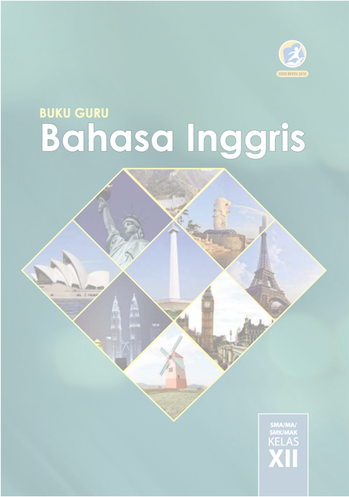

> **Deskripsi Visual:** Gambar dari buku pelajaran ini adalah sebuah ilustrasi yang menampilkan berbagai objek ikonik dunia. Gambar tersebut terdiri dari beberapa bagian yang saling terhubung membentuk sebuah bentuk segi empat yang memanjang. Di bagian-bagian tersebut, terdapat beberapa objek yang sangat terkenal:

1. **Apa yang Ditampilkan Secara Keseluruhan**: Gambar ini menampilkan berbagai objek ikonik dunia, termasuk Patung Liberty di Amerika Serikat, Menara Eiffel di Prancis, Menara Sydney di Australia, Menara Petronas di Malaysia, Menara London di Inggris, dan sebuah mesin giling di Belanda.

2. **Elemen-Elemen Utama dan Relasinya**: Setiap objek dalam gambar memiliki posisi yang berbeda, tetapi semua bersatu dalam satu bentuk segi empat yang memanjang. Objek-objek ini tidak hanya berada di dalam gambar, tetapi juga saling terhubung melalui garis-garis yang menghubungkan mereka.

3. **Teks, Angka, atau Label Penting yang Terlihat**: Teks "Buku Guru Bahasa Inggris" dan "SMA/MA/SMK/MAK KELAS XII" terletak di bagian atas gambar. Angka "XII" tampak di bagian bawah kanan gambar.

4. **Informasi Kunci yang Dapat Diambil Pembaca**: Gambar ini menunjukkan bahwa buku ini mungkin merupakan buku pelajaran untuk kelas XII di SMA/MA/SMK/MAK, dan fokus pada bahasa Inggris. Objek-objek ikonik ini mungkin digunakan sebagai contoh atau referensi dalam pembelajaran bahasa Inggris.

Dengan demikian, gambar ini menunjukkan bahwa buku ini mungkin merupakan sumber belajar yang mendalam tentang bahasa Inggris, dengan menggunakan objek-objek ikonik dunia sebagai alat pembelajaran.

 

---
## 📄 Halaman 2

### Hak Cipta © 2018 pada Kementerian Pendidikan dan Kebudayaan Dilindungi Undang-Undang

Disklaimer: Buku ini merupakan buku guru yang dipersiapkan Pemerintah dalam rangka implementasi Kurikulum 2013. Buku guru ini disusun dan ditelaah oleh berbagai pihak di bawah koordinasi Kementerian Pendidikan dan Kebudayaan, dan dipergunakan dalam tahap awal penerapan Kurikulum 2013. Buku ini merupakan 'dokumen hidup' yang senantiasa diperbaiki,  diperbaharui,  dan  dimutakhirkan  sesuai  dengan  dinamika  kebutuhan  dan perubahan zaman. Masukan dari berbagai kalangan yang dialamatkan kepada penulis dan laman http://buku.kemdikbud.go.id atau melalui email buku@kemdikbud.go.id diharapkan dapat meningkatkan kualitas buku ini.

### Katalog Dalam Terbitan (KDT)

Indonesia. Kementerian Pendidikan dan Kebudayaan.

Bahasa Inggris : Buku Guru/ Kementerian Pendidikan dan Kebudayaan.-- . Edisi

Revisi Jakarta : Kementerian Pendidikan dan Kebudayaan, 2018.

viii, 168 hlm. : ilus. ; 25 cm.

Untuk SMA/MA/SMK/MAK Kelas XII ISBN 978-602-427-110-7 (jilid lengkap) ISBN 978-602-427-113-8 (jilid 3)

- Judul Buku -- Studi dan Pengajaran
I. Judul

- Kementerian Pendidikan dan Kebudayaan
600

Penulis

:  Utami Widiati, Zuliati Rohmah, dan Furaidah

Penelaah

:  Emi Emilia, Helena Indyah Ratna Agustien, dan Tri Wiratno

Editor

: Rasti Setya Anggraini

Pe- review

: Rresi Yandhi Timosia

Penyelia Penerbitan : Pusat Kurikulum dan Perbukuan, Balitbang, Kemendikbud

Cetakan ke-1, 2013 (ISBN 978-602-282-754-2) Cetakan ke-2, 2018 (Edisi Revisi) Disusun dengan huruf Helvetica, 11 pt.

 

---
## 📄 Halaman 4

intonasi  yang  tepat,  dan  bermuara  pada  pembentukan  sikap  kesantunan berbahasa dan sikap menghargai keindahan bahasa.

Buku ini menjabarkan usaha minimal yang harus dilakukan siswa untuk mencapai kompetensi  yang  diharapkan.  Sesuai  dengan  pendekatan  yang digunakan dalam Kurikulum 2013, siswa diajak untuk berani mencari sumber belajar lain yang tersedia dan terbentang luas di sekitarnya. Peran guru dalam meningkatkan  dan  menyesuaikan  daya  serap  siswa  dengan  ketersediaan kegiatan  pada  buku  ini  sangat  penting.  Guru  dapat  memperkayanya dengan kreasi dalam bentuk kegiatan-kegiatan lain yang sesuai dan relevan bersumber dari lingkungan sosial dan alam.

Sebagai edisi pertama, buku ini sangat terbuka terhadap masukan dan akan terus diperbaiki dan disempurnakan. Oleh karena itu, kami mengundang para pembaca untuk memberikan kritik, saran, dan masukan guna perbaikan dan penyempurnaan edisi berikutnya. Atas kontribusi tersebut, kami ucapkan terima  kasih.  Mudah-mudahan  kita  dapat  memberikan  yang  terbaik  bagi kemajuan dunia pendidikan dalam rangka mempersiapkan generasi seratus tahun Indonesia Merdeka (2046).

Tim Penulis

 

---
## 📄 Halaman 6

### CHAPTER MAP

---
**📊 Tabel**

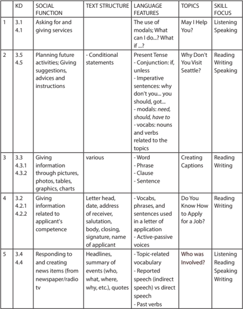

Tabel ini menunjukkan struktur pembelajaran untuk berbagai keterampilan berbicara dan menulis dalam bahasa Inggris, dengan fokus pada topik-topik seperti "May I Help You?", "Why Don't You Visit Seattle?", "Do You Know How To Apply For A Job?", dan "Who Was Involved?". Kolom-kolomnya mencakup Kode Dasar (KD), Fungsi Sosial, Struktur Tulisan, Fitur Bahasa, Topik, dan Fokus Keterampilan. Data penting yang terlihat adalah bahwa setiap topik memiliki struktur tulisan yang berbeda, fitur bahasa yang relevan, dan fokus keterampilan yang berbeda, seperti Listening, Speaking, Reading, Writing, atau kombinasi dari semua. Ini menunjukkan bahwa pembelajaran harus dirancang dengan mempertimbangkan berbagai aspek untuk mencapai pemahaman dan kemampuan yang kuat dalam berbagai situasi sosial dan komunikasi.

 

---
## 📄 Halaman 7

---
**📊 Tabel**

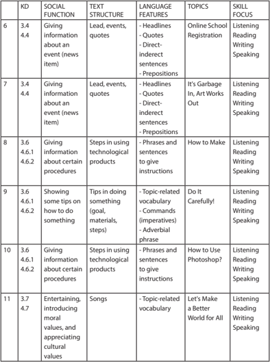

Tabel ini menunjukkan berbagai kategori kegiatan (KD) yang melibatkan berbagai fungsi sosial dan struktur teks, serta fitur bahasa yang relevan. Topik utama yang muncul dalam tabel meliputi registrasi online untuk sekolah, pembuatan karya seni, penggunaan produk teknologi, dan pembelajaran tentang nilai moral dan budaya. Kolom-kolom yang ada mencakup KD, fungsi sosial, struktur teks, fitur bahasa, topik, dan fokus keterampilan. Data penting yang terlihat adalah bahwa banyak topik memiliki kombinasi fungsi sosial dan struktur teks yang sama, seperti "Giving information about an event" yang juga melibatkan "Steps in using technological products". Selain itu, topik-topik seperti "It's Garbage In, Art Works Out" dan "How to Use Photoshop?" menunjukkan bahwa pembelajaran di sini tidak hanya berkisar pada informasi, tetapi juga mencakup praktik dan pengetahuan teknis.

 

---
## 📄 Halaman 8

 

---
## 📄 Halaman 9

### May I Help You?

---
**🖼️ Gambar/Diagram**

> **Deskripsi Visual:** Gambar ini adalah foto yang menunjukkan seorang pria dengan jaket biru yang bertuliskan "May I help you?" di belakangnya. Pria tersebut tampak sedang berbicara dengan dua orang wanita yang tampaknya sedang berjalan melewati lalu lintas. Dalam konteks ini, gambar ini mungkin digunakan untuk menggambarkan konsep layanan pelanggan atau dukungan sosial. Elemen-elemen utama dalam gambar ini meliputi pria dengan jaket biru, dua orang wanita yang sedang berjalan, dan latar belakang yang tampak seperti tempat umum seperti stasiun kereta atau terminal. Teks "May I help you?" menjadi elemen penting karena ia menunjukkan tindakan atau pernyataan yang dilakukan oleh pria tersebut. Informasi kunci yang dapat diambil dari gambar ini adalah bahwa ada interaksi antara pria dengan dua orang wanita, yang mungkin merupakan contoh dari layanan atau dukungan sosial.

### Tujuan Pembelajaran:

Setelah mempelajari Bab 1, siswa diharapkan mampu melakukan hal-hal sebagai berikut:

- Menerapkan fungsi sosial, struktur teks, dan unsur kebahasaan teks interaksi interpersonal lisan dan tulis yang melibatkan tindakan menawarkan jasa, serta menanggapinya, sesuai dengan konteks penggunaannya. (Perhatikan unsur kebahasaan May I help you ? What can I do for you ?, What if ... ?) 3.1
- Menyusun teks interaksi interpersonal lisan dan tulis sederhana yang melibatkan tindakan menawarkan jasa, dan menanggapinya dengan memerhatikan fungsi sosial, struktur teks, dan unsur kebahasaan yang benar dan sesuai dengan konteks. 4. 1

 

---
## 📄 Halaman 10

### A. WARMER

### PROSEDUR

- -Untuk kegiatan pemanasan dalam menyiapkan siswa memasuki topik unit ini, siswa diajak bermain menyusun kata-kata tentang 10 ciri teman yang baik. Kata-kata ini sebenarnya hurufnya beraturan, namun pemenggalan kata ketika disusun ke bawah membuat katakata tersebut seakan-akan susunan hurufnya tidak beraturan.
- -Siswa diminta berdiskusi menemukan kata-kata tersebut. Setelah itu, siswa dimotivasi untuk saling bertanya pada pasangan belajarnya ciri-ciri lain teman yang baik. Setelah menemukan kurang lebih 5, siswa diminta menyusun ke bawah ciri-ciri tersebut dengan pemenggalan yang sembarangan seperti daftar kata-kata pada WARMER.
- -Siswa kemudian saling bertukar pekerjaan dan saling menerka kata-kata apa yang dituliskan oleh temannya.
- -Selanjutnya guru menggarisbawahi sifat-sifat baik dalam pertemanan dan mengaitkannya

### INSTRUKSI/CATATAN

- -Ok, students. We're going to find top 10 qualities of a good friend. You can find them in the columns. Look at the words in the column, the words are written connectedly with one another. The capitalization is not correct, either. Read it carefully, separate one word from the other. Number 1 is done for you as an example, the first quality is 'trustworthy.' What are the other nine qualities? Work in pairs and compete to be the quickest in finding them.
- -Okay, now discuss with your friends 5 qualities of a good friend other than the ones in the list above. Then, write downward and connect one another like the words in the columns.
- -Next, exchange your connected words with other groups' work. Find good qualities of a friend from your friends' list.

 

---
## 📄 Halaman 11

---
**📊 Tabel**

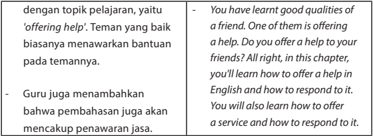

Tabel ini berisi informasi tentang bagaimana memberikan bantuan kepada teman atau rekan sekelas dalam konteks pelajaran bahasa Inggris. Topik utama adalah 'offering help'. Dalam kolom pertama, disebutkan bahwa membantu teman adalah hal baik dan penting. Kolom kedua menunjukkan contoh situasi di mana teman meminta bantuan, seperti mendapatkan pengetahuan baru atau menyelesaikan tugas. Kolom ketiga menjelaskan bahwa guru juga menekankan pentingnya membantu teman, dan memberikan contoh bagaimana memberikan bantuan dalam bahasa Inggris. Kolom keempat menyajikan langkah-langkah untuk memberikan bantuan, termasuk menunjukkan kebaikan seseorang, memberikan bantuan, dan merespons dengan cara yang tepat. Pola penting yang terlihat adalah bahwa membantu teman adalah bagian penting dari pembelajaran dan pengembangan keterampilan sosial dalam bahasa Inggris.

---
**📊 Tabel**

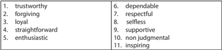

Tabel ini berisi 11 kata kunci yang mungkin digunakan untuk menggambarkan sifat atau karakteristik individu. Topik utamanya adalah tentang sifat-sifat positif dan karakteristik manusia. Kolom pertama berisi kata-kata tersebut, sedangkan kolom kedua menunjukkan definisi atau deskripsi singkat dari setiap kata. Dari data yang terlihat, kita dapat melihat bahwa tabel ini mencakup berbagai aspek seperti kepercayaan, keberanian, kejujuran, dan keberanian. Ini menunjukkan bahwa tabel ini mungkin digunakan dalam konteks pembelajaran atau diskusi tentang karakteristik manusia yang baik.

### B. VOCABULARY BUILDER

---
**📊 Tabel**

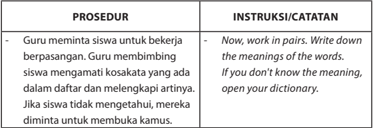

Tabel ini berisi instruksi guru untuk mengajarkan siswa tentang pengertian kata-kata dalam bahasa Melayu. Topik utamanya adalah prosedur pembelajaran, dimulai dengan guru meminta siswa bekerja berpasangan untuk menemukan arti kata-kata dalam daftar kosakata. Jika siswa tidak tahu artinya, mereka diharapkan untuk membuka kamus. Ini merupakan langkah awal dalam pembelajaran bahasa Melayu, dimana siswa belajar melalui praktik dan diskusi bersama teman-temannya.

 

---
## 📄 Halaman 12

### C. PRONUNCIATION PRACTICE

### PROSEDUR

### INSTRUKSI/CATATAN

- -Guru memberikan contoh cara membaca kata-kata yang ada dalam bagian ini dengan pelafalan yang benar. Guru memberikan contoh pelafalan yang benar.
- -Okay, listen to me. I'll show you the correct pronunciation of the words. Repeat after me.

### D. DIALOG: OFFERING HELP/SERVICES

### PROSEDUR

Task 1: Observe the dialogs.

- -Guru memberi contoh empat dialog dalam bahasa Inggris yang di dalamnya terdapat ungkapan offering help or services . Guru membimbing siswa menganalisis fungsi sosial, struktur teks, dan ciri kebahasaan offering  help or services pada keempat dialog tersebut melalui kegiatan menjawab pertanyaan yang ada.
Task 2: Listen and read the dialogs.

- -Siswa menyimak guru membacakan contoh dialog pada Task 1. Siswa menirukan membaca dialog dengan pelafalan yang benar (berpasangan dengan siswa lain).

### INSTRUKSI/CATATAN

- -Well, students. Look at the dialogs. Try to understand them. After that, answer the following questions. You may work with your friends.
- -Okay, students. Now, listen to me. I'll read  Dialog 1. .... Now, practice the dialog with your friends.... Next, I'll read Dialog 2 and after that, you'll read it with your friends again. ...

 

---
## 📄 Halaman 13

---
**📊 Tabel**

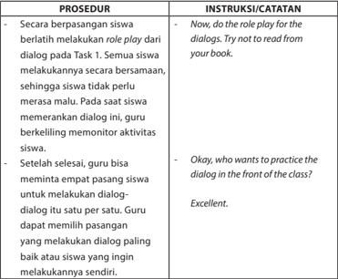

Tabel ini berisi prosedur dan instruksi untuk melakukan role play dialog dalam pembelajaran. Topik utamanya adalah bagaimana siswa melakukan role play dialog secara mandiri dan berkelompok. Kolom "Prosedur" menjelaskan langkah-langkah yang harus dilakukan, seperti berlatih role play secara mandiri, memilih pasangannya, dan meminta guru untuk memantau aktivitas siswa. Kolom "Instruksi/Catatatan" memberikan petunjuk kepada guru tentang cara mengatur proses, misalnya dengan memberi tahu siswa untuk tidak membaca dari buku dan memberikan respons positif seperti "Excellent." Pola penting yang terlihat adalah peran guru sebagai fasilitator dan motivator dalam proses belajar ini.

### Questions

- Where do you think each conversation takes place?
- Dialog 1: in a doctor's room
- Dialog 2: in a bus station (Arjosari, Malang)
- Dialog 3: at school
- Dialog 4: at home
- What are the relationships between the speakers?
- Dialog 1: doctor-patient
- Dialog 2: tourist-ticket seller
- Dialog 3: friends
- Dialog 4: friends

 

---
## 📄 Halaman 14

- What are the functions of the underlined words? Responses of expressions of offering of help/services.
- What are the functions of the italicized words? Expressions of offering help/services.
- In Dialog 1, what does dr. Nahda say to help Fafa? What will dr. Nahda do to help Fafa?
- Dr. Nahda says, 'What can I do for you?', 'What's the problem?' and 'okay, let me check your stomach'. He will check Fafa's stomach.
- Look at Dialog 2. What does Tania offer to the stranger? Does the stranger accept Tania's offer? What does he say?
- She offers a bus ticket indirectly.
- The stranger accepts Tania's offer by saying, 'Yes. I need to go to Jakarta," …… "Thank you. I will buy the bus ticket, then."
- Who is offering a help in Dialog 3? What does she say? Is the offer accepted?
- In Dialog 3, Dhea is offering a help. She says, "Would you need my help?" The offer is not accepted (No, thanks. I'll do it as soon as possible).
- In Dialog 4, what does Diana say to offer a help? Does Hamada accept or refuse the help?  What does she say? Diana says, "What if I help you with the preparation?" Hamada refuses the
- offer politely by saying, "Oh, it's a very nice of you. But I'm going to do it with my sister. Thanks for the offer."
- Write the patterns of offering help/services. May I help you…?, Would you like ...?, What if I ...?)
- Write possible responses for offering help/services.
- -Acceptance: Yes, I need …, Yes, I'd love to …, Thanks a lot.
- Refusing/confronting: No, thank you …, Yes, but ..., Thanks a lot, but
- -...

 

---
## 📄 Halaman 15

### E. VOCABULARY EXERCISE

---
**📊 Tabel**

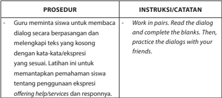

Tabel ini berisi instruksi untuk guru mengajarkan siswa berkomunikasi dengan baik melalui dialog. Topik utamanya adalah pembelajaran dialog dan penggunaan kata-kata ekspresi dalam konteks interaksi sosial. Kolom pertama, "PROSEDUR", menyediakan langkah-langkah praktis yang harus dilakukan oleh guru dan siswa. Guru meminta siswa membaca dialog secara berpasangan dan menyelesaikan kosongnya dengan kata-kata yang sesuai. Siswa kemudian diberi kesempatan untuk berlatih dialog tersebut dengan teman-temannya. Kolom kedua, "INSTRUKSI/CATATAN", memberikan petunjuk tambahan tentang bagaimana prosedur tersebut harus dilakukan. Ini mencakup instruksi untuk bekerja dalam pasang-pasangan, membaca dialog, menyelesaikan kosong, dan berlatih dialog dengan teman-teman. Selain itu, instruksi ini juga menekankan pentingnya pemahaman siswa tentang penggunaan ekspresi seperti "offering help/services" dan responsnya dalam konteks interaksi sosial.

### Dialog 1

Roni

: You know what! Our favourite singer Maher Zain is  touring here again next month.

Roy

: Wow! That sounds fantastic.

Roni

: We will get a discounted price for the concert tickets in the news agency if we can show our student ID card. Would you like me to get your ticket?

Roy

: No, thank you. I am fine. We can do it together.

### Dialog 2

Zahra

: Have you heard the latest news about our school?

Raisa

: No. What about it?

Zahra

: It got Grade A from the National Accreditation Body.

Raisa

: Wow! That's terrific. We should be very proud.

Zahra

: We are. It means that our school is of good quality.

Raisa

: We should celebrate it, don't you think?

Zahra

: Yes, you're right. What if I invite all students to celebrate

it?

Raisa

: That would be good. Thanks for having the ideas.

 

---
## 📄 Halaman 16

### Dialog 3

Diani

: What do we have to prepare for the next trip?

Riana

: We are supposed to bring winter clothes. Three pieces at least. We also have to take our personal medication.

Diani

: Oh, I don't have any winter clothes and I don't have enough time to find ones.

Riana

: My sister has two jackets good enough for going out in the snow. What if I ask her to lend you hers?

Diani

: That would be very helpful. Thank you very much.

Riana

: No worries, mate.

Diani

: Are we supposed to bring some food as well?

Riana

: No. It's provided by the school.

### F. GRAMMAR REVIEW

Guru meminta siswa untuk memerhatikan ekspresi dalam menawarkan bantuan dan jasa pada dialog di bagian D. Guru juga perlu meminta siswa untuk memerhatikan kembali pertanyaan dalam kotak pertanyaan, khususnya nomor 9 dan 10, sebagai berikut.

- Write the patterns of offering help/services: May I help you…?, Would you like …?, What if I …?)
- Write possible responses for offering help/services:
- -Acceptance: Yes, I need …, Yes, I'd love to …, Thanks a lot.
- -Refusing/confronting: No, thank you …, Yes, but …, Thanks a lot, but …
Guru meminta siswa untuk melengkapi tabel dengan pola ekspresi untuk menawarkan jasa, memberi contoh-contoh lain dan menyebutkan responnya. Contoh jawaban seperti dalam tabel berikut, guru dapat mengembangkan sendiri.

 

---
## 📄 Halaman 17

---
**📊 Tabel**

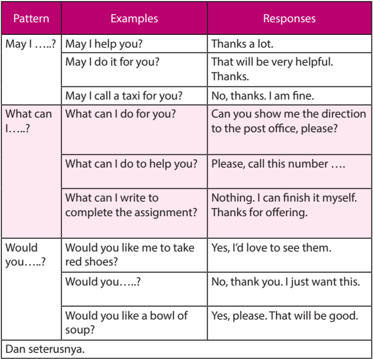

Tabel ini berisi contoh dan respons untuk beberapa pola percakapan umum dalam bahasa Inggris. Topik utamanya adalah cara mengekspresikan permintaan, pertanyaan, dan permintaan dalam bahasa Inggris. Kolom "Examples" menunjukkan contoh kalimat dalam setiap pola, sementara kolom "Responses" menampilkan contoh respons yang sesuai dengan kalimat tersebut. Pola-pola utama yang terlihat antara lain "May I...?", "What can I...?", dan "Would you...?". Setiap pola memiliki contoh yang menunjukkan bagaimana penggunaan pola tersebut dalam percakapan sehari-hari.

 

---
## 📄 Halaman 18

### G. SPEAKING

### PROSEDUR

- -Guru meminta siswa untuk mengerjakan Task 1 dengan cara mengelompokkan siswa dalam kelompok. Masing-masing kelompok terdiri atas 4 orang.
- -Siswa membuat dialog sesuai dengan situasi yang disebutkan. Guru minta siswa untuk mengerjakan Task 2. Masing-masing kelompok memilih satu dialog untuk dipertunjukkan kepada teman sekelas.
- -Guru mengatur sedemikian rupa sehingga semua dialog diperankan oleh siswa.
Guru membimbing siswa untuk melakukan refleksi dan memberikan bantuan kepada siswa yang belum menguasai materi. Bantuan dapat diberikan di luar waktu pembelajaran.

### INSTRUKSI/CATATAN

- -Now work in groups of four. Write a dialog for each situation provided. You can use the previous dialogs as the examples.
- -Well, let's move on to Task 2. It's time for you to do a role play. Choose one of the dialogs and perform a play based on the dialog.

 

---
## 📄 Halaman 19

### Why Don't You Visit Seattle?

---
**🖼️ Gambar/Diagram**

> **Deskripsi Visual:** Gambar ini adalah foto yang menunjukkan pemandangan kota Seattle dari seberang teluk. Di tengah-tengah foto, terlihat Menara Space Needle, sebuah ikon kota Seattle yang mencolok dengan struktur berbentuk kerucut. Di sebelah kiri, terlihat kapal layar berlayar di atas teluk, menunjukkan aktivitas nelayan dan wisatawan yang sering berkunjung ke kota ini. Di sebelah kanan, terlihat bangunan-bangunan tinggi yang menjadi pusat bisnis dan perkantoran di Seattle. Langit cerah dengan awan putih menambah keindahan pemandangan. Gambar ini menunjukkan hubungan antara infrastruktur kota, aktivitas nelayan, dan keindahan alam yang mempengaruhi kehidupan sehari-hari warga Seattle.

Source: www.artwallpaperhi.com

### Tujuan Pembelajaran:

Setelah mempelajari Bab 2, siswa diharapkan mampu melakukan hal-hal sebagai berikut:

- Menerapkan fungsi sosial, struktur teks, dan unsur kebahasaan teks interaksi transaksional lisan dan tulis yang melibatkan tindakan memberi dan meminta informasi terkait pengandaian diikuti oleh perintah/saran, sesuai dengan konteks penggunaannya. (Perhatikan unsur kebahasaan if dengan imperative, can, should ). 3.5
- Menyusun teks interaksi transaksional lisan dan tulis yang melibatkan tindakan memberi dan meminta informasi terkait pengandaian diikuti oleh perintah/saran, dengan memperhatikan fungsi sosial, struktur teks, dan unsur kebahasaan yang benar dan sesuai konteks. 4.5

 

---
## 📄 Halaman 20

### A. WARMER: PAIRWORK

---
**📊 Tabel**

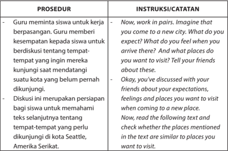

Tabel ini berisi prosedur dan instruksi untuk sebuah aktivitas pembelajaran yang bertujuan untuk membantu siswa memahami konsep tentang tempat-tempat yang belum dikunjungi di Seattle, Amerika Serikat. Topik utama tabel adalah pembelajaran tentang pengalaman pertama seseorang ketika berpindah ke kota baru. Dalam prosedur tersebut, guru meminta siswa untuk bekerja berpasang-pasang dan memberikan kesempatan kepada siswa untuk berdiskusi tentang tempat-tempat yang ingin mereka kunjungi saat mendatangi suatu kota yang belum pernah dikunjungi. Diskusi ini merupakan persiapan bagi siswa untuk memahami teks selanjutnya tentang tempat-tempat yang perlu dikunjungi di Seattle. Siswa diberikan instruksi untuk membaca teks tersebut dan mengecek apakah tempat-tempat yang disebutkan dalam teks sama dengan tempat-tempat yang mereka inginkan untuk dikunjungi.

### B. VOCABULARY BUILDER

foolproof (adj)

: infallible

stroll (v)

: walk leasurely

produce (n)

: crop, foodstuffs

amid (prep)

: among, along with, in the middle of

hubbub (n)

: noise

cozy (adj)

: comfortable, homely

wildlife (n)

: nature, birds

leisure (n)

: free time, spare time

sophisticated (adj)

: refined, highly developed

aviation (n)

: flight

assemble (v)

: bring together, build

treat (n)

: luxury, pleasure

 

---
## 📄 Halaman 21

### C. PRONUNCIATION PRACTICE

---
**📊 Tabel**

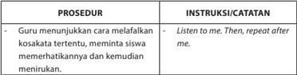

Tabel ini berisi prosedur dan instruksi untuk guru menunjukkan kepada siswa bagaimana melaafalkan kosakata tertentu. Topik utama tabel adalah metode pengajaran yang efektif untuk memperkenalkan kosakata baru. Kolom pertama berisi prosedur yang melibatkan guru menunjukkan kata-kata, memberi contoh, dan meminta siswa untuk melaafalkannya. Kolom kedua berisi instruksi atau catatan yang diberikan kepada guru, seperti "Listen to me. Then, repeat after me." Ini menunjukkan bahwa proses belajar harus melibatkan aktivitas aktif dari siswa, dimulai dengan mendengarkan guru dan kemudian melaafalkannya sendiri. Pola penting yang terlihat adalah bahwa prosedur ini mencakup dua langkah utama: mendengarkan dan melaafalkan, yang bertujuan untuk memperkenalkan kosakata secara sistematis dan memastikan pemahaman siswa.

### D. READING COMPREHENSION

---
**📊 Tabel**

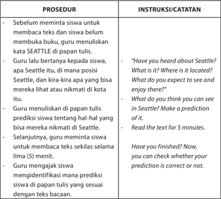

Tabel ini berisi prosedur dan instruksi untuk mengajarkan siswa memahami teks tentang Seattle. Topik utama adalah bagaimana guru membantu siswa membuat prediksi tentang kota Seattle berdasarkan teks yang diberikan. Kolom pertama berisi prosedur yang harus dilakukan oleh guru, seperti menuliskan kata "Seattle" di papan tulis, memberi pertanyaan kepada siswa tentang Seattle, dan meminta mereka menerapkan prediksi mereka. Kolom kedua berisi instruksi atau catatan yang diberikan kepada guru, seperti memberi waktu 5 menit untuk membaca teks, memeriksa apakah prediksi siswa benar, dan meminta siswa untuk mengidentifikasi prediksi mereka dengan teks yang diberikan. Pola penting yang terlihat adalah proses pengajaran yang sistematis dan interaktif, dimana guru berperan sebagai pembimbing dan penanda, sementara siswa berperan sebagai pembaca dan pemaham.

 

---
## 📄 Halaman 22

---
**📊 Tabel**

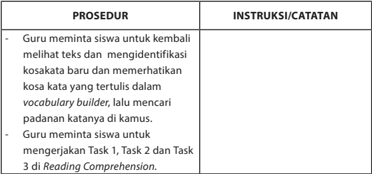

Tabel ini berisi prosedur dan instruksi untuk membantu siswa belajar bahasa Inggris. Topik utamanya adalah pembelajaran kata baru dan pemahaman teks. Kolom pertama berisi prosedur, sedangkan kolom kedua berisi instruksi atau catatan. Dari prosedur tersebut, guru meminta siswa untuk kembali melihat teks, mengidentifikasi kosakata baru, dan memerhatikan kosakata yang tertulis dalam vocabulary builder. Selanjutnya, guru meminta siswa untuk mengerjakan Task 1, Task 2, dan Task 3 di Reading Comprehension. Pola penting yang terlihat adalah bahwa prosedur ini mencakup dua tahap utama: identifikasi kosakata baru dan pemahaman teks.

### E. GRAMMAR REVIEW

### PROSEDUR

### Task 1: Identifying the 'if' sentences

- -Guru mengajak siswa mengidenti fikasi pola kalimat yang ada di teks bacaan.
- If you visit Seattle, the first thing to do is feeling the fresh air on your face as you sail to Bainbrige Island on a Washington State Ferry.

### Pattern 1: If clause + imperative

- If you want to enjoy Bainbrige Island, stroll around downtown's galleries, boutiques, coffee houses and cafes.

### Pattern 2: If clause + imperative

- If you visit Seattle, why don't you tour Pike Place Market's produce stands and buy something you've never tasted.

### Pattern 3: If clause + suggestion

- Unless you have allergic to noises, make sure you take time to spot these beloved icons.

### Pattern 4: If clause + imperative

 

---
## 📄 Halaman 23

- If you have enough time, tour the numerous art galleries in Friday Harbor.

### Pattern 5: If clause + imperative

- If you visit Seattle, see exciting and experimental works at Chihuly Garden and Glass.

### Pattern 6: If clause + imperative

If you visit this city, you should explore the Space Needle and Pacific Science Center.

### Pattern 7: if clause + suggestion

- If you visit Seattle, watch the world's most sophisticated aircraft be built before your eyes at the Boeing factory in Mukilteo.

### Pattern 8: if clause + imperative

- If you are curious to know about it, you should explore the dynamics of flight and experience new aviation innovation.

### Pattern 9: if clause + suggestion

### Task 2 : Practice the dialog.

- -Guru meminta siswa untuk mempraktikkan percakapan dengan teman sebangku.
- -Guru meminta siswa untuk mendiskusikan pola penggunaan kalimat 'if' yang ada dalam percakapan dan mengisikan jawabannya pada tempat yang tersedia.
- Pattern 1: 'if clause' + a reminder
- Pattern 2: 'if clause' + a suggestion
- Pattern 3: 'if clause' + a general truth
- Pattern 4: 'if clause' + an imperative
- Pattern 5: 'if clause' to show a dream
Task 3

### : Fill in the blanks.

- -Guru meminta siswa untuk mengidentifikasi contoh kalimat 'if' yang ada dalam percakapan dan menuliskannya pada tempat yang tersedia.

 

---
## 📄 Halaman 24

- An example of 'if clause' + a reminder is: 'If you want to pass the exam, you have to study harder.'
- An example of 'if clause' + a suggestion is:"If you want to be a medical doctor, you have to prepare it from now on," "If you want to go to the USA, you should save money."
- An example of 'if clause' + a general truth is: 'Unless you put some cherry on it, your cake will look pale and dull.'
- An example of 'if clause' + an imperative is: 'If you want to be the head of OSIS, offer a good program to improve the school environment.'
- An example of 'if clause' to show a dream is: 'If I am elected as a president, I will waive taxes for poor people.'

### F. WRITING

### PROSEDUR

- -Guru meminta siswa untuk melihat bacaan yang mereka bawa dari rumah (pada pertemuan sebelumnya guru memberi PR siswa untuk membawa bacaan yang mengandung 'if clause'), lalu mengidentifikasi 'if clauses'.
- -Guru meminta siswa untuk menuliskan hasil identifikasinya di tempat yang tersedia. Setelah itu, guru meminta siswa untuk menunjukkan hasil identifikasinya kepada teman dan meminta pendapat mereka.

### INSTRUKSI/CATATAN

- -Well, students. Do you bring a text from home? Now, identify the 'IF' clause.
- -Write down your identification in the place provided.
Now, show your work to your chair-mate and discuss with her/him.

 

---
## 📄 Halaman 25

### G. SPEAKING PRACTICE

---
**📊 Tabel**

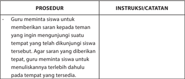

Tabel ini berisi prosedur dan instruksi untuk guru meminta siswa memberikan saran kepada teman tentang tempat yang telah dikunjungi siswa tersebut. Topik utama tabel adalah proses pengumpulan saran dari siswa. Kolom pertama berisi prosedur, sedangkan kolom kedua berisi instruksi atau catatan. Data penting yang terlihat adalah bahwa guru harus meminta siswa untuk memberikan saran tepat dan menulisnya terlebih dahulu pada tempat yang tersedia. Ini menunjukkan bahwa prosedur ini bertujuan untuk memastikan bahwa saran yang diberikan oleh siswa sesuai dengan tempat yang dikunjungi mereka.

### H. REFLECTION

 

---
## 📄 Halaman 26

### Chapter 3

### Creating Captions

Source: www.previews.123rf.com

---
**🖼️ Gambar/Diagram**

> **Deskripsi Visual:** Gambar ini adalah ilustrasi yang menunjukkan ikan yang berada dalam tangkai ikan. Ikan tersebut tampak sedang berbicara melalui sebuah balon yang terletak di atas tangkai. Tangkai ikan terisi dengan air dan memiliki lubang di bagian bawah untuk memungkinkan ikan bergerak. Balon berisi teks yang tidak dapat dilihat oleh pembaca, mungkin menyampaikan pesan atau informasi tertentu tentang ikan tersebut.

Elemen utama dalam gambar ini adalah ikan, tangkai ikan, dan balon berisi teks. Ikan merupakan subjek utama yang terletak di tengah-tengah gambar, sedangkan tangkai ikan dan balon berisi teks membantu menjelaskan konteks dan informasi tambahan tentang ikan tersebut. Balon berisi teks yang tidak dapat dilihat oleh pembaca memberikan informasi tambahan yang mungkin relevan dengan konten buku pelajaran tersebut.

Teks, angka, atau label penting yang terlihat dalam gambar ini adalah balon berisi teks yang tidak dapat dilihat oleh pembaca. Informasi kunci yang dapat diambil pembaca dari gambar ini adalah bahwa ikan tersebut sedang berbicara melalui balon berisi teks, yang mungkin menyampaikan pesan atau informasi tertentu tentang ikan tersebut.

### Tujuan Pembelajaran:

Setelah mempelajari Bab 3, siswa diharapkan mampu melakukan hal-hal sebagai berikut:

- Membedakan fungsi sosial, struktur teks, dan unsur kebahasaan beberapa teks khusus dalam bentuk teks caption , dengan memberi dan meminta informasi terkait gambar/foto/tabel/grafik/bagan, sesuai dengan konteks penggunaannya. 3.3
- Menangkap makna secara kontekstual terkait fungsi sosial, struktur teks, dan unsur kebahasaan teks khusus dalam bentuk caption terkait gambar/foto/tabel/grafik/bagan. 4.3. 1
- Menyusun teks khusus dalam bentuk teks caption terkait gambar/foto/tabel/grafik/bagan, dengan memerhatikan fungsi sosial, struktur teks, dan unsur kebahasaan, secara benar dan sesuai konteks. 4.3.2

 

---
## 📄 Halaman 27

### A. WARMER: VIDEO WATCHING

### PROSEDUR

- -Guru meminta siswa berpasangan.
- -Guru menjelaskan apa yang akan dilakukan oleh guru dan siswa.
- -Selanjutnya, guru memutar sebuah potongan film selama 10 menit tanpa suara dan meminta siswa untuk memperkirakan percakapan antar para tokoh dalam film. Guru menghentikan film pada tempat-tempat tertentu untuk memberi kesempatan siswa dalam menuliskan percakapan tersebut.
- -Setelah selesai, guru meminta siswa untuk membacakan percakapannya kepada pasangan lain dan teman sekelas. Guru memutar sekali lagi potongan film tersebut dan meminta siswa untuk mengecek apakah percakapan yang mereka tulis sesuai dengan percakapan asli di film.

### B. READING CAPTIONS

### INSTRUKSI/CATATAN

- -Kalau guru kesulitan untuk melaksanakan aktivitas ini, guru bisa mengganti dengan menunjukkan contohcontoh gambar dalam caption (bisa dari potongan koran/majalah) dan meminta siswa untuk menebak tulisan di dalamnya.
- -Now, show your captions to your friends and discuss with them.
Let's check whether your captions are similar to those in the film.

 

---
## 📄 Halaman 28

- -Guru lalu menyajikannya dengan topik yang dibahas yaitu caption dan menjelaskan tujuan pembelajarannya

### Task 1:

- -Semua siswa diminta untuk mengamati caption dan berdiskusi dengan teman untuk menentukan mana caption dan mana yang bukan. Kunci jawaban: semua gambar adalah caption . Guru lalu menjelaskan apa itu caption sambil memberi lebih banyak contoh caption seperti di buku.

### Task 2:

- -Guru meminta siswa untuk mengamati caption dan menjawab pertanyaan yang menyertai.

### Task 3:

- -Siswa berdiskusi dalam kelompok untuk membuat simpulan tentang caption dengan menjawab pertanyaan yang tersedia.

### Task 4:

- -Guru meminta siswa untuk mengamati caption sekali lagi untuk memahami pesan dalam caption .
- -Guru meminta siswa untuk menuliskan jawabannya di tempat yang telah tersedia.

### Task 5:

- -Guru meminta siswa untuk melengkapi teks percakapan dengan memerhatikan caption yang ada di buku.
- -Guru meminta siswa untuk mempraktikkan percakapan.
- -The captions that you saw in the movie are examples of caption. There are many other captions that you'll learn in this chapter.
So, in this chapter, you'll learn different kinds of captions, social functions, and structure of captions

- -Now, look at these pictures. Which ones are captions?
All of these are captions. Captions are ....

- -Now, look at the captions and answer the questions next to each caption.
- -Look at captions 1-9. Try to understand the messages in each caption. Then, write down in the column.

 

---
## 📄 Halaman 29

### Dialog 1:

- -A:  Which caption(s) do you like?
- -B:  I like caption number four.
- -A: Why do you think so?
- -B:   It plays words so interestingly. It's clever. What about you, which one(s) do you like?
- -A:  I think number 1 is not a good caption.
- -B:   Can you tell me why you like it?
- -A:  The words are not put properly. I mean I like the picture of the f l owers, but the caption writer cannot make it become an interesting caption.

### Dialog 2:

- -A:  Which caption do you like the best?
- -B:   I like caption number 4. The font is so interesting and the combination of black and white colours provides a clear contrast. What about you, which one do you like the best?
- -A:  I like caption number 5. The yellow colour with the greeny nature background gives an interesting image.
- -B:   I like it, too. The words also give a clear message about the article to come afterwards.

### Task 6:

- -Guru meminta siswa untuk berkelompok. Setiap kelompok memiliki dua caption yang ada di Task 1 , lalu mendiskusikan tiga hal: apakah caption tersebut bagus, pesan apa yang ada di dalamnya, dan tata bahasa apa yang digunakan.
- -Please work in groups. Then, choose two captions from Task 1.
Discuss in your grup, whether they are good, what the messages are, and what grammar is used.

 

---
## 📄 Halaman 30

### C. WRITING AND DESCRIBING CAPTIONS

### PROSEDUR

- -Guru menjelaskan tips membuat caption yang baik.
- -Kemudian guru meminta siswa untuk berkelompok. Guru meminta agar masing-masing siswa mengeluarkan caption mereka lainnya yang telah difotokopi sebanyak 4 (empat) kali.
- -Guru menjelaskan hal yang akan dilakukan oleh siswa untuk menulis kata-kata dalam caption .
- -Masing-masing siswa secara bergantian membagikan captionnya kepada siswa lain dan meminta mereka untuk menuliskan kata-kata yang cocok untuk caption -nya.
- -Setelah selesai, guru membahas tentang caption yang telah dibuat siswa dan mendiskusikan dengan siswa yang kesulitan dalam membuat caption .

### INSTRUKSI/CATATAN

- -Please take a look at the picture closely. What do you think the suitable words to complate the picture are? ... Let's read and understand the explanation about captions. Feell free to ask if you have difficulties.
- -Okay, students. Last week I asked you to bring a picture and make 4 copies of it. Now, work in groups of four. Distribute your picture to your friends and ask your friends to write captions on the picture.
Now, start with a picture of the first student. Distribute it to other students and write a caption on it.

....

Good. Now, each student reads your caption to your friends in group and discuss it.

- ... Now, picture from the second student. Do it like before ....
- -Well, you've tried to make captions. Do you think it's easy or difficult. What difficulties did you find when writing a caption?

 

---
## 📄 Halaman 31

### D. REFLECTION

### PROSEDUR

Guru meminta siswa untuk melakukan refleksi. Guru memberi tanya-jawab singkat untuk mengukur pemahaman siswa terhadap materi yang diajarkan.

- Do you know why people write captions?
- Where do you usually find captions?
- What can make people understand the message in a caption?
- Do you know how to write a text accompanying captions?
- What can you learn from this chapter?
- Do you have any difficulties in understanding and writing captions?

 

---
## 📄 Halaman 32

### Chapter 4

### Do You Know How to Apply for a Job?

### Kompetensi Dasar:

Setelah mempelajari Bab 4, siswa diharapkan mampu melakukan hal-hal sebagai berikut:

- Membedakan fungsi sosial, struktur teks, dan unsur kebahasaan beberapa teks khusus dalam bentuk surat lamaran kerja, dengan memberi dan meminta informasi terkait jati diri dan latar belakang pendidikan/pengalaman kerja, sesuai dengan konteks penggunaannya. 3.2
- Menangkap makna secara kontekstual terkait fungsi sosial, struktur teks, dan unsur kebahasaan teks khusus dalam bentuk surat lamaran kerja, yang memberikan informasi antara lain terkait jati diri dan latar belakang pendidikan/ pengalaman kerja. 4.2.1
- Menyusun teks khusus surat lamaran kerja, yang memberikan informasi antara lain terkait jati diri dan latar belakang pendidikan/pengalaman kerja, dengan memperhatikan fungsi sosial, struktur teks, dan unsur kebahasaan, secara benar dan sesuai konteks. 4.2.2

 

---
## 📄 Halaman 33

### A. WARMER: BOARDGAME (MINDMAP)

---
**📊 Tabel**

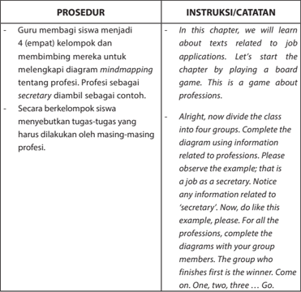

Tabel ini berisi prosedur dan instruksi untuk mengajarkan siswa tentang diagram mindmapping berdasarkan profesi. Topik utama adalah bagaimana siswa belajar tentang teks yang berkaitan dengan aplikasi pekerjaan melalui permainan board game. Proses melibatkan pembagian siswa menjadi empat kelompok, memilih seorang guru sebagai sekretaris sebagai contoh, dan menyelesaikan diagram mindmapping menggunakan informasi tentang profesi. Siswa harus menyelesaikan tugas-tugas yang ditentukan oleh masing-masing profesi. Instruksi mencakup membagi kelas menjadi empat kelompok, menyelesaikan diagram menggunakan informasi tentang profesi, dan menyelesaikan diagram pertama yang paling cepat menjadi pemenang.

### B. VOCABULARY BUILDING

 

---
## 📄 Halaman 34

---
**📊 Tabel**

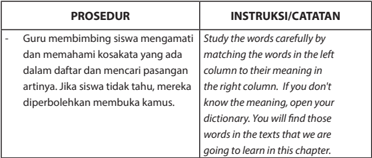

Tabel ini berisi prosedur dan instruksi untuk mempelajari kosakata dalam sebuah bab atau chapter. Topik utamanya adalah metode pembelajaran kosakata melalui pengamatan dan pemahaman kata-kata dalam daftar kosakata. Kolom pertama berisi prosedur yang harus dilakukan oleh guru, yaitu membimbing siswa untuk mempelajari kosakata dengan cara membandingkan kata-kata di kolom kiri dengan artinya di kolom kanan. Jika siswa tidak tahu arti kata, mereka diperbolehkan membuka kamus. Kolom kedua berisi instruksi atau catatan yang memberikan petunjuk kepada guru dan siswa tentang bagaimana melakukan prosedur tersebut. Misalnya, jika siswa tidak tahu arti kata, mereka dapat membuka kamus untuk menemukan artinya. Ini adalah prosedur yang efektif untuk memperkenalkan dan mempelajari kosakata baru dalam bahasa yang baru atau bahasa asing.

### C. PRONUNCIATION PRACTICE

---
**📊 Tabel**

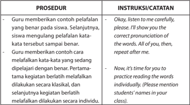

Tabel ini berisi prosedur dan instruksi untuk membantu siswa belajar memahami dan menerapkan pengucapan kata yang benar. Topik utama tabel adalah metode pembelajaran yang menggunakan contoh dan latihan individu. Kolom pertama berisi prosedur yang melibatkan guru memberikan contoh pengucapan kata yang benar kepada siswa, sambil menunjukkan bagaimana cara mempelajari pengucapan kata dengan baik. Kolom kedua berisi instruksi atau catatan yang diberikan oleh guru kepada siswa, seperti "Okay, listen to me carefully, please. I'll show you the correct pronunciation of the words. All of you, then, repeat after me." dan "Now, it's time for you to practice reading the words individually. (Please mention students' names in your class)." Data penting yang terlihat adalah bahwa prosedur ini mencakup dua tahap: pertama, guru memberikan contoh pengucapan kata yang benar; dan kedua, siswa dilatih untuk menerapkan pengucapan tersebut secara klasikal dan individu.

 

---
## 📄 Halaman 35

### D. READING COMPREHENSION

### PROSEDUR

### Comprehension Questions

- -Sebelum meminta siswa membaca teks surat lamaran kerja, guru memastikan bahwa siswa memahami pertanyaan yang ada pada bagian task 1.
- -Kemudian guru membimbing siswa untuk membaca dan memahami isi contoh surat lamaran kerja secara saksama melalui latihan yang ada. Guru meminta siswa untuk menjelaskan jawaban mereka.
- -Selanjutnya, guru membimbing siswa menganalisis fungsi sosial, struktur teks, dan ciri kebahasaan surat lamaran kerja melalui latihan yang disediakan
- -Melalui kegiatan tanya jawab, siswa memberikan komentar dan pandangannya tentang fungsi surat lamaran kerja, ketepatan unsur kebahasaannya, format, tampilan, dan sebagainya.

### Questioning Activities

- -Guru membimbing siswa untuk bertanya dengan menuliskan segala sesuatu yang menjadi permasalahan dalam bentuk pertanyaan.

### INSTRUKSI/CATATAN

- -Before you read the text, please refer to the instructions in task 1. Read the questions carefully. Do you understand all the four questions? Then, try answer them to.
- -OK, now read the text carefully and silently. Notice the numbers in the brackets. Do you see that there are number one up to number seven?
- -Finished reading? Let us refer to the comprehension questions. Then, answer the questions. Explain why you think so.
- -Do you still have questions? Write down your questions and take turns asking and answering questions with your partner. Compare your answers to your partner's.

 

---
## 📄 Halaman 36

---
**📊 Tabel**

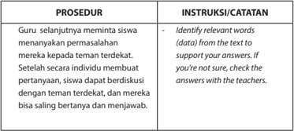

Tabel ini berisi prosedur dan instruksi untuk sebuah aktivitas belajar yang melibatkan guru dan siswa. Topik utamanya adalah proses diskusi dan pertanyaan antar teman sekelas. Dalam prosedur, guru meminta siswa menanyakan permasalahannya kepada teman terdekat mereka. Setelah setiap individu membuat pertanyaan, siswa dapat berdiskusi dengan teman terdekatnya, dan mereka bisa saling bertanya dan menjawab. Untuk mendukung jawaban, siswa harus mengidentifikasi kata-kata relevan (data) dari teks yang diberikan. Jika tidak yakin, mereka harus bertanya dengan guru. Ini menunjukkan bahwa proses ini bertujuan untuk meningkatkan kemampuan berpikir kritis dan komunikasi antar teman sekelas.

### E. VOCABULARY EXERCISES

---
**📊 Tabel**

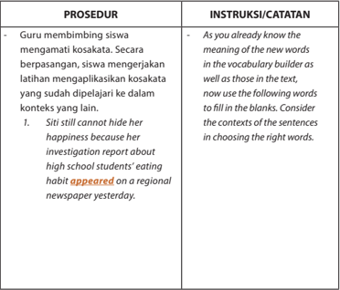

Tabel ini berisi prosedur dan instruksi untuk latihan kosakata dalam bahasa Inggris. Topik utamanya adalah penggunaan kosakata dalam konteks yang relevan. Kolom pertama berisi prosedur yang melibatkan guru membimbing siswa menggunakan kosakata dalam konteks yang relevan. Kolom kedua berisi instruksi atau catatan yang diberikan kepada siswa, yang mencakup penjelasan tentang arti kata baru dalam builder kosakata dan teks, serta petunjuk untuk menggunakan kata-kata tersebut dalam kalimat kosong. Data penting yang terlihat adalah bahwa siswa harus memahami konteks kalimat sebelum memilih kata yang tepat untuk mengisi kosong.

 

---
## 📄 Halaman 37

---
**📊 Tabel**

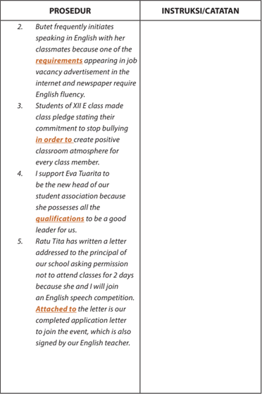

Tabel ini berisi prosedur dan instruksi yang dilakukan oleh seorang siswa di sekolah. Topik utamanya adalah tentang penggunaan bahasa Inggris dan kebijakan sekolah. Kolom pertama berisi prosedur, sedangkan kolom kedua berisi instruksi atau catatan. Data penting yang terlihat antara lain bahwa Butet sering menggunakan bahasa Inggris dengan teman kelas karena salah satu persyaratan dalam iklan lowongan kerja online dan majalah memerlukan kemampuan berbahasa Inggris. Siswa kelas XII E membuat pernyataan kelas menegaskan komitmen untuk berhenti menghina dan menciptakan lingkungan belajar positif bagi setiap anggota kelas. Siswa mendukung Eva Tuorita sebagai kepala sekolah baru karena dia memiliki semua kualifikasi untuk menjadi pemimpin yang baik. Ratu Tita telah menulis surat kepada kepala sekolah minta izin untuk tidak hadir dua hari karena dia akan mengikuti kompetisi orasi Inggris. Surat tersebut juga ditandatangani oleh guru bahasa Inggris.

 

---
## 📄 Halaman 38

---
**📊 Tabel**

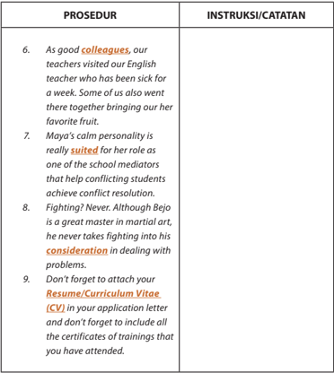

Tabel ini berisi instruksi atau catatan tentang prosedur kerja di sekolah, dengan dua kolom utama: "PROSEDUR" dan "INSTRUKSI/CATATAN". Topik utama tabel adalah tentang cara kerja dan tata cara dalam lingkungan sekolah, termasuk bagaimana guru dan staf bekerja sama, serta petunjuk untuk pelamar yang ingin melamar ke sekolah tersebut.

Dalam kolom "PROSEDUR", terdapat beberapa pernyataan yang menjelaskan situasi dan tindakan yang dilakukan oleh anggota tim sekolah. Misalnya, guru membantu guru lain yang sakit, siswa membawa buah kesukaan mereka, dan seorang siswa yang tenang dan bijaksana diberi tugas sebagai mediator konflik.

Kolom "INSTRUKSI/CATATAN" menyajikan petunjuk atau saran yang relevan dengan situasi di kolom "PROSEDUR". Misalnya, petunjuk untuk pelamar tentang pentingnya menambahkan CV/CV ke surat lamaran dan mencantumkan semua sertifikat pelatihan yang telah diikuti.

Tabel ini menunjukkan bahwa prosedur kerja di sekolah sangat terorganisir dan memerlukan kerjasama antara berbagai pihak, baik guru, siswa, maupun pelamar. Selain itu, tabel juga memberikan petunjuk penting bagi pelamar tentang bagaimana menunjukkan keterampilan dan pengalaman mereka dalam surat lamaran.

 

---
## 📄 Halaman 39

### F. GRAMMAR REVIEW

### PROSEDUR

### Task 1 :

- -Guru membimbing siswa untuk mengamati kata kerja yang dicetak miring dalam bagian Grammar Review (Task 1). Melalui kegiatan Tanya Jawab, siswa diharapkan dapat menangkap pola kalimat pasif yang digunakan, yaitu pola
be dan past participles .

### Task 2 :

- -Selanjutnya siswa mengerjakan Task 2.

### G. TEXT STRUCTURE

### PROSEDUR

- -Guru meminta siswa mencermati contoh surat lamaran sekali lagi. Siswa membaca rujukan dari berbagai sumber, termasuk buku teks, untuk mengetahui fungsi sosial, struktur teks, dan unsur kebahasaan dari surat lamaran kerja.
- -Siswa diharapkan dapat menangkap pengetahuan tentang bagian-bagian surat lamaran lalu menerapkannya untuk mengindentifikasi bagian-bagian dari contoh surat lamaran yang diberikan (Task 2).

### INSTRUKSI/CATATAN

- -Read the sentences carefully please. Pay attention to the words in italics.
- -Did you notice that all the sentences contain BE and PAST PARTICIPLES (V-3)? Those sentences  are  passive  sentences. Study  how  passive  sentences  are constructed. Look at the examples in the table.

### INSTRUKSI/CATATAN

### Parts of the Application Letter

- Your address
- The address of the company you are writing to. Use complete title and address; don't abbreviate.
- Always make an effort to write directly to the person in charge of hiring.

 

---
## 📄 Halaman 40

### PROSEDUR

- -Siswa membaca secara lebih cermat sebuah contoh lagi dari surat lamaran kerja, untuk memberikan komentar dan pandangannya tentang fungsi sosial, struktur teks, dan unsur kebahasaannya. Secara kolaboratif, siswa meniru contoh-contoh yang ada untuk membuat surat lamaran kerja untuk fungsi nyata.

### Task 3:

- -Siswa membandingkan fungsi sosial, struktur teks, dan unsur kebahasaan dari berbagai surat lamaran kerja yang telah dikumpulkan dari berbagai sumber tersebut di atas.
- -Siswa membandingkan fungsi sosial, struktur teks, dan unsur kebahasaan dari berbagai surat lamaran kerja yang telah dipelajari tersebut di atas dengan yang ada di sumbersumber lain, atau dengan yang digunakan dalam bahasa lain.
- -Siswa memperoleh balikan (feedback) dari guru dan teman tentang fungsi sosial dan unsur kebahasaan yang digunakan.

### INSTRUKSI/CATATAN

- Opening paragraph - Use this paragraph to specify which job you are applying for, or, if you are writing to inquire whether a job position is open, question the availability of an opening.
- Middle paragraph(s)/ body - This section should be used to highlight your work experience which most closely matches the desired job requirements presented in the job opening advertisement. Do not simply restate what is contained in your resume, but give strong reasons why you are suited to the position.
- Closing paragraph - Use the closing paragraph to ensure action on the part of the reader. One possibility is to ask for an interview appointment time.

 

---
## 📄 Halaman 41

---
**📊 Tabel**

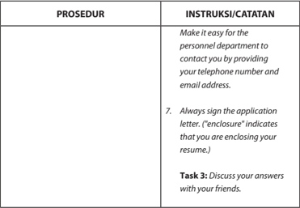

Tabel ini berisi instruksi dan catatan tentang prosedur tertentu, dengan topik utama "Instruksi/Catatan". Kolom pertama disebutkan sebagai "Prosedur", sementara kolom kedua berisi instruksi atau catatan yang berkaitan dengan prosedur tersebut. Data penting yang terlihat meliputi: 1) Membuat prosedur yang mudah diakses oleh departemen penerapan untuk menghubungi Anda dengan menyertakan nomor telepon dan alamat email Anda. 2) Selalu tanda tangan surat permohonan. ("Enclosure" menunjukkan bahwa Anda menyertakan resume). 3) Tugas ke-3: Diskusikan jawaban Anda dengan teman-teman Anda.

### H. WRITING

---
**📊 Tabel**

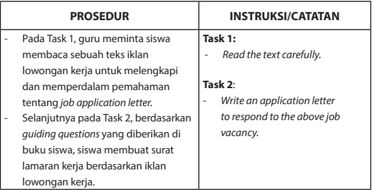

Tabel ini berisi instruksi untuk dua tugas (Task 1 dan Task 2) yang harus dilakukan oleh siswa. Topik utama tabel adalah prosedur dan instruksi untuk menyelesaikan tugas tersebut. Kolom "PROSEDUR" menyediakan petunjuk tentang langkah-langkah yang harus diikuti, sementara kolom "INSTRUKSI/CATATAN" memberikan detail tentang apa yang harus dilakukan setiap tugas. Data penting yang terlihat adalah bahwa siswa harus membaca teks dengan teliti sebelum menulis surat lamaran kerja yang sesuai dengan iklan lowongan pekerjaan.

 

---
## 📄 Halaman 42

---
**📊 Tabel**

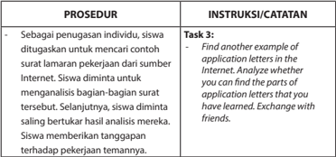

Tabel ini berisi instruksi untuk tugas 3 dalam sebuah prosedur belajar. Topik utamanya adalah analisis surat lamaran pekerjaan. Dalam prosedur tersebut, siswa diwajibkan mencari contoh surat lamaran pekerjaan dari sumber Internet, kemudian menganalisis bagian-bagian surat tersebut. Setelah selesai, siswa diberi tanggapan terhadap pekerjaan temannya. Selain itu, siswa juga diminta untuk menemukan contoh lain dari surat lamaran pekerjaan di Internet dan membandingkannya dengan yang telah dipelajari. Ini bertujuan untuk meningkatkan pemahaman siswa tentang struktur dan isi surat lamaran pekerjaan.

### I. REFLECTION

---
**📊 Tabel**

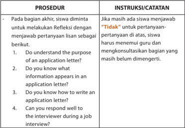

Tabel ini berisi instruksi dan catatan untuk prosedur bagian akhir dalam sebuah proses belajar, mungkin dalam konteks pendidikan atau pelatihan. Topik utama tabel adalah tentang penilaian reflektif siswa terhadap pertanyaan-pertanyaan tertentu. Kolom pertama, "PROSEDUR", menyajikan empat pertanyaan yang harus dijawab oleh siswa. Pertanyaan-pertanyaan tersebut bertujuan untuk menilai pemahaman siswa tentang tujuan surat permohonan kerja, informasi apa saja yang muncul dalam surat permohonan kerja, cara menulis surat permohonan kerja, dan kemampuan untuk merespons dengan baik kepada interaksi dengan pemeriksaan. Kolom kedua, "INSTRUKSI/CATATAN", memberikan petunjuk bahwa jika siswa tidak dapat menjawab pertanyaan-pertanyaan tersebut, mereka harus menemukan jawaban dengan bantuan guru dan mengkonsultasikan bagian yang masih belum dimengerti. Ini menunjukkan bahwa proses belajar ini dirancang untuk mendukung pemahaman siswa dan memastikan mereka memiliki kesempatan untuk memperbaiki kelemahan mereka.

### KUNCI JAWABAN

 

---
## 📄 Halaman 43

### A. WARMER: BOARDGAME (MINDMAP)

---
**🖼️ Gambar/Diagram**

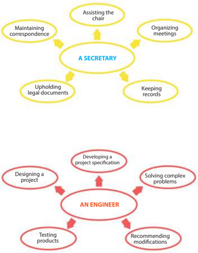

> **Deskripsi Visual:** Gambar ini adalah diagram yang menunjukkan peran dan tanggung jawab antara seorang sekretaris dan seorang insinyur. Diagram ini dibagi menjadi dua bagian berbeda, masing-masing menunjukkan tugas-tugas spesifik bagi kedua profesi tersebut.

Pertama, bagian atas menggambarkan peran seorang sekretaris. Di bagian ini, ada empat lingkaran berwarna kuning dengan teks yang menjelaskan tugas-tugas utama sekretaris, seperti "Assisting the chair", "Maintaining correspondence", "Organizing meetings", dan "Upholding legal documents". Setiap tugas ini memiliki ikon yang menunjukkan tindakan atau aktivitas yang berkaitan dengan tugas tersebut.

Kedua, bagian bawah menggambarkan peran seorang insinyur. Di bagian ini, ada empat lingkaran berwarna merah dengan teks yang menjelaskan tugas-tugas utama insinyur, seperti "Developing a project specification", "Solving complex problems", "Designing a project", dan "Testing products". Setiap tugas ini juga memiliki ikon yang menunjukkan tindakan atau aktivitas yang berkaitan dengan tugas tersebut.

Dari diagram ini, kita dapat melihat bahwa sekretaris dan insinyur memiliki tanggung jawab yang berbeda, tetapi keduanya memerlukan pengetahuan dan keterampilan yang sama untuk bekerja efektif. Ini menunjukkan bahwa kedua profesi ini saling mendukung dan penting dalam suatu organisasi.

 

---
## 📄 Halaman 44

---
**🖼️ Gambar/Diagram**

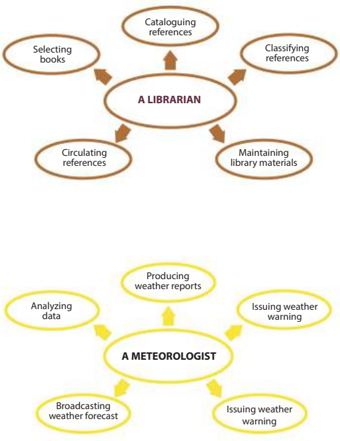

> **Deskripsi Visual:** Gambar ini adalah diagram yang menunjukkan tugas-tugas utama seorang perpustakaan dan meteorolog. Perpustakaan memiliki tugas-tugas seperti "Mengumpulkan referensi", "Memilih buku", "Memelihara bahan-bahan perpustakaan", "Memelihara bahan-bahan perpustakaan", dan "Menyewakan referensi". Sementara itu, meteorolog memiliki tugas-tugas seperti "Menganalisis data", "Membuat laporan cuaca", "Membawa laporan cuaca", "Membawa laporan cuaca", dan "Membawa laporan cuaca". Relasi antara kedua profesi ini adalah bahwa kedua profesi ini saling mendukung dalam hal informasi dan pengetahuan yang diperlukan untuk masing-masing tugas mereka.

 

---
## 📄 Halaman 45

---
**🖼️ Gambar/Diagram**

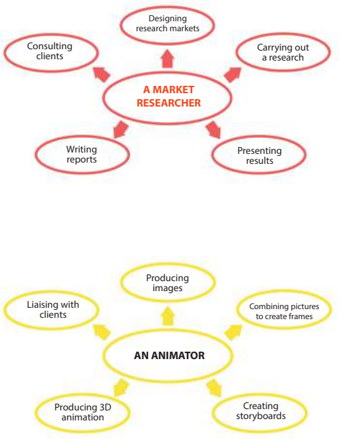

> **Deskripsi Visual:** Gambar ini adalah diagram yang menunjukkan tugas-tugas utama seorang market researcher dan seorang animator. Market researcher memiliki tugas seperti "Desain pasar", "Melakukan penelitian", "Menghubungi pelanggan", "Menulis laporan", dan "Mengpresentasikan hasil". Sementara itu, animator memiliki tugas seperti "Liais dengan pelanggan", "Membuat gambar", "Menggabungkan gambar untuk membuat sketsa", "Membuat animasi 3D", dan "Membuat sketsa cerita". Relasi antara kedua profesi ini adalah bahwa mereka bekerja sama dalam proyek yang sama, baik dalam penelitian pasar maupun produksi animasi. Label penting dalam diagram ini meliputi "Market Researcher" dan "Animator", serta tugas-tugas yang mereka lakukan. Informasi kunci yang dapat diambil pembaca adalah bahwa kedua profesi ini saling mendukung dalam proses pengembangan produk atau layanan.

 

---
## 📄 Halaman 46

---
**🖼️ Gambar/Diagram**

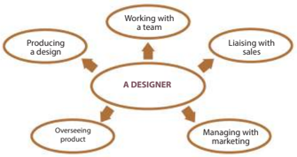

> **Deskripsi Visual:** Gambar ini adalah diagram yang menunjukkan tugas-tugas utama seorang desainer. Diagram ini berbentuk lingkaran dengan satu titik tengah yang menandakan "A DESIGNER". Dari titik tengah ini, ada empat garis menuju ke empat bidang yang masing-masing menunjukkan tugas utama desainer tersebut:

1. Produksi desain: Desainer bekerja sama dengan tim untuk menghasilkan desain.
2. Laksanaan dengan penjualan: Desainer berkomunikasi dengan tim penjualan untuk memastikan desain sesuai dengan kebutuhan pasar.
3. Pengawasan produk: Desainer bertanggung jawab atas pengawasan proses produksi dan kualitas produk.
4. Manajemen dengan marketing: Desainer bekerja sama dengan tim marketing untuk mempromosikan produk.

Elemen-elemen utama dalam diagram ini adalah "A DESIGNER" sebagai pusat, dan empat garis menuju ke empat tugas utama desainer. Teks penting dalam diagram ini adalah nama-nama tugas yang disebutkan di setiap garis. Informasi kunci yang dapat diambil pembaca adalah bahwa desainer memiliki tanggung jawab yang luas dan beragam dalam menghasilkan produk yang berkualitas tinggi dan sesuai dengan kebutuhan pasar.

---
**🖼️ Gambar/Diagram**

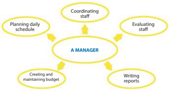

> **Deskripsi Visual:** Gambar ini adalah diagram yang menunjukkan tugas-tugas seorang manajer dalam sebuah organisasi. Diagram ini terdiri dari empat elemen utama yang terhubung ke satu titik tengah yang diberi label "A MANAGER". Setiap elemen tersebut mewakili tugas yang dilakukan oleh manajer, yaitu:

1. Planning daily schedule (Menyusun jadwal harian)
2. Coordinating staff (Mengatur staf)
3. Evaluating staff (Mengukur prestasi staf)
4. Creating and maintaining budget (Membuat dan mempertahankan anggaran)

Jaringan antara elemen-elemen ini menunjukkan hubungan antar tugas-tugas tersebut, menekankan bahwa setiap tugas penting untuk fungsi manajemen yang efektif. Teks, angka, atau label penting yang terlihat pada gambar adalah nama-nama tugas tersebut.

Informasi kunci yang dapat diambil pembaca melalui gambar ini adalah bahwa manajer memiliki berbagai tanggung jawab yang saling berkaitan dan harus bekerja sama untuk mencapai tujuan organisasi.

 

---
## 📄 Halaman 47

### B. VOCABULARY BUILDER

### VOCABULARY BUILDER

to appear

:   termuat di koran

enclosed

:   terlampir

qualification

:   jenis keterampilan/kepribadian pengalaman yang membuat seseorang cocok untuk suatu pekerjaan tertentu

in order to

:   agar

requirement

:   persyaratan

colleagues

:   kolega

consideration

:   pertimbangan

be suited                 :   cocok untuk

resume

:   daftar riwayat hidup/curriculum vitae (CV)

### F. GRAMMAR REVIEW

### Task 2

- -The local branch of a national shoe retailer is managed.
- -The job oppurtunity has been advertised in the national newspaper.
- -Time management tools were developed for staff.
- -Her resume will be enclosed in the application letter.
- -An application letter is being written for the position as a secretary.

 

---
## 📄 Halaman 48

### H. WRITING Task 3

Jalan Candi 25 Malang 65154

Mr. Sukamdani Apika Plaza Ltd., Jalan A. Yani 25, Sukamakmur 65126

Dear Mr. Sukamdani,

I am writing to apply for the sales executive position advertised in Suara Perubahan yesterday. As requested, attached please find my complete resume and recent photograph of mine.

I believe that I have all of the qualification needed for the job. I graduated from a reputed college 3 year. I can speak English and Indonesian fluently and I am very skillful in using computer. My previous experience as a sales executive in a stationary company is suitable for the position.

I am looking forward to having interview with you and I can be contacted at Felixdian@gmail. com or 081233929223.

Sincerely yours, Feliks Diansyah

 

---
## 📄 Halaman 49

### Who was Involved?

---
**🖼️ Gambar/Diagram**

> **Deskripsi Visual:** Gambar ini adalah ilustrasi yang menunjukkan pertempuran militer di medan perang. Gambar ini menggambarkan tiga prajurit militer yang sedang berjalan dengan senjata mereka, sementara dua tank dan helikopter militer tampak di latar belakang. Api dan debu menyembur dari tempat-tempat yang tampaknya telah terlibat dalam pertempuran. Ilustrasi ini menunjukkan keadaan serius dan ketegangan dalam konflik militer.

Elemen-elemen utama dalam gambar ini meliputi tiga prajurit militer yang sedang berjalan, dua tank, dan helikopter militer. Prajurit tersebut tampak siap untuk bertempur, menunjukkan persiapan dan ketertiban mereka dalam situasi yang berbahaya. Tank dan helikopter militer tampak siap untuk bertempur juga, menunjukkan kehadiran dan kemampuan militer dalam pertempuran tersebut.

Teks, angka, atau label penting tidak terlihat dalam gambar ini karena ia hanya berupa ilustrasi. Namun, informasi kunci yang dapat diambil pembaca adalah bahwa ini adalah pertempuran militer yang sangat serius dan membutuhkan persiapan dan keberanian tinggi dari prajurit militer.

Dalam satu paragraf yang informatif, gambar ini menunjukkan pertempuran militer yang sangat serius dan membutuhkan persiapan dan keberanian tinggi dari prajurit militer. Ilustrasi ini menunjukkan tiga prajurit militer yang sedang berjalan dengan senjata mereka, sementara dua tank dan helikopter militer tampak di latar belakang. Api dan debu menyembur dari tempat-tempat yang tampaknya telah terlibat dalam pertempuran, menunjukkan keadaan serius dan ketegangan dalam konflik militer.

Source: http://korean-war.commemoration.gov.au

### Tujuan Pembelajaran:

Setelah mempelajari Bab 5, siswa diharapkan mampu melakukan hal-hal sebagai berikut:

- Menganalisis fungsi sosial, struktur teks, dan unsur kebahasaan dari teks news item berbentuk berita sederhana dari koran/radio/TV, sesuai dengan konteks penggunaannya. 3.4
- Menangkap makna dalam teks berita sederhana dari koran/radio/TV. 4.4

 

---
## 📄 Halaman 50

### A. WARMER

---
**📊 Tabel**

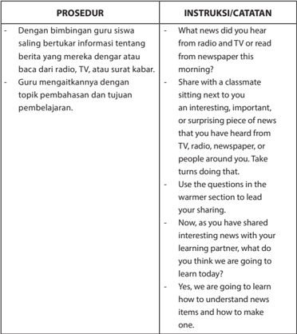

Tabel ini berisi prosedur dan instruksi untuk membantu siswa belajar tentang berita. Topik utamanya adalah bagaimana siswa dapat memahami dan membuat berita. Dalam prosedur, guru memberi bimbingan kepada siswa untuk berbicara tentang berita yang mereka dengar atau baca dari radio, TV, atau surat kabar. Guru juga mengajarkan cara berbagi informasi tersebut dengan teman sekelas di ruang panas. Siswa harus menggunakan pertanyaan dalam bagian hangat untuk membuka pembicaraan. Setelah berbagi informasi, siswa harus bertanya tentang apa yang akan dipelajari pada hari itu. Ini menunjukkan bahwa prosedur ini bertujuan untuk meningkatkan pemahaman siswa tentang berita dan bagaimana mereka dapat membuat berita sendiri.

 

---
## 📄 Halaman 51

### B. VOCABULARY BUILDER

---
**📊 Tabel**

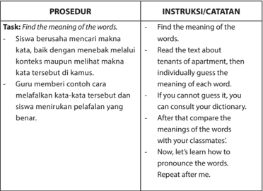

Tabel ini menunjukkan prosedur dan instruksi untuk sebuah aktivitas belajar bahasa yang bertujuan untuk membantu siswa mencari makna kata-kata dalam konteks tertentu. Topik utama tabel ini adalah "Find the meaning of the words," yang berarti siswa harus mencari makna kata-kata yang diberikan dalam konteks tertentu. Proses ini dimulai dengan siswa berusaha mencari makna kata-kata tersebut, baik dengan menebak melalui konteks maupun melihat makna kata tersebut di kamus. Guru memberi contoh cara memafikan kata-kata tersebut dan siswa meniru perilaku yang benar. Setelah itu, siswa harus menemukan makna kata-kata tersebut sendiri, jika tidak dapat menebaknya, mereka dapat menggunakan kamus. Setelah itu, siswa harus membandingkan makna kata-kata tersebut dengan teman-temannya. Akhirnya, mereka akan belajar bagaimana mengucapkan kata-kata tersebut dan harus menuliskan kembali apa yang telah mereka pelajari.

### C. LISTENING

---
**📊 Tabel**

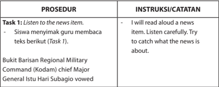

Tabel ini berisi instruksi untuk melakukan tugas mendengarkan berita. Topik utama tabel adalah prosedur mendengarkan berita. Kolom pertama berisi prosedur yang harus dilakukan, sedangkan kolom kedua berisi instruksi atau catatan yang diberikan. Data penting yang terlihat adalah bahwa siswa harus mendengarkan berita yang disampaikan oleh General Istiwaro Subagio, seorang komandan Kodam, tentang Bukit Barisan Regional Military Command. Siswa juga diminta untuk membaca teks yang disediakan sebagai bahan latihan.

 

---
## 📄 Halaman 52

---
**📊 Tabel**

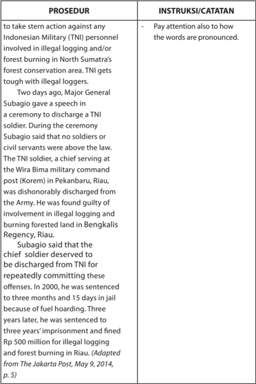

Tabel ini berisi informasi tentang tindakan keras yang diambil oleh TNI (Tentara Nasional Indonesia) terhadap prajurit yang terlibat dalam ilegal logging dan forest burning di kawasan hutan konservasi di Sumatera Utara. Topik utama tabel adalah tindakan keras TNI terhadap prajurit ilegal logging. Kolom pertama berisi prosedur yang dilakukan, sedangkan kolom kedua berisi instruksi atau catatan. Data penting yang terlihat adalah bahwa TNI akan mengambil tindakan keras terhadap prajurit ilegal logging dan forest burning di kawasan hutan konservasi di Sumatera Utara. Selain itu, ada juga catatan untuk memperhatikan cara pengucapan kata-kata.

 

---
## 📄 Halaman 53

---
**📊 Tabel**

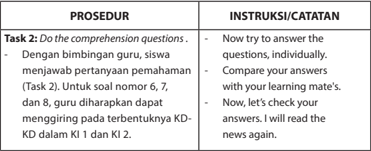

Tabel ini berisi instruksi dan prosedur untuk melakukan tugas 2 dalam sebuah kursus bahasa Inggris. Topik utamanya adalah tentang pemahaman teks dan pertanyaan. Dalam prosedur, siswa diberi kesempatan untuk menjawab pertanyaan pemahaman dengan bantuan guru. Guru juga diberi instruksi untuk membandingkan jawaban siswa dengan teman belajar mereka. Selain itu, guru diharapkan untuk memeriksa kembali jawaban siswa setelah mereka menyelesaikan tugas. Kolom "Instruksi/Catatan" memberikan detail tentang apa yang harus dilakukan oleh guru dan siswa selama proses ini. Data penting yang terlihat adalah bahwa guru harus membandingkan jawaban siswa dengan teman belajar mereka dan memeriksa kembali setelah mereka menyelesaikan tugas.

### D. READING

---
**📊 Tabel**

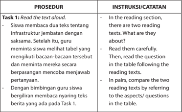

Tabel ini berisi instruksi dan prosedur untuk tugas 1, yang melibatkan membaca dua teks tentang infrastruktur jembatan dengan saksama. Topik utama tabel adalah proses pembelajaran membaca dan membandingkan informasi antara dua teks. Kolom pertama berisi prosedur, yang mencakup langkah-langkah membaca teks secara lisan, memilih teks yang akan dibandingkan, dan membandingkan informasi antara kedua teks tersebut. Kolom kedua berisi instruksi atau catatan, yang memberikan petunjuk kepada siswa tentang bagaimana mereka harus menyelesaikan tugas tersebut, termasuk cara membaca dengan teliti, bertanya tentang teks, dan membandingkan informasi antara kedua teks. Data penting yang terlihat adalah bahwa tugas ini melibatkan pemahaman dan pembandingan informasi antara dua teks, yang merupakan keterampilan penting dalam pembelajaran membaca dan penulisan.

 

---
## 📄 Halaman 54

---
**📊 Tabel**

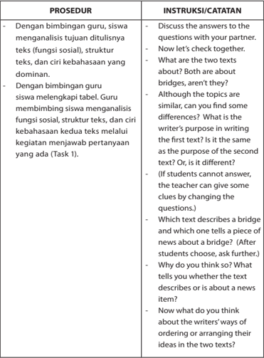

Tabel ini berisi prosedur dan instruksi untuk membantu siswa menganalisis dua teks tentang jembatan. Topik utama adalah analisis teks dan perbandingan antara dua teks yang memiliki tema serupa tetapi tujuan yang berbeda. Proses melibatkan diskusi dengan teman, memeriksa struktur dan ciri kebahasaan teks, dan mengevaluasi tujuan penulis. Siswa diminta untuk melihat perbedaan antara dua teks yang memiliki tema serupa tetapi tujuan yang berbeda. Ini mencakup pertanyaan seperti apakah kedua teks tersebut tentang jembatan, apakah ada perbedaan dalam tujuan penulis, dan bagaimana cara penulis mengorganisir ide-ide mereka dalam dua teks tersebut.

 

---
## 📄 Halaman 55

---
**📊 Tabel**

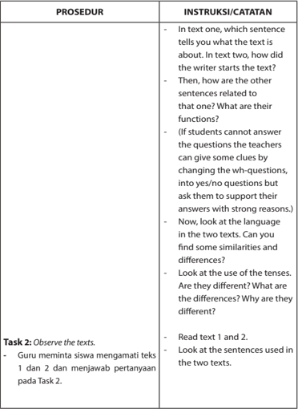

Tabel ini berisi instruksi untuk mempelajari dua teks, dengan fokus pada bagaimana menafsirkan dan membandingkan konten dan struktur teks tersebut. Topik utama adalah observasi dan analisis teks, dimulai dengan memahami konteks teks pertama dan kedua, kemudian melihat bagaimana teks-teks tersebut berkaitan satu sama lain. Selanjutnya, penonton harus mencari perbedaan dan kesamaan dalam bahasa dan tenses yang digunakan dalam kedua teks. Tujuan akhir adalah untuk memahami bagaimana teks-teks tersebut berfungsi sebagai informasi atau narasi, serta bagaimana mereka membentuk pemahaman tentang subjek yang disebutkan.

 

---
## 📄 Halaman 56

---
**📊 Tabel**

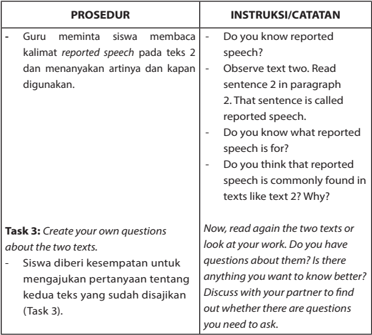

Tabel ini berisi prosedur dan instruksi untuk mengajarkan siswa tentang reported speech dalam bahasa Inggris. Topik utama adalah bagaimana menafsirkan dan menggunakan reported speech dalam teks. Kolom pertama berisi prosedur yang melibatkan guru membaca kembali kalimat reported speech pada teks kedua dan menjelaskannya kepada siswa. Kolom kedua berisi instruksi atau catatan yang diberikan kepada siswa, seperti memeriksa apakah mereka tahu apa itu reported speech, apakah mereka yakin bahwa reported speech sering muncul dalam teks seperti yang ditunjukkan, dan mengajak mereka untuk membuat pertanyaan sendiri tentang kedua teks tersebut.

 

---
## 📄 Halaman 57

### PROSEDUR

### Task 4: Think about it.

- -Guru membagi siswa ke dalam kelompok. Secara berkelompok siswa membahas pertanyaanpertanyaan yang ada pada Task 4. Secara bergiliran siswa menyampaikan hasil diskusi kelompoknya. Guru membimbing proses diskusi kelas.

### Task 5: Comprehend the text.

- -Siswa membaca teks berita (Task 5) secara individu dengan metode skimming . Hasil skimming dibahas secara berpasangan dan selanjutnya secara klasikal. Siswa juga menjawab pertanyaan pemahaman.

### INSTRUKSI/CATATAN

- -Make groups consisting of four students or two students.
- -Answer the questions in Task 4.
- -Because you have finished answering the questions, now let's check the answer together.
- -Read the text quickly enough. Then, try to answer the questions individually.
- -As you have finished answering the questions, now discuss the answers with your partner. Refer to the text to decide the correct answers.
- -After that, we will discuss the answers together.

 

---
## 📄 Halaman 58

### E. VOCABULARY EXERCISE

### PROSEDUR

### Task 1:

- -Dengan bimbingan guru, siswa mengingat kembali makna kata yang sudah dipelajari dan siswa dapat mengaplikasikannya dalam konteks yang lain.
- The government has just launched new regulations to make tax payers comply with their obligation.
- Tenants are required to pay a deposit, which usually amounts to a one-month rent
- The new governor advised the city residents to wake up and obey the rules so that the capital city would develop as expected.
- Many people had to abandon their residence because of the frequent heavy earthquakes.
- Under the new regulations, the owner of the rented house has to be responsible for the provision of convenient facilities.

### INSTRUKSI/CATATAN

### Task 1

- -Read again the meanings of some words you studied in Vocabulary Builder activities.
- -Make sure you know the meanings of the words. Read the sentences around the words to give clearer understanding about the meanings of the words.
- -Now, put the words in the context of new sentences.
- -Understand the messages of the sentenc es first, then decide which words from the list provided can be used to fill in the blanks.
- -Do this individually first, then discuss your answers in pairs. Discuss any differences. Whose answers are correct and why?
- -After that, we can check the answers together.

 

---
## 📄 Halaman 59

---
**📊 Tabel**

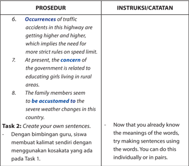

Tabel ini berisi instruksi untuk menyelesaikan tugas yang melibatkan penggunaan kata-kata dalam kalimat. Topik utama tabel adalah tentang perubahan perilaku dan kondisi lingkungan di sekitar kita. Kolom pertama berisi prosedur atau instruksi yang harus dilakukan, sementara kolom kedua berisi catatan atau petunjuk tambahan. Data penting yang terlihat antara lain bahwa jumlah kecelakaan lalu lintas di jalan raya semakin meningkat, yang menunjukkan kebutuhan untuk aturan kecepatan yang lebih ketat. Selain itu, pemerintah saat ini memperhatikan pendidikan bagi perempuan di daerah pedesaan, dan anggota keluarga tampaknya sudah menjadi bagian dari kondisi cuaca yang ekstrem di negara tersebut. Tugas kedua melibatkan siswa membuat kalimat sendiri menggunakan kata-kata yang telah dipelajari pada tugas sebelumnya, baik secara individu maupun dalam pasangan.

### F. GRAMMAR REVIEW

---
**📊 Tabel**

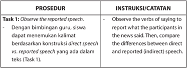

Tabel ini berisi prosedur dan instruksi untuk mengamati pernyataan yang dituliskan (Task 1) dan perbandingan antara pernyataan langsung dan pernyataan yang ditangkap (Task 2). Topik utama tabel adalah pemahaman perbedaan antara pernyataan langsung dan pernyataan yang ditangkap dalam konteks teks. Kolom "Prosedur" mencakup langkah-langkah untuk mempelajari pernyataan yang ditangkap, termasuk melihat kata kerja yang digunakan untuk menyampaikan pernyataan, dan membandingkan perbedaan antara pernyataan langsung dan pernyataan yang ditangkap. Kolom "Instruksi/Catatan" memberikan petunjuk tentang bagaimana siswa harus melihat pernyataan yang ditangkap, termasuk melihat perbedaan antara pernyataan langsung dan pernyataan yang ditangkap dalam konteks teks. Pola penting yang terlihat adalah bahwa tabel ini membantu siswa memahami perbedaan antara pernyataan langsung dan pernyataan yang ditangkap dalam konteks teks.

 

---
## 📄 Halaman 60

---
**📊 Tabel**

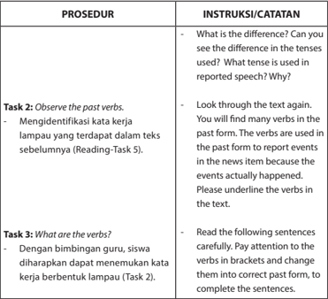

Tabel ini berisi instruksi dan prosedur untuk mempelajari tentang tenses (waktu) dalam bahasa Inggris, khususnya past tense. Topik utama adalah perbandingan antara present tense dan past tense dalam penggunaan kata kerja. Kolom "Prosedur" mencakup dua tugas: pertama, melihat dan menentukan past tense dalam teks sebelumnya; kedua, menemukan dan mengubah kata kerja berbentuk lampau menjadi past tense dalam kalimat tertentu. Kolom "Instruksi/Catatan" memberikan petunjuk lebih lanjut tentang bagaimana melaksanakan tugas tersebut, seperti melihat perbedaan antara tenses, menemukan past tense dalam teks, dan cara mengubah kata kerja berbentuk lampau ke past tense. Pola penting yang terlihat adalah fokus pada perbedaan antara tenses dan cara menggunakan past tense dalam konteks berita atau informasi yang benar-benar terjadi.

### G. TEXT STRUCTURE

---
**📊 Tabel**

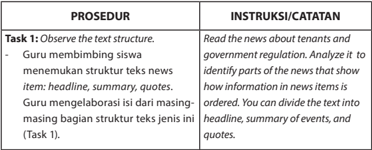

Tabel ini berisi instruksi tentang bagaimana guru membimbing siswa untuk mempelajari struktur teks dalam berita. Topik utama tabel adalah prosedur dan instruksi yang diberikan kepada guru dan siswa. Kolom pertama, "PROSEDUR", menjelaskan langkah-langkah yang harus diikuti oleh guru dan siswa, seperti menemukan struktur teks berita, merumuskan judul, membuat sumary, dan menggunakan quotes. Sementara itu, kolom kedua, "INSTRUKSI/CATATAN", memberikan petunjuk lebih lanjut tentang bagaimana mengidentifikasi bagian-bagian informasi dalam berita, seperti bagaimana informasi dalam berita tersebut disusun, bagaimana sumary, event, dan quotes dapat dibagi menjadi bagian dari teks berita. Data atau pola penting yang terlihat dalam tabel ini adalah bahwa prosedur dan instruksi ini dirancang untuk membantu siswa memahami dan menerapkan struktur teks berita dalam konteks pembelajaran.

 

---
## 📄 Halaman 61

### PROSEDUR

- -Tabel yang sudah dilengkapi oleh siswa juga dapat dimanfaatkan sebagai bahan penguatan pemahaman terhadap struktur teks.

### Task 2: Download a news item text.

- -Guru meminta siswa mencari berita di internet.
- -Guru meminta siswa untuk membaca berita dan menjawab pertanyaan.

### Task 3: Find another news item text.

- -Secara berkelompok siswa mencari teks berita dalam surat kabar atau internet. Guru mengingatkan pentingnya memerhatikan hal-hal berikut dalam memilih teks berita.
- Is the headline interesting?
- Is the information useful to share? Why do you think so?

### INSTRUKSI/CATATAN

- -Then look at the table closely. Fill in the table by completing the parts with the information from the text.
- -In pairs, download a piece of news from the address written on the student book.
- -After you get it, individually, read the news item carefully. Then, respond to the questions.
- -Compare your answers with your partner ' s answers.
- -Refer to the text if both of you have different answers.
- -Make groups of four students.
- -Each group should find a piece of news written in English. The news can be taken from the Internet or newspaper. When you look for the news, remember to ask the following questions:
- Is the headline interesting?

 

---
## 📄 Halaman 62

---
**📊 Tabel**

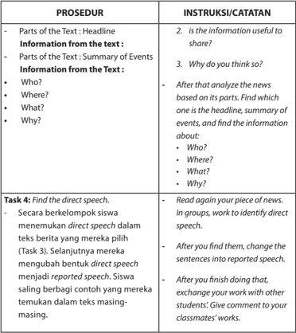

Tabel ini berisi prosedur dan instruksi untuk mengevaluasi dan memahami teks berita. Topik utamanya adalah analisis teks berita, termasuk bagian judul, ringkasan peristiwa, informasi tentang siapa, di mana, apa, dan mengapa. Proses melibatkan pemisahan informasi dari teks berita, kemudian mengevaluasi apakah informasi tersebut dapat dibagikan dan mengapa. Selanjutnya, siswa diberi tugas untuk mencari间接 speech dalam teks berita mereka, kemudian mengubahnya menjadi reported speech. Tugas ini dilakukan dalam kelompok, dan setelah selesai, siswa saling berbagi contoh yang mereka temukan dengan teman-teman mereka.

 

---
## 📄 Halaman 63

### H. WRITING (ENRICHMENT)

### PROSEDUR

Task 1: What is the Trending News? Bagian ini bersifat tambahan. Jika ada waktu dan siswa tertarik, guru bisa melaksanakan, tetapi jika tidak, guru tidak perlu memaksa siswa melakukannya karena aktivitas menulis berita di luar kompetensi yang diharapkan.

Task 2: Write a news item.

- -Siswa berlatih menyusun teks berita sendiri. Guru mengingatkan hal-hal berikut.
- Headline (Interesting? Smart?)
- Lead paragraph: Summary of events (Who? Where? What? Why?)
- Supporting paragraphs: More detailed information of the summary (Who? Where? What? Why?)

### INSTRUKSI/CATATAN

- -Now, it's time to try to write a piece of news ourselves. You can write the news by responding to the guiding questions first.
- -Let's start writing. Don't forget to write a good and interesting headline, and write lead and supporting paragraphs.

 

---
## 📄 Halaman 64

### PROSEDUR

### Task 3: Let's do some peer editing.

- -Dengan bimbingan guru, siswa saling bertukar teks berita yang mereka susun. Guru mengingatkan hal-hal berikut.
- The text structure: the headline, summary of events in the lead paragraph (Who? Where? What? Why?), and detailed elaboration of the events in the supporting paragraphs (Who? Where? What? Why?).
- The use of past verbs
- The use of direct speech
- Spelling
- Punctuation
- Capitalization
- Formatting

### INSTRUKSI/CATATAN

- -Exchange your work with another student's work. Let's edit our work together.
- -Read carefully your classmate's work. When you read, remember the following points:
- How is the text structure? Is the news written by following the right text structure of a news item.
- Is the use of past verbs correct?
- is the use of direct speech or reported speech correct?
- Is the spelling correct?
- Are the punctuation, capitalization, and format correct?
- -Give feedback based on the questions and after that return the work to the owner.
- -Read the feedback for your own work and edit your work accordingly.

 

---
## 📄 Halaman 65

### I. COMMUNICATING

---
**📊 Tabel**

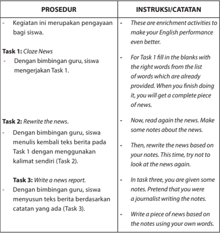

Tabel ini berisi prosedur dan instruksi untuk mengembangkan kemampuan bahasa Inggris siswa melalui aktivitas peningkatan keterampilan. Topik utama adalah penggunaan bahasa Inggris dalam berbagai tugas, mulai dari menyelesaikan teks cloze dengan kata-kata yang sudah diberikan, menulis ulang teks berita menggunakan kalimat yang disediakan, hingga menulis laporan berita berdasarkan catatan. Kolom "Prosedur" menyajikan tiga tugas yang harus diselesaikan oleh siswa, sedangkan kolom "Instruksi/Catatan" memberikan petunjuk tentang bagaimana melakukan masing-masing tugas. Data penting yang terlihat adalah bahwa setiap tugas memiliki tujuan spesifik dan prosedur yang jelas, serta instruksi yang detail untuk membantu siswa memahami dan menyelesaikan tugas tersebut dengan baik.

 

---
## 📄 Halaman 66

### PROSEDUR

- -Guru mengingatkan hal-hal berikut.
- Write an interesting headline.
- Write the summary of the events in the lead paragraph (Who? Where? What? Why?).
- Provide quotes (direct speech) from the people involved.
- Use past verbs.
- Pay attention to spelling, punctuation, capitalization, and formatting.

### Task 4: Retell the event .

- -Dengan bimbingan guru, siswa menceritakan kembali teks berita yang sudah ditulis (Task 3). Guru memberi perhatian pada aspek pelafalan dan kelancaran siswa dalam membaca teks berbahasa Inggris.

### INSTRUKSI/CATATAN

- -When you write your news, don't forget some important elements of a news item, such as
- Write an interesting headline.
- Write the summary of the events in the lead paragraph.
- Provide quotes (direct speech) from the people involved.
- Use past verbs.
- Pay attention to spelling, punctuation, capitalization, and formatting.
- -Now, sit in pairs or in groups of four.
- -Take turns telling your partner(s) your news.
- -When you do that, don't forget to pretend to be a news reader on a radio or television.

 

---
## 📄 Halaman 67

### REFLECTION

### PROSEDUR

Dengan bimbingan guru, siswa melakukan re fl eksi tentang kemampuan membuat teks berita melalui kegiatan menjawab pertanyaan-pertanyaan berikut secara mandiri.

- Do you use a catchy and interesting headline?
- Do you have a lead paragraph that summarizes the important event?
- Do you elaborate the summary into more detailed information?
- Do you provide direct speech?
- Do you use past verbs?
- Do you pay attention to spelling, punctuation, capitalization, and formatting?

### INSTRUKSI/CATATAN

- -Before we end our discussion on this chapter, let's ask ourselves the following questions: Do you know how to create a news item?
- -To answer the question, respond to the following reminder:
- Do you use a catchy and interesting headline?
- Do you have a lead paragraph that summarizes the important event?
- Do you elaborate the summary into more detailed information?
- Do you provide direct speech?
- Do you use past verbs?
- Do you pay attention to spelling, punctuation, capitalization, and formatting?

 

---
## 📄 Halaman 68

---
**📊 Tabel**

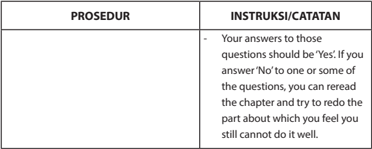

Tabel ini berisi instruksi atau catatan untuk prosedur yang tidak jelas. Topik utamanya adalah tentang cara menjawab pertanyaan dalam sebuah prosedur. Kolom pertama berisi "PROSEDUR", sedangkan kolom kedua berisi "INSTRUKSI/CATATAN". Dalam catatan tersebut, disebutkan bahwa jika jawaban atas pertanyaan adalah "Ya", maka harus diulang bagian yang sulit dipahami. Jika jawaban adalah "Tidak", bisa diulang kembali bagian yang sulit dipahami. Ini menunjukkan bahwa prosedur ini bertujuan untuk memastikan pemahaman yang baik terhadap materi yang diberikan.

### KUNCI JAWABAN

### C. LISTENING

### Task 2

- Stern/tough action against illegal logging.
- In North Sumatra.
- During a ceremony to discharge a TNI soldier.
- Because of being found guilty of involvement in illegal logging and burning forested land and TNI gets tough with illegal loggers; no soldiers above the law.
- Bukit Barisan Kodam chief Major General Istu Hari Subagio and a soldier, a TNI chief serving at the Wira Bima military command post (Korem) in Pekanbaru, Riau
- (Responses may vary.)
- (Responses may vary.)
- (Responses may vary)

### D. READING

### Task 5

- A journalist.
- An advice that tenants need to obey regulations on apartments. The social function is to inform readers about an advice by a building architect to tenants of apartments.
- Tenants advised to obey regulations on apartment.
- No more land to build houses; more practical for city people, especially if they are single; etc.

 

---
## 📄 Halaman 69

- (Responses may vary. For example, no pets, etc.)
- Owners of apartments.
- Who: a building architect; owners of apartments; apartments' tenants
- Where: Jakarta
- What: regulations
- Why: differences of living in landed houses and in apartments

### G. TEXT STRUCTURE

### Task 1

---
**📊 Tabel**

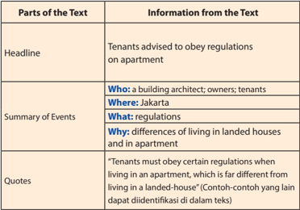

Tabel ini memperlihatkan bagaimana informasi dari teks disajikan dalam berbagai bagian, mulai dari judul hingga kutipan. Judul menunjukkan bahwa penghuni apartemen diberi petunjuk untuk menghormati aturan di rumah mereka. Kolom "Siapa" menunjukkan bahwa informasi ini berasal dari arsitek bangunan, pemilik, dan penghuni apartemen. Kolom "Di mana" menunjukkan lokasi Jakarta. Kolom "Apakah" menunjukkan bahwa informasi ini berkisar pada perbedaan hidup di rumah tinggal dan apartemen. Kolom "Alasannya" menunjukkan bahwa perbedaan ini disebabkan oleh perbedaan aturan yang berlaku. Kolom "Kutipan" menunjukkan bahwa ada beberapa kutipan yang memberikan lebih banyak detail tentang aturan yang harus diikuti oleh penghuni apartemen. Topik utama tabel ini adalah perbedaan aturan hidup antara rumah tinggal dan apartemen di Jakarta.

### F. GRAMMAR REVIEW

### Task 3

- The distribution of NKRI maps began at Caturwarga elementary school last Friday.
- The policy on higher minimum wages brought greater prosperity to local workers.
- Limited infrastructure and facilities such as clean water resources, schools, and healthcare services worsened the life quality of the local residents.

 

---
## 📄 Halaman 70

- My grandfather flew to Denpasar the other day for a senior citizen award.
- One victim told the online news portal about the incident on Saturday night.
- It 's so sad that many spectators threw trash in the city stadium during the final football match last week.
- The local people built the mosque in the 16th century, and the mosque now becomes one of the official cultural heritage sites.
- The online enrollment system was in accordance with the central government's instruction.
- Local poets and musicians got wider recognition as the provincial administration granted awards to traditional artists.
- The anniversary events drew large number of people to come and celebrate.

### I. COMMUNICATING

British playwright Harold Pinter, a master of sparse dialog and menacing silences who has been an outspoken critic of the U.S.-led war in Iraq, was the surprise winner of the Nobel literature prize on Thursday.

The 75-year-old Londoner, son of  a  Jewish dressmaker, is one of Britain's best-known  dramatists  for  plays like The  Birthday  Party  and  The  Caretaker , whose mundane dialog with sinister undercurrents gave rise to the adjective 'Pinteresque' .

An intimidating presence with bushy eyebrows and a rich voice, he was described by Swedish Academy head Horace Engdahl, who announced the prize, as 'the towering figure' in English drama in the second half of the 20th century.

Pinter told Reuters Television he was overwhelmed by the news :  'I haven't had time to think about it but I am very, very  moved. It was something I did not expect at all at any time.'

( Taken from: The Jakarta Post, October 14, 2005, p. 1)

 

---
## 📄 Halaman 71

### Task 3

### International Donors to Help Fight SE Asia Bird F l u

It  was  announced  on  Thursday  that  international  donors  were  given  to Vietnam, Indonesia, and Laos. The amount was more than $17 million, to help fight the bird flu virus. It was reported that the virus had killed more than 60 people in Asia.

'This triggered fears of a global pandemic,' said a top-level delegation of US and global health officials when they were touring throughout Southeast Asia. They were searching for ways to curb the spread of the H5N1 virus.

 

---
## 📄 Halaman 72

### Online School Registration

Source: www.cdn2.dubaiairports.ae

### Tujuan Pembelajaran:

Setelah mempelajari Bab 6, siswa diharapkan mampu melakukan hal-hal sebagai berikut:

- Menganalisis fungsi sosial, struktur teks, dan unsur kebahasaan dari teks news item berbentuk berita sederhana dari koran/radio/TV, sesuai dengan konteks penggunaannya. 3.4
- Menangkap makna dalam teks berita sederhana dari koran/radio/TV. 4.4

 

---
## 📄 Halaman 73

### A. WARMER: PAIRWORK

---
**📊 Tabel**

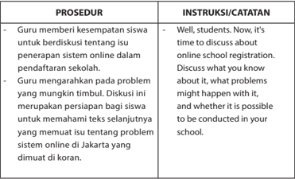

Tabel ini berisi prosedur dan instruksi untuk diskusi tentang isu pendaftaran sistem online di sekolah. Topik utama adalah persiapan diskusi tentang isu pendaftaran sistem online di Jakarta yang dimuat di koran. Kolom pertama berisi prosedur yang melibatkan guru memberikan kesempatan kepada siswa untuk berdiskusi tentang isu tersebut. Kolom kedua berisi instruksi atau catatan yang menunjukkan bahwa saat ini adalah waktu untuk membahas tentang pendaftaran sistem online dalam pendaftaran sekolah. Guru juga mengarahkan untuk membahas apa yang mungkin timbul, seperti masalah yang mungkin timbul dengan sistem online tersebut, dan apakah hal itu mungkin dilakukan di sekolah mereka.

### B. VOCABULARY BUILDER

---
**📊 Tabel**

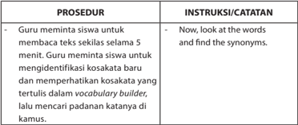

Tabel ini berisi prosedur dan instruksi untuk mengajarkan siswa memahami dan menggunakan kata-kata baru dalam bahasa Inggris. Topik utama tabel adalah pembelajaran kata-kata baru dan penggunaannya dalam konteks. Kolom pertama berisi prosedur yang harus dilakukan oleh guru, seperti meminta siswa membaca teks selasih dalam 5 menit, mengidentifikasi kosakata baru, dan mencari padanan kata di kamus. Kolom kedua berisi instruksi atau catatan yang diberikan kepada guru, seperti "Now, look at the words and find the synonyms." Data penting yang terlihat adalah bahwa prosedur ini bertujuan untuk meningkatkan kemampuan siswa dalam memahami dan menggunakan kata-kata baru dalam bahasa Inggris, serta memperkenalkan konsep synonym (kata yang memiliki makna serupa).

Throng (v)

: crowd, gather

Dissatisfaction (n) : unhappiness, frustration, disappointment

Enrollment (n)

: registration

Turn down (v)

: refuse, reject

Vie (v)

: compete, struggle, fight

Submit (v)

: tender, offer, present

 

---
## 📄 Halaman 74

### C. PRONUNCIATION PRACTICE

---
**📊 Tabel**

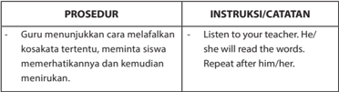

Tabel ini berisi instruksi untuk guru dalam prosedur belajar membaca kata kosakata tertentu kepada siswa. Topik utama tabel adalah proses pembelajaran membaca kata kosakata. Kolom pertama berisi prosedur yang harus dilakukan oleh guru, yaitu menunjukkan cara melafalkan kata kosakata tertentu, meminta siswa memahami konten tersebut, dan kemudian guru menirukan suara kata kosakata tersebut. Kolom kedua berisi instruksi atau catatan yang diberikan kepada guru, yaitu "Listen to your teacher. He/she will read the words. Repeat after him/her." Ini menunjukkan bahwa guru harus mendengarkan guru yang sedang membaca kata kosakata, kemudian mengulangi suara kata tersebut sesuai dengan apa yang dia dengar. Pola penting yang terlihat adalah bahwa prosedur ini mengajarkan guru untuk menjadi contoh dalam proses belajar membaca, sementara instruksi mengajarkan guru bagaimana melakukan hal tersebut dengan tepat.

### D. READING COMPREHENSION

---
**📊 Tabel**

Tabel ini berisi instruksi untuk dua tugas pembelajaran yang dilakukan oleh guru di kelas. Topik utama tabel adalah prosedur dan instruksi yang diberikan kepada siswa. Kolom pertama berisi prosedur, sedangkan kolom kedua berisi instruksi atau catatan. Dalam prosedur pertama, guru meminta siswa membaca teks sekali lagi dan menulis pertanyaan yang muncul di benak mereka saat membaca. Sementara itu, dalam prosedur kedua, guru meminta siswa mencari jawaban atas pertanyaan mereka kepada teman. Siswa boleh bekerja berpasangan atau berdiri dan menanyakan kepada sebarang siswa di kelas. Aktivitas yang terakhir ini dapat dipilih jika guru ingin agar siswa bergerak. Pola penting yang terlihat adalah bahwa guru memberikan instruksi yang spesifik dan detail untuk membantu siswa belajar dan mengembangkan keterampilan membaca dan berpikir kritis.

 

---
## 📄 Halaman 75

### Task 3:

- -Guru meminta siswa untuk menjawab pertanyaan dengan merujuk pada teks. Guru meminta siswa untuk mendiskusikan jawaban mereka dengan teman sebangku.
- What is the main problem faced by the parents? Their sons/daughters were not accepted in the public schools due to the online registration system.
- Why did the parents feel disappointed with the online system? The parents faced some technical problems related to the online system which according to them was disorganized.
- Who was rejected from school due to her height? Riki Setyanto's daughter was rejected from the school due to her height.
- What happened to Nuraisyah Paransa's son? Nuraisyah Paransa was unable to register her son at any state-run high school due to some technical problems. He was initially accepted at East Jakarta public school through the public admission phase. However, he did not re-register with that school as he wanted to shoot for a better state-run school through the local admission phase.

### PROSEDUR

### INSTRUKSI/CATATAN

- -Now, look at the questions 1-10. Find the answers by referring to the text.

 

---
## 📄 Halaman 76

---
**📊 Tabel**

Tabel ini berisi pertanyaan-pertanyaan yang berkaitan dengan masalah sistem online pendaftaran sekolah dan respons terhadap masalah tersebut. Topik utama tabel adalah tentang masalah teknis dalam sistem pendaftaran online sekolah dan bagaimana respond terhadap masalah tersebut. Kolom-kolomnya mencakup topik-topik seperti masalah teknis dalam sistem pendaftaran, alasan mengapa orang tua memilih sekolah publik dibandingkan sekolah privat, cara orang tua menangani masalah sistem online, respons Gubernur terhadap protes orang tua, dan jika orang tua menjadi Gubernur, bagaimana mereka akan merespons kekhawatiran orang tua. Data penting yang terlihat adalah bahwa masalah utama yang dihadapi adalah sistem pendaftaran online yang tidak efektif dan kurang koordinasi antar fase, sementara orang tua lebih memilih sekolah publik karena alasan finansial.

 

---
## 📄 Halaman 77

### E. TEXT STRUCTURE

---
**📊 Tabel**

Tabel ini berisi prosedur dan instruksi untuk memahami struktur teks dalam sebuah bab. Topik utama tabel adalah metode pembelajaran guru untuk membantu siswa memahami struktur teks. Kolom pertama berisi prosedur yang melibatkan guru menjaga siswa agar fokus pada struktur teks, meminta siswa untuk memahami struktur teks, dan menjelaskan struktur teks pada bab tersebut. Kolom kedua berisi instruksi atau catatan yang menekankan perhatian pada struktur teks, meminta siswa untuk memperhatikan struktur teks satu kali lagi, dan mengekspresikan pengetahuan tentang struktur teks dalam kolom yang telah disediakan. Pola penting yang terlihat adalah bahwa prosedur dan instruksi bertujuan untuk meningkatkan pemahaman siswa tentang struktur teks.

---
**📊 Tabel**

Tabel ini berisi informasi tentang sebuah peristiwa yang terjadi di Jakarta, dimana orang tua dan kepala sekolah Jakarta berkumpul di Kantor Pendidikan Jakarta di Kuningan. Topik utama tabel adalah tentang situasi di mana beberapa siswa tidak mampu mengikuti proses pendaftaran sekolah dan tidak dapat mendaftar secara lokal atau sekolah swasta. Informasi ini disampaikan oleh Kepala Sekolah Jakarta melalui laporan dari The Jakarta Post, dan salah satu orang tua menyatakan bahwa mereka tidak mampu membayar biaya sekolah privat dan menyarankan agar dana tersebut diberikan kepada pihak sekolah untuk digunakan di sekolah-sekolah publik.

 

---
## 📄 Halaman 78

### F. GRAMMAR REVIEW

---
**📊 Tabel**

Tabel ini berisi prosedur dan instruksi yang digunakan dalam pembelajaran Bahasa Indonesia, khususnya untuk memahami dan mengidentifikasi kata-kata pola Direct Speech dan Indirect Speech dalam teks. Topik utama tabel adalah proses pembelajaran yang melibatkan guru dan siswa dalam menemukan dan memahami struktur kalimat dalam bahasa Indonesia. Kolom pertama, "PROSEDUR", menyajikan langkah-langkah yang harus dilakukan oleh guru dan siswa, seperti meminta siswa untuk memahami konteks teks, mencari kata-kata pola Direct Speech dan Indirect Speech, dan menulis kalimat dalam kolom yang tersedia. Kolom kedua, "INSTRUKSI/CATATAN", memberikan petunjuk atau instruksi kepada guru dan siswa tentang bagaimana melakukan prosedur tersebut, seperti menunjukkan satu kalimat langsung, mencari kalimat lain dengan pola yang sama, dan menulis kalimat dalam kolom yang tersedia. Data atau pola penting yang terlihat dalam tabel ini adalah bahwa proses pembelajaran ini fokus pada pengenalan dan pemahaman struktur kalimat dalam bahasa Indonesia, terutama dalam konteks Direct Speech dan Indirect Speech.

---
**📊 Tabel**

Tabel ini membandingkan dua jenis kalimat: kalimat langsung (direct sentence) dan kalimat tidak langsung (indirect sentence). Topik utama tabel adalah perbedaan struktur dan penggunaan kalimat tersebut dalam konteks yang sama. Kolom "Direct sentence" berisi kalimat yang disampaikan secara langsung oleh seseorang, sedangkan kolom "Indirect sentence" berisi kalimat yang disampaikan melalui kata kerja "said" atau "stated". Data penting yang terlihat adalah bahwa kalimat tidak langsung memiliki struktur yang lebih panjang dan biasanya menggunakan kata kerja "that" untuk menyatakan informasi yang disampaikan oleh orang lain. Ini menunjukkan bagaimana cara berpikir dan bahasa yang digunakan dalam komunikasi formal dan informal.

 

---
## 📄 Halaman 79

### Direct sentence

'First my daughter was rejected because of her height, and now due to technical issues, she can 't register at any school. I just want to get her into a good school,' he said.

Nuraisyah Paransa, another parent, also said, 'I was unable to register my son at any state-run high school due to similar technical problems.'

'But the second school rejected him because it said that he had been accepted through the public admission phase. Since my son did not re-regist er at the first school, now he isn 't registered anywhere,' Aisyah said.

Lasro Marbun, head of the Jakarta Education Agency, said, 'Anyone who did not re-register in the public admission phase and was unable to register during local admission or third admission, could register their children at private schools.'

### Indirect sentence

Riki Setyanto said that at first his daughter was rejected because of her height, and now due to technical issues, she can 't register at any school. He just wanted to get her daughter into a good school.

Nuraisyah Paransa, another parent, also said that she was unable to register her son at any state-run high school due to similar technical problems.

Aisyah said  that the second school rejected him because it said that he had been accepted through the public admission phase. Since her son did not re-register at the first school, now he isn 't registered anywhere.

Lasro Marbun, head of the Jakarta Education Agency, said that anyone who did not re-register in the public admission phase and was unable to register during local admission or third admission, could register their children at private schools.

 

---
## 📄 Halaman 80

---
**📊 Tabel**

Tabel ini membandingkan dua jenis kalimat: kalimat langsung dan kalimat tidak langsung. Topik utamanya adalah perbedaan struktur dan penulisan kalimat tersebut. Kolom pertama berisi kalimat langsung yang disampaikan oleh seseorang, sedangkan kolom kedua berisi kalimat tidak langsung yang ditransformasi menjadi bentuk lain. Data penting yang terlihat adalah bahwa kalimat tidak langsung biasanya lebih singkat dan menggunakan kata kerja seperti "said" atau "told", sementara kalimat langsung lebih detail dan mencakup informasi tambahan tentang siapa yang menyampaikan kalimat dan di mana.

### G. WRITING

---
**📊 Tabel**

Tabel ini berisi prosedur dan instruksi yang diberikan oleh guru kepada siswa untuk menyelesaikan tugas belajar. Topik utama tabel adalah proses pembelajaran berbasis media massa, dimana guru meminta siswa untuk membaca berita dari koran dan menulis poin-poin pentingnya di buku tulis. Kolom pertama berisi prosedur yang harus dilakukan oleh siswa, sementara kolom kedua berisi instruksi atau catatan yang diberikan oleh guru. Data penting yang terlihat adalah bahwa guru memberikan waktu untuk siswa membaca berita dan menulis poin-poin pentingnya, serta memberikan kesempatan bagi siswa untuk berbagi informasi yang telah dibaca dengan teman-temannya.

 

---
## 📄 Halaman 81

### H. SPEAKING

---
**📊 Tabel**

Tabel ini berisi prosedur dan instruksi untuk siswa masing-masing yang bertugas untuk mencantumkan berita dari koran yang telah mereka baca. Topik utama tabel ini adalah proses pencantuman berita dari koran. Kolom pertama berisi prosedur yang harus dilakukan oleh setiap siswa, sedangkan kolom kedua berisi instruksi atau catatan yang perlu diperhatikan saat melakukan prosedur tersebut. Data penting yang terlihat dalam tabel ini adalah bahwa setiap siswa harus mencantumkan berita dari koran yang telah mereka baca, dan instruksi untuk melakukan ini dengan baik dan benar.

### I. REFLECTION

---
**📊 Tabel**

Tabel ini berisi prosedur dan instruksi/catatan yang digunakan oleh guru untuk mendiskusikan kesulitan siswa dalam memahami dan menceritakan berita dalam koran. Topik utama tabel adalah pendekatan pembelajaran guru dalam membantu siswa memahami materi. Kolom pertama berisi prosedur yang melibatkan guru mendiskusikan dengan siswa tentang kesulitan mereka dalam memahami dan menceritakan berita dalam koran. Kolom kedua berisi instruksi atau catatan yang diberikan kepada guru, seperti "Do you find it difficult to understand the news? What difficulties did you find?" Ini menunjukkan bahwa guru harus bertanya tentang kesulitan siswa dalam memahami dan menerjemahkan berita dalam koran. Pola penting yang terlihat adalah bahwa prosedur ini bertujuan untuk membantu siswa memahami dan menerjemahkan berita dalam koran dengan cara yang lebih efektif.

 

---
## 📄 Halaman 82

### KUNCI JAWABAN

### D. TEXT STRUCTURE

---
**📊 Tabel**

Tabel ini berisi informasi tentang situasi di Jakarta yang melibatkan sekolah dan pemerintah setempat. Topik utamanya adalah tentang proses registrasi sekolah baru untuk anak-anak yang tidak mampu mengikuti pendidikan formal di sekolah swasta. Dalam tabel ini, terdapat beberapa pihak yang terlibat, termasuk orang tua, kepala sekolah Jakarta, dan wali kota Jakarta. Informasi tentang waktu dan tempat terjadi tidak disebutkan secara spesifik, namun diketahui bahwa ini terjadi setelah proses pendaftaran sekolah baru. Sumber berita adalah The Jakarta Post. Ada juga beberapa pernyataan dari pihak-pihak yang terlibat, seperti kepala sekolah yang menyatakan bahwa siswa yang tidak mampu mengikuti pendidikan formal di sekolah swasta dapat mendaftar di sekolah publik jika mereka tidak mampu membayar biaya. Pernyataan dari salah satu orang tua menunjukkan ketidakmampuan untuk membayar biaya sekolah swasta, sementara wali kota menyatakan bahwa situasi tersebut tidak seharusnya menjadi alasan untuk panik.

 

---
## 📄 Halaman 83

### Chapter 7

### It's Garbage In, Art Works Out

---
**🖼️ Gambar/Diagram**

> **Deskripsi Visual:** Gambar ini adalah ilustrasi yang menunjukkan berbagai jenis sikat gigi. Gambar ini menggambarkan berbagai warna dan bentuk sikat gigi yang berbeda, mulai dari yang tipis hingga yang tebal, serta berbagai ukuran dan desain. Setiap sikat gigi memiliki karakteristik unik yang mencerminkan variasi dalam produk tersebut. Ilustrasi ini mungkin digunakan untuk membantu pembaca memahami perbedaan antara berbagai jenis sikat gigi dan memilih yang paling sesuai dengan kebutuhan mereka.

### Tujuan Pembelajaran:

Setelah mempelajari Bab 7, siswa diharapkan mampu melakukan hal-hal sebagai berikut:

- Menganalisis fungsi sosial, struktur teks, dan unsur kebahasaan dari teks news item berbentuk berita sederhana dari koran/radio/TV, sesuai dengan konteks penggunaannya. 3.4
- Menangkap makna dalam teks berita sederhana dari koran/radio/TV. 4.4

 

---
## 📄 Halaman 84

### A. WARMER: PAIRWORK

---
**📊 Tabel**

Tabel ini berisi prosedur dan instruksi untuk sebuah aktivitas belajar di kelas, dimana siswa diberi kata-kata yang tidak beraturan dan harus membentuk kembali huruf-huruf tersebut menjadi kata-kata yang benar. Topik utama tabel adalah pembelajaran kata-kata yang tidak beraturan dan cara mengubahnya menjadi kata yang benar. Kolom pertama berisi prosedur yang melibatkan guru meminta siswa untuk bekerja dalam kelompok, sedangkan kolom kedua berisi instruksi dan catatan yang memberikan petunjuk kepada siswa tentang bagaimana mereka harus bekerja. Data penting yang terlihat adalah bahwa siswa harus bekerja secara kelompok, bekerja cepat, dan harus mengetahui arti kata-kata yang mereka bentuk.

### B. VOCABULARY BUILDER

---
**📊 Tabel**

Tabel ini berisi prosedur dan instruksi untuk siswa yang sedang belajar bahasa Inggris. Topik utamanya adalah memahami arti kata dalam kalimat. Siswa diberitahu untuk mendengarkan kata-kata sulit yang disampaikan oleh guru, kemudian mencari makna kata-kata tersebut. Siswa harus memeriksa apakah makna kata-kata tersebut sesuai dengan artinya. Jika tidak, mereka harus mencari tanda tik di tempat yang tepat. Setiap kata yang benar memiliki tanda tik, sementara kata yang salah tidak memiliki tanda tik. Siswa juga diberitahu bahwa beberapa kata sudah memiliki makna yang sesuai dengan artinya, sehingga mereka dapat menemukan dua kata yang memiliki makna yang tidak sesuai. Jika perlu, siswa dapat menggunakan kamus untuk membantu dalam proses ini.

 

---
## 📄 Halaman 85

---
**📊 Tabel**

Tabel ini berisi prosedur dan instruksi untuk siswa memahami makna kata-kata yang sulit dalam teks. Topik utamanya adalah pemahaman konteks kalimat dalam menentukan pilihan makna yang sesuai. Kolom "Prosedur" mencakup beberapa langkah yang dilakukan oleh guru, seperti membantu siswa mempertimbangkan konteks kalimat. Kolom "Instruksi/Catatan" menyajikan contoh kata-kata yang sulit, seperti "reduction", "municipal", "household", "composting centre", "awareness", "landfills", dan "trash". Data penting yang terlihat adalah bahwa prosedur ini bertujuan untuk meningkatkan pemahaman siswa tentang makna kata-kata yang sulit dalam konteks kalimat.

### C. PRONUNCIATION PRACTICE

---
**📊 Tabel**

Tabel ini berisi prosedur dan instruksi untuk mengajarkan siswa mendengarkan dan menerjemahkan kata-kata baru. Topik utama tabel adalah proses pembelajaran bahasa asing, khususnya metode pengajaran melalui mendengarkan dan menerjemahkan. Kolom pertama berisi prosedur yang melibatkan guru memberikan informasi tentang kata-kata baru, kemudian meminta siswa mendengarkan dan menerjemahkan. Kolom kedua berisi instruksi atau catatan yang menunjukkan langkah-langkah guru dalam proses tersebut, seperti meminta siswa membaca dengan nyaring, meminta siswa meminta demonstrasi kemampuan menerjemahkan, dan jika perlu, meminta siswa membaca kalimat yang berisi kata-kata tersebut. Pola penting yang terlihat adalah fokus pada kegiatan mendengarkan dan menerjemahkan sebagai bagian dari proses belajar bahasa asing.

 

---
## 📄 Halaman 86

### D. LISTENING COMPREHENSION

---
**📊 Tabel**

Tabel ini berisi prosedur dan instruksi untuk sebuah aktivitas belajar tentang pengelolaan sampah rumah tangga. Topik utamanya adalah bagaimana siswa dapat memikirkan dan menulis daftar sampah yang merekahasilkan, kemudian membandingkannya dengan teman-teman mereka. Proses ini dimulai dengan guru meminta siswa untuk memikirkan dan menulis daftar sampah yang merekahasilkan, lalu mereka harus membandingkan daftar tersebut dengan teman-teman mereka. Selanjutnya, siswa harus mempertimbangkan jenis-jenis sampah yang paling sering dihasilkan oleh mereka sendiri dan orang-orang di sekitarnya. Tujuan akhir adalah untuk meningkatkan pemahaman siswa tentang pengelolaan sampah dan bagaimana mereka dapat membantu menjaga lingkungan.

 

---
## 📄 Halaman 87

### PROSEDUR

- -Jika tidak ada siswa yang menghasilkan pertanyaan yang berkaitan dengan sampah yang sulit terurai seperti plastik guru mengajukan pertanyaan terkait hal tersebut.
- -Siswa dimotivasi untuk bertanya setelah melihat jenis-jenis sampah yang mereka hasilkan. Pertanyaan yang penting terutama adalah:
What do you usually do with the waste that cannot break down easily, that take long time to break down and become soil again .

- -Guru dan para siswa berdiskusi singkat tentang hal ini.

### Task 2:

- -Guru menuliskan di papan judul berita yang akan didengarkan para siswa: A rtist Turns Plastic Bags into Art mengajak siswa untuk berpikir tentang pertanyaan apa yang sebaiknya ditanyakan jika mereka menemui judul tersebut.
Pertanyaan itu di antaranya adalah: what information will I get. Dan prediksi jawaban dari pertanyaan tersebut adalah: I will get some information about who the artist is and how she/he recycles the plastic waste.

- -Dengan memiliki prediksi awal, siswa melakukan listening with a purpose dan memiliki standpoint untuk mengkritisi apakah berita yang didengarkan sesuai dengan harapan.

### INSTRUKSI/CATATAN

- -Let 's share the questions. Read the questions. What do you think about those questions?
- -What do you think about these questions:
* What happens to the waste that cannot breakdown easily?

- What happens to the waste that takes long time to breakdown and become soil again?
- -We are going to listen to a piece of news entitled Artist Turn Plastic Bags into Art.
- -When you come across a title like that, what questions will you probably have and what answer do you expect to get from the news? Discuss with your partner.
- -Now listen to the news and see whether the text answers your question(s).

 

---
## 📄 Halaman 88

### PROSEDUR

- -Kosakata yang dianggap baru dan tidak bisa diterka dari konteks teks juga bisa dibahas makna pada tahap ini.

### Task 3:

- -Guru memperdengarkan teks listening yang bisa di download dari learningenglish.voanews. com/content/plastic-bag-as-art/1966951.html. Jika hal tersebut tidak memungkinkan, guru membacakan teks berita tersebut. Dalam konteks ini, lebih baik jika siswa belum membaca news script pada Task 5 tersebut.

### Task 4:

- -Guru meminta siswa untuk bersiap mendengarkan lagi dan guru mengatakan bahwa rekaman hanya akan dimainkan sekali ini karena radio juga tidak bisa diminta mengulang. Rekaman bisa diputar lagi hanya untuk mencocokkan jawaban.
- -Pertanyaan 1 s.d. 5 berisi jawaban faktual dari teks sedangkan pertanyaan 6 s.d. 9 berisi jawaban yang bersifat subjektif. Benar tidaknya jawaban bergantung pada argumen yang diberikan siswa.

### INSTRUKSI/CATATAN

- -Now listen to the text. While listening, check if your question is relevant with the text and whether you get the answer for that question too.
- -This means while listening you pay attention to the information you are looking for.
- -Are there any new words?
- -Read the comprehension questions number 1 to 5. Can you answer the questions? If you can, write them down.
- -Now, let 's listen again to the news and take some notes about the information needed to answer the questions.
- -I will play the recording once again.
- -(Or, I will read aloud the text once)
- -Now, answer questions 1 to 5, individually fi  rst.
- -Then, compare your answers to your classmates' sitting next to you.

 

---
## 📄 Halaman 89

### Task 5:

- -Siswa memberi nomor urut pada kotakkotak yang berisi informasi tentang bagianbagian dari sebuah berita radio. Untuk melakukan ini, siswa membaca news script dan memahami urutan idenya. Berdasarkan urutan ide dalam teks, siswa menomori kotak-kotak tersebut.

### E. READING COMPREHENSION

---
**📊 Tabel**

Tabel ini berisi instruksi untuk prosedur membaca teks siswa. Topik utamanya adalah bagaimana siswa harus memahami dan menerapkan prosedur tersebut. Kolom "PROSEDUR" menyediakan langkah-langkah yang perlu diikuti, sementara kolom "INSTRUKSI/CATATAN" memberikan petunjuk tambahan tentang cara melakukannya. Data penting yang terlihat adalah bahwa siswa harus memerhatikan gambar dan caption di bawah gambar sebelum membaca teks, dan juga harus membaca judul. Ini menunjukkan bahwa prosedur ini bertujuan untuk meningkatkan pemahaman siswa tentang konten teks melalui penggunaan visual.

- -Now let 's check the answers together.
- -Okay, now let's continue to answer questions 7 to 10. Discuss the answers in pairs.
- -Now, let's share our answers with the class.
- -The text you just listened to is an example of a news report. Now, let's identify how the ideas and the steps or the reportage is arranged. Knowing that can help us understand the news better. Now, read the news scripts. After that, number the following boxes to show which parts come first and which come later.

 

---
## 📄 Halaman 90

- -Berdasarkan foto, caption , dan judul, siswa diminta menerka isi bacaan. Jika siswa memahami gambar, caption , dan judul dengan benar, prediksi siswa tentang isi berita juga akan benar.
- -Siswa membaca teks dengan saksama dan mendapatkan informasi tentang upaya penanggulangan sampah.
Task 2: Vocabulary activities Siswa mencari kata-kata dalam teks yang dicetak tebal dan memasangkannya dengan artinya.

Task 3: Comprehension Question Siswa menjawab pertanyaan bacaan. Mintalah siswa untuk bekerja dalam kelompok.

Task 4: Writing activities Membuat news script untuk siaran radio.

- -Guru meminta siswa mempelajari lagi Task 2 (in C - Collecting Information). Setelah itu guru meminta siswa bekerja dalam kelompok untuk mengubah sebuah bacaan yang mereka pilih untuk menjadi script yang siap dibaca sebagai berita radio.
- -Now, guess what do you think the news is about? Tell your idea to you classmate sitting next to you.
- -Now, read the news. Find out whether your guess is right.
- -Students, now find some boldfaced words in the text and match them with the meaning provided in task 2.
- -Answer the questions in pairs or in groups.
- -After that exchange your answer sheets. Check whether your answers the same as the students ' . If they are diff  erent, whose answers are correct? Discuss with your group.
- -Read again the activity in Task 2 listening comprehension section on page 100. Now, use the information from that section to modify the reading text into a script for a TV news broadcast. Do that in pairs, then compare the result with your classmates' .

 

---
## 📄 Halaman 91

### F. TEXT STRUCTURE

---
**📊 Tabel**

Tabel ini berisi instruksi untuk menyelesaikan tugas mengidentifikasi struktur gagasan pada berita radio. Topik utama adalah prosedur dan instruksi untuk mengisi tabel menggunakan kotak-kotak informasi. Kolom "PROSEDUR" memberikan petunjuk tentang bagaimana mengidentifikasi struktur gagasan, sementara kolom "INSTRUKSI/CATATAN" menyediakan detail tentang cara melakukan tugas tersebut, termasuk memilih kata-kata yang tepat dari daftar kata yang disediakan, membaca ulang builder kata-vocabulary, dan melihat aktivitas kata-vocabulary sebelumnya. Data penting yang terlihat adalah bahwa siswa harus melakukan tugas ini sendiri terlebih dahulu dan kemudian membandingkan jawabannya dengan teman-teman mereka.

### G. VOCABULARY EXERCISES

---
**📊 Tabel**

Tabel ini berisi instruksi untuk siswa yang sedang belajar tentang prosedur mendengarkan dan memahami berita radio. Topik utama tabel adalah "Listening to the radio news report" dan "Reading Comprehension". Kolom pertama berisi prosedur yang harus dilakukan oleh siswa, seperti mengisi lembaran raport dengan menggunakan kata-kata yang telah disediakan. Kolom kedua berisi instruksi atau catatan yang diberikan kepada siswa, seperti mengekspresikan pengetahuan mereka tentang struktur berita radio dan memeriksa informasi dari lembaran raport. Data penting yang terlihat adalah bahwa prosedur ini melibatkan mendengarkan berita radio, memeriksa tabel di halaman tertentu, dan mengisi lembaran raport dengan informasi yang diberikan.

 

---
## 📄 Halaman 92

### H. GRAMMAR REVIEW

### PROSEDUR

### Task 1:

- -Guru meminta siswa untuk memerhatikan salah satu unsur kebahasaan dalam teks, yaitu berupa perubahan kata kerja menjadi kata benda dengan penambahan imbuhan -ion pada kertas kerja. Siswa kemudian berlatih menggunakan kata-kata tersebut dalam konteks kalimat yang disediakan dan yang mereka buat sendiri.

### Task 2: Is it Verbs or Noun?

- -Pada grammar exercises siswa menerapkan konsep yang baru mereka pelajari. Siswa mengubah kata kerja menjadi kata benda dengan menambahkan imbuhan -ion

### Task 3: Do the exercises

- -Siswa menggunakan  kata kerja dan kata benda dalam kalimat yang mereka buat sendiri. Siswa harus mengetahui letak kata kerja dan kata benda dalam kalimat-kalimat tersebut.

### INSTRUKSI/CATATAN

- -Let 's learn grammar. Let's learn how to make nouns from verbs.
- -Noun is a word that refers to a person, place, thing, event, substance, or quality.  Jakarta, water, oxygen, cleanliness are examples of nouns.
- -We can make nouns from verbs. We can add the suffi x ion to verbs to form nouns.
- -Study the examples in the table and complete the list. Work individually first, then in pairs.
- -Now, apply your knowledge. Read the sentences in Task 2 Grammar Exercises. Pay attention to the words in brackets. By considering the message in the sentence, decide whether the words should be used as verbs or nouns.
- -If you think the words should be used as nouns, change them by adding the suffi x -ion to change their part of speech (jenis kata) .
- -Work individually fi  rst, then discuss your answers with your discussion partner.

 

---
## 📄 Halaman 93

### Task 4:

- -Pada kegiatan listening ini, siswa diminta mendengarkan teks berita dengan saksama dan mencoba menuliskan ( transcribing ) berita yang mereka dengarkan. Hasil yang terbaik adalah yang semirip mungkin dengan aslinya.
- -Sedapat mungkin guru menggunakan teks lisan dari penutur asli supaya siswa belajar mengidentifikasi ujaran/kata-kata asing yang memiliki  ucapan, penekanan dan intonasi yang berbeda dari bahasa Indonesia. Kegiatan ini melatih siswa untuk peka atas perbedaan tersebut dan ketika menyimak lebih berhati-hati.
- -Untuk itu guru bisa menggunakan teks berita di atas (lihat teks  ' Artist Turns Plastic Bags into Art ' yang teks audionya bisa diunduh dari learningenglish.voanews.com/content/ plastic-bag-as-art/1966951.html.
- -Bahan untuk kegiatan ini juga bisa diunduh di antaranya dari iteslj.org/links/ESL/Listening/ Downloadable_MP3_Files/ ,

### PROSEDUR

### INSTRUKSI/CATATAN

- -Now, try to make simple sentences using nouns and verbs in the following pairs of words.
- -Work in pairs first and then exchange it with a classmate.
- -Listen to this news report. I will play the recording twice. (Or, I will read aloud the news twice).
- -Write down any information you can get from the news report.
- -Transcribe or rewrite the news you 've just listened to.
- -After that, exchange the result with your classmates' .
- -Now let's check together. I will play the recording again. (Or, I will read aloud the news again).

 

---
## 📄 Halaman 94

---
**📊 Tabel**

Tabel ini berisi instruksi tentang prosedur untuk mendapatkan dan memanfaatkan teks lisan dari berbagai sumber seperti www.manythings.org/listening, learningenglish.voanews.com, www.bbc.com/news, dan sebagainya. Guru diperlukan untuk mempertimbangkan tingkat kesulitan jika teks lisan diambil dari sumber autentik seperti www.bbc.com/news/. Teks lisan yang bukan berita masih bisa digunakan. Siswa diminta mentranskripsinya dan kemudian memodifikasi menjadi teks berita radio. Jika fasilitas Internet tidak ada, guru bisa mencari teks berita tertulis untuk dibacaan secara bersama. Topik utama tabel ini adalah prosedur mendapatkan dan memanfaatkan teks lisan dari berbagai sumber. Kolom-kolomnya adalah "PROSEDUR" dan "INSTRUKSI/CATATAN". Data penting yang terlihat adalah bahwa guru harus mempertimbangkan tingkat kesulitan jika teks lisan diambil dari sumber autentik, siswa harus mentranskripsinya dan memodifikasi menjadi teks berita radio, dan jika fasilitas Internet tidak ada, guru bisa mencari teks berita tertulis untuk dibacaan secara bersama.

### I. WRITING/SPEAKING

---
**📊 Tabel**

Tabel ini berisi instruksi untuk sebuah tugas yang melibatkan siswa dalam role play. Topik utamanya adalah perbandingan susunan berita surat kabar dan radio. Dalam prosedur tersebut, siswa diminta untuk bermain dalam kegiatan role play. Ada dua aktivitas role play yang harus mereka baca dan pilih satu yang lebih menarik untuk dilakukan. Ini menunjukkan bahwa tugas ini bertujuan untuk membandingkan dan mempelajari cara penyampaian berita di media surat kabar dan radio, serta memberikan kesempatan bagi siswa untuk mengekspresikan minat mereka dalam hal ini.

 

---
## 📄 Halaman 95

### PROSEDUR

- -Siswa kemudian diminta memilih satu berita yang menarik dari Koran dan menuliskan ulang menjadi news script untuk berita radio. Setelah itu mereka bermain peran untuk menyiarkan berita radio dengan menggunakan teks berita yang telah mereka tulis ulang. Untuk hal ini, harus ada siswa yang berperan sebagai penyiar di studio, reporter di lapangan, dan beberapa pelaku peristiwa yang akan diwawancarai.

### Task 2:

- -Dalam role play kedua , siswa melakukan investigasi terhadap lingkungan sekolah untuk menemukan hal yang menarik untuk diberitakan. Setelah itu siswa menyusun berita radio untuk disiarkan. Prosedur selanjutnya sama dengan prosedur role play yang pertama.

### Task 3: News Script.

- -Siswa berlatih menulis naskah berita secara berkelompok. Siswa bisa melihat Task 8 pada observasi supaya struktur teks mereka bagus.

### INSTRUKSI/CATATAN

- -We will do these activities in groups.
- -When you do the activities don 't forget to use the vocabulary, grammar you have learned in this chapter. When you make a news script pay attention of the structure of a news report.
- -So, now let's make groups of four or fi  ve students and start to do the activity step by step.
- -(selanjutnya untuk Task 1 dan Task 2, gunakan instruksi khusus yang tertulis pada BS).

 

---
## 📄 Halaman 96

### J. REFLECTION

---
**📊 Tabel**

Tabel ini berisi prosedur dan instruksi untuk mengajarkan siswa memahami perubahan kata-kata dalam konteks kalimat. Topik utama tabel adalah pembelajaran tentang perubahan kata-kata (infinitif) dalam teks. Kolom pertama berisi prosedur yang melibatkan guru meminta siswa untuk memahami perubahan kata-kata dalam konteks teks, sementara kolom kedua berisi instruksi atau catatan yang diberikan kepada siswa. Data penting yang terlihat adalah bahwa siswa harus menggunakan kata-kata tersebut dalam konteks kalimat yang disediakan oleh guru, dan mereka harus membuat kalimat sendiri.

### KUNCI JAWABAN

### B. VOCABULARY BUILDER

---
**📊 Tabel**

Tabel ini berisi definisi kata-kata dalam bahasa Indonesia, dengan topik utama adalah "Definisi Kata". Kolom pertama menunjukkan kata yang akan dijelaskan, sedangkan kolom kedua menunjukkan definisi atau penjelasan tentang kata tersebut. Data penting yang terlihat adalah bahwa beberapa kata memiliki definisi yang benar (dengan tanda 'v'), sementara beberapa tidak (dengan tanda 'x'). Misalnya, kata "sculpture" memiliki definisi yang benar, tetapi kata "container" tidak memiliki definisi yang benar. Ini menunjukkan bahwa tabel ini digunakan untuk membandingkan definisi kata-kata dalam bahasa Indonesia.

 

---
## 📄 Halaman 97

The meaning of the word number 6 should be exchanged with the meaning of the word number 10.

### D. LISTENING COMPREHENSION Task 1

- plastic bottles
- paper wrappers
- plastic wrappers
- unused vegetables
- cardboad
- wooden stuff
- fruit skin
- food leftovers

### Task 2 Some examples of the answers:

- How does she do that?
- Why does she choose plastic bags to be recycled?
- How do people around her respond to her idea?
The answers depend on the students '  constructed questions. For the questions above, the following are some possible answers.

- She braids the plastic bags or incorporates them into her art works.
- She is interested in recycling plastic bags because she gets the    plastic bags that come with her newspaper every morning and they have soft texture.
- Her neighbors like the idea of using used plastic bags. They want   her to teach them how to make art works from used plastic bags.

### Task 4

- It's about an artist who changes plastic bags into art works.
- When the event took place is not mentioned and the event took place on an exhibit at the Prince George's African American Museum and Cultural Center in Maryland.

 

---
## 📄 Halaman 98

- The artist, Allita Irby; and the artist 's neighbor who respond positively to he Allita Irby's idea.
- She changes plastic bags into art works.
- How did she come out with the idea of turning the plastic bags into artwork? Every morning she gets newspapers in plastic bags. One day as she took her newspaper, she felt the texture of the plastic bags. She found out that it was soft. Then she realized that she could use them in her art works.
- Who are Caty Weaver, June Simms, Allita Irby, Charlotte Hogan, Alita Meyer, and Shirley Watts?
- Yes, it's important because it gives ideas about how to treat plastic waste. (Students may give different answers).)
- (the answer depends on the students' contexts. If they frequently find similar information then Irby's idea is common. If students think the idea is common ask them to give other examples of how to recycle plastic bags or plastic waste.
- Yes it is because it helps preserve the environment by   keeping the environment clean from plastic wastes.
- Plastic bags or plastic waste will not pollute the soil because they are reused for other purposes.
Caty Weaver:

the broadcaster in the studio.

June Simms: a reporter in the field

Allita Irby: the artist who turns plastic bags into art works

Charlotte Hogan, Alita Meyer, and Shirley Watts : Irby's neighbors, who give positive response to what Irby does.

### Task 5 : Teks untuk dibacakan

### Artist Turns Plastic Bags into Art

Welcome  to  American  Mosaic  from  VOA  Learning  English.  I'm  Caty Weaver.

Making art  with  found  materials  is  not  a  new  idea.    Recycled  paper, cloth and metal goods can become important pictures and sculptures. An artist near Washington, D.C. just had her recycled art on exhibit at the  Prince  George's  African  American  Museum  and  Cultural  Center  in Maryland.  She uses a material found in every American home.

 

---
## 📄 Halaman 99

June Simms reports.

Plastic bags are not costly to produce. They are also strong and easy to carry.  This is why they are a popular container in much of the world.

But they are also a major source of pollution. It can take hundreds of years for plastic bags to break down. As they do, tiny pieces can poison soil, lakes, rivers,  and  oceans.  So,  environmental  experts  urge  people  to  reuse  and recycle plastic bags.

Maryland artist Allita Irby does just that.  It starts with the morning newspaper.

Ms. Irby will read it later in the day. What is more important is getting that plastic bag the paper comes in.

The mixed media artist recognized its rich possibilities about three years ago.

'As I was taking the newspaper out. I felt the texture of these bags, they were soft. I just looked down and realized it takes three to make a braid. I'll just put a few staples in here just to keep it from unraveling."

Since then, Irby has been using plastic bags to create abstract lines in her art works.

Before incorporating plastic  bags  in  her  pieces,  Irby  used  natural materials like feathers, leather and dried plants.

All  those  elements  represent  her  Native  American  ancestry  and identity, like her piece called 'Navaho Bundles.'

'I  was  replicating  a  hair  style,  a  Navaho  hair  style  when  the  hair  is heavy and it 's looped back on itself. I took the piece and looped it back onto itself and secured it with a tie.'

Ms.  Irby's  neighbors  praise  her  ability  to  turn trash into treasure. Some, like Charlotte Hogan, asked the artist to teach them how to create art from used plastic bags.

'I  think  it's  fascinating,  it's  wonderful.  I  do  plan  to  share  with  my seniors at my church.'

Neighbor Aleta Meyer expressed surprise.

'I've never given any more thought to what to do with a plastic bag. This is definitely different.'

Shirley Watts also lives in the neighborhood.  She plans to show others her art.

'I want to make a masterpiece that I can put in a frame and put it up on my wall and then I know that I did it.'

 

---
## 📄 Halaman 100

### Tasko:

The reporter in the field mentions her name to end the reportage - 4

The broadcaster in the studio welcomes listeners to the program and introduces her name - 1

The reporter in the field introduces her name and reports the event with more detailed information by interviewing some actors and witnesses of the event - 3

The broadcaster in the studio tells the newsworthy event in the form of a summary - 2

The broadcaster in the studio ends the program by mentioning her name and inviting listeners to join the program again next time - 5

 

---
## 📄 Halaman 101

### Task 2:

- reduction
- municipal
- household
- composting center
- 5.wareness
- landfill
- trash

### Task 3:

- The main agenda was to increase the awareness of the waste management for economic and environmental benefits.
- The main reason was probably because there were waste management problems in the participants '  countries and the participants wanted to learn how to solve that from Surabaya.
- Surabaya was selected to be the conference venue because it has successful waste management. (or, Surabaya became the conference host because of its success in managing municipal waste through the 3Rs program.)
- Jawaban bisa beragam. Berikut adalah beberapa contoh:
- It was important because the conference can inspire other cities in Indonesia to learn how to manage their municipal waste from Surabaya.
- It was important to make Indonesia famous because of good things.
- etc
- Jawaban bisa beragam tergantung informasi yang diketahui guru dan siswa.
- At least Surabaya has implemented the three Rs so far.
- Rismaharini believed that the best way to solve the waste management problem was to involve household in recycling activities.
- There was a reduction in the volume of trash that ended up in  the landfills.
- The mayor told the schools to tell their students to bring their own plates and cups, and not to use drinking straws to reduce plastic waste
- Jawaban bisa beragam tergantung pendapat siswa. Misalnya:
- Excellent

 

---
## 📄 Halaman 102

- Good
- Environmentally friendly
- Very important for the environment
- Other cities should have that program too.
- I like it. Awesome.
- etc.

### Task 4:

### Good Morning.  Welcome to Our Morning News Program. I Am  Dina Sudina

Indonesia  has  opened  a  regional  recycling  conference  aimed  at increasing  awareness  of  waste  management  for  economic  and environmental benefits.

The Fifth Regional 3R Forum in Asia and the Pacific, which opened in Surabaya Tuesday, is being attended  by  300  participants  from  nearly  40  Asia  and  Pacific countries.

The  city  was  chosen  to  host  the  event  because  of  its  success  in managing municipal waste through the 3Rs, Reduce, Reuse, and Recycle.

### Ucok Harahap Reports

Mayor Tri Rismaharini said waste transportation is expensive and that  the  best  way  to  address  the  problem  is  at  its  sources,  with every household involved in recycling activities. "We can see that every year there is a reduction in the volume of trash that ends up in the landfill.  When I was the head of Sanitation and Parks, it was 2,300 cubic meters per day.  Currently it 's 1,200 cubic meters," she explained. "So you can see the reduction, which goes to composting centers, also in the community, and waste management centers."

The mayor said the city also runs a program for children called eco school.

 

---
## 📄 Halaman 103

"The school does not only teach about the environment but also introduces environmental-friendly practices, such as the eco school  program  where  they  bring  their  own  plates  and  cups  to reduce plastic waste.  They even don 't use drinking straws," added Tri Rismaharini.

The conference will continue until Thursday.

### I am Marcell

And I'm Dini Sudini. Join us again tomorrow for another Morning News from your favorite radio station.

### F.  TEXT STRUCTURE

---
**📊 Tabel**

Tabel ini berisi informasi tentang program VOA Learning English yang membahas topik tentang seni dan kreativitas. Topik utama adalah pembuatan seni dengan bahan-bahan yang ditemukan, seperti sampah plastik, kain, dan logam. Dalam program tersebut, seorang seniman asal Washington, D.C., telah memamerkan karyanya di Museum Afrika Amerika Prince George's di Maryland. Seniman tersebut menggunakan bahan yang ditemukan di rumah setiap orang Amerika. Pembawa acara studio menyambut penonton, menjelaskan nama mereka, dan kemudian memberikan sumaran tentang acara tersebut.

 

---
## 📄 Halaman 104

---
**📊 Tabel**

Tabel ini membandingkan dua penjelasan tentang plastik bag. Topik utama adalah penggunaan dan konsekuensi plastik bag. Kolom pertama berisi penjelasan oleh seorang penulis yang berada di lokasi, sementara kolom kedua berisi penjelasan oleh June Simms. Kedua penjelasan ini membahas bahwa plastik bag adalah alat yang populer karena mudah membuat dan membawa, namun juga menjadi sumber sampah besar yang dapat bertahan ribuan tahun untuk menewaskan plastik bag. Penulis yang berada di lokasi menjelaskan bahwa plastik bag dapat menyumbat sungai, danau, dan laut, dan bahkan bisa merusak ekosistem. Sedangkan June Simms mengatakan bahwa Maryland artist Allita Irby menggunakan plastik bag sebagai bahan untuk karya seni, dengan menciptakan abstraksi dan bentuk-bentuk yang unik.

 

---
## 📄 Halaman 105

---
**📊 Tabel**

Tabel ini berisi informasi tentang interaksi antara seorang seniman dengan warga sekitarnya tentang cara membuat seni dari plastik bekas. Topik utama adalah proses dan reaksi masyarakat terhadap karya seni tersebut. Kolom pertama berisi pernyataan dari seniman tentang proses pembuatan karya seni, sementara kolom kedua berisi respons warga sekitar. Data penting yang terlihat adalah bahwa warga sekitar menunjukkan minat tinggi dalam karya seni tersebut, termasuk mereka yang tidak pernah mempertimbangkan cara lain untuk menggunakan plastik bekas. Selain itu, penutup program menunjukkan bahwa penulis berharap untuk melanjutkan program ini di minggu depan.

 

---
## 📄 Halaman 106

### G. VOCABULARY EXERCISES

- sculptures
- reduce, trash, landfill
- containers, containers
- break down
- tiny
- braids, braid
- loop, secure

### H. GRAMMAR REVIEW

### Task 1

---
**📊 Tabel**

Tabel ini berisi dua kolom: "Verb" (Verba) dan "Noun" (Nomen). Verba adalah kata kerja yang digunakan untuk menggambarkan tindakan atau peristiwa, sementara Nomen adalah kata benda yang merujuk pada sesuatu yang telah terjadi atau diperbuat. Topik utama tabel ini adalah hubungan antara kata kerja dan kata benda yang mereka ciptakan melalui proses peneguhan. Data penting yang terlihat adalah bahwa setiap verba memiliki satu atau lebih nomen yang berkaitan dengannya, menunjukkan hubungan antara tindakan dan hasil atau produk dari tindakan tersebut. Misalnya, "incorporate" memiliki nomen "incorporation", "pollute" memiliki nomen "pollution", dan seterusnya. Ini menunjukkan bagaimana proses peneguhan membentuk kata benda baru dari kata kerja asli.

### Task 2:

- Think of what you can contribute to make your school atmosphere and environment better. Your meaningful contribution will make you feel better about yourself.
- The artist replicates the hairstyle of an Indian ethnic group in America, the Navajo. The replication looks beautiful.
- I promote Sita and Budi to be the representatives of our class in the student organization. I will use poster for the promotion .
- The architect incorporates environmentally friendly materials in the design of the public library. The incorporation will make the new building harmonious with the surrounding.
- The painting exhibition (or exhibit ) will take place in the main hall of the library. Not only national artists but also some high school students will exhibit their works there.
- Do not pollute this lake. If you do, the pollution will finally harm our health.
- Be proud of being able to create this pop-up book yourself. Though it is not the best, your should appreciate the originality of your creation . This is really much better than copying other pe ople's work.
- Children  in  the  landslide  area  need  our donation for  buying  books  and other learning materials. I suggest that everyone in this class donate some of their pocket money.
- treasure
- incorporate
- master piece
- replicate
- loop, unravel
- municipal, compost
- awareness

 

---
## 📄 Halaman 107

### Chapter 8

### How To Make

---
**🖼️ Gambar/Diagram**

> **Deskripsi Visual:** Gambar ini adalah ilustrasi yang menunjukkan dua orang yang sedang berbicara. Ilustrasi ini mungkin digunakan untuk menggambarkan konsep komunikasi, interaksi sosial, atau bahkan hubungan antar individu dalam konteks pendidikan. 

1. **Apa yang ditampilkan secara keseluruhan**: Gambar ini menampilkan dua orang yang berada di sebelah kiri dan kanan, masing-masing sedang berbicara kepada pihak lain. Mereka tampak senang dan aktif dalam percakapan mereka.

2. **Elemen-elemen utama dan relasinya**: Dua orang yang berbicara adalah elemen utama dari gambar ini. Mereka berada di kedua sisi gambar, dengan posisi yang saling berlawanan. Relasi mereka adalah interaksi sosial, di mana mereka berbagi informasi atau berkomunikasi.

3. **Teks, angka, atau label penting yang terlihat**: Dalam gambar ini, tidak ada teks, angka, atau label yang jelas. Namun, jika ada, mereka mungkin berhubungan langsung dengan konteks komunikasi atau interaksi yang ditampilkan.

4. **Informasi kunci yang dapat diambil pembaca**: Gambar ini memberikan gambaran tentang pentingnya komunikasi dan interaksi sosial. Ini bisa menjadi representasi dari bagaimana orang-orang berinteraksi dalam situasi tertentu, seperti dalam pendidikan atau lingkungan sosial lainnya.

Dengan demikian, gambar ini mungkin digunakan untuk membantu pembaca memahami konsep-konsep penting dalam komunikasi dan interaksi sosial.

Source: www.static.boredpanda.com

### Tujuan Pembelajaran:

Setelah mempelajari Bab 8, siswa diharapkan mampu melakukan hal-hal sebagai berikut:

- Membedakan fungsi sosial, struktur teks, dan unsur kebahasaan beberapa teks prosedur lisan dan tulis dengan memberi dan meminta informasi terkait manual penggunaan teknologi dan kiat-kiat (tips), pendek dan sederhana, sesuai dengan konteks penggunaannya. 3.6
- Menangkap makna secara kontekstual terkait fungsi sosial, struktur teks, dan unsur kebahasaan teks prosedur lisan da ntulis, dalam bentuk manual terkait penggunaan teknologi dan kiat-kiat (tips). 4.6.1
- Menyusun teks prosedur, lisan dan tulis, dalam bentuk manual terkait penggunaan teknologi dan kiat-kiat (tips), dengan memerhatikan fungsi sosial, struktur teks, dan unsur kebahasaan, secara benar, dan sesuai konteks. 4.6.2

 

---
## 📄 Halaman 108

### CATATAN:

Bab  8, 9,  10  merupakan  teks  prosedur.  Jika  tidak  memungkinkan  untuk melaksanakan pbm untuk ketiga bab itu di kelas, Guru bisa memilih salah satu atau  2  bab.  Bab  8  adalah  bab  yang  paling  mudah  berkaitan  dengan  prosedur pembuatan  makanan,  bab  9  terkait  dengan  mengolah  berbagai  bahan  bekas untuk menjadi produk-produk yang dapat dimanfaatkan dan kiat-kiat (tips), bab 10 berisi prosedur cara menggunakan teknologi. Jika guru memilih bab 10 untuk kegiatan pembelajaran di kelas, bab 8 dan 9 bisa dikerjakan siswa di rumah.

### A. WARMER: BOARD RACE

---
**📊 Tabel**

Tabel ini berisi instruksi dan catatan untuk prosedur guru dalam mengajarkan siswa tentang proses pembuatan kue. Topik utama adalah bagaimana guru menggunakan boardrace sebagai metode pembelajaran untuk meningkatkan kemampuan kata siswa yang berhubungan dengan topik. Guru membagi siswa menjadi 4 kelompok dan meminta mereka berdiri berbaris di depan papan tulis. Setiap kelompok dituntut untuk menulis kata-kata yang berhubungan dengan proses pembuatan kue. Tujuan dari prosedur ini adalah untuk mengidentifikasi kemampuan kata siswa yang berhubungan dengan topik.

 

---
## 📄 Halaman 109

---
**📊 Tabel**

Tabel ini menunjukkan proses pembuatan kue, di mana setiap baris mewakili langkah-langkah yang berbeda dalam proses tersebut. Topik utama tabel adalah pembuatan kue, dengan kolom-kolom yang mencakup berbagai tahap dalam proses ini, seperti "bake" (kukus), "chocolate" (coklat), "ingredients" (bahan), "glass" (gelas), "measuring cup" (gelas ukur), "bowl" (tongkat), "cream" (susu), "microwave" (microwave), "refrigerate" (kulkas), "freeze" (frosting), "stir" (mengaduk), "baking sheet" (papan kue), dan "decorate" (dekorasi). Data penting yang terlihat adalah bahwa beberapa langkah seperti "bake", "chocolate", "ingredients", "glass", "measuring cup", "bowl", "cream", "microwave", "refrigerate", "freeze", "stir", "baking sheet", dan "decorate" muncul lebih dari sekali, menunjukkan bahwa mereka merupakan bagian integral dari proses pembuatan kue.

### B. LISTENING

---
**📊 Tabel**

Tabel ini berisi prosedur dan instruksi untuk mengajarkan siswa memahami dan mengekstrak informasi dari teks. Topik utama adalah proses pembelajaran melalui pengamatan dan diskusi. Kolom pertama berisi prosedur yang harus dilakukan guru, seperti meminta siswa untuk membaca teks, memberikan resep, dan meminta siswa untuk mencatat informasi penting. Kolom kedua berisi instruksi atau catatan yang diberikan kepada guru, seperti "Okay, now prepare to listen to a recipe that I'll read for you," "Write down important things on your paper," dan "Listen again, and add more notes." Data penting yang terlihat adalah bahwa prosedur ini bertujuan untuk meningkatkan kemampuan siswa dalam memahami dan mengekstrak informasi dari teks, serta mendorong interaksi sosial antara siswa dan teman-temannya.

 

---
## 📄 Halaman 110

Selanjutnya, guru meminta siswa untuk menutup kembali buku mereka dan mendengarkan instruksi guru tentang pembuatan resep "Chocolate Dipped".

### C. VOCABULARY BUILDER

---
**📊 Tabel**

Tabel ini berisi prosedur dan instruksi untuk mengajarkan siswa menggunakan kata-kata dalam bahasa Inggris. Topik utamanya adalah pengenalan sinonim dan praktik penggunaan kata-kata dalam konteks. Kolom pertama berisi prosedur yang melibatkan guru meminta siswa mencari sinonim dari kata-kata dalam vocabulary builder, kemudian guru dan siswa membahasnya. Kolom kedua berisi instruksi atau catatan yang menunjukkan bahwa guru juga mengajak siswa mempraktekkan pilihan kata secara benar. Pola penting yang terlihat adalah proses belajar yang terstruktur dengan langkah-langkah yang jelas, mulai dari pencarian sinonim hingga praktik penggunaan kata-kata dalam konteks.

---
**📊 Tabel**

Tabel ini berisi definisi kata kerja dan kata benda yang berkaitan dengan proses memasak dan memasak. Topik utamanya adalah tentang cara-cara dasar dalam memasak, seperti menambahkan bahan, memotong, menambahkan campuran, memukul, menambahkan minyak, menggoreng, menghangatkan, mengurangi, mengurangi sisa, meneteskan, dan menetapkan suhu. Kolom pertama berisi kata kerja (v) yang digunakan dalam konteks memasak, sedangkan kolom kedua berisi definisi atau arti dari kata tersebut. Data penting yang terlihat adalah bahwa banyak kata kerja ini memiliki beberapa definisi atau pengertian yang sama, seperti "dip" yang juga bisa diartikan sebagai "immerse", "submerge", atau "plunge". Ini menunjukkan bahwa dalam bahasa Inggris, kata-kata seringkali memiliki variasi dalam penggunaannya.

### D. PRONOUNCIATION PRACTICE

 

---
## 📄 Halaman 111

### E. TEXT STRUCTURE

---
**📊 Tabel**

Tabel ini berisi instruksi untuk dua tugas pembelajaran yang bertujuan untuk meningkatkan pemahaman tentang struktur teks prosedur dan praktikasi penggunaan bahasa dalam konteks resep. Topik utama tabel adalah pembelajaran tentang struktur teks prosedur dan praktikasi penggunaan bahasa dalam konteks resep. Kolom "Prosedur" menyajikan instruksi yang diberikan kepada siswa, sementara kolom "Instruksi/Catatan" memberikan petunjuk tambahan atau catatan yang relevan dengan prosedur tersebut. Data penting yang terlihat adalah bahwa kedua tugas ini melibatkan penggunaan teks prosedur sebagai bahan belajar, dengan instruksi yang mencakup melengkapi teks prosedur dan praktik mempraktekkan perancangan resep.

### F. SPEAKING

---
**📊 Tabel**

Tabel ini berisi instruksi kepada guru untuk memberikan resep tadi kepada teman sebelumnya dan praktik memberikan instruksi seperti yang ada dalam resep yang mereka bawa dan meminta temannya untuk mengecek. Topik utama tabel adalah prosedur dan instruksi. Kolom pertama berisi prosedur, sedangkan kolom kedua berisi instruksi atau catatan. Data penting yang terlihat adalah bahwa guru harus memberikan resep kepada teman sebelumnya dan melakukan praktik memberikan instruksi seperti yang ada dalam resep tersebut.

 

---
## 📄 Halaman 112

---
**📊 Tabel**

Tabel ini berisi prosedur dan instruksi untuk mengajar siswa tentang perbedaan resep dalam pembuatan makanan. Topik utama adalah bagaimana guru memperkenalkan dan menjelaskan perbedaan antara resep yang diberikan dan resep yang mereka miliki. Proses dimulai dengan guru memberikan instruksi kepada siswa, kemudian siswa harus bertanggung jawab untuk mengerti dan memahami perbedaan tersebut. Setelah itu, siswa akan berdiskusi dengan teman-temannya tentang perbedaan resep yang mereka miliki. Selanjutnya, guru akan meminta siswa untuk melengkapi teks rumputan, yang merupakan penjelasan tentang perbedaan resep. Terakhir, guru akan meminta siswa untuk praktik memberikan instruksi kepada teman-teman lain mengenai instruksi tersebut. Dalam proses ini, guru memainkan peran penting sebagai pembimbing dan pengajar, sementara siswa bertanggung jawab untuk memahami dan mengaplikasikan konsep tersebut.

### G. REFLECTION

---
**📊 Tabel**

Tabel tersebut berisi informasi tentang tindakan guru dalam mengatasi kesulitan siswa ketika memberikan instruksi dan ketika mengikuti instruksi. Topik utama tabel adalah cara guru mendiskusikan dengan siswa tentang cara mengatasi kesulitan tersebut. Kolom pertama menunjukkan tindakan guru, sedangkan kolom kedua menjelaskan detail tindakan tersebut. Data penting yang terlihat adalah bahwa guru meminta siswa untuk mengingatkan kesulitan mereka ketika memberikan instruksi dan ketika mengikuti instruksi, serta guru mendiskusikan dengan siswa tentang cara mengatasi kesulitan tersebut. Ini menunjukkan bahwa guru berusaha membantu siswa mengatasi masalah yang mereka hadapi dalam belajar.

 

---
## 📄 Halaman 113

### KUNCI JAWABAN

### E. TEXT STRUCTURE

### Task 2

- A: Which one do you like, the semisweet or the bittersweet one?
- B: I like the bittersweet one.
- A: Do you know how to make chocolate dipped strawberries?
- B: Sure, first prepare the ingredients .
- A: What are the ingredients?
- B: 2 squares semisweet or bittersweet chocolate, ½ tablespoon whipping cream, dash almond extract and  8 strawberries.
- A: What's the next step?
- B: Mix chocolate and the whipping cream in a glass measuring cup or bowl. Then microwave at medium power for 1 minute until the chocolate melts, stirring after 30 seconds. Stir in the almond extract and cool slightly.
- A: Why should it be cooled slightly?
- To keep the strawberry dipped into it fresh and crunchy.
- A: What's the next step?
- B: Dip each strawberry into the melted chocolate.
- A: How long do you put it in the refrigerator?
- B: About 15 minutes?
- A: Do you know what text structure is used in the text about how to make chocolate dipped strawberries above?
- B: It's a sequential text structure.
- A: What's the author do in this kind of text structure?
- B: The author puts steps in making the chocolate dipped strawberries.
- A: What's the author's purpose?
- B: The author would like to inform the readers about the way to make chocolate dipped strawberries.

 

---
## 📄 Halaman 114

### Chapter 9

### Do It Carefully!

---
**🖼️ Gambar/Diagram**

> **Deskripsi Visual:** Gambar ini adalah ilustrasi yang menunjukkan dua orang tua berumur muda sedang makan bersama. Mereka duduk di meja makan yang penuh dengan berbagai makanan seperti nasi, sayuran, dan makanan lainnya. Di sebelah kiri, seorang laki-laki tua sedang memegang sendok dan mengunyah makanannya, sementara di sebelah kanan, seorang perempuan tua sedang mengunyah makanannya dengan ekspresi kegembiraan. Kedua orang tua tersebut tampak sangat bahagia dan senang saat mereka makan bersama. Gambar ini menunjukkan hubungan harmonis antara kedua orang tua dan suasana makan yang menyenangkan.

Source: www.japantoday.com

### Tujuan Pembelajaran:

Setelah mempelajari Bab 9, siswa diharapkan mampu melakukan hal-hal sebagai berikut:

- 3.6 Membedakan fungsi sosial, struktur teks, dan unsur kebahasaan beberapa teks prosedur lisan dan tulis dengan memberi dan meminta informasi terkait manual penggunaan teknologi dan kiat-kiat (tips), pendek dan sederhana, sesuai dengan konteks penggunaannya.
- 4.6.1 Menangkap makna secara kontekstual terkait fungsi sosial, struktur teks, dan unsur kebahasaan teks prosedur lisan dan tulis, dalam bentuk manual terkait penggunaan teknologi dan kiat-kiat (tips).
- 4.6.2 Menyusun teks prosedur, lisan dan tulis, dalam bentuk manual terkait penggunaan teknologi dan kiat-kiat (tips), dengan memerhatikan fungsi sosial, struktur teks, dan unsur kebahasaan, secara benar, dan sesuai konteks.

 

---
## 📄 Halaman 115

### A. WARMER

### PROSEDUR

- -Bersama-sama guru siswa saling berbagi informasi tentang benda, tanaman, atau binatang kesayangan. Informasi ini diharapkan mengarah pada identitas benda, tanaman, atau binatang serta penjelasan tentang cara merawatnya.

### B. READING

- -Guru memberi contoh dua teks dalam bahasa Inggris (Task 1) yang di dalamnya terdapat time sequencers (urutan  penanda waktu). Selanjutnya, guru membimbing siswa menganalisis  fungsi  sosial, struktur teks, dan ciri kebahasaan kedua teks melalui kegiatan menjawab pertanyaan yang ada (Task 1).

### INSTRUKSI/CATATAN

- -Today we are going to talk about something special. First, read the questions in the warmer section, and try to answer them individually. After that share your answer with your classmate sitting next to you:
- Do you have something that is very special to you?
- What is it that is special to you?
- Why is it special to you?
- Does that thing need special care?
- How do you take care of it?

### Task 1

Now, read the following reading texts. Then, read the questions. Work in pairs to find the answer. You can read again to find the answers. a. Read text 1 and text 2. What are they about?

 

---
## 📄 Halaman 116

---
**📊 Tabel**

Tabel ini berisi prosedur dan instruksi untuk diskusi tentang dua teks yang diberikan. Topik utama adalah analisis fungsi sosial, struktur, ciri-ciri kebahasaan, sumber, dan cara penyajian teks. Kolom "PROSEDUR" menyediakan langkah-langkah untuk diskusi, sementara kolom "INSTRUKSI/CATATAN" memberikan pertanyaan dan petunjuk untuk menjawab setiap langkah. Data penting yang terlihat meliputi: 1) Fungsi sosial teks; 2) Struktur teks; 3) Ciri-ciri kebahasaan; 4) Sumber teks; dan 5) Cara penyajian teks. Setiap langkah diskusi diakhiri dengan pertanyaan untuk diskusi bersama-sama.

 

---
## 📄 Halaman 117

---
**📊 Tabel**

Tabel ini berisi prosedur dan instruksi untuk mengajarkan siswa tentang adverbials dalam bahasa Inggris. Topik utama adalah pengenalan dan pemahaman adverbials melalui tugas 2 dan 3. Dalam prosedur pertama, guru meminta siswa menemukan adverbials dalam dua teks model. Kemudian, guru membagi siswa ke dalam kelompok empat untuk diskusi tentang geckos, dengan pertanyaan-pertanyaan yang bervariasi berdasarkan pengalaman masing-masing siswa. Data penting yang terlihat adalah bahwa prosedur ini mencakup pemahaman konsep adverbials, penemuan contoh adverbials dalam teks, dan diskusi tentang geckos sebagai subjek pembelajaran.

 

---
## 📄 Halaman 118

### PROSEDUR

- -Siswa membaca teks tentang leopard geckos (Task 4) secara individu dengan metode skimming . Hasil skimming dimanfaatkan untuk menjawab pertanyaan yang ada.

### Task 6

Guru meminta para siswa untuk membaca teks pada Task 6 dan menjawab pertanyaan no. 1 sd 5 berdasarkan bacaan tentang bagaimana caranya memandikan anjing. Pertayaan 1 s/d 5 tersebut telah digunakan untuk teks sebelumnya tentang leopard gecko. Dengan demikian diharapkan siswa tidak mendapat banyak kesulitan. Guru bisa meminta siswa menjawab pertanyaanpertanyaan tersebut di luar jam kelas secara individu atau kelompok.

### INSTRUKSI/CATATAN

Is there anyone who wants to share the result of your discussion with the class?

### Task 4 & 5

- -Now, read the text individually. Read and skim each paragraph in the reading text. Skim through to find information about how to breed gecko. Then answer the questions that follow. Discuss the answers together in your group.
- -Now, it's time to share the groups' answers with the class.

### Task 6

- -Okay students, the next passage is interesting. What is it about?
- -Read the text and then answer the questions. The questions are the ones that we already used for the previous text about leopard gecko.

 

---
## 📄 Halaman 119

---
**📊 Tabel**

Tabel ini berisi instruksi tentang prosedur untuk menjawab pertanyaan di luar pertemuan. Topik utamanya adalah cara menjawab pertanyaan secara mandiri atau dalam kelompok, kemudian mengecek jawaban bersama dalam pertemuan berikutnya. Kolom "PROSEDUR" menyajikan prosedur yang harus dilakukan, sedangkan kolom "INSTRUKSI/CATATAN" memberikan detail tentang bagaimana melakukan prosedur tersebut. Data penting yang terlihat adalah bahwa jawaban dapat diberikan di rumah, baik secara individu maupun dalam kelompok, dan akan dikoreksi bersama dalam pertemuan berikutnya.

### C. VOCABULARY BUILDER

---
**📊 Tabel**

Tabel ini berisi prosedur dan instruksi untuk siswa yang sedang belajar bahasa Inggris. Topik utamanya adalah tentang cara menemukan makna kata dalam kalimat. Siswa harus mencari makna kata tertentu (Task 4) dengan menggunakan konteks maupun melalui menebak makna kata tersebut dari kamus. Setelah menemukan makna kata, siswa harus menerbitkan pilihan yang benar dalam Task 4. Untuk membantu memahami makna kata, siswa diberikan contoh cara menerjemahkan kata dalam Task 4. Jika siswa tidak bisa menebak makna kata, mereka dapat menggunakan kamus. Setelah itu, siswa harus membandingkan makna kata dengan teman-temannya.

### D. PRONUNCIATION PRACTICE

---
**📊 Tabel**

Tabel ini berisi instruksi untuk prosedur belajar bahasa Inggris. Topik utamanya adalah tentang cara mempelajari pengucapan kata-kata dalam bahasa Inggris. Dalam kolom "Instruksi/Catatan", terdapat dua baris instruksi: pertama, "Now, let's learn how to pronounce the words." dan kedua, "Listen carefully and repeat after me." Ini menunjukkan bahwa prosedur ini bertujuan untuk membantu pembaca belajar mengucapkan kata-kata dengan benar.

 

---
## 📄 Halaman 120

---
**📊 Tabel**

Tabel ini berisi instruksi untuk sebuah aktivitas di mana seorang individu akan membaca kata-kata sambil orang lain mengenali kata-kata tersebut. Topik utama tabel adalah proses identifikasi kata saat membaca. Kolom pertama menunjukkan peran pembaca, sedangkan kolom kedua menunjukkan peran pengenali kata. Data penting yang terlihat adalah bahwa pembaca harus membaca kata-kata yang diberikan, dan pengenali kata harus mengenali kata-kata tersebut. Selain itu, tabel juga memberikan informasi bahwa setelah pembaca selesai membaca, pengenali kata akan mengenali kata-kata tersebut, dan jika ada orang yang ingin membaca kata-kata tersebut secara lisan, mereka dapat bertindak sebagai pembaca selanjutnya.

### E. GRAMMAR REVIEW

---
**📊 Tabel**

Tabel ini berisi instruksi untuk siswa belajar tentang perbedaan antara kalimat perintah (commands/imperative sentences) dan kalimat adverbial (adverbs). Topik utama tabel adalah pembelajaran tentang struktur dan fungsi kalimat dalam bahasa Inggris. Kolom pertama berisi prosedur yang harus dilakukan oleh siswa, sementara kolom kedua berisi instruksi atau catatan yang diberikan kepada siswa. Data penting yang terlihat dalam tabel ini meliputi: 1) Siswa harus membaca kembali teks tentang cara menangkap geket leopar; 2) Mereka harus mencari perintah atau instruksi dalam teks tersebut; 3) Perintah tersebut harus diwarnai dengan garis melingkar; 4) Dalam perintah tersebut, siswa harus menemukan adverbial; 5) Contoh adverbial dapat ditemukan di atas vent, untuk cent, tanpa kebutuhan, dll.; 6) Siswa harus mengingat fungsi adverbial dalam kalimat; 7) Adverbial yang ditemukan harus diwarnai dengan garis melingkar.

 

---
## 📄 Halaman 121

### PROSEDUR

### Grammar Exercise

- -Dengan bimbingan guru siswa mengingat kembali konstruksi kalimat perintah commands (imperative sentences) . Pemilihan kata kerja yang tepat disesuaikan dengan konteks dalam kalimat. Siswa diharapkan dapat mengisi dengan kata kerja seperti berikut. Selanjutnya mereka menemukan adverbials yang ada dalam semua butir soal.

### F. TEXT STRUCTURE

### PROSEDUR

Guru membimbing siswa menemukan struktur teks procedure: goal, materials/things, steps. Guru mengelaborasi isi dari masing-masing bagian struktur teks jenis ini (Task 4). Tabel yang sudah dilengkapi oleh siswa juga dapat dimanfaatkan sebagai bahan penguatan pemahaman terhadap struktur teks.

### INSTRUKSI/CATATAN

- -In this grammar exercise, practice making imperative sentences that you can use to tell people to do something.
- -Fill in the blanks with appropriate verbs that indicate commands/ imperative sentences.
- -When you finish, read all the items again and then circle the adverbials you can identify.

### INSTRUKSI/CATATAN

- -Read the explanation in part F, Task 1 that tells you how ideas in procedure texts are arranged or structured.
- -Ask the teacher if you still don't understand after reading the explanation.
- -Then, read the model text on how to breed leopard gecko, and write in the table the appropriate parts of the procedure text.

 

---
## 📄 Halaman 122

---
**📊 Tabel**

Tabel ini berisi instruksi tentang bagaimana mendidik leopard geckos untuk bertelur. Topik utamanya adalah prosedur dan catatan. Kolom "Parts of the Text" mencakup bagian-bagian teks seperti tujuan, bahan, langkah-langkah, dan kesulitan. Kolom "Instruksi/Catatan" menyajikan detail tentang setiap bagian teks tersebut. Misalnya, bagian "Parts of the Text - Goal" menunjukkan tujuan utama, yaitu cara mendidik leopard geckos untuk bertelur. Bagian "Parts of the Text - Materials" menyebutkan apa yang diperlukan, seperti kandang untuk leopard geckos, kotak penambangan, banyak kriket dengan pasir kalsium untuk telur, dan kriket kecil untuk anak-anak. Bagian "Steps" menjelaskan langkah-langkah yang harus diikuti, mulai dari mendapatkan kandang untuk lelaki dan perempuan leopard gecko hingga mempersiapkan incubator dan kotak penambangan. Kesulitan dalam setiap langkah juga disebutkan, seperti mempersiapkan kandang yang cukup besar, mempersiapkan incubator yang tepat, dan memiliki kriket kecil yang siap digunakan.

 

---
## 📄 Halaman 123

---
**📊 Tabel**

Tabel ini berisi prosedur dan instruksi untuk guru membingungkan siswa dengan menggunakan ciri-ciri kebahasaan teks prosedur, seperti commands (perintah), time sequencers (tempat, kedua, ketiga, dll.), dan adverbials (dalam konteks di atas). Topik utama tabel ini adalah pembelajaran tentang kebahasaan teks prosedur. Kolom pertama berisi prosedur, sedangkan kolom kedua berisi instruksi atau catatan. Data penting yang terlihat adalah bahwa guru harus menggunakan perintah, waktu sebelumnya, dan kata benda dalam konteks di atas untuk membingungkan siswa.

### G. SPEAKING

---
**📊 Tabel**

Tabel ini berisi instruksi kepada siswa untuk mempelajari kembali informasi yang ada pada tabel dan meneruskannya dalam bentuk presentasi. Topik utama tabel adalah prosedur pembelajaran, dimana siswa harus membaca ulang informasi yang ada di tabel tersebut. Selanjutnya, mereka harus menggabungkan informasi tersebut menjadi catatan untuk presentasi. Jika siswa tidak suka dengan leopard geckos, mereka dapat memberikan topik lain seperti cara merawat kucing atau anjing. Siswa akan berkeliling kelas untuk memberikan presentasi mereka.

 

---
## 📄 Halaman 124

---
**📊 Tabel**

Tabel ini berisi instruksi untuk menulis kalimat implemenatif (commands) dan time sequencers, serta adverbials di bawah kata utama. Topik utama tabel adalah struktur kalimat implemenatif dalam bahasa Inggris. Kolom-kolomnya meliputi:
1. Commands: Ini adalah instruksi untuk menulis kalimat implemenatif seperti "Get", "Prepare", dll.
2. Time Sequencers: Ini adalah waktu sequencer seperti "first", "second", dll.
3. Adverbials: Ini adalah adverbials yang ditempatkan di bawah kata utama.
Data penting yang terlihat adalah bahwa semua komponen harus disesuaikan dengan aturan struktural kalimat implemenatif dalam bahasa Inggris.

### H. WRITING

---
**📊 Tabel**

Tabel ini membandingkan dua tugas pembelajaran yang berfokus pada prosedur. Topik utama tabel adalah "Task 1" yang melibatkan siswa mencari teks prosedur dan menjawab pertanyaan tentang tujuan, bahan, dan langkah-langkah dalam prosedur tersebut. Dalam prosedur pertama, siswa harus mencari teks prosedur di perpustakaan atau internet, sementara dalam prosedur kedua, mereka diminta untuk menemukan contoh-contoh teks prosedur di majalah dan internet. Kedua prosedur ini bertujuan untuk membantu siswa memahami konsep-prosedur dan kemampuan mereka dalam menyelesaikan tugas-tugas tertentu dalam grup.

 

---
## 📄 Halaman 125

### Task 2:

- -Dengan bimbingan guru, secara berkelompok siswa menemukan kalimat perintah commands (imperative sentences) dalam teks mereka (Task 2).

### Task 3:

- -Dengan bimbingan guru, secara berkelompok siswa menemukan penanda urutan waktu time sequencers dalam teks mereka (Task 3)

### Task 4:

- -Dengan bimbingan guru, secara berkelompok siswa menemukan adverbials dalam teks mereka (Task 4).
- -Dengan bimbingan guru, siswa berbagi hasil diskusi kelompok dengan kelompok lain.

### Task 5:

- -Dengan bimbingan guru siswa mencoba mengembangkan teks jenis procedure (Task 5). Siswa diminta memerhatikan  struktur  teks  sebagai berikut.

### PROSEDUR

### INSTRUKSI/CATATAN

### Task 2

- -Now, try to find the commands/ imperative sentences.

### Task 3

Don't forget to also find the time sequencers.

### Task 4

Find also the adverbials used in your text.

### Task 5

- -Write all of the results of your discussion neatly. Then exchange it with another group to get feedback.
- -Now that you are more knowledgeable about procedure text, let practice writing a procedure text of our own.
- -When you write, use the following guiding questions:
- What is your goal? Or what is your purpose in writing the procedure text?
- What are the materials / ingredients needed?

 

---
## 📄 Halaman 126

### Task 6:

- -Dengan bimbingan guru siswa memeriksa hasil pekerjaan teman (Task 6). Pada saat membaca pekerjaan teman, mereka diingatkan untuk memperhatikan hal-hal berikut.
- The text structure: goal, materials, steps
- The use of commands (imperative sentences)
- The use of time sequencers
- Spelling
- Punctuation
- Capitalization
- Formatting
- References

### Task 7:

- -Dengan bimbingan guru siswa mengurutkan kalimat menjadi paragraf yang baik (Task 1) seperti berikut. Guru meminta siswa memerhatikan penggunaan time sequencers.

### PROSEDUR

### INSTRUKSI/CATATAN

- What are the steps to do?
- Write your text neatly and attractively. You can give good illustration.

### Task 6

- -After you fi  nish, exchange your work with your classmate. Read it carefully and give feedback based on the following items:
- the text structure: goal, material, steps.
- the use of commands (imperative sentences)
- the use of time sequencers
- spelling
- punctuation
- capitalization
- references

### Task 7

- -Read the instruction for Task 7. Rearrange those sentences into a good paragraph.

 

---
## 📄 Halaman 127

### I. VOCABULARY EXERCISE

---
**📊 Tabel**

Tabel ini berisi prosedur dan instruksi untuk siswa dalam mempelajari kata-kata baru melalui aktivitas Vocabulary Builder. Topik utama adalah pemahaman makna kata-kata dan penggunaannya dalam konteks kalimat. Kolom pertama berisi prosedur yang harus dilakukan oleh siswa, sementara kolom kedua berisi instruksi atau catatan yang diberikan kepada guru. Proses ini dimulai dengan membaca ulang makna kata-kata yang telah dipelajari, kemudian menulis kembali kalimat dengan kata-kata yang benar sesuai konteks. Siswa juga diharapkan untuk memahami makna kata-kata melalui penelitian sekitar kalimat tersebut. Selanjutnya, siswa harus memahami pesan kalimat dan memilih kata yang tepat dari daftar kata yang disediakan untuk mengisi ruang kosong. Setelah itu, mereka harus berdiskusi dengan teman-teman tentang jawaban mereka dan memeriksa jawaban bersama-sama.

- -Do it individually first, then compare it with your partner's work.

 

---
## 📄 Halaman 128

### J. REFLECTION

---
**📊 Tabel**

Tabel ini berisi prosedur dan instruksi untuk membantu siswa belajar tentang cara membuat teks prosedur. Topik utama adalah bagaimana siswa dapat memahami dan membuat teks prosedur. Kolom pertama berisi prosedur yang harus dilakukan oleh guru, seperti memberikan bimbingan kepada siswa untuk melakukan refleksi tentang pemahaman mereka. Kolom kedua berisi instruksi atau catatan yang harus diberikan kepada siswa, seperti menjawab pertanyaan-pertanyaan untuk mengevaluasi pemahaman mereka tentang cara membuat teks prosedur. Data penting yang terlihat adalah bahwa prosedur ini mencakup berbagai aspek seperti tujuan, bahan, langkah-langkah, perintah, pengaturan waktu, penulisan, papan, dan referensi. Ini menunjukkan bahwa prosedur ini mencakup berbagai aspek yang perlu dipahami dan diaplikasikan ketika membuat teks prosedur.

 

---
## 📄 Halaman 129

### B. READING

### Task 5

- How to breed leopard geckos.
- To describe or to explain how to breed leopard geckos.
- Things you'll need and Steps.
- Five different materials (things).
- Seven steps.
- (Students can just copy from the text)
- Yes, because they indicate the procedure that we have to follow.
- If we want girls, we have to set the incubation  temperature 80 to 85 degrees; if we want males, we have to set the temperature 90 to 95 degrees, and if we want a mix, we have to set the temperature in the middle.

### E. GRAMMAR REVIEW

### Task 2

- Mop the floor please. It looks so dirty because of the muddy spots.
- Get the scissors; they are on my desk. We need to cut the paper into smaller pieces.
- All the dishes seem to be ready to serve for dinner except the crackers. Fry them with the new cooking oil.
- Pour the hot water into the cup. Add some sugar and then stir it.
- Chop the lamb for tomorrow is barbeque.

### KUNCI JAWABAN

 

---
## 📄 Halaman 130

- You do not have to see the teacher for submitting this assignment. Just put your work in her mailbox.
- Get dressed soon. We are running out of time for the party.
- Wash your dirty clothes today, please; otherwise, you do not have anything to wear tomorrow.
- Slice the onion to be fried and then put into the vegetable soup.
- Take a bath now if you do not want to be in a long queue.

### H. WRITING

### Task 7 Rearrange Sentences

Using medicated lotion or spray is an alternative method of treating head lice. However, no medicated treatment is 100% effective. Consult your pharmacist for the right over-the-counter lotion or spray. Remember that medicated treatments should only be used if a living (moving) head louse is found. Follow instructions that come with the medicated lotion or spray when applying it. Depending on the product you are using, the length of time it will need to be left on the head may vary, from 10 minutes to 8 hours.

 

---
## 📄 Halaman 131

### I. VOCABULARY EXERCISE

- Dina has bought a more unique cage for the newly-hatched birds.
- Throughout the experiment, the students have to ensure that the temperature is relatively the same from time to time.
- The family intend to breed a new species of leopard geckos.
- The neighbors finally decided to separate their areas by using fences.
- Salamanders are oviparous and lay large eggs in clumps in water.
- It seems to take about twenty days for this egg to hatch .
- On the lid of the plastic container is a wooden sculpture of an animal.
- The animals have to be separated because the male one shows much aggression .

 

---
## 📄 Halaman 132

### How To Use Photoshop?

---
**🖼️ Gambar/Diagram**

> **Deskripsi Visual:** Gambar ini adalah foto yang menunjukkan seseorang sedang menggunakan laptop. Dalam layar laptop tersebut, terlihat sebuah aplikasi yang mungkin berhubungan dengan pembelajaran atau program pengembangan diri. Aplikasi tersebut memiliki beberapa elemen visual yang mencerminkan konteks pembelajaran, seperti ikon bintang, kotak, dan teks yang tidak jelas. Di bagian atas gambar, terdapat logo "learnstoprogram" yang tampaknya merupakan merek atau brand yang berkaitan dengan konten pembelajaran yang ditampilkan pada laptop tersebut. Elemen-elemen ini membawa informasi bahwa gambar ini mungkin digunakan untuk tujuan pendidikan atau pelatihan online.

Source: www.udemy-images.udemy.com

### Tujuan Pembelajaran:

Setelah mempelajari Bab 10, siswa diharapkan mampu:

- 3.6 Membedakan fungsi sosial, struktur teks, dan unsur kebahasaan beberapa teks prosedur lisan dan tulis dengan memberi dan meminta informasi terkait manual penggunaan teknologi dan kiat-kiat (tips), pendek dan sederhana, sesuai dengan konteks penggunaannya.
- 4.6. 1   Menangkap makna secara kontekstual terkait fungsi sosial, struktur teks, dan unsur kebahasaan teks prosedur lisan dan tulis, dalam bentuk manual terkait penggunaan teknologi dan kiat-kiat (tips).
- 4.6.2   Menyusun teks prosedur, lisan dan tulis, dalam bentuk manual terkait penggunaan teknologi dan kiat-kiat (tips), dengan memperhatikan fungsi sosial, struktur teks, dan unsur kebahasaan, secara benar dan sesua ikonteks.

 

---
## 📄 Halaman 133

### A. WARMER: WALL RACE

### PROSEDUR

- -Pada saat siswa masih menutup bukunya, Guru meminta siswa untuk mendiskusikan dengan teman terdekat tentang sesuatu yang mereka ketahui mengenai Photoshop.
- -Setelah itu, Guru menjelaskan tentang Wall race yaitu siswa secara berkelompok berlomba untuk menuliskan kata-kata sebanyak-banyaknya di kertas yang telah ditempel guru di dinding kelas (tempat berbeda antara satu kelompok dan kelompok yang lain). Kelompok dengan kata-kata terbanyak menjadi pemenang.
- -Guru membagi siswa menjadi 4 kelompok dan meminta mereka untuk berdiri berbaris menghadap papan tulis sesuai dengan kelompok masing-masing.
- -Siswa dalam kelompok diminta menuliskan kata-kata yang berhubungan dengan proses pengoperasian Photoshop.
- -Aktivitas ini bagus untuk mengidentifikasi kemampuan kosakata siswa yang berhubungan dengan topik.

### INSTRUKSI/CATATAN

- -Do you know Photoshop? What do you know about Photoshop?
- -You're going to do Wall Race. Look at those papers on the wall. Write down words related photo editing on the papers I attached on the wall.
- -Okay, I'll divide you into 4 groups. Let's count 1, 2, 3, 4. 1, 2, 3, 4. 1, 2, 3,4.... Okay, who is the number 1, raise your hands. Good, you will be group 1. Number 2, raise your hands. You'll be group 2. Three, raise your hands. You're group 3. Four? Raise your hands. You'll be group 4. Group 1, please write on that paper, group 2 please write over there, group 3 over there and group 4 on that wall. Okay, let me check whether you understand my instructions. Anto, what group are you? Good. Where will you write? Excellent.
Okay, now move. Group 1, make a line here. Group 2, make a line here...

 

---
## 📄 Halaman 134

---
**📊 Tabel**

Tabel ini menunjukkan hubungan antara berbagai istilah dalam bahasa Inggris, yang dikelompokkan menjadi empat grup berdasarkan klasifikasi kata. Topik utama tabel adalah pengelompokan kata-kata berdasarkan konteks dan maknanya. Kolom pertama sampai keempat masing-masing berisi kata-kata yang dianggap relevan dengan satu grup tertentu. Data penting yang terlihat adalah bahwa beberapa kata memiliki lebih dari satu grup, seperti "enlarge" yang termasuk dalam grup 1, 2, dan 4. Selain itu, banyak kata memiliki hubungan langsung dengan kata lain dalam tabel, misalnya "interesting" yang terkait dengan "beautiful", "complex", dan "intensity". Ini menunjukkan bahwa tabel ini mungkin digunakan untuk memahami hubungan kata-kata dalam bahasa Inggris dan bagaimana mereka dapat digunakan dalam konteks yang berbeda.

 

---
## 📄 Halaman 135

### B. VOCABULARY BUILDER

---
**📊 Tabel**

Tabel ini berisi prosedur dan instruksi untuk mencari sinonim kata-kata dalam vocabulary builder. Topik utamanya adalah metode pembelajaran untuk menemukan sinonim. Kolom pertama berisi prosedur, yang melibatkan guru meminta siswa mencari sinonim kata-kata dalam vocabulary builder. Setelah selesai, guru dan siswa membahasnya. Kolom kedua berisi instruksi atau catatan, yang memberikan petunjuk bahwa siswa harus mencari sinonim kata-kata tersebut. Jika siswa tidak tahu sinonimnya, mereka dapat membuka kamus. Pola penting yang terlihat adalah proses belajar yang aktif dan interaktif antara guru dan siswa, serta penggunaan teknik pembelajaran yang efektif untuk meningkatkan pemahaman sinonim.

---
**📊 Tabel**

Tabel ini berisi definisi kata-kata yang sering digunakan dalam konteks grafis dan editing. Topik utamanya adalah definisi kata-kata yang berkaitan dengan ilustrasi, gambar, dan editing. Kolom pertama menunjukkan kata-kata yang akan diuraikan, sedangkan kolom kedua menunjukkan definisi atau arti dari kata-kata tersebut. Misalnya, "graphics" didefinisikan sebagai "illustrations, pictures, visuals, charts". Kolom lainnya mencakup istilah-istilah seperti "edit", "common", "daunting", "image", "alter", "isolate", "spot", "enhance", "crop", "fraction of time", "the ins", "clarity", "opacity", "saturation", dan "accurate". Pola penting yang terlihat adalah bahwa banyak kata-kata dalam tabel memiliki definisi yang sangat spesifik dan detail, menunjukkan bahwa tabel ini dirancang untuk membantu pembaca memahami konsep-konsep grafis dan editing dengan lebih baik.

 

---
## 📄 Halaman 136

### C. PRONUNCIATION PRACTICE

---
**📊 Tabel**

Tabel ini berisi instruksi untuk guru dalam prosedur pendidikan, khususnya dalam upaya meningkatkan kemampuan bahasa Inggris siswa. Topik utama tabel adalah "Task 1: Guru meminta siswa mendengarkan dengan teliti pulaflalan dari kata-kata dalam pronunciation practice dan meminta mereka untuk meniru-kan." Dalam tabel ini, terdapat dua kolom utama: "PROSEDUR" dan "INSTRUKSI/CATATAN". Kolom "PROSEDUR" menyajikan instruksi yang diberikan oleh guru kepada siswa, sementara kolom "INSTRUKSI/CATATAN" memberikan catatan atau petunjuk tambahan. Data penting yang terlihat dalam tabel ini adalah bahwa guru harus meminta siswa mendengarkan dengan teliti pulaflalan dari kata-kata dalam praktik pengucapan, dan kemudian meminta mereka untuk meniru-kan. Ini menunjukkan bahwa prosedur ini bertujuan untuk meningkatkan kemampuan bahasa Inggris siswa dalam hal pengucapan kata.

### D. LISTENING

---
**📊 Tabel**

Tabel ini berisi instruksi untuk dua tugas pembelajaran yang dilakukan oleh guru di kelas. Topik utama tabel adalah prosedur dan instruksi untuk mengajarkan siswa tentang teknik penggunaan Photoshop Tools. Dalam Task 1, guru meminta siswa untuk menyiapkan alat tulis dan membaca teks tentang 'Photoshop Tools' dengan catatan penting. Sementara itu, Task 2 melibatkan aktivitas matching activity di mana guru meminta siswa untuk mencocokkan gambar tools dengan nama dan deskripsi tentang tools tersebut. Data penting yang terlihat adalah bahwa guru menggunakan metode pembelajaran yang interaktif dan mendidik siswa secara langsung tentang teknik penggunaan Photoshop Tools.

 

---
## 📄 Halaman 137

---
**📊 Tabel**

Tabel ini berisi prosedur dan instruksi untuk siswa dalam proses mencocokkan catatan mereka dengan teman-teman dan mendiskusikan kata-kata sulit di dalamnya. Topik utama tabel adalah proses pencocokan catatan. Kolom pertama berisi prosedur, sedangkan kolom kedua berisi instruksi atau catatan. Data penting yang terlihat adalah bahwa siswa harus mencocokkan catatan mereka dengan teman-teman dan mendiskusikan kata-kata sulit di dalamnya, dan guru meminta siswa untuk mendengarkan lagi dan melengkapkan catatan mereka.

### E. READING COMPREHENSION

---
**📊 Tabel**

Tabel ini berisi prosedur dan instruksi untuk tiga tahap pembelajaran: Prediksi Aktivitas, Membaca Teks Bacaan, dan Komprehensi Pertanyaan. Topik utama adalah bagaimana guru menggunakan teknik-teknik belajar ini untuk membantu siswa memahami dan menerapkan keterampilan berpikir kritis. Kolom "PROSEDUR" menyajikan tiga tahap pembelajaran yang dilakukan oleh guru, sementara kolom "INSTRUKSI/CATATAN" memberikan contoh instruksi yang diberikan kepada siswa. Pola penting yang terlihat adalah bahwa setiap tahap pembelajaran melibatkan interaksi aktif antara guru dan siswa, dengan guru memberikan pertanyaan-pertanyaan yang mengarahkan siswa untuk berpikir kritis dan menerapkan keterampilan mereka.

 

---
## 📄 Halaman 138

### Task 2:

- 5 tools
- Layers are the most important thing in photoshop.
- It will make our layers organized and it will ease our job, especially if we are working on a project with a large number of layers.
- With layers, we can select, add, delete, and duplicate them. We can also do all sorts of cool things like making animated pictures.
- To customize color, open the Color Picker by double-clicking on the top box either in the Color module, or in that menu on the left. Then, you'll see a vertical spectrum of color with a slider on it, which you can adjust to create your own custom color.
- To add text to your graphic, click the "T" icon on the left side bar, drag the text box over any particular area you want text to appear, and yo u're set to go.
- No, it can be done using The Custom Fonts and The Text Tool 8. Crop tool.
- It is originally continued with further information of how to operate Photoshop.
- I want to know how The Select Tool, The Move Tool, The Zoom Tool, The Eraser, The Fill Tool, and The Eyedropper operate. I also want to know a number of features to enhance the look of our graphic.

 

---
## 📄 Halaman 139

### F. TEXT STRUCTURE

---
**📊 Tabel**

Tabel ini berisi prosedur dan instruksi untuk mengajarkan siswa tentang struktur teks. Topik utama adalah bagaimana siswa memahami dan menulis struktur teks dengan menggunakan contoh tutorial Photoshop. Proses dimulai dengan guru mengajak siswa membaca informasi tentang struktur teks. Kemudian, guru meminta siswa untuk mendeteksi struktur teks pada tutorial "How to Operate Photoshop: Tutorial for Beginners". Guru dan siswa kemudian diskusikan hasil identifikasi struktur teks. Teks tersebut memiliki beberapa halaman yang tidak mencakup operasi alat seperti Select Tool, Zoom Tool, Eraser, Fill Tool, dan Eyedropper. Selain itu, teks juga tidak memiliki paragraf penutup.

### G. SPEAKING

---
**📊 Tabel**

Tabel ini berisi prosedur dan instruksi untuk guru meminta siswa membaca informasi di website yang telah ditunjukkan. Topik utama tabel adalah proses belajar melalui teknologi, khususnya menggunakan Photoshop. Dalam prosedur, guru meminta siswa membuka website yang telah ditunjukkan oleh guru. Setelah membuka, siswa kemudian menulis informasi yang diperoleh ke dalam kolom yang disediakan. Ini menunjukkan bahwa tugas ini bertujuan untuk meningkatkan pemahaman siswa tentang cara menggunakan Photoshop dan bagaimana mereka dapat mengumpulkan informasi dari sumber digital.

 

---
## 📄 Halaman 140

### TASK 2:

- -Guru meminta siswa untuk berpasangan dan menceritakan prosedur penggunaan Photoshop tools kepada temannya secara bergantian.

### TASK 3:

- -Preparation:
- Guru memberi pekerjaan rumah kepada siswa untuk membaca teks prosedur, baik di media cetak maupun internet, terkait dengan penggunaan produk teknologi, seperti, kalkulator, rice cooker, pengering rambut, vacuum cleaner, mesin cuci, google map, hp, Quran digital, dll.
- Guru meminta siswa membuat catatan hasil membaca dan berlatih memberikan instruksi cara mengoperasikan alat yang telah dipilih.
- Guru meminta siswa untuk membawa peralatan yang akan diceritakan prosedur penggunaannya. Jika tidak ada alat yang sebenarnya, siswa dapat membawa gambarnya.
- -Now work in pairs. Tell yours friends about the information that you've obtained from the website.
- -For your homework, read procedure text about how to operate technological products, such as rice cooker, hair dryer, vacuum cleaner, washing machine, mobile phone, Qur'an digital. You can read from the internet, book, magazines, and so on.
- -Make a short note on the procedures of how to use those things. Then, practice explaining and doing demo of how to use the  technological products. Next meeting you'll explain and show your friends how to use the products.
- -Don't forget to bring the products to the class next meeting. If you do not have the real thing, you can bring the picture of the products. One person brings one product.

 

---
## 📄 Halaman 141

---
**📊 Tabel**

Tabel ini berisi instruksi untuk sebuah kegiatan belajar yang dilakukan dalam grup. Topik utamanya adalah tentang cara mengkomunikasikan prosedur. Dalam kolom pertama, terdapat instruksi yang diberikan oleh guru kepada siswa, seperti membagi siswa menjadi beberapa kelompok dan memberikan produk mereka untuk diperkenalkan. Kolom kedua menunjukkan langkah-langkah yang harus diikuti oleh siswa dalam melakukan demonstrasi dan memberikan tips kepada teman-temannya. Data penting yang terlihat adalah bahwa siswa harus menerapkan prosedur tersebut secara bergantian dalam setiap kelompok.

### H. REFLECTION

---
**📊 Tabel**

Tabel ini berisi prosedur dan instruksi untuk guru dalam memeriksa tujuan pembelajaran siswa dan menilai apakah tujuan tersebut telah dicapai. Topik utama tabel adalah evaluasi tujuan pembelajaran. Kolom pertama berisi prosedur, yang meliputi memeriksa tujuan pembelajaran dan menilai apakah tujuan tersebut telah dicapai. Kolom kedua berisi instruksi atau catatan, yang mencakup beberapa pertanyaan yang bisa diajukan kepada siswa jika mereka tidak yakin tentang tujuan pembelajaran. Data penting yang terlihat adalah bahwa prosedur ini bertujuan untuk membantu guru memastikan bahwa siswa memahami tujuan pembelajaran mereka dan dapat menilai apakah tujuan tersebut telah dicapai.

 

---
## 📄 Halaman 142

### Let's Make a Better World for All

---
**🖼️ Gambar/Diagram**

> **Deskripsi Visual:** Gambar ini adalah foto yang menunjukkan seorang wanita sedang bermain gitar dan menyanyi. Wanita tersebut mengenakan hijab merah muda dan pakaian warna pink dengan tulisan "SOS" pada lengan. Gitar yang dimainkan oleh wanita tersebut memiliki warna coklat dan memiliki beberapa tombol dan ekor gitar. Latar belakang gambar tampak gelap dengan pencahayaan yang lebih terang pada bagian atas.

### Tujuan Pembelajaran:

Setelah mempelajari Bab 11, siswa dapat melakukan hal-hal sebagai berikut:

- 3.7 Menafsirkan fungsi sosial dan unsur kebahasaan lirik lagu terkait kehidupan remaja SMA/MA/SMK/MAK
- 4.7 Menangkap makna secara kontekstual terkait fungsi sosial dan unsur kebahasaan lirik lagu terkait kehidupan remaja SMA/MA/SMK/MAK

 

---
## 📄 Halaman 143

### A. WARMER: PAIRWORK

### PROSEDUR

### Task 1:

- -Guru bersama siswa berdiskusi tentang lagu-lagu (terutama yang berbahasa Inggris) yang menciptakan atau mempengaruhi kondisi emosional seseorang, membuat orang gembira, bersemangat, tenang, atau sedih.
- -Guru meminta siswa berdiskusi secara berpasangan, setelah itu guru membimbing diskusi kelas. Siswa bertukar pendapat tentang lagu-lagu yang mempengaruhi mood mereka.
- -Guru bertanya bagian apa dari lagu yang berpengaruh, misalnya apakah liriknya, melodinya, penyanyinya, dsb.

### Contoh jawaban:

- We are the Champion by Queen -> membangkitkan semangat untuk menang dalam suatu pertandingan (olah raga)
- Dance with My Father by Luther Van Bross … -> membangkitkan rasa haru terutama pada mereka yang ayahnya sudah meninggal dunia.
3.  …

### INSTRUKSI/CATATAN

- -People say that songs can create our mood. What is mood?
- -Is there anyone who knows what mood is? (Beri waktu siswa menjawab. Setelah itu guru mengkonfirmasi jawaban siswa).
- -Mood is temporary state or condition of our mind or feeling, like feeling sad, happy, enthusiastic, religious, angry, etc.
- -Do you know any song that can create certain mood? What mood can the song induce?
- -What element of the song induces that certain mood? Is it the melody? Or is it the lyrics? Is it the way the singer sings?
- -Discuss that in groups.

 

---
## 📄 Halaman 144

### PROSEDUR

Task 2: Brainstorm - Questioning

- -Guru menulis di papan judul lagu, Heal the World, dan bertanya kirakira apa isi lirik lagu tersebut.
- -Siswa diminta membaca frasa yang disediakan yang merupakan prediksi atas isi lirik lagu. Mereka juga dimotivasi untuk membuat prediksi mereka sendiri berdasarkan interpretasi terhadap judul lagu.
- -Atau, kalau mereka sudah mengetahui lagu tersebut, mereka bisa diminta untuk memeriksa apakah dari frasa yang tersedia ada yang mencerminkan isi lagu Heal the World. Kalau ada tanyakan yang mana dan mengapa. Kalau tidak ada mereka bisa menambahkan dengan frasa buatan mereka sendiri. Pada intinya Heal the World mengajak kita semua untuk membuat dunia yang penuh masalah ini menjadi tempat yang lebih baik bagi semua dengan cara berbuat baik yang bersumber dari rasa cinta.

### INSTRUKSI/CATATAN

- -You are going to listen to a song. The title of the song is Heal the World. From the title guess what the lyrics of the song tell about.
- -Read the possible answers in Task 2. You can also add the list with your own prediction.
- -Discuss in pairs what the song is probably about and why do you think so.
- -If you already know the song, check whether some of the phrases provided there already tell what the song is about.

 

---
## 📄 Halaman 145

### B. LISTENING

### PROSEDUR

### Task 1:

- -Guru memperdengarkan rekaman lagu Heal the World.
- -Sebelumnya Guru meminta siswa untuk membaca lagi Task 2 pada bagian WARMER dan selama menyimak memperhatikan frasa yang mana yang mengandung pesan yang termaktub dalam lirik lagu. Frasa yang relevan dengan isi lagu dicoret atau dilingkari.
- -Semua jawaban bisa benar tergantung pada argumentasinya. Setelah itu siswa saling bertukar pendapat dan bertanya pada partner diskusinya alasan melingkari suatu frasa. Jawaban yang diharapkan adalah sebagai berikut.

### Contoh jawaban:

- Caring for other people
- Solving world problem
- Making peace together
- Giving sympathy
- Helping each other

### INSTRUKSI/CATATAN

- -Now, we are going to listen to the song. While listening, try to catch the message. You can take notes if necessary.
- -After that, read again the phrases in the previous activity, and circle the phrases which are relevant with the song and tell the reasons.
- -Do that in pairs first, and then share your opinion with the class.
- -Let's listen to the song.

 

---
## 📄 Halaman 146

- The word heal implicitly tells that the world is 'sick' because of many problems. Heal the world is an instruction, or request, to do good things to cure the world's sickness or problems.

### Task 2:

- -Guru mendorong siswa untuk bertanya tentang hal-hal yang berkaitan dengan lagu. Guru bisa memberi contoh hal-hal yang bisa ditanyakan, seperti siapa penciptanya, kapan diciptakan, perasaan apa yang muncul jika mendengarkan lagu tersebut, dan sebagainya. Guru bisa membuat kegiatan ini seperti permainan dengan meminta setiap pasangan/ kelompok siswa menulis sebuah pertanyaan di secarik kertas kecil. Kertas kemudian dilipat sehingga menjadi seperti lotere.
- -When we hear a good song, we may have some questions about the song because we are curious to know some information about it. What can the information be about? (Siswa memberikan pendapatnya).
- -After you listened to song, Heal the World, what question can you ask about the song?
- -Now, in pairs, write one question about the song on a piece of paper. Roll the paper and give it to me.
- -Now, collect the rolled paper. Each pair will take one and answer the question.
- -If they cannot answer the question, the others will help. If no one can answer the question, then that question will become our homework to solve.

 

---
## 📄 Halaman 147

---
**📊 Tabel**

Tabel ini berisi pertanyaan yang harus dijawab oleh siswa dalam sebuah kegiatan pembelajaran. Topik utamanya berkisar pada lagu dan musik, dengan fokus pada pengetahuan tentang siapa yang menyanyikan lagu tersebut, siapa yang membuat lagu tersebut, apakah lagu tersebut menyentuh hati atau tidak, mengapa lagu tersebut sangat populer, apa yang mempengaruhi pembuatan lagu tersebut, dan tujuan komunikatif dari membuat atau mendengarkan lagu. Tabel ini mencakup beberapa kolom, termasuk pertanyaan-pertanyaan yang harus dijawab oleh siswa, contoh jawaban yang mungkin, dan beberapa pilihan jawaban yang diberikan sebagai referensi.

 

---
## 📄 Halaman 148

- -To entertain people?
- -To communicate certain message?
- -To create certain mood?

### Task 3:

- -Guru meminta siswa membaca lirik rumpang lagu Heal the World. Setelah itu guru memperdengarkan lagu dan siswa mengisi rumpang dengan kata-kata yang tepat. Guru bisa memainkan lagu sekali lagi supaya siswa bisa memeriksa hasil pekerjaannya. Setelah itu jawaban saling dipertukarkan dan siswa saling mengoreksi. Jika terjadi banyak perdebatan atau kesalahan, guru bisa memainkan lagu itu lagi.

### C. VOCABULARY BUILDER

### PROSEDUR

- -Pada kegiatan ini siswa mencari informasi atau (mengkonfirmasi) makna kata-kata baru yang ditemukan di dalam lirik.
- -Siswa melakukan itu dengan memeriksa apakah semua kata tersebut telah terpasangkan dengan maknanya secara benar.
- -Now, look at the gapped text in task 3. Those lines are the lyrics of the song. I will play the song again and try to fill in the blanks with the words or expression that you hear.
- -After that, exchange your work with your classmate's sitting next to you. Compare. Are your answer similar or different? Who is right? Why do you think so?
- -Now, let's listen again to find out the correct answers.

### INSTRUKSI/CATATAN

- -Now, try to find the meaning of some words. Most of the words already match with the meanings. Put a tick when they match, and find two words whose meanings are incorrectly matched.

 

---
## 📄 Halaman 149

- -Ada dua kata yang tidak terpasangkan dengan benar, yaitu kata sorrow dan grace yang maknanya saling tertukar.
- -Untuk membantu mengidentifikasi makna, siswa bisa diminta untuk mencocokkan makna kata dari kata yang bersangkutan pada konteks frasa atau kalimat di mana kata tersebut dipakai.
- Sorrow
- Bliss
- Dread
- Conceive
- Grace
- Strangle
- Crucify
- Glow
- Plain
- Entire
- polite and pleasant
- perfect happiness or enjoyment
- to feel worried about something that is going to happen or may happen
- imagine a particular situation that is going to happen or may happen
- a feeling of great sadness
- to limit the growth or development of something
- -When we hear a good song, we may have some questions about the song because we are curious to know some information about it. What can the information be about? (Siswa memberikan pendapatnya).
- -After you listened to song, Heal the World, what question can you ask about the song?
- -Now, in pairs, write one question about the song on a piece of paper. Roll the paper and give it to me.
- -Now, collect the rolled paper. Each pair will take one and answer the question.
- -If they cannot answer the question, the others will help. If no one can answer the question, then that question will become our homework to solve.

 

---
## 📄 Halaman 150

---
**📊 Tabel**

Tabel ini berisi definisi kata-kata yang mungkin digunakan dalam bahasa Inggris. Topik utamanya adalah definisi kata-kata. Kolom pertama berisi kata-kata yang dijelaskan, sedangkan kolom kedua berisi definisi atau penjelasan tentang kata-kata tersebut. Data penting yang terlihat adalah bahwa beberapa kata memiliki definisi yang cukup spesifik dan detail, seperti "go kill someone by crucifying them to a cross" yang merujuk pada tindakan membunuh seseorang dengan cara membiarkan mereka mati karena kesalahan mereka. Sementara itu, "a soft steady light" menunjukkan cahaya yang tenang dan stabil. Selain itu, "very clear and easy to understand" menunjukkan kata yang mudah dipahami, dan "all of a group, period, amount, etc." menunjukkan konsep yang melibatkan jumlah atau kelompok.

### D. PRONUNCIATION

---
**📊 Tabel**

Tabel ini berisi instruksi untuk dua tugas pembelajaran yang bertujuan untuk membantu siswa belajar mengenali dan mengucapkan kata-kata dalam bahasa Indonesia dengan benar. Topik utama tabel adalah prosedur dan instruksi yang diberikan kepada guru dan siswa. Kolom pertama, "PROSEDUR", menyajikan langkah-langkah yang harus dilakukan oleh guru dan siswa, seperti membaca kata-kata yang ditargetkan, menunjukkan atau mengkonfirmasi lafal buni kata-kata tersebut, dan menyanyikan lagu. Kolom kedua, "INSTRUKSI/CATATAN", memberikan petunjuk lebih lanjut tentang bagaimana guru dan siswa harus melakukan tugas tersebut, seperti memperhatikan pengucapan kata-kata, mendengarkan lagu, dan meluangkan waktu untuk belajar mengucapkan kata-kata dengan benar. Data penting yang terlihat dalam tabel ini adalah bahwa prosedur dan instruksi yang diberikan sangat detail dan mencakup berbagai aspek pembelajaran, mulai dari membaca kata-kata, menunjukkan atau mengkonfirmasi lafal buni, hingga menyanyikan lagu dan memperhatikan pengucapan kata-kata.

 

---
## 📄 Halaman 151

### E. VOCABULARY EXERCISES

---
**📊 Tabel**

Tabel ini berisi prosedur dan instruksi untuk kegiatan belajar bahasa Inggris, khususnya tentang penggunaan kata baru dalam konteks kalimat baru. Topik utama adalah pembelajaran kata baru melalui aktivitas Vocabulary Builder. Kolom pertama berisi prosedur yang melibatkan siswa menggunakan kata baru dalam konteks kalimat baru, dimulai dengan membaca makna kata baru, kemudian menyelesaikan kalimat secara individual, dan akhirnya diskusi bersama kelompok. Kolom kedua berisi instruksi dan catatan yang memberikan petunjuk tentang cara melakukan prosedur tersebut, seperti memeriksa makna kata baru, memahami makna kalimat, memilih kata yang tepat dari daftar yang diberikan, dan melihat perbedaan antara jawaban individu dan kelompok. Pola penting yang terlihat adalah proses belajar yang terstruktur dan interaktif, yang mencakup pemahaman kata, penggunaan kata dalam konteks, dan diskusi bersama kelompok untuk memastikan pemahaman yang baik.

 

---
## 📄 Halaman 152

### F. WRITING

---
**📊 Tabel**

Tabel ini berisi prosedur dan instruksi untuk tugas Task 1 dalam sebuah kursus bahasa Inggris. Topik utamanya adalah proses penulisan lirik lagu dengan memperbaiki kesalahan penulisan dan menambahkan kapan-kapan. Dalam prosedur, siswa diminta untuk menulis lirik lagu yang telah diberikan dalam bentuk kalimat lengkap. Siswa juga diminta untuk memeriksa penulisan mereka dengan teman sekelas dan diskusi bersama guru. Instruksi mencakup langkah-langkah untuk memeriksa penulisan dengan benar, membandingkan dengan contoh, dan diskusi bersama teman sekelas. Pola penting yang terlihat adalah proses penulisan yang melibatkan pemahaman, perbaikan, dan diskusi bersama.

 

---
## 📄 Halaman 153

### Task 2: Reading

- -Guru meminta siswa membaca lagi hasil pekerjaan mereka pada Task 1. Guru memastikan bahwa pekerjaan siswa pada kegiatan tersebut sudah benar.
- -Setelah itu siswa diminta menjawab pertanyaan bacaan secara berpasangan.
- -Pada saat mencocokkan jawaban, guru meminta satu pasangan menampilkan jawabannya. Setelah pasangan tersebut selesai menjawab, mereka diminta menyebutkan pasangan lain (satu atau dua pasangan) untuk memberikan komentar atau pendapat atas jawaban tersebut.
- -Berikutnya pasangan yang memberi komentar boleh menjawab pertanyaan berikutnya dan menyebut pasangan lain untuk memberikan pendapat atas jawaban yang diberikan. Guru mengintervensi jika perlu. Dengan demikian diharapkan interaksi lebih banyak terjadi antarsiswa dan mereka mempraktikkan classroom language.
- -Read again the lyrics of the song, the result of doing Task 1. Check whether you have done task 1 correctly.
- -Now, read the comprehension questions. Then, answer the questions. Discuss the answers in pairs first then in groups. Use English in the discussion.
- -Let's check together with the class. (call a pair of students to share their answer, for instance Rini and Rina).
- -Okay, that is Rini's and Rina's answer. Rini and Rina, call a pair of students and ask them to give their opinion about the answer.
- -(Guru mendorong siswa-siswa lain untuk melakukan interaksi serupa).

 

---
## 📄 Halaman 154

---
**📊 Tabel**

Tabel ini berisi jawaban atas pertanyaan tentang konten musik yang disajikan dalam sebuah lagu. Topik utama tabel adalah analisis konten musik tersebut, yang melibatkan penjelasan tentang judul lagu, pernyataan yang menunjukkan bahwa dunia sedang sakit atau penderitaan, dan harapan untuk dunia yang lebih baik. Kolom-kolomnya mencakup deskripsi umum lagu, pernyataan yang menunjukkan masalah di dunia, dan frasa yang menunjukkan harapan untuk dunia yang lebih baik. Data penting yang terlihat antara lain bahwa lagu tersebut menggambarkan dunia sebagai seseorang yang sakit, menyebutkan masalah seperti kematian orang, dan mengharapkan dunia menjadi lebih damai, dengan orang-orang yang saling membantu dan bahagia.

 

---
## 📄 Halaman 155

- Caring about, loving, and helping other people, making a little space and the world a better place for all are ways to realize the dream.

### Some lines show that:

- -If you care enough for the living, make a little space, make a better place. (Make a little space can mean giving chances to other people to do good things for them)
- -Love is strong. It only cares for joyful giving. If we try (to give something that makes other people happy) we shall see (that) in this bliss we cannot feel fear or dread.
- Love in our heart (read the first line and the lines following that -> the first stanza).
- What do you understand about these lines: … make a little space make a better place …. -> Make a little space and make a better place (for other people) can be in the form of giving help, doing good deed, or having good intention, etc.

 

---
## 📄 Halaman 156

### G. SPEAKING

---
**📊 Tabel**

Tabel ini berisi instruksi untuk sebuah prosedur yang bertujuan untuk membantu siswa dalam mengkomunikasikan pemahaman mereka tentang lagu. Topik utama tabel adalah "Task 1: Dalam kegiatan ini siswa mengkomunikasikan sesuatu yang mereka pahami tentang lagu tersebut." Tabel dibagi menjadi dua kolom utama: "PROSEDUR" dan "INSTRUKSI/CATATAN". Kolom "PROSEDUR" memberikan detail tentang prosedur yang harus dilakukan oleh siswa, seperti mencari lagu yang memiliki lirik yang dapat meningkatkan kesadaran masyarakat tentang perbuatan baik. Sementara itu, kolom "INSTRUKSI/CATATAN" menyediakan instruksi lebih lanjut tentang bagaimana prosedur tersebut harus dilakukan, termasuk cara menampilkan lagu, menjelaskan lirik, dan melakukan tindakan secara kelompok. Data penting yang terlihat adalah bahwa prosedur ini dirancang untuk membantu siswa dalam mengkomunikasikan pemahaman mereka tentang lagu melalui berbagai metode, termasuk melalui lagu, lirik, dan tindakan visual.

 

---
## 📄 Halaman 157

### Task 2: Project

- -Dalam kegiatan projek ini guru membangun kepekaan siswa atas kondisi lingkungannya. Dengan menggunakan pertanyaan dalam buku siswa sebagai awalan, guru mendorong siswa menghasilkan pertanyaan lebih banyak.
- -Setelah itu siswa secara berkelompok memilih pertanyaan yang menarik untuk dicari jawabannya. Setelah memilih pertanyaan, kelompok melakukan investigasi sederhana untuk mendeskripsikan secara detil masalah yang mereka investigasi.
- -Langkah berikutnya, kelompok memikirkan jalan keluar yang bisa mereka usulkan. Kelompok mengumpulkan tugas yang berisi pertanyaan investigasi, deskripsi masalah yang ditemukan, dan usulan jalan keluar.
- -There are many problems in our surrounding, such as our school. Work in groups of four students to identify the problems faced by people around us.
- -You can use the questions in the student book to start identifying problems.
- -You can also make your own questions.
- -Using the questions, begin to explore the problem. Read the examples of the question in the student book.
- -Do a simple investigation using the question. Then describe the problem you have found. You may need to do observation and interview.
- -Then discuss a possible solution to the problem.
- -Present the result of your discussion in front of the class. Your presentation should include the questions, the description of the problem, and the suggested solution.

 

---
## 📄 Halaman 158

### H. REFLECTION

---
**📊 Tabel**

Tabel ini berisi prosedur dan instruksi untuk sebuah kegiatan belajar yang disebut "Project". Topik utamanya adalah tentang guru memberikan tujuan pembelajaran kepada siswa dan memeriksa apakah tujuan tersebut telah dicapai. Jika siswa belum mencapai tujuan, mereka diharuskan untuk mengulang kegiatan yang masih sulit dan dapat dikonsultasikan dengan guru atau teman yang dianggap mampu. Setelah kegiatan selesai, siswa diberi kesempatan untuk mengevaluasi diri mereka sendiri dengan bertanya-tanya tentang tujuan pembelajaran, seperti membaca objektif dari bab tersebut, apakah mereka telah mencapai tujuan, mengapa mereka tidak mencapainya, dan apa yang harus dilakukan jika mereka tidak berhasil mencapai tujuan dengan baik.

 

---
## 📄 Halaman 159

### Glossary

abandon (v)

:   to leave a place, thing, or person forever

(be) accustomed to (adj)

:   familiar with something

aggression (n)

:   spoken or physical behavior which is threatening or involves harm to someone or something

amid (preposition)

:   in the middle of or surrounded by

appear (v)

:   T o become noticeable or to be present

assemble (v)

:   to come together in one place or bring parts together in a single group

aviation (n)

:  the activit y of flying aircraft, or of designing, producing and keeping them in a good condition

bait (n)

:   a small amount of food on a hook or in a special device used to attract and catch a fish or animal

ban (v)

:  to forbid, especially officially

barefoot  (adj)

:   not wearing any shoes or socks

barn (n)

:   a large building on a farm in which hay and grain are kept

belittle (v)

:   to make someone or something seem small or unimportant

be enclosed (n)

:   to send something in the same envelope or

parcel as something else

bliss (n)

:   perfect happiness or enjoyment

bittersweet (adj)

:   tasting both bitter and sweet

braid (v)

:   An act of forming a braid on something

braid (n)

:   a thin strip of cloth or twisted threads, which is fixed into clothes, uniforms, or other things made of cloth, as decoration

be suited (adj)

:   right for someone or something

breed (n)

:   a particular type of animal or plant

cage (n)

:   a space surrounded on all sides by bars or wires,

in which animals or birds are kept

camouf l age (n)

:   the way that the color or a shape of an animal or plant appears to mix with its natural

 

---
## 📄 Halaman 160

environment to prevent it from being seen by attackers

captivity (n)

:   when a person or animal is kept somewhere and is not allowed to leave

chop (v)

:   to cut something into pieces with an axe, knife, or other sharp instrument

coerce (v)

:   to persuade someone forcefully to do

something when they are unwilling to do

colleagues (n)

:   group of people who work together

consideration (n)

:   when you give attention to a particular subject or fact when judging something

concern (v)

:   something that is important to you, or when something is important

conceive (v)

:   to imagine something

container (n)

:   a hollow object, such a box or a bottle which can be used for holding something, especially to carry or store it

counterclockwise (adj)

:   the opposite direction to the way in which the hands of a clock move around

course (n)

:   direction

cozy (adj)

:   comfortable and pleasant, especially of

a building because small and warm

crucify (v)

:   to kill someone by crucifying them to a cross

debris (n)

:   broken or torn pieces of something larger

deep-sea (n)

:   lowest layer in the ocean

demeaning (v)

:   making someone feel ashamed or embarrassed

depict (v)

:   to represent or show something in a picture or story

devastating  (adj)

:   making someone extremely sad

diet (n)

:   the food and drink usually eaten or drunk by a person or group

dip (v)

:   to put something into a liquid for a short time

dissatisfaction (n)

:   lack of satisfaction

distract (v)

:   to make someone stop giving attention to something

distinctive (adj)

:   characteristic of one person or thing, and so serving to distinguish it from others

domesticate (v)

:   to bring animals or plants under human control in order to provide food, power, or companionship

 

---
## 📄 Halaman 161

dread (n)

:   to feel worried about something that is going to happen or may happen

enrollment  (n)

:   the action of enrolling or being enrolled

entire (n)

:   all of a group, period of time, amount, etc.

faience (n)

:   earthenware decorated with opaque colored glazes

fin (n)

:   a thin vertical part sticking out of the body especially a fish or an aircraft which helps balance and movement

foal (n)

:   a young horse

foolproof (adj)

:   (of a plan or machine) so simple and easy to understand that it is unable to go wrong or be used wrongly

gestation (n)

:   (the period of) the development  of a child or young animals while it is still inside its mother's body

glaze (n)

:   to coat with or as if with a glaze

glow (v)

:   a soft steady light

grace (n)

:   polite and pleasant

hatch (v)

:   to (cause an egg to) break in order to allow

a young animal to come out

herd (n)

:   a large group of animals of the same type that live and feed together

hubbub (n)

:   a loud noise, especially caused by a lot of

people all talking at the same time

impetus (n)

:   something which encourages a particular activity or makes that activity more energetic or effective

inadequate (v)

:   not good enough, not big enough, etc. for a particular purpose

incorporate (v)

:   to include something as part of something larger

indication (n)

:   a sign that something exists, is true, or is likely to happen

instigator (n)

:   a person who initiates something

instill (v)

:   to teach someone to think, behave, or feel in

a particular way over a period of time

interchangeably (adv)

:   (of two things) capable of being put or used in the place of each other

 

---
## 📄 Halaman 162

isolated (adj)

:   not near to other places

lay (v)

:   to

put something in especially a flat or horizontal position, usually carefully or for a particular purpose

leisure (n)

:   the time when you are not working or doing other duties

leopard gecko (n)

:   Crepuscular ground-dwelling lizard naturally found in the deserts of Asia and throughout Pakistan, to parts of northern India.

lined baking sheet (n)

:   baking sheet lined with foil, parchment paper, a silicone baking mat, or sprayed with cooking spray

loop (v)

:   to move in a circular direction that shapes the form of a loop

luster (n)

:   the brightness that a shiny surface has

make up (n)

:   colored substances used on your face to improve or change your appearance

massive (adj)

:   very large in size, amount or number

masterpiece (n)

:   A work of art such as painting, film or book which is done or made with great skill, and is often a person's greatest work

melt (adj)

:   Having turned soft or into a liquid

mutation (n)

:   the way in which genes can change and produce permanent differences

obey (v)

:   to act according to what you have been asked or ordered to do by someone in authority or to behave according to a rule, law or instruction

occurrence (n)

:   something that happens

ostracize (v)

:   refuse to accept someone as a member of the group

owner (n)

:   someone who owns something

pedantic (adj)

:   giving too much attention to formal rules or small details

plain (n)

:   very clear and easy to understand

precede (v)

: to be or go before something or someone in time or space

qualification (n)

: an ability, characteristic, or experience that makes you suitable for a particular job or activity

 

---
## 📄 Halaman 163

regulation (n)

:   an official rule of the act of controlling

rely on (phrasal verb)

:   to need a particular thing or the help and support of someone or something in order to continue, to work correctly or to succeed

to replicate (v)

:   doing something again to get the same result again

requirement (n)

:   something that you must do, or something you need

researcher (n)

:   someone who conducts research, i.e., an organized and systematic investigation into something

resume (n)

:   a short written description of your education, qualifications, previous jobs and sometimes also your personal interests, which you send to an employer when you are trying to get a job

retain (v) retaliation (n)

:   to keep or continue to have something

:   action against someone who has done something bad to you

sacred (adj)

:   considered to be holy and deserving respect, especially because of a connection with a god

scroll (n)

:   a decoration that looks like a roll of paper

sculpture (n)

:   the art of forming solid objects that represent a thing, person, idea, etc. out of a material such as wood, clay, metal, or stone, or an object made in the way

secure (v)

:   to fasten or tie something firmly

semisweet (adj)

:   (of food) slightly sweetened, but less so than normal

settlement (n)

:   a place where people come to live or the process of settling in such a place

severe (adj)

:   causing very gr eat pain, difficulty, worry damage, etc.

sophisticated (adj)

:   having a good understanding of the way people behave and / or good knowledge of culture and fashion

sorrow (n)

:   a feeling of great sadness

strangle (v)

:   to limit the growth or development of something

 

---
## 📄 Halaman 164

stir (v)

:   to mix a liquid or other substance by moving an object such as spoon in a circular pattern

stroll (v)

:   to walk in a slow relaxed manner, especially for pleasure

stunted (adj)

:   not developing properly or to full size

submit (v)

:   to give or offer something for a decision to be made by others

subtle (adj)

:   not easy to notice or understand unless we pay careful attention

surroundings (n)

:   the place where someone or something is and the things that are in it

tear down (v)

:   to destroy something deliberately

tenant  (n)

:   a person who pays rent for the use of land or

a building

tentacles (n)

:   one of the long thin parts like arms of some sea creatures, which are used for feeling and holding things, catching food or moving

throng (v)

:   to be or go somewhere in very large numbers

tiny (adj)

:   extremely small

unravel (v)

:   stop being twisted together

treasure (n)

:   a very important and valuable object

treat (n)

:   an event or item that is out of the ordinary and gives great pleasure

turn down (v)

:   to reject one ' s r equest or offer

vessel (n)

:   a large boat or ship

vie (v)

:   to compete with other people to achieve or get something

violent (adj)

:   using force to hurt or attack

visible (adj)

:   able to be seen

voluntary (adj)

:   done, made or given willingly, without being forced or paid to do it

waxed paper (n)

: paper that is made moisture-proof through the application of wax

whipping cream (n)

: cream that has been beaten by a mixer, whisk, or fo rk until it is light and fluffy

 

---
## 📄 Halaman 165

### References

- Allan, M. 1985. Teaching English with Video . Essex: Longman.
- Anderson, M. & K. Anderson. 1998. Text Types in English 3 South Yarra: Macmillan.
- .
- Boswood, T.  1997. New Ways of Using Computers in Language Teaching Bloomington: TESOL Inc.
- Burkhardt, R.M. 2006. Using Poetry in the Classroom: Engaging Students in Learning . Maryland: Ro wman & Littlefield Education.
- Cary, S. 2004. Going Graphic: Comics at Work in the Multilingual Classroom . Portsmouth: Heinemann.
- Charlie Brown's Cyclopedia. Volume 2. 1990. Animals through the Ages: From Alligators to Zebras.
- Doff, A. 1988. Teach English: A Training Course for Teachers . Cambridge: CUP
- Gass, S. dan L. Selinker. 2008. Second Language Acquisition: An Introductory Course . New York: Routledge.
- Gupta, J. 1993. All Colour Treasury of Children's Knowledge.
- Hogue, A. 1996. Introduction to Academic Writing.
- Larsen-Freeman, D. 2000. Techniques and Principles in Language Teaching . Oxford: OUP.
- Longman Dictionary of Contemporary English.
- Rohmah, Z. 2013. Fun Activities: Cara Asik Belajar Bahasa Asing . Malang: Bintang Sejahtera.
- Rohmah, Z. 2012. Teaching English Joyfully . Malang: Bintang Sejahtera.
- Spratt, M., A. Pulverness, & M. Williams 2005. The TKT course . Cambridge: CUP.
- Taylor, E.K. 2000. Using Folktales . Cambridge: CUP
- Ur, P . dan A. Wright. 1992. Five-minutes Activities . New York: CUP.
- Widiati, U., E. Irawati, Y. Basthomi, & Z. Rohmah. 2014. Metode Pembelajaran bahasa Inggris: Audio-lingual Method, Think-
Pair-Share, Genre-based Approach . Malang: Bintang Sejahtera Malang.

 

---
## 📄 Halaman 167

http://discoveryourindonesia.com/baduy/

http://www.thejakartapost.com/news/2014/07/05/parents-upsetdisappointed- with-online-school-registration.htm http://learningenglish.voanews.com/content/plastic-bag-as-art/1966951. html

http://en.wikipedia.org/wiki/Plastic_recycling www.azlyric.com./lyrics/michaeljackson/healtheworld.html

http://www.merriam-webster.com/dictionary/

http://www.daylightfoods.com/wp-content/uploads/2014/01/chocolatecovered-strawberries.jpg

 

---
## 📄 Halaman 168

### Profi  l Penulis

Nama Lengkap

: Prof. Utami Widiati, M.A, Ph.D

Telp. Kantor/HP  : 0341 567 475 / 081334780667

E-mail

: uwidiati@yahoo.com

Alamat Kantor

: Jl Semarang 5 Malang 65145

Bidang Keahlian : Pembelajaran Bahasa Inggris (TEFL)

### Riwayat Pekerjaan/Profesi dalam 10 Tahun Terakhir:

- 1990 - Sekarang: Dosen di Fakultas Sastra Universitas Negeri Malang
- 2004 - Sekarang: Dosen di Pascasarjana Universitas Negeri Malang

### Riwayat Pendidikan Tinggi dan Tahun Belajar:

- S3: Faculty of Education, TESOL, Monash University, Australia (2001 - 2004)
- S2: Institute of Education, Language in Primary Education, University of London, Inggris (1995 - 1996)
- S1: Fakultas Pendidikan Bahasa dan Seni, Jurusan Pendidikan Bahasa Inggris, IKIP MALANG (1984 - 1989)

### Judul Buku dan Tahun Terbit (10 Tahun Terakhir):

- Bahasa Inggris Kelas X dan Kelas XII untuk Kurikulum 2013. 2014 - 2015. Kemendikbud; Jakarta.
- Integrating Environmental Education into A Genre-Based EFL Writing Class. English Teaching Forum, 52(4): 20 - 27. ISSN 1559 - 6621 (online)
- Pembelajaran Menulis Bahasa Inggris: Prinsip-Prinsip Dasar dan Contoh Pelaksanaannya. 2013. Bayumedia Publishing; Malang. ISBN 978-602-284-002-2
- C-Smile, COCA, and BNC: A F ocus on Amplifi  ers and Adjective Collocations. 2014. The Southeast Asian Journal of English Language Studies, 21(2): 73 - 87.
- Teacher Professional Education in Indonesia and ASEAN 2015: Lessons Learned from English Language Teacher Education Programs. Dalam Richmond Stroupe & Kelly Kimura. (Eds.). Integration and the Role of English Language Teaching (Special Edition) (Halaman 121-148). Phnom Penh: IDP Education (Cambodia) Ltd.

### Judul Penelitian dan Tahun Terbit (10 Tahun Terakhir):

- Implementasi Pembelajaran Membaca Menulis Terpadu melalui Buddy Journals untuk Meningkatkan Kemampuan Menulis Mahasiswa Jurusan Sastra Inggris (Ketua); Fakultas Sastra Universitas Negeri Malang; 2008
- Pengembangan Paket Bahan Otodidak untuk Publikasi Internasional (Ketua); Penelitian Strategis Nasional, DP2M DIKTI; 2009 - 2010
- Pengembangan Media Video Pembelajaran pada Matakuliah Methods of TEFL Program Magister Pendidikan Bahasa Inggris Pascasarjana Universitas Negeri Malang (Ketua); Penelitian Strategis Nasional, DP2M DIKTI; 2012 - 2013
- Pembangunan dan Analisis Korpus Digital Wacana Akademik: Menuju Civitas Akademika yang Handal (Anggota); Penelitian Unggulan PT, DP2M DIKTI; 2013 2014
- Pengembangan Peta Kurikulum Program Studi Pendidikan Bahasa Inggris Berstandar AUN-QA (ASEAN University Network Quality Assurance) dan Berbasis KKNI (Ketua); Penelitian Unggulan PT, DP2M Kemenristek DIKTI; 2015 - 2016

 

---
## 📄 Halaman 169

Nama Lengkap

: Prof. Dr. Zuliati Rohmah, M.Pd.

Telp. Kantor/HP  : 031-8493836/-

E-mail

: zettira73@yahoo.com; zettira@

gmail.com

Akun Facebook  : Zuliati Rohmah

Alamat Kantor

: Fakultas Adab dan Humaniora UIN Sunan Ampel Surabaya, Jl. A Yani 117 Surabaya

Bidang Keahlian : Pendidikan/Pengajaran Bahasa Inggris

### Riwayat Pekerjaan/Profesi dalam 10 Tahun Terakhir:

- 2000 - Sekarang
:   Dosen pada Jurusan Sastra Inggris, Fakultas Adab dan

Humaniora, UIN SunanAmpel Surabaya, Indonesia.

- 2014 - Sekarang
:   Teacher Trainer & Consultant, Innovative Learning Center.

- 2010 - Sekarang
:   Teacher Trainer, the British Council.

- 2008 - 2010
:   Master Trainer, LAPIS-ELTIS.

### Riwayat Pendidikan Tinggi dan Tahun Belajar:

- Non Gelar: Human Resource Management (H.H.Humphrey Fellowship Program), University of Minnesota, AS (2011-2012)
- Non Gelar: In-Service Cer tifi  cate in English Language Teaching (ICELT), ESOL Examinations, University of Cambridge (Jul - Dec 2007)
- S3: Pendidikan Bahasa Inggris, Universitas Negeri Malang (2001-2006)
- S2: Pendidikan Bahasa Inggris, IKIP MALANG (1996-1999)
- S1: Pendidikan Bahasa Inggris, IKIP MALANG (1991-1996)

### Judul Buku dan Tahun Terbit (10 Tahun Terakhir):

- Fun Activities: Cara Asik Belajar Bahasa Asing (2013).
- Language Games: Belajar Bahasa Asing dengan Gembira (2012)
- Teaching English Joyfully (2012).
- Setting Up Your Classroom Lay Out. Dalam A. K. Hakim & M. Syaifuddin (Eds.), Serba-serbi Pengajaran Bahasa: Buku 2. (pp.23-36). (2010).
- Kiat Sukses Meningkatkan Skor dalam Tes Profi  ciency (2008).
- Bermain Bersama Batita: Cara Efektif Mengembangkan Kemampuan Bahasa & Komunikasi (2008).
- Menanamkan kemampuan bahasa & komunikasi (usia 13-24 bulan) (2007).
- English for Islamic Studies (2006).
- Guide for the English Teachers at Islamic Institutes (2006).

### Judul Penelitian dan Tahun Terbit (10 Tahun Terakhir):

- African American English (AAE) and Slang Used by Jim and Huck Finn in The Adventures of Huckleberry Finn (2014).
- Mitigated Disagreements Among Indonesian Doctorate Students in an Academic Setting. (2012).

 

---
## 📄 Halaman 170

- Promoting Harmony During Disagreements: A Portrait of Adult Discussions in the Indonesian Context (2012).
- Incorporating Islamic Messages in The English Teaching in The Indonesian Context. (2012).
- Responses to Disagreements in Academic Discussions (2012).
- A Speech Act Analysis of Jane Eyre (2011).
- English Language Training for Islamic Schools (ELTIS): Trainees '  Outlook (2010).
- Equality Issues in ELTIS Training Materials. (2009).
- English Language Training for Islamic Schools (ELTIS) (2007).
- Verbal Disagreeing Strategies and Responses in The Doctorate Classroom Discussion Context at The State University of Malang (2006).

 

---
## 📄 Halaman 171

Nama Lengkap

: Dr. Furaidah, M.A.

Telp. Kantor/HP  : 0341 5515312 /-

E-mail

: furaidah02@yahoo.com

Akun Facebook  : Furaidah Hadiaruf

Alamat Kantor

: Jl Semarang 5 Malang 65145

Bidang Keahlian : Teaching English as Foreign Language

### Riwayat pekerjaan/profesi dalam 10 tahun terakhir:

1990 - sekarang: dosen Universitas Negeri Malang

### Riwayat Pendidikan Tinggi dan Tahun Belajar:

- S3: Pendidikan Bahasa Inggris  - Universitas Negeri Malang
- S2: Educational Theories and Practices, Ohio State University
- S1: Pendidikan Bahasa Inggris

### Judul Buku dan Tahun Terbit (10 Tahun Terakhir):

Buku Teks Teks Pelajaran Bahasa Inggris untuk SMA kelas 10 dan 12.

### Judul Penelitian dan Tahun Terbit (10 Tahun Terakhir):

The Teaching of English Preparing Students for English National Examination: A Washback Study.

Pernah beberapa kali terlibat membantu UNICEF dan USAID  mengembangkan modul pelatihan guru dan melatih guru dan pernah menjadi instruktur nasional Kurikulum 2013.

 

---
## 📄 Halaman 172

### Profi  l Penelaah

Nama Lengkap

: Prof. Emi Emilia, M.Ed., Ph.D.

Telp. Kantor/HP  : 021 4706287/081321913193

E-mail

: emi.emilia.upi@gmail.com/

emi.emilia@kemdikbud.go.id

Alamat Kantor

: Jalan Anyar, Komplek IPSC, Sentul, Bogor

Bidang Keahlian : Pendidikan bahasa dan literasi (Language and Literacy Education)

### Riwayat Pekerjaan/Profesi dalam 10 Tahun Terakhir:

- 1989 - Sekarang: Dosen Pendidikan Bahasa Inggris UPI, Bandung.
- 2015 - Sekarang: Kepala Pusat Strategi dan Diplomasi Kebahasaan Badan Pengembangan dan Pembinaan Bahasa, Kemendikbud

### Riwayat Pendidikan Tinggi dan Tahun Belajar:

- S3: Faculty of Education/Language, Literacy, and Arts Education Department/ Language and Literacy Education/Melbourne University  (2002- 2005)
- S2: School of Education/Language and Literacy Education/Deakin University, Australia  (1995-1996)
- S1: Fakultas Pendidikan Bahasa dan Seni/Pendidikan Bahasa Inggris Universitas Pendidikan Indonesia  (1985-1989)

### Judul Buku yang Pernah Ditelaah (10 Tahun Terakhir):

- 2010-2011:  Writing 1 (Modul UT)
- 2014
: Translation (Modul UT)

- 2013 : Buku Teks Untuk Pelajaran Bahasa Inggris (When English Rings The Bell, Kelas 7, 8 dan kelas 11). Kemdikbud.

### Judul Penelitian dan Tahun Terbit (10 Tahun Terakhir):

- 2015:  Systemic Functional Linguistic Genre Pedagogy dan Pemberdayaan Guru dan Siswa. Penelitian Unggulan Universitas, Direktorat Jenderal Pendidikan Tinggi. Kemenristek Dikti
- 2015:  Pelatihan Menulis Artikel Jurnal Internasional bagi Dosen.  Pengabdian Kepada Masyarakat Berbasis Hasil Penelitian.  Program Pengembangan Dosen Universitas Pendidikan Indonesia.
- 2013-2014.  Implementasi dan Pengembangan Pengajaran Berbasis Teks dan Peningkatan Kemampuan Berpikir Kritis dan Berbahasa  Mahasiswa Pendidikan Bahasa Inggris. Hibah Penelitian Dari Dirjen Dikti melalui Program Desentralisasi Upi.
- 2012: Program Visiting Scholar di Universiy Of Technology Sydney. Dana dari Asosisasi Internasional Linguistik Sistemik Fungsioal.
- 2011: Pelatihan Pengajaran Berbasis Teks bagi Pengawas Bahasa Inggris. Pengabdian kepada Masyarakat Berdasarkan Hasil Penelitian. Program Pengembangan Dosen Upi.
- 2011:  Kemampuan Mahasiswa dalam Note-Taking  dan Interpreting.  Hibah Bersaing,  Dirjen Dikti Kementrian Pendidikan Nasional (Anggota).
- 2010: Lesson Study dan Pemahaman Guru mengenai Pendekatan Berbasis Genre dalam Pengajaran Bahasa Inggris. Program Lesson Study, Universitas Pendidikan Indonesia.

 

---
## 📄 Halaman 173

- 2010:  Implementasi Pendekatan Berbasis Teks dalam Pengajaran Bahasa Inggris di Indonesia. Penelitian Kerja Sama dengan  Sydney University. Program Pengembangan Dosen Universitas Pendidikan Indonesia.
- 2009-2010: Analisis Kemampuan Mahasiswa dalam Menulis Skripsi Berbahasa Inggris Berbasis Teori Linguistik Sistemik Fungsional.  Hibah Bersaing, Dirjen Dikti, Kementerian Pendidikan Nasional.
- 2009 (Nov)-2010 (Feb): Teaching Writing: Developing Critical Learners. Program Academic Recharging B. Dirjen DIKTI. Mendiknas.
- 2007:  Language and Literacy Education in Primary and Secondary Schools in Australia. Penelitian Postdoctoral. Program Endeavour.  Department of Education, Science and Technology, Australia.

 

---
## 📄 Halaman 174

Nama Lengkap

: Helena Indyah Ratna Agustien, M.A., Ph.D

Telp. Kantor/HP  : 024.8508010 / 0821 3657 8888

E-mail

: hagustien@yahoo.com /Helena.agustien@gmail.com

Akun Facebook  : helena.agustien

Alamat Kantor : FBS-Gedung B 8, Kampus Sekaran, Gunung Pati Semarang 50229

Bidang Keahlian : Applied Linguistics: Curriculum, Second Language

Acquisition, Grammar in Discoourse

### Riwayat Pekerjaan/Profesi dalam 10 Tahun Terakhir:

- Dosen Jurusan Bahasa Inggris, FBS, Unnes: 1980 - sekarang
- Language Specialist, SEAMEO-RELC, Singapore (2008-2011)
- Ketua Prodi Bhs. Inggris Program Pascasarjana, Unnes: 2004-2008

### Riwayat Pendidikan Tinggi dan Tahun Belajar:

- S3: Macquarie University, Applied Linguistics (1994-1997)
- S2: Macquarie University, Applied Linguistics (1991-1993)
- S1: IKIP Malang, Pendidikan Bhs. Inggris (1977-1979)
- D3: IKIP Jakarta, Pendidikan Bhs. Inggris (1974-1976)

### Judul Buku yang Pernah Ditelaah (10 Tahun Terakhir):

- 2014:  Penelaahan Buku Ajar Bahasa Inggris SMA Kurikulum 2013
- 2015-2016:  Penelaahan Buku Ajar Bahasa Inggris SMA Kurikulum 2013
- 2008-Sekarang.  Reviewer Jurnal Internasional RELC, Singapura
- 2010-2011: Chief Editor Jurnal Internasional RELC, Singapura
- 2007-2014: Reviewer Jurnal Internasional AsiaTEFL, Seoul, Korea
- 2015-Sekarang: Anggota Board of Editors Jurnal Internasional Asia TEFL, Seoul, Korea
- 2008-Sekarang: Reviewer Jurnal Nasional TEFLIN, UM, Malang
- 2007-Sekarang:  Editor Jurnal Language Circle, Unnes, Semarang
- 2007-Sekarang: Editor Kehormatan Jurnal CELT, Universitas Katolik Soegijapranata, Semarang
- 2016: Reviewer Jurnal PAROLE, Universitas Diponegoro, Semarang
- 2013:  Penelaah/Penguji Naskah Desertasi Doktor National Australia University

 

---
## 📄 Halaman 175

Nama Lengkap

: Dr. Tri Wiratno, M.A.

E-mail

: wiratno.tri@gmail.com

Alamat Kantor

: Jl. Ir. Sutami 36 A, Surakarta 57126 Indonesia

Bidang Keahlian : Linguistik Sistemik Fungsional beserta Penerapannya,

Analisis Teks, dan Pembelajaran Berbasis Teks/Genre

### Riwayat Pekerjaan/Profesi dalam 10 Tahun Terakhir:

- Dosen S1 Fakultas Ilmu Budaya, Universitas Sebelas Maret Surakarta (1987-Sekarang);
- Dosen S2 Pascasarjana, Universitas Sebelas Maret Surakarta (1995-Sekarang)
- Dosen S3 Pascasarjana, Universitas Sebelas Maret Surakarta (2009-Sekarang)

### Riwayat Pendidikan Tinggi dan Tahun Belajar:

- S3: Faculty of Education/Language, Literacy, and Arts Education Department/ Language and Literacy Education/Melbourne University  (2002- 2005)
- S2: School of Education/Language and Literacy Education/Deakin University, Australia  (1995-1996)
- S1: Fakultas Pendidikan Bahasa dan Seni/Pendidikan Bahasa Inggris Universitas Pendidikan Indonesia  (1985-1989)

### Judul Buku yang Pernah Ditelaah (10 Tahun Terakhir):

- Bahasa Inggris untuk SMP (Puskurbuk, Jakarta, 2007)
- Bahasa Inggris untuk SMA (Puskurbuk, Jakarta, 2007)
- Bahasa Inggris untuk SMP (Puskurbuk, Jakarta, 2008)
- Bahasa Inggris un tuk SMA (Puskurbuk, Cisarua, 2008)
- Pengantar Linguistik Umum (Universitas Terbuka, Jakarta, 2009)
- Writing (Universitas Terbuka, Jakarta, 2010)
- Translation 3 (Universitas Terbuka, Jakarta, 2010)
- Bahasa Inggris untuk SMP (Puskurbuk, Cisarua, 2011)
- Bahasa Inggris untuk SMA (Puskurbuk, Cisarua, 2011)
- Bahasa Inggris untuk SMA (Puskurbuk, Jakarta, 2015/2016)

### Judul Penelitian dan Tahun Terbit (10 Tahun Terakhir):

- Model Genre-Based untuk Penulisan Teks Ilmiah dalam Bahasa Indonesia pada Jurnal Ilmiah (2007)
- Realisasi Makna Tekstual pada Artikel Ilmiah dalam Bahasa Indonesia pada Jurnal Ilmiah (2010)
- Posisi Semiotik Genre Makro dan Mikro di dalam Koran dan Majalah di Indonesia (2010), bersama Riyadi Santosa dan M.R. Nababan)
- Ciri-ciri Keilmiahan Teks Ilmiah dalam Bahasa Indonesia (2012)
- Pengembangan Model Penulisan Artikel Ilmiah dalam Bahasa Indonesia (2013, bersama Agus Hari Wibowo dan FX. Sawardi)
- Pengembangan Materi Ajar tentang Penulisan Artikel Ilmiah dalam Bahasa Indonesia (2014, bersama Riyadi Santosa)
- Sistem dan Struktur Pengetahuan pada Artikel Berbahasa Inggris di Jurnal Internasional (2015, bersama Riyadi Santosa).

 

---
## 📄 Halaman 176

### Profi  l Editor

Nama Lengkap

: Rasti Setya Anggraini, S.S.

Telp. Kantor/HP  : (0251) 8240628 / 085725021917

E-mail

: rasti_setya@yahoo.com

Akun Facebook  : www.facebook.com/rasti.setya

Alamat Kantor

: Jl. Rancamaya Km1 No. 47, Warung Nangka, Ciawi, Bogor 16720

Bidang Keahlian : Editor Bahasa Inggris

### Riwayat Pekerjaan/Profesi dalam 10 Tahun Terakhir:

2007 - sampai sekarang : Editor Bahasa di PT Yudhistira Ghalia Indonesia.

### Riwayat Pendidikan Tinggi dan Tahun Belajar:

S1: Sastra Inggris Fakultas Sastra dan Seni Rupa Universitas Sebelas Maret Surakarta (2000- 2006)

### Judul Buku yang Pernah Diedit (10 Tahun Terakhir):

- Exploring English 1 (For Junior High School Grade VII)
- Exploring English 2 (For Junior High School Grade VIII)
- Exploring English 3 (For Junior High School Grade IX)
- Talk Active 1 (English for Senior High School Grade X)
- Talk Active 2 (English for Senior High School Grade XI)
- Aku Bisa Basa Jawa 1 (Kelas I SD/MI)
- Aku Bisa Basa Jawa 2 (Kelas II SD/MI)
- Aku Bisa Basa Jawa 3 (Kelas III SD/MI)
- Aku Bisa Basa Jawa 4 (Kelas IV SD/MI)
- Aku Bisa Basa Jawa 5 (Kelas V SD/MI)
- Aku Bisa Basa Jawa 6 (Kelas VI SD/MI)
- Kabeh Bisa Basa Jawa 1 (Kelas X SMA/SMK/MA)
- Kabeh Bisa Basa Jawa 2 (Kelas XI SMA/SMK/MA)

---

*📊 Statistik: 128 visual berhasil, 7 dilewati, 0 gagal | Durasi: 15m 51s*