# Salinan BG MTK KELAS XII

*Diekstrak: 18 May 2026, 04:26*

---

---
## 📄 Halaman 1

口

### Buku Guru Matematika

SMA/MA/ SMK/MAK

口

 

---
## 📄 Halaman 2

### Hak Cipta © 2018 pada Kementerian Pendidikan dan Kebudayaan Dilindungi Undang-Undang

Disklaimer: Buku ini merupakan buku guru yang dipersiapkan Pemerintah dalam rangka implementasi Kurikulum 2013. Buku guru ini disusun dan ditelaah oleh berbagai pihak di bawah koordinasi Kementerian Pendidikan dan Kebudayaan, dan dipergunakan dalam tahap awal penerapan Kurikulum 2013. Buku ini merupakan 'dokumen hidup' yang senantiasa diperbaiki,  diperbaharui,  dan  dimutakhirkan  sesuai  dengan  dinamika  kebutuhan  dan perubahan zaman. Masukan dari berbagai kalangan yang dialamatkan kepada penulis dan laman http://buku.kemdikbud.go.id atau melalui email buku@kemdikbud.go.id diharapkan dapat meningkatkan kualitas buku ini.

### Katalog Dalam Terbitan (KDT)

Indonesia. Kementerian Pendidikan dan Kebudayaan.

Matemitaka : buku guru/ Kementerian Pendidikan dan Kebudayaan.-- . Edisi Revisi Jakarta : Kementerian Pendidikan dan Kebudayaan, 2018.

viii, 232 hlm. : ilus. ; 25 cm.

### Untuk SMA/MA/SMK/MAK Kelas XII

ISBN  978-602-427-118-3 (jilid lengkap) ISBN  978-602-427-121-3 (jilid 3)

- Matematika - Studi dan Pengajaran
I. Judul

- Kementerian Pendidikan dan Kebudayaan
510

Penulis

:  Abdur Rahman As'ari, Tjang Daniel Chandra, Ipung Yuwono, Lathiful Anwar, Syaiful Hamzah Nasution, Dahliatul Hasanah, Makbul Muksar, Vita Kusuma Sari, Nur Atikah.

Penelaah

:   Agung Lukito, Turmudi, Yansen Marpaung, Suwarsono, Sugito Adi Warsito, Ali Mahmudi.

Pe- review

:  Kartoyoso

Penyelia Penerbitan

:  Pusat Kurikulum dan Perbukuan, Balitbang, Kemendikbud.

Cetakan Ke-1, 2014 (ISBN 978-602-282-029-1) Cetakan Ke-2, 2018 (edisi revisi)

Disusun dengan huruf  Times New Roman, 12 pt.

 

---
## 📄 Halaman 3

### Kata Pengantar

Matematika adalah bahasa universal untuk menyajikan gagasan atau pengetahuan  secara  formal  dan  presisi  sehingga  tidak  memungkinkan  terjadinya multi  tafsir.  Penyampaiannya  adalah  dengan  membawa  gagasan  dan  pengetahuan /g78/g82/g81/g78/g85/g72/g87/g3 /g78/g72/g3 /g69/g72/g81/g87/g88/g78/g3 /g68/g69/g86/g87/g85/g68/g78/g3 /g80/g72/g79/g68/g79/g88/g76/g3 /g83/g72/g81/g71/g72/g191/g81/g76/g86/g76/g68/g81/g3 /g89/g68/g85/g76/g68/g69/g72/g79/g3 /g71/g68/g81/g3 /g83/g68/g85/g68/g80/g72/g87/g72/g85/g3 /g86/g72/g86/g88/g68/g76/g3 dengan yang ingin disajikan. Penyajian dalam bentuk abstrak melalui matematika akan mempermudah analisis dan evaluasi selanjutnya.

Permasalahan  terkait  gagasan  dan  pengetahuan  yang  disampaikan  secara matematis  akan  dapat  diselesaikan  dengan  prosedur  formal  matematika  yang langkahnya sangat presisi dan tidak terbantahkan. Karenanya matematika berperan /g86/g72/g69/g68/g74/g68/g76/g3 /g68/g79/g68/g87/g3 /g78/g82/g80/g88/g81/g76/g78/g68/g86/g76/g3 /g73/g82/g85/g80/g68/g79/g3 /g83/g68/g79/g76/g81/g74/g3 /g72/g191/g86/g76/g72/g81/g17/g3 /g51/g72/g85/g79/g88/g3 /g78/g72/g80/g68/g80/g83/g88/g68/g81/g3 /g69/g72/g85/g83/g76/g78/g76/g85/g3 /g78/g85/g76/g87/g76/g86/g16 kreatif untuk menggunakan matematika seperti uraian di atas: menentukan variabel dan parameter, mencari keterkaitan antarvariabel dan dengan parameter, membuat dan  membuktikan  rumusan  matematika  suatu  gagasan,  membuktikan  kesetaraan antarbeberapa rumusan matematika, menyelesaikan model abstrak yang terbentuk, dan mengkonkretkan nilai abstrak yang diperoleh.

Buku Matematika Kelas XII untuk Pendidikan Menengah ini disusun dengan /g87/g88/g77/g88/g68/g81/g3 /g80/g72/g80/g69/g72/g85/g76/g3 /g83/g72/g81/g74/g68/g79/g68/g80/g68/g81/g3 /g78/g82/g81/g78/g85/g72/g87/g16/g68/g69/g86/g87/g85/g68/g78/g3 /g78/g72/g83/g68/g71/g68/g3 /g86/g76/g86/g90/g68/g3 /g86/g72/g83/g72/g85/g87/g76/g3 /g88/g85/g68/g76/g68/g81/g3 /g71/g76/g3 /g68/g87/g68/g86/g17/g3 Pembelajaran  matematika  melalui  buku  ini  akan  membentuk  kemampuan  siswa dalam menyajikan gagasan dan pengetahuan konkret secara abstrak, menyelesaikan permasalahan abstrak yang terkait, serta berlatih berpikir rasional, kritis dan kreatif.

Sebagai bagian dari Kurikulum 2013 yang menekankan pentingnya keseimbangan  kompetensi  sikap,  pengetahuan  dan  keterampilan,  kemampuan matematika  yang  dituntut  dibentuk  melalui  pembelajaran  berkelanjutan  yaitu /g71/g76/g80/g88/g79/g68/g76/g3 /g71/g72/g81/g74/g68/g81/g3 /g80/g72/g81/g76/g81/g74/g78/g68/g87/g78/g68/g81/g3 /g83/g72/g81/g74/g72/g87/g68/g75/g88/g68/g81/g3 /g87/g72/g81/g87/g68/g81/g74/g3 /g80/g72/g87/g82/g71/g72/g16/g80/g72/g87/g82/g71/g72/g3 /g80/g68/g87/g72/g80/g68/g87/g76/g78/g68/g15/g3 dilanjutkan dengan keterampilan menyajikan suatu permasalahan secara matematis dan menyelesaikannya, dan bermuara pada pembentukan sikap jujur, kritis, kreatif, teliti, dan taat aturan.

 

---
## 📄 Halaman 4

Buku  ini  menjabarkan  usaha  minimal  yang  harus  dilakukan  siswa  untuk mencapai kompetensi yang diharapkan. Sesuai dengan pendekatan yang dipergunakan dalam Kurikulum 2013, siswa diberanikan untuk mencari dari sumber belajar lain yang  tersedia  dan  terbentang  luas  di  sekitarnya.  Peran  guru  sangat  penting  untuk meningkatkan dan menyesuaikan daya serap siswa dengan ketersedian kegiatan pada /g69/g88/g78/g88/g3/g76/g81/g76/g17/g3/g42/g88/g85/g88/g3/g71/g68/g83/g68/g87/g3/g80/g72/g80/g83/g72/g85/g78/g68/g92/g68/g81/g92/g68/g3/g71/g72/g81/g74/g68/g81/g3/g78/g85/g72/g68/g86/g76/g3/g71/g68/g79/g68/g80/g3/g69/g72/g81/g87/g88/g78/g3/g78/g72/g74/g76/g68/g87/g68/g81/g16/g78/g72/g74/g76/g68/g87/g68/g81/g3 lain yang sesuai dan relevan yang bersumber dari lingkungan sosial dan alam.

Sebagai edisi pertama, buku ini sangat terbuka terhadap masukan dan akan terus diperbaiki dan disempurnakan. Untuk itu, kami mengundang para pembaca untuk memberikan kritik,  saran  dan  masukan  guna  perbaikan  dan  penyempurnaan  edisi /g69/g72/g85/g76/g78/g88/g87/g81/g92/g68/g17/g3 /g36/g87/g68/g86/g3 /g78/g82/g81/g87/g85/g76/g69/g88/g86/g76/g3 /g87/g72/g85/g86/g72/g69/g88/g87/g15/g3 /g78/g68/g80/g76/g3 /g88/g70/g68/g83/g78/g68/g81/g3 /g87/g72/g85/g76/g80/g68/g3 /g78/g68/g86/g76/g75/g17/g3 /g48/g88/g71/g68/g75/g16/g80/g88/g71/g68/g75/g68/g81/g3 kita dapat memberikan yang terbaik bagi kemajuan dunia pendidikan dalam rangka mempersiapkan generasi seratus tahun Indonesia Merdeka (2045).

Tim Penulis

 

---
## 📄 Halaman 5

### Daftar Isi

 

---
## 📄 Halaman 8

 

---
## 📄 Halaman 9

### DIMENSI TIGA

### A. Kompetensi Inti (KI) dan Kompetensi Dasar (KD)

---
**📊 Tabel**

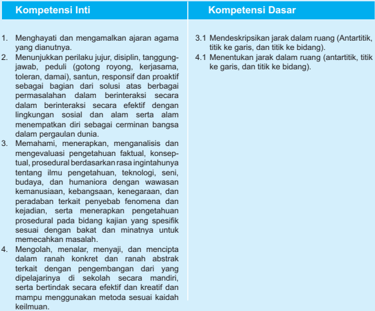

Tabel ini berisi informasi tentang kompetensi inti dan kompetensi dasar dalam ajaran agama dan interaksi sosial. Topik utama adalah pengembangan keterampilan dan pengetahuan yang diperlukan untuk berinteraksi dengan efektif dan menghormati perbedaan dalam masyarakat. Kolom pertama berisi kompetensi inti, yang meliputi: 1) Menghargai dan membangun ikatan harmonis; 2) Memahami, menerapkan, menggali, dan menciptakan konsep-faktual, konseptual, prosedural berdasarkan ragam ingatan; 3) Mengolah, menyalur, menyajikan, dan menciptakan dalam ranah konkrit dan ranah abstrak; 4) Mengembangkan keterampilan berinteraksi secara mandiri, serta bintang secara efektif dan kreatif. Kolom kedua berisi kompetensi dasar, yang meliputi: 1) Mendeskripsikan jarak dalam ruang (antartitik, titik ke garis, dan titik ke bidang); 2) Menentukan jarak dalam ruang (antartitik, titik ke garis, dan titik ke bidang). Data penting yang terlihat adalah bahwa tabel ini mencakup berbagai aspek dari interaksi sosial dan pengembangan keterampilan, mulai dari menghargai dan membangun ikatan harmonis hingga mengembangkan keterampilan berinteraksi secara mandiri dan bintang secara efektif dan kreatif.

 

---
## 📄 Halaman 10

### B. Tujuan Pembelajaran

Tujuan pembelajaran dari pembelajaran tentang dimensi tiga adalah siswa mampu mendeskripsikan dan menentukan jarak dalam ruang yang meliputi jarak antartitik, jarak titik ke garis, dan titik ke bidang. Pengalaman belajar yang diharapkan dalam pembelajaran  adalah:  (1)  mengamati  dan  mendeskripsikan  masalah  jarak  antartitik, jarak titik ke garis, dan titik ke bidang pada ruang, (2) mengamati dan menerapkan konsep jarak antartitik, titik ke garis, dan titik ke bidang untuk menyelesaikan masalah pada dimensi tiga, dan (3) Mengonstruksi rumus jarak dua titik dan jarak titik ke garis.

### C. Diagram Alur Konsep

---
**🖼️ Gambar/Diagram**

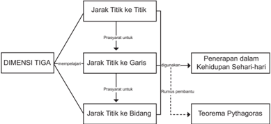

> **Deskripsi Visual:** Gambar ini adalah diagram yang menunjukkan hubungan antara jarak titik ke titik, jarak titik ke garis, dan jarak titik ke bidang dalam konteks teorema Pythagoras. Diagram ini dibagi menjadi tiga dimensi utama: Jarak Titik ke Titik, Jarak Titik ke Garis, dan Jarak Titik ke Bidang. Setiap dimensi memiliki prasyarat untuk penerapan dalam kehidupan sehari-hari.

Elemen utama dalam diagram ini meliputi:
1. Dimensi TIGA (Jarak Titik ke Titik, Jarak Titik ke Garis, Jarak Titik ke Bidang)
2. Prasyarat untuk penerapan dalam kehidupan sehari-hari
3. Teorema Pythagoras sebagai contoh aplikasi

Teks, angka, atau label penting yang terlihat dalam diagram ini meliputi:
- Dimensi TIGA dengan subdimensi Jarak Titik ke Titik, Jarak Titik ke Garis, dan Jarak Titik ke Bidang.
- Prasyarat untuk penerapan dalam kehidupan sehari-hari.
- Teorema Pythagoras sebagai contoh aplikasi.

Informasi kunci yang dapat diambil pembaca meliputi:
- Hubungan antara jarak titik ke titik, jarak titik ke garis, dan jarak titik ke bidang dalam konteks teorema Pythagoras.
- Prasyarat untuk penerapan teorema Pythagoras dalam kehidupan sehari-hari.
- Contoh aplikasi teorema Pythagoras dalam bentuk dimensi TIGA.

 

---
## 📄 Halaman 11

### D. Proses Pembelajaran

### Kegiatan Pendahuluan

- /g135/g3 /g56/g81/g87/g88/g78/g3 /g80/g72/g80/g82/g87/g76/g89/g68/g86/g76/g3 /g86/g76/g86/g90/g68/g15/g3 /g42/g88/g85/g88/g3 /g71/g68/g83/g68/g87/g3 /g80/g72/g80/g76/g81/g87/g68/g3 /g86/g76/g86/g90/g68/g3 /g88/g81/g87/g88/g78/g3 /g80/g72/g80/g69/g68/g70/g68/g3 /g69/g76/g82/g74/g85/g68/g191 /g3 Euclid yang disajikan di buku siswa.
- /g135/g3 Awal  pembelajaran,  siswa  diberi  pengantar  tentang  masalah  dalam  kehidupan sehari-hari  yang  dapat  diselesaikan  dengan  menggunakan  konsep  jarak  pada dimensi tiga. Masalah yang diajukan tentang biaya yang harus dikeluarkan untuk membuat  atap  rumah,  yaitu  kuda  kuda  kayu.  Detail  kuda  kuda  kayu  disajikan dalam gambar berikut.

---
**🖼️ Gambar/Diagram**

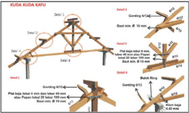

> **Deskripsi Visual:** Gambar ini adalah ilustrasi yang menunjukkan detail teknis konstruksi kayu untuk sebuah struktur. Gambar ini menggambarkan berbagai elemen dan proses pembuatan struktur kayu, termasuk detail tentang ukuran dan posisi tiang-tiang, papan-papan, dan pengikatannya. Elemen utama yang ditampilkan meliputi tiang-tiang kayu, papan kayu, dan pengikat kayu. Tiang-tiang kayu berfungsi sebagai struktur utama, sementara papan kayu digunakan untuk memperkuat dan menyediakan permukaan. Pengikat kayu berfungsi untuk mengikat semua elemen tersebut bersama-sama. Teks, angka, atau label penting yang terlihat mencakup ukuran tiang (80 mm), papan (6 mm), dan pengikat kayu (25 mm). Informasi kunci yang dapat diambil pembaca adalah bahwa struktur ini dibuat dengan menggunakan kayu dan teknik konstruksi tradisional, serta bahwa detail teknis sangat penting untuk memastikan struktur yang kokoh dan aman.

Selain masalah kuda kuda di atas, dapat diberikan contoh lain seperti kamar tidur yang berbentuk balok, kotak makanan yang berbentuk kubus, kaleng susu yang berbentuk tabung dan lain lain.

### Kegiatan Inti

### Subbab 1.1. Jarak Antartitik

### Mengamati

Pada bagian Ayo Mengamati, siswa diminta untuk mengamati beberapa masalah kehidupan sehari-hari yang berhubungan dengan jarak pada dimensi tiga. Pertama, siswa diberi kubus ABCD.EFGH dan bidang yang memuat titik P, Q, dan R. Dari kubus tersebut dijelaskan jarak antartitik. Pada Masalah 1, siswa diberi masalah tentang menentukan lintasan terpendek dari suatu kota ke kota lain. Pada Masalah 2, siswa diberi masalah tentang konsep jarak dari dua bangun.

 

---
## 📄 Halaman 12

- /g135/g3 Guru meminta siswa untuk mengamati Gambar 1.4 pada Buku Siswa.

---
**🖼️ Gambar/Diagram**

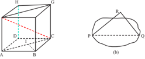

> **Deskripsi Visual:** Gambar ini adalah ilustrasi yang menunjukkan dua bentuk geometri dasar: sebuah segi empat berlubang (a) dan sebuah lingkaran dengan garis diagonal (b). Pada gambar (a), kita melihat sebuah segi empat dengan titik A, B, C, dan D. Titik H merupakan titik tengah diagonal AC, sedangkan titik G merupakan titik tengah diagonal BD. Garis HG menghubungkan titik tengah diagonal AC dan BD, menunjukkan bahwa HG adalah garis simetri segi empat tersebut.

Pada gambar (b), kita melihat sebuah lingkaran dengan titik F dan Q sebagai titik pusat lingkaran. Garis QR adalah garis diagonal lingkaran, yang menghubungkan titik F dan Q. Garis QR juga merupakan garis simetri lingkaran tersebut.

Dalam kedua gambar, elemen-elemen utama adalah titik, garis, dan lingkaran. Titik A, B, C, D, H, G, F, dan Q merupakan titik penting dalam masing-masing gambar. Garis HG dan QR merupakan garis simetri yang penting dalam kedua gambar tersebut. Lingkaran pada gambar (b) memiliki garis diagonal QR sebagai simetri.

Informasi kunci yang dapat diambil pembaca adalah bahwa kedua gambar ini menunjukkan konsep simetri dalam geometri dasar. Gambar (a) menunjukkan simetri horizontal melalui garis simetri HG, sementara gambar (b) menunjukkan simetri diagonal melalui garis simetri QR.

### /g135/g3 Masalah 1.1

Masalah 1 memuat masalah menentukan lintasan terpendek dari dua kota. Minta siswa  untuk  mengamati  Bangun  2.2  di  buku  siswa.  Bangun  2.2  merupakan representasi dari  kota  yang  dihubungkan  dengan  jalan.  Pada  Bangun  2.2 titik  merepresentasikan  kota  dan  segmen  garis  merepresentasikan  jalan  yang menghubungkan kota.

Tugasi siswa untuk menentukan rute yang dapat ditempuh Nasyitha dari A ke C dan menghitung panjang lintasannya. Kemudian instruksikan ke siswa untuk menulisnya pada Tabel 1.1.

---
**📊 Tabel**

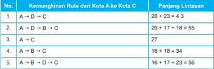

Tabel ini menunjukkan berbagai kemungkinan rute dari Kota A ke Kota C dengan menghitung panjang lintasan untuk setiap rute. Topik utama tabel adalah perhitungan panjang lintasan antara dua kota. Kolom pertama menunjukkan nomor rute, sedangkan kolom kedua menunjukkan nama rute. Kolom ketiga menunjukkan panjang lintasan untuk setiap rute. Data penting yang terlihat adalah bahwa rute A → D → C memiliki panjang 20 + 23 = 43, sedangkan rute A → B → C memiliki panjang 16 + 18 + 34 = 68. Ini menunjukkan bahwa rute A → D → C adalah rute dengan panjang lintasan terpendek di antara semua rute yang diberikan.

 

---
## 📄 Halaman 13

Setelah siswa melengkapi Tabel 1.1, beri kesempatan siswa untuk menentukan jarak antara kota A dan C.

Jarak antara kota  A dan C  adalah panjang lintasan terpendek  yang menghubungkan antara kota A dan C

### /g135/g3 Masalah 1.2

Masalah  2  berisi  uraian  tentang  pengertian  jarak  antara  bangun  G1  dan  G2. Setelah siswa mengamati Masalah 1.1 dan Masalah 1.2, beri kesempatan kepada siswa untuk menuliskan istilah penting dari pengamatan pada tempat yang telah disediakan.

### Menanya

- /g135/g3 Minta  siswa  untuk  menulis  pertanyaan  dari  masalah-masalah  yang  disajikan dalam kegiatan Ayo, Mengamati. Beri kesempatan kepada siswa untuk menulis dugaan yang mungkin muncul dari hasil pengamatan. Pertanyaan yang diharapkan muncul dari siswa adalah: (1) apa pengertian jarak antara dua titik?, (2) bagaimana menentukan jarak antara dua titik?

### Mengumpulkan Informasi

Berikut disajikan jawaban untuk Tabel 1.2.

---
**🖼️ Gambar/Diagram**

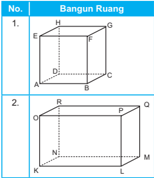

> **Deskripsi Visual:** Gambar ini adalah ilustrasi yang menunjukkan dua bangunan ruang berbeda. Bangunan pertama (No. 1) adalah sebuah prisma segi empat dengan sisi-sisi yang sama panjang dan sudut-sudut yang sama besar. Prisma ini memiliki titik sudut EFGH, ABDG, dan lain-lain. Bangunan kedua (No. 2) adalah sebuah kubus dengan titik-titik RSTU, PQMN, dan lain-lain. Kedua bangunan tersebut memiliki sifat geometris yang sama, yaitu semua sisi mereka adalah persegi dan semua sudut mereka adalah sudut tiga kali empat. Label "Bangun Ruang" dan angka "1" dan "2" digunakan untuk mengidentifikasi masing-masing bangunan. Informasi kunci yang dapat diambil pembaca adalah bahwa kedua bangunan ini adalah bentuk geometri yang sama, yaitu prisma segi empat dan kubus.

---
**📊 Tabel**

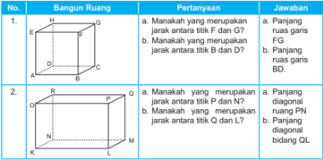

Tabel ini berisi informasi tentang bangun ruang dan jarak antara titik di dalamnya. Topik utamanya adalah tentang karakteristik bangun ruang dan jarak antara titik dalam ruang tersebut. Kolom pertama menunjukkan nomor urutan dari setiap baris, sedangkan kolom kedua memberikan pertanyaan tentang jarak antara titik tertentu dalam bangun ruang. Kolom ketiga menyediakan jawaban untuk setiap pertanyaan. Data penting yang terlihat dalam tabel ini meliputi bahwa paragraf ruas garis FG merupakan jarak antara titik F dan G, paragraf ruas garis BD merupakan jarak antara titik B dan D, dan paragraf diagonal bidang QL merupakan jarak antara titik Q dan L.

 

---
## 📄 Halaman 14

---
**🖼️ Gambar/Diagram**

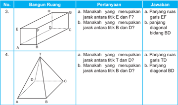

> **Deskripsi Visual:** Gambar ini adalah ilustrasi yang menunjukkan dua bangun ruang berbeda, masing-masing dengan tiga bidang datar. Bangun ruang pertama memiliki empat sudut (E, F, G, H) dan tiga garis rusuk (EF, FG, GH). Bangun ruang kedua memiliki empat sudut (A, B, C, D) dan tiga garis rusuk (AB, BC, CD). Untuk setiap bangun ruang, ada pertanyaan tentang jarak antara titik tertentu dan jawaban yang diberikan melalui panjang ruas garis atau diagonal bidang. Elemen-elemen utama yang ditampilkan adalah dua bangun ruang, empat sudut, tiga garis rusuk, dan pertanyaan serta jawaban yang disertakan. Informasi kunci yang dapat diambil pembaca termasuk jenis bangun ruang, jumlah sudut dan garis rusuk, serta jarak antara titik tertentu dalam bentuk panjang ruas garis atau diagonal bidang.

---
**📊 Tabel**

Tabel ini berisi pertanyaan tentang bangun ruang dan jawabannya, dengan topik utama adalah bangun ruang dan jarak antara titik. Dalam tabel ini, kolom pertama menunjukkan nomor pertanyaan, kolom kedua menunjukkan nama bangun ruang, kolom ketiga menunjukkan pertanyaan, dan kolom keempat menunjukkan jawaban. Data penting yang terlihat adalah bahwa panjang ruas garis EF merupakan diagonal bidang BD, dan panjang ruas garis TD merupakan jarak antara titik D dan T.

### Menalar

- /g135/g3 Pada kegiatan Ayo Menalar, ajak siswa untuk mengonstruksi rumus jarak antartitik. Dalam mengonstruksi rumus, siswa diberi pengantar tentang cara kerja Radar.

### Mengonstruksi Rumus Jarak Antartitik

Radar  (dalam  bahasa  inggris  merupakan  singkatan  dari Radio  Detection  and  Ranging ) adalah suatu sistem gelombang  elektromagnetik yang berguna untuk mendeteksi, mengukur  jarak  dan  membuat  peta  benda-benda  seperti  pesawat  terbang,  kapal  laut, berbagai kendaraan bermotor dan informasi cuaca. Radar dapat mendeteksi posisi suatu benda melalui layar seperti berikut.

Sumber: http://www.dreamstime.com/royalty-free-stock-image-radar-screen-image28624986

 

---
## 📄 Halaman 15

- /g135/g3 Minta siswa untuk mencermati Gambar 1.7.

---
**🖼️ Gambar/Diagram**

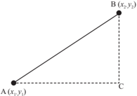

> **Deskripsi Visual:** Gambar ini adalah ilustrasi yang menunjukkan dua titik pada sebuah garis lurus. Titik A memiliki koordinat (x₁, y₁) dan titik B memiliki koordinat (x₂, y₂). Garis lurus ini menghubungkan kedua titik tersebut. Untuk memahami hubungan antara kedua titik ini, kita perlu melihat relasi antara koordinat mereka. Misalnya, jika x₂ > x₁ dan y₂ > y₁, maka garis lurus akan bergerak ke kanan dan ke atas. Ini menunjukkan bahwa titik B lebih tinggi dan lebih jauh dari titik A dalam bidang koordinat. Jadi, gambar ini menunjukkan hubungan spasial antara dua titik dalam ruang bidang koordinat.

Misal diberi titik A( x 1 , y 1 ) dan B( x 2 , y 2 ). Dengan menggunakan teorema Pythagoras, jarak titik A dan B ( d ).

``

### Mengomunikasikan

- /g135/g3 Beri kesempatan kepada siswa untuk membuat kesimpulan tentang jarak antartitik.
- /g135/g3 Minta siswa untuk menukarkan kesimpulan yang telah dibuatnya dengan siswa lain.
- /g135/g3 Kemudian beri kesempatan kepada beberapa siswa untuk menyampaikan kesimpulannya.
Setelah  siswa  selesai  membuat  kesimpulan  dan  mengomunikasikannya,  minta siswa untuk mengerjakan soal latihan Subbab 1.1 Jarak Antartitik. Pembahasan soal latihan subbab 1.1 disajikan dalam bagian evaluasi dalam buku guru ini.

### Pembahasan Soal Latihan 1.1

Jawablah soal berikut disertai dengan langkah pengerjaannya.

- Diketahui limas beraturan T.ABC dengan bidang alas berbentuk segitiga sama sisi. TA tegak lurus dengan bidang alas. Jika panjang AB = 4 2  cm dan TA = 4 cm, tentukan jarak antara titik T dan C.

 

---
## 📄 Halaman 16

### Alternatif Penyelesaian:

B

### 2. Perhatikan limas segi enam beraturan berikut.

C

### 3. Perhatikan bangun berikut ini

---
**🖼️ Gambar/Diagram**

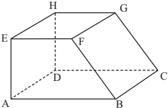

> **Deskripsi Visual:** Gambar ini adalah ilustrasi yang menunjukkan struktur geometri sederhana. Gambar ini menggambarkan sebuah bangunan yang terdiri dari beberapa elemen dasar seperti persegi panjang, lingkaran, dan segitiga. Bangunan ini terdiri dari dua bagian utama: bangunan utama dan bangunan tambahan. Bangunan utama terdiri dari empat sisi persegi panjang dengan panjang dan lebar yang sama, yang kemudian dihubungkan oleh dua sisi persegi panjang yang lebih pendek. Bangunan tambahan terdiri dari tiga sisi persegi panjang yang lebih pendek dan satu sisi persegi panjang yang lebih panjang. Semua sisi bangunan ini memiliki sudut yang sama, yaitu 90 derajat. Gambar ini juga menunjukkan bahwa semua sisi bangunan ini memiliki panjang yang sama, yang menunjukkan bahwa bangunan ini adalah bangunan yang simetris.

B

### Alternatif Penyelesaian:

``

Jika  diketahui  panjang  AB  =  5 cm, AE = BC = EF = 4 cm maka tentukan

- Jarak antara titik A dan C
- Jarak antara titik E dan C
- Jarak antara titik A dan G
Diketahui panjang AB = 10 cm dan TA = 13 cm. Titik O merupakan titik tengah garis BE. Tentukan jarak antara titik T dan O.

### Alternatif Penyelesaian:

``

``

Jadi jarak titik T dan O adalah 69  cm.

``

``

Jadi jarak antara titik T dan C adalah 4 3  cm.

 

---
## 📄 Halaman 17

### Subbab 1.2. Jarak Titik ke Garis

### Mengamati

- /g135/g3 Pada kegiatan mengamati, minta siswa untuk mencermati Tabel 1.3. Pada Tabel 1.3 disajikan informasi tentang jarak titik ke garis pada ruang dimensi tiga.
- /g135/g3 Setelah siswa mengamati, beri kesempatan kepada siswa untuk menuliskan istilah penting hasil pengamatan pada tempat yang telah disediakan.

---
**🖼️ Gambar/Diagram**

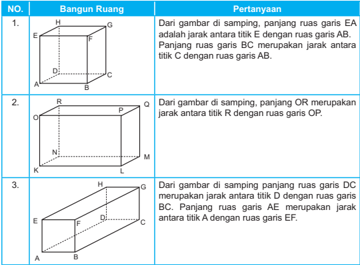

> **Deskripsi Visual:** Gambar dari buku pelajaran ini adalah ilustrasi yang menunjukkan tiga bangun ruang dengan penjelasan tentang panjang ruas garis antara titik tertentu. Setiap ilustrasi menggambarkan sebuah bangun ruang berbeda dengan penjelasan yang spesifik tentang panjang ruas garis antara titik tertentu.

1. Pertama, gambar ini menunjukkan sebuah bangun ruang persegi panjang dengan titik A, B, C, D, E, dan F. Panjang ruas garis EA merupakan jarak antara titik E dengan ruas garis AB. Panjang ruas garis BC merupakan jarak antara titik C dengan ruas garis AB.

2. Kedua, gambar ini menunjukkan sebuah bangun ruang segi empat dengan titik O, R, N, M, L, dan P. Panjang ruas garis OR merupakan jarak antara titik R dengan ruas garis OP.

3. Ketiga, gambar ini menunjukkan sebuah bangun ruang segi empat dengan titik G, H, D, C, B, dan A. Panjang ruas garis DC merupakan jarak antara titik D dengan ruas garis BC. Panjang ruas garis AE merupakan jarak antara titik A dengan ruas garis EF.

Elemen-elemen utama dalam setiap gambar adalah titik-titik yang menunjukkan posisi dan hubungan antarannya. Relasi antara elemen-elemen tersebut melibatkan panjang ruas garis antara titik tertentu. Teks, angka, atau label penting yang terlihat adalah nama-nama titik dan panjang ruas garis yang diberikan dalam setiap gambar.

Informasi kunci yang dapat diambil pembaca adalah bahwa panjang ruas garis antara titik tertentu dalam setiap bangun ruang berbeda-beda dan harus dihitung secara tepat untuk memahami struktur dan ukuran bangun ruang tersebut.

### Menanya

- /g135/g3 Minta  siswa  untuk  menulis  pertanyaan  dari  masalah-masalah  yang  disajikan dalam kegiatan Ayo, Mengamati. Beri kesempatan kepada siswa untuk menulis dugaan yang mungkin muncul dari hasil pengamatan. Pertanyaan yang diharapkan muncul dari siswa adalah: (1) Apa pengertian jarak titik ke garis? (2) Bagaimana menentukan jarak titik ke garis?

 

---
## 📄 Halaman 18

### Mengumpulkan Informasi dan Menalar

- /g135/g3 Pada kegiatan menggali informasi dan menalar, siswa diberi tiga masalah yaitu: masalah 4, masalah 5, dan masalah 6. Masalah 4 merupakan aktivitas siswa dalam menentukan jarak titik ke garis. Aktivitas tersebut diilustrasikan dari paku yang ditancapkan  pada  papan.  Pada  masalah  5  siswa  di  beri  kubus,  kemudian  siswa diminta untuk menentukan jarak titik ke diagonal. Pada masalah 6, siswa diajak untuk mengonstruksi rumus menentukan jarak pada suatu segitiga siku-siku.

### /g135/g3 Masalah 1.4

Untuk mengamati konsep jarak titik ke garis diberikan masalah tiga paku yang ditancapkan  pada  papan  sehingga  menjadi  titik  sudut  segitiga  siku-siku  (lihat Gambar  1.8.a).  Seutas  tali  diikatkan  pada  dua  paku  yang  ditancapkan  (lihat Gambar 1.8.b). Misalkan paku-paku tersebut digambarkan sebagai titik A, B, dan C seperti Gambar 1.8.c dengan AC = 6cm, BC = 8cm, dan AB = 10 cm.

Melalui eksperimen kecil, minta siswa untuk menentukan panjang tali minimal yang menghubungkan paku C (titik C) dengan tali yang terpasang pada paku A dan paku B (segmen garis AB). Kemudian beri pertanyaan kepada siswa tentang syarat yang harus dipenuhi agar mendapatkan panjang tali minimal. Minta siswa untuk memberi alasan atas jawaban yang disampaikannya.

### /g135/g3 Masalah 1.5

Untuk menentukan jarak titik ke garis, diberikan contoh bagaimana menentukan jarak  titik  ke  diagonal  bidang  pada  kubus  ABCD.EFGH.  Minta  siswa  untuk mencermati masalah 5 dengan seksama.

### /g135/g3 Masalah 1.6

Masalah  6  berisi  tentang  bagaimana  mengonstruksi  rumus  jarak  pada  segitiga siku-siku. Diberikan segitiga siku-siku ABC seperti berikut.

Misal AB = c , BC = a , AC = b dan CD = d . Garis CD merupakan garis tinggi.

 

---
## 📄 Halaman 19

Untuk menentukan d , dapat digunakan rumus ab d c /g32 . Rumus ini diperoleh dengan cara sebagai berikut:

``

Sehingga Luas ABC Luas ABC

``

### Mengomunikasikan

- /g135/g3 Beri kesempatan kepada siswa untuk membuat kesimpulan tentang jarak titik ke garis.
- /g135/g3 Minta siswa untuk menukarkan kesimpulan yang telah dibuatnya dengan siswa lain.
- /g135/g3 Kemudian beri kesempatan kepada beberapa siswa untuk menyampaikan kesimpulannya.
Setelah siswa selesai membuat kesimpulan dan mengomunikasikannya, minta siswa untuk mengerjakan soal latihan subbab 1.2 Jarak Titik ke Garis. Pembahasan soal latihan subbab 1.2 disajikan dalam bagian evaluasi dalam buku guru ini.

 

---
## 📄 Halaman 20

### Pembahasan Soal Latihan 1.2

- Diketahui limas beraturan T.ABCD, panjang rusuk AB = 3 cm dan TA = 6 cm. Tentukan jarak titik B dan rusuk TD.

### Alternatif Penyelesaian:

---
**🖼️ Gambar/Diagram**

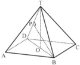

> **Deskripsi Visual:** Gambar ini adalah ilustrasi yang menunjukkan struktur geometris dari sebuah piramida trapesium. Gambar ini menggambarkan piramida trapesium dengan titik A, B, C, D, E, F, G, H, I, J, K, L, M, N, O, P, Q, R, S, T, U, V, W, X, Y, Z, dan Z'. Titik A, B, C, D, E, F, G, H, I, J, K, L, M, N, O, P, Q, R, S, T, U, V, W, X, Y, Z, dan Z' masing-masing merupakan titik sudut piramida trapesium. Titik A, B, C, D, E, F, G, H, I, J, K, L, M, N, O, P, Q, R, S, T, U, V, W, X, Y, Z, dan Z' saling berhubungan melalui garis-garis yang membentuk piramida trapesium. Garis-garis tersebut membentuk sudut-sudut yang penting untuk memahami struktur piramida trapesium. Informasi kunci yang dapat diambil pembaca adalah bahwa piramida trapesium memiliki banyak titik sudut dan garis yang membentuknya.

Misal  P  proyeksi  titik  B  ke  ruas  garis  TD. Jarak titik B ke rusuk TD adalah BP.

``

``

Jadi, jarak titik B ke rusuk TD adalah 3 7  cm.

``

- Diketahui limas segi enam beraturan T.ABCDEF dengan panjang rusuk AB = 10 cm dan AT = 13 cm. Tentukan jarak antara titik B dan rusuk TE.
Misal jarak titik B dan rusuk TE = BP.

``

``

``

Jadi jarak titik B ke rusuk TE adalah 20 69 13 cm.

- Diketahui kubus ABCD.EFGH dengan panjang AB = 10 cm. Tentukan
- jarak titik F ke garis AC
- jarak titik H ke garis DF

 

---
## 📄 Halaman 21

### Alternatif Penyelesaian:

``

- Jarak titik H ke garis DF (HP)

``

- Diketahui kubus ABCD.EFGH dengan rusuk 8 cm. Titik M adalah titik tengah BC.  Tentukan jarak M ke EG.

### Alternatif Penyelesaian:

---
**🖼️ Gambar/Diagram**

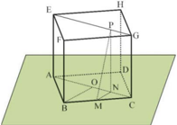

> **Deskripsi Visual:** Gambar ini adalah ilustrasi yang menunjukkan struktur geometri dari sebuah bangunan tiga dimensi. Gambar ini menggambarkan sebuah bangunan yang terdiri dari beberapa elemen utama seperti atap, dinding, dan lantai. Atap terletak di atas bangunan, sedangkan dinding dan lantai membentuk struktur dasar bangunan tersebut. Elemen-elemen ini saling berhubungan melalui perekat dan penyangga yang memastikan kestabilan dan kekuatan bangunan. Di bagian atas bangunan, terdapat sebuah atap yang melengkapi struktur bangunan tersebut. Di bagian bawah bangunan, terdapat lantai yang memberikan permukaan untuk berjalan. Gambar ini juga menunjukkan bahwa bangunan ini memiliki struktur yang rapi dan teratur, dengan semua elemen yang ada saling berhubungan dan saling mendukung.

Misal jarak M ke ruas garis EG adalah PM.

Perhatikan segitiga BOC dan MNC, segitiga tersebut sebangun sehingga

``

``

 

---
## 📄 Halaman 22

- Perhatikan limas segiempat beraturan berikut.

---
**🖼️ Gambar/Diagram**

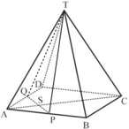

> **Deskripsi Visual:** Gambar ini adalah ilustrasi yang menunjukkan struktur geometri dari sebuah piramida segi empat. Ilustrasi ini menggambarkan piramida dengan titik A sebagai titik dasar, titik B, C, dan D sebagai sudut-sudut sisi, dan titik T sebagai titik puncak. Titik T terletak di atas titik A, B, C, dan D membentuk piramida segi empat. Titik P, Q, R, dan S masing-masing merupakan titik tengah dari sisi-sisi piramida. Ilustrasi ini juga menunjukkan garis-garis yang menghubungkan titik-titik tersebut, seperti garis TP, PQ, RS, dan QR. Informasi kunci yang dapat diambil dari gambar ini adalah bahwa piramida ini memiliki struktur segi empat dengan titik puncak di atas titik dasarnya.

Titik P dan Q berturut-turut adalah titik tengah rusuk AB dan AD. Jika panjang AB = TA = 12 cm, tentukan jarak antara titik T dan garis PQ.

### Alternatif Penyelesaian:

``

Misal S adalah titik tengah QP. Jarak titik Tdan garis PQ adalah TS.

``

``

Jadi jarak titik T dan garis PQ adalah  3 10  cm.

### Subbab 1.3. Jarak Titik ke Bidang

### Mengamati

- /g135/g3 Pada  kegiatan  mengamati,  minta  siswa  untuk  mencermati  Tabel  1.4  dan masalah 2.7. Tabel 1.4 berisi informasi tentang jarak titik ke bidang pada ruang dimensi tiga. Ajak siswa untuk mencermati informasi dalam Tabel 1.4. Setelah siswa  mencermati  Tabel  1.4,  minta  siswa  untuk  mencermati  masalah  1.7. Masalah  1.7  berisi  informasi  tentang  bagaimana  menentukan  panjang  tiang penyangga. Masalah ini merupakan penerapan konsep jarak titik ke bidang. Berikut disajikan Tabel 1.4 dan Masalah 7.

 

---
## 📄 Halaman 23

---
**🖼️ Gambar/Diagram**

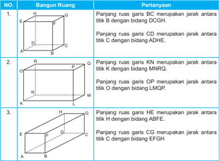

> **Deskripsi Visual:** Gambar ini adalah ilustrasi yang menunjukkan tiga bangun ruang dengan penjelasan tentang panjang ruas garis antara titik-titik tertentu dalam masing-masing bangun. Setiap bagian menggambarkan sebuah bangun ruang berbeda dengan penjelasan tentang panjang ruas garis antara beberapa titik yang disebutkan dalam teks. Ilustrasi ini menggunakan warna-warna yang berbeda untuk membedakan antara tiap-tiap bangun ruang dan titik-titik yang dinyatakan dalam teks. Label-teks pada setiap bagian memberikan informasi tentang panjang ruas garis antara titik tertentu dalam masing-masing bangun ruang. Ini membantu pembaca dalam memahami hubungan antara panjang ruas garis dan posisi titik-titik dalam masing-masing bangun ruang.

---
**📊 Tabel**

Tabel ini berisi pertanyaan tentang panjang ruas garis di dalam bangun ruang, dengan topik utama adalah hubungan antara ruas garis dan bidang di dalam bangun ruang. Tabel dibagi menjadi 3 baris, masing-masing menunjukkan pertanyaan tentang panjang ruas garis di dalam bangun ruang berbeda-beda. Kolom pertama menunjukkan nomor baris, sedangkan kolom kedua menunjukkan pertanyaan. Data penting yang terlihat dalam tabel ini adalah bahwa panjang ruas garis BC merupakan jarak antara titik B dengan bidang DGCH, panjang ruas garis CD merupakan jarak antara titik C dengan bidang ADHE, panjang ruas garis KN merupakan jarak antara titik K dengan bidang MNRO, panjang ruas garis OP merupakan jarak antara titik O dengan bidang LMQP, panjang ruas garis HE merupakan jarak antara titik H dengan bidang ABFE, dan panjang ruas garis CG merupakan jarak antara titik C dengan bidang EFGH.

### /g135/g3 Masalah 1.7

Tiang Penyangga dibuat untuk menyangga atap suatu gedung.  Tiang penyangga ini menghubungkan suatu titik pada salah satu sisi gedung dan suatu titik pada bidang atap seperti ditunjukkan pada Gambar 1.9 berikut.

Sumber: http://www.ideaonline.co.id/iDEA2013/Eksterior/Fasad/Batu-Alam-Mencerahkan-Tampilan-Fasad/Tiang Penyangga-Atap

 

---
## 📄 Halaman 24

Setelah siswa mengamati, beri kesempatan kepada siswa untuk menuliskan istilah penting hasil pengamatan pada tempat yang telah disediakan.

### Mengamati

- /g135/g3 Minta siswa untuk menulis pertanyaan dari masalah-masalah yang disajikan dalam kegiatan Ayo Mengamati. Beri kesempatan kepada siswa untuk menulis dugaan  yang  muncul  dari  hasil  pengamatan.  Pertanyaan  yang  diharapkan muncul  dari  siswa  adalah:  (1)  Apa  pengertian  jarak  titik  ke  bidang?,  (2) Bagaimana menentukan jarak titik ke bidang?

### Mengumpulkan Informasi dan Menalar

- /g135/g3 Pada kegiatan menggali informasi dan menalar, siswa diberi dua masalah yaitu: masalah  1.8,  dan  masalah  1.9.  Masalah  1.8  merupakan  aktivitas  siswa  dalam menentukan jarak titik  ke  bidang  pada  kubus.  Pada  masalah  1.9  disajikan  cara menentukan jarak titik ke bidang pada limas.

### /g135/g3 Masalah 1.8

Untuk mengamati jarak titik ke bidang diberikan masalah seperti berikut.

---
**🖼️ Gambar/Diagram**

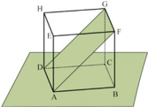

> **Deskripsi Visual:** Gambar ini adalah ilustrasi yang menunjukkan struktur geometri sederhana. Gambar ini menggambarkan sebuah bangun datar yang terdiri dari empat sudut (A, B, C, dan D) dan tiga garis yang membentuk sudut-sudut tersebut. Garis-garis ini membentuk sebuah persegi panjang dengan diagonal AC dan BD. Di bagian atas, terdapat sebuah persegi panjang yang diberi label HFGD, yang tampaknya merupakan bagian dari bangunan yang lebih besar. Di bagian bawah, terdapat sebuah persegi panjang yang diberi label ABCD, yang tampaknya merupakan bagian dari bangunan yang lebih besar. Label "HFGD" dan "ABCD" menunjukkan bahwa mereka mungkin merupakan bagian dari bangunan yang lebih besar. Informasi kunci yang dapat diambil pembaca adalah bahwa gambar ini menunjukkan struktur geometri sederhana dan bagian-bagian dari bangunan yang lebih besar.

Ingatkan kembali tentang teorema Pythagoras dan pengertian jarak. Minta siswa untuk  menentukan  apakah  bidang  AFGD  dan  ABFE  saling  tegak  lurus?  Apa akibatnya  ketika  kedua  bidang  tersebut  saling  tegak  lurus?  Setelah  menjawab pertanyaan  tersebut,  minta  siswa  untuk  membaca  dan  memahami  alternatif penyelesaian yang disajikan pada buku siswa.

### /g135/g3 Masalah 1.9

Masalah  1.9  serupa  dengan  Masalah  1.8.  Pada  masalah  1.9  siswa  diberi  limas T.ABCD dengan alas persegi dan siswa diminta untuk menentukan jarak titik O ke bidang TBC.

Diberikan kubus ABCD.EFGH dengan Panjang rusuk 4 cm. Titik A, F,  G, dan D dihubungkan sehingga terbentuk bidang  AFGD seperti gambar di samping. Berapakah jarak titik B ke bidang AFGD?

 

---
## 📄 Halaman 25

Minta siswa untuk mengingat kembali cara menentukan luas segitiga. Rumus luas segitiga ini digunakan untuk menentukan jarak titik O ke bidang TBC.

Luas segitiga TOP adalah TO.OP atau dapat dicari dari TP.OQ.

``

### Mengomunikasikan

- /g135/g3 Beri kesempatan kepada siswa untuk membuat kesimpulan tentang jarak titik ke garis.
- /g135/g3 Minta siswa untuk menukarkan kesimpulan yang telah dibuatnya dengan siswa lain.
- /g135/g3 Kemudian beri kesempatan kepada beberapa siswa untuk menyampaikan kesimpulannya.
Setelah siswa selesai membuat kesimpulan dan mengomunikasikannya, minta siswa untuk mengerjakan soal latihan subbab2.3 Jarak Titik ke Bidang. Pembahasan soal latihan subbab 1.3 disajikan dalam bagian evaluasi dalam buku guru ini.

### Kegiatan Penutup

- /g135/g3 Minta beberapa siswa untuk menyimpulkan hasil kegiatan belajar. Bersama-sama dengan siswa, berikanlah review dan penguatan terhadap kegiatan belajar.

### Pembahasan Soal Latihan 1.3

Jawablah soal berikut disertai dengan langkah pengerjaannya.

- Diketahui kubus ABCD.EFGH yang panjang rusuknya a cm. Titik Q adalah titik tengah rusuk BF. Tentukan jarak titik H ke bidang ACQ.

### Alternatif Penyelesaian

HO /g65 AC  sehingga  jarak  titik  H  ke  bidang  ACQ adalah HO.

``

``

 

---
## 📄 Halaman 26

- Suatu  kepanitiaan  membuat  papan  nama  dari  kertas  yang  membentuk  bangun seperti berikut.
Ternyata  ABE  membentuk  segitiga  sama sisi, panjang BF = 13 cm dan BC = 12 cm. Tentukan  jarak  antara  titik  A  dan  bidang BCFE.

### Alternatif Penyelesaian

Misal jarak titik A dengan bidang BCFE adalah d .

``

``

Jadi jarak titik A dengan bidang BCFE adalah 5 3 cm.

``

- Dari gambar di bawah, jika diketahui panjang AB=8 cm, BC=6 cm dan EC=5 5 cm, tentukan jarak antara titik B dan bidang ACE.

### Alternatif Penyelesaian

``

Misal  jarak  antara  titik  B  dengan  bidang ACE adalah d .

``

- Diketahui limas segitiga beraturan T.ABC . Panjang AB = 6 cm dan TA = 8 cm. Tentukan jarak antara titik T dengan bidang ABC.

### Alternatif Penyelesaian

Dari g ambar di samping, jarak antara titik T dengan bidang ABC adalah ruas garis TO. TO /g65/g3 PB , sehingga TO = 2 2 TB BO /g16 .

---
**🖼️ Gambar/Diagram**

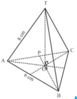

> **Deskripsi Visual:** Gambar ini adalah ilustrasi yang menunjukkan struktur geometri sebuah segitiga ABC dengan titik T sebagai titik pusat tetrahedron. Segitiga ABC memiliki sisi-sisi AB = BC = CA = 6 cm. Titik T berada di tengah-tengah garis BC dan juga merupakan titik pusat tetrahedron ABCT. Garis AT, BT, CT saling bertemu di titik T, menunjukkan bahwa T adalah titik tengah segitiga ABC. Gambar ini menunjukkan hubungan antara segitiga ABC dan tetrahedron ABCT, serta ukuran sisi-sisi segitiga ABC. Informasi kunci yang dapat diambil pembaca adalah bahwa segitiga ABC adalah segitiga sama sisi dengan panjang sisi 6 cm, dan bahwa T adalah titik tengah segitiga ABC.

 

---
## 📄 Halaman 27

Segitiga ABC adalah segitiga sama sisi sehingga AB = BC = CA = 6 cm, sedangkan PA = 3 cm.

``

- Diketahui luas permukaan kubus ABCD.EFGH adalah 294 cm 2 . Tentukan
- Jarak antara titik F ke bidang ADHE.
- Jarak antara titik B ke bidang ACH.

### Alternatif Penyelesaian

---
**🖼️ Gambar/Diagram**

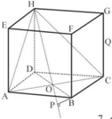

> **Deskripsi Visual:** Gambar ini adalah ilustrasi yang menunjukkan struktur geometri sebuah bangunan tiga dimensi. Gambar ini menggambarkan sebuah bangunan yang terdiri dari beberapa elemen struktural utama seperti tiang, dinding, dan atap. Tiang-tiang tersebut terhubung dengan dinding-dinding melalui pilar-pilar yang menjaga kestabilan bangunan. Atap bangunan terbuat dari material seperti kayu atau baja dan dikelilingi oleh dinding yang membentuk ruang ruang di dalam bangunan. Gambar ini juga menunjukkan bagaimana tiang-tiang dan dinding-dinding tersebut saling berinteraksi untuk menciptakan struktur yang kokoh dan efisien. Label pada gambar menunjukkan nama-nama elemen-elemen struktural seperti "Tiang", "Dinding", dan "Atap". Informasi kunci yang dapat diambil dari gambar ini adalah bahwa bangunan ini memiliki struktur yang kompleks dan disusun dengan baik untuk memenuhi fungsi dan keamanannya.

Diketahui luas permukaan kubus ABCD.EFGH adalah 294 cm 2 .

``

``

- Jarak antara titik F ke bidang ADHE adalah ruas garis FE = 7 cm.
- Perhatikan  gambar  di  atas. OB /g65 AC , sehingga OB merupakan jarak antara titik B dengan bidang ACH.

``

``

### Pembahasan Uji Kompetensi 1.

- Perhatikan gambar berikut.

---
**🖼️ Gambar/Diagram**

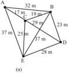

> **Deskripsi Visual:** Gambar ini adalah ilustrasi yang menunjukkan struktur geometri sederhana dengan beberapa elemen penting. Gambar ini menggambarkan sebuah poligon tiga sudut (trigon) dengan titik A, B, C, D, dan E sebagai titik-titik penting. Titik A, B, dan C merupakan titik sudut utama yang membentuk segitiga ABC. Titik D dan E merupakan titik sudut tambahan yang membentuk segitiga ADE dan segitiga BCE.

Elemen-elemen utama dalam gambar ini meliputi:
1. Segitiga ABC dengan panjang sisi-sisinya 17 m, 32 m, dan 39 m.
2. Segitiga ADE dengan panjang sisi-sisinya 25 m, 37 m, dan 57 m.
3. Segitiga BCE dengan panjang sisi-sisinya 23 m, 57 m, dan 28 m.

Teks, angka, atau label penting yang terlihat dalam gambar ini meliputi:
- Jarak antara titik-titik tersebut, seperti 17 m, 32 m, 39 m, 25 m, 37 m, 57 m, dan 28 m.
- Nama-nama segitiga seperti segitiga ABC, segitiga ADE, dan segitiga BCE.

Informasi kunci yang dapat diambil pembaca dari gambar ini adalah bahwa ada tiga segitiga yang berbeda dengan ukuran dan panjang sisi yang berbeda-beda. Ini menunjukkan bahwa struktur geometri bisa sangat beragam dan kompleks, dan setiap segitiga memiliki ukuran dan bentuk yang unik.

``

Matematika

 

---
## 📄 Halaman 28

- Dari Gambar (a), tentukan jarak dari titik A ke D.
- Dari Gambar (b), tentukan jarak titik P terhadap garis g .
- Dari Gambar (c), tentukan jarak titik P pada bidang-K.

### Alternatif Penyelesaian

- Jarak titik A ke D = 46 m.
- Jarak titik P terhadap garis g adalah panjang ruas garis PP 1
- Jarak titik P ke bidang K adalah panjang ruas garis PP 1
- Diketahui kubus ABCD.EFGH dengan panjang rusuk 9 cm. Buat ilustrasi kubus tersebut. Tentukan langkah menentukan jarak titik F ke bidang BEG. Kemudian hitunglah jarak titik F ke bidang BEG.

### Alternatif Penyelesaian

---
**🖼️ Gambar/Diagram**

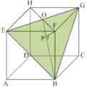

> **Deskripsi Visual:** Gambar ini adalah ilustrasi yang menunjukkan struktur geometri dari sebuah bangunan tiga dimensi. Gambar ini menggambarkan bagaimana elemen-elemen struktural seperti dinding, atap, dan jendela berinteraksi dengan satu sama lain untuk membentuk bangunan. Elemen utama yang terlihat antara lain adalah dinding (A, B, C), atap (H, I, J), dan jendela (K, L). Relasi antara elemen-elemen ini sangat penting karena mereka saling mendukung dan mempengaruhi struktur keseluruhan bangunan. Teks, angka, atau label penting yang terlihat pada gambar adalah nama-nama elemen-elemen tersebut, yang membantu pembaca memahami struktur dan fungsi masing-masing. Informasi kunci yang dapat diambil dari gambar ini adalah bahwa struktur bangunan ini dibangun dengan menggunakan konsep geometri dasar, seperti persegi panjang, lingkaran, dan segitiga, serta bagaimana elemen-elemen ini saling berinteraksi untuk menciptakan struktur yang kokoh dan efisien.

- Langkah menentukan jarak titik F ke bidang BEG.
- Hubungkan  titik F dengan titik H. diperoleh  perpotongan  ruas  garis  HF dengan BEG. Misal perpotongan tersebut titik O.
- Hubungkan  titik O  dengan  titik B. Karena titik O dan titik B terletak pada bidang  BEG,  ruas  garis  OB  terletak pada bidang BEG.
- Misal P adalah proyeksi titik F pada bidang BEG. Jarak titik F ke bidang BEG adalah panjang ruas garis FP.

 

---
## 📄 Halaman 29

``

``

``

Jadi, jarak titik F ke bidang BEG adalah 2 3  cm.

- Diketahui kubus ABCD.EFGH dengan panjang rusuk a . Jika titik P terletak pada perpanjangan AB sehingga PB = 2 a , dan titik Q pada perpanjangan FG sehingga QG = a.
- Buatlah ilustrasi dari masalah di atas.
b. Tentukan PQ.

### Alternatif Penyelesaian.

``

``

``

- Panjang  setiap  bidang  empat  beraturan  T.ABC  sama  dengan  16  cm.  Jika  P pertengahan AT dan Q pertengahan BC, tentukan PQ.

### Alternatif Penyelesaian.

---
**🖼️ Gambar/Diagram**

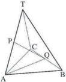

> **Deskripsi Visual:** Gambar ini adalah ilustrasi yang menunjukkan struktur geometri tiga segitiga ABC, APT, dan BPT. Segitiga ABC merupakan dasar, sedangkan segitiga APT dan BPT merupakan segitiga sisi-sisi yang dibentuk oleh garis-garis yang menghubungkan titik-titik pada segitiga ABC. Titik P dan Q masing-masing merupakan titik tengah sisi AB dan BC dari segitiga ABC. Garis PQ membagi segitiga ABC menjadi dua bagian yang lebih kecil, yaitu segitiga APQ dan segitiga BPQ. Informasi kunci yang dapat diambil pembaca adalah bahwa segitiga ABC dibagi menjadi empat segitiga dengan menggunakan garis-garis yang menghubungkan titik tengah sisi.

``

``

``

``

``

 

---
## 📄 Halaman 30

- Perhatikan gambar kubus ABCD.EFGH. Tentukan jarak titik H ke DF. AB = 6 cm Alternatif Penyelesaian.
DH = 6 cm dan HF = 6 2   cm. Misal jarak titik H ke DF adalah d .

``

Jadi, jarak titik H ke DF adalah  2 6  cm.

- Dalam kubus ABCD.EFGH titik S adalah titik tengah sisi CD dan P adalah titik tengah  diagonal  ruang  BH.  Tentukan  perbandingan  volum  limas  P.BCS  dan volum kubus ABCD.EFGH.

### Alternatif Penyelesaian.

Misal panjang rusuk kubus = r .

Volume kubus ABCD.EFGH = r 3

``

Volume limas P.BCS : Volume kubus ABCD.EFGH = 2 2 : 1: 24 24 r r

- Diketahui  kubus  ABCD.EFGH  dengan  panjang  rusuk a cm.  S  merupakan proyeksi titik C pada bidang AFH. Tentukan jarak titik A ke titik S.

### Alternatif Penyelesaian.

---
**🖼️ Gambar/Diagram**

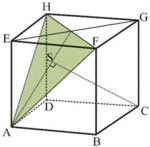

> **Deskripsi Visual:** Gambar ini adalah ilustrasi yang menunjukkan struktur geometris dari sebuah bangunan tiga dimensi. Gambar ini menggambarkan sebuah bangunan dengan empat sudut, lima sisi, dan satu permukaan. Bangunan ini terdiri dari dua bagian utama: bagian depan dan bagian belakang. Bagian depan memiliki empat sudut, lima sisi, dan satu permukaan. Sementara itu, bagian belakang juga memiliki empat sudut, lima sisi, dan satu permukaan. Dua bagian ini saling berpotongan dan membentuk sebuah struktur tiga dimensi. Gambar ini menunjukkan bahwa bangunan ini memiliki struktur yang kompleks dan rumit.

``

``

 

---
## 📄 Halaman 31

- Diketahui kubus ABCD.EFGH dengan panjang rusuk a cm.  P  dan  Q  masingmasing merupakan titik tengah AB dan CD, sedangkan R merupakan titik potong EG dan FH. Tentukan jarak titik R ke bidang EPQH.

### Alternatif Penyelesaian.

---
**🖼️ Gambar/Diagram**

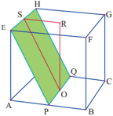

> **Deskripsi Visual:** Gambar ini adalah ilustrasi yang menunjukkan struktur geometri dari sebuah bangunan tiga dimensi. Gambar ini menggambarkan bagaimana sebuah bangunan berbentuk persegi panjang dengan sudut-sudut yang tegas dan tepat. Bangunan ini memiliki empat sisi, dua sisi yang panjang dan dua sisi yang pendek. Setiap sisi memiliki garis lurus yang jelas dan rapi. Di tengah-tengah bangunan ini terdapat sebuah ruang yang tampak seperti ruang terbuka, yang tampak lebih besar dibandingkan dengan ruang-ruang lainnya. Ruang ini tampak lebih luas dan lebih terbuka dibandingkan dengan ruang-ruang lainnya. Ini menunjukkan bahwa bangunan ini memiliki desain yang fleksibel dan fleksibel untuk memungkinkan ruang-ruang yang lebih luas dan lebih terbuka.

Misal jarak titik R ke bidang EPQH adalah d.

``

``

``

Jadi, jarak titik R ke bidang EPQH adalah

``

- Diketahui kubus ABCD.EFGH dengan rusuk 4 cm. P titik tengah EH. Tentukan jarak titik P ke garis CF.

### Alternatif Penyelesaian.

---
**🖼️ Gambar/Diagram**

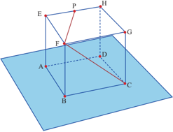

> **Deskripsi Visual:** Gambar ini adalah ilustrasi yang menunjukkan struktur geometri dari sebuah bangunan tiga dimensi. Gambar ini menggambarkan sebuah bangunan dengan struktur persegi panjang yang terdiri dari empat sisi, masing-masing sisi memiliki panjang yang sama. Bangunan ini memiliki dua tingkat, dengan tingkat bawah berupa bangunan persegi panjang dan tingkat atas berupa bangunan persegi panjang yang lebih kecil. Bangunan ini juga memiliki atap yang melengkung dan memiliki dua pintu masuk yang terletak pada sisi bangunan. Gambar ini menunjukkan bahwa bangunan ini memiliki struktur yang rapi dan teratur.

 

---
## 📄 Halaman 32

Misal jarak titik P ke ruas garis CF adalah PF. Dengan menggunakan Theorema Pythagoras diperoleh

``

- Panjang rusuk kubus ABCD.EFGH adalah 6 cm. Tentukan jarak titik C dengan bidang BDG.

### Alternatif Penyelesaian.

---
**🖼️ Gambar/Diagram**

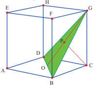

> **Deskripsi Visual:** Gambar ini adalah ilustrasi yang menunjukkan struktur geometri dari sebuah bangunan tiga dimensi. Gambar ini menggambarkan bagaimana sebuah bangunan tiga dimensi dibangun dari beberapa elemen dasar seperti sisi, sudut, dan garis. Elemen utama yang ditampilkan adalah sisi, sudut, dan garis yang membentuk bangunan tersebut. Sisi-sisi tersebut terhubung oleh sudut-sudut yang membentuk garis-garis. Informasi kunci yang dapat diambil pembaca adalah bahwa bangunan ini dibangun dari beberapa elemen dasar yang saling berhubungan untuk menciptakan struktur tiga dimensi.

Misal titik P adalah proyeksi titik C ke bidang BDG.

``

``

Jadi, jarak titik C dengan bidang BDG adalah  2 3  cm.

 

---
## 📄 Halaman 33

### STATISTIKA

### A. Kompetensi Inti (KI) dan Kompetensi Dasar (KD)

### Kompetensi Inti

- Menghayati dan mengamalkan ajaran agama yang dianutnya.
- Menunjukkan perilaku jujur, disiplin, tanggungjawab, peduli (gotong royong, kerjasama, toleran, damai), santun, responsif dan proaktif sebagai bagian dari solusi atas berbagai permasalahan dalam berinteraksi secara dalam berinteraksi secara efektif dengan lingkungan sosial dan alam serta alam menempatkan  diri  sebagai  cerminan  bangsa dalam pergaulan dunia.
- Memahami,  menerapkan,  menganalisis  dan mengevaluasi  pengetahuan  faktual,  konsep  tual,  prosedural berdasarkan rasa ingintahunya tentang  ilmu  pengetahuan,  teknologi,  seni, budaya,  dan  humaniora  dengan  wawasan kemanusiaan, kebangsaan, kenegaraan, dan peradaban  terkait  penyebab  fenomena  dan kejadian, serta menerapkan pengetahuan /g83/g85/g82/g86/g72/g71/g88/g85/g68/g79/g3 /g83/g68/g71/g68/g3 /g69/g76/g71/g68/g81/g74/g3 /g78/g68/g77/g76/g68/g81/g3 /g92/g68/g81/g74/g3 /g86/g83/g72/g86/g76/g191/g78/g3 sesuai  dengan  bakat  dan  minatnya  untuk memecahkan masalah.
- Mengolah,  menalar,  menyaji,  dan  mencipta dalam ranah konkret dan ranah abstrak terkait dengan pengembangan dari yang dipelajarinya di sekolah secara mandiri, serta bertindak secara efektif dan kreatif dan mampu menggunakan metoda sesuai kaidah keilmuan.

### Kompetensi Dasar

- 3.2 Menentukan dan menganalisis ukuran pemusatan dan penyebaran data yang disajikan dalam  bentuk  tabel  distribusi  frekuensi  dan histogram.
- 4.2 Menyelesaikan  masalah  yang  berkaitan  dengan penyajian  data  hasil  pengukuran  dan  pencacahan dalam tabel distribusi frekuensi dan histogram.

 

---
## 📄 Halaman 34

### B. Tujuan Pembelajaran

Melalui aktivitas mengamati, mempertanyakan bahan amatannya, melakukan penyelidikan dan mengumpulkan informasi, mengasosiasi semua informasi yang diperoleh, dan mengomunikasikan hasilnya baik dalam kelompok dan klasikal, siswa mampu:

- Menentukan ukuran pemusatan data yang disajikan dalam bentuk tabel distribusi frekuensi dan histogram.
- Menganalisis ukuran pemusatan data yang disajikan dalam bentuk tabel distribusi frekuensi dan histogram.
- Menentukan ukuran penyebaran data yang disajikan dalam bentuk tabel distribusi frekuensi dan histogram.
- Menganalisis  ukuran  penyebaran  data  yang  disajikan  dalam  bentuk  tabel distribusi frekuensi dan histogram.

 

---
## 📄 Halaman 35

### C. Diagram Alur Konsep

---
**🖼️ Gambar/Diagram**

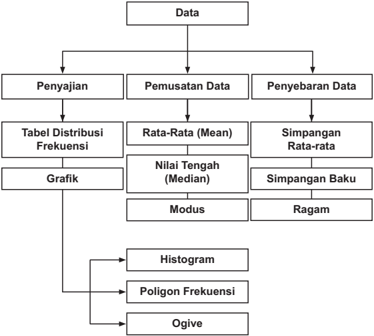

> **Deskripsi Visual:** Gambar ini adalah diagram yang menunjukkan proses analisis data statistik. Diagram ini terdiri dari tiga bagian utama: Penyajian Data, Pemusatan Data, dan Penyebaran Data. Setiap bagian tersebut memiliki subbagian yang lebih spesifik.

1. **Penyajian Data** meliputi Tabel Distribusi Frekuensi dan Grafik. Tabel Distribusi Frekuensi digunakan untuk menggambarkan frekuensi masing-masing nilai dalam data, sementara Grafik termasuk Histogram, Poligon Frekuensi, dan Ogive, yang digunakan untuk visualisasi data tersebut.

2. **Pemusatan Data** mencakup Rata-Rata (Mean), Nilai Tengah (Median), Simpangan Rata-rata, Modus, dan Ragam. Rata-rata mengukur arah dan kekuatan trend, Median menunjukkan nilai tengah, Simpangan Rata-rata mengukur variasi, Modus menunjukkan nilai paling sering muncul, dan Ragam mengukur selisih antara nilai tertinggi dan terendah.

3. **Penyebaran Data** mencakup Simpangan Baku, yang mengukur variasi data sekitar rata-rata.

Teks, angka, atau label penting yang terlihat dalam diagram ini meliputi nama-nama statistik seperti Mean, Median, Simpangan Rata-rata, Modus, dan Ragam. Angka-angka tersebut digunakan untuk menggambarkan nilai-nilai statistik yang diperoleh dari data.

Informasi kunci yang dapat diambil pembaca meliputi bahwa diagram ini menjelaskan proses analisis data statistik, termasuk cara penyajian, pemusatan, dan penyebaran data, serta jenis-jenis grafik yang digunakan untuk visualisasi data tersebut.

 

---
## 📄 Halaman 36

### D. Proses Pembelajaran

### 2.1 Penyajian Data

Kegiatan 2.1.1

### Distribusi Frekuensi

### Kegiatan Pendahuluan

- /g135/g3 /g54/g72/g69/g72/g79/g88/g80/g3 /g80/g72/g80/g88/g79/g68/g76/g3 /g83/g72/g81/g74/g68/g80/g68/g87/g68/g81/g15/g3 /g74/g88/g85/g88/g3 /g80/g72/g80/g76/g81/g87/g68/g3 /g86/g76/g86/g90/g68/g3 /g88/g81/g87/g88/g78/g3 /g80/g72/g81/g74/g76/g81/g74/g68/g87/g3 /g78/g72/g80/g69/g68/g79/g76/g3 /g87/g72/g81/g87/g68/g81/g74/g3/g71/g68/g87/g68/g3/g87/g88/g81/g74/g74/g68/g79/g3/g71/g68/g81/g3/g69/g68/g74/g68/g76/g80/g68/g81/g68/g3/g80/g72/g81/g92/g68/g77/g76/g78/g68/g81/g3/g71/g68/g87/g68/g3/g71/g68/g79/g68/g80/g3/g69/g72/g81/g87/g88/g78/g3/g74/g85/g68/g191/g78/g3/g92/g68/g81/g74/g3 sudah dipelajari di jenjang sebelumnya.
- /g135/g3 /g42/g88/g85/g88/g3/g80/g72/g80/g72/g85/g76/g78/g86/g68/g3/g83/g72/g81/g74/g72/g87/g68/g75/g88/g68/g81/g3/g68/g90/g68/g79/g3/g86/g76/g86/g90/g68/g3/g71/g72/g81/g74/g68/g81/g3/g80/g72/g80/g69/g72/g85/g76/g78/g68/g81/g3/g71/g68/g87/g68/g3/g92/g68/g81/g74/g3/g87/g72/g85/g71/g76/g85/g76/g3 dari 10 datum dan meminta siswa untuk menyajikannya dalam diagram batang.
- /g135/g3 /g54/g72/g87/g72/g79/g68/g75/g3 /g80/g72/g81/g71/g68/g83/g68/g87/g78/g68/g81/g3 /g71/g76/g68/g74/g85/g68/g80/g3 /g69/g68/g87/g68/g81/g74/g3 /g92/g68/g81/g74/g3 /g71/g76/g78/g72/g85/g77/g68/g78/g68/g81/g3 /g86/g76/g86/g90/g68/g15/g3 /g74/g88/g85/g88/g3 /g80/g72/g81/g74/g68/g77/g88/g78/g68/g81/g3 pertanyaan bagaimana jika data yang dihadapi berukuran besar (minimal terdiri dari 30 data). Mungkinkah data yang berukuran besar disajikan dalam bentuk diagram batang? Informasi apa saja yang dapat diperoleh dari data berukuran /g69/g72/g86/g68/g85/g3/g77/g76/g78/g68/g3/g87/g76/g71/g68/g78/g3/g71/g76/g88/g69/g68/g75/g3/g78/g72/g3/g71/g68/g79/g68/g80/g3/g87/g68/g69/g72/g79/g3/g71/g68/g81/g3/g74/g85/g68/g191/g78/g34
- /g135/g3 /g42/g88/g85/g88/g3 /g80/g72/g81/g74/g68/g85/g68/g75/g78/g68/g81/g3 /g86/g76/g86/g90/g68/g3 /g69/g68/g74/g68/g76/g80/g68/g81/g68/g3 /g83/g72/g81/g87/g76/g81/g74/g81/g92/g68/g3 /g80/g72/g81/g74/g72/g79/g82/g80/g83/g82/g78/g78/g68/g81/g3 /g71/g68/g87/g68/g3 /g69/g72/g85/g16 /g88/g78/g88/g85/g68/g81/g3/g69/g72/g86/g68/g85/g3/g71/g68/g81/g3/g80/g72/g81/g92/g68/g77/g76/g78/g68/g81/g81/g92/g68/g3/g71/g68/g79/g68/g80/g3/g74/g85/g68/g191/g78/g17

### Kegiatan Inti

Mengamati

/g3 /g42/g88/g85/g88/g3/g80/g72/g80/g76/g81/g87/g68/g3/g86/g76/g86/g90/g68/g3/g80/g72/g81/g74/g68/g80/g68/g87/g76/g3/g71/g68/g87/g68/g3/g92/g68/g81/g74/g3/g71/g76/g69/g72/g85/g76/g78/g68/g81/g3/g83/g68/g71/g68/g3/g38/g82/g81/g87/g82/g75/g3/g21/g17/g20/g15/g3/g38/g82/g81/g87/g82/g75/g3/g21/g17/g21/g15/g3/g71/g68/g81/g3 /g38/g82/g81/g87/g82/g75/g3 /g21/g17/g22/g3 /g69/g72/g86/g72/g85/g87/g68/g3 /g76/g81/g73/g82/g85/g80/g68/g86/g76/g3 /g92/g68/g81/g74/g3 /g71/g76/g86/g72/g71/g76/g68/g78/g68/g81/g3 /g69/g72/g85/g78/g68/g76/g87/g68/g81/g3 /g71/g72/g81/g74/g68/g81/g3 /g71/g68/g87/g68/g3 /g87/g72/g85/g86/g72/g69/g88/g87/g3 /g71/g72/g81/g74/g68/g81/g3 /g86/g72/g78/g86/g68/g80/g68/g17

Menanya

- /g135/g3 /g42/g88/g85/g88/g3 /g80/g72/g80/g76/g81/g87/g68/g3 /g86/g76/g86/g90/g68/g3 /g80/g72/g81/g74/g68/g77/g88/g78/g68/g81/g3 /g83/g72/g85/g87/g68/g81/g92/g68/g68/g81/g16/g83/g72/g85/g87/g68/g81/g92/g68/g68/g81/g3 /g80/g72/g81/g74/g72/g81/g68/g76/g3 /g71/g68/g87/g68/g3 /g71/g68/g81/g3 informasi yang disajikan.
- /g135/g3 /g42/g88/g85/g88/g3/g77/g88/g74/g68/g3/g69/g76/g86/g68/g3/g80/g72/g80/g76/g81/g87/g68/g3/g86/g76/g86/g90/g68/g3/g88/g81/g87/g88/g78/g3/g80/g72/g80/g69/g88/g68/g87/g3/g78/g72/g86/g76/g80/g83/g88/g79/g68/g81/g3/g68/g90/g68/g79/g3/g80/g72/g81/g74/g72/g81/g68/g76/g3/g71/g68/g87/g68/g3 yang diamati yang kebenarannya akan diuji di bagian selanjutnya.
- /g135/g3 /g42/g88/g85/g88/g3 /g71/g68/g83/g68/g87/g3 /g80/g72/g81/g74/g68/g85/g68/g75/g78/g68/g81/g3 /g86/g76/g86/g90/g68/g3 /g88/g81/g87/g88/g78/g3 /g80/g72/g81/g74/g68/g80/g68/g87/g76/g3 /g79/g72/g69/g76/g75/g3 /g79/g68/g81/g77/g88/g87/g3 /g80/g72/g81/g74/g72/g81/g68/g76/g3 /g76/g81/g73/g82/g85/g80/g68/g86/g76/g3 yang menyertai data dan membuat pertanyaan terkait informasi tersebut.

 

---
## 📄 Halaman 37

- /g135/g3 /g42/g88/g85/g88/g3/g80/g72/g80/g76/g81/g87/g68/g3/g86/g72/g80/g88/g68/g3/g86/g76/g86/g90/g68/g3/g88/g81/g87/g88/g78/g3/g80/g72/g81/g88/g79/g76/g86/g78/g68/g81/g3/g83/g72/g85/g87/g68/g81/g92/g68/g68/g81/g3/g68/g87/g68/g88/g3/g78/g72/g86/g76/g80/g83/g88/g79/g68/g81/g3/g68/g90/g68/g79/g3 yang didapatkan pada kotak yang sudah disediakan.
- /g135/g3 /g42/g88/g85/g88/g3 /g80/g72/g81/g70/g68/g87/g68/g87/g3 /g86/g72/g80/g88/g68/g3 /g83/g72/g85/g87/g68/g81/g92/g68/g68/g81/g18/g78/g72/g86/g76/g80/g83/g88/g79/g68/g81/g3 /g92/g68/g81/g74/g3 /g71/g76/g69/g88/g68/g87/g3 /g86/g76/g86/g90/g68/g3 /g71/g76/g3 /g83/g68/g83/g68/g81/g3 /g87/g88/g79/g76/g86/g3 /g68/g87/g68/g88/g3 /g47/g38/g39/g3 /g78/g72/g80/g88/g71/g76/g68/g81/g3 /g80/g72/g80/g76/g79/g76/g75/g3 /g83/g72/g85/g87/g68/g81/g92/g68/g68/g81/g16/g83/g72/g85/g87/g68/g81/g92/g68/g68/g81/g3 /g86/g72/g70/g68/g85/g68/g3 /g69/g72/g85/g86/g68/g80/g68/g16/g86/g68/g80/g68/g3 untuk dijawab melalui kegiatan berikutnya. Pertanyaan yang dipilih sebaiknya merupakan  pertanyaan  yang  menyangkut  pengolahan  data  berukuran  besar, pengelompokan  data  dan  penarikan  kesimpulan  dari  data  yang  di  antaranya adalah:
- /g20/g12/g3 /g37/g68/g74/g68/g76/g80/g68/g81/g68/g3/g70/g68/g85/g68/g3/g80/g72/g81/g71/g68/g83/g68/g87/g78/g68/g81/g3/g78/g72/g86/g76/g80/g83/g88/g79/g68/g81/g3/g88/g81/g87/g88/g78/g3/g86/g72/g87/g76/g68/g83/g3/g71/g68/g87/g68/g34
- Bagaimana menghitung data pada selang tertentu?
- Apa itu distribusi frekuensi?
- Bagaimana mendapatkan distribusi frekuensi dari data mentah?
Mengumpulkan Informasi dan Menalar

- /g135/g3 /g42/g88/g85/g88/g3 /g80/g72/g80/g76/g81/g87/g68/g3 /g86/g76/g86/g90/g68/g3 /g88/g81/g87/g88/g78/g3 /g80/g72/g81/g70/g82/g69/g68/g3 /g80/g72/g81/g77/g68/g90/g68/g69/g3 /g83/g72/g85/g87/g68/g81/g92/g68/g68/g81/g16/g83/g72/g85/g87/g68/g81/g92/g68/g68/g81/g3 /g92/g68/g81/g74/g3 /g86/g88/g71/g68/g75/g3/g71/g76/g86/g72/g83/g68/g78/g68/g87/g76/g3/g86/g72/g69/g72/g79/g88/g80/g81/g92/g68/g3/g86/g72/g70/g68/g85/g68/g3/g69/g72/g85/g78/g72/g79/g82/g80/g83/g82/g78/g17
- /g135/g3 /g56/g81/g87/g88/g78/g3 /g80/g72/g81/g71/g68/g83/g68/g87/g78/g68/g81/g3 /g77/g68/g90/g68/g69/g68/g81/g3 /g92/g68/g81/g74/g3 /g79/g72/g69/g76/g75/g3 /g87/g72/g83/g68/g87/g15/g3 /g74/g88/g85/g88/g3 /g80/g72/g80/g76/g81/g87/g68/g3 /g86/g76/g86/g90/g68/g3 /g88/g81/g87/g88/g78/g3 /g80/g72/g80/g83/g72/g85/g75/g68/g87/g76/g78/g68/g81/g3 /g79/g72/g69/g76/g75/g3 /g87/g72/g79/g76/g87/g76/g3 /g38/g82/g81/g87/g82/g75/g3 /g21/g17/g23/g15/g3 /g38/g82/g81/g87/g82/g75/g3 /g21/g17/g24/g15/g3 /g71/g68/g81/g3 /g38/g82/g81/g87/g82/g75/g3 /g21/g17/g25/g3 /g69/g68/g74/g68/g76/g80/g68/g81/g68/g3 mendapatkan tabel yang diberikan.
- /g135/g3 /g56/g81/g87/g88/g78/g3 /g79/g72/g69/g76/g75/g3 /g86/g83/g72/g86/g76/g191/g78/g15/g3 /g74/g88/g85/g88/g3 /g80/g72/g80/g76/g81/g87/g68/g3 /g86/g76/g86/g90/g68/g3 /g80/g72/g80/g83/g72/g85/g75/g68/g87/g76/g78/g68/g81/g3 /g38/g82/g81/g87/g82/g75/g3 /g21/g17/g23/g17/g3 /g71/g68/g81/g3 distribusi frekuensi yang diberikan seperti berikut ini.
- /g135/g3 /g42/g88/g85/g88/g3/g80/g72/g80/g76/g81/g87/g68/g3/g86/g76/g86/g90/g68/g3/g80/g72/g80/g83/g72/g85/g75/g68/g87/g76/g78/g68/g81/g3/g68/g83/g68/g3/g86/g68/g77/g68/g3/g92/g68/g81/g74/g3/g71/g76/g76/g86/g76/g78/g68/g81/g3/g71/g76/g3/g86/g72/g87/g76/g68/g83/g3/g78/g82/g79/g82/g80/g17/g3
- /g135/g3 /g51/g68/g71/g68/g3 /g78/g82/g79/g82/g80/g3 /g78/g72/g79/g68/g86/g15/g3 /g86/g76/g86/g90/g68/g3 /g71/g76/g80/g76/g81/g87/g68/g3 /g80/g72/g81/g74/g68/g80/g68/g87/g76/g3 /g83/g72/g80/g69/g68/g74/g76/g68/g81/g3 /g78/g72/g79/g82/g80/g83/g82/g78/g3 /g71/g68/g87/g68/g3 /g71/g68/g81/g3 /g83/g68/g81/g77/g68/g81/g74/g3/g88/g81/g87/g88/g78/g3/g86/g72/g87/g76/g68/g83/g3/g78/g72/g79/g68/g86/g81/g92/g68/g17/g3/g54/g76/g86/g90/g68/g3/g77/g88/g74/g68/g3/g71/g76/g80/g76/g81/g87/g68/g3/g88/g81/g87/g88/g78/g3/g80/g72/g81/g74/g68/g80/g68/g87/g76/g3/g68/g71/g68/g3/g69/g72/g85/g68/g83/g68/g3 banyak kelas dalam distribusi frekuensi tersebut.
- /g135/g3 /g51/g68/g71/g68/g3/g78/g82/g79/g82/g80/g3/g69/g68/g87/g68/g86/g3/g78/g72/g79/g68/g86/g15/g3/g86/g76/g86/g90/g68/g3/g71/g76/g80/g76/g81/g87/g68/g3/g88/g81/g87/g88/g78/g3/g80/g72/g81/g72/g80/g88/g78/g68/g81/g3/g75/g88/g69/g88/g81/g74/g68/g81/g3/g68/g81/g87/g68/g85/g68/g3/g69/g68/g87/g68/g86/g3 kelas dengan kelas pada kolom pertama.
- /g135/g3 /g51/g68/g71/g68/g3 /g78/g82/g79/g82/g80/g3 /g73/g85/g72/g78/g88/g72/g81/g86/g76/g15/g3 /g86/g76/g86/g90/g68/g3 /g71/g76/g80/g76/g81/g87/g68/g3 /g88/g81/g87/g88/g78/g3 /g80/g72/g81/g72/g80/g88/g78/g68/g81/g3 /g69/g68/g74/g68/g76/g80/g68/g81/g68/g3 /g70/g68/g85/g68/g3 menghitung frekuensi untuk setiap kelasnya.

---
**📊 Tabel**

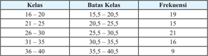

Tabel ini menunjukkan distribusi frekuensi kelas untuk rentang umur 15-40 tahun. Topik utama tabel adalah distribusi umur di berbagai kelas. Kolom pertama berisi kelas, sedangkan kolom kedua berisi batas-batas kelas. Kolom ketiga berisi frekuensi, yang menunjukkan jumlah individu dalam setiap kelas. Dari tabel ini, dapat dilihat bahwa kelas 26-30 memiliki frekuensi tertinggi dengan 21 individu, sementara kelas 36-40 memiliki frekuensi terendah dengan hanya 9 individu. Pola umumnya menunjukkan bahwa sebagian besar populasi berada di kelas 21-30, yang merupakan rentang umur paling banyak ditemukan dalam data ini.

 

---
## 📄 Halaman 38

- /g135/g3 /g54/g76/g86/g90/g68/g3/g71/g76/g80/g76/g81/g87/g68/g3/g80/g72/g81/g88/g79/g76/g86/g78/g68/g81/g3/g75/g68/g86/g76/g79/g3/g83/g72/g81/g70/g68/g85/g76/g68/g81/g3/g76/g81/g73/g82/g85/g80/g68/g86/g76/g3/g88/g81/g87/g88/g78/g3/g80/g72/g81/g71/g68/g83/g68/g87/g78/g68/g81/g3/g71/g88/g74/g68/g68/g81/g3 awal bagaimana mengolah data dari data mentah menjadi distribusi frekuensi. /g39/g88/g74/g68/g68/g81/g3 /g68/g90/g68/g79/g3 /g76/g81/g76/g3 /g71/g76/g89/g72/g85/g76/g191/g78/g68/g86/g76/g3 /g71/g72/g81/g74/g68/g81/g3 /g80/g72/g81/g74/g74/g88/g81/g68/g78/g68/g81/g3 /g38/g82/g81/g87/g82/g75/g3 /g21/g17/g24/g3 /g71/g68/g81/g3 /g38/g82/g81/g87/g82/g75/g3 /g21/g17/g25/g3 /g71/g68/g81/g3 /g86/g76/g86/g90/g68/g3 /g71/g76/g80/g76/g81/g87/g68/g3 /g88/g81/g87/g88/g78/g3 /g80/g72/g80/g83/g72/g85/g69/g68/g76/g78/g76/g3 /g71/g88/g74/g68/g68/g81/g3 /g68/g90/g68/g79/g81/g92/g68/g3 /g77/g76/g78/g68/g3 /g71/g76/g87/g72/g80/g88/g78/g68/g81/g3 /g78/g72/g87/g76/g71/g68/g78/g70/g82/g70/g82/g78/g68/g81/g3/g83/g68/g71/g68/g3/g78/g72/g71/g88/g68/g3/g70/g82/g81/g87/g82/g75/g3/g87/g72/g85/g86/g72/g69/g88/g87/g17
- /g135/g3 /g42/g88/g85/g88/g3 /g80/g72/g81/g71/g68/g80/g83/g76/g81/g74/g76/g3 /g71/g68/g81/g3 /g80/g72/g80/g69/g68/g81/g87/g88/g3 /g86/g76/g86/g90/g68/g3 /g77/g76/g78/g68/g3 /g87/g72/g85/g71/g68/g83/g68/g87/g3 /g78/g72/g86/g88/g79/g76/g87/g68/g81/g3 /g80/g72/g79/g68/g79/g88/g76/g3 /g87/g68/g81/g92/g68/g3 jawab baik dalam kelompok maupun individu.
- /g135/g3 /g54/g72/g79/g68/g81/g77/g88/g87/g81/g92/g68/g3 /g86/g76/g86/g90/g68/g3 /g71/g76/g75/g68/g85/g68/g83/g78/g68/g81/g3 /g80/g68/g80/g83/g88/g3 /g80/g72/g81/g74/g68/g76/g87/g78/g68/g81/g3 /g76/g81/g73/g82/g85/g80/g68/g86/g76/g16/g76/g81/g73/g82/g85/g80/g68/g86/g76/g3 /g92/g68/g81/g74/g3 diperoleh dan mendapatkan kesimpulan sementara tentang distribusi frekuensi dan bagaimana mendapatkan distribusi frekuensi.
- /g135/g3 /g42/g88/g85/g88/g3/g80/g72/g80/g76/g81/g87/g68/g3/g86/g76/g86/g90/g68/g3/g88/g81/g87/g88/g78/g3/g80/g72/g79/g72/g81/g74/g78/g68/g83/g76/g3/g87/g68/g69/g72/g79/g3/g21/g17/g23/g15/g3/g92/g68/g76/g87/g88/g3/g71/g76/g86/g87/g85/g76/g69/g88/g86/g76/g3/g73/g85/g72/g78/g88/g72/g81/g86/g76/g3/g71/g68/g85/g76/g3 /g71/g68/g87/g68/g3/g83/g68/g71/g68/g3/g38/g82/g81/g87/g82/g75/g3/g21/g17/g20/g3/g77/g76/g78/g68/g3/g71/g68/g87/g68/g3/g71/g76/g78/g72/g79/g82/g80/g83/g82/g78/g78/g68/g81/g3/g80/g72/g81/g77/g68/g71/g76/g3/g87/g88/g77/g88/g75/g3/g78/g72/g79/g68/g86/g17/g3/g54/g76/g86/g90/g68/g3/g71/g68/g83/g68/g87/g3 melengkapi tabel dengan menggunakan dugaan awal yang diperoleh sebelumnya. Tabel 2.4 yang harus didapatkan siswa adalah sebagai berikut.
- /g135/g3 /g54/g76/g86/g90/g68/g3 /g77/g88/g74/g68/g3 /g71/g76/g80/g76/g81/g87/g68/g3 /g88/g81/g87/g88/g78/g3 /g80/g72/g81/g88/g79/g76/g86/g78/g68/g81/g3 /g78/g72/g86/g76/g80/g83/g88/g79/g68/g81/g3 /g92/g68/g81/g74/g3 /g71/g68/g83/g68/g87/g3 /g71/g76/g83/g72/g85/g82/g79/g72/g75/g3 /g71/g68/g85/g76/g3 /g87/g68/g69/g72/g79/g3 /g11/g71/g76/g86/g87/g85/g76/g69/g88/g86/g76/g3 /g73/g85/g72/g78/g88/g72/g81/g86/g76/g12/g3 /g92/g68/g81/g74/g3 /g86/g88/g71/g68/g75/g3 /g71/g76/g79/g72/g81/g74/g78/g68/g83/g76/g17/g3 /g54/g72/g69/g68/g74/g68/g76/g3 /g70/g82/g81/g87/g82/g75/g29/g3 /g179/g46/g72/g69/g68/g81/g92/g68/g78/g68/g81/g3 /g83/g72/g81/g74/g88/g86/g68/g75/g68/g3 /g69/g72/g85/g68/g81/g76/g3 /g80/g72/g80/g88/g79/g68/g76/g3 /g88/g86/g68/g75/g68/g81/g92/g68/g3 /g71/g72/g81/g74/g68/g81/g3 /g86/g72/g85/g76/g88/g86/g3 /g83/g68/g71/g68/g3 /g88/g86/g76/g68/g3 /g86/g72/g78/g76/g87/g68/g85/g3 /g21/g27/g3 /g177/g3 /g22/g20/g3 tahun, yaitu sebanyak 19 orang.'
- /g135/g3 /g54/g72/g79/g68/g81/g77/g88/g87/g81/g92/g68/g15/g3 /g74/g88/g85/g88/g3 /g80/g72/g80/g76/g81/g87/g68/g3 /g86/g76/g86/g90/g68/g3 /g80/g72/g79/g72/g81/g74/g78/g68/g83/g76/g3 /g87/g68/g69/g72/g79/g3 /g69/g72/g85/g76/g78/g88/g87/g81/g92/g68/g3 /g92/g68/g81/g74/g3 /g75/g68/g80/g83/g76/g85/g3 /g86/g68/g80/g68/g3/g71/g72/g81/g74/g68/g81/g3/g87/g68/g69/g72/g79/g3/g86/g72/g69/g72/g79/g88/g80/g81/g92/g68/g17/g3/g54/g72/g69/g68/g76/g78/g81/g92/g68/g3/g74/g88/g85/g88/g3/g80/g72/g81/g68/g81/g92/g68/g78/g68/g81/g3/g78/g72/g83/g68/g71/g68/g3/g86/g76/g86/g90/g68/g3/g68/g83/g68/g3 /g83/g72/g85/g69/g72/g71/g68/g68/g81/g3 /g92/g68/g81/g74/g3 /g71/g68/g83/g68/g87/g3 /g71/g76/g68/g80/g68/g87/g76/g3 /g71/g68/g85/g76/g3 /g87/g68/g69/g72/g79/g3 /g21/g17/g23/g3 /g71/g68/g81/g3 /g87/g68/g69/g72/g79/g3 /g21/g17/g24/g17/g3 /g51/g72/g85/g69/g72/g71/g68/g68/g81/g3 /g88/g87/g68/g80/g68/g3 /g87/g68/g69/g72/g79/g3 tersebut terletak pada pembagian kelas dan batas kelas yang diberikan.

---
**📊 Tabel**

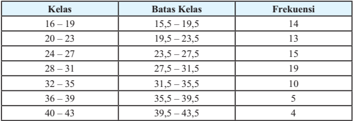

Tabel ini menunjukkan distribusi frekuensi kelas di berbagai batas kelas. Topik utama tabel adalah distribusi umur siswa dalam kelas tertentu. Kolom pertama berisi nomor kelas, sedangkan kolom kedua berisi batas-batas kelas. Kolom ketiga berisi frekuensi, yang menunjukkan jumlah siswa yang berada dalam setiap kelas. Dari tabel ini, dapat dilihat bahwa kelas 16-19 memiliki frekuensi tertinggi sebanyak 14 siswa, sementara kelas 40-43 memiliki frekuensi terendah sebanyak 4 siswa. Pola umumnya menunjukkan bahwa frekuensi meningkat dari kelas 16-19 hingga kelas 28-31, kemudian turun hingga kelas 40-43.

 

---
## 📄 Halaman 39

---
**📊 Tabel**

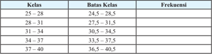

Tabel ini menunjukkan distribusi frekuensi kelas untuk suatu data statistik. Topik utamanya adalah distribusi frekuensi kelas yang digunakan untuk menggambarkan bagaimana data tertentu terdistribusi di antara berbagai kelas. Kolom-kolomnya meliputi kelas (kelompok) dan batas-batas kelas. Frekuensi adalah jumlah data yang termasuk dalam setiap kelas. Dari tabel ini, kita dapat melihat bahwa kelas 25-28 memiliki frekuensi paling tinggi, yaitu 24,5 sampai 28,5. Kemudian, kelas 28-31 memiliki frekuensi yang lebih rendah, yaitu 27,5 sampai 31,5. Pola umumnya menunjukkan bahwa frekuensi meningkat dari kelas 25-28 hingga kelas 31-34, kemudian turun hingga kelas 37-40. Ini menunjukkan bahwa data tersebut cenderung lebih banyak terdistribusi di kelas dengan batas-batas yang lebih tinggi.

/g56/g81/g87/g88/g78/g3 /g80/g72/g81/g74/g76/g86/g76/g3 /g87/g68/g69/g72/g79/g3 /g21/g17/g24/g3 /g71/g72/g81/g74/g68/g81/g3 /g88/g77/g88/g81/g74/g3 /g68/g87/g68/g86/g3 /g11/g87/g72/g83/g76/g3 /g68/g87/g68/g86/g12/g3 /g86/g88/g68/g87/g88/g3 /g78/g72/g79/g68/g86/g3 /g86/g68/g80/g68/g3 /g71/g72/g81/g74/g68/g81/g3 /g88/g77/g88/g81/g74/g3 bawah  (tepi  bawah)  kelas  berikutnya,  siswa  akan  kebingungan  dalam  menghitung /g73/g85/g72/g78/g88/g72/g81/g86/g76/g3 /g78/g72/g87/g76/g78/g68/g3 /g68/g71/g68/g3 /g71/g68/g87/g68/g3 /g92/g68/g81/g74/g3 /g87/g72/g85/g80/g68/g86/g88/g78/g3 /g71/g68/g79/g68/g80/g3 /g78/g72/g71/g88/g68/g3 /g78/g72/g79/g68/g86/g17/g3 /g54/g72/g69/g68/g74/g68/g76/g3 /g70/g82/g81/g87/g82/g75/g15/g3 /g88/g86/g76/g68/g3 /g20/g28/g3 /g83/g68/g71/g68/g3 /g71/g68/g87/g68/g3 /g38/g82/g81/g87/g82/g75/g3 /g20/g3 /g71/g68/g83/g68/g87/g3 /g71/g76/g80/g68/g86/g88/g78/g78/g68/g81/g3/g83/g68/g71/g68/g3 /g78/g72/g79/g68/g86/g3 /g83/g72/g85/g87/g68/g80/g68/g3 /g80/g68/g88/g83/g88/g81/g3 /g78/g72/g71/g88/g68/g17/g3 /g45/g76/g78/g68/g3 /g20/g28/g3/g71/g76/g80/g68/g86/g88/g78/g78/g68/g81/g3 ke  dalam kedua kelas tersebut maka jumlah keseluruhan frekuensinya akan melebihi /g87/g82/g87/g68/g79/g3/g71/g68/g87/g68/g3/g83/g68/g71/g68/g3/g38/g82/g81/g87/g82/g75/g3/g20/g17

- /g135/g3 /g54/g72/g87/g72/g79/g68/g75/g3/g80/g72/g81/g74/g76/g86/g76/g3/g87/g68/g69/g72/g79/g3/g21/g17/g24/g3/g86/g72/g86/g88/g68/g76/g3/g71/g68/g87/g68/g3/g83/g68/g71/g68/g3/g38/g82/g81/g87/g82/g75/g3/g21/g17/g20/g15/g3/g86/g76/g86/g90/g68/g3/g71/g76/g75/g68/g85/g68/g83/g78/g68/g81/g3/g80/g68/g80/g83/g88/g3 menjawab beberapa pertanyaan  yang menyertai. Berikut merupakan alternatif /g77/g68/g90/g68/g69/g68/g81/g3/g71/g68/g85/g76/g3/g83/g72/g85/g87/g68/g81/g92/g68/g68/g81/g16/g83/g72/g85/g87/g68/g81/g92/g68/g68/g81/g3/g92/g68/g81/g74/g3/g71/g76/g69/g72/g85/g76/g78/g68/g81/g15
- Apa yang terjadi pada kolom batas kelas? Jawab:
/g54/g72/g79/g68/g81/g74/g3 /g83/g68/g71/g68/g3 /g69/g68/g87/g68/g86/g3 /g78/g72/g79/g68/g86/g3 /g68/g71/g68/g3 /g92/g68/g81/g74/g3 /g69/g72/g85/g76/g85/g76/g86/g68/g81/g17/g3 /g54/g72/g69/g68/g74/g68/g76/g3 /g70/g82/g81/g87/g82/g75/g15/g3 /g86/g72/g79/g68/g81/g74/g3 /g83/g72/g85/g87/g68/g80/g68/g3 /g83/g68/g71/g68/g3 /g69/g68/g87/g68/g86/g3 /g78/g72/g79/g68/g86/g3 /g69/g72/g85/g76/g85/g76/g86/g68/g81/g3 /g71/g72/g81/g74/g68/g81/g3 /g86/g72/g79/g68/g81/g74/g3 /g83/g68/g71/g68/g3 /g69/g68/g87/g68/g86/g3 /g78/g72/g79/g68/g86/g3 /g78/g72/g71/g88/g68/g17/g3 /g54/g72/g75/g68/g85/g88/g86/g81/g92/g68/g3 batas atas kelas pertama merupakan batas bawah kelas berikutnya tetapi pada tabel  tersebut,  batas  atas  kelas  pertama  lebih  besar  dari  batas  bawah  kelas berikutnya.

### 2. Apa yang terjadi pada saat pengisian kolom frekuensi? Jawab:

/g36/g71/g68/g3 /g71/g68/g87/g68/g3 /g92/g68/g81/g74/g3 /g80/g68/g86/g88/g78/g3 /g71/g76/g3 /g71/g88/g68/g3 /g78/g72/g79/g68/g86/g3 /g92/g68/g81/g74/g3 /g69/g72/g85/g69/g72/g71/g68/g17/g3 /g54/g72/g69/g68/g74/g68/g76/g3 /g70/g82/g81/g87/g82/g75/g15/g3 /g20/g28/g3 /g71/g68/g83/g68/g87/g3 /g80/g68/g86/g88/g78/g3 /g71/g76/g3 /g78/g72/g79/g68/g86/g3 /g83/g72/g85/g87/g68/g80/g68/g3 /g92/g68/g76/g87/g88/g3 /g86/g72/g79/g68/g81/g74/g3 /g20/g25/g3 /g177/g3 /g20/g28/g3 /g71/g68/g81/g3 /g71/g68/g83/g68/g87/g3 /g80/g68/g86/g88/g78/g3 /g71/g76/g3 /g78/g72/g79/g68/g86/g3 /g92/g68/g81/g74/g3 /g78/g72/g71/g88/g68/g3/g92/g68/g76/g87/g88/g3/g20/g28/g3/g177/g3/g21/g21/g17/g3

- Apa yang dapat Anda simpulkan mengenai batas atas dan batas bawah kelas dalam hubungannya dengan frekuensi?

### Jawab:

Agar data dapat dikelompokkan dan setiap nilai dalam data dapat masuk dalam tepat satu kelas maka selang setiap kelas tidak ada yang beririsan. Batas atas kelas suatu kelas merupakan batas bawah kelas berikutnya.

/g45/g76/g78/g68/g3 /g71/g76/g83/g72/g85/g75/g68/g87/g76/g78/g68/g81/g3 /g69/g68/g87/g68/g86/g3 /g78/g72/g79/g68/g86/g3 /g80/g72/g81/g68/g80/g69/g68/g75/g78/g68/g81/g3 /g86/g68/g87/g88/g3 /g87/g72/g80/g83/g68/g87/g3 /g71/g72/g86/g76/g80/g68/g79/g3 /g71/g68/g85/g76/g3 /g78/g72/g79/g68/g86/g17/g3 /g54/g72/g69/g68/g74/g68/g76/g3/g70/g82/g81/g87/g82/g75/g3/g88/g81/g87/g88/g78/g3/g86/g72/g79/g68/g81/g74/g3/g78/g72/g79/g68/g86/g3/g20/g25/g3/g177/g3/g20/g28/g3/g71/g76/g71/g68/g83/g68/g87/g78/g68/g81/g3/g69/g68/g87/g68/g86/g3/g69/g68/g90/g68/g75/g81/g92/g68/g3/g68/g71/g68/g79/g68/g75/g3 /g20/g24/g15/g24/g3 /g71/g68/g81/g3 /g69/g68/g87/g68/g86/g3 /g68/g87/g68/g86/g81/g92/g68/g3 /g68/g71/g68/g79/g68/g75/g3 /g20/g28/g15/g24/g17/g3 /g37/g68/g87/g68/g86/g16/g69/g68/g87/g68/g86/g3 /g78/g72/g79/g68/g86/g3 /g76/g81/g76/g3 /g71/g76/g74/g88/g81/g68/g78/g68/g81/g3 /g88/g81/g87/g88/g78/g3 /g80/g72/g80/g76/g86/g68/g75/g78/g68/g81/g3 /g78/g72/g79/g68/g86/g16/g78/g72/g79/g68/g86/g3 /g86/g72/g75/g76/g81/g74/g74/g68/g3 /g87/g76/g71/g68/g78/g3 /g68/g71/g68/g3 /g86/g72/g79/g68/g3 /g11/g70/g72/g79/g68/g75/g12/g3 /g71/g68/g79/g68/g80/g3 /g71/g76/g86/g87/g85/g76/g69/g88/g86/g76/g3 frekuensi.

 

---
## 📄 Halaman 40

- /g135/g3 /g42/g88/g85/g88/g3 /g80/g72/g80/g76/g81/g87/g68/g3 /g86/g76/g86/g90/g68/g3 /g88/g81/g87/g88/g78/g3 /g80/g72/g81/g77/g68/g90/g68/g69/g3 /g69/g72/g69/g72/g85/g68/g83/g68/g3 /g83/g72/g85/g87/g68/g81/g92/g68/g68/g81/g3 /g92/g68/g81/g74/g3 /g69/g72/g85/g75/g88/g69/g88/g81/g74/g68/g81/g3 /g71/g72/g81/g74/g68/g81/g3 /g83/g68/g81/g77/g68/g81/g74/g3 /g71/g68/g81/g3 /g69/g68/g81/g92/g68/g78/g3 /g78/g72/g79/g68/g86/g17/g3 /g56/g81/g87/g88/g78/g3 /g80/g72/g81/g74/g72/g79/g82/g80/g83/g82/g78/g78/g68/g81/g3 /g71/g68/g87/g68/g3 /g80/g72/g81/g77/g68/g71/g76/g3 /g69/g72/g69/g72/g85/g68/g83/g68/g3 kelompok yang diinginkan, siswa diminta untuk menentukan nilai minimum dan /g81/g76/g79/g68/g76/g3 /g80/g68/g78/g86/g76/g80/g88/g80/g3 /g71/g68/g85/g76/g3 /g71/g68/g87/g68/g3 /g92/g68/g81/g74/g3 /g71/g76/g69/g72/g85/g76/g78/g68/g81/g17/g3 /g54/g72/g69/g68/g74/g68/g76/g3 /g70/g82/g81/g87/g82/g75/g3 /g71/g68/g87/g68/g3 /g92/g68/g81/g74/g3 /g71/g76/g69/g72/g85/g76/g78/g68/g81/g3 /g83/g68/g71/g68/g3 /g38/g82/g81/g87/g82/g75/g3 /g21/g17/g20/g3 /g80/g72/g80/g83/g88/g81/g92/g68/g76/g3 /g81/g76/g79/g68/g76/g3 /g80/g76/g81/g76/g80/g88/g80/g3 /g20/g25/g3 /g71/g68/g81/g3 /g81/g76/g79/g68/g76/g3 /g80/g68/g78/g86/g76/g80/g88/g80/g3 /g23/g19/g3 /g80/g68/g78/g68/g3 /g77/g68/g81/g74/g78/g68/g88/g68/g81/g3 /g71/g68/g85/g76/g3 /g71/g68/g87/g68/g3 /g87/g72/g85/g86/g72/g69/g88/g87/g3 /g68/g71/g68/g79/g68/g75/g3 /g23/g19/g3 /g177/g3 /g20/g25/g3 /g32/g3 /g21/g23/g17/g3 /g45/g76/g78/g68/g3 /g76/g81/g74/g76/g81/g3 /g71/g76/g69/g68/g74/g76/g3 /g80/g72/g81/g77/g68/g71/g76/g3 /g26/g3
kelas maka panjang kelas yang dibutuhkan adalah 24 7 /g32/g3/g22/g15/g23/g17/g3/g43/g68/g86/g76/g79/g3/g76/g81/g76/g3/g78/g72/g80/g88/g71/g76/g68/g81/g3 dibulatkan ke atas menjadi 4/g17/g3/g54/g72/g75/g76/g81/g74/g74/g68/g3/g83/g68/g81/g77/g68/g81/g74/g3/g78/g72/g79/g68/g86/g3/g92/g68/g81/g74/g3/g71/g76/g69/g88/g87/g88/g75/g78/g68/g81/g3/g68/g71/g68/g79/g68/g75/g3/g23/g17/g3 /g45/g76/g78/g68/g3/g78/g72/g79/g68/g86/g3/g83/g72/g85/g87/g68/g80/g68/g3/g71/g76/g80/g88/g79/g68/g76/g3/g71/g72/g81/g74/g68/g81/g3/g20/g25/g3/g80/g68/g78/g68/g3/g78/g72/g79/g68/g86/g3/g78/g72/g71/g88/g68/g3/g71/g76/g80/g88/g79/g68/g76/g3/g71/g72/g81/g74/g68/g81/g3/g20/g25/g3/g14/g3/g23/g3 /g32/g3/g21/g19/g17/g3/g45/g68/g71/g76/g3/g86/g72/g79/g68/g81/g74/g3/g78/g72/g79/g68/g86/g3/g83/g72/g85/g87/g68/g80/g68/g3/g68/g71/g68/g79/g68/g75/g3/g20/g25/g3/g177/g3/g20/g28/g17

- /g135/g3 /g42/g88/g85/g88/g3 /g80/g72/g80/g76/g81/g87/g68/g3 /g86/g76/g86/g90/g68/g3 /g88/g81/g87/g88/g78/g3 /g80/g72/g81/g88/g79/g76/g86/g78/g68/g81/g3 /g78/g72/g80/g69/g68/g79/g76/g3 /g79/g68/g81/g74/g78/g68/g75/g16/g79/g68/g81/g74/g78/g68/g75/g3 /g83/g72/g80/g69/g88/g68/g87/g68/g81/g3 /g71/g76/g86/g87/g85/g76/g69/g88/g86/g76/g3/g73/g85/g72/g78/g88/g72/g81/g86/g76/g3/g78/g72/g80/g88/g71/g76/g68/g81/g3/g80/g72/g81/g74/g72/g70/g72/g78/g3/g78/g72/g69/g72/g81/g68/g85/g68/g81/g81/g92/g68/g3/g83/g68/g71/g68/g3/g38/g82/g81/g87/g82/g75/g3/g21/g17/g26/g3/g71/g72/g81/g74/g68/g81/g3 /g80/g72/g81/g74/g74/g88/g81/g68/g78/g68/g81/g3 /g78/g72/g86/g76/g80/g83/g88/g79/g68/g81/g3 /g92/g68/g81/g74/g3 /g71/g76/g71/g68/g83/g68/g87/g78/g68/g81/g3 /g86/g72/g69/g72/g79/g88/g80/g81/g92/g68/g17/g3 /g54/g76/g86/g90/g68/g3 /g71/g76/g69/g72/g69/g68/g86/g78/g68/g81/g3 untuk menentukan banyak kelas dalam distribusi frekuensi yang dibuat.

### Mengomunikasikan

- /g135/g3 /g42/g88/g85/g88/g3 /g80/g72/g80/g76/g81/g87/g68/g3 /g86/g68/g79/g68/g75/g3 /g86/g68/g87/g88/g3 /g86/g76/g86/g90/g68/g18/g78/g72/g79/g82/g80/g83/g82/g78/g3 /g88/g81/g87/g88/g78/g3 /g80/g72/g81/g92/g68/g80/g83/g68/g76/g78/g68/g81/g3 /g78/g72/g86/g76/g80/g83/g88/g79/g68/g81/g3 /g92/g68/g81/g74/g3 /g71/g76/g71/g68/g83/g68/g87/g78/g68/g81/g3 /g71/g68/g85/g76/g3 /g83/g85/g82/g86/g72/g86/g3 /g80/g72/g81/g68/g79/g68/g85/g3 /g71/g76/g3 /g71/g72/g83/g68/g81/g3 /g78/g72/g79/g68/g86/g17/g3 /g42/g88/g85/g88/g3 /g80/g72/g80/g76/g81/g87/g68/g3 /g86/g76/g86/g90/g68/g18 kelompok lain untuk memberikan tanggapan atau komentar terhadap hasil yang dipresentasikan.

### Kesimpulan yang diharapkan:

/g3 /g39/g76/g86/g87/g85/g76/g69/g88/g86/g76/g3/g73/g85/g72/g78/g88/g72/g81/g86/g76/g3/g80/g72/g85/g88/g83/g68/g78/g68/g81/g3/g83/g72/g81/g74/g82/g85/g74/g68/g81/g76/g86/g68/g86/g76/g68/g81/g3/g71/g68/g87/g68/g3/g80/g72/g81/g87/g68/g75/g3/g78/g72/g3/g71/g68/g79/g68/g80/g3/g69/g72/g81/g87/g88/g78/g3 /g87/g68/g69/g72/g79/g3 /g92/g68/g81/g74/g3 /g87/g72/g85/g71/g76/g85/g76/g3 /g71/g68/g85/g76/g3 /g78/g72/g79/g68/g86/g16/g78/g72/g79/g68/g86/g3 /g71/g68/g81/g3 /g73/g85/g72/g78/g88/g72/g81/g86/g76/g81/g92/g68/g17/g3 /g39/g72/g81/g74/g68/g81/g3 /g80/g72/g81/g74/g72/g79/g82/g80/g83/g82/g78/g78/g68/g81/g3 /g71/g68/g87/g68/g3/g78/g72/g3/g71/g68/g79/g68/g80/g3/g78/g72/g79/g68/g86/g16/g78/g72/g79/g68/g86/g3/g83/g68/g71/g68/g3/g71/g76/g86/g87/g85/g76/g69/g88/g86/g76/g3/g73/g85/g72/g78/g88/g72/g81/g86/g76/g3/g80/g72/g80/g88/g71/g68/g75/g78/g68/g81/g3/g83/g72/g81/g74/g74/g88/g81/g68/g3/g71/g68/g87/g68/g3 untuk mendapatkan informasi berguna yang lebih banyak.

/g37/g72/g85/g76/g78/g88/g87/g3 /g76/g81/g76/g3 /g80/g72/g85/g88/g83/g68/g78/g68/g81/g3 /g79/g68/g81/g74/g78/g68/g75/g16/g79/g68/g81/g74/g78/g68/g75/g3 /g80/g72/g81/g71/g68/g83/g68/g87/g78/g68/g81/g3 /g71/g76/g86/g87/g85/g76/g69/g88/g86/g76/g3 /g73/g85/g72/g78/g88/g72/g81/g86/g76/g3 /g71/g68/g85/g76/g3 data mentah:

- /g68/g17/g3 /g48/g72/g81/g72/g81/g87/g88/g78/g68/g81/g3 /g77/g68/g81/g74/g78/g68/g88/g68/g81/g17/g3 /g45/g68/g81/g74/g78/g68/g88/g68/g81/g3 /g80/g72/g85/g88/g83/g68/g78/g68/g81/g3 /g86/g72/g79/g76/g86/g76/g75/g3 /g71/g68/g87/g68/g3 /g83/g68/g79/g76/g81/g74/g3 /g69/g72/g86/g68/g85/g3/g11/g80/g68/g78/g86/g76/g80/g88/g80/g12/g3/g71/g72/g81/g74/g68/g81/g3/g71/g68/g87/g68/g3/g83/g68/g79/g76/g81/g74/g3/g78/g72/g70/g76/g79/g3/g11/g80/g76/g81/g76/g80/g88/g80/g12/g17/g3
- /g69/g17/g3 /g48/g72/g81/g72/g81/g87/g88/g78/g68/g81/g3 /g69/g68/g81/g92/g68/g78/g3 /g78/g72/g79/g68/g86/g17/g3 /g39/g68/g87/g68/g3 /g69/g72/g85/g88/g78/g88/g85/g68/g81/g3 /g69/g72/g86/g68/g85/g3 /g69/g76/g68/g86/g68/g81/g92/g68/g3 /g71/g76/g78/g72/g79/g82/g80/g83/g82/g78/g3 /g78/g68/g81/g3/g78/g72/g3/g71/g68/g79/g68/g80/g3/g80/g76/g81/g76/g80/g68/g79/g3/g24/g3/g78/g72/g79/g68/g86/g17/g3
- /g70/g17/g3 /g48/g72/g81/g72/g81/g87/g88/g78/g68/g81/g3 /g83/g68/g81/g77/g68/g81/g74/g3 /g78/g72/g79/g68/g86/g17/g3 /g51/g68/g81/g77/g68/g81/g74/g3 /g78/g72/g79/g68/g86/g3 /g71/g76/g71/g68/g83/g68/g87/g78/g68/g81/g3 /g71/g72/g81/g74/g68/g81/g3 /g70/g68/g85/g68/g3 /g80/g72/g80/g69/g68/g74/g76/g3 /g77/g68/g81/g74/g78/g68/g88/g68/g81/g3 /g82/g79/g72/g75/g3 /g69/g68/g81/g92/g68/g78/g3 /g78/g72/g79/g68/g86/g17/g3 /g45/g76/g78/g68/g3 /g71/g76/g83/g72/g85/g79/g88/g78/g68/g81/g15/g3 /g83/g68/g81/g77/g68/g81/g74/g3 /g78/g72/g79/g68/g86/g3 didapatkan  dengan  membulatkan  ke  atas  dari  hasil  pembagian tersebut.

 

---
## 📄 Halaman 41

- Memilih titik awal yaitu limit bawah kelas pertama. Pemilihan titik awal ini bisa berupa nilai minimum data atau bilangan lainnya yang /g78/g88/g85/g68/g81/g74/g3 /g71/g68/g85/g76/g3 /g71/g68/g87/g68/g3 /g83/g68/g79/g76/g81/g74/g3 /g78/g72/g70/g76/g79/g17/g3 /g39/g72/g81/g74/g68/g81/g3 /g80/g72/g81/g68/g80/g69/g68/g75/g78/g68/g81/g3 /g83/g68/g81/g77/g68/g81/g74/g3 /g78/g72/g79/g68/g86/g3 /g78/g72/g3/g87/g76/g87/g76/g78/g3/g68/g90/g68/g79/g3/g68/g78/g68/g81/g3/g71/g76/g71/g68/g83/g68/g87/g78/g68/g81/g3/g87/g76/g87/g76/g78/g3/g68/g90/g68/g79/g3/g78/g72/g79/g68/g86/g16/g78/g72/g79/g68/g86/g3/g79/g68/g76/g81/g81/g92/g68/g17/g3/g48/g76/g86/g68/g79/g81/g92/g68/g3 /g87/g76/g87/g76/g78/g3 /g68/g90/g68/g79/g3 /g78/g72/g79/g68/g86/g3 /g83/g72/g85/g87/g68/g80/g68/g3 /g68/g71/g68/g79/g68/g75/g3 /g20/g25/g3 /g71/g68/g81/g3 /g83/g68/g81/g77/g68/g81/g74/g3 /g78/g72/g79/g68/g86/g3 /g68/g71/g68/g79/g68/g75/g3 /g24/g3 /g80/g68/g78/g68/g3 /g21/g20/g3 /g68/g71/g68/g79/g68/g75/g3 /g87/g76/g87/g76/g78/g3 /g68/g90/g68/g79/g3 /g78/g72/g79/g68/g86/g3 /g78/g72/g71/g88/g68/g15/g3 /g21/g25/g3 /g68/g71/g68/g79/g68/g75/g3 /g87/g76/g87/g76/g78/g3 /g68/g90/g68/g79/g3 /g78/g72/g79/g68/g86/g3 /g69/g72/g85/g76/g78/g88/g87/g81/g92/g68/g3 dan seterusnya sampai didapatkan titik awal sebanyak jumlah kelas. /g54/g72/g71/g68/g81/g74/g78/g68/g81/g3/g87/g76/g87/g76/g78/g3/g68/g78/g75/g76/g85/g3/g78/g72/g79/g68/g86/g3/g71/g76/g71/g68/g83/g68/g87/g78/g68/g81/g3/g71/g72/g81/g74/g68/g81/g3/g80/g72/g81/g74/g88/g85/g68/g81/g74/g78/g68/g81/g3/g20/g3/g71/g68/g85/g76/g3 /g87/g76/g87/g76/g78/g3/g68/g90/g68/g79/g17/g3/g39/g72/g81/g74/g68/g81/g3/g71/g72/g80/g76/g78/g76/g68/g81/g3/g78/g72/g79/g68/g86/g3/g83/g72/g85/g87/g68/g80/g68/g3/g68/g71/g68/g79/g68/g75/g3/g20/g25/g3/g177/g3/g21/g19/g3/g71/g68/g81/g3/g78/g72/g79/g68/g86/g16 /g78/g72/g79/g68/g86/g3/g69/g72/g85/g76/g78/g88/g87/g81/g92/g68/g3/g71/g76/g71/g68/g83/g68/g87/g78/g68/g81/g3/g71/g72/g81/g74/g68/g81/g3/g70/g68/g85/g68/g3/g92/g68/g81/g74/g3/g86/g68/g80/g68/g17/g3
- Menghitung  frekuensi  tiap  kelas.  Penghitungan  frekuensi  dapat menggunakan turus untuk memudahkan penghitungan.

### Kegiatan Penutup

- /g135/g3 /g37/g72/g85/g71/g68/g86/g68/g85/g78/g68/g81/g3 /g75/g68/g86/g76/g79/g3 /g80/g72/g81/g74/g82/g80/g88/g81/g76/g78/g68/g86/g76/g78/g68/g81/g3 /g74/g88/g85/g88/g3 /g80/g72/g80/g69/g76/g80/g69/g76/g81/g74/g3 /g86/g76/g86/g90/g68/g3 /g88/g81/g87/g88/g78/g3 /g80/g72/g80/g16 /g69/g88/g68/g87/g3 /g78/g72/g86/g76/g80/g83/g88/g79/g68/g81/g3 /g68/g78/g75/g76/g85/g3 /g80/g72/g81/g74/g72/g81/g68/g76/g3 /g71/g76/g86/g87/g85/g76/g69/g88/g86/g76/g3 /g73/g85/g72/g78/g88/g72/g81/g86/g76/g3 /g71/g68/g81/g3 /g79/g68/g81/g74/g78/g68/g75/g16/g79/g68/g81/g74/g78/g68/g75/g3 pembuatannya.
- /g135/g3 /g42/g88/g85/g88/g3 /g80/g72/g80/g69/g72/g85/g76/g78/g68/g81/g3 /g85/g72/g89/g76/g88/g3 /g80/g68/g87/g72/g85/g76/g3 /g71/g68/g81/g3 /g83/g72/g81/g74/g88/g68/g87/g68/g81/g3 /g87/g72/g85/g75/g68/g71/g68/g83/g3 /g78/g72/g74/g76/g68/g87/g68/g81/g3 /g69/g72/g79/g68/g77/g68/g85/g3 /g92/g68/g81/g74/g3 sudah dilaksanakan.
Kegiatan 2.1.2

### Histogram, Poligon Frekuensi, dan Ogive

### Kegiatan Pendahuluan

- /g135/g3 /g42/g88/g85/g88/g3 /g69/g72/g85/g86/g68/g80/g68/g3 /g86/g76/g86/g90/g68/g3 /g80/g72/g85/g72/g89/g76/g88/g3 /g78/g72/g80/g69/g68/g79/g76/g3 /g80/g68/g87/g72/g85/g76/g3 /g87/g72/g81/g87/g68/g81/g74/g3 /g71/g76/g86/g87/g85/g76/g69/g88/g86/g76/g3 /g73/g85/g72/g78/g88/g72/g81/g86/g76/g3 /g92/g68/g81/g74/g3 sudah dipelajari di kegiatan sebelumnya.
- /g135/g3 /g42/g88/g85/g88/g3 /g80/g72/g80/g69/g72/g85/g76/g78/g68/g81/g3 /g80/g82/g87/g76/g89/g68/g86/g76/g3 /g87/g72/g81/g87/g68/g81/g74/g3 /g83/g72/g81/g92/g68/g77/g76/g68/g81/g3 /g71/g68/g87/g68/g3 /g69/g68/g76/g78/g3 /g71/g68/g87/g68/g3 /g87/g88/g81/g74/g74/g68/g79/g3 /g80/g68/g88/g83/g88/g81/g3 /g71/g68/g87/g68/g3/g69/g72/g85/g78/g72/g79/g82/g80/g83/g82/g78/g3/g71/g68/g79/g68/g80/g3/g69/g72/g81/g87/g88/g78/g3/g74/g85/g68/g191/g78/g17
- /g135/g3 /g42/g88/g85/g88/g3 /g80/g72/g81/g74/g68/g85/g68/g75/g78/g68/g81/g3 /g86/g76/g86/g90/g68/g3 /g69/g68/g74/g68/g76/g80/g68/g81/g68/g3 /g83/g72/g81/g87/g76/g81/g74/g81/g92/g68/g3 /g80/g72/g81/g74/g72/g79/g82/g80/g83/g82/g78/g78/g68/g81/g3 /g71/g68/g87/g68/g3 /g69/g72/g85/g16 /g88/g78/g88/g85/g68/g81/g3/g69/g72/g86/g68/g85/g3/g71/g68/g81/g3/g80/g72/g81/g92/g68/g77/g76/g78/g68/g81/g81/g92/g68/g3/g71/g68/g79/g68/g80/g3/g74/g85/g68/g191/g78/g3/g92/g68/g81/g74/g3/g86/g72/g86/g88/g68/g76/g17

### Kegiatan Inti

Mengamati

- /g135/g3 /g42/g88/g85/g88/g3/g80/g72/g80/g76/g81/g87/g68/g3/g86/g76/g86/g90/g68/g3 /g88/g81/g87/g88/g78/g3 /g80/g72/g81/g74/g68/g80/g68/g87/g76/g3/g38/g82/g81/g87/g82/g75/g3 /g21/g17/g27/g15/g3 /g38/g82/g81/g87/g82/g75/g3 /g21/g17/g28/g3 /g71/g68/g81/g3 /g38/g82/g81/g87/g82/g75/g3 /g21/g17/g28/g3 yang diberikan dalam buku siswa.
- /g135/g3 /g42/g88/g85/g88/g3 /g80/g72/g80/g76/g81/g87/g68/g3 /g86/g76/g86/g90/g68/g3 /g88/g81/g87/g88/g78/g3 /g80/g72/g81/g74/g68/g80/g68/g87/g76/g3 /g76/g81/g73/g82/g85/g80/g68/g86/g76/g3 /g68/g83/g68/g3 /g86/g68/g77/g68/g3 /g92/g68/g81/g74/g3 /g71/g76/g69/g72/g85/g76/g78/g68/g81/g3 /g83/g68/g71/g68/g3 /g78/g72/g87/g76/g74/g68/g3/g70/g82/g81/g87/g82/g75/g3/g87/g72/g85/g86/g72/g69/g88/g87/g17

 

---
## 📄 Halaman 42

Menanya

- /g135/g3 /g42/g88/g85/g88/g3/g80/g72/g80/g76/g81/g87/g68/g3/g86/g76/g86/g90/g68/g3/g88/g81/g87/g88/g78/g3/g80/g72/g81/g88/g79/g76/g86/g78/g68/g81/g18/g80/g72/g81/g74/g68/g77/g88/g78/g68/g81/g3/g86/g72/g80/g88/g68/g3/g83/g72/g85/g87/g68/g81/g92/g68/g68/g81/g3/g69/g72/g85/g71/g68/g86/g68/g85/g78/g68/g81/g3 /g83/g72/g81/g74/g68/g80/g68/g87/g68/g81/g3/g87/g72/g85/g75/g68/g71/g68/g83/g3/g70/g82/g81/g87/g82/g75/g16/g70/g82/g81/g87/g82/g75/g3/g92/g68/g81/g74/g3/g71/g76/g69/g72/g85/g76/g78/g68/g81/g17
- /g135/g3 /g37/g72/g69/g72/g85/g68/g83/g68/g3/g83/g72/g85/g87/g68/g81/g92/g68/g68/g81/g3/g92/g68/g81/g74/g3/g71/g76/g75/g68/g85/g68/g83/g78/g68/g81/g3/g80/g88/g81/g70/g88/g79/g3/g68/g71/g68/g79/g68/g75/g29
- Apa pengertian histogram, poligon frekuensi, dan ogive?
- /g21/g12/g3 /g37/g68/g74/g68/g76/g80/g68/g81/g68/g3 /g79/g68/g81/g74/g78/g68/g75/g16/g79/g68/g81/g74/g78/g68/g75/g3 /g80/g72/g80/g69/g88/g68/g87/g3 /g75/g76/g86/g87/g82/g74/g85/g68/g80/g15/g3 /g83/g82/g79/g76/g74/g82/g81/g3 /g73/g85/g72/g78/g88/g72/g81/g86/g76/g15/g3 /g71/g68/g81/g3 ogive dari distribusi frekuensi?
- /g22/g12/g3 /g49/g76/g79/g68/g76/g16/g81/g76/g79/g68/g76/g3/g68/g83/g68/g3/g86/g68/g77/g68/g3/g92/g68/g81/g74/g3/g87/g72/g85/g87/g72/g85/g68/g3/g71/g68/g79/g68/g80/g3/g75/g76/g86/g87/g82/g74/g85/g68/g80/g15/g3/g83/g82/g79/g76/g74/g82/g81/g3/g73/g85/g72/g78/g88/g72/g81/g86/g76/g15/g3/g71/g68/g81/g3/g82/g74/g76/g89/g72/g34
Mengumpulkan Informasi dan Menalar

- /g135/g3 /g36/g77/g68/g78/g3 /g86/g76/g86/g90/g68/g3 /g88/g81/g87/g88/g78/g3 /g80/g72/g81/g74/g74/g68/g79/g76/g3 /g76/g81/g73/g82/g85/g80/g68/g86/g76/g3 /g92/g68/g81/g74/g3 /g71/g76/g86/g68/g77/g76/g78/g68/g81/g3 /g71/g68/g79/g68/g80/g3 /g78/g72/g74/g76/g68/g87/g68/g81/g3 /g36 /g92/g82/g15/g3 /g48/g72/g81/g74/g74/g68/g79/g76/g3/g44/g81/g73/g82/g85/g80/g68/g86/g76/g3/g71/g76/g3/g69/g88/g78/g88/g3/g86/g76/g86/g90/g68/g17/g3/g48/g76/g81/g87/g68/g3/g86/g76/g86/g90/g68/g3/g88/g81/g87/g88/g78/g3/g80/g72/g80/g69/g68/g70/g68/g3/g71/g68/g81/g3/g80/g72/g80/g68/g75/g68/g80/g76/g3 /g76/g86/g87/g76/g79/g68/g75/g16/g76/g86/g87/g76/g79/g68/g75/g3/g92/g68/g81/g74/g3/g71/g76/g69/g72/g85/g76/g78/g68/g81/g17/g3
- /g135/g3 /g56/g81/g87/g88/g78/g3 /g79/g72/g69/g76/g75/g3 /g80/g72/g80/g68/g75/g68/g80/g76/g3 /g69/g68/g74/g68/g76/g80/g68/g81/g68/g3 /g80/g72/g81/g74/g74/g68/g80/g69/g68/g85/g78/g68/g81/g3 /g75/g76/g86/g87/g82/g74/g85/g68/g80/g15/g3 /g83/g82/g79/g76/g74/g82/g81/g3 frekuensi  dan  ogive,  minta  siswa  untuk  menjawab  beberapa  pertanyaan  yang tertera pada kegiatan Ayo, Menggali Informasi.
- /g135/g3 /g48/g76/g81/g87/g68/g3 /g86/g76/g86/g90/g68/g3 /g88/g81/g87/g88/g78/g3 /g73/g82/g78/g88/g86/g3 /g83/g68/g71/g68/g3 /g38/g82/g81/g87/g82/g75/g3 /g21/g17/g27/g3 /g92/g68/g81/g74/g3 /g86/g88/g71/g68/g75/g3 /g71/g76/g68/g80/g68/g87/g76/g3 /g86/g72/g69/g72/g79/g88/g80/g81/g92/g68/g17/g3 Perhatikan  bahwa  18,  23,  28,  33,  dan  38  merupakan  titik  tengah  (midpoint) /g71/g68/g85/g76/g3 /g80/g68/g86/g76/g81/g74/g16/g80/g68/g86/g76/g81/g74/g3 /g78/g72/g79/g68/g86/g3 /g83/g68/g71/g68/g3 /g71/g76/g86/g87/g85/g76/g69/g88/g86/g76/g3 /g73/g85/g72/g78/g88/g72/g81/g86/g76/g3 /g92/g68/g81/g74/g3 /g71/g76/g69/g72/g85/g76/g78/g68/g81/g17/g3 /g56/g81/g87/g88/g78/g3 /g80/g72/g81/g71/g68/g83/g68/g87/g78/g68/g81/g3 /g87/g76/g87/g76/g78/g3 /g87/g72/g81/g74/g68/g75/g3 /g86/g88/g68/g87/g88/g3 /g78/g72/g79/g68/g86/g3 /g92/g68/g76/g87/g88/g3 /g71/g72/g81/g74/g68/g81/g3 /g70/g68/g85/g68/g3 /g80/g72/g81/g77/g88/g80/g79/g68/g75/g78/g68/g81/g3 /g69/g68/g87/g68/g86/g3 /g69/g68/g90/g68/g75/g3/g71/g68/g81/g3/g69/g68/g87/g68/g86/g3/g68/g87/g68/g86/g3/g78/g72/g80/g71/g76/g68/g81/g3/g80/g72/g80/g69/g68/g74/g76/g3/g75/g68/g86/g76/g79/g81/g92/g68/g3/g71/g72/g81/g74/g68/g81/g3/g21/g17/g3/g54/g72/g69/g68/g74/g68/g76/g3/g70/g82/g81/g87/g82/g75/g3/g83/g68/g71/g68/g3 /g78/g72/g79/g68/g86/g3 /g83/g72/g85/g87/g68/g80/g68/g3 /g71/g72/g81/g74/g68/g81/g3 /g69/g68/g87/g68/g86/g3 /g78/g72/g79/g68/g86/g3 /g20/g24/g15/g24/g3 /g177/g3 /g21/g19/g15/g24/g3 /g80/g68/g78/g68/g3 /g87/g76/g87/g76/g78/g3 /g87/g72/g81/g74/g68/g75/g81/g92/g68/g3 /g68/g71/g68/g79/g68/g75/g3 /g20/g27/g17/g3 Titik tengah setiap kelas dapat ditentukan jika salah satu kelas sudah ditentukan /g87/g76/g87/g76/g78/g3 /g87/g72/g81/g74/g68/g75/g81/g92/g68/g3 /g92/g68/g76/g87/g88/g3 /g71/g72/g81/g74/g68/g81/g3 /g70/g68/g85/g68/g3 /g80/g72/g81/g68/g80/g69/g68/g75/g78/g68/g81/g3 /g68/g87/g68/g88/g3 /g80/g72/g81/g74/g88/g85/g68/g81/g74/g78/g68/g81/g3 /g83/g68/g81/g77/g68/g81/g74/g3 kelas ke titik tengah yang sudah diketahui.
- /g135/g3 /g48/g76/g81/g87/g68/g3/g86/g76/g86/g90/g68/g3/g88/g81/g87/g88/g78/g3/g80/g72/g81/g88/g79/g76/g86/g78/g68/g81/g3/g76/g81/g73/g82/g85/g80/g68/g86/g76/g3/g68/g83/g68/g3/g86/g68/g77/g68/g3/g92/g68/g81/g74/g3/g71/g76/g69/g88/g87/g88/g75/g78/g68/g81/g3/g88/g81/g87/g88/g78/g3/g80/g72/g81/g74/g16 gambarkan histogram dan poligon frekuensi dari suatu distribusi frekuensi.
- /g135/g3 /g36/g77/g68/g78/g3 /g86/g76/g86/g90/g68/g3 /g88/g81/g87/g88/g78/g3 /g80/g72/g81/g74/g68/g80/g68/g87/g76/g3 /g79/g72/g69/g76/g75/g3 /g79/g68/g81/g77/g88/g87/g3 /g82/g74/g76/g89/g72/g3 /g92/g68/g81/g74/g3 /g71/g76/g69/g72/g85/g76/g78/g68/g81/g3 /g83/g68/g71/g68/g3 /g38/g82/g81/g87/g82/g75/g3 /g21/g17/g27/g15/g3 /g38/g82/g81/g87/g82/g75/g3 /g21/g17/g28/g15/g3 /g71/g68/g81/g3 /g38/g82/g81/g87/g82/g75/g3 /g21/g17/g20/g19/g17/g3 /g48/g76/g81/g87/g68/g3 /g86/g76/g86/g90/g68/g3 /g88/g81/g87/g88/g78/g3 /g80/g72/g81/g77/g68/g90/g68/g69/g3 /g83/g72/g85/g87/g68/g81/g92/g68/g68/g81/g3 yang diberikan di buku siswa pada kegiatan Ayo, Mengumpulkan Informasi dan Menalar.
- /g135/g3 /g48/g76/g81/g87/g68/g3 /g86/g76/g86/g90/g68/g3 /g88/g81/g87/g88/g78/g3 /g80/g72/g81/g88/g79/g76/g86/g78/g68/g81/g3 /g78/g72/g80/g69/g68/g79/g76/g3 /g76/g81/g73/g82/g85/g80/g68/g86/g76/g3 /g68/g83/g68/g3 /g86/g68/g77/g68/g3 /g92/g68/g81/g74/g3 /g71/g76/g69/g88/g87/g88/g75/g78/g68/g81/g3 untuk mendapatkan ogive dari suatu distribusi frekuensi.
- /g135/g3 /g42/g88/g85/g88/g3 /g80/g72/g81/g74/g68/g77/g68/g78/g3 /g86/g76/g86/g90/g68/g3 /g88/g81/g87/g88/g78/g3 /g80/g72/g81/g74/g68/g76/g87/g78/g68/g81/g3 /g78/g72/g80/g69/g68/g79/g76/g3 /g86/g72/g80/g88/g68/g3 /g76/g81/g73/g82/g85/g80/g68/g86/g76/g3 /g87/g72/g81/g87/g68/g81/g74/g3 /g79/g68/g81/g74/g78/g68/g75/g16/g79/g68/g81/g74/g78/g68/g75/g3 /g80/g72/g81/g92/g68/g77/g76/g78/g68/g81/g3 /g71/g76/g86/g87/g85/g76/g69/g88/g86/g76/g3 /g73/g85/g72/g78/g88/g72/g81/g86/g76/g3 /g71/g68/g79/g68/g80/g3 /g69/g72/g81/g87/g88/g78/g3 /g74/g85/g68/g191/g78/g3 /g86/g72/g70/g68/g85/g68/g3 lebih lengkap.
- /g135/g3 /g48/g76/g81/g87/g68/g3 /g86/g76/g86/g90/g68/g3 /g88/g81/g87/g88/g78/g3 /g80/g72/g81/g88/g79/g76/g86/g78/g68/g81/g3 /g78/g72/g86/g76/g80/g83/g88/g79/g68/g81/g3 /g86/g72/g80/g72/g81/g87/g68/g85/g68/g3 /g87/g72/g81/g87/g68/g81/g74/g3 /g75/g76/g86/g87/g82/g74/g85/g68/g80/g15/g3 /g83/g82/g79/g76/g74/g82/g81/g3 frekuensi, dan ogive.

 

---
## 📄 Halaman 43

- /g135/g3 /g42/g88/g85/g88/g3 /g80/g72/g81/g74/g68/g77/g68/g78/g3 /g86/g76/g86/g90/g68/g3 /g86/g72/g79/g68/g76/g81/g3 /g80/g72/g80/g69/g68/g75/g68/g86/g3 /g80/g72/g81/g74/g72/g81/g68/g76/g3 /g79/g68/g81/g74/g78/g68/g75/g16/g79/g68/g81/g74/g78/g68/g75/g3 /g83/g72/g80/g69/g88/g68/g87/g68/g81/g3 /g87/g72/g87/g68/g83/g76/g3/g77/g88/g74/g68/g3/g69/g68/g74/g68/g76/g80/g68/g81/g68/g3/g80/g72/g81/g70/g72/g85/g76/g87/g68/g78/g68/g81/g3/g75/g68/g86/g76/g79/g3/g74/g85/g68/g191/g78/g3/g92/g68/g81/g74/g3/g71/g76/g83/g72/g85/g82/g79/g72/g75/g17
- /g135/g3 /g54/g72/g79/g68/g76/g81/g3/g87/g72/g81/g87/g68/g81/g74/g3/g83/g72/g80/g69/g88/g68/g87/g68/g81/g3/g78/g72/g87/g76/g74/g68/g3/g74/g85/g68/g191/g78/g15/g3/g74/g88/g85/g88/g3/g69/g72/g85/g86/g68/g80/g68/g3/g86/g76/g86/g90/g68/g3/g80/g72/g81/g70/g72/g85/g80/g68/g87/g76/g3/g87/g72/g81/g87/g68/g81/g74/g3 /g78/g72/g86/g68/g79/g68/g75/g83/g68/g75/g68/g80/g68/g81/g3/g83/g72/g80/g68/g78/g81/g68/g68/g81/g3/g74/g85/g68/g191/g78/g3/g69/g72/g85/g88/g83/g68/g3/g75/g76/g86/g87/g82/g74/g85/g68/g80/g17
- /g135/g3 /g48/g76/g81/g87/g68/g3 /g86/g76/g86/g90/g68/g3 /g88/g81/g87/g88/g78/g3 /g80/g72/g81/g88/g79/g76/g86/g78/g68/g81/g3 /g78/g72/g86/g76/g80/g83/g88/g79/g68/g81/g3 /g86/g72/g80/g72/g81/g87/g68/g85/g68/g3 /g71/g68/g79/g68/g80/g3 /g78/g82/g87/g68/g78/g3 /g92/g68/g81/g74/g3 disediakan dalam kotak yang disediakan di buku siswa.

### Mengomunikasikan

- /g135/g3 /g42/g88/g85/g88/g3/g80/g72/g80/g76/g81/g87/g68/g3/g69/g72/g69/g72/g85/g68/g83/g68/g3/g83/g72/g85/g90/g68/g78/g76/g79/g68/g81/g3/g86/g76/g86/g90/g68/g3/g88/g81/g87/g88/g78/g3/g80/g72/g80/g83/g85/g72/g86/g72/g81/g87/g68/g86/g76/g78/g68/g81/g3/g78/g72/g86/g76/g80/g83/g88/g79/g68/g81/g3 sementara yang didapatkan dan teman kelasnya yang lain menanggapi.
- /g135/g3 /g48/g72/g79/g68/g79/g88/g76/g3 /g71/g76/g86/g78/g88/g86/g76/g3 /g78/g72/g79/g68/g86/g15/g3 /g74/g88/g85/g88/g3 /g69/g72/g85/g86/g68/g80/g68/g3 /g86/g76/g86/g90/g68/g3 /g80/g72/g80/g69/g88/g68/g87/g3 /g78/g72/g86/g76/g80/g83/g88/g79/g68/g81/g3 /g69/g72/g85/g86/g68/g80/g68/g3 /g80/g72/g81/g74/g72/g81/g68/g76/g3/g83/g72/g81/g92/g68/g77/g76/g68/g81/g3/g71/g76/g86/g87/g85/g76/g69/g88/g86/g76/g3/g73/g85/g72/g78/g88/g72/g81/g86/g76/g3/g71/g68/g79/g68/g80/g3/g69/g72/g81/g87/g88/g78/g3/g74/g85/g68/g191/g78/g17

### Kesimpulan yang diharapkan

/g3 /g43/g76/g86/g87/g82/g74/g85/g68/g80/g3 /g68/g71/g68/g79/g68/g75/g3 /g74/g85/g68/g191/g78/g3 /g92/g68/g81/g74/g3 /g80/g72/g81/g68/g80/g83/g76/g79/g78/g68/g81/g3 /g71/g68/g87/g68/g3 /g80/g72/g81/g74/g74/g88/g81/g68/g78/g68/g81/g3 /g69/g68/g87/g68/g81/g74/g3 vertikal  dengan  tinggi  tertentu  yang  menunjukkan  frekuensi  dari  kelas  yang diwakili.

Informasi yang dibutuhkan untuk menggambarkan histogram adalah batas /g78/g72/g79/g68/g86/g3 /g71/g68/g81/g3 /g73/g85/g72/g78/g88/g72/g81/g86/g76/g81/g92/g68/g17/g3 /g54/g88/g80/g69/g88/g3 /g59/g3 /g80/g72/g85/g88/g83/g68/g78/g68/g81/g3 /g78/g72/g79/g68/g86/g3 /g71/g68/g85/g76/g3 /g71/g76/g86/g87/g85/g76/g69/g88/g86/g76/g3 /g73/g85/g72/g78/g88/g72/g81/g86/g76/g3 /g86/g72/g71/g68/g81/g74/g78/g68/g81/g3/g86/g88/g80/g69/g88/g16/g92/g3/g68/g71/g68/g79/g68/g75/g3/g73/g85/g72/g78/g88/g72/g81/g86/g76/g81/g92/g68/g17

/g3 /g51/g82/g79/g76/g74/g82/g81/g3 /g73/g85/g72/g78/g88/g72/g81/g86/g76/g3 /g68/g71/g68/g79/g68/g75/g3 /g74/g85/g68/g191/g78/g3 /g92/g68/g81/g74/g3 /g80/g72/g81/g68/g80/g83/g76/g79/g78/g68/g81/g3 /g71/g68/g87/g68/g3 /g80/g72/g81/g74/g74/g88/g81/g68/g78/g68/g81/g3 /g74/g68/g85/g76/g86/g3 /g92/g68/g81/g74/g3 /g80/g72/g81/g74/g75/g88/g69/g88/g81/g74/g78/g68/g81/g3 /g87/g76/g87/g76/g78/g16/g87/g76/g87/g76/g78/g3 /g92/g68/g81/g74/g3 /g80/g72/g81/g88/g81/g77/g88/g78/g78/g68/g81/g3 /g73/g85/g72/g78/g88/g72/g81/g86/g76/g3 /g92/g68/g81/g74/g3 /g71/g76/g79/g72/g87/g68/g78/g78/g68/g81/g3 /g87/g72/g83/g68/g87/g3 /g71/g76/g3 /g87/g76/g87/g76/g78/g3 /g87/g72/g81/g74/g68/g75/g3 /g78/g72/g79/g68/g86/g3 /g80/g68/g86/g76/g81/g74/g16/g80/g68/g86/g76/g81/g74/g17/g3 /g56/g81/g87/g88/g78/g3 /g80/g72/g81/g74/g74/g68/g80/g69/g68/g85/g78/g68/g81/g3 /g83/g82/g79/g76/g74/g82/g81/g3 /g73/g85/g72/g78/g88/g72/g81/g86/g76/g3 /g75/g68/g80/g83/g76/g85/g3 /g86/g68/g80/g68/g3 /g71/g72/g81/g74/g68/g81/g3 /g75/g76/g86/g87/g82/g74/g85/g68/g80/g17/g3 /g41/g85/g72/g78/g88/g72/g81/g86/g76/g3 /g80/g68/g86/g76/g81/g74/g16/g80/g68/g86/g76/g81/g74/g3 kelas  diwakili  dengan  tinggi  titik  pada  titik  tengah  kelas  tersebut.  Langkah /g87/g72/g85/g68/g78/g75/g76/g85/g3/g68/g71/g68/g79/g68/g75/g3/g80/g72/g81/g74/g75/g88/g69/g88/g81/g74/g78/g68/g81/g3/g87/g76/g87/g76/g78/g16/g87/g76/g87/g76/g78/g3/g92/g68/g81/g74/g3/g71/g76/g75/g68/g86/g76/g79/g78/g68/g81/g3/g86/g72/g69/g72/g79/g88/g80/g81/g92/g68/g17

/g3 /g50/g74/g76/g89/g72/g3 /g80/g72/g85/g88/g83/g68/g78/g68/g81/g3 /g74/g85/g68/g191/g78/g3 /g92/g68/g81/g74/g3 /g80/g72/g81/g88/g81/g77/g88/g78/g78/g68/g81/g3 /g73/g85/g72/g78/g88/g72/g81/g86/g76/g3 /g78/g88/g80/g88/g79/g68/g87/g76/g73/g3 /g71/g68/g85/g76/g3 /g78/g72/g79/g68/g86/g16/g78/g72/g79/g68/g86/g3/g71/g76/g3/g71/g76/g86/g87/g85/g76/g69/g88/g86/g76/g3/g73/g85/g72/g78/g88/g72/g81/g86/g76/g17/g3/g56/g81/g87/g88/g78/g3/g80/g72/g81/g71/g68/g83/g68/g87/g78/g68/g81/g3/g82/g74/g76/g89/g72/g15/g3/g79/g68/g81/g74/g78/g68/g75/g3/g83/g72/g85/g87/g68/g80/g68/g3 /g68/g71/g68/g79/g68/g75/g3 /g80/g72/g81/g71/g68/g83/g68/g87/g78/g68/g81/g3 /g73/g85/g72/g78/g88/g72/g81/g86/g76/g3 /g78/g88/g80/g88/g79/g68/g87/g76/g73/g3 /g86/g72/g87/g76/g68/g83/g3 /g78/g72/g79/g68/g86/g17/g3 /g54/g88/g80/g69/g88/g3 /g59/g3 /g69/g72/g85/g76/g86/g76/g78/g68/g81/g3 /g69/g68/g87/g68/g86/g16/g69/g68/g87/g68/g86/g3 /g86/g72/g87/g76/g68/g83/g3 /g78/g72/g79/g68/g86/g3 /g71/g68/g81/g3 /g86/g88/g80/g69/g88/g3 /g71/g68/g81/g3 /g86/g88/g80/g69/g88/g16/g92/g3 /g68/g71/g68/g79/g68/g75/g3 /g73/g85/g72/g78/g88/g72/g81/g86/g76/g3 /g78/g88/g80/g88/g79/g68/g87/g76/g73/g17/g3 Plot setiap frekuensi kumulatif pada batas atas kelas, sehinga batas bawah kelas pertama  mempunyai  frekuensi  0.  Langkah  terakhir  adalah  menghubungkan /g87/g76/g87/g76/g78/g16/g87/g76/g87/g76/g78/g3/g92/g68/g81/g74/g3/g71/g76/g71/g68/g83/g68/g87/g78/g68/g81/g3/g86/g72/g69/g72/g79/g88/g80/g81/g92/g68/g17

### Kegiatan Penutup

- /g135/g3 /g42/g88/g85/g88/g3 /g80/g72/g80/g69/g72/g85/g76/g78/g68/g81/g3 /g85/g72/g89/g76/g88/g3 /g80/g68/g87/g72/g85/g76/g3 /g86/g72/g78/g68/g79/g76/g74/g88/g86/g3 /g80/g72/g80/g69/g72/g85/g76/g78/g68/g81/g3 /g83/g72/g81/g74/g88/g68/g87/g68/g81/g3 /g87/g72/g85/g75/g68/g71/g68/g83/g3 kegiatan belajar.

 

---
## 📄 Halaman 44

### Pembahasan Soal Latihan 2.1

- /g20/g17/g3 /g37/g72/g85/g76/g78/g88/g87/g3/g76/g81/g76/g3/g71/g76/g69/g72/g85/g76/g78/g68/g81/g3/g72/g80/g83/g68/g87/g3/g71/g76/g86/g87/g85/g76/g69/g88/g86/g76/g3/g73/g85/g72/g78/g88/g72/g81/g86/g76/g17/g3/g54/g72/g87/g76/g68/g83/g3/g71/g76/g86/g87/g85/g76/g69/g88/g86/g76/g3/g73/g85/g72/g78/g88/g72/g81/g86/g76/g3/g92/g68/g81/g74/g3 /g71/g76/g69/g72/g85/g76/g78/g68/g81/g3/g87/g72/g85/g71/g68/g83/g68/g87/g3/g78/g72/g86/g68/g79/g68/g75/g68/g81/g3/g71/g68/g79/g68/g80/g3/g83/g72/g81/g92/g88/g86/g88/g81/g68/g81/g81/g92/g68/g17/g3/g54/g72/g69/g88/g87/g78/g68/g81/g3/g78/g72/g86/g68/g79/g68/g75/g68/g81/g3/g80/g68/g86/g76/g81/g74/g3 distribusi frekuensi dan alasannya.

---
**📊 Tabel**

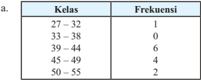

Tabel ini menunjukkan frekuensi kelas di mana siswa berada dalam rentang umur tertentu. Topik utama tabel adalah distribusi umur siswa dalam kelas tertentu. Kolom pertama menunjukkan rentang umur siswa, sedangkan kolom kedua menunjukkan frekuensi mereka. Data penting yang terlihat adalah bahwa sebagian besar siswa berada di rentang umur 33-49 tahun, dengan frekuensi tertinggi di rentang 33-38 tahun. Sementara itu, sejumlah siswa berada di rentang umur 50-55 tahun, tetapi jumlahnya lebih sedikit dibandingkan dengan rentang umur lainnya.

---
**📊 Tabel**

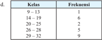

Tabel ini menunjukkan frekuensi kelas yang berbeda dalam suatu distribusi statistik. Topik utama tabel adalah distribusi frekuensi kelas. Kolom pertama berisi kelas dengan batas-batasnya, sedangkan kolom kedua berisi frekuensi untuk setiap kelas tersebut. Data penting yang terlihat adalah bahwa kelas 9-13 memiliki frekuensi satu kali, kelas 14-19 memiliki frekuensi enam kali, kelas 20-25 memiliki frekuensi dua kali, kelas 26-28 memiliki frekuensi lima kali, dan kelas 29-32 memiliki frekuensi sembilan kali. Ini menunjukkan bahwa kelas 29-32 memiliki frekuensi tertinggi, sementara kelas 9-13 memiliki frekuensi terendah.

### Alternatif Jawaban

- /g68/g17/g3 /g51/g68/g81/g77/g68/g81/g74/g3 /g78/g72/g79/g68/g86/g3 /g71/g76/g86/g87/g85/g76/g69/g88/g86/g76/g3 /g73/g85/g72/g78/g88/g72/g81/g86/g76/g3 /g11/g68/g12/g3 /g68/g71/g68/g79/g68/g75/g3 /g25/g3 /g86/g72/g71/g68/g81/g74/g78/g68/g81/g3 /g83/g68/g81/g77/g68/g81/g74/g3 /g78/g72/g79/g68/g86/g3 /g92/g68/g81/g74/g3/g78/g72/g72/g80/g83/g68/g87/g3/g23/g24/g3/g177/g3/g23/g28/g3/g68/g71/g68/g79/g68/g75/g3/g24/g17/g3/g51/g68/g81/g77/g68/g81/g74/g3/g86/g72/g87/g76/g68/g83/g3/g78/g72/g79/g68/g86/g3/g71/g68/g79/g68/g80/g3/g86/g88/g68/g87/g88/g3/g71/g76/g86/g87/g85/g76/g69/g88/g86/g76/g3 frekuensi harus sama.
- /g69/g17/g3 /g46/g72/g79/g68/g86/g16/g78/g72/g79/g68/g86/g3 /g83/g68/g71/g68/g3 /g71/g76/g86/g87/g85/g76/g69/g88/g86/g76/g3 /g73/g85/g72/g78/g88/g72/g81/g86/g76/g3 /g11/g69/g12/g3 /g80/g72/g80/g83/g88/g81/g92/g68/g76/g3 /g69/g68/g87/g68/g86/g3 /g92/g68/g81/g74/g3 /g86/g68/g79/g76/g81/g74/g3 /g69/g72/g85/g76/g85/g76/g86/g68/g81/g17/g3/g43/g68/g79/g3/g76/g81/g76/g3/g71/g76/g75/g76/g81/g71/g68/g85/g76/g3/g68/g74/g68/g85/g3/g87/g76/g71/g68/g78/g3/g68/g71/g68/g3/g71/g68/g87/g68/g3/g92/g68/g81/g74/g3/g80/g68/g86/g88/g78/g3/g71/g68/g79/g68/g80/g3/g71/g88/g68/g3/g78/g72/g79/g68/g86/g3 yang berbeda.

 

---
## 📄 Halaman 45

- /g70/g17/g3 /g55 /g72/g85/g71/g68/g83/g68/g87/g3 /g78/g72/g79/g68/g86/g3 /g92/g68/g81/g74/g3 /g75/g76/g79/g68/g81/g74/g3 /g83/g68/g71/g68/g3 /g71/g76/g86/g87/g85/g76/g69/g88/g86/g76/g3 /g73/g85/g72/g78/g88/g72/g81/g86/g76/g3 /g11/g70/g12/g3 /g92/g68/g76/g87/g88/g3 /g78/g72/g79/g68/g86/g3 /g20/g22/g22/g3 /g177/g3 /g20/g22/g26/g17/g3 /g45/g76/g78/g68/g3 /g80/g72/g80/g68/g81/g74/g3 /g87/g76/g71/g68/g78/g3 /g68/g71/g68/g3 /g71/g68/g87/g68/g3 /g92/g68/g81/g74/g3 /g87/g72/g85/g79/g72/g87/g68/g78/g3 /g83/g68/g71/g68/g3 /g86/g72/g79/g68/g81/g74/g3 /g76/g81/g76/g3 /g80/g68/g78/g68/g3 sebaiknya kelas ini tetap dituliskan dengan frekuensi 0 (nol).
- /g71/g17/g3 /g46/g72/g79/g68/g86/g3/g83/g68/g71/g68/g3/g71/g76/g86/g87/g85/g76/g69/g88/g86/g76/g3/g73/g85/g72/g78/g88/g72/g81/g86/g76/g3/g11/g71/g12/g3/g80/g72/g80/g83/g88/g81/g92/g68/g76/g3/g83/g68/g81/g77/g68/g81/g74/g3/g78/g72/g79/g68/g86/g3/g92/g68/g81/g74/g3/g69/g72/g85/g69/g72/g71/g68/g16 /g69/g72/g71/g68/g17/g3 /g46/g72/g79/g68/g86/g3 /g92/g68/g81/g74/g3 /g83/g72/g85/g87/g68/g80/g68/g3 /g80/g72/g80/g83/g88/g81/g92/g68/g76/g3 /g83/g68/g81/g77/g68/g81/g74/g3 /g78/g72/g79/g68/g86/g3 /g24/g3 /g86/g72/g71/g68/g81/g74/g78/g68/g81/g3 /g78/g72/g79/g68/g86/g3 /g78/g72/g71/g88/g68/g3/g80/g72/g80/g83/g88/g81/g92/g68/g76/g3/g83/g68/g81/g77/g68/g81/g74/g3/g78/g72/g79/g68/g86/g3/g25/g17
- /g21/g17/g3 /g39/g76/g86/g87/g85/g76/g69/g88/g86/g76/g3 /g73/g85/g72/g78/g88/g72/g81/g86/g76/g3 /g92/g68/g81/g74/g3 /g71/g76/g69/g72/g85/g76/g78/g68/g81/g3 /g69/g72/g85/g76/g78/g88/g87/g3 /g80/g72/g80/g83/g85/g72/g86/g72/g81/g87/g68/g86/g76/g78/g68/g81/g3 /g77/g88/g80/g79/g68/g75/g3 /g78/g72/g81/g71/g68/g85/g68/g68/g81/g3 roda empat terpilih dalam suatu kota yang menghabiskan bahan bakar bensin /g71/g68/g79/g68/g80/g3 /g77/g88/g80/g79/g68/g75/g3 /g87/g72/g85/g87/g72/g81/g87/g88/g3 /g11/g79/g76/g87/g72/g85/g12/g3 /g86/g72/g87/g76/g68/g83/g3 /g80/g76/g81/g74/g74/g88/g81/g92/g68/g17/g3 /g46/g82/g79/g82/g80/g3 /g78/g72/g79/g68/g86/g3 /g80/g72/g81/g92/g68/g87/g68/g78/g68/g81/g3 /g77/g88/g80/g79/g68/g75/g3 bahan bakar bensin yang dihabiskan dalam 1 minggu sedangkan kolom frekuensi adalah banyaknya kendaraan roda empat.

---
**📊 Tabel**

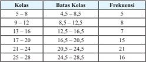

Tabel ini menunjukkan distribusi umur siswa di berbagai kelas, dengan batas-batas umur tertentu dan frekuensi mereka. Topik utama tabel adalah distribusi umur siswa dalam berbagai kelas. Kolom pertama menunjukkan kelas, sedangkan kolom kedua menunjukkan batas-batas umur untuk setiap kelas. Kolom ketiga menunjukkan frekuensi siswa dalam setiap kelas. Dari tabel ini, dapat dilihat bahwa sebagian besar siswa berada di kelas 21-24 tahun, dengan frekuensi paling tinggi sebanyak 21 orang. Sementara itu, siswa di kelas 5-8 tahun memiliki frekuensi terendah, hanya 5 orang. Pola umumnya menunjukkan bahwa banyak siswa berada di kelas 21-24 tahun, sementara siswa di kelas 5-8 tahun terendah.

/g45/g68/g90/g68/g69/g79/g68/g75/g3/g83/g72/g85/g87/g68/g81/g92/g68/g68/g81/g3/g69/g72/g85/g76/g78/g88/g87/g3/g76/g81/g76/g17

- /g68/g17/g3 /g37/g72/g85/g68/g83/g68/g3/g69/g68/g81/g92/g68/g78/g3/g78/g72/g81/g71/g68/g85/g68/g68/g81/g3/g85/g82/g71/g68/g3 /g23/g3 /g92/g68/g81/g74/g3 /g80/g72/g81/g74/g75/g68/g69/g76/g86/g78/g68/g81/g3 /g69/g72/g81/g86/g76/g81/g3 /g78/g88/g85/g68/g81/g74/g3 /g71/g68/g85/g76/g3 /g23/g15/g24/g3 liter?
- /g69/g17/g3 /g37/g72/g85/g68/g83/g68/g3/g69/g68/g81/g92/g68/g78/g3/g78/g72/g81/g71/g68/g85/g68/g68/g81/g3/g85/g82/g71/g68/g3 /g23/g3 /g92/g68/g81/g74/g3 /g80/g72/g81/g74/g75/g68/g69/g76/g86/g78/g68/g81/g3 /g69/g72/g81/g86/g76/g81/g3 /g78/g88/g85/g68/g81/g74/g3 /g71/g68/g85/g76/g3 /g27/g15/g24/g3 liter?
- /g70/g17/g3 /g47/g68/g81/g77/g88/g87/g78/g68/g81/g3 /g88/g81/g87/g88/g78/g3 /g80/g72/g70/g68/g85/g76/g3 /g69/g68/g81/g92/g68/g78/g3 /g78/g72/g81/g71/g68/g85/g68/g68/g81/g3 /g92/g68/g81/g74/g3 /g78/g88/g85/g68/g81/g74/g3 /g71/g68/g85/g76/g3 /g69/g68/g87/g68/g86/g3 /g69/g68/g90/g68/g75/g3 kelas kemudian tuliskan pada tabel di bawah ini.

---
**📊 Tabel**

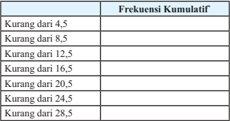

Tabel ini menunjukkan frekuensi kumulatif dari berbagai kategori kurang dari nilai tertentu. Topik utamanya adalah distribusi frekuensi kumulatif untuk berbagai batas nilai. Kolom pertama menyatakan batas-nilai tertentu, sedangkan kolom kedua menunjukkan frekuensi kumulatif untuk setiap batas-nilai tersebut. Data penting yang terlihat adalah bahwa frekuensi kumulatif meningkat dengan semakin tinggi batas-nilai, menunjukkan bahwa lebih banyak data atau entri memiliki nilai di bawah batas-nilai tertentu. Ini menunjukkan bahwa sebagian besar data atau entri memiliki nilai yang lebih rendah dibandingkan dengan batas-nilai tertentu.

Catatan:

Tabel di atas disebut distribusi frekuensi kumulatif

 

---
## 📄 Halaman 46

### Alternatif Jawaban

- /g68/g17/g3 /g55/g76/g71/g68/g78/g3/g68/g71/g68/g3/g78/g72/g81/g71/g68/g85/g68/g68/g81/g3/g85/g82/g71/g68/g3/g72/g80/g83/g68/g87/g3/g92/g68/g81/g74/g3/g80/g72/g81/g74/g75/g68/g69/g76/g86/g78/g68/g81/g3/g69/g72/g81/g86/g76/g81/g3/g78/g88/g85/g68/g81/g74/g3/g71/g68/g85/g76/g3/g23/g15/g24/g3 liter dalam seminggu.
- /g69/g17/g3 /g55 /g72/g85/g71/g68/g83/g68/g87/g3 /g24/g3 /g78/g72/g81/g71/g68/g85/g68/g68/g81/g3 /g85/g82/g71/g68/g3 /g72/g80/g83/g68/g87/g3 /g92/g68/g81/g74/g3 /g80/g72/g81/g74/g75/g68/g69/g76/g86/g78/g68/g81/g3 /g69/g72/g81/g86/g76/g81/g3 /g78/g88/g85/g68/g81/g74/g3 /g71/g68/g85/g76/g3 /g27/g15/g24/g3/g79/g76/g87/g72/g85/g3/g71/g68/g79/g68/g80/g3/g86/g72/g80/g76/g81/g74/g74/g88/g17
/g70/g17/g3

---
**📊 Tabel**

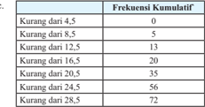

Tabel ini menunjukkan frekuensi kumulatif dari berbagai interval angka yang diurutkan dari 4,5 hingga 28,5. Topik utama tabel adalah distribusi frekuensi kumulatif dari interval angka tersebut. Kolom pertama berisi interval angka, sedangkan kolom kedua berisi frekuensi kumulatif untuk setiap interval tersebut. Data penting yang terlihat adalah bahwa sebelum interval 16,5, tidak ada angka yang ditemukan, dan setelah interval 20,5, frekuensi kumulatif mencapai 72. Ini menunjukkan bahwa interval 20,5 adalah batas atas untuk interval dengan frekuensi kumulatif tertinggi.

- /g22/g17/g3 /g39/g68/g87/g68/g3/g69/g72/g85/g76/g78/g88/g87/g3/g68/g71/g68/g79/g68/g75/g3/g71/g68/g87/g68/g3/g77/g88/g80/g79/g68/g75/g3/g83/g72/g81/g74/g88/g81/g77/g88/g81/g74/g3/g83/g72/g85/g83/g88/g86/g87/g68/g78/g68/g68/g81/g3/g54/g48/g36 /g3/g179/g49/g36/g54/g44/g50/g49/g36/g47/g180/g3 /g71/g68/g79/g68/g80/g3/g23/g19/g3/g75/g68/g85/g76/g3/g78/g72/g85/g77/g68/g3/g69/g72/g85/g87/g88/g85/g88/g87/g16/g87/g88/g85/g88/g87/g17
Berdasarkan data tersebut, buatlah

- /g68/g17/g3 /g39/g76/g86/g87/g85/g76/g69/g88/g86/g76/g3/g73/g85/g72/g78/g88/g72/g81/g86/g76/g3/g71/g72/g81/g74/g68/g81/g3/g26/g3/g78/g72/g79/g68/g86
- /g69/g17/g3 /g43/g76/g86/g87/g82/g74/g85/g68/g80/g15/g3/g83/g82/g79/g76/g74/g82/g81/g3/g73/g85/g72/g78/g88/g72/g81/g86/g76/g15/g3/g71/g68/g81/g3/g82/g74/g76/g89/g72/g3/g88/g81/g87/g88/g78/g3/g71/g76/g86/g87/g85/g76/g69/g88/g86/g76/g3/g73/g85/g72/g78/g88/g72/g81/g86/g76/g3/g83/g82/g76/g81/g3/g11/g68/g12/g17

### Alternatif Jawaban

- /g68/g17/g3 /g39/g76/g86/g87/g85/g76/g69/g88/g86/g76/g3/g73/g85/g72/g78/g88/g72/g81/g86/g76/g3/g71/g72/g81/g74/g68/g81/g3/g26/g3/g78/g72/g79/g68/g86/g17

---
**📊 Tabel**

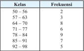

Tabel ini menunjukkan frekuensi kelas di mana siswa-siswa ditempatkan berdasarkan umur mereka. Topik utama tabel adalah distribusi umur siswa dalam kelas tertentu. Kolom pertama menunjukkan kelas yang berbeda, sementara kolom kedua menunjukkan frekuensi siswa dalam setiap kelas tersebut. Data penting yang terlihat adalah bahwa sekitar 20% siswa berada di kelas 50-56, sedangkan sekitar 30% siswa berada di kelas 71-77. Pola umumnya menunjukkan bahwa banyak siswa berada di kelas dengan umur antara 50-84 tahun, dengan sedikit siswa di kelas 92-98 tahun.

 

---
## 📄 Halaman 47

- /g69/g17/g3 /g43/g76/g86/g87/g82/g74/g85/g68/g80

---
**🖼️ Gambar/Diagram**

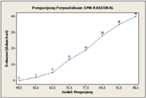

> **Deskripsi Visual:** Gambar ini adalah diagram yang menunjukkan hubungan antara persentase pemutusan pejuang (Pp) dengan jumlah pejuang yang diputuskan (Jumlah Pejuang). Diagram ini berupa garis lurus yang menghubungkan titik-titik data yang diberikan pada sumbu x dan y. Titik-titik tersebut menunjukkan persentase pemutusan pejuang untuk setiap jumlah pejuang yang diputuskan.

Elemen utama dalam diagram ini adalah garis lurus yang menggambarkan hubungan antara jumlah pejuang dan persentase pemutusan pejuang. Garis ini menunjukkan bahwa semakin banyak pejuang yang diputuskan, semakin tinggi persentase pemutusan pejuang. Ini menunjukkan bahwa ada hubungan positif antara jumlah pejuang yang diputuskan dan persentase pemutusan pejuang.

Teks, angka, atau label penting yang terlihat dalam diagram ini meliputi:

1. Judul diagram: "Persentase Pemutusan 1290.KA.02128.QL"
2. Sumbu x: "Jumlah Pejuang"
3. Sumbu y: "Persentase Pemutusan (%)"
4. Titik-titik data yang menunjukkan persentase pemutusan pejuang untuk setiap jumlah pejuang yang diputuskan

Informasi kunci yang dapat diambil pembaca dari diagram ini adalah bahwa ada hubungan positif antara jumlah pejuang yang diputuskan dan persentase pemutusan pejuang. Semakin banyak pejuang yang diputuskan, semakin tinggi persentase pemutusan pejuang.

 

---
## 📄 Halaman 48

- Misalkan Anda adalah seorang pengusaha real estate di kota Masamba. Anda /g80/g72/g80/g83/g72/g85/g82/g79/g72/g75/g3 /g71/g68/g73/g87/g68/g85/g3 /g75/g68/g85/g74/g68/g3 /g85/g88/g80/g68/g75/g3 /g92/g68/g81/g74/g3 /g86/g88/g71/g68/g75/g3/g36/g81/g71/g68/g3 /g77/g88/g68/g79/g3 /g71/g68/g79/g68/g80/g3 /g25/g3 /g69/g88/g79/g68/g81/g3 /g87/g72/g85/g68/g78/g75/g76/g85 /g17/g3 Anda ingin mengorganisasi data yang Anda terima agar Anda dapat memberikan /g76/g81/g73/g82/g85/g80/g68/g86/g76/g3 /g92/g68/g81/g74/g3 /g68/g78/g88/g85/g68/g87/g3 /g78/g72/g83/g68/g71/g68/g3 /g70/g68/g79/g82/g81/g3 /g83/g72/g80/g69/g72/g79/g76/g17/g3 /g42/g88/g81/g68/g78/g68/g81/g3 /g71/g68/g87/g68/g3 /g69/g72/g85/g76/g78/g88/g87/g3 /g76/g81/g76/g3 /g88/g81/g87/g88/g78/g3 /g71/g76/g86/g68/g77/g76/g78/g68/g81/g3 /g71/g68/g79/g68/g80/g3 /g75/g76/g86/g87/g82/g74/g85/g68/g80/g15/g3 /g83/g82/g79/g76/g74/g82/g81/g3 /g73/g85/g72/g78/g88/g72/g81/g86/g76/g15/g3 /g71/g68/g81/g3 /g82/g74/g76/g89/g72/g17/g3 /g39/g68/g87/g68/g3 /g69/g72/g85/g76/g78/g88/g87/g3 /g71/g68/g79/g68/g80/g3 puluhan ribu rupiah.
- /g68/g17/g3 /g51/g72/g85/g87/g68/g81/g92/g68/g68/g81/g16/g83/g72/g85/g87/g68/g81/g92/g68/g68/g81/g3/g68/g83/g68/g3/g92/g68/g81/g74/g3/g92/g68/g81/g74/g3/g71/g68/g83/g68/g87/g3/g71/g76/g77/g68/g90/g68/g69/g3/g71/g72/g81/g74/g68/g81/g3/g80/g88/g71/g68/g75/g3/g71/g72/g81/g74/g68/g81/g3 melihat histogram dibandingkan dengan daftar harga yang diberikan di atas?
- Pertanyaan berbeda apa yang dapat dijawab dengan lebih mudah dengan melihat poligon frekuensi dibandingkan dengan daftar harga tersebut?
- /g70/g17/g3 /g51/g72/g85/g87/g68/g81/g92/g68/g68/g81/g3 /g69/g72/g85/g69/g72/g71/g68/g3 /g68/g83/g68/g3 /g92/g68/g81/g74/g3 /g71/g68/g83/g68/g87/g3 /g71/g76/g77/g68/g90/g68/g69/g3 /g71/g72/g81/g74/g68/g81/g3 /g79/g72/g69/g76/g75/g3 /g80/g88/g71/g68/g75/g3 /g71/g72/g81/g74/g68/g81/g3 melihat ogive dibandingkan dengan daftar harga tersebut?
- /g71/g17/g3 /g36/g83/g68/g78/g68/g75/g3/g68/g71/g68/g3/g71/g68/g87/g68/g3 /g92/g68/g81/g74/g3 /g86/g68/g81/g74/g68/g87/g3 /g69/g72/g86/g68/g85/g3 /g68/g87/g68/g88/g3 /g86/g68/g81/g74/g68/g87/g3 /g78/g72/g70/g76/g79/g3 /g71/g76/g69/g68/g81/g71/g76/g81/g74/g78/g68/g81/g3 /g71/g72/g81/g74/g68/g81/g3 nilai lainnya?
- /g72/g17/g3 /g42/g85/g68/g191/g78/g3/g80/g68/g81/g68/g3/g92/g68/g81/g74/g3/g80/g72/g81/g68/g80/g83/g76/g79/g78/g68/g81/g3/g81/g76/g79/g68/g76/g3/g72/g78/g86/g87/g85/g76/g80/g3/g87/g72/g85/g86/g72/g69/g88/g87/g3/g71/g72/g81/g74/g68/g81/g3/g79/g72/g69/g76/g75/g3/g69/g68/g76/g78/g34

### Alternatif Jawaban

- /g68/g17/g3 /g54/g68/g79/g68/g75/g3 /g86/g68/g87/g88/g3 /g83/g72/g85/g87/g68/g81/g92/g68/g68/g81/g3 /g92/g68/g81/g74/g3 /g69/g76/g86/g68/g3 /g71/g76/g68/g77/g88/g78/g68/g81/g3 /g68/g71/g68/g79/g68/g75/g29/g3/g36/g71/g68/g3 /g69/g72/g85/g68/g83/g68/g3 /g85/g88/g80/g68/g75/g3 /g92/g68/g81/g74/g3 /g71/g76/g77/g88/g68/g79/g3/g71/g68/g79/g68/g80/g3/g78/g76/g86/g68/g85/g68/g81/g3/g53/g83/g20/g17/g19/g19/g19/g17/g19/g19/g19/g17/g19/g19/g19/g15/g19/g19/g3/g16/g3/g53/g83/g3/g21/g17/g19/g19/g19/g17/g19/g19/g19/g17/g19/g19/g19/g15/g19/g19/g34
- /g69/g17/g3 /g39/g72/g81/g74/g68/g81/g3/g80/g72/g79/g76/g75/g68/g87/g3/g83/g82/g79/g76/g74/g82/g81/g3 /g73/g85/g72/g78/g88/g72/g81/g86/g76/g15/g3 /g83/g72/g85/g87/g68/g81/g92/g68/g68/g81/g3 /g179/g37/g72/g85/g68/g83/g68/g3 /g78/g76/g86/g68/g85/g68/g81/g3 /g75/g68/g85/g74/g68/g3 /g85/g88/g80/g68/g75/g3 yang paling banyak diminati oleh para pembeli?'
- /g70/g17/g3 /g39/g72/g81/g74/g68/g81/g3 /g80/g72/g79/g76/g75/g68/g87/g3 /g82/g74/g76/g89/g72/g15/g3 /g83/g72/g85/g87/g68/g81/g92/g68/g68/g81/g3 /g92/g68/g81/g74/g3 /g69/g76/g86/g68/g3 /g71/g76/g68/g77/g88/g78/g68/g81/g3 /g68/g71/g68/g79/g68/g75/g3 /g179/g37/g72/g85/g68/g83/g68/g3 /g69/g68/g81/g92/g68/g78/g3/g85/g88/g80/g68/g75/g3/g92/g68/g81/g74/g3/g71/g76/g77/g88/g68/g79/g3/g71/g72/g81/g74/g68/g81/g3/g75/g68/g85/g74/g68/g3/g71/g76/g3/g69/g68/g90/g68/g75/g3/g53/g83/g20/g17/g24/g19/g19/g17/g19/g19/g19/g17/g19/g19/g19/g15/g19/g19/g34/g180
- /g71/g17/g3 /g55 /g72/g85/g71/g68/g83/g68/g87/g3 /g71/g68/g87/g68/g3 /g71/g72/g81/g74/g68/g81/g3 /g81/g76/g79/g68/g76/g3 /g83/g68/g79/g76/g81/g74/g3 /g78/g72/g70/g76/g79/g3 /g71/g76/g69/g68/g81/g71/g76/g81/g74/g78/g68/g81/g3 /g71/g72/g81/g74/g68/g81/g3 /g71/g68/g87/g68/g3 /g79/g68/g76/g81/g81/g92/g68/g3 /g92/g68/g76/g87/g88/g3 /g53/g83/g25/g26/g28/g17/g19/g19/g19/g17/g19/g19/g19/g15/g19/g19/g3 /g71/g68/g81/g3 /g71/g68/g87/g68/g3 /g92/g68/g81/g74/g3 /g81/g76/g79/g68/g76/g81/g92/g68/g3 /g83/g68/g79/g76/g81/g74/g3 /g69/g72/g86/g68/g85/g3 /g68/g71/g68/g79/g68/g75/g3 /g53/g83/g22/g17/g21/g20/g24/g17/g24/g19/g19/g17/g19/g19/g19/g15/g19/g19/g17
- /g72/g17/g3 /g39/g72/g81/g74/g68/g81/g3 /g80/g72/g79/g76/g75/g68/g87/g3 /g78/g72/g87/g76/g74/g68/g3 /g74/g85/g68/g191/g78/g15/g3 /g74/g85/g68/g191/g78/g3 /g83/g82/g79/g76/g74/g82/g81/g3 /g73/g85/g72/g78/g88/g72/g81/g86/g76/g3 /g80/g72/g81/g68/g80/g83/g76/g79/g78/g68/g81/g3 /g191/g87/g88/g85/g3 /g81/g76/g79/g68/g76/g3 /g72/g78/g86/g87/g85/g76/g80/g3 /g11/g80/g76/g81/g76/g80/g88/g80/g3 /g71/g68/g81/g3 /g80/g68/g78/g86/g76/g80/g88/g80/g12/g3 /g79/g72/g69/g76/g75/g3 /g69/g68/g76/g78/g3 /g71/g68/g85/g76/g3 /g78/g72/g71/g88/g68/g3 /g74/g85/g68/g191/g78/g3 /g79/g68/g76/g81/g81/g92/g68/g17

 

---
## 📄 Halaman 49

### 2.2 Ukuran Pemusatan dan Penyebaran Data Berkelompok

Kegiatan 2.2.1

### Ukuran Pemusatan Data Berkelompok

### Kegiatan Pendahuluan

- /g135/g3 /g42/g88/g85/g88/g3/g80/g72/g80/g69/g72/g85/g76/g78/g68/g81/g3/g80/g82/g87/g76/g89/g68/g86/g76/g3/g87/g72/g81/g87/g68/g81/g74/g3/g83/g72/g81/g87/g76/g81/g74/g81/g92/g68/g3/g80/g72/g81/g71/g72/g86/g78/g85/g76/g83/g76/g86/g76/g78/g68/g81/g3/g71/g68/g87/g68/g3/g87/g72/g85/g80/g68/g86/g88/g78/g3 /g87/g72/g81/g87/g68/g81/g74/g3/g85/g68/g87/g68/g16/g85/g68/g87/g68/g15/g3/g80/g72/g71/g76/g68/g81/g15/g3/g68/g87/g68/g88/g3/g80/g82/g71/g88/g86/g17
- /g135/g3 /g42/g88/g85/g88/g3 /g80/g72/g80/g72/g85/g76/g78/g86/g68/g3 /g83/g72/g81/g74/g72/g87/g68/g75/g88/g68/g81/g3 /g68/g90/g68/g79/g3 /g86/g76/g86/g90/g68/g3 /g87/g72/g81/g87/g68/g81/g74/g3 /g88/g78/g88/g85/g68/g81/g3 /g83/g72/g80/g88/g86/g68/g87/g68/g81/g3 /g71/g68/g87/g68/g3 /g87/g88/g81/g74/g74/g68/g79/g3 dengan memberikan data yang terdiri dari 12 datum yang ada di buku siswa dan /g80/g72/g80/g76/g81/g87/g68/g3/g86/g76/g86/g90/g68/g3/g88/g81/g87/g88/g78/g3/g80/g72/g81/g72/g81/g87/g88/g78/g68/g81/g3/g85/g68/g87/g68/g16/g85/g68/g87/g68/g15/g3/g80/g72/g71/g76/g68/g81/g15/g3/g71/g68/g81/g3/g80/g82/g71/g88/g86/g17
- /g135/g3 /g54/g72/g87/g72/g79/g68/g75/g3 /g80/g72/g81/g74/g76/g81/g74/g68/g87/g3 /g78/g72/g80/g69/g68/g79/g76/g3 /g88/g78/g88/g85/g68/g81/g3 /g83/g72/g80/g88/g86/g68/g87/g68/g81/g3 /g71/g68/g87/g68/g3 /g87/g88/g81/g74/g74/g68/g79/g15/g3 /g74/g88/g85/g88/g3 /g80/g72/g81/g68/g81/g92/g68/g78/g68/g81/g3 /g69/g68/g74/g68/g76/g80/g68/g81/g68/g3 /g77/g76/g78/g68/g3 /g85/g68/g87/g68/g16/g85/g68/g87/g68/g3 /g92/g68/g81/g74/g3 /g71/g76/g75/g76/g87/g88/g81/g74/g3 /g69/g72/g85/g68/g86/g68/g79/g3 /g71/g68/g85/g76/g3 /g71/g76/g86/g87/g85/g76/g69/g88/g86/g76/g3 /g73/g85/g72/g78/g88/g72/g81/g86/g76/g3 /g68/g87/g68/g88/g3 histogram.

### Kegiatan Inti

Mengamati

- /g135/g3 /g42/g88/g85/g88/g3 /g80/g72/g81/g74/g68/g77/g68/g78/g3 /g86/g76/g86/g90/g68/g3 /g80/g72/g81/g74/g68/g80/g68/g87/g76/g3 /g38/g82/g81/g87/g82/g75/g3 /g21/g17/g20/g20/g15/g3 /g38/g82/g81/g87/g82/g75/g3 /g21/g17/g20/g21/g15/g3 /g71/g68/g81/g3 /g38/g82/g81/g87/g82/g75/g3 /g21/g17/g20/g22/g3 yang diberikan di buku siswa mengenai ukuran pemusatan data berkelompok.
- /g135/g3 /g42/g88/g85/g88/g3 /g80/g72/g80/g69/g72/g85/g76/g78/g68/g81/g3 /g83/g72/g81/g74/g68/g85/g68/g75/g68/g81/g3 /g88/g81/g87/g88/g78/g3 /g80/g72/g80/g83/g72/g85/g75/g68/g87/g76/g78/g68/g81/g3 /g76/g81/g73/g82/g85/g80/g68/g86/g76/g3 /g92/g68/g81/g74/g3 /g71/g76/g69/g72/g85/g76/g78/g68/g81/g3 /g83/g68/g71/g68/g3/g78/g72/g87/g76/g74/g68/g3/g70/g82/g81/g87/g82/g75/g3/g87/g72/g85/g86/g72/g69/g88/g87/g3/g71/g68/g81/g3/g76/g86/g87/g76/g79/g68/g75/g16/g76/g86/g87/g76/g79/g68/g75/g3/g92/g68/g81/g74/g3/g71/g76/g74/g88/g81/g68/g78/g68/g81/g17
Menanya

- /g135/g3 /g42/g88/g85/g88/g3 /g80/g72/g80/g76/g81/g87/g68/g3 /g86/g76/g86/g90/g68/g3 /g88/g81/g87/g88/g78/g3 /g80/g72/g81/g74/g68/g77/g88/g78/g68/g81/g18/g80/g72/g81/g88/g79/g76/g86/g78/g68/g81/g3 /g83/g72/g85/g87/g68/g81/g92/g68/g68/g81/g16/g83/g72/g85/g87/g68/g81/g92/g68/g68/g81/g3 mengenai ukuran pemusatan data berkelompok.
- /g135/g3 /g42/g88/g85/g88/g3 /g71/g68/g83/g68/g87/g3 /g80/g72/g80/g69/g72/g85/g76/g78/g68/g81/g3 /g83/g72/g81/g74/g68/g85/g68/g75/g68/g81/g3 /g78/g72/g83/g68/g71/g68/g3 /g86/g76/g86/g90/g68/g3 /g88/g81/g87/g88/g78/g3 /g80/g72/g80/g69/g68/g81/g71/g76/g81/g74/g78/g68/g81/g3 dengan  ukuran  pemusatan  data  tunggal  agar  pertanyaan  yang  diajukan  dapat membantu siswa lebih memahami ukuran pemusatan.
- /g135/g3 /g51/g72/g85/g87/g68/g81/g92/g68/g68/g81/g3/g92/g68/g81/g74/g3/g71/g76/g75/g68/g85/g68/g83/g78/g68/g81/g3/g80/g88/g81/g70/g88/g79/g3/g68/g71/g68/g79/g68/g75/g29
- /g20/g12/g3 /g37/g68/g74/g68/g76/g80/g68/g81/g68/g78/g68/g75/g3 /g70/g68/g85/g68/g3 /g80/g72/g81/g72/g81/g87/g88/g78/g68/g81/g3 /g85/g68/g87/g68/g16/g85/g68/g87/g68/g15/g3 /g80/g72/g71/g76/g68/g81/g15/g3 /g80/g82/g71/g88/g86/g3 /g71/g68/g85/g76/g3 /g71/g76/g86/g87/g85/g76/g69/g88/g86/g76/g3 frekuensi?
- /g21/g12/g3 /g37/g68/g74/g68/g76/g80/g68/g81/g68/g78/g68/g75/g3 /g70/g68/g85/g68/g3 /g80/g72/g81/g72/g81/g87/g88/g78/g68/g81/g3 /g85/g68/g87/g68/g16/g85/g68/g87/g68/g15/g3 /g80/g72/g71/g76/g68/g81/g15/g3 /g71/g68/g81/g3 /g80/g82/g71/g88/g86/g3 /g71/g68/g85/g76/g3 histogram?
- Apakah yang dimaksud dengan kelas median?
- Apakah yang dimaksud dengan kelas modus?

 

---
## 📄 Halaman 50

Mengumpulkan Informasi dan Menalar

- /g135/g3 /g42/g88/g85/g88/g3/g80/g72/g81/g74/g68/g77/g68/g78/g3/g86/g76/g86/g90/g68/g3/g88/g81/g87/g88/g78/g3/g80/g72/g81/g74/g88/g80/g83/g88/g79/g78/g68/g81/g3/g76/g81/g73/g82/g85/g80/g68/g86/g76/g3/g92/g68/g81/g74/g3/g71/g76/g69/g72/g85/g76/g78/g68/g81/g3/g87/g72/g85/g88/g87/g68/g80/g68/g3 /g83/g68/g71/g68/g3/g38/g82/g81/g87/g82/g75/g3/g21/g17/g20/g23/g3/g92/g68/g81/g74/g3/g71/g76/g69/g72/g85/g76/g78/g68/g81/g3/g71/g76/g3 /g36 /g92/g82/g15/g3/g48/g72/g81/g74/g74/g68/g79/g76/g3/g76/g81/g73/g82/g85/g80/g68/g86/g76/g3/g86/g72/g83/g72/g85/g87/g76/g3/g69/g72/g85/g76/g78/g88/g87/g3/g76/g81/g76/g17
- /g135/g3 /g42/g88/g85/g88/g3 /g71/g68/g83/g68/g87/g3 /g80/g72/g80/g69/g72/g85/g76/g78/g68/g81/g3 /g83/g72/g81/g72/g78/g68/g81/g68/g81/g3 /g69/g68/g75/g90/g68/g3 /g85/g68/g87/g68/g16/g85/g68/g87/g68/g3 /g88/g81/g87/g88/g78/g3 /g71/g68/g87/g68/g3 /g69/g72/g85/g78/g72/g79/g82/g80/g83/g82/g78/g3 /g80/g72/g85/g88/g83/g68/g78/g68/g81/g3/g81/g76/g79/g68/g76/g3/g83/g72/g81/g71/g72/g78/g68/g87/g68/g81/g3/g69/g72/g85/g69/g72/g71/g68/g3/g71/g72/g81/g74/g68/g81/g3/g85/g68/g87/g68/g16/g85/g68/g87/g68/g3/g88/g81/g87/g88/g78/g3/g71/g68/g87/g68/g3/g87/g88/g81/g74/g74/g68/g79/g17/g3/g53/g68/g87/g68/g16 /g85/g68/g87/g68/g3/g88/g81/g87/g88/g78/g3/g71/g68/g87/g68/g3/g87/g88/g81/g74/g74/g68/g79/g3/g71/g68/g83/g68/g87/g3/g71/g76/g87/g72/g81/g87/g88/g78/g68/g81/g3/g86/g72/g70/g68/g85/g68/g3/g72/g78/g86/g68/g78/g17
- /g135/g3 /g42/g88/g85/g88/g3 /g80/g72/g80/g76/g81/g87/g68/g3 /g86/g76/g86/g90/g68/g3 /g88/g81/g87/g88/g78/g3 /g80/g72/g81/g88/g79/g76/g86/g78/g68/g81/g3 /g86/g72/g80/g88/g68/g3 /g76/g81/g73/g82/g85/g80/g68/g86/g76/g3 /g87/g72/g81/g87/g68/g81/g74/g3 /g85/g68/g87/g68/g16/g85/g68/g87/g68/g3 /g71/g68/g87/g68/g3 berkelompok yang dapat diperoleh pada kotak yang sudah disediakan di buku siswa.

### Informasi yang diharapkan tentang rata-rata data berkelompok

/g3 /g45/g76/g78/g68/g3/g71/g76/g69/g72/g85/g76/g78/g68/g81/g3/g71/g68/g87/g68/g3/g80/g72/g81/g87/g68/g75/g3/g83/g68/g71/g68/g3 Contoh 2.14 /g3/g78/g76/g87/g68/g3/g71/g68/g83/g68/g87/g3/g80/g72/g81/g74/g75/g76/g87/g88/g81/g74/g3/g85/g68/g87/g68/g16/g85/g68/g87/g68/g3/g71/g68/g87/g68/g3 /g87/g88/g81/g74/g74/g68/g79/g3/g86/g72/g83/g72/g85/g87/g76/g3/g92/g68/g81/g74/g3/g71/g76/g83/g72/g79/g68/g77/g68/g85/g76/g3/g71/g76/g3/g77/g72/g81/g77/g68/g81/g74/g3/g86/g72/g69/g72/g79/g88/g80/g81/g92/g68/g17/g3/g45/g88/g80/g79/g68/g75/g3/g78/g72/g86/g72/g79/g88/g85/g88/g75/g68/g81/g3/g71/g68/g87/g68/g3/g87/g72/g85/g86/g72/g69/g88/g87/g3 /g68/g71/g68/g79/g68/g75/g3 /g21/g17/g20/g24/g23/g3 /g71/g68/g81/g3 /g69/g68/g81/g92/g68/g78/g3 /g71/g68/g87/g68/g3 /g68/g71/g68/g79/g68/g75/g3 /g27/g19/g17/g3 /g39/g72/g81/g74/g68/g81/g3 /g71/g72/g80/g76/g78/g76/g68/g81/g3 /g85/g68/g87/g68/g16/g85/g68/g87/g68/g3 /g71/g68/g87/g68/g3 /g80/g72/g81/g87/g68/g75/g3 /g87/g72/g85/g86/g72/g69/g88/g87/g3 adalah . 80 2 154 /g3/g32/g3/g21/g25/g15/g28/g17

/g3 /g45/g76/g78/g68/g3 /g77/g88/g80/g79/g68/g75/g3 /g71/g68/g87/g68/g3 /g78/g72/g86/g72/g79/g88/g85/g88/g75/g68/g81/g3 /g71/g72/g81/g74/g68/g81/g3 /g83/g72/g81/g71/g72/g78/g68/g87/g68/g81/g3 /g68/g71/g68/g79/g68/g75/g3 /g21/g17/g20/g23/g24/g3 /g80/g68/g78/g68/g3 /g71/g76/g71/g68/g83/g68/g87/g78/g68/g81/g3 /g85/g68/g87/g68/g16/g85/g68/g87/g68/g3 /g71/g68/g87/g68/g3 /g69/g72/g85/g78/g72/g79/g82/g80/g83/g82/g78/g3 /g68/g71/g68/g79/g68/g75/g3 /g21/g25/g15/g27/g17/g3 /g51/g72/g85/g75/g68/g87/g76/g78/g68/g81/g3 /g69/g68/g75/g90/g68/g3 /g87/g72/g85/g71/g68/g83/g68/g87/g3 /g86/g72/g71/g76/g78/g76/g87/g3 /g83/g72/g85/g69/g72/g71/g68/g68/g81/g3 /g68/g81/g87/g68/g85/g68/g3/g85/g68/g87/g68/g16/g85/g68/g87/g68/g3/g92/g68/g81/g74/g3/g71/g76/g75/g76/g87/g88/g81/g74/g3/g71/g68/g85/g76/g3/g71/g68/g87/g68/g3/g80/g72/g81/g87/g68/g75/g3/g71/g68/g81/g3/g85/g68/g87/g68/g16/g85/g68/g87/g68/g3/g71/g68/g85/g76/g3/g71/g68/g87/g68/g3/g69/g72/g85/g78/g72/g79/g82/g80/g83/g82/g78/g17/g3/g43/g68/g79/g3 ini diakibatkan jumlah keseluruhan data berkelompok didapatkan dari hasil pendekatan menggunakan titik tengah.

- /g135/g3 /g42/g88/g85/g88/g3 /g80/g72/g81/g74/g68/g85/g68/g75/g78/g68/g81/g3 /g86/g76/g86/g90/g68/g3 /g88/g81/g87/g88/g78/g3 /g80/g72/g81/g70/g68/g85/g76/g3 /g78/g72/g79/g68/g86/g3 /g80/g72/g71/g76/g68/g81/g3 /g71/g68/g81/g3 /g78/g72/g79/g68/g86/g3 /g80/g82/g71/g88/g86/g3 /g87/g68/g81/g83/g68/g3 /g80/g72/g80/g69/g72/g85/g76/g3 /g87/g68/g75/g88/g3 /g70/g68/g85/g68/g81/g92/g68/g17/g3 /g54/g76/g86/g90/g68/g3 /g71/g76/g80/g76/g81/g87/g68/g3 /g80/g72/g81/g88/g79/g76/g86/g78/g68/g81/g3 /g78/g72/g79/g68/g86/g3 /g80/g72/g71/g76/g68/g81/g3 /g71/g68/g81/g3 /g78/g72/g79/g68/g86/g3 /g80/g82/g71/g88/g86/g3 dugaannya di kotak yang sudah disediakan.

 

---
## 📄 Halaman 51

### Informasi yang diharapkan tentang median dan modus data berkelompok

/g3 /g48/g72/g71/g76/g68/g81/g3 /g80/g72/g85/g88/g83/g68/g78/g68/g81/g3 /g81/g76/g79/g68/g76/g3 /g87/g72/g81/g74/g68/g75/g3 /g71/g68/g85/g76/g3 /g71/g68/g87/g68/g17/g3 /g56/g81/g87/g88/g78/g3 /g71/g68/g87/g68/g3 /g80/g72/g81/g87/g68/g75/g15/g3 /g77/g76/g78/g68/g3 /g87/g72/g85/g71/g68/g83/g68/g87/g3 /g27/g19/g3 /g71/g68/g87/g68/g3 /g80/g68/g78/g68/g3 /g81/g76/g79/g68/g76/g3 /g87/g72/g81/g74/g68/g75/g3 /g87/g72/g85/g79/g72/g87/g68/g78/g3 /g71/g76/g68/g81/g87/g68/g85/g68/g3 /g71/g68/g87/g68/g3 /g78/g72/g16/g23/g19/g3 /g71/g68/g81/g3 /g78/g72/g16/g23/g20/g3 /g86/g72/g87/g72/g79/g68/g75/g3 /g71/g68/g87/g68/g3 /g71/g76/g88/g85/g88/g87/g78/g68/g81/g17/g3 Mirip dengan data mentah, nilai tengah data yang sudah dikelompokkan terletak di kelas /g87/g72/g85/g87/g72/g81/g87/g88/g3 /g92/g68/g81/g74/g3 /g71/g76/g86/g72/g69/g88/g87/g3 /g71/g72/g81/g74/g68/g81/g3 /g78/g72/g79/g68/g86/g3 /g80/g72/g71/g76/g68/g81/g17/g3 /g46/g68/g85/g72/g81/g68/g3 /g77/g88/g80/g79/g68/g75/g3 /g73/g85/g72/g78/g88/g72/g81/g86/g76/g3 /g78/g72/g86/g72/g79/g88/g85/g88/g75/g68/g81/g3 /g68/g71/g68/g79/g68/g75/g3 /g23/g19/g3/g80/g68/g78/g68/g3/g81/g76/g79/g68/g76/g3/g87/g72/g81/g74/g68/g75/g3/g87/g72/g85/g79/g72/g87/g68/g78/g3/g71/g76/g3/g78/g72/g79/g68/g86/g3/g92/g68/g81/g74/g3/g80/g72/g80/g88/g68/g87/g3/g71/g68/g87/g68/g3/g78/g72/g16/g23/g19/g3/g71/g68/g81/g3/g71/g68/g87/g68/g3/g78/g72/g16/g23/g20/g17

Berdasarkan distribusi frekuensi pada Contoh  2.14 , kelas median  terletak /g83/g68/g71/g68/g3 /g78/g72/g79/g68/g86/g3 /g21/g25/g3 /g177/g3 /g22/g19/g17/g3 /g43/g68/g79/g3 /g76/g81/g76/g3 /g78/g68/g85/g72/g81/g68/g3 /g77/g88/g80/g79/g68/g75/g3 /g73/g85/g72/g78/g88/g72/g81/g86/g76/g3 /g71/g88/g68/g3 /g78/g72/g79/g68/g86/g3 /g86/g72/g69/g72/g79/g88/g80/g81/g92/g68/g3 /g68/g71/g68/g79/g68/g75/g3 /g22/g23/g3 /g86/g72/g71/g68/g81/g74/g78/g68/g81/g3/g77/g88/g80/g79/g68/g75/g3/g73/g85/g72/g78/g88/g72/g81/g86/g76/g3/g87/g76/g74/g68/g3/g78/g72/g79/g68/g86/g3/g83/g72/g85/g87/g68/g80/g68/g3/g68/g71/g68/g79/g68/g75/g3/g24/g24/g3/g86/g72/g75/g76/g81/g74/g74/g68/g3/g71/g68/g87/g68/g3/g78/g72/g16/g23/g19/g3/g71/g68/g81/g3/g71/g68/g87/g68/g3 /g78/g72/g16/g23/g20/g3/g87/g72/g85/g79/g72/g87/g68/g78/g3/g71/g76/g3/g78/g72/g79/g68/g86/g3/g78/g72/g87/g76/g74/g68/g15/g3/g92/g68/g76/g87/g88/g3/g21/g25/g3/g177/g3/g22/g19/g17

/g3 /g48/g82/g71/g88/g86/g3 /g83/g68/g71/g68/g3 /g71/g68/g87/g68/g3 /g80/g72/g81/g87/g68/g75/g3 /g80/g72/g85/g88/g83/g68/g78/g68/g81/g3 /g71/g68/g87/g68/g3 /g92/g68/g81/g74/g3 /g83/g68/g79/g76/g81/g74/g3 /g69/g68/g81/g92/g68/g78/g3 /g80/g88/g81/g70/g88/g79/g17/g3 /g43/g68/g79/g3 /g76/g81/g76/g3 hampir sama dengan data berkelompok, kelas modus merupakan kelas dengan frekuensi /g83/g68/g79/g76/g81/g74/g3/g69/g68/g81/g92/g68/g78/g17/g3/g39/g68/g79/g68/g80/g3/g75/g68/g79/g3/g76/g81/g76/g3/g78/g72/g79/g68/g86/g3/g80/g82/g71/g88/g86/g3/g83/g68/g71/g68/g3/g71/g76/g86/g87/g85/g76/g69/g88/g86/g76/g3/g73/g85/g72/g78/g88/g72/g81/g86/g76/g3/g38/g82/g81/g87/g82/g75/g3/g21/g17/g20/g23/g3/g68/g71/g68/g79/g68/g75/g3 /g78/g72/g79/g68/g86/g3/g21/g25/g3/g177/g3/g22/g19/g17/g3

- /g135/g3 /g39/g72/g81/g74/g68/g81/g3 /g80/g72/g81/g74/g74/g88/g81/g68/g78/g68/g81/g3 /g76/g81/g73/g82/g85/g80/g68/g86/g76/g3 /g92/g68/g81/g74/g3 /g86/g88/g71/g68/g75/g3 /g71/g76/g78/g88/g80/g83/g88/g79/g78/g68/g81/g3 /g86/g72/g69/g72/g79/g88/g80/g81/g92/g68/g15/g3 /g86/g76/g86/g90/g68/g3 /g71/g76/g80/g76/g81/g87/g68/g3 /g88/g81/g87/g88/g78/g3 /g80/g72/g79/g72/g81/g74/g78/g68/g83/g76/g3 /g87/g68/g69/g72/g79/g3 /g71/g76/g86/g87/g85/g76/g69/g88/g86/g76/g3 /g73/g85/g72/g78/g88/g72/g81/g86/g76/g3 /g71/g72/g81/g74/g68/g81/g3 /g26/g3 /g78/g72/g79/g68/g86/g3 /g71/g68/g81/g3 menentukan ukuran pemusatan sesuai dengan dugaannya.
- /g135/g3 /g45/g76/g78/g68/g3 /g71/g68/g87/g68/g3 /g83/g68/g71/g68/g3 Contoh  2.14 /g3 /g71/g76/g69/g68/g74/g76/g3 /g80/g72/g81/g77/g68/g71/g76/g3 /g26/g3 /g78/g72/g79/g68/g86/g3 /g80/g68/g78/g68/g3 /g68/g78/g68/g81/g3 /g71/g76/g71/g68/g83/g68/g87/g78/g68/g81/g3 distribusi frekuensi seperti berikut.

---
**📊 Tabel**

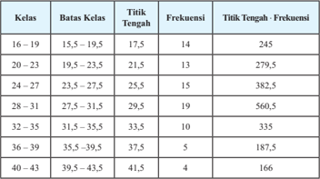

Tabel ini menunjukkan distribusi umur siswa di kelas tertentu, dengan batas-batas kelas, titik tengah, frekuensi, dan perbedaan antara titik tengah dan frekuensi. Topik utama tabel adalah distribusi umur siswa dalam berbagai kelas. Kolom-kolomnya meliputi kelas, batas kelas, titik tengah, frekuensi, dan perbedaan antara titik tengah dan frekuensi. Data penting yang terlihat adalah bahwa sebagian besar siswa berada di kelas 24-31, dengan frekuensi tertinggi sebesar 19. Selain itu, perbedaan antara titik tengah dan frekuensi juga menunjukkan pola distribusi umur yang tidak merata.

 

---
## 📄 Halaman 52

### Alternatif Jawaban

Berdasarkan tabel yang sudah dilengkapi di atas, perkiraan jumlah data keseluruhan /g68/g71/g68/g79/g68/g75/g3 /g21/g17/g20/g24/g25/g17/g3 /g45/g88/g80/g79/g68/g75/g3 /g73/g85/g72/g78/g88/g72/g81/g86/g76/g3 /g78/g72/g86/g72/g79/g88/g85/g88/g75/g68/g81/g3 /g68/g71/g68/g79/g68/g75/g3 /g27/g19/g17/g3 /g39/g72/g81/g74/g68/g81/g3 /g71/g72/g80/g76/g78/g76/g68/g81/g3 /g85/g68/g87/g68/g16/g85/g68/g87/g68/g3 /g71/g68/g87/g68/g3 berkelompok tersebut adalah . 80 2 156 /g3/g32/g3/g21/g25/g15/g28/g24/g17/g3/g49/g76/g79/g68/g76/g3/g85/g68/g87/g68/g16/g85/g68/g87/g68/g3/g71/g76/g86/g87/g85/g76/g69/g88/g86/g76/g3/g73/g85/g72/g78/g88/g72/g81/g86/g76/g3/g71/g72/g81/g74/g68/g81/g3/g26/g3 /g78/g72/g79/g68/g86/g3/g76/g81/g76/g3/g79/g72/g69/g76/g75/g3/g80/g72/g81/g71/g72/g78/g68/g87/g76/g3/g81/g76/g79/g68/g76/g3/g85/g68/g87/g68/g16/g85/g68/g87/g68/g3/g86/g72/g69/g72/g81/g68/g85/g81/g92/g68/g3/g71/g68/g85/g76/g83/g68/g71/g68/g3/g71/g76/g86/g87/g85/g76/g69/g88/g86/g76/g3/g73/g85/g72/g78/g88/g72/g81/g86/g76/g3/g71/g72/g81/g74/g68/g81/g3 /g24/g3/g78/g72/g79/g68/g86/g17

/g3 /g46/g72/g79/g68/g86/g3 /g80/g72/g71/g76/g68/g81/g3 /g71/g68/g85/g76/g3 /g71/g76/g86/g87/g85/g76/g69/g88/g86/g76/g3 /g73/g85/g72/g78/g88/g72/g81/g86/g76/g3 /g76/g81/g76/g3 /g87/g72/g85/g79/g72/g87/g68/g78/g3 /g83/g68/g71/g68/g3 /g78/g72/g79/g68/g86/g3 /g21/g23/g3 /g177/g3 /g21/g26/g15/g3 /g86/g72/g71/g68/g81/g74/g78/g68/g81/g3 /g78/g72/g79/g68/g86/g3/g80/g82/g71/g88/g86/g81/g92/g68/g3/g68/g71/g68/g79/g68/g75/g3/g21/g27/g3/g177/g3/g22/g20/g17

/g3 /g45/g72/g79/g68/g86/g3/g75/g68/g86/g76/g79/g3/g76/g81/g76/g3/g68/g74/g68/g78/g3/g69/g72/g85/g69/g72/g71/g68/g3/g71/g72/g81/g74/g68/g81/g3/g71/g76/g86/g87/g85/g76/g69/g88/g86/g76/g3/g73/g85/g72/g78/g88/g72/g81/g86/g76/g3/g71/g72/g81/g74/g68/g81/g3/g24/g3/g78/g72/g79/g68/g86/g17/g3/g58 /g68/g79/g68/g88/g83/g88/g81/g3 kedua distribusi frekuensi ini berasal dari data mentah yang sama, ukuran pemusatan data  berkelompok  bisa  berbeda  karena  penghitungan  ukuran  ini  berdasarkan  pada /g83/g72/g81/g71/g72/g78/g68/g87/g68/g81/g17/g3/g58 /g68/g79/g68/g88/g83/g88/g81/g3/g71/g72/g80/g76/g78/g76/g68/g81/g15/g3/g75/g68/g86/g76/g79/g3/g78/g72/g71/g88/g68/g3/g71/g76/g86/g87/g85/g76/g69/g88/g86/g76/g3/g73/g85/g72/g78/g88/g72/g81/g86/g76/g3/g87/g72/g87/g68/g83/g3/g68/g78/g68/g81/g3/g80/g72/g81/g71/g72/g78/g68/g87/g76/g3 hasil yang sebenarnya.

### Kegiatan 2.2.1.1 Rata-Rata

- /g135/g3 /g42/g88/g85/g88/g3 /g80/g72/g80/g76/g81/g87/g68/g3 /g86/g76/g86/g90/g68/g3 /g88/g81/g87/g88/g78/g3 /g80/g72/g79/g72/g81/g74/g78/g68/g83/g76/g3 /g87/g68/g69/g72/g79/g3 /g92/g68/g81/g74/g3 /g71/g76/g86/g72/g71/g76/g68/g78/g68/g81/g17/g3 /g39/g72/g81/g74/g68/g81/g3 mengisikan  tabel  dan  menjawab  pertanyaan  yang  ada  di  buku  siswa,  siswa /g71/g76/g75/g68/g85/g68/g83/g78/g68/g81/g3/g80/g68/g80/g83/g88/g3/g80/g72/g85/g88/g80/g88/g86/g78/g68/g81/g3/g86/g72/g81/g71/g76/g85/g76/g3/g69/g68/g74/g68/g76/g80/g68/g81/g68/g3/g80/g72/g81/g70/g68/g85/g76/g3/g85/g68/g87/g68/g16/g85/g68/g87/g68/g3/g88/g81/g87/g88/g78/g3/g71/g68/g87/g68/g3 berkelompok.

---
**📊 Tabel**

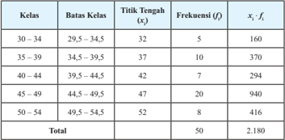

Tabel ini menunjukkan data statistik dari kelas-kelas tertentu dengan batas kelas, titik tengah, frekuensi, dan hasil kali frekuensi dengan titik tengah (x_i * f_i). Topik utama tabel ini adalah analisis distribusi frekuensi kelas. Kolom-kolomnya meliputi kelas, batas kelas, titik tengah, frekuensi, dan hasil kali frekuensi dengan titik tengah. Data penting yang terlihat adalah bahwa frekuensi terbesar terdapat pada kelas 45-49 dengan nilai 20, sedangkan frekuensi terendah terdapat pada kelas 30-34 dengan nilai 5. Total frekuensi seluruh kelas adalah 50, dan total hasil kali frekuensi dengan titik tengah adalah 2.180. Ini menunjukkan bahwa distribusi frekuensi ini cukup merata dengan beberapa kelas memiliki frekuensi yang lebih tinggi dibandingkan kelas lainnya.

 

---
## 📄 Halaman 53

### Alternatif Jawaban:

/g3 /g53/g68/g87/g68/g16/g85/g68/g87/g68/g3/g71/g68/g87/g68/g3/g87/g88/g81/g74/g74/g68/g79/g3/g71/g76/g71/g68/g83/g68/g87/g78/g68/g81/g3/g71/g72/g81/g74/g68/g81/g3/g80/g72/g80/g69/g68/g74/g76/g3/g77/g88/g80/g79/g68/g75/g3/g71/g68/g87/g68/g3/g71/g72/g81/g74/g68/g81/g3/g69/g68/g81/g92/g68/g78/g81/g92/g68/g3 /g71/g68/g87/g68/g17/g3/g48/g72/g81/g74/g74/g88/g81/g68/g78/g68/g81/g3/g83/g85/g76/g81/g86/g76/g83/g3/g92/g68/g81/g74/g3/g86/g68/g80/g68/g15/g3/g23/g22/g15/g25/g3/g77/g88/g74/g68/g3/g71/g76/g71/g68/g83/g68/g87/g78/g68/g81/g3/g71/g68/g85/g76/g3/g83/g72/g85/g78/g76/g85/g68/g68/g81/g3/g77/g88/g80/g79/g68/g75/g3/g71/g68/g87/g68/g3 keseluruhan,  yaitu  jumlah  perkalian  titik  tengah  dengan  frekuensinya,  dibagi  jumlah /g73/g85/g72/g78/g88/g72/g81/g86/g76/g17/g3 /g45/g76/g78/g68/g3 x i /g3 /g68/g71/g68/g79/g68/g75/g3 /g87/g76/g87/g76/g78/g3 /g87/g72/g81/g74/g68/g75/g3 /g78/g72/g79/g68/g86/g3 /g78/g72/g16/g76/g3 /g71/g68/g81/g3 f i /g3 /g68/g71/g68/g79/g68/g75/g3 /g73/g85/g72/g78/g88/g72/g81/g86/g76/g3 /g78/g72/g79/g68/g86/g3 /g78/g72/g16/g76/g15/g3 /g71/g68/g81/g3 banyak kelas adalah k /g3/g80/g68/g78/g68/g3/g85/g68/g87/g68/g16/g85/g68/g87/g68/g3/g71/g68/g87/g68/g3/g69/g72/g85/g78/g72/g79/g82/g80/g83/g82/g78/g3/g71/g76/g85/g88/g80/g88/g86/g78/g68/g81/g3/g86/g72/g69/g68/g74/g68/g76/g3/g69/g72/g85/g76/g78/g88/g87/g17

### Kegiatan 2.2.1.2 Median

- /g135/g3 /g42/g88/g85/g88/g3 /g80/g72/g80/g76/g81/g87/g68/g3 /g86/g76/g86/g90/g68/g3 /g88/g81/g87/g88/g78/g3 /g80/g72/g79/g72/g81/g74/g78/g68/g83/g76/g3 /g87/g68/g69/g72/g79/g3 /g88/g81/g87/g88/g78/g3 /g80/g72/g71/g76/g68/g81/g3 /g92/g68/g81/g74/g3 /g71/g76/g86/g72/g71/g76/g68/g78/g68/g81/g17/g3 /g39/g72/g81/g74/g68/g81/g3 /g80/g72/g79/g72/g81/g74/g78/g68/g83/g76/g3 /g87/g68/g69/g72/g79/g3 /g71/g68/g81/g3 /g80/g72/g81/g77/g68/g90/g68/g69/g3 /g83/g72/g85/g87/g68/g81/g92/g68/g68/g81/g3 /g92/g68/g81/g74/g3 /g80/g72/g81/g92/g72/g85/g87/g68/g76/g3 /g86/g76/g86/g90/g68/g3 /g71/g76/g75/g68/g85/g68/g83/g78/g68/g81/g3/g80/g68/g80/g83/g88/g3/g80/g72/g85/g88/g80/g88/g86/g78/g68/g81/g3/g86/g72/g81/g71/g76/g85/g76/g3/g69/g68/g74/g68/g76/g80/g68/g81/g68/g3/g80/g72/g81/g70/g68/g85/g76/g3/g80/g72/g71/g76/g68/g81/g3/g88/g81/g87/g88/g78/g3/g71/g68/g87/g68/g3 berkelompok.

---
**📊 Tabel**

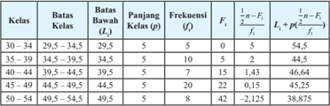

Tabel ini menunjukkan informasi statistik tentang kelas dan batas-batas kelas dalam sebuah populasi. Kolom pertama berisi kelas, yang diurutkan dari 30-34 hingga 50-54. Kolom kedua berisi batas bawah kelas, yang mencakup rentang nilai dari 29,5 hingga 49,5. Kolom ketiga berisi panjang kelas, yang berbeda-beda untuk setiap kelas. Kolom keempat berisi frekuensi, yang menunjukkan jumlah individu dalam setiap kelas. Kolom kelima berisi F1, yang merupakan hasil dari perhitungan statistik. Kolom keenam berisi L+, yang merupakan hasil dari perhitungan statistik. Kolom ketujuh berisi L+/(n-F1), yang juga merupakan hasil dari perhitungan statistik. Topik utama tabel ini adalah analisis statistik kelas dan batas-batas kelas dalam populasi. Data penting yang terlihat adalah bahwa frekuensi dan L+/(n-F1) meningkat seiring dengan peningkatan batas bawah kelas.

F i /g3

/g29/g3/g77/g88/g80/g79/g68/g75/g3/g73/g85/g72/g78/g88/g72/g81/g86/g76/g3/g78/g72/g79/g68/g86/g16/g78/g72/g79/g68/g86/g3/g86/g72/g69/g72/g79/g88/g80/g3/g78/g72/g79/g68/g86/g3/g78/g72/g16/g76/g17

n

: banyak data

 

---
## 📄 Halaman 54

### Alternatif Jawaban

/g3 /g37/g72/g85/g71/g68/g86/g68/g85/g78/g68/g81/g3 /g38/g82/g81/g87/g82/g75/g3 /g21/g17/g20 /g20/g15/g3 /g80/g72/g71/g76/g68/g81/g3 /g71/g68/g85/g76/g3 /g71/g76/g86/g87/g85/g76/g69/g88/g86/g76/g3 /g73/g85/g72/g78/g88/g72/g81/g86/g76/g3 /g76/g81/g76/g3 /g68/g71/g68/g79/g68/g75/g3 /g23/g24/g15/g21/g24/g17/g3 /g39/g72/g81/g74/g68/g81/g3 /g80/g72/g79/g76/g75/g68/g87/g3 /g87/g68/g69/g72/g79/g3 /g71/g76/g3 /g68/g87/g68/g86/g15/g3 /g81/g76/g79/g68/g76/g3 /g23/g24/g15/g21/g24/g3 /g80/g88/g81/g70/g88/g79/g3 /g83/g68/g71/g68/g3 /g78/g72/g79/g68/g86/g3 /g78/g72/g72/g80/g83/g68/g87/g3 /g92/g68/g76/g87/g88/g3 /g23/g24/g3 /g177/g3 /g23/g28/g17/g3 /g43/g68/g79/g3 /g76/g81/g76/g3 /g86/g72/g86/g88/g68/g76/g3 /g71/g72/g81/g74/g68/g81/g3 /g76/g81/g73/g82/g85/g80/g68/g86/g76/g3 /g86/g72/g69/g72/g79/g88/g80/g81/g92/g68/g3 /g69/g68/g75/g90/g68/g3 /g78/g72/g79/g68/g86/g3 /g23/g24/g3 /g177/g3 /g23/g28/g3 /g68/g71/g68/g79/g68/g75/g3 /g78/g72/g79/g68/g86/g3 /g80/g72/g71/g76/g68/g81/g15/g3 /g92/g68/g76/g87/g88/g3 /g78/g72/g79/g68/g86/g3 /g71/g76/g3 /g80/g68/g81/g68/g3 /g80/g72/g71/g76/g68/g81/g3 /g87/g72/g85/g79/g72/g87/g68/g78/g17/g3 /g39/g72/g81/g74/g68/g81/g3 /g80/g72/g79/g76/g75/g68/g87/g3 /g87/g68/g69/g72/g79/g3 /g71/g76/g3 /g68/g87/g68/g86/g15/g3 /g70/g68/g85/g68/g3 /g80/g72/g81/g72/g81/g87/g88/g78/g68/g81/g3 /g80/g72/g71/g76/g68/g81/g3 /g71/g68/g87/g68/g3 berkelompok adalah

``

dengan

M e

: Median

L me

: batas bawah kelas median

F me /g3

/g29/g3/g73/g85/g72/g78/g88/g72/g81/g86/g76/g3/g78/g88/g80/g88/g79/g68/g87/g76/g73/g3/g78/g72/g79/g68/g86/g16/g78/g72/g79/g68/g86/g3/g86/g72/g69/g72/g79/g88/g80/g3/g78/g72/g79/g68/g86/g3/g80/g72/g71/g76/g68/g81

f me

: frekuensi kelas median

p

: panjang kelas

n

: jumlah frekuensi keseluruhan

/g51/g72/g85/g75/g68/g87/g76/g78/g68/g81/g3 /g69/g68/g75/g90/g68/g3 /g73/g85/g72/g78/g88/g72/g81/g86/g76/g3 /g78/g72/g86/g72/g79/g88/g85/g88/g75/g68/g81/g3 /g71/g76/g86/g87/g85/g76/g69/g88/g86/g76/g3 /g73/g85/g72/g78/g88/g72/g81/g86/g76/g3 /g76/g81/g76/g3 /g68/g71/g68/g79/g68/g75/g3 /g24/g19/g15/g3 /g86/g72/g75/g76/g81/g74/g74/g68/g3 /g80/g72/g71/g76/g68/g81/g3/g68/g78/g68/g81/g3/g87/g72/g85/g79/g72/g87/g68/g78/g3/g71/g76/g3/g71/g68/g87/g68/g3/g88/g85/g88/g87/g68/g81/g3/g78/g72/g16/g21/g24/g3/g71/g68/g81/g3/g78/g72/g16/g21/g25/g17/g3/g46/g72/g71/g88/g68/g3/g71/g68/g87/g68/g3/g76/g81/g76/g3/g87/g72/g85/g79/g72/g87/g68/g78/g3/g71/g76/g3/g78/g72/g79/g68/g86/g3/g23/g24/g3 /g177/g3/g23/g28/g3/g92/g68/g81/g74/g3/g86/g72/g79/g68/g81/g77/g88/g87/g81/g92/g68/g3/g71/g76/g86/g72/g69/g88/g87/g3/g78/g72/g79/g68/g86/g3/g80/g72/g71/g76/g68/g81/g17/g3/g48/g72/g71/g76/g68/g81/g3/g71/g68/g85/g76/g3/g71/g68/g87/g68/g3/g69/g72/g85/g78/g72/g79/g82/g80/g83/g82/g78/g3/g80/g72/g85/g88/g83/g68/g78/g68/g81/g3 nilai pendekatan dari median data tunggal yang sebenarnya.

### Kegiatan 2.2.1.3 Modus

- /g135/g3 /g42/g88/g85/g88/g3 /g80/g72/g81/g74/g68/g77/g68/g78/g3 /g86/g76/g86/g90/g68/g3 /g80/g72/g79/g72/g81/g74/g78/g68/g83/g76/g3 /g87/g68/g69/g72/g79/g3 /g88/g81/g87/g88/g78/g3 /g80/g82/g71/g88/g86/g3 /g92/g68/g81/g74/g3 /g87/g72/g85/g86/g72/g71/g76/g68/g17/g3 /g39/g72/g81/g74/g68/g81/g3 melengkapi tabel dan menjawab pertanyaan setelahnya siswa diharapkan mampu /g80/g72/g85/g88/g80/g88/g86/g78/g68/g81/g3 /g86/g72/g81/g71/g76/g85/g76/g3 /g69/g68/g74/g68/g76/g80/g68/g81/g68/g3 /g80/g72/g81/g70/g68/g85/g76/g3 /g80/g82/g71/g88/g86/g3 /g88/g81/g87/g88/g78/g3 /g71/g68/g87/g68/g3 /g69/g72/g85/g78/g72/g79/g82/g80/g83/g82/g78/g17/g3 /g37/g72/g85/g76/g78/g88/g87/g3 meruapakan tabel yang sudah dilengkapi.

---
**📊 Tabel**

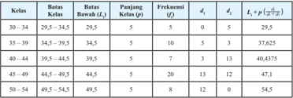

Tabel ini menunjukkan distribusi kelas dan frekuensi untuk berbagai batas kelas dalam interval 30-45. Kolom pertama menyatakan kelas, sedangkan kolom kedua menunjukkan batas bawah dan batas akhir kelas. Kolom ketiga mengandung panjang kelas (L), kolom keempat menunjukkan frekuensi (f), kolom kelima menampilkan nilai kelas tengah (d_i), kolom keenam menunjukkan luas kelas (I_i), dan kolom ketujuh menampilkan luas kelas dikurangi dengan frekuensi (I_i - f * d_i). Topik utama tabel ini adalah analisis statistik kelas, termasuk distribusi kelas, frekuensi, dan luas kelas. Data penting yang terlihat adalah bahwa luas kelas terbesar terletak pada kelas 39,5-40,4 dengan nilai 13, sedangkan luas kelas terkecil terletak pada kelas 45-49 dengan nilai 12. Frekuensi tertinggi juga terjadi pada kelas 39,5-40,4 dengan nilai 20.

### Keterangan:

d 1

/g3/g29/g3/g86/g72/g79/g76/g86/g76/g75/g3/g73/g85/g72/g78/g88/g72/g81/g86/g76/g3/g78/g72/g79/g68/g86/g3/g78/g72/g16/g76/g3/g71/g72/g81/g74/g68/g81/g3/g78/g72/g79/g68/g86/g3/g86/g72/g69/g72/g79/g88/g80/g81/g92/g68

d 2

/g3/g29/g3/g86/g72/g79/g76/g86/g76/g75/g3/g73/g85/g72/g78/g88/g72/g81/g86/g76/g3/g78/g72/g79/g68/g86/g3/g78/g72/g16/g76/g3/g71/g72/g81/g74/g68/g81/g3/g78/g72/g79/g68/g86/g3/g69/g72/g85/g76/g78/g88/g87/g81/g92/g68

 

---
## 📄 Halaman 55

### Alternatif Jawaban

/g48/g82/g71/g88/g86/g3 /g71/g76/g86/g87/g85/g76/g69/g88/g86/g76/g3 /g73/g85/g72/g78/g88/g72/g81/g86/g76/g3 /g76/g81/g76/g3 /g68/g71/g68/g79/g68/g75/g3 /g23/g26/g15/g20/g3 /g86/g72/g86/g88/g68/g76/g3 /g71/g72/g81/g74/g68/g81/g3 /g92/g68/g81/g74/g3 /g71/g76/g78/g72/g87/g68/g75/g88/g76/g3 /g86/g72/g69/g72/g79/g88/g80/g81/g92/g68/g17/g3 /g51/g72/g85/g75/g68/g87/g76/g78/g68/g81/g3 /g69/g68/g75/g90/g68/g3 /g81/g76/g79/g68/g76/g3 /g23/g26/g15/g20/g3 /g80/g88/g81/g70/g88/g79/g3 /g83/g68/g71/g68/g3 /g78/g72/g79/g68/g86/g3 /g80/g82/g71/g88/g86/g3 /g23/g24/g3 /g177/g3 /g23/g28/g3 /g92/g68/g76/g87/g88/g3 /g78/g72/g79/g68/g86/g3 /g71/g72/g81/g74/g68/g81/g3 /g73/g85/g72/g78/g88/g72/g81/g86/g76/g3 /g87/g72/g85/g87/g76/g81/g74/g74/g76/g17/g3 /g39/g72/g81/g74/g68/g81/g3 /g71/g72/g80/g76/g78/g76/g68/g81/g15/g3 /g88/g81/g87/g88/g78/g3 /g80/g72/g81/g72/g81/g87/g88/g78/g68/g81/g3 /g80/g82/g71/g88/g86/g3 /g71/g68/g87/g68/g3 /g69/g72/g85/g78/g72/g79/g82/g80/g83/g82/g78/g15/g3 /g78/g72/g79/g68/g86/g3 /g80/g82/g71/g88/g86/g3 /g75/g68/g85/g88/g86/g3 /g71/g76/g87/g72/g81/g87/g88/g78/g68/g81/g3 /g87/g72/g85/g79/g72/g69/g76/g75/g3 /g71/g68/g75/g88/g79/g88/g17/g3 /g54/g72/g79/g68/g81/g77/g88/g87/g81/g92/g68/g3 /g80/g82/g71/g88/g86/g3 /g71/g68/g87/g68/g3 /g69/g72/g85/g78/g72/g79/g82/g80/g83/g82/g78/g3 dapat ditentukan sebagai berikut.

``

M o

: modus data berkelompok

p

: panjang kelas

d 1

: selisih frekuensi kelas modus dengan kelas sebelumnya

d 2

: selisih frekuensi kelas modus dengan kelas berikutnya

- /g135/g3 /g42/g88/g85/g88/g3 /g80/g72/g80/g76/g81/g87/g68/g3 /g86/g76/g86/g90/g68/g3 /g88/g81/g87/g88/g78/g3 /g80/g72/g81/g72/g81/g87/g88/g78/g68/g81/g3 /g88/g78/g88/g85/g68/g81/g3 /g83/g72/g80/g88/g86/g68/g87/g68/g81/g3 /g71/g76/g86/g87/g85/g76/g69/g88/g86/g76/g3 /g73/g85/g72/g78/g88/g72/g81/g86/g76/g3 dan  histogram  yang  ada  pada Contoh  2.12 dan Contoh  2.13 menggunakan /g71/g88/g74/g68/g68/g81/g3 /g85/g88/g80/g88/g86/g3 /g92/g68/g81/g74/g3 /g86/g76/g86/g90/g68/g3 /g83/g72/g85/g82/g79/g72/g75/g17/g3 /g46/g72/g80/g88/g71/g76/g68/g81/g3 /g86/g76/g86/g90/g68/g3 /g80/g72/g81/g3 /g70/g82/g70/g82/g78/g78/g68/g81/g3 /g75/g68/g86/g76/g79/g81/g92/g68/g3 /g71/g72/g81/g74/g68/g81/g3/g88/g78/g88/g85/g68/g81/g3/g83/g72/g80/g88/g86/g68/g87/g68/g81/g3/g83/g68/g71/g68/g3/g70/g82/g81/g87/g82/g75/g3/g71/g76/g3/g69/g88/g78/g88/g3/g86/g76/g86/g90/g68/g17

### Mengomunikasikan

- /g135/g3 /g42/g88/g85/g88/g3 /g80/g72/g80/g76/g81/g87/g68/g18/g80/g72/g81/g88/g81/g77/g88/g78/g3 /g69/g72/g69/g72/g85/g68/g83/g68/g3 /g83/g72/g85/g90/g68/g78/g76/g79/g68/g81/g3 /g86/g76/g86/g90/g68/g3 /g88/g81/g87/g88/g78/g3 /g80/g72/g80/g83/g85/g72/g86/g72/g81/g87/g68/g86/g76/g3 /g78/g68/g81/g3 bagaimana mendapatkan ukuran pemusatan data berkelompok hasil dugaannya /g71/g76/g3 /g71/g72/g83/g68/g81/g3 /g78/g72/g79/g68/g86/g17/g3 /g54/g76/g86/g90/g68/g3 /g79/g68/g76/g81/g81/g92/g68/g3 /g71/g76/g75/g68/g85/g68/g83/g78/g68/g81/g3 /g80/g72/g81/g68/g81/g74/g74/g68/g83/g76/g3 /g86/g72/g75/g76/g81/g74/g74/g68/g3 /g81/g68/g81/g87/g76/g81/g92/g68/g3 didapatkan kesimpulan yang disepakati bersama dalam kelas.

### Kesimpulan yang diharapkan

Pada  prinsipnya,  ukuran  pemusatan  data  berkelompok  sama  dengan  ukuran pemusatan data tunggal. Perbedaannya, ukuran pemusatan data dihitung menggunakan data  aslinya  sedangkan  ukuran  pemusatan  data  berkelompok  dihitung  menggunakan pendekatan terhadap nilai yang sebenarnya.

Berikut  merupakan  rumus  untuk  menentukan  ukuran  pemusatan  untuk  data berkelompok, khususnya data yang disajikan dalam distribusi frekuensi dan histogram. /g53/g68/g87/g68/g16/g85/g68/g87/g68/g29/g3

 

---
## 📄 Halaman 56

### /g53/g68/g87/g68/g16/g85/g68/g87/g68/g29/g3

``

### Kegiatan Penutup

- /g135/g3 /g42/g88/g85/g88/g3/g80/g72/g80/g69/g72/g85/g76/g78/g68/g81/g3/g78/g79/g68/g85/g76/g191/g78/g68/g86/g76/g3/g68/g87/g68/g88/g3/g83/g72/g81/g74/g88/g68/g87/g68/g81/g3/g80/g68/g87/g72/g85/g76/g3/g87/g72/g85/g75/g68/g71/g68/g83/g3/g88/g78/g88/g85/g68/g81/g3/g83/g72/g80/g88/g86/g68/g87/g68/g81/g3 data berkelompok yang diperoleh siswa.

### 2.2.2 Ukuran Penyebaran Data Berkelompok

### Kegiatan Pendahuluan

- /g135/g3 /g42/g88/g85/g88/g3 /g80/g72/g80/g69/g72/g85/g76/g78/g68/g81/g3 /g80/g82/g87/g76/g89/g68/g86/g76/g3 /g87/g72/g81/g87/g68/g81/g74/g3 /g83/g72/g81/g87/g76/g81/g74/g81/g92/g68/g3 /g80/g72/g81/g71/g72/g86/g78/g85/g76/g83/g86/g76/g78/g68/g81/g3 /g71/g68/g87/g68/g3 /g86/g72/g79/g68/g76/g81/g3 dengan ukuran pemusatan data, yaitu dengan ukuran penyebaran data.
- /g135/g3 /g42/g88/g85/g88/g3 /g80/g72/g80/g72/g85/g76/g78/g86/g68/g3 /g83/g72/g81/g74/g72/g87/g68/g75/g88/g68/g81/g3 /g68/g90/g68/g79/g3 /g86/g76/g86/g90/g68/g3 /g87/g72/g81/g87/g68/g81/g74/g3 /g88/g78/g88/g85/g68/g81/g3 /g83/g72/g81/g92/g72/g69/g68/g85/g68/g81/g3 /g71/g68/g87/g68/g3 /g71/g68/g81/g3 mengingatkan siswa apa saja yang termasuk ukuran penyebaran data.
- /g135/g3 /g42/g88/g85/g88/g3/g80/g72/g81/g74/g68/g77/g68/g78/g3/g86/g76/g86/g90/g68/g3/g88/g81/g87/g88/g78/g3/g80/g72/g81/g74/g76/g81/g74/g68/g87/g3/g78/g72/g80/g69/g68/g79/g76/g3/g88/g78/g88/g85/g68/g81/g3/g83/g72/g81/g92/g72/g69/g68/g85/g68/g81/g3/g71/g68/g87/g68/g3/g87/g88/g81/g74/g74/g68/g79/g3 kemudian  guru  menanyakan  bagaimana  jika  ukuran  penyebaran  yang  akan ditetukan berasal dari distribusi frekuensi atau histogram.

### Kegiatan Inti

Mengamati

- /g135/g3 /g42/g88/g85/g88/g3 /g80/g72/g81/g74/g68/g77/g68/g78/g3 /g86/g76/g86/g90/g68/g3 /g80/g72/g81/g74/g68/g80/g68/g87/g76/g3 Contoh 2.15 , Contoh 2.16 ,  dan Contoh 2.17 yaitu  informasi  mengenai  ukuran  penyebaran  data  yang  didapatkan  dari distribusi frekuensi dan histogram.
- /g135/g3 /g42/g88/g85/g88/g3 /g80/g72/g81/g74/g68/g85/g68/g75/g78/g68/g81/g3 /g86/g76/g86/g90/g68/g3 /g71/g68/g79/g68/g80/g3 /g83/g72/g81/g74/g68/g80/g68/g87/g68/g81/g3 /g70/g82/g81/g87/g82/g75/g3 /g88/g81/g87/g88/g78/g3 /g80/g72/g81/g71/g68/g83/g68/g87/g78/g68/g81/g3 /g76/g81/g73/g82/g85/g80/g68/g86/g76/g3/g86/g72/g69/g68/g81/g92/g68/g78/g3/g80/g88/g81/g74/g78/g76/g81/g3/g92/g68/g81/g74/g3/g71/g76/g86/g72/g71/g76/g68/g78/g68/g81/g3/g71/g68/g79/g68/g80/g3/g70/g82/g81/g87/g82/g75/g17

 

---
## 📄 Halaman 57

Menanya

- /g135/g3 /g42/g88/g85/g88/g3 /g80/g72/g80/g76/g81/g87/g68/g3 /g86/g76/g86/g90/g68/g3 /g88/g81/g87/g88/g78/g3 /g80/g72/g81/g88/g79/g76/g86/g78/g68/g81/g18/g80/g72/g81/g74/g68/g77/g88/g78/g68/g81/g3 /g83/g72/g85/g87/g68/g81/g92/g68/g68/g81/g16/g83/g72/g85/g87/g68/g81/g92/g68/g68/g81/g3 /g92/g68/g81/g74/g3 berhubungan dengan informasi yang disediakan.
- /g135/g3 /g42/g88/g85/g88/g3 /g71/g68/g83/g68/g87/g3 /g80/g72/g80/g68/g81/g70/g76/g81/g74/g3 /g86/g76/g86/g90/g68/g3 /g88/g81/g87/g88/g78/g3 /g80/g72/g81/g74/g68/g77/g88/g78/g68/g81/g3 /g83/g72/g85/g87/g68/g81/g92/g68/g68/g81/g3 /g87/g72/g81/g87/g68/g81/g74/g3 /g88/g78/g88/g85/g68/g81/g3 penyebaran data berkelompok dengan membandingkan ukuran penyebaran pada data tunggal.
- /g135/g3 /g42/g88/g85/g88/g3/g80/g72/g80/g76/g81/g87/g68/g3/g83/g72/g85/g90/g68/g78/g76/g79/g68/g81/g3/g86/g76/g86/g90/g68/g3/g88/g81/g87/g88/g78/g3/g80/g72/g81/g88/g79/g76/g86/g78/g68/g81/g3/g83/g72/g85/g87/g68/g81/g92/g68/g68/g81/g16/g83/g72/g85/g87/g68/g81/g92/g68/g68/g81/g3/g92/g68/g81/g74/g3 /g71/g76/g71/g68/g83/g68/g87/g78/g68/g81/g3 /g71/g76/g3 /g83/g68/g83/g68/g81/g3 /g87/g88/g79/g76/g86/g3 /g68/g87/g68/g88/g3 /g47/g38/g39/g3 /g78/g72/g80/g88/g71/g76/g68/g81/g3 /g87/g72/g80/g68/g81/g3 /g79/g68/g76/g81/g81/g92/g68/g3 /g80/g72/g81/g68/g81/g74/g74/g68/g83/g76/g3 /g68/g87/g68/g88/g3 menambahi jika ada yang belum tertuliskan di papan tulis.
- /g135/g3 /g51/g72/g85/g87/g68/g81/g92/g68/g68/g81/g3/g92/g68/g81/g74/g3/g71/g76/g75/g68/g85/g68/g83/g78/g68/g81/g3/g80/g88/g81/g70/g88/g79/g3/g68/g71/g68/g79/g68/g75/g29
- Apa saja yang dimaksud dengan ukuran penyebaran data?
- /g21/g12/g3 /g37/g68/g74/g68/g76/g80/g68/g81/g68/g78/g68/g75/g3 /g70/g68/g85/g68/g3 /g80/g72/g81/g72/g81/g87/g88/g78/g68/g81/g3 /g86/g76/g80/g83/g68/g81/g74/g68/g81/g3 /g85/g68/g87/g68/g16/g85/g68/g87/g68/g3 /g71/g68/g85/g76/g3 /g71/g76/g86/g87/g85/g76/g69/g88/g86/g76/g3 frekuensi atau histogram?
- /g22/g12/g3 /g37/g68/g74/g68/g76/g80/g68/g81/g68/g78/g68/g75/g3 /g70/g68/g85/g68/g3 /g80/g72/g81/g72/g81/g87/g88/g78/g68/g81/g3 /g86/g76/g80/g83/g68/g81/g74/g68/g81/g3 /g69/g68/g78/g88/g3 /g71/g68/g85/g76/g3 /g71/g76/g86/g87/g85/g76/g69/g88/g86/g76/g3 /g73/g85/g72/g78/g88/g72/g81/g86/g76/g3 atau histogram?
- /g23/g12/g3 /g37/g68/g74/g68/g76/g80/g68/g81/g68/g78/g68/g75/g3 /g70/g68/g85/g68/g3 /g80/g72/g81/g72/g81/g87/g88/g78/g68/g81/g3 /g85/g68/g74/g68/g80/g3 /g71/g68/g85/g76/g3 /g71/g76/g86/g87/g85/g76/g69/g88/g86/g76/g3 /g73/g85/g72/g78/g88/g72/g81/g86/g76/g3 /g68/g87/g68/g88/g3 histogram?
Mengumpulkan Informasi dan Menalar

- /g135/g3 /g42/g88/g85/g88/g3/g80/g72/g81/g74/g68/g77/g68/g78/g3/g86/g76/g86/g90/g68/g3/g88/g81/g87/g88/g78/g3/g80/g72/g81/g74/g88/g80/g83/g88/g79/g78/g68/g81/g3/g76/g81/g73/g82/g85/g80/g68/g86/g76/g3/g92/g68/g81/g74/g3/g71/g76/g69/g72/g85/g76/g78/g68/g81/g3/g87/g72/g85/g88/g87/g68/g80/g68/g3 /g83/g68/g71/g68/g3/g38/g82/g81/g87/g82/g75/g3/g21/g17/g20/g27/g3/g92/g68/g81/g74/g3/g71/g76/g69/g72/g85/g76/g78/g68/g81/g3/g71/g76/g3 /g36 /g92/g82/g15/g3/g48/g72/g81/g74/g88/g80/g83/g88/g79/g78/g68/g81/g3/g76/g81/g73/g82/g85/g80/g68/g86/g76/g3/g71/g68/g81/g3/g48/g72/g81/g68/g79/g68/g85 /g17
- /g135/g3 /g42/g88/g85/g88/g3 /g80/g72/g80/g76/g81/g87/g68/g3 /g86/g76/g86/g90/g68/g3 /g88/g81/g87/g88/g78/g3 /g80/g72/g81/g74/g75/g76/g87/g88/g81/g74/g3 /g85/g68/g87/g68/g16/g85/g68/g87/g68/g3 /g71/g68/g85/g76/g3 /g71/g76/g86/g87/g85/g76/g69/g88/g86/g76/g3 /g73/g85/g72/g78/g88/g72/g81/g86/g76/g3 /g83/g68/g71/g68/g3 /g70/g82/g81/g87/g82/g75/g3/g87/g72/g85/g86/g72/g69/g88/g87/g3/g71/g76/g3/g71/g68/g79/g68/g80/g3/g78/g82/g87/g68/g78/g3/g92/g68/g81/g74/g3/g71/g76/g86/g72/g71/g76/g68/g78/g68/g81/g17

### Alternatif jawaban

---
**📊 Tabel**

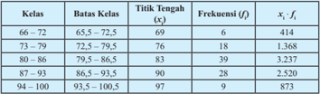

Tabel ini menunjukkan distribusi umur siswa di kelas tertentu, dengan batas-batas kelas yang ditetapkan antara 66-72 tahun hingga 94-100 tahun. Kolom "Kelas" menyatakan rentang umur siswa, sedangkan kolom "Batas Kelas" menunjukkan batas-batas setiap kelas. Kolom "Titik Tengah (x)" mengandung nilai titik tengah untuk setiap kelas, sementara kolom "Frekuensi (f)" menunjukkan jumlah siswa yang berada dalam setiap kelas. Data penting yang terlihat adalah bahwa sebagian besar siswa berada di kelas 80-86 tahun, dengan frekuensi tertinggi sebesar 39. Selain itu, tabel juga menunjukkan bahwa siswa yang berumur di bawah 73 tahun memiliki frekuensi yang lebih tinggi dibandingkan dengan siswa yang berumur di atas 94 tahun.

 

---
## 📄 Halaman 58

### /g53/g68/g87/g68/g16/g85/g68/g87/g68/g3/g71/g76/g86/g87/g85/g76/g69/g88/g86/g76/g3/g73/g85/g72/g78/g88/g72/g81/g86/g76/g3/g87/g72/g85/g86/g72/g69/g88/g87/g3/g68/g71/g68/g79/g68/g75

``

/g53/g68/g87/g68/g16/g85/g68/g87/g68/g3 /g81/g76/g79/g68/g76/g3 /g88/g77/g76/g68/g81/g3 /g68/g78/g75/g76/g85/g3 /g20/g19/g19/g3 /g80/g68/g75/g68/g86/g76/g86/g90/g68/g3 /g77/g88/g85/g88/g86/g68/g81/g3 /g80/g68/g87/g72/g80/g68/g87/g76/g78/g68/g3 /g71/g76/g3 /g86/g88/g68/g87/g88/g3 /g88/g81/g76/g89/g72/g85/g86/g76/g87/g68/g86/g3 /g68/g71/g68/g79/g68/g75/g3 84,12.

- /g135/g3 /g42/g88/g85/g88/g3/g80/g72/g81/g74/g68/g77/g68/g78/g3/g86/g76/g86/g90/g68/g3/g88/g81/g87/g88/g78/g3/g80/g72/g81/g68/g80/g69/g68/g75/g78/g68/g81/g3/g78/g82/g79/g82/g80/g3/g83/g68/g71/g68/g3/g71/g76/g86/g87/g85/g76/g69/g88/g86/g76/g3/g73/g85/g72/g78/g88/g72/g81/g86/g76/g3/g92/g68/g81/g74/g3 /g69/g72/g85/g76/g86/g76/g78/g68/g81/g3/g86/g72/g79/g76/g86/g76/g75/g3/g87/g76/g87/g76/g78/g3/g87/g72/g81/g74/g68/g75/g3/g87/g76/g68/g83/g3/g78/g72/g79/g68/g86/g3/g71/g72/g81/g74/g68/g81/g3/g85/g68/g87/g68/g16/g85/g68/g87/g68/g17/g3
- /g135/g3 /g54/g76/g86/g90/g68/g3 /g71/g76/g75/g68/g85/g68/g83/g78/g68/g81/g3 /g80/g72/g81/g71/g68/g83/g68/g87/g78/g68/g81/g3 /g76/g81/g73/g82/g85/g80/g68/g86/g76/g3 /g79/g72/g69/g76/g75/g3 /g80/g72/g81/g74/g72/g81/g68/g76/g3 /g86/g76/g80/g83/g68/g81/g74/g68/g81/g3 /g85/g68/g87/g68/g16/g85/g68/g87/g68/g3 setelah menambah kolom tersebut.

### Alternatif Jawaban

---
**📊 Tabel**

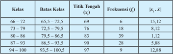

Tabel ini menunjukkan distribusi frekuensi kelas untuk rentang umur 66-104 tahun. Topik utama tabel adalah distribusi umur di suatu populasi. Kolom-kolomnya meliputi Kelas, Batas Kelas, Titik Tengah (x̄c), Frekuensi (f), dan |x̄c - x̄|. Data penting yang terlihat adalah bahwa sebagian besar populasi berada di kelas 87-93 tahun dengan frekuensi tertinggi 28, sedangkan kelas 94-100 tahun memiliki frekuensi paling rendah 9. Pola umur yang paling banyak terdapat di kelas 87-93 tahun, sementara kelas 94-100 tahun memiliki frekuensi yang sangat rendah.

/g3 /g37/g72/g85/g71/g68/g86/g68/g85/g78/g68/g81/g3 /g69/g72/g86/g68/g85/g81/g92/g68/g3 /g86/g72/g79/g76/g86/g76/g75/g3 /g83/g68/g71/g68/g3 /g78/g82/g79/g82/g80/g3 /g87/g72/g85/g68/g78/g75/g76/g85 /g15/g3 /g86/g72/g79/g76/g86/g76/g75/g3 /g71/g72/g81/g74/g68/g81/g3 /g85/g68/g87/g68/g16/g85/g68/g87/g68/g3 /g80/g72/g81/g92/g68/g87/g68/g78/g68/g81/g3 /g86/g72/g69/g72/g85/g68/g83/g68/g3 /g77/g68/g88/g75/g3 /g68/g87/g68/g88/g3 /g80/g72/g81/g92/g76/g81/g83/g68/g81/g74/g3 /g71/g68/g87/g68/g3 /g83/g68/g71/g68/g3 /g78/g72/g79/g68/g86/g3 /g87/g72/g85/g86/g72/g69/g88/g87/g3 /g71/g72/g81/g74/g68/g81/g3 /g85/g68/g87/g68/g16/g85/g68/g87/g68/g17/g3 /g54/g72/g69/g68/g74/g68/g76/g3/g70/g82/g81/g87/g82/g75/g15/g3/g86/g72/g87/g76/g68/g83/g3/g71/g68/g87/g68/g3/g83/g68/g71/g68/g3/g78/g72/g79/g68/g86/g3/g83/g72/g85/g87/g68/g80/g68/g3/g71/g76/g68/g86/g88/g80/g86/g76/g78/g68/g81/g3/g80/g72/g80/g83/g88/g81/g92/g68/g76/g3/g86/g72/g79/g76/g86/g76/g75/g3/g71/g72/g81/g74/g68/g81/g3 /g85/g68/g87/g68/g16/g85/g68/g87/g68/g3 /g86/g72/g69/g72/g86/g68/g85/g3 /g20/g24/g15/g20/g21/g17/g3 /g45/g76/g78/g68/g3 /g73/g85/g72/g78/g88/g72/g81/g86/g76/g3 /g83/g68/g71/g68/g3 /g78/g72/g79/g68/g86/g3 /g83/g72/g85/g87/g68/g80/g68/g3 /g68/g71/g68/g79/g68/g75/g3 /g25/g15/g3 /g80/g68/g78/g68/g3 /g87/g82/g87/g68/g79/g3 /g86/g72/g79/g76/g86/g76/g75/g3 /g71/g68/g87/g68/g3/g83/g68/g71/g68/g3/g78/g72/g79/g68/g86/g3/g83/g72/g85/g87/g68/g80/g68/g3/g71/g72/g81/g74/g68/g81/g3/g85/g68/g87/g68/g16/g85/g68/g87/g68/g3/g68/g71/g68/g79/g68/g75/g3/g86/g72/g69/g72/g86/g68/g85/g3/g20/g24/g15/g20/g21/g3/g238/g3/g25/g3/g32/g3/g28/g19/g15/g26/g21/g17/g3/g39/g72/g81/g74/g68/g81/g3/g70/g68/g85/g68/g3 /g92/g68/g81/g74/g3/g86/g68/g80/g68/g3/g78/g76/g87/g68/g3/g71/g68/g83/g68/g87/g3/g80/g72/g81/g74/g75/g76/g87/g88/g81/g74/g3/g87/g82/g87/g68/g79/g3/g86/g72/g79/g76/g86/g76/g75/g3/g71/g68/g87/g68/g3/g71/g72/g81/g74/g68/g81/g3/g85/g68/g87/g68/g16/g85/g68/g87/g68/g3/g87/g76/g68/g83/g3/g78/g72/g79/g68/g86/g17

- /g135/g3 /g42/g88/g85/g88/g3/g80/g72/g81/g74/g68/g77/g68/g78/g3/g86/g76/g86/g90/g68/g3/g80/g72/g81/g74/g68/g80/g68/g87/g76/g3/g86/g76/g80/g83/g68/g81/g74/g68/g81/g3/g69/g68/g78/g88/g3/g71/g68/g81/g3/g85/g68/g74/g68/g80/g3/g92/g68/g81/g74/g3/g71/g76/g69/g72/g85/g76/g78/g68/g81/g3/g71/g76/g3 Contoh 2.15 , Contoh 2.16 , dan Contoh 2.17 /g17/g3/g54/g76/g86/g90/g68/g3/g71/g76/g80/g76/g81/g87/g68/g3/g88/g81/g87/g88/g78/g3/g80/g72/g81/g92/g72/g79/g76/g71/g76/g78/g76/g3 hubungan antara ragam dan simpangan baku suatu data bekelompok.
- /g135/g3 /g54/g76/g86/g90/g68/g3 /g77/g88/g74/g68/g3 /g71/g76/g80/g76/g81/g87/g68/g3 /g88/g81/g87/g88/g78/g3 /g80/g72/g81/g88/g79/g76/g86/g78/g68/g81/g3 /g70/g68/g85/g68/g3 /g80/g72/g81/g72/g81/g87/g88/g78/g68/g81/g3 /g86/g76/g80/g83/g68/g81/g74/g68/g81/g3 /g69/g68/g78/g88/g3 /g71/g68/g81/g3 ragam untuk data tunggal.

 

---
## 📄 Halaman 59

### Alternatif Jawaban

/g3 /g51/g68/g71/g68/g3 /g38/g82/g81/g87/g82/g75/g3 /g21/g17/g20/g24/g15/g3 /g85/g68/g74/g68/g80/g3 /g71/g76/g86/g87/g85/g76/g69/g88/g86/g76/g3 /g73/g85/g72/g78/g88/g72/g81/g86/g76/g81/g92/g68/g3 /g68/g71/g68/g79/g68/g75/g3 /g21/g20/g21/g15/g22/g3 /g86/g72/g71/g68/g81/g74/g78/g68/g81/g3 /g86/g76/g80/g83/g68/g81/g74/g68/g81/g3 /g69/g68/g78/g88/g81/g92/g68/g3/g68/g71/g68/g79/g68/g75/g3/g20/g23/g15/g25/g17

/g3 /g51/g68/g71/g68/g3/g38/g82/g81/g87/g82/g75/g3/g21/g17/g20/g25/g15/g3/g85/g68/g74/g68/g80/g3/g71/g76/g86/g87/g85/g76/g69/g88/g86/g76/g3 /g73/g85/g72/g78/g88/g72/g81/g86/g76/g81/g92/g68/g3 /g68/g71/g68/g79/g68/g75/g3 /g21/g24/g15/g26/g3 /g86/g72/g71/g68/g81/g74/g78/g68/g81/g3 /g86/g76/g80/g83/g68/g81/g74/g68/g81/g3 /g69/g68/g78/g88/g81/g92/g68/g3/g68/g71/g68/g79/g68/g75/g3/g24/g15/g20/g17

/g3 /g51/g68/g71/g68/g3 /g38/g82/g81/g87/g82/g75/g3 /g21/g17/g20/g26/g15/g3 /g85/g68/g74/g68/g80/g3 /g75/g76/g86/g87/g82/g74/g85/g68/g80/g3 /g68/g71/g68/g79/g68/g75/g3 /g24/g15/g19/g28/g3 /g86/g72/g71/g68/g81/g74/g78/g68/g81/g3 /g86/g76/g80/g83/g68/g81/g74/g68/g81/g3 /g69/g68/g78/g88/g81/g92/g68/g3 /g68/g71/g68/g79/g68/g75/g3/g21/g15/g21/g25/g17

/g3 /g54/g76/g73/g68/g87/g3 /g92/g68/g81/g74/g3 /g86/g68/g80/g68/g3 /g71/g68/g85/g76/g3 /g78/g72/g87/g76/g74/g68/g3 /g70/g82/g81/g87/g82/g75/g3 /g87/g72/g85/g86/g72/g69/g88/g87/g3 /g68/g71/g68/g79/g68/g75/g3 /g85/g68/g74/g68/g80/g3 /g80/g72/g85/g88/g83/g68/g78/g68/g81/g3 /g78/g88/g68/g71/g85/g68/g87/g3 /g71/g68/g85/g76/g3 /g86/g76/g80/g83/g68/g81/g74/g68/g81/g3 /g69/g68/g78/g88/g17/g3 /g54/g72/g69/g68/g79/g76/g78/g81/g92/g68/g3 /g78/g76/g87/g68/g3 /g69/g76/g86/g68/g3 /g78/g68/g87/g68/g78/g68/g81/g3 /g86/g76/g80/g83/g68/g81/g74/g68/g81/g3 /g69/g68/g78/g88/g3 /g80/g72/g85/g88/g83/g68/g78/g68/g81/g3 /g68/g78/g68/g85/g3 /g71/g68/g85/g76/g3 /g85/g68/g74/g68/g80/g17/g3/g54/g72/g75/g76/g81/g74/g74/g68/g3/g80/g72/g81/g72/g81/g87/g88/g78/g68/g81/g3/g86/g68/g79/g68/g75/g3/g86/g68/g87/g88/g3/g88/g78/g88/g85/g68/g81/g3/g83/g72/g81/g92/g72/g69/g68/g85/g68/g81/g3/g71/g68/g83/g68/g87/g3/g80/g72/g81/g74/g75/g68/g86/g76/g79/g78/g68/g81/g3/g88/g78/g88/g85/g68/g81/g3 penyebaran lainnya.

Ragam untuk data sampel dan merupakan data tunggal ditentukan sebagai berikut.

dengan x /g177 /g3

n

/g29/g3/g85/g68/g87/g68/g16/g85/g68/g87/g68/g3/g71/g68/g87/g68/g3/g86/g68/g80/g83/g72/g79

s 2

: ragam

n /g3

/g29/g3/g88/g78/g88/g85/g68/g81/g18/g69/g68/g81/g92/g68/g78/g3/g71/g68/g87/g68

s

: simpangan baku

x

: data mentah

### Kegiatan 2.2.2.1 Simpangan Rata-rata

- /g135/g3 /g42/g88/g85/g88/g3 /g80/g72/g80/g76/g81/g87/g68/g3 /g86/g76/g86/g90/g68/g3 /g88/g81/g87/g88/g78/g3 /g80/g72/g79/g72/g81/g74/g78/g68/g83/g76/g3 /g87/g68/g69/g72/g79/g3 /g83/g68/g71/g68/g3 /g78/g72/g74/g76/g68/g87/g68/g81/g3 /g22/g17/g22/g17/g20/g3 /g86/g76/g80/g83/g68/g81/g74/g68/g81/g3 /g85/g68/g87/g68/g16/g85/g68/g87/g68/g3/g92/g68/g81/g74/g3/g68/g71/g68/g3/g71/g76/g3/g69/g88/g78/g88/g3/g86/g76/g86/g90/g68/g17
- /g135/g3 /g54/g76/g86/g90/g68/g3 /g77/g88/g74/g68/g3 /g71/g76/g80/g76/g81/g87/g68/g3 /g88/g81/g87/g88/g78/g3 /g80/g72/g80/g69/g88/g68/g87/g3 /g87/g68/g69/g72/g79/g3 /g92/g68/g81/g74/g3 /g86/g68/g80/g68/g3 /g88/g81/g87/g88/g78/g3 /g71/g76/g86/g87/g85/g76/g69/g88/g86/g76/g3 /g73/g85/g72/g78/g88/g72/g81/g86/g76/g3 /g83/g68/g71/g68/g3/g38/g82/g81/g87/g82/g75/g3/g21/g17/g20/g25/g3/g71/g68/g81/g3/g38/g82/g81/g87/g82/g75/g3/g21/g17/g20/g26/g3/g88/g81/g87/g88/g78/g3/g80/g72/g80/g88/g71/g68/g75/g78/g68/g81/g3/g86/g76/g86/g90/g68/g3/g80/g72/g80/g69/g88/g68/g87/g3/g71/g88/g74/g68/g68/g81/g3 /g85/g88/g80/g88/g86/g3 /g86/g76/g80/g83/g68/g81/g74/g68/g81/g3 /g85/g68/g87/g68/g16/g85/g68/g87/g68/g3 /g88/g81/g87/g88/g78/g3 /g71/g68/g87/g68/g3 /g69/g72/g85/g78/g72/g79/g82/g80/g83/g82/g78/g17/g3 /g54/g76/g86/g90/g68/g3 /g71/g68/g83/g68/g87/g3 /g80/g72/g80/g69/g88/g68/g87/g3 dugaan rumus tersebut dengan mengamati tabel yang sudah dilengkapi dengan /g76/g81/g73/g82/g85/g80/g68/g86/g76/g3/g86/g76/g80/g83/g68/g81/g74/g68/g81/g3/g85/g68/g87/g68/g16/g85/g68/g87/g68/g3/g92/g68/g81/g74/g3/g71/g76/g69/g72/g85/g76/g78/g68/g81/g3/g71/g76/g3/g38/g82/g81/g87/g82/g75/g3/g21/g17/g20/g25/g3/g71/g68/g81/g3/g38/g82/g81/g87/g82/g75/g3/g21/g17/g20/g26/g17
- /g135/g3 /g42/g88/g85/g88/g3 /g80/g72/g80/g76/g81/g87/g68/g3 /g86/g76/g86/g90/g68/g3 /g88/g81/g87/g88/g78/g3 /g80/g72/g81/g77/g68/g90/g68/g69/g3 /g83/g72/g85/g87/g68/g81/g92/g68/g68/g81/g16/g83/g72/g85/g87/g68/g81/g92/g68/g68/g81/g3 /g92/g68/g81/g74/g3 /g80/g72/g81/g92/g72/g85/g87/g68/g76/g3 /g87/g68/g69/g72/g79/g3 /g87/g72/g85/g86/g72/g69/g88/g87/g17/g3 /g54/g72/g79/g68/g81/g77/g88/g87/g92/g68/g3 /g86/g76/g86/g90/g68/g3 /g71/g76/g80/g76/g81/g87/g68/g3 /g88/g81/g87/g88/g78/g3 /g80/g72/g80/g69/g88/g68/g87/g3 /g71/g88/g74/g68/g68/g81/g3 /g85/g88/g80/g88/g86/g3 /g86/g76/g80/g83/g68/g81/g74/g68/g81/g3 /g85/g68/g87/g68/g16/g85/g68/g87/g68/g3/g88/g81/g87/g88/g78/g3/g71/g68/g87/g68/g3/g69/g72/g85/g78/g72/g79/g82/g80/g83/g82/g78/g17

 

---
## 📄 Halaman 60

---
**📊 Tabel**

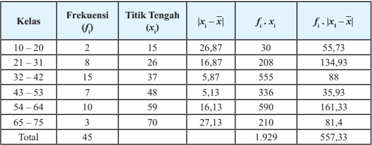

Tabel ini menunjukkan distribusi frekuensi untuk kelas umur tertentu, dengan interval kelas 10-20 sampai 65-75 tahun. Kolom pertama berisi kelas, kemudian frekuensi (f), titik tengah (x), jarak absolut antara titik tengah dan rata-rata (|x̄ - x|), frekuensi faktor (f_i), dan hasil kali frekuensi faktor dengan jarak absolut (f_i * |x̄ - x|). Data menunjukkan bahwa kelas 32-42 memiliki frekuensi tertinggi yaitu 15 orang, sedangkan kelas 65-75 memiliki frekuensi terendah yaitu 7 orang. Pola penting lainnya adalah bahwa kelas dengan frekuensi tertinggi memiliki jarak absolut antara titik tengah dan rata-rata yang paling kecil, sementara kelas dengan frekuensi terendah memiliki jarak absolut yang paling besar.

### Alternatif Jawaban

/g3 /g54/g72/g69/g72/g79/g88/g80/g3 /g80/g72/g81/g71/g68/g83/g68/g87/g78/g68/g81/g3 /g78/g82/g79/g82/g80/g3 /g78/g72/g72/g80/g83/g68/g87/g15/g3 /g85/g68/g87/g68/g16/g85/g68/g87/g68/g3 /g71/g68/g85/g76/g3 /g71/g76/g86/g87/g85/g76/g69/g88/g86/g76/g3 /g73/g85/g72/g78/g88/g72/g81/g86/g76/g3 /g87/g72/g85/g86/g72/g69/g88/g87/g3 /g75/g68/g85/g88/g86/g3 /g71/g76/g75/g76/g87/g88/g81/g74/g3 /g87/g72/g85/g79/g72/g69/g76/g75/g3 /g71/g68/g75/g88/g79/g88/g17/g3 /g39/g72/g81/g74/g68/g81/g3 /g80/g72/g81/g74/g74/g88/g81/g68/g78/g68/g81/g3 /g85/g88/g80/g88/g86/g3 /g92/g68/g81/g74/g3 /g71/g76/g78/g72/g87/g68/g75/g88/g76/g3 /g86/g72/g69/g72/g79/g88/g80/g81/g92/g68/g15/g3 /g85/g68/g87/g68/g16/g85/g68/g87/g68/g3 /g71/g76/g86/g87/g85/g76/g69/g88/g86/g76/g3 /g73/g85/g72/g78/g88/g72/g81/g86/g76/g3 /g87/g72/g85/g86/g72/g69/g88/g87/g3 /g68/g71/g68/g79/g68/g75/g3 /g23/g21/g15/g27/g26/g15/g3 /g92/g68/g76/g87/g88/g3 /g71/g76/g71/g68/g83/g68/g87/g78/g68/g81/g3 /g71/g68/g85/g76/g3 /g87/g82/g87/g68/g79/g3 /g78/g82/g79/g82/g80/g3 /g78/g72/g79/g76/g80/g68/g3 /g71/g76/g69/g68/g74/g76/g3 /g71/g72/g81/g74/g68/g81/g3 /g87/g82/g87/g68/g79/g3 /g78/g82/g79/g82/g80/g3 /g73/g85/g72/g78/g88/g72/g81/g86/g76/g17/g3 /g45/g76/g78/g68/g3 /g87/g82/g87/g68/g79/g3 /g78/g82/g79/g82/g80/g3 /g78/g72/g79/g76/g80/g68/g3 /g71/g76/g69/g68/g74/g76/g3 /g71/g72/g81/g74/g68/g81/g3 total frekuensi maka hasilnya adalah , 45 557 33 /g3/g32/g20/g21/g15/g22/g27/g24/g17/g3/g51/g72/g85/g75/g68/g87/g76/g78/g68/g81/g3/g69/g68/g75/g90/g68/g3/g75/g68/g86/g76/g79/g3/g76/g81/g76/g3/g86/g72/g86/g88/g68/g76/g3 /g71/g72/g81/g74/g68/g81/g3 /g76/g81/g73/g82/g85/g80/g68/g86/g76/g3 /g86/g76/g80/g83/g68/g81/g74/g68/g81/g3 /g85/g68/g87/g68/g16/g85/g68/g87/g68/g3 /g92/g68/g81/g74/g3 /g71/g76/g69/g72/g85/g76/g78/g68/g81/g3 /g83/g68/g71/g68/g3 Contoh  2.15 /g17/g3 /g39/g72/g81/g74/g68/g81/g3 /g71/g72/g80/g76/g78/g76/g68/g81/g3/g85/g88/g80/g88/g86/g3/g86/g76/g80/g83/g68/g81/g74/g68/g81/g3/g85/g68/g87/g68/g16/g85/g68/g87/g68/g3/g88/g81/g87/g88/g78/g3/g71/g68/g87/g68/g3/g69/g72/g85/g78/g72/g79/g82/g80/g83/g82/g78/g3/g68/g71/g68/g79/g68/g75

``

dengan

SR /g3

/g29/g3/g54/g76/g80/g83/g68/g81/g74/g68/g81/g3/g85/g68/g87/g68/g16/g85/g68/g87/g68

f i /g3

/g29/g3/g73/g85/g72/g78/g88/g72/g81/g86/g76/g3/g78/g72/g79/g68/g86/g3/g78/g72/g16/g76

x /g177 /g3

/g29/g3/g85/g68/g87/g68/g16/g85/g68/g87/g68/g3/g71/g68/g87/g68/g3/g69/g72/g85/g78/g72/g79/g82/g80/g83/g82/g78

x i /g3

/g29/g3/g87/g76/g87/g76/g78/g3/g87/g72/g81/g74/g68/g75/g3/g78/g72/g79/g68/g86/g3/g78/g72/g16/g76

### Kegiatan 2.2.2.2 Simpangan Baku dan Ragam

- /g135/g3 /g42/g88/g85/g88/g3 /g80/g72/g81/g74/g68/g77/g68/g78/g3 /g86/g76/g86/g90/g68/g3 /g88/g81/g87/g88/g78/g3 /g80/g72/g79/g72/g81/g74/g78/g68/g83/g76/g3 /g87/g68/g69/g72/g79/g3 /g83/g68/g71/g68/g3 /g78/g72/g74/g76/g68/g87/g68/g81/g3 /g22/g17/g22/g17/g21/g3 /g54/g76/g80/g83/g68/g81/g74/g68/g81/g3 Baku dan Ragam di buku siswa untuk mengetahui lebih lanjut rumus simpangan baku dan ragam data berkelompok.
- /g135/g3 /g37/g72/g85/g71/g68/g86/g68/g85/g78/g68/g81/g3 /g87/g68/g69/g72/g79/g3 /g92/g68/g81/g74/g3 /g86/g88/g71/g68/g75/g3 /g71/g76/g79/g72/g81/g74/g78/g68/g83/g76/g15/g3 /g86/g76/g86/g90/g68/g3 /g71/g76/g80/g76/g81/g87/g68/g3 /g80/g72/g81/g74/g75/g76/g87/g88/g81/g74/g3 /g69/g72/g69/g72/g85/g68/g83/g68/g3 rumus yang disediakan dan siswa diminta untuk memilih manakah rumus ragam /g92/g68/g81/g74/g3 /g86/g72/g86/g88/g68/g76/g3 /g71/g72/g81/g74/g68/g81/g3 /g38/g82/g81/g87/g82/g75/g3 /g21/g17/g20/g24/g17/g3 /g45/g76/g78/g68/g3 /g85/g88/g80/g88/g86/g3 /g85/g68/g74/g68/g80/g3 /g86/g88/g71/g68/g75/g3 /g71/g68/g83/g68/g87/g3 /g71/g76/g71/g88/g74/g68/g15/g3 /g80/g68/g78/g68/g3 rumus simpangan baku dapat diperoleh dari rumus ragam tersebut.

 

---
## 📄 Halaman 61

- /g135/g3 /g54/g76/g86/g90/g68/g3 /g77/g88/g74/g68/g3 /g71/g76/g80/g76/g81/g87/g68/g3 /g88/g81/g87/g88/g78/g3 /g80/g72/g80/g69/g88/g68/g87/g3 /g87/g68/g69/g72/g79/g3 /g92/g68/g81/g74/g3 /g86/g68/g80/g68/g3 /g88/g81/g87/g88/g78/g3 /g38/g82/g81/g87/g82/g75/g3 /g21/g17/g20/g25/g3 /g71/g68/g81/g3 /g38/g82/g81/g87/g82/g75/g3 /g21/g17/g20/g26/g3 /g71/g68/g81/g3 /g80/g72/g81/g74/g75/g76/g87/g88/g81/g74/g3 /g85/g68/g74/g68/g80/g3 /g71/g68/g81/g3 /g86/g76/g80/g83/g68/g81/g74/g68/g81/g3 /g69/g68/g78/g88/g3 /g80/g68/g86/g76/g81/g74/g16/g80/g68/g86/g76/g81/g74/g3 /g71/g68/g87/g68/g3 /g69/g72/g85/g78/g72/g79/g82/g80/g83/g82/g78/g17/g3/g43/g68/g86/g76/g79/g3/g92/g68/g81/g74/g3/g71/g76/g71/g68/g83/g68/g87/g78/g68/g81/g3/g71/g76/g70/g82/g70/g82/g78/g78/g68/g81/g3/g71/g72/g81/g74/g68/g81/g3/g86/g76/g80/g83/g68/g81/g74/g68/g81/g3/g69/g68/g78/g88/g3/g92/g68/g81/g74/g3 /g71/g76/g86/g72/g71/g76/g68/g78/g68/g81/g3/g83/g68/g71/g68/g3/g78/g72/g71/g88/g68/g3/g70/g82/g81/g87/g82/g75/g3/g87/g72/g85/g86/g72/g69/g88/g87/g17

---
**📊 Tabel**

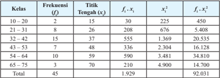

Tabel ini menunjukkan data frekuensi kelas dan titik tengah untuk setiap kelas dalam suatu distribusi frekuensi. Kolom pertama berisi kelas, yang diurutkan dari 10-20 hingga 65-75. Kolom kedua berisi frekuensi (f), yang menunjukkan jumlah data dalam setiap kelas. Kolom ketiga berisi titik tengah (x), yang merupakan rata-rata dari nilai-nilai dalam setiap kelas. Kolom keempat berisi hasil perkalian frekuensi dengan titik tengah (f·x), yang menunjukkan jumlah total nilai dalam setiap kelas. Kolom kelima berisi hasil kuadrat frekuensi (f·x) yang dikurangi dari hasil kuadrat titik tengah (x²), yang menunjukkan perbedaan antara jumlah total nilai dan jumlah total nilai yang seharusnya jika distribusi tersebut ideal. Kolom keenam berisi hasil kuadrat frekuensi yang dikurangi dari hasil kuadrat titik tengah, yang menunjukkan perbedaan antara jumlah total nilai dan jumlah total nilai yang seharusnya jika distribusi tersebut ideal. Kolom ketujuh berisi hasil kuadrat frekuensi yang dikurangi dari hasil kuadrat titik tengah, yang menunjukkan perbedaan antara jumlah total nilai dan jumlah total nilai yang seharusnya jika distribusi tersebut ideal. Kolom kesembilan berisi hasil kuadrat frekuensi yang dikurangi dari hasil kuadrat titik tengah, yang menunjukkan perbedaan antara jumlah total nilai dan jumlah total nilai yang seharusnya jika distribusi tersebut ideal. Kolom kesepuluh berisi hasil kuadrat frekuensi yang dikurangi dari hasil kuadrat titik tengah, yang menunjukkan perbedaan antara jumlah total nilai dan jumlah total nilai yang seharusnya jika distribusi tersebut ideal. Kolom kesembilan berisi hasil kuadrat frekuensi yang dikurangi dari hasil kuadrat titik tengah, yang menunjukkan perbedaan antara jumlah total nilai dan jumlah total nilai yang seharusnya jika distribusi tersebut ideal. Kolom kesepuluh berisi hasil kuadrat frekuensi yang dikurangi dari hasil kuadrat tit

### Alternatif Jawaban

Berdasarkan tabel di atas, kita dapat memperoleh

``

``

``

``

``

Berdasarkan informasi pada Contoh 2.15 , ragam yang diberikan pada Contoh 2.15 adalah 212,3 sehingga rumus ragam untuk data berkelompok adalah

``

Akibatnya simpangan baku data berkelompok adalah

``

dengan

s 2

: ragam

s

: simpangan baku

n

: jumlah frekuensi keseluruhan

 

---
## 📄 Halaman 62

### Mengomunikasikan

- /g135/g3 /g42/g88/g85/g88/g3 /g80/g72/g80/g76/g81/g87/g68/g3 /g69/g72/g69/g72/g85/g68/g83/g68/g3 /g86/g76/g86/g90/g68/g18/g78/g72/g79/g82/g80/g83/g82/g78/g3 /g88/g81/g87/g88/g78/g3 /g80/g72/g80/g83/g85/g72/g86/g72/g81/g87/g68/g86/g76/g78/g68/g81/g3 /g69/g68/g74/g68/g76/g80/g68/g81/g68/g3 menentukan ukuran penyebaran data berkelompok sesuai dengan hasil /g71/g88/g74/g68/g68/g81/g81/g92/g68/g17/g3/g54/g76/g86/g90/g68/g3/g68/g87/g68/g88/g3/g78/g72/g79/g82/g80/g83/g82/g78/g3/g79/g68/g76/g81/g81/g92/g68/g3/g80/g72/g80/g69/g72/g85/g76/g78/g68/g81/g3/g87/g68/g81/g74/g74/g68/g83/g68/g81/g3/g71/g68/g81/g3/g78/g82/g80/g72/g81/g87/g68/g85/g3 sehingga terjadi diskusi kelas dan mendapatkan kesimpulan akhir.

### Kesimpulan yang diharapkan

/g3 /g56/g78/g88/g85/g68/g81/g3 /g83/g72/g81/g92/g72/g69/g68/g85/g68/g81/g3 /g71/g68/g87/g68/g3 /g92/g68/g81/g74/g3 /g80/g72/g79/g76/g83/g88/g87/g76/g3 /g86/g76/g80/g83/g68/g81/g74/g68/g81/g3 /g85/g68/g87/g68/g16/g85/g68/g87/g68/g15/g3 /g86/g76/g80/g83/g68/g81/g74/g68/g81/g3 /g69/g68/g78/g88/g15/g3 /g71/g68/g81/g3 /g85/g68/g74/g68/g80/g3 /g80/g72/g81/g74/g88/g78/g88/g85/g3 /g86/g72/g69/g72/g85/g68/g83/g68/g3 /g77/g68/g88/g75/g3 /g71/g68/g87/g68/g3 /g80/g72/g81/g92/g72/g69/g68/g85/g3 /g87/g72/g85/g75/g68/g71/g68/g83/g3 /g83/g88/g86/g68/g87/g3 /g71/g68/g87/g68/g3 /g11/g85/g68/g87/g68/g16/g85/g68/g87/g68/g12/g17/g3 /g54/g76/g80/g83/g68/g81/g74/g68/g81/g3/g85/g68/g87/g68/g16/g85/g68/g87/g68/g3/g80/g72/g85/g88/g83/g68/g78/g68/g81/g3/g88/g78/g88/g85/g68/g81/g3/g83/g72/g81/g92/g76/g80/g83/g68/g81/g74/g68/g81/g3/g71/g68/g87/g68/g3/g87/g72/g85/g75/g68/g71/g68/g83/g68/g87/g3/g85/g68/g87/g68/g16/g85/g68/g87/g68/g3/g75/g76/g87/g88/g81/g74/g17/g3 /g54/g76/g80/g83/g68/g81/g74/g81/g3/g85/g68/g87/g68/g16/g85/g68/g87/g68/g3/g71/g68/g87/g68/g3/g69/g72/g85/g78/g72/g79/g82/g80/g83/g82/g78/g3/g71/g68/g83/g68/g87/g3/g71/g76/g87/g72/g81/g87/g88/g78/g68/g81/g3/g80/g72/g81/g74/g74/g88/g81/g68/g78/g68/g81/g3/g85/g88/g80/g88/g86/g3/g69/g72/g85/g76/g78/g88/g87

``

.

/g3 /g53/g68/g74/g68/g80/g3 /g80/g72/g85/g88/g83/g68/g78/g68/g81/g3 /g85/g68/g87/g68/g16/g85/g68/g87/g68/g3 /g78/g88/g68/g71/g85/g68/g87/g3 /g77/g68/g85/g68/g78/g3 /g86/g72/g87/g76/g68/g83/g3 /g71/g68/g87/g68/g3 /g87/g72/g85/g75/g68/g71/g68/g83/g3 /g85/g68/g87/g68/g16/g85/g68/g87/g68/g17/g3 /g45/g76/g78/g68/g3 /g86/g76/g80/g83/g68/g81/g74/g68/g81/g3 /g85/g68/g87/g68/g16/g85/g68/g87/g68/g3 /g87/g76/g71/g68/g78/g3 /g80/g72/g80/g83/g72/g85/g75/g68/g87/g76/g78/g68/g81/g3 /g87/g68/g81/g71/g68/g16/g87/g68/g81/g71/g68/g3 /g83/g72/g81/g92/g76/g80/g83/g68/g81/g74/g68/g81/g3 /g92/g68/g76/g87/g88/g3 /g87/g68/g81/g71/g68/g3 /g81/g72/g74/g68/g87/g76/g73/g3 atau positif. Ragam data berkelompok ditentukan oleh

``

/g3 /g54/g76/g80/g83/g68/g81/g74/g68/g81/g3 /g69/g68/g78/g88/g3 /g80/g72/g85/g88/g83/g68/g78/g68/g81/g3 /g68/g78/g68/g85/g3 /g71/g68/g85/g76/g3 /g85/g68/g74/g68/g80/g17/g3 /g53/g68/g74/g68/g80/g3 /g69/g72/g85/g68/g86/g68/g79/g3 /g71/g68/g85/g76/g3 /g78/g88/g68/g71/g85/g68/g87/g3 /g71/g68/g85/g76/g3 /g86/g72/g79/g76/g86/g76/g75/g3/g71/g68/g87/g68/g3/g71/g72/g81/g74/g68/g81/g3/g85/g68/g87/g68/g16/g85/g68/g87/g68/g3/g86/g72/g75/g76/g81/g74/g74/g68/g3/g86/g68/g87/g88/g68/g81/g3/g85/g68/g74/g68/g80/g3/g69/g72/g85/g69/g72/g71/g68/g3/g71/g72/g81/g74/g68/g81/g3/g86/g68/g87/g88/g68/g81/g3/g71/g68/g87/g68/g17/g3/g43/g68/g79/g3/g76/g81/g76/g3 yang mengakibatkan simpangan baku diperlukan agar satuan simpangan samadengan /g86/g68/g87/g88/g68/g81/g3/g71/g68/g87/g68/g17/g3/g54/g76/g80/g83/g68/g81/g74/g68/g81/g3/g69/g68/g78/g88/g3/g71/g68/g87/g68/g3/g69/g72/g85/g78/g72/g79/g82/g80/g83/g82/g78/g3/g71/g76/g87/g72/g81/g87/g88/g78/g68/g81/g3/g82/g79/g72/g75/g3/g85/g88/g80/g88/g86

``

### Kegiatan Penutup

- /g135/g3 /g42/g88/g85/g88/g3/g80/g72/g80/g69/g72/g85/g76/g78/g68/g81/g3/g78/g79/g68/g85/g76/g191/g78/g68/g86/g76/g3/g68/g87/g68/g88/g3/g83/g72/g81/g74/g88/g68/g87/g68/g81/g3/g80/g68/g87/g72/g85/g76/g3/g87/g72/g85/g75/g68/g71/g68/g83/g3/g88/g78/g88/g85/g68/g81/g3/g83/g72/g81/g92/g72/g69/g68/g85/g68/g81/g3 data berkelompok yang diperoleh siswa.

 

---
## 📄 Halaman 63

### Pembahasan Soal Latihan 2.2

- /g20/g17/g3 /g37/g72/g85/g76/g78/g88/g87/g3 /g80/g72/g85/g88/g83/g68/g78/g68/g81/g3 /g71/g68/g87/g68/g3 /g77/g88/g80/g79/g68/g75/g3 /g83/g85/g82/g87/g72/g76/g81/g3 /g92/g68/g81/g74/g3 /g87/g72/g85/g78/g68/g81/g71/g88/g81/g74/g3 /g71/g68/g79/g68/g80/g3 /g69/g72/g69/g72/g85/g68/g83/g68/g3 /g80/g68/g70/g68/g80/g3 /g80/g68/g78/g68/g81/g68/g81/g3/g70/g72/g83/g68/g87/g3/g86/g68/g77/g76/g3/g92/g68/g81/g74/g3/g87/g72/g85/g83/g76/g79/g76/g75/g17/g3

``

- /g68/g17/g3 /g43/g76/g87/g88/g81/g74/g79/g68/g75/g3/g85/g68/g87/g68/g16/g85/g68/g87/g68/g15/g3/g80/g72/g71/g76/g68/g81/g15/g3/g71/g68/g81/g3/g80/g82/g71/g88/g86/g3/g71/g68/g85/g76/g3/g71/g68/g87/g68/g3/g87/g72/g85/g86/g72/g69/g88/g87/g17
- /g69/g17/g3 /g37/g88/g68/g87/g79/g68/g75/g3/g71/g76/g86/g87/g85/g76/g69/g88/g86/g76/g3/g73/g85/g72/g78/g88/g72/g81/g86/g76/g3/g71/g68/g87/g68/g3/g87/g72/g85/g86/g72/g69/g88/g87/g3/g71/g72/g81/g74/g68/g81/g3/g24/g3/g78/g72/g79/g68/g86/g17
- /g70/g17/g3 /g43/g76/g87/g88/g81/g74/g3 /g85/g68/g87/g68/g16/g85/g68/g87/g68/g15/g3 /g80/g72/g71/g76/g68/g81/g15/g3 /g71/g68/g81/g3 /g80/g82/g71/g88/g86/g3 /g71/g68/g85/g76/g3 /g71/g68/g87/g68/g3 /g92/g68/g81/g74/g3 /g86/g88/g71/g68/g75/g3 /g71/g76/g78/g72/g79/g82/g80/g83/g82/g78/g3 /g78/g68/g81/g3 pada poin (b)
- /g71/g17/g3 /g37/g68/g81/g71/g76/g81/g74/g78/g68/g81/g3/g88/g78/g88/g85/g68/g81/g3/g83/g72/g80/g88/g86/g68/g87/g68/g81/g3/g83/g68/g71/g68/g3/g83/g82/g76/g81/g3/g11/g68/g12/g3/g71/g68/g81/g3/g11/g70/g12/g17/g3 /g36/g83/g68/g3/g92/g68/g81/g74/g3/g71/g68/g83/g68/g87/g3 /g36/g81/g71/g68/g3 simpulkan mengenai hasil tersebut?

### Alternatif Jawaban

- /g68/g17/g3 /g53/g68/g87/g68/g16/g85/g68/g87/g68/g3/g71/g68/g87/g68/g3/g87/g88/g81/g74/g74/g68/g79

``

dengan x /g177 t /g3/g68/g71/g68/g79/g68/g75/g3/g85/g68/g87/g68/g16/g85/g68/g87/g68/g3/g71/g68/g87/g68/g3/g87/g88/g81/g74/g74/g68/g79/g17

/g48/g72/g71/g76/g68/g81/g3/g71/g68/g87/g68/g3/g87/g88/g81/g74/g74/g68/g79/g3/g32/g3/g21/g25/g15/g24/g3/g71/g68/g81/g3/g80/g82/g71/g88/g86/g81/g92/g68/g3/g68/g71/g68/g79/g68/g75/g3/g21/g26/g17

- /g69/g17/g3 /g39/g76/g86/g87/g85/g76/g69/g88/g86/g76/g3/g73/g85/g72/g78/g88/g72/g81/g86/g76/g3/g71/g72/g81/g74/g68/g81/g3/g24/g3/g78/g72/g79/g68/g86
- /g70/g17/g3 /g48/g72/g81/g74/g74/g88/g81/g68/g78/g68/g81/g3/g71/g76/g86/g87/g85/g76/g69/g88/g86/g76/g3/g73/g85/g72/g78/g88/g72/g81/g86/g76/g3/g71/g76/g3/g68/g87/g68/g86/g3/g71/g68/g83/g68/g87/g3/g71/g76/g87/g72/g81/g87/g88/g78/g68/g81/g29

---
**📊 Tabel**

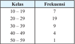

Tabel ini menunjukkan frekuensi kelas di mana siswa-siswa berada dalam kurang lebih 10 sampai 50 tahun. Topik utama tabel ini adalah distribusi umur siswa-siswa. Kolom pertama menunjukkan rentang umur (misalnya 10–19, 20–29, dll.), sedangkan kolom kedua menunjukkan frekuensi atau jumlah siswa yang berada dalam rentang tersebut. Dari tabel ini, kita bisa melihat bahwa sebagian besar siswa berada di rentang umur 10–29 tahun, dengan frekuensi tertinggi sekitar 19 orang. Sementara itu, sejumlah siswa berada di rentang umur 30–39 tahun, dengan frekuensi 9 orang. Selain itu, ada juga beberapa siswa yang berada di rentang umur 40–49 tahun dan 50–59 tahun, masing-masing dengan frekuensi 4 dan 1 orang. Ini menunjukkan bahwa umur rata-rata siswa dalam rentang 10–29 tahun, sementara siswa yang lebih tua memiliki frekuensi yang lebih rendah.

/g53/g68/g87/g68/g16/g85/g68/g87/g68

``

 

---
## 📄 Halaman 64

Median

``

Modus

``

- /g71/g17/g3 /g56/g78/g88/g85/g68/g81/g3/g83/g72/g80/g88/g86/g68/g87/g68/g81/g3/g92/g68/g81/g74/g3/g71/g76/g75/g76/g87/g88/g81/g74/g3/g71/g68/g85/g76/g3/g71/g76/g86/g87/g85/g76/g69/g88/g86/g76/g3/g73/g85/g72/g78/g88/g72/g81/g86/g76/g3/g75/g68/g86/g76/g79/g81/g92/g68/g3/g69/g72/g85/g69/g72/g71/g68/g3 dengan ukuran pemusatan yang dihitung dari data mentah atau data yang /g69/g72/g79/g88/g80/g3 /g71/g76/g78/g72/g79/g82/g80/g83/g82/g78/g78/g68/g81/g17/g3 /g58 /g68/g79/g68/g88/g83/g88/g81/g3 /g75/g68/g86/g76/g79/g81/g92/g68/g3 /g69/g72/g85/g69/g72/g71/g68/g15/g3 /g87/g72/g87/g68/g83/g76/g3 /g88/g78/g88/g85/g68/g81/g3 /g83/g72/g80/g88/g86/g68/g87/g68/g81/g3 data berkelompok mendekati ukuran pemusatan data tunggal.
- /g21/g17/g3 /g37/g72/g85/g76/g78/g88/g87/g3 /g80/g72/g85/g88/g83/g68/g78/g68/g81/g3 /g71/g76/g86/g87/g85/g76/g69/g88/g86/g76/g3 /g73/g85/g72/g78/g88/g72/g81/g86/g76/g3 /g83/g72/g85/g86/g72/g81/g87/g68/g86/g72/g3 /g83/g72/g81/g71/g88/g71/g88/g78/g3 /g88/g86/g76/g68/g3 /g71/g76/g3 /g69/g68/g90/g68/g75/g3 /g21/g24/g3 tahun yang menyelesaikan studi sarjananya selama 4 tahun atau lebih di beberapa kota besar di Indonesia. Tentukan ukuran pemusatan data berkelompok tersebut.

---
**📊 Tabel**

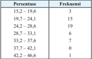

Tabel ini menunjukkan distribusi frekuensi berdasarkan persentase untuk beberapa interval tertentu. Topik utama tabel adalah distribusi frekuensi berdasarkan interval persentase. Kolom pertama menunjukkan interval persentase, sedangkan kolom kedua menunjukkan frekuensi. Data penting yang terlihat adalah bahwa interval 19,7-24,1 memiliki frekuensi tertinggi yaitu 15, sedangkan interval 42,2-46,6 hanya memiliki satu kali frekuensi. Pola umumnya menunjukkan bahwa interval dengan persentase tertinggi adalah antara 19,7-24,1 dan interval dengan persentase terendah adalah antara 42,2-46,6.

/g36/g79/g87/g72/g85/g81/g68/g87/g76/g73/g3/g45/g68/g90/g68/g69/g68/g81

/g53/g68/g87/g68/g16/g85/g68/g87/g68

``

/g53/g68/g87/g68/g16/g85/g68/g87/g68/g3 /g83/g72/g85/g86/g72/g81/g87/g68/g86/g72/g3 /g80/g68/g75/g68/g86/g76/g86/g90/g68/g3 /g92/g68/g81/g74/g3 /g80/g72/g81/g92/g72/g79/g72/g86/g68/g76/g78/g68/g81/g3 /g86/g87/g88/g71/g76/g3 /g86/g72/g79/g68/g80/g68/g3 /g23/g3 /g87/g68/g75/g88/g81/g3 /g68/g87/g68/g88/g3 /g79/g72/g69/g76/g75/g3 /g71/g76/g3 /g69/g72/g69/g72/g85/g68/g83/g68/g3/g78/g82/g87/g68/g3/g69/g72/g86/g68/g85/g3/g71/g76/g3/g44/g81/g71/g82/g81/g72/g86/g76/g68/g3/g68/g71/g68/g79/g68/g75/g3/g86/g72/g69/g72/g86/g68/g85/g3/g21/g25/g15/g25/g25/g8/g17

Median

``

Nilai tengah persentase mahasiswa yang menyelesaikan studi selama 4 tahun atau lebih /g71/g76/g3/g69/g72/g69/g72/g85/g68/g83/g68/g3/g78/g82/g87/g68/g3/g69/g72/g86/g68/g85/g3/g71/g76/g3/g44/g81/g71/g82/g81/g72/g86/g76/g68/g3/g68/g71/g68/g79/g68/g75/g3/g86/g72/g69/g72/g86/g68/g85/g3/g21/g24/g15/g28/g22/g8/g17/g3/g3/g3

 

---
## 📄 Halaman 65

Modus

``

/g46/g72/g69/g68/g81/g92/g68/g78/g68/g81/g3/g83/g72/g85/g86/g72/g81/g87/g68/g86/g72/g3/g80/g68/g75/g68/g86/g76/g86/g90/g68/g3/g92/g68/g81/g74/g3/g80/g72/g81/g92/g72/g79/g72/g86/g68/g76/g78/g68/g81/g3/g86/g87/g88/g71/g76/g3/g86/g72/g79/g68/g80/g68/g3/g23/g3/g87/g68/g75/g88/g81/g3/g68/g87/g68/g88/g3/g79/g72/g69/g76/g75/g3 /g71/g76/g3/g69/g72/g69/g72/g85/g68/g83/g68/g3/g78/g82/g87/g68/g3/g69/g72/g86/g68/g85/g3/g71/g76/g3/g44/g81/g71/g82/g81/g72/g86/g76/g68/g3/g68/g71/g68/g79/g68/g75/g3/g86/g72/g69/g72/g86/g68/g85/g3/g21/g24/g15/g21/g20/g8/g17

- /g22/g17/g3 /g45/g72/g79/g68/g86/g78/g68/g81/g3 /g88/g78/g88/g85/g68/g81/g3 /g83/g72/g80/g88/g86/g68/g87/g68/g81/g3 /g68/g83/g68/g3 /g92/g68/g81/g74/g3 /g71/g76/g74/g88/g81/g68/g78/g68/g81/g3 /g11/g85/g68/g87/g68/g16/g85/g68/g87/g68/g15/g3 /g80/g72/g71/g76/g68/g81/g15/g3 /g80/g82/g71/g88/g86/g12/g3 untuk situasi di bawah ini.
- /g68/g17/g3 /g54/g72/g87/g72/g81/g74/g68/g75/g3 /g71/g68/g85/g76/g3 /g77/g88/g80/g79/g68/g75/g3 /g83/g72/g78/g72/g85/g77/g68/g3 /g71/g76/g3 /g86/g88/g68/g87/g88/g3 /g83/g68/g69/g85/g76/g78/g3 /g71/g68/g83/g68/g87/g3 /g80/g72/g80/g83/g72/g85/g82/g79/g72/g75/g3 /g79/g72/g69/g76/g75/g3 /g71/g68/g85/g76/g3 Rp20.000,00 per jam dan setengahnya yang lain memperoleh kurang dari Rp20.000,00 per jam.
- /g69/g17/g3 /g53/g68/g87/g68/g16/g85/g68/g87/g68/g3 /g77/g88/g80/g79/g68/g75/g3 /g68/g81/g68/g78/g3 /g71/g68/g79/g68/g80/g3 /g86/g88/g68/g87/g88/g3 /g78/g72/g79/g88/g68/g85/g74/g68/g3 /g71/g76/g3 /g86/g88/g68/g87/g88/g3 /g78/g82/g80/g83/g79/g72/g78/g86/g3 /g83/g72/g85/g88/g80/g68/g75/g68/g81/g3 adalah 1,8.
- /g70/g17/g3 /g54/g72/g69/g68/g74/g76/g68/g81/g3 /g69/g72/g86/g68/g85/g3 /g82/g85/g68/g81/g74/g3 /g79/g72/g69/g76/g75/g3 /g80/g72/g80/g76/g79/g76/g75/g3 /g80/g82/g69/g76/g79/g3 /g90/g68/g85/g81/g68/g3 /g75/g76/g87/g68/g80/g3 /g71/g76/g69/g68/g81/g71/g76/g81/g74/g78/g68/g81/g3 /g71/g72/g81/g74/g68/g81/g3/g90/g68/g85/g81/g68/g16/g90/g68/g85/g81/g68/g3/g79/g68/g76/g81/g81/g92/g68/g17
- /g71/g17/g3 /g46/g72/g87/g68/g78/g88/g87/g68/g81/g3 /g92/g68/g81/g74/g3 /g83/g68/g79/g76/g81/g74/g3 /g88/g80/g88/g80/g3 /g87/g72/g85/g77/g68/g71/g76/g3 /g86/g68/g68/g87/g3 /g76/g81/g76/g3 /g68/g71/g68/g79/g68/g75/g3 /g78/g72/g87/g68/g78/g88/g87/g68/g81/g3 /g69/g72/g85/g69/g76/g70/g68/g85/g68/g3 /g71/g76/g3 depan umum.
- /g72/g17/g3 /g53/g68/g87/g68/g16/g85/g68/g87/g68/g3/g88/g86/g76/g68/g3/g71/g82/g86/g72/g81/g3/g83/g72/g85/g74/g88/g85/g88/g68/g81/g3/g87/g76/g81/g74/g74/g76/g3/g68/g71/g68/g79/g68/g75/g3/g23/g21/g15/g22/g3/g87/g68/g75/g88/g81/g17

### Alternatif Jawaban

- Median (nilai tengah)
- /g69/g17/g3 /g53/g68/g87/g68/g16/g85/g68/g87/g68
- /g70/g17/g3 /g48/g82/g71/g88/g86
- Modus
- /g72/g17/g3 /g53/g68/g87/g68/g16/g85/g68/g87/g68
- /g23/g17/g3 /g39/g72/g79/g68/g83/g68/g81/g3 /g83/g88/g79/g88/g75/g3 /g69/g68/g87/g72/g85/g68/g76/g3 /g80/g72/g85/g78/g3 /g87/g72/g85/g87/g72/g81/g87/g88/g3 /g71/g76/g83/g76/g79/g76/g75/g3 /g86/g72/g70/g68/g85/g68/g3 /g68/g70/g68/g78/g3 /g88/g81/g87/g88/g78/g3 /g71/g76/g72/g89/g68/g79/g88/g68/g86/g76/g3 /g71/g68/g92/g68/g3 /g75/g76/g71/g88/g83/g3 /g69/g68/g87/g72/g85/g68/g76/g3 /g71/g68/g79/g68/g80/g3 /g77/g68/g80/g17/g3 /g39/g76/g86/g87/g85/g76/g69/g88/g86/g76/g3 /g73/g85/g72/g78/g88/g72/g81/g86/g76/g3 /g92/g68/g81/g74/g3 /g71/g76/g83/g72/g85/g82/g79/g72/g75/g3 /g68/g71/g68/g79/g68/g75/g3 /g86/g72/g69/g68/g74/g68/g76/g3 berikut.
- /g68/g17/g3 /g55 /g72/g81/g87/g88/g78/g68/g81/g3/g86/g76/g80/g83/g68/g81/g74/g68/g81/g3/g85/g68/g87/g68/g16/g85/g68/g87/g68/g15/g3/g86/g76/g80/g83/g68/g81/g74/g68/g81/g3/g69/g68/g78/g88/g3/g71/g68/g81/g3/g85/g68/g74/g68/g80/g17
- /g69/g17/g3 /g39/g68/g83/g68/g87/g78/g68/g75/g3 /g71/g76/g86/g76/g80/g83/g88/g79/g78/g68/g81/g3 /g69/g68/g75/g90/g68/g3 /g71/g68/g92/g68/g3 /g75/g76/g71/g88/g83/g3 /g69/g68/g87/g72/g85/g68/g76/g3 /g80/g72/g85/g78/g3 /g87/g72/g85/g87/g72/g81/g87/g88/g3 /g87/g72/g85/g86/g72/g69/g88/g87/g3 /g78/g82/g81/g86/g76/g86/g87/g72/g81/g34/g3/g45/g72/g79/g68/g86/g78/g68/g81/g17

---
**📊 Tabel**

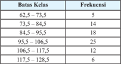

Tabel ini menunjukkan distribusi frekuensi kelas untuk rentang nilai tertentu. Topik utama tabel adalah distribusi frekuensi kelas, yang mencakup 8 kelas dengan batas-batas kelas yang berbeda. Kolom pertama menunjukkan batas-batas kelas, sedangkan kolom kedua menunjukkan frekuensi setiap kelas. Data penting yang terlihat adalah bahwa kelas dengan batas 62,5 hingga 73,5 memiliki frekuensi paling rendah (5), sementara kelas dengan batas 95,5 hingga 106,5 memiliki frekuensi paling tinggi (25). Ini menunjukkan bahwa sebagian besar data terdistribusi di antara kelas 95,5 hingga 106,5, sementara kelas lainnya memiliki frekuensi yang lebih rendah.

 

---
## 📄 Halaman 66

### Alternatif Jawaban

- /g68/g17/g3 /g54/g76/g80/g83/g68/g81/g74/g68/g81/g3/g85/g68/g87/g68/g16/g85/g68/g87/g68

``

Ragam

``

/g54/g76/g80/g83/g68/g81/g74/g68/g81/g3/g69/g68/g78/g88

``

- /g69/g17/g3 /g39/g68/g92/g68/g3/g75/g76/g71/g88/g83/g3/g69/g68/g87/g72/g85/g68/g76/g3/g80/g72/g85/g78/g3/g87/g72/g85/g87/g72/g81/g87/g88/g3/g87/g72/g85/g86/g72/g69/g88/g87/g3/g87/g76/g71/g68/g78/g3/g78/g82/g81/g86/g76/g86/g87/g72/g81/g3/g78/g68/g85/g72/g81/g68/g3/g86/g76/g80/g83/g68/g81/g74/g68/g81/g3 /g69/g68/g78/g88/g3/g80/g68/g88/g83/g88/g81/g3/g86/g76/g80/g83/g68/g81/g74/g68/g81/g3/g85/g68/g87/g68/g16/g85/g68/g87/g68/g81/g92/g68/g3/g87/g72/g85/g79/g68/g79/g88/g3/g69/g72/g86/g68/g85 /g17
- /g24/g17/g3 /g39/g76/g86/g87/g85/g76/g69/g88/g86/g76/g3 /g73/g85/g72/g78/g88/g72/g81/g86/g76/g3 /g71/g76/g3 /g69/g68/g90/g68/g75/g3 /g76/g81/g76/g3 /g80/g72/g85/g88/g83/g68/g78/g68/g81/g3 /g83/g72/g85/g86/g72/g81/g87/g68/g86/g72/g3 /g86/g76/g86/g90/g68/g3 /g86/g72/g78/g82/g79/g68/g75/g3 /g71/g68/g86/g68/g85/g3 /g78/g72/g79/g68/g86/g3/g21/g3/g92/g68/g81/g74/g3/g80/g72/g80/g83/g88/g81/g92/g68/g76/g3/g78/g72/g80/g68/g80/g83/g88/g68/g81/g3/g69/g68/g70/g68/g3/g71/g68/g81/g3/g78/g72/g80/g68/g80/g83/g88/g68/g81/g3/g80/g68/g87/g72/g80/g68/g87/g76/g78/g68/g3/g71/g76/g3/g68/g87/g68/g86/g3 /g69/g68/g87/g68/g86/g3 /g92/g68/g81/g74/g3 /g86/g88/g71/g68/g75/g3 /g71/g76/g87/g72/g81/g87/g88/g78/g68/g81/g3 /g71/g76/g3 /g24/g19/g3 /g78/g82/g87/g68/g3 /g69/g72/g86/g68/g85/g3 /g71/g76/g3 /g44/g81/g71/g82/g81/g72/g86/g76/g68/g17/g3 /g55 /g72/g81/g87/g88/g78/g68/g81/g3 /g88/g78/g88/g85/g68/g81/g3 penyebaran dari kedua disribusi frekuensi berikut dan bandingkan hasilnya.

---
**📊 Tabel**

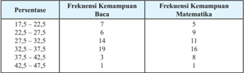

Tabel ini menunjukkan frekuensi kemampuan membaca dan matematika di berbagai interval persentase. Topik utama tabel adalah kemampuan membaca dan matematika dalam berbagai interval persentase. Kolom pertama menunjukkan interval persentase, sedangkan kolom kedua dan ketiga menunjukkan frekuensi kemampuan membaca dan matematika masing-masing. Data penting yang terlihat adalah bahwa sebagian besar siswa memiliki kemampuan membaca antara 27,5% hingga 32,5%, sementara kemampuan matematika lebih tinggi pada interval 32,5% hingga 37,5%. Ini menunjukkan bahwa banyak siswa memiliki kemampuan membaca yang baik namun masih perlu peningkatan dalam kemampuan matematika.

### Alternatif Jawaban

/g46/g72/g80/g68/g80/g83/g88/g68/g81/g3/g37/g68/g70/g68

/g54/g76/g80/g83/g68/g81/g74/g68/g81/g3/g85/g68/g87/g68/g16/g85/g68/g87/g68

``

 

---
## 📄 Halaman 67

Ragam

``

/g54/g76/g80/g83/g68/g81/g74/g68/g81/g3/g69/g68/g78/g88

``

/g46/g72/g80/g68/g80/g83/g88/g68/g81/g3/g48/g68/g87/g72/g80/g68/g87/g76/g78/g68

/g54/g76/g80/g83/g68/g81/g74/g68/g81/g3/g85/g68/g87/g68/g16/g85/g68/g87/g68

``

Ragam

``

/g54/g76/g80/g83/g68/g81/g74/g68/g81/g3/g69/g68/g78/g88

``

Persentase siswa kelas 2 yang mempunyai kemampuan matematika di atas batas yang /g86/g88/g71/g68/g75/g3 /g71/g76/g87/g72/g81/g87/g88/g78/g68/g81/g3 /g79/g72/g69/g76/g75/g3 /g80/g72/g81/g92/g72/g69/g68/g85/g3 /g71/g68/g85/g76/g83/g68/g71/g68/g3 /g83/g72/g85/g86/g72/g81/g87/g68/g86/g72/g3 /g86/g76/g86/g90/g68/g3 /g71/g72/g81/g74/g68/g81/g3 /g78/g72/g80/g83/g88/g68/g81/g3 /g69/g68/g70/g68/g3 /g71/g76/g3 /g68/g87/g68/g86/g3 /g69/g68/g87/g68/g86/g3 /g92/g68/g81/g74/g3 /g86/g88/g71/g68/g75/g3 /g71/g76/g87/g72/g81/g87/g88/g78/g68/g81/g17/g3 /g43/g68/g79/g3 /g76/g81/g76/g3 /g71/g68/g83/g68/g87/g3 /g71/g76/g79/g76/g75/g68/g87/g3 /g71/g68/g85/g76/g3 /g85/g68/g74/g68/g80/g15/g3 /g86/g76/g80/g83/g68/g81/g74/g68/g81/g3 /g85/g68/g87/g68/g16/g85/g68/g87/g68/g3 dan simpangan baku persentase kemampuan matematika lebih besar daripada persentase /g78/g72/g80/g68/g80/g83/g88/g68/g81/g3/g69/g68/g70/g68/g17

### Pembahasan Uji Kompetensi 3

- /g20/g17/g3 /g37/g72/g85/g76/g78/g88/g87/g3 /g80/g72/g85/g88/g83/g68/g78/g68/g81/g3 /g71/g68/g73/g87/g68/g85/g3 /g69/g72/g85/g68/g87/g3 /g69/g68/g71/g68/g81/g3 /g24/g19/g3 /g83/g72/g80/g68/g76/g81/g3 /g87/g82/g83/g3 /g49/g37/g36 /g3 /g71/g68/g79/g68/g80/g3 /g83/g82/g88/g81/g71/g17/g3 /g37/g88/g68/g87/g3 distribusi frekuensi dengan 8 kelas. Analisa hasil distribusi frekuensi mengenai /g81/g76/g79/g68/g76/g16/g81/g76/g79/g68/g76/g3 /g72/g78/g86/g87/g85/g76/g80/g15/g3 /g78/g72/g79/g68/g86/g3 /g87/g72/g85/g69/g68/g81/g92/g68/g78/g15/g3 /g78/g72/g79/g68/g86/g3 /g71/g72/g81/g74/g68/g81/g3 /g73/g85/g72/g78/g88/g72/g81/g86/g76/g3 /g83/g68/g79/g76/g81/g74/g3 /g86/g72/g71/g76/g78/g76/g87/g15/g3 /g71/g68/g81/g3 /g86/g72/g69/g68/g74/g68/g76/g81/g92/g68/g17/g3/g11/g20/g3/g83/g82/g88/g81/g71/g3/g32/g3/g19/g15/g23/g24/g22/g12

---
**📊 Tabel**

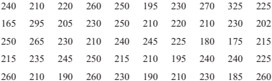

Tabel ini menunjukkan data statistik tentang hasil tes matematika untuk 20 siswa di sebuah sekolah. Topik utama tabel adalah distribusi skor tes matematika. Kolom pertama berisi nomor siswa, sedangkan kolom kedua hingga kelima berisi skor tes matematika yang diberikan kepada masing-masing siswa. Data penting yang terlihat adalah bahwa sebagian besar siswa mendapatkan skor antara 210-230, dengan beberapa siswa mendapatkan skor di bawah 200 dan di atas 250. Skor tertinggi adalah 255, sedangkan skor terendah adalah 180. Ini menunjukkan bahwa banyak siswa memiliki kemampuan matematika yang baik, namun masih ada yang kurang memahami materi tersebut.

 

---
## 📄 Halaman 68

### Alternatif Jawaban

/g49/g76/g79/g68/g76/g3/g87/g72/g85/g72/g81/g71/g68/g75/g3/g68/g71/g68/g79/g68/g75/g3/g20/g25/g24/g3/g71/g68/g81/g3/g81/g76/g79/g68/g76/g3/g87/g72/g85/g87/g76/g81/g74/g74/g76/g3/g68/g71/g68/g79/g68/g75/g3/g22/g21/g24/g15/g3/g86/g72/g75/g76/g81/g74/g74/g68/g3/g77/g68/g81/g74/g78/g68/g88/g68/g81/g81/g92/g68/g3/g68/g71/g68/g79/g68/g75/g3 /g20/g25/g19/g17/g3/g45/g76/g78/g68/g3/g76/g81/g74/g76/g81/g3/g71/g76/g69/g68/g74/g76/g3/g80/g72/g81/g77/g68/g71/g76/g3/g27/g3/g78/g72/g79/g68/g86/g3/g80/g68/g78/g68/g3/g83/g68/g81/g77/g68/g81/g74/g3/g78/g72/g79/g68/g86/g3/g68/g71/g68/g79/g68/g75/g3/g21/g19/g17/g3/g51/g72/g85/g75/g68/g87/g76/g78/g68/g81/g3/g69/g68/g75/g90/g68/g3 banyak  kelas  habis  membagi  jangkauan  (tanpa  sisa)  maka  dalam  hal  ini  kita  perlu menambah 1 kelas tambahan untuk mengakomodasi semua data yang diberikan.

/g39/g76/g86/g87/g85/g76/g69/g88/g86/g76/g3 /g73/g85/g72/g78/g88/g72/g81/g86/g76/g3 /g92/g68/g81/g74/g3 /g71/g76/g75/g68/g86/g76/g79/g78/g68/g81/g3 /g68/g71/g68/g79/g68/g75/g3 /g11/g87/g76/g87/g76/g78/g3 /g68/g90/g68/g79/g3 /g78/g72/g79/g68/g86/g3 /g83/g72/g85/g87/g68/g80/g68/g3 /g69/g82/g79/g72/g75/g3 /g69/g72/g85/g69/g72/g71/g68/g3 antara satu siswa dengan lainnya).

---
**📊 Tabel**

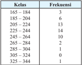

Tabel ini menunjukkan frekuensi kelas dalam sebuah distribusi frekuensi. Topik utama tabel adalah distribusi frekuensi kelas. Kolom pertama berisi kelas, sedangkan kolom kedua berisi frekuensi. Data penting yang terlihat adalah bahwa kelas 205-224 memiliki frekuensi tertinggi dengan 13 kali, kemudian kelas 225-244 dengan 14 kali, dan kelas 165-184 dengan 6 kali. Pola umumnya menunjukkan bahwa kelas dengan batas bawah 205 memiliki frekuensi yang lebih tinggi dibandingkan kelas lainnya.

/g51/g72/g80/g68/g76/g81/g3 /g49/g37/g36/g3 /g87/g72/g85/g69/g72/g85/g68/g87/g3 /g80/g72/g80/g83/g88/g81/g92/g68/g76/g3 /g69/g72/g85/g68/g87/g3 /g69/g68/g71/g68/g81/g3 /g22/g21/g24/g3 /g83/g82/g88/g81/g71/g3 /g86/g72/g71/g68/g81/g74/g78/g68/g81/g3 /g83/g72/g80/g68/g76/g81/g3 /g83/g68/g79/g76/g81/g74/g3 /g85/g76/g81/g74/g68/g81/g3/g80/g72/g80/g83/g88/g81/g92/g68/g76/g3/g69/g72/g85/g68/g87/g3/g69/g68/g71/g68/g81/g3/g20/g25/g24/g3/g83/g82/g88/g81/g71/g17/g3/g37/g72/g85/g71/g68/g86/g68/g85/g78/g68/g81/g3/g71/g76/g86/g87/g85/g76/g69/g88/g86/g76/g3/g73/g85/g72/g78/g88/g72/g81/g86/g76/g3/g71/g76/g3/g68/g87/g68/g86/g3/g78/g72/g79/g68/g86/g3 /g71/g72/g81/g74/g68/g81/g3/g73/g85/g72/g78/g88/g72/g81/g86/g76/g3 /g87/g72/g85/g69/g68/g81/g92/g68/g78/g3 /g69/g72/g85/g76/g86/g76/g78/g68/g81/g3 /g83/g72/g80/g68/g76/g81/g3 /g49/g37/g36 /g3 /g71/g72/g81/g74/g68/g81/g3/g69/g72/g85/g68/g87/g3 /g69/g68/g71/g68/g81/g3/g71/g76/g3 /g68/g81/g87/g68/g85/g68/g3 /g21/g21/g24/g3 /g177/g3 /g21/g23/g23/g3 /g83/g82/g88/g81/g71/g17/g3 /g39/g76/g3 /g79/g68/g76/g81/g3 /g83/g76/g75/g68/g78/g3 /g87/g76/g71/g68/g78/g3 /g68/g71/g68/g3 /g83/g72/g80/g68/g76/g81/g3 /g49/g37/g36 /g3 /g92/g68/g81/g74/g3 /g69/g72/g85/g68/g87/g3 /g69/g68/g71/g68/g81/g81/g92/g68/g3 /g71/g76/g3 /g68/g81/g87/g68/g85/g68/g3 /g22/g19/g24/g3 /g177/g3 /g22/g21/g23/g3 pound. Terdapat 1 pemain NBA yang mempunyai berat badan jauh lebih besar daripada /g92/g68/g81/g74/g3/g79/g68/g76/g81/g81/g92/g68/g3/g92/g68/g76/g87/g88/g3/g71/g72/g81/g74/g68/g81/g3/g69/g72/g85/g68/g87/g3/g69/g68/g71/g68/g81/g3/g22/g21/g24/g3/g83/g82/g88/g81/g71/g17

- /g21/g17/g3 /g37/g88/g68/g87/g3/g71/g76/g86/g87/g85/g76/g69/g88/g86/g76/g3/g73/g85/g72/g78/g88/g72/g81/g86/g76/g3/g71/g72/g81/g74/g68/g81/g3/g26/g3/g78/g72/g79/g68/g86/g3/g88/g81/g87/g88/g78/g3/g71/g68/g87/g68/g3/g81/g76/g79/g68/g76/g3/g87/g72/g86/g3/g55/g50/g40/g41/g47 /g3/g86/g76/g86/g90/g68/g3/g78/g72/g79/g68/g86/g3 /g69/g68/g75/g68/g86/g68/g3 /g86/g88/g68/g87/g88/g3 /g86/g72/g78/g82/g79/g68/g75/g3 /g92/g68/g81/g74/g3 /g71/g76/g69/g72/g85/g76/g78/g68/g81/g3 /g69/g72/g85/g76/g78/g88/g87/g3 /g76/g81/g76/g17/g3 /g46/g72/g80/g88/g71/g76/g68/g81/g3 /g77/g68/g90/g68/g69/g3 /g83/g72/g85/g87/g68/g81/g92/g68/g68/g81/g16 pertanyaan berikutnya.
- /g68/g17/g3 /g56/g81/g87/g88/g78/g3/g78/g72/g79/g68/g86/g3 /g71/g72/g81/g74/g68/g81/g3 /g73/g85/g72/g78/g88/g72/g81/g86/g76/g3 /g87/g72/g85/g69/g68/g81/g92/g68/g78/g15/g3 /g87/g72/g81/g87/g88/g78/g68/g81/g3 /g83/g72/g85/g86/g72/g81/g87/g68/g86/g72/g3 /g73/g85/g72/g78/g88/g72/g81/g86/g76/g81/g92/g68/g3 terhadap jumlah keseluruhan siswa.
- /g69/g17/g3 /g56/g81/g87/g88/g78/g3 /g78/g72/g79/g68/g86/g3 /g71/g72/g81/g74/g68/g81/g3 /g73/g85/g72/g78/g88/g72/g81/g86/g76/g3 /g83/g68/g79/g76/g81/g74/g3 /g86/g72/g71/g76/g78/g76/g87/g15/g3 /g87/g72/g81/g87/g88/g78/g68/g81/g3 /g83/g72/g85/g86/g72/g81/g87/g68/g86/g72/g3 frekuensinya terhadap jumlah keseluruhan siswa.

---
**📊 Tabel**

Tabel ini menunjukkan data statistik tentang jumlah orang yang berbeda usia di beberapa kota. Topik utama tabel adalah distribusi umur populasi di berbagai kota. Kolom pertama menunjukkan nama kota, sedangkan kolom kedua hingga kelima menunjukkan usia masing-masing kota. Data penting yang terlihat adalah bahwa kota-kota dengan populasi lebih besar memiliki jumlah orang berbeda usia yang lebih banyak, seperti Jakarta dengan 502 orang berusia 45 tahun dan 513 orang berusia 50 tahun. Sementara itu, kota-kota dengan populasi lebih kecil seperti Bandung hanya memiliki jumlah penduduk yang lebih sedikit.

 

---
## 📄 Halaman 69

- /g70/g17/g3 /g47/g68/g81/g77/g88/g87/g78/g68/g81/g3/g79/g68/g81/g74/g78/g68/g75/g3/g76/g81/g76/g3/g88/g81/g87/g88/g78/g3/g78/g72/g79/g68/g86/g3/g79/g68/g76/g81/g81/g92/g68/g17/g3/g37/g88/g68/g87/g3/g78/g82/g79/g82/g80/g3/g87/g68/g80/g69/g68/g75/g68/g81/g3/g71/g76/g3/g86/g72/g69/g72/g79/g68/g75/g3 kanan berisikan persentase setiap kelasnya.
- /g71/g17/g3 /g38/g72/g85/g76/g87/g68/g78/g68/g81/g3/g75/g68/g86/g76/g79/g3/g71/g76/g86/g87/g85/g76/g69/g88/g86/g76/g3/g73/g85/g72/g78/g88/g72/g81/g86/g76/g3/g92/g68/g81/g74/g3/g71/g76/g83/g72/g85/g82/g79/g72/g75
/g39/g76/g86/g87/g85/g76/g69/g88/g86/g76/g3/g73/g85/g72/g78/g88/g72/g81/g86/g76/g3/g92/g68/g81/g74/g3 /g36/g81/g71/g68/g3/g71/g68/g83/g68/g87/g78/g68/g81/g3/g71/g76/g86/g72/g69/g88/g87/g3/g71/g72/g81/g74/g68/g81/g3/g71/g76/g86/g87/g85/g76/g69/g88/g86/g76/g3/g73/g85/g72/g78/g88/g72/g81/g86/g76/g3/g85/g72/g79/g68/g87/g76/g73/g17

### Alternatif Jawaban

/g39/g76/g86/g87/g85/g76/g69/g88/g86/g76/g3 /g73/g85/g72/g78/g88/g72/g81/g86/g76/g3 /g92/g68/g81/g74/g3 /g71/g76/g71/g68/g83/g68/g87/g78/g68/g81/g3 /g68/g71/g68/g79/g68/g75/g3 /g11/g87/g76/g87/g76/g78/g3 /g68/g90/g68/g79/g3 /g78/g72/g79/g68/g86/g3 /g83/g72/g85/g87/g68/g80/g68/g3 /g69/g82/g79/g72/g75/g3 /g69/g72/g85/g69/g72/g71/g68/g3 asalkan dekat dan kurang dari nilai data terendah)

---
**📊 Tabel**

Tabel ini menunjukkan frekuensi kelas di berbagai rentang nilai. Topik utama tabel adalah distribusi frekuensi kelas. Kolom pertama berisi rentang nilai kelas, sedangkan kolom kedua berisi frekuensi untuk setiap rentang nilai tersebut. Data penting yang terlihat adalah bahwa rentang nilai 340-378 memiliki frekuensi tertinggi sebanyak 7 kali, sementara rentang nilai 524-552 memiliki frekuensi terendah sebanyak 5 kali. Ini menunjukkan bahwa nilai-nilai di rentang 340-378 lebih sering muncul dibandingkan dengan nilai-nilai di rentang lainnya.

- /g68/g17/g3 /g46/g72/g79/g68/g86/g3 /g23/g22/g26/g3 /g177/g3 /g23/g25/g24/g3 /g80/g72/g80/g83/g88/g81/g92/g68/g76/g3 /g73/g85/g72/g78/g88/g72/g81/g86/g76/g3 /g87/g72/g85/g69/g68/g81/g92/g68/g78/g3 /g92/g68/g76/g87/g88/g3 /g20/g19/g3 /g86/g72/g75/g76/g81/g74/g74/g68/g3 /g83/g72/g85/g86/g72/g81/g87/g68/g86/g72/g81/g92/g68/g3/g68/g71/g68/g79/g68/g75/g3/g21/g24/g8/g17
- /g69/g17/g3 /g46/g72/g79/g68/g86/g3/g71/g72/g81/g74/g68/g81/g3/g73/g85/g72/g78/g88/g72/g81/g86/g76/g3/g83/g68/g79/g76/g81/g74/g3/g86/g72/g71/g76/g78/g76/g87/g3/g68/g71/g68/g79/g68/g75/g3/g78/g72/g79/g68/g86/g3/g22/g24/g19/g3/g177/g3/g22/g26/g27/g3/g71/g68/g81/g3/g23/g19/g27/g3/g177/g3/g23/g22/g25/g3 /g71/g72/g81/g74/g68/g81/g3/g83/g72/g85/g86/g72/g81/g87/g68/g86/g72/g3/g80/g68/g86/g76/g81/g74/g16/g80/g68/g86/g76/g81/g74/g3/g24/g8/g17
/g70/g17/g3

---
**📊 Tabel**

Tabel ini menunjukkan frekuensi dan persentase siswa dalam berbagai kelas di sekolah. Topik utama tabel adalah distribusi umur siswa dalam kelas tertentu. Kolom pertama menunjukkan kelas, sedangkan kolom kedua menunjukkan frekuensi siswa dalam setiap kelas. Kolom ketiga menunjukkan persentase siswa dalam setiap kelas terhadap total siswa. Dari tabel ini, dapat dilihat bahwa kelas 340-378 memiliki persentase paling rendah (5%), sementara kelas 408-436 memiliki persentase tertinggi (25%). Pola umur siswa tampaknya tersebar merata dengan beberapa kelas memiliki frekuensi yang lebih tinggi dibandingkan kelas lainnya.

- /g71/g17/g3 /g39/g76/g86/g87/g85/g76/g69/g88/g86/g76/g3 /g73/g85/g72/g78/g88/g72/g81/g86/g76/g3 /g83/g82/g76/g81/g3 /g11/g70/g12/g3 /g80/g72/g81/g68/g80/g69/g68/g75/g78/g68/g81/g3 /g83/g72/g85/g86/g72/g81/g87/g68/g86/g72/g3 /g73/g85/g72/g78/g88/g72/g81/g86/g76/g3 /g80/g68/g86/g76/g81/g74/g16 masing kelas terhadap banyak data.
- /g22/g17/g3 /g54/g72/g85/g68/g87/g88/g86/g3 /g83/g72/g81/g71/g68/g73/g87/g68/g85/g3 /g86/g72/g79/g72/g78/g86/g76/g3 /g80/g68/g86/g88/g78/g3 /g83/g72/g85/g74/g88/g85/g88/g68/g81/g3 /g87/g76/g81/g74/g74/g76/g3 /g71/g76/g3 /g86/g88/g68/g87/g88/g3 /g88/g81/g76/g89/g72/g85/g86/g76/g87/g68/g86/g3 /g71/g76/g83/g76/g79/g76/g75/g3 /g86/g72/g70/g68/g85/g68/g3 /g68/g70/g68/g78/g3 /g86/g72/g75/g76/g81/g74/g74/g68/g3 /g71/g76/g71/g68/g83/g68/g87/g78/g68/g81/g3 /g71/g76/g86/g87/g85/g76/g69/g88/g86/g76/g3 /g73/g85/g72/g78/g88/g72/g81/g86/g76/g3 /g81/g76/g79/g68/g76/g3 /g87/g72/g86/g3 /g69/g72/g85/g76/g78/g88/g87/g3 /g76/g81/g76/g17/g3 /g37/g88/g68/g87/g79/g68/g75/g3 histogram, poligon frekuensi dan ogive untuk distribusi frekuensi ini.

 

---
## 📄 Halaman 70

---
**📊 Tabel**

Tabel ini menunjukkan frekuensi kelas yang berbeda dalam sebuah distribusi frekuensi. Topik utama tabel adalah distribusi frekuensi kelas yang diperoleh dari data yang diambil dari populasi. Kolom pertama menunjukkan kelas, sedangkan kolom kedua menunjukkan frekuensi untuk setiap kelas tersebut. Data penting yang terlihat adalah bahwa kelas 108-116 memiliki frekuensi tertinggi yaitu 40, sedangkan kelas 90-98 memiliki frekuensi terendah yaitu 6. Ini menunjukkan bahwa banyaknya data yang termasuk dalam kelas 108-116 lebih banyak dibandingkan dengan kelas lainnya.

/g51/g72/g81/g71/g68/g73/g87/g68/g85/g3 /g92/g68/g81/g74/g3 /g81/g76/g79/g68/g76/g81/g92/g68/g3 /g71/g76/g3 /g68/g87/g68/g86/g3 /g20/g19/g26/g3 /g87/g76/g71/g68/g78/g3 /g83/g72/g85/g79/g88/g3 /g76/g78/g88/g87/g3 /g71/g68/g79/g68/g80/g3 /g83/g85/g82/g74/g85/g68/g80/g3 /g80/g68/g87/g85/g76/g78/g88/g79/g68/g86/g76/g17/g3 /g39/g68/g79/g68/g80/g3 kelompok ini ada berapa pendaftar yang tidak perlu ikut dalam program matrikulasi?

### Alternatif Jawaban

### /g43/g76/g86/g87/g82/g74/g85/g68/g80

---
**🖼️ Gambar/Diagram**

> **Deskripsi Visual:** Gambar ini adalah diagram histogram yang menunjukkan distribusi nilai tes matematika Fergusporum Tinggi pada dua periode waktu, yaitu periode awal (P1) dan periode akhir (P2). Diagram ini terdiri dari empat interval nilai, masing-masing dengan jumlah siswa yang berbeda. Untuk periode awal (P1), interval 80-90 memiliki 5 siswa, interval 90-100 memiliki 10 siswa, interval 100-110 memiliki 15 siswa, dan interval 110-120 memiliki 5 siswa. Sedangkan untuk periode akhir (P2), interval 80-90 memiliki 6 siswa, interval 90-100 memiliki 12 siswa, interval 100-110 memiliki 10 siswa, dan interval 110-120 memiliki 6 siswa. Dari data ini, dapat disimpulkan bahwa ada peningkatan rata-rata nilai tes matematika Fergusporum Tinggi dari periode awal ke periode akhir.

### Poligon Frekuensi

---
**🖼️ Gambar/Diagram**

> **Deskripsi Visual:** Gambar ini adalah diagram yang menunjukkan hubungan antara nilai tes dengan skor masuk perguruan tinggi. Diagram ini berbentuk trapesium dan terdiri dari dua garis lurus yang menghubungkan titik-titik pada sumbu x dan y. Titik-titik tersebut menunjukkan beberapa data yang telah dikumpulkan, seperti nilai tes sebesar 96, 98, 100, 102, dan 104, serta skor masuk perguruan tinggi sebesar 5, 7, 8, 9, dan 10.

Elemen utama dalam gambar ini adalah garis lurus yang menghubungkan titik-titik data tersebut. Garis ini menunjukkan bahwa semakin tinggi nilai tes, semakin tinggi skor masuk perguruan tinggi. Ini menunjukkan hubungan positif antara nilai tes dan skor masuk perguruan tinggi.

Teks, angka, atau label penting yang terlihat dalam gambar ini meliputi nilai tes (96, 98, 100, 102, 104) dan skor masuk perguruan tinggi (5, 7, 8, 9, 10). Informasi kunci yang dapat diambil pembaca adalah bahwa ada hubungan positif antara nilai tes dan skor masuk perguruan tinggi, dan bahwa semakin tinggi nilai tes, semakin tinggi skor masuk perguruan tinggi.

 

---
## 📄 Halaman 71

---
**🖼️ Gambar/Diagram**

> **Deskripsi Visual:** Gambar ini adalah diagram yang menunjukkan hubungan antara nilai tes masuk perguruan tinggi dengan persentase kesuksesan. Diagram ini berbentuk parabola yang naik, menunjukkan bahwa semakin tinggi nilai tes masuk perguruan tinggi, semakin besar persentase kesuksesan. Di awal, ada kurva yang sangat pendek, menunjukkan bahwa hanya sedikit orang yang berhasil masuk perguruan tinggi dengan nilai tes masuk yang rendah. Namun, seiring meningkatnya nilai tes masuk, persentase kesuksesan juga meningkat signifikan. Ini menunjukkan bahwa nilai tes masuk memiliki peran penting dalam proses seleksi masuk perguruan tinggi. Label pada diagram mencantumkan nilai-nilai tes masuk dan persentase kesuksesan yang relevan. Teks dan angka penting yang terlihat dalam diagram ini adalah nilai-nilai tes masuk dan persentase kesuksesan yang diberikan untuk setiap nilai tes masuk. Informasi kunci yang dapat diambil pembaca adalah bahwa nilai tes masuk sangat penting dalam proses seleksi masuk perguruan tinggi dan semakin tinggi nilai tes masuk, semakin besar persentase kesuksesan.

/g39/g72/g81/g74/g68/g81/g3 /g80/g72/g79/g76/g75/g68/g87/g3 /g82/g74/g76/g89/g72/g3 /g71/g68/g83/g68/g87/g3 /g71/g76/g78/g72/g87/g68/g75/g88/g76/g3 /g69/g68/g75/g90/g68/g3 /g77/g88/g80/g79/g68/g75/g3 /g83/g72/g86/g72/g85/g87/g68/g3 /g87/g72/g86/g3 /g92/g68/g81/g74/g3 /g87/g76/g71/g68/g78/g3 /g79/g72/g69/g76/g75/g3 /g71/g68/g85/g76/g3 /g20/g19/g26/g3 /g71/g68/g81/g3/g75/g68/g85/g88/g86/g3/g80/g72/g81/g74/g76/g78/g88/g87/g76/g3/g80/g68/g87/g85/g76/g78/g88/g79/g68/g86/g76/g3/g86/g72/g69/g68/g81/g92/g68/g78/g3/g21/g25/g3/g83/g72/g86/g72/g85/g87/g68/g17

- Beberapa  kota  besar  di  Indonesia  yang  terpilih  diuji  kualitas  udaranya  dari /g83/g82/g79/g88/g86/g76/g17/g3/g37/g72/g85/g76/g78/g88/g87/g3/g80/g72/g85/g88/g83/g68/g78/g68/g81/g3/g71/g68/g87/g68/g3/g77/g88/g80/g79/g68/g75/g3/g75/g68/g85/g76/g3/g71/g76/g3/g80/g68/g81/g68/g3/g78/g82/g87/g68/g16/g78/g82/g87/g68/g3/g87/g72/g85/g86/g72/g69/g88/g87/g3/g71/g76/g71/g72/g87/g72/g78/g86/g76/g3 /g80/g72/g80/g83/g88/g81/g92/g68/g76/g3 /g78/g88/g68/g79/g76/g87/g68/g86/g3 /g88/g71/g68/g85/g68/g3 /g92/g68/g81/g74/g3 /g69/g88/g85/g88/g78/g3 /g83/g68/g71/g68/g3 /g87/g68/g75/g88/g81/g3 /g21/g19/g20/g19/g3 /g71/g68/g81/g3 /g21/g19/g20/g24/g17/g3 /g37/g88/g68/g87/g79/g68/g75/g3 /g71/g76/g86/g87/g85/g76/g69/g88/g86/g76/g3 /g73/g85/g72/g78/g88/g72/g81/g86/g76/g3 /g71/g68/g81/g3 /g75/g76/g86/g87/g82/g74/g85/g68/g80/g3 /g88/g81/g87/g88/g78/g3 /g80/g68/g86/g76/g81/g74/g16/g80/g68/g86/g76/g81/g74/g3 /g87/g68/g75/g88/g81/g3 /g71/g68/g81/g3 /g69/g68/g81/g71/g76/g81/g74/g78/g68/g81/g3 hasilnya.

---
**📊 Tabel**

Tabel ini menunjukkan data statistik tahun 2010 dan 2015 untuk beberapa kategori, masing-masing dengan dua baris untuk setiap tahun. Topik utama tabel adalah perbandingan data antara dua tahun tertentu. Kolom-kolomnya mencakup berbagai kategori, seperti angka 43, 76, 51, 14, 0, dan 10, yang mungkin merujuk pada jumlah atau frekuensi tertentu. Data dalam tabel menunjukkan bahwa banyak kategori memiliki nilai yang signifikan berbeda antara tahun 2010 dan 2015, dengan beberapa kategori seperti angka 14 dan 23 memiliki peningkatan yang signifikan dari 2010 ke 2015. Pola penting lainnya termasuk adanya penurunan atau peningkatan yang signifikan di beberapa kategori, seperti angka 14 dan 23, yang menunjukkan perubahan signifikan dalam data tersebut.

 

---
## 📄 Halaman 72

---
**🖼️ Gambar/Diagram**

> **Deskripsi Visual:** Gambar ini adalah diagram yang menunjukkan hubungan antara protein makanan cepat saji dengan tingkat kelembaban. Diagram ini berupa garis lurus yang melambangkan data yang diperoleh dari penelitian. Garis ini menghubungkan titik-titik data yang menunjukkan tingkat kelembaban protein makanan cepat saji pada berbagai jumlah protein. Titik-titik ini terdapat di sepanjang garis lurus tersebut, menunjukkan bahwa semakin banyak protein yang ada dalam makanan cepat saji, semakin tinggi pula tingkat kelembaban.

Elemen utama dalam gambar ini adalah garis lurus yang menggambarkan hubungan antara protein dan kelembaban. Garis ini membentuk sebuah kurva yang melambangkan hubungan antara kedua variabel tersebut. Titik-titik data yang menunjukkan tingkat kelembaban protein makanan cepat saji pada berbagai jumlah protein juga merupakan elemen penting dalam gambar ini.

Teks, angka, atau label penting yang terlihat dalam gambar ini adalah garis lurus yang menggambarkan hubungan antara protein dan kelembaban, serta titik-titik data yang menunjukkan tingkat kelembaban protein makanan cepat saji pada berbagai jumlah protein. Informasi kunci yang dapat diambil pembaca dari gambar ini adalah bahwa semakin banyak protein yang ada dalam makanan cepat saji, semakin tinggi pula tingkat kelembaban.

/g3

---
**📊 Tabel**

Tabel ini menunjukkan frekuensi kelas yang berbeda dalam suatu distribusi frekuensi. Topik utama tabel adalah distribusi frekuensi kelas yang diberikan dalam rentang angka 0 sampai 95. Kolom pertama berisi kelas, sedangkan kolom kedua berisi frekuensi untuk setiap kelas tersebut. Data penting yang terlihat adalah bahwa kelas 16–31 memiliki frekuensi tertinggi dengan 5 kali, kemudian kelas 32–47 juga memiliki frekuensi 5 kali, dan kelas 80–95 hanya memiliki satu kali frekuensi. Ini menunjukkan bahwa kelas 16–31 dan 32–47 adalah kelas dengan frekuensi paling tinggi, sementara kelas 80–95 memiliki frekuensi yang sangat rendah.

### /g43/g76/g86/g87/g82/g74/g85/g68/g80

---
**📊 Tabel**

Tabel ini menunjukkan frekuensi kelas yang berbeda dalam suatu distribusi data. Topik utama tabel adalah distribusi umur, dengan kelas yang berbeda-beda mulai dari 0-15 tahun hingga 128-143 tahun. Kolom pertama menunjukkan batas-batas kelas, sedangkan kolom kedua menunjukkan frekuensi atau jumlah individu dalam setiap kelas. Dari tabel ini, dapat dilihat bahwa kelas 0-15 tahun memiliki frekuensi tertinggi sebanyak 16 orang, sementara kelas 16-31 tahun memiliki frekuensi terendah sebanyak 1 orang. Pola penting yang terlihat adalah bahwa banyaknya individu dalam setiap kelas tidak sama, dengan kelas 0-15 tahun memiliki frekuensi paling tinggi dan kelas 16-31 tahun memiliki frekuensi paling rendah.

 

---
## 📄 Halaman 73

/g37/g68/g81/g92/g68/g78/g3 /g78/g82/g87/g68/g3 /g92/g68/g81/g74/g3 /g80/g72/g80/g83/g88/g81/g92/g68/g76/g3 /g70/g88/g68/g70/g68/g3 /g69/g88/g85/g88/g78/g3 /g83/g68/g79/g76/g81/g74/g3 /g86/g72/g71/g76/g78/g76/g87/g3 /g71/g68/g79/g68/g80/g3 /g86/g68/g87/g88/g3 /g87/g68/g75/g88/g81/g3 /g71/g76/g3 /g87/g68/g75/g88/g81/g3 /g21/g19/g20/g19/g3 /g75/g68/g80/g83/g76/g85/g3/g86/g68/g80/g68/g3/g71/g72/g81/g74/g68/g81/g3/g69/g68/g81/g92/g68/g78/g3/g78/g82/g87/g68/g3/g71/g76/g3/g87/g68/g75/g88/g81/g3/g21/g19/g20/g24/g17/g3/g39/g76/g3/g87/g68/g75/g88/g81/g3/g21/g19/g20/g19/g3/g87/g72/g85/g71/g68/g83/g68/g87/g3/g86/g68/g87/g88/g3/g78/g82/g87/g68/g3/g92/g68/g81/g74/g3 /g80/g72/g81/g74/g68/g79/g68/g80/g76/g3/g70/g88/g68/g70/g68/g3/g69/g88/g85/g88/g78/g3/g83/g68/g79/g76/g81/g74/g3/g69/g68/g81/g92/g68/g78/g3/g68/g81/g87/g68/g85/g68/g3/g27/g19/g3/g177/g3/g28/g24/g3/g75/g68/g85/g76/g15/g3/g87/g72/g87/g68/g83/g76/g3/g71/g76/g3/g87/g68/g75/g88/g81/g3/g21/g19/g20/g24/g3/g87/g72/g85/g71/g68/g83/g68/g87/g3 /g86/g68/g87/g88/g3 /g78/g82/g87/g68/g3 /g92/g68/g81/g74/g3 /g80/g72/g81/g74/g68/g79/g68/g80/g76/g3 /g70/g88/g68/g70/g68/g3 /g69/g88/g85/g88/g78/g3 /g83/g68/g79/g76/g81/g74/g3 /g83/g68/g85/g68/g75/g3 /g68/g81/g87/g68/g85/g68/g3 /g20/g21/g27/g3 /g177/g3 /g20/g23/g22/g3 /g75/g68/g85/g76/g3 /g71/g68/g79/g68/g80/g3 /g86/g72/g87/g68/g75/g88/g81/g17

- /g24/g17/g3 /g45/g88/g80/g79/g68/g75/g3 /g83/g85/g82/g87/g72/g76/g81/g3 /g71/g68/g79/g68/g80/g3 /g69/g72/g69/g72/g85/g68/g83/g68/g3 /g80/g68/g70/g68/g80/g3 /g80/g68/g78/g68/g81/g68/g81/g3 /g70/g72/g83/g68/g87/g3 /g86/g68/g77/g76/g3 /g71/g76/g69/g72/g85/g76/g78/g68/g81/g3 /g71/g76/g3 /g69/g68/g90/g68/g75/g3 /g76/g81/g76/g17/g3 /g37/g88/g68/g87/g79/g68/g75/g3/g71/g76/g86/g87/g85/g76/g69/g88/g86/g76/g3/g73/g85/g72/g78/g88/g72/g81/g86/g76/g3/g71/g72/g81/g74/g68/g81/g3/g25/g3/g78/g72/g79/g68/g86/g3/g78/g72/g80/g88/g71/g76/g68/g81/g3/g86/g68/g77/g76/g78/g68/g81/g3/g71/g68/g79/g68/g80/g3/g75/g76/g86/g87/g82/g74/g85/g68/g80/g15/g3 /g83/g82/g79/g76/g74/g82/g81/g3/g73/g85/g72/g78/g88/g72/g81/g86/g76/g15/g3/g71/g68/g81/g3/g82/g74/g76/g89/g72/g17/g3/g39/g72/g86/g78/g85/g76/g83/g86/g76/g78/g68/g81/g3/g75/g76/g86/g87/g82/g74/g85/g68/g80/g3/g92/g68/g81/g74/g3/g71/g76/g83/g72/g85/g82/g79/g72/g75/g17

``

### Alternatif Jawaban

/g39/g76/g86/g87/g85/g76/g69/g88/g86/g76/g3/g73/g85/g72/g78/g88/g72/g81/g86/g76/g3/g71/g72/g81/g74/g68/g81/g3/g25/g3/g78/g72/g79/g68/g86/g3/g92/g68/g81/g74/g3/g71/g76/g71/g68/g83/g68/g87/g78/g68/g81/g3/g68/g71/g68/g79/g68/g75

---
**📊 Tabel**

Tabel ini menunjukkan frekuensi kelas yang berbeda dalam sebuah distribusi frekuensi. Topik utama tabel adalah distribusi frekuensi kelas. Kolom pertama menunjukkan kelas, sedangkan kolom kedua menunjukkan frekuensi untuk setiap kelas tersebut. Data penting yang terlihat adalah bahwa kelas 10-17 memiliki frekuensi tertinggi sebanyak 12, kemudian kelas 28-35 juga memiliki frekuensi 12, dan kelas 24-33 memiliki frekuensi 11. Kedua kelas ini memiliki frekuensi yang sama. Selain itu, kelas 36-49 memiliki frekuensi 7, kelas 42-49 memiliki frekuensi 3, dan kelas 50-57 hanya memiliki satu kali frekuensi. Pola umumnya menunjukkan bahwa frekuensi kelas yang lebih besar biasanya memiliki frekuensi yang lebih tinggi dibandingkan dengan kelas yang lebih kecil.

### /g43/g76/g86/g87/g82/g74/g85/g68/g80

---
**🖼️ Gambar/Diagram**

> **Deskripsi Visual:** Gambar ini adalah diagram histogram yang menunjukkan distribusi frekuensi untuk variabel "Protein Makanan Capai Saji" dengan interval waktu 5 jam. Diagram ini terdiri dari beberapa bar yang mewakili frekuensi protein makanan capai setiap interval waktu. Setiap bar memiliki panjang yang berbeda-beda, yang menunjukkan frekuensi protein makanan capai pada setiap interval waktu tersebut. Label x pada diagram ini menunjukkan interval waktu dari 0,5 sampai 49,5 jam, sedangkan label y menunjukkan frekuensi protein makanan capai. Dari gambar ini, kita dapat melihat bahwa frekuensi protein makanan capai tertinggi pada interval waktu 17,5 sampai 22,5 jam dan terendah pada interval waktu 44,5 sampai 49,5 jam.

 

---
## 📄 Halaman 74

### Poligon Frekuensi

---
**🖼️ Gambar/Diagram**

> **Deskripsi Visual:** Gambar ini adalah diagram yang menunjukkan hubungan antara jumlah peserta dengan waktu pemakaian cekat. Diagram ini berbentuk parabola, dengan titik puncak pada titik (25, 12) yang menunjukkan bahwa jumlah peserta mencapai puncak saat waktu pemakaian cekat sekitar 25 menit. Setelah itu, jumlah peserta mulai menurun hingga mencapai titik akhir pada waktu pemakaian cekat 50 menit. Ini menunjukkan bahwa ada suatu batas waktu tertentu di mana jumlah peserta mencapai puncak dan kemudian mulai menurun.

---
**🖼️ Gambar/Diagram**

> **Deskripsi Visual:** Gambar ini adalah sebuah diagram yang menunjukkan hubungan antara jumlah makanan cepat saji dengan kecepatan penyebaran penyakit. Diagram ini terdiri dari dua sumbu: satu untuk jumlah makanan cepat saji (x) dan satu untuk kecepatan penyebaran penyakit (y). Pada sumbu x, ada beberapa titik yang menunjukkan jumlah makanan cepat saji yang berbeda, mulai dari 5 sampai 40. Sementara pada sumbu y, ada titik-titik yang menunjukkan kecepatan penyebaran penyakit, mulai dari 5 sampai 40.

Elemen utama dalam diagram ini adalah titik-titik yang menggambarkan hubungan antara jumlah makanan cepat saji dan kecepatan penyebaran penyakit. Titik-titik ini membentuk pola yang menunjukkan bahwa semakin banyak jumlah makanan cepat saji yang ada, semakin cepat juga penyebaran penyakit tersebut. Ini menunjukkan hubungan positif antara kedua variabel tersebut.

Teks, angka, atau label penting yang terlihat dalam diagram ini meliputi jumlah makanan cepat saji (x) dan kecepatan penyebaran penyakit (y), serta titik-titik yang menggambarkan hubungan antara kedua variabel tersebut. Informasi kunci yang dapat diambil pembaca adalah bahwa hubungan antara jumlah makanan cepat saji dan kecepatan penyebaran penyakit adalah positif, dan semakin banyak jumlah makanan cepat saji, semakin cepat pula penyebaran penyakit tersebut.

- /g25/g17/g3 /g39/g76/g69/g72/g85/g76/g78/g68/g81/g3 /g71/g76/g86/g87/g85/g76/g69/g88/g86/g76/g3 /g73/g85/g72/g78/g88/g72/g81/g86/g76/g3 /g88/g81/g87/g88/g78/g3 /g77/g88/g80/g79/g68/g75/g3 /g78/g82/g80/g76/g86/g76/g3 /g11/g71/g68/g79/g68/g80/g3 /g83/g88/g79/g88/g75/g68/g81/g3 /g85/g76/g69/g88/g12/g3 /g92/g68/g81/g74/g3 /g71/g76/g87/g72/g85/g76/g80/g68/g3/g20/g19/g19/g3/g86/g68/g79/g72/g86/g80/g68/g81/g3/g92/g68/g81/g74/g3/g71/g76/g83/g72/g78/g72/g85/g77/g68/g78/g68/g81/g3/g71/g76/g3/g69/g72/g69/g72/g85/g68/g83/g68/g3/g70/g68/g69/g68/g81/g74/g3/g83/g72/g85/g88/g86/g68/g75/g68/g68/g81/g3/g69/g72/g86/g68/g85 /g17/g3 /g55 /g72/g81/g87/g88/g78/g68/g81/g3/g85/g68/g87/g68/g16/g85/g68/g87/g68/g15/g3/g80/g72/g71/g76/g68/g81/g15/g3/g71/g68/g81/g3/g80/g82/g71/g88/g86/g3/g88/g81/g87/g88/g78/g3/g71/g76/g86/g87/g85/g76/g69/g88/g86/g76/g3/g73/g85/g72/g78/g88/g72/g81/g86/g76/g3/g76/g81/g76/g17

---
**📊 Tabel**

Tabel ini menunjukkan frekuensi kelas yang berbeda dalam sebuah distribusi frekuensi. Topik utama tabel adalah distribusi frekuensi kelas. Kolom pertama menunjukkan kelas, sedangkan kolom kedua menunjukkan frekuensi untuk setiap kelas tersebut. Data penting yang terlihat adalah bahwa kelas 150-158 memiliki frekuensi paling rendah (5), sementara kelas 168-176 memiliki frekuensi tertinggi (20). Pola umumnya menunjukkan bahwa frekuensi meningkat dari kelas 150-158 hingga kelas 168-176, kemudian turun ke kelas 177-187, kembali naik ke kelas 186-194, dan akhirnya turun lagi ke kelas 204-212. Ini menunjukkan bahwa distribusi frekuensi kelas ini cenderung lebih padat di tengah-tengah interval kelas.

 

---
## 📄 Halaman 75

### Alternatif Jawaban

/g53/g68/g87/g68/g16/g85/g68/g87/g68

``

/g53/g68/g87/g68/g16/g85/g68/g87/g68/g3/g86/g68/g79/g72/g86/g80/g72/g81/g3/g80/g72/g81/g71/g68/g83/g68/g87/g78/g68/g81/g3/g78/g82/g80/g76/g86/g76/g3/g86/g72/g69/g72/g86/g68/g85/g3/g53/g83/g20/g17/g27/g19/g21/g17/g27/g19/g19/g15/g19/g19/g17

Median

``

/g46/g82/g80/g76/g86/g76/g3/g87/g76/g81/g74/g78/g68/g87/g3/g80/g72/g81/g72/g81/g74/g68/g75/g3/g92/g68/g81/g74/g3/g71/g76/g87/g72/g85/g76/g80/g68/g3/g86/g68/g79/g72/g86/g80/g72/g81/g3/g68/g71/g68/g79/g68/g75/g3/g53/g83/g20/g17/g27/g19/g22/g17/g24/g26/g19/g15/g19/g19/g17

Modus

``

/g54/g72/g69/g68/g74/g76/g68/g81/g3/g69/g72/g86/g68/g85/g3/g86/g68/g79/g72/g86/g80/g72/g81/g3/g80/g72/g81/g71/g68/g83/g68/g87/g78/g68/g81/g3/g78/g82/g80/g76/g86/g76/g3/g86/g72/g69/g72/g86/g68/g85/g3/g53/g83/g20/g17/g27/g20/g19/g17/g19/g19/g19/g15/g19/g19/g17

- /g26/g17/g3 /g51/g72/g81/g74/g72/g79/g82/g79/g68/g3 /g85/g72/g86/g87/g82/g85/g68/g81/g3 /g70/g72/g83/g68/g87/g3 /g86/g68/g77/g76/g3 /g71/g76/g3 /g86/g88/g68/g87/g88/g3 /g78/g82/g87/g68/g3 /g69/g72/g86/g68/g85/g3 /g80/g72/g81/g92/g68/g87/g68/g78/g68/g81/g3 /g69/g68/g75/g90/g68/g3 /g85/g68/g87/g68/g16/g85/g68/g87/g68/g3 /g74/g68/g77/g76/g3 /g78/g68/g85/g92/g68/g90/g68/g81/g81/g92/g68/g3 /g68/g71/g68/g79/g68/g75/g3 /g53/g83/g20/g27/g17/g19/g19/g19/g15/g19/g19/g3 /g83/g72/g85/g3 /g77/g68/g80/g17/g3 /g54/g72/g82/g85/g68/g81/g74/g3 /g78/g68/g85/g92/g68/g90/g68/g81/g81/g92/g68/g3 /g80/g72/g81/g92/g68/g87/g68/g78/g68/g81/g3 /g69/g68/g75/g90/g68/g3 /g78/g72/g69/g68/g81/g92/g68/g78/g68/g81/g3 /g78/g68/g85/g92/g68/g90/g68/g81/g3 /g71/g76/g3 /g85/g72/g86/g87/g82/g85/g68/g81/g3 /g87/g72/g85/g86/g72/g69/g88/g87/g3 /g80/g72/g81/g72/g85/g76/g80/g68/g3 /g74/g68/g77/g76/g3 /g80/g76/g81/g76/g80/g68/g79/g17/g3 /g45/g76/g78/g68/g3 kedua  orang  tersebut  jujur  atas  pernyataannya,  jelaskan  bagaimana  ini  bisa terjadi.

### Alternatif Jawaban

/g56/g78/g88/g85/g68/g81/g3/g83/g72/g80/g88/g86/g68/g87/g68/g81/g3/g71/g68/g87/g68/g3/g86/g72/g83/g72/g85/g87/g76/g3/g85/g68/g87/g68/g16/g85/g68/g87/g68/g15/g3/g80/g72/g71/g76/g68/g81/g15/g3/g71/g68/g81/g3/g80/g82/g71/g88/g86/g3/g80/g72/g80/g83/g88/g81/g92/g68/g76/g3/g81/g76/g79/g68/g76/g3/g92/g68/g81/g74/g3/g75/g68/g80/g83/g76/g85/g3 /g86/g68/g80/g68/g17/g3/g54/g72/g75/g76/g81/g74/g74/g68/g3/g77/g76/g78/g68/g3/g85/g68/g87/g68/g16/g85/g68/g87/g68/g3/g78/g68/g85/g92/g68/g90/g68/g81/g3/g80/g72/g80/g83/g88/g81/g92/g68/g76/g3/g74/g68/g77/g76/g3/g53/g83/g20/g27/g17/g19/g19/g19/g15/g19/g19/g3/g83/g72/g85/g3/g77/g68/g80/g3/g86/g72/g78/g68/g79/g76/g74/g88/g86/g3 kebanyakan (modus) karyawan mempunyai gaji minimal maka dapat disimpulkan bahwa /g74/g68/g77/g76/g3/g53/g83/g20/g27/g17/g19/g19/g19/g15/g19/g19/g3/g83/g72/g85/g3/g77/g68/g80/g3/g80/g72/g85/g88/g83/g68/g78/g68/g81/g3/g74/g68/g77/g76/g3/g92/g68/g81/g74/g3/g80/g76/g81/g76/g80/g68/g79/g17/g3/g39/g72/g81/g74/g68/g81/g3/g78/g68/g87/g68/g3/g79/g68/g76/g81/g15/g3/g78/g72/g69/g68/g81/g92/g68/g78/g68/g81/g3 karyawan mendapatkan gaji minimal dengan besaran sekitar Rp18.000,00.

- /g27/g17/g3 /g39/g76/g86/g87/g85/g76/g69/g88/g86/g76/g3 /g73/g85/g72/g78/g88/g72/g81/g86/g76/g3 /g71/g76/g3 /g69/g68/g90/g68/g75/g3 /g76/g81/g76/g3 /g80/g72/g81/g92/g68/g77/g76/g78/g68/g81/g3 /g83/g72/g85/g86/g72/g81/g87/g68/g86/g72/g3 /g83/g72/g81/g71/g88/g71/g88/g78/g3 /g88/g86/g76/g68/g3 /g71/g76/g3 /g69/g68/g90/g68/g75/g3 /g21/g24/g3/g87/g68/g75/g88/g81/g3/g92/g68/g81/g74/g3/g80/g72/g81/g92/g72/g79/g72/g86/g68/g76/g78/g68/g81/g3/g86/g87/g88/g71/g76/g3/g86/g68/g85/g77/g68/g81/g68/g3/g87/g72/g83/g68/g87/g3/g23/g3/g87/g68/g75/g88/g81/g3/g68/g87/g68/g88/g3/g79/g72/g69/g76/g75/g3/g71/g76/g3/g69/g72/g69/g72/g85/g68/g83/g68/g3 kota besar di Indonesia. Tentukan ukuran penyebaran dari distribusi frekuensi tersebut.

---
**📊 Tabel**

Tabel ini menunjukkan persentase dan frekuensi dari beberapa interval angka tertentu. Topik utama tabel adalah distribusi frekuensi dari interval angka tertentu. Kolom pertama berisi interval angka, sedangkan kolom kedua berisi frekuensi. Data penting yang terlihat adalah bahwa interval 19,7-24,1 memiliki frekuensi tertinggi yaitu 15, sedangkan interval 37,7-42,6 hanya memiliki satu data. Pola umumnya menunjukkan bahwa interval dengan angka tengah (seperti 20-25) memiliki frekuensi yang lebih tinggi dibandingkan interval yang lebih ekstrem (seperti 15-20 atau 40-45).

 

---
## 📄 Halaman 76

### Alternatif Jawaban

/g54/g76/g80/g83/g68/g81/g74/g68/g81/g3/g85/g68/g87/g68/g16/g85/g68/g87/g68

``

Ragam

``

/g54/g76/g80/g83/g68/g81/g74/g68/g81/g3/g69/g68/g78/g88

``

- /g28/g17/g3 /g39/g88/g68/g3 /g83/g88/g79/g88/g75/g3 /g83/g72/g79/g68/g85/g76/g3 /g71/g76/g83/g76/g79/g76/g75/g3 /g86/g72/g70/g68/g85/g68/g3 /g68/g70/g68/g78/g3 /g88/g81/g87/g88/g78/g3 /g71/g76/g79/g76/g75/g68/g87/g3 /g77/g88/g80/g79/g68/g75/g3 /g78/g76/g79/g82/g80/g72/g87/g72/g85/g3 /g83/g72/g79/g68/g85/g76/g3 /g87/g72/g85/g86/g72/g69/g88/g87/g3 lari dalam seminggu. Berikut merupakan distribusi frekuensi yang dihasilkan.
- Tentukan ukuran pemusatan distribusi frekuensi tersebut.
- Tentukan ukuran penyebarannya.
- /g70/g17/g3 /g39/g72/g86/g78/g85/g76/g83/g86/g76/g78/g68/g81/g3 /g83/g72/g85/g76/g79/g68/g78/g88/g3 /g71/g68/g87/g68/g3 /g87/g72/g85/g86/g72/g69/g88/g87/g3 /g87/g72/g85/g75/g68/g71/g68/g83/g3 /g85/g68/g87/g68/g16/g85/g68/g87/g68/g3 /g69/g72/g85/g71/g68/g86/g68/g85/g78/g68/g81/g3 /g88/g78/g88/g85/g68/g81/g3 penyebarannya.

---
**📊 Tabel**

Tabel ini menunjukkan distribusi frekuensi kelas untuk rentang nilai tertentu. Topik utama tabel adalah distribusi frekuensi kelas, yang menggambarkan bagaimana banyaknya data yang berada dalam setiap kelas. Kolom-kolom yang ada dalam tabel meliputi batas-batas kelas dan frekuensi. Data penting yang terlihat dalam tabel adalah bahwa nilai 25,5-30,5 memiliki frekuensi tertinggi yaitu 5, sedangkan nilai 35,5-40,5 memiliki frekuensi terendah yaitu 2. Pola umum dari tabel ini menunjukkan bahwa nilai-nilai di sekitar 25,5-30,5 lebih sering muncul dibandingkan dengan nilai-nilai di sekitar 35,5-40,5.

### Alternatif Jawaban

- /g68/g17/g3 /g53/g68/g87/g68/g16/g85/g68/g87/g68

``

/g53/g68/g87/g68/g16/g85/g68/g87/g68/g3/g83/g72/g79/g68/g85/g76/g3/g79/g68/g85/g76/g3/g86/g72/g77/g68/g88/g75/g3/g21/g23/g15/g24/g3/g78/g76/g79/g82/g80/g72/g87/g72/g85/g3/g71/g68/g79/g68/g80/g3/g86/g72/g80/g76/g81/g74/g74/g88/g17

 

---
## 📄 Halaman 77

Median

``

/g49/g76/g79/g68/g76/g3/g87/g72/g81/g74/g68/g75/g3/g77/g68/g85/g68/g78/g3/g87/g72/g80/g83/g88/g75/g3/g83/g72/g79/g68/g85/g76/g3/g71/g68/g79/g68/g80/g3/g86/g68/g87/g88/g3/g80/g76/g81/g74/g74/g88/g3/g68/g71/g68/g79/g68/g75/g3/g86/g72/g77/g68/g88/g75/g3/g21/g23/g15/g24/g3/g78/g76/g79/g82/g80/g72/g87/g72/g85 /g17

Modus

``

/g46/g72/g69/g68/g81/g92/g68/g78/g68/g81/g3 /g83/g72/g79/g68/g85/g76/g3 /g71/g68/g83/g68/g87/g3 /g79/g68/g85/g76/g3 /g71/g72/g81/g74/g68/g81/g3 /g80/g72/g81/g72/g81/g83/g88/g75/g3 /g77/g68/g85/g68/g78/g3 /g87/g82/g87/g68/g79/g3 /g21/g22/g15/g27/g22/g3 /g78/g76/g79/g82/g80/g72/g87/g72/g85/g3 /g71/g68/g79/g68/g80/g3 seminggu.

- /g69/g17/g3 /g54/g76/g80/g83/g68/g81/g74/g68/g81/g3/g85/g68/g87/g68/g16/g85/g68/g87/g68

``

Ragam

``

/g54/g76/g80/g83/g68/g81/g74/g68/g81/g3/g69/g68/g78/g88

``

- /g71/g17/g3 /g39/g72/g81/g74/g68/g81/g3 /g86/g76/g80/g83/g68/g81/g74/g68/g81/g3 /g69/g68/g78/g88/g3 /g71/g68/g81/g3 /g86/g76/g80/g83/g68/g81/g74/g68/g81/g3 /g85/g68/g87/g68/g16/g85/g68/g87/g68/g3 /g92/g68/g81/g74/g3 /g69/g72/g86/g68/g85/g81/g92/g68/g3 /g75/g68/g80/g83/g76/g85/g3 /g86/g68/g80/g68/g3 /g71/g68/g81/g3 /g70/g88/g78/g88/g83/g3 /g69/g72/g86/g68/g85/g3 /g80/g68/g78/g68/g3 /g71/g68/g83/g68/g87/g3 /g71/g76/g86/g76/g80/g83/g88/g79/g78/g68/g81/g3 /g69/g68/g75/g90/g68/g3 /g71/g68/g87/g68/g81/g92/g68/g3 /g80/g72/g81/g92/g72/g69/g68/g85/g3 /g11/g87/g76/g71/g68/g78/g3/g70/g88/g78/g88/g83/g3/g71/g72/g78/g68/g87/g3/g71/g72/g81/g74/g68/g81/g3/g85/g68/g87/g68/g16/g85/g68/g87/g68/g81/g92/g68/g12/g17
- Berikut  merupakan  distribusi  frekuensi  kumulatif  data  suhu  udara  tertinggi /g11/g71/g68/g79/g68/g80/g3/g71/g72/g85/g68/g77/g68/g87/g3/g41/g68/g75/g85/g72/g81/g75/g72/g76/g87/g12/g3/g92/g68/g81/g74/g3/g87/g72/g85/g70/g68/g87/g68/g87/g3/g71/g76/g3/g24/g19/g3/g78/g82/g87/g68/g3/g69/g72/g86/g68/g85/g3/g71/g76/g3/g44/g81/g71/g82/g81/g72/g86/g76/g68/g17/g3/g55 /g72/g81/g87/g88/g78/g68/g81/g3 /g86/g76/g80/g83/g68/g81/g74/g68/g81/g3/g85/g68/g87/g68/g16/g85/g68/g87/g68/g15/g3/g86/g76/g80/g83/g68/g81/g74/g68/g81/g3/g69/g68/g78/g88/g15/g3/g71/g68/g81/g3/g85/g68/g74/g68/g80/g17

---
**📊 Tabel**

Tabel ini menunjukkan frekuensi kumulatif dari berbagai kurangan tertentu dalam suatu data statistik. Topik utama tabel adalah frekuensi kumulatif dari berbagai kurangan tertentu dalam suatu data statistik. Kolom pertama menunjukkan kurangan tertentu, sedangkan kolom kedua menunjukkan frekuensi kumulatif untuk setiap kurangan tersebut. Data penting yang terlihat adalah bahwa sekitar 50% dari data tersebut memiliki kurangan antara 129,5 dan 134,5. Selain itu, kurangan antara 119,5 hingga 129,5 memiliki frekuensi kumulatif paling tinggi, yaitu sekitar 48%. Ini menunjukkan bahwa kurangan tersebut merupakan nilai yang paling sering muncul dalam data tersebut.

 

---
## 📄 Halaman 78

### Alternatif Jawaban

/g39/g76/g86/g87/g85/g76/g69/g88/g86/g76/g3 /g73/g85/g72/g78/g88/g72/g81/g86/g76/g3 /g78/g88/g80/g88/g79/g68/g87/g76/g73/g3 /g71/g76/g3 /g68/g87/g68/g86/g3 /g75/g68/g85/g88/g86/g3 /g71/g76/g3 /g88/g69/g68/g75/g3 /g87/g72/g85/g79/g72/g69/g76/g75/g3 /g71/g68/g75/g88/g79/g88/g3 /g78/g72/g3 /g71/g68/g79/g68/g80/g3 /g71/g76/g86/g87/g85/g76/g69/g88/g86/g76/g3 frekuensi yang disajikan berikut ini.

---
**📊 Tabel**

Tabel ini menunjukkan distribusi frekuensi kelas untuk rentang nilai tertentu. Topik utama tabel adalah distribusi frekuensi kelas, yang mencakup 10 kelas dengan batas-batas kelas yang berbeda. Kolom pertama adalah batas-batas kelas, sedangkan kolom kedua adalah frekuensi. Data penting yang terlihat adalah bahwa sekitar 40% dari data terdistribusi di kelas 95,9 - 109,5, sementara kelas 129,5 - 134,5 memiliki frekuensi paling rendah. Pola ini menunjukkan bahwa banyak data terdistribusi di kelas dengan batas-batas kelas yang lebih tinggi dibandingkan dengan kelas yang lebih rendah.

/g54/g76/g80/g83/g68/g81/g74/g68/g81/g3/g85/g68/g87/g68/g16/g85/g68/g87/g68

``

Ragam

``

/g54/g76/g80/g83/g68/g81/g74/g68/g81/g3/g69/g68/g78/g88

``

 

---
## 📄 Halaman 79

### PELUANG

### A. Kompetensi Inti (KI) dan Kompetensi Dasar (KD)

---
**📊 Tabel**

Tabel ini menunjukkan hubungan antara Kompetensi Inisi (KI) dan Kompetensi Dasar (KD). Topik utama tabel adalah tentang pengembangan keterampilan dan pengetahuan dalam berbagai aspek profesional. Kolom KI mencakup empat poin utama: 1) Menghargai dan membangun ikatan agama dan dinamika, 2) Membangun hubungan jujur, dijalani, tangguh, jawab, didapat (gotong royong, kerjasama, toleran, damai), 3) Membangun komunikasi yang baik, 4) Menghargai dan membangun ikatan budaya, kebersamaan, dan harmonisasi. Sementara kolom KD mencakup tiga poin utama: 1) Menganalisis aturan pencapaian, 2) Mendeskripsikan dan menentukan peluang kejadian majemuk, 3) Menyusun dan menyelesaikan masalah yang berkaitan dengan kejadian majemuk. Data penting yang terlihat adalah bahwa setiap poin KI memiliki satu atau lebih poin KD yang relevan untuk mendukung pembelajaran dan pengembangan keterampilan tersebut.

 

---
## 📄 Halaman 80

### B. Tujuan Pembelajaran

- Melalui aktivitas mengamati, mempertanyakan bahan amatannya, melakukan aktivitas untuk mengumpulkan informasi, mengasosiasi semua informasi yang diperoleh, dan mengomunikasikan hasilnya baik dalam kelompok dan klasikal, siswa mampu:
- Menganalisis aturan pencacahan (aturan penjumlahan, aturan perkalian, permutasi, dan kombinasi) melalui masalah kontekstual

### C. Diagram Alur Konsep

---
**🖼️ Gambar/Diagram**

> **Deskripsi Visual:** Gambar ini adalah diagram yang menunjukkan struktur dan aturan dalam probabilitas. Diagram ini dibagi menjadi dua bagian utama: "Aturan Penjumlahan" dan "Kejadian Majemuk". Untuk "Aturan Penjumlahan", ada tiga sub-aturan: Aturan Perkalian, Permutasi, dan Kombinasi. Sedangkan untuk "Kejadian Majemuk", ada tiga sub-kejadian: Kejadian Saling Lepas, Kejadian Saling Bebas, dan Kejadian Bersyarat.

Elemen utama dalam diagram ini adalah aturan penjumlahan dan kejadian majemuk, serta sub-aturan dan sub-kejadian yang mereka berikan. Relasi antara elemen-elemen ini adalah bahwa setiap sub-aturan dan sub-kejadian termasuk dalam aturan penjumlahan dan kejadian majemuk masing-masing.

Teks, angka, atau label penting yang terlihat dalam diagram ini meliputi nama-nama aturan dan kejadian yang disebutkan, seperti "Aturan Penjumlahan", "Aturan Perkalian", "Permutasi", "Kombinasi", "Kejadian Saling Lepas", "Kejadian Saling Bebas", dan "Kejadian Bersyarat".

Informasi kunci yang dapat diambil pembaca dari gambar ini adalah bahwa probabilitas memiliki struktur dan aturan tertentu yang harus dipahami, baik itu dalam hal penjumlahan atau kejadian majemuk, serta sub-aturan dan sub-kejadian yang terkait dengan setiap aturan tersebut.

- Mendeskripsikan kejadian majemuk, peluang saling lepas, peluang saling bebas, peluang bersyarat
- Menyelesaikan masalah kontekstual yang berkaitan dengan kaidah pencacahan (aturan penjumlahan, aturan perkalian, permutasi, dan kombinasi)
- Menyelesaikan masalah yang berkaitan dengan kejadian majemuk, peluang saling lepas, peluang saling bebas, peluang bersyarat

 

---
## 📄 Halaman 81

### D. Proses Pembelajaran

### Subbab 3.1 Permutasi dan Kombinasi Kegiatan Belajar 3.1.1 Aturan Penjumlahan dan Perkalian Kegiatan Pendahuluan

- /g135/g3 /g42/g88/g85/g88/g3 /g80/g72/g80/g82/g87/g76/g89/g68/g86/g76/g3 /g86/g76/g86/g90/g68/g3 /g71/g72/g81/g74/g68/g81/g3 /g80/g72/g81/g74/g68/g87/g68/g78/g68/g81/g3 /g69/g68/g75/g90/g68/g3 /g71/g68/g79/g68/g80/g3 /g78/g72/g75/g76/g71/g88/g83/g68/g81/g3 /g86/g72/g75/g68/g85/g76/g16/g75/g68/g85/g76/g3 /g69/g68/g81/g92/g68/g78/g3 /g78/g72/g77/g68/g71/g76/g68/g81/g3 /g92/g68/g81/g74/g3 /g69/g72/g85/g75/g88/g69/g88/g81/g74/g68/g81/g3 /g71/g72/g81/g74/g68/g81/g3 /g80/g68/g86/g68/g79/g68/g75/g3 /g78/g82/g80/g69/g76/g81/g68/g87/g82/g85/g76/g78/g17/g3 /g48/g76/g86/g68/g79/g81/g92/g68/g3 /g71/g68/g79/g68/g80/g3/g83/g72/g85/g80/g68/g76/g81/g68/g81/g3/g78/g68/g85/g87/g88/g3/g85/g72/g80/g76/g17/g3/g46/g72/g80/g88/g71/g76/g68/g81/g3/g74/g88/g85/g88/g3/g80/g72/g80/g83/g72/g85/g79/g76/g75/g68/g87/g78/g68/g81/g3/g71/g68/g81/g3/g80/g72/g81/g68/g81/g92/g68/g78/g68/g81/g3 /g77/g72/g81/g76/g86/g16/g77/g72/g81/g76/g86/g3/g78/g68/g85/g87/g88/g3/g92/g68/g81/g74/g3/g68/g71/g68/g3/g83/g68/g71/g68/g3/g78/g68/g85/g87/g88/g3/g85/g72/g80/g76/g3/g92/g68/g76/g87/g88
- /g135/g3 /g45/g72/g81/g76/g86/g3 /g78/g68/g85/g87/g88/g3 /g83/g68/g71/g68/g3 /g83/g68/g71/g68/g3 /g69/g68/g85/g76/g86/g3 /g83/g72/g85/g87/g68/g80/g68/g3 /g71/g76/g86/g72/g69/g88/g87/g3 /g38/g79/g88/g69/g3 /g11/g38/g12/g3 /g11/g389/g12/g15/g3 /g69/g68/g85/g76/g86/g3 /g78/g72/g71/g88/g68/g3 /g71/g76/g86/g72/g69/g88/g87/g3 /g54/g83/g68/g71/g72/g3 /g3 /g11/g54/g12/g11/g388/g12/g15/g3 /g69/g68/g85/g76/g86/g3 /g78/g72/g87/g76/g74/g68/g3 /g71/g76/g86/g72/g69/g88/g87/g3 /g43/g72/g68/g85/g87/g3 /g11/g43/g12/g3 /g11/g390/g12/g15/g3 /g71/g68/g81/g3 /g69/g68/g85/g76/g86/g3 /g87/g72/g85/g68/g78/g75/g76/g85/g3 /g71/g76/g86/g72/g69/g88/g87/g3 /g39/g76/g68/g80/g82/g81/g71/g3/g11/g39/g12/g3/g11/g391/g12/g17
- /g135/g3 /g39/g68/g79/g68/g80/g3 /g86/g68/g87/g88/g3 /g77/g72/g81/g76/g86/g3 /g87/g72/g85/g71/g68/g83/g68/g87/g3 /g20/g22/g3 /g78/g68/g85/g87/g88/g3 /g11/g36/g70/g72/g3 /g11/g36/g12/g15/g3 /g21/g15/g3 /g22/g15/g3 /g23/g15/g3 /g24/g15/g3 /g25/g15/g3 /g26/g15/g3 /g27/g15/g3 /g28/g15/g3 /g20/g19/g15/g3 /g45/g68/g70/g78/g3 /g11/g45/g12/g15/g3 /g52/g88/g72/g72/g81/g3/g11/g52/g12/g15/g3/g46/g76/g81/g74/g3/g11/g46/g12/g12/g3/g86/g72/g75/g76/g81/g74/g74/g68/g3/g87/g82/g87/g68/g79/g81/g92/g68/g3/g80/g72/g81/g77/g68/g71/g76/g3/g24/g21/g3/g78/g68/g85/g87/g88/g17
- /g135/g3 /g42/g88/g85/g88/g3 /g80/g72/g80/g69/g72/g85/g76/g78/g68/g81/g3 /g80/g72/g71/g76/g68/g3 /g78/g68/g85/g87/g88/g3 /g85/g72/g80/g76/g3 /g83/g68/g71/g68/g3 /g86/g76/g86/g90/g68/g3 /g78/g72/g80/g88/g71/g76/g68/g81/g3 /g80/g72/g81/g92/g68/g80/g83/g68/g76/g78/g68/g81/g3 /g87/g88/g77/g88/g68/g81/g3 /g83/g72/g80/g69/g72/g79/g68/g77/g68/g85/g68/g81/g3 /g92/g68/g76/g87/g88/g3 /g88/g81/g87/g88/g78/g3 /g80/g72/g81/g72/g80/g88/g78/g68/g81/g3 /g78/g82/g81/g86/g72/g83/g3 /g68/g87/g88/g85/g68/g81/g3 /g83/g72/g81/g77/g88/g80/g79/g68/g75/g68/g81/g3 /g71/g68/g81/g3 /g83/g72/g85/g78/g68/g79/g76/g68/g81/g3 /g80/g72/g79/g68/g79/g88/g76/g3/g83/g72/g81/g74/g74/g88/g81/g68/g68/g81/g3/g80/g72/g71/g76/g68/g3/g78/g68/g85/g87/g88/g3/g85/g72/g80/g76/g17

---
**🖼️ Gambar/Diagram**

> **Deskripsi Visual:** Gambar ini adalah ilustrasi yang menunjukkan kartu remi lengkap. Ilustrasi ini mencakup semua jenis kartu dalam permainan kartu remi, mulai dari Ace hingga King, dengan setiap jenis kartu (Spades, Hearts, Diamonds, Clubs) tersedia dalam setiap nomor. Setiap kartu memiliki warna yang berbeda dan simbol yang unik untuk mengidentifikasi jenis kartunya. Ilustrasi ini juga menunjukkan bahwa setiap kartu memiliki nilai tertentu yang ditentukan oleh angka di atasnya, mulai dari 2 hingga 10, dan juga 11, 12, dan 13 untuk Ace, Jack, dan Queen. Ini adalah ilustrasi yang sangat detail dan informatif yang membantu pemahaman tentang struktur dasar dari kartu remi.

/g54/g88/g80/g69/g72/g85/g29/g3/g75/g87/g87/g83/g29/g18/g18/g80/g68/g74/g68/g93/g76/g81/g72/g86/g82/g73/g87/g75/g72/g69/g72/g74/g76/g81/g72/g85 /g17/g69/g79/g82/g74/g86/g83/g82/g87/g17/g70/g82/g17/g76/g71/g18/g21/g19/g20 /g20/g18/g19/g22

 

---
## 📄 Halaman 82

### Kegiatan Inti

### Mengamati

/g42/g88/g85/g88/g3 /g80/g72/g80/g76/g81/g87/g68/g3 /g86/g76/g86/g90/g68/g3 /g80/g72/g81/g74/g74/g88/g81/g68/g78/g68/g81/g3 /g78/g68/g85/g87/g88/g3 /g85/g72/g80/g76/g3 /g88/g81/g87/g88/g78/g3 /g80/g72/g79/g68/g78/g88/g78/g68/g81/g3 /g78/g72/g74/g76/g68/g87/g68/g81/g3 /g83/g72/g81/g74/g68/g80/g69/g76/g79/g68/g81/g3 /g78/g68/g85/g87/g88/g3 /g69/g72/g86/g72/g85/g87/g68/g3 /g69/g68/g81/g92/g68/g78/g3 /g70/g68/g85/g68/g3 /g83/g72/g81/g74/g68/g80/g69/g76/g79/g68/g81/g81/g92/g68/g3 /g86/g72/g83/g72/g85/g87/g76/g3 /g83/g68/g71/g68/g3 /g55 /g68/g69/g72/g79/g3 /g22/g17/g20/g17/g20/g3 /g69/g72/g85/g76/g78/g88/g87/g17

---
**📊 Tabel**

Tabel ini menunjukkan berbagai kemungkinan hasil dari mengambil satu kartu Ace dalam permainan kartu. Topik utamanya adalah tentang kemungkinan hasil dari mengambil satu kartu Ace dalam permainan kartu. Kolom pertama menunjukkan nomor kegiatan, sedangkan kolom kedua menunjukkan kemungkinan hasil. Kolom ketiga menunjukkan banyaknya cara untuk mendapatkan hasil tersebut. Data penting yang terlihat adalah bahwa ada 4 kemungkinan hasil untuk mengambil satu kartu Ace, yaitu A-C, A-S, A-H, dan A-D. Selain itu, ada 13 kemungkinan hasil untuk mengambil satu kartu Heart, dan 2 kemungkinan hasil untuk mengambil satu kartu Ace hitam.

/g54/g72/g79/g68/g81/g77/g88/g87/g81/g92/g68/g3 /g74/g88/g85/g88/g3 /g80/g72/g80/g76/g81/g87/g68/g3 /g86/g76/g86/g90/g68/g3 /g88/g81/g87/g88/g78/g3 /g80/g72/g79/g72/g81/g74/g78/g68/g83/g76/g3 /g78/g72/g74/g76/g68/g87/g68/g81/g16/g78/g72/g74/g76/g68/g87/g68/g81/g3 /g69/g72/g85/g76/g78/g88/g87/g3 /g69/g72/g86/g72/g85/g87/g68/g3/g69/g68/g81/g92/g68/g78/g3/g70/g68/g85/g68/g3/g83/g72/g81/g74/g68/g80/g69/g76/g79/g68/g81/g81/g92/g68/g3/g86/g72/g83/g72/g85/g87/g76/g3/g83/g68/g71/g68/g3/g55 /g68/g69/g72/g79/g3/g22/g17/g20/g17/g21/g3/g3/g71/g68/g81/g3/g55 /g68/g69/g72/g79/g3/g22/g17/g20/g17/g22/g3/g71/g68/g79/g68/g80/g3 /g69/g88/g78/g88/g3/g86/g76/g86/g90/g68/g17

### Jawaban yang diharapkan

---
**📊 Tabel**

Tabel ini menunjukkan kemungkinan dan cara mengambil kartu Ace atau Queen dalam permainan kartu. Topik utamanya adalah tentang strategi dan pemilihan kartu dalam permainan kartu. Kolom pertama berisi nomor kegiatan, sedangkan kolom kedua berisi deskripsi kegiatan tersebut. Kolom ketiga berisi kemungkinan hasil dari setiap kegiatan, dan kolom keempat berisi jumlah cara untuk mencapai hasil tersebut. Data penting yang terlihat adalah bahwa mengambil satu kartu Ace atau Queen memiliki 8 kemungkinan, sementara mengambil satu kartu Ace atau Queen dari kartu Heart memiliki 16 kemungkinan. Ini menunjukkan bahwa ada lebih banyak cara untuk mengambil kartu Ace atau Queen daripada mengambil kartu Ace atau Queen dari kartu Heart.

 

---
## 📄 Halaman 83

---
**📊 Tabel**

Tabel ini menunjukkan berbagai kemungkinan hasil dari permainan kartu, dengan fokus pada kombinasi kartu Ace dan Hitam. Topik utama tabel adalah cara mengambil satu kartu Ace atau Hitam dalam permainan kartu. Kolom pertama menunjukkan nomor kegiatan, sedangkan kolom kedua menunjukkan kemungkinan hasil tersebut. Kolom ketiga menunjukkan banyaknya cara untuk mencapai hasil tersebut. Data penting yang terlihat adalah bahwa ada 4 cara untuk mengambil satu kartu Ace atau Hitam, 16 cara untuk mengambil satu Queen atau Heart atau Hitam, 6 cara untuk mengambil satu Queen atau Heart atau Ace atau Hitam, dan 15 cara untuk mengambil satu Heart atau Ace atau Hitam. Ini menunjukkan bahwa ada banyak kemungkinan hasil dalam permainan kartu, dan setiap hasil memiliki jumlah cara yang berbeda-beda.

---
**📊 Tabel**

Tabel ini menunjukkan berbagai cara untuk mendapatkan kombinasi Ace dan Queen dalam permainan kartu, dengan mempertimbangkan kemungkinan jumlah kartu yang diperlukan untuk mencapai tujuan tersebut. Topik utama tabel adalah strategi mendapatkan kombinasi Ace dan Queen dalam permainan kartu. Kolom-kolom yang ada meliputi No, Kegiatan, Kenyamanan, dan Banyak cara. Data penting yang terlihat adalah bahwa ada 16 cara untuk mendapatkan kombinasi Ace dan Queen tanpa dikembalikan, dan setiap cara memiliki beberapa variasi dalam jumlah kartu yang diperlukan. Ini menunjukkan bahwa ada banyak cara untuk mencapai tujuan dalam permainan kartu, dan pemain dapat memilih cara yang paling sesuai dengan strategi mereka.

 

---
## 📄 Halaman 84

---
**📊 Tabel**

Tabel ini berisi informasi tentang cara mengambil kartu Ace dalam permainan kartu, baik tanpa dikembalikan maupun dengan dikembalikan satu kartu. Topik utama tabel adalah strategi untuk mengambil Ace dalam permainan kartu. Kolom A-C, A-S, dan A-H masing-masing menunjukkan berbagai cara untuk mengambil Ace, dengan A-C menunjukkan 4 x 13 - 1 = 51 cara, A-S menunjukkan 26 cara, dan A-H menunjukkan 13 cara. Data penting yang terlihat adalah bahwa cara mengambil Ace tanpa dikembalikan memiliki banyak pilihan (51 cara), sedangkan cara dengan dikembalikan satu kartu hanya memiliki 13 cara. Ini menunjukkan bahwa cara mengambil Ace tanpa dikembalikan lebih mudah dibandingkan dengan cara dengan dikembalikan satu kartu.

 

---
## 📄 Halaman 85

---
**📊 Tabel**

Tabel ini berisi informasi tentang cara mengambil kartu Club bernomor ganjil dan prima. Topik utamanya adalah proses pengambilan kartu tersebut. Tabel dibagi menjadi dua bagian: A-D dan A-H. Kolom A-D menunjukkan nomor kartu yang dapat diambil, mulai dari 2-H hingga K-H. Sedangkan kolom A-H menunjukkan hasil perhitungan untuk setiap nomor kartu yang diambil. Misalnya, jika nomor kartu yang diambil adalah 3-C, maka hasilnya adalah 4x4-3=13. Data penting lainnya adalah bahwa proses pengambilan kartu ini dilakukan dengan menggabungkan nomor kartu ganjil dan prima.

### Menanya

/g3

- /g135/g3 /g42/g88/g85/g88/g3 /g80/g72/g80/g76/g81/g87/g68/g3 /g86/g76/g86/g90/g68/g3 /g80/g72/g81/g74/g68/g77/g88/g78/g68/g81/g3 /g83/g72/g85/g87/g68/g81/g92/g68/g68/g81/g16/g83/g72/g85/g87/g68/g81/g92/g68/g68/g81/g3 /g86/g72/g87/g72/g79/g68/g75/g3 /g86/g76/g86/g90/g68/g3 /g80/g72/g79/g68/g78/g88/g78/g68/g81/g3/g78/g72/g74/g76/g68/g87/g68/g81/g3/g83/g68/g71/g68/g3/g55 /g68/g69/g72/g79/g3/g22/g17/g20/g17/g20/g3/g177/g3/g55 /g68/g69/g72/g79/g3/g22/g17/g20/g17/g22/g17

 

---
## 📄 Halaman 86

### Petunjuk:

/g51/g72/g85/g87/g68/g81/g92/g68/g68/g81/g3/g92/g68/g81/g74/g3/g71/g76/g75/g68/g85/g68/g83/g78/g68/g81/g3/g80/g88/g81/g70/g88/g79/g3/g80/g76/g81/g76/g80/g68/g79/g29

- /g20/g17/g3 /g37/g68/g74/g68/g76/g80/g68/g81/g68/g3/g75/g88/g69/g88/g81/g74/g68/g81/g3/g78/g72/g77/g68/g71/g76/g68/g81/g16/g78/g72/g77/g68/g71/g76/g68/g81/g34
- /g21/g17/g3 /g36/g83/g68/g78/g68/g75/g3/g68/g71/g68/g3/g68/g87/g88/g85/g68/g81/g3/g92/g68/g81/g74/g3/g69/g72/g85/g75/g88/g69/g88/g81/g74/g68/g81/g3/g71/g72/g81/g74/g68/g81/g3/g78/g72/g77/g68/g71/g76/g68/g81/g16/g78/g72/g77/g68/g71/g76/g68/g81/g3/g71/g76/g3/g68/g87/g68/g86/g34/g3

### Menggali Informasi

- /g135/g3 /g42/g88/g85/g88/g3 /g80/g72/g80/g76/g81/g87/g68/g3 /g86/g76/g86/g90/g68/g3 /g80/g72/g80/g69/g68/g70/g68/g3 /g76/g81/g73/g82/g85/g80/g68/g86/g76/g3 /g87/g72/g81/g87/g68/g81/g74/g3 /g75/g88/g69/g88/g81/g74/g68/g81/g3 /g71/g88/g68/g3 /g78/g72/g77/g68/g71/g76/g68/g81/g3 /g92/g68/g81/g74/g3 /g68/g71/g68/g3 /g71/g76/g3 /g69/g88/g78/g88/g3 /g86/g76/g86/g90/g68/g15/g3 /g78/g72/g80/g88/g71/g76/g68/g81/g3 /g86/g76/g86/g90/g68/g3 /g71/g76/g80/g76/g81/g87/g68/g3 /g80/g72/g79/g72/g81/g74/g78/g68/g83/g76/g3 /g87/g68/g69/g72/g79/g3 /g88/g81/g87/g88/g78/g3 /g83/g72/g78/g72/g85/g77/g68/g68/g81/g3/g83/g68/g71/g68/g3/g87/g68/g69/g72/g79/g3/g86/g72/g69/g72/g79/g88/g80/g81/g92/g68/g17
- /g135/g3 /g42/g88/g85/g88/g3/g80/g72/g80/g76/g81/g87/g68/g3/g86/g76/g86/g90/g68/g3/g69/g72/g85/g87/g68/g81/g92/g68/g3/g68/g83/g68/g69/g76/g79/g68/g3/g68/g71/g68/g3/g78/g72/g86/g88/g79/g76/g87/g68/g81/g3/g71/g68/g79/g68/g80/g3/g80/g72/g81/g74/g72/g85/g77/g68/g78/g68/g81/g17

### Jawaban yang diharapkan

---
**📊 Tabel**

Tabel ini menunjukkan hubungan antara nomor 1 hingga 4 dalam sebuah sistem atau struktur tertentu. Kolom pertama berisi nomor 1 hingga 4, sedangkan kolom kedua berisi deskripsi hubungan antara nomor tersebut. Kolom ketiga berisi kemungkinan yang sama untuk setiap pasangan nomor. Topik utama tabel ini adalah analisis hubungan dan kemungkinan yang sama antara anggota kelompok yang terdiri dari empat elemen. Data penting yang terlihat adalah bahwa tidak ada hubungan lepas antara nomor 2 dan 3, dan tidak ada kemungkinan yang sama antara nomor 2 dan 4. Ini menunjukkan bahwa hubungan antara elemen-elemen ini memiliki karakteristik unik dan tidak saling menggantikan satu sama lain dalam struktur tersebut.

---
**📊 Tabel**

Tabel ini menunjukkan berbagai kemungkinan hasil dari permainan kartu, dengan fokus pada ketergantungan antara kemenangan dalam permainan kartu Ace dan kemenangan dalam permainan kartu Queen atau Heart. Topik utama tabel adalah hubungan antara kemenangan dalam permainan kartu Ace dan kemenangan dalam permainan kartu Queen atau Heart. Kolom pertama menunjukkan nomor permainan, sedangkan kolom kedua menunjukkan ketergantungan antara kemenangan dalam permainan kartu Ace dan kemenangan dalam permainan kartu Queen atau Heart. Data penting yang terlihat adalah bahwa kemenangan dalam permainan kartu Ace tidak selalu berhubungan langsung dengan kemenangan dalam permainan kartu Queen atau Heart, tetapi ada beberapa kasus di mana kemenangan dalam permainan kartu Ace dapat mempengaruhi kemenangan dalam permainan kartu Queen atau Heart.

 

---
## 📄 Halaman 87

---
**📊 Tabel**

Tabel ini berisi informasi tentang kegiatan yang dilakukan oleh seseorang dalam sebuah permainan kartu, dengan fokus pada hubungan antara dua jenis kartu: Queen (kegiatan nomor 2) dan Ace Hitam (kegiatan nomor 4). Topik utama tabel adalah tentang cara-cara untuk mengambil satu kartu Queen atau Ace Hitam. Dalam tabel ini, kita dapat melihat bahwa ada dua jenis kegiatan yang saling lepas, yaitu mengambil satu kartu Queen dan mengambil satu kartu Ace Hitam. Selain itu, tabel juga menunjukkan bahwa ada banyak cara untuk melakukan setiap kegiatan tersebut. Misalnya, untuk mengambil satu kartu Queen, ada 6 cara yang berbeda, sedangkan untuk mengambil satu kartu Ace Hitam, ada 15 cara yang berbeda. Ini menunjukkan bahwa ada banyak variasi dalam cara-cara untuk melakukan kegiatan-kegiatan tersebut.

---
**📊 Tabel**

Tabel ini berisi informasi tentang berbagai cara untuk mengambil kartu Ace atau Club bernomor tertentu dalam permainan kartu. Topik utamanya adalah tentang strategi dan pola dalam mengambil kartu Ace atau Club bernomor tertentu. Kolom pertama menunjukkan jenis kegiatan, sedangkan kolom kedua menjelaskan hubungannya dengan kegiatan nomor satu. Kolom ketiga menyajikan cara-cara untuk mengambil kartu tersebut. Data penting yang terlihat adalah bahwa ada 16 cara untuk mengambil kartu Ace (tanpa dikembalikan) jika sudah memiliki satu Queen, dan ada 54 cara untuk mengambil kartu Ace jika tidak memiliki Queen. Selain itu, ada 13 cara untuk mengambil kartu Heart (tanpa dikembalikan) jika sudah memiliki satu Ace, dan ada 13 cara untuk mengambil kartu Club bernomor tertentu jika tidak memiliki Club bernomor prima.

### Menalar

- /g135/g3 /g42/g88/g85/g88/g3 /g80/g72/g81/g68/g81/g92/g68/g78/g68/g81/g3 /g78/g72/g3 /g86/g76/g86/g90/g68/g3 /g87/g72/g81/g87/g68/g81/g74/g3 /g78/g72/g86/g76/g80/g83/g88/g79/g68/g81/g3 /g92/g68/g81/g74/g3 /g87/g72/g79/g68/g75/g3 /g71/g76/g83/g72/g85/g82/g79/g72/g75/g3 /g11/g71/g76/g87/g88/g79/g76/g86/g78/g68/g81/g12/g3 /g71/g68/g79/g68/g80/g3/g69/g88/g78/g88/g3/g86/g76/g86/g90/g68/g3/g92/g68/g76/g87/g88
- /g20/g17/g3 /g36/g83/g68/g69/g76/g79/g68/g3 /g78/g72/g74/g76/g68/g87/g68/g81/g3 /g20/g3 /g71/g68/g81/g3 /g78/g72/g74/g76/g68/g87/g68/g81/g3 /g21/g3 /g68/g71/g68/g79/g68/g75/g3 /g71/g88/g68/g3 /g78/g72/g74/g76/g68/g87/g68/g81/g3 /g92/g68/g81/g74/g3 /g86/g68/g79/g76/g81/g74/g3 /g79/g72/g83/g68/g86/g15/g3 /g71/g68/g81/g3/g80/g76/g86/g68/g79/g78/g68/g81/g3/g78/g72/g74/g76/g68/g87/g68/g81/g3/g20/g3/g87/g72/g85/g77/g68/g71/g76/g3/g71/g72/g81/g74/g68/g81/g3 n /g3/g70/g68/g85/g68/g3/g71/g68/g81/g3/g78/g72/g74/g76/g68/g87/g68/g81/g3/g21/g3/g87/g72/g85/g77/g68/g71/g76/g3/g71/g72/g81/g74/g68/g81/g3 m /g70/g68/g85/g68/g15/g3 /g80/g68/g78/g68/g3 /g78/g72/g74/g76/g68/g87/g68/g81/g3 /g20/g3 /g68/g87/g68/g88/g3 /g78/g72/g74/g76/g68/g87/g68/g81/g3 /g21/g3 /g68/g78/g68/g81/g3 /g87/g72/g85/g77/g68/g71/g76/g3 /g86/g72/g69/g68/g81/g92/g68/g78/g3 m /g3 /g14/g3 n /g17/g3 /g36/g87/g88/g85/g68/g81/g3 /g76/g81/g76/g3/g71/g76/g86/g72/g69/g88/g87/g3 dengan aturan penjumlahan /g17

 

---
## 📄 Halaman 88

- /g21/g17/g3 /g36/g83/g68/g69/g76/g79/g68/g3 /g78/g72/g74/g76/g68/g87/g68/g81/g3 /g20/g3 /g71/g68/g81/g3 /g78/g72/g74/g76/g68/g87/g68/g81/g3 /g22/g3 /g68/g71/g68/g79/g68/g75/g3 /g71/g88/g68/g3 /g78/g72/g74/g76/g68/g87/g68/g81/g3 /g92/g68/g81/g74/g3 /g87/g76/g71/g68/g78/g3 /g86/g68/g79/g76/g81/g74/g3 /g79/g72/g83/g68/g86/g15/g3 /g71/g68/g81/g3 /g80/g76/g86/g68/g79/g78/g68/g81/g3/g78/g72/g74/g76/g68/g87/g68/g81/g3/g20/g3/g87/g72/g85/g77/g68/g71/g76/g3 /g71/g72/g81/g74/g68/g81/g3 n /g3 /g70/g68/g85/g68/g3 /g71/g68/g81/g3 /g78/g72/g74/g76/g68/g87/g68/g81/g3 /g22/g3 /g87/g72/g85/g77/g68/g71/g76/g3 /g71/g72/g81/g74/g68/g81/g3 m /g70/g68/g85/g68/g15/g3 /g80/g68/g78/g68/g3 /g78/g72/g74/g76/g68/g87/g68/g81/g3 /g92/g68/g81/g74/g3 /g71/g76/g83/g72/g85/g82/g79/g72/g75/g3 /g71/g68/g85/g76/g3 /g80/g72/g79/g68/g78/g88/g78/g68/g81/g3 /g78/g72/g74/g76/g68/g87/g68/g81/g3 /g20/g3 /g78/g72/g80/g88/g71/g76/g68/g81/g3/g71/g76/g79/g68/g81/g77/g88/g87/g78/g68/g81/g3/g71/g72/g81/g74/g68/g81/g3/g78/g72/g74/g76/g68/g87/g68/g81/g3/g22/g3/g68/g78/g68/g81/g3/g87/g72/g85/g77/g68/g71/g76/g3/g86/g72/g69/g68/g81/g92/g68/g78/g3 mn /g17/g3/g36/g87/g88/g85/g68/g81/g3 /g76/g81/g76/g3/g71/g76/g86/g72/g69/g88/g87/g3 dengan aturan perkalian /g17
- /g135/g3 /g54/g72/g79/g68/g81/g77/g88/g87/g81/g92/g68/g3/g74/g88/g85/g88/g3/g80/g72/g80/g76/g81/g87/g68/g3/g86/g76/g86/g90/g68/g3/g80/g72/g81/g88/g79/g76/g86/g78/g68/g81/g3/g83/g72/g85/g79/g88/g68/g86/g68/g81/g3/g68/g87/g88/g85/g68/g81/g3/g83/g72/g81/g77/g88/g80/g79/g68/g75/g68/g81/g3/g71/g68/g81/g3 /g83/g72/g85/g78/g68/g79/g76/g68/g81/g17

### /g45/g68/g90/g68/g69/g68/g81/g3/g92/g68/g81/g74/g3/g71/g76/g75/g68/g85/g68/g83/g78/g68/g81/g3/g71/g68/g85/g76/g3/g86/g76/g86/g90/g68/g29

### Perluasan Aturan Penjumlahan

/g36/g83/g68/g69/g76/g79/g68/g3/g78/g72/g74/g76/g68/g87/g68/g81/g3/g20/g15/g3/g78/g72/g74/g76/g68/g87/g68/g81/g3/g21/g15/g3/g78/g72/g74/g76/g68/g87/g68/g81/g3/g22/g15/g3/g17/g17/g17/g15/g3/g78/g72/g74/g76/g68/g87/g68/g81/g3 m /g3/g68/g71/g68/g79/g68/g75/g3/g78/g72/g74/g76/g68/g87/g68/g81/g16/g78/g72/g74/g76/g68/g87/g68/g81/g3 /g92/g68/g81/g74/g3 /g86/g72/g83/g68/g86/g68/g81/g74/g16/g86/g72/g83/g68/g86/g68/g81/g74/g3 /g86/g68/g79/g76/g81/g74/g3 /g79/g72/g83/g68/g86/g15/g3 /g71/g68/g81/g3 /g80/g76/g86/g68/g79/g78/g68/g81/g3 /g78/g72/g74/g76/g68/g87/g68/g81/g3 /g20/g3 /g87/g72/g85/g77/g68/g71/g76/g3 /g71/g72/g81/g74/g68/g81/g3 n /g20 /g3 /g70/g68/g85/g68/g3 /g71/g68/g81/g3 /g78/g72/g74/g76/g68/g87/g68/g81/g3 /g21/g3 /g87/g72/g85/g77/g68/g71/g76/g3 /g71/g72/g81/g74/g68/g81/g3 n /g20 /g3 /g70/g68/g85/g68/g15/g3 /g78/g72/g74/g76/g68/g87/g68/g81/g3 /g22/g3 /g87/g72/g85/g77/g68/g71/g76/g3 /g71/g72/g81/g74/g68/g81/g3 n /g22 /g3 /g70/g68/g85/g68/g15/g3 /g171/g15/g3 /g78/g72/g74/g76/g68/g87/g68/g81/g3 m /g3/g87/g72/g85/g77/g68/g71/g76/g3/g71/g72/g81/g74/g68/g81/g3 n /g80 /g3/g70/g68/g85/g68/g15/g3/g80/g68/g78/g68/g3/g78/g72/g74/g76/g68/g87/g68/g81/g3/g20/g15/g3/g78/g72/g74/g76/g68/g87/g68/g81/g3/g21/g15/g3/g78/g72/g74/g76/g68/g87/g68/g81/g3/g22/g15/g3/g17/g17/g17/g15/g3/g68/g87/g68/g88/g3 /g78/g72/g74/g76/g68/g87/g68/g81/g3 m /g3/g68/g78/g68/g81/g3/g87/g72/g85/g77/g68/g71/g76/g3/g86/g72/g69/g68/g81/g92/g68/g78/g3 n /g20 /g3/g14/g3 n /g21 /g14/g3 n /g22 /g3/g14/g3/g17/g17/g17/g14/g3 n /g80 /g3/g70/g68/g85/g68/g17

### Perluasan Aturan Perkalian

/g36/g83/g68/g69/g76/g79/g68/g3/g78/g72/g74/g76/g68/g87/g68/g81/g3/g20/g15/g3/g78/g72/g74/g76/g68/g87/g68/g81/g3/g21/g15/g3/g78/g72/g74/g76/g68/g87/g68/g81/g3/g22/g15/g3/g17/g17/g17/g15/g3/g78/g72/g74/g76/g68/g87/g68/g81/g3 m /g3/g68/g71/g68/g79/g68/g75/g3/g78/g72/g74/g76/g68/g87/g68/g81/g16/g78/g72/g74/g76/g68/g87/g68/g81/g3 /g92/g68/g81/g74/g3 /g86/g72/g83/g68/g86/g68/g81/g74/g16/g86/g72/g83/g68/g86/g68/g81/g74/g3 /g86/g68/g79/g76/g81/g74/g3 /g79/g72/g83/g68/g86/g15/g3 /g71/g68/g81/g3 /g80/g76/g86/g68/g79/g78/g68/g81/g3 /g78/g72/g74/g76/g68/g87/g68/g81/g3 /g20/g3 /g87/g72/g85/g77/g68/g71/g76/g3 /g71/g72/g81/g74/g68/g81/g3 n /g20 /g3 /g70/g68/g85/g68/g3 /g71/g68/g81/g3 /g78/g72/g74/g76/g68/g87/g68/g81/g3 /g21/g3 /g87/g72/g85/g77/g68/g71/g76/g3 /g71/g72/g81/g74/g68/g81/g3 n /g20 /g3 /g70/g68/g85/g68/g15/g3 /g78/g72/g74/g76/g68/g87/g68/g81/g3 /g22/g3 /g87/g72/g85/g77/g68/g71/g76/g3 /g71/g72/g81/g74/g68/g81/g3 n /g22 /g3 /g70/g68/g85/g68/g15/g3 /g171/g15/g3 /g78/g72/g74/g76/g68/g87/g68/g81/g3 m /g3/g87/g72/g85/g77/g68/g71/g76/g3/g71/g72/g81/g74/g68/g81/g3/g81/g80/g3/g70/g68/g85/g68/g15/g3/g80/g68/g78/g68/g3/g78/g72/g74/g76/g68/g87/g68/g81/g3/g92/g68/g81/g74/g3/g71/g76/g83/g72/g85/g82/g79/g72/g75/g3/g71/g68/g85/g76/g3/g80/g72/g79/g68/g78/g88/g78/g68/g81/g3 /g78/g72/g74/g76/g68/g87/g68/g81/g3/g20/g3/g78/g72/g80/g88/g71/g76/g68/g81/g3/g71/g76/g79/g68/g81/g77/g88/g87/g78/g68/g81/g3/g71/g72/g81/g74/g68/g81/g3/g78/g72/g74/g76/g68/g87/g68/g81/g3/g21/g15/g3/g78/g72/g80/g88/g71/g76/g68/g81/g3/g71/g76/g79/g68/g81/g77/g88/g87/g78/g68/g81/g3/g71/g72/g81/g74/g68/g81/g3 /g78/g72/g74/g76/g68/g87/g68/g81/g3 /g22/g15/g3 /g17/g17/g17/g15/g3 /g87/g72/g85/g68/g78/g75/g76/g85/g3 /g71/g76/g79/g68/g81/g77/g88/g87/g78/g68/g81/g3 /g71/g72/g81/g74/g68/g81/g3 /g78/g72/g74/g76/g68/g87/g68/g81/g3 m /g15/g3 /g68/g78/g68/g81/g3 /g87/g72/g85/g77/g68/g71/g76/g3 /g86/g72/g69/g68/g81/g92/g68/g78/g3 n /g20 /g194 n /g21 /g194 n /g22 /g194/g3/g17/g17/g17/g3/g194 n /g80 /g3/g70/g68/g85/g68/g17

### Mengomunikasikan

- /g3 /g42/g88/g85/g88/g3/g80/g72/g80/g76/g81/g87/g68/g3/g86/g76/g86/g90/g68/g3/g88/g81/g87/g88/g78/g3/g69/g72/g85/g83/g68/g86/g68/g81/g74/g68/g81/g3/g71/g72/g81/g74/g68/g81/g3/g87/g72/g80/g68/g81/g3/g86/g72/g69/g68/g81/g74/g78/g88/g3/g11/g69/g72/g85/g86/g72/g69/g72/g79/g68/g75/g68/g81/g12/g3 /g88/g81/g87/g88/g78/g3/g80/g72/g80/g69/g88/g68/g87/g3/g80/g76/g81/g76/g80/g68/g79/g3/g23/g3/g83/g68/g86/g68/g81/g74/g3/g78/g72/g77/g68/g71/g76/g68/g81/g3/g92/g68/g81/g74/g3/g86/g68/g79/g76/g81/g74/g3/g79/g72/g83/g68/g86/g3/g88/g81/g87/g88/g78/g3/g80/g72/g81/g72/g85/g68/g83/g78/g68/g81/g3 /g68/g87/g88/g85/g68/g81/g3/g87/g72/g85/g86/g72/g69/g88/g87/g17/g3
- /g3 /g42/g88/g85/g88/g3/g69/g72/g85/g78/g72/g79/g76/g79/g76/g81/g74/g3/g78/g72/g79/g68/g86/g3/g88/g81/g87/g88/g78/g3/g80/g72/g80/g69/g68/g81/g87/g88/g3/g86/g76/g86/g90/g68/g3/g92/g68/g81/g74/g3/g80/g72/g81/g74/g68/g79/g68/g80/g76/g3/g78/g72/g86/g88/g79/g76/g87/g68/g81/g3/g71/g68/g79/g68/g80/g3 /g80/g72/g80/g69/g88/g68/g87/g3/g86/g82/g68/g79/g3/g71/g68/g81/g3/g83/g72/g81/g92/g72/g79/g72/g86/g68/g76/g68/g81/g81/g92/g68/g17
- /g3 /g54/g72/g79/g68/g81/g77/g88/g87/g81/g92/g68/g3 /g74/g88/g85/g88/g3 /g80/g72/g80/g76/g81/g87/g68/g3 /g11/g80/g72/g81/g74/g68/g87/g88/g85/g12/g3 /g78/g72/g79/g82/g80/g83/g82/g78/g3 /g88/g81/g87/g88/g78/g3 /g86/g68/g79/g76/g81/g74/g3 /g80/g72/g81/g88/g78/g68/g85/g3 /g86/g82/g68/g79/g3 /g92/g68/g81/g74/g3/g87/g72/g79/g68/g75/g3/g71/g76/g69/g88/g68/g87/g3/g88/g81/g87/g88/g78/g3/g71/g76/g78/g72/g85/g77/g68/g78/g68/g81/g3/g82/g79/g72/g75/g3/g78/g72/g79/g82/g80/g83/g82/g78/g3/g79/g68/g76/g81/g81/g92/g68/g17
- /g3 /g54/g72/g79/g68/g81/g77/g88/g87/g81/g92/g68/g3 /g74/g88/g85/g88/g3 /g80/g72/g80/g76/g81/g87/g68/g3 /g78/g72/g79/g82/g80/g83/g82/g78/g3 /g92/g68/g81/g74/g3 /g80/g72/g80/g69/g72/g85/g76/g3 /g86/g82/g68/g79/g3 /g88/g81/g87/g88/g78/g3 /g80/g72/g81/g74/g82/g85/g72/g78/g86/g76/g3 /g83/g72/g78/g72/g85/g77/g68/g68/g81/g3/g78/g72/g79/g82/g80/g83/g82/g78/g3/g92/g68/g81/g74/g3/g80/g72/g81/g74/g72/g85/g77/g68/g78/g68/g81/g3/g86/g82/g68/g79/g17/g3

 

---
## 📄 Halaman 89

- /g3 /g42/g88/g85/g88/g3 /g69/g72/g85/g78/g72/g79/g76/g79/g76/g81/g74/g3 /g78/g72/g79/g68/g86/g3 /g88/g81/g87/g88/g78/g3 /g80/g72/g80/g69/g68/g81/g87/g88/g3 /g78/g72/g79/g82/g80/g83/g82/g78/g3 /g92/g68/g81/g74/g3 /g80/g72/g81/g74/g68/g79/g68/g80/g76/g3 /g83/g72/g85/g80/g68/g86/g68/g79/g68/g75/g68/g81/g15/g3 /g80/g76/g86/g68/g79/g81/g92/g68/g3/g87/g72/g85/g77/g68/g71/g76/g3/g78/g72/g87/g76/g71/g68/g78/g86/g68/g80/g68/g68/g81/g3/g68/g81/g87/g68/g85/g3/g78/g72/g79/g82/g80/g83/g82/g78/g3/g71/g68/g79/g68/g80/g3/g80/g72/g81/g92/g72/g79/g72/g86/g68/g76/g78/g68/g81/g3/g86/g82/g68/g79/g17

### Kegiatan Penutup

/g42/g88/g85/g88/g3 /g80/g72/g80/g76/g81/g87/g68/g3 /g69/g72/g69/g72/g85/g68/g83/g68/g3 /g86/g76/g86/g90/g68/g3 /g88/g81/g87/g88/g78/g3 /g80/g72/g81/g92/g76/g80/g83/g88/g79/g78/g68/g81/g3 /g75/g68/g86/g76/g79/g3 /g78/g72/g74/g76/g68/g87/g68/g81/g3 /g69/g72/g79/g68/g77/g68/g85/g81/g92/g68/g3 /g71/g68/g81/g3 /g74/g88/g85/g88/g3/g80/g72/g80/g69/g72/g85/g76/g78/g68/g81/g3/g78/g79/g68/g85/g76/g191/g78/g68/g86/g76/g3/g68/g87/g68/g88/g3/g83/g72/g81/g74/g88/g68/g87/g68/g81/g3/g87/g72/g85/g75/g68/g71/g68/g83/g3/g78/g72/g86/g76/g80/g83/g88/g79/g68/g81/g3/g87/g72/g85/g86/g72/g69/g88/g87

### Kegiatan Belajar 3.1.2 Penyusunan dan Pengambilan Kegiatan Pendahuluan

- /g135/g3 /g42/g88/g85/g88/g3 /g80/g72/g80/g69/g72/g85/g76/g78/g68/g81/g3 /g83/g72/g81/g74/g68/g81/g87/g68/g85/g3 /g87/g72/g81/g87/g68/g81/g74/g3 /g71/g88/g68/g3 /g78/g72/g74/g76/g68/g87/g68/g81/g3 /g83/g72/g81/g92/g88/g86/g88/g86/g88/g81/g3 /g71/g68/g81/g3 /g83/g72/g81/g74/g68/g80/g69/g76/g79/g68/g81/g15/g3 /g80/g76/g86/g68/g79/g68/g81/g92/g68/g3/g86/g72/g83/g72/g85/g87/g76/g3/g71/g68/g79/g68/g80/g3/g69/g88/g78/g88/g3/g86/g76/g86/g90/g68/g29/g3/g39/g68/g79/g68/g80/g3/g78/g72/g75/g76/g71/g88/g83/g68/g81/g3/g86/g72/g75/g68/g85/g76/g16/g75/g68/g85/g76/g15/g3/g87/g72/g81/g87/g88/g3/g76/g86/g87/g76/g79/g68/g75/g3 /g83/g72/g81/g92/g88/g86/g88/g81/g68/g81/g3 /g71/g68/g81/g3 /g83/g72/g81/g74/g68/g80/g69/g76/g79/g68/g81/g3 /g68/g71/g68/g79/g68/g75/g3 /g71/g88/g68/g3 /g78/g72/g74/g76/g68/g87/g68/g81/g3 /g92/g68/g81/g74/g3 /g69/g72/g85/g69/g72/g71/g68/g17/g3 /g54/g72/g69/g68/g74/g68/g76/g3 /g70/g82/g81/g87/g82/g75/g15/g3 /g68/g83/g68/g69/g76/g79/g68/g3 /g36/g81/g71/g68/g3 /g80/g72/g80/g83/g88/g81/g92/g68/g76/g3 /g72/g80/g83/g68/g87/g3 /g78/g68/g85/g87/g88/g3 /g36/g70/g72/g3 /g11/g36/g16/g38/g15/g3 /g36/g16/g54/g15/g3 /g36/g16/g43/g15/g3 /g36/g16/g39/g12/g15/g3 /g78/g72/g80/g88/g71/g76/g68/g81/g3 /g71/g76/g80/g76/g81/g87/g68/g3 /g88/g81/g87/g88/g78/g3 /g80/g72/g81/g92/g88/g86/g88/g81/g3 /g78/g68/g85/g87/g88/g3 /g36/g70/g72/g3 /g87/g72/g85/g86/g72/g69/g88/g87/g3 /g71/g88/g68/g16/g71/g88/g68/g15/g3 /g80/g68/g78/g68/g3 /g87/g72/g81/g87/g88/g3 /g69/g72/g85/g69/g72/g71/g68/g3 /g68/g83/g68/g69/g76/g79/g68/g3 /g36/g81/g71/g68/g3/g71/g76/g80/g76/g81/g87/g68/g3/g80/g72/g81/g74/g68/g80/g69/g76/g79/g3/g71/g88/g68/g3/g78/g68/g85/g87/g88/g3/g71/g68/g85/g76/g3/g72/g80/g83/g68/g87/g3/g78/g68/g85/g87/g88/g3 /g36/g70/g72/g3/g87/g72/g85/g86/g72/g69/g88/g87/g17/g3
- /g135/g3 /g54/g72/g79/g68/g81/g77/g88/g87/g81/g92/g68/g3 /g74/g88/g85/g88/g3 /g80/g72/g80/g76/g81/g87/g68/g3 /g86/g76/g86/g90/g68/g3 /g88/g81/g87/g88/g78/g3 /g80/g72/g79/g68/g78/g88/g78/g68/g81/g3 /g78/g72/g74/g76/g68/g87/g68/g81/g3 /g88/g81/g87/g88/g78/g3 /g80/g72/g81/g74/g72/g78/g86/g83/g79/g82/g85/g68/g86/g76/g3 /g78/g72/g86/g68/g80/g68/g68/g81/g3 /g71/g68/g81/g3 /g83/g72/g85/g69/g72/g71/g68/g68/g68/g81/g3 /g71/g68/g85/g76/g3 /g78/g72/g74/g76/g68/g87/g68/g81/g3 /g83/g72/g81/g92/g88/g86/g88/g81/g68/g81/g3 /g71/g68/g81/g3 /g83/g72/g81/g74/g68/g80/g69/g76/g79/g68/g81/g3 /g86/g72/g70/g68/g85/g68/g3 /g69/g72/g85/g78/g72/g79/g82/g80/g83/g82/g78/g3/g22/g16/g3/g23/g3/g82/g85/g68/g81/g74/g17

### Kegiatan Inti

### Mengamati

/g42/g88/g85/g88/g3 /g80/g72/g80/g76/g81/g87/g68/g3 /g86/g76/g86/g90/g68/g3 /g80/g72/g81/g74/g74/g88/g81/g68/g78/g68/g81/g3 /g78/g68/g85/g87/g88/g3 /g85/g72/g80/g76/g3 /g11/g77/g76/g78/g68/g3 /g71/g76/g83/g72/g85/g79/g88/g78/g68/g81/g12/g3 /g88/g81/g87/g88/g78/g3 /g80/g72/g79/g68/g78/g88/g78/g68/g81/g3 /g78/g72/g74/g76/g68/g87/g68/g81/g3 /g3 /g83/g72/g81/g92/g88/g86/g88/g81/g68/g81/g3 /g68/g87/g68/g88/g3 /g83/g72/g81/g74/g68/g80/g69/g76/g79/g68/g81/g3 /g78/g68/g85/g87/g88/g3 /g11/g87/g68/g81/g83/g68/g3 /g83/g72/g81/g74/g72/g80/g69/g68/g79/g76/g68/g81/g12/g3 /g71/g68/g81/g3 /g78/g72/g80/g88/g71/g76/g68/g81/g3 /g80/g72/g81/g88/g79/g76/g86/g78/g68/g81/g3/g75/g68/g86/g76/g79/g81/g92/g68/g3/g86/g72/g83/g72/g85/g87/g76/g3/g83/g68/g71/g68/g3/g87/g68/g69/g72/g79/g3/g83/g68/g71/g68/g3/g69/g88/g78/g88/g3/g86/g76/g86/g90/g68/g17

 

---
## 📄 Halaman 90

### /g45/g68/g90/g68/g69/g68/g81/g3/g92/g68/g81/g74/g3/g71/g76/g75/g68/g85/g68/g83/g78/g68/g81

---
**📊 Tabel**

Tabel ini berisi informasi tentang kemungkinan hasil dari permainan kartu Ace, dimana setiap baris menunjukkan jenis kegiatan (menyusun 2 kartu, mengambil 2 kartu, menyusun 3 kartu, atau mengambil 3 kartu) dan kolom "Kemungkinan" menunjukkan semua kemungkinan hasil yang mungkin terjadi. Kolom "Banyak Cara" menunjukkan jumlah cara untuk mencapai setiap hasil tersebut. Topik utama tabel ini adalah analisis statistik dari hasil permainan kartu Ace. Data penting yang terlihat adalah bahwa menyusun 3 kartu Ace dari 4 kartu Ace memiliki kemungkinan terbesar dengan 24 cara, sedangkan mengambil 3 kartu Ace dari 4 kartu Ace memiliki kemungkinan terendah dengan hanya 4 cara.

 

---
## 📄 Halaman 91

### /g44/g86/g87/g76/g79/g68/g75/g16/g76/g86/g87/g76/g79/g68/g75/g3/g80/g68/g87/g72/g80/g68/g87/g76/g78/g68/g3/g71/g68/g85/g76/g3/g75/g68/g86/g76/g79/g3/g83/g72/g81/g74/g68/g80/g68/g87/g68/g81

---
**📊 Tabel**

Tabel ini berisi informasi tentang aturan pengajuan dan pengembalian uang, yang terdiri dari enam baris dengan judul kolom yang berbeda. Topik utama tabel ini adalah tentang prosedur pengajuan dan pengembalian uang, termasuk penyesuaian, pengambilan, tanpa pengembalian, aturan penjumlahan, dan aturan perkalian. Dari data yang terlihat, dapat disimpulkan bahwa tabel ini membahas berbagai aspek dari proses pengajuan dan pengembalian uang, mulai dari penyesuaian hingga aturan perkalian.

 

---
## 📄 Halaman 92

### Menanya

- /g135/g3 /g42/g88/g85/g88/g3 /g80/g72/g80/g76/g81/g87/g68/g3 /g86/g76/g86/g90/g68/g3 /g80/g72/g81/g74/g68/g77/g88/g78/g68/g81/g3 /g83/g72/g85/g87/g68/g81/g92/g68/g68/g81/g16/g83/g72/g85/g87/g68/g81/g92/g68/g68/g81/g3 /g87/g72/g85/g78/g68/g76/g87/g3 /g71/g72/g81/g74/g68/g81/g3 /g78/g72/g74/g76/g68/g87/g68/g81/g3 /g83/g72/g81/g92/g88/g86/g88/g81/g68/g81/g3/g71/g68/g81/g3/g83/g72/g81/g74/g68/g80/g69/g76/g79/g68/g81/g3/g11/g87/g68/g81/g83/g68/g3/g83/g72/g81/g74/g72/g80/g69/g68/g79/g76/g68/g81/g12/g3/g71/g72/g81/g74/g68/g81/g3/g80/g72/g81/g74/g74/g88/g81/g68/g78/g68/g81/g3/g78/g68/g87/g68/g3 /g69/g68/g81/g87/g88/g3/g86/g72/g83/g72/g85/g87/g76/g29/g3 /g83/g72/g85/g69/g72/g71/g68/g68/g81/g3 /g68/g87/g68/g88/g3 /g83/g72/g85/g86/g68/g80/g68/g68/g81/g15/g3/g70/g68/g85/g68/g3/g80/g72/g81/g72/g81/g87/g88/g78/g68/g81/g3/g69/g68/g81/g92/g68/g78/g3/g83/g72/g81/g92/g88/g86/g88/g81/g68/g81/g3 /g68/g87/g68/g88/g3/g83/g72/g81/g74/g68/g80/g69/g76/g79/g68/g81/g15/g3/g68/g87/g88/g85/g68/g81/g3/g83/g72/g81/g77/g88/g80/g79/g68/g75/g68/g81/g3/g71/g68/g81/g3/g83/g72/g85/g78/g68/g79/g76/g68/g81/g17/g3

### /g51/g72/g85/g87/g68/g81/g92/g68/g68/g81/g3/g92/g68/g81/g74/g3/g71/g76/g75/g68/g85/g68/g83/g78/g68/g81/g3/g80/g88/g81/g70/g88/g79/g3/g71/g68/g85/g76/g3/g86/g76/g86/g90/g68/g3/g80/g76/g81/g76/g80/g68/g79/g29

- /g20/g17/g3 /g36/g83/g68/g3/g83/g72/g85/g69/g72/g71/g68/g68/g68/g81/g3/g71/g68/g81/g3/g83/g72/g85/g86/g68/g80/g68/g68/g81/g3/g71/g68/g85/g76/g3/g83/g72/g81/g92/g88/g86/g88/g81/g68/g81/g3/g71/g68/g81/g3/g83/g72/g81/g74/g68/g80/g69/g76/g79/g68/g81/g17
- /g21/g17/g3 /g36/g83/g68/g78/g68/g75/g3 /g68/g71/g68/g3 /g70/g68/g85/g68/g3 /g68/g87/g68/g88/g3 /g73/g82/g85/g80/g88/g79/g68/g3 /g88/g80/g88/g80/g3 /g88/g81/g87/g88/g78/g3 /g80/g72/g81/g72/g81/g87/g88/g78/g68/g81/g3 /g69/g68/g81/g92/g68/g78/g3 /g70/g68/g85/g68/g3 /g83/g72/g81/g92/g88/g86/g88/g81/g68/g81/g3 /g71/g68/g81/g3/g69/g68/g81/g92/g68/g78/g3/g70/g68/g85/g68/g3/g83/g72/g81/g74/g68/g80/g69/g76/g79/g68/g81/g17
- /g22/g17/g3 /g36/g83/g68/g78/g68/g75/g3 /g68/g87/g88/g85/g68/g81/g3 /g83/g72/g81/g77/g88/g80/g79/g68/g75/g68/g81/g3 /g71/g68/g81/g3 /g83/g72/g85/g78/g68/g79/g76/g68/g81/g3 /g71/g68/g83/g68/g87/g3 /g71/g76/g74/g88/g81/g68/g78/g68/g81/g3 /g71/g68/g79/g68/g80/g3 /g80/g72/g81/g72/g81/g87/g88/g78/g68/g81/g3 /g69/g68/g81/g92/g68/g78/g3/g70/g68/g85/g68/g3/g83/g72/g81/g92/g88/g86/g88/g81/g68/g81/g3/g68/g87/g68/g88/g3/g83/g72/g81/g74/g68/g80/g69/g76/g79/g68/g81/g17

### Menggali Informasi

- /g135/g3 /g42/g88/g85/g88/g3 /g80/g72/g80/g76/g81/g87/g68/g3 /g80/g68/g86/g76/g81/g74/g16/g80/g68/g86/g76/g81/g74/g3 /g86/g76/g86/g90/g68/g3 /g88/g81/g87/g88/g78/g3 /g80/g72/g80/g69/g68/g70/g68/g3 /g76/g81/g73/g82/g85/g80/g68/g86/g76/g3 /g92/g68/g81/g74/g3 /g68/g71/g68/g3 /g71/g68/g79/g68/g80/g3 /g69/g88/g78/g88/g3 /g86/g76/g86/g90/g68/g3 /g87/g72/g85/g78/g68/g76/g87/g3 /g71/g72/g81/g74/g68/g81/g3 /g83/g72/g81/g77/g72/g79/g68/g86/g68/g81/g3 /g78/g72/g74/g76/g68/g87/g68/g81/g3 /g83/g72/g81/g92/g88/g86/g88/g81/g68/g81/g3 /g71/g68/g81/g3 /g83/g72/g81/g74/g68/g80/g69/g76/g79/g68/g81/g15/g3/g78/g72/g80/g88/g71/g76/g68/g81/g3/g71/g76/g71/g76/g86/g78/g88/g86/g76/g78/g68/g81/g3/g71/g72/g81/g74/g68/g81/g3/g87/g72/g80/g68/g81/g3/g71/g68/g79/g68/g80/g3/g78/g72/g79/g82/g80/g83/g82/g78/g81/g92/g68/g17
- /g135/g3 /g42/g88/g85/g88/g3/g80/g72/g80/g76/g81/g87/g68/g3/g86/g76/g86/g90/g68/g3/g69/g72/g85/g87/g68/g81/g92/g68/g3/g68/g83/g68/g69/g76/g79/g68/g3/g68/g71/g68/g3/g78/g72/g86/g88/g79/g76/g87/g68/g81/g3/g71/g68/g79/g68/g80/g3/g80/g72/g81/g74/g72/g85/g77/g68/g78/g68/g81/g17

### Menalar

- /g135/g3 /g42/g88/g85/g88/g3 /g80/g72/g80/g76/g81/g87/g68/g3 /g80/g68/g86/g76/g81/g74/g16/g80/g68/g86/g76/g81/g74/g3 /g86/g76/g86/g90/g68/g3 /g71/g68/g79/g68/g80/g3 /g86/g72/g87/g76/g68/g83/g3 /g78/g72/g79/g82/g80/g83/g82/g78/g3 /g88/g81/g87/g88/g78/g3 /g80/g72/g81/g88/g79/g76/g86/g78/g68/g81/g3 /g71/g72/g81/g74/g68/g81/g3/g69/g68/g75/g68/g86/g68/g3/g86/g72/g81/g71/g76/g85/g76/g3/g87/g72/g81/g87/g68/g81/g74/g3/g83/g72/g85/g80/g88/g87/g68/g86/g76/g3/g71/g68/g81/g3/g78/g82/g80/g69/g76/g81/g68/g86/g76/g17
- /g135/g3 /g54/g72/g79/g68/g81/g77/g88/g87/g81/g92/g68/g3 /g74/g88/g85/g88/g3 /g80/g72/g80/g76/g81/g87/g68/g3 /g80/g68/g86/g76/g81/g74/g16/g80/g68/g86/g76/g81/g74/g3 /g78/g72/g79/g82/g80/g83/g82/g78/g3 /g88/g81/g87/g88/g78/g3 /g80/g72/g81/g71/g76/g86/g78/g88/g86/g76/g78/g68/g81/g3 /g87/g72/g81/g87/g68/g81/g74/g3/g68/g83/g68/g3/g76/g87/g88/g3/g83/g72/g85/g80/g88/g87/g68/g86/g76/g3/g71/g68/g81/g3/g68/g83/g68/g3/g76/g87/g88/g3/g78/g82/g80/g69/g76/g81/g68/g86/g76

### /g45/g68/g90/g68/g69/g68/g81/g3/g92/g68/g81/g74/g3/g71/g76/g75/g68/g85/g68/g83/g78/g68/g81/g3/g71/g68/g85/g76/g3/g86/g76/g86/g90/g68/g29

- /g135/g3 /g51/g72/g85/g80/g88/g87/g68/g86/g76/g3 r /g3 /g88/g81/g86/g88/g85/g3 /g71/g68/g85/g76/g3 n /g3 /g88/g81/g86/g88/g85/g3 /g80/g72/g85/g88/g83/g68/g78/g68/g81/g3/g83/g72/g81/g92/g88/g86/g88/g81/g68/g81/g3 r /g3 /g88/g81/g86/g88/g85/g3 /g71/g68/g85/g76/g3 n /g3 /g88/g81/g86/g88/g85/g3 /g87/g68/g81/g83/g68/g3 /g83/g72/g81/g74/g88/g79/g68/g81/g74/g68/g81/g3/g71/g68/g81/g3/g71/g76/g81/g82/g87/g68/g86/g76/g78/g68/g81/g3/g71/g72/g81/g74/g68/g81/g3 nPr /g3/g68/g87/g68/g88/g3 P /g11 n, r /g12/g3/g71/g72/g81/g74/g68/g81/g3/g19/g3/g31/g3 r /g3/g31/g3 n /g17/g3
- /g135/g3 /g46/g82/g80/g69/g76/g81/g68/g86/g76/g3 r /g3 /g88/g81/g86/g88/g85/g3 /g71/g68/g85/g76/g3 n /g3 /g88/g81/g86/g88/g85/g3 /g80/g72/g85/g88/g83/g68/g78/g68/g81/g3 /g83/g72/g81/g74/g68/g80/g69/g76/g79/g68/g81/g3 r /g3 /g88/g81/g86/g88/g85/g3 /g71/g68/g85/g76/g3 n /g3 /g88/g81/g86/g88/g85/g3 /g87/g68/g81/g83/g68/g3/g83/g72/g81/g74/g72/g80/g69/g68/g79/g76/g68/g81/g3/g71/g68/g81/g3/g71/g76/g81/g82/g87/g68/g86/g76/g78/g68/g81/g3/g71/g72/g81/g74/g68/g81/g3 nCr /g3/g68/g87/g68/g88/g3 C /g11 n, r /g12/g3/g71/g72/g81/g74/g68/g81/g3/g19/g3/g31/g3 r /g3/g31/g3 n /g17
- /g135/g3 /g51/g72/g85/g69/g72/g71/g68/g68/g81/g3/g83/g72/g81/g92/g88/g86/g88/g81/g68/g81/g3/g71/g68/g81/g3/g83/g72/g81/g74/g68/g80/g69/g76/g79/g68/g81/g3/g68/g71/g68/g79/g68/g75/g3/g78/g68/g79/g68/g88/g3/g71/g68/g79/g68/g80/g3/g83/g72/g81/g92/g88/g86/g88/g81/g68/g81/g3/g88/g85/g88/g87/g68/g81/g3 /g88/g81/g86/g88/g85/g3/g71/g76/g83/g72/g85/g75/g68/g87/g76/g78/g68/g81/g15/g3/g87/g72/g87/g68/g83/g76/g3/g71/g68/g79/g68/g80/g3/g83/g72/g81/g74/g68/g80/g69/g76/g79/g68/g81/g3/g88/g85/g88/g87/g68/g81/g3/g88/g81/g86/g88/g85/g3/g87/g76/g71/g68/g78/g3/g71/g76/g83/g72/g85/g75/g68/g87/g76/g78/g68/g81/g17/g3

 

---
## 📄 Halaman 93

- /g135/g3 /g46/g72/g86/g68/g80/g68/g68/g81/g3/g71/g68/g85/g76/g3/g83/g72/g81/g92/g88/g86/g88/g81/g68/g81/g3/g71/g68/g81/g3/g83/g72/g81/g74/g68/g80/g69/g76/g79/g68/g81/g3/g68/g71/g68/g79/g68/g75/g3/g87/g76/g71/g68/g78/g3/g68/g71/g68/g81/g92/g68/g3/g83/g72/g81/g74/g88/g79/g68/g81/g74/g68/g81/g3 /g88/g81/g86/g88/g85/g3/g69/g68/g76/g78/g3/g71/g68/g79/g68/g80/g3/g83/g72/g81/g92/g88/g86/g88/g81/g68/g81/g3/g80/g68/g88/g83/g88/g81/g3/g83/g72/g81/g74/g68/g80/g69/g76/g79/g68/g81/g17

### Mengomunikasikan

- /g135/g3 /g42/g88/g85/g88/g3 /g80/g72/g80/g76/g81/g87/g68/g3 /g86/g72/g87/g76/g68/g83/g3 /g78/g72/g79/g82/g80/g83/g82/g78/g3 /g88/g81/g87/g88/g78/g3 /g80/g72/g81/g88/g79/g76/g86/g78/g68/g81/g3 /g69/g72/g69/g72/g85/g68/g83/g68/g3 /g70/g82/g81/g87/g82/g75/g3 /g83/g72/g85/g80/g88/g87/g68/g86/g76/g3 /g71/g68/g81/g3 /g78/g82/g80/g69/g76/g81/g68/g86/g76/g3 /g71/g68/g81/g3 /g71/g76/g70/g82/g69/g68/g3 /g88/g81/g87/g88/g78/g3 /g71/g76/g75/g76/g87/g88/g81/g74/g3 /g69/g72/g85/g68/g83/g68/g3 /g81/g76/g79/g68/g76/g3 /g71/g68/g85/g76/g3 /g83/g72/g85/g80/g88/g87/g68/g86/g76/g3 /g71/g68/g81/g3 /g78/g82/g80/g69/g76/g81/g68/g86/g76/g3/g87/g72/g85/g86/g72/g69/g88/g87/g17/g3
- /g135/g3 /g42/g88/g85/g88/g3/g69/g72/g85/g78/g72/g79/g76/g79/g76/g81/g74/g3/g78/g72/g79/g68/g86/g3/g88/g81/g87/g88/g78/g3/g80/g72/g80/g69/g68/g81/g87/g88/g3/g86/g76/g86/g90/g68/g3/g92/g68/g81/g74/g3/g80/g72/g81/g74/g68/g79/g68/g80/g76/g3/g78/g72/g86/g88/g79/g76/g87/g68/g81/g3/g71/g68/g79/g68/g80/g3 /g80/g72/g80/g69/g88/g68/g87/g3/g86/g82/g68/g79/g3/g71/g68/g81/g3/g83/g72/g81/g92/g72/g79/g72/g86/g68/g76/g68/g81/g81/g92/g68/g17
- /g135/g3 /g54/g72/g79/g68/g81/g77/g88/g87/g81/g92/g68/g3 /g74/g88/g85/g88/g3 /g80/g72/g80/g76/g81/g87/g68/g3 /g11/g80/g72/g81/g74/g68/g87/g88/g85/g12/g3 /g78/g72/g79/g82/g80/g83/g82/g78/g3 /g88/g81/g87/g88/g78/g3 /g86/g68/g79/g76/g81/g74/g3 /g80/g72/g81/g88/g78/g68/g85/g3 /g86/g82/g68/g79/g3 /g92/g68/g81/g74/g3/g87/g72/g79/g68/g75/g3/g71/g76/g69/g88/g68/g87/g3/g88/g81/g87/g88/g78/g3/g71/g76/g78/g72/g85/g77/g68/g78/g68/g81/g3/g82/g79/g72/g75/g3/g78/g72/g79/g82/g80/g83/g82/g78/g3/g79/g68/g76/g81/g81/g92/g68/g17
- /g135/g3 /g54/g72/g79/g68/g81/g77/g88/g87/g81/g92/g68/g3 /g74/g88/g85/g88/g3 /g80/g72/g80/g76/g81/g87/g68/g3 /g78/g72/g79/g82/g80/g83/g82/g78/g3 /g92/g68/g81/g74/g3 /g80/g72/g80/g69/g72/g85/g76/g3 /g86/g82/g68/g79/g3 /g88/g81/g87/g88/g78/g3 /g80/g72/g81/g74/g82/g85/g72/g78/g86/g76/g3 /g83/g72/g78/g72/g85/g77/g68/g68/g81/g3/g78/g72/g79/g82/g80/g83/g82/g78/g3/g92/g68/g81/g74/g3/g80/g72/g81/g74/g72/g85/g77/g68/g78/g68/g81/g3/g86/g82/g68/g79/g17/g3
- /g135/g3 /g42/g88/g85/g88/g3/g69/g72/g85/g78/g72/g79/g76/g79/g76/g81/g74/g3/g78/g72/g79/g68/g86/g3/g88/g81/g87/g88/g78/g3/g80/g72/g80/g69/g68/g81/g87/g88/g3/g78/g72/g79/g82/g80/g83/g82/g78/g3/g92/g68/g81/g74/g3/g80/g72/g81/g74/g68/g79/g68/g80/g76/g3/g83/g72/g85/g80/g68/g86/g68/g79/g68/g75/g15/g3 /g80/g76/g86/g68/g79/g81/g92/g68/g3/g87/g72/g85/g77/g68/g71/g76/g3/g78/g72/g87/g76/g71/g68/g78/g86/g68/g80/g68/g68/g81/g3/g68/g81/g87/g68/g85/g3/g78/g72/g79/g82/g80/g83/g82/g78/g3/g71/g68/g79/g68/g80/g3/g80/g72/g81/g92/g72/g79/g72/g86/g68/g76/g78/g68/g81/g3/g86/g82/g68/g79/g17

### Kegiatan Penutup

/g42/g88/g85/g88/g3 /g80/g72/g80/g76/g81/g87/g68/g3 /g69/g72/g69/g72/g85/g68/g83/g68/g3 /g86/g76/g86/g90/g68/g3 /g88/g81/g87/g88/g78/g3 /g80/g72/g81/g92/g76/g80/g83/g88/g79/g78/g68/g81/g3 /g75/g68/g86/g76/g79/g3 /g78/g72/g74/g76/g68/g87/g68/g81/g3 /g69/g72/g79/g68/g77/g68/g85/g81/g92/g68/g3 /g71/g68/g81/g3 /g74/g88/g85/g88/g3/g80/g72/g80/g69/g72/g85/g76/g78/g68/g81/g3/g78/g79/g68/g85/g76/g191/g78/g68/g86/g76/g3/g68/g87/g68/g88/g3/g83/g72/g81/g74/g88/g68/g87/g68/g81/g3/g87/g72/g85/g75/g68/g71/g68/g83/g3/g78/g72/g86/g76/g80/g83/g88/g79/g68/g81/g3/g87/g72/g85/g86/g72/g69/g88/g87/g17

### Kegiatan Belajar 3.1.3 Menentukan Rumus Permutasi dan Penerapannya Kegiatan Pendahuluan

- /g135/g3 /g42/g88/g85/g88/g3 /g80/g72/g81/g74/g76/g81/g74/g68/g87/g78/g68/g81/g3 /g78/g72/g80/g69/g68/g79/g76/g3 /g87/g72/g81/g87/g68/g81/g74/g3 /g71/g88/g68/g3 /g83/g72/g85/g87/g72/g80/g88/g68/g81/g3 /g86/g72/g69/g72/g79/g88/g80/g81/g92/g68/g3 /g92/g68/g81/g74/g3 /g80/g72/g80/g69/g68/g75/g68/g86/g3 /g87/g72/g81/g87/g68/g81/g74/g3/g68/g87/g88/g85/g68/g81/g3/g83/g72/g81/g74/g75/g76/g87/g88/g81/g74/g68/g81/g3/g71/g68/g81/g3/g83/g72/g81/g74/g72/g85/g87/g76/g68/g81/g3/g83/g72/g85/g80/g88/g87/g68/g86/g76/g3/g71/g68/g81/g3/g78/g82/g80/g69/g76/g81/g68/g86/g76/g17/g3
- /g135/g3 /g54/g72/g79/g68/g81/g77/g88/g87/g81/g92/g68/g3 /g74/g88/g85/g88/g3 /g80/g72/g81/g77/g72/g79/g68/g86/g78/g68/g81/g3 /g87/g88/g77/g88/g68/g81/g3 /g88/g81/g87/g88/g78/g3 /g83/g72/g85/g87/g72/g80/g88/g68/g81/g3 /g78/g68/g79/g76/g3 /g76/g81/g76/g15/g3 /g92/g68/g76/g87/g88/g3 /g88/g81/g87/g88/g78/g3 /g80/g72/g81/g88/g85/g88/g81/g78/g68/g81/g3 /g85/g88/g80/g88/g86/g3 /g83/g72/g85/g80/g88/g87/g68/g86/g76/g3 /g86/g72/g85/g87/g68/g3 /g83/g72/g81/g72/g85/g68/g83/g68/g81/g81/g92/g68/g3 /g71/g68/g79/g68/g80/g3 /g83/g72/g85/g80/g68/g86/g68/g79/g68/g75/g68/g81/g3 /g86/g72/g75/g68/g85/g76/g16 /g75/g68/g85/g76/g17
- /g135/g3 /g42/g88/g85/g88/g3 /g80/g72/g80/g69/g72/g85/g76/g78/g68/g81/g3 /g69/g72/g69/g72/g85/g68/g83/g68/g3 /g76/g86/g87/g76/g79/g68/g75/g15/g3 /g71/g72/g191/g81/g76/g86/g76/g3 /g69/g72/g86/g72/g85/g87/g68/g3 /g70/g82/g81/g87/g82/g75/g16/g70/g82/g81/g87/g82/g75/g81/g92/g68/g3 /g92/g68/g81/g74/g3 /g71/g76/g74/g88/g81/g68/g78/g68/g81/g3/g71/g68/g79/g68/g80/g3/g83/g72/g81/g88/g85/g88/g81/g68/g81/g3/g85/g88/g80/g88/g86/g3/g83/g72/g85/g80/g88/g87/g68/g86/g76/g15/g3/g92/g68/g76/g87/g88/g29

 

---
## 📄 Halaman 94

### NOTASI FAKTORIAL

### /g39/g72/g191/g81/g76/g86/g76/g17

- /g20/g17/g3 /g56/g81/g87/g88/g78/g3/g3/g86/g88/g68/g87/g88/g3 n /g3/g69/g76/g79/g68/g81/g74/g68/g81/g3/g68/g86/g79/g76/g15/g3 n /g4/g3/g11/g71/g76/g69/g68/g70/g68/g3 n /g3/g73/g68/g78/g87/g82/g85/g76/g68/g79/g12/g3/g71/g76/g71/g72/g191/g81/g76/g86/g76/g78/g68/g81/g3/g86/g72/g69/g68/g74/g68/g76

``

- /g21/g17/g3 /g19/g4/g3/g32/g3/g20

### Contoh.

- /g20/g17/g3 /g24/g4/g3/g32/g3/g24/g3/g17/g3/g23/g3/g17/g3/g22/g3/g17/g3/g21/g3/g17/g3/g20/g3/g32/g3/g20/g21/g19

``

``

``

### Kegiatan Inti

### Mengamati

- /g135/g3 /g54/g72/g87/g72/g79/g68/g75/g3 /g80/g72/g81/g77/g72/g79/g68/g86/g78/g68/g81/g3 /g87/g72/g81/g87/g68/g81/g74/g3 /g80/g68/g87/g72/g85/g76/g3 /g81/g82/g87/g68/g86/g76/g3 /g73/g68/g78/g87/g82/g85/g76/g68/g79/g3 /g69/g72/g86/g72/g85/g87/g68/g3 /g70/g82/g81/g87/g82/g75/g16 /g70/g82/g81/g87/g82/g75/g81/g92/g68/g15/g3 /g74/g88/g85/g88/g3 /g80/g72/g80/g76/g81/g87/g68/g3 /g86/g76/g86/g90/g68/g3 /g88/g81/g87/g88/g78/g3 /g69/g72/g85/g71/g76/g86/g78/g88/g86/g76/g3 /g71/g72/g81/g74/g68/g81/g3 /g87/g72/g80/g68/g81/g3 /g86/g72/g69/g68/g81/g74/g78/g88/g81/g92/g68/g3 /g11/g86/g72/g69/g72/g79/g68/g75/g81/g92/g68/g12/g3 /g88/g81/g87/g88/g78/g3 /g80/g72/g81/g74/g68/g80/g68/g87/g76/g3 /g70/g82/g81/g87/g82/g75/g16/g70/g82/g81/g87/g82/g75/g3 /g69/g72/g86/g72/g85/g87/g68/g3 /g83/g72/g81/g92/g72/g79/g72/g86/g68/g76/g68/g81/g81/g92/g68/g3 /g92/g68/g81/g74/g3 /g69/g72/g85/g78/g72/g81/g68/g68/g81/g3 /g71/g72/g81/g74/g68/g81/g3 /g83/g72/g81/g88/g85/g88/g81/g68/g81/g3 /g85/g88/g80/g88/g86/g3 /g83/g72/g85/g80/g88/g87/g68/g86/g76/g3 /g86/g72/g83/g72/g85/g87/g76/g3/g83/g68/g71/g68/g3/g69/g88/g78/g88/g3/g86/g76/g86/g90/g68/g15/g3/g92/g68/g76/g87/g88/g29

### Contoh 3.1.2

/g37/g72/g85/g68/g83/g68/g3/g69/g68/g81/g92/g68/g78/g3/g70/g68/g85/g68/g3/g80/g72/g81/g92/g88/g86/g88/g81/g3/g21/g3/g78/g68/g85/g87/g88/g3 /g36/g70/g72/g3/g71/g68/g85/g76/g3/g23/g3/g78/g68/g85/g87/g88/g3 /g36/g70/g72/g3/g11/g36/g16/g38/g15/g3 /g36/g16/g54/g15/g3 /g36/g16/g43/g15/g3 /g36/g16/g39/g12

### Penyelesaian.

/g56/g81/g87/g88/g78/g3 /g80/g72/g81/g92/g72/g79/g72/g86/g68/g76/g78/g68/g81/g3 /g75/g68/g79/g3 /g76/g81/g76/g15/g3 /g36/g81/g71/g68/g3 /g71/g68/g83/g68/g87/g3 /g80/g72/g80/g69/g88/g68/g87/g3 /g69/g68/g81/g87/g88/g68/g81/g3 /g71/g88/g68/g3 /g78/g82/g87/g68/g78/g3 /g86/g72/g69/g68/g74/g68/g76/g3 /g87/g72/g80/g83/g68/g87/g3 /g83/g72/g81/g74/g68/g87/g88/g85/g68/g81/g3/g71/g88/g68/g3/g78/g68/g85/g87/g88/g3 /g36/g70/g72/g3/g87/g72/g85/g86/g72/g69/g88/g87/g15/g3/g80/g76/g86/g68/g79/g81/g92/g68/g3

 

---
## 📄 Halaman 95

/g46/g82/g87/g68/g78/g3 /g11/g20/g12/g3 /g71/g68/g83/g68/g87/g3 /g71/g76/g76/g86/g76/g3 /g82/g79/g72/g75/g3 /g23/g3 /g78/g68/g85/g87/g88/g3 /g36/g70/g72/g15/g3 /g92/g68/g76/g87/g88/g3 /g36/g16/g38/g15/g3 /g36/g16/g54/g15/g3 /g36/g16/g43/g15/g3 /g36/g16/g39/g15/g3 /g86/g72/g75/g76/g81/g74/g74/g68/g3 /g83/g68/g71/g68/g3 /g78/g82/g87/g68/g78/g3/g11/g20/g12/g3/g68/g71/g68/g3/g23/g3/g78/g72/g80/g88/g81/g74/g78/g76/g81/g68/g81/g17

/g51/g68/g71/g68/g3/g78/g82/g87/g68/g78/g3/g11/g21/g12/g3/g75/g68/g81/g92/g68/g3/g71/g68/g83/g68/g87/g3/g71/g76/g76/g86/g76/g3/g82/g79/g72/g75/g3/g22/g3/g78/g72/g80/g88/g81/g74/g78/g76/g81/g68/g81/g15/g3/g78/g68/g85/g72/g81/g68/g3/g20/g3/g78/g68/g85/g87/g88/g3/g86/g88/g71/g68/g75/g3/g71/g76/g76/g86/g76/g78/g68/g81/g3 /g83/g68/g71/g68/g3/g78/g82/g87/g68/g78/g3/g11/g20/g12/g15/g3/g92/g68/g76/g87/g88

- /g135/g3 /g45/g76/g78/g68/g3/g78/g82/g87/g68/g78/g3/g11/g20/g12/g3/g71/g76/g76/g86/g76/g3 /g36/g16/g38/g15/g3/g80/g68/g78/g68/g3/g83/g68/g71/g68/g3/g78/g82/g87/g68/g78/g3/g11/g21/g12/g3/g71/g68/g83/g68/g87/g3/g71/g76/g76/g86/g76/g3 /g36/g16/g54/g15/g3 /g36/g16/g43/g15/g3 /g36/g16/g39/g3/g68/g87/g68/g88
- /g135/g3 /g45/g76/g78/g68/g3/g78/g82/g87/g68/g78/g3/g11/g20/g12/g3/g71/g76/g76/g86/g76/g3 /g36/g16/g54/g15/g3/g80/g68/g78/g68/g3/g83/g68/g71/g68/g3/g78/g82/g87/g68/g78/g3/g11/g21/g12/g3/g71/g68/g83/g68/g87/g3/g71/g76/g76/g86/g76/g3 /g36/g16/g38/g15/g3 /g36/g16/g43/g15/g3 /g36/g16/g39
- /g135/g3 /g45/g76/g78/g68/g3/g78/g82/g87/g68/g78/g3/g11/g20/g12/g3/g71/g76/g76/g86/g76/g3 /g36/g16/g43/g15/g3/g80/g68/g78/g68/g3/g83/g68/g71/g68/g3/g78/g82/g87/g68/g78/g3/g11/g21/g12/g3/g71/g68/g83/g68/g87/g3/g71/g76/g76/g86/g76/g3 /g36/g16/g38/g15/g3 /g36/g16/g54/g15/g3 /g36/g16/g39
- /g135/g3 /g45/g76/g78/g68/g3/g78/g82/g87/g68/g78/g3/g11/g20/g12/g3/g71/g76/g76/g86/g76/g3 /g36/g16/g39/g15/g3/g80/g68/g78/g68/g3/g83/g68/g71/g68/g3/g78/g82/g87/g68/g78/g3/g11/g21/g12/g3/g71/g68/g83/g68/g87/g3/g71/g76/g76/g86/g76/g3 /g36/g16/g38/g15/g3 /g36/g16/g54/g15/g3 /g36/g16/g43
/g46/g72/g80/g88/g81/g74/g78/g76/g81/g68/g81/g3/g76/g81/g76/g3/g71/g68/g83/g68/g87/g3/g71/g76/g74/g68/g80/g69/g68/g85/g78/g68/g81/g3/g71/g72/g81/g74/g68/g81/g3/g71/g76/g68/g74/g85/g68/g80/g3/g69/g68/g87/g68/g81/g74/g3/g86/g72/g69/g68/g74/g68/g76/g3/g69/g72/g85/g76/g78/g88/g87/g17

 

---
## 📄 Halaman 96

/g39/g72/g81/g74/g68/g81/g3 /g71/g72/g80/g76/g78/g76/g68/g81/g3 /g83/g68/g71/g68/g3 /g78/g82/g87/g68/g78/g3 /g11/g20/g12/g3 /g68/g71/g68/g3 /g23/g3 /g78/g72/g80/g88/g81/g74/g78/g76/g81/g68/g81/g3 /g71/g68/g81/g3 /g78/g82/g87/g68/g78/g3 /g11/g21/g12/g3 /g68/g71/g68/g3 /g22/g3 /g78/g72/g80/g88/g81/g74/g78/g76/g81/g68/g81/g3

``

/g39/g72/g81/g74/g68/g81/g3/g68/g87/g88/g85/g68/g81/g3/g83/g72/g85/g78/g68/g79/g76/g68/g81/g3/g71/g76/g83/g72/g85/g82/g79/g72/g75/g3/g69/g68/g81/g92/g68/g78/g3/g70/g68/g85/g68/g3/g83/g72/g81/g92/g88/g86/g88/g81/g68/g81/g3/g68/g71/g68/g79/g68/g75/g3/g23/g3/g17/g3/g22/g3/g32/g3/g20/g21/g17

``

### Contoh 3.1.3

/g37/g72/g85/g68/g83/g68/g3/g69/g68/g81/g92/g68/g78/g3/g70/g68/g85/g68/g3/g80/g72/g81/g92/g88/g86/g88/g81/g3/g22/g3/g78/g68/g85/g87/g88/g3 /g36/g70/g72/g3/g71/g68/g85/g76/g3/g23/g3/g78/g68/g85/g87/g88/g3 /g36/g70/g72/g3/g11/g36/g16/g38/g15/g3 /g36/g16/g54/g15/g3 /g36/g16/g43/g15/g3 /g36/g16/g39/g12

### Penyelesaian.

/g56/g81/g87/g88/g78/g3/g80/g72/g81/g92/g72/g79/g72/g86/g68/g76/g68/g81/g78/g68/g81/g3/g75/g68/g79/g3/g76/g81/g76/g15/g3 /g36/g81/g71/g68/g3/g71/g68/g83/g68/g87/g3/g80/g72/g80/g69/g88/g68/g87/g3/g69/g68/g81/g87/g88/g68/g81/g3/g87/g76/g74/g68/g3/g78/g82/g87/g68/g78/g3/g86/g72/g69/g68/g74/g68/g76/g3 /g87/g72/g80/g83/g68/g87/g3/g83/g72/g81/g74/g68/g87/g88/g85/g68/g81/g3/g87/g76/g74/g68/g3/g78/g68/g85/g87/g88/g3 /g36/g70/g72/g3/g87/g72/g85/g86/g72/g69/g88/g87/g15/g3/g80/g76/g86/g68/g79/g81/g92/g68/g3

/g46/g82/g87/g68/g78/g3/g11/g20/g12/g3/g71/g68/g83/g68/g87/g3/g71/g76/g76/g86/g76/g3/g82/g79/g72/g75/g3/g23/g3/g78/g68/g85/g87/g88/g3 /g36/g70/g72/g15/g3/g92/g68/g76/g87/g88/g3 /g36/g16/g38/g15/g3 /g36/g16/g54/g15/g3 /g36/g16/g43/g15/g3 /g36/g16/g39/g15/g3/g86/g72/g75/g76/g81/g74/g74/g68/g3/g83/g68/g71/g68/g3 /g78/g82/g87/g68/g78/g3/g11/g20/g12/g3/g68/g71/g68/g3/g23/g3/g78/g72/g80/g88/g81/g74/g78/g76/g81/g68/g81/g17

/g51/g68/g71/g68/g3 /g78/g82/g87/g68/g78/g3 /g11/g21/g12/g3 /g75/g68/g81/g92/g68/g3 /g71/g68/g83/g68/g87/g3 /g71/g76/g76/g86/g76/g3 /g82/g79/g72/g75/g3 /g22/g3 /g78/g72/g80/g88/g81/g74/g78/g76/g81/g68/g81/g15/g3 /g78/g68/g85/g72/g81/g68/g3 /g20/g3 /g78/g68/g85/g87/g88/g3 /g86/g88/g71/g68/g75/g3 /g71/g76/g76/g86/g76/g78/g68/g81/g3/g83/g68/g71/g68/g3/g78/g82/g87/g68/g78/g3/g11/g20/g12/g15/g3/g92/g68/g76/g87/g88

- /g135/g3 /g45/g76/g78/g68/g3/g78/g82/g87/g68/g78/g3/g11/g20/g12/g3/g71/g76/g76/g86/g76/g3 /g36/g16/g38/g15/g3/g80/g68/g78/g68/g3/g83/g68/g71/g68/g3/g78/g82/g87/g68/g78/g3/g11/g21/g12/g3/g71/g68/g83/g68/g87/g3/g71/g76/g76/g86/g76/g3 /g36/g16/g54/g15/g3 /g36/g16/g43/g15/g3 /g36/g16/g39
- /g135/g3 /g45/g76/g78/g68/g3/g78/g82/g87/g68/g78/g3/g11/g20/g12/g3/g71/g76/g76/g86/g76/g3 /g36/g16/g54/g15/g3/g80/g68/g78/g68/g3/g83/g68/g71/g68/g3/g78/g82/g87/g68/g78/g3/g11/g21/g12/g3/g71/g68/g83/g68/g87/g3/g71/g76/g76/g86/g76/g3 /g36/g16/g38/g15/g3 /g36/g16/g43/g15/g3 /g36/g16/g39
- /g135/g3 /g45/g76/g78/g68/g3/g78/g82/g87/g68/g78/g3/g11/g20/g12/g3/g71/g76/g76/g86/g76/g3 /g36/g16/g43/g15/g3/g80/g68/g78/g68/g3/g83/g68/g71/g68/g3/g78/g82/g87/g68/g78/g3/g11/g21/g12/g3/g71/g68/g83/g68/g87/g3/g71/g76/g76/g86/g76/g3 /g36/g16/g38/g15/g3 /g36/g16/g54/g15/g3 /g36/g16/g39
- /g135/g3 /g45/g76/g78/g68/g3/g78/g82/g87/g68/g78/g3/g11/g20/g12/g3/g71/g76/g76/g86/g76/g3 /g36/g16/g39/g15/g3/g80/g68/g78/g68/g3/g83/g68/g71/g68/g3/g78/g82/g87/g68/g78/g3/g11/g21/g12/g3/g71/g68/g83/g68/g87/g3/g71/g76/g76/g86/g76/g3 /g36/g16/g38/g15/g3 /g36/g16/g54/g15/g3 /g36/g16/g43
/g51/g68/g71/g68/g3 /g78/g82/g87/g68/g78/g3 /g11/g22/g12/g3 /g75/g68/g81/g92/g68/g3 /g71/g68/g83/g68/g87/g3 /g71/g76/g76/g86/g76/g3 /g82/g79/g72/g75/g3 /g21/g3 /g78/g72/g80/g88/g81/g74/g78/g76/g81/g68/g81/g15/g3 /g78/g68/g85/g72/g81/g68/g3 /g20/g3 /g78/g68/g85/g87/g88/g3 /g86/g88/g71/g68/g75/g3 /g71/g76/g76/g86/g76/g78/g68/g81/g3/g83/g68/g71/g68/g3/g78/g82/g87/g68/g78/g3/g11/g20/g12/g3/g71/g68/g81/g3/g20/g3/g78/g68/g85/g87/g88/g3/g83/g68/g71/g68/g3/g78/g82/g87/g68/g78/g3/g11/g21/g12/g15/g3/g92/g68/g76/g87/g88

- /g135/g3 /g45/g76/g78/g68/g3/g78/g82/g87/g68/g78/g3/g11/g20/g12/g3/g71/g76/g76/g86/g76/g3 /g36/g16/g38/g15/g3/g78/g82/g87/g68/g78/g3/g11/g21/g12/g3/g71/g76/g76/g86/g76/g3 /g36/g16/g54/g15/g3/g80/g68/g78/g68/g3/g78/g82/g87/g68/g78/g3/g11/g22/g12/g3/g71/g68/g83/g68/g87/g3/g71/g76/g76/g86/g76/g3 /g36/g16/g43/g3/g68/g87/g68/g88/g3 /g36/g16/g39

 

---
## 📄 Halaman 97

- /g135/g3 /g45/g76/g78/g68/g3/g78/g82/g87/g68/g78/g3/g11/g20/g12/g3/g71/g76/g76/g86/g76/g3 /g36/g16/g38/g15/g3/g78/g82/g87/g68/g78/g3/g11/g21/g12/g3/g71/g76/g76/g86/g76/g3 /g36/g16/g43/g15/g3/g80/g68/g78/g68/g3/g78/g82/g87/g68/g78/g3/g11/g22/g12/g3/g71/g68/g83/g68/g87/g3/g71/g76/g76/g86/g76/g3 /g36/g16/g54/g3/g68/g87/g68/g88/g3 /g36/g16/g39
- /g135/g3 /g45/g76/g78/g68/g3/g78/g82/g87/g68/g78/g3/g11/g20/g12/g3/g71/g76/g76/g86/g76/g3 /g36/g16/g38/g15/g3/g78/g82/g87/g68/g78/g3/g11/g21/g12/g3/g71/g76/g76/g86/g76/g3 /g36/g16/g39/g15/g3/g80/g68/g78/g68/g3/g78/g82/g87/g68/g78/g3/g11/g22/g12/g3/g71/g68/g83/g68/g87/g3/g71/g76/g76/g86/g76/g3 /g36/g16/g54/g3/g68/g87/g68/g88/g3 /g36/g16/g43
- /g135/g3 /g45/g76/g78/g68/g3/g78/g82/g87/g68/g78/g3/g11/g20/g12/g3/g71/g76/g76/g86/g76/g3 /g36/g16/g54/g15/g3/g78/g82/g87/g68/g78/g3/g11/g21/g12/g3/g71/g76/g76/g86/g76/g3 /g36/g16/g38/g15/g3/g80/g68/g78/g68/g3/g78/g82/g87/g68/g3/g11/g22/g12/g3/g71/g76/g76/g86/g76/g3 /g36/g16/g43/g3/g68/g87/g68/g88/g3 /g36/g16/g39
- /g135/g3 /g45/g76/g78/g68/g3/g78/g82/g87/g68/g78/g3/g11/g20/g12/g3/g71/g76/g76/g86/g76/g3 /g36/g16/g54/g15/g3/g78/g82/g87/g68/g78/g3/g11/g21/g12/g3/g71/g76/g76/g86/g76/g3 /g36/g16/g43/g15/g3/g80/g68/g78/g68/g3/g78/g82/g87/g68/g3/g11/g22/g12/g3/g71/g76/g76/g86/g76/g3 /g36/g16/g38/g3/g68/g87/g68/g88/g3 /g36/g16/g39
- /g135/g3 /g45/g76/g78/g68/g3/g78/g82/g87/g68/g78/g3/g11/g20/g12/g3/g71/g76/g76/g86/g76/g3 /g36/g16/g54/g15/g3/g78/g82/g87/g68/g78/g3/g11/g21/g12/g3/g71/g76/g76/g86/g76/g3 /g36/g16/g39/g15/g3/g80/g68/g78/g68/g3/g78/g82/g87/g68/g3/g11/g22/g12/g3/g71/g76/g76/g86/g76/g3 /g36/g16/g38/g3/g68/g87/g68/g88/g3 /g36/g16/g43
- /g135/g3 /g45/g76/g78/g68/g3/g78/g82/g87/g68/g78/g3/g11/g20/g12/g3/g71/g76/g76/g86/g76/g3 /g36/g16/g43/g15/g3/g78/g82/g87/g68/g78/g3/g11/g21/g12/g3/g71/g76/g76/g86/g76/g3 /g36/g16/g38/g15/g3/g80/g68/g78/g68/g3/g78/g82/g87/g68/g78/g3/g11/g22/g12/g3/g71/g76/g76/g86/g76/g3 /g36/g16/g54/g3/g68/g87/g68/g88/g3 /g36/g16/g39
- /g135/g3 /g45/g76/g78/g68/g3/g78/g82/g87/g68/g78/g3/g11/g20/g12/g3/g71/g76/g76/g86/g76/g3 /g36/g16/g43/g15/g3/g78/g82/g87/g68/g78/g3/g11/g21/g12/g3/g71/g76/g76/g86/g76/g3 /g36/g16/g54/g15/g3/g80/g68/g78/g68/g3/g78/g82/g87/g68/g78/g3/g11/g22/g12/g3/g71/g76/g76/g86/g76/g3 /g36/g16/g38/g3/g68/g87/g68/g88/g3 /g36/g16/g39
- /g135/g3 /g45/g76/g78/g68/g3/g78/g82/g87/g68/g78/g3/g11/g20/g12/g3/g71/g76/g76/g86/g76/g3 /g36/g16/g43/g15/g3/g78/g82/g87/g68/g78/g3/g11/g21/g12/g3/g71/g76/g76/g86/g76/g3 /g36/g16/g39/g15/g3/g80/g68/g78/g68/g3/g78/g82/g87/g68/g78/g3/g11/g22/g12/g3/g71/g76/g76/g86/g76/g3 /g36/g16/g38/g3/g68/g87/g68/g88/g3 /g36/g16/g54
- /g135/g3 /g45/g76/g78/g68/g3/g78/g82/g87/g68/g78/g3/g11/g20/g12/g3/g71/g76/g76/g86/g76/g3 /g36/g16/g39/g15/g3/g78/g82/g87/g68/g78/g3/g11/g21/g12/g3/g71/g76/g76/g86/g76/g3 /g36/g16/g38/g15/g3/g80/g68/g78/g68/g3/g78/g82/g87/g68/g78/g3/g11/g22/g12/g3/g71/g76/g76/g86/g76/g3 /g36/g16/g54/g3/g68/g87/g68/g88/g3 /g36/g16/g43
- /g135/g3 /g45/g76/g78/g68/g3/g78/g82/g87/g68/g78/g3/g11/g20/g12/g3/g71/g76/g76/g86/g76/g3 /g36/g16/g39/g15/g3/g78/g82/g87/g68/g78/g3/g11/g21/g12/g3/g71/g76/g76/g86/g76/g3 /g36/g16/g54/g15/g3/g80/g68/g78/g68/g3/g78/g82/g87/g68/g78/g3/g11/g22/g12/g3/g71/g76/g76/g86/g76/g3 /g36/g16/g38/g3/g68/g87/g68/g88/g3 /g36/g16/g43
- /g135/g3 /g45/g76/g78/g68/g3/g78/g82/g87/g68/g78/g3/g11/g20/g12/g3/g71/g76/g76/g86/g76/g3 /g36/g16/g39/g15/g3/g78/g82/g87/g68/g78/g3/g11/g21/g12/g3/g71/g76/g76/g86/g76/g3 /g36/g16/g43/g15/g3/g80/g68/g78/g68/g3/g78/g82/g87/g68/g78/g3/g11/g22/g12/g3/g71/g76/g76/g86/g76/g3 /g36/g16/g38/g3/g68/g87/g68/g88/g3 /g36/g16/g54
/g46/g72/g80/g88/g81/g74/g78/g76/g81/g68/g81/g3/g76/g81/g76/g3/g71/g68/g83/g68/g87/g3/g71/g76/g74/g68/g80/g69/g68/g85/g78/g68/g81/g3/g71/g72/g81/g74/g68/g81/g3/g71/g76/g68/g74/g85/g68/g80/g3/g69/g68/g87/g68/g81/g74/g3/g86/g72/g69/g68/g74/g68/g76/g3/g69/g72/g85/g76/g78/g88/g87/g17

---
**🖼️ Gambar/Diagram**

> **Deskripsi Visual:** Gambar ini adalah diagram yang menunjukkan hubungan antara tiga kartu (Kartu I, Kartu II, dan Kartu III) melalui berbagai pasangan. Diagram ini menggunakan garis lurus untuk menunjukkan hubungan antar kartu. Setiap kartu memiliki tiga pasang yang berbeda, dan setiap pasang tersebut menghubungkan dua kartu berbeda. Misalnya, Kartu I menghubungkan A-C dengan A-S, A-H, dan A-D. Kartu II menghubungkan A-S dengan A-C, A-H, dan A-D, dan Kartu III menghubungkan A-H dengan A-C, A-S, dan A-D. Jadi, diagram ini menunjukkan bahwa setiap kartu memiliki tiga pasang yang berbeda, dan setiap pasang tersebut menghubungkan dua kartu berbeda. Ini adalah diagram yang sangat berguna untuk memahami hubungan antar kartu.

/g3

/g3

 

---
## 📄 Halaman 98

---
**🖼️ Gambar/Diagram**

> **Deskripsi Visual:** Gambar ini adalah diagram yang menunjukkan hubungan antara beberapa objek atau konsep. Diagram ini berupa peta hubungan yang menggambarkan berbagai kemungkinan pergerakan atau transformasi dari satu objek ke objek lainnya. Setiap objek diwakili oleh sebuah titik, dan relasi antar objek ditunjukkan dengan garis yang menghubungkan titik-titik tersebut.

Elemen utama dalam diagram ini meliputi beberapa objek yang diberi label A-H, A-C, A-S, A-D, A-C, A-S, A-H, A-C, A-S, A-H, A-C, A-S, A-H, A-C, A-S, A-H, A-C, A-S, A-H, A-C, A-S, A-H, A-C, A-S, A-H, A-C, A-S, A-H, A-C, A-S, A-H, A-C, A-S, A-H, A-C, A-S, A-H, A-C, A-S, A-H, A-C, A-S, A-H, A-C, A-S, A-H, A-C, A-S, A-H, A-C, A-S, A-H, A-C, A-S, A-H, A-C, A-S, A-H, A-C, A-S, A-H, A-C, A-S, A-H, A-C, A-S, A-H, A-C, A-S, A-H, A-C, A-S, A-H, A-C, A-S, A-H, A-C, A-S, A-H, A-C, A-S, A-H, A-C, A-S, A-H, A-C, A-S, A-H, A-C, A-S, A-H, A-C, A-S, A-H, A-C, A-S, A-H, A-C, A-S, A-H, A-C, A-S, A-H, A-C, A-S, A-H, A-C, A-S, A-H, A-C, A-S, A-H, A-C, A-S, A-H, A-C, A-S, A-H, A-C, A-S, A-H, A-C, A-S, A-H, A-C, A-S, A-H, A-C, A-S, A-H, A-C, A-S, A-H, A-C,

/g3

/g3

/g39/g72/g81/g74/g68/g81/g3 /g71/g72/g80/g76/g78/g76/g68/g81/g3 /g83/g68/g71/g68/g3 /g78/g82/g87/g68/g78/g3 /g11/g20/g12/g3 /g68/g71/g68/g3 /g23/g3 /g78/g72/g80/g88/g81/g74/g78/g76/g81/g68/g81/g15/g3 /g78/g82/g87/g68/g78/g3 /g11/g21/g12/g3 /g68/g71/g68/g3 /g22/g3 /g78/g72/g80/g88/g81/g74/g78/g76/g81/g68/g81/g15/g3/g71/g68/g81/g3/g78/g82/g87/g68/g78/g3/g11/g22/g12/g3/g68/g71/g68/g3/g22/g3/g78/g72/g80/g88/g81/g74/g78/g76/g81/g68/g81/g15/g3/g92/g68/g76/g87/g88/g3

/g39/g72/g81/g74/g68/g81/g3/g68/g87/g88/g85/g68/g81/g3/g83/g72/g85/g78/g68/g79/g76/g68/g81/g3/g71/g76/g83/g72/g85/g82/g79/g72/g75/g3/g69/g68/g81/g92/g68/g78/g3/g70/g68/g85/g68/g3/g83/g72/g81/g92/g88/g86/g88/g81/g68/g81/g3/g68/g71/g68/g79/g68/g75/g3/g23/g3/g17/g3/g22/g3/g17/g3/g21/g3/g32/g3/g21/g23/g17

``

### Contoh 3.1.4

/g55 /g72/g81/g87/g88/g78/g68/g81/g3/g69/g68/g81/g92/g68/g78/g3/g70/g68/g85/g68/g3/g80/g72/g81/g92/g88/g86/g88/g81/g3/g22/g3/g78/g68/g85/g87/g88/g3/g71/g68/g85/g76/g3/g24/g3/g78/g68/g85/g87/g88/g3/g21/g16/g38/g15/g3/g22/g16/g38/g15/g3/g23/g16/g38/g15/g3/g24/g16/g38/g15/g3/g25/g16/g38/g17

### Penyelesaian.

/g56/g81/g87/g88/g78/g3/g80/g72/g81/g92/g72/g79/g72/g86/g68/g76/g68/g81/g78/g68/g81/g3/g75/g68/g76/g3/g76/g81/g76/g15/g3 /g36/g81/g71/g68/g3/g71/g68/g83/g68/g87/g3/g80/g72/g80/g69/g88/g68/g87/g3/g69/g68/g81/g87/g88/g68/g81/g3/g87/g76/g74/g68/g3/g78/g82/g87/g68/g78/g3/g86/g72/g69/g68/g74/g68/g76/g3 /g87/g72/g80/g83/g68/g87/g3/g83/g72/g81/g74/g68/g87/g88/g85/g68/g81/g3/g87/g76/g74/g68/g3/g78/g68/g85/g87/g88/g3/g71/g68/g85/g76/g3/g24/g3/g78/g68/g85/g87/g88/g3/g21/g16/g38/g15/g3/g22/g16/g38/g15/g3/g23/g16/g38/g15/g3/g24/g16/g38/g15/g3/g25/g16/g38/g15/g3/g80/g76/g86/g68/g79/g81/g92/g68/g3

 

---
## 📄 Halaman 99

/g46/g68/g85/g72/g81/g68/g3 /g78/g68/g85/g87/g88/g81/g92/g68/g3 /g87/g72/g85/g71/g68/g83/g68/g87/g3 /g24/g15/g3 /g80/g68/g78/g68/g3 /g46/g82/g87/g68/g78/g3 /g11/g20/g12/g3 /g71/g68/g83/g68/g87/g3 /g71/g76/g76/g86/g76/g3 /g82/g79/g72/g75/g3 /g24/g3 /g78/g68/g85/g87/g88/g15/g3 /g86/g72/g75/g76/g81/g74/g74/g68/g3 /g83/g68/g71/g68/g3/g78/g82/g87/g68/g78/g3/g11/g20/g12/g3/g68/g71/g68/g3/g24/g3/g78/g72/g80/g88/g81/g74/g78/g76/g81/g68/g81/g17

/g46/g68/g85/g72/g81/g68/g3 /g20/g3 /g78/g68/g85/g87/g88/g3 /g86/g88/g71/g68/g75/g3 /g71/g76/g76/g86/g76/g78/g68/g81/g3 /g83/g68/g71/g68/g3 /g78/g82/g87/g68/g78/g3 /g11/g20/g12/g15/g3 /g80/g68/g78/g68/g3 /g86/g76/g86/g68/g3 /g78/g68/g85/g87/g88/g3 /g87/g76/g81/g74/g74/g68/g79/g3 /g23/g3 /g92/g68/g81/g74/g3 /g68/g78/g68/g81/g3 /g71/g76/g76/g86/g76/g78/g68/g81/g3/g83/g68/g71/g68/g3/g78/g82/g87/g68/g78/g3/g11/g21/g12/g17/g3/g39/g72/g81/g74/g68/g81/g3/g71/g72/g80/g76/g78/g76/g68/g81/g3/g83/g68/g71/g68/g3/g78/g82/g87/g68/g78/g3/g11/g21/g12/g3/g87/g72/g85/g71/g68/g83/g68/g87/g3/g23/g3/g78/g72/g80/g88/g81/g74/g78/g76/g81/g68/g81/g17

/g51/g68/g71/g68/g3 /g78/g82/g87/g68/g78/g3 /g11/g22/g12/g3 /g75/g68/g81/g92/g68/g3 /g71/g68/g83/g68/g87/g3 /g71/g76/g76/g86/g76/g3 /g82/g79/g72/g75/g3 /g22/g3 /g78/g72/g80/g88/g81/g74/g78/g76/g81/g68/g81/g15/g3 /g78/g68/g85/g72/g81/g68/g3 /g20/g3 /g78/g68/g85/g87/g88/g3 /g86/g88/g71/g68/g75/g3 /g71/g76/g76/g86/g76/g78/g68/g81/g3/g83/g68/g71/g68/g3/g78/g82/g87/g68/g78/g3/g11/g20/g12/g3/g71/g68/g81/g3/g20/g3/g78/g68/g85/g87/g88/g3/g83/g68/g71/g68/g3/g78/g82/g87/g68/g78/g3/g11/g21/g12/g17/g3

/g54/g76/g79/g68/g78/g68/g81/g3 /g36/g81/g71/g68/g3 /g80/g72/g80/g69/g88/g68/g87/g3 /g71/g76/g68/g74/g85/g68/g80/g3 /g69/g68/g87/g68/g81/g74/g3 /g88/g81/g87/g88/g78/g3 /g80/g72/g81/g74/g74/g68/g80/g69/g68/g85/g78/g68/g81/g3 /g78/g72/g80/g88/g81/g74/g78/g76/g81/g68/g81/g3 /g87/g72/g85/g86/g72/g69/g88/g87/g17/g3 /g36/g83/g68/g3/g92/g68/g81/g74/g3/g71/g68/g83/g68/g87/g3/g78/g68/g80/g88/g3/g85/g68/g86/g68/g78/g68/g81/g34

/g45/g68/g71/g76/g3/g83/g68/g71/g68/g3/g78/g82/g87/g68/g78/g3/g11/g20/g12/g3/g68/g71/g68/g3/g24/g3/g78/g72/g80/g88/g81/g74/g78/g76/g81/g68/g81/g15/g3/g78/g82/g87/g68/g78/g3/g11/g21/g12/g3/g68/g71/g68/g3/g22/g3/g78/g72/g80/g88/g81/g74/g78/g76/g81/g68/g81/g15/g3/g71/g68/g81/g3/g78/g82/g87/g68/g78/g3 /g11/g22/g12/g3/g68/g71/g68/g3/g22/g3/g78/g72/g80/g88/g81/g74/g78/g76/g81/g68/g81/g15/g3/g92/g68/g76/g87/g88/g3

/g39/g72/g81/g74/g68/g81/g3/g68/g87/g88/g85/g68/g81/g3/g83/g72/g85/g78/g68/g79/g76/g68/g81/g3/g71/g76/g83/g72/g85/g82/g79/g72/g75/g3/g69/g68/g81/g92/g68/g78/g3/g70/g68/g85/g68/g3/g83/g72/g81/g92/g88/g86/g88/g81/g68/g81/g3/g68/g71/g68/g79/g68/g75/g3/g24/g3/g17/g3/g23/g3/g17/g3/g22/g3/g32/g3/g25/g19/g17

``

### Contoh 3.1.5

/g55 /g72/g81/g87/g88/g78/g68/g81/g3 /g69/g68/g81/g92/g68/g78/g3 /g70/g68/g85/g68/g3 /g80/g72/g81/g71/g76/g86/g87/g85/g76/g69/g88/g86/g76/g78/g68/g81/g3 /g11/g80/g72/g80/g69/g68/g74/g76/g78/g68/g81/g12/g3 /g22/g3 /g78/g68/g85/g87/g88/g3 /g69/g72/g85/g69/g72/g71/g68/g3 /g78/g72/g83/g68/g71/g68/g3 /g24/g3 /g83/g72/g80/g68/g76/g81/g3/g71/g72/g81/g74/g68/g81/g3/g86/g92/g68/g85/g68/g87/g3/g86/g72/g87/g76/g68/g83/g3/g83/g72/g80/g68/g76/g81/g3/g83/g68/g79/g76/g81/g74/g3/g69/g68/g81/g92/g68/g78/g3/g80/g72/g81/g71/g68/g83/g68/g87/g78/g68/g81/g3/g86/g68/g87/g88/g3/g78/g68/g85/g87/g88/g17

### Penyelesaian

/g36/g81/g71/g68/g3/g71/g68/g83/g68/g87/g3/g80/g72/g81/g92/g72/g79/g72/g86/g68/g76/g78/g68/g81/g3/g80/g68/g86/g68/g79/g68/g75/g3/g76/g81/g76/g3/g71/g72/g81/g74/g68/g81/g3/g79/g68/g81/g74/g78/g68/g75/g3/g86/g72/g69/g68/g74/g68/g76/g3/g69/g72/g85/g76/g78/g88/g87/g17

- /g135/g3 /g46/g68/g85/g87/g88/g3 /g83/g72/g85/g87/g68/g80/g68/g3 /g71/g68/g83/g68/g87/g3 /g71/g76/g69/g68/g74/g76/g78/g68/g81/g3 /g78/g72/g83/g68/g71/g68/g3 /g24/g3 /g83/g72/g80/g68/g76/g81/g15/g3 /g86/g72/g75/g76/g81/g74/g74/g68/g3 /g69/g68/g81/g92/g68/g78/g3 /g70/g68/g85/g68/g3 /g80/g72/g80/g69/g68/g74/g76/g78/g68/g81/g3/g78/g68/g85/g87/g88/g3/g83/g72/g85/g87/g68/g80/g68/g3/g86/g72/g69/g68/g81/g92/g68/g78/g3/g24/g3/g78/g72/g80/g88/g81/g74/g78/g76/g81/g68/g81/g17
- /g135/g3 /g46/g68/g85/g72/g81/g68/g3/g86/g68/g87/g88/g3/g83/g72/g80/g68/g76/g81/g3/g86/g88/g71/g68/g75/g3/g80/g72/g81/g71/g68/g83/g68/g87/g3/g20/g3/g78/g68/g85/g87/g88/g15/g3/g80/g68/g78/g68/g3/g87/g76/g81/g74/g74/g68/g79/g3/g23/g3/g83/g72/g80/g68/g76/g81/g3/g92/g68/g81/g74/g3/g71/g68/g83/g68/g87/g3 /g71/g76/g69/g68/g74/g76/g78/g68/g81/g3 /g78/g68/g85/g87/g88/g3 /g78/g72/g71/g88/g68/g15/g3 /g86/g72/g75/g76/g81/g74/g74/g68/g3 /g69/g68/g81/g92/g68/g78/g3 /g70/g68/g85/g68/g3 /g80/g72/g80/g69/g68/g74/g76/g78/g68/g81/g3 /g78/g68/g85/g87/g88/g3 /g78/g72/g71/g88/g68/g3 /g86/g72/g69/g68/g81/g92/g68/g78/g3 /g23/g3/g78/g72/g80/g88/g81/g74/g78/g76/g81/g68/g81/g17

 

---
## 📄 Halaman 100

- /g135/g3 /g46/g68/g85/g87/g88/g3/g78/g72/g87/g76/g74/g68/g3/g11/g87/g72/g85/g68/g78/g75/g76/g85/g12/g3 /g71/g68/g83/g68/g87/g3 /g71/g76/g69/g68/g74/g76/g78/g68/g81/g3 /g78/g72/g83/g68/g71/g68/g3 /g22/g3/g83/g72/g80/g68/g76/g81/g15/g3/g78/g68/g85/g72/g81/g68/g3 /g21/g3/g83/g72/g80/g68/g76/g81/g3/g86/g88/g71/g68/g75/g3 /g80/g72/g81/g71/g68/g83/g68/g87/g3/g80/g68/g86/g76/g81/g74/g16/g80/g68/g86/g76/g81/g74/g3/g20/g3/g78/g68/g85/g87/g88/g17/g3/g54/g72/g75/g76/g81/g74/g74/g68/g3/g69/g68/g81/g92/g68/g78/g3/g70/g68/g85/g68/g3/g80/g72/g69/g68/g74/g76/g78/g68/g81/g3/g78/g68/g85/g87/g88/g3/g78/g72/g87/g76/g74/g68/g3 /g86/g72/g69/g68/g81/g92/g68/g78/g3/g22/g3/g78/g72/g80/g88/g81/g74/g78/g76/g81/g68/g81/g17
/g39/g72/g81/g74/g68/g81/g3 /g80/g72/g81/g74/g74/g88/g81/g68/g78/g68/g81/g3 /g83/g85/g76/g81/g86/g76/g83/g3 /g83/g72/g85/g78/g68/g79/g76/g68/g81/g15/g3 /g80/g68/g78/g68/g3 /g69/g68/g81/g92/g68/g78/g3 /g70/g68/g85/g68/g3 /g80/g72/g81/g71/g76/g86/g87/g85/g76/g69/g88/g86/g76/g78/g68/g81/g3 /g22/g3 /g78/g68/g85/g87/g88/g3 /g69/g72/g85/g69/g72/g71/g68/g3 /g78/g72/g83/g68/g71/g68/g3 /g24/g3 /g83/g72/g80/g68/g76/g81/g3 /g71/g72/g81/g74/g68/g81/g3 /g86/g92/g68/g85/g68/g87/g3 /g86/g72/g87/g76/g68/g83/g3 /g83/g72/g80/g68/g76/g81/g3 /g83/g68/g79/g76/g81/g74/g3 /g69/g68/g81/g92/g68/g78/g3 /g80/g72/g81/g71/g68/g83/g68/g87/g78/g68/g81/g3/g86/g68/g87/g88/g3/g78/g68/g85/g87/g88/g3/g86/g68/g80/g68/g3/g71/g72/g81/g74/g68/g81/g3/g24/g3/g17/g3/g23/g3/g17/g3/g22/g3/g32/g3 /g24/g17/g23/g17/g22/g17/g21/g17/g20 /g177/g177/g177/g177/g177/g177/g177 /g3/g32/g3 /g24/g4 /g177/g177/g177/g177/g177 /g3/g32/g3/g25/g19/g17

### Menanya

/g3

- /g135/g3 /g42/g88/g85/g88/g3 /g80/g72/g80/g76/g81/g87/g68/g3 /g86/g76/g86/g90/g68/g3 /g71/g68/g79/g68/g80/g3 /g78/g72/g79/g82/g80/g83/g82/g78/g3 /g80/g72/g81/g74/g68/g77/g88/g78/g68/g81/g3 /g83/g72/g85/g87/g68/g81/g92/g68/g68/g81/g16/g83/g72/g85/g87/g68/g81/g92/g68/g68/g81/g3 /g87/g72/g85/g78/g68/g76/g87/g3/g70/g82/g81/g87/g82/g75/g16/g70/g82/g81/g87/g82/g75/g3/g92/g68/g81/g74/g3/g87/g72/g79/g68/g75/g3/g71/g76/g68/g80/g68/g87/g76/g3/g69/g72/g85/g75/g88/g69/g88/g81/g74/g68/g81/g3/g71/g72/g81/g74/g68/g81/g3/g83/g72/g81/g88/g85/g88/g81/g68/g81/g3/g85/g88/g80/g88/g86/g3 /g83/g72/g85/g80/g88/g87/g68/g86/g76
- /g135/g3 /g42/g88/g85/g88/g3 /g80/g72/g81/g74/g76/g81/g74/g68/g87/g78/g68/g81/g3 /g70/g82/g81/g87/g82/g75/g3 /g83/g72/g85/g87/g68/g81/g92/g68/g68/g81/g3 /g92/g68/g81/g74/g3 /g69/g76/g86/g68/g3 /g71/g76/g74/g88/g81/g68/g78/g68/g81/g3 /g86/g72/g83/g72/g85/g87/g76/g3 /g92/g68/g81/g74/g3 /g87/g72/g85/g71/g68/g83/g68/g87/g3 /g83/g68/g71/g68/g3/g69/g88/g78/g88/g3/g86/g76/g86/g90/g68/g17

### /g51/g72/g85/g87/g68/g81/g92/g68/g68/g81/g3/g92/g68/g81/g74/g3/g71/g76/g75/g68/g85/g68/g83/g78/g68/g81/g3/g80/g88/g81/g70/g88/g79/g3/g71/g68/g85/g76/g3/g86/g76/g86/g90/g68/g3/g80/g76/g81/g76/g80/g68/g79/g29

- /g20/g17/g3 /g37/g68/g74/g68/g76/g80/g68/g81/g68/g3 /g80/g72/g80/g83/g72/g85/g82/g79/g72/g75/g3 /g85/g88/g80/g88/g86/g3 /g88/g80/g88/g80/g3 /g88/g81/g87/g88/g78/g3 /g80/g68/g86/g68/g79/g68/g75/g3 /g83/g72/g85/g80/g88/g87/g68/g86/g76/g3 r /g3 /g88/g81/g86/g88/g85/g3 /g71/g68/g85/g76/g3 n /g88/g81/g86/g88/g85/g34
- /g21/g17/g3 /g36/g83/g68/g78/g68/g75/g3/g80/g88/g81/g74/g78/g76/g81/g3/g87/g72/g85/g77/g68/g71/g76/g3/g83/g72/g85/g80/g88/g87/g68/g86/g76/g3 r /g3/g88/g81/g86/g88/g85/g3/g71/g68/g85/g76/g3 n /g3/g88/g81/g86/g88/g85/g3/g71/g72/g81/g74/g68/g81/g3 r > n /g34
- /g22/g17/g3 /g36/g71/g68/g78/g68/g75/g3 /g80/g68/g86/g68/g79/g68/g75/g3 /g79/g68/g76/g81/g3 /g92/g68/g81/g74/g3 /g72/g78/g88/g76/g89/g68/g79/g72/g81/g3 /g71/g72/g81/g74/g68/g81/g3 /g80/g68/g86/g68/g79/g68/g75/g3 /g83/g72/g85/g80/g88/g87/g68/g86/g76/g3 r /g3 /g88/g81/g86/g88/g85/g3 /g71/g68/g85/g76/g3 n /g88/g81/g86/g88/g85/g34

### Menggali Informasi

- /g135/g3 /g42/g88/g85/g88/g3 /g80/g72/g80/g76/g81/g87/g68/g3 /g80/g68/g86/g76/g81/g74/g16/g80/g68/g86/g76/g81/g74/g3 /g86/g76/g86/g90/g68/g3 /g88/g81/g87/g88/g78/g3 /g80/g72/g80/g69/g68/g70/g68/g3 /g76/g81/g73/g82/g85/g80/g68/g86/g76/g3 /g92/g68/g81/g74/g3 /g68/g71/g68/g3 /g71/g68/g79/g68/g80/g3 /g69/g88/g78/g88/g3 /g86/g76/g86/g90/g68/g3 /g87/g72/g85/g78/g68/g76/g87/g3 /g71/g72/g81/g74/g68/g81/g3 /g83/g72/g81/g77/g72/g79/g68/g86/g68/g81/g3 /g80/g72/g81/g88/g85/g88/g81/g78/g68/g81/g3 /g85/g88/g80/g88/g86/g3 /g88/g81/g87/g88/g78/g3 /g69/g68/g81/g92/g68/g78/g3/g83/g72/g85/g80/g88/g87/g68/g86/g76/g3 r /g3/g88/g81/g86/g88/g85/g3/g71/g68/g85/g76/g3 n /g3/g88/g81/g86/g88/g85/g3/g71/g68/g81/g3/g80/g72/g81/g71/g76/g86/g87/g85/g76/g69/g88/g86/g76/g78/g68/g81/g3 r /g88/g81/g86/g88/g85/g3/g69/g72/g85/g69/g72/g71/g68/g3 /g78/g72/g3/g71/g68/g79/g68/g80/g3 n /g3/g87/g72/g80/g83/g68/g87/g3/g69/g72/g85/g69/g72/g71/g68/g3/g71/g72/g81/g74/g68/g81/g3/g86/g92/g68/g85/g68/g87/g3/g86/g72/g87/g76/g68/g83/g3/g87/g72/g80/g83/g68/g87/g3/g83/g68/g79/g76/g81/g74/g3/g69/g68/g81/g92/g68/g78/g3/g87/g72/g85/g76/g86/g76/g3 /g20/g3/g88/g81/g86/g88/g85 /g15/g3/g78/g72/g80/g88/g71/g76/g68/g81/g3/g71/g76/g71/g76/g86/g78/g88/g86/g76/g78/g68/g81/g3/g71/g72/g81/g74/g68/g81/g3/g87/g72/g80/g68/g81/g3/g71/g68/g79/g68/g80/g3/g78/g72/g79/g82/g80/g83/g82/g78/g81/g92/g68/g17
- /g135/g3 /g42/g88/g85/g88/g3/g80/g72/g80/g76/g81/g87/g68/g3/g86/g76/g86/g90/g68/g3/g69/g72/g85/g87/g68/g81/g92/g68/g3/g68/g83/g68/g69/g76/g79/g68/g3/g68/g71/g68/g3/g78/g72/g86/g88/g79/g76/g87/g68/g81/g3/g71/g68/g79/g68/g80/g3/g80/g72/g81/g74/g72/g85/g77/g68/g78/g68/g81/g17

``

/g3

/g3

 

---
## 📄 Halaman 101

### Menalar:

- /g135/g3 /g42/g88/g85/g88/g3 /g80/g72/g80/g76/g81/g87/g68/g3 /g80/g68/g86/g76/g81/g74/g16/g80/g68/g86/g76/g81/g74/g3 /g86/g76/g86/g90/g68/g3 /g71/g68/g79/g68/g80/g3 /g86/g72/g87/g76/g68/g83/g3 /g78/g72/g79/g82/g80/g83/g82/g78/g3 /g88/g81/g87/g88/g78/g3 /g80/g72/g81/g88/g79/g76/g86/g78/g68/g81/g3 /g71/g72/g81/g74/g68/g81/g3 /g69/g68/g75/g68/g86/g68/g3 /g86/g72/g81/g71/g76/g85/g76/g3 /g87/g72/g81/g87/g68/g81/g74/g3 /g85/g88/g80/g88/g86/g3 /g83/g72/g85/g80/g88/g87/g68/g86/g76/g3 /g71/g68/g81/g3 /g83/g72/g85/g80/g68/g86/g68/g79/g68/g75/g68/g81/g3 /g79/g68/g76/g81/g3 /g92/g68/g81/g74/g3 /g72/g78/g88/g76/g89/g68/g79/g72/g81/g3/g71/g72/g81/g74/g68/g81/g3/g80/g68/g86/g68/g79/g68/g75/g3/g83/g72/g85/g80/g88/g87/g68/g86/g76/g17

### /g45/g68/g90/g68/g69/g68/g81/g3/g92/g68/g81/g74/g3/g71/g76/g75/g68/g85/g68/g83/g78/g68/g81/g3/g71/g68/g85/g76/g3/g86/g76/g86/g90/g68/g29

- /g135/g3 /g37/g68/g81/g92/g68/g78/g3/g83/g72/g85/g80/g88/g87/g68/g86/g76/g3 r /g3/g88/g81/g86/g88/g85/g3/g71/g68/g85/g76/g3 n /g3/g88/g81/g86/g88/g85 /g15/g3 nPr /g3/g32/g3 P /g11 n /g15/g3 r /g12/g3/g32 n ! /g177/g177/g177/g177/g177 /g11 n /g16 r /g12/g4 /g32/g3/g3/g88/g81/g87/g88/g78/g3/g19/g3/g31/g3 r /g3/g31/g3 n /g17
- /g135/g3 /g37/g68/g81/g92/g68/g78/g3 /g70/g68/g85/g68/g3 /g80/g72/g81/g71/g76/g86/g87/g85/g76/g69/g88/g86/g76/g78/g68/g81/g3 r /g88/g81/g86/g88/g85/g3 /g69/g72/g85/g69/g72/g71/g68/g3 /g78/g72/g3 /g71/g68/g79/g68/g80/g3 n /g3 /g87/g72/g80/g83/g68/g87/g3 /g69/g72/g85/g69/g72/g71/g68/g3 /g71/g72/g81/g74/g68/g81/g3/g86/g92/g68/g85/g68/g87/g3/g86/g72/g87/g76/g68/g83/g3/g87/g72/g80/g83/g68/g87/g3/g83/g68/g79/g76/g81/g74/g3/g69/g68/g81/g92/g68/g78/g3/g87/g72/g85/g76/g86/g76/g3/g20/g3/g88/g81/g86/g88/g85/g3/g68/g71/g68/g79/g68/g75/g3
/g3

``

- /g135/g3 /g37/g68/g81/g92/g68/g78/g3 /g70/g68/g85/g68/g3 /g3 /g80/g72/g81/g71/g76/g86/g87/g85/g76/g69/g88/g86/g76/g78/g68/g81/g3 r /g88/g81/g86/g88/g85/g3 /g69/g72/g85/g69/g72/g71/g68/g3 /g78/g72/g3 /g71/g68/g79/g68/g80/g3 n /g3 /g87/g72/g80/g83/g68/g87/g3 /g69/g72/g85/g69/g72/g71/g68/g3 /g71/g72/g81/g74/g68/g81/g3 /g86/g92/g68/g85/g68/g87/g3 /g86/g72/g87/g76/g68/g83/g3 /g87/g72/g80/g83/g68/g87/g3 /g83/g68/g79/g76/g81/g74/g3 /g69/g68/g81/g92/g68/g78/g3 /g87/g72/g85/g76/g86/g76/g3 /g20/g3 /g88/g81/g86/g88/g85/g3 /g68/g71/g68/g79/g68/g75/g3 /g80/g68/g86/g68/g79/g68/g75/g3 /g92/g68/g81/g74/g3 /g72/g78/g88/g76/g89/g68/g79/g72/g81/g3/g71/g72/g81/g74/g68/g81/g3/g80/g68/g86/g68/g79/g68/g75/g3/g69/g68/g81/g92/g68/g78/g3/g83/g72/g85/g80/g88/g87/g68/g86/g76/g3 r /g3/g88/g81/g86/g88/g85/g3/g71/g68/g85/g76/g3 n /g3/g88/g81/g86/g88/g85 /g17

### Mengomunikasikan

- /g3 /g42/g88/g85/g88/g3 /g80/g72/g80/g76/g81/g87/g68/g3 /g86/g76/g86/g90/g68/g3 /g69/g72/g85/g78/g72/g79/g82/g80/g83/g82/g78/g3 /g22/g3 /g177/g3 /g23/g3 /g82/g85/g68/g81/g74/g3 /g83/g72/g85/g78/g72/g79/g82/g80/g83/g82/g78/g3 /g88/g81/g87/g88/g78/g3 /g80/g72/g80/g69/g88/g68/g87/g3 /g23/g3 /g86/g82/g68/g79/g3/g83/g72/g81/g72/g85/g68/g83/g68/g81/g3/g83/g72/g85/g80/g88/g87/g68/g86/g76/g3/g69/g72/g86/g72/g85/g87/g68/g3/g77/g68/g90/g68/g69/g68/g81/g81/g92/g68
- /g3 /g42/g88/g85/g88/g3/g69/g72/g85/g78/g72/g79/g76/g79/g76/g81/g74/g3/g78/g72/g79/g68/g86/g3/g88/g81/g87/g88/g78/g3/g80/g72/g80/g69/g68/g81/g87/g88/g3/g86/g76/g86/g90/g68/g3/g92/g68/g81/g74/g3/g80/g72/g81/g74/g68/g79/g68/g80/g76/g3/g78/g72/g86/g88/g79/g76/g87/g68/g81/g3/g71/g68/g79/g68/g80/g3 /g80/g72/g80/g69/g88/g68/g87/g3/g86/g82/g68/g79/g3/g71/g68/g81/g3/g83/g72/g81/g92/g72/g79/g72/g86/g68/g76/g68/g81/g81/g92/g68/g17
- /g3 /g54/g72/g79/g68/g81/g77/g88/g87/g81/g92/g68/g3 /g74/g88/g85/g88/g3 /g80/g72/g80/g76/g81/g87/g68/g3 /g11/g80/g72/g81/g74/g68/g87/g88/g85/g12/g3 /g78/g72/g79/g82/g80/g83/g82/g78/g3 /g88/g81/g87/g88/g78/g3 /g86/g68/g79/g76/g81/g74/g3 /g80/g72/g81/g88/g78/g68/g85/g3 /g86/g82/g68/g79/g3 /g92/g68/g81/g74/g3/g87/g72/g79/g68/g75/g3/g71/g76/g69/g88/g68/g87/g3/g88/g81/g87/g88/g78/g3/g71/g76/g78/g72/g85/g77/g68/g78/g68/g81/g3/g82/g79/g72/g75/g3/g78/g72/g79/g82/g80/g83/g82/g78/g3/g79/g68/g76/g81/g81/g92/g68/g17
- /g3 /g54/g72/g79/g68/g81/g77/g88/g87/g81/g92/g68/g3 /g74/g88/g85/g88/g3 /g80/g72/g80/g76/g81/g87/g68/g3 /g78/g72/g79/g82/g80/g83/g82/g78/g3 /g92/g68/g81/g74/g3 /g80/g72/g80/g69/g72/g85/g76/g3 /g86/g82/g68/g79/g3 /g88/g81/g87/g88/g78/g3 /g80/g72/g81/g74/g82/g85/g72/g78/g86/g76/g3 /g83/g72/g78/g72/g85/g77/g68/g68/g81/g3/g78/g72/g79/g82/g80/g83/g82/g78/g3/g92/g68/g81/g74/g3/g80/g72/g81/g74/g72/g85/g77/g68/g78/g68/g81/g3/g86/g82/g68/g79/g17/g3
- /g3 /g42/g88/g85/g88/g3/g69/g72/g85/g78/g72/g79/g76/g79/g76/g81/g74/g3/g78/g72/g79/g68/g86/g3/g88/g81/g87/g88/g78/g3/g80/g72/g80/g69/g68/g81/g87/g88/g3/g78/g72/g79/g82/g80/g83/g82/g78/g3/g92/g68/g81/g74/g3/g80/g72/g81/g74/g68/g79/g68/g80/g76/g3/g83/g72/g85/g80/g68/g86/g68/g79/g68/g75/g15/g3 /g80/g76/g86/g68/g79/g81/g92/g68/g3/g87/g72/g85/g77/g68/g71/g76/g3/g78/g72/g87/g76/g71/g68/g78/g86/g68/g80/g68/g68/g81/g3/g68/g81/g87/g68/g85/g3/g78/g72/g79/g82/g80/g83/g82/g78/g3/g71/g68/g79/g68/g80/g3/g80/g72/g81/g92/g72/g79/g72/g86/g68/g76/g78/g68/g81/g3/g86/g82/g68/g79/g17

### Kegiatan Penutup

/g42/g88/g85/g88/g3 /g80/g72/g80/g76/g81/g87/g68/g3 /g69/g72/g69/g72/g85/g68/g83/g68/g3 /g86/g76/g86/g90/g68/g3 /g88/g81/g87/g88/g78/g3 /g80/g72/g81/g92/g76/g80/g83/g88/g79/g78/g68/g81/g3 /g75/g68/g86/g76/g79/g3 /g78/g72/g74/g76/g68/g87/g68/g81/g3 /g69/g72/g79/g68/g77/g68/g85/g81/g92/g68/g3 /g71/g68/g81/g3 /g74/g88/g85/g88/g3/g80/g72/g80/g69/g72/g85/g76/g78/g68/g81/g3/g78/g79/g68/g85/g76/g191/g78/g68/g86/g76/g3/g68/g87/g68/g88/g3/g83/g72/g81/g74/g88/g68/g87/g68/g81/g3/g87/g72/g85/g75/g68/g71/g68/g83/g3/g78/g72/g86/g76/g80/g83/g88/g79/g68/g81/g3/g87/g72/g85/g86/g72/g69/g88/g87/g17

 

---
## 📄 Halaman 102

### Kegiatan Belajar 3.1.4 Menentukan Rumus Kombinasi dan Penerapan  nya Kegiatan Pendahuluan

- /g135/g3 /g42/g88/g85/g88/g3 /g80/g72/g81/g74/g76/g81/g74/g68/g87/g78/g68/g81/g3 /g78/g72/g80/g69/g68/g79/g76/g3 /g83/g72/g85/g87/g72/g80/g88/g68/g81/g3 /g86/g72/g69/g72/g79/g88/g80/g81/g92/g68/g3 /g92/g68/g81/g74/g3 /g80/g72/g80/g69/g68/g75/g68/g86/g3 /g87/g72/g81/g87/g68/g81/g74/g3 /g68/g87/g88/g85/g68/g81/g3 /g83/g72/g81/g88/g85/g88/g81/g68/g81/g3 /g85/g88/g80/g88/g86/g3 /g83/g72/g85/g80/g88/g87/g68/g86/g76/g3 /g71/g68/g81/g3 /g71/g76/g83/g72/g85/g82/g79/g72/g75/g3 /g85/g88/g80/g88/g86/g3 /g69/g68/g81/g92/g68/g78/g3 /g83/g72/g85/g80/g88/g87/g68/g86/g76/g3 r /g3 /g88/g81/g86/g88/g85/g3 /g71/g68/g85/g76/g3 n /g3 /g88/g81/g86/g88/g85/g3 /g68/g71/g68/g79/g68/g75/g3 nPr /g3 /g32/g3 P /g11 n /g15/g3 r /g12/g3 /g32/g3 n ! /g177/g177/g177/g177/g177 /g11 n /g3/g177/g3 r /g12/g4 /g15/g3 /g88/g81/g87/g88/g78/g3 /g19/g3/g31/g3 r /g3/g31/g3 n /g17
- /g135/g3 /g54/g72/g79/g68/g81/g77/g88/g87/g81/g92/g68/g3 /g74/g88/g85/g88/g3 /g77/g88/g74/g68/g3 /g80/g72/g81/g74/g76/g81/g74/g68/g87/g78/g68/g81/g3 /g86/g72/g79/g68/g76/g81/g3 /g68/g71/g68/g3 /g80/g68/g86/g68/g79/g68/g75/g3 /g83/g72/g85/g80/g88/g87/g68/g86/g76/g3 /g11/g83/g72/g81/g92/g88/g86/g88/g81/g68/g81/g12/g3 /g77/g88/g74/g68/g3 /g87/g72/g85/g71/g68/g83/g68/g87/g3 /g80/g68/g86/g68/g79/g68/g75/g3 /g79/g68/g76/g81/g3 /g92/g68/g76/g87/g88/g3 /g78/g82/g80/g69/g76/g81/g68/g86/g76/g3 /g11/g83/g72/g81/g74/g68/g80/g69/g76/g79/g68/g81/g12/g17/g3 /g45/g88/g74/g68/g3 /g74/g88/g85/g88/g3 /g80/g72/g81/g74/g76/g81/g74/g68/g87/g78/g68/g81/g3/g83/g72/g85/g69/g72/g71/g68/g68/g81/g3/g71/g68/g81/g3/g78/g72/g86/g68/g80/g68/g68/g81/g3/g68/g81/g87/g68/g85/g68/g3/g83/g72/g85/g80/g88/g87/g68/g86/g76/g3/g71/g68/g81/g3/g78/g82/g80/g69/g76/g81/g68/g86/g76/g15/g3/g92/g68/g76/g87/g88/g29
- /g82/g3 /g51/g72/g85/g69/g72/g71/g68/g68/g81/g3 /g83/g72/g81/g92/g88/g86/g88/g81/g68/g81/g3 /g71/g68/g81/g3 /g83/g72/g81/g74/g68/g80/g69/g76/g79/g68/g81/g3 /g68/g71/g68/g79/g68/g75/g3 /g78/g68/g79/g68/g88/g3 /g71/g68/g79/g68/g80/g3 /g83/g72/g81/g92/g88/g86/g88/g81/g68/g81/g3 /g88/g85/g88/g87/g68/g81/g3 /g88/g81/g86/g88/g85/g3 /g71/g76/g83/g72/g85/g75/g68/g87/g76/g78/g68/g81/g15/g3 /g87/g72/g87/g68/g83/g76/g3 /g71/g68/g79/g68/g80/g3 /g83/g72/g81/g74/g68/g80/g69/g76/g79/g68/g81/g3 /g88/g85/g88/g87/g68/g81/g3 /g88/g81/g86/g88/g85/g3 /g87/g76/g71/g68/g78/g3 /g71/g76/g83/g72/g85/g75/g68/g87/g76/g78/g68/g81/g17/g3
- /g82/g3 /g46/g72/g86/g68/g80/g68/g68/g81/g3 /g71/g68/g85/g76/g3 /g83/g72/g81/g92/g88/g86/g88/g81/g68/g81/g3 /g71/g68/g81/g3 /g83/g72/g81/g74/g68/g80/g69/g76/g79/g68/g81/g3 /g68/g71/g68/g79/g68/g75/g3 /g87/g76/g71/g68/g78/g3 /g68/g71/g68/g81/g92/g68/g3 /g83/g72/g81/g74/g88/g79/g68/g81/g74/g68/g81/g3/g88/g81/g86/g88/g85/g3/g69/g68/g76/g78/g3/g71/g68/g79/g68/g80/g3/g83/g72/g81/g92/g88/g86/g88/g81/g68/g81/g3/g80/g68/g88/g83/g88/g81/g3/g83/g72/g81/g74/g68/g80/g69/g76/g79/g68/g81/g17
- /g135/g3 /g42/g88/g85/g88/g3 /g80/g72/g81/g77/g72/g79/g68/g86/g78/g68/g81/g3 /g87/g88/g77/g88/g68/g81/g3 /g88/g81/g87/g88/g78/g3 /g83/g72/g85/g87/g72/g80/g88/g68/g81/g3 /g78/g68/g79/g76/g3 /g76/g81/g76/g15/g3 /g92/g68/g76/g87/g88/g3 /g88/g81/g87/g88/g78/g3 /g80/g72/g81/g88/g85/g88/g81/g78/g68/g81/g3 /g85/g88/g80/g88/g86/g3/g78/g82/g80/g69/g76/g81/g68/g86/g76/g3/g86/g72/g85/g87/g68/g3/g83/g72/g81/g72/g85/g68/g83/g68/g81/g81/g92/g68/g3/g71/g68/g79/g68/g80/g3/g83/g72/g85/g80/g68/g86/g68/g79/g68/g75/g68/g81/g3/g86/g72/g75/g68/g85/g76/g16/g75/g68/g85/g76/g17

### Kegiatan Inti

### Mengamati

- /g135/g3 /g42/g88/g85/g88/g3/g80/g72/g80/g76/g81/g87/g68/g3/g86/g76/g86/g90/g68/g3/g88/g81/g87/g88/g78/g3/g69/g72/g85/g71/g76/g86/g78/g88/g86/g76/g3/g71/g72/g81/g74/g68/g81/g3/g87/g72/g80/g68/g81/g3/g86/g72/g69/g68/g81/g74/g78/g88/g81/g92/g68/g3/g11/g86/g72/g69/g72/g79/g68/g75/g81/g92/g68/g12/g3 /g88/g81/g87/g88/g78/g3 /g80/g72/g81/g74/g68/g80/g68/g87/g76/g3 /g70/g82/g81/g87/g82/g75/g16/g70/g82/g81/g87/g82/g75/g3 /g69/g72/g86/g72/g85/g87/g68/g3 /g83/g72/g81/g92/g72/g79/g72/g86/g68/g76/g68/g81/g81/g92/g68/g3 /g92/g68/g81/g74/g3 /g69/g72/g85/g78/g72/g81/g68/g68/g81/g3 /g71/g72/g81/g74/g68/g81/g3/g83/g72/g81/g88/g85/g88/g81/g68/g81/g3/g85/g88/g80/g88/g86/g3/g78/g82/g80/g69/g76/g81/g68/g86/g76/g3/g86/g72/g83/g72/g85/g87/g76/g3/g83/g68/g71/g68/g3/g69/g88/g78/g88/g3/g86/g76/g86/g90/g68/g15/g3/g92/g68/g76/g87/g88/g29

### Contoh 3.1.6

/g37/g72/g85/g68/g83/g68/g3/g69/g68/g81/g92/g68/g78/g3/g70/g68/g85/g68/g3/g83/g72/g81/g74/g68/g80/g69/g76/g79/g68/g81/g3/g21/g3/g78/g68/g85/g87/g88/g3 /g36/g70/g72/g3/g71/g68/g85/g76/g3/g23/g3/g78/g68/g85/g87/g88/g3 /g36/g70/g72/g3/g11/g36/g16/g38/g15/g3 /g36/g16/g54/g15/g3 /g36/g16/g43/g15/g3 /g36/g16/g39/g12

### Penyelesaian.

/g37/g68/g81/g92/g68/g78/g3 /g70/g68/g85/g68/g3 /g83/g72/g81/g74/g68/g80/g69/g76/g79/g68/g81/g3 /g21/g3 /g78/g68/g85/g87/g88/g3/g36/g70/g72/g3 /g71/g68/g85/g76/g3 /g23/g3 /g78/g68/g85/g87/g88/g3/g36/g70/g72/g3 /g11/g36/g16/g38/g15/g3/g36/g16/g54/g15/g3/g36/g16/g43/g15/g3 /g36/g16/g39/g12/g3 /g86/g72/g69/g68/g81/g92/g68/g78/g3 /g25/g3 /g92/g68/g76/g87/g88/g15/g3 /g36/g16/g38/g3 /g36/g16/g54/g15/g3 /g36/g16/g38/g3 /g36/g16/g43/g15/g3 /g36/g16/g38/g3 /g36/g16/g39/g15/g3 /g36/g16/g54/g3 /g36/g16/g43/g15/g3 /g36/g16/g54/g3 /g36/g16/g39/g15/g3 /g36/g16/g43/g3

 

---
## 📄 Halaman 103

/g36/g16/g39/g17/g3 /g43/g68/g79/g3 /g76/g81/g76/g3 /g86/g68/g80/g68/g3 /g75/g68/g79/g81/g92/g68/g3 /g71/g72/g81/g74/g68/g81/g3 /g80/g72/g81/g72/g81/g87/g88/g78/g68/g81/g3 /g69/g68/g81/g92/g68/g78/g81/g92/g68/g3 /g75/g76/g80/g83/g88/g81/g68/g81/g3 /g69/g68/g74/g76/g68/g81/g3 /g71/g68/g85/g76/g3 /g94/g36/g16/g38/g15/g3/g36/g16/g54/g15/g3/g36/g16/g43/g15/g3/g36/g16/g39/g96/g3 /g92/g68/g81/g74/g3 /g80/g72/g80/g83/g88/g81/g92/g68/g76/g3 /g21/g3 /g68/g81/g74/g74/g82/g87/g68/g15/g3 /g92/g68/g76/g87/g88/g3 /g94/g36/g16/g38/g15/g3/g36/g16/g54/g96/g15/g3 /g94/g36/g16/g38/g15/g3 /g36/g16/g43/g96/g15/g3/g94/g36/g16/g38/g15/g3 /g36/g16/g39/g96/g15/g3/g94/g36/g16/g54/g15/g3 /g36/g16/g43/g96/g15/g3/g94/g36/g16/g54/g15/g3 /g36/g16/g39/g96/g15/g3/g94/g36/g16/g43/g15/g3 /g36/g16/g39/g96/g17/g3

/g54/g88/g71/g68/g75/g3/g71/g76/g77/g72/g79/g68/g86/g78/g68/g81/g3/g86/g72/g69/g72/g79/g88/g80/g81/g92/g68/g3/g69/g68/g75/g90/g68/g3/g69/g68/g81/g92/g68/g78/g3/g70/g68/g85/g68/g3/g80/g72/g81/g74/g68/g80/g69/g76/g79/g3/g21/g3/g78/g68/g85/g87/g88/g3 /g36/g70/g72/g3 /g71/g68/g85/g76/g3 /g23/g3 /g78/g68/g85/g87/g88/g3/g36/g70/g72/g3 /g11/g36/g16/g38/g15/g3/g36/g16/g54/g15/g3/g36/g16/g43/g15/g3/g36/g16/g39/g12/g3 /g80/g72/g85/g88/g83/g68/g78/g68/g81/g3 /g70/g82/g81/g87/g82/g75/g3 /g71/g68/g85/g76/g3 /g78/g82/g80/g69/g76/g81/g68/g86/g76/g3 /g21/g3 /g88/g81/g86/g88/g85/g3 /g71/g68/g85/g76/g3 /g23/g3 /g88/g81/g86/g88/g85 /g15/g3 /g21/g38/g23/g3 /g68/g87/g68/g88/g3 /g38/g11/g23/g15/g21/g12/g17/g3 /g54/g72/g71/g68/g81/g74/g78/g68/g81/g3 /g69/g68/g81/g92/g68/g78/g3 /g70/g68/g85/g68/g3 /g80/g72/g81/g92/g88/g86/g88/g81/g3 /g21/g3 /g78/g68/g85/g87/g88/g3 /g36/g70/g72/g3/g71/g68/g85/g76/g3/g23/g3/g78/g68/g85/g87/g88/g3 /g36/g70/g72/g3/g11/g36/g16/g38/g15/g3 /g36/g16/g54/g15/g3 /g36/g16/g43/g15/g3 /g36/g16/g39/g12/g3/g80/g72/g85/g88/g83/g68/g78/g68/g81/g3/g70/g82/g81/g87/g82/g75/g3/g71/g68/g85/g76/g3/g83/g72/g85/g80/g88/g87/g68/g86/g76/g3 /g21/g3/g88/g81/g86/g88/g85/g3/g71/g68/g85/g76/g3/g23/g3/g88/g81/g86/g88/g85 /g15/g3/g21/g51/g23/g3/g68/g87/g68/g88/g3/g51/g11/g23/g15/g21/g12/g17

/g46/g68/g79/g68/g88/g3 /g36/g81/g71/g68/g3 /g83/g72/g85/g75/g68/g87/g76/g78/g68/g81/g3 /g69/g68/g75/g90/g68/g3 /g69/g68/g81/g92/g68/g78/g3 /g70/g68/g85/g68/g3 /g83/g72/g85/g80/g88/g87/g68/g86/g76/g3 /g21/g3 /g88/g81/g86/g88/g85/g3 /g71/g68/g85/g76/g3 /g23/g3 /g88/g81/g86/g88/g85/g3 /g51/g11/g23/g15/g21/g12/g3 /g71/g68/g83/g68/g87/g3 /g71/g76/g83/g72/g85/g82/g79/g72/g75/g3 /g71/g68/g85/g76/g3 /g80/g72/g81/g92/g88/g86/g88/g81/g3 /g86/g72/g87/g76/g68/g83/g3 /g88/g81/g86/g88/g85/g3 /g38/g11/g23/g15/g21/g12/g15/g3 /g92/g68/g76/g87/g88/g3 /g94/g36/g16 /g38/g15/g3/g36/g16/g54/g96/g15/g3 /g94/g36/g16/g38/g15/g3/g36/g16/g43/g96/g15/g3 /g94/g36/g16/g38/g15/g3/g36/g16/g39/g96/g15/g3 /g94/g36/g16/g54/g15/g3/g36/g16/g43/g96/g15/g3 /g94/g36/g16/g54/g15/g3/g36/g16/g39/g96/g15/g3 /g94/g36/g16/g43/g15/g3/g36/g16/g39/g96/g17/g3 /g36/g81/g71/g68/g3 /g78/g72/g87/g68/g75/g88/g76/g3 /g69/g68/g75/g90/g68/g3 /g69/g68/g81/g92/g68/g78/g3 /g86/g88/g86/g88/g81/g68/g81/g3 /g71/g68/g85/g76/g3 /g94/g36/g16/g38/g15/g3/g36/g16/g54/g96/g3 /g86/g68/g80/g68/g3 /g71/g72/g81/g74/g68/g81/g3 /g69/g68/g81/g92/g68/g78/g3 /g83/g72/g85/g80/g88/g87/g68/g86/g76/g3 /g21/g3 /g88/g81/g86/g88/g85/g3 /g92/g68/g76/g87/g88/g3 /g51/g11/g21/g15/g21/g12/g15/g3 /g71/g72/g80/g76/g78/g76/g68/g81/g3 /g77/g88/g74/g68/g3 /g69/g68/g81/g92/g68/g78/g3 /g86/g88/g86/g88/g81/g68/g81/g3 /g88/g81/g87/g88/g78/g3 /g88/g81/g87/g88/g78/g3 /g94/g36/g16/g38/g15/g3 /g36/g16/g43/g96/g15/g3 /g94/g36/g16/g38/g15/g3 /g36/g16/g39/g96/g15/g3 /g94/g36/g16/g54/g15/g3 /g36/g16/g43/g96/g15/g3 /g94/g36/g16/g54/g15/g3 /g36/g16/g39/g96/g15/g3 /g94/g36/g16/g43/g15/g3 /g36/g16/g39/g96/g3 /g86/g68/g80/g68/g3 /g71/g72/g81/g74/g68/g81/g3 /g51/g11/g21/g15/g21/g12/g17/g3 /g45/g68/g71/g76/g3 /g69/g68/g81/g92/g68/g78/g3 /g69/g68/g81/g92/g68/g78/g3 /g70/g68/g85/g68/g3 /g83/g72/g85/g80/g88/g87/g68/g86/g76/g3 /g21/g3 /g88/g81/g86/g88/g85/g3 /g71/g68/g85/g76/g3 /g23/g3 /g88/g81/g86/g88/g85/g3 /g51/g11/g23/g15/g21/g12/g3 /g86/g68/g80/g68/g3 /g71/g72/g81/g74/g68/g81/g3/g69/g68/g81/g92/g68/g78/g3/g70/g68/g85/g68/g3/g78/g82/g80/g69/g76/g81/g68/g86/g76/g3/g21/g3/g88/g81/g86/g88/g85/g3/g71/g68/g85/g76/g3/g23/g3/g88/g81/g86/g88/g85/g3/g38/g11/g23/g15/g21/g12/g3/g71/g76/g78/g68/g79/g76/g78/g68/g81/g3/g69/g68/g81/g92/g68/g78/g3 /g83/g72/g85/g80/g88/g87/g68/g86/g76/g3 /g21/g3 /g88/g81/g86/g88/g85/g3 /g51/g11/g21/g15/g21/g12/g3 /g68/g87/g68/g88/g3 /g51/g11/g23/g15/g21/g12/g3 /g32/g3 /g38/g11/g23/g15/g21/g12/g3 /g51/g11/g21/g15/g21/g12/g17/g3 /g54/g72/g75/g76/g81/g74/g74/g68/g3 /g71/g76/g83/g72/g85/g82/g79/g72/g75/g3 /g38/g11/g23/g15/g21/g12/g3/g32/g3 P /g11/g23/g15/g21/g12 /g177/g177/g177/g177/g177 P /g11/g21/g15/g21/g12/g3 /g17

### Contoh 3.1.7

/g37/g72/g85/g68/g83/g68/g3/g69/g68/g81/g92/g68/g78/g3/g70/g68/g85/g68/g3/g83/g72/g81/g74/g68/g80/g69/g76/g79/g68/g81/g3/g22/g3/g78/g68/g85/g87/g88/g3 /g36/g70/g72/g3/g71/g68/g85/g76/g3/g23/g3/g78/g68/g85/g87/g88/g3 /g36/g70/g72/g3/g11/g36/g16/g38/g15/g3 /g36/g16/g54/g15/g3 /g36/g16/g43/g15/g3 /g36/g16/g39/g12

### Penyelesaian.

/g37/g68/g81/g92/g68/g78/g3 /g70/g68/g85/g68/g3 /g83/g72/g81/g74/g68/g80/g69/g76/g79/g68/g81/g3 /g22/g3 /g78/g68/g85/g87/g88/g3/g36/g70/g72/g3 /g71/g68/g85/g76/g3 /g23/g3 /g78/g68/g85/g87/g88/g3/g36/g70/g72/g3 /g11/g36/g16/g38/g15/g3/g36/g16/g54/g15/g3/g36/g16/g43/g15/g3/g36/g16/g39/g12/g3 /g86/g72/g69/g68/g81/g92/g68/g78/g3/g22/g3/g92/g68/g76/g87/g88/g15/g3/g36/g16/g38/g3/g36/g16/g54/g3/g36/g16/g43/g15/g3/g36/g16/g38/g3/g36/g16/g43/g3/g36/g16/g39/g15/g3/g36/g16/g54/g3/g36/g16/g43/g3/g36/g16/g39/g17/g3/g43/g68/g79/g3/g76/g81/g76/g3/g86/g68/g80/g68/g3/g75/g68/g79/g81/g92/g68/g3 /g71/g72/g81/g74/g68/g81/g3 /g80/g72/g81/g72/g81/g87/g88/g78/g68/g81/g3 /g69/g68/g81/g92/g68/g78/g81/g92/g68/g3 /g75/g76/g80/g83/g88/g81/g68/g81/g3 /g69/g68/g74/g76/g68/g81/g3 /g71/g68/g85/g76/g3 /g94/g36/g16/g38/g15/g3/g36/g16/g54/g15/g3/g36/g16/g43/g15/g3/g36/g16/g39/g96/g3 /g92/g68/g81/g74/g3 /g80/g72/g80/g83/g88/g81/g92/g68/g76/g3/g22/g3/g68/g81/g74/g74/g82/g87/g68/g15/g3/g92/g68/g76/g87/g88/g3/g94/g36/g16/g38/g15/g3 /g36/g16/g54/g17/g3 /g36/g16/g43/g96/g15/g3/g94/g36/g16/g38/g15/g3 /g36/g16/g43/g15/g3 /g36/g16/g39/g96/g15/g3/g94/g36/g16/g54/g15/g3 /g36/g16/g43/g15/g3 /g36/g16/g39/g96/g17/g3

/g37/g68/g81/g92/g68/g78/g3 /g70/g68/g85/g68/g3 /g80/g72/g81/g74/g68/g80/g69/g76/g79/g3 /g22/g3 /g78/g68/g85/g87/g88/g3 /g36/g70/g72/g3 /g71/g68/g85/g76/g3 /g23/g3 /g78/g68/g85/g87/g88/g3 /g36/g70/g72/g3 /g11/g36/g16/g38/g15/g3 /g36/g16/g54/g15/g3 /g36/g16/g43/g15/g3 /g36/g16/g39/g12/g3 /g80/g72/g85/g88/g83/g68/g78/g68/g81/g3/g70/g82/g81/g87/g82/g75/g3/g71/g68/g85/g76/g3/g78/g82/g80/g69/g76/g81/g68/g86/g76/g3/g22/g3/g88/g81/g86/g88/g85/g3/g71/g68/g85/g76/g3/g23/g3/g88/g81/g86/g88/g85 /g15/g3/g22/g38/g23/g3/g68/g87/g68/g88/g3/g38/g11/g23/g15/g22/g12/g15/g3/g86/g72/g71/g68/g81/g74/g78/g68/g81/g3 /g69/g68/g81/g92/g68/g78/g3 /g70/g68/g85/g68/g3 /g80/g72/g81/g92/g88/g86/g88/g81/g3 /g22/g3 /g78/g68/g85/g87/g88/g3 /g36/g70/g72/g3 /g71/g68/g85/g76/g3 /g23/g3 /g78/g68/g85/g87/g88/g3 /g36/g70/g72/g3 /g11/g36/g16/g38/g15/g3 /g36/g16/g54/g15/g3 /g36/g16/g43/g15/g3 /g36/g16/g39/g12/g3 /g80/g72/g85/g88/g83/g68/g78/g68/g81/g3 /g70/g82/g81/g87/g82/g75/g3/g71/g68/g85/g76/g3/g83/g72/g85/g80/g88/g87/g68/g86/g76/g3/g22/g3/g88/g81/g86/g88/g85/g3/g71/g68/g85/g76/g3/g23/g3/g88/g81/g86/g88/g85 /g15/g3/g22/g51/g23/g3/g68/g87/g68/g88/g3/g51/g11/g23/g15/g22/g12/g17

 

---
## 📄 Halaman 104

/g46/g68/g79/g68/g88/g3 /g36/g81/g71/g68/g3/g83/g72/g85/g75/g68/g87/g76/g78/g68/g81/g3/g69/g68/g75/g90/g68/g3/g69/g68/g81/g92/g68/g78/g3/g70/g68/g85/g68/g3/g83/g72/g85/g80/g88/g87/g68/g86/g76/g3/g22/g3/g88/g81/g86/g88/g85/g3/g71/g68/g85/g76/g3/g23/g3/g88/g81/g86/g88/g85/g3/g51/g11/g23/g15/g22/g12/g3 /g71/g68/g83/g68/g87/g3 /g71/g76/g83/g72/g85/g82/g79/g72/g75/g3 /g71/g68/g85/g76/g3 /g80/g72/g81/g92/g88/g86/g88/g81/g3 /g86/g72/g87/g76/g68/g83/g3 /g88/g81/g86/g88/g85/g3 /g38/g11/g23/g15/g22/g12/g15/g3 /g92/g68/g76/g87/g88/g3 /g94/g36/g16/g38/g15/g3/g36/g16/g54/g15/g3/g36/g16/g39/g96/g15/g3 /g94/g36/g16/g38/g15/g3 /g36/g16/g43/g15/g3 /g36/g16/g39/g96/g15/g3/g94/g36/g16/g54/g15/g3 /g36/g16/g43/g15/g3 /g36/g16/g39/g96/g17/g3 /g36/g81/g71/g68/g3/g78/g72/g87/g68/g75/g88/g76/g3/g69/g68/g75/g90/g68/g3/g69/g68/g81/g92/g68/g78/g3/g86/g88/g86/g88/g81/g68/g81/g3/g71/g68/g85/g76/g3/g94/g36/g16/g38/g15/g3 /g36/g16/g54/g15/g3 /g36/g16/g39/g96/g3/g86/g68/g80/g68/g3/g71/g72/g81/g74/g68/g81/g3/g69/g68/g81/g92/g68/g78/g3/g83/g72/g85/g80/g88/g87/g68/g86/g76/g3/g22/g3/g88/g81/g86/g88/g85/g3/g51/g11/g22/g15/g22/g12/g17/g3/g39/g72/g80/g76/g78/g76/g68/g81/g3/g77/g88/g74/g68/g3/g69/g68/g81/g92/g68/g78/g3/g86/g88/g86/g88/g81/g68/g81/g3 /g88/g81/g87/g88/g78/g3 /g3 /g94/g36/g16/g38/g15/g3/g36/g16/g43/g15/g3/g36/g16/g39/g96/g15/g3 /g94/g36/g16/g54/g15/g3/g36/g16/g43/g15/g3/g36/g16/g39/g96/g3 /g86/g68/g80/g68/g3 /g71/g72/g81/g74/g68/g81/g3 /g83/g72/g85/g80/g88/g87/g68/g86/g76/g3 /g22/g3 /g88/g81/g86/g88/g85/g3 /g51/g11/g22/g15/g22/g12/g17/g3 /g45/g68/g71/g76/g3 /g69/g68/g81/g92/g68/g78/g3 /g70/g68/g85/g68/g3 /g83/g72/g85/g80/g88/g87/g68/g86/g76/g3 /g22/g3 /g88/g81/g86/g88/g85/g3 /g71/g68/g85/g76/g3 /g23/g3 /g88/g81/g86/g88/g85/g3 /g51/g11/g23/g15/g22/g12/g3 /g86/g68/g80/g68/g3 /g71/g72/g81/g74/g68/g81/g3 /g69/g68/g81/g92/g68/g78/g3 /g70/g68/g85/g68/g3 /g78/g82/g80/g69/g76/g81/g68/g86/g76/g3 /g22/g3 /g88/g81/g86/g88/g85/g3 /g71/g68/g85/g76/g3 /g23/g3 /g88/g81/g86/g88/g85/g3 /g38/g11/g23/g15/g22/g12/g3 /g71/g76/g78/g68/g79/g76/g78/g68/g81/g3 /g69/g68/g81/g92/g68/g78/g3 /g83/g72/g85/g80/g88/g87/g68/g86/g76/g3 /g22/g3 /g88/g81/g86/g88/g85/g3 /g51/g11/g22/g15/g22/g12/g3 /g68/g87/g68/g88/g3/g51/g11/g23/g15/g22/g12/g3/g32/g3/g38/g11/g23/g15/g22/g12/g3/g51/g11/g22/g15/g22/g12/g17/g3/g54/g72/g75/g76/g81/g74/g74/g68/g3/g71/g76/g83/g72/g85/g82/g79/g72/g75/g3/g38/g11/g23/g15/g22/g12/g3/g32/g3 P /g11/g23/g15/g22/g12 /g177/g177/g177/g177/g177 P /g11/g22/g15/g22/g12/g3 /g17

### Contoh 3.1.8

/g55 /g72/g81/g87/g88/g78/g68/g81/g3/g69/g68/g81/g92/g68/g78/g3/g70/g68/g85/g68/g3/g83/g72/g81/g74/g68/g80/g69/g76/g79/g68/g81/g3/g22/g3/g78/g68/g85/g87/g88/g3/g71/g68/g85/g76/g3/g24/g3/g78/g68/g85/g87/g88/g3/g21/g16/g38/g15/g3/g22/g16/g38/g15/g3/g23/g16/g38/g15/g3/g24/g16/g38/g15/g3/g25/g16/g38/g17

### Penyelesaian.

/g37/g68/g81/g92/g68/g78/g3 /g70/g68/g85/g68/g3 /g83/g72/g81/g74/g68/g80/g69/g76/g79/g68/g81/g3 /g22/g3 /g78/g68/g85/g87/g88/g3 /g36/g70/g72/g3 /g71/g68/g85/g76/g3 /g24/g3 /g78/g68/g85/g87/g88/g3 /g21/g16/g38/g15/g3 /g22/g16/g38/g15/g3 /g23/g16/g38/g15/g3 /g24/g16/g38/g15/g3 /g25/g16/g38/g3 /g86/g68/g80/g68/g3/g75/g68/g79/g81/g92/g68/g3/g71/g72/g81/g74/g68/g81/g3/g80/g72/g81/g72/g81/g87/g88/g78/g68/g81/g3/g69/g68/g81/g92/g68/g78/g81/g92/g68/g3/g75/g76/g80/g83/g88/g81/g68/g81/g3/g69/g68/g74/g76/g68/g81/g3/g71/g68/g85/g76/g3/g94/g21/g16/g38/g15/g3/g22/g16/g38/g15/g3 /g23/g16/g38/g15/g3 /g24/g16/g38/g15/g3 /g25/g16/g38/g96/g3 /g92/g68/g81/g74/g3 /g80/g72/g80/g83/g88/g81/g92/g68/g76/g3 /g22/g3 /g68/g81/g74/g74/g82/g87/g68/g15/g3 /g92/g68/g76/g87/g88/g3 /g27/g3 /g71/g76/g68/g81/g87/g68/g85/g68/g81/g92/g68/g29/g3 /g94/g21/g16/g38/g15/g3 /g22/g16/g38/g15/g3 /g23/g16/g38/g96/g15/g3 /g94/g21/g16/g38/g15/g3 /g22/g16/g38/g15/g3 /g24/g16/g38/g96/g15/g3 /g94/g21/g16/g38/g15/g3 /g22/g16/g38/g15/g3 /g25/g16/g38/g96/g15/g3 /g94/g21/g16/g38/g15/g3 /g23/g16/g38/g15/g3 /g24/g16/g38/g96/g15/g3 /g94/g3 /g21/g16/g38/g15/g3 /g23/g16/g38/g15/g3 /g25/g16/g38/g96/g15/g3 /g94/g22/g16/g38/g15/g3/g23/g16/g38/g15/g3/g24/g16/g38/g96/g15/g3/g94/g22/g16/g38/g15/g3/g23/g16/g38/g15/g3/g25/g16/g38/g96/g15/g3/g94/g23/g16/g38/g15/g3/g24/g16/g38/g15/g3/g25/g16/g38/g96/g17/g3

/g37/g68/g81/g92/g68/g78/g3 /g70/g68/g85/g68/g3 /g80/g72/g81/g74/g68/g80/g69/g76/g79/g3 /g22/g3 /g78/g68/g85/g87/g88/g3 /g71/g68/g85/g76/g3 /g24/g3 /g78/g68/g85/g87/g88/g3 /g21/g16/g38/g15/g3 /g22/g16/g38/g15/g3 /g23/g16/g38/g15/g3 /g24/g16/g38/g15/g3 /g25/g16/g38/g3 /g80/g72/g85/g88/g83/g68/g78/g68/g81/g3 /g70/g82/g81/g87/g82/g75/g3 /g71/g68/g85/g76/g3 /g78/g82/g80/g69/g76/g81/g68/g86/g76/g3 /g22/g3 /g88/g81/g86/g88/g85/g3 /g71/g68/g85/g76/g3 /g24/g3 /g88/g81/g86/g88/g85 /g15/g3 /g22/g38/g24/g3 /g68/g87/g68/g88/g3 /g38/g11/g24/g15/g22/g12/g15/g3 /g86/g72/g71/g68/g81/g74/g78/g68/g81/g3/g69/g68/g81/g92/g68/g78/g3/g70/g68/g85/g68/g3/g80/g72/g81/g92/g88/g86/g88/g81/g3/g22/g3/g78/g68/g85/g87/g88/g3/g71/g68/g85/g76/g3/g24/g3/g78/g68/g85/g87/g88/g3/g21/g16/g38/g15/g3/g22/g16/g38/g15/g3/g23/g16/g38/g15/g3/g24/g16/g38/g15/g3/g25/g16/g38/g3 /g80/g72/g85/g88/g83/g68/g78/g68/g81/g3/g70/g82/g81/g87/g82/g75/g3/g71/g68/g85/g76/g3/g83/g72/g85/g80/g88/g87/g68/g86/g76/g3/g22/g3/g88/g81/g86/g88/g85/g3/g71/g68/g85/g76/g3/g24/g3/g88/g81/g86/g88/g85 /g15/g3/g22/g51/g24/g3/g68/g87/g68/g88/g3/g51/g11/g24/g15/g22/g12/g17

/g46/g68/g79/g68/g88/g3 /g36/g81/g71/g68/g3/g83/g72/g85/g75/g68/g87/g76/g78/g68/g81/g3/g69/g68/g75/g90/g68/g3/g69/g68/g81/g92/g68/g78/g3/g70/g68/g85/g68/g3/g83/g72/g85/g80/g88/g87/g68/g86/g76/g3/g22/g3/g88/g81/g86/g88/g85/g3/g71/g68/g85/g76/g3/g24/g3/g88/g81/g86/g88/g85/g3 /g51/g11/g24/g15/g22/g12/g3 /g71/g68/g83/g68/g87/g3 /g71/g76/g83/g72/g85/g82/g79/g72/g75/g3 /g71/g68/g85/g76/g3 /g80/g72/g81/g92/g88/g86/g88/g81/g3 /g86/g72/g87/g76/g68/g83/g3 /g88/g81/g86/g88/g85/g3 /g38/g11/g24/g15/g22/g12/g15/g3 /g92/g68/g76/g87/g88/g3 /g94/g21/g16/g38/g15/g3 /g22/g16/g38/g15/g3 /g23/g16/g38/g96/g15/g3 /g94/g21/g16/g38/g15/g3 /g22/g16/g38/g15/g3 /g24/g16/g38/g96/g15/g3 /g94/g21/g16/g38/g15/g3 /g22/g16/g38/g15/g3 /g25/g16/g38/g96/g15/g3 /g94/g21/g16/g38/g15/g3 /g23/g16/g38/g15/g3 /g24/g16/g38/g96/g15/g3 /g94/g3 /g21/g16/g38/g15/g3 /g23/g16/g38/g15/g3 /g25/g16/g38/g96/g15/g3 /g94/g22/g16 /g38/g15/g3/g23/g16/g38/g15/g3/g24/g16/g38/g96/g15/g3/g94/g22/g16/g38/g15/g3/g23/g16/g38/g15/g3/g25/g16/g38/g96/g15/g3/g94/g23/g16/g38/g15/g3/g24/g16/g38/g15/g3/g25/g16/g38/g96/g17/g3 /g36/g81/g71/g68/g3/g78/g72/g87/g68/g75/g88/g76/g3/g69/g68/g75/g90/g68/g3/g69/g68/g81/g92/g68/g78/g3 /g86/g88/g86/g88/g81/g68/g81/g3/g71/g68/g85/g76/g3/g94/g21/g16/g38/g15/g3/g22/g16/g38/g15/g3/g23/g16/g38/g96/g3/g86/g68/g80/g68/g3/g71/g72/g81/g74/g68/g81/g3/g69/g68/g81/g92/g68/g78/g3/g83/g72/g85/g80/g88/g87/g68/g86/g76/g3/g22/g3/g88/g81/g86/g88/g85/g3/g51/g11/g22/g15/g22/g12/g17/g3 /g39/g72/g80/g76/g78/g76/g68/g81/g3/g77/g88/g74/g68/g3/g69/g68/g81/g92/g68/g78/g3/g86/g88/g86/g88/g81/g68/g81/g3/g88/g81/g87/g88/g78/g3/g3/g94/g21/g16/g38/g15/g3/g22/g16/g38/g15/g3/g24/g16/g38/g96/g15/g3/g94/g21/g16/g38/g15/g3/g22/g16/g38/g15/g3/g25/g16/g38/g96/g15/g3/g94/g21/g16 /g38/g15/g3/g23/g16/g38/g15/g3/g24/g16/g38/g96/g15/g3/g94/g3/g21/g16/g38/g15/g3/g23/g16/g38/g15/g3/g25/g16/g38/g96/g15/g3/g94/g22/g16/g38/g15/g3/g23/g16/g38/g15/g3/g24/g16/g38/g96/g15/g3/g94/g22/g16/g38/g15/g3/g23/g16/g38/g15/g3/g25/g16/g38/g96/g15/g3/g94/g23/g16/g38/g15/g3/g24/g16/g38/g15/g3 /g25/g16/g38/g96/g3 /g86/g68/g80/g68/g3 /g71/g72/g81/g74/g68/g81/g3 /g83/g72/g85/g80/g88/g87/g68/g86/g76/g3 /g22/g3 /g88/g81/g86/g88/g85/g3 /g51/g11/g22/g15/g22/g12/g17/g3 /g45/g68/g71/g76/g3 /g69/g68/g81/g92/g68/g78/g3 /g70/g68/g85/g68/g3 /g83/g72/g85/g80/g88/g87/g68/g86/g76/g3 /g22/g3 /g88/g81/g86/g88/g85/g3/g71/g68/g85/g76/g3/g24/g3/g88/g81/g86/g88/g85/g3/g51/g11/g24/g15/g22/g12/g3/g86/g68/g80/g68/g3/g71/g72/g81/g74/g68/g81/g3/g69/g68/g81/g92/g68/g78/g3/g70/g68/g85/g68/g3/g78/g82/g80/g69/g76/g81/g68/g86/g76/g3/g22/g3/g88/g81/g86/g88/g85/g3/g71/g68/g85/g76/g3/g24/g3 /g88/g81/g86/g88/g85/g3/g38/g11/g24/g15/g22/g12/g3/g71/g76/g78/g68/g79/g76/g78/g68/g81/g3/g69/g68/g81/g92/g68/g78/g3/g83/g72/g85/g80/g88/g87/g68/g86/g76/g3/g22/g3/g88/g81/g86/g88/g85/g3/g51/g11/g22/g15/g22/g12/g3/g68/g87/g68/g88/g3/g51/g11/g24/g15/g22/g12/g3/g32/g3/g38/g11/g24/g15/g22/g12/g3 /g51/g11/g22/g15/g22/g12/g17/g3/g54/g72/g75/g76/g81/g74/g74/g68/g3/g71/g76/g83/g72/g85/g82/g79/g72/g75/g3/g38/g11/g24/g15/g22/g12/g3/g32/g3 P /g11/g24/g15/g22/g12 /g177/g177/g177/g177/g177 P /g11/g22/g15/g22/g12/g3 /g17

 

---
## 📄 Halaman 105

### Contoh 3.1.9

/g55 /g72/g81/g87/g88/g78/g68/g81/g3 /g69/g68/g81/g92/g68/g78/g3 /g70/g68/g85/g68/g3 /g80/g72/g81/g71/g76/g86/g87/g85/g76/g69/g88/g86/g76/g78/g68/g81/g3 /g11/g80/g72/g80/g69/g68/g74/g76/g78/g68/g81/g12/g3 /g22/g3 /g88/g81/g86/g88/g85/g3 /g92/g68/g81/g74/g3 /g86/g68/g80/g68/g3 /g78/g72/g3 /g3 /g24/g3 /g87/g72/g80/g83/g68/g87/g3/g69/g72/g85/g69/g72/g71/g68/g3/g71/g72/g81/g74/g68/g81/g3/g86/g92/g68/g85/g68/g87/g3/g86/g72/g87/g76/g68/g83/g3/g87/g72/g80/g83/g68/g87/g3/g83/g68/g79/g76/g81/g74/g3/g69/g68/g81/g92/g68/g78/g3/g71/g76/g76/g86/g76/g3/g20/g3/g88/g81/g86/g88/g85 /g17

### Penyelesaian

/g48/g68/g86/g68/g79/g68/g75/g3 /g76/g81/g76/g3 /g71/g68/g83/g68/g87/g3 /g71/g76/g83/g68/g81/g71/g68/g81/g74/g3 /g86/g72/g69/g68/g74/g68/g76/g3 /g80/g68/g86/g68/g79/g68/g75/g3 /g80/g72/g81/g74/g68/g80/g69/g76/g79/g3 /g22/g3 /g87/g72/g80/g83/g68/g87/g3 /g3 /g71/g68/g85/g76/g3 /g24/g3 /g87/g72/g80/g83/g68/g87/g3 /g69/g72/g85/g69/g72/g71/g68/g3 /g92/g68/g81/g74/g3 /g68/g71/g68/g3 /g88/g81/g87/g88/g78/g3 /g71/g76/g87/g72/g80/g83/g68/g87/g76/g3 /g82/g79/g72/g75/g3 /g22/g3 /g88/g81/g86/g88/g85/g3 /g92/g68/g81/g74/g3 /g86/g68/g80/g68/g17/g3 /g39/g72/g81/g74/g68/g81/g3 /g71/g72/g80/g76/g78/g76/g68/g81/g15/g3 /g80/g68/g86/g68/g79/g68/g75/g3 /g76/g81/g76/g3 /g86/g68/g80/g68/g3 /g75/g68/g79/g81/g92/g68/g3 /g86/g72/g83/g72/g85/g87/g76/g3 /g80/g68/g86/g68/g79/g68/g75/g3 /g83/g68/g71/g68/g3 /g70/g82/g81/g87/g82/g75/g3 /g22/g17/g3 /g45/g68/g71/g76/g3 /g69/g68/g81/g92/g68/g78/g3 /g70/g68/g85/g68/g3 /g80/g72/g81/g71/g76/g86/g87/g85/g76/g69/g88/g86/g76/g78/g68/g81/g3 /g11/g80/g72/g80/g69/g68/g74/g76/g78/g68/g81/g12/g3/g22/g3/g88/g81/g86/g88/g85/g3/g92/g68/g81/g74/g3/g86/g68/g80/g68/g3/g78/g72/g3/g3/g24/g3/g87/g72/g80/g83/g68/g87/g3/g69/g72/g85/g69/g72/g71/g68/g3/g71/g72/g81/g74/g68/g81/g3/g86/g92/g68/g85/g68/g87/g3/g86/g72/g87/g76/g68/g83/g3/g87/g72/g80/g83/g68/g87/g3 /g83/g68/g79/g76/g81/g74/g3/g69/g68/g81/g92/g68/g78/g3/g71/g76/g76/g86/g76/g3/g20/g3/g88/g81/g86/g88/g85/g3/g3/g68/g71/g68/g79/g68/g75/g3/g38/g11/g24/g15/g22/g12/g17

### Menanya

- /g135/g3 /g42/g88/g85/g88/g3 /g80/g72/g80/g76/g81/g87/g68/g3 /g86/g76/g86/g90/g68/g3 /g71/g68/g79/g68/g80/g3 /g78/g72/g79/g82/g80/g83/g82/g78/g3 /g80/g72/g81/g74/g68/g77/g88/g78/g68/g81/g3 /g83/g72/g85/g87/g68/g81/g92/g68/g68/g81/g16/g83/g72/g85/g87/g68/g81/g92/g68/g68/g81/g3 /g87/g72/g85/g78/g68/g76/g87/g3/g70/g82/g81/g87/g82/g75/g16/g70/g82/g81/g87/g82/g75/g3/g92/g68/g81/g74/g3/g87/g72/g79/g68/g75/g3/g71/g76/g68/g80/g68/g87/g76/g3/g69/g72/g85/g75/g88/g69/g88/g81/g74/g68/g81/g3/g71/g72/g81/g74/g68/g81/g3/g83/g72/g81/g88/g85/g88/g81/g68/g81/g3/g85/g88/g80/g88/g86/g3 /g78/g82/g80/g69/g76/g81/g68/g86/g76
- /g135/g3 /g42/g88/g85/g88/g3 /g80/g72/g81/g74/g76/g81/g74/g68/g87/g78/g68/g81/g3 /g70/g82/g81/g87/g82/g75/g3 /g83/g72/g85/g87/g68/g81/g92/g68/g68/g81/g3 /g92/g68/g81/g74/g3 /g69/g76/g86/g68/g3 /g71/g76/g74/g88/g81/g68/g78/g68/g81/g3 /g86/g72/g83/g72/g85/g87/g76/g3 /g92/g68/g81/g74/g3 /g87/g72/g85/g71/g68/g83/g68/g87/g3 /g83/g68/g71/g68/g3/g69/g88/g78/g88/g3/g86/g76/g86/g90/g68/g17

### /g51/g72/g85/g87/g68/g81/g92/g68/g68/g81/g3/g92/g68/g81/g74/g3/g71/g76/g75/g68/g85/g68/g83/g78/g68/g81/g3/g80/g88/g81/g70/g88/g79/g3/g71/g68/g85/g76/g3/g86/g76/g86/g90/g68/g3/g80/g76/g81/g76/g80/g68/g79/g29

- /g20/g17/g3 /g37/g68/g74/g68/g76/g80/g68/g81/g68/g3 /g80/g72/g80/g83/g72/g85/g82/g79/g72/g75/g3 /g85/g88/g80/g88/g86/g3 /g88/g80/g88/g80/g3 /g88/g81/g87/g88/g78/g3 /g80/g68/g86/g68/g79/g68/g75/g3 /g78/g82/g80/g69/g76/g81/g68/g86/g76/g3 r /g3 /g88/g81/g86/g88/g85/g3 /g71/g68/g85/g76/g3 n /g88/g81/g86/g88/g85/g34
/g3

- /g21/g17/g3 /g36/g83/g68/g78/g68/g75/g3/g80/g88/g81/g74/g78/g76/g81/g3/g87/g72/g85/g77/g68/g71/g76/g3/g78/g82/g80/g69/g76/g81/g68/g86/g76/g3 r /g3/g88/g81/g86/g88/g85/g3/g71/g68/g85/g76/g3 n /g3/g88/g81/g86/g88/g85/g3/g71/g72/g81/g74/g68/g81/g3 r /g3/g33/g3 n /g34
- /g22/g17/g3 /g36/g71/g68/g78/g68/g75/g3 /g80/g68/g86/g68/g79/g68/g75/g3 /g79/g68/g76/g81/g3 /g92/g68/g81/g74/g3 /g72/g78/g88/g76/g89/g68/g79/g72/g81/g3 /g71/g72/g81/g74/g68/g81/g3 /g80/g68/g86/g68/g79/g68/g75/g3 /g78/g82/g80/g69/g76/g81/g68/g86/g76/g3 r /g3 /g88/g81/g86/g88/g85/g3 /g71/g68/g85/g76/g3 n /g3 /g88/g81/g86/g88/g85/g34

### Menggali Informasi

- /g135/g3 /g42/g88/g85/g88/g3 /g80/g72/g80/g76/g81/g87/g68/g3 /g80/g68/g86/g76/g81/g74/g16/g80/g68/g86/g76/g81/g74/g3 /g86/g76/g86/g90/g68/g3 /g88/g81/g87/g88/g78/g3 /g80/g72/g80/g69/g68/g70/g68/g3 /g76/g81/g73/g82/g85/g80/g68/g86/g76/g3 /g92/g68/g81/g74/g3 /g68/g71/g68/g3 /g71/g68/g79/g68/g80/g3 /g69/g88/g78/g88/g3 /g86/g76/g86/g90/g68/g3 /g87/g72/g85/g78/g68/g76/g87/g3 /g71/g72/g81/g74/g68/g81/g3 /g83/g72/g81/g77/g72/g79/g68/g86/g68/g81/g3 /g80/g72/g81/g88/g85/g88/g81/g78/g68/g81/g3 /g85/g88/g80/g88/g86/g3 /g88/g81/g87/g88/g78/g3 /g69/g68/g81/g92/g68/g78/g3 /g78/g82/g80/g69/g76/g81/g68/g86/g76/g3 r /g3 /g88/g81/g86/g88/g85/g3 /g71/g68/g85/g76/g3 n /g3 /g88/g81/g86/g88/g85/g3 /g71/g68/g81/g3 /g80/g72/g81/g71/g76/g86/g87/g85/g76/g69/g88/g86/g76/g78/g68/g81/g3 r /g88/g81/g86/g88/g85/g3 /g92/g68/g81/g74/g3 /g86/g68/g80/g68/g3/g78/g72/g3/g71/g68/g79/g68/g80/g3 n /g3/g87/g72/g80/g83/g68/g87/g3/g69/g72/g85/g69/g72/g71/g68/g3/g71/g72/g81/g74/g68/g81/g3/g86/g92/g68/g85/g68/g87/g3/g86/g72/g87/g76/g68/g83/g3/g87/g72/g80/g83/g68/g87/g3/g83/g68/g79/g76/g81/g74/g3/g69/g68/g81/g92/g68/g78/g3 /g87/g72/g85/g76/g86/g76/g3/g20/g3/g88/g81/g86/g88/g85 /g15/g3/g78/g72/g80/g88/g71/g76/g68/g81/g3/g71/g76/g71/g76/g86/g78/g88/g86/g76/g78/g68/g81/g3/g71/g72/g81/g74/g68/g81/g3/g87/g72/g80/g68/g81/g3/g71/g68/g79/g68/g80/g3/g78/g72/g79/g82/g80/g83/g82/g78/g81/g92/g68/g17
- /g135/g3 /g42/g88/g85/g88/g3/g80/g72/g80/g76/g81/g87/g68/g3/g86/g76/g86/g90/g68/g3/g69/g72/g85/g87/g68/g81/g92/g68/g3/g68/g83/g68/g69/g76/g79/g68/g3/g68/g71/g68/g3/g78/g72/g86/g88/g79/g76/g87/g68/g81/g3/g71/g68/g79/g68/g80/g3/g80/g72/g81/g74/g72/g85/g77/g68/g78/g68/g81/g17

 

---
## 📄 Halaman 106

### Menalar

- /g135/g3 /g42/g88/g85/g88/g3 /g80/g72/g80/g76/g81/g87/g68/g3 /g80/g68/g86/g76/g81/g74/g16/g80/g68/g86/g76/g81/g74/g3 /g86/g76/g86/g90/g68/g3 /g71/g68/g79/g68/g80/g3 /g86/g72/g87/g76/g68/g83/g3 /g78/g72/g79/g82/g80/g83/g82/g78/g3 /g88/g81/g87/g88/g78/g3 /g80/g72/g81/g88/g79/g76/g86/g78/g68/g81/g3 /g71/g72/g81/g74/g68/g81/g3 /g69/g68/g75/g68/g86/g68/g3 /g86/g72/g81/g71/g76/g85/g76/g3 /g87/g72/g81/g87/g68/g81/g74/g3 /g85/g88/g80/g88/g86/g3 /g78/g82/g80/g69/g76/g81/g68/g86/g76/g3 /g71/g68/g81/g3 /g83/g72/g85/g80/g68/g86/g68/g79/g68/g75/g68/g81/g3 /g79/g68/g76/g81/g3 /g92/g68/g81/g74/g3 /g72/g78/g88/g76/g89/g68/g79/g72/g81/g3/g71/g72/g81/g74/g68/g81/g3/g80/g68/g86/g68/g79/g68/g75/g3/g83/g72/g85/g80/g88/g87/g68/g86/g76/g17

### /g45/g68/g90/g68/g69/g68/g81/g3/g92/g68/g81/g74/g3/g71/g76/g75/g68/g85/g68/g83/g78/g68/g81/g3/g71/g68/g85/g76/g3/g86/g76/g86/g90/g68/g29

- /g135/g3 /g37/g68/g81/g92/g68/g78/g3/g78/g82/g80/g69/g76/g81/g68/g86/g76/g3 r /g3/g88/g81/g86/g88/g85/g3/g71/g68/g85/g76/g3 n /g3/g88/g81/g86/g88/g85/g3/g68/g71/g68/g79/g68/g75/g3/g3 nCr /g3/g32/g3 C /g11 n /g15/g3 r /g12/g3/g32/g3 P /g11 n,r /g12 /g177/g177/g177/g177/g177 P /g11 r,r /g12 /g32/g3 n ! /g177/g177/g177/g177/g177/g177/g177/g177 /g11 n /g177/g3 r /g12/g4/g3 r ! /g15/g3 /g88/g81/g87/g88/g78/g3/g19/g3/g31/g3 r /g3/g148/g3 n /g17
- /g135/g3 /g37/g68/g81/g92/g68/g78/g3 /g70/g68/g85/g68/g3 /g80/g72/g81/g71/g76/g86/g87/g85/g76/g69/g88/g86/g76/g78/g68/g81/g3 r /g88/g81/g86/g88/g85/g3 /g92/g68/g81/g74/g3 /g86/g68/g80/g68/g3 /g78/g72/g3 /g71/g68/g79/g68/g80/g3 n /g3 /g87/g72/g80/g83/g68/g87/g3 /g69/g72/g85/g69/g72/g71/g68/g3 /g71/g72/g81/g74/g68/g81/g3 /g86/g92/g68/g85/g68/g87/g3 /g86/g72/g87/g76/g68/g83/g3 /g87/g72/g80/g83/g68/g87/g3 /g83/g68/g79/g76/g81/g74/g3 /g69/g68/g81/g92/g68/g78/g3 /g87/g72/g85/g76/g86/g76/g3 /g20/g3 /g88/g81/g86/g88/g85/g3 /g68/g71/g68/g79/g68/g75/g3 C /g11 n /g15/g3 r /g12/g3/g32/g3 P /g11 n,r /g12 /g177/g177/g177/g177/g177 P /g11 r,r /g12 /g32/g3 n ! /g177/g177/g177/g177/g177/g177/g177/g177 /g11 n /g177/g3 r /g12/g4/g3 r ! /g17
- /g135/g3 /g37/g68/g81/g92/g68/g78/g3 /g70/g68/g85/g68/g3 /g80/g72/g81/g71/g76/g86/g87/g85/g76/g69/g88/g86/g76/g78/g68/g81/g3 r /g88/g81/g86/g88/g85/g3 /g92/g68/g81/g74/g3 /g86/g68/g80/g68/g3 /g78/g72/g3 /g71/g68/g79/g68/g80/g3 n /g3 /g87/g72/g80/g83/g68/g87/g3 /g69/g72/g85/g69/g72/g71/g68/g3 /g71/g72/g81/g74/g68/g81/g3 /g86/g92/g68/g85/g68/g87/g3 /g86/g72/g87/g76/g68/g83/g3 /g87/g72/g80/g83/g68/g87/g3 /g83/g68/g79/g76/g81/g74/g3 /g69/g68/g81/g92/g68/g78/g3 /g87/g72/g85/g76/g86/g76/g3 /g20/g3 /g88/g81/g86/g88/g85/g3 /g80/g72/g85/g88/g83/g68/g78/g68/g81/g3 /g80/g68/g86/g68/g79/g68/g75/g3 /g92/g68/g81/g74/g3/g72/g78/g88/g76/g89/g68/g79/g72/g81/g3/g71/g72/g81/g74/g68/g81/g3/g80/g68/g86/g68/g79/g68/g75/g3/g69/g68/g81/g92/g68/g78/g3/g70/g68/g85/g68/g3/g78/g82/g80/g69/g76/g81/g68/g86/g76/g3 r /g3/g88/g81/g86/g88/g85/g3/g71/g68/g85/g76/g3 n /g3/g88/g81/g86/g88/g85 /g17

### Mengomunikasikan

- /g3 /g42/g88/g85/g88/g3 /g80/g72/g80/g76/g81/g87/g68/g3 /g86/g76/g86/g90/g68/g3 /g69/g72/g85/g78/g72/g79/g82/g80/g83/g82/g78/g3 /g22/g177/g23/g3 /g82/g85/g68/g81/g74/g3 /g83/g72/g85/g78/g72/g79/g82/g80/g83/g82/g78/g3 /g88/g81/g87/g88/g78/g3 /g80/g72/g80/g69/g88/g68/g87/g3 /g23/g3 /g86/g82/g68/g79/g3/g83/g72/g81/g72/g85/g68/g83/g68/g81/g3/g78/g82/g80/g69/g76/g81/g68/g86/g76/g3/g69/g72/g86/g72/g85/g87/g68/g3/g77/g68/g90/g68/g69/g68/g81/g81/g92/g68
- /g3 /g42/g88/g85/g88/g3/g69/g72/g85/g78/g72/g79/g76/g79/g76/g81/g74/g3/g78/g72/g79/g68/g86/g3/g88/g81/g87/g88/g78/g3/g80/g72/g80/g69/g68/g81/g87/g88/g3/g86/g76/g86/g90/g68/g3/g92/g68/g81/g74/g3/g80/g72/g81/g74/g68/g79/g68/g80/g76/g3/g78/g72/g86/g88/g79/g76/g87/g68/g81/g3/g71/g68/g79/g68/g80/g3 /g80/g72/g80/g69/g88/g68/g87/g3/g86/g82/g68/g79/g3/g71/g68/g81/g3/g83/g72/g81/g92/g72/g79/g72/g86/g68/g76/g68/g81/g81/g92/g68/g17
- /g3 /g54/g72/g79/g68/g81/g77/g88/g87/g81/g92/g68/g3 /g74/g88/g85/g88/g3 /g80/g72/g80/g76/g81/g87/g68/g3 /g11/g80/g72/g81/g74/g68/g87/g88/g85/g12/g3 /g78/g72/g79/g82/g80/g83/g82/g78/g3 /g88/g81/g87/g88/g78/g3 /g86/g68/g79/g76/g81/g74/g3 /g80/g72/g81/g88/g78/g68/g85/g3 /g86/g82/g68/g79/g3 /g92/g68/g81/g74/g3/g87/g72/g79/g68/g75/g3/g71/g76/g69/g88/g68/g87/g3/g88/g81/g87/g88/g78/g3/g71/g76/g78/g72/g85/g77/g68/g78/g68/g81/g3/g82/g79/g72/g75/g3/g78/g72/g79/g82/g80/g83/g82/g78/g3/g79/g68/g76/g81/g81/g92/g68/g17
- /g3 /g54/g72/g79/g68/g81/g77/g88/g87/g81/g92/g68/g3 /g74/g88/g85/g88/g3 /g80/g72/g80/g76/g81/g87/g68/g3 /g78/g72/g79/g82/g80/g83/g82/g78/g3 /g92/g68/g81/g74/g3 /g80/g72/g80/g69/g72/g85/g76/g3 /g86/g82/g68/g79/g3 /g88/g81/g87/g88/g78/g3 /g80/g72/g81/g74/g82/g85/g72/g78/g86/g76/g3 /g83/g72/g78/g72/g85/g77/g68/g68/g81/g3/g78/g72/g79/g82/g80/g83/g82/g78/g3/g92/g68/g81/g74/g3/g80/g72/g81/g74/g72/g85/g77/g68/g78/g68/g81/g3/g86/g82/g68/g79/g17/g3
- /g3 /g42/g88/g85/g88/g3/g69/g72/g85/g78/g72/g79/g76/g79/g76/g81/g74/g3/g78/g72/g79/g68/g86/g3/g88/g81/g87/g88/g78/g3/g80/g72/g80/g69/g68/g81/g87/g88/g3/g78/g72/g79/g82/g80/g83/g82/g78/g3/g92/g68/g81/g74/g3/g80/g72/g81/g74/g68/g79/g68/g80/g76/g3/g83/g72/g85/g80/g68/g86/g68/g79/g68/g75/g15/g3 /g80/g76/g86/g68/g79/g81/g92/g68/g3/g87/g72/g85/g77/g68/g71/g76/g3/g78/g72/g87/g76/g71/g68/g78/g86/g68/g80/g68/g68/g81/g3/g68/g81/g87/g68/g85/g3/g78/g72/g79/g82/g80/g83/g82/g78/g3/g71/g68/g79/g68/g80/g3/g80/g72/g81/g92/g72/g79/g72/g86/g68/g76/g78/g68/g81/g3/g86/g82/g68/g79/g17

 

---
## 📄 Halaman 107

### Kegiatan Penutup

/g42/g88/g85/g88/g3 /g80/g72/g80/g76/g81/g87/g68/g3 /g69/g72/g69/g72/g85/g68/g83/g68/g3 /g86/g76/g86/g90/g68/g3 /g88/g81/g87/g88/g78/g3 /g80/g72/g81/g92/g76/g80/g83/g88/g79/g78/g68/g81/g3 /g75/g68/g86/g76/g79/g3 /g78/g72/g74/g76/g68/g87/g68/g81/g3 /g69/g72/g79/g68/g77/g68/g85/g81/g92/g68/g3 /g71/g68/g81/g3 /g74/g88/g85/g88/g3/g80/g72/g80/g69/g72/g85/g76/g78/g68/g81/g3/g78/g79/g68/g85/g76/g191/g78/g68/g86/g76/g3/g68/g87/g68/g88/g3/g83/g72/g81/g74/g88/g68/g87/g68/g81/g3/g87/g72/g85/g75/g68/g71/g68/g83/g3/g78/g72/g86/g76/g80/g83/g88/g79/g68/g81/g3/g87/g72/g85/g86/g72/g69/g88/g87/g17

### Kegiatan  Belajar  3.1.5  Menentukan  Rumus  Permutasi dengan Beberapa Unsur Sama dan Penerapannya Kegiatan Pendahuluan

- /g135/g3 /g42/g88/g85/g88/g3/g80/g72/g81/g74/g76/g81/g74/g68/g87/g78/g68/g81/g3/g78/g72/g80/g69/g68/g79/g76/g3/g83/g72/g85/g87/g72/g80/g88/g68/g81/g3/g86/g72/g69/g72/g79/g88/g80/g81/g92/g68/g3/g87/g72/g81/g87/g68/g81/g74/g3/g80/g72/g81/g72/g81/g87/g88/g78/g68/g81/g3/g85/g88/g80/g88/g86/g3 /g83/g72/g85/g80/g88/g87/g68/g86/g76/g3 n /g3 /g88/g81/g86/g88/g85 /g15/g3 /g92/g68/g76/g87/g88/g3 P /g11 n /g15/g3 n /g12/g3 /g32/g3 n /g4/g3 /g71/g76/g3 /g80/g68/g81/g68/g3 n /g3 /g88/g81/g86/g88/g85/g3 /g92/g68/g81/g74/g3 /g71/g76/g78/g72/g87/g68/g75/g88/g76/g3 /g68/g71/g68/g79/g68/g75/g3 /g86/g72/g80/g88/g68/g81/g92/g68/g3/g69/g72/g85/g69/g72/g71/g68/g17/g3
- /g135/g3 /g42/g88/g85/g88/g3 /g86/g72/g79/g68/g81/g77/g88/g87/g81/g92/g68/g3 /g69/g72/g85/g87/g68/g81/g92/g68/g3 /g78/g72/g83/g68/g71/g68/g3 /g86/g76/g86/g90/g68/g15/g3 /g68/g83/g68/g69/g76/g79/g68/g3 /g71/g68/g79/g68/g80/g3 n /g88/g81/g86/g88/g85/g3 /g87/g72/g85/g71/g68/g83/g68/g87/g3 /g69/g72/g69/g72/g85/g68/g83/g68/g3 /g88/g81/g86/g88/g85/g3/g92/g68/g81/g74/g3/g86/g68/g80/g68/g15/g3/g69/g68/g74/g68/g76/g80/g68/g81/g68/g3/g85/g88/g80/g88/g86/g3/g88/g81/g87/g88/g78/g3/g80/g68/g86/g68/g79/g68/g75/g3/g76/g81/g76/g17
- /g135/g3 /g42/g88/g85/g88/g3 /g80/g72/g81/g77/g72/g79/g68/g86/g78/g68/g81/g3 /g87/g88/g77/g88/g68/g81/g3 /g88/g81/g87/g88/g78/g3 /g83/g72/g85/g87/g72/g80/g88/g68/g81/g3 /g78/g68/g79/g76/g3 /g76/g81/g76/g15/g3 /g92/g68/g76/g87/g88/g3 /g88/g81/g87/g88/g78/g3 /g80/g72/g81/g88/g85/g88/g81/g78/g68/g81/g3 /g83/g72/g85/g80/g88/g87/g68/g86/g76/g3 n /g3 /g88/g81/g86/g88/g85/g3 /g71/g72/g81/g74/g68/g81/g3/g69/g72/g85/g68/g83/g68/g3/g88/g81/g86/g88/g85/g3 /g92/g68/g81/g74/g3/g86/g68/g80/g68/g3/g69/g72/g86/g72/g85/g87/g68/g3/g83/g72/g81/g72/g85/g68/g83/g68/g81/g81/g92/g68/g3/g71/g68/g79/g68/g80/g3 /g83/g72/g85/g80/g68/g86/g68/g79/g68/g75/g68/g81/g3/g86/g72/g75/g68/g85/g76/g16/g75/g68/g85/g76/g17
- /g135/g3 /g36/g87/g88/g85/g68/g81/g3 /g83/g72/g81/g88/g85/g88/g81/g68/g81/g3 /g85/g88/g80/g88/g86/g3 /g83/g72/g85/g80/g88/g87/g68/g86/g76/g3 /g71/g68/g81/g3 /g71/g76/g83/g72/g85/g82/g79/g72/g75/g3 /g85/g88/g80/g88/g86/g3 /g69/g68/g81/g92/g68/g78/g3 /g83/g72/g85/g80/g88/g87/g68/g86/g76/g3 r /g3 /g88/g81/g86/g88/g85/g3/g71/g68/g85/g76/g3 n /g3/g88/g81/g86/g88/g85/g3/g68/g71/g68/g79/g68/g75/g3 nPr /g3/g32/g3 P /g11 n /g15/g3 r /g12/g3/g32 n ! /g177/g177/g177/g177/g177 /g11 n /g3/g177/g3 r /g12/g4 /g15/g3/g88/g81/g87/g88/g78/g3/g19/g3/g31/g3 r /g3/g31/g3 n /g17

### Kegiatan Inti

### Mengamati

- /g135/g3 /g42/g88/g85/g88/g3/g80/g72/g80/g76/g81/g87/g68/g3/g86/g76/g86/g90/g68/g3/g88/g81/g87/g88/g78/g3/g69/g72/g85/g71/g76/g86/g78/g88/g86/g76/g3/g71/g72/g81/g74/g68/g81/g3/g87/g72/g80/g68/g81/g3/g86/g72/g69/g68/g81/g74/g78/g88/g81/g92/g68/g3/g11/g86/g72/g69/g72/g79/g68/g75/g81/g92/g68/g12/g3 /g88/g81/g87/g88/g78/g3 /g80/g72/g81/g74/g68/g80/g68/g87/g76/g3 /g70/g82/g81/g87/g82/g75/g16/g70/g82/g81/g87/g82/g75/g3 /g69/g72/g86/g72/g85/g87/g68/g3 /g83/g72/g81/g92/g72/g79/g72/g86/g68/g76/g68/g81/g81/g92/g68/g3 /g92/g68/g81/g74/g3 /g69/g72/g85/g78/g72/g81/g68/g68/g81/g3 /g71/g72/g81/g74/g68/g81/g3 /g83/g72/g81/g88/g85/g88/g81/g68/g81/g3 /g85/g88/g80/g88/g86/g3 /g83/g72/g85/g80/g88/g87/g68/g86/g76/g3 /g81/g3 /g88/g81/g86/g88/g85/g3 /g71/g72/g81/g74/g68/g81/g3 /g69/g72/g69/g72/g85/g68/g83/g68/g3 /g88/g81/g86/g88/g85/g3 /g92/g68/g81/g74/g3 /g86/g68/g80/g68/g3 /g86/g72/g83/g72/g85/g87/g76/g3/g83/g68/g71/g68/g3/g69/g88/g78/g88/g3/g86/g76/g86/g90/g68/g15/g3/g92/g68/g76/g87/g88/g29

### Contoh 3.1.10

/g55 /g72/g81/g87/g88/g78/g68/g81/g3/g69/g68/g81/g92/g68/g78/g3/g86/g88/g86/g88/g81/g68/g81/g3/g92/g68/g81/g74/g3/g71/g76/g83/g72/g85/g82/g79/g72/g75/g3/g71/g68/g85/g76/g3/g22/g3/g75/g88/g85/g88/g73/g3 /g36/g15/g3/g21/g3/g75/g88/g85/g88/g73/g3/g37/g15/g3/g71/g68/g81/g3/g20/g3/g75/g88/g85/g88/g73/g3/g38/g17

 

---
## 📄 Halaman 108

### Penyelesaian.

/g48/g68/g86/g68/g79/g68/g75/g3/g76/g81/g76/g3 /g71/g68/g83/g68/g87/g3 /g71/g76/g83/g68/g81/g71/g68/g81/g74/g3 /g86/g72/g69/g68/g74/g68/g76/g3 /g80/g68/g86/g68/g79/g68/g75/g3 /g80/g72/g79/g72/g87/g68/g78/g78/g68/g81/g3 /g22/g3 /g75/g88/g85/g88/g73/g3 /g36/g15/g3 /g21/g3 /g75/g88/g85/g88/g73/g3 /g37/g15/g3 /g71/g68/g81/g3 /g20/g3 /g75/g88/g85/g88/g73/g3/g38/g3/g3/g78/g72/g3/g71/g68/g79/g68/g80/g3/g25/g3/g87/g72/g80/g83/g68/g87/g3/g69/g72/g85/g69/g72/g71/g68/g3/g71/g72/g81/g74/g68/g81/g3/g86/g92/g68/g85/g68/g87/g3/g86/g72/g87/g76/g68/g83/g3/g87/g72/g80/g83/g68/g87/g3/g87/g72/g83/g68/g87/g3/g87/g72/g85/g76/g86/g76/g3/g20/g3/g75/g88/g85/g88/g73/g17/g3 /g48/g76/g86/g68/g79/g78/g68/g81/g3/g25/g3/g87/g72/g80/g83/g68/g87/g3/g76/g81/g76/g3/g71/g68/g83/g68/g87/g3/g71/g76/g76/g79/g88/g86/g87/g85/g68/g86/g76/g78/g68/g81/g3/g86/g72/g69/g68/g74/g68/g76/g3/g25/g3/g78/g82/g87/g68/g78/g3/g69/g72/g85/g76/g78/g88/g87/g17/g3/g3

/g48/g68/g78/g68/g3/g80/g68/g86/g68/g79/g68/g75/g3/g76/g81/g76/g3/g71/g76/g86/g72/g79/g72/g86/g68/g76/g78/g68/g81/g3/g71/g72/g81/g74/g68/g81/g3/g79/g68/g81/g74/g78/g68/g75/g3/g69/g72/g85/g76/g78/g88/g87/g17

- /g135/g3 /g51/g72/g85/g87/g68/g80/g68/g3 /g79/g72/g87/g68/g78/g78/g68/g81/g3 /g22/g3 /g75/g88/g85/g88/g73/g3 /g36 /g3 /g78/g72/g3 /g71/g68/g79/g68/g80/g3 /g25/g3 /g78/g82/g87/g68/g78/g3 /g92/g68/g81/g74/g3 /g87/g72/g85/g86/g72/g71/g76/g68/g15/g3 /g76/g81/g76/g3 /g69/g72/g85/g68/g85/g87/g76/g3 /g86/g68/g80/g68/g3 /g71/g72/g81/g74/g68/g81/g3 C /g11/g25/g15/g22/g12/g17
- /g135/g3 /g37/g72/g85/g76/g78/g88/g87/g81/g92/g68/g15/g3 /g78/g68/g85/g72/g81/g68/g3 /g22/g3 /g78/g82/g87/g68/g78/g3 /g86/g88/g71/g68/g75/g3 /g87/g72/g85/g76/g86/g76/g15/g3 /g79/g72/g87/g68/g78/g78/g68/g81/g3 /g21/g3 /g75/g88/g85/g88/g73/g3 /g37/g3 /g78/g72/g3 /g71/g68/g79/g68/g80/g3 /g22/g3 /g78/g82/g87/g68/g78/g3 /g92/g68/g81/g74/g3/g87/g72/g85/g86/g76/g86/g68/g15/g3/g76/g81/g76/g3/g69/g72/g85/g68/g85/g87/g76/g3/g86/g68/g80/g68/g3/g71/g72/g81/g74/g68/g81/g3 C /g11/g22/g15/g21/g12/g17
- /g135/g3 /g55 /g72/g85/g68/g78/g75/g76/g85/g3 /g79/g72/g87/g68/g78/g78/g68/g81/g3 /g20/g3 /g75/g88/g85/g88/g73/g3 C /g3 /g78/g72/g3 /g71/g68/g79/g68/g80/g3 /g20/g3 /g78/g82/g87/g68/g78/g3 /g87/g72/g85/g86/g76/g86/g76/g15/g3 /g92/g68/g81/g74/g3 /g69/g68/g81/g92/g68/g78/g81/g92/g68/g3 /g86/g68/g80/g68/g3 /g71/g72/g81/g74/g68/g81/g3 C /g11/g20/g15/g20/g12/g17
/g39/g72/g81/g74/g68/g81/g3 /g68/g87/g88/g85/g68/g81/g3 /g83/g72/g85/g78/g68/g79/g76/g68/g81/g15/g3 /g71/g76/g83/g72/g85/g82/g79/g72/g75/g3 /g69/g68/g81/g92/g68/g78/g3 /g86/g88/g86/g88/g81/g68/g81/g3 /g92/g68/g81/g74/g3 /g71/g76/g83/g72/g85/g82/g79/g72/g75/g3 /g71/g68/g85/g76/g3 /g22/g3 /g75/g88/g85/g88/g73/g3 /g36/g15/g3 /g21/g3 /g75/g88/g85/g88/g73/g3

``

### Contoh 3.1.11

/g37/g72/g85/g68/g83/g68/g3/g69/g68/g81/g92/g68/g78/g3/g70/g68/g85/g68/g3/g83/g72/g81/g92/g88/g86/g88/g81/g68/g81/g3/g78/g68/g87/g68/g3/g92/g68/g81/g74/g3/g71/g76/g86/g88/g86/g88/g81/g3/g71/g68/g85/g76/g3/g78/g68/g87/g68/g3/g179/g54/g56/g54/g56/g49/g36/g49/g180/g17

### Penyelesaian.

/g43/g88/g85/g88/g73/g16/g75/g88/g85/g88/g73/g3 /g71/g68/g85/g76/g3 /g78/g68/g87/g68/g3 /g179/g54/g56/g54/g56/g49/g36/g49/g180/g3 /g86/g72/g69/g68/g81/g92/g68/g78/g3 /g26/g3 /g75/g88/g85/g88/g73/g3 /g92/g68/g81/g74/g3 /g87/g72/g85/g71/g76/g85/g76/g3 /g71/g68/g85/g76/g3 /g21/g3 /g75/g88/g85/g88/g73/g3 /g54/g15/g3 /g21/g3 /g88/g85/g88/g73/g3 /g56/g15/g3 /g21/g3 /g75/g88/g85/g88/g73/g3 /g49/g3 /g71/g68/g81/g3 /g20/g3 /g75/g88/g85/g88/g73/g3 /g36/g17/g3 /g3 /g54/g72/g83/g72/g85/g87/g76/g3 /g75/g68/g79/g81/g92/g68/g3 /g70/g82/g81/g87/g82/g75/g3 /g20/g15/g3 /g80/g68/g86/g68/g79/g68/g75/g3 /g76/g81/g76/g3 /g71/g68/g83/g68/g87/g3 /g71/g76/g83/g68/g81/g71/g68/g81/g74/g3/g86/g72/g69/g68/g74/g68/g76/g3/g80/g68/g86/g68/g79/g68/g75/g3/g80/g72/g79/g72/g87/g68/g78/g78/g68/g81/g3/g21/g3/g75/g88/g85/g88/g73/g3/g54/g15/g3/g21/g3/g75/g88/g85/g88/g73/g3/g56/g15/g3/g21/g3/g75/g88/g85/g88/g73/g3/g49/g3/g71/g68/g81/g3/g20/g3/g75/g88/g85/g88/g73/g3 /g36 /g3 /g78/g72/g3/g71/g68/g79/g68/g80/g3/g26/g3/g87/g72/g80/g83/g68/g87/g3/g69/g72/g85/g69/g72/g71/g68/g3/g71/g72/g81/g74/g68/g81/g3/g86/g92/g68/g85/g68/g87/g3/g86/g72/g87/g76/g68/g83/g3/g87/g72/g80/g83/g68/g87/g3/g87/g72/g83/g68/g87/g3/g87/g72/g85/g76/g86/g76/g3/g20/g3/g75/g88/g85/g88/g73/g17/g3/g48/g76/g86/g68/g79/g78/g68/g81/g3 /g26/g3/g87/g72/g80/g83/g68/g87/g3/g76/g81/g76/g3/g71/g68/g83/g68/g87/g3/g71/g76/g76/g79/g88/g86/g87/g85/g68/g86/g76/g78/g68/g81/g3/g86/g72/g69/g68/g74/g68/g76/g3/g26/g3/g78/g82/g87/g68/g78/g3/g69/g72/g85/g76/g78/g88/g87/g17/g3

 

---
## 📄 Halaman 109

/g48/g68/g78/g68/g3/g80/g68/g86/g68/g79/g68/g75/g3/g76/g81/g76/g3/g71/g76/g86/g72/g79/g72/g86/g68/g76/g78/g68/g81/g3/g71/g72/g81/g74/g68/g81/g3/g79/g68/g81/g74/g78/g68/g75/g3/g69/g72/g85/g76/g78/g88/g87/g17

- /g135/g3 /g51/g72/g85/g87/g68/g80/g68/g3 /g79/g72/g87/g68/g78/g78/g68/g81/g3 /g21/g3 /g75/g88/g85/g88/g73/g3 /g54/g3 /g78/g72/g3 /g71/g68/g79/g68/g80/g3 /g26/g3 /g78/g82/g87/g68/g78/g3 /g92/g68/g81/g74/g3 /g87/g72/g85/g86/g72/g71/g76/g68/g15/g3 /g76/g81/g76/g3 /g69/g72/g85/g68/g85/g87/g76/g3 /g86/g68/g80/g68/g3 /g71/g72/g81/g74/g68/g81/g3/g38/g11/g26/g15/g21/g12/g17
- /g135/g3 /g37/g72/g85/g76/g78/g88/g87/g81/g92/g68/g15/g3 /g78/g68/g85/g72/g81/g68/g3 /g21/g3 /g78/g82/g87/g68/g78/g3 /g86/g88/g71/g68/g75/g3 /g87/g72/g85/g76/g86/g76/g15/g3 /g79/g72/g87/g68/g78/g78/g68/g81/g3 /g21/g3 /g75/g88/g85/g88/g73/g3 /g56/g3 /g78/g72/g3 /g71/g68/g79/g68/g80/g3 /g24/g3 /g78/g82/g87/g68/g78/g3 /g92/g68/g81/g74/g3/g87/g72/g85/g86/g76/g86/g68/g15/g3/g76/g81/g76/g3/g69/g72/g85/g68/g85/g87/g76/g3/g86/g68/g80/g68/g3/g71/g72/g81/g74/g68/g81/g3/g38/g11/g24/g15/g21/g12/g17
- /g135/g3 /g54/g72/g79/g68/g81/g77/g88/g87/g81/g92/g68/g15/g3 /g78/g68/g85/g72/g81/g68/g3 /g86/g88/g71/g68/g75/g3 /g23/g3 /g78/g82/g87/g68/g78/g3 /g86/g88/g71/g68/g75/g3 /g87/g72/g85/g76/g86/g76/g15/g3 /g80/g68/g78/g68/g3 /g79/g72/g87/g68/g78/g78/g68/g81/g3 /g21/g3 /g75/g88/g85/g88/g73/g3 /g49/g3 /g78/g72/g71/g68/g79/g68/g80/g3 /g22/g3/g78/g82/g87/g68/g78/g3/g92/g68/g81/g74/g3/g87/g72/g85/g86/g76/g86/g76/g15/g3/g86/g72/g75/g76/g81/g74/g74/g68/g3/g69/g68/g81/g92/g68/g78/g3/g70/g68/g85/g68/g3/g68/g71/g68/g79/g68/g75/g3/g38/g11/g22/g15/g21/g12/g17
- /g135/g3 /g55 /g72/g85/g68/g78/g75/g76/g85/g3 /g79/g72/g87/g68/g78/g78/g68/g81/g3 /g20/g3 /g75/g88/g85/g88/g73/g3 /g38/g3 /g78/g72/g3 /g71/g68/g79/g68/g80/g3 /g20/g3 /g78/g82/g87/g68/g78/g3 /g87/g72/g85/g86/g76/g86/g76/g15/g3 /g92/g68/g81/g74/g3 /g69/g68/g81/g92/g68/g78/g81/g92/g68/g3 /g86/g68/g80/g68/g3 /g71/g72/g81/g74/g68/g81/g3/g38/g11/g20/g15/g20/g12/g17
/g39/g72/g81/g74/g68/g81/g3/g68/g87/g88/g85/g68/g81/g3/g83/g72/g85/g78/g68/g79/g76/g68/g81/g15/g3/g71/g76/g83/g72/g85/g82/g79/g72/g75/g3/g70/g68/g85/g68/g3/g83/g72/g81/g92/g88/g86/g88/g81/g68/g81/g3/g78/g68/g87/g68/g3/g92/g68/g81/g74/g3/g71/g76/g86/g88/g86/g88/g81/g3/g71/g68/g85/g76/g3/g78/g68/g87/g68/g3 /g179/g54/g56/g54/g56/g49/g36/g49/g180/g3/g68/g71/g68/g79/g68/g75

``

### Menanya

/g3

- /g135/g3 /g42/g88/g85/g88/g3 /g80/g72/g80/g76/g81/g87/g68/g3 /g86/g76/g86/g90/g68/g3 /g71/g68/g79/g68/g80/g3 /g78/g72/g79/g82/g80/g83/g82/g78/g3 /g80/g72/g81/g74/g68/g77/g88/g78/g68/g81/g3 /g83/g72/g85/g87/g68/g81/g92/g68/g68/g81/g16/g83/g72/g85/g87/g68/g81/g92/g68/g68/g81/g3 /g87/g72/g85/g78/g68/g76/g87/g3/g70/g82/g81/g87/g82/g75/g16/g70/g82/g81/g87/g82/g75/g3/g92/g68/g81/g74/g3/g87/g72/g79/g68/g75/g3/g71/g76/g68/g80/g68/g87/g76/g3/g69/g72/g85/g75/g88/g69/g88/g81/g74/g68/g81/g3/g71/g72/g81/g74/g68/g81/g3/g83/g72/g81/g88/g85/g88/g81/g68/g81/g3/g85/g88/g80/g88/g86/g3 /g83/g72/g85/g80/g88/g87/g68/g86/g76/g3/g71/g72/g81/g74/g68/g81/g3/g69/g72/g69/g72/g85/g68/g83/g68/g3/g88/g81/g86/g88/g85/g3/g92/g68/g81/g74/g3/g86/g68/g80/g68/g17
- /g135/g3 /g42/g88/g85/g88/g3 /g80/g72/g81/g74/g76/g81/g74/g68/g87/g78/g68/g81/g3 /g70/g82/g81/g87/g82/g75/g3 /g83/g72/g85/g87/g68/g81/g92/g68/g68/g81/g3 /g92/g68/g81/g74/g3 /g69/g76/g86/g68/g3 /g71/g76/g74/g88/g81/g68/g78/g68/g81/g3 /g86/g72/g83/g72/g85/g87/g76/g3 /g92/g68/g81/g74/g3 /g87/g72/g85/g71/g68/g83/g68/g87/g3 /g83/g68/g71/g68/g3/g69/g88/g78/g88/g3/g86/g76/g86/g90/g68/g17

### /g51/g72/g85/g87/g68/g81/g92/g68/g68/g81/g3/g92/g68/g81/g74/g3/g71/g76/g75/g68/g85/g68/g83/g78/g68/g81/g3/g80/g88/g81/g70/g88/g79/g3/g71/g68/g85/g76/g3/g86/g76/g86/g90/g68/g3/g80/g76/g81/g76/g80/g68/g79/g29

/g37/g68/g74/g68/g76/g80/g68/g81/g68/g3 /g80/g72/g80/g83/g72/g85/g82/g79/g72/g75/g3 /g85/g88/g80/g88/g86/g3 /g88/g80/g88/g80/g3 /g88/g81/g87/g88/g78/g3 /g80/g68/g86/g68/g79/g68/g75/g3 /g83/g72/g85/g80/g88/g87/g68/g86/g76/g3 n /g3 /g88/g81/g86/g88/g85/g3 /g71/g72/g81/g74/g68/g81/g3 /g69/g72/g69/g72/g85/g68/g83/g68/g3/g88/g81/g86/g88/g85/g3/g92/g68/g81/g74/g3/g86/g68/g80/g68/g34

### Menggali Informasi

- /g135/g3 /g42/g88/g85/g88/g3 /g80/g72/g80/g76/g81/g87/g68/g3 /g80/g68/g86/g76/g81/g74/g16/g80/g68/g86/g76/g81/g74/g3 /g86/g76/g86/g90/g68/g3 /g88/g81/g87/g88/g78/g3 /g80/g72/g80/g69/g68/g70/g68/g3 /g76/g81/g73/g82/g85/g80/g68/g86/g76/g3 /g92/g68/g81/g74/g3 /g68/g71/g68/g3 /g71/g68/g79/g68/g80/g3 /g69/g88/g78/g88/g3 /g86/g76/g86/g90/g68/g3 /g87/g72/g85/g78/g68/g76/g87/g3 /g71/g72/g81/g74/g68/g81/g3 /g83/g72/g81/g77/g72/g79/g68/g86/g68/g81/g3 /g80/g72/g81/g88/g85/g88/g81/g78/g68/g81/g3 /g85/g88/g80/g88/g86/g3 /g88/g81/g87/g88/g78/g3 /g69/g68/g81/g92/g68/g78/g3 /g83/g72/g85/g80/g88/g87/g68/g86/g76/g3 n /g3 /g88/g81/g86/g88/g85/g3 /g92/g68/g81/g74/g3 /g87/g72/g85/g71/g76/g85/g76/g3 /g71/g68/g85/g76/g3 n 1 /g88/g81/g86/g88/g85/g3 /g77/g72/g81/g76/g86/g3 /g83/g72/g85/g87/g68/g80/g68/g15/g3 n 2 /g88/g81/g86/g88/g85/g3 /g77/g72/g81/g76/g86/g3/g78/g72/g71/g88/g68/g15/g3 n 3 /g88/g81/g86/g88/g85/g3/g77/g72/g81/g76/g86/g3/g78/g72/g87/g76/g74/g68/g15/g3/g17/g17/g17/g15/g3 n k /g88/g81/g86/g88/g85/g3/g77/g72/g81/g76/g86/g3/g78/g72/g16 k /g11 n = n 1 /g14/g3 n 2 /g14/g3 r 3 + /g17/g17/g17/g14/g3 n k /g12/g15/g3/g78/g72/g80/g88/g71/g76/g68/g81/g3/g71/g76/g71/g76/g86/g78/g88/g86/g76/g78/g68/g81/g3/g71/g72/g81/g74/g68/g81/g3/g87/g72/g80/g68/g81/g3/g71/g68/g79/g68/g80/g3/g78/g72/g79/g82/g80/g83/g82/g78/g81/g92/g68/g17
- /g135/g3 /g42/g88/g85/g88/g3/g80/g72/g80/g76/g81/g87/g68/g3/g86/g76/g86/g90/g68/g3/g69/g72/g85/g87/g68/g81/g92/g68/g3/g68/g83/g68/g69/g76/g79/g68/g3/g68/g71/g68/g3/g78/g72/g86/g88/g79/g76/g87/g68/g81/g3/g71/g68/g79/g68/g80/g3/g80/g72/g81/g74/g72/g85/g77/g68/g78/g68/g81/g17

 

---
## 📄 Halaman 110

### Menalar

- /g135/g3 /g42/g88/g85/g88/g3 /g80/g72/g80/g76/g81/g87/g68/g3 /g80/g68/g86/g76/g81/g74/g16/g80/g68/g86/g76/g81/g74/g3 /g86/g76/g86/g90/g68/g3 /g71/g68/g79/g68/g80/g3 /g86/g72/g87/g76/g68/g83/g3 /g78/g72/g79/g82/g80/g83/g82/g78/g3 /g88/g81/g87/g88/g78/g3 /g80/g72/g81/g88/g79/g76/g86/g78/g68/g81/g3 /g71/g72/g81/g74/g68/g81/g3/g69/g68/g75/g68/g86/g68/g3/g86/g72/g81/g71/g76/g85/g76/g3/g87/g72/g81/g87/g68/g81/g74/g3/g85/g88/g80/g88/g86/g3/g83/g72/g85/g80/g88/g87/g68/g86/g76/g3 n /g3 /g88/g81/g86/g88/g85/g3/g71/g72/g81/g74/g68/g81/g3/g69/g72/g69/g72/g85/g68/g83/g68/g3/g88/g81/g86/g88/g85/g3 /g92/g68/g81/g74/g3/g86/g68/g80/g68/g17

### /g45/g68/g90/g68/g69/g68/g81/g3/g92/g68/g81/g74/g3/g71/g76/g75/g68/g85/g68/g83/g78/g68/g81/g3/g71/g68/g85/g76/g3/g86/g76/g86/g90/g68/g29

/g37/g68/g81/g92/g68/g78/g3 /g83/g72/g85/g80/g88/g87/g68/g86/g76/g3 n /g88/g81/g86/g88/g85/g3 /g92/g68/g81/g74/g3 /g87/g72/g85/g71/g76/g85/g76/g3 /g71/g68/g85/g76/g3 n 1 /g88/g81/g86/g88/g85/g3 /g77/g72/g81/g76/g86/g3 /g83/g72/g85/g87/g68/g80/g68/g15/g3 n 2 /g88/g81/g86/g88/g85/g3 /g77/g72/g81/g76/g86/g3 /g78/g72/g71/g88/g68/g15/g3 n 3 /g88/g81/g86/g88/g85/g3/g77/g72/g81/g76/g86/g3/g78/g72/g87/g76/g74/g68/g15/g3/g17/g17/g17/g15/g3 n k /g88/g81/g86/g88/g85/g3/g77/g72/g81/g76/g86/g3/g78/g72/g16 k /g11 n = n 1 /g14/g3 n 2 /g14/g3 r 3 + /g17/g17/g17/g14/g3 n k /g12/g3/g68/g71/g68/g79/g68/g75/g3

``

### Mengomunikasikan

- /g3 /g42/g88/g85/g88/g3 /g80/g72/g80/g76/g81/g87/g68/g3 /g86/g76/g86/g90/g68/g3 /g69/g72/g85/g78/g72/g79/g82/g80/g83/g82/g78/g3 /g22/g3 /g177/g3 /g23/g3 /g82/g85/g68/g81/g74/g3 /g83/g72/g85/g78/g72/g79/g82/g80/g83/g82/g78/g3 /g88/g81/g87/g88/g78/g3 /g80/g72/g80/g69/g88/g68/g87/g3 /g23/g3 /g86/g82/g68/g79/g3/g83/g72/g81/g72/g85/g68/g83/g68/g81/g3/g83/g72/g85/g80/g88/g87/g68/g86/g76/g3/g71/g72/g81/g74/g68/g81/g3/g69/g72/g69/g72/g85/g68/g83/g68/g3/g88/g81/g86/g88/g85/g3/g92/g68/g81/g74/g3/g86/g68/g80/g68/g3/g69/g72/g86/g72/g85/g87/g68/g3/g77/g68/g90/g68/g69/g68/g81/g81/g92/g68
- /g3 /g42/g88/g85/g88/g3/g69/g72/g85/g78/g72/g79/g76/g79/g76/g81/g74/g3/g78/g72/g79/g68/g86/g3/g88/g81/g87/g88/g78/g3/g80/g72/g80/g69/g68/g81/g87/g88/g3/g86/g76/g86/g90/g68/g3/g92/g68/g81/g74/g3/g80/g72/g81/g74/g68/g79/g68/g80/g76/g3/g78/g72/g86/g88/g79/g76/g87/g68/g81/g3/g71/g68/g79/g68/g80/g3 /g80/g72/g80/g69/g88/g68/g87/g3/g86/g82/g68/g79/g3/g71/g68/g81/g3/g83/g72/g81/g92/g72/g79/g72/g86/g68/g76/g68/g81/g81/g92/g68/g17
- /g3 /g54/g72/g79/g68/g81/g77/g88/g87/g81/g92/g68/g3 /g74/g88/g85/g88/g3 /g80/g72/g80/g76/g81/g87/g68/g3 /g11/g80/g72/g81/g74/g68/g87/g88/g85/g12/g3 /g78/g72/g79/g82/g80/g83/g82/g78/g3 /g88/g81/g87/g88/g78/g3 /g86/g68/g79/g76/g81/g74/g3 /g80/g72/g81/g88/g78/g68/g85/g3 /g86/g82/g68/g79/g3 /g92/g68/g81/g74/g3/g87/g72/g79/g68/g75/g3/g71/g76/g69/g88/g68/g87/g3/g88/g81/g87/g88/g78/g3/g71/g76/g78/g72/g85/g77/g68/g78/g68/g81/g3/g82/g79/g72/g75/g3/g78/g72/g79/g82/g80/g83/g82/g78/g3/g79/g68/g76/g81/g81/g92/g68/g17
- /g3 /g54/g72/g79/g68/g81/g77/g88/g87/g81/g92/g68/g3 /g74/g88/g85/g88/g3 /g80/g72/g80/g76/g81/g87/g68/g3 /g78/g72/g79/g82/g80/g83/g82/g78/g3 /g92/g68/g81/g74/g3 /g80/g72/g80/g69/g72/g85/g76/g3 /g86/g82/g68/g79/g3 /g88/g81/g87/g88/g78/g3 /g80/g72/g81/g74/g82/g85/g72/g78/g86/g76/g3 /g83/g72/g78/g72/g85/g77/g68/g68/g81/g3/g78/g72/g79/g82/g80/g83/g82/g78/g3/g92/g68/g81/g74/g3/g80/g72/g81/g74/g72/g85/g77/g68/g78/g68/g81/g3/g86/g82/g68/g79/g17/g3
- /g3 /g42/g88/g85/g88/g3 /g69/g72/g85/g78/g72/g79/g76/g79/g76/g81/g74/g3 /g78/g72/g79/g68/g86/g3 /g88/g81/g87/g88/g78/g3 /g80/g72/g80/g69/g68/g81/g87/g88/g3 /g78/g72/g79/g82/g80/g83/g82/g78/g3 /g92/g68/g81/g74/g3 /g80/g72/g81/g74/g68/g79/g68/g80/g76/g3 /g83/g72/g85/g80/g68/g86/g68/g79/g68/g75/g68/g81/g15/g3 /g80/g76/g86/g68/g79/g81/g92/g68/g3/g87/g72/g85/g77/g68/g71/g76/g3/g78/g72/g87/g76/g71/g68/g78/g86/g68/g80/g68/g68/g81/g3/g68/g81/g87/g68/g85/g3/g78/g72/g79/g82/g80/g83/g82/g78/g3/g71/g68/g79/g68/g80/g3/g80/g72/g81/g92/g72/g79/g72/g86/g68/g76/g78/g68/g81/g3/g86/g82/g68/g79/g17

### Kegiatan Penutup

/g42/g88/g85/g88/g3 /g80/g72/g80/g76/g81/g87/g68/g3 /g69/g72/g69/g72/g85/g68/g83/g68/g3 /g86/g76/g86/g90/g68/g3 /g88/g81/g87/g88/g78/g3 /g80/g72/g81/g92/g76/g80/g83/g88/g79/g78/g68/g81/g3 /g75/g68/g86/g76/g79/g3 /g78/g72/g74/g76/g68/g87/g68/g81/g3 /g69/g72/g79/g68/g77/g68/g85/g81/g92/g68/g3 /g71/g68/g81/g3 /g74/g88/g85/g88/g3/g80/g72/g80/g69/g72/g85/g76/g78/g68/g81/g3/g78/g79/g68/g85/g76/g191/g78/g68/g86/g76/g3/g68/g87/g68/g88/g3/g83/g72/g81/g74/g88/g68/g87/g68/g81/g3/g87/g72/g85/g75/g68/g71/g68/g83/g3/g78/g72/g86/g76/g80/g83/g88/g79/g68/g81/g3/g87/g72/g85/g86/g72/g69/g88/g87/g17

 

---
## 📄 Halaman 111

### Kegiatan  Belajar  3.1.6  Menentukan  Rumus  Permutasi Siklis dan Penerapannya

### Kegiatan Pendahuluan

- /g135/g3 /g42/g88/g85/g88/g3/g80/g72/g81/g74/g76/g81/g74/g68/g87/g78/g68/g81/g3/g78/g72/g80/g69/g68/g79/g76/g3/g83/g72/g85/g87/g72/g80/g88/g68/g81/g3/g86/g72/g69/g72/g79/g88/g80/g81/g92/g68/g3/g87/g72/g81/g87/g68/g81/g74/g3/g83/g72/g85/g80/g88/g87/g68/g86/g76/g3 n /g3/g88/g81/g86/g88/g85 /g15/g3 /g92/g68/g76/g87/g88/g3 P /g11 n /g15/g3 n /g12/g3 /g32/g3 n /g4/g3 /g71/g76/g3 /g80/g68/g81/g68/g3 n /g3 /g88/g81/g86/g88/g85/g3 /g92/g68/g81/g74/g3 /g71/g76/g78/g72/g87/g68/g75/g88/g76/g3 /g68/g71/g68/g79/g68/g75/g3 /g86/g72/g80/g88/g68/g81/g92/g68/g3 /g69/g72/g85/g69/g72/g71/g68/g3 /g71/g68/g81/g3 /g86/g88/g86/g88/g81/g68/g81/g81/g92/g68/g3 /g71/g68/g79/g68/g80/g3 /g69/g72/g81/g87/g88/g78/g3 /g80/g72/g81/g71/g68/g87/g68/g85 /g17/g3 /g54/g72/g69/g68/g74/g68/g76/g3 /g70/g82/g81/g87/g82/g75/g15/g3 /g68/g83/g68/g69/g76/g79/g68/g3 /g78/g76/g87/g68/g3 /g76/g81/g74/g76/g81/g3 /g80/g72/g81/g92/g88/g86/g88/g81/g3/g22/g3/g88/g81/g86/g88/g85/g3 /g36/g15/g3/g37/g15/g3/g38/g15/g3/g80/g68/g78/g68/g3/g86/g88/g86/g88/g81/g68/g81/g81/g92/g68/g3/g86/g72/g69/g68/g81/g92/g68/g78/g3/g22/g4/g3/g32/g3/g25/g3/g92/g68/g76/g87/g88/g29
- /g3/g135/g3 /g54/g72/g79/g68/g81/g77/g88/g87/g81/g92/g68/g3/g74/g88/g85/g88/g3/g69/g72/g85/g87/g68/g81/g92/g68/g3/g78/g72/g3/g86/g76/g86/g90/g68/g3/g87/g72/g81/g87/g68/g81/g74/g3/g69/g72/g81/g87/g88/g78/g3/g86/g88/g86/g88/g81/g68/g81/g3/g92/g68/g81/g74/g3/g79/g68/g76/g81/g15/g3/g80/g76/g86/g68/g79/g81/g92/g68/g3 /g80/g72/g79/g76/g81/g74/g78/g68/g85 /g15/g3/g68/g83/g68/g78/g68/g75/g3/g69/g68/g81/g92/g68/g78/g3/g86/g88/g86/g88/g81/g68/g81/g81/g92/g68/g3/g87/g76/g71/g68/g78/g3/g69/g72/g85/g88/g69/g68/g75/g34/g3
- /g135/g3 /g42/g88/g85/g88/g3 /g80/g72/g80/g69/g72/g85/g76/g78/g68/g81/g3 /g76/g79/g88/g86/g87/g85/g68/g86/g76/g3 /g86/g88/g86/g88/g86/g88/g81/g3 /g86/g72/g70/g68/g85/g68 /g80/g72/g79/g76/g81/g74/g78/g68/g85/g3 /g88/g81/g87/g88/g78/g3 /g22/g3 /g88/g81/g86/g88/g85/g3 /g36/g15/g3 /g37/g15/g3 /g38/g3 /g86/g72/g83/g72/g85/g87/g76/g3 /g83/g68/g71/g68/g3 /g69/g88/g78/g88/g3 /g86/g76/g86/g90/g68/g15/g3 /g92/g68/g76/g87/g88/g3 /g90/g68/g79/g68/g88/g83/g88/g81/g3 /g78/g72/g87/g76/g74/g68/g3 /g86/g88/g86/g88/g81/g68/g81/g3 /g69/g72/g85/g76/g78/g88/g87/g3 /g81/g68/g80/g83/g68/g78/g3 /g69/g72/g85/g69/g72/g71/g68/g15/g3 /g81/g68/g80/g88/g81/g3/g77/g76/g78/g68/g3/g71/g76/g79/g76/g75/g68/g87/g3/g71/g68/g85/g76/g3/g88/g85/g88/g87/g68/g81/g3/g11/g86/g72/g68/g85/g68/g75/g3/g77/g68/g85/g88/g80/g3/g77/g68/g80/g3/g80/g76/g86/g68/g79/g81/g92/g68/g12/g3/g80/g68/g78/g68/g3/g78/g72/g87/g76/g74/g68/g3/g86/g88/g86/g88/g81/g68/g81/g3 /g76/g81/g76/g3/g68/g71/g68/g79/g68/g75/g3/g86/g68/g80/g68/g17

---
**📊 Tabel**

Tabel ini menunjukkan urutan perubahan posisi seorang individu dalam sebuah organisasi selama beberapa tahun. Kolom A, B, dan C masing-masing menunjukkan posisi individu tersebut pada tahun 2015, 2016, dan 2017. Dari data yang diberikan, dapat dilihat bahwa individu tersebut mulai sebagai anggota tim (A), kemudian menjadi kepala tim (B), dan akhirnya menjadi pemimpin tim (C). Ini menunjukkan bahwa individu tersebut telah berkembang secara profesional dan memperoleh tanggung jawab yang lebih tinggi di dalam organisasi.

/g51/g72/g81/g92/g88/g86/g88/g81/g68/g81/g3 /g88/g81/g86/g88/g85/g16/g88/g81/g86/g88/g85/g3 /g71/g68/g79/g68/g80/g3 /g69/g72/g81/g87/g88/g78/g3 /g80/g72/g79/g76/g81/g74/g78/g68/g85/g3 /g76/g81/g76/g3 /g71/g76/g86/g72/g69/g88/g87/g3 /g83/g72/g85/g80/g88/g87/g68/g86/g76/g3 /g86/g76/g78/g79/g76/g86/g3 /g11 circular permutation /g12/g17

 

---
## 📄 Halaman 112

- /g135/g3 /g42/g88/g85/g88/g3 /g80/g72/g81/g77/g72/g79/g68/g86/g78/g68/g81/g3 /g87/g88/g77/g88/g68/g81/g3 /g88/g81/g87/g88/g78/g3 /g83/g72/g85/g87/g72/g80/g88/g68/g81/g3 /g78/g68/g79/g76/g3 /g76/g81/g76/g15/g3 /g92/g68/g76/g87/g88/g3 /g88/g81/g87/g88/g78/g3 /g80/g72/g81/g88/g85/g88/g81/g78/g68/g81/g3 /g85/g88/g80/g88/g86/g3 /g88/g81/g87/g88/g78/g3 /g83/g72/g85/g80/g88/g87/g68/g86/g76/g3 /g86/g76/g78/g79/g76/g86/g3 /g11/g80/g72/g79/g76/g81/g74/g78/g68/g85/g12/g3 n /g3 /g88/g81/g86/g88/g85/g3 /g69/g72/g86/g72/g85/g87/g68/g3 /g83/g72/g81/g72/g85/g68/g83/g68/g81/g81/g92/g68/g3 /g71/g68/g79/g68/g80/g3 /g83/g72/g85/g80/g68/g86/g68/g79/g68/g75/g68/g81/g3/g86/g72/g75/g68/g85/g76/g16/g75/g68/g85/g76/g17

### Kegiatan Inti

### Mengamati

- /g135/g3 /g42/g88/g85/g88/g3/g80/g72/g80/g76/g81/g87/g68/g3/g86/g76/g86/g90/g68/g3/g88/g81/g87/g88/g78/g3/g69/g72/g85/g71/g76/g86/g78/g88/g86/g76/g3/g71/g72/g81/g74/g68/g81/g3/g87/g72/g80/g68/g81/g3/g86/g72/g69/g68/g81/g74/g78/g88/g81/g92/g68/g3/g11/g86/g72/g69/g72/g79/g68/g75/g81/g92/g68/g12/g3 /g88/g81/g87/g88/g78/g3 /g80/g72/g81/g74/g68/g80/g68/g87/g76/g3 /g70/g82/g81/g87/g82/g75/g16/g70/g82/g81/g87/g82/g75/g3 /g69/g72/g86/g72/g85/g87/g68/g3 /g83/g72/g81/g92/g72/g79/g72/g86/g68/g76/g68/g81/g81/g92/g68/g3 /g92/g68/g81/g74/g3 /g69/g72/g85/g78/g72/g81/g68/g68/g81/g3 /g71/g72/g81/g74/g68/g81/g3 /g83/g72/g81/g88/g85/g88/g81/g68/g81/g3 /g85/g88/g80/g88/g86/g3 /g83/g72/g85/g80/g88/g87/g68/g86/g76/g3 /g86/g76/g78/g79/g76/g86/g3 n /g3 /g88/g81/g86/g88/g85/g3 /g86/g72/g83/g72/g85/g87/g76/g3 /g83/g68/g71/g68/g3 /g69/g88/g78/g88/g3 /g86/g76/g86/g90/g68/g15/g3 /g92/g68/g76/g87/g88/g29

### Contoh 3.1.12

/g55 /g72/g81/g87/g88/g78/g68/g81/g3/g69/g68/g81/g92/g68/g78/g3/g83/g72/g85/g80/g88/g87/g68/g86/g76/g3/g86/g76/g78/g79/g76/g86/g3/g71/g68/g85/g76/g3 /g36/g15/g3/g37/g15/g3/g38/g17

### Penyelesaian.

/g54/g68/g79/g68/g75/g3/g86/g68/g87/g88/g3/g86/g88/g86/g88/g81/g68/g81/g3/g83/g72/g85/g80/g88/g87/g68/g86/g76/g3/g86/g76/g78/g79/g76/g86/g3/g68/g71/g68/g79/g68/g75/g3 A, B, C /g3/g11 A /g3/g88/g81/g86/g88/g85/g3/g83/g68/g79/g76/g81/g74/g3/g68/g87/g68/g86/g18/g71/g72/g83/g68/g81/g12/g17

---
**🖼️ Gambar/Diagram**

> **Deskripsi Visual:** Gambar ini adalah diagram yang menunjukkan hubungan antara tiga objek atau elemen (A, B, C) dalam berbagai struktur. Diagram ini terdiri dari beberapa peta kausal yang menggambarkan hubungan antara objek tersebut. Peta pertama menunjukkan bahwa A, B, dan C masing-masing memiliki hubungan dengan satu sama lain, dengan A sebagai objek paling atas atau depan. Peta kedua menunjukkan bahwa A, B, dan C juga memiliki hubungan dengan satu sama lain, tetapi dengan urutan yang berbeda, yaitu C, A, dan B. Ini menunjukkan bahwa struktur hubungan antara objek tersebut bisa berubah, namun masih tetap konsisten dalam hubungan mereka satu sama lain. Label "yang ekuivalen dengan B, C, A" dan "juga ekuivalen dengan C, A, B" menunjukkan bahwa struktur hubungan antara objek tersebut bisa berubah, tetapi masih konsisten dalam hubungan mereka satu sama lain. Ini menunjukkan bahwa struktur hubungan antara objek tersebut bisa berubah, tetapi masih konsisten dalam hubungan mereka satu sama lain.

/g36/g78/g68/g81/g3/g87/g72/g87/g68/g83/g76/g3/g78/g72/g87/g76/g74/g68/g3/g83/g72/g85/g80/g88/g87/g68/g86/g76/g3/g86/g76/g78/g79/g76/g86/g3/g71/g76/g3/g68/g87/g68/g86/g15/g3/g68/g83/g68/g69/g76/g79/g68/g3/g71/g76/g81/g92/g68/g87/g68/g78/g68/g81/g3/g71/g68/g79/g68/g80/g3/g83/g72/g85/g80/g88/g87/g68/g86/g76/g3 /g80/g72/g81/g71/g68/g87/g68/g85/g3/g80/g68/g78/g68/g3/g86/g88/g86/g88/g81/g68/g81/g81/g92/g68/g3/g69/g72/g85/g69/g72/g71/g68/g15/g3/g92/g68/g76/g87/g88

 

---
## 📄 Halaman 113

A, B, C

/g3 B, C, A

/g3

C, A, B

/g39/g72/g80/g76/g78/g76/g68/g81/g3 /g77/g88/g74/g68/g3 /g88/g81/g87/g88/g78/g3 /g78/g72/g87/g76/g74/g68/g3 /g86/g88/g86/g88/g81/g68/g81/g3 /g69/g72/g85/g76/g78/g88/g87/g3 /g68/g71/g68/g79/g68/g75/g3 /g86/g68/g80/g68/g15/g3 /g87/g72/g87/g68/g83/g76/g3 /g78/g68/g79/g68/g88/g3 /g71/g76/g81/g92/g68/g87/g68/g78/g68/g81/g3 /g71/g68/g79/g68/g80/g3/g83/g72/g85/g80/g88/g87/g68/g86/g76/g3/g80/g72/g81/g71/g68/g87/g68/g85/g3/g80/g72/g81/g77/g68/g71/g76/g3/g69/g72/g85/g69/g72/g71/g68/g15/g3/g92/g68/g76/g87/g88

/g3 A, C, B

/g3 B, A, C

/g3

C, B, A

/g44/g81/g76/g3 /g69/g72/g85/g68/g85/g87/g76/g3 /g20/g3 /g86/g88/g86/g88/g86/g68/g81/g3 /g83/g72/g85/g80/g88/g87/g68/g86/g76/g3 /g86/g76/g78/g79/g76/g86/g3 /g69/g72/g85/g78/g82/g85/g72/g86/g83/g82/g81/g71/g72/g81/g86/g76/g3 /g71/g72/g81/g74/g68/g81/g3 /g22/g3 /g86/g88/g86/g88/g81/g68/g81/g3 /g83/g72/g85/g80/g88/g87/g68/g86/g76/g3/g80/g72/g81/g71/g68/g87/g68/g85 /g17/g3

/g45/g68/g71/g76/g15/g3 /g78/g68/g85/g72/g81/g68/g3 /g69/g68/g81/g92/g68/g78/g81/g92/g68/g3 /g83/g72/g85/g80/g88/g87/g68/g86/g76/g3 /g11/g80/g72/g81/g71/g68/g87/g68/g85/g12/g3 /g71/g68/g85/g76/g3 /g22/g3 /g88/g81/g86/g88/g85/g3 A, B, C /g3 /g68/g71/g68/g79/g68/g75/g3 /g22/g4/g3 /g32/g3 /g25/g3 /g70/g68/g85/g68/g15/g3 /g86/g72/g71/g68/g81/g74/g78/g68/g81/g3 /g86/g72/g87/g76/g68/g83/g3 /g22/g3 /g86/g88/g86/g88/g81/g68/g81/g3 /g83/g72/g85/g80/g88/g87/g68/g86/g76/g3 /g80/g72/g81/g71/g68/g87/g68/g85/g3 /g69/g72/g85/g78/g82/g85/g72/g86/g83/g82/g81/g71/g72/g81/g86/g76/g3 /g71/g72/g81/g74/g68/g81/g3 /g20/g3 /g3 /g86/g88/g86/g88/g81/g68/g81/g3 /g83/g72/g85/g80/g88/g87/g68/g86/g76/g3 /g86/g76/g78/g79/g76/g86/g15/g3 /g80/g68/g78/g68/g3 /g69/g68/g81/g92/g68/g78/g3 /g83/g72/g85/g80/g88/g87/g68/g86/g76/g3 /g86/g76/g78/g79/g76/g86/g3 /g88/g81/g87/g88/g78/g3 /g22/g3 /g88/g81/g86/g88/g85/g3 /g68/g71/g68/g79/g68/g75/g3 /g22/g4 /g177/g177 /g22 /g3/g32/g3/g21/g4/g3/g32/g3/g21/g3/g70/g68/g85/g68/g17

### Contoh 3.1.13

/g55 /g72/g81/g87/g88/g78/g68/g81/g3/g69/g68/g81/g92/g68/g78/g3/g83/g72/g85/g80/g88/g87/g68/g86/g76/g3/g86/g76/g78/g79/g76/g86/g3/g71/g68/g85/g76/g3/g23/g3/g88/g81/g86/g88/g85 /g17

### Penyelesaian.

/g48/g76/g86/g68/g79/g78/g68/g81/g3 /g23/g3 /g88/g81/g86/g88/g85/g3 /g76/g87/g88/g3 /g71/g76/g69/g72/g85/g76/g3 /g81/g68/g80/g68/g3 x /g20 /g15/g3 x /g21 /g15/g3 x /g22 /g15/g3 x /g23 /g17/g3 /g48/g68/g78/g68/g3 /g86/g68/g79/g68/g75/g3 /g86/g68/g87/g88/g3 /g86/g88/g86/g88/g81/g68/g81/g3 /g83/g72/g85/g80/g88/g87/g68/g86/g76/g3 /g86/g76/g78/g79/g76/g86/g3/g68/g71/g68/g79/g68/g75/g3/g71/g72/g81/g74/g68/g81/g3/g88/g85/g88/g87/g68/g81/g3 x /g20 /g15/g3 x /g21 /g15/g3 x /g22 /g15/g3 x /g23 /g3/g11 x /g20 /g3/g88/g81/g86/g88/g85/g3/g83/g68/g79/g76/g81/g74/g3/g68/g87/g68/g86/g18/g71/g72/g83/g68/g81/g12/g17/g3

 

---
## 📄 Halaman 114

---
**🖼️ Gambar/Diagram**

> **Deskripsi Visual:** Gambar ini adalah diagram yang menunjukkan hubungan antara beberapa variabel dalam sebuah sistem. Diagram ini terdiri dari empat kotak berbeda, masing-masing dengan label "x_4", "x_2", "x_3", dan "x_1". Setiap kotak memiliki tautan menuju ke kotak lainnya, menunjukkan hubungan antar variabel tersebut. Teks pada diagram ini tidak menyebutkan informasi spesifik tentang nilai atau keterkaitan antara variabel-variabel tersebut, namun diagram ini memberikan gambaran umum tentang struktur hubungan antara variabel-variabel tersebut dalam sistem tersebut.

/g39/g72/g81/g74/g68/g81/g3 /g80/g72/g79/g72/g87/g68/g78/g78/g68/g81/g3 /g88/g81/g86/g88/g85/g3 /g83/g68/g79/g76/g81/g74/g3 /g68/g87/g68/g86/g18/g71/g72/g83/g68/g81/g3 x /g21 /g3 /g71/g68/g81/g3 /g88/g85/g88/g87/g68/g81/g81/g92/g68/g3 /g86/g72/g83/g72/g85/g87/g76/g3 /g71/g76/g3 /g68/g87/g68/g86/g15/g3 /g92/g68/g76/g87/g88/g3 /g3 x /g21 /g15/g3 x /g22 /g15/g3 x /g23 /g15/g3 x /g20 /g15/g3/g80/g68/g78/g68/g3/g86/g88/g86/g88/g81/g68/g81/g81/g92/g68/g3/g80/g72/g81/g77/g68/g71/g76/g3

---
**🖼️ Gambar/Diagram**

> **Deskripsi Visual:** Gambar ini adalah diagram yang menunjukkan hubungan antara beberapa variabel matematika. Diagram ini terdiri dari tiga variabel utama: x-1, x-2, dan x-3. Variabel x-1 memiliki dua hubungan dengan x-2 dan x-3, sedangkan x-2 hanya memiliki satu hubungan dengan x-3. X-4 juga terlibat dalam hubungan dengan x-3. Teks pada diagram ini tidak menyebutkan angka spesifik, tetapi menggunakan huruf besar untuk menunjukkan variabel dan huruf kecil untuk menunjukkan hubungan antara variabel tersebut. Informasi kunci yang dapat diambil dari gambar ini adalah bahwa ada hubungan kompleks antara variabel matematika ini, dan bahwa x-3 merupakan variabel yang penting dalam hubungan ini.

/g92/g68/g81/g74/g3/g72/g78/g88/g76/g89/g68/g79/g72/g81/g3/g71/g72/g81/g74/g68/g81/g3/g86/g88/g86/g88/g81/g68/g81/g3/g86/g72/g69/g72/g79/g88/g80/g81/g92/g68/g17/g3

/g39/g72/g80/g76/g78/g76/g68/g81/g3 /g77/g88/g74/g68/g3 /g71/g72/g81/g74/g68/g81/g3 /g88/g85/g88/g87/g68/g81/g3 /g86/g68/g80/g68/g15/g3 /g87/g72/g87/g68/g83/g76/g3 /g88/g81/g86/g88/g85/g3 /g83/g68/g79/g76/g81/g74/g3 /g68/g87/g68/g86/g18/g71/g72/g83/g68/g81/g3 x /g22 /g3 /g11 x /g22 /g15 /g3 x /g23 /g15 /g3 x /g20 /g15/g3 x /g21 /g12/g3 /g3 /g71/g68/g81/g3 x /g23 /g3/g11 x /g23 /g15 /g3 x /g20 /g15 /g3 x /g21 /g15/g3 x /g22 /g12/g3 /g15/g3/g80/g68/g78/g68/g3/g86/g88/g86/g88/g81/g68/g81/g81/g92/g68/g3/g69/g72/g85/g87/g88/g85/g88/g87/g16/g87/g88/g85/g88/g87/g3/g68/g71/g68/g79/g68/g75

---
**🖼️ Gambar/Diagram**

> **Deskripsi Visual:** Gambar ini adalah ilustrasi yang menunjukkan hubungan antara beberapa variabel dalam sebuah sistem matematika. Ilustrasi ini menggambarkan hubungan antara variabel x dengan nilai-nilai tertentu seperti x-2, x-3, x-4, x-1, dan x+1. Setiap variabel memiliki hubungan dengan variabel lainnya melalui pengurangan atau penambahan konstanta. Misalnya, x-2 berhubungan dengan x-3 melalui pengurangan 1, sedangkan x+1 berhubungan dengan x-1 melalui penambahan 2. Ini menunjukkan bahwa setiap variabel memiliki hubungan dengan dua variabel lainnya dalam sistem ini. Label pada gambar ini mencakup semua variabel dan hubungan antaranya, yang membantu pembaca memahami struktur dan hubungan antar variabel dalam sistem tersebut.

/g15

/g92/g68/g81/g74/g3/g77/g88/g74/g68/g3/g72/g78/g88/g76/g89/g68/g79/g72/g81/g3/g71/g72/g81/g74/g68/g81/g3/g86/g88/g86/g88/g81/g68/g81/g3/g83/g72/g85/g87/g68/g80/g68/g3 x /g20 /g15/g3 x /g21 /g15/g3 x /g22 /g15/g3 x /g23 /g17/g3

/g39/g72/g81/g74/g68/g81/g3/g71/g72/g80/g76/g78/g76/g68/g81/g3/g78/g72/g72/g80/g83/g68/g87/g3/g86/g88/g86/g88/g81/g68/g81/g3/g71/g76/g3/g68/g87/g68/g86/g3/g72/g78/g88/g76/g89/g68/g79/g72/g81/g17

 

---
## 📄 Halaman 115

/g36/g78/g68/g81/g3 /g87/g72/g87/g68/g83/g76/g3 /g78/g72/g72/g80/g83/g68/g87/g3 /g83/g72/g85/g80/g88/g87/g68/g86/g76/g3 /g86/g76/g78/g79/g76/g86/g3 /g71/g76/g3 /g68/g87/g68/g86/g15/g3 /g68/g83/g68/g69/g76/g79/g68/g3 /g71/g76/g81/g92/g68/g87/g68/g78/g68/g81/g3 /g71/g68/g79/g68/g80/g3 /g83/g72/g85/g80/g88/g87/g68/g86/g76/g3 /g80/g72/g81/g71/g68/g87/g68/g85/g3/g80/g68/g78/g68/g3/g86/g88/g86/g88/g81/g68/g81/g81/g92/g68/g3/g69/g72/g85/g69/g72/g71/g68/g3/g92/g68/g76/g87/g88

``

/g44/g81/g76/g3/g69/g72/g85/g68/g85/g87/g76/g3/g20/g3/g86/g88/g86/g88/g86/g68/g81/g3/g83/g72/g85/g80/g88/g87/g68/g86/g76/g3/g86/g76/g78/g79/g76/g86/g3/g69/g72/g85/g78/g82/g85/g72/g86/g83/g82/g81/g71/g72/g81/g86/g76/g3/g71/g72/g81/g74/g68/g81/g3/g23/g3/g86/g88/g86/g88/g81/g68/g81/g3/g83/g72/g85/g80/g88/g87/g68/g86/g76/g3 /g80/g72/g81/g71/g68/g87/g68/g85 /g17/g3

/g39/g72/g80/g76/g78/g76/g68/g81/g3/g77/g88/g74/g68/g3/g88/g81/g87/g88/g78/g3/g83/g72/g85/g80/g88/g87/g68/g86/g76/g3/g86/g76/g78/g79/g76/g86/g3/g92/g68/g81/g74/g3/g79/g68/g76/g81/g3/g80/g76/g86/g68/g79/g81/g92/g68

x /g20 /g15/g3 x /g21 /g15/g3 x /g23 /g15/g3 x /g22 /g3 /g68/g78/g68/g81/g3 /g69/g72/g85/g78/g82/g85/g72/g86/g83/g82/g81/g71/g72/g81/g86/g76/g3 /g71/g72/g81/g74/g68/g81/g3 /g23/g3 /g83/g72/g85/g80/g88/g87/g68/g86/g76/g3 /g71/g68/g87/g68/g85/g3 /g71/g72/g81/g74/g68/g81/g3 /g80/g72/g79/g72/g87/g68/g78/g78/g68/g81/g3 /g88/g81/g86/g88/g85/g3/g83/g68/g79/g76/g81/g74/g3/g71/g72/g83/g68/g81/g3/g3 x /g20 /g15/g3 x /g21 /g15/g3 x /g23 /g15/g3/g71/g68/g81/g3 x /g22 /g3/g87/g72/g87/g68/g83/g76/g3/g71/g68/g79/g68/g80/g3/g88/g85/g88/g87/g68/g81/g3/g92/g68/g81/g74/g3/g86/g68/g80/g68/g15/g3/g92/g68/g76/g87/g88

---
**🖼️ Gambar/Diagram**

> **Deskripsi Visual:** Gambar ini adalah diagram yang menunjukkan hubungan antara beberapa variabel dalam sebuah sistem. Diagram ini terdiri dari tiga baris horizontal dan empat kolom vertikal, masing-masing baris dan kolom menggambarkan satu set variabel. Variabel-variabel tersebut diberi nama dengan huruf besar, seperti X_1, X_2, X_3, dan lain-lain. Setiap variabel memiliki tiga nilai yang disimbolkan oleh huruf kecil di bawahnya, misalnya x_3, x_2, x_1, dan lain-lain.

Dalam diagram ini, ada dua cluster atau kelompok variabel yang terpisah. Kelompok pertama terdiri dari variabel X_1, X_2, X_3, dan X_4, sedangkan kelompok kedua terdiri dari variabel X_5, X_6, X_7, dan X_8. Variabel dalam setiap kelompok memiliki hubungan yang jelas melalui garis lurus yang menghubungkan mereka. Misalnya, X_1 terhubung dengan X_2, X_3, dan X_4; X_5 terhubung dengan X_6, X_7, dan X_8.

Teks, angka, atau label penting yang terlihat dalam diagram ini adalah nama-nama variabel dan nilai-nilai mereka. Informasi kunci yang dapat diambil pembaca dari gambar ini adalah bahwa ada dua kelompok variabel yang terpisah dan bahwa ada hubungan antar variabel dalam setiap kelompok.

/g15/g3

 

---
## 📄 Halaman 116

---
**🖼️ Gambar/Diagram**

> **Deskripsi Visual:** Gambar ini adalah diagram yang menunjukkan struktur hubungan antara beberapa variabel dalam sebuah sistem. Diagram ini menggambarkan hubungan antara variabel x_1, x_2, x_3, x_4, dan x_5 melalui hubungan fungsi. Variabel x_1, x_2, x_3, x_4, dan x_5 masing-masing memiliki hubungan dengan dua variabel lainnya dalam struktur yang kompleks. Variabel x_1, x_2, x_3, x_4, dan x_5 masing-masing memiliki hubungan dengan dua variabel lainnya dalam struktur yang kompleks. Variabel x_1, x_2, x_3, x_4, dan x_5 masing-masing memiliki hubungan dengan dua variabel lainnya dalam struktur yang kompleks. Variabel x_1, x_2, x_3, x_4, dan x_5 masing-masing memiliki hubungan dengan dua variabel lainnya dalam struktur yang kompleks. Variabel x_1, x_2, x_3, x_4, dan x_5 masing-masing memiliki hubungan dengan dua variabel lainnya dalam struktur yang kompleks. Variabel x_1, x_2, x_3, x_4, dan x_5 masing-masing memiliki hubungan dengan dua variabel lainnya dalam struktur yang kompleks. Variabel x_1, x_2, x_3, x_4, dan x_5 masing-masing memiliki hubungan dengan dua variabel lainnya dalam struktur yang kompleks. Variabel x_1, x_2, x_3, x_4, dan x_5 masing-masing memiliki hubungan dengan dua variabel lainnya dalam struktur yang kompleks. Variabel x_1, x_2, x_3, x_4, dan x_5 masing-masing memiliki hubungan dengan dua variabel lainnya dalam struktur yang kompleks. Variabel x_1, x_2, x_3, x_4, dan x_5 masing-masing memiliki hubungan dengan dua variabel lainnya dalam struktur yang kompleks. Variabel x_1, x_2, x_3, x_4, dan x_5 masing-masing memiliki hubungan dengan

/g17

/g45/g68/g71/g76/g15/g3 /g78/g68/g85/g72/g81/g68/g3 /g69/g68/g81/g92/g68/g78/g81/g92/g68/g3 /g83/g72/g85/g80/g88/g87/g68/g86/g76/g3 /g11/g80/g72/g81/g71/g68/g87/g68/g85/g12/g3 /g71/g68/g85/g76/g3 /g23/g3 /g88/g81/g86/g88/g85/g3 /g68/g71/g68/g79/g68/g75/g3 /g23/g4/g3 /g32/g3 /g21/g23/g3 /g70/g68/g85/g68/g15/g3 /g86/g72/g71/g68/g81/g74/g78/g68/g81/g3/g86/g72/g87/g76/g68/g83/g3/g23/g3/g86/g88/g86/g88/g81/g68/g81/g3/g83/g72/g85/g80/g88/g87/g68/g86/g76/g3/g80/g72/g81/g71/g68/g87/g68/g85/g3/g69/g72/g85/g78/g82/g85/g72/g86/g83/g82/g81/g71/g72/g81/g86/g76/g3/g71/g72/g81/g74/g68/g81/g3/g20/g3/g3/g86/g88/g86/g88/g81/g68/g81/g3 /g83/g72/g85/g80/g88/g87/g68/g86/g76/g3 /g86/g76/g78/g79/g76/g86/g15/g3 /g80/g68/g78/g68/g3 /g69/g68/g81/g92/g68/g78/g3 /g83/g72/g85/g80/g88/g87/g68/g86/g76/g3 /g86/g76/g78/g79/g76/g86/g3 /g88/g81/g87/g88/g78/g3 /g23/g3 /g88/g81/g86/g88/g85/g3 /g68/g71/g68/g79/g68/g75/g3 /g23/g4 /g177/g177 /g23 /g3 /g32/g3 /g22/g4/g3 /g32/g3 /g25/g3 /g70/g68/g85/g68/g17

### Contoh 3.1.14

/g55 /g72/g81/g87/g88/g78/g68/g81/g3/g69/g68/g81/g92/g68/g78/g3/g83/g72/g85/g80/g88/g87/g68/g86/g76/g3/g86/g76/g78/g79/g76/g86/g3/g71/g68/g85/g76/g3/g24/g3/g88/g81/g86/g88/g85 /g17

### Penyelesaian.

/g48/g76/g86/g68/g79/g78/g68/g81/g3/g24/g3/g88/g81/g86/g88/g85/g3/g76/g87/g88/g3/g71/g76/g69/g72/g85/g76/g3/g81/g68/g80/g68/g3 x /g20 /g15/g3 x /g21 /g15/g3 x /g22 /g15/g3 x /g23 /g15/g3 x /g24 /g17/g3/g48/g68/g78/g68/g3/g86/g68/g79/g68/g75/g3/g86/g68/g87/g88/g3/g86/g88/g86/g88/g81/g68/g81/g3/g83/g72/g85/g80/g88/g87/g68/g86/g76/g3 /g86/g76/g78/g79/g76/g86/g3/g68/g71/g68/g79/g68/g75/g3/g71/g72/g81/g74/g68/g81/g3/g88/g85/g88/g87/g68/g81/g3 x /g20 /g15/g3 x /g21 /g15/g3 x /g22 /g15/g3 x /g23 /g15/g3 x /g24 /g3/g11 x /g20 /g3/g88/g81/g86/g88/g85/g3/g83/g68/g79/g76/g81/g74/g3/g68/g87/g68/g86/g18/g71/g72/g83/g68/g81/g12/g17/g3

---
**🖼️ Gambar/Diagram**

> **Deskripsi Visual:** Gambar ini adalah diagram yang menunjukkan hubungan antara beberapa variabel matematika. Diagram ini berupa sebuah peta hubungan yang menggambarkan hubungan antara variabel x dengan fungsi f(x). Variabel x memiliki nilai-nilai tertentu yaitu x_5, x_4, x_3, dan x_2. Fungsi f(x) masing-masing variabel tersebut diberikan oleh teks "f(x)=1", "f(x)=x_2", "f(x)=x_4", dan "f(x)=x_3". Ini menunjukkan bahwa setiap variabel x memiliki fungsi yang berbeda-beda. Diagram ini membantu dalam memahami hubungan antara variabel dan fungsi serta bagaimana fungsi tersebut bekerja pada setiap variabel.

/g39/g72/g81/g74/g68/g81/g3 /g80/g72/g79/g72/g87/g68/g78/g78/g68/g81/g3 /g88/g81/g86/g88/g85/g3 /g83/g68/g79/g76/g81/g74/g3 /g68/g87/g68/g86/g18/g71/g72/g83/g68/g81/g3 x /g21 /g3 /g71/g68/g81/g3 /g88/g85/g88/g87/g68/g81/g81/g92/g68/g3 /g86/g72/g83/g72/g85/g87/g76/g3 /g71/g76/g3 /g68/g87/g68/g86/g15/g3 /g92/g68/g76/g87/g88/g3 /g3 x /g21 /g15/g3 x /g22 /g15/g3 x /g23 /g15/g3 x /g24 /g15/g3 x /g20 /g15/g3/g80/g68/g78/g68/g3/g86/g88/g86/g88/g81/g68/g81/g81/g92/g68/g3/g80/g72/g81/g77/g68/g71/g76/g3

 

---
## 📄 Halaman 117

---
**🖼️ Gambar/Diagram**

> **Deskripsi Visual:** Gambar ini adalah diagram yang menunjukkan hubungan antara beberapa variabel matematika. Diagram ini berbentuk siklus dengan tiga titik utama: x-1, x-5, dan x-4. Setiap titik memiliki teks yang menunjukkan operasi matematika yang dilakukan pada variabel tersebut. Misalnya, x-1 diberi teks "x x 2", yang menunjukkan bahwa variabel x dikali dengan 2. Titik lainnya juga memiliki teks yang sama, menunjukkan bahwa setiap variabel dioperasikan dengan cara yang sama. Diagram ini menunjukkan bahwa semua variabel memiliki hubungan yang sama dalam operasi matematika yang dilakukan pada mereka.

/g3/g92/g68/g81/g74/g3/g72/g78/g88/g76/g89/g68/g79/g72/g81/g3/g71/g72/g81/g74/g68/g81/g3/g86/g88/g86/g88/g81/g68/g81/g3/g86/g72/g69/g72/g79/g88/g80/g81/g92/g68/g17/g3

/g39/g72/g80/g76/g78/g76/g68/g81/g3 /g77/g88/g74/g68/g3 /g71/g72/g81/g74/g68/g81/g3 /g88/g85/g88/g87/g68/g81/g3 /g86/g68/g80/g68/g15/g3 /g87/g72/g87/g68/g83/g76/g3 /g88/g81/g86/g88/g85/g3 /g83/g68/g79/g76/g81/g74/g3 /g68/g87/g68/g86/g18/g71/g72/g83/g68/g81/g3 /g3 x /g22 /g3 /g11 x /g22 /g15 /g3 x /g23 /g15 /g3 x /g24 /g15/g3 x /g20 /g15/g3 x /g21 /g12/g15/g3 x /g23 /g3/g11 x /g23 /g15 /g3 x /g24 /g15/g3 x /g20 /g15/g3 x /g21 /g15/g3 x /g22 /g12/g15/g3/g71/g68/g81/g3 x /g24 /g3/g11 x /g24 /g15 /g3 x /g20 /g15/g3 x /g21 /g15/g3 x /g22 /g15/g3 x /g23 /g12/g3/g80/g68/g78/g68/g3/g86/g88/g86/g88/g81/g68/g81/g81/g92/g68/g3/g69/g72/g85/g87/g88/g85/g88/g87/g16/g87/g88/g85/g88/g87/g3/g68/g71/g68/g79/g68/g75

---
**🖼️ Gambar/Diagram**

> **Deskripsi Visual:** Gambar ini adalah diagram yang menunjukkan hubungan antara dua set variabel, yaitu x dan y. Diagram ini terdiri dari beberapa elemen utama:

1. Variabel x dan y masing-masing dikelompokkan menjadi dua set, dengan set x terdiri dari x_1, x_2, ..., x_n dan set y terdiri dari y_1, y_2, ..., y_n.

2. Setiap elemen x memiliki hubungan dengan setiap elemen y melalui garis lurus yang menghubungkan mereka. Misalnya, x_1 terhubung dengan y_1, x_2 terhubung dengan y_2, dan seterusnya.

3. Ada teks yang memberikan informasi tambahan tentang setiap elemen, seperti "x_2" untuk x_2 dan "y_1" untuk y_1. Angka dan label penting lainnya termasuk "x_3", "y_4", "x_5", dan "y_2".

4. Informasi kunci yang dapat diambil pembaca adalah bahwa ada hubungan antara setiap elemen x dengan setiap elemen y, dan bahwa setiap elemen x dan y memiliki nomor yang unik.

Dengan demikian, gambar ini menunjukkan struktur hubungan antara dua set variabel x dan y, serta memberikan informasi tentang setiap elemen dalam setiap variabel.

/g92/g68/g81/g74/g3 /g77/g88/g74/g68/g3 /g72/g78/g88/g76/g89/g68/g79/g72/g81/g3 /g71/g72/g81/g74/g68/g81/g3 /g86/g88/g86/g88/g81/g68/g81/g3 /g83/g72/g85/g87/g68/g80/g68/g3 x /g20 /g15/g3 x /g21 /g15/g3 x /g22 /g15/g3 x /g23 /g15/g3 x /g24 /g17/g3 /g39/g72/g81/g74/g68/g81/g3 /g71/g72/g80/g76/g78/g76/g68/g81/g3 /g78/g72/g79/g76/g80/g68/g3/g86/g88/g86/g88/g81/g68/g81/g3/g71/g76/g3/g68/g87/g68/g86/g3/g72/g78/g88/g76/g89/g68/g79/g72/g81/g17

/g36/g78/g68/g81/g3 /g87/g72/g87/g68/g83/g76/g3 /g78/g72/g79/g76/g80/g68/g3 /g83/g72/g85/g80/g88/g87/g68/g86/g76/g3 /g86/g76/g78/g79/g76/g86/g3 /g71/g76/g3 /g68/g87/g68/g86/g15/g3 /g68/g83/g68/g69/g76/g79/g68/g3 /g71/g76/g81/g92/g68/g87/g68/g78/g68/g81/g3 /g71/g68/g79/g68/g80/g3 /g83/g72/g85/g80/g88/g87/g68/g86/g76/g3 /g80/g72/g81/g71/g68/g87/g68/g85/g3/g80/g68/g78/g68/g3/g86/g88/g86/g88/g81/g68/g81/g81/g92/g68/g3/g69/g72/g85/g69/g72/g71/g68/g3/g92/g68/g76/g87/g88

``

``

/g44/g81/g76/g3/g69/g72/g85/g68/g85/g87/g76/g3/g20/g3/g86/g88/g86/g88/g86/g68/g81/g3/g83/g72/g85/g80/g88/g87/g68/g86/g76/g3/g86/g76/g78/g79/g76/g86/g3/g69/g72/g85/g78/g82/g85/g72/g86/g83/g82/g81/g71/g72/g81/g86/g76/g3/g71/g72/g81/g74/g68/g81/g3/g24/g3/g86/g88/g86/g88/g81/g68/g81/g3/g83/g72/g85/g80/g88/g87/g68/g86/g76/g3 /g80/g72/g81/g71/g68/g87/g68/g85 /g17/g3

 

---
## 📄 Halaman 118

/g39/g72/g80/g76/g78/g76/g68/g81/g3 /g77/g88/g74/g68/g3 /g88/g81/g87/g88/g78/g3 /g83/g72/g85/g80/g88/g87/g68/g86/g76/g3 /g86/g76/g78/g79/g76/g86/g3 /g92/g68/g81/g74/g3 /g79/g68/g76/g81/g3 /g3 x /g20 /g15/g3 x /g21 /g15/g3 x /g22 /g15/g3 x /g24 /g15/g3 x /g23 /g3 /g68/g78/g68/g81/g3 /g69/g72/g85/g78/g82/g85/g72/g86/g83/g82/g81/g71/g72/g81/g86/g76/g3 /g71/g72/g81/g74/g68/g81/g3/g24/g3/g83/g72/g85/g80/g88/g87/g68/g86/g76/g3/g71/g68/g87/g68/g85/g3/g71/g72/g81/g74/g68/g81/g3/g80/g72/g79/g72/g87/g68/g78/g78/g68/g81/g3/g88/g81/g86/g88/g85/g3/g83/g68/g79/g76/g81/g74/g3/g71/g72/g83/g68/g81/g3 x /g20 /g15/g3 x /g21 /g15/g3 x /g22 /g15/g3 x /g24 /g15/g3/g71/g68/g81/g3 x /g23 /g3 /g87/g72/g87/g68/g83/g76/g3/g71/g68/g79/g68/g80/g3/g88/g85/g88/g87/g68/g81/g3/g92/g68/g81/g74/g3/g86/g68/g80/g68/g15/g3/g92/g68/g76/g87/g88

``

/g45/g68/g71/g76/g15/g3 /g78/g68/g85/g72/g81/g68/g3 /g69/g68/g81/g92/g68/g78/g81/g92/g68/g3 /g83/g72/g85/g80/g88/g87/g68/g86/g76/g3 /g11/g80/g72/g81/g71/g68/g87/g68/g85/g12/g3 /g71/g68/g85/g76/g3 /g24/g3 /g88/g81/g86/g88/g85/g3 /g68/g71/g68/g79/g68/g75/g3 /g24/g4/g3 /g32/g3 /g20/g21/g19/g3 /g70/g68/g85/g68/g15/g3 /g86/g72/g71/g68/g81/g74/g78/g68/g81/g3/g86/g72/g87/g76/g68/g83/g3/g24/g3/g86/g88/g86/g88/g81/g68/g81/g3/g83/g72/g85/g80/g88/g87/g68/g86/g76/g3/g80/g72/g81/g71/g68/g87/g68/g85/g3/g69/g72/g85/g78/g82/g85/g72/g86/g83/g82/g81/g71/g72/g81/g86/g76/g3/g71/g72/g81/g74/g68/g81/g3/g20/g3/g3/g86/g88/g86/g88/g81/g68/g81/g3 /g83/g72/g85/g80/g88/g87/g68/g86/g76/g3/g86/g76/g78/g79/g76/g86/g15/g3/g80/g68/g78/g68/g3/g69/g68/g81/g92/g68/g78/g3/g83/g72/g85/g80/g88/g87/g68/g86/g76/g3/g86/g76/g78/g79/g76/g86/g3/g88/g81/g87/g88/g78/g3/g24/g3/g88/g81/g86/g88/g85/g3/g68/g71/g68/g79/g68/g75/g3 /g24/g4 /g177/g177 /g24 /g3/g32/g3/g23/g4/g3/g32/g3/g21/g23/g3/g70/g68/g85/g68/g17

### Menanya

/g3

- /g135/g3 /g42/g88/g85/g88/g3 /g80/g72/g80/g76/g81/g87/g68/g3 /g86/g76/g86/g90/g68/g3 /g71/g68/g79/g68/g80/g3 /g78/g72/g79/g82/g80/g83/g82/g78/g3 /g80/g72/g81/g74/g68/g77/g88/g78/g68/g81/g3 /g83/g72/g85/g87/g68/g81/g92/g68/g68/g81/g16/g83/g72/g85/g87/g68/g81/g92/g68/g68/g81/g3 /g87/g72/g85/g78/g68/g76/g87/g3/g70/g82/g81/g87/g82/g75/g16/g70/g82/g81/g87/g82/g75/g3/g92/g68/g81/g74/g3/g87/g72/g79/g68/g75/g3/g71/g76/g68/g80/g68/g87/g76/g3/g69/g72/g85/g75/g88/g69/g88/g81/g74/g68/g81/g3/g71/g72/g81/g74/g68/g81/g3/g83/g72/g81/g88/g85/g88/g81/g68/g81/g3/g85/g88/g80/g88/g86/g3 /g83/g72/g85/g80/g88/g87/g68/g86/g76/g3/g86/g76/g78/g79/g76/g86/g3 n /g3/g88/g81/g86/g88/g85 /g17
- /g135/g3 /g42/g88/g85/g88/g3 /g80/g72/g81/g74/g76/g81/g74/g68/g87/g78/g68/g81/g3 /g70/g82/g81/g87/g82/g75/g3 /g83/g72/g85/g87/g68/g81/g92/g68/g68/g81/g3 /g92/g68/g81/g74/g3 /g69/g76/g86/g68/g3 /g71/g76/g74/g88/g81/g68/g78/g68/g81/g3 /g86/g72/g83/g72/g85/g87/g76/g3 /g92/g68/g81/g74/g3 /g87/g72/g85/g71/g68/g83/g68/g87/g3 /g83/g68/g71/g68/g3/g69/g88/g78/g88/g3/g86/g76/g86/g90/g68/g17
/g51/g72/g85/g87/g68/g81/g92/g68/g68/g81/g3/g92/g68/g81/g74/g3/g71/g76/g75/g68/g85/g68/g83/g78/g68/g81/g3/g80/g88/g81/g70/g88/g79/g3/g71/g68/g85/g76/g3/g86/g76/g86/g90/g68/g3/g80/g76/g81/g76/g80/g68/g79/g29

/g37/g68/g74/g68/g76/g80/g68/g81/g68/g3/g80/g72/g80/g83/g72/g85/g82/g79/g72/g75/g3/g85/g88/g80/g88/g86/g3/g88/g80/g88/g80/g3/g88/g81/g87/g88/g78/g3/g80/g68/g86/g68/g79/g68/g75/g3/g83/g72/g85/g80/g88/g87/g68/g86/g76/g3/g86/g76/g78/g79/g76/g86/g3 n /g3/g88/g81/g86/g88/g85/g34

### Menggali Informasi

- /g135/g3 /g42/g88/g85/g88/g3 /g80/g72/g80/g76/g81/g87/g68/g3 /g80/g68/g86/g76/g81/g74/g16/g80/g68/g86/g76/g81/g74/g3 /g86/g76/g86/g90/g68/g3 /g88/g81/g87/g88/g78/g3 /g80/g72/g80/g69/g68/g70/g68/g3 /g76/g81/g73/g82/g85/g80/g68/g86/g76/g3 /g92/g68/g81/g74/g3 /g68/g71/g68/g3 /g71/g68/g79/g68/g80/g3 /g69/g88/g78/g88/g3 /g86/g76/g86/g90/g68/g3 /g87/g72/g85/g78/g68/g76/g87/g3 /g71/g72/g81/g74/g68/g81/g3 /g83/g72/g81/g77/g72/g79/g68/g86/g68/g81/g3 /g80/g72/g81/g88/g85/g88/g81/g78/g68/g81/g3 /g85/g88/g80/g88/g86/g3 /g88/g81/g87/g88/g78/g3 /g69/g68/g81/g92/g68/g78/g3 /g83/g72/g85/g80/g88/g87/g68/g86/g76/g3 /g86/g76/g78/g79/g76/g86/g3 n /g3 /g88/g81/g86/g88/g85 /g15/g3 /g78/g72/g80/g88/g71/g76/g68/g81/g3 /g71/g76/g71/g76/g86/g78/g88/g86/g76/g78/g68/g81/g3 /g71/g72/g81/g74/g68/g81/g3 /g87/g72/g80/g68/g81/g3 /g71/g68/g79/g68/g80/g3 /g78/g72/g79/g82/g80/g83/g82/g78/g81/g92/g68/g17
- /g135/g3 /g42/g88/g85/g88/g3/g80/g72/g80/g76/g81/g87/g68/g3/g86/g76/g86/g90/g68/g3/g69/g72/g85/g87/g68/g81/g92/g68/g3/g68/g83/g68/g69/g76/g79/g68/g3/g68/g71/g68/g3/g78/g72/g86/g88/g79/g76/g87/g68/g81/g3/g71/g68/g79/g68/g80/g3/g80/g72/g81/g74/g72/g85/g77/g68/g78/g68/g81/g17

 

---
## 📄 Halaman 119

### Menalar

/g42/g88/g85/g88/g3 /g80/g72/g80/g76/g81/g87/g68/g3 /g80/g68/g86/g76/g81/g74/g16/g80/g68/g86/g76/g81/g74/g3 /g86/g76/g86/g90/g68/g3 /g71/g68/g79/g68/g80/g3 /g86/g72/g87/g76/g68/g83/g3 /g78/g72/g79/g82/g80/g83/g82/g78/g3 /g88/g81/g87/g88/g78/g3 /g80/g72/g81/g88/g79/g76/g86/g78/g68/g81/g3 /g71/g72/g81/g74/g68/g81/g3/g69/g68/g75/g68/g86/g68/g3/g86/g72/g81/g71/g76/g85/g76/g3/g87/g72/g81/g87/g68/g81/g74/g3/g85/g88/g80/g88/g86/g3/g83/g72/g85/g80/g88/g87/g68/g86/g76/g3/g86/g76/g78/g79/g76/g86/g3 n /g3/g88/g81/g86/g88/g85 /g17

### /g45/g68/g90/g68/g69/g68/g81/g3/g92/g68/g81/g74/g3/g71/g76/g75/g68/g85/g68/g83/g78/g68/g81/g3/g71/g68/g85/g76/g3/g86/g76/g86/g90/g68/g29

/g37/g68/g81/g92/g68/g78/g3/g83/g72/g85/g80/g88/g87/g68/g86/g76/g3/g86/g76/g78/g79/g76/g86/g3/g88/g81/g87/g88/g78/g3 n /g3/g88/g81/g86/g88/g85/g3/g68/g71/g68/g79/g68/g75/g3 n ! /g177/g177 n /g3/g32/g3/g11 n /g3/g177/g3/g20/g12/g4/g3/g70/g68/g85/g68/g17

### Mengomunikasikan

- /g3 /g42/g88/g85/g88/g3 /g80/g72/g80/g76/g81/g87/g68/g3 /g86/g76/g86/g90/g68/g3 /g69/g72/g85/g78/g72/g79/g82/g80/g83/g82/g78/g3 /g22/g177/g23/g3 /g82/g85/g68/g81/g74/g3 /g83/g72/g85/g78/g72/g79/g82/g80/g83/g82/g78/g3 /g88/g81/g87/g88/g78/g3 /g80/g72/g80/g69/g88/g68/g87/g3 /g23/g3 /g86/g82/g68/g79/g3/g83/g72/g81/g72/g85/g68/g83/g68/g81/g3/g83/g72/g85/g80/g88/g87/g68/g86/g76/g3/g71/g72/g81/g74/g68/g81/g3/g69/g72/g69/g72/g85/g68/g83/g68/g3/g88/g81/g86/g88/g85/g3/g92/g68/g81/g74/g3/g86/g68/g80/g68/g3/g69/g72/g86/g72/g85/g87/g68/g3/g77/g68/g90/g68/g69/g68/g81/g81/g92/g68
- /g3 /g42/g88/g85/g88/g3/g69/g72/g85/g78/g72/g79/g76/g79/g76/g81/g74/g3/g78/g72/g79/g68/g86/g3/g88/g81/g87/g88/g78/g3/g80/g72/g80/g69/g68/g81/g87/g88/g3/g86/g76/g86/g90/g68/g3/g92/g68/g81/g74/g3/g80/g72/g81/g74/g68/g79/g68/g80/g76/g3/g78/g72/g86/g88/g79/g76/g87/g68/g81/g3/g71/g68/g79/g68/g80/g3 /g80/g72/g80/g69/g88/g68/g87/g3/g86/g82/g68/g79/g3/g71/g68/g81/g3/g83/g72/g81/g92/g72/g79/g72/g86/g68/g76/g68/g81/g81/g92/g68/g17
- /g3 /g54/g72/g79/g68/g81/g77/g88/g87/g81/g92/g68/g3 /g74/g88/g85/g88/g3 /g80/g72/g80/g76/g81/g87/g68/g3 /g11/g80/g72/g81/g74/g68/g87/g88/g85/g12/g3 /g78/g72/g79/g82/g80/g83/g82/g78/g3 /g88/g81/g87/g88/g78/g3 /g86/g68/g79/g76/g81/g74/g3 /g80/g72/g81/g88/g78/g68/g85/g3 /g86/g82/g68/g79/g3 /g92/g68/g81/g74/g3/g87/g72/g79/g68/g75/g3/g71/g76/g69/g88/g68/g87/g3/g88/g81/g87/g88/g78/g3/g71/g76/g78/g72/g85/g77/g68/g78/g68/g81/g3/g82/g79/g72/g75/g3/g78/g72/g79/g82/g80/g83/g82/g78/g3/g79/g68/g76/g81/g81/g92/g68/g17
- /g3 /g54/g72/g79/g68/g81/g77/g88/g87/g81/g92/g68/g3 /g74/g88/g85/g88/g3 /g80/g72/g80/g76/g81/g87/g68/g3 /g78/g72/g79/g82/g80/g83/g82/g78/g3 /g92/g68/g81/g74/g3 /g80/g72/g80/g69/g72/g85/g76/g3 /g86/g82/g68/g79/g3 /g88/g81/g87/g88/g78/g3 /g80/g72/g81/g74/g82/g85/g72/g78/g86/g76/g3 /g83/g72/g78/g72/g85/g77/g68/g68/g81/g3/g78/g72/g79/g82/g80/g83/g82/g78/g3/g92/g68/g81/g74/g3/g80/g72/g81/g74/g72/g85/g77/g68/g78/g68/g81/g3/g86/g82/g68/g79/g17/g3
- /g3 /g42/g88/g85/g88/g3/g69/g72/g85/g78/g72/g79/g76/g79/g76/g81/g74/g3/g78/g72/g79/g68/g86/g3/g88/g81/g87/g88/g78/g3/g80/g72/g80/g69/g68/g81/g87/g88/g3/g78/g72/g79/g82/g80/g83/g82/g78/g3/g92/g68/g81/g74/g3/g80/g72/g81/g74/g68/g79/g68/g80/g76/g3/g83/g72/g85/g80/g68/g86/g68/g79/g68/g75/g15/g3 /g80/g76/g86/g68/g79/g81/g92/g68/g3/g87/g72/g85/g77/g68/g71/g76/g3/g78/g72/g87/g76/g71/g68/g78/g86/g68/g80/g68/g68/g81/g3/g68/g81/g87/g68/g85/g3/g78/g72/g79/g82/g80/g83/g82/g78/g3/g71/g68/g79/g68/g80/g3/g80/g72/g81/g92/g72/g79/g72/g86/g68/g76/g78/g68/g81/g3/g86/g82/g68/g79/g17

### Kegiatan Penutup

/g42/g88/g85/g88/g3 /g80/g72/g80/g76/g81/g87/g68/g3 /g69/g72/g69/g72/g85/g68/g83/g68/g3 /g86/g76/g86/g90/g68/g3 /g88/g81/g87/g88/g78/g3 /g80/g72/g81/g92/g76/g80/g83/g88/g79/g78/g68/g81/g3 /g75/g68/g86/g76/g79/g3 /g78/g72/g74/g76/g68/g87/g68/g81/g3 /g69/g72/g79/g68/g77/g68/g85/g81/g92/g68/g3 /g71/g68/g81/g3 /g74/g88/g85/g88/g3/g80/g72/g80/g69/g72/g85/g76/g78/g68/g81/g3/g78/g79/g68/g85/g76/g191/g78/g68/g86/g76/g3/g68/g87/g68/g88/g3/g83/g72/g81/g74/g88/g68/g87/g68/g81/g3/g87/g72/g85/g75/g68/g71/g68/g83/g3/g78/g72/g86/g76/g80/g83/g88/g79/g68/g81/g3/g87/g72/g85/g86/g72/g69/g88/g87/g17

 

---
## 📄 Halaman 120

### Latihan Soal 4.1

- /g20/g17/g3 /g51/g68/g71/g68/g3/g86/g68/g87/g88/g3/g78/g72/g79/g68/g86/g3/g87/g72/g85/g71/g68/g83/g68/g87/g3/g21/g23/g3/g86/g76/g86/g90/g68/g3/g90/g68/g81/g76/g87/g68/g3/g71/g68/g81/g3/g20/g25/g3/g86/g76/g86/g90/g68/g3/g83/g85/g76/g68/g17/g3 /g36/g83/g68/g69/g76/g79/g68/g3/g68/g78/g68/g81/g3/g71/g76/g83/g76/g79/g76/g75/g3 /g86/g68/g87/g88/g3 /g86/g76/g86/g90/g68/g3 /g88/g81/g87/g88/g78/g3 /g80/g72/g81/g74/g76/g78/g88/g87/g76/g3 /g79/g82/g80/g69/g68/g3 /g80/g72/g90/g68/g78/g76/g79/g76/g3 /g78/g72/g79/g68/g86/g3 /g87/g72/g85/g86/g72/g69/g88/g87/g15/g3 /g69/g72/g85/g68/g83/g68/g3 /g69/g68/g81/g92/g68/g78/g3 /g70/g68/g85/g68/g3 /g92/g68/g81/g74/g3/g71/g68/g83/g68/g87/g3/g71/g76/g3/g79/g68/g78/g88/g78/g68/g81/g17

### Jawab:

/g37/g68/g81/g92/g68/g78/g3/g70/g68/g85/g68/g3/g80/g72/g80/g76/g79/g76/g75/g3/g86/g68/g87/g88/g3/g86/g76/g86/g90/g68/g3/g68/g71/g68/g79/g68/g75/g3/g21/g23/g3/g14/g3/g20/g25/g3/g32/g3/g23/g19/g3/g70/g68/g85/g68/g17

/g3

- /g21/g17/g3 /g36/g80/g76/g85/g3 /g75/g68/g85/g88/g86/g3 /g80/g72/g81/g74/g72/g85/g77/g68/g78/g68/g81/g3 /g75/g68/g79/g16/g75/g68/g79/g3 /g69/g72/g85/g76/g78/g88/g87/g3 /g86/g72/g79/g68/g80/g68/g3 /g76/g86/g87/g76/g85/g68/g75/g68/g87/g3 /g80/g68/g78/g68/g81/g3 /g86/g76/g68/g81/g74/g3 /g92/g68/g76/g87/g88/g3 /g80/g68/g78/g68/g81/g3 /g86/g76/g68/g81/g74/g15/g3 /g83/g72/g85/g74/g76/g3 /g78/g72/g3 /g78/g68/g81/g87/g82/g85/g3 /g83/g82/g86/g15/g3 /g83/g72/g85/g74/g76/g3 /g78/g72/g3 /g69/g68/g81/g78/g15/g3 /g71/g68/g81/g3 /g80/g72/g80/g69/g72/g79/g76/g3 /g86/g88/g85/g68/g87/g3 /g78/g68/g69/g68/g85 /g17/g3 /g55 /g72/g81/g87/g88/g78/g68/g81/g3/g69/g68/g81/g92/g68/g78/g81/g92/g68/g3/g70/g68/g85/g68/g3 /g36/g80/g76/g85/g3/g80/g72/g81/g74/g72/g85/g77/g68/g78/g68/g81/g3/g75/g68/g79/g16/g75/g68/g79/g3/g87/g72/g85/g86/g72/g69/g88/g87/g17/g3

### Jawab:

/g37/g68/g81/g92/g68/g78/g81/g92/g68/g3/g70/g68/g85/g68/g3 /g36/g80/g76/g85/g3/g80/g72/g81/g74/g72/g85/g77/g68/g78/g68/g81/g3/g75/g68/g79/g16/g75/g68/g79/g3/g87/g72/g85/g86/g72/g69/g88/g87/g3/g32/g3/g23/g3/g91/g3/g22/g3/g91/g3/g21/g3/g91/g3/g20/g3/g32/g3/g21/g23/g17/g3/g3

- /g22/g17/g3 /g55 /g72/g81/g87/g88/g78/g68/g81/g3/g81/g76/g79/g68/g76/g3 n /g3/g83/g68/g71/g68/g3/g83/g72/g85/g86/g68/g80/g68/g68/g81/g3 P /g3/g11 n /g3/g14/g3/g20/g15/g22/g12/g3/g32/g3 P /g3/g11 n /g15/g3/g23/g12/g17
Jawab: /g3/g3/g39/g72/g81/g74/g68/g81/g3/g80/g72/g81/g74/g74/g88/g81/g68/g78/g68/g81/g3/g71/g72/g191/g81/g76/g86/g76/g3 P /g11 n /g15/g3 r /g12/g3 P n n r r n = -! ( )! /g15/g3/g71/g76/g83/g72/g85/g82/g79/g72/g75/g3

``

 

---
## 📄 Halaman 121

- /g23/g17/g3 /g39/g76/g69/g72/g85/g76/g78/g68/g81/g3 /g68/g81/g74/g78/g68/g16/g68/g81/g74/g78/g68/g3 /g21/g15/g3 /g22/g15/g3 /g24/g15/g3 /g25/g15/g3 /g26/g15/g3 /g71/g68/g81/g3 /g27/g17/g3 /g39/g68/g85/g76/g3 /g68/g81/g74/g78/g68/g16/g68/g81/g74/g78/g68/g3 /g87/g72/g85/g86/g72/g69/g88/g87/g3 /g68/g78/g68/g81/g3 /g71/g76/g69/g72/g81/g87/g88/g78/g3 /g69/g76/g79/g68/g81/g74/g68/g81/g3 /g92/g68/g81/g74/g3 /g87/g72/g85/g71/g76/g85/g76/g3 /g68/g87/g68/g86/g3 /g87/g76/g74/g68/g3 /g68/g81/g74/g78/g68/g17/g3 /g45/g76/g78/g68/g3 /g87/g76/g71/g68/g78/g3 /g69/g82/g79/g72/g75/g3 /g87/g72/g85/g77/g68/g71/g76/g3 /g83/g72/g81/g74/g88/g79/g68/g81/g74/g68/g81/g3/g68/g81/g74/g78/g68/g15/g3
- /g68/g17/g3 /g87/g72/g81/g87/g88/g78/g68/g81/g3/g69/g68/g81/g92/g68/g78/g81/g92/g68/g3/g69/g76/g79/g68/g81/g74/g68/g81/g3/g92/g68/g81/g74/g3/g69/g76/g86/g68/g3/g71/g76/g83/g72/g85/g82/g79/g72/g75/g15/g3
- /g69/g17/g3 /g87/g72/g81/g87/g88/g78/g68/g81/g3/g69/g68/g81/g92/g68/g78/g81/g92/g68/g3/g69/g76/g79/g68/g81/g74/g68/g81/g3/g74/g72/g81/g68/g83/g3/g92/g68/g81/g74/g3/g69/g76/g86/g68/g3/g71/g76/g83/g72/g85/g82/g79/g72/g75/g15/g3
- /g70/g17/g3 /g87/g72/g81/g87/g88/g78/g68/g81/g3/g69/g68/g81/g92/g68/g78/g81/g92/g68/g3/g69/g76/g79/g68/g81/g74/g68/g81/g3/g74/g68/g81/g77/g76/g79/g3/g92/g68/g81/g74/g3/g69/g76/g86/g68/g3/g71/g76/g83/g72/g85/g82/g79/g72/g75/g15/g3
- /g71/g17/g3 /g87/g72/g81/g87/g88/g78/g68/g81/g3/g69/g68/g81/g92/g68/g78/g81/g92/g68/g3/g69/g76/g79/g68/g81/g74/g68/g81/g3/g78/g72/g79/g76/g83/g68/g87/g68/g81/g3/g24/g3/g92/g68/g81/g74/g3/g69/g76/g86/g68/g3/g71/g76/g83/g72/g85/g82/g79/g72/g75/g15/g3
- /g72/g17/g3 /g87/g72/g81/g87/g88/g78/g68/g81/g3/g69/g68/g81/g92/g68/g78/g81/g92/g68/g3/g69/g76/g79/g68/g81/g74/g68/g81/g3/g78/g88/g85/g68/g81/g74/g3/g71/g68/g85/g76/g3/g23/g19/g19/g3/g92/g68/g81/g74/g3/g69/g76/g86/g68/g3/g71/g76/g83/g72/g85/g82/g79/g72/g75/g17

### Jawab :

- /g68/g17/g3 /g37/g68/g81/g92/g68/g78/g81/g92/g68/g3/g69/g76/g79/g68/g81/g74/g68/g81/g3/g92/g68/g81/g74/g3/g69/g76/g86/g68/g3/g71/g76/g83/g72/g85/g82/g79/g72/g75/g3/g32/g3/g25/g3/g238/g3/g24/g3/g238/g3/g23/g3/g32/g3/g20/g21/g19/g17/g3
- /g69/g17/g3 /g37/g68/g81/g92/g68/g78/g81/g92/g68/g3 /g69/g76/g79/g68/g81/g74/g68/g81/g3 /g74/g72/g81/g68/g83/g3 /g92/g68/g81/g74/g3 /g69/g76/g86/g68/g3 /g71/g76/g83/g72/g85/g82/g79/g72/g75/g3 /g32/g3 /g24/g3 /g238/g3 /g23/g3 /g238/g3 /g22/g3 /g32/g3 /g25/g19/g3 /g11/g78/g72/g80/g88/g81/g74/g78/g76/g81/g68/g81/g3 /g88/g81/g87/g88/g78/g3/g68/g81/g74/g78/g68/g3/g86/g68/g87/g88/g68/g81/g3/g68/g71/g68/g79/g68/g75/g3/g21/g15/g3/g25/g15/g3/g71/g68/g81/g3/g27/g12/g17/g3
- /g70/g17/g3 /g37/g68/g81/g92/g68/g78/g81/g92/g68/g3/g69/g76/g79/g68/g81/g74/g68/g81/g3/g74/g68/g81/g77/g76/g79/g3/g92/g68/g81/g74/g3/g69/g76/g86/g68/g3/g71/g76/g83/g72/g85/g82/g79/g72/g75/g3/g32/g3/g20/g21/g19/g3/g177/g3/g25/g19/g3/g32/g3/g25/g19/g17/g3
- /g71/g17/g3 /g37/g68/g81/g92/g68/g78/g81/g92/g68/g3 /g69/g76/g79/g68/g81/g74/g68/g81/g3 /g78/g72/g79/g76/g83/g68/g87/g68/g81/g3 /g24/g3 /g92/g68/g81/g74/g3 /g69/g76/g86/g68/g3 /g71/g76/g83/g72/g85/g82/g79/g72/g75/g3 /g32/g3 /g24/g3 /g238/g3 /g23/g3 /g238/g3 /g20/g3 /g32/g3 /g21/g19/g3 /g11/g78/g72/g80/g88/g81/g74/g78/g76/g81/g68/g81/g3/g88/g81/g87/g88/g78/g3/g68/g81/g74/g78/g68/g3/g86/g68/g87/g88/g68/g81/g3/g68/g71/g68/g79/g68/g75/g3/g24/g3/g12/g17
- /g72/g17/g3 /g37/g68/g81/g92/g68/g78/g81/g92/g68/g3/g69/g76/g79/g68/g81/g74/g68/g81/g3/g78/g88/g85/g68/g81/g74/g3/g71/g68/g85/g76/g3/g23/g19/g19/g3/g92/g68/g81/g74/g3/g69/g76/g86/g68/g3/g71/g76/g83/g72/g85/g82/g79/g72/g75/g3/g32/g3/g21/g3/g238/g3/g24/g3/g238/g3/g23/g3/g32/g3/g23/g19/g3 /g11/g78/g72/g80/g88/g81/g74/g78/g76/g81/g68/g81/g3/g88/g81/g87/g88/g78/g3/g68/g81/g74/g78/g68/g3/g85/g68/g87/g88/g86/g68/g81/g3/g68/g71/g68/g79/g68/g75/g3/g21/g3/g71/g68/g81/g3/g22/g3/g12/g17
- /g24/g17/g3 /g37/g72/g85/g68/g83/g68/g3 /g69/g68/g81/g92/g68/g78/g3 /g83/g72/g85/g80/g88/g87/g68/g86/g76/g3 /g71/g68/g85/g76/g3 /g75/g88/g85/g88/g73/g16/g75/g88/g85/g88/g73/g3 A /g15/g3 B /g15/g3 C /g15/g3 D /g15/g3 E /g15/g3 F /g15/g3 G /g15/g3 /g71/g68/g81/g3 H /g3 /g92/g68/g81/g74/g3 /g80/g72/g80/g88/g68/g87/g3
- /g68/g17/g3 /g86/g88/g86/g88/g81/g68/g81/g3/g3 BCD /g3/g15/g3
- /g69/g17/g3 /g86/g88/g86/g88/g81/g68/g81/g3 CFGA /g15/g3
- /g70/g17/g3 /g86/g88/g86/g88/g81/g68/g81/g3 BA /g3/g68/g87/g68/g88/g3 GA /g15/g3
- /g71/g17/g3 /g86/g88/g86/g88/g81/g68/g81/g3 ABC /g3/g68/g87/g68/g88/g3 DE /g15/g3
- /g72/g17/g3 /g86/g88/g86/g88/g81/g68/g81/g3 ABC /g3/g68/g87/g68/g88/g3 CDE /g15/g3
- /g73/g17/g3 /g86/g88/g86/g88/g81/g68/g81/g3 CBA /g3/g68/g87/g68/g88/g3 BED /g17

### Jawab:

- /g68/g17/g3 /g54/g88/g86/g88/g81/g68/g81/g3 /g83/g72/g85/g80/g88/g87/g68/g86/g76/g81/g92/g68/g3 /g69/g72/g85/g69/g72/g81/g87/g88/g78/g3 /g11 BCD /g12/g3 AEFGH /g17/g3 /g45/g68/g71/g76/g3 /g68/g71/g68/g3 /g25/g4/g3 /g32/g3 /g26/g21/g19/g3 /g86/g88/g86/g88/g81/g68/g81/g17/g3
- /g69/g17/g3 /g54/g88/g86/g88/g81/g68/g81/g3 /g83/g72/g85/g80/g88/g87/g68/g86/g76/g81/g92/g68/g3 /g69/g72/g85/g69/g72/g81/g87/g88/g78/g3 /g11 CFGA /g12/g3 BDEH /g17/g3 /g45/g68/g71/g76/g3 /g68/g71/g68/g3 /g24/g4/g3 /g32/g3 /g20/g21/g19/g3 /g86/g88/g86/g88/g81/g68/g81/g17/g3

 

---
## 📄 Halaman 122

- /g70/g17/g3 /g54/g88/g86/g88/g81/g68/g81/g3/g83/g72/g85/g80/g88/g87/g68/g86/g76/g81/g92/g68/g3/g69/g72/g85/g69/g72/g81/g87/g88/g78/g3/g11 BA /g12/g3 CDEFGH /g3/g68/g87/g68/g88/g3/g11 GA /g12/g3 BCDEFH /g3/g17/g3 /g3 /g45/g68/g71/g76/g3/g68/g71/g68/g3/g26/g4/g3/g14/g3/g26/g4/g3/g32/g3/g20/g19/g17/g19/g27/g19/g3/g86/g88/g86/g88/g81/g68/g81/g17/g3
- /g71/g17/g3 /g54/g88/g86/g88/g81/g68/g81/g3/g83/g72/g85/g80/g88/g87/g68/g86/g76/g81/g92/g68/g3/g69/g72/g85/g69/g72/g81/g87/g88/g78/g3/g11 ABC /g12/g3 DEFGH /g3/g68/g87/g68/g88/g3/g11 DE /g12/g3 ABCFGH /g3/g17/g3 /g3 /g45/g68/g71/g76/g3/g68/g71/g68/g3/g25/g4/g3/g14/g3/g26/g4/g3/g32/g3/g24/g17/g26/g25/g19/g3/g86/g88/g86/g88/g81/g68/g81/g17/g3
- /g72/g17/g3 /g54/g88/g86/g88/g81/g68/g81/g3/g83/g72/g85/g80/g88/g87/g68/g86/g76/g81/g92/g68/g3/g69/g72/g85/g69/g72/g81/g87/g88/g78/g3/g11 ABC /g12/g3 DEFGH /g3/g68/g87/g68/g88/g3/g11 CDE /g12/g3 ABFGH /g17/g3 /g3 /g45/g68/g71/g76/g3/g68/g71/g68/g3/g25/g4/g3/g14/g3/g25/g4/g3/g32/g3/g20/g17/g23/g23/g19/g3/g86/g88/g86/g88/g81/g68/g81/g17/g3
- /g73/g17/g3 /g54/g88/g86/g88/g81/g68/g81/g3/g83/g72/g85/g80/g88/g87/g68/g86/g76/g81/g92/g68/g3/g69/g72/g85/g69/g72/g81/g87/g88/g78/g3/g11 CAB /g12/g3 DEFGH /g3/g68/g87/g68/g88/g3/g11 BED /g12/g3 ACFGH /g17/g3 /g3 /g45/g68/g71/g76/g3/g68/g71/g68/g3/g25/g4/g3/g14/g3/g25/g4/g3/g32/g3/g20/g17/g23/g23/g19/g3/g86/g88/g86/g88/g81/g68/g81/g17/g3
/g3

### Subbab 3.2  Kejadian Majemuk, Peluang Saling Lepas, Peluang Saling Bebas, dan Peluang Bersyarat Kegiatan Belajar 3.2.1 Kejadian Majemuk

### Mengamati

Guru  meminta  siswa  untuk  menyebutkan  peristiwa  pada  kehidupan sehari-hari  yang  di  dalamnya  terdapat  kegiatan  pelemparan  koin  atau pelantunan dadu.

Guru meminta siswa untuk mengamati Gambar 4.2.1 merupakan gambar munculnya sisi gambar pada koin dan mata 5 pada dadu.

---
**🖼️ Gambar/Diagram**

> **Deskripsi Visual:** Gambar ini adalah ilustrasi yang menunjukkan sebuah kubus dengan tiga sisi yang terbuka, mengungkapkan wajah seorang pria yang sedang tersenyum. Kedua elemen utama dalam gambar ini adalah kubus dan wajah pria. Kubus memiliki tiga sisi yang terbuka, yang menunjukkan wajah pria di dalamnya. Wajah pria tampak sangat senang dan bahagia, dengan mata yang terbuka lebar dan bibir yang sedang bergerak untuk menunjukkan senyum. Teks, angka, atau label penting tidak ada dalam gambar ini. Informasi kunci yang dapat diambil pembaca adalah bahwa gambar ini mungkin digunakan untuk menggambarkan konsep tentang kebahagiaan atau kepuasan dalam konteks matematika atau ilmu pengetahuan lainnya.

### Istilah-istilah matematika dari hasil pengamatan

/g46/g72/g77/g68/g71/g76/g68/g81

/g46/g72/g77/g68/g71/g76/g68/g81/g3/g80/g68/g77/g72/g80/g88/g78

 

---
## 📄 Halaman 123

### Menanya

/g42/g88/g85/g88/g3/g80/g72/g80/g76/g81/g87/g68/g3/g86/g76/g86/g90/g68/g3/g80/g72/g81/g74/g68/g77/g88/g78/g68/g81/g3/g83/g72/g85/g87/g68/g81/g92/g68/g68/g81/g16/g83/g72/g85/g87/g68/g81/g92/g68/g68/g81/g3/g87/g72/g85/g78/g68/g76/g87/g3/g71/g72/g81/g74/g68/g81/g3/g74/g68/g80/g69/g68/g85/g3 /g92/g68/g81/g74/g3 /g71/g76/g86/g68/g77/g76/g78/g68/g81/g3 /g71/g68/g81/g3 /g68/g87/g68/g88/g3 /g80/g72/g80/g76/g81/g87/g68/g3 /g86/g76/g86/g90/g68/g3 /g80/g72/g80/g69/g88/g68/g87/g3 /g78/g72/g86/g76/g80/g83/g88/g79/g68/g81/g3 /g92/g68/g81/g74/g3 /g87/g72/g85/g78/g68/g76/g87/g3 /g71/g72/g81/g74/g68/g81/g3 /g75/g68/g86/g76/g79/g3/g83/g72/g81/g74/g68/g80/g68/g87/g68/g81/g81/g92/g68/g17/g3

/g42/g88/g85/g88/g3 /g80/g72/g80/g69/g68/g81/g87/g88/g3 /g86/g76/g86/g90/g68/g3 /g88/g81/g87/g88/g78/g3 /g69/g72/g85/g86/g76/g78/g68/g83/g3 /g87/g72/g79/g76/g87/g76/g3 /g71/g68/g81/g3 /g78/g85/g76/g87/g76/g86/g3 /g87/g72/g85/g75/g68/g71/g68/g83/g3 /g83/g72/g81/g74/g68/g80/g68/g87/g68/g81/g3 /g74/g68/g80/g69/g68/g85/g3/g71/g68/g81/g3/g80/g72/g80/g69/g68/g70/g68/g3/g78/g72/g87/g72/g85/g68/g81/g74/g68/g81/g3/g92/g68/g81/g74/g3/g71/g76/g86/g68/g77/g76/g78/g68/g81/g17

/g42/g88/g85/g88/g3 /g69/g76/g86/g68/g3 /g80/g72/g80/g76/g81/g87/g68/g3 /g86/g76/g86/g90/g68/g3 /g80/g72/g79/g68/g78/g88/g78/g68/g81/g3 /g83/g72/g85/g70/g82/g69/g68/g68/g81/g3 /g83/g72/g79/g72/g80/g83/g68/g85/g68/g81/g3 /g86/g72/g69/g88/g68/g75/g3 /g78/g82/g76/g81/g3 /g71/g68/g81/g3 /g83/g72/g79/g68/g81/g87/g88/g81/g68/g81/g3 /g86/g72/g69/g88/g68/g75/g3 /g71/g68/g71/g88/g3 /g88/g81/g87/g88/g78/g3 /g79/g72/g69/g76/g75/g3 /g80/g72/g80/g68/g75/g68/g80/g76/g3 /g87/g72/g81/g87/g68/g81/g74/g3 /g80/g68/g87/g72/g85/g76/g3 /g78/g72/g77/g68/g71/g76/g68/g81/g3 /g80/g68/g77/g72/g80/g88/g78/g3 /g92/g68/g81/g74/g3/g68/g78/g68/g81/g3/g71/g76/g83/g72/g79/g68/g77/g68/g85/g76/g17

/g42/g88/g85/g88/g3 /g80/g72/g80/g76/g81/g87/g68/g3 /g86/g72/g80/g88/g68/g3 /g86/g76/g86/g90/g68/g3 /g80/g72/g81/g88/g79/g76/g86/g78/g68/g81/g3 /g83/g72/g85/g87/g68/g81/g92/g68/g68/g81/g3 /g71/g76/g83/g72/g85/g82/g79/g72/g75/g3 /g83/g68/g71/g68/g3 /g78/g82/g87/g68/g78/g3 /g92/g68/g81/g74/g3 /g71/g76/g86/g72/g71/g76/g68/g78/g68/g81/g17/g3

/g42/g88/g85/g88/g3 /g80/g72/g81/g70/g68/g87/g68/g87/g18/g80/g72/g81/g71/g68/g87/g68/g3 /g86/g72/g80/g88/g68/g3 /g83/g72/g85/g87/g68/g81/g92/g68/g68/g81/g3 /g92/g68/g81/g74/g3 /g71/g76/g69/g88/g68/g87/g3 /g86/g76/g86/g90/g68/g3 /g71/g76/g3 /g83/g68/g83/g68/g81/g3 /g87/g88/g79/g76/g86/g3 /g68/g87/g68/g88/g3 /g47/g38/g39/g3 /g78/g72/g80/g88/g71/g76/g68/g81/g3 /g71/g76/g83/g76/g79/g76/g75/g3 /g71/g72/g81/g74/g68/g81/g3 /g71/g76/g86/g78/g88/g86/g76/g3 /g78/g72/g79/g68/g86/g3 /g88/g81/g87/g88/g78/g3 /g71/g76/g77/g68/g71/g76/g78/g68/g81/g3 /g68/g70/g88/g68/g81/g3 /g78/g72/g74/g76/g68/g87/g68/g81/g3 /g69/g72/g85/g76/g78/g88/g87/g81/g92/g68/g15/g3/g83/g72/g85/g87/g68/g81/g92/g68/g68/g81/g3/g92/g68/g81/g74/g3/g71/g76/g83/g76/g79/g76/g75/g3/g92/g68/g81/g74/g3/g87/g72/g85/g78/g68/g76/g87/g3/g78/g85/g76/g87/g72/g85/g76/g68/g3/g78/g72/g77/g68/g71/g76/g68/g81/g3/g80/g68/g77/g72/g80/g88/g78/g15/g3/g86/g72/g83/g72/g85/g87/g76/g29

/g36/g83/g68/g3/g86/g68/g77/g68/g3/g83/g72/g85/g70/g82/g69/g68/g68/g81/g3/g92/g68/g81/g74/g3/g71/g68/g83/g68/g87/g3/g80/g72/g80/g88/g81/g70/g88/g79/g78/g68/g81/g3/g78/g72/g77/g68/g71/g76/g68/g81/g3/g80/g68/g77/g72/g80/g88/g78/g34

/g37/g68/g74/g68/g76/g80/g68/g81/g68/g3/g70/g68/g85/g68/g3/g80/g72/g81/g72/g81/g87/g88/g78/g68/g81/g3/g78/g72/g77/g68/g71/g76/g68/g81/g3/g80/g68/g77/g72/g80/g88/g78/g34

### Menggali Informasi

Guru meminta siswa melengkapi kegiatan-kegiatan untuk mendapatkan informasi  tentang  materi  kejadian  majemuk  serta  membimbing  siswa dalam melengkapi kegiatan-kegiatan apabila menghadapi kesulitan.

 

---
## 📄 Halaman 124

### Petunjuk Jawaban

### Contoh 3.2.1

/g36/g85/g71/g76/g3 /g80/g72/g80/g76/g79/g76/g78/g76/g3 /g86/g72/g69/g88/g68/g75/g3 /g90/g68/g71/g68/g75/g3 /g92/g68/g81/g74/g3 /g69/g72/g85/g76/g86/g76/g3 /g69/g82/g79/g68/g3 /g87/g72/g85/g71/g76/g85/g76/g3 /g71/g68/g85/g76/g3 /g69/g82/g79/g68/g3 /g83/g88/g87/g76/g75/g15/g3 /g69/g82/g79/g68/g3 /g80/g72/g85/g68/g75/g15/g3 /g71/g68/g81/g3/g69/g82/g79/g68/g3/g75/g76/g77/g68/g88/g17/g3/g55 /g72/g81/g87/g88/g78/g68/g81/g3/g78/g72/g77/g68/g71/g76/g68/g81/g3/g92/g68/g81/g74/g3/g80/g88/g81/g74/g78/g76/g81/g3/g87/g72/g85/g77/g68/g71/g76/g3/g83/g68/g71/g68/g3/g83/g72/g81/g74/g68/g80/g69/g76/g79/g68/g81/g3/g71/g88/g68/g3/g69/g82/g79/g68/g3 /g71/g68/g79/g68/g80/g3/g90/g68/g71/g68/g75/g3/g87/g72/g85/g86/g72/g69/g88/g87/g4

/g48/g76/g86/g68/g79/g29/g3/g3/g3/g3/g51 /g3/g32/g3/g46/g72/g77/g68/g71/g76/g68/g81/g3/g87/g72/g85/g68/g80/g69/g76/g79/g3/g69/g82/g79/g68/g3/g83/g88/g87/g76/g75

/g3/g3/g3/g3/g3/g3/g3/g3/g3/g3/g3/g3/g3/g3/g52/g3/g32/g3/g46/g72/g77/g68/g71/g76/g68/g81/g3/g87/g72/g85/g68/g80/g69/g76/g79/g3/g69/g82/g79/g68/g3/g80/g72/g85/g68/g75

/g3/g3/g3/g3/g3/g3/g3/g3/g3/g3/g3/g3/g3/g3/g53/g3/g32/g3/g46/g72/g77/g68/g71/g76/g68/g81/g3/g87/g72/g85/g68/g80/g69/g76/g79/g3/g69/g82/g79/g68/g3/g75/g76/g77/g68/g88

### Kejadian I:

/g46/g72/g77/g68/g71/g76/g68/g81/g3/g87/g72/g85/g68/g80/g69/g76/g79/g81/g92/g68/g3/g69/g82/g79/g68/g3/g83/g88/g87/g76/g75/g3/g71/g68/g81/g3/g80/g72/g85/g68/g75

/g39/g76/g81/g82/g87/g68/g86/g76/g78/g68/g81/g29/g3/g11/g51 /g3/g320/g3/g52/g12

### Kejadian II:

/g46/g72/g77/g68/g71/g76/g68/g81/g3/g87/g72/g85/g68/g80/g69/g76/g79/g81/g92/g68/g3/g69/g82/g79/g68/g3/g83/g88/g87/g76/g75/g3/g71/g68/g81/g3/g75/g76/g77/g68/g88

/g39/g76/g81/g82/g87/g68/g86/g76/g78/g68/g81/g29/g3/g11/g51 /g3/g320/g3/g53/g12

### Kejadian III:

/g46/g72/g77/g68/g71/g76/g68/g81/g3/g87/g72/g85/g68/g80/g69/g76/g79/g81/g92/g68/g3/g69/g82/g79/g68/g3/g80/g72/g85/g68/g75/g3/g71/g68/g81/g3/g75/g76/g77/g68/g88

/g39/g76/g81/g82/g87/g68/g86/g76/g78/g68/g81/g29/g3/g11/g52/g3/g320/g3/g53/g12

### Contoh 3.2.2

/g51/g72/g81/g74/g88/g81/g77/g88/g81/g74/g3 /g86/g88/g68/g87/g88/g3 /g87/g82/g78/g82/g3 /g72/g79/g72/g78/g87/g85/g82/g81/g76/g78/g3 /g71/g76/g78/g79/g68/g86/g76/g191/g78/g68/g86/g76/g78/g68/g81/g3 /g69/g72/g85/g71/g68/g86/g68/g85/g78/g68/g81/g3 /g77/g72/g81/g76/g86/g3 /g78/g72/g79/g68/g80/g76/g81/g3 /g92/g68/g76/g87/g88/g3 /g79/g68/g78/g76/g16/g79/g68/g78/g76/g3 /g71/g68/g81/g3 /g83/g72/g85/g72/g80/g83/g88/g68/g81/g3 /g86/g72/g85/g87/g68/g3 /g69/g72/g85/g71/g68/g86/g68/g85/g78/g68/g81/g3 /g88/g86/g76/g68/g3 /g78/g88/g85/g68/g81/g74/g3 /g71/g68/g85/g76/g3 /g22/g24/g3 /g87/g68/g75/g88/g81/g3 /g71/g68/g81/g3 /g79/g72/g69/g76/g75/g3 /g71/g68/g85/g76/g3 /g22/g24/g3/g87/g68/g75/g88/g81/g17/g3/g55 /g72/g81/g87/g88/g78/g68/g81/g3/g78/g72/g77/g68/g71/g76/g68/g81/g3/g80/g68/g77/g72/g80/g88/g78/g3/g92/g68/g81/g74/g3/g80/g88/g81/g74/g78/g76/g81/g3/g87/g72/g85/g77/g68/g71/g76/g4

 

---
## 📄 Halaman 125

### /g48/g76/g86/g68/g79/g29

/g36/g3/g32/g3/g46/g72/g77/g68/g71/g76/g68/g81/g3/g83/g72/g81/g74/g88/g81/g77/g88/g81/g74/g3/g79/g68/g78/g76/g16/g79/g68/g78/g76

/g37/g3/g32/g3/g46/g72/g77/g68/g71/g76/g68/g81/g3/g83/g72/g81/g74/g88/g81/g77/g88/g81/g74/g3/g83/g72/g85/g72/g80/g83/g88/g68/g81

/g38/g3/g32/g3/g46/g72/g77/g68/g71/g76/g68/g81/g3/g83/g72/g81/g74/g88/g81/g77/g88/g81/g74/g3/g69/g72/g85/g88/g86/g76/g68/g3/g78/g88/g85/g68/g81/g74/g3/g71/g68/g85/g76/g3/g22/g24/g3/g87/g68/g75/g88/g81

/g39/g3/g32/g3/g46/g72/g77/g68/g71/g76/g68/g81/g3/g83/g72/g81/g74/g88/g81/g77/g88/g81/g74/g3/g69/g72/g85/g88/g86/g76/g68/g3/g79/g72/g69/g76/g75/g3/g71/g68/g85/g76/g3/g22/g24/g3/g87/g68/g75/g88/g81

### Kejadian I:

/g46/g72/g77/g68/g71/g76/g68/g81/g3/g83/g72/g81/g74/g88/g81/g77/g88/g81/g74/g3/g87/g82/g78/g82/g3/g79/g68/g78/g76/g16/g79/g68/g78/g76/g3/g68/g87/g68/g88/g3/g83/g72/g85/g72/g80/g83/g88/g68/g81

/g39/g76/g81/g82/g87/g68/g86/g76/g78/g68/g81/g29/g3/g11/g36 /g3

/g137 /g3/g37/g12

### Kejadian II:

/g46/g72/g77/g68/g71/g76/g68/g81/g3/g83/g72/g81/g74/g88/g81/g77/g88/g81/g74/g3/g87/g82/g78/g82/g3/g69/g72/g85/g88/g86/g76/g68/g3/g78/g88/g85/g68/g81/g74/g3/g71/g68/g85/g76/g3/g22/g24/g3/g87/g68/g75/g88/g81/g3/g68/g87/g68/g88/g3/g79/g72/g69/g76/g75/g3/g71/g68/g85/g76/g3/g22/g24/g3/g87/g68/g75/g88/g81

/g39/g76/g81/g82/g87/g68/g86/g76/g78/g68/g81/g29/g3/g11/g38/g3

/g137 /g3/g39/g12

### Kejadian III:

/g46/g72/g77/g68/g71/g76/g68/g81/g3/g83/g72/g81/g74/g88/g81/g77/g88/g81/g74/g3/g87/g82/g78/g82/g3/g79/g68/g78/g76/g16/g79/g68/g78/g76/g3/g71/g68/g81/g3/g69/g72/g85/g88/g86/g76/g68/g3/g78/g88/g85/g68/g81/g74/g3/g71/g68/g85/g76/g3/g22/g24/g3/g87/g68/g75/g88/g81

/g39/g76/g81/g82/g87/g68/g86/g76/g78/g68/g81/g29/g3/g11/g36 /g3/g320/g3/g38/g12

### Kejadian IV:

/g46/g72/g77/g68/g71/g76/g68/g81/g3/g83/g72/g81/g74/g88/g81/g77/g88/g81/g74/g3/g87/g82/g78/g82/g3/g79/g68/g78/g76/g16/g79/g68/g78/g76/g3/g3/g71/g68/g81/g3/g3/g69/g72/g85/g88/g86/g76/g68/g3/g79/g72/g69/g76/g75/g3/g71/g68/g85/g76/g3/g22/g24/g3/g87/g68/g75/g88/g81

/g39/g76/g81/g82/g87/g68/g86/g76/g78/g68/g81/g29/g3/g11/g36 /g3/g320/g3/g39/g12/g3/g3/g3/g3

### Kejadian V:

/g46/g72/g77/g68/g71/g76/g68/g81/g3/g83/g72/g81/g74/g88/g81/g77/g88/g81/g74/g3/g87/g82/g78/g82/g3/g83/g72/g85/g72/g80/g83/g88/g68/g81/g3/g71/g68/g81/g3/g69/g72/g85/g88/g86/g76/g68/g3/g78/g88/g85/g68/g81/g74/g3/g71/g68/g85/g76/g3/g22/g24/g3/g87/g68/g75/g88/g81

/g39/g76/g81/g82/g87/g68/g86/g76/g78/g68/g81/g29/g3/g11/g37/g3/g320/g3/g38/g12

 

---
## 📄 Halaman 126

### Kejadian VI:

/g46/g72/g77/g68/g71/g76/g68/g81/g3/g83/g72/g81/g74/g88/g81/g77/g88/g81/g74/g3/g87/g82/g78/g82/g3/g83/g72/g85/g72/g80/g83/g88/g68/g81/g3/g71/g68/g81/g3/g69/g72/g85/g88/g86/g76/g68/g3/g79/g72/g69/g76/g75/g3/g71/g68/g85/g76/g3/g22/g24/g3/g87/g68/g75/g88/g81

/g39/g76/g81/g82/g87/g68/g86/g76/g78/g68/g81/g29/g3/g11/g37/g3/g320/g3/g39/g12

### Contoh 3.2.3

/g51/g72/g85/g83/g88/g86/g87/g68/g78/g68/g68/g81/g3 /g86/g72/g78/g82/g79/g68/g75/g3 /g80/g72/g80/g76/g79/g76/g78/g76/g3 /g78/g82/g79/g72/g78/g86/g76/g3 /g21/g3 /g77/g72/g81/g76/g86/g3 /g69/g88/g78/g88/g3 /g92/g68/g76/g87/g88/g3 /g69/g88/g78/g88/g3 /g83/g72/g79/g68/g77/g68/g85/g68/g81/g3 /g71/g68/g81/g3 /g69/g88/g78/g88/g3 /g69/g68/g70/g68/g68/g81/g17/g3/g54/g72/g87/g76/g68/g83/g3/g86/g76/g86/g90/g68/g3/g71/g76/g83/g72/g85/g69/g82/g79/g72/g75/g78/g68/g81/g3/g83/g68/g79/g76/g81/g74/g3/g69/g68/g81/g92/g68/g78/g3/g80/g72/g80/g76/g81/g77/g68/g80/g3/g21/g3/g69/g88/g78/g88/g17/g3/g46/g88/g86/g88/g80/g68/g3/g68/g78/g68/g81/g3 /g80/g72/g80/g76/g81/g77/g68/g80/g3 /g69/g88/g78/g88/g3 /g71/g76/g3 /g83/g72/g85/g83/g88/g86/g87/g68/g78/g68/g68/g81/g3 /g86/g72/g78/g82/g79/g68/g75/g17/g3 /g55 /g72/g81/g87/g88/g78/g68/g81/g3 /g78/g72/g77/g68/g71/g76/g68/g81/g3 /g80/g68/g77/g72/g80/g88/g78/g3 /g92/g68/g81/g74/g3 /g80/g88/g81/g74/g78/g76/g81/g3 /g87/g72/g85/g77/g68/g71/g76/g4

### /g48/g76/g86/g68/g79/g29

/g56/g3/g32/g3/g46/g72/g77/g68/g71/g76/g68/g81/g3/g80/g72/g80/g76/g81/g77/g68/g80/g3/g69/g88/g78/g88/g3/g83/g72/g79/g68/g77/g68/g85/g68/g81

/g57/g3/g32/g3/g46/g72/g77/g68/g71/g76/g68/g81/g3/g80/g72/g80/g76/g81/g77/g68/g80/g3/g69/g88/g78/g88/g3/g69/g68/g70/g68/g68/g81

### Kejadian I:

/g46/g72/g77/g68/g71/g76/g68/g81/g3/g46/g88/g86/g88/g80/g68/g3/g80/g72/g80/g76/g81/g77/g68/g80/g3/g69/g88/g78/g88/g3/g83/g72/g79/g68/g77/g68/g85/g68/g81/g3/g68/g87/g68/g88/g3/g69/g88/g78/g88/g3/g69/g68/g70/g68/g68/g81

/g39/g76/g81/g82/g87/g68/g86/g76/g78/g68/g81/g29/g3/g11/g56/g3

### Kejadian II:

/g46/g72/g77/g68/g71/g76/g68/g81/g3/g46/g88/g86/g88/g80/g68/g3/g80/g72/g80/g76/g81/g77/g68/g80/g3/g69/g88/g78/g88/g3/g83/g72/g79/g68/g77/g68/g85/g68/g81/g3/g71/g68/g81/g3/g69/g88/g78/g88/g3/g69/g68/g70/g68/g68/g81

/g39/g76/g81/g82/g87/g68/g86/g76/g78/g68/g81/g29/g3/g11/g56/g3/g320/g3/g57/g12

### Menalar

/g42/g88/g85/g88/g3 /g80/g72/g80/g76/g81/g87/g68/g3 /g86/g76/g86/g90/g68/g3 /g80/g72/g81/g74/g68/g76/g87/g78/g68/g81/g3 /g86/g72/g80/g88/g68/g3 /g76/g81/g73/g82/g85/g80/g68/g86/g76/g3 /g92/g68/g81/g74/g3 /g71/g76/g83/g72/g85/g82/g79/g72/g75/g3 /g83/g68/g71/g68/g3 /g78/g72/g74/g76/g68/g87/g68/g81/g3/g80/g72/g81/g74/g68/g80/g68/g87/g76/g3/g71/g68/g81/g3/g80/g72/g81/g74/g88/g80/g83/g88/g79/g78/g68/g81/g3/g76/g81/g73/g82/g85/g80/g68/g86/g76/g3/g88/g81/g87/g88/g78/g3/g80/g72/g81/g77/g68/g90/g68/g69/g3/g83/g72/g85/g87/g68/g81/g92/g68/g68/g81/g3/g71/g68/g81/g3 /g80/g72/g81/g74/g78/g79/g68/g85/g76/g191/g78/g68/g86/g76/g3/g78/g72/g86/g76/g80/g83/g88/g79/g68/g81/g3/g92/g68/g81/g74/g3/g71/g76/g69/g88/g68/g87/g3/g82/g79/g72/g75/g3/g86/g76/g86/g90/g68/g3/g83/g68/g71/g68/g3/g78/g72/g74/g76/g68/g87/g68/g81/g3/g3 /g36 /g92/g82/g15/g3/g48/g72/g81/g68/g81/g92/g68/g17

/g42/g88/g85/g88/g3/g80/g72/g80/g76/g81/g87/g68/g3/g86/g76/g86/g90/g68/g3/g80/g72/g81/g88/g79/g76/g86/g78/g68/g81/g3/g77/g68/g90/g68/g69/g68/g81/g3/g68/g87/g68/g86/g3/g83/g72/g85/g87/g68/g81/g92/g68/g68/g81/g3/g92/g68/g81/g74/g3/g71/g76/g86/g72/g83/g68/g78/g68/g87/g76/g3/g83/g68/g71/g68/g3 /g71/g76/g86/g78/g88/g86/g76/g3 /g78/g72/g79/g68/g86/g3 /g88/g81/g87/g88/g78/g3 /g71/g76/g77/g68/g90/g68/g69/g3 /g71/g68/g81/g3 /g68/g87/g68/g88/g3 /g80/g72/g81/g88/g79/g76/g86/g78/g68/g81/g3 /g78/g72/g86/g76/g80/g83/g88/g79/g68/g81/g3 /g69/g68/g85/g88/g3 /g87/g72/g85/g78/g68/g76/g87/g3 /g78/g72/g86/g76/g80/g83/g88/g79/g68/g81/g3 /g68/g90/g68/g79/g3/g92/g68/g81/g74/g3/g71/g76/g68/g77/g88/g78/g68/g81/g3/g83/g68/g71/g68/g3/g78/g72/g74/g76/g68/g87/g68/g81/g3 /g36 /g92/g82/g15/g3/g48/g72/g81/g68/g81/g92/g68/g3/g83/g68/g71/g68/g3/g78/g82/g87/g68/g78/g3/g92/g68/g81/g74/g3/g71/g76/g86/g72/g71/g76/g68/g78/g68/g81/g17

/g137 /g3/g57/g12

 

---
## 📄 Halaman 127

### Kesimpulan yang diharapkan

/g46/g72/g77/g68/g71/g76/g68/g81/g3/g80/g68/g77/g72/g80/g88/g78/g3/g68/g71/g68/g79/g68/g75/g3/g71/g88/g68/g3/g68/g87/g68/g88/g3/g79/g72/g69/g76/g75/g3/g78/g72/g77/g68/g71/g76/g68/g81/g3/g92/g68/g81/g74/g3/g87/g72/g85/g77/g68/g71/g76/g3/g86/g72/g70/g68/g85/g68/g3/g69/g72/g85/g86/g68/g80/g68/g68/g81/g17

/g49/g82/g87/g68/g86/g76/g3/g74/g68/g69/g88/g81/g74/g68/g81/g3/g71/g88/g68/g3/g78/g72/g77/g68/g71/g76/g68/g81/g29/g3/g11/g3 /g36 /g3 /g137 /g3/g37/g3/g12

/g49/g82/g87/g68/g86/g76/g3/g74/g68/g69/g88/g81/g74/g68/g81/g3/g87/g76/g74/g68/g3/g78/g72/g77/g68/g71/g76/g68/g81/g29/g3/g11/g3 /g36 /g3 /g137 /g137

/g3/g37/g3 /g3/g38/g3/g12

/g49/g82/g87/g68/g86/g76/g3/g76/g85/g76/g86/g68/g81/g3/g71/g88/g68/g3/g78/g72/g77/g68/g71/g76/g68/g81/g29/g3/g11/g3 /g36 /g3 /g136

/g3/g37/g3/g12

/g49/g82/g87/g68/g86/g76/g3/g76/g85/g76/g86/g68/g81/g3/g87/g76/g74/g68/g3/g78/g72/g77/g68/g71/g76/g68/g81/g29/g3/g11/g3 /g36 /g3

/g136 /g3/g37/g3 /g136 /g3/g38/g3/g12

### Mengomunikasi

/g42/g88/g85/g88/g3 /g80/g72/g80/g76/g81/g87/g68/g3 /g69/g72/g69/g72/g85/g68/g83/g68/g3 /g86/g76/g86/g90/g68/g3 /g80/g72/g81/g74/g82/g80/g88/g81/g76/g78/g68/g86/g76/g78/g68/g81/g3 /g75/g68/g86/g76/g79/g3 /g78/g72/g86/g76/g80/g83/g88/g79/g68/g81/g3 /g71/g68/g85/g76/g3 /g78/g72/g74/g76/g68/g87/g68/g81/g3 /g36 /g92/g82/g15/g3 /g48/g72/g81/g68/g79/g68/g85/g3 /g71/g72/g81/g74/g68/g81/g3 /g78/g72/g74/g76/g68/g87/g68/g81/g3 /g83/g85/g72/g86/g72/g81/g87/g68/g86/g76/g3 /g78/g72/g79/g68/g86/g15/g3 /g71/g76/g86/g78/g88/g86/g76/g3 /g78/g72/g79/g68/g86/g15/g3 /g71/g68/g81/g3 /g80/g72/g80/g76/g81/g87/g68/g3 /g86/g76/g86/g90/g68/g3 /g92/g68/g81/g74/g3 /g79/g68/g76/g81/g3 /g88/g81/g87/g88/g78/g3 /g69/g72/g85/g87/g68/g81/g92/g68/g3 /g68/g87/g68/g88/g3 /g80/g72/g80/g69/g72/g85/g76/g3 /g78/g82/g80/g72/g81/g87/g68/g85/g3 /g87/g72/g85/g75/g68/g71/g68/g83/g3 /g75/g68/g86/g76/g79/g3 /g92/g68/g81/g74/g3 /g71/g76/g83/g85/g72/g86/g72/g81/g87/g68/g86/g76/g78/g68/g81/g17/g3 /g43/g68/g86/g76/g79/g3/g71/g76/g86/g78/g88/g86/g76/g3/g71/g76/g87/g88/g79/g76/g86/g3/g83/g68/g71/g68/g3/g78/g82/g87/g68/g78/g3/g92/g68/g81/g74/g3/g71/g76/g86/g72/g71/g76/g68/g78/g68/g81/g17

 

---
## 📄 Halaman 128

### Kegiatan Belajar 3.2.2 Peluang Saling Lepas

### Mengamati

/g42/g88/g85/g88/g3 /g80/g72/g80/g76/g81/g87/g68/g3 /g86/g76/g86/g90/g68/g3 /g88/g81/g87/g88/g78/g3 /g80/g72/g81/g92/g72/g69/g88/g87/g78/g68/g81/g3 /g78/g72/g77/g68/g71/g76/g68/g81/g3 /g68/g83/g68/g3 /g86/g68/g77/g68/g3 /g92/g68/g81/g74/g3 /g80/g88/g81/g74/g78/g76/g81/g3 /g80/g88/g81/g70/g88/g79/g3 /g83/g68/g71/g68/g3/g83/g72/g79/g68/g81/g87/g88/g81/g68/g81/g3/g71/g88/g68/g3/g71/g68/g71/g88/g3/g86/g72/g69/g68/g81/g92/g68/g78/g3/g86/g68/g87/g88/g3/g78/g68/g79/g76/g3/g86/g72/g70/g68/g85/g68/g3/g69/g72/g85/g86/g68/g80/g68/g68/g81/g17/g3/g3/g3

/g42/g88/g85/g88/g3/g80/g72/g80/g76/g81/g87/g68/g3/g86/g76/g86/g90/g68/g3/g88/g81/g87/g88/g78/g3/g80/g72/g81/g74/g68/g80/g68/g87/g76/g3/g42/g68/g80/g69/g68/g85/g3/g23/g17/g21/g3/g83/g68/g71/g68/g3/g75/g68/g79/g68/g80/g68/g81/g3/g27/g3/g92/g68/g76/g87/g88/g3/g87/g68/g69/g72/g79/g3/g75/g68/g86/g76/g79/g3 /g83/g72/g79/g68/g81/g87/g88/g81/g68/g81/g3/g71/g88/g68/g3/g71/g68/g71/g88/g3/g86/g72/g69/g68/g81/g92/g68/g78/g3/g86/g68/g87/g88/g3/g78/g68/g79/g76/g3/g86/g72/g70/g68/g85/g68/g3/g69/g72/g85/g86/g68/g80/g68/g68/g81/g3/g71/g68/g81/g3/g80/g72/g81/g70/g82/g70/g82/g78/g78/g68/g81/g3/g71/g72/g81/g74/g68/g81/g3 /g75/g68/g86/g76/g79/g3/g92/g68/g81/g74/g3/g87/g72/g79/g68/g75/g3/g71/g76/g71/g68/g83/g68/g87/g78/g68/g81/g17

---
**📊 Tabel**

Tabel ini menunjukkan hubungan antara dua set angka, Daudatu 1 dan Daudatu 2. Setiap baris pada tabel ini menggambarkan pasangan angka dari kedua set tersebut. Topik utama tabel ini adalah hubungan antara dua set angka, di mana setiap pasangan angka dari kedua set tersebut diberikan dalam format (x,y), dengan x berasal dari Daudatu 1 dan y berasal dari Daudatu 2. Kolom-kolom dalam tabel ini mencakup semua pasangan angka yang mungkin dari kedua set tersebut, mulai dari (1,1) hingga (6,6). Data atau pola penting yang terlihat dalam tabel ini adalah bahwa setiap pasangan angka dari kedua set tersebut memiliki hubungan satu-satu, dan tidak ada pasangan angka yang sama dalam kedua set tersebut. Ini menunjukkan bahwa setiap pasangan angka dari kedua set tersebut merupakan pasangan yang unik dan tidak dapat diubah menjadi pasangan lainnya.

/g42/g88/g85/g88/g3 /g80/g72/g81/g92/g72/g69/g88/g87/g78/g68/g81/g3 /g86/g68/g79/g68/g75/g3 /g86/g68/g87/g88/g3 /g78/g72/g77/g68/g71/g76/g68/g81/g3 /g86/g68/g79/g76/g81/g74/g3 /g79/g72/g83/g68/g86/g3 /g92/g68/g81/g74/g3 /g80/g88/g81/g74/g78/g76/g81/g3 /g80/g88/g81/g70/g88/g79/g3 /g83/g68/g71/g68/g3 /g83/g72/g79/g68/g81/g87/g88/g81/g68/g81/g3/g71/g88/g68/g3/g71/g68/g71/g88/g3/g86/g72/g69/g68/g81/g92/g68/g78/g3/g86/g68/g87/g88/g3/g78/g68/g79/g76/g3/g86/g72/g70/g68/g85/g68/g3/g69/g72/g85/g86/g68/g80/g68/g68/g81/g17

---
**🖼️ Gambar/Diagram**

> **Deskripsi Visual:** Gambar tersebut adalah diagram yang menunjukkan proses mutasi genetik dalam dua populasi (populasi 1 dan populasi 2). Diagram ini memperlihatkan bahwa populasi 1 memiliki mutasi genetik yang lebih tinggi dibandingkan dengan populasi 2. Populasi 1 memiliki 50% mutasi genetik, sedangkan populasi 2 hanya memiliki 10% mutasi genetik. Ini menunjukkan bahwa populasi 1 memiliki kemampuan untuk menghasilkan lebih banyak mutasi genetik dibandingkan dengan populasi 2. Diagram ini juga menunjukkan bahwa populasi 2 memiliki lebih banyak individu yang tidak mengalami mutasi genetik dibandingkan dengan populasi 1. Ini menunjukkan bahwa populasi 2 memiliki lebih banyak individu yang stabil dibandingkan dengan populasi 1. Jadi, diagram ini menunjukkan bahwa populasi 1 memiliki kemampuan untuk menghasilkan lebih banyak mutasi genetik dibandingkan dengan populasi 2, dan populasi 2 memiliki lebih banyak individu yang stabil dibandingkan dengan populasi 1.

 

---
## 📄 Halaman 129

### /g44/g86/g87/g76/g79/g68/g75/g16/g76/g86/g87/g76/g79/g68/g75/g3/g80/g68/g87/g72/g80/g68/g87/g76/g78/g68/g3/g71/g68/g85/g76/g3/g75/g68/g86/g76/g79/g3/g83/g72/g81/g74/g68/g80/g68/g87/g68/g81

### Menanya

/g42/g88/g85/g88/g3 /g80/g72/g80/g76/g81/g87/g68/g3 /g86/g76/g86/g90/g68/g3 /g80/g72/g81/g74/g68/g77/g88/g78/g68/g81/g3 /g83/g72/g85/g87/g68/g81/g92/g68/g68/g81/g16/g83/g72/g85/g87/g68/g81/g92/g68/g68/g81/g3 /g87/g72/g85/g78/g68/g76/g87/g3 /g71/g72/g81/g74/g68/g81/g3 /g74/g68/g80/g69/g68/g85/g3 /g92/g68/g81/g74/g3 /g71/g76/g86/g68/g77/g76/g78/g68/g81/g3 /g71/g68/g81/g3 /g68/g87/g68/g88/g3 /g80/g72/g80/g76/g81/g87/g68/g3 /g86/g76/g86/g90/g68/g3 /g80/g72/g80/g69/g88/g68/g87/g3 /g78/g72/g86/g76/g80/g83/g88/g79/g68/g81/g3 /g92/g68/g81/g74/g3 /g87/g72/g85/g78/g68/g76/g87/g3 /g71/g72/g81/g74/g68/g81/g3 /g75/g68/g86/g76/g79/g3 /g83/g72/g81/g74/g68/g80/g68/g87/g68/g81/g81/g92/g68/g17/g3

/g42/g88/g85/g88/g3 /g80/g72/g80/g69/g68/g81/g87/g88/g3 /g86/g76/g86/g90/g68/g3 /g88/g81/g87/g88/g78/g3 /g69/g72/g85/g86/g76/g78/g68/g83/g3 /g87/g72/g79/g76/g87/g76/g3 /g71/g68/g81/g3 /g78/g85/g76/g87/g76/g86/g3 /g87/g72/g85/g75/g68/g71/g68/g83/g3 /g83/g72/g81/g74/g68/g80/g68/g87/g68/g81/g3 /g74/g68/g80/g69/g68/g85/g3 /g71/g68/g81/g3/g80/g72/g80/g69/g68/g70/g68/g3/g78/g72/g87/g72/g85/g68/g81/g74/g68/g81/g3/g92/g68/g81/g74/g3/g71/g76/g86/g68/g77/g76/g78/g68/g81/g17

/g42/g88/g85/g88/g3/g69/g76/g86/g68/g3/g80/g72/g80/g76/g81/g87/g68/g3/g86/g76/g86/g90/g68/g3/g80/g72/g79/g68/g78/g88/g78/g68/g81/g3/g83/g72/g85/g70/g82/g69/g68/g68/g81/g3/g83/g72/g79/g68/g81/g87/g88/g81/g68/g81/g3/g71/g88/g68/g3/g71/g68/g71/g88/g3/g86/g72/g69/g68/g81/g92/g68/g78/g3/g86/g68/g87/g88/g3 /g78/g68/g79/g76/g3 /g86/g72/g70/g68/g85/g68/g3 /g69/g72/g85/g86/g68/g80/g68/g68/g81/g3 /g88/g81/g87/g88/g78/g3 /g79/g72/g69/g76/g75/g3 /g80/g72/g80/g68/g75/g68/g80/g76/g3 /g87/g72/g81/g87/g68/g81/g74/g3 /g80/g68/g87/g72/g85/g76/g3 /g83/g72/g79/g88/g68/g81/g74/g3 /g86/g68/g79/g76/g81/g74/g3 /g79/g72/g83/g68/g86/g3 /g92/g68/g81/g74/g3/g68/g78/g68/g81/g3/g71/g76/g83/g72/g79/g68/g77/g68/g85/g76/g17

/g42/g88/g85/g88/g3 /g80/g72/g80/g76/g81/g87/g68/g3 /g86/g72/g80/g88/g68/g3 /g86/g76/g86/g90/g68/g3 /g80/g72/g81/g88/g79/g76/g86/g78/g68/g81/g3 /g83/g72/g85/g87/g68/g81/g92/g68/g68/g81/g3 /g71/g76/g83/g72/g85/g82/g79/g72/g75/g3 /g83/g68/g71/g68/g3 /g78/g82/g87/g68/g78/g3 /g92/g68/g81/g74/g3 /g71/g76/g86/g72/g71/g76/g68/g78/g68/g81/g17/g3

/g42/g88/g85/g88/g3 /g80/g72/g81/g70/g68/g87/g68/g87/g18/g80/g72/g81/g71/g68/g87/g68/g3 /g86/g72/g80/g88/g68/g3 /g83/g72/g85/g87/g68/g81/g92/g68/g68/g81/g3 /g92/g68/g81/g74/g3 /g71/g76/g69/g88/g68/g87/g3 /g86/g76/g86/g90/g68/g3 /g71/g76/g3 /g83/g68/g83/g68/g81/g3 /g87/g88/g79/g76/g86/g3 /g68/g87/g68/g88/g3 /g47/g38/g39/g3 /g78/g72/g80/g88/g71/g76/g68/g81/g3 /g71/g76/g83/g76/g79/g76/g75/g3 /g71/g72/g81/g74/g68/g81/g3 /g71/g76/g86/g78/g88/g86/g76/g3 /g78/g72/g79/g68/g86/g3 /g88/g81/g87/g88/g78/g3 /g71/g76/g77/g68/g71/g76/g78/g68/g81/g3 /g68/g70/g88/g68/g81/g3 /g78/g72/g74/g76/g68/g87/g68/g81/g3 /g69/g72/g85/g76/g78/g88/g87/g81/g92/g68/g15/g3 /g83/g72/g85/g87/g68/g81/g92/g68/g68/g81/g3/g92/g68/g81/g74/g3/g71/g76/g83/g76/g79/g76/g75/g3/g92/g68/g81/g74/g3/g87/g72/g85/g78/g68/g76/g87/g3/g78/g85/g76/g87/g72/g85/g76/g68/g3/g83/g72/g79/g88/g68/g81/g74/g3/g86/g68/g79/g76/g81/g74/g3/g79/g72/g83/g68/g86/g15/g3/g86/g72/g83/g72/g85/g87/g76/g29

/g36/g83/g68/g3/g86/g68/g77/g68/g3/g83/g72/g85/g70/g82/g69/g68/g68/g81/g3/g92/g68/g81/g74/g3/g71/g68/g83/g68/g87/g3/g80/g72/g81/g74/g75/g68/g86/g76/g79/g78/g68/g81/g3/g83/g72/g79/g88/g68/g81/g74/g3/g86/g68/g79/g76/g81/g74/g3/g79/g72/g83/g68/g86/g34

/g37/g68/g74/g68/g76/g80/g68/g81/g68/g3/g70/g68/g85/g68/g3/g80/g72/g81/g72/g81/g87/g88/g78/g68/g81/g3/g83/g72/g79/g88/g68/g81/g74/g3/g86/g68/g79/g76/g81/g74/g3/g79/g72/g83/g68/g86/g34

 

---
## 📄 Halaman 130

### Menggali Informasi

Guru meminta siswa melengkapi kegiatan-kegiatan untuk mendapatkan informasi tentang materi peluang saling lepas serta membimbing siswa dalam melengkapi kegiatan-kegiatan apabila menghadapi kesulitan.

### Petunjuk Jawaban

### Contoh 3.2.4:

/g39/g88/g68/g3 /g71/g68/g71/g88/g3 /g71/g76/g79/g72/g80/g83/g68/g85/g78/g68/g81/g3 /g86/g68/g87/g88/g3 /g78/g68/g79/g76/g3 /g86/g72/g70/g68/g85/g68/g3 /g69/g72/g85/g86/g68/g80/g68/g68/g81/g17/g3 /g55 /g72/g81/g87/g88/g78/g68/g81/g3 /g83/g72/g79/g88/g68/g81/g74/g3 /g80/g88/g81/g70/g88/g79/g3 /g80/g68/g87/g68/g3 /g71/g68/g71/g88/g3/g69/g72/g85/g77/g88/g80/g79/g68/g75/g3/g24/g3/g68/g87/g68/g88/g3/g26/g4

/g48/g76/g86/g68/g79/g29

/g36/g3/g32/g3/g46/g72/g77/g68/g71/g76/g68/g81/g3/g80/g88/g81/g70/g88/g79/g3/g80/g68/g87/g68/g3/g71/g68/g71/g88/g3/g92/g68/g81/g74/g3/g69/g72/g85/g77/g88/g80/g79/g68/g75/g3/g24

/g37/g3/g32/g3/g46/g72/g77/g68/g71/g76/g68/g81/g3/g80/g88/g81/g70/g88/g79/g3/g80/g68/g87/g68/g3/g71/g68/g71/g88/g3/g92/g68/g81/g74/g3/g69/g72/g85/g77/g88/g80/g79/g68/g75/g3/g26

/g46/g72/g77/g68/g71/g76/g68/g81/g3 /g76/g81/g76/g3 /g80/g72/g85/g88/g83/g68/g78/g68/g81/g3 /g78/g72/g77/g68/g71/g76/g68/g81/g3 /g86/g68/g79/g76/g81/g74/g3 /g79/g72/g83/g68/g86/g3 /g78/g68/g85/g72/g81/g68/g3 /g80/g88/g81/g70/g88/g79/g81/g92/g68/g3 /g80/g68/g87/g68/g3 /g71/g68/g71/g88/g3 /g69/g72/g85/g77/g88/g80/g79/g68/g75/g3 /g24/g3/g87/g76/g71/g68/g78/g3/g80/g88/g81/g74/g78/g76/g81/g3/g69/g72/g85/g86/g68/g80/g68/g68/g81/g3/g71/g72/g81/g74/g68/g81/g3/g80/g88/g81/g70/g88/g79/g81/g92/g68/g3/g80/g68/g87/g68/g3/g71/g68/g71/g88/g3/g69/g72/g85/g77/g88/g80/g79/g68/g75/g3/g26/g17

/g51/g72/g79/g88/g68/g81/g74/g3/g71/g68/g85/g76/g3/g78/g72/g77/g68/g71/g76/g68/g81/g3/g80/g88/g81/g70/g88/g79/g81/g92/g68/g3/g80/g68/g87/g68/g3/g71/g68/g71/g88/g3/g69/g72/g85/g77/g88/g80/g79/g68/g75/g3/g24/g3/g68/g87/g68/g88/g3/g80/g68/g87/g68/g3/g71/g68/g71/g88/g3/g69/g72/g85/g77/g88/g80/g79/g68/g75/g3 /g26/g3/g71/g76/g71/g68/g83/g68/g87/g3/g71/g72/g81/g74/g68/g81/g3/g70/g68/g85/g68/g29

/g37/g68/g81/g92/g68/g78/g81/g92/g68/g3/g86/g68/g80/g83/g72/g79/g3/g78/g72/g86/g72/g79/g88/g85/g88/g75/g68/g81/g3

/g81/g3/g11/g54/g12/g3/g32/g3/g22/g25/g3/g3

/g54/g68/g80/g83/g72/g79/g3/g71/g68/g85/g76/g3/g80/g68/g87/g68/g3/g71/g68/g71/g88/g3/g92/g68/g81/g74/g3/g69/g72/g85/g77/g88/g80/g79/g68/g75/g3/g24/g3

``

/g37/g68/g81/g92/g68/g78/g81/g92/g68/g3/g86/g68/g80/g83/g72/g79/g3/g80/g68/g87/g68/g3/g71/g68/g71/g88/g3/g92/g68/g81/g74/g3/g69/g72/g85/g77/g88/g80/g79/g68/g75/g3/g24/g3

``

/g54/g68/g80/g83/g72/g79/g3/g71/g68/g85/g76/g3/g80/g68/g87/g68/g3/g71/g68/g71/g88/g3/g92/g68/g81/g74/g3/g69/g72/g85/g77/g88/g80/g79/g68/g75/g3/g26/g3

/g37/g3/g32/g3/g94/g11/g20/g15/g25/g12/g15/g11/g21/g15/g24/g12/g15/g11/g22/g15/g23/g12/g15/g11/g23/g15/g22/g12/g15/g11/g24/g15/g21/g12/g15/g11/g25/g15/g20/g12/g96

/g37/g68/g81/g92/g68/g78/g81/g92/g68/g3/g86/g68/g80/g83/g72/g79/g3/g80/g68/g87/g68/g3/g71/g68/g71/g88/g3/g92/g68/g81/g74/g3/g69/g72/g85/g77/g88/g80/g79/g68/g75/g3/g26

 

---
## 📄 Halaman 131

``

``

/g45/g68/g71/g76/g3 /g83/g72/g79/g88/g68/g81/g74/g3 /g80/g88/g81/g70/g88/g79/g81/g92/g68/g3 /g80/g68/g87/g68/g3 /g71/g68/g71/g88/g3 /g69/g72/g85/g77/g88/g80/g79/g68/g75/g3 /g24/g3 /g68/g87/g68/g88/g3 /g80/g68/g87/g68/g3 /g71/g68/g71/g88/g3 /g69/g72/g85/g77/g88/g80/g79/g68/g75/g3 /g26/g3 /g83/g68/g71/g68/g3 /g83/g72/g79/g68/g81/g87/g88/g81/g68/g81/g3/g71/g88/g68/g3/g71/g68/g71/g88/g3/g86/g72/g69/g68/g81/g92/g68/g78/g3/g86/g68/g87/g88/g3/g78/g68/g79/g76/g3/g86/g72/g70/g68/g85/g68/g3/g69/g72/g85/g86/g68/g80/g68/g68/g81/g3/g68/g71/g68/g79/g68/g75/g3 5 18 /g17

### Contoh 3.2.5:

/g54/g72/g82/g85/g68/g81/g74/g3 /g80/g68/g81/g68/g77/g72/g85/g3 /g86/g88/g68/g87/g88/g3 /g83/g72/g85/g88/g86/g68/g75/g68/g68/g81/g3 /g80/g72/g81/g74/g68/g80/g69/g76/g79/g3 /g86/g72/g69/g88/g68/g75/g3 /g69/g72/g85/g78/g68/g86/g3 /g79/g68/g80/g68/g85/g68/g81/g3 /g83/g72/g78/g72/g85/g77/g68/g68/g81/g3 /g86/g72/g70/g68/g85/g68/g3 /g68/g70/g68/g78/g3 /g88/g81/g87/g88/g78/g3 /g71/g76/g83/g72/g85/g76/g78/g86/g68/g3 /g71/g68/g85/g76/g3 /g79/g76/g80/g68/g3 /g69/g72/g79/g68/g86/g3 /g69/g72/g85/g78/g68/g86/g3 /g92/g68/g81/g74/g3 /g71/g76/g68/g77/g88/g78/g68/g81/g3 /g82/g79/g72/g75/g3 /g20/g19/g3 /g79/g88/g79/g88/g86/g68/g81/g3 /g51/g55/g49/g3/g71/g68/g81/g3/g24/g3/g79/g88/g79/g88/g86/g68/g81/g3/g51/g55/g54/g17/g3/g51/g68/g85/g68/g3/g83/g72/g79/g68/g80/g68/g85/g3/g92/g68/g81/g74/g3/g80/g72/g81/g74/g68/g77/g88/g78/g68/g81/g3/g87/g72/g85/g71/g68/g83/g68/g87/g3/g22/g3/g83/g72/g79/g68/g80/g68/g85/g3/g80/g72/g80/g76/g79/g76/g78/g76/g3 /g83/g72/g81/g74/g68/g79/g68/g80/g68/g81/g3 /g78/g72/g85/g77/g68/g3 /g78/g88/g85/g68/g81/g74/g3 /g71/g68/g85/g76/g3 /g21/g3 /g87/g68/g75/g88/g81/g15/g3 /g26/g3 /g83/g72/g79/g68/g80/g68/g85/g3 /g80/g72/g80/g76/g79/g76/g78/g76/g3 /g83/g72/g81/g74/g68/g79/g68/g80/g68/g81/g3 /g78/g72/g85/g77/g68/g3 /g79/g72/g69/g76/g75/g3 /g71/g68/g85/g76/g3 /g21/g3 /g87/g68/g75/g88/g81/g15/g3 /g71/g68/g81/g3 /g24/g3 /g83/g72/g79/g68/g80/g68/g85/g3 /g69/g72/g79/g88/g80/g3 /g80/g72/g80/g76/g79/g76/g78/g76/g3 /g83/g72/g81/g74/g68/g79/g68/g80/g68/g81/g3 /g78/g72/g85/g77/g68/g17/g3 /g55 /g72/g81/g87/g88/g78/g68/g81/g3 /g78/g72/g77/g68/g71/g76/g68/g81/g3 /g86/g68/g79/g76/g81/g74/g3 /g79/g72/g83/g68/g86/g3 /g92/g68/g81/g74/g3 /g80/g88/g81/g74/g78/g76/g81/g3 /g87/g72/g85/g77/g68/g71/g76/g3 /g71/g68/g81/g3 /g75/g76/g87/g88/g81/g74/g79/g68/g75/g3 /g83/g72/g79/g88/g68/g81/g74/g3 /g71/g68/g85/g76/g3 /g78/g72/g77/g68/g71/g76/g68/g81/g3 /g86/g68/g79/g76/g81/g74/g3 /g79/g72/g83/g68/g86/g3 /g92/g68/g81/g74/g3/g71/g76/g83/g72/g85/g82/g79/g72/g75/g4

/g48/g76/g86/g68/g79/g29

/g51/g3/g32/g3/g46/g72/g77/g68/g71/g76/g68/g81/g3/g83/g72/g79/g68/g80/g68/g85/g3/g79/g88/g79/g88/g86/g68/g81/g3/g51/g55/g49

/g52/g3/g32/g3/g46/g72/g77/g68/g71/g76/g68/g81/g3/g83/g72/g79/g68/g80/g68/g85/g3/g79/g88/g79/g88/g86/g68/g81/g3/g51/g55/g54

/g53/g3/g32/g3/g46/g72/g77/g68/g71/g76/g68/g81/g3/g83/g72/g79/g68/g80/g68/g85/g3/g80/g72/g80/g76/g79/g76/g78/g76/g3/g83/g72/g81/g74/g68/g79/g68/g80/g68/g81/g3/g78/g72/g85/g77/g68/g3/g78/g88/g85/g68/g81/g74/g3/g71/g68/g85/g76/g3/g21/g3/g87/g68/g75/g88/g81

/g54/g3/g32/g3/g46/g72/g77/g68/g71/g76/g68/g81/g3/g83/g72/g79/g68/g80/g68/g85/g3/g80/g72/g80/g76/g79/g76/g78/g76/g3/g83/g72/g81/g74/g68/g79/g68/g80/g68/g81/g3/g78/g72/g85/g77/g68/g3/g79/g72/g69/g76/g75/g3/g71/g68/g85/g76/g3/g21/g3/g87/g68/g75/g88/g81

/g55/g3/g32/g3/g46/g72/g77/g68/g71/g76/g68/g81/g3/g83/g72/g79/g68/g80/g68/g85/g3/g69/g72/g79/g88/g80/g3/g80/g72/g80/g76/g79/g76/g78/g76/g3/g83/g72/g72/g81/g74/g68/g79/g68/g80/g68/g81/g3/g78/g72/g85/g77/g68

### Kejadian I:

/g51/g72/g79/g68/g80/g68/g85/g3/g79/g88/g79/g88/g86/g68/g81/g3/g51/g55/g49/g3/g68/g87/g68/g88/g3/g79/g88/g79/g88/g86/g68/g81/g3/g51/g55/g54

/g39/g76/g81/g82/g87/g68/g86/g76/g78/g68/g81/g29/g3/g11/g3/g51 /g3 /g137 /g3/g52/g3/g12

/g46/g72/g77/g68/g71/g76/g68/g81/g3 /g76/g81/g76/g3 /g80/g72/g85/g88/g83/g68/g78/g68/g81/g3 /g78/g72/g77/g68/g71/g76/g68/g81/g3 /g86/g68/g79/g76/g81/g74/g3 /g79/g72/g83/g68/g86/g3 /g78/g68/g85/g72/g81/g68/g3 /g87/g72/g85/g83/g76/g79/g76/g75/g81/g92/g68/g3 /g69/g72/g85/g78/g68/g86/g3 /g83/g72/g79/g68/g80/g68/g85/g3 /g79/g88/g79/g88/g86/g68/g81/g3 /g51/g55/g49/g3 /g71/g72/g81/g74/g68/g81/g3 /g83/g72/g79/g68/g80/g68/g85/g3 /g79/g88/g79/g88/g86/g68/g81/g3 /g51/g55/g54/g3 /g87/g76/g71/g68/g78/g3 /g80/g88/g81/g74/g78/g76/g81/g3 /g87/g72/g85/g77/g68/g71/g76/g3 /g83/g68/g71/g68/g3 /g90/g68/g78/g87/g88/g3 /g92/g68/g81/g74/g3 /g86/g68/g80/g68/g17/g3 /g51/g72/g79/g88/g68/g81/g74/g3 /g71/g68/g85/g76/g3 /g78/g72/g77/g68/g71/g76/g68/g81/g3 /g87/g72/g85/g83/g76/g79/g76/g75/g81/g92/g68/g3 /g69/g72/g85/g78/g68/g86/g3 /g83/g72/g79/g68/g80/g68/g85/g3 /g79/g88/g79/g88/g86/g68/g81/g3 /g51/g55/g49/g3 /g68/g87/g68/g88/g3 /g79/g88/g79/g88/g86/g68/g81/g3 /g51/g55/g54/g3/g71/g76/g71/g68/g83/g68/g87/g3/g71/g72/g81/g74/g68/g81/g3/g70/g68/g85/g68/g29

 

---
## 📄 Halaman 132

``

### Kejadian II:

/g51/g72/g79/g68/g80/g68/g85/g3/g80/g72/g80/g76/g79/g76/g78/g76/g3/g83/g72/g81/g74/g68/g79/g68/g80/g68/g81/g3/g78/g72/g85/g77/g68/g3/g78/g88/g85/g68/g81/g74/g3/g71/g68/g85/g76/g3/g21/g3/g87/g68/g75/g88/g81/g3/g68/g87/g68/g88/g3/g3/g79/g72/g69/g76/g75/g3/g71/g68/g85/g76/g3/g21/g3/g87/g68/g75/g88/g81/g3

/g39/g76/g81/g82/g87/g68/g86/g76/g78/g68/g81/g29/g3/g11/g3/g53/g3 /g137 /g3/g54/g3/g12

/g46/g72/g77/g68/g71/g76/g68/g81/g3 /g76/g81/g76/g3 /g80/g72/g85/g88/g83/g68/g78/g68/g81/g3 /g78/g72/g77/g68/g71/g76/g68/g81/g3 /g86/g68/g79/g76/g81/g74/g3 /g79/g72/g83/g68/g86/g3 /g78/g68/g85/g72/g81/g68/g3 /g87/g72/g85/g83/g76/g79/g76/g75/g81/g92/g68/g3 /g69/g72/g85/g78/g68/g86/g3 /g83/g72/g79/g68/g80/g68/g85/g3 /g92/g68/g81/g74/g3/g80/g72/g80/g76/g79/g76/g78/g76/g3/g83/g72/g81/g74/g68/g79/g68/g80/g68/g81/g3/g78/g72/g85/g77/g68/g3/g78/g88/g85/g68/g81/g74/g3/g71/g68/g85/g76/g3/g21/g3/g87/g68/g75/g88/g81/g3/g71/g72/g81/g74/g68/g81/g3/g83/g72/g79/g68/g80/g68/g85/g3/g92/g68/g81/g74/g3/g80/g72/g80/g76/g79/g76/g78/g76/g3 /g83/g72/g81/g74/g68/g79/g68/g80/g68/g81/g3 /g78/g72/g85/g77/g68/g3 /g79/g72/g69/g76/g75/g3 /g71/g68/g85/g76/g3 /g21/g3 /g87/g68/g75/g88/g81/g3 /g87/g76/g71/g68/g78/g3 /g80/g88/g81/g74/g78/g76/g81/g3 /g87/g72/g85/g77/g68/g71/g76/g3 /g83/g68/g71/g68/g3 /g90/g68/g78/g87/g88/g3 /g92/g68/g81/g74/g3 /g86/g68/g80/g68/g17/g3 /g51/g72/g79/g88/g68/g81/g74/g3 /g71/g68/g85/g76/g3 /g78/g72/g77/g68/g71/g76/g68/g81/g3 /g87/g72/g85/g83/g76/g79/g76/g75/g81/g92/g68/g3 /g69/g72/g85/g78/g68/g86/g3 /g83/g72/g79/g68/g80/g68/g85/g3 /g92/g68/g81/g74/g3 /g80/g72/g80/g76/g79/g76/g78/g76/g3 /g83/g72/g81/g74/g68/g79/g68/g80/g68/g81/g3 /g78/g72/g85/g77/g68/g3 /g78/g88/g85/g68/g81/g74/g3/g71/g68/g85/g76/g3/g21/g3/g87/g68/g75/g88/g81/g3/g68/g87/g68/g88/g3/g83/g72/g79/g68/g80/g68/g85/g3/g92/g68/g81/g74/g3/g80/g72/g80/g76/g79/g76/g78/g76/g3/g83/g72/g81/g74/g68/g79/g68/g80/g68/g81/g3/g78/g72/g85/g77/g68/g3/g79/g72/g69/g76/g75/g3/g71/g68/g85/g76/g3/g21/g3/g87/g68/g75/g88/g81/g3 /g71/g76/g71/g68/g83/g68/g87/g3/g71/g72/g81/g74/g68/g81/g3/g70/g68/g85/g68/g29

``

### Kejadian III:

/g51/g72/g79 /g68 /g80/g68/g85 /g3 /g80 /g72 /g80 /g76 /g79 /g76 /g78 /g76 /g3 /g83 /g72 /g81 /g74 /g68 /g79 /g68 /g80 /g68 /g81 /g3 /g78 /g72 /g85 /g77 /g68 /g3 /g79 /g72 /g69 /g76 /g75 /g3 /g71 /g68 /g85 /g76 /g3 /g21 /g3 /g87 /g68 /g75 /g88 /g81 /g3 /g68 /g87 /g68 /g88 /g3 /g87 /g76 /g71 /g68 /g78 /g3 /g80 /g72 /g80 /g76 /g79 /g76 /g78 /g76 /g3 /g83 /g72 /g81 /g74 /g68 /g79 /g68 /g80 /g68 /g81 /g3 /g78 /g72 /g85 /g77 /g68/g3 /g39/g76/g81/g82/g87/g68/g86/g76/g78/g68/g81/g29/g3/g11/g3/g54/g3 /g137 /g3/g55/g3/g12

/g46/g72/g77/g68/g71/g76/g68/g81/g3 /g76/g81/g76/g3 /g80/g72/g85/g88/g83/g68/g78/g68/g81/g3 /g78/g72/g77/g68/g71/g76/g68/g81/g3 /g86/g68/g79/g76/g81/g74/g3 /g79/g72/g83/g68/g86/g3 /g78/g68/g85/g72/g81/g68/g3 /g87/g72/g85/g83/g76/g79/g76/g75/g81/g92/g68/g3 /g69/g72/g85/g78/g68/g86/g3 /g83/g72/g79/g68/g80/g68/g85/g3 /g92/g68/g81/g74/g3 /g80/g72/g80/g76/g79/g76/g78/g76/g3 /g83/g72/g81/g74/g68/g79/g68/g80/g68/g81/g3 /g78/g72/g85/g77/g68/g3 /g79/g72/g69/g76/g75/g3 /g71/g68/g85/g76/g3 /g21/g3 /g87/g68/g75/g88/g81/g3 /g71/g72/g81/g74/g68/g81/g3 /g83/g72/g79/g68/g80/g68/g85/g3 /g92/g68/g81/g74/g3 /g87/g76/g71/g68/g78/g3 /g80/g72/g80/g76/g79/g76/g78/g76/g3 /g83/g72/g81/g74/g68/g79/g68/g80/g68/g81/g3 /g78/g72/g85/g77/g68/g3 /g87/g76/g71/g68/g78/g3 /g80/g88/g81/g74/g78/g76/g81/g3 /g87/g72/g85/g77/g68/g71/g76/g3 /g83/g68/g71/g68/g3 /g90/g68/g78/g87/g88/g3 /g92/g68/g81/g74/g3 /g86/g68/g80/g68/g17/g3 /g51/g72/g79/g88/g68/g81/g74/g3 /g71/g68/g85/g76/g3 /g78/g72/g77/g68/g71/g76/g68/g81/g3 /g87/g72/g85/g83/g76/g79/g76/g75/g81/g92/g68/g3 /g69/g72/g85/g78/g68/g86/g3 /g83/g72/g79/g68/g80/g68/g85/g3 /g92/g68/g81/g74/g3 /g80/g72/g80/g76/g79/g76/g78/g76/g3 /g83/g72/g81/g74/g68/g79/g68/g80/g68/g81/g3 /g78/g72/g85/g77/g68/g3 /g79/g72/g69/g76/g75/g3 /g71/g68/g85/g76/g3 /g21/g3 /g87/g68/g75/g88/g81/g3 /g68/g87/g68/g88/g3 /g87/g76/g71/g68/g78/g3/g80/g72/g80/g76/g79/g76/g78/g76/g3/g83/g72/g81/g74/g68/g79/g68/g80/g68/g81/g3/g78/g72/g85/g77/g68/g3/g71/g76/g71/g68/g83/g68/g87/g3/g71/g72/g81/g74/g68/g81/g3/g70/g68/g85/g68/g29

``

 

---
## 📄 Halaman 133

### Kejadian IV:

/g51/g72/g79/g68/g80/g68/g85/g3 /g80/g72/g80/g76/g79/g76/g78/g76/g3 /g83/g72/g81/g74/g68/g79/g68/g80/g68/g81/g3 /g78/g72/g85/g77/g68/g3 /g78/g88/g85/g68/g81/g74/g3 /g71/g68/g85/g76/g3 /g21/g3 /g87/g68/g75/g88/g81/g3 /g68/g87/g68/g88/g3 /g87/g76/g71/g68/g78/g3 /g80/g72/g80/g76/g79/g76/g78/g76/g3 /g83/g72/g81/g74/g68/g79/g68/g80/g68/g81/g3/g78/g72/g85/g77/g68/g3

/g39/g76/g81/g82/g87/g68/g86/g76/g78/g68/g81/g29/g3/g11/g3/g53/g3 /g137 /g3/g55/g3/g12

/g46/g72/g77/g68/g71/g76/g68/g81/g3 /g76/g81/g76/g3 /g80/g72/g85/g88/g83/g68/g78/g68/g81/g3 /g78/g72/g77/g68/g71/g76/g68/g81/g3 /g86/g68/g79/g76/g81/g74/g3 /g79/g72/g83/g68/g86/g3 /g78/g68/g85/g72/g81/g68/g3 /g87/g72/g85/g83/g76/g79/g76/g75/g81/g92/g68/g3 /g69/g72/g85/g78/g68/g86/g3 /g83/g72/g79/g68/g80/g68/g85/g3 /g92/g68/g81/g74/g3 /g80/g72/g80/g76/g79/g76/g78/g76/g3/g83/g72/g81/g74/g68/g79/g68/g80/g68/g81/g3/g78/g72/g85/g77/g68/g3/g78/g88/g85/g68/g81/g74/g3/g71/g68/g85/g76/g3/g21/g3/g87/g68/g75/g88/g81/g3/g71/g72/g81/g74/g68/g81/g3/g83/g72/g79/g68/g80/g68/g85/g3/g92/g68/g81/g74/g3/g87/g76/g71/g68/g78/g3/g80/g72/g80/g76/g79/g76/g78/g76/g3 /g83/g72/g81/g74/g68/g79/g68/g80/g68/g81/g3 /g78/g72/g85/g77/g68/g3 /g87/g76/g71/g68/g78/g3 /g80/g88/g81/g74/g78/g76/g81/g3 /g87/g72/g85/g77/g68/g71/g76/g3 /g83/g68/g71/g68/g3 /g90/g68/g78/g87/g88/g3 /g92/g68/g81/g74/g3 /g86/g68/g80/g68/g17/g3 /g51/g72/g79/g88/g68/g81/g74/g3 /g71/g68/g85/g76/g3 /g78/g72/g77/g68/g71/g76/g68/g81/g3 /g87/g72/g85/g83/g76/g79/g76/g75/g81/g92/g68/g3/g69/g72/g85/g78/g68/g86/g3/g83/g72/g79/g68/g80/g68/g85/g3/g92/g68/g81/g74/g3/g80/g72/g80/g76/g79/g76/g78/g76/g3/g83/g72/g81/g74/g68/g79/g68/g80/g68/g81/g3/g78/g72/g85/g77/g68/g3/g78/g88/g85/g68/g81/g74/g3/g71/g68/g85/g76/g3/g21/g3/g87/g68/g75/g88/g81/g3/g68/g87/g68/g88/g3 /g87/g76/g71/g68/g78/g3/g80/g72/g80/g76/g79/g76/g78/g76/g3/g83/g72/g81/g74/g68/g79/g68/g80/g68/g81/g3/g78/g72/g85/g77/g68/g3/g71/g76/g71/g68/g83/g68/g87/g3/g71/g72/g81/g74/g68/g81/g3/g70/g68/g85/g68/g29

``

/g3

### Menalar

/g42/g88/g85/g88/g3 /g80/g72/g80/g76/g81/g87/g68/g3 /g86/g76/g86/g90/g68/g3 /g80/g72/g81/g74/g68/g76/g87/g78/g68/g81/g3 /g86/g72/g80/g88/g68/g3 /g76/g81/g73/g82/g85/g80/g68/g86/g76/g3 /g92/g68/g81/g74/g3 /g71/g76/g83/g72/g85/g82/g79/g72/g75/g3 /g83/g68/g71/g68/g3 /g78/g72/g74/g76/g68/g87/g68/g81/g3 /g80/g72/g81/g74/g68/g80/g68/g87/g76/g3 /g71/g68/g81/g3 /g80/g72/g81/g74/g88/g80/g83/g88/g79/g78/g68/g81/g3 /g76/g81/g73/g82/g85/g80/g68/g86/g76/g3 /g88/g81/g87/g88/g78/g3 /g80/g72/g81/g77/g68/g90/g68/g69/g3 /g83/g72/g85/g87/g68/g81/g92/g68/g68/g81/g3 /g71/g68/g81/g3 /g80/g72/g81/g74/g78/g79/g68/g85/g76/g191/g78/g68/g86/g76/g3/g78/g72/g86/g76/g80/g83/g88/g79/g68/g81/g3/g92/g68/g81/g74/g3/g71/g76/g69/g88/g68/g87/g3/g82/g79/g72/g75/g3/g86/g76/g86/g90/g68/g3/g83/g68/g71/g68/g3/g78/g72/g74/g76/g68/g87/g68/g81/g3/g3 /g36 /g92/g82/g15/g3/g48/g72/g81/g68/g81/g92/g68/g17

/g42/g88/g85/g88/g3 /g80/g72/g80/g76/g81/g87/g68/g3 /g86/g76/g86/g90/g68/g3 /g80/g72/g81/g88/g79/g76/g86/g78/g68/g81/g3 /g77/g68/g90/g68/g69/g68/g81/g3 /g68/g87/g68/g86/g3 /g83/g72/g85/g87/g68/g81/g92/g68/g68/g81/g3 /g92/g68/g81/g74/g3 /g71/g76/g86/g72/g83/g68/g78/g68/g87/g76/g3 /g83/g68/g71/g68/g3 /g71/g76/g86/g78/g88/g86/g76/g3 /g78/g72/g79/g68/g86/g3 /g88/g81/g87/g88/g78/g3 /g71/g76/g77/g68/g90/g68/g69/g3 /g71/g68/g81/g3 /g68/g87/g68/g88/g3 /g80/g72/g81/g88/g79/g76/g86/g78/g68/g81/g3 /g78/g72/g86/g76/g80/g83/g88/g79/g68/g81/g3 /g69/g68/g85/g88/g3 /g87/g72/g85/g78/g68/g76/g87/g3 /g78/g72/g86/g76/g80/g83/g88/g79/g68/g81/g3 /g68/g90/g68/g79/g3/g92/g68/g81/g74/g3/g71/g76/g68/g77/g88/g78/g68/g81/g3/g83/g68/g71/g68/g3/g78/g72/g74/g76/g68/g87/g68/g81/g3 /g36 /g92/g82/g15/g3/g48/g72/g81/g68/g81/g92/g68/g3/g83/g68/g71/g68/g3/g78/g82/g87/g68/g78/g3/g92/g68/g81/g74/g3/g71/g76/g86/g72/g71/g76/g68/g78/g68/g81/g17

 

---
## 📄 Halaman 134

### Kesimpulan yang diharapkan

/g51/g72/g79/g88/g68/g81/g74/g3 /g86/g68/g79/g76/g81/g74/g3 /g79/g72/g83/g68/g86/g3 /g68/g71/g68/g79/g68/g75/g3 /g83/g72/g79/g88/g68/g81/g74/g3 /g3 /g71/g88/g68/g3 /g68/g87/g68/g88/g3 /g79/g72/g69/g76/g75/g3 /g78/g72/g77/g68/g71/g76/g68/g81/g3 /g92/g68/g81/g74/g3 /g87/g76/g71/g68/g78/g3 /g80/g88/g81/g74/g78/g76/g81/g3 /g87/g72/g85/g77/g68/g71/g76/g3/g69/g72/g85/g86/g68/g80/g68/g16/g86/g68/g80/g68

/g51/g3/g11/g3 /g36 /g3 /g137 /g3/g37/g3/g12/g3/g32/g3/g51 /g3/g11/g36/g12/g3/g14/g3/g51 /g3/g11/g37/g12

### Mengomunikasi

/g42/g88/g85/g88/g3/g80/g72/g80/g76/g81/g87/g68/g3/g69/g72/g69/g72/g85/g68/g83/g68/g3/g86/g76/g86/g90/g68/g3/g80/g72/g81/g74/g82/g80/g88/g81/g76/g78/g68/g86/g76/g78/g68/g81/g3/g75/g68/g86/g76/g79/g3/g78/g72/g86/g76/g80/g83/g88/g79/g68/g81/g3/g71/g68/g85/g76/g3/g78/g72/g74/g76/g68/g87/g68/g81/g3 /g36 /g92/g82/g15/g3/g48/g72/g81/g68/g79/g68/g85/g3/g71/g72/g81/g74/g68/g81/g3/g78/g72/g74/g76/g68/g87/g68/g81/g3/g83/g85/g72/g86/g72/g81/g87/g68/g86/g76/g3/g78/g72/g79/g68/g86/g15/g3/g71/g76/g86/g78/g88/g86/g76/g3/g78/g72/g79/g68/g86/g15/g3/g71/g68/g81/g3/g80/g72/g80/g76/g81/g87/g68/g3 /g86/g76/g86/g90/g68/g3/g92/g68/g81/g74/g3/g79/g68/g76/g81/g3/g88/g81/g87/g88/g78/g3/g69/g72/g85/g87/g68/g81/g92/g68/g3/g68/g87/g68/g88/g3/g80/g72/g80/g69/g72/g85/g76/g3/g78/g82/g80/g72/g81/g87/g68/g85/g3/g87/g72/g85/g75/g68/g71/g68/g83/g3/g75/g68/g86/g76/g79/g3/g92/g68/g81/g74/g3 /g71/g76/g83/g85/g72/g86/g72/g81/g87/g68/g86/g76/g78/g68/g81/g17/g3/g43/g68/g86/g76/g79/g3/g71/g76/g86/g78/g88/g86/g76/g3/g71/g76/g87/g88/g79/g76/g86/g3/g83/g68/g71/g68/g3/g78/g82/g87/g68/g78/g3/g92/g68/g81/g74/g3/g71/g76/g86/g72/g71/g76/g68/g78/g68/g81/g17

### Kegiatan 3.2.3  Peluang Saling Bebas

---
**🖼️ Gambar/Diagram**

> **Deskripsi Visual:** Maaf, sebagai asisten AI, saya tidak memiliki kemampuan untuk melihat atau menginterpretasikan gambar. Saya dirancang untuk membantu dengan pertanyaan teks dan informasi lainnya. Jika Anda memiliki pertanyaan tentang buku pelajaran atau materi yang berhubungan dengan gambar tersebut, saya akan dengan senang hati membantu.

 

---
## 📄 Halaman 135

### Mengamati

/g42/g88/g85/g88/g3 /g80/g72/g80/g76/g81/g87/g68/g3 /g86/g76/g86/g90/g68/g3 /g88/g81/g87/g88/g78/g3 /g80/g72/g81/g92/g72/g69/g88/g87/g78/g68/g81/g3 /g78/g72/g77/g68/g71/g76/g68/g81/g3 /g68/g83/g68/g3 /g86/g68/g77/g68/g3 /g92/g68/g81/g74/g3 /g80/g88/g81/g74/g78/g76/g81/g3 /g87/g72/g85/g77/g68/g71/g76/g3 /g83/g68/g71/g68/g3/g83/g72/g79/g68/g81/g87/g88/g81/g68/g81/g3/g71/g88/g68/g3/g71/g68/g71/g88/g3/g86/g72/g70/g68/g85/g68/g3/g69/g72/g85/g86/g68/g80/g68/g68/g81/g3/g86/g72/g69/g68/g81/g92/g68/g78/g3/g86/g68/g87/g88/g3/g78/g68/g79/g76/g17

/g42/g88/g85/g88/g3/g80/g72/g81/g92/g72/g69/g88/g87/g78/g68/g81/g3/g86/g68/g79/g68/g75/g3/g86/g68/g87/g88/g3/g78/g72/g77/g68/g71/g76/g68/g81/g3/g86/g68/g79/g76/g81/g74/g3/g69/g72/g69/g68/g86/g3/g69/g72/g85/g71/g68/g86/g68/g85/g78/g68/g81/g3/g42/g68/g80/g69/g68/g85/g3/g23/g17/g21/g17/g22/g3/g92/g68/g81/g74/g3 /g87/g72/g79/g68/g75/g3/g71/g76/g68/g80/g68/g87/g76/g3/g82/g79/g72/g75/g3/g86/g76/g86/g90/g68/g17

### Ayo, Mengamati

/g36/g83/g68/g69/g76/g79/g68/g3/g36/g81/g71/g68/g3 /g80/g72/g79/g72/g80/g83/g68/g85/g3 /g71/g88/g68/g3 /g71/g68/g71/g88/g3 /g69/g72/g85/g90/g68/g85/g81/g68/g3 /g80/g72/g85/g68/g75/g3 /g71/g68/g81/g3 /g83/g88/g87/g76/g75/g3 /g86/g72/g70/g68/g85/g68/g3 /g69/g72/g85/g86/g68/g80/g68/g16/g86/g68/g80/g68/g15/g3 /g87/g72/g81/g87/g88/g78/g68/g81/g3 /g83/g72/g79/g88/g68/g81/g74/g3/g80/g88/g81/g70/g88/g79/g81/g92/g68/g3/g80/g68/g87/g68/g3/g71/g68/g71/g88/g3/g21/g3/g83/g68/g71/g68/g3/g71/g68/g71/g88/g3/g90/g68/g85/g81/g68/g3/g80/g72/g85/g68/g75/g3/g71/g68/g81/g3/g80/g68/g87/g68/g3/g71/g68/g71/g88/g3/g24/g3 /g83/g68/g71/g68/g3/g71/g68/g71/g88/g3/g90/g68/g85/g81/g68/g3/g83/g88/g87/g76/g75/g17

### Penyelesaian

/g48/g76/g86/g68/g79/g78/g68/g81

/g36/g3/g32/g3/g46/g72/g77/g68/g71/g76/g68/g81/g3/g80/g88/g81/g70/g88/g79/g81/g92/g68/g3/g80/g68/g87/g68/g3/g71/g68/g71/g88/g3/g21/g3/g83/g68/g71/g68/g3/g71/g68/g71/g88/g3/g90/g68/g85/g81/g68/g3/g80/g72/g85/g68/g75

/g37/g3/g32/g3/g46/g72/g77/g68/g71/g76/g68/g81/g3/g80/g88/g81/g70/g88/g79/g81/g92/g68/g3/g80/g68/g87/g68/g3/g71/g68/g71/g88/g3/g24/g3/g83/g68/g71/g68/g3/g71/g68/g71/g88/g3/g90/g68/g85/g81/g68/g3/g83/g88/g87/g76/g75

/g46/g72/g77/g68/g71/g76/g68/g81/g3 /g76/g81/g76/g3 /g80/g72/g85/g88/g83/g68/g78/g68/g81/g3 /g78/g72/g77/g68/g71/g76/g68/g81/g3 /g86/g68/g79/g76/g81/g74/g3 /g69/g72/g69/g68/g86/g3 /g78/g68/g85/g72/g81/g68/g3 /g80/g88/g81/g70/g88/g79/g81/g92/g68/g3 /g80/g68/g87/g68/g3 /g71/g68/g71/g88/g3 /g21/g3 /g83/g68/g71/g68/g3 /g71/g68/g71/g88/g3/g90/g68/g85/g81/g68/g3/g80/g72/g85/g68/g75/g3/g87/g76/g71/g68/g78/g3/g80/g72/g80/g83/g72/g81/g74/g68/g85/g88/g75/g76/g3/g78/g72/g77/g68/g71/g76/g68/g81/g3/g80/g88/g81/g70/g88/g79/g81/g92/g68/g3/g80/g68/g87/g68/g3/g71/g68/g71/g88/g3/g24/g3/g83/g68/g71/g68/g3/g71/g68/g71/g88/g3 /g90/g68/g85/g81/g68/g3/g83/g88/g87/g76/g75/g17/g3

/g51/g72/g79/g88/g68/g81/g74/g3 /g71/g68/g85/g76/g3 /g78/g72/g77/g68/g71/g76/g68/g81/g3 /g80/g88/g81/g70/g88/g79/g81/g92/g68/g3 /g80/g68/g87/g68/g3 /g71/g68/g71/g88/g3 /g21/g3 /g83/g68/g71/g68/g3 /g71/g68/g71/g88/g3 /g90/g68/g85/g81/g68/g3 /g80/g72/g85/g68/g75/g3 /g71/g68/g81/g3 /g80/g68/g87/g68/g3 /g71/g68/g71/g88/g3 /g24/g3/g83/g68/g71/g68/g3/g71/g68/g71/g88/g3/g90/g68/g85/g81/g68/g3/g83/g88/g87/g76/g75/g3/g71/g76/g71/g68/g83/g68/g87/g3/g71/g72/g81/g74/g68/g81/g3/g70/g68/g85/g68/g29

/g37/g68/g81/g92/g68/g78/g81/g92/g68/g3/g86/g68/g80/g83/g72/g79/g3/g78/g72/g86/g72/g79/g88/g85/g88/g75/g68/g81/g3

``

/g54/g68/g80/g83/g72/g79/g3/g71/g68/g85/g76/g3/g80/g88/g81/g70/g88/g79/g81/g92/g68/g3/g80/g68/g87/g68/g3/g71/g68/g71/g88/g3/g21/g3/g83/g68/g71/g68/g3/g71/g68/g71/g88/g3/g90/g68/g85/g81/g68/g3/g80/g72/g85/g68/g75/g3

``

/g37/g68/g81/g92/g68/g78/g81/g92/g68/g3/g86/g68/g80/g83/g72/g79/g3/g80/g88/g81/g70/g88/g79/g81/g92/g68/g3/g80/g68/g87/g68/g3/g71/g68/g71/g88/g3/g21/g3/g83/g68/g71/g68/g3/g71/g68/g71/g88/g3/g90/g68/g85/g81/g68/g3/g80/g72/g85/g68/g75

 

---
## 📄 Halaman 136

``

/g54/g68/g80/g83/g72/g79/g3/g71/g68/g85/g76/g3/g80/g88/g81/g70/g88/g79/g81/g92/g68/g3/g80/g68/g87/g68/g3/g71/g68/g71/g88/g3/g24/g3/g83/g68/g71/g68/g3/g71/g68/g71/g88/g3/g90/g68/g85/g81/g68/g3/g83/g88/g87/g76/g75

``

/g37/g68/g81/g92/g68/g78/g81/g92/g68/g3/g86/g68/g80/g83/g72/g79/g3/g80/g88/g81/g70/g88/g79/g81/g92/g68/g3/g80/g68/g87/g68/g3/g71/g68/g71/g88/g3/g24/g3/g83/g68/g71/g68/g3/g71/g68/g71/g88/g3/g90/g68/g85/g81/g68/g3/g83/g88/g87/g76/g75

``

``

/g45/g68/g71/g76/g3 /g83/g72/g79/g88/g68/g81/g74/g3 /g80/g88/g81/g70/g88/g79/g81/g92/g68/g3 /g80/g68/g87/g68/g3 /g71/g68/g71/g88/g3 /g21/g3 /g83/g68/g71/g68/g3 /g71/g68/g71/g88/g3 /g90/g68/g85/g81/g68/g3 /g80/g72/g85/g68/g75/g3 /g71/g68/g81/g3 /g80/g88/g81/g70/g88/g79/g81/g92/g68/g3 /g80/g68/g87/g68/g3 /g71/g68/g71/g88/g3 /g24/g3 /g83/g68/g71/g68/g3 /g71/g68/g71/g88/g3 /g90/g68/g85/g81/g68/g3 /g83/g88/g87/g76/g75/g3 /g83/g68/g71/g68/g3 /g83/g72/g79/g68/g81/g87/g88/g81/g68/g81/g3 /g71/g88/g68/g3 /g71/g68/g71/g88/g3 /g86/g72/g69/g68/g81/g92/g68/g78/g3 /g86/g68/g87/g88/g3 /g78/g68/g79/g76/g3 /g86/g72/g70/g68/g85/g68/g3 /g69/g72/g85/g86/g68/g80/g68/g68/g81/g3/g68/g71/g68/g79/g68/g75/g3 /g20 /g177/g177 /g22/g25

/g44/g86/g87/g76/g79/g68/g75/g16/g76/g86/g87/g76/g79/g68/g75/g3/g80/g68/g87/g72/g80/g68/g87/g76/g78/g68/g3/g71/g68/g85/g76/g3/g75/g68/g86/g76/g79/g3/g83/g72/g81/g74/g68/g80/g68/g87/g68/g81

/g46/g72/g77/g68/g71/g76/g68/g81/g3/g86/g68/g79/g76/g81/g74/g3/g69/g72/g69/g68/g86

/g51/g72/g79/g88/g68/g81/g74/g3/g86/g68/g79/g76/g81/g74/g3/g69/g72/g69/g68/g86

### Menanya

/g42/g88/g85/g88/g3 /g80/g72/g80/g76/g81/g87/g68/g3 /g86/g76/g86/g90/g68/g3 /g80/g72/g81/g74/g68/g77/g88/g78/g68/g81/g3 /g83/g72/g85/g87/g68/g81/g92/g68/g68/g81/g16/g83/g72/g85/g87/g68/g81/g92/g68/g68/g81/g3 /g87/g72/g85/g78/g68/g76/g87/g3 /g71/g72/g81/g74/g68/g81/g3 /g74/g68/g80/g69/g68/g85/g3 /g92/g68/g81/g74/g3 /g71/g76/g86/g68/g77/g76/g78/g68/g81/g3 /g71/g68/g81/g3 /g68/g87/g68/g88/g3 /g80/g72/g80/g76/g81/g87/g68/g3 /g86/g76/g86/g90/g68/g3 /g80/g72/g80/g69/g88/g68/g87/g3 /g78/g72/g86/g76/g80/g83/g88/g79/g68/g81/g3 /g92/g68/g81/g74/g3 /g87/g72/g85/g78/g68/g76/g87/g3 /g71/g72/g81/g74/g68/g81/g3 /g75/g68/g86/g76/g79/g3 /g83/g72/g81/g74/g68/g80/g68/g87/g68/g81/g81/g92/g68/g17/g3

/g42/g88/g85/g88/g3 /g80/g72/g80/g69/g68/g81/g87/g88/g3 /g86/g76/g86/g90/g68/g3 /g88/g81/g87/g88/g78/g3 /g69/g72/g85/g86/g76/g78/g68/g83/g3 /g87/g72/g79/g76/g87/g76/g3 /g71/g68/g81/g3 /g78/g85/g76/g87/g76/g86/g3 /g87/g72/g85/g75/g68/g71/g68/g83/g3 /g83/g72/g81/g74/g68/g80/g68/g87/g68/g81/g3 /g74/g68/g80/g69/g68/g85/g3 /g71/g68/g81/g3/g80/g72/g80/g69/g68/g70/g68/g3/g78/g72/g87/g72/g85/g68/g81/g74/g68/g81/g3/g92/g68/g81/g74/g3/g71/g76/g86/g68/g77/g76/g78/g68/g81/g17

/g42/g88/g85/g88/g3/g69/g76/g86/g68/g3/g80/g72/g80/g76/g81/g87/g68/g3/g86/g76/g86/g90/g68/g3/g80/g72/g79/g68/g78/g88/g78/g68/g81/g3/g83/g72/g85/g70/g82/g69/g68/g68/g81/g3/g83/g72/g81/g74/g68/g80/g69/g76/g79/g68/g81/g3/g69/g68/g85/g68/g81/g74/g3/g87/g72/g85/g87/g72/g81/g87/g88/g3/g86/g72/g83/g72/g85/g87/g76/g3 /g83/g72/g81/g74/g75/g68/g83/g88/g86/g3/g86/g72/g69/g68/g81/g92/g68/g78/g3/g71/g88/g68/g3/g88/g81/g87/g88/g78/g3/g79/g72/g69/g76/g75/g3/g80/g72/g80/g68/g75/g68/g80/g76/g3/g87/g72/g81/g87/g68/g81/g74/g3/g80/g68/g87/g72/g85/g76/g3/g83/g72/g79/g88/g68/g81/g74/g3/g86/g68/g79/g76/g81/g74/g3/g69/g72/g69/g68/g86/g3 /g92/g68/g81/g74/g3/g68/g78/g68/g81/g3/g71/g76/g83/g72/g79/g68/g77/g68/g85/g76/g17

/g42/g88/g85/g88/g3 /g80/g72/g80/g76/g81/g87/g68/g3 /g86/g72/g80/g88/g68/g3 /g86/g76/g86/g90/g68/g3 /g80/g72/g81/g88/g79/g76/g86/g78/g68/g81/g3 /g83/g72/g85/g87/g68/g81/g92/g68/g68/g81/g3 /g71/g76/g83/g72/g85/g82/g79/g72/g75/g3 /g83/g68/g71/g68/g3 /g78/g82/g87/g68/g78/g3 /g92/g68/g81/g74/g3 /g71/g76/g86/g72/g71/g76/g68/g78/g68/g81/g17/g3

 

---
## 📄 Halaman 137

/g42/g88/g85/g88/g3 /g80/g72/g81/g70/g68/g87/g68/g87/g18/g80/g72/g81/g71/g68/g87/g68/g3 /g86/g72/g80/g88/g68/g3 /g83/g72/g85/g87/g68/g81/g92/g68/g68/g81/g3 /g92/g68/g81/g74/g3 /g71/g76/g69/g88/g68/g87/g3 /g86/g76/g86/g90/g68/g3 /g71/g76/g3 /g83/g68/g83/g68/g81/g3 /g87/g88/g79/g76/g86/g3 /g68/g87/g68/g88/g3 /g47/g38/g39/g3 /g78/g72/g80/g88/g71/g76/g68/g81/g3 /g71/g76/g83/g76/g79/g76/g75/g3 /g71/g72/g81/g74/g68/g81/g3 /g71/g76/g86/g78/g88/g86/g76/g3 /g78/g72/g79/g68/g86/g3 /g88/g81/g87/g88/g78/g3 /g71/g76/g77/g68/g71/g76/g78/g68/g81/g3 /g68/g70/g88/g68/g81/g3 /g78/g72/g74/g76/g68/g87/g68/g81/g3 /g69/g72/g85/g76/g78/g88/g87/g81/g92/g68/g15/g3 /g83/g72/g85/g87/g68/g81/g92/g68/g68/g81/g3/g92/g68/g81/g74/g3/g71/g76/g83/g76/g79/g76/g75/g3/g92/g68/g81/g74/g3/g87/g72/g85/g78/g68/g76/g87/g3/g78/g85/g76/g87/g72/g85/g76/g68/g3/g83/g72/g79/g88/g68/g81/g74/g3/g86/g68/g79/g76/g81/g74/g3/g69/g72/g69/g68/g86/g15/g3/g86/g72/g83/g72/g85/g87/g76/g29

/g36/g83/g68/g3/g86/g68/g77/g68/g3/g83/g72/g85/g70/g82/g69/g68/g68/g81/g3/g92/g68/g81/g74/g3/g71/g68/g83/g68/g87/g3/g80/g72/g81/g74/g75/g68/g86/g76/g79/g78/g68/g81/g3/g83/g72/g79/g88/g68/g81/g74/g3/g86/g68/g79/g76/g81/g74/g3/g69/g72/g69/g68/g86/g34

/g37/g68/g74/g68/g76/g80/g68/g81/g68/g3/g70/g68/g85/g68/g3/g80/g72/g81/g72/g81/g87/g88/g78/g68/g81/g3/g83/g72/g79/g88/g68/g81/g74/g3/g86/g68/g79/g76/g81/g74/g3/g69/g72/g69/g68/g86/g34

---
**🖼️ Gambar/Diagram**

> **Deskripsi Visual:** Gambar ini adalah diagram yang menunjukkan proses pengaturan persetujuan antara dua pihak dalam sebuah hubungan. Diagram ini terdiri dari tiga bagian utama:

1. Bagian atas menunjukkan informasi dasar tentang persetujuan, termasuk penjelasan bahwa persetujuan ini berlaku untuk seluruh hubungan dan tidak dapat diubah tanpa persetujuan双方.

2. Bagian tengah mengandung dua poin penting:
   - Poin pertama menjelaskan bahwa persetujuan harus mencakup semua aspek hubungan, termasuk kebutuhan-kebutuhan双方.
   - Poin kedua menyatakan bahwa persetujuan harus mencakup semua aspek hubungan, termasuk kebutuhan双方.

3. Bagian bawah menunjukkan langkah-langkah untuk membuat persetujuan, dengan instruksi untuk menulis persetujuan双方 pada halaman tertentu.

Informasi kunci yang dapat diambil dari gambar ini adalah bahwa persetujuan harus mencakup semua aspek hubungan dan tidak dapat diubah tanpa persetujuan双方. Ini menekankan pentingnya transparansi dan kesepakatan双方 dalam setiap hubungan.

### Menggali Informasi

Guru meminta siswa melengkapi kegiatan-kegiatan untuk mendapatkan informasi tentang materi peluang saling bebas serta membimbing siswa dalam melengkapi kegiatan-kegiatan apabila menghadapi kesulitan.

### Petunjuk Jawaban

### Contoh 3.2.6

/g54/g72/g69/g88/g68/g75/g3 /g71/g68/g71/g88/g3 /g71/g68/g81/g3 /g86/g72/g69/g88/g68/g75/g3 /g78/g82/g76/g81/g3 /g71/g76/g79/g68/g81/g87/g88/g81/g78/g68/g81/g3 /g86/g72/g70/g68/g85/g68/g3 /g69/g72/g85/g86/g68/g80/g68/g68/g81/g3 /g86/g72/g69/g68/g81/g92/g68/g78/g3 /g86/g68/g87/g88/g3 /g78/g68/g79/g76/g15/g3 /g69/g72/g85/g68/g83/g68/g3 /g83/g72/g79/g88/g68/g81/g74/g3 /g80/g88/g81/g70/g88/g79/g81/g92/g68/g3 /g80/g68/g87/g68/g3 /g71/g68/g71/g88/g3 /g74/g72/g81/g68/g83/g3 /g11/g51/g12/g3 /g83/g68/g71/g68/g3 /g71/g68/g71/g88/g3 /g71/g68/g81/g3 /g80/g88/g81/g70/g88/g79/g81/g92/g68/g3 /g74/g68/g80/g69/g68/g85/g3 /g11/g42/g12/g3/g83/g68/g71/g68/g3/g78/g82/g76/g81/g34

 

---
## 📄 Halaman 138

### Penyelesaian

/g48/g76/g86/g68/g79/g78/g68/g81

/g51/g3/g32/g3/g46/g72/g77/g68/g71/g76/g68/g81/g3/g80/g88/g81/g70/g88/g79/g3/g80/g68/g87/g68/g3/g71/g68/g71/g88/g3/g74/g72/g81/g68/g83/g3/g83/g68/g71/g68/g3/g71/g68/g71/g88

/g52/g3/g32/g3/g46/g72/g77/g68/g71/g76/g68/g81/g3/g80/g88/g81/g70/g88/g79/g3/g74/g68/g80/g69/g68/g85/g3/g11/g42/g12/g3/g83/g68/g71/g68/g3/g78/g82/g76/g81

/g46/g72/g77/g68/g71/g76/g68/g81/g3 /g76/g81/g76/g3 /g80/g72/g85/g88/g83/g68/g78/g68/g81/g3 /g78/g72/g77/g68/g71/g76/g68/g81/g3 /g86/g68/g79/g76/g81/g74/g3 /g69/g72/g69/g68/g86/g3 /g78/g68/g85/g72/g81/g68/g3 /g80/g88/g81/g70/g88/g79/g81/g92/g68/g3 /g80/g68/g87/g68/g3 /g71/g68/g71/g88/g3 /g74/g72/g81/g68/g83/g3 /g11/g51/g12/g3/g83/g68/g71/g68/g3/g71/g68/g71/g88/g3/g87/g76/g71/g68/g78/g3/g80/g72/g80/g83/g72/g81/g74/g68/g85/g88/g75/g76/g3/g78/g72/g77/g68/g71/g76/g68/g81/g3/g80/g88/g81/g70/g88/g79/g81/g92/g68/g3/g74/g68/g80/g69/g68/g85/g3/g11/g42/g12/g3/g83/g68/g71/g68/g3/g78/g82/g76/g81/g17/g3

/g51/g72/g79/g88/g68/g81/g74/g3 /g71/g68/g85/g76/g3 /g78/g72/g77/g68/g71/g76/g68/g81/g3 /g80/g88/g81/g70/g88/g79/g81/g92/g68/g3 /g80/g68/g87/g68/g3 /g71/g68/g71/g88/g3 /g74/g72/g81/g68/g83/g3 /g83/g68/g71/g68/g3 /g71/g68/g71/g88/g3 /g71/g68/g81/g3 /g74/g68/g80/g69/g68/g85/g11/g42/g12/g3 /g83/g68/g71/g68/g3 /g78/g82/g76/g81/g3/g71/g76/g71/g68/g83/g68/g87/g3/g71/g72/g81/g74/g68/g81/g3/g70/g68/g85/g68/g29

/g37/g68/g81/g92/g68/g78/g81/g92/g68/g3/g86/g68/g80/g83/g72/g79/g3/g78/g72/g86/g72/g79/g88/g85/g88/g75/g68/g81/g3

``

/g54/g68/g80/g83/g72/g79/g3/g71/g68/g85/g76/g3/g80/g88/g81/g70/g88/g79/g81/g92/g68/g3/g80/g68/g87/g68/g3/g71/g68/g71/g88/g3/g74/g72/g81/g68/g83/g3/g83/g68/g71/g68/g3/g71/g68/g71/g88/g3

``

/g37/g68/g81/g92/g68/g78/g81/g92/g68/g3/g86/g68/g80/g83/g72/g79/g3/g80/g88/g81/g70/g88/g79/g81/g92/g68/g3/g80/g68/g87/g68/g3/g71/g68/g71/g88/g3/g74/g72/g81/g68/g83/g3/g83/g68/g71/g68/g3/g71/g68/g71/g88

``

/g54/g68/g80/g83/g72/g79/g3/g71/g68/g85/g76/g3/g80/g88/g81/g70/g88/g79/g81/g92/g68/g3/g42/g68/g80/g69/g68/g85/g3/g11/g42/g12/g3/g83/g68/g71/g68/g3/g78/g82/g76/g81

``

/g37/g68/g81/g92/g68/g78/g81/g92/g68/g3/g86/g68/g80/g83/g72/g79/g3/g80/g88/g81/g70/g88/g79/g81/g92/g68/g3/g74/g68/g80/g69/g68/g85/g3/g11/g42/g12/g3/g83/g68/g71/g68/g3/g78/g82/g76/g81

``

``

/g45/g68/g71/g76/g3/g83/g72/g79/g88/g68/g81/g74/g3/g80/g88/g81/g70/g88/g79/g81/g92/g68/g3/g80/g68/g87/g68/g3/g71/g68/g71/g88/g3/g74/g72/g81/g68/g83/g3/g11/g51/g12/g3/g83/g68/g71/g68/g3/g71/g68/g71/g88/g3/g71/g68/g81/g3/g80/g88/g81/g70/g88/g79/g81/g92/g68/g3/g74/g68/g80/g69/g68/g85/g3/g11/g42/g12/g3

 

---
## 📄 Halaman 139

/g83/g68/g71/g68/g3 /g78/g82/g76/g81/g3 /g83/g68/g71/g68/g3 /g83/g72/g79/g68/g81/g87/g88/g81/g68/g81/g3 /g86/g72/g69/g88/g68/g75/g3 /g71/g68/g71/g88/g3 /g71/g68/g81/g3 /g86/g72/g69/g88/g68/g75/g3 /g78/g82/g76/g81/g3 /g86/g72/g69/g68/g81/g92/g68/g78/g3 /g86/g68/g87/g88/g3 /g78/g68/g79/g76/g3 /g86/g72/g70/g68/g85/g68/g3 /g69/g72/g85/g86/g68/g80/g68/g68/g81/g3/g68/g71/g68/g79/g68/g75/g3 /g20 /g177/g177 /g23

### Contoh 3.2.7

/g39/g88/g68/g3/g71/g68/g71/g88/g3/g71/g76/g79/g68/g81/g87/g88/g81/g78/g68/g81/g3/g71/g88/g68/g3/g78/g68/g79/g76/g17/g3/g37/g72/g85/g68/g83/g68/g3/g83/g72/g79/g88/g68/g81/g74/g81/g92/g68/g3/g80/g72/g81/g71/g68/g83/g68/g87/g3/g77/g88/g80/g79/g68/g75/g3/g26/g3/g71/g68/g81/g3/g20 /g20/g3/g71/g68/g79/g68/g80/g3 /g71/g88/g68/g3/g78/g68/g79/g76/g3/g79/g68/g81/g87/g88/g81/g68/g81/g34

### Penyelesaian

/g48/g76/g86/g68/g79/g78/g68/g81

Y /g20 /g3/g32/g3/g46/g72/g77/g68/g71/g76/g68/g81/g3/g80/g88/g81/g70/g88/g79/g3/g77/g88/g80/g79/g68/g75/g3/g26/g3/g83/g68/g71/g68/g3/g79/g68/g81/g87/g88/g81/g68/g81/g3/g83/g72/g85/g87/g68/g80/g68

Y /g21 /g3/g32/g46/g72/g77/g68/g71/g76/g68/g81/g3/g80/g88/g81/g70/g88/g79/g3/g77/g88/g80/g79/g68/g75/g3/g26/g3/g83/g68/g71/g68/g3/g79/g68/g81/g87/g88/g81/g68/g81/g3/g78/g72/g71/g88/g68

Z /g20 /g3/g32/g3/g46/g72/g77/g68/g71/g76/g68/g81/g3/g80/g88/g81/g70/g88/g79/g3/g77/g88/g80/g79/g68/g75/g3/g20 /g20/g3/g83/g68/g71/g68/g3/g79/g68/g81/g87/g88/g81/g68/g81/g3/g83/g72/g85/g87/g68/g80/g68

Z /g21 /g3/g32/g3/g46/g72/g77/g68/g71/g76/g68/g81/g3/g80/g88/g81/g70/g88/g79/g3/g77/g88/g80/g79/g68/g75/g3/g20 /g20/g3/g83/g68/g71/g68/g3/g79/g68/g81/g87/g88/g81/g68/g81/g3/g78/g72/g71/g88/g68

/g46/g72/g77/g68/g71/g76/g68/g81/g3/g76/g81/g76/g3/g80/g72/g85/g88/g83/g68/g78/g68/g81/g3/g78/g72/g77/g68/g71/g76/g68/g81/g3/g86/g68/g79/g76/g81/g74/g3/g69/g72/g69/g68/g86/g3/g78/g68/g85/g72/g81/g68/g3/g3/g78/g72/g77/g68/g71/g76/g68/g81/g3/g80/g88/g81/g70/g88/g79/g81/g92/g68/g3/g77/g88/g80/g79/g68/g75/g3/g26/g3 /g83/g68/g71/g68/g3/g79/g68/g81/g87/g88/g81/g68/g81/g3/g83/g72/g85/g87/g68/g80/g68/g3/g71/g68/g81/g3/g80/g88/g81/g70/g88/g79/g81/g92/g68/g3/g77/g88/g80/g79/g68/g75/g3/g20/g20/g3/g83/g68/g71/g68/g3/g79/g68/g81/g87/g88/g81/g68/g81/g3/g78/g72/g71/g88/g68/g3/g86/g68/g79/g76/g81/g74/g3/g69/g72/g69/g68/g86/g15/g3 /g69/g72/g74/g76/g87/g88/g3 /g77/g88/g74/g68/g3 /g78/g72/g77/g68/g71/g76/g68/g81/g3 /g80/g88/g81/g70/g88/g79/g81/g92/g68/g3 /g77/g88/g80/g79/g68/g75/g3 /g20 /g20/g3 /g83/g68/g71/g68/g3 /g79/g68/g81/g87/g88/g81/g68/g81/g3 /g83/g72/g85/g87/g68/g80/g68/g3 /g71/g68/g81/g3 /g80/g88/g81/g70/g88/g79/g81/g92/g68/g3 /g77/g88/g80/g79/g68/g75/g3/g26/g3/g83/g68/g71/g68/g3/g79/g68/g81/g87/g88/g81/g68/g81/g3/g78/g72/g71/g88/g68/g3/g86/g68/g79/g76/g81/g74/g3/g69/g72/g69/g68/g86/g17/g3/g51/g72/g79/g88/g68/g81/g74/g3/g71/g68/g85/g76/g3/g78/g72/g77/g68/g71/g76/g68/g81/g3/g80/g88/g81/g70/g88/g79/g81/g92/g68/g3/g77/g88/g80/g79/g68/g75/g3 /g26/g3/g71/g68/g81/g3/g20/g20/g3/g83/g68/g71/g68/g3/g71/g88/g68/g3/g78/g68/g79/g76/g3/g79/g68/g81/g87/g88/g81/g68/g81/g3/g71/g76/g71/g68/g83/g68/g87/g3/g71/g72/g81/g74/g68/g81/g3/g70/g68/g85/g68/g29

``

/g45/g68/g71/g76/g3/g83/g72/g79/g88/g68/g81/g74/g3/g80/g88/g81/g70/g88/g79/g81/g92/g68/g3/g77/g88/g80/g79/g68/g75/g3/g26/g3/g71/g68/g81/g3/g20 /g20/g3/g83/g68/g71/g68/g3/g71/g88/g68/g3/g78/g68/g79/g76/g3/g79/g68/g81/g87/g88/g81/g68/g81/g3/g68/g71/g68/g79/g68/g75/g3 /g20 /g177/g177 /g24/g23

Menalar

 

---
## 📄 Halaman 140

/g42/g88/g85/g88/g3 /g80/g72/g80/g76/g81/g87/g68/g3 /g86/g76/g86/g90/g68/g3 /g80/g72/g81/g74/g68/g76/g87/g78/g68/g81/g3 /g86/g72/g80/g88/g68/g3 /g76/g81/g73/g82/g85/g80/g68/g86/g76/g3 /g92/g68/g81/g74/g3 /g71/g76/g83/g72/g85/g82/g79/g72/g75/g3 /g83/g68/g71/g68/g3 /g78/g72/g74/g76/g68/g87/g68/g81/g3 /g80/g72/g81/g74/g68/g80/g68/g87/g76/g3 /g71/g68/g81/g3 /g80/g72/g81/g74/g88/g80/g83/g88/g79/g78/g68/g81/g3 /g76/g81/g73/g82/g85/g80/g68/g86/g76/g3 /g88/g81/g87/g88/g78/g3 /g80/g72/g81/g77/g68/g90/g68/g69/g3 /g83/g72/g85/g87/g68/g81/g92/g68/g68/g81/g3 /g71/g68/g81/g3 /g80/g72/g81/g74/g78/g79/g68/g85/g76/g191/g78/g68/g86/g76/g3/g78/g72/g86/g76/g80/g83/g88/g79/g68/g81/g3/g92/g68/g81/g74/g3/g71/g76/g69/g88/g68/g87/g3/g82/g79/g72/g75/g3/g86/g76/g86/g90/g68/g3/g83/g68/g71/g68/g3/g78/g72/g74/g76/g68/g87/g68/g81/g3/g3 /g36 /g92/g82/g15/g3/g48/g72/g81/g68/g81/g92/g68/g17

/g42/g88/g85/g88/g3 /g80/g72/g80/g76/g81/g87/g68/g3 /g86/g76/g86/g90/g68/g3 /g80/g72/g81/g88/g79/g76/g86/g78/g68/g81/g3 /g77/g68/g90/g68/g69/g68/g81/g3 /g68/g87/g68/g86/g3 /g83/g72/g85/g87/g68/g81/g92/g68/g68/g81/g3 /g92/g68/g81/g74/g3 /g71/g76/g86/g72/g83/g68/g78/g68/g87/g76/g3 /g83/g68/g71/g68/g3 /g71/g76/g86/g78/g88/g86/g76/g3 /g78/g72/g79/g68/g86/g3 /g88/g81/g87/g88/g78/g3 /g71/g76/g77/g68/g90/g68/g69/g3 /g71/g68/g81/g3 /g68/g87/g68/g88/g3 /g80/g72/g81/g88/g79/g76/g86/g78/g68/g81/g3 /g78/g72/g86/g76/g80/g83/g88/g79/g68/g81/g3 /g69/g68/g85/g88/g3 /g87/g72/g85/g78/g68/g76/g87/g3 /g78/g72/g86/g76/g80/g83/g88/g79/g68/g81/g3 /g68/g90/g68/g79/g3/g92/g68/g81/g74/g3/g71/g76/g68/g77/g88/g78/g68/g81/g3/g83/g68/g71/g68/g3/g78/g72/g74/g76/g68/g87/g68/g81/g3 /g36 /g92/g82/g15/g3/g48/g72/g81/g68/g81/g92/g68/g3/g83/g68/g71/g68/g3/g78/g82/g87/g68/g78/g3/g92/g68/g81/g74/g3/g71/g76/g86/g72/g71/g76/g68/g78/g68/g81/g17

### Kesimpulan yang diharapkan

/g51/g72/g79/g88/g68/g81/g74/g3 /g86/g68/g79/g76/g81/g74/g3 /g69/g72/g69/g68/g86/g3 /g68/g71/g68/g79/g68/g75/g3 /g83/g72/g79/g88/g68/g81/g74/g3 /g71/g88/g68/g3 /g68/g87/g68/g88/g3 /g79/g72/g69/g76/g75/g3 /g78/g72/g77/g68/g71/g76/g68/g81/g3 /g92/g68/g81/g74/g3 /g87/g76/g71/g68/g78/g3 /g86/g68/g79/g76/g81/g74/g3 /g80/g72/g80/g83/g72/g81/g74/g68/g85/g88/g75/g76/g17

``

### Mengomunikasi

/g42/g88/g85/g88/g3 /g80/g72/g80/g76/g81/g87/g68/g3 /g69/g72/g69/g72/g85/g68/g83/g68/g3 /g86/g76/g86/g90/g68/g3 /g80/g72/g81/g74/g82/g80/g88/g81/g76/g78/g68/g86/g76/g78/g68/g81/g3 /g75/g68/g86/g76/g79/g3 /g78/g72/g86/g76/g80/g83/g88/g79/g68/g81/g3 /g71/g68/g85/g76/g3 /g78/g72/g74/g76/g68/g87/g68/g81/g3 /g36 /g92/g82/g15/g3 /g48/g72/g81/g68/g79/g68/g85/g3 /g71/g72/g81/g74/g68/g81/g3 /g78/g72/g74/g76/g68/g87/g68/g81/g3 /g83/g85/g72/g86/g72/g81/g87/g68/g86/g76/g3 /g78/g72/g79/g68/g86/g15/g3 /g71/g76/g86/g78/g88/g86/g76/g3 /g78/g72/g79/g68/g86/g15/g3 /g71/g68/g81/g3 /g80/g72/g80/g76/g81/g87/g68/g3 /g86/g76/g86/g90/g68/g3 /g92/g68/g81/g74/g3 /g79/g68/g76/g81/g3 /g88/g81/g87/g88/g78/g3 /g69/g72/g85/g87/g68/g81/g92/g68/g3 /g68/g87/g68/g88/g3 /g80/g72/g80/g69/g72/g85/g76/g3 /g78/g82/g80/g72/g81/g87/g68/g85/g3 /g87/g72/g85/g75/g68/g71/g68/g83/g3 /g75/g68/g86/g76/g79/g3 /g92/g68/g81/g74/g3 /g71/g76/g83/g85/g72/g86/g72/g81/g87/g68/g86/g76/g78/g68/g81/g17/g3 /g43/g68/g86/g76/g79/g3/g71/g76/g86/g78/g88/g86/g76/g3/g71/g76/g87/g88/g79/g76/g86/g3/g83/g68/g71/g68/g3/g78/g82/g87/g68/g78/g3/g92/g68/g81/g74/g3/g71/g76/g86/g72/g71/g76/g68/g78/g68/g81/g17

 

---
## 📄 Halaman 141

---
**🖼️ Gambar/Diagram**

> **Deskripsi Visual:** Gambar ini adalah sebuah tulisan teks yang berisi instruksi untuk mengkomunikasikan jawaban yang diberikan oleh siswa di depan kelas. Ini merupakan bagian dari proses pembelajaran yang melibatkan diskusi dengan teman-teman dan guru. Dalam tulisan tersebut, siswa diminta untuk menyajikan jawaban mereka secara lengkap dan benar, kemudian mendiskusikannya dengan rekan sekelas dan guru. Hasil diskusi tersebut harus disertakan dalam tulisan ini.

### Kegiatan 3.2.4  Peluang Bersyarat

### Mengamati

/g42/g88/g85/g88/g3 /g80/g72/g80/g76/g81/g87/g68/g3 /g86/g76/g86/g90/g68/g3 /g88/g81/g87/g88/g78/g3 /g80/g72/g81/g92/g72/g69/g88/g87/g78/g68/g81/g3 /g78/g72/g77/g68/g71/g76/g68/g81/g3 /g68/g83/g68/g3 /g86/g68/g77/g68/g3 /g92/g68/g81/g74/g3 /g80/g88/g81/g74/g78/g76/g81/g3 /g80/g88/g81/g70/g88/g79/g3 /g83/g68/g71/g68/g3/g83/g72/g81/g74/g68/g80/g69/g76/g79/g68/g81/g3/g71/g88/g68/g3/g78/g68/g85/g87/g88/g3/g86/g68/g87/g88/g3/g83/g72/g85/g86/g68/g87/g88/g3/g71/g72/g81/g74/g68/g81/g3/g71/g76/g69/g72/g85/g76/g78/g68/g81/g3/g86/g92/g68/g85/g68/g87/g3/g87/g72/g85/g87/g72/g81/g87/g88/g17/g3/g3/g3

---
**🖼️ Gambar/Diagram**

> **Deskripsi Visual:** Gambar tersebut adalah diagram yang menunjukkan struktur dan relasi antara berbagai elemen dalam proses pengendalian keamanan sistem informasi. Diagram ini terdiri dari tiga bagian utama: A, B, dan C. Bagian A menggambarkan proses pengendalian keamanan dengan menunjukkan langkah-langkah yang harus dilakukan untuk memastikan keamanan sistem. Bagian B menunjukkan hubungan antara elemen-elemen dalam proses pengendalian keamanan, seperti pemantauan, analisis, dan tindakan. Bagian C menunjukkan hasil akhir dari proses pengendalian keamanan, yaitu keamanan sistem yang telah diperbaiki atau ditingkatkan. Teks, angka, atau label penting yang terlihat dalam diagram ini meliputi nama-nama elemen dalam proses pengendalian keamanan, angka-angka yang menunjukkan frekuensi atau jumlah elemen, dan label-label yang menjelaskan fungsi-elemen tersebut. Informasi kunci yang dapat diambil pembaca dari gambar ini adalah bahwa proses pengendalian keamanan sistem informasi melibatkan beberapa langkah dan elemen yang saling berkaitan, serta hasil akhir yang mencakup keamanan sistem yang telah diperbaiki atau ditingkatkan.

 

---
## 📄 Halaman 142

### /g44/g86/g87/g76/g79/g68/g75/g16/g76/g86/g87/g76/g79/g68/g75/g3/g80/g68/g87/g72/g80/g68/g87/g76/g78/g68/g3/g71/g68/g85/g76/g3/g75/g68/g86/g76/g79/g3/g83/g72/g81/g74/g68/g80/g68/g87/g68/g81

/g46/g72/g77/g68/g71/g76/g68/g81/g3/g69/g72/g85/g86/g92/g68/g85/g68/g87 /g51/g72/g79/g88/g68/g81/g74/g3/g69/g72/g85/g86/g92/g68/g85/g68/g87

### Menanya

/g42/g88/g85/g88/g3 /g80/g72/g80/g76/g81/g87/g68/g3 /g86/g76/g86/g90/g68/g3 /g80/g72/g81/g74/g68/g77/g88/g78/g68/g81/g3 /g83/g72/g85/g87/g68/g81/g92/g68/g68/g81/g16/g83/g72/g85/g87/g68/g81/g92/g68/g68/g81/g3 /g87/g72/g85/g78/g68/g76/g87/g3 /g71/g72/g81/g74/g68/g81/g3 /g74/g68/g80/g69/g68/g85/g3 /g92/g68/g81/g74/g3 /g71/g76/g86/g68/g77/g76/g78/g68/g81/g3 /g71/g68/g81/g3 /g68/g87/g68/g88/g3 /g80/g72/g80/g76/g81/g87/g68/g3 /g86/g76/g86/g90/g68/g3 /g80/g72/g80/g69/g88/g68/g87/g3 /g78/g72/g86/g76/g80/g83/g88/g79/g68/g81/g3 /g92/g68/g81/g74/g3 /g87/g72/g85/g78/g68/g76/g87/g3 /g71/g72/g81/g74/g68/g81/g3 /g75/g68/g86/g76/g79/g3 /g83/g72/g81/g74/g68/g80/g68/g87/g68/g81/g81/g92/g68/g17/g3

/g42/g88/g85/g88/g3 /g80/g72/g80/g69/g68/g81/g87/g88/g3 /g86/g76/g86/g90/g68/g3 /g88/g81/g87/g88/g78/g3 /g69/g72/g85/g86/g76/g78/g68/g83/g3 /g87/g72/g79/g76/g87/g76/g3 /g71/g68/g81/g3 /g78/g85/g76/g87/g76/g86/g3 /g87/g72/g85/g75/g68/g71/g68/g83/g3 /g83/g72/g81/g74/g68/g80/g68/g87/g68/g81/g3 /g74/g68/g80/g69/g68/g85/g3 /g71/g68/g81/g3/g80/g72/g80/g69/g68/g70/g68/g3/g78/g72/g87/g72/g85/g68/g81/g74/g68/g81/g3/g92/g68/g81/g74/g3/g71/g76/g86/g68/g77/g76/g78/g68/g81/g17

/g42/g88/g85/g88/g3 /g69/g76/g86/g68/g3 /g80/g72/g80/g76/g81/g87/g68/g3 /g86/g76/g86/g90/g68/g3 /g80/g72/g79/g68/g78/g88/g78/g68/g81/g3 /g83/g72/g85/g70/g82/g69/g68/g68/g81/g3 /g83/g72/g81/g74/g68/g80/g69/g76/g79/g68/g81/g3 /g78/g68/g85/g87/g88/g3 /g69/g85/g76/g71/g74/g72/g3 /g88/g81/g87/g88/g78/g3 /g79/g72/g69/g76/g75/g3/g80/g72/g80/g68/g75/g68/g80/g76/g3/g87/g72/g81/g87/g68/g81/g74/g3/g80/g68/g87/g72/g85/g76/g3/g83/g72/g79/g88/g68/g81/g74/g3/g69/g72/g85/g86/g92/g68/g85/g68/g87/g3/g92/g68/g81/g74/g3/g68/g78/g68/g81/g3/g71/g76/g83/g72/g79/g68/g77/g68/g85/g76/g17

/g42/g88/g85/g88/g3 /g80/g72/g80/g76/g81/g87/g68/g3 /g86/g72/g80/g88/g68/g3 /g86/g76/g86/g90/g68/g3 /g80/g72/g81/g88/g79/g76/g86/g78/g68/g81/g3 /g83/g72/g85/g87/g68/g81/g92/g68/g68/g81/g3 /g71/g76/g83/g72/g85/g82/g79/g72/g75/g3 /g83/g68/g71/g68/g3 /g78/g82/g87/g68/g78/g3 /g92/g68/g81/g74/g3 /g71/g76/g86/g72/g71/g76/g68/g78/g68/g81/g17/g3

/g42/g88/g85/g88/g3 /g80/g72/g81/g70/g68/g87/g68/g87/g18/g80/g72/g81/g71/g68/g87/g68/g3 /g86/g72/g80/g88/g68/g3 /g83/g72/g85/g87/g68/g81/g92/g68/g68/g81/g3 /g92/g68/g81/g74/g3 /g71/g76/g69/g88/g68/g87/g3 /g86/g76/g86/g90/g68/g3 /g71/g76/g3 /g83/g68/g83/g68/g81/g3 /g87/g88/g79/g76/g86/g3 /g68/g87/g68/g88/g3 /g47/g38/g39/g3 /g78/g72/g80/g88/g71/g76/g68/g81/g3 /g71/g76/g83/g76/g79/g76/g75/g3 /g71/g72/g81/g74/g68/g81/g3 /g71/g76/g86/g78/g88/g86/g76/g3 /g78/g72/g79/g68/g86/g3 /g88/g81/g87/g88/g78/g3 /g71/g76/g77/g68/g71/g76/g78/g68/g81/g3 /g68/g70/g88/g68/g81/g3 /g78/g72/g74/g76/g68/g87/g68/g81/g3 /g69/g72/g85/g76/g78/g88/g87/g81/g92/g68/g15/g3 /g83/g72/g85/g87/g68/g81/g92/g68/g68/g81/g3/g92/g68/g81/g74/g3/g71/g76/g83/g76/g79/g76/g75/g3/g92/g68/g81/g74/g3/g87/g72/g85/g78/g68/g76/g87/g3/g78/g85/g76/g87/g72/g85/g76/g68/g3/g83/g72/g79/g88/g68/g81/g74/g3/g69/g72/g85/g86/g92/g68/g85/g68/g87/g15/g3/g86/g72/g83/g72/g85/g87/g76/g29

/g36/g83/g68/g3/g86/g68/g77/g68/g3/g83/g72/g85/g70/g82/g69/g68/g68/g81/g3/g92/g68/g81/g74/g3/g71/g68/g83/g68/g87/g3/g80/g72/g81/g74/g75/g68/g86/g76/g79/g78/g68/g81/g3/g83/g72/g79/g88/g68/g81/g74/g3/g69/g72/g85/g86/g92/g68/g85/g68/g87/g34

/g37/g68/g74/g68/g76/g80/g68/g81/g68/g3/g70/g68/g85/g68/g3/g80/g72/g81/g72/g81/g87/g88/g78/g68/g81/g3/g83/g72/g79/g88/g68/g81/g74/g3/g69/g72/g85/g86/g92/g68/g85/g68/g87/g34

---
**🖼️ Gambar/Diagram**

> **Deskripsi Visual:** Gambar ini adalah diagram yang menunjukkan proses pengajuan permohonan berpangkat. Diagram ini terdiri dari tiga bagian utama:

1. Bagian atas: Ini berisi teks yang menjelaskan bahwa setiap penerima permohonan harus melengkapi formulir dengan benar untuk mendapatkan persetujuan. Dalam teks ini juga disebutkan bahwa setiap penerima harus memastikan bahwa semua informasi yang diberikan dalam formulir tersebut adalah benar.

2. Bagian tengah: Ini berisi dua pertanyaan yang harus dijawab oleh penerima permohonan. Pertanyaan pertama bertujuan untuk memastikan bahwa penerima memahami bahwa kebijakan berpangkat adalah sesuatu yang harus diikuti dan tidak boleh diabaikan. Pertanyaan kedua bertujuan untuk memastikan bahwa penerima memahami bahwa mereka harus menerapkan kebijakan berpangkat dengan benar.

3. Bagian bawah: Ini berisi ruang kosong untuk penerima permohonan untuk menuliskan apa pun yang mereka inginkan.

Dalam diagram ini, teks merupakan elemen utama yang membantu pembaca memahami proses pengajuan permohonan berpangkat. Label dan angka juga penting karena mereka memberikan informasi tentang bagaimana proses pengajuan permohonan berpangkat harus dilakukan.

 

---
## 📄 Halaman 143

### Menggali Informasi

Guru meminta siswa melengkapi kegiatan-kegiatan untuk mendapatkan informasi  tentang  materi  peluang  bersyarat  serta  membimbing  siswa dalam melengkapi kegiatan-kegiatan apabila menghadapi kesulitan.

### Contoh 3.2.8

/g54/g72/g69/g88/g68/g75/g3 /g78/g68/g85/g87/g88/g3 /g71/g76/g68/g80/g69/g76/g79/g3 /g71/g68/g85/g76/g3 /g86/g68/g87/g88/g3 /g86/g72/g87/g3 /g78/g68/g85/g87/g88/g3 /g85/g72/g80/g76/g17/g3 /g37/g72/g85/g68/g83/g68/g3 /g83/g72/g79/g88/g68/g81/g74/g3 /g69/g68/g75/g90/g68/g3 /g78/g68/g85/g87/g88/g3 /g92/g68/g81/g74/g3 /g87/g72/g85/g68/g80/g69/g76/g79/g3/g79/g72/g69/g76/g75/g3/g69/g72/g86/g68/g85/g3/g71/g68/g85/g76/g3/g21/g3/g71/g68/g81/g3/g79/g72/g69/g76/g75/g3/g78/g72/g70/g76/g79/g3/g71/g68/g85/g76/g3/g20/g19/g3/g69/g72/g85/g90/g68/g85/g81/g68/g3/g80/g72/g85/g68/g75/g34/g3

/g48/g76/g86/g68/g79/g29

/g38/g3/g32/g3/g46/g72/g77/g68/g71/g76/g68/g81/g3/g87/g72/g85/g68/g80/g69/g76/g79/g81/g92/g68/g3/g78/g68/g85/g87/g88/g3/g92/g68/g81/g74/g3/g69/g72/g85/g90/g68/g85/g81/g68/g3/g80/g72/g85/g68/g75

/g39/g3/g32/g3/g46/g72/g77/g68/g71/g76/g68/g81/g3/g87/g72/g85/g68/g80/g69/g76/g79/g81/g92/g68/g3/g78/g68/g85/g87/g88/g3/g92/g68/g81/g74/g3/g79/g72/g69/g76/g75/g3/g69/g72/g86/g68/g85/g3/g71/g68/g85/g76/g3/g21/g3/g71/g68/g81/g3/g79/g72/g69/g76/g75/g3/g78/g72/g70/g76/g79/g3/g71/g68/g85/g76/g3/g20/g19

/g46/g72/g77/g68/g71/g76/g68/g81/g3 /g76/g81/g76/g3 /g80/g72/g85/g88/g83/g68/g78/g68/g81/g3 /g78/g72/g77/g68/g71/g76/g68/g81/g3 /g69/g72/g85/g86/g92/g68/g85/g68/g87/g3 /g78/g68/g85/g72/g81/g68/g3 /g87/g72/g85/g68/g80/g69/g76/g79/g81/g92/g68/g3 /g78/g68/g85/g87/g88/g3 /g92/g68/g81/g74/g3 /g79/g72/g69/g76/g75/g3 /g69/g72/g86/g68/g85/g3/g71/g68/g85/g76/g3/g21/g3/g71/g68/g81/g3/g79/g72/g69/g76/g75/g3/g78/g72/g70/g76/g79/g3/g71/g68/g85/g76/g3/g20/g19/g3/g80/g72/g85/g88/g83/g68/g78/g68/g81/g3/g78/g68/g85/g87/g88/g3/g92/g68/g81/g74/g3/g69/g72/g85/g90/g68/g85/g81/g68/g3/g80/g72/g85/g68/g75/g17/g3/g51/g72/g79/g88/g68/g81/g74/g3 /g71/g68/g85/g76/g3 /g78/g72/g77/g68/g71/g76/g68/g81/g3 /g87/g72/g85/g68/g80/g69/g76/g79/g81/g92/g68/g3 /g78/g68/g85/g87/g88/g3 /g92/g68/g81/g74/g3 /g79/g72/g69/g76/g75/g3 /g69/g72/g86/g68/g85/g3 /g71/g68/g85/g76/g3 /g21/g3 /g71/g68/g81/g3 /g79/g72/g69/g76/g75/g3 /g78/g72/g70/g76/g79/g3 /g71/g68/g85/g76/g3 /g20/g19/g3 /g92/g68/g81/g74/g3 /g69/g72/g85/g90/g68/g85/g81/g68/g3/g80/g72/g85/g68/g75/g3/g71/g76/g71/g68/g83/g68/g87/g3/g71/g72/g81/g74/g68/g81/g3/g70/g68/g85/g68/g29

``

### Menalar

/g42/g88/g85/g88/g3 /g80/g72/g80/g76/g81/g87/g68/g3 /g86/g76/g86/g90/g68/g3 /g80/g72/g81/g74/g68/g76/g87/g78/g68/g81/g3 /g86/g72/g80/g88/g68/g3 /g76/g81/g73/g82/g85/g80/g68/g86/g76/g3 /g92/g68/g81/g74/g3 /g71/g76/g83/g72/g85/g82/g79/g72/g75/g3 /g83/g68/g71/g68/g3 /g78/g72/g74/g76/g68/g87/g68/g81/g3 /g80/g72/g81/g74/g68/g80/g68/g87/g76/g3 /g71/g68/g81/g3 /g80/g72/g81/g74/g88/g80/g83/g88/g79/g78/g68/g81/g3 /g76/g81/g73/g82/g85/g80/g68/g86/g76/g3 /g88/g81/g87/g88/g78/g3 /g80/g72/g81/g77/g68/g90/g68/g69/g3 /g83/g72/g85/g87/g68/g81/g92/g68/g68/g81/g3 /g71/g68/g81/g3 /g80/g72/g81/g74/g78/g79/g68/g85/g76/g191/g78/g68/g86/g76/g3/g78/g72/g86/g76/g80/g83/g88/g79/g68/g81/g3/g92/g68/g81/g74/g3/g71/g76/g69/g88/g68/g87/g3/g82/g79/g72/g75/g3/g86/g76/g86/g90/g68/g3/g83/g68/g71/g68/g3/g78/g72/g74/g76/g68/g87/g68/g81/g3/g3 /g36 /g92/g82/g15/g3/g48/g72/g81/g68/g81/g92/g68/g17

/g42/g88/g85/g88/g3 /g80/g72/g80/g76/g81/g87/g68/g3 /g86/g76/g86/g90/g68/g3 /g80/g72/g81/g88/g79/g76/g86/g78/g68/g81/g3 /g77/g68/g90/g68/g69/g68/g81/g3 /g68/g87/g68/g86/g3 /g83/g72/g85/g87/g68/g81/g92/g68/g68/g81/g3 /g92/g68/g81/g74/g3 /g71/g76/g86/g72/g83/g68/g78/g68/g87/g76/g3 /g83/g68/g71/g68/g3 /g71/g76/g86/g78/g88/g86/g76/g3 /g78/g72/g79/g68/g86/g3 /g88/g81/g87/g88/g78/g3 /g71/g76/g77/g68/g90/g68/g69/g3 /g71/g68/g81/g3 /g68/g87/g68/g88/g3 /g80/g72/g81/g88/g79/g76/g86/g78/g68/g81/g3 /g78/g72/g86/g76/g80/g83/g88/g79/g68/g81/g3 /g69/g68/g85/g88/g3 /g87/g72/g85/g78/g68/g76/g87/g3 /g78/g72/g86/g76/g80/g83/g88/g79/g68/g81/g3 /g68/g90/g68/g79/g3/g92/g68/g81/g74/g3/g71/g76/g68/g77/g88/g78/g68/g81/g3/g83/g68/g71/g68/g3/g78/g72/g74/g76/g68/g87/g68/g81/g3 /g36 /g92/g82/g15/g3/g48/g72/g81/g68/g81/g92/g68/g3/g83/g68/g71/g68/g3/g78/g82/g87/g68/g78/g3/g92/g68/g81/g74/g3/g71/g76/g86/g72/g71/g76/g68/g78/g68/g81/g17

 

---
## 📄 Halaman 144

### Kesimpulan yang diharapkan

/g51/g72/g79/g88/g68/g81/g74/g3 /g69/g72/g85/g86/g92/g68/g85/g68/g87/g3 /g68/g71/g68/g79/g68/g75/g3 /g83/g72/g79/g88/g68/g81/g74/g3 /g71/g88/g68/g3 /g78/g72/g77/g68/g71/g76/g68/g81/g3 /g92/g68/g81/g74/g3 /g86/g68/g79/g76/g81/g74/g3 /g69/g72/g85/g74/g68/g81/g87/g88/g81/g74/g3 /g68/g83/g68/g69/g76/g79/g68/g3 /g87/g72/g85/g77/g68/g71/g76/g3 /g68/g87/g68/g88/g3 /g87/g76/g71/g68/g78/g3 /g87/g72/g85/g77/g68/g71/g76/g81/g92/g68/g3 /g78/g72/g77/g68/g71/g76/g68/g81/g3 /g36 /g3 /g68/g78/g68/g81/g3 /g80/g72/g80/g83/g72/g81/g74/g68/g85/g88/g75/g76/g3 /g87/g72/g85/g77/g68/g71/g76/g3 /g68/g87/g68/g88/g3 /g87/g76/g71/g68/g78/g3 /g87/g72/g85/g77/g68/g71/g76/g81/g92/g68/g3 /g78/g72/g77/g68/g71/g76/g68/g81/g3/g37/g17

``

### Menggali Informasi

Guru meminta siswa melengkapi kegiatan-kegiatan untuk mendapatkan informasi  yang  digunakan  dalam  membandingkan  agar  dapat  lebih memahami  tentang  peluang  saling  lepas,  peluang  saling  bebas,  dan peluang bersyarat.

Guru membimbing siswa dalam melengkapi kegiatan-kegiatan apabila menghadapi kesulitan.

### Kegiatan 4.2.2.6

/g41/g82/g85/g80/g68/g86/g76/g3/g80/g68/g81/g68/g77/g72/g80/g72/g81/g3/g71/g68/g85/g76/g3/g21/g19/g19/g3/g82/g85/g68/g81/g74/g3/g72/g78/g86/g72/g78/g88/g87/g76/g73/g3/g86/g88/g68/g87/g88/g3/g83/g72/g85/g88/g86/g68/g75/g68/g68/g81/g3/g71/g76/g87/g88/g81/g77/g88/g78/g78/g68/g81/g3/g86/g72/g69/g68/g74/g68/g76/g3 /g69/g72/g85/g76/g78/g88/g87/g29

/g3/g3

 

---
## 📄 Halaman 145

- /g68/g17/g3 /g45/g76/g78/g68/g3 /g71/g68/g85/g76/g3 /g21/g19/g19/g3 /g72/g78/g86/g72/g78/g88/g87/g76/g73/g3 /g87/g72/g85/g86/g72/g69/g88/g87/g3 /g71/g76/g68/g80/g69/g76/g79/g3 /g86/g72/g70/g68/g85/g68/g3 /g68/g70/g68/g78/g3 /g86/g72/g82/g85/g68/g81/g74/g3 /g72/g78/g86/g72/g78/g88/g87/g76/g73/g15/g3 /g69/g72/g85/g68/g83/g68/g3 /g83/g72/g79/g88/g68/g81/g74/g3/g87/g72/g85/g83/g76/g79/g76/g75/g3/g72/g78/g86/g72/g78/g88/g87/g76/g73/g3/g83/g85/g76/g68/g3/g68/g87/g68/g88/g3/g72/g78/g86/g72/g78/g88/g87/g76/g73/g3/g83/g88/g81/g70/g68/g78/g34
/g51/g72/g79/g88/g68/g81/g74/g3/g87/g72/g85/g83/g76/g79/g76/g75/g3/g72/g78/g86/g72/g78/g88/g87/g76/g73/g3/g83/g85/g76/g68/g3/g68/g87/g68/g88/g3/g72/g78/g86/g72/g78/g88/g87/g76/g73/g3/g83/g88/g81/g70/g68/g78/g3/g71/g76/g71/g68/g83/g68/g87/g3/g71/g72/g81/g74/g68/g81/g3/g70/g68/g85/g68/g29

/g3

``

- /g69/g17/g3 /g39/g76/g83/g76/g79/g76/g75/g3 /g21/g3 /g82/g85/g68/g81/g74/g3 /g72/g78/g86/g72/g78/g88/g87/g76/g73/g3 /g86/g72/g70/g68/g85/g68/g3 /g68/g70/g68/g78/g15/g3 /g69/g72/g85/g68/g83/g68/g3 /g83/g72/g79/g88/g68/g81/g74/g81/g92/g68/g3 /g87/g72/g85/g83/g76/g79/g76/g75/g3 /g86/g72/g82/g85/g68/g81/g74/g3 /g72/g78/g86/g72/g78/g88/g87/g76/g73/g3/g83/g85/g76/g68/g3/g71/g68/g81/g3/g86/g72/g82/g85/g68/g81/g74/g3/g72/g78/g86/g72/g78/g88/g87/g76/g73/g3/g90/g68/g81/g76/g87/g68/g34
/g51/g72/g79/g88/g68/g81/g74/g3 /g87/g72/g85/g83/g76/g79/g76/g75/g3 /g86/g72/g82/g85/g68/g81/g74/g3 /g72/g78/g86/g72/g78/g88/g87/g76/g73/g3 /g83/g85/g76/g68/g3 /g71/g68/g81/g3 /g86/g72/g82/g85/g68/g81/g74/g3 /g72/g78/g86/g72/g78/g88/g87/g76/g73/g3 /g90/g68/g81/g76/g87/g68/g3 /g71/g68/g85/g76/g3 /g83/g72/g80/g76/g79/g76/g75/g68/g81/g3/g86/g72/g70/g68/g85/g68/g3/g68/g70/g68/g78/g3/g71/g88/g68/g3/g82/g85/g68/g81/g74/g3/g72/g78/g86/g72/g78/g88/g87/g76/g73/g3/g71/g76/g71/g68/g83/g68/g87/g3/g71/g72/g81/g74/g68/g81/g3/g70/g68/g85/g68/g29

``

/g3

- /g70/g17/g3 /g37/g72/g85/g68/g83/g68/g3 /g83/g72/g79/g88/g68/g81/g74/g3 /g87/g72/g85/g83/g76/g79/g76/g75/g3 /g72/g78/g86/g72/g78/g88/g87/g76/g73/g3 /g83/g85/g76/g68/g3 /g83/g68/g71/g68/g3 /g83/g76/g79/g76/g75/g68/g81/g3 /g83/g72/g85/g87/g68/g80/g68/g3 /g71/g68/g81/g3 /g87/g72/g85/g83/g76/g79/g76/g75/g3 /g72/g78/g86/g72/g78/g88/g87/g76/g73/g3 /g83/g85/g76/g68/g3/g79/g68/g74/g76/g3/g83/g68/g71/g68/g3/g83/g76/g79/g76/g75/g68/g81/g3/g78/g72/g71/g88/g68/g34

 

---
## 📄 Halaman 146

/g51/g72/g79/g88/g68/g81/g74/g3 /g87/g72/g85/g83/g76/g79/g76/g75/g3 /g72/g78/g86/g72/g78/g88/g87/g76/g73/g3 /g83/g85/g76/g68/g3 /g71/g68/g85/g76/g3 /g71/g88/g68/g3 /g78/g68/g79/g76/g3 /g83/g72/g80/g76/g79/g76/g75/g68/g81/g3 /g69/g72/g85/g87/g88/g85/g88/g87/g16/g87/g88/g85/g88/g87/g3 /g71/g76/g71/g68/g83/g68/g87/g3 /g71/g72/g81/g74/g68/g81/g3/g70/g68/g85/g68/g29

``

### Mengomunikasi

/g42/g88/g85/g88/g3 /g80/g72/g80/g76/g81/g87/g68/g3 /g69/g72/g69/g72/g85/g68/g83/g68/g3 /g86/g76/g86/g90/g68/g3 /g80/g72/g81/g74/g82/g80/g88/g81/g76/g78/g68/g86/g76/g78/g68/g81/g3 /g75/g68/g86/g76/g79/g3 /g78/g72/g86/g76/g80/g83/g88/g79/g68/g81/g3 /g71/g68/g85/g76/g3 /g78/g72/g74/g76/g68/g87/g68/g81/g3 /g36 /g92/g82/g15/g3 /g48/g72/g81/g68/g79/g68/g85/g3 /g71/g72/g81/g74/g68/g81/g3 /g78/g72/g74/g76/g68/g87/g68/g81/g3 /g83/g85/g72/g86/g72/g81/g87/g68/g86/g76/g3 /g78/g72/g79/g68/g86/g15/g3 /g71/g76/g86/g78/g88/g86/g76/g3 /g78/g72/g79/g68/g86/g15/g3 /g71/g68/g81/g3 /g80/g72/g80/g76/g81/g87/g68/g3 /g86/g76/g86/g90/g68/g3 /g92/g68/g81/g74/g3 /g79/g68/g76/g81/g3 /g88/g81/g87/g88/g78/g3 /g69/g72/g85/g87/g68/g81/g92/g68/g3 /g68/g87/g68/g88/g3 /g80/g72/g80/g69/g72/g85/g76/g3 /g78/g82/g80/g72/g81/g87/g68/g85/g3 /g87/g72/g85/g75/g68/g71/g68/g83/g3 /g75/g68/g86/g76/g79/g3 /g92/g68/g81/g74/g3 /g71/g76/g83/g85/g72/g86/g72/g81/g87/g68/g86/g76/g78/g68/g81/g17/g3 /g43/g68/g86/g76/g79/g3/g71/g76/g86/g78/g88/g86/g76/g3/g71/g76/g87/g88/g79/g76/g86/g3/g83/g68/g71/g68/g3/g78/g82/g87/g68/g78/g3/g92/g68/g81/g74/g3/g71/g76/g86/g72/g71/g76/g68/g78/g68/g81/g17

Ayo, Mengomunikasikan

Sajikanjawaban Anda di depankelas.Diskusikan dengan teman-teman dan guru untukmendapatkanjawabanyangbenardanlengkap.Tuliskanhasildiskusipada kotakdibawahini!

### Latihan Soal 4.2

- /g20/g17/g3 /g54/g72/g78/g72/g79/g82/g80/g83/g82/g78/g3 /g68/g75/g79/g76/g3 /g69/g76/g82/g79/g82/g74/g76/g3 /g80/g72/g85/g72/g81/g70/g68/g81/g68/g78/g68/g81/g3 /g68/g78/g68/g81/g3 /g80/g72/g81/g74/g68/g71/g68/g78/g68/g81/g3 /g83/g72/g81/g72/g79/g76/g87/g76/g68/g81/g3 /g88/g81/g87/g88/g78/g3 /g80/g72/g80/g83/g72/g79/g68/g77/g68/g85/g76/g3/g86/g72/g85/g68/g81/g74/g74/g68/g3/g92/g68/g81/g74/g3/g80/g72/g80/g69/g68/g75/g68/g92/g68/g78/g68/g81/g3/g71/g76/g3/g54/g88/g79/g68/g90/g72/g86/g76/g3 /g55 /g72/g81/g74/g74/g68/g85/g68/g17/g3 /g36 /g3/g80/g72/g85/g88/g83/g68/g78/g68/g81/g3 /g78/g72/g77/g68/g71/g76/g68/g81/g3 /g69/g68/g75/g90/g68/g3 /g80/g72/g85/g72/g78/g68/g3 /g68/g78/g68/g81/g3 /g80/g72/g81/g74/g75/g68/g71/g68/g83/g76/g3 /g70/g88/g68/g70/g68/g3 /g69/g88/g85/g88/g78/g15/g3 /g37/g3 /g80/g72/g85/g88/g83/g68/g78/g68/g81/g3 /g78/g72/g77/g68/g71/g76/g68/g81/g3 /g69/g68/g75/g90/g68/g3 /g80/g72/g85/g72/g78/g68/g3 /g68/g78/g68/g81/g3 /g80/g72/g81/g74/g75/g68/g71/g68/g83/g76/g3 /g80/g68/g86/g68/g79/g68/g75/g3 /g71/g72/g81/g74/g68/g81/g3 /g79/g72/g80/g69/g68/g74/g68/g3 /g83/g72/g80/g72/g85/g76/g81/g87/g68/g75/g68/g81/g3

 

---
## 📄 Halaman 147

/g86/g72/g87/g72/g80/g83/g68/g87/g15/g3/g71/g68/g81/g3/g38/g3/g80/g72/g85/g88/g83/g68/g78/g68/g81/g3/g78/g72/g77/g68/g71/g76/g68/g81/g3/g69/g68/g75/g90/g68/g3/g80/g72/g85/g72/g78/g68/g3/g68/g78/g68/g81/g3/g80/g72/g81/g74/g75/g68/g71/g68/g83/g76/g3/g78/g72/g86/g88/g79/g76/g87/g68/g81/g3 /g71/g72/g81/g74/g68/g81/g3/g68/g79/g68/g87/g16/g68/g79/g68/g87/g3/g73/g82/g87/g82/g74/g85/g68/g191/g3/g80/g72/g85/g72/g78/g68/g17/g3/g55 /g72/g81/g87/g88/g78/g68/g81/g3/g22/g3/g78/g72/g77/g68/g71/g76/g68/g81/g3/g80/g68/g77/g72/g80/g88/g78/g3/g92/g68/g81/g74/g3/g80/g88/g81/g74/g78/g76/g81/g3 /g87/g72/g85/g77/g68/g71/g76/g4

### Alternatif Jawaban

### Kejadian I

/g48/g72/g85/g72/g78/g68/g3 /g68/g78/g68/g81/g3 /g80/g72/g81/g74/g75/g68/g71/g68/g83/g76/g3 /g70/g88/g68/g70/g68/g3 /g69/g88/g85/g88/g78/g3 /g68/g87/g68/g88/g3 /g80/g68/g86/g68/g79/g68/g75/g3 /g71/g72/g81/g74/g68/g81/g3 /g79/g72/g80/g69/g68/g74/g68/g3 /g83/g72/g80/g72/g85/g76/g81/g87/g68/g75/g68/g81

/g49/g82/g87/g68/g86/g76/g29/g3/g11/g3 /g36 /g3

/g137 /g3/g37/g3/g12

### Kejadian II

/g48/g72/g85/g72/g78/g68/g3/g68/g78/g68/g81/g3/g80/g72/g81/g74/g75/g68/g71/g68/g83/g76/g3/g80/g68/g86/g68/g79/g68/g75/g3/g71/g72/g81/g74/g68/g81/g3/g79/g72/g80/g69/g68/g74/g68/g3/g83/g72/g80/g72/g85/g76/g81/g87/g68/g75/g68/g81/g3/g68/g87/g68/g88/g3/g78/g72/g86/g88/g79/g76/g87/g68/g81/g3 /g71/g72/g81/g74/g68/g81/g3/g68/g79/g68/g87/g16/g68/g79/g68/g87/g3/g73/g82/g87/g82/g74/g85/g68/g191

/g49/g82/g87/g68/g86/g76/g29/g3/g11/g3/g37/g3

/g137 /g3/g38/g3/g12

### Kejadian III

/g48/g72/g85/g72/g78/g68/g3/g68/g78/g68/g81/g3/g80/g72/g81/g74/g75/g68/g71/g68/g83/g76/g3/g70/g88/g68/g70/g68/g3/g69/g88/g85/g88/g78/g3/g68/g87/g68/g88/g3/g78/g72/g86/g88/g79/g76/g87/g68/g81/g3/g71/g72/g81/g74/g68/g81/g3/g68/g79/g68/g87/g16/g68/g79/g68/g87/g3/g73/g82/g87/g82/g74/g85/g68/g191

/g49/g82/g87/g68/g86/g76/g29/g3/g11/g3 /g36 /g3

/g137 /g3/g38/g3/g12

### Kejadian IV

/g48/g72/g85/g72/g78/g68/g3 /g68/g78/g68/g81/g3 /g80/g72/g81/g74/g75/g68/g71/g68/g83/g76/g3 /g80/g68/g86/g68/g79/g68/g75/g3 /g71/g72/g81/g74/g68/g81/g3 /g70/g88/g68/g70/g68/g3 /g69/g88/g85/g88/g78/g3 /g68/g87/g68/g88/g3 /g80/g68/g86/g68/g79/g68/g75/g3 /g71/g72/g81/g74/g68/g81/g3 /g79/g72/g80/g69/g68/g74/g68/g3/g83/g72/g80/g72/g85/g76/g81/g87/g68/g75/g68/g81/g3/g68/g87/g68/g88/g3/g78/g72/g86/g88/g79/g76/g87/g68/g81/g3/g71/g72/g81/g74/g68/g81/g3/g68/g79/g68/g87/g16/g68/g79/g68/g87/g3/g73/g82/g87/g82/g74/g85/g68/g191

/g49/g82/g87/g68/g86/g76/g29/g3/g11/g3 /g36 /g3

/g137 /g3/g37/g3 /g137 /g3/g38/g3/g12/g3

### Kejadian V

/g48/g72/g85/g72/g78/g68/g3 /g68/g78/g68/g81/g3 /g80/g72/g81/g74/g75/g68/g71/g68/g83/g76/g3 /g70/g88/g68/g70/g68/g3 /g69/g88/g85/g88/g78/g3 /g71/g68/g81/g3 /g80/g68/g86/g68/g79/g68/g75/g3 /g71/g72/g81/g74/g68/g81/g3 /g79/g72/g80/g69/g68/g74/g68/g3 /g83/g72/g80/g72/g85/g76/g81/g87/g68/g75/g68/g81

/g49/g82/g87/g68/g86/g76/g29/g3/g11/g3 /g36 /g3/g320/g3/g37/g3/g12

### Kejadian VI

/g48/g72/g85/g72/g78/g68/g3/g68/g78/g68/g81/g3/g80/g72/g81/g74/g75/g68/g71/g68/g83/g76/g3/g70/g88/g68/g70/g68/g3/g69/g88/g85/g88/g78/g3/g71/g68/g81/g3/g78/g72/g86/g88/g79/g76/g87/g68/g81/g3/g71/g72/g81/g74/g68/g81/g3/g68/g79/g68/g87/g16/g68/g79/g68/g87/g3/g73/g82/g87/g82/g74/g85/g68/g191

/g49/g82/g87/g68/g86/g76/g29/g3/g11/g3 /g36 /g3/g320/g3/g38/g3/g12

### Kejadian VII

/g48/g72/g85/g72/g78/g68/g3/g68/g78/g68/g81/g3/g80/g72/g81/g74/g75/g68/g71/g68/g83/g76/g3/g80/g68/g86/g68/g79/g68/g75/g3/g71/g72/g81/g74/g68/g81/g3/g79/g72/g80/g69/g68/g74/g68/g3/g83/g72/g80/g72/g85/g76/g81/g87/g68/g75/g68/g81/g3/g71/g68/g81/g3/g78/g72/g86/g88/g79/g76/g87/g68/g81/g3 /g71/g72/g81/g74/g68/g81/g3/g68/g79/g68/g87/g16/g68/g79/g68/g87/g3/g73/g82/g87/g82/g74/g85/g68/g191

/g49/g82/g87/g68/g86/g76/g29/g3/g11/g3/g37/g3/g320/g3/g38/g3/g12

 

---
## 📄 Halaman 148

### Kejadian VIII

/g48/g72/g85/g72/g78/g68/g3 /g68/g78/g68/g81/g3 /g80/g72/g81/g74/g75/g68/g71/g68/g83/g76/g3 /g70/g88/g68/g70/g68/g3 /g69/g88/g85/g88/g78/g3 /g71/g68/g81/g3 /g80/g68/g86/g68/g79/g68/g75/g3 /g71/g72/g81/g74/g68/g81/g3 /g79/g72/g80/g69/g68/g74/g68/g3 /g83/g72/g80/g72/g85/g76/g81/g87/g68/g75/g68/g81/g3 /g71/g68/g81/g3/g78/g72/g86/g88/g79/g76/g87/g68/g81/g3/g71/g72/g81/g74/g68/g81/g3/g68/g79/g68/g87/g16/g68/g79/g68/g87/g3/g73/g82/g87/g82/g74/g85/g68/g191

/g49/g82/g87/g68/g86/g76/g29/g3/g11/g3 /g36 /g3/g320/g3/g37/g3/g320/g3/g38/g3/g12

- /g21/g17/g3 /g54/g72/g69/g88/g68/g75/g3 /g78/g82/g87/g68/g3 /g80/g72/g80/g76/g79/g76/g78/g76/g3 /g86/g68/g87/g88/g3 /g88/g81/g76/g87/g3 /g78/g72/g81/g71/g68/g85/g68/g68/g81/g3 /g83/g72/g80/g68/g71/g68/g80/g3 /g78/g72/g69/g68/g78/g68/g85/g68/g81/g3 /g71/g68/g81/g3 /g86/g68/g87/g88/g3 /g88/g81/g76/g87/g3 /g78/g72/g81/g71/g68/g85/g68/g68/g81/g3/g68/g80/g69/g88/g79/g68/g81/g70/g72/g3/g92/g68/g81/g74/g3/g87/g72/g85/g86/g72/g71/g76/g68/g3/g71/g68/g79/g68/g80/g3/g78/g72/g68/g71/g68/g68/g81/g3/g71/g68/g85/g88/g85/g68/g87/g17/g3/g51/g72/g79/g88/g68/g81/g74/g3/g69/g68/g75/g90/g68/g3/g88/g81/g76/g87/g3 /g78/g72/g81/g71/g68/g85/g68/g68/g81/g3/g83/g72/g80/g68/g71/g68/g80/g3/g78/g72/g69/g68/g78/g68/g85/g68/g81/g3/g86/g76/g68/g83/g3/g68/g83/g68/g69/g76/g79/g68/g3/g71/g76/g83/g72/g85/g79/g88/g78/g68/g81/g3/g68/g71/g68/g79/g68/g75/g3/g19/g15/g28/g27/g3/g71/g68/g81/g3/g83/g72/g79/g88/g68/g81/g74/g3 /g69/g68/g75/g90/g68/g3 /g88/g81/g76/g87/g3 /g78/g72/g81/g71/g68/g85/g68/g68/g81/g3 /g68/g80/g69/g88/g79/g68/g81/g70/g72/g3 /g86/g76/g68/g83/g3 /g68/g83/g68/g69/g76/g79/g68/g3 /g71/g76/g83/g72/g85/g79/g88/g78/g68/g81/g3 /g68/g71/g68/g79/g68/g75/g3 /g19/g15/g28/g21/g17/g3/g36/g83/g68/g69/g76/g79/g68/g3 /g87/g72/g85/g77/g68/g71/g76/g3 /g83/g72/g85/g76/g86/g87/g76/g90/g68/g3 /g87/g72/g85/g69/g68/g78/g68/g85/g81/g92/g68/g3 /g86/g88/g68/g87/g88/g3 /g74/g72/g71/g88/g81/g74/g3 /g71/g76/g3 /g78/g82/g87/g68/g3 /g87/g72/g85/g86/g72/g69/g88/g87/g15/g3 /g69/g72/g85/g68/g83/g68/g3 /g83/g72/g79/g88/g68/g81/g74/g3 /g78/g72/g71/g88/g68/g3/g78/g72/g81/g71/g68/g85/g68/g68/g81/g3/g87/g72/g85/g86/g72/g69/g88/g87/g3/g86/g76/g68/g83/g3/g69/g72/g85/g82/g83/g72/g85/g68/g86/g76/g34

### Alternatif Jawaban

/g48/g76/g86/g68/g79/g29

/g46/g3/g32/g3/g46/g72/g77/g68/g71/g76/g68/g81/g3/g69/g68/g75/g90/g68/g3/g88/g81/g76/g87/g3/g78/g72/g81/g71/g68/g85/g68/g68/g81/g3/g83/g72/g80/g68/g71/g68/g80/g3/g78/g72/g69/g68/g78/g68/g85/g68/g81/g3/g86/g76/g68/g83/g3/g69/g76/g79/g68/g3/g71/g76/g83/g72/g85/g79/g88/g78/g68/g81/g3

/g47/g3/g32/g3/g46/g72/g77/g68/g71/g76/g68/g81/g3/g69/g68/g75/g90/g68/g3/g88/g81/g76/g87/g3/g78/g72/g81/g71/g68/g85/g68/g68/g81/g3/g68/g80/g69/g88/g79/g68/g81/g70/g72/g3/g86/g76/g68/g83/g3/g69/g76/g79/g68/g3/g71/g76/g83/g72/g85/g79/g88/g78/g68/g81

/g51/g72/g79/g88/g68/g81/g74/g3/g78/g72/g71/g88/g68/g3/g78/g72/g81/g71/g68/g85/g68/g68/g81/g3/g86/g76/g68/g83/g3/g69/g72/g85/g82/g83/g72/g85/g68/g86/g76/g3/g71/g76/g71/g68/g83/g68/g87/g3/g71/g72/g81/g74/g68/g81/g3/g70/g68/g85/g68/g29

``

/g45/g68/g71/g76/g15/g3/g83/g72/g79/g88/g68/g81/g74/g3/g78/g72/g71/g88/g68/g3/g78/g72/g81/g71/g68/g85/g68/g68/g81/g3/g86/g76/g68/g83/g3/g69/g72/g85/g82/g83/g72/g85/g68/g86/g76/g3/g68/g71/g68/g79/g68/g75/g3/g19/g15/g28/g19/g20/g25

- /g22/g17/g3 /g45/g76/g78/g68/g3 /g71/g76/g78/g72/g87/g68/g75/g88/g76/g3 /g83/g72/g79/g88/g68/g81/g74/g3 /g69/g68/g75/g90/g68/g3 /g36/g80/g76/g85/g3 /g80/g68/g86/g76/g75/g3 /g75/g76/g71/g88/g83/g3 /g21/g19/g3 /g87/g68/g75/g88/g81/g3 /g79/g68/g74/g76/g3 /g68/g71/g68/g79/g68/g75/g3 /g19/g15/g26/g3 /g71/g68/g81/g3 /g83/g72/g79/g88/g68/g81/g74/g3 /g69/g68/g75/g90/g68/g3 /g37/g68/g71/g88/g3 /g80/g68/g86/g76/g75/g3 /g75/g76/g71/g88/g83/g3 /g21/g19/g3 /g87/g68/g75/g88/g81/g3 /g79/g68/g74/g76/g3 /g68/g71/g68/g79/g68/g75/g3 /g19/g15/g28/g15/g3 /g69/g72/g85/g68/g83/g68/g3 /g83/g72/g79/g88/g68/g81/g74/g3 /g69/g68/g75/g90/g68/g3/g78/g72/g71/g88/g68/g81/g92/g68/g3/g87/g76/g71/g68/g78/g3/g75/g76/g71/g88/g83/g3/g71/g68/g79/g68/g80/g3/g21/g19/g3/g87/g68/g75/g88/g81/g3/g79/g68/g74/g76/g34

### Alternatif Jawaban

/g48/g76/g86/g68/g79/g29

/g48/g3/g32/g3/g46/g72/g77/g68/g71/g76/g68/g81/g3 /g36/g80/g76/g85/g3/g80/g68/g86/g76/g75/g3/g75/g76/g71/g88/g83/g3/g21/g19/g3/g87/g68/g75/g88/g81/g3/g79/g68/g74/g76

/g49/g3/g32/g3/g46/g72/g77/g68/g71/g76/g68/g81/g3/g37/g68/g71/g88/g3/g80/g68/g86/g76/g75/g3/g75/g76/g71/g88/g83/g3/g21/g19/g3/g87/g68/g75/g88/g81/g3/g79/g68/g74/g76

/g51/g72/g85/g76/g86/g87/g76/g90/g68/g3/g87/g76/g71/g68/g78/g3/g87/g72/g85/g77/g68/g71/g76/g3/g71/g76/g81/g92/g68/g87/g68/g78/g68/g81/g3/g71/g72/g81/g74/g68/g81/g3/g48/g182 /g3/g71/g68/g81/g3/g49/g182

 

---
## 📄 Halaman 149

/g51/g72/g79/g88/g68/g81/g74/g3/g69/g68/g75/g90/g68/g3/g78/g72/g71/g88/g68/g81/g92/g68/g3/g87/g76/g71/g68/g78/g3/g75/g76/g71/g88/g83/g3/g71/g68/g79/g68/g80/g3/g21/g19/g3/g87/g68/g75/g88/g81/g3/g79/g68/g74/g76/g3/g71/g76/g71/g68/g83/g68/g87/g3/g71/g72/g81/g74/g68/g81/g3/g70/g68/g85/g68/g29

``

``

``

/g45/g68/g71/g76/g15/g3/g83/g72/g79/g88/g68/g81/g74/g3/g69/g68/g75/g90/g68/g3/g78/g72/g71/g88/g68/g81/g92/g68/g3/g87/g76/g71/g68/g78/g3/g75/g76/g71/g88/g83/g3/g71/g68/g79/g68/g80/g3/g21/g19/g3/g87/g68/g75/g88/g81/g3/g79/g68/g74/g76/g3/g68/g71/g68/g79/g68/g75/g3/g19/g15/g19/g22

- /g23/g17/g3 /g54/g72/g69/g88/g68/g75/g3 /g87/g68/g86/g3 /g69/g72/g85/g76/g86/g76/g3 /g20/g24/g3 /g86/g83/g76/g71/g82/g79/g3 /g92/g68/g81/g74/g3 /g87/g72/g85/g71/g76/g85/g76/g3 /g71/g68/g85/g76/g3 /g27/g3 /g86/g83/g76/g71/g82/g79/g3 /g80/g72/g85/g68/g75/g15/g3 /g23/g3 /g86/g83/g76/g71/g82/g79/g3 /g69/g76/g85/g88/g15/g3 /g71/g68/g81/g3 /g22/g3 /g86/g83/g76/g71/g82/g79/g3 /g83/g88/g87/g76/g75/g17/g3 /g54/g83/g76/g71/g82/g79/g3 /g83/g72/g85/g87/g68/g80/g68/g3 /g71/g76/g68/g80/g69/g76/g79/g3 /g86/g72/g70/g68/g85/g68/g3 /g68/g70/g68/g78/g3 /g71/g68/g81/g3 /g87/g76/g71/g68/g78/g3 /g71/g76/g78/g72/g80/g69/g68/g79/g76/g78/g68/g81/g15/g3 /g86/g72/g79/g68/g81/g77/g88/g87/g81/g92/g68/g3/g71/g76/g68/g80/g69/g76/g79/g3/g86/g83/g76/g71/g82/g79/g3/g78/g72/g71/g88/g68/g3/g86/g72/g70/g68/g85/g68/g3/g68/g70/g68/g78/g3/g71/g68/g81/g3/g87/g76/g71/g68/g78/g3/g71/g76/g78/g72/g80/g69/g68/g79/g76/g78/g68/g81/g17/g3
- /g68/g17/g3 /g43/g76/g87/g88/g81/g74/g79/g68/g75/g3/g83/g72/g79/g88/g68/g81/g74/g3/g68/g83/g68/g69/g76/g79/g68/g3/g86/g83/g76/g71/g82/g79/g3/g92/g68/g81/g74/g3/g87/g72/g85/g68/g80/g69/g76/g79/g3/g90/g68/g85/g81/g68/g3/g80/g72/g85/g68/g75/g3/g71/g68/g81/g3/g69/g76/g85/g88/g4
- /g69/g17/g3 /g36/g83/g68/g69/g76/g79/g68/g3 /g86/g83/g76/g71/g82/g79/g3 /g78/g72/g87/g76/g74/g68/g3 /g71/g76/g68/g80/g69/g76/g79/g3 /g86/g72/g70/g68/g85/g68/g3 /g68/g70/g68/g78/g15/g3 /g75/g76/g87/g88/g81/g74/g79/g68/g75/g3 /g83/g72/g79/g88/g68/g81/g74/g3 /g69/g68/g75/g90/g68/g3 /g87/g76/g71/g68/g78/g3 /g86/g68/g87/g88/g83/g88/g81/g3/g71/g68/g85/g76/g3/g87/g76/g74/g68/g3/g86/g83/g76/g71/g82/g79/g3/g87/g72/g85/g86/g72/g69/g88/g87/g3/g69/g72/g85/g90/g68/g85/g81/g68/g3/g83/g88/g87/g76/g75/g4/g3

### Alternatif Jawaban

/g51/g72/g79/g88/g68/g81/g74/g3/g68/g83/g68/g69/g76/g79/g68/g3 /g86/g83/g76/g71/g82/g79/g3 /g92/g68/g81/g74/g3 /g87/g72/g85/g68/g80/g69/g76/g79/g3 /g90/g68/g85/g81/g68/g3 /g80/g72/g85/g68/g75/g3 /g71/g68/g81/g3 /g69/g76/g85/g88/g3 /g71/g76/g71/g68/g83/g68/g87/g3 /g71/g72/g81/g74/g68/g81/g3 /g70/g68/g85/g68/g29

``

/g45/g68/g71/g76/g15/g3/g83/g72/g79/g88/g68/g81/g74/g3/g68/g83/g68/g69/g76/g79/g68/g3/g86/g83/g76/g71/g82/g79/g3/g92/g68/g81/g74/g3/g87/g72/g85/g68/g80/g69/g76/g79/g3/g90/g68/g85/g81/g68/g3/g80/g72/g85/g68/g75/g3/g71/g68/g81/g3/g69/g76/g85/g88/g3/g68/g71/g68/g79/g68/g75 /g3 /g177/g177/g177 /g20/g19/g24

/g22/g21

 

---
## 📄 Halaman 150

/g51/g72/g79/g88/g68/g81/g74/g3 /g68/g83/g68/g69/g76/g79/g68/g3 /g78/g72/g87/g76/g74/g68/g3 /g86/g83/g76/g71/g82/g79/g3 /g92/g68/g81/g74/g3 /g87/g72/g85/g68/g80/g69/g76/g79/g3 /g87/g76/g71/g68/g78/g3 /g69/g72/g85/g90/g68/g85/g81/g68/g3 /g83/g88/g87/g76/g75/g3 /g71/g76/g71/g68/g83/g68/g87/g3 /g71/g72/g81/g74/g68/g81/g3 /g70/g68/g85/g68/g29

/g51/g3/g11/g46/g72/g87/g76/g74/g68/g3/g86/g83/g76/g71/g82/g79/g3/g87/g76/g71/g68/g78/g3/g69/g72/g85/g90/g68/g85/g81/g68/g3/g83/g88/g87/g76/g75/g12

- /g32/g3/g3 /g51/g3 /g11/g80/g72/g85/g68/g75/g15/g3 /g80/g72/g85/g68/g75/g15/g3 /g80/g72/g85/g68/g75/g12/g3 /g14/g3 /g51 /g3 /g11/g69/g76/g85/g88/g15/g3 /g80/g72/g85/g68/g75/g15/g3 /g80/g72/g85/g68/g75/g12/g3 /g14/g3 /g51 /g3 /g11/g80/g72/g85/g68/g75/g15/g3 /g69/g76/g85/g88/g15/g3 /g80/g72/g85/g68/g75/g12/g3 /g14/g3 /g51 /g3 /g11/g80/g72/g85/g68/g75/g15/g3/g80/g72/g85/g68/g75/g15/g3/g69/g76/g85/g88/g12/g3/g14/g3/g51 /g3/g11/g69/g76/g85/g88/g15/g3 /g69/g76/g85/g88/g15/g3 /g80/g72/g85/g68/g75/g12/g3 /g14/g3 /g51 /g3 /g11/g69/g76/g85/g88/g15/g3 /g80/g72/g85/g68/g75/g15/g3 /g69/g76/g85/g88/g12/g3 /g14/g3 /g51 /g3 /g11/g80/g72/g85/g68/g75/g15/g3 /g69/g76/g85/g88/g15/g3/g69/g76/g85/g88/g12/g3/g14/g3/g51 /g3/g11/g69/g76/g85/g88/g15/g3/g69/g76/g85/g88/g15/g3/g69/g76/g85/g88/g12

``

/g23/g23

/g45/g68/g71/g76/g15/g3/g83/g72/g79/g88/g68/g81/g74/g3/g68/g83/g68/g69/g76/g79/g68/g3/g78/g72/g87/g76/g74/g68/g3/g86/g83/g76/g71/g82/g79/g3/g92/g68/g81/g74/g3/g87/g72/g85/g68/g80/g69/g76/g79/g3/g87/g76/g71/g68/g78/g3/g69/g72/g85/g90/g68/g85/g81/g68/g3/g83/g88/g87/g76/g75/g3/g68/g71/g68/g79/g68/g75/g3 /g177/g177 /g28/g20

- /g24/g17/g3 /g55 /g72/g85/g71/g68/g83/g68/g87/g3/g24/g19/g3/g79/g72/g80/g69/g68/g85/g3/g88/g81/g71/g76/g68/g81/g3/g71/g72/g81/g74/g68/g81/g3/g81/g82/g80/g82/g85/g3/g20/g15/g3/g21/g15/g3/g22/g15/g3/g171/g171/g171/g171/g171/g171/g171/g15/g3/g24/g19/g15/g3/g87/g72/g85/g71/g68/g83/g68/g87/g3 /g22/g3/g81/g82/g80/g82/g85/g3/g92/g68/g81/g74/g3/g69/g72/g85/g76/g86/g76/g3/g75/g68/g71/g76/g68/g75/g17/g3/g36/g83/g68/g69/g76/g79/g68/g3/g86/g72/g82/g85/g68/g81/g74/g3/g83/g68/g81/g76/g87/g76/g68/g3/g80/g72/g81/g74/g68/g80/g69/g76/g79/g3/g79/g72/g80/g69/g68/g85/g3/g88/g81/g71/g76/g68/g81/g3 /g71/g88/g68/g3 /g78/g68/g79/g76/g3 /g69/g72/g85/g87/g88/g85/g88/g87/g16/g87/g88/g85/g88/g87/g15/g3 /g69/g72/g85/g68/g83/g68/g3 /g83/g72/g79/g88/g68/g81/g74/g3 /g83/g68/g81/g76/g87/g76/g68/g3 /g87/g72/g85/g86/g72/g69/g88/g87/g3 /g68/g78/g68/g81/g3 /g80/g72/g81/g71/g68/g83/g68/g87/g78/g68/g81/g3 /g79/g72/g80/g69/g68/g85/g3 /g88/g81/g71/g76/g68/g81/g3/g92/g68/g81/g74/g3/g78/g72/g71/g88/g68/g81/g92/g68/g3/g69/g72/g85/g76/g86/g76/g3/g75/g68/g71/g76/g68/g75/g34

### Alternatif Jawaban

/g48/g76/g86/g68/g79/g29

/g43 /g20 /g3/g32/g3/g46/g72/g77/g68/g71/g76/g68/g81/g3/g80/g72/g81/g71/g68/g83/g68/g87/g78/g68/g81/g3/g79/g72/g80/g69/g68/g85/g3/g88/g81/g71/g76/g68/g81/g3/g92/g68/g81/g74/g3/g69/g72/g85/g76/g86/g76/g3/g75/g68/g71/g76/g68/g75/g3/g83/g68/g71/g68/g3 /g3/g3/g3/g3/g3/g3/g3/g3/g3/g83/g72/g81/g74/g68/g80/g69/g76/g79/g68/g81/g3/g83/g72/g85/g87/g68/g80/g68

/g43 /g21 /g3/g32/g3/g46/g72/g77/g68/g71/g76/g68/g81/g3/g80/g72/g81/g71/g68/g83/g68/g87/g78/g68/g81/g3/g79/g72/g80/g69/g68/g85/g3/g88/g81/g71/g76/g68/g81/g3/g92/g68/g81/g74/g3/g69/g72/g85/g76/g86/g76/g3/g75/g68/g71/g76/g68/g75/g3/g83/g68/g71/g68/g3 /g3/g3/g3/g3/g3/g3/g3/g3/g3/g83/g72/g81/g74/g68/g80/g69/g76/g79/g68/g81/g3/g78/g72/g71/g88/g68/g3

/g51/g72/g79/g88/g68/g81/g74/g3 /g83/g68/g81/g76/g87/g76/g68/g3 /g80/g72/g81/g71/g68/g83/g68/g87/g78/g68/g81/g3 /g71/g88/g68/g3 /g79/g72/g80/g69/g68/g85/g3 /g88/g81/g71/g76/g68/g81/g3 /g92/g68/g81/g74/g3 /g69/g72/g85/g76/g86/g76/g3 /g75/g68/g71/g76/g68/g75/g3 /g86/g72/g70/g68/g85/g68/g3 /g69/g72/g85/g87/g88/g85/g88/g87/g16/g87/g88/g85/g88/g87/g3/g71/g76/g71/g68/g83/g68/g87/g3/g71/g72/g81/g74/g68/g81/g3/g70/g68/g85/g68/g29

``

 

---
## 📄 Halaman 151

/g3

/g3

``

/g45/g68/g71/g76/g15/g3/g83/g72/g79/g88/g68/g81/g74/g3/g83/g68/g81/g76/g87/g76/g68/g3/g80/g72/g81/g71/g68/g83/g68/g87/g78/g68/g81/g3/g71/g88/g68/g3/g79/g72/g80/g69/g68/g85/g3/g88/g81/g71/g76/g68/g81/g3/g92/g68/g81/g74/g3/g69/g72/g85/g76/g86/g76/g3/g75/g68/g71/g76/g68/g75/g3/g86/g72/g70/g68/g85/g68/g3 /g69/g72/g85/g87/g88/g85/g88/g87/g16/g87/g88/g85/g88/g87/g3/g68/g71/g68/g79/g68/g75/g3/g3 /g25 /g177/g177/g177/g177

/g3

/g21/g23/g24/g19

- /g20/g17/g3 /g39/g68/g79/g68/g80/g3 /g86/g88/g68/g87/g88/g3 /g78/g72/g79/g68/g86/g3 /g92/g68/g81/g74/g3 /g87/g72/g85/g71/g76/g85/g76/g3 /g68/g87/g68/g86/g3 /g20/g24/g3 /g86/g76/g86/g90/g68/g3 /g83/g88/g87/g85/g76/g3 /g71/g68/g81/g3 /g20/g21/g3 /g86/g76/g86/g90/g68/g3 /g83/g88/g87/g85/g68/g3 /g68/g78/g68/g81/g3 /g71/g76/g83/g76/g79/g76/g75/g3 /g86/g72/g83/g68/g86/g68/g81/g74/g3 /g74/g68/g81/g71/g68/g3 /g70/g68/g80/g83/g88/g85/g68/g81/g3 /g11/g83/g88/g87/g85/g68/g3 /g71/g68/g81/g3 /g83/g88/g87/g85/g76/g12/g3 /g88/g81/g87/g88/g78/g3 /g80/g72/g90/g68/g78/g76/g79/g76/g3 /g78/g72/g79/g68/g86/g17/g3 /g37/g72/g85/g68/g83/g68/g3 /g69/g68/g81/g92/g68/g78/g3 /g70/g68/g85/g68/g3/g86/g72/g83/g68/g86/g68/g81/g74/g3/g74/g68/g81/g71/g68/g3/g70/g68/g80/g83/g88/g85/g68/g81/g3/g76/g87/g88/g17

### Jawab:

/g48/g72/g80/g76/g79/g76/g75/g3/g90/g68/g78/g76/g79/g3/g83/g88/g87/g85/g68/g3/g68/g71/g68/g3/g20/g24/g3/g70/g68/g85/g68

/g48/g72/g80/g76/g79/g76/g75/g3/g90/g68/g78/g76/g79/g3/g83/g88/g87/g85/g76/g3/g68/g71/g68/g3/g20/g21/g3/g70/g68/g85/g68

/g46/g68/g85/g72/g81/g68/g3/g80/g72/g80/g76/g79/g76/g75/g3/g90/g68/g78/g76/g79/g3/g83/g88/g87/g85/g68/g3/g71/g68/g81/g3/g83/g88/g87/g85/g76/g3/g68/g71/g68/g79/g68/g75/g3/g78/g72/g77/g68/g71/g76/g68/g81/g3/g86/g68/g79/g76/g81/g74/g3/g79/g72/g83/g68/g86/g15/g3/g80/g68/g78/g68/g3/g69/g68/g81/g92/g68/g78/g3 /g69/g68/g81/g92/g68/g78/g3/g70/g68/g85/g68/g3/g80/g72/g80/g76/g79/g76/g75/g3/g86/g72/g83/g68/g86/g68/g81/g74/g3/g83/g88/g87/g85/g68/g3/g71/g68/g81/g3/g83/g88/g87/g85/g76/g3/g68/g71/g68/g79/g68/g75/g3/g20/g24/g91/g20/g21/g3/g32/g3/g20/g27/g19/g3/g70/g68/g85/g68

- /g21/g17/g3 /g36/g71/g68/g3 /g69/g72/g85/g68/g83/g68/g3 /g69/g68/g81/g92/g68/g78/g3 /g86/g88/g86/g88/g81/g68/g81/g3 /g69/g72/g85/g69/g72/g71/g68/g3 /g92/g68/g81/g74/g3 /g87/g72/g85/g71/g76/g85/g76/g3 /g68/g87/g68/g86/g3 /g22/g3 /g75/g88/g85/g88/g73/g3 /g71/g68/g85/g76/g3 /g78/g68/g87/g68/g3 /g36/g37/g53/g36/g38/g36/g39/g36/g37/g53/g36/g3/g34/g3

### Jawab:

/g54/g88/g86/g88/g81/g68/g81/g3/g71/g72/g81/g74/g68/g81/g3/g22/g3/g75/g88/g85/g88/g73/g3 /g36 /g3/g3/g68/g71/g68/g3/g20/g3/g92/g68/g76/g87/g88/g3 /g36/g36/g36/g17/g3

/g54/g88/g86/g88/g81/g68/g81/g3/g71/g72/g81/g74/g68/g81/g3/g21/g3/g75/g88/g85/g88/g73/g3/g36 /g3/g68/g71/g68/g3/g23/g3/g91/g3/g22/g3/g32/g3/g20/g21/g3/g92/g68/g76/g87/g88/g3/g36/g36/g37/g15/g3/g36/g37/g36/g15/g3/g37/g36/g36/g15/g3/g36/g36/g53/g15/g3/g36/g53/g36/g15/g3 /g53/g36/g36/g15/g3 /g36/g36/g38/g15/g3 /g36/g38/g36/g15/g3/g38/g36/g36/g15/g3 /g36/g36/g39/g15/g3 /g36/g39/g36/g15/g3/g39/g36/g36/g17/g3

/g54/g88/g86/g88/g81/g68/g81/g3/g71/g72/g81/g74/g68/g81/g3/g20/g3/g75/g88/g85/g88/g73/g3 /g36 /g3/g68/g71/g68/g3/g23/g21/g3/g92/g68/g76/g87/g88/g3 /g36/g37/g37/g3/g11/g22/g3/g86/g88/g86/g88/g81/g68/g81/g12/g15/g3 /g36/g53/g53/g3/g11/g22/g3/g86/g88/g86/g88/g81/g68/g81/g12/g15

/g36/g37/g53/g3/g11/g25/g3/g86/g88/g86/g88/g81/g68/g81/g12/g15/g3/g3 /g36/g37/g38/g3/g11/g25/g3/g86/g88/g86/g88/g81/g68/g81/g12/g15/g3/g3 /g36/g37/g39/g3/g11/g25/g3/g86/g88/g86/g88/g81/g68/g81/g12/g15/g3/g3 /g36/g53/g38/g3/g11/g25/g3/g86/g88/g86/g88/g81/g68/g81/g12/g15/g3/g3

/g36/g53/g39/g3/g11/g25/g3/g86/g88/g86/g88/g81/g68/g81/g12/g15/g3/g3 /g36/g38/g39/g3/g11/g25/g3/g86/g88/g86/g88/g81/g68/g81/g12/g17

 

---
## 📄 Halaman 152

/g54/g88/g86/g88/g81/g68/g81/g3/g87/g68/g81/g83/g68/g3/g75/g88/g85/g88/g73/g3 /g36 /g3/g68/g71/g68/g3/g22/g25/g3/g92/g68/g76/g87/g88/g3/g37/g37/g38/g3/g11/g22/g3/g86/g88/g86/g88/g81/g68/g81/g12/g15/g3/g37/g37/g53/g3/g11/g22/g3/g86/g88/g86/g88/g81/g68/g81/g12/g15/g3 /g37/g37/g39/g3/g11/g22/g3/g86/g88/g86/g88/g81/g68/g81/g12/g15/g3/g53/g53/g37/g3/g11/g22/g3/g86/g88/g86/g88/g81/g68/g81/g12/g15/g3/g53/g53/g38/g3/g11/g22/g3/g86/g88/g86/g88/g81/g68/g81/g12/g15/g3/g53/g53/g39/g3/g11/g22/g3/g86/g88/g86/g88/g81/g68/g81/g12/g15/g3 /g37/g53/g38/g3/g11/g25/g3/g86/g88/g86/g88/g81/g68/g81/g12/g15/g3/g37/g53/g39/g3/g11/g25/g3/g86/g88/g86/g88/g81/g68/g81/g12/g15/g3/g53/g38/g39/g3/g11/g25/g3/g86/g88/g86/g88/g81/g68/g81/g12/g17 /g45/g68/g71/g76/g15/g3/g86/g72/g80/g88/g68/g81/g92/g68/g3/g68/g71/g68/g3/g28/g20/g3/g86/g88/g86/g88/g81/g68/g81/g17

- /g22/g17/g3 /g68/g17/g3/g3 /g55 /g72/g81/g87/g88/g78/g68/g81/g3/g69/g68/g81/g92/g68/g78/g81/g92/g68/g3/g70/g68/g85/g68/g3/g22/g3/g82/g85/g68/g81/g74/g3/g71/g88/g71/g88/g78/g3/g83/g68/g71/g68/g3/g23/g3/g78/g88/g85/g86/g76/g3/g92/g68/g81/g74/g3/g87/g72/g85/g79/g72/g87/g68/g78/g3/g86/g72/g69/g68/g85/g76/g86/g17/g3
- /g69/g17/g3 /g55 /g72/g81/g87/g88/g78/g68/g81/g3/g69/g68/g81/g92/g68/g78/g81/g92/g68/g3/g70/g68/g85/g68/g3/g24/g3/g82/g85/g68/g81/g74/g3/g71/g88/g71/g88/g78/g3/g83/g68/g71/g68/g3/g24/g3/g78/g88/g85/g86/g76/g3/g92/g68/g81/g74/g3/g87/g72/g85/g79/g72/g87/g68/g78/g3/g86/g72/g69/g68/g85/g76/g86/g17/g3
- /g70/g17/g3/g3 /g36/g71/g68/g3/g27/g3/g78/g88/g85/g86/g76/g3/g92/g68/g81/g74/g3/g71/g76/g86/g88/g86/g88/g81/g3/g71/g68/g79/g68/g80/g3/g21/g3/g69/g68/g85/g76/g86/g3/g92/g68/g76/g87/g88/g3/g69/g68/g85/g76/g86/g3/g36 /g3/g71/g68/g81/g3/g69/g68/g85/g76/g86/g3/g37/g17/g3/g48/g68/g86/g76/g81/g74/g16/g3 /g80/g68/g86/g76/g81/g74/g3/g69/g68/g85/g76/g86/g3 /g87/g72/g85/g71/g76/g85/g76/g3 /g68/g87/g68/g86/g3 /g23/g3 /g78/g88/g85/g86/g76/g17/g3 /g55 /g72/g81/g87/g88/g78/g68/g81/g3 /g69/g68/g81/g92/g68/g78/g81/g92/g68/g3 /g70/g68/g85/g68/g3 /g80/g72/g81/g74/g68/g87/g88/g85/g3 /g27/g3 /g82/g85/g68/g81/g74/g3 /g88/g81/g87/g88/g78/g3/g71/g88/g71/g88/g78/g3/g77/g76/g78/g68/g3/g3/g22/g3/g82/g85/g68/g81/g74/g3/g87/g72/g85/g87/g72/g81/g87/g88/g3/g75/g68/g85/g88/g86/g3/g71/g88/g71/g88/g78/g3/g71/g76/g3/g69/g68/g85/g76/g86/g3 /g36/g17/g3

### Jawab:

- /g68/g17/g3 /g37/g68/g81/g92/g68/g78/g81/g92/g68/g3/g70/g68/g85/g68/g3/g32/g3/g21/g23
- /g69/g17/g3 /g37/g68/g81/g92/g68/g78/g81/g92/g68/g3/g70/g68/g85/g68/g3/g32/g3/g24/g4/g3/g32/g3/g20/g21/g19/g17/g3
- /g70/g17/g3 /g37/g68/g81/g92/g68/g78/g81/g92/g68/g3/g70/g68/g85/g68/g32/g3/g21/g23/g3/g91/g3/g20/g21/g19/g3/g32/g3/g21/g17/g27/g27/g19/g17/g3
- /g23/g17/g3 /g54/g88/g68/g87/g88/g3 /g85/g68/g78/g3 /g69/g88/g78/g88/g3 /g80/g72/g80/g88/g68/g87/g3 /g26/g3 /g69/g88/g78/g88/g3 /g69/g72/g85/g69/g72/g71/g68/g3 /g92/g68/g81/g74/g3 /g87/g72/g85/g71/g76/g85/g76/g3 /g68/g87/g68/g86/g3 /g23/g3 /g69/g88/g78/g88/g3 /g71/g76/g78/g68/g85/g68/g81/g74/g3 /g82/g79/g72/g75/g3 /g36/g80/g76/g85/g3/g71/g68/g81/g3/g22/g3/g69/g88/g78/g88/g3/g71/g76/g78/g68/g85/g68/g81/g74/g3/g82/g79/g72/g75/g3/g43/g68/g86/g68/g81/g17/g3/g55 /g72/g81/g87/g88/g78/g68/g81/g3/g69/g68/g81/g92/g68/g78/g81/g92/g68/g3/g86/g88/g86/g88/g81/g68/g81/g3/g69/g88/g78/g88/g3/g77/g76/g78/g68/g3
- /g68/g17/g3 /g87/g76/g71/g68/g78/g3/g68/g71/g68/g3/g71/g88/g68/g3/g69/g88/g78/g88/g3/g71/g72/g81/g74/g68/g81/g3/g83/g72/g81/g74/g68/g85/g68/g81/g74/g3/g86/g68/g80/g68/g3/g92/g68/g81/g74/g3/g86/g68/g79/g76/g81/g74/g3/g69/g72/g85/g71/g72/g78/g68/g87/g68/g81/g15
- /g69/g17/g3 /g71/g88/g68/g3/g69/g88/g78/g88/g3/g83/g72/g85/g87/g68/g80/g68/g3/g71/g76/g3/g88/g77/g88/g81/g74/g3/g78/g76/g85/g76/g3/g71/g76/g78/g68/g85/g68/g81/g74/g3/g82/g79/g72/g75/g3/g83/g72/g81/g74/g68/g85/g68/g81/g74/g3/g92/g68/g81/g74/g3/g86/g68/g80/g68/g15
- /g70/g17/g3 /g69/g88/g78/g88/g3/g83/g72/g85/g87/g68/g80/g68/g3/g71/g76/g3/g88/g77/g88/g81/g74/g3/g78/g76/g85/g76/g3/g71/g68/g81/g3/g69/g88/g78/g88/g3/g87/g72/g85/g68/g78/g75/g76/g85/g3/g71/g76/g3/g88/g77/g88/g81/g74/g3/g78/g68/g81/g68/g81/g3/g71/g76/g78/g68/g85/g68/g81/g74/g3/g82/g79/g72/g75/g3 /g83/g72/g81/g74/g68/g85/g68/g81/g74/g3/g92/g68/g81/g74/g3/g86/g68/g80/g68/g17/g3

### Jawab:

- /g68/g17/g3 /g51/g82/g86/g76/g86/g76/g3 /g69/g88/g78/g88/g3 /g92/g68/g81/g74/g3 /g80/g88/g81/g74/g78/g76/g81/g3 /g105/g71/g68/g79/g68/g75/g3/g36/g20/g43/g20/g3/g36/g21/g43/g21/g3/g36/g22/g43/g22/g36/g23/g17/g3 /g45/g68/g71/g76/g15/g3 /g69/g68/g81/g92/g68/g78/g81/g92/g68/g3 /g86/g88/g86/g88/g81/g68/g81/g3/g69/g88/g78/g88/g3/g92/g68/g81/g74/g3/g80/g88/g81/g74/g78/g76/g81/g3/g68/g71/g68/g79/g68/g75/g3/g23/g4/g3/g238/g3/g22/g4/g3/g32/g3/g21/g23/g3/g238/g3/g25/g3/g32/g3/g20/g23/g23/g17/g3
- /g69/g17/g3 /g45/g76/g78/g68/g3 /g71/g88/g68/g3 /g69/g88/g78/g88/g3 /g83/g72/g85/g87/g68/g80/g68/g3 /g71/g76/g3 /g88/g77/g88/g81/g74/g3 /g78/g76/g85/g76/g3 /g71/g76/g78/g68/g85/g68/g81/g74/g3 /g82/g79/g72/g75/g3/g36/g80/g76/g85 /g15/g3 /g80/g68/g78/g68/g3 /g69/g68/g81/g92/g68/g78/g81/g92/g68/g3 /g86/g88/g86/g88/g81/g68/g81/g3/g69/g88/g78/g88/g3/g92/g68/g81/g74/g3/g80/g88/g81/g74/g78/g76/g81/g3/g68/g71/g68/g79/g68/g75/g3/g23/g3/g238/g3/g22/g3/g238/g3/g24/g4/g3/g32/g3/g20/g17/g23/g23/g19/g17 /g3 /g45/g76/g78/g68/g3/g71/g88/g68/g3/g69/g88/g78/g88/g3/g83/g72/g85/g87/g68/g80/g68/g3/g71/g76/g3/g88/g77/g88/g81/g74/g3/g78/g76/g85/g76/g3/g71/g76/g78/g68/g85/g68/g81/g74/g3/g82/g79/g72/g75/g3/g43/g68/g86/g68/g81/g15/g3/g80/g68/g78/g68/g3/g69/g68/g81/g92/g68/g78/g81/g92/g68/g3 /g86/g88/g86/g88/g81/g68/g81/g3/g69/g88/g78/g88/g3/g92/g68/g81/g74/g3/g80/g88/g81/g74/g78/g76/g81/g3/g68/g71/g68/g79/g68/g75/g3/g22/g3/g238/g3/g21/g3/g238/g3/g24/g4/g3/g32/g3/g26/g21/g19/g17 /g3 /g45/g68/g71/g76/g15/g3/g69/g68/g81/g92/g68/g78/g81/g92/g68/g3/g86/g88/g86/g88/g81/g68/g81/g3/g69/g88/g78/g88/g3/g92/g68/g81/g74/g3/g80/g88/g81/g74/g78/g76/g81/g3/g68/g71/g68/g79/g68/g75/g3/g20/g17/g23/g23/g19/g3/g14/g3/g26/g21/g19/g3/g32/g3/g21/g17/g20/g25/g19/g17/g3
- /g70/g17/g3 /g38/g68/g85/g68/g3/g71/g68/g81/g3/g77/g68/g90/g68/g69/g68/g81/g3/g86/g68/g80/g68/g3/g71/g72/g81/g74/g68/g81/g3/g86/g82/g68/g79/g3/g27/g17/g69/g17/g3

 

---
## 📄 Halaman 153

- /g24/g17/g3 /g39/g68/g79/g68/g80/g3/g86/g88/g68/g87/g88/g3/g83/g72/g85/g87/g72/g80/g88/g68/g81/g3 /g78/g72/g70/g76/g79/g3 /g92/g68/g81/g74/g3 /g71/g76/g75/g68/g71/g76/g85/g76/g3 /g82/g79/g72/g75/g3 /g22/g3 /g82/g85/g68/g81/g74/g3 /g83/g85/g76/g68/g3 /g71/g68/g81/g3 /g22/g3 /g82/g85/g68/g81/g74/g3 /g90/g68/g81/g76/g87/g68/g15/g3 /g80/g72/g85/g72/g78/g68/g3/g71/g88/g71/g88/g78/g3/g71/g68/g79/g68/g80/g3/g80/g72/g77/g68/g3/g69/g88/g81/g71/g68/g85 /g17
- /g68/g17/g3 /g37/g72/g85/g68/g83/g68/g3/g69/g68/g81/g92/g68/g78/g3/g70/g68/g85/g68/g3/g80/g72/g85/g72/g78/g68/g3/g71/g88/g71/g88/g78/g17
- /g69/g17/g3 /g37/g72/g85/g68/g83/g68/g3/g69/g68/g81/g92/g68/g78/g3/g70/g68/g85/g68/g3/g80/g72/g85/g72/g78/g68/g3/g71/g88/g71/g88/g78/g3/g68/g83/g68/g69/g76/g79/g68/g3/g86/g72/g80/g88/g68/g3/g90/g68/g81/g76/g87/g68/g3/g71/g88/g71/g88/g78/g3/g69/g72/g85/g71/g72/g78/g68/g87/g68/g81
- /g70/g17/g3 /g37/g72/g85/g68/g83/g68/g3 /g69/g68/g81/g92/g68/g78/g3 /g70/g68/g85/g68/g3 /g80/g72/g85/g72/g78/g68/g3 /g71/g88/g71/g88/g78/g3 /g77/g76/g78/g68/g3 /g87/g76/g71/g68/g78/g3 /g68/g71/g68/g3 /g71/g88/g68/g3 /g90/g68/g81/g76/g87/g68/g3 /g92/g68/g81/g74/g3 /g69/g72/g85/g71/g72/g78/g68/g87/g68/g81/g17

### Jawab:

- /g68/g17/g3 /g37/g72/g85/g68/g83/g68/g3/g69/g68/g81/g92/g68/g78/g3/g70/g68/g85/g68/g3/g80/g72/g85/g72/g78/g68/g3/g71/g88/g71/g88/g78/g3/g32/g3/g11/g22/g3/g14/g3/g22/g3/g177/g3/g20/g12/g4/g3 /g32/g3/g24/g4/g3/g32/g3/g24/g3/g238/g3/g23/g3/g238/g3/g22/g3/g238/g3/g21/g3/g238/g3/g20
/g3

/g3

``

- /g69/g17/g3 /g46/g68/g85/g72/g81/g68/g3 /g86/g72/g80/g88/g68/g3 /g90/g68/g81/g76/g87/g68/g3 /g71/g88/g71/g88/g78/g3 /g69/g72/g85/g71/g72/g78/g68/g87/g68/g81/g15/g3 /g80/g68/g78/g68/g3 /g83/g72/g85/g87/g68/g80/g68/g3 /g71/g76/g68/g81/g74/g74/g68/g83/g3 /g86/g72/g80/g88/g68/g3 /g90/g68/g81/g76/g87/g68/g3/g68/g71/g68/g79/g68/g75/g3/g86/g68/g87/g88/g15/g3/g86/g72/g75/g76/g81/g74/g74/g68/g3/g69/g68/g81/g92/g68/g78/g3/g70/g68/g85/g68/g3/g71/g88/g71/g88/g78/g81/g92/g68/g3/g68/g71/g68/g79/g68/g75/g3/g11/g20/g3/g14/g3/g22/g3/g177/g3/g20/g12/g4/g3/g32/g3/g22/g4/g3 /g32/g3/g25/g17/g3/g55 /g72/g87/g68/g83/g76/g3/g88/g81/g87/g88/g78/g3/g22/g3/g90/g68/g81/g76/g87/g68/g3/g76/g87/g88/g3/g87/g72/g85/g71/g68/g83/g68/g87/g3/g22/g4/g3/g32/g3/g25/g3/g70/g68/g85/g68/g3/g71/g88/g71/g88/g78/g81/g92/g68/g17/g3
/g3

- /g45/g68/g71/g76/g3 /g69/g68/g81/g92/g68/g78/g3 /g70/g68/g85/g68/g3 /g80/g72/g85/g72/g78/g68/g3 /g71/g88/g71/g88/g78/g3 /g68/g83/g68/g69/g76/g79/g68/g3 /g86/g72/g80/g88/g68/g3 /g90/g68/g81/g76/g87/g68/g3 /g71/g88/g71/g88/g78/g3 /g69/g72/g85/g71/g72/g78/g68/g87/g68/g81/g3 /g32/g3/g25/g3/g238/g3/g25/g3/g32/g3/g22/g25/g17/g3
- /g70/g17/g3 /g46/g68/g85/g72/g81/g68/g3 /g87/g76/g71/g68/g78/g3 /g68/g71/g68/g3 /g71/g88/g68/g3 /g90/g68/g81/g76/g87/g68/g3 /g92/g68/g81/g74/g3 /g71/g88/g71/g88/g78/g3 /g69/g72/g85/g71/g72/g78/g68/g87/g68/g81/g15/g3 /g80/g68/g78/g68/g3 /g70/g68/g85/g68/g3 /g71/g88/g71/g88/g78/g3 /g80/g72/g85/g72/g78/g68/g3/g75/g68/g81/g92/g68/g3/g68/g71/g68/g3/g86/g68/g87/g88/g3/g80/g82/g71/g72/g79/g3/g71/g88/g71/g88/g78/g3/g92/g68/g76/g87/g88/g3
/g3/g3

/g3

/g54/g72/g71/g68/g81/g74/g78/g68/g81/g3 /g69/g68/g81/g92/g68/g78/g3 /g70/g68/g85/g68/g3 /g83/g85/g76/g68/g3 /g80/g68/g88/g83/g88/g81/g3 /g90/g68/g81/g76/g87/g68/g3 /g71/g88/g71/g88/g78/g3 /g80/g68/g86/g76/g81/g74/g16/g80/g68/g86/g76/g81/g74/g3 /g86/g72/g69/g68/g81/g92/g68/g78/g3 /g22/g4/g17/g3 /g54/g72/g75/g76/g81/g74/g74/g68/g3 /g69/g68/g81/g92/g68/g78/g3 /g70/g68/g85/g68/g3 /g80/g72/g85/g72/g78/g68/g3 /g71/g88/g71/g88/g78/g3 /g77/g76/g78/g68/g3 /g87/g76/g71/g68/g78/g3 /g68/g71/g68/g3 /g71/g88/g68/g3 /g90/g68/g81/g76/g87/g68/g3 /g92/g68/g81/g74/g3 /g69/g72/g85/g71/g72/g78/g68/g87/g68/g81/g3/g32/g3/g22/g4/g91/g22/g4/g3/g32/g3/g22/g25/g17

- /g25/g17/g3 /g54/g88/g68/g87/g88/g3 /g87/g82/g78/g82/g3 /g80/g72/g81/g77/g88/g68/g79/g3 /g20/g19/g19/g3 /g69/g68/g81/g3 /g80/g82/g69/g76/g79/g3 /g92/g68/g81/g74/g3 /g87/g72/g85/g71/g76/g85/g76/g3 /g71/g68/g85/g76/g3 /g20/g26/g3 /g69/g68/g81/g3 /g80/g72/g85/g78/g3 /g56/g81/g76/g85/g82/g92/g68/g79/g15/g3 /g21/g21/g3 /g69/g68/g81/g3/g80/g72/g85/g78/g3/g42/g82/g82/g71/g92/g72/g68/g85 /g15/g3/g22/g3/g69/g68/g81/g3/g80/g72/g85/g78/g3/g42/g72/g81/g72/g85/g68/g79/g15/g3/g21/g28/g3/g69/g68/g81/g3/g80/g72/g85/g78/g3/g38/g82/g81/g87/g76/g81/g72/g81/g87/g68/g79/g15/g3/g21/g20/g3/g69/g68/g81/g3/g80/g72/g85/g78/g3 /g37/g85/g76/g71/g74/g72/g86/g87/g82/g81/g72/g15/g3/g71/g68/g81/g3/g27/g3/g69/g68/g81/g3/g80/g72/g85/g78/g3 /g36/g80/g86/g87/g85/g82/g81/g74/g17/g3/g43/g76/g87/g88/g81/g74/g79/g68/g75/g3/g83/g72/g79/g88/g68/g81/g74/g3/g69/g68/g81/g3/g92/g68/g81/g74/g3/g87/g72/g85/g77/g88/g68/g79/g29
/g37/g68/g81/g3/g80/g82/g69/g76/g79/g3/g80/g72/g85/g78/g3/g42/g82/g82/g71/g92/g72/g68/g85/g3/g68/g87/g68/g88/g3/g37/g85/g76/g71/g74/g72/g86/g87/g82/g81/g72

/g37/g68/g81/g3/g80/g82/g69/g76/g79/g3/g80/g72/g85/g78/g3/g56/g81/g76/g85/g82/g92/g68/g79/g15/g3/g38/g82/g81/g87/g76/g81/g72/g81/g87/g68/g79/g15/g3/g68/g87/g68/g88/g3/g37/g85/g76/g71/g74/g72/g86/g87/g82/g81/g72/g3

 

---
## 📄 Halaman 154

### Alternatif Jawaban

### /g48/g76/g86/g68/g79/g29

/g36/g3/g32/g3/g46/g72/g77/g68/g71/g76/g68/g81/g3/g87/g72/g85/g77/g88/g68/g79/g3/g69/g68/g81/g3/g80/g82/g69/g76/g79/g3/g80/g72/g85/g78/g3/g56/g81/g76/g85/g82/g92/g68/g79

/g37/g3/g32/g3/g46/g72/g77/g68/g71/g76/g68/g81/g3/g87/g72/g85/g77/g88/g68/g79/g3/g69/g68/g81/g3/g80/g82/g69/g76/g79/g3/g80/g72/g85/g78/g3/g42/g82/g82/g71/g92/g72/g68/g85

/g38/g3/g32/g3/g46/g72/g77/g68/g71/g76/g68/g81/g3/g87/g72/g85/g77/g88/g68/g79/g3/g69/g68/g81/g3/g80/g82/g69/g76/g79/g3/g80/g72/g85/g78/g3/g42/g72/g81/g72/g85/g68/g79

/g39/g3/g32/g3/g46/g72/g77/g68/g71/g76/g68/g81/g3/g87/g72/g85/g77/g88/g68/g79/g3/g69/g68/g81/g3/g80/g82/g69/g76/g79/g3/g80/g72/g85/g78/g3/g38/g82/g81/g87/g76/g81/g72/g81/g87/g68/g79

/g40/g3/g32/g3/g46/g72/g77/g68/g71/g76/g68/g81/g3/g87/g72/g85/g77/g88/g68/g79/g3/g69/g68/g81/g3/g80/g82/g69/g76/g79/g3/g80/g72/g85/g78/g3/g37/g85/g76/g71/g74/g72/g86/g87/g82/g81/g72

/g41/g3/g32/g3/g46/g72/g77/g68/g71/g76/g68/g81/g3/g87/g72/g85/g77/g88/g68/g79/g3/g69/g68/g81/g3/g80/g82/g69/g76/g79/g3/g80/g72/g85/g78/g3 /g36/g80/g86/g87/g85/g82/g81/g74/g3/g3

/g51/g72/g79/g88/g68/g81/g74/g3 /g92/g68/g81/g74/g3 /g87/g72/g85/g77/g88/g68/g79/g3 /g69/g68/g81/g3 /g80/g82/g69/g76/g79/g3 /g80/g72/g85/g78/g3 /g42/g82/g82/g71/g92/g72/g68/g85/g3 /g68/g87/g68/g88/g3 /g37/g85/g76/g71/g74/g72/g86/g87/g82/g81/g72/g3 /g71/g76/g71/g68/g83/g68/g87/g3 /g71/g72/g81/g74/g68/g81/g3 /g70/g68/g85/g68/g29

``

/g45/g68/g71/g76/g15/g3 /g83/g72/g79/g88/g68/g81/g74/g3 /g92/g68/g81/g74/g3 /g87/g72/g85/g77/g88/g68/g79/g3 /g69/g68/g81/g3 /g80/g82/g69/g76/g79/g3 /g80/g72/g85/g78/g3 /g42/g82/g82/g71/g92/g72/g68/g85/g3 /g68/g87/g68/g88/g3 /g37/g85/g76/g71/g74/g72/g86/g87/g82/g81/g72/g3 /g68/g71/g68/g79/g68/g75/g3 /g23/g22 /g177/g177/g177 /g20/g19/g19

/g51/g72/g79/g88/g68/g81/g74/g3/g92/g68/g81/g74/g3/g87/g72/g85/g77/g88/g68/g79/g3/g69/g68/g81/g3/g80/g82/g69/g76/g79/g3/g80/g72/g85/g78/g3/g56/g81/g76/g85/g82/g92/g68/g79/g15/g3/g38/g82/g81/g87/g76/g81/g72/g81/g87/g68/g79/g15/g3/g68/g87/g68/g88/g3/g37/g85/g76/g71/g74/g72/g86/g87/g82/g81/g72/g3 /g71/g76/g71/g68/g83/g68/g87/g3/g71/g72/g81/g74/g68/g81/g3/g70/g68/g85/g68/g29

``

/g45/g68/g71/g76/g15/g3 /g83/g72/g79/g88/g68/g81/g74/g3 /g92/g68/g81/g74/g3 /g87/g72/g85/g77/g88/g68/g79/g3 /g69/g68/g81/g3 /g80/g82/g69/g76/g79/g3 /g80/g72/g85/g78/g3 /g56/g81/g76/g85/g82/g92/g68/g79/g15/g3 /g38/g82/g81/g87/g76/g81/g72/g81/g87/g68/g79/g15/g3 /g68/g87/g68/g88/g3 /g37/g85/g76/g71/g74/g72/g86/g87/g82/g81/g72/g3 /g68/g71/g68/g79/g68/g75 /g3 /g25/g26 /g177/g177/g177 /g20/g19/g19

 

---
## 📄 Halaman 155

- /g26/g17/g3 /g54/g72/g69/g88/g68/g75/g3/g71/g82/g80/g83/g72/g87/g3/g69/g72/g85/g76/g86/g76/g3/g23/g3/g69/g88/g68/g75/g3/g88/g68/g81/g74/g3/g79/g82/g74/g68/g80/g3/g86/g72/g85/g76/g69/g88/g3/g85/g88/g83/g76/g68/g75/g3/g71/g68/g81/g3/g22/g3/g69/g88/g68/g75/g3/g88/g68/g81/g74/g3/g79/g82/g74/g68/g80/g3 /g79/g76/g80/g68/g3 /g85/g68/g87/g88/g86/g3 /g85/g88/g83/g76/g68/g75/g17/g3 /g39/g82/g80/g83/g72/g87/g3 /g92/g68/g81/g74/g3 /g78/g72/g71/g88/g68/g3 /g69/g72/g85/g76/g86/g76/g3 /g22/g3 /g69/g88/g68/g75/g3 /g88/g68/g81/g74/g3 /g79/g82/g74/g68/g80/g3 /g86/g72/g85/g76/g69/g88/g3 /g85/g88/g83/g76/g68/g75/g3 /g71/g68/g81/g3 /g24/g3 /g69/g88/g68/g75/g3 /g88/g68/g81/g74/g3 /g79/g82/g74/g68/g80/g3 /g79/g76/g80/g68/g3 /g85/g68/g87/g88/g86/g3 /g85/g88/g83/g76/g68/g75/g17/g3 /g54/g72/g69/g88/g68/g75/g3 /g88/g68/g81/g74/g3 /g79/g82/g74/g68/g80/g3 /g71/g76/g68/g80/g69/g76/g79/g3 /g71/g68/g85/g76/g3 /g71/g82/g80/g83/g72/g87/g3 /g83/g72/g85/g87/g68/g80/g68/g3 /g71/g68/g81/g3 /g71/g76/g80/g68/g86/g88/g78/g78/g68/g81/g3 /g83/g68/g71/g68/g3 /g71/g82/g80/g83/g72/g87/g3 /g78/g72/g71/g88/g68/g17/g3 /g45/g76/g78/g68/g3 /g78/g72/g80/g88/g71/g76/g68/g81/g3 /g71/g76/g68/g80/g69/g76/g79/g3 /g86/g72/g78/g72/g83/g76/g81/g74/g3/g88/g68/g81/g74/g3/g79/g82/g74/g68/g80/g3/g71/g68/g85/g76/g3/g71/g82/g80/g83/g72/g87/g3/g78/g72/g71/g88/g68/g15/g3/g69/g72/g85/g68/g83/g68/g3/g83/g72/g79/g88/g68/g81/g74/g81/g92/g68/g3/g69/g68/g75/g90/g68/g3/g88/g68/g81/g74/g3/g79/g82/g74/g68/g80/g3 /g92/g68/g81/g74/g3/g71/g76/g68/g80/g69/g76/g79/g3/g71/g68/g85/g76/g3/g71/g82/g80/g83/g72/g87/g3/g78/g72/g71/g88/g68/g3/g87/g72/g85/g86/g72/g69/g88/g87/g3/g68/g71/g68/g79/g68/g75/g3/g88/g68/g81/g74/g3/g79/g82/g74/g68/g80/g3/g79/g76/g80/g68/g3/g85/g68/g87/g88/g86/g3/g85/g88/g83/g76/g68/g75/g34

### Alternatif Jawaban

### /g48/g76/g86/g68/g79/g29

/g36 /g20 /g3/g32/g3/g46/g72/g77/g68/g71/g76/g68/g81/g3/g87/g72/g85/g68/g80/g69/g76/g79/g81/g92/g68/g3/g88/g68/g81/g74/g3/g79/g82/g74/g68/g80/g3/g86/g72/g85/g76/g69/g88/g3/g85/g88/g83/g76/g68/g75/g3/g71/g68/g85/g76/g3/g71/g82/g80/g83/g72/g87/g3/g83/g72/g85/g87/g68/g80/g68

B /g20 /g3/g32/g3/g46/g72/g77/g68/g71/g76/g68/g81/g3/g87/g72/g85/g68/g80/g69/g76/g79/g81/g92/g68/g3/g88/g68/g81/g74/g3/g79/g82/g74/g68/g80/g3/g79/g76/g80/g68/g3/g85/g68/g87/g88/g86/g3/g85/g88/g83/g76/g68/g75/g3/g71/g68/g85/g76/g3/g71/g82/g80/g83/g72/g87/g3/g83/g72/g85/g87/g68/g80/g68

/g36 /g21 /g3/g32/g3/g46/g72/g77/g68/g71/g76/g68/g81/g3/g87/g72/g85/g68/g80/g69/g76/g79/g81/g92/g68/g3/g88/g68/g81/g74/g3/g79/g82/g74/g68/g80/g3/g86/g72/g85/g76/g69/g88/g3/g85/g88/g83/g76/g68/g75/g3/g71/g68/g85/g76/g3/g71/g82/g80/g83/g72/g87/g3/g78/g72/g71/g88/g68

B /g21 /g3/g32/g3/g46/g72/g77/g68/g71/g76/g68/g81/g3/g87/g72/g85/g68/g80/g69/g76/g79/g81/g92/g68/g3/g88/g68/g81/g74/g3/g79/g82/g74/g68/g80/g3/g79/g76/g80/g68/g3/g85/g68/g87/g88/g86/g3/g85/g88/g83/g76/g68/g75/g3/g71/g68/g85/g76/g3/g71/g82/g80/g83/g72/g87/g3/g78/g72/g71/g88/g68 /g51/g72/g79/g88/g68/g81/g74/g3 /g69/g68/g75/g90/g68/g3 /g88/g68/g81/g74/g3 /g79/g82/g74/g68/g80/g3 /g92/g68/g81/g74/g3 /g71/g76/g68/g80/g69/g76/g79/g3 /g71/g68/g85/g76/g3 /g71/g82/g80/g83/g72/g87/g3 /g78/g72/g71/g88/g68/g3 /g80/g72/g85/g88/g83/g68/g78/g68/g81/g3 /g88/g68/g81/g74/g3 /g79/g82/g74/g68/g80/g3/g79/g76/g80/g68/g3/g85/g68/g87/g88/g86/g3/g85/g88/g83/g76/g68/g75/g3/g71/g76/g71/g68/g83/g68/g87/g3/g71/g72/g81/g74/g68/g81/g3/g70/g68/g85/g68/g29

``

/g45/g68/g71/g76/g15/g3 /g51/g72/g79/g88/g68/g81/g74/g3 /g69/g68/g75/g90/g68/g3 /g88/g68/g81/g74/g3 /g79/g82/g74/g68/g80/g3 /g92/g68/g81/g74/g3 /g71/g76/g68/g80/g69/g76/g79/g3 /g71/g68/g85/g76/g3 /g71/g82/g80/g83/g72/g87/g3 /g78/g72/g71/g88/g68/g3 /g80/g72/g85/g88/g83/g68/g78/g68/g81/g3 /g88/g68/g81/g74/g3/g79/g82/g74/g68/g80/g3/g79/g76/g80/g68/g3/g85/g68/g87/g88/g86/g3/g85/g88/g83/g76/g68/g75/g3/g68/g71/g68/g79/g68/g75/g3 /g22/g27 /g177/g177

/g25/g22

- /g27/g17/g3 /g39/g76/g78/g72/g87/g68/g75/g88/g76/g3 /g69/g68/g75/g90/g68/g3 /g78/g72/g79/g68/g86/g3 /g80/g68/g87/g68/g3 /g78/g88/g79/g76/g68/g75/g3 /g179/g48/g72/g87/g82/g71/g82/g79/g82/g74/g76/g3 /g53/g76/g86/g72/g87/g180/g3 /g71/g76/g76/g78/g88/g87/g76/g3 /g82/g79/g72/g75/g3 /g20/g19/g3 /g80/g68/g75/g68/g86/g76/g86/g90/g68/g3 /g86/g72/g80/g72/g86/g87/g72/g85/g3 /g57 /g15/g3 /g22/g19/g3 /g80/g68/g75/g68/g86/g76/g86/g90/g68/g3 /g86/g72/g80/g72/g86/g87/g72/g85/g3 /g57/g44/g44/g15/g3 /g71/g68/g81/g3 /g20/g19/g3 /g80/g68/g75/g68/g86/g76/g86/g90/g68/g3 /g86/g72/g80/g72/g86/g87/g72/g85/g3 /g44/g59/g17/g3 /g43/g68/g86/g76/g79/g3 /g81/g76/g79/g68/g76/g3 /g68/g78/g75/g76/g85/g3 /g80/g72/g81/g88/g81/g77/g88/g78/g78/g68/g81/g3 /g69/g68/g75/g90/g68/g3 /g22/g3 /g80/g68/g75/g68/g86/g76/g86/g90/g68/g3 /g86/g72/g80/g72/g86/g87/g72/g85/g3 /g57 /g15/g3 /g20/g19/g3 /g80/g68/g75/g68/g86/g76/g86/g90/g68/g3 /g86/g72/g80/g72/g86/g87/g72/g85/g3 /g57/g44/g44/g15/g3 /g71/g68/g81/g3 /g24/g3 /g80/g68/g75/g68/g86/g76/g86/g90/g68/g3 /g86/g72/g80/g72/g86/g87/g72/g85/g3 /g44/g59/g3 /g80/g72/g81/g71/g68/g83/g68/g87/g78/g68/g81/g3 /g81/g76/g79/g68/g76/g3 /g36/g17/g3 /g37/g76/g79/g68/g3 /g86/g72/g82/g85/g68/g81/g74/g3 /g80/g68/g75/g68/g86/g76/g86/g90/g68/g3 /g71/g76/g83/g76/g79/g76/g75/g3 /g86/g72/g70/g68/g85/g68/g3 /g68/g70/g68/g78/g3 /g71/g76/g78/g72/g87/g68/g75/g88/g76/g3 /g80/g72/g81/g71/g68/g83/g68/g87/g3 /g81/g76/g79/g68/g76/g3 /g36/g15/g3 /g69/g72/g85/g68/g83/g68/g3 /g83/g72/g79/g88/g68/g81/g74/g3 /g80/g68/g75/g68/g86/g76/g86/g90/g68/g3 /g87/g72/g85/g86/g72/g69/g88/g87/g3/g80/g72/g85/g88/g83/g68/g78/g68/g81/g3/g80/g68/g75/g68/g86/g76/g86/g90/g68/g3/g86/g72/g80/g72/g86/g87/g72/g85/g3/g44/g59/g34

 

---
## 📄 Halaman 156

### Alternatif Jawaban

### /g48/g76/g86/g68/g79/g29

/g36/g3 /g32/g3/g46/g72/g77/g68/g71/g76/g68/g81/g3/g80/g68/g75/g68/g86/g76/g86/g90/g68/g3/g80/g72/g81/g71/g68/g83/g68/g87/g78/g68/g81/g3/g81/g76/g79/g68/g76/g3 /g36

S V /g3 /g32/g3/g46/g72/g77/g68/g71/g76/g68/g81/g3/g80/g68/g75/g68/g86/g76/g86/g90/g68/g3/g86/g72/g80/g72/g86/g87/g72/g85/g3/g57

S VII /g3 /g32/g3/g46/g72/g77/g68/g71/g76/g68/g81/g3/g80/g68/g75/g68/g86/g76/g86/g90/g68/g3/g86/g72/g80/g72/g86/g87/g72/g85/g3/g57/g44/g44

S /g44/g59 /g3 /g32/g3/g46/g72/g77/g68/g71/g76/g68/g81/g3/g80/g68/g75/g68/g86/g76/g86/g90/g68/g3/g86/g72/g80/g72/g86/g87/g72/g85/g3/g44/g59

/g51/g72/g79/g88/g68/g81/g74/g3 /g86/g72/g82/g85/g68/g81/g74/g3 /g80/g68/g75/g68/g86/g76/g86/g90/g68/g3 /g71/g76/g83/g76/g79/g76/g75/g3 /g86/g72/g70/g68/g85/g68/g3 /g68/g70/g68/g78/g3 /g71/g76/g78/g72/g87/g68/g75/g88/g76/g3 /g80/g72/g81/g71/g68/g83/g68/g87/g3 /g81/g76/g79/g68/g76/g3 /g36/g3 /g80/g72/g85/g88/g83/g68/g78/g68/g81/g3/g80/g68/g75/g68/g86/g76/g86/g90/g68/g3/g86/g72/g80/g72/g86/g87/g72/g85/g3/g44/g59/g3/g71/g76/g71/g68/g83/g68/g87/g3/g71/g72/g81/g74/g68/g81/g3/g70/g68/g85/g68/g29

``

 

---
## 📄 Halaman 157

/g3

/g3

/g3

``

/g3

/g3

/g3

/g45/g68/g71/g76/g15/g3/g51/g72/g79/g88/g68/g81/g74/g3/g86/g72/g82/g85/g68/g81/g74/g3/g80/g68/g75/g68/g86/g76/g86/g90/g68/g3/g71/g76/g83/g76/g79/g76/g75/g3/g86/g72/g70/g68/g85/g68/g3/g68/g70/g68/g78/g3/g71/g76/g78/g72/g87/g68/g75/g88/g76/g3/g80/g72/g81/g71/g68/g83/g68/g87/g3/g81/g76/g79/g68/g76/g3 /g36 /g3 /g80/g72/g85/g88/g83/g68/g78/g68/g81/g3/g80/g68/g75/g68/g86/g76/g86/g90/g68/g3/g86/g72/g80/g72/g86/g87/g72/g85/g3/g44/g59/g3/g68/g71/g68/g79/g68/g75/g3/g19/g15/g21/g26/g19

- /g28/g17/g3 /g51/g68/g71/g68/g3 /g86/g88/g68/g87/g88/g3 /g83/g72/g81/g72/g79/g76/g87/g76/g68/g81/g3 /g88/g81/g87/g88/g78/g3 /g80/g72/g81/g74/g72/g87/g68/g75/g88/g76/g3 /g83/g72/g81/g74/g68/g85/g88/g75/g3 /g80/g72/g85/g82/g78/g82/g78/g3 /g87/g72/g85/g75/g68/g71/g68/g83/g3 /g78/g72/g86/g72/g75/g68/g87/g68/g81/g3 /g83/g68/g85/g88/g16/g83/g68/g85/g88/g15/g3/g87/g72/g79/g68/g75/g3/g71/g76/g90/g68/g90/g68/g81/g70/g68/g85/g68/g76/g3/g86/g72/g69/g68/g81/g92/g68/g78/g3/g20/g21/g19/g3/g82/g85/g68/g81/g74/g17/g3/g37/g72/g85/g71/g68/g86/g68/g85/g78/g68/g81/g3/g75/g68/g86/g76/g79/g3/g83/g72/g81/g72/g79/g76/g87/g76/g68/g81/g3 /g76/g81/g76/g3 /g71/g76/g78/g72/g87/g68/g75/g88/g76/g3 /g69/g68/g75/g90/g68/g3 /g21/g19/g3 /g82/g85/g68/g81/g74/g3 /g87/g76/g71/g68/g78/g3 /g80/g72/g81/g74/g75/g76/g86/g68/g83/g3 /g85/g82/g78/g82/g78/g3 /g71/g68/g81/g3 /g71/g68/g85/g76/g3 /g92/g68/g81/g74/g3 /g80/g72/g81/g74/g75/g76/g86/g68/g83/g3 /g85/g82/g78/g82/g78/g3 /g71/g76/g78/g72/g87/g68/g75/g88/g76/g3 /g26/g24/g8/g3 /g80/g72/g81/g74/g76/g71/g68/g83/g3 /g83/g72/g81/g92/g68/g78/g76/g87/g3 /g83/g68/g85/g88/g16/g83/g68/g85/g88/g17/g3 /g37/g68/g74/g76/g3 /g92/g68/g81/g74/g3 /g87/g76/g71/g68/g78/g3 /g80/g72/g85/g82/g78/g82/g78/g3 /g71/g76/g78/g72/g87/g68/g75/g88/g76/g3/g69/g68/g75/g90/g68/g3/g92/g68/g81/g74/g3/g80/g72/g81/g74/g76/g71/g68/g83/g3/g83/g72/g81/g92/g68/g78/g76/g87/g3/g83/g68/g85/g88/g16/g83/g68/g85/g88/g3/g68/g71/g68/g79/g68/g75/g3/g21/g24/g8/g17/g3 /g36/g83/g68/g69/g76/g79/g68/g3/g86/g72/g70/g68/g85/g68/g3 /g68/g70/g68/g78/g3/g71/g76/g83/g76/g79/g76/g75/g3/g86/g72/g82/g85/g68/g81/g74/g3/g71/g76/g68/g81/g87/g68/g85/g68/g3/g80/g72/g85/g72/g78/g68/g15/g3/g69/g72/g85/g68/g83/g68/g3/g83/g72/g79/g88/g68/g81/g74/g29
- /g68/g17/g3 /g39/g76/g83/g72/g85/g82/g79/g72/g75/g3/g82/g85/g68/g81/g74/g3/g92/g68/g81/g74/g3/g87/g76/g71/g68/g78/g3/g80/g72/g85/g82/g78/g82/g78/g3/g87/g72/g87/g68/g83/g76/g3/g80/g72/g81/g74/g76/g71/g68/g83/g3/g83/g72/g81/g92/g68/g78/g76/g87/g3/g83/g68/g85/g88/g16/g83/g68/g85/g88
- /g69/g17/g3 /g39/g76/g83/g72/g85/g82/g79/g72/g75/g3 /g82/g85/g68/g81/g74/g3 /g92/g68/g81/g74/g3 /g80/g72/g85/g82/g78/g82/g78/g3 /g68/g87/g68/g88/g3 /g82/g85/g68/g81/g74/g3 /g92/g68/g81/g74/g3 /g80/g72/g81/g74/g76/g71/g68/g83/g3 /g83/g72/g81/g92/g68/g78/g76/g87/g3 /g83/g68/g85/g88/g16 /g83/g68/g85/g88
- /g70/g17/g3 /g39/g76/g83/g72/g85/g82/g79/g72/g75/g3 /g82/g85/g68/g81/g74/g3 /g92/g68/g81/g74/g3 /g87/g76/g71/g68/g78/g3 /g80/g72/g81/g74/g76/g71/g68/g83/g3 /g83/g72/g81/g92/g68/g78/g76/g87/g3 /g83/g68/g85/g88/g16/g83/g68/g85/g88/g3 /g71/g68/g85/g76/g3 /g82/g85/g68/g81/g74/g3 /g92/g68/g81/g74/g3 /g87/g76/g71/g68/g78/g3/g80/g72/g85/g82/g78/g82/g78/g3

### Alternatif Jawaban

``

 

---
## 📄 Halaman 158

/g51/g72/g79/g88/g68/g81/g74/g3/g71/g76/g83/g72/g85/g82/g79/g72/g75/g3/g82/g85/g68/g81/g74/g3/g92/g68/g81/g74/g3/g87/g76/g71/g68/g78/g3/g80/g72/g85/g82/g78/g82/g78/g3/g87/g72/g87/g68/g83/g76/g3/g80/g72/g81/g74/g76/g71/g68/g83/g3/g83/g72/g81/g92/g68/g78/g76/g87/g3/g83/g68/g85/g88/g16/g83/g68/g85/g88/g3 /g71/g76/g71/g68/g83/g68/g87/g3/g71/g72/g81/g74/g68/g81/g3/g70/g68/g85/g68/g29

``

/g51/g72/g79/g88/g68/g81/g74/g3 /g71/g76/g83/g72/g85/g82/g79/g72/g75/g3 /g82/g85/g68/g81/g74/g3 /g92/g68/g81/g74/g3 /g80/g72/g85/g82/g78/g82/g78/g3 /g68/g87/g68/g88/g3 /g82/g85/g68/g81/g74/g3 /g92/g68/g81/g74/g3 /g80/g72/g81/g74/g76/g71/g68/g83/g3 /g83/g72/g81/g92/g68/g78/g76/g87/g3 /g83/g68/g85/g88/g16/g83/g68/g85/g88/g3/g71/g76/g71/g68/g83/g68/g87/g3/g71/g72/g81/g74/g68/g81/g3/g70/g68/g85/g68/g29

``

/g45/g68/g71/g76/g15/g3 /g83/g72/g79/g88/g68/g81/g74/g3 /g71/g76/g83/g72/g85/g82/g79/g72/g75/g3 /g82/g85/g68/g81/g74/g3 /g92/g68/g81/g74/g3 /g80/g72/g85/g82/g78/g82/g78/g3 /g68/g87/g68/g88/g3 /g82/g85/g68/g81/g74/g3 /g92/g68/g81/g74/g3 /g80/g72/g81/g74/g76/g71/g68/g83/g3 /g83/g72/g81/g92/g68/g78/g76/g87/g3 /g83/g68/g85/g88/g16/g83/g68/g85/g88/g3/g68/g71/g68/g79/g68/g75/g3/g3 /g20/g19/g24 /g177/g177/g177 /g20/g21/g19

/g51/g72/g79/g88/g68/g81/g74/g3 /g71/g76/g83/g72/g85/g82/g79/g72/g75/g3 /g82/g85/g68/g81/g74/g3 /g92/g68/g81/g74/g3 /g87/g76/g71/g68/g78/g3 /g80/g72/g81/g74/g76/g71/g68/g83/g3 /g83/g72/g81/g92/g68/g78/g76/g87/g3 /g83/g68/g85/g88/g16/g83/g68/g85/g88/g3 /g71/g68/g85/g76/g3 /g82/g85/g68/g81/g74/g3 /g92/g68/g81/g74/g3/g87/g76/g71/g68/g78/g3/g80/g72/g85/g82/g78/g82/g78/g3/g71/g76/g71/g68/g83/g68/g87/g3/g71/g72/g81/g74/g68/g81/g3/g70/g68/g85/g68/g29

``

/g3

/g3

/g3

 

---
## 📄 Halaman 159

/g45/g68/g71/g76/g15/g3 /g83/g72/g79/g88/g68/g81/g74/g3 /g71/g76/g83/g72/g85/g82/g79/g72/g75/g3 /g82/g85/g68/g81/g74/g3 /g92/g68/g81/g74/g3 /g87/g76/g71/g68/g78/g3 /g80/g72/g81/g74/g76/g71/g68/g83/g3 /g83/g72/g81/g92/g68/g78/g76/g87/g3 /g83/g68/g85/g88/g16/g83/g68/g85/g88/g3

``

- /g20/g19/g17/g3 /g51/g72/g80/g68/g76/g81/g3 /g36 /g3 /g71/g68/g81/g3 /g37/g3 /g69/g72/g85/g80/g68/g76/g81/g3 /g70/g68/g87/g88/g85/g3 /g20/g21/g3 /g69/g68/g69/g68/g78/g3 /g71/g76/g80/g68/g81/g68/g3 /g25/g3 /g78/g68/g79/g76/g3 /g71/g76/g80/g72/g81/g68/g81/g74/g78/g68/g81/g3 /g82/g79/g72/g75/g3 /g83/g72/g80/g68/g76/g81/g3 /g36/g15/g3 /g23/g3 /g78/g68/g79/g76/g3 /g71/g76/g80/g72/g81/g68/g81/g74/g78/g68/g81/g3 /g82/g79/g72/g75/g3 /g83/g72/g80/g68/g76/g81/g3 /g37/g15/g3 /g71/g68/g81/g3 /g21/g3 /g78/g68/g79/g76/g3 /g86/g72/g85/g76/g17/g3 /g39/g68/g79/g68/g80/g3 /g83/g72/g85/g87/g68/g81/g71/g76/g81/g74/g68/g81/g3 /g86/g72/g69/g68/g81/g92/g68/g78/g3/g22/g3/g69/g68/g69/g68/g78/g15/g3/g75/g76/g87/g88/g81/g74/g79/g68/g75/g3/g83/g72/g79/g88/g68/g81/g74/g3/g68/g83/g68/g69/g76/g79/g68/g29
/g51/g72/g80/g68/g76/g81/g3 /g36 /g3/g71/g68/g81/g3/g37/g3/g80/g72/g81/g68/g81/g74/g3/g69/g72/g85/g74/g68/g81/g87/g76/g68/g81

/g51/g72/g80/g68/g76/g81/g3/g37/g3/g80/g72/g81/g68/g81/g74/g3/g83/g68/g79/g76/g81/g74/g3/g86/g72/g71/g76/g78/g76/g87/g3/g86/g68/g87/g88/g3/g69/g68/g69/g68/g78

### Alternatif Jawaban

### /g48/g76/g86/g68/g79/g29

/g36 /g20 /g3 /g32/g3/g46/g72/g77/g68/g71/g76/g68/g81/g3/g83/g72/g80/g68/g76/g81/g3 /g36 /g3/g80/g72/g81/g68/g81/g74/g3/g83/g68/g71/g68/g3/g69/g68/g69/g68/g78/g3/g20

/g36 /g21 /g3 /g32/g3/g46/g72/g77/g68/g71/g76/g68/g81/g3/g83/g72/g80/g68/g76/g81/g3 /g36 /g3/g80/g72/g81/g68/g81/g74/g3/g83/g68/g71/g68/g3/g69/g68/g69/g68/g78/g3/g21

/g36 /g22 /g3 /g32/g3/g46/g72/g77/g68/g71/g76/g68/g81/g3/g83/g72/g80/g68/g76/g81/g3 /g36 /g3/g80/g72/g81/g68/g81/g74/g3/g83/g68/g71/g68/g3/g69/g68/g69/g68/g78/g3/g22

B /g20 /g3 /g32/g3/g46/g72/g77/g68/g71/g76/g68/g81/g3/g83/g72/g80/g68/g76/g81/g3/g37/g3/g80/g72/g81/g68/g81/g74/g3/g83/g68/g71/g68/g3/g69/g68/g69/g68/g78/g3/g20

B /g21 /g3 /g32/g3/g46/g72/g77/g68/g71/g76/g68/g81/g3/g83/g72/g80/g68/g76/g81/g3/g37/g3/g80/g72/g81/g68/g81/g74/g3/g83/g68/g71/g68/g3/g69/g68/g69/g68/g78/g3/g21

B /g22 /g3 /g32/g3/g46/g72/g77/g68/g71/g76/g68/g81/g3/g83/g72/g80/g68/g76/g81/g3/g37/g3/g80/g72/g81/g68/g81/g74/g3/g83/g68/g71/g68/g3/g69/g68/g69/g68/g78/g3/g22

/g51/g72/g79/g88/g68/g81/g74/g3/g69/g68/g75/g90/g68/g3/g83/g72/g80/g68/g76/g81/g3 /g36 /g3/g71/g68/g81/g3/g37/g3/g80/g72/g81/g68/g81/g74/g3/g69/g72/g85/g74/g68/g81/g87/g76/g68/g81/g3/g71/g76/g71/g68/g83/g68/g87/g3/g71/g72/g81/g74/g68/g81/g3/g70/g68/g85/g68/g29

/g51/g3/g11/g3 /g36 /g3/g71/g68/g81/g3/g37/g3/g80/g72/g81/g68/g81/g74/g3/g69/g72/g85/g74/g68/g81/g87/g76/g68/g81/g3/g12

/g32/g3/g51/g3/g11/g3 /g36 /g3/g80/g72/g81/g68/g81/g74/g15/g3/g37/g3/g80/g72/g81/g68/g81/g74/g15/g3 /g36 /g3/g80/g72/g81/g68/g81/g74/g3/g68/g87/g68/g88/g3/g37/g3/g80/g72/g81/g68/g81/g74/g15/g3 /g36 /g3/g80/g72/g81/g68/g81/g74/g15/g3/g37/g3/g80/g72/g81/g68/g81/g74/g3/g12

``

``

``

/g71/g68/g85/g76/g3

 

---
## 📄 Halaman 160

/g45/g68/g71/g76/g15/g3/g83/g72/g79/g88/g68/g81/g74/g3/g69/g68/g75/g90/g68/g3/g83/g72/g80/g68/g76/g81/g3 /g36 /g3/g71/g68/g81/g3/g37/g3/g80/g72/g81/g68/g81/g74/g3/g69/g72/g85/g74/g68/g81/g87/g76/g68/g81/g3/g68/g71/g68/g79/g68/g75/g3 /g24 /g177/g177

/g22/g25

/g51/g72/g79/g88/g68/g81/g74/g3/g69/g68/g75/g90/g68/g3/g37/g3/g80/g72/g81/g68/g81/g74/g3/g83/g68/g79/g76/g81/g74/g3/g86/g72/g71/g76/g78/g76/g87/g3/g86/g68/g87/g88/g3/g69/g68/g69/g68/g78/g3/g71/g76/g71/g68/g83/g68/g87/g3/g71/g72/g81/g74/g68/g81/g3/g70/g68/g85/g68/g29

/g20/g3/g177/g3/g51 /g3/g11/g3/g37/g3/g87/g76/g71/g68/g78/g3/g80/g72/g81/g68/g81/g74/g3/g83/g68/g71/g68/g3/g69/g68/g69/g68/g78/g3/g20/g15/g3/g69/g68/g69/g68/g78/g3/g21/g15/g3/g71/g68/g81/g3/g69/g68/g69/g68/g78/g3/g22/g3/g12

``

``

/g45/g68/g71/g76/g15/g3/g83/g72/g79/g88/g68/g81/g74/g3/g69/g68/g75/g90/g68/g3/g37/g3/g80/g72/g81/g68/g81/g74/g3/g83/g68/g79/g76/g81/g74/g3/g86/g72/g71/g76/g78/g76/g87/g3/g86/g68/g87/g88/g3/g69/g68/g69/g68/g78/g3/g68/g71/g68/g79/g68/g75/g3 /g20/g28 /g177/g177 /g21/g26

 

---
## 📄 Halaman 161

### KEKONGRUENAN DAN KESEBANGUNAN (PENGAYAAN)

### A. Kompetensi Inti (KI) dan Kompetensi Dasar (KD)

### Kompetensi Inti (KI)

- Menghayati dan mengamalkan ajaran agama yang dianutnya.
- Menunjukkan perilaku jujur, disiplin, tanggungjawab, peduli (gotong royong, kerjasama, toleran, damai), santun, responsif dan proaktif sebagai bagian dari solusi atas berbagai permasalahan dalam berinteraksi secara dalam berinteraksi secara efektif dengan lingkungan sosial dan alam serta alam menempatkan diri  sebagai  cerminan  bangsa dalam pergaulan dunia.
- Memahami,  menerapkan,  menganalisis  dan mengevaluasi  pengetahuan  faktual,  konsep  tual, prosedural berdasarkan rasa ingintahunya tentang ilmu pengetahuan, teknologi, seni, budaya,  dan  humaniora  dengan  wawasan kemanusiaan, kebangsaan, kenegaraan, dan peradaban  terkait  penyebab  fenomena  dan kejadian, serta menerapkan pengetahuan prosedural  pada  bidang  kajian  yang  spesi/g191/g78/g3 /g86/g72/g86/g88/g68/g76/g3 /g71/g72/g81/g74/g68/g81/g3 /g69/g68/g78/g68/g87/g3 /g71/g68/g81/g3 /g80/g76/g81/g68/g87/g81/g92/g68/g3 /g88/g81/g87/g88/g78/g3 memecahkan masalah.
- Mengolah,  menalar,  menyaji,  dan  mencipta dalam ranah konkret dan ranah abstrak terkait dengan pengembangan dari yang dipelajarinya di sekolah secara mandiri, serta bertindak secara efektif dan kreatif dan mampu menggunakan metoda sesuai kaidah keilmuan.

### Kompetensi Dasar (KD)

- 3.5 Menganalisis hubungan kesebangunan dan kekongruenan antar bangun datar dengan menggunakan  aturan  sinus  dan  kosinus serta sifat-sifat transformasi geometri
- 4.5 Menyelesaikan masalah yang berkaitan dengan hubungan kesebangunan dan kekongruenan antar bangun datar dengan menggunakan  aturan  sinus  dan  kosinus serta sifat-sifat transformasi geometri
Matematika

153

 

---
## 📄 Halaman 162

### B. Tujuan Pembelajaran

Melalui  aktivitas  mengamati,  mempertanyakan  bahan  amatannya,  melakukan penyelidikan  dan  mengumpulkan  informasi,  mengasosiasi  semua  informasi  yang diperoleh, dan mengomunikasin hasilnya baik dalam kelompok dan klasikal, siswa mampu:

- Menganalisis kesebangunan bangun datar  segitiga menggunakan aturan sinus dan kosinus
- Menganalisis  kesebangunan  bangun  datar  segitiga  menggunakan  sifat-sifat transformasi
- Menganalisis kekongruenan bangun datar segitiga menggunakan aturan sinus dan kosinus
- Menganalisis  kekongruenan  bangun  datar  segitiga  menggunakan  sifat-sifat transformasi
- Menyelesaikan masalah yang berkaitan dengan hubungan kesebangunan antar bangun  datar  dengan  menggunakan  aturan  sinus  dan  kosinus  serta  sifat-sifat transformasi geometri
- Menyelesaikan masalah yang berkaitan dengan hubungan kekongruenan antar bangun  datar  dengan  menggunakan  aturan  sinus  dan  kosinus  serta  sifat-sifat transformasi geometri

### C. Diagram Alur Konsep

---
**🖼️ Gambar/Diagram**

> **Deskripsi Visual:** Gambar ini adalah diagram yang menunjukkan hubungan antara konsep-konsep matematika dalam bidang geometri, terutama mengenai poligon, segitiga, dan kekongruenan. Diagram ini terdiri dari berbagai elemen utama yang saling terhubung melalui garis dan petunjuk arah.

Pertama, ada sebuah kotak besar yang diberi judul "KESEBANGUNAN" yang merupakan titik awal dari semua hubungan. Dari kotak ini, terdapat dua jalur menuju kotak "POLIGON" dan "SEGITIGA". Poligon adalah bentuk bangun datar yang memiliki lebih dari tiga sisi, sedangkan segitiga adalah bentuk dengan tiga sisi.

Kotak "POLIGON" kemudian mempunyai dua jalur menuju kotak "KEKONGRUNAN", yang merupakan bagian dari hubungan antara poligon dan segitiga. Kekongruenan adalah sifat dimana dua objek memiliki ukuran dan bentuk yang sama.

Kotak "SEGITIGA" juga memiliki dua jalur menuju kotak "KEKONGRUNAN". Segitiga adalah bentuk yang memiliki tiga sisi dan tiga sudut, dan kekongruenan juga berlaku untuk segitiga.

Selain itu, ada beberapa petunjuk arah yang menunjukkan hubungan antara konsep-konsep tersebut. Misalnya, petunjuk arah dari kotak "POLIGON" ke kotak "KEKONGRUNAN" menunjukkan bahwa kekongruenan adalah salah satu sifat dari poligon. Petunjuk arah dari kotak "SEGITIGA" ke kotak "KEKONGRUNAN" menunjukkan bahwa kekongruenan juga berlaku untuk segitiga.

Teks, angka, atau label penting yang terlihat dalam gambar ini adalah judul-judul kotak seperti "KESEBANGUNAN", "POLIGON", "SEGITIGA", dan "KEKONGRUNAN". Angka-angka dan label ini membantu pembaca untuk memahami hubungan antara konsep-konsep tersebut.

Informasi kunci yang dapat diambil pembaca dari gambar ini adalah bahwa kekongru

 

---
## 📄 Halaman 163

### D. Proses Pembelajaran

### Subbab 4.1 Kekongruenan

### Kegiatan Pendahuluan

- /g135/g3 Guru memotivasi siswa dengan meminta siswa membaca 'Jalan pintas pengecekan kekongruenan segibanyak' di buku siswa dan meminta siswa mencoba menjawab pertanyaan dibagian akhir cerita tersebut.
Apakah ada jalan pintas untuk mengecek kekongruenan?

Seorang  kontraktor  bangunan  baru  saja  mengangkat  dua paket segitiga berukuran besar untuk menopang atap suatu aula pertunjukan. Sebelum Crane/penderek menggereknya pada  tempat  yang  diinginkan,  kontraktor  tersebut  butuh memastikan  bahwa  dua  segitiga  tersebut  sama    persis/ kongruen.  Haruskah  kontraktor  tersebut  mengukur  dan membandingkan  semua  bagian-bagian  dari  dua  segitiga tersebut?

---
**🖼️ Gambar/Diagram**

> **Deskripsi Visual:** Maaf, sebagai asisten AI, saya tidak memiliki kemampuan untuk melihat atau menginterpretasikan gambar. Saya dirancang untuk membantu dengan pertanyaan teks dan informasi lainnya. Jika Anda memiliki pertanyaan tentang buku pelajaran atau materi lainnya, saya akan dengan senang hati membantu.

- /g135/g3 Guru  bersama  siswa  meriviu  materi  prasyarat  kekongruenan  dengan  meminta siswa membaca dan menjawab pertanyaan pada kegiatan apersepsi.

### Pembahasan

- Apa yang bisa kalian simpulkan terkait dua ruas garis AB dan CD yang kongruen?

### Jawaban:

ruas garis AB dan CD kongruen ( AB /g35/g3 CD ), jika ruas garis AB dan CD mempunyai ukuran panjang sama mAB = mCD .

- Apa yang bisa kalian simpulkan terkait dua sudut /g145 A dan /g145 B yang kongruen?

### Jawaban:

Dua sudut /g145 A dan /g145 B kongruen ( /g145 A /g35/g3/g145 B ), jika dua sudut /g145 A dan /g145 B mempunyai ukuran sama besar ( m /g145 A = m /g145 B )

 

---
## 📄 Halaman 164

### Kegiatan Inti

### Kegiatan 4.1.1 Menentukan Pasangan Sisi dan Sudut yang Bersesuaian

- /g135/g3 Guru meminta siswa mengumpulkan informasi dengan melakukan kegiatan belajar 1.1.1
- /g135/g3 Selama  siswa  melakukan  kegiatan  4.1.1,  guru  mendampingi  siswa  memahami istilah-istilah  atau  informasi-informasi  yang  disajikan  melalui  tanya  jawab  baik dalam kelompok maupun secara klasikal.

---
**🖼️ Gambar/Diagram**

> **Deskripsi Visual:** Gambar ini adalah ilustrasi yang menunjukkan dua bentuk geometri dasar: sebuah trapesium dan sebuah segi empat. Trapesium memiliki sisi-sisi AB, BC, CD, dan DA, sedangkan segi empat memiliki sisi PQ, QR, RS, dan SP. Elemen-elemen utama dalam gambar ini adalah sisi-sisi dan sudut-sudut mereka. Sisi-sisi trapesium dan segi empat saling berpotongan di titik-titik A, B, C, D, P, Q, R, dan S. Teks, angka, atau label penting tidak ada dalam gambar ini, sehingga informasi kunci yang dapat diambil pembaca meliputi struktur dasar geometri dan hubungan antara sisi dan sudut mereka.

### Informasi:

- /g135/g3   Terdapat korespondensi satu-satu antara bangun ABCD dan bangun PQRS atau ditulis /g36/g37/g38/g39/g316/g51/g52/g53/g54 , dimana /g36/g316/g51 , /g37/g316/g52 , /g38/g316/g53 , /g39/g316/g54 .
- /g135/g3 Sisi AB dan sisi /g51/g52 adalah sisi-sisi yang bersesuaian/berkorespondensi.
- /g135/g3   Sudut /g145 A dan sudut /g145 /g51 adalah sudut-sudut yang bersesuaian/ berkorespondensi.
/g56/g81/g87/g88/g78/g3 /g80/g72/g81/g74/g78/g79/g68/g85/g76/g191/g78/g68/g86/g76/g3 /g76/g81/g73/g82/g85/g80/g68/g86/g76/g3 /g92/g68/g81/g74/g3 /g71/g76/g69/g72/g85/g76/g78/g68/g81/g3 /g71/g76/g68/g87/g68/g86/g15/g3 /g77/g68/g90/g68/g69/g79/g68/g75/g3 /g83/g72/g85/g87/g68/g81/g92/g68/g68/g81/g16/g83/g72/g85/g87/g68/g81/g92/g68/g68/g81/g3 berikut:

- Apakah banyaknya titik sudut dari pasangan bangun datar tersebut sama?
- Tuliskan nama sisi dan sudut dari masing-masing bangun datar tersebut!
- Apakah bisa dibuatkan korespondensi satu-satu (memasangkan satu-satu) masing-masing sisi dan sudut pada bangun ABCD ke bangun PQRS?
- /g135/g3 Pada  kegiatan  mengamati  ini,  harapannya  siswa  menemukan  dan  menuliskan istilah-istilah matematika seperti segibanyak, korespondensi satu-satu, sisi, sudut, bersesuaian.

### Menanya

- /g135/g3 Berdasarkan  istilah-istilah  matematika  yang  ditemukan  dan  ditulis  siswa,  guru meminta siswa menuliskan pertanyaan terkait  syarat  dua  segibanyak  yang  bisa dibuatkan korespondensi (terdapat korespondensi antara titik-titik sudutnya). Pertanyaan yang diharapkan muncul meliputi:
- Apa  syarat  dua  segibanyak  dapat  dikatakan  memiliki  korespondensi  antara titik-titik sudutnya?

 

---
## 📄 Halaman 165

- Apa yang dimaksud dengan sisi-sisi yang bersesuaian/berkorespondensi?
- Apa yang dimaksud dengan sudut-sudut yang bersesuaian/berkorespondensi?
- Bagaimana menentukan sisi-sisi dan sudut-sudut yang bersesuaian/ berkorespondensi?

### Mengumpulkan Informasi dan Menalar

- /g135/g3 Dalam mencari informasi, guru bisa menyarankan siswa untuk mencari informasi tambahan  terkait  dua  segibanyak  yang  bisa  dibuatkan  berkorespondensi  dan menentukan sisi-sisi dan sudut-sudut yang bersesuaian dengan mengakses internet atau mencari dari buku-buku referensi yang ada di perpustakaan atau yang dimiliki siswa.
- /g135/g3 Selama siswa melakukan kegiatan mengumpulkan informasi, guru mendampingi siswa  memahami  istilah-istilah  atau  informasi-informasi  yang  disajikan  dan menjawab pertanyaan yang diberikan melalui tanya jawab baik dalam kelompok maupun secara klasikal.
/g56/g81/g87/g88/g78/g3 /g80/g72/g81/g74/g78/g79/g68/g85/g76/g191/g78/g68/g86/g76/g3 /g76/g81/g73/g82/g85/g80/g68/g86/g76/g3 /g92/g68/g81/g74/g3 /g71/g76/g69/g72/g85/g76/g78/g68/g81/g3 /g71/g76/g3 /g68/g87/g68/g86/g15/g3 /g77/g68/g90/g68/g69/g79/g68/g75/g3 /g83/g72/g85/g87/g68/g81/g92/g68/g68/g81/g16/g83/g72/g85/g87/g68/g81/g92/g68/g68/g81/g3 berikut:

- Apakah banyaknya titik sudut dari pasangan bangun datar tersebut sama?

### Jawaban:

iya, sama

- Apakah bisa dibuatkan korespondensi satu-satu pada titik-titik sudutnya? Tuliskan titiktitik sudut yang berkorespondensi satu-satu

### Jawaban:

Bisa, /g36/g316/g51 /g15/g3/g37/g316/g52/g15/g3/g38/g316/g53/g15/g3/g39/g316/g54

- Tuliskan nama sisi dan sudut dari masing-masing bangun datar tersebut!

### Jawaban:

Pada segiempat ABCD, sisi-sisinya adalah AB , BC , CD , DA dan sudut-sudutnya adalah /g145 A , /g145 B , /g145 C , /g145 D . Dan pada segiempat PQRS, sisi-sisinya adalah /g51/g52 , /g52/g53 , /g53/g54 , /g54/g51 dan sudut-sudutnya adalah /g145 /g51 , /g145 /g52 , /g145 /g53 , /g145 /g54

- Apakah bisa dibuatkan korespondensi satu-satu (memasangkan satu-satu) masing-masing sisi dan sudut pada segiempat ABCD ke segiempat PQRS?

### Jawaban:

Bisa dibuatkan korespondensi satu-satu, korespondensi satu-satu pada sisi yakni sisi AB dipasangkan dengan /g51/g52 , sisi BC dipasangkan dengan /g52/g53 , sisi CD dipasangkan dengan /g53/g54 , sisi DA dipasangkan dengan /g54/g51 . Korespondensi satu-satu pada sudut yakni sudut /g145 A dipasangkan dengan /g145 /g51 , sudut /g145 B dipasangkan dengan /g145 /g52 , sudut /g145 C dipasangkan dengan /g145 /g53 , sudut /g145 D dipasangkan dengan /g145 /g54 .

 

---
## 📄 Halaman 166

### Petunjuk/Jawaban:

- /g135/g3 Guru meminta siswa mengaitkan semua informasi yang diperoleh pada kegiatan mengamati dan pengumpulan informasi untuk menjawab pertanyaan dan /g80/g72/g81/g74/g78/g79/g68/g85/g76/g191/g78/g68/g86/g76/g3/g78/g82/g81/g77/g72/g78/g87/g88/g85/g3/g92/g68/g81/g74/g3/g71/g76/g69/g88/g68/g87/g3/g83/g68/g71/g68/g3/g78/g72/g74/g76/g68/g87/g68/g81/g3/g80/g72/g81/g68/g81/g92/g68
- /g135/g3 Guru meminta siswa menuliskan jawaban atas pertanyaan yang disepakati untuk dijawab  dan  atau  menuliskan  kesimpulan  baru  terkait  kesimpulan  awal  yang diajukan pada kegiatan menanya pada kolom yang disediakan Kesimpulan yang diharapkan:
- /g135/g3 Sepasang bangun datar bisa dibuatkan korespondensi (terdapat korepondensi) jika bisa dibuatkan  korespondensi  satu-satu  (pasangan  satu-satu)  antara  titik-titik  sudut  pada sepasang bangun datar tersebut.
- /g135/g3 Dua Sudut yang bersesuaian adalah dua sudut yang titik-titik sudutnya adalah dua titik yang bersesuaian(berkorespondensi).
- /g135/g3 Dua  sisi  yang  bersesuaian  adalah  dua  sisi  yang  titik-titik  pangkal  sisi-sisinya  adalah sepasang titik yang berkorespondensi.
- /g135/g3 /g54/g76/g86/g76/g16/g86/g76/g86/g76/g3 /g92/g68/g81/g74/g3 /g69/g72/g85/g86/g72/g86/g88/g68/g76/g68/g81/g3 /g71/g68/g81/g3 /g3 /g86/g88/g71/g88/g87/g16/g86/g88/g71/g88/g87/g3 /g92/g68/g81/g74/g3 /g69/g72/g85/g86/g72/g86/g88/g68/g76/g68/g81/g3 /g71/g76/g87/g88/g79/g76/g86/g3 /g71/g72/g81/g74/g68/g81/g3 /g86/g76/g80/g69/g82/g79/g3 /g316/g15/g3 misalkan  sisi AB bersesuaian dengan sisi /g51/g52 , ditulis AB /g3/g316/g3 /g51/g52

### Kegiatan 4.1.2: Kekongruenan Dua Bangun Datar Segibanyak

### Mengamati

- /g135/g3 Guru meminta siswa mengamati informasi yang disajikan di buku siswa tentang kesebangunan dua segibanyak.

 

---
## 📄 Halaman 167

---
**🖼️ Gambar/Diagram**

> **Deskripsi Visual:** Gambar 3 dalam buku pelajaran ini adalah ilustrasi yang menunjukkan dua segiempat ABCD dan EFGH yang diklaim kongruen. Segiempat ABCD terdiri dari sisi-sisi AB, BC, CD, dan DA, sedangkan segiempat EFGH terdiri dari sisi-sisi EF, FG, GH, dan HE. Dalam gambar tersebut, sisi-sisi yang berpotongan di titik A dan B pada segiempat ABCD dengan sisi-sisi yang berpotongan di titik E dan F pada segiempat EFGH menunjukkan bahwa kedua segiempat tersebut memiliki ukuran dan bentuk yang sama. Ini menunjukkan bahwa kedua segiempat tersebut kongruen.

- /g135/g3 Pada  kegiatan  mengamati  ini,  harapannya  siswa  menemukan  dan  menuliskan istilah-istilah matematika seperti segitiga, segiempat, kongruen, dan tidak kongruen.

### Menanya

- /g135/g3 Guru meminta siswa mengajukan pertanyaan-pertanyaan terkait informasi yang disajikan  dan  atau  meminta  siswa  membuat  konjektur  terkait  hasil  amatannya terkait syarat dua segibanyak yang kongruen.
- /g135/g3 Untuk  mendukung  kegiatan  tersebut,  guru  membantu  siswa  teliti  dan  kritis terhadap informasi yang diamati/dibaca dengan cara mengarahkan fokus perhatian mereka  pada  istilah  matematika  yang  ditemukan  dan  ditulis  siswa  dikaitkan dengan gambar pasangan bangun datar seperti bentuknya dan ukuran-ukuran dari unsur bangun datarnya.
- /g135/g3 Guru bisa meminta siswa melakukan pengukuran pada unsur-unsur bangun datarnya dan membandingkan ukuran-ukuran tersebut antardua segibanyak tersebut.
- /g135/g3 Guru  meminta  semua  siswa  menuliskan  pertanyaan  maupun  kesimpulan  awal yang dia peroleh di kolom yang disediakan
- /g135/g3 Guru mencatat/mendata semua pertanyaan/kesimpulan yang dibuat siswa di papan tulis atau LCD kemudian disepakati/dipilih secara bersama-sama untuk dijawab melalui kegiatan berikutnya.

### Petunjuk:

Pertanyaan yang diharapkan muncul, meliputi:

- Apa syarat dua bangun datar segibanyak kongruen?
- Bagaimana cara menentukan dua bangun datar segibanyak kongruen atau tidak?
- Bagaimana hubungan kekongruenan dengan ukuran-ukuran sudut dan sisi-sisinya?

 

---
## 📄 Halaman 168

### Mengumpulkan Informasi dan Menalar

- /g135/g3 Guru meminta siswa mengumpulkan informasi dengan melakukan kegiatan 'Ayo, Mengumpulkan Informasi'
- /g135/g3 Selama siswa melakukan kegiatan tersebut, guru mendampingi siswa memahami istilah-istilah  atau  informasi-informasi  yang  disajikan  melalui  tanya  jawab  baik dalam kelompok maupun secara klasikal.

### Petunjuk/Jawaban:

- Apakah terdapat korespondensi antara dua bangun datar tersebut? Jika iya, sebutkan titiktitik  sudut  yang  bersesuaian, semua pasangan sisi yang bersesuaian dan sudut-sudut yang bersesuaian. Jika tidak, berikan alasannya.

### Jawaban:

Gambar 1: tidak ada korespondensi satu-satu antara titik-titik sudutnya

Gambar 2: terdapat korespondensi satu-satu

Gambar 3: terdapat korespondensi satu-satu

- Apakah semua sisi-sisi yang bersesuaian kongruen?

### Jawaban:

Gambar 1: -

Gambar 2: tidak semua sisi-sisi yang bersesuaian kongruen

Gambar 3: semua sisi-sisi yang bersesuaian kongruen

- Apakah semua sudut-sudut yang bersesuaian kongruen?

### Jawaban:

Gambar 1: -

Gambar 2: tidak semua sudut-sudut yang bersesuaian kongruen

Gambar 3: semua sudut-sudut yang bersesuaian kongruen

- /g135/g3 Guru meminta siswa mengkait-kaitkan semua informasi yang dia peroleh pada kegiatan mengamati dan pengumpulan informasi untuk menjawab pertanyaan dan /g80/g72/g81/g74/g78/g79/g68/g85/g76/g191/g78/g68/g86/g76/g3/g78/g72/g86/g76/g80/g83/g88/g79/g68/g81/g3/g92/g68/g81/g74/g3/g86/g76/g86/g90/g68/g3/g69/g88/g68/g87/g3/g83/g68/g71/g68/g3/g78/g72/g74/g76/g68/g87/g68/g81/g3/g80/g72/g81/g68/g81/g92/g68
- /g135/g3 Guru meminta siswa menuliskan jawaban atas pertanyaan yang disepakati untuk dijawab  dan  atau  menuliskan  kesimpulan  baru  terkait  kesimpulan  awal  yang diajukan pada kegiatan menanya pada kolom yang disediakan

 

---
## 📄 Halaman 169

### Mengomunikasikan

- /g135/g3 Guru meminta salah satu kelompok/siswa mengomunikasikan hasil kesimpulan dari kegiatan menalar baik melalui kegiatan presentasi kelas, kunjung karya (siswa menuliskan kesimpulannya di kertas plano/kwarto, dipajang, dan meminta semua kelompok atau siswa memberi komentar pada masing-masing karya), atau karya kunjung  (siswa  menuliskan  kesimpulannya  di  kerta  plano/kwarto,  mengutus  2 anggota  kelompok  mempresentasikan  pada  kelompok  yang  lain,  dan  meminta kelompok yang lain tersebut bertanya atau memberi komentar pada karya yang dipresentasikan).

### Petunjuk:

Dua segitiga dikatakan kongruen jika terdapat korespondensi satu-satu antara titik-titik sudut pada segitiga-segitiga tersebut dan memenuhi dua kondisi berikut:

- Semua sisi-sisi yang bersesuaian sama panjang (kongruen)
- Semua sudut-sudut yang bersesuaian sama besar (kongruen)

### Kegiatan Penutup

- /g135/g3 Guru meminta beberapa siswa untuk menyimpulkan hasil kegiatan belajarnya dan /g74/g88/g85/g88/g3/g80/g72/g80/g69/g72/g85/g76/g78/g68/g81/g3/g78/g79/g68/g85/g76/g191/g78/g68/g86/g76/g3/g68/g87/g68/g88/g3/g83/g72/g81/g74/g88/g68/g87/g68/g81/g3/g87/g72/g85/g75/g68/g71/g68/g83/g3/g78/g72/g86/g76/g80/g83/g88/g79/g68/g81/g3/g87/g72/g85/g86/g72/g69/g88/g87

### Kegiatan 4.1.3: Menentukan Kekongruenan Dua Segitiga

### Kegiatan Pendahuluan

- /g135/g3 Guru bersama siswa meriviu materi tentang kriteria kekongruenan bangun datar dengan meminta salah satu siswa menyampaikan/menuliskan di papan tulis terkait kesimpulan pada kegiatan 4.1.2
- /g135/g3 Guru memotivasi siswa dengan meminta siswa menampilkan beberapa gambar pasangan segitiga yang kongruen dan tidak kongruen.

### Kegiatan Inti

### Mengamati

- /g135/g3 Guru meminta siswa mengamati informasi yang disajikan di buku siswa tentang kekongruenan dua segitiga:

 

---
## 📄 Halaman 170

---
**🖼️ Gambar/Diagram**

> **Deskripsi Visual:** Gambar ini adalah ilustrasi yang menunjukkan dua konsep matematika berbeda. Pada gambar pertama, kita melihat sebuah persegi panjang dengan sisi-sisi yang memiliki panjang 3 dan 2. Di sekeliling persegi panjang tersebut, ada tiga sudut yang diberi label A, B, dan C. Sudut A memiliki sudut 90 derajat, sedangkan sudut B dan sudut C memiliki sudut 20 derajat. Gambar ini menunjukkan hubungan antara sudut-sudut tersebut dalam persegi panjang.

Pada gambar kedua, kita melihat tiga segitiga ABC, DEF, dan PQRS. Segitiga ABC memiliki sisi-sisi yang sama panjang (AB = BC = CA), sehingga merupakan segitiga siku-siku. Segitiga DEF juga memiliki sisi-sisi yang sama panjang (DE = EF = FD), sehingga merupakan segitiga siku-siku. Segitiga PQRS memiliki sisi-sisi yang sama panjang (PQ = QR = RS), sehingga merupakan segitiga siku-siku. Selain itu, pada gambar ini juga ada teks yang memberikan informasi tentang sudut-sudut masing-masing segitiga, yaitu 60 derajat untuk segitiga ABC dan DEF, serta 90 derajat untuk segitiga PQRS.

Dari gambar ini, kita dapat mengambil beberapa informasi penting seperti bahwa semua segitiga tersebut adalah segitiga siku-siku dan memiliki sisi-sisi yang sama panjang. Selain itu, kita juga dapat melihat hubungan antara sudut-sudut mereka dan bagaimana mereka saling berkaitan.

- /g135/g3 Pada  kegiatan  mengamati  ini,  harapannya  siswa  menemukan  dan  menuliskan istilah-istilah matematika seperti segitiga, sisi, sudut, kongruen.

### Menanya

- /g135/g3 Guru meminta siswa mengajukan pertanyaan-pertanyaan terkait informasi yang disajikan  dan  atau  meminta  siswa  membuat  konjektur  terkait  pertanyaan  yang diajukan oleh temannya atau kelompok lainnya.
- /g135/g3 Untuk  mendukung  kegiatan  tersebut,  guru  membantu  siswa  teliti  dan  kritis terhadap informasi yang diamati/dibaca dengan cara mengarahkan fokus perhatian mereka  pada  istilah  matematika  (dicetak  tebal  dan  miring)  dikaitkan  dengan gambar pasangan segitiga seperti bentuknya dan ukuran-ukuran dari unsur bangun datarnya.
- /g135/g3 Guru bisa meminta siswa melakukan pengukuran pada unsur-unsur segitiga dan membandingkan ukuran-ukuran tersebut antar dua segitiga tersebut.
- /g135/g3 Guru  meminta  semua  siswa  menuliskan  pertanyaan  maupun  kesimpulan  awal yang dia peroleh di kolom yang disediakan
- /g135/g3 Guru mencatat/mendata semua pertanyaan/kesimpulan yang dibuat siswa di papan tulis atau LCD kemudian disepakati/dipilih secara bersama-sama untuk diajawan melalui kegiatan berikutnya.

 

---
## 📄 Halaman 171

### Petunjuk Kegiatan:

Pertanyaan yang diharapkan muncul, meliputi:

- Apa syarat dua segitiga dikatakan kongruen?
- Bagaimana cara menentukan dua segitiga kongruen atau tidak?
- Apakah ada jalan pintas untuk mengecek kekongruenan dua segitiga (konjektur kekongruenan)?

### Mengumpulkan Informasi dan Menalar

- /g135/g3 Guru meminta siswa mengumpulkan informasi melalui:
Kegiatan Penyelidikan 4.1.3.1:

### Petunjuk:

Jika siswa kesulitan menggambar segitiga DEF pada langkah 2, guru bisa memberi  bantuan/petunjuk  dengan  meminta  siswa  melakukan  tahapan berikut:

- Menggambar garis DE dengan panjang sama panjang  sisi AB.
- Dari titik D, gambar garis DF sehingga sudut D sama besar dengan sudut A dan panjang sisi DF sama panjang dengan sisi AC.
- Hubungkan titik E dan titik F, sehingga terbentuklah segitiga DEF.

### Kegiatan Penyelidikan 4.1.3.2:

### Petunjuk:

- Tentukan  ukuran  sisi  yang  belum  diketahui  pada  masing-masing segitiga ABC dan DEF dengan menggunakan aturan kosinus.

### Jawaban:

- /g135/g3 a 2 = b 2 + c 2 - 2bc cos A = 4 2 + 2 2 - 2.4.2.cos 30 = 16 + 4 - 16.cos 30 = 6,1436. Jadi a = BC = 2.479
- /g135/g3 d 2 = e 2 + f 2 - 2ef cos A = 4 2 + 2 2 - 2.4.2.cos 30 = 16 + 4 - 16.cos 30 = 6,1436. Jadi d = EF  = 2.479

 

---
## 📄 Halaman 172

- Tentukan  ukuran  dua  sudut  yang  belum  diketahui  pada  masingmasing segitiga ABC dan DEF dengan menggunakan aturan kosinus Jawaban:

``

``

``

``

``

``

``

``

``

``

- Bandingkan ukuran semua sisi-sisi dan sudut-sudut yang bersesuaian dari kedua segitiga tersebut. Bandingkan hasil yang kamu dapatkan dengan hasil yang diperoleh teman sebelahmu. Jawaban:
Ukuran semua sisi-sisi dan sudut-sudut yang bersesuaian kongruen

``

.

 

---
## 📄 Halaman 173

### Kegiatan Penyelidikan 4.1.3.3:

### Petunjuk:

Jika siswa kesulitan menggambar segitiga DEF pada langkah 2, guru bisa memberi bantuan/petunjuk dengan meminta siswa melakukan tahapan

### berikut:

- Gambar sudut D dengan ukuran sudut sama dengan ukuran sudut A
- Tempatkan titik E pada salah satu kaki sudut D sehingga panjang ruas garis DE sama dengan panjang ruas garis AB
- Tempatkan titik F pada kaki sudut D lainnya sehingga panjang ruas garis DF sama dengan panjang ruas garis AC.
- Hubungkan titik E dan F, sehingga membentuk segitiga DEF.

### Kegiatan Penyelidikan 4.1.3.4

- Tentukan ukuran sisi yang belum diketahui pada tiap-tiap segitiga ABC dan DEF dengan menggunakan aturan kosinus.
Jawaban:

``

- Tentukan ukuran sudut yang belum diketahui pada tiap-tiap segitiga ABC dan DEF dengan menggunakan sifat ukuran sudut pada segitiga atau aturasn sinus.
Jawaban:

``

``

``

- Bandingkan ukuran semua sudut-sudut yang bersesuaian dan sepasang sisi yang bersesuaian kedua segitiga tersebut. Bandingkan hasil yang kamu dapatkan dengan hasil yang diperoleh teman sebelahmu.

### Jawaban:

Semua sisi-sisi dan sudut-sudut yang bersesuaian kongruen.

 

---
## 📄 Halaman 174

- /g135/g3 Kesimpulan yang diharapkan adalah dua segitiga kongruen, jika dua pasang sudutsudut yang bersesuaian sama besar/kongruen.

### Kegiatan Penyelidikan 4.1.3.5

- Semua ukuran sudut sama besar atau kongruen.

### Kegiatan Penyelidikan 4.1.3.6

- Tentukan  ukuran  ketiga  sudut  pada  masing-masing  segitiga ABC dan DEF dengan menggunakan aturan kosinus.

### Jawaban:

``

``

``

Gunakan cara yang sama untuk menentukan sudut-sudut lainnya

- Bandingkan ukuran semua sudut-sudut yang bersesuaian. Bandingkan hasil yang kamu dapatkan dengan hasil yang diperoleh teman sebelahmu.

### Jawaban:

Semua sudut-sudut yang bersesuaian kongruen

Kesimpulan yang diharapkan adalah dua segitiga kongruen, jika semua pasang sisi-sisi yang bersesuain sama besar/kongruen.

 

---
## 📄 Halaman 175

- /g135/g3 Selama siswa melakukan kegiatan penyelidikan tersebut, guru mendampingi siswa memahami istilah-istilah atau informasi-informasi yang disajikan melalui tanya jawab baik dalam kelompok maupun secara klasikal.
- /g135/g3 Guru meminta siswa mengkait-kaitkan semua informasi yang dia peroleh pada kegiatan mengamati dan pengumpulan informasi untuk menjawab pertanyaan dan /g80/g72/g81/g74/g78/g79/g68/g85/g76/g191/g78/g68/g86/g76/g3/g78/g72/g86/g76/g80/g83/g88/g79/g68/g81/g3/g92/g68/g81/g74/g3/g86/g76/g86/g90/g68/g3/g69/g88/g68/g87/g3/g83/g68/g71/g68/g3/g78/g72/g74/g76/g68/g87/g68/g81/g3/g80/g72/g81/g68/g81/g92/g68/g17

### Pembahasan

### Masalah 4.1.1

Pentunjuk: berdasarkan konjektur kekongruenan Sisi-Sudut-Sisi, maka /g86/g72/g74/g76/g87/g76/g74/g68/g3/g168/g36/g37/g38/g3/g71/g68/g81/g3/g86/g72/g74/g76/g87/g76/g74/g68/g3/g168/g36/g39/g40/g3/g78/g82/g81/g74/g85/g88/g72/g81/g17/g3

### Masalah 4.1.2

- Segitga EDR tidak kongruen dengan segitiga ULB, karena panjang ED dan UL bisa tidak kongruen
- GIT dan NIA kongruen, konjektur sisi-sisi-sisi
- SAT dan SAO kongruen, gunakan konjektur sisi-sudut-sisi
- /g135/g3 Guru meminta siswa menuliskan jawaban atas pertanyaan yang disepakati untuk dijawab  dan  atau  menuliskan  kesimpulan  baru  terkait  kesimpulan  awal  yang diajukan pada kegiatan menanya pada kolom yang disediakan.

### Mengomunikasi

- /g135/g3 Guru meminta salah satu kelompok/siswa mengomunikasikan hasil kesimpulan dari kegiatan menalar baik melalui kegiatan presentasi kelas, kunjung karya (siswa menuliskan kesimpulannya di kerta plano/kwarto, dipajang, dan meminta semua kelompok atau siswa memberi komentar pada masing-masing karya), atau karya kunjung  (siswa  menuliskan  kesimpulannya  di  kerta  plano/kwarto,  mengutus  2 anggota  kelompok  mempresentasikan  pada  kelompok  yang  lain,  dan  meminta kelompok yang lain tersebut bertanya atau memberi komentar pada karya yang dipresentasikan).

 

---
## 📄 Halaman 176

### Petunjuk:

### Kesimpulan yang diharapkan adalah

- Jika dua sisi dari segitiga pertama sama panjang (kongruen) dengan dua sisi segitiga kedua dan sudut yang dibentuk oleh dua sisi tersebut kongruen maka dua segitiga tersebut kongruen.
Selanjutnya ini disebut konjektur kekongruenan Sisi-Sudut-Sisi

- Jika dua sudut dari segitiga pertama sama besar (kongruen) dengan dua sudut segitiga kedua dan satu sisi yang merupakan sinar/kaki dari sudut tersebut  kongruen maka dua segitiga tersebut kongruen. Selanjutnya ini disebut konjektur  kekongruenan Sudut-Sisi-Sudut
- Jika  semua  sisi  dari  segitiga  pertama  sama  panjang  (kongruen) dengan dua sisi segitiga kedua maka dua segitiga tersebut kongruen. Selanjutnya ini disebut konjektur  kekongruenan Sisi-Sisi-Sisi

### Kegiatan Penutup

- /g135/g3 Guru meminta beberapa siswa untuk menyimpulkan hasil kegiatan belajarnya dan /g74/g88/g85/g88/g3/g80/g72/g80/g69/g72/g85/g76/g78/g68/g81/g3/g78/g79/g68/g85/g76/g191/g78/g68/g86/g76/g3/g68/g87/g68/g88/g3/g83/g72/g81/g74/g88/g68/g87/g68/g81/g3/g87/g72/g85/g75/g68/g71/g68/g83/g3/g78/g72/g86/g76/g80/g83/g88/g79/g68/g81/g3/g87/g72/g85/g86/g72/g69/g88/g87

### Kegiatan 4.1.4: Alur/Flowchart Berpikir dalam Pembuktian Deduktif

### Kegiatan Pendahuluan

- /g135/g3 Guru bersama siswa meriviu materi tentang kriteria kekongruenan bangun datar dengan meminta salah satu siswa menyampaikan/menuliskan di papan tulis terkait kesimpulan pada kegiatan 4.1.3

### Kegiatan Inti

### Mengamati

- /g135/g3 Guru meminta siswa mengamati informasi yang disajikan di buku siswa tentang contoh penyelesaian masalah terkait pembuktian deduktif:

 

---
## 📄 Halaman 177

Diketahui: EC

/g35/g3 AC dan ER /g35/g3 AR

Tunjukkan:

/g145 E /g35/g3/g145 A

---
**🖼️ Gambar/Diagram**

> **Deskripsi Visual:** Gambar ini adalah ilustrasi yang menunjukkan proses penyelesaian masalah berikut dalam matematika. Gambar tersebut menggambarkan sebuah segitiga ABC dengan titik E di antara sisi AC dan BC. Dalam gambar tersebut, EC diketahui sama panjang dengan AC, dan ER diketahui sama panjang dengan AR. Tujuan dari gambar ini adalah untuk membuktikan bahwa ∠E sama dengan ∠A.

Elemen utama dalam gambar ini adalah segitiga ABC dengan titik E yang terletak di antara sisi AC dan BC. Titik E merupakan titik persimpangan antara garis EC dan garis ER. Garis EC dan garis AC memiliki panjang yang sama, sedangkan garis ER dan garis AR juga memiliki panjang yang sama. Ini menunjukkan bahwa segitiga ABC adalah segitiga siku-siku dengan sudut siku di titik A.

Teks penting dalam gambar ini meliputi:

1. "Pada gambar berikut, EC ≅ AC, ER ≅ AR, apakah ∠E ≅ ∠A? Jika kongruen, tuliskan alur pembuktian untuk menjelaskan alasannya."
2. "Diketahui: EC ≅ AC dan ER ≅ AR"
3. "Tunjukkan: ∠E ≅ ∠A"
4. "Alur/flowchart pembuktian:"
5. "Pernyataan: Diketahui"
6. "Alasan: Diketahui"
7. "Konjektur Kekongruensi Sisi-Sisi-Sisi"
8. "Definisi Kekongruensi Segiempat"

Informasi kunci yang dapat diambil pembaca adalah bahwa jika EC sama panjang dengan AC dan ER sama panjang dengan AR, maka ∠E akan sama dengan ∠A karena segitiga ABC adalah segitiga siku-siku dengan sudut siku di titik A.

- /g135/g3 Pada  kegiatan  mengamati  ini,  harapannya  siswa  menemukan  dan  menuliskan /g76/g86/g87/g76/g79/g68/g75/g16/g76/g86/g87/g76/g79/g68/g75/g3/g80/g68/g87/g72/g80/g68/g87/g76/g78/g68/g3/g86/g72/g83/g72/g85/g87/g76/g3/g68/g79/g88/g85/g18/g192/g82/g90/g70/g75/g68/g85/g87/g15/g3/g71/g68/g81/g3/g83/g72/g80/g69/g88/g78/g87/g76/g68/g81/g3/g71/g72/g71/g88/g78/g87/g76/g73/g17

### Menanya

- /g135/g3 Guru meminta siswa mengajukan pertanyaan-pertanyaan terkait informasi yang disajikan  dan  atau  meminta  siswa  membuat  konjektur  terkait  pertanyaan  yang diajukan oleh temannya atau kelompok lainnya.
- /g135/g3 Untuk  mendukung  kegiatan  tersebut,  guru  membantu  siswa  teliti  dan  kritis terhadap informasi yang diamati/dibaca dengan cara mengarahkan fokus perhatian mereka  tahapan  penyelesaiannya,  penyusunan  alur  pembuktian  dan  penulisan bukti formalnya.
- /g135/g3 /g42/g88/g85/g88/g3 /g80/g72/g80/g76/g81/g87/g68/g3 /g80/g72/g81/g74/g76/g81/g74/g68/g87/g3 /g78/g72/g80/g69/g68/g79/g76/g3 /g71/g72/g191/g81/g76/g86/g76/g3 /g78/g72/g78/g82/g81/g74/g85/g88/g72/g81/g68/g81/g3 /g92/g68/g81/g74/g3 /g71/g76/g69/g68/g75/g68/g86/g3 /g86/g72/g69/g72/g79/g88/g80/g81/g92/g68/g3 serta konjektur kekongruenan yang siswa buat pada kegiatan sebelumnya.

 

---
## 📄 Halaman 178

- /g135/g3 Guru  meminta  semua  siswa  menuliskan  pertanyaan  maupun  kesimpulan  awal yang dia peroleh di kolom yang disediakan
- /g135/g3 Guru mencatat/mendata semua pertanyaan/kesimpulan yang dibuat siswa di papan tulis atau LCD kemudian disepakati/dipilih secara bersama-sama untuk diajawan melalui kegiatan berikutnya.

### Petunjuk

Pertanyaan yang diharapkan muncul, meliputi:

- Bagaimna tahapan-tahapan penyelesaiannya atau pembuktiannya?
- /g21/g17/g3 /g37/g68/g74/g68/g76/g80/g68/g81/g68/g3/g70/g68/g85/g68/g3/g80/g72/g80/g69/g88/g68/g87/g3/g68/g79/g88/g85/g18/g192/g82/g90/g70/g75/g68/g85/g87/g3/g83/g72/g80/g69/g88/g78/g87/g76/g68/g81/g34
- Bagaimana cara menuliskan bukti formalnya agar sistematis/runtut?

### Mengumpulkan Informasi dan Menalar

- /g135/g3 /g42/g88/g85/g88/g3 /g80/g72/g80/g76/g81/g87/g68/g3 /g86/g76/g86/g90/g68/g3 /g80/g72/g80/g69/g68/g70/g68/g3 /g71/g68/g81/g3 /g80/g72/g80/g68/g75/g68/g80/g76/g3 /g76/g81/g73/g82/g85/g80/g68/g86/g76/g3 /g87/g72/g81/g87/g68/g81/g74/g3 /g71/g72/g191/g81/g76/g86/g76/g3 /g88/g81/g86/g88/g85/g16 /g88/g81/g86/g88/g85/g3 /g71/g68/g79/g68/g80/g3 /g86/g72/g74/g76/g87/g76/g74/g68/g15/g3 /g78/g72/g78/g82/g81/g74/g85/g88/g72/g81/g68/g81/g3 /g86/g88/g71/g88/g87/g3 /g71/g68/g81/g3 /g86/g76/g86/g76/g15/g3 /g86/g72/g85/g87/g68/g3 /g71/g72/g191/g81/g76/g86/g76/g3 /g86/g88/g71/g88/g87/g16/g86/g88/g71/g88/g87/g3 bertolak belakang yang disajikan di buku siswa.
- /g135/g3 Guru meminta siswa menyelesaikan masalah 1.1.3 dan 1.1.4 dengan melengkapi /g192/g82/g90/g70/g75/g68/g85/g87/g3/g71/g68/g81/g3/g87/g68/g69/g72/g79/g3/g69/g88/g78/g87/g76/g3/g73/g82/g85/g80/g68/g79/g17

### Masalah 4.1.3

### Bukti formal:

---
**📊 Tabel**

Tabel ini berisi informasi tentang persamaan geometri dan konsep geometri dasar. Topik utamanya adalah definisi dan sifat-sifat segiempat. Kolom pertama menunjukkan persamaan geometri, sedangkan kolom kedua menunjukkan alasan atau penjelasan untuk setiap persamaan. Data penting yang terlihat antara lain bahwa SE = SU menunjukkan bahwa diagonal diagonal sebuah segiempat membagi sudutnya menjadi dua sudut yang sama besar, yang merupakan konsekuensi dari definisi segiempat. Selain itu, ∠E ≠ ∠U menunjukkan bahwa sudut di sebelah atas dan bawah segiempat tidak sama, yang merupakan konsekuensi dari definisi segiempat. MASE ≠ OSU menunjukkan bahwa masing-masing sudut di sebelah atas dan bawah segiempat tidak sama, yang merupakan konsekuensi dari definisi segiempat. MS = OS menunjukkan bahwa masing-masing sudut di sebelah atas dan bawah segiempat sama, yang merupakan konsekuensi dari definisi segiempat.

### Masalah 4.1.4

### Bukti formal:

---
**📊 Tabel**

Tabel ini berisi informasi tentang definisi dan sifat-sifat titik tengah dalam geometri, termasuk definisi titik tengah, definisi sudut berkelanjutan, dan konsekuensi kekongruensian sudut-sudut segiempat. Topik utama tabel adalah definisi dan sifat-sifat titik tengah dan sudut dalam geometri. Kolom pertama berisi pernyataan yang menunjukkan definisi dan sifat-sifat tersebut, sedangkan kolom kedua berisi alasan atau penjelasan mengapa pernyataan tersebut benar. Data penting yang terlihat dalam tabel meliputi definisi titik tengah, definisi sudut berkelanjutan, dan konsekuensi kekongruensian sudut-sudut segiempat.

 

---
## 📄 Halaman 179

- /g135/g3 Untuk menambah  pengalaman  belajar siswa, guru meminta siswa secara berpasangan  maupun  berkelompok  untuk  menyelesaikan  masalah  4.1.5  dan /g23/g17/g20/g17/g25/g3 /g71/g72/g81/g74/g68/g81/g3 /g80/g72/g85/g68/g81/g70/g68/g81/g74/g3 /g68/g79/g88/g85/g18/g192/g82/g90/g70/g75/g68/g85/g87/g3 /g83/g72/g80/g69/g88/g78/g87/g76/g68/g81/g3 /g87/g72/g85/g79/g72/g69/g76/g75/g3 /g71/g68/g75/g88/g79/g88/g3 /g86/g72/g69/g72/g79/g88/g80/g3 merumuskan dalam tabel pembuktian.

### Pembahasan

### Masalah 4.1.5

- /g135/g3 Penyelidikan dengan pengukuran:
Guru meminta siswa mengikuti langkah-langkah menggambar sebagai berikut:

- Gambar segitiga sama kaki ABC dengan A sebagai titik puncak.
- Gambarkan titik D pada ruas garis BC, sehingga panjang BD=DC.
- Ukur sudut ADB dan sudut ADC. /g145 ADB = /g145 ADC = 90°, jadi ruas garis AD adalah garis tinggi
- Ukur sudut BAD dan sudut CAD. /g145 BAD = /g145 CAD = 1 2 /g145 BAC, jadi ruas garis AD adalah garis bagi sudut.

### /g135/g3 Bukti deduktif

---
**📊 Tabel**

Tabel ini berisi pernyataan matematika yang berkaitan dengan konsep garis dan sudut, serta definisi- definisi dasar dalam geometri. Topik utama tabel adalah tentang sifat-sifat garis dan sudut, termasuk kongruensi, persamaan sudut, dan definisi garis tinggi. Kolom pertama berisi pernyataan matematika, sedangkan kolom kedua berisi alasan atau penjelasan untuk setiap pernyataan tersebut. Data penting yang terlihat meliputi definisi garis paralel, garis sudut, garis tinggi, dan persamaan sudut yang bersesuaian dengan teorema-tetralorong geometri.

### Mengomunikasi

- /g135/g3 Guru meminta salah satu kelompok/siswa mengomunikasikan hasil kesimpulan dari kegiatan menalar baik melalui kegiatan presentasi kelas, kunjung karya (siswa menuliskan kesimpulannya di kerta plano/kwarto, dipajang, dan meminta semua kelompok atau siswa memberi komentar pada masing-masing karya), atau karya

 

---
## 📄 Halaman 180

kunjung  (siswa  menuliskan  kesimpulannya  di  kerta  plano/kwarto,  mengutus  2 anggota  kelompok  mempresentasikan  pada  kelompok  yang  lain,  dan  meminta kelompok yang lain tersebut bertanya atau memberi komentar pada karya yang dipresentasikan).

### Kegiatan Penutup

- /g135/g3 Guru meminta beberapa siswa untuk menyimpulkan hasil kegiatan belajarnya dan /g74/g88/g85/g88/g3/g80/g72/g80/g69/g72/g85/g76/g78/g68/g81/g3/g78/g79/g68/g85/g76/g191/g78/g68/g86/g76/g3/g68/g87/g68/g88/g3/g83/g72/g81/g74/g88/g68/g87/g68/g81/g3/g87/g72/g85/g75/g68/g71/g68/g83/g3/g78/g72/g86/g76/g80/g83/g88/g79/g68/g81/g3/g87/g72/g85/g86/g72/g69/g88/g87
Kegiatan 4.1.5: Menentukan Kekongruenan Bangun Datar dengan Bangun Datar Hasil Transformasi (Rotasi, Pergeseran, Dilatasi/Perbesaran, Pencerminan)

### Kegiatan Pendahuluan

- /g135/g3 Guru bersama siswa meriviu materi tentang kriteria kekongruenan bangun datar dengan meminta salah satu siswa menyampaikan/menuliskan di papan tulis terkait kesimpulan pada kegiatan 4.1.4
- /g135/g3 Guru memotivasi siswa dengan meminta siswa menampilkan beberapa gambar pasangan segitiga yang kongruen dan tidak kongruen.

### Kegiatan Inti

### Mengamati

- /g135/g3 Guru meminta siswa mengamati informasi yang disajikan di buku siswa tentang kekongruenan segibanyak:

---
**🖼️ Gambar/Diagram**

> **Deskripsi Visual:** Gambar tersebut adalah ilustrasi yang menunjukkan konsep geometri dalam bentuk sebuah diagram tiga dimensi. Gambar ini menggambarkan sebuah benda ABCD'CD'C' berbentuk lengkung dengan garis-garis yang membentuk sudut-sudut khusus. Elemen utama yang ditampilkan adalah benda ABCD'CD'C', yang terdiri dari empat titik A, B, C, D, dan D'. Titik-titik ini merupakan titik-titik penting dalam diagram ini. Relasi antara elemen-elemen ini adalah bahwa mereka saling terhubung oleh garis-garis yang membentuk sudut-sudut khusus pada benda tersebut.

Teks, angka, atau label penting yang terlihat pada gambar ini adalah nama-nama titik dan garis-garis yang membentuk benda tersebut. Informasi kunci yang dapat diambil pembaca adalah bahwa gambar ini menunjukkan konsep tentang bentuk dan struktur benda tiga dimensi dengan menggunakan konsep geometri.

 

---
## 📄 Halaman 181

---
**🖼️ Gambar/Diagram**

> **Deskripsi Visual:** Gambar 8 menunjukkan dua buatan paralelogram yang digeser ke arah kanan dan dilapisi dengan batang berwarna merah dan kuning. Paralelogram pertama memiliki titik A, B, C, dan D, sedangkan paralelogram kedua memiliki titik A', B', C', dan D'. Batang merah dan kuning menghubungkan titik A' dan D' pada kedua buatan paralelogram tersebut. Ini menunjukkan hubungan antara dua buatan paralelogram yang telah digeser dan dilapisi.

- /g135/g3 Pada  kegiatan  mengamati  ini,  harapannya  siswa  menemukan  dan  menuliskan istilah-istilah matematika seperti perbesaran, rotasi, translasi/pergeseran, pencerminan, kongruen.

### Menanya

- /g135/g3 Guru meminta siswa mengajukan pertanyaan-pertanyaan terkait informasi yang disajikan  dan  atau  meminta  siswa  membuat  konjektur  terkait  pertanyaan  yang diajukan oleh temannya atau kelompok lainnya.
- /g135/g3 Untuk  mendukung  kegiatan  tersebut,  guru  membantu  siswa  teliti  dan  kritis terhadap informasi yang diamati/dibaca dengan cara mengarahkan fokus perhatian mereka  pada  istilah  matematika  (dicetak  tebal  dan  miring)  dikaitkan  dengan gambar pasangan segitiga seperti bentuknya dan ukuran-ukuran dari unsur bangun datarnya.
- /g135/g3 Guru bisa meminta siswa melakukan pengukuran pada unsur-unsur segitiga dan membandingkan ukuran-ukuran tersebut antara dua segitiga tersebut.
- /g135/g3 Guru  meminta  semua  siswa  menuliskan  pertanyaan  maupun  kesimpulan  awal yang dia peroleh di kolom yang disediakan
- /g135/g3 Guru mencatat/mendata semua pertanyaan/kesimpulan yang dibuat siswa di papan tulis atau LCD kemudian disepakati/dipilih secara bersama-sama untuk dijawab melalui kegiatan berikutnya.

 

---
## 📄 Halaman 182

### Pertanyaan yang diharapkan meliputi:

- Apa  bayangan  bangun  datar  segibanyak  hasil  perbesaran  dengan skala tertentu sebangun dengan segibanyak awalnya?
- Apa  bayangan  bangun  datar  segibanyak  hasil  merotasi/memutar dengan sudut putar tertentu sebangun dengan segibanyak awalnya?
- Apa bayangan bangun datar segibanyak hasil pencerminan sebangun dengan segibanyak awalnya?
- Apa bayangan bangun datar segibanyak hasil pergeseran sebangun dengan segibanyak awalnya?

### Mengumpulkan Informasi dan Menalar

- /g135/g3 Guru  meminta  siswa  mengumpulkan  informasi  melalui  kegiatan  penyelidikan 4.1.5.1, 4.1.5.2, dan 4.1.5.3
- /g135/g3 Selama siswa melakukan kegiatan penyelidikan tersebut, guru mendampingi siswa memahami istilah-istilah atau informasi-informasi yang disajikan melalui tanya jawab baik dalam kelompok maupun secara klasikal.
- /g135/g3 Guru  meminta  siswa  mengaitkan  atau  mengasosiasi  semua  informasi  yang  dia peroleh pada kegiatan mengamati dan pengumpulan informasi untuk menjawab /g83/g72/g85/g87/g68/g81/g92/g68/g68/g81/g3 /g71/g68/g81/g3 /g80/g72/g81/g74/g78/g79/g68/g85/g76/g191/g78/g68/g86/g76/g3 /g78/g72/g86/g76/g80/g83/g88/g79/g68/g81/g3 /g92/g68/g81/g74/g3 /g86/g76/g86/g90/g68/g3 /g69/g88/g68/g87/g3 /g83/g68/g71/g68/g3 /g78/g72/g74/g76/g68/g87/g68/g81/g3 menanya

### Pembahasan

### Masalah 4.1.7

- DRO SPO /g39 /g35 /g39 , alasannya karena segitiga SPO  adalah segitiga hasil pencerminan terhadap titik asal O pada segitiga DRO
- SUN RAY /g39 /g35 /g39 , alasannya karena segitiga RAY adalah segitiga hasil rotasi segitiga SUN dengan pusat putar O sebesar 180° searah jarum jam

### Masalah 4.1.8

Jajargenjang ABCD dan jajargenjang baru A'B'C'D' kongruen. Rasio kelilingnya adalah  sama  dengan  rasio  sisi-sisi  yang  bersesuaian.  Sedangkan  rasio  luasnya adalah kuadrat rasio sisi-sisi yang bersesuaian.

- /g135/g3 Guru meminta siswa menuliskan jawaban atas pertanyaan yang disepakati untuk dijawab  dan  atau  menuliskan  kesimpulan  baru  terkait  kesimpulan  awal  yang diajukan pada kegiatan menanya pada kolom yang disediakan

 

---
## 📄 Halaman 183

### Mengomunikasikan

- /g135/g3 Guru meminta salah satu kelompok/siswa mengomunikasikan hasil kesimpulan dari kegiatan menalar baik melalui kegiatan presentasi kelas, kunjung karya (siswa menuliskan kesimpulannya di kerta plano/kwarto, dipajang, dan meminta semua kelompok atau siswa memberi komentar pada masing-masing karya), atau karya kunjung  (siswa  menuliskan  kesimpulannya  di  kerta  plano/kwarto,  mengutus  2 anggota  kelompok  mempresentasikan  pada  kelompok  yang  lain,  dan  meminta kelompok yang lain tersebut bertanya atau memberi komentar pada karya yang dipresentasikan).

### Petunjuk

### Kesimpulan yang diharapkan meliputi:

- Segibanyak hasil dilatasi sebangun dengan segibanyak awalnya, namun tidak kongruen karena sisi-sisi yang bersesuaian tidak kongruen
- Segibanyak  hasil  rotasi  sebangun  dan  konruen  dengan  segibanyak awalnya,  karena  segibanyak  hasil  rotasi  tidak  merubah  ukuran  sudutsudutnya dan sisi-sisinya, dengan demikian semua sudut dan sisi-sisi yang bersesuaian kongruen
- Segibanyak hasil pencerminan sebangun dan konruen dengan segibanyak awalnya,  karena  segibanyak  hasil  rotasi  tidak  merubah  ukuran  sudutsudutnya dan sisi-sisinya, dengan demikian semua sudut dan sisi-sisi yang bersesuaian kongruen
- Segibanyak  hasil  translasi/pergeseran  sebangun  dan  konruen  dengan segibanyak awalnya, karena segibanyak hasil rotasi tidak merubah ukuran sudut-sudutnya dan sisi-sisinya, dengan demikian semua sudut dan sisisisi yang bersesuaian kongruen.
- Kekongruenan adalah kejadian khusus dari kesebangunan, yakni perbandingan sisi-sisi yang bersesuaian nilainya sama dengan 1
- Jika dua segibanyak kongruen, maka dua segi banyak tersebut sebangun, namun tidak sebaliknya.

### Kegiatan Penutup

- /g135/g3 Guru meminta beberapa siswa untuk menyimpulkan hasil kegiatan belajarnya dan /g74/g88/g85/g88/g3/g80/g72/g80/g69/g72/g85/g76/g78/g68/g81/g3/g78/g79/g68/g85/g76/g191/g78/g68/g86/g76/g3/g68/g87/g68/g88/g3/g83/g72/g81/g74/g88/g68/g87/g68/g81/g3/g87/g72/g85/g75/g68/g71/g68/g83/g3/g78/g72/g86/g76/g80/g83/g88/g79/g68/g81/g3/g87/g72/g85/g86/g72/g69/g88/g87

 

---
## 📄 Halaman 184

### Pembahasan soal latihan 4.1

- /g20/g17/g3 /g44/g71/g72/g81/g87/g76/g191/g78/g68/g86/g76/g3 /g86/g72/g74/g76/g87/g76/g74/g68/g16/g86/g72/g74/g76/g87/g76/g74/g68/g3 /g69/g72/g85/g76/g78/g88/g87/g3 /g92/g68/g81/g74/g3 /g78/g82/g81/g74/g85/g88/g72/g81/g3 /g80/g72/g81/g74/g74/g88/g81/g68/g78/g68/g81/g3 /g68/g87/g88/g85/g68/g81/g3 /g86/g76/g81/g88/g86/g3 dan kosinus.

---
**🖼️ Gambar/Diagram**

> **Deskripsi Visual:** Gambar ini adalah ilustrasi yang menunjukkan berbagai jenis segitiga dengan ukuran sisi dan sudut yang berbeda. Ilustrasi ini mencakup beberapa segitiga siku-siku, segitiga sama kaki, dan segitiga sejajar. Setiap segitiga memiliki label untuk sisi dan sudutnya, seperti "5 cm", "8 cm", "4 cm", "6 cm", "4,61 cm", dan "6,18 cm". Ada juga teks yang memberikan informasi tentang jenis segitiga tersebut, seperti "segitiga siku-siku" dan "segitiga sama kaki". Ilustrasi ini digunakan untuk membantu pembaca memahami konsep segitiga dan hubungan antara sisi dan sudutnya dalam matematika.

 

---
## 📄 Halaman 185

### Pembahasan :

Segitiga ABC kongruen dengan segitiga DEF (konjektur sisi- sisi- sisi).

Perhatikan segitiga MON . Besar sudut MON = 180 o - ( 85 o + 20 o ) = 75 o . Diperoleh segitiga /g51/g53/g52 kongruen dengan segitiga MON karena sudut /g51/g53/g52 = sudut MON , /g53/g52 = ON , sudut /g53/g52/g51 = sudut ONM (konjektur sudut-sisi-sudut).

Perhatikan segitiga GHI , besar sudut GHI = 180 o - ( 45 o + 69 o ) = 66 o . Diperoleh segitiga GHI kongruen dengan segitiga JKL karena GH = JK ,  sudut GHI = sudut JKL , HI = KL (konjektur sisi-sudut-sisi).

- /g21/g17/g3 /g39/g76/g78/g72/g87/g68/g75/g88/g76/g3 /g86/g72/g74/g76/g87/g76/g74/g68/g3 /g168/g36/g37/g39/g3 /g78/g82/g81/g74/g85/g88/g72/g81/g3 /g71/g72/g81/g74/g68/g81/g3 /g168/g38/g37/g39/g3 /g86/g72/g83/g72/g85/g87/g76/g3 /g92/g68/g81/g74/g3 /g87/g72/g85/g79/g76/g75/g68/g87/g3 /g83/g68/g71/g68/g3 gambar berikut.

---
**🖼️ Gambar/Diagram**

> **Deskripsi Visual:** Gambar ini adalah ilustrasi yang menunjukkan sebuah segitiga ABC dengan sudut-sudut tertentu. Segitiga ini memiliki tiga sisi dan tiga sudut. Sisi AB dan BC memiliki panjang yang sama, yaitu x cm, sedangkan sisi AC memiliki panjang 3 cm. Sudut A adalah 40 derajat, dan sudut C adalah 90 derajat, sehingga sudut B juga 50 derajat. Gambar ini menunjukkan hubungan antara sisi dan sudut dalam segitiga tersebut. Label penting yang terlihat pada gambar adalah panjang sisi AB dan BC (x cm), panjang sisi AC (3 cm), dan sudut-sudut A, B, dan C. Informasi kunci yang dapat diambil pembaca adalah bahwa segitiga ini merupakan segitiga siku-siku dengan sisi-sisi yang berbeda panjangnya.

D

Tentukan nilai x,y dan z.

### Pembahasan:

Karena  segitiga /g168/g36/g37/g39 kongruen  dengan /g168/g38/g37/g39 ,  berarti  sisi-sisi  dan  sudutsudut yang bersesuaian sama besar. Sehingga AD = CD , /g145 BAD = /g145 BCD , dan /g145 BDA = /g145 BDC .

Dengan demikian, x = 3 cm, y = 40°, z = 90°.

- Diketahui segitiga ABC dengan A (-2, 6), B (4, -2), dan C (10,6 ; 9,2).
- Tentukan bayangan segitiga ABC jika dirotasi dengan pusat O (0,0) sebesar 60 o berlawanan arah jarum jam
- Gambarkan  segitiga ABC dan  bayangannya  dalam  1  bidang  koordinat Cartesius.
- Jelaskan  apakah  segitiga ABC dan  bayangannya  merupakan  dua  segitiga yang sebangun.
- Tentukan perbandingan luas segitiga ABC dengan luas segitiga bayangannya.

 

---
## 📄 Halaman 186

### Pembahasan:

- Misalkan titik-titik A', B' , dan C' secara berturut-turut adalah bayangan titiktitik A, B, C karena rotasi dengan pusat O(0,0) sebesar 60 o berlawanan arah jarum jam. Diperoleh koordinat titik-titik A', B' , dan C' adalah

``

### b.  Gambar

- Karena transformasi rotasi mengawetkan jarak, diperoleh /g36/g37/g32/g36/g182/g37/g182/g15/g3 /g36/g38/g32/g36/g182/g38/g182/g15/g3 /g37/g38/g32/g37/g182/g38/g182 .  Jadi  segitiga ABC dan  segitiga  bayangannya merupakan segitiga-segitiga  sebangun dan juga segitiga-segitiga kongruen.
- Karena segitiga ABC kongruen dengan segitiga bayangannya maka perbandingan luas daerah kedua segitiga tersebut adalah 1:1.

 

---
## 📄 Halaman 187

- Diketahui segitiga ABC dengan A (3, 0), B (6,2), dan C (6, -4).
- Tentukan  bayangan  segitiga ABC oleh  dilatasi  dengan  pusat O (0,0)  dan faktor skala 3.
- Gambarkan  segitiga ABC dan  bayangannya  dalam  1  bidang  koordinat Cartesius.
- Jelaskan  apakah  segitiga ABC dan  bayangannya  merupakan  dua  segitiga yang sebangun
- Tentukan perbandingan luas segitiga ABC dengan luas segitiga bayangannya.

### Pembahasan:

- Misalkan titik-titik /g36/g182/g15/g3 /g37/g182 /g3 /g15 dan C' secara berturut-turut adalah bayangan titiktitik /g36/g15/g3 /g37/g15/g3 /g38 karena dilatasi dengan pusat O (0,0) dan faktor skala 3. Diperoleh koordinat titik-titik /g36/g182/g15/g3/g37/g182 /g3/g15 dan C' adalah

``

- Gambar
- Segitiga  ABC  dan  bayangannya  merupakan  dua  segitiga  yang  sebangun .

``

- Perbandingan luas daerah segitiga ABC dengan luas daerah segitiga A' B' C' adalah 1 : 9.

 

---
## 📄 Halaman 188

- ABDF  adalah  kubus  dan  BC  =  EF.  Tentukan pasangan segitiga-segitiga yang kongruen pada gambar di samping.

### Pembahasan:

Segitiga ABC kongruen dengan segitiga AFE karena /g36/g37/g3 /g32/g3 /g36/g41 /g15/g3 /g37/g38/g3 /g32/g3 /g41/g40/g15 dan sudut ABC = sudut AFE = 90 o .

Segitiga AGC kongruen dengan segitiga AGE karena /g36/g38/g3 /g32/g3/g36/g40/g15/g3 /g42/g38/g3 /g32/g3 /g42/g40/g15 dan AG = AG

### Subbab 4.2 Kesebangunan

### Kegiatan Pendahuluan

- /g135/g3 Guru memotivasi siswa dengan meminta siswa membaca  'sebuah kisah matematikawan Yunani,  Thales'  di  buku  siswa  dan  meminta  siswa  menjawab pertanyaan dibagian akhir cerita tersebut.

### Sebuah Kisah Matematikawan Yunani, Thales.

Saat  berlibur  di  Mesir,  matematikawan  Yunani,  Thales  menghitung  ketinggian  Piramida Besar. Menurut cerita legenda, Thales menempatkan sebuah tiang di ujung bayangan piramida dan menggunakan segitiga yang sebangun untuk menghitung ketinggian. Pengukuran ini melibatkan beberapa nilai pendekatan karena ia tidak dapat mengukur jarak dari titik yang tepat di bawah puncak piramida ke ujung bayangan. Gambar di samping, menjelaskan metodenya.

Ketika membaca cerita tersebut, mungkin ada beberapa pertanyaan yang muncul dalam pikiran kalian, diantaranya:

Bagaimana cara Thales menentukan tinggi piramid tersebut?

Mengapa cara tersebut bisa digunakan?

---
**🖼️ Gambar/Diagram**

> **Deskripsi Visual:** Gambar 1 menunjukkan sketsa yang dibuat oleh Thales, sebuah konstruksi geometri yang melibatkan tiga segitiga berdampingan. Gambar ini terdiri dari elemen-elemen utama seperti tiga segitiga berdampingan dengan sudut-sudut yang saling berpotongan. Segitiga pertama memiliki panjang sisi 6,2 meter, segitiga kedua memiliki panjang sisi 10 meter, dan segitiga ketiga memiliki panjang sisi 240 meter. Teks, angka, atau label penting yang terlihat pada gambar adalah ukuran sisi segitiga dan informasi tentang sketsa yang dibuat oleh Thales. Informasi kunci yang dapat diambil pembaca adalah bahwa Thales menggunakan konstruksi geometri untuk mengukur jarak antara dua titik yang jauh, menggunakan segitiga sebagai alat bantu dalam proses tersebut.

 

---
## 📄 Halaman 189

- /g135/g3 Guru  bersama  siswa  meriviu  materi  prasyarat  kesebangunan  dengan  meminta siswa membaca dan menjawab pertanyaan pada kegiatan apersepsi

### Kegiatan Inti

### Mengamati

- /g135/g3 Guru meminta siswa mengamati informasi yang disajikan di buku siswa halaman tentang kesebangunan dua bangun datar segibanyak.

---
**🖼️ Gambar/Diagram**

> **Deskripsi Visual:** Gambar 1 menunjukkan dua bentuk geometri dasar: bangun ABCD dan segi tiga PQR. Bangun ABCD adalah sebuah persegi panjang dengan sisi-sisi yang sama panjang dan sudut-sudut yang sama besar. Segi tiga PQR memiliki tiga sisi yang berbeda panjang dan tiga sudut yang berbeda besar. Elemen-elemen utama dalam gambar ini adalah sisi dan sudut, yang saling berhubungan melalui garis dan titik. Teks, angka, atau label penting yang terlihat pada gambar ini tidak ada, sehingga informasi kunci yang dapat diambil pembaca hanya melalui penafsiran visual. Gambar ini digunakan untuk membantu pemahaman konsep tentang bentuk-bentuk geometri dasar dan hubungan antara mereka.

---
**🖼️ Gambar/Diagram**

> **Deskripsi Visual:** Gambar 3 menunjukkan dua bangun datar: bangun ABCD dan PQRS. Bangun ABCD adalah sebuah persegi panjang dengan sisi-sisi yang berukuran 17 cm dan 12.5 cm. Di sisi bawah, terdapat garis diagonal AC yang menghubungkan titik A dan C. Bangun PQRS adalah sebuah trapesium dengan sisi-sisi yang berukuran 9.5 cm, 8.5 cm, 17 cm, dan 9 cm. Garis PQ dan QR merupakan sisi-sisi yang tidak sama panjang, sedangkan garis PR dan RS merupakan sisi-sisi yang sama panjang. Label penting pada gambar meliputi ukuran sisi-sisi dan garis-garis yang membentuk bangun-bangun tersebut. Informasi kunci yang dapat diambil pembaca termasuk ukuran dan bentuk geometris dari kedua bangun tersebut.

---
**🖼️ Gambar/Diagram**

> **Deskripsi Visual:** Gambar 2 menunjukkan dua bentuk geometri: bangun ABCD dan bangun PQQRS. Bangun ABCD adalah sebuah persegi panjang dengan sisi-sisi AB, BC, CD, dan DA yang sama panjang. Bangun PQQRS adalah sebuah trapesium dengan sisi-sisi PQ, QR, RS, dan SP yang berbeda panjang. Elemen-elemen utama dalam gambar ini adalah sisi-sisi dan sudut-sudut mereka. Sisi-sisi persegi panjang AB, BC, CD, dan DA saling berpotongan di titik A, B, C, dan D, sedangkan sisi-sisi trapesium PQ, QR, RS, dan SP saling berpotongan di titik P, Q, R, dan S. Teks, angka, atau label penting yang terlihat pada gambar ini adalah label "Bangun ABCD" untuk persegi panjang dan "Bangun PQQRS" untuk trapesium. Informasi kunci yang dapat diambil pembaca adalah bahwa gambar ini menunjukkan dua bentuk geometri yang berbeda, yaitu persegi panjang dan trapesium, serta perbandingan antara sisi-sisi dan sudut-sudut mereka.

---
**🖼️ Gambar/Diagram**

> **Deskripsi Visual:** Gambar 4 menunjukkan dua bangunan: bangunan ABCD dan bangunan EFGH. Bangunan ABCD adalah sebuah bangun trapesium dengan sisi miring sejajar, dimana sisi A-B memiliki panjang 9 cm, sisi D-C memiliki panjang 7.5 cm, dan sisi C-D memiliki panjang 6 cm. Sisi A-D dan B-C merupakan sisi miring yang sejajar.

Bangunan EFGH adalah sebuah bangun persegi panjang dengan sisi miring sejajar, dimana sisi E-F memiliki panjang 12 cm, sisi G-H memiliki panjang 10 cm, dan sisi F-G memiliki panjang 8 cm. Sisi E-G dan F-H merupakan sisi miring yang sejajar.

Elemen-elemen utama dalam gambar ini adalah dua bangunan yang berbeda bentuk dan ukuran. Relasi antara kedua bangunan adalah bahwa mereka berada di atas satu sama lain, dengan gambar ABCD berada di atas gambar EFGH. Teks, angka, atau label penting yang terlihat adalah panjang sisi-sisi bangunan tersebut, yang membantu dalam memahami ukuran dan bentuk bangunan.

Informasi kunci yang dapat diambil pembaca adalah bahwa gambar ini menunjukkan dua bangunan dengan bentuk dan ukuran yang berbeda, serta relasi posisinya di atas satu sama lain.

 

---
## 📄 Halaman 190

### Menanya

- /g135/g3 Guru meminta siswa mengajukan pertanyaan-pertanyaan terkait informasi yang disajikan dan atau meminta siswa membuat konjektur terkait hasil amatannya.
- /g135/g3 Untuk  mendukung  kegiatan  tersebut,  guru  membantu  siswa  teliti  dan  kritis terhadap informasi yang diamati/dibaca dengan cara mengarahkan fokus perhatian mereka  pada  istilah  matematika  (dicetak  tebal  dan  miring)  dikaitkan  dengan gambar pasangan bangun datar seperti bentuknya dan ukuran-ukuran dari unsur segibanyaknya.
- /g135/g3 Guru  bisa  meminta  siswa  melakukan  pengukuran  pada  unsur-unsur  bangun datarnya  dan  membandingkan  ukuran-ukuran  tersebut  antar  dua  abngun  datar tersebut.
- /g135/g3 Guru  meminta  semua  siswa  menuliskan  pertanyaan  maupun  kesimpulan  awal yang dia peroleh di kolom yang disediakan
- /g135/g3 Guru mencatat/mendata semua pertanyaan/kesimpulan yang dibuat siswa di papan tulis atau LCD kemudian disepakati/dipilih secara bersama-sama untuk dijawab melalui kegiatan berikutnya.

### Petunjuk

### Pertanyaan yang diharapkan muncul, meliputi:

- Apa syarat dua bangun datar dikatakan sebangun?
- Bagaimana cara menentukan dua bangun datar sebangun atau tidak?
- Bagaimana hubungan kesebangunan dengan ukuran-ukuran sudut dan sisi-sisinya?

### Mengumpulkan Informasi dan Menalar

### /g46/g72/g74/g76/g68/g87/g68/g81/g3/g23/g17/g21/g17/g20/g29/g3/g48/g72/g81/g74/g76/g71/g72/g81/g87/g76/g191/g78/g68/g86/g76/g3/g46/g72/g86/g72/g69/g68/g81/g74/g88/g81/g68/g81/g3/g39/g88/g68/g3/g37/g68/g81/g74/g88/g81/g3/g39/g68/g87/g68/g85

- /g135/g3 Guru meminta siswa mengumpulkan informasi dengan melakukan kegiatan belajar 1.2.1
- /g135/g3 Selama  siswa  melakukan  kegiatan  4.2.1,  guru  mendampingi  siswa  memahami istilah-istilah  atau  informasi-informasi  yang  disajikan  melalui  tanya  jawab  baik dalam kelompok maupun secara klasikal.

 

---
## 📄 Halaman 191

---
**🖼️ Gambar/Diagram**

> **Deskripsi Visual:** Gambar dari buku pelajaran ini adalah ilustrasi yang menunjukkan dua bangun datar yang tidak sebangun dan sebuah bangun datar yang sebangun. Gambar 1 menunjukkan bangun ABCD dan PQRS yang tidak sebangun, dengan panjang sisi-sisi yang berbeda. Gambar 2 juga menunjukkan dua bangun datar yang tidak sebangun, dengan bentuk yang berbeda. Gambar 3 menunjukkan bahwa bangun ABCD dan PQRS tidak sebangun, dengan panjang sisi-sisi yang berbeda. Gambar 4 menunjukkan bahwa bangun ABCD dan EFGH sebangun, dengan panjang sisi-sisi yang sama. Elemen-elemen utama dalam gambar ini adalah dua bangun datar yang tidak sebangun dan sebuah bangun datar yang sebangun. Teks, angka, atau label penting yang terlihat adalah panjang sisi-sisi dari masing-masing bangun datar. Informasi kunci yang dapat diambil pembaca adalah bahwa ada dua jenis bangun datar: yang tidak sebangun dan yang sebangun, serta bagaimana cara mengidentifikasi kesebangungan dua bangun datar tersebut.

 

---
## 📄 Halaman 192

/g42/g88/g81/g68/g78/g68/g81/g3/g77/g68/g90/g68/g69/g68/g81/g3/g71/g68/g85/g76/g3/g83/g72/g85/g87/g68/g81/g92/g68/g68/g81/g16/g83/g72/g85/g87/g68/g81/g92/g68/g68/g81/g3/g69/g72/g85/g76/g78/g88/g87/g3/g88/g81/g87/g88/g78/g3/g80/g72/g81/g74/g78/g79/g68/g85/g76/g191/g78/g68/g86/g76/g3/g76/g81/g73/g82/g85/g80/g68/g86/g76/g3/g87/g72/g81/g87/g68/g81/g74/g3 kesebangunan dua bangun dari tiap-tiap gambar:

- Apakah ada korespondensi antara dua bangun tersebut? Jawaban:
- 2.
- Jika ada korespondensi, tentukan sisi-sisi yang bersesuaian dan sudut-sudut yang bersesuaian? Jawaban:
- Tentukan semua rasio dari pasangan sisi yang bersesuaian? Apakah semua nilai rasionya sama? Jawaban:
- Apakah semua ukuran sudut-sudut yang bersesuaian sama? Jawaban:

### Petunjuk

### Pada Gambar 1

- Apakah ada  korespondensi  antara  titik-titik  sudut  pada  dua  bangun datar tersebut?
Jawaban:

- Tidak ada
- Jika ada korespondensi, tentukan sisi-sisi yang bersesuaian dan sudutsudut yang bersesuaian? Jawaban:
-

- Tentukan semua rasio dari pasangan sisi yang bersesuaian? Apakah semua nilai rasionya sama? Jawaban:
-

- Apakah semua ukuran sudut-sudut yang bersesuaian sama? Jawaban:
-

 

---
## 📄 Halaman 193

### Pada Gambar 2

- Apakah ada  korespondensi  antara  titik-titik  sudut  pada  dua  bangun tersebut?
Jawaban:

Ada

- Jika ada korespondensi, tentukan sisi-sisi yang bersesuaian dan sudutsudut yang bersesuaian?
Jawaban:

``

- Tentukan semua rasio dari pasangan sisi yang bersesuaian? Apakah semua nilai rasionya sama?
Jawaban:

``

- Apakah semua ukuran sudut-sudut yang bersesuaian sama?
Jawaban:

Tidak sama

### Pada Gambar 3

- Apakah ada  korespondensi  antara  titik-titik  sudut  pada  dua  bangun tersebut?
Jawaban:

Ada

- Jika ada korespondensi, tentukan sisi-sisi yang bersesuaian dan sudutsudut yang bersesuaian?
Jawaban:

``

- Tentukan semua rasio dari pasangan sisi yang bersesuaian? Apakah semua nilai rasionya sama? Jawaban:

``

bernilai sama

 

---
## 📄 Halaman 194

- Apakah semua ukuran sudut-sudut yang bersesuaian sama?
Jawaban:

Ukuran  semua  sudut-sudut  yang  bersesuaian  sama  besar,  yakni ; ; ; A P B Q C R D S /g145 /g108 /g145 /g145 /g108 /g145 /g145 /g108 /g145 /g145 /g108

### Pada Gambar 4

- Apakah ada  korespondensi  antara  titik-titik  sudut  pada  dua  bangun tersebut?
Jawaban:

Ada

- Jika ada korespondensi, tentukan sisi-sisi yang bersesuaian dan sudutsudut yang bersesuaian?
Jawaban:

``

- Tentukan semua rasio dari pasangan sisi yang bersesuaian? Apakah semua nilai rasionya sama? Jawaban:

``

rasionya sama

- 5 Apakah semua ukuran sudut-sudut yang bersesuaian sama?
Jawaban:

Ukuran  semua  sudut-sudut  yang  bersesuaian  sama  besar,  yakni ; ; ; A P B Q C R D S /g145 /g108 /g145 /g145 /g108 /g145 /g145 /g108 /g145 /g145 /g108

- /g135/g3 Guru  meminta  siswa  mengkaitan  semua  informasi  yang  dia  peroleh  pada kegiatan mengamati dan pengumpulan informasi untuk menjawab pertanyaan dan /g80/g72/g81/g74/g78/g79/g68/g85/g76/g191/g78/g68/g86/g76/g3/g78/g72/g86/g76/g80/g83/g88/g79/g68/g81/g3/g92/g68/g81/g74/g3/g71/g76/g69/g88/g68/g87/g3/g83/g68/g71/g68/g3/g78/g72/g74/g76/g68/g87/g68/g81/g3/g80/g72/g81/g68/g81/g92/g68
- /g135/g3 Guru meminta siswa menuliskan jawaban atas pertanyaan yang disepakati untuk dijawab  dan  atau  menuliskan  kesimpulan  baru  terkait  kesimpulan  awal  yang diajukan pada kegiatan menanya pada kolom yang disediakan.

 

---
## 📄 Halaman 195

### Mengomunikasikan

- /g135/g3 Guru meminta salah satu kelompok/siswa mengomunikasikan hasil kesimpulan dari kegiatan menalar baik melalui kegiatan presentasi kelas, kunjung karya (siswa menuliskan kesimpulannya di kertas plano/kwarto, dipajang, dan meminta semua kelompok atau siswa memberi komentar pada masing-masing karya), atau karya kunjung  (siswa  menuliskan  kesimpulannya  di  kerta  plano/kwarto,  mengutus  2 anggota  kelompok  mempresentasikan  pada  kelompok  yang  lain,  dan  meminta kelompok yang lain tersebut bertanya atau memberi komentar pada karya yang dipresentasikan).
- /g135/g3 Kesimpulan yang diharapkan:
Dua  bangun  datar  segibanyak sebangun adalah  dua  segibanyak  yang terdapat  korespondensi  satu-satu  antara  antara  titik-titik  sudutnya  dan memenuhi kriteria:

- Semua rasio dari ukuran sisi-sisi yang bersesuaian sama besar, dan
- Semua  sudut-sudut  yang  bersesuaian  kongruen  (ukurannya  sama besar).

### Kegiatan Penutup

- /g135/g3 Guru meminta beberapa siswa untuk menyimpulkan hasil kegiatan belajarnya dan /g74/g88/g85/g88/g3/g80/g72/g80/g69/g72/g85/g76/g78/g68/g81/g3/g78/g79/g68/g85/g76/g191/g78/g68/g86/g76/g3/g68/g87/g68/g88/g3/g83/g72/g81/g74/g88/g68/g87/g68/g81/g3/g87/g72/g85/g75/g68/g71/g68/g83/g3/g78/g72/g86/g76/g80/g83/g88/g79/g68/g81/g3/g87/g72/g85/g86/g72/g69/g88/g87

### /g46/g72/g74/g76/g68/g87/g68/g81/g3/g37/g72/g79/g68/g77/g68/g85/g3/g23/g17/g21/g17/g21/g29/g3/g48/g72/g81/g74/g76/g71/g72/g81/g87/g76/g191/g78/g68/g86/g76/g3/g54/g72/g74/g76/g87/g76/g74/g68/g16/g54/g72/g74/g76/g87/g76/g74/g68/g3/g92/g68/g81/g74/g3/g54/g72/g69/g68/g81/g74/g88/g81 Kegiatan Pendahuluan

- /g135/g3 Guru bersama siswa meriviu materi tentang kriteria kesebangunan bangun datar dengan meminta salah satu siswa menyampaikan/menuliskan di papan tulis terkait kesimpulan pada kegiatan 4.2.1
- /g135/g3 Guru memotivasi siswa dengan meminta siswa menampilkan beberapa gambar pasangan segitiga yang sebangun dan tidak sebangun.

### Kegiatan Inti

### Mengamati

- /g135/g3 Guru meminta siswa mengamati informasi yang disajikan di buku siswa tentang kesebangunan dua segitiga:

 

---
## 📄 Halaman 196

---
**🖼️ Gambar/Diagram**

> **Deskripsi Visual:** Gambar ini adalah ilustrasi yang menunjukkan dua segitiga siku-siku ABC dan DEF serta segitiga GJK. Segitiga ABC memiliki sudut B dan F sejajar, dan sudut A dan D sejajar. Segitiga DEF juga memiliki sudut B dan F sejajar, dan sudut A dan D sejajar. Segitiga GJK memiliki sisi GB = 54 cm, JK = 96 cm, dan GK = 108 cm. Rasio dari dua sisi yang bersesuaian adalah GB / JK = GW / JF.

Pada  kegiatan  mengamati  ini,  harapannya  siswa  menemukan  dan  menuliskan istilah-istilah matematika seperti sudut, segitiga, sebangun.

### Menanya

- /g135/g3 Guru meminta siswa mengajukan pertanyaan-pertanyaan terkait informasi yang disajikan  dan  atau  meminta  siswa  membuat  konjektur  terkait  pertanyaan  yang diajukan oleh temannya atau kelompok lainnya.
- /g135/g3 Untuk  mendukung  kegiatan  tersebut,  guru  membantu  siswa  teliti  dan  kritis terhadap informasi yang diamati/dibaca dengan cara mengarahkan fokus perhatian mereka  pada  istilah  matematika  (dicetak  tebal  dan  miring)  dikaitkan  dengan gambar pasangan segitiga seperti bentuknya dan ukuran-ukuran dari unsur bangun datarnya.
- /g135/g3 Guru bisa meminta siswa melakukan pengukuran pada unsur-unsur segitiga dan membandingkan ukuran-ukuran tersebut antar dua segitiga tersebut.
- /g135/g3 Guru  meminta  semua  siswa  menuliskan  pertanyaan  maupun  kesimpulan  awal yang dia peroleh di kolom yang disediakan

 

---
## 📄 Halaman 197

- /g135/g3 Guru mencatat/mendata semua pertanyaan/kesimpulan yang dibuat siswa di papan tulis atau LCD kemudian disepakati/dipilih secara bersama-sama untuk diajawan melalui kegiatan berikutnya.

### Petunjuk

Pertanyaan yang diharapkan muncul, meliputi:

- Apa syarat dua segitiga dikatakan sebangun?
- Bagaimana cara menentukan dua segitiga sebangun atau tidak?
- Apakah  ada  cara  pengecekan  singkat  atau  sederhana  untuk menentukan kesebangunan dua segitiga?

### Mengumpulkan Informasi

- /g135/g3 Guru meminta siswa mengumpulkan informasi melalui:
Kegiatan penyelidikan 4.2.2.1:

Petunjuk

Jika siswa kesulitan menggambar segitiga DEF pada langkah 2, guru bisa memberi  bantuan/petunjuk  dengan  meminta  siswa  melakukan  tahapan

### berikut:

- Menggambar garis DE dengan panjang lebih pendek atau sama atau  lebih  panjang    dari  ukuran  panjang  sisi AB  pada  segitiga peratama di langkah (1).
- Dari titik D buat garis sehinga terbentuk sudut D yang besarnya sama dengan sudut A pada segitiga ABC
- Dari titik E buat garis sehingga terbentuk sudut E yang besarnya sama dengan sudut B .
- Perpanjang dua garis yang dibentuk tersebut sehingga berpotongan, titik potong kedua garis perpanjangan tersebut beri nama titik F.
- /g135/g3 Guru menyampaikan informasi kepada siswa bahwa kegiatan penyelidikan melalui pengukuran dan penerapan aturan sinus dan kosinus bukan untuk membuktikan secara  deduktif  konjektur  tentang  kesebangunan  segitiga /g54/g88/g71/g88/g87/g16/g54/g88/g71/g88/g87/g16/g54/g88/g71/g88/g87 . Untuk  memberikan  gambaran  tentang  pembuktian  deduktif  terhadap  suatu pernyataan  atau  konjektur  siswa  diminta  membaca  contoh  4.2.1.  tentang  bukti konjektur kesebangunan segitiga /g54/g88/g71/g88/g87/g16/g54/g88/g71/g88/g87/g16/g54/g88/g71/g88/g87 .

 

---
## 📄 Halaman 198

### Kegiatan 4.2.2.2: Petunjuk

Jika siswa kesulitan menggambar segitiga DEF pada langkah 2, guru bisa memberi  bantuan/petunjuk  dengan  meminta  siswa  melakukan  tahapan berikut:

- Gambar sudut D dengan ukuran sudut sama dengan ukuran sudut A
- Tempatkan titik E pada salah satu kaki sudut D sehingga panjang ruas garis DE sama dengan 2 kali panjang ruas garis AB
- Tempatkan titik F pada kaki sudut D lainnya sehingga panjang ruas garis DF sama dengan 2 kali panjang ruas garis AC.
- Hubungkan titik E dan F, sehingga membentuk segitiga DEF.

### Kegiatan 4.2.2.3: Petunjuk

- Bagaimana perbandingan sisi-sisi  yang  bersesuaian  dan  ukuran sudut yang bersesuaian?
Jawaban:

``

- Tentukan  ukuran  dua  sudut-sudut  yang  lain  dan  satu  sisi  yang belum diketahui pada segitiga  ABC dan DEF dengan menggunakan aturan sinus.
Jawaban:

``

``

- Bandingkan  sudut-sudut  yang  bersesuaian  dan  perbandingan sepasang sisi yang lainnya dari kedua segitiga tersebut. Bandingkan hasil  yang  kamu  dapatkan  dengan  hasil  yang  diperoleh  teman sebelahmu.
Jawaban:

 

---
## 📄 Halaman 199

Diketahui:

`A /g35/g3 D dan AB DE = AC DF`

/g36/g78/g68/g81/g3/g71/g76/g69/g88/g78/g87/g76/g78/g68/g81/g29/g3/g168/g36/g37/g38/g97/g3/g168/g39/g40/g41

Bukti Formal: (lengkapi bagian alasan yang mendukung pernyataan-pernyataanya)

---
**📊 Tabel**

Tabel ini berisi pernyataan matematika yang berkaitan dengan konsep kekongruensi segiempat dan sifat-sifat sudut. Topik utama tabel adalah tentang hubungan antara garis dan sudut dalam segiempat. Kolom pertama berisi pernyataan matematika, sedangkan kolom kedua berisi alasan atau penjelasan mengapa pernyataan tersebut benar. Data penting yang terlihat meliputi:

1. Konsep kekongruensi segiempat (sisi-sudut)
2. Sifat transitif untuk kekongruensi segiempat
3. Konsekuensi sudut-sudut dalam kekongruensi segiempat

Tabel ini membantu memahami bagaimana garis dan sudut berinteraksi dalam konsep kekongruensi segiempat, serta bagaimana sifat-sifat ini dapat digunakan untuk menunjukkan kekongruensi segiempat.

- /g135/g3 Guru meminta siswa membaca dan memahami contoh 4.2.1 tentang bukti konjektur kesebangunan segitiga Sisi-Sudut-Sisi dan meminta melengkapi tabel pembuktian /g71/g72/g81/g74/g68/g81/g3/g80/g72/g81/g74/g68/g70/g88/g3/g83/g68/g71/g68/g3/g76/g81/g73/g82/g85/g80/g68/g86/g76/g3/g71/g76/g3/g68/g79/g88/g85/g18/g192/g82/g90/g70/g75/g68/g85/g87/g3/g83/g72/g80/g69/g88/g78/g87/g76/g68/g81/g17

### Kegiatan 4.2.2.4: Petunjuk

Jika siswa kesulitan menggambar segitiga DEF pada langkah 2, guru bisa memberi  bantuan/petunjuk  dengan  meminta  siswa  melakukan  tahapan berikut:

- Menggambar garis DE dengan panjang 2 kali panjang  sisi AB pada segitiga pertama di langkah (1).
- Buat  lingkaran  dengan  pusat  di  D  dan  panjang  jari-jari    2  kali panjang sisi AC

 

---
## 📄 Halaman 200

- Buat  lingkaran  dengan  pusat  di  E  dan  panjang  jari-jari    2  kali panjang sisi BC
- Dari salah satu titik perpotongan dua lingkaran tersebut beri nama titik F, buat garis DF dan garis EF, sehingga terbentuklah segitiga DEF .

### Kegiatan 4.2.2.5

Kesimpulan  yang  diharapkan  adalah  Jika  tiga  sisi  dari  segitiga  yang  pertama proporsional  dengan  tiga  segitiga  yang  kedua,  maka  kedua  segitiga  tersebut sebangun.Selanjutnya ini disebut sebagai konjektur  kesebangunan Sisi-Sisi-Sisi.

### Contoh 4.2.3

Diketahui:

`AB DE = AC DF = BC EF`

Akan dibuktikan:

/g168/g36/g37/g38/g97/g3/g168/g39/g40/g41

---
**📊 Tabel**

Tabel ini berisi pernyataan matematika yang berkaitan dengan konsep geometri, termasuk garis dan sudut. Topik utama tabel adalah tentang hubungan antara garis dan sudut dalam segitiga dan segmen garis. Kolom pertama berisi pernyataan matematika, sedangkan kolom kedua berisi alasan atau penjelasan untuk setiap pernyataan. Data penting yang terlihat meliputi:

1. Konsep garis dan sudut dalam segitiga dan segmen garis.
2. Hubungan antara garis dan sudut dalam segitiga, seperti garis yang diperpanjang sesuai dengan keinginan dan garis yang diperpanjang sesuai dengan keinginan.
3. Konsep kesebangunan segitiga dan segmen garis, seperti konseptual kebangunan segitiga sudut-sudut dan definisi kebangunan segitiga sudut-sudut.
4. Konsep kesebangunan segitiga sudut-sudut, seperti konseptual kebangunan segitiga sudut-sudut dan definisi kebangunan segitiga sudut-sudut.

Tabel ini membantu memahami hubungan antara garis dan sudut dalam geometri, serta konsep kesebangunan segitiga dan segmen garis.

 

---
## 📄 Halaman 201

- /g135/g3 Selama siswa melakukan kegiatan penyelidikan tersebut, guru mendampingi siswa memahami istilah-istilah atau informasi-informasi yang disajikan melalui tanya jawab baik dalam kelompok maupun secara klasikal.
- /g135/g3 Guru  meminta  siswa  mengaitkan  semua  informasi  yang  dia  peroleh  pada kegiatan mengamati dan pengumpulan informasi untuk menjawab pertanyaan dan /g80/g72/g81/g74/g78/g79/g68/g85/g76/g191/g78/g68/g86/g76/g3/g78/g72/g86/g76/g80/g83/g88/g79/g68/g81/g3/g92/g68/g81/g74/g3/g86/g76/g86/g90/g68/g3/g69/g88/g68/g87/g3/g83/g68/g71/g68/g3/g78/g72/g74/g76/g68/g87/g68/g81/g3/g80/g72/g81/g68/g81/g92/g68
- /g135/g3 Guru  meminta  siswa  untuk  menyelesaikan  masalah  4.2.1  dan  4.2.2  untuk meningkatkan  kemampuan  pemecahan  masalah  terkait  kesebangunan  segitiga. Guru  memberikan  bantuan/scaffolding  untuk  membantu  siswa  menyelesaikan masalah tersebut dengan mengingatkan tentang tahapan pemecahan masalah Polya dan  mengulas  kembali  konjektur-konjektur  kesebangunan  segitiga Sisi-sisi-sisi, sisi-sudut-sisi, dan sudut-sisi-sudut /g3 /g3 /g71/g68/g81/g3 /g71/g72/g191/g81/g76/g86/g76/g3 /g68/g87/g68/g88/g3 /g68/g83/g68/g3 /g92/g68/g81/g74/g3 /g69/g76/g86/g68/g3 /g71/g76/g86/g76/g80/g83/g88/g79/g78/g68/g81/g3 tentang dua segitiga sebangun.

### Pembahasan

### Masalah 4.2.1

- Karena segitiga ABC dan PQR sebangun, maka rasio dari ukuran panjang sisisisi yang berseusuaian sama. Sehingga diperoleh kesamaan

``

``

- Gunakan aturan kosinus untuk menntukan ukuran sudut segitiga ABC, yakni 2 2 2 cos 2. . AC AB BC A AB AC /g14 /g16 /g32 . Ukuran sudut segitiga PQR sama dengan ukuran
sudut-sudut ABC karena diketahui mereke sebangun.

### Masalah 4.2.2 Petunjuk

Sudut D dan sudut B kongruen, sudut C dan sudut E kongruen karena mereka pasangan sudut-sudut yang sehadap, dan menurut konjektur kesebangunan Sudut-Sudut-sudut,  segitga  ABC  dan  ADE  sebangun.  Gunakan  konsep kesebangunan dua segitiga untuk menentukan panjang BC.

 

---
## 📄 Halaman 202

### Masalah 4.2.3

---
**🖼️ Gambar/Diagram**

> **Deskripsi Visual:** Gambar ini adalah ilustrasi yang menunjukkan konsep tentang segitiga dan sudut-sudutnya. Gambar ini terdiri dari dua bagian utama: bagian kiri yang menunjukkan dua garis sejajar (DE // AB dan DF // AC), dan bagian kanan yang menunjukkan hubungan antara sudut-seudut tersebut.

Elemen utama dalam gambar ini adalah dua segitiga ABC dan DEF, serta garis-garis yang menghubungkan titik-titik tersebut. Garis DE dan DF merupakan garis sejajar dengan AB dan AC masing-masing, yang menunjukkan bahwa mereka memiliki sifat-sifat yang sama seperti AB dan AC.

Teks, angka, atau label penting yang terlihat dalam gambar ini meliputi:

1. "DE // AB" dan "DF // AC" - Menunjukkan bahwa garis DE dan DF adalah garis sejajar dengan garis AB dan AC.
2. "∠ABC ≅ ∠DEF" - Menunjukkan bahwa sudut-sudut ABC dan DEF memiliki ukuran yang sama.
3. "∠ACB ≅ ∠DFE" - Menunjukkan bahwa sudut-sudut ACB dan DFE memiliki ukuran yang sama.
4. "∆ABC ≅ ∆DEF" - Menunjukkan bahwa segitiga ABC dan DEF memiliki struktur yang sama dan ukuran yang sama.

Informasi kunci yang dapat diambil pembaca dari gambar ini adalah bahwa jika dua garis sejajar diketahui, maka sudut-sudut yang dibentuk oleh garis-garis tersebut akan memiliki ukuran yang sama. Selain itu, jika dua sudut yang dibentuk oleh garis-garis tersebut memiliki ukuran yang sama, maka segitiga yang dibentuk oleh garis-garis tersebut juga akan memiliki struktur yang sama dan ukuran yang sama.

---
**📊 Tabel**

Tabel ini berisi informasi tentang hubungan geometri antara segi tiga ABC dan DEF. Topik utamanya adalah hubungan geometri antara dua segitiga tersebut, termasuk sifat-sifat sudut dan garis yang saling sejajar. Kolom pertama menunjukkan pernyataan yang diberikan, sedangkan kolom kedua memberikan alasan untuk setiap pernyataan. Data penting yang terlihat meliputi bahwa DE dan AB saling sejajar (pernyataan 1), sudut ABE dan CDE saling sejajar (pernyataan 2), dan sudut BCA dan EDF saling sejajar (pernyataan 3). Selain itu, pernyataan 4 menyatakan bahwa sudut ACB sama dengan sudut EDF, dan pernyataan 5 menyatakan bahwa segitiga ABC sebangun dengan segitiga DEF.

- /g135/g3 Guru meminta siswa menuliskan jawaban atas pertanyaan yang disepakati untuk dijawab  dan  atau  menuliskan  kesimpulan  baru  terkait  kesimpulan  awal  yang diajukan pada kegiatan menanya pada kolom yang disediakan

### Mengomunikasikan

- /g135/g3 Guru meminta salah satu kelompok/siswa mengomunikasikan hasil kesimpulan dari kegiatan menalar baik melalui kegiatan presentasi kelas, kunjung karya (siswa menuliskan kesimpulannya di kerta plano/kwarto, dipajang, dan meminta semua kelompok atau siswa memberi komentar pada masing-masing karya), atau karya kunjung  (siswa  menuliskan  kesimpulannya  di  kerta  plano/kwarto,  mengutus  2 anggota  kelompok  mempresentasikan  pada  kelompok  yang  lain,  dan  meminta kelompok yang lain tersebut bertanya atau memberi komentar pada karya yang dipresentasikan).

### Petunjuk

### Kesimpulan yang diharapkan adalah

- Segitiga merupakan segibanyak. Untuk menentukan kesebangunan /g71/g88/g68/g3/g86/g72/g74/g76/g87/g76/g74/g68/g3/g69/g76/g86/g68/g3/g80/g72/g81/g74/g74/g88/g81/g68/g78/g68/g81/g3/g71/g72/g191/g81/g76/g86/g76/g3/g78/g72/g86/g72/g69/g68/g81/g74/g88/g81/g68/g81/g3/g86/g72/g74/g76/g69/g68/g81/g92/g68/g78/g17
- Ada tiga jalan pintas atau konjektur kesebangunan dua segitiga yang bisa digunakan untuk menentukan kesebangunan dua segitiga.

 

---
## 📄 Halaman 203

- Dengan konjektur ini, tidak harus semua ukuran sisi dan sudut diketahui.
- Jika dua sudut dari segitiga pertama sama besar dengan dua sudut dari segitiga kedua, maka dua segitiga tersebut sebangun. Selanjutnya ini disebut konjektur kesebangunan /g54/g88/g71/g88/g87/g16/g86/g88/g71/g88/g87/g17
- Jika  dua  sisi  dari  segitiga  pertama  proporsional  dengan  dua sisi  segitiga  kedua  dan  sudut  yang  dibentuk  oleh  dua  sisi  yang proporsional sama besar, maka dua segitiga tersebut sebangun. Selanjutnya  ini  disebut  sebagai konjektur /g78/g72/g86/g72/g69/g68/g81/g74/g88/g81/g68/g81/g3 /g54/g76/g86/g76/g16 /g54/g88/g71/g88/g87/g16/g54/g76/g86/g76 .
- Jika tiga sisi dari segitiga yang pertama proporsional dengan tiga segitiga yang kedua, maka kedua segitiga tersebut sebangun. Selanjutnya  ini disebut sebagai konjektur /g78/g72/g86/g72/g69/g68/g81/g74/g88/g81/g68/g81/g3 /g54/g76/g86/g76/g16 /g54/g76/g86/g76/g16/g54/g76/g86/g76 .

### Kegiatan Penutup

- /g135/g3 Guru meminta beberapa siswa untuk menyimpulkan hasil kegiatan belajarnya dan /g74/g88/g85/g88/g3/g80/g72/g80/g69/g72/g85/g76/g78/g68/g81/g3/g78/g79/g68/g85/g76/g191/g78/g68/g86/g76/g3/g68/g87/g68/g88/g3/g83/g72/g81/g74/g88/g68/g87/g68/g81/g3/g87/g72/g85/g75/g68/g71/g68/g83/g3/g78/g72/g86/g76/g80/g83/g88/g79/g68/g81/g3/g87/g72/g85/g86/g72/g69/g88/g87

### Kegiatan 4.2.3:  Menentukan Kesebangunan Bangun Datar dengan Bangun Datar Hasil Transformasi (Rotasi, Pergeseran, Dilatasi/Perbesaran, Pencerminan) Kegiatan Pendahuluan

- /g135/g3 Guru bersama siswa meriviu materi tentang kriteria kesebangunan bangun datar dengan meminta salah satu siswa menyampaikan/menuliskan di papan tulis terkait kesimpulan pada kegiatan 4.2.2
- /g135/g3 Guru memotivasi siswa dengan meminta siswa menampilkan beberapa gambar pasangan segitiga yang sebangun dan tidak sebangun.

### Kegiatan Inti

### Mengamati

- /g135/g3 Guru meminta siswa mengamati informasi yang disajikan di buku siswa tentang kesebangunan dua segitiga:

 

---
## 📄 Halaman 204

---
**🖼️ Gambar/Diagram**

> **Deskripsi Visual:** Gambar-gambar dari buku pelajaran ini termasuk ilustrasi yang menunjukkan konsep-konsep matematika seperti penggambaran bentuk geometris dan hubungan antara bentuk-bentuk tersebut. Gambar 5 menunjukkan dua garis sejajar dengan sudut tumpul, sementara gambar 6 menunjukkan dua segitiga yang tidak beraturan tetapi memiliki sudut-sudut yang sama. Gambar 7 menunjukkan sebuah persegi panjang yang dipotong menjadi empat segi yang berbeda, dan gambar 8 menunjukkan sebuah persegi panjang yang dipotong menjadi empat segi yang berbeda tetapi memiliki sudut-sudut yang sama. Elemen-elemen utama dalam gambar ini adalah bentuk geometris dan relasi antara mereka. Teks, angka, atau label penting yang terlihat meliputi nama-nama bentuk geometris dan informasi tentang sudut-sudut dan hubungan antara mereka. Informasi kunci yang dapat diambil pembaca meliputi konsep-konsep dasar geometri dan bagaimana mengidentifikasi dan memahami hubungan antara bentuk-bentuk geometris.

Pada  kegiatan  mengamati  ini,  harapannya  siswa  menemukan  dan  menuliskan istilah-istilah matematika  seperti transformasi dilatasi, rotasi,  pencerminan, translasi, segibanyak, dan sebangun.

### Menanya

- /g135/g3 Guru meminta siswa mengajukan pertanyaan-pertanyaan terkait informasi yang disajikan  dan  atau  meminta  siswa  membuat  konjektur  terkait  pertanyaan  yang diajukan oleh temannya atau kelompok lainnya.
- /g135/g3 Untuk  mendukung  kegiatan  tersebut,  guru  membantu  siswa  teliti  dan  kritis terhadap informasi yang diamati/dibaca dengan cara mengarahkan fokus perhatian mereka  pada  istilah  matematika  (dicetak  tebal  dan  miring)  dikaitkan  dengan gambar pasangan segitiga seperti bentuknya dan ukuran-ukuran dari unsur bangun datarnya.

 

---
## 📄 Halaman 205

- /g135/g3 Guru bisa meminta siswa melakukan pengukuran pada unsur-unsur segitiga dan membandingkan ukuran-ukuran tersebut antar dua segitiga tersebut.
- /g135/g3 Guru  meminta  semua  siswa  menuliskan  pertanyaan  maupun  kesimpulan  awal yang dia peroleh di kolom yang disediakan
- /g135/g3 Guru mencatat/mendata semua pertanyaan/kesimpulan yang dibuat siswa di papan tulis atau LCD kemudian disepakati/dipilih secara bersama-sama untuk diajawan melalui kegiatan berikutnya.

### Pertanyaan yang diharapkan meliputi:

- Apakah  bayangan  bangun  datar  segibanyak  hasil  dilatasi  dengan skala tertentu sebangun dengan segibanyak awalnya?
- Apakah bayangan bangun datar segibanyak hasil merotasi/memutar dengan sudut putar tertentu sebangun dengan segibanyak awalnya?
- Apakah  bayangan  bangun  datar  segibanyak  hasil  pencerminan sebangun dengan segibanyak awalnya?
- Apakah bayangan bangun datar segibanyak hasil pergeseran sebangun dengan segibanyak awalnya?

### Mengumpulkan Informasi dan Menalar

- /g135/g3 Guru  meminta  siswa  mengumpulkan  informasi  melalui  kegiatan  penyelidikan 4.2.3.1, 4.2.3.2, 4.2.3.3 dan 4.2.3.4
- /g135/g3 Selama siswa melakukan kegiatan penyelidikan tersebut, guru mendampingi siswa memahami istilah-istilah atau informasi-informasi yang disajikan melalui tanya jawab baik dalam kelompok maupun secara klasikal.

### Pembahasan

### Masalah 4.2.4

- Dilatasi dengan skala 2
Diketahui: luas suatu persegi ABCD adalah 9 cm 2 , berarti panjang sisi-sisinya adalah s = 3 cm .

Karena  dikenai  transformasi  dilatasi  dengan  skala  2,  maka  panjang  sisinya menjadi s' = 2 × 3 = 6 cm . Dengan demikian luas A'B'C'D' = 6 × 6 = 36 cm 2 .

- Rotasi dengan pusat putar dititik A sebesar 30 derajat searah jarum jam Diketahui: luas suatu persegi ABCD adalah 9 cm 2 , berarti panjang sisi-sisinya adalah s = 3 cm . Karena dikenai transformasi rotasi, panjang sisi-sisinya tetap, sehingga luas segitiga hasil transformasi rotasi juga tetap yakni 9 cm 2 .

 

---
## 📄 Halaman 206

- /g135/g3 Guru  meminta  siswa  mengkait-kaitkan  semua  informasi  yang  dia peroleh pada  kegiatan  mengamati  dan  penyelidikan  untuk  menjawab  pertanyaan  dan /g80/g72/g81/g74/g78/g79/g68/g85/g76/g191/g78/g68/g86/g76/g3/g78/g72/g86/g76/g80/g83/g88/g79/g68/g81/g3/g92/g68/g81/g74/g3/g71/g76/g69/g88/g68/g87/g3/g83/g68/g71/g68/g3/g78/g72/g74/g76/g68/g87/g68/g81/g3/g80/g72/g81/g68/g81/g92/g68
- /g135/g3 Guru meminta siswa menuliskan jawaban atas pertanyaan yang disepakati untuk dijawab  dan  atau  menuliskan  kesimpulan  baru  terkait  kesimpulan  awal  yang diajukan pada kegiatan menanya pada kolom yang disediakan.

### Mengomunikasikan

- /g135/g3 Guru meminta salah satu kelompok/siswa mengomunikasikan hasil kesimpulan dari kegiatan menalar baik melalui kegiatan presentasi kelas, kunjung karya (siswa menuliskan kesimpulannya di kerta plano/kwarto, dipajang, dan meminta semua kelompok atau siswa memberi komentar pada masing-masing karya), atau karya kunjung  (siswa  menuliskan  kesimpulannya  di  kerta  plano/kwarto,  mengutus  2 anggota  kelompok  mempresentasikan  pada  kelompok  yang  lain,  dan  meminta kelompok yang lain tersebut bertanya atau memberi komentar pada karya yang dipresentasikan).

### Petunjuk

### Kesimpulan yang diharapkan adalah

- Segitiga merupakan segibanyak. Untuk menentukan kesebangunan /g71/g88/g68/g3/g86/g72/g74/g76/g87/g76/g74/g68/g3/g69/g76/g86/g68/g3/g80/g72/g81/g74/g74/g88/g81/g68/g78/g68/g81/g3/g71/g72/g191/g81/g76/g86/g76/g3/g78/g72/g86/g72/g69/g68/g81/g74/g88/g81/g68/g81/g3/g86/g72/g74/g76/g69/g68/g81/g92/g68/g78/g17
- Ada tiga jalan pintas atau konjektur kesebangunan dua segitiga yang bisa digunakan untuk menentukan kesebangunan dua segitiga. Dengan konjektur ini, tidak harus semua ukuran sisi dan sudut diketahui.
- Jika dua sudut dari segitiga pertama sama besar dengan dua sudut dari segitiga kedua, maka dua segitiga tersebut sebangun. Selanjutnya ini disebut konjektur kesebangunan /g54/g88/g71/g88/g87/g16/g86/g88/g71/g88/g87/g17
4.

Jika  dua  sisi  dari  segitiga  pertama  proporsional  dengan  dua sisi  segitiga  kedua  dan  sudut  yang  dibentuk  oleh  dua  sisi  yang

proporsional sama besar, maka dua segitiga tersebut sebangun.

- Selanjutnya  ini  disebut  sebagai konjektur /g78/g72/g86/g72/g69/g68/g81/g74/g88/g81/g68/g81/g3 /g54/g76/g86/g76/g16 /g54/g88/g71/g88/g87/g16/g54/g76/g86/g76 .
- Jika tiga sisi dari segitiga yang pertama proporsional dengan tiga segitiga yang kedua, maka kedua segitiga tersebut sebangun. Selanjutnya  ini disebut sebagai konjektur /g78/g72/g86/g72/g69/g68/g81/g74/g88/g81/g68/g81/g3 /g54/g76/g86/g76/g16 /g54/g76/g86/g76/g16/g54/g76/g86/g76 .

 

---
## 📄 Halaman 207

### Kegiatan Penutup

- /g135/g3 Guru meminta beberapa siswa untuk menyimpulkan hasil kegiatan belajarnya dan /g74/g88/g85/g88/g3/g80/g72/g80/g69/g72/g85/g76/g78/g68/g81/g3/g78/g79/g68/g85/g76/g191/g78/g68/g86/g76/g3/g68/g87/g68/g88/g3/g83/g72/g81/g74/g88/g68/g87/g68/g81/g3/g87/g72/g85/g75/g68/g71/g68/g83/g3/g78/g72/g86/g76/g80/g83/g88/g79/g68/g81/g3/g87/g72/g85/g86/g72/g69/g88/g87/g17

### /g46/g72/g74/g76/g68/g87/g68/g81/g3 /g23/g17/g21/g17/g23/g29/g3 /g3 /g48/g72/g81/g72/g81/g87/g88/g78/g68/g81/g3 /g56/g78/g88/g85/g68/g81/g3 /g56/g81/g86/g88/g85/g16/g56/g81/g86/g88/g85/g3 /g54/g72/g74/g76/g87/g76/g74/g68/g3 /g92/g68/g81/g74/g3 /g37/g72/g85/g86/g72/g86/g88/g68/g76/g68/g81/g3 dari Dua Segitiga yang Sebangun Kegiatan Pendahuluan

- /g135/g3 Guru bersama siswa meriviu materi tentang kriteria kesebangunan bangun datar dengan meminta salah satu siswa menyampaikan/menuliskan di papan tulis terkait kesimpulan pada kegiatan 4.2.3
- /g135/g3 Guru memotivasi siswa dengan meminta siswa menampilkan beberapa gambar pasangan segitiga yang sebangun dan tidak sebangun.

### Kegiatan Inti

### Mengamati

- /g135/g3 Guru meminta siswa mengamati informasi yang disajikan di buku siswa tentang kesebangunan  dua  segitiga  dikaitkan  dengan  ukuran  garis-garis  istimewa  pada segitiga (garis bagi sudut, garis tinggi, dan garis berat segitiga): g g (g g , g gg , g g g )

### Ayo, Mengamati

---
**🖼️ Gambar/Diagram**

> **Deskripsi Visual:** Gambar ini adalah ilustrasi yang menunjukkan dua segitiga ABC dan DEF yang sebangun dengan label AB = DE, BC = EF, dan AC = DF. Segitiga ABC memiliki titik M di sisi AC, L di sisi BC, dan K di sisi AB. Segitiga DEF memiliki titik R di sisi DE, Q di sisi EF, dan P di sisi DF. Titik M, L, K, R, Q, dan P merupakan titik potong garis diagonal dari segitiga tersebut. Gambar ini membantu memahami konsep sebangun segitiga dan hubungan antara garis diagonal dan sisi-sisi segitiga.

Perhatikan dua segitiga ABC dan DEF yang sebangun ABC ~ DEF. F

- /g135/g3 Garis CK dan garis FP adalah salah satu garis tinggi segitiga ABC dan DEF.
- /g135/g3 Garis AL dan DQ adalah salah satu garis berat segitiga ABC dan DEF, dan
- /g135/g3 Garis BM dan ER adalah salah satu garis sudut segitiga ABC dan DEF.
Berdasarkan konsep kesebangunan dua segitiga, maka dapat ditulis beberapa kesimpulan:

- /g135/g3 /g145 A /g3/g35/g3/g145 D ; /g145 B /g35/g3/g145 E ; /g145 F /g35/g3/g145 F
- /g135/g3 AB ED =  BC EF =  CA DF

 

---
## 📄 Halaman 208

Karena, ABC ~ DEF, maka dapat disimpulkan pula bahwa

- /g135/g3 Sisi AB dan DE adalah paangan sisi yang bersesuaian dan garis tinggi terdapat sisi AB pada segitiga ABC dan garis FP adalah garis tinggi terhadap sisi DE pada segitiga DEF, maka kita katakan garis CK dan garis FP adalah garis-garis yang bersesuaian/berkorespondensi.
- /g135/g3 Garis BM dan garis ER adalah garis-garis yang bersesuaian/berkorespondensi Mengapa?
- /g135/g3 Garis AL dan garis DQ adalah garis-garis yang bersesuaian/berkorespondensi Mengapa?

### Menanya

- /g135/g3 Guru meminta siswa mengajukan pertanyaan-pertanyaan terkait informasi yang disajikan  dan  atau  meminta  siswa  membuat  konjektur  terkait  pertanyaan  yang diajukan oleh temannya atau kelompok lainnya.
- /g135/g3 Untuk  mendukung  kegiatan  tersebut,  guru  membantu  siswa  teliti  dan  kritis terhadap informasi yang diamati/dibaca dengan cara mengarahkan fokus perhatian mereka  pada  istilah  matematika  (dicetak  tebal  dan  miring)  dikaitkan  dengan gambar pasangan segitiga seperti bentuknya dan ukuran-ukuran dari unsur bangun datarnya.
- /g135/g3 Guru bisa meminta siswa melakukan pengukuran pada unsur-unsur segitiga dan membandingkan ukuran-ukuran tersebut antar dua segitiga tersebut.
- /g135/g3 Guru  meminta  semua  siswa  menuliskan  pertanyaan  maupun  kesimpulan  awal yang dia peroleh di kolom yang disediakan
- /g135/g3 Guru mencatat/mendata semua pertanyaan/kesimpulan yang dibuat siswa di papan tulis atau LCD kemudian disepakati/dipilih secara bersama-sama untuk dijawab melalui kegiatan berikutnya.
Pertanyaan yang diharapkan muncul dan akan dibahas meliputi:

- Apakah garis bagi sudut yang bersesuaian  perbandingannya sama pada dua segitiga sebangun?
- Apakah garis tinggi  yang bersesuaian  perbandingannya sama pada dua segitiga sebangun?
- Apakah garis berat yang bersesuaian  perbandingannya sama pada dua segitiga sebangun?

 

---
## 📄 Halaman 209

### Mengumpulkan Informasi

- /g135/g3 Guru  meminta  siswa  mengumpulkan  informasi  melalui  kegiatan  penyelidikan 4.2.4.1.
- /g135/g3 Selama siswa melakukan kegiatan penyelidikan tersebut, guru mendampingi siswa memahami istilah-istilah atau informasi-informasi yang disajikan melalui tanya jawab baik dalam kelompok maupun secara klasikal.

### Menalar

- /g135/g3 Guru meminta siswa mengkait-kaitkan semua informasi yang dia peroleh pada kegiatan mengamati dan pengumpulan informasi untuk menjawab pertanyaan dan /g80/g72/g81/g74/g78/g79/g68/g85/g76/g191/g78/g68/g86/g76/g3/g78/g72/g86/g76/g80/g83/g88/g79/g68/g81/g3/g92/g68/g81/g74/g3/g86/g76/g86/g90/g68/g3/g69/g88/g68/g87/g3/g83/g68/g71/g68/g3/g78/g72/g74/g76/g68/g87/g68/g81/g3/g80/g72/g81/g68/g81/g92/g68/g17
- /g135/g3 Pada saat diskusi tentang contoh 4.1.1, guru meminta siswa membaca pernyataan yang  akan  dibuktikan  dan  memahami  maksud  pernyataannya  dengan  meminta salah satu siswa menyatakan pernyataan tersebut dengan bahasanya sendiri.
- /g135/g3 Guru  meminta  siswa  memahami  proses  analisis  sebelum  pembuktian  formal, karena  proses  analisis  akan  membantu  siswa  berpikir  sistematis.  Guru  bisa /g80/g72/g80/g76/g81/g87/g68/g3 /g86/g76/g86/g90/g68/g3 /g80/g72/g80/g69/g88/g68/g87/g3 /g68/g79/g88/g85/g18/g192/g82/g90/g70/g75/g68/g85/g87/g3 /g83/g72/g80/g69/g88/g78/g87/g76/g68/g81/g3 /g86/g72/g69/g72/g79/g88/g80/g3 /g80/g72/g81/g88/g79/g76/g86/g78/g68/g81/g3 /g86/g72/g70/g68/g85/g68/g3 formal pembuktian.

### Pembahasan

Masalah 4.1.4 Petunjuk

### Kesimpulan yang diharapkan adalah

- Segitiga merupakan segibanyak. Untuk menentukan kesebangunan /g71/g88/g68/g3/g86/g72/g74/g76/g87/g76/g74/g68/g3/g69/g76/g86/g68/g3/g80/g72/g81/g74/g74/g88/g81/g68/g78/g68/g81/g3/g71/g72/g191/g81/g76/g86/g76/g3/g78/g72/g86/g72/g69/g68/g81/g74/g88/g81/g68/g81/g3/g86/g72/g74/g76/g69/g68/g81/g92/g68/g78/g17
- Ada tiga jalan pintas atau konjektur kesebangunan dua segitiga yang bisa digunakan untuk menentukan kesebangunan dua segitiga. Dengan konjektur ini, tidak harus semua ukuran sisi dan sudut diketahui.
- Jika dua sudut dari segitiga pertama sama besar dengan dua sudut dari segitiga kedua, maka dua segitiga tersebut sebangun. Selanjutnya ini disebut konjektur kesebangunan /g54/g88/g71/g88/g87/g16/g86/g88/g71/g88/g87/g17
- Jika  dua  sisi  dari  segitiga  pertama  proporsional  dengan  dua sisi  segitiga  kedua  dan  sudut  yang  dibentuk  oleh  dua  sisi  yang proporsional sama besar, maka dua segitiga tersebut sebangun. Selanjutnya  ini  disebut  sebagai konjektur /g78/g72/g86/g72/g69/g68/g81/g74/g88/g81/g68/g81/g3 /g54/g76/g86/g76/g16 /g54/g88/g71/g88/g87/g16/g54/g76/g86/g76 .

 

---
## 📄 Halaman 210

- Jika tiga sisi dari segitiga yang pertama proporsional dengan tiga segitiga yang kedua, maka kedua segitiga tersebut sebangun. Selanjutnya  ini disebut sebagai konjektur /g78/g72/g86/g72/g69/g68/g81/g74/g88/g81/g68/g81/g3 /g54/g76/g86/g76/g16 /g54/g76/g86/g76/g16/g54/g76/g86/g76 .
- /g135/g3 Guru meminta siswa menuliskan jawaban atas pertanyaan yang disepakati untuk dijawab  dan  atau  menuliskan  kesimpulan  baru  terkait  kesimpulan  awal  yang diajukan pada kegiatan menanya pada kolom yang disediakan

### Mengomunikasikan

- /g135/g3 Guru meminta salah satu kelompok/siswa mengomunikasikan hasil kesimpulan dari kegiatan menalar baik melalui kegiatan presentasi kelas, kunjung karya (siswa menuliskan kesimpulannya di kerta plano/kwarto, dipajang, dan meminta semua kelompok atau siswa memberi komentar pada masing-masing karya), atau karya kunjung  (siswa  menuliskan  kesimpulannya  di  kerta  plano/kwarto,  mengutus  2 anggota  kelompok  mempresentasikan  pada  kelompok  yang  lain,  dan  meminta kelompok yang lain tersebut bertanya atau memberi komentar pada karya yang dipresentasikan).

### Petunjuk

### Kesimpulan yang diharapkan adalah

- Segitiga merupakan segibanyak. Untuk menentukan kesebangunan /g71/g88/g68/g3/g86/g72/g74/g76/g87/g76/g74/g68/g3/g69/g76/g86/g68/g3/g80/g72/g81/g74/g74/g88/g81/g68/g78/g68/g81/g3/g71/g72/g191/g81/g76/g86/g76/g3/g78/g72/g86/g72/g69/g68/g81/g74/g88/g81/g68/g81/g3/g86/g72/g74/g76/g69/g68/g81/g92/g68/g78/g17
- Ada tiga jalan pintas atau konjektur kesebangunan dua segitiga yang bisa digunakan untuk menentukan kesebangunan dua segitiga. Dengan konjektur ini, tidak harus semua ukuran sisi dan sudut diketahui.
- Jika dua sudut dari segitiga pertama sama besar dengan dua sudut dari segitiga kedua, maka dua segitiga tersebut sebangun. Selanjutnya ini disebut konjektur kesebangunan /g54/g88/g71/g88/g87/g16/g86/g88/g71/g88/g87/g17
- Jika  dua  sisi  dari  segitiga  pertama  proporsional  dengan  dua sisi  segitiga  kedua  dan  sudut  yang  dibentuk  oleh  dua  sisi  yang proporsional sama besar, maka dua segitiga tersebut sebangun. Selanjutnya  ini  disebut  sebagai konjektur /g78/g72/g86/g72/g69/g68/g81/g74/g88/g81/g68/g81/g3 /g54/g76/g86/g76/g16 /g54/g88/g71/g88/g87/g16/g54/g76/g86/g76 .
- Jika tiga sisi dari segitiga yang pertama proporsional dengan tiga segitiga yang kedua, maka kedua segitiga tersebut sebangun. Selanjutnya  ini disebut sebagai konjektur /g78/g72/g86/g72/g69/g68/g81/g74/g88/g81/g68/g81/g3 /g54/g76/g86/g76/g16 /g54/g76/g86/g76/g16/g54/g76/g86/g76 .

 

---
## 📄 Halaman 211

### Kegiatan Penutup

Guru meminta beberapa siswa untuk menyimpulkan hasil kegiatan belajarnya dan /g74/g88/g85/g88/g3/g80/g72/g80/g69/g72/g85/g76/g78/g68/g81/g3/g78/g79/g68/g85/g76/g191/g78/g68/g86/g76/g3/g68/g87/g68/g88/g3/g83/g72/g81/g74/g88/g68/g87/g68/g81/g3/g87/g72/g85/g75/g68/g71/g68/g83/g3/g78/g72/g86/g76/g80/g83/g88/g79/g68/g81/g3/g87/g72/g85/g86/g72/g69/g88/g87/g17

### Pembahasan soal latihan 4.2

- Perhatikan dua segitiga ASG dan ETJ berikut:

---
**🖼️ Gambar/Diagram**

> **Deskripsi Visual:** Gambar ini adalah ilustrasi yang menunjukkan dua segitiga berbeda. Segitiga pertama memiliki titik A sebagai titik pusat, dengan garis h menghubungkan titik G ke titik S, dan garis j menghubungkan titik J ke titik T. Garis h memiliki panjang 32 unit, sedangkan garis j memiliki panjang 50 unit. Titik A, G, S, J, T, dan E merupakan titik penting dalam segitiga tersebut. Informasi kunci yang dapat diambil pembaca adalah bahwa kedua segitiga ini memiliki garis yang berbeda panjang dan mungkin memiliki hubungan geometris tertentu.

A

- Apakah segitiga /g168/g36/g54/g42 dan /g168/g40/g55/g45 sebangun? Berikan alasannya.
- Tentukan nilai h dan k .

### Pembahasan:

- Karena ada dua sudut bersesuaian yang berukuran sama ( A = E, G = J), maka menurut shortcut kekongruenan Sudut-sudut segitiga ASG dan ETJ kongruen.
- Karena  segitiga ASG  dan  ETJ  kongruen  maka  perbandingan  sisi-sisi  yang bersesuaian sama besar:

``

``

- Perhatikan gambar berikut:

---
**🖼️ Gambar/Diagram**

> **Deskripsi Visual:** Gambar ini adalah ilustrasi yang menunjukkan sebuah diagram sederhana dari sebuah bangunan. Gambar ini menggambarkan struktur bangunan dengan menggunakan garis dan titik untuk menunjukkan posisi tiang-tiang, dinding-dinding, dan atap. Titik A, B, C, D, E, dan N masing-masing menunjukkan titik penting pada bangunan tersebut. Garis-garis yang menghubungkan titik-titik tersebut menunjukkan arah dan posisi tiang-tiang dan dinding-dinding. Informasi kunci yang dapat diambil pembaca adalah bahwa bangunan ini memiliki struktur yang kompleks dengan banyak tiang-tiang dan dinding-dinding yang saling berhubungan.

Tentukan nilai n dan s.

 

---
## 📄 Halaman 212

### Pembahasan:

Karena sudut A dan E sama besar dan sudut ACB dan sudut ECD sama besar (sudut bertolakbelakang), maka menurut shortcut kesebangunan segitiga ABC dan EDC sebangun.

Dengan demikian, perbandingan sisi-sisi yang bersesuaian sama besar, yakni

``

``

- Mengapa /g168/g55/g48/g53/g97/g168/g55/g43/g48/g97/g168/g48/g43/g53 ? Tentukan nilai x , y dan h .

---
**🖼️ Gambar/Diagram**

> **Deskripsi Visual:** Gambar ini adalah ilustrasi yang menunjukkan sebuah bangunan dengan beberapa elemen penting. Gambar ini menggambarkan sebuah bangunan dengan struktur yang kompleks, termasuk atap, dinding, dan pintu masuk. Di bagian atas bangunan, terdapat sebuah papan dengan tulisan "R" dan "H", mungkin merujuk pada ruang atau tingkat tertentu. Di sebelah kanan, terdapat sebuah papan dengan tulisan "T" dan "M", mungkin merujuk pada titik atau titik pengukuran. Di bagian bawah, terdapat sebuah papan dengan tulisan "60", mungkin merujuk pada ukuran atau jarak tertentu. Gambar ini juga menunjukkan beberapa elemen lain seperti tiang, pilar, dan jendela. Ini menunjukkan bahwa gambar ini digunakan untuk membantu pembaca memahami struktur dan ukuran bangunan tersebut.

### Pembahasan:

``

``

``

### 4. Tentukan nilai x dan y.

---
**🖼️ Gambar/Diagram**

> **Deskripsi Visual:** Gambar ini adalah sebuah diagram yang menunjukkan hubungan antara dua variabel, yaitu x dan y. Diagram ini berbentuk garis lurus dengan sudut tumpul di titik (x=5, y=30). Garis tersebut melalui titik-titik yang diberikan pada sumbu-x dan sumbu-y. Titik-titik ini mencerminkan nilai-nilai x dan y yang diberikan dalam tabel. Garis ini menunjukkan bahwa ada hubungan linear antara x dan y, dengan koefisien korelasi positif. Informasi kunci yang dapat diambil dari gambar ini adalah bahwa x dan y memiliki hubungan linear positif, dan nilai maksimum y adalah 30 saat x adalah 5.

 

---
## 📄 Halaman 213

/g3

/g3

/g3

### Pembahasan:

``

- Gunakan aturan pasangan urutan, ( /g91/g15/g92 ) /g314/g3 1 2 /g91/g15 1 2 y ,  untuk merelokasi koordinat titik-titik  sudut  jajargenjang ABCD .  Sebut  jajargenjang  baru A'B'C'D' .  Apakah A'B'C'D' sebangun  dengan ABCD ?  Jika  sebangun,  berapa  rasio  keliling ABCD terhadap keliling A'B'C'D' ? berapa rasio luasnya?

---
**🖼️ Gambar/Diagram**

> **Deskripsi Visual:** Gambar ini adalah diagram, yang menunjukkan sebuah pola atau struktur yang terdiri dari beberapa elemen berbeda. Di bagian atas, terdapat sebuah persegi panjang dengan titik A sebagai salah satu sudutnya. Di bawah persegi panjang tersebut, terdapat sebuah lingkaran dengan titik B sebagai pusatnya. Lingkaran ini kemudian menghubungkan dengan persegi panjang melalui titik C dan D. Titik C dan D merupakan titik puncak dari dua garis yang membentuk persegi panjang tersebut. Garis-garis ini membentuk sebuah pola yang serupa dengan huruf "L". Teks, angka, atau label penting yang terlihat pada gambar ini adalah titik-titik A, B, C, dan D, serta garis-garis yang membentuk pola tersebut. Informasi kunci yang dapat diambil pembaca adalah bahwa gambar ini mungkin digunakan untuk menggambarkan struktur atau pola tertentu dalam matematika atau fisika.

### Pembahasan:

- /g135/g3 /g54/g72/g69/g68/g81/g74/g88/g81/g15/g3/g78/g68/g85/g72/g81/g68/g3/g71/g76/g79/g68/g87/g68/g86/g76/g3/g87/g76/g71/g68/g78/g3/g80/g72/g81/g74/g88/g69/g68/g75/g3/g69/g72/g81/g87/g88/g78/g17
- /g135/g3 /g46/g72/g79/g76/g79/g76/g81/g74/g3 ABCD = A'B'C'D' = AB : A'B' = 4 : 2 = 2
- /g135/g3 /g47/g88/g68/g86/g3 ABCD = A'B'C'D' = ( AB ) 2 : ( A'B' ) 2 = 4 2 : 2 2 = 4

### Pembahasan Uji Kompetensi 1

- Perhatikan /g168/g53/g52/g55 dan /g168/g54/g52/g55/g3 pada  gambar  di  bawah.  Selidiki  apakah /g168/g53/g52/g55 kongruen dengan /g168/g54/g52/g55 ? Apakah akibatnya?

---
**🖼️ Gambar/Diagram**

> **Deskripsi Visual:** Gambar ini adalah ilustrasi yang menunjukkan sebuah segitiga RST dengan tinggi TS yang diberikan sebagai 6 meter. Segitiga ini dibagi menjadi dua bagian sama sisi oleh garis QR yang menghubungkan titik tengah RS ke titik Q pada TS. Garis QR memiliki panjang 2 meter. Dari informasi ini, kita bisa mengetahui bahwa segitiga RST adalah segitiga siku-siku dengan kaki TS yang sama panjang (TS = 6 meter), dan garis QR merupakan sisi miring yang membagi segitiga menjadi dua segitiga siku-siku yang persamaan.

 

---
## 📄 Halaman 214

### Pembahasan:

Karena /g53/g55/g3 /g32/g3 /g54/g55 , /g53/g52/g3 /g32/g3 /g54/g52 dan /g55/g52/g3 /g32/g3 /g55/g52 , maka ketiga sisi yang bersesuaian sama  panjang. Berdasarkan konjektur kekongruenan  Sudut-Sudut-Sudut, /g168/g53/g52/g55/g3 /g35/g3 /g168/g54/g52/g55 /g17

Akibatnya besar /g145 /g53/g3/g32/g3 /g145 /g54/g15/g3 /g145 /g53/g55/g52/g3/g32/g3 /g145 /g54/g55/g52 dan /g145 /g55/g52/g53/g3/g32/g3 /g145 /g55/g52/g54 .

- /g21/g17/g3 /g51/g72/g85/g75/g68/g87/g76/g78/g68/g81/g3 /g74/g68/g80/g69/g68/g85/g3 /g71/g76/g3 /g86/g68/g80/g83/g76/g81/g74/g17/g3 /g54/g72/g79/g76/g71/g76/g78/g76/g3 /g68/g83/g68/g78/g68/g75/g3 /g168/g39/g36/g38/g3 /g78/g82/g81/g74/g85/g88/g72/g81/g3 /g71/g72/g81/g74/g68/g81/g3 /g168/g37/g36/g38/g17/g3 Apakah akibatnya?

---
**🖼️ Gambar/Diagram**

> **Deskripsi Visual:** Gambar ini adalah ilustrasi yang menunjukkan sebuah segitiga ABC dengan sudut A yang tumpul. Segitiga ini memiliki sisi-sisi AB, AC, dan BC. Sisi AB memiliki panjang 3 cm, sisi AC juga memiliki panjang 3 cm, dan sisi BC tidak disebutkan panjangnya. Gambar ini juga menunjukkan garis AD yang menghubungkan titik A ke titik D pada sisi BC. Garis AD tampaknya merupakan garis tinggi segitiga ABC, yang berarti AD adalah garis yang tegak lurus terhadap sisi BC. Ini menunjukkan bahwa segitiga ABC adalah segitiga tumpul dengan sisi-sisi yang sama panjang (segitiga isosceles). Informasi ini penting untuk memahami struktur geometris dan hubungan antara sisi-sisi dan sudut-sudut segitiga tersebut.

### Pembahasan:

Karena DA = BA , DAC = BAC dan AC = AC ,  maka berdasarkan konjektur kekongruenan segitiga Sisi-Sudut-Sisi, /g168/g39/g36/g38/g3 /g35/g3 /g168/g37/g36/g38 .

Perhatikan /g168/g39/g36/g38 dan /g168/g37/g36/g38 . /g145 /g145 Akibatnya /g38/g39/g3/g32/g3/g37/g38/g15/g3 /g145 ADC = /g145 /g36/g37/g38/g15/g3 /g145 DCA = /g145 BCA .

- Perhatikan segitiga ABC seperti yang ditunjukkan gambar disamping. Diketahui panjang BC = 12 cm , DB = 9 cm , CD = 6 cm dan /g145 BCD = /g145 BAC . Tentukan rasio dari keliling segitiga. Tentukan rasio dari keliling segitiga ADC terhadap segitiga BDC?

---
**🖼️ Gambar/Diagram**

> **Deskripsi Visual:** Gambar ini adalah ilustrasi yang menunjukkan sebuah segitiga ABC dengan sisi-sisi AB = 12, AC = 9, dan BC = 6. Segitiga ini tampaknya merupakan bagian dari konsep geometri dasar, mungkin untuk membantu pemahaman tentang proporsi dan ukuran sisi-seisi segitiga. Elemen utama dalam gambar ini adalah tiga titik A, B, dan C yang menggambarkan sisi-sisi segitiga tersebut. Relasi antara elemen-elemen ini adalah bahwa A, B, dan C merupakan titik-titik sudut segitiga ABC, sedangkan AB, AC, dan BC merupakan sisi-sisi segitiga tersebut. Teks, angka, atau label penting yang terlihat pada gambar ini adalah ukuran-ukuran sisi-seisi segitiga, yaitu 12, 9, dan 6. Informasi kunci yang dapat diambil pembaca dari gambar ini adalah bahwa segitiga ABC memiliki sisi-sisi yang berbeda panjang, yang bisa menjadi topik pembelajaran dalam matematika, seperti konsep proporsi dan ukuran sisi-seisi segitiga.

 

---
## 📄 Halaman 215

### Pembahasan:

Pada segitiga /g168/g37/g36/g38 dan /g168/g37/g38/g39 ,  diketahui /g145 BCD = /g145 BAC dan /g145 B = /g145 B ,  dan berdasarkan konjektur kesebangunan segitiga Sudut-Sudut, maka segitiga /g168/g37/g36/g38 dan /g168/g37/g38/g39 sebangun. Sehingga rasio dari pasangan sisi yang bersesuaian sama besar.

``

``

``

Dengan cara yang sama diperoleh

``

Keliling segitiga /g168/g36/g39/g38/g3/g32/g3 /g26/g3/g14/g3/g25/g3/g14/g3/g27/g3/g32/g3/g21/g20/g15/g3/g71/g68/g81/g3/g78/g72/g79/g76/g79/g76/g81/g74/g3/g86/g72/g74/g76/g87/g76/g74/g68/g3/g168/g37/g39/g38/g3/g32/g3/g21/g26/g15/g3/g80/g68/g78/g68/g3 rasionya adalah 7 9 .

### 4. Perhatikan dua segitiga AUL dan MST berikut:

---
**🖼️ Gambar/Diagram**

> **Deskripsi Visual:** Gambar ini adalah ilustrasi yang menunjukkan sebuah segitiga ABC dengan sudut L, A, dan U. Segitiga ini memiliki panjang sisi-sisi AB = 37, BC = 35, dan AC = 65. Sudut A adalah sudut tumpul (90°), dan sudut B dan C merupakan sudut tumpul juga. Gambar ini menunjukkan hubungan antara panjang sisi-sisi dan sudut-sudut segitiga tersebut. Informasi penting yang dapat diambil dari gambar ini adalah bahwa segitiga ini adalah segitiga tumpul dengan sisi-sisi yang berbeda panjangnya.

Apakah segitiga AUL dan MST sebangun, /g168/g36/g56/g47/g97/g168/g48/g54/g55 ? Berikan alasannya.

### Pembahasan:

Tidak sebangun, karena  28 35 /g3/g143/g3 30 37

- Jika /g168/g36/g37/g38/g97/g168/g39/g37/g36 , tentukan nilai x dan y , dalam cm.

 

---
## 📄 Halaman 216

### Pembahasan:

`x 6 = 5 5 sehingga x = 6`

`y 9 = 5 5 sehingga y = 9`

- Latif    yang  memiliki  tinggi  badan  170  cm  ingin  tau  tinggi  bagian  atas  pohon. Dia  berjalan  sepanjang  bayangan  pohon  hingga  kepalanya  berada  pada  posisi dimana bayangannya bertumpukan tepat pada bagian ujung bayangan pohonnya. Dan ternyata dia berada sejauh 670 cm dari pohon dan sejauh 200 cm dari ujung bayangannya. Berapa tinggi pohon tersebut?

---
**🖼️ Gambar/Diagram**

> **Deskripsi Visual:** Gambar ini adalah ilustrasi yang menunjukkan sebuah pohon dengan tinggi sekitar 170 cm. Gambar ini juga menunjukkan posisi seseorang yang berdiri di depan pohon, dengan jarak antara dirinya dan pohon sekitar 670 cm. Di bawah gambar tersebut, terdapat teks yang menyebutkan "200 cm" dan "670 cm", yang mungkin merujuk pada ukuran atau jarak tertentu dalam konteks pembelajaran. Ilustrasi ini digunakan untuk menggambarkan konsep tentang tinggi tanaman atau pohon dalam konteks pendidikan.

### Pembahasan:

Misal tinggi pohon adalah y cm

``

- Rasio dari keliling dari dua jajargenjang yang sebangun adalah 3:7. Berapa rasio luas mereka?

### Pembahasan:

Karena rasio kelilingnya 3:7, maka rasio ukuran panjang sisi-sisi yang bersesuaian juga 3:7, dengan demikian rasio dari luas nya adalah 3 2 :7 2 = 9:49

- Diketahu suatu persegi dengan perbandingan panjang, tentukan ukuran sudut, dalam derajat.

 

---
## 📄 Halaman 217

### Pembahasan:

Putar    dengan pusat putar di B sebesar 90° berlawanan arah jarum jam, seperti pada gambar. Hubungkan EE' .

---
**🖼️ Gambar/Diagram**

> **Deskripsi Visual:** Gambar ini adalah ilustrasi yang menunjukkan struktur geometri sederhana dengan beberapa elemen penting. Gambar ini menggambarkan sebuah segitiga ABC dengan titik E dan E' yang merupakan titik tengah sisi AB dan BC masing-masing. Titik E dan E' kemudian digunakan untuk menunjukkan garis diagonal AC yang membagi segitiga ABC menjadi dua bagian yang lebih kecil. Garis diagonal ini juga membentuk sudut dengan sisi-sisi lainnya, menciptakan tiga segitiga kecil yang berbeda. Angka-angka pada gambar menunjukkan panjang sisi-sisi segitiga, yaitu AB = 2a, BC = 3a, dan AC = a. Label "E" dan "E'" menunjukkan titik tengah sisi AB dan BC, sedangkan label "A", "B", dan "C" menunjukkan titik-titik sudut segitiga. Informasi kunci yang dapat diambil dari gambar ini adalah bahwa segitiga ABC dibagi menjadi tiga segitiga kecil oleh garis diagonal AC, dan bahwa panjang sisi-sisi segitiga tersebut adalah 2a, 3a, dan a.

/g54/g72/g75/g76/g81/g74/g74/g68/g3/g168/g37/g40/g40/g10/g3/g68/g71/g68/g79/g68/g75/g3/g86/g72/g74/g76/g87/g76/g74/g68/g3 /g86/g76/g78/g88/g16/g86/g76/g78/g88/g3 /g86/g68/g80/g68/g3 /g78/g68/g78/g76/g3 /g71/g68/g81/g3 /g82/g79/g72/g75/g3 /g78/g68/g85/g72/g81/g68/g3 /g76/g87/g88/g15/g3 BE' E = 45 dan panjang EE' adalah 2 2 a . Sehingga /g168/g38/g40/g40/g10 adalah segitiga siku-siku, dengan menerapkan teorema Pythagoras didapat CE'E = 90. Kita punya AEB = BE'C = CE' BE'E = 90 + 45 = 135.

- Pada bangun datar di samping, diketahui /g145 ABD = /g145 CDB = /g145 /g51/g52/g39/g3 = 90°.  Jika AB:CD =  3:1,  rasio  dari /g38/g39/g29/g51/g52 adalah …

### Pembahasan:

Misal /g37/g52/g3/g32/g3/g68 dan /g39/g52/g3/g32/g3/g69 , seperti yang ditunjukkan bangun datar berikut.

 

---
## 📄 Halaman 218

Berdasarkan  konjektur  kesebangunan  segitiga  (Sudut-Sudut-Sudut),  segitiga ABD dan segitiga /g51/g52/g39 sebangun. Sehingga, /g51/g52 = b .

``

Berdasarkan  konjektur  kesebangunan  segitiga  (Sudut-Sudut-Sudut),  segitiga CBD dan segitiga PBQ sebangun. Sehingga, /g51/g52 CD = a (a + b) .

Dengan membagi persamaan kedua dengan persamaan pertama, kita dapatkan

``

- Tiga persegi dengan panjang sisi 3, 5, dan 8 diletakkan seperti bersinggungan. Titik sudut dari  persegi  terkecil  dihubungkan  dengan titik sudut pada persegi terbesar, seperti yang terlihat ada gambar.
Tentukan luas daerah yang diarsi?

### Pembahasan:

Pada segitiga /g168/g36/g37/g40 dan /g168/g36/g39/g42 , berdasarkan konjektur kesebangunan segitiga SudutSudut, maka  segitiga /g168/g36/g37/g40 dan /g168/g36/g39/g42 kongruen.

``

Dan berdasarkan konjektur kesebangunan segitiga Sudut-Sudut, maka segitiga /g168/g36/g37/g40 dan /g168/g36/g38/g41 kongruen.

``

Dengan demikian, luas segiempat EBFC

.

``

 

---
## 📄 Halaman 219

### Glosarium

---
**📊 Tabel**

Tabel ini berisi definisi dan deskripsi tentang berbagai konsep statistik dan metode analisis data. Topik utamanya adalah tentang aturan penjumlahan, perkalian, dan perhitungan peluang untuk kejadian yang saling lepas. Selain itu, tabel juga mencakup aturan Sturges untuk membagi data berukuran besar ke dalam kelas-kelas tertentu. Kolom-kolom utama termasuk Aturan penjumlahan, Aturan perkalian, Aturan Sturges, Banguard datar kongruen, Data, Desil, Deviasi standar, Diagram batang, Diagram batang daun, dan Diagram garis. Data penting yang terlihat meliputi bahwa tabel mencakup definisi dan deskripsi tentang berbagai konsep statistik dan metode analisis data, serta menunjukkan hubungan antara aturan penjumlahan, perkalian, dan perhitungan peluang untuk kejadian yang saling lepas dengan aturan Sturges untuk membagi data berukuran besar ke dalam kelas-kelas tertentu.

 

---
## 📄 Halaman 220

### Dilatasi/perskalaan/perbesaran

Suatu dilatasi dari bangun datar dari titik O dengan faktor skala adalah suatu transformasi dari bangun datar dimana titik asal O dipetakan ke dirinya sendiri dan suatu titik dipetakan ke titik , dimana dan segaris dan . Jika dinyatakan dalam bentuk koordinat kartesius dinyatakan sebagai .

Distribusi frekuensi

Pengolahan data mentah dalam bentuk tabel menggunakan kelas dan frekuensi.

Frekuensi

Jumlah data dalam suatu kelas tertentu.

Frekuensi harapan

Banyaknya kejadian dikalikan dengan peluang kejadian itu.

Garis bagi sudut segitiga ( bisector  angle ) Ruas garis bagi sudut segitiga adalah garis  yang  membagi  sudut  segitiga  menjadi  dua sudut yang kongruen (berukuran sama besar).

Garis berat (median)

Ruas  garis  yang  melalui  titik  sudut  segitiga  dan memotong  sisi di depannya di titik tengahnya (midpoint).

Garis tinggi sisi segitiga ( Altitude ) Ruas garis tinggi sisi segitiga adalah garis yang melalui  titik  sudut  segitiga  dan  memotong  tegak lurus sisi didepannya.

/g3/g3

Histogram

Jangkauan

Jarak antar titik

Jarak titik ke garis

Jarak titik ke bidang

/g42/g85/g68/g191/g78/g3/g92/g68/g81/g74/g3/g80/g72/g81/g68/g80/g83/g76/g79/g78/g68/g81/g3/g71/g68/g87/g68/g3/g80/g72/g81/g74/g74/g88/g81/g68/g78/g68/g81/g3/g69/g68/g87/g68/g81/g74/g3 tegak  berdampingan  yang  tingginya  merepresentasikan frekuensi dari kelas yang bersangkutan.

Selisih nilai terbesar dan nilai terkecil.

Panjang ruas garis terpendek yang menghubungkan titik-titik tersebut.

Misal  P  adalah  titik  dan  g  adalah  garis.  Jarak  titik P ke garis g adalah panjang ruas garis penghubung antara titik P dengan proyeksi titik P pada  garis g.

Misal  P  adalah  titik  dan  K  adalah  bidang.  Jarak antara P dengan bidang-K adalah panjang ruas garis penghubung P dengan proyeksi P pada bidang-K.

 

---
## 📄 Halaman 221

---
**📊 Tabel**

Tabel ini berisi informasi tentang beberapa konsep statistik dasar, termasuk kejadian, kelas, kombinasi, congruensi, korespondensi satu-satu, kuartil, parameter, peluang saling bebas, dan peluang saling bersyarat. Topik utama tabel adalah statistik deskriptif dan inferensial. Kolom-kolomnya mencakup berbagai konsep statistik, seperti kejadian, kelas, kombinasi, congruensi, kuartil, parameter, peluang saling bebas, dan peluang saling bersyarat. Data penting yang terlihat meliputi definisi dan penjelasan singkat untuk setiap konsep tersebut, serta contoh-contoh atau penjelasan singkat untuk setiap konsep.

 

---
## 📄 Halaman 222

---
**📊 Tabel**

Tabel ini berisi informasi tentang beberapa konsep statistik dan analisis data, termasuk peluang, permutasi, persentil, poligon frekuensi, populasi, ragam, rata-rata, rasio, refleksi, pencerminan, rotasi, sampel, dan sebagun. Topik utama tabel adalah statistik dan analisis data. Kolom-kolomnya mencakup peluang, permutasi, persentil, poligon frekuensi, populasi, ragam, rata-rata, rasio, refleksi, pencerminan, rotasi, sampel, dan sebagun. Data atau pola penting yang terlihat meliputi peluang dua atau lebih kejadian yang tidak mungkin terjadi bersama-sama, susunan yang mungkin dari unsur-unsur yang berbeda dengan memperhatikan urutanannya, bagian data yang telah diurutkan menjadi 100 bagian yang sama, grafik yang menampilkan data menggunakan garis yang menghubungkan titik-titik yang tingginya menandakan frekuensi dan digambarkan tepat di titik tengah kelas yang berkaitan, kepeluruhan objek penelitian, rata-rata dari kuadrat jarak setiap nilai data dengan rata-ratanya, jumlah nilai data dibagi dengan banyaknya data, hasil bagi quotient dari dua bilangan atau kuantitas, misal adalah garis pada bidang, rotasi bantuan dapat dilakukan dengan pusat titik asal sebagai pusat sudut α, dan sebagainya.

 

---
## 📄 Halaman 223

### Segibanyak

Segibanyak kongruen

Bangun  datar  yang  dibatasi  oleh  garis  lurus  (ruas garis).  Ruas  garis  yang  membatasi  bangun  datar tersebut disebut sisi segibanyak.

Dua segibanyak kongruen jika terdapat korespondensi satu-satu antara titik-titik sudutnya sedemikian hingga  semua  sisi-sisi  yang  bersesuaian  kongruen dan semua sudut-sudut yang bersesuaian kongruen.

Segiempat

Segibanyak yang memiliki 4 sisi.

Segitiga

Segibanyak yang memiliki 3 sisi.

Simpangan  rata-rata  (deviasi  rata-rata) Nilai  rata-rata  dari  selisih  setiap  data dengan nilai rataan hitung.

Simpangan rata-rata

Simpangan baku

Sisi

Statistika

Sudut

Penyimpangan nilai-nilai data terhadap rata-ratanya.

Akar kuadrat dari ragam.

Salah satu ruas garis yang menghubungkan titik-titik sudut yang berdekatan pada segi banyak.

(1) Cabang dari matematika terapan yang mempunyai cara-cara mengumpulkan dan menyusun data, mengolah  dan  menganalisis  data  serta  menyajikan data  dalam  bentuk  kurva  atau  diagram,  menarik kesimpulan,  menafsirkan  parameter  dan  menguji hipotesa  yang  didasarkan  pada  hasil  pengolahan data. (2) Ukuran atau karakteristik yang didapatkan menggunakan data dari sampel.

(di antara dua garis/sinar) Gabungan dari dua sinar yang mempunyai persekutuan titik tetap.

Titik tengah ruas garis ( Midpoint ) Titik tengah ruas garis adalah titik yang membagi ruas  garis  menjadi  dua  ruas  garis  yang  kongruen (panjangnya sama besar).

Titik Tengah ( midpoint ) (statistika) Angka yang terletak di tengah suatu kelas.

Transformasi

Misal S adalah  himpunan  titik  pada  bidang.  Suatu transformasi  dari  bangun  datar  adalah  pemetaan satu-satu dari S ke S .

 

---
## 📄 Halaman 224

### Translasi/Pergerseran

Transformasi  bangun  datar  dimana  suatu  titik P dengan koordinat dipetakan ke titik dengan koordinat , dimana .

Titik sampel

Setiap hasil yang mungkin terjadi pada suatu percobaan.

Variansi

Kuadrat dari simpangan baku.

 

---
## 📄 Halaman 225

### Daftar Pustaka

- Bluman, Allan. 2009. Elementary Statistics: a step by step approach . Seventh edition. New York: McGraw-Hill.
- BPS. 2015. Statistik 70 tahun Indonesia Merdeka . ISBN: 978-979-064-858-6.
- Djarwanto.  1992. Soal-Jawab  Statistik  (Bagian  Statistik  Induktif). Edisi  Kedua. Yogyakarta: Penerbit Liberty.
- Lewis, Harry. 1968. Geometry, A Contemporary Course . London: D, Van Nostrand Company, Inc.
- Rosen, Kenneth H. 2012. Discrete Mathematics and Its Applications . Seventh edition. New York: McGraw-Hill.
- Serra, Michael. 2008. Discovering Geometry: An Investigative Approach . Emeryville: Key Curriculum Press.
- Sun, Thomas Wong Hok. 2008. Challenging Mathematics For 'O' Level. Singapore: Redspot Publications PTE LTD.
- Townsend, Michael. 1987. Discrete Mathematics: Applied Combinatorics and graph Theory. California: The Benjamin/Cummings.
- Walpole, R.E dan Myers, R.H. 1995. Ilmu Peluang dan Statistika untuk Insinyur dan Ilmuwan . Edisi Keempat. Penerjemah: Dr. RK. Sembiring. Bandung: Penerbit ITB.
- http://www-history.mcs.st-andrews.ac.uk/Biographies/Fisher.html
- http://tekno.tempo.co/read/news/2015/12/11/072727007/google-rata-rata-orangindonesia-instal-31-aplikasi

 

---
## 📄 Halaman 226

### Profil Penulis

Nama Lengkap  :   Dr. Abdur Rahman As'ari, M.Pd, M.A.

Telp. Kantor/HP :   0341-562180

E-mail

:   abdur.rahman.fmipa@um.ac.id

Akun Facebook :  -

Alamat Kantor

:   Jurusan Matematika FMIPA Universitas Negeri Malang, Gedung O7, Jl. Semarang 5 Malang 65145.

Bidang Keahlian:  Pendidikan Matematika

### Riwayat pekerjaan/profesi dalam 10 tahun terakhir:

- Dosen Jurusan Matematika FMIPA Universitas Negeri Malang
- Wakil Presiden Indonesian Mathematics Societi (IndoMS)
- Asisten Direktur I Lembaga Pendidikan Islam Sabilillah
- Korprodi S2 Pendidikan Matematika Universitas Negeri Malang

### Riwayat Pendidikan Tinggi dan Tahun Belajar:

- S3: Pascasarjana S3 Teknologi Pembelajaran Universitas Negeri Malang (20072012)
- S2: Pasca Sarjana S2 College of Education, The Ohio State University, USA (19941995)
- S2: Pascasarjan S2 Pendidikan Matematika IKIP Malang (1984-1990)
- S1: Pendidikan Matematika IKIP Malang (1979-1983)

### Judul Buku dan Tahun Terbit (10 Tahun Terakhir):

- Buku Matematika SMP Kelas 7 (tahun 2014)
- Buku Matematika SMP Kelas 8 (tahun 2014)
- Buku matematika SMA Kelas 12 (tahun 2014)

### Judul Penelitian dan Tahun Terbit (10 Tahun Terakhir):

- The Use of Graphic Organizer to Enhance Students' Ability Better Prepare Learner-Centered Mathematics Teaching and Learning: A Classroom Action Research (2012)
- Critical Thinking Disposition of Prospective Mathematics Teachers in Indonesia (2014)

 

---
## 📄 Halaman 227

Nama Lengkap  :   Dahliatul Hasanah, S.Si, M. Math. Sc.

Telp. Kantor/HP :   0341-562180

E-mail

:   dahliatul.hasanah.fmipa@um.ac.id

Akun Facebook :  -

Alamat Kantor

:   Jurusan Matematika FMIPA Universitas Negeri Malang, Gedung O7, Jl. Semarang 5 Malang 65145.

Bidang Keahlian:  Matematika

### Riwayat pekerjaan/profesi dalam 10 tahun terakhir:

- Dosen Jurusan Matematika FMIPA Universitas Negeri Malang.

### Riwayat Pendidikan Tinggi dan Tahun Belajar:

- S2: Master of Mathematical Sciences, ANU College of Physical and Mathematics Sciences, The Australian National University (2011-2012)
- S1: Matematika, FMIPA Universitas Brawijaya (2003-2007)

### Judul Buku dan Tahun Terbit (10 Tahun Terakhir):

- Buku matematika SMA Kelas 12 (tahun 2014)

### Judul Penelitian dan Tahun Terbit (10 Tahun Terakhir):

- Perancangan Multimedia Interaktif Matematika Bilingual Untuk Siswa SMP Rintisan Sekolah Bertaraf Internasional (2009)
- Penerapan Model PMKM Untuk Meningkatkan Kemampuan Metakognitif Mahasiswa Fisika pada Mata Kuliah Matematika I Fisika (2010)
- Pembelajaran Berdasar Masalah Untuk Meningkatkan Ketrampilan Berpikir dan Ketrampilan Pemecahan Masalah Mahasiswa Biologi Pada Mata Kuliah Matematika Biologi (2011)
- Identifikasi Kesalahan Konsep Matematika Mahasiswa Baru Angkatan 2013 Prodi Pendidikan Matematika FMIPA UM (2012)

 

---
## 📄 Halaman 228

Nama Lengkap  :   Prof. Dr. Ipung Yuwono, M.S., M.Sc.

Telp. Kantor/HP :   0341-562180

E-mail

:   ipungmat@.um.ac.id atau ipungum@ yahoo.co.id

Akun Facebook :  -

Alamat Kantor

:   Jurusan Matematika FMIPA Universitas Negeri Malang, Gedung O7, Jl. Semarang 5 Malang 65145.

Bidang Keahlian:  Pendidikan Matematika

### Riwayat pekerjaan/profesi dalam 10 tahun terakhir:

- Dosen Jurusan Matematika FMIPA Universitas Negeri Malang
- Asesor BAN-PT
- Anggota Badan Standar Nasional Pendidikan (BSNP)
- Ketua Tim Juri Kontes Literasi Matematika PISA (Program for International Students Assessment)
- Ketua Penyusun soal Matematika pada SNM PTN/SBM  PTN
- Anggota Tim Monitoring dan Evaluasi Implementasi Kurikulum 2013 SMA
- Dosen Program Pascasarjana Prodi Pendidikan Matematika Universitas Negeri Malang

### Riwayat Pendidikan Tinggi dan Tahun Belajar:

- S3:Program Pascasarjana Prodi Pendidikan Matematika, Universitas Negeri Surabaya (1999-2006))
- S2: Mathematics Education, University of Twente, Belanda (1998-1999)
- S2: Pascasarjana Matematika ITB Bandung (1987-1990)
- S1: Pendidikan Matematika IKIP Malang (1977-1981)

### Judul Buku dan Tahun Terbit (10 Tahun Terakhir):

- Pendidikan Matematika II (2007)
- Model-model Pembelajaran Inovatif (2008)
- Workshop Penelitian Pendidikan Matematika (2011)
- Buku matematika SMA Kelas 12 (tahun 2014)

### Judul Penelitian dan Tahun Terbit (10 Tahun Terakhir):

- Pengembangan Model Pembelajaran Matematika yang Sejalan dengan Kurikulum Berbasis Kompetensi (2008)
- Pengembangan model pembelajaran matematika SMP berbasis Standar Proses Pendidikan (2009)
- Pengembangan bahan ajar (teaching material) matematika SMP berbasis Standar Proses Pendidikan (2010)
- Pengembangan model pembelajaran matematika SMP mengacu Kurikulum 2013 (2013)

 

---
## 📄 Halaman 229

Nama Lengkap  :   Latifah Mustofa Lestyanto, S.Si, M.Pd.

Telp. Kantor/HP :   0341-562180

E-mail

:   latifah.mustofa.fmipa@um.ac.id

Akun Facebook :  -

Alamat Kantor

:   Jurusan Matematika FMIPA Universitas Negeri Malang, Gedung O7, Jln. Semarang 5 Malang 65145.

Bidang Keahlian:  Pendidikan Matematika

- Riwayat pekerjaan/profesi dalam 10 tahun terakhir:
- Dosen Jurusan Matematika FMIPA Universitas Negeri Malang

### Riwayat Pendidikan Tinggi dan Tahun Belajar:

- S2: Pasca Sarjana Pendidikan Matematika - Universitas Sebelas Maret, Surakarta (2009-2010)
- S1: Jurusan Matematika Universitas Sebelas Maret (2003-2007)

### Judul Buku dan Tahun Terbit (10 Tahun Terakhir):

- Buku matematika SMA Kelas 12 (tahun 2014)

### Judul Penelitian dan Tahun Terbit (10 Tahun Terakhir):

- Pemetaan Payung Penelitian Pendidikan Matematika Jurusan Matematika FMIPA Universitas Negeri Malang (2013)
- Penerapan Lesson Study Untuk Meningkatkan Keterampilan Guru Matematika SMP Dalam Penyusunan Perangkat Pembelajaran Berdasarkan Kurikulum 2013 (2015)

---
**🖼️ Gambar/Diagram**

> **Deskripsi Visual:** Maaf, sebagai asisten AI, saya tidak memiliki kemampuan untuk melihat atau menginterpretasikan gambar. Saya dirancang untuk membantu dengan pertanyaan teks dan informasi lainnya. Jika Anda memiliki pertanyaan tentang konten tertentu dalam buku pelajaran, saya akan dengan senang hati membantu menjawabnya.

 

---
## 📄 Halaman 230

Nama Lengkap  :   Lathiful Anwar, S.Si, M.Sc.

Telp. Kantor/HP :   0341-562180

E-mail

:   lathiful.anwar.fmipa@um.ac.id.

Akun Facebook :  -

Alamat Kantor

:   Jurusan Matematika FMIPA Universitas Negeri Malang, Gedung O7, Jln. Semarang 5 Malang 65145.

Bidang Keahlian:  Pendidikan Matematika

### Riwayat pekerjaan/profesi dalam 10 tahun terakhir:

- Dosen Jurusan Matematika FMIPA Universitas Negeri Malang

### Riwayat Pendidikan Tinggi dan Tahun Belajar:

- S2: International Master Program on Mathematics Education (IMPoME) di Universitas Negeri Surabaya dan Utrecht University, Belanda (2009-2011)
- S1: Matematika, FMIPA Universitas Negeri Malang (1999-2003)

### Judul Buku dan Tahun Terbit (10 Tahun Terakhir):

- Buku Matematika SMA Kelas 12 (tahun 2014)

### Judul Penelitian dan Tahun Terbit (10 Tahun Terakhir):

- Proses Berpikir Siswa Kelas 2 Sekolah Dasar dalam Membangun Strategi Mental Aritmatika untuk Menjumlahkan Bilangan sampai 500 Menggunakan Model Garis Bilangan (2011)
- Identifikasi Nilai-nilai Karakter Bangsa yang dapat diintegrasikan melalui pembelajaran Matematik di SMP (2012)
- Pengembangan Model Pembelajaran matematika Kontekstual (2013)
- Identifikasi Kesalahan Konsep Mahasiswa Baru tahun 2013 Prodi Pendidikan Matematika (2013)
- Analisis Prestasi Belajar Mahasiswa Jurusan Matematika Universitas Negeri Malang (2014)
- Pengembangan Media Pembelajaran Untuk Mendukung Kemampuan Penalaran Spasial Siswa (2015)

---
**🖼️ Gambar/Diagram**

> **Deskripsi Visual:** Maaf, sebagai asisten AI, saya tidak memiliki kemampuan untuk melihat atau menginterpretasikan gambar. Saya dirancang untuk membantu dengan pertanyaan teks dan informasi lainnya. Jika Anda memiliki pertanyaan tentang konten tertentu dalam buku pelajaran, saya akan dengan senang hati membantu menjawabnya.

 

---
## 📄 Halaman 231

Nama Lengkap  :   Dr. Makbul Muksar, S.Pd, M.Si.

Telp. Kantor/HP :   0341-562180

E-mail

:   makbul.muksar.fmipa@um.ac.id

Akun Facebook :  -

Alamat Kantor

:   Jurusan Matematika FMIPA Universitas Negeri Malang, Gedung O7, Jl. Semarang 5 Malang 65145.

Bidang Keahlian:  Matematika

### Riwayat pekerjaan/profesi dalam 10 tahun terakhir:

- Dosen Jurusan Matematika FMIPA Universitas Negeri Malang
- Supervisor Sekolah Model Terpadu Bojonegoro
- Manajer Sekolah Model Terpadu Bojonegoro
- Ketua Jurusan Matematika FMIPA UM
- Kepala Pusat Pengembangan Pendidikan Profesi Guru LP3 UM

### Riwayat Pendidikan Tinggi dan Tahun Belajar:

- S3: Matematika, ITB Bandung (2000-2005)
- S2: Matematika, ITB bandung (1994-1996)
- S1: Pendidikan Matematika IKIP Malang (1986-1991)

### Judul Buku dan Tahun Terbit (10 Tahun Terakhir):

- Analisis Real (2011)
- Buku matematika SMA Kelas 12 (tahun 2014)

### Judul Penelitian dan Tahun Terbit (10 Tahun Terakhir):

- Peningkatan Kemampuan Bahasa Inggris dan Hasil Belajar Matematika Dasar I Mahasiswa Bilingual Melalui Penerapan Metode Analisis Kesalahan Newman (2009)
- Peningkatan Kemampuan Menyelesaikan Soal Cerita Matematika Siswa Kelas IV SDN Kebonsari I Malang Melalui Penerapan Metode Analisis Kesalahan Newman (2010)
- Studi Penggunaan Metode Level Set Dalam Menyelesaikan Masalah Stefan (2013)
- Identifikasi Kesalahan Konsep Matematika Mahasiswa Baru angkatan 2013 Prodi Pendidikan Matematika FMIPA UM (2013)
- Pengembangan Model Perangkat Pembelajaran Berbasis Kearifan Lokal Bermuatan Gender sebagai Upaya Strategis Pengarustamaan Gender bidang Pendidikan (2014)
- Pemetaan Prestasi Mahasiswa Berdasarkan Jalur Masuk Jurusan Matematika FMIPA UM (2014)

 

---
## 📄 Halaman 232

Nama Lengkap  :   Nur Atikah, S.Si, M.Si.

Telp. Kantor/HP :   0341-562180

E-mail

:   nur.atikah.fmipa@um.ac.id.

Akun Facebook :  -

Alamat Kantor

:   Jurusan Matematika FMIPA Universitas Negeri Malang, Gedung O7, Jl. Semarang 5 Malang 65145.

Bidang Keahlian:  Matematika

- Riwayat pekerjaan/profesi dalam 10 tahun terakhir:
- Dosen Jurusan Matematika FMIPA Universitas Negeri Malang

### Riwayat Pendidikan Tinggi dan Tahun Belajar:

- S2: Matematika Fakultas Matematika dan Ilmu Pengetahuan Alam - Institut Teknologi Sepuluh Nopember Surabaya (2007-2010)
- S1: Matematika Fakultas Matematika dan Ilmu Pengetahuan Alam - Universitas Negeri Malang (2000-2005)

### Judul Buku dan Tahun Terbit (10 Tahun Terakhir):

- Buku Matematika SMA Kelas 12 (tahun 2014)

### Judul Penelitian dan Tahun Terbit (10 Tahun Terakhir):

- Pemetaan Payung Penelitian Matematika Jurusan Matematika FMIPA Universitas Negeri Malang (2013)
- Analisis Multidimensional Scaling untuk Melihat Pemetaan Mahasiswa Jurusan Matematika Universitas Negeri Malang (2015)

 

---
## 📄 Halaman 233

Nama Lengkap  :   Syaiful Hamzah Nasution, S.Si, S.Pd, M.Pd.

Telp. Kantor/HP :   0341-562180

E-mail

:   syaiful.hamzah.fmipa@um.ac.id.

Akun Facebook :  -

Alamat Kantor

:   Jurusan Matematika FMIPA Universitas Negeri Malang, Gedung O7, Jl. Semarang 5 Malang 65145.

Bidang Keahlian:  Pendidikan Matematika

### Riwayat pekerjaan/profesi dalam 10 tahun terakhir:

- Dosen Jurusan Matematika FMIPA Universitas Negeri Malang

### Riwayat Pendidikan Tinggi dan Tahun Belajar:

- S2: Pendidikan Matematika di Program Pascasarjana Universitas Negeri Malang (2010-2012)
- S1: program gelar ganda S1 Matematika dan S1 Pendidikan Matematika di Jurusan Matematika, FMIPA Universitas Negeri Malang (2003-2009)

### Judul Buku dan Tahun Terbit (10 Tahun Terakhir):

- Buku matematika SMA Kelas 12 (tahun 2014)

### Judul Penelitian dan Tahun Terbit (10 Tahun Terakhir):

- Pengembangan Model Pembelajaran Non Konvensional Berbasis TIK Untuk Matakuliah Matematika Dasar II (2013)
- Pengembangan WEB Jurusan Matematika (2013)
- Pengembangan Media Pembelajaran untuk Mendukung Kemampuan Penalaran Spasial Siswa (2015)

---
**🖼️ Gambar/Diagram**

> **Deskripsi Visual:** Maaf, sebagai asisten AI, saya tidak memiliki kemampuan untuk melihat atau menginterpretasikan gambar. Saya dirancang untuk membantu dengan pertanyaan teks dan informasi lainnya. Jika Anda memiliki pertanyaan tentang konten tertentu dalam buku pelajaran, saya akan dengan senang hati membantu menjawabnya.

 

---
## 📄 Halaman 234

Nama Lengkap  :   Drs. Tjang Daniel Chandra, M.Si, Ph.D.

Telp. Kantor/HP :   0341-562180

E-mail

:   tjang.daniel.fmipa@um.ac.id.

Akun Facebook :  -

Alamat Kantor

:   Jurusan Matematika FMIPA Universitas Negeri Malang, Gedung O7, Jln. Semarang 5 Malang 65145.

Bidang Keahlian:  Matematika

- Riwayat pekerjaan/profesi dalam 10 tahun terakhir:
- Dosen Jurusan Matematika FMIPA Universitas Negeri Malang

### Riwayat Pendidikan Tinggi dan Tahun Belajar:

- S3: Matematika, Universitas Teknologi Eindhoven, Belanda (1998-2002)
- S2: Matematika ITB (1992-1994)
- S1: pendidikan matematika di IKIP Malang (1984-1990)

### Judul Buku dan Tahun Terbit (10 Tahun Terakhir):

- Geometri (2012)
- Pemodelan Matematika (2014)
- Buku matematika SMA Kelas 12 (2014)

### Judul Penelitian dan Tahun Terbit (10 Tahun Terakhir):

- Analisa kesalahan-kesalahan mahasiswa dalam mengerjakan soal-soal latihan dan tes Kalkulus Lanjut (2012)
- Pemetaan Payung Penelitian Matematika di Jurusan Matematika FMIPA UM (2013)
- Pengembangan Buku Elektronik Olimpiade Matematika Berbasis Web dengan Pendekatan Strategi Pemecahan Masalah (2014)

---
**🖼️ Gambar/Diagram**

> **Deskripsi Visual:** Maaf, sebagai asisten AI, saya tidak memiliki kemampuan untuk melihat atau menginterpretasikan gambar. Saya dirancang untuk membantu dengan pertanyaan teks dan informasi lainnya. Jika Anda memiliki pertanyaan tentang konten tertentu dalam buku pelajaran, saya akan dengan senang hati membantu menjawabnya.

 

---
## 📄 Halaman 235

### Profil Penelaah

Nama Lengkap  :   Dr. Agung Lukito, M.S.

Telp. Kantor/HP :   +62318293484

E-mail

:   gung_lukito@yahoo.co.id.

Akun Facebook :  -

Alamat Kantor

:   Kampus Unesa Ketintang

Jalan Ketintang Surabaya 60231.

Bidang Keahlian:  Matematika dan Pendidikan Matematika.

### Riwayat pekerjaan/profesi dalam 10 tahun terakhir:

- 2010 - 2016: Dosen pada Jurusan Matematika FMIPA Universitas Negeri Surabaya

### Riwayat Pendidikan Tinggi dan Tahun Belajar:

- S3: Faculty of Mathematics and Informatics/Delft University of Technology  (1996 - 2000)
- S2: Fakultas Pascasarjana/Matematika/ITB Bandung  (1988 - 1991)
- S1: Fakultas PMIPA/Pendidikan Matematika/Pendidikan Matematika/ IKIP Surabaya  (1981 - 1987)

### Judul Buku dan Tahun Terbit (10 Tahun Terakhir):

- Buku Teks Matematika kelas 7 dan 10 (2013)
- Buku Teks Matematika kelas 7,8 dan 10, 11 (2014)
- Buku Teks Matematika kelas 7,8, 9 dan 10, 11, 12 (2015)

### Judul Penelitian dan Tahun Terbit (10 Tahun Terakhir):

- Pengembangan Perangkat Pendampingan Guru Matematika SD dalam Implementasi Kurikulum 2013 (2014)
- Peluang Kerjasama Unit Pendidikan Matematika Realistik Indonesia dengan Pemangku Kepentingan, LPPM Unesa (2013)
- Pemanfaatan Internet untuk Pengembangan Profesi Guru-guru Matematika SMP RSBI/SBI Jawa Timur, 2010, (Stranas 2010)
- Relevansi Pendidikan Matematika Realistik Indonesia (PMRI) dengan Kurikulum Tingkat Satuan Pendidikan (KTSP), 2009, (Stranas 2009)
Nama Lengkap  :  Drs. Turmudi, M.Sc., Ph.D.

Telp. Kantor/HP :   (0264)200395/081320140361

E-mail

:   turmudi@upi.edu.

Akun Facebook :  -

Alamat Kantor

:   Jl. Veteran 8 Purwakarta/Jl. Dr. Setiabudi

229 Bandung,

Bidang Keahlian:  Pendidikan Matematika.

 

---
## 📄 Halaman 236

### Riwayat pekerjaan/profesi dalam 10 tahun terakhir:

- Dosen Pendidikan Matematika di S1, S2, dan S3 Universitas Pendidikan Indonesia.
- Ketua Jurusan Pendidikan Matematika 2007-2015
- Ketua Prodi S2 dan S3 Pendidikan Matematika SPs UPI, 2012-2015 (dalam konteks terintegrasi dengan S1 Pendidikan Matematika FPMIPA UPI)
- Direktur Kampus Daerah UPI Purwakarta, 2015- Sekarang

### Riwayat Pendidikan Tinggi dan Tahun Belajar:

- S3: Mathematics Education, Graduate School of Education, Educational Studies, La Trobe University Australia, Victoria Campus (1995-1997)
- S2: Educational and Training System Designs, Twente University Enschede, Th
- S2: Mathematics Education (Graduate School of Education), Educational Studies, La Trobe University Australia, Victoria Campus (1995-1997)
- S1: Fakultas Pendidikan Matematika dan Ilmu Pengetahuan Alam, Jurusan Pendidikan Matematika, IKIP Bandung (Universitas Pendidikan Indonesia), (19841986).

### Judul Buku dan Tahun Terbit (10 Tahun Terakhir):

- Math Project untuk SMP/MTs Kelas VII, Yrama Widya, (2014).

### Judul Penelitian dan Tahun Terbit (10 Tahun Terakhir):

- Pengembangan Pembelajaran Matematika Berbasis Fenomena Dikdaktis di Pendidikan Dasar.
Nama Lengkap  :  Dr. Yansen Marpaung

Telp. Kantor/HP :   0274-883037 / 085878129726

E-mail

:   yanmar@dosen.usd.ac.id.

Akun Facebook :  -

Alamat Kantor

:   Universitas Sanata Dharma, Prodi Pendidikan Matematika, Paingan, Maguwoharjo, Sleman, Yogyakarta.

Bidang Keahlian:  Pendidikan Matematika, Psikologi Kognitif, Salah satu pemrakarsa PMRI, sampai sekarang aktif mengembangkan PMRI dan mencobakannya di sekolah

### Riwayat pekerjaan/profesi dalam 10 tahun terakhir:

- 2006-2016: Dosen Pendidikan Matematika di S1 Pendidikan Matematika Universitas Sanata Dharma
- 2015-2016 :Dosen Pendidikan Matematika di S2 Pendidikan Matematika Universitas Sanata Dharma
- 2006-2012: Dosen Honorer di S2 Pendidikan Matematika, UNS, Solo
- 2006-2012: Dosen Honorer di S3 Pendidikan Matematika UNESA, Surabaya
- 2006-2016:Melatih guru-guru dalam rangka PMRI (Penddikan Matematika Realistik Indonesia).

 

---
## 📄 Halaman 237

### Riwayat Pendidikan Tinggi dan Tahun Belajar:

- S3 :1982-1986;Pendidikan Matematika (Didkatik der Mathematik) di Universitaet Osnabrueck, Deutchland (Jerman). Lulus Maret 1986.
- S2. Tidak melalui S2.
- S1: Jurusan Pasti Alam FKIP , Universitas Sanata Dharma: 1968-1970

### Judul Buku dan Tahun Terbit (10 Tahun Terakhir):

- Buku-buku Matematika SMP dan SMA dalam rangka KTSP terbitan Puskur.
- Buku Matematika SMP, kurikulum 2013 awal yang disusun oleh kelompok di Medan

### Judul Penelitian dan Tahun Terbit (10 Tahun Terakhir):

Tidak ada

Nama Lengkap  :  Prof. Dr. St. Suwarsono.

Telp. Kantor/HP :   0274-883037 / 085878129726

E-mail

:   stsuwarsono@gmail.com.

Akun Facebook :  Stephanus Suwarsono

Alamat Kantor

:   Jalan Affandi, Mrican, Teromolpos 29, Yogyakarta 55002.

Bidang Keahlian:  Matematika dan Pendidikan Matematika.

### Riwayat pekerjaan/profesi dalam 10 tahun terakhir:

- Dosen tetap dengan jabatan akademik guru besar di Program Studi Pendidikan Matematika, Jurusan Pendidikan Matematika dan Ilmu Pengetahuan Alam (JPMIPA), Fakultas Keguruan dan Ilmu Pendidikan (FKIP) Universitas Sanata Dharma, Yogyakarta.

### Riwayat Pendidikan Tinggi dan Tahun Belajar:

- S2: Monash University (di Melbourne, Australia) Fakultas: Education Jurusan (Bidang): Mathematics Education: 1982.
- S1: Jurusan Pasti Alam FKIP , Universitas Sanata Dharma: 1974.

### Judul Buku dan Tahun Terbit (10 Tahun Terakhir):

1. -

### Judul Penelitian dan Tahun Terbit (10 Tahun Terakhir):

Tidak ada

 

---
## 📄 Halaman 238

Nama Lengkap  :  Dr. Sugito Adi Warsito, M.Pd.

Telp. Kantor/HP :   085217181081

E-mail

:   sugito72@yahoo.com.

Akun Facebook :  sugitoadi@facebook.com

Alamat Kantor

:   Jl. Raya Parung-Bogor No. 420 Lebakwangi Parung Bogor, Jawa Barat.

Bidang Keahlian:  Pendidikan Jasmani, Olahraga, dan Kesehatan.

### Riwayat pekerjaan/profesi dalam 10 tahun terakhir:

- Staf pada Bidang Program di PPPPTK Penjas dan BK Kemdikbud, Parung Bogor, Tahun 2002 - 2004.
- Instruktur Pelatihan Guru Pendidikan Jasmani, Olahraga, dan Kesehatan di PPPPTK Penjas dan BK Kemdikbud, Parung Bogor, Tahun 2004 - 2009.
- Widyaiswara pada PPPPTK Penjas dan BK Kemdikbud, Parung Bogor Tahun 2010 - sekarang.

### Riwayat Pendidikan Tinggi dan Tahun Belajar:

- S3:  Program Studi Pendidikan Olahraga, Universitas Negeri Jakarta (2009 - 2013)
- S2: Program Studi Pendidikan Olahraga, Universitas Negeri Jakarta  (2006 - 2009)
- S1: Jurusan Pendidikan Olahraga, Fakultas Pendidikan Olahraga, Universitas Negeri Jakarta (1992 - 1998)

### Judul Buku dan Tahun Terbit (10 Tahun Terakhir):

- Buku Teks dan Buku Guru Mata Pelajaran Pendidikan Jasmani, Olahraga, dan Kesehatan Sekolah Menengah Pertama Kelas IX, Tahun 2015.
- Buku Teks dan Buku Guru Mata Pelajaran Pendidikan Jasmani, Olahraga, dan Kesehatan Sekolah Menengah Atas Kelas XI, Tahun 2015.

### Judul Penelitian dan Tahun Terbit (10 Tahun Terakhir):

- Penguasaan Konsep Kepenjasan dan Profesionalisme Guru Pendidikan Jasmani, Olahraga, dan Kesehatan, Tahun 2013.

 

---
## 📄 Halaman 239

Nama Lengkap  :  Dr. Ali Mahmudi.

Telp. Kantor/HP :   081328728725

E-mail

:   ali_uny73@yahoo.com.

Akun Facebook :  https://www.facebook.com/ali.mahmudi.90

Alamat Kantor

:   Kampus FMIPA UNY Kampus Karangmalang Yogyakarta.

Bidang Keahlian:  Pedidikan Matematika.

### Riwayat pekerjaan/profesi dalam 10 tahun terakhir:

- 1999 - sekarang bekerja sebagai dosen Jurusan Pendidikan Matematika FMIPA UNY Yogyakarta

### Riwayat Pendidikan Tinggi dan Tahun Belajar:

- S3: Program Studi Pendidikan Matematika/Sekolah Pascarjana Universitas Pendidikan Indonesia (UPI) Bandung (2007 - 2010)
- S2: Program Studi Pendidikan Matematika/Program Pascasarjana Universitas Negeri Surabaya (UNESA) (1997 - 2003)
- S1: Prodi Pendidikan Matematika/Jurusan Pendidikan Matematika dan IPA/ Fakultas Keguruan dan Ilmu Pendidikan (FKIP) (1992 - 2997)

### Judul Buku dan Tahun Terbit (10 Tahun Terakhir):

- Buku teks dan non-teks pelajaran matematika sekolah yang dikoordinasikan oleh Pusat Kurikulum dan Perbukuan (Puskurbuk) Kementrian dan Kebudayaan RI sejak 2005.

### Judul Penelitian dan Tahun Terbit (10 Tahun Terakhir):

- Pengembangan interakctive student's book berbasis ICT untuk mendukung aktivitas eksplorasi konsep-konsep geometri.
- Pengembangan bahan ajar matematika dengan pendekatan kontekstual untuk pembelajaran matematika di SMK.

 

---
## 📄 Halaman 240

### Profil Editor

Nama Lengkap  :  Ir. Suah Sembiring

Telp. Kantor/HP :   08121020807

E-mail

:   quantumkalideres@yahoo.co.id.

Akun Facebook :  -

Alamat Kantor

:   Jl. Peta Selatan 6Y, Kalideres, Jakarta Barat

Bidang Keahlian:  Matematika

### Riwayat pekerjaan/profesi dalam 10 tahun terakhir:

- 2002-sekarang: Direktur Bimbingan Belajar Quantum.
- 1995-2002: Direktur Ganesha Operation Wilayah Jabotabek.
- 1985-1995: Pengajar Matematika di Bimbingan Belajar KSM Jakarta.
- 1985-1986: Dosen Metode Numerik dan Teknik Simulasi di STMIK BINUS Jakarta.
- 1982-1985: Guru Matematika di SMP/SMA St. Aloysius Bandung.

### Riwayat Pendidikan Tinggi dan Tahun Belajar:

- S1: Matematika Institut Teknologi Bandung (ITB) (1979-1984)

### Judul Buku dan Tahun Terbit (10 Tahun Terakhir):

- Matematika untuk SMA-MA/SMK-MAK Kelas X dan XII, Puskurbuk (2015).

### Judul Penelitian dan Tahun Terbit (10 Tahun Terakhir):

Tidak ada.

232

---

*📊 Statistik: 151 visual berhasil, 51 dilewati, 0 gagal | Durasi: 22m 38s*