# Salinan Kelas 11 Hindu BG press

*Diekstrak: 17 May 2026, 13:56*

---

---
## 📄 Halaman 1

### Pendidikan Agama Hindu dan Budi Pekerti Buku Guru

---
**🖼️ Gambar/Diagram**

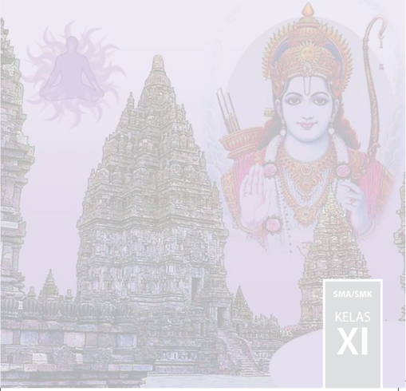

> **Deskripsi Visual:** Gambar ini adalah ilustrasi yang menampilkan seorang dewa Hindu yang dikenal sebagai Rama, yang dikenal dengan nama lain sebagai Lord Hanuman. Rama berdiri di depan sebuah candi yang megah dan kompleks, yang tampaknya merupakan bagian dari kompleks arsitektur Hindu. Candi tersebut memiliki struktur yang rumit dengan banyak tingkat dan detail yang rumit, menunjukkan keindahan dan keagungan arsitektur tradisional India.

Elemen-elemen utama dalam gambar ini meliputi Rama, candi, dan elemen-elemen keagungan dan keindahan arsitektur Hindu. Rama diperlihatkan dengan pakaian yang indah dan berhiasan yang mencerminkan keagungan dan kekuasaannya. Candi di belakangnya menunjukkan keindahan dan keagungan arsitektur tradisional India, dengan struktur yang rumit dan detail yang mencerminkan keagungan dan kekuasaan.

Teks, angka, atau label penting yang terlihat pada gambar ini adalah "SMA/SMK KELAS XI". Ini mungkin merujuk pada kelas atau program studi yang berkaitan dengan gambar ini.

Informasi kunci yang dapat diambil pembaca adalah bahwa gambar ini mungkin digunakan untuk membantu pembelajaran tentang arsitektur Hindu, keagungan dan kekuasaan dewa-dewi, atau mungkin sebagai bagian dari materi pelajaran tentang sejarah dan budaya India.

 

---
## 📄 Halaman 2

### Hak Cipta © 2017 pada Kementerian Pendidikan dan Kebudayaan Dilindungi Undang-Undang

Disklaimer: Buku ini merupakan buku guru yang dipersiapkan Pemerintah dalam rangka implementasi Kurikulum 2013. Buku guru ini disusun dan ditelaah oleh berbagai pihak di bawah koordinasi Kementerian Pendidikan dan Kebudayaan, dan dipergunakan dalam tahap awal penerapan Kurikulum 2013. Buku ini merupakan 'dokumen hidup' yang senantiasa diperbaiki,  diperbaharui,  dan  dimutakhirkan  sesuai  dengan  dinamika  kebutuhan  dan perubahan zaman. Masukan dari berbagai kalangan yang dialamatkan kepada penulis dan laman http://buku.kemdikbud.go.id atau melalui email buku@kemdikbud.go.id diharapkan dapat meningkatkan kualitas buku ini.

### Katalog Dalam Terbitan (KDT)

Indonesia. Kementerian Pendidikan dan Kebudayaan.

Pendidikan Agama Hindu dan Budi Pekerti : buku guru / Kementerian Pendidikan dan Kebudayaan. -- Jakarta: Kementerian Pendidikan dan Kebudayaan, 2017.

vi, 186 hlm.; 25 cm

Untuk SMA/SMK Kelas XI ISBN 978-602-427-070-4 (jilid lengkap)

ISBN 978-602-427-072-8 (jilid 2)

I. Hindu - Studi dan Pengajaran II. Kementerian Pendidikan dan Kebudayaan

I. Judul

Penulis

: I Ngh. Mudana dan I GN. Dwaja.

Penelaah

: Wayan Budi Utama dan Anak Agung Oka Puspa

Pe-review Guru

: I Gusti Ngurah Rai

Penyelia Penerbitan

: Pusat Kurikulum dan Perbukuan, Balitbang, Kemendikbud.

Cetakan Ke-1, 2014 ISBN 978-602-282-431-2 (jilid 2)

Cetakan Ke-2, 2017 (Edisi Revisi)

Disusun dengan huruf KwTimes New Roman 11 pt

294.5

 

---
## 📄 Halaman 3

### Kata Pengantar

Kurikulum 2013 dirancang agar peserta didik tak hanya bertambah pengetahuannya, tetapi juga  meningkat  keterampilannya  dan  semakin  mulia  kepribadiannya.  Ada  kesatuan  utuh antara kompetensi sikap, keterampilan, dan pengetahuan. Keutuhan ini perlu tercermin dalam pembelajaran Pendidikan Agama Hindu dan Budi Pekerti. Melalui pembelajaran pengetahuan agama  diharapkan  dapat  terbentuk  keterampilan  beragama  dan  terwujud  sikap  beragama siswa.  Tentu  saja  sikap  beragama  yang  berimbang,  mencakup  hubungan  manusia  dengan Penciptanya, hubungan manusia dengan manusia yang lainnya dan hubungan manusia dengan lingkungan/alam sekitarnya. Untuk memastikan keseimbangan ini, pembelajaran pendidikan agama  Hindu  perlu  diberi  penekanan  khusus  terkait  dengan  budi  pekerti.  Hakikat  budi pekerti adalah sikap atau perilaku seseorang dalam hubungannya dengan Tuhan, diri sendiri, keluarga, masyarakat dan bangsa, serta lingkungan/alam sekitar. Jadi, pendidikan budi pekerti adalah usaha menanamkan nilai-nilai moral ke dalam sikap dan perilaku generasi bangsa agar mereka memiliki kesantunan dalam berinteraksi.

Nilai-nilai  moral/karakter  yang  ingin  kita  bangun  antara  lain  adalah  sikap  jujur,  disiplin, bersih, penuh kasih sayang, punya kepenasaran intelektual, dan kreatif. Di sini pengetahuan agama  Hindu  yang  dipelajari  para  siswa  menjadi  sumber  nilai  dan  penggerak  perilaku mereka.  Sekadar  contoh,  di  antara  nilai  budi  pekerti  dalam  Hindu  dikenal  dengan  Tri Marga  (bakti  kepada  Tuhan,  orangtua,  dan  guru;  karma,  bekerja  sebaik-baiknya  untuk dipersembahkan kepada orang lain dan Tuhan; Jnana, menuntut ilmu sebanyak-banyaknya untuk bekal hidup dan penuntun hidup) dan Tri Warga (dharma, berbuat berdasarkan atas kebenaran; artha, memenuhi harta benda kebutuhan hidup berdasarkan kebenaran, dan kama, memenuhi keinginan sesuai dengan norma-norma yang berlaku). Kata kuncinya, budi pekerti adalah  tindakan,  bukan  sekedar  pengetahuan  yang  harus  diingat  oleh  para  siswa,  maka proses  pembelajarannya  mesti  mengantar  mereka  dari  pengetahuan  tentang  kebaikan,  lalu menimbulkan komitmen terhadap kebaikan, dan akhirnya benar-benar melakukan kebaikan. Buku  Guru  Pendidikan  Agama  Hindu  dan  Budi  Pekerti  untuk  SMA/SMK  Kelas  XI  ini menjabarkan  usaha  minimal  yang  harus  dilakukan  para  guru  guna  mencapai  kompetensi yang diharapkan. Sesuai dengan pendekatan yang digunakan dalam Kurikulum 2013, siswa diajak oleh para guru menjadi berani untuk mencari sumber belajar lain yang tersedia dan terbentang  luas  di  sekitarnya.  Peran  guru  dalam  meningkatkan  dan  menyesuaikan  daya serap siswa dengan ketersediaan petunjuk kegiatan pada buku ini sangat penting. Guru dapat memperkayanya dengan kreasi dalam bentuk kegiatan-kegiatan lain yang sesuai dan relevan yang bersumber dari lingkungan sosial dan lingkungan alam sekitarnya.

Implementasi  terbatas  Kurikulum  2013  pada  tahun  ajaran  2013/2014  telah  mendapatkan tanggapan  yang  sangat  positif  dan  masukan  yang  sangat  berharga.  Pengalaman  tersebut dipergunakan semaksimal mungkin dalam menyiapkan buku untuk implementasi menyeluruh pada  tahun  ajaran  2015/2016  dan  seterusnya.  Walaupun  demikian,  sebagai  edisi  pertama, buku ini sangat terbuka dan perlu terus dilakukan perbaikan dan penyempurnaan. Untuk itu, kami mengundang para pembaca memberikan kritik, saran dan masukan untuk perbaikan dan penyempurnaan pada edisi berikutnya. Atas kontribusi tersebut, kami ucapkan terima kasih. Mudah-mudahan kita dapat memberikan yang terbaik bagi kemajuan dunia pendidikan dalam rangka mempersiapkan generasi seratus tahun Indonesia Merdeka (2045).

Jakarta, Januari 2016 Penulis

 

---
## 📄 Halaman 4

### Daftar Isi

 

---
## 📄 Halaman 6

---
**🖼️ Gambar/Diagram**

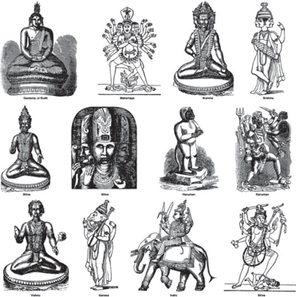

> **Deskripsi Visual:** Gambar ini adalah ilustrasi yang menampilkan berbagai tokoh mitologi dari budaya India. Gambar tersebut terdiri dari 12 tokoh yang diperlihatkan secara berurutan dari kiri atas ke kanan bawah. Setiap tokoh memiliki posisi dan pose yang unik, menunjukkan peran dan identitas mereka dalam mitologi India.

Elemen-elemen utama yang ditampilkan meliputi tokoh-tokoh mitologi, seperti Buddha, Rahu, Brahma, Shiva, Durga, dan banyak lagi. Setiap tokoh memiliki atribut atau peralatan khas yang menunjukkan identitas mereka. Misalnya, Buddha dilihat sedang bermeditasi, Rahu tampak seperti makhluk dengan ekor, Brahma duduk dengan topeng, dan Shiva dilihat berpose dengan pedang dan tongkat.

Teks, angka, atau label penting tidak terlihat pada gambar ini karena ia hanya menggambarkan tokoh-tokoh tanpa teks atau label tambahan. Namun, informasi kunci yang dapat diambil pembaca termasuk perbedaan karakteristik dan posisi tokoh-tokoh ini, serta hubungan antara tokoh-tokoh dalam konteks mitologi India.

Dengan demikian, gambar ini memberikan gambaran umum tentang tokoh-tokoh mitologi India dan bagaimana mereka diperlihatkan dalam konteks ilustrasi.

 

---
## 📄 Halaman 7

### A.  Latar Belakang

Pembelajaran  adalah  proses  interaksi  antarpeserta  didik,  antara  peserta didik  dengan  pendidik  dan  sumber  belajar  pada  suatu  lingkungan  belajar. Dalam  proses  pembelajaran,  pendidik  memiliki  peran  yang  sangat  penting dalam  menyampaikan  materi  pelajaran  Dalam  rangka  mengembangkan  dan meningkatkan kemampuan dan kualitas pendidik dalam melaksanakan proses pembelajaran  sesuai  Kurikulum  2013  perlu  disusun  Buku  Panduan  Guru Pendidikan Agama Hindu dan Budi Pekerti.

Buku Panduan Guru ini disusun untuk dapat dijadikan acuan bagi pendidik dalam  pemahami  Kurikulum  dan  pengembangannya  ke  dalam  bentuk  proses pembelajaran. Keberhasilan proses pembelajaran Pendidikan Agama Hindu dan Budi Pekerti di samping dipengaruhi oleh keaktifan peserta didik dalam proses pembelajaran,  sarana  dan  prasarana  yang  mendukung,  juga  dipengaruhi  oleh kompetensi dan profesionalisme pendidik dalam mengajar.

 

---
## 📄 Halaman 8

Pendidik yang profesional dituntut untuk mampu  menerapkan dan melaksanakan proses pembelajaran dengan baik. Dalam proses pembelajaran, pendidik  memiliki  peran  penting,  bahkan  menempati  posisi  kunci  berhasil atau  tidaknya  proses  pembelajaran  tersebut.  Adapun  peran  pendidik  dalam pembelajaran, yakni sebagai pendidik, pengajar, pembimbing, pelatih, penasihat, pembaharu,  teladan,  pribadi,  pendorong  kreativitas,  pembangkit  pandangan, pekerja rutin, pembawa cerita, peneliti, aktor, emansipator, inovator, motivator dan dinamisator, fasilitator, evaluator, mediator, dan penguat.

Proses pembelajaran yang dilaksanakan oleh pendidik Pendidikan Agama Hindu dan Budi Pekerti hendaknya selalu merujuk pada ruh Kurikulum 2013, dan menggunakan buku baik buku utama dan penunjang sebagai referensinya. Untuk  menjembatani  keinginan  ideal  seperti  itu  dengan  kondisi  yang  selama dialami pendidik, maka diperlukan buku panduan operasional untuk membantu pendidik  memahami  Kurikulum  2013  serta  cara  melaksanakan  Pendidikan Agama Hindu dan Budi Pekerti disekolah.

Hal ini penting karena implementasinya di sekolah maupun di masyarakat, Pendidikan Agama Hindu dan Budi Pekerti memiliki karakteristik yang khas dan mengakomodir budaya-budaya setempat menjadi bahan dan media belajar, sehingga  diperlukan  upaya-upaya  maksimal  dan  semangat  yang  kuat  bagi seorang pendidik dalam mengimplementasikan Pendidikan Agama Hindu dan Budi  Pekerti  ke  dalam  proses  pembelajaran.  Buku  Panduan  Guru  ini  dapat menjadi jembatan terhadap usaha pendidik untuk mendesain pembelajaran agar terarah dan mencapai tujuan yang telah ditetapkan.

 

---
## 📄 Halaman 9

Buku Panduan Guru ini dibutuhkan karena pendidik dalam setiap kegiatan belajar  mengajar  harus  mempunyai  sasaran  atau  tujuan  yang  jelas,  terukur mencapai  kompotensi  yang  diharapkan.  Tujuan  itu  bertahap  dan  berjenjang, mulai  dari  yang  sangat  operasional  dan  konkret,  yakni  tujuan  pembelajaran khusus, tujuan pembelajaran umum, tujuan kurikuler, tujuan pendidikan nasional, sampai pada tujuan yang bersifat universal.

Belajar  mengajar  sebagai  suatu  sistem  instruksional  mengacu  kepada pengertian  sebagai  seperangkat  komponen  yang  saling  bergantung  satu  sama lain  untuk  mencapai  tujuan.  Sebagai  suatu  sistem  belajar  mengajar  meliputi sejumlah komponen antara lain tujuan pelajaran, bahan ajar, peserta didik yang menerima  pelayanan  belajar,  pendidik,  metode  dan  pendekatan,  situasi  dan evaluasi kemajuan belajar. Agar tujuan itu dapat tercapai, semua komponen yang ada harus diorganisasikan dengan baik.

Untuk  mewujudkan  tujuan  tersebut,  pendidik  harus  memahami  segenap aspek pribadi anak didik, seperti (1) kecerdasan dan bakat khusus, (2) prestasi sejak permulaan  sekolah, (3)  perkembangan  jasmani  dan  kesehatan,  (4) kecenderungan emosi dan karakternya, (5) sikap dan minat belajar, (6) cita-cita, (7)  kebiasaan  belajar  dan  bekerja,  (8)  hobi  dan  penggunaan  waktu  senggang, (9) hubungan sosial di sekolah dan di rumah, (10) latar belakang keluarga, (11) lingkungan tempat tinggal, dan (12) sifat-sifat khusus.

### B.  Dasar Hukum

- Undang-Undang  Nomor  20  Tahun  2003  tentang  Sistem  Pendidikan Nasional (SNP);

 

---
## 📄 Halaman 10

- Peraturan Pemerintah Nomor 32 Tahun 2013 tentang Perubahan Atas;
- Peraturan  Pemerintah  Nomor  19  Tahun  2005  tentang  Standar  Nasional Pendidikan;
- Peraturan Pemerintah Nomor 55 Tahun 2007 tentang Pendidikan Agama dan Pendidikan Keagamaan;
- Peraturan Menteri Agama Nomor 4 tahun 2012 tentang penyelenggaraan Pendidikan dan Pelatihan Teknis di Lingkungan Kementrian Agama;
- Peraturan  Menteri  Pendidikan  dan  Kebudayaan  Nomor  54  Tahun  2013 tentang Standar Kompetensi Lulusan Pendidikan Dasar dan Menengah;
- Peraturan  Menteri  Pendidikan  dan  Kebudayaan  Nomor  64  Tahun  2013 tentang Standar Isi Pendidikan Dasar dan Menengah;
- Peraturan  Menteri  Pendidikan  dan  Kebudayaan  Nomor  65  Tahun  2013 tentang Standar Proses Pendidikan Dasar dan Menengah;
- Peraturan  Menteri  Pendidikan  dan  Kebudayaan  Nomor  66  Tahun  2013 tentang Standar Penilaian Pendidikan;
- Peraturan  Menteri  Pendidikan  dan  Kebudayaan  Nomor  69  Tahun  2013 tentang Kerangka Dasar dan Struktur Kurikulum Sekolah Menengah Atas/ Madrasah Aliyah;
- Peraturan  Menteri  Pendidikan  dan  Kebudayaan  Nomor  70  Tahun  2013 tentang  Kerangka  Dasar  dan  Struktur  Kurikulum  Sekolah  Menengah Kejuruan/Madrasah Aliyah Kejuruan;
- Peraturan  Menteri  Pendidikan  dan  Kebudayaan  Nomor  71  Tahun  2013 tentang Buku Teks Pelajaran dan Buku Panduan Guru Untuk Pendidikan Dasar dan Menengah;

 

---
## 📄 Halaman 11

- Peraturan Menteri Pendidikan dan Kebudayaan Nomor 103 Tahun 2014 tentang Pembelajaran Pada Pendidikan Dasar Dan Pendidikan Mengengah
- Peraturan Menteri Pendidikan dan Kebudayaan Nomor 104 Tahun 2014 tentang Penilaian Hasil Belajar Oleh Pendidik Pada Pendidikan Dasar Dan Pendidikan Menengah.

### C.  Tujuan

Buku  Panduan  Guru  Pendidikan  Agama  Hindu  dan  Budi  Pekerti  SMA/ SMK Kelas XI ini disusun dengan tujuan:

- Membantu pendidik dalam melaksanakan proses pembelajaran di sekolah atau di kelas sejalan dengan Kurikulum 2013;
- Membantu  pendidik  memahami  komponen,  tujuan  dan  materi  dalam Kurikulum 2013;
- Memberikan  panduan  kepada  pendidik  dalam  menumbuhkan  budaya belajar agama Hindu yang aktif, positif untuk meningkatkan pemahaman peserta didik terhadap pengertahuan Agama Hindu;
- Membantu pendidik dalam merencanakan, mengorganisasikan, melaksanakan  dan  menilai  kegiatan  belajar  mengajar  sesuai  dengan tuntutan Kuruikulum 2013;
- Membantu  pendidik  dalam  menjelaskan  kualifikasi  bahan  atau  materi pelajaran,  pola  pengajaran  dan  evaluasi  yang  harus  dilakukan  sesuai dengan model Kurikulum 2013;

 

---
## 📄 Halaman 12

- Memberikan arah yang tepat bagi para pendidik dalam mencapai target atau sasaran yang ingin dicapai sesuai dengan tujuan Kurikulum 2013;
- Memberikan inspirasi kepada pendidik dalam menanamkan dan mengembangkan bahan atau materi pembelajaran sesuai dengan tingkat perkembangan peserta didiknya.

### D.  Sasaran

Sasaran yang ingin dicapai dalam Buku Panduan Guru Pendidikan Agama Hindu dan Budi Pekerti SMA/SMK Kelas XI ini, antara lain:

- Pendidik  mampu  memahami  dan  menerapkan  Kurikulum  2013  dengan benar;
- Pendidik memiliki pemahaman yang mendalam tentang Kurikulum 2013 dan komponen-komponennya;
- Pendidik mampu menyusun rencana kegiatan pembelajaran dengan baik;
- Pendidik mampu memiliki wawasan yang luas dan mendalam mengenai model-model pembelajaran yang dapat digunakan dalam proses pembelajaran;
- Pendidik memiliki kemampuan menanamkan budaya belajar positif kepada peserta didik.

 

---
## 📄 Halaman 13

### E.  Ruang Lingkup Buku Panduan Guru

Adapun sebagai ruang lingkup dari penyusunan dan atau penulisan Buku Panduan Guru ini adalah:

Bab I

: Pendahuluan

Bab II

: Petunjuk Umum

Bab III

: Petunjuk Khusus Proses Pembelajaran

Bab IV

: Penutup.

 

---
## 📄 Halaman 14

---
**🖼️ Gambar/Diagram**

> **Deskripsi Visual:** Gambar ini adalah ilustrasi yang menampilkan berbagai tokoh dan dewa dari budaya India kuno. Gambar tersebut mencakup berbagai karakter mitologis seperti Buddha, Dewi Durga, Dewa Shiva, Dewi Lakshmi, Dewa Rama, Dewi Saraswati, Dewa Hanuman, dan Dewa Kali. Setiap karakter memiliki posisi dan pose yang unik, menunjukkan keindahan dan kekayaan dalam seni rupa India kuno. Ilustrasi ini juga menunjukkan perbedaan dalam penampilan dan atribut masing-masing dewa, yang menunjukkan peran dan kekuatan mereka dalam mitologi. Teks, angka, atau label penting tidak terlihat pada gambar ini karena ia hanya menggambarkan tokoh-tokoh tersebut tanpa teks atau angka tambahan. Informasi kunci yang dapat diambil pembaca adalah bahwa gambar ini menunjukkan berbagai dewa dan tokoh dari budaya India kuno, serta perbedaan dalam penampilan dan atribut mereka.

 

---
## 📄 Halaman 15

### A.  Gambaran Umum tentang Buku Guru

Secara umum, bedasarkan ruang lingkupnya, Buku Panduan Guru ini terdiri dari empat bab, yakni:

- Pendahuluan. Pada bab ini diuraikan latar belakang, dasar hukum, tujuan, sasaran dan ruang lingkup
- Petunjuk Umum. Pada bab ini berisi Gambaran Umum Tentang Panduan Buku  Guru, Ruang lingkup Aspek-aspek dan standar Pengamalan Pendidikan agama Hindu, Krangka Dasar Kurikulum, Standar Kelulusan (SKL)  yang  ingin  dicapai,  Kompetensi  Inti  (KI)  yang  ingin  dicapai, Penilaian, yaitu: Penilaian Sikap, Pengetahuan dan Keterampilan, Kompenen Penilaian, Pemanfaatan dan tindak lanjut hasil penilaian dan Strategi, Metode dan Teknik Pembelajaran.
- Petunjuk Khusus Proses Pembelajaran meliputi:

 

---
## 📄 Halaman 16

### a.  BAB I YOGASANA DALAM SUSASTRA HINDU

- Kompetensi Inti (KI) dan Kompetensi Dasar (KD)
- Tujuan Pembelajaran.
- Peta Konsep
- Proses Pembelajaran
- Evaluasi
- Pengayaan
- Remedial
- Interaksi dengan Orang Tua

### b.  BAB II YADNYA DALAM MAHABARATA

- Kompetensi Inti (KI) dan Kompetensi Dasar (KD)
- Tujuan Pembelajaran.
- Peta Konsep
- Proses Pembelajaran
- Evaluasi
- Pengayaan
- Remedial
- Interaksi dengan Orang Tua

### c.  BAB III MOKSHA

- Kompetensi Inti (KI) dan Kompetensi Dasar (KD)
- Tujuan Pembelajaran.

 

---
## 📄 Halaman 17

- Peta Konsep
- Proses Pembelajaran
- Evaluasi
- Pengayaan
- Remedial
- Interaksi dengan Orang Tua

### d.  BAB IV BHAKTI SEJATI DALAM RAMAYANA

- Kompetensi Inti (KI) dan Kompetensi Dasar (KD)
- Tujuan Pembelajaran.
- Peta Konsep
- Proses Pembelajaran
- Evaluasi
- Pengayaan
- Remedial
- Interaksi dengan Orang Tua

### e.  BAB V KELUARGA SUKHINAH

- Kompetensi Inti (KI) dan Kompetensi Dasar (KD)
- Tujuan Pembelajaran.
- Peta Konsep
- Proses Pembelajaran
- Evaluasi
- Pengayaan

 

---
## 📄 Halaman 18

- Remedial
- Interaksi dengan Orang Tua
IV.  Penutup meliputi Kesimpulan dan Saran-saran

### B.  Ruang Lingkup, Aspek-aspek, dan Standar Pengamalan Pendidikan Agama Hindu

Ruang  lingkup  Pendidikan  Agama  Hindu  dan  Budi  Pekerti  menekankan pada Tri Kerangka Dasar Agama Hindu seperti Tattwa , Susila , dan Acara , yang diwujudkan melalui konsep Tri Hita Karana yaitu:

- Hubungan manusia dengan Sang Hyang Widhi.
- Hubungan manusia dengan manusia.
- Hubungan manusia dengan alam lingkungan.
Aspek-aspek Pendidikan Agama Hindu dan Budhi Pekerti pada Sekolah Menengah  Atas  dan  Kejuruan  sebagaimana  tertuang  dalam  Kurikulum 2013, meliputi:

- Kitab Suci Veda yang menekankan kepada pemahaman Veda sebagai Kitab suci,  melalui  pengenalan  pada  kitab-kitab:  Bhagavadgita,  Ramayana, Mahabharata, Veda Sruti , Veda Smerti dan untuk menumbuhkan pemimpin yang berkarakter sesuai kitab suci Veda .
- Tattwa  merupakan  pemahaman  tentang  alam  semesta  dengan  mengenal nama-nama planet dalam tata surya, pokok-pokok keyakinan yaitu Panca Sraddha yang meliputi Brahman, Atman, Karmaphala, Punarbhava, dan Moksha.

 

---
## 📄 Halaman 19

- Susila  pembiasaaan  berperilaku  jujur,  saling  menghargaiyang  penekanannya pada penguasaan tentang ajaran Subha Asubha, Tat Twam Asi, Tri Kaya Parisudha , Tri  Parartha,  Catur  Guru ,  dan  upaya  menghindari  perilaku Tri Mala, Catur Pataka, dan Sad Ripu , sehingga memiliki etika dan budi pekerti yang baik.
- Acara yaitu melakukan pembiasaan dengan pengucapan DainikaUpasana (doa sehari-hari) dan pengenalan serta pemahaman tentang Dharmagit a, antara Tari  Profan  dengan  Tari  Sakral,  Orang  Suci,  HariSuci,  Tempat Suci , serta penekanan pada sikap dan praktik berYajña dalam kehidupan sehari-hari seperti melakukan Panca Yajña sehingga kehidupan menjadi harmonis, dan seimbang.
- Sejarah  Agama Hindu yang menekankan kepada sejarah perkembangan Agama Hindu di Indonesia.

### Standar Pengamalan Pendidikan Agama Hindu dan Budi Pekerti:

- Hubungan manusia dengan Sang Hyang Widhi melalui Parhyangan dapat dilaksanakan dengan cara:
- Melaksanakan kewajiban dengan melakukan persembahnyangan Tri Sandhya tiga kali setiap hari.
- Membiasakan  melakukan japa  mantra dan namasmaranam setiap selesai sembahyang.
- Membiasakan mengucapkan membaca doa terlebih dahulu sebelum beraktivitas dan belajar.

 

---
## 📄 Halaman 20

- Rajin dan aktif dalam kegiatan keagamaan baik dilingkungan keluarga maupun dimasyarakat.
- Bersembahyang pada hari Purnama, Tilem dan hari-hari suci / hari Raya seperti Galungan, Kuningan Saraswati, Siwaratri, Nyepi dan kegiatan hari keagamaan lainnya.
- Hubungan manusia dengan manusia melalui Pawongan dapat dilakukan dengan cara:
- Membiasakan diri bersikap jujur dan sopan, santun terhadap sesama manusia.
- Membiasakan  diri  disiplin  dan  bertanggung  jawab  dalam  ucapan, perbuatan/perilaku dan pikiran dalam kehidupan sehari-hari.
- Membiasakan diri untuk berpakaian bersih dan rapi.
- Membiasakan diri peduli dan saling menolong, saling menyayangi serta mengasihi antarsesama manusia.
- Selalu  peduli  terhadap  orang-orang  yang  sedang  dilanda  musibah, kesusahan dalam kehidupannya.
- Hubungan manusia dengan alam lingkungan sekitarnya melalui Palemahan dapat dilakukan dengan cara:
- Menanamkan cara-cara menjaga kebersihan lingkungan sekitarnya.
- Membiasakan diri untuk peduli terhadap hewan-hewan di sekitar dan tidak menyakiti binatang-binatang serta makhluk hidup lainnya.

 

---
## 📄 Halaman 21

- Membiasakan diri untuk peduli terhadap tumbuh-tumbuhan dengan cara merawat dan menyiram serta memeliharanya.
- Membudayakan  diri  untuk  melestarikan  warisan-warisan  leluhur (tempat suci,  Pura,  Candi ,  seni,  buku-buku  /  sastra-sastra  Hindu, Lontar dan lain-lain)

### C.  Kerangka Dasar Kurikulum Sekolah Menengah Atas (SMA/SMK)

### I. Landasan Filosofis

Landasan filosofis dalam pengembangan Kurikulum, sumber dan isi dari Kurikulum, proses pembelajaran, posisi peserta didik, penilaian hasil belajar, hubungan peserta didik dengan masyarakat dan lingkungan alam di  sekitarnya. Kurikulum 2013 dikembangkan dengan landasan filosofis yang memberikan dasar bagi pengembangan seliris potensi peserta didik menjadi  manusia  Indonesia  berkualitas  yang  tercantum  dalam  tujuan pendidikan nasional. pada dasarnya tidak ada satupun filosofi pendidikan yang  dapat  digunakan  secara  spesifik  untuk  pengembangan  Kurikulum yang  dapat  menghasilakan  manusia  yang  berkualitas.  Berdasarkan  hal tersebut, Kurikulum 2013 menggunakan filosofi sebagai berikut:

- Pendidikan berakar pada budaya bangsa untuk membagun kehidupan bangsa  masa  kini  dan  masa  medatang.  Pandangan  ini  menjadikan Kurikulum 2013 dikembangkan berdasarkan budaya bangsa Indonesaia ayang beragam, diarahkan untuk membangun kehidupan masa  kini,  dan  untuk  membangun  dasar  bagi  kehidupan  bangsa

 

---
## 📄 Halaman 22

- yang lebih baik dimasa depan. Mempersiapkan peserta didik untuk kehidupan masa depan selalu menjadi kepedulian Kurikulum, hal ini mengandung makna bahwa Kurikulum adalah rancangan pendidikan untuk  mempersiapkan  kehidupan  generasi  muda  bangsa.  dengan demikian, tugas mempersiapkan generasi muda bangsa menjadi tugas utama suatu Kurikulum. Untuk mempersiapkan kehidupan masa kini dan  masa  depan  peserta  didik,  Kurikulum  2013  mengembangakan pengalaman belajar yang memberikan kesempatan luas bagi peserta didik untuk menguasai Kompetensi yang diperlukan bagi kehidupan di  masa  kini  dan  masa  depan,  dan  pada  waktu  bersamaan  tetap mengembangkan kemempuan mereka sebagai pewaris budaya bangsa dan orang yang peduli terhadap permasalahan masyarakat dan bangsa masa kini.
- Peserta didik adalah pewaris budaya bangsa yang kreatif. Menurut pandangan filosofi ini, prestasi bangsa di berbagai bidang kehidupan di  masa  lampau  adalah  sesuatu  yang  harus  termuat  dalam  isi Kurikulum untuk dipelajari peserta didik. Proses pandidikan adalah setup  roses  yang  memberi  kesempatan  kepada  peserta  didik  untuk mengembangkan  potensi dirinya menjadi kemampuan  berpikir rasional  dan  kecemerlangan  akdemik  dengan  memberikan  makna terhadap  apa  yang  yang  dilihat,  didengar,  dibaca,  dipelajari  dari warisan  budaya  berdasarkan  makna  yang  ditentukan  oleh  lensa budayanya dan sesuai dengan tingkat kematangan fisikologis serta kematangan  fisik  peserta  didik.  selain  pengembangan  kemampuan

 

---
## 📄 Halaman 23

- berpikir rasional dan cemerlang dalam akademik, Kurikulum 2013  memposisikan  keunggulan  budaya  tersebut  dipelajari  untuk menimbulkan rasa bangga, diaplikasikan dan dan dimanifestasikan dalam  kehidupan  pribadi,  dalam  interaksi  soaial  di  masyarakat sekitarnya, dan dalam kehidupan berbangsa masa kini.
- Pendidikan ditujukan untuk mengembangkan kecerdasan intelektual dan  kecemerlangan  akademik  melalui  pendidikan  disiplin  ilmu. Filosofi  ini  menentukan  bahwa isi  Kurikulum adalah disiplin ilmu dan pembelajaran adalah pembelajaran disiplin ilmu ( essentialism ). Filosofi  ini  mwajibkan  Kurikulum  memiliki  nama  mata  pelajaran yang  sama  dengan  nama  disiplin  ilmu,  selalu  betujuan  untuk mengembangkan kemampuan intelektual dan kecemerlangan akademik.
- Pendidikan  untuk  membangun  kehidupan  masa  kini  dan  masa depan  yang  lebih  baik  dari  masa  lalu  dengan  berbagai  kemapuan intelektual, kemampuan berkomunikasi, sikap sosial, kepedulian, dan berpartisipasi untuk membangun kehidupan masyarakat dan bangsa yang lebih baik ( experimentalism and social reconstructivism ).  dengan filosofi  ini,  Kurikulum  2013  bermaksud  untuk  mengembangkan potensi  peserta  didik  menjadi  kemempuan  dalam  berpikir  reflektif bagi penyelesaian masalah soaial di masyarakat, dan untuk membagun  kehidupan  masyarakat  demokratis  yang  lebiah  baik. Dengan  demikian,  Kurikulum  2013  menggunakan  filosofi  sebagai mana  di  atas  dalam  mengembangkan  kehidupan  indipidu  peserta

 

---
## 📄 Halaman 24

didik  dalam  beragama,  seni,  kreativitas,  berkomunikasi,  nilai  dan berbagai dimensi intelegensi yang sesuai dengan diri seorang peserta didik dan diperlukan masyarakat, bangsa, dan umat manusia.

### II. Landasan Teoretis

Kurikulum  2013  dikembangkan  atas  teori  'pendidikan  bersarkan standar' ( standard-based education ) dan teori Kurikulum berbasis Kompetensi  ( competency-based  curriculum ). Pendidikan  berdasarkan standar  menetapkan  adanya  standar  nasional  sebagai  kualitas  minimal warga  negara  yang  dirinci  menjadi  standar  isi,  standar  proses,  standar kompetensi  lulusan,  standar  pendidik  dan  tenaga  kependidikan,  standar sarana  dan  prasarana,  standar  pengelolaan,  standar  pembiayaaan  dan standar penilaian pendidikan. Kurikulum berbasis kompetensi dirancang untuk memberikan pengalaman belajar seluas luasnya bagi peserta didik dalam  mengembangkan  kemampuan  untuk  bersikap,  berpengetahuan, berketerampilan, dan bertindak. Kurikulum 2013 menganut: (1) pembelajaran  yang  dilakukan  guru  ( taught  curriculum )  dalam  bentuk proses  yang  dikembangkan  berupa  kegiatan  pembelajaran  di  sekolah, kelas, dan masyarakat, dan (2) pengalaman belajar langsung peserta didik ( learned-curriculum )  sesuai  dengan  latar  belakang,  karakteristik,  dan kemampuan awal peseta didik. Pengalaman belajar langsung  individual peserta didik menjadi hasil belajar bagi dirinya, sedangkan hasil belajar seluruh peserta didik menjadi hasil Kurikulum.

### III. Landasan Yuridis

Landasan yuridis Kurikulum 2013 adalah:

 

---
## 📄 Halaman 25

- Undang-undang Dasar Negara Republik Indonesia tahun 1945;
- Undang-undang  No.  20  Tahun  2003  tentang  system  pendidikan Nasional;
- Undang-undang No. 17 Tahun 2005 tentang rencana Pembangunan jangka panjang Nasional, beserta segala ketentuan yang dituangkan rencana pembangunan jangka menengah nasional;
- Peraturan Pemerintah No, 19 Tahun 2005 tentang standar nasional pendidikan sebagai mana telah diubah dengan peraturan pemerintah No.  32  Tahun  2013  tentang  perubahan  atas  peraturan  pemerintah No.19 Tahun 2005 tentang Standar Nasional Pendidik.

### D.  Standar Kelulusan (SKL) yang Ingin Dicapai

Standar  Kompetensi  Lulusan  (SKL) pada  jenjang  Pendidikan  Dasar  dan Menengah sejalan dengan Peraturan Menteri Pendidikan dan Kebudayaan Nomor 54  Tahun  2013  di  mana  di  setiap  dimensi  memiliki  kualifikasi  kemampuan sebagaimana tertera dalam tabel berikut:

---
**📊 Tabel**

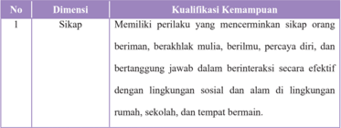

Tabel ini berisi informasi tentang kualifikasi kemampuan sosial yang dimiliki oleh individu. Topik utamanya adalah sikap, yang meliputi kemampuan untuk menerima sifat baik dari orang lain, berbuat baik, berperilaku sopan, bertanggung jawab, dan berinteraksi dengan efektif di lingkungan sosial. Kolom pertama menunjukkan nomor urut dari dimensi tersebut, sedangkan kolom kedua menyajikan deskripsi atau definisi dari kualifikasi kemampuan tersebut. Data penting yang terlihat adalah bahwa sikap ini mencakup berbagai aspek seperti menerima sifat baik orang lain, berbuat baik, berperilaku sopan, bertanggung jawab, dan berinteraksi dengan efektif di lingkungan sosial. Ini menunjukkan bahwa tabel ini fokus pada bagaimana individu dapat berinteraksi dan berperilaku dengan baik dalam berbagai situasi sosial.

 

---
## 📄 Halaman 26

---
**📊 Tabel**

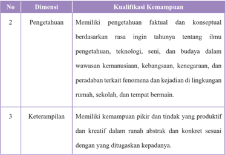

Tabel ini berisi dua dimensi utama: Pengetahuan dan Keterampilan. Dimensi Pengetahuan mencakup kualifikasi kemampuan untuk memahami fakta dan konsep ilmu pengetahuan, teknologi, seni, dan budaya secara mendalam, termasuk wawasan tentang masyarakat, kebangsaan, keagamaan, dan peradaban. Dimensi Keterampilan meliputi kemampuan pikiran dan tindakan yang produktif dan kreatif dalam berbagai konteks abstrak dan konkret sesuai dengan tugas yang diberikan. Pola penting yang terlihat adalah bahwa kedua dimensi ini mencakup pemahaman mendalam tentang berbagai aspek dunia, baik ilmiah maupun sosial, serta kemampuan untuk berpikir dan bertindak secara efektif dalam berbagai situasi.

### E.  Kompetensi Inti (KI) yang Ingin Dicapai Kompetensi Inti (KI) Tingkat SMA/SMK kelas XI yang ingin dicapai:

Berdasarkan Peraturan Pemerintah Nomor 32 Tahun 2013 tentang Standar Nasional Pendidikan (SNP) disebutkan bahwa:

- Kompetensi  adalah  seperangkat  sikap,  pengetahuan,  dan  keterampilan yang  harus  dimiliki,  dihayati,  dan  dikuasai  oleh  peserta  didik  setelah mempelajari suatu muatan pembelajaran, menamatkan suatu program, atau menyelesaikan Satuan Pendidikan tertentu.
- Kompetensi  Inti  adalah  tingkat  kemampuan  untuk  mencapai  Standar Kompetensi Lulusan yang harus dimiliki seorang peserta didik pada setiap tingkat kelas atau program.

 

---
## 📄 Halaman 27

- Kompetensi Inti  sebagaimana  dimaksud  pada  ayat  (1)  mencakup:  sikap spiritual,  sikap  sosial,  pengetahuan,  dan  keterampilan  yang  berfungsi sebagai pengintegrasi muatan pembelajaran, mata pelajaran atau program dalam mencapai Standar Kompetensi Lulusan. Kompetensi Inti sebagaimana  dimaksud  pada  ayat  (1)  merupakan  tingkat  kemampuan untuk mencapai Standar Kompetensi Lulusan yang harus dimiliki seorang peserta didik pada setiap tingkat kelas atau program yang menjadi landasan pengembangan Kompetensi Dasar (KD).
Lebih lanjut dalam pasal 77 H ayat (1) penjelasan dari Kompetenisi Inti (KI) sebagai berikut:

- Yang dimaksud dengan 'Pengembangan Kompetensi spiritual keagamaan' mencakup perwujudan suasana belajar untuk meletakkan dasar perilaku baik yang bersumber dari nilai-nilai agama dan moral dalam konteks belajar dan berinteraksi sosial.
- Yang dimaksud dengan 'Pengembangan sikap personal dan sosial' mencakup perwujudan suasana untuk meletakkan dasar kematangan sikap  personal  dan  sosial  dalam  konteks  belajar  dan  berinteraksi sosial.
- Yang  dimaksud  dengan  'Pengembangan  pengetahuan'  mencakup perwujudan  suasana  untuk  meletakkan  dasar  kematangan  proses berfikir dalam konteks belajar dan berinteraksi sosial.
- Yang  dimaksud  dengan  'Pengembangan  keterampilan'  mencakup perwujudan  suasana  untuk  meletakkan  dasar  keterampilan  dalam konteks belajar dan berinteraksi sosial.

 

---
## 📄 Halaman 28

### Berikut adalah Kompetensi Inti (KI) Tingkat SMA/SMK

Satuan Pendidikan : SMA/SMK.................................................

Kelas/Program

: XI /............................................................

Kompetensi Inti :

KI 1

:  Menghayati dan mengamalkan ajaran agama yang dianutnya

KI 2

:  Menghayati dan mengamalkan perilaku jujur, disiplin, tanggung jawab, peduli (gotong royong, kerja sama, toleran, damai),  santun,  responsif  dan  proaktif  dan  menunjukkan sikap sebagai bagian dari solusi atas berbagai permasalahan dalam  berinteraksi  secara  efektif  dengan  lingkungan  sosial dan  alam  serta  dalam  menempatkan  diri  sebagai  cerminan bangsa dalam pergaulan dunia.

KI 3 :  Memahami, menerapkan, menganalisis pengetahuan faktual, konseptual, prosedural berdasarkan rasa ingintahunya tentang ilmu  pengetahuan,  teknologi,  seni,  budaya,  dan  humaniora dengan wawasan kemanusiaan, kebangsaan, kenegaraan, dan peradaban  terkait  penyebab  fenomena  dan  kejadian,  serta menerapkan pengetahuan prosedural pada bidang kajian yang spesifik sesuai dengan bakat dan minatnya untuk memecahkan masalah.

:  Mengolah, menalar, dan menyaji dalam ranah konkret dan ranah abstrak terkait dengan pengembangan dari yang  dipelajarinya  di  sekolah  secara  mandiri,  dan  mampu menggunakan metoda sesuai kaidah keilmuan.

KI 4

 

---
## 📄 Halaman 29

### F.  Penilaian

### 1. Penilaian Sikap, Pengetahuan, dan Keterampilan.

### a. Penilaian Sikap

Pengertian Penilaian sikap adalah penilaian terhadap kecenderungan perilaku peserta didik sebagai hasil pendidikan, baik di dalam kelas maupun di luar kelas. Penilaian sikap memiliki karakteristik yang berbeda dengan penilaian pengetahuan dan keterampilan, sehingga teknik penilaian yang digunakan juga berbeda. Dalam hal ini, penilaian sikap ditujukan untuk mengetahui capaian dan membina perilaku serta budi pekerti peserta didik sesuai butir-butir sikap dalam Kompetensi dasar (KD) pada Kompetensi inti sikap spiritual (KI-1) dan Kompetensi sikap sosial ( KI-2).

Pada mata pelajaran Pendidikan Agama dan Budi Pekerti, dan mata pelajaran Pendidikan Pancasila dan Kewarganegaraan (PPKn), KD pada KI-1  dan  KD  pada  KI-2  disusun  secara  koheren  dan  linier  dengan  KD pada KI-3 dan KD pada KI-4. Sedangkan untuk mata pelajaran lain, KD pada KI-1 dan KD pada KI-2 dirumuskan secara umum dan terakumulasi menjadi satu KD pada KI-1 dan satu KD pada KI-2.

Penilaian sikap spiritual  dan  sikap  sosial  dilakukan  secara  berkelanjutan oleh pendidik mata pelajaran, guru bimbingan konseling (BK), dan wali kelas dengan menggunakan observasi dan informasi lain yang valid dan relevan  dari  berbagai  sumber.  Penilaian  sikap  merupakan  bagian  dari pembinaan dan penanaman/pembentukan sikap spiritual dan sikap sosial peserta didik yang menjadi tugas dari setiap pendidik. Penanaman sikap diintegrasikan pada setiap pembelajaran KD dari KI-3 dan KI-4. Selain itu,

 

---
## 📄 Halaman 30

dapat dilakukan penilaian diri ( self assessment ) dan penilaian antarteman ( peer  assessment )  dalam  rangka  pembinaan  dan  pembentukan  karakter peserta didik yang hasilnya dapat dijadikan sebagai salah satu data untuk konfirmasi hasil penilaian sikap oleh pendidik. Hasil penilaian sikap selama periode satu semester ditulis dalam bentuk deskripsi yang menggambarkan perilaku peserta didik.

### 2. Teknik Penilaian Sikap

Penilaian sikap dilakukan oleh guru mata pelajaran, guru bimbingan konseling  (BK),  dan  wali  kelas,  melalui  observasi  yang  dicatat  dalam jurnal. Teknik penilaian sikap dijelaskan pada skema berikut.

---
**🖼️ Gambar/Diagram**

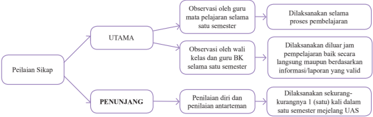

> **Deskripsi Visual:** Gambar ini adalah diagram yang menunjukkan struktur dari proses penelitian sikap. Diagram ini dibagi menjadi dua bagian utama: UTAMA dan PENUNJANG.

1. **Apa yang Ditampilkan Secara Keseluruhan**: Gambar ini menggambarkan struktur umum dari proses penelitian sikap, yang melibatkan observasi, penilaian sikap, dan penulisan analisis. Proses ini dimulai dengan observasi, kemudian diteruskan dengan penilaian sikap, dan akhirnya ditutup dengan penulisan analisis.

2. **Elemen-Elemen Utama dan Relasinya**: 
   - **UTAMA**: Ini adalah bagian utama dari proses penelitian sikap. Dalam bagian ini, observasi dilakukan untuk mempelajari sikap seseorang. Setelah itu, sikap tersebut dianalisis dan disusun dalam bentuk penulisan.
   - **PENUNJANG**: Bagian ini berisi informasi tambahan yang mendukung proses penelitian sikap. Ini mencakup penilaian diri dan penulisan antarlemenur, yang merupakan langkah-langkah lanjutan setelah observasi dan penilaian sikap.

3. **Teks, Angka, atau Label Penting yang Terlihat**: 
   - **Teks Penting**: "Observasi" (untuk bagian UTAMA), "Penilaian sikap" (untuk bagian UTAMA), "Penilaian diri" (untuk bagian PENUNJANG), dan "Penulisan antarlemenur" (untuk bagian PENUNJANG).
   - **Angka Penting**: Ada angka 1, 2, dan 3 yang mungkin merujuk pada langkah-langkah dalam proses penelitian sikap.

4. **Informasi Kunci yang Bisa Diambil Pembaca**: Gambar ini memberikan pemahaman tentang struktur umum dari proses penelitian sikap, mulai dari observasi, penilaian sikap, hingga penulisan analisis. Ini membantu pembaca memahami bagaimana proses penelitian sikap bekerja secara keseluruhan.

Dengan demikian, gambar ini memberikan gambaran yang jelas tentang

### Berikut penjelasan Gambar 2.1

### A. Observasi

Observasi  dalam  penilaian  sikap  peserta  didik  merupakan  teknik yang dilakukan secara berkesinambungan melalui pengamatan perilaku. Asumsinya setiap peserta didik pada dasarnya berperilaku baik sehingga yang perlu dicatat hanya perilaku yang sangat baik (positif) atau kurang baik

 

---
## 📄 Halaman 31

(negatif) yang berkaitan dengan indikator sikap spiritual dan sikap sosial. Catatan hal-hal yang positif dan menonjol digunakan untuk menguatkan perilaku positif, sedangkan perilaku negative digunakan untuk pembinaan. Instrumen  yang  digunakan  dalam  observasi  adalah  lembar  observasi atau jurnal. Hasil observasi dicatat dalam jurnal yang dibuat selama satu semester oleh guru mata pelajaran, guru BK, dan wali kelas. Jurnal memuat catatan sikap atau perilaku peserta didik yang sangat baik atau kurang baik, dilengkapi dengan waktu terjadinya perilaku tersebut, dan butir-butir sikap. Berdasarkan catatan tersebut pendidik membuat deskripsi penilaian sikap peserta didik selama satu semester. Beberapa hal yang perlu diperhatikan dalam melaksanakan penilaian sikap dengan teknik observasi:

- Jurnal digunakan oleh guru mata pelajaran, guru BK, dan wali kelas selama periode satu semester.
- Jurnal oleh guru mata pelajaran dibuat untuk seluruh peserta didik yang mengikuti mata pelajarannya. Jurnal oleh guru BK dibuat untuk semua peserta  didik  yang  menjadi  tanggung  jawab  bimbingannya, dan  jurnal  oleh  wali  kelas  digunakan  untuk  1  (satu)  kelas  yang menjadi tanggung jawabnya.
- Hasil observasi guru mata pelajaran dan guru BK diserahkan kepada wali kelas untuk diolah lebih lanjut.
- Perilaku sangat baik atau kurang baik yang dicatat dalam jurnal tidak terbatas pada butir-butir sikap (perilaku) yang hendak ditumbuhkan melalui pembelajaran yang saat itu sedang berlangsung sebagaimana dirancang dalam RPP, tetapi dapat mencakup butir-butir sikap lainnya

 

---
## 📄 Halaman 32

- yang ditanamkan dalam semester itu jika butir-butir sikap tersebut muncul/ditunjukkan oleh peserta didik melalui perilakunya.
- Catatan dalam jurnal dilakukan selama satu semester sehingga ada kemungkinan  dalam  satu  hari  perilaku  yang  sangat  baik  dan/atau kurang baik muncul lebih dari satu kali atau tidak muncul sama sekali.
- Perilaku peserta didik yang  tidak  menonjol  (sangat  baik  atau kurang baik) tidak perlu dicatat dan dianggap peserta didik tersebut menunjukkan perilaku baik atau sesuai dengan norma yang diharapkan.
Nama Satuan pendidikan

: SMA / SMK ....................................

Tahun pelajaran

: 2014/2015

Kelas/Semester

: XI / Semester I

Mata Pelajaran

: Pendidikan Agama Hindu dan

Budi Pekerti

---
**📊 Tabel**

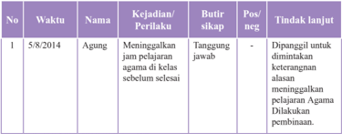

Tabel ini menunjukkan catatan pelanggaran siswa Agung pada tanggal 5 Agustus 2014. Topik utama tabel adalah pelanggaran siswa terhadap aturan sekolah, yaitu meninggalkan jam pelajaran agama di kelas sebelum selesai. Dalam tabel tersebut, kolom-kolom yang ada meliputi nomor urut, waktu pelanggaran, nama pelanggar, kejadian atau perilaku yang dilakukan, tindakan yang dilakukan oleh guru, posisi (positif atau negatif), dan tindakan lanjutan yang diberikan kepada pelanggar. Data penting yang terlihat dalam tabel ini adalah bahwa Agung telah diberi tugas untuk ditanggapi dan diperbaiki, serta diberikan kesempatan untuk menghindari pelanggaran seperti itu di masa mendatang.

 

---
## 📄 Halaman 33

---
**📊 Tabel**

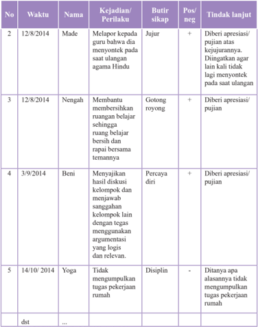

Tabel ini berisi informasi tentang tindakan pendidikan yang dilakukan oleh seorang siswa pada tanggal tertentu. Topik utama tabel adalah tindakan pendidikan yang dilakukan oleh siswa. Kolom-kolom yang ada meliputi nomor, waktu, nama, kejadian/perilaku, butir sikap, pos/neg, dan tindakan lanjut. Data penting yang terlihat adalah bahwa siswa seringkali diberi apresiasi/pujian atas tindakan positif mereka, seperti membantu teman belajar atau menunjukkan kepercayaan diri. Sementara itu, tindakan negatif seperti tidak mengumpulkan tugas pekerjaan rumah juga disebutkan.

Jika  seorang  peserta  didik  menunjukkan  perilaku  yang  kurang  baik,  pendidik harus  segera  menindaklanjutinya  dengan  melakukan  pendekatan  dan  pembinaan, secara  bertahap  peserta  didik  tersebut  dapat  menyadari  dan  memperbaiki  sendiri perilakunya sehingga menjadi lebih baik.

 

---
## 📄 Halaman 34

Tabel 2.2 dan Tabel 2.3 berturut-turut menyajikan contoh jurnal penilaian sikap spiritual dan sikap sosial yang dibuat oleh wali kelas dan/atau guru BK. Satu jurnal digunakan untuk satu kelas jangka waktu satu semester.

Nama Satuan Pendidikan

: SMA /SMK ......................................

Kelas/Semester

: XI/Semester I

Tahun pelajaran

: 2014/2015

---
**📊 Tabel**

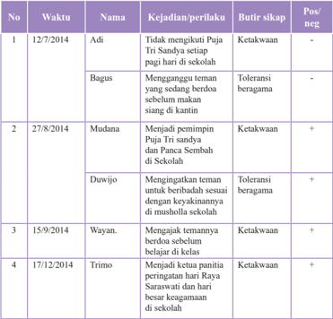

Tabel ini berisi informasi tentang kejadian dan perilaku siswa di sekolah pada tanggal tertentu. Topik utamanya adalah perilaku dan sikap siswa terhadap teman mereka. Kolom-kolom yang ada meliputi nomor urut, waktu, nama siswa, kejadian/periIaku, butir sikap, dan posisi positif atau negatif. Data penting yang terlihat adalah bahwa beberapa siswa memiliki sikap ketakwaan terhadap teman mereka, sementara yang lain memiliki sikap toleransi terhadap berbagai agama. Siswa yang memiliki sikap ketakwaan seringkali memiliki perilaku yang tidak menghormati teman mereka, sedangkan yang memiliki sikap toleransi cenderung lebih baik dalam menjaga hubungan dengan teman mereka.

 

---
## 📄 Halaman 35

---
**📊 Tabel**

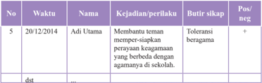

Tabel ini menunjukkan informasi tentang perilaku dan sikap Adi Utama pada tanggal 20/12/2014. Topik utama tabel adalah tentang kehadiran dan perilaku Adi Utama di sekolah. Kolom-kolom yang ada meliputi nomor urut (No.), waktu, nama, kejadian/perilaku, butir sikap, dan posisi positif atau negatif. Data penting yang terlihat adalah bahwa Adi Utama membutuhkan tenan untuk mempersiapkan perayaan keagamaan yang berbeda dengan agamannya di sekolah, dan memiliki toleransi beragam. Posisi positif terlihat pada kolom "Pos/neg" dengan nilai "+".

Nama Satuan Pendidikan

: SMA / SMK......................................

Kelas/Semester

: XI/Semester / I

Tahun pelajaran

: 2014/2015

---
**📊 Tabel**

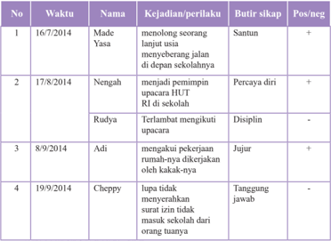

Tabel ini berisi catatan tentang perilaku siswa di sekolah pada periode tertentu. Topik utamanya adalah kegiatan dan perilaku siswa yang dilaporkan oleh guru. Kolom-kolomnya meliputi nomor urut, waktu, nama siswa, kejadian/perilaku, butir sikap, dan posisi positif atau negatif. Data penting yang terlihat adalah bahwa beberapa siswa seperti Made Yasa dan Cheppy memiliki sikap positif, sementara Nengah dan Ruddy memiliki sikap negatif. Siswa-siswa lainnya juga diberi butir sikap yang mendukung atau mengecualikan perilaku mereka.

 

---
## 📄 Halaman 36

---
**📊 Tabel**

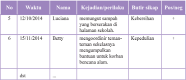

Tabel ini berisi informasi tentang tindakan positif dan negatif yang dilakukan oleh beberapa siswa di sekolah pada tanggal tertentu. Topik utama tabel adalah kegiatan dan perilaku siswa yang mempengaruhi lingkungan sekolah dan masyarakat sekitarnya. Kolom-kolom yang ada meliputi nomor urut (No.), waktu, nama siswa, kejadian/perilaku, butir sikap, dan posisi positif atau negatif. Data penting yang terlihat adalah bahwa Luciana menunjukkan sikap kebersihan positif dengan menyumbang sampah bersih ke dalam kantong sampah di halaman sekolah. Sementara itu, Betty menunjukkan sikap kepedulian positif dengan mengorganisir teman-teman sekelasnya untuk mengumpulkan bantuan untuk korban bencana alam. Tabel ini menunjukkan bahwa siswa-siswa tersebut aktif dalam menghormati lingkungan dan membantu sesama.

### B. Penilaian Diri

Penilaian  diri  dilakukan  dengan  cara  meminta  peserta  didik  untuk mengemukakan  kelebihan  dan  kekurangan  dirinya  dalam  berperilaku. selain  itu  penilaian  diri  juga  dapat  digunakan  untuk  membentuk  sikap peserta  didik  terhadap  mata  pelajaran.  hasil  penilaian  diri  peserta  didik dapat digunakan sebagai data konfirmasi. Penilaian diri dapat memberikan dampak positf terhadap perkembangan kepribadian peserta didik, antara lain:

- dapat  menumbuhkan  rasa  percaya  diri,  karena  diberi  kepercayaan untuk menilai diri sendiri,
- peserta didik menyadari kekuatan dan kelemahan diri, karena ketika melakukan penilaian, harus melakukan introspeksi terhadap kekuatan dan kelemahan yang dimiliki,
- dapat  mendorong,  membiasakan,  dan  melatih  peserta  didik  untuk berbuat jujur, karena dituntut untuk jujur dan objektif  dalam melakukan penilaian, dan

 

---
## 📄 Halaman 37

- membentuk sikap terhadap mata pelajaran/pengetahuan.
Instrumen yang digunakan  untuk penilaian diri berupa lembar penilaian diri yang dirumuskan secara sederhana, namun jelas dan tidak bermakna ganda, dengan bahasa lugas yang dapat dipahami peserta didik, dan  menggunakan  format  sederhana  yang  mudah  diisi  peserta  didik. Lembar penilaian diri dibuat sedemikian rupa sehingga dapat menunjukkan sikap peserta didik dalam situasi yang nyata/sebenarnya, bermakna, dan mengarahkan peserta didik mengidentifikasi kekuatan atau kelemahannya. Hal ini untuk menghilangkan kecenderungan peserta didik menilai dirinya secara  subjektif.  Penilaian  diri  oleh  peserta  didik  dilakukan  melalui langkah-langkah sebagai berikut.

- Menjelaskan kepada peserta didik tujuan penilaian diri.
- Menentukan indikator yang akan dinilai.
- Menentukan kriteria penilaian yang akan digunakan.
- Merumuskan format  penilaian,  dapat  berupa  daftar  cek  ( checklist ) atau skala penilaian ( rating scale ).
Contoh:  lembar  penilaian  diri  menggunakan  daftar  cek  ( checklist )  pada waktu kegiatan kelompok:

Nama

: ...............................................................................

Kelas/Semester

: ............................/.................................................

### Petunjuk:

- Bacalah baik-baik setiap pernyataan dan berilah tanda Ö pada kolom yang sesuai dengan keadaan dirimu yang sebenarnya!

 

---
## 📄 Halaman 38

### 2. Serahkan kembali format yang sudah kamu isi kepada bapak/ibu guru!

---
**📊 Tabel**

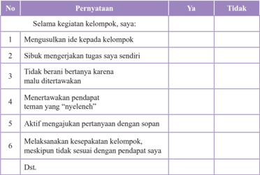

Tabel ini berisi pertanyaan tentang perilaku dalam kegiatan kelompok, dengan dua pilihan jawaban: "Ya" dan "Tidak". Topik utama tabel adalah tentang bagaimana seseorang berinteraksi dan bertindak dalam situasi kelompok. Kolom-kolomnya mencakup berbagai aspek seperti mengusulkan ide, menyelesaikan tugas sendiri, berani bertanya, menertawakan pendapat teman yang "nyeleleh", menghargai pertanyaan dengan sopan, dan melaksanakan kesepakatan kelompok. Data penting yang terlihat adalah bahwa banyak responden menganggap diri mereka sebagai individu yang suka menyelesaikan tugas sendiri (90%) dan tidak berani bertanya karena malu (85%). Ini menunjukkan bahwa banyak orang cenderung lebih fokus pada tugas mereka sendiri daripada berkomunikasi secara efektif dengan kelompok.

Penilaian diri tidak hanya digunakan untuk menilai sikap, tetapi juga dapat digunakan  untuk  menilai  sikap  terhadap  pengetahuan  dan  keterampilan  serta kesulitan belajar peserta didik.

### C. Penilaian Antarteman

- Penilaian  antarteman  adalah  penilaian  dengan  cara  peserta  didik saling saling menilai perilaku temannya.  Penilaian antarteman dapat mendorong: 1). Obyektifitas peserta didik, 2). empati, 3).  mengapresiasi  keragaman  /  perbedaan,  dan  4).  refleksi  diri. Sebagaimana penilaian diri, hasil penilaian antarteman dapat digunakan  sebagai  data  konfirmasi.  Instrumen  yang  digunakan berupa  lembar  penilaian  antarteman.  Kriteria  instrumen  penilaian antarteman sebagai berikut.

 

---
## 📄 Halaman 39

- Sesuai dengan indikator yang akan diukur.
- Indikator dapat diukur melalui pengamatan peserta didik.
- Kriteria penilaian dirumuskan secara sederhana, namun jelas dan  tidak  berpotensi  munculnya  penafsiran  makna  ganda/ berbeda.
- Menggunakan  bahasa  lugas  yang  dapat  dipahami  peserta didik.
- Menggunakan format sederhana dan mudah digunakan oleh peserta didik.
- Indikator  menunjukkan  sikap/perilaku  peserta  didik  dalam situasi yang nyata atau sebenarnya dan dapat diukur.
Penilaian  antarteman  paling  cocok  dilakukan  pada  saat  peserta  didik melakukan kegiatan kelompok, Misalnya setiap peserta didik diminta mengamati menilaian dua orang temannya, dan dia juga akan dinilai oleh dua orang teman lainnya dalam kelompoknya, sebagaimana diagram pada gambar berikut:

---
**🖼️ Gambar/Diagram**

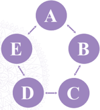

> **Deskripsi Visual:** Gambar ini adalah diagram yang menunjukkan hubungan antara beberapa konsep atau objek. Diagram ini terdiri dari empat elemen utama: A, B, C, dan D. Elemen-elemen ini terhubung melalui relasi yang jelas, dengan A menghubungkan ke B, B menghubungkan ke C, dan D menghubungkan ke C. Elemen-elemen lain, yaitu E, juga terhubung ke A dan B. Teks, angka, atau label penting yang terlihat pada gambar ini tidak ada, sehingga informasi kunci yang dapat diambil pembaca hanya berdasarkan struktur dan relasi antara elemen-elemen tersebut.

 

---
## 📄 Halaman 40

Diagram di atas menggambarkan saling menilai sikap/perilaku antarteman.

- Peserta didik A mengamati dan menilai B dan E; A juga dinilai oleh B dan E
- Peserta didik B mengamati dan menilai A dan C; B juga dinilai oleh A dan C
- Peserta didik C mengamati dan menilai B dan D; C juga dinilai oleh B dan D
- Peserta didik D mengamati dan menilai C dan E; D juga dinilai oleh C dan E
- Peserta didik E mengamati dan menilai D dan A; E juga dinilai oleh D dan A
Contoh instrumen penilaian (lembar pengamatan) antarteman ( peer assessment ) menggunakan daftar cek ( checklist) pada waktu bekerja kelompok.

### Petunjuk

- Amatilah perilaku 2 orang temanmu selama mengikuti kegiatan kelompok!
- Isilah kolom yang tersedia dengan tanda cek ( √ )  jika  temanmu menunjukkan perilaku yang sesuai dengan pernyataan untuk indikator yang kamu amati atau tanda strip (-) jika temanmu tidak menunjukkan perilaku tersebut!
- Serahkan hasil pengamatan kepada bapak/ibu pendidik !
Nama Teman

: 1. …………….........……..... 2. …………….........……......

Nama Penilai

: …………………………………........................................

Kelas/Semester

: …………………………………........................................

 

---
## 📄 Halaman 41

---
**📊 Tabel**

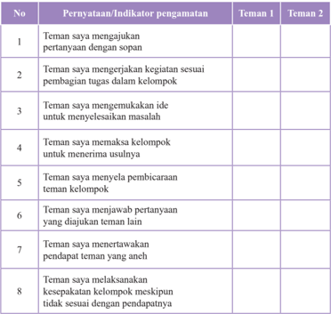

Tabel ini berisi poin-poin penting tentang perilaku sosial dan interaksi antar teman dalam sebuah kelompok. Topik utamanya adalah bagaimana teman-teman saling berinteraksi dan bekerja sama. Kolom pertama menunjukkan pernyataan atau indikator pengamatan, sedangkan kolom kedua menampilkan reaksi teman 1 dan teman 2 terhadap setiap pernyataan tersebut. Data penting yang terlihat adalah bahwa teman-teman sering mengajukan pertanyaan dan menjawab pertanyaan, menyelesaikan masalah bersama, dan menerima usulan dari teman lain. Namun, ada juga hal-hal seperti tidak menghargai pendapat teman yang aneh atau tidak melaksanakan kesepakatan kelompok yang tidak sesuai dengan pendapatnya. Ini menunjukkan bahwa interaksi sosial dalam kelompok memerlukan komunikasi yang baik dan kemampuan untuk menyelesaikan konflik.

### Pernyataan

Pernyataan-pernyataan  untuk  Indikator  yang  diamati  pada  format  di  atas merupakan contoh. Pernyataan tersebut ada yang bersifat positif (nomor 1, 2, 3, 6, 8) dan ada yang bersifat negatif (nomor 4, 5, dan 7).

Pendidik dapat berkreasi membuat sendiri pernyataan atau pertanyaan yang dengan memperhatikan kreteria instrumen penilaian antarteman

Lembar penilaian diri dan penilaian antarteman yang telah diisi dikumpulkan  kepada  pendidik,  selanjutnya  dipilah  dan  direkapitulasi  sebagai

 

---
## 📄 Halaman 42

bahan tindaklanjut. Pendidik dapat menganalisis jurnal atau data/informasi hasil observasi penilaian sikap dengan data/informasi hasil penilaian diri dan penilaian antarteman  ( triangulasi )  sebagai  bahan  pembinaan.  Hasil  analisis  dinyatakan dalam deskripsi sikap spiritual dan sikap sosial yang perlu segera ditindaklanjuti. Peserta didik yang menunjukkan banyak perilaku positif diberi apresiasi/pujian dan  peserta  didik  yang  menunjukkan  banyak  perilaku  negatif  diberi  motivasi sehingga selanjutnya peserta didik tersebut dapat membiasakan diri berperilaku baik (positif).

### b.  Penilaian Pengetahuan

- Pengertian Penilaian pengetahuan merupakan penilaian untuk mengukur  kemampuan  peserta  didik  berupa  pengetahuan  faktual, konseptual,  prosedural,  dan  metakognitif  serta  kecakapan  berpikir tingkat rendah hingga tinggi. Penilaian ini berkaitan dengan ketercapaian  Kompetensi  Dasar  pada  KI-3  yang  dilakukan  oleh guru mata pelajaran. Penilaian pengetahuan dilakukan  dengan berbagai  teknik  penilaian.  Pendidik  menetapkan  teknik  penilaian yang  sesuai  dengan  karakteristik  kompetensi  yang  akan  dinilai. Penilaian dimulai dengan perencanaan pada saat menyusun Rencana pelaksanaan  Pembelajaran  (RPP)  dengan  mengacu  pada  silabus. Penilaian pengetahuan, selain untuk mengetahui apakah peserta didik telah  mencapai  ketuntasan  belajar  ( mastery  learning ),  juga  untuk mengidentifikasi kelemahan dan kekuatan penguasaan pengetahuan peserta didik dalam proses pembelajaran ( diagnostic ).  Oleh karena itu,

 

---
## 📄 Halaman 43

pemberian umpan balik ( feedback ) kepada peserta didik oleh pendidik merupakan hal yang sangat penting, sehingga hasil penilaian dapat segera  digunakan  untuk  perbaikan  mutu  pembelajaran.  Ketuntasan belajar untuk pengetahuan ditentukan oleh satuan pendidikan dengan mempertimbangkan batas standar minimal nilai ujian Nasional yang ditetapkan oleh pemerintah. Secara bertahap satuan pendidikan terus meningkatkan kreteria ketuntasan belajar dengan mempertimbangkan potensi  dan  krakteristik  masing-masing  satuan  pendidikan  sebagai bentuk peningkatan kualitas hasil belajar.

### 2. Teknik Penilaian Pengetahuan

Berbagai  teknik  penilaian  pengetahuan  dapat  digunakan  sesuai dengan karakteristik masing-masing KD. Teknik yang biasa digunakan adalah tes tertulis, tes lisan, dan penugasan. Namun tidak menutup kemungkinan digunakan teknik lain yang sesuai, misalnya portofolio dan observasi. Skema penilaian pengetahuan dapat dilihat pada gambar berikut.

 

---
## 📄 Halaman 44

---
**🖼️ Gambar/Diagram**

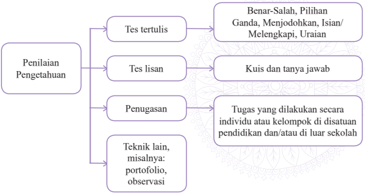

> **Deskripsi Visual:** Gambar ini adalah diagram yang menunjukkan struktur penilaian pengetahuan dalam kurikulum pendidikan. Diagram ini dibagi menjadi empat bagian utama:

1. **Penilaian Pengetahuan**:
   - **Tes tertulis**: Ditampilkan sebagai dua pilihan, yaitu "Benar-Salah" dan "Pilihan Ganda". Untuk tes tertulis, ada dua jenis tes lisan: "Kuis" dan "Tanya Jawab".
   - **Pemusasan**: Ini mencakup tugas individu atau kelompok yang dilakukan di situasi pendidikan dan/atau luar sekolah.
   - **Teknik lain**: Ini termasuk portofolio dan observasi.

Elemen-elemen utama diagram ini adalah:
- **Tes tertulis**: Dibagi menjadi "Benar-Salah" dan "Pilihan Ganda".
- **Tes lisan**: Dibagi menjadi "Kuis" dan "Tanya Jawab".
- **Pemusasan**: Mencakup tugas individu/kelompok.
- **Teknik lain**: Portofolio dan observasi.

Informasi kunci yang dapat diambil pembaca melalui gambar ini adalah bahwa penilaian pengetahuan dalam kurikulum pendidikan mencakup berbagai metode seperti tes tertulis, tes lisan, pemusasan, dan teknik lain seperti portofolio dan observasi.

Berikut ini adalah penjelasan Gambar 2.3.

### A. Tes Tertulis

Tes  tertulis  adalah  tes  dengan  soal  dan  jawaban  disajikan  secara tertulis untuk mengukur atau memperoleh informasi tentang kemampuan peserta  tes.  Tes  tertulis  menuntut  adanya  respons  dari  peserta  tes  yang dapat dijadikan sebagai representasi dari kemampuan yang dimiliki.

Instrumen tes tertulis dapat berupa soal pilihan ganda, isian, jawaban singkat, benar-salah, menjodohkan, dan uraian. Pengembangan instrumen tes tertulis mengikuti langkah-langkah berikut.

- Menetapkan tujuan tes, apakah tujuan tes untuk seleksi, penempatan, diagnostik, formatif, atau sumatif.
- Menyusun kisi-kisi. yaitu spesifikasi yang digunakan sebagai acuan menulis  soal.  Kisi-kisi  memuat  rambu-rambu  tentang  kriteria  soal yang akan ditulis, meliputi KD yang akan diukur, materi, indikator

 

---
## 📄 Halaman 45

- soal, bentuk soal, dan nomor soal. Dengan adanya kisi-kisi, penulisan soal lebih terarah sesuai dengan tujuan tes dan proporsi soal per KD atau materi yang hendak diukur lebih tepat.
- Menulis soal berdasarkan kisi-kisi dan kaidah penulisan soal.
- Menyusun  pedoman  penskoran  sesuai  dengan  bentuk  soal  yang digunakan. Pada soal pilihan ganda, isian, menjodohkan, dan jawaban singkat  disediakan  kunci  jawaban  karena  jawabannya dapat diskor dengan obyektif. Sedangkan untuk soal uraian disediakan pedoman penskoran yang berisi alternatif jawaban dan rubrik dengan rentang skor.
- Melakukan analisis kualitatif (telaah soal) sebelum soal diujikan.

### Contoh Kisi-Kisi

Nama Satuan Pendidikan

: SMA Negeri 42 Jakarta

Kelas/Semester

: XI /Semester I

Tahun pelajaran

: 2014/2015

Mata Pelajaran

: Pendidikan Agama Hindu dan Budi Pekerti

---
**📊 Tabel**

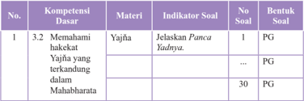

Tabel ini menunjukkan detail tentang kompetensi dasar 3.2.1, yaitu memahami hakekat Yajña yang terkandung dalam Mahabharata. Kolom-kolomnya meliputi No., Kompetensi Dasar, Materi, Indikator Soal, No Soal, dan Bentuk Soal. Topik utama tabel ini adalah penjelasan tentang kompetensi dasar tersebut. Data penting yang terlihat antara lain bahwa satu indikator soal (Jelaskan Pancu Yadnya) diberikan untuk materi Yajña, sedangkan dua indikator soal (tidak ada) tidak diberikan untuk materi yang sama. Selain itu, bentuk soal yang digunakan adalah PG (Penggambaran).

 

---
## 📄 Halaman 46

---
**📊 Tabel**

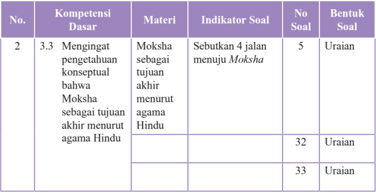

Tabel ini berisi informasi tentang kompetensi dasar yang berkaitan dengan Moksha sebagai tujuan akhir menurut agama Hindu. Kolom-kolomnya meliputi nomor urutan (No.), kompetensi dasar (Kompetensi Dasar), materi (Materi), indikator soal (Indikator Soal), no soal (No Soal), dan bentuk soal (Bentuk Soal). Topik utama tabel ini adalah pembelajaran tentang Moksha dan tujuannya dalam agama Hindu. Data penting yang terlihat adalah bahwa ada 33 soal yang ditujukan untuk menjawab tentang Moksha sebagai tujuan akhir menurut agama Hindu, dengan bentuk soal yang umumnya adalah uraian.

Setelah menyusun kisi-kisi, selanjutnya dalam mengembangkan butir soal dengan memperhatikan kaidah penulisan butir  soal  meliputi  substansi/materi, konstruksi, dan bahasa.

### 1. Tes Tulis Bentuk Pilihan Ganda

Butir  soal  pilihan  ganda  terdiri  atas  pokok  soal  ( stem )  dan  pilihan jawaban ( option ). Untuk tingkat SMA biasanya digunakan 5 (lima) pilihan jawaban.  Dari  kelima  pilihan  jawaban  tersebut,  salah  satu  adalah  kunci ( key )  yaitu  jawaban  yang  benar  atau  paling  tepat,  dan  lainnya  disebut pengecoh ( distractor ).

Kaidah penulisan soal bentuk pilihan ganda sebagai berikut.

### a. Substansi/Materi

- Soal sesuai dengan indikator (menuntut tes bentuk PG).
- Materi yang diukur sesuai dengan kompetensi (UKRK: Urgensi, Keberlanjutan, Relevansi, dan Keterpakaian).
- Pilihan jawaban homogen dan logis.
- Hanya ada satu kunci jawaban yang tepat.

 

---
## 📄 Halaman 47

### b. Konstruksi

- Pokok soal dirumuskan dengan singkat, jelas, dan tegas.
- Rumusan pokok soal dan pilihan jawaban merupakan pernyataan yang diperlukan saja.
- Pokok soal tidak memberi petunjuk kunci jawaban.
- Gambar/grafik/tabel/diagram dan sebagainya jelas dan berfungsi.
- Pokok soal tidak menggunakan pernyataan negatif ganda.
- Panjang rumusan pilihan jawaban relatif sama.
- Pilihan jawaban tidak menggunakan pernyataan 'semua jawaban benar' atau 'semua jawaban salah'.
- Pilihan  jawaban  yang  berbentuk  angka  atau  waktu  disusun berdasarkan besar kecilnya angka atau kronologis kejadian.
- Butir soal tidak bergantung pada jawaban soal sebelumnya.

### c. Bahasa

- Menggunakan  bahasa yang sesuai dengan kaidah Bahasa Indonesia.
- Menggunakan bahasa yang komunikatif.
- Pilihan  jawaban  tidak  mengulang  kata/kelompok  kata  yang sama, kecuali merupakan satu kesatuan pengertian.
- Tidak menggunakan bahasa yang berlaku setempat/tabu.
Contoh butir soal pilihan ganda mata pelajaran Pendidikan Agama Hindu dan Budi pekerti berdasarkan contoh kisi-kisi di atas:

 

---
## 📄 Halaman 48

Rumusan butir soal:

Persembahan  yang  dilaksanakan  dengan  tujuan  menghaturkan  terima  kasih terhadap Sang Hyang Widhi atas warenugrahanya termasuk.....

- Dewa Yadnya
- Manusa Yadnya
- Rsi Yadnya
- Bhuta Yadnya
- Rsi Yadnya

### Kunci Jawaban: A

### 2. Tes Tulis Bentuk Uraian

Tes  tulis  bentuk  uraian  atau  esai  menuntut  peserta  didik  untuk mengorganisasikan dan menuliskan jawaban dengan kalimatnya sendiri.

Kaidah penulisan soal bentuk uraian sebagai berikut.

### a. Substansi/Materi

- Soal sesuai dengan indikator (menuntut tes bentuk uraian)
- Materi yang diukur sesuai dengan kompetensi (UKRK)
- Batasan pertanyaan dan jawaban yang diharapkan sesuai
- Isi  materi  yang  ditanyakan  sesuai  dengan  jenjang,  jenis sekolah, dan tingkat kelas

### b. Konstruksi

- Ada petunjuk yang jelas mengenai cara mengerjakan soal
- Rumusan kalimat soal/pertanyaan menggunakan kata tanya atau perintah yang menuntut jawaban terurai

 

---
## 📄 Halaman 49

- Gambar/grafik/tabel/diagram dan sejenisnya harus jelas dan berfungsi
- Ada pedoman penskoran

### c. Bahasa

- Rumusan kalimat soal/pertanyaan komunikatif
- Tidak  mengandung  kata-kata/kalimat  yang  menimbulkan penafsiran ganda atau salah pengertian
- Butir soal menggunakan bahasa Indonesia yang baku
- Tidak mengandung kata yang menyinggung perasaan
- Tidak menggunakan bahasa yang berlaku setempat/tabu

### Contoh rumusan butir soal uraian berdasarkan contoh kisi-kisi di atas:

Perhatikan informasi berikut untuk menjawab pertanyaan Nomor 31.

Sebutkan 4 jalan menuju Moksha !

### Jawaban:

- Bhakti Marga
- Karma Marga
- Jnana Marga
- Raja Marga

### B. Tes Lisan

Tes  lisan  merupakan  pemberian  soal/pertanyaan  yang  menuntut peserta didik menjawabnya secara lisan, dan dapat diberikan secara klasikal pada waktu pembelajaran. Jawaban peserta didik dapat berupa kata, frase,

 

---
## 📄 Halaman 50

kalimat  maupun  paragraf.  Tes  lisan  menumbuhkan  sikap  peserta  didik untuk berani berpendapat.

Rambu-rambu pelaksanaan tes lisan:

- Tes lisan dapat digunakan untuk mengambil nilai ( assessment of learning ) dan dapat juga digunakan sebagai fungsi diagnostik untuk mengetahui pemahaman peserta didik terhadap kompetensi dan materi pembelajaran ( assessment for learning ).
- Pertanyaan harus sesuai dengan tingkat kompetensi dan lingkup materi pada kompetensi dasar yang dinilai.
- Pertanyaan  diharapkan  dapat  mendorong  peserta  didik  dalam mengonstruksi jawabannya sendiri.
- Pertanyaan disusun dari yang sederhana ke yang lebih komplek.
Contoh pertanyaan untuk tes lisan dalam pembelajaran.

Mata Pelajaran

: Pendidikan agama Hindu dan Budi Pekerti

Kelas/Semester

: XI / I

Kompetensi Dasar

: 4.1 Menyajikan Yogasanas kehidupan sehari-hari Indikator

dalam

- Peserta  didik  dapat  menyebutkan  manfaat mempraktikan Yogasanas
- Peserta didik dapat menjelaskan sikap-sikap Yogasanas dan manfaatnya

 

---
## 📄 Halaman 51

Pertanyaan

- : 1. Sebutkan manfaat mempraktikan Yogasanas !
- Jelaskan sikap-sikap Yogasanas dan manfaatnya!

### C. Penugasan

Penugasan  adalah  pemberian  tugas  kepada  peserta  didik  untuk mengukur dan/atau meningkatkan pengetahuan. Penugasan yang digunakan untuk  mengukur  pengetahuan (assessment  of  learning) dapat  dilakukan setelah proses pembelajaran sedangkan penugasan yang digunakan untuk meningkatkan pengetahuan (assessment for learning) diberikan sebelum dan/atau selama proses pembelajaran . Penugasan dapat berupa pekerjaan rumah  dan/atau  proyek  yang  dikerjakan  secara  individu  atau  kelompok sesuai  dengan  karakteristik  tugas.  Penugasan  lebih  ditekankan  pada pemecahan masalah dan tugas produktif lainnya.

Rambu-rambu penugasan:

- Tugas mengarah pada pencapaian indikator hasil belajar.
- Tugas dapat dikerjakan oleh peserta didik, selama proses pembelajaran atau merupakan bagian dari pembelajaran mandiri.
- Pemberian  tugas  disesuaikan  dengan  taraf  perkembangan  peserta didik.
- Materi penugasan harus sesuai dengan cakupan Kurikulum.
- Penugasan ditujukan untuk memberikan kesempatan kepada peserta didik menunjukkan kompetensi individualnya meskipun tugas diberikan secara kelompok.

 

---
## 📄 Halaman 52

- Untuk tugas kelompok, perlu dijelaskan rincian tugas setiap anggota kelompok.
- Tampilan kualitas hasil tugas yang diharapkan disampaikan secara jelas.
- Penugasan harus mencantumkan rentang waktu pengerjaan tugas.

### Contoh penugasan

Mata Pelajaran

: Pendidikan Agama Hindu dan Budi Pekerti

Kelas/Semester

: XI / I

Tahun Pelajaran

: 2014/2015

### Kompetensi Dasar:

- 3.1 Menerapkan Yogasanas menurut Susastra Hindu.

### Indikator:

Menganalisis praktik Yogasanas dalam masyarakat.

### Rincian tugas:

- Amatilah bagaimana pekembangan praktik Yogasanas dalam masyarakat.
- Perhatikan  di  mana  letak  perubahan  jika  sebelum  dan  sesudah  praktik Yogasanas dalam masyarakat.
- Buatlah laporan hasil pengamatanmu dengan tampilan yang menarik dan menggunakan  bahasa  Indonesia  yang  benar  sehingga  mudah  dipahami. Laporan meliputi pendahuluan (tujuan penyusunan laporan, nama praktik

 

---
## 📄 Halaman 53

Yogasanas dalam  masyarakat  tersebut,  tempat,  waktu  dan  pelaksanaan (hasil pengamatan praktik Yogasanas dalam masyarakat).

Contoh rubrik penilaian laporan tugas Pendidikan agama Hindu dan Budi Pekerti.

---
**📊 Tabel**

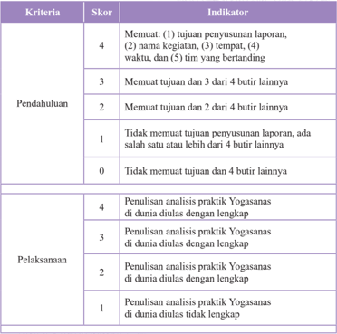

Tabel ini menunjukkan skor dan indikator untuk dua kriteria utama: Pendahuluan dan Pelaksanaan. Topik utama tabel adalah evaluasi kualitas penulisan analisis praktik Yogasanas. Kolom "Skor" berisi angka 4 hingga 0, sementara kolom "Indikator" menyebutkan tujuan-tujuan yang harus dicapai dalam masing-masing kriteria. Data penting yang terlihat adalah bahwa skor tertinggi adalah 4, yang mencakup semua tujuan pendahuluan dan pelaksanaan, sedangkan skor 0 menunjukkan ketidakmampuan untuk mencapai tujuan yang ditetapkan.

 

---
## 📄 Halaman 54

---
**📊 Tabel**

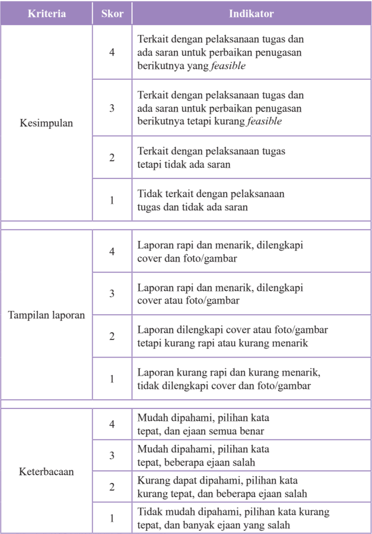

Tabel ini berisi informasi tentang kriteria, skor, dan indikator untuk menilai kemampuan seseorang dalam menyelesaikan tugas. Topik utama tabel adalah tentang kemampuan seseorang dalam menyelesaikan tugas dengan baik, termasuk keterkaitan dengan pelaksanaan tugas, keberhasilan dalam menyelesaikan tugas, dan kemampuan dalam menulis laporan. Kolom-kolom yang ada meliputi Kesimpulan, Tampilan laporan, dan Keterbacaan. Data penting yang terlihat adalah bahwa skor 4 diberikan jika seseorang dapat menyelesaikan tugas dengan baik dan memberikan laporan yang menarik, sedangkan skor 1 diberikan jika seseorang tidak mampu menyelesaikan tugas dan tidak memberikan laporan yang menarik.

Contoh pengisian hasil penilaian tugas

 

---
## 📄 Halaman 55

---
**📊 Tabel**

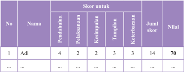

Tabel ini menunjukkan skor yang diberikan kepada seorang siswa bernama Adi dalam berbagai aspek pembelajaran. Topik utama tabel adalah skor yang diberikan kepada Adi untuk berbagai kriteria pembelajaran, seperti pedahanan, pekaan stan, kepintaran, tamalan, dan keterampilan. Kolom-kolom yang ada dalam tabel meliputi nomor urut (No), nama (Nama), skor untuk setiap kriteria pembelajaran, jumlah skor, dan nilai akhir. Data penting yang terlihat dalam tabel adalah bahwa Adi mendapatkan skor tertinggi pada kriteria pedahanan dengan nilai 4, sedangkan skor terendahnya adalah pada kriteria kepintaran dengan nilai 2. Nilai akhir Adi adalah 70, yang menunjukkan bahwa ia telah memperoleh skor yang cukup baik dalam berbagai aspek pembelajaran.

### Keterangan :

- Skor maksimal = banyaknya kriteria x skor tertinggi setiap kriteria.
- Nilai tugas = (Jumlah skor perolehan: skor maks) x 100.
- Pada contoh di atas, skor maksimal = 5 x 4= 20.
- Pada contoh di atas nilai tugas Adi = (14: 20) x 100 = 70.

### d. Observasi

Observasi selama proses pembelajaran selain dilakukan untuk penilai sikap, juga dapat dilakukan untuk penilaian pengetahuan, misalnya pada waktu diskusi atau kegiatan kelompok. Teknik ini merupakan cerminan dari penilaian autentik.

### Contoh format observasi terhadap diskusi kelompok

---
**📊 Tabel**

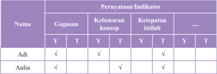

Tabel ini menunjukkan hasil evaluasi dua orang siswa, yaitu Adi dan Aulia, terhadap beberapa gagasan, kebenaran konsep, ketepatan istilah, dan lainnya. Topik utama tabel adalah evaluasi pengetahuan dan pemahaman siswa tentang berbagai konsep dan istilah. Kolom-kolom yang ada meliputi nama siswa (Adi dan Aulia), dan berbagai indikator evaluasi seperti gagasan, kebenaran konsep, ketepatan istilah, dan lainnya. Data penting yang terlihat adalah bahwa Adi memiliki nilai positif untuk semua indikator evaluasi, sementara Aulia hanya memiliki nilai positif untuk beberapa indikator. Ini menunjukkan bahwa Adi memiliki pengetahuan dan pemahaman yang lebih baik dibandingkan dengan Aulia.

 

---
## 📄 Halaman 56

---
**📊 Tabel**

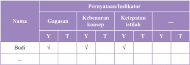

Tabel ini menunjukkan hasil evaluasi beberapa indikator untuk seorang siswa bernama Budi. Kolom "Nama" menyatakan nama-nama siswa yang telah dilakukan evaluasi. Kolom "Pernyataan/Indikator" berisi berbagai indikator yang diuji, seperti gagasan, keberanian konsep, ketepatan istilah, dan lain-lain. Setiap baris pada tabel menunjukkan hasil evaluasi satu indikator untuk satu siswa. Misalnya, untuk indikator "Gagasan", Budi mendapat nilai "Y" (Ya) untuk gagasan, tetapi tidak ada informasi tentang keberanian konsep atau ketepatan istilah. Ini menunjukkan bahwa evaluasi ini fokus pada beberapa aspek khusus dari pengetahuan dan kemampuan belajar siswa.

### Keterangan:

Diisi tanda cek ( Ö ): Y = ya/benar/tepat; T = tidak tepat

Hasil  yang  diperoleh  dari  observasi  digunakan  untuk  mendeteksi  kelemahan/ kekuatan penguasaan kompetensi pengetahuan dan memperbaiki proses pembelajaran khususnya pada indikator yang belum muncul.

### c. Penilaian Keterampilan

### 1. Pengertian Penilaian Keterampilan

Penilaian keterampilan adalah penilaian untuk mengukur pencapaian kompetensi peserta didik terhadap kompetensi dasar pada KI-4. Penilaian keterampilan menuntut peserta didik mendemonstrasikan suatu kompetensi tertentu. Penilaian inidimaksudkan untuk mengetahui apakah pengetahuan yang sudah dikuasai peserta didik dapat digunakan untuk mengenal dan menyelesaikan masalah dalam kehidupan sesungguhnya ( real life ).

Ketuntasan belajar untuk keterampilan ditentukan oleh satuan pendidikan, secara bertahap satuan pendidikan terus meningkatkan kreteria ketuntasan  belajar  dengan  mempertimbangkan  potensi  dan  karakteristik

 

---
## 📄 Halaman 57

masing-masing  satuan  pendidikan  senagai  bentuk  peningkatan  kualitas hasil belajar.

### 2. Teknik Penilaian Keterampilan

Penilaian keterampilan dapat dilakukan dengan berbagai teknik antara lain penilaian praktik/kerja, proyek, dan portofolio. Teknik penilaian lain dapat  digunakan  sesuai  dengan  karakteristik  KD  pada  KI-4  pada  mata pelajaran yang akan diukur. Instrument yang digunakan berupa daftar cek atau skala penilaian (Rating Scale) yang dilengkapi rubrik.

Skema penilaian keterampilan dapat dilihat pada gambar berikut.

### Skema Penilaian Keterampilan

---
**🖼️ Gambar/Diagram**

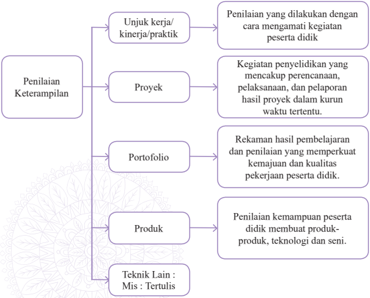

> **Deskripsi Visual:** Gambar ini adalah diagram yang menunjukkan berbagai metode penilaian keterampilan dalam konteks pendidikan. Diagram ini terdiri dari empat bagian utama:

1. Unjuk kerja/kinerja/praktik: Metode ini melibatkan penilaian langsung dengan mengamati kegiatan peserta didik.

2. Proyek: Kegiatan penyelidikan yang mencakup perencanaan, pelaksanaan, dan pelaporan hasil proyek dalam kurun waktu tertentu.

3. Portofolio: Rekaman hasil pembelajaran dan penilaian yang memperkuat kemajuan dan kualitas pekerjaan peserta didik.

4. Produk: Penilaian kemampuan peserta didik membuat produk-produk teknologi dan seni.

Elemen-elemen utama ini saling terkait dalam struktur diagram, menunjukkan berbagai cara untuk menilai keterampilan peserta didik. Teks penting dalam diagram ini mencakup deskripsi singkat setiap metode penilaian, seperti "Unjuk kerja/kinerja/praktik" yang melibatkan penilaian langsung, "Proyek" yang melibatkan perencanaan dan pelaksanaan proyek, "Portofolio" yang mencakup rekaman hasil pembelajaran, dan "Produk" yang melibatkan penilaian atas kemampuan membuat produk. Label penting lainnya termasuk "Teknik Lain: Mis; Tertulis", yang mungkin merujuk pada metode penilaian tambahan yang tidak disebutkan dalam diagram tersebut.

 

---
## 📄 Halaman 58

Penjelasan gambar di atas sebagai berikut.

### a. Penilaian Unjuk Kerja/Kinerja/Praktik

Penilaian  unjuk  kerja  /  kinerja  atau  praktik  dilakukan  dengan  cara mengamati kegiatan peserta didik dalam melakukan sesuatu. penilaian ini cocok digunakan untuk menilai ketercapaian Kompetensi yang menuntut peserta didik melakukan tugas terentu seperti: Praktikum dilaboratorium, parktik ibadah, praktik olah raga, presentasi, bermain peran, memainkan alat  musik,  bernyanyi,  dan  membaca  puisi/deklamasi.  Penilaian  unjuk kerja/kinerja/praktik perlu mempertimbangkan hal-hal berikut.

- Langkah-langkah kinerja yang dilakukan peserta didik untuk menunjukan kinerja dari sustu Kompetensi.
- Kelengkapan dan ketepatan aspek yang akan dinilai dalam kinerja tersebut.
- Kemampuan-kemampuan khusus yang diperlukan untuk menyelesaikan tugas.
- Kemampuan yang akan dinilai tidak terlalu banyak, sehingga dapat diamati.
- Kemampuan  yang  akan  dinilai  selanjutnya  diurutkan  berdasarkan langkah-langkah pekerjaan yang akan diamati.
Pengamatan unjuk kerja/kerja/praktik perlu dilakukan dalam berbagai konteks  untuk  menetapkan  tingkat  pencapaian  kemampuan  tertentu. Misalnya untuk menilai kemampuan berbicara yang beragam dilakukan pengamatan terhadap kegiatan-kegiatan seperti: Diskusi dalam kelompok kecil,  berpidato,  bercerita,  dan  wawancara.  dengan  demikian  gambaran

 

---
## 📄 Halaman 59

kemampuan  peerta  didik  akan  lebih  utuh.  Contoh  untuk  menilai  unju kerja/kinerja/praktik dilaboratorium dilakukan pengamatan terhadap penggunaan alat dan alat bahan praktikum. Untuk penilaian praktik olah raga, se, dan budaya, dilakukan pengamatan gerak dan penggunaan olah raga, seni dan budaya. dalam pelaksanaan penilaian kinerja perlu disiapkan format observasi dan rubrik penilaian untuk mengamati perilaku peserta didik dalam melakukan praktik atau produk yang dihasilkan.

### Contoh Penilaian Kinerja/Praktik

Mata Pelajaran

: Pendidikan Agama Hindu dan Budi Pekerti

Kelas/Semester

: XI / I

Tahun Pelajaran

: 2014/2015

Kompetensi Dasar

: 4.1 Menyajikan Yogasanas dalam kehidupan sehari-hari

Indikator

: Peserta didik dapat mempraktikan sikap- sikap Yogasanas

### Rubrik penilaian kinerja/praktik Yogasanas

---
**📊 Tabel**

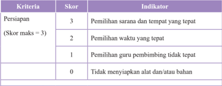

Tabel ini menunjukkan persiapan yang diperlukan untuk suatu kegiatan atau program, dengan skor maksimal 3. Kolom "Persiapan" berisi kriteria yang harus dipenuhi, sedangkan kolom "Skor" menunjukkan skor yang diberikan sesuai dengan tingkat pemenuhan kriteria tersebut. Indikator di setiap baris menunjukkan bagaimana kriteria tersebut diukur. Topik utama tabel ini adalah persiapan yang diperlukan untuk suatu kegiatan atau program, dengan skor maksimal 3. Data penting yang terlihat adalah bahwa skor tertinggi adalah 3 (pemilihan sarana dan tempat yang tepat), sedangkan skor terendah adalah 0 (tidak mempersiapkan alat dan/atau bahan).

 

---
## 📄 Halaman 60

---
**📊 Tabel**

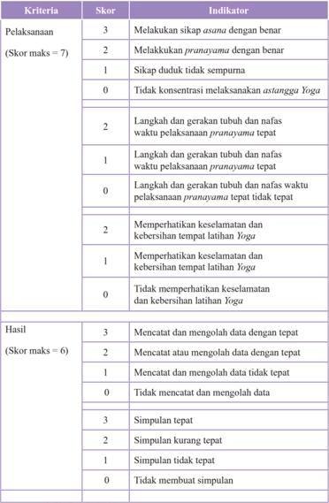

Tabel ini membandingkan dua kriteria utama: Pelaksanaan dan Hasil. Kriteria Pelaksanaan mencakup skor maksimal 7, sementara Hasil memiliki skor maksimal 6. Dalam kriteria Pelaksanaan, indikator pertama melibatkan sikap asuhan yang benar, kemudian pranayama dengan benar, sikap tidak dukuh, dan konsentrasi yang baik dalam asan yoga. Indikator kedua berkisar pada gerakan tubuh dan nafas yang tepat sesuai pranayama. Indikator ketiga mengevaluasi keamanan dan kebersihan tempat latihan yoga. Indikator keempat mengukur perhatian terhadap keselamatan dan kebersihan latihan yoga. Dalam kriteria Hasil, indikator pertama mencatat dan mengolah data dengan tepat, kemudian mencatat atau mengolah data dengan tepat, dan mencatat dan mengolah data dengan tidak tepat. Indikator kedua mengevaluasi simpulan yang tepat, simpulan kurang tepat, simpulan tidak tepat, dan tidak membuat simpulan. Pola penting yang terlihat adalah bahwa kriteria Pelaksanaan lebih kompleks dan memerlukan penilaian yang lebih detail dibandingkan dengan kriteria Hasil.

 

---
## 📄 Halaman 61

---
**📊 Tabel**

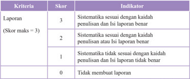

Tabel ini menunjukkan skor dan indikator untuk kriteria laporan dalam sebuah proses penilaian. Topik utama tabel adalah kualitas laporan, yang diukur melalui sistematisitas dan kesesuaian dengan kaidah penulisan dan isi laporan. Kolom "Skor" menunjukkan skor yang diberikan kepada laporan berdasarkan kriteria tersebut, sementara kolom "Indikator" memberikan penjelasan tentang apa yang dimaksud dengan skor tersebut. Data penting yang terlihat adalah bahwa skor tertinggi adalah 3, yang berarti laporan memiliki sistematisitas yang sesuai dengan kaidah penulisan dan isi laporan benar. Skor 2 diberikan jika laporan memiliki sistematisitas yang sesuai dengan kaidah penulisan dan isi laporan benar, sedangkan skor 1 diberikan jika laporan tidak sesuai dengan kaidah penulisan dan/atau isi laporan tidak benar. Skor 0 diberikan jika laporan tidak dibuat sama sekali.

Contoh pengisian format penilaian kinerja/praktik Astangga Yoga .

---
**📊 Tabel**

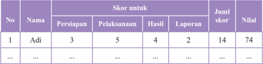

Tabel ini menunjukkan informasi tentang partisipan dalam sebuah kegiatan, termasuk nama, persiapan, pelaksanaan, hasil, laporan, jumlah skor, dan nilai. Topik utama tabel adalah partisipan dalam kegiatan tersebut. Kolom-kolom yang ada meliputi No., Nama, Persiapan, Pelaksanaan, Hasil, Laporan, Jumlah Skor, dan Nilai. Data penting yang terlihat adalah bahwa Adi memiliki persiapan 3, pelaksanaan 5, hasil 4, laporan 2, jumlah skor 14, dan nilai 74. Ini menunjukkan bahwa Adi memiliki persiapan yang cukup baik namun masih perlu meningkatkan pelaksanaan dan laporan.

### Keterangan:

- Skor maksimal = jumlah skor tertinggi setiap kriteria.
- Nilai praktik = (Jumlah skor perolehan: skor maks) x 100.
- Pada contoh di atas, skor maksimal = 3 + 7 + 6 + 3= 19.
- Pada contoh di atas nilai praktik Adi = (14: 19) x 100 = 73,68 dibulatkan menjadi 74.
Dalam penilaian kinerja dapat juga dibuat pembobotan pada aspek yang dinilai, misalnya persiapan 20%, Pelaksanaan dan Hasil 50%, serta Pelaporan 30%.

### b. Penilaian Proyek

Penilaian proyek merupakan  kegiatan penilaian terhadap suatu tugas  yang  meliputi  kegiatan  perancangan,  pelaksanaan,  dan  pelaporan,

 

---
## 📄 Halaman 62

yang  harus  diselesaikan  dalam  periode/waktu  tertentu.  Tugas  tersebut berupa  suatu  investigasi  sejak  dari  perencanaan,  pengumpulan  data, pengorganisasian, pengolahan dan penyajian data. Penilaian proyek dapat digunakan untuk mengetahui pemahaman, kemampuan mengaplikasikan, inovasi dan kreativitas,kemampuan penyelidikan dan kemampuan peserta didik menginformasikan mata pelajaran tertentu secara jelas.

Penilaian proyek dapat dilakukan dalam satu atau lebih KD, satu mata pelajaran,  beberapa  mata  pelajaran  serumpun  atau  lintas  mata  pelajaran yang bukan serumpun.

Penilaian proyek umumnya menggunakan metode belajar pemecahan masalah sebagai langkah awal dalam pengumpulan dan mengintegrasikan pengetahuan baru berdasarkan pengalamannya dalam beraktifitas secara nyata.  Pada  penilaian  proyek  setidaknya  ada  4  (empat)  hal  yang  perlu dipertimbangkan yaitu pengelolaan, relevansi, keaslian, dan inovasi dan kreativitas.

Pengelolaan  yaitu  kemampuan  peserta  didik  dalam  memilih  topik, mencari informasi dan mengelola waktu pengumpulan data serta penulisan laporan.

Relevansi yaitu kesesuaian topik, data, dan hasilnya dengan KD atau mata pelajaran.

Keaslian.  Proyek  yang  dilakukan  peserta  didik  harus  merupakan hasil  karyanya  sendiri  dengan  mempertimbangkan  kontribusi  pendidik dan  pihak  lain  berupa  bimbingan  dan  dukungan  terhadap  proyek  yang dilakukan peserta didik.

 

---
## 📄 Halaman 63

Inovasi dan kreativitas. Proyek yang dilakukan peserta didik terdapat unsur-unsur baru (kekinian) dan sesuatu yang unik, berbeda dari biasanya.

### Contoh Penilaian Proyek

Mata Pelajaran

: Pendidikan Agama Hindu dan Budi Pekerti

Kelas/Semester

: XI / I

Tahun Pelajaran

: 2014/ 2015

Kompetensi Dasar

: 4.1 Menyajikan Yoga Asanas dalam kehidupan sehari-hari

Indikator

: Peserta didik dapat melakukan penelitian mengenai permasalahan sosial yang terjadi pada masyarakat terhadap praktik Yoga dilingkungan sekitarnya.

### Rumusan Tugas Proyek:

- Lakukan penelitian mengenai permasalahan sosial yang berkembang pada masyarakat  di  lingkungan  sekitar  tempat  tinggalmu,  misalnya  pengaruh keberadaan latihan atau praktik Yoga bagi masyarakat sekitarnya (kamu bisa memilih masalah lain yang sedang berkembang di lingkunganmu).
- Tugas dikumpulkan sebulan setelah hari ini. Tuliskan rencana penelitianmu, lakukan, dan buatlah laporannya. Dalam membuat laporan perhatikan latar belakang,  perumusan  masalah,  kebenaran  informasi/data,  kelengkapan data, sistematika laporan, penggunaan bahasa, dan tampilan laporan!

 

---
## 📄 Halaman 64

### Rubrik penilaian proyek:

---
**📊 Tabel**

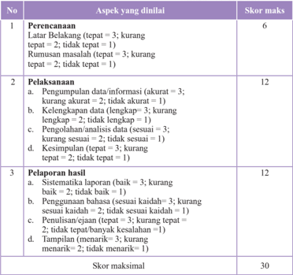

Tabel ini berisi informasi tentang skor maksimal untuk beberapa aspek penilaian, yaitu Perencanaan, Pelaksanaan, dan Pelaporan hasil. Topik utama tabel ini adalah proses penilaian dan evaluasi. Kolom-kolomnya meliputi Aspek yang dinilai dan Skor maksimal. Data penting yang terlihat antara lain bahwa skor maksimal untuk Perencanaan adalah 6, untuk Pelaksanaan adalah 12, dan untuk Pelaporan hasil adalah 12. Pola penting yang terlihat adalah bahwa setiap aspek memiliki skor maksimal yang berbeda-beda, dengan skor tertinggi untuk Pelaksanaan dan Pelaporan hasil.

Nilai proyek = (skor perolehan: skor maksimal) x 100.

Dapat juga dibuat pembobotan pada aspek yang dinilai, misalnya perencanaan 20%, pelaksanaan 40%, dan pelaporan 40%.

### c. Penilaian Portofolio

Portofolio merupakan penilaian berkelanjutan yang didasarkan pada kumpulan informasi yang bersifat reflektif-integratif yang menunjukkan perkembangan kemampuan peserta didik dalam satu periode tertentu.Ada

 

---
## 📄 Halaman 65

beberapa tipe portofolio yaitu portofolio dokumentasi, portofolio proses, dan portofolio pameran. Guru dapat memilih tipe portofolio yang sesuai dengan karakteristik kompetensi dasar dan/atau konteks mata pelajaran.

Pada akhir suatu periode hasil karya tersebut dikumpulkan dan dinilai oleh  guru  bersama  Peserta  didik.  Berdasarkan  informasi  perkembangan tersebut, guru dan peserta didik dapat menilai perkembangan kemampuan peserta didik dan terus melakukan perbaikan. Dengan demikian, portofolio dapat  memperlihatkan  perkembangan  kemajuan  belajar  peserta  didik melalui  karyanya.  Portofolio  peserta  didik  disimpan  dalam  suatu  folder dan  diberi  tanggal  pembuatan  sehingga  dapat  dilihat  perkembangan kualitasnya dari waktu ke waktu.

Dalam  Kurikulum  2013,  portofolio  digunakan  sebagai  salah  satu bahan penilaian. Hasil penilaian portofolio bersama dengan penilaian yang lain dipertimbangkan untuk pengisian rapor/laporan penilaian kompetensi peserta didik. Portofolio merupakan bagian dari penilaian autentik, yang langsung dapat merepresentasikan sikap, pengetahuan, dan keterampilan peserta  didik  Penilaian  portofolio  dilakukan  untuk  menilai  karya-karya peserta  didik  secara  bertahap  dan  pada  akhir  suatu  periode  hasil  karya tersebut dikumpulkan dan dipilih bersama oleh pendidik dan peserta didik. Karya-karya terpilih yang menurut pendidik dan peserta didik adalah karyakarya terbaik disimpan dalam buku besar/album/stofmap sebagai dokumen portofolio. Pendidik dan peserta didik harus sama-sama memahami alasan mengapa karya-karya tersebut disimpan di dalam koleksi portofolio.Setiap karya  pada  dokumen  portofolio  harus  memiliki  makna  atau  kegunaan

 

---
## 📄 Halaman 66

bagi peserta didik, pendidik dan orang lain yang mengamati. Selain itu, diperlukan  komentar  dan  refleksi  dari  pendidik,  orangtua  peserta  didik, atau pengamat pendidikan yang memiliki keterkaitan dengan karya-karya yang dikoleksi. Karya peserta didik yang dapat disimpan sebagi dokumen portofolio antara lain: karangan, puisi, gambar/lukisan,surat penghargaan/ piagam, foto-foto prestasi, dsb.

Dokumen portofolio dapat menumbuhkan rasa bangga yang mendorong peserta didik mencapai hasil belajar yang lebih baik. Pendidik dapat memanfaatkan portofolio untuk mendorong peserta didik mencapai sukses dan membangun kebanggaan diri. Secara tidak langsung, hal ini berdampak pada peningkatan upaya peserta didik untuk mencapai tujuan individualnya.  Di  samping  itu  pendidik  pun  akan  merasa  lebih  mantap dalam mengambil keputusan penilaian karena didukung oleh bukti-bukti autentik yang telah dicapai dan dikumpulkan peserta didik.

Agar penilaian portofolio menjadi efektif, pendidik dan peserta didik perlu menentukan ruang lingkup penggunaan portopolio antara lain sebagai berikut:

- Setiap  peserta  didik  memiliki  dokumen  portofolio  sendiri  yang  di dalamnya memuat hasil belajar pada setiap mata pelajaran atau setiap kompetensi.
- Menentukan hasil kerja/karya apa yang perlu dikumpulkan/disimpan.
- Pendidik  memberi  catatan  berisi  komentar  dan  masukan  untuk ditindaklanjuti peserta didik

 

---
## 📄 Halaman 67

- Peserta didik harus membaca catatan pendidik dan dengan kesadaran sendiri  dan  menindaklanjuti  masukan  yang  diberikan  guru  dalam rangka memperbaiki hasil karyanya.
- Catatan pendidik dan perbaikan hasil kerja yang dilakukan peserta didik  perlu  diberi  tanggal,  sehingga  dapat  dilihat  perkembangan kemajuan belajar peserta didik.
Rambu-rambu penyusunan dokumen portofolio.

- Dokumen portofolio berupa karya/tugas peserta didik dalam periode  tertentu  dikumpulkan  dan  digunakan  oleh  pendidik  untuk mendeskripsikan capaian kompetensi keterampilan.
- Dokumen portofolio disertakan pada waktu penerimaan rapor kepada orangtua/wali peserta didik sehingga  orangtua/wali  mengetahui perkembangan belajar putera/puterinya. Orangtua/wali peserta didik  diharapkan  dapat  memberi  komentar/catatan  pada  dokumen portofolio sebelum dikembalikan ke satuan pendidkan.
- Pendidik  pada  kelas  berikutnya  menggunakan  portofolio  sebagai informasi awal peserta didik yang bersangkutan.

### d. Pengolahan hasil Penilaian

- Nilai Sikap Spiritual dan Sikap Sosial
Langkah-langkah menyusun rekapitulasi penilaian sikap untuk satu semester.

- Wali kelas, guru mata pelajaran, dan guru BK mengelompokkan (menandai) catatan-catatan jurnal ke dalam sikap spiritual dan sikap sosial.

 

---
## 📄 Halaman 68

- Wali kelas, guru mata pelajaran, dan guru BK membuat rumusan deskripsi singkat sikap spiritual dan sosial sesuai  dengan catatan-catatan  jurnal  untuk  setiap  peserta  didik  yang  ditulis dengan kalimat positif. Deskripsi tersebut menyebutkan sikap/ perilaku yang sangat baik dan/atau kurang baik dan yang perlu bimbingan.
- Wali kelas mengumpulkan deskripsi singkat (rekap) sikap dari guru  mata  pelajaran  dan  guru  BK.  Wali  kelas  menyimpulkan (merumuskan deskripsi) capaian sikap spiritual dan sosial setiap peserta didik berdasarkan deskripsi singkat sikap spiritual dan sosial dari guru mata pelajaran, guru BK, dan wali kelas yang bersangkutan.
- Deskripsi yang ditulis pada sikap spiritual dan sikap sosial adalah perilaku  yang  menonjol,  sedangkan  sikap  spiritual  dan  sikap sosial yang belum mencapai kriteria (indikator) dideskripsikan sebagai perilaku yang perlu bimbingan.
- Dalam hal peserta didik tidak ada catatan apapun dalam jurnal, sikap  peserta  didik  tersebut  diasumsikan  berperilaku  sesuai indikator kompetensi.
- Rekap  hasil  observasi  sikap  spiritual  dan  sikap  sosial  yang dilakukan oleh wali kelas sebagai deskripsi untuk mengisi buku rapor pada kolom hasil belajar sikap.
Rambu-rambu deskripsi pencapaian sikap:

- Sikap yang ditulis adalah sikap spiritual dan sikap sosial.

 

---
## 📄 Halaman 69

- Deskripsi sikap terdiri atas keberhasilan dan/atau ketercapaian sikap  yang  diinginkan  dan  belum  tercapai  yang  memerlukan pembinaan dan pembimbingan.
- Substansi sikap spiritual adalah hal-hal yang berkaitan dengan menghayati dan mengamalkan ajaran agama yang dianutnya.
- Substansi  sikap  sosial  adalah  hal-hal  yang  berkaitan  dengan menghayati dan mengamalkan perilaku jujur, disiplin, tanggung jawab, peduli, santun, responsive dan proaktif dan menunjukkan sikap  sebagai  bagian  dari  solusi  atas  berbagai  permasalahan dalam berinteraksi secara efektif dengan lingkungan sosial dan alam  serta  dalam  menempatkan  diri  sebagai  cerminan  bangsa dalam pergaulan dunia.
- Hasil  penilaian  pencapaian  sikap  dalam  bentuk  predikat  dan deskripsi.
- Predikat untuk sikap spiritual dan sikap sosial dinyatakan dengan A= sangat baik, B= baik, C=cukup, dan D= kurang . Deskripsi dalam bentuk kalimat positif, memotivasi dan bahan refleksi.
Berikut  contoh  kesimpulan  hasil  deskripsi  sikap  spiritual  oleh  wali kelas.

### Agung Gede:

Selalu bersyukur dan berdoa sebelum melakukan kegiatan serta memiliki toleran pada agama yang berbeda; ketaatan beribadah mulai berkembang

 

---
## 📄 Halaman 70

### Agung Gede:

Memiliki  sikap  santun,  disiplin,  dan  tanggung  jawab  yang  baik, responsive dalam pergaulan; sikap kepedulian mulai meningkat.

### d. Nilai Pengetahuan

Nilai  pengetahuan diperoleh dari hasil penilaian harian selama satu semester  untuk  mengetahui  pencapaian  kompetensi  pada  setiap  KD pada  KI-3.  Penilaian  harian  dapat  dilakukan  melalui  tes  tertulis  dan/ atau  penugasan, maupun lisan, dan lain-lain sesuai dengan karakteristik masing-masing KD. Pelaksanaan penilaian harian dapat dilakukan lebih dari satu kali untuk KD dengan cakupan materi luas dan komplek sehingga penilaian harian tidak perlu menunggu pembelajaran KD tersebut selesai. Berikut contoh pengolahan nilai KD pada KI-3.

Hasil penilaian pengetahuan yang dilakukan oleh pendidik dengan  berbagai  tekhnik  penilaian  dalam  satu  semester  direkap  dan didokumentasikan  pada  tabel  pengolahan  nilai  sesuai  dengan  KD  yang dinilai. Jika dalam satu KD dilakukan penilaian lebih dari satu kali, maka nilai akhir KD tersebut merupakan nilai rentang. Nilai akhir pencapaian pengetahuan mata pelajaran tersebut diperoleh dengan cara merata-ratakan hasil pencapaian kompetensi setiap KD selama satu semester. Nilai akhir selama satu semester pada rapor ditulis dalam bentuk angka pada skala 0-100 dan predikat serta dilengkapi dengan deskripsi singkat kompetensi yang menonjol berdasarkan pencapaian KD selama satu semester.

 

---
## 📄 Halaman 71

Contoh pengolahan nilai pengetahuan mata pelajaran Pendidikan agama Hindu dan Budi Pekerti kelas XI semester I.

---
**📊 Tabel**

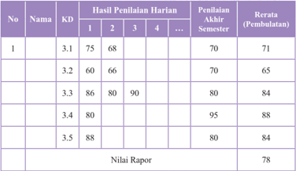

Tabel ini menunjukkan hasil penilaian harian dan akhir semester untuk beberapa siswa dalam satu mata pelajaran. Topik utama tabel adalah penilaian akademik siswa, termasuk nilai harian, nilai akhir semester, dan rata-rata pembulatan. Kolom-kolom utama dalam tabel meliputi nomor siswa (No.), nama siswa (Nama), kode mata pelajaran (KD), dan nilai raper (Nilai Rapor). Data penting yang terlihat dalam tabel meliputi bahwa siswa dengan nomor 3.4 memiliki nilai raper tertinggi sebesar 88, sedangkan siswa dengan nomor 3.2 memiliki nilai raper terendah sebesar 65. Selain itu, rata-rata pembulatan untuk semua siswa adalah 78, menunjukkan bahwa rata-rata penilaian harian dan akhir semester cukup baik.

### Keterangan:

- Penilaian harian dilakukan oleh pendidik dengan cakupan meliputi seluruh indikator dari satu kompetensi dasar.
- Penilaian akhir semester merupakan kegiatan yang dilakukan oleh satuan pendidikan untuk mengukur pencapaian kompetensi peserta didik pada akhir semester.  Cakupan  penilaian  seluruh  indikator  yang  mempresentasikan semua KD pada semester tersebut.
- KD 3.1 dilakukan tagihan penilaian sebanyak 3 kali, maka nilai pengetahuan pada KD 3.1

``

``

 

---
## 📄 Halaman 72

- Deskripsi berisi kompetensi yang sangat baik dikuasai oleh peserta didik dan/atau kompetensi yang masih perlu ditingkatkan. Pada nilai diatas yang dikuasai peserta didik adalah KD 3. 4 dan yang perlu ditingkatkan pada KD 3.2.
Contoh  deskripsi:'Memiliki  kemampuan  mendeskripsikan Asatangga Yoga '

### 3. Nilai Keterampilan

Nilai keterampilan diperoleh dari hasil penilaian unjuk kerja/kinerja/ praktik,  proyek,  produk,  portofolio,  dan  bentuk  lain  sesuai  karakteristik KD mata pelajaran. Hasil penilaian pada setiap KD pada KI-4 adalah nilai optimal jika penilaian dilakukan dengan teknik yang sama dan objek KD yang sama. Penilaian KD yang sama dilakukan dengan proyek dan produk atau praktik dan produk, maka hasil akhir penilaian KD tersebut dirataratakan.  Untuk  memperoleh  nilai  akhir  krterampilan  pada  setiap  mata pelajaran adalah rerata dari semua nilai KD pada KI-4 dalam satu semester. Selanjutnya,  penulisan  capaian  keterampilan  pada  rapor  menggunakan angka  pada  skala  0-100  dan  predikat  serta  dilengkapi  deskripsi  singkat capaian kompetensi.

### Contoh 1:

Berikut cara pengolahan nilai keterampilan mata pelajaran Pendidikan Agama Hindu dan Budi Pekerti kelas XI yang dilakukan melalui praktik pada KD 4.1 sebanyak 1 kali dan KD 4.2 sebanyak 2 kali. KD 4.3 dan KD 4.4 dinilai melalui satu proyek. Selain itu KD 4.4 juga dinilai melalui satu kali Portofolio.

 

---
## 📄 Halaman 73

### Keterangan:

- Pada KD 4.1, 4.2 dan 4.3 Nilai Akhir diperoleh berdasarkan nilai optimum, sedangkan untuk 4.4 diperoleh berdasarkan rata-rata karena menggunakan proyek dan produk.
- Nilai akhir semester didapat dengan cara merata-ratakan nilai akhir pada setiap KD.

``

- Nilai  rapor  keterampilan  dilengkapi  deskripsi  singkat  kompetensi  yang menonjol berdasarkan pencapaian KD pada KI-4 selama satu semester.
- Deskripsi  nilai  keterampilan  diatas  adalah: 'Memiliki  keterampilan memperagakan tahapan-tahapan Astangga Yoga sesuai dengan tuntunan guru Yoga '

### 2. Komponen Penilaian

Adapun prinsip-prinsip yang harus diperhatikan oleh pendidik pada saat  melaksanakan  penilaian  untuk  implementasi  Kurikulum  2013  baik pada jenjang pendidikan menengah Atas (SMA dan SMK) adalah:

 

---
## 📄 Halaman 74

- Sahih  yaitu  penilaian  yang  dilakukan  haruslah  sahih,  maksudnya penilaian didasarkan pada data yang memang  mencerminkan kemampuan yang ingin diukur.
- Objektif yaitu penilaian yang objektif adalah penilaian yang didasarkan  pada  prosedur  dan  kriteria  yang  jelas  dan  tidak  boleh dipengaruhi oleh subjektivitas penilai (pendidik).
- Adil adalah penilaian yang adil maksudnya adalah suatu penilaian yang  tidak  menguntungkan  atau  merugikan  Peserta  didik  hanya karena  mereka  (bisa  jadi)  berkebutuhan  khusus  serta  memiliki perbedaan latar belakang agama, suku, budaya, adat istiadat, status sosial ekonomi, dan gender.
- Terpadu yaitu penilaian dikatakan memenuhi prinsip terpadu apabila pendidik  yang  merupakan  salah  satu  komponen  tidak  terpisahkan dari kegiatan pembelajaran.
- Terbuka  adalah  penilaian  harus  memenuhi  prinsip  keterbukaan  di mana  kriteria  penilaian,  dan  dasar  pengambilan  keputusan  yang digunakan dapat diketahui oleh semua pihak yang berkepentingan.
- Menyeluruh dan berkesinambungan yaitu Penilaian harus dilakukan secara menyeluruh dan berkesinambungan oleh pendidik dan mesti mencakup segala aspek kompetensi dengan menggunakan berbagai teknik penilaian yang sesuai. Dengan demikian akan dapat memantau perkembangan kemampuan Peserta didik.

 

---
## 📄 Halaman 75

- Sistematis  yaitu  penilaian  yang  dilakukan  oleh  pendidik  harus terencana dan dilakukan secara bertahap dengan mengikuti langkahlangkah yang baku.
- Beracuan  kriteria adalah penilaian dikatakan beracuan kriteria apabila penilaian yang dilakukan didasarkan pada ukuran pencapaian kompetensi yang ditetapkan.
- Akuntabel  yaitu  penilaian  yang  akuntabel  adalah  penilaian  yang proses  dan  hasilnya  dapat  dipertanggungjawabkan,  baik  dari  segi teknik, prosedur, maupun hasilnya.
- Edukatif adalah penilaian disebut memenuhi prinsip edukatif apabila penilaian tersebut dilakukan untuk kepentingan dan  kemajuan pendidikan peserta didik.

### 3. Pemanfaatan dan Tindak Lanjut Hasil Penilaian

Konsekuensi  dari  pembelajaran  tuntas  adalah  tuntas  atau  belum tuntas. Bagi peserta didik yang belum mencapai ketuntasan belajar, maka dilakukan tindakan remedial dan bagi peserta didik yang sudah mencapai atau  melampaui  ketuntasan  belajar  dilakukan  pengayaan.  Pembelajaran remedial  dan  pengayaan  dilaksanakan  untuk  kompetensi  pengetahuan dan  keterampilan,  sedangkan  kompetensi  sikap  tidak  ada  remedial  atau pengayaan namun menumbuhkembangkan sikap, perilaku dan pembinaan karakter setiap peserta didik.

 

---
## 📄 Halaman 76

### 1. Bentuk Pelaksanaan Remedial

Setelah  diketahui  kesulitan  belajar  yang  dihadapi  peserta  didik, langkah  berikutnya  adalah  memberikan  perlakuan  berupa  pembelajaran remedial. Bentuk-bentuk pelaksanaan pembelajaran remedial antara lain:

- Pemberian  pembelajaran  ulang  dengan  metode  dan  media  yang berbeda. Pembelajaran ulang dapat disampaikan dengan cara penyederhanaan materi, variasi cara penyajian, penyederhanaan tes/ pertanyaan. Pembelajaran ulang dilakukan bilamana sebagian besar atau  semua  peserta  didik  belum  mencapai  ketuntasan  belajar  atau mengalami kesulitan belajar. Pendidik perlu memberikan penjelasan kembali  dengan  menggunakan  metode  dan/atau  media  yang  lebih tepat.
- Pemberian bimbingan secara khusus, misalnya bimbingan perorangan. Dalam hal pembelajaran klasikal peserta didik mengalami kesulitan, perlu  dipilih  alternatif  tindak  lanjut  berupa  pemberian  bimbingan secara  individual.  Pemberian  bimbingan  perorangan  merupakan implikasi peran pendidik sebagai tutor. Sistem tutorial dilaksanakan bilamana  terdapat  satu  atau  beberapa  peserta  didik  yang  belum berhasil mencapai ketuntasan.
- Pemberian tugas-tugas latihan secara khusus. Dalam rangka menerapkan prinsip pengulangan, tugas-tugas latihan perlu diperbanyak  agar  Peserta  didik  tidak  mengalami  kesulitan  dalam mengerjakan tes akhir. Peserta didik perlu diberi pelatihan intensif untuk membantu menguasai kompetensi yang ditetapkan.

 

---
## 📄 Halaman 77

- Pemanfaatan tutor sebaya. Tutor sebaya adalah teman sekelas yang memiliki kecepatan belajar lebih. Mereka perlu dimanfaatkan untuk memberikan  tutorial  kepada  rekannya  yang  mengalami  kesulitan belajar. Dengan  teman sebaya diharapkan peserta didik yang mengalami kesulitan belajar akan lebih terbuka dan akrab.

### 2. Bentuk Pelaksanaan Pengayaan

Bentuk-bentuk pelaksanaan pembelajaran pengayaan dapat dilakukan antara lain melalui:

- Belajar  kelompok,  yaitu  sekelompok  peserta  didik  yang  memiliki minat tertentu diberikan pembelajaran bersama pada jam-jam pelajaran  sekolah  biasa,  sambil  menunggu  teman-temannya  yang mengikuti pembelajaran remedial karena belum mencapai ketuntasan.
- Belajar mandiri, yaitu secara mandiri peserta didik belajar mengenai sesuatu yang diminati.
- Pembelajaran berbasis tema, yaitu memadukan Kurikulum di bawah tema  besar  sehingga  peserta  didik  dapat  mempelajari  hubungan antara berbagai disiplin ilmu.
- Pemadatan Kurikulum, yaitu pemberian pembelajaran hanya untuk kompetensi/materi  yang  belum  diketahui  peserta  didik.  Dengan demikian  tersedia  waktu  bagi  peserta  didik  untuk  memperoleh kompetensi/materi baru, atau bekerja dalam proyek secara mandiri sesuai dengan kapasitas maupun kapabilitas masing-masing.

 

---
## 📄 Halaman 78

### 3. Hasil Penilaian

- Nilai remedial yang diperoleh diolah menjadi nilai akhir.
- Nilai  akhir  setelah  remedial  untuk  ranah  pengetahuan  dihitung dengan  mengganti  nilai  indikator  yang  belum  tuntas  dengan  nilai indikator hasil remedial, yang selanjutnya diolah berdasarkan rerata nilai seluruh KD.
- Nilai akhir setelah remedial untuk ranah keterampilan diambil dari nilai optimal KD
- Penilaian  hasil  belajar  kegiatan  pengayaan  tidak  sama  dengan kegiatan pembelajaran biasa, tetapi cukup dalam bentuk portofolio, dan  harus  dihargai  sebagai  nilai  tambah  (lebih)  dari  peserta  didik yang normal.

### G. Strategi, Metode, dan Teknik Pembelajaran

Buku  Guru  Mata  Pelajaran  Agama  Hindu  dan  Budi  Pekerti  pada jenjang Sekolah Menengah Atas dan Kejuruan disusun sebagai penjabaran atau operasionalisasi Kompetensi Inti (KI) dan Kompetensi Dasar (KD) Mata Pelajaran Agama Hindu dan Budi Pekerti. Pendidikan agama Hindu dan Budi Pekerti yang paling penting adalah menjunjung tinggi Dharma, di antaranya nilai Sraddha. Sraddha adalah keyakinan akan Brahman atau Sang Hyang Widhi, keyakinan akan Atman, keyakinan akan Karmaphala, keyakinan  akan  Punarbhava,  dan  keyakinan  akan  Moksha.  Pendidikan agama Hindu dan Budi Pekerti menekankan pada dua aspek, yaitu; aspek Para  Vidya dan Apara  Vidya sehingga  dapat  melahirkan  insan  Hindu

 

---
## 📄 Halaman 79

yang  Sadhu  Gunawan.  Oleh  karena  itu,  dalam  kegiatan  pembelajaran perlu mendesain dan menerapkan strategi pembelajaran sehingga tujuan pembelajaran materi dapat tercapai melalui:

### 1. Strategi Pembelajaran.

Sebelum masuk ke strategi pembelajaran Pendidikan Agama Hindu dan Budi Pekerti perlu dimulai dengan memahami makna dari apa yang dimaksud  dengan  strategi  pembelajaran.  Strategi  adalah  usaha  untuk memperoleh kesuksesan dan keberhasilan dalam mencapai tujuan. Strategi pembelajaran  dapat  diartikan  sebagai  perencanaan  yang  berisi  tentang rangkaian  kegiatan  yang  didesain  untuk  mencapai  tujuan  pendidikan tersebut.  Strategi  pembelajaran  merupakan  rencana  tindakan  (rangkaian kegiatan) termasuk penggunaan metode dan pemanfaatan berbagai sumber daya  atau  kekuatan  dalam  pembelajaran  yang  disusun  untuk  mencapai tujuan  tertentu,  dalam  hal  ini  adalah  tujuan  pembelajaran  agama  Hindu dan Budi Pekerti.

Pada mulanya istilah  strategi  banyak  digunakan  dalam  dunia  militer yang  diartikan  sebagai  cara  penggunaan  seluruh  kekuatan  militer  untuk memenangkan suatu peperangan. Sekarang, istilah strategi banyak digunakan dalam berbagai bidang kegiatan yang bertujuan memperoleh kesuksesan atau keberhasilan dalam mencapai tujuan. Begitu juga seorang Pendidik yang mengharapkan hasil baik dalam proses pembelajaran juga akan menerapkan suatu strategi agar hasil belajar peserta didik mendapat

 

---
## 📄 Halaman 80

prestasi  yang  terbaik  baik  secara  akademik  maupun  sikap  dan  perilaku yang sesuai dengan ajaran agama Hindu dan norma-norma, adat istiadat yang berlaku sesuai dengan budaya yang luhur.

Strategi pembelajaran adalah suatu kegiatan pembelajaran yang harus dikerjakan  seorang  pendidik  dan  peserta  didik  agar  tujuan  pembelajaran  dapat dicapai secara efektif dan efisien. Dengan demikian, strategi pembelajaran adalah suatu set materi dan prosedur pembelajaran yang digunakan secara bersama-sama untuk menghasilkan prestasi belajar peserta didik.

Strategi  pembelajaran  merupakan  hal  yang  perlu  diperhatikan  oleh seorang pendidik dalam proses pembelajaran. Paling tidak ada tiga jenis strategi yang berkaitan dengan pembelajaran, yakni:

### a. Strategi Pengorganisasian Pembelajaran:

Strategi mengorganisasi isi pelajaran disebut juga sebagai struktural strategi, yang mengacu pada cara untuk membuat urutan dan mensintesis fakta, konsep, prosedur dan prinsip yang berkaitan. Lebih lanjut, strategi pengorganisasian  dibedakan  menjadi  dua  jenis,  yaitu  strategi  mikro dan  strategi  makro.  Strategi  mikro  mengacu  kepada  metode  untuk pengorganisasian  isi  pembelajaran  yang  berkisar  pada  satu  konsep,  atau prosedur  atau  prinsip.  Strategi  makro  mengacu  kepada  metode  untuk mengorganisasi isi pembelajaran yang melibatkan lebih dari satu konsep atau prosedur atau prinsip.

Strategi makro berurusan dengan bagaimana memilih, menata urusan, membuat sintesis dan rangkuman isi pembelajaran yang saling berkaitan. Pemilihan isi berdasarkan tujuan pembelajaran  yang  ingin dicapai,

 

---
## 📄 Halaman 81

mengacu  pada  penetapan  konsep  apa  yang  diperlukan  untuk  mencapai tujuan pembelajaran.

### a. Strategi Penyampaian Pembelajaran:

Strategi penyampaian isi pembelajaran merupakan komponen variabel, metode untuk melaksanakan proses pembelajaran. Fungsi strategi penyampaian pembelajaran adalah:

- Menyampaikan isi pembelajaran kepada peserta didik, dan
- Menyediakan informasi atau  bahan-bahan  yang  diperlukan  peserta didik untuk menampilkan unjuk kerja.
- Strategi Pengelolaan Pembelajaran:
Strategi  pengelolaan  pembelajaran  merupakan  komponen  variabel metode yang berurusan dengan bagaimana menata interaksi antara peserta didik dengan variabel metode pembelajaran lainnya. Strategi ini berkaitan dengan  pengambilan  keputusan  tentang  strategi  pengorganisasian  dan strategi penyampaian mana yang digunakan selama proses pembelajaran. Paling  tidak,  ada  tiga  klasifikasi  penting  variabel  strategi  pengelolaan, yaitu penjadualan, pembuatan catatan kemajuan belajar peserta didik, dan motivasi.

Berikut ada beberapa strategi yang dapat dipraktikkan para pendidik dalam menunjang hasil proses belajar mengajar antara lain:

- Strategi Student Centered Learning (SCL) yaitu pembelajaran yang berpusat  pada  peserta  didik,  dalam  menerapkan  konsep StudentCentered  Leaning ,  peserta  didik  diharapkan  sebagai  peserta  aktif dan mandiri dalam proses belajarnya, yang bertanggung jawab dan

 

---
## 📄 Halaman 82

berinitiatif  untuk  mengenali  kebutuhan  belajarnya,  menemukan sumber-sumber  informasi  untuk  dapat  menjawab  kebutuhannya, membangun  serta  mempresentasikan  pengetahuannya  berdasarkan kebutuhan serta sumber-sumber yang ditemukannya. Dalam batasbatas  tertentu  peserta  didik  dapat  memilih  sendiri  apa  yang  akan dipelajarinya.  pembelajar  memiliki  tanggung  jawab  penuh  atas kegiatan  belajarnya,  terutama  dalam  bentuk  keterlibatan  aktif  dan partisipasi  Peserta  didik.  Hubungan  antara  peserta  didik  yang  satu dengan  yang  lainnya  adalah  setara,  yang  tercermin  dalam  bentuk kerja  sama  dalam  kelompok  untuk  menyelesaikan  suatu  tugas belajar. Pendidik lebih berperan sebagai fasilitator yang mendorong perkembangan  Peserta  didik,  dan  bukan  merupakan  satu-satunya sumber belajar. Keaktifan peserta didik telah dilibatkan sejak awal dalam  bentuk  disain  belajar  yang  memperhitungkan  pengetahuan, keterampilan,  dan  pengalaman  belajar  peserta  didik  yang  telah didapatkan sebelumnya. Dari pengalaman praktek yang ada, diharapkan  setelah  mengalami  pembelajaran  dengan  pendekatan SCL pembelajar akan melihat dirinya secara berbeda, dalam arti lebih memahami  manfaat  belajar,  lebih  dapat  menerapkan  pengetahuan dan keterampilan yang dipelajari, dan lebih percaya diri (O'Neill & McMahon, 2005)

- Strategi Problem Based Learning (PBL) atau pembelajaran berbasis masalah  merupakan  sebuah  model  pembelajaran  yang  menyajikan masalah kontekstual sehingga merangsang peserta didik untuk belajar.

 

---
## 📄 Halaman 83

Dalam  kelas  yang  menerapkan  pembelajaran  berbasis  masalah, peserta didik bekerja dalam tim untuk memecahkan masalah dunia nyata ( real world).

Kelebihan Problem Based Learning (PBL) antara lain:

- Dengan Problem Based Learning (PBL) akan terjadi pembelajaran  bermakna. Peserta didik yang belajar memecahkan suatu  masalah,  maka  mereka  akan  menerapkan  pengetahuan yang dimilikinya atau berusaha mengetahui pengetahuan yang diperlukan. Belajar dapat semakin bermakna dan dapat diperluas ketika peserta didik/mahapeserta didik berhadapan dengan situasi di mana konsep diterapkan.
- Dalam  situasi Problem  Based  Learning (PBL),  peserta  didik mengintegrasikan pengetahuan dan ketrampilan secara simultan dan mengaplikasikannya dalam konteks yang relevan.
- Problem Based Learning (PBL) dapat meningkatkan kemampuan  berpikir  kritis, menumbuhkan  inisiatif peserta didik dalam  bekerja, motivasi internal untuk belajar, dan dapat  mengembangkan  hubungan  interpersonal  dalam  bekerja kelompok. Penilaian dilakukan dengan memadukan tiga aspek pengetahuan ( knowledge ), kecakapan ( skill ), dan sikap ( attitude ). Penilaian  terhadap  penguasaan  pengetahuan  yang  mencakup seluruh  kegiatan  pembelajaran  yang  dilakukan  dengan  ujian akhir semester (UAS), ujian tengah semester (UTS), kuis, PR, dokumen,  dan  laporan.  Penilaian  terhadap  kecakapan  dapat

 

---
## 📄 Halaman 84

diukur dari penguasaan alat bantu pembelajaran, baik software , hardware ,  maupun  kemampuan  perancangan  dan  pengujian. Sedangkan penilaian terhadap sikap dititikberatkan pada penguasaan soft  skill ,  yaitu  keaktifan  dan  partisipasi  dalam diskusi,  kemampuan  bekerjasama  dalam  tim,  dan  kehadiran dalam pembelajaran. Bobot penilaian untuk ketiga aspek tersebut ditentukan oleh pendidik mata pelajaran yang bersangkutan.

- Strategi inkuiri adalah suatu rangkaian kegiatan belajar yang melibatkan secara maksimal seluruh kemampuan peserta didik untuk mencari  dan  menyelidiki  secara  sistematis,  kritis,  logis,  analitis, sehingga  mereka  dapat  merumuskan  sendiri  penemuannya  dengan penuh  percaya  diri.  Sasaran  utama  kegiatan  pembelajaran  pada strategi ini adalah:
- Keterlibatan peserta didik secara maksimal dalam proses kegiatan belajar. Kegiatan belajar di sini adalah kegiatan mental intelektual dan sosial emosional.
- Keterarahan  kegiatan  secara  logis  dan  sistematis  pada  tujuan pembelajaran.
- Mengembangkan  sikap  percaya  pada  diri  sendiri  pada  diri peserta didik tentang apa yang ditemukan dalam proses inkuiri.
Untuk  menyusun  strategi  yang  terarah  pada  sasaran  tersebut,  perlu diperhatikan  kondisi-kondisi  yang  memungkinkan  peserta  didik  dapat berinkuiri secara maksimal. Joyce mengemukakan kondisi-kondisi umum yang merupakan syarat bagi timbulnya kegiatan inkuiri bagi peserta didik.

 

---
## 📄 Halaman 85

### Kondisi tersebut adalah:

- Aspek sosial di dalam kelas dan suasana terbuka yang mengundang peserta  didik  berdiskusi.  Hal  ini  menuntut  adanya  suasana  bebas (permisif) di  dalam  kelas,  di  mana  setiap  peserta  didik  tidak merasakan  adanya  tekanan  atau  hambatan  untuk  mengemukakan pendapatnya.  Adanya  rasa  takut,  atau  rasa  rendah  diri,  rasa  malu dan sebagainya, baik terhadap teman peserta didik maupun terhadap pendidik adalah faktor yang menghambat terciptanya suasana bebas di  kelas.  Kebebasan  berbicara  dan  penghargaan  terhadap  pendapat yang berbeda sekalipun pendapat itu tidak relevan, perlu dipelihara dalam batas-batas disiplin yang ada.
- Inkuiri berfokus  pada  hipotesis.  Peserta  didik  perlu  menyadari bahwa pada dasarnya semua pengetahuan bersifat tentatif, tidak ada kebenaran  mutlak.  Kebenarannya  selalu  bersifat  sementara.  Sikap terhadap pengetahuan yang demikian perlu dikembangkan. Dengan demikian,  maka  penyelesaian  hipotesis  merupakan  fokus  strategi inkuiri .  Apabila  pengetahuan  dipandang  sebagai  hipotesis,  maka kegiatan belajar berkisar pada pengujian hipotesis, dengan pengajuan berbagai informasi yang relevan. Sehubungan adanya berbagai sudut pandang yang berbeda di antara peserta didik, maka sedapat mungkin diadakan variasi penyelesaian masalah sehingga inkuiri bersifat open ended . Inkuiri bersifat open ended jika ada berbagai kesimpulan yang berbeda  dari  peserta  didik  dengan  argumen  masing-masing  yang

 

---
## 📄 Halaman 86

- benar. Selain inkuiri terbuka, dikenal pula inkuiri tertutup, yaitu jika hanya ada satu kesimpulan yang benar sebagai hasil proses inkuiri .
- Penggunaan  fakta  sebagai  evidensi.  Di  dalam  kelas  dibicarakan validitas  dan  reliabilitas  tentang  fakta  sebagaimana  dituntut  dalam pengujian hipotesis pada umumnya.
Untuk menciptakan kondisi seperti itu, maka peranan pendidik sangat menentukan.  Pendidik  tidak  lagi  berperan  sebagai  pemberi  informasi dan  peserta  didik  sebagai  penerima  informasi,  sekalipun  hal  itu  sangat diperlukan.  Peranan  utama  pendidik  dalam  menciptakan  kondisi inkuiri adalah sebagai berikut:

- Motivator,  yang  memberi  rangsangan  agar  peserta  didik  aktif  dan gairah berfikir.
- Fasilitator, yang menunjukkan jalan keluar jika ada hambatan dalam proses berpikir peserta didik.
- Penanya,  untuk  menyadarkan  peserta  didik  dari  kekeliruan  yang mereka perbuat dan memberi keyakinan pada diri sendiri.
- Administrator, yang bertanggung jawab terhadap seluruh kegiatan di dalam kelas.
- Pengarah, yang memimpin arus kegiatan berpikir peserta didik pada tujuan yang diharapkan.
- Manajer,   yang  mengelola  sumber  belajar,  waktu,  dan  organisasi kelas.
- Rewarder,  yang  memberi  penghargaan  pada  prestasi  yang  dicapai dalam  rangka  peningkatan  semangat  heuristik  pada  peserta  didik.

 

---
## 📄 Halaman 87

- Supaya  pendidik  dapat  melakukan  perananya  secara  efektif,  maka pengenalan  kemampuan  peserta  didik  sangat  diperlukan,  terutama cara berpikirnya, cara mereka menanggapi, dan sebagainya.
- Strategi pembelajaran berbasis proyek ( Project Based Learning ) dalam  kaitannya  dengan  pendekatan  saintifik  ( scientific  approach )  dan implementasi  Kurikulum  2013,  adalah  model  pembelajaran  berbasis proyek  ( project  based  learning )  adalah  sebuah  model  pembelajaran yang menggunakan proyek (kegiatan) sebagai inti pembelajaran. Dalam kegiatan  ini,  peserta  didik  melakukan  eksplorasi,  penilaian,  interpretasi, dan sintesis informasi untuk memperoleh berbagai hasil belajar (pengetahuan, keterampilan, dan sikap). Saat ini pembelajaran di sekolahsekolah kita masih lebih terfokus pada hasil belajar berupa pengetahuan ( knowledge ) semata. Itupun sangat dangkal, hanya sampai pada tingkatan ingatan (C1) dan pemahaman (C2) dan belum banyak menyentuh aspek aplikasi (C3), analisis (C4), sintesis (C5), dan evaluasi (C6).  Ini berarti pada umumnya, pembelajaran di sekolah belum mengajak peserta didik untuk menerapkan, mengolah setiap unsur-unsur konsep yang dipelajari untuk membuat (sintesis) generaliasi, dan belum mengajak peserta didik mengevaluasi (berpikir kritis) terhadap konsep-konsep dan prinsipprinsip  yang  telah  dipelajarinya.  Sementara  itu,  aspek  keterampilan (psikomotor)  dan  sikap  ( attitude )  juga  banyak  terabaikan.  Di  dalam pelaksanaannya, model pembelajaran berbasis proyek memiliki langkahlangkah  (sintaks)  yang  menjadi  ciri  khasnya  dan  membedakannya  dari model pembelajaran lain. Adapun langkah-langkah yang harus dilakukan

 

---
## 📄 Halaman 88

dalam pembelajaran berbasis proyek adalah; (1) menentukan pertanyaan dasar;  (2)  membuat  desain  proyek;  (3)  menyusun  penjadwalan;  (4) memonitor kemajuan proyek; (5) penilaian hasil; (6) evaluasi pengalaman. Model pembelajaran berbasis proyek selalu dimulai dengan menemukan apa sebenarnya pertanyaan mendasar, yang nantinya akan menjadi dasar untuk memberikan tugas proyek bagi peserta didik (melakukan aktivitas). Tentu  saja  topik  yang  dipakai  harus  pula  berhubungan  dengan  dunia nyata. Selanjutnya dengan dibantu pendidik, kelompok-kelompok peserta didik akan merancang aktivitas yang akan dilakukan pada proyek mereka masing-masing.  Semakin  besar  keterlibatan  dan  ide-ide  peserta  didik (kelompok peserta didik) yang digunakan dalam proyek itu, akan semakin besar pula rasa memiliki mereka terhadap proyek tersebut. Selanjutnya, pendidik  dan  peserta  didik  menentukan  batasan  waktu  yang  diberikan dalam penyelesaian tugas (aktivitas) proyek mereka. Dalam berjalannya waktu, peserta didik melaksanakan seluruh aktivitas mulai dari persiapan pelaksanaan  proyek  mereka  hingga  melaporkannya  sementara  pendidik memonitor  dan  memantau  perkembangan  proyek  kelompok-kelompok peserta didik dan memberikan pembimbingan yang dibutuhkan. Pada tahap berikutnya,  setelah  peserta  didik  melaporkan  hasil  proyek  yang  mereka lakukan, pendidik menilai pencapaian yang peserta didik peroleh baik dari segi pengetahuan ( knowledge terkait konsep yang relevan dengan topik), hingga  keterampilan  dan  sikap  yang  mengiringinya.  Terkahir,  pendidik kemudian memberikan kesempatan kepada peserta didik untuk merefleksi semua  kegiatan  (aktivitas)  dalam  pembelajaran  berbasis  proyek  yang

 

---
## 📄 Halaman 89

- telah mereka lakukan agar di lain kesempatan pembelajaran dan aktivitas penyelesaian proyek menjadi lebih baik lagi.
- Strategi  pembelajaran discovery (penemuan)  adalah  metode  mengajar yang mengatur pengajaran sedemikian rupa sehingga anak memperoleh pengetahuan  yang  sebelumnya  belum  diketahuinya  itu  tidak  melalui pemberitahuan,  sebagian  atau  seluruhnya  ditemukan  sendiri.  Dalam pembelajaran discovery (penemuan)  kegiatan  atau  pembelajaran  yang dirancang  sedemikian  rupa  sehingga  peserta  didik  dapat  menemukan konsep-konsep  dan  prinsip-prinsip  melalui  proses  mentalnya  sendiri. Dalam menemukan konsep, peserta didik melakukan pengamatan, menggolongkan, membuat dugaan, menjelaskan, menarik kesimpulan dan sebagainya untuk menemukan beberapa konsep atau prinsip. Pengertian discovery  learning  cms-formulasi  Pada  lampiran  iv  Peraturan  Menteri Pendidikan dan Kebudayaan Republik Indonesia Nomor 81A Tahun 2013, untuk mencapai kualitas yang telah dirancang dalam dokumen Kurikulum, kegiatan  pembelajaran  perlu  menggunakan  prinsip  yang:  (1)  berpusat pada  peserta  didik,  (2)  mengembangkan  kreativitas  peserta  didik,  (3) menciptakan kondisi menyenangkan dan menantang, (4) bermuatan nilai, etika, estetika, logika, dan kinestetika, dan (5) menyediakan pengalaman belajar  yang  beragam  melalui  penerapan  berbagai  strategi  dan  metode pembelajaran  yang  menyenangkan,  kontekstual,  efektif,  efisien,  dan bermakna.

 

---
## 📄 Halaman 90

### 2. Metode Pembelajaran

Metode  pembelajaran  adalah  cara  atau  jalan  yang  ditempuh  oleh seorang pendidik dalam menyampaikan materi Pendidikan Agama Hindu dan Budi Pekerti di SMA/SMK Kelas XI.

Dalam Pembelajaran Pendidikan Agama Hindu dan Budi Pekerti dapat menggunakan beberapa Metode di antaranya, metode tradisional yaitu:

- Metode Dharmawacana adalah  pelaksanaan  mengajar  dengan  ceramah secara oral, lisan, dan tulisan diperkuat dengan menggunakan media visual.  Dalam  hal  ini  peran  pendidik  sebagai  sumber  pengetahuan sangat  dominan.  Belajar  agama  dengan  strategi Dharmawacana dapat  memperoleh  ilmu  agama  dengan  mendengarkan  wejangan dari pendidik. Strategi Dharmawacana termasuk dalam ranah pengetahuan dalam dimensi Kompetensi Inti
- Metode Dharmag ī t ā adalah  pelaksanaan  mengajar  dengan  pola melantunkan sloka, palawakya, dan tembang. Pendidik dalam proses pembelajaran dengan pola Dharmag ī t ā ,  melibatkan  rasa  seni  yang dimiliki  setiap  peserta  didik,  terutama  seni  suara  atau  menyanyi, sehingga dapat menghaluskan budhi pekertinya.
- Metode Dharmatula adalah  pelaksanaan  mengajar  dengan  cara mengadakan diskusi di dalam kelas. Strategi Dharmatula digunakan karena  tiap  peserta  didik  memiliki  kecerdasan  yang  berbeda-beda. Dengan  menggunakan  strategi Dharmatula peserta didik  dapat memberikan kontribusi dalam pembelajaran.

 

---
## 📄 Halaman 91

- Metode Dharmayatra adalah  pelaksanaan  pembelajaran  dengan cara  mengunjungi  tempat-tempat  suci.  Strategi Dharmayatra baik digunakan  pada  saat  menjelaskan  materi  tempat  suci,  hari  suci, budaya dan sejarah perkembangan Agama Hindu.
- Metode Dharmashanti adalah pelaksanaan pembelajaran untuk menanamkan  sikap  saling asah, saling asih, dan saling asuh yang  penuh  dengan  rasa  toleransi.  Strategi Dharmashanti dalam pembelajaran memberikan kesempatan kepada peserta didik, untuk saling  mengenali  teman  kelasnya,  sehingga  menumbuhkan  rasa saling menyayangi.
- Metode Dharma Sadhana adalah  pelaksanaan  pembelajaran  untuk menumbuhkan kepekaan sosial peserta didik melalui pemberian atau pertolongan  yang  tulus  ikhlas  dan  mengembangkan  sikap  berbagi kepada  sesamanya,  sesuai  dengan  ajaran  filsafat  Hindu  yaitu Tat Twam Asi .
Di  samping  itu,  pendidik  harus  menerapkan metode  pembelajaran  yang sesuai dengan karakteristik peserta didiknya. Tiap-tiap kelas bisa kemungkinan menggunakan metode pembelajaran yang berbeda-beda dengan kelas lainnya. Untuk  itu  seorang  pendidik  harus  mampu  menguasai  dan  mempraktekkan berbagai  metode  pembelajaran.  Berikut  dijelaskan  beberapa  macam  metode modern yang dapat dipergunakan oleh seorang pendidik, antara lain:

- Metode  Ceramah  atau Dharma  Wacana yaitu penerangan  secara  lisan atas bahan pembelajaran kepada sekelompok pendengar untuk mencapai tujuan  pembelajaran  tertentu  dalam  jumlah  yang  relatif  besar.  Dengan

 

---
## 📄 Halaman 92

- metode  ceramah,  pendidik  dapat  mendorong  timbulnya  inspirasi  bagi pendengarnya.  Ceramah  cocok  untuk  penyampaian  bahan  belajar  yang berupa informasi dan jika bahan belajar tersebut sukar didapatkan.
- Metode  Diskusi  atau Dharma  Tula , yaitu proses  pelibatan  dua  orang peserta didik atau lebih untuk berinteraksi dengan  saling bertukar pendapat,  dan  atau  saling  mempertahankan  pendapat  dalam  pemecahan masalah sehingga didapatkan kesepakatan diantara mereka. Pembelajaran yang menggunakan metode diskusi merupakan pembelajaran yang bersifat interaktif.  Metode  diskusi  dapat  meningkatkan  peserta  didik  dalam memahami konsep dan keterampilan memecahkan masalah. Tetapi dalam transformasi  pengetahuan,  penggunaan  metode  diskusi  hasilnya  lambat dibanding penggunaan ceramah. Sehingga metode ceramah lebih efektif untuk meningkatkan kuantitas pengetahuan peserta didik dari pada metode diskusi.
- Metode Demonstrasi, yaitu metode pembelajaran yang sangat efektif untuk menolong  peserta  didik  mencari  jawaban  atas  pertanyaan-pertanyaan peserta didik. Demonstrasi sebagai metode pembelajaran adalah bilamana seorang  pendidik  atau  seorang  demonstrator  (orang  luar  yang  sengaja diminta) atau seorang peserta didik memperlihatkan kepada seluruh kelas sesuatau  proses.  Misalnya  bekerjanya  suatu  alat  pencuci  otomatis,  cara membuat kue, dan sebagainya. Kelebihan metode Demonstrasi:
- Perhatian peserta didik dapat lebih dipusatkan.
- Proses belajar peserta didik lebih terarah pada materi yang sedang dipelajari.

 

---
## 📄 Halaman 93

- Pengalaman  dan  kesan  sebagai  hasil  pembelajaran  lebih  melekat dalam diri peserta didik.

### Kelemahan metode Demonstrasi:

- Peserta  didik  kadang  kala  sukar  melihat  dengan  jelas  benda  yang diperagakan
- Tidak semua benda dapat didemonstrasikan
- Sukar dimengerti jika didemonstrasikan oleh pengajar yang kurang menguasai apa yang didemonstrasikan
- Metode Ceramah Plus, yaitu metode pengajaran yang menggunakan lebih dari  satu  metode,  yakni  metode  ceramah  yang  dikombinasikan  dengan metode lainnya. Ada tiga macam metode ceramah plus, di antaranya yaitu:
- Metode ceramah plus tanya jawab dan tugas
- Metode ceramah plus diskusi dan tugas
- Metode ceramah plus demonstrasi dan latihan (CPDL)
- Metode  Resitasi,  yaitu  suatu  metode  pengajaran  dengan  mengharuskan peserta didik membuat resume dengan kalimat sendiri. Kelebihan Metode Resitasi adalah:
- Pengetahuan yang diperoleh peserta didik dari hasil belajar sendiri akan dapat diingat lebih lama.
- Peserta  didik  memiliki  peluang  untuk  meningkatkan  keberanian, inisiatif, bertanggung jawab dan mandiri.

### Kelemahan Metode Resitasi adalah:

- Kadang kala peserta didik melakukan penipuan yakni peserta didik hanya meniru hasil pekerjaan orang lain tanpa mau bersusah payah mengerjakan sendiri.

 

---
## 📄 Halaman 94

- Kadang kala tugas dikerjakan oleh orang lain tanpa pengawasan.
- Sukar memberikan tugas yang memenuhi perbedaan individual.
- Metode  Eksperimental,  yaitu  suatu  cara  pengelolaan  pembelajaran  di mana peserta didik melakukan aktivitas percobaan dengan mengalami dan membuktikan sendiri suatu yang dipelajarinya. Dalam metode ini peserta didik diberi kesempatan untuk mengalami sendiri atau melakukan sendiri dengan  mengikuti  suatu  proses,  mengamati  suatu  obyek,  menganalisis, membuktikan  dan  menarik  kesimpulan  sendiri  tentang  obyek  yang dipelajarinya.
- Metode Study  Tour atau Dharma  Yatra (Karya  wisata),  yaitu metode mengajar dengan mengajak peserta didik mengunjungi suatu objek guna memperluas pengetahuan dan selanjutnya peserta didik membuat laporan dan mendiskusikan serta membukukan hasil kunjungan tersebut dengan didampingi oleh pendidik.
- Metode Latihan Keterampilan ( drill method ) , yaitu suatu metode mengajar dengan  memberikan  pelatihan  keterampilan  secara  berulang  kepada peserta didik, dan mengajaknya langsung ketempat latihan keterampilan untuk melihat proses tujuan, fungsi, kegunaan dan manfaat. Metode latihan keterampilan ini bertujuan membentuk kebiasaan atau pola yang otomatis pada peserta didik.
- Metode  Pengajaran  Beregu,  yaitu  suatu  metode  mengajar  di  mana pendidiknya  lebih  dari  satu  orang  yang  masing-masing  mempunyai tugas. Biasanya salah seorang pendidik ditunjuk sebagai kordinator. Cara pengujiannya,  setiap  pendidik  membuat  soal,  kemudian  digabung.  Jika

 

---
## 📄 Halaman 95

- ujian lisan maka setiap peserta didik yang diuji harus langsung berhadapan dengan team pendidik tersebut.
- Peer Theaching Method , yaitu suatu metode mengajar yang dibantu oleh temannya sendiri.
- Metode Pemecahan Masalah ( problem solving method ), yaitu bukan hanya sekadar metode mengajar, tetapi juga merupakan suatu metode berpikir, sebab dalam problem solving dapat menggunakan metode-metode lainnya yang  dimulai  dengan  mencari  data  sampai  pada  menarik  kesimpulan. Metode problem solving merupakan metode yang merangsang berpikir dan menggunakan wawasan tanpa melihat kualitas pendapat yang disampaikan oleh  peserta  didik.  Seorang  pendidik  harus  pandai-pandai  merangsang peserta didiknya untuk mencoba mengeluarkan pendapatnya.
- Project Method , yaitu metode perancangan adalah suatu metode mengajar dengan meminta peserta didik merancang suatu proyek yang akan diteliti sebagai obyek kajian.
- Taileren  Method ,  yaitu  suatu  metode  mengajar  dengan  menggunakan sebagian-sebagian,  misalnya  ayat  per  ayat  kemudian  disambung  lagi dengan ayat lainnya yang tentusaja berkaitan dengan masalahnya.
- Metode  Global  ( ganze  method ),  yaitu  suatu  metode  mengajar  di  mana peserta  didik  disuruh  membaca  keseluruhan  materi,  kemudian  peserta didik  meresume  apa  yang  dapat  mereka  serap  atau  ambil  intisari  dari materi tersebut.
- Metode Contextual Teaching Learning (CTL) Pembelajaran Konstektual adalah  konsep  belajar  yang  membantu  pendidik  mengaitkan  antara

 

---
## 📄 Halaman 96

materi  yang  diajarkannya  dengan  situasi  dunia  nyata  peserta  didik  dan mendorong  peserta  didik  membuat  hubungan  antara  pengetahuan  yang dimilikinya  dengan  penerapannya  dalam  kehidupan  mereka  sehari-hari, dengan  melibatkan  tujuh  komponen  utama  pembelajaran  efektif,  yakni: kontruktivisme ( contructivism ), bertanya ( questioning ), menemukan ( inquiry ), masyarakat belajar ( learning community ), pemodelan ( modeling ),  refleksi  dan  penelitian  sebenarnya  ( authentic  assessment ). Sedangkan menurut Jhonson (2006: 67) yang mendefinisikan pembelajaran kontekstual  (CTL)  sebagai  berikut:  Sistem  CTL  adalah  sebuah  proses pendidikan  yang  bertujuan  menolong  peserta  didik  melihat  makna  di dalam materi akademik yang mereka pelajari dengan cara menghubungkan subjek-subjek  akademik  dengan  konteks  dalam  kehidupan  keseharian mereka, yaitu dengan konteks pribadi, sosial dan budaya mereka.

### 3. Teknik Pembelajaran

Dunia  pendidikan  merupakan  dunia  yang  dinamis.  Hal  ini  sejalan dengan  tujuan  pembelajaran  di  mana  peserta  didik  diharapkan  mampu menguasai hasil  proses  belajar  mengajar.  Dunia  pendidikan  akan  selalu menyelaraskan  hasil  belajar  peserta  didik  sesuai  dengan  perkembangan teknologi dan informasi. Untuk mencapai hasil belajar yang optimal ini, digunakanlah beragam pendekatan dan teknik pembelajaran.

Teknik adalah metode atau sistem mengerjakan sesuatu, cara membuat atau  seni  melakukan  sesuatu  atau  dapat  dikatakan  sebagai  jalan,  alat, atau  media  yang  digunakan  oleh  pendidik  untuk  mengarahkan  kegiatan peserta didik kearah tujuan yang ingin dicapai. Teknik secara harfiah juga

 

---
## 📄 Halaman 97

diartikan sebagai cara yang dilakukan seseorang dalam mengaplikasikan dan  mempraktikkan  suatu  metode.  Khusus  untuk  pengertian  teknik pembelajaran dapat diartikan sebagai cara yang dilakukan pengajar dalam menerapkan metode pembelajaran tertentu.

Agar  metode  pembelajaran  yang  telah  diuraikan  di  atas dapat diterapkan  dan  mendorong  pendidik  mencapai  tujuan  pembelajaran, dibutuhkan teknik pembelajaran yang menyenangkan, baik antara pendidik dan terutama peserta didik, serta dengan memanfaatkan beragam media pembelajaran, misalnya gambar, video, musik, skema, diagram, dan media lainnya. Dalam dunia pendidikan ada dikenal beberapa teknik pembelajaran komunikatif yang menyenangkan, beberapa di antaranya:

- Role play , yaitu kegiatan pembelajaran dengan cara bermain peran. Pendidik menjadikan suasana kelas seperti seolah dunia yang nyata, misalnya dengan topik penjual dan pembeli dalam dagang.
- Surveys ,  yaitu  peserta  didik  membuat  tim  survey  di  kelas.  Teknik survey  ini  harus  disesuaikan  dengan  tingkat  pembelajar,  misalnya membuat angket pertanyaan kepada 30 peserta didik di kelas
- Games, yaitu teknik bermain yang paling disukai anak-anak dan para pembelajar.
- Interview , yaitu teknik bertanya kepada teman sekelas maupun teman di luar atau bahkan dengan orang yang tidak dikenal di luar sekolah dan  jalan.  Pertanyaan  harus  disusun  oleh  guru  dan  prosesnya  di bawah kontrol pendidik

 

---
## 📄 Halaman 98

- Pair work/group work ,  yaitu  teknik  dengan  meminta  peserta  didik belajar berkelompok dan bekerjasama dalam tim.
- Storytelling
Storytelling adalah sebuah teknik pembelajaran melalui sebuah cerita dengan  cara  mendongeng. Storytelling menggunakan  kemampuan penyaji  untuk  menyampaikan sebuah cerita dengan gaya, intonasi, dan alat bantu yang menarik minat pendengar. Menggunakan teknik storytelling harus mempunyai kemampuan public speaking yang baik, memahami karakter pendengar, meniru suara-suara, pintar mengatur nada dan intonasi serta keterampilan memakai alat bantu. Dikatakan berhasil  menggunakan  teknik storytelling ,  jika  pendengar  mampu menangkap jalan cerita serta merasa terhibur. Selain itu, pesan moral dalam cerita juga diperoleh.

 

---
## 📄 Halaman 99

---
**🖼️ Gambar/Diagram**

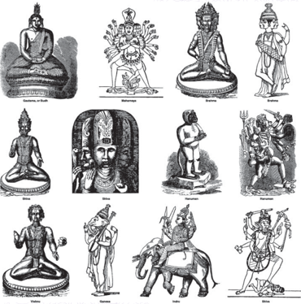

> **Deskripsi Visual:** Gambar ini adalah ilustrasi yang menampilkan berbagai tokoh dan dewa dari budaya India kuno. Gambar tersebut mencakup berbagai karakter mitologis seperti Buddha, Dewi Durga, Dewa Shiva, Dewi Lakshmi, Dewa Rama, Dewi Saraswati, Dewa Hanuman, dan Dewa Kali. Setiap karakter memiliki posisi dan pose yang unik, menunjukkan keindahan dan kekayaan dalam seni rupa India kuno. Ilustrasi ini juga menunjukkan perbedaan dalam penampilan dan atribut masing-masing dewa, yang menunjukkan peran dan kekuatan mereka dalam mitologi. Teks, angka, atau label penting tidak terlihat pada gambar ini karena ia hanya menggambarkan tokoh-tokoh tersebut tanpa teks atau angka tambahan. Informasi kunci yang dapat diambil pembaca adalah bahwa gambar ini menunjukkan berbagai dewa dan tokoh dari budaya India kuno, serta perbedaan dalam penampilan dan atribut mereka.

 

---
## 📄 Halaman 100

Pendidik  sebelum  memulai  proses  pembelajaran  agar  selalu  mengajak  dan mengawali dengan peserta didiknya mengucapkan  Penganjali agama  Hindu, dan  melakukan  puja  Tri  Sandya/doa  Puja  Saraswati,  maupun  doa-doa  lainnya sesuai  dengan  situasi  dan  kebutuhan  pada  saat  itu.  Serta  pendidik  mengamati dan  memberikan  penilai  sikap  religius  dan  sikap  sosial  yaitu  seperti  menyayangi ciptaan  Sang  Hyang  Widhi  (Ahimsa),  berperilaku  jujur  (Satya),  menghargai  dan menghormati antar sesama (Tat Tvam Asi). Pendidik dapat membentuk sikap dan karakter peserta didiknya seperti yang tercermin dan tuntutan dari setiap KD 1, KD 2, dari materi KD 3, dan KD 4 dalam kegiatan belajar mengajar yang berkaitan dengan materi ' Yogasana dalam Susastra Hindu, Yadnya dalam Mahabharata, Moksha, Bhakti Sejati dalam Ramayana , dan Keluarga Sukinah dalam Agama Hindu' . Dalam setiap  bab  materi  tersebut  peserta  didik  dapat  menjelaskan,  menyebutkan, mempraktikkan  dalam  kehidupan  sehari-hari  serta  memberikan  perubahan  sikap yang lebih baik dan sesuai dengan sifat materi pembelajaran serta selaras dengan budaya  Hindu,  adat  istiadat  daerah  setempat. Pendidik  pada  saat  mengakhiri pembelajaran agar peserta didik diajak merefleksikan dirinya, serta ditutup dengan doa dan Parama Santhi .

 

---
## 📄 Halaman 101

### Informasi untuk Pendidik

Pendidik dapat menjelaskan kepada peserta didiknya tentang materi pembelajaran yang akan diberikan sesuai dengan bab atau topik materi yang akan diajarkan. Serta pendidik juga menjelaskan tujuan pembelajaran sehingga peserta didik mengetahui kompetensi  apa  yang  akan  dicapai dan dikuasai. Pendidik berdasarkan alur pembelajaran dapat menginformasikan kepada peserta didik tentang alat, metode, dan media yang dibutuhkan sebagai pengantar pembelajaran sehingga dapat dipersiapkan secara baik dan benar.

### A.  BAB. I YOGÀSANA DALAM SUSASTRA HINDU

### 1. Kompetensi Inti (KI) dan Kompetensi Dasar (KD)

---
**📊 Tabel**

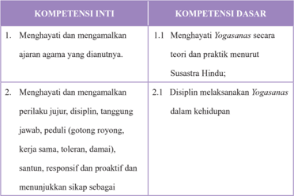

Tabel ini berisi informasi tentang kompetensi inti dan kompetensi dasar yang harus dijalani oleh peserta didik dalam konteks pengembangan karakter dan perilaku yang sesuai dengan nilai-nilai agama Hindu. Topik utama tabel ini adalah tentang bagaimana menghargai dan memahami ajaran agama yang dianut, serta bagaimana menjalankan praktek Yoga secara baik dan bertanggung jawab dalam kehidupan sehari-hari. Kolom-kolom yang ada mencakup dua bagian utama: kompetensi inti dan kompetensi dasar. Kompetensi inti meliputi dua poin utama, yaitu menghargai dan mengamalkan ajaran agama yang dianut, serta menghargai dan mengamalkan perilaku jujur, disiplin, tanggung jawab, peduli, dan berbagai karakteristik lainnya. Kompetensi dasar mencakup lebih dari satu poin, seperti menghargai Yogasanas secara teori dan praktik menurut Susastera Hindu, serta disiplin melakukan Yogasanas dalam kehidupan. Pola penting yang terlihat adalah bahwa tabel ini mencakup dua aspek utama dari pengembangan karakter dan perilaku, yaitu menghargai ajaran agama dan menjalankan praktek Yoga dengan baik.

 

---
## 📄 Halaman 102

bagian dari solusi atas berbagai permasalahan dalam berinteraksi secara efektif dengan lingkungan sosial dan alam serta dalam menempatkan diri sebagai cerminan bangsa dalam pergaulan dunia.

- Memahami, menerapkan, dan menganalisis pengetahuan faktual, konseptual, prosedural, dan metakognitif berdasarkan rasa ingin tahunya tentang ilmu pengetahuan, teknologi, seni, budaya, dan humaniora dengan wawasan kemanusiaan, kebangsaan, kenegaraan,dan peradaban terkait penyebab fenomena dan kejadian, serta menerapkan pengetahuan prosedural pada bidang kajian yang spesifik sesuai dengan bakat dan minatnya untuk memecahkan masalah.
- 3.1   Menerapkan Yogasanas menurut Susastra Hindu;

 

---
## 📄 Halaman 103

- Mengolah, menalar, dan menyaji dalam ranah konkret dan ranah abstrak terkait dengan pengembangan dari yang dipelajarinya di sekolah secara mandiri, bertindak secara efektif dan kreatif, serta mampu menggunakan metoda sesuai kaidah keilmuan.

### 2. Tujuan Pembelajaran

Setelah mempelajari materi Yogasanas dalam Susastra Hindu, peserta didik dapat:

- Menjelaskan pengertian dan hakikat Yogasanas .
- Memaparkan sejarah Yogasanas dalam ajaran Hindu.
- Menalar dan mengenal manfaat ajaran Yogasanas .
- Memahami ajaran Astangga Yoga .
- Mempraktikan etika Yogasanas
- Memahami Ida Sang Hyang Widhi (Tuhan) dalam Ajaran Yogasanas dalam Susastra Hindu.
- Mempraktikkan sikap-sikap Yogasanas dalam kehidupan sehari-hari.
- 4.1   Menyajikan Yogasanas dalam kehidupan seharihari;

 

---
## 📄 Halaman 104

### 3. Peta Konsep

### YOGÀSANAS DALAM SUSASTRA HINDU

---
**🖼️ Gambar/Diagram**

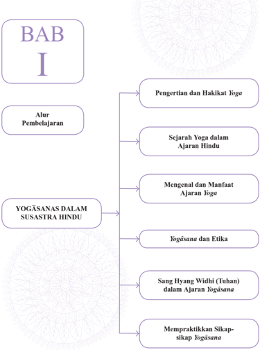

> **Deskripsi Visual:** Gambar ini adalah diagram yang menunjukkan struktur bab pertama buku pelajaran tentang yoga. Bab ini terdiri dari beberapa subbab yang membahas berbagai aspek yoga, mulai dari pengertian dan hakikat yoga hingga praktik yoga. Subbab utama termasuk:

1. Pengertian dan Hakikat Yoga
2. Sejarah Yoga dalam Ajaran Hindu
3. Mengenal dan Manfaat Ajaran Yoga
4. Yogāsanas dan Etika
5. Sang Hyang Widhi (Tuhan) dalam Ajaran Yogāsana
6. Mempraktekkan Sikap-sikap Yogāsana

Elemen-elemen utama yang terlihat antara lain:
- Bab I dengan judul "Alur Pembelajaran"
- Berbagai subbab yang disusun dalam struktur horizontal
- Teks yang menjelaskan topik-topik yang akan dibahas dalam subbab tersebut
- Label yang memberikan nama subbab masing-masing

Informasi kunci yang dapat diambil pembaca meliputi:
- Struktur bab yang terorganisir secara logis
- Topik-topik utama yang akan dibahas dalam bab ini
- Keterkaitan antara subbab-subbab yang ada

Secara keseluruhan, gambar ini menunjukkan struktur dan isi bab pertama buku pelajaran tentang yoga, yang membahas berbagai aspek dari yoga dari pengertian dan sejarah hingga praktiknya.

 

---
## 📄 Halaman 105

Pada pelajaran Bab I peserta didik diharapkan dapat mengapreasiasi ajaran Yogasanas dalam susastra Hindu

### 4. Proses Pembelajaran

Agar pendidik mampu menerapkan materi Yogasanas dalam Susastra Hindu sesuai dengan buku peserta didik secara lengkap, maka pendidik harus  memahami  dan  menguasi  pokok-pokok  materi Yogasanas dalam Susastra  Hindu  yang  akan  diterima  oleh  peserta  didik  dan  menguasai batasan materi tersebut. Selain dari materi buku peserta didik, pendidik agar menugaskan peserta didiknya mencari dan menemukan materi-materi lain yang berkaitan dan berhubungan dengan materi pokok untuk menambah wawasan  dan  pengetahuannya  malalui  kitab  suci,  internet,  mengamati yang terjadi dimasyarakat sesuai dengan budaya Hindu setempat. Adapun materi Yogasanas dalam Susastra Hindu dapat diajarkan kepada peserta didik dengan metode saintifik antara lain:

### Mengamati:

Pendidik mengajak peserta didiknya untuk:

- Kegiatan  mencari  informasi,  melihat,  mendengar,  membaca,  dan  atau menyimak penjelasan pentingnya mempelajari dan memhami Yogasanas dan menerapkan dalam kehidupan
- Melihat,  mendengar  contoh  sikap-sikap Yogasanas dan  peserta  didik menirukan atau memperagakan dengan benar
- ......... dan seterusnya.

 

---
## 📄 Halaman 106

### Menanya:

Pendidik mengajak peserta didiknya untuk:

- Menanyakan  manfaat  apa  saja  yang  diperoleh  jika  rajin  membaca  dan mempraktikkan Yogasanas dalam kehidupan.
- Memberikan kesempatan secara bergantian mengajukan pertanyaan berkaitan dengan Yogasanas dalam agama Hindu.
- ......... dan seterusnya.

### Mengeksplorasi:

Pendidik mengajak peserta didik untuk:

- Mempresentasikan beberapa bagian tahapan Astangga Yoga
- Mengumpulkan data-data  manfaat  melaksanakan  Astangga  Yoga  dalam kehidupan.
- ......... dan seterusnya.

### Mengasosiasi:

Pendidik mengajak peserta didik untuk:

- Melakukan kegiatan menganalisis seberapa pengaruh Yogasanas terhadap kesehatan secara fisik maupun mental.
- Menganalisis berbagai  macam  hal  yang  dihadapi  dalam  penerapan Astangga Yoga maupun dalam praktik-praktik Yogasanas.
- ......... dan seterusnya.

 

---
## 📄 Halaman 107

### Mengomunikasikan:

Pendidik mengajak peserta didik untuk:

- Membuat hasil laporan dan kesimpulan manfaat melaksanakan Yogasanas terhadap kesehatan jasmani dan rohani.
- Membuat dalam bentuk gambar-gambar/foto kegiatan latihan Yogasanas
- ......... dan seterusnya.
Metode pembelajaran berikut dapat dipilih dalam proses pembelajaran Yogasanas dalam Agama Hindu sesuai dengan situasi dan kondisi peserta didik antara lain:

- Inquiry Based Learning
- Discovery Based Learning
- Problem Based Learning
- Ceramah ( Dharmawacana)
- Diskusi
- Tanya Jawab ( dharmatula )
- Bercerita
- Pratik Yoga di kelas atau di lapangan

### 5. Evaluasi

Pendidik dapat mengembangkan evaluasi pembelajaran sesuai dengan topik  dan  materi  pokok Yogasanas dalam  Susastra  Hindu.  Evaluasi pembelajaran yang dikembangkan dapat berupa tes dan nontes. Tes dapat berupa uraian, isian, atau pilihan ganda. Nontes dapat berupa lembar kerja, kuesioner, proyek, dan sejenisnya. Pendidik juga harus mengembangkan

 

---
## 📄 Halaman 108

rubrik  penilaian  sesuai  dengan  materi  yang  diajarkan.  Pendidik  atau fasilitator  selalu  mengecek setiap tahapan yang dilakukan peserta didik, serta membimbing peserta didik agar menjalankan setiap proses dengan baik  dan  mendapat  hasil  yang  maksimal  sesua  potensi  yang  dimiliki masing-masing peserta didik.

### Rubrik Pendidik

Pendidik  dapat  mengembangkan  indikator  penilaian  untuk  setiap  aspek  yang diujikan. Indikator-ini merupakan scoring terhadap apa yang akan dinilai dan dicapai oleh peserta didik berdasarkan uji Kompetensi yang dikembangkan pada Bab I Ajaran Yogasanas dalam Susastra Hindu , pendidik dapat membuat rubrik seperti tertera di bawah ini.

### Pengetahuan

- Jelaskan apa saja manfaat dalam mempelajari Yoga dalam kehidupan ini!
- Mengapa di dunia barat lebih intensif memperaktikan Yoga dibandingkan dengan orang-orang yang beragama Hindu di Indonesia!
- Sebutkan dan jelaskan sikap-sikap Yogasanas serta manfaatnya!

### Keterampilan

- Praktikkan sikap Pranayama yang benar sesuai dengan Astangga Yoga !
- Praktikkan bagaimana sikap Asana yang benar!
- Praktikkan beberapa sikap-sikap Yogasanas yang Anda kuasai!

 

---
## 📄 Halaman 109

Sikap : melalui ajaran Yogasanas peserta didik dapat meyakini, menghayati, mempraktikkan,  mencintai,  dan  menghargai  ajaran  Hindu  sehingga  menjadi insan-insan  Hindu  yang  budiman,  Sadhu,  dan  selalu  menjunjung  nilai-nilai kebenaran.

- Cobalah refleksi diri kita sejauhmana dapat memberikan perubahan sikap sesudah dan sebelum mempelajari dan mempraktikkan ajaran Yogasanas dalam susastra Hindu!
- Bagaimanakah cara kita untuk selalu dapat menerapkan ajaran Yogãsanas dalam  susastra  Hindu  secara  konsisten  sehingga  menjadi  manusia  yang berbudi  pekerti  yang  luhur  dalam  kehidupan  ini  sehingga  nanti  dapat tercapainya tujuan ajaran agama Hindu?

 

---
## 📄 Halaman 110

### 6. Pengayaan

### Pendidik dapat mengembangkan, atau memberikan materi pengayaan sesuai dengan kemampuan dan keadaan peserta didik di sekolahnya!

### Surya Namaskara

Surya  Namaskara yang dapat  diartikan  sebagai  penghormatan  Matahari adalah  urutan  umum Hatha  Yoga Asana.  Asal-usulnya  terletak  pada penyembahan  Matahari  atau Dewa  Surya .  Ini  urutan  gerakan  dan  pose dapat dipraktekkan pada berbagai tingkat kesadaran, mulai dari yang fisik olahraga  dalam  berbagai  gaya,  untuk  lengkap sadhana yang  mencakup asana,  pranayama , mantra dan chakra  meditasi .  Ada  banyak  referensi untuk  memuja  matahari  untuk  meningkatkan  kesehatan  yang  baik  dan kemakmuran, di Veda .  Beberapa himne Veda dimasukkan ke Nitya Vidhi (wajib rutin harian untuk seorang Hindu). Prosedur ini disebut harian Surya Namaskara (secara  harfiah  diterjemahkan  sebagai  'salam  matahari'). Bentuk dari Surya Namaskar dipraktikkan bervariasi dari satu wilayah ke wilayah. Dua praktik populer seperti yang Trucha Kapla Namaskarah dan Aditya Prasna , Aditya Hridayam merupakan praktik kuno yang melibatkan Surya  Namaskar .  Ini  adalah  prosedur  menghormat  Matahari,  diajarkan untuk Sri Rama oleh Rsi Agastya, sebelum pertarungan dengan Rahwana. Hal ini dijelaskan dalam ' Kaanda Yuddha' Canto 107 dari Ramayana Peserta didik dapat mencoba untuk latihan seperti ini.

---
**🖼️ Gambar/Diagram**

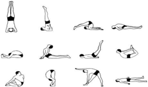

> **Deskripsi Visual:** Gambar ini adalah ilustrasi yang menunjukkan berbagai posisi latihan yoga. Gambar ini menggambarkan berbagai gerakan yoga yang dilakukan dengan baik, mulai dari posisi dasar seperti headstand hingga posisi yang lebih kompleks seperti split pose. Setiap posisi yoga memiliki nama yang ditulis di sebelahnya, yang membantu pembaca untuk memahami dan melakukan gerakan tersebut dengan benar. Ilustrasi ini juga menunjukkan bagaimana posisi tubuh harus ditingkatkan dan ditekuk saat melakukan yoga, serta bagaimana posisi kaki dan tangan harus diletakkan untuk mendukung gerakan tersebut. Ini adalah ilustrasi yang sangat berguna bagi pembaca yang ingin belajar yoga dan memahami posisi dan gerakan yang tepat dalam melakukan latihan yoga.

Pengayaan adalah kegiatan yang diberikan kepada peserta didik atau kelompok  yang  lebih  cepat  dalam  mencapai  kompetensi  dibandingkan dengan peserta didik lain agar mereka dapat memperdalam kecakapannya

 

---
## 📄 Halaman 111

atau  dapat  mengembangkan  potensinya  secara  optimal.  Tugas  yang diberikan  pendidik  kepada  peserta  didik  dapat  berupa  tutor  sebaya, mengembangkn  latihan  secara  lebih  mendalam,  membuat  karya  baru ataupun melakukan suatu proyek. Kegiatan pengayaan hendaknya menyenangkan dan mengembangkan kemampuan kognitif tinggi sehingga mendorong peserta didik untuk mengerjakan tugas yang diberikan. Bentukbentuk pelaksanaan pembelajaran pengayaan dapat dilakukan antara lain melalui:

- Belajar  kelompok,  yaitu  sekelompok  peserta  didik  yang  memiliki minat Yoga diberikan pembelajaran bersama pada jam-jam pelajaran sekolah  biasa,  sambil  menunggu  teman-temannya  yang  mengikuti pembelajaran remedial karena belum mencapai ketuntasan.
- Belajar mandiri, yaitu secara mandiri peserta didik belajar mengenai Yoga yang diminati.
- Pembelajaran berbasis tema, yaitu memadukan kurikulum di bawah tema besar sehingga peserta didik dapat mempelajari hubungan Yoga antara berbagai disiplin ilmu pengetahuan lainnya.
- Pemadatan kurikulum,  yaitu  pemberian  pembelajaran  hanya  untuk kompetensi/materi  yang  belum  diketahui  peserta  didik.  Dengan demikian  tersedia  waktu  bagi  peserta  didik  untuk  memperoleh kompetensi/materi baru, atau bekerja dalam proyek secara mandiri sesuai dengan kapasitas maupun kapabilitas masing-masing peserta didik.

 

---
## 📄 Halaman 112

### 7. Remedial

Pembelajaran remedial adalah pembelajaran yang diberikan kepada peserta  didik  yang  belum  mencapai  ketuntasan  kompetensi.  Remedial menggunakan  berbagai  metode  yang  diakhiri  dengan  penilaian  untuk mengukur kembali tingkat ketuntasan belajar peserta didik.Pembelajaran remedial diberikan kepada peserta didik bersifat terpadu, artinya pendidik memberikan  pengulangan  materi Yoga dan  mengenali  potensi  setiap individu  ataupun  kesulitan  belajar  yang  dialami  oleh  peserta  didik. Bentuk  pelaksanaan  remedial  setelah  diketahui  kesulitan  belajar  yang dihadapi peserta didik, langkah berikutnya adalah memberikan perlakuan berupa pembelajaran remedial. Bentuk-bentuk pelaksanaan pembelajaran remedial antara lain:

- Pemberian  pembelajaran  ulang  dengan  metode  dan  media  yang berbeda. Pembelajaran ulang dapat disampaikan dengan cara penyederhanaan materi Yoga , variasi cara penyajian, penyederhanaan tes/pertanyaan.  Pembelajaran  ulang  dilakukan  bilamana  sebagian besar atau semua peserta didik belum mencapai ketuntasan belajar atau mengalami  kesulitan belajar. Pendidik perlu  memberikan penjelasan  kembali  dengan  menggunakan  metode  dan/atau  media yang lebih tepat.
- Pemberian bimbingan secara khusus, misalnya bimbingan perorangan. Dalam hal pembelajaran klasikal peserta didik mengalami kesulitan, perlu  dipilih  alternatif  tindak  lanjut  berupa  pemberian  bimbingan

 

---
## 📄 Halaman 113

- secara  individual.  Pemberian  bimbingan  perorangan  merupakan implikasi peran pendidik sebagai tutor. Sistem tutorial dilaksanakan bilamana  terdapat  satu  atau  beberapa  peserta  didik  yang  belum berhasil mencapai ketuntasan.
- Pemberian tugas-tugas latihan secara khusus. Dalam rangka menerapkan prinsip pengulangan, tugas-tugas latihan perlu diperbanyak  agar  peserta  didik  tidak  mengalami  kesulitan  dalam mengerjakan tes akhir. Peserta didik perlu diberi pelatihan intensif untuk membantu menguasai kompetensi yang ditetapkan.
- Pemanfaatan tutor sebaya. Tutor sebaya adalah teman sekelas yang memiliki kecepatan belajar lebih. Mereka perlu dimanfaatkan untuk memberikan  tutorial  kepada  rekannya  yang  mengalami  kesulitan belajar. Dengan  teman sebaya diharapkan peserta didik yang mengalami kesulitan belajar akan lebih terbuka dan akrab.

### 8. Interaksi dengan Orang Tua

Pembelajaran  disekolah  merupakan  tanggung  jawab  bersama  antar warga sekolah, yaitu kepala sekolah, pendidik, dan tenaga kependidikan serta orang tua. Oleh karena itu, pihak sekolah perlu mengkomunikasikan kegiatan pembelajaran peserta didik dengan orang tua. Orang  tua dapat  berperan  sebagai  partner  sekolah  dalam  menunjang  keberhasilan pembelajaran peserta didik. Pendidik dapat melakukan interaksi dengan orang tua. Interaksi dapat dilakukan melalui komunikasi melalui telepon, kunjungan  ke  rumah,  atau  media  sosial  lainnya.  Pendidik  juga  dapat

 

---
## 📄 Halaman 114

melakukan  interaksi  melalui  lembar  kerja  peserta  didik  yang  harus ditanda  tangani  oleh  orang  tua  murid  baik  aspek  pengetahuan,  sikap, maupun keterampilan. Melalui ineteraksi ini orang tua dapat mengetahui perkembangan baik mental, sosial, dan intelektual putra putrinya. Orang tua selalu memantau perkembangan pembelajaranya, mengingatkan akan tugas-tugas apa saja yang diberikan oleh pendidik, sering mengontrol hasil ulangan  harian,  tugas-tugas/PR,  orang  tua  menanamkan  nilai-nilai  budi pekerti di rumah menjauhkan diri dari tindakan kekerasan fisik maupun verbal.  Pendidik  agama  Hindu  bekerja  sama  menugaskan  orang  tua  di rumah antara lain:

- Membimbing putra/putrinya untuk rajin bersembahyang Puja Trisandya dan Panca sembah.
- Rajin bersembahyang ke Pura atau ke tempat-tempat suci pada harihari suci.
- Rajin beryadnya.
- Menghormati dan menghargai budaya Hindu.
- Bersikap saling asah, asih dan asuh dengan sesama mahkluk hidup.
- Menanyakan baik kepada pendidik maupun putra/putrinya perkembangan pembelajaran Yogasanas, tentang tugas, hasil ulangan maupun perkembangan sikap dan perbuatan putra/putrinya.

 

---
## 📄 Halaman 115

### B.  BAB II YADNYA DALAM MAHABARATA

### 1. Kompetensi Inti (KI) dan Kompetensi Dasar (KD)

---
**📊 Tabel**

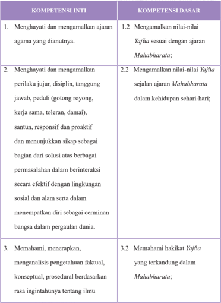

Tabel ini berisi informasi tentang kompetensi inti dan kompetensi dasar yang harus dipenuhi oleh siswa dalam konteks ajaran agama dan nilai-nilai Yajña. Topik utama tabel adalah tentang pengembangan karakter dan pengetahuan ilmiah melalui ajaran Mahabharata. Kolom pertama menunjukkan kompetensi inti, yang mencakup berbagai aspek seperti menghargai ajaran agama, mengamalkan nilai-nilai Yajña, dan memahami hakikat Yajña. Kolom kedua menunjukkan kompetensi dasar yang harus dipenuhi untuk mencapai kompetensi inti tersebut. Data penting yang terlihat adalah bahwa semua kompetensi inti dihubungkan dengan nilai-nilai dan prinsip-prinsip dalam ajaran Mahabharata, yang mencakup aspek moral, etis, dan spiritual. Selain itu, tabel juga menunjukkan bahwa pemahaman dan aplikasi konsep-konsep ilmiah harus dilakukan berdasarkan rasa ingatan tentang ilmu, menunjukkan bahwa pengetahuan ilmiah harus dihubungkan dengan pemahaman nilai-nilai agama.

 

---
## 📄 Halaman 116

---
**📊 Tabel**

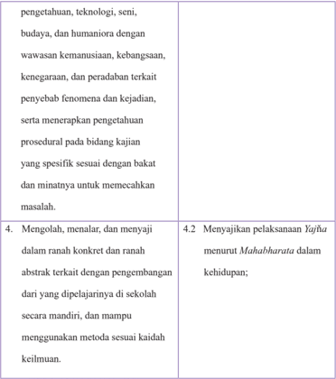

Tabel ini berisi informasi tentang kualifikasi dan kemampuan yang diharapkan dari siswa dalam bidang pengetahuan, teknologi, seni, budaya, dan humaniora. Topik utama adalah pengembangan keterampilan dan pemahaman siswa dalam berbagai aspek tersebut. Kolom pertama menyajikan deskripsi umum tentang kualifikasi yang diharapkan, sementara kolom kedua menunjukkan detail spesifik tentang keterampilan tersebut. Data penting yang terlihat adalah bahwa siswa diharapkan dapat mengolah, menalar, dan menyaji informasi secara konkret dan abstrak, serta mampu menggunakan metode sesuai keilmuan. Selain itu, mereka juga diharapkan dapat menunjukkan pelaksanaan Yajñā menurut Mahabharata dalam konteks kehidupan.

### 2. Tujuan Pembelajaran

Setelah mempelajari materi Nilai-nilai Yadnya dalam Mahabharata , peserta didik dapat:

- Menjelaskan pengertian dan hakikat Yadnya dalam Mahabharata .
- Menalar Yadñya dalam Mahabharata dan masa kini.
- Menyebutkan syarat-syarat dan aturan dalam pelaksanaan Yadnya .

 

---
## 📄 Halaman 117

- Mempraktikkan Yadnya dalam kehidupan.
- Membuat sendiri sarana Yadnya.

### 3. Peta Konsep

---
**🖼️ Gambar/Diagram**

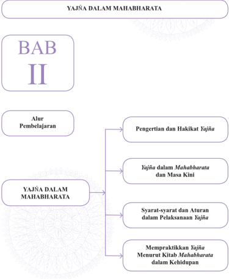

> **Deskripsi Visual:** Gambar ini adalah diagram yang menunjukkan struktur bab kedua dari buku pelajaran tentang Yajña dalam Mahabharata. Bab ini dibagi menjadi empat bagian utama:

1. Alur Pembelajaran: Ini merupakan bagian awal yang menjelaskan tujuan dan proses pembelajaran.

2. Pengertian dan Hakikat Yajña: Bagian ini membahas definisi dan prinsip-prinsip dasar tentang Yajña.

3. Yajña dalam Mahabharata dan Masa Kini: Bagian ini membandingkan penggunaan Yajña dalam konteks Mahabharata dengan praktik modern.

4. Syarat-syarat dan Aturan dalam Pelaksanaan Yajña: Bagian ini menguraikan aturan dan syarat-syarat yang diperlukan untuk melaksanakan Yajña.

5. Mempraktekkan Yajña Menurut Kitab Mahabharata dalam Kehidupan: Bagian terakhir ini memberikan contoh-contoh praktis tentang bagaimana mengaplikasikan prinsip-prinsip Yajña dalam kehidupan sehari-hari.

Elemen-elemen utama yang terlihat dalam diagram ini adalah teks yang menjelaskan setiap bagian, serta ikatan antara bagian-bagian tersebut melalui garis yang menghubungkan mereka. Label penting seperti "BAB II" dan "YAJÑA DALAM MAHABHARATA" juga terlihat jelas. Informasi kunci yang dapat diambil pembaca termasuk struktur pembelajaran yang terorganisir, topik-topik utama yang akan dipelajari, dan hubungan antara prinsip-prinsip Yajña dalam konteks historis dan modern.

Ń

 

---
## 📄 Halaman 118

Pada pelajaran Bab II pesrta didik diharapkan dapat mengapreasiasi ajaran Yajna dalam Mahabharata

### 4. Proses Pembelajaran

Agar Pendidik mampu menerapkan materi Nilai-nilai Yadnya dalam Mahabharata sesuai  dengan  buku  peserta  didik  secara  lengkap,  maka Pendidik harus memahami dan menguasi pokok-pokok materi Nilai-nilai Yadnya dalam Mahabharata yang  akan  diterima  oleh  peserta  didik  dan menguasai batasan materi tersebut. Selain dari materi buku peserta didik, pendidik  agar  menugaskan  peserta  didiknya  mencari  dan  menemukan materi-materi lain yang berkaitan dan berhubungan dengan materi pokok untuk menambah wawasan dan pengetahuannya malalui membaca kitab suci  Bhagawadgita,  Sarasmuscaya,  internet,  mengamati  yang  terjadi dimasyarakat sesuai dengan budaya Hindu setempat. Adapun materi Nilainilai Yadnya dalam Mahabharata dapat diajarkan kepada peserta didiknya dengan metode saintifik antara lain:

### Mengamati:

Pendidik mengajak peserta didiknya untuk:

- Mencari  informasi,  melihat,  mendengar,  membaca  penjelasan  tentang pelaksanaan Yadnya dalam zaman Mahabharata.
- Mendengarkan  cuplikan  singkat  cerita Mahabharata berkaitan  dengan pelaksanaan Yadnya .
- ......... dan seterusnya.

 

---
## 📄 Halaman 119

### Menanya:

Pendidik mengajak peserta didiknya untuk:

- Menanyakan nilai-nilai Yadnya yang terkandung dalam Mahabharata
- Bertanya  kepada  peserta  didik  tentang  hubungan  panca yadnya dengan Pelaksanaan Yadnya dalam zaman Mahabharata .
- ......... dan seterusnya.

### Mengeksplorasi:

Pendidik mengajak peserta didik untuk:

- Mempresentasikan tentang Yadnya dalam Mahabharata
- Mengumpulkan data-data pelaksanaan Yadnya yang ada kaitannya dengan kehidupan sehari-hari
- ......... dan seterusnya.

### Mengasosiasi:

Pendidik mengajak peserta didik untuk:

- Menganilsis hubungan Panca Yadnya dengan Yadnya dalam Mahabharata
- Menyimpulkan  hasil  analisis  berbagai  macam  hal  yang  dihadapi  dalam pelaksanaan Upacara Yadnya .
- ......... dan seterusnya.

### Mengomunikasikan:

Pendidik mengajak peserta didiknya untuk:

 

---
## 📄 Halaman 120

- Menyampaikan hasil belajar dalam bentuk tulisan materi pelajaran Yadnya dalam Mahabharata
- Membuat gambar-gambar/foto kegiatan upacara Yadnya .
- ......... dan seterusnya.
Metode Pembelajaran ini dapat dipilih dipergunakan sesuai dengan situasi dan kondisi peserta didik dalam proses pembelajaran Yadnya dalam Mahabharata antara lain:

- Inquiry Based Learning
- Discovery Based Learning
- Project Based Learning
- Problem Based Learning
- Ceramah ( dharmawacana )
- Diskusi
- Tanya Jawab ( dharmatula ) tentang Yadnya .
- Penugasan (membuat rangkuman dari kitab Mahabharata) tentang Yadnya .
- Presentasi
- Bercerita Mahabharata

### 5. Evaluasi

Pendidik dapat mengembangkan evaluasi pembelajaran sesuai dengan topik dan pokok bahasan Yadnya dalam Mahabharata .  Evaluasi pembelajaran yang dikembangkan dapat berupa tes dan nontes. Tes dapat berupa uraian, isian, atau pilihan ganda. Nontest dapat berupa lembar kerja,

 

---
## 📄 Halaman 121

kuesioner, proyek, dan sejenisnya. Pendidik juga harus mengembangkan rubrik  penilaian  sesuai  dengan  materi Yadnya dalam Mahabharata . Pendidik atau fasilitator selalu mengecek setiap tahapan yang dilakukan peserta  didik,  serta  membimbing  peserta  didik  agar  menjalankan  setiap proses dengan baik dan mendapat hasil yang maksimal sesua potensi yang dimiliki masing-masing peserta didik.

### Rubrik Pendidik

Pendidik  dapat  mengembangkan  indikator  penilaian  untuk  setiap  aspek  yang diujikan. Indikator-ini merupakan scoring terhadap apa yang akan dinilai dan dicapai oleh peserta didik berdasarka uji Kompetensi yang dikembangkan pada Bab II Yadnya dalam Mahabharata pendidik dapat membuat Rubrik seperti tertera di bawah ini.

### Pengetahuan

- Jelaskan  apa  saja  manfaat  dan  tujuan  umat  Hindu  beryadnya  dalam kehidupan ini termasuk terhadap alam semesta!
- Mengapa di dunia, beryadnya itu dirasakan berat untuk dilaksanakan?
- Sebutkan dan jelaskan dampak positif yang dirasakan oleh umat Hindu, masyarakat bahkan bangsa dalam pelaksanaan Yadnya yang telah dilaksanakan umat Hindu dari zaman dulu sampai sekarang!

 

---
## 📄 Halaman 122

### Keterampilan

- Praktikkan bagaimana membuat Kwangen sebagai sarana sembahyang!
- Praktikkan sarana yang dipakai dalam membuat Yadnya Sesa !
- Praktikkan  beberapa  sikap-sikap  sembahyang  dalam  pelaksanan Dewa Yadnya !
Sikap: melalui ajaran Yadnya dalam Mahabharata peserta didik dapat meyakini, menghayati, mempraktikkan, mencintai, dan menghargai Yadnya dalam ajaran Hindu sehingga  menjadi  insan-insan  Hindu  yang  tulus  iklas  tanpa  pamrih,  welas  asih, budiman, Sadhu, dharmawan dan selalu menjunjung nilai-nilai Dharma .

- Cobalah refleksi diri kita sejauhmana dapat memberikan perubahan sikap sesudah dan sebelum mempelajari ajaran Yadnya dalam Mahabharata !
- Bagaimanakah cara kita untuk selalu dapat melaksanakan Yadnya dalam kehidupan  secara  konsisten  sehingga  menjadi  manusia  yang  berbudi pekerti yang luhur dalam kehidupan ini sehingga nanti dapat tercapainya tujuan ajaran agama Hindu?

 

---
## 📄 Halaman 123

### 6. Pengayaan

Pendidik dapat menugaskan peserta didik untuk mengembangkan nilai-nilai yang lain yang ada dalam Yadnya, selain nilai pendidikan dan nilai Yajna (koban suci dan keiklasan) seperti di bawah ini!

### · Nilai Pendidikan

Sistem Pendidikan yang di terapkan dalam cerita Mahabharata lebih menekankan pada penguasaan satu bidang keilmuan yang disesuaikan dengan minat dan bakat peserta didik. Artinya seorang guru dituntut memiliki kepekaan untuk mengetahui bakat dan kemampuan masing-masing peserta didiknya. Sistem ini diterapkan oleh Guru Drona, Bima yang memiliki tubuh kekar dan kuat bidang keahliannya memainkan senjata gada, Arjuna mempunyai bakat di bidang senjata panah, dididik menjadi ahli panah.Untuk menjadi seorang ahli dan mumpuni di bidangnya masing-masing, maka faktor disiplin dan kerja keras menjadi kata kunci dalam proses belajar mengajar.

### · Nilai Yajna (korban suci dan keikhlasan)

bermacam-macam yajna dijelaskan dalam cerita Mahaharata, ada Yajna berbentuk benda, yajna dengan tapa, yoga, yajna mempelajari kitab suci, yajna ilmu pengetahuan, Yajna untuk kebahagiaan orang tua. Korban suci dan keiklasan yang dilakukan oleh seseorang dengan maksud tidak mementingkan diri sendiri dan menggalang kebahagiaan bersama adalah pelaksanaan ajaran dharma yang tertinggi (yajnam sanatanam). Kegiatan upacara agama dan dharma sadhana lainnya sesungguhnya adalah usaha peningkatan kesucian diri. Kitab Manawa Dharmasastra V.109 menyebutkan.: 'Tubuh dibersihkan dengan air, pikiran disucikan dengan kejujuran (satya), atma disucikan dengan tapa brata, budhi disucikan dengan ilmu pengetahuan (spiritual)' Nilai-nilai ajaran dalam cerita Mahabharata kiranya masih relevan digunakan sebagai pedoman untuk menuntun hidup menuju ke jalan yang sesuai dengan Veda. Oleh karena itu mempelajari kitab suci Veda, terlebih dahulu harus memahami dan menguasai Itihasa dan Purana (Mahabharata dan Ramayana), seperti yang disebutkan dalam kitab Sarasamuscaya sloka 49 sebagai berikut : ' Veda itu hendaknya dipelajari dengan sempurna, dengan jalan mempelajari itihasa dan purana, sebab Weda itu merasa takut akan orang-orang yang sedikit pengetahuannya'

Pengayaan adalah kegiatan yang diberikan kepada peserta didik atau kelompok  yang  lebih  cepat  dalam  mencapai  kompetensi  dibandingkan

 

---
## 📄 Halaman 124

dengan peserta didik lain agar mereka dapat memperdalam kecakapannya atau  dapat  mengembangkan  potensinya  secara  optimal.  Tugas  yang diberikan  pendidik  kepada  peserta  didik  dapat  berupa  tutor  sebaya, mengembangkn  latihan  secara  lebih  mendalam,  membuat  karya  baru ataupun melakukan suatu proyek. Kegiatan pengayaan hendaknya menyenangkan dan mengembangkan kemampuan kognitif tinggi sehingga mendorong peserta didik untuk mengerjakan tugas yang diberikan. Bentukbentuk pelaksanaan pembelajaran pengayaan dapat dilakukan antara lain melalui:

- Belajar  kelompok,  yaitu  sekelompok  peserta  didik  yang  memiliki minat tertentu diberikan pembelajaran bersama pada jam-jam pelajaran  sekolah  biasa,  sambil  menunggu  teman-temannya  yang mengikuti pembelajaran remedial karena belum mencapai ketuntasan.
- Belajar mandiri, yaitu secara mandiri peserta didik belajar mengenai sesuatu yang diminati.
- Pembelajaran berbasis tema, yaitu memadukan kurikulum di bawah tema  besar  sehingga  peserta  didik  dapat  mempelajari  hubungan antara berbagai disiplin ilmu.
- Pemadatan kurikulum,  yaitu  pemberian  pembelajaran  hanya  untuk kompetensi/materi  yang  belum  diketahui  peserta  didik.  Dengan demikian  tersedia  waktu  bagi  peserta  didik  untuk  memperoleh kompetensi/materi baru, atau bekerja dalam proyek secara mandiri sesuai dengan kapasitas maupun kapabilitas masing-masing.

 

---
## 📄 Halaman 125

### 7. Remedial

Pembelajaran remedial adalah pembelajaran yang diberikan kepada peserta  didik  yang  belum  mencapai  ketuntasan  kompetensi.  Remedial menggunakan  berbagai  metode  yang  diakhiri  dengan  penilaian  untuk mengukur kembali tingkat ketuntasan belajar peserta didik. Pembelajaran remedial diberikan kepada peserta didik bersifat terpadu, artinya pendidik memberikan pengulangan materi  dan  mengenali  potensi  setiap  individu ataupun kesulitan belajar yang dialami oleh peserta didik.

### · Bentuk Pelaksanaan Remedial

Setelah  diketahui  kesulitan  belajar  yang  dihadapi  peserta  didik, langkah  berikutnya  adalah  memberikan  perlakuan  berupa  pembelajaran remedial. Bentuk-bentuk pelaksanaan pembelajaran remedial antara lain:

Pemberian pembelajaran ulang dengan metode dan media yang berbeda. Pembelajaran ulang dapat disampaikan  dengan  cara penyederhanaan  materi,  variasi cara  penyajian,  penyederhanaan  tes/ pertanyaan. Pembelajaran ulang dilakukan bilamana sebagian besar atau semua peserta didik belum mencapai ketuntasan belajar atau mengalami kesulitan belajar. Pendidik perlu memberikan penjelasan kembali dengan menggunakan metode dan/atau media yang lebih tepat.

Pemberian bimbingan secara khusus, misalnya bimbingan perorangan. Dalam  hal  pembelajaran  klasikal  peserta  didik  mengalami  kesulitan, perlu dipilih alternatif tindak lanjut berupa pemberian bimbingan secara individual. Pemberian bimbingan perorangan merupakan implikasi peran

 

---
## 📄 Halaman 126

pendidik sebagai tutor. Sistem tutorial dilaksanakan bilamana terdapat satu atau beberapa peserta didik yang belum berhasil mencapai ketuntasan.

Pemberian tugas-tugas latihan secara khusus. Dalam rangka menerapkan prinsip pengulangan, tugas-tugas latihan perlu diperbanyak agar peserta didik tidak mengalami kesulitan dalam mengerjakan tes akhir. Peserta didik perlu diberi pelatihan intensif untuk membantu menguasai kompetensi yang ditetapkan.

Pemanfaatan tutor sebaya. Tutor sebaya adalah teman sekelas yang memiliki  kecepatan  belajar  lebih.  Mereka  perlu  dimanfaatkan  untuk memberikan tutorial kepada rekannya yang mengalami kesulitan belajar. Dengan teman sebaya diharapkan peserta didik yang mengalami kesulitan belajar akan lebih terbuka dan akrab.

### 8. Interaksi dengan Orang Tua

Pembelajaran  disekolah  merupakan  tanggung  jawab  bersama  antar warga sekolah, yaitu kepala sekolah, pendidik, dan tenaga kependidikan serta orang tua. Oleh karena itu, pihak sekolah perlu mengkomunikasikan kegiatan pembelajaran peserta didik dengan orang tua. Orang  tua dapat  berperan  sebagai  partner  sekolah  dalam  menunjang  keberhasilan pembelajaran peserta didik. Pendidik dapat melakukan interaksi dengan orang tua. Interaksi dapat dilakukan melalui komunikasi melalui telepon, kunjungan  ke  rumah,  atau  media  sosial  lainnya.  Pendidik  juga  dapat melakukan  interaksi  melalui  lembar  kerja  peserta  didik  yang  harus ditanda  tangani  oleh  orang  tua  murid  baik  aspek  pengetahuan,  sikap,

 

---
## 📄 Halaman 127

maupun keterampilan. Melalui ineteraksi ini orang tua dapat mengetahui perkembangan baik mental, sosial, dan intelektual putra putrinya. Orang tua selalu memantau perkembangan pembelajaranya, mengingatkan akan tugas-tugas apa saja yang diberikan oleh pendidik, sering mengontrol hasil ulangan  harian,  tugas-tugas/PR,  orang  tua  menanamkan  nilai-nilai  budi pekerti di rumah menjauhkan diri dari tindakan kekerasan fisik maupun verbal.  Pendidik  agama  Hindu  bekerjasama  menugaskan  orang  tua  di rumah antara lain:

- Membimbing putra/putrinya untuk rajin bersembahyang Puja Trisandya dan Panca sembah.
- Rajin bersembahyang ke Pura atau ke tempat-tempat suci pada harihari suci.
- Rajin beryadnya.
- Menghormati dan menghargai budaya Hindu.
- Bersikap saling asah, asih dan asuh dengan sesama mahkluk hidup.
- Menanyakan baik  kepada  pendidik  maupun  putra/putrinya  tentang perkembangan  pembelajaran Yadnya dalam Mahabharata ,  tugas, hasil  ulangan  maupun  perkembangan  sikap  dan  perbuatan  putra/ putrinya.

 

---
## 📄 Halaman 128

### C.  BAB III MOKSHA

### 1. Kompetensi Inti (KI) dan Kompetensi Dasar (KD)

---
**📊 Tabel**

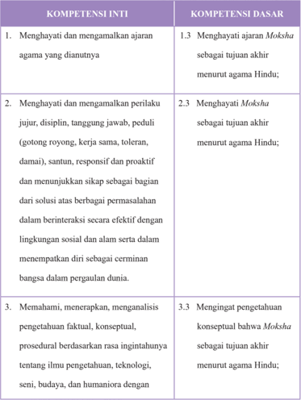

Tabel ini membandingkan dua kumpulan kompetensi: Kompetensi Inti dan Kompetensi Dasar. Topik utama tabel adalah tentang pengembangan karakter dan pengetahuan yang relevan dengan agama Hindu. Kolom pertama berisi kompetensi inti yang meliputi empat poin utama: menghayati dan mengamalkan ajaran agama, menghayati perilaku jujur, disiplin, tanggung jawab, dan lainnya; memahami, menerapkan, dan menganalisis pengetahuan faktil, konseptual, prosedural; serta mengejar pengetahuan konseptual tentang Moksha sebagai tujuan akhir. Kolom kedua berisi kompetensi dasar yang mencakup empat poin utama: menghayati ajaran Moksha sebagai tujuan akhir menurut agama Hindu; menghayati Moksha sebagai tujuan akhir menurut agama Hindu; menghayati Moksha sebagai tujuan akhir menurut agama Hindu; dan mengingat pengetahuan konseptual bahwa Moksha sebagai tujuan akhir menurut agama Hindu. Pola penting yang terlihat adalah bahwa semua kompetensi inti dan dasar berkaitan erat dengan pengetahuan dan praktik agama Hindu, terutama Moksha sebagai tujuan akhir.

 

---
## 📄 Halaman 129

---
**📊 Tabel**

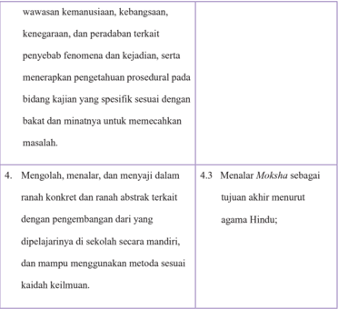

Tabel ini berisi dua kolom yang masing-masing menunjukkan topik pembelajaran yang berbeda. Kolom pertama berisi topik tentang wawasan kemanusiaan, kebangsaan, kenegaraan, dan peradaban terkait penyebab fenomena dan kejadian, serta menerapkan pengetahuan prosedural pada bidang kajian yang spesifik sesuai dengan bakat dan minatnya untuk memecahkan masalah. Topik ini mencakup pengembangan diri secara mandiri dan penggunaan metoda sesuai keilmuan. Sementara itu, kolom kedua berisi topik tentang menalar, mengolah, dan menyaji dalam ranah konkrit dan abstrak terkait dengan pengembangan dari yang dipelajari di sekolah secara mandiri, serta tujuan akhir menurut agama Hindu. Data penting yang terlihat adalah bahwa pembelajaran ini mencakup pengembangan diri, penggunaan metoda, dan pengenalan tentang agama Hindu sebagai tujuan akhir.

### 2. Tujuan Pembelajaran

Setelah mempelajari materi Moksha peserta didik dapat:

- Menjelaskan pengertian dan hakikat Moksha
- Menyebutkan tingkatan-tingkatan Moksha
- Menjelaskan macam-macam Moksha
- Menjelaskan empat jalan menuju Moksha
- Menjelaskan hambatan dan tantangan dalam upaya mencapai Moksha
- Menyebutkan  upaya  mengatasi  hambatan  dan  tantangan  untuk mencapai Moksha sesuai zaman (Globalisasi)
- Menjelaskan contoh- contoh orang yang mampu mencapai Moksha

 

---
## 📄 Halaman 130

### 3. Peta Konsep

---
**🖼️ Gambar/Diagram**

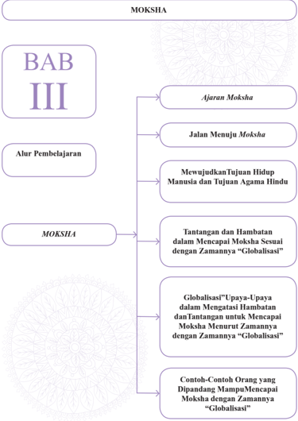

> **Deskripsi Visual:** Gambar ini adalah diagram yang menunjukkan struktur bab III dari buku pelajaran dengan judul "Moksha". Bab ini berisi tiga subbab utama:

1. Ajaran Moksha
2. Jalan Menuju Moksha
3. Alur Pembelajaran

Subbab pertama, "Ajaran Moksha", membahas prinsip-prinsip dan konsep dasar tentang Moksha dalam konteks agama Hindu.

Subbab kedua, "Jalan Menuju Moksha", menjelaskan langkah-langkah atau proses yang harus dilalui untuk mencapai Moksha.

Subbab ketiga, "Alur Pembelajaran", menyajikan urutan atau jalur pembelajaran yang sesuai dengan tujuan hidup manusia dan tujuan agama Hindu.

Selain itu, bab ini juga mencakup elemen-elemen lain seperti tantangan dan hambatan dalam mencapai Moksha sesuai dengan zamannya, upaya-upaya globalisasi dalam mengatasi hambatan, dan contoh-contoh orang yang dipandang mampu mencapai Moksha dengan zamannya.

Informasi kunci yang dapat diambil pembaca melalui gambar ini adalah bahwa bab ini membahas secara mendalam tentang Moksha, termasuk prinsip-prinsip, proses, tantangan, dan contoh-contoh dalam konteks globalisasi.

 

---
## 📄 Halaman 131

### Pada pembelajaran Bab III peserta didik diharapkan dapat mengapreasiasi ajaran Moksha

### 4. Proses Pembelajaran

Agar  pendidik  mampu  menerapkan  materi Moksha sesuai  dengan buku peserta didik secara lengkap, maka pendidik harus memahami dan menguasi pokok-pokok materi Moksha yang  akan  diterima  oleh  peserta didik  dan  menguasai  batasan  materi  tersebut.  Selain  dari  materi  buku peserta  didik,  pendidik  agar  menugaskan  peserta  didiknya  mencari  dan menemukan materi-materi lain yang berkaitan dan berhubungan dengan materi  pokok  untuk  menambah  wawasan  dan  pengetahuannya  malalui membaca kitab suci, internet, mengamati yang terjadi dimasyarakat sesuai dengan budaya Hindu setempat. Adapun materi Moksha dapat diajarkan kepada peserta didik dengan metode Saintifik antara lain:

### Mengamati:

Pendidik mengajak peserta didiknya untuk:

- Mencermati melalui kegiatan mencari informasi mendengar dan membaca tentang Moksha dari buku pelajaran kelas XI dan kitab Bhagawadgita
- Menyimak penjelasan dari Pendidik tentang Moksha menurut agama Hindu
- ......... dan seterusnya.

 

---
## 📄 Halaman 132

### Menanya:

Pendidik mengajak peserta didiknya untuk:

- Memberikan  contoh  masing-masing  bagian Catur  Marga sebagai  cara untuk mencapai Moksha.
- Memberikan pertanyaan kepada peserta didik seberapa pentingnya dalam hidup ini mencapai Moksha ?
- ......... dan seterusnya.

### Mengeksplorasi:

Pendidik mengajak peserta didik untuk:

- Mengumpulkan  informasi  apa  saja hambatan  yang dihadapi dalam menjalani hidup menuju Moksha.
- Menyajikan hasilnya dalam bentuk tulisan tujuan hidup manusia sehingga terwujudnya Sat Cit Ananda.
- ......... dan seterusnya.

### Mengasosiasi:

Pendidik mengajak peserta didik untuk:

- Melakukan kegiatan menganalisis data, dan mengelompokan bagaimana perbedaan orang yang sudah bisa mencapai Moksha semasih hidup dengan orang yang masih terikat dengan kehidupan duniawi.
- Memprediksi/mengestimasi Moksha mudah  dan  sulit  untuk  dicapainya dalam kehidupan ini
- ......... dan seterusnya.

 

---
## 📄 Halaman 133

### Mengomunikasikan:

Pendidik mengajak peserta didiknya untuk:

- Menyampaikan hasil belajar secara tertulis tentang Moksha.
- Membuat dalam bentuk gambar-gambar atau ilustrasi tercapainya Moksha semasih hidup maupun dalam Purna Mukti.
- ......... dan seterusnya.
Metode Pembelajaran ini dapat dipilih dipergunakan sesuai dengan situasi dan kondisi peserta didik dalam proses pembelajaran Moksha yaitu:

- Inquiry Based Learning
- Discovery Based Learning
- Problem Based Learning
- Ceramah (dharmawacana)
- Diskusi
- Tanya Jawab (dharmatula) tentang Moksha
- Penugasan membuat rangkuman dari Moksha

### 5. Evaluasi

Pendidik dapat mengembangkan evaluasi pembelajaran sesuai dengan  topik  dan  pokok  nahasan Moksha .  Evaluasi  pembelajaran  yang dikembangkan dapat berupa tes dan nontes. Tes dapat berupa uraian, isian, atau pilihan ganda. Nontes dapat berupa lembar kerja, kuesioner, proyek, dan  sejenisnya.  Pendidik  juga  harus  mengembangkan  rubrik  penilaian sesuai dengan materi Moksha .  Pendidik atau fasilitator selalu mengecek

 

---
## 📄 Halaman 134

setiap  tahapan  yang  dilakukan  peserta  didik,  serta  membimbing  peserta didik agar menjalankan setiap proses dengan baik dan mendapat hasil yang maksimal sesuai potensi yang dimiliki masing-masing peserta didik.

### Rubrik Pendidik

Pendidik  dapat  mengembangkan  indikator  penilaian  untuk  setiap  aspek  yang diujikan. Indikator-ini merupakan skoring terhadap apa yang akan dinilai dan dicapai oleh  peserta  didik  berdasarka  uji  kompetensi  yang  dikembangkan  pada  Bab  III Moksha , pendidik dapat membuat rubrik seperti tertera dibawah ini.

### Pengetahuan

- Jelaskan apa yang Anda ketahui tentang Moksha baik berdasarkan sastra maupun berdasarkan pemahaman diri Anda!
- Mengapa Moksha tersebut sulit dicapai dalam era zaman Globalisasi?
- Sebutkan dan jelaskan tahapan maupun tingkatan-tingkatan Moksha yang anda pahami!

### Keterampilan

- Praktikkan bagaimana sikap meditasi yang benar sebagai salah satu wujud manifestasi dari Moksha !
- Praktikkan sikap-sikap hidup cerminan orang yang telah mencapai Jiwan Mukti !

 

---
## 📄 Halaman 135

Sikap: melalui ajaran Moksha peserta  didik  dapat  meyakini,  menghayati, mempraktikkan cara-cara menuju Moksha , mencintai, dan menghargai Moksha dalam ajaran Hindu sehingga menjadi insan-insan Hindu yang budiman, Sadhu, dharmawan dan selalu menjunjung nilai-nilai Mokshartham jagadhita ya ca iti dharma.

- Cobalah refleksi diri kita, sejauhmana dapat memberikan perubahan sikap sesudah dan sebelum mempelajari ajaran Moksha!
- Bagaimanakah cara kita untuk dapat mencapai Moksha sehingga menjadi manusia  yang  berbudi  pekerti  yang  santun  dalam  kehidupan  ini  dan nantinya dapat tercapainya tujuan ajaran agama Hindu tersebut?

 

---
## 📄 Halaman 136

### 6. Pengayaan

Pendidik dapat mengembangkan dan memberikan materi atau tugas kepada peserta didiknya berkaitan dengan MOKSHA.

Dalam ajaran Hindu Atma Jnana kesadaran akan 'sang diri') adalah kunci untuk meraih Moksha .  Sebagai umat Hindu boleh melakukan suatu bentuk (atau lebih) dari beberapa jalan menuju Moksha seperti: Bhakti marga, karma marga, Jnana marga dan Raja marga dengan menyadari bahwa Tuhan bersifat tak terbatas dan mampu hadir dalam berbagai wujud, baik bersifat personal maupun impersonal.

Diyakini  bahwa  ada  empat Yoga (pengendalian)  atau  marga  (jalan)  untuk mencapai Moksha .  Hal ini meliputi: berbakti demi Yang Mahakuasa, memahami Yang  Mahakuasa,  bermeditasi  kepada  Yang  Mahakuasa,  dan  melayani  Yang Mahakuasa dengan bakti yang tulus Tradisi Hinduisme yang berbeda-beda memiliki kecenderungan antara jalan yang satu dengan yang lainnya, beberapa yang terkenal di antaranya adalah tradisi Tantra dan Yoga yang berkembang dalam Hinduisme .

Pendekatan oleh tradisi Wedanta terbagi menjadi nondualitas ( adwaita ), nondualitas dengan kualifikasi (misalnya wisistadwaita ), dan dualitas ( dwaita ).

Cara mencapai Moksha yang dianjurkan oleh tiga tradisi tersebut bervariasi.

- Adwaita  Wedanta menekankan Jnana  Yoga sebagai cara utama untuk mencapai  Moksha.  Tradisi  ini  fokus  kepada  pengetahuan  tentang  Brahman yang disediakan oleh literatur tradisional Wedanta dan ajaran pendirinya, Adi Shankara Melalui pemilahan antara hal yang nyata dan yang tak nyata, sadhaka (praktisi spiritual) akan mampu melepaskan diri dari jerat ilusi dan menyadari bahwa  dunia  yang  teramati  sesungguhnya  merupakan  dunia  ilusi,  fana,  dan maya,  dan  'kesadaran'  tersebut  merupakan  satu-satunya  hal  yang  nyata. Pemahaman tersebut merupakan Moksha ,  saat  atman (percikan Tuhan dalam diri) dan Brahman (esensi alam semesta) saling memahami sebagai substansi dan kehampaan akan dualitas eksistensial.
- Tradisi nondualis memandang Tuhan sebagai objek kasih sayang yang paling patut  disembah,  misalnya  personifikasi  konsep  monoteistik  akan Siwa atau Wisnu . Adwaita/Hinduisme tidak  melarang  aspek  Tuhan  yang  berbeda-beda, seperti berbagai sinar yang berasal dari sumber cahaya yang sama. Seseorang harus mencapai Moksha dengan bimbingan seorang guru. Seorang guru atau siddha hanya  membimbing  namun  tidak  campur  tangan.  Surga  diyakini sebagai tempat bagi karma sementara yang mesti dihindari oleh orang yang menginginkan Moksha demi bersatu dengan Tuhan melalui Yoga .

 

---
## 📄 Halaman 137

Pengayaan  adalah  kegiatan  yang  diberikan  kepada  peserta  didik  atau kelompok yang lebih cepat dalam mencapai kompetensi dibandingkan dengan peserta  didik  lain  agar  mereka  dapat  memperdalam  kecakapannya  atau  dapat mengembangkan  potensinya  secara  optimal.  Tugas  yang  diberikan  pendidik kepada peserta didik dapat berupa tutor sebaya, mengembangkan latihan secara lebih mendalam, membuat karya baru ataupun melakukan suatu proyek. Kegiatan pengayaan hendaknya menyenangkan dan mengembangkan kemampuan kognitif tinggi sehingga mendorong peserta didik untuk mengerjakan tugas yang diberikan. Bentuk-bentuk pelaksanaan pembelajaran pengayaan dapat dilakukan antara lain melalui:

- Belajar kelompok, yaitu sekelompok peserta didik yang memiliki minat tertentu diberikan pembelajaran bersama pada jam-jam pelajaran sekolah biasa,  sambil  menunggu  teman-temannya  yang  mengikuti  pembelajaran remedial karena belum mencapai ketuntasan.
- Belajar  mandiri,  yaitu  secara  mandiri  peserta  didik  belajar  mengenai sesuatu yang diminati.
- Pembelajaran berbasis tema, yaitu memadukan kurikulum di bawah tema besar sehingga peserta didik dapat mempelajari hubungan antara berbagai disiplin ilmu.
- Pemadatan kurikulum, yaitu pemberian pembelajaran hanya untuk kompetensi/materi yang belum diketahui peserta didik. Dengan demikian tersedia  waktu  bagi  peserta  didik  untuk  memperoleh  kompetensi/materi baru, atau bekerja dalam proyek secara mandiri sesuai dengan kapasitas maupun kapabilitas masing-masing.

 

---
## 📄 Halaman 138

### 7. Remedial

Pembelajaran remedial adalah pembelajaran yang diberikan kepada peserta  didik  yang  belum  mencapai  ketuntasan  kompetensi.Remedial menggunakan  berbagai  metode  yang  diakhiri  dengan  penilaian  untuk mengukur kembali tingkat ketuntasan belajar peserta didik.Pembelajaran remedial diberikan kepada peserta didik bersifat terpadu, artinya pendidik memberikan pengulangan materi  dan  mengenali  potensi  setiap  individu ataupun kesulitan belajar yang dialami oleh peserta didik.

### · Bentuk Pelaksanaan Remedial.

Setelah  diketahui  kesulitan  belajar  yang  dihadapi  peserta  didik, langkah  berikutnya  adalah  memberikan  perlakuan  berupa  pembelajaran remedial. Bentuk-bentuk pelaksanaan pembelajaran remedial antara lain:

- Pemberian  pembelajaran  ulang  dengan  metode  dan  media  yang berbeda. Pembelajaran ulang dapat disampaikan dengan cara penyederhanaan materi, variasi cara penyajian, penyederhanaan tes/ pertanyaan. Pembelajaran ulang dilakukan bilamana sebagian besar atau  semua  peserta  didik  belum  mencapai  ketuntasan  belajar  atau mengalami kesulitan belajar. Pendidik perlu memberikan penjelasan kembali  dengan  menggunakan  metode  dan/atau  media  yang  lebih tepat.
- Pemberian bimbingan secara khusus, misalnya bimbingan perorangan. Dalam hal pembelajaran klasikal peserta didik mengalami kesulitan, perlu  dipilih  alternatif  tindak  lanjut  berupa  pemberian  bimbingan

 

---
## 📄 Halaman 139

- secara  individual.  Pemberian  bimbingan  perorangan  merupakan implikasi peran pendidik sebagai tutor. Sistem tutorial dilaksanakan bilamana  terdapat  satu  atau  beberapa  peserta  didik  yang  belum berhasil mencapai ketuntasan.
- Pemberian tugas-tugas latihan secara khusus. Dalam rangka menerapkan prinsip pengulangan, tugas-tugas latihan perlu diperbanyak  agar  peserta  didik  tidak  mengalami  kesulitan  dalam mengerjakan tes akhir. Peserta didik perlu diberi pelatihan intensif untuk membantu menguasai kompetensi yang ditetapkan.
- Pemanfaatan tutor sebaya. Tutor sebaya adalah teman sekelas yang memiliki kecepatan belajar lebih. Mereka perlu dimanfaatkan untuk memberikan  tutorial  kepada  rekannya  yang  mengalami  kesulitan belajar. Dengan  teman sebaya diharapkan peserta didik yang mengalami kesulitan belajar akan lebih terbuka dan akrab.

### 8. Interaksi dengan Orang Tua

Pembelajaran di sekolah merupakan tanggung jawab bersama antar warga sekolah, yaitu kepala sekolah, pendidik, dan tenaga kependidikan serta orang tua. Oleh karena itu, pihak sekolah perlu mengkomunikasikan kegiatan pembelajaran peserta didik dengan orang tua. Orang  tua dapat  berperan  sebagai  partner  sekolah  dalam  menunjang  keberhasilan pembelajaran peserta didik. Pendidik dapat melakukan interaksi dengan orang tua. Interaksi dapat dilakukan melalui komunikasi melalui telepon, kunjungan  ke  rumah,  atau  media  sosial  lainnya.  Pendidik  juga  dapat

 

---
## 📄 Halaman 140

melakukan  interaksi  melalui  lembar  kerja  peserta  didik  yang  harus ditanda  tangani  oleh  orang  tua  murid  baik  aspek  pengetahuan,  sikap, maupun keterampilan. Melalui interaksi ini orang tua dapat mengetahui perkembangan baik mental, sosial, dan intelektual putra putrinya. Orang tua selalu memantau perkembangan pembelajaranya, mengingatkan akan tugas-tugas apa saja yang diberikan oleh pendidik, sering mengontrol hasil ulangan harian, tugas-tugas/PR. Orang tua menanamkan nilai-nilai budi pekerti di rumah menjauhkan diri dari tindakan kekerasan fisik maupun verbal.  Pendidik  agama  Hindu  bekerja  sama  menugaskan  orang  tua  di rumah antara lain:

- Membimbing putra/putrinya untuk rajin bersembahyang Puja Trisandya dan Panca sembah.
- Rajin bersembahyang ke Pura atau ke tempat-tempat suci pada harihari suci.
- Rajin beryadnya.
- Menghormati dan menghargai budaya Hindu.
- Bersikap saling asah, asih, dan asuh dengan sesama mahkluk hidup.
- Menanyakan baik  kepada  pendidik  maupun  putra/putrinya  tentang perkembangan pembelajaran Moksha ,  tugas,  hasil  ulangan maupun perkembangan sikap dan perbuatan putra/putrinya

 

---
## 📄 Halaman 141

### D.  BAB. IV BHAKTI SEJATI DALAM RAMAYANA

### 1. Kompetensi Inti (KI) dan Kompetensi Dasar (KD)

---
**📊 Tabel**

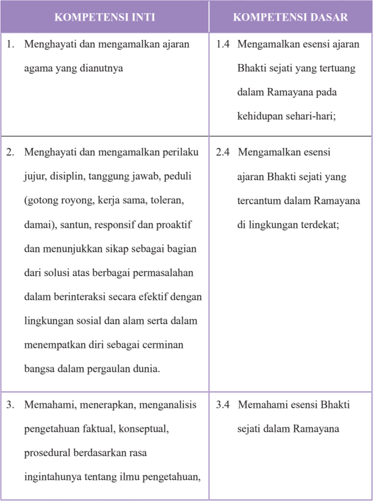

Tabel ini berisi informasi tentang kompetensi inti dan dasar yang harus dipenuhi oleh peserta didik dalam konteks ajaran agama dan perilaku sosial. Topik utama adalah pengembangan karakter dan pengetahuan tentang Bhakti sejati dalam Ramayana. Kolom "Kompetensi Inti" mencakup tiga poin utama: menghayati dan mengamalkan ajaran agama, menghayati dan mengamalkan perilaku jujur, disiplin, tanggung jawab, dan sifat-sifat positif lainnya, serta memahami dan menerapkan pengetahuan faktil, konseptual, dan prosedural berdasarkan rasa inginannya tentang ilmu pengetahuan. Sementara itu, kolom "Kompetensi Dasar" menunjukkan bahwa peserta didik harus mengamalkan esensi ajaran Bhakti sejati yang tertuang dalam Ramayana, mengamalkan esensi ajaran Bhakti sejati yang tercantum dalam Ramayana di lingkungan terdekat, dan memahami esensi Bhakti sejati dalam Ramayana. Pola penting yang terlihat adalah bahwa peserta didik harus memiliki pemahaman mendalam tentang Bhakti sejati dalam Ramayana dan kemampuan untuk mengamalkannya dalam berbagai situasi kehidupan.

 

---
## 📄 Halaman 142

---
**📊 Tabel**

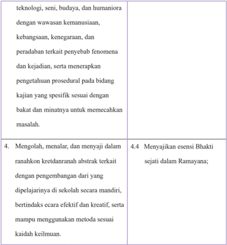

Tabel ini berisi instruksi pembelajaran yang melibatkan teknologi, seni, budaya, dan humaniora dengan wawasan kemanusiaan, kebangsaan, kenegaraan, dan peradaban terkait penyebab fenomena dan kejadian. Topik utama adalah mengolah, menalar, dan menyajikan dalam ranah konkrit dan abstrak terkait dengan pengembangan diri yang dipelajari di sekolah secara mandiri, bertindak secara efektif dan kreatif, serta mampu menggunakan metode sesuai kaidah keilmuan. Data penting lainnya mencakup menunjukkan esensi Bhakti sejati dalam Ramayana.

### 2. Tujuan Pembelajaran

Setelah  mempelajari  materi  ajaran Bhakti  Sejati dalam Ramayana peserta didik dapat:

- Menjelaskan pengertian dan hakikat Bhakti Sejati .
- Menjelaskan pengertian dan hakikat Bhakti Sejati dalam Ramayana.

 

---
## 📄 Halaman 143

- Menjelaskan tujuan ajaran Bhakti Sejati dalam Ramayana.
- Mencontoh dan pempraktikkan sikap-sikap yang baik sebagai teladan dalam kehidupan sehari-hari.
- Menunjukkan  tokoh-tokoh  dalam Ramayana yang  dapat  dijadikan inspirasi dalam melaksanakan bhakti baik kepada Ida Sang Hyang Widhi ,  orang  tua,  pendidik,  pemimpin  termasuk  orang  yang  patut dihormati.
- Dapat meletakan dasar-dasar sikap Bhakti disetiap kesempatan untuk pembentukan budi pekerti yang luhur.

 

---
## 📄 Halaman 144

### 3. Peta Konsep

---
**🖼️ Gambar/Diagram**

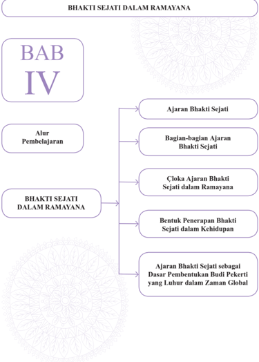

> **Deskripsi Visual:** Gambar ini adalah diagram yang menunjukkan struktur bab IV dari buku pelajaran tentang Bhakti Sejati dalam Ramayana. Bab ini dibagi menjadi empat bagian utama:

1. **Ajaran Bhakti Sejati** - Ini merupakan bagian awal yang menjelaskan konsep dasar Bhakti Sejati.

2. **Bagian-bagian Ajaran Bhakti Sejati** - Menyajikan detail tentang berbagai aspek dan elemen yang terkandung dalam ajaran tersebut.

3. **Cloka Ajaran Bhakti Sejati dalam Ramayana** - Bagian ini menganalisis bagaimana ajaran Bhakti Sejati diterapkan dalam cerita Ramayana.

4. **Bentuk Penerapan Bhakti Sejati dalam Kehidupan** - Menjelaskan bagaimana prinsip-prinsip Bhakti Sejati dapat diterapkan dalam kehidupan sehari-hari.

5. **Ajaran Bhakti Sejati sebagai Dasar Pembentukan Budi Pekerti yang Luhur dalam Zaman Global** - Berfokus pada pengaruh Bhakti Sejati dalam membentuk nilai-nilai moral dan etika di era globalisasi.

Elemen-elemen utama ini saling terhubung melalui relasi hierarkis, menunjukkan struktur yang jelas dan sistematis. Teks, angka, atau label penting seperti "BAB IV", "Alur Pembelajaran", dan judul bagian-bagian tersebut sangat penting untuk memahami struktur dan isi bab ini. Informasi kunci yang dapat diambil pembaca adalah bahwa bab ini mencakup analisis mendalam tentang Bhakti Sejati dalam konteks Ramayana, serta bagaimana prinsip-prinsip ini relevan dengan kehidupan modern dan global.

 

---
## 📄 Halaman 145

### Pada pembelajaran Bab IV peserta didik diharapkan dapat mengapreasiasi ajaran Bhakti Sejati

### 4. Proses Pembelajaran

Agar  pendidik  mampu  menerapkan  materi  Ajaran Bhakti  Sejati dalam Ramayana sesuai dengan buku peserta didik secara lengkap, maka pendidik  harus  memahami  dan  menguasi  pokok-pokok  materi  Ajaran Bhakti Sejati dalam Ramayana yang akan diterima oleh peserta didik dan menguasai batasan materi tersebut. Selain dari materi buku peserta didik, pendidik  agar  menugaskan  peserta  didiknya  mencari  dan  menemukan materi-materi lain yang berkaitan dan berhubungan dengan materi pokok untuk menambah wawasan dan pengetahuannya malalui membaca kitab suci, menonton film Ramayana , wayang dalam cerita Ramayana, internet, mengamati  yang  terjadi  di  masyarakat  sesuai  dengan  budaya  Hindu setempat.  Adapun  materi  Ajaran Bhakti  Sejati dalam Ramayana dapat diajarkan kepada peserta didik dengan metode saintifik antara lain:

### Mengamati:

Pendidik mengajak peserta didiknya untuk:

- Mencermati melalui kegiatan mencari informasi mendengar dan membaca tentang ajaran Bhakti Sejati dalam Ramayana dari buku pelajaran kelas XI dan kitab Ramayana.

 

---
## 📄 Halaman 146

- Mendengarkan peserta didik lainnya bercerita Ramayana secara bergantian untuk memperoleh Bhakti Sejati dalam Ramayana tersebut.
- ......... dan seterusnya.

### Menanya:

Pendidik mengajak peserta didiknya untuk:

- Berdiskusi di kelas berkaitan Bhakti sejati dalam Ramayana dan menanyakan apa saja bhakti sejati tersebut.
- Memberikan contoh perbuatan Bhakti sejati dalam kehidupan yang sesuai dengan Ramayana.
- ......... dan seterusnya.

### Mengeksplorasi:

Pendidik mengajak peserta didik untuk:

- Mengembangkan kreativitas, dapat dilakukan melalui membaca, mengamati  aktivitas  sikap  hidup  perbuatan  sehari-hari  yang  sudah  dan belum sesuai dengan ajaran Bhakti Sejati dalam Ramayana.
- Mengumpulkan  data-data  untuk  mendukung  penerapan  ajaran Bhakti Sejati dalam Ramayana dalam sikap mental kehidupan sekarang.
- ......... dan seterusnya.

### Mengasosiasi:

Pendidik mengajak peserta didik untuk:

- Memberikan  ruang  dan  waktu  yang  dapat  dilakukan  melalui  kegiatan

 

---
## 📄 Halaman 147

- menganalisis  data,  mengelompokan,  contoh  kongkret  penerapan Bhakti Sejati dalam Ramayana dalam kehidupan.
- Menganalisis berbagai macam hal yang dihadapi dalam penerapan Bhakti Sejati di masyarakat.
- ......... dan seterusnya.

### Mengomunikasikan:

Pendidik mengajak peserta didiknya untuk:

- Menyampaikan hasil belajar dalam bentuk tulisan hasil penerapan Bhakti Sejati dalam Ramayana dalam kehidupan sehari-hari.
- Membuat  dalam  bentuk  gambar-gambar/foto  hasil  pengamalan Bhakti Sejati dalam Ramayana dalam kehidupan.
- ......... dan seterusnya.
Metode Pembelajaran ini dapat dipilih dipergunakan sesuai dengan situasi dan kondisi peserta didiknya dalam proses pembelajaran Bhakti Sejati dalam Ramayana yaitu:

- Inquiry Based Learning
- Discovery Based Learning
- Problem Based Learning
- Ceramah (dharmawacana)
- Diskusi
- Tanya Jawab (dharmatula)
- Presentasi

 

---
## 📄 Halaman 148

### 5. Evaluasi

Pendidik dapat mengembangkan evaluasi pembelajaran sesuai dengan topik dan pokok nahasan Bhakti Sejati dalam Ramayana . Evaluasi pembelajaran yang dikembangkan dapat berupa tes dan nontes. Tes dapat berupa uraian, isian, atau pilihan ganda. Nontes dapat berupa lembar kerja, kuesioner, proyek, dan sejenisnya. Pendidik juga harus mengembangkan rubric  penilaian  sesuai  dengan  materi Bhakti  Sejati dalam Ramayana . Pendidik atau fasilitator selalu mengecek setiap tahapan yang dilakukan peserta  didik,  serta  membimbing  peserta  didik  agar  menjalankan  setiap proses dengan baik dan mendapat hasil yang maksimal sesua potensi yang dimiliki masing-masing peserta didik.

### Rubrik Pendidik

Pendidik  dapat  mengembangkan  indikator  penilaian  untuk  setiap  aspek  yang diujikan. Indikator-ini merupakan scoring terhadap apa yang akan dinilai dan dicapai oleh peserta didik berdasarka uji Kompetensi yang dikembangkan pada Bab IV Bhakti Sejati dalam Ramayana , pendidik dapat membuat rubrik seperti tertera di bawah ini.

### Pengetahuan

- Jelaskan  apa  yang  anda  ketahui  tentang Bhakti  Sejati dalam Ramayana baik berdasarkan sastra maupun bersarkan pemehaman diri Anda!
- Mengapa Bhakti Sejati dalam Ramayana tersebut sulit diterapkan dalam era zaman Globalisai?

 

---
## 📄 Halaman 149

- Sebutkan dan jelaskan contoh Bhakti Sejati dalam Ramayana dan  sikap hidup pada masa kini!

### Keterampilan

- Praktikkan bagaimana perbuatan yang baik jika berhadapan dengan ayah dan  ibu  kita  yang  melahirkan  dan  membesarkan  kita,  pendidik  yang mendidik kita di sekolah, orang suci dan tokoh masyarakat yang dihormati seperti pejabat negara!
- Praktikkan perbuatan cerminan orang yang berbudi pekerti lihur tarhadap orang tua kita sendiri yang telah melahirkan, membesarkan dan memberikan pendidikan seperti sekarang dan masa depan kita!
- Praktikkan bagaimana perbuatan bhakti seorang Hanoman tarhadap Sang Rama di kerajaan Ayohdya Pura yang dapat diteladani dalam kehidupan sekarang ini!
Sikap:  melalui  ajaran Bhakti  Sejati dalam Ramayana peserta  didik  dapat meyakini,  menghayati,  mempraktikkan,  mencintai,  dan  menghargai  hakikat Bhakti  Sejati tersebut  apa  yang  dicontohkan  cerita Ramayana dalam  ajaran Hindu  sehingga  menjadi  insan-insan  Hindu  yang  memiliki  sikap  pengabdian yang tulus ikhlas tanpa pamrih, welas asih, budiman, Sadhu, dharmawan dan selalu menjunjung nilai-nilai Dharma atau kebajikan .

- Cobalah refleksi diri kita sejauh mana dapat memberikan perubahan sikap sesudah dan sebelum mempelajari ajaran Bhakti Sejati dalam Ramayana !

 

---
## 📄 Halaman 150

- Bagaimanakah  cara  kita  untuk  selalu  dapat  meneladani  ajaran Bhakti Sejati dalam Ramayana secara konsisten sehingga menjadi manusia yang berbudi pekerti yang santun dalam kehidupan ini, sehingga nantinya dapat memberikan  contoh  perbuatan bhakti terhadap  Ida  Sang  Hyang  Widhi, orang suci, kepada orang tua, pendidik, pemimpin negara, dan masyarakat lainnya?

### 6. Pengayaan

### Pendidik dapat menugaskan kepada peserta didiknya untuk menggali:

Nilai-nilai luhur yang perlu dipraktikkan dalam kehdupan sehari-hari seperti yang dicontohkan dalam cerita Ramayana , misalnya:

- Satya  mitra dan Satya  Wacana =  terlihat  dari  kesetiaan  Sugriwa  terhadap janjinya kepada Rama.
- Satya Semaya, diperlihatkan pada kesetiaan Dasarata dalam menepati janjinya pada Dewi Keykayi sampai harus meninggal dunia.
- Guru Bhakti dan Pitra yajna , diperlihatkan dari rasa bhaktinya Rama terhadap Orang tuanya sehingga bersedia untuk mengasingkan diri kehutan.
- Dharma Negara diperlihatkan  oleh  Kumbakarna  yang  dengan  sepenuh  hati hingga mengorbankan nyawa untuk membela negaranya.
Dan seterusnya ......!

- Dharma Agama , diperlihatkan oleh Wibisana yang menentang kakaknya demi membela kebenaran.
Pengayaan  adalah  kegiatan  yang  diberikan  kepada  peserta  didik  atau kelompok yang lebih cepat dalam mencapai kompetensi dibandingkan dengan peserta  didik  lain  agar  mereka  dapat  memperdalam  kecakapannya  atau  dapat mengembangkan  potensinya  secara  optimal.  Tugas  yang  diberikan  pendidik kepada peserta didik dapat berupa tutor sebaya, mengembangkn latihan secara lebih mendalam, membuat karya baru ataupun melakukan suatu proyek. Kegiatan

 

---
## 📄 Halaman 151

pengayaan hendaknya menyenangkan dan mengembangkan kemampuan kognitif tinggi sehingga mendorong peserta didik untuk mengerjakan tugas yang diberikan. Bentuk-bentuk pelaksanaan pembelajaran pengayaan dapat dilakukan antara lain melalui:

- Belajar kelompok, yaitu sekelompok peserta didik yang memiliki minat tertentu diberikan pembelajaran bersama pada jam-jam pelajaran sekolah biasa,  sambil  menunggu  teman-temannya  yang  mengikuti  pembelajaran remedial karena belum mencapai ketuntasan.
- Belajar  mandiri,  yaitu  secara  mandiri  peserta  didik  belajar  mengenai sesuatu yang diminati.
- Pembelajaran berbasis tema, yaitu memadukan kurikulum di bawah tema besar sehingga peserta didik dapat mempelajari hubungan antara berbagai disiplin ilmu.
- Pemadatan kurikulum, yaitu pemberian pembelajaran hanya untuk kompetensi/materi yang belum diketahui peserta didik. Dengan demikian tersedia  waktu  bagi  peserta  didik  untuk  memperoleh  kompetensi/materi baru, atau bekerja dalam proyek secara mandiri sesuai dengan kapasitas maupun kapabilitas masing-masing.

### 7. Remedial

Pembelajaran remedial adalah pembelajaran yang diberikan kepada peserta  didik  yang  belum  mencapai  ketuntasan  kompetensi.Remedial menggunakan  berbagai  metode  yang  diakhiri  dengan  penilaian  untuk mengukur kembali tingkat ketuntasan belajar peserta didik.Pembelajaran

 

---
## 📄 Halaman 152

remedial diberikan kepada peserta didik bersifat terpadu, artinya pendidik memberikan pengulangan materi  dan  mengenali  potensi  setiap  individu ataupun kesulitan belajar yang dialami oleh peserta didik.

### · Bentuk Pelaksanaan Remedial

Setelah  diketahui  kesulitan  belajar  yang  dihadapi  peserta  didik, langkah  berikutnya  adalah  memberikan  perlakuan  berupa  pembelajaran remedial. Bentuk-bentuk pelaksanaan pembelajaran remedial antara lain:

Pemberian pembelajaran ulang dengan metode dan media yang berbeda. Pembelajaran ulang dapat disampaikan  dengan  cara penyederhanaan  materi,  variasi cara  penyajian,  penyederhanaan  tes/ pertanyaan. Pembelajaran ulang dilakukan bilamana sebagian besar atau semua peserta didik belum mencapai ketuntasan belajar atau mengalami kesulitan belajar. Pendidik perlu memberikan penjelasan kembali dengan menggunakan metode dan/atau media yang lebih tepat.

Pemberian bimbingan secara khusus, misalnya bimbingan perorangan. Dalam  hal  pembelajaran  klasikal  peserta  didik  mengalami  kesulitan, perlu dipilih alternatif tindak lanjut berupa pemberian bimbingan secara individual. Pemberian bimbingan perorangan merupakan implikasi peran pendidik sebagai tutor. Sistem tutorial dilaksanakan bilamana terdapat satu atau beberapa peserta didik yang belum berhasil mencapai ketuntasan.

Pemberian tugas-tugas latihan secara khusus. Dalam rangka menerapkan prinsip pengulangan, tugas-tugas latihan perlu diperbanyak agar peserta didik tidak mengalami kesulitan dalam mengerjakan tes akhir.

 

---
## 📄 Halaman 153

Peserta didik perlu diberi pelatihan intensif untuk membantu menguasai kompetensi yang ditetapkan.

Pemanfaatan tutor sebaya. Tutor sebaya adalah teman sekelas yang memiliki  kecepatan  belajar  lebih.  Mereka  perlu  dimanfaatkan  untuk memberikan tutorial kepada rekannya yang mengalami kesulitan belajar. Dengan teman sebaya diharapkan peserta didik yang mengalami kesulitan belajar akan lebih terbuka dan akrab.

### 8. Interaksi dengan Orang Tua

Pembelajaran di sekolah merupakan tanggung jawab bersama antar warga sekolah, yaitu kepala sekolah, pendidik, dan tenaga kependidikan serta orang tua. Oleh karena itu, pihak sekolah perlu mengkomunikasikan kegiatan pembelajaran peserta didik dengan orang tua. Orang  tua dapat  berperan  sebagai  partner  sekolah  dalam  menunjang  keberhasilan pembelajaran peserta didik. Pendidik dapat melakukan interaksi dengan orang tua. Interaksi dapat dilakukan melalui komunikasi melalui telepon, kunjungan  ke  rumah,  atau  media  sosial  lainnya.  Pendidik  juga  dapat melakukan  interaksi  melalui  lembar  kerja  peserta  didik  yang  harus ditanda  tangani  oleh  orang  tua  murid  baik  aspek  pengetahuan,  sikap, maupun keterampilan. Melalui ineteraksi ini orang tua dapat mengetahui perkembangan baik mental, sosial, dan intelektual putra putrinya. Orang tua selalu memantau perkembangan pembelajaranya, mengingatkan akan tugas-tugas apa saja yang diberikan oleh pendidik, sering mengontrol hasil ulangan  harian,  tugas-tugas/PR,  orang  tua  menanamkan  nilai-nilai  budi

 

---
## 📄 Halaman 154

pekerti di rumah menjauhkan diri dari tindakan kekerasan fisik maupun verbal.  Pendidik  agama  Hindu  bekerja  sama  menugaskan  orang  tua  di rumah antara lain:

- Membimbing putra/putrinya untuk rajin bersembahyang Puja Trisandya dan Panca Sembah.
- Rajin bersembahyang ke Pura atau ke tempat-tempat suci pada harihari suci.
- Rajin beryadnya.
- Menghormati dan menghargai budaya Hindu.
- Bersikap saling asah, asih dan asuh dengan sesama mahkluk hidup.
- Menanyakan baik  kepada  pendidik  maupun  putra/putrinya  tentang perkembangan pembelajaran Bhakti Sejati dalam Ramayana ,  tugas, hasil  ulangan  maupun  perkembangan  sikap  dan  perbuatan  putra/ putrinya.

 

---
## 📄 Halaman 155

### E.  BAB V KELUARGA SUKHINAH DALAM AGAMA HINDU

- Kompetensi Inti (KI) dan Kompetensi Dasar (KD)

---
**📊 Tabel**

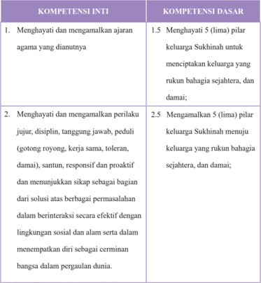

Tabel ini berisi dua kolom utama: Kompetensi Inti dan Kompetensi Dasar. Topik utama tabel adalah tentang pengembangan kompetensi individu dalam konteks keluarga dan interaksi sosial. Kolom Kompetensi Inti mencakup dua poin utama: menghayati dan mengamalkan ajaran agama yang dianutnya, serta menghayati dan mengamalkan perilaku jujur, disiplin, tanggung jawab, peduli, damai, santun, responsif, dan proaktif. Sementara itu, kolom Kompetensi Dasar mencakup dua poin utama: menghayati 5 (lima) pilar keluarga Sukhinah untuk menciptakan keluarga yang rukun bahagia sejahtera, dan damai; dan mengamalkan 5 (lima) pilar keluarga Sukhinah menuju keluarga yang rukun bahagia sejahtera, dan damai. Data penting yang terlihat adalah bahwa kedua kolom memiliki tujuan yang sama yaitu menciptakan keluarga yang harmonis dan sejahtera, namun dengan cara yang berbeda.

 

---
## 📄 Halaman 156

---
**📊 Tabel**

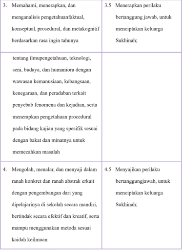

Tabel ini berisi dua baris yang masing-masing menunjukkan topik utama dan detail dari dua aspek pembelajaran. Topik utama pertama adalah tentang pemahaman, penelitian, dan pengembangan keterampilan berdasarkan ilmu pengetahuan, teknologi, seni, budaya, dan humaniora. Ini mencakup wawasan kemanusiaan, kebangsaan, kenegaraan, dan peradaban terkait penyebab fenomena dan kejadian. Selain itu, juga termasuk pengetahuan procedural pada bidang kajian spesifik sesuai dengan bakat dan minat untuk memecahkan masalah. Topik utama kedua adalah mengolah, menalar, dan menyaji dalam ranah konkrit dan ranah abstrak eratkan dengan pengembangan dari yang dipelajari di sekolah secara mandiri, bertindak secara efektif dan kreatif, serta mampu menggunakan metode sesuai kaidah keilmuan. Data penting yang terlihat adalah bahwa setiap baris memiliki 4.5 dan 3.5 sebagai nomor urut, yang mungkin merujuk pada skor atau tingkat kemampuan yang dicapai dalam pembelajaran tersebut.

 

---
## 📄 Halaman 157

### 2. Tujuan Pembelajaran

Setelah mempelajari materi Keluarga Sukhinah dalam agama Hindu peserta didik dapat:

- Menjelaskan pengertian Sukhinah dalam agama Hindu.
- Menjelaskan pengertian Keluarga Sukhinah dalam agama Hindu.
- Menyebutkan tujuan Wiwaha dalam mewujudkan keluarga Sukhinah.
- Menjelaskan bentuk-bentuk Wiwaha dalam agama Hindu.
- Menjelaskan syarat-syarat dan sahnya suatu perkawinan.
- Menyebutkan kewajiban suami dan istri dalam keluarga Sukhinah.
- Menyebutkan cara membina keharmonisan dalam keluarga Sukhinah.
- Menjelaskan lima(5) pilar keluarga Sukhinah menuju keluarga yang rukun bahagia, sejahtera dan damai.
- Menyebutkan pahala bagi anak-anak yang berbhakti kepada orang tuanya.

 

---
## 📄 Halaman 158

### 3. Peta Konsep

---
**🖼️ Gambar/Diagram**

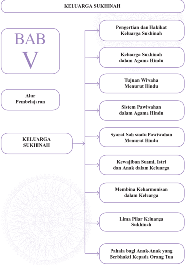

> **Deskripsi Visual:** Gambar ini adalah diagram yang menunjukkan struktur topik dalam bab V dari buku pelajaran tentang keluarga Sukhinah. Diagram ini terdiri dari dua bagian utama: "Keluarga Sukhinah" dan "Alur Pembelajaran". Pada bagian "Keluarga Sukhinah", terdapat beberapa sub-topik yang disusun dalam urutan logis, mulai dari pengertian dan hakikat keluarga Sukhinah, hingga pahala bagi anak-anak yang berbhakti kepada orang tua. Sementara pada bagian "Alur Pembelajaran", terdapat beberapa sub-topik yang lebih detail, seperti keluarga Sukhinah dalam Agama Hindu, tujuan Wiwaha menurut Hindu, sistem pawiwan dalam Agama Hindu, syarat sah suatu pawiwan menurut Hindu, kewajiban suami, istri, dan anak dalam keluarga, membangun keharmonisan dalam keluarga, lima pilar keluarga Sukhinah, dan pahala bagi anak-anak yang berbhakti kepada orang tua. Diagram ini membantu pembaca untuk memahami struktur topik dan mengikuti alur pembelajaran yang ditawarkan dalam bab tersebut.

 

---
## 📄 Halaman 159

Pada pembelajaran Bab V peserta didik diharafkan dapat mengapreasiasi ajaran dan hakikat keluarga Sukhinah

### 4. Proses Pembelajaran

Agar pendidik mampu menerapkan materi Keluarga Sukinah dalam Agama  Hindu  sesuai  dengan  buku  peserta  didik  secara  lengkap,  maka pendidik  harus  memahami dan menguasi pokok-pokok materi Keluarga Sukinah dalam Agama Hindu yang akan diterima oleh peserta didik dan menguasai batasan materi tersebut. Selain dari materi buku peserta didik, pendidik  agar  menugaskan  peserta  didiknya  mencari  dan  menemukan materi-materi lain yang berkaitan dan berhubungan dengan materi pokok untuk menambah wawasan dan pengetahuannya malalui membaca kitab suci, internet, mengamati yang terjadi dimasyarakat sesuai dengan budaya Hindu setempat. Adapun materi Keluarga Sukinah dalam Agama Hindu dapat diajarkan kepada peserta didik dengan metode Saintifik antara lain:

### Mengamati:

Pendidik mengajak peserta didiknya untuk:

- Mendengar dalam pembacaan serta menyimak materi Keluarga Sukhinah dalam Agama Hindu dari buku Peserta didik.
- Mengamati  pembacaan  yang  dilakukan  peserta  didik  secara  bergantian materi keluarga Sukhinah dan Wiwaha.
- ......... dan seterusnya.

 

---
## 📄 Halaman 160

### Menanya:

Pendidik mengajak peserta didik untuk:

- Menanyakan seperti apa? Keluarga Sukhinah dalam agama Hindu.
- Pendidik memberikan kesempatan kepada peserta didik secara bergantian .menjelaskan termasuk dalam keluarga Sukinah dalam agama Hindu.
- ......... dan seterusnya.

### Mengeksplorasi:

Pendidik mengajak peserta didik untuk:

- Mengembangkan kreativitas, dapat dilakukan melalui membaca, mengamati aktivitas keluarga Sukhinah dalam agama Hindu.
- Mengumpulkan syarat-syarat untuk mewujudkan keluarga Sukhinah dalam agama Hindu agar terwujudnya masyarakat yang damai, adil dan makmur.
- ......... dan seterusnya.

### Mengasosiasi:

Pendidik mengajak peserta didik untuk:

- Melakukan kegiatan menganalisis data keluarga bagaimana cri-ciri keluarga Sukhinah dalam agama Hindu.
- Menyimpulkan dari hasil analisis berbagai macam hal yang dihadapi baik suka dan dukanya dalam membina keluarga Sukhinah dalam agama Hindu
- ......... dan seterusnya.

 

---
## 📄 Halaman 161

### Mengomunikasikan:

Pendidik mengajak peserta didiknya untuk:

- Menyampaikan  hasil  belajar  secara  lisan  bergantian  apa  yang  dapat dipahami setelah menerima materi Keluarga Sukhinah dalam agama Hindu.
- Menyampaikan  hasil  konseptualisasi  keluarga Sukhinah dalam  agama Hindu dalam bentuk tulisan,  gambar,  presentasi,  membuat  laporan,  dan atau unjuk kerja.
- ......... dan seterusnya.
Metode Pembelajaran ini dapat dipilih sebagai pengantar pembelajaran Keluarga Sukhinah dalam Agama Hindu dan disesuaikan dengan situasi dan kondisi peserta didik:

- Inquiry Based Learning
- Discovery Based Learning
- Project Based Learning
- Problem Based Learning
- Ceramah (darmawacana)
- Diskusi
- Tanya Jawab (dharmatula)
- Presentasi

### 5. Evaluasi

Pendidik dapat mengembangkan evaluasi pembelajaran sesuai dengan topik dan pokok bahasan Keluarga Sukhinah dalam Agama Hindu. Evaluasi

 

---
## 📄 Halaman 162

pembelajaran yang dikembangkan dapat berupa tes dan nontes. Tes dapat berupa uraian, isian, atau pilihan ganda. Nontest dapat berupa lembar kerja, kuesioner, proyek, dan sejenisnya. Pendidik juga harus mengembangkan rubrik penilaian sesuai dengan materi Keluarga Sukhinah dalam Agama Hindu.  Pendidik  atau  fasilitator  selalu  mengecek  setiap  tahapan  yang dilakukan peserta didik, serta membimbing peserta didik agar menjalankan setiap proses dengan baik dan mendapat hasil yang maksimal sesua potensi yang dimiliki masing-masing peserta didik.

### Rubrik Pendidik

Pendidik  dapat  mengembangkan  indikator  penilaian  untuk  setiap  aspek  yang diujikan. Indikator-ini merupakan scoring terhadap apa yang akan dinilai dan dicapai oleh  peserta  didik  berdasarka  uji  Kompetensi  yang  dikembangkan  pada  Bab  V Keluarga Sukhinah dalam  Agama  Hindu,  Pendidik  dapat  membuat  rubrik  seperti tertera di bawah ini.

### Pengetahuan

- Jelaskan apa yang anda ketahui tentang keluarga Sukhinah dalam Agama Hindu baik berdasarkan sastra maupun berdasarkan pemahaman diri Anda!
- Mengapa Keluarga Sukhinah dalam agama Hindu tersebut sulit diterapkan dalam era zaman globalisai?
- Sebutkan dan jelaskan contoh keluarga Sukhinah dalam agama Hindu pada masa kini!

 

---
## 📄 Halaman 163

- Jelaskan  apa  saja  yang  harus  dipersiapkan  untuk  terciptanya  keluarga Sukhinah mulai dari sekarang!

### Keterampilan

- Praktikkan sarana apa saja yang dibutuhkan dalam upacara Wiwaha !
- Tunjukkan siapa saja yang dapat disebut sebagai Tri saksi dalam upacara wiwaha !
- Bagaimana presedur sahnya suatu Wiwaha sampai mempunyai kekuatan hukum (akta perkawinan)!
Sikap:  melalui  ajaran  Keluarga Sukhinah dalam  Agama  Hindu  peserta didik dapat meyakini, menghayati, mencintai, dan menghargai hakikat keluarga Sukhinah dalam  agama  Hindu  tersebut,  sehingga  menjadi  insan-insan  Hindu yang  memiliki  sikap  dan  tanggung  jawab  dalam  membina  kehidupan  rumah tangga yang bahagian, sejahtera baik lahir maupun batin dan menjunjung nilainilai Dharma atau kebajikan .

- Cobalah  refleksi  diri  kita  sejauh  mana  dapat  memberikan  pemahaman dalam sikap hidup ini sesudah dan sebelum mempelajari materi Keluarga Sukhinah dalam Agama Hindu!
- Bagaimanakah cara kita nanti untuk selalu dapat membina, menciptakan, menyelaraskan pengetahuan keluarga Sukhinah dalam agama Hindu secara konsisten  sehingga  menjadi  manusia  yang  berhasil  dalam  mewujudkan keluarga yang bahagi, abadi/langgeng, sejahtera baik lahir dan batin?

 

---
## 📄 Halaman 164

### 6. Pengayaan

### Pendidik dapat mememberikan materi pengayaan sesuai dengan kemampuanya atau menugaskan kepada peserta didiknya untuk menemukan terkait keluarga Sukhinah!

Bunyi sloka dalam kitab suci Hindu:

Suami  hendaknya  mengucapkan  janji  dan  harapan  kepada  istrinya.  'Wahai  istriku menjadilah pelopor dalam hal kebaikan, cerdas, teguh, mandiri, mampu merawat dan memelihara rumah, senantiasa taat kepada hukum seperti halnya bumi pertiwi. Aku memilikimu untuk kesejahtraan dan kebahagiaan keluarga (Yajurveda XIV.22).

'Seorang  istri  sesungguhnya  adalah  seorang  cendekiawan  dan  mampu membimbing keluarganya '(Rgveda VIII.33.19).

Seorang wanita, istri atau ibu juga hendaknya berpenampilan lemah lembut dan menjaga dengan baik setiap bagian tubuhnya. 'Wahai wanita, bila berjalan lihatlah  ke  bawah,  jangan  menengadah  dan  bila  duduk  tutuplah  kakimu  rapatrapat'(Rgveda VIII.33.19).

'Wahai  istri,  tunjukkan  keramahanmu,  keberuntungan  dan  kesejahtraan, usahakanlah melahirkan anak. setia dan patuhlah kepada suamimu (Patibrata), siap sedialah menerima anugrah-Nya yang mulia' (Atharvaveda XIV.1.42).

'Wahai para istri, senantiasalah memuja Sarasvati dan hormatlah kamu kepada yang lebih tua' (Atharvaveda XIV.2.20).

Sungguhlah dosa besar jika seorang istri berani terhadap suaminya, berkata kasar terhadap suaminya. 'Hendaknya istri berbicara lembut terhadap suaminya dengan keluhuran budi pekerti' (Atharvaveda, III.30.2).

Sesungguhnya  untuk  mewujudkan  kesejahtraan  dan  kebahagiaan  keluarga tidaklah semata tanggung jawab ibu, istri atau suami saja, tapi kedua belah pihak berusaha mewujudkan hal tersebut: 'Wahai suami istri, binalah keluhuran keluarga, bekerja keraslah untuk meningkatkan kesejahtraan hidupmu. semoga kemashuran dan kekayaan yang engkau peroleh memberikan kebahagiaan' (Rgveda V.28.3).

'Wahai  suami-istri,  tekunlah  dan  tetaplah  laksanakan  kebajikan,  hanya orang  yang  memiliki  Sradha  (keimanan)  yang  teguh  akan  sukses  di  dunia  ini' (Atharvaveda VI.122.3).

Suami istri tidak dibenarkan terlalu menurutkan hawa nafsunya dan senantiasa tekun  untuk  mewujudkan kesejahtraan  dan  kebahagiaan:  'Hendaknya  dorongan nafsu seksual tidak menodai kesucian pribadi'(Atharva Veda)

 

---
## 📄 Halaman 165

Sebagai seorang istri tahan ujilah kamu, rawatlah dirimu, lakukan tapa brata, laksanakan Yajna di dalam rumah, bergembiralah kamu, bekerja keraslah kamu, engkau akan memperoleh kejayaan' (Yajurveda XVII.85).

'Jadikanlah rumahmu  itu seperti sorga, tempat pikiran-pikiran mulia, kebajikan dan kebahagiaan berkumpul di rumahmu itu'(Atharvaveda VI.120.3).

'Hendaknya dewi kemakmuran bersedia tinggal disini, tempat yang menyenangkan di rumah ini, dalam keluarga dan juga pada ternakmu' (Yajurveda VI.120

Hendaknya manis bagaikan madu cinta kasih dan pandangan antara suami dan istri,  penuh  keindahan.Hendaknya senantiasa hidup bersama dalam suasana bahagia tanpa kedengkian tanpa penghianatan. Mereka satu jiwa bagi keduanya' (Atharvaveda VII.36.1).

'Wahai suami dan istri hendaknya kamu berbudi pekerti yang luhur, penuh kasih  sayang  dan  kemesraan  di  antara  kamu.  Lakukan  tugas  dan  kewajibanmu dengan baik dan patuh kepada hukum yang berlaku. Turunkanlah putra-putri yang perwira, bangunlah rumahmu sendiri dan hiduplah dengan suka cita di dalamnya' (Atharvaveda XIV.2.43).

Dan seterusnya, dan seterusnya ya......................!

Pengayaan  adalah  kegiatan  yang  diberikan  kepada  peserta  didik  atau kelompok yang lebih cepat dalam mencapai kompetensi dibandingkan dengan peserta  didik  lain  agar  mereka  dapat  memperdalam  kecakapannya  atau  dapat mengembangkan  potensinya  secara  optimal.  Tugas  yang  diberikan  pendidik kepada peserta didik dapat berupa tutor sebaya, mengembangkn latihan secara lebih mendalam, membuat karya baru ataupun melakukan suatu proyek. Kegiatan pengayaan hendaknya menyenangkan dan mengembangkan kemampuan kognitif tinggi sehingga mendorong peserta didik untuk mengerjakan tugas yang diberikan. Bentuk-bentuk pelaksanaan pembelajaran pengayaan dapat dilakukan antara lain melalui:

 

---
## 📄 Halaman 166

- Belajar kelompok, yaitu sekelompok peserta didik yang memiliki minat tertentu diberikan pembelajaran bersama pada jam-jam pelajaran sekolah biasa,  sambil  menunggu  teman-temannya  yang  mengikuti  pembelajaran remedial karena belum mencapai ketuntasan.
- Belajar  mandiri,  yaitu  secara  mandiri  peserta  didik  belajar  mengenai sesuatu yang diminati.
- Pembelajaran berbasis tema, yaitu memadukan kurikulum di bawah tema besar sehingga peserta didik dapat mempelajari hubungan antara berbagai disiplin ilmu.
- Pemadatan kurikulum, yaitu pemberian pembelajaran hanya untuk kompetensi/materi yang belum diketahui peserta didik. Dengan demikian tersedia  waktu  bagi  peserta  didik  untuk  memperoleh  kompetensi/materi baru, atau bekerja dalam proyek secara mandiri sesuai dengan kapasitas maupun kapabilitas masing-masing.

### 7. Remedial

Pembelajaran remedial adalah pembelajaran yang diberikan kepada peserta  didik  yang  belum  mencapai  ketuntasan  kompetensi.Remedial menggunakan  berbagai  metode  yang  diakhiri  dengan  penilaian  untuk mengukur kembali tingkat ketuntasan belajar peserta didik.Pembelajaran remedial diberikan kepada peserta didik bersifat terpadu, artinya pendidik memberikan pengulangan materi  dan  mengenali  potensi  setiap  individu ataupun kesulitan belajar yang dialami oleh peserta didik.

 

---
## 📄 Halaman 167

### · Bentuk Pelaksanaan Remedial

Setelah  diketahui  kesulitan  belajar  yang  dihadapi  peserta  didik, langkah  berikutnya  adalah  memberikan  perlakuan  berupa  pembelajaran remedial. Bentuk-bentuk pelaksanaan pembelajaran remedial antara lain:

- Pemberian pembelajaran ulang dengan metode dan media yang berbeda. Pembelajaran ulang dapat disampaikan dengan cara penyederhanaan materi, variasi  cara  penyajian,  penyederhanaan  tes/pertanyaan.  Pembelajaran ulang dilakukan bilamana sebagian besar atau semua peserta didik belum mencapai ketuntasan belajar atau mengalami kesulitan belajar. Pendidik perlu memberikan penjelasan kembali dengan menggunakan metode dan/ atau media yang lebih tepat.
- Pemberian  bimbingan  secara  khusus,  misalnya  bimbingan  perorangan. Dalam  hal  pembelajaran  klasikal  peserta  didik  mengalami  kesulitan, perlu dipilih alternatif tindak lanjut berupa pemberian bimbingan secara individual. Pemberian bimbingan perorangan merupakan implikasi peran pendidik sebagai tutor. Sistem tutorial dilaksanakan bilamana terdapat satu atau beberapa peserta didik yang belum berhasil mencapai ketuntasan.
- Pemberian tugas-tugas latihan secara khusus. Dalam rangka menerapkan prinsip  pengulangan, tugas-tugas latihan perlu diperbanyak agar peserta didik tidak mengalami kesulitan dalam mengerjakan tes akhir. Peserta didik perlu  diberi  pelatihan  intensif  untuk  membantu  menguasai  kompetensi yang ditetapkan.
- Pemanfaatan  tutor  sebaya.  Tutor  sebaya  adalah  teman  sekelas  yang memiliki  kecepatan  belajar  lebih.  Mereka  perlu  dimanfaatkan  untuk

 

---
## 📄 Halaman 168

memberikan tutorial kepada rekannya yang mengalami kesulitan belajar. Dengan teman sebaya diharapkan peserta didik yang mengalami kesulitan belajar akan lebih terbuka dan akrab.

### 8. Interaksi dengan Orang Tua

Pembelajaran  disekolah  merupakan  tanggung  jawab  bersama  antar warga sekolah, yaitu kepala sekolah, Pendidik, dan tenaga kependidikan serta orang tua. Oleh karena itu, pihak sekolah perlu mengkomunikasikan kegiatan pembelajaran peserta didik dengan orang tua. Orang  tua dapat  berperan  sebagai  partner  sekolah  dalam  menunjang  keberhasilan pembelajaran peserta didik. Pendidik dapat melakukan interaksi dengan orang tua. Interaksi dapat dilakukan melalui komunikasi melalui telepon, kunjungan  ke  rumah,  atau  media  sosial  lainnya.  Pendidik  juga  dapat melakukan  interaksi  melalui  lembar  kerja  peserta  didik  yang  harus ditanda  tangani  oleh  orang  tua  murid  baik  aspek  pengetahuan,  sikap, maupun keterampilan. Melalui interaksi ini orang tua dapat mengetahui perkembangan baik mental, sosial, dan intelektual putra putrinya. Orang tua selalu memantau perkembangan pembelajaranya, mengingatkan akan tugas-tugas apa saja yang diberikan oleh pendidik, sering mengontrol hasil ulangan  harian,  tugas-tugas/PR,  orang  tua  menanamkan  nilai-nilai  budi pekerti di rumah menjauhkan diri dari tindakan kekerasan fisik maupun perbal.  Pendidik  agama  Hindu  bekerja  sama  menugaskan  orang  tua  di rumah antara lain:

 

---
## 📄 Halaman 169

- Membimbing putra/putrinya untuk rajin bersembahyang Puja Trisandya dan Panca sembah.
- Rajin bersembahyang ke Pura atau ke tempat-tempat suci pada harihari suci.
- Rajin beryadnya.
- Menghormati dan menghargai budaya Hindu
- Bersikap saling asah, asih dan asuh dengan sesama mahkluk hidup.
- Menanyakan baik  kepada  pendidik  maupun  putra/putrinya  tentang perkembangan  pembelajaran  Keluarga Sukhinah dalam  Agama Hindu,  tugas,  hasil  ulangan  maupun  perkembangan  sikap  dan perbuatan putra/putrinya.

 

---
## 📄 Halaman 170

---
**🖼️ Gambar/Diagram**

> **Deskripsi Visual:** Gambar ini adalah ilustrasi yang menampilkan berbagai tokoh dan dewa dari budaya India kuno. Gambar tersebut mencakup berbagai karakter mitologis seperti Buddha, Dewi Durga, Dewa Shiva, Dewi Lakshmi, Dewa Rama, Dewi Saraswati, Dewa Hanuman, dan Dewa Kali. Setiap karakter memiliki posisi dan pose yang unik, menunjukkan keindahan dan kekayaan dalam seni rupa India kuno. Ilustrasi ini juga menunjukkan perbedaan dalam penampilan dan atribut masing-masing dewa, yang menunjukkan peran dan kekuatan mereka dalam mitologi. Teks, angka, atau label penting tidak terlihat pada gambar ini karena ia hanya menggambarkan tokoh-tokoh tersebut tanpa teks atau angka tambahan. Informasi kunci yang dapat diambil pembaca adalah bahwa gambar ini menunjukkan berbagai dewa dan tokoh dari budaya India kuno, serta perbedaan dalam penampilan dan atribut mereka.

 

---
## 📄 Halaman 171

### A. Kesimpulan

Isi  Buku  Panduan  Guru  ini  masih  merupakan  petunjuk  umum  bagi para  pendidik  sehingga  mereka  diharapkan  tidak  berdiam  diri,  namun sebaliknya, berusaha menjadikan petunjuk umum menjadi petunjuk teknis yang operasional. Untuk dapat digunakan secara efektif, disarankan para pendidik harus mampu mengembangkan petunjuk umum ini sesuai dengan karakteristik para peserta didik dan menyesuaikan dengan kebutuhan yang ada.

Buku  Panduan  Guru  ini  harus  juga  menjadi  satu  pegangan  umum sehingga para pendidik dapat merujuknya. Namun demikian, bagaimana petunjuk umum dalam buku ini diterapan diserahkan sepenuhnya kepada para  pendidik.  Hanya  dengan  cara  seperti  ini,  buku  ini  akan  menjadi berguna terutama dalam mencapai tujuan pembelajaran secara umum.

 

---
## 📄 Halaman 172

### B. Saran-saran

Agar  buku  panduan  ini  dapat  digunakan,  ada  beberapa  saran  yang dapat diajukan, antara lain:

- Buku ini harus di breakdown menjadi buku pegangan teknis sesuai dengan materi yang akan diajarkan pendidik.
- Pendidik harus mempersiapkan  diri dengan  cara belajar terus menerus untuk meningkatkan kompetensinya sehingga dapat mengaplikasikan petunjuk umum dalam buku panduan ini menjadi lebih teknis lagi, terutama dalam mengembangkan metode dan media pembelajarannya.
- Pendidik  dapat  mengembangkan  sendiri  secara  kreatif  beberapa contoh yang diberikan dalam Buku Panduan ini, sehingga benar-benar terimplementasikan dalam proses belajar. Dengan demikian, pendidik memiliki kesempatan untuk mengaktualisasikan kreativitasnya berdasarkan karakter daerah, peserta didik dan situasi yang dihadapi pendidik di lapangan.
Demikian Buku Guru Kurikulum 2013 ini dapat disusun, untuk dapat dipergunakan sebagaimana mestinya.

 

---
## 📄 Halaman 173

### Glosarium

ilmu yang mengajarkan tentang pengendalian pikiran dan badan untuk mencapai

Yoga tujuan terakhir yang disebut dengan Samadhi

Astangga Yoga delapan tahapan Yoga

Ahimsa tidak boleh menyakiti/menyayangi

Satya kesetiaan/kejujuran

Astya tidak boleh mengambil milik orang lain tanpa ijin

Brahmacari tahapan hidup mencari ilmu pengetahuan

Aparigraha pantang akan kemewahan harus hidup sederhana.

Sauca suci /kebersihan lahir batin

Santosa kepuasan

Tapa pengendalian diri

Svadhyaya mempelajari kitab-kitab suci, melakukan japa (pengulangan pengucapan nama-nama suci Tuhan)

Isvarapranidhana penyerahan dan pengabdian kepada Tuhan yang akan mengantarkan seseorang kepada tingkatan Samadhi

Asana sikap duduk pada waktu melaksanakan yoga/sembahyang

Pranayama pengaturan nafas keluar masuk paru-paru melalui lubang hidung dengan tujuan menyebarkan prana (energi) keseluruh tubuh

Dharana mengendalikan pikiran agar terpusat pada suatu objek konsentrasi

Dhyana suatu keadaan dimana arus pikiran tertuju tanpa putus-putus pada objek

Ksipta tidak diam-diam

 

---
## 📄 Halaman 174

Mudha lamban dan malas. Gerak lamban dan malas ini disebabkan oleh pengaruh tamas yang menguasai alam pikiran

Wiksipta bingung, kacau. Hal ini disebabkan oleh pengaruh rajas

Karga terpusat di sini, Citta terhapus dari cemarnya rajas sehingga sattva lah yang menguasai pikiran

Sawitarka apabila  pikiran  dipusatkan  pada  suatu  objek  benda  kasar  seperti  arca dewa atau dewi

Sawicara bila  pikiran  dipusatkan  pada  objek  yang  halus  yang  tidak  nyata  seperti tanmantra

Sananda bila pikiran dipusatkan pada suatu objek yang halus seperti rasa indriya

Puja Tri Sandya melaksanakan persembahyangan tiga kali sehari

Yadnya (yajna artinya korban suci, yaitu korban yang didasarkan atas pengabdian dan cinta kasih.

Sang Hyang Widhi Wasa Tuhan yang maha Esa

Sradha kepercayaan/keyakinan

Lascarya suatu pengorbanan/persembahan besar atau kecil, sedikit atau pun banyak dari ukuran materi hendaknya dengan penuh keiklasan.

Annasewa jamuan  makan  atau  minum  kepada  tamu  upacara  (atithi  yajna)  sesuai dengan kemampuan masing-masing

Nasmita suatu upacara agama hendaknya tidak dilangsungkan dengan tujuan pamer kemewahan atau pamer kekayaan dengan maksud tamu dan tetangga berdecak kagum Aswamedha Yajña korban kuda yang dilaksanakan oleh raja Ayohdya Catur empat

 

---
## 📄 Halaman 175

Marga jalan atau cara

Bhakti Marga sujud bhakti kepada Sang Hyang widhi melalui cinta kasih

Karma Marga bekerja dengan tulus ikhlas tanpa pamrih

Jnana marga mengamalkan ilmu pengetahuan yang dimiliki untuk orang banyak

Raja  Marga  Yoga mengamalkan  ajaran  agama  Hindu  dengan  melakukan Yoga bersemadi

Moksartham jagadhita ya ca iti Dharma tujuan agama Hindu

Catur Purusa Artha empat tujuan hidup manusia

Tat Tvam Asi saya adalah kamu, atau jika kita menolong orang lain, orang lainpun akan menolong kita

Kama keinginan duniawi

,

 

---
## 📄 Halaman 176

### Daftar Pustaka

- Adiputra, I Gede, Rudia, dkk.1990. Tattwa Darsana. Jakarta: Yayasan Dharma Sharati.
- Agus S. Mantik. 2007. Bhagavad G t . Surabaya: P ramita.
- Agung Oka, I Gusti. 1978. Sad Darsana. PGAHN Denpasar.
ī

ā

ā

- Ali, Matius. 2010. Filsafat India . Tangerang: Sanggar Luxor.
- Ananda Kusuma, Sri Rsi. 1984. Dharma sastra. Klungkung-Bali: Pusat Satya Dharma Indonesia.
- Bambang Q-Anees dan Radea Juli A. Hambali. 2003. Filsafat Untuk Umum. Jakarta : Fajar Interpratama; Bh ā sya of S ā yan ā c ā rya. 2005. Atharvaveda Samhit ā I. Surabaya: P ā ramita. Bh sya of S yan c rya. 2005. Atharvaveda Samhit II. Surabaya: P ramita.
- Bh sya of S yan c rya. 2005. Rgveda Samhit VIII IX X. Surabaya: P ramita.
ā

ā

ā

ā

ā

ā

- Dirjen Bimas Hindu dan Budha. 1979. Sang Hyang Kamayanikan. Jakarta: Proyek Pengadaan Kitab Suci Buddha Dirjen Bimas Hindu dan Buddha Departemen Agama RI.
ā

ā

ā

ā

ā

ā

- Direktorat Jenderal Pendidikan dasar dan Menengah Kementerian Pendidikan dan Kebudayaan 2015, Panduan Penilaian untuk Sekolah Menengah Atas.
- Djamarah,Syaiful Bahri.2002.Strategi Belajar Mengajar.Jakarta: Rineka Cipta.
- Dinas Pendidikan Prop. Bali. 1989. Bharata Yuddha Kakawin Miwah Tegesipun.
- Dinas Pendidikan Prop. Bali. 1988. Arjuna Wiwaha Kakawin Miwah Tegesipun.
- Departemen Agama Direktorat Jendral Bimbingan Masyarakat Hindu.2010. DasarDasar Agama Hindu Jakarta : Kementerian Agama Republik Indonesia.

 

---
## 📄 Halaman 177

- Departemen Agama Direktorat Jendral Bimbingan Masyarakat Hindu dan Budha.2003. Intisari Ajaran Hindu . Surabaya: Paramita.
- Gulo, W. 2008. Strategi Belajar-Mengajar. Jakarta: PT Grasindo
- Internet (dikses 2 desember 2015)
- http://belajarpsikologi.com/macam-macam-metode-pembelajaran/(diakses 25 Oktober 2013)
- http://www.m-edukasi.web.id/2014/06/pengertian-discovery-learning.html http://yogabudibhakti.wordpress.com/2012/03/14/remedial-dan-pengayaan/ (diakses 25 Oktober 2013)
- Http://AYATUSSYIFA260391. WORDPRES.COM/2012/03/28/KOMPONENPEMBELAJARAN (DIAKSES 25 OKTOBER 2013)
- HTTP://WWW.ACADEMIA.EDU/4394403/HUBUNGAN_ KERJASAMA_ ANTARA GURU DAN ORANG TUA (DIAKSES 25 0KTOBER 2013)
- http://www.m-edukasi.web.id/2011/12/pengertian-pembelajaran-kontekstual-ctl. html
- http://www.triyosupriyatno.com/2009/11/model-model-belajar-dan-pembelajaran. html
- http://www.sekolahoke.com/2013/02/apa-yang-dimaksud-dengan-storytelling.html
- http://dewin221106.blogspot.com/2010/01/model-model-pengembanganpembelajaran.html
- http://neozonk.blogspot.com/2007/11/model-bela-hbanathy.html
- http://smk3ae.wordpress.com/ metodologi-pakem/. Diakses tanggal 13 September 2014

 

---
## 📄 Halaman 178

- Kadjeng, dkk. I Nyoman. 2001. Sarasamuscaya dengan terjemahan dalam bahasa Indonesia. --- : Dharma Nusantara.
- Kajeng, I Nyoman Dkk. 2009. Sarasamuccaya , Surabaya: P ramita.
- Kandepag. Kota Denpasar. 2000. Caru Pancasatha.
ā

- Kamala Subramaniam: Ramayana (diterjemahkan oleh Sanjaya I Gde Oka). 2001. Surabaya : Paramita.
- Kosasih R.A. 2006. Mahabharata. Surabaya: Paramita.
- Maswinarta I Wayan. 2008. Reg Veda Samhit Mandala I II III. Surabaya: Paramita. Maswinarta I Wayan. 2004. Reg Veda Samhit ā Mandala IV V VI VII. Surabaya: Paramita.
ā

- Maswinara, I Wayan. 1998. Sarva Darsana Samgraha, Sistem Filsafat India . Surabaya: Paramita.
- Maswinara, I Wayan. 2000. Panggilan Veda . Surabaya: Paramita.
- Mas Putra, Nyonya I G A. 1982. Upakara Manusa Yajna. Denpasar: IHD Denpasar.
- Milik Pemerintah Daerah Tingkat 1 Bali. 1995. Panca Yajna, Dewa Yajna, Bhuta Yajna, Rsi Yajna, Pitra Yajna dan Manusa Yajna . Bali.
- Supardjana, BA dan I Gusti Ngurah Supartha, SSt. 1982. PengetahuanPengetahuan Tari I. Departemen Pendidikan dan Kebudayaan.
- Punyatmaja, IB. Oka. 1984. Panca Sraddha. Denpasar: Parisada Hindu Dharma Pusat.
- Pudja, Gde dan Sudharta, Tjok Rai. 2004. Manawa Dharmasastra. Surabaya: Paramita.
- Pudja, Gde. 1971. Veda Parikrama. Jakarta: Proyek Pengadaan Kitab Suci Agama Hindu Departemen Agama R.I.

 

---
## 📄 Halaman 179

- Pudja, Gde. 1977. Theologi Hindu. Jakarta: Mayasari.
- Pudja, Gde. 1977. Hukum Waris Hindu. Jakarta: CV. Junasco.
- Poedjawitna, 1982. Etika Filsafat Tingkah Laku. Jakarta: PT. Bina Aksara.
- Pendit, S. Nyoman. 1978. Bhagawad Gita. Denpasar: Dharma Bhakti.
- PGAHN. 6 Tahun Singaraja. 1997. Nitisastra. Denpasar: Pemerintah Daerah Propinsi Bali. Puja, Gde. 2004. Bhagawad Gìt ā (Pañcamo Veda) . Surabaya: Paramita. Parisada Hindu Dharma Pusat,. 1968. Upadesa tentang ajaran agama Hindu . Denpasar : Proyek Pengadaan Prasarana dan Sarana Kehidupan Beragama
- tersebar di 8 Kabupaten Dati II.
- Pandit, Bansi. 2005. Pemikiran Hindu Pokok- pokok Pikiran Agama Hindu dan Filsafatnya . Surabaya: Paramita.
- Sugiarto, R dan G. Puja. 1982. Sweta Swatara Upanisad, Cetakan I . Jakarta: Mayasari.
- Radhakrisnan S. 1989. Indian Philosophy 2 . New Delhi: Oxford University Press.
- Ranganathananda, Swami. 1993. Suara Vivekananda. Jakarta: Hanuman Sakti.
- Swami Satya Prakas Saraswati. 2005. Patanjali Raja Yoga. (dilengkapi dengan naskah asli - alih bahasa oleh Drs. J.B.A.F. Mayor Polak, Surabaya. Paramita.
- Suamba I.B.P. 2003. Dasar- dasar Filsafat India . Denpasar: Program Megister Unhi dan Widya Dharma.
- Sumawa I Wayan dan Raka Krisnu T Raka. 1992. Materi Pokok Darsana . Jakarta: Dirjen Bimas Hindu Buddha dan UT.
- S Pendit, Nyoman. 2007. Filsafat Hindu Dharma, Sad Darsana, Enam Aliran Astika (Ortodoks) . Denpasar: Pustaka Bali Post.

 

---
## 📄 Halaman 180

Sura, I Gede. 1985. Pengendalian diri dan ethika; Departemen Agama RI.

Sura, I Gede: Sekitar Tata Susila Seri I; Yayasan Guna Werddhi, Denpasar.

Suryani, Luh Ketut. 2003. Perempuan Bali Kini. Denpasar: Percet. PT. Offset BP.

- Soekmono, R. 1973. Pengantar Sejarah Kebudayaan Indonesia II. Jakarta: Yayasan Kanisius.
- Sandhi, BA. Gde. Dkk. 1979. Brahmanda Purana. Jakarta: Departemen Agama Republik Indonesia.
- Slametmulyana. 1967. Perundang-undangan Majapahit. Jakarta: Bhratara.
Sunetra. I Made. 2004. Laya Yoga. Surabaya: Paramita.

Surpha, I Wayan. 1986. Pengantar Hukum Hindu.

- Swabodhi, Pandita, D.D. Harsa. 1980. Upamana - Pramana Buddha Dharma dan Hindu Dharma. Medan: Yayasan Perguruan Budaya.
Team Penyusun. 2002. Panca Yajna. Denpasar: Pemerintah Tingkat I Bali.

Team Penyusun. 1978. Kamus Besar Bahasa Indonesia. Jakarta: Balai Pustaka.

Team Penerjemah. 1994. Bhuwanakosa. Denpasar: Penerbit Upada Sastra.

Titib, I Made. 2003. Teologi dan Simbul-simbul agama Hindu.

- Titib, I Made. 1996. Veda Sabda Suci Pedoman Praktis Kehidupan . Surabaya: Paramita.
- Titib, I Made. 2008. Itihasa Ramayana dan Mahabharata (Viracarita) Kajian Kritis Sumber Ajaran Hindu . Surabaya: Paramita.
Uno, Hamzah B. 2009. Model Pembelajaran. Jakarta: Bumi Aksara.

Udin S. Winataputra, dkk. 2003. Strategi Belajar Mengajar.

Jakarta: Pusat Penerbitan Universitas Terbuka.

 

---
## 📄 Halaman 181

Wiratmaja, I Gst. Agama Hindu Sejarah dan Sraddha.

Wiana, I Ketut. 2002. Memelihara Tradisi Weda. Denpasar: PT. Bali Post.

- ------- 2006. Yoga Asanas. Denpasar: Widya Werddhi Sabha.

 

---
## 📄 Halaman 182

### Lampiran:

### KOMPETENSI INTI (KI) DAN KOMPETENSI DASAR (KD)

Mata Pelajaran Pendidikan Agama Hindu Dan Budi Pekerti SMA/SMK KELAS

---
**📊 Tabel**

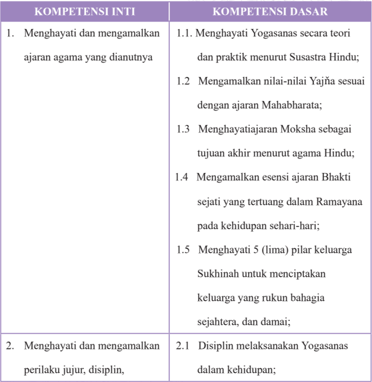

Tabel ini berisi dua kumpulan kompetensi: Kompetensi Inti dan Kompetensi Dasar. Topik utama tabel adalah tentang menghayati dan mengamalkan ajaran agama yang dianutnya. Kolom pertama, Kompetensi Inti, mencakup empat poin utama yang melibatkan pengamalan prinsip-prinsip agama Hindu, seperti menghayati Yoganas secara teori dan praktik, mengamalkan nilai-nilai Yajna sesuai dengan ajaran Mahabharata, menghayati ajaran Moksha sebagai tujuan akhir, dan mengamalkan esensi Bhakti sejati dalam Ramayana. Kolom kedua, Kompetensi Dasar, mencakup dua poin utama yang lebih umum, yaitu menghayati lima pilar keluarga Sukhinah untuk menciptakan keluarga yang rukun bahagia, dan disiplin dalam mengamalkan prinsip-prinsip agama. Pola penting yang terlihat adalah bahwa tabel ini mencakup berbagai aspek dari pengamalan ajaran agama, mulai dari prinsip-prinsip teoritis hingga praktik sehari-hari, serta tujuan dan nilai-nilai yang diharapkan dari pengamalan tersebut.

 

---
## 📄 Halaman 183

### KOMPETENSI INTI

tanggung jawab, peduli (gotong royong, kerja sama, toleran, damai), santun, responsif dan proaktif dan menunjukkan sikap sebagai bagian dari solusi atas berbagai permasalahan dalam berinteraksi secara efektif dengan lingkungan sosial dan alam serta dalam menempatkan diri sebagai cerminan bangsa dalam pergaulan dunia.

- Memahami, menerapkan, menganalisis pengetahuan faktual, konseptual, prosedural berdasarkan rasa ingintahunya tentang ilmu pengetahuan, teknologi, seni, budaya, dan humaniora dengan wawasan kemanusiaan, kebangsaan, kenegaraan, dan peradaban
- KOMPETENSI DASAR 2.2   Mengamalkan nilai-nilai Yaj ň a sejalan ajaran Mahabharata dalam kehidupan sehari-hari;
- 2.3   Menghayati Moksa sebagai tujuan akhir menurut agama Hindu;
- 2.4   Mengamalkan esensi ajaran Bhakti sejati yang tercantum dalam Ramayana di lingkungan terdekat;
- 2.5   Mengamalkan 5 (lima) pilar keluarga Sukhinah menuju keluarga yang rukun bahagia sejahtera, dan damai;
- 3.1   Menerapkan Yogasanas menurut Susastra Hindu;
- 3.2   Memahami hakekat Yaj ň a yang terkandung dalam Mahabharata;
- 3.3   Mengingat pengetahuan konseptual bahwa Moksa sebagai tujuan akhir menurut agama Hindu;
- 3.4   Memahami esensi Bhakti sejati dalam Ramayana;

 

---
## 📄 Halaman 184

---
**📊 Tabel**

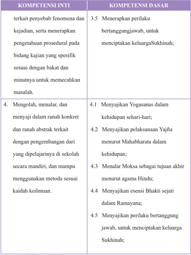

Tabel ini berisi informasi tentang kompetensi inti dan dasar yang berkaitan dengan pengembangan keterampilan dan pengetahuan dalam bidang kajian. Topik utama tabel adalah mengenai pengembangan keterampilan dalam mengolah, menalar, dan menyaji materi secara konkret dan abstrak. Kolom-kolomnya mencakup kompetensi inti yang melibatkan penyebaran fenomena dan kejadian serta menerapkan pengetahuan prosedural, serta kompetensi dasar yang mencakup berbagai aspek seperti menanyakan Yogasana, menanyakan pelaksanaan Yajna, menalar Moksa sebagai tujuan akhir menurut agama Hindu, menanyakan esensi Bhakti sejati dalam Ramayana, dan menanyakan perilaku bertanggung jawab untuk menciptakan keluarga Sukhinah. Data penting yang terlihat adalah bahwa semua kompetensi dasar tersebut berkaitan dengan pengembangan keterampilan dalam mengolah, menalar, dan menyaji materi secara konkret dan abstrak.

 

---
## 📄 Halaman 185

### Profil Penulis

Nama Lengkap :

Drs. I Gusti Ngurah Dwaja

Telp Kantor/HP

:   SMA N 42 Jakarta TLP. 021 8093926,

Fax 021 80887233,  HP. 081519510722

E-mail :

ngurah17@ymail.com, dan dwajangurah@gmail.com

Akun Facebook :

ngurahdwaja

Alamat Kantor :

Jl. Rajawali Halim Perdanakusuma,

Jakarta Timur , Kode Post 13610.

Bidang Keahlian :

Guru Agama Hindu

### Riwayat pekerjaan/profesi dalam 10 tahun terakhir:

- 2009 - 2016: Guru Pendidkan agama Hindu di SMAN 42 Jakarta.
- 2005 - 2009: Guru Pendidkan agama Hindu di SMAN 38 Jakarta.
- 2012 - 2016: Ketua MGMP Agama Hindu DKI Jakarta
- 2010 - 2014: Ketua PGRI Ranting SMAN 42 Jakarta

### Riwayat Pendidikan Tinggi dan Tahun Belajar:

- S1: Fakultas  Ilmu Agama Jurusan  Hukum Agama, Program Studi  Hukum  Agama Hindu Universitas Hindu Indonesia (UNHI), Denpasar (tahun masuk 1992 - tahun lulus 1995)
- Sarjana Muda: Fakultas Agama dan Pengetahuan  Kemasyarakatan - Institut Hindu Dharma (IHD) Denpasar, Bali (tahun masuk 1982-tahun lulus 1986)

### Judul Buku dan Tahun Terbit (10 Tahun Terakhir):

'Tidak ada'

### Informasi Lain dari Penulis:

Lahir di Denpasar, 06 Januari 1961. Menikah dan dikaruniai 3 anak. Saat ini menetap di Bekasi, Aktif mengajar sebagai guru Agama Hindu di SMA Negeri 42 Jakarta sampai sekarang.

 

---
## 📄 Halaman 186

### Profil Penulis

Nama Lengkap :

Drs. I Nengah Mudana, M.Pd.H.

Telp Kantor/HP

:   (0361) 287843

E-mail

:  mademudana1059@gmail.com

okaprthiwi@gmail.com

Akun Facebook

:  Made Mudana

Alamat Kantor :

SMA Negeri 6 Denpasar Jl. Raya Sanur/Tukad

Nyali Sanur - Denpasar Bali

Bidang Keahlian :

Guru Pendidikan Agama Hindu dan Budi Pekerti

### Riwayat pekerjaan/profesi dalam 10 tahun terakhir:

- 2006 - 2016 (sekarang): Guru Pendidikan Agama Hindu dan Budi Pekerti di
SMA Negeri 6 Denpasar.

- 2010 - 2016 (sekarang): Wakil Kepala Sekolah Bidang Kurikulum di SMA Negeri 6 Denpasar.
- 2006 - 2016 (sekarang): Sekretaris MGMP Pendidikan Agama dan Budi Pekerti di
Kota Denpasar.

- 2006 - 2016 (sekarang): Sekretaris Pengurus Sabha Acarya di Kota Denpasar.
- 2006 - 2016 (sekarang): Sekretaris Pengurus Ranting PGRI di SMA Negeri 6 Denpasar.
- 2006 - 2016 (sekarang): Ketua Pengurus MGMP Pendidikan Agama dan Budi Pekerti di SMA Negeri 6 Denpasar.

### Riwayat Pendidikan Tinggi dan Tahun Belajar:

- S2: Fakultas: Ilmu Agama/jurusan: Pendidikan/program studi: Pendidikan Agama Hindu / Universitas Hindu Indonesia (UNHI) Denpasar  (tahun masuk : 15 Juni 2012 - tahun lulus: 25 April 2015)
- S1: Fakultas Hukum Agama/jurusan Hukum Adat/program studi Hukum Adat Hindu/Institut Hindu Dharma (IHD) Denpasar  (tahun masuk sejak 17 Juli 1986 - tahun lulus pada 7 Maret 1988)
- Sarjana Muda: Fakultas Agama dan Pengetahuan Kemasyarakatan Denpasar/jurusan Hukum Adat/program studi Hukum Adat Hindu/Institut Hindu Dharma (IHD) Denpasar (tahun masuk sejak 17 Juli 1980 -tahun lulus pada 21 Mei 1985.)

### Judul Buku dan Tahun Terbit (10 Tahun Terakhir):

- Widya Dharma Pendidikan Agama Hindu SMA/SMK Kelas X, Ganeca Excat Bandung, 2006
- Widya Dharma Pendidikan Agama Hindu SMA/SMK Kelas XI, Ganeca Excat Bandung, 2006
- Widya Dharma Pendidikan Agama Hindu SMA/SMK Kelas XII, Ganeca Excat Bandung, 2006
- Widyastuti Pendidikan Agama Hindu, SMA/SMK Kelas X, Acarya Bandung, 2008.
- Widyastuti Pendidikan Agama Hindu, SMA/SMK Kelas XI, Acarya Bandung, 2008.
- Widyastuti Pendidikan Agama Hindu, SMA/SMK Kelas XII, Acarya Bandung, 2008.
- Widya Kusuma Pendidikan Agama Hindu SMA/SMK Kelas X, Sri Rama Denpasar 2011
- Widya Kusuma Pendidikan Agama Hindu SMA/SMK Kelas XI, Sri Rama Denpasar 2011
- Widya Kusuma Pendidikan Agama Hindu SMA/SMK Kelas XII, Sri Rama Denpasar 2011
- Buku Siswa (BS) Pendidikan Agama Hindu dan Budi Pekerti SMA/SMK Kelas XI, Puskurbuk Kemdiknas, 2014
- Buku Guru (BG) Pendidikan Agama Hindu dan Budi Pekerti SMA/SMK Kelas XI, Puskurbuk Kemdiknas, 2014
- Buku Siswa (BS) Pendidikan Agama Hindu dan Budi Pekerti SMA/SMK Kelas XII, Puskurbuk Kemdiknas, 2015
- Buku Guru (BG) Pendidikan Agama Hindu dan Budi Pekerti SMA/SMK Kelas XII, Puskurbuk Kemdiknas, 2015.

 

---
## 📄 Halaman 187

### Judul Buku dan Tahun Terbit (10 Tahun Terakhir):

- Persembahyangan Hari Suci Agama Hindu Dalam Meningkatkan Religiusitas Siswa Hindu di SMA Negeri 6 Denpasar, 2015.

### Informasi Lain dari Penulis:

Lahir di Bungbungan/Klungkung, 31 Desember 1961. Menikah dan dikaruniai 3 anak. Saat ini menetap di Desa Bungbungan, Banjarangkan, Klungkung - Bali. Aktif di organisasi profesi Guru. Terlibat di berbagai kegiatan di bidang pendidikan dan sosial, beberapa kali menjadi narasumber di berbagai seminar tentang Pendidikan agama dan Budi Pekerti.

 

---
## 📄 Halaman 188

### Profil Penelaah

Nama Lengkap :

Dr. I Wayan Budi Utama, M.Si.

Telp Kantor/HP

:   081558177777

E-mail :

budi_utama2001@yahoo.com

Akun Facebook :

budi.utama42@yahoo.com

Alamat Kantor :

Jl. Sangalangit, Tembau, Penatih, Denpasar

Bidang Keahlian :

Agama dan Budaya Hindu

### Riwayat pekerjaan/profesi dalam 10 tahun terakhir:

- Dosen Universitas Hindu Indonesia Denpasar sejak 1987- sekarang
- Ketua Program Studi Program Magister (S2) Ilmu Agama dan Kebudayaan 2011-2014
- Asisten Diretur I Program Pascasarjana Universitas Hindu Indonesia Denpasar 2014 - sekarang

### Riwayat Pendidikan Tinggi dan Tahun Belajar:

- S3: Fakultas : Sastra, jurusan : Kajian Budaya, program studi : Kajain Budaya, bagian dan nama lembaga : Universitas Udayan Denpasar  (tahun masuk : 2005 - tahun lulus : 2011)
- S2: Fakultas : Ilmu Agama dan Kebudayaan,  jurusan/program studi : Ilmu Agama dan Kebudayaan, bagian dan nama lembaga Universitas Hindu Indonesia Denpasar  (tahun masuk : 2003 - tahun lulus : 2005)
- S1: Fakultas : Ilmu Agama dan Kebudayaan, jurusan/program studi : Ilmu Agama dan Kebudayaan, bagian dan nama lembaga : Universitas Hindu Indonesia Denpasar  (tahun masuk : 1976 - tahun lulus : 1985)

### Judul Buku dan Tahun Terbit (10 Tahun Terakhir):

- Agama dalam Praksis Budaya tahun 2013. Penerbit Pascasarjana Universitas Hindu Indonesia Denpasar
- Pendidikan Anti Korupsi Perspektif Agama-Agama tahun 2014. Penerbit:Pascasarjana Univ. Hindu Indonesia Denpasar
- Air,Tradisi  dan Industri tahun 2015, Penerbit Pustaka Ekspresi

### Judul Buku dan Tahun Terbit (10 Tahun Terakhir):

- Identity Weakeningof Bali Aga in Cempaga Village: tahun 2015 dalam International Journals of multidisciplinary research academy (IJMRA).
- Brayut Dalam Religi Masyarakat Hindu di Bali tahun 2015
- Brayut dan Lokalisasi Tantrayana di Bali tahun 2015.

### Informasi Lain dari Penulis:

Lahir di Denpasar, 15 Januari 1958. Saat ini menetap di Denpasar-Bali. Peserta organisasi Asosiasi Dosen Indonesia. Terlibat di berbagai kegiatan di bidang pendidikan, beberapa kali menjadi narasumber di berbagai seminar tentang Agama dan Kebudayaan Hindu, pernah mengikuti program Post Doctoral, di KTILV Leiden, Belanda pada tahun 2012.

 

---
## 📄 Halaman 189

### Profil Editor

Nama Lengkap :

Drs. Waldopo, M.Pd.

Telp Kantor/HP

:   085694632175

E-mail :

waldopo@gmail.com

Akun Facebook :

'Tidak ada'

Alamat Kantor :

Pusat Kurikulum dan Perbukuan Balitbang Kemendikbud Jl. Gunung Sahari Raya No. 4, Jakarta Pusat Telepon (021) 3453440, 3804248 Fax. (021) 34834862

Bidang Keahlian :

Peneliti Madya Bidang Teknologi Pendidikan

### Riwayat pekerjaan/profesi dalam 10 tahun terakhir:

- Peneliti Madya pada bidang Teknologi Pendidikan di Puskurbuk-Balitbang Kemendikbud (Tahun 2016)
- Kasubid Perancangan dan Produksi Media Radio, Televisi dan Film pada bidang Pengembangan Teknologi Pendidikan Berbasis Radio, Televisi dan Film PustekkomKemendikbud (Tahun 2011 s/d 2012).
- Kasubid Pendidikan Menengah dan Tingggi pada bidang Teknologi Pembelajaran Pustekkom-Kemendikbud (Tahun 2007 s/d 2010).
- Peneliti pada bidang Teknologi Pendidikan Pustekkom-Kemdikbud (Tahun 2006 s/d 2015).
- Pengembang media pendidikan/pembelajaran berbasis televisi (Tahun 1990 s/d 2015)
- Pengembang media pendidikan/pembelajaran berbasis radio  (1984 s/d 2015)
- Pengembang media pendidikan/pembelajaran berbasis cetak (modul) untuk pembelajaran (Tahun 1990  s/d 2015)
- Pengembang Media pendidikan/pembelajaran berbasis online (Tahun 2000 s/d 2015)
- Mengelola SMP Terbuka (Tahun 1990 s.d 2010)
- Mengelola SMA Terbuka  (Tahun 2004  s/d 2011)
- Mengelola Diklat peningkatan kompetensi guru SD melalui siaran radio pendidikan (1998 s.d. 2011)
- Mengelola Diklat peningkatan kompetensi guru SD dalam bidang bahasa Ingris melalui sistem pendidikan jarak jauh (Tahun  2004  s.d. 2011)
- Mengelola siaran pendidikan/pembelajaran melalui stasiun Televisi Edukasi (Tve) Tahun 2011 s.d 2015.

### Riwayat Pendidikan Tinggi dan Tahun Belajar:

- S1: IKIP Yogyakarta (UNY) Kampus Karangmalang, Yogyakarta. Bimbinga dan Penyuluhan Masuk 1981, lulus 1981.
- S2: IKIP Jakarta (UNJ) Kampus Rawamangun, Jakarta Timur. Penelitian dan Evaluasi Pendidikan Masuk 1996 dan lulus 1998

### Judul Buku dan Tahun Terbit (10 Tahun Terakhir):

- Modul Pelajaran Biologi untuk siswa SMA Terbuka
- Modul Pelajaran Bahasa Indonesia untuk siswa SMA Terbuka
- Modul Pelajaran Geografi untuk siswa SMP Terbuka
- Buku Teks Pelajaran Agama Hindu dan Budi Pekerti untuk siswa SMA dan SMK Kelas XI
- Televisi Pendidikan di Era Global

 

---
## 📄 Halaman 190

### Judul Penelitian dan Tahun Terbit (10 Tahun Terakhir):

- Dampak Pelatihan Pemanfaatan TIK (PeTIK) untuk Pembelajaran Bagi Guru Sekolah Indonesia di Luar Negeri .  Artikel hasil penelitian yang dipublikasikan di dalam Jurnal Ilmiah TEKNODIK VOL  19,  No. 1  April 2015,  PUSTEKKOM- KEMDIKBUD Jakarta. Terakreditasi LIPI Nomor: 464/ AU1/P2MI-LIPI/08/ 2012.
- Pengaruh Pemanfaatan TIK Pembelajaran Terhadap Nilai Ujian Akhir Di Daerah Perbatasan , Artikel hasil penelitian yang dipublikasikan di dalam Jurnal Ilmiah TEKNODIK VOL  18, No. 2 Agustus 2014,  PUSTEKKOM- KEMDIKBUD Jakarta. Terakreditasi LIPI Nomor: 464/AU1/P2MILIPI/08/ 2012.
- Evaluasi Terhadap Layanan PPDB Online Di Kota Pekanbaru , Artikel hasil penelitian yang dipublikasikan di dalam Jurnal Ilmiah TEKNODIK VOL  18, No. 1 April 2014,  PUSTEKKOMKEMDIKBUD Jakarta. Terakreditasi LIPI Nomor: 464/AU1/P2MI-LIPI/08/ 2012.
- Studi Evaluatif Tentang Respon Terhadap TIK Untuk Pembelajaran di Daerah Perbatasan . Artikel hasil penelitian yang dipublikasikan di dalam Jurnal Ilmiah TEKNODIK VOL  17, Desember 2013,  PUSTEKKOM- KEMDIKBUD Jakarta. Terakreditasi LIPI Nomor: 464/AU1/ P2MI-LIPI/08/ 2012.
- Sumbangan TIK Dan Pelatihan Pemanfaatannya Terhadap Peningkatan Nilai UN Propinsi Maluku . Artikel hasil penelitian yang dipublikasikan di dalam Jurnal Ilmiah TEKNODIK VOL XVII, September 2013,  PUSTEKKOM- KEMDIKBUD Jakarta. Terakreditasi LIPI Nomor: 464/ AU1/P2MI-LIPI/08/ 2012
- Studi Eksploratif Tentang  Kontribusi Pustekkom Kemdikbud  Terhadap Program 'BERMUTU' Artikel hasil penelitian yang dipublikasikan di dalam Jurnal Ilmiah TEKNODIK VOL  XVII, Maret 2013  PUSTEKKOM- KEMDIKBUD Jakarta. Terakreditasi LIPI Nomor: 464/AU1/P2MILIPI/08/ 2012
- Studi Eksploratif Tentang Pustekkom Kemdikbud Sebagai Pusat Sumber Belajar Berbasis TIK , Artikel hasil penelitian yang dipublikasikan di dalam Jurnal Ilmiah TEKNODIK VOL  XVI, Destember 2012  PUSTEKKOM- KEMDIKBUD Jakarta. Terakreditasi LIPI Nomor: 464/AU1/ P2MI-LIPI/08/ 2012
- Pembelajaran Berbasis Masalah,Sebuah Strategi PembelajaranUntuk Menyiapkan Kemandirian Peserta Didik Artikel hasil kajtian yang dipublikasikan di dalam Jurnal Ilmiah TEKNODIK VOL XVI , September 2012 PUSTEKKOM-KEMDIKBUD Jakarta:, Terakreditasi LIPI Nomor: 464/AU1/ P2MI-LIPI/08/ 2012
- Pendidikan Karakter Bagi Anak-Anak Melalui Serial Film Televisi (Episode Si Kumal) . Artikel hasil penelitian yang dipublikasikan di dalam Jurnal Ilmiah TEKNODIK VOL  XV, Juli 2011 Jakarta: PUSTEKKOM-KEMDIKNAS (ISSN: 0854-915X), Terakreditasi LIPI Nomor: 351/Akred- LIPI/ P2MBI/07/ 2011
- Ujicoba Penayangan Pendidikan Budi Pekerti Melalui Televisi, (Serial Laskar Anak Bawang Episode Pistol dan Bulan serta Sepeda Butut) . Artikel hasil penelitian yang dipublikasikan di dalam Jurnal Ilmiah TEKNODIK VOL  15, No. 2 Desember 2011,  PUSTEKKOM- KEMDIKBUD Jakarta. Terakreditasi LIPI Nomor: 351/Akred- LIPI/ P2MBI/07/ 2011
- Pengaruh Pelatihan Pendayagunaan Teknologi Informasi dan Komunikasi (TIK) Bagi Peningkatan Kompetensi Guru Dalam Pemanfaatan TIK untuk Pembelajaran Dalam Kaitannya Dengan Perumusan Kebijakan Pelatihan TIK untuk Guru di Indonesia , Terbit pada jurnal Penelitian Kebijakan Pendidikan Edisi April 2011 Vol. 10, Akreditasi LIPI nomor 451/D/2010.
- Analsis Kebutuhan Terhadap Program Multi Media Interaktif Sebagai Media Pembelajaran . Artikel hasil penelitian yang dipublikasikan di dalam Jurnal ilmiah PENDIDIKAN & KEBUDAYAAN  Vol 17 Nomor 2, Maret 2011, BALITBANG-KEMDIKNAS, Jakarta, Terakreditasi LIPI Nomor 307/AU1/P2MB1/08/2010)
- Strategi Pembelajaran untuk Diklat di Bidang Penulisan Naskah/Skenario Program Televisi Pembelajaran . Dipublikasikan di dalam Jurnal Ilmiah TEKNODIK VOL  12, No. 2 Desember 2009,  PUSTEKKOM- Ddepdiknas Jakarta.

 

---
## 📄 Halaman 191

- Strategi Pembelajaran untuk Diklat Orang Dewasa .  Dipublikasikan di dalam Jurnal Ilmiah TEKNODIK VOL  12, No.1 Juni 2009,  PUSTEKKOM- Ddepdiknas Jakarta.
- Analis Kebutuhan Untuk Program Multimedia Interatif Sebagai Media Pembelajaran . Pembelajaran. Artikel hasil penelitian yang dipublikasikan Jurnal Ilmiah TEKNODIK VOL  11, No. 2 Desember 2008,  PUSTEKKOM- Ddepdiknas Jakarta.
- Studi Tentang Kmungkinan Pemanfaatan Sistem PJJ Untuk Pengrembangan SDM Kepala Sekolah (Madrasah) . Artikel hasil penelitian yang dipublikasikan Jurnal Ilmiah TEKNODIK VOL  11, No. 1 Juni 2008,  PUSTEKKOM- Ddepdiknas Jakarta.
- Pengembangan Kualitas SDM Guru Madrasan. Artikel hasil penelitian yang dipublikasikan Jurnal Ilmiah TEKNODIK No. 18/X/TEKNODIK/Juni 2006,  PUSTEKKOM- Ddepdiknas Jakarta .
- Ujicoba Penayangan Program Video Pendidikan Tentang Tingkah Laku Pubertas . Artikel hasil penelitian yang dipublikasikan Jurnal Ilmiah TEKNODIK No. 16/IX/TEKNODIK/Juni/2005, PUSTEKKOM- Ddepdiknas Jakarta.

### Informasi Lain dari Penulis:

'Tidak ada'

 

---
## 📄 Halaman 192

### Dekatkan diri Anda pada Yang Mahakuasa bukan dengan NARKOBA

---

*📊 Statistik: 49 visual berhasil, 7 dilewati, 0 gagal | Durasi: 9m 43s*