# Salinan Kelas 11 Hindu BS press

*Diekstrak: 17 May 2026, 14:06*

---

---
## 📄 Halaman 1

### Pendidikan Agama Hindu dan Budi Pekerti

---
**🖼️ Gambar/Diagram**

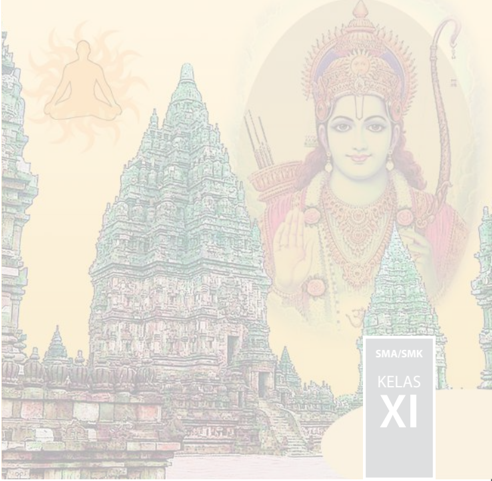

> **Deskripsi Visual:** Gambar ini adalah ilustrasi yang menampilkan kompleksitas budaya dan arsitektur tradisional India. Dalam gambar tersebut, terlihat sebuah candi dengan struktur yang maju dan rumit, menunjukkan keindahan dan kekayaan seni bangunan India. Di sebelah kiri, terdapat gambar Buddha yang duduk, menunjukkan hubungan spiritual dan keagamaan dalam budaya tersebut. Pada bagian tengah, ada gambar seorang dewa Hindu yang memegang senjata, menunjukkan peran penting dewa-dewi dalam kepercayaan dan ritual. Gambar ini menggambarkan interaksi antara arsitektur, seni, dan kepercayaan dalam budaya India. Teks "SMA/SMK KELAS XI" menunjukkan bahwa gambar ini mungkin digunakan sebagai materi pendidikan untuk siswa kelas XI di sekolah menengah atas atau menengah kejuruan.

 

---
## 📄 Halaman 2

### Hak Cipta © 2017 pada Kementerian Pendidikan dan Kebudayaan Dilindungi Undang-Undang

Disklaimer: Buku ini merupakan buku siswa yang dipersiapkan Pemerintah dalam rangka implementasi Kurikulum 2013. Buku siswa ini disusun dan ditelaah oleh berbagai pihak di bawah koordinasi Kementerian Pendidikan dan Kebudayaan, dan dipergunakan dalam tahap awal penerapan Kurikulum 2013. Buku ini merupakan 'dokumen hidup' yang senantiasa diperbaiki, diperbarui, dan dimutakhirkan sesuai dengan dinamika kebutuhan dan perubahan zaman.  Masukan  dari  berbagai  kalangan  yang  dialamatkan  kepada  penulis  dan  laman http://buku.kemdikbud.go.id  atau  melalui  email  buku@kemdikbud.go.id  diharapkan  dapat meningkatkan kualitas buku ini.

### Katalog Dalam Terbitan (KDT)

Indonesia. Kementerian Pendidikan dan Kebudayaan. Pendidikan Agama Hindu dan Budi Pekerti / Kementerian Pendidikan dan Kebudayaan. -- Jakarta: Kementerian Pendidikan dan Kebudayaan, 2017. vi, 418 hlm.; 25 cm Untuk SMA/SMK Kelas XI ISBN 978-602-427-066-7 (jilid lengkap) ISBN 978-602-427-068-1 (jilid 2) I. Hindu - Studi dan Pengajaran I. Judul II. Kementerian Pendidikan dan Kebudayaan 294.5

Penulis

: I Ngh. Mudana dan I GN. Dwaja.

Penelaah

: Wayan Budi Utama dan Anak Agung Oka Puspa

Pe-review

: I Gusti Ngurah Rai

Penyelia Penerbitan

: Pusat Kurikulum dan Perbukuan, Balitbang, Kemendikbud.

Cetakan Ke-1, 2014, ISBN 978-602-282-427-5 (jilid 2) Cetakan Ke-2, 2017 (Edisi Revisi)

Disusun dengan huruf Times New Roman 11 pt

 

---
## 📄 Halaman 3

### Kata Pengantar

Kurikulum 2013 dirancang agar peserta didik tak hanya bertambah pengetahuannya, tetapi juga  meningkat  keterampilannya  dan  semakin  mulia  kepribadiannya.  Ada  kesatuan  utuh antara kompetensi sikap, keterampilan, dan pengetahuan. Keutuhan ini perlu tercermin dalam pembelajaran Pendidikan Agama Hindu dan Budi Pekerti. Melalui pembelajaran pengetahuan agama  diharapkan  dapat  terbentuk  keterampilan  beragama  dan  terwujud  sikap  beragama siswa.  Tentu  saja  sikap  beragama  yang  berimbang,  mencakup  hubungan  manusia  dengan Penciptanya, hubungan manusia dengan manusia yang lainnya dan hubungan manusia dengan lingkungan/alam sekitarnya. Untuk memastikan keseimbangan ini, pembelajaran pendidikan agama  Hindu  perlu  diberi  penekanan  khusus  terkait  dengan  budi  pekerti.  Hakikat  budi pekerti adalah sikap atau perilaku seseorang dalam hubungannya dengan Tuhan, diri sendiri, keluarga, masyarakat dan bangsa, serta lingkungan/alam sekitar. Jadi, pendidikan budi pekerti adalah usaha menanamkan nilai-nilai moral ke dalam sikap dan perilaku generasi bangsa agar mereka memiliki kesantunan dalam berinteraksi.

Nilai-nilai  moral/karakter  yang  ingin  kita  bangun  antara  lain  adalah  sikap  jujur,  disiplin, bersih, penuh kasih sayang, punya kepenasaran intelektual, dan kreatif. Di sini pengetahuan agama  Hindu  yang  dipelajari  para  siswa  menjadi  sumber  nilai  dan  penggerak  perilaku mereka.  Sekadar  contoh,  di  antara  nilai  budi  pekerti  dalam  Hindu  dikenal  dengan  Tri Marga  (bakti  kepada  Tuhan,  orangtua,  dan  guru;  karma,  bekerja  sebaik-baiknya  untuk dipersembahkan kepada orang lain dan Tuhan; Jnana, menuntut ilmu sebanyak-banyaknya untuk bekal hidup dan penuntun hidup) dan Tri Warga (dharma, berbuat berdasarkan atas kebenaran; artha, memenuhi harta benda kebutuhan hidup berdasarkan kebenaran, dan kama, memenuhi keinginan sesuai dengan norma-norma yang berlaku). Kata kuncinya, budi pekerti adalah  tindakan,  bukan  sekedar  pengetahuan  yang  harus  diingat  oleh  para  siswa,  maka proses  pembelajarannya  mesti  mengantar  mereka  dari  pengetahuan  tentang  kebaikan,  lalu menimbulkan komitmen terhadap kebaikan, dan akhirnya benar-benar melakukan kebaikan. Buku  Siswa  Pendidikan Agama  Hindu  dan  Budi  Pekerti  untuk  SMA/SMK  Kelas  XI  ini menjabarkan usaha minimal yang harus dilakukan para  siswa  guna  mencapai  kompetensi yang diharapkan. Sesuai dengan pendekatan yang digunakan dalam Kurikulum 2013, siswa diajak menjadi berani untuk mencari sumber belajar lain yang tersedia dan terbentang luas di sekitarnya. Peran guru dalam meningkatkan dan menyesuaikan daya serap siswa dengan ketersediaan  kegiatan  pada  buku  ini  sangat  penting.  Guru  dapat  memperkayanya  dengan kreasi  dalam  bentuk  kegiatan-kegiatan  lain  yang  sesuai  dan  relevan  yang  bersumber  dari lingkungan sosial dan lingkungan alam sekitarnya.

Implementasi  terbatas  Kurikulum  2013  pada  tahun  ajaran  2013/2014  telah  mendapatkan tanggapan  yang  sangat  positif  dan  masukan  yang  sangat  berharga.  Pengalaman  tersebut dipergunakan semaksimal mungkin dalam menyiapkan buku untuk implementasi menyeluruh pada  tahun  ajaran  2015/2016  dan  seterusnya.  Walaupun  demikian,  sebagai  edisi  pertama, buku ini sangat terbuka dan perlu terus dilakukan perbaikan dan penyempurnaan. Untuk itu, kami mengundang para pembaca memberikan kritik, saran dan masukan untuk perbaikan dan penyempurnaan pada edisi berikutnya. Atas kontribusi tersebut, kami ucapkan terima kasih. Mudah-mudahan kita dapat memberikan yang terbaik bagi kemajuan dunia pendidikan dalam rangka mempersiapkan generasi seratus tahun Indonesia Merdeka (2045).

Jakarta, Januari 2016 Penulis

 

---
## 📄 Halaman 4

### Daftar Isi

 

---
## 📄 Halaman 7

### BAB I

### YOGÀSANAS DALAM SUSASTRA HINDU

'te dhya-yog ā nugat ā apa ṡ yan dew ā tma ṡ aktim swa gu ṡ air nigudham yaá k ā ran ā ni nikhil ā ni t ā ni kalatma yukt ā ny adhitis-thaty ekaá,'

### Terjemahannya:

'Orang-orang  suci  yang  tekun  melaksanakan Yoga dapat membangun kemampuan spiritualnya  dan  mampu  menyadari  bahwa dirinya adalah bagian dari Tuhan Yang Maha Esa: kemampuan tersebut tersimpan di dalam sifat-sifat  (guna-Nya)  sendiri,  setelah  dapat manunggal  dengan  Tuhan  Yang  Maha  Esa, dia  mampu  menguasai  semua  unsur,  yaitu unsur:  persembahan,  waktu,  kedirian,  dan unsur-unsur lainnya lagi' (S.Up. I.3).

 

---
## 📄 Halaman 8

Mengapa kita harus belajar Yogãsanas?

### A.  Pengertian dan Hakikat Yogãsanas

### Perenungan:

### Terjemahannya:

'Ya, Tuhan Yang Maha Esa, tanamkanlah pengetahuan kepada kami dan berkahilah kami dengan intelek yang mulia' (RV. VIII. 4.15).

Seorang  siswa hendaknya  tiada henti-hentinya mempertajam  intelek, memiliki  ingatan  yang  kuat  (melalui  latihan),  mengikuti  ajaran  suci  Veda, memiliki ketekunan dan keingintahuan, melatih konsentrasi (penuh perhatian), menyenangkan hati guru (dengan mematuhi perintahnya), mengulangi pelajaran, jangan mengantuk di kelas, tidak malas, dan tidak banyak bicara kosong.

### Mengamati Lingkungan:

Sikap yang paling sederhana dalam kehidupan beragama adalah cinta kasih dan pengabdian ( Bhakti Yoga ). Para pengikut Yoga mewujudkan Tuhan sebagai penguasa dengan rasa yang tersayang, sebagai bapa, ibu, kakak, kawan, tamu dan sebagainya. Tuhan adalah penyelamat, Maha Pengampun, dan Maha Pelindung.

'Sa akra iksa puruh ta no dhiy '

ṡ

ṡ

ū

ā

 

---
## 📄 Halaman 9

Era globalisasi sekarang ini, menuntut kita untuk dapat beraktivitas sekuat fisik  dan  pikiran,  yang  terkadang  melebihi  kemampuannya.  Hal  ini  terjadi tidak  saja  di  kalangan  masyarakat  perkotaan,  tetapi  juga  sampai  ke  pelosok desa. Beban fisik dan rohani yang berlebihan menyebabkan kita sakit. Sedapat mungkin  hindarkanlah  diri  dari  beban  yang  berlebihan.  Adakah Yoga dapat mengatasi semuanya itu?

---
**🖼️ Gambar/Diagram**

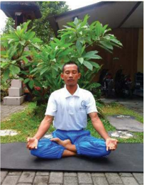

> **Deskripsi Visual:** Gambar ini adalah foto yang menunjukkan seorang pria sedang melakukan pose meditasi atau yoga. Pria tersebut duduk dengan posisi jamban yang terbuka, tangan di bawah tubuh, dan mata tertutup. Dia berada di luar ruangan, di depan sebuah rumah dengan pagar dan pohon besar di belakangnya. Di sebelah kanan, terlihat beberapa kendaraan parkir di halaman rumah.

Elemen utama dalam gambar ini adalah pria yang sedang meditasi, lingkungan sekitarnya seperti rumah dan pohon, serta kendaraan parkir di halaman. Relasi antara elemen-elemen ini adalah bahwa pria sedang berada di luar rumah, di depan pohon, dan di dekat kendaraan.

Teks, angka, atau label penting tidak terlihat dalam gambar ini. Namun, informasi kunci yang dapat diambil dari gambar ini adalah bahwa pria tersebut sedang melakukan aktivitas meditasi atau yoga, dan lingkungannya tampak tenang dan tenang.

### Memahami Teks:

Secara etimologi, kata 'Yoga' berasal  dari yud ,  yang  artinya  menggabungkan atau  hubungan,  yakni  hubungan  yang  harmonis  dengan  obyek Yoga .  Dalam patanjali Yogasutra , yang di kutip oleh Tim Fia (2006:6), menguraikan bahwa: 'Yogas citta vrtti nirodhah', Artinya mengendalikan gerak-gerik pikiran atau

 

---
## 📄 Halaman 10

cara  untuk  mengendalikan tingkah laku pikiran yang cendrung liar, bias, dan lekat  terpesona  oleh  aneka  ragam  obyek  (yang  dihayalkan)  memberi  nikmat. Obyek  keinginan  yang  dipikirkan  memberi  rasa  nikmat  itu  lebih  sering  kita pandang ada di luar diri. Maka kita selalu mencari. Bagi sang yogi inilah pangkal kemalangan manusia. Selanjutnya Peter Rendel (1979: 14), menguraikan bahwa: 'kata Yoga dalam kenyataan berarti kesatuan yang kemudian di dalam, bahasa Inggris disebut ' Yoke '. Kata ' Yogum ' dalam bahasa Latinnya berasal dari kata Yoga yang disebut dengan ' Chongual '. Chongual berarti mengendalikan pangkal penyebab kemalangan manusia yang dapat mempengaruhi 'pikiran dan badan, atau rohani dan jasmani'. Kata Yoga diturunkan dari kata yuj (sansekerta), yoke (Inggris),  yang  berarti  'penyatuan'  ( union ). Yoga berarti  penyatuan kesadaran manusia dengan sesuatu yang lebih luhur, trasenden, lebih kekal, dan ilahi.

Menurut Panini, Yoga diturunkan  dari  akar  sansekerta yuj yang  memiliki tiga arti yang berbeda, yakni: penyerapan, Samadhi ( yujyate ) menghubungkan ( yunakti ), dan pengendalian ( yojyanti ). Namun makna kunci yang biasa dipakai adalah 'meditasi' ( dhyana ) dan penyatuan ( yukti ) Ali Matius (2010:2).

Untuk pelaksanaan Yoga , agama banyak memberikan pilihan dan petunjukpetunjuk melaksanakan Yoga yang baik dan benar. Hatha Yoga dapat  melatih pikiran melalui latihan pernapasan dan meditasi guna membantu pikiran menjadi lebih jernih, meningkatkan konsentrasi, dan rileks sehingga dapat mengurangi ketegangan  dan  stres.  Di  dalam  latihan Hatha Yoga, ada  salah  satu  unsur bagiannya  yang  disebut Asanas . Asanas adalah  latihan  fisik  atau  olah  tubuh dengan  melakukan  berbagai  peregangan  untuk  melatih  kekuatan  tubuh  dan sebagainya. Melalui Yoga , agama menuntun umatnya agar selalu dalam keadaan

 

---
## 📄 Halaman 11

sehat jasmani dan rohani. Di samping berbagai petunjuk agama sebagai pedoman pelaksanaan Yoga , sesuatu yang baik berkembang di masyarakat hendaknya juga dapat  dipedomani.  Dengan  demikian,  maka  pelaksanaan Yoga menjadi  selalu eksis di sepanjang zaman.

' ṡ ruti-vipratipann te yad ā sth ā syati ni ṡ cal ā , sam ā dh ā v acal ā buddhis tad ā Yogam av ā psyasi.

### Terjemahannya:

Bila pikiranmu yang dibingungkan oleh apa yang didengar tak tergoyahkan lagi dan tetap dalam Samadhi , kemudian engkau akan mencapai Yoga (realisasi diri) (BG.II.53).

Yoga merupakan jalan utama dari berbagai jalan untuk kesehatan pikiran dan badan agar selalu dalam keadaan seimbang. Kesehimbangan kondisi rohani dan jasmani mengantarkan kita tidak mudah untuk diserang oleh penyakit. Yoga adalah suatu sistem yang sistematis mengolah rohani dan fisik guna mencapai ketenangan batin dan kesehatan fisik dengan melakukan latihan-latihan secara berkesinambungan.  Fisik  atau  jasmani  dan  mental  atau  rohani  yang  kita miliki sangat penting dipelihara dan dibina. Yoga dapat diikuti oleh siapa saja untuk  mewujudkan  kesegaran  rohani  dan  kebugaran  jasmani.  Dengan Yoga 'Jiwan mukti' dapat diwujudkan. Untuk menyatukan badan dengan alam, dan menyatukan pikiran, yang disebut juga Jiwa dengan Roh yang disebut Tuhan Yang Maha Esa. Bersatunya Roh dengan sumbernya (Tuhan) disebut dengan ' Moksha '.

 

---
## 📄 Halaman 12

Dalam  pelaksanaan Yoga, yang  perlu  diperhatikan  adalah  gerak  pikiran. Pikiran memiliki sifat gerak yang liar dan paling sulit untuk dikendalikan. Agar terfokus  dalam  melaksanakan Yoga, ada  baiknya  dipastikan  bahwa  pikiran dalam keadaan baik dan tenang. Secara umum Yoga dikatakan sebagai disiplin ilmu yang digunakan oleh manusia untuk membantu dirinya mendekatkan diri kepada Sang Hyang Widhi Wasa .  Kata 'Yoga' berasal dari bahasa Sansekerta yaitu ' yuj ' yang memiliki arti menghubungkan atau menyatukan, yang dalam kamus besar bahasa Indonesia diartikan sebagai meditasi atau mengheningkan cipta/pikiran, sehingga dapat dimaknai bahwa Yoga itu adalah menghubungkan atau penyatuan spirit individu ( jiv ā tman ) dengan spirit universal ( param ā tman ) melalui keheningan pikiran.

Ada beberapa pengertian tentang Yoga yang dimuat dalam buku Yogasutra , antara lain sebagai berikut:

- Yoga adalah ilmu yang mengajarkan tentang pengendalian pikiran dan badan untuk mencapai tujuan terakhir yang disebut dengan Samadhi .
- Yoga adalah pengendalian gelombang-gelombang pikiran dalam alam pikiran untuk dapat berhubungan dengan Sang Hyang Widhi Wasa .
- Yoga diartikan  sebagai  proses  penyatuan  diri  dengan Sang  Hyang Widhi Wasa secara terus-menerus ( Yogascittavrttinirodhah )
Jadi,  secara  umum, Yoga dapat  didefinisikan  sebagai  sebuah  teknik  yang memungkinkan  seseorang  untuk  menyadari  penyatuan  antara  roh  manusia

 

---
## 📄 Halaman 13

individu  ( atman/jiw ā tman )  dengan Param ā tman melalui  keheningan  pikiran kita semua. Bagaimana sejarah Yoga (termasuk Yogãsanas) itu ada dalam ajaran Hindu guna mewujudkan kesejahteraan dan kebahagiaan hidup dalam kehidupan ini? Sebelumnya selesaikanlah uji kompetensi berikut dengan baik!

### Uji Kompetensi:

- Setelah  membaca  teks  tersebut  di  atas,  apakah  yang  kamu  ketahui tentang Yoga ? Jelaskanlah!
- Apakah yang dimaksud dengan Yoga Asana ? Jelaskanlah!
- Setelah  kita  memahami  tentang Yoga ,  apakah  yang  sebaiknya  mesti dilakukan?
- Mengapa orang ber yoga ? Bagaimana kalau orang yang bersangkutan tidak melakukannya? Jelaskanlah!

 

---
## 📄 Halaman 14

### B.  Sejarah Yoga dalam Ajaran Hindu

### Perenungan:

### Terjemahannya:

'Berilah kami petunjuk, ya Tuhan, untuk mendapatkan kekayaan/ pengetahuan, Engkau Yang Maha Tahu, dipuja dengan lagu-lagu, tolonglah kami dalam perjuangan ini' (Rg veda VIII. 92. 9).

### Memahami Teks:

Šik ṣ a na indra r ā ya ā puru vida ṁṛ cisama, av ā naá p ā rye ghane

Bangsa  yang  besar  adalah  bangsa  (masyarakatnya)  yang  menghargai  menghormati pendahulunya dan sejarahnya. Kehadiran ajaran Yoga di  kalangan  umat  Hindu  sudah  sangat populer,  bahkan  juga  merambah  masyarakat pada umumnya.  Adapun  orang suci yang membangun  dan  mengembangkan  ajaran  ini ( Yoga )  adalah Maharsi Patañjali. Ajaran Yoga dapat  dikatakan  sebagai  anugrah  yang  luar biasa dari Maharsi Patañjali kepada siapa saja yang  ingin  melaksanakan  hidup  kerohanian.

 

---
## 📄 Halaman 15

Bila Kitab Veda merupakan pengetahuan suci yang bersifat teoritis, maka Yoga adalah merupakan ilmu yang bersifat praktis dari-Nya. Ajaran Yoga merupakan bantuan kepada siapa saja yang ingin meningkatkan diri di bidang kerohanian.

Kitab  yang  berisikan  tentang  ajaran Yoga untuk  pertama  kalinya  adalah Kitab Yogas ū tra karya Maharsi Patañjali. Namun demikian, dinyatakan bahwa unsur-unsur ajarannya sudah ada jauh sebelum itu. Ajaran Yoga sesungguhnya sudah terdapat di dalam Kitab Ṡ ruti, Smrti, Itih ā sa, maupun Pur ā na. Setelah buku Yogas ū tra, berikutnya  muncullah  kitab-kitab  Bh ā sya  yang  merupakan  buku komentar terhadap karya Maharsi Patañjali, di antaranya adalah Bh ā syaNiti oleh Bhojaraja.

Komentar-komentar  itu  menguraikan  tentang  ajaran Yoga karya  Maharsi Patañjali  yang  berbentuk s ū tra atau  kalimat  pendek  dan  padat.  Sejak  lebih dari  5.000  tahun  yang  lalu, Yoga telah  diketahui  sebagai  salah  satu  alternatif pengobatan melalui pernafasan. Awal mula munculnya Yoga diprakarsai  oleh Maharsi Patañjali, dan menjadi ajaran yang diikuti banyak kalangan umat Hindu. Maharsi Patañjali mengartikan kata 'Yoga' sama-dengan Cittavrttinirodha yang bermakna penghentian gerak pikiran. Seluruh Kitab Yogasutra karya  Maharsi Patañjali dikelompokkan atas 4 pada (bagian) yang terdiri dari 194 s ū tra . Bagianbagiannya antara lain: a. Samadhip ā da

Kitab  ini  menjelaskan  tentang:  sifat,  tujuan,  dan  bentuk  ajaran Yoga . Di  dalamnya  memuat  tentang  perubahan-perubahan  pikiran  dan  tata  cara melaksanakan Yoga .

 

---
## 📄 Halaman 16

### b. Sh dhanap da

Kitab ini menjelaskan tentang pelaksanaan Yoga seperti tata cara mencapai Samadhi , tentang kedukaan, karmaphala, dan yang lainnya.

ā

ā

### c. Vibh tip da

Kitab  ini  menjelaskan  tentang  aspek  sukma  atau  batiniah  serta  kekuatan gaib yang diperoleh dengan jalan Yoga .

ū

ā

### d. Kaivalyap da

Kitab  ini  menjelaskan  tentang  alam  kelepasan  dan  kenyataan  roh  dalam mengatasi alam duniawi.

ā

Ajaran Yoga termasuk  dalam  sastra  Hindu.  Berbagai  sastra  Hindu  yang memuat ajaran Yoga diantaranya adalah Kitab Upanisad, Kitab Bhagavad Gita, Kitab Yogasutra ,  dan Hatta Yoga .  Kitab  weda  merupakan sumber ilmu Yoga , yang  atas  karunia  Ida  Sang  Hyang  Widhi  Wasa/Tuhan  Yang  Maha  Esa  yang menyediakan  berbagai  metode  untuk  mencapai  penerangan  rohani.  Metodemetode  yang  diajarkan  itu  disesuaikan  dengan  tingkat  perkembangan  rohani seseorang dan metode yang dimaksud dikenal dengan sebutan Yoga .

Yoga-sthaá kuru karm āṇ i saòga ṁ tyakv ā dhanañjaya siddhy-asiddhyoh samo bh ū tv ā samatvam Yoga ucyate,

 

---
## 📄 Halaman 17

### Terjemahannya:

Pusatkanlah  pikiranmu  pada  kerja  tanpa  menghiraukan  hasilnya,  wahai Danañjaya (Arjuna), tetaplah teguh baik dalam keberhasilan maupun kegagalan, sebab keseimbangan jiwa itulah yang disebut Yoga (BG.II.48).

Setiap  orang  memiliki  watak  (karakter),  tingkat  rohani,  dan  bakat  yang berbeda.  Dengan  demikian,  untuk  meningkatkan  perkembangan  rohaninya masing-masing  orang  dapat  memilih  jalan  rohani  yang  berbeda-beda.  Tuhan Yang Maha Esa sebagai penyelamat dan maha kuasa selalu menuntun umatnya untuk  berusaha  mewujudkan  keinginannya  yang  terbaik.  Atas  kuasa  Tuhan Yang  Maha  Esa,  manusia  dapat  menolong  dirinya  untuk  melepaskan  semua rintangan yang sedang dan yang mungkin dihadapinya. Dengan demikian maka terwujudlah tujuan utamanya, yakni sejahtera dan bahagia.

'Tr ā t ā ram indram avit ā ram handra ṁ havehave suhava ṁṡ uram indram, hvay ā mi ṡ akram puruh ū tam indra ṁ svasti no maghav ā dh ā tvindrah.

### Terjemahannya:

Tuhan  sebagai  penolong,  Tuhan  sebagai  penyelamat,  Tuhan  yang  maha kuasa,  Tuhan  sebagai  penolong  yang  dipuja  dengan  gembira  dalam  setiap pemujaan, Tuhan maha kuasa, selalu dipuja, kami memohon, semoga Tuhan, yang maha pemurah, melimpahkan rahmat kepada kami (RV.VI.47.11) .

 

---
## 📄 Halaman 18

Bersumberkan kitab-kitab tersebut di atas jenis Yoga yang baik untuk diikuti adalah:

### a. Hatha Yoga

Gerakan Yoga yang dilakukan dengan posisi fisik ( Asana ), teknik pernafasan  (Pranayana)  disertai  dengan  meditasi.  Posisi  tubuh  tersebut  dapat mengantarkan pikiran menjadi tenang, sehat, dan penuh vitalitas. Ajaran Hatha Yoga berpengaruh  atas  badan  atau  jasmani  seseorang.  Ajaran  Hatha Yoga menggunakan disiplin jasmani sebagai alat untuk membangunkan kemampuan rohani seseorang. Sirkulasi pernafasan dikendalikan dengan sikap-sikap badan yang sulit.  Sikap-sikap badan yang sulit dilatih supaya bagaikan seekor kuda yang  dilatih  agar  dapat  menurut  perintah  penunggangnya  yang  dalam  hal  ini penunggangnya adalah atman (roh).

### b. Mantra Yoga

Gerakan Yoga yang  dilaksanakan  dengan  mengucapkan  kalimat-kalimat suci  melalui  rasa  kebaktian  dan  perhatian  yang  terkonsentrasi.  Perhatian dikonsentrasikan agar tercapai kesucian hati untuk 'mendengar' suara kesunyian, sabda,  ucapan  Tuhan  mengenai  identitasnya.  Pengucapan  berbagai mantra dengan  tepat  membutuhkan  suatu  kajian  ilmu  pengetahuan  yang  mendalam. Namun biasanya banyak kebaktian hanya memakai satu jenis mantra saja.

### c. Laya Yoga atau Kundalini Yoga

Gerakan Yoga yang dilakukan dengan tujuan menundukkan pembangkitan daya  kekuatan  kreatif  kundalini  yang  mengandung  kerahasiaan  dan  latihan-

 

---
## 📄 Halaman 19

latihan mental dan jasmani. Ajaran Laya Yoga menekankan pada kebangkitan masing-masing cakra yang dilalui oleh kundalini yang bergerak dari cakra dasar ke cakra mahkota serta bagaimana memanfaatkan karakteristik itu untuk tujuantujuan kemuliaan manusia.

### d. Bhakti Yoga

Gerakan Yoga yang memfokuskan diri untuk menuju hati. Diyakini bahwa jika  seorang  yogi  berhasil  menerapkan  ajaran  ini,  maka  dia  dapat  melihat kelebihan  orang-lain  dan  tata  cara  untuk  menghadapi  sesuatu.  Praktik  ajaran bhakti Yoga ini  juga  membuat  seorang  yogi  menjadi  lebih  welas  asih  dan menerima segala yang ada di sekitarnya. Karena dalam Yoga diajarkan untuk mencintai alam dan beriman kepada Tuhan Yang Maha Esa.

### e. Raja Yoga

Gerakan Yoga yang  menitikberatkan pada teknik meditasi dan kontemplasi. Ajaran Yoga ini  nantinya  mengarah  pada  tata cara penguasaan diri sekaligus menghargai diri  sendiri  dan  sekitarnya.  Ajaran  Raja Yoga merupakan dasar dari Yoga sutra.

 

---
## 📄 Halaman 20

### f. Jnana Yoga

Gerakan Yoga yang menerapkan metode untuk meraih kebijaksanaan dan pengetahuan. Gerakan ajaran jnana Yoga ini cenderung untuk menggabungkan antara  kepandaian  dan  kebijaksanaan,  sehingga  nantinya  mendapatkan  hidup yang dapat menerima semua filosofi dan agama.

### g. Karma Yoga

Gerakan Yoga yang  mempercayai  adanya  reinkarnasi.  Melalui Karma Yoga, umat dibuat untuk menjadi tidak egois, karena yakin bahwa perilaku umat saat ini memungkinkan berpengaruh pada kehidupan yang mendatang. Ajaran Karma Yoga meliputi Yoga perbuatan atau berkarya, kewajiban demi tugas itu sendiri tanpa meginginkan buah hasilnya, seperti misalnya penghargaan karena mendapat sukses atau terkabulkannya suatu tujuan dan tanpa merasa menyesal kiranya bila tidak berhasil atau mengalami kegagalan.

Dalam ajaran agama Hindu selain diperkenalkan berbagai jenis gerakan Yoga tersebut di atas, ada yang disebutkan jenis Tantra Yoga . Ajaran Tantra Yoga ini sedikit berbeda dengan Yoga pada umumnya, bahkan ada yang menganggapnya mirip dengan ilmu sihir. Ajaran Tantra Yoga ini terdiri atas kebenaran dan halhal yang mistik (mantra) kekuatan dalam sebuah mantra. Ajaran Tantra Yoga bertujuan untuk dapat menghargai pelajaran dan pengalaman hidup umatnya.

Oleh karenanya, ada baiknya kita mengenal dan dapat memanfaatkan ajaran Yogãsanas tersebut  untuk  mewujudkan  kesejahteraan  dan  kebahagiaan  hidup dalam kehidupan ini. Bagaimana semuanya itu? Sebelumnya selesaikanlah uji kompetensi berikut dengan baik!

 

---
## 📄 Halaman 21

### Uji Kompetensi:

- Sejarah  membuktikan  bahwa  ajaran Yoga telah  berlangsung  ribuan tahun  lamanya  dalam  kehidupan  masyarakat  Hindu.  Buatlah  peta konsep tentang keberadaan ajaran Yoga dalam sastra Hindu!
- Kapankah  sejarah Yoga mulai  berkembang  di  wilayah  lingkungan sekitarmu? Buatlah catatan yang diperlukan!
- Amatilah  praktik  ajaran Yoga yang  ada  di  lingkungan  sekitarmu, buatlah laporan berdasarkan hasil pengamatan yang telah dilakukan! Sebelumnya diskusikanlah dengan orang tuamu di rumah.
- Sejak kapan praktik ajaran Yoga berkembang di sekitar wilayahmu? Bagaimana respon masyarakat sekitarnya?

 

---
## 📄 Halaman 22

### C.  Mengenal dan Manfaat Ajaran Yogãsanas

### Perenungan:

### Terjemahannya:

'Ya Tuhan Yang Maha Esa, Engkau meliputi setiap hutan dan pohon. Para bijaksana menyadari Engkau di dalam hati' (Rg veda V.11. 6).

### Memahami Teks:

Latihan dan gerakan Yoga menjadikan serta mengantarkan jasmani dan rohani umat sederhana, sejahtera, dan bahagia. Sepatutnya kita bersyukur kehadapan Ida Sang Hyang Widhi Wasa /Tuhan Yang Maha Esa karena atas anugerahnya kita dapat mengenal dan belajar Yoga . Belajar tentang Yoga sangat bermanfaat untuk perkembangan jasmani dan rohani umat Hindu. Dengan memperaktikkan gerakan-gerakan Yoga, kebugaran  jasmani  dan  kesegaran  rohani  umat  dapat terwujud sebagaimana mestinya.

Pengajaran  pengetahuan Yoga dinyatakan  telah  berlangsung  sejak  ribuan tahun yang lalu dalam tradisi Hindu. Pengetahuan kuno Yoga telah menguraikan kebenaran  bahwa  dalam  keharmonisan  tubuh  dan  pikiran,  terletak  rahasia kesehatan.  Pengetahuan  ini  selalu  menarik  dan  digemari  oleh  setiap  generasi hingga dikembangkan dalam berbagai bentuknya.

Tv ā m agne angiraso guh ā hitam, anvavindan sisriy ā nam vane vane

 

---
## 📄 Halaman 23

Yoga selain  sebagai  pengetahuan  rohani,  juga  dapat  memberikan  latihanlatihan badan/ Asanas . Asanas memungkinkan memperbaiki kesehatan banyak orang dan mencapai suatu kehidupan yang bersemangat. Melalui pembelajaran Yoga, seseorang  secara  bertahap  dapat  belajar  menjaga  pikiran  dan  tubuh dalam keseimbangan yang tentram pada semua keadaan dan mempertahankan ketenangan dalam situasi apapun. Latihan-latihan Yoga Asanas dapat membangun dan menolong kepercayaan diri, mengatasi stress, mengembangkan konsentrasi, dan menambah kekuatan pikiran. Kekuatan pikiran adalah kunci untuk mengerti spiritual yang mendalam. Bila kita merasa sakit karena terjadi ketidakseimbangan di dalam tubuh, pikiran, atau hasil hormon yang tidak seimbang, latihan Yoga Asanas dapat banyak membantu menormalkannya. Gerakan-gerakan ajaran Yoga Asanas pada  tingkat  yang  paling  dasar  kebanyakan  meniru  gerakan  binatang ketika  berusaha  dapat  sembuh  dari  sakit  yang  dideritanya.  Dapat  dikatakan hampir seluruh Asanas diberikan identitas sesuai nama-nama binatang.

Untuk dapat menetralisir ketegangan pikiran sebagai akibat dari bisingnya urusan keseharian yang semakin rumit, gerakan-gerakan Asanas perlu dikombinasikan dengan latihan-latihan pernafasan, konsentrasi, dan relaksasi. Dengan  demikian,  pikiran  yang  ruwet  dapat  dikembalikan  ke  dalam  suasana yang normal.

Setelah  melalui  latihan Asanas secara  teratur,  kita  mampu  menjadi  tuan bagi  tubuh  kita  sendiri,  bebas  dari  gangguan  sakit,  awet  muda,  hidup  rileks, penuh  energi,  bebas  dari  pengaruh  emosional,  menjadikan  hidup  ini  selalu siap  bekerja  untuk  kesejahteraan  umat  manusia.  Manfaat  latihan  pernapasan (Yoga) menjadikan pernapasan lebih dalam dan pelan, paru-paru berkembang

 

---
## 📄 Halaman 24

sampai pada kapasitas penuh. Akibatnya tubuh menerima oksigen dalam jumlah maksimal. Apabila gerakan-gerakan ajaran Yoga Asanas dapat dilakukan dengan benar dan tepat maka kelelahan menjadi hilang, dan orang merasa penuh tenaga dalam yang menyegarkan. Adapun manfaat ajaran Yoga dapat dikelompokkan menjadi 2 macam yaitu;

- Sebagai tujuan hidup yang tertinggi dan terakhir dalam ajaran Hindu yaitu terwujudnya Moksartham jagadhita ya ca iti Dharma.
- Untuk menjaga kesehatan, kebugaran jasmani dan kesegaran rohani dapat  dilakukan  melalui  mempraktikkan  berbagai  macam  gerakan Yoga Asanas .

 

---
## 📄 Halaman 25

Berikut  ini  dapat  ditampilkan  dalam  bentuk  kolom  beberapa  manfaat gerakan ajaran Yoga Asanas , antara lain:

---
**📊 Tabel**

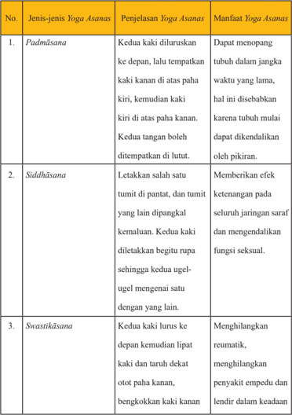

Tabel ini berisi informasi tentang tiga jenis asana yoga, penjelasan masing-masing asana, dan manfaatnya. Topik utama tabel adalah asana yoga dan manfaatnya. Kolom pertama berisi nomor urut untuk setiap asana, kolom kedua berisi deskripsi singkat asana tersebut, dan kolom ketiga berisi manfaat asana tersebut. Data penting yang terlihat adalah bahwa semua asana memiliki manfaat kesehatan yang berbeda-beda, seperti menopang tubuh, memberikan efek ketenangan pada seluruh jaringan saraf, mengendalikan fungsi seksual, menghilangkan reumatik, menghilangkan penyakit empedu, dan mengurangi lemah lembut dalam keadaan.

 

---
## 📄 Halaman 26

---
**📊 Tabel**

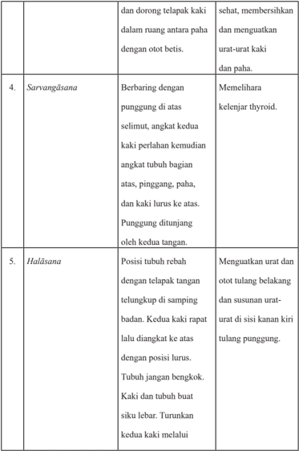

Tabel ini berisi informasi tentang dua gerakan yoga, Sarvangasana dan Halasana, serta manfaat kesehatan yang diharapkan dari setiap gerakan tersebut. Topik utama tabel adalah tentang manfaat kesehatan dan teknik melakukan dua gerakan yoga tersebut. Kolom pertama menunjukkan nomor urut dari masing-masing gerakan, kolom kedua menjelaskan nama gerakan, kolom ketiga menyebutkan posisi tubuh saat melakukan gerakan, dan kolom keempat memberikan penjelasan manfaat kesehatan yang diharapkan dari setiap gerakan. Data penting yang terlihat adalah bahwa Sarvangasana dapat membantu memelihara kelenjar thyroid dan meningkatkan sirkulasi darah, sedangkan Halasana dapat meningkatkan sirkulasi darah di sisi kanan tulang punggung dan melawan otot-otot belakang.

 

---
## 📄 Halaman 27

---
**📊 Tabel**

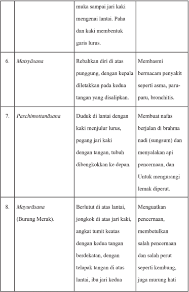

Tabel ini berisi informasi tentang beberapa asana yoga dan manfaatnya. Topik utama tabel adalah asana yoga dan manfaat kesehatan yang dapat diperoleh dari melakukan asana tersebut. Kolom pertama menunjukkan nomor urutan asana, kolom kedua menyebutkan nama asana, kolom ketiga menjelaskan cara melakukan asana, dan kolom keempat memberikan manfaat kesehatan yang dapat diperoleh dari melakukan asana tersebut. Misalnya, Matsyāsana (Asana Ikan) membantu memperbaiki kondisi paru-paru dan bronchitis, sedangkan Paschimottanasana (Asana Pijakan Laut) dapat membantu mengurangi lemak di perut.

 

---
## 📄 Halaman 28

---
**📊 Tabel**

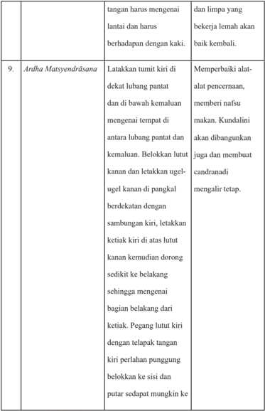

Tabel ini berisi instruksi tentang teknik meditasi yang melibatkan gerakan tangan dan kaki untuk membantu pemulihan fisik dan mental. Topik utama tabel adalah teknik meditasi Ardh Matasyendrásana, yang melibatkan lantai, kaki, dan tangan dalam proses perbaikan alat-alat pencernaan dan memberikan nafsu makan. Kolom pertama menunjukkan posisi tubuh dan gerakan tangan, sementara kolom kedua menjelaskan posisi kaki dan gerakan kaki. Data penting yang terlihat adalah bahwa teknik ini memerlukan penyesuaian posisi tangan dan kaki untuk membantu dalam proses pemulihan fisik dan mental.

 

---
## 📄 Halaman 29

---
**📊 Tabel**

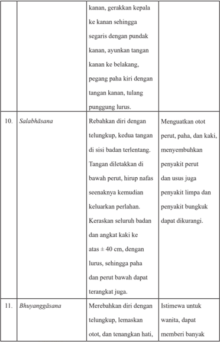

Tabel ini berisi instruksi untuk melakukan dua gerakan yoga, yaitu Salabhäsana dan Bhuyanggäsana. Topik utama tabel adalah teknik yoga yang melibatkan gerakan tubuh dan otot-otot. Kolom pertama menunjukkan nama gerakan yoga tersebut, sedangkan kolom kedua memberikan deskripsi detail tentang cara melakukan gerakan tersebut. Kolom ketiga menyajikan informasi tambahan tentang manfaat atau kesehatan yang dapat diperoleh dengan melakukan gerakan tersebut. Data penting yang terlihat adalah bahwa kedua gerakan ini memerlukan gerakan ke kanan dan ke kiri, serta melibatkan gerakan paha dan tangan. Gerakan Salabhäsana membutuhkan telungkup, sedangkan Bhuyanggäsana memerlukan telungkup dan lemakan otot.

 

---
## 📄 Halaman 30

---
**📊 Tabel**

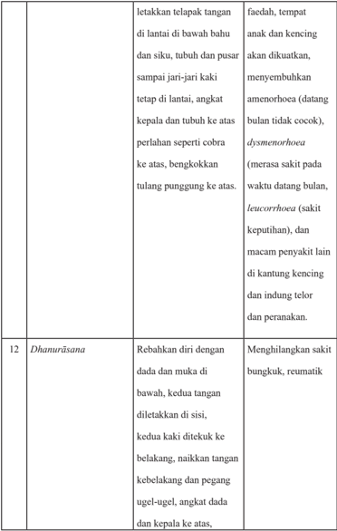

Tabel ini berisi instruksi untuk melakukan dua pose yoga, yaitu Dhanurásana (Posisi Burung Penjaga) dan letakkan telapak tangan di lantai di bawah bahu dan siku, tubuh dan puser sampai jari-jari kaki tetap di lantai, angkat kepala dan tubuh ke atas perlahan seperti cobra ke atas, bengkokkan tulang punggung ke atas. Topik utama tabel ini adalah latihan yoga. Kolom pertama berisi nama pose yoga, sedangkan kolom kedua berisi instruksi untuk melakukan pose tersebut. Data penting yang terlihat adalah bahwa kedua pose ini melibatkan posisi tubuh yang berbeda-beda, mulai dari menempatkan telapak tangan di lantai hingga bengkokkan tulang punggung ke atas.

 

---
## 📄 Halaman 31

---
**📊 Tabel**

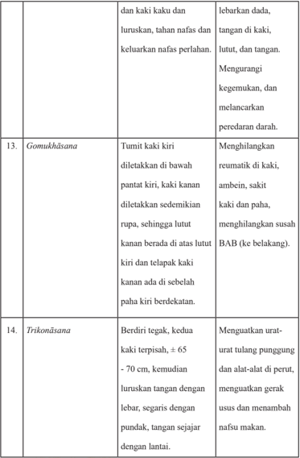

Tabel ini berisi instruksi untuk beberapa asanas yoga, yang disajikan dalam format kolom-kolom berurutan. Topik utama tabel adalah asanas yoga, dengan setiap baris menunjukkan instruksi untuk satu asana. Kolom pertama masing-masing baris berisi nama asana, sedangkan kolom kedua menyediakan deskripsi singkat tentang posisi tubuh yang harus diambil selama asana tersebut. Data penting yang terlihat meliputi: Gomukhásana, yang melibatkan tumbukan kaki kiri di bawah pantat kiri dan kaki kanan di atas lutut kiri; Trikonásana, yang memerlukan berdiri tegak dengan kedua kaki terpisah ± 65-70 cm dan luruskan tangan dengan lebar, segaris dengan pundak, tanpa menambah nafsu makan.

 

---
## 📄 Halaman 32

---
**📊 Tabel**

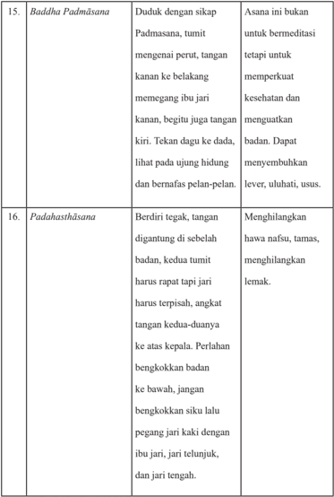

Tabel ini berisi informasi tentang dua asana yoga, yaitu Baddha Padmasana dan Padahasthasana. Topik utama tabel adalah asana yoga tersebut dan bagaimana cara melakukannya. Kolom pertama menunjukkan nama asana, sedangkan kolom kedua menjelaskan cara melakukan asana tersebut. Data penting yang terlihat adalah bahwa Baddha Padmasana memperkuat kesehatan dan menguatkan badan, sementara Padahasthasana menghilangkan hawa nafsu, tamas, dan lemak.

 

---
## 📄 Halaman 33

---
**📊 Tabel**

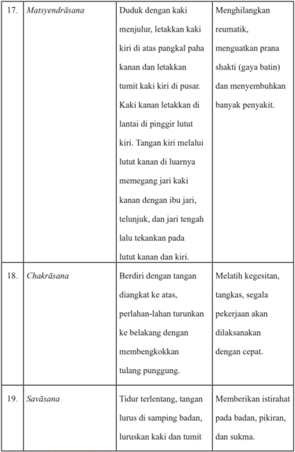

Tabel ini berisi informasi tentang tiga asana yoga: Matsyendrāsana, Chakrāsana, dan Savāsana. Matsyendrāsana melibatkan posisi duduk dengan kaki menjulur, kaki kanan di atas pangkal paha kanan, kaki kiri di pusar, dan kaki kanan di pinggir lutut kiri. Asana ini bertujuan untuk menghilangkan reumatik, memperkuat prana shakti (gaya batin), dan mencegah penyakit. Chakrāsana melibatkan berdiri dengan tangan diangkat ke atas, perlahan-lahan turunkan ke belakang, dan membengkokkan tulang punggung. Ini bertujuan untuk melatih kesegaran, kecepatan, dan kesejahteraan pekerjaan. Savāsana melibatkan tidur terlentang dengan tangan lurus di samping badan, luruskan kaki dan tumit. Asana ini bertujuan untuk memberikan istirahat pada tubuh, pikiran, dan emosi. Topik utama tabel adalah asana yoga dan tujuannya. Kolom-kolomnya mencakup deskripsi asana, tujuan asana, dan manfaat asana. Pola penting yang terlihat adalah bahwa setiap asana memiliki tujuan khusus untuk mengatasi masalah kesehatan atau meningkatkan kesejahteraan fisik, mental, dan emosional.

 

---
## 📄 Halaman 34

---
**📊 Tabel**

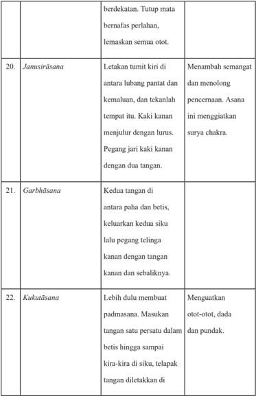

Tabel ini berisi instruksi tentang beberapa asana yoga, yang disajikan dalam format kolom-kolom berurutan. Topik utama tabel adalah asana yoga, dengan setiap baris menunjukkan nama asana dan instruksi untuk melakukan asana tersebut. Kolom pertama menyediakan nama asana, sedangkan kolom kedua memberikan deskripsi detail tentang cara melakukan asana tersebut. Data penting yang terlihat meliputi:

1. **Jamasirsasana**: Instruksi untuk memposisikan tubuh di antara lubang pantat dan kemaluan, dengan kaki kanan menjulur lurus dan pegangan jari kaki kanan menggunakan dua tangan.
2. **Garbhasana**: Instruksi untuk memposisikan kedua tangan di antara paha dan betis, keluarkan kedua siku lalu pegang telinga kanan dengan tangan kanan dan sebaliknya.
3. **Kukutasana**: Instruksi untuk lebih dulu membuat padmasana, masukan tangan satu persatu dalam betis hingga sampai kira-kira di siku, telapak tangan diletakkan di.

Tabel ini membantu pengguna untuk memahami langkah-langkah yang perlu dilakukan saat melakukan asana yoga, dengan menjelaskan posisi tubuh dan gerakan secara rinci.

 

---
## 📄 Halaman 35

---
**📊 Tabel**

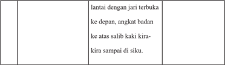

Tabel ini menunjukkan langkah-langkah untuk melakukan gerakan tertentu dengan jari terbuka ke depan, angkat badan ke atas, dan salib kaki sejauh kira-kira di siku. Topik utama tabel ini adalah teknik gerakan tubuh. Kolom pertama berisi instruksi tentang posisi jari dan badan, sedangkan kolom kedua berisi detail tentang gerakan kaki. Data penting yang terlihat adalah bahwa semua langkah harus dilakukan secara bertahap dan dengan perlahan-lahan, memastikan keselamatan dan kenyamanan saat melakukan gerakan tersebut.

Oleh karenanya, ada baiknya kita memahami Etika Ajaran Yogãsanas tersebut untuk mewujudkan kesejahteraan dan kebahagiaan hidup dalam kehidupan ini. Bagaimana  semuanya  itu?  Sebelumnya  selesaikanlah  uji  kompetensi  berikut dengan baik!

### Uji Kompetensi:

- Buatlah peta konsep tentang jenis-jenis yogãsana yang Kamu ketahui!
- Latihlah  diri  Kamu  untuk  ber Yoga setiap  saat!  Selanjutnya  buatlah laporan tentang perkembangan ber Yoga yang Kamu laksanakan baik secara fisik maupun rohani! Sebelumnya diskusikanlah dengan orang tua Kamu di rumah.
- Manfaat  apakah  yang  dapat  Kamu  rasakan  secara  langsung  dari ber Yoga ? Tuliskanlah pengalaman Kamu!

 

---
## 📄 Halaman 36

### D.  Yogãsana dan Etika

### Perenungan:

Pratena dik ṡā m ā pnoti dik ṣā ya ā pnoti dak ṣ i ṇā m, dak ṣ in āṡ raddh ā m ā pnoti ṡ raddh ā ya satyam ā pyate.

### Terjemahannya:

Melalui  pengabdian  kita  memperoleh  kesucian,  dengan  kesucian  kita mendapat kemuliaan. Dengan kemuliaan kita mendapat kehormatan dan dengan kehormatan kita memperoleh kebenaran' (Yajurveda XIX.30).

### Memahami Teks:

Yoga Asana adalah gerakan Yoga yang berhubungan dengan posisi tubuh. Perpaduan  antara  gerakan  kelenturan,  gerakan  memutar  dan  keseimbangan tersebut membantu kita untuk membedakannya dengan jenis praktik Yoga yang lainnya. Yoga Asana mengutamakan  postur  tubuh,  terpusat  pada  pernapasan ( breathing ) dan konsentrasi pada gerakan pikiran ( mind ). Yoga menyelaraskan tubuh fisik, pikiran dan jiwa. Pada tubuh fisik Yoga memberi efek kesehatan, keseimbangan, kekuatan dan vitalitas. Pada pikiran, Yoga meningkatkan daya ingat,  konsentrasi,  menajamkan  tingkat  intelektual,  menyeimbangkan  emosi sehingga membuat hidup lebih kaya dan bahagia. Pada jiwa, Yoga membawa kesadaran,  kebebasan  dan  pencerahan. Yoga adalah  sebuah  filosofi  tentang

 

---
## 📄 Halaman 37

kehidupan yang dapat dicapai melalui latihan olah tubuh, napas dan meditasi berdasarkan  delapan  tahapan  kehidupan  seperti Yama (ajaran  tentang  moral), Ni yama (disiplin), Asana (postur), Pranayama (pengontrolan  napas  dengan teratur), Pratyahara (pelajaran  tentang  rasa), Dharana (konsentrasi), Dhyana (meditasi)  dan Samadhi (pencapaian  kesadaran  tertinggi  dari  meditasi),  yang dapat membentuk kita menjadi manusia yang sejahtera, damai, dan bahagia.

Kamus Besar Bahasa Indonesia menjelaskan Yoga :  sebagai  meditasi  atau mengheningkan cipta/pikiran, sehingga dapat dimaknai bahwa Yoga itu adalah meghubungkan atau penyatuan spirit individu ( jivatman ) dengan spirit universal ( paramatman )  melalui  keheningan  pikiran.  Ber Yoga berarti  mengendalikan pangkal penyebab kemalangan manusia yang dapat mempengaruhi pikiran dan badan atau rohani dan jasmani. Yoga adalah ilmu tentang kemanusiaan, berurusan dengan semua aspek manusia secara lengkap dari fisik, psikologis, intelektual dan emosional. Jika berlatih dengan dedikasi, Yoga memiliki kemampuan untuk memunculkan  kualitas  positif  dan  mengurangi  kekurangan  kita.  Berdasarkan pengetahuan tentang anatomi, fisiologi, kesadaran dan hati nurani, Yoga adalah ilmu yang mampu mengintegrasikan tubuh, pikiran, napas, dan kesadaran, untuk memahami  kebutuhan  yang  sesungguhnya  dari  setiap  orang  dan  berurusan dengan setiap aspek kesehatan dan kesejahteraan dari luar ke inti sesungguhnya.

Bila kita mengenal Karate atau Kungfu sebagai suatu teknik untuk membela diri,  maka Yoga merupakan  suatu  teknik  untuk  mengenal  diri.  Siapa  yang mengenal dirinya, maka dia mengenal Tuhannya. Perlu ditegaskan lagi, bahwa Yoga adalah suatu sadhana (latihan yang bersifat spiritual). Yoga tidak sekedar senam  atau  latihan  kanuragan.  Ini  perlu  dijelaskan  karena  bagi  masyarakat

 

---
## 📄 Halaman 38

Indonesia, Yoga sering kali disalahartikan sebagai akrobat atau semacam praktikpraktik klenik, dan lain sebagainya. Sebagaimana ilmu bela diri, berlatih Yoga juga membutuhkan disiplin yang penting diperhitungkan. Tidak ada dispensasi untuk  memperpendek  jalan.  Namun,  untuk  berlatih Yoga tidak  ada  istilah terlambat untuk memulai. Apakah seorang anak, orang tua, wanita, pria, cacat, sehat, terpelajar, buta huruf, dengan kesungguhan hati semuanya dapat berlatih Yoga .

Berbagai aliran Yoga telah diperkenalkan hampir di seluruh dunia. Namun ada satu aliran yang selama ini patut kita tekuni yaitu Hatha Yoga . Praktik Hatha Yoga dapat membuat keseimbangan pada diri setiap orang. Hatha Yoga , secara fisik dapat membantu meningkatkan kinerja seluruh bagian tubuh, dari darah, hormon, kelenjar hingga tulang dan juga semua sistem yang ada di dalam tubuh yang  membantu  meningkatkan  kesehatan.  Sedangkan  secara  mental/rohani, Hatha Yoga dapat melatih pikiran melalui latihan pernapasan dan meditasi guna membantu pikiran menjadi lebih jernih, meningkatkan konsentrasi, dan rileks sehingga dapat mengurangi ketegangan dan stres.

Di dalam latihan Hatha Yoga ada salah satu unsur bagiannya yang disebut Asana s. Asana s adalah latihan fisik atau olah tubuh dengan melakukan berbagai peregangan untuk melatih kekuatan tubuh dan sebagainya. Untuk seseorang yang sudah terbiasa berlatih Yoga sebelumnya melakukan hal semacam ini ( Asana s) sudah menjadi kebiasaannya. Namun demikian di antara kita yang kebanyakan baru mau melaksanakannya, banyak hal yang masih perlu diketahui dan dipelajari terutama yang berhubungan dengan makna melakukan Yoga dan Asana s pada khususnya. Barangkali kita banyak memiliki teman sepermainan di antaranya

 

---
## 📄 Halaman 39

ada  yang  baru  memulai  berlatih Yoga ,  dalam  perbincangan  mereka  sempat berkomentar bahwa 'mengapa selama ini saya berlatih Yoga tidak  merasakan seperti berolahraga; mengeluarkan keringat banyak, merasakan kelelahan, lebih cepat mengantuk dan tertidur enak, dan sebagainya'?

Mempraktikkan  dan  berlatih Yoga Asana s  sesungguhnya  adalah  dapat mengantarkan  kita  menjernihkan  pikiran/pengertian,  menjadikan  tubuh/badan bugar/sehat,  dan  akhirnya  terwujud  hidup  dan  kehidupan  yang  sejahtera  dan bahagia.  Sesungguhnya  tidak  ada  yang  salah  di  antara  olahraga  dan Yoga , tidak  baik  saling  menyalahkan  karena  hanya  menyisakan  masalah.  Latihan Yoga itu  sangatlah pribadi (personal), lamanya melakukan postur atau Asana s dan pemilihan program sebaiknya disesuaikan dengan kondisi dan kebutuhan individu itu sendiri. Durasi waktu dalam berlatih Yoga juga semestinya bertahap, dan secara pelan-pelan ditingkatkan sesuai dengan kekuatan tubuh praktisinya. Biasanya  untuk  praktisi Yoga pemula  ada  baiknya  beristirahat  dalam  setiap Asana sekitar 30 detik, dan bisa ditingkatkan menjadi 1-2 menit. Praktik Yoga Asana s bila dilakukan dengan sungguh-sungguh, benar, dan tepat melalui gerak dan pernapasan atau Pranayama , maka tubuh juga dapat berkeringat tetapi tubuh dan pikiran merasa menjadi ringan. Yang perlu diingat adalah berlatih Yoga tidak harus diakhiri dengan kelelahan. Sesuai dengan namanya ' Hatha ' memanaskan dan juga mendinginkan atau menenangkan. Coba dan lakukanlah! Bagaimana kita dapat memulainya dengan baik?

Kata Yoga telah sangat akrab di telinga kita, Yoga telah menjelajah dunia bukan lagi hanya menjadi milik orang India atau orang Hindu atau orang Buddha. Yoga sesungguhnya  adalah  sebuah  jalan  kehidupan  yang  mengajarkan  kita

 

---
## 📄 Halaman 40

menjadi orang yang baik, menjadi orang yang harmonis dan damai. Berbicara tentang Yoga sebenarnya  sama  dengan  kita  menapak  suatu  jalan  yang  sangat panjang, secara garis besar Yoga itu dibagi menjadi empat fase, antara lain:

### 1. Bhakti Yoga : berpangkal pada rasa cinta kasih.

Ida  Sang  Hyang  Widhi menciptakan  manusia  lengkap  dengan  unsur  rasa yang  dimilikinya.  Rasa  juga  tidak  kalah  pentingnya  dalam  kehidupan  ini, terutama  karena  manusia  hidup  diantara  manusia  dan  mahluk  hidup  lainnya. Untuk  menjaga  keharmonisan  hubungan  inilah  rasa  cinta  kasih  menjadi  tali pengikat, menjadi benang merah yang merajut dan membentuk sebuah rajutan kehidupan yang indah dan mempesona. Rasa membuat kehidupan ini berdenyut dan rasa membuat manusia mampu menikmati kehidupan ini. Jalan Bhakti Yoga menekankan para pengikut ajaran bhakti memuja Ida Sang Hyang Widhi dengan tulus ikhlas dan bersahabat dengan sesama ciptaan-Nya dengan rasa cinta kasih yang mendalam.

### 2. Karma Yoga : berpangkal pada karma/kerja.

Ciri kehidupan ini adalah adanya aktivitas atau kerja. Bila seseorang ingin hidup yang bersangkutan mesti bekerja untuk mendapatkan makanan, minuman, tempat tinggal, pakaian, uang dan segala kebutuhan hidup lainnya. Bekerja dapat menjadi  jalan  untuk  mencapai  pencerahan  diri,  bilamana  seseorang  mampu mewujudkan  kerja  tanpa  pamrih,  ihklas  dan  tulus.  Jalan  kerja  tanpa  pamrih inilah inti dari Karma Yoga .

 

---
## 📄 Halaman 41

### 3. Jnana Yoga : berpangkal pada logika dan atau pengetahuan.

Kewajiban kita hidup adalah selalu belajar untuk meningkatkan pengetahuan guna menyempurnakan hidup. Adakah aktivitas di dunia ini tanpa membutuhkan pengetahuan?  Pengetahuan  membuat  orang  yang  kegelapan  menjadi  terang. Setiap pekerjaan sebenarnya membutuhkan pengetahuan tersendiri yang mesti dipahami  dengan  baik.  Menjadi  profesional  di  salah  satu  bidang  pekerjaan menuntut kita untuk memahami  pengetahuan di bidang tersebut. Oleh karenanya, pengetahuan itu sangat penting dalam kehidupan ini. Bila kita ingin mengembangkan  diri  meningkatkan  anugerah  Tuhan/ Ida  Sang  Hyang  Widhi yang dimiliki oleh manusia berupa pikiran dan kecerdasan harus selalu belajar. Jnana Yoga menekankan  pada  pengetahuan  yang  suci  dan  yang  bermanfaat untuk hidup dan kehidupan ini.

### 4. Raja Yoga : berpangkal pada Pengendalian diri dan konsentrasi.

Untuk mendapatkan hasil yang optimal pada kerja logika, rasa dan aktivitas atau karma, diperlukan pengendalian diri dan konsentrasi yang tinggi. Manusia juga terlahir membawa sifat-sifat marah, keinginan, iri hati, mabuk, bingung dan loba. Ke-enam unsur ini ( sad ripu )  dapat mengacaukan sistem kerja manusia. Panca Indra, sex , dan pikiran manusia yang tak terkendali seringkali bisa menjadi tembok penghalang kesuksesannya.

 

---
## 📄 Halaman 42

### Renungkanlah sloka berikut ini:

Na karma ṇā m an ā rambh ā n nai ṣ karmya ṁ puru ṣ o ' ṡ nute, na ca sa ṁ nyasan ā d eva siddhi ṁ samadhigacchati.

### terjemahannya:

Tanpa kerja orang tak akan mencapai kebebasan, demikian juga ia tak akan mencapai kesempurnaan karena menghindari kegiatan kerja (BG. III.4).

Secara umum, konsep etika dalam Yoga termasuk dalam latihan yama dan ni yama ,  yaitu  disiplin  moral  dan  disiplin  diri.  Aturan-aturan  yang  ada  dalam yama dan niyama , juga berfungsi sebagai kontrol sosial dalam mengatur moral manusia. Dalam buku Tattwa Darsana, menjelaskan bahwa etika dalam Yoga adalah  sebagai  berikut;  dalam Samadhi ,  seorang Yogi memasuki  ketenangan tertinggi  yang  tidak  tersentuh  oleh  suara-suara  yang  tak  henti-hentinya,  yang berasal  dari  luar  dan  pikiran  kehilangan  fungsinya,  di  mana  indera-indera terserap ke dalam pikiran. Apabila semua perubahan pikiran terkendalikan, si pengamat atau Purusa, terhenti dalam dirinya sendiri. Keadaan semacam ini di dalam Yoga-Sutra Patanjali disebut sebagai Svarupa Avasthanam (kedudukan dalam diri seseorang yang sesungguhnya).

Dalam filsafat Yoga , dijelaskan bahwa Yoga berarti penghentian kegoncangan-kegoncangan  pikiran.  Ada  lima  keadaan  pikiran  itu.  Keadaaan

 

---
## 📄 Halaman 43

pikiran itu dipengaruhi oleh intensitas sattwa, rajas dan tamas . Kelima keadaaan pikiran itu adalah:

- Ksipta artinya  tidak  diam-diam.  Dalam  keadaan  pikiran  itu  diombangambingkan oleh rajas dan tamas, dan ditarik-tarik oleh objek indriya dan sarana-sarana untuk mencapainya, pikiran melompat-lompat dari satu objek ke objek yang lain tanpa terhenti pada satu objek.
- Mudha artinya lamban dan malas. Gerak lamban dan malas ini disebabkan oleh pengaruh tamas yang menguasai alam pikiran. Akibatnya orang yang alam pikirannya demikian cenderung bodoh, senang tidur dan sebagainya.
- Wiksipta artinya  bingung,  kacau.  Hal  ini  disebabkan  oleh  pengaruh rajas.  Karena  pengaruh  ini,  pikiran  mampu  mewujudkan  semua  objek dan  mengarahkannya  pada  kebajikan,  pengetahuan,  dan  sebagainya.  Ini merupakan  tahap  pemusatan  pikiran  pada  suatu  objek,  namun  sifatnya sementara, sebab akan disusul lagi oleh kekuatan pikiran.
- Ekarga artinya terpusat. Di sini, Citta terhapus dari cemarnya rajas sehingga sattva -lah yang menguasai pikiran. Ini merupakan awal pemusatan pikiran pada suatu objek yang memungkinkan ia mengetahui alamnya yang sejati sebagai persiapan untuk menghentikan perubahan-perubahan pikiran.
- Niruddha artinya terkendali. Dalam tahap ini, berhentilah semua kegiatan pikiran, hanya ketenanganlah yang ada. Ekagra dan Niruddha merupakan persiapan dan bantuan untuk mencapai tujuan akhir, yaitu kelepasan. Ekagra bila dapat  berlangsung  terus-menerus,  maka  disebut samprajna-Yoga atau meditasi yang dalam, yang padanya ada perenungan kesadaran akan suatu objek yang terang. Tingkatan Niruddha juga disebut asaniprajnata-

 

---
## 📄 Halaman 44

Yoga ,  karena  semua  perubahan  dan  kegoncangan  pikiran  terhenti,  tiada satu pun diketahui oleh pikiran lagi. Dalam keadaan demikian, tidak ada riak-riak gelombang kecil sekali pun dalam permukaan alam pikiran atau Citta itu. Inilah yang dinamakan orang Samadhi Yoga . Ada empat macam samparJnana-Yoga menurut  jenis  objek  renungannya.  Keempat  jenis  itu adalah:

- Sawitarka ialah  apabila  pikiran  dipusatkan  pada  suatu  objek  benda kasar seperti arca dewa atau dewi.
- Sawicara ialah  bila  pikiran  dipusatkan  pada  objek  yang  halus  yang tidak nyata seperti tanmantra.
- Sananda ialah  bila  pikiran  dipusatkan  pada  suatu  objek  yang  halus seperti rasa indriya.
- Sasmita ialah bila pikiran dipusatkan pada asmita, yaitu anasir rasa aku yang biasanya roh menyamakan dirinya dengan ini.
Dengan  tahapan-tahapan  pemusatan  pikiran  seperti  yang  disebut  di  atas, maka  ia  akan  mengalami  bermacam-macam  phenomena  alam,  objek  dengan atau tanpa jasmani yang meninggalkannya satu persatu hingga akhirnya Citta meninggalkannya  sama  sekali  dan  seseorang  mencapai  tingkat asamprajnata dalam Yoga nya. Untuk mencapai tingkat ini orang harus melaksanakan praktik Yoga dengan  cermat  dan  dalam  waktu  yang  lama  melalui  tahap-tahap  yang disebut Astangga Yoga .

 

---
## 📄 Halaman 45

### Berikut ini adalah Sistematika Astangga Yoga dalam bentuk diagram:

---
**📊 Tabel**

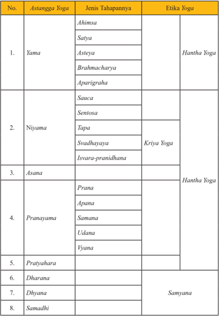

Tabel ini memperlihatkan berbagai aspek dari praktek yoga, termasuk asana, pranayama, dharana, dhyana, samadhi, dan pratyahara. Topik utama tabel adalah tentang tahapan-tahapan dalam praktek yoga, yang diuraikan melalui 8 aspek utama tersebut. Kolom-kolomnya mencakup aspek-aspek ini, dengan setiap aspek dibagi menjadi dua jenis tahapannya: Hantha Yoga dan Kriya Yoga. Misalnya, dalam aspek Yama, ada 5 tahapan yang disebut Ahimsa, Satya, Asteya, Brahmacharya, dan Aparigraha. Setiap tahapan ini kemudian dibagi lagi menjadi dua jenis tahapannya, yaitu Hantha Yoga dan Kriya Yoga. Ini menunjukkan bahwa praktek yoga melibatkan langkah-langkah yang lebih lanjut dan kompleks, yang harus dilakukan secara bertahap.

 

---
## 📄 Halaman 46

Dalam  melaksanakan Yoga ada  tahap-tahap  yang  harus  ditempuh  yang disebut dengan Astangga Yoga . Astangga Yoga adalah delapan tahapan-tahapan yang ditempuh dalam melaksanakan Yoga . Adapun bagian-bagian dari Astangga Yoga yaitu Yama (pengendalian diri unsur jasmani), N yama (pengendalian diri unsur-unsur  rohani), Asana (sikap  tubuh), Pranayama (latihan  pernafasan), Pratyahara (menarik  semua  indrinya  kedalam), Dharana (telah  memutuskan untuk memusatkan diri dengan Tuhan), Dhyana (mulai  meditasi  dan  merenungkan diri serta nama Sang Hyang Widhi Wasa), dan Samadhi (telah mendekatkan diri, menyatu atau kesendirian yang sempurna atau merealisasikan diri). Berikut dapat disebutkan  bagian-bagian  dari  Astangga Yoga yang  patut  dijadikan  landasan hidup beretika dalam keseharian, antara lain:

### 1. Yama (Panca Yama Brata)

Panca yama Brata adalah lima pengendalian diri tingkat jasmani yang harus dilakukan tanpa kecuali. Gagal melakukan pantangan dasar ini, maka seseorang tidak akan pernah bisa mencapai tingkatan berikutnya. Penjabaran kelima Yama Bratha ini diuraikan dengan jelas dalam Patanjali Yoga S ū tra II.35 - 39.

- Satya atau  kejujuran/kebenaran dalam pikiran, perkataan dan perbuatan, atau pantangan akan kecurangan, penipuan dan kepalsuan. ( Patanjali Yoga S ū tra II.36 )
- Ahimsa atau tanpa kekerasan. Jangan melukai makhluk lain manapun dalam pikiran, perbuatan atau perkataan. ( Patanjali Yoga S ū tra II.35 )
- Kelas XI  SMA/SMK Kurikulum'13 c. Astya atau pantang menginginkan segala sesuatu yang bukan miliknya sendiri.  Atau  dengan  kata  lain  pantang  melakukan  pencurian  baik hanya dalam pikiran, perkataan apa lagi dalam perbuatan. ( Patanjali Yoga S ū tra II.37 )

 

---
## 📄 Halaman 47

- Brahmacarya atau  berpantang  kenikmatan  seksual.  ( Patanjali  Yoga S ū tra II.38 )
- Aparigraha atau  pantang  akan  kemewahan;  seorang  praktisi Yoga (Yogi) harus hidup sederhana. ( Patanjali Yoga S ū tra II.38 ).

### 2. Niyama (Panca Niyama Bratha)

Panca Nyama Brata adalah lima jenis penengendalian diri tingkat rohani dan  sebagai  penyokong  dari  pantangan  dasar  sebelumnya  diuraikan  dalam Patanjali Yoga S ū tra II.40-45.

- Sauca , kebersihan lahir batin. Lambat laun seseorang yang menekuni prinsip ini akan mulai mengesampingkan kontak fisik dengan badan orang  lain  dan  membunuh  nafsu  yang  mengakibatkan  kekotoran dari  kontak  fisik  tersebut  ( Patanjali  Yoga  S ū tra II.40 ). Sauca juga menganjurkan  kebajikan Sattvasuddi atau  pembersihan  kecerdasan untuk membedakan:
- Saumanasya atau keriangan hati,
- Ekagrata atau pemusatan pikiran,
- Indriajaya atau pengawsan nafsu-nafsu,
- Atmadarsana atau realisasi diri ( Patanjali Yoga S tra II.41 ).
- Santosa atau kepuasan. Hal ini dapat membawa praktisi Yoga kedalam kesenangan yang tidak terkatakan. Dikatakan dalam kepuasan terdapat tingkat kesenangan transendental ( Patanjali Yoga S ū tra II.42 ).
ū

- Pendidikan Agama Hindu dan Budi Pekerti 41 c. Tapa atau  mengekang.  Melalui  pantangan  tubuh  dan  pikiran  akan menjadi kuat dan terbebas dari noda dalam aspek spiritual ( Patanjali Yoga S ū tra II.43 ).

 

---
## 📄 Halaman 48

- Svadhyaya atau mempelajari kitab-kitab suci, melakukan japa (pengulangan  pengucapan  nama-nama  suci  Tuhan)  dan  penilaian diri  sehingga  memudahkan  tercapainya 'istadevata-sampraYogah, persatuan  dengan  apa  yang  dicita-citakannya  ( Patanjali  Yoga  S ū tra II.44 ).
- Isvarapranidhana atau  penyerahan  dan  pengabdian  kepada Sang Hyang  Widhi yang  akan  mengantarkan  seseorang  kepada  tingkatan Samadhi ( Patanjali Yoga S ū tra II.45 ).
Dengan menempuh  jalan kebaikan bukan berarti seseorang dengan sendirinya dilindungi terhadap kesalahan yang bertentangan. Jangan menyakiti orang lain belum tentu berarti perlakukan orang lain dengan baik. Kita harus melakukan  keduanya,  tidak  menyakiti  orang  lain  dan  sekaligus  melakukan keramah-tamahan.

### 3. Asana

Asana adalah sikap duduk pada waktu melaksanakan Yoga . Buku Yogasutra tidak  mengharuskan  sikap  duduk  tertentu,  tetapi  menyerahkan  sepenuhnya kepada  siswa  sikap  duduk  yang  paling  disenangi  dan  relaks,  asalkan  dapat menguatkan konsentrasi dan pikiran dan tidak terganggu karena badan merasakan sakit akibat sikap duduk yang dipaksakan. Selain itu sikap duduk yang dipilih agar dapat berlangsung lama, serta mampu mengendalikan sistem saraf sehingga terhindar  dari  goncangan-goncangan  pikiran.  Sikap  duduk  yang  rileks  antara lain: silasana (bersila)  bagi  laki-laki  dan bajrasana (bersimpuh,  menduduki

 

---
## 📄 Halaman 49

tumit) bagi wanita, dengan punggung yang lurus dan tangan berada diatas kedua paha, telapak tangan menghadap ke atas.

### 4. Pranayama

Pranayama adalah  pengaturan  nafas  keluar masuk  paru-paru  melalui  lubang  hidung  dengan tujuan menyebarkan  prana (energi) keseluruh tubuh. Pada saat manusia menarik nafas mengeluarkan  suara So ,  dan  saat  mengeluarkan nafas berbunyi Ham . Dalam bahasa Sansekerta So berarti energi kosmik, dan Ham berarti diri sendiri (saya). Ini berarti setiap detik manusia mengingat diri dan energi kosmik.

Pranayama terdiri dari: Puraka yaitu memasukkan  nafas,  Kumbhaka  yaitu  menahan nafas,  dan  Recaka  yaitu  mengeluarkan  nafas. Puraka, kumbhaka dan recaka dilaksanakan

---
**🖼️ Gambar/Diagram**

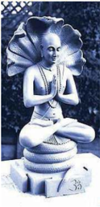

> **Deskripsi Visual:** Gambar ini adalah ilustrasi yang menampilkan patung Buddha dalam meditasi. Patung tersebut diletakkan di atas fondasi berbentuk lotus, yang biasanya digunakan sebagai simbol keindahan dan kebijaksanaan dalam budaya Hindu dan Buddha. Patung Buddha ini duduk dengan posisi jalan tangan (bhumisparsha mudra), yang merupakan tanda keberanian dan ketulusan. Latar belakangnya tampak tenang dan alami, dengan pohon dan tanaman yang menghiasi area sekitarnya.

Elemen utama dalam gambar ini adalah patung Buddha yang duduk dalam meditasi, fondasi berbentuk lotus, dan latar belakang alami yang tenang. Relasi antara elemen-elemen ini adalah bahwa patung Buddha menjadi fokus utama, sedangkan fondasi berbentuk lotus dan latar belakang alami memberikan konteks dan nuansa yang mendukung tema meditasi dan kebijaksanaan Buddha.

Teks, angka, atau label penting yang terlihat dalam gambar ini tidak ada, karena gambar ini hanya menggambarkan objek-objek fisik tanpa teks atau informasi tambahan.

Informasi kunci yang dapat diambil pembaca dari gambar ini adalah bahwa gambar ini mungkin digunakan untuk membantu pembelajaran tentang Buddha, meditasi, atau kebijaksanaan dalam budaya Hindu dan Buddha. Gambar ini juga dapat digunakan sebagai representasi visual untuk konsep-konsep seperti keberanian, ketulusan, dan keindahan spiritual.

pelan-pelan bertahap masing-masing dalam tujuh detik. Hitungan tujuh detik ini dimaksudkan untuk menguatkan kedudukan ketujuh cakra yang ada dalam tubuh manusia yaitu: muladhara yang terletak di pangkal tulang punggung di antara dubur  dan  kemaluan,  svadishthana  yang  terletak  di  atas  kemaluan,  manipura yang terletak di pusar, anahata yang terletak di jantung, vishuddha yang terletak di  leher,  ajna  yang  terletak  di  tengah-tengah  kedua  mata,  dan  sahasrara  yang terletak di ubun-ubun.

 

---
## 📄 Halaman 50

### 5. Pratyahara

Pratyahara adalah penguasaan panca indria oleh pikiran sehingga apapun yang diterima panca indria melalui syaraf ke otak tidak mempengaruhi pikiran. Panca  indria  adalah:  pendengaran,  penglihatan,  penciuman,  rasa  lidah  dan rasa  kulit.  Pada  umumnya  indria  menimbulkan  nafsu  kenikmatan  setelah mempengaruhi pikiran. Yoga bertujuan memutuskan mata rantai olah pikiran dari rangsangan syaraf ke keinginan (nafsu), sehingga Citta menjadi murni dan bebas dari goncangan-goncangan. Jadi, Yoga tidak bertujuan mematikan kemampuan indria. Untuk jelasnya mari kita kutip pernyatan dari Maharsi Patanjali sebagai berikut:

'Swa Viyasa AsampraYoga, Cittayasa Svarupa Anukara, Iva Indrayanam Pratyaharah, tatah Parana Vasyata Indriyanam'.

### Terjemahannya:

Pratyahara terdiri  dari  pelepasan  alat-alat  indria  dan  nafsunya  masingmasing, serta menyesuaikan  alat-alat indria dengan bentuk Citta (budi) yang  murni.  Makna  yang  lebih  luas  sebagai  berikut: Pratyahara hendaknya dimohonkan kepada Sang  Hyang  Widhi dengan  konsentrasi  yang  penuh  agar mata rantai olah pikiran ke nafsu terputus.

 

---
## 📄 Halaman 51

### a. Dharana

Dharana artinya  mengendalikan  pikiran  agar  terpusat  pada  suatu  objek konsentrasi. Objek itu dapat berada dalam tubuh kita sendiri, misalnya ' selaning lelata ' (sela-sela alis) yang dalam keyakinan Sivaism disebut sebagai ' Trinetra ' atau mata ketiga Siwa. Dapat pula pada ' tungtunging panon ' atau ujung (puncak) hidung sebagai objek pandang terdekat dari mata. Para Sulinggih (Pendeta) di Bali banyak yang menggunakan ubun-ubun ( sahasrara )  sebagai objek karena di saat ' ngili atma ' di ubun-ubun dibayangkan adanya padma berdaun seribu dengan  mahkotanya  berupa  atman  yang  bersinar  ' spatika '  yaitu  berkilau bagaikan mutiara. Objek lain di luar tubuh manusia misalnya bintang, bulan, matahari, dan gunung. Penggunaan bintang sebagai objek akan membantu para yogi menguatkan pendirian dan keyakinan pada ajaran Dharma , jika bulan yang digunakan membawa ke arah kedamaian batin, matahari untuk kekuatan fisik, dan gunung untuk kesejahteraan. Objek di luar badan yang lain misalnya patung dan gambar dari dewa-dewi, guru spiritual. yang bermanfaat bagi terserapnya vibrasi  kesucian  dari  objek  yang  ditokohkan  itu.  Kemampuan  pengikut Yoga melaksanakan Dharana dengan  baik  dapat  memudahkan  yang  bersangkutan mencapai Dhyana dan Samadhi .

### b. Dhyana

Dhyana adalah  suatu  keadaan  di  mana  arus  pikiran  tertuju  tanpa  putusputus pada objek yang disebutkan dalam Dharana itu, tanpa tergoyahkan oleh objek atau gangguan atau godaan lain baik yang nyata maupun yang tidak nyata. Gangguan  atau  godaan  yang  nyata  dirasakan  oleh  Panca  Indria  baik  melalui

 

---
## 📄 Halaman 52

pendengaran, penglihatan, penciuman, rasa lidah maupun rasa kulit. Gangguan atau  godaan  yang  tidak  nyata  adalah  dari  pikiran  sendiri  yang  menyimpang dari  sasaran  objek Dharana .  Tujuan Dhyana adalah  aliran  pikiran  yang  terus menerus  kepada Sang  Hyang  Widhi melalui  objek Dharana ,  lebih  jelasnya Yoga sutra Maharsi Patanjali menyatakan: 'Tantra Pradyaya Ekatana Dhyanam' terjemahannya; Arus buddhi (pikiran) yang tiada putus-putusnya menuju tujuan ( Sang Hyang Widhi ). Kaitan antara Pranayama , Pratyahara dan Dhyana sangat kuat,  dinyatakan  oleh  Maharsi  Yajanawalkya  sebagai  berikut: 'Pranayamair Dahed  Dosan,  Dharanbhisca  Kilbisan,  Pratyaharasca  Sansargan,  Dhyanena Asnan Gunan' :  Artinya:  Dengan Pranayama terbuanglah  kotoran  badan  dan kotoran  buddhi,  dengan Pratyahara terbuanglah  kotoran  ikatan  (pada  objek keduniawian), dan dengan Dhyana dihilangkanlah segala apa (hambatan) yang berada di antara manusia dan Sang Hyang Widhi .

### c. Samadhi

Samadhi adalah tingkatan tertinggi dari Astangga Yoga , yang dibagi dalam dua keadaan yaitu:

- Samprajnatta Samadhi atau Sabija Samadhi , adalah keadaan di mana yogi masih mempunyai kesadaran.
- Asamprajnata -Samadhi atau NirbijaSamadhi , adalah keadaan di mana yogi sudah tidak sadar dengan diri dan lingkungannya, karena batinnya penuh diresapi oleh kebahagiaan tiada tara, diresapi oleh cinta kasih Sang Hyang Widhi .

 

---
## 📄 Halaman 53

Baik  dalam  keadaan  SabijaSamadhi maupun  NirbijaSamadhi ,  seorang yogi merasa sangat berbahagia, sangat puas, tidak cemas, tidak merasa memiliki apapun,  tidak  mempunyai  keinginan,  pikiran  yang  tidak  tercela,  bebas  dari 'Catur Kalpana' (yaitu: tahu, diketahui, mengetahui, Pengetahuan), tidak lalai, tidak ada ke-'aku'-an, tenang, tentram dan damai. Samadhi adalah pintu gerbang menuju Moksha , karena unsur-unsur Moksha sudah dirasakan oleh seorang yogi . Samadhi yang dapat dipertahankan terus-menerus keberadaannya, akan sangat memudahkan pencapaian Moksha.

'Yada Pancavatisthante,

Jnanani Manasa Saha,

Buddhis Ca Na Vicestati, tam Ahuh Paramam Gatim'

### Terjemahannya:

Bilamana Panca Indria dan pikiran berhenti dari kegiatannya dan buddhi sendiri  kokoh  dalam  kesucian,  inilah  keadaan  manusia  yang  tertinggi  (Katha Upanisad II.3.1).

Demikian Yoga Asanas sudah  dan  semestinya  dilaksanakan  oleh  umat sedharma  dengan  demikian Moksha dan  jagadhita  yang  dicita-citakan  dapat terwujud sebagaimana mestinya. Selanjutnya ada baiknya kita memahami Sang Hyang Widhi (Tuhan) dalam Ajaran Yogãsana untuk mewujudkan kesejahteraan

 

---
## 📄 Halaman 54

dan  kebahagiaan  hidup  dalam  kehidupan  ini.  Bagaimana  semuanya  itu? Sebelumnya selesaikanlah uji kompetensi berikut dengan baik!

### Uji Kompetensi:

- Dalam ajaran Yoga tahapan-tahapan apa sajakah yang harus ditempuh?
- Bagaimana  hubungan  etika Yoga dengan Yama dan Nyama bratha ? Jelaskanlah!
- Apa  sajakah  yang  menentukan  keadaan  pikiran  dalam  ber Yoga ? Sebutkan!
- Bagaimana  sebaiknya  beretika  dalam  pelaksanaan Yoga ?  Buatlah narasinya! Sebelumnya diskusikanlah dengan orang tua Anda di rumah.
- Coba praktikkan sikap tubuh ( Asana ) yang baik dalam Yoga !
- Bagaimana cara untuk mengendalikan diri baik itu dari unsur jasmani maupun rohani?
- Bila seseorang melaksanakan Yoga tanpa mengikuti tahapantahapannya, apakah yang akan terjadi? Buatlah narasinya 1-3 halaman diketik  dengan  huruf  Times  New  Roman-12,  spasi  1,5  cm,  ukuran kertas kwarto; 4-3-3-4! Sebelumnya diskusikanlah dengan orang tua Kamu di rumah!

 

---
## 📄 Halaman 55

### E. Sang Hyang Widhi (Tuhan) dalam Ajaran Yogãsanas

### Perenungan:

Yo bá ū ta ṁ ca bhavya ṁ ca sarva ṁ ya ṡ c ā dhiti ṣ hati, svar yasya ca kevala ṁ tasmai jye ṣ th ā ya brahma ṇ e namaá.

### Terjemahannya:

'Tuhan Yang Maha Esa ada di mana-mana, baik di masa lampau, di masa kini maupun di masa datang. Dia berbahagia sepenuhya. Kami menghaturkan persembahan  (korban)  kehadapan  Tuhan  Yang  Maha  Esa  yang  Maha  Agung (Mahkluk Agung itu) (Atharvaveda X.7.35).

### Memahami Teks:

Patanjali  menerima  eksistensi Sang  Hyang  Widhi ( Isvara )  di  mana Sang Hyang Widhi menurutnya adalah The Perfect Supreme Being , bersifat abadi, meliputi segalanya, Maha Kuasa, Maha Tahu, dan Maha Ada. Sang Hyang Widhi adalah purusa yang khusus yang tidak dipengaruhi oleh kebodohan, egoisme, nafsu, kebencian dan takut akan kematian. Ia bebas dari Karma, Karmaphala dan impresi-impresi yang bersifat laten.

Patanjali beranggapan bahwa individu-individu memiliki esensi yang sama dengan Sang Hyang Widhi , akan tetapi oleh karena ia dibatasi oleh sesuatu yang

 

---
## 📄 Halaman 56

dihasilkan oleh keterikatan dan karma, maka ia berpisah dengan kesadarannya tentang Sang Hyang Widhi dan menjadi korban dari dunia material ini.

Tujuan dan aspirasi manusia bukanlah bersatu dengan Sang Hyang Widhi , tetapi  pemisahan  yang  tegas  antara  Purusa  dan  Prakrti (Sarasamuccaya,  hal 371) .  Hanya  satu  Tuhan  ( Sang  Hyang  Widhi ).  Menurut  Vijnanabhisu:  'dari semua jenis kesadaran meditasi, bermeditasi kepada kepribadian Sang Hyang Widhi adalah meditasi yang tertinggi. (Sarasamuccaya, 372) Ada bebagai obyek yang dijadikan sebagai pemusatan meditasi yaitu bermeditasi pada sesuatu yang ada di luar diri kita, bermeditasi kepada suatu tempat yang ada pada tubuh kita sendiri  dan  yang  tertinggi  adalah  bermeditasi  yang  di  pusatkan  kepada Sang Hyang Widhi .

Kebodohan  menyatakan  bahwa  ada  dualisme  dari  satu  realitas  yang disebut Sang  Hyang  Widhi (Tuhan).  Ketika  kebodohan  dihilangkan  oleh pengetahuan, maka dualisme hilang dan kesatuan penuh akan dicapai. Ketika seseorang  mengatasi  kebodohan,  maka  dualisme  hilang,  ia  menyatu  dengan The Perfect Single Being tetapi kesempurnaan The Single Being itu selalu ada dan tetap tersisa sebagai sesuatu yang sempurna dan satu. Tak ada perubahan dalam lautan, seberapa banyakpun sungai-sungai yang mengalirkan airnya dan bermuara padanya. Ketidakberubahan adalah keadaan dasar dari kesempurnaan. Bagaimana  kita  dapat  memperaktikkan  sikap-sikap  ajaran Yogãsanas untuk mewujudkan  kesejahteraan  dan  kebahagiaan  hidup  dalam  kehidupan  ini? Sebelumnya selesaikanlah uji kompetensi berikut dengan baik!

 

---
## 📄 Halaman 57

### Uji Kompetensi:

- Bagaimana pandangan ajaran Yoga terhadap Tuhan?
- Bagaimana keberadaan Tuhan itu sendiri dalam ajaran Yoga ? Sebelumnya diskusikanlah dengan orang tua Kamu di rumah.
- Dalam ajaran Yoga , apakah yang dimaksudkan Tuhan itu?

 

---
## 📄 Halaman 58

### F.  Mempraktikkan Sikap-sikap Yogãsana

### Perenungan:

### Terjemahannya:

' Sang Hyang Widhiwasa menghidupkan dan menghancurkan. Dia adalah sumber penghidupan seluruh alam semesta' (Atharvaveda XIII. 3.3)

### Memahami Teks:

Walaupun Yoga diklasifikasikan  ke  dalam  empat  disiplin  yang  berbeda, tidak ada satupun yang bersifat istimewa, superior atau lebih rendah dari yang lain. semuanya sama pentingnya dan disebutkan dalam Kitab Hindu. Kecocokan disiplin  tertentu  bergantung  dari  mental,  intelek  dan  dimensi  emosional  dan hubungannya dengan karma dari pribadi seseorang.

Ketika  kata Yoga digunakan  di  Negara  Barat,  secara  umum  ini  berarti Hatha Yoga , yang merupakan latihan fisik dalam sistem Hindu Kuno dan teknik pernafasan  yang  dirancang  untuk  menjaga  tubuh  yang  sehat.  Kitab  Hindu menggunakan kata Yoga sebagai kata sinonim dari sadhana, yang berarti spiritual disiplin. Terdapat empat disiplin yang utama dalam Yoga , Karma Yoga , Bhakti Yoga , Jnana Yoga , dan Raja Yoga .

Yo marayati pranayati, yasmat prananti bhuvanani visva.

 

---
## 📄 Halaman 59

Berikut  ini  dapat  disajikan  beberapa  praktik Yoga Asanas yang  patut dilaksanakan:

### 1. Nama gerakan Yoga : Utrãsana

---
**🖼️ Gambar/Diagram**

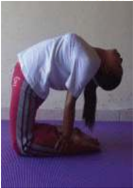

> **Deskripsi Visual:** Gambar ini adalah foto yang menunjukkan seorang individu sedang melakukan gerakan yoga. Dalam foto tersebut, orang tersebut berdiri dengan kedua tangan di lantai dan kedua kaki di atas lantai, menghadap ke bawah. Ini menunjukkan posisi awal dari gerakan yoga yang dikenal sebagai "Downward Facing Dog" atau "Adho Mukha Svanasana". 

Elemen utama dalam foto ini meliputi individu yang sedang bergerak, lantai yang berwarna biru, dan pakaian yang digunakan oleh individu. Relasi antara elemen-elemen ini adalah bahwa individu adalah subjek utama yang sedang melakukan gerakan yoga, sementara lantai dan pakaian adalah elemen-elemen lingkungan yang mendukung gerakan tersebut.

Teks, angka, atau label penting tidak terlihat dalam gambar ini karena ia hanya berupa foto. Namun, informasi kunci yang dapat diambil dari gambar ini adalah bahwa individu sedang melakukan gerakan yoga Downward Facing Dog, yang merupakan salah satu gerakan yoga dasar yang sering digunakan untuk meningkatkan keseimbangan, ketegangan otot, dan kesehatan tulang dan sendi.

Manfaat dari gerakan Yoga Utrãsana : Utrãsana bermanfaat untuk: menjaga kelenturan atau flexibility dari tulang punggung ( spine ), meningkatkan sirkulasi darah  ke  daerah  kepala,  dan  untuk  menyelaraskan  sistem  pencernaan  dan metabolisme dalam tubuh.

### 2. Nama Gerakan Yoga : Druta Halãsana

Manfaat  dari  gerakan Yoga Druta  Halãsana:  Druta  Halãsana  bermanfaat untuk meregangkan ( stretches ) dan merangsang otot-otot punggung, persendian tulang belakang ( spinal joints )  dan syaraf-syaraf tulang punggung. Asanas ini juga dapat, meningkatkan aliran darah ke leher, mengaktifkan kelenjar thyroid dan untuk tetap menjaga flexibility dari tulang punggung.

 

---
## 📄 Halaman 60

---
**🖼️ Gambar/Diagram**

> **Deskripsi Visual:** Gambar ini adalah foto yang menunjukkan seorang individu sedang melakukan gerakan yoga. Gambar ini menampilkan seorang wanita yang berdiri dengan kedua kaki di atas lantai, dengan kedua tangan berada di depan tubuhnya. Ia sedang mengangkat tubuhnya ke atas, dengan kepala berada di atas lututnya. Kaki dan tangan tersebut tampaknya berada pada posisi yang sama, menunjukkan bahwa ia sedang melakukan gerakan yang melibatkan keseimbangan dan kekuatan.

Elemen utama dalam gambar ini adalah individu yang sedang melakukan gerakan yoga. Relasi antara elemen-elemen ini adalah bahwa individu tersebut adalah subjek utama dan semua detail lainnya seperti posisi tubuh, posisi kaki, dan posisi tangan adalah bagian dari gerakan yang dilakukan oleh individu tersebut.

Teks, angka, atau label penting tidak ada dalam gambar ini karena gambar hanya menunjukkan posisi fisik individu tanpa informasi tambahan.

Informasi kunci yang dapat diambil pembaca adalah bahwa gambar ini menunjukkan seorang individu sedang melakukan gerakan yoga, yang melibatkan keseimbangan dan kekuatan.

Sumber: https://premadevi Yoga .wordpress.com (22-12-2014)

Perlu diketahui: disarankan bagi praktisi yang mempunyai masalah dengan tulang punggung dan hipertensi, untuk menghindari melakukan Asanas ini.

### 3. Nama Gerakan Yoga : Bhumi Pada Mastakãsana

Manfaat dari gerakan Yoga Bhumi Pada Mastakãsana : Gerakan Yoga Bhumi Pada Mastakãsana dapat meningkatkan aliran darah ke otak, membantu dalam masalah tekanan darah rendah dan juga mempunyai manfaat untuk menguatkan otot-otot kepala dan leher.

 

---
## 📄 Halaman 61

Perlu diketahui: disarankan bagi praktisi yang mempunyai masalah dengan tekanan darah tinggi untuk tidak melakukan Asanas ini.

### 4. Nama Gerakan Yoga : Mayurãsana

---
**🖼️ Gambar/Diagram**

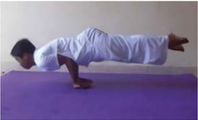

> **Deskripsi Visual:** Gambar ini adalah ilustrasi yang menunjukkan seorang individu sedang melakukan gerakan yoga. Gambar ini menggambarkan posisi tangan dan kaki yang diperlukan untuk melakukan asana yoga. Pada bagian atas, tangan berada di depan tubuh dengan jari-jari terbuka dan kaki berada di belakang dengan kaki yang terpisah. Ini menunjukkan bahwa individu sedang dalam posisi yang membutuhkan kekuatan dan keseimbangan. Ilustrasi ini mungkin digunakan sebagai panduan visual untuk membantu pembaca memahami dan melaksanakan asana yoga tersebut.

Manfaat  dari  gerakan Yoga Mayurãsana : Mayurãsana bermanfaat  untuk menguatkan lengan, menjaga fleksibilitas pergelangan tangan, menyelaraskan proses-proses metabolisme dalam tubuh.

Perlu diketahui: disarankan bagi praktisi yang mempunyai masalah dengan tulang pergelangan tangan, untuk menghindari melakukan Asanas ini.

 

---
## 📄 Halaman 62

### 5. Nama Gerakan Yoga : Hanumãsana

---
**🖼️ Gambar/Diagram**

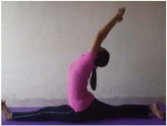

> **Deskripsi Visual:** Gambar ini adalah ilustrasi yang menunjukkan seorang individu sedang melakukan gerakan yoga. Gambar ini menggambarkan posisi tubuh yang menunjukkan gerakan yang melibatkan peregangan dan kekuatan. Elemen utama dalam gambar ini termasuk posisi tubuh yang menunjukkan gerakan yoga, seperti tangan yang ditekuk ke depan dan lutut yang ditekuk ke bawah. Relasi antara elemen-elemen ini adalah bahwa mereka saling berhubungan dalam gerakan yoga tersebut. Teks, angka, atau label penting tidak ada dalam gambar ini karena ia hanya menggambarkan posisi tubuh tanpa teks atau angka tambahan. Informasi kunci yang dapat diambil pembaca adalah bahwa gambar ini menunjukkan gerakan yoga yang melibatkan peregangan dan kekuatan tubuh.

Manfaat dari gerakan Yoga Hanumãsana : Hanumãsana bermanfaat untuk meregangkan ( stretches )  dan merangsang otot-otot punggung dan paha, menyelaraskan organ-organ reproduksi dan untuk tetap menjaga flexibility dari tulang punggung.

Perlu diketahui: disarankan bagi praktisi yang mempunyai masalah dengan tulang punggung, untuk menghindari melakukan Asanas ini.

### 6. Nama Gerakan Yoga : Pascimotanãsana

---
**🖼️ Gambar/Diagram**

> **Deskripsi Visual:** Gambar ini adalah foto yang menunjukkan seorang individu sedang melakukan pose yoga. Gambar ini menampilkan seorang wanita yang sedang berbaring dengan lutut terbuka dan tangan di depannya, menghadap ke bawah. Ia duduk di atas matras yoga yang berwarna putih. Wanita tersebut memakai pakaian olahraga yang terdiri dari kaos pink dan celana hitam dengan garis putih di pinggiran. Latar belakangnya tampak gelap, sehingga fokus pada posisi yoga yang dilakukan oleh individu tersebut. 

Elemen utama dalam gambar ini adalah individu yang sedang melakukan pose yoga. Relasi antara elemen-elemen ini adalah bahwa individu tersebut adalah subjek utama dan pose yoga yang dilakukan adalah objek utama dalam gambar ini. 

Teks, angka, atau label penting tidak terlihat dalam gambar ini karena ia hanya berupa foto.

Informasi kunci yang dapat diambil pembaca adalah bahwa gambar ini menunjukkan pose yoga yang biasanya digunakan untuk meningkatkan kesehatan dan keseimbangan tubuh. Pose ini juga dapat membantu mengurangi stres dan meningkatkan kesejahteraan mental.

 

---
## 📄 Halaman 63

Manfaat dari gerakan Yoga Pascimotanãsana : Pascimotanãsana bermanfaat: meregangkan urat lutut, pinggang dan mengendorkan tulang paha, menghilangkan kelebihan lemak pada daerah perut, menyelaraskan organ-organ panggul, menghilangkan berbagai penyakit seksual wanita, meringankan sakit limpa, ginjal, sembelit, luka usus, dan menyembuhkan sakit kencing manis serta ambeien.

### 7. Nama Gerakan Yoga : Triãsana

---
**🖼️ Gambar/Diagram**

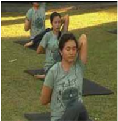

> **Deskripsi Visual:** Gambar ini adalah foto yang menunjukkan beberapa orang sedang melakukan olahraga yoga di area hijau. Gambar ini menampilkan tiga orang yang sedang berada di atas karpet yoga, dengan posisi tubuh mereka yang menunjukkan gerakan yoga. Pemandangan sekitar tampak seperti lapangan olahraga atau taman, dengan pohon-pohon yang tampak jelas di latar belakang. Teks, angka, atau label penting tidak terlihat pada gambar ini. Informasi kunci yang dapat diambil pembaca adalah bahwa gambar ini mungkin digunakan untuk tujuan edukatif atau motivasi dalam konteks olahraga dan kesehatan.

Manfaat dari gerakan Yoga Triãsana : Triãsana bermanfaat untuk pengobatan berbagai penyakit kelamin (gangguan seksual), menyelaraskan indung telur dan rahim, reproduksi wanita dan nyeri haid.

 

---
## 📄 Halaman 64

### 8. Nama Gerakan Yoga : Gomukhãsana

---
**🖼️ Gambar/Diagram**

> **Deskripsi Visual:** Gambar ini adalah foto yang menunjukkan seorang individu sedang melakukan pose yoga. Gambar ini menampilkan elemen-elemen utama seperti posisi tubuh yang menunjukkan bahwa orang tersebut sedang berada dalam posisi yoga yang membutuhkan kekuatan dan keseimbangan. Elemen-elemen lainnya termasuk lantai yang berwarna putih, karpet yoga yang berwarna biru, dan pencahayaan yang cukup untuk menunjukkan detail pada posisi tubuh. Teks, angka, atau label penting tidak terlihat dalam gambar ini. Informasi kunci yang dapat diambil pembaca adalah bahwa gambar ini mungkin digunakan sebagai contoh atau tutorial dalam buku pelajaran yoga.

Manfaat  dari  gerakan Yoga Gomukhãsana : Gomukhãsana bermanfaat untuk  menghilangkan  sakit  punggung,  bahu  dan  leher  kaku,  menyembuhkan penyakit seksual, menyehatkan ginjal, menyembuhkan pegal pinggang, rematik, menguatkan dada.

### 9. Nama Gerakan Yoga : Sarvangãsana

Manfaat dari gerakan Yoga Sarvangãsana : Sarvangãsana bermanfaat untuk memulihkan keseimbangan peredaran darah/pembersihan darah, memperbaiki sistem  pencernaan  (gangguan  usus  &  perut),  kesehatan  reproduksi,  jaringan saraf dan kelenjar, mencegah dan mengobati keputihan, mencegah kembung dan menghilangkan kelebihan lemak,

 

---
## 📄 Halaman 65

---
**🖼️ Gambar/Diagram**

> **Deskripsi Visual:** Gambar ini adalah foto yang menunjukkan seorang individu sedang melakukan pose yoga. Gambar ini menampilkan elemen-elemen utama seperti posisi tubuh yang menunjukkan bahwa orang tersebut sedang berbaring dengan kedua lutut berada di depan dan kaki di belakang. Kaki dilipat ke arah dada, dan tangan di bawah kepala. Ini menunjukkan pose yoga yang umum dikenal sebagai "Savasana" atau "Posisi Tidur". 

Elemen-elemen lainnya termasuk lantai yang terlihat bersih dan putih, yang menunjukkan bahwa pose ini dilakukan di lantai. Warna dan pencahayaan tampak natural, mungkin dari sumber cahaya alami seperti jendela.

Teks, angka, atau label tidak ada pada gambar ini, sehingga informasi kunci yang dapat diambil pembaca hanya melalui visual saja. Gambar ini menunjukkan posisi yoga yang umum digunakan untuk memperbaiki kesehatan dan kesejahteraan mental.

Menguatkan  jantung  yang  lemah,  menguatkan  tenaga  piker,  menjaga elastisitas  tulang  punggung/mencegah  pengapuran,  menyembuhkan  rematik otot, sengal pinggang dan sakit kepala, merawat otot dubur dan paha.

Perlu diketahui: disarankan bagi praktisi yang mempunyai masalah dengan wanita haid dilarang melatih/berlatih Asanas ini.

Gambar gerakan Yoga di atas hanyalah sebagian kecil dari gerakan-gerakan Yoga yang terdapat dalam ajaran agama Hindu. Gerakan yang lainnya diharapkan dapat  dipraktikkan  dengan  baik  dan  sungguh-sungguh  oleh  peserta  didik dalam proses pembelajaran di setiap sekolah (SMA/SMK). Dengan demikian kesejahteraan dan kebahagiaan pendidik dan peserta didik pada khususnya serta umat sedharma pada umumnya dalam kehidupan ini dapat terwujud. Bagaimana kita dapat memaknai bahwa memperaktikkan ajaran Yogãsana dalam kehidupan ini adalah sebuah Yajña guna mewujudkan kesejahteraan dan kebahagiaan hidup dalam kehidupan ini? Sebelumnya selesaikanlah uji kompetensi berikut dengan baik!

 

---
## 📄 Halaman 66

### Uji Kompetensi:

- Coba sebutkan dan jelaskan sikap-sikap dalam pelaksanaan Yoga !
- Setelah mengetahui sikap-sikap dalam Yoga ,  coba  praktikkan  sikapsikap Yoga tersebut!
- Bagaimana pengaruh praktik Yoga dalam kehidupan sehari-hari Kamu? Narasikanlah!
- Buatlah rangkuman untuk masing-masing pokok bahasan berdasarkan sumber teks yang terdapat pada Bab I ( Yoga Menurut Susastra Agama Hindu) materi pembelajaran ini, sesuai petunjuk khusus dari Bapak/ Ibu guru yang mengajar!
- Amatilah gambar berikut ini, deskripsilah! Sebelumnya diskusikanlah dengan orang tua Kamu di rumah.

---
**🖼️ Gambar/Diagram**

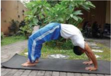

> **Deskripsi Visual:** Gambar ini adalah foto yang menunjukkan seorang individu sedang melakukan pose yoga yang dikenal sebagai "Downward Facing Dog" (Adho Mukha Svanasana). Pose ini dilakukan dengan berdiri di atas kaki, tangan di bawah lengan, dan tubuh membentuk segitiga. Lengan dan kaki terdorong ke arah depan, sementara punggung dan leher menghadap ke bawah. Baju pelatih yang digunakan oleh individu tampak jelas, dengan warna biru dan hitam. Latar belakang menunjukkan area hijau yang tampak seperti taman atau halaman rumah, dengan beberapa pohon dan bangunan kecil. Gambar ini menunjukkan posisi tubuh yang baik untuk melatih otot dan meningkatkan keseimbangan serta daya tahan tubuh.

 

---
## 📄 Halaman 67

'Sahayajñ ā h praj ā h s ṛṣ tv ā puro 'v ā sa praj ā patiá, anena prasavisyadhvam e ṣ a vo 'i ṣ takhamadhuk'

### terjemahannya:

Pada jaman dahulu kala Prajapati (Tuhan Yang Maha Esa) menciptakan manusia dengan Yajna dan bersabda : dengan ini  engkau  akan  mengembang  dan  akan menjadi  kamadhuk dari  keinginanmu. (BG, III.10).

Setiap tindakan tanpa dilandasi keyakinan  yang  mantap  tentu  menjadi  siasia,  demikian  pula  keyakinan  kita  kepada

---
**🖼️ Gambar/Diagram**

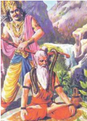

> **Deskripsi Visual:** Gambar ini adalah ilustrasi yang menampilkan dua tokoh utama dari mitologi Hindu. Tokoh pertama adalah Rama, yang dikenal sebagai putra Dewi Sita dan salah satu dewa dalam kepercayaan Hindu. Ia diperlihatkan dengan rambut panjang, pakaian tradisional, dan senjata miliknya, seperti senjata api. Tokoh kedua adalah Hanuman, seekor monyet besar yang memiliki kemampuan super dan merupakan sahabat Rama dalam perjalanan ke Ceylon untuk mencari Sita.

Rama sedang berdiri di sebelah kanan, tampaknya sedang berbicara atau bergerak menuju ke arah kanan gambar. Hanuman berdiri di sebelah kiri, tampaknya sedang berdiri diam atau berbicara kepada Rama. Kedua tokoh tersebut terlihat sangat besar dibandingkan dengan latar belakang, yang menunjukkan bahwa mereka adalah subjek utama gambar ini.

Teks, angka, atau label penting tidak terlihat pada gambar ini. Namun, informasi kunci yang dapat diambil pembaca adalah hubungan antara Rama dan Hanuman, yang menunjukkan bahwa mereka adalah sahabat atau teman dalam cerita mitologi Hindu. Gambar ini mungkin digunakan untuk menggambarkan perjalanan Rama ke Ceylon atau untuk menggambarkan hubungan antara Rama dan Hanuman dalam cerita tersebut.

 

---
## 📄 Halaman 68

Tuhan Yang Maha Esa. Sraddha apnoti brahma apnoti , mereka yang memiliki iman yang mantap dapat mencapai dan bersatu dengan Tuhan Yang Maha Esa, demikian pula dalam melaksanakan Yajna , mutlak dilandasi Sraddha (keimanan atau keyakinan) yang mantap.

Mengapa kita harus beryajña?

### A.  Pengertian dan Hakikat Yajña

### Perenungan:

'Oja ṡ ce me, saha ṡ ca me, ā tm ā ca me, tan ūṡ ca me, ṡ arma ca me, varma came, yajñena kalpant ā m.

### Terjemahannya:

'Dengan sarana persembahan ( Yajña ), semoga kami memperoleh sifat-sifat yang berikut ini: kemuliaan, kejayaan, kekuatan rohaniah, kekuatan jasmaniah, kesejahteraan dan perlindungan' (Yajurveda XVIII.3).

### Memahami Teks:

Kata Yajña berasal  dari  bahasa  Sansekerta,  dari  akar  kata  ' Yuj '  berarti memuja,  mempersembahkan,  korban.  Dalam  kamus  bahasa  Sansekerta,  kata

 

---
## 📄 Halaman 69

Yajña diartikan : upacara korban, korban, orang yang berkorban yang berhubungan dengan korban ( Yajña ).  Dalam Kitab Bhagawadgita dijelasakan, Yajña artinya suatu perbuatan yang dilakukan dengan penuh keikhlasan dan kesadaran untuk melaksanakan persembahan kepada Tuhan. Yajña berarti upacara persembahan korban suci. Pemujaan yang dilaksanakan dengan mempergunakan korban suci sudah  barang  tentu  memerlukan  dukungan  sikap  dan  mental  yang  suci  juga. Sarana  yang  diperlukan  sebagai  perlengkapan  sebuah Yajña disebut  dengan istilah Upakara . Upakara yang tertata dalam bentuk tertentu yang difungsikan sebagai  sarana  memuja  keagungan  Tuhan  disebut  sesajen. Upakara dapat diartikan memberikan pelayanan yang ramah tamah atau kebaikan hati. Dengan demikian  sudah  semestinya  setiap  upakara  yang  dipersembahkan  hendaknya dilandasi  dengan  kemantapan,  ketulusan  dan  kesucian  hati,  yang  diwujudkan dengan sikap dan prilaku ramah tamah bersumber dari hati yang hening dan suci.

Tatacara  atau  rangkaian  pelaksanaan  suatu Yajña disebut  Upacara.  Kata upacara dalam kamus  Sansekerta diartikan: mendekati, kelakuan, sikap, pelaksanaan,  kecukupan,  pelayanan  sopan  santun,  perhatian,  penghormatan, hiasan,  upacara,  pengobatan.  Kegiatan  upacara  dapat  memberikan  ciri-ciri tersendiri  bagi  agama-agama  tertentu  dan  sekaligus  membedakannya  dengan agama-agama  yang  lainnya.  Setiap  agama  memiliki  tatanan  tersendiri  dalam melaksanakan upacaranya. Di dalam pelaksanaan upacara diharapkan terjadinya suatu upaya untuk mendekatan diri kehadapan Sang Hyang Widhi Wasa beserta prabhawanya, kepada alam lingkungannya, para Pitara, para Rsi atau Maha Rsi dan  manusia  sebagai  sesamanya.  Wujud  dari  pendekatan  itu  dapat  dilakukan dengan  berbagai  bentuk  persembahan  maupun  tata  pelaksanaan  sebagaimana

 

---
## 📄 Halaman 70

yang  ditentukan  dalam  berbagai  sastra  yang  memuat  ajaran  agama  Hindu. Kesucian itu adalah sifat dari Tuhan Yang Maha Esa. Siapapun orangnya bila berkeinginan mendekatkan diri dan berdoa kehadapan Tuhan Yang Maha Suci, hendaknya menyucikan diri secara lahiriah dan batiniah.

Secara  alamiah  dunia  beserta  isinya  harus  bergerak  harmonis,  selaras, seimbang, dan saling mendukung. Agama Hindu mengajarkan umatnya selalu hidup harmonis, seimbang, selaras, dan saling mendukung. Tidak dibenarkan sama sekali oleh ajaran suci Veda hanya meminta saja dari alam, memberikan kepada alam juga menjadi sebuah kewajiban dalam rangka menjaga keseimbangan alam. Katakanlah dengan bunga, kata orang bijak yang masih relevan dilakukan sepanjang  zaman.  Ketika  memberi,  tak  boleh  mengharapkan  pengembalian, itu  merupakan  ajaran  Veda  tentang  ketulus-ikhlasan.  Saling  memberi  adalah satu-satunya  cara  untuk  menjaga  keteraturan  sosial.  Jangan  heran  apabila  di masyarakat  dalam  setiap  ada  upacara  keagamaan  selalu  saling  memberikan makanan.

Alam semesta ini diciptakan oleh Brahman dengan kekuatan-Nya sebagai Dewa  Brahma.  Isi  alam  yang  kita  nikmati  untuk  kesehatan  lahir  dan  batin. Makanan  yang  disediakan  oleh  alam  harus  disyukuri  dan  dinikmati  secara seimbang.  Kitab  suci  Veda  mengajarkan  umat  Hindu  dalam  menyampaikan rasa syukur dengan memakai isi alam, yaitu bunga, daun, cahaya, air, dan buah. Isi  alam  ini  dikemas,  ditata  dalam  aturan  tertentu  sehingga  menjadi  sesajen persembahan  (banten).  Sesajen  inilah  dipakai  sebagai  media  persembahan kepada Brahman.

 

---
## 📄 Halaman 71

Sesajen  atau  banten  bukan  makanan  para  dewa  atau  Tuhan,  melainkan sarana  umat  dalam  menyampaikan  dan  mewujudkan  rasa  bakti  dan  syukur kepada Brahman, Sang Hyang Widhi . Di dalam ajaran suci Veda, Santi Parwa atau Bhagavadgita disebutkan, mereka yang makan sebelum memberikan Yajña , maka orang itu pantas disebut pencuri. Ajaran Veda ini mengajarkan tentang etika sopan santun, mengingat semua yang ada di dunia ini berasal dari Sang Hyang Widhi , maka tentu sangat sopan apabila sebelum makan diwajibkan mengadakan penghormatan  dengan  persembahan  kepada  pemilik  makanan  sesungguhnya, yaitu Sang Hyang Widhi . Dengan demikian, Yajña itu adalah korban suci yang tulus ikhlas untuk menjaga keseimbangan alam dan keteraturan sosial.

Yajña berarti  persembahan,  pemujaan,  penghormatan,  dan  korban  suci. Yajña adalah korban suci yang tulus iklhas tanpa pamrih. Berdasarkan sasaran yang akan diberikan Yajña , maka korban suci ini dibedakan menjadi lima jenis, yaitu:

### a. Dewa Yajña

Yajña jenis ini adalah persembahan suci  yang  dihaturkan  kepada Sang  Hyang Widhi dengan segala manisfestasi-Nya. Contoh Dewa Yajña dalam  kesehariannya, melaksanakan  puja  Tri  Sandya,  sedangkan contoh Dewa Yajña pada  hari-hari  tertentu adalah  melaksanakan  piodalan/puja  wali  di pura dan lain sebagainya.

 

---
## 📄 Halaman 72

'k ā òksanta karma ṇāṁ siddhi ṁ yajanta iha devat ā á, k ṣ ipra ṁ hi m ā nu ṣ e loke siddhir bhavati karma-j ā '

### Terjemahannya:

Mereka yang menginginkan keberhasilan yang timbul dari karma, ber Yajña di dunia untuk para deva, karena keberhasilan manusia segera terjadi dari karma, yang lahir dari pengorbanan (BG. IV.12).

### b. Rsi Yajña

Rsi Yajña adalah korban suci yang tulus ikhlas kepada para Rsi . Mengapa Yajña ini  dilaksanakan,  karena  para Rsi sudah  berjasa  menuntun  masyarakat dan  melakukan  puja surya  sewana setiap  hari.  Para Rsi telah  mendoakan keselamatan dunia alam semesta beserta isinya. Bukan itu saja, ajaran suci Veda juga pada mulanya disampaikan oleh para Rsi .  Para Rsi dalam hal ini adalah orang  yang  disucikan  oleh  masyarakat.  Ada  yang  sudah  melakukan  upacara dwijati disebut Pandita ,  dan  ada  yang  melaksanakan  upacara ekajati disebut Pinandita atau Pemangku. Umat Hindu memberikan Yajña terutama pada saat mengundang orang  suci  yang  dimaksud  untuk  menghantarkan  upacara Yajña yang dilaksanakan.

 

---
## 📄 Halaman 73

### c. Pitra Yajña

Korban suci jenis ini adalah bentuk rasa hormat dan terima kasih kepada para Pitara atau leluhur karena telah berjasa ketika masih hidup melindungi kita. Kewajiban setiap orang yang telah dibesarkan oleh leluhur untuk memberikan persembahan yang terbaik secara tulus ikhlas. Ini sangat sesuai dengan ajaran suci  Veda  agar  umat  Hindu  selalu  saling  memberi  demi  menjaga  keteraturan sosial.

### d. Manusa Yajña

Manusa Yajña adalah pengorbanan untuk manusia, terutama bagi mereka yang memerlukan bantuan. Umpamanya ada musibah  banjir  dan  tanah  longsor.  Banyak pengungsi  yang  hidup  menderita.  Dalam situasi begini, umat Hindu diwajibkan untuk melakukan Manusa Yajña dengan cara memberikan  sumbangan  makanan,  pakaian layak pakai, dan sebagainya. Bila perlu terlibat langsung untuk menjadi relawan yang membantu secara sukarela.

Dengan demikian, memahami Manusa Yajña tidak hanya sebatas melakukan serentetan prosesi keagamaan, melainkan juga donor darah dan membantu orang miskin juga Manusa Yajña .

 

---
## 📄 Halaman 74

'yeyath ā m āṁ prapadyante t āṁ s tathaiva bhaj ā my aham, Mamavartm ā nuvartante manusyaá partha sarva ṡ aá'.

### Terjemahannya:

Bagaimanapun  (jalan)  manusia  mendekati-Ku,  Aku  terima  wahai  Arjuna. Manusia mengikuti jalan-Ku pada segala jalan (BG.IV.11).

Namun, Manusa Yajña dalam bentuk ritual keagamaan juga penting untuk dilaksanakan.  Karena  sekecil  apapun  sebuah Yajña dilakukan,  dampaknya sangat luas dan mempengaruhi berbagai aspek kehidupan. Umpamanya, kalau kita  melaksanakan  upacara  potong  gigi,  maka  semuanya  ikut  terlibat  dan kena dampak. Untuk upacara Manusa Yajña ,  Agama Hindu mengajarkan agar dilakukan  dari  sejak  dalam  kandungan  seorang  ibu.  Ada  beberapa  perbuatan yang diajarkan oleh Veda sebagai bentuk pelaksanaan dari ajaran Manusa Yajña , antara lain:

- membantu orang tua, wanita atau anak-anak yang menyeberang jalan dalam kondisi lalu lintas sedang ramai;
- menjenguk dan memberikan bantuan teman yang sakit;
- melakukan bakti sosial, donor darah, dan pengobatan gratis;
- memberikan tempat duduk kita kepada orang tua, wanita atau anakanak ketika berada di dalam kendaraan umum;
- memberikan sumbangan beras kepada orang yang tak mampu;
- membantu memberikan petunjuk jalan kepada orang yang tersesat;
- membantu fakir miskin yang sangat membutuhkan pertolongan;

 

---
## 📄 Halaman 75

- membantu teman atau siapa saja yang sedang terkena musibah bencana alam, kerusuhan atau kecelakaan lalu lintas; dan
- memberikan jalan terlebih dahulu kepada mobil ambulan yang sedang membawa orang sakit.
Semua perilaku  ini  wajib  dilatih,  dibiasakan,  dan  dikembangkan  sebagai bentuk  pelaksanaan Manusa Yajña .  Dalam  konteks  ini, Manusa Yajña tidak berarti hanya melakukan upacara saja, tetapi juga termasuk membantu orang.

### e. Bhuta Yajña

Upacara Bhuta Yajña adalah korban suci untuk para bhuta, yaitu roh yang tidak nampak oleh mata tetapi ada di sekitar kita. Para bhuta ini cenderung menjadi kekuatan yang  tidak  baik,  suka  mengganggu  orang. Contoh upacara bhuta Yajña adalah masegeh, macaru, tawur agung, panca wali krama.

Tujuan bhuta Yajña adalah menetralisir kekuatan bhuta kala yang kurang baik menjadi kekuatan bhuta hita yang baik dan

mendukung  kehidupan  umat  manusia.  Di  antara  sekian  banyak  bagian  kitab suci  Veda,  kitab-kitab  apa  sajakah  sebagai  sumber  pelaksanaan Yajña guna mewujudkan  kesejahteraan  dan  kebahagiaan  hidup  dalam  kehidupan  ini? Sebelumnya kerjakanlah soal-soal uji kompetensi berikut dengan baik!

 

---
## 📄 Halaman 76

### Uji Kompetensi:

- Apakah yang dimaksud dengan Yajña dan jelaskanlah salah satu contoh Yajña yang sudah anda lakukan dalam kehidupan sehari- hari!
- Sebutkan bagian-bagian dari Panca Yajña dan berikan masing-masing satu contohnya!
- Coba jelaskan apa yang dimaksud dengan Upakara dan Upacara dalam Yajña ? Sebelumnya diskusikanlah dengan orang tua Kamu di rumah.

 

---
## 📄 Halaman 77

### B. Yajña dalam Mahabharata dan Masa Kini

### Perenungan:

'Svar yanto n ā pek ṣ anta, ā dya ṁ rohanti rodasi. yajñam ye vi vatodharam, savidvamso vitenire.

### Terjemahannya:

'Para  sarjana  yang  terkenal  yang  melaksanakan  pengorbanan,  mencapai kahyangan (sorga) tanpa suatu bantuan apapun. Mereka membuat jalan masuk mereka  dengan  mudah  ke  kahyangan  (sorga),  yang  menyeberangi  bumi  dan wilayah-pertengahan' (Yajurveda XXIII.62)

### Memahami Teks:

### Sarpayajña

Pada zaman Mahabharata dikisahkan Panca Pandawa melaksanakan Yajña Sarpa yang sangat besar dan dihadiri oleh seluruh rakyat dan undangan dari rajaraja terhormat dari negeri tetangga. Bukan itu saja, undangan juga datang dari para pertapa suci yang berasal dari hutan atau gunung. Tidak dapat dilukiskan betapa meriahnya  pelaksanaan upacara besar yang mengambil  tingkatan utamaning utama.

 

---
## 📄 Halaman 78

Menjelang  puncak  pelaksanaan Yajña ,  datanglah  seorang  Brahmana  suci dari  hutan  ikut  memberikan  doa-restu  dan  menjadi  saksi  atas  pelaksanaan upacara yang besar itu. Seperti biasanya, setiap tamu yang hadir dihidangkan

---
**🖼️ Gambar/Diagram**

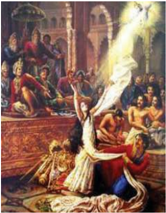

> **Deskripsi Visual:** Gambar ini adalah ilustrasi yang menunjukkan sebuah peristiwa sejarah yang tampaknya berada pada masa keemasan Islam. Gambar ini menggambarkan sekelompok orang tua berdiri di sekeliling sebuah meja besar, mungkin di sebuah masjid atau ruangan publik lainnya. Di tengah-tengah mereka, ada seorang pria yang sedang berjalan dengan tangan yang terluka, mungkin karena luka atau cedera. Pria tersebut memegang sebuah alat yang tampaknya merupakan senjata, mungkin pedang atau senjata api, yang diletakkan di atas meja. Di sebelah kanan, ada seorang pria yang sedang berdiri dengan posisi yang tegar, tampaknya mengepalai atau mengawasi situasi. Di sebelah kiri, ada beberapa orang yang tampaknya sedang berbicara atau berinteraksi dengan pria yang sedang berjalan. Seluruh gambar ini menunjukkan suasana yang serius dan mendalam, mungkin menunjukkan momen penting dalam sejarah atau peristiwa yang signifikan.

berbagai  macam  makanan  yang  lezat-lezat dalam  jumlah  yang  tidak  terhingga.  Begitu juga Brahmana Utama ini diberikan suguhan makanan  yang  enak-enak.  Setelah  melalui perjalanan yang sangat jauh dari gunung ke ibu  kota  Hastinapura,  Brahmana  Utama  ini sangat  lapar  dan  pakaiannya  mulai  terlihat kotor. Begitu dihidangkan makanan oleh para dayang  kerajaan,  Sang  Brahmana  Utama langsung melahap hidangan tersebut dengan cepat  bagaikan  orang yang  tidak pernah menemukan makanan. Bersamaan dengan itu

melintaslah  Dewi  Drupadi  yang  tidak  lain  adalah  penyelenggara Yajña besar tersebut. Begitu melihat cara sang Brahmana Utama menyantap makanan secara tergesa-gesa,  berkomentarlah  Drupadi  sambil  mencela.  'Kasihan  Brahmana Utama itu, seperti tidak pernah melihat makanan, cara makannya tergesa-gesa,' kata  Drupadi  dengan  nada  mengejek.  Walaupun  jarak  antara  Dewi  Drupadi mencela Sang Brahmana Utama cukup jauh, karena kesaktian dari Brahmana ini, maka  apa  yang  diucapkan  oleh  Drupadi  didengarkannya  secara  jelas.  Sang Brahmana  Utama  diam,  tetapi  batinnya  kecewa.  Drupadi  pun  melupakan peristiwa tersebut.

 

---
## 📄 Halaman 79

Di  dalam  ajaran  agama  Hindu,  diajarkan  bahwa  apabila  kita  melakukan tindakan  mencela,  maka  pahalanya  akan  dicela  dan  dihinakan.  Terlebih  lagi apabila mencela seorang Brahmana Utama, pahalanya bisa bertumpuk-tumpuk. Dalam  kisah  berikutnya,  Dewi  Drupadi  mendapatkan  penghinaan  yang  luar biasa dari saudara iparnya yang tidak lain adalah Duryadana dan adik-adiknya. Di  hadapan  Maha  Raja  Drestarata,  Rsi  Bisma,  Begawan  Drona,  Kripacarya, dan Perdana Menteri Widura serta disaksikan oleh para menteri lainnya, Dewi Drupadi dirobek pakaiannya oleh Dursasana atas perintah Pangeran Duryadana. Perbuatan biadab merendahkan kehormatan wanita dengan melepaskan pakaian di  depan  umum,  berdampak  pada  kehancuran  bagi  negerinya  para  penghina. Terjadinya penghinaan terhadap Drupadi adalah pahala dari perbuatannya yang mencela Brahmana Utama ketika menikmati hidangan.

Dewi Drupadi tidak bisa ditelanjangi oleh Dursasana, karena dibantu oleh Krisna  dengan  memberikan  kain  secara  ajaib  yang  tidak  bisa  habis  sampai adiknya  Duryodana  kelelahan  lalu  jatuh  pingsan.  Krisna  membantu  Drupadi karena  Drupadi  pernah  berkarma  baik  dengan  cara  membalut  jarinya  Krisna yang terkena Panah Cakra setelah membunuh Supala. Pesan moral dari cerita ini adalah, kalau melaksanakan Yajña harus tulus ikhlas, tidak boleh mencela dan tidak  boleh  ragu-ragu.  Ketentuan  apakah  yang  patut  dipenuhi  oleh  seseorang untuk dapat melaksanakan yajña guna mewujudkan kesejahteraan dan kebahagiaan hidup dalam kehidupan ini? Sebelumnya kerjakanlah soal-soal uji kompetensi berikut dengan baik!

 

---
## 📄 Halaman 80

### Uji Kompetensi:

- Makna  apa  yang  dapat  dipetik  dari  pelaksanaan Yajña dalam cerita Mahabarata?
- Coba ceritakan kembali sekilas tentang pelaksanaan Yajña dalam cerita Mahabharata!
- Rangkumlah cerita tersebut di atas dan berikanlah komentar-mu bagaimana mempersembahkan yajña agar berhasil! Sebelumnya diskusikanlah dengan orang tua Anda di rumah.

 

---
## 📄 Halaman 81

### C.  Syarat-syarat dan Aturan dalam Pelaksanaan Yajña

### Perenungan:

Soma r ā randhi no h ṛ dhi g ā vo na yavase ṣ v ā , marya iva sva okye.

### Terjemahannya:

Tuhan  Yang  Maha  Pengasih,  semoga  Engkau  berkenan  bersthana  pada hati nurani kami (tubuh kami sebagai pura), seperti halnya anak-anak sapi yang merumput di padang subur, seperti pula seorang gadis di rumahnya sendiri' (Rg Veda I. 91. 13).

### Memahami Teks:

Melaksanakan Yajña bagi  umat  Hindu  adalah  wajib  hukumnya.  Segala sesuatu  yang  dilaksanakannya  tanpa  dilAndasi  oleh Yajña adalah  sia-sia. Bagaimana agar semua yang kita laksanakan ini dapat bermanfaat dan bekualitas, kitab Bhagawadgita menyebutkan sebagai berikut:

Aphalàkàòk ṣ ibhir yajòo vidhi-d ṛṣ þo ya ijyate, ya ṣ þavyam eveti manaá samàdhàya sa sàttvikaá

 

---
## 📄 Halaman 82

### Terjemahannya:

Yajña menurut petunjuk kitab-kitab suci, yang dilakukan oleh orang tanpa mengharap  pahala  dan  percaya  sepenuhnya  bahwa  upacara  ini  sebagai  tugas kewajiban, adalah sattvika (BG. XVII.11).

Abhisandh ā ya tu phala ṁ danbh ā rtham api çaiva yat, ijyate bharataṡ restha ta ṁ viddhi r ā jasam.

### Terjemahannya:

Tetapi  persembahan  yang  dilakukan  dengan  mengharap  balasan,  dan semata-mata  untuk  kemegahan  belaka,  ketahuilah,  wahai  Arjuna, Yajña itu adalah bersifat rajas (BG. XVII.12).

Vidhi-hinam as t nna mantra-hìnam adak i am, raddh -virahita yajña t masa paricak ate.

ṛṣ

ā

ṡ

ā

ṁ

### Terjemahannya:

Dikatakan  bahwa, Yajña yang  dilakukan  tanpa  aturan  (bertentangan), di  mana  makanan  tidak  dihidangkan,  tanpa  mantra  dan  sedekah  serta  tanpa keyakinan dinamakan tamas (BG. XVII.13).

Agar pelaksanaan Yajña lebih efisien, maka syarat pelaksanaan Yajña perlu mendapat perhatian, yaitu:

ṁ

ṁ

ā

ṁ

ṣ

ṣ

ṇ

 

---
## 📄 Halaman 83

- Sastra , Yajña harus berdasarkan Veda:
- Sraddha , Yajña harus dengan keyakinan:
- Lascarya , keikhlasan menjadi dasar utama Yajña :
- Daksina , memberikan dana kepada pandita:
- Mantra , puja, dan gita, wajib ada pandita atau pinandita:
- Nasmuta atau tidak untuk pamer, jangan sampai melaksanakan Yajña hanya untuk menunjukkan kesuksesan dan kekayaan: dan
- Anna Sevanam, yaitu memberikan pelayanan kepada masyarakat dengan cara mengundang untuk makan bersama.
Menurut Bhagavadaita XVII. 11, 12, dan 13 menyebutkan ada tiga kualitas Yajña itu, yakni:

### a. Satwika Yajña :

Satwika Yajña adalah kebalikan dari Tamasika Yajña dan Rajasana Yajña bila didasarkan penjelasan Bhagawara Gita tersebut di atas. Satwika Yajña adalah Yajña yang dilaksanakan sudah memenuhi syarat-syarat yang telah ditentukan. Syarat-syarat yang dimaksud, antara lain:

- Yajña harus  berdasarkan  sastra.  Tidak  boleh  melaksanakan Yajña sembarangan, apalagi di dasarkan pada keinginan diri sendiri karena mempunyai uang banyak. Yajña harus melalui perhitungan hari baik dan buruk, Yajña harus berdasarkan sastra dan tradisi yang hidup dan berkembang di masyarakat.

 

---
## 📄 Halaman 84

- Yajña harus didasarkan keikhlasan. Jangan sampai melaksanakan Yajña ragu-ragu.  Berusaha  berhemat  pun  dilarang  di  dalam  melaksanakan
Yajña .  Hal  ini  mengingat  arti Yajña itu  adalah pengorbanan suci yang tulus ikhlas. Sang Yajamana atau penyelenggara Yajña tidak  boleh kikir  dan  mengambil  keuntungan  dari  kegiatan Yajña . Apabila dilakukan, maka kualitasnya bukan lagi sattwika namanya.

- Yajña harus menghadirkan Sulinggih yang disesuaikan dengan besar kecilnya Yajña .  Kalau Yajña nya  besar,  maka  sebaiknya  menghadirkan seorang  Sulinggih  Dwijati  atau  Pandita.  Tetapi
kalau Yajña nya  kecil,  cukup  dipuput  oleh  seorang  Pemangku  atau Pinandita saja.

- Dalam  setiap  upacara Yajña ,  Sang  Yajamana  harus  mengeluarkan daksina. Daksina adalah dana uang kepada Sulinggih atau Pinandita yang muput Yajña . Jangan sampai tidak melakukan itu, karena daksina adalah bentuk dari Rsi Yajña dalam Panca Yajña .
- Yajña juga sebaiknya menghadirkan suara genta, gong atau mungkin Dharmagita.  Hal  ini  juga  disesuaikan  dengan  besar  kecilnya Yajña . Apabila biaya untuk melaksanakan Yajña tidak besar, maka suara gong atau Dharmagita boleh ditiadakan.

 

---
## 📄 Halaman 85

### b. Rajasika Yajña :

Yajña yang dilakukan dengan penuh harapan akan hasilnya dan dilakukan untuk pamer saja. Rajasika Yajña adalah kualitas Yajña yang relatif lebih rendah. Walaupun  semua  persyaratan  dalam  sattwika Yajña sudah  terpenuhi,  namun apabila  Sang  Yajamana  atau  yang  menyelenggarakan Yajña ada  niat  untuk memperlihatkan  kekayaan  dan  kesuksesannya,  maka  nilai Yajña itu  menjadi rendah.

Dalam Siwa Purana dijelaskan bahwa seorang Dewa Kuwera, Dewa Siwa untuk  menghadiri  dan  memberkahi Yajña yang  akan  dilaksanakannya.  Dewa Siwa  mengetahui  bahwa  tujuan  utama  mengundang-Nya  hanyalah  untuk memamerkan jumlah kekayaan, kesetiaan rakyat, dan kekuasaannya.

Mengerti akan niat tersebut, raja pun mengundang Dewa Siwa, maka pada hari  yang  telah  ditentukan,  Dewa  Siwa  tidak  mau  datang,  tetapi  mengirim putranya yang bernama Dewa Gana untuk mewakili-Nya menghadiri undangan Raja itu. Dengan diiringi banyak prajurit, berangkatlah Dewa Gana ke tempat upacara.  Upacaranya  sangat  mewah,  semua  raja  tetangga  diundang,  seluruh rakyat ikut memberikan dukungan.

Dewa  Gana  diajak  berkeliling  istana  oleh  raja  sambil  menunjukkan kekayaannya berupa emas, perak, dan berlian yang jumlahnya bergudang-gudang. Dengan bangga, raja menyampaikan jumlah emas dan berliannya. Sementara rakyat dari kerajaan ini masih hidup miskin karena kurang diperhatikan oleh raja dan pajaknya selalu dipungut oleh Raja.

Mengetahui hal tersebut, Dewa Gana ingin memberikan pelajaran kepada Sang Raja. Ketika sampai pada acara menikmati suguhan makanan dan minuman,

 

---
## 📄 Halaman 86

maka Dewa Gana menghabiskan seluruh makanan yang ada. Bukan itu saja, seluruh perabotan berupa piring emas dan lain sebagainya semua dihabiskan oleh Dewa Gana. Raja menjadi sangat bingung sementara Dewa Gana terus meminta makan. Apabila tidak diberikan, Dewa Gana mengancam akan memakan semua kekayaan dari Sang Raja. Khawatir kekayaannya habis dimakan Dawa Gana, lalu Raja ini kembali menghadap Dewa Siwa dan mohon ampun. Lalu diberikan petunjuk  dan  nasihat  agar  tidak  sombong  karena  kekayaan  dan  membagikan seluruh  kekayaan  itu  kepada  seluruh  rakyat  secara  adil.  Kalau  menyanggupi, barulah  Dewa  Gana  menghentikan  aksinya  minta  makan  terus  kepada  Raja. Dengan  terpaksa  Raja  yang  sombong  ini  menuruti  nasihat  Dewa  Siwa  yang menyebabkan kembali baiknya Dewa Gana. Pesan moral yang disampaikan cerita ini adalah, janganlah melaksanakan Yajña berdasarkan niat untuk memamerkan kekayaan. Selain membuat para undangan kurang nyaman, juga nilai kualitas Yajña tersebut menjadi lebih rendah.

### c.   Tamasika Yajña:

Yajña yang  dilakukan  tanpa  mengindahkan  petunjuk-petunjuk  sastranya, tanpa  mantra,  tanpa  ada  kidung  suci,  tanpa  ada  daksina,  tanpa  didasari  oleh kepercayaan. Tamasika Yajña adalah Yajña yang dilaksanakan dengan motivasi agar mendapatkan untung.

Kegiatan semacam ini sering dilakukan sehingga dibuat Panitia Yajña dan diajukan proposal untuk melaksanakan upacara Yajña dengan biaya yang sangat tinggi. Akhirnya Yajña jadi berantakan karena Panitia banyak mencari untung.

 

---
## 📄 Halaman 87

Bahkan  setelah Yajña dilaksanakan,  masyarakat  mempunyai  hutang  di sana-sini. Yajña semacam ini sebaiknya jangan dilakukan karena sangat tidak mendidik.  Bagaimana  pelaksanaan Yajña menurut  Kitab  Mahabharata  dalam usaha mewujudkan kesejahteraan dan kebahagiaan hidup dalam kehidupan ini? Sebelumnya kerjakanlah soal-soal uji kompetensi berikut dengan baik!

### Uji Kompetensi:

- Sebutkan  dan  jelaskan  syarat-syarat  yang  wajib  dipedomani  dalam melaksanakan Yajña !  Sebelumnya  diskusikanlah  dengan  orang  tua Anda di rumah.
- Sebutkan tiga kualitas Yajña yang Anda ketahui!
- Diantara kualitas yajna yang ada yang manakah sudah dilaksanakan oleh masyarakat lingkungan sekitar Anda? Jelaskanlah!
- Amatilah lingkungan sekitar Anda, kualitas yajna yang manakah yang paling  sering  dilaksanakan?  Diskusikanlah  dengan  orag  tua  Anda, kemudian buatlah laporannya masing-masing!

 

---
## 📄 Halaman 88

### D.  Mempraktikan Yajña Menurut Kitab Mahabharata dalam Kehidupan

### Perenungan:

Ya indra sasty-avrato anu ṣ v ā pam-adevayuá, svaiá sa evair mumurat po ṣ yam rayi ṁ sanutar dhei ta ṁ tataá.

### Terjemahannya:

Tuhan Yang Maha Yang Maha Esa, orang yang tidak beriman kepada Tuhan Yang Maha Esa adalah lamban dan mengantuk, mati oleh perbuatannya sendiri. Berikanlah semua kekayaan yang dikumpulkan oleh orang semacam itu, kepada orang lain' (Rg Veda VIII. 97. 3).

### Memahami Teks:

Beryajña bagi umat Hindu adalah wajib hukumnya walau bagaimana dan dimanapun  mereka  berada.  Sesuatu  yang dilaksanakannya dengan dilandasi oleh Yajña adalah utama. Bagaimana agar semua yang  kita  laksanakan  ini  dapat  bermanfaat dan bekualitas-utama, mendekatlah kepadaNya dengan tali kasih karena sesungguhnya

 

---
## 📄 Halaman 89

Tuhan adalah Maha pengasih. Kitab Bhagawadgita menjelaskan sebagai berikut:

'Ye tu dharmy ā m ṛ tam ida ṁ yathokta ṁ paryup ā sate, sraddadh ā n ā mat-param ā bhakt ā s te 'tiva me priy ā á'

### Terjemahannya:

Sesungguhnya ia yang melaksanakan ajaran dharma yang telah diturunkan dengan penuh keyakinan, dan menjadikan Aku sebagai tujuan, penganut inilah yang paling Ku-kasihi, karena mereka sangat kasih pada-Ku (Bhagawadgita XII. 20).

Kasih-sayang adalah sikap yang utama bagi yang melaksanakan. Dengan membiasakan hidup selalu bersahabat sesama mahkluk, terbebas dari keakuan dan keangkuhan, sama dalam suka dan duka serta pemberi maaf. Orang-orang terkasih  selalu  puas  dan  mantap  dalam  mengendalikan  diri,  berkeyakinan yang teguh, terbebas dari kesenangan, kemarahan, dan kebingungan. Dia yang tidak  mengharapkan  apapun,  murni  dan  giat,  tidak  terusik  dan  ia  yang  tidak memiliki pamrih apapun. Demikian juga orang-orang terkasih adalah mereka yang terbebas dari pujian dan makian, pendiam dan puas dengan apapun yang dialaminya.  Persembahan  apapun  yang  dilaksanakan  oleh  seseorang  kepadaNya dapat diterima, karena beliau bersifat mahakasih.

 

---
## 📄 Halaman 90

### Daksina dan Pemimpin Yajña

Mendengar  kata daksina ,  dalam  benak  orang  Hindu  'Bali'  yang  awam maka terbayang dengan salah satu bentuk jejahitan yang berbentuk serobong (silinder) terbuat dari daun kelapa yang sudah tua, dan isinya berupa beras, uang, kelapa, telur itik dan perlengkapan lainnya. Daksina adalah sesajen yang dibuat untuk tujuan kesaksian spiritual. Daksina adalah lambang Hyang Guru (Dewa Siwa) dan karena itu digunakan sebagai saksi Dewata.

Makna kata daksina secara umum adalah  suatu  penghormatan  dalam  bentuk upacara  dan  harta  benda  atau  uang  kepada pendeta/pemimpin  upacara.  Penghormatan ini  haruslah  dihaturkan  secara  tulus  ikhlas. Persembahan ini sangat penting dan bahkan merupakan  salah  satu  syarat  mutlak  agar Yajña yang diselenggarakan berkualitas (satwika yadnya). Selanjutnya tentang pentingnya daksina dalam Yajña , dikisahkan sebagai berikut:

Setelah  perang  Bharatayuda  usai,  Sri  Krishna  menganjurkan  kepada Pandawa  untuk  menyelenggarakan  upacara Yajña yang  disebut Aswamedha yadnya. Upacara korban kuda itu berfungsi untuk menyucikan secara ritual dan spiritual  negara  Hastinapura  dan  Indraprastha  karena  dipandang  leteh  (kotor) akibat  perang  besar  berkecamuk.  Di  samping  itu  juga  bertujuan  agar  rakyat Pandawa tidak diliputi rasa angkuh dan sombong akibat menang perang.

 

---
## 📄 Halaman 91

Atas  anjuran  Sri  Krishna,  di  bawah  pimpinan  Raja  Dharmawangsa, Pandawa melaksanakan Aswamedha Yajña itu. Sri Krishna berpesan agar Yajña yang besar itu tidak perlu dipimpin oleh pendeta agung kerajaan tetapi cukup dipimpin oleh seorang pendeta pertapa dari keturunan warna sudra yang tinggal di hutan. Pandawa begitu taat kepada segala nasihat Sri Krishna, Dharmawangsa mengutus patihnya ke tengah hutan untuk mencari pendeta pertapa keturunan warna sudra.

Setelah menemui pertapa yang dicari, patih itu menghaturkan sembahnya, 'Sudilah  kiranya  Anda  memimpin  upacara  agama  yang  benama Aswamedha Yajña , wahai pendeta yang suci'. Mendengar permohonan patih itu, sang pendeta yang sangat sederhana lalu menjawab, 'Atas pilihan Prabhu Yudhistira kepada saya  seorang  pertapa  untuk  memimpin Yajña itu  saya  ucapkan  terima  kasih. Namun kali ini  saya  tidak  bersedia  untuk  memimpin  upacara  tersebut.  Nanti andaikata  kita  panjang  umur,  saya  bersedia  memimpin  upacara Aswamedha Yajña yang diselenggarakan oleh Prabhu Yudistira yang keseratus kali.

Mendengar jawaban itu, sang utusan terperanjat kaget luar biasa. Ia langsung mohon pamit dan segera melaporkan segala sesuatunya kepada Raja. Kejadian ini kemudian diteruskan kepada Sri Krishna. Setelah mendengar laporan itu, Sri Krishna bertanya, siapa yang disuruh untuk menghadap pendeta, Dharmawangsa menjawab 'Yang saya tugaskan menghadap pendeta adalah patih kerajaan'. Sri Krishna menjelaskan, upacara yang dapat dilangsungkan bukanlah atas nama sang Patih, tetapi atas nama sang Raja. Karena itu tidaklah pantas kalau orang lain  yang  memohon  kepada  Pendeta.  Setidak-tidaknya  Permaisuri  Raja  yang harus  datang  kepada  pendeta.  Kalau  permaisuri  yang  datang,  sangatlah  tepat

 

---
## 📄 Halaman 92

karena  dalam  pelaksanaan  upacara  agama,  peranan  wanita  lebih  menonjol dibandingkan laki-laki. Upacara agama bertujuan untuk membangkitkan prema atau kasih sayang, dalam hal ini yang paling tepat adalah wanita.

Nasihat  Awatara  Wisnu  itu  selalu  dituruti  oleh  Pandawa.  Dharmawangsa lalu memohon sang permaisuri untuk mengemban tugas menghadap pendeta di tengah hutan. Tanpa mengenakan busana mewah, Dewi Drupadi dengan beberapa iringan menghadap sang pendeta. Dengan penuh hormat memakai bahasa yang lemah  lembut  Drupadi  menyampaikan  maksudnya  kepada  pendeta.  Di  luar dugaan, pendeta itu bersedia untuk memimpin upacara yang agung itu. Pendeta itu kemudian dijemput sebagaimana tatakrama yang berlaku. Drupadi menyuguhkan makanan dan minuman ala kota kepada pendeta. Karena tidak perah  hidup  dan  bergaul  di  kota,  sang  Pendeta  menikmati  hidangan  tersebut menurut kebiasaan di hutan yang jauh dengan etika di kota.

Pendeta kemudian segera memimpin upacara.  Ciri-ciri  upacara  itu  sukses  menurut Sri  Krishna  adalah  apabila  turun  hujan  bunga dan terdengar suara genta dari langit. Nah, ternyata setelah upacara dilangsungkan tidak ada suara genta maupun hujan bunga dari langit.  Terhadap  pertanyaan  Darmawangsa,  Sri Krishna  menjelaskan  bahwa  tampaknya  tidak ada  ' daksina '  untuk  dipersembahkan  kepada pendeta. Kalau  upacara  agama  tidak  disertai dengan daksina untuk  pendeta,  berarti  upacara

 

---
## 📄 Halaman 93

itu menjadi milik pendeta. Dengan demikian yang menyelenggarakan upacara berarti gagal melangsungkan Yajña . Gagal atau suksesnya Yajña ditentukan pula oleh sikap yang beryajña. Kalau sikapnya tidak baik atau tidak tulus menerima pendeta  sebagai  pemimpin  upacara,  maka  gagalah  upacara  itu.  Sikap  dan perlakuan kepada pendeta yang penuh hormat dan bhakti merupakan salah satu syarat yang menyebabkan upacara sukses.

Setelah mendengar wejangan itu, Drupadi segera menyiapkan Daksina untuk pendeta. Setelah pendeta mendapat persembahan Daksina , tidak ada juga suara genta dan hujan bunga dari langit. Melihat kejadian itu, Sri Krishna memastikan bahwa  di  antara  penyelenggara  yajna  ada  yang  bersikap  tidak  baik  kepada pendeta. Atas wejangan Sri Krishna itu, Drupadi secara jujur mengakui bahwa ia telah mentertawakan Sang Pendeta pemimpin yajñanya walaupun dalam hati, yaitu pada saat pendeta menikmati hidangan tadi. Memang dalam agama Hindu, Pendeta mendapat kedudukan yang paling terhormat bahkan dipandang sebagai perwujudan  Dewa.  Karena  itu  akan  sangat  fatal  akibatnya  kalau  ada  yang bersikap tidak sopan kepada pendeta. Beberapa saat kemudian setelah Drupadi berdatang sembah dan mohon maaf kepada pendeta, jatuhlah hujan bunga dari langit  dan  disertai  suara  genta  yang  nyaring  membahana.  lni  pertanda Yajña Aswamedha itu  sukses.  Demikianlah, betapa pentingnya kehadiran ' Daksina ' yang dipersembahkan oleh yang ber Yajña kepada pendeta pemimpin Yajña dalam upacara Yajña .  Bagaimana Yajña yang  dipersembahkan  oleh  umat  sedharma dapat meningkatkan kesejahtraan ( Jagadhita ) dan kebahagiaan hidup ( Moksha ) dalam kehidupan ini? Sebelumnya kerjakanlah soal-soal uji kompetensi berikut dengan baik!

 

---
## 📄 Halaman 94

### Uji kompetensi:

- Bagaimanakah praktik pelaksanaan Yajña menurut kitab Mahabharata bila  dikaitkan  dengan  kehidupan  beragama  Hindu  di  tanah  air  kita? Jelaskanlah!
- Apakah  yang  ketahui  tentang  ' daksina '  terkait  dengan  kehidupan beragama Hindu di lingkungan sekitar Kamu? Jelaskanlah!
- Buatlah rangkuman untuk masing-masing pokok bahasan berdasarkan sumber  teks  yang  terdapat  pada  Bab  II  ( Yajña dalam  Mahabharata) materi pembelajaran ini sesuai petunjuk khusus dari Bapak/Ibu guru yang mengajar! Sebelumnya diskusikanlah dengan orang tua Kamu di rumah.
- Amatilah gambar berikut ini, buatlah deskripsinya!

 

---
## 📄 Halaman 95

---
**🖼️ Gambar/Diagram**

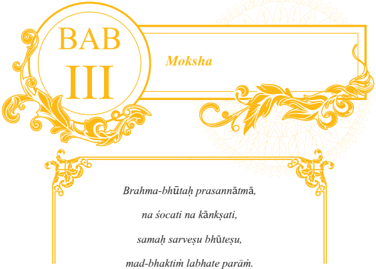

> **Deskripsi Visual:** Gambar ini menunjukkan halaman dari buku pelajaran dengan judul "BAB III Moksha". Judul tersebut terletak di bagian atas dengan gaya tulisan yang elegan dan berwarna kuning. Di bawah judul, terdapat sebuah teks dalam bahasa Sanskerta yang ditulis dalam huruf besar dan berwarna putih. Teks tersebut tampaknya merupakan bagian dari materi pembelajaran yang disajikan dalam buku ini.

Elemen-elemen utama yang terlihat dalam gambar ini adalah judul, teks, dan elemen desain yang mencerminkan tema spiritual atau filsafat. Judul "BAB III Moksha" menunjukkan bahwa ini adalah bagian ketiga dari bab tertentu dalam buku pelajaran. Teks dalam bahasa Sanskerta tampaknya merupakan konten utama yang akan dibahas dalam bab ini, mungkin mengandung informasi tentang konsep Moksha dalam filsafat Hindu.

Teks dalam bahasa Sanskerta yang ditampilkan pada gambar ini sangat penting karena ia merupakan bagian dari materi pembelajaran yang disajikan dalam buku ini. Informasi ini dapat membantu pembaca memahami konsep-konsep filosofis yang disampaikan dalam bab ini.

Secara keseluruhan, gambar ini menunjukkan halaman dari buku pelajaran yang fokus pada bab tentang Moksha, dengan judul yang elegan dan teks dalam bahasa Sanskerta yang penting untuk pemahaman materi pembelajaran.

### Terjemahannya:

Setelah  menjadi  satu  dengan  Brahman jiwanya  tentram,  tiada  duka  tiada  nafsubirahi,  memandang  semua  makhluk-insani sama,  ia  mencapai  pengabdian  kepada-Ku yang tertinggi (Bhagawadgita, XVIII.54).

---
**🖼️ Gambar/Diagram**

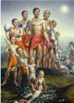

> **Deskripsi Visual:** Gambar ini adalah ilustrasi yang menampilkan keluarga besar berdiri di atas sebuah tanah dengan latar belakang bulan dan bintang. Keluarga terdiri dari sepuluh orang, termasuk dua orang dewasa, empat anak-anak, dan dua bayi. Orang dewasa tersebut tampaknya memiliki posisi yang berbeda, mungkin menunjukkan peran mereka dalam keluarga. Anak-anak dan bayi tampak ceria dan sehat, menunjukkan kebahagiaan dan kebersamaan keluarga. Ilustrasi ini mungkin digunakan untuk menggambarkan konsep tentang keberagaman, kebersamaan, dan kebahagiaan dalam keluarga.

 

---
## 📄 Halaman 96

Banyak orang yang lahir dan hidup di dunia ini merindukan agar dapat hidup sejahtera dan bahagia ( Moksha ), apa dan bagaimanakah semuanya itu dapat diwujudkan? Renungkanlah bait sloka tersebut di atas!

### A.  Ajaran Moksha

### Perenungan:

'Semua yang ada ini berasal dari yang satu, setelah banyak menurut waktu, keadaan, dan tempatnya kembali menuju yang satu'.

Apakah  yang  perlu  diketahui  oleh  seseorang  untuk  dapat  mewujudkan Moksha dalam hidup ini? Diskusikanlah dengan teman sekitar, dan atau orang tuamu masing-masing di saat sedang berkumpul di rumah. Buatlah catatan dari hasil  diskusi  yang  anda  lakukan,  untuk  dapat  dipakai  bahan  diskusi  di  kelas, lakukanlah!

Dalam agama Hindu, kita diajarkan Lima prinsip keyakinan yang disebut Panca Sraddha yaitu meliputi keyakinan tentang adanya Brahman , Atman , Karma Pala , Punarbhawa , dan Moksha.Gunada (2013:25) menjelaskan bahwa Panca Sraddha adalah dasar untuk mencapai tujuan kehidupan tertinggi. Kepercayaan terhadap Moksha yang  menjadi  tujuan  puncak  ( paramartha )  agama  Hindu

 

---
## 📄 Halaman 97

menegaskan bahwa Hindu senantiasa menyelaraskan antara dasar dan tujuan. Agama Hindu merumuskan empat tujuan hidup yang disebut Catur Purushàrtha , yaitu dharma (kebenaran), artha (kesejahteraan), kama (keinginan/kenikmatan duniawi), dan Moksha (kebebasan sejati). Moksha berasal dari bahasa Sanskerta, dari akar kata muc yang berarti membebaskan atau melepaskan. Moksha berarti kelepasan, kebebasan (Semadi Astra, dkk, 1982:1983) . Dari pemahaman istilah, kata Moksha dapat disamakan dengan nirwana, nisreyasa atau keparamarthan . Moksha adalah  alamnya  Brahman  yang  sangat  gaib  dan  berada  di  luar  batas pikiran manusia. Moksha bisa disamakan dengan Nirguna Brahman . Tidak ada bahasa manusia yang dapat menjelaskan bagaimana sesungguhnya alam Moksha itu. Moksha hanya dapat dirasakan oleh orang yang dapat mencapainya. Alam Moksha bukan sesuatu yang bersifat khayal, tetapi suatu yang benar-benar ada, karena  demikian  dikatakan  oleh  ajaran  kebenaran  (agama). Moksha adalah kepercayaan tentang adanya kebebasan yaitu bersatunya antara Atman dengan Brahman. Moksha dapat juga disebut dengan Mukti artinya mencapai kebebasan jiwatman atau kebahagian rohani yang langgeng. Bila seseorang sudah mengalami Moksha dia akan bebas dari ikatan keduniawian, bebas dari hukum karma dan bebas dari penjelmaan kembali (reinkarnasi) serta dapat mengalami atau mewujudkan Sat, Cit, Ananda (kebenaran, kesadaran, kebahagian). Kamus Besar Bahasa Indonesia menjelaskan, Moksha : tingkatan hidup lepas dari ikatan keduniawian; kelepasan; bebas dari penjelmaan kembali (Tim, 2001:752).

Adapun yang dimaksud dengan kebebasan dalam pengertian Moksha ialah terlepasnya Atman dari ikatan maya, sehingga menyatu dengan Brahman. Bagi

 

---
## 📄 Halaman 98

orang yang telah mencapai Moksha berarti mereka telah mencapai alam Sat cit ananda . Sat cit ananda berarti  kebahagiaan yang tertinggi. Setiap orang pada hakikatnya  dapat  mencapai Moksha ,  asal  mereka  mengikuti  dengan  tekun jalan yang ditunjuk oleh agama. Moksha itu dapat dicapai di dunia ini artinya semasih kita hidup, dan dapat pula dicapai setelah hidup ini berakhir. Seseorang yang  menyadari  akan  hal  itu,  maka  yang  bersangkutan  akan  berupaya  untuk menumbuh-kembangkan dalam dirinya usaha untuk melepaskan diri yang sejati dari keterikatan itu. Upaya dan usaha melepaskan diri secara sadar inilah dapat mengantarkan  manusia  menuju Moksha .  Ketidak-sadaran  dengan  keterikatan dapat  menumbuhkan  penderitaan  yang  berkepanjangan.  Agama  mengajarkan ada banyak usaha yang dapat ditempuh untuk mewujudkan semuanya itu. Di antara usaha-usaha itu antara lain; dengan berperilaku yang baik, berdana-punya , berYajña , dan tirthayatra . Usaha itu dapat dilakukan secara bertahap dan didasari dengan niat yang baik dan suci. Dengan demikian seseorang dapat terlepaskan dari keterikatan duniawi. Umat Hindu percaya akan dapat membebaskan dirinya (pikiran  dan  perasaannya)  dari  ikatan  keduniawian,  pengaruh  suka  dan  duka yang muncul dari tri guna serta dapat mencapai kelepasan itu.

Kitab suci Bhagavadgita menjelaskan sebagai berikut:

'Yad ā sattve pravåddhe tu, pralayaý y ā ti deha-bhåit, tadottama-vid ā ý lokàn, amal ā n pratipadyate'.

 

---
## 📄 Halaman 99

### Terjemahan:

Apabila sattva berkuasa di kala penghuni-badan bertemu dengan kematian, maka ia mencapai dunia suci tempat mereka, para yang mengetahui (Bhagavadgita XIV. 14).

Renungkanlah Makna sloka di atas bila ingin mencapai alam Moksha, Buatlah narasinya sesuai petunjuk Bapak/Ibu guru yang mengajar di kelasmu!

Membebaskan diri dari pengaruh tri guna adalah usaha yang sangat berat, tetapi pasti dapat dilakukan dengan mendasarkan diri pada disiplin. Penghayatan dan pengamalan semua bentuk ajaran agama dalam hidup ini merupakan wujud kongkret dari pengamalan sabda Tuhan yang ada dalam pustaka suci.Lakukan pemujaan dan kerja sebagaimana mestinya guna mewujudkan bhakti kita kepada Tuhan. Tanamkanlah keyakinan pada diri kita bahwa segala sesuatu berawal dan berakhir pada Tuhan. Segala sesuatu tidak mungkin akan terjadi tanpa Beliau berperan di dalamnya. Setiap makhluk akan dapat mencapai Moksha , hanya saja proses yang dilalui satu sama lain berbeda. Ada yang cepat dan ada pula yang lambat dan sebagainya. Bila seseorang dapat mengurangi sifat egoisnya terhadap sesuatu dan mengarahkan pikiran dan perasaannya pada Tuhan/ Ida Sang Hyang Widhi ,  maka secara perlahan-lahan dan pasti dapat menyatu dengan Brahman. Renungkan dan laksanakanlah makna sloka berikut ini dengan baik.

Sattvaý sukhe sañjayati, rajaá karmani bh ā rata,

 

---
## 📄 Halaman 100

jn ā nam ā våtya tu tamah, pram ā de sanjayaty uta.

### Terjemahan:

Sattwa  mengikat  seseorang  dengan  kebahagiaan,  rajas  dengan  kegiatan tetapi tamas, menutupi budi pekerti oh Barata, mengikat dengan kebingungan, (Bhagavadgita XIV.9).

Tujuan  utama  manusia  adalah  untuk  mewujudkan  hidup  yang  bahagia dengan menyadari dirinya yang sejati. Setelah orang menyadari dirinya yang sejati  barulah  ia  dapat  menyadari  Tuhan/ Sang  Hyang  Widhi ,  yang  meresap dan berada pada semua yang ada di alam semesta ini. Dalam kehidupan nyata di  dunia  ini  masih  sangatlah  sedikit  jumlah  orang  yang  menginginkan  untuk mendapatkan  kebahagiaan  rohani  ' Moksha ',  kebanyakan  di  antara  mereka hanyut oleh kenikmatan duniawi yang penuh dengan gelombang suka dan duka. Kiranya setiap orang perlu menyadari bahwa tubuh ini adalah suatu alat untuk mendapatkan Moksha . Mokshanam sariram  sadhanam yang  artinya  bahwa tubuh ini adalah sebagai alat untuk mencapai Moksha . Untuk dapat mewujudkan rasa bhakti ke hadapan-Nya kehadiran tubuh manusia sangat diperlukan, oleh karenanya peliharalah tubuh ini sebaik-baiknya.

'Bhakty ā tv ananyay ā úakya aham evam-vidho 'rjuna,

 

---
## 📄 Halaman 101

jñ ā tuý draûþuý cha tattvena praveûþuý cha paraýtapa'.

### Terjemahan:

Tetapi, melalui jalan bhakti yang tak tergoyahkan Aku dapat dilihat dalam realitasnya dan juga memasukinya, wahai penakluk musuh (Arjuna) Paramtapa (Bhagawadgita, XI.54).

Bhakti marga dalam ajaran agama Hindu adalah jalan menuju dan memuja Ida  Sang  Hyang  Widhi /Tuhan  Yang  Maha  Esa  yang  diperuntukan  bagi  umat kebanyakan. Namun demikian bukan berarti tertutup  bagi  umat  yang  sudah  memiliki pengetahuan dan kemampuan setingkat lebih tinggi dari umat yang lainnya. Melalui jalan bhakti  para  bhakta  dapat  memuja Ida  Sang Hyang Widhi /Tuhan Yang Maha Esa beserta prabhawa-Nya dengan cara berpikir, berucap, dan berperilaku yang sederhana, tulus serta cinta kasih. Selanjutnya renungkanlah sloka berikut ini!

 

---
## 📄 Halaman 102

### Perenungan

Sang	kinahananing	kaprajñān	ngaranira,	tan	alara	yan	panemu	duhkha, tan	agirang	yan	panemu	sukha,	tātan	kataman	krodha,	mwang	takut,	prihati, langgeng	mahning	juga	tuturnira,	apan	majñāna,	muni	wi	ngaraning	majñāna.

### Terjemahan:

Orang yang disebut  mendapatkan  kebijaksanaan,  tidak  bersedih  hati  jika mengalami  kesusahan,  tidak  bergirang  hati,  jika  mendapat  kesenangan,  tidak kerasukan nafsu marah dan rasa takut serta kemurungan hati, melainkan selalu tetap  tenang  juga  pikiran  dan  tutur  katanya,  karena  berilmu,  budi  mulia  pula disebut orang yang bijaksana (Sarasamuscaya, 505).

Moksha dapat  dicapai  oleh  semua  manusia,  baik  semasih  hidup  maupun setelah meninggal dunia. Dalam ajaran agama Hindu ada disebutkan beberapa tingkatan-tingkatan Moksha berdasarkan  keadaan  atma  yang  dihubungkan dengan Brahman. Adapun bagian-bagiannya dapat dijelaskan sebagai berikut;

Duhkheûwanudwignaman ā á sukheûu wigataspåhaá w ī taçokabha-yakrodhah sthiradh ī rmunirucyate.

 

---
## 📄 Halaman 103

### 1. Jiwamukti

Jiwamukti adalah tingkatan Moksha atau  kebahagiaan/kebebasan yang dapat dicapai oleh seseorang semasa hidupnya, di mana atmanya tidak lagi terpengaruh oleh gejolak indrya dan maya (pengaruh duniawi). Keadaan atma seperti ini disamakan dengan samipya dan sarupya .

### 2. Widehamukti

Widehamukti adalah  tingkat  kebebasan  yang  dapat  dicapai  oleh seseorang semasa hidupnya, di mana atmanya telah meninggal, tetapi roh yang bersangkutan masih kena pengaruh maya yang tipis. Tingkat keberadaan atma dalam posisi ini disetarakan dengan Brahman , namun belum dapat menyatu dengan-Nya, sebagai akibat dari pengaruh maya yang masih ada. Widehamukti dapat disejajarkan dengan salokya .

### 3. Purnamukti

Purnamukti adalah  tingkat  kebebasan  yang  paling  sempurna. Pada tingkatan ini posisi atma seseorang keberadaannya telah menyatu dengan Brahman. Setiap orang akan dapat mencapai posisi ini, apabila yang bersangkutan sungguh-sungguh dengan kesadaran dan hati yang suci mau dan mampu melepaskan diri dari keterikatan maya ini. Posisi Purnamukti dapat disamakan dengan Sayujya (Wigama dkk, 1995:106).

 

---
## 📄 Halaman 104

Berdasarkan keadaan tubuh atau lahiriah manusia, tingkatan-tingkatan atma itu dapat dijabarkan sebagai berikut: Moksha, Adi Moksha, dan Parama Moksha. Secara lebih rinci sesuai uraian di atas tentang keberadaan tingkatan-tingkatan Moksha dapat dijabarkan lagi menjadi beberapa macam tingkatan. Moksha dapat dibedakan menjadi empat jenis yaitu: Samipya, Sarupya (Sadarmya), Salokya, dan Sayujya .  Adapun penjelasan keempat bagian ini dapat dipaparkan sebagai berikut:

### 1. Samipya:

---
**🖼️ Gambar/Diagram**

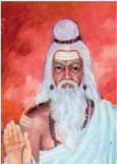

> **Deskripsi Visual:** Gambar ini adalah ilustrasi yang menampilkan seorang pria tua dengan rambut berwarna gelap dan lebat, serta mata yang tampak tua dan bercahaya. Pria tersebut mengenakan jubah putih dan topi berwarna putih, serta memegang dua buah batu kecil di kedua tangan. Latar belakangnya adalah warna merah cerah yang tampak seperti langit malam. Ilustrasi ini mungkin digunakan untuk menggambarkan tokoh dalam sebuah cerita atau buku pelajaran, namun tanpa konteks lebih lanjut, sulit untuk menentukan maksud spesifiknya.

Samipya adalah suatu kebebasan yang dapat dicapai oleh seseorang semasa hidupnya di dunia ini.  Hal  ini  dapat  dilakukan  oleh  para  Yogi  dan oleh para Maharsi. Beliau dalam melakukan Yoga Samadhi telah  dapat  melepaskan  unsur-unsur maya,  sehingga  beliau  dapat  mendengar  wahyu Tuhan. Dalam keadaan yang demikian itu atman berada sangat dekat dengan Tuhan. Setelah beliau selesai melakukan samadhi, maka keadaan beliau kembali  sebagai  biasa,  di  mana  emosi,  pikiran, dan organ jasmaninya aktif kembali.

### 2. Sarupya (Sadharmya):

Sarupya (Sadharmya) adalah suatu kebebasan yang didapat oleh seseorang di dunia ini, karena kelahirannya, di mana kedudukan Atman

 

---
## 📄 Halaman 105

merupakan pancaran dari  kemaha-kuasaan  Tuhan,  seperti  halnya  Sri Rama,  Buddha  dan  Sri  Kresna.  Walaupun Atman telah  mengambil suatu perwujudan tertentu, namun ia tidak terikat oleh segala sesuatu yang ada di dunia ini.

### 3. Salokya :

Salokya adalah suatu kebebasan yang dapat dicapai oleh Atman, di mana Atman itu sendiri telah berada dalam posisi dan kesadaran yang sama dengan Tuhan. Dalam keadaan seperti itu dapat dikatakan baliau Atman  telah  mencapai  tingkatan  Deva  yang  merupakan  manifestasi dari Tuhan itu sendiri.

### 4. Sayujya:

Sayujya adalah tingkat kebebasan yang tertinggi di mana Atman telah dapat bersatu dengan Ida Sang Hyang Widhi /Tuhan Yang Maha Esa. Dalam keadaan seperti ini Ida Sang Hyang Widhi disebut Brahman Atman Aikyam yang  artinya:  Atman  dan  Brahman  sesungguhnya tunggal.

Dalam usaha untuk mewujudkan suatu kebebasan dalam hidup ini sangat baik kita merenungkan dan mengamalkan sloka berikut:

 

---
## 📄 Halaman 106

Sribhagavàn uvàcha:

Akasaraý brahman paramaý

svabhàvo 'dhyàtmam uchyate, bhùta-bhàvodbhava-karo visargaá karma-samjnitaá.

### Terjemahan:

Sri Bhagawan bersabda: Brahman (Tuhan) adalah yang kekal, yang maha tinggi dan adanya di dalam tiap-tiap badan perseorangan disebut AdhyAtman. Karma  adalah  nama  yang  diberikan  kepada  kekuatan  cipta  yang  menjadikan makhluk hidup (B.G VIII. 3).

Tentang  kebahagiaan  atau  kebebasan  hidup  abadi  yang  mesti  selalu diupayakan  dalam  hidup  dan  kehidupan  ini  oleh  umat  sedharma,  kitab  suci Sarasamuscaya patut dipedomani dan menyebutkan sebagai berikut:

M ā t ā pitåsahasr ā ni putrad ā ra çatani ca, yuge yuge wyat ī t ā ni kasya te kasya w ā wayam.

Anādi	ketang	janma	ngaranya,	tan	kinawruhan	tembenya,	luput kinalakaran,	wilangning	janmāntara,	mewwiwut	pwa	bapanta,

 

---
## 📄 Halaman 107

ibunta,	anakta,	rabinta,	ring	sayugasyuga,	paramārthanya,	ndyang enak	katepetana	sānu	lawan	ika,	ndyang	tuduhan	anunta.

### Terjemahan:

Tidak diketahui hubungan penjelmaan manusia itu pada permulaannya, tidak dapat diperkirakan akan banyaknya penjelmaan yang lain, beribu-ribu bapa, ibu, anak dan istri pada tiap-tiap yuga; pada hakikatnya, siapakah yang sebenarnya dapat  mengatakan  dengan  tepat  keturunan  mereka  itu,  dan  yang  mana  dapat ditunjuk seketurunan dengan engkau sendiri? (Sarasamuscaya, 486).

N ā yamatyantasamw ā msah kad ā cit kenacit saha, api swena mar ī rena kimut ā nyena kenacit.

Tātan	hana	teka	nitya	patemunya	ngaranya,	ikang	patemu	ika,	ikang	tan temu	ika,	kapwa	tan	langgeng	ika,	patemunta	lawan	iking	çariranta	tuwi,	tan langgeng	ika,	mapasaha	mara	don	iking	paneoadadi,	haywa	tinucap	ikang	len.

### Terjemahan:

Tidak ada yang kekal yang dinamakan pertemuan itu, yang bertemu satu dengan  yang  lain;  yang  tidak  bertemu  satu  dengan  yang  lain,  semuanya  itu tidak kekal, bahkan hubunganmu dengan badanmu sendiripun tidak kekal, pasti akan berpisah dari badan; tangan, kaki, dan lain-lain bagian tubuh itu, jangan dikatakan dengan yang lain-lainnya (Sarasamuscaya, 487).

 

---
## 📄 Halaman 108

Ā darçan ā d ā patit ā h punaçc ā darçanam gat ā h, na te tawa na tes ā m twam k ā tatra pariDevan ā .

Keta	sakeng	taya	marika,	muwah,	ta	ya	mulih	ring	taya,	sangksipta	tan akunta	ika,	ika	tan	sapa	lawan	kita,	an	mangkana,	apa	tojara,	apa	polaha.

### Terjemahan:

Katanya  mereka  datang  dari  Taya  (kenyataan  yang  tidak  nyata),  dan kemudian  kembalinya  lagi  ke  Taya,  singkatnya,  bukan  kepunyaanku  itu,  itu tidak  ada  hubungannya dengan engkau, jika demikian halnya, apa yang akan dikatakan dan apa yang akan dikerjakan (Sarasamuscaya, 488).

Naste dhane w ā d ā resu putre pitari m ā tari, aho kastamiti dhy ā tw ā duhkhasy ā pacitin caret.

Hilang	pwa	mās,	māti	pwang	anak,	rabi,	bapa,	ibu,	ikāna	telas paratra,	atiçaya	ta	göng	nikang	lara,	mwang	dukkhaning	hati	enget pwa	kitan	mangkana,	gawahenta	tikang	tambāning	duhkha.

 

---
## 📄 Halaman 109

### Terjemahan:

Kekayaan  akan  habis,  anak  akan  mati,  istri,  ayah,  dan  ibu,  mereka  itu semuanya telah meninggal, maka sangat menyedihkan dan memilukan hati, bila engkau sadar akan keadaan demikian, perbuatanmu itu merupakan obat pelipur duka (Sarasamuscaya,489).

M ā nasam çamayet tasm ā t prajñ ā ya, gnimiw ā bhasa, praç ā nte m ā nase hyasya ç ā r ī ramupaç ā myati.

Matangnya	duhkhaning	manah,	prihen	pademen	ring	kaprajñān, apan	niyata	juga	hilang	dening	kaprajñān,	kadyangganing apuy	dumilah,	niyata	padem	nika	dening	wwai,	padem	pwa duhkhaning	manah,	padem	ta	laranikang	çarīra.

### Terjemahan:

Karena itu penderitaan pikiran hendaklah diusahakan untuk dimusnahkan dengan  kebijaksanaan,  sebab  tentunya  lenyap  oleh  kebijaksanaan,  seperti misalnya api yang menyala, pasti padam oleh air, jika telah musnah penderitaan pikiran, maka lenyaplah pula sakitnya badan (Sarasamuscaya, 503).

W ī j ā yagnyupadagdh ā ni na rohanti yath ā punah,

 

---
## 📄 Halaman 110

jñ ā nadagdhaistath ā kleçairn ā tm ā sampadyate punah.

Kunang	paramārthanya,	hilang	ikang	kleçaning	awak,	an pinanasan	ring	jñāna,	hilang	pwang	kleça,	ri	katemwaning samyagjñāna,	hilang	tang	janma,	mari	Punarbhawa,	kadyangganing wīja,	pinanasan	sinanga,	hilang	tuwuh	nika,	mari	masewö .

### Terjemahan:

Demikianlah  dapat  diuraikan  mengenai  tingkatan  dan  keberadaan  orang yang  dapat  mencapai Moksha ,  dan  perlu  diikuti  dengan  kesungguhan  hati. Renungkanlah dalam-dalam petikan sloka tersebut di atas, sehingga tercapai apa yang menjadi tujuan hidup ini.

Adapun maknanya yang terpenting kecemaran badan akan lenyap, jika dilebur dengan latihan-latihan ilmu pengetahuan, jika hilang musnah kotoran badan itu, karena telah diperoleh pengetahuan yang sejati, maka terhapuslah kelahiran, tidak menjelma lagi sebagai misalnya biji benihan yang dipanaskan, dipanggang, hilang daya tumbuhnya, tidak tumbuh lagi (Sarasamuscaya, 510).

 

---
## 📄 Halaman 111

### Uji Kompetensi:

- Setelah  membaca  teks  tersebut  di  atas,  apakah  yang  Anda  ketahui tentang Moksha ? Jelaskanlah!
- Dengan memahami dan mendalami tentang Moksha , apakah sebaiknya yang mesti dilakukan dalam hidup ini? Jelaskanlah!
- Mengapa kita mesti dapat mencapai Moksha , bagaimana kalau orang yang bersangkutan merasa tidak dapat mewujudkannya? Jelaskanlah.
- Diskusikanlah  kutipan  bait-bait  sloka  kitab  suci  tersebut  di  atas dengan; teman sejawat Anda, orang tua di rumah, dan siapa saja yang menurut Anda pantas diajak berdiskusi. Buatlah laporan hasil diskusimu, selamat mencoba!
- Buatlah peta konsep tentang tingkatan-tingkatan Moksha yang Anda ketahui!
- Latihlah  diri  Anda  untuk  dapat  mewujudkan Moksha dalam  hidup dan  kehidupan  ini  setiap  saat,  selanjutnya  buatlah  laporan  tentang perkembangan kebahagiaan ' Moksha ' yang anda rasakan baik secara fisik maupun rohani!
- Agama  adalah  rasa,  menurut  Anda  pada  tingkatan  yang  manakah usaha  dan  upaya  Anda  untuk  mewujudkan  ' Moksha '  kesejahteraan dan kebahagiaan hidup ini? Narasikanlah pengalaman Anda!

 

---
## 📄 Halaman 112

### B. Jalan Menuju Moksha

Banyak jalan dapat dilalui oleh seseorang untuk mewujudkan hidup yang lebih baik dalam hidup ini, Tuhan Yang Maha Esa/ Ida Sang Hyang Widhi beserta prabhawa-Nya  selalu  membukakan  pintu-Nya  bagi  orang-orang  yang  berhati baik untuk berbuat mulia.

### Perenungan:

### Terjemahan:

Ia  yang  melakukan  pekerjaan-Ku,  ia  yang  memutuskan  Aku  sebagai tujuannya,  ia  yang  menyembah  Aku  bebas  dari  ikatan,  ia  yang  bebas  dari permusuhan pada semua makhluk, ia datang padaku, O Arjuna (Bhagawadgita XI. 55).

Tujuan terakhir dan tertinggi yang ingin dicapai oleh umat Hindu adalah Moksha .  Berbagai macam cara/jalan dapat dilakukan oleh umat bersangkutan, gunamewujudkan tujuan utamanya ini, termasuk sembahyang. Dengan menjalankan sembahyang, bathin seseorang menjadi tenang, dengan Dharana

Mat-karma kån mat-paramo, mad-bhaktaá saòga-varjitaá, nirvairaá sarva-bhùteûu yaá sa màm eti pàóðava.

 

---
## 📄 Halaman 113

(menetapkan cipta), Dhyana (memusatkan cipta) dan Samadhi (mengheningkan cita), manusia berangsur-angsur dapat mencapai tujuan hidupnya yang tertinggi. Ia adalah bebas dari segala ikatan keduniawian. Guna mencapai penyatuan Atman dengan  Brahman,  renungkan,  pedomani,  dan  amalkanlah  dalam  kehidupan sehari-hari sloka berikut ini:

Bahùnàý janmanàm ante jnànavàn màm prapadyate, vàsudevaá sarvam iti sa mahàtmà su-durlabhaá.

### Terjemahan:

Orang  yang  bijaksana  akan  datang  kepada-Ku,  pada  akhir  dari  banyak kelahiran  karena  mengetahui  bahwa  Vasudeva  (Tuhan)  adalah  segalanya  ini: sukar mendapatkan orang seperti itu (Bhagavadgita VII. 19) .

Mendapatkan seseorang berjiwa besar seperti itu adalah sukar mencarinya. Banyak  makhluk  akan  keluar/lahir  dan  mati,  serta  hidup  kembali  tanpa kemampuannya sendiri. Akan tetapi masih ada satu yang tak tampak dan kekal, tiada masa dan waktu pada saatnya semua makhluk menjadi binasa (pralina). Yang tak tampak dan kekal itulah harus menjadi tujuannya yang utama, supaya tidak  mengalami  penjelmaan  ke  dunia.  Itulah  tempat-Ku  yang  tertinggi,  oleh karenanya  haruslah  berusaha  demi  Aku.  Jika  engkau  selalu  ingat  kepadaKu,  tak  usah  disangsikan  engkau  akan  kembali  kepada-Ku.  Untuk  mencapai

 

---
## 📄 Halaman 114

ini  orang  harus  selalu  bergulat,  berbuat  baik  sesuai  dengan  ajaran  agamanya. Kitab suci Veda telah menyediakan dan memfasilitasi bagaimana caranya orang melaksanakan pelepasan dirinya dari ikatan maya sehingga akhirnya atman dapat bersatu  dengan  Brahman.  Dengan  demikian  penderitaan  dapat  dikikis  habis dan mahkluk hidup yang menderita itu tidak lagi menjelma ke dunia, sebagai hukuman, tetapi sebagai penolong sesama manusia.

Di dalam ajaran agama Hindu terdapat berbagai macam jalan yang dapat dilalui untuk mencapai kesempurnaan ' Moksha ', dengan menghubungkan diri dan memusatkan pikiran kepada Ida Sang Hyang Widhi .  Cara atau jalan yang demikian itu telah terbiasa disebut dengan nama ' Catur Marga ', terdiri dari:

### a. Bhakti Marga

Bhakti Marga / Yoga adalah proses atau cara mempersatukan atman dengan Brahman, berlandaskan rasa dan cinta kasih yang mendalam kepada Tuhan Yang Maha  Esa/ Ida  Sang  Hyang  Widhi .  Kata  ' bhakti '  berarti  hormat,  taat,  sujud, menyembah, persembahan, kasih.

Bhakti Marga berarti: jalan cinta kasih, jalan persembahan. Seorang Bhakta (orang yang menjalani Bhakti Marga) dengan sujud dan cinta, menyembah dan berdoa dengan pasrah mempersembahkan jiwa raganya sebagai yajna kepada Tuhan  Yang  Maha  Esa/ Ida  Sang  Hyang  Widhi .  Cinta  kasih  yang  mendalam adalah suatu cinta kasih yang bersifat umum dan mendalam yang disebut maitri. Semangat Tat Twam Asi sangat subur dalam hati sanubarinya. Sehingga seluruh dirinya penuh dengan rasa cinta kasih dan kasih sayang tanpa batas, sedikitpun tidak  ada  yang  terselip  dalam  dirinya  sifat-sifat  negatif  seperti  kebencian,

 

---
## 📄 Halaman 115

kekejaman,  iri  dengki  dan  kegelisahan  atau  keresahan.Cinta  baktinya  kepada Tuhan Yang Maha Esa/ Ida Sang Hyang Widhi yang sangat mendalam, itu juga dipancarkan kepada semua makhluk baik manusia maupun binatang.

Tatkala  memanjatkan  doa  umat  selalu menggunakan  pernyataan  cinta  dan  kasih sayang  dan  memohon  kepada  Tuhan  Yang Maha Esa/ Ida Sang Hyang Widhi agar semua makhluk tanpa kecuali selalu berbahagia dan selalu mendapat berkah termulia dari Hyang Widhi.  Jadi,  untuk  lebih  jelasnya  seorang bhakta  akan  selalu  berusaha  melenyapkan kebenciannya kepada semua makhluk. Sebaliknya ia selalu berusaha memupuk dan mengembangkan  sifat-sifat Maitri,  Karuna,

Mudita dan Upeksa ( Catur Paramita ). Ia selalu berusaha membebaskan dirinya dari belenggu keakuan (ahamkara).

Sikapnya selalu sama dalam menghadapi suka dan duka, pujaan dan celaan. Orang  yang  demikian  selalu  merasa  puas  dalam  segala-galanya,  baik  dalam kelebihan dan kekurangan. Jadi, benar-benar tenang dan sabar selalu. Dengan demikian baktinya kian teguh dan kokoh kepada Tuhan Yang Maha Esa/ Ida Sang Hyang Widhi . Keseimbangan batinnya sempurna, tidak ada ikatan sama sekali terhadap apapun. Ia terlepas dan bebas dari hukuman serba dua (dualis) misalnya suka dan duka, susah senang dan sebagainya. Seluruh kekuatannya dipakai untuk memusatkan pikiran kepada Tuhan Yang Maha Esa/ Ida Sang Hyang Widhi dan

 

---
## 📄 Halaman 116

dilandasi jiwa penyerahan total. Dengan demikian seorang Bhakti Marga dapat mencapai moksha .

### b. Karma Marga

Karma Marga adalah jalan atau usaha untuk mencapai kesempurnaan atau Moksha dengan perbuatan, bekerja tanpa terikat oleh hasil atau kebajikan tanpa pamrih. Hal yang paling utama dari karma Yoga ialah melepaskan semua hasil dari segala perbuatan. Dalam Bhagavadgita tentang Karma Marga dinyatakan sebagai berikut:

Tasm ā d asaktahsatatam k ā ryam karma sam ā cara, asakto hy ā caran karma param ā pnoti purusah

### Terjemahan:

Oleh  karena  itu,  laksanakanlah  segala  kerja  sebagai  kewajiban  tanpa terikat pada hasilnya, sebab dengan melakukan kegiatan kerja yang bebas dari keterikatan, orang itu sesungguhnya akan mencapai yang utama (Bhagawadgita III.19).

Pekerjaan yang dilakukan tanpa pamerih dinyatakan lebih baik dilakukan dalam semangat pengorbanan, daripada kegiatan kerja  sebagai  kegiatan  yang muncul dengan sendirinya. Yogav ā sistha menyatakan: yang mengetahui atman

 

---
## 📄 Halaman 117

telah tidak mengharapkan sesuatu pun yang harus dicapai, baik dengan melakukan kerja  maupun  tidak.  Oleh  karena  itu.  ia  melaksanakan  kegiatan  kerja  tanpa keterikatan apapun.

Bagi  seorang  pengikut  Karma  Marga, penyerahan  hasil  pekerjaan  kepada  Tuhan Yang  Maha  Esa/ Ida  Sang  Hyang  Widhi bukan berarti kehilangan, bahkan akan datang  berlipat  ganda.  Hal  ini  merupakan rahasia spiritual yang sulit dimengerti, mendapatkan sesuatu yang diperlukan secara mengagumkan dan membahagiakan dirinya. Berkaitan dengan ajaran Karma Marga renungkanlah cerita berikut:

Pada suatu hari Devi Laksmi mengadakan sayembara, di mana beliau akan memilih suami. Semua Deva dan para Danawa datang berduyun-duyun dengan harapan yang membumbung tinggi. Devi Laksmi belum mengumumkan janjinya, kemudian datanglah beliau di hadapan pelamarnya dan berkata demikian: saya akan mengalungkan bunga kepada pria yang tidak menginginkan diri saya. Tetapi mereka yang datang itu semua lobha, maka mulailah Devi Laksmi mencari orang yang tiada berkeinginan untuk dikalungi. Terlihatlah oleh Devi Laksmi wujudnya Deva Wisnu dengan tenangnya di atas ular Sesa yang sedang melingkar. Kalung perkawinan kemudian diletakkan di lehernya dan sampai kinilah dapat kita lihat simbolis Devi Laksmi berada di samping kaki Deva Wisnu. Devi Laksmi datang pada orang yang tidak mengidam-idamkan dirinya, inilah suatu keajaiban.

 

---
## 📄 Halaman 118

Dari cerita di atas dapat dikemukakan bahwa orang yang selalu asyik dalam pikirannya  menginginkan  buah  dari  kerjanya,  akan  kehilangan  buah  itu  yang sebenarnya adalah miliknya, tetapi bagi Karma Yogi walaupun ia berbuat sedikit, tetapi tanpa pamrih, ia akan mendapatkan hasil yang tidak ternilai. Kesusahan orang duniawi akan mendapat hasil yang sedikit, karena terikat. Sedangkan bagi Karma Yogi sebaliknya. Maka dari itu ajaran suci selalu menyarankan kepada umatnya agar menjadi seorang Karma Yogi yang selalu mendambakan pedoman rame inggawe sepi ing pamrih.

Pada  hakikatnya  seorang Karma  Yogi dengan  menyerahkan  keinginan akan  pahala,  ia  dapat  menerima  pahala  yang  berlipat  ganda.  Hidupnya  akan berlangsung  dengan  tenang  dan  ia  akan  memancarkan  sinar  dari  tubuhnya maupun  dari  pikirannya.  Bahkan  masyarakat  tempatnya  hidup  pun  dapat menjadi bahagia, sejahtera dan suci, mereka dapat mencapai kesucian batin dan kebijaksanaan.

Masyarakat yang telah suci jasmani dan rohaninya akan menjauhkan diri dari sifat-sifat munafik dan kepalsuan dan cita-cita yang sempurna akan dapat dicapai oleh penduduk masyarakat itu. Semua ini telah terbukti dalam pengalaman dari kebebasan jiwa seorang Karma Yogi .

### c. Jnana Marga

Jnana  Marga adalah  jalan  yang  ke  tiga  setelah Karma  Marga untuk menyatukan diri dengan Tuhan Yang Maha Esa/ Ida Sang Hyang Widhi . Jnana artinya  kebijaksanaan  filsafat  (pengetahuan).  Marga  berarti  jalan  yang  dilalui oleh  sang  diri.  Jadi, Jnana  Marga berarti  jalan,  usaha,  dan  atau  cara  untuk

 

---
## 📄 Halaman 119

mempersatukan Atman dengan Paramãtman yang dicapai dengan jalan mempelajari ilmu pengetahuan dan filsafat pembebasan diri dari ikatan-ikatan keduniawian.

Tiada ikatan yang lebih kuat dari pada  maya,  dan  tiada  kekuatan  yang  lebih ampuh  dari  pada Yoga untuk  membasmi ikatan-ikatan  maya  itu.  Untuk  melepaskan ikatan-ikatan ini haruslah kita mengarahkan segala pikiran kita,  memaksanya  kepada kebiasaan-kebiasaan  suci,  akan  tetapi  bila kita  ingin  memberi  suatu  bentuk  kebiasaan suci pada pikiran kita, akhirnya pikiran pun menerimanya,  sebaliknya  bila  pikiran  tidak

mau menerimanya maka haruslah kita akui bahwa segala pendidikan yang kita ingin biasakan itu tidak ada gunanya. Proses tumbuh dan berkembangnya pikiran ke  arah  kebaikan  merupakan  hal  yang  mutlak  patut  dilakukan.  Sebagai  jalan pertumbuhannya  pikiran,  perbuatan  lahir,  pelaksanaan  swadharma  dan  sikap bathin  ( wikarma )  sangat  diperlukan  di  mana  perbuatan  lahir  adalah  penting, karena  jika  tidak  berbuat,  maka  pikiran  kita  tidak  dapat  diuji  kebenarannya. Perbuatan lahir menunjukkan kualitas sebenarnya dari pada pikiran kita. Ada tiga hal yang penting dalam hal ini yaitu kebulatan pikiran, pembatasan pada kehidupan  sendiri  dan  keadaan  jiwa  yang  seimbang  atau  tenang  maupun pandangan yang kokoh tentram damai. Ketiga hal tersebut di atas merupakan dhyana Yoga .  Untuk tercapainya perlu dibantu dengan abhyasa yaitu  latihan-

 

---
## 📄 Halaman 120

latihan dan vairagya yaitu keadaan tidak mengaktifkan diri. Adapun kekuatan pikiran  kita  lakukan  di  dalam  hal  kita  berbuat  apa  saja,  pikiran  harus  kita pusatkan kepadanya. Dalam urusan-urusan keduniawian pun pemusatan pikiran ini mutlak diperlukan. Bukanlah sifat yang diperlukan hanya untuk suksesnya di dunia berlainan dengan sifat-sifat yang dibutuhkan untuk kemajuan spiritual atau batin. Usaha untuk menjernihkan kegiatan kita sehari-hari ialah kehidupan rohaniah.  Apapun  kita  laksanakan,  berhasil  atau  tidaknya  tergantung  kepada kekuatan pemusatan pikiran kita kepada-Nya.

### d. Raja Marga

Raja Marga adalah suatu jalan mistik (rohani) untuk mencapai kelepasan atau Moksha .  Melalui Raja Marga/ Yoga seseorang akan lebih cepat mencapai Moksha , tetapi tantangan yang dihadapinya pun lebih berat, orang yang mencapai Moksha dengan jalan ini diwajibkan mempunyai seorang guru Kerohanian yang sempurna untuk dapat menuntun dirinya ke arah pemusatan pikiran.

Ada tiga jalan pelaksanaan yang ditempuh oleh para Yogi sebagai pengikut ajaran  Raja  Marga  yaitu  melakukan  tapa-brata, Yoga ,  dan  samadhi.  Tapa  dan brata merupakan suatu latihan untuk mengendalikan emosi atau nafsu yang ada dalam diri kita ke arah yang positif sesuai dengan petunjuk ajaran kitab suci. Sedangkan Yoga dan  samadhi  adalah  latihan  untuk  dapat  menyatukan Atman dengan Paramatman ( Brahman )  dengan  melakukan  meditasi  atau  pemusatan pikiran.  Setelah  yang  bersangkutan  menjalani tapa,  brata,  Yoga dan samadhi dengan sungguh-sungguh, maka pribadinya menjadi suci, tenang, tentram dan terlatih. Renungkanlah sloka berikut dengan baik!

 

---
## 📄 Halaman 121

### Perenungan:

---
**🖼️ Gambar/Diagram**

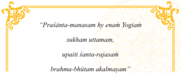

> **Deskripsi Visual:** Gambar ini adalah ilustrasi yang menampilkan sebuah ayat dalam bahasa Sanskerta. Gambar tersebut memiliki latar belakang putih dengan garis dan bunga yang mengelilingi ayat tersebut. Ayat tersebut ditulis dalam huruf besar dan berwarna hijau, sementara teks di sekitarnya menggunakan warna merah dan biru.

1. Apa yang ditampilkan secara keseluruhan:
Gambar ini menampilkan sebuah ayat dalam bahasa Sanskerta yang ditulis dalam huruf besar dan berwarna hijau. Latar belakangnya putih dengan beberapa elemen dekoratif seperti garis dan bunga.

2. Elemen-elemen utama dan relasinya:
Elemen utama yang terlihat adalah ayat dalam bahasa Sanskerta yang ditulis dalam huruf besar dan berwarna hijau. Latar belakang putih dengan garis dan bunga memberikan kesan estetis pada gambar. Garis dan bunga membentuk lingkaran di sekitar ayat, menunjukkan bahwa ayat tersebut merupakan tema utama dari gambar ini.

3. Teks, angka, atau label penting yang terlihat:
Teks utama yang terlihat adalah ayat dalam bahasa Sanskerta yang ditulis dalam huruf besar dan berwarna hijau. Ada juga beberapa elemen dekoratif seperti garis dan bunga yang membantu memperkuat tema utama gambar.

4. Informasi kunci yang dapat diambil pembaca:
Informasi kunci yang dapat diambil dari gambar ini adalah bahwa ia menunjukkan sebuah ayat dalam bahasa Sanskerta yang ditulis dalam huruf besar dan berwarna hijau. Latar belakang putih dengan garis dan bunga memberikan kesan estetis pada gambar, menunjukkan bahwa ayat tersebut merupakan tema utama dari gambar ini.

### Terjemahan:

Karena  kebahagiaan  tertinggi  datang  pada Yogi yang  pikirannya  tenang, yang nafsunya tidak bergolak, yang keadaannya bersih bersatu dengan Tuhan (Bhagavadgita. VI.27).

Pengikut  ajaran Raja  Marga berkewajiban  untuk  mengimplementasikan Astangga  Yoga guna  mewujudkan  tujuannya.  Mereka  dapat  menghubungkan diri dengan kekuatan rohaninya melalui Astangga Yoga . Astangga Yoga adalah delapan tahapan Yoga untuk mencapai Moksha . Astangga Yoga diajarkan oleh Maha Rsi Patanjali dalam bukunya yang disebut dengan Yoga Sutra Patañjali. Adapun bagian-bagian dari ajaran Astangga Yoga yang patut dipedomani dan dilaksanakan oleh praktisi ajaran Raja Marga adalah sebagai berikut:

### a. Yama

Yama (Yama bratha) adalah ajaran pengendalian diri yang wajib dipedomani dan dilakukan oleh pengikut Raja Marga yang berhubungan dengan tindakan jasmani,  misalnya,  tidak  menyiksa/menyakiti/membunuh  mahkluk  sesamanya

 

---
## 📄 Halaman 122

( ahimsa ), dilarang berbohong ( satya ), pantang mengingini sesuatu yang bukan miliknya  ( asteya ),  pantang  melakukan  hubungan  seksual  ( brahmacari )  dan tidak menerima pemberian dari orang lain ( aparigraha ). Kitab Sarasamuscaya menguraikan pahala/hasil yang patut dinikmati oleh pengikut Raja Marga adalah:

'Yaccintayati yadyàti ratin badhnàti yatra ca, tathà càpnotyayatnena prànino na hinasti yah.

Kunëng phalanya nihan, ikang wwang tan pamàtimàtin haneng ràt, senangënangënya, sapinaranya, sakahyunya, yatika sulabha katëmu denya, tanulihnya kasakitan.

### Terjemahan:

Pahalanya,  orang  yang  tidak  membunuh  (menyakiti)  selagi  ada  di  dunia ini, maka segala sesuatu yang dicita-citakannya, segala yang ditujunya, segala sesuatu yang dikehendaki atau diingini olehnya, dengan mudah tercapai olehnya tanpa sesuatu penderitaan, (Sarasamuçcaya,142).

dama àrjavam, pritih prasàdo màdhuryam màrdavaý ca yamà daça'.

 

---
## 📄 Halaman 123

Nyang brata ikang inaranan yama, pratyekanya nihan, sapuluh kwehnya, ànresangsya, kûamà, satya, ahingsà, dama, àrjawa, priti, prasàda, màdhurya, màrdawa, nahan pratyekanya sapuluh, ànresangsya, si harimbawa, tan swàrtha kewala: ksamà, si kelan ring panastis: satya, si tan mrsàwàda: ahingsà, manukhe sarwa bhàwa: dama, si upacama wruh mituturi manahnya: àrjawa, si dugàdugabener:  priti,  si  gong  karuna:  prasàda,  beningning  manah:  màduhurya, manisning wulat lawan wuwus: màrdawa, pösning manah.

### Terjemahan:

Inilah brata yang disebut yama, perinciannya demikian: ànresangsya, ksamà, satya, ahingsà, dama, àrjawa, priti, prasàda, màdhurya,  màrdawa, sepuluh  banyaknya: ànresangsya yaitu harimbawa, tidak mementingkan diri sendiri saja: ksamà, tahan akan  panas  dan  dingin: satya ,  yaitu  tidak berkata bohong (berdusta): ahingsà , berbuat selamat  atau  bahagianya  sekalian  makhluk: dama ,  sabar  serta  dapat  menasehati  dirinya

sendiri: àrjawa , adalah tulus hati berterus terang: priti , yaitu sangat welas asih: prasàda ,  adalah kejernihan hati: màdhurya ,  yaitu manisnya pandangan (muka manis)  dan  manisnya  perkataan  (perkataan  yang  lemah  lembut): màrdawa , adalah kelembutan hati, (Sarasamuçcaya, 259).

 

---
## 📄 Halaman 124

### b. Nyama

Nyama yaitu bentuk pengendalian diri yang lebih bersifat rohani, di antara unsur-unsurnya adalah: 1. Sauca (tetap suci lahir batin), 2. Santosa (selalu puas dengan apa yang datang), 4. Swadhyaya (mempelajari kitab-kitab keagamaan) dan 5. Iswara pranidhana (selalu bhakti kepada Tuhan). Kitab Sarasamuscaya, 260 menjelaskan sebagai berikut:

'Dànamijyà tapo dhyànam swàdhyàyopasthaningrahah, vratopavasamaunam ca ananam ca niyama daûa'.

Nyang  brata  sapuluh  kwehnya,  ikang  niyama  ngaranya,  pratyekanya, dàna, ijya, tapà, dhyana, swàdhyàya, upasthanigraha, brata, upawàsa, mauna, snàna, nahan ta awakning niyama, dàna weweh, annadànàdi: ijyà, Devapujà, pitrpujàdi, tapa kàyasangcosana, kasatan ikang ûarira, bhucarya, jalatyagàdi, dhyana, ikang siwaûmarana, swàdhyàya, wedàbhyasa, upasthanigraha, kahrtaning  upastha,  brata  annawarjàdi,  mauna  wàcangyama,  kahrtaning ujar, haywàkeceng kuneng, snàna, trisangdhyàsewana, madyusa ring kàlaning sandhya.

### Terjemahan:

Inilah brata sepuluh banyaknya yang disebut niyama , perinciannya: dàna, ijya,  tapà,  dhyana,  swàdhyàya,  upasthanigraha,  brata,  upawàsa,  mauna,

 

---
## 📄 Halaman 125

snàna, itulah  yang  merupakan niyama,  dàna, pemberian  makanan-minuman dan  lain-lain: ijya ,  pujaan  kepada  Deva,  kepada  leluhur  dan  lain-lain  sejenis itu: tapà ,  pengekangan nafsu jasmaniah, badan yang seluruhnya kurus kering, layu,  berbaring di atas tanah, di atas air dan di atas alas-alas lain sejenis itu: dhyana,  tepekur  merenungkan Çiwa:  swàdhyàya, yakin  mempelajari Veda: upasthanigraha ,  pengekangan  upastha,  singkatnya  pengendalian  nafsu  sex: brata/upawàsa, pengekangan  nafsu  terhadap  makanan  dan  minuman:  mauna/ mona, itu wacanyama berarti menahan, tidak mengucapkan kata-kata yaitu tidak berkata-kata  sama  sekali  tidak  bersuara: snàna , trisandhyasewana ,  mengikuti trisandhya , mandi membersihkan diri pada waktu pagi, tengah hari dan petang hari, (Sarasamuçcaya, 260).

### c. Asana

Asana yaitu  sikap  duduk  yang  menyenangkan,  teratur  dan  disiplin  (pada silasana, padmasana, bajrasana, dan sukhasana ).

### d. Pranayama

Pranayama , yaitu mengatur pernafasan sehingga menjadi sempurna melalui tiga jalan yaitu puraka (menarik nafas), kumbhaka (menahan nafas) dan recaka (mengeluarkan nafas).

### e. Pratyahara

Pratyahara ,  yaitu  mengontrol  dan  mengendalikan  indriya  dari  ikatan obyeknya, sehingga orang dapat melihat hal-hal suci.

 

---
## 📄 Halaman 126

### f. Dharana

Dharana , yaitu usaha-usaha untuk menyatukan pikiran dengan sasaran yang diinginkan. Pengendalian pikiran.

### g. Dhyana

Dhyana, yaitu pemusatan pikiran yang tenang, tidak tergoyahkan kepada suatu obyek. Dhyana dapat dilakukan terhadap Ista Devata.

### h. Samadhi

Samaddhi , yaitu penyatuan atman (sang diri sejati dengan Brahman). Bila seseorang melakukan latihan Yoga dengan teratur dan sungguh-sungguh ia akan dapat menerima getaran-getaran suci dan wahyu Tuhan.

Dalam kitab Bhagavadgita dinyatakan sebagai berikut:

àtmànaý rahasi sthitaá, ekàki yata-citàtmà niràúir aparigrahaá'.

### Terjemahan:

Seorang Yogi harus  tetap  memusatkan  pikirannya  (kepada  Atman  yang maha besar) tinggal dalam kesunyian dan tersendiri, menguasai dirinya sendiri, bebas dari angan-angan dan keinginan untuk memiliki (Bhagavadgita, VI.10).

 

---
## 📄 Halaman 127

Selanjutnya  dijelaskan  bahwa  ketenangan  hanya  ada  pada  mereka  yang melakukan Yoga .  Empat  jalan  yang  ditempuh  untuk  pencapaian Moksha itu sesungguhnya memiliki kekuatan yang sama bila dilakukan dengan sungguhsungguh.  Setiap  orang  akan  memiliki  kecenderungan  memilih  jalan-jalan tersebut, maka itu setiap orang memiliki jalan mencapai Mokshanya bervariasi. Moksha sebagai  tujuan  hidup  spiritual  bukanlah  merupakan  suatu  janji  yang hampa melainkan merupakan suatu keyakinan yang berakhir dengan kenyataan. Kenyataan dalam dunia batin merupakan alam super transendental yang hanya dapat dibuktikan berdasarkan instuisi yang dalam. Moksha merupakan sesuatu yang  tidak  dapat  dibantah  kebenarannya,  demikianlah  dijelaskan  oleh  kitab suci. Oleh sebab itu, mari kita melatih diri untuk melaksanakan ajaran Astangga Yoga dengan tuntunan seorang guru yang telah memiliki kemampuan dalam hal tersebut.

Moksha adalah terlepasnya Atman dari belenggu maya (bebas dari pengaruh karma dan punarbhawa) dan akhirnya bersatu dengan Tuhan Yang Maha Esa. Dalam hubungan dengan penyatuan dengan Tuhan, renungkanlah dan amalkanlah sloka berikut:

'Bhaktyà tvananyanyà úakya, ahaý evam-vidho: 'rjuna, jñatuý draûþum cha tattvena praveûþuý cha paraýtapa'.

 

---
## 📄 Halaman 128

### Terjemahan:

Akan tetapi dengan berbakti tunggal padaku, O Arjuna, Aku dapat dikenal, sungguh dapat dilihat dan dimasuki ke dalam, O penakluk musuh (Bhagawadgita XI. 54).

Demikianlah ajaran kitab Astangga Yoga yang ditulis oleh Maharsi Patañjali, mengajarkan umat manusia agar mengupayakan dirinya masing-masing untuk mewujudkan kesejahteraan dan kebahagiaan hidup ini. Siapapun juga akan dapat mencapai kesadaran tertinggi ini, apabila yang bersangkutan mau dan mampu melaksanakannya secara sungguh-sungguh.

### Uji kompetensi:

- Banyak jalan menuju hidup sejahtera dan bahagia, menurut Anda jalan atau  cara  manakah  yang  terbaik  untuk  mewujudkan  kesejahtraan  dan kebahagiaan hidup ini ' Moksha '? Narasikanlah pengalaman Anda!
- Buatlah peta konsep tentang cara atau jalan untuk dapat mewujudkan Moksha , yang Anda ketahui!
- Latihlah  diri-mu  untuk  dapat  mewujudkan Moksha dalam  hidup dan  kehidupan  ini  setiap  saat  menurut  cara  atau  jalan  yang  diyakini, selanjutnya buatlah laporan tentang perkembangan kebahagiaan ' Moksha ' yang Anda rasakan baik secara fisik maupun rohani!
- Mengapa kita penting mewujudkan kebahagiaan hidup ini? Diskusikan dengan teman sekelompok dan selanjutnya paparkanlah di depan kelas sesuai petunjuk bapak/Ibu guru yang mengajar!

 

---
## 📄 Halaman 129

- Setelah Anda membaca teks penerapan ajaran Astangga Yoga, apakah yang  Anda  ketahui  tentang  tujuan  hidup  manusia  dan  tujuan  agama Hindu? Jelaskan dan tuliskanlah!
- Buatlah ringkasan yang berhubungan dengan penerapan ajaran Astangga Yoga , guna mewujudkan tujuan hidup manusia dan tujuan agama Hindu, dari berbagai sumber media pendidikan dan sosial yang anda ketahui! Tuliskan dan laksanakanlah sesuai dengan petunjuk dari bapak/ibu guru yang mengajar di kelas Anda!
- Apakah yang Anda ketahui tentang ajaran Moksha dan Astangga Yoga ? Jelaskanlah!
- Bagaimana  cara  kita  untuk  mengendalikan  diri  baik  itu  dari  unsur jasmani maupun rohani menurut petunujuk kitab suci yang pernah Anda baca? Jelaskan dan tuliskanlah pengalamannya!
- Manfaat apakah yang dapat dirasakan secara langsung dari usaha dan upaya  untuk  mewujudkan  kesejahteraan  dan  kebahagiaan  hidup  ini ' Moksha '? Tuliskanlah pengalaman Anda!
- Amatilah  lingkungan  sekitar  Anda  terkait  dengan  penerapan  ajaran Astangga Yoga guna  mewujudkan  tujuan  hidup  manusia  dan  tujuan agama  Hindu,  buatlah  catatan  seperlunya  dan  diskusikanlah  dengan orang  tuanya!  Apakah  yang  terjadi?  Buatlah  narasinya  1-3  halaman diketik dengan huruf Times New Roman-12, spasi 1,5 cm, ukuran kertas kwarto: 4-3-3-4!

 

---
## 📄 Halaman 130

### C.  Mewujudkan Tujuan Hidup Manusia dan Tujuan Agama Hindu

### 1. Tujuan Hidup manusia

kacciûchrnoti me, dharmàdarthaûca kàmaûca sa kimartham na sevyate'.

Nihan mata kami mangke, manawai, manguwuh, mapitutur, ling mami, ikang artha,  kàma,  malamaken  Dharma  juga  ngulaha,  haywa  palangpang  lawan Dharma mangkana ling mami, ndatan juga angrëngo ri haturnyan ewëh sang makolah Dharmasadhàna, apa kunang hetunya.

### Terjemahan:

Itulah  sebabnya  hamba,  melambai-lambai:  berseru-seru  memberi  ingat: kata  hamba:  'dalam  mencari artha dan  kama  itu  hendaklah  selalu  dilandasi oleh Dharma :  jangan  sekali-kali  bertindak  bertentangan  dengan Dharma ' demikian kata hamba: namun demikian, tidak ada yang memperhatikannya: oleh karena katanya, adalah sukar berbuat atau bertindak bersandarkan Dharma , apa gerangan sebabnya? (Sarasamuçcaya,11).

 

---
## 📄 Halaman 131

Manusia yang dilahirkan dan hidup di dunia ini dilengkapi dengan tujuan, yang  disebut  dengan  istilah  tujuan  hidup  manusia.  Manusia  tidak  sekedar dilahirkan dan setelah lahir dibiarkan begitu saja. Manusia dilahirkan, dipelihara, dibesarkan, dan dididik dalam lingkungan yang berbeda-beda. Pengalaman yang didapat dari pengaruh lingkungan sekitar manusia hidup dapat mengembangkan sikap  mental  dan  cita-citanya.  Sifat-sifat  pribadi  manusia,  kemampuan  dan kecendrungan, agama yang dianutnya, kebiasaan, ideologi dan politik bangsa, memberikan pengaruh besar terhadap tingkah laku manusia dalam mewujudkan tujuan hidupnya.

Tujuan  hidup  manusia  di  dalam  agama  Hindu  disebut  ' Purusartha '. ' Purusa ' berarti manusia, utama, dan ' artha ' berarti tujuan. Purusartha berarti tujuan hidup manusia yang utama. Kitab suci Veda menjelaskan sebagai berikut:

'Yatnah kàmàrthamokûaóam krtopi hi vipadyate, dharmmàya punararambhah sañkalpopi na niûphalah'.

Ikang kayatnan ri kagawayaning kama, artha, mwang Moksha, dadi ika tan paphala,  kunang  ikang  kayatnan  ring  Dharmasàdhana,  niyata  maphala  ika, yadyapin angena-ngenan juga, maphala atika.

 

---
## 📄 Halaman 132

### Terjemahan:

Usaha  tekun  pada  kerja  mencari  kama, artha dan Moksha ,  dapat  terjadi ada kalanya tidak berhasil: akan tetapi usaha tekun pada pelaksanaan Dharma , tak tersangsikan lagi, pasti berhasil sekalipun baru hanya dalam angan-angan, (Sarasamuçcaya,15).

Berdasarkan uraian di atas tentang tujuan hidup manusia, dapat dinyatakan bahwa ada 4 (empat). Empat tujuan hidup manusia yang utama disebut 'catur purusartha' . Catur purusartha terdiri dari: Dharma, artha, kama, dan Moksha. Bagaimana dengan tujuan agama 'Hindu'? Manusia adalah mahkluk individu dan juga sebagai mahkluk sosial. Sebagai makhluk individu manusia bertanggung jawab pada dirinya sendiri, sedangkan sebagai mahkluk sosial manusia selalu berkeinginan untuk berinteraksi dengan sesamanya. Keinginan manusia berakar pada  pikirannya.  Dengan  pikirannya  manusia  memiliki  beraneka  macam keinginan, seperti: ingin makan, minum, berteman, berkumpul, beragama dan yang lainnya. Mengapa kita berkeinginan untuk memeluk agama Hindu? Apa tujuan agama Hindu?

Tujuan agama  Hindu  dirumuskan  dalam  satu kalimat singkat yaitu 'Mokshartham  jagadhita  yasca  iti  Dharma' artinya  ' Dharma itu  untuk mewujudkan Moksha (kebahagiaan) dan jagadhita (kebaikan/kesejahtraan dunia) masyarakat. Untuk mewujudkan tujuan hidup manusia dan tujuan agama Hindu, umat se Dharma dapat mencapainya dengan melaksanakan catur marga. Catur marga adalah empat cara atau jalan untuk mewujudkan kesejahtraan dan

 

---
## 📄 Halaman 133

kebahagiaan hidup ini. Catur marga, terdiri dari: Karma marga, Bhakti marga, Jnana marga, dan Raja marga.

Di dalam kitab Brahma Purana mengenai Catur Purusa Artha ada dijelaskan sebagai berikut:

Catur Purus ā rtha merupakan landasan dasar ajaran bagi umat Hindu untuk berupaya mewujudkan tujuannya beragama. Segala sesuatu yang menjadi tujuan umat beragama patut dipedomani dengan ajaran ' Catur Purusa Artha '. Dengan demikian maka cita-cita  untuk  mewujudkan  kesejahteraan  hidup  jasmani  dan kebahagiaan  hidup  rohaninya  dengan  sendirinya  dapat  tercapai.  Mencapai kesejahteraan jasmani dan kebahagiaan rohani (kebahagian yang kekal) hendaknya  dijadikan  komitmen  dalam  hidup  ini.  Ajaran Catur  Purusa Artha adalah merupakan ajaran yang bersifat universal dan berlaku sepanjang zaman. Banyak  inteprestasi  yang  terjadi  di  lapangan  terkait  dengan  ajaran  tersebut, namun demikian hakekat ajarannya tetap sama. Apakah yang dimaksud dengan catur Purus ā rtha ?

'Dharmãrtha kama Moksha ram sariram sadhanam' (Brahma Purana 228, 45).

### Artinya:

Tubuh adalah alat (untuk mendapat) Dharma, Artha, Kama dan Moksha .

Selanjutnya dalam kitab Astha Dasa Parwa pada bagian Ud Yoga Parwa kita temukan ajaran yang berkaitan dengan hakekat Dharma , sebagai berikut:

 

---
## 📄 Halaman 134

'Ikang Dharma ngaranya, hetuning mara ring swarga ika, kadi gatining perahu, an hetuning banyaga nentasing tasik (UdYoga Parwa).

### Artinya:

Yang disebut Dharma , adalah merupakan jalan untuk pergi ke sorga, sebagai halnya  perahu,  sesungguhnya  adalah  merupakan  alat  bagi  pedagang  dalam mengarungi lautan.

Sloka suci tersebut di atas menjelaskan kepada kita bahwa manusia harus menyadari apa yang menjadi tujuan hidupnya. Apa yang harus dicarinya dengan badan yang dimiliki-nya. Semuanya itu tak lain adalah sebagai pengamalan dari ajaran Dharma sebagai salah satu bagian dari ajaran Catur Purus ā rtha .  Yang manakah bagian-bagian dari ajaran Catur Purus ā rtha itu?

Sesuai dengan beberapa penjelasan tersebut di atas yang termasuk bagianbagian dari catur purus ā rtha antara lain: a. Dharma

Dharma adalah  tingkah  laku  mulia  dan  budhi  luhur,  suci,  senantiasa berpegang teguh pada ajaran-ajaran kebijaksanaan yang mulia ( Dharma ) sebagai landasan utama untuk mencapai kebahagiaan abadi, sukha tan pewali duka yang disebut Moksha .

### b. Artha

Artha adalah artha benda untuk memenuhi keperluan hidup seperti bhoga,

 

---
## 📄 Halaman 135

upabhoga, dan paribhoga (tri bhoga). Artha adalah tujuan yang ingin diwujudkan yakni tercapainya kesejahteraan ( jagadhita )  dan  kebahagiaan ( Moksha )  hidup yang abadi.

### c. Kama

Kama adalah keinginan, dorongan untuk memenuhi kebutuhan hidup baik jasmani maupun rohani.

### d. Moksha

Moksha adalah kebebasan abadi, sukha tan pawali dukha, yaitu bersatunya atman dengan Brahman. Penjelasan lebih lanjut tentang bagian-bagian ajaran catur purusartha ,  secara  singkat  dapat  diikuti  pada  uraian  hubungan catur asrama dengan catur purusartha sebagaimana terurai berikutnya setelah uraian singkat dari hubungan catur warna dengan catur asrama . Bagaimana hubungan antara catur warna dengan catur asrama itu?

### 2. Tujuan Agama Hindu

Dalam  ajaran  agama  Hindu  terdapat  suatu  prinsip  ajaran  yang  berbunyi 'Moks ā rtham jagadhita ya ca iti Dharma' yang berarti tujuan umat manusia beragama adalah untuk mencapai ' Jagadhita ' atau sejahtra dan ' Moksha ' atau kebahagiaan.  Jagadhita  adalah  tercapainya  kesejahtraan  jasmani,  sedangkan Moksha adalah terwujudnya ketentraman batin, kehidupan abadi yakni menunggalnya Sang  Hyang  Atma (roh)  dengan Sang  Hyang  Widhi  Wasa . Sebagaimana yang diajarkan Sarasamuscaya, 15. Supaya diperhatikan dengan

 

---
## 📄 Halaman 136

diingat-ingat  dalam  mengusahakan kama , artha ,  dan Moksha ,  sebab  tidak ada  pahalanya.  Adapun  yang  harus  diusahakan  dengan  jalan Dharma ,  tujuan itu  pasti  tercapai,  walaupun  hanya  dalam  angan-angan  saja  akhirnya  akan berhasil. 'Moks ā rtha  jagadhita  ya  ca  iti  Dharma' adalah  merupakan  ajaran tentang tujuan hidup umat manusia. Ajaran tersebut selanjutnya dijabarkan dalam konsepsi ' Catur Purusa Artha ' atau ' Catur warga '. Catur berarti empat, Purusa berarti jiwa atau manusia, dan Artha berarti tujuan hidup. Catur Purusa Artha berarti empat tujuan hidup manusia yang utama. Sedangkan Catur warga , yang terdiri dari kata catur berarti empat, dan warga berarti jalinan erat atau golongan. Catur warga berarti empat tujuan hidup umat manusia yang utama yang terjalin erat antara yang satu dengan yang lainnya Ajaran ' Moks ā rtha jagadhita ya ca iti Dharma ' sudah sepatutnya untuk selalu dipedomani dalam pengabdian hidup ini. Bila kita tidak ingin mendapatkan tantangan yang lebih berat lagi, kenapa harus menunggu lebih lama lagi. Tidak ada waktu terlambat untuk belajar memulai membiasakan diri berbuat baik. Bukankah Ida Sang Hyang Widhi Wasa /Tuhan Yang Maha Esa bersifat maha pemahaf, maha pemurah, maha pelindung dan maha kasih? Pahami, pedomani dan wujudkanlah dalam setiap langkah hidup kita ini dengan ajaran catur purusartha sebagai satu kesatuan yang utuh. Yang manakah bagian-bagiannya?

Berikut ini adalah bagian-bagian dan penjelasan singkat dari masing-masing bagian ajaran Catur Purusa Artha .

 

---
## 📄 Halaman 137

### 1. Dharma

Dharma berasal dari urat kata ' dhr ' yang berarti menjinjing, memelihara, memangku atau mengatur. Jadi, kata Dharma dapat berarti sesuatu yang mengatur atau memelihara dunia beserta semua makhluk. Hal ini dapat pula berarti ajaranajaran  suci  yang  mengatur,  memelihara,  atau  menuntun  umat  manusia  untuk mencapai kesejahtraan jasmani dan ketenteraman batin (rohani). Dalam Santi Parwa (109,11) dapat ditemui keterangan tentang arti Dharma sebagai berikut :

'Dharanad Dharman ityahur, dharmena widhrtah prajah (Santi Parwa (109,11).

### Terjemahannya:

' Dharma dikatakan datangnya dari kata dharana (yang berarti memangku atau mengatur).

Makna  yang  terkandung  dalam  kata 'Dharma' sebenarnya  sangat  luas dan  dalam.  Bagi  mereka  yang  menekuni  ajaran-ajaran  agama  akan  memberi perhatian  yang  pokok  pada  pengertian Dharma tersebut.  Kutipan  dari  salah satu sloka kitab Santi Parwa di atas telah menggambarkan bahwa semua yang ada di dunia ini telah memiliki Dharma , dan juga diatur oleh Dharma . Manusia yang memelihara dan mengatur hidupnya untuk mencapai jagadhita dan Moksha adalah telah melaksanakan Dharma . Melaksanakan kewajiban-kewajiban hidup sebagai  manusia  tak  lain  adalah  pelaksanaan Dharma .  Kitab  Sarasamuccaya menjelaskan sebagai berikut:

 

---
## 📄 Halaman 138

'Yan paramãrthanya, yan artha kama sadhyan, Dharma juga leka sekena rumuhun, riyata katemwaning artha kama mepe tan paramãrtha wi katemwaning artha kama dening anasar sakeng Dharma (Saramuccaya.12)

### Terjemahannya:

Kalau Artha dan Kama yang dituntut, maka seharusnya Dharma dilakukan lebih  dahulu,  tak  tersangsikan  lagi,  pasti  akan  diperoleh Artha dan Kama itu nanti, tidak akan ada artinya jika Artha dan Kama itu  diperoleh menyimpang dari Dharma .

Petikan sloka di atas menekankan bahwa Dharma mesti dilaksanakan, maka Artha dan Kama datang  dengan  sendirinya.  Bila  petunjuk  suci  itu  dapat  kita lakoni  dalam  hidup  ini  berarti  kita  telah  dapat  memungsikan Dharma dalam kehidupan ini. Sehubungan dengan fungsi Dharma ,  didalam ' Manu Samhita ' disebutkan sebagai berikut ini:

'Weda' pramanakah Gryah sadhanani Dharma.'

### Terjemahannya:

Di dalam ajaran suci Weda ' Dharma ' dikatakan sebagai alat untuk mencapai kesempurnaan ( Moksha ).

Selanjutnya di dalam kitab Ud Yoga Parwa khususnya bagian dari Asta Dasa Parwa dijumpai ucapan sebagai berikut:

 

---
## 📄 Halaman 139

'Ikang Dharma ngaranya, hetuning mara ring swarga ika, kadi gatining perahu, an hetuning banyaga nentasing tasik.

### Terjemahannya:

Yang disebut Dharma , adalah merupakan jalan untuk pergi ke sorga, sebagai halnya  perahu,  sesungguhnya  adalah  merupakan  alat  bagi  pedagang  dalam mengarungi lautan.

Berdasarkan sloka di atas yang dimaksud dengan Dharma adalah kebenaran yang abadi (agama), atau sebagai hukum guna mengatur hidup dari segala  perbuatan  manusia  yang  berdasarkan  pada  pengabdian  keagamaan.  Di samping itu Dharma juga merupakan suatu tugas sosial di masyarakat. Untuk mengamalkan ajaran ini dipakai pedoman ' Catur Dharma ' yang terdiri dari :

- Dharma Kriya.
- Dharma Santosa.
- Dharma Jati.
- Dharma Putus.

### a. Dharma Kriya

Dharma Kriya berarti manusia harus berbuat, berusaha dan bekerja untuk kebahagiaan keluarga pada khususnya dan masyarakat pada umumnya, dengan menempuh cara: peri kemanusiaan sesuai dengan ajaran-ajaran agama Hindu. Setiap pekerjaan dan usaha akan berhasil dengan baik apabila dilandasi dengan Sad Paramita, yaitu:

 

---
## 📄 Halaman 140

- Dana Paramita: suka berbuat Dharma , amal dan kebajikan.
- Ksanti Paramita: suka mengampuni orang lain.
- Wirya Paramita: mengutamakan kebenaran dan keadilan.
- Prajna Paramita: selalu bersikap tenang, cakap dan bijaksana dalam menghadapi segala sesuatu hal/persoalan.
- Dhiyana Paramita: merasa bahwa segalanya ini adalah ciptaan Tuhan Yang Maha Esa dan oleh karenanya wajib menyayangi sesama makhluk hidup.
- Sila Paramita: selalu bertingkah laku yang baik (Tri Kaya Parisuda) dalam pergaulan.

### b. Dharma Santosa

Dharma Santosa berarti berusaha untuk mencapai  kedamaiaan  lahir bathin dalam diri sendiri, dilanjutkan kemudian ke dalam lingkungan keluarga, masyarakat, bangsa dan negara. Tanpa adanya kebahagiaan dan kedamaian dalam diri sendiri akan sangat sukar untuk mewujudkan kedamaian dan kesentosaan dalam keluarga, bangsa dan negara.

### c. Dharma Jati

Dharma Jati  berarti  kewajiban  yang  harus  dilakukan  untuk  menjamin kesejahteraan dan ketenangan keluarga serta selalu mengutamakan kepentingan umum disamping kepentingan diri sendiri (golongan).

 

---
## 📄 Halaman 141

### d. Dharma Putus

Dharma Putus  berarti  melakukan  kewajiban  dengan  penuh  keikhlasan berkorban serta bertanggung jawab demi terwujudnya keadilan sosial bagi umat manusia dan selalu mengutamakan penanaman budhi baik untuk menjauhkan diri dari noda dan dosa yang menyebabkan moral menjadi rusak. Secara singkat

Dharma itu dapat dilaksanakan dengan mengamalkan ajaran ' Tri  Kaya  Parisadha ' yaitu  tiga  usaha  dan  jalan  utama  dalam seluruh  kehidupan  untuk  mencapai  tujuan agama yang terdiri dari:

- Kayika artinya  tingkah  laku  dan perbuatan yang baik.
- Wacika artinya perkataan dan pembicaraan yang jujur dan benar.
- Manacika artinya pikiran perasaan yang baik dan suci serta tresnasih.

### e. Artha

Artha dalam catur purusartha mempunyai beberapa makna. Di atas telah diuraikan  bahwa  dalam  kaitannya  dengan  kata Purusartha ,  kata Artha dapat berarti tujuan. Demikian pula dalam kaitannya dengan kata Parama Artha (tujuan yang tertinggi), Par artha (tujuan atau kepentingan orang lain), dan sebagainya. Tetapi  sebagai  tujuan  dari Catur  Purusa Artha ,  kata Artha berarti  harta  atau kekayaan. Artha berarti  benda-benda  materi  atau  kekayaan  sebagai  sumber

 

---
## 📄 Halaman 142

kebutuhan  duniawi  yang  merupakan  alat  untuk  mencapai  kepuasan  hidup. Secara singkatnya Artha disamping berarti harta benda, materi atau kekayaan yang dapat dirasakan, dimiliki dan dinikmati. Artha (dalam  arti artha benda) memiliki berbagai fungsi dalam kehidupan beragama. di antaranya adalah:

- Fungsi Artha dalam  kehidupan  beragama,  adalah  untuk  ber Yajña seperti melaksanakan Panca Yajña yaitu :
- Dewa Yajña: korban suci yang ditujukan untuk melakukan pemujaan kehadapan Sang Hyang Widhi Wasa beserta manifestasinya.
- Manusa Yajña: korban suci yang ditujukan untuk kesejahteraan umat manusia.
- Pitra Yajña: korban suci yang ditujukan kehadapan para leluhur atau pitara baik yang masih hidup maupun yang telah meninggal/disucikan.
- Rsi  Yajña: korban  suci  atau  penghormatan  yang  ditujukan  terhadap para Rsi atau para guru dengan ilmu-ilmunya.
- Bhuta  Yajña: korban  yang  tulus  ikhlas  terhadap  yang  ditujukan kehadapan para Bhuta Kala, makhluk-makhluk bawahan dan unsurunsur Panca Maha Bhuta yang lainnya.
- Fungsi Artha dalam Mewujudkan Jagadhita. Di samping fungsi Artha dalam kepentingan  agama, Artha juga  mempunyai  peranan  dalam  mewujudkan Jagadhita atau kebahagiaan di dunia seperti:
- Untuk kemakmuran dan kesejahteraan, Artha dapat dibagi:
- Bhoga yakni kebutuhan primer bagi perkembangan hidup jasmani dari segala makhluk yaitu makanan, minuman (pangan).

 

---
## 📄 Halaman 143

- Upabhoga yakni  kebutuhan  hidup  yang  perlu  dimiliki  oleh manusia seperti pakaian, perhiasan dan sebagainya (sandang).
- Paribhoga yakni  kebutuhan  sosial  lainnya,  seperti  perumahan, istri, anak dan lain-lainnya (papan).
- Untuk 'dana-dana' sosial atau punia yakni tanda terima kasih dan pertolongan  fakir  miskin.  Terutama  sekali artha itu  digunakan disalurkan di samping untuk kepentingan Yajña juga untuk kemajuan pendidikan. Secara singkat ' Artha ' itu harus dimanfaatkan, untuk :
- Maha Don Dharma Karya yaitu untuk Dharma (dana, sosial).
- Maha Don Artha Karya yaitu untuk kemakmuran dan kesejahteraan (dagang, perusahaan dan lain-lain).
- Maha Don Kama Karya yaitu kenikmatan, makanan, pendidikan (kesenian, olah raga) dan sebagainya.
Pemanfaatan artha yang sesuai dengan petunjuk ' Dharma ' itu berarti umat Hindu  telah  melaksanakan  ' Dharma '  agama.  Kebahagiaan  lahir  bathin  akan tercapai, kehidupan rumah tangga, masyarakat jadi rukun harmonis damai dan sentosa,  tidak  ada  pengisapan  antara  manusia  dengan  manusia,  karena  umat manusia telah menggunakan artha itu sesuai dengan ajaran Dharma . Di dalam Brahma Purana dan Santi Parwa disebutkan sebagai berikut:

'Dharmo Dharma nuban dharto dharmo natmantha pidakah (Brahmana Purana 221,16).

 

---
## 📄 Halaman 144

### Terjemahannya:

Dharma bertalian erat dengan Artha dan Dharma tidak menentang Artha itu sendiri (tetapi mengendalikan).

Selanjutnya dalam kitab Santhi Parwa, didapat penjelasan tentang fungsi artha sebagai berikut:

'Dharma mulah sadaiwartah, Dharma sadai wartah, Kamartha phalam utyata (Canti Parwa 123.4).

### Artinya:

Walaupun ' Artha ' dikatakan alat untuk Kama , tetapi Artha selalu sebagai sumber untuk ' Dharma '.

Sedangkan dalam kitab suci Sarasamuccaya juga ada disebutkan sebagai berikut:

'Apan ikang Artha, yan Dharma luirning karjanaya, ya ika labba ngaranya paramatrha ning amanggih sukha sang tumemwaken ika, kuneng yan aDharma luirning karjanya, kasmala ika, sininggahan de sang sai jana, matangnya haywa anasar sangkeng Dharma, yan tangarjana' (Sarasamuccaya 263).

 

---
## 📄 Halaman 145

### Terjemahannya:

Sebab Artha itu, jika Dharma landasannya memperoleh, laba atau untung namanya,  sungguh-sungguh  mengalami  kesenangan  orang  yang  memperoleh Artha tersebut, namun jika Artha itu diperoleh dengan jalan Dharma , maka Artha itu adalah merupakan noda, hal itu dihindari oleh orang yang berbudhi utama, oleh karenanya janganlah bertindak menyalahi Dharma ,  jika hendak berusaha menuntun sesuatu.

Menurut penjelasan dari beberapa kitab-kitab agama tersebut di atas dapat disimpulkan,  bahwa Artha itu  memang  benar-benar  sangat  dibutuhkan  dalam kehidupan di dunia ini, sebagai sarana baik dalam melaksanakan ajaran agama maupun dalam kebutuhan  hidup  sehari-hari  fungsi  dan  manfaat artha sangat penting sekali, namun semuanya tidak boleh bertentangan dengan Dharma .

### f. Kama

Kama berarti nafsu atau keinginan yang dapat memberikan kepuasan atau kesejahteraan hidup. Kepuasan atau kenikmatan tersebut memang merupakan salah satu tujuan atau kebutuhan manusia. Biasanya Kama itu diartikan dengan kesenangan, cinta dan juga berarti sperma.

Kama adalah suatu tujuan kebahagiaan, kenikmatan yang didapat melalui indra,  tetapi  harus  berlandaskan Dharma dalam  memenuhinya.  Pengertian ' Kama ' yang berarti kesenangan dan cinta kasih yang penuh keikhlasan terhadap sesama  makhluk  hidup  dan  yang  penting  memupuk  cinta  kasih,  kebenaran, keadilan dan kejujuran untuk mencapai kesenangan dan kebahagiaan itu.

 

---
## 📄 Halaman 146

Sehubungan dengan cinta kasih ini Kama itu dapat dibagi atas tiga bagian yang disebut ' Tri Parartha ' yakni:

- Asih: menyayangi dan mengasihi sesama makhluk sebagai mengasihi diri  sendiri.  Kita  harus  saling  asah  (harga  menghargai),  asih  (cinta mencintai) asuh (hormat menghormati), dan mewujudkan ajaran Tat Twam  Asi  terhadap  sesama  makhluk  agar  terwujudnya  kerukunan, kedamaian,  dan  keharmonisan  dalam  kehidupan  serta  tercapainya masyarakat Jagadhita (tat tentram kerta raharja).
- Punya: dana Punya cinta kasih kepada orang lain diwujudkan dengan selalu menolong dengan memberikan sesuatu (harta benda) yang kita miliki dan berguna bagi orang yang kita berikan.
- Bhakti : cinta  kasih  pada Hyang  Widhi dengan  senantiasa  sujud kepadanya  dalam  bentuk  pelaksanaan  agama.  Kebahagiaan  berupa bersatunya ' Atma ' dengan ' Brahmana ' (Tuhan) dimana dapat timbul ' Sat  Cit  Ananda '  (kesadaran,  ketentraman,  dan  kebahagiaan  abadi) akan tercapai dengan hanya ketekunan sujud bhakti dan sembahyang yang sempurna.
Kama atau  kesenangan  atau  kenikmatan  menurut  ajaran  agama,  tidak akan ada artinya jika diperoleh menyimpang dari Dharma . Karenanya Dharma menduduki tempat di atas dari Kama , dan menjadi pedoman dalam pencapaian Kama . Dalam hal ini dikemukakan suatu contoh, bagaimanakah tindakan seorang Raja dalam pencapaian Kama tersebut. Dalam kekawin Ramayana disebutkan :

 

---
## 📄 Halaman 147

'Dewa ku sala-sala mwang Dharma ya pahayun mas ya ta paha wre ddhim bya ya ring kayu kekesan bhukti sakaharep tedwehing bala kasukhan Dharma mwang artha mwang kama ta ngaran ika (Ramayana I.3.54).

### Terjemahannya:

Tempat-tempat suci hendaknya dipelihara, kumpulkanlah emas yang banyak serta diabadikan untuk pekerja yang baik, nikmati kesenangan dengan memberi kesempatan bersenang-senang kepada rakyatmu, itulah yang disebut Dharma , Artha dan Kama .

Dalam bait kekawin Ramayana di atas telah dinyatakan bahwa kenikmatan ( Kama )  hendaknya  terletak  dalam  kemungkinan  yang  diberikan  pada  orang lain  untuk  merasakan  kenikmatannya.  Jadi  pekerjaan  yang  sifatnya  ingin menguntungkan diri sendiri dalam memperoleh Kama (kenikmatan) itu harus dihindari.

### g. Moksha

Moksha berarti ketenangan dan kebahagiaan spiritual yang kekal abadi (suka tan pewali duka). Moksha adalah tujuan terakhir dari umat Hindu. Kebahagiaan bathin yang terdalam dan langgeng ialah bersatunya ' Atma dengan Brahmana' itu yang disebut Moksha . Moksha atau Mukti berarti kebebasan, kemerdekaan yang sempurna, ketenteraman rohani sebagai dasar kebahagiaan abadi, kesucian dan bebasnya roh dari penjelmaan dan menunggal dengan Tuhan yang sering disebut dengan 'Kelepasan'.

 

---
## 📄 Halaman 148

Manusia  harus  menyadari  bahwa  perjalanan  hidupnya  pada  hakekatnya adalah perjalanan mencari Ida Sang Hyang Widhi Wasa / Tuhan Yang Maha Esa, lalu bersatu dengan beliau. Perjalanan seperti itu  adalah  perjalanan  yang  penuh  dengan rintangan, bagaikan  mengarungi  samudra yang bergelombang. Sudah dikatakan di atas bahwa ajaran agama telah menyiapkan sebuah  perahu  untuk  mengarungi  samudra itu,  yaitu Dharma .  Hanya  dengan  berbuat berdasarkan Dharma manusia  akan  dapat dengan  selamat  mengarungi  samudra  yang luas dan ganas itu.

---
**🖼️ Gambar/Diagram**

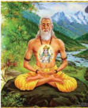

> **Deskripsi Visual:** Gambar ini adalah ilustrasi yang menampilkan seorang guru yoga meditasi di alam pegunungan. Guru tersebut duduk dalam posisi lotus dengan mata tertutup, menunjukkan keadaan pencerahan spiritual. Belakangnya adalah pemandangan pegunungan indah dengan air jernih yang mengalir, menunjukkan keindahan alam yang sering digunakan dalam praktik yoga.

Elemen utama dalam gambar meliputi guru yoga yang sedang meditasi, pegunungan yang indah, dan air jernih yang mengalir. Guru yoga merupakan elemen utama yang menunjukkan subjek utama dari gambar ini, sementara pegunungan dan air jernih membantu menciptakan latar belakang yang mendukung tema spiritual dan meditasi.

Teks, angka, atau label penting tidak terlihat pada gambar ini karena ia hanya berupa ilustrasi. Namun, informasi kunci yang dapat diambil dari gambar ini adalah bahwa ini adalah ilustrasi tentang praktik yoga dan meditasi, serta keindahan alam yang sering digunakan dalam praktik ini.

Dengan bersatunya Atma pada sumbernya yaitu Brahmana ( Ida Sang Hyang Widhi ) maka berakhirlah proses atau lingkaran Punarbhawa atau Samsara bagi Atma . Selesailah pengembaraan atma itu yang mungkin telah berulang kali lahir di dunia ini, dan tercapailah kebahagiaan yang kekal abadi. Berdasarkan petunjuk kitab-kitab  suci  agama  kita  ' Moksha '  sebagai  kebebasan  abadi,  dinyatakan memiliki beberapa tingkatan, antara lain :

### a. Samipya

Samipya adalah Moksha atau  kebebasan  yang  dapat  dicapai  semasih hidupnya ini, terutama oleh para Rsi saat melaksanakan Yoga , samadhi , disertai dengan  kemekaran  antusiasnya,  sehingga  beliau  dapat  menerima  wahyu  dari Tuhan. Samipya sama sifatnya dengan Jiwan Mukti.

 

---
## 📄 Halaman 149

### b. Sarupya

Sarupya adalah Moksha atau kebebasan yang dicapai semasih hidup di mana kedudukan  atma  mengatasi  unsur-unsur  maya.  Kendati  pun  atma  mengambil perwujudan  tertentu  namun  tidak  akan  terikat  oleh  segala  sesuatunya  seperti halnya awatara seperti Budha, Sri Kresna, Rama dan lain sebagainya.

### c. Salokya (Karma Mukti)

Salokya (Karma Mukti) merupakan kebebasan yang dicapai oleh atma itu sendiri  telah  berada  dalam  posisi  kesadaran  sama  dengan  Tuhan  akan  tetapi belum dapat bersatu dengan Tuhan itu sendiri. Dalam keadaan ini dapat dikatakan bahwa atma itu telah mencapai tingkat 'Dewa' yang merupakan manifestasinya dari sinar sucinya Tuhan itu sendiri.

### d. Sayujya (Purna Mukti)

Sayujya (Purna Mukti) ini merupakan suatu tingkatan kebebasan yang paling tinggi dan sempurna di mana atma telah dapat bersatu atau bersenyawa dengan Tuhan dan tidak terbatas oleh apapun juga sehingga benar-benar telah mencapai ' Brahma Atma Aikyam ' yaitu atman dengan Tuhan betul-betul bersatu.

Walaupun  ada beberapa aspek atau tingkatan daripada Moksha itu berdasarkan,  atas  keadaan  atma  dalam  hubungannya  dengan  Tuhan  yang terpenting dan patut menjadi kunci pemikiran untuk mencapai Moksha itu adalah agar kita dapat melenyapkan pengaruh ' Awidya (maya)' dalam alam pikiran itu, sehingga atma akan mendapat kebebasan yang sempurna. Kitab Bhagawadgita menyebutkan, sebagai berikut:

 

---
## 📄 Halaman 150

'Anta kale ca mameva, smaran muktva kalevaran, yah prayate sa madhavam, yati nasty atra sam sayah' (Bhagawadgita VIII, 5).

### Terjemahannya:

Dan siapa saja pada waktu meninggal, melepaskan badannya dan berangkat hanya memikirkan Aku, ia mencapai tingkat Aku. Tentang ini tidak ada keraguraguan lagi.

Dalam  pustaka  suci  Manawa Dharma sastra  disebutkan,  bahwa  untuk mencapai rahmat yang tertinggi ( nicreyasa ) yakni Moksha itu sendiri, antara lain dapat dicapai dengan cara sebagai berikut :

- Mempelajari Weda.
- Melakukan tapa.
- Mempelajari / mencari pengetahuan yang benar.
- Menunduk (mengendalikan Panca Indriya).
- Tidak menyakiti makhluk lain.
- Melayani/menghormati guru.
Ke enam hal tersebut di atas serentak harus dilaksanakan, jadi tidak hanya memilih salah satu. Di samping hal tersebut di atas kita juga mengenal jalan atau cara yang dapat dilalui untuk menuju kehadapan Sang Hyang Widhi Wasa , yakni untuk  mempertemukan atman dengan atman. Cara seperti itu disebut dengan Yoga . Yoga itu ada empat macam yang disebut Catur Yoga , yaitu :

 

---
## 📄 Halaman 151

- Karma Yoga.
- Bhakti Yoga.
- Jnana Yoga.
- Raja Yoga.
Kata ' Yoga ' berasal dari urat kata ' yuj ' yang artinya menghubungkan diri. Setiap Yoga tersebut  di  atas  mempunyai  cara  dan  sifat  tersendiri,  yang  dapat diikuti  atau  dilaksanakan  oleh  setiap  orang.  Dan  setiap  orang  dalam  memilih Yoga itu disesuaikan dengan sifat, bakat, dan kemampuannya. Dengan demikian cara  yang  ditempuh  berbeda,  namun  sasaran  atau  tujuan  yang  ingin  dicapai adalah satu dan sama yaitu Moksha atau mukti. Untuk jelasnya akan diuraikan tentang Yoga itu satu persatu sebagai berikut :

### 1. Karma Yoga

Karma Yoga yaitu  proses  mempersatukan atman  atau  jiwatman  dengan  paramatma (Brahman)  dengan  jalan  berbuat  kebajikan (subha-karma) untuk membebaskan diri dari ikatan duniawi. Adapun 'karma' yang dimaksud adalah perbuatan baik (subhakarma),  suatu  perbuatan  baik  tanpa mengikat diri dengan mengharapkan hasilnya. Semua  hasil (phala) perbuatan

---
**🖼️ Gambar/Diagram**

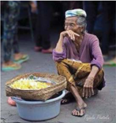

> **Deskripsi Visual:** Gambar ini adalah foto yang menunjukkan seorang lansia sedang duduk di atas sebidang tanah. Lansia tersebut memakai pakaian tradisional dengan warna-warna cerah dan memegang sebuah wadah berisi makanan. Wajah lansia tampak lelah dan penat, menunjukkan kondisi fisik yang kurang baik. Di sekitar lansia, terlihat beberapa orang yang tampaknya sedang beraktivitas, mungkin menjual atau membeli barang di pasar. Gambar ini menunjukkan suasana sehari-hari di suatu desa atau kota kecil, dengan aktivitas sehari-hari yang sederhana namun penting bagi kehidupan masyarakat.

Elemen-elemen utama dalam gambar ini meliputi lansia yang sedang duduk, wadah makanan, orang-orang di sekitarnya, dan lingkungan sekitar mereka. Relasi antara elemen-elemen ini adalah bahwa lansia adalah subjek utama yang tengah duduk, wadah makanan berisi makanan yang disimpan oleh lansia, dan orang-orang di sekitarnya adalah bagian dari aktivitas sehari-hari di desa atau kota kecil tersebut. Teks, angka, atau label penting tidak terlihat dalam gambar ini.

Informasi kunci yang dapat diambil pembaca dari gambar ini adalah tentang kehidupan sehari-hari di desa atau kota kecil, kondisi fisik lansia, dan aktivitas sehari-hari di sekitar mereka. Gambar ini juga menunjukkan betapa pentingnya keberadaan lansia dalam masyarakat dan bagaimana mereka berkontribusi pada kehidupan sehari-hari.

harus diserahkan kepada Ida Sang Hyang Widhi Wasa dan perbuatan yang bebas dari harapan hasil itu disebut ' Karma Nirwritta '. Sedangkan perbuatan (karma)

 

---
## 📄 Halaman 152

yang  masih  mengharapkan  hasilnya  disebut  ' Karma Prawritta '.  Jadi  dengan mengabdikan  diri  kepada Ida  Sang  Hyang  Widhi  Wasa berlandaskan  subhakarma yang tanpa pamrih itu, seseorang akan dapat mencapai kesempurnaan itu secara bertahap. Dengan bekerja tanpa terikat orang akan dapat mencapai tujuan tertinggi itu.

Dengan demikian Karma Yoga yang mengajarkan bahwa setiap orang yang menjalani cara ini bekerja dengan baik tanpa terikat dengan hasil, sesuai dengan kewajibannya ( SwaDharmanya ). Adalah salah kalau orang beranggapan bahwa dengan tidak bekerja kesempurnaan akan dapat dicapai. Karena pada hakekatnya dunia inipun dikuasai dan diatur oleh hukum karma sehingga, seorang Karma Yoga ber Yajña dengan  kerja  (karma).  Karena  itu  bekerjalah  selalu  dengan tidak  mengikatkan  diri  pada  hasilnya,  sehingga  tujuan  tertinggi  pasti  akan dapat  dicapai  dengan  cara  yang  demikian.  Dengan  menyerahkan  segala  hasil pekerjaan itu sebagai Yajña kepada Sang Hyang Widhi dan dengan memusatkan pikiran  kepada-Nya  dan  kemudian  melepaskan  diri  dari  segala  pengharapan serta menghilangkan kekuatan, maka kesempurnaan itu dapat dicapai. Dengan demikian, ajaran Karma Yoga yang pada pokoknya menekankan kepada setiap orang agar selalu bekerja sesuai dengan Swa Dharma nya dengan tidak terikat pada hasilnya serta tidak mementingkan diri sendiri.

### 2. Bhakti Yoga

Bhakti Yoga yaitu proses atau cara mempersatukan atman dengan Brahman dengan berlandaskan atas dasar cinta kasih yang mendalam kepada Ida Sang Hyang  Widhi  Wasa .  Kata  ' bhakti '  berarti  hormat,  taat,  sujud,  menyembah, persembahan, kasih.

 

---
## 📄 Halaman 153

Bhakti Yoga artinya: jalan cinta kasih, jalan persembahan. Seorang Bhakta (orang yang menjalani Bhakti Marga) dengan sujud dan cinta, menyembah dan berdoa dengan pasrah mempersembahkan jiwa raganya sebagai Yajña kepada Sang Hyang Widhi . Cinta kasih yang mendalam adalah suatu cinta kasih yang bersifat  umum  dan  mendalam  yang  disebut  maitri.  Semangat  Tat  Twam  Asi sangat subur dalam hati sanubarinya. Sehingga seluruh dirinya penuh dengan rasa cinta kasih dan kasih sayang tanpa batas, sedikitpun tidak ada yang terselip dalam dirinya  sifat-sifat  negatif  seperti  kebencian,  kekejaman,  iri  dengki  dan kegelisahan atau keresahan. Cinta baktinya kepada Hyang Widhi yang  sangat mendalam, itu juga dipancarkan kepada semua makhluk baik manusia maupun binatang.

Dalam doanya selalu menggunakan pernyataan cinta dan kasih sayang dan memohon kepada Yang Widhi agar  semua  makhluk  tanpa  kecuali  selalu  berbahagia dan selalu mendapat berkah termulia dari Hyang Widhi. Jadi untuk lebih jelasnya seorang bhakta akan selalu berusaha melenyapkan kebenciannya kepada semua makhluk. Sebaliknya ia selalu berusaha memupuk dan mengembangkan sifatsifat Maitri, Karuna, Mudita dan Upeksa ( Catur Paramita). Ia selalu berusaha membebaskan dirinya dari belenggu keakuannya (ahamkara).

Sikapnya selalu sama menghadapi suka dan duka, pujaan dan celaan. Dan selalu merasa puas dalam segala-galanya, baik dalam kelebihan dan kekurangan. Jadi, benar-benar tenang dan sabar selalu. Dengan demikian baktinya kian teguh dan kokoh kepada Hyang Widhi Wasa . Keseimbangan batinnya sempurna, tidak ada  ikatan  sama  sekali  terhadap  apapun.  Ia  terlepas  dan  bebas  dari  hukuman serba  dua  (dualis)  misalnya  suka  dan  duka,  susah  senang  dan  sebagainya.

 

---
## 📄 Halaman 154

Seluruh  kekuatannya  dipakai  untuk  memusatkan  pikirannya  kepada Hyang Widhi dan dilandasi jiwa penyerahan total. Dengan begitu seorang Bhakti Yoga dapat mencapai Moksha .

### 3. Jnana Yoga

Jnana Yoga ialah  pengetahuan  suci  yang  dilaksanakan  untuk  mencapai hubungan atau persatuan antara atma dengan Brahman. Kata ' Jnana '  artinya pengetahuan  sedangkan  kata Yoga berarti  berhubungan.  Jadi  dengan  jalan menggunakan ilmu pengetahuan suci ( Jnana ) seorang ( jnanin ) menghubungkan dirinya  ( atmanya )  dengan Hyang  Widhi untuk  mencapai  kesempurnaan  dan kebahagiaan yang kekal abadi.

---
**🖼️ Gambar/Diagram**

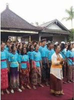

> **Deskripsi Visual:** Gambar ini adalah foto yang menunjukkan sebuah acara resmi di sebuah gedung. Dalam foto tersebut, beberapa orang berdiri di depan gedung, tampaknya sedang mengikuti upacara atau acara penting. Mereka semua mengenakan pakaian formal, dengan beberapa wanita memakai pakaian tradisional yang menunjukkan keberagaman budaya. Di tengah foto, ada seorang pria yang tampaknya sedang memberikan pidato atau sambutan kepada para peserta acara. Latar belakangnya tampak tenang dengan beberapa pohon dan bangunan lain yang tidak jelas. Teks, angka, atau label penting tidak terlihat dalam gambar ini. Informasi kunci yang dapat diambil pembaca adalah bahwa acara ini mungkin merupakan upacara peresmian atau penghargaan, dan terjadi di tempat yang memiliki makna historis atau budaya.

Seorang Jnana akan memusatkan bayu, sabda dan  idepnya  untuk  mendalami  dan  menekuni isi  pustaka  suci  Weda,  terutama  bidang  filsafat ( tattwa ).  Dengan  demikian  lenyaplah  ketidak tahuannya ( awidya )  dan  kekhayalannya ( maya ), sehingga dapat menembus jalan bebas dari ikatan karma dan samsara. Kebijaksanaan tertinggi itu  sesungguhnya  ada  pada Hyang  Widhi yang bergelar  Sang  Hyang  Saraswati.  Tuhan  ( Hyang Widhi ) adalah serba tahu. Pengetahuan suci yang merupakan  anugrah-Nya  itu,  patutlah  dipakai sarana  ber Yajña dan  memusatkan  pikiran  kepada  Beliau.  Karena  disebutkan  bahwa Yajña berupa  pengetahuan  ( Jnana )  adalah  lebih  utama  sifatnya  dibandingkan

 

---
## 📄 Halaman 155

dengan Yajña (korban)  benda  yang  berupa  apapun.  Segala  pekerjaan  tanpa kecuali memuncak atau berpusat dalam kebijaksanaan. Disebutkan pula dengan berbidakan  ilmu  pengetahuan  seseorang  dapat  menyebrangkan  diri  untuk mengarungi lautan dosa sekalipun.

Dengan ilmu pengetahuan suci itu orang sanggup melepaskan diri dari ikatan karma. Semua hasil karma akan habis terbakar oleh apinya ilmu pengetahuan. Seperti halnya kayu api terbakar menjadi abu. Sehingga terhapuslah dualisme (suka-duka).  Orang  yang  memiliki  kebijaksanaan  akan  segera  menemukan kedamaian yang abadi. Semua kebimbangan dan keraguan lenyap dan dengan demikian atma dapat bersatu dengan Brahman ( Hyang Widhi ). Akhirnya hukum Karma dan Punarbawa dapat ditebus dan sampailah pada Moksha .

### 4. Raja Yoga

Raja Yoga dilaksanakan  dengan  cara  pengendalian  dan  penggemblengan diri melalui Tapa, Brata dan Samadi. Untuk melaksanakan Yoga itu ada delapan langkah atau tahap yang harus dijalankan yang disebut Astangga Yoga . Adapun bagian-bagian dari Astangga Yoga tersebut sebagai berikut:

- Yama : merupakan pengendalian diri tahap pertama. (Jasmani)
- Niyama : pengendalian diri dalam tahap lebih lanjut. (Rohani)
- Asana : latihan berbagai sikap badan untuk meditasi.
- Pranayama : pengaturan pernafasan untuk mencapai ketenangan pikiran. Di dalam pengaturan nafas ada tiga jalan yaitu:

 

---
## 📄 Halaman 156

- Puraka (menarik nafas)
- Kumbaka (menahan nafas)
- Recaka (mengeluarkan nafas) semua ini dilakukan secara teratur.
- Pratyahara : mengontrol dan mengembalikan semua indrya, sehingga dapat melihat sinar-sinar suci.
- Dharana :  usaha-usaha  untuk  menyatukan  pikiran  dengan  Tuhan ( Hyang Widhi ).
- Dhyana :  usaha-usaha  untuk  menyatukan  pikiran  dengan  Tuhan ( Hyang Widhi ) tarafnya lebih tinggi daripada Dharana).
- Samedi : bersatunya atma dengan Tuhan.
Dengan melakukan latihan Yoga ( Astangga Yoga )  seorang  pengikut  Raja Yoga akan  dapat  menerima  wahyu  melalui  pengamatan  intiusinya  yang  telah mekar.  Dan  juga  akan  dapat  mengalami  ' Jiwan  Mukti '  selanjutnya  setelah meninggal dunia maka atmanya akan dapat bersatu dengan Tuhan. Selanjutnya individu  yang  bersangkutan  akan  dapat  menikmati  kebebasan  yang  tertinggi ( Moksha ). Kitab Bhagawangita Bab VI, sloka 10 disebutkan sebagai berikut:

'Yog ī yunj ī ta sata sida, Ā tm ā nanam rahasi sthitah, ek ā k ī yatacittatma nirasik aparigrahah (Bhagawangita, VI.10).

 

---
## 📄 Halaman 157

### Terjemahannya:

Seorang Yogin harus tetap memusatkan pikirannya kepada atma yang Maha Besar (Tuhan) tinggal dalam kesunyian dan tersendiri, bebas dari angan-angan dan keinginan untuk memilikinya.

'Prasanta manarasam hy enam, yoginam sukham uttamam,Upaiti s ā ntara jasam Brahma-bhutam akalmasam. (BhagawangitaVI, 27)

### Terjemahannya:

Karena kebahagiaan tertinggi datang pada Yogin, yang pikirannya tenang dan hawa nafsunya tidak bergolak yang keadaannya bersih dan bersatu dengan Tuhan ( Moksha ).

Demikianlah cara atau jalan untuk dapat dituruti, dilaksanakan oleh manusia sebagai tuntunan baginya untuk mencapai tujuan hidup rokhani, yakni guna dapat menikmati kesempurnaan hidup yang disebut Moksha . Di antara keempat cara atau jalan tersebut di atas semuanya adalah sama, tiap-tiap jalan meletakkan dasar dan cara-cara tersendiri. Tidak ada yang lebih tinggi, ataupun yang lebih rendah, semuanya  baik  dan  utama  tergantung  pada  kepribadian,  watak,  kesanggupan dan  bakat  manusia  masing-masing.  Semuanya  akan  mencapai  tujuannya  asal dilakukan dengan penuh kepercayaan, ketekunan dengan tulus ikhlas, kesujudan, keteguhan  iman  dan  tanpa  pamrih.  Di  dalam  kitab  Bhagawangita  dijelaskan sebagai berikut:

 

---
## 📄 Halaman 158

'Ye yath ā mam prapadyante, t ā ms tathai va bhaj ā my aham,mama vartma nuvar tante, manushy ā h partha sarvasah (Bhagawangita IV, 11).

### Terjemahannya:

Jalan  manapun  ditempuh  manusia  kearah-Ku  semuanya  Ku-terima  dari mana-mana semua mereka menuju jalan-Ku oh Parta.

Jika kita perhatikan dari semua jalan tersebut di atas semuanya menekankan, bahwa syarat untuk mencapai kebebasan ( Moksha )  ialah  lenyapnya  pengaruh maya dan emosi karena maya inilah yang merupakan perintang dan penghalang bagi atma untuk bersatu dengan Tuhan ( Sang Hyang Widhi Wasa ), seperti halnya udara di alam (di luar). Moksha sebagai  tujuan  spiritual  bukanlah  merupakan suatu janji yang hampa melainkan suatu keyakinan yang tinggi bagi tiap orang yang  beriman  dan  merupakan  suatu  pendidikan  rohani  untuk  menciptakan rohani manusia yang beretika dan bermoral serta memberi effek positf. Tif demi tercapainya masyarakat yang sejahtera tersebut, bekerja atas dasar kebenaran, kebajikan dan pengorbanan dan bebas dari segala macam kecurangan ( satyam eva jayate na nrtam ). Demikianlah Moksha itu dapat ditempuh dengan beberapa macam jalan sesuai dengan tingkat kemampuan dari masing-masing orang.

### Uji Kompetensi:

- Apakah yang dimaksud dengan catur purusãrtha dalam ajaran agama Hindu? Jelaskanlah!
- Mengapa usaha untuk mewujudkan catur purusãrtha dinyatakan sulit dapat dilaksanakan dalam kehidupan ini?

 

---
## 📄 Halaman 159

- Hambatan apa sajakah yang anda alami untuk dapat mewujudkan catur purusãrtha itu?  Diskusikanlah  dengan  (Kelompok,  teman  sebangku atau yang lainnya) di kelas! Laporkanlah hasil diskusi tersebut!
- Manfaat  apakah  yang  dapat  dirasakan  secara  langsung  dari  usaha dan upaya untuk mewujudkan kesejahteraan dan kebahagiaan hidup ini  berlandaskan  konsep catur purusãrtha ?  Tuliskanlah  pengalaman Anda!
- Bila  seseorang  berkeinginan  untuk  melaksanakan catur purusãrtha tanpa  mengikuti  tahapan-tahapannya,  apakah  yang  akan  terjadi? Buatlah  narasinya  1-3  halaman  diketik  dengan  huruf  Times  New Roman-12, spasi 1,5 cm, ukuran kertas kwarto: 4-3-3-4!

 

---
## 📄 Halaman 160

### D. Tantangan dan Hambatan dalam Mencapai Moksha sesuai dengan Zamannya 'Globalisasi'

### Perenungan:

### Terjemahannya:

'Orang  yang  kecerdasannya  tidak  terikat  di  mana  saja,  telah  menguasai dirinya dan melepaskan keinginannya, dengan penyangkalan ia mencapai tingkat tertinggi dari kebebasan akan kegiatan kerja (Bhagavagità, XVIII.49).

Membangun kehidupan spiritual dalam perilaku sehari-hari sering mengalami  kendala,  tantangan  dan  hambatan.  Berbagai  macam  pertanyaan bermunculan dari berbagai lapisan masyarakat, terutama generasi muda. Apakah untuk melakukan kegiatan spiritual kita harus meniadakan aktivitas keseharian ' karma ' bekerja sebagai wujud swa Dharma hidup ini? Benarkah bahwa aktivitas spiritual  manusia  itu  akan  berhasil  dengan  baik  bila  dilaksanakan  setelah masa-masa  tua  (masa  persiapan  pensiun),  mengingat  saat  itu  seseorang  telah memiliki  waktu  panjang  serta  berkurangnya  tanggung-jawab  dan  kewajiban hidupnya? Bukankah  sebaiknya penataan kesehimbangan hidup manusia

'Asakta-buddhiá sarvatra jitàtmà vigata-spåhaá, naiûkarmya-siddhiý paramàý sannyàsenàdhigacchati'.

 

---
## 📄 Halaman 161

(rohani dan jasmani) dibangun sejak awal seirama dengan pembelajaran hidup ini?  Kesenjangan  hidup  (rohani  dan  jasmani)  mengantarkan  terhambatnya pencapaian kesehimbangan hidup seseorang.

Bagaimana tantangan untuk mencapai kesejahtraan dan kebahagiaan hidup ini  ' jagadhita  dan  Moksha '  dapat  teratasi  dengan  baik?  Lakukanlah  dengan sungguh-sungguh sifat dan sikap mulia berikut ini!

### 1. Menjauhkan Diri dari Keterikatan Materialistis

Mengumpulkan harta-benda (material) untuk memenuhi kebutuhan hidup yang berkecukupan dalam hidup dan kehidupan ini adalah baik, namun apabila kekayaan yang kita kumpulan membuat orang lain menjadi menderita adalah tidakan  yang  kurang  terpuji.  Menjadikan  diri  sebagai  insan  yang  koruptor, pemeras,  membuat  masyarakat  miskin  dan  menderita  adalah  tindakan  yang sangat  bertentangan  dengan  tujuan  hidup  beragama  ' Moksha '.  Sikap  dan tindakan seseorang yang suka berlebihan mengumpulkan material mengantarkan yang bersangkutan susah dapat mewujudkan kebahagian yang dicita-citakannya.

### 2. Mengutamakan Aktifitas yang Bernuansakan Spiritual

Sumber: Dok. Pribadi, 17-2-2014.

 

---
## 📄 Halaman 162

Menjadi  orang  yang  kreatif,  rajin,  tekun,  dan  cekatan  yang  bernafaskan keagamaan dan kemanusiaan dapat mengantarkan yang bersangkutan mampu mewujudkan kebahagiaan hidupnya. Namun apabila sebaliknya, seperti rajin, tekun,  pekerja  keras  hanya  untuk  memenuhi  ambisi  semata,  lupa  dengan kewajiban  hidup  beragama  tentu  berakibat  tidak  baik,  dan  sekaligus  dapat mengantarkan yang bersangkutan menjadi insan yang menderita. Oleh karena itu bila kita memutuskan diri menjadi orang-orang rajin mendapatkan harta benda jangan pernah lupa untuk rajin mendekatkan diri kepada Sang Pencipta guna memohon keteduhan dalam hidup ini. Datanglah ke Pura (tempat suci) untuk melakukan  aktivitas  keagamaan  dengan  tulus.  Walaupun  disibukan  dengan kegiatan  duniawi  akan  tetapi  jangan  pernah  lupa  mengimbanginya  dengan kegiatan spiritual.

### 3. Jauhkan dan Hindarkanlah Diri dari Tindakan Tidak Terpuji

Tindakan manusia terpuji adalah menjauhkan diri dari kebodohan ( Punggung ),  irihati  ( Irsya ),  dan  marah  ( Krodha )  serta  sifat-sifat  negatif  yang lainnya seperti 'mabuk, berjudi, bermain wanita, dan bertindak anarkis' karena dapat mengantarkan seseorang menjadi insan yang nista.

Manusia sepatutnya selalu berusaha untuk menjadi insan yang terpuji, sebab pada dasarnya setiap kelahiran manusia adalah baik. Hal ini dapat dibuktikan dengan  diberikannya berbagai macam  predikat kepada manusia, seperti; manusia  adalah  mahkluk:  (individu,  berpikir,  religius,  sosial,  berbudaya)  dan yang lainnya, (Wigama dkk, 1995:204).

 

---
## 📄 Halaman 163

Semestinya  kita  patut  bersyukhur  dilahirkan  hidup  menjadi  manusia, karena hanya yang dilahirkan hidup menjadi manusia saja dapat berbuat baik atau melebur perbuatan yang buruk menjadi baik. Kitab suci veda menjelaskan sebagai berikut;

'Mànusah sarvabhùteûu varttate vai ûubhàúubhe, aúubheûu samaviûþam úubhesvevàvakàrayet.

Ri sakwehning sarwa bhuta, iking janma wwang juga wënang gumawayaken ikang subhasubhakarma, kuneng panëntasakëna ring úubhakarma juga ikangaúubhakarma phalaning dadi wwang'.

### Terjemahannya:

Di antara semua makhluk hidup, hanya yang dilahirkan menjadi manusia sajalah,  yang  dapat  melaksanakan  perbuatan  baik  ataupun  buruk;  leburlah  ke dalam perbuatan baik, segala perbuatan yang buruk itu; demikianlah gunanya (phalanya) menjadi manusia, (Sarasamuçcaya, 2).

'Iyam hi yonih prathamà

yonih pràpya jagatipate, àtmànam ûakyate tràtum karmabhih úubhalakûaóaih.

 

---
## 📄 Halaman 164

Apan iking dadi wwang, uttama juga ya, nimittaning mangkana, wënang ya tumulung awaknya sangkeng sangsàra, makasàdhanang úubhakarma, hinganing kottamaning dadi wwang ika'.

### Terjemahannya:

Menjelma menjadi manusia itu adalah sungguh-sungguh utama; sebabnya demikian, karena ia dapat menolong dirinya dari keadaan sengsara (lahir dan mati  berulang-ulang)  dengan  jalan  berbuat  baik,  demikianlah  keuntungannya dapat menjelma menjadi manusia, (Sarasamuçcaya, 4).

Sebagai akibat dari kemampuan untuk memilih yang dimiliki oleh manusia, mengakibatkan  manusia  dapat  meningkatkan  hidup  dan  kehidupannya  dari yang kurang baik menjadi lebih baik, dan akhirnya sampai manusia dinyatakan memiliki kedudukan yang paling tinggi (istimewa) dari semua mahkluk yang ada. Meskipun demikian bukan berarti pula manusia akan terlepas sama sekali dari perbuatan-perbuatannya yang kurang baik.

Secara kodrati kelahiran manusia dilengkapi dengan: sifat tri guna yakni tiga  sifat  utama  ( sattwam ;  ketenangan, rajas ;  dinamis,  dan tamas ;  lamban). Ketiga sifat utama ini hendaknya terjaga keseimbangannya untuk tidak menjadi memicu tumbuh dan berkembangnya sad ripu yaitu enam musuh utama yang ada pada setiap manusia, yang terdiri dari: k ā ma ; nafsu, lobha ; tamak, krodha ; kemarahan, mada; kemabukan, moha ; kebingungan, matsarya ; iri-hati.

 

---
## 📄 Halaman 165

'Yo durlabhataram pràpya mànusyam lobhato narah, dharmàvamantà kàmàtma bhavet sakalavañcitah'.

Hana  pwa  tumënung  dadi  wwang,  wimukha  ring  Dharmasadhana,  jënëk ring arthakàma arah, lobhambëknya, ya ika kabañcana ngaranya.

### Terjemahannya:

Bila  ada  orang  berkesempatan  menjadi  orang  (manusia),  ingkar  akan pelaksanaan Dharma ;  sebaliknya  amat  suka  ia  mengejar  harta  dan  kepuasan napsu dan berhati tamak; orang itu disebut kesasar, tersesat dari jalan yang benar (Sarasamuçcaya, 9).

Dalam hidup dan kehidupan ini manusia dihadapkan pada banyak faktor kemungkinan  untuk  menjadi  kurang  baik.  Kemungkinan  yang  dimaksud seperti; kebodohan, kemiskinan, dan kemelaratan yang disebabkan oleh karena kelelahan,  lingkungan  yang  kurang  bersahabat,  dan  juga  karena  keinginan yang tidak terkendali. Semuanya itu mengantarkan manusia dapat diliputi oleh kegelapan ( awidya/timira ) dan kebingungan.

Disebutkan  ada  7  (tujuh)  macam  sifat  manusia  secara  kodrati  dapat mengantarkan  hidup  manusia  menjadi awidya ,  gelap,  suram,  timira  yang dikenal  dengan  istilah  ' sapta  timira '.  Yang  disebut  sapta  timira  antara  lain; surupa ;  ketampanan/kecantikan, dana ;  kekayaan, guna ;  kepandaian, kulina ;

 

---
## 📄 Halaman 166

kebangsawanan, yowana ;  keremajaan, sura ;  minuman  keras,  dan kasuran ; kemenangan.  Ketujuh  unsur/sifat  alami  itulah  yang  mengantarkan  manusia menjadi awidya atau gelap sebagai akibat dari kebodohannya.

'Ajñànaprabhavam hidaý yadduhkhamupalabhyate, lobhàdeva tad ajñànam ajñàna lobha eva ca.

Apan ikang sujhaduhkha kabhukti, punggung sangkanika, ikang punggung, kalobhan  sangkanika,  ikang  kalobhan,  punggung  sangkanika  matangnyan punggung sangkaning sangsàra.

### Terjemahannya:

Sebab suka duka yang dialami, pangkalnya adalah kebodohan; kebodohan ditimbulkan  oleh  loba,  sedang  lobha  (keinginan  hati)  itu  kebodohan  asalnya; oleh karenanya kebodohanlah asal mula kesengsaraan itu (Sarasamuçcaya, 400).

Tujuh macam sifat awidya atau kegelapan yang ada pada manusia apabila tidak  dapat  dikendalikan  dengan  baik  akan  menimbulkan  berbagai-macam tindakan kejam. Disebutkan manusia memiliki enam peluang untuk bertindak kejam apabila keberdaan sapta timira tidak terkendalikan. Enam tindakan kejam itu  disebut  dengan  istilah sad  atatayi, yang  terdiri  dari: agnid ā ;  membakar,

 

---
## 📄 Halaman 167

wisada ;  meracun, atharwa ;  mensihir, çastraghna ;  mengamuk, dharatikrama ; memperkosa, rajapisuna ; memfitnah.

Menjadi pekerja aktif dengan jabatan sebagai atasan kurang memungkinkan untuk  melakukan  kegiatan  spiritual  karena  disibukkan  oleh  berbagai  macam aktifitas  kantor.  Perilaku  seseorang  kadang  menyimpang  dari Dharma akibat tugas yang diberikan oleh majikan untuk mengambil keputusan sesuai dengan kebutuhan atasan (pihak manajemen). Biasanya pada saat menjabatlah semestinya seseorang dapat memanfaatkan kesempatan untuk menegakkan Dharma . Setiap keputusan  yang  diambil  oleh  seorang  atasan  seharusnya  menguntungkan masyarakat banyak.

Terkadang banyak orang yang kurang sabar dalam mengumpulkan harta dari pekerjaan yang ditekuninya, seperti dengan mengambil jalan pintas melakukan korupsi, kolusi, nepotisme (KKN). Berdasarkan Dharma , dalam mengumpulkan harta tidak harus dengan korupsi. Tidak sedikit orang menjadi kaya tanpa korupsi, karena mereka berusaha dengan profesional dan hasil usahanya dimanfaatkan untuk  kepentingan  orang  banyak  seperti  dengan  mendirikan  Yayasan  untuk orang  yang  tidak  mampu  (fakir  miskin)  atau  mendirikan  sekolah  yang  dapat menunjang Pendidikan demi masa depan anak-anak bangsa ini.

Sikap  dan  perilaku  yang  diwujudkan  oleh  seseorang  seperti  tersebut  di atas (mendirikan yayasan fakir miskin) berarti yang bersangkutan telah mampu membangun spiritualnya dan sekaligus dapat mengendalikan sifat-sifat awidya -nya. Agar manusia tidak terjerumus dan hanyut ke lembah derita sebagai akibat dari kebodohan, dan kegelapannya di tengah-tengah arus globalisasi yang serba terbuka  maka  ia  berkewajiban  untuk  meningkatkan  kecerdasan  intelektual

 

---
## 📄 Halaman 168

dan  religiusnya.  Umat sedharma hendaknya  selalu  dapat  meningkatkan  diri untuk belajar, menumbuh-kembangkan kebijaksanaannya, memohon tuntunanNya untuk berlatih berpikir jernih, berketatapan hati, dan selalu bersikap baik ' Dharma ' serta sikap positif yang lainnya. Dengan demikian umat sedharma akan  selalu  tenang,  sabar,  dan  penuh  kedamaian  dalam  mewujudkan  tujuan hidup dan tujuan agamanya.

Untuk  mencapai Moksha seseorang  dapat  memilih  salah  satu  di  antara Catur Marga Yoga .  Apakah melalui Jnana Marga Yoga, Karma Marga Yoga, Bakti Marga Yoga dan Raja Marga Yoga , diharapkan dapat disesuaikan dengan kemampuan serta bidang yang digeluti saat ini. Pada saat perang Barata Yuda sudah berakhir, di mana kemenangan berada dipihak Pandawa, semua musuhmusuhnya sudah kalah perang tinggal Pandawa yang hidup. Yudistira sebagai pemimpin Pandawa memutuskan pergi kehutan untuk mengasingkan diri dengan maksud mendekatkan diri kehadapan Yang Widhi Wasa dengan mengikuti ajaran Raja  Marga  Yoga  sebagai  salah  satu  bagian  dari Catur  Marga  Yoga .  Arjuna sebagai  orang  yang  bijaksana  yang  mempunyai  Visi  dan  Misi  jauh  ke  depan menganjurkan kepada Prabu Yudistira agar kembali untuk memimpin kerajaan. Untuk mencapai Moksha tidak harus pergi kehutan bersemadi atau beryoga , di dalam kerajaan-pun dengan berbuat baik dan menegakkan kebenaran ' Dharma ' Moksha dapat dicapai.

'Kamarthau lipsamànastu dharmmamevàditaûcaret, na hi dharmmàdapetyarthah kàmo vapi kadàcana'

 

---
## 📄 Halaman 169

Yan  paramarthanya,  yan  arthakàma  sàdhyan,  Dharma  juga  lëkasakëna rumuhun, niyata katëmwaning arthakàma mëne tan paramàrtha wi katemwaning arthakàma deninganasar sakeng Dharma.

### Terjemahannya:

Pada hakekatnya, jika Artha dan Kama dituntut, maka seharusnya Dharma hendaknya dilakukan lebih dahulu; tak tersangsikan lagi, pasti akan diperoleh Artha  dan  Kama itu  nanti;  tidak  akan  ada  artinya,  jika Artha  dan  Kama itu diperoleh menyimpang dari Dharma (Sarasamuçcaya, 12).

Keterikatan  adalah  moha,  kebebasan  adalah Moksha .  Selama  kita  masih awidya dan terikat oleh hal-hal duniawi maka, Moksha sangat sulit untuk tercapai. Kesulitan untuk melepaskan keterikatan itu, dapat diatasi dengan latihan-latihan secara rutin. Untuk mengendalikan Sad Ripu tidak mudah,karena membutuhkan kesabaran dan ketekunan untuk selalu melakukan introspeksi terhadap diri kita sendiri,  dan  evaluasi  diri  sejauh  mana  telah  dilakukan  latihan-latihan  ke  arah pengendalian  diri  yang  dimaksud.  Melaksanakan  ajaran Catur  Marga  Yoga memang membutuhkan mental yang tangguh, tidak mudah menyerah, dan harus mengetahui kemampuan yang dimiliki. Seseorang sebaiknya harus mengetahui bakat  yang  dikaruniakan  oleh Yang  Widhi  Wasa kepadanya,  sehingga  dalam melaksanakannya sesedikit mungkin mendapat halangan atau kendala. Dengan demikian  dalam  waktu  yang  relatif  singkat  kita  sudah  dapat  melakukannya mendekati sempurna walaupun belum mencapai Moksha tetapi sudah dirasakan hasilnya.

 

---
## 📄 Halaman 170

Moksha merupakan sraddha yang ke lima dari Panca Sraddha sebagai dasar keyakinan bagi umat Hindu. Percaya dengan adanya Moksha berarti meyakini bahwa kebahagiaan itu ada, terjadi, dan dapat dicapai oleh setiap umat Hindu. Moksha merupakan tujuan hidup tertinggi dari umat Hindu. Kebahagiaan yang sejati ini baru akan dapat tercapai oleh seseorang bila ia telah dapat menyatukan jiwanya dengan Tuhan. Penyatuan Jiwa dengan Tuhan itu baru akan didapat bila ia telah melepaskan semua bentuk ikatan keduniawian pada dirinya. Keterikatan yang melekat pada diri kita itulah yang dinamakan maya atau kepalsuan. Maya dalam agama Hindu juga dinamakan sakti, prakrti, kekuatan dan pradhana. Maya selalu mengalami perubahan yang pada hakekatnya tidak ada. Keberadaannya semata-mata disebabkan oleh adanya hubungan indriya dengan obyek duniawi ini.  Keterikatan  akan  kekuatan  maya  atau  kepalsuan  duniawi  merupakan hambatan bagi umat se Dharma untuk mewujudkan ' Moksha '.

### Uji Kompetensi:

- Mengapa ' Moksha ' dinyatakan sulit dapat diwujudkan dalam kehidupan ini?
- Hambatan  apa  sajakah  yang  Anda  alami  untuk  dapat  mewujudkan Moksha itu? Diskusikanlah dengan (Kelompok, teman sebangku atau yang lainnya) di kelas! Laporkanlah hasil diskusi tersebut!
- Manfaat apakah yang dapat dirasakan secara langsung dari usaha dan upaya  untuk  mewujudkan  kesejahteraan  dan  kebahagiaan  hidup  ini ' Moksha '? Tuliskanlah pengalaman Anda!

 

---
## 📄 Halaman 171

- Bila seseorang berkeinginan untuk mencapai Moksha tanpa mengikuti tahapan-tahapannya, apakah yang akan terjadi? Buatlah narasinya 1-3 halaman diketik dengan huruf Times New Roman-12, spasi 1,5 cm, ukuran kertas kwarto; 4-3-3-4!

 

---
## 📄 Halaman 172

### E.  Upaya-upaya dalam Mengatasi Hambatan dan Tantangan untuk Mencapai Moksha menurut Zamannya 'Globalisasi'

### Perenungan:

### Terjemahannya:

Dia  dari  siapa  datangnya  semua  insani  oleh  siapa  semuanya  ini  diliputi: dengan memuja-Nya dengan kewajibannya sendiri, manusia mencapai kesempurnaan (Bhagavagità, XVIII.46).

Setiap orang yang menyatakan diri sebagai umat Hindu berkewajiban untuk mengamalkan ajaran agamanya. Kewajiban mengamalkan ajaran agama seperti ini telah dilaksanakan secara turun-tumurun sejak nenek moyang ada. Kebiasaan nenek moyang diwarisi oleh generasi ke generasi berikutnya. Kebenaran dari keyakinannya beragama seperti itu dipandang memberikan manfaat positif bagi keselamatan dan kelangsungan hidupnya.

Lima dasar keyakinan umat Hindu disebut dengan istilah Panca Sraddha . Dalam uraian ini akan membahas tentang sraddha yang ke lima, yaitu percaya

'yatah pravrttir bhùtànam yena sarvam idaý tatam, sva-karmanà tam abhyarcya siddhim vindati mànavah

 

---
## 📄 Halaman 173

dengan adanya Moksha . Apakah Moksha itu? Upaya apa yang mesti dilakukan untuk mengatasi tantangan dan hambatan dalam mewujudkan Moksha ?

Moksha adalah  bersatunya  atman  dengan  Brahman,  tercapainya  keadaan yang sat cit ananda, terwujudnya kebahagiaan yang abadi, suka tanpa wali dukha . Moksha adalah mukti atau kelepasan. Kondisi seperti inilah yang disebut dengan nama Moksha . Moksha adalah tujuan yang tertinggi bagi umat beragama Hindu. Umat Hindu meyakini bahwa Moksha merupakan sraddha yang utama setelah Brahman. Umat Hindu yakin bahwa ' Moksha ' bukan saja hanya dapat dicapai setelah  meninggal  dunia  (dunia  akhirat),  namun  demikian  dalam  kehidupan sekarang pun (semasih hidup) dapat dicapai, yang disebut dengan nama 'jiwam mukti'.

Dengan  mempedomani  diri  dan  mengamalkan  ajaran  cinta  kasih  serta ketidak terikatan akan ilusi dunia ini secara berkesinambungan seseorang dapat mencapai Moksha .  Kata Moksha mudah  diucapkan  namun  sulit  diwujudkan dalam  hidup  dan  kehidupan  ini.  Betapapun  sulitnya  sesuatu  itu  pasti  dapat wujudkan, bila diupayakan dengan niat suci, tekun, disiplin, sungguh-sungguh dan berlandaskan kitab suci. Renungkanlah mantram berikut ini:

'Oý ā yur vrddhir yaúo våddhir, våddhir prajña sukha úriyaý, Dharma Sant ā na våddhih sy ā t, santu te sapta-våddhayah.'

 

---
## 📄 Halaman 174

'Oý y ā van merau sthito devah, y ā vad gangg ā mahitale. Candr ā rkau gagane y ā vat, t ā vad v ā vijayi bhavet.

'Oý dirgh yur astu tath stu,

'Oý avighnam astu tath stu,

ā

ā

'Oý úubham astu tath stu,

ā

'Oý sukhaý bhavatu,

'Oý pùróam bhavatu,

sapta våddhir astu tad astu astu sv h .

### Terjemahannya:

Ya Tuhan, semoga bertambah dalam usia, bertambah dalam kemasyuran, bertambah dalam kepandaian, kegembiraan, dan kebahagiaan, bertambah dalam Dharma dan keturunan, tujuh pertambahan semoga menjadi bagianmu Ya Tuhan,

Selama Tuhan bersemayanm di Gunung Mahameru, selama Sungai Gangga berada di dataran Bumi, selama Matahari dan Bulan berada di langit, selama itu semoga seseorang mendapat kejayaan.

Ya  Tuhan,  semoga  panjang  umur,  semoga  demikian,  Ya  Tuhan,  semoga tiada rintangan, semoga demikian, Ya Tuhan, semoga baik, semoga demikian. Ya Tuhan, semoga bahagia, Ya Tuhan, semoga sempurna, Ya Tuhan, semoga rahayu, Semoga tujuh pertambahan terwujud (Sùrya sevana C.Hooykaas, 2002.146).

ā

ā

ā

 

---
## 📄 Halaman 175

Untuk dapat mencapai Moksha , seseorang harus memahami, mempedomani, dan  mematuhi  persyaratan-persyaratan  dalam  aktivitas  hidupnya,  sehingga proses  mencapai Moksha dapat  berjalan  sesuai  dengan  norma-norma  ajaran agama Hindu. Adapun tanda-tanda atau ciri-ciri seseorang yang telah mencapai ' Moksha ' atau mencapai Jiwatman Mukti adalah:

- Selalu dalam keadaan tenang secara lahir maupun bathin.
- Tidak terpengaruh dengan suasana suka maupun duka.
- Tidak terikat dengan keduniawian.
- Tidak mementingkan diri sendiri, selalu mementingkan orang lain atau lebih banyak dapat berbagi (masyarakat banyak).
Untuk mencapai Moksha , juga disebutkan mempunyai tingkatan-tingkatan yang tergantung dari karma (perbuatannya) seseorang selama hidupnya, apakah sudah  sesuai  dengan  norma-norma  ajaran  agama  Hindu.  Tingkatan-tingkatan Moksha yang dicapai oleh seseorang dapat diklasipikasikan sebagai berikut:

- Moksha: apabila  seorang  sudah  mampu  mencapai  kebebasan  rohani dengan meninggalkan badan kasar (jasad).
- Adi Moksha: apabila seorang sudah mencapai kebebasan rohani dengan tidak meninggalkan mayat tetapi meninggalkan bekas-bekas misalnya abu, dan atau tulang.
- Parama  Moksha: apabila  orang  yang  bersangkutan  telah  mencapai kebebasan rohani dengan tidak meninggalkan badan kasar (jasad) serta tidak membekas.

 

---
## 📄 Halaman 176

'Buddhilàbhàddhi puruûah sarvaý tarati kilbisam, vipàpo labhate sattvam sattvasthah samprasidati.

Apan ika sang tëlas tumenung kaprajnàn, hilang kalangkaning jñànanira, niûkalangka  pwa  jñànànira,  katëmu  tang  sattwaguna  denira,  sattwa  kewale, tan karakëtan, rajah tamah, sattwa ngaraning satah bhàwah, si uttamajnànà, citta  sat  swabhawa,  tar  kakenan  trsnàdi,  katëmu  pwang  sattwaguóa  denira, prasannàtmaka ta sira, tan karaket ring sarira, luput ring karmaphala.

### Terjemahannya:

Karena  orang  yang  telah  mendapat  kearifan  budi,  lenyap  segala  noda pikirannya:  tanpa  noda  (suci  bersih)  budi  pikiranya,  maka  sifat  'sattva' diperolehnya:  sifat  sattwa  saja  tidak  dicampuri  (dilekati)  sifat  'rajah-tamah': sattwa artinya sifat baik, yaitu budi pikiran utama, pikiran berpembawaan baik, tidak dihinggapi trsna (kehausan hati) dan sejenisnya: jika telah di dapat olehnya sifat sattwa, maka ia berjiwa suci bersih, tidak terikat pada badan kasar, bebas dari karmaphala (buah perbuatan), (Sarasamuçcaya, 507).

'úraddhàvàn anasùyaú ca

úåóuyàd api yo naraá, so 'pi muktaá úubhàmlokàn pràpnuyàt puóya-karmaóàm.

 

---
## 📄 Halaman 177

### Terjemahannya:

Orang  yang  mempunyai  keyakinan  dan  tidak  mencela,  orang  seperti itu  walaupun  sekedar  hanya  mendengar,  ia  juga  terbebas,  mencapai  dunia kebahagiaan manusia yang berbuat kebajikan (Bhagawadgita XVIII.71).

Adapun upaya-upaya yang patut dilakukan dalam mengatasi hambatan dan tantangan untuk mencapai Moksha sampai dengan era sekarang adalah:

### 1. Melaksanakan Meditasi

Memuja kebesaran dan kesucian Ida Sang Hyang Widhi Wasa /Tuhan Yang Maha Esa beserta prabhawanya adalah merupakan kewajiban bagi setiap umat beragama  'Hindu'.  Semakin  dekat  kita  dengan-Nya,  maka  semakin  merasa tentram damai hidup kita ini. Ada banyak jalan atau cara yang dapat kita lalui untuk  mewujudkan  semuanya  itu,  di  antaranya  melalui  sembahyang  sesuai dengan  waktunya,  melaksanakan upawasa ,  merenungkan  keberadaan Hyang Widhi beserta prabhawa-Nya.

### 2. Mendalami Ilmu Pengetahuan

Mendalami berbagai cabang ilmu pengetahuan sesuai dengan perkembangannya  adalah  merupakan  kewajiban  setiap  insan  yang  dilahirkan sebagai manusia. Kemajuan Ilmu pengetahuan dan teknologi yang berkembang sampai  saat  ini  dapat  dijadikan  media  oleh  manusia  yang  dilahirkan  dengan kesempurnaan yang terbatas, untuk menyelesaikan berbagai macam tantangan dan hambatan yang sedang dan akan dihadapinya guna mewujudkan cita-cita

 

---
## 📄 Halaman 178

hidupnya.  Oleh  karenanya  manusia  hendaknya  dengan  senang  hati,  penuh semangat, tekun dan penuh kesabaran mempersiapkan waktunya untuk belajar dan  belajar  sepanjang  hayat,  sebab  tidak  ada  kata  terlambat  untuk  belajar kebaikan.

### 3. Melaksanakan/Mewujudkan Dharma

Dalam ajaran Catur Parusàrtha dijelaskan bahwa tujuan umat seDharma beragama  Hindu  adalah  terpenuhinya  kama,  artha  dan Moksha berdasarkan Dharma . Bagaimana Dharma , dapat ditegakkan? Setiap tindakan wajib berdasarkan  kebenaran,  tidak  ada Dharma yang  lebih  tinggi  dari  kebenaran. Bagawad  Gita  menjelaskan  bahwa Dharma dan  Kebenaran  adalah  nafas kehidupan.  Krisna  dalam  wejangannya  kepada  Arjuna  mengatakan  bahwa dimana ada Dharma , disana ada Kebajikan dan Kesucian, di mana kewajiban dan kebenaran dipatuhi di sana ada kemenangan. Orang yang melindungi Dharma akan dilindungi oleh Dharma juga, maka kehidupan hendaknya selalu ditempuh dengan cara yang suci dan terhormat.

Di  saat  ini,  banyak  orang  seakan  bersikap  mengabaikan  kebenaran. Orang  sudah  mulai  menghalalkan  segala  cara  untuk  mencapai  tujuannya.  Ini menandakan  krisis  moral  sudah  meraja  lela  di  mana-mana,  kebenaran  dan keadilan semakin langka. Orang-orang sudah mulai meninggalkan budaya malu, semua  perbuatannya  dianggap  sudah  benar  dan  normal.  Sebenarnya Dharma tidak  pernah  berubah, Dharma tetap  ada  sejak  zaman  dahulu,  sekarang  dan yang akan datang. Dharma ada sepanjang zaman tetapi mempunyai karateristik menyesuaikan  setiap  zaman.Melakukan  latihan  kerohanian  (spiritual)  untuk Kerta Yuga yang baik adalah dengan melakukan latihan Meditasi. Pada zaman

 

---
## 📄 Halaman 179

Treta  Yuga  latihan  kerohanian  yang  baik  adalah  dengan  melakukan  Yadnya atau  kurban.  Untuk  zaman  Dwapara  latihan  kerohanian  yang  baik  adalah dengan melakukan Yoga yaitu  upacara pemujaan dan untuk zaman Kali Yuga latihan kerohanian yang baik adalah dengan melakukan Nama Smarana yaitu mengulang-ngulangi menyebut nama Tuhan.

### 4. Mendekatkan Diri kepada Sang Hyang Widhi Wasa

Proses mendekatkan diri kehadapan Sang Hyang Widhi /Tuhan Yang Maha Esa,  umat seDharma dapat  melakukan  dengan  cara: Darana (menetapkan cipta), Dhyana (memusatkan  cipta),  dan Semadi (mengheningkan  cipta). Dengan  melakukan  latihan  rohani  seperti  ini  secara  sungguh-sungguh  dan bekesinambungan,  batin  yang  bersangkutan,  akan  dapat  menyadari  kesatuan dan menikmati sifat-sifat Tuhan yang selalu ada dalam dirinya. Apabila sifatsifat  Tuhan  sudah  menyatu  dengan  pemujanya  maka  ia  sudah  dekat  denganNya, dengan demikian semua permohonannya dapat dikabulkan (terlindung dan selamatan) melakukan segala pekerjaan dan menerima hasilnya sesuai dengan ikhlas dan jujur.

### 5. Menumbuhkembangkan Kesucian (Jiwa dan Raga).

Untuk memperoleh pengetahuan suci dari Sang Hyang Widhi Wasa ,  umat seDharma hendaknya  selalu  berdoa  memohon  tuntunan-Nya.  Buku  Veda Sabda  Suci  Pedoman  Praktis  Kehidupan  menjelaskan  : Asatoma  Satgamaya, Tamasoma Jyothir Gamaya, Mrityorma Amritan Gamaya, artinya: Tuntunanlah kami dari yang palsu ke yang sejati, tuntunlah kami dari yang gelap ke yang terang, tuntunlah kami dari kematian ke kekekalan (Titib, 1996: 701).

 

---
## 📄 Halaman 180

Sebaiknya  setiap  akan  melakukan  kegiatan  didahului  dengan  memohon tuntunan kehadapan Sang Hyang Widhi / Tuhan Yang Maha Esa, agar kita selalu dalam keadaan selamat dan terlindungi. Tujuannya adalah agar atman terbebas dari triguna dan menyatu dengan Paramàtman. Semuanya dimaksudkan untuk mewujudkan  tujuan Dharma ' Mokshartham  Jagadhitaya  ca  iti  Dharmah ' tercapainya kesejahtraan dan kebahagiaan umat berdasarkan Dharma .

### 6. Mempedomani dan Melaksanakan Catur Marga

Moksha (hidup bahagia) dapat diwujudkan atau ditempuh dengan beberapa cara  sesuai  dengan  bakat  dan  bidang  yang  ditekuni  oleh  umat seDharma . Disebutkan  ada  empat  cara  yang  patut  dipedomani  dan  dilaksanakan  untuk mewujudkan hidup bahagia yang disebut dengan Catur Marga , yang terdiri dari:

### a. Bhakti Marga

Bhakti  marga adalah  jalan  atau  cara  untuk  mencapai Moksha , kebebasan, bersatunya atman dan Brahman dengan melaksanakan sujud bhakti kehadapan Sang Hyang Widhi Wasa. Bhakti adalah cinta yang mendalam kepada Tuhan, bersifat tanpa pamerih dan tanpa keinginan duniawi apapun juga.

### b. Karma Marga

Cara atau jalan untuk mencapai Moksha (bersatunya Atman dengan Brahman), dengan selalu berbuat baik (tidak mengharapkan balasan), hasil  yang  diperoleh  diabdikan  untuk  kepentingan  bersama  (amerih sukaning wonglen) disebut Karma Marga.

 

---
## 📄 Halaman 181

### c. Jnana Marga

Jnana Marga adalah jalan untuk mencapai persatuan atau pertemuan antara Atman dengan Paramatman (Tuhan) berdasarkan atas pengetahuan (kebijaksanaan filsafat) terutama pengetahuan kebenaran dan pembebasan diri dari ikatan duniawi (maya) mengamalkan ilmu pengetahuan  yang  dimiliki  untuk  kesejahteraan  untuk  manusia  dan kelestarian alam.

### d. Raja Marga

Raja marga adalah cara atau jalan untuk mencapai Moksha dengan melaksanakan tapa, brata, Yoga , dan semadi. Mengendalikan diri,untuk mengatasi gejolak sad ripu yang bersemayam dalam diri kita dengan melakukan latihan tapa, brata, Yoga ,  dan semadi dapat mengantarkan seseorang menumbuhkan dan mengembangkan kesabaran untuk mencapai ketenangan dalam hidupnya. Ketenangan adalah jalan utama bersatunya atman dengan Brahman. Ceritra berikut ini dapat dijadikan sebagai ilustrasi untuk belajar mewujudkan ketenangan hidup:

### Belajar Hidup Bahagia

Di  tengah-tengah  hutan  rimba  ada  sebuah  pesraman  yang  dipimpin  oleh seorang Rsi bernama Rsi  Çuka .  Dalam  aktivitas  keseharian Rsi  Çuka selalu memberikan Dharma wecana kepada murid-muridnya tentang tapa, brata, Yoga , dan semadi. Dari sekian banyak murid-muridnya ada seorang raja bernama raja Jenaka. Raja Jenaka di samping mempunyai kerajaan yang sangat besar, megah

 

---
## 📄 Halaman 182

dan  kaya  juga  berkeinginan  belajar  spiritual  ( tapa,  brata,  Yoga, dan semadi ) kepada Rsi Çuka yang sangat terkenal ilmu spiritualnya. Berbagai macam materi ujian  diberikan  kepada  para  siswanya  agar  dapat  mencapai Moksha dalam kehidupan  ini.  Belajar  meninggalkan  keduniawian,  melepaskan  semua  ikatan material, latihan-latihan menyatukan atman dengan Brahman selalu diupayakan dalam proses pembelajaran. Pada suatu hari Rsi Çuka agak terlambat memberikan Dharma wecana, sehubungan raja Jenaka ada keperluan kerajaan yang sangat mendesak dan tidak boleh diwakili. Rsi Çuka dengan sengaja menunggu Raja Jenaka, ingin menguji kesabaran para muridnya apakah dapat mengekang sad ripu sebagai dasar belajar Yoga .

Dari pengamatan Rsi  Çuka banyak  para  muridnya  gelisah  dan  gusar  dan kadang-kadang timbul marah, tidak sabar menunggu sampai ada yang protes: bahwa pelajaran dimulai saja, mengapa kita dibeda-bedakan antara orang biasa dengan raja. Setelah Raja datang Dharma wecana baru dimulai dan Rsi Çuka memberikan  wejangan:  di  antara  kita  harus  dapat  mengendalikan  diri,  sad ripu, dan amarah, sehingga ketenangan bathin dapat diwujudkan pada diri kita masing-masing.  Setelah Dharma wecana  selesai,  maka  pelajaran  dilanjutkan dengan Yoga ,  semadi.  Pembelajaran  ini  dilakukan  dengan  penuh  konsentrasi, pikiran-pikiran siswanya terpusat pada proses pembelajaran.

Suasana  khusuk,  hening,  sepi  tercipta  di  pasraman Rsi  Çuka .  Sesekali hanya suara jengkrik yang terdengar, para muridnya sedang asyik melakukan Yoga semadi,  tiba-tiba Rsi  Çuka berteriak  bahwa  sedang  ada  'kebakaran'  di kota  kerajaan.  Di  antara  para  murid-nya  pada  bubar,  berlarian  pergi  ke  kota kerajaan  ingin  menyelamatkan  harta  dan  rumahnya  yang  kebakaran.  Tetapi

 

---
## 📄 Halaman 183

Raja  Jenaka  tidak  bergeming  sedikitpun,  dia  telah  masuk  dalam  keadaan semadi,  beliau  berbahagia  dalam  atman. Rsi  Çuka mengamati  wajah  Raja Jenaka  dengan  perasaan  sangat  gembira.  Setelah  beberapa  murid-muridnya yang lari kembali dan menyampaikan bahwa di kota Raja tidak ada kebakaran, Rsi  Çuka pun  memberikan  penjelasan  arti  dari  peristiwa  tersebut.  Penundaan mulainya Dharma wecana adalah untuk menghormati raja, karena beliau telah menghapuskan keakuannnya, kebangsawanannya dan mempunyai kerendahan hati dengan tekun berlatih mengendalikan sadripu serta berhasil dengan sangat baik.  Ini  perlu  dicontoh  oleh  semua  siswa,  katanya.  Dan  peristiwa  kebakaran di  kota  kerajaan  sebenarnya  tidak  pernah  terjadi,  peristiwa  kebakaran  adalah rekayasa Rsi  Çuka dan  itu  merupakan  salah  satu  materi  ujian  dari Rsi  Çuka . Kalau mau berhasil sebagai seorang spiritual ( Yoga )  harus berani melepaskan semua ikatan keduniawian. Tanpa ada kemauan untuk melenyapkan keterikatan duniawi  ini  tertutup  kemungkinanya  dapat  mencapai  tujuan  sebagai  seorang yogi (http://hinduismegue.blogspot.com{tgl. 27Juli 2014).

Berbagai  upaya  atau  pelatihan-pelatihan  untuk  membebaskan  diri  dari hambatan untuk mewujudkan  kesejahteraan dan kebahagiaan hidup dan kehidupan ini barangkali sudah dan sedang dilaksanakan oleh umat seDharma , namun demikian hal hasilnya belum juga dapat diwujudkan sebagaimana harapan bersama. Yakinlah usaha terbaik yang ingin dicapai membutuhkan ketekunan, ketulusan,  kesujudan,  keyakinan  dan  motivasi  tanpa  pamerih  berpayungkan Dharma atau  kewajiban.  Belakangan  ini  tidak  sedikit  umat seDharma dari berbagai tingkatan usia sedang melakukan usaha menuju tugas mulia tersebut melalui latihan-latihan bersabar, ber Dharma , Yoga dan semadi dan yang lainnya.

 

---
## 📄 Halaman 184

Berbagai judul buku penuntun berlatih Yoga dan semadi untuk yang baru memulai belajar sudah cukup banyak beredar di toko-toko buku. Demikian juga bukubuku yang lainnya yang ditulis bernafaskan ketrampilan, kejujuran, kesabaran, menuju sukses ikut menghiasi toko buku/perpustakaan yang ada. Suasana ini sangat membantu umat Hindu untuk meningkatkan pembelajaran spiritual dan keterampilannya melalui aktivitas membaca.

Untuk dapat mewujudkan tujuan hidup umat seDharma dan tujuan agama Hindu, setiap individu dapat memilih di antara keempat marga (catur marga) tersebut.  Pada  hakikatnya  semuanya  adalah  sama  tidak  ada  yang  lebih  tinggi atau lebih rendah kedudukannya, yang utama adalah bagaimana umat dengan sungguh-sungguh, meyakini, tulus, dan disiplin untuk melaksanakannya. Segala sesuatu yang dilaksanakan dengan sungguh-sungguh, yakin, tulus, dan penuh disiplin maka betapapun sulitnya hambatan dan tantangan yang dihadapi termasuk untuk mencapai ' Moksha 'semoga dapat diwujudkan.

### Uji Kompetensi:

- Hambatan dan tantangan apakah yang Kamu hadapi di zaman global ini untuk mewujudkan jagadhita dan Moksha ? Jelaskanlah!
- Setelah Kamu membaca teks penerapan ajaran Moksha , apakah yang Kamu ketahui tentang tujuan utama manusia dan tujuan agama Hindu? Jelaskan dan tuliskanlah!
- Buatlah ringkasan yang berhubungan dengan penerapan ajaran Moksha ,  guna mewujudkan tujuan hidup manusia dan tujuan agama Hindu, dari berbagai sumber media pendidikan dan sosial yang anda

 

---
## 📄 Halaman 185

- ketahui!  Tuliskan  dan  laksanakanlah  sesuai  dengan  petunjuk  dari bapak/ibu guru yang mengajar di kelas!
- Bagaimana cara Kamu untuk mengendalikan diri baik itu dari unsur jasmani  maupun  rohani  menurut  petunjuk  kitab  suci  yang  pernah Kamu baca? Jelaskan dan tuliskanlah pengalamannya!
- Manfaat apakah yang dapat dirasakan secara langsung dari usaha dan upaya  untuk  mewujudkan  kesejahteraan  dan  kebahagiaan  hidup  ini 'Mokûha'? Tuliskanlah pengalaman Kamu!
- Amatilah lingkungan sekitar  Kamu  terkait  dengan  penerapan  ajaran Moksha guna  mewujudkan  tujuan  hidup  manusia  dan  tujuan  agama Hindu,  buatlah  catatan  seperlunya  dan  diskusikanlah  dengan  orang tuanya!Apakah yang terjadi? Buatlah narasinya 1-3 halaman diketik dengan  huruf  Times  New  Roman-12,  spasi  1,5  cm,  ukuran  kertas kwarto: 4-3-3-4!

 

---
## 📄 Halaman 186

### F.   Contoh-contoh Orang yang Dipandang Mampu Mencapai Moksha

### Perenungan:

### Terjemahan:

Aku adalah Sang Diri yang ada dalam hati semua makhluk,wahai Gudakesa, Aku adalah permulaan, pertengahan dan akhir dari semua mahluk (Bhagawadgita X.20).

Tuhan  ' Brahman '  telah  menciptakan  semua  yang  ada  ini.  Pada  semua ciptaan-Nya beliau bersemayam untuk kesejahtraan dan kebahagiaan hidup ini. Pada saatnya nanti semua yang diciptakan ini kembali kepada-Nya.

Aham àtmà guðàkeúa sarva-bhùtàúya-sthitaá, aham àdiú cha madhyaý ca bhùtànàm anta eva cha.

 

---
## 📄 Halaman 187

Pada uraian berikut telah dituliskan beberapa contoh orang suci yang dipadang  oleh  umat sedharma telah  mencapai  hidup  bahagia  ' Moksha '. Carilah artikel yang menguraikan tentang orang suci Hindu yang dipandang oleh umat sedharma bawa beliau sudah mencapai Moksha ! Jadikanlah artikel tersebut sebagai bahan diskusi di kelas, dengan bimbingan Bapak/Ibu guru yang mengajar. Lakukanlah!

Dapat mewujudkan catur purusãrtha dalam hidup dan kehidupan ini adalah kewajiban  utama  setiap  individu  umat sedharma .  Melaksanakan  kewajiban sendiri  adalah  lebih  mulia  dari  aktivitas  yang  lainnya.  Kesejahteraan  dan kebahagiaan  lahir  dan  batin  ( Mokshartham  jagadhita )  sesungguhnya  adalah puncak  dari  perjuangan  hidup  manusia.  Kesejahtraan  adalah  terpenuhinya kebutuhan bhoga , upabhoga dan paribhoga selama  hidup  menjadi  manusia. Sedangkan  kebahagiaan  batin  adalah  terpenuhinya  kebutuhan  rohani  selama hidup  dan  berkehidupan  termasuk  bersatunya  atman  dengan  Brahman  yang disebut Moksha . Moksha atau  mukti  atau  nirwana  adalah  kebebasan, kemerdekaan atau  terbebas  dari  ikatan  karma,  kelahiran,  kematian,  dan  belenggu  maya/ penderitaan  hidup  keduniawian.  Bersatunya  atman  dengan  Brahman  adalah tujuan terakhir atau tertinggi bagi umat Hindu. Tujuan tertinggi umat Hindu ini dapat  dicapai  dengan  mempedomani,  menghayati,  dan  mengamalkan  ajaran agama  dalam  kehidupan  sehari-hari  secara  baik  dan  benar.  Melaksanakan persembahyangan, olah batin dengan menetapkan cipta ( dharana ), memusatkan cipta  ( dhyana )  dan  mengheningkan  cipta  ( semadhi )  merupakan  bagian  dari

 

---
## 📄 Halaman 188

aktivitas  menuju Moksha . Moksha adalah  kondisi  di  mana  seseorang  mampu melampaui atau lepas bebas dari segala sesuatu yang ada di dunia. Manusia tidak lagi  terikat  oleh  keindahan  dunia.  Pandangan  ini  sejalan  dengan  kisah  yang dialami banyak tokoh spiritual dalam ceritera rama-sitha.

---
**🖼️ Gambar/Diagram**

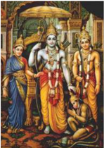

> **Deskripsi Visual:** Gambar ini adalah ilustrasi yang menampilkan tokoh-tokoh Hindu yang terlihat dalam pose yang berbeda. Tokoh utama di tengah adalah seorang pria dengan rambut panjang dan pakaian tradisional, tampaknya merupakan dewa atau para dewi. Di sebelah kiri dan kanan ada dua tokoh lainnya, masing-masing dengan rambut pendek dan pakaian yang lebih sederhana. Semua tokoh tersebut tampak berada di atas kereta yang besar, menunjukkan bahwa mereka mungkin sedang berpergian atau menghadiri suatu acara penting.

Elemen-elemen utama dalam gambar meliputi tokoh-tokoh Hindu, kereta, dan latar belakang yang menunjukkan keindahan alam. Relasi antara elemen-elemen ini adalah bahwa tokoh-tokoh Hindu tersebut tampaknya menjadi fokus utama gambar, sementara kereta dan latar belakang digunakan untuk memberikan konteks dan nuansa yang lebih luas.

Teks, angka, atau label penting tidak terlihat dalam gambar ini. Namun, informasi kunci yang dapat diambil pembaca adalah bahwa gambar ini mungkin merujuk pada cerita atau mitologi Hindu, karena tokoh-tokohnya yang terlihat seperti dewa atau para dewi.

Tokoh  Rama,  yang  digambarkan  sebagai seorang  yang  bijaksana  dan  tidak  lagi  terikat dengan  hal-hal  duniawi.  Ketika  rama  dijemput adiknya dan hendak dijadikan seorang raja namun rama menolaknya. Tokoh Anoman yang digambarkan  selalu  taat  dan  setia  menjalankan kewajibannya ( dharma ) sebagai duta Rama ketika  diutus  mencari  kabar  tentang  Devi  Sitha yang diculik Rahwana.

Masing-masing  peribadi  dari  umat  Hindu yang telah mencapai jiwa mukti dalam hidupnya tidak lagi terikat pada gelombang kehidupan di dunia ini. Baginya bekerja adalah sebagai pemujaan kepada Tuhan dan semua hasilnya diserahkan kepada Tuhan. Mereka memiliki pandangan yang sama terhadap keberhasilan dan kegagalan, terhadap suka dan duka, memiliki sifat cinta kasih terhadap semua yang ada di dunia ini. Dalam hubungan ini baca dan hayatilah sloka berikut:

Man-manà bhava mad-bhakto mad-yàji màý namoskuru,

 

---
## 📄 Halaman 189

màm evai ûyasi yuktvai vam àtmànaý matparàyaóaá.

### Terjemahan:

Pusatkan pikiranmu pada-Ku, berbakti pada-Ku, sembahlah Aku sujudlah pada-Ku.  Setelah  melakukan  disiplin  pada  dirimu  sendiri  dan  Aku  sebagai tujuan, engkau akan datang padaku (Bhagawadgita IX. 34).

Seseorang yang telah mencapai jiwa mukti segala perbuatannya dipandang telah berubah menjadi Yoga dan dilakukan sebagai persembahan kepada Tuhan Yang  Maha  Esa.  Bagi  orang  yang  telah  mencapai Moksha atau  kebahagiaan hidup  ini,  yang  bersangkutan  selalu  berpikir,  berbicara  dan  berbuat  senafas Brahman. Orang suci yang telah mencapai kesadaran dirinya yang sejati adalah mereka  yang  telah  mencapai  jiwa  mukti.  Ia  telah  mempersembahkan  setiap pikiran, ucapan dan perbuatannya kepada Tuhan, dan dengan demikian segala perbuatannya akan menjadi ibadah.

Namun  bagi  masyarakat kebanyakan  'biasa' yang  belum  mencapai kesadaran jiwa mukti, maka semua yang dikerjakannya merupakan sesuatu yang masih terikat dengan hasilnya. Mereka menganggap, semua pikiran, ucapan dan pekerjaan  yang  dilakukan  oleh  dirinya  diharapkan  memberikan  fasilitas  yang diinginkan. Mereka belum menyadari sepenuhnya bahwa semua yang ada ini diliputi dan dikuasai oleh kebutuhan. Seseorang yang demikian sesungguhnya adalah  orang  yang  masih  dipenuhi  oleh  sifat-sifat  egoisme.  Pekerjaan  yang dilandasi oleh rasa egoisme dapat mendatangkan malapetaka dan penderitaan.

 

---
## 📄 Halaman 190

Sehubungan dengan hal itu baca, renungkan dan amalkanlah dalam hidup ini baik-baik sloka berikut;

Måityuá sarva-haraú càham udbhavaú ca bhavisyatàm, kirtiá úrir vàk cha nàrióàm småitir medhaa dhåtiá kûamà.

### Terjemahan:

Aku ini kematian yang meliputi segala ciptaan, dan Aku ini asal mula yang akan ada nanti, dan dari sifat-sifat wanita Aku adalah kemashuran, kemakmuran, ucapan, ingatan, kecerdasan, ketetapan dan kesabaran (Bhagawadgita X.34).

Dalam hubungan ini  hendaklah  mereka  yang  telah  mencapai  jiwa  mukti dapat menuntun mereka-mereka yang belum mencapainya, sehingga hidupnya lebih  berarti  dan  bermanfaat,  serta  secara  pelan  dan  pasti  akan  menuju  pada kesempurnaan. Berikut ini adalah beberapa contoh ilustrasi orang-orang yang dapat dipandang sudah mencapai ' Moksha ' sebagai berikut:

### Bhagawan Byasa (Wyasa)

Pada zamannya Waiwasta Manu ada yang bernama Bhagawan Byasa, putra bhagawan Parasara. Beliau telah mendapatkan sinar kesadaran bathin. Sri Krsna Dwipayana  gelar  beliau  yang  lain,  lagi  pula  beliau  titisan  Bhatara  Wisnu.

 

---
## 📄 Halaman 191

Demikianlah untuk itu beliau diminta oleh Dewa Brahma untuk mempelajari Weda pada jaman Waiwasta Manu.

Ada  siswa  beliau  empat  orang  yang paling  ahli  dalam  Veda.  Sebab  saya  adalah keturunan seorang kusir. Adapun Bhagawan Jemini,  keahliannya  yang  terpenting  adalah Samaveda. Bhagawan Polaha (adalah) Rgveda keistimewaannya. Bhagawan Waisampayana (adalah) Yajurveda sebagai kitab sucinya yang teristimewa. Bhagawan  Sumantu  (adalah) Atharwaveda pengetahuannya yang paling utama. Adapun

hamba (adalah) Itihasa dan Purana yang diminta untuk mendalaminya. Hanya satu, yaitu Yajurveda yang beliau tiru dari ayahanda hamba Bhagawan Byasa . Bhagawan Waisampayana akhirnya yang membagi empat hymne itu.  Kempat mantra itulah yang menyebabkan menjadi serba tahu. Orang yang ahli dalam Yajurveda itulah  yang beliau jadikan pengawas asrama (pandita). Orang yang ahli  dalam Rgveda, ilmu Ketuhanan yang dijadikan pedoman upacara. Orang yang mempelajari Samaveda , ilmu pengetahuan suara yang dijadikan nyanyian pujian.  Adapun  orang  yang  ahli  dalam Atharwaveda (dijadikan)  pembinaan musuh namanya dan oleh karena itu, akan bijaksana (bila ia) dipergunakan oleh raja (Pemerintah) Sandhi. (Gde dan Pudja. Gede, 1981:44).

Bhagawan Byasa adalah Maharsi yang mengumpulkan wahyu-wahyu suci Tuhan menjadi kitab suci Veda. Kebesaran jiwa Maharsi Wyasa ini  menjiwai

 

---
## 📄 Halaman 192

nenek moyang  keturunan  Bharata. Beliau adalah penegak keadilan dan kebenaran.  Sari-sari  ajarannya  telah  dikumpulkan  oleh  seorang  Rsi,  bernama Rsi Wararuci. Nama pustaka itu adalah ' Sarasamuccaya '. Rsi Wararuci adalah penulis kitab Sarasamuccaya, yang kini menjadi sebagai salah satu kitab suci, sebagai penuntun jiwa dan perilaku umat manusia untuk mencapai kehidupan yang suci, kehidupan yang tidak terikat oleh hawa nafsu yang akhirnya dapat mencapai kebahagiaan abadi (Parisada Hindu Dharma Pusat, 1968:39).

Secara  struktural  isi  Bhagawadgita  lebih  terarah  dan  merupakan  pengumpulan dari veda-veda sebelumnya. Ini merupakan satu langkah perkembangan sejarah berpikir dari agama Hindu. Penelitian mendalam dan meluas telah membuktikan bahwa sebagaimana halnya disebut-sebut di dalam Purana bahwa usaha kodifikasi catur  veda  sebagai  jasa  terbesar  dari Bhagawan  Byasa ( Viyasa ),  tampaknya penggubahan  Bhagawadgita  pun  merupakan  buah  karya  besar  Bhagawan Byasa.  Kekayaan  dan  ketajaman  pemikiran Viyasa yang  merupakan  rakhmat Tuhan telah mampu mengungkapkan seluruh ajaran veda secara thematik dan didaktik  metodolois  sehingga  buah  karyanya  tidak  saja  menyedapkan  untuk dibaca dan dipelajari oleh anak-anak, tetapi juga terbuka kepada seluruh lapisan masyarakat yang beraneka profesi dan latar belakang kemampuan pikir mereka. Kesemua teori berpikir yang mencakup masalah konsepsional strategi berpikir untuk meletakkan landasan operasional bagi tercapainya tujuan hidup manusia yang  paling  asasi,  yaitu Dharma-Artha-Kama-Moksha dalam  empat  cabang ilmu ( Catur Vidya ) meliputi idiologi-agama-ekonomi-politik dibahasnya secara konsepsional di dalam Mahabharata (Pudja. G, 2005:xi).

 

---
## 📄 Halaman 193

Berdasarkan  uraian  di  atas  dapat  disimpulkan  bahwa  Bhagawan  Byasa adalah orang suci Hindu yang pada masa hidupnya selalu mengabdikan dirinya kepada Tuhan demi untuk kesejahteraan dan kebahagian umat manusia. Beliau adalah putra Bhagawan Parasara sebagai titisan dari Bhatara Wisnu yang oleh Dewa  Brahma  disuruh  untuk  menerima  dan  mempelajari  veda  ( catur  veda ) sebagai wahyu Tuhan bersama empat orang muridnya. Bhagawan Byasa telah menyatu dengan Tuhan (Brahman) dengan meninggalkan hasil karyanya yang sangat bermanfaat untuk umat manusia.

Sebagai umat Hindu yang baik, bagaimana kita dapat menunjukkan rasa bhakti dan hormat kepada beliau ( Bhagawan Byasa ) atas jasa-jasanya yang sangat bermanfaat untuk kita?

Diskusikanlah dengan kelompok Anda, selanjutnya presentasikanlah di depan kelas sesuai petunjuk dari Bapak/Ibu guru pembimbingnya!

### Dang Hyang Dwijendra

Seorang keturunan  brahmana  ( Brahmana  wangsa ) bernama  Nirartha adik  dari  Danghyang  Angsoka,  putra  dari  Danghyang  Asmaranatha.  Ketika Sang Nirartha sedang muda jejaka beliau mengambil istri, di Daha, putri dari Danghyang  Panawaran  yaitu  golongan  keturunan  Bregu  di  Geria  Mas  Daha bernama Ida Istri Mas. Setelah bersuami-istri, Sang Nirartha dilantik (diniksa) oleh  Danghyang  Penawaran  menjadi  pendeta  (Brahmana  janma)  diberi  gelar Danghyang Nirartha. Dari perkawinan ini Danghyang Nirartha mendapat dua

 

---
## 📄 Halaman 194

orang putra, yang sulung putri diberi nama Ida Ayu Swabhawa alias Hyangning Salaga  (yang  berarti  dewanya  kuncup  bunga  melur)  sebagai  nama  sanjungan karena cantik jelita rupa dan perawakannya serta pula ahli tentang ajaran batin. Adiknya seorang putra diberi nama Ida Kulwan (artinya kawuh/barat) dan diberi nama  sanjungan  Wiraga  Sandhi  yang  berarti  kuntum  bunga  gambir,  karena tampan dan gagah perawakannya (Sugriwa, 1993:8).

Sementara itu kerusuhan yang sangat mengerikan telah melanda tanah Jawa. Banyak penduduk Majapahit berusaha menyelamatkan diri, pindah ke arah timur antara lain ke Pasuruan, Pegunungan Tengger, Brambangan (Banyuwangi) dan sampai ada yang menyeberang ke Bali. Saat itulah Danghyang Nirartha turut pindah  dari  Daha  ke  Pasuruan  yang  disertai  oleh  dua  orang  putra-putrinya. Sementara  itu  istrinya  disebutkan  tidak  turut  pindah  ke  Pasuruan.  Setelah beberapa lama di Pasuruan, Danghyang Nirartha beristrikan Ida Istri Pasuruan. Diah  Sanggawati  (seorang  wanita  yang  sangat  menarik  dalam  pertemuan) karena cantiknya, adalah nama sanjungan dari Ida Istri Pasuruan. Beliau adalah putri dari Danghyang Panawasikan, dan masih merupakan saudara sepupu dari Danghyang  Nirartha.  Perkawianan  antara  Danghyang  Nirartha  dengan  Diah Sanggawati melahirkan dua orang putra, yang sulung bernama Ida Wayahan Lor atau Manuaba. Manuaba (mulanya Manukabha) yang berarti burung yang sangat indah karena tampan dan indah raut roman muka dan bentuk angganya. Adiknya bernama Ida Wiyatan atau Ida Wetan yang berarti fajar menyingsing.

Setelah beberapa lama berada di Pasuruan, kemudian Danghyang Nirartha bersama 4 (empat) orang putra-putrinya pindah ke Brambangan (Banyuwangi), namun istrinya tidak disebutkan turut. Brambangan (Blambangan) Banyuwangi

 

---
## 📄 Halaman 195

pada saat itu diperintah oleh raja Sri Aji Juru. Danghyang Nirartha memperistri Sri  Patni  Keniten,  dan  dari  perkawinannya  melahirkan  3  (tiga)  orang  putraputri. Yang sulung bernama Ida Rahi Istri, rupanya cantik dan pandai tentang ilmu kebatinan. Yang kedua bernama Ida Putu Wetan atau Ida Putu Telaga atau disebut  juga  Ida  Ender  (yang  berarti  ugal-ugalan)  karena  terkenal  pandainya, kesaktiannya  dan  ahli  ilmu  gaib  serta  banyak  tulisan  buah  tangannya.  Yang bungsu bernama Ida Nyoman Keniten (yang berarti tenang dan disiplin air). Sri Patni Keniten yang sungguh-sungguh cantik molek rupanya sehingga terkenal dengan sebutan 'jempyaning ulangun' yaitu sebagai obat penawar jampi orang yang kena penyakit birahi asmara. Beliau adalah adik kandung dari Sri Aji Juru, turunan raja-raja (Dalem) dan turunan brahmana, terhitung buyut dari Danghyang Kresna Kepakisan di Mojopahit, dan putri kedua dari raja Brangbangan (Sugriwa, 1993:9).

Danghyang Nirartha adalah orang suci  yang  mulia  dan  istimewa.  Beliau memiliki  bahu  keringat  yang  harum,  tak  ubahnya  bagaikan  minyak  mawar. Setiap orang yang duduk berdekatan dengan beliau, turut harum tanpa memakai minyak wangi. Setelah beberapa lama berada di Brambangan terjadilah disarmoni dengan lingkungannya. Sebab itu Danghyang Nirartha berupaya untuk pindah dari Brambangan, hendak menyeberang ke Bali bersama 7 (tujuh) orang putraputrinya beserta istrinya Sri Patni Keniten.

Pada  suatu  hari  menyebranglah  Sang  Pendeta  bersama  sanak  istrinya mengarungi laut selat Bali (Segara Rupek) dengan mempergunakan buwah labu pahit  (waluh pahit) bekas kele kepunyaan orang Desa Mejaya. Sementara itu istri dan putra-putrinya diseberangkan dengan mempergunakan perahu (jukung)

 

---
## 📄 Halaman 196

bocor yang disumbat dengan daun waluh pahit, kepunyaan orang Desa Mejaya. Atas  tuntunan  dan  petunjuk Ida  Sang  Widhi  Wasa /Tuhan  Yang  Maha  Esa, dengan tiupan angin barat yang baik, maka tiada berapa lama penyeberangan Danghyang  Nirartha  beserta  istri  dan  putra-putrinya  dengan  mempergunakan peralatan yang sangat sederhana berlangsung dan tiba di pantai Bali barat dengan selamat. Sebab itu beliau Danghyang Nirartha di tengah lautan berjanji 'tidak akan pernah mengganggu hidupnya waluh pahit seumur hidupnya sampai pada turunan-turunannya'.

Dalam penyeberangannya Danghyang Nirartha sampai lebih awal di pantai barat pulau Bali. Sementara menunggu kedatangan istri dan putra-putrinya, beliau sempat mengembalakan sapi bersama para pengembala sapi yang ada di sana. Lambat laun di tempat ini didirikanlah Pura Kecil yang diberi nama Purancak. Setelah kedatangan istri dan putra-putrinya atas petunjuk dari pengembala sapi, Danghyang  Nirartha  beserta  rombongan  melanjutkan  perjalanannya  menuju arah  timur.  Selama  dalam  perjalanan  dengan  menelusuri  hutan  belantara, berbagai  macam  rintangan  dan  hambatan  dilalui  oleh  beliau  dengan  selamat. Atas kehendak Tuhan di tempat ini didirikanlah Pura Melanting sebagai tempat memuja Bhatari (Dewi) Melanting. Wilayah ini sekarang dikenal dengan nama Pulaki (Mpulaki/Dalem Melanting).

Dari wilayah Pulaki, Danghyang Nirartha beserta rombongannya melanjutkan  perjalanannya  ke  arah  timur  dan  akhirnya  sampailah  di  Desa Gading  Wangi.  Pada  saat  itu  penduduk  Desa  Gading  Wangi  sedang  tertimpa wabah penyakit yang sangat membahayakan jiwanya. Atas permohonan Kepala Desa  (Bendesa)  Gading  Wangi  dan  rasa  belas  kasihan  serta  kesaktian  beliau

 

---
## 📄 Halaman 197

(Danghyang Nirartha) berkenan mengobati masyarakat yang tertimpa penyakit hingga sembuh total. Atas mujizat kesembuhan yang dimilikinya, maka sejak itu beliau diberi gelar Pendeta Sakti yang baru datang (Pedanda Sakti Bawu Rawuh), yang pandai bahasa Kawi (jawa kuno) raja pendeta guru agama (Danghyang Dwijendra).

Setelah  beberapa  lama  Danghyang  Dwijendra  berasrama  di  Desa  Wani Tegeh,  Pangeran  Desa  Mas  berasrat  untuk  memohon  kedatangan  beliau  ke Desa  Mas.  Kedatangan  Danghyang  Dwijendra  ke  Desa  Mas  diketahui  oleh Ki  Bendesa  Mundeh,  di  tengah  perjalanan  sampai  di  Desa  Mundeh  berasrat memohon berguru kepada Danghyang Dwijendra, dengan belas kasihan beliau, maka Ki Bendesa Mundeh dianugrahi debu tapak kaki beliau ketika berdiri di tengah jalan saat itu. Di tempat itu lambat laun dibangun tempat suci bernama Pura Resi atau Pura Gria Kawitan Resi sebagai tempat pemujaan Danghyang Dwijendra (Sugriwa, 1993:16).

Sangat panjang perjalanan beliau Danghyang Dwijendra dalam pengabdiannya menegakkan dharma . Dari Jawa (Majapahit/Wilwatikta) menuju  arah  timur  melalui  Daha,  Pasuruan,  dan  Brambangan  (Banyuwangi). Dari  Banyuwangi beliau menyebrang ke Bali dengan peralatan seadanya dan sampailah di Pulaki. Dari Pulaki beliau melanjutkan perjalanan menuju ke; Desa Gading Wangi, Desa Mundeh (Pura Resi), Manga Puri (Mangui), Desa Kapal (Pura Sada), Desa Tuban, Desa Buagan (Pura Batan Nyuh), Puri Arya Tegeh Kuri (Badung), Desa Mas, Puri Gelgel (Ki Gusti Panyarikan Dawuh Baleagung sebagai utusan raja), Teluk Padang (Pura Silayukti) Padangbai.

 

---
## 📄 Halaman 198

Setelah  lama  berasrama  di  Gelgel,  seijin  'Dalem'  beliau  melanjutkan perjalanan untuk menjelajah Nusa Bali. Di mulai dari Jembrana (Pura Rambut Siwi), ke Tabanan (Pura Pakendungan dan atau Pura Tanah Lot), di Badung (Pura Hulu Watu, Pura Bukit Gong, Pura Bukit Payung, Pura Sakenan {di Serangan}), di Gianyar (Pura Air Jeruk {Sukawati}, Pura Tugu {Desa Tegal Tugu}, Genta Samprangan  {Desa  Samprangan},  Pura  Tengkulak  {di  Desa  Syut  Tulikup}), di  Klungkung  (Pura  Batu  Klotok,  Pura  Gowa  Lawah  {Desa  Kusamba}),  di Buleleng, Bali Utara (Pura Pojok Batu).

Dari Pura Pojok Batu (Buleleng), beliau berasrat untuk datang ke Lombok. Selama di Lombok beliau (Danghyang Dwijendra) diberi gelar Tuan Semeru. Di Lombok (Pura Suranadi {Lombok Barat}, Labuhan Aji {tempat pertemuan Seri Aji Selaparang - Tuan Semeru di Lombok Timur}).

Setelah Danghyang Dwijendra (Tuan Semeru) melintasi Lombok, beliau  melanjutkan  perjalanan  menuju  ke  Sumbawa,  untuk  bertemu  dengan saodaranya. Namun demikian sesuai informasi yang disampaikan oleh penduduk sekitarnya bahwa 'saodara beliau sudah tiada' dan sementara itu beliau tetap melanjutkan  perjalanan  menuju  ke  ('Gunung  Tambora',  Denden  Sari  {gadis kecil yang mendapatkan penyembuhan dari Tuan Semeru}) konon setelah di Bali dikawinkan dengan cucu beliau bernama Ida Ketut Buruan Manuaba (Sugriwa, 1993:8-50).

Demikian  perjalanan  panjang  Danghyang  Dwijendra  berawal  dari  Jawa (Bali  -  Lombok  -  Sumbawa)  dan  kembali  di  Bali  menuju  Asrama  Mas,  dan sekembalinya ke Gelgel diiringkan (diantar) oleh Pangeran Dawuh menjadikan Dalem sangat gembira. Selama perjalanan beliau Danghyang Dwijendra banyak

 

---
## 📄 Halaman 199

mengasilkan  karya  sastra  (Buah  Tangan  Guru)  yang  sangat  bermanpaat  bagi umat sedharma .  Sebelum  Danghyang  Dwijendra  meninggalkan  dunia  maya ini, beliau bermaksud menyucikan (mediksa) putra-putranya dan membagikan artha  warisannya  yang  disaksikan  oleh  Dalem  Baturenggong.  Setelah  prosesi itu selesai, Danghyang Dwijendra melanjutkan perjalanan untuk menuju alam sunya. Sampailah beliau pada penghulu sawah antara Desa Sumampan dengan Tengkulak, disana beliau disuguhi ajengan (makanan) dan lambat laun tempat itu di sebut dengan nama Pura Pangajengan. Dari tempat ini beliau melanjutkan perjalanan  dan  sampailah  di  Desa  Rangkung  sebelah  barat  yakni  pelabuhan Masceti, yang lambat laun tempat ini disebut dengan nama Pura Masceti. Selama Danghyang Dwijendra bercakap-cakap dengan bhatara Masceti di pantai laut Kerobokan. Di sekitan tempat ini pecanangan (tempat sirih dan perlengkapannya) beliau tersimpan dan dijaga oleh 'Bhuto Hijo' yang lambat laun berdirilah di tempat ini Pura Peti Tenget (di tegal peti tenget).

Melalui tegal peti tenget Danghyang Dwijendra melanjutkan perjalannya ke Pura Hulu Watu. Pada suatu hari Selasa Kliwon Wuku Medangsia Danghyang Nirartha (Danghyang Dwijendra) menerima wahyu sabda Tuhan bahwa beliau pada hari itu dipanggil untuk pulang ke sorga. Merasa bahagia suci hatinya karena saat yang dinanti-nantikan telah datang. Hanya ada sebuah pustaka belum dapat diserahkan kepada salah seorang putranya. Tiba-tiba Mpu Danghyang melihat seorang bendega (Nelayan) bernama Ki Pasek Nambangan sedang mendayung jukungnya di laut  di  bawah  ujung  Hulu  Watu  itu,  lalu  dipanggil  oleh  beliau. Setelah bendega itu menghadap lalu Danghyang berkata:

 

---
## 📄 Halaman 200

'Hai bendega, engkau aku suruh menyampaikan kepada anakku empu Mas di  Desa  Mas,  katakan  kepada  beliau  bahwa  bapak  menaruh  sebuah  pustaka mereka di sini yang berisi ajaran kesaktian'.

### Jawab Ki Bendega:

'Singgih pakulun sang sinuhun', lalu mohon diri setelah menyembah.

Setelah  Ki  Pasek  Nambangan  pergi,  maka  Danghyang  Nirartha  mulai melakukan Yoga semashinya, bersiap untuk meninggalkan dunia ini. Beberapa saat kemudian beliau Moksha ngeluhur, cepat bagaikan kilat masuk ke angkasa. Ki  Pasek  Nambangan  memperhatikan  juga  hal  beliau  dari  tempat  yang  agak jauh, namun ia tidak melihat Empu Danghyang, hanya cahaya yang cemerlang dilihat ke angkasa (Sugriwa:1993:61).

Tentang perjalanan Danghyang Dwijendra dalam kekawin Usana Bali, ada dijelaskan sebagai berikut:

....  Kunang  pwa  sira  Danghyang  Nirartha,  viYoga  pwa  sira  sakeng Wilatikta, angalih maring Pasuruwan. Wus lama sirengkana angalap pwa sira putri Pasuruwan, dê Danghyang Panawasikan, riwêkasan hana wijanira lakilaki pêtang wiji, teher inaranan Ida Kulwan, Ida Wetan, Ida Ler, Ida Lor. Wus lami  pwa  sirengkana,  riwêkasan  kinon  pwa  sira  dê  Sri  Juru  angalih  maring Brangbangan,  dera  sinung  putri  sadhaya,  tinarima  pwa  sira  Danghyang Nirartha, hana vijanira tigang viji, têhêr inaranan Ida Têlaga, Ida Kinetên, Ni Dayu Swabhawa (Kusuma, I Nyoman Weda. 2005:58).

.....  Adava  yan  katakna,  kumênêp  wong  ing  jêro  Brangbangan,  dadya  ta kesah pwa sira Danghyang Nirartha sakeng Brangbangan, mahawan pwa sira

 

---
## 📄 Halaman 201

dening waluh kele wohing maja ya, ikang hastapada pinaka dayung kamodi. Kunang  swami  nira  katêkeng  putra  sadhaya,  wiwat  dening  banyaga  alayar jukung beser, sira tunggal wiwat dening waluh kele. Marmene tan wênang sang Dwija  anginum  dening  tabu  tikta,  apan  awanira  angalih  Bali  ring  dhangu. Kunang sadateng pwa sireng Bahyaga tumedun sireng pelabuhan Purancak.

.....  Enengakêna  pwa  lampah  irengkana,  wus  kalumbrah  ring  Gelgel, yanana  Sang  Pandita  sakeng  Yawadwipa  mahasiddhi,  sakti  ring  Yoga  sira, karêngo dê Sri Maharaja Wisnu Atmaka ring Gelgel, atehêr pwa sira aputusan Kyayi Panulisan Bali rajya, angaturakên sira Danghyang Nirartha (Kusuma, I Nyoman Weda. 2005:59).

Terjemahannya:

..... Selanjutnya Danghyang Nirartha pindah/pergi dari Majapahit menuju Pasuruan.  Beliau  agak  lama  menetap  di  sana  dan  kemudian  kawin  dengan putri Pasuruan yakni anak Danghyang Panawasikan. Dan perkawinannya itu beliau memperoleh empat orang putra laki-laki yang diberi nama Ida Kulwan, Ida Wetan, Ida Ler dan Ida Lor. Setelah beberapa lama beliau berada di sana (Pasuruan) akhirnya Danghyang Nirartha disuruh oleh Sri Juru pergi menuju Brangbangan  (Blambangan).  Oleh  Sri  Juru,  Danghyang  Nirartha  diberikan seorang putri untuk dikawini. Dari perkawinan tersebut beliau memperoleh tiga orang putra, yang diberi nama Ida Telaga, Ida Keniten dan Ni Dayu Swabhawa. .....  Panjang  kalau  diceritrakan,  akhirnya  Danghyang  Nirartha  pindah dari  Brangbangan  mempergunakan  (berkendaraan)  Waluh  Kele,  tangan  dan kaki  digunakan  sebagai  dayung  dan  kemudi.  Istri  beserta  putra-putranya diangkut  oleh  nelayan  dengan  menggunakan  jukung  (perahu  kecil)  yang

 

---
## 📄 Halaman 202

bocor.  Danghyang  Nirartha  sendirian  menaiki  Waluh  Kele.  Itulah  sebabnya sang pendeta tidak boleh menyantap Waluh Kele (Labu Pahit), karena dahulu merupakan kendaraan Danghyang Nirartha menuju Bali. Adapun kedatangan beliau bersama putra-putrinya di Bali mendarat di pelabuhan Purancak.

..... Sampai di sana diceritrakan dahulu, keberadaan beliau di pulau Bali, akhirnya  didengar  di  kerajaan  Gelgel.  Beliau  terkenal  sangat  sakti  dalam melaksanakan Yoga. Akhirnya Sri Maharaja Wisnu Atmaka di Gelgel, mengutus Raja  Kyayi  Panulisan  Bali  untuk  memohon  kesediaan  Danghyang  Nirartha tinggal di Gelgel.

Demikianlah  akhir  riwayat  hidup  Danghyang  Dwijendra.  Kahyangan tempat beliau ngaluhur (Moksha) kemudian disebut lengkapnya bernama Pura Luhur Huluwatu.

yad-yad vibhùtimat sattvaý úrimad ùrjitam eva và, tat-tad evàvagaccha tvam mama tejo-'ýsa-úaýbhavam.

### Terjemahan:

Apapun yang memiliki kemuliaan, kemakmuran dan kekuasaan; ketahuilah bahwa semuanya itu, ini berasal dari sepercik kecemerlangan-Ku, (Bhagawadgita X.41).

 

---
## 📄 Halaman 203

Demikianlah beberapa contoh orang suci yang telah mencapai jiwa mukti dalam  perjalanan  hidupnya  yang  patut  di  contoh  oleh  kalangan  masyarakat biasa  yang  masih  sangat  terikat  akan  duniawi.  Hendaklah  di  antara  mereka dapat  saling  mengisi,  mengasihi,  sehingga  kehidupan  ini  berlangsung  dengan damai, tenteram, harmonis saling mengasihi dan menyayangi satu dengan yang lainnya.

### Uji Kompetensi:

- Setelah anda membaca teks tentang beberapa contoh orang suci yang dipandang mampu mencapai Moksha ,apakah yang anda ketahui terkait dengan hal tersebut? Jelaskan dan tuliskanlah!
- Buatlah ringkasan yang berhubungan dengan contoh orang suci yang dipandang mampu mencapai Moksha ,  guna mewujudkan tujuan hidup manusia dan tujuan agama Hindu, dari berbagai sumber media pendidikan dan sosial yang anda ketahui! Tuliskan dan laksanakanlah sesuai dengan petunjuk dari bapak/ibu guru yang mengajar di kelas Anda!
- Manfaat  apakah  yang  dapat  dirasakan  secara  langsung  apabila  di antara kita sudah dipandangg mampu mewujudkan kesejahteraan dan kebahagiaan hidup ini ' Moksha '? Tuliskanlah pengalaman Anda!
- Amatilah  lingkungan  sekitar  Anda  sehubungan  dengan  orang-orang yang dipandang telah mampu mewujudkan tujuan hidup manusia dan tujuan  agama  Hindu,  buatlah  catatan  seperlunya  dan  diskusikanlah dengan  orang  tuanya!Apakah  yang  terjadi?  Buatlah  narasinya  1-3 halaman diketik dengan huruf Times New Roman - 12, spasi 1,5 cm, ukuran kertas kwarto; 4-3-3-4!

 

---
## 📄 Halaman 204

Perhatikanlah  gambar  berikut  ini  dengan  baik,  buatlah  narasinya  selanjutkan presentasikanlah sesuai petunjuk Bapak/Ibu guru yang mengajar di kelas Anda!

---
**🖼️ Gambar/Diagram**

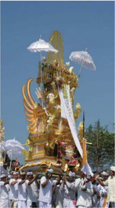

> **Deskripsi Visual:** Gambar ini adalah foto yang menunjukkan upacara tradisional yang melibatkan para pria yang mengenakan pakaian tradisional putih dan topi hitam. Mereka sedang membawa sebuah kereta yang sangat megah dan indah, yang tampaknya merupakan bagian dari upacara keagamaan atau festival. Kereta tersebut memiliki ukiran emas yang memukau, dengan berbagai ornamen dan simbol yang menunjukkan keindahan dan keagungan. Di atas kereta tersebut, terdapat seorang dewi atau tokoh agama yang ditempatkan di atas kursi emas yang dipenuhi dengan perhiasan. Para pria yang membawa kereta tersebut juga membawa payung putih besar yang menutupi mereka, menunjukkan bahwa upacara ini sangat serius dan resmi. Gambar ini menunjukkan hubungan antara para pria yang membawa kereta, kereta itu sendiri, dan dewi atau tokoh agama yang ditempatkan di atasnya. Ini menunjukkan bahwa upacara ini sangat penting dan memiliki makna spiritual yang kuat bagi masyarakat yang terlibat.

 

---
## 📄 Halaman 205

### Perenungan:

Wibhìûaóa siràtitìbra kabharan gélanàngarang, Manah nira ya kàsrépan wulat i sang kakàsih péjah, Drawa ng hati kamànusan kapasukan ng asih luh tibà, Tibàkén ikanang sékàr i suku sang kakàngañjali. (Kw. Ràmàyana, XXIV.31)

### Terjemahannya:

Sang Wibhisana sangat berdukacita, sedih  merindu,  pikirannya  kasihan,  melihat kakaknya  tewas  menyedihkan.  Hancurlah hatinya,  pilu,  kemasukan  kasih  sayang.  Air matanya meleleh jatuh berderai.

Dijatuhkannya kembang pada kaki kakaknya sambil mengaturkan sembah (Mahãstra, Sri, 1983:16)

---
**🖼️ Gambar/Diagram**

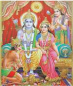

> **Deskripsi Visual:** Gambar ini adalah ilustrasi yang menampilkan tokoh-tokoh Hindu yang terkenal dalam mitologi India. Gambar tersebut menunjukkan tiga tokoh utama: Shiva (dengan topi berwarna merah), Parvati (dengan topi berwarna hijau), dan Brahma (dengan topi berwarna biru). Mereka duduk di atas kursi emas yang dipenuhi dengan berbagai simbol religius dan alat musik. Di sebelah kanan, terdapat matahari yang mengiluminasi para tokoh, sementara di sebelah kiri ada bulan yang menambah nuansa spiritual pada gambar. Gambar ini menunjukkan hubungan dan interaksi antara para tokoh ini dalam konteks mitologi Hindu, yang seringkali melibatkan tema-tema seperti keberuntungan, kekuatan, dan keindahan.

### BHAKTI SEJATI DALAM RAMÀYANA

 

---
## 📄 Halaman 206

Baca dan Renungkanlah bait sloka suci ini dengan baik, diskusikanlah dengan teman Anda dan orang tua di rumah, mengapa Wibhisana berbhakti kepada Rama!

### A.  Ajaran Bhakti Sejati

Kita sering mengucapkan kata bhakti seperti mebhakti, ngaturang bhakti, satya bhakti, bhakti sejati dan sebagainya. Istilah bhakti memiliki arti yang luas yaitu sujud, memuja, hormat setia, taat, memperhambakan diri dan kasih sayang, bhakti juga merupakan suatu jalan dalam betuk melakukan sujud dan pemujaan serta memperhambakan diri secara setia kehadapan Hyang Widhi .  Rasa bhakti ini juga diwujudkan dengan jalan menghormati dan menyayangi sesama ciptaan Beliau  dan  orang  yang  menempuh  jalan  Bhakti  disebut  Bhakta.  Sedangkan istilah  sejati  memiliki arti sesungguhnya, memang demikian adanya, sungguh asli, apa-adanya dan sebagainya.

Kamus Besar Bahasa Indonesia menjelaskan, bhakti: tunduk dan hormat; perbuatan  yang  menyatakan  setia  (kasih,  hormat,  tunduk):  ---  kepada  Tuhan Yang Maha Esa; --- seorang anak kepada orang tuanya; memperhambakan diri; setia sebagai tanda --- kepada nusa dan bangsa, ia berusaha berprestasi sebaikbaiknya (Tim, 2001:94) . Sedangkan kata sejati: sebenarnya; (tulen, asli, murni, tidak lancung, tidak ada campuran) (Tim, 2001:462).

Kitab Bhagawadgita Bab XII-1 tentang bhakti Yoga menjelaskan: Bhakta yang mantap senantiasa menyembah-Mu demikian dan yang lain lagi,

 

---
## 📄 Halaman 207

menyembah Yang Abstrak, Yang Kekal Abadi; yang manakah dari keduanya ini yang lebih mahir dalam Yoga (Pudja, 2004:3008). Bhakta adalah pengikut ajaran bhakti marga yang setia, tekun, sungguh-sungguh berdasarkan rasa, cinta, dan kasih yang mendalam.

Kata Bhakti (Bahasa Sanskerta) berarti pengabdian atau bagian (Monier: 2008).  Dalam  praktik  Hinduisme  menandakan  suatu  keterlibatan  aktif  oleh seseorang dalam memuja Yang Mahakuasa. Istilah bhakti sering diterjemahkan sebagai  pengabdian,  meskipun  kata  partisipasi  semakin  sering  digunakan sebagai istilah yang lebih akurat, karena menyampaikan sesuatu yang hubungan dekat dengan Tuhan. Orang yang melakukan bhakti disebut bhakta, sementara bhakti  sebagai  jalan  spiritual  disebut  sebagai  bhakti  marga  atau  jalan  bhakti. Bhakti  merupakan  komponen  penting  dalam  banyak  cabang  Hindu,  yang didefinisikan berbeda-beda oleh berbagai individu, kelompok, dan masyarakat. Bhakti  menekankan  pengabdian  dan  praktik  daripada  ritual.Bhakti  biasanya digambarkan seperti  hubungan  antarmanusia;  seperti  dengan  kekasih,  dengan teman, orang tua, anak, dan tuan-hamba. Bhakti dapat mengacu kepada hubungan bakti kepada seorang guru spiritual, sebagai guru-bhakti; dengan bentuk pribadi Tuhan  Yang  Maha  Esa/ Ida  Sang  Hyang  Widhi ,  misal:  Uma,  Saraswati,  Sri, Laksmi atau zat ilahi tanpa bentuk yang disebut Nirguna. Tradisi bhakti yang berbeda dalam agama Hindu terkadang dibagi-bagi, meliputi: Siwaaliran, yang menyembah Brahma, Wisnu dan para dewa dan dewi yang terkait dengannya; pengikut  Wesnawa  yang  menyembah  bentuk  Wisnu,  Awatara  dan  lain-lain. Bhakti menurut tradisi tertentu tidak eksklusif. Pengabdian kepada satu dewa tidak menghalangi ibadah yang lain.

 

---
## 📄 Halaman 208

Bhakti sejati adalah sujud, memuja, hormat setia, taat, memperhambakan diri  dan  kasih  sayang,  sebenarnya, tekun, sungguh-sungguh berdasarkan rasa, cinta, dan kasih yang mendalam memuja Ida Sang  Hyang  Widhi atau  yang  dipujanya. Bhakti sejati adalah pemujaan yang dilakukan seseorang  kepada  yang  dipujanya  dengan sungguh-sungguh  dan  penuh  rasa  hormat, cinta kasih yang mendalam untuk memohon kerahayuan bersama.

Jalan  untuk  mendekatkan  diri  kepada Hyang  Widhi Wasa  ada  empat  cara/jalan yang  sering  disebut  dengan Catur  Marga yang di antaranya karma marga yaitu

berbakti dengan cara berbuat/bekerja, Bhakti marga yaitu berbhakti dengan cara melakukan persembahan/sujud bhakti, jnana marga yaitu berbhakti dengan cara mentransfer ilmu pengetahuan yang kita miliki, dan raja marga yaitu berbhakti dengan  cara  mempraktikkan  ajaran-ajaran  agama  seperti  melakukan Tapa, Bratha, Yoga , dan Samadhi .

 

---
## 📄 Halaman 209

### Uji Kompetensi:

- Apakah yang dimaksud dengan bhakti sejati dalam Kitab Ramayana? Jelaskanlah.
- Apakah  yang  Anda  ketahui  terkait  dengan  penerapan  ajaran  bhakti sejati dalam agama Hindu? Jelaskanlah!
- Mengapa seseorang wajib menempuh jalan bhakti dalam memuja Ida Sang Hyang Widhi /Tuhan Yang Maha Esa? Jelaskanlah!
- Amatilah  lingkungan  sekitar  anda  sehubungan  dengan  orang-orang yang dipandang dalam memuja Tuhan Yang Maha Esa/ Ida Sang Hyang Widhi dengan  mengikuti  jalan  bhakti,  buatlah  catatan  seperlunya dan  diskusikanlah  dengan  orang  tua!  Apakah  yang  terjadi?  Buatlah narasinya 1-3 halaman diketik dengan huruf Times New Roman - 12, spasi 1,5 cm, ukuran kertas kwarto; 4-3-3-4; Lakukanlah!

 

---
## 📄 Halaman 210

### B. Bagian-bagian Ajaran Bhakti Sejati

### Perenungan:

### Terjemahannya:

Cukup berhasil Sri Baginda sebagai pimpinan, karena Sri Baginda sahabat Sang Hyang Indra yang amat berbakti, juga terhadap Sang Hyang Maheswara, kepada Sang Hyang Çiwa pula diperkuat (Bhagawadgita, VII.16).

Ajaran  bhakti  dalam  agama  Hindu  mengajarkan  umat  manusia  untuk bersembah sujud ke hadapan yang dihormati 'Tuhan Yang Maha Esa/ Ida Sang Hyang Widhi ' beserta manifestasi dan prabhawa-Nya. Bhakti atau menyembah kepada-Nya dapat dilaksanakan secara abstrak dan juga dengan mempergunakan nyasa atau pratima berupa arca atau mantra. Menyembah Tuhan dalam wujud abstrak dapat dilakukan dengan menanggalkan pikiran kepada yang disembah adalah amat baik namun kesulitan, hambatan, dan tantangan tetap ada, karena Tuhan  tanpa  wujud,  kekal  abadi,  dan  tidak  berubah-ubah.  Memuja  Tuhan dalam wujud nyata seperti yang dilakukan oleh umat kebanyakan 'yoga biasa' diperlukan adanya sarana seperti pratima atau arca, umat sedharma akan lebih

Saphala sira rãkûakéng rãt, Tuwi sira mitra Hyang Indra bhakti témén, Mãhéúwara ta sira lanã, Úiwabhakti ginöng lanã ginawé.

 

---
## 📄 Halaman 211

mudah untuk mewujudkan rasa bhaktinya, tetapi ini bukan berarti satu-satunya jalan yang terbaik bagi umat semua.

Kitab Bhagavata Purana VII.52.23 menyebutkanada 9 jenis bhakti kehadapan Ida Sang Hyang Widhi /Tuhan Yang Maha Esa, yang disebut dengan istilah Navavidha bhakti, di antaranya:

- Srawanam yang berarti berbhakti kepada Tuhan dengan cara membaca atau mendengarkan hal-hal yang bermutu seperti pelajaran/ ceramah keagamaan, cerita-cerita keagamaan dan nyanyian-nyanyian keagamaan, membaca kitab-kitab suci.
- Kirtanam yang berarti berbhakti kepada Tuhan dengan jalan menyanyikan kidung suci keagamaan atau kidung suci yang mengagungkan kebesaran  Tuhan  dengan  penuh  pengertian  dan  rasa bhakti yang ikhlas serta benar-benar menjiwai isi kidung tersebut.
- Smaranam adalah  cara  berbhakti  kepada  Tuhan  dengan  cara  selalu ingat  kepada-Nya,  mengingat  nama-Nya,  bermeditasi.  Setiap  indera kita  menikmati  sesuatu,  kita  selalu  ingat  bahwa  semua  itu  adalah anugrah dari Tuhan. Cara yang khusus untuk selalu mengingat Beliau adalah dengan mengucapkan salah satu gelar Beliau secara berulangulang  misalnya:  ' Om  Nama  Siwa  ya '.  Pengucapan  yang  berulangulang ini disebut dengan japa atau japa mantra.
- Padasevanam yaitu  dengan  memberikan  pelayanan  kepada  Tuhan Yang  Maha  Esa,  termasuk  melayani,  menolong  berbagai  mahkluk ciptaannya.
- Arcanam yaitu berbhakti kepada Tuhan dengan cara memuja keagungan-Nya.

 

---
## 📄 Halaman 212

- Vandanam yaitu  berbhakti  kepada  Tuhan  dengan  jalan  melakukan sujud dan kebhaktian.
- Dasya yaitu berbhakti kepada Tuhan dengan cara melayani-Nya dalam pengertian  mau  melayani  mereka  yang  memerlukan  pertolongan dengan penuh keiklasan.
- Sakhya yaitu  memandang  Tuhan  Yang  Maha  Esa  sebagai  sahabat sejati, yang memberikan pertolongan ketika dalam bahaya.
- Atmanivedanam adalah berbhakti kepada Tuhan dengan cara menyerahkan  diri  sepenuhnya  kehadapan  Hyang  Widhi.  Seseorang yang  menjalankan  bhakti  dengan  cara  ini  akan  melakukan  segala sesuatunya sebagai persembahan kepada Tuhan.
Dengan  demikian,  dapat  dinyatakan  bahwa  seseorang  yang  mengikuti jalan bhakti sejati kepada Tuhan Yang Maha Esa/ Ida Sang Hyang Widhi beserta prabhava-Nya dengan penuh pengabdian, memuja dan memuji, penyerahan diri secara  tulus.  Bila  seseorang  pemuja  dapat  menyatukan  dirinya  dengan  yang dipuja (Tuhan Yang Maha Esa), yang bersangkutan dapat menikmati kebahagiaan dalam hidupnya. Kitab Bhagawadgita menjelaskan sebagai berikut.

Bhaktyã mãm abhijãnãti, yãvãn yas cha 'smi tatvatah', tato tattvato mãm jnãtvã visate tadanantaram. (Bhagawadgita, XVIII.55)

 

---
## 📄 Halaman 213

### Terjemahannya:

Dengan berbhakti kepada-Ku, ia mengetahui siapa dan apa sesungguhnya Aku, dan dengan mengetahui hakekat-Ku, ia mencapai Aku dikemudian hari (Pudja, 2004 : 434).

Bhakti sejati adalah salah satu ajaran yang dapat dimaknai dan dipedomani untuk meningkatkan sradha dan bhakti umat kepada Tuhan Yang Maha Esa/ Ida Sang Hyang Widhi beserta prabhavanya oleh umat sedharma sebagai hamba-Nya. Bhakti sejati dapat dimaknai untuk membangun dan menciptakan masyarakat yang berbudi dan individual dalam menciptakan situasi dan kondisi yang damai dan sentosa di tengah-tengah jalinan hubungan sosial yang serasi, selaras dan harmonis. Umat sedharma juga dapat menumbuh-kembangkan kesadaran prinsip hidup  bersama  yang  saling  menghargai,  menghormati,  melayani  dan  dilayani satu sama yang lainnya dalam satu kesatuan organ-organ sosial sesuai dengan prinsip-prinsip  dasar  aturan  keimanan,  kebajikan  dan  acara  keagamaan  yang dianutnya serta aturan-aturan etika, moralitas dan kebajikan yang berlaku untuk umum. Kitab Rgveda menjelaskan sebagai berikut;

'Yaste stanaá úaúayo yo mayobhür yena viúvàà pusyasi vàryàni, yo ratnadhà vasuvid yaá sudatraá saraswati tam iha dhatave kaá.

 

---
## 📄 Halaman 214

### Terjemahannya:

'Sarasvati! air susu-Mu yang berlimpah-limpah sebagai sumber kesejahteraan, yang Engkau berikan kepada semua yang baik, yang mengandung harta benda, mengandung kekayaan, memberikan hadiah yang baik, Susu-Mu Engkau sediakan untuk kehidupan kami (Rgveda, I.164.49).

Dengan Bhakti sejati yakni bhakti dengan jalan sujud, penuh pengabdian, setia, tekun, sungguh-sungguh berdasarkan rasa, cinta, dan kasih yang mendalam memuja dan memuji nama suci, keagungan dan kekuasaan Tuhan Yang Maha Esa/ Ida Sang Hyang Widhi ,  umat dapat melaksanakan pemujaan kepada-Nya. Melalui  arah  vertikal  wujud  sadhana  bhakti  sejati  dapat  dipersembahkan  di antaranya; dengan jalan berekspresi atau bersadhana melalui media gita (nyanyian suci atau kidung suci) memuji dan memuja keagungan dan kemahakuasaan Ida Sang  Hyang  Widhi (Brahman)  yang  dilakukan  dalam  kehidupan  sehari-hari (nitya karma) maupun di saat-saat hari-hari tertentu (naimitika karma), juga umat sedharma dapat melaksanakan pemujaan kehadapan-Nya. Sedangkan pada arah gerak horizontal yaitu pada kontek kehidupan sosial dengan melakukan Sadhana pelayanan khususnya dalam hal ini adalah Sewaka Dharma Kirthanam . Maksud dari Sewaka Dharma Kirthanam pada kontek sosial ini adalah kesadaran untuk berbesar hati membuka diri dan berbagi dalam memberikan pelayanan yang tulus dengan cara memuji dan memuja sesama dan lingkungan ini. Sehingga terjadi keseimbangan  arah  yang  menyerupai  tanda  tambah  (tapak  dara  Bahasa  Bali) 'arah garis vertikal dan arah garis horizontal' yang mengisyaratkan terjadinya keseimbangan antara hubungan vertikal dan horizontal.

 

---
## 📄 Halaman 215

Mendekatkan diri  kepada Ida  Sang  Hyang  Widhi /Tuhan  Yang  Maha  Esa berserta manifestasinya dengan bhakti sejati berlandasan bhakti yoga dan upasana merupakan  jalan  yang  paling  mudah  dan  paling  umum  dapat  dilakukan  oleh umat. Umat harus berkeyakinan bahwa yang disembah itu ada yang menyembah itu merasakan ketidaksempurnaannya untuk menyembah yang sempurna (Tuhan Yang Maha Esa). Penyembah menyerahkan dirinya dengan penuh tulus ikhlas kepada  yang  disembah.  Oleh  karena  itu,  perilaku  umat  dengan  bhakti  sejati adalah mengabdi, memuja dan memuji, penyerahan diri, dan permohonan ampun kepada Tuhan Yang Maha Esa/ Ida Sang Hyang Widhi . Bhakti sejati merupakan perwujudan dari rasa syukhur umat manusia kehadapan Sang Pencipta. Bhakti adalah penyerahan diri sebulat-bulatnya kehadapan Tuhan Yang Maha Esa/ Ida Sang Hyang Widhi dengan tulus ikhlas dan tanpa ikatan.

Atmanivedanam ini adalah cara bhakti yang tertinggi karena harus didahului dengan  Wairagia  yaitu  suatu  keadaan  di  mana  orang  tidak  lagi  terikat  pada hal-hal  keduniawian.  Menurut  ajaran  bhakti  marga  Tuhan  mewujudkan  diriNya  kepada  penyembah-Nya  dalam  berbagai  cara  dan  berbagai  wujud.  Jika pemuja-Nya membayangkan Beliau sebagai langit biru, maka Beliau pun akan mendatanginya dalam wujud itu dan sebagainya. Lakukanlah!

 

---
## 📄 Halaman 216

### Uji Kompetensi:

- Setelah  mengamati  dan  memahami  teks  di  atas  apakah  yang  Kamu ketahui tentang bagian-bagian bhakti sejati menurut teks? Jelaskanlah.
- Sebutkanlah bagian-bagiana jalan bhakti sejati menurut agama Hindu yang Kamu ketahui?
- Buatlah  peta  konsep  sehubungan  dengan  pembagian  ajaran  bhakti sejati yang Kamu ketahui!
- Amatilah  lingkungan  sekitar  Kamu  sehubungan  dengan  pembagian bhakti  sejati  yang  Kamu  ketahui,  buatlah  catatan  seperlunya  dan diskusikanlah dengan  orang  tua! Apakah  yang  terjadi? Buatlah narasinya 1-3 halaman diketik dengan huruf Times New Roman-12, spasi 1,5 cm, ukuran kertas kwarto; 4-3-3-4; Lakukanlah!

 

---
## 📄 Halaman 217

### C. Çloka Ajaran Bhakti Sejati dalam R m yana

### Perenungan:

### Terjemahan:

Dari Tuhan Yang Maha Agung dan kepada-Nya umat Manusia mempersembahkan  berbagai  Yajña,  daripada-Nyalah  muncul Ṛ gveda  dan S ā maveda, daripada-Nya pula muncul Yajurveda dan Atharvaveda (Yajurveda XXXI.7).

R ā m ā yana adalah kitab suci Veda Smrti tergolong Upaveda yang disebut Itihasa. R ā m ā yana sebagai  Itihasa  yang  terdiri  dari  7  Kanda  dengan  jumlah sloka sebanyak 24.000 buah stanza. Ramãyana sebagai kitab suci Veda ditulis oleh  Bhãgawan Walmiki. Menurut tradisi, kejadian yang dilukiskan di dalam Ramãyana menggambarkan kehidupan pada zaman Tretayuga tetapi  menurut kritikus Barat berpendapat bahwa Ramãyana sudah selesai ditulis sebelum tahun 500 S.M. Diduga ceritanya telah populer tahun 3100 S.M.

Ramãyana merupakan epos Aryanisasi yang ditulis dalam bentuk stanza, meliputi  puluhan  ribu  buah  stanza.  Penulisnya  sendiri  menamakannya  puisi, akhyayana, gita dan samhita. Seluruh isi dikelompokkan di dalam tujuh kanda

ā

ā

Tasm ā d Yajñat sarvahuta ṛ ca ḥ samani Yajñire, chanda ṁ si Yajñire Tasm ā d yajus Tasm ā d ajayata

 

---
## 📄 Halaman 218

yaitu; Kiskindha  kanda,  Sundara  kanda,  Yuddha  kanda dan Uttara  kanda. Tiap-tiap  kanda  itu  merupakan  satu  kejadian  yang  menggambarkan  ceritera yang menarik. Kitab ini dikenal sebagai Adikawya sedangkan Walmiki dikenal sebagai Adikawi.

Banyak  gubahan  ditulis  dalam  berbagai  bentuk  dalam  versi  baru  seperti Ramãyanatatwapadika ditulis oleh Maheswaratirtha, Amrtakataka oleh Sri Rama, Kekawin R ā m ā yana oleh Mpu Yogiswara, dan sebagainya. Tentang kedudukan Itihasa di antara Weda itu disebutkan secara sepintas lalu saja di dalam Weda Sruti  di  mana  di  dalam  Weda  Sruti  kita  jumpai  istilah-istilah  Akhyayana  itu dimasukkan pula ke dalam Itihasa. Itihasa berasal dari tiga kata yaitu Iti - ha asa yang artinya 'Sesungguhnya kejadian itu begitulah nyatanya'. Jadi, Itihasa memuat  unsur  sejarah  yang  memuat  macam-macam  isi. R ā m ā yana adalah sebuah  epos  yang  menceritakan  riwayat  perjalanan R ā m ā dalam  hidupnya  di dunia  ini. R ā m ā adalah  tokoh  utama  dalam  epos R ā m ā yana yang  disebutkan sebagai awatara Visnu. Kitab Pur ā na menyebutkan ada sepuluh awatara Visnu, satu di antaranya adalah R ā m ā .Menurut kritikus Barat, R ā m ā yana dibandingkan sebagai kitab Illiad karya Homer.

Subramaniam, Kamala menjelaskan bahwa ' Úri R ā ma,  figur  lama  pada jaman  yang  heroik,  perwujudan  kebenaran,  perwujudan  dari  moralitas,  putra yang ideal, suami yang ideal, ayah yang ideal, dan selain itu sebagai seorang raja yang ideal, Ràma ini telah disajikan kepada kita oleh Rsi Valmiki. Tidak ada bahasa yang lebih suci, lebih murni, tidak ada yang lebih indah dan pada saat  yang  sama  lebih  sederhana  dari  pada  bahasa  yang  telah  digunakan  oleh sang penyair yang agung ini dalam menceritakan kehidupan Úri R ā ma'. 'Lalu

 

---
## 📄 Halaman 219

bagaimana  dengan Úità ?  Anda  mungkin  saja  harus  kehabisan  segala  bentuk literatur di masa lalu dan saya juga menjamin Anda juga akan harus kehabisan literatur  masa  depan  sebelum  Anda  bisa  mendapatkan  figur  seperti Úità . Úità adalah  unik,  sebuah  karakter  yang  dilukiskan  sekali  dan  untuk  selamanya. Mungkin saja akan ada beberapa orang Úri R ā ma, akan tetapi tidak akan ada lagi yang seperti Úità ! Dia adalah tipe wanita yang sejati, karena segala karakter seorang wanita India yang sejati muncul dari figur dan kehidupan Úità . Dan di sinilah dia berdiri dan mengajarkan penghormatan kepada setiap orang wanita dan anak-anak sepanjang dan seluas Aryavarta (India). Dan di sana dia akan selalu ada, Úità yang agung, yang lebih suci dari kesucian itu sendiri, cermin dari segala kesabaran dan penderitaan.' (Sanjaya, I Gede. 2004: vi) . Ràmàyana telah dijuluki sebagai Adi Kavya, sebagai sumber inspirasi spiritual, budaya dan seni selama bertahun-tahun belakangan ini dan ini tidak hanya terjadi di India namun juga di Negara-negara Asia Tengara. Kitab Ràmàyana telah memperkaya kesusastraan negara-negara itu dan juga telah membuat tema-tema berdasarkan epos ini dalam berbagai seni seperti tarian, drama, musik, lukisan dan pahatan. Karakter heroik yang terdapat di dalamnya juga telah membantu mengambarkan karakter Hindu, dan tiga tokoh kuncinya, yaitu Úri R ā ma, Úità dan  Han ū màn telah menginspirasikan jutaan orang baik dari golongan rendah ataupun tinggi dalam  skala  Sosial  ekonomi,  dengan  kasih,  penghormatan,  pengabdian  yang terdalam,  terhalus  dan  tersuci. Ràmàyana terdiri  dari  7  kanda  yang  masingmasing mengisahkan;

- Kàóða I (Bàla Kàóða) mengisahkan tentang; 1) Rsi Vàlmìki dan Rsi Nàrada,  2)  Kedatangan  Deva  Brahmà,  3)  Vàlmîki  mulai  menyusun

 

---
## 📄 Halaman 220

mahàkarya Ràmàyana ,  4)  Daúaratha,  dan  kesedihannya,  5)  Upacara Àúvamedha, 6) Para Dewa dalam Kesedihan, 7) Kelahiran R ā ma, 8) Viúvàmitra  mendatangi  Daúaratha,  9)  Viúvàmitra  dan  dua  pangeran muda,  10)  Tàtakà  Vàna  (Hutan  Tàtakà),  11)  Terbunuhnya  raksasa Tàtakà,  12)  Sidhàúrama,  13)  Yàga  Visvamitra,  14)  Menuju  Mithila, 15) Sungai Ganggà, 16) Tapa sang Bhagìratha, 17) Menuju àúrama Åûi Gautama, 18) Di kerajaan mithila, 19) Viúvàmitra, 20) Åûi Vasiûþha menjamu raja Kausika, 21) Raja yang putus asa, 22) Kekuatan sang Bràhmana, 23) Triúanku dari Generasi S ū r,  24)  Sebuah  Surga Baru, 25)  Sunashiepha,  26)  Kejatuhan  Kaushika,  27)  Viúvàmitra,  Sang Brahmarsi, 28) Busur Mahàdeva, 29) Daúaratha berangkat ke Negeri Mithila,  30)  Di  Mithila,  31)  Sità  Kalyànam,  32)  Paraúuràma,  Sang Bhàrgava.

- Kàóða II (Ayodhya Kàóða) terdiri dari kisah; 1) R ā ma, 2) Keinginan dalam  hati  Daúaratha,  3)  'Besok….'  kata  sang  raja,  4)  Persiapanpersiapan, 5) Si pelayan, Mantharà, 6) Keputusan Kaikeyi, 7) Daúartha datang pada Kaikeyi, 8) Fajar dari hari yang mengenaskan, 9) Kaìkeyi berbicara pada Ràma, 10) Kemarahan Lakûmaóa, 11) Keteguhan hati R ā ma, 12) Berkat (ijin) seorang ibu, 13) R ā ma dan Sità, 14) Permintaan Lakûmaóa, 15) Di hadapan ayahanda Daúaratha, 16) Kaikeyì membawa semua  valkala,  17)  Perpisahan  yang  mengharukan,  18)  Keputusan Daúaratha, 19) Di pinggir sungai tamasa, 20) Perjalanan, 21) Guha, seorang  pemimpin  para  pemburu,  22)  Malam  ketiga  pembuangan mereka, 23) Aúrama Bharadvaja, 24) Akhirnya, sampai di Citrakuta, 25) Sumantra kembali ke Ayodhya, 26) Kutukan seorang åûi, 27)

 

---
## 📄 Halaman 221

- Kàóða III (Aranyaka Kàóða) mengisahkan; 1) Ràma meninggalkan citrak ū ta,  2)  Atri  dan  anas ū yà,  3)  Hutan  Dandaka,  4)  Membunuh raksasa  Viràdha,  5)  Åûi  Sarabhanga,  6)  Åûi  Sutìksna,  7)  Teguran peringatan  Sità,  8)  Keagungan  åûi  Agastya,  9)  Àúram  Åûi  Agastya, 10)  Pañcavati,  11)  Ràksasa  Shurphanaka,  12)  Khara,  Dhusana  dan Triúira, 13) Ràvana memberitahu tentang kejadian di Jahasthana, 14) Ú ū rpanakha dan cerita sedihnya, 15) Menuju, àúram Marica lagi, 16) Sang  kijang  emas,  17)  Tewasnya  Marica,  18)  Ràvana  dalam  jubah samaran, 19) Kematian, Jatayu, 20) Úità di Kota rahwana, Alaòkà, 21) Kesedihan R ā ma, 22) Pencarian yang sia-sia, 23) Bertemu Jaþayu, 24) Ayomukhi dan Kabandha, 25) Secercah harapan, 26) Àúrama Shabarì, 27) Danau Pampà, 28) Kesedihan R ā ma.
- Kàóða  IV  (Kishindha  Kàóða) memuat  cerita  tentang;  1)  Sugrìva mengirim Han ū màn pada Ràma, 2) Terjalinnya sebuah persahabatan, 3)  Vàli  dan  Sugrìva,  4)  Kehebatan  Vàli,  5)  Sugrìva  meragukan kesaktian R ā ma, 6) Terbunuhnya Vàli, 7) Kecaman Vàli pada Ràma, 8) R ā ma membenarkan tindakannya, 9) Kesedihan tara, 10) Penobatan Sugrìva dan Anggada, 11) R ā ma dan Lakûmaóa di Hutan Prasravana, 12) Ketidaksabaran R ā ma, 13) Kemarahan Lakûmaóa, 14) Lakûmaóa ditenangkan hatinya, 15) Awal pencarian Úità , 16) Kelompok pasukan yang bertugas ke selatan, 17) Keputusan para Vanara, 18) Sàmpati sang rajawali  tua,  19)  Bagaimana  menyeberangi  lautan,  20)  Keagungan Han ū màn.

 

---
## 📄 Halaman 222

- Kàóða  V  (Sundara  Kàóða) mengisahkan  tentang;  1)  Lompatan yang luar biasa, 2) Han ū màn memasuki kota Laòkà, 3) Kota Laòkà, 4)  Han ū màn  melihat  Mandodari,  5)  Han ū màn  melihat Úità , 6) Kedatangan  Ràvana,  7)  Setitik  harapan,  8)  Han ū màn  bertemu Úità , 9) Úità mendengarkan tentang R ā ma, 10) Pesan Úità pada R ā ma, 11) Perusakan taman Asokavana, 12) Brahmàstra, 13) Han ū màn di sidang Ràvana, 14) Kebakaran dahsyat di Laòkà, 15) Kembalinya Han ū màn, 17) Kebun Madhuvana Sugrìva, 17) Cerita Han ū màn.
- Kàóða  VI  (Yuddha  Kàóða) mengisahkan  tentang  1)  Persiapan sebelum perang, 2) Longmarch menuju selatan, 3) Ràvana yang mulai khawatir, 4) Ràvana kehilangan Vibhisànà, 5) Vibhisànà dan R ā ma, 6)  Persiapan  untuk  perang,  7)  Kemarahan  R ā ma,  8)  Pembangunan jembatan, 9) Spekulasi-spekulasi, 10) Ràvana berusaha membuat Úità sedih, 11) Di ruang sidang kembali, 12) R ā ma dengan orang-orangnya, 13)  Kecerobohan  Sugrìva,  14)  Misi  Angada,  15)  Panah  Nàgapasa, 16) Úità melihat R ā ma di medan perang, 17) Kedua pangeran Kosala sembuh kembali, 18) Ràvana mengutus Prahastha ke medan perang, 19)  Ràvana  di  medan  perang,  20)  Kumbhakarna  dibangunkan,  21) Kumbhakarna  di  medan  perang,  22)  Kematian  Kumbhakarna,  23) Pangeran-pangeran  muda  Laòkà  ke  medan  perang,  24)  Kehebatan pangeran-pangeran Laòkà, 25) Indrajìt, 26) Tanaman obat, Sañjivini, 27) Kumbha dan Nikumbha, 28) Indrajìt datng lagi ke medan perang, 29)  Maya Úità ( Úità palsu)  terbunuh,  30)  Yàga  di  Nikumbhilà,  31) Lakûmaóa  menyerang  Indrajit,  32)  Terbunuhnya  Indrajit,  33)  Ràma

 

---
## 📄 Halaman 223

- terhibur  kembali,  34)  Kesedihan  Ràvana,  35)  M ū labala  Ràvana, 36)  Ràvana  melakukan  persiapan  ke  medan  perang,  37)  Mencari Sanjivini  lagi,  38)  Pertandingan  final  (penentuan),  39)  Terbunuhnya Ràvana, 40) Ketika Ràvana mati, 41) Ratapan Mandodari, 42) Upacara pemakaman, 43) Ràma mengutus Han ū màn pada Úità , 44) Ràma dan Úità ,  45) Pembuktian kesucian Úità dengan ritual api, 46) Para dewa turun  ke  bumi,  47)  Perjalanan  pulang  ke  Ayodhya,  48)  Han ū màn di  Nandigràma,  49)  Kembalinya  Ràma  ke  tanah  kelahirannya,  50) Penobatan Ràma menjadi Raja Phalaúruti.
- Kàóða VII (Uttara Kàóða) mengisahkan tentang 1) Uttara Kàóða. R ā m ā yana sebagai  kitab  Itihasa  mengisahkan  tentang  avatara  Viûnu (Úri  Ràma)  dalam  menumpas  keangkaramurkaan  bangsa  raksasa (R ā hvana) yang bertindak adharma. R ā m ā yana menceritrakan tentang perjalanan Sang Ràma dalam, pengabdian, kesetiaan, kepahlawanan, pelaksanaan  ajaran  dharma,  perjalanan  spiritual  berlandaskan  catur purus ā rtha  hendaknya dipergunakan sebagai sumber inspirasi dalam pengabdian  hidup  bermasyarakat. R ā m ā yana sebagai  Itihasa  dalam bentuk  kitab  diyakini  ditulis  oleh  Bhãgawan  Walmiki  terdiri  dari  7 Kanda dengan jumlah sloka sebanyak 24.000 buah/ stanza. Sedangkan R ā m ā yana dalam bentuk kekawin yang ditulis oleh Mpu Yogiswara terdiri dari 26 Sargah dengan jumlah sloka sebanyak 2.788 bait/sloka.
Adapun sloka-sloka  kitab R ā m ā yana yang  memuat  ajaran  Ajaran  Bhakti Sejati, Antara lain;

 

---
## 📄 Halaman 224

Tatk ā l ā n kadi k ā lamrètyu sakal ā tyanteng galak yar pamuk, yek ā ngs ō nira sang ragh ū ttama tum ā t sang laksman ā ngimbangi, lawan sang gunaw ā n wibh ā sana pad ā mèntang laras nirbhaya, rangkèp ring guna agraning kekawihan agreng kawìran sire,

Terjemahannya: Tatkala  sang  R ā w ā na  berwujud  Makhluk  maut,  ia  mengamuk  dengan galaknya. Pada waktu itu sang R ā m ā maju beserta Laksamana mendampinginya, disertai sang Wibis ā na yang bijaksana. Mereka bersama menarik busur dan sama sekali tiada gentar, karena kesempurnaan ilmu, kemampuan dan keperwiraannya (Kw. R ā m ā yana, III.XXIV.1).

Kesatrya : R ā m ā selalu tampil sebagai pemberani dalam membela kebenaran yang sejati.

---
**🖼️ Gambar/Diagram**

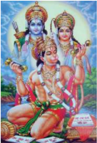

> **Deskripsi Visual:** Gambar ini adalah ilustrasi yang menampilkan tiga tokoh utama dari mitologi Hindu, yaitu Lord Vishnu, Lord Rama, dan Lord Hanuman. Mereka diperlihatkan berdiri di atas sebuah pohon, dengan latar belakang alam yang indah dan cerah. Lord Vishnu duduk di tengah, mengenakan pakaian tradisional dan memegang sepeda gajah, sementara Lord Rama berdiri di sebelah kanan, mengenakan pakaian tradisional dan memegang senjata, dan Lord Hanuman berdiri di sebelah kiri, mengenakan pakaian tradisional dan memegang sepeda gajah. Ilustrasi ini menunjukkan hubungan dan persahabatan antara ketiga tokoh tersebut dalam konteks mitologi Hindu.

Elemen-elemen utama dalam gambar ini meliputi:
1. Lord Vishnu (duduk di tengah)
2. Lord Rama (berdiri di sebelah kanan)
3. Lord Hanuman (berdiri di sebelah kiri)
4. Pohon yang menjadi latar belakang
5. Alam yang indah dan cerah

Teks, angka, atau label penting yang terlihat dalam gambar ini tidak ada. Informasi kunci yang dapat diambil pembaca meliputi:
1. Ketiganya adalah tokoh dari mitologi Hindu.
2. Mereka memiliki hubungan persahabatan.
3. Gambar ini mungkin digunakan untuk membantu pemahaman tentang hubungan antar tokoh dalam mitologi Hindu.

Ajaran Bhakti Sejati kesatrya yang utama dilaksanakan oleh R ā m ā dalam bait sloka R ā m ā yanaIII.XXIV.1 adalah Rama sebagai seorang raja gagah berani dalam mengadapi musuhmusuhnya yang ingin merusak kerajaannya dengan sifat dan sikap gagah berani, pantang menyerah di hadapan musuhnya. Sebagai seorang kesatryasejati Rama  tidak pernah  mundur  dalam  menegakan Dharma  negara. Rama  rela  mengorbankan  jiwa dan  raganya  demi  keutuhan  wilayah  negaranya.

 

---
## 📄 Halaman 225

Demikian juga sifat dan sikap kesatrya sejati tersebut ditunjukkan oleh adiknya, Pangeran Wibhisana. Wibhisana sebagai seorang kesatrya sejati yang cerdas dan mempuni di bidang perang dengan anak panahnya dengan sangat mudah dapat menggempur musuh-usuhnya ikut bersama Rama mempertahankan negaranya dari  rongrongan  musuhnya  yakni  Rahwana.  Rama  dan  Pangeran  Wibhisana adalah  putra  ayodhya  yang  cerdas,  pintar,  cekatan  dan  terampil  dalam  bela Negara. Kedua Pangeran (Rama dan Wibhisana) tampil di medan pertempuran dengan sikap kesatrya sejati abdi kerajaan.

S ā ngsö sang tiga déwata Tripurusa pratyaksa m ā wak katon, Sang Hyang Tryagni murub pad ā nira dilah tulya manah tan padém, mangkin dhìra aho ahangkréti nik ā , sang krura Léngk ā dhipa, tar kéwran lumagéng tigangwang amanah m ā na ng manah nimna ya.

### Terjemahannya:

Tat  kala  beliau  bertiga  maju  tampak  sebagai  Hyang  Tripurusa,  bagaikan Hyang  Tri  Agni  berkobar  pikiran  beliau  yang  pantang  mundur  merupakan nyalanya,  semakin  gagah  perkasa  dan  angkuh  Sang  Ràwana  prabhu  Lengka, tidak  merasa  gentar  menghadapi  ke  tiganya  dan  membulatkan  tekad  dengan perkasa melepaskan panah (Kw. R ā m ā yana, XXIV.2).

Pengabdian;  Pengabdian  kepada  sifat  dan  sikap  kebenaran  harus  tetap mengandalkan sikap kasih sayang terhadap sesama sekaligus terhadap mahkluk lainnya.  Kasih  sayang  ' ahimsa '  mengandung  makna  tidak  menyakiti,  baik melalui pikiran, perkataan, dan tindakan terhadap mahkluk manapun termasuk

 

---
## 📄 Halaman 226

manusia. Prinsip kasih sayang ini harus dilaksanakan dalam aktivitas keseharian umat manusia di tingkat keluarga, tetangga, sekolah dan di masyarakat. Kasih sayang adalah merupakan bentuk dasar dari usaha pencegahan konflik dalam diri  sendiri  maupun  di  masyarakat.  Karena  konplik  biasanya  muncul  akibat berbagai perilaku yang 'menyakitkan' dapat dialami oleh manusia dan mahkluk yang lainnya. Apabila setiap pribadi dari anggota masyarakat dapat mematuhi perinsip ini, sudah tentu setiap konplik yang mau muncul dapat diminimalisir. Setiap manusia hendaknya secara sadar dapat mengamalkan perinsip ini sebagai kebutuhan dasar kemanusiaan untuk tidak saling menyakiti dan memusuhi antar sesamanya.

Seseorang  tidaklah  dapat  hidup  sendiri  tanpa  dibantu  oleh  sesamanya. Adanya saudara, teman dan sebagainya sesungguhnya merupakan orang yang patut  dibantu  dan  akhirnya  mau  membantu  kita  dalam  kehidupan  ini.  Sikap dan perilaku saling mengasihi hendaklah dikembangkan mulai dari diri sendiri, tingkat  keluarga,  sekolah  dan  terakhir  di  masyarakat.  Keluarga,  sekolah  dan masyarakat adalah sebagai tempat berlatih dan membudyakan sikap dan perilaku saling mengasihi di antara kita. Sangat tidaklah mungkin seseorang tidak saling memerlukan  orang.  Sesungghunya  semuanya  adalah  saling  berhubungan  dan saling  membantu.  Berikut  ini  adalah  beberapa  sloka  dalam R ā m ā yana yang bernafaskan pengabdian sebagai wujud bhakti sujati Úri R ā ma dengan sesamanya;

Sang Lakûmaóa sira dibya,

Sira sama suka duhka mwang Sang Rãma,

 

---
## 📄 Halaman 227

Rumakét citta nira lanã, dadi ta sira tum t maréng patapan.

ū

### Terjemahannya:

Sang Laksamana beliau mulia, beliau bersama-sama dalam duka dan suka dengan Úri R ā ma, lekat hatinya selalu, maka beliau ikut pergi ke pertapaan (Kw. R ā m ā yana Sargah I.59).

Selanjutnya dalam sloka kekawin Ràmàyana dijelaskan, sebagai berikut:

Nghulun ãnak Bhaþãra Sri,

Ndan duracãra ta nghulun,

Sédhéng kwa cangkraméng swargga,

Anglangkahi mahãmuni.

### Terjemahannya:

'Saya adalah putra bhatara Sri, tetapi saya pernah berbuat kesalahan, waktu saya berjalan-jalan di sorgga, dengan tidak sengaja melangkahi seorang maharsi (Kw. R ā m ā yana Sargah VI.83).

Sangké géléng niré nghulun, Manãpa dadya rãksasa, Kitãtah anta úãpãngku, Apan putrãku dénta wén.

 

---
## 📄 Halaman 228

### Terjemahannya:

Karena  marahanya  beliau  kepada  saya,  lalu  mengutuk  agar  menjadi raksasa, tuanlah yang patut menghakhiri kutukan yang menimpa diriku, sebab sesungguhnya saya adalah putra Tuan (Kw. R ā m ā yana Sargah VI.84).

Kesetiaan; Mengembangkan kesetiaan terhadap bangsa dan negara adalah sangat perlu dilakukan. Setia kepada bangsa serta negara sendiri bukan berarti mengagung-agungkannya. Juga bukan berarti merasa lebih unggul dari bangsa-bangsa  lain.  Menghargai  dan  menghormati  bangsa-bangsa  yang  ada serta  bekerja  sama  dengannya  juga  perlu  dilakukan.  Kita  mengakui  bahwa semua bangsa di dunia ini mempunyai derajat dan bermartabat. Sebagai Bangsa Indonesia hendaknya merasa dirinya sebagai bagian dari seluruh umat manusia. Oleh  karena  itu,  kita  harus  mengembangkan  sikap  hormat  menghormati  dan bekerjasama dengannya. Dengan  semangat  persatuan dan kesatuan, kita meneruskan  perjuangan  serta  mengisi  kemerdekaan  melalui  mewujudkan pembangunan di segala bidang. Jiwa serta semangat persatuan sebagai syarat mutlak bagi terciptanya cita-cita yang ingin kita wujudkan,

Sikap  menempatkan  kepentingan  bangsa  dan  negara  di  atas  kepentingan pribadi atau golongan hendaknya kita sadari dan kita laksanakan dengan sepenuh hati. Selayaknya kita rela berkorban dan ikhlas serta setia kepada bangsa dan negara  kita  sebagai  ciri  khas  kepribadian  bangsa  Indonesia.  Seseorang  dapat dikatan sebagai sosok yang setia apabila dalam hidupnya dapat mengamalkan nilai-nilai bhakti sujati dengan perwujudannya seperti; rela berkorban, pengabdian,  tanggung  jawab,  kemitraan,  patrotik,  berkepribadian,  cinta  tanah

 

---
## 📄 Halaman 229

air,  disiplin, hormat, tertib dan setia. Berikut ini adalah beberapa sloka dalam R ā m ā yana yang  bernafaskan  persahabatan  yang  setia  sebagai  wujud  bhakti sujati dengan sesamanya;

Masih ta sang réûi mawéh ta sirãstra diwya, Sang Rãma Lakûamana paréng winarah mangajya, Widyãtidurjaya jayã wijayã jayãnti, Yékin pawéh ri sira dibya amoghaúakti.

### Terjemahannya:

Dengan rasa kasih sayang sang resi menganugrahkan panah yang hebat, Sang R ā ma dan Sang Laksamana sama-sama diberikan pelajaran, pengetahuan yang tak terkalahkan Berjaya selalu unggul pasti menang, inilah yang dianugrahkan kepada beliau yang amat mulia dan sakti dan tidak pernah gagal (Kw. R ā m ā yana Sargah II.22).

Selanjutnya dalam sloka kekawin Ràmàyana dijelaskan, sebagai berikut:

Hé Rãma hé Raghusuta, Haywa sãhasa ri nghulun, Jãtayu tãku tan kãlén, Weruh tãkun Jãnakin pinét.

 

---
## 📄 Halaman 230

### Terjemahannya:

'Wahai, Sang Ràma turunan Raghu, jangan berbuat kejam kepada hamba, hamba adalah Jatayu, tiada lain. Hamba mengetahui Tuanku pasti mencari Dewi Sita' (Kw. R ā m ā yana Sargah VI.67).

Nã ling nirang mahãpaksi, Manémbah Sang Ragh ū ttama, Sirang Jatãyu kãrunya, Mitra kãsih nirang bapa.

### Terjemahannya:

Demikianlah penjelasan Sang Jatayu, menghormatlah Sang Ràma, beliau sangat kasihan melihat Sang Jatayu, Jatayu adalah sahabat kesayangan ayahnya (Kw. R ā m ā yana Sargah VI.68).

L ā wan j ā ti nikang wyamoha tumémung bhog ā wéro y ā lupa Tan weruh ring manganugrahé ya mahiwang sakténg nginak kéwala, Ndan lotatya naréndra ri nghulun apan m ū dati m ū d ā dharma, Sangké pét naran ā tha hétu ni tutur ning m ū da yékin téka.

### Terjemahannya:

Dan sesungguhnya si bodoh waktu memperoleh kenikmatan pasti ia mabuk dan lupa, tidak ingat lagi kepada yang memberikan kenikmatan berbuat salah sangat lengket kepada kenikmatan semata, tetapi Tuanku harap bersabar terhadap

 

---
## 📄 Halaman 231

perbuatan hamba yang teramat bodoh dan hina dina, dari usaha Tuankulah yang menyebabkan si bodoh baru ingat dan kini ia dating menghadap (Kw. R ā m ā yana Sargah VII.46).

Demikianlah penjelasan Sang Sugriwa, sembari memohon ampun kehadapan Úri R ā ma sebagai jungjungannya. Sebagai sahabat yang sejati Úri R ā ma dapat menerima dan gembira mendengar permohonan maaf dan kesediannya sebagai sahabat yang sejati.

Kepahlawanan ; Úri R ā ma sebagai putra Raghu, kesatria pemberani selalu tampil dalam membela kebenaran yang sejati.  Dalam  mengadapi  musuh-musuhnya yang  ingin  merusak  kedamaian  negara  dan kerajaannya,  Ia  selalu  tampil  dengan  sifat dan  sikap  gagah  berani,  pantang  menyerah di hadapan musuhnya. Sebagai seorang kesatrya sejati Úri  R ā ma tidak pernah mundur  dalam  menegakan  Dharma  negara. Beliau rela mengorbankan jiwa dan raganya

---
**🖼️ Gambar/Diagram**

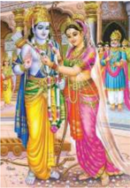

> **Deskripsi Visual:** Gambar ini adalah ilustrasi yang menampilkan dua tokoh pria dan wanita yang tampaknya berada dalam situasi yang sangat romantis atau istimewa. Tokoh pria berdiri di sebelah kiri, menghadap ke arah kanan, sementara tokoh wanita berdiri di sebelah kanan, menghadap ke arah kiri. Kedua tokoh tersebut mengenakan pakaian tradisional yang indah dengan warna-warna cerah, seperti merah muda dan hijau. Tokoh wanita memiliki rambut panjang yang dipetik dan mengenakan gaun berwarna pink yang mencolok. Tokoh pria juga mengenakan gaun berwarna putih dengan detail emas yang memukau.

Elemen-elemen utama dalam gambar ini adalah dua tokoh yang tampaknya berada dalam hubungan romantis atau istimewa. Relasi mereka tampaknya sangat dekat dan penuh cinta, yang ditunjukkan oleh posisi mereka yang saling menghadap dan posisi tubuh mereka yang menunjukkan rasa kasih sayang.

Teks, angka, atau label penting tidak terlihat dalam gambar ini karena ia hanya berupa ilustrasi. Namun, informasi kunci yang dapat diambil pembaca adalah bahwa gambar ini mungkin digunakan untuk membantu pembelajaran tentang hubungan atau pernikahan dalam budaya tertentu.

Dalam satu paragraf yang informatif, gambar ini menunjukkan dua tokoh yang tampaknya berada dalam hubungan romantis atau istimewa, dengan posisi mereka yang saling menghadap dan posisi tubuh yang menunjukkan rasa kasih sayang. Gambar ini mungkin digunakan untuk membantu pembelajaran tentang hubungan atau pernikahan dalam budaya tertentu.

demi  keutuhan  wilayah  negaranya.  Demikian  juga  sifat  dan  sikap  kesatrya sejati tersebut di tunjukkan oleh adiknya, Pangeran Laksamana dan Wibhisana. Wibhisana sebagai seorang kesatrya sejati yang cerdas dan mempuni di bidang perang  dengan  anak  panahnya  dengan  sangat  mudah  dapat  menggempur

 

---
## 📄 Halaman 232

musuh-musuhnya ikut bersama R ā m ā mempertahankan negara dari rongrongan musuhnya yakni Ràwana. Úri R ā ma dan Pangeran Laksamana dan Wibhisana adalah  putra  ayodhya  yang  cerdas,  pintar,  cekatan  dan  trampil  dalam  bela negara. Ketiga Pangeran (Úri R ā ma, Laksamana dan Wibhisana) tampil dimedan pertempuran dengan sikap kesatrya sejati abdi kerajaan. Berikut ini adalah sloka ajaran bhakti sejati dalam kekawin R ā m ā yana :

Ikanang dhanurdhana kabéh, kapwa ya bhakti ri sira pranata matwang, kadi mawwata yasã lanã, r ū pa nya nag ō ng ta kîrttinira.

### Terjemahannya:

Prajurit panah itu semua, semuanya bakti, tunduk, hormat kepada Baginda, seperti akan mempersembahkan jasa selalu, tampaklah besar jasa-jasa mereka itu (Kw. R ā m ā yana Sargah I.8).

Tatk ā l ā n kadi k ā lamrétyu sakal ā tyanteng galak yar pamuk, Yek ā ngs ō nira sang ragh ū ttama tum ū t sang laksman ā ngimbangi, lawan Sang Gunaw ā n Wibh ā sana pad ā méntang laras nirbhaya, rangkép ring guna agra ning kekawihan agréng kawìran sira.

 

---
## 📄 Halaman 233

Terjemahannya: Tatkala Sang R ā wana bagaikan Dewa Maut, mengamuk dengan perkasa, pada  saat  itu  Sang  R ā ma  dan  Sang  Laksamana  maju  ke  depan  menandingi, dan Sang Wibis ā na yang arif-bijaksana turut membidikkan panah tidak merasa gentar,  sempurna  dalam  hal  kesaktian  serta  keperkasaan  sangat  utama (Kw. R ā m ā yana, XXIV.1).

Wulatta rikanang manéwita kabéh waték séwaka, Guna nya kalawan asih nya matuhan ik ā tinghali, Suúìla asgunabhakti yadi tan sujanm ā tuwi, Sayogya pahayun nik ā nguni-nguni sujanm ā lapén.

### Terjemahannya:

Perhatikanlah semua yang mengabdi terutama hamba sahaya! Kebajikan dan kasih sayangnya bertuan perhatikanlah! Susila, baik budhi, amat bhakti meski bukan orang bangsawan sekalipun, haruslah dihormati apalagi orang bangsawan patut dimanfaatkan (Kw. R ā m ā yana Sargah III.72).

Demikianlah  R ā ma  memimpin  negara  (kerajaannya)  sebagai  kesatrya yang  tangguh  selalu  mengupayakan  keamanan,  kesejahtraan,  dan  kedamaian negara dan bangsanya. Semuanya itu dilaksanakan sebagai kesatrya sejati guna mewujudkan bhakti sejatinya untuk negara dan bangsa yang dipimpinnya.

 

---
## 📄 Halaman 234

Persatuan : Rama selalu bersatu dalam membela kebenaran yang sejati Ajaran  Bhakti  Sejati  Persatuan; R ā m ā selalu  mengutamakan  persatuan dalam membela kebenaran untuk mempertahankan Negera dan membela rakyat yang dipimpinnya selalu  mengutamakan persatuan sebagai tertulis dalam bait sloka R ā m ā yana III.XXIV.2  adalah  Rama  sebagai  seorang  raja  gagah  berani dalam  mengadapi  musuh-musuhnya  yang  ingin  merusak  kerajaannya  dengan sifat dan sikap bersatu, pantang menyerah dihadapan musuhnya. Sebagai seorang pemersatu sejati Rama tidak pernah mundur dalam menegakan Dharma negara . Rama  rela  mengorbankan  jiwa  dan  raganya  demi  keutuhan  wilayah  negara yang dipimpinnya. Demikian juga sifat dan sikap persatuan sejati tersebut di tunjukkan  oleh  adiknya,  Pangeran  Wibhisana.  Wibhisana  sebagai  seorang kesatrya sejati yang cerdas dan mempuni di bidang perang dengan anak panahnya dengan sangat mudah dapat menggempur musuh-musuhnya ikut bersama Rama mempertahankan negaranya dari rongrongan musuhnya yakni Rahwana. Rama dan Pangeran Wibhisana adalah putra Ayodhya yang cerdas, pintar, cekatan dan terampil dalam bela negara. Kedua Pangeran (Rama dan Wibhisana) tampil di medan pertempuran dengan sikap persatuan yang sejati abdi kerajaan.

N ā tojar nira niscayanglépasakén tékang lipung tan luput, limpad pyah nirang ā ryya Laksmana tib ā tibr ā nangis tang kaka, as ā s ū sira sang kapindra kapégan [n] ambék nikang wré kabéh, n-ton Sang Laksmana m ū rcitangésah asih sang siddha mungguwing langit.

 

---
## 📄 Halaman 235

### Terjemahannya:

Demikianlah Sang Ràwana menantang sangat yakin lalu melepaskan senjata konta  tepat  mengenai  sasaran.  Tembus  lambung  Sang  Laksamana  lalu  jatuh menderita luka parah, Sang Ràma akhirnya menangis, Sang Sugriwa menjerit kesedihan dan pasukan kera itu terperenyak kesedihan (Kw. R ā m ā yana, XXIV.9).

Melaksanaan  ajaran Dharma ;  Manusia  mempunyai  tujuan  hidup  yang sama yakni untuk menciptakan keamanan, ketenangan, dan kedamaian. Apabila seseorang  selalu  ingin  memperlihatkan  kemewahan  dan  memamerkan  harta kekayaannya, berarti mereka berbuat yang tidak sesuai dengan ajaran agama. Dharma mengajarkan hidup sederhana, artinya kita tidak membenarkan bersikap berlebihan, kita harus menghormati dan mensyukuri apa adanya. Melaksanakan Dharma berarti orang yang bersangkutan dituntut untuk mampu menyerasikan hidup dengan masyarakat sekitarnya. Dalam kehidupan berkeluarga hendaknya selalu  menumbuhkan  keinginan  untuk  hidup  serasi,  selaras,  dan  seimbang sehingga tercapai kebahagiaan. Oleh karena itu, dalam menggunakan sesuatu yang menjadi milik kita, kita harus benar-benar menerapkan azas tepat guna dan bermanfaat serta tidak menimbulkan gejolak bagi orang lain.

Manusia  memiliki  hak  untuk  dihormati  dan  berkewajiban  menghormati sesamanya. Dalam mempertahankan kehidupannya manusia senantiasa berusaha untuk memenuhi kebutuhannya. Pemenuhan kebutuhan yang dimaksud adalah kebutuhan  yang  bersifat  jasmani  dan  yang  bersifat  rohani.  Untuk  memenuhi kebutuhan  tersebut  hendaknya  kita  berusaha  memenuhinya  secara  bersamasama  sehingga  tercipta  keserasian,  keselarasan,  dan  keseimbangan  hidup

 

---
## 📄 Halaman 236

dengan masyarakat sekitarnya. Sikap dan perilaku seperti ini sangat menunjang tercapainya suatu kebahagiaan hidup. Pemenuhan kebutuhan hidup hendaknya menyesuaikan diri dengan kemampuan materiil maupun spiritual yang dimiliki. Meskipun demikian, bukan berarti kita harus berserah diri kepada keadaan, namun hendaknya  selalu  berusaha  dan  berupaya  untuk  meningkatkan  kemampuan guna mencapai kehidupan yang lebih baik sebagai wujud bhakti sejati. Berikut ini  adalah  beberapa sloka dalam R ā m ā yana yang bernafaskan ajaran Dharma sebagai wujud bhakti sejati dengan sesamanya;

Úéûa mahàrûi mamuja, purnnahuti dibya pathyagandharasa,

ya ta pinangan kinabéhan, dé nira déwì mahàràja.

### Terjemahannya:

Sisa sang maharsi memuja; sajen-sajen yang lengkap, utama, enak, harum dan  lezat,  itulah  yang  disantap  bersama-sama,  oleh  Permaisuri  Baginda  Raja (Kw. R ā m ā yana Sargah I.31).

Hé n ā tha sang nrépati sura mah ā prabh ā wa, Dharm ā rtha k ā ma gawayén tuwi dé naréndra, Mitra Hyang Indra kita déwata tulya s ā ks ā t, Bh ā gyan témén kami daténg naran ā tha mangké.

 

---
## 📄 Halaman 237

### Terjemahannya:

Wahai Raja yang pemberani dan amat perkasa, dharma, artha, kama itulah telah Tuan laksanakan, sahabat Hyang Indra Tuanku, nyata-nyata Tuanku sebagai dewata, bahagia sekali kami, Tuanku telah datang kemari (Kw. R ā m ā yana Sargah II.62).

Nahan ta guna sang rum ā kûéng jagat, Ginorawa lanà ginoûþiniwö, Ya t ū tana ya t ū maóik tékana, ulah maséséran ya sésran magöng.

### Terjemahannya:

Demikian  keutamaan  seorang  raja  yang  mengendalikan  negara,  selalu dimusyawarahkan dan dipatuhi penerapannya, patut diturut karena merupakan kalung  permata,  perilaku  Adinda  rajin  memperhatikan  keadaan  masyarakat bagaikan cincin utama (Kw. R ā m ā yana, XXIV.61).

Tingkah laku yang baik selalu diupayakan oleh Úri R ā ma beserta keluarganya selama  memimpin  negara  (kerajaannya)  sebagai  wujud  melaksanakan  ajaran Dharma sejati dalam mengupayakan keamanan, kesejahteraan, dan kedamaian negara dan bangsanya. Semuanya itu dilaksanakan sebagai pengamalan dharma sejati  guna  mewujudkan  bhakti  sejatinya  untuk  negara  dan  bangsa  yang dipimpinnya.

 

---
## 📄 Halaman 238

Kasih  sayang :  Rama  selalu  bersikap  kasih  sayang  dalam  membela kebenaran yang sejati.

Ajaran Bhakti Sejati Kasih sayang; R ā m ā selalu  mengutamakan Kasih sayang dalam membela kebenaran untuk mempertahankan negara dan membela rakyat yang  dipimpinnya  selalu  mengutamakan  Kasih  sayang  sebagai  tertulis  dalam bait sloka R ā m ā yana III.XXIV.9 adalah adalah Rama sebagai seorang raja gagah berani  dalam  mengadapi  musuh-musuhnya  yang  ingin  merusak  kerajaannya dengan  sifat  dan  sikap  bersatu,  pantang  menyerah  di  hadapan  musuhnya. Sebagai seorang bersikap kasih sayang sejati Rama tidak pernah mundur dalam menegakan Dharma negara. Rama rela mengorbankan jiwa dan raganya demi keutuhan  wilayah  Negara  yang  dipimpinnya.  Demikian  juga  sifat  dan  sikap Kasih sayang sejati tersebut  di  tunjukkan  oleh  adiknya,  Pangeran  Wibhisana, Sang Laksamana, Sang Sugriwa, dan Para Sidha. Wibhisana sebagai seorang kesatryasejati yang cerdas dan mempuni dibidang perang dengan anak panahnya dengan sangat mudah dapat menggempur musuh-usuhnya ikut bersama Rama mempertahankan egaranya dari rongrongan musuhnya yakni Rahwana. Rama dan Pangeran Wibhisana adalah putra ayodhya yang cerdas, pintar, cekatan dan terampil dalam bela negara. Kedua Pangeran (Rama dan Wibhisana) tampil di medan pertempuran dengan sikap kasih sayang yang sejati abdi kerajaan.

Prajñ ā sang kinawih Wibhisana wawang pundut ta sang Laksmana, mundur m ū r sakaréng waték ta ikanang konta r-alap ng osadhi, pöh ikang kani nirwik ā ra mabangun Sang l ā ksman ā nganjali, sakwéh sang manangis mingis mari maruk manghruk waték wā nara.

 

---
## 📄 Halaman 239

### Terjemahaannya:

Sang Wibhisana sangat arif bijaksana segera mengusung Sang Laksmana, mundur menjauh sejenak dicabut senjata lembing yang tertancap lalu mengembil obat,  ditetesi  luka  beliau  sembuh  tanpa  bekas  Sang  Laksamana  bangkit  lalu bersujud, semua yang tadinya sedih lalu tersenyum hilang sedihnya lalu pasukan kera itu bersorak (Kw. R ā m ā yana, XXIV.10).

Perjalanan spiritual berlandaskan catur purus ā rtha; Sebagai manusia beragama wajib hukumnya memiliki sifat, sikap, dan penampilan yang baik dalam kehidupan sehari-hari. Menampilkan diri yang baik sebagai umat beragama yang percaya dengan adanya Ida Sang Hyang Widhi/Tuhan Yang Maha Esa dalam kehidupan sehari-hari dapat dilakukan dengan bersyukhur, bersikap sederhana, cerdas, arif, bijaksana, dan kreatif.

Umat manusia tidak dapat menghitung secara pasti berapa banyak anugrah dan nikmat yang dilimpahkan oleh Tuhan Yang Maha Esa terhadap dirinya. Oleh karena itu, kita wajib mensyukhurinya. Penampilan mensyukhuri anugrah-Nya dalam kehidupan sehari-hari dapat kita dilakukan dengan cara; menjunjung tinggi kejujuran,  kebenaran  dan  keadilan,  melaksanakan  amanat  Tuhan  Yang  Maha Esa  dalam  bermasyarakat,  berbangsa  dan  bernegara,  menjauhi  larangan-Nya seperti; angkuh, sombong, mabuk, mempitnah, menipu, menyiksa, bermusuhan, berkelahi, menghina dan lain-lain sikap yang tak terpuji.

Menjadi  insan  yang  religius  hendaknya  senantiasa  mau  dan  mampu menampilkan diri untuk selalu; membiasakan diri bersikap, berucap, dan berbuat yang  baik  sesuai  kaidah-kaidah  agama,  berbhakti  dan  taat  kepada  orang  tua,

 

---
## 📄 Halaman 240

guru, dan orang yang lebih tua atau dituakan, menjaga keamanan dan ketertiban masyarakat,  menjaga  kebersihan  lingkungan  sekitar  yang  indah  dan  menarik, dan mendharma-bhaktikan  diri kepada umat yang  memerlukan.  Dengan demikian hidup sejahtra dan bahagia sesuai ajaran bhakti sejati dalam R ā m ā yana dapat  diwujudkan.  Berikut  ini  adalah  beberapa  sloka  dalam R ā m ā yana yang bernafaskan spiritual berlandaskan catur purusartha yang berhubungan dengan ajaran bhakti sejati antara lain;

Ikana kunang dona mami, Mamalakwa rinàksà dé mahàràja, Hana sanghulun mayajña, Ndanyà lila ràkûasà mighné.

### Terjemahannya:

Inilah yang menjadi tujuan kami, hendak mohon agar dijaga oleh tuanku raja,  waktu  kami  melangsungkan  korban;  ya,  dengan  bebas  raksasa-raksasa menimbulkan bencana (Kw. R ā m ā yana Sargah I.43).

Tatkàla yar téka rikang patapan mahàrûi,

Sakwéh nirang wiku tapaswi kabéh manungsung, Airúànti puspa phalamula suggandha dh ū pa, Lén wwah séréh wway ininum panamuy mahàrûi.

 

---
## 📄 Halaman 241

### Terjemahannya:

Tatkala  beliau  tiba  di  pertapaan  sang  maharsi,  segenap  wiku  pertapa semuanya menyambut, air pujaan, kembang, buah-buahan, akar-akaran, harumharuman, dupa, dan pinang, sirih serta air  minum jamuan sang maharsi (Kw. R ā m ā yana Sargah II.20).

Kramakàla siràrahup masandhyà,

Majapàngarccana kapwa bhakti satya,

Brata sang prabhu mréddhyakén prabhàwa,

Saparan sélwana bhakti mukya m lya.

### Terjemahannya:

Tiba saatnya mereka berkemas-kemas mandi dan kemudian mengucapkan Tri Sandhya, beliau bersama-sama mendoakan dan memuja dengan setia bhakti, kewajiban  seorang  raja  adalah  mengembangkan  wibawanya,  kemanapun  ikut serta karena ketaatan yang diutamakan (Kw. R ā m ā yana Sargah XXIV.239).

Mangkas-mangkas angadég ta siràdan,

Dampatì nrépati Ràghawa Sìtà,

Úrì Janàrddana katon sira sàkûàt, tulya Kàma Rati ratna nikang ràt.

ū

 

---
## 📄 Halaman 242

### Terjemahannya:

Beliau bergegas berdiri dan berkemas, baginda Raja Ràma dan Dewi Úità sebagai suami istri, bagaikan Dewi Sri dan Hyang Wisnu menampakkan diri, tidak beda dengan Dewa Asmara dan Dewi Ratih laksana permata dunia (Kw. R ā m ā yana Sargah XXIV.240).

Tuhu sidda wàkya wiku tan papada,

Panda panditàsing aparö ri sira

Tuwi satwa satya mamicàra kécék,

Syung asangghaning pangajaran [n] ajaran.

### Terjemahannya:

Sungguh-sungguh  setia  ucapan  sang wiku  terwujud tidak ada  yang menyamai, setiap yang mendekat pada beliau menjadi arif, walaupun binatang juga setia melaksanakan ajaran agama, burung tiung berkumpul di asrama untuk mempelajari ilmu pengetahuan (Kw. R ā m ā yana Sargah XXV.16).

Kimutang mahàtma tapa tàpa cutul, Úuci céþþa-céþþa ucapan ringa aji, Aji ning héning hana hénéng ginégö, Apawargga màrgga mapagéh ginénéng.

 

---
## 📄 Halaman 243

### Terjemahannya:

Apalagi mereka yang sudah berusia lanjut sengaja menyiapkan diri untuk bertapa, berhati suci dan menghayati ajaran agama, melaksanakan ilmu kesucian dan ada juga tengah melaksanakan yoga pantang bicara, jalan menuju alam gaib yang mereka tekuni (Kw. R ā m ā yana Sargah XXV.17).

Tuhu tarkka tang [ng] atatatattwa humung,

Macéngil cumodyasijalak agalak,

Paða niscayéng aji winiúcaya ya,

Kumapak [k] a pakûi nika pakûa nikà.

### Terjemahannya:

Sungguh pantas  burung  kakaktua  itu  riuh  berceritra,  bertengkar  mencela burung jalak yang galak, sama-sama meyakini ilmu pengetahuan yang dianutnya, galak sekali ketika ditentang pendapatnya (Kw. R ā m ā yana Sargah XXV.18).

Jaya paraméúwaràtiúaya úakti natha nikanang jagattraya kita,

Pranata hatingku nitya ri sukunta tàtan alupà lanà matutura, Ikana phalà ni bhakti ni hatingku ràt yata tum ū ta bhaktya ri kita, Kalawan iking subhàûita kathà sabhàkéna réngön rasa nya subhaga.

### Terjemahannya:

'Tuanku telah berhasil dan berkuasa penuh sebagai pemimpin tiga dunia, hamba senantiasa bersembah sujud kehadapan duli Tuanku yang selalu hamba

 

---
## 📄 Halaman 244

ingatkan  dan  tidak  pernah  hamba  abaikan,  padahal  sujud  sembah  hamba  itu semoga  menjadi  panutan  rakyat  setia  bhakti  kehadapan  Tuanku',  dan  ceritra yang engandun ajaran utama dalam bentuk kekawin ini wajar disebar luaskan dan didengarkanlah inti sarinya yang sangat masyhur (Kw. R ā m ā yana Sargah XXVI.49).

Bantu-membantu :  Rama selalu bersatu dalam membela kebenaran yang sejati

R ā m ā yana III.XXIV.10 adalah  Rama sebagai seorang raja mengutamakan kebersamaan dalam mengadapi musuh-musuhnya yang ingin merusak kerajaannya dengan sifat dan sikap kebersamaan, pantang menyerah di hadapan musuhnya.  Sebagai  seorang  mengutamakan  kerja  sama  Rama  tidak  pernah mundur  dalam  menegakkan Dharma negara.  Rama  rela  mengorbankan  jiwa dan raganya demi keutuhan wilayah negara yang dipimpinnya. Demikian juga sifat dan sikap kebersamaan sejati tersebut di tunjukkan oleh adiknya, Pangeran Wibhisana,  bersama  Sang  Laksamana.  Wibhisana  sebagai  seorang  penolong sejati  yang  cerdas  dan  mempuni  di  bidang  perang  dan  pengobatan  dengan lembingnya  dengan  sangat  mudah  dapat  menggempur  musuh-usuhnya  ikut bersama  Rama  mempertahankan negaranya dari  rongrongan  musuhnya  yakni

Ajaran Bhakti Sejati Bantu-membantu; R ā m ā selalu mengutamakan kebersamaan  dalam  membela  kebenaran  untuk  mempertahankan  Negara  dan membela rakyat yang dipimpinnya selalu mengutamakan kebersamaan sebagai tertulis dalam bait sloka Pendidikan Agama Hindu dan Budi Pekerti Kelas XI SMA/SMK Kurikulum'13 | 134

 

---
## 📄 Halaman 245

Rahwana. Rama dan Pangeran Wibhisana, Sang Laksmana adalah putra ayodhya yang cerdas, pintar, cekatan dan trampil dalam bela Negara. Ketiga Pangeran (Rama dan Wibhisana, Laksamana) tampil di medan pertempuran dengan sikap kebersamaan yang sejati abdi kerajaan.

Sloka-sloka  kitab  Ramayana  yang  berhubungan  dengan  ajaran  bhakti sejati yang tersurat diatas hanya baru sebagian kecil dari jumlahnya sebanyak 24.000  stanza.  Selanjutnya  masih  banyak  yang  perlu  digali  lebih  jauh  untuk pembelajaran  pembentukan  sifat  dan  sikap  yang  berhubungan  dengan  ajaran bhakti sejati untuk dipedomani oleh umat sedharma.

### Uji Kompetensi:

- Setelah  mengamati  dan  memahami  teks  di  atas  apakah  yang  Anda ketahui  sehubungan  dengan  sloka-sloka  ajaran  bhakti  sejati  dalam Kitab Ramayana? Jelaskanlah.
- Apakah  yang  Anda  ketahui  terkait  dengan  penerapan  ajaran  bhakti sejati  dalam  agama  Hindu  berdasarkan  sloka-sloka  yang  terdapat dalam Kitab Ramayana? Jelaskanlah!
- Amatilah  lingkungan  sekitar  Anda  sehubungan  dengan  orang-orang yang dipandang dalam memuja Tuhan Yang Maha Esa/Ida Sang Hyang Widhi dengan mengikuti jalan bhakti sejati yang terdapat dalam Kitab Ramayana, buatlah catatan seperlunya dan diskusikanlah dengan orang tua-mu! Apakah yang terjadi? Buatlah narasinya 1-3 halaman diketik dengan  huruf  Times  New  Roman-12,  spasi  1,5  cm,  ukuran  kertas kwarto; 4-3-3-4; Lakukanlah!

 

---
## 📄 Halaman 246

### D. Bentuk Penerapan Bhakti Sejati dalam Kehidupan

### Perenungan:

### Terjemahan:

'Kebenaran/kejujuran  yang  agung,  hukum-hukum  alam  yang  tidak  bisa diubah, pengabdian diri, tapa (pengekangan diri), pengetahuan dan persembahan (yajna)  yang  menopang  bumi,  Bumi  senantiasa  melindungi  kita,  semoga  di (bumi) menyediakan ruangan yang luas untuk kita' (Atharvaveda XII.1.1).

Kesadaran yang dilakukan oleh umat sedharma secara arif dan bijaksana sesuai dengan aturan; keimanan, kebajikan, acara keagamaan dan aturan etika serta moralitas yang berlaku umum kehadapan Tuhan Yang Maha Esa ' Sewaka Dharma ' ini sangat dibutuhkan dewasa ini. Karena perkembangan dan kemajuan jaman 'era global' telah mampu mengubah paradigma seseorang secara cepat. Sangat berbahaya untuk perkembangan moral umat, apabila yang bersangkutan belum  mempersiapkan  dirinya  secara  total  untuk  menghadapi  era  itu.  Tidak sedikit di antara mereka gagal untuk itu, hal ini dapat dipadukan dengan perilaku nekat, jahat, dan anarkis dari mereka yang semakin berkembang belakangan ini.

'Satyaý båhad åtam ugra dikûà tapo brahma yajñaá påthiviý dharayanti, sà no bhùtasya bhavyasya patni uruý lokam påthivi naá kånotu.

 

---
## 📄 Halaman 247

Memberikan pujian dan juga penghargaan kepada mereka yang terkontaminasi oleh pengaruh negatif era globalisasi ini sering gagal, karena orang yang kita puji  mungkin merasa 'rendah' ketika mereka gagal, tidak melakukan seseuai dengan harapan, atau ketika mereka melakukan hal-hal di luar kekuatan mereka. Dalam hal ini, orang yang kita puji cenderung mempertanyakan nilai kualitas diri mereka. Oleh karena itu, perlu selektif sehingga apa yang dilakukan tepat guna. Bahkan  terkadang  mereka  mungkin  mempertanyakan  apakah  kita  akan  terus mencintai, mengasihi, menyayangi, bangga, dan sebagainya dengan mereka.

Penting bagi kita untuk memvalidasi dan memuji orang dengan kesadaran Sewaka Dharma sehingga pujian yang dilontarkan atau diucapkan penuh dengan pertimbangan atau wiweka dari olah rasa, olah pikir, olah kata, dan olah laku sehingga Sewaka Dharma itu dapat berkontribusi positif terhadap pembentukan tubuh atau fisik dan rohani masyarakat manusia secara utuh dan menyeluruh. Bentuk-bentuk penerapan ajaran Nawa Widha Bhakti yang bagaimana penting dilaksanakan  sehingga Sewaka  Dharma dalam  proses  perjalanannya  dapat membantu  membentuk  karakter  atau  kepribadian  anak  bangsa  ini  menjadi berkualitas,  berkepribadian,  mawas  diri,  berbesar  hati,  membuka  diri,  dan berbagi, santun, ramah, arif dan bijaksana, toleran, memiliki cinta kasih sayang, harmonis.

Berikut ini dapat dipaparkan bentuk-bentuk penerapan ajaran bhakti sujati, sebagai berikut;

 

---
## 📄 Halaman 248

### a. Mendengarkan Sesuatu dengan Baik ' Srawanam '

Arah gerak vertikal dari bhakti adalah umat mau dan mampu mendengar. Dalam hal ini masyarakat hendaknya meyakini dan mendengarkan sabda-sabda suci dari Tuhan baik yang tersurat maupun tersirat dalam kitab suci atau aturanaturan keimanan, aturan kebajikan dan aturan upacara. Tetapi penomena arah gerak vertikal dari bhakti untuk mendengar, yang kita jumpai di tengah-tengah kehidupan  dan  lingkungan  keluarga  serta  masyarakat  tidak  sedikit  di  antara mereka  yang  tidak  mau  mendengarkan  sabda-sabda  suci  atau  aturan-aturan keimanan, aturan kebajikan dan aturan upacara keberagamaan. Kenyataan ini diperkuat  oleh  fakta  lapangan,  seperti;  apabila  ada  orang  yang  mewartakan tentang ajaran kebajikan, kebenaran, kesucian, dan lain-lain tentang sabda suci Tuhan justru yang terjadi malah ketidak pedulian, pelecehan, atau dengan kata lain respon yang muncul menunjukan ketidak tertarikan dengan pewartaan itu. Contoh kecil saja; di sebagian banyak orang tidak mau mendengar atau bahkan mengantuk apabila ada ceramah-ceramah agama baik itu di tempat-tempat suci atau pewartaan melalui media cetak dan eletronik yang lain. Tetapi kalau ada pewartaan/tayangan sinetron tentang gosip, fitnah, kekerasan, diskriminasi, dan yang lainnya justru menjadi sebuah konsumsi bagaikan seorang pecandu.

Sedangkan arah gerak horizontal, bhakti untuk mendengar ini hendaknya masyarakat  dalam  hidup  dan  kehidupannya  selalu  menanamkan  rasa  bhakti untuk mau belajar mendengarkan nasihat dan menghormati pendapat orang lain serta belajar untuk menyimak atau mendengarkan pewartaan tentang sesamanya dan  lingkungannya.  Tetapi  penomena  yang  sering  terjadi  tidak  sedikit  juga masyarakat kita yang tidak peduli dan tidak belajar serta menghormati nasehat

 

---
## 📄 Halaman 249

dan pendapat orang lain, serta tidak peduli dan tidak mau belajar untuk menyimak berita-berita  tentang  tragedi  kemanusiaan  dan  kerusakan  lingkungan.  Padahal dalam  hidup  ini  untuk  mewujudkan  cita-cita  atau  visi-misi  hidup  hendaknya dimulai dengan adanya kemauan dan kesadaran untuk mendengar.

Pengetahuan, pemahaman dan pendalaman tentang berbagai hal hasil dari mendengar dapat  dijadikan  konsep  dasar  untuk  menata  hidup  dan  kehidupan di  dunia  ini  yang  kemudian  ditindaklanjuti  dengan  berupaya  untuk  berbuat atau  mencari  solusi  yang  terbaik  dalam  mengambil  sebuah  tindakan  akan kemanusiaan/sesama  dan  lingkungan.  Contoh;  di  lingkungan  keluarga  antara anggota  keluarga  semestinya  selalu  menanamkan  sifat  dan  rasa  bhakti  untuk selalu saling mendengar baik antara saodaranya, suami dan istri, antara orang tua dan anak. Mereka hendaknya selalu membangun komunikasi aktif sehingga dapat mengurangi terjadinya miskomunikasi di antara anggota keluarga.

Sifat  dan  sikap  ini  akan  dapat  menumbuhkan  karakter  Ketuhanan  di lingkungan  keluarga  itu,  seperti;  sifat,  sikap  dan  karakter  saling  hormatmenghormati, sujud, cinta kasih sayang, pengabdian, pelayanan, berfikir yang baik  dan  suci,  berkata  yang  baik  dan  suci,  berbuat  yang  baik  dan  suci  serta teguh  dalam  melaksanakan  disiplin  spiritual.  Sifat  dan  sikap  individu  seperti itu akan dapat dijadikan sebagai modal sosial untuk menciptakan kesalehan dan keharmonisan sosial antara keluarga, antar sesama anggota masyarakat. Sifat, sikap dan karakter individu yang selalu belajar untuk membuka diri mendengar nasihat,  pendapat  orang  lain  atau  apa  yang  diwacanakan  orang  lain  adalah sebuah sifat, sikap dan karakter insklusif yaitu sebuah sifat, sikap dan karakter membuka  diri  secara  tulus  ikhlas  untuk  mau  mendengarkan  kebenaran  dari

 

---
## 📄 Halaman 250

orang lain, karena dalam diri ada kebenaran tetapi di luar diri juga masih banyak kebenaran yang belum diketahui.

Untuk  itu  pesan  yang  ingin  disampaikan  melalui  bhakti  dengan  jalan mendengar  ini  adalah  dalam  hidup  ini  masyarakat  kita  agar  selalu  berupaya membudayakan untuk mendengar, baik mendengar secara vertikal antara manusia dengan Tuhan-nya melalui sabda-sabda sucinya, maupun secara horizontal antar sesamanya dengan lingkungannya. Karena baik mendengar ataupun memberi pendengaran atau pewartaan apabila sama-sama dilandasi dengan rasa bhakti, maka semua akan mendapat hasil (pahala) yang baik atau paling tidak dapat manfaat  dari  bhakti  mendegar  ini.  Iklim  saling  bhakti  mendengar  ini  sangat dibutuhkan  oleh  masyarakat  kita  yang  di  awali  dengan  memulainya  dari lingkungan  keluarga  selanjutnya  ditumbuh  kembangkan  secara  harmonis  dan dinamis  dalam  kehidupan  sosial  masyarakat  di  lingkungan  masyarakat  sosial yang lebih luas.

Srawanam , dalam bagian Nawa Wida Bhakti yang pertama ini kalau kita kaji artinya adalah 'mendengar'. Di mana maksudnya di sini adalah mendengarkan ajaran atau cerita suci kerohanian. Kitab suci veda menjelaskan sebagai berikut;

'Adhyeûyate ca ya imaý

dharmyaý saývàdam àvayoá, jñana-yajñena tenàham iûþah syàm iti me matiá.

 

---
## 📄 Halaman 251

### Terjemahan:

Dan,  yang  akan  mempelajari  percakapan  suci  kami  berdua,  oleh  dialah Aku  dipuja  dengan  yajna  pengetahuan,  itulah  keyakinan-Ku' (Bhagawagita XVIII.70).

Selanjutnya Bhagawadgita  XVII.71 menjelaskan  bahwa;  mereka  yang mempelajari percakapan suci kami berdua, walaupun hanya sekedar mendengar, ia mencapai dunia kebahagiaan. Demikian dinyatakan bahwa jika umat manusia mengaplikasikan srawanam pada kehidupannya saat ini dengan disadari maupun tak disadari mereka akan mencapai dunia kebahagian lahir bhatin. Kebahagiaan di sini artinya dengan hanya mendengarkan saja tentang cerita dan ajaran suci tentang Tuhan kita akan memperoleh perasaan yang berbeda, entah itu tenang, lega maupun perasaan indah lainnya. Kekawin Ràmàyana menjelaskan sebagai berikut;

Mwang satya ta sira mojar,

Ring anakkébi towi tan mresawàda,

Nguni-nguni yan ri para jana,

Priyahita sojar niràtiúaya.

### Terjemahannya:

Dan lagi jujur baginda bersabda, kepada orang perempuan sekalipun baginda tidak berbohong, apalagi kepada orang lain, sangat menawan hati semua sabda baginda luar biasa (Kw. R ā m ā yana Sargah I.6).

 

---
## 📄 Halaman 252

Itulah  yang  dimaksud  dengan  kebahagiaan  melalui  ' Srawanam .'  Contoh penerapannya  yang  umum  sudah  berjalan  kita bisa lihat adalah seperti misalnya,  Dharmawacana  Keagamaan,  Kelas-kelas  di  asram-asram  setelah persembahyangan dan yang lainnya.

### b. Bersyukur (mensyukhuri atas anugrah-Nya) ' Vedanam '.

Dalam ajaran ini Vedanam berarti bagaimana cara kita bersyukur terhadap keberadaan diri kita. Maksudnya di sini, kita hidup di dunia ini adalah sebagai ciptaan Tuhan yang lahir karena karma yang kita buat terdahulu. Umat Hindu telah  meyakini  hal  tersebut.  Jadi,  bagaimanapun  keadaan  kita  dilahirkan  di bumi ini, kita harus tetap bersyukur dan bhakti kepada-Nya. Kita anggap apa saja yang kita miliki, kita punya, nikmati dan lain-lain, itu semua adalah atas karunianya. Sehingga jika semua umat menyadari hal ini yaitu ajaran Vedanam , niscaya kehidupannya yang dijalani akan terasa indah dan tanpa beban. Kekawin R ā m ā yana menjelaskan sebagai berikut:

Ndan kita pi sarabhàran ràkûang sakala jagat,

Ksatriyawinaya yékà ràkûan katuturakén, úàsana ya gégén tang úàstra d-wulati lanà, Sojaring aji t ū tén yékà mawa kasukan.

### Terjemahannya:

Kamu,  kakanda  serahi  menjaga  seluruh  Negara,  kebijaksanaan  sebagai seorang  kesatria  hendaknya  pegang  teguh,  ingatkan!  Peraturan,  hukum  harus

 

---
## 📄 Halaman 253

diikuti  ajaran  kitab-kitab  agama  diperhatikan  selalu,  apa  yang  diajarkan  oleh ilmu pengetahuan supaya diikuti karena semuanya itu membawa kebahagiaan (Kw. R ā m ā yana Sargah III.53).

Ingat  kita  terlahir  menjadi  manusia  adalah  utama,  yang  artinya  kita  bisa memperbaiki  dan  menyelamatkan  diri  kita  sendiri  dari  perputaran  kelahiran kembali/punarbhawa.

c. Menembangkan, Melafalkan, Menyanyikan Gita/Kidung ' Kirtanam '.

Sumber ; Dok. Pribadi (11-7-2013)

Kirtanam ,  adalah  bhakti  dengan  jalan  melantunkan  Gita  (nyayian  atau kidung suci memuja dan memuji nama suci dan kebesaran Tuhan), bhakti ini juga di arahkan menjadi dua arah gerak vertikal maupun arah gerak horizontal. Arah  gerak  vertical  melakukan bhakti  kirtanam untuk  menumbuhkan  dan

 

---
## 📄 Halaman 254

membangkitkan  nilai-nilai  spiritual  yang  ada  dalam  jiwa  setiap  individu manusia, dengan bangkitnya spiritual dalam setiap individu akan dapat meredam melakukan  pengendalian  diri  dengan  baik,  jiwa  lebih  tenang,  tenteram  dan tercerahi, sistuasi dan kondisi ini akan dapat membantu keluar dari kekusutan mental  dan  kegelapan  jiwa.  Sehingga  dapat  dijadikan  modal  dasar  untuk menciptakan kesalehan dan keharmonisan individual yang damai dan bahagia.

Demikianlah bahagia perasaan hati Úri  R ā ma menikmati keindahan lingkungan gunung Swela yang ditumbuhi oleh berbagai macam kembang dan suara kidung/gambelan yang merdu mengantarkan pendengarnya semakin dekat dengan para dewata.

Arah gerak horizontal masyarakat manusia berusaha selalu untuk melantunkan bhakti kirtanam yang dapat menyejukan perasaan hati orang lain dan lingkungannya. Kepada sesama atau anggota masyarakat yang lainnya tidak hanya melantunkan atau melontarkan kritikan dan cemohan tetapi selalu belajar untuk melatih diri untuk memberikan saran, solusi yang terbaik bagi kepentingan bersama  dalam  keberagamaan,  kehidupan  sehari-hari  tentang  kemanusiaan, kebersamaan,  persatuan  dan  perdamaian,  serta  memberikan  pengakuan  dan penghargaan  atau  pujian  akan  keberhasilan  dan  prestasi  yang  telah  dicapai terhadap sesama atau anggota masyarakat manusia yang lain. Iklim saling bhakti Kirthanam  ini  sangat  dibutuhkan  oleh  masyarakat  manusia  yang  penanaman nilai-nilai bhakti Kirthanam diawali di lingkungan keluarga sebagai modal dasar guna mewujudkan kesalehan dan keharmonisan sosial dalam kehidupan sosial kemasyarakatannya.

 

---
## 📄 Halaman 255

Jika  kita  artikan  kata Kirtanam itu  adalah  'menyanyikan/melantunkan'. Ini  maksudnya,  menyanyikan/melantunkan  kidung  suci  yang  sarat  dengan nama-nama Tuhan. Di jaman sekarang ini jarang kader muda khususnya kader muda Hindu yang mau melaksanakan ajaran kedua dari Nawa Wida Bakti ini, jangankan menyanyikan/melantunkan, mendengarkan saja pun para muda-mudi sekarang jarang mau untuk mengikutinya.

### d. Selalu Mengingat Nama Tuhan ' Smaranam '

Smaranam ,  adalah  bhakti  dengan  jalan  mengingat.  Arah  gerak  vertikal dari  bhakti  ini  adalah  dalam  menjalani  dan  menata  kehidupan ini masyarakat manusia sepatutnya selalu melatih diri untuk mengingat, mengingat nama-nama suci Tuhan dengan segala Kemahakuasaan-Nya, dan selalu untuk melatih diri untuk mengingat tentang intruksi dan pesan atau amanat dari sabda suci Tuhan kepada  umat  manusia  yang  dapat  dijadikan  sebagai  pedoman  atau  pegangan hidup dalam hidup di dunia dan di alam sunya (akhirat) nanti.

Arah  gerak  secara  horizontal  dari  bhakti  ini  apabila  dikaitkan  dengan isu-isu  pluralisme,  kemanusiaan,  perdamaian,  demokrasi  dan  gender  maka sepatutnya  masyarakat  manusia  selalu  berusaha  untuk  mengingat  kembali tragedi dan penderitaan kemanusiaan, musibah dan bencana alam, dan lain-lain, yang diakibatkan oleh konflik-konflik atau pertikaian, kesewenang-wenangan, diskriminasi,  dan  tindakan  kekerasan  yang  lainnya  antara  individu  yang  satu dengan individu yang lain ataupun antara kelompok yang satu dengan kelompok yang lain yang tidak atau kurang memahami dan menghargai indahnya sebuah kebhinekaan dan pluralisme.

 

---
## 📄 Halaman 256

Harapannya dengan mengingat tragedi, penderitaan, musibah dan bencana yang diakibatkan itu masyarakat manusia selalu mewartakan dan mengingatnya sebagai bekal untuk mengevaluasi dan merefleksi diri akan indahnya kebhinekaan dan pluralisme apabila masyarakat manusia mampu mengemasnya dalam satu bingkai yaitu bingkai kebersamaan, persatuan dan kedamaian. Iklim saling bhakti Smaranam ini  sangat dibutuhkan oleh masyarakat manusia yang ditanamkan diawali di lingkungan keluarga sehingga tumbuh karakter Ketuhanan dalam setiap anggota keluarga sebagai modal dasar guna mewujudkan kesalehan dan keharmonisan sosial dalam kehidupan sosial kemasyarakatannya. Kekawin R ā m ā yana menjelaskan sebagai berikut:

Hàh natha t hér kami pinaka hulun,

Tonén tàtah pranata mami kabéh,

Làwam pamrih mami ya wulatana,

Panglingganté hati mami malilang.

### Terjemahannya:

Oh, Sri Baginda! Nantikanlah kami abdi Sri Baginda, Sri Baginda silakan lihat  sujud kami, lagi pula lihatlah ketekunan usaha kami, hanya Sri Baginda yang kami semayamkan dalam lubuk hati yang tulus (Kw. R ā m ā yana Sargah XXI.114).

Demikian  Sang  Sugriwa  sebagai  hamba Úri  R ā ma berjanji  dengan  tulus untuk  menghabisi  musuh-musuhnya  yang  selalu  membuat  bencana  dalam

 

---
## 📄 Halaman 257

mewujudkan  kesejahteraan  dan  kebahagiaan  hidup  ini.  Sang  Sugriwa  selalu mengingat janjinya itu sampai kelak kepada jungjungannya. Sang Sugriwa yakin hidupnya tanpa makna bila tidak dapat menghamba atau sebagai abdi setia Úri R ā ma .

Smaranam artinya  'mengingat  nama  Tuhan'.  Jika  kita  kaji  secara  lebih jelasnya Smaranam ini merupakan ajaran suci yang wajib untuk umat beragama yang meyakini akan adanya sang pencipta 'Tuhan', di mana dalam ajaran ini kita di harapkan agar biasa terhubung, dekat dengan Ida Sang Hyang Widi Wasa , dan  mengingat  nama-Nya,  mengingat  kebesaran-Nya,  dan  kemulian-Nya.  Ini bisa kita aplikasikan dalam kehidupan sehari-hari yaitu dengan cara berbhakti kepada-Nya.  Banyak  jalan  untuk  melaksanakan  bhakti  kita  kepada  Tuhan, contoh kecil saja hanya dengan mengingat-Nya setiap saat, itu sudah aplikasi dari bhakti kita kehadapan-Nya.

### e. Menyembah, Sujud, Hormat di Kaki Padma ' Pada sevanam '

Pada  sevanam artinya  'melayani'.  Dalam  artian  bagaimana  cara  kita melayani mahkluk lain. Pada sevanam meyakini bahwa mahkluk lain yang ada ini  adalah  sebagai perwujudan Tuhan. Misalkan saja jika kita dapat melayani orang lain baik itu orang yang lagi sakit, tertimpa musibah, dan orang yang lagi membutuhkan  sebuah  pertolongan,  itu  sudah  disebut  dengan Pada  sevanam . Dalam  kehidupan  ini  masih  ada  orang  yang  belum  bisa  dan  belum  dapat mengaplikasikan ajaran Nawa Wida Bakti yang di sebut dengan Pada sevanam ini. Kekawin R ā m ā yana menjelaskan sebagai berikut:

 

---
## 📄 Halaman 258

Nà ling sang wànarapati sumahur, Wét ni satyé hati nira malilang, Tàtan linggàr ikanang angén angén, Tan tréûóéng jìwita satiru-tirun.

### Terjemahannya:

Demikian jawaban Sang Sugriwa, didorong oleh pikiran yang tulus setia, imannya sangat teguh tidak berubah, tidak sayang kepada jiwa, patut dipakai contoh (Kw. R ā m ā yana Sargah XXI.121).

Pada sevanam ,  adalah bhakti dengan jalan menyembah, sujud, hormat di Kaki Padma. Arah gerak vertikal dalam bhakti ini masyarakat manusia dalam menjalani dan menata kehidupannya sepatutnya selalu sujud dan hormat kepada Tuhan, hormat dan sujud terhadap intruksi dan pesan/amanat dari hukum Tuhan (rtam).  Arah  gerak  horizontal  masyarakat  manusia  untuk  selalu  belajar  dan menumbuhkan kesadaran untuk menghormati para pahlawan dan pendahulunya, pemerintah  dan  peraturan perundang-undangan  yang  telah  dijadikan dan disepakati  sebagai  sumber  hukum,  para  pemimpin,  para  orang  tua  dan  yang tidak  kalah  penting  juga  hormat/sujud  kepada  ibu  pertiwi.  Dengan  adanya kesadaran untuk saling menghormati inilah kita akan bisa hidup berdampingan dalam kebhinekaan dan pluralisme, sehingga terwujud kebersamaan, persatuan, kesalehan dan keharmonisan sosial. Iklim saling bhakti Pada sevanam ini sangat dibutuhkan  oleh  masyarakat  kita  sehingga  sejak  dini  semestinya  ditanamkan untuk menumbuhkan karakter Ketuhanan di lingkungan keluarga sebagai modal

 

---
## 📄 Halaman 259

dasar guna mewujudkan kesalehan dan keharmonisan sosial dalam kehidupan sosial kemasyarakatannya.

### f. Bersahabat dengan Tuhan ' Sakhyanam '

Sakhyanam , adalah tahapan atau bagian ke-8 dalam ajaran Nawa

Widha Bhakti yang artinya itu adalah, memperlakukan pujaannya/Tuhan sebagai sahabat dan keluarga. Di sini kalau kita cari intinya  sekali  bahwa  jika  kita  menganggap Tuhan itu adalah teman atau keluarga, pasti rasa  hormat  dan  bhakti  yang  kita  miliki menjadi lebih besar. Ini menumbuhkan rasa senang dan rasa memiliki yang sangat besar terhadap-Nya. Dengan rasa senang dan rasa memiliki  Tuhan,  kita  akan  terus  menerus setiap  saat  akan  memuja  keagungan  dan kemurahan beliau.

---
**🖼️ Gambar/Diagram**

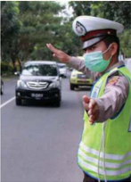

> **Deskripsi Visual:** Gambar ini adalah foto yang menunjukkan seorang petugas keamanan jalan sedang mengatur lalu lintas di jalan raya. Petugas tersebut memakai pakaian berwarna hijau dengan topi berwarna putih dan masker medis untuk melindungi diri dari virus corona. Petugas tersebut sedang menunjukkan tanda tangan dengan jari kanannya kepada pengendara mobil yang bergerak di depannya.

Elemen utama dalam gambar ini adalah petugas keamanan jalan, mobil, dan jalan raya. Petugas keamanan jalan adalah elemen yang paling dominan dan menjadi fokus utama gambar. Mobil adalah objek yang kedua terbesar dan digunakan oleh petugas untuk mengatur lalu lintas. Jalan raya adalah tempat di mana semua elemen ini berada dan merupakan lingkungan yang penting untuk situasi ini.

Teks, angka, atau label penting tidak ada dalam gambar ini karena gambar hanya berisi foto saja tanpa teks atau angka tambahan. Namun, informasi kunci yang dapat diambil dari gambar ini adalah bahwa petugas keamanan jalan sedang melakukan tugasnya untuk mengatur lalu lintas di jalan raya.

Kita akan merasa lebih dekat dengan-Nya, jadi jika hal ini kita aplikasikan, Tuhan itu akan disadari selalu ada didalam kegiatan keseharian kita. Penerapan semua jalan Nawa Wida Bhakti ini bisa menjadi proses penyatuan atau proses kembalinya kita ke asal semula yaitu Tuhan.

Sakhyanam ,  adalah  bhakti  dengan  jalan  kasih  persahabatan,  mentaati hukum dan tidak merusak sistim hukum. Baik arah gerak vertikal dan horizontal, baik  dalam  kehidupan  matrial  dan  spiritual  (jasmani  dan  rohani)  masyarakat

 

---
## 📄 Halaman 260

manusia agar selalu berusaha melatih diri untuk tidak merusak sistem hukum, dan selalu dijalan kasih persahabatan. Iklim saling bhakti Sukhanyam ini sangat dibutuhkan  oleh  masyarakat  kita  untuk  menumbuhkan  karakter  Ketuhanan mulai dari lingkungan keluarga dan selanjutnya dapat dijadikan sebagai matra dan sebagai modal dasar guna mewujudkan kesalehan dan keharmonisan sosial dalam kehidupan sosial kemasyarakatannya.

### g. Berpasrah Diri Memuja Para Bhatara-Bhatari dan Para Dewa sebagai Manifestasi Tuhan ' Dahsyam '

Berpasrah diri di hadapan para bhatara-bhatari sebagai pelindung dan para dewa sebagai sinar  suci  Tuhan  untuk  memohon  keselamatan  dan  sinarnya  di setiap  saat  adalah  sifat  dan  sikap  yang  sangat  baik. Dahsyam ,  adalah  bhakti dengan jalan mengabdi, pelayanan, dan cinta kasih sayang dengan tulus ikhlas terhadap Tuhan.

Arah gerak vertikal dari bahkti ini masyarakat manusia dalam menjalani dan menata kehidupannya, untuk selalu melatih diri dan secara tulus ikhlas untuk menghaturkan  mengabdikan,  pelayanan  kepada  Tuhan,  karena  hanya  kepada Beliaulah umat manusia dan seluruh sekalian alam beserta isinya berpasrah diri memohon segalanya apa yang diharapkan untuk mencapai kebahagian di dunia dan di akhirat.

Arah gerak horizontal masyarakat manusia kepada sesama dan lingkungan hidupnya untuk selalu mengabdi, memberikan pelayanan dan cinta kasih sayang dengan tulus ikhlas untuk kepentingan bersama tentang kemanusiaan, kelestarian lingkungan  hidup  dan  kedamaian  di  tengah-tengah  kehidupan  masyarakat,

 

---
## 📄 Halaman 261

berbangsa dan bernegara. Iklim saling bhakti Dasyam ini sangat dibutuhkan oleh masyarakat manusia baik di lingkungan keluarga lebih-lebih di kehidupan sosial kemasyarakatannya. Kekawin R ā m ā yana menjelaskan sebagai berikut:

Hé Madhus danàmriha bhaþàra haywa malupa,

Wiûóu awakta jàti puruûottamottama kita,

ū

Satwa ya satya nitya ri [y] awakta tan dadi hilang,

Moha karih hanà tuwi rajah tamah pwa kawaúa.

### Terjemahannya:

Oh, Dewa Wisnu sadarlah Engkau jangan lupa! Engkau adalah perwujudan Dewa Wisnu manifestasi Dewa Purusottama, Dharma dan kesetiaan itu abadi yang  ada  pada  tubuh-Mu  tidak  boleh  hilang,  kendati  mungkin  ada  pikiran yang bingung demikian pula sifat angkara murka semua sudah dikuasai (Kw. R ā m ā yana Sargah XXI.126).

Dahsyam artinya  menganggap pujaannya sebagai tamu, majikan dan kita sebagai pelayan. Dahsyam meyakini bahwa tamu yang hadir di hadapannya atau yang ada ini adalah sebagai perwujudan Tuhan. Di dalam menempuh kehidupan yang tentunya sangat utama ini, jika kita tidak menyadari ' Dahsyam ', sepertinya rasa bhakti yang kita miliki terhadap-Nya itu sangat kecil dan hanya seberapa saja. Mestinya jika kita yakin bahwa kita adalah ciptaan-Nya, kita juga harus bisa menyadari Tuhan itulah yang harus kita layani dan sembah. Pelayanan tulus iklas dengan perasaan tunduk hati kepada Tuhan pahalanya sangat besar. Mulai saat  ini  kita  harus  yakin  bahwa  apapun  yang  kita  kerjakan  dan  apapun  yang

 

---
## 📄 Halaman 262

kita  miliki  itu  semua  adalah  atas  kuasa  Tuhan  itu  sendiri.  Jadi,  dengan  jalan bhakti terhadap-Nya kita bisa melakukan Pelayanan yang bersifat rohani. Seperti misalnya contoh umum kita lihat pada asram-asram pemujaan Tuhan itu sendiri dalam wujud personifikasi yang diyakini sebagai personalitas tertinggi Tuhan, yang di dalamnya terdapat orang-orang yang sedang melakukan Pelayanan dan mempelajari Kitab Sucinya. Kalau bisa kita telusuri Pelayanan bhaktinya sangat tinggi terhadap Arca, Guru Kerohanian, Penyembah Tuhan dan lain-lain. Itulah perlu kita tingkatkan pada masa hidup di Zaman Kaliyuga ini.

### h. Memuja Tuhan dengan Sarana Arca ' Arcanam '.

Arcanam , adalah bhakti dengan jalan penghormatan terhadap simbol-simbol atau nyasa Tuhan seperti membuat Pura, Arca, Pratima, Pelinggih, dan lain-lain, bhakti penguatan iman dan taqwa, menghaturkan dan pemberian persembahan terhadap Tuhan.

Arah  gerak  vertikal  masyarakat  manusia  dalam  menjalani  dan  menata kehidupannya untuk selalu menghaturkan dan menunjukan rasa hormat, sujud, cinta  kasih  sayang,  pelayanan,  pengabdian  kepada  Tuhan  dengan  iman  dan taqwa kuat dan teguh dengan jalan menghaturkan sebuah persembahan sebagai bentuk ucapan terima kasih atas tuntunan, bimbingan, perlindungan, kekuatan, kesehatan  dan  setiap  anugrah  yang  diberikan  Tuhan  kepada  seluruh  sekalian alam.

Arah  gerak  horizontal  masyarakat  manusia  terutama  kepada  sesama  dan lingkungannya  dalam  kehidupannya  untuk  selalu  belajar  untuk  memberikan pelayanan, pengabdian, cinta kasih sayang, penguatan dan pemberian

 

---
## 📄 Halaman 263

penghargaan  kepada  orang  lain.  Contoh,  Pemerintah,  pemimpin  dan  atau anggota masyarakat hendaknya memberikan pengabdian, pelayanan, cinta kasih sayang dan penghargaan kepada pemerintah dan pemimpinnya demikian pula sebaliknya  kepada  dan  oleh  rakyatnya  yang  telah  menunjukan  dedikasinya tinggi terhadap segala aspek kehidupan demi kemajuan dan perbaikan situasi dan kondisi bersama dan sekalian alam tentang kemanusiaan, kelestarian lingkungan dan perdamaian. Karena pemimpin yang baik menghargai rakyatnya, demikian juga  sebaliknya.  Iklim  saling  bhakti Arcanam ini  sangat  dibutuhkan  oleh masyarakat manusia di lingkungan keluarga dan di kehidupan masyarakat umum. Hal  ini  akan  dapat  menumbuhkan  karakter  Ketuhanan  mulai  dari  lingkungan keluarga  dan  selanjutnya  dapat  dijadikan  sebagai  matra  dan  sebagai  modal dasar guna mewujudkan kesalehan dan keharmonisan sosial dalam kehidupan sosial  kemasyarakatannya.  Tentang  perwujudan  Tuhan,  kekawin  R ā m ā yana menjelaskan sebagai berikut:

Ring nakûatra kabéh kitékana wulan ring [ng] aúwa Uccaiúrawa, Ring sénàpati Sang Kumara rikanang widyà kitàdhyàtmikà, Ring gandharwwa kitàta Citraratha len Prahlàda ring détyawàn, Ring strì Úri Úmréti Kìrtti Úànti Dhreti Dhih Médhà Kûamà Wàk kita.

### Terjemahannya:

Pada kelompok binatang, engkau berwujud bulan; pada rumpun kuda, engkau Ucesrawa,  pada  orang  yang  menjadi  panglima  perang,  engkau  adalah  Dewa Kumara,  pada  pengetahuan  batin,  engkau  berwujud  pengetahuan  kerohanian

 

---
## 📄 Halaman 264

yang tinggi, pada kelompok gandarwa, engkau berwujud Citrarata dan berwujud Sang Prahelada pada kelompok pemimpin detia, Dewi Sri pada kelompok wanita, pada  Smerti  berwujud  kemasyuran,  dalam  hal  dharma  berwujud  ketenangan pikiran,  dalam  pikiran  berwujud  kebijaksanaan  dan  engkau  berwujud  pemaaf agung (Kw. R ā m ā yana Sargah XXI.140).

Selanjutnya tentang perwujudan Úri  R ā ma ,  kekawin R ā m ā yana XXI. 130 s.d.  139, menjelaskan  sebagai  berikut:  Sosok  pribadi Úri  R ā ma ;  Pada  segala yang bersinar adalah matahari yang selalu berderang, pada keempat kelompok Veda  adalah  Ksama  Veda,  pada  kelompok  Dewa  adalah  Dewa  Indra,  pada jenis  kesenangan  adalah  adalah  pikiran  yang  utama,  pada  kelompok  Rudra adalah Dewa Sangkara yang menciptakan kesenangan. Pada penjelmaan Yaksa dan  Raksasa  adalah  Danawa,  pada  penjelmaan  sebagai  manusia  dalam  hal mewujudkan jasa adalah maharaja, dalam hal ketinggian adalah Gunung Sumeru, dalam  hal  kekokohan  adalah  Gunung  Himawan,  pada  hal  kedalaman  adalah samudra, dan dalam hal kayu adalah kayu Bodi. Pada golongan ternak adalah Lembu  (yang  mengabulkan  segala  kehendak),  pada  kelompok  yang  terbang adalah Garuda, dalam rumpun binatang adalah Singa, pada kelompok ikan kecil adalah Udang, pada kelompok ikan besar adalah Dewa Baruna (rajanya ikan). Pada semua naga adalah Anantabhoga (yang terkenal), pada rumpun ular adalah Naga Basuki (yang masyur), pada sungai yang besar, bersih, dan suci adalah sungai Gangga, dalam kecepatan yang selalu bergerak adalah Angin. Pada semua tumbuh-tumbuhan adalah musim hujan, pada kedua belas musim adalah bulan November, pada siklus enam musim adalah bulan Maret (sahabat Dewa Asmara),

 

---
## 📄 Halaman 265

dalam menciptakan dunia adalah Dewa Brahma (yang menciptakannya). Pada kelompok roh adalah Aryama roh utama, dalam lima jenis yadnya, adalah japa 146 harma (yang sangat utama), pada bagian puja 146 harma adalah UNG Kara, pada aksara adalah A Kara, pada keempat kelompok asrama adalah Grahasta Asrama.  Pada  dharma  utama  yang  bermanfaat  tidak  kurang  amal,  demikian perwujudan-MU, merupakan usaha yang benar yang menyebabkan memperoleh dana demikianlah Engkau, Karma yang mematuhi sastra agama dan kesejahteraan dunia  demekianlah  Engkau,  demikian  pula  dalam  segala  yang  mematuhi kebenaran perwujudan-Mu. Dalam hal rahasia adalah 'Mona' (membisu), pada orang yang gemar bertengkar adalah merupakan sumber perdebatan, pada orang yang cerdik dalam hal upaya adalah merupakan amal perbuatan baik, pada sinar yang utama adalah berwujud sinar, bagi orang yang menang di medan perang adalah perwujudan kemenangan, pada orang yang sakti adalah kesaktian, bagi orang  yang  bijaksana  adalah  merupakan  sunrber  pikiran.  Pada  pendeta  yang utama adalah Bagawan Biasa, pada pujangga besar adalah Bagawan Sukra, pada kelompok Sida Resi adalah Resi Kapila, pada kelompok Dewa Resi adalah Resi Narada (yang gemar menonton perang), pada Brahma Resi adalah Resi Bregu (yang berhasil segala ucapannya). Dalam kepandaian berupaya adalah Bagawan Wrehaspati (yang masyur), dalam hal menjatuhkan hukuman yang berat adalah Dewa Yama, dalam segala senjata adalah berwujud senjata Bajera utama (yang tidak  ada  bandingannya),  dalam  hal  kemahiran  menggunakan  senjata  adalah berwujud Ràma (yang gagah perkasa tidak ada yang menandingi) (Tim, 1987 : 401-403).

 

---
## 📄 Halaman 266

Arcanam ini artinya 'bhakti dengan memuja Arca'. Maksudnya di sini yakni bhakti dengan cara memuja pratima sebagai media penghubung dan penghayatan kepada Tuhan. Kita ketahui bersama bahwa Tuhan itu bersifat abstrak/nirguna, susah  kita  menebak  dan  menghayalkan  perwujudan  Tuhan/Ida  Sang Hyang Widhi karena sesungguhnya Tuhan/Ida Sang Hyang Widhi itu tak berwujud. Jadi untuk menguatkan keyakinan kita ke hadapannya, kita diberi jalan memuja-Nya dengan mewujudkan beliau ataupun manifestasi beliau dengan Arca. Dengan jalan  ini,  jika  rasa  bhakti  yang  kita  miliki  untuk-Nya  sangatlah  besar  tidak dipungkiri lagi kita melayani dan menyembah Tuhan melalui perwujudan suci yang disebut dengan Arca akan menjadi lebih nyata dan memberikan perasaan rohani yang sangat dalam.

### i. Berpasrah Total kepada Tuhan ' Sevanam atau Atmanividanam '

Sevanam atau Atmanividanam adalah bhakti dengan jalan berlindung dan penyerahan  diri  secara  tulus  ikhlas  kepada  Tuhan.  Arah  gerak  vertikal  dan horizontal dari bhakti ini masyarakat kita selalu berpasrah diri dengan kesadaran dan keyakinan yang mantap untuk selalu berjalan di jalan Tuhan, berlindung dan penyerahan diri secara tulus ikhlas kepada Tuhan, sesama dan lingkungan hidupnya  atau  kepada  ibu  pertiwi,  baik  dalam  kehidupan  duniawi  (nyata) maupun  kehidupan  sunya  (niskala).  Iklim  saling  bhakti  Atmanivedanam  ini sangat dibutuhkan oleh masyarakat manusia baik dalam kehidupan sosial dan kehidupan spiritualnya. Kekawin R ā m ā yana menjelaskan sebagai berikut:

 

---
## 📄 Halaman 267

Tuûþa manah nira Sang Trijaþasih, Sémbahakén démakan ri naréndra, Harûa mulat mawékas nrépa putri, Lwir nira ng ū ni rikang pura Léòkà.

### Terjemahannya:

Sang Trijata sangat gembira dengan hati tulus bhakti, menerima anugrah baginda  raja,  Dewi  Úità  senang  memandangnya  lalu  berpesan,  perihal  beliau ketika tinggal di istana Lengka dahulu (Kw. R ā m ā yana Sargah XXVI.39).

Ndah Trijaþàri nihan [n] ujarang kwa,

Tàt alupà ri laranta ta ng ni,

Kàla nikàt para ring talagàr m,

ū

Ring watu ring wulakan kita tanghyang.

### Terjemahannya:

'Wahai,  adinda  Trijata!  Kini  ada  yang  kusampaikan,  aku  tidak  akan melupakan penderitaanmu pada masa silam ketika adinda menuju telaga yang asri di atas batu, di tepi sumber mata air itu adinda memuja Hyang Widhi (Kw. R ā m ā yana Sargah XXVI.40).

Yan hanékana kunéng ta unéngta,

Ring [ng] Asoka ta kitan suka citta,

Tulya tàku ya hanà hidépénta,

Satya nàmbéka ta nitya kitàntén.

ū

 

---
## 📄 Halaman 268

### Terjemahannya:

Jika pada suatu saat adinda merasa rindu, di taman Asokalah tempatmu untuk menghibur diri, bayangkanlah olehmu seakan-akan aku ada di sana, hendaklah pikiranmu selalau taat dan setia (Kw. R ā m ā yana Sargah XXVI.46).

Demikianlah Trijata berserah diri secara total kepada junjungannya dalam  pengabdian  hidupnya  untuk  mewujudkan  hidup  sejahtera  dan  bahagia berdasarkan ajaran bhakti sejati sesuai ajaran atmanividanam .

Atmanividanam yang artinya bhakti dengan kepasrahan total kepada Tuhan. Tahapan ini adalah tahapan terakhir dalam ajaran suci Nawa Wida Bhakti. Dalam perjalanan kehidupan manusia pada zaman Kali Yuga ini, jalan Atmanividanam yang dianggap sulit  untuk  diaplikasikan  karena  kuatnya  ikatan  material  yang mengikat dirinya. Mulailah kita melakukan pelayanan dan mempersembahkan apapun yang kita miliki, kita terima, nikmati dan lain-lain itu hanya untuk-Nya. Karena hanya beliaulah yang pada akhirnya sebagai penikmat segalanya. Baik itu adalah kebahagiaan dan penderitaan kita harus bisa mempersembahkannya untuk-Nya.

Demikian  ajaran  Nawa  widha  bhakti  sebagai  bentuk  ajaran  bhakti  sejati dalam  kehidupan  umat  sedharma  dapat  mengantarkan  untuk  mewujudkan kesejahteraan  dan  kebahagiaan  dalam  hidup  ini.  Berikut  ini  adalah  paparan ajaran nawa widha bhakti sebagai wujud bhakti sejati dalam bentuk ceritra;

 

---
## 📄 Halaman 269

MISI ANGADA Úri R ā ma telah  siap  untuk  memulai perang. Namun ia tetap memutuskan untuk  mengikuti  aturan  perang  dengan  ketat'  Seorang  utusan  harus  dikirim guna  mengusahakan  perdamaian  untuk  terakhir  kalinya  dan  jika  mungkin, untuk menghindari terjadinya perang. Maka setelah memutuskan dengan temantemannya, Úri R ā ma memutuskan untuk mengirim Angada pada Ràvana'. Ràma kemudian memanggil pangeran muda itu dan berkata. 'Nak, kau adalah pemberani dan 148har mentaati perintahku, dan menyampaikan pesanku dengan bijaksana. Jadi,  aku  memutuskan  untuk  mengirimmu  pada  Ràvana.  Pergilah  ke  dalam Kota dan menghadap Ràvana. Sampaikan pesan ini padanya. 'Kemashyuranmu akan segera sirna bersama kerajaanmu. Kematianmu segera menjemput karena kurangnya kebijaksanaanmu. Kau seorang pencuri. Dosa-dosanya pada para åûi, para  dewa  dan  semua  hamba  Tuhan  akhirnya  akan  mendapat  buahnya'.  Kau mendapat pahala dari semua perbuatanmu. Tidak bisa dihindari lagi bahwa kau harus menderita karena dosa-dosamu'. Aku datang untuk menghukummu. Karena lancang  mencuri  istriku.  Anugrah  yang  kau  dapatkan  dari  Brahmà,  sekarang tidak ada gunanya lagi. Kesombonganmu segera ditundukkan. Kau tampaknya sangat berani ketika memisahkan aku dengan istriku dan menculiknya ketika aku tidak ada di tempat. Sekarang waktunya kau menunjukkan kekuatanmu padaku dan agar aku bisa melihat keberanianmu berhadapan denganku di medan perang.

'Akan  tetapi  jika  kau  mau  mengembalikan  Úità  padaku  dan  meminta maaf  padaku,  maka  aku  bersedia  mengakhiri  pertarungan  ini.  Atau  kalau tidak, maka kau harus bertarung melawanku. Aku jamin kau, bahwa bumi ini nanti bersih dari bangsa raksasa sepertimu, oleh tajamnya panah-panahku dan

 

---
## 📄 Halaman 270

kemarahanku. Vibhisana adalah orang baik dan ia pun berlindung padaku. Aku nanti menjadikannya raja Laòkà setelah membunuhmu. Kau sungguh bernasib kurang beruntung karena di antara para menterimu tidak ada yang memberikan nasihat yang benar, maka akibatnya kau tidak dapat berumur panjang, karena kau dikejar oleh akibat perbuatan dosamu. Bersiaplah untuk berperang. Dan jika kau mendapatkan kematian di tanganku, maka semua dosamu nanti dibersihkan dan kau bisa mendapatkan sebuah tempat di surga. Pandanglah Kota Laòkàmu untuk yang terakhir kalinya dan datanglah ke medan perang? Angada, sampaikanlah pesanku ini.'

Angada  segera  melompat  ke  angkasa,  dan  segera  saja  Angada  tiba  di ruangan besar di mana Ràvana bersama para menterinya berkumpul. Angada dengan  gelang  emas  yang  berkilau  dalam  sinar  matahari  kemudian  pergi kehadapan  Ràvana  dan  Angada  tampak  seperti  nyala-api.  Kemudian  Angada memperkenalkan diri dan berkata, 'Aku adalah utusan Úri R ā ma .  Aku adalah putra Valì, namaku Angada. Aku membawa sebuah pesan dari Úri R ā ma ' Angada kemudian mengulangi pesan Úri R ā ma dan menunggu Ràvana berbicara.

Mendengar kata-kata utusan itu, kemarahan Ràvana mulai meluap. Ràvana memerintahkan para menterinya,  'Tangkap  kera  yang  gila  ini.  Siksa  dia  atas kelancangannya'.  Empat  orang  raksasa  kemudian  menangkap  Angada  yang sengaja membiarkan dirinya ditangkap. Ketika mereka mengikatnya, maka ia pun melompat ke udara dengan membawa keempat raksasa itu dan Angada mendarat di atas teras istananya. Dari atas teras Angada kemudian melemparkan mereka dan  melihat  keempat  raksasa  itu  jatuh  di  lantai.  Ia  kemudian  menghancukan

 

---
## 📄 Halaman 271

menara  istana  hingga  berkeping-keping  dan  dengan  teriakan  kemenangan  ia kembali ke hadapan Úri R ā ma .

'Ràvana  yang  melihat  hal  itu  terjadi  amat  marah  atas  semua  yang  telah dilakukan oleh para raksasa itu namun raksasa yang bersangkutan tidak berbuat apa-apa. Sementara itu di tempat lain, Úri R ā ma merasa telah memberikan semua kesempatan  pada  Ràvana  untuk  berdamai  namun  karena  Ràvana  tidak  mau menerima  kata-katanya,  maka  perangpun  tidak  dihindari.  Perang  pasti  harus terjadi.

Di tempat lain, para raksasa yang menjaga gerbang mulai melihat pasukan vanara telah mendekat. Kebanyakan dari mereka mulai ketakutan dan ada yang sedikit khawatir. Masing-masing siap untuk memulai peperangan. Para vanara khususnya,  bergembira  dan  para  raksasa  di  lain  pihak  merasa  tidak  sabar.' Mereka  sama-sama  percaya  diri  dan  yakin  dapat  mengalahkan  musuhnya. Kemudian  datanglah  berita  pada  Ràvana  tentang  perkernbangan  selanjutnya yaitu bahwa Úri R ā ma telah  memulai barisan pasukannya mendekati keempat gerbang. Ràvana kemudian tergesa-gesa untuk memastikan keamanan Kotanya dan  dengan  amarah  yang  sudah  meluap,  maka  Ràvana  kemudian  menuju  ke atas  teras  istananya.  Dari  itu  Ràvana  memandangi  lautan  kera  yang  sedang mengelilingi kotanya. Untuk beberapa saat Ràvana merasa khawatir bagaimana caranya  menghancurkan  pasukan  itu.  Namun  sifat  angkuhnya  menguasai pikirannya dan Ravana memandang rendah Úri R ā ma dan pasukan yang telah dibawanya.

Sedangakan  Ràma  sendiri  merasa  sangat  senang  karena  Ràvana  telah memutuskan untuk berperang. Úri R ā ma juga melihat Laòkà yang dipenuhi oleh

 

---
## 📄 Halaman 272

para tentara raksasa yang ditugaskan untuk menjaga Kotanya. Pada saat itulah pikiran Úri R ā ma melayang pada Sìtà dan iapun berpikir. 'Apakah di sana ada kekasihku Úità yang dipenjarakan. Sita telah tersia-siakan oleh kesedihannya dan duduk di tanah lapang. Dia sedang meratapi kesedihannya atas perpisahan dengan diriku.' Dengan hanya memikirkan Úità saja sudah cukup untuk membangkitkan semangat  perangnya. Úri  R ā ma kemudian  memerintahkan  pasukannya  untuk memulai  parusakan  Laòkà.  Dan  begitu  mendengar  perintah  itu,  para  vanara saling pandang dan mulai berlarian menuju gerbang dan memulai peperangan. Suara teriakan mereka menggema ke mana-mana dan sangat menakutkan bagi mereka  yang  bernyali  kecil.  Para  venara  telah  mempersenjatai  diri  mereka dengan batu-batu besar dan batang pohon yang telah dicabut dari pegunungan terdekat (Sanjaya, I Gede. 2004: 719-722).

### -selesai-

Mengikuti  alur  ceritera  di  atas,  maka  dapat  dipahami  bahwa  dengan ajaran  'bhakti  sejati'  mengantarkan  Pangeran  Angada  dapat  melaksanakan kewajibannya  dengan  baik.  Svami  Satya  Narayana  mengatakan:  Ketiga  jalan tersebut ( bhakti, karma, jnana ) bagaikan gula batu; bentuk, berat, dan penampilan gula  tersebut  sangatlah  berbeda,  namun  mempunyai  kesatuan  yang  utuh  dan sulit untuk dibeda-bedakan. Kalau Jnanam itu tidak diwujudkan dalam bentuk Bhakti, maka hanya tinggal didalam hati saja, Karma tanpa dilandasi dengan Jnanam, maka karma akan ngawur tanpa arah, Jnanam dan karma tanpa bakti, akan dapat menimbulkan arogansi dan gersang, Bhakti tanpa Jnanam dan karma juga  akan  tidak  menentu.  Karena  itu  Bhakti  sejati  kepada  Tuhan  merupakan

 

---
## 📄 Halaman 273

ujung dari Jnanam dan karma. Sangat diharapkan penerapan ajaran bhakti sejati yang  tersurat  dan  tersirat  dalam  pustaka  R ā m ā yana  dapat  dijadikan  landasan pembentukan  budi  pekerti  luhur  dalam  perilaku  keseharian  ini.  Sebelumnya kerjakanlah soal-soal uji kompetensi berikut dengan baik!

### Uji Kompetensi:

- Setelah membaca teks tentang bentuk penerapan ajaran bhakti sejati dalam kehidupan beragama Hindu, apakah yang anda ketahui tentang agama Hindu? Jelaskan dan tuliskanlah!
- Buatlah ringkasan yang berhubungan  dengan  bentuk penerapan ajaran bhakti sejati dalam kehidupan beragama Hindu, dari berbagai sumber  media  pendidikan  dan  sosial  yang  anda  ketahui!  Tuliskan dan laksanakanlah sesuai dengan petunjuk dari bapak/ibu guru yang mengajar di kelas!
- Apakah  yang  sudah  Anda  ketahui  terkait  dengan  bentuk  penerapan ajaran bhakti sejati dalam kehidupan sehari-hari? Jelaskanlah!
- Bagaimana  cara  Anda  untuk  dapat  mengetahui  bentuk  penerapan ajaran bhakti sejati dalam kehidupan beragama Hindu? Jelaskan dan tuliskanlah pengalamannya!
- Manfaat  apakah  yang  dapat  dirasakan  secara  langsung  dari  usaha dan upaya penerapan ajaran bhakti sejati dalam kehidupan beragama Hindu? Tuliskanlah pengalaman Anda!
- Amatilah  lingkungan  sekitar  Anda  terkait  dengan  adanya  bentuk penerapan  ajaran  bhakti  sejati  dalam  kehidupan  sehari-hari  guna

 

---
## 📄 Halaman 274

mewujudkan tujuan hidup manusia dan tujuan agama Hindu, buatlah catatan  seperlunya  dan  diskusikanlah  dengan  orang  tuanya!  Apakah yang  terjadi?  Buatlah  narasinya  1-3  halaman  diketik  dengan  huruf Times New Roman-12, spasi 1,5 cm, ukuran kertas kwarto; 4-3-3-4!

 

---
## 📄 Halaman 275

### E.  Ajaran Bhakti Sejati sebagai Dasar Pembentukan Budi Pekerti yang Luhur dalam Zaman Global

Ada banyak nilai dan norma kehidupan yang mulia hilang karena terjadinya erosi  moral,  krisis  budaya,  dan  sebagainya.  Masyarakat  Indonesia  mulai menanggalkan  tradisi-tradisi  yang  sesuai  dengan local  wisdom kita,  seperti cium  tangan  pada  orang  tua,  penggunaan  tangan  kanan,  senyum  dan  sapa, musyawarah,  gotong-royong,  dan  lain-lain.  Di  sini  terlihat  jelas  bahwa  budi pekerti luhur sangat berperan penting di masyarakat. Secara umum, budi pekerti luhur berarti memiliki moral dan perilaku yang baik dalam menjalani hidup ini.

Budi  pekerti  memiliki  pengertian  yang  sangat  sederhana,  yaitu  perilaku (pekerti) yang dilandasi oleh pemikiran yang baik dan jernih (budi) dan sesuai dengan local wisdom kita (luhur). Budi pekerti luhur bertujuan untuk membentuk perilaku pribadi yang patut, baik, dan benar. Jika, kita berbudi pekerti luhur, paling tidak  jaminan  yang  kita  dapat  adalah  jalan  hidup  kita  teratur,  sehingga  dapat mengantar kita berkiprah ke kesuksesan hidup, kerukunan antar bermasyarakat, dan dan berada dalam koridor perilaku yang terpuji dan bermanfaat. Sebaliknya, jika kita melanggar prinsip-prinsip budi pekerti luhur, maka kita dapat mengalami banyak  hal  yang  tidak  menguntungkan.  Mulai  dari  hal  kecil  seperti  tidak disenangi/dihormati orang lain, sampai hal berat seperti melakukan pelanggaran hukum yang membuat kita berakhir dengan tindak pidana.

Esensi  budi  pekerti  luhur  secara  tradisional  mulai  ditanamkan  sejak masa kecil, baik di dalam lingkungan keluarga atau sekolah, dan berlanjut ke lingkungan masyarakat. Di lingkungan keluarga, orang tua menanamkan budi

 

---
## 📄 Halaman 276

pekerti luhur lewat berbagai cara; membacakan dongeng, mengajarkan permainan tradisional, dan lainnya. Berperilaku yang baik dalam sebuah keluarga sangat mempengaruhi  sikap  anak  nantinya.  Pendidikan  formal  juga  memiliki  peran penting. Kita dididik agar memiliki ilmu, wawasan, dan budi pekerti luhur. Kita juga  diajarkan  bersosialisasi,  membangun  rasa  kebersamaan,  rasa  cinta  tanah air, rasa peduli lingkungan, yang nantinya sangat bermanfaat dalam kehidupan bermasyarakat.  Budi  pekerti  luhur  mendatangkan  banyak  keuntungan  dalam kehidupan bermasyarakat. Dengan menerapkannya, maka kita terbentuk menjadi pribadi yang beretika baik, berbahasa baik, dalam meningkatkan taraf kejiwaan dan kemajuan batiniah kita sebagai manusia.

### Perenungan:

### Terjemahan:

'Wahai teman-teman, dunia yang penuh dosa dan penuh duka ini berlalu bagaikan sebuah sungai yang alirannya dirintangi oleh batu besar (yang dimakan oleh arus air) yang berat, tekunlah, bangkitlah dan seberangilah ia, tinggalkan persahabatan dengan orang-orang tercela, sebrangilah sungai kehidupan untuk pencapaian kesejahteraan dan kemakmuran' (Rgveda X.53.8).

'Asmanvati riyate sam rabhadhvam uttisthata pra tarata sakhàyah, atra jahàma ye asan asevah sivan vayam uttaremàbhi vàjàn.

 

---
## 📄 Halaman 277

Kedamaian  dan  ketentraman  (Kerta  Langu),  adalah  dambaan  seluruh sekalian  alam  baik  secara  komunal  maupun  secara  individual  (personal). Maksudnya  adalah  dambaan  akan  kedamaian  itu  tidak  hanya  bagi  umat manusia,  tetapi  tumbuh-tumbuhan  dan  binatang  pun  memerlukan  kedamaian itu. Kemudian perlu dipahami juga bahwa kedamaian itu bukan dibutuhkan saat ini saja, tetapi kedamaian itu dibutuhkan oleh seluruh sekalian alam baik untuk masa lalu, masa kini, dan masa yang akan datang. Demikianlah sabda, intruksi dan pesan dari Kitab Suci Veda yang harus kita ditindaklanjuti dengan sraddha dan rasa bhakti (iman dan taqwa) yang mantap. Apabila dalam kehidupan ini setiap umat manusia umumnya dan khususnya umat Hindu mampu mewujudkan kedamaian itu, maka impian umat manusia untuk menciptakan suasana sorga di dunia ini dapat diwujudkan.

Tetapi  kenyataannya  masih  banyak  umat  manusia  yang  keliru  memaknai hidupnya  khususnya  tentang  suasana  alam  sorgawi  yang  mereka  dambakan di saat alam kematian, mereka berharap masuk sorga atau menikmati suasana alam sorgawi di saat kematian tetapi melupakan suasana alam sorgawi dalam kehidupan nyata yaitu kehidupan saat di dunia fana ini. Padahal proses kematian yang baik adalah 'Hidup yang baik dulu, baru mati yang baik', karena dengan kehidupan yang baik disaat hidup dapat dijadikan modal dasar dan atau matra untuk pencapaian kehidupan yang lebih baik disaat ini dan saat di alam akhirat.

Namun fenomena dewasa ini, ternyata ketenteraman, kesalehan, keharmonisan dan kedamaian semakin mahal bagi sebagian besar individu atau kelompok umat manusia dalam kehidupannya. Padahal dalam sebuah pengakuan, hampir setiap orang di dunia ini mengakui dan diakui dirinya sebagai orang yang

 

---
## 📄 Halaman 278

beragama. Dengan status orang beragama itu mestinya secara kontinyu selalu berupaya  untuk  mewujudkan  kesalehan  dan  keharmonisan  serta  kedamaian (santih)  di  dunia  ini.  Orang-orang  beragama  semestinya  mampu  memberikan penyembuhan (konseling) terhadap dirinya dan orang lain di saat-saat mengalami goncangan  kejiwaan  di  mana  orang-orang  psikologi  menyebutnya  dengan 'kekusutan mental' akibat dari suatu masalah yang dihadapinya yaitu dengan menggunakan ayat-ayat kitab suci dan sastra-sastra agamanya sebagai pedoman dan tablet/kapsul yang harus diramu dan selanjutnya dikonsumsi sebagai obat untuk menerapi psikis dirinya. Renungkanlah sloka berikut ini;

'Mogham annaý vindate aprcetaá satyam bravimi vadha it sa satya, nàryamanaý pusyati no sakhàyaý kevalàgho bhavati kevalàdi.

### Terjemahan:

'Orang yang bodoh memperoleh kekayaan dengan sia-sia, Aku mengatakan kebenaran bahwa jenis kekayaan ini adalah benar-benar kematian untuk dia, Dia yang tidak menolong teman-temannya dan sahabat-sahabat karibnya, dia yang makan sendirian, menderita sendirian' (Rgveda X.117.6)

'Na và u devàá ksubham id vad am daduá utàúitam upa gacchanti måtyavaá,

 

---
## 📄 Halaman 279

uto rayiá pånato nopa dasyati utàpånan marditàraý na vindate.

### Terjemahan:

'Para  Deva  telah  memberikan  rasa  lapar  kepada  umat  manusia  dalam bentuk  kematian,  kematian  itu  bahkan  terjadi  kepada  orang  yang  makanan baik (makmur), kekayaan tidak pernah berkurang oleh karena kemurahan hati (didermakan), orang yang kikir tidak pernah menemukan orang yang memiliki rasa belas kasihan' (Rgveda X.17.1)

Tetapi kenyataannya tidak sedikit orang-orang beragama di belahan dunia ini jasmani dan rohaninya tidak harmonis. Tidak sedikit pula orang-orang beragama menciptakan  suasana  disharmoni,  jiwanya  mengalami  kekusutan  mental  dan paling  ironis  sikap  dan  tindakannya  justru  tidak  mencerminkan  orang-orang beragama.

Era  globalisasi  masa  kini  menghadapkan  umat  manusia  atau  masyarakat kepada  serangkaian  baru  yang  tidak  terlalu  berbeda  dengan  apa  yang  pernah dialami sebelumnya dan bahkan kecenderungannya akan semakin berat permasalahan hidup yang akan dihadapinya. Pluralisme agama, suku, ras, etnis, golongan,  berbagai  kepentingan,  dan  yang  lainnya  adalah  fenomena  nyata. Di masa-masa lampau kehidupan umat manusia relatif lebih tentEram karena kehidupan  umat  manusia  bagai  kamp-kamp  yang  terisolisasi  dari  tantangantantangan  dunia  luar.  Sebaliknya  masa  kini  kemajuan  zaman  menyebabkan persaingan hidup semakin ketat, pergaulan lintas etnis tidak bisa lagi dihindari,

 

---
## 📄 Halaman 280

multi kepentingan semakin beragam, dan lain lain, menyebabkan umat manusia Dewasa  ini  harus  pandai-pandai  dan  arif  dalam  menghadapi  dan  mengatasi persoalan dalam hidupnya.

Di manapun masyarakat manusia itu berada di negara-negara di dunia ini termasuk di Indonesia memiliki sederetan perbedaan, di luar perbedaan yang mereka  miliki  dari  sejak  lahir.  Seperti  perbedaan  etnis,  kebudayaan,  adatistiadat,  agama,  kepercayaan,  politik,  dan  lain  lain.  Fenomena  ini  bukanlah perkara mudah untuk menciptakan keharmonisan, ketertiban dan kedamaian di dunia  untuk  hidup  sebagai  masyarakat  manusia  dengan  sederatan  perbedaanperbedaan itu, sekalipun manusia diyakini sebagai mahluk ciptaan Tuhan yang paling sempurna, apabila manusia itu sendiri tidak memiliki kepandaian, kearifan dan  kebijaksanaan  dalam  mengapresiasi  sederatan  perbedaan-perbedaan  yang ada.  Kurang  pandainya,  ketidak  arifan  dan  kebijaksanaan  yang  dimiliki  oleh masyarakat kita mengapresiasi perbedaan itu merupakan beberapa faktor yang menyebabkan di era globalisasi ini timbul berbagai konflik baik konflik individu (personal) maupun konflik komunal (kelompok).

Konflik  individu  misalnya;  masih  banyak  orang  stress  atau  mengalami gonjangan  kejiwaan  (kekusutan  mental)  dan  kasus  bunuh  diri  akibat  tidak mampu mengatasi persoalan-persoalan dan tantangan hidup dan kehidupan yang dialami, dan lain sebagainya. Konflik komunal (kelompok) misalnya; timbulnya konflik  horizontal  antara  masyarakat  manusia  yang  satu  dengan  masyarakat manusia  lainnya  yang  terjadi  di  belahan  dunia  yang  mana  setiap  hari  selalu mewarnai  dan  menghiasi  pemberitaan  meda  cetak  dan  elektronik  seperti  di antaranya konflik antara anak dan orang tua, antara istri dengan suami, antara

 

---
## 📄 Halaman 281

individu manusia yang satu dengan manusia yang lainnya, kelompok manusia satu dengan kelompok manusia yang lainnya tentang diskriminasi, kekerasan, pelecehan, ketidak-adilan, dan sebagainya tetang berbagai macam hal.

Selanjutnya  konflik  yang  disebabkan  oleh  penanaman  ajaran-ajaran  dan doktrin-doktrin  yang  ekskulisivisme  dan  sempit,  sehingga  tidak  sedikit  masyarakat manusia seperti itu badannya dipasung, terkungkung, dan mengabaikan kebenaran serta menutup diri untuk menerima perbedaan dan kebenaran orang lain  baik  itu  perihal  etnis,  kebudayaan,  adat-istiadat,  agama,  kepercayaan, politik, dan sebagainya juga semakin marak terjadi dewasa ini. Kemudian faktor yang lain juga disebabkan pula oleh karena dewasa ini kecenderungan bagi tidak sedikit orang lebih mengejar dunia matrial atau kemewahan duniawi ketimbang dunia spiritual. Ketidak seimbangan itu menyebabkan degradasi moral semakin meningkat,  sikap  dan  karakter-karakter  Ketuhanan  pada  setiap  individu  dan kelompok di tengah-tengah kehidupan masyarakat seperti cinta kasih sayang, pelayanan, dan lain lain, semakin memprihatinkan. Renungkanlah sloka suci ini;

### Terjemahan:

'Dia bukanlah seorang sahabat yang sejati yang  tidak  menolong  seorang teman yang memerlukan pertolongan' (Rgveda X.117.4).

Situasi  dan  kondisi  konflik  yang  terjadi  di  tengah-tengah  masyarakat manusia itu menandakan bahwa arah gerak pikiran, perkataan dan perbuatan bagi

 

---
## 📄 Halaman 282

setiap individu atau kelompok manusia seperti itu sangat mengabaikan prinsipprinsip  dasar  tetang  nilai-nilai  kejujuran,  kebajikan,  kepatuhan  dan  ketaatan terhadap  aturan  keimanan,  aturan  kebajikan  (hukum),  hak  asasi  manusia, kesucian, pengendalian diri, kebersamaan, persatuan, pengorbanan yang tulus ikhlas, pelayanan, cinta kasih sayang, kerukunan, ketentraman dan kedamaian, pembebasan, pemuliaan, dan lain lain.

Oleh  karena  itu,  situasi  dan  kondisi  konflik  itu  baik  personal  maupun komunal yang terjadi di tengah-tengah masyarakat kita sangat dibutuhkan upaya bersama secara sadar, sabar, dan tulus ikhlas untuk mengatasi dan mencarikan solusi pemecahannya agar situasi dan kondisi hidup dan kehidupan masyarakat manusia  masa  kini  dan  di  masa  yang  akan  datang  tidak  semakin  kusut  dan rumit, tragedi sosial, kemanusiaan dan rusaknya lingkungan hidup, dan lain lain, dapat diminimalisir. Karakter-karakter Ketuhanan dalam setiap jiwa individual masyarakat manusia perlu ditananamkan sejak dini, sehingga apabila karakter Ketuhanan itu telah tertanam dan tumbuh dalam setiap jiwa individual masyarakat dapat dijadikan modal sosial untuk menciptakan kesalehan dan keharmonisan sosial di tengah-tengah kehidupan masyarakat manusia.

Karakter  Ketuhanan  dalam  setiap  jiwa  individual  masyarakat  manusia akan  dapat  tertanam,  tumbuh  dan  berkembang  dengan  kesadaran,  iman  dan taqwa yang mantap bahwa kelahirannya menjadi manusia adalah kesempatan untuk berbuat baik berdasarkan atas kepercayaan terhadap Tuhan Yang Maha Esa.  Kitab  suci  dari  agama  atau  kepercayaan  apapun  yang  ada  di  dunia  ini, termasuk yang tersurat dan tersirat dalam kitab suci Agama Hindu yaitu dalam kitab Sarasamuccaya menyatakan bahwa menjelma, menjadi manusia sungguh-

 

---
## 📄 Halaman 283

sungguh  utama  sebabnya  demikian  karena  ia  dapat  menolong  dirinya  dari keadaan  sengsara  (lahir  dan  mati  berulang-ulang)  dengan  jalan  berbuat  baik, demikianlah keuntungannya menjelma menjadi manusia. Oleh karena itu, setiap jiwa  individual  manusia  tidak  semestinya  bersedih  hati  sekalipun  kehidupan manusia itu tidak makmur, dilahirkan menjadi manusia itu hendaklah menjadikan kamu berbesar hati, sebab amat sukar untuk dapat dilahirkan menjadi manusia, meskipun kelahiran hina sekalipun.

Sebagai penjelmaan manusia yang mempunyai keutamaan tersebut, maka upaya yang dapat dilakukan oleh masyarakat kita untuk meredam situasi dan kondisi  konflik  yang  semakin  marak  terjadi  di  sekitar  lingkungan  hidupnya internal dan eksternal baik konflik individual mapun konflik kumanal. Camkanlah petunjuk kitab suci ini;

' ṡ ruti-vipratipann ā te yad ā sth ā syati ni ṡ cal ā , sam ā dh ā v acal ā buddhis tad ā yogam av ā psyasi.

### Terjemahan:

Bila pikiranmu yang dibingungkan oleh apa yang didengar tak tergoyahkan lagi dan tetap dalam Samadhi, kemudian engkau akan mencapai yoga (realisasi diri) (Bhagavadgita.II.53).

Agar  dapat  keluar  dan  tidak  memperburuk  sistuasi  dan  kondisi  konflik itu  masyarakat  manusia  hendaknya  selalu  membangunkan  kesadarannya  dan menyalahkan  pelita  atau  cahaya  ke-Ilahian  di  dalam  dirinya  dengan  selalu

 

---
## 📄 Halaman 284

berdoa dalam setiap tindakan sehingga cahaya ke-Ilahian dapat bersinar dalam setiap badan dan jiwa manusia sehingga masyarakt manusia dapat membimbing dirinya  dan  orang  lain  dari  ketidak  benaran  menuju  kebenaran  yang sejati , dapat  membimbing  masyarakat  manusia  dari  kegelapan  menuju  jalan  yang terang benderang, dan dapat membimbing dirinya dari kematian Rohani menuju kehidupan yang kekal abadi.

Upaya sepatutnya di mulai dari diri sendiri individu manusia itu sendiri, kemudian  dalam  lingkungan  keluarga, dan selanjutnya  dalam  kehidupan bermasyarkat yang lebih luas yaitu sesuai dengan tema yang dikemukakan dalam tulisan ini salah satunya dengan 'Menanamkan Ajaran Nawa Wida Bhakti untuk Menumbuhkan  Karakter  Ketuhanan  di  Lingkungan  Keluarga  Sebagai  Modal Dasar Guna Mewujudkan Kebaikan dan Keharmonisan Sosial'.

Pentingnya menanamkan ajaran Nawa Wida Bhakti sejati untuk menumbuhkan  karakter  Ketuhanan  di  Lingkungan  Keluarga  ini  dikarenakan beberapa hal di antaranya seperti berikut.

Pertama,  Kehidupan  di  lingkungan  keluarga  dewasa  ini  juga  seolah-olah semakin digiring untuk meninggalkan jati dirinya sebagai anggota masyarakat yang religius dengan berbagai aktivitas ritual keagamaannya, sehingga kualitas iman dan taqwa ( sradha bhakti ) yang selama ini dijunjung tinggi semakin lama semakin tergeser oleh pola kehidupan yang mengglobal dan modern. Budaya global yang diakibatkan oleh modernisasi dalam berbagai bentuk penguasaan ilmu pengetahuan dan teknologi (Iptek) terus menerus mengikuti perkembangan sosial masyarakat menusia, sehingga kadangkala akibat dari pengaruh dunia global dan modernisasi ini bisa membawa manfaat yang positif dan negatif bagi kehidupan

 

---
## 📄 Halaman 285

spiritual individu manusia. Dari segi positif modernisasi bisa menguntungkan kehidupan,  baik  jasmani  dan  rohani,  namun  di  sisi  negatif  modernisasi  bisa mengakibatkan semakin tergesernya sendi-sendi kehidupan termasuk semakin terkikisnya nilai-nilai religiusitas pada sebagian anggota masyarakat manusia. Pengaruh negatif yang dimaksud terhadap anggota masyarakat dewasa ini sering terjadi perselisihan, kekerasan, diskriminasi, ketidakadilan, dan sebagainya yang mengarah pada bentuk prilaku yang dapat merugikan dirinya, keluarganya, dan kebersamaan dalam kehidupan bermasyarakat atau sosialnya. Hal ini tentunya sangat  mengkhawatirkan,  karena  jika  hal  tersebut  dibiarkan,  maka  kualitas kebersamaan,  persatuan  dalam  bermasyarakat  akan  semakin  menipis.  Pada akhirnya  nanti  esensi  sebagai  masyarakat  manusia  yang  memiliki  keutamaan dibandingkan  dengan  makhluk  lainnya  melalui  cara  berpikir,  berkata  dan berperilaku semakin lama akan mengkhawatirkan.

Kedua,  lingkungan  keluarga  merupakan  tempat  berlangsungnya  proses pembelajaran, dan pembekalan pengetahuan yang paling awal. Oleh karenanya, maka  setiap  anggota  keluarga  terutama  orang  tua,  dituntut  untuk  senantiasa bersikap dan berbuat sesuai dengan dharma-nya, dengan harapan setiap anggota keluarga akan memiliki iman dan taqwa ( sradha bhakti ), sifat dan budi pekerti yang luhur, serta berkepribadian mulia yang sangat diperlukan dalam kehidupan keluarga dan masyarakat. Dalam kitab suci Veda dan susastra suci Veda yang lainnya banyak menguraikan tentang pentingnya ajaran bhakti , dan swadharma orang  tua  terhadap  anaknya,  demikian  pula bhakti dan swadharma dari  anak kepada orang tuanya. Dalam kitab suci Manavadharmasastra dijelaskan bahwa secara nonfisik suami-istri masing-masing mengupayakan agar jalinan cinta dan

 

---
## 📄 Halaman 286

kasih  sayang,  kesetiaan,  mencari  nafkah,  menjaga  kesehatan,  dan  seterusnya agar ikatan perkawinan dapat berlangsung abadi. Kemudian terhadap anak-anak yang lahir, orang tua berkewajiban membesarkannya, memberikan perlindungan, pendidikan dan menyelenggarakan perkawinannya ( Vivaha Samkara ). Selanjutnya dalam Sarasamuscaya juga diajarkan tentang tiga kewajiban orang tua  yang  harus  dilaksanakan  dengan  rasa bhakti yang  tulus  kepada  anaknya yaitu  sebagai  berikut:  Pertama, Sarirakrta ,  yaitu  kewajiban  orang  tua  untuk menumbuhkan jasmani anak dengan baik. Kedua, Prannadatta ,  artinya  orang tua  wajib  membangun atau memberikan pendidikan kerohanian kepada anak. Ketiga, Annadatta ,  yaitu  kewajiban  orang  tua  untuk  memberikan  pendidikan kepada anaknya untuk mendapatkan makanan (anna) salah satunya kebutuhan hidupnya yang paling esensial.

Demikian pula dalam Kekawin Niti Sastra ada disebutkan syarat-syarat orang yang dapat disebut orang tua yakni apabila telah melakukan lima kewajiban yang disebut Panca Wida yaitu: Pertama, Sang ametuaken , artinya yang menyebabkan kita lahir. Ayahlah yang pertama-tama menyebabkan kita lahir dari rahim ibu. Awal mula dari sikap ayah dan ibu saat-saat menanam benih dalam rahimnya juga  amat  menentukan  keberadaan  kita.  Kedua, Sang  anyangaskara ,  artinya orang tua mempunyai tanggung jawab menyucikan anak melalui upacara sarira samskara. Ketiga, Sang mangupadyaya, artinya  seseorang  dapat  disebut  ayah apabila ia dapat bertanggung jawab pada pendidikan anak-anaknya. Pendidikan anak tidak dapat begitu saja diserahkan kepada guru-guru di sekolah. Ayah di rumah juga disebut guru rupaka. Keempat, Sang maweh bijojana , artinya orang yang dapat disebut ayah adalah orang yang memberikan anggota keluarganya

 

---
## 📄 Halaman 287

makan dan kebutuhan-kebutuhan material lainnya. Secara umum seorang ayah memiliki tanggung jawab menjamin kebutuhan ekonomi keluarga. Kelima, Sang matulung  urip  rikalaning  baya, artinya  kewajiban  seorang  ayah  melindungi nyawa si anak dari ancaman bahaya. Perlindungan tersebut tidaklah semata-mata berarti fisik tetapi juga perlindungan yang bersifat rohaniah. Sedangkan bhakti dan swadharma anak kepada orang tuanya, sesuai dengan perintah dan pesan dari sastra suci Veda, seorang anak dikatakan suputra apabila anak itu memiliki sradha, bhakti, serta tumbuh menjadi anak yang mampu menyelematkan dirinya, orang tuanya, dan seluruh keluarganya dari lembah penderitaan menuju kehormatan dan kebahagiaan. Dan yang lebih besar lagi berguna bagi masyarakat, bangsa dan negaranya.

Ajaran bhakti sejati dapat menumbuhkan karakter Ketuhanan di lingkungan keluarga sebagai modal dasar guna mewujudkan kesalehan dan keharmonisan sosial, yang dimaksud adalah sebagai berikut:

Bhakti sejati adalah salah satu ajaran agama Hindu yang dapat dipedomani untuk meningkatkan keimanan dan ketaqwaan manusia terhadap aturan keimanan, aturan kebajikan dan aturan upacara keagamaan yang bersumber dari ajaran agama yang dianutnya serta dapat dipedomani dalam upaya melakukan penyembuhan  (konseling)  di  saat-saat  mengalami  goncangan  kejiwaan  oleh manusia di lingkungan keluarga. Kehidupan di lingkungan keluarga dewasa ini semakin digiring untuk meninggalkan jati dirinya sebagai anggota masyarakat yang  religius  dengan  berbagai  aktivitas  ritual  keagamaannya.  Perihal  penting lainnya  adalah  untuk  mengeliminasi  potensi-potensi  konflik  akibat  kurang pandainya dan kurangnya kearifan serta kebijaksanaan dari manusia terhadap

 

---
## 📄 Halaman 288

sederetan perbedaan, di luar perbedaan yang mereka miliki sejak lahir. Nawa Wida Bhakti adalah salah satu ajaran agama Hindu yang bersumber dari kitab Bhagavata Purana, VII.5.23 ,  yang menyebutkan bahwa ada 9 (sembilan) cara berbhakti (hormat,  sujud,  pengabdian,  cinta  kasih  sayang,  pelayanan,  dan spiritual)  yang  disebut Nawa  Wida  Bhakti yaitu  rasa bhakti sejati manusia terhadap Tuhan-nya.

Konsep Bhakti sejati ini dapat dimaknai dalam kontek kehidupan sosial atau arah gerak putarannya secara horizontal yaitu rasa sujud, hormat-menghormati, pengabdian,  cinta  kasih  sayang,  spiritual,  dan  memberikan  pelayanan  antara manusia dengan sesamanya dan lingkungannya. Harapannya dengan nilai-nilai dari Bhakti sejati (hormat,  sujud,  pengabdian,  cinta  kasih  sayang,  pelayanan, dan  spiritual)  akan  tercipta  karakter  Ketuhanan  di  lingkungan  keluarga.  Pada saatnya nanti dapat dijadikan sebagai modal dasar guna mewujudkan kesalehan dan  keharmonisan  sosial  karena  di  lingkungan  masyarakat  umum  yang  lebih luas  telah  dihuni  oleh  individu-individu  yang  telah  ditanami  nilai-nilai Nawa Wida Bhakti , individu yang bermoralitas, serta memiliki budi pekerti yang luhur melalui proses pembinaan, pendidikan dan pendalaman atau penghayatan sejak awal di lingkungan keluarga. Seperti uraian berikut ini;

### a. Sravanam

Sravanam , adalah bhakti sejati dengan jalan mendengar. Arah gerak vertikal dari bhakti mendengar ini adalah dalam hal meyakini dan mendengarkan sabdasabda  suci  dari  Tuhan  baik  yang  tersurat  maupun  tersirat  dalam  kitab  suci

 

---
## 📄 Halaman 289

atau aturan-aturan keimanan, aturan kebajikan dan aturan upacara. Fenomena arah gerak vertikal dari bhkati mendengar yang kita jumpai di tengah-tengah kehidupan kita, termasuk di lingkungan keluarga dan masyarakat tidak sedikit individu manusia yang tidak mau mendengarkan sabda-sabda suci atau aturanaturan keimanan, aturan kebajikan dan aturan upacara keberagamaan.

Kenyataan ini diperkuat apabila ada orang yang mewartakan ajaran tentang kebajikan, kebenaran, kesucian, dan lain sebagainya tentang sabda suci Tuhan justru yang terjadi malah ketidakpedulian, pelecehan, atau menunjukan kekurang tertarikan akan pewartaan itu. Contoh kecil saja di sebagian banyak orang tidak mau mendengar atau bahkan mengantuk apabila ada ceramah-ceramah agama baik itu di tempat-tempat suci atau berita melalui media cetak dan eletronik yang lain.

Tetapi kalau ada berita/tayangan sinetron tentang gosip, fitnah, kekerasan, diskriminasi,  dan  lain-lain  justru  menjadi  konsumsi  yang  laris.  Selanjutnya arah  gerak  horizontal, bhakti mendengar  ini  hendaknya  masyarakat  manusia dalam hidup dan kehidupannya menanamkan rasa bhakti untuk  selalu  belajar mendengarkan  nasihat  dan  menghormati  pendapat  orang  lain  serta  selalu belajar untuk menyimak atau mendengarkan pewartaan tentang sesamanya dan lingkungannya.

Fenomena yang sering terjadi tidak sedikit manusia yang tidak peduli dan tidak belajar serta menghormati nasihat dan pendapat orang lain, serta tidak peduli dan tidak belajar untuk menyimak berita-berita tentang teragedi kemanusiaan dan kerusakan lingkungan. Padahal dalam hidup ini untuk mewujudkan cita-cita atau visi-misi hidup hendaknya dimulai dengan adanya kemauan dan kesadaran

 

---
## 📄 Halaman 290

untuk mendengar. Pengetahuan, pemahaman dan pendalaman tentang berbagai hal hasil dari mendengar dapat dijadikan konsep dasar untuk menata hidup dan kehidupan di dunia ini yang kemudian ditindaklanjuti dengan berupaya untuk berbuat  atau  mencari  solusi  yang  terbaik  dalam  mengambil  sebuah  tindakan kemanusiaan/sesama  dan  lingkungan.  Contoh;  di  lingkungan  keluarga  antara anggota  keluarga  semestinya  selalu  menanamkan  sifat  dan  rasa bhakti untuk selalu mendengar baik antara suami dan istri, antara orang tua dan anak, untuk selalu  membangun  komunikasi  aktif  sehingga  dapat  mengurangi  terjadinya miskomunikasi di antara anggota keluarga.

Sifat  dan  sikap  ini  akan  dapat  menumbuhkan  karakter  Ketuhanan  di lingkungan keluarga itu, seperti; sifat, sikap dan karakter hormat-menghormati, sujud, cinta kasih sayang, pengabdian, pelayanan, berfikir yang baik dan suci, berkata  yang  baik  dan  suci,  berbuat  yang  baik  dan  suci  serta  teguh  dalam melaksanakan disiplin spiritual. Sifat dan sikap individu seperti itu akan dapat dijadikan sebagai modal sosial untuk menciptakan kesalehan dan keharmonisan sosial antara keluarga, antar sesama anggota masyarakat.

Sifat, sikap dan karakter individu yang selalu belajar untuk membuka diri mendengar nasihat, pendapat orang lain atau apa yang diwacanakan orang lain adalah sebuah sifat, sikap dan karakter insklusif yaitu sebuah sifat, sikap dan karakter membuka diri secara tulus ikhlas untuk mau mendengarkan kebenaran dari orang lain, karena dalam diri ada kebenaran tetapi di luar diri juga masih banyak kebenaran yang belum diketahui.

Untuk  itu  pesan  yang  ingin  disampaikan  melalui bhakti dengan  jalan mendengar ini adalah dalam hidup ini masyarakat kita untuk selalu berupaya

 

---
## 📄 Halaman 291

membudayakan  untuk  mendengar,  baik  mendengar  secara  vertikal  antara manusia  dengan  Tuhan-nya  melalui  sabda-sabda  sucinya,  maupun  secara horizontal antarsesamanya dan lingkungannya. Karena baik mendengar ataupun memberi  pendengaran/pewartaan  apabila  sama-sama  dilandasi  dengan  rasa bhakti, maka semua akan mendapat hasil (pahala) yang baik atau paling tidak dapat manfaat dari bhakti mendegar ini. Iklim saling bhakti mendengar ini sangat dibutuhkan oleh masyarakat manusia yang diawali ditananamkan di lingkungan keluarga selanjutnya ditumbuhkembangkan secara harmonis dan dinamis dalam kehidupan sosial masyarakat di lingkungan yang lebih luas.

### b. Wandanam

Wandanam adalah bhakti sejati dengan  jalan  membaca,  menyimak  dan mempelajari, mendalami serta menghayati dan memaknai ajaran yang bersumber dari aturan keimanan, aturan kebajikan, dan aturan yang lainnya yang bersumber dari sabda-sabda suci Tuhan dan susastra suci yang lainnya.

Arah  gerak  vertikal  masyarakat  manusia  dalam  menjalani  dan  menata kehidupannya  selalu  meluangkan  waktu  untuk  membaca,  menyimak  dan mempelajari, mendalami serta menghayati dan memaknai kitab suci dan susastra suci  serta  ilmu  pengetahuan  yang  lainnya  tentang  Tuhan  sebagai  pedoman hidup, sehingga gagasan dan arah pilihan jalan hidup masyarakat manusia sesuai dengan sabda suci Tuhan yang tertuang dalam kitab suci atau sumber hukum agama yang diyakini dan dianut, tentunya dengan selalu tidak menutup diri atau mengabaikan hal-hal yang ada di luar dirinya.

 

---
## 📄 Halaman 292

Arah gerak horizontal dari bhakti ini, masyarakat manusia kepada sesama dan lingkungan hidupnya untuk selalu membaca, menyimak dan mempelajari, mendalami serta menghayati dan memaknai situasi, untuk menuju arah gerak yang lebih baik. Karena apabila salah dalam membaca, menyimak dan mempelajari, mendalami  serta  menghayati  dan  memaknai  situasi  maka  salah  juga  dalam pengambilan keputusan. Iklim saling bhakti Wandanam ini  sangat dibutuhkan oleh  masyarakat  manusia  untuk  menciptakan  kesalehan  dan  keharmonisan  di lingkungan keluarga dan sosial kemasyarakatannya.

### c. Kirtanam

Kirtanam , adalah bhakti sejati dengan jalan melantunkan Gita/zikir (nyayian  atau  kidung  suci  memuja  dan  memuji  nama  suci  dan  kebesaran Tuhan), bhakti ini  juga  diarahkan  menjadi  dua  arah  gerak  vertikal  maupun arah  gerak  horizontal.  Arah  gerak  vertical  melakukan bhakti Kirtanam untuk menumbuhkan  dan  membangkitkan  nilai-nilai  spiritual  yang  ada  dalam  jiwa setiap individu manusia. Dengan bangkitnya spiritual dalam setiap individu akan dapat  meredam melakukan pengendalian diri dengan baik, jiwa lebih tenang, tentram dan tercerahi, sistuasi dan kondisi ini akan dapat membantu keluar dari kekusutan  mental  dan  kegelapan  jiwa,  sehingga  dapat  dijadikan  modal  dasar untuk  menciptakan  kesalehan  dan  keharmonisan  individual  yang  damai  dan bahagia.

Arah gerak horizontal masyarakat manusia berusaha selalu untuk melantunkan bhakti Kirtanam yang dapat menyejukan perasaan hati orang lain dan lingkungannya. Kepada sesama atau anggota masyarakat yang lainnya tidak

 

---
## 📄 Halaman 293

hanya melantunkan atau melontarkan kritikan dan cemohan tetapi selalu belajar untuk melatih diri untuk memberikan saran, solusi yang terbaik bagi kepentingan bersama  dalam  keberagamaan,  kehidupan  sehari-hari  tentang  kemanusiaan, kebersamaan,  persatuan  dan  perdamaian,  serta  memberikan  pengakuan  dan penghargaan  atau  pujian  akan  keberhasilan  dan  prestasi  yang  telah  dicapai terhadap sesama atau anggota masyarakat manusia yang lain.

Iklim  saling bhakti Kirthanam ini  sebagai  wujud  ajaran bhakti sejati sangat dibutuhkan oleh masyarakat manusia yang penanaman nilai-nilai bhakti Kirthanam diawali  di  lingkungan keluarga sebagai modal dasar guna mewujudkan kesalehan dan keharmonisan sosial dalam kehidupan sosial kemasyarakatannya.

### d. Smaranam

Smaranam , adalah bhakti sejati dengan jalan mengingat. Arah gerak vertikal dari bhakti ini  adalah  dalam  menjalani  dan  menata kehidupan ini masyarakat manusia sepatutnya selalu melatih diri untuk mengingat, mengingat nama-nama suci Tuhan dengan segala Kemahakuasaaannya, dan selalu untuk melatih diri untuk mengingat tentang intruksi dan pesan atau amanat dari sabda suci Tuhan kepada  umat  manusia  yang  dapat  dijadikan  sebagai  pedoman  atau  pegangan hidup dalam hidup di dunia dan di alam sunya (akhirat) nanti.

Arah gerak secara horizontal dari bhakti ini apabila dikaitkan dengan isu-isu pluralisme, kemanusiaan, perdamaian, demokrasi dan gender, maka sepatutnya masyarakat  manusia  selalu  berusaha  untuk  mengingat  kembali  tragedi  dan penderitaan  kemanusiaan,  musibah  dan  bencana  alam,  dan  lain  sebagainya, yang diakibatkan oleh konflik-konflik atau pertikaian, kesewenang-wenangan,

 

---
## 📄 Halaman 294

diskriminasi,  dan  tindakan  kekerasan  yang  lainnya  antara  individu  yang  satu dengan individu yang lain ataupun antara kelompok yang satu dengan kelompok yang lain yang tidak atau kurang memahami dan menghargai indahnya sebuah kebhinekaan dan pluralisme.

Harapannya dengan mengingat tragedi, penderitaan, musibah dan bencana yang  diakibatkan  itu  masyarakat  kita  selalu  mewartakan  dan  mengingatnya sebagai bekal untuk mengevaluasi dan merefleksi diri akan indahnya kebhinekaan dan pluralisme apabila masyarakat manusia mampu mengkemasnya dalam satu bingkai yaitu bingkai kebersamaan, persatuan dan kedamaian. Iklim saling bhakti Smaranam ini  sangat  dibutuhkan  oleh  masyarakat  manusia  yang  ditanamkan diawali  di  lingkungan  keluarga  sehingga  tumbuh  karakter  Ketuhanan  dalam setiap anggota keluarga sebagai modal dasar guna mewujudkan kesalehan dan keharmonisan sosial dalam kehidupan sosial kemasyarakatannya.

### e. Pada Sevanam

Pada sevanam , adalah bhakti sejati dengan jalan menyembah, sujud, hormat di  Kaki  Padma.  Arah  gerak  vertikal  dalam bhakti ini  masyarakat  kita  dalam menjalani dan menata kehidupannya sepatutnya selalu sujud dan hormat kepada Tuhan, hormat dan sujud terhadap intruksi dan pesan/amanat dari hukum Tuhan (rtam).  Arah  gerak  horizontal  masyarakat  manusia  untuk  selalu  belajar  dan menumbuhkan kesadaran untuk menghormati para pahlawan dan pendahulunya, pemerintah  dan  peraturan perundang-undangan  yang  telah  dijadikan dan disepakati sebagai sumber hukum, para pemimpin, para orang tua dan yang tidak kalah penting juga hormat/sujud kepada ibu pertiwi.

 

---
## 📄 Halaman 295

Karena dengan adanya kesadaran untuk saling menghormati inilah kita akan bisa hidup berdampingan dalam kebhinekaan dan pluralisme, sehingga terwujud kebersamaan, perastuan, kesalehan dan keharmonisan  sosial. Iklim saling bhakti Pada  sevanam ini  sangat  dibutuhkan  oleh masyarakat manusia sehingga sejak dini semestinya ditanamkan untuk menumbuhkan karakter  Ketuhanan  di  lingkungan  keluarga sebagai modal dasar guna mewujudkan kesalehan  dan  keharmonisan  sosial  dalam kehidupan sosial kemasyarakatannya.

### f. Sakhynam

Sakhynam ,  adalah bhakti sejati dengan jalan  kasih  persahabatan,  mentaati  hukum dan tidak merusak sistem hukum. Baik arah gerak  vertikal  dan  horizontal,  baik  dalam kehidupan  matrial dan spiritual (jasmani dan rohani) masyarakat manusia agar selalu berusaha  melatih  diri  untuk  tidak  merusak sistim  hukum,  dan  selalu  di  jalan  kasih persahabatan.

 

---
## 📄 Halaman 296

Iklim  saling bhakti Sakyam ini  sangat  dibutuhkan  oleh  masyarakat  kita untuk  menumbuhkan  karakter  Ketuhanan  mulai  dari  lingkungan  keluarga dan selanjutnya dapat dijadikan sebagai matra dan sebagai modal dasar guna mewujudkan  kesalehan  dan  keharmonisan  sosial  dalam  kehidupan  sosial kemasyarakatannya.

### g. Dahsyam

Dahsyam , adalah bhakti sejati dengan jalan mengabdi, pelayanan, dan cinta kasih sayang dengan tulus ikhlas terhadap Tuhan. Arah gerak vertikal dari bahkti ini manusia dalam menjalani dan menata kehidupannya, untuk selalu melatih diri dan secara tulus ikhlas mengahturkan mengabdikan, pelayanan kepada Tuhan, karena hanya kepada Beliaulah umat manusia dan seluruh sekalian alam beserta isinya berpasrah diri memohon segalanya apa yang harapkan untuk mencapai kebahagian di dunia dan di akhirat.

Arah gerak horizontal  manusia  kepada  sesama  dan  lingkungan  hidupnya untuk selalu mengabdi, memberikan pelayanan dan cinta kasih sayang dengan tulus  ikhlas  untuk  kepentingan  bersama  tentang  kemanusiaan,  kelestarian lingkungan  hidup  dan  kedamaian  di  tengah-tengah  kehidupan  masyarakat, berbangsa  dan  bernegara.  Iklim  saling bhakti Dasyam ini  sangat  dibutuhkan oleh  manusia  baik  di  lingkungan  keluarga  lebih-lebih  di  kehidupan  sosial kemasyarakatannya

 

---
## 📄 Halaman 297

### h. Arcanam

Arcanam , adalah bhakti sejati dengan jalan perhormatan terhadap simbolsimbol atau nyasa Tuhan seperti membuat Arca, Pratima, Pelinggih ,  dan lain-lain, bhakti penguatan iman dan taqwa, menghaturkan dan pemberian persembahan terhadap Tuhan.

Arah  gerak  vertikal  masyarakat  manusia  dalam  menjalani  dan  menata kehidupannya untuk selalu menghaturkan dan menunjukan rasa hormat, sujud, cinta  kasih  sayang,  pelayanan,  pengabdian  kepada  Tuhan  dengan  iman  dan taqwa kuat dan teguh dengan jalan menghaturkan sebuah persembahan sebagai bentuk ucapan terima kasih atas tuntunan, bimbingan, perlindungan, kekuatan, kesehatan  dan  setiap  anugrah  yang  diberikan  Tuhan  kepada  seluruh  sekalian alam.

Arah  gerak  horizontal  masyarakat  manusia  terutama  kepada  sesama  dan lingkungannya  dalam  kehidupannya  untuk  selalu  belajar  untuk  memberikan pelayanan, pengabdian, cinta kasih sayang, penguatan dan pemberian penghargaan  kepada  orang  lain.  Contoh,  Pemerintah,  pemimpin  dan  atau anggota masyarakat hendaknya memberikan pengabdian, pelayanan, cinta kasih sayang dan penghargaan kepada pemerintah dan pemimpinnya demikian pula sebaliknya  kepada  dan  oleh  rakyatnya  yang  telah  menunjukan  dedikasinya tinggi terhadap segala aspek kehidupan demi kemajuan dan perbaikan situasi dan kondisi bersama dan sekalian alam tentang kemanusiaan, kelestarian lingkungan dan perdamaian.

Karena pemimpin yang baik menghargai rakyatnya, demikian juga sebaliknya. Iklim saling bhakti Arcanam ini sangat dibutuhkan oleh masyarakat

 

---
## 📄 Halaman 298

manusia di lingkungan keluarga dan di kehidupan masyarakat umum. Hal ini akan dapat menumbuhkan karakter Ketuhanan mulai dari lingkungan keluarga dan selanjutnya dapat dijadikan sebagai matra dan sebagai modal dasar guna mewujudkan  kesalehan  dan  keharmonisan  sosial  dalam  kehidupan  sosial kemasyarakatannya.

### i. Sevanam

Sevanam atau Atmanivedanam adalah bhakti sejati dengan jalan berlindung dan penyerahan diri secara tulus ikhlas kepada Tuhan. Arah gerak vertikal dan horizontal  dari bhakti ini  masyarakat  manusia  selalu  berpasrah  diri  dengan kesadaran  dan  keyakinan  yang  mantap  untuk  selalu  berjalan  di  jalan  Tuhan, berlindung dan penyerahan diri secara tulus ikhlas kepada Tuhan, sesama dan lingkungan hidupnya atau kepada ibu pertiwi, baik dalam kehidupan duniawi (nyata) maupun kehidupan sunya (niskala). Iklim saling bhakti Atmanivedanam ini sangat dibutuhkan oleh masyarakat manusia baik dalam kehidupan sosial dan kehidupan spiritualnya.

 

---
## 📄 Halaman 299

### Uji Kompetensi:

- Setelah  membaca  teks  tentang  ajaran bhakti sejati sebagai  dasar pembentukan budi pekerti  yang  luhur  dalam  zaman  global  menurut ajaran  Hindu,  apakah  yang  Anda  ketahui  tentang  agama  Hindu? Jelaskan dan tuliskanlah!
- Buatlah  ringkasan  yang  berhubungan  dengan  ajaran bhakti sejati sebagai  dasar  pembentukan  budi  pekerti  yang  luhur  dalam  zaman global menurut ajaran Hindu, dari berbagai sumber media pendidikan dan  sosial  yang  Anda  ketahui!  Tuliskan  dan  laksanakanlah  sesuai dengan petunjuk dari bapak/ibu guru yang mengajar di kelas!
- Apakah yang anda ketahui  terkait  dengan  cara-cara  mempraktikkan ajaran bhakti sejati sebagai dasar pembentukan budi pekerti yang luhur dalam zaman global menurut ajaran Hindu? Jelaskanlah!
- Bagaimana cara untuk mengetahui ajaran bhakti sejati sebagai dasar pembentukan budi pekerti  yang  luhur  dalam  zaman  global  menurut ajaran Hindu? Jelaskan dan tuliskanlah pengalamannya!
- Manfaat  apakah  yang  dapat  dirasakan  secara  langsung  dari  usaha dan  upaya  untuk  memengetahui  ajaran bhakti sejati sebagai  dasar pembentukan budi pekerti  yang  luhur  dalam  zaman  global  menurut ajaran Hindu? Tuliskanlah pengalaman Anda!
- Amatilah lingkungan sekitar Anda terkait dengan adanya penerapan ajaran bhakti sejati sebagai dasar pembentukan budi pekerti yang luhur dalam zaman global menurut ajaran Hindu guna mewujudkan tujuan hidup  manusia  dantujuan  agama  Hindu,  buatlah  catatan  seperlunya

 

---
## 📄 Halaman 300

dan diskusikanlah dengan orang tuan! Apakah yang terjadi? Buatlah narasinya 1 -3 halaman diketik dengan huruf Times New Roman-12, spasi 1,5 cm, ukuran kertas kwarto; 4-3-3-4!

- Amatilah gambar berikut ini, diskusikanlah dengan orang tua di rumah, selanjutnya buatlah laporan dari hasil diskusi-mu dengan orang tua.

 

---
## 📄 Halaman 301

### A.  Pengertian dan Hakikat Keluarga Sukhinah

### Perenungan:

Aksayu nau madhusamk āś e anikam nau samanjanam antah krnusva m ā m hrdi mana innau sah ā sati (Atharva Veda VII.36.1)

### Terjemahannya:

Hendaknya manis bagaikan madu cinta kasih dan pandangan antara suami dan istri penuh keindahan. Semogalah senantiasa hidup bersama dalam suasana bahagia tanpa kedengkian (di antara mereka). Semoga satu jiwa dalam dua badan.

 

---
## 📄 Halaman 302

### Memahami Teks:

Melaksanakan Wiwaha atau perkawinan bagi masyarakat Hindu memiliki makna, arti, dan kedudukan yang sangat penting. Dalam Catur Asrama, Wiwaha termasuk  fase  Grehasta  Asrama.  Memasuki  fase  Grehastha  ' Wiwaha '  oleh masyarakat  Hindu,  dipandang  sebagai  sesuatu  yang  maha  mulia,  seperti dijelaskan dalam kitab Manawa Dharmasastra; bahwa Wiwaha tersebut bersifat sakral, wajib hukumnya, dalam artian harus dilakukan oleh setiap orang yang hidupnya normal. Melaksanakan Wiwaha bagi umat Hindu yang sudah cukup umur merupakan salah satu amanat dharma dalam hidup dan kehidupan ini.

Perkawinan  atau Wiwaha tidak baik dilakukan jika karena dipaksakan, pengaruh orang lain, dan sikap kekerasan yang lainnya. Hal ini perlu dipahami dan dipedomani untuk menghindari  terjadinya  ketegangan  setelah menjalani Grehasta  Asrama .  Keberhasilan yang  dapat  mengantarkan  dalam Wiwaha atau perkawinan adalah karena adanya sifat dan sikap saling mencintai, saling mempercayai, saling menyadari, kerja sama,

saling mengisi, bahu-membahu dan yang lainnya dalam setiap kegiatan rumah tangga.  Terbentuknya  keluarga  bahagia  dan  kekal  haruslah  disertai  adanya keseimbangan  antara  hak  dan  kewajiban,  di  mana  hak  dan  kewajiban  serta kedudukan suami dan istri harus seimbang dan sama meskipun swa dharma nya berbeda  dalam  melaksanakan  tugas  dan  kewajiban.  Mengapa  perkawinan/

 

---
## 📄 Halaman 303

Wiwaha itu mesti dilaksanakan? Berikut ini akan diuraikan tentang pengertian dan hakikat dari ' Wiwaha ' sebagai berikut;

Berdasarkan sastra agama Hindu dijelaskan ada empat tahapan kehidupan yang disebut Catur asrama. Tahap pertama adalah belajar, menuntut ilmu yang disebut Brahmacari .  Tahap yang kedua adalah Grehasta ,yaitu hidup berumah tangga.  Tahap  ketiga  adalah Wanaprastha ,  yakni  mulai  belajar  melepaskan diri  dari  ikatan  duniawi  dan  tahap  keempat  adalah Bhiksuka (Sanyasin) yaitu menyebarkan ilmu pengetahuan kerohanian kepada umat, dengan mengabdikan diri  sepenuhnya kepada Ida Sang Hyang Widhi Wasa /Tuhan Yang Maha Esa. Wiwaha atau perkawinan dalam masyarakat Hindu memiliki arti dan kedudukan khusus  dan  penting  sebagai  awal  dari  masa  berumah  tangga  atau Grehastha Asrama .  Apakah yang dimaksud dengan perkawinan, Wiwaha dan Grehastha Asrama itu?

Sejak awal kehidupan manusia, ternyata bersatunya antara seorang wanita dengan seorang laki-laki yang disimbulkan dengan akasa dan pertiwi sebagai cikal bakal sebuah kehidupan baru yang diawali dengan lembaga perkawinan. Hendaknya laki-laki dan perempuan yang telah terikat dalam ikatan perkawinan selalu berusaha agar tidak bercerai dan selalu mencintai, menyayangi dan setia sampai hayat hidupnya. Jadikanlah hal ini sebagai hukum yang tertinggi dalam ikatan  suami-istri.  Keluarga  yang  dibentuk  hanya  berlangsung  sekali  dalam hidup  manusia.  Keluarga  atau  rumah  tangga  bukanlah  semata-mata  tempat berkumpulnya laki dan wanita sebagai pasangan suami istri dalam satu rumah, makan-minum  bersama.  Namun  mengupayakan  terbinanya  kepribadian  dan ketenangan lahir dan batin, hidup rukun dan damai, tenteram, bahagia dalam upaya menurunkan tunas muda yang suputra.

 

---
## 📄 Halaman 304

### Menurut Undang-Undang Perkawinan Nomor 1 Tahun 1974 Bab I

### Pasal 1:

Menyebutkan bahwa perkawinan ialah ikatan lahir dan bathin antara seorang pria  dengan  seorang  wanita  sebagai  suami  istri  dengan  tujuan  membentuk keluarga bahagia dan kekal berdasarkan Ketuhanan Yang maha Esa.

### Pasal 2:

Menyebutkan bahwa perkawinan adalah sah apabila dilaksanakan menurut hukum masing-masing agamanya dan kepercayaannya itu.

Dengan demikian, perkawinan menurut pandangan Hindu bukanlah sekedar legalitas  hubungan biologis semata, tetapi merupakan suatu peningkatan nilai berdasarkan hukum Agama, karena Wiwaha Samkara adalah merupakan upacara sakral  atau  skralisasi  peristiwa  kemanusiaan  yang  bersifat  wajib.  Keluarga bahagia  yang  menjadi  tujuan Wiwaha Samkara dalam  terminologi  Hindu disebut  keluarga Sukhinah, yaitu  merupakan  unsur  yang  sangat  menentukan terbentuknya  masyarakat  sehat  ( sane  society ).  Keluarga Sukhinah disebut keluarga yang sejahtera. Kata keluarga berasal dari bahasa Sanskerta dari urat kata ' kula ' yang artinya abadi atau hamba dan ' warga ' artinya jalinan/ikatan pengabdian. Keluarga artinya jalinan/ikatan pengabdian seorang suami, istri dan anak.  Jadi,  keluarga  adalah  persatuan  yang  terjalin  di  antara  seluruh  anggota keluarga dalam rangka pengabdiannya kepada amanat dasar yang mesti diemban oleh keluarga yang bersangkutan. Sedangkan kata 'sejahtera' yang berarti segala kebutuhan lahir dan bathin yaitu: Bhoga, Upabhoga, Paribhoga yaitu sandang,

 

---
## 📄 Halaman 305

pangan  dan  papan  serta  jalinan  kasih  yang  sejati.  Jadi,  pengertian  keluarga sejahtera ( Sukhinah ) menurut pandangan Hindu adalah terpenuhinya kebutuhan hidup jasmani dan rohani hidup dalam suasana berkecukupan, selaras, serasi dan seimbang sesuai swa dharma atau kewajiban masing-masing.

Membangun  keluarga Sukhinah tidak  hanya  ditentukan  oleh  suami  dan istri tetapi sebuah keluarga Sukhinah juga sangat ditentukan oleh sikap bhakti anak-anak terhadap kedua orang tuanya. Dalam keluarga Hindu, anak adalah orang yang menjadi pelindung bagi orang yang memerlukan pertolongan serta menolong kaum kerabat yang tertimpa kesengsaraan, untuk kesedekahan hasil usahanya,  menyediakan  makanan  untuk  orang  miskin,  orang  demikian  itu dinamakan putra sejati.

Ada tiga hal penting yang juga harus dipahami dalam membentuk keluarga Sukhinah yaitu: 1). Semua memiliki persepsi dan pengertian yang sama mengenai keluarga Sukhinah . Setiap orang tentunya memiliki persepsi yang berbeda dalam mengartikan sesuatu hal. Namun perbedaan persepsi bisa menjadikan seseorang dengan yang lainnya bermusyawarah dan menemukan satu konsep yang akan dipakai dalam menjalankan sesuatu. Seorang suami, istri dan anak-anaknya harus mempunyai  satu  konsep  yang  bisa  dipakai  sebagai  tonggak  dalam  membina keluarganya,  2).  Kemauan  bersama  untuk  mewujudkanya  dengan  tindakantindakan  yang  nyata.  Setelah  memiliki  konsep  yang  kuat  dalam  keluarga tentunya konsep itu harus didukung dengan tindakan yang nyata. Seorang suami, istri dan anak-anaknya harus mempunyai kesadaran dalam melakukan sesuatu hal  yang  baik  untuk  membangun  keluarga  yang  sejahtera  ( Sukhinah )  dengan berlandaskan dharma dan ajaran agama, 3). Semua anggota keluarga memiliki

 

---
## 📄 Halaman 306

kemauan untuk memeliharanya. Setelah didukung dengan tindakan yang nyata berlandaskan dharma dan agama, seorang suami, istri dan anak-anaknya juga mempunyai kewajiban untuk selalu menjaga keutuhan keluarganya dan bersamasama memilihara ketenangan keluarga.

Perkawinan  ialah  ikatan  sekala  niskala  (lahir  batin)  antara  seorang  pria dengan seorang wanita sebagai suami istri dengan tujuan membentuk keluarga yang bahagia dan kekal (satya alaki-rabi).Istilah 'keluarga' berasal dari bahasa Sansekerta, dari kata ' kula ' artinya Abadi atau hamba dan ' warga ' artinya jalinan/ ikatan pengabdian. Keluarga artinya jalinan/ikatan pengabdian suami, istri dan anak.  Jadi,  keluarga  adalah  persatuan  yang  terjalin  di  antara  seluruh  anggota keluarga dalam rangka pengabdiannya kepada amanat dasar yang mesti di emban oleh keluarga yang bersangkutan. Sedangkan kata' Sejahtera 'berarti terpenuhi segala  kebutuhan  lahir  dan  batin. Bhoga,  Upabhoga,  pari  bhoga  (Depag. RI, 1983:21) yaitu sandang, pangan dan papan serta jalinan kasih yang sejati. Pengertian  Keluarga  sejahtera  menurut  Padangan  Hindu  adalah  terpenuhinya kebutuhan hidup jasmani dan rohani hidup dalam suasana berkecukupan, selaras, serasi dan seimbang sesuai sua dharma atau kewajiban masing-masing.

Hakikat  perkawinan  adalah  sebagai  awal  menuju Grhasta merupakan masa yang paling penting dalam kehidupan manusia. Setiap orang yang akan melaksanakan  perkawinan  harus  menyadari  arti  dan  nilai  perkawinan  bagi manusia, sehingga nilai itulah menjadi landasan kehidupan suami istri sesudah perkawinan dilaksanakan.

Perkawinan  menurut  ajaran  agama  Hindu  adalah Yajna ,  sehingga  orang memasuki  ikatan  perkawinan  akan  menuju  gerbang  grhasta  asrama  yang

 

---
## 📄 Halaman 307

merupakan  lembaga  suci  yang  harus  dijaga  keberadaan  serta  kemuliaannya. Lembaga yang suci ini hendaknya dilaksanakan dengan kegiatan yang suci pula seperti melaksanakan dharma agama dan dharma negara, termasuk di dalamnya melaksanakan Panca Yajna . Di dalam Grhasta Asrama inilah tiga tujuan hidup sebagai landasan yang harus dilaksanakan yaitu:

- Dharma , adalah aturan-aturan yang harus dilaksanakan dengan kesadaran yang berpedoman pada dharma agama dan dharma negara.
- Artha , adalah segala kebutuhan hidup berumah tangga untuk mendapatkan kesejahteraan yang berupa materi dan pengetahuan.
- Kama , adalah  rasa  kenikmatan  yang  telah  diterima  dalam  keluarga sesuai dengan ajaran agama.
Selain  itu  perkawinan  juga  mempunyai  nilai  yang  penting  bagi  proses kehidupan manusia yaitu:

- Dan  orang  yang  dipimpin  pada  masa  remaja  menjadi  orang  yang memimpin sebagai bapak atau ibu rumah tangga.
- Dan  orang  yang  berkonsumsi  (meminta,  menerima)  menjadi  orang yang memproduksi (menghasilkan) segala kebutuhan hidup.
Dengan  demikian  nampak  jelas  bahwa  masa  Grhasta  Asrama  menjadi puncak kesibukan manusia dalam membina nilai-nilai kehidupan. Masa Grhasta Asrama inilah yang harus menjadi pusat perhatian bagi umat Hindu, sehingga keluarga Hindu dituntut untuk:

 

---
## 📄 Halaman 308

- Hidup dalam kesadaran sujud kepada Sang Hyang Widhi Wasa /Tuhan Yang Maha Esa.
- Bebas dari avidya (memiliki pengetahuan).
- Giat bekerja.
- Sadar ber Yajna .
Dengan pedoman tersebut di atas tidak akan terjadi dalam keluarga Hindu kebodohan,  malas,  pemborosan,  melupakan  leluhur,  sebab  kesempurnaan keluarga Hindu tercipta dalam ikatan Tri Hita Karana.

### Uji Kompetensi:

- Apakah perkawinan atau Wiwaha itu?
- Mengapa seseorang wajib melaksanakan perkawinan atau Wiwaha ?
- Bagaimana  bila seseorang tidak melaksanakan  perkawinan  atau Wiwaha ?
- Apakah dengan melaksanakan perkawinan atau Wiwaha kesejahteraan dan kebahagiaan itu dapat terwujud? Diskusikanlah dengan orang tua Anda di rumah!
- Bacalah dengan saksama perenungan tentang perkawinan tersebut di atas, tuliskan dan kemukakanlah pendapat Anda!

 

---
## 📄 Halaman 309

### B. Keluarga Sukhinah dalam Agama Hindu

### Perenungan:

Padaning ku-putra taru çu ṣ ka tumuwuh i ri madhyaning wana, maghas ā gérit matéah agni sahana-hananing halas géséng, ikanang su-putra taru candana tumuwuh i ring wan ā ntara, plawagorag ā mréga kaga bhramara mara riy ā padaniwi.

### Terjemahaannya:

Anak  yang  jahat  sama  dengan  pohon  kering  di  tengah  hutan,  karena pergeseran dan pergesekan, keluar apinya, lalu membakar seluruh hutan, akan tetapi  anak  yang  baik  sama  dengan  pohon  cendana  yang  tumbuh  di  dalam lingkungan hutan, kera, ular, hewan berkaki empat, burung dan kumbang datang mengerubunginya (Nitisastra XII. 1).

Semua  agama  selalu  mengajarkan  tentang  kebajikan  ( dharma )  tidak  ada satupun  agama  yang  mengajarkan  tentang  keburukan  ( adharma ),  baik  dalam menjalani kehidupan maupun dalam berkeluarga. Dalam ajaran agama Hindu sebuah  keluarga  dikatakan  sejahtera  dan  bahagia  itu  dimulai  dari  sebuah perkawinan yang sah sehingga bisa dikatakan sebagai keluaga yang Sukhinah , karena  cikal  bakal  dari  sebuah  keluarga  dasarnya  adalah  perkawinan  antara wanita dan lelaki sehingga menghasilkan katurunan. Telah menjadi kodratnya

 

---
## 📄 Halaman 310

sebagai mahluk sosial bahwa setiap laki-laki dan wanita mempunyai naluri untuk saling mencintai dan saling membutuhkan dalam segala bidang. Sebagai tanda seseorang menginjak masa ini diawali dengan proses perkawinan. Perkawinan merupakan  peristiwa  suci  dan  kewajiban  bagi  umat  Hindu,  dalam Manava Dharmasastra IX. 9 6 disebutkan sebagai berikut:

'Prajànartha striyaá såûtàh samtànàrtha÷ ca mànavàá, Tasmàt sàdhàraóo dharmah çrutau patnyà sahàditaá.

### Terjemahan:

'Untuk menjadi Ibu, wanita diciptakan dan untuk menjadi ayah, laki-laki itu diciptakan. Upacara keagamaan karena itu ditetapkan di dalam Veda untuk dilakukan oleh suami dengan istrinya.

Untuk bisa terwujudnya keluarga yang sejahtera hendaknya hubungan suami istri harus dijaga sampai akhir hayat. Seperti apa yang tertuang dalam Manava Dharmasastra IX. 101 dan 102 sebagai berikut :

'Anyonyasyàwayabhìcaro bhawedàmaranàntikaá, Esa dharmah samàsena jneyah strìpumsayoá parah'

 

---
## 📄 Halaman 311

### Terjemahan:

'Hendaknya  supaya  hubungan  yang  setia berlangsung sampai mati, singkatnya ini harus dianggap sebagai hukum tertinggi sebagai suami istri'.

'Tathà nityam yateyàtam strìpumsau tu kåitakriyau, Jathà nàbhicaretà÷ tau wiyuktàwitaretaram'

### Terjemahan:

'Hendaknya laki-laki dan perempuan yang terikat dalam ikatan perkawinan, mengusahakan dengan tidak jemu-jemunya supaya mereka tidak bercerai dan jangan hendaknya melanggar kesetiaan antara satu dengan yang lain.

Berdasarkan  kedua  sloka  di  atas  nampak  jelas  bahwa  agama  Hindu tidak  menginginkan  adanya  perceraian,  bahkan  sebaliknya,  dianjurkan  agar perkawinan  yang  kekal  hendaknya  dijadikan  sebagai  tujuan  tertinggi  bagi pasangan suami istri. Dengan terciptanya keluarga sejahtera juga bahagia dan kekal, maka kebahagiaan yang kekal akan tercapai pula. Ini sesuai dengan ajaran Veda dalam kitab Manava Dharma sastra III. 60, sebagai berikut:

'Samtusto bharyaya bharta bhartra tathaiva ca,

 

---
## 📄 Halaman 312

kalyanam tatra wai dhruwam'

### Terjemahan:

'Pada  keluarga  di  mana  suami  berbahagia  dengan  istrinya  dan  demikian pula sang istri terhadap suaminya, kebahagiaan pasti kekal.

Demikian  beberapa  hal  yang  perlu  diperhatikan  untuk  bisa  dijadikan sebagai acuan ke depan dalam mengarungi kehidupan berumah tangga, agar bisa mewujudkan keluarga yang sejahtera dan bahagia ( Shukinah ) seperti apa yang menjadi tujuan agama Hindu yang tertuang dalam kitab suci Veda.

### a. Tolak  Ukur  Keluarga  Sejahtera  dan  Bahagia  ( Sukhinah )  Menurut Hindu

Sejahtera dan bahagia adalah suatu keadaan di mana rohani ( jiwa ) terbebas dari  penderitaan,  di  mana  jiwa  dalam  keadaan  tenteram  dan  damai  ( santhi ). Dalam  agama  Hindu  terciptanya  kebahagiaan  lahir  dan  batin  sehingga  bisa disebut  dengan jagadhita yaitu  kesejahteraan  terpenuhinya  segala  kebutuhan lahiriah  yang  berupa  sandang,  pangan  dan  papan.  Suatu  keluarga  sejahtera kalau  terpenuhinya  segala  keperluan  hidup  sehari-hari  dalam  bentuk  materi. Namun keluarga yang sejahtera ini belum tentu menikmati kebahagiaan. Ada kalanya suatu keluarga yang sangat minim terpenuhinya keperluan materinya, tetapi menikmati kebahagiaan. Karena itulah, kesejahteraan dan kebahagiaan ini haruslah seimbang. Keseimbangan yang harmonis ini dapat menjadikan keluarga

 

---
## 📄 Halaman 313

itu  sejahtera,  tenteram  dan  damai:  ini  berarti  kebahagiaan  lahir  batin  yang merupakan tujuan utama perkawinan itu benar-benar dapat di capai sehingga bisa dikatakan keluarga sejahtera ( Sukhinah ).

Demi terwujudnya dan terpeliharanya rumah tangga/keluarga yang sejahtera, kiranya perlu menyadari dan mengetahui tentang unsur dan kriteria rumah  tangga  yang  menjadi  tolak  ukur  keberhasilan  didalam  mewujudkan rumah tangga yang sejahtera dan juga bahagia. Unsur rumah tangga sejahtera dan bahagia ( Sukhinah ) menurut Hindu yaitu sebagai berikut:

### 1. Kecintaan

Cinta  adalah  dorongan  yang  sangat  kuat  sekali  yang  timbul  dari  dasar hati yang paling dalam untuk membahagiakan obyek itu sendiri, dengan tidak melihat kekurangan dan kelebihan yang ada pada diri obyek tersebut dan mau menerimanya dalam keadaan yang bagaimana pun juga.

Ye dharmawewa prathanam caranti

Dharmena labdhwà tu dhanàni loke,

Dàrànawàpya kratubhiryajate

Teûà mayam caiwa paraçca lokaá.

Nihan lwirnikang wwang sukha mangke, sukha dlàha, hana ya mangabhyasa dharmasàdhana, ri telasnyan parip ū rna kadamelaning dharmasàdhana denya, mangarjana ta ya artha, dharmatah denyangàrjana, mastri pwa ya, mamukti wisaya, dharma ta denya, musah mayajña ta ya, dewayajña, pitrayajña, ikang wwang mangkana, yatika sukha mangke, sukha dlaha ngaranya.

 

---
## 📄 Halaman 314

### Terjemahannya:

Beginilah macamnya orang yang memperoleh senang sekarang dan musuh kemudian: orang itu membiasakan melakukan dharma ,  sesudahnya sempurna melaksanakan dharma itu  olehnya,  maka  berikhtiarlah  ia  memperoleh  hartha kekayaan,  dengan dharma pula  ia  berusaha,  lalu  ia  beristri,  mengenyam kenikmatan duniawi: dharma pula landasannya, dan kemudian ia melaksanakan yajña,  dewa  yajña,  pitra  yajña:  orang  yang  demikian  perilakunya,  menikmati kebahagiaan  sekarang  dan  kesenangan  kemudian  namanya (Sarasamuçcaya, 275).

Keluarga sukinah dapat dibangun oleh setiap orang yang senang melihat orang  senang  dan  juga  senang  dilihat  orang  senang.  Demikianlah  selalu perilakunya.

### 2. Kegembiraan Tidak Menanggung Papa dan Dosa

Kegembiraan  merupakan  suatu  harapan  dalam  sebuah  rumah  tangga. Keluarga yang gembira adalah keluarga yang sehat lahir dan batin. Kegembiraan dapat  menyelesaikan  berbagai  masalah  yang  muncul  di  dalam  rumah  tangga. Yang baik dalam berumah tangga adalah selalu berusaha untuk menyelesaikan permasalahan-permasalahan  rumah  tangga  dengan  gembira.  Marah  adalah musuhnya  kegembiraan  itu,  oleh karenanya  agar kegembiraan  itu dapat diwujudkan  perangilah  kemarahan  bangunlah  kegembiraan.  Sarasamuçcaya menjelaskan sebagai berikut:

 

---
## 📄 Halaman 315

Krodho waiwasyato mrtyuståûóa waitaranì nadì, wìdyà kàmadughà dhenuh sansoso

nandanam wanam.

Lawan  ta  waneh,  iking  krodha  sinanggah  mrtyu  ngaranya,  mangkana iking  tåûóà,  ya  ika  lwah  waitarini  ngaranya,  atyanta  bìbhatsa,  durgama towi, atyanta ring tis, atyanta ring panas wwainya, iking tåûóà ta wastu ning waitarini  ngaranya,  kuneng  sang  hyang  aji,  sang  hyang  rahayajnana,  sira lembu mametwaken sakahyun: kunang ikang kasantosan, ya ika nandanawana ngaranya, atyanta ring konangunang.

### Terjemahannya:

Lain daripada itu, kemarahan itu dianggap maut namanya, demikian pula halnya keterikatan ini, yang ini (diumpamakan) sungai watarini namanya, sangat menjijikkan keadaannya, sesungguhnya sukar disebrangi, (kadang kala) sangat sejuknya, sangat panas airnya: sesungguhnya trsna (keterikatan) itulah sebagai wujudnya  yang  dinamakan  sungai  watarini:  adapun dharma sastra  itu,  kitab upanisad,  itu  merupakan  lembu  yang  dapat  mengeluarkan  segala  keinginan: adapun kepuasan itu, adalah taman Nandawana  namanya, yang sangat menggairahkan atau menggembirakan (Sarasamuçcaya, 104).

 

---
## 📄 Halaman 316

Demikianlah  kegembiraan  hendaknya  selalu  diusahakan  oleh  seseorang yang sudah tentu berdasarkan dharma /kebenaran, dengan demikian, maka dalam keluarga yang bersangkutan dapat terwujud keluarga Sukhinah yakni keluarga yang sejahtera, bahagia, dan ceria.

### 3. Kepuasan

Pernyataan rasa syukur terhadap semua anugrah Tuhan Yang Maha Esa/ Ida Sang Hyang Widhi Wasa yang harus diwujudkan dengan prilaku sehari-hari agar dapat mencapai kesempurnaan hidup dan kepuasan batin. Dengan membangun rasa  syukur  terhadap  hasil  yang  telah  dicapai  maka  akan  dapat  memberikan 'kepuasan'.  Apabila  dalam  rumah  tangga  tidak  dilandasi  oleh dharma maka rumah tangga akan diselimuti oleh nafsu indria yang akan mengantarkan rumah tangga tersebut dalam jurang kehancuran. Dalam rumah tangga ada tiga hal yang harus disyukuri sebagaimana yang termuat dalam Kitab Canakya Nitisastra VII. 4 sebagai berikut:

Santosa trisu kartavyah,

Swadare bhojane dhane.

### Terjemahannya:

Bersyukurlah dengan tiga hal yaitu: dengan istri sendiri, makanan yang ada dan rejeki yang diperoleh.

 

---
## 📄 Halaman 317

Kepuasan hidup itu dapat ditemukan di manapun kita berada, oleh karenanya olahlah  diri  untuk  mendapatkannya.  Kitab  Nitisastra  menjelaskan  sebagai berikut:

Ikàng d ū madi janma r ū pa maka bh ū sananika sumilih tékeng sabhà, Sur ū pa maka bh ū ûaóanya kula çuddha piniliha merék ri jöng haji, Suwastra maka bh ū sanane kula minukya sira téka ri màdhyaning sabdhà, Suçàstra maka bhuûaóa kûama mahangrésépi manahi sang maharddhika.

### Terjemahannya:

Orang yang rupawan nampak bersinar dalam pergaulan, orang rupawan dan berdarah bangsawan dapat menghadap raja, dengan pakaian yang bagus, dapat kita berlaku gagah dan dalam pergaulan kita dianggap terkemuka, orang yang terpelajar  suka  mengampuni dan dapat menawan hati orang-orang terkemuka (Nitisastra, 3.4)

Selanjutnya dijelaskan sebagai berikut:

Masépi tikang waktra tan amucang wwang, Masépi tikang wecma tan ana putra, Masépi tikang desa tan ana mukya, Sépinikanang try apupul ling anartha.

 

---
## 📄 Halaman 318

### Terjemahannya:

Sepi mulut yang tiada memakan sirih, serba sepi rumah yang tiada kanakkanaknya, serba sepi desa yang tidak ada kepalanya, tiga di antara kesepian itu dijadikan satu terdapat pada orang yang tiada beruang (tanpa artha) (Nitisastra, V.4)

Demikianlah kepuasan hidup ini dapat tercapai berlandaskan dharma , oleh setiap orang yang mengusahakannya. Dalam berumah tangga ada tiga hal yang harus  disyukuri  karena  dapat  memberikan  kepuasan  dalam  kehidupan  ini,  di antaranya adalah istri, anak-anak, dan artha benda.

Manusia dalam hidup ini selalu mengembangkan keinginannya dan tidak ada  manusia  yang  tidak  punya  keinginan.  Ada  yang  mempunyai  keinginan untuk makan dan minum yang enak-enak, ingin kaya raya, ada yang hanya ingin menghumbar hawa nafsu, ada juga yang ingin selalu dekat dengan Tuhan. Namun, nafsu haus dan lapar, menghumbar hawa nafsu, nafsu untuk kaya tidak mungkin dipenuhi  secara  maksimal.  Karena  nafsu  itu  diibaratkan  dengan  api  semakin disiram  minyak  ia  semakin  besar.  Oleh  karena  itu,  nafsu  harus  dikendalikan karena  kalau  tidak,  akan  dapat  menimbulkan  bencana  yang  tidak  diinginkan. Nafsu dapat dikendalikan dengan selalu bersyukur seperti yang disebutkan di atas dalam Canakya Nitisastra:

- Bersyukur terhadap harta yang diperoleh sesuai dharma yang akan mampu membangun keluarga yang bahagia.
- Bersyukur  terhadap  makanan  yang  telah  disiapkan  dalam  rumah  tangga.

 

---
## 📄 Halaman 319

Makanan yang dimasak dengan tujuan menghidupi anggota keluarga akan memberikan nilai spiritual yang sangat tinggi karena sebelum dihidangkan diawali  dengan  yajna  sesa  sehingga  yang  menikmati  makanan  itu,  akan terlepas dari papa dosa. Sehingga seorang anggota keluarga pantang untuk menghina  masakan  yang  dihidangkan  dalam  rumah  tangga.  Sedangkan makanan siap saji yang dibeli di pasar, cara masak dan tujuan membuatnya berbeda dengan masakan dalam rumah tangga karena tujuannya itu adalah untuk bisnis semata.

- Bersyukur  dengan  istri  sendiri.  Pada  sekarang  ini,  banyak  hal  yang mengakibatkan terjadinya perselingkuhan. Perselingkuhan merupakan pengkhianatan terhadap tujuan dari suatu perkawinan. Istri sering diibaratkan sebagai sungai yang hatinya selalu berliku-liku perlu mendapatkan perhatian yang khusus bagi seorang suami sehingga hatinya bisa tetap lurus dengan komitmen yang telah diikrarkan pada waktu perkawinan. Sebaliknya suami juga sangat penting dan perlu berhati-hati, karena sebagai suami yang baik patut selalu waspada agar terhindar dari kehancuran.

### d. Kedamaian

Unsur  kedamaian  berarti  tidak  adanya  perasaan  yang  mengancam  dalam hidupnya. Hidup di zaman kali-yuga, ibarat ikan hidup di air yang keruh di mana pandangan terhalang oleh keruhnya air. Oleh karena itu, banyak yang salah melihat sehingga temannya yang hitam bisa dilihat kuning sehingga kehidupan temannya yang kurang harmonis bisa dilihat harmonis. Pandangan manusia dihalangi oleh gelapnya adharma yang sangat kuat pengaruhnya

 

---
## 📄 Halaman 320

dalam hidup pada zaman kali. Manawa Dharma sastra menyatakan dharma pada  zaman  kali-yuga  hanya  berkaki  satu  sedangkan adharma berkaki tiga.  Kekuatan adharma itulah  yang  menjadi  penghalang  sehingga  orang sering  keliru  melihat  kebenaran.  Banyak  yang  benar  dipandang  sebagai ketidakbenaran, demikian juga sebaliknya. Terhalangnya hati nurani menyebabkan munculnya kekuasaan Panca klesa yaitu: kegelapan, egois, hawa nafsu, kebencian, takut  akan  kematian.  Akibatnya  banyak  manusia saling bermusuhan dan terkadang musuh sering kelihatannya seperti teman.

Dalam Canakya Nitisastra IV.10 menyebutkan ada tiga hal yang menyejukkan hati yang menjadi andalan untuk membangun kedamaian tanpa adanya permusuhan yaitu sebagai berikut :

Samsara tapa dagdhanam, Trayo sisranti hetavah,

Apatyah ca kalatran ca, Satam sanggatir ewa ca.

### Terjemahan:

Dalam menghadapi kedukaan dan panasnya kehidupan duniawi ada tiga hal yang  menyebabkan hati  orang  menjadi  damai  yaitu  anak,  istri  dan  pergaulan dengan orang suci.

Anak adalah merupakan curahan kasih sayang, lebih-lebih anak yang patuh dan berbakti kepada orang tua. Meskipun marah orang tuanya kepada anaknya sebenarnya bukanlah karena kebencian tetapi keinginan orang tua menjadikan

 

---
## 📄 Halaman 321

anaknya yang sukses. ' Norana sih manglwehane atanaya ' yang artinya tidak ada cinta kasih yang melebihi kasih orang tua kepada anaknya. Carilah kedamaian hati dalam dinamika kehidupan bersama anak dan istri/suami. Dinamika inilah yang akan mewujudkan kedamaian dalam rumah tangga.

### e. Ketenteraman

Ketenteraman  dalam  keluarga  akan  didapat  apabila  anggota  keluarga memiliki kesehatan sosial.  Kemampuan  untuk  melakukan  hubungan sosial  dengan tetangga kiri, kanan, belakang dan depan merupakan suatu kebutuhan setiap keluarga. Semuanya ini didasarkan oleh ajaran Dharma dengan berpegang pada pikiran, perkataan dan perbuatan yang baik, maka akan  dapat  melakukan  kerja  sama  dengan  baik.  Hubungan  sosial  yang baik  akan  mempengaruhi  perasaan  setiap  pribadi  dan  akan  mendapat perlindungan jika ada sesuatu yang akan mencelakakan rumah tangganya. Hubungan kerja sama dalam ajaran agama hindu mutlak ada dalam rumah tangga sehingga sesama akan merasakan saling menjaga dan melindungi. Dalam kitab Niti Sastra dilukiskan bagi orang yang mau kerja-sama seperti singa dan hutan. Keduanya memiliki kehidupan yang berbeda tetapi mampu bekerja  sama.  Singa  menjaga  hutan,  akan  tetapi  ia  selalu  dijaga  oleh hutan. Jika singa dengan hutan berselisih, mereka marah, lalu singa akan meninggalkan hutan. Maka hutan akan dirusak dan dibinasakan oleh orang, pohon-pohon  ditebangi,  maka  singa  akan  lari  sembuyi  di  dalam  jurang di tengah ladang, yang akhirnya diserbu dan binasakan oleh orang. Kitab Nitisastra menjelaskan sebagai berikut:

 

---
## 📄 Halaman 322

Singhà rakûakaning halas, halas ikangrakûeng harì nityaça, singhà mwang wana tan pat ū t pada wirodhàngdoh tikang keçari, rug bràûþa ng wana denikangjana tinor wrékûanya çiróapaðang, singhànghàt ri jurangnikang tégal ay ū n sanpun dinon durbala.

### Terjemahannya:

Singa adalah penjaga hutan, akan tetapi juga selalu dijaga oleh hutan, Jika singa  dengan  hutan  berselisih,  mereka  marah,  lalu  singa  itu,  meninggalkan hutan.  Hutannya  dirusak  binasakan  orang,  pohon-pohonnya  ditebangi  sampai menjadi terang,  Singa  yang  lari  bersembunyi  didalam  curah,  ditengah-tengah ladang, diserbu orang dan dibinasakan (Nitisastra, I.10).

Bertolak dari sloka ini, maka setiap rumah tangga harus sehat sosial yang ditandai dengan kemauan bekerja sama yang dilandasi oleh ajaran Tat Twam Asi sehingga kalau ada kesalahan ucapan dan perbuatan maka saling memaafkan, sehingga rasa permusuhan tidak ada dalam hati. Disamping itu juga ketaatan terhadap  norma  hukum  sehingga  bhatin  terasa  tenteram  akan  muncul  dengan sendirinya karena ada rasa saling melindungi.

Selain  kelima  hal  yang  disebutkan  di  atas,  ada  juga  beberapa  hal  yang menjadi tolak ukur sebuah keluarga dikatakan sejahtera menurut Hindu, yaitu ada beberapa hal yang perlu diperhatikan:

- Melakukan  penghematan,  pepatah  mengatakan  bahwa  hemat  itu  pangkal kaya,  jadi  inilah  yang  mesti  dilakukan  untuk  bisa  menjadikan  sebuah keluarga sebagai keluarga yang bahagia, dengan menghemat uang yang kita

 

---
## 📄 Halaman 323

peroleh kita bisa mengantisipasi hal-hal/ kemungkinan terburuk yang tidak terduga dalam kehidupan, dengan selalu mengucap syukur kepada Ida Sang Hyang Widhi atas rejeki yang kita peroleh, seperti yang dijelaskan dalam sloka Atharva Veda mandala XIX, Sukta 8, Sloka 2, yaitu :

Yogam Pra Padye Ksmam Ca

### Terjemahan:

Semoga kami memperoleh uang dan melestarikannya (menghematkannya) Selain itu hal penting yang harus diperhatikan, bahwa kekayaan yang kita peroleh harus berdasarkan/berlandaskan dharma .

- Mengucap syukur kepada Ida Sang Hyang Widhi Wasa/Tuhan Yang Maha Esa dan rejeki yang diperoleh harus tanpa dosa. Bersyukurlah kepada Tuhan dengan apa yang telah kita peroleh dan jangan melakukan suatu pekerjaan dengan melakukan dosa, karena itu akan menjadi karma untuk diri sendiri, baik sekarang maupun di masa yang akan datang. Dengan selalu mengucap syukur kita akan selalu mendapat berkah dari Ida Sang Hyang Widhi, seperti yang dinyatakan dalam sloka Rg Veda.10.37.11, yaitu:
Tad asme sam yor arapo dadhatana

### Terjemahan:

Ya  Tuhan,  berkahilah  kami  dengan  kebahagian  dan  kesejahteraan  (yang diperoleh) tanpa dosa.

 

---
## 📄 Halaman 324

- Usahakan agar terbebas dari hutang, sejak lahir seseorang telah terikat oleh hutang, jadi jika  bisa  usahakanlah  untuk  tidak  telalu  banyak  terikat  akan hutang.  Agar  bisa  mewujudkan  kesejahteraan  dalam  lingkungan  rumah tangga seperti apa yang dinyatakan dalam Atharva VedaVI.117.3, yaitu:
Arna Asmin Arnah Prasmin, Triye Loke Arnah Syama

### Terjemahan:

Hendaknya kami bebas dari hutang di dunia ini, di dunia yang lain dan di dunia berikutnya nanti.

Jadi, diri sendirilah yang harusnya lebih bisa menentukan untuk tidak terus menerus terikat  akan  hutang  hidup  di  zaman  kali  yuga  agar  bisa  menjadikan sebuah keluarga yang sejahtera, karena jika terus menerus terikat oleh hutang, maka  sangat  tidak  biasa  dikatakan  sebuah  keluarga  sebagai  keluarga  yang sejahtera karena ada beban pikiran yang tertanam dalam dirinya sehinga membuat ketidaknyamanan dalam hidup.

Dapat disimpulkan keluarga yang sejahtera merupakan keluarga yang bisa menjalankan ajaran Catur Purusaartha, mendapatkan segala sesuatu di dunia ini dengan landasan Dharma , seperti apa yang dinyatakan dalam kitab Santi Parwa yaitu:

prabhawar thaya bhutanam, dharma prawacana krtam yah syat prabhawacam yuktah, sa dharma iti nicacayah

 

---
## 📄 Halaman 325

### Terjemahan:

Segala  sesuatu  yang  bertujuan  memberi  kesejahteraan  dan  memelihara semua makhluk, itulah disebut dharma (agama), segala sesuatu yang membawa kesentosaan dunia itulah dharma yang sebenarnya.

Demikianlah hendaknya yang selalu diusahakan oleh insan Hindu dalam membangun  rumah  tangga  yang Sukhinah .  Apakah  keluarga Sukhinah dapat mewujudkan tujuan wiwaha menurut agama Hindu? Sebelumnya kerjakanlah soal-soal uji kompetensi berikut ini dengan baik!

### Uji Kompetensi:

- Apakah yang dimaksud dengan Keluarga Sukinah ? Jelaskanlah.
- Apa yang dapat dipergunakan sebagai tolok ukur bahwa keluarga yang dimaksud disebut sukinah? Jelaskanlah!
- Apakah yang Kamu ketahui terkait  dengan  keluarga  sukinah  dalam Agama Hindu? Jelaskanlah!
- Mengapa seseorang wajib menempuh hidup sebagai keluarga sukinah? Jelaskanlah!
- Amatilah  lingkungan  sekitar  Kamu  sehubungan  dengan  terbinanya keluarga sukinah, buatlah catatan seperlunya dan diskusikanlah dengan orang tua! Apakah yang terjadi? Buatlah narasinya 1-3 halaman diketik dengan  huruf  Times  New  Roman-12,  spasi  1,5  cm,  ukuran  kertas kwarto: 4-3-3-4: Lakukanlah!

 

---
## 📄 Halaman 326

### C. Tujuan Wiwaha Menurut Hindu

### Perenungan:

### Terjemahannya:

'Semoga  para  dewata  dan  apah  mempersatukan  hati  kami,  suami  istri (Ågveda X. 85.47)

### Memahami Teks:

Untuk masyarakat Hindu, soal perkawinan mempunyai arti dan kedudukan yang khusus dalam dunia kehidupan mereka. Istilah perkawinan sebagaimana  terdapat  di  dalam  berbagai sastra dan kitab hukum Hindu ( Smrti ), di kenal  dengan  nama Wiwaha .  Peraturanperaturan yang mengatur tata laksana perkawinan itu merupakan peraturan yang  menjadi  sumber  dan  pedoman  dalam  meneruskan  pembinaan  hukum Agama Hindu di bidang perkawinan. Berikut ini dapat diuraikan tentang tujuan perkawinan menurut Hindu sebagai berikut:

Samañjantu vi ṡ ve deavah, sam ā po htdayani nau.

 

---
## 📄 Halaman 327

Pada  dasarnya  manusia  selain  sebagai  makhluk  individu  juga  sebagai makhluk sosial,  sehingga  mereka  harus  hidup  bersama-sama  untuk  mencapai tujuan-tujuan tertentu. Tuhan telah menciptakan manusia dengan berlainan jenis kelamin, yaitu pria dan wanita yang masing-masing telah menyadari perannya masing-masing.  Telah menjadi  kodratnya sebagai  makhluk  sosial  bahwa setiap  pria  dan  wanita  mempunyai  naluri  untuk  saling  mencintai  dan  saling membutuhkan dalam segala bidang. Sebagai tanda seseorang menginjak masa ini diawali dengan proses perkawinan.

Tujuan  pokok  perkawinan  adalah  terwujudnya  keluarga  yang  berbahagia lahir  batin.  Kebahagiaan  ini  ditunjang  oleh  unsur-unsur  material  dan  non material. Unsur material adalah tercukupinya kebutuhan sandang, pangan, dan papan/perumahan  (yang  semuanya  disebut Artha ).  Unsur  nonmaterial  adalah rasa kedekatan dengan Hyang Widhi (yang disebut Dharma ), kebutuhan biologis, kasih  sayang  antara  suami-istri-anak,  adanya  keturunan,  keamanan  rumah tangga, harga diri keluarga, dan eksistensi sosial di masyarakat (yang semuanya disebut Kama ).

Berdasarkan Kitab ManuSmrti ,  perkawinan bersifat religius dan obligator karena dikaitkan dengan kewajiban seseorang untuk mempunyai keturunan dan untuk menebus dosa-dosa orang tua dengan jalan melahirkan seorang ' putra '. Kata Putra berasal dari bahasa Sansekerta yang artinya 'ia yang menyeberangkan atau menyelamatkan arwah orang tuanya dari neraka'.

Anuvrataá pituá putro, m ā tr ā bhavatu sa ṁ man ā á.

 

---
## 📄 Halaman 328

### Terjemahannya:

Hendaknya anak laki-laki patuh kepada ayahnya dan menyenangkan hati ibunya (Atharvaveda III.30. 2).

Wiwaha /perkawinan dalam Agama Hindu dipandang sebagai suatu yang amat mulia dan sakral. Dalam Manawa Dharmasastra dijelaskan bahwa Wiwaha itu bersifat sakral yang hukumnya bersifat wajib, dalam artian harus dilakukan oleh setiap orang yang normal sebagai suatu kewajiban dalam hidupnya. Penderitaan yang  dialami  oleh  seseorang  dan  juga  oleh  para  leluhur  dapat  dikurangi  bila memiliki keturunan. Penebusan dosa dapat dilakukan oleh keturunannya, seperti dijelaskan  dalam  berbagai  karya  sastra  Hindu,  baik Itihasa maupun Purana . Jadi, tujuan utama dari Wiwaha adalah untuk memperoleh keturunan ' sentana ' terutama yang ' suputra '. Suputra dapat diartikan anak yang hormat kepada orang tua, cinta kasih, terhadap sesama, dan berbhakti kepada Ida Sang Hyang Widhi Wasa /Tuhan Yang Maha Esa dan para leluhurnya. Suputra sebenarnya berarti anak yang mulia dan mampu menyeberangkan orang tuannya dari penderitaan menuju kebahagiaan. Seorang anak yang suputra dengan sikapnya yang mulia mampu mengangkat derajat dan martabat orang tuannya.

### Selanjutnya dijelaskan bahwa:

Orang yang mampu membuat seratus sumur masih kalah keutamaannya dibandingkan  dengan  orang  yang  mampu  membuat  satu  waduk,  orang  yang mampu  membuat  sutu  waduk  kalah  keutamaannya  dibandingkan  dengan orang yang mampu membuat satu yadnya secara tulus-ikhlas, dan orang yang

 

---
## 📄 Halaman 329

mampu  membuat  seratus  yadnya  masih  kalah  keutamaannya  dibandingkan dengan orang yang mampu melahirkan seorang anak yang suputra. Demikian keutamaan seorang anak yang suputra.

Kitab Manawa Dharmasastra menjelaskan: bahwa Wiwaha itu disamakan dengan Samskara yang menempatkan kedudukan perkawinan sebagai lembaga yang  memiliki  keterkaitan  yang  erat  dengan  Agama  Hindu.  Oleh  karena  itu, semua persyaratan yang ditentukan hendaknya dipatuhi oleh umat Hindu. Dalam Upacara Manusa Yandnya , Wiwaha Samskara (upacara perkawinan) dipandang merupakan puncak dari Upacara Manusia Yadnya , yang harus dilaksanakan oleh seseorang dalam hidupnya. Wiwaha bertujuan untuk membayar hutang kepada orang tua atau leluhur, maka itu dari itu dapat disamakan dengan Dharma .

Wiwaha Samskara diabdikan  berdasarkan Weda, karena ia merupakan salah satu sarira Samskara atau  penyucian  diri  melalui perkawinan.  Sehubungan  dengan  itu  Manawa Dharmasastra menjelaskan bahwa untuk menjadikan  bapak  dan  ibu,  maka  diciptakan wanita dan pria oleh Ida Sang Hyang Parama Kawi /Tuhan  Yang  Maha  Esa,  dan  karena  itu Weda  akan  diabdikan  sebagai Dharma yang harus dilaksanakan oleh pria dan wanita sebagai suami istri dalam berbagai macam kewajibannya.Perkawinan atau Wiwaha bagi masyarakat  Hindu  mempunyai  arti  yang  khusus  dalam  kehidupan  manusia sebagai awal jenjang Grhasta di dalam kitab Manawa Dharmasastra dijelaskan

 

---
## 📄 Halaman 330

bahwa perkawinan itu besifat Religius ( sakral ) dan wajib hukumnya. Perkawinan ( Grhasta ) sangat dimuliakan karena bisa memberikan kesempatan atau peluang kepada anak/keturunan untuk melebur dosa-dosa leluhurnya agar bisa menjelma atau menitis kembali kedunia. Setiap orang yang telah hidup berumah tangga memiliki  beberapa  kewajiban  yang  harus  dilaksanakan.Tujuan  perkawinan menurut Undang-Undang Perkawinan No.1 Tahun 1974 Pasal 1 adalah untuk:

- Membentuk keluarga  bahagia  lahir  dan  bhatin,  sejahtera,  dan  kekal abadi berdasarkan ke Tuhanan Yang Maha Esa.
- Melahirkan  keturunan  atau  anak suputra untuk  menyelamatkan  dan mendoakan  agar  leluhurnya  mendapat  jalan  yang  terang,  sebagai kelanjutan siklus kehidupan keluarga, karena anak/keturunan merupakan pelita kehidupan
- Memenuhi  kebutuhan  jasmani  dan  rohani  yang  dilandasi  dengan Dharma /kewajaran
- Membina rumah tangga dan bermasyarakat
- Melaksanakan Yadnya ( Panca Yadnya ).
Kelima kewajiban ini sesungguhnya adalah tugas mulia yang patut diemban dan  dilaksanakan  selama  hidup  bersuami-istri.  Bagaimana  tujuan  perkawinan yang  mulia  itu  dapat  diwujudkan  oleh  umat  Hindu,  adakah  petunjuk  atau sistim  yang  wajib  dilakoni  oleh  pasangan  suami-istri  menurut  agama  Hindu? Sebelumnya kerjakanlah soal-soal uji kompetensi berikut ini dengan baik!

 

---
## 📄 Halaman 331

### Uji Kompetensi:

- Apakah tujuan seseorang melaksanakan perkawinan atau Wiwaha itu?
- Bagaimana bila tujuan yang ingin dicapai oleh seseorang yang telah melaksanakan perkawinan atau Wiwaha tidak  dapat  diwujudkannya, apakah yang terjadi? Jelaskanlah!
- Kewajiban-kewajiban apa sajakah yang mesti dilakukan oleh seseorang yang sudah melaksanakan perkawinan atau Wiwaha itu? Sebutkanlah!
- Amatilah seseorang yang telah melaksanakan perkawinan atau Wiwaha yang ada di lingkungan sekitarmu! Tuliskan dan kemukakanlah hasil pengamatan yang telah dilakukan! Diskusikanlah dengan orang tuamu di rumah!
- Bilamanakah perkawinan atau Wiwaha yang dilaksanakan oleh seseorang dapat dinyatakan gagal atau berhasil? Jelaskanlah!

 

---
## 📄 Halaman 332

### D. Sistem Pawiwahan dalam Agama Hindu

### Perenungan:

Hina kriy ā m ni ṣ purusa ṁ ni ṡ chando roma ṡā r ṡ asam, k ṣ ayy ā may ā vya pasm ā ri svitrikusthi kul ā ni ca.

### Terjemahannya:

Kesepuluh macam itu (perkawinan) ialah, keluarga yang tidak menghiraukan upacara-upacara suci, keluarga yang tidak mempunyai keturunan laki, keluarga yang tidak mempelajari Veda, keluarga yang anggota badannya berbulu tebal, keluarga yang mempunyai penyakit wasir, penyakit jiwa, penyakit mag, penyakit ayan atau lepra (Manawadharmasastra III. 7).

### Memahami Teks:

Sistem perkawinan Hindu adalah tata-cara perkawinan yang dilakukan oleh seseorang  secara  benar  menurut  hukum  Hindu.  Seseorang  hendaknya  dapat melaksanakan upacara perkawinan sesuai dengan tata-cara upacara perkawinan Hindu,  sehingga  yang  bersangkutan  dapat  dinyatakan  sah  sebagai  suami istri.  Kitab  Suci  Hindu  yang  merupakan  kompidium hukum Hindu ' Manawa Dharmasastra ' memuat tentang beberapa sistem atau bentuk perkawinan Hindu, sebagai berikut:

 

---
## 📄 Halaman 333

'Brahma Dai vastat hai varsyah, prapaja yastatha surah, gandharwa raksasa caiva, paisacasca astamo dharmah'

### Terjemahannya:

Adapun  sistem  perkawinan  itu  ialah Brahma  Wiwaha,  Daiwa  Wiwaha, Rsi Wiwaha, Prajapati Wiwaha, Asura Wiwaha, Gandharwa Wiwaha, Raksasa Wiwaha, dan Paisaca Wiwaha (Manawa Dharmasastra.III.21).

Menurut  penjelasan  Kitab Manawa Dharmasastra tersebut  di  atas  dapat dinyatakan bahwa sistem atau bentuk perkawinan itu ada 8 jenis, yaitu:

- Brahma Wiwaha adalah perkawinan yang terjadi karena pemberian anak wanita kepada seorang pria yang ahli Weda ( Brahmana )  dan  berperilaku baik  dan  setelah  menghormati  yang  diundang  sendiri  oleh  wanita.  Kitab Menawadharmasastra menjelaskan:
ā cch ā dya c ā rcayitv ā ca ṡ ruti ṡ ila vate svaya ṁ , ā huya d ā na ṁ kany ā y ā br ā hmyo dharmah prakirtitah.

### Terjemahannya:

Pemberian seorang gadis setelah terlebih dahulu dirias (dengan pakaian yang mahal) dan setelah menghormati (dengan menghadiahi permata) kepada seorang

 

---
## 📄 Halaman 334

yang ahli dalam Veda lagi pula budi bahasanya yang baik, yang diundang (oleh ayah si wanita) disebut acara brahna Wiwaha ( Manawa Dharmasastra III.27).

- Daiwa  Wiwaha adalah  perkawinan  yang  terjadi  karena  pemberian  anak wanita kepada seorang pendeta yang melaksanakan upacara atau yang telah berjasa. Kitab Menawadharmasastra menjelaskan:
Yajñe tu vitate samyag tvije karma kurvate, alank tya sut d na daiva dharma pracak ate.

ṛ

ā

ā

### Terjemahannya:

Pemberian seorang anak wanita yang setelah terlebih dahulu dihias dengan perhiasan-perhiasan kepada  seorang Pendeta  yang  melaksanakan  upacara pada  saat  upacara  itu  berlangsung  disebut  acara Daiwa Wiwaha  (Manawa Dharmasastra III.28).

- Arsa Wiwaha adalah perkawinan yang dilakukan sesuai dengan peraturan setelah pihak wanita menerima seekor atau dua pasang lembu dari pihak calon mempelai laki-laki, Kitab Menawadharmasastra menjelaskan:
Eka ṁ gomithun ṁ m dve v ā var ā d ā d ā ya dharmataá, kany ā prad ā na ṁ vidhiva d ā r ṣ o dharmaá sa ucyate,

ṁ

ṛ

ṁ

ṁ

ṣ

 

---
## 📄 Halaman 335

### Terjemahannya:

Kalau  seorang  ayah  mengawinkan  anak  perempuannya  sesuai  dengan peraturan  setelah  menerima  seekor  sapi  atau  seekor  atau  dua  pasang  lembu dari  pengantin pria untuk memenuhi peraturan dharma, disebut Arsa Wiwaha (Manawa Dharmasastra III.29).

- Prajapati  Wiwaha adalah  perkawinan  yang  terlaksana  karena  pemberian seorang anak kepada seorang peria, setelah berpesan dengan mantra semoga kamu berdua melaksanakan kewajibanmu bersama dan setelah menunjukan penghormatan (kepada pengantin pria), Kitab Menawadharmasastra menjelaskan:
sahobhau caratam dharmam iti vacanubhasya ca, kanyapradanam abhyarcya prajapatyo vidhih smrtah.

### Terjemahannya:

Pemberian seorang anak perempuan (oleh ayah si wanita) setelah berpesan (kepada  mempelai)  dengan  mantra  'semoga  kamu  berdua  melaksanakan kewajiban-kewajiban bersama-sama' dan setelah menunjukkan penghormatan (kepada  pengantin  pria),  perkawinan  ini  dalam  kitab Smrti dinamai  acara perkawinan Prajapati (Manawa Dharmasastra III.30).

- Asura  Wiwaha adalah  bentuk  perkawinan  yang  terjadi  di  mana  setelah pengantin pria memberikan emas kawin sesuai kemampuan dan didorong

 

---
## 📄 Halaman 336

oleh keinginannya sendiri kepada si wanita dan ayahnya menerima wanita itu untuk dimiliki, Kitab Menawadharmasastra menjelaskan:

jnatibhyo dravinam dattva kanyayai caiva sakitah, kanya pradanam svacchandyad asuro dharma ucyate.

### Terjemahannya:

Kalau pengantin pria menerima seorang perempuan setelah pria itu memberi mas kawin sesuai  menurut  kemampuannya  dan  di  dorong  oleh  keinginannya sendiri kepada mempelai wanita dan keluarganya, cara ini dinamakan perkawinan Asura (Manawa Dharmasastra III.31).

- Gandharwa  Wiwaha adalah  bentuk  perkawinan  suka  sama  suka  antara seorang wanita dengan pria, Kitab Menawadharmasastra menjelaskan:
Icchay ā nyonya sa ṁ yogaá kany ā y āṡ ca varasya ca, g ā ndharvaá sat u vijñeyo maithunyaá k ā masambhavaá.

### Terjemahannya:

Pertemuan suka sama suka antara seorang perempuan dengan kekasihnya yang  timbul  dari  nafsunya  dan  bertujuan  melakukan  perhubungan  kelamin dinamakan acara perkawinan Gandharwa (Manawa Dharmasastra III.32).

 

---
## 📄 Halaman 337

- Raksasa Wiwaha adalah bentuk perkawinan dengan cara menculik gadis dengan cara kekerasan, Kitab Menawadharma sastra menjelaskan:
hatv ā chitv ā ca bhittv ā ca kro ṡ anti ṁ rudati ṁ grh ā t, prasahya kany ā harana ṁ r ā k ṡ aso vidhi rucyate.

### Terjemahannya:

Melarikan  seorang  gadis  dengan  paksa  dari  rumahnya  di  mana  wanita berteriak-teriak menangis setelah keluarganya terbunuh atau terluka, rumahnya dirusak, dinamakan perkawinan Raksasa, (Manawa Dharmasastra III.33).

- Paisaca Wiwaha adalah bentuk perkawinan dengan cara mencuri, memaksa, dan membuat bingung atau mabuk, Kitab Menawadharmasastra menjelaskan:
Supt āṁ matt āṁ pramatt āṁ v ā raho yatropagacchati, sa p ā pi ṣ þho viv ā h ā n āṁ pais ā ca ṡ c āṣ þamo 'dharmaá.

### Terjemahannya:

Kalau seorang laki-laki dengan cara mencuri-curi memperkosa seorang wanita yang sedang tidur, sedang mabuk atau bingung, cara demikian adalah perkawinan paisaca yang amat rendah dan penuh dosa (Manawa Dharmasastra III.34).

 

---
## 📄 Halaman 338

Dari  delapan  sistem  perkawinan  di  atas  ada  dua  sistem  yang  dihindari dalam membangun kehidupan grhastha. Mengapa patut dihindari tentu karena berlawanan dengan norma-norma agama, norma-norma hukum. Kedua sistem perkawinan yang dimaksud antara lain: Raksasa Wiwaha dan Paisaca Wiwaha . Menurut tradisi adat di Bali, ada empat bentuk atau sistem perkawinan, yaitu:

- Sistem  memadik/meminang, yaitu  pihak  calon  suami  serta  keluarganya datang  ke  rumah  calon  istrinya  untuk  meminang  calon  istrinya. Biasanya  kedua  calon  mempelai  sebelumnya  telah  saling  mengenal dan ada kesepakatan untuk berumah tangga. Dalam masyarakat Bali, sIstem ini dipandang sebagai cara yang paling terhormat.
- Sistem ngererod/ngerangkat, yaitu bentuk perkawinan yang berlangsung atas dasar cinta sama cinta antara kedua calon mempelai yang sudah dipandang cukup umur. Jenis perkawinan ini sering disebut kawin lari.
- Sistem nyentana/nyeburin, yaitu sistem perkawinan yang dilaksanakan  berdasarkan  perubahan  status  hukum  dimana  calon mempelai  wanita  secara  adat  berstatus  sebagai  purusa  dan  calon mempelai  laki-laki  berstatus  sebagai  pradana.  Dalam  hubungan  ini laki-laki tinggal di rumah istri
- Sistem  melegandang ,  yaitu  bentuk  perkawinan  secara  paksa  yang tidak  didasari  atas  cinta  sama  cinta.  Jenis  perkawinan  ini  dapat disamakan  dengan Raksasa  Wiwaha dan Paisaca  Wiwaha dalam Manawa Dharmasastra .

 

---
## 📄 Halaman 339

Dalam perkembangan selanjutnya dikenal adanya sistem perkawinan Makaro lemah dan sistem campuran. Sistem Makaro lemah adalah upacara perkawinan yang dilaksanakan pada dua tempat (pihak purusa dan pradana) yang selanjutnya ke dua mempelai masing-masing diberikan hak pewaris. Sedangkan perkawinan campuran adalah perkawinan yang dilaksanakan oleh mempelai berdua masingmasing yang berbeda agama, suku adat dan bangsa.

Sesuai dengan ajaran agama Hindu yang bersifat fleksibel dan universal, sistem yang berkembang di setiap wilayah yang ada di Nusantara ini sepanjang tidak bertentangan dengan nilai-nilai luhur ajaran agama Hindu dapat dilaksanakan dan diterapkan.

Selain  itu  dalam  ketentuan  Pasal  57  dari  Undang-Undang  Perkawinan diatur  tentang  perkawinan  campuran  antara  mereka  yang  berbeda  kewarganegaraan.  Sebagai  suatu  kenyataan,  tidak  jarang  terjadi  perkawinan  di  antara mereka yang berbeda agama. Menurut Ordenansi Perkawinan campuran, maka hukum  agama  pihak  suami  yang  harus  diikuti.  Terkait  dengan  hal  ini,  agar perkawinan dapat berlangsung dengan baik dan dipandang sah menurut Agama Hindu, dilaksanakanlah upacara sudhiwadani. Para rohaniawan yang memimpin (muput)  upacara  pa Wiwaha an  tersebut  melaksanakan  upacara  sudhiwadani kepada  si  wanita,  yang  sudah  tentu  diawali  dengan  suatu  pernyataan  bahwa si wanita sanggup mengikuti agama pihak suami. Setelah itu, barulah upacara Wiwaha itu dilaksanakan.

Pelaksanaan  perkawinan  dilarang  apabila,  kedua  calon  mempelai  belum dapat  memenuhi  persyaratan  sebuah  perkawinan  yang  diinginkan.  Larangan suatu  perkawinan  diawali  dengan  pencegahan.  Hal  ini  bisa  terjadi  karena

 

---
## 📄 Halaman 340

dipandang  belum  memenuhi  syarat-syarat  hukum  agama  maupun  hukum Nasional. Berdasarkan Pasal 1 Undang-Undang No. 1 Tahun 1974 dari UndangUndang  Perkawinan,  pencegahan  dilakukan  dengan  cara  mengajukan  ke Pengadilan Negeri dalam wilayah hukum di mana dilangsungkan perkawinan itu. Atau Pengadilan Negeri meminta batalnya suatu perkawinan karena dipandang yang  bersangkutan  tidak  memenuhi  syarat  hukum  yang  berlaku.  Pencegahan yang dilakukan lebih banyak bersifat preventif. Pencegahan preventif dapat juga dilakukan oleh pendeta atau Brahmana dengan menolak untuk mengesahkannya, karena dipandang tidak memenuhi syarat menurut hukum agama.

Selain  pencegahan  secara  preventif  juga  bersifat  represif,  yaitu  dengan memutuskan suatu perkawinan karena perkawinan itu didasarkan atas penipuan atau kekerasan, misalnya melalui sistem raksasa dan paisaca Wiwaha atau juga sistem melegandang. Dalam peristiwa ini hakim dapat membatalkan perkawinan dan mengancam dengan sanksi hukum bagi pelakunya. Perkawinan lain juga dapat  dibatalkan  apabila  salah  satu  pihak  calon  mempelai  memiliki  penyakit menular atau impotensi, atau juga yang menderita sakit jiwa.

Dalam  kitab  Menawa  Dharmasastra  disebutkan:  pencegahan  perkawinan dapat dilakukan apabila yang bersangkutan memiliki hubungan sapinda, artinya mempunyai hubungan darah yang dekat dari keluarga. Menurut Undang-Undang No. 1 tahun 1974, suatu perkawinan dapat dibatalkan bila tidak sesuai dengan ketentuan Pasal 24 dan Pasal 27 yang isinya dapat disimpulkan sebagai berikut:

- Suatu perkawinan dapat dimintakan pembatalannya apabila bertentangan  dengan  hukum  agama,  misalnya  dilaksanakan  dengan sistem raksasa atau Paisaca Wiwaha.

 

---
## 📄 Halaman 341

- Perkawinan dapat dibatalkan bilamana calon mempelai masih mempunyai ikatan perkawinan dengan seseorang sebelumnya.
- Perkawinan dapat dibatalkan apabila calon istri atau suami mempunyai cacat yang disembunyikan, sehingga salah sa tu pihak merasa ditipu, misalnya  memiliki  penyakit  menular  yang  berbahaya,  tidak  sehat pikiran  atau  impotensi,  mengandung  karena  akibat  berhubungan dengan laki-laki lain.
- Perkawinan  dibatalkan  berdasarkan  hubungan  sapinda  atau  masih memiliki hubungan darah.
- Perkawinan bisa dibatalkan apabila si istri tidak menganut agama yang sama dengan suami menurut hukum Hindu.
Larangan  perkawinan  ini  dilakukan  bukan  berarti  melanggar  hak  azasi seseorang, melainkan bertujuan untuk menghormati hak azasi masing-masing individu yang bersangkutan. Dengan demikian ada baiknya kita dapat mengikuti guna  dapat  mewujudkan  masa  grehastha  yang  harmonis.  Berikut  ini  akan diuraikan tentang sistem perkawinan menurut Hindu sebagai berikut:

### Wiwaha Menurut Suku Bali

Upacara  perkawinan  merupakan  upacara  pesaksian,  baik  kehadapan Ida Sang  Hyang  Widhi Wasa  maupun  kepada  masyarakat,  bahwa  kedua  orang tersebut mengikatkan diri sebagai suami istri, dan segala akibat perbuatannya menjadi tanggung jawab mereka bersama. Di samping itu, upacara tersebut juga merupakan pembersihan terhadap sukla (sperma) dan swanita (ovum) serta lahir

 

---
## 📄 Halaman 342

batinnya.  Hal  ini  dimaksudkan  agar  bibit  (benih)  dari  kedua  mempelai  bebas dari pengaruh-pengaruh buruk (gangguan bhuta kala), sehingga kalau keduanya bertemu (terjadi pembuahan) dan terbentuklah sebuah ' manik ' (embrio) yang sudah bersih.

Demikian, diharapkan agar roh yang menjiwai manik (janin muda) itu adalah roh yang suci dan baik dan kemudian dapat melahirkan seorang anak yang suputra dan berguna di dalam masyarakat. Selain itu dengan adanya upacara perkawinan ini, berarti kedua mempelai telah memilih agama Hindu serta ajaran-ajarannya sebagai  pegangan  hidup  di  dalam  berumah  tangga.  Disebutkan  pula  bahwa hubungan seks di dalam suatu perkawinan yang tidak didahului dengan upacara pekalan-kalaan  dianggap  tidak  baik  dan  disebut  ' kama keparagan '  dan  anak yang lahir akibat kama tersebut adalah anak yang tidak menghiraukan nasihat orang tua atau ajaran-ajaran agama. Sifat dan sikap anak yang demikian sering disebut dengan istilah 'rare dia-diu'.

Sahnya  suatu  perkawinan  menurut  adat-istiadat  Hindu  di  Bali  dari  segi ritualnya  terbagi  menjadi  beberapa  tingkatan,  antara  lain nista (kecil), madya (sedang),  dan uttama (besar).  Walaupun  ditingkat-tingkatkan  menjadi  tiga tahapan,  namun  nilai  ritual  yang  dikandung  adalah  sama.  Tata  cara  upacara perkawinan yang dimaksud antara lain :

### a. Tata Urutan Upacara.

Pelaksanaan ritual upacara perkawinan menurut adat Hindu di Bali sesuai ajaran agama yang dianutnya oleh masing-masing umat adalah:

 

---
## 📄 Halaman 343

### 1. Penyambutan Kedua Mempelai

Penyambutan kedua mempelai sebelum memasuki pintu halaman rumah  adalah  simbol  untuk  melenyapkan  unsur-unsur  negatif  yang mungkin  dibawa  oleh  kedua  mempelai  sepanjang  perjalan  menuju rumah pihak purusa, agar tidak mengganggu jalannya upacara.

### 2. Mabyakala

Upacara ini dimaksudkan untuk membersihkan dan menyucikan lahir batin dari kedua mempelai terutama sukla dan swanita, yaitu sel benih pria dan sel benih wanita agar menjadi janin yang suci dan dapat melahirkan anak yang suputra.

### 3. Mepejati atau Pesaksian

Mepejati merupakan upacara pesaksian tentang pengesahan perkawinan  kehadapan Ida  Sang  Hyang  Widhi Wasa/Tuhan  Yang Maha  Esa,  juga  kepada  masyarakat,  bahwa  kedua  mempelai  telah meningkatkan diri sebagai suami atau istri yang sah dengan membangun grehastha atau rumah tangga baru.

### b. Sarana/Upakara.

Jenis upakara yang dipergunakan pada upacara ini secara sederhana dapat dirinci, sebagai berikut:

 

---
## 📄 Halaman 344

- Banten Pemagpag, segehan, dan tumpeng dadanan.
- Banten Pesaksi, prasdaksina, dan ajuman.
- Banten  untuk  mempelai  terdiri  dari:  byakala,  banten  kurenan,  dan pengulap pengambean.
Adapun  kelengkapan  upakara  yang  lainnya  patut  juga  dipersiapkan  dan dipersembahkan antara lain, sebagai berikut:

### a. Tikeh dadakan:

Tikeh dadakan adalah sebuah tikar kecil yang dibuat dari daun pandan yang masih hijau. Ini merupakan simbol kesucian si gadis.

- Papegatan:
Pepegat yaitu berupa dua buah cabang pohon kayu dapdap yang ditancapkan di tempat upacara, jarak yang satu dengan yang lainnya agak berjauhan dan keduanya dihubungkan dengan benang putih dalam keadaan terentang.

- Tetimpug:
Tetimpug yaitu  beberapa  potongan  pohon  yang  bambu  kecil  yang  masih muda dan ada ruasnya dengan jumlah sebanyak lima atau tujuh batang.

- Sok Dagangan:
Sok dagangan yaitu sebuah bakul berisi buah-buahan, rempah-rempah, dan keladi, yang semuanya ini sebagai simbulis isi dagangan.

- Kala Sepetan:
Kala sepetan yaitu disimbolkan dengan sebuah bakul berisi serabut kelapa dibelah tiga yang diikat dengan benang tri datu, diselipi lidi tiga buah, dan

 

---
## 📄 Halaman 345

tiga lembar daun dapdap. Kala Sepetan adalah nama salah satu bhuta kala yang akan menerima pakalan-kalaan.

### f. Tegen-tegenan:

Tegen-tegenan yaitu batang tebu atau cabang dapdap yang kedua ujungnya diisi gantungan bingkisan nasi dan uang.

### c. Jalannya Upacara.

Prosesi  pelaksanaan  upacara  perkawinan  menurut  adat  Hindu  di  Bali biasanya dilaksanakan dengan :

### 1. Upacara Penyambutan Kedua Mempelai

Begitu calon mempelai memasuki pintu halaman pekarangan rumah, disambut dengan upacara masegehan dan tumpeng dandanan. Kemudian kedua mempelai dipersilakan duduk di tempat yang telah disediakan untuk menunggu upacara selanjutnya.

### 2. Upacara Mebyekala

Sebelumnya  acara  mabyakala,  dilakukan  upacara  puja  astuti  oleh pemimpin upacara. Selanjutnya membakar tetimpug sampai berbunyi sebagai simbol pemberitahuan kepada bhuta-kala yang akan menerima pekalaa-kalaan. Kedua mempelai berdiri melangkahi tetimpug sebanyak  tiga  kali  dan  selanjutnya  menghadap  banten  pabyakalaan. Kedua tangan mempelai dibersihkan dengan segau atau tepung tawar, kemudian  natab pabyakalaan. Selanjutnya  masing-masing  kedua ibu  jari  kaki  dari  mempelai  disentuhkan  dengan  telur  ayam  mentah

 

---
## 📄 Halaman 346

di  depan  kakinya  sebanyak  tiga  kali.  Selanjutnya  kedua  mempelai dilukat  dengan  upakara  pengelukatan.  Upacara  selanjutnya  adalah berjalan  mengelilingi  banten  pesaksi  dan  kala  sepetan  yang  disebut dengan  murwa  daksina.  Saat  berjalan,  mempelai  wanita  berada  di depan  sambil  menggendong  sok  dagangan  (simbol  menggendong anak),  diiringi  mempelai  pria  memikul  tegen-tegenan  (simbol  kerja keras untuk memperoleh nafkah sebagai sumber penghidupan). Setiap melewati Kala Sepetan, ibu jari kanan kedua mempelai disentuhkan pada bakul yang melambangkan Kala Sepetan.

Mempelai wanita saat berjalan dicemeti (dipukuli) dengan tiga buah lidi oleh si pria sebagai simbol telah terjadi kesepakatan untuk sehidupsemati.  Yang  terakhir  kedua  mempelai  bersama-sama  memutuskan benang pepegatan sebagai tanda mereka berdua telah memasuki hidup Grehastha.

### 3. Upacara Mapejati atau Persaksian

Dalam  upacara  persaksian,  kedua  mempelai  melaksanakan  puja bhakti  (sembahyang)  sebanyak  lima  kali  kepada Ida  Sang  Hyang Widhi .  Setelah  sembahyang  (mebhakti),  mempelai  berdua  diperciki tirtha  pembersihan  oleh  pemimpin  upacara.  Kemudian  natab  banten widhi widhana dan mejaya-jaya.

Dengan demikian, maka selesailah pelaksanaan samskara Wiwaha . Setelah  prosesi Wiwaha samskara  selesai,  baru  kemudia  dilanjutkan penandatanganan  surat  akta  perkawinan  oleh  kedua  belah  pihak

 

---
## 📄 Halaman 347

dihadapan saksi dan pejabat yang berwenang sebagai legalitas secara hukum nasional.

### Wiwaha Menurut Suku Jawa

Secara  umum  pelaksanaan  upacara Wiwaha (perkawinan)  di  daerah  Bali dengan di daerah Jawa dan yang lainnya adalah sama. Namun dari beberapa tradisi atau kebiasaan yang berkembang di masyarakat setempat sepertinya ada perbedaan  tetapi  hanya  bersifat  sebatas  istilah.  Tidak  ada  perbedaan  makna dan tujuan yang ingin dicapai. Berikut ini dapat disajikan beberapa rangkaian upacara Wiwaha di Jawa.

### a. Rangkaian Upacara Perkawinan:

Dalam rangka  upacara  perkawinan  Hindu  di  Jawa,  sebelum  upacara  inti dilakukan serangkaian acara sebelumnya wajib dilaksanakan. Adapun rangkaian acara tersebut adalah:

- Nontoni , yaitu melihat dari dekat calon istri oleh calon suami dengan cara berkunjung ke rumah keluarga calon istri.
- Pinangan ,  yaitu dalam acara ini bukan orang tua suami yang datang melamar, melainkan kerabat dan keluarga orang tua calon suami yang dianggap mampu. Apabila lamaran diterima, diteruskan perundingan untuk menentukan hari baik perkawinan.
- Pinengset ,  yaitu (asok tukon) utusan keluarga pihak pria berkunjung ke  rumah  pihak  wanita  dengan  membawa  tanda  ikat  berupa  cincin, pakaian, kerbau, sapi atau berupa kebutuhan hidup lainnya.

 

---
## 📄 Halaman 348

- Midodareni ,  yaitu  sehari  sebelum  melaksanakan  upacara  puncak perkawinan,  pihak  keluarga  wanita  menyiapkan  keperluan  untuk melaksanakan  perkawinan  esok  hari.  Seperti  kembang  mayang  dan keperluan lainnya, termasuk mulai merawat calon penganten wanita.
- Panggih Manten , yaitu upacara puncak dari seluruh upacara perkawinan.

### b. Sarana-sarana lainnya yang perlu disiapkan sebagai berikut:

- Tarub, yaitu bangunan darurat saat pelaksanaan upacara perkawinan dilangsungkan.
- Janur,  yaitu  daun  kelapa  yang  muda  untuk  keperluan  tanda  masuk rumah halaman rumah, kembar mayang, dan dekorasi.
- Kelapa dua buah sebagai lambang benih yang di pasang di kanan kiri pintu masuk.
- Pisang  raja  yang  sudah  tua,  dipotong  dengan  batangnya  dipasang dikanan kiri pintu masuk sebagai lambang raja atau ratu.
- Kembang setaman yang dibuat dari janur, bunga pisang yang sedang mekar,  daun  beringin,  daun  andong,  daun  puring,  yang  dilengkapi sesaji  berupa  pisang,  dan  nasi  golong  dengan  lauk  pauknya  beserta gantalan.
- Tebu Wulung yang dipajang di pintu kanan masuk, sebagai lambang benih suami istri yang sudah matang.

 

---
## 📄 Halaman 349

### c. Beberapa Sesajen:

- Sesajen gede yang ditaruh di atas tarub, unsurnya adalah pisang dua sisir,  kelapa  yang  dikupas,  beras  lawe,  telur,  beberapa  daun-daunan, jajan pasar, bunga, gantalan dan uang/sari.
- Cok Bakal (daksina), unsurnya, empon-empon, teri, kluak, telor, badek, tuak, gantalan, dan uang/sari. Sesajen ini ditaruh dipojok setiap rumah dan satu ditanam di halaman rumah.
- Sesajen yang terdiri dari jajanan pasar, beras kuning, gantalan, yang ditaruh di dapur, di sumur, dan perempatan jalan terdekat.
- Dua buah kendil yang diisi beras, telur, dan kelapa gading 2 buah yang di taruh dekat pelaminan.
- Kembang mayang sebanyak 4 buah yang digunakan dalam panggih manten.
- Bubur  merah  putih,  bunga  dalam  gelas  berisi  air  dan  gantalan  atau kinang serta lampu minyak kelapa dan sambu lawe.

### d. Upacara Panggih Manten:

### 1. Upacara Pengesahan Penganten

Pendeta atau Pinandita selaku pemimpin upacara memuja di tempat upacara, kemudian mempelai menghadap Pendeta atau Pinandita untuk memperoleh  penyucian.  Kemudian  berjalan  mengitari  sesajen  ke arah  kiri  sebanyak  3  kali,  setelah  itu  duduk  sembahyang  muspa  dan dilanjutkan matirtha. Barulah mempelai mendapatkan pembekalan.

 

---
## 📄 Halaman 350

### 2. Upacara Panggih Manten:

Adapun urut-urutannya adalah sebagai berikut:

- Balanga  Gantal,  yaitu  kedua  penganten  dipertemukan  dengan berpakaian  adat  kebesaran.  Si  pria  sebelumnya  dituntun  ke rumah pondokan diiringi oleh dua orang jejaka dengan membawa kembang mayang di sampingnya. Menjelang kepelaminan, pengiring  tidak  boleh  masuk,  kecuali  yang  membawa  kembang mayang, bersama penganten putri menjemput penganten pria. Pada saat  itu,  mempelai  membawa  gantalan,  setelah  jarak  pertemuan sekitar 2 meter mereka saling melempar gantalan.
- Menginjak  Telur, yaitu  setelah  kedua  mempelai  dipertemukkan dan saling  berjabat  tangan,  maka  diadakan  penukaran  kembang mayang kedua mempelai. Selanjutnya mempelai wanita jongkok untuk membasuh kaki mempelai pria dengan air kembang setaman.
- Timbangan, yaitu  sebuah  selendang  kedua  mempelai  dituntun mengikuti ayah dan ibu mempelai wanita. Kemudian ayah duduk di pelaminan dan kedua mempelai duduk di pangkuannya sebagai simbol bibit, bobot, dan bebet. Selanjutnya kedua mempelai duduk di pelaminan kembali.
- Dahar Kembul Nasi Kuning, adalah cara makan bersama kedua mempelai dalam satu piring dengan saling suap menyuap.
- Sungkem, adalah cara sembah bhakti kedua mempelai kehadapan orang tua.

 

---
## 📄 Halaman 351

Rangkaian upacara pa Wiwaha n suku adat Jawa pada prinsipnya tidak jauh berbeda dengan tradisi yang berlaku di daerah lainnya, khususnya seperti di Bali. Makna, hakekat, dan tujuan yang ingin diwujudkan dalam kehidupan berumahtangga oleh suku adat Jawa dibandingkan dengan suku adat yang lainnya yang menganut agama Hindu sesungguhnya adalah sama, yakni untuk membangun rumah tangga yang sejahtera dan bahagia. Inilah bentuk keindahan dari umat beragama Hindu yang berada di Nusantara kita ini.

### Wiwaha Menurut Suku Dayak

Perkawinan  atau Wiwaha menurut  umat  Hindu  adat  Dayak  dapat  dibagi menjadi 3 tahapan sebagai berikut:

### a. Mamupuh

Bila  keluarga  pihak  laki-laki  telah  mencapai  sepakat  tentang  seorang wanita  yang  akan  dilamar,  maka  keluarga  laki-laki  mengirim  utusan  kepada pihak perempuan untuk menyampaikan lamarannya. Utusan tersebut membawa persyaratan adat, seperti : Sangku Tambak (mangkok yang berisi beras dan uang logam yang berguna sebagai Singa Sangku). Persyaratan  tersebut  merupakan simbolis bahwa pihak laki-laki melamar seorang wanita. Persyaratan tersebut diserahkan langsung kepada orang tua atau wali pihak perempuan. Jika, pihak perempuan menerima lamaran tersebut,  mereka  harus  menyampaikan  kepada utusan laki-laki yang melamar. Setelah mengetahui lamarannya diterima, pihak laki-laki  menyerahkan  pakaian  Sinde  (selembar  kain  panjang  atau  kamben) kepada wanita yang dilamar dan pada saat itu juga pihak laki-laki menetapkan rencana untuk meminang.

 

---
## 📄 Halaman 352

### b. Meminang

Peminangan biasanya dilakukan dalam kurun waktu 3 bulan setelah pihak laki-laki  menyerahkan  pakaian  Sinde  Mendeng.  Persyaratan  meminang  yang dibawa oleh pihak laki-laki, antara lain sebagai berikut: satu buah Gong untuk Batu Pisek, Pakaian Sinde Mendeng, Seekor ayam, dan Lilis/lamaiang.

Dalam  peminangan  itu  kedua  belah  pihak  merundingkan  persyaratan perkawinan  yang  ditanggung  oleh  masing-masing  pihak,  seperti:  Pelaku/Mas kawin, Saput, Pakaian, dan Panginan Jandau. Jika telah tercapai kata sepakat tentang  persyaratan  tersebut,  barulah  pihak  laki-laki  menyerahkan  pinangan tersebut kepada pihak perempuan. Ayam tersebut dibuatkan sesajen, darahnya diambil  sedikit  untuk  mencucikan  kedua  calon  mempelai.  Lilis/Lamiang  dari pihak laki-laki diikatkan pada pergelangan tangan calon mempelai perempuan. Begitu juga Lilis dari pihak perempuan diikatkan pada pergelangan tangan calon mempelai laki-laki. Semua kesepakatan yang dicapai dalam acara peminangan ini dibuatkan surat yang diketahui oleh Demang Kepala Adat.

### c. Tahap Pengukuhan Perkawinan

Sebelum keberangkatan mempelai laki-laki di rumahnya menuju kediaman mempelai perempuan, terlebih dahulu diadakan upacara pemberangkatan. Setiba di rumah mempelai perempuan, mempelai laki-laki terlebih dahulu menginjak telur ayam yang di taruh di atas batu yang disiapkan di depan pintu, setelah itu mempelai laki-laki Mapas dengan menggunakan daun andong yang dicelupkan dalam air cucian beras. Maksud memapas ini adalah untuk menyucikan lahir

 

---
## 📄 Halaman 353

bathin, untuk mempelai wanita telah diadakan pada malam sebelumnya. Setiba di rumah diadakan upacara Haluang Hapelek (perkawinan adat).

Pengukuhan  perkawinan  secara  agama  Hindu  di  Dayak  berlangsung keesokan  harinya,  pada  pengukuhan  perkawinan,  kedua  mempelai  duduk bersanding  di  atas  sebuah  gong,  tangan  mereka  memegang  Pohon  Andong, Rabayang, Rotan, serta menghadap sajen yang ditunjukkan kepada Putir Santang (manifestasi Ranjung Hattala/Tuhan di bidang perkawinan). Yang melaksanakan pengukuhan perkawinan adalah tujuh orang rohaniawan Agama Hindu dengan menggunakan  darah  binatang  kurban,  minyak  kelapa,  dan  beras.  Setelah  itu, kedua mempelai diberi makan tujuh buah nasi tumpeng yang terlebih dahulu di gabungkan menjadi satu dan kemudian di bagi berdua. Sebagai penutup kedua mempelai manuhei sebanyak tujuh kali di depan rumah. Sore harinya dilanjutkan dengan upacara Mahenjean Penganten yang pada prinsipnya memberikan nasihat tentang pekawinan terhadap kedua mempelai.

Selama tujuh hari terhitung sejak upacara pengukuhan perkawinan, kedua mempelai  menjalankan  beberapa  pantangan,  antara  lain  :  tidak  keluar  rumah dan tidak membunuh atau menyiksa binatang. Pada hari yang ke delapan, kedua mempelai melakukan kunjungan ke rumah sesepuh keluarga mempelai untuk memohon doa restu.

### Wiwaha Menurut Suku Batak Karo

Proses  pelaksanaan Wiwaha atau  adat  perkawinan  Hindu  di  Batak  Karo dapat dipaparkan sebagai berikut:

 

---
## 📄 Halaman 354

### a. Tahap Sebelum Upacara Perkawinan

- Ertutut  maksudnya  saling  memperkenalkan  diri  dari  pihak  laki-laki dari keturunan mana, dan pihak perempuan itu dari keturunan mana. Hal ini penting untuk mengetahui : bebet, bobot, dan bibit.
- Naki-naki  maksudnya  kedua  belah  pihak  (mempelai  berdua)  saling berkenalan untuk mengetahui sifat pribadi calon mempelai, masingmasing pihak mempelai menyerahkan suatu benda atau uang yang di sebut Tagih-tagih.
- Nungkuni maksudnya  jika pihak pria sudah menyetujui calon wanita maka pihak orang tua laki-laki mengadakan hubungan dengan keluarga pihak wanita, untuk menyampaikan keinginan anaknya dan mengusahakan agar perkawinan mereka dapat dilaksanakan.
Demikian  tahap  awal  persiapan  tentang  rangkaian  upacara  perkawinan menurut adat Hindu menurut suku Batak Karo.

### b. Nangkih

Pihak laki-laki (purusa) membawa si wanita ke rumah keluarganya dengan di  antar  oleh  satu  atau  dua  orang.  Biasanya  si  wanita  di  bawa  oleh  laki-laki ke rumah pihak anak berunya. Secara langsung tujuan acara ini adalah untuk mengetahui maksud, tujuan pihak bersangkutan dan sekaligus dapat menentukan serta mengambil langkah seperlunya.

Dalam hubungan ini, Anak Beru bertanggung jawab menghubungi Anak

 

---
## 📄 Halaman 355

Beru pihak si wanita dan orang tuanya untuk mengatur acara adat selanjutnya. Dalam rangka mewujudkan langkah permulaan Nangkih ini, sebelum pihak pihak laki-laki  meninggalkan  tempat  pemberangkatan,  terlebih  dahulu  dipersiapkan Penandingen yang biasanya berupa uang atau barang. Dalam Nangkih ini sarana upacaranya adalah Kampil dan Tabung.

### c. Maba Belo Selambar

Empat atau delapan hari setelah Nangkih diadakan kunjungan yang disebut Maba Belo Selambar (membawa selembar sirih). Acara kunjungan tersebut cukup sederhana, pihak keluarga laki-laki yang berkunjung sangat terbatas. Demikian juga pihak keluarga wanita sebagai tuan rumah hanya memberitahu dua orang saudara dari Anak Berunya. Upacara yang sederhana ini sejenis dengan upacara Byakaon di Bali. Pada kesempatan ini pula ikut dibicarakan tentang ketentuan : waktu, hari dan yang lainnya secara adat yang disebut dengan membawa manuk (ayam). Alat yang dipakai dalam upacara ini adalah Kampil berisi sirih, belo sempedi,  gambir  dua  buah,  pinang  secukupnya,  tembakau  segulung,  Tabung, Beras, Setumba, Pinggan tempat uang, dan beberapa ekor ayam.

### d. Maba Manuk (Membawa Ayam)

Acara ini dilaksanakan sesuai dengan hasil kesepakatan pada acara Maba Belo Salambar yang lalu. Untuk pihak laki-laki adalah Anak Beru, Kalimbubu Singalo  Ulu  Emas,  yaitu  pihak  saudara  laki  ibu  mempelai  laki-laki  Singalo Peminin, Singalo Perbibi, dan Serembah Kulau (aron) dapat menghadiri. Dalam hal ini, untuk lebih jelasnya yang disebut Anak Beru adalah saudara perempuan

 

---
## 📄 Halaman 356

pihak laki-laki, Kalimbubu Singalo Ulu Emas adalah saudara laki ibu mempelai laki (paman si laki). Singalo Peminin adalah saudara laki-laki pihak ibu penganten perempuan dalam bahasa Karo adalah Turang Impal yang tidak bisa dikawini. Singalo  Perbibi  adalah  saudara  ibu  perempuan  dari  pihak  penganten  wanita (bibi).  Dalam  hal  ini,  keluarga  masing-masing  pihak  sebagaimana  yang  telah diuraikan tadi pada acara Maba Manuk turut ambil bagian dalam musyawarah besar kecilnya Gantang Tumba (mas kawin) yang harus ditanggung oleh pihak keluarga mempelai laki-laki.

Anak Beru, Senina masing-masing pihak mengambil tempat di tengah-tengah pertemuan duduk berhadapan di atas tikar. Mula-mula Anak Beru pihak lakilaki menyuguhkan 5 buah kampil (tempat sirih) kepada pihak mempelai wanita, satu untuk Singalo Bere-bere, satu untuk Senina Singalo Peminin dan satu untuk anak Beru. Kampil tersebut diberikan dengan maksud untuk minta ijin apakah musyawarah sudah dapat dimulai. Setelah kampil tersebut dikembalikan, maka acara musyawarah dapat dimulai dengan berdialog. Dalam pembicaraan antara kedua belah pihak, anak Beru bertindak sebagai penyambung pembicaraan.

Hal-hal yang menjadi pembahasan pada acara tersebut, atara lain pengesahan dari pihak mempelai perempuan mengenai kesenangan hatinya atas perkawinan yang  telah  dilaksanakan  oleh  anaknya.  Untuk  menentukan  jumlah  Bere-bere harus dimusyawarahkan dengan Kalimbubu Singalo Bere-bere, di mana harus dihubungkan dengan jumlah kado yang akan dibawanya dengan prinsip pihaknya tidak dirugikan. Semua kelompok keluarga yang telah disebutkan tadi berhak menerima bagian masing-masing dari Tukur.

 

---
## 📄 Halaman 357

Unjukan  mempelai  perempuan,  bagian  tersebut diterima sewaktu di laksanakan  pesta  perkawinan  si  mempelai,  khusus  bagi  Kalimbubu  pihak mempelai laki-laki juga mendapat bagian. Bagian tersebut dinamai Ulu Emas, yaitu  sejumlah  uang  diserahkan  pihak  laki-laki  kepada  kalimbubunya  sendiri (pihak  saudara  laki  ibu  mempelai  laki-laki).  Ulu  Emas  tersebut  merupakan penghormatan kepada kalimbubu seta minta izin bahwa mempelai laki-laki telah kawin dengan seorang perempuan bukan dari kelompoknya.

Setelah diketahui besar kecilnya Unjukan atau Tukur melalui musyawarah, ditentukan jumlah bere-bere. Maka dapat pula ditentukan jumlah peminin dan Perbibi. Di dalam tingkat ini juga di bicarakan mengenai tingkatan pesta (Kerja Erdemu Bayu) yang akan dilaksanakan. Untuk jaminan sebagai pengikat janji pelaksanaan pesta pada waktu yang telah di tetapkan, kepada pihak mempelai wanita diserahkan Pemindih Pudun masing-masing dalam bentuk uang dengan jumlah ditetapkan bersama.

Sekiranya  mempelai  wanita  ingkar  dan  mengagalkan  perakwinan,  uang tersebut harus dikembalikan dua kali lipat, sebaliknya jika pihak laki-laki tidak menepati janjinya, maka uang tersebut dianggap hilang.

Setelah  hal  tersebut  selesai  dimusyawarahkan  dan  dilaksanakan,  maka Pendingen yang telah diserahkan kepada pihak mempelai wanita, suatu anaknya nangkih dulu dikembalikan. Sebagai penutup maka Anak Beru, Senina, masingmasing pihak melakukan Sijalepen artinya saling memperkenalkan diri, yakni tentang nama dan Marganya.

 

---
## 📄 Halaman 358

### e. Kerja Edermu Bayu

Untuk  acara  selanjutnnya  adalah  Kerja  Erdemu  Bayu  yang  biasanya dilaksanakan di siang hari, ini merupakan inti pesta adat Karo yang beragama Hindu. Tingkatan pesta adat ini ada yang besar, sedang, dan sederhana. Dalam pelaksanaan  upacara  Kerja  Erdemu  Bayu  ini,  sarana  yang  diperlukan  dalam Kampil,  Tabling,  Beras  Piher  Setumbu,  Uis  Nipes  untuk  mempelai  wanita banyaknya dua lembar yang dipakai sebagai penutup kepala (Tudung) bagi yang disebut dengan Bulang. Di samping itu, untuk pihak laki diberikan kain Pelihat, dan barang perhiasan untuk pihak wanita, Pisau Tumbuk Lada untuk pihak lakilaki. Proses pelaksanaannya, setelah rombongan laki-laki tiba di rumah wanita, disodorkan  sirih  kepada  hadirin,  setelah  itu  penyerahan  Kampil  dan  Tudung kepada ibu dan ayah si wanita dengan perantara Anak Beru Jabu kedua belah pihak. Sesudah makan sirih dan merokok maka berbicaralah Anak Beru Jabu pihak laki-laki (sipempo) kepada Kalimbubu si nenek perempuan pihak orang tua si wanita dengan perantara Anak Beru Si Nereh, tentang keputusan pembicaraan waktu  Maba  Manuk.  Setelah  selesai  semua  pembicaraan  maka,  dilaksanakan secara berturut-turut oleh Anak Beru Dipempo dengan perantara Anak Beru Si Nereh (mempelai wanita).

Memberi Unjukan (beli) kepada Si Mupus (yang melahirkan antara ayah dan  ibu)  kepada  Si  Mupus  salah  seorang  dari  senina,  Bere-bere,  Perbibin, Perninin, Si Rembah Jalai, dan penghulu. Sebaliknya pihak menerima (Si Nereh) juga memberikan sesuatu kepada kedua mempelai. Menurut adat, penyerahan dilakukan oleh Senina (orang tua wanita) menyerahkan berupa kain kawin (Uis Sereh), emas perhiasan, dan menyerahkan modal rumah tangga berupa alat dapur kepada kedua mempelai.

 

---
## 📄 Halaman 359

Setelah  selesai  upacara  penyerahan  adat  itu,  diakhiri  dengan  upacara Mejuah-juah  (Selamatan),  sambil  menaburkan  beras  agar  kedua  mempelai selamat dalam menempuh hidup baru. Untuk acara selanjutnnya diteruskan acara makan bersama, ini dilakukan oleh pihak laki-laki. Pada saat mukul ini diadakan jamuan makan bersama dalam satu piring berisi makanan, nasi, telor, gulai, dan ayam yang masih utuh (masak). Acara makan dalam satu piring ini merupakan suatu sumpah untuk hidup bersama dan saling setia untuk selama-lamanya, ini melambangkan persatuan dan kesatuan dalam perkawinan. Upacara ini dihadiri oleh  keluarga  terdekat  dari  kedua  belah  pihak  yaitu:  Anak  Beru,  Kalimbubu, Senina,  dan  Aron.  Setelah  berakhirnya  upacara  ini  maka  sah  lah  perkawinan mereka dan sah pula sebagai suami istri.

Dengan  demikian,  dapat  disimpulkan  bahwa,  sah  nya  suatu  perkawinan menurut Hukum Adat Hindu apabila telah memenuhi tiga syarat yang disebut Tri Upa Saksi, yaitu saksi kepada keluarga, masyarakat (pemerintah), dan saksi kepada Dewa/Tuhan. Saksi kepada keluarga akan terlihat pada waktu upacara Maba  Manuk  yang  hanya  dihadiri  oleh  beberapa  keluarga  yang  terdekat. Sedangkan  saksi  kepada  masyarakat  akan  nampak  pada  acara  kerja  Erdemu Bayu  yang  dihadiri  oleh  kepala  desa,  kaum  kerabat  dan  masyarakat  lainnya. Yang terakhir saksi kepada Dewa atau Tuhan akan dijumpai pada waktu upacara Mukul, di mana kedua belah pihak mempelai makan berdua dalam satu piring dengan  mengucapkan  sumpahnya  kepada  Tuhan  di  mana  akan  berjanji  dan bersumpah akan hidup bersama untuk selama-lamanya.

 

---
## 📄 Halaman 360

### f. Sesudah Perkawinan

Upacara  terakhir  menurut  Adat  Karo  yang  beragama  Hindu  adalah Nguluhken Limbas yang sering disebut dengan istilah Ertedeh Atai (kangen). Ini dilaksanakan di rumah orang tua wanita sarana yang di persiapkan, yaitu ayam 2 ekor, beras secukupnya, kelapa segandeng, sayur-sayuran secukupnya, sirih seperangkat, dan tabung.

Proses pelaksananya adalah dengan menyodorkan sirih kepada hadirin pihak Sineren (mempelai wanita). Selanjutnya acara makan bersama karena mereka telah sah menjadi suami istri yang sebentar lagi membuat rumah tangga yang baru. Pada umunya laki-laki dan wanita Batak Karo yang sudah kawin, kedua penganten itu tidak lama hidup atau tinggal bersama orang tua laki-laki. Mereka akan berdiri sendiri berpisah dari rumah tangga orang tuannya. Tindakan mereka yang  dilakukan  dengan  memisahkan  diri  dari  orang  tua  pihak  lelaki  disebut dengan istilah ' Penyanyon atau Njoyo '.  Dengan demikian dapat disimpulkan bahwa:

- Dengan perkawinan yang berlaku di Sumatra khususnya yang beragama Hindu adalah sistem meminang.
- Perkawinan yang dianggap ideal dalam masyarakat Batak Karo adalah perkawinan  orang-orang  Rimpal,  yakni  di  mana  seorang  laki-laki dengan anak perempuan saudara laki-laki ibunya.
- Dalam  menyelesaikan segala kegiatan adat, maka Anak Beru, Kalimbubu dan Senina ini harus ada (Sangkep Sitelu atau Rakut Sitelu) dan ketiga ini mempunyai tugas dan fungsi yang berbeda-beda.

 

---
## 📄 Halaman 361

- Dalam pelaksanaan pesta perkawinan, itu disesuaikan dengan keadaan misalnya, bagi yang mampu dapat melaksanakan upacara perkawinan dengan besar-besaran atau tingkat utama (Kerja Sinita dalam bahasa karo).
Biasanya acara seperti ini disertai dengan iringan gendang adat. Bagi umat yang  perekonomiannya  sedang  maka  dapat  melangsungkan  upacara  dengan tingkat  madya  atau  menengah,  sedangkan  bagi  umat  sedharma  yang  tingkat perekonomiannya  rendah  dapat  melangsungkan  upacara  perkawinan  dengan kecil-kecilan  yang  tidak  mengurangi  nilai  pokok  dalam  ajaran  agama,  yaitu disesuaikkan dengan Desa, Kala, dan Patra. Pelaksanaan acara perkawinan yang berlangsung secara sederhana ini di Bali disebut dengan istilah Byakaonan.

Sistem  perkawinan  Hindu  sebagaimana  disebutkan  dalam  kitab  suci Hindu wajib dilakoni oleh pasangan suami-istri menurut agama Hindu. Selain itu  adakah  persyaratan  tertentu  yang  mesti  dipenuhi  oleh  pasangan  pengantin sehingga proses perkawinannya menjadi sah adanya? Sebelumnya kerjakanlah soal-soal uji kompetensi berikut ini dengan baik!

 

---
## 📄 Halaman 362

### Uji Kompetensi:

- Apakah yang dimaksud dengan sistem perkawinan itu? Jelaskanlah!
- Sebutkanlah system  perkawinan  menurut  kitab Manawa Dharmasastra ?
- Jelaskanlah  bentuk-bentuk  perkawinan  yang  terdapat  dalam  kitab Manawa Dharmasastra !
- Apakah  sistem  perkawianan  (Mekaro  lemah  dan  Campuran)  dapat diterima dalam agama Hindu? Jelaskanlah!
- Buatlah peta konsep yang menggambarkan tentang sistem perkawinan yang ada dalam agama Hindu!Diskusikanlah dengan orang tua Anda di rumah!
- Buatlah rangkuman yang menggambarkan tentang sistem perkawinan yang ada dalam agama Hindu!

 

---
## 📄 Halaman 363

### E. Syarat Sah suatu Pawiwahan menurut Hindu

### Perenungan:

### terjemahannya:

'Ya, Sang Hyang Surya, semoga kami memiliki anak-cucu dan bebaskan dari penyakit dan dosa (Rgveda X. 37.7).

### Memahami Teks:

Wiwaha adalah Samskara dan merupakan lembaga yang tidak terpisahkan dengan hukum Agama ( Dharma ). Menurut ajaran Agama Hindu, sah atau tidak sahnya suatu perkawinan terkait dengan sesuai atau tidaknya dengan persyaratan yang ada dalam ajaran Agama Hindu. Suatu perkawinan dianggap sah menurut Hindu adalah sebagai berikut;

- Perkawinan dikatakan sah apabila dilakukan menurut ketentuan hukum Hindu.
- Untuk mengesahkan perkawinan menurut hukum Hindu harus dilakukan  oleh  pendeta  atau  rohaniwan  dan  pejabat  agama  yang memenuhi syarat untuk melakukan perbuatan itu.
- Suatu perkawinan dikatakan sah apabila kedua calon mempelai telah menganut Agama Hindu (agama yang sama).
Praj vanto anamiv an gasah.

ā

ā

ā

 

---
## 📄 Halaman 364

- Berdasarkan tradisi yang telah berlaku di Bali, perkawinan dikatakan sah setelah melaksanakan upacara byakala atau upacara mabiakaonan sebagai rangkaian upacara wiwaha. Demikian juga untuk umat Hindu yang berada di luar Bali, sahnya suatu perkawinan yang dilaksanakan dapat disesuaikan dengan adat dan tradisi setempat.
- Calon  mempelai  tidak  terikat  oleh  suatu  ikatan  pernikahan  atau perkawinan.
- Tidak ada kelainan, seperti tidak banci, kuming atau kedi (tidak pernah haid), tidak sakit jiwa atau ingatan serta sehat jasmani dan rohani.
- Calon mempelai cukup umur, untuk pria minimal berumur 21 tahun, dan yang wanita minimal berumur 18 tahun.
- Calon mempelai tidak mempunyai hubungan darah yang dekat atau sapinda.
Apabila salah satu calon mempelai tidak memenuhi syarat-syarat tersebut di atas, maka perkawinan tersebut dikatakan tidak sah atau gagal. Selain itu untuk legalitas perkawinan berdasarkan hukum nasional, juga tidak kalah pentingnya agar perkawinan tersebut dianggap legal, sah dan kukuh, maka harus dibuatkan 'Akta Perkawinan' sesuai dengan Undang-undang yang berlaku.

Orang  yang  berwewenang  mengawinkan  adalah  yang  mempunyai  status kependetaan atau dikenal dengan mempunyai status Loka Praya Sraya. Demikian juga yang dapat mengajukan pembatalan perkawinan menurut Pasal 23 Bab Iv Undang-Undang No. 1 Tahun 1974 adalah sebagai berikut;

 

---
## 📄 Halaman 365

- Para keluarga dalam garis keturunan lurus ke atas dari sumi atau istri yang bersangkutan.
- Suami/Istri
- Pejabat berwewenang hanya selama perkawinan belum di putuskan.
- Pejabat yang ditunjuk dalam Ayat 1 Pasal 16 Undang-Undang No. 1 Tahun 1974, dan setiap orang yang mempunyai kepentingan hukum secara  langsung  terhadap  perkawinan  tersebut,  tetapi  hanya  setelah perkawinan ini putus.
Setelah  persyaratan  perkawinan  yang  disyaratkan  dapat  terpenuhi  oleh pasangan  suami-istri  menurut  agama  Hindu,  kewajiban  apakah  yang  mesti dilaksanakan oleh ke dua mempelai sebagai suami-istri? Sebelumnya kerjakanlah soal-soal uji kompetensi berikut ini dengan baik!

### Uji Kompetensi:

- Syarat  apa  sajakah  yang  diperlukan  oleh  seseorang  untuk  dapat melaksanakan perkawinan dengan baik dan benar? Jelaskanlah!
- Apabila persyaratan yang ditentukan untuk legalnya sebuah perkawinan tidak  dapat  diikuti  oleh  calon  mempelai,  apakah  yang  akan  terjadi? Jelaskanlah!
- Bilamana sebuah perkawianan menurut Hindu dapat dipandang sah? Jelaskanlah!
- Buatlah rangkuman tentang perundang-undangan yang berlaku terkait dengan legal dan tidak legalnya suatu perkawinan!

 

---
## 📄 Halaman 366

- Buatlah  peta  konsep  yang  menggambarkan  tentang  sahnya  suatu perkawinan yang dilaksanakan oleh  calon  mempelai!  Diskusikanlah dengan orang tua Anda di rumah!

 

---
## 📄 Halaman 367

### F.   Kewajiban Suami, Istri, dan Anak dalam Keluarga

Kita  sebagai  umat  Hindu  perlu  kiranya  memperkokoh  jati  diri  dan memperkuat kepribadian melalui nilai-nilai agama, karena nilai-nilai luhur ini dapat menjalin dan mengharmoniskan ikatan pengabdian kehadapan Brahman beserta  semua  manifestasinya,  kepada  suami,  kepada  anak  dalam  rangka pengabdian dan bukan sebagai pengorbanan. Oleh karena keadaan zaman yang menuntut, sehingga seringkali swadharma seorang istri mengalami pergeseran, seperti para istri terlalu banyak melakukan tugas-tugas di luar rumah. Padahal istri sangat menentukan keberhasilan keluarga itu, dan istri merupakan saktinya dari  suami.  Suami  tidak  akan  berdaya  dalam  suatu  keluarga  apabila  saktinya (istrinya) dibohongi, dipermainkan, tidak dihargai, dan tidak dihormati, bahkan dipastikan  kekuatan  misteri  menghancurkan  keluarga  itu.  Seperti  halnya  para dewa  akan  mampu  menjalankan  fungsinya  apabila  didukung  oleh  saktinya. Bagaimakah kewajiban keluarga sukhinah ? berikut ini adalah paparannya;

### 1. Swadharma Istri

Swadharma istri menurut Kitab Suci Veda sebagai berikut:

### a. Memenuhi Doa dan Harapan Orang Tua

Setelah pawiwahan, orang tua mengharapkan anaknya di rumah suami agar selalu dapat memberi kedamaian, dapat memberi kasih sayang, tidak menyakiti, memberi kesejukan dan membiasakan diri selalu hidup sehat. Jika hal ini dapat dilakukan,  maka  keberuntungan  akan  selalu  dirasakan.  Seorang  istri  seperti inilah yang disebut istri yang bijaksana dan pengertian.

 

---
## 📄 Halaman 368

### b. Memenuhi Harapan Suami

Kesetian  istri  terhadap  suami  seyogyanya  selalu  dijaga  dengan  berbagai cara, seperti selalu memberi kepuasan, melayani, bersikap lemah lembut, sopan dan ramah, serta memiliki rasa pengabdian yang tulus kepada suaminya. Kalau kita renungkan kalimat tadi, betapa mulianya swadharma seorang istri kepada suaminya.

Semestinya seorang istri harus selalu taat dan setia kepada satu suami, seperti profil kesetian 'Dewi Savitri' di dalam kitab Suci Purana 'Kisah Dewi Savitri' yang  sejak  awal  sudah  tidak  diperkenankan  melakukan  pawiwahan  dengan Setiawan,  karena  telah  diramal  oleh  Dewa  Narada,  bahwa  Setiawan  berumur pendek, dari sejak melakukan pawiwahan, umurnya tinggal 1 tahun lagi, tetapi Sawitri  tidak  ingin  berubah  pikiran  dan  terus  saja  mengadakan  pawiwahan. Setahun berlalu, ramalan mulai menjadi kenyataan, Setiawan meninggal, rohnya dijemput dan dibawa pergi oleh Dewa Yama. Dewi Savitri diperintahkan oleh Dewa Yama agar membuat upacara kematian suaminya, dan engkau dewi tidak perlu mengikuti-Ku. Namun Dewi Savitri tetap tidak mau mengikuti perintah Dewa Yama, dengan mengatakan Oh Dewa, kemanapun suami hamba dibawa, hamba  tetap  menyertainya.  Dewi  engkau  boleh  meminta  apapun  dari-Ku, asalkan jangan meminta suamimu hidup kembali, suamimu meninggal karena sudah waktunya.

Karena  kesetiaanmu  terhadap  suami,  Aku  beri  anugrah  100  anak  yang berumur panjang dengan kerajaan yang 'tata tentram kerta raharja gemah ripah lohjinawi' .  Tetapi,  Dewi  Savitri  tetap  tidak  mau  sambil  mengeluarkan  katakata: bagaimana mungkin hamba bisa mempunyai 100 anak, sedangkan suami

 

---
## 📄 Halaman 369

saja tidak punya, agar hamba tentram mohon hidupkan kembali suami hamba. Karena rasa pengabdiannya yang setia, tulus, dan suci, akhirnya suami Dewi Savitri dihidupkan kembali oleh Dewa Yama, dan umurnya diperpanjang sampai 100 tahun. Dari dialog tadi, mencerminkan arti kesetiaan seorang istri sebagai pendamping suami yang mampu membangkitkan semangat dan keyakinan.

Mengenai tugas istri terhadap suami tercantum dalam kitab suci Manawa Dharmasastra V.156, 158, 164 dan 165.

Manawa Dharmasastra V.156 : Panigr ā h ā sya s ā dhwistri jiwato w ā mritasya w ā patilokamabhipsanti nacaret kimcidapriyam

### Terjemahan:

Seorang istri yang setia yang ingin tinggal bersama terus dengan suaminya sampai  nanti  setelah  ia  meninggal,  haruslah  tidak  melakukan  sesuatu  yang menyakiti hati orang yang mengawininya itu, apakah dia masih hidup atau sudah mati.

Manawa Dharmasastra V.158 :

Asttamaranat ksanta

 

---
## 📄 Halaman 370

niyata brahmacarini yo dharma ekapatninam kangksanti tamanuttamam

### Terjemahan:

Sampai  mati  hendaknya  ia  sabar  menghadapi  kesulitan-kesulitan  hidup, mengendalikan diri sendiri dan tetap suci, serta berusaha memenuhi tugas-tugas mulia yang ditentukan untuk istri-istri yang mempunyai satu suami saja.

Manawa Dharmasastra V.164 : Wyabhic ā rattu bhartuh stri loke pr ā pnoti nindhyatam, çrig ā layonim pr ā pnoti p ā pa rogaiçca pidayate

### Terjemahan:

Dengan  melanggar  tugas-tugas  sucinya  terhadap  suaminya,  seorang  istri adalah terhina dalam hidup di dunia ini, dan setelah mati Atmannya masuk ke dalam kandungan srigala dan disiksa oleh kesakitan sebagai ganjaran atas dosadosanya.

Manawa Dharmasastra V.165 : Patim y ā n ā bhicarati

 

---
## 📄 Halaman 371

manow ā gdehasamyut ā , s ā bhartrilokam ā pnoti sadbhih s ā dhti cocyate

### Terjemahan:

Ia yang mengendalikan pikiran, perkataan, dan perbuatannya, tidak pernah menjelek-jelekan  suaminya,  adalah  istri  yang  berbudi  mulia  dan  setelah  ia meninggal akan tinggal bersama dengan suaminya di Swargan.

### c. Sebagai Ibu Rumah Tangga.

Istri  berkewajiban mengatur rumah menjadi bendahara rumah tangga dan urusan rumah tangga yang lain. Selain sebagai ibu rumah tangga, istri juga tidak kalah  pentingnya  yaitu  sebagai  penerus  keturunan,  melahirkan  putra  suputra yang merupakan kodrat seorang istri guna menyelamatkan leluhur yang masih terhalang perjalanan akhirnya. Banyak perubahan fisik dan mental yang dialami seorang istri mulai dari ngidam, hamil, melahirkan, menyusui, membimbing dan mendidik anak, oleh karena itu seorang istri harus bersabar dan selalu menjaga kehamilannya agar dapat menurunkan anak bergenetika bagus.

Genetika seorang anak dominan ditentukan oleh gen ibunya, karena bagian tubuh  bayi  yang  terdiri  dari  darah,  daging,  kelenjar  dan  otak,  dibentuk  oleh gen ibu, sedangkan gen ayah menurunkan atau membentuk tulang, kuku, dan rambut. Setelah lahir, perkembangan anak sangat dipengaruhi oleh lingkungan keluarga.  Ibulah  yang  menimang,  memberi  makan,  menanamkan  nilai-nilai luhur agama. Mendidik anak harus disesuaikan dengan usianya, hal ini tersurat

 

---
## 📄 Halaman 372

dalam 'Nitisastra sargah IV, 20':

Tingkahing sutaçàsaneka kadi ràja-tanaya ri sédéng limang tahun, Sapta ng warûa warà hulun sapuluhing tahun ika wuruken ring akûara, Yapwan ûoðaçawarûa tulya wara mitra tinaha-taha denta mìðana, yan wus putra suputra tinghalana solahika wurukén ing nayenggita.

### Terjemahannya:

Anak yang sedang berumur lima tahun, hendaknya diperlakukan seperti anak raja, jika sudah berumur tujuh tahun, dilatih supaya suka menurut, jika sudah sepuluh tahun, dipelajari membaca, jika sudah enam belas tahun diperlakukan sebagai  sahabat,  kalau  kita  mau  menunjukkan  kesalahannya,  harus  dengan hati-hati  sekali,  jika  ia  sendiri  sudah  beranak,  diamat-amati  saja  tingkahnya, kalau  hendak  memberi pelajaran  kepadanya,  cukup  dengan  gerak  dan  alamat (Nitisastra sargah IV, 20).

Demikianlah ucap sastra yang mengamanatkan tentang tatacara memelihara keturunan agar menjadi baik adanya, orang tua berkewajiban memperlakukan anaknya dengan baik dan penuh hati-hati. Kewajiban mulia orang tua hendaknya ditanamkan sejak dini.

- Usia 0-6 tahun, anak harus diperlakukan sebagai seorang raja, yang selalu dilayani. Anak selalu diingatkan agar tidak berbohong.
- Usia  7-15  tahun,  anak  dilatih  supaya  menurut  sebagai  seorang  abdi (pelayan), anak dilatih secara bertahap, dan selalu disuruh-suruh. Anak selalu diingatkan agar tidak berbohong.

 

---
## 📄 Halaman 373

- Usia  16-20  tahun,  anak  diperlakukan  sebagai  teman  atau  sahabat, diajak  bertimbang  terima,  dimintai  pendapat,  sehingga  anak  berani mengemukan keluh kesah apa saja kepada orang tuanya. Anak selalu diingatkan agar tidak berbohong.
- Usia 21 tahun ke atas, anak harus diajari ilmu kepemimpinan, sebab pada usia ini anak sudah tergolong dewasa yang mempunyai pemikiran matang. Anak selalu diingatkan agar tidak berbohong.
- Jika anak-anak tersebut sudah bersuami-istri 'sudah memiliki keturunan' kewajiban orang tua hanya memberikan perhatian, atau  memberikan  pembelajaran  hanya  dengan  mencontoh  'sebagai panutan.'
Walaupun  tugas  seorang  istri  sangat  berat,  kerjakanlah  tugas  itu  dengan sebaik-baiknya. Apabila seorang istri melakukan kewajiban itu dengan sebaikbaiknya, maka dijamin memperoleh tempat di swargan (Manawa Dharmasastra, IX.29), demikian sebaliknya, jika tidak melakukan tugasnya dengan baik, maka dinyatakan  terkutuk  di  antara  suaminya (Manawa  Dharmasastra,  IX.30). Tugas-tugas itu  merupakan 'kodrat' wanita, seperti tersurat  dalam 'Manawa Dharmasastra, IX.27':

Utpadanam apatasya jatasya paripalanam pratyaham lokayatrayah pratyaksam strinirbandhanam

 

---
## 📄 Halaman 374

### Terjemahan :

Melahirkan anak, memelihara anak yang telah dilahirkan dalam  peredaran dunia, istri/wanitalah yang menjadi sumbernya.

### d. Sebagai Penyelenggara Agama

Walau  bukan  sebagai  warisan,  kenyataannya  sebagian  besar  pekerjaan yang berkaitan dengan aktivitas agama dilaksanakan oleh kaum wanita, karena wanita merupakan pendukung keluarga dalam mewujudkan pelaksanaan upacara,  namun  harus  terus  ditingkatkan  kemampuan  ini  dengan  dibarengi peningkatan  pemahaman  terhadap  tattwa/maknanya  dan  etika/aturan-aturan dalam pelaksanaan upacara. Dalam susastra juga disebutkan tingkatan spiritual kaum wanita sesungguhnya sangat utama dan sejajar dengan kaum laki-laki yang terbaik sebagai kepala rumah tangga. Nitisastra menjelaskan sebagai berikut:

Prajanàrtha÷ mahàbhàgàh p ū jàrhà gåhadìptayaá, strìyaá çriyaçca gehesu na wiçeûo'sti kaçcam.

### Terjemahannya:

Di  antara  wanita-wanita  yang  ditakdirkan  untuk  mengandung  bayi,  yang menjamin rakhmat yang layak untuk dipuja dan yang menyemarakkan tempat tinggalnya di antara dewi-dewi yang merakhmati terhadap rumah seorang lakilaki tak ada bedanya di antara mereka (Manawadharmasastra, IX 26).

 

---
## 📄 Halaman 375

### 2. Swadharma Suami Terhadap Istrinya

Dalam kitab suci 'Manawa Dharmasastra IX. 3, swadharma seorang suami terhadap istrinya dalam keluarga adalah:

### a. Wajib Melindungi Istri dan Anak-anaknya

Pitaraksati kaumare bharta raksati yauwane, raksanti sthawire putra na stri swatantryam arhati.

### Terjemahan:

Selagi ia masih kecil, seorang ayahlah yang melindungi dan setelah dewasa suamilah  yang  melindunginya,  dan  setelah  ia  tua,  putra-putrinyalah  yang melindungi, wanita tidak pernah layak bebas.

### b. Wajib Menghargai dan Menghormati Istri

Bila istri tidak dihormati, maka keluarga itu akan hancur. Wanita sebagai seorang  ibu  wajib  dihormati  dan  dihargai  dalam  hidup  dan  kehidupan  ini. Manawa Dharmasastra, III.56 dan 58:

Manava Dharmasastra III.56 : Yatra naryastu pujyante ramante tatra dewatah,

 

---
## 📄 Halaman 376

yatraitastu na pujyante sarwastatraphalah kriyah.

### Terjemahan:

Di mana wanita dihormati, disanalah para Dewa merasa senang, tetapi di mana mereka tidak dihormati, tidak ada upacara suci apapun yang akan berpahala.

Manava Dharmasastra III.58 : Jamayo yani gehani capantya patri pujitah, tani krtyahatanewa winacyanti samantatah

### Terjemahan:

Rumah di mana wanitanya tidak dihormati sewajarnya, mengucapkan katakata kutukan, keluarga itu akan hancur seluruhnya, seolah-olah dihancurkan oleh kekuatan gaib.

### c. Wajib Memelihara Kesucian Istri dan Keturunannya

Seorang suami dari keluarga sukinah berkewajiban untuk menjadikan dan memelihara kesucian, ketenangan, dan kedamaian hati istri, anak dan keluarga yang lainnya. Dengan demikian maka tumbuh dan berkembang keluarga yang dicita-citakan.

 

---
## 📄 Halaman 377

### d. Wajib Memberikan Harta Kepada Istri untuk Keperluan Rumah Tangga dan Kegiatan Keagamaan

Urusan rumah tangga adalah sudah menjadi kebiasaan ditangani oleh sosok seorang  ibu  rumah  tangga.  Biasanya  sosok  ibu  lebih  bisa  mengatur  kondisi rumah tangga yang dibangun, sehingga semua kebutuhan dan keperluan rumah tangga dapat berjalan sesuai dengan tatanannya.

### 3. Swadharma Seorang Ayah Terhadap Anak

Dalam  kitab  suci Sarasamuscaya,  242 tersurat  kewajiban  seorang  ayah adalah:

çariratkåt praóadàtà yasya cànnani bhuñjate, kramenaite trayo 'py ū ktah pitaroa dharmasadhane.

Tlu pratyekaning bapa, tingkahnya, carirakrt, praóadàtà, annadàtà, carirakrt ngaraning sangkaning carìra, prànadàtà ngaraning mapunya hurip, annadàtà ngaraning maweh amangan angingwani Wih.

### Terjemahannya:

Tiga  perincian  bapa  itu  menurut  keadaannya  yaitu  sarirakrta,  pranadata, annadata,  sarirakrta  artinya  yang  mengadakan  tubuh,  pranadata  artinya  yang

 

---
## 📄 Halaman 378

memberikan hidup, annadata artinya yang memberikan makan dan mengasuhnya.

Berdasarkan  uraian  dan  penjelasan  kitab  sarasamuscaya,  seseorang  yang pantas disebut sebagai seorang ayah adalah;

- Anna data: seorang ayah harus mampu memberikan makan.
- Prana data: seorang ayah harus mampu membangun jiwa si anak.
- Sarirakerta:  seorang  ayah  harus  mampu  mengupayakan  kesehatan jasmani anak.
Dalam kitab 'Nitisastra,VIII.3' disebutkan bahwa kewajiban seorang ayah ada lima, yang dinamakan ' Panca Wida ' yaitu:

- Matulung  urip  rikalaning  baya:  menyelamatkan  keluarga  pada  saat bahaya.
- Nitya maweh bhinoajana: selalu mengusahakan makanan yang sehat.
- Mangupadyaya: memberikan ilmu pengetahuan kepada anak.
- Anyangaskara: menyucikan anak atau membina mental spiritual anak.
- Sangametwaken: sebagi penyebab lahirnya anak.
Berikut ini adalah sloka yang memuat tentang ' Panca Wida ' yang dimaksud sebagai berikut;

Ring ràt pitré ngarànya panca-widha sang matulung urip i kilaning bhaya. mwang sang nitya maweh bhinojana taman walés i sahananing hurip-nira. lawan sang pangup ū dhyayàn bapa ngaranya sira sang anangaskare kita. tan wuktan sang amétwakén ri kita pañrca-widha bapa ngaranya kawruhi.

 

---
## 📄 Halaman 379

### Terjemahannya:

Di  dunia  ini  yang  disebut  bapak  ada  lima,  yaitu;  orang  yang  menolong jiwamu waktu kamu dalam bahaya; orang yang memberi makan selama kamu hidup,  dengan  tiada  menerima  balasan  apa-apa;  orang  yang  mengajar  kamu; orang yang mensucikan dirimu; dan tentu saja; orang yang menyebabkan kamu lahir; ingat-ingatlah itu semua.

Demikianlah  kewajiban  seorang  suami  sebagai  ayah  dari  anak-anaknya sehingga terbangun keluarga yang sukinah dan anak-anak yang suputra.

### 4. Swadharma Anak Terhadap Orang Tua

Anak atau disebut putra merupakan aset bagi orang tua dan leluhur. Anak bukan hanya bertanggung jawab atas perihal urusan kehidupan di dunia nyata bagi orang tua, tetapi juga memiliki tanggung jawab terhadap orang tua maupun leluhurnya. Anak memiliki tanggung jawab untuk menyelamatkan roh orang tua dari api neraka. Oleh karena itu, anak disebut putra.

Anak  keturunan  merupakan  kelanjutan  dari  kehidupan  atau  eksistensi keluarga.  Anak  dalam  Bahasa  Kawi  disebut  ' Putra '  asal  kata  dari  ' Put ' (berarti  neraka)  dan  ' Ra '  (berarti  menyelamatkan). Jadi Putra artinya:  'yang menyelamatkan dari neraka' (Bhagawan Dwija, 2010). Seorang anak/putra yang suputra (anak yang baik/mulia) merupakan cahaya keluarga, seperti dinyatakan di dalam Canakya Nitisastra

 

---
## 📄 Halaman 380

Sang hyang candra taràngganà pinaka dipa memadangi ri kàla ning wéngi. sang hyang surya sédéng prabhasa maka dipa memadangi ri bh ū mi maóðala. widyà çàstra sudharma dipanikanang tri-bhuwana suméne' prabhàswara. yan ing putra suputra sàdhu gunawàn memadangi kula wandhu wandhawa.

### Terjemahannya:

Bulan dan bintang memberi penerangan di waktu malam, Matahari bersinar menerangi  bumi,  ilmu  pengetahuan,  pelajaran  dan  peraturan-peraturan  yang baik menerangi tiga jagat dengan sempurna, Putra yang baik, saleh dan pandai membahagiakan kaum keluarganya (Nitisastra, IV .1).

'Bagaikan  bulan  menerangi  malam  dengan  cahayanya  yang  terang  dan sejuk,  demikianlah  seorang  anak  yang  suputra  yang  memiliki  pengetahuan rohani,  insyaf  akan  dirinya  dan  bijaksana.  Anak  suputra  yang  demikian  itu memberi  kebahagiaan  kepada  keluarga  dan  masyarakat' (Canakya  Nitisastra III.16). Sebuah  keluarga  tanpa  anak  bagaikan  sayur  tanpa  garam,  kehidupan pasangan suami istri menjadi hambar tanpa kehadiran seorang anak.

Anak  yang  suputra  akan  menjadi  sumber  kebahagian  bagi  orang  tuanya tetapi  sebaliknya  anak  yang  kuputra  (anak  yang  jahat)  akan  menjadi  sumber penderitaan  bagi  keluarga.  Seperti  untaian  sloka  kitab  suci  yang  menyatakan 'Seluruh hutan terbakar hangus hanya karena satu pohon kering yang terbakar. Begitulah seorang anak yang kuputra menghancurkan dan memberikan aib bagi seluruh keluarga' (Canakya Niti Sastra Bab III. 15). Oleh karena anak merupakan

 

---
## 📄 Halaman 381

asset masa depan bagi keluarga, baik semasih di dunia nyata maupun nanti di dunia rohani, maka peliharalah sang anak sejak baru berada dalam kandungan. Kitab Nitisastra menjelaskan sebagai berikut:

Paðaning ku-putra taru çuûka tumuwuh i ri madhyaning wana. maghasàgérit matémah agni sahana-hananing halas géséng. ikanang su-putra taru candana tumuwuh i ring wanàntara. Plawagoragà mréga kaga bhramara mara riyà padaniwi.

### Terjemahannya:

Anak  yang  jahat  sama  dengan  pohon  kering  ditengah  hutan,  Karena pergeseran dan pergesekan, keluar apinya, lalu membakar seluruh hutan, Akan tetapi  anak  yang  baik  sama  dengan  pohon  cendana  yang  tumbuh  di  dalam lingkungan hutan, Kera, ular, hewan berkaki empat, burung dan kumbang datang mengerubungnya (Nitisastra XII.1).

Sebuah  keluarga  yang  tidak  memiliki  anak,  maka  kelak  keluarga/orang tuanya tersebut tidak akan memperoleh surga. Ada banyak kisah di dalam cerita kuno yang berkaitan dengan hal ini. Di mana dikatakan orang tua yang tidak memiliki  keturunan  digantung  di  atas  bambu  di  bawahnya  terdapat  berbagai binatang  yang  mengerikan.  Seperti  diceritakan  di  dalam  Mahabharata  bagian Adi Parwa versi Jawa Kuno.

Dalam Adi Parwa (Bab. V) diceritakan pertemuan Sang Jaratkaru dengan roh leluhurnya yang hampir jatuh ke neraka. Leluhumya berkata:

 

---
## 📄 Halaman 382

'Nahan ta hetu mami n pegat sangkeng tibeng narakolaka; tattwanikang petung sawilih, hana wangsa mami sakiki, jaratkaru, ngaranya, ndan moksa wih taya, mahyun lupeteng sarwa janmabandhana, ta tan pastry, ya Sukla Brahmacari'

### Terjemahan:

Beginilah sebabnya mengapa saya putus hubungan dengan dunia roh, kini tergantung pada sebilah bambu, hampir-hampir jatuh ke dalam neraka. Adanya sebilah bambu ini ialah bahwa saya masih mempunyai seorang keturunan yang bernama Jaratkaru, (tetapi) ia berkepentingan untuk mencari moksha melepaskan diri dari ikatan hidup kemanusiaan, la tidak mau kawin, ia menjalankan Sukla Brahmacari . Kata-kata leluhurnya ini dijawab, oleh Sang Jaratkaru: Hana n pwa marganta muliheng swarga, tan sangsaya rahadyan sanghulun kabeh, marya nghulun brahmacarya, ametanakbi panaka ni nghulun.

Maksudnya: Ada jalan untuk tuan pergi ke sorga. Janganlah tuan ragu dan takut. Hamba akan berhenti menjalankan brahmacari. Hamba akan kawin dan mempunyai anak.

Dari  penggalan  cerita  di  atas  dapat  diartikan,  bahwa  seorang  yang  tidak memiliki keturunan kelak leluhurnya terancam masuk neraka. Seperti petikan cerita di atas roh leluhur Sang Jarat Karu terancam masuk neraka, karena ia tidak memiliki putra/anak karena Sang jarat Karu melakukan Sukla Brahmacari . Oleh karena roh leluhurnya terancam masuk neraka, maka Sang Jaratkaru memutuskan

 

---
## 📄 Halaman 383

untuk tidak melakukan Sukla Brahmacari dan  bersedia  untuk  menikah  untuk mempunyai anak.

Di  dalam  kisah  Mahabharata  salah  satu  tokoh  yang  melakukan Sukla Brahmacari adalah Rsi  Bhisma atau Bhagawan Bhisma ,  sehingga  beliau  bisa hidup  lama.  Saudara  (tiri) Rsi  Bhisma adalah Citr ā nggada dan Wicitrawirya yang melahirkan Pandu, ayah Panca Pandawa dan Drestarastra, ayah Korawa. Menurut cerita Mahabharata, Sang Pandu (di Indonesia sering disebut Pandu Dewanata) ia pernah bermimpi ditolak masuk surga, karena sang baginda tidak memiliki anak. Hal ini akibat kutukan Rshi Kindama. Diceritakan ketika Sang Pandu sedang berburu, tanpa sengaja membunuh seorang Rsi. Ketika itu Rshi Kindama yang sedang bersenggama bersama istrinya yang menyamar menjadi sepasang  kijang  dipanah  oleh  Sang  Pandu.  Sebelum  wafat,  Rshi  Kindama mengutuk Sang Pandu bahwa apabila ia hendak bersenggama dengan salah satu istrinya, maka ia akan meninggal.

Oleh karena kutukan tersebut, Sang Pandu tidak lagi memerintah Hastina Pura,  pemerintahan  diserahkan  kepada  Sang  Drestarastra,  kakak  sang  Pandu. Setelah menyerahkan pemerintahan kepada kakaknya, sang Pandu melakukan yoga semadi untuk pergi ke sorga bersama para Brahmana. Namun sayang ketika di  dalam  perjalanan  menuju  ke  surga  sang  Pandu  tidak  di  izinkan  ikut  serta ke  surga.'Wahai  kau  anakku,  akan  kemanakah  engkau?'  tanya  salah  seorang Brahmana, Pandu Menjawab 'Hamba mau ikut bersama pendeta', 'Kami akan pergi ke surga, engkau tidak boleh ikut pergi bersama kami, karena engkau tidak memiliki putra,' kata sang Brahmana. Setelah mendapat jawaban seperti itu sang Pandu amat sedih hatinya, kemudian sang baginda kembali lagi ke kediamannya.

 

---
## 📄 Halaman 384

Setelah sampai di kediamannya sang Pandu ragu-ragu mengingat dirinya tidak akan bisa masuk surga, karena tidak memiliki anak. Sang Pandu meminta janji kepada kedua istrinya yang pernah mereka ungkapkan ketika awal pernikahan mereka. Prtha (Dewi Kunti) anak Raja Kuntibhoja berjanji memberi 3 bagian dan dewi Madri adik Salya (Narasoma) anak seorang raja dari kerajaan Madrapati berjanji memberi 2 bagian kepada suaminya Sang Pandu. Dalam suasana yang membingungkan, Dewi Kunti teringat akan sebuah anugrah Mantra Sakti yang diberikan oleh Rsi Durwasa, anugrah Mantra Sakti tersebut diberikan kepada Dewi Kunti ketika masih gadis. Fungsi mantra itu untuk mengarad/memanggil para dewa. Digunakanlah mantra sakti itu untuk memanggil Bhatara Dharma, maka  dianugrahi  seorang  anak  ahli  agama  (dharma),  diberi  nama  Yudistira (Dharmawangsa).  Kemudian  selanjutnya  Dewi  Kunti  memanggil  Bhatara Bayu,  maka  dianugrahi  anak  yang  kuat  laksana  gunung  yang  diberi  nama Bhima. Kemudian yang terakhir Dewi Kunti memanggil Bhatara Indra, maka dianugerahilah anak ahli perang yang diberi nama Arjuna. Mantra sakti yang dimiliki oleh Dewi Kunti juga diberikan kepada Dewi Madri, kemudian Dewi Madri memanggil Dewa Aswin (dewa kembar) maka, dianugrahilah anak yang cerdas dan tampan yang diberi nama Nakula dan Sahadewa.

Meskipun kembar, Nakula dikisahkan memiliki wajah yang lebih tampan daripada Sahadewa, sedangkan Sahadewa lebih pandai daripada kakaknya itu. Terutama dalam hal perbintangan atau astronomi, kepandaian Sahadewa jauh di atas murid-murid Resi Drona lainnya. Selain itu ia juga pandai dalam hal ilmu peternakan sapi. Sebenarnya yang tampan dari kelima putra sang Pandu bukanlah Arjuna melainkan Nakula. Apa yang pernah dijanjikan oleh kedua istrinya, maka

 

---
## 📄 Halaman 385

telah terpenuhi, sehingga berbahagialah Sang Pandu. Suatu ketika sang Pandu lupa akan kutukan Rshi Kindama kemudian ia memeluk istrinya Dewi Madri oleh karena tidak kuat menahan nafsu asmara yang sedang bergelora, maka seketika itulah sang Pandu mangkat, sedangkan Dewi Madri ikut menceburkan diri ke dalam api pembakaran mayat suaminya sebagai bukti kesetiannya. Menceburkan diri ke dalam api sang suami dalam tradisi Hindu kuno hal itu disebut Sati (ritual sati). Tradisi ini di Bali dihapuskan oleh Belanda dan di India dihapuskan oleh Inggris pada tahun 1829 karena dianggap bertentangan dengan kemanusiaan.

Berkaca pada Panca Pandawa, untuk memajukan suatu bangsa dan negara kelima  karakter  yang  dimiliki  oleh  Panca  Pandawa  tersebut  harus  ada  dalam sebuah  negara.  Di  mana  harus  ada  ahli  hukum  (agama),  ahli  perang,  sumber kekuatan,  wibawa  pemerintah  dan  ahli  ekonomi.  (kebajikan,  ketangkasan, kekuatan, wibawa, kecerdasan).

Demikianlah  mengapa  anak  dikatakan  sebagai  anugrah  atau  kekayaan yang  tak  ternilai  yang  akan  menyelamatkan  orang  tua  di  dunia  nyata  dan  di dunia  rohani.  Oleh  karena  demikian  berartinya  seorang  anak,  sehingga  ada yang  beranggapan  bahwa  banyak  anak  banyak  rezeki.  Anak  yang  memenuhi kewajibannya dengan baik maka keluarga harmonis dan sukinah dapat terwujud. Lakukanlah!  Sebelumnya  kerjakanlah  soal-soal  uji  kompetensi  berikut  ini dengan baik!

 

---
## 📄 Halaman 386

### Uji Kompetensi:

- Siapakah  yang  dimaksud  dengan  suami  dan  istri  dalam  keluarga? Jelaskanlah!
- Yang  mana  sajakah  di  antara  aktivitas  hidup  ini  menjadi  suatu kewajiban bagi seseorag yang sudah bersetatus pasangan suami-istri? Jelaskanlah!
- Jelaskanlah  langkah-langkah  yang  wajib  dilakukan  oleh  pasangan suami-istri untuk menjadi pasangan suami-istri yang harmonis! Diskusikanlah dengan orang tua anda di rumah!
- Buatlah  peta  konsep  yang  dapat  menunjukkan  seseorang  sebagai pasangan suami-istri yang harmonis!
- Pahamilah teks tersebut di atas, selanjutnya buatlah rangkuman yang menggambarkan tentang terbinanya rumah tangga yang harmonis oleh pasangan suami-istri menurut Anda!

 

---
## 📄 Halaman 387

### G. Membina Keharmonisan dalam Keluarga

### Perenungan:

### Terjemahannya:

Sa ṁ v ā m man ā msi sa ṁ vrat ā sam u citt ā niā karam.

'Aku  harmoniskan  pikiran,  tindakan  dan  hati  pasangan  (suami-istri)  ini (Yajurveda XII. 58).

### Memahami Teks:

Wiwaha adalah ikatan suci dan komitment  seumur  hidup  menjadi  suamiistri dan merupakan ikatan sosial yang paling kuat antara laki laki dan wanita. Wiwaha juga merupakan sebuah cara untuk meningkatkan perkembangan  spiritual.  Lelaki  dan  wanita adalah  belahan  jiwa,  yang  melalui  ikatan pernikahan dipersatukan kembali agar

menjadi manusia yang seutuhnya karena di antara keduanya dapat saling mengisi dan  melengkapi. Wiwaha harus  berdasarkan  pada  rasa  saling  percaya,  saling mencintai, saling memberi dan menerima, dan saling berbagi tanggung jawab secara sama rata, saling bersumpah untuk selalu setia dan tidak akan berpisah.

 

---
## 📄 Halaman 388

Iha-im ā v-indra sa ṁ nuda cakrav ā keva da ṁ patì.

### Terjemahannya:

Sang  Hyang  Indra,  doronglah  pasangan  ini  untuk  memiliki  cinta  yang mendalam,  bagaikan  cinta  angsa  yang  berwajah  sehat  (semarak)  di  dalam keluarga (Atharvaveda XIV.2.64).

Pasangan suami-istri mampu mewujudkan kemakmuran, kesejahteraan dan kebahagiaan dengan mengembangkan cinta kasih yang mendalam, melakukan kerja keras untuk kemakmuran, menumbuhkan keserasian dalam keluarga, tidak memperturutkan dorongan nafsu seksualitas, tetap riang gembira, memperhatikan kesejahteraan  orang  tua  (termasuk  mertua),  memiliki  keberanian,  tidak  takut,  sabar dan percaya diri, menjadikan rumah sebagai sorga di bumi, dengan menanami bunga-bunga yang indah, memelihara kebersihannya, mengembangkan pikiran mulia, dan hidup nyaman.

Pasangan  (suami-istri)  seharusnya  memiliki  keserasian  pemikiran,  melakukan kerja  keras  untuk  mencapai  kemakmuran  dengan  ketekunan.  Hendaknyalah mereka tetap riang gembira agar terwujud keserasian dalam keluarga. Suamiistri hendaknya mampu mengembangkan sifat-siafat mulia seorang anak seperti mendidik kebijaksanaan, gagah-berani, suka bekerja, cerdas, tanpan, patuh dan dapat mengangkat derajat orang tuanya.

 

---
## 📄 Halaman 389

Anv ā rabheth ā m anusam-rabheth ā m, eta ṁ loka ṁ ṡ rad-dadh ā n ā h sacante.

### Terjemahannya:

'Wahai pasangan suami-istri, tekunlah dan tetaplah berbuat. Hanya orangorang yang bersungguh-sungguh berhasil di dunia ini (Atharvaveda VI.122.3).

Sa ṁ jñapana ṁ vo manasaá,, atho sa ṁ jñapana ṁ h ṛ dah. atho bhagasya yat ṡ r ā nta ṁ , tena sa ṁ jñapay ā mi vah.

### Terjemahannya:

'Hendaknyalah terdapat keserasian pikiranmu dan hatimu. Kami menyerasikan (mengharmoniskan) anda dengan kemasyhuran Kuvera (dewanya) kekayaan (Atharvaveda VI. 74.2).

Sebuah rumah adalah tempat tinggal beberapa orang, tetapi rumah tangga lebih dari pada itu. Sebuah rumah tangga adalah tempat tinggal beberapa orang yang saling berhubungan dalam lingkungan saing menghargai, saling mengerti, dan saling mengasihi satu sama lain. Unit sosial ini membentuk keluarga, yang idealnya terdiri dari ayah, ibu dan anak-anak. Keluarga itu mungkin diperbesar termasuk seorang atau lebih kakek-nenek di dalamnya.

Wiwaha hendakya dibangun berdasarkan pada rasa saling percaya, saling mencintai, saling memberi dan menerima, dan saling berbagi tanggung jawab secara sama rata. Sebuah rumah tangga adalah tempat tinggal beberapa orang

 

---
## 📄 Halaman 390

yang saling berhubungan dalam lingkungan saling menghargai, saling mengerti, dan saling mengasihi satu sama lain. Pasangan suami istri memiliki tanggung jawab untuk mebangun sebuah rumah tangga yang harmonis, dengan demikian hidup ini menjadi tenang dan nyaman.

Unit  keluarga  seperti  ini  atau  rumah  tangga  bermula  bilamana  suatu pasangan-seorang  pemuda  dan  seorang  pemudi  pertama-tama  saling  tertarik satu sama lain. Sementara penarikan bertumbuh dan mendalam, ikatan emosi yang kuat mempersatukan mereka dalam ikatan kasih. Pasangan ini rindu saling menemani  satu  sama  lain  sesering  mungkin.  Hambatan  dan  kesulitan  sering dianggap sepele dan mereka menghadapi masa depan dengan oftimistis. Mereka mengharapkan  kehidupan  bersama  di  mana  hubungan  kasih  sayang  ini  tidak akan pernah berakhir, dan hidup mereka dipenuhi oleh kebahagiaan, yang akan dibagikan kepada anak-anak yang akan lahir. Keluarga harmonis adalah idaman setiap pasangan suami-istri, bagaimana hubungannya dengan lima pilar keluarga sukhinah dalam agama Hindu? Sebelumnya kerjakanlah soal-soal uji kompetensi berikut ini dengan baik!

 

---
## 📄 Halaman 391

### Uji Kompetensi:

- Apakah yang dimaksud dengan membina keharmonisan dalam keluarga? Jelaskanlah!
- Untuk dapat  membina  keluarga  yang  harmonis,  sebutkanlah  hal-hal yang patut dilaksanakan oleh pasangan suami-istri?
- Jelaskanlah  langkah-langkah  yang  wajib  dilakukan  oleh  pasangan suami-istri  untuk  membina  keluarga  yang  harmonis!  Diskusikanlah dengan orang tua Anda di rumah!
- Buatlah peta konsep untuk membangun rumah tangga yang harmonis!
- Pahamilah teks tersebut di atas, selanjutnya buatlah rangkuman yang menggambarkan  tentang  terbinanya  rumah  tangga  yang  harmonis menurut Anda!

 

---
## 📄 Halaman 392

### H. Lima Pilar Keluarga Sukhinah

Kitab Manavadharmasastra menyatakan  bahwa  tujuan  perkawinan  itu meliputi: dharmasampatti (bersama-sama, suami istri mewujudkan pelaksanaan dharma), praja (melahirkan keturunan) dan rati (menikmati kehidupan seksual dan kepuasan indria lainnya). Tujuan utama perkawinan adalah melaksanakan Dharma.  Dalam  perkawinan,  suami  istri  hendaknya  berupaya  jangan  sampai ikatan tali perkawinan terputus atau lepas. Pasangan suami istri hendaknya dapat mewujudkan kebahagiaan, tidak terpisahkan (satu dengan yang lainnya), bermain riang gembira dengan anak-anak dan cucu-cucunya. Kitab Manawadharmasatra menjelaskan sebagai berikut;

Anyonyasyàwyabh ū càro bhawedàmaranàntikah, esa dharmah samàsena jneyah stripumsayoh parah.

### Terjemahannya:

Hendaknya supaya hubungan yang setia berlangsun sampai mati, singkatnya, ini harus dianggap sebagai hukum yang tertinggi bagi suami-istri (Menawadharmasastra, IX.101).

Selanjutnya dijelaskan sebagai berikut;

Tathà nityam yateyàtam stripumsau tu kritakriyau, yathà nàbhicaretà÷ tau wiyuktàwitaretaram.

 

---
## 📄 Halaman 393

### Terjemahannya:

Hendaknya laki-laki dan perempuan yang terikat dalam ikatan perkawinan, mengusahakan  dengan  tidak  jemu-jemunya  supaya  mereka  tidak  bercerai dan jangan hendak melanggar kesetiaan antara satu dengan yang lain (Menawadharmasastra, IX.102).

Demikian  kitab  suci  mengamanatkan  untuk  dipedomani  sehingga  dapat terwujud keluarga yang Sukhinah .  Dalam membangun keluarga yang sukinah pasangan  suami-istri  hendaknya  mengerti,  memahami,  mempedomani,  dan melaksanakan lima pilar pasangan keluarga sukinah, diantaranya adalah:

- Bersyukur dengan harta yang diperoleh sesuai dharma Dalam  hidup  berumah  tangga  manfaat  artha  sangat  besar.  Artha  dapat
- mengantarkan  keluarga  sejahtera  dan  akan  mampu  membangun  keluarga bahagia, sepanjang cara mendapatkannya berlandaskan dharma.
- Bersyukur terhadap makanan yang telah disiapkan dalam rumah tangga Makanan yang dimasak dengan tujuan menghidupi anggota keluarga akan memberikan nilai spiritual yang sangat tinggi karena sebelum dihidangkan diawali dengan Yajña sesa sehingga yang memakannya akan terlepas dari papa  dosa.  Sehingga  seorang  anggota  keluarga  pantang  untuk  menghina masakan yang dihidangkan dalam rumah tangga. Kalau makanan siap saji yang dibeli di pasar cara masak dan tujuan membuatnya berbeda dengan masakan dalam rumah tangga karena tujuannya untuk bisnis.
- Bersyukur dengan istri sendiri Rasa  syukur  di  sini  jangan  membuahkan  kepuasan  batin  yang  akan menghindari terjadinya perselingkuhan. Karena perselingkuhan merupakan

 

---
## 📄 Halaman 394

pengkhianatan terhadap tujuan perkawinan. Istri sering diibaratkan sebagai sungai  yang  hatinya  selalu  berliku-liku  perlu  mendapatkan  perhatian yang khusus bagi seorang suami sehingga hatinya bisa tetap lurus dengan komitmen yang telah diikrarkan pada waktu perkawinan.

### 4. Menegakkan Kedamaian

Unsur  kedamaian  berarti  tidak  adanya  perasaan  yang  mengancam  dalam hidupnya. Hidup di zaman kali yuga, ibarat ikan hidup di air yang keruh di  mana pandangan terhalang oleh keruhnya air. Oleh karena itu, banyak yang salah lihat sehingga temannya yang hitam bisa dilihat kuning sehingga kehidupan temannya yang bopeng bisa dilihat tampan. Pandangan manusia dihalangi oleh gelapnya adharma yang sangat kuat pengaruhnya dalam hidup pada zaman kali. Manawa Dharmasastra menyatakan dharma pada jaman kali hanya berkaki satu sedang adharma berkaki tiga. Kekuatan adharma itulah yang menjadi penghalang sehingga orang sering keliru melihat kebenaran. Banyak  yang  benar  dipandang  sebagai  ketidak  benaran,  demikian  juga sebaliknya. Terhalangnya hati nurani menyebabkan munculnya kekuasaan Panca  klesa  yaitu:  kegelapan,  egois,  hawa  nafsu,  kebencian,  takut  akan kematian.  Akibatnya  banyak  manusia  saling  bermusuhan  dan  terkadang musuh sering kelihatannya seperti teman.

Dalam Canakya Nitisastra  IV.  10 menyebutkan ada tiga  hal  yang  menyejukkan hati yang menjadi andalan untuk membangun kedamaian dan kesejukan hati.

Samsara tapa dagdhanam

Trayo sisranti hetavah

 

---
## 📄 Halaman 395

Satam sanggatir ewa ca

### Terjemahannya:

Dalam menghadapi kedukaan dan panasnya kehidupan duniawi ada tiga hal yang  menyebabkan hati  orang  menjadi  damai  yaitu  anak,  isrti  dan  pergaulan dengan orang suci.

Anak adalah merupakan curahan kasih sayang, lebih-lebih anak yang patuh dan berbakti kepada orang tua. Meskipun marah orang tuanya kepada anaknya sebenarnya bukanlah karena kebencian tetapi keinginan orang tua menjadikan anaknya yang sukses. Norana sih manglwehane atanaya yang artinya tidak ada cinta kasih yang melebihi kasih orang tua kepada anaknya. Carilah kedamaian hati dalam dinamika kehidupan bersama anak dan istri/suami. Dinamika inilah yang  akan  mewujudkan  kedamaian  rumah  tangga. Nitisastra,  IV .10 dan I.12 menjelaskan sebagai berikut; Nitisastra, IV .10 :

### Terjemahannya:

Pangdering kali m ū rkaning jana wimoha matukar arébut kawìryawàn, tan wring ràtnya makol larvan bhratara wandhawa.ripu kinayuh pakàçrayan, dewa-dréwya winàçadharma rinurah kabuyutan inilan padàsépi, wyartha ng çapatha su-praçàsti linébur tékaping adhama m ū rka ring jagat.

Karena pengaruh zaman Kali, manusia menjadi kegila-gilaan, suka berkelahi, berebut kedudukan yang tinggi-tinggi, Mereka tidak mengenal dunianya sendiri, bergumul  melawan  saudara-saudaranya  dan  mencari  perlindungan  kepada

 

---
## 📄 Halaman 396

musuh, barang-barang suci dirusakkan, tempat-tempat suci dimusnahkan, dan orang dilarang masuk ketempat suci, sehingga tempat itu menjadi sepi, kutuk tak berarti lagi, hak istimewa tidak berlaku; semua itu karena perbuatan orang-orang angkara murka.

Nitisastra, I.12 :

Tingkahning suta mànuteng bapa gawenya mwang guña pindanén, ton tang matsya wihanggamekana si kurmenaknya noreniwö, ring mìneka rinakûaóeka dinélöng andanya tan sparçanan, ring k ū rmekana ng aóða yeningét-ingét tan ton tuhun dyànaya.

### Terjemahannya:

Seorang  anak  lelaki  harus  menurut  jejak  bapanya,  meniru  perbuatan dan  kecakapannya.  Lihatlah  kepada  ikan,  burung,  dan  kura-kura;  tidak  ada di  antaranya  yang  mendidik  anaknya.  Ikan  menjaga  telurnya  hanya  dengan dilihatnya, tidak pernah dirabanya. Kura-kura hanya mengingat tempat telurnya, tidak dilihatnya, hanya ditunggu dengan bermenung-menung.

Manawa Dharmasastra menyatakan sebagai berikut;

Catuspàtsakalo dharmah satyam çaiwa kåte yuge, nàdharmenàgamaá kaçcin manusyànprati wartate.

### Terjemahannya:

Dalam zaman Krta, Dharma itu seolah-olah berkaki empat (Catur warga, catur  weda  catur  marga,  catur  wama  dllnya)  dan  sempurna  dan  demikianlah kebenaran,  tidak  ada  keuntungan  kebajikan  yang  diterima  rnanusia  dengan kecurangan (Manawadharmasastra, I.81).

 

---
## 📄 Halaman 397

Itareûwàgamàdharmah pàdaçastwawaropitah, caurikànåtamàyàbhir dharmaçcapaiti pàdaçaá.

### Terjemahannya;

Dalam  ketiga  zaman  lainnya,  dengan  berkembangnya  ketidak  adilan, dharma dipereteli satu persatu dari keempat kakinya dan dengan merajalelanya kejahatan,  kebohongan  dan  penipuan,  kebajikan  yang  didapati  manusia  pada setiap yuga berkurang seperempat (Manawadharmasastra, I.82) .

Demikianlah  ucap  sastra, renungkanlah!  Kedamaian  hidup  ini  harus ditumbuh-kembangkan dengan sebaik mungkin. Interaksi harmonis di lingkungan keluarga (suami, istri, dan anak) mesti terjaga.

- Ketentraman;  Ketentraman  dalam  keluarga  akan  didapat  apabila  anggota keluarga memiliki kesehatan sosial. Kemampuan untuk melakukan hubungan sosial  dengan  tetangga  kiri  kanan  belakang  dan  depan  merupakan  suatu kebutuhan setiap keluarga. Semuanya ini didasarkan oleh ajaran Dharma dengan berpegang pada pikiran, perkataan dan laksana yang baik maka akan dapat melakukan kerja sama dengan baik. Hubungan sosial yang baik akan mempengaruhi perasaan setiap pribadi akan mendapat perlindungan kalau ada  sesuatu  yang  akan  mencelakakan  rumah  tangganya.  Hubungan  kerja sama dalam ajaran agama hindu mutlak ada dalam rumah tangga sehingga sesama akan merasakan saling menjaga dan melindungi. Dalam kitab Niti Sastra dilukiskan bagi orang yang mau kerja sama seperti singa dan hutan. Keduanya memiliki kehidupan yang berbeda tetapi mampu bekerja sama. Singa  menjaga  hutan,  akan  tetapi  ia  selalu  dijaga  oleh  hutan.  Jika  singa

 

---
## 📄 Halaman 398

dengan  hutan  berselisih,  mereka  marah,  lalu  singa  akan  meninggalkan hutan. Maka hutan akan dirusak dan dibinasakan oleh orang, pohon-pohon ditebangi, maka singa akan lari sembunyi didalam jurang di tengah ladang, yang akhirnya diserbu dan binasakan orang. Kitab Nitisastra menjelaskan sebagai berikut.

Singhà rakûakaning halas, halas ikangrakûeng harì nityaça, singhà mwang wana tan pat ū t pada wirodhàngdoh tikang keçari, rug bràûþa ng wana denikangjana tinor wrékûanya çiróapaðang, singhànghàt ri jurangnikang tégal ay ū n sanpun dinon durbala.

### Terjemahannya:

Singa adalah penjaga hutan, akan tetapi juga selalu dijaga oleh hutan, Jika singa  dengan  hutan  berselisih,  mereka  marah,  lalu  singa  itu,  meninggalkan hutan.  Hutannya  dirusak  binasakan  orang,  pohon-pohonnya  ditebangi  sampai menjadi terang,  Singa  yang  lari  bersembunyi  didalam  curah,  ditengah-tengah ladang, diserbu orang dan dibinasakan (Nitisastra, I.10).

Selanjutnya dijelaskan

Ring wwang haywa niràçrayeka gawayén tekang mahà n àçraya, ton tang nàga mengàçraye sira bhatàra tryambakàngarcana, sangke bhaktinikàpagéh dadi sawit dehyang triràjyàntaka, pràptekéng garuda prasomya mulating nàga pranateng ruhur.

 

---
## 📄 Halaman 399

### Terjemahannya;

Manusia tidak boleh tak berkawan, wajib mencari pelindung yang kuasa. Lihatlah ular naga yang mencari perlindungan kepada betara bermata tiga (Betara Siwa) seraja sujud kepadanya. Karena baktinya seteguh itu, ia lalu jadi kalung betara yang memusnakan tiga negeri (Betara Siwa). Burung garuda, seteru naga, melihat naga itu, sujud dari udara (karena hormatnya kepada Siwa) (Nitisastra, I.11).

Bertolak dari seloka ini maka setiap rumah tangga harus sehat sosial yang ditandai dengan kemauan bekerja sama yang dilandasi oleh ajaran Tat Twam Asi sehingga kalau ada kesalahan ucapan dan perbuatan maka saling memaafkan, sehingga rasa permusuhan tidak ada dalam hati. Disamping itu juga ketaatan terhadap norma hukum sehingga bhatin terasa tentram akan muncul sendirinya karena ada rasa saling melindungi. Berlandaskan lima pilar itulah semestinya bangun  keluarga Sukhinah diwujudkan  oleh  setiap  insan  Hindu,  lakukanlah! Setiap  anak  patut  berbhakti  kepada  orang  tua,  dan  orang  tua  berkewajiban menyayangi anak-anaknya. Mengapa setiap anak harus berbhakti kepada orang tuanya?  Sebelumnya  kerjakanlah  soal-soal  uji  kompetensi  berikut  ini  dengan baik!

### Uji Kompetensi:

- Apakah  yang dimaksud dengan lima pilar keluarga Sukhinah? Jelaskanlah.
- Manfaat  apakah  yang  diperoleh  oleh  anggota  pasangan  keluarga sukinah menurut pandangan agama Hindu? Jelaskanlah.

 

---
## 📄 Halaman 400

- Apakah  Anda  termasuk  anggota  keluarga  dari  keluarga  Sukhinah dalam Agama Hindu? Jelaskanlah!
- Mengapa seseorang yang sudah menjadi pasangan suami-istri wajib hukumnya untuk membangun keluarga Sukhinah? Jelaskanlah!
- Amatilah lingkungan sekitar  Anda  sehubungan  dengan  terwujudnya keluarga  Sukhinah  berdasarkan  lima  pilar  yang  sudah  dijadikan landasan  untuk  itu,  buatlah  catatan  seperlunya  dan  diskusikanlah dengan orang tua! Apakah yang terjadi? Buatlah narasinya 1-3 halaman diketik  dengan  huruf  Times  New  Roman-12,  spasi  1,5  cm,  ukuran kertas kwarto; 4-3-3-4; Lakukanlah!

 

---
## 📄 Halaman 401

### I. Pahala Bagi Anak-anak yang Berbhakti Kepada Orang Tua

### Perenungan:

### Terjemahannya:

'Semoga  kami  memperoleh  seorang  putra  yang  mulia  dan  makmur (Atharvaveda XX. 129. 5).

### Memahami Teks:

Kehadiran  seorang  putra  (anak  yang baik) dalam kehidupan berumah-tangga sangat diharapkan.  Dalam  rumah  tangga sebagai anak yang berbudi pekerti baik, akan selalu  dituntut  untuk  dapat  melaksanakan ajaran  agama  yang  dianutnya  secara  baik dan benar. Melaksanakan ajaran-Nya berarti harus meninggalkan segala larangan-

---
**🖼️ Gambar/Diagram**

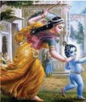

> **Deskripsi Visual:** Gambar ini adalah ilustrasi yang menampilkan seorang wanita berjalan dengan cepat di luar sebuah rumah. Wanita tersebut mengenakan pakaian tradisional Afrika, termasuk jubah kuning dan topi berwarna cerah. Ia memegang sebuah tas kecil di tangan kanan dan tampaknya sedang bergerak menuju ke arah depan rumah. Di sebelah kiri, terlihat bagian depan rumah dengan pintu berwarna putih dan atap rumah berwarna cokelat. Di sebelah kanan, terdapat sekelompok pohon yang tampaknya tinggi dan berdaun hijau. Ilustrasi ini mungkin digunakan untuk membantu pembaca memahami konsep tentang perjalanan atau aktivitas sehari-hari di Afrika.

Nya. Sifat dan sikap yang demikian adalah merupakan wujud dari salah satu swadharma anak yang berbhakti kepada orang tuanya. Dalam arti luas anak-anak yang berbhakti kepada orang tuanya berarti berbuat sesuatu yang baik terhadap sesama manusia, masyarakat, bangsa dan negara serta lingkungan alam sekitar kita. Sedangkan dalam arti sempit anak-anak yang berbhakti kepada orang tuanya dapat diartikan anak yang dengan sungguh-sungguh melaksanakan petuah dan petunjuk-petunjuk orang tuanya.

Sadhu putra hiranyayam.

ṁ

ṁ

 

---
## 📄 Halaman 402

Sa vahniá putraá pitroá pavitrav ā n, pun ā ti dhiro bhuvanani mayaya.

### Terjemahannya:

'Putra dari orang tua (ayah) yang mulia, saleh, gagah-berani, dan berseriseri bagaikan Sang Hyang Agni membe Rsi hkan (menyucikan) dunia ini dengan perbuatan-perbuatannya yang hebat' (Rgveda VI. 160.3)

Permasalahan yang sering dihadapi dalam kehidupan bermasyarakat tidaklah demikian  adanya.  Kadang-kadang  seorang  anak  sulit  untuk  menghindarkan diri  dari  pengaruh teman, bahkan seringkali malah ikut-ikutan terbujuk untuk berbuat negatif. Mabuk-mabukan, merokok, menyalah-gunakan narkotika dan yang lainnya adalah perilaku yang negatif. Sifat dan sikap munafik itu masih mewarnai anak-anak bangsa ini dalam hidup dan kehidupannya. Misalnya yang bersangkutan seolah-olah dengan sungguh-sungguh melaksanakan swadharma agamanya, namun sejatinya dalam kehidupan sehari-hari segala perbuatan dan tindak-tanduknya  sangat  bertentangan  dengan  ajaran  Ketuhanan.  Pengamatan sementara  yang  kita  dapatkan  melalui  media  baik  cetak  maupun  elektronik ternyata masih ada anak-anak bangsa ini yang nampak rajin melakukan ibadah agamanya  lalu  bersikap  anarkis  yang  nyata-nyata  dapat  menyesatkan  dan menyengsarakan kelangsungan hidupnya di kemudian hari. Di mana hati nurani anak orang yang berprilaku demikian? Ingatlah bahwa:

Kelahiran sebagai manusia ini adalah neraka bagi Dewa-dewa, neraka bagi manusia biasa ialah kelahiran menjadi binatang ternak, neraka bagi binatang ternak ialah kelahiran menjadi binatang hutan,

 

---
## 📄 Halaman 403

neraka bagi binatang hutan/buas ialah kelahiran menjadi bangsa burung, neraka bagi bangsa burung ialah kelahiran menjadi binatang busuk, neraka bagi binatang busuk ialah kelahiran menjadi binatang penyengat, neraka binatang penyengat ialah kelahiran menjadi binatang berbisa, karena binatang berbisa ini sangat berbahaya dan kejam. (Ç'lok ā ntara -52-53 (13-14) hal. 80).

Bila  perbuatan  seperti  itu  yang  dilakukan,  maka  sudah  jelas  anak  yang bersangkutan tidak dapat lagi disebut taat dan patuh dengan ajaran agamanya dan berbhakti kepada orang tuanya. Agar sikap taat dan kepatuhan itu tertanam dalam diri seorang anak serta dapat terus-menerus bersikap bhakti kepada orang tuanya  maka  perlu  ada  upaya  yang  harus  dilakukan.  Upaya  yang  dimaksud adalah dengan meningkatkan swadharma hidup sesuai dengan ajaran agamanya masing-masing. Agama yang kita pelajari bukan hanya sebagai pengetahuan, namun harus disertai keyakinan dan keimanan untuk mengamalkannya. Semakin banyak  mempelajari  agama,  semakin  bertambahlah  pengetahuan  keagamaan kita. Oleh sebab itu, hendaknya semakin meningkat swadharma atau ibadahnya dan rasa sosial serta kesetia-kawanannya. Keyakinan kepada Tuhan Yang Maha Esa dan ajaran agama mendorong manusia dan masyarakat untuk berbuat baik dan  benar.  Kebaikan  dan  kebenaran  adalah  anugrah  Tuhan  yang  wajib  kita jalankan. Beribadah kepada Tuhan merupakan kewajiban kita sebagai makhluk, insan,  dan  hamba  Tuhan.  Ikut  serta  dalam  berbagai  kegiatan-kegiatan  sosioal merupakan kepedulian kita sebagai pencerminan orang yang taat melaksanakan swadharma.  Perbuatan  yang  dapat  dikatakan  sebagai  pencerminan  seorang

 

---
## 📄 Halaman 404

anak yang berbhakti kepada orang tuanya dan taat serta patuh terhadap ajaran agamanya, meliputi;

### a. Bhakti dan Taat Kepada Orang Tua, Guru, dan Orang yang Lebih Tua

Berbhakti kepada orang tua, guru, dan orang yang dituakan berarti kita mau mendengarkan  dan  mampu  melaksanakan  nasehat-nasehatnya,  menghormati, menyayangi,  dan  tidak  pernah  berpikir,  berkata  serta  berperilaku  menyakiti perasaan mereka. Hal semacam ini penting dilakukan kepada mereka yang patut kita hormati.

### b. Membiasakan  Diri  Mengoreksi  Diri  Sendiri  serta  Perbuatan  yang Selaras dengan Ketentuan-ketentuan Agama dan Negara

Selalu mengusahakan dan mengupayakan mawas diri serta koreksi diri adalah perbuatan  yang  terpuji.  Mawas  diri  dimaksudkan  agar  kita  tidak  terpengaruh oleh berbagai desas-desus yang membawa ke arah kehancuran. Kita tidak boleh gegabah  dalam  bertindak  sebelum  tahu  betul  sesuatu  apa  yang  seharusnya diperbuat. Koreksilah diri kita terlebih dahulu apakah perbuatan-perbuatan kita sudah sesuai dengan ketentuan agama maupun ketentuan negara. Untuk dapat mengoreksi  diri  diperlukan  kejujuran  dan  keberanian.  Apabila  tingkah  laku kita memang belum sesuai dengan ketentuan itu, maka segeralah kita berusaha memperbaikinya.  Dengan  mawas  diri  dan  koreksi  diri  dapat  membawa  kita selalu berada di jalan yang benar dan terhindar dari perbuatan tercela.

### c. Membiasakan  Diri  untuk  Selalu  Berpikir,  Berucap  dan  Berprilaku yang Baik

Dalam kehidupan sehari-hari kita harus berpikir, berucap dan berprilaku yang baik. Merendahkan diri kepada orang lain, tidak suka membanggakan diri sendiri, sabar dalam menghadapi gangguan dan cobaan serta tidak marah, mengeluh serta

 

---
## 📄 Halaman 405

berputus asa. Hindarkan diri dari perbuatan memutus tali persahabatan sesama teman. Tidak suka bertengkar apalagi berkelahi atau tawuran. Setiap orang harus merasa malu untuk melakukan perbuatan yang buruk walaupun tidak ada yang melihatnya. Ajaran agama mengajarkan bahwa Tuhan maha melihat.

### d. Menyelenggarakan  Kegiatan  Keagamaan  dalam  Berbagai  Macam Kehidupan

Kegiatan keagamaan bukan hanya dapat dilaksanakan dengan mengadakan perayaan-perayaan keagamaan, tetapi dapat juga dilakukan dengan selalu mawas diri atau mulat sarira.

### e. Melakukan Bhakti Sosial

Bhakti sosial adalah kegiatan yang dilakukan atas dasar sukarela dan penuh keihklasan untuk kepentingan bersama maupun untuk menolong orang lain.

Kegiatan ini dapat dilakukan dengan memberikan bantuan material maupun spiritual ke panti-panti asuhan, panti jompo maupun tempat-tempat penampungan korban  bencana  alam.  Bhakti  sosial  bersama  masyarakat  dapat  diwujudkan dengan  kerja  bhakti  bersama  membersihkan  lingkungan,  memperbaiki  jalanjalan  kampung  yang  rusak,  dan  ikut  mendirikan  rumah  bagi  penduduk  yang sedang ditimpa bencana alam.

Dalam kehidupan  ini,  kita  diharapkan  dapat  bekerja-sama,  saling  menyayangi, saling  memberi  dan  menerima,  serta  saling  mengingatkan  dan  menasehati. Terkadang kita berbuat suatu kesalahan atau berbuat yang merugikan berbagai pihak tanpa kita sadari. Kita harus siap menerima teguran dari kawan atau siapa saja. Kawan yang baik adalah kawan yang mau menunjukkan kesalahan kita, bukan kawan yang selalu memuji-muji kita saja.

 

---
## 📄 Halaman 406

Bulan itu lampu di malam hari, Surya atau matahari lampu dunia di siang hari, Dharma ialah lampu ke tiga dunia ini, dan putra yang baik itu cahaya keluarga. (Ç'lok ā ntara -24 (52) hal. 44).

Demikianlah  setiap  anak  hendaknya  dapat  berbhakti  kepada  orang  tua sebagai wujud nyata mematuhi dan menaati agamanya masing-masing. Di antara mereka yang sudah mematuhi dan menaati ajaran agama sesungguhnya adalah orang-orang yang berbudi pekerti luhur dengan pahala yang baik.

te yeva tri u tu þe u tapaá sarva sam pyate'.

ṁ

ṣ

ṣ

ṣ

ṣ

### Terjemahannya:

Seorang  anak  harus  melakukan  apa  yang  disetujui  oleh  kedua  orang tuanya dan apa yang menyenangkan gurunya; kalau ke tiga orang itu senang ia mendapatkan segala pahala dari tapa bratanya (Manawa Dharmasastra, II.228).

Dalam kitab Taittiriya Upanisad disebutkan bahwa ayah dan ibu itu adalah ibarat perwujudan Deva dalam keluarga: ' Pitri deva bhava, matri deva bhava'. Vana Parva 27, 214 menyebutkan bahwa ayah dan ibu termasuk sebagai Guru, di samping Agni , Atman , dan Rsi .

Di Bali ayah dan ibu disebut sebagai Guru Rupaka di samping Hyang Widhi sebagai  Guru  Svadyaya,  pemerintah  sebagai  Guru  Visesa,  dan  para  pengajar sebagai  Guru  Pengajian.  Ada  lima  hal  yang  menyebabkan  anak-anak  harus

ṁ

ā

ṁ

ā

ā

ā

ā

 

---
## 📄 Halaman 407

berbakti kepada ayah dan ibunya, yang dalam kekawin Nitisastra VIII.3 disebut sebagai Panca Vida, yaitu:

- Sang Ametwaken, karena pertemuan (hubungan suami/ istri) ayah dan ibu, maka lahirlah  anak-anak  dari  kandungan  ibu.  Perjalanan  hidup  ayah  dan ibu sejak kecil hingga dewasa, kemudian menempuh kehidupan Gryahasta, sampai  mengandung  bayi  dan  selanjutnya  melahirkan,  dipenuhi  dengan pengorbanan-pengorbanan.
- Sang Nitya Maweh Bhinojana, ayah dan ibu selalu mengusahakan memberi makan kepada anak-anaknya. Bahkan tidak jarang dalam keadaan kesulitan ekonomi, ayah dan ibu rela berkorban tidak makan, namun mendahulukan anak-anaknya mendapat makanan yang layak. Ibu memberi air susu kepada anaknya, cairan yang keluar dari tubuhnya sendiri.
- Sang  Mangu  Padyaya,  ayah  dan  ibu  menjadi  pendidik  dan  pengajar utama.  Sejak  bayi  anak-anak  diajari  menyuap  nasi,  merangkak,  berdiri, berbicara,  sampai  menyekolahkan.  Pendidikan  dan  pengajaran  oleh  ayah dan ibu merupakan dasar pengetahuan bagi kesejahteraan anak-anaknya di kemudian hari.
- Sang  Anyangaskara,  ayah  dan  ibu  melakukan  upacara-upacara  manusa yadnya bagi anak-anaknya dengan tujuan mensucikan atma dan stula sarira. Upacara-upacara itu sejak bayi dalam kandungan sampai lahir, besar dan dewasa: Magedong-gedongan, Embas rare, Kepus udel, Tutug Kambuhan, Telu bulanan, Otonan, Menek kelih, Mepandes, Pawiwahan.
- Sang  Matulung  Urip  Rikalaning  Baya,  ayah  dan  ibulah  pembela  anakanaknya bila menghadapi bahaya, menghindarkan serangan penyakit dan menyelamatkan nyawa anak-anaknya dari bahaya lainnya.

 

---
## 📄 Halaman 408

Oleh karena itu, pahala bagi anak-anak yang berbahakti kepada orang tua seperti yang dijelaskan dalam kitab suci Sarasamuscaya disebutkan ada empat pahala yang diterima oleh anak-anak yang berbakti kepada orang tua:

### 1. Kirti

Selalu  dipuji  dan  didoakan  untuk  mendapatkan  kerahayuan  oleh  sanak keluarga dan orang-orang lain keluarga, karena dipandang terhormat.

Puji  dan  doa  yang  positif  seperti  itu  akan  mendorong  aktivitas  dan gairah  kehidupan  sehingga  anak-anak  akan  menjadi  lebih  meningkat  kualitas kehidupannya.

### 2. Ayusa. Berumur panjang dan sehat

Umur panjang dan sehat sangat diperlukan agar manusia dapat menempuh tahapan-tahapan kehidupannya dengan sempurnya, yaitu melalui Catur ashrama: Brahmacarya,  gryahasta,  wanaprastha,  dan  bhiksuka.  Brahmacarya  adalah masa  menempuh  pendidikan,  gryahastha  adalah  masa  berumah  tangga  dan mengembangkan keturunan, wanaprastha adalah masa menyiapkan diri menuju kehidupan yang lebih suci, dan bhiksuka adalah masa kehidupan yang suci, lepas dari ikatan-ikatan keduniawian.

### 3. Bala

Mempunyai  kekuatan  yang  tangguh  dalam  menempuh  kehidupan  baik ketangguhan  yang  berupa  pemenuhan  kebutuhan  hidup,  kemampuan  untuk memecahkan  masalah-masalah  kehidupan,  dan  juga  ketangguhan  dalam  arti menguatkan kesucian mental/ rohani.

### 4. Yasa Pattinggal Rahayu

Kebaktian pada orang tua akan menjadi contoh bagi keturunan selanjutnya dan akan dilanjutkan, sehingga bila anak-anak sudah menjadi tua atau meninggal

 

---
## 📄 Halaman 409

dunia, secara sambung menyambung para keturunannya-pun akan menghormati dan berbakti kepadanya, karena kebaktian itu sudah menjadi tradisi yang baik di dalam keluarganya.

Guru  tidak  terpaku  mengajarkan  siswa  dari  buku  siswa  tetapi  dapat mengembangkan  materi  dari  sumber  lain  yang  ada  dimasyarakat  terutama dari  pengalaman  langsung  dalam  kehidupan  sehari-hari.  Dapat  juga  melalui dalam kegiatan ekstrakurikuler. memberikan motivasi kepada siswanya untuk bertanya, mengerjakan soal-soal latihan, memberikan evaluasi, dan setiap akhir pembelajaran memberikan tugas-tugas baik mandiri maupun tugas berkelompok untuk mendapatkan imformasi kompetensi peserta didik berkaitan dengan materi Wiwaha.

### Uji Kompetensi:

- Apakah yang dimaksud dengan berbhakti kepada orang tua?
- Sebagai seorang anak mengapa kita harus berbhakti kepada orang tua? Jelaskanlah!
- Bagaimana bila kita tidak berbhakti kepada orang tua? Jelaskanlah! Diskusikanlah dengan orang tua Anda di rumah!
- Sifat dan sikap anak yang manakah termasuk sebagai cerminan bahwa ia telah berbhakti kepada orang tuanya? Jelaskanlah!
- Amatilah gambar berikut ini, tuliskanlah deskripsinya! Sebelumnya diskusikanlah dengan orang tua Anda masing-masing, apa dan bagaimana pendapatnya?

 

---
## 📄 Halaman 410

### Daftar Pustaka

- Agus S. Mantik. 2007. Bhagavad G ī t ā . Surabaya : P ā ramita. Ananda  Kusuma,  Sri  Rsi.  1984. Dharma  Sastra .  Klungkung-Bali  :  Pusat  Satya  Dharma Indonesia.
- Agung Oka, I Gusti. 1978. Sad Darsana . PGAHN Denpasar.
- Bambang Q-Anees dan Radea Juli A. Hambali. 2003. Filsafat untuk Umum . Jakarta : Fajar Interpratama; Bh ā sya of S ā yan ā c ā rya. 2005. Atharvaveda Samhit ā I. Surabaya : P ā ramita. Bh ā sya of S ā yan ā c ā rya. 2005. Atharvaveda Samhit ā II. Surabaya : P ā ramita. Bh ā sya of S ā yan ā c ā rya. 2005. Rgveda Samhit ā VIII IX X. Surabaya : P ā ramita. Dirjen Bimas Hindu dan Budha. 1979. Sang Hyang Kamayanikan . Jakarta : Proyek Pengadaan Kitab Suci Buddha Dirjen Bimas Hindu dan Buddha Departemen Agama RI.
- Dinas Pendidikan Provinsi. 1989. Bharata Yuddha Kakawin Miwah Tegesipun: Bali.Tidak diterbitkan
- Dinas Pendidikan Provinsi. 1988. Arjuna Wiwaha Kakawin Miwah Tegesipun: Bali. Tidak diterbitkan
- Gelebet,  I  Nyoman.  ---Arsitektur  Tradisional  Jakarta .  Departemen  Pendidikan  dan Kebudayaaan. Tanpa tahun
- Kadjeng, dkk. I Nyoman. 2001. Sarasamuscaya Jakarta: (terjemahan dalam bahasa Indonesia.) --- : Dharma Nusantara.
- Kantor Departemen Agama Kota. 2000. Caru Pancasatha .Kota Denpasar. tidak diterbitkan
- Kalam;  Drs.  A.A.Rai.  1980. Bangunan Rumah Tinggal Tradisional  Bali .  Denpasar:  tidak diterbitkan
- Kamala Subramaniam : Ramayana (diterjemahkan oleh Sanjaya I Gde Oka). 2001. Surabaya : Paramita.
- Kosasih R.A. 2006. Mahabharata . Surabaya : Paramita.
Maswinarta I Wayan. 2008. Reg Veda Samhit Mandala I II III . Surabaya : Paramita.

Maswinarta I Wayan. 2004. Reg Veda Samhit Mandala IV V VI VII. Surabaya : Paramita.

Mas Putra, Nyonya I G A. 1982. Upakara Manusa Yajna. Denpasar : IHD Denpasar.

ā

- Supardjana, BA dan I Gusti Ngurah Supartha, SSt. 1982. Pengetahuan-Pengetahuan Tari I. Jakarta: Departemen Pendidikan dan Kebudayaan.
ā

Punyatmaja, IB. Oka. 1984. Panca Sraddha . Denpasar : Parisada Hindu Dharma Pusat.

Pudja, Gde dan Sudharta, Tjok Rai. 2004. Manawa Dharmasastra . Surabaya : Paramita.

- Pudja, Gde. 1971. Veda Parikrama .  Jakarta : Proyek Pengadaan Kitab Suci Agama Hindu Departemen Agama R.I.
- Pudja, Gde. 1977. Theologi Hindu . Jakarta : Mayasari.
Pudja, Gde. 1977. Hukum Waris Hindu . Jakarta : CV. Junasco.

Poedjawitna, 1982. Etika Filsafat Tingkah Laku . Jakarta : PT. Bina Aksara.

Pendit, S. Nyoman. 1978. Bhagavad Gita. Denpasar : Dharma Bhakti.

 

---
## 📄 Halaman 411

- Parisada Hindu Dharma. 1968. : Upadesa . Denpasar : Parisada Hindu Dharma Pusat.
- PGAHN. 6 Tahun Singaraja. 1997. Nitisastra . Denpasar : Pemerintah Daerah Propinsi Bali. Puja, Gde. 2004. Bhagavad Gìt ā (Pañcamo Veda) . Surabaya: P ā ramita. Parisada Hindu Dharma Pusat,. 1968. Upadesa tentang Ajaran Agama Hindu .  Denpasar  : Proyek Pengadaan Prasarana dan Sarana Kehidupan Beragama tersebar di 8 Kabupaten Dati II.
- Pandit, Bansi. 2005. Pemikiran Hindu Pokok-pokok Pikiran Agama Hindu dan Filsafatnya. Surabaya : Paramita. Maswinara, I Wayan. 2000. Panggilan Veda . Surabaya: P ā ramita. Sugiarto, R dan G. Puja. 1982. Sweta Swatara Upanisad, Cetakan I . Jakarta: Mayasari. Kajeng, I Nyoman Dkk. 2009. Sarasamuscaya , Surabaya: P ā ramita. Maswinara, I Wayan. 1998. Sarva Darsana Samgraha, Sistem Filsafat India. Surabaya : Paramita
- Milik Pemerintah Daerah Tingkat 1 Bali. 1995. Panca Yajna, Dewa Yajna, Bhuta Yajna, Rsi Yajna, Pitra Yajna dan Manusa Yajna . Bali.
- Radhakrisnan S. 1989. Indian Philosophy 2 . New Delhi : Oxford University Press.
- Ranganathananda, Swami. 1993. Suara Vivekananda . Jakarta : Hanuman Sakti.
- Rai Sudarta,MA., Prof.Dr.Tjok : Siwaratri; 1994. Upada Sastra; Denpasar. Tidak diterbitkan.
- ---------- 2004. Kidung Panca Yajna. Surabaya : Paramita.
- Swami Satya Prakas Saraswati. 2005. Patanjali Raja Yoga. (dilengkapi dengan naskah asli alih bahasa oleh Drs. J.B.A.F. Mayor Polak) Surabaya: Paramita.
- Suamba I.B.P. 2003. Dasar- dasar Filsafat India . Denpasar : Program Magister Unhi dan Widya Dharma.
- Sumawa I Wayan dan Raka Krisnu T Raka. 1992. Materi Pokok Darsana . Jakarta : Dirjen Bimas Hindu Buddha dan UT.
- S Pendit, Nyoman. 2007. Filsafat Hindu Dharma, Sad Darsana, Enam Aliran Astika (Ortodoks). Denpasar : Pustaka Bali Post.
- Sura, I Gede. 1985. Pengendalian Diri dan Ethika ; Departemen Agama RI.
- Sura, I Gede. Sekitar Tata Susila Seri I. , Denpasar: Yayasan Guna Werddhi
- Suryani, Luh Ketut. 2003. Perempuan Bali Kini. Denpasar : Percet. PT. Offset BP.
- Soekmono, R. 1973. Pengantar Sejarah Kebudayaan Indonesia II. Jakarta : Yayasan Kanisius.
- Sugiarto, R. Dkk. 1982. Sweta Swatara Upanisad. Departemen Agama Republik Indonesia.
- Sri Arwati, Ni Made. 1992. Caru . Denpasar : Upada Sastra.
- Sandhi. 1979. Brahmanda Purana. Jakarta : Departemen Agama Republik Indonesia.
- Slametmulyana. 1967. Perundang-undangan Majapahit. Jakarta : Bhratara.
- Sudarsana.  2004. Himpunan  dan  Ethika  Penataan  Banten .  Denpasar  :  Yayasan  Dharma Acarya.
- Sunetra. I Made, 2004. Laya Yoga . Surabaya : Paramita
- Surpha, I Wayan. 1986. Pengantar Hukum Hindu. Tanpa penerbit.
- ------- 2003. Intisari Ajaran Hindu. Surabaya : Paramita. Tanpa penerbit

 

---
## 📄 Halaman 412

- ------- 2006. Yoga Asanas. Denpasar : Widya Werddhi Sabha. Tanpa penerbit
Team Penyusun. 2002. Panca Yajna . Denpasar : Pemerintah Tingkat I Bali.

Team  Penyusun.  1982/1983. Kamus  Kecil  Sansekerta-Indonesia. Denpasar  : Proyek Peningkatan Mutu Pendidikan Pemda Tk. I Bali.

- Team Penyusun. 1978. Kamus Besar Bahasa Indonesia. Jakarta : Balai Pustaka.
Team Penerjemah. 1994. Bhuwanakosa. Denpasar : Penerbit Upada Sastra.

Titib, I Made. 2003. Teologi dan Simbol-simbol agama Hindu. Tanpa penerbit

- Titib, I Made. 1996. Veda Sabda Suci Pedoman Praktis Kehidupan. Surabaya : Paramita.
Titib, I Made. 2008. Itihasa Ramayana dan Mahabharata (Viracarita) Kajian Kritis Sumber Ajaran Hindu. Surabaya : Paramita.

Wiratmaja, I Gst. Agama Hindu Sejarah dan Sraddha . Tanpa tahun dan tidak diterbitkan

Widyatranta, Siman. Adiparwa Jilid I dan II. Yogyakarta : U.P. Spring.

Wursanto, I G. 1986. Dasar-dasar Manajemen Umum. Jakarta : Pustaka Dian.

Wiana, I Ketut. 2002. Memelihara Tradisi Veda. Denpasar : PT. Bali Post.

Wiana, Ketut dan Raka Santreri. 1993. Kasta dalam Hindu Kesalah Pahaman Berabad-abad. Denpasar : Penerbit. Yayasan Dharma Naradha. Zoetmulder, P.J. 2005. Ă diparva . Surabaya : P ā ramita. -----------Himpunan Kesatuan Tafsir Terhadap Aspek-Aspek Agama Hindu; Parisada Hindu Dharma Indonesia. Tanpa Penulis

- ----------- 1992. Sundarigama . Denpasar : Departemen Agama Kota Denpasar. Tanpa Penulis

 

---
## 📄 Halaman 413

### Glosarium

Ast ā ngga yoga 'delapan bagian yoga' sebagai upaya untuk mendekatkan diri kepada Tuhan Asana ialah sikap duduk yang sempurna

Ast ā ngga yoga delapan tahapan yang ditempuh dalam melaksanakan yoga, dengan bagianbagiannya yaitu yama, asana, pranayama, pratyahara, dharana, dan samadhi

Bhakti Marga berarti  berbakti  atau  sembahyang  yang  merupakan  cara  mendekatkan  diri pada Tuhan Agama mengajarkan umatnya untuk melakukan ritual ini lengkap dengan tata caranya

Bagi  Vibhuti  M ā rga kegelapan merupakan  simbol  ketidakbenaran  yaitu kejahatan, kekacauan,  keonaran,  kebodohan,  kematian,  setan  dan  sebagainya  Dewa  Agni  secara simbolis  menyatakan  keutamaan  sinar  Oleh  karena  itu,  Dewa  Agni  dipuja  sebagai  Dewa yang berkilauan yang memancarkan sinarnya ke seluruh penjuru

Catur  Marga empat  jalan  yang  wajib  dilalui  untuk  mewujudkan  kebahagiaan  hidup  ini Keempat jalan itu  Bhakti  Marga/yoga,  Karma  Marga/Yoga,  Jnana  Marga/Yoga,  dan  Raja Marga/Yoga

Catur  Warna berarti  empat  macam  pengklasifikasian  umat  atau  masyarakat  Hindu berdasarkan guna dan karmanya masing-masing

Catur  Asrama empat  jenjang  lapangan  hidup  yang  diklasifikasikan  menurut  tingkatantingkatan tatanan rohani, waktu, umur, dan sifat perilaku umat manusia

Catur Purusartha empat tujuan hidup manusia yang utama, yang terdiri atas: dharma, artha, kama, dan moksa

Dharana pemusatan pikiran

Dharmas ā stra (Smrti) dipandang sebagai kitab hukum Hindu karena di dalamnya banyak dimuat tentang syariat Hindu yang disebut dharma

Dhyana meditasi

Grhastha masa  hidup  mendirikan  rumah  tangga  baru  (melaksanakan  perkawinan)  yang dilaksanakan setelah fase brahmacari

Hukum  Hindu sebuah  tata  aturan  yang  membahas  aspek  kehidupan  manusia  secara menyeluruh yang menyangkut tata keagamaan, mengatur hak dan kewajiban manusia baik sebagai individu maupun sebagai makhluk sosial, dan aturan manusia sebagai warga negara (tata negara)

Hukum peraturan-peraturan yang mengatur tingkah laku manusia dalam kehidupan seharihari,  baik  yang  ditetapkan  oleh  pemerintah,  penguasa,  maupun  pemberlakuannya  secara alamiah yang bila perlu pelaksanaannya dapat dipaksakan untuk dipatuhi guna mewujudkan keharmonisan hidup bernegara dan bermasyarakat

Harmonis hidup  dan  kehidupan  yang  selalu  damai,  tiada  bermasalah,  penuh  dengan tenggangrasa, saling mengasihi dan mematuhi hukum yang berlaku

 

---
## 📄 Halaman 414

Jnana  Marga berarti  dengan  belajar  dan  mencari  pengetahuan  seseorang  akan  bisa mendekatkan diri pada Pencipta-Nya

Kirti suatu usaha, kerja (karma) dan pengabdian yang dilaksanakan oleh umat Hindu untuk menghubungkan diri ke hadapan Sang Hyang Widhi beserta dengan manifestasinya Kirti wujud kerja umat Hindu dalam rangka melaksanakan swadharmanya, baik dharma negara maupun dharma agama

Karma  Marga berarti  perbuatan,  tingkah  laku,  pekerjaan  ataupun  aksi  Pekerjaan  atau perbuatan yang dimaksud tentu perbuatan yang baik

Kitab Dharmas ā stra yang memuat bidang hukum Hindu tertua dan sebagai sumber hukum Hindu yang paling terkenal Manawa Dharmas ā stra

Lima bentuk yajña yang patut dilakukan oleh umat sedharma dalam upaya mewujudkan kesejahteraan  dan  keharmonisan  hidup  ini  yang  dikenal  dengan  Panca  Yajña  Bagianbagiannya Dewa Yajña, Pitra Yajña, Rsi Yajña, Manusa Yajña, dan Bhuta Yajña

Moksha bersatunya atman dengan paramatman, atau tercapainya kebahagiaan yang tertinggi yaitu suka tan pawali dukha

Perkawinan wajib  hukumnya bagi seseorang yang sudah pantas untuk melaksanakannya sekaligus sebagai pengamalan dharmanya

Manawa Dharmas ā stra sebuah kitab Dharmas ā stra  yang  dihimpun  dengan  bentuk  yang sistematis oleh Bhagawan Bhrigu

Niwrtti  Marga dilaksanakan  dengan  menekuni  ajaran  yoga  marga  Pelaksanaan  yoga merupakan sadhana dalam mewujudkan samadhi yaitu penyatuan diri dengan Sang Hyang Widhi Wasa

Nyama ialah pengendalian diri dalam diri yaitu tahapan rohani

Perkawinan  atau  wiwaha baru  dapat  dilakukan  oleh  seseorang  'umat'  apabila  yang bersangkutan  telah  memenuhi  persyaratan  hukum  yang  berlaku  dan  berdasarkan  normanorma agama yang dianutnya

Prawrtti Marga cara atau jalan yang utama untuk mewujudkan rasa bhakti ke hadapan Sang Hyang Widhi, dengan tekun melaksanakan; tapa, yajna, dan kirti

Pranayama pengendalian prana/pernafasan

Pratyahara penarikan pikiran dari objeknya

Raja Marga mengamalkan ajaran agama dengan melakukan yoga, bersamadhi, tapa atau melakukan  brata  (pengendalian  diri)  dalam  segala  hal  termasuk  upawasa  (puasa)  dan pengendalian seluruh indra

Rta hukum alam 'Tuhan atau Brahman' yang bersifat murni, absolut, berlaku sangat adil dan transendental serta keberadaannya tidak ada satu pun makhluk 'manusia' dapat menolaknya Samadhi luluhnya pikiran dengan atman

Setiap individu umat Hindu memiliki kesempatan untuk meningkatkan guna dan karmanya masing-masing, sehingga dapat mencapai kesempurnaan hidup

Setiap umat memiliki kewajiban untuk meningkatkan jenjang kerohaniannya sesuai dengan kondisi dan kenyataan hidupnya masing-masing

 

---
## 📄 Halaman 415

Syahnya perkawinan yang dilaksanakan oleh seseorang apabila telah mendapatkan legalitas hukum 'tri upasaksi' sesuai dengan agama dan keyakinan yang dianutnya

Tapa pengendaliaan diri,  untuk  memuja Sang Hyang Widhi Setiap umat Hindu memiliki kewajiban untuk melakukan pengendalian diri, dengan tujuan untuk menghubungan diri ke hadapan Sang Hyang Widhi Pengendalian diri (tapa) itu sangat perlu dilaksanakan secara tekun dan teratur tujuan  perkawinan  membentuk  keluarga  (rumah  tangga)  baru  yang  bahagia  dan  kekal berdasarkan Ketuhanan Yang Maha Esa

Untuk  memenuhi  tuntutan  tujuan  hidup  manusia,  kondisi  moksa  dapat  ditingkat  seperti Samipya, Sarupya (Sadharmaya), Salokya (Karma mukti), dan Purnamukti

Vibhuti M ā rga sikap spiritual yang puitis yang dimiliki oleh para maharesi sebagai jalan kemegahan  memiliki  keistimewaan  yaitu  tidak  pernah  lepas  dari  kenyataan  yang  dapat dihayati melalui persepsi indra

Vibhuti M ā rga kebesaran dan kemuliaan Tuhan yang dihayati oleh para maharesi melalui spiritual yang kemudian penghayatan tersebut dilukiskan secara lahiriah dalam bentuk puisi sebagai rasa kekagumannya

Vibhuti M ā rga mencari pengalaman yang bersifat transendental di luar alam indra Sinar yang  menjadi  objek  utama  kekaguman  pendeta  penyangga  Vibhuti  Marga,  di  mana  sinar itu digunakan sebagai simbol keindahan dan kemuliaan jiwa, simbol kebenaran, simbol rta, simbol kebaikan, kebahagiaan, kekekalan, simbol Tuhan dan lain-lain

Wiwaha atau perkawinan ikatan  lahir  batin  antara  seorang  pria  dengan  wanita  sebagai suami istri yang syah

Yama pengendalian diri dari tahap perbuatan jasmani

Yajña perbuatan atau persembahan yang dilakukan dengan penuh keikhlasan dan kesadaran kepada Tuhan Yang Maha Esa/Ida Sang Hyang Widhi Wasa beserta prabhawa-Nya

Catur Warna Brahmana Ksatrya, Wesya, dan Sudra Warna

Yajña bertujuan  untuk  mewujudkan  kesejahteraan  dan  kebahagiaan  hidup  umat  manusia beserta makhluk hidup yang lainnya

Yajna suatu  pemujaan dan persembahan yang dilaksanakan oleh umat Hindu ke hadapan Sang  Hyang  Widhi/Tuhan  beserta  manifestasinya  yang  dilandasi  dengan  rasa  bhakti  dan ketulusan hati Melaksanakan yajna merupakan kewajiban bagi setiap umat yang beragama Hindu

Yoga merupakan penghentian goncangan-goncangan pikiran Ada lima keadaan pikiran yang ditentukan oleh intensitas ; sattwam, rajas dan tamas di antaranya : Ksipta, Mudha, Waksipta, Ekgra, Nirudha Dengan Panca Yama Brata dan Panca Nyama Brata menuju keharmonisan

Yoga merupakan pengendalian gelombang - gelombang pikiran dalam alam pikiran untuk dapat  berhubungan  dengan  Sang  Hyang  Widhi  Wasa  Disebutkan  ada  22  jenis  yoga  yang sangat bermanfaat untuk kesehatan jasmani dan rohani manusia

Yoga Marga suatu usaha untuk menghubungkan diri dengan Sang Hyang Widhi Wasa beserta manifestasi-Nya melalui Ast ā ngga Yoga

 

---
## 📄 Halaman 416

- A.
- Bhakti Marga 95, 108, 110, 127, 147, 174, 201, 202, 209.

### Indeks

- Ast ā ngga yoga 38, 39, 40, 46, 115, 121, 122, 123, 149, 150. Asanas 4, 17, 32, 33, 53, 54, 55, 56, 59.
- Catur marga 108, 126, 127, 162, 163, 174, 178, 202, 392.
- Dharma ṡā stra 144, 280, 296, 304, 309, 313, 321, 322, 324, 325, 327, 328, 329, 330, 331, 332, 333, 335, 357, 364, 365, 366, 368, 370, 371, 387, 388, 389, 392, 402. Dharana 31, 39, 40, 45, 46, 106, 120, 131, 150, 181. Dhyana 4, 39, 40, 45, 46, 107, 113, 118, 119, 120, 150, 181. Grhastha 333.
H.

J.

Hukum Hindu 320, 327, 336, 358.

Harmonis 3, 34, 64, 137, 197, 207, 241, 244, 273, 285, 306, 313, 336, 381, 382, 385, 386, 392.

Jnana Marga 112, 148, 162, 175, 202.

Kirti 404.

Karma Marga 110, 111, 112, 127, 145, 162, 174, 202.

M. Moksha 6, 87, 89, 90, 91, 92, 93, 94, 96, 97, 98, 104, 105, 106, 108, 110, 115, 122, 123, 125, 126, 127, 128, 129, 131, 132, 141, 142, 143, 144, 145, 148, 149, 150, 151, 152, 154, 155, 162, 163, 164, 165, 166, 167, 169, 171, 172, 174, 175, 176, 178, 179, 180, 181, 182, 183, 184, 186, 194, 196, 197. Manawa Dharma ṡā stra 144, 296, 313, 322, 324, 325, 327, 328, 329, 330, 331, 332, 333, 357, 364, 365, 366, 368, 370, 371, 389, 392, 402.

- Niwrtti marga 411. Nyama 40, 41, 48, 118.
- Prawrtti Marga 412. Pranayama 31, 33, 39, 40, 43, 46, 119, 149. Pratyahara 31, 39, 40, 44, 46, 119, 150.
- Raja Marga 114, 115, 116, 127, 162, 175, 202.
S.

Samadhi 4, 5, 6, 10, 31, 36, 38, 39, 40, 45, 46, 47, 98, 107, 114, 120, 142, 202, 277.

- Tapa 39, 41, 114, 118, 119, 144, 149, 175, 202, 214, 240, 314, 390, 402.
U. Upakara 63, 70, 82, 104, 289, 339, 341. Vibhuti m ā rga 410.

 

---
## 📄 Halaman 417

W.

Y.

Wiwaha 296,297, 298, 302, 319, 320, 322, 324, 326, 328, 329, 330, 331, 332, 333, 334, 335, 336, 342, 346, 349, 358, 359, 382, 384, 403, 405.

Yama 31, 36, 39, 40, 115, 116, 117, 149, 260, 363, 364..

Yajña 59, 61, 62, 63, 65, 66, 67, 68, 69, 70, 71, 71, 73, 74, 75, 76, 77, 78, 79, 80, 81, 82, 84, 85, 87, 88, 108, 136, 137, 146, 147, 148, 149, 211, 240, 245, 300, 301, 302, 308, 312, 388.

Yoga 1, 2, 3, 4, 5, 6, 7, 8, 9, 10, 11, 12, 13, 14, 15, 16, 17, 18, 19, 30, 31, 32, 33, 34, 35, 36, 37, 38, 39, 40, 41, 42, 43, 444, 45, 46, 47, 48, 49, 51, 52, 53, 54, 55, 56, 57, 58, 59, 60, 107, 108, 110, 113, 114, 115, 120, 121, 122, 123, 142, 144, 145, 146, 147, 148, 149, 150 162,.

 

---
## 📄 Halaman 418

### Profil Penulis

Nama Lengkap :

Drs. I Gusti Ngurah Dwaja

Telp Kantor/HP

:   SMA N 42 Jakarta TLP. 021 8093926,

Fax 021 80887233,  HP. 081519510722

E-mail :

ngurah17@ymail.com, dan

dwajangurah@gmail.com

Akun Facebook :

ngurahdwaja

Alamat Kantor :

Jl. Rajawali Halim Perdanakusuma,

Jakarta Timur , Kode Post 13610.

Bidang Keahlian :

Guru Agama Hindu

### Riwayat pekerjaan/profesi dalam 10 tahun terakhir:

- 2009 - 2016: Guru Pendidkan agama Hindu di SMAN 42 Jakarta.
- 2005 - 2009: Guru Pendidkan agama Hindu di SMAN 38 Jakarta.
- 2012 - 2016: Ketua MGMP Agama Hindu DKI Jakarta
- 2010 - 2014: Ketua PGRI Ranting SMAN 42 Jakarta

### Riwayat Pendidikan Tinggi dan Tahun Belajar:

- S1: Fakultas  Ilmu Agama Jurusan  Hukum Agama, Program Studi  Hukum  Agama Hindu Universitas Hindu Indonesia (UNHI), Denpasar (tahun masuk 1992 - tahun lulus 1995)
- Sarjana Muda: Fakultas Agama dan Pengetahuan  Kemasyarakatan - Institut Hindu Dharma (IHD) Denpasar, Bali (tahun masuk 1982-tahun lulus 1986)

### Judul Buku dan Tahun Terbit (10 Tahun Terakhir):

'Tidak ada'

### Informasi Lain dari Penulis:

Lahir di Denpasar, 06 Januari 1961. Menikah dan dikaruniai 3 anak. Saat ini menetap di Bekasi, Aktif mengajar sebagai guru Agama Hindu di SMA Negeri 42 Jakarta sampai sekarang.

Nama Lengkap :

Drs. I Nengah Mudana, M.Pd.H.

Telp Kantor/HP

:   (0361) 287843

E-mail

:  mademudana1059@gmail.com

okaprthiwi@gmail.com

Akun Facebook

:  Made Mudana

Alamat Kantor :

SMA Negeri 6 Denpasar Jl. Raya Sanur/Tukad

Nyali Sanur - Denpasar Bali

Bidang Keahlian :

Guru Pendidikan Agama Hindu dan Budi Pekerti

### Riwayat pekerjaan/profesi dalam 10 tahun terakhir:

- 3.
2006 - 2016 (sekarang): Guru Pendidikan Agama Hindu dan Budi Pekerti di SMA Negeri 6 Denpasar.

4.

2010 - 2016 (sekarang): Wakil Kepala Sekolah Bidang Kurikulum di SMA Negeri 6 Denpasar.

5.

2006 - 2016 (sekarang): Sekretaris MGMP Pendidikan Agama dan Budi Pekerti di

Kota Denpasar.

6.

- 2006 - 2016 (sekarang): Sekretaris Pengurus Sabha Acarya di Kota Denpasar.
7.

- 2006 - 2016 (sekarang): Sekretaris Pengurus Ranting PGRI di SMA Negeri 6 Denpasar.
8.

2006 - 2016 (sekarang): Ketua Pengurus MGMP Pendidikan Agama dan Budi Pekerti di SMA Negeri 6 Denpasar.

 

---
## 📄 Halaman 419

### Riwayat Pendidikan Tinggi dan Tahun Belajar:

- S2: Fakultas: Ilmu Agama/jurusan: Pendidikan/program studi: Pendidikan Agama Hindu / Universitas Hindu Indonesia (UNHI) Denpasar  (tahun masuk : 15 Juni 2012 - tahun lulus: 25 April 2015)
- S1: Fakultas Hukum Agama/jurusan Hukum Adat/program studi Hukum Adat Hindu/Institut Hindu Dharma (IHD) Denpasar  (tahun masuk sejak 17 Juli 1986 - tahun lulus pada 7 Maret 1988)
- Sarjana Muda: Fakultas Agama dan Pengetahuan Kemasyarakatan Denpasar/jurusan Hukum Adat/program studi Hukum Adat Hindu/Institut Hindu Dharma (IHD) Denpasar (tahun masuk sejak 17 Juli 1980 -tahun lulus pada 21 Mei 1985.)

### Judul Buku dan Tahun Terbit (10 Tahun Terakhir):

- Widya Dharma Pendidikan Agama Hindu SMA/SMK Kelas X, Ganeca Excat Bandung, 2006
- Widya Dharma Pendidikan Agama Hindu SMA/SMK Kelas XI, Ganeca Excat Bandung, 2006
- Widya Dharma Pendidikan Agama Hindu SMA/SMK Kelas XII, Ganeca Excat Bandung, 2006
- Widyastuti Pendidikan Agama Hindu, SMA/SMK Kelas X, Acarya Bandung, 2008.
- Widyastuti Pendidikan Agama Hindu, SMA/SMK Kelas XI, Acarya Bandung, 2008.
- Widyastuti Pendidikan Agama Hindu, SMA/SMK Kelas XII, Acarya Bandung, 2008.
- Widya Kusuma Pendidikan Agama Hindu SMA/SMK Kelas X, Sri Rama Denpasar 2011
- Widya Kusuma Pendidikan Agama Hindu SMA/SMK Kelas XI, Sri Rama Denpasar 2011
- Widya Kusuma Pendidikan Agama Hindu SMA/SMK Kelas XII, Sri Rama Denpasar 2011
- Buku Siswa (BS) Pendidikan Agama Hindu dan Budi Pekerti SMA/SMK Kelas XI, Puskurbuk Kemdiknas, 2014
- Buku Guru (BG) Pendidikan Agama Hindu dan Budi Pekerti SMA/SMK Kelas XI, Puskurbuk Kemdiknas, 2014
- Buku Siswa (BS) Pendidikan Agama Hindu dan Budi Pekerti SMA/SMK Kelas XII, Puskurbuk Kemdiknas, 2015
- Buku Guru (BG) Pendidikan Agama Hindu dan Budi Pekerti SMA/SMK Kelas XII, Puskurbuk Kemdiknas, 2015.

### Judul Buku dan Tahun Terbit (10 Tahun Terakhir):

- Persembahyangan Hari Suci Agama Hindu Dalam Meningkatkan Religiusitas Siswa Hindu di SMA Negeri 6 Denpasar, 2015.

### Informasi Lain dari Penulis:

Lahir di Bungbungan/Klungkung, 31 Desember 1961. Menikah dan dikaruniai 3 anak. Saat ini menetap di Desa Bungbungan, Banjarangkan, Klungkung - Bali. Aktif di organisasi profesi Guru. Terlibat di berbagai kegiatan di bidang pendidikan dan sosial, beberapa kali menjadi narasumber di berbagai seminar tentang Pendidikan agama dan Budi Pekerti.

 

---
## 📄 Halaman 420

### Profil Penelaah

Nama Lengkap :

Dr. I Wayan Budi Utama, M.Si.

Telp Kantor/HP

:   081558177777

E-mail :

budi_utama2001@yahoo.com

Akun Facebook :

budi.utama42@yahoo.com

Alamat Kantor :

Jl. Sangalangit, Tembau, Penatih, Denpasar

Bidang Keahlian :

Agama dan Budaya Hindu

### Riwayat pekerjaan/profesi dalam 10 tahun terakhir:

- Dosen Universitas Hindu Indonesia Denpasar sejak 1987- sekarang
- Ketua Program Studi Program Magister (S2) Ilmu Agama dan Kebudayaan 2011-2014
- Asisten Diretur I Program Pascasarjana Universitas Hindu Indonesia Denpasar 2014 - sekarang

### Riwayat Pendidikan Tinggi dan Tahun Belajar:

- S3: Fakultas : Sastra, jurusan : Kajian Budaya, program studi : Kajain Budaya, bagian dan nama lembaga : Universitas Udayan Denpasar  (tahun masuk : 2005 - tahun lulus : 2011)
- S2: Fakultas : Ilmu Agama dan Kebudayaan,  jurusan/program studi : Ilmu Agama dan Kebudayaan, bagian dan nama lembaga Universitas Hindu Indonesia Denpasar  (tahun masuk : 2003 - tahun lulus : 2005)
- S1: Fakultas : Ilmu Agama dan Kebudayaan, jurusan/program studi : Ilmu Agama dan Kebudayaan, bagian dan nama lembaga : Universitas Hindu Indonesia Denpasar  (tahun masuk : 1976 - tahun lulus : 1985)

### Judul Buku dan Tahun Terbit (10 Tahun Terakhir):

- Agama dalam Praksis Budaya tahun 2013. Penerbit Pascasarjana Universitas Hindu Indonesia Denpasar
- Pendidikan Anti Korupsi Perspektif Agama-Agama tahun 2014. Penerbit:Pascasarjana Univ. Hindu Indonesia Denpasar
- Air,Tradisi  dan Industri tahun 2015, Penerbit Pustaka Ekspresi

### Judul Buku dan Tahun Terbit (10 Tahun Terakhir):

- Identity Weakeningof Bali Aga in Cempaga Village: tahun 2015 dalam International Journals of multidisciplinary research academy (IJMRA).
- 2.
- Brayut Dalam Religi Masyarakat Hindu di Bali tahun 2015
- Brayut dan Lokalisasi Tantrayana di Bali tahun 2015.

### Informasi Lain dari Penulis:

Lahir di Denpasar, 15 Januari 1958. Saat ini menetap di Denpasar-Bali. Peserta organisasi Asosiasi Dosen Indonesia. Terlibat di berbagai kegiatan di bidang pendidikan, beberapa kali menjadi narasumber di berbagai seminar tentang Agama dan Kebudayaan Hindu, pernah mengikuti program Post Doctoral, di KTILV Leiden, Belanda pada tahun 2012.

 

---
## 📄 Halaman 421

### Profil Editor

Nama Lengkap :

Drs. Waldopo, M.Pd.

Telp Kantor/HP

:   085694632175

E-mail :

waldopo@gmail.com

Akun Facebook :

'Tidak ada'

Alamat Kantor :

Pusat Kurikulum dan Perbukuan Balitbang Kemendikbud Jl. Gunung Sahari Raya No. 4, Jakarta Pusat Telepon (021) 3453440, 3804248 Fax. (021) 34834862

Bidang Keahlian :

Peneliti Madya Bidang Teknologi Pendidikan

### Riwayat pekerjaan/profesi dalam 10 tahun terakhir:

- Peneliti Madya pada bidang Teknologi Pendidikan di Puskurbuk-Balitbang Kemendikbud (Tahun 2016)
- Kasubid Perancangan dan Produksi Media Radio, Televisi dan Film pada bidang Pengembangan Teknologi Pendidikan Berbasis Radio, Televisi dan Film PustekkomKemendikbud (Tahun 2011 s/d 2012).
- Kasubid Pendidikan Menengah dan Tingggi pada bidang Teknologi Pembelajaran Pustekkom-Kemendikbud (Tahun 2007 s/d 2010).
- Peneliti pada bidang Teknologi Pendidikan Pustekkom-Kemdikbud (Tahun 2006 s/d 2015).
- Pengembang media pendidikan/pembelajaran berbasis televisi (Tahun 1990 s/d 2015)
- Pengembang media pendidikan/pembelajaran berbasis radio  (1984 s/d 2015)
- Pengembang media pendidikan/pembelajaran berbasis cetak (modul) untuk pembelajaran (Tahun 1990  s/d 2015)
- Pengembang Media pendidikan/pembelajaran berbasis online (Tahun 2000 s/d 2015)
- Mengelola SMP Terbuka (Tahun 1990 s.d 2010)
- Mengelola SMA Terbuka  (Tahun 2004  s/d 2011)
- Mengelola Diklat peningkatan kompetensi guru SD melalui siaran radio pendidikan (1998 s.d. 2011)
- Mengelola Diklat peningkatan kompetensi guru SD dalam bidang bahasa Ingris melalui sistem pendidikan jarak jauh (Tahun  2004  s.d. 2011)
- Mengelola siaran pendidikan/pembelajaran melalui stasiun Televisi Edukasi (Tve) Tahun 2011 s.d 2015.

### Riwayat Pendidikan Tinggi dan Tahun Belajar:

- S1: IKIP Yogyakarta (UNY) Kampus Karangmalang, Yogyakarta. Bimbinga dan Penyuluhan Masuk 1981, lulus 1981.
- S2: IKIP Jakarta (UNJ) Kampus Rawamangun, Jakarta Timur. Penelitian dan Evaluasi Pendidikan Masuk 1996 dan lulus 1998

### Judul Buku dan Tahun Terbit (10 Tahun Terakhir):

- Modul Pelajaran Biologi untuk siswa SMA Terbuka
- Modul Pelajaran Bahasa Indonesia untuk siswa SMA Terbuka
- Modul Pelajaran Geografi untuk siswa SMP Terbuka
- Buku Teks Pelajaran Agama Hindu dan Budi Pekerti untuk siswa SMA dan SMK Kelas XI
- Televisi Pendidikan di Era Global

 

---
## 📄 Halaman 422

### Judul Penelitian dan Tahun Terbit (10 Tahun Terakhir):

- Dampak Pelatihan Pemanfaatan TIK (PeTIK) untuk Pembelajaran Bagi Guru Sekolah Indonesia di Luar Negeri .  Artikel hasil penelitian yang dipublikasikan di dalam Jurnal Ilmiah TEKNODIK VOL  19,  No. 1  April 2015,  PUSTEKKOM- KEMDIKBUD Jakarta. Terakreditasi LIPI Nomor: 464/ AU1/P2MI-LIPI/08/ 2012.
- Pengaruh Pemanfaatan TIK Pembelajaran Terhadap Nilai Ujian Akhir Di Daerah Perbatasan , Artikel hasil penelitian yang dipublikasikan di dalam Jurnal Ilmiah TEKNODIK VOL  18, No. 2 Agustus 2014,  PUSTEKKOM- KEMDIKBUD Jakarta. Terakreditasi LIPI Nomor: 464/AU1/P2MILIPI/08/ 2012.
- Evaluasi Terhadap Layanan PPDB Online Di Kota Pekanbaru , Artikel hasil penelitian yang dipublikasikan di dalam Jurnal Ilmiah TEKNODIK VOL  18, No. 1 April 2014,  PUSTEKKOMKEMDIKBUD Jakarta. Terakreditasi LIPI Nomor: 464/AU1/P2MI-LIPI/08/ 2012.
- Studi Evaluatif Tentang Respon Terhadap TIK Untuk Pembelajaran di Daerah Perbatasan . Artikel hasil penelitian yang dipublikasikan di dalam Jurnal Ilmiah TEKNODIK VOL  17, Desember 2013,  PUSTEKKOM- KEMDIKBUD Jakarta. Terakreditasi LIPI Nomor: 464/AU1/ P2MI-LIPI/08/ 2012.
- Sumbangan TIK Dan Pelatihan Pemanfaatannya Terhadap Peningkatan Nilai UN Propinsi Maluku . Artikel hasil penelitian yang dipublikasikan di dalam Jurnal Ilmiah TEKNODIK VOL XVII, September 2013,  PUSTEKKOM- KEMDIKBUD Jakarta. Terakreditasi LIPI Nomor: 464/ AU1/P2MI-LIPI/08/ 2012
- Studi Eksploratif Tentang  Kontribusi Pustekkom Kemdikbud  Terhadap Program 'BERMUTU' Artikel hasil penelitian yang dipublikasikan di dalam Jurnal Ilmiah TEKNODIK VOL  XVII, Maret 2013  PUSTEKKOM- KEMDIKBUD Jakarta. Terakreditasi LIPI Nomor: 464/AU1/P2MILIPI/08/ 2012
- Studi Eksploratif Tentang Pustekkom Kemdikbud Sebagai Pusat Sumber Belajar Berbasis TIK , Artikel hasil penelitian yang dipublikasikan di dalam Jurnal Ilmiah TEKNODIK VOL  XVI, Destember 2012  PUSTEKKOM- KEMDIKBUD Jakarta. Terakreditasi LIPI Nomor: 464/AU1/ P2MI-LIPI/08/ 2012
- Pembelajaran Berbasis Masalah,Sebuah Strategi PembelajaranUntuk Menyiapkan Kemandirian Peserta Didik Artikel hasil kajtian yang dipublikasikan di dalam Jurnal Ilmiah TEKNODIK VOL XVI , September 2012 PUSTEKKOM-KEMDIKBUD Jakarta:, Terakreditasi LIPI Nomor: 464/AU1/ P2MI-LIPI/08/ 2012
- Pendidikan Karakter Bagi Anak-Anak Melalui Serial Film Televisi (Episode Si Kumal) . Artikel hasil penelitian yang dipublikasikan di dalam Jurnal Ilmiah TEKNODIK VOL  XV, Juli 2011 Jakarta: PUSTEKKOM-KEMDIKNAS (ISSN: 0854-915X), Terakreditasi LIPI Nomor: 351/Akred- LIPI/ P2MBI/07/ 2011
- Ujicoba Penayangan Pendidikan Budi Pekerti Melalui Televisi, (Serial Laskar Anak Bawang Episode Pistol dan Bulan serta Sepeda Butut) . Artikel hasil penelitian yang dipublikasikan di dalam Jurnal Ilmiah TEKNODIK VOL  15, No. 2 Desember 2011,  PUSTEKKOM- KEMDIKBUD Jakarta. Terakreditasi LIPI Nomor: 351/Akred- LIPI/ P2MBI/07/ 2011
- Pengaruh Pelatihan Pendayagunaan Teknologi Informasi dan Komunikasi (TIK) Bagi Peningkatan Kompetensi Guru Dalam Pemanfaatan TIK untuk Pembelajaran Dalam Kaitannya Dengan Perumusan Kebijakan Pelatihan TIK untuk Guru di Indonesia , Terbit pada jurnal Penelitian Kebijakan Pendidikan Edisi April 2011 Vol. 10, Akreditasi LIPI nomor 451/D/2010.
- Analsis Kebutuhan Terhadap Program Multi Media Interaktif Sebagai Media Pembelajaran . Artikel hasil penelitian yang dipublikasikan di dalam Jurnal ilmiah PENDIDIKAN & KEBUDAYAAN  Vol 17 Nomor 2, Maret 2011, BALITBANG-KEMDIKNAS, Jakarta, Terakreditasi LIPI Nomor 307/AU1/P2MB1/08/2010)
- Strategi Pembelajaran untuk Diklat di Bidang Penulisan Naskah/Skenario Program Televisi Pembelajaran . Dipublikasikan di dalam Jurnal Ilmiah TEKNODIK VOL  12, No. 2 Desember 2009,  PUSTEKKOM- Ddepdiknas Jakarta.

 

---
## 📄 Halaman 423

- Strategi Pembelajaran untuk Diklat Orang Dewasa .  Dipublikasikan di dalam Jurnal Ilmiah TEKNODIK VOL  12, No.1 Juni 2009,  PUSTEKKOM- Ddepdiknas Jakarta.
- Analis Kebutuhan Untuk Program Multimedia Interatif Sebagai Media Pembelajaran . Pembelajaran. Artikel hasil penelitian yang dipublikasikan Jurnal Ilmiah TEKNODIK VOL  11, No. 2 Desember 2008,  PUSTEKKOM- Ddepdiknas Jakarta.
- Studi Tentang Kmungkinan Pemanfaatan Sistem PJJ Untuk Pengrembangan SDM Kepala Sekolah (Madrasah) . Artikel hasil penelitian yang dipublikasikan Jurnal Ilmiah TEKNODIK VOL  11, No. 1 Juni 2008,  PUSTEKKOM- Ddepdiknas Jakarta.
- Pengembangan Kualitas SDM Guru Madrasan. Artikel hasil penelitian yang dipublikasikan Jurnal Ilmiah TEKNODIK No. 18/X/TEKNODIK/Juni 2006,  PUSTEKKOM- Ddepdiknas Jakarta .
- Ujicoba Penayangan Program Video Pendidikan Tentang Tingkah Laku Pubertas . Artikel hasil penelitian yang dipublikasikan Jurnal Ilmiah TEKNODIK No. 16/IX/TEKNODIK/Juni/2005, PUSTEKKOM- Ddepdiknas Jakarta.

### Informasi Lain dari Penulis:

'Tidak ada'

 

---
## 📄 Halaman 424

### Dekatkan diri Anda pada Yang Mahakuasa bukan dengan

NARKOBA

---

*📊 Statistik: 40 visual berhasil, 38 dilewati, 0 gagal | Durasi: 9m 57s*