# Salinan Kelas 11 Islam BG press

*Diekstrak: 17 May 2026, 14:16*

---

---
## 📄 Halaman 1

### Buku Guru dan Budi Pekerti

### Pendidikan Agama Islam

---
**🖼️ Gambar/Diagram**

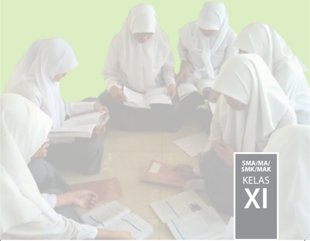

> **Deskripsi Visual:** Gambar ini menunjukkan kelompok siswa SMA/MA/SMK/MAK Kelas XI sedang belajar bersama-sama. Siswa-siswa tersebut semua mengenakan hijab putih dan tengah berada di lantai dengan kursi dan meja kecil. Mereka sedang membaca buku pelajaran dan menggunakan laptop untuk mendukung proses belajar mereka. Gambar ini menunjukkan hubungan antara siswa-siswa dalam sebuah kelas, di mana mereka bekerja sama dan saling membantu dalam proses belajar. Teks "SMA/MA/SMK/MAK KELAS XI" terletak di sisi kanan atas gambar, menunjukkan bahwa gambar ini mungkin merupakan bagian dari buku pelajaran atau materi belajar untuk kelas XI di sekolah-sekolah tertentu.

 

---
## 📄 Halaman 2

### Hak Cipta © 2017 pada Kementerian Pendidikan dan Kebudayaan Dilindungi Undang-Undang

Disklaimer: Buku ini merupakan buku guru yang dipersiapkan Pemerintah dalam rangka implementasi Kurikulum 2013. Buku guru ini disusun dan ditelaah oleh berbagai pihak di bawah koordinasi Kementerian Pendidikan dan Kebudayaan, dan dipergunakan dalam tahap awal penerapan Kurikulum 2013. Buku ini merupakan 'dokumen hidup' yang senantiasa diperbaiki,  diperbaharui,  dan  dimutakhirkan  sesuai  dengan  dinamika  kebutuhan  dan perubahan zaman. Masukan dari berbagai kalangan yang dialamatkan kepada penulis dan laman http://buku.kemdikbud.go.id atau melalui email buku@kemdikbud.go.id diharapkan dapat meningkatkan kualitas buku ini.

### Katalog Dalam Terbitan (KDT)

Indonesia. Kementerian Pendidikan dan Kebudayaan.

Pendidikan Agama Islam dan Budi Pekerti : Buku Guru / Kementerian dan Kebudayaan.-- Jakarta : Kementerian Pendidikan dan Kebudayaan, 2017.

Pendidikan

viii, 192 hlm. : ilus, ; 25 cm.

Untuk SMA/MA/SMK/MAK Kelas XI ISBN 978-602-427-046-9 (jilid lengkap)

ISBN 978-602-427-048-3 (jilid 2)

- Islam -- Studi Pengajaran
- Kementerian Pendidikan dan Kebudayaan
I. Judul

297.07

Penulis

:   Mustakim dan Mustahdi.

Penelaah

:   Asep Nursobah dan Ismail.

Pereview :

Evi Zahara.

Penyelia Penerbitan

:   Pusat Kurikulum Perbukuan, Balitbang, Kem en dikbud.

Cetakan Ke-1, 2014 ISBN 978-602-282-407-7 (jilid 2) Cetakan Ke-2, 2017 (Edisi Revisi) Disusun dengan huruf Times New Roman, 11 pt.

 

---
## 📄 Halaman 3

### Kata Pengantar

Segala  puji  bagi Allah  Swt.  Tuhan  seru  sekalian  alam.  Selawat  serta salam semoga  tercurah kepada junjungan kita baginda Nabi besar Muhammad saw, serta para keluarganya, para sahabatnya, para pengikut setianya sampai akhir zaman, Amin.

Dengan kehendak dan kuasa Allah Swt.,penulis dapat menyelesaikan buku  guru  Pendidikan Agama  Islam  (PAI)  Budi  Pekerti  untuk  kelas  XI SMA/MA/SMK/MAK. Buku guru PAI dan Budi Pekerti ini merupakan salah  satu  pedoman  dan  panduan  guru  dalam  melaksanakan  kegiatan pembelajaran dan pelaksanaan penilaian terhadap peserta didik di sekolah.

Sebagaimana diamanatkan pada pasal 3 UU No. 20 tahun 2003 tentang Sistem Pendidikan Nasional bahwa tujuan pendidikan Nasional adalah ' Berkembangnya potensi peserta didik agar menjadi manusia yang beriman dan  bertaqwa  kepada  Tuhan  Yang  Maha  Esa,  berakhlak  mulia,  sehat, berilmu,  cakap,  kreatif,  mandiri,  dan  menjadi  warga  yang  demokratis dan bertanggung jawab', maka buku ini diharapkan menjadi media untuk terwujudnya harapan tersebut.

Buku  ini  merupakan  penjabaran  dari  Standar  Isi  dan  Standar  Proses kurikulum 2013 yang menitikberatkan pada aspek sikap spiritual (Kompetensi Inti 1) dan sikap sosial ( Kompetensi Inti 2). Namun demikian, agar KI 1 dan KI 2 dapat terimplementasi dengan benar, dijabarkan pula aspek pengetahuan dan ketrampilan yang disampaikan dengan pendekatan saintiik agar peserta didik aktif mencari dan menemukan informasi sendiri.

Diawali  dengan  tema:  'Membuka  Relung  Kalbu'  dan  'Mengkririsi Sekitar Kita' di dalam buku siswa diharapkan buku ini mampu menggugah kepekaan peserta didik terhadap isu-isu aktual, kemudian dapat menyelesaikan masalah-masalah tersebut dengan baik denagn bimbingan guru PAI melalui buku guru ini.

 

---
## 📄 Halaman 4

Memang, dalam buku ini tidak semua langkah dan strategi pembelajaran dijabarkan secara luas, hal ini sengaja dilakukan agar para guru PAI dan Budi Pekerti mau menacari informasi lain dan berkreasi untuk mengembangkan kegiatan pembelajaran yang lebih dinamis sesuai dengan potensi anak dan sekolah masing-masing.

Setelah selesai sub pokok bahasan di dalam buku siswa, peserta didik diminta untuk mengerjakan tugas dalam bentuk 'Aktivitas Siswa'. Hal ini sesuai dengan prinsip pengembangan kurikulum 2013, bahwa peserta didik harus mencari informasi, bukan dijejali informasi. Sementara di setiap akhir bab ditambah dengan ' Menerapkan Perilaku Mulia ', ini dimaksudkan agar  nilai-nilai  ajaran  Islam  secara  kongkrit  bisa  diwujudkan  dengan tindakan nyata dalam kehidupan sehari-hari. Tentu semangat tersebut  akan mengalami banyak kendala tanpa peran dan bimbingan guru di kelas, oleh karena itu buku guru ini akan memberikan panduan kegiatan pembelajaran dan penilaian secara global agar peserta didik dapat memanfaatkan  buku siswa dengan tepat melalui bimbingan guru PAI di sekolah.

Sudah barang tentu dalam penyusunan buku ini masih banyak kekurangan dan  kekhilafan,  oleh  karena  itu  penulis  dengan  sangat  ikhlas  menerima kritik  dan  saran  dari  seluruh  pembaca,  demi  kesempurnaan  penyusunan buku ini pada saat yang akan datang.

Akhirnya, penulis berharap semoga buku PAI dan Budi Pekerti kelas 11  SMA/MA/SMK/MAK dapat bermanfaat bagi peserta didik kelas 11, dan  semoga  menjadi  wasilah  untuk  terwujudnya  manusia  muslim  yang sempurna.  Semoga Allah  Swt.,  senantiasa  memberikan  tauik  dan  hidayah kepada kita sekalian. Amin.

Penulis

 

---
## 📄 Halaman 5

### Daftar isi

v

 

---
## 📄 Halaman 9

### PENDAHULUAN

Kurikulum 2013  telah dilaksanakan di beberapa sekolah sasaran dan disosialisasikan di berbagai sekolah lainnya di Indonesia. Kurikulum ini pada hakekatnya  dirancang    untuk  menyempurnakan  kurikulum  sebelumnya dengan pendekatan belajar aktif berdasarkan nilai-nilai agama dan budaya bangsa. Berkaitan dengan hal ini, Pemerintah telah melakukan penyesuaian beberapa nama matapelajaran, antara lain, adalah mata pelajaran Pendidikan Agama Islam menjadi Pendidikan Agama Islam dan Budi Pekerti.

Secara khusus, dalam upaya penyempurnaan kurikulum 2013 disusunlah kompetensi  inti    (Standar  Kompetensi  pada  kurikulum  sebelumnya). Kompetensi  inti  adalah  tingkat  kemampuan  untuk  mencapai  standar kompetensi lulusan yang harus dimiliki seorang peserta didik pada setiap kelas atau program (PP No. 32/2013).

Kompetensi inti memuat kompetensi sikap spiritual, sikap sosial ( afektif ), pengetahuan ( kognitif ), dan keterampilan ( psikomotorik )  yang dikembangkan ke dalam kompetensi dasar. Perubahan perilaku dalam pengamalan ajaran agama dan budi pekerti menjadi perhatian utama.

Tujuan penyusunan buku ini adalah untuk memberikan panduan bagi guru  pendidikan  agama  Islam  dan  budi  pekerti  dalam  merencanakan, melaksanakan,dan  melakukan  penilaian  terhadap  proses  pembelajaran pendidikan agama Islam dan budi pekerti.

Dalam buku ini terdapat lima hal penting yang perlu mendapat perhatian khusus,  yaitu:  proses  pembelajaran,  penilaian,  pengayaan,  remedial,  dan interaksi antara guru dan orang tua peserta didik.

Dengan demikian tujuan pembelajaran dapat tercapai secara optimal dan selaras dengan tujuan pendidikan nasional yaitu mengembangkan potensi peserta  didik  agar  menjadi  manusia  yang  beriman  dan  bertakwa  kepada Tuhan  Yang  Maha  Esa,  berakhlak  mulia,  sehat,  berilmu,  cakap,  kreatif, mandiri, dan menjadi warga yang demokratis serta bertanggung jawab.

1

 

---
## 📄 Halaman 10

### PETUNJUK PENGGUNAAN BUKU

Untuk mengoptimalkan penggunaan buku ini, tahapan berikut sangatlah penting untuk diperhatikan oleh guru.

- Bacalah bagian pendahuluan untuk memahami konsep utuh Pendidikan Agama Islam dan Budi Pekerti, serta memahami kompetensi inti dan kompetensi dasar dalam kerangka Kurikulum 2013.
- Setiap pelajaran berisi kompetensi  inti, kompetensi  dasar, tujuan pembelajaran,  proses  pembelajaran,  penilaian,  pengayaan,  remedial, interaksi guru dengan orang tua.
- Pada sub pelajaran tertentu penomoran kompetensi inti dan kompetensi dasar tidak berurutan pada sub pembelajaran tertentu. Hal itu menyesuaikan dengan tahap pencapaian kompetensi dasar.
- Guru  perlu  mendorong  peserta  didik  untuk  memperhatikan kolom-kolom yang terdapat  dalam buku teks pelajaran sebagai berikut:
- Membuka hazanah peserta didik , yaitu peserta didik diberikan informasi/materi/konsep  untuk  menambah  wawasan  keilmuan mereka sebagai acuan untuk melakukan perubahan sikap yang lebih baik.
- Menerapkan perilaku , yaitu peserta didik menerapkan perilaku positif sebagai implementasi dari pemahaman terhadap materi yang telah dipelajari.
- Mengkritisi sekitar kita , yaitu memotivasi peserta didik untuk mengerahkan seluruh kemampuan berikir dengan melakukan pengamatan,  bertanya,  memberi  komentar  menelaah  buku  teks dikaitkan  dengan  situasi  kondisi    yang  terjadi  di  masyarakat  dan negaranya.
- Membuka  relung  Hati ,  yaitu  menyentuh  hati  dan  perasaan  peserta didik      agar  dapat  melakukan  perenungan  dan  penghayatan mendalam (pada dirinya) sehingga melahirkan motivasi belajar dan berperilaku positif.
- Evaluasi ,  yaitu  peserta  didik  diberikan  penguatan  pemahaman dengan berlatih mengerjakan soal-soal untuk mengukur kemampuan pengetahuan, sikap dan keterampilan peserta didik.
2

 

---
## 📄 Halaman 11

- Berdasarkan Permendikbud Nomer 104 Tahun 2014 tentang penilaian, penilaian hasil belajar oleh pendidik untuk kompetensi sikap, kompetensi pengetahuan dan kompetensi keterampilan menggunakan skala penilaian:
- untuk kompetensi sikap menggunakan rentang predikat Sangat Baik (SB), Baik (B), Cukup (C) dan Kurang (K); dan
- untuk kompetensi pengetahuan dan kompetensi keterampilan menggunakan rentang angka 4,00 (A) - 1,00 (D).

### 6. Skor dan Nilai

Penilaian  kompetensi  hasil  belajar  mencakup  kompetensi  sikap, pengetahuan dan keterampilan yang dilakukan secara terpisah. Penilaian dapat  juga  dilakukan  melalui  suatu  kegiatan  atau  peristiwa  penilaian dengan instrumen penilaian yang sama.

Untuk masing-masing ranah (sikap, pengetahuan, dan keterampilan) digunakan penyekoran dan pemberian predikat yang berbeda sebagaimana tercantum dalam tabel berikut:

---
**📊 Tabel**

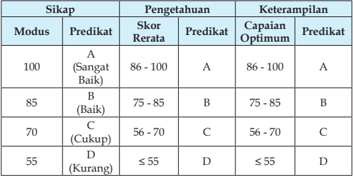

Tabel ini menunjukkan skor rerata, predikat, dan keterampilan berdasarkan modus (sangat baik, baik, cukup, kurang) dalam sebuah ujian atau tes. Topik utama tabel adalah evaluasi kinerja siswa dalam hal pengetahuan dan keterampilan. Kolom-kolomnya meliputi modus, predikat, skor rerata, predikat, dan keterampilan optimal. Data penting yang terlihat adalah bahwa skor rerata berkisar antara 55 hingga 100, dengan predikat A untuk skor rerata di atas 86, B untuk skor 75-85, C untuk skor 56-70, dan D untuk skor di bawah 55. Selain itu, tabel juga menunjukkan bahwa predikat keterampilan optimal sesuai dengan modus, yaitu A untuk sangat baik, B untuk baik, C untuk cukup, dan D untuk kurang.

Nilai akhir yang diperoleh untuk ranah sikap diambil dari nilai modus (nilai yang terbanyak muncul) dan nilai akhir untuk ranah pengetahuan diambil dari nilai rerata. Nilai akhir untuk ranah keterampilan diambil dari nilai optimal (nilai tertinggi yang dicapai).

3

 

---
## 📄 Halaman 12

Guru perlu membaca, memahami dan mengembangkan pesan kunci yang  tertulis  pada  regulasi  terkini  seperti  PP  No.  32  tahun  2013  dan Permendikbud terkait Kurikulum 2013. Dalam pelaksanaannya, sangat mungkin dilakukan  pengembangan  yang  disesuaikan  dengan  potensi peserta didik, guru, sumber belajar dan lingkungan.

4

 

---
## 📄 Halaman 13

### KOMPETENSI INTI DAN KOMPETENSI DASAR PAI DAN BUDI PEKERTI SMA KELAS XI

---
**📊 Tabel**

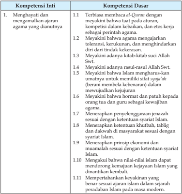

Tabel ini berisi informasi tentang kompetensi inti dan dasar dalam konteks ajaran agama Islam. Topik utamanya adalah menghormati dan memahami prinsip-prinsip agama Islam, termasuk kepercayaan pada Al-Qur'an, toleransi terhadap berbagai kelompok sosial, dan pengertian tentang keharusan dan kejujuran dalam kehidupan. Kolom-kolomnya mencakup berbagai aspek seperti keberadaan Al-Qur'an, prinsip-prinsip agama, dan etika dalam kehidupan sehari-hari. Data penting yang terlihat adalah bahwa setiap kompetensi inti memiliki satu atau lebih kompetensi dasar yang mendukungnya, menunjukkan hubungan yang kuat antara prinsip-prinsip agama dan praktik sehari-hari dalam masyarakat Islam.

5

 

---
## 📄 Halaman 14

---
**📊 Tabel**

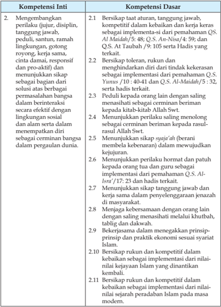

Tabel ini berisi informasi tentang kompetensi inti dan dasar yang harus dipenuhi oleh individu dalam konteks kehidupan sehari-hari. Topik utamanya adalah pengembangan perilaku yang baik, seperti taat aturan, tanggung jawab, dan kompetitif. Kolom-kolomnya mencakup dua bagian utama: Kompetensi Inti dan Kompetensi Dasar. Kompetensi Inti meliputi 2.1 hingga 2.9, sementara Kompetensi Dasar mencakup 2.10 dan 2.11. Data penting yang terlihat adalah bahwa setiap kompetensi memiliki beberapa poin yang harus dipenuhi, menunjukkan bahwa pembelajaran dan praktik diharapkan untuk mencapai tingkat kompetensi yang diinginkan.

 

---
## 📄 Halaman 15

---
**📊 Tabel**

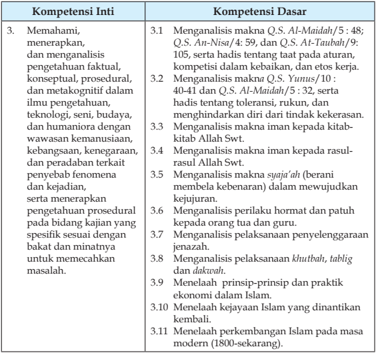

Tabel ini berisi informasi tentang kompetensi inti dan dasar yang harus dipenuhi oleh siswa dalam konteks pemahaman, analisis, dan pengetahuan tentang islam. Topik utama tabel adalah pembelajaran tentang islam, termasuk pemahaman konsep, analisis teks Al-Quran, dan praktik keagamaan. Kolom-kolomnya mencakup berbagai aspek seperti pemahaman konsep, analisis teks Al-Quran, dan praktik keagamaan. Data penting yang terlihat adalah bahwa tabel ini mencakup berbagai aspek pemahaman dan analisis tentang islam, mulai dari pemahaman konsep hingga praktik keagamaan. Ini menunjukkan bahwa pembelajaran tentang islam melibatkan pemahaman konsep, analisis teks Al-Quran, dan praktik keagamaan.

 

---
## 📄 Halaman 16

---
**📊 Tabel**

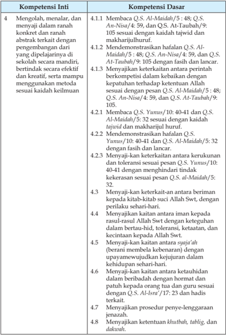

Tabel ini berisi informasi tentang kompetensi inti dan dasar yang harus dipenuhi oleh siswa dalam mempelajari Al-Qur'an. Topik utamanya adalah tentang keterampilan membaca, memahami, dan menjelaskan ayat-ayat Al-Qur'an dengan baik. Kolom-kolomnya mencakup 4 kompetensi inti yang meliputi: mengolah, menalar, dan menyajikan; demonstrasi fahaman; menunjukkan keterkaitan antara peribahasa; dan menjelaskan keterkaitan antara berbagai ayat. Setiap kompetensi ini diuraikan lebih lanjut dengan detail dalam kolom berikutnya, yang mencakup berbagai ayat Al-Qur'an yang harus dipelajari dan dimengerti. Pola penting yang terlihat adalah bahwa setiap kompetensi inti memiliki beberapa ayat Al-Qur'an yang harus dipelajari, menunjukkan bahwa pembelajaran ini melibatkan pemahaman dan penggunaan ayat-ayat Al-Qur'an secara kritis dan efektif.

 

---
## 📄 Halaman 17

---
**📊 Tabel**

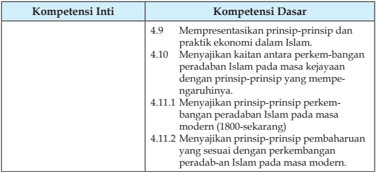

Tabel ini berisi informasi tentang kompetensi inti dan dasar dalam bidang ekonomi Islam. Topik utamanya adalah tentang kaitan antara prinsip-prinsip peradaban Islam dengan praktik ekonomi di masa kejayaan dan modern. Kolom-kolomnya mencakup prinsip-prinsip yang dianjurkan dalam Islam, kaitannya dengan prinsip-prinsip peradaban Islam, dan prinsip-prinsip yang dianjurkan untuk masa modern. Data penting yang terlihat adalah bahwa prinsip-prinsip tersebut harus sesuai dengan perkembangan peradaban Islam di masa modern.

9

 

---
## 📄 Halaman 18

### PEMETAAN KOMPETENSI DASAR

---
**📊 Tabel**

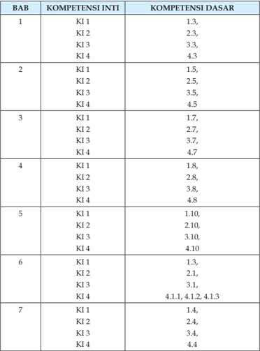

Tabel ini menunjukkan hubungan antara Kompetensi Inti (KI) dan Kompetensi Dasar (KD) dalam beberapa bab (BAB) dari sebuah buku pelajaran. Topik utama tabel adalah hubungan antara kompetensi inti dengan dasar dalam berbagai bab. Kolom pertama menunjukkan nomor bab, sementara kolom kedua dan ketiga masing-masing menunjukkan KI dan KD. Data penting yang terlihat adalah bahwa setiap KI memiliki satu atau lebih KD yang berkaitan, dan beberapa KI memiliki lebih dari satu KD yang berbeda. Misalnya, KI 1 dalam BAB 1 memiliki KD 1.3, 2.3, 3.3, dan 4.3, menunjukkan bahwa KI 1 sangat berkaitan dengan KD tersebut.

 

---
## 📄 Halaman 19

---
**📊 Tabel**

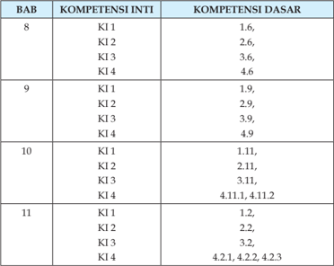

Tabel ini menunjukkan keterkaitan antara Kompetensi Inti (KI) dan Kompetensi Dasar (KD) dalam beberapa bab (BAB) dari sebuah buku pelajaran. Topik utama tabel adalah hubungan antara kompetensi inti dan dasar dalam pembelajaran. Kolom pertama menunjukkan nomor bab, sedangkan kolom kedua dan ketiga masing-masing berisi nama KI dan KD. Data yang penting yang terlihat adalah bahwa setiap KI memiliki satu atau lebih KD yang berkaitan dengannya, dan jumlah KD untuk setiap KI bervariasi. Misalnya, KI 1 dalam BAB 8 memiliki KD 1.6, 2.6, 3.6, dan 4.6, sementara KI 2 dalam BAB 9 memiliki KD 1.9, 2.9, 3.9, dan 4.9. Ini menunjukkan bahwa setiap KI memiliki berbagai KD yang relevan, yang dapat membantu dalam memahami dan menguasai konsep tersebut.

 

---
## 📄 Halaman 20

### A.  Kurikulum 2013

Pendidikan nasional kita masih menghadapi berbagai macam persoalan.  Persoalan  itu  tidak  akan  pernah  selesai,  karena  substansi  yang ditransformasikan selama proses pendidikan dan pembelajaran selalu berada di  bawah  tekanan  kemajuan  ilmu  pengetahuan,  teknologi,  dan  kemajuan masyarakat. Salah satu persoalan pendidikan yang masih menonjol saat ini adalah adanya kurikulum yang silih berganti dan terlalu membebani anak tanpa ada arahan untuk pengembangan yang betul-betul diimplementasikan sesuai dengan perubahan yang diinginkan pada kurikulum tersebut.

Perubahan kurikulum selalu mengarah kepada perbaikan sistem pendidikan. Perubahan tersebut dilakukan karena dianggap belum sesuai dengan harapan yang diinginkan sehingga perlu adanya revitalisasi kurikulum.  Usaha  tersebut  dilakukan  untuk  menciptakan  generasi  masa depan yang religius memahami jati diri bangsanya, menciptakan anak yang unggul, dan mampu bersaing di dunia internasional.

Berkaitan  dengan  perubahan  kurikulum,  berbagai  pihak  menganalisis dan melihat perlunya diterapkan kurikulum berbasis kompetensi sekaligus berbasis  karakter  ( competency  and  character  besed  curriculum ),  yang  dapat membekali  peserta  didik  dengan  berbagai  sikap  dan  kemampuan  yang sesuai dengan tuntutan perkembangan zaman dan teknologi. Oleh karena itu,  perlu  adanya  pengembangan  Kurikulum  2013,  untuk  menghadapi berbagai masalah dan tantangan masa depan yang semakin lama semakin rumit dan kompleks.

Melalui pengembangan kurikulum 2013 yang berbasis kompetensi  dan karakter,  diharapkan  bangsa  ini  menjadi  bangsa  yang  bermartabat  dan masyarakatnya memiliki nilai tambah dan nilai jual yang dapat ditawarkan kepada orang lain dan bangsa lain di dunia. Dengan demikian, kita dapat bersaing, bersanding, bahkan bertanding dengan bangsa-bangsa lain dalam percaturan global.

### Bagian Satu Petunjuk Umum

 

---
## 📄 Halaman 21

Dalam usaha mewujudkan implementasi kurikulum 2013, maka guru dituntut secara professional merancang pembelajaran efektif dan bermakna, mengorganisasikan pembelajaran, memilih pendekatan pembelajaran yang tepat, menentukan prosedur pembelajaran dan pembentukkan kompetensi secara  efektif,  serta  menetapkan  kriteria  keberhasilan  yang  semuanya tertuang dalam perangkat-perangkat pembelajaran.

### 1. Karakteristik Kurikulum 2013

Kurikulum 2013 dirancang dengan karakteristik sebagai berikut :

- Mengembangkan  keseimbangan  antara  sikap  spiritual  dan  sosial, pengetahuan, dan keterampilan, serta menerapkannya dalam berbagai situasi di sekolah dan masyarakat;
- Menempatkan sekolah sebagai bagian dari masyarakat yang memberikan pengalaman belajar agar peserta didik  mampu menerapkan  apa  yang  dipelajari  di  sekolah  ke  masyarakat  dan memanfaatkan masyarakat sebagai sumber belajar;
- Memberi waktu yang cukup leluasa untuk mengembangkan berbagai sikap, pengetahuan, dan keterampilan;
- Mengembangkan kompetensi yang dinyatakan dalam bentuk Kompetensi Inti  kelas  yang  dirinci  lebih  lanjut  dalam  kompetensi dasar mata pelajaran;
- Mengembangkan Kompetensi Inti kelas menjadi unsur pengorganisasi ( organizing elements )  Kompetensi  Dasar.  Semua Kompetensi Dasar dan proses pembelajaran dikembangkan untuk mencapai kompetensi yang dinyatakan dalam Kompetensi Inti;
- Mengembangkan  Kompetensi  Dasar  berdasarkan  pada  prinsip akumulatif, saling memperkuat ( reinforced ) dan memperkaya ( enriched )  antar-mata  pelajaran  dan  jenjang  pendidikan  (organisasi horizontal dan vertikal).
Kurikulum 2013 dikembangkan dengan landasan ilosois yang memberikan dasar bagi pengembangan seluruh potensi peserta didik menjadi manusia  Indonesia  berkualitas  yang  tercantum  dalam  tujuan  pendidikan nasional.

 

---
## 📄 Halaman 22

### 2. Kompetensi Inti (KI)

Berdasarkan PP No. 32 Tahun 2013, kompetensi inti merupakan tingkat kemampuan  untuk  mencapai  Standar  Kompetensi  Lulusan  yang  harus dimiliki seorang peserta didik pada setiap tingkat kelas atau program yang menjadi landasan pengembangan kompetensi dasar.

Kompetensi inti yang dimaksud mencakup, sikap spiritual, sikap sosial, pengetahuan,  dan  keterampilan  yang  berfungsi sebagai pengintegrasi muatan pembelajaran, mata pelajaran atau program dalam mencapai Standar Kompetensi Lulusan.

Kompetensi  Inti  merupakan  terjemahan  atau  operasionalisasi  SKL dalam bentuk kualitas yang harus dimiliki mereka yang telah menyelesaikan pendidikan  pada  satuan  pendidikan  tertentu  atau  jenjang  pendidikan tertentu.  Kompetensi  Inti  harus  menggambarkan  kualitas  yang  seimbang antara pencapaian hard skills dan soft skills .

Kompetensi  inti  berfungsi  sebagai  unsur  pengorganisasi  ( organising element )  kompetensi  dasar.  Sebagai  unsur  pengorganisasi,  kompetensi  inti merupakan  pengikat  untuk  organisasi  vertikal  dan  organisasi  horizontal kompetensi dasar. Organisasi vertikal kompetensi dasar adalah keterkaitan antara konten kompetensi dasar satu kelas atau jenjang pendidikan ke kelas/ jenjang  di  atasnya  sehingga  memenuhi  prinsip  belajar  yaitu  terjadi  suatu akumulasi  yang  berkesinambungan  antara  konten  yang  dipelajari  peserta didik.  Organisasi  horizontal  adalah  keterkaitan  antara  konten  kompetensi dasar  satu  mata  pelajaran  dengan  konten  kompetensi  dasar  dari  mata pelajaran  yang  berbeda  dalam  satu  pertemuan  mingguan  dan  kelas  yang sama sehingga terjadi proses saling memperkuat.

Kompetensi inti yang terdiri dari empat kelompok yang saling terkait yaitu berkenaan dengan sikap keagamaan (kompetensi inti 1), sikap sosial (kompetensi  inti  2),  pengetahuan  (kompetensi  inti  3),  dan  penerapan pengetahuan (kompetensi inti 4) menjadi acuan dari kompetensi dasar dan harus dikembangkan dalam setiap peristiwa pembelajaran secara integratif.

 

---
## 📄 Halaman 23

### 3. Kompetensi Dasar  (KD)

Kompetensi  Dasar  merupakan  kompetensi  setiap  mata  pelajaran untuk setiap kelas yang diturunkan dari kompetensi inti. Kompetensi dasar adalah konten atau kompetensi yang terdiri atas sikap, pengetahuan, dan ketrampilan  yang  bersumber  pada  kompetensi  inti  yang  harus  dikuasai peserta didik. Kompetensi tersebut dikembangkan dengan memperhatikan karakteristik  peserta  didik,  kemampuan  awal,  serta  ciri  dari  suatu  mata pelajaran.

Mata pelajaran sebagai sumber dari konten untuk menguasai kompetensi bersifat terbuka dan tidak selalu diorganisasikan berdasarkan disiplin ilmu yang  sangat  berorientasi  hanya  pada  ilosoi esensialisme dan perenialisme . Mata pelajaran dapat dijadikan organisasi konten yang dikembangkan dari berbagai disiplin ilmu atau nondisiplin ilmu yang diperbolehkan menurut ilosoi rekonstruksi sosial, progresif ataupun humanisme.

### 4. Kaitan antara KI, KD dan Pembelajaran

Kompetensi  Inti  merupakan  terjemahan  atau  operasionalisasi  SKL dalam bentuk kualitas yang harus dimiliki mereka yang telah menyelesaikan pendidikan  pada  satuan  pendidikan  tertentu  atau  jenjang  pendidikan tertentu,  gambaran  mengenai  kompetensi  utama  yang  dikelompokkan  ke dalam  aspek  sikap,  pengetahuan,  dan  keterampilan  (afektif,  kognitif,  dan psikomotor) yang harus dipelajari peserta didik untuk suatu jenjang sekolah, kelas dan mata pelajaran. Kompetensi Inti harus menggambarkan kualitas yang seimbang antara pencapaian hard skills dan soft skills .

Kompetensi  Inti  berfungsi  sebagai  unsur  pengorganisasi  ( organising element )  kompetensi dasar. Sebagai unsur pengorganisasi, Kompetensi Inti merupakan  pengikat  untuk  organisasi  vertikal  dan  organisasi  horizontal Kompetensi Dasar. Organisasi vertikal Kompetensi Dasar adalah keterkaitan antara  konten  Kompetensi  Dasar  satu  kelas  atau  jenjang  pendidikan  ke kelas/jenjang  di  atasnya  sehingga  memenuhi  prinsip  belajar  yaitu  terjadi suatu  akumulasi  yang  berkesinambungan  antara  konten  yang  dipelajari siswa. Organisasi horizontal adalah keterkaitan antara konten Kompetensi Dasar  satu  mata  pelajaran  dengan  konten  Kompetensi  Dasar  dari  mata pelajaran  yang  berbeda  dalam  satu  pertemuan  mingguan  dan  kelas  yang sama sehingga terjadi proses saling memperkuat.

 

---
## 📄 Halaman 24

### B. Karakteristik Mata Pelajaran Pendidikan Agama Islam dan Budi Pekerti

### 1. Hakikat Mata Pelajaran PAI dan Budi Pekerti

Pendidikan nasional yang berdasarkan Pancasila dan Undang-Undang Dasar Negara Republik Indonesia Tahun 1945 berfungsi mengembangkan kemampuan dan membentuk watak serta peradaban bangsa yang bermartabat  dalam  rangka  mencerdaskan  kehidupan  bangsa,  bertujuan untuk mengembangkan potensi peserta didik agar menjadi manusia yang beriman dan bertakwa kepada Tuhan Yang Maha Esa, berakhlak mulia, sehat, berilmu, cakap, kreatif, mandiri, dan menjadi warga negara yang demokratis serta  bertanggung  jawab.  Dalam  mengemban  fungsi  tersebut  pemerintah menyelenggarakan suatu sistem pendidikan nasional sebagaimana tercantum dalam Undang-Undang Nomor 20 Tahun 2003 tentang Sistem Pendidikan Nasional.

Agama Islam memiliki peran yang amat penting dalam kehidupan umat manusia. Agama Islam menjadi pemandu dalam upaya mewujudkan suatu kehidupan yang bermakna, damai dan bermartabat. Betapa pentingnya peran Agama Islam bagi kehidupan umat manusia, Oleh karena itu, internalisasi nilai-nilai  Agama Islam dalam kehidupan setiap individu menjadi sebuah keniscayaan,  yang  harus  ditempuh  melalui  pendidikan  baik  pendidikan dalam lingkungan keluarga, sekolah maupun masyarakat.

Pendidikan Agama Islam-sebagaimana yang diamanatkan oleh UUD 45  dan  Sisdiknas  No.  20  tahun  2003-dimaksudkan  untuk  peningkatan potensi  spiritual  dan  membentuk  peserta  didik  agar  menjadi  manusia yang beriman dan bertakwa kepada Tuhan Yang Maha Esa dan berakhlak mulia.  Akhlak  mulia  mencakup  etika,  budi  pekerti,  dan  moral  sebagai perwujudan  dari  pendidikan  Agama  Islam.  Peningkatan  potensi  spritual mencakup pengenalan, pemahaman, dan penanaman nilai-nilai keagamaan, serta pengamalan nilai-nilai tersebut dalam kehidupan individual ataupun kolektif  kemasyarakatan.  Peningkatan  potensi  spritual  tersebut  bertujuan untuk  mengoptimalisasi  berbagai  potensi  yang  dimiliki  manusia  yang aktualisasinya  mencerminkan  harkat  dan  martabatnya  sebagai  makhluk Allah Swt.

 

---
## 📄 Halaman 25

Pendidikan Agama Islam diberikan dengan mengikuti tuntunan bahwa agama diajarkan kepada manusia dengan visi untuk mewujudkan manusia yang  bertakwa  kepada  Allah  Swt.  dan  berakhlak  mulia,  serta  bertujuan untuk menghasilkan manusia yang jujur, adil, berbudi pekerti, etis, saling menghargai, disiplin, harmonis dan produktif, baik personal maupun sosial. Tuntutan visi ini mendorong untuk dikembangkannya standar kompetensi sesuai dengan jenjang persekolahan yang secara nasional ditandai dengan ciri-ciri:

- a Lebih menitikberatkan pencapaian kompetensi secara utuh selain harus menguasai  materi;
- Mengakomodasikan keragaman kebutuhan dan sumber daya pendidikan yang tersedia;
- Memberikan kebebasan yang lebih luas kepada pendidik di lapangan untuk  mengembangkan  strategi  dan  program  pembelajaran  sesuai dengan kebutuhan dan ketersedian sumber daya pendidikan.
Pendidikan Agama Islam diharapkan menghasilkan manusia yang selalu berupaya menyempurnakan iman, takwa, dan akhlak, serta aktif membangun peradaban  dan  keharmonisan  kehidupan,  khususnya  dalam  memajukan peradaban  bangsa  yang  bermartabat.  Manusia  seperti  itu  diharapkan tangguh  dalam  menghadapi  tantangan,  hambatan,  dan  perubahan  yang muncul  dalam pergaulan masyarakat baik dalam lingkup lokal, nasional, regional maupun global.

Pendidik  diharapkan  dapat  mengembangkan  metode  pembelajaran sesuai dengan kompetensi inti dan kompetensi dasar. Pencapaian seluruh kompetensi dasar perilaku terpuji dapat dilakukan secara beraturan. Peran semua unsur, baik sekolah, orang tua siswa dan masyarakat sangat penting dalam mendukung keberhasilan pencapaian tujuan Pendidikan Agama Islam

### 2. Fungsi dan Tujuan Mata Pelajaran PAI dan Budi Pekerti

### Tujuan Pendidikan Agama Islam

Pada  dasarnya  pendidikan  agama  Islam  bertujuan  mengembangkan kemampuan  peserta  didik  untuk  meningkatkan  iman  dan  takwa  kepada Allah Swt. dalam kehidupan sehari-hari. Tujuan pendidikan ini kemudian dirumuskan secara khusus dalam pendidikan agama Islam sebagai berikut;

 

---
## 📄 Halaman 26

- Menumbuhkembangkan  akidah  melalui  pemberian,  pemupukan,  dan pengembangan  pengetahuan,  penghayatan,  pengamalan,  pembiasaan, serta pengalaman peserta didik tentang Agama Islam sehingga menjadi muslim dan muslimah yang terus berkembang keimanan dan ketakwaannya kepada Allah Swt.;
- Mewujudkan  manusia  Indonesia  yang  taat  beragama  dan  berakhlak mulia  yaitu  manusia  yang  berpengetahuan,  rajin  beribadah,  cerdas, produktif, jujur, adil, etis, berdisiplin, bertoleransi (tasamuh), menjaga keharmonisan secara personal dan sosial serta mengembangkan budaya yang religius dalam komunitas sekolah.

### 3. Ruang Lingkup Mata Pelajaran PAI dan Budi Pekerti

Pendidikan Agama Islam yang terdiri atas 5 (enam) aspek, meliputi; AlQur'an, aqidah, akhlak, iqh, dan sejarah peradaban Islam .

### C.  Pembelajaran Pendidikan Agama Islam dan Budi Pekerti

### 1. Persyaratan Pelaksanaan Proses Pembelajaran

Kurikulum 2013 adalah penyempurnaan kurikulum berbasis kompetensi yang  telah  dirintis  sejak  tahun  2004  melalui  piloting  beberapa  sekolah, dan  secara  operasional  dikembangkan  sejak  tahun  2006.  Oleh  karena  itu, pembelajaran  kurikulum  2013  adalah  pembelajaran  kompetensi  dengan memperkuat  proses  pembelajaran  dan  penilaian  otentik  untuk  mencapai kompetensi  sikap,  pengetahuan  dan  keterampilan  dan  penguatan  proses pembelajaran  dilakukan  melalui  pendekatan  saintiik.

### Pendekatan Pembelajaran Saintiik

Pembelajaran  saintiik  merupakan  pembelajaran  yang  mengadopsi langkah-langkah  saintis  dalam  membangun  pengetahuan  melalui  metode ilmiah.Model pembelajaran yang diperlukan adalah terbudayakannya kecakapan berpikir sains, terkembangkannya ' sense of inquiry ' dan kemampuan berpikir kreatif siswa (Alfred De Vito: 1989).Model pembelajaran yang  dibutuhkan  adalah  yang  mampu  menghasilkan  kemampuan  untuk belajar (Joice & Weil: 1996), bukan saja diperolehnya sejumlah pengetahuan, keterampilan,  dan  sikap,  tetapi  yang  lebih  penting  adalah  bagaimana

 

---
## 📄 Halaman 27

pengetahuan,  keterampilan,  dan  sikap  itu  dimiliki  oleh  siswa  (Zamroni: 2000; Semiawan: 1998).

Pembelajaran  saintiik  tidak  hanya  memandang  hasil  belajar  sebagai muara akhir, namun proses pembelajaran dipandang sangat penting. Oleh karena  itu  pembelajaran  saintiik  menekankan  pada  keterampilan  proses. Model pembelajaran berbasis peningkatan keterampilan proses sains adalah  model  pembelajaran  yang  mengintegrasikan  keterampilan  proses sains ke dalam sistem penyajian materi secara terpadu (Beyer: 1991). Model ini  menekankan  pada  proses  pencarian  pengetahuan  dari  pada  transfer pengetahuan, siswa dipandang sebagai subjek belajar yang perlu dilibatkan secara aktif dalam proses pembelajaran, sedangkan guru hanyalah seorang fasilitator yang membimbing dan mengkoordinasikan kegiatan belajar siswa.

Model pembelajaran ini siswa diajak untuk melakukan proses pencarian pengetahuan berkenaan dengan materi pelajaran melalui berbagai aktivitas proses  sains  sebagaimana  dilakukan  oleh  para  ilmuwan  ( scientist )  dalam melakukan penyelidikan ilmiah (Nur: 1998). Siswa diarahkan untuk menemukan  sendiri  berbagai  fakta,  membangun  konsep,  dan  nilai-nilai baru  yang  diperlukan  untuk  kehidupannya.  Fokus  proses  pembelajaran diarahkan pada pengembangan keterampilan siswa dalam memproseskan pengetahuan, menemukan dan mengembangkan sendiri fakta, konsep, dan nilai-nilai yang diperlukan (Semiawan: 1992).

Model pembelajaran mencakup penemuan makna ( meanings ), organisasi, dan struktur dari ide atau gagasan, sehingga secara bertahap siswa belajar bagaimana  mengorganisasikan  dan  melakukan  penelitian.  Pembelajaran berbasis  keterampilan  proses  sains  menekankan  pada  kemampuan  siswa dalam  menemukan  sendiri  ( discover )  pengetahuan  yang  didasarkan  atas pengalaman belajar, hukum-hukum, prinsip-prinsip dan generalisasi, sehingga lebih memberikan kesempatan bagi berkembangnya keterampilan berpikir  tingkat  tinggi  (Houston:  1988).  Dengan  demikian  siswa  lebih diberdayakan  sebagai  subjek  belajar  yang  harus  berperan  aktif  dalam memburu informasi dari berbagai sumber belajar, dan guru lebih berperan sebagai organisator dan fasilitator pembelajaran.

Model  pembelajaran  berbasis  keterampilan  proses  sains  berpotensi membangun kompetensi dasar hidup siswa melalui pengembangan keterampilan proses sains, sikap ilmiah, dan proses konstruksi pengetahuan secara bertahap. Keterampilan proses sains pada hakikatnya adalah

 

---
## 📄 Halaman 28

kemampuan  dasar  untuk  belajar  ( basic  learning  tools )  yaitu  kemampuan yang  berfungsi  untuk  membentuk  landasan  pada  setiap  individu  dalam mengembangkan diri (Chain and Evans: 1990).

Pembelajaran Pendidikan Agama Islam dapat menerapkan karakteristik Pendidikan Agama Islam sebagai bagian dari natural science, pembelajaran isika harus mereleksikan kompetensi sikap ilmiah, berikir ilmiah, dan  keterampilan  kerja  ilmiah.  Kegiatan  pembelajaran  yang  dilakukan melalui proses mengamati, menanya, mencoba, mengasosiasi, dan mengomunikasikan.

- Kegiatan mengamati bertujuan agar pembelajaran berkaitan erat dengan konteks situasi nyata yang dihadapi dalam kehidupan sehari-hari. Proses mengamati fakta atau fenomena mencakup mencari informasi, melihat, mendengar, membaca, dan atau menyimak.
- Kegiatan  menanya  dilakukan  sebagai  salah  satu  proses  membangun pengetahuan  siswa  dalam  bentuk  konsep,  prisnsip,  prosedur,  hukum dan  terori,  sehingga  berpikir  metakognitif.  Tujuannnya  adalah  agar siswa memiliki kemapuan berpikir tingkat tinggi ( critical thingking skill ) secara  kritis,  logis,  dan  sistematis.  Proses  menanya  dilakukan  melalui kegiatan diksusi dan kerja kelompok serta diskusi kelas. Praktik diskusi kelompok  memberi  ruang  kebebasan  mengemukakan  ide/gagasan dengan bahasa sendiri, termasuk dengan menggunakan bahasa daerah.
- Kegiatan  mencoba  sangat  bermanfaat  untuk  meningkatkan  keingintahuan  siswa,  mengembangkan  kreatiitas,  dan  keterampilan  kerja  ilmiah. Kegiatan ini mencakup merencanakan, merancang, dan melaksanakan eksperimen, serta memperoleh, menyajikan, dan mengolah data. Pemanfaatan sumber belajar sangat disarankan dalam kegiatan ini.
- Kegiatan mengasosiasi bertujuan  untuk  membangun  kemampuan berpikir  dan  bersikap  ilmiah.  Kegiatan  dapat  dirancang  oleh  guru melalui situasi yang direkayasa dalam kegiatan tertentu, sehingga siswa melakukan  aktiitas  antara  lain  menganalisis  data,  mengelompokan, membuat  kategori,  menyimpulkan,  dan  memprediksi/mengestimasi dengan memanfaatkan lembar kerja diskusi atau praktik.
- Kegiatan mengomunikasikan adalah sarana untuk menyampaikan hasil konseptualisasi dalam bentuk lisan, tulisan,  gambar/sketsa, diagram, atau graik. Kegiatan ini dilakukan agar siswa mampu mengomunikasikan pengetahuan,  keterampilan,  dan  penerapannya,  serta  kreasi  siswa melalui presentasi,  membuat laporan, dan/ atau unjuk karya.

 

---
## 📄 Halaman 29

### 2. Pelaksanaan Pembelajaran

Pelaksanaan pembelajaran merupakan implementasi dari RPP, meliputi kegiatan pendahuluan, inti dan penutup.

### a. Kegiatan Pendahuluan

Dalam kegiatan pendahuluan, guru:

- Menyiapkan peserta didik secara psikis dan isik untuk mengikuti proses pembelajaran.
- Memberi motivasi belajar siswa secara kontekstual sesuai manfaat dan aplikasi materi ajar dalam kehidupan sehari-hari, dengan memberikan contoh dan perbandingan lokal, nasional dan internasional;
- Mengajukan  pertanyaan-pertanyaan  yang  mengaitkan  pengetahuan sebelumnya dengan materi yang akan dipelajari;
- Menjelaskan  tujuan  pembelajaran  atau  kompetensi  dasar  yang  akan dicapai;
- Menyampaikan cakupan materi dan penjelasan uraian kegiatan sesuai silabus.

### b. Kegiatan Inti

Kegiatan inti  menggunakan model, metode, dan media pembelajaran, serta  sumber  belajar  yang  disesuaikan  dengan  karakteristik  peserta  didik dan  mata  pelajaran.  Pemilihan  pendekatan  tematik  dan/atau  tematik terpadu  dan  atau  saintiik  dan  atau  inkuiri  dan  penyingkapan  ( discovery) dan atau pembelajaran yang menghasilkan karya berbasis pemecahan masalah (problem  based learning) disesuaikan  dengan  karakteristik  kompetensi  dan jenjang pendidikan.

### 1)   Sikap

Sesuai  dengan  karakteristik  sikap,  maka  salah  satu  alternatif  yang dipilih adalah proses afeksi mulai dari menerima, menjalankan, menghargai, menghayati, hingga mengamalkan. Seluruh aktivitas pembelajaran berorientasi  pada  tahapan  kompetensi  yang  mendorong  siswa  untuk melakuan aktivitas tersebut.

### 2)   Pengetahuan

Pengetahuan dimiliki melalui aktivitas mengetahui, memahami, menerapkan,  menganalisis,  mengevaluasi,  hingga  mencipta.  Karakteristik

 

---
## 📄 Halaman 30

sangat aktivititas belajar dalam domain pengetahuan ini memiliki perbedaan dan kesamaan  dengan  aktivitas  belajar  dalam  domain  keterampilan.  Untuk memperkuat pendekatan saintiik, tematik terpadu, dan tematik disarankan  untuk  menerapkan  belajar  berbasis  penyingkapan/penelitian ( discovery/inquiry  learning ).  Untuk  mendorong  peserta  didik  menghasilkan karya kreatif dan kontekstual, baik individual maupun kelompok, disarankan menggunakan pendekatan pembelajaran yang menghasilkan karya berbasis pemecahan masalah ( project based learning ).

### 3)   Keterampilan

Keterampilan diperoleh melalui  kegiatan  mengamati,  menanya,    mencoba, menalar, menyaji, dan mencipta. Seluruh isi materi (topik dan subtopik) mata pelajaran yang diturunkan dari keterampilan harus mendorong siswa untuk melakukan  proses  pengamatan  hingga  penciptaan.  Untuk  mewujudkan keterampilan  tersebut  perlu  melakukan  pembelajaran  yang  menerapkan modus belajar berbasis penyingkapan/penelitian (discovery/inquiry learning) dan pembelajaran yang menghasilkan karya berbasis pemecahan masalah (project based learning).

### c. Kegiatan Penutup

Dalam  kegiatan  penutup,  guru  bersama  siswa  baik  secara  individual maupun  kelompok  melakukan  releksi  untuk  mengevaluasi:

- Seluruh rangkaian aktivitas pembelajaran dan hasil-hasil yang diperoleh untuk selanjutnya  secara  bersama  menemukan  manfaat  langsung maupun tidak langsung dari hasil pembelajaran yang telah berlangsung;
- Memberikan umpan balik terhadap proses dan hasil pembelajaran;
- Melakukan kegiatan tindak lanjut dalam bentuk pemberian tugas, baik tugas individual  maupun kelompok;
- Menginformasikan  rencana  kegiatan  pembelajaran  untuk  pertemuan berikutnya.

### 3. Pengawasan Proses Pembelajaran

Pengawasan  adalah bagian keempat dari empat kegiatan proses pembelajaran. Proses pembelajaran diawali dengan perencanaan, pelaksanaan,  lalu  dengan  penilaian.  Bagian  akhirnya  adalah  pengawasan. Hal  itu  ditegaskan  oleh  PP  19/2005,  pasal  19,  ayat  (3),  'Setiap  satuan pendidikan  melakukan  perencanaan  proses  pembelajaran,  pelaksanaan

 

---
## 📄 Halaman 31

proses pembelajaran, penilaian hasil pembelajaran, dan pengawasan proses pembelajaran  untuk  terlaksananya  proses  pembelajaran  yang  efektif  dan eisien'

Perencanaan proses pembelajaran dilakukan oleh kepala satuan pendidikan bersama dengan pendidik. Perencanaan itu berbentuk silabus dan rencana pelaksanaan pembelajaran (RPP). Pada pasal 20,  PP  19/2005 ditegaskan, 'Perencanaan proses pembelajaran meliputi silabus dan rencana pelaksanaan pembelajaran yang memuat sekurang-kurangnya tujuan pembelajaran, materi ajar, metode pengajaran, sumber belajar, dan penilaian hasil belajar'.

Pelaksanaan proses pembelajaran dilakukan oleh pendidik berdasarkan perencanaan  proses  pembelajaran.  Wujud  nyatanya  adalah  peristiwa  di ruangan belajar dan pemberian tugas terstruktur dan tugas mandiri kepada peserta didik. Peristiwa di kelas  meliputi kegiatan awal, kegiatan inti, dan kegiatan  akhir.

Penilaian proses dan hasil belajar di tingkat satuan pendidikan dilakukan oleh  pendidik  dan  satuan  pendidikan.  Wujud  nyata  penilaian  itu  adalah ulangan harian, ulangan tengah semester, ulangan semester, dan ulangan kenaikan kelas.

Pengawasan dilakukan oleh kepala satuan pendidikan dan pengawas sekolah. Wujud dari pengawasan itu adalah pemantauan, supervisi, evaluasi, pelaporan, dan tindak lanjut.

Keempat  kegiatan  proses  pembelajaran  itu  merupakan  satu  kesatuan dengan penanggung jawab yang jelas.

Menurut PP 19/2005 tentang Standar Nasional Pendidikan, 'Evaluasi pendidikan  adalah  kegiatan  pengendalian,  penjaminan,  dan  penetapan mutu  pendidikan  terhadap  berbagai  komponen  pendidikan  pada  setiap jalur,  jenjang,  dan  jenis  pendidikan  sebagai  bentuk  pertanggungjawaban penyelenggaraan  pendidikan'.  Permendiknas  41/2007  tentang  Standar Proses menyatakan, 'Evaluasi proses pembelajaran dilakukan untuk menentukan  kualitas  pembelajaran  secara  keseluruhan,  mencakup  tahap perencanaan  proses  pembelajaran,  pelaksanaan  proses  pembelajaran,  dan penilaian hasil pembelajaran'

 

---
## 📄 Halaman 32

Evaluasi dilakukan terhadap perencanaan, pelaksanaan, dan penilaian proses  pembelajaran.  Kegiatan  evaluasi  berlangsung  setelah  pelaksanaan supervisi.  Jika  pemantauan  merupakan  gambaran  kondisi  awal,  supervisi adalah memperbaiki atau meningkatkan, dan evaluasi adalah menentukan kualitas.  Artinya  untuk  melihat  apakah  perencanaan,  pelaksnaan,  dan penilaian proses pembelajaran telah memenuhi standar kualitas atau belum. Dengan demikian evaluasi berada pada tataran untuk melihat hasil supervisi.

Evaluasi proses pembelajaran diselenggarakan dengan cara: (a) membandingkan  proses  pembelajaran  yang  dilaksanakan  guru  dengan standar  proses;  (b)  mengidentiikasi  kinerja  guru  dalam  proses  pembelajaran sesuai  dengan  kompetensi  guru  (Permendiknas  No.41/2007).    Proses pembelajaran  diatur  dengan  standar  proses.  Ketika  evaluasi  dilakukan, kegiatannya adalah membandingkan hal yang dilakukan guru dalam proses pembelajaran dengan yang diamanatkan oleh standar proses. Jika memenuhi harapan standar proses berarti kinerja guru telah memenuhi standar. Selain itu juga dibandingkan dengan kompetensi guru seperti yang diamanatkan oleh  Permendiknas No. 16/2007 tentang Kualiikasi dan Kompetensi Guru. Intinya adalah apakah guru telah memenuhi empat kompetensi (keribadian, pedagogis, profesional, dan sosial) dalam melaksanakan proses pembelajaran. Jika  sudah  memenuhi  itu  berarti  kompetensi  sudah  memadai,  jika  belum berarti perlu tindak lanjut.

Produk  akhir  dari  evaluasi  adalah  gambaran  keseluruhan  kinerja pendidik  dalam  proses  pembelajaran  (merencanakan,  melaksanakan,  dan menilai).  Dari  produk  itu  akan  terlihat    pendidik  yang  telah  memenuhi standar  proses  dan  kompetensi  dan  pendidik    yang  belum  memenuhi standar proses dan kompetensi. Pada satuan pendidikan yang administrasi ketenagaannya  tertata  baik,  biasanya  setiap  pendidik  memiliki  laporan kinerja tahunan atau sejenis rapor pendidik. Dengan demikian kepala satuan pendidikan,  pengawas  sekolah,  dan  pemangku  pendidikan  memiliki  peta yang jelas tentang kompetensi pendidik di sekolah itu.

Pelaporan hasil pengawasan merupakan bagian yang amat penting dari kegiatan pengawasan. Terlaksana tidaknya pengawasan satuan pendidikan teraktulisasi  dalam  laporan.  Kegiatan  kepengawasan  dilaksanakan  tetapi tidak ada laporan, dari kaca administrasi sama dengan tidak ada kegiatan. Selain itu, laporan adalah bentuk pertanggungjawaban pengelola pendidikan

 

---
## 📄 Halaman 33

tehadap  pemangku  kepentingan.  Hal  yang  tidak  dapat  diabaikan  adalah, menyusun dan menyampaikan laporan adalah kewajiban bagi setiap orang yang  diberi  kepercayaan  untuk  melakukan  kegiatan.  Oleh  karena  itu, pelaporan adalah bagian yang amat penting dari kegiatan kepengawasan.

Substansi    laporan  kepengawasan  adalah  hasil  pemantauan,    hasil supervisi, dan hasil evaluasi. Seperi dijelaskan sebelumnya, antara pemantauan, supervisi, dan evaluasi proses pembelajaran memiliki hubungan hierarkis,  hubungan  atas  bawah.  Selain  itu,  di  dalamnya  ada  data  atau informasi yang bermakna. Hal yang dilaporkan adalah data atau informasi yang telah diberi makna oleh pengawas atau kepala satuan pendidikan. Data dan informasi itu diharapkan dapat dijadikan landasan untuk mengambil keputuan  bagi  pengampu  pendidikan  atau  yang  berkepentingan  dengan pendidikan. Tentu saja, laporan ditata dalam bentuk sistematika yang sesuai dengan kaidah-kaidah laporan formal.

Bagian  akhir  akhir  dari  kegiatan  kepengawasan  adalah  tindak  lanjut. Tindak  lanjut  yang  dilakukan  meliputi  tiga  hal  yakni:  (a)  penguatan  dan penghargaan  diberikan  kepada  pendidik  yang  telah  memenuhi  standar; (b) teguran yang bersifat mendidik diberikan kepada pendidik yang belum memenuhi standar; dan (c)  pendidik diberi kesempatan untuk mengikuti pelatihan/penataran  lebih  lanjut.  Pada  hakikatnya,  tindak  lanjut  adalah kesinambungan dari kegiatan evaluasi.  Hasil evaluasi menginformasikan pendidik yang memenuhi standar dan pendidikan yang belum memenuhi standar. Jadi, batas kewenangan pengawas dan pengawasan proses pembelajaran tergambar pada kegiatan akhir ini yakni tindak lanjut.

### D.  Penilaian PAI dan Budi Pekerti dalam Kurikulum 2013

### 1. Penilaian Sikap

Penilaian  sikap  adalah  penilaian  terhadap  kecenderungan  perilaku peserta didik sebagai hasil pendidikan, baik di dalam kelas maupun di luar kelas. Penilaian sikap memiliki karakteristik yang berbeda dengan penilaian pengetahuan dan keterampilan, sehingga teknik penilaian yang digunakan juga  berbeda.  Dalam  hal  ini,  penilaian  sikap  ditujukan  untuk  mengetahui capaian dan membina perilaku serta budi pekerti peserta didik sesuai butir-

 

---
## 📄 Halaman 34

butir  sikap  dalam  Kompetensi  Dasar  (KD)  pada  Kompetensi  Inti  Sikap Spiritual (KI-1) dan Kompetensi Inti Sikap Sosial (KI-2).

Pada  mata  pelajaran  Pendidikan  Agama  dan  Budi  Pekerti,  dan  mata pelajaran PendidikanPancasila dan Kewarganegaraan (PPKn), KD pada KI-1 dan KD pada KI-2 disusun secara koheren dan linier dengan KD pada KI-3 dan KD pada KI-4. Sedangkan untuk mata pelajaran lain, KD pada KI-1 dan KD pada KI-2 dirumuskan secara umum dan terakumulasi menjadi satu KD pada KI-1 dan satu KD pada KI-2.

Penilaian sikap spiritual dan sikap sosial dilakukan secara berkelanjutan oleh pendidik mata pelajaran, guru Bimbingan Konseling (BK), dan wali kelas dengan menggunakan observasi dan informasi lain yang valid dan relevan dari  berbagai  sumber.  Penilaian  sikap  merupakan  bagian  dari  pembinaan dan penanaman/pembentukan sikap spiritual dan sikap sosial peserta didik yang menjadi tugas dari setiap pendidik. Penanaman sikap diintegrasikan pada setiap pembelajaran KD dari KI-3 dan KI-4.Selain itu, dapat dilakukan penilaian  diri  ( self  assessment )  dan  penilaian  antarteman  ( peer  assessment ) dalam  rangka  pembinaan  dan  pembentukan  karakter  peserta  didik,  yang hasilnya  dapat  dijadikan  sebagai  salah  satu  data  untuk  konirmasi  hasil penilaian  sikap  oleh  pendidik.  Hasil  penilaian  sikap  selama  periode  satu semester  ditulis  dalam  bentuk  deskripsi  yang  menggambarkan  perilaku peserta didik.

### a. Teknik Penilaian Sikap

Penilaian  sikap  dilakukan  oleh  guru  mata  pelajaran,  guru  Bimbingan Konseling (BK), dan wali kelas, melalui observasi yang dicatat dalam jurnal.

### 1)   Observasi

Observasi  dalam  penilaian  sikap  peserta  didik  merupakan  teknik yang  dilakukan  secara  berkesinambungan  melalui  pengamatan  perilaku. Asumsinya setiap peserta didik pada dasarnya berperilaku baik sehingga yang perlu dicatat hanya perilaku yang sangat baik (positif) atau kurang baik (negatif) yang berkaitan dengan indikator sikap spiritual dan sikap sosial. Catatan hal-hal positif dan menonjol digunakan untuk menguatkan perilaku positif, sedangkan perilaku negatif digunakan untuk pembinaan. Instrumen yang digunakan dalam observasi adalah lembar observasi atau jurnal. Hasil observasi dicatat dalam jurnal yang dibuat selama satu semester oleh guru

 

---
## 📄 Halaman 35

mata pelajaran, guru BK, dan wali kelas. Jurnal memuat catatan sikap atau perilaku peserta didik yang sangat baik atau kurang baik, dilengkapi dengan waktu terjadinya perilaku tersebut, dan butir-butir sikap. Berdasarkan catatan tersebut pendidik membuat deskripsi penilaian sikap peserta didik selama satu semester. Beberapa hal yang perlu diperhatikan dalam melaksanakan penilaian sikap dengan teknik observasi:

- a). Jurnal  digunakan  oleh  guru  mata  pelajaran,  guru  BK,  dan  wali  kelas selama periode satu semester.
- b).   Jurnal oleh guru mata pelajaran dibuat untuk seluruh peserta didik yang mengikuti mata pelajarannya. Jurnal oleh guru BK dibuat untuk semua peserta didik yang menjadi tanggung jawab bimbingannya, dan jurnal oleh  wali  kelas  digunakan  untuk  satu  kelas  yang  menjadi  tanggung jawabnya.
- c).   Hasil  observasi  guru  mata  pelajaran  dan  guru  BK  diserahkan  kepada wali kelas untuk diolah lebih lanjut.
- d).  Perilaku sangat baik atau kurang baik yang dicatat dalam jurnal tidak terbatas  pada  butir-butir  sikap  (perilaku)  yang  hendak  ditumbuhkan melalui  pembelajaran  yang  saat  itu  sedang  berlangsung  sebagaimana dirancang dalam RPP, tetapi dapat mencakup butir-butir sikap lainnya yang  ditanamkan  dalam  semester  itu,  jika  butir-butir  sikap  tersebut muncul/ditunjukkan oleh peserta didik melalui perilakunya.
- e). Catatan  dalam  jurnal  dilakukan  selama  satu  semester  sehingga  ada kemungkinan  dalam  satu  hari  perilaku  yang  sangat  baik  dan/atau kurang baik muncul lebih dari satu kali atau tidak muncul sama sekali.
- f).    Perilaku peserta didik yang tidak menonjol (sangat baik atau kurang baik) tidak perlu dicatat dan dianggap peserta didik tersebut menunjukkan perilaku baik atau sesuai dengan norma yang diharapkan. Jika seorang peserta didik menunjukkan perilaku yang kurang baik, pendidik harus segera menindaklanjuti dengan melakukan pendekatan dan pembinaan, secara bertahap peserta didik tersebut dapat menyadari dan memperbaiki sendiri perilakunya sehingga menjadi lebih baik.

 

---
## 📄 Halaman 36

### 2) Penilaian diri

Penilaian  diri  dilakukan  dengan  cara  meminta  peserta  didik  untuk mengemukakan kelebihan dan kekurangan dirinya dalam berperilaku. Selain itu  penilaian  diri  juga  dapat  digunakan  untuk  membentuk  sikap  peserta didik  terhadap  mata  pelajaran.  Hasilpenilaian  diri  peserta  didik  dapat digunakan  sebagai  data  konirmasi.  Penilaian  diri  dapat  memberi  dampak positif  terhadap perkembangan kepribadian peserta didik,antara lain:

- dapat menumbuhkan rasa percaya diri, karena diberi kepercayaan untuk menilai diri sendiri.
- peserta  didik  menyadari  kekuatan  dan  kelemahan  diri,  karena  ketika melakukan penilaian  harus melakukan introspeksi terhadap kekuatan dan kelemahan yang dimiliki.
- dapat  mendorong,  membiasakan,  dan  melatih  peserta  didik  untuk berbuat jujur,karena dituntut untuk jujur dan objektif dalam melakukan penilaian. dan
- membentuk sikap terhadap mata pelajaran/pengetahuan.
Instrumen yang digunakan untuk penilaian diri berupa lembar penilaian diri  yang  dirumuskan secara sederhana, namun jelas dan tidak bermakna ganda,  dengan  bahasa  lugas  yang  dapat  dipahami  peserta  didik,  dan menggunakan format sederhana yang mudah diisi peserta  didik.  Lembar penilaian diri dibuat sedemikian rupa sehingga  dapat  menunjukkan sikap  peserta  didik  dalam  situasi  yang  nyata/sebenarnya,  bermakna,  dan mengarahkan  peserta  didik  mengidentiikasi  kekuatan  atau  kelemahannya. Hal ini untuk menghilangkan kecenderungan peserta didik menilai dirinya secara subjektif.

Penilaian  diri  oleh  peserta  didik  dilakukan  melalui  langkah-langkah sebagai berikut.

- Menjelaskan kepada peserta didik tujuan penilaian diri.
- Menentukan indikator yang akan dinilai.
- Menentukan kriteria penilaian yang akan digunakan.
- Merumuskan format penilaian, berupa daftar cek ( checklist )  atau  skala penilaian( rating scale ), atau dalam bentuk esai untuk mendorong peserta didik mengenali diri dan potensinya. Penilain diri tidak hanya digunakan untuk menilai sikap tetapi juga dapat digunakan untuk menilai sikap

 

---
## 📄 Halaman 37

terhadap pengetahuan, dan keterampilan serta kesulitan belajar peserta didik.

### 3)   Penilaian antar teman

Penilaian antar teman adalah penilaian dengan cara peserta didik saling menilai perilaku temannya.

Penilaian antarteman dapat mendorong:

- a).   objektiitas peserta didik,
- b).   empati,
- c).   mengapresiasi keberagaman/perbedaan, dan
- d).    releksi diri.
Sebagaimana penilaian diri, hasil penilaian antar teman dapat digunakan sebagai data konirmasi.

Instrumen yang digunakan berupa lembar penilaian antar teman. Kriteria penyusunan instrumen penilaian antar teman sebagai berikut:

- Sesuai dengan indikator yang akan diukur.
- Indikator dapat diukur melalui pengamatan peserta didik.
- Kriteria penilaian dirumuskan secara sederhana, namun jelas dan tidak berpotensi munculnya   penafsiran makna ganda/berbeda.
- Menggunakan bahasa lugas yang dapat dipahami peserta didik.
- Menggunakan  format  sederhana  dan  mudah  digunakan  oleh  peserta didik.
- Indikator menunjukkan sikap/perilaku peserta didik dalam situasi yang nyata atau sebenarnya dan dapat diukur.
Penilaian antar teman paling cocok dilakukan pada saat peserta didik melakukan  kegiatan  kelompok,  misalnya  setiap  peserta  didik  diminta mengamati/menilai  dua  orang  temannya,  dan  dia  juga  dinilai  oleh  dua orang teman lainnya dalam kelompoknya.

Pendidik dapat berkreasi membuat sendiri pernyataan atau pertanyaan dengan  memperhatikan  kriteria  instrumen  penilaian  antarteman.  Lembar penilaian  diri  dan  penilaian  antarteman  yang  telah  diisi  dikumpulkan kepada  pendidik,  selanjutnya  dipilah  dan  direkapitulasi  sebagai  bahan tindak lanjut. Pendidik dapat menganalisis jurnal atau data/informasi hasil observasi  penilaian  sikap  dengan  data/informasi  hasil  penilaian  diri  dan penilaian antarteman sebagai bahan pembinaan.

 

---
## 📄 Halaman 38

Hasil analisis dinyatakan dalam deskripsi sikap spiritual dan sikap sosial yang perlu segera ditindaklanjuti. Peserta didik yang menunjukkan banyak perilaku positif diberi apresiasi/pujian dan peserta didik yang menunjukkan banyak perilaku negatif diberi motivasi/ pembinaan sehingga peserta didik tersebut dapat membiasakan diri berperilaku baik (positif).

### 2. Penilaian Pengetahuan

Penilaian pengetahuan merupakan penilaian untuk mengukur kemampuan peserta didik berupa pengetahuan faktual, konseptual, prosedural,  dan  metakognitif,  serta  kecakapan  berpikir  tingkat  rendah sampai tinggi. Penilaian ini berkaitan dengan ketercapaian Kompetensi Dasar pada KI-3 yang dilakukan oleh guru mata pelajaran. Penilaian pengetahuan dilakukan dengan berbagai teknik penilaian. Pendidik menetapkan teknik penilaian sesuai dengan karakteristik kompetensi yang akan dinilai. Penilaian dimulai  dengan  perencanaan  pada  saat  menyusun  Rencana  Pelaksanaan Pembelajaran (RPP) dengan mengacu pada silabus.

Penilaian pengetahuan, selain untuk mengetahui apakah peserta didik telah mencapai ketuntasan belajar, juga untuk mengidentiikasi kelemahan  dan  kekuatan  penguasaan  pengetahuan  peserta  didik  dalam proses pembelajaran ( diagnostic ).  Oleh  karena  itu,  pemberian  umpan balik ( feedback )  kepada peserta didik oleh pendidik merupakan hal yang sangat penting, sehingga hasil penilaian dapat segera digunakan untuk perbaikan mutu  pembelajaran.  Ketuntasan  belajar  untuk  pengetahuan  ditentukan oleh satuan pendidikan dengan mempertimbangkan batas standar minimal nilai  Ujian  Nasional  yang  ditetapkan  oleh  Pemerintah . Secara  bertahap satuan pendidikan terus meningkatkan kriteria ketuntasan belajar dengan mempertimbangkan potensi dan karakteristik masing-masing satuan pendidikan sebagai bentuk peningkatan kualitas hasil belajar.

### Teknik Penilaian Pengetahuan

Berbagai teknik penilaian pengetahuan dapat digunakan sesuai dengan karakteristik masing masing KD. Teknik yang biasa digunakan adalah tes tertulis,  tes  lisan,  dan  penugasan.  Namun  tidak  menutup  kemungkinan digunakan teknik lain yang sesuai, misalnya portofolio dan observasi.

 

---
## 📄 Halaman 39

### 3. Penilaian Keterampilan

Penilaian  keterampilan  adalah  penilaian  untuk  mengukur  pencapaian kompetensi peserta didik terhadap kompetensi dasar pada KI-4. Penilaian keterampilan menuntut peserta didik mendemonstrasikan suatu kompetensi tertentu. Penilaian ini dimaksudkan untuk mengetahui apakah pengetahuan yang  sudah  dikuasai  peserta  didik  dapat  digunakan  untuk  mengenal dan  menyelesaikan  masalah  dalam  kehidupan  sesungguhnya  ( real  life ). Ketuntasan belajar untuk keterampilan ditentukan oleh satuan pendidikan, secara bertahap satuan pendidikan terus meningkatkan kriteria ketuntasan belajar dengan mempertimbangkan potensi dan karakteristik masing-masing satuan pendidikan sebagai bentuk peningkatan kualitas hasil belajar.

### a. Teknik Penilaian Keterampilan

Penilaian keterampilan dapat dilakukan dengan berbagai teknik antara lain  penilaian  praktik/kinerja,  proyek,  dan  portofolio.  Teknik  penilaian lain dapat digunakan sesuai dengan karakteristik KD pada KI-4pada mata pelajaran yang akan diukur. Instrumen yang digunakan berupa daftar cek atau skala penilaian ( rating scale ) yang dilengkapi rubrik.

### Penilaian Unjuk Kerja/Kinerja/Praktik

Penilaian unjuk kerja/kinerja/praktik dilakukan dengan cara mengamati kegiatan  peserta  didik  dalam  melakukan  sesuatu.  Penilaian  ini  cocok digunakan untuk menilai ketercapaian kompetensi yang menuntut peserta didik melakukan tugas tertentu seperti: praktikum di laboratorium, praktik ibadah, praktik olahraga, presentasi, bermain peran, memainkan alat musik, bernyanyi, dan membaca puisi/deklamasi. Penilaian unjuk kerja/kinerja/ praktik perlu mempertimbangkan hal-hal berikut.

- Langkah-langkah  kinerja  yang  perlu  dilakukan  peserta  didik  untuk menunjukkan kinerja dari suatu kompetensi.
- Kelengkapan  dan  ketepatan  aspek  yang  akan  dinilai  dalam  kinerja tersebut.
- Kemampuan-kemampuan khusus yang diperlukan untuk menyelesaikan tugas.
- Kemampuan  yang  akan  dinilai  tidak  terlalu  banyak,  sehingga  dapat diamati.

 

---
## 📄 Halaman 40

- Kemampuan  yang  akan  dinilai  selanjutnya  diurutkan  berdasarkan langkah-langkah pekerjaan  yang akan diamati.
Pengamatan unjuk kerja/kinerja/praktik perlu dilakukan dalam berbagai konteks  untuk  menetapkan  tingkat  pencapaian  kemampuan tertentu.  Misalnya  untuk  menilai  kemampuan  berbicara  yang  beragam dilakukan  pengamatan  terhadap  kegiatan-kegiatan  seperti:  diskusi  dalam kelompok  kecil,  berpidato,  bercerita,  dan  wawancara.  Dengan  demikian, gambaran kemampuan peserta didik akan lebih utuh.

Dalam pelaksanaan penilaian kinerja perlu disiapkan format observasi dan  rubric  penilaian  untuk  mengamati  perilaku  peserta  didik  dalam melakukan  praktik  atau  produk  yang  dihasilkan.  Pada  penilaian  kinerja dapat diberikan pembobotan pada aspek yang dinilai, misalnya persiapan 20%, pelaksanaan dan hasil 50%, dan pelaporan 30%.

### b.   Penilaian Proyek

Penilaian  proyek  merupakan  kegiatan  penilaian  terhadap  suatu  tugas meliputi  kegiatan  perancangan,  pelaksanaan,  dan  pelaporan,  yang  harus diselesaikan  dalam  periode/waktu  tertentu.  Tugas  tersebut  berupa  suatu investigasi mulai dari perencanaan, pengumpulan data, pengorganisasian, pengolahan dan penyajian data.

Penilaian  proyek  dapat  digunakan  untuk  mengetahui  pemahaman, kemampuan mengaplikasikan, inovasi dan kreativitas, kemampuan penyelidikan dan kemampuan  peserta  didik  menginformasikan  mata pelajaran tertentu secara jelas.

Penilaian proyek dapat dilakukan dalam satu atau lebih KD, satu mata pelajaran,  beberapa  mata  pelajaran  serumpun  atau  lintas  mata  pelajaran yang bukan serumpun.

Penilaian  proyek  umumnya menggunakan metode belajar pemecahan masalah sebagai langkah awal dalam pengumpulan dan mengintegrasikan pengetahuan, baru berdasarkan pengalamannya dalam beraktiitas secara nyata. Pada penilaian proyek setidaknya ada empat hal yang perlu dipertimbangkan, yaitu: pengelolaan, relevansi, keaslian, serta inovasi dan kreativitas.

 

---
## 📄 Halaman 41

- Pengelolaan  yaitu  kemampuan  peserta  didik  dalam  memilih  topik, mencari  informasi  dan  mengelola  waktu  pengumpulan  data,  serta penulisan laporan.
- Relevansi  yaitu  kesesuaian  topik,  data,  dan  hasilnya  dengan  KD  atau mata pelajaran.
- Keaslian yaitu proyek yang dilakukan peserta didik harus merupakan hasil  karya  sendiri  dengan  mempertimbangkan  kontribusi  pendidik dan pihak lain berupa bimbingan dan dukungan terhadap proyek yang dikerjakan peserta didik.
- Inovasi  dan  kreativitas  yaitu  proyek  yang  dilakukan  peserta  didik terdapat unsur-unsur baru (kekinian) dan sesuatu yang unik, berbeda dari biasanya.

### c. Produk

Penilaian produk meliputi penilaian kemampuan peserta didik membuat produk -produk, seperti membuat desain kain kafan, video pernikahan, kisah sahabat dan pahlawan/ilmuwan Muslim dan kisah atau peristiwa lainnya.

Pengembangan produk meliputi 3 (tiga) tahap dan setiap tahap perlu diadakan penilaian yaitu:

- Tahap  persiapan,  meliputi:  penilaian  kemampuan  peserta  didik  dan merencanakan, menggali,  dan mengembangkan gagasan, dan mendesain produk.
- Tahap  pembuatan  produk  (proses),  meliputi:  penilaian  kemampuan peserta  didik  dalam  menyeleksi  dan  menggunakan  bahan,  alat,  dan teknik.
- Tahap  penilaian  produk  (appraisal),  meliputi:  penilaian  produk  yang dihasilkan  peserta  didik  sesuai  kriteria  yang  ditetapkan,  misalnya berdasarkan, tampilan, fungsi dan estetika.
Penilaian produk biasanya menggunakan cara analitik atau holistik.

- Cara analitik, yaitu berdasarkan aspek-aspek produk, biasanya dilakukan  terhadap  semua    kriteria  yang  terdapat  pada  semua  tahap proses pengembangan (tahap: persiapan, pembuatan produk, penilaian produk).
- Cara holistik, yaitu berdasarkan kesan keseluruhan dari produk, biasanya dilakukan hanya pada tahap penilaian produk.

 

---
## 📄 Halaman 42

### d.   Penilaian portofolio

Portofolio  merupakan  penilaian  berkelanjutan  berdasarkan  kumpulan informasi yang bersifat relektif-integratif yang menunjukkan perkembangan kemampuan peserta didik dalam satu periode tertentu. Ada beberapa tipe portofolio  yaitu  portofolio  dokumentasi,  portofolio  proses,  dan  portofolio pameran. Pendidik dapat memilih tipe portofolio sesuai dengan karakteristik kompetensi dasar dan/atau konteks mata pelajaran.

Pada akhir suatu periode, hasil karya tersebut dikumpulkan dan dinilai oleh pendidik bersama peserta didik. Berdasarkan hasil penilaian tersebut, pendidik  dan  peserta  didik  dapat  menilai  perkembangan  kemampuan peserta  didik  dan  terus  melakukan  perbaikan.  Sehingga,  portofolio  dapat memperlihatkan  perkembangan  kemajuan  belajar  peserta  didik  melalui karyanya.

Portofolio peserta didik disimpan dalam suatu folder dan diberi tanggal pembuatan sehingga perkembangan kualitasnya dapat dilihat dari waktu ke waktu.

Portofolio  dapat  digunakan  sebagai  salah  satu  bahan  penilaian.  Hasil penilaian  portofolio  bersama  dengan  penilaian  lainnya  dipertimbangkan untuk pengisian rapor/laporan penilaian kompetensi peserta didik.

Portofolio  merupakan  bagian  dari  penilaian  autentik,  yang  secara langsung  dapat  merepresentasikan  sikap,  pengetahuan,  dan  keterampilan peserta didik.

Penilaian portofolio dilakukan untuk  menilai karya-karya peserta didik  secara  bertahap  dan  pada  akhir  suatu  periode  hasil  karya  tersebut dikumpulkan dan dipilih bersama oleh pendidik dan peserta didik. Karyakarya terbaik menurut pendidik dan peserta didik disimpan dalam folder dokumen portofolio. Pendidik dan peserta didik harus mempunyai alasan yang  sama  mengapa  karya-karya  tersebut  disimpan  di  dalam  dokumen portofolio. Setiap karya pada dokumen portofolio harus memiliki makna atau kegunaan bagi peserta didik, pendidik, dan orang lain. Selain itu, diperlukan komentar dan releksi dari pendidik, orang tua peserta didik,atau pengamat pendidikan yang memiliki keterkaitan dengan karya-karya yang dikoleksi.

Karya peserta didik yang dapat disimpan sebagai dokumen portofolio antara  lain:  karangan,  puisi,  gambar/lukisan,  surat  penghargaan/piagam, foto-foto prestasi, dan sejenisnya. Dokumen portofolio dapat menumbuhkan

 

---
## 📄 Halaman 43

rasa bangga bagi peserta didik sehingga dapat mendorong untuk mencapai hasil belajar yang lebih baik.

Pendidik  dapat  memanfaatkan  portofolio  untuk  mendorong  peserta didik  mencapai  sukses  dan  membangun  kebanggaan  diri.  Secara  tidak langsung, hal ini berdampak pada peningkatan upaya peserta didik untuk mencapai tujuan individualnya. Di samping itu pendidik akan merasa lebih mantap dalam mengambil keputusan penilaian karena didukung oleh buktibukti autentik yang telah dicapai dan dikumpulkan peserta didik.

Agar penilaian  portofolio  menjadi  efektif,  pendidik  dan  peserta  didik perlu menentukan ruang lingkup penggunaan portofolio antara lain sebagai berikut:

- Setiap peserta didik memiliki dokumen portofolio sendiri yang memuat hasil belajar pada   setiap mata pelajaran atau setiap kompetensi.
- Menentukan jenis hasil kerja/karya yang perlu dikumpulkan/disimpan.
- Pendidik memberi catatan (umpan balik) berisi komentar dan masukan untuk ditindaklanjuti  peserta didik.
- Peserta  didik  harus  membaca  catatan  pendidik  dengan  kesadaran sendiri  dan  menindaklanjuti  masukan  pendidik  untuk  memperbaiki hasil karyanya.
- Catatan pendidik dan perbaikan hasil kerja yang dilakukan peserta didik diberi tanggal, sehingga dapat dilihat perkembangan kemajuan belajar peserta didik.
Rambu-rambu penyusunan dokumen portofolio.

- Dokumen portofolio berupa karya/tugas peserta didik dalam periode  tertentu  dikumpulkan  dan  digunakan  oleh  pendidik  untuk mendeskripsikan capaian kompetensi keterampilan.
- Dokumen portofolio disertakan pada waktu penerimaan rapor kepada orang  tua/wali  peserta  didik,  sehingga  orang  tua/wali  mengetahui perkembangan belajar putera/puterinya. Orang tua/wali peserta didik diharapkan dapat memberi komentar/catatan pada dokumen portofolio sebelum dikembalikan kesatuan pendidikan.
- Pendidik pada kelas berikutnya menggunakan  portofolio sebagai informasi awal peserta didik yang bersangkutan.

 

---
## 📄 Halaman 44

### E. Pembelajaran Remedial dan Pengayaan

Konsekuensi dari pembelajaran tuntas adalah tuntas atau  belum tuntas.  Bagi  peserta  didik  yang  belum  mencapai  KKM,  maka  dilakukan tindakan  remedial  dan  bagi  peserta  didik  yang  sudah  mencapai  atau melampaui ketuntasan belajar dilakukan pengayaan. Pembelajaran remedial dan pengayaan dilaksanakan untuk kompetensi pengetahuan dan keterampilan, sedangkan sikap tidak ada remedial atau pengayaan namun menumbuhkembangkan  sikap,  perilaku,  dan  pembinaan  karakter  setiap peserta didik.

### 1. Bentuk Pelaksanaan Remedial

Setelah diketahui kesulitan belajar yang dihadapi peserta didik, langkah berikutnya  adalah  memberikan  perlakuan  berupa  pembelajaran  remedial. Bentuk-bentuk pelaksanaan pembelajaran remedial antara lain:

- Pemberian pembelajaran ulang dengan metode dan media yang berbeda. Pembelajaran ulang dapat disampaikan dengan variasi cara penyajian, penyederhanaan tes/pertanyaan.
Pembelajaran  ulang  dilakukan  bilamana  sebagian  besar  atau  semua peserta  didik  belum  mencapai  ketuntasan  belajar  atau  mengalami kesulitan belajar.

Pendidik perlu memberikan penjelasan kembali dengan menggunakan metode dan/atau media yang lebih tepat.

- Pemberian bimbingan secara khusus, misalnya bimbingan perorangan. Dalam pembelajaran klasikal peserta didik tertentu mengalami kesulitan, perlu dipilih alternatif tindak lanjut berupa pemberian bimbingan secara individual.  Pemberian  bimbingan  perorangan  merupakan  implikasi peran  pendidik  sebagai  tutor.  Sistem  tutorial  dilaksanakan  bilamana terdapat satu atau beberapa peserta didik yang belum berhasil mencapai ketuntasan.
- Pemberian tugas-tugas latihan secara khusus. Dalam rangka pelaksanaan remedial, tugas-tugas latihan perlu diperbanyak agar peserta didik tidak mengalami kesulitan dalam mengerjakan tes akhir. Peserta didik perlu diberi pelatihan intensif untuk membantu menguasai kompetensi yang ditetapkan.
- Pemanfaatan tutor sebaya. Tutor sebaya adalah teman sekelas atau kakak kelas yang memiliki kecepatan belajar lebih. Mereka perlu dimanfaatkan

 

---
## 📄 Halaman 45

untuk memberikan tutorial kepada rekan atau adik kelas yang mengalami kesulitan  belajar.  Melalui  tutor  sebaya  diharapkan  peserta  didik  yang mengalami kesulitan belajar akan lebih terbuka dan akrab.

### 2.   Bentuk Pelaksanaan Pengayaan

Bentuk-bentuk pelaksanaan pembelajaran pengayaan dapat dilakukan sebagai berikut:

- belajar kelompok, yaitu sekelompok peserta didik yang memiliki minat tertentu  diberikan  pembelajaran bersama di luar jam pelajaran satuan pendidikan.
- belajar  mandiri,  yaitu  secara  mandiri  peserta  didik  belajar  mengenai sesuatu yang diminati. dan
- pembelajaran  berbasis  tema,  yaitu  memadukan  kurikulum  di  bawah tema besar sehingga peserta didik dapat mempelajari hubungan antara berbagai disiplin ilmu.

### 3.   Hasil Penilaian Remedial dan Pengayaan

- Nilai remedial yang diperoleh diolah menjadi nilai akhir.
- Nilai akhir setelah remedial untuk aspek pengetahuan dihitung dengan mengganti nilai indikator yang belum tuntas dengan nilai indikator hasil remedial,  yang  selanjutnya  diolah  berdasarkan  rata-rata  nilai  seluruh KD.
- Nilai akhir setelah remedial untuk aspek keterampilan diambil dari nilai optimal KD.
- Penilaian hasil belajar kegiatan pengayaan tidak sama dengan kegiatan pembelajaran  biasa,  tetapi  cukup  dalam  bentuk  portofolio,  dan  harus dihargai sebagai nilai tambah (lebih) dari peserta didik yang normal.

 

---
## 📄 Halaman 46

### BAB 1

### Beriman Kepada KitabK itab Allah Swt.

### A.  Kompetensi Inti (KI)

- KI-1  Menghayati dan mengamalkan ajaran agama yang dianutnya.
- KI-2 Menunjukkan  perilaku  jujur, disiplin,  bertanggung  jawab, peduli  (gotong  royong,  kerja  sama,  toleran,  damai),  santun, responsif, dan pro-aktif sebagai bagian dari solusi atas berbagai permasalahan dalam berinteraksi secara efektif dengan lingkungan  sosial  dan  alam  serta  menempatkan  diri  sebagai cerminan bangsa dalam pergaulan dunia.
- KI-3 Memahami,  menerapkan,  menganalisis  pengetahuan  faktual, konseptual, prosedural berdasarkan rasa ingin tahunya tentang ilmu  pengetahuan,  teknologi,  seni,  budaya,  dan  humaniora dengan wawasan kemanusiaan, kebangsaan, kenegaraan, dan peradaban  terkait  penyebab  fenomena  dan  kejadian,  serta menerapkan pengeta-huan prosedural pada bidang kajian yang spesiik sesuai dengan bakat dan minatnya.
- KI-4   Mengolah,  menalar,  dan  menyaji  dalam  ranah  konkret  dan  ranah abstrak  terkait  dengan  pengembangan  dari  yang  dipelajari-nya  di sekolah  secara  mandiri,  dan  mampu  menggunakan  metoda  sesuai kaidah keilmuan.

 

---
## 📄 Halaman 47

### B.  Kompetensi Dasar

- 1.3.   Meyakini adanya kitab-kitab suci Allah Swt.
- 2.3.   Peduli  kepada  orang  lain  dengan  saling  menasihati  sebagai  cerminan beriman kepada kitab-kitab Allah Swt.
- 3.3.   Menganalisis makna iman kepada kitab-kitab Allah Swt.
- 4.3.   Menyajikan keterkait-an antara beriman kepada kitab-kitab suci Allah Swt., dengan perilaku sehari-hari.

### C.  Tujuan Pembelajaran

Setelah mengikuti proses pembelajaran, peserta didik mampu:

- Menjelaskan makna iman kepada kitab-kitab Allah Swt.
- Menjelaskan  kandungan  dalil naqli tentang  iman  kepada  kitab-kitab Allah Swt.
- Menunjukkan  perilaku  yang  mencerminkan  iman  kepada  kitab-kitab Allah Swt.
- Mengimplementasikan  perilaku  iman  kepada  kitab-kitab  Allah  Swt. dalam kehidupan sehari-hari.

### D.  Pengembangan Materi

- Menelaah dalil-dalil al-Qur'ãn dan Hadis tentang beriman kepada kitabkitab Allah Swt.
- Menelaah keistimewaan al-Qur'ãn dibandingkan dengan kitab-kitab suci sebelumnya.
- Menjelaskan  bahwa al-Qur'ãn merupakan  kitab  penyempurna  kitabkitab sebelumnya.
- Menjelaskan perilaku muslim dalam mengimani al-Qur'ãn.
- Menjelaskan bahaya melupakan al-Qur'ãn.
- Menjenelaah manfaat al-Qur'ãn.
Pengembangan materi tersebut dapat disampaikan apabila pada materi inti yang terdapat  di dalam KD telah dikuasai oleh siswa.

 

---
## 📄 Halaman 48

### E.   Proses Pembelajaran

### 1. Persiapan

- Pembelajaran dimulai dengan guru mengucapkan salam dan berdoa bersama.
- Memeriksa  kehadiran,  kerapian  berpakaian,  posisi  tempat  duduk disesuaikan dengan kegiatan pembelajaran.
- Menyapa peserta didik.
- Melakukan apersepsi dan pretes.
- Menyampaikan tujuan pembelajaran.
- Mempersiapkan model pembelajaran yang dapat digunakan  sebagai alternatif dalam kompetensi ini antara lain adalah discovery learning, problem based learning, dan bermain puzzle .

### 2. Pelaksanaan

### Membuka Relung Hati

- Peserta  didik  menyimak  dan  mencermati  tayangan  atau  gambar yang ada di dalam buku teks.
- Peserta didik bertanya/memberi komentar terhadap tayangan atau gambar tersebut.
- Peserta didik diberikan penjelasan tentang maksud yang terkandung di dalam gambar tersebut.
- Peserta  didik  menyimak  dan  mencermati      uraian  yang  ada  pada 'Membuka Relung Hati' di dalam buku teks
- Peserta didik bertanya/memberi komentar terhadap hasil pengamatannya pada  uraian  tersebut.
- Peserta didik diberikan penjelasan tentang maksud yang terkandung di dalam uraian tersebut.
- Peserta  didik  menjawab  pertanyaan  yang  terdapat  pada  kolom 'Membuka Relung Hati' dan guru memberikan penilaian.

### Mengkritisi Sekitar Kita

- Peserta didik menyimak uraian yang ada pada 'Mengkritisi Sekitar Kita' di dalam buku teks.

 

---
## 📄 Halaman 49

- Peserta  didik    memberi  komentar  terhadap  hasil  pengamatannya pada uraian  tersebut.
- Peserta didik diberikan penjelasan tambahan dan penguatan mengenai  hasil pengamatannya  oleh guru/pembimbing
- Peserta  didik  menjawab  pertanyaan  yang  terdapat  pada  kolom 'Aktivitas siswa' dilembar kerja atau kertas folio dan guru memberikan penilaian dalam bentuk portofolio.

### Memperkaya Khazanah Peserta Didik

- Selanjutnya  peserta  didik  menyimak  teks  bacaan  tentang  iman kepada  kitab-kitab  Allah  Swt.  di  dalam    kelompoknya  masingmasing.
- Peserta didik bertanya tentang iman kepada kitab-kitab Allah Swt. di dalam kelompoknya masing-masing.
- Peserta didik mencari informasi tentang iman kepada kitabkitab  Allah  Swt.  di  perpustakaan  atau  di  alat-alat  teknologi  yang dimilikinya.
- Peserta didik mendiskusikan iman kepada kitab-kitab Allah Swt. di dalam kelompoknya masing-masing.
- Peserta  didik  diamati  dan  difasilitasi  oleh  guru  dalam  diskusi kelompok tentang iman kepada kitab-kitab Allah Swt.
- Peserta  didik  membuat  rumusan  naskah/laporan  hasil  diskusi tentang iman kepada kitab-kitab Allah Swt. di dalam kelompoknya masing-masing.
- Peserta  didik  yang  telah  ditentukan  sebagai  panelis  mempresentasikan hasil diskusi kelompok tentang iman kepada kitab-kitab Allah Swt. di didepan kelompok lainnya.
- Peserta didik mengkritisi hasil presentasi kelompok  tentang iman kepada kitab-kitab Allah Swt.
- Peserta didik diberikan penjelasan tambahan dan penguatan mengenai iman kepada kitab-kitab Allah Swt. oleh guru/ pembimbing.
- Peserta  didik  menjawab  pertanyaan  yang  terdapat  pada  kolom 'Aktivitas siswa' dilembar kerja atau kertas folio dan guru memberikan penilaian dalam bentuk portofolio.

 

---
## 📄 Halaman 50

### Menerapkan Perilaku Mulia

- Peserta didik menyimak teks bacaan perilaku terpuji yang dapat  diterapkan  sebagai  penghayatan  dan  pengamalan  setelah mempelajari  materi iman kepada kitab-kitab Allah Swt. di dalam kelompoknya masing-masing.
- Peserta didik bertanya tentang perilaku terpuji yang dapat diterapkan sebagai penghayatan dan pengamalan setelah  mempelajari  materi iman kepada kitab-kitab Allah Swt. di dalam kelompoknya masingmasing.
- Peserta didik mendiskusikan perilaku terpuji yang dapat diterapkan sebagai penghayatan dan pengamalan setelah  mempelajari  materi, iman kepada kitab-kitab Allah Swt.
- Peserta  didik  menyampaikan  hasil  diskusi  kelompok    tentang perilaku  terpuji  yang  dapat  diterapkan  sebagai  penghayatan  dan pengamalan terhadap  materi iman kepada kitab-kitab Allah Swt.
- Peserta didik mencermati dan mengkritisi hasil presentasi  panelis dalam  diskusi  kelompok  tentang  perilaku  terpuji  yang  dapat diterapkan sebagai penghayatan dan pengamalan terhadap  materi iman kepada kitab-kitab Allah Swt.
- Peserta didik diberikan penjelasan tambahan dan penguatan mengenai perilaku terpuji yang dapat diterapkan sebagai penghayatan dan pengamalan terhadap  materi iman kepada kitabkitab Allah Swt. oleh guru/pembimbing.
- Peserta didik menyimpulkan intisari pelajaran tentang iman kepada kitab-kitab Allah Swt. dengan menelaah rangkuman yang terdapat dalam buku teks.
- Peserta  didik  menampilkan  sikap  yang  mencerminkan  beriman kepada kitab-kitab Allah Swt. dalam kehidupan sehari-hari.
- Peserta didik menerima tugas individu mengerjakan soal-soal pada kolom 'Evaluasi' yang ada di dalam buku teks  sebagai pemantapan pemahaman terhadap  beriman kepada kitab-kitab Allah Swt.

 

---
## 📄 Halaman 51

### F. Penilaian

### 1. Soal Pilihan Ganda (PG)

Skor  penilaian jawaban soal pilihan ganda adalah : jumlah jawaban benar  2    (skor maksimal 5 x 2 = 10)

### 2. Soal Uraian

Nilai maksimal pada setiap nomor soal uraian adalah 4,  jumlah nilai maksimal 4  5 (soal) = 20.

### Rubrik Penilaian Rubrik Penilaian

---
**📊 Tabel**

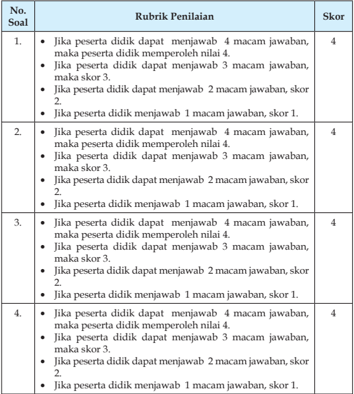

Tabel ini menunjukkan rubrik penilaian untuk sebuah soal yang berkaitan dengan jumlah jawaban yang diberikan oleh peserta didik. Topik utama tabel adalah tentang skor yang diberikan berdasarkan jumlah jawaban yang diberikan oleh peserta didik. Tabel ini memiliki dua kolom: Rubrik Penilaian dan Skor. Rubrik Penilaian mencakup berbagai kondisi di mana peserta didik mendapatkan skor tertentu, seperti mendapatkan 4, 3, 2, atau 1 macam jawaban. Skor tersebut ditentukan berdasarkan jumlah jawaban yang diberikan oleh peserta didik. Data penting yang terlihat dalam tabel ini adalah bahwa skor tertinggi adalah 4 dan skor terendah adalah 1, dengan skor 2 dan 3 merupakan skor intermediasi. Tabel ini membantu dalam proses penilaian yang objektif dan akurat berdasarkan jumlah jawaban yang diberikan oleh peserta didik.

 

---
## 📄 Halaman 52

---
**📊 Tabel**

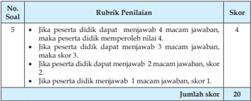

Tabel ini menunjukkan skor yang diberikan kepada peserta didik berdasarkan jumlah jawaban yang diberikan oleh mereka. Topik utama tabel ini adalah tentang penilaian berdasarkan jumlah jawaban yang diberikan oleh peserta didik. Kolom-kolom yang ada dalam tabel ini meliputi No Soal, Rubrik Penilaian, Skor, dan Jumlah Skor. Data atau pola penting yang terlihat dalam tabel ini adalah bahwa setiap jawaban yang diberikan oleh peserta didik akan memberikan skor tertentu, dengan skor tertinggi 4 jika peserta didik dapat menjawab 4 macam jawaban, skor 3 jika peserta didik dapat menjawab 3 macam jawaban, skor 2 jika peserta didik dapat menjawab 2 macam jawaban, dan skor 1 jika peserta didik tidak dapat menjawab 1 macam jawaban. Jumlah skor yang ditampilkan dalam tabel ini adalah 20, yang menunjukkan bahwa total skor yang dapat diperoleh oleh peserta didik dalam penilaian ini adalah 20.

``

Nilai maksimal dari soal pilihan ganda dan essay adalah 10 + 20 = 30 Jika peserta didik memperoleh nilai soal pilihan ganda 8 dan nilai soal essay 15, maka nilai yang diperoleh adalah  8 + 15 = 23.

Jadi nilai yang diperoleh peserta didik tersebut adalah 30 23 100 = 77 # Perolehan nilai  tersebut  menunjukkan  bahwa  peserta  didik  telah  mencapai ketuntasan belajar sebagaimana ditetapkan dalam Permendikbud No.53 Tentang Penilaian Hasil Belajar oleh Pendidik dan Satuan Pendidikan pada Pendidikan Dasar dan Pendidikan Menengah.

### Diskusi tentang Beriman kepada Kitab-kitab Allah

---
**📊 Tabel**

Tabel ini menunjukkan data evaluasi siswa berdasarkan aspek-aspek tertentu yang telah dianalisis. Kolom-kolomnya meliputi nomor siswa, nama siswa, aspek yang dianalisis, skor maksimum, nilai, ketuntasan (T untuk baik, TT untuk cukup baik, R untuk kurang, P untuk sangat kurang), dan tindakan lanjut. Topik utama tabel adalah evaluasi kinerja siswa dalam beberapa aspek tertentu. Data penting yang terlihat adalah bahwa banyak siswa memiliki nilai yang cukup baik atau baik, namun masih ada yang kurang atau sangat kurang dalam beberapa aspek. Ini menunjukkan bahwa masih ada ruang untuk peningkatan kinerja siswa di beberapa aspek.

### Keterangan:

T

: Tuntas

TT : Tidak Tuntas

R

: Remedial

P

: Pengayaan

 

---
## 📄 Halaman 53

### Aspek dan rubrik  penilaian:

### 1.  Kejelasan dan kedalaman informasi

- Jika kelompok tersebut dapat memberikan kejelasan dan kedalaman informasi lengkap dan sempurna maka skor 4.
- Jika kelompok tersebut dapat memberikan penjelasan dan kedalaman informasi lengkap dan  kurang sempurna maka skor 3.
- Jika kelompok tersebut dapat memberikan  penjelasan dan kedalaman informasi  kurang lengkap  maka skor 2.
- Jika kelompok tersebut  tidak dapat memberikan penjelasan dan kedalaman informasi  maka skor 1.

### 2.  Keaktifan dalam diskusi

- Jika kelompok tersebut  berperan sangat aktif  dalam diskusi maka skor 4.
- Jika kelompok tersebut berperan  aktif dalam diskusi maka skor 3.
- Jika kelompok tersebut kurang aktif dalam diskusi maka skor 2.
- Jika kelompok tersebut tidak aktif dalam diskusi maka skor 1.

### 3.  Kejelasan dan kerapian presentasi

- Jika kelompok tersebut dapat mempresentasikan  sangat jelas dan rapi maka skor 4.
- Jika kelompok tersebut dapat mempresentasikan   jelas dan rapi maka skor 3.
- Jika kelompok tersebut dapat mempresentasikan  sangat jelas dan kurang rapi maka skor 2.
- Jika kelompok tersebut dapat mempresentasikan kurang  jelas dan tidak rapi maka skor 1.
Perolehan Nilai Diskusi = J umlah nilai yang diperoleh  100 Jumlah nilai maksimal

Jumlah nilai maksimal diskusi adalah 12 (4 + 4 + 4)

Jika  pada bagian 1 (kejelasan dan kedalaman informasi) peserta didik memperoleh nilai 3, bagian 2 (keaktifan dalam diskusi)  nilai 3 dan pada bagian 3 (kejelasan dan kerapihan prsentasi) nilai 3, maka jumlah nilai diskusi yang diperoleh peserta didik adalah 9.

 

---
## 📄 Halaman 54

``

Perolehan nilai  tersebut  menunjukkan  bahwa  peserta  didik  telah  mencapai ketuntasan belajar sebagaimana ditetapkan dalam Permendikbud No.53 Tentang Penilaian Hasil Belajar oleh Pendidik dan Satuan Pendidikan pada Pendidikan Dasar dan Pendidikan Menengah.

### Catatan:

- Guru  dapat  mengembangkan  instrumen  penilaian  sesuai  dengan kebutuhan.
- Guru  diharapkan  memiliki  catatan  sikap  atau  nilai-nilai  karakter yang dimiliki peserta didik selama dalam proses pembelajaran.
- Aspek penilaian diskusi ini dapat digunakan pada penilaian sikap ketika kegiatan  membuka relung hati dan mengkritisi lingkungan sekitar.

### C.   Isilah kolom berikut dengan jujur sesuai keadaan anda

- Isilah  kolom  keterangan  dengan  menjelaskan  berapa  kali  anda melakukan perilaku-perilaku berikut ini selama satu minggu!
Rubrik penilaian pada kolom tersebut adalah

- Jika peserta didik setiap hari dalam satu minggu belajar/membaca al-Qur'ãn di  rumah,  sekolah,  dan  di  TPA/TPQ/Pengajian  Remaja maka skor 7.
- Jika  peserta  didik  6  kali  dalam  satu  minggu  belajar/membaca alQur'ãn di  rumah,  sekolah,  dan  di  TPA/TPQ/Pengajian  Remaja Masjid maka skor 6.

 

---
## 📄 Halaman 55

- Jika peserta didik 5 kali dalam satu minggu belajar/membaca alQur'ãn di rumah, sekolah, dan di TPA/TPQ/Pengajian Remaja maka skor 5.
- Jika  peserta  didik  4  kali  dalam  satu  minggu  belajar/membaca alQur'ãn di rumah, sekolah, dan di TPA/TPQ/Pengajian Remaja maka skor 4.
- Jika  peserta  didik  3  kali  dalam  satu  minggu  belajar/membaca alQur'ãn di rumah, sekolah, dan di TPA/TPQ/Pengajian Remaja maka skor 3.
- Jika  peserta  didik  2  kali  dalam  satu  minggu  belajar/membaca alQur'ãn di rumah, sekolah, dan di TPA/TPQ/Pengajian Remaja maka skor 2.
- Jika  peserta  didik  1  kali  dalam  satu  minggu  belajar/membaca alQur'ãn di  rumah,  sekolah,  dan  di  TPA/TPQ/Pengajian  Remaja Masjid maka skor 1.

### Nilai = J umlah nilai yang diperoleh  100

### Jumlah nilai maksimal

Jika peserta didik  pada soal no. 1 memperoleh nilai 5, no. 2 nilai 7, no. 3  nilai  5,  no.  4  nilai  7  dan  no.  5  memperoleh  nilai  6,  maka  nilai  yang diperoleh peserta didik adalah: (5 + 7 + 5 + 7 + 6 )   = 35 30 100 # = 86

Perolehan nilai tersebut  menunjukkan  bahwa  peserta  didik  telah memperoleh  nilai  sangat baik dan mencapai  ketuntasan  belajar sebagaimana ditetapkan dalam Permendikbud No.53 Tentang Penilaian Hasil  Belajar  oleh  Pendidik  dan  Satuan  Pendidikan  pada  Pendidikan Dasar dan Pendidikan Menengah.

### 2. Isilah kolom ini dengan memberikan alasan secara jujur!

### Rubrik Penialaian :

---
**📊 Tabel**

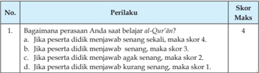

Tabel ini menunjukkan skor maksimal berdasarkan perasaan peserta didik saat belajar Al-Qur'an. Topik utamanya adalah perasaan peserta didik saat belajar Al-Qur'an. Kolom pertama berisi pernyataan tentang perasaan peserta didik, sedangkan kolom kedua berisi skor maksimal yang diberikan. Data penting yang terlihat adalah bahwa skor maksimal adalah 4 jika peserta didik merasa senang, 3 jika merasa sedikit senang, 2 jika merasa agak senang, dan 1 jika merasa kurang senang. Ini menunjukkan bahwa perasaan yang lebih positif akan mendapatkan skor yang lebih tinggi.

 

---
## 📄 Halaman 56

---
**📊 Tabel**

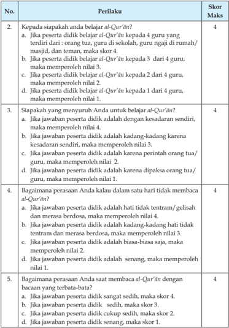

Tabel ini berisi pertanyaan tentang bagaimana seorang peserta didik belajar Al-Qur'an dan bagaimana mereka merespons ketika mereka tidak bisa membaca Al-Qur'an. Topik utama tabel adalah tentang perilaku belajar Al-Qur'an dan respons terhadap kesulitan dalam membaca Al-Qur'an. Kolom-kolomnya meliputi nomor pertanyaan, pernyataan pertanyaan, dan skor maksimal. Data penting yang terlihat adalah bahwa skor maksimal untuk setiap pertanyaan adalah 4, kecuali untuk pertanyaan 5 yang skor maksimalnya 3. Pola penting yang terlihat adalah bahwa skor akan menurun jika peserta didik merespons dengan cara yang tidak sesuai dengan keadaan mereka, seperti merespons dengan cara yang tidak tenang atau merasa berbeda ketika tidak bisa membaca Al-Qur'an.

 

---
## 📄 Halaman 57

---
**📊 Tabel**

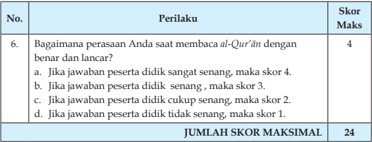

Tabel ini berisi peraturan tentang skor maksimal untuk permainan memecahkan teka-teki al-Qur'an. Topik utamanya adalah bagaimana pemain mendapatkan skor maksimal 24 poin. Kolom pertama menunjukkan nomor urutan permainan, sedangkan kolom kedua berisi deskripsi perilaku yang harus dilakukan oleh pemain. Skor maksimal ditentukan berdasarkan ketercapaian perilaku tersebut, dengan skor tertinggi 4 poin jika jawaban tepat dan lancar, dan skor rendah 1 poin jika jawaban salah atau tidak sesuai. Pola penting yang terlihat adalah bahwa skor dapat berubah tergantung pada tingkat kesulitan jawaban dan ketercapaian perilaku pemain.

### Nilai akhir = jumlah nilai yang diperoleh peserta didik 100 Jumlah nilai maksimal (24)

### Isilah kolom pilihan jawaban dengan jujur!

---
**📊 Tabel**

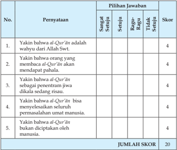

Tabel ini berisi 5 pernyataan yang harus dijawab dengan pilihan jawaban "Sangat Setuju", "Ragu-Ragu", atau "Tidak Setuju". Setiap pernyataan diberi skor 4 jika jawaban "Sangat Setuju" atau "Tidak Setuju", dan 0 jika jawaban "Ragu-Ragu". Topik utama tabel ini adalah penilaian kepercayaan terhadap al-Qur'an dan maknanya dalam kehidupan manusia. Kolom-kolom yang ada meliputi nomor pernyataan, pernyataan itu sendiri, pilihan jawaban, dan skor. Data penting yang terlihat adalah bahwa semua pernyataan diberi skor 4, menunjukkan bahwa setiap pernyataan dianggap benar oleh sebagian besar responden.

Nilai akhir =

Jumlah nilai yang diperoleh peserta didik × 100

Skor  maksimal

### ×

 

---
## 📄 Halaman 58

Keterangan:

### Konversi dalam Bentuk Angka

---
**📊 Tabel**

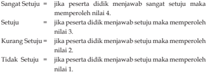

Tabel ini menunjukkan skor kuis berdasarkan jawaban yang diberikan oleh peserta didik. Topik utamanya adalah tentang penilaian keterampilan berpikir kritis dan keterampilan berpikir kreatif. Kolom-kolomnya meliputi "Sangat Setuju", "Setuju", "Kurang Setuju", dan "Tidak Setuju". Data penting yang terlihat adalah bahwa setiap jawaban mendapatkan skor tertentu, dengan jawaban "Sangat Setuju" mendapatkan nilai tertinggi, yaitu 4, dan jawaban "Tidak Setuju" mendapatkan nilai terendah, yaitu 1. Ini menunjukkan bahwa skor kuis dapat digunakan sebagai alat evaluasi untuk menilai keterampilan berpikir kritis dan kreatif peserta didik.

### G.  Pengayaan

Dalam kegiatan pembelajaran, bagi siswa yang sudah menguasai  materi iman kepada kitab-kitab Allah Swt. dengan baik, maka siswa mengerjakan soal  pengayaan  yang  telah  disiapkan  oleh  guru.  (Guru    mencatat  dan memberikan  tambahan  nilai  bagi    peserta  didik    yang  berhasil  dalam pengayaan).

### H.  Remedial

Bila peserta didik setelah dilakukan penilaian ternyata ada yang belum menguasai materi beriman kepada kitab-kitab Allah Swt. (belum mencapai KKM), maka dapat dilakukan penilaian kembali dengan soal yang sejenis atau  soal  yang  lain  yang  tetap  mengacu  pada  KD  yang  belum  dikuasai dengan  baik  oleh  siswa.  Remedial  dilaksanakan  pada  waktu  dan  hari tertentu yang disesuaikan, seperti:  pada saat kegiatan pembelajaran atau di luar jam pelajaran (tekniknya dapat dimusyawarahkan dengan siswa yang bersangkutan).

### I. Interaksi Guru Dengan Orang Tua

Peserta didik memperlihatkan buku teks bagian kolom 'Interaksi Guru dengan  Orang  Tua'  kepada  orang  tuanya  dengan  memberikan  komentar dan  paraf.  Dapat  juga  dengan    menggunakan  buku  penghubung  kepada orang  tua  tentang  perubahan  perilaku  siswa    setelah  mengikuti  kegiatan pembelajaran    baik  langsung  atau  lewat  telepon  tentang  perkembangan perilaku peserta didik dalam menerapkan al-Qur'ãn sebagai pedoman hidup.

 

---
## 📄 Halaman 59

### BAB 2

### A.  Kompetensi Inti

- KI-1  Menghayati dan mengamalkan ajaran agama yang dianutnya.
- KI-2 Menunjukkan  perilaku  jujur, disiplin,  bertanggung  jawab, peduli  (gotong  royong,  kerja  sama,  toleran,  damai),  santun, responsif, dan pro-aktif sebagai bagian dari solusi atas berbagai permasalahan dalam berinteraksi secara efektif dengan lingkungan  sosial  dan  alam  serta  menempatkan  diri  sebagai cerminan bangsa dalam pergaulan dunia.
- KI-3 Memahami,  menerapkan,  menganalisis  pengetahuan  faktual, konseptual, prosedural berdasarkan rasa ingin tahunya tentang ilmu  pengetahuan,  teknologi,  seni,  budaya,  dan  humaniora dengan wawasan kemanusiaan, kebangsaan, kenegaraan, dan peradaban  terkait  penyebab  fenomena  dan  kejadian,  serta menerapkan pengeta-huan prosedural pada bidang kajian yang spesiik sesuai dengan bakat dan minatnya.
- KI-4   Mengolah,  menalar,  dan  menyaji  dalam  ranah  konkret  dan  ranah abstrak  terkait  dengan  pengembangan  dari  yang  dipelajari-nya  di sekolah  secara  mandiri,  dan  mampu  menggunakan  metoda  sesuai kaidah keilmuan.

### Berani Hidup Jujur

 

---
## 📄 Halaman 60

### B.  Kompetensi Dasar (KD)

- 1.5. Meyakini bahwa Islam mengharus-kan umatnya untuk memiliki sifat syaja'ah (berani membela kebenaran) dalam mewujudkan kejujuran
- 2.5. Menunjukkan  sikap syaja'ah (berani  membela  kebenaran)  dalam mewujudkan kejujuran.
- 3.5. Menganalisis  makna syaja'ah (berani  membela  kebenaran)  dalam mewujudkan kejujuran.
- 4.5. Menyajikan  kaitan  antara syaja'ah (berani  membela  kebenaran) dengan upaya mewujudkan kejujuran dalam kehidupan sehari-hari.

### C.  Tujuan Pembelajaran

Setelah mengikuti proses pembelajaran, peserta didik mampu:

- Menjelaskan makna  jujur dalam kehidupan sehari-hari
- Menjelaskan hikmah berperilaku jujur dalam kehidupan sehari-hari
- Menunjukkan contoh perilaku jujur dalam kehidupan sehari-hari
- Menampilkan perilaku jujur dalam kehidupan sehari-hari

### D.  Pengembangan Materi

- Menelaah kisah-kisah teladan tentang perilaku jujur
- Menjelaskan  hikmah  kisah-kisah  teladan  tentang  perilaku  jujur dalam kehidupan
- Menelaah kisah orang-orang yang tidak jujur
Pengembangan materi tersebut dapat disampaikan apabila pada materi inti yang terdapat  di dalam KD telah dikuasai oleh siswa

### E.   Proses Pembelajarani

### 1. Persiapan

- Pembelajaran dimulai dengan guru mengucapkan salam dan berdoa bersama.
- Memeriksa  kehadiran,  kerapian  berpakaian,  posisi  tempat  duduk disesuaikan dengan kegiatan pembelajaran.
- Menyapa peserta didik.
- Melaksanakan apersepsi dan pretes.
- Menyampaikan tujuan pembelajaran.

 

---
## 📄 Halaman 61

- Mempersiapkan model pembelajaran seperti problem  based  learning dengan metode diskusi dan problem solving .

### 2. Pelaksanaan

### Membuka Relung Hati

- Peserta  didik  menyimak  dan  mencermati  tayangan  atau  gambar yang ada di dalam buku teks.
- Peserta didik bertanya/memberi komentar terhadap tayangan atau gambar tersebut
- Peserta didik diberikan penjelasan tentang maksud yang terkandung di dalam gambar tersebut.
- Peserta  didik  menyimak  dan  mencermati  uraian  yang  ada  pada 'Membuka Relung Hati'  di dalam buku teks
- Peserta didik bertanya/memberi komentar terhadap hasil pengamatannya pada uraian  tersebut.
- Peserta didik diberikan penjelasan tentang maksud yang terkandung di dalam uraian tersebut.

### Mengkritisi Sekitar Kita

- a . Peserta didik menyimak uraian yang ada pada 'Mengkritisi Sekitar Kita' di dalam buku teks.
- Peserta didik  memberikan komentar terhadap hasil pengamatannya pada uraian  tersebut.
- Peserta didik diberikan penjelasan tambahan dan penguatan mengenai  hasil pengamatannya  oleh guru/pembimbing
- Peserta  didik  menjawab  pertanyaan  yang  terdapat  pada  kolom 'Aktivitas siswa' dilembar kerja atau kertas folio dan guru memberikan penilaian dalam bentuk portofolio.

### Memperkaya Khazanah Peserta Didik

- a . Selanjutnya  peserta  didik  menyimak  teks  bacaan  atau  tayangan ilm tentang perilaku jujur dalam kehidupan sehari-hari sebagai implentasi dari pemahaman Q.S. at-Taubah /9 : 119 dan hadis terkait di dalam  kelompoknya masing-masing.
- Peserta  didik  bertanya  tentang  perilaku  jujur  dalam  kehidupan sehari-hari  sebagai  implentasi  dari  pemahaman Q.S.  at-Taubah /9 : 119 di dalam kelompoknya masing-masing.

 

---
## 📄 Halaman 62

- Peserta didik mendiskusikan perilaku jujur dalam kehidupan seharihari sebagai implentasi dari pemahaman Q.S. at-Taubah /9 : 119 di dalam kelompoknya masing-masing.
- Peserta  didik  diamati  dan  difasilitasi  oleh  guru  dalam  diskusi kelompok  tentang  perilaku  jujur  dalam  kehidupan  sehari-hari sebagai implentasi dari pemahaman Q.S. at-Taubah /9 : 119.
- Peserta  didik  membuat  rumusan  naskah/laporan  hasil  diskusi tentang perilaku jujur dalam kehidupan sehari-hari sebagai implentasi  dari  pemahaman Q.S. at-Taubah /9 : 119  di  dalam kelompoknya masing-masing.
- Peserta  didik  yang  telah  ditentukan  sebagai  panelis  mempresentasikan hasil  diskusi  kelompok  tentang  perilaku  jujur  dalam  kehidupan sehari-hari  sebagai  implentasi  dari  pemahaman Q.S.  at-Taubah /9: 119 di didepan kelompok lainnya.
- Peserta didik mengkritisi hasil presentasi kelompok    tentang perilaku jujur dalam kehidupan sehari-hari sebagai implentasi dari pemahaman Q.S. at-Taubah/9 : 119.
- Peserta didik diberikan penjelasan tambahan dan penguatan mengenai    perilaku  jujur  dalam  kehidupan  sehari-hari  sebagai implentasi  dari  pemahaman Q.S.  at-Taubah /9  :  119  oleh  guru/ pembimbing.
- Peserta  didik  menjawab  pertanyaan  yang  terdapat  pada  kolom 'Aktivitas siswa' dilembar kerja atau kertas folio dan guru memberikan penilaian dalam bentuk portofolio.

### Menerapkan Perilaku Mulia

- Peserta didik menyimak teks bacaan perilaku terpuji yang dapat  diterapkan  sebagai  penghayatan  dan  pengamalan  setelah mempelajari    materi  perilaku  jujur  dalam  kehidupan  sehari-hari sebagai implentasi dari pemahaman Q.S. at-Taubah /9 : 119 di dalam kelompoknya masing-masing.
- Peserta didik bertanya tentang perilaku terpuji yang dapat diterapkan sebagai penghayatan dan pengamalan setelah  mempelajari  materi perilaku jujur dalam kehidupan sehari-hari sebagai implentasi dari pemahaman Q.S. at-Taubah /9 : 119 perilaku jujur dalam kehidupan sehari-hari  sebagai  implentasi  dari  pemahaman Q.S.  at-Taubah /9 : 119 di dalam kelompoknya masing-masing

 

---
## 📄 Halaman 63

- Peserta didik mendiskusikan perilaku terpuji yang dapat diterapkan sebagai penghayatan dan pengamalan setelah  mempelajari  materi perilaku jujur dalam kehidupan sehari-hari sebagai implentasi dari pemahaman Q.S. at-Taubah /9 : 119.
- Peserta  didik  menyampaikan  hasil  diskusi  kelompok    tentang perilaku  terpuji  yang  dapat  diterapkan  sebagai  penghayatan  dan pengamalan terhadap  materi perilaku jujur dalam kehidupan seharihari sebagai implentasi dari pemahaman Q.S. at-Taubah /9 : 119.
- Peserta didik mencermati dan mengkritisi hasil presentasi  panelis dalam  diskusi  kelompok  tentang  perilaku  terpuji  yang  dapat diterapkan sebagai penghayatan dan pengamalan terhadap  materi perilaku jujur dalam kehidupan sehari-hari sebagai implentasi dari pemahaman Q.S. at-Taubah /9 : 119 perilaku jujur dalam kehidupan sehari-hari  sebagai  implentasi  dari  pemahaman Q.S.  at-Taubah /9: 119.
- Peserta didik diberikan penjelasan tambahan dan penguatan mengenai perilaku terpuji yang dapat diterapkan sebagai penghayatan dan pengamalan terhadap  materi perilaku jujur dalam kehidupan sehari-hari sebagai implentasi dari pemahaman Q.S. atTaubah /9 : 119 oleh guru/pembimbing.
- Peserta didik menyimpulkan intisari pelajaran tentang perilaku jujur dalam  kehidupan  sehari-hari  sebagai  implentasi  dari  pemahaman Q.S. at-Taubah /9: 119 dengan menelaah rangkuman yang terdapat dalam buku teks.
- Peserta didik menampilkan sikap yang mencerminkan perilaku jujur dalam  kehidupan  sehari-hari  sebagai  implentasi  dari  pemahaman Q.S. at-Taubah /9: 119.
- Peserta didik menerima tugas individu mengerjakan soal-soal pada kolom 'Evaluasi' yang ada di dalam buku teks  sebagai pemantapan pemahaman terhadap  perilaku jujur dalam kehidupan sehari-hari sebagai implentasi dari pemahaman Q.S. at-Taubah /9 : 119.

 

---
## 📄 Halaman 64

### F.   Penilaian

### 1. Soal Pilihan Ganda (PG)

Skor  penilaian jawaban soal pilihan ganda adalah : jumlah jawaban benar  2    (skor maksimal 5  2 = 10)

### 2. Soal Uraian

Nilai maksimal pada setiap nomor soal uraian adalah 4,  jumlah nilai maksimal 4  5 (soal) = 20.

Rubrik Penilaian

---
**📊 Tabel**

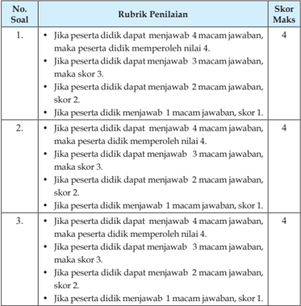

Tabel ini menunjukkan skor maksimal yang diberikan kepada siswa berdasarkan jumlah jawaban yang benar mereka dalam dua soal yang berbeda. Topik utama tabel adalah tentang penilaian siswa berdasarkan jumlah jawaban yang benar. Kolom-kolomnya meliputi No Soal (Nomor Soal), Rubrik Penilaian (Penilaian Kriteria), dan Skor Maks (Skor Maksimum). Data penting yang terlihat adalah bahwa untuk setiap soal, siswa mendapatkan skor maksimal 4 jika menjawab 4 macam jawaban, 3 jika menjawab 3 macam jawaban, 2 jika menjawab 2 macam jawaban, dan 1 jika menjawab 1 macam jawaban. Ini menunjukkan bahwa skor yang diberikan sangat bergantung pada jumlah jawaban yang benar yang diberikan oleh siswa.

 

---
## 📄 Halaman 65

---
**📊 Tabel**

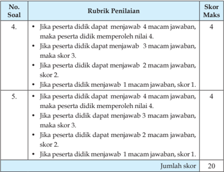

Tabel ini menunjukkan skor maksimal dan skor yang diberikan kepada peserta didik berdasarkan jumlah jawaban yang diberikan. Topik utama tabel adalah tentang penilaian soal-soal tertentu. Kolom-kolomnya meliputi No. Soal (Nomor Soal), Rubrik Penilaian (Penilaian Kriteria), dan Skor Maks (Skor Maksimum). Data penting yang terlihat adalah bahwa untuk setiap soal, skor maksimal adalah 4, kecuali untuk soal nomor 5, di mana skor maksimal adalah 20. Pola penting lainnya adalah bahwa skor ditentukan berdasarkan jumlah jawaban yang diberikan oleh peserta didik, dengan skor tertinggi 4 jika peserta didik menjawab 4 macam jawaban, dan skor terendah 1 jika peserta didik menjawab hanya 1 macam jawaban.

### Jumlah nilai maksimal

Nilai : Jumlah nilai yang diperoleh peserta didik (PG dan Essay) × 100

Nilai maksimal dari soal pilihan ganda dan essay adalah 10 + 20 = 30 Jika peserta didik memperoleh nilai soal pilihan ganda 8 dan nilai soal essay 15, maka nilai yang diperoleh adalah  8 + 15 = 23. Jadi nilai yang diperoleh peserta didik tersebut adalah 30 23 100 # = 77

Perolehan  nilai  tersebut  menunjukkan  bahwa  peserta  didik  telah mencapai ketuntasan belajar sebagaimana ditetapkan dalam Permendikbud No.53 Tentang Penilaian Hasil Belajar oleh Pendidik dan Satuan Pendidikan pada Pendidikan Dasar dan Pendidikan Menengah.

 

---
## 📄 Halaman 66

### Diskusi tentang Berani Hidup Jujur

---
**📊 Tabel**

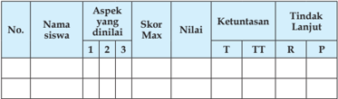

Tabel ini menunjukkan data evaluasi siswa berdasarkan aspek-aspek yang dinilai mereka. Kolom-kolomnya meliputi nomor siswa, nama siswa, aspek-aspek yang dinilai (1, 2, 3), skor maksimal, nilai, ketuntasan (T untuk telah diterima, TT untuk tidak diterima, R untuk perlu revisi, P untuk perlu penambahan), dan tindakan lanjut yang diambil. Topik utama tabel adalah evaluasi kinerja siswa dalam beberapa aspek tertentu. Data penting yang terlihat adalah bahwa banyak siswa mendapatkan nilai yang rendah pada aspek tertentu, dan beberapa siswa memerlukan revisi atau penambahan untuk mencapai standar yang ditetapkan.

### Keterangan:

T

: Tuntas

TT  : Tidak tuntas

R

: Remedial

P

: Pengayaan

### Aspek dan rubrik  penilaian:

### 1. Kejelasan dan kedalaman informasi

- Jika kelompok tersebut dapat memberikan kejelasan dan kedalaman informasi lengkap dan sempurna maka skor 4.
- Jika kelompok tersebut dapat memberikan penjelasan dan kedalaman informasi lengkap dan  kurang sempurna maka skor 3.
- Jika kelompok tersebut dapat memberikan penjelasan dan kedalaman informasi  kurang lengkap  maka skor 2.
- Jika  kelompok  tersebut    tidak  dapat  memberikan  penjelasan  dan kedalaman informasi  maka skor 1.

### 2. Keaktifan dalam diskusi

- Jika kelompok tersebut  berperan sangat aktif  dalam diskusi maka skor 4.
- Jika kelompok tersebut berperan  aktif dalam diskusi maka skor 3.
- Jika kelompok tersebut kurang aktif dalam diskusi maka skor 2.
- Jika kelompok tersebut tidak aktif dalam diskusi maka skor 1.

### 3. Kejelasan dan kerapian presentasi

- Jika  kelompok  tersebut  dapat  mempresentasikan  sangat  jelas  dan rapi maka skor 4.
- Jika kelompok tersebut dapat mempresentasikan jelas dan rapi maka skor 3.

 

---
## 📄 Halaman 67

- Jika kelompok tersebut dapat mempresentasikan sangat jelas dan kurang rapi maka skor 2.
- Jika kelompok tersebut dapat mempresentasikan kurang  jelas dan tidak rapi maka skor 1.

``

Jumlah nilai maksimal

Jumlah nilai maksimal diskusi adalah 12 (4 + 4 + 4).

Jika  pada bagian 1 (kejelasan dan kedalaman informasi) peserta didik memperoleh nilai 3, bagian 2 (keaktifan dalam diskusi)  nilai  3  dan  pada bagian 3 (kejelasan dan kerapihan prsentasi) nilai 3, maka jumlah nilai diskusi yang diperoleh peserta didik adalah 9.

``

``

Perolehan  nilai  tersebut  menunjukkan  bahwa  peserta  didik  telah mencapai ketuntasan belajar sebagaimana ditetapkan dalam Permendikbud No.53 Tentang Penilaian Hasil Belajar oleh Pendidik dan Satuan Pendidikan pada Pendidikan Dasar dan Pendidikan Menengah.

### Catatan:

- Guru dapat mengembangkan  instrumen  penilaian sesuai dengan kebutuhan.
- Guru diharapkan memiliki catatan sikap atau nilai-nilai karakter yang dimiliki peserta didik selama dalam proses pembelajaran.
- Aspek penilaian diskusi ini dapat digunakan pada penilaian sikap ketika kegiatan  membuka relung hati dan mengkritisi lingkungan sekitar.

 

---
## 📄 Halaman 68

### 3. Tugas

Isilah kolom pilihan jawaban dengan jujur!

---
**📊 Tabel**

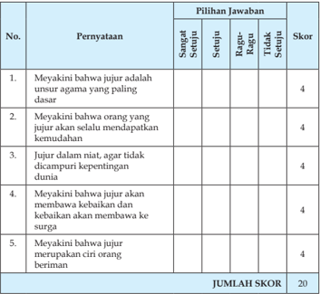

Tabel ini berisi 5 pernyataan yang berkaitan dengan keyakinan tentang jujur sebagai unsur agama paling dasar. Setiap pernyataan memiliki 4 pilihan jawaban: Sangat Setuju, Setuju, Ragu-Ragu, Tidak Setuju. Skor diberikan untuk setiap pilihan jawaban, dengan skor tertinggi 4. Total skor untuk semua pernyataan adalah 20. Topik utama tabel adalah keyakinan tentang jujur sebagai unsur agama paling dasar. Kolom-kolomnya meliputi nomor pernyataan, pernyataan itu sendiri, pilihan jawaban, dan skor. Data penting yang terlihat adalah bahwa semua pernyataan memiliki skor 4, menunjukkan kesetiaan pada keyakinan tersebut.

Nilai akhir :

Jumlah nilai maksimal (20)

Jumlah nilai yang diperoleh peserta didik × 100

### Keterangan:

- Jika peserta didik menjawab sangat setuju, maka memperoleh nilai 4.
- Jika peserta didik menjawab setuju, maka maka memperoleh nilai 3.
- Jika peserta didik menjawab ragu-ragu, maka memperoleh nilai 2.
- Jika peserta didik menjawab tidak setuju, maka memperoleh nilai 1.

 

---
## 📄 Halaman 69

### G.  Pengayaan

Dalam kegiatan pembelajaran, bagi peserta didik yang sudah menguasai materi  'Berani Hidup Jujur'dengan baik, maka peserta didik mengerjakan soal pengayaan yang telah disiapkan oleh guru. (Guru  dapat memberikan tugas  tambahan  sesuai  dengan  materi  pengembangan    dan  memberikan tambahan nilai bagi  peserta didik  yang berhasil dalam pengayaan).

### H.  Remedial

Bila peserta didik setelah dilakukan penilaian ternyata ada yang belum menguasai materi 'Berani Hidup Jujur' (belum mencapai KKM), maka dapat dilakukan penilaian kembali dengan soal yang sejenis atau soal yang lain yang tetap mengacu pada KD yang belum dikuasai dengan baik oleh siswa. Remedial  dilaksanakan  pada  waktu  dan  hari  tertentu  yang  disesuaikan, seperti:  pada saat kegiatan pembelajaran atau di luar jam pelajaran (tehniknya dapat dimusyawarahkan dengan siswa yang bersangkutan).

### I.   Interaksi Guru Dengan Orang Tua

Peserta didik memperlihatkan buku teks bagian kolom 'Interaksi Guru dengan  Orang  Tua'  kepada  orang  tuanya  dengan  memberikan  komentar dan  paraf.  Dapat  juga  dengan    mengunakan  buku  penghubung  kepada orang  tua  tentang  perubahan  perilaku  siswa    setelah  mengikuti  kegiatan pembelajaran atau berkomunikasi  baik langsung atau lewat telepon tentang perkembangan perilaku peserta didik dalam menerapkan sifat jujur dalam kehidupannya sehari-hari.

 

---
## 📄 Halaman 70

BAB 3

### Melaksanakan Pengurusan Jenazah

### A.  Kompetensi Inti

- KI-1  Menghayati dan mengamalkan ajaran agama yang dianutnya.
- KI-2 Menunjukkan  perilaku  jujur, disiplin,  bertanggung  jawab, peduli  (gotong  royong,  kerja  sama,  toleran,  damai),  santun, responsif, dan pro-aktif sebagai bagian dari solusi atas berbagai permasalahan dalam berinteraksi secara efektif dengan lingkungan  sosial  dan  alam  serta  menempatkan  diri  sebagai cerminan bangsa dalam pergaulan dunia.
- KI-3 Memahami,  menerapkan,  menganalisis  pengetahuan  faktual, konseptual, prosedural berdasarkan rasa ingin tahunya tentang ilmu  pengetahuan,  teknologi,  seni,  budaya,  dan  humaniora dengan wawasan kemanusiaan, kebangsaan, kenegaraan, dan peradaban  terkait  penyebab  fenomena  dan  kejadian,  serta menerapkan pengeta-huan prosedural pada bidang kajian yang spesiik sesuai dengan bakat dan minatnya.
- KI-4   Mengolah,  menalar,  dan  menyaji  dalam  ranah  konkret  dan  ranah abstrak  terkait  dengan  pengembangan  dari  yang  dipelajari-nya  di sekolah  secara  mandiri,  dan  mampu  menggunakan  metoda  sesuai kaidah keilmuan.

 

---
## 📄 Halaman 71

### B.   Kompetensi Dasar

- 1.7  Menerapkan mengurus jenazah sesuai dengan ketentuan syariat Islam.
- 2.7  Menunjukkan sikap tanggung jawab dan kerja sama dalam mengurus jenazah di masyarakat.
- 3.7  Menganalisis pelaksanaan mengurus jenazah.
- 4.7  Menyajikan prosedur penyelenggaraan jenazah.

### C.  Tujuan Pembelajaran

Setelah mengikuti proses pembelajaran, peserta didik mampu:

- Menjelaskan  kandungan  dalil  naqli  tentang  ketentuan  syariat  Islam dalam mengurus jenazah.
- Menjelaskan tata cara mengurus jenazah menurut hukum Islam.
- Menjelaskan tata cara bertakziah sesuai ajaran Islam.
- Menjelaskan tata cara berziarah sesuai ajaran Islam.
- Mempraktikkan  mengurus  jenazah, takziah dan ziarah sesuai  dengan ajaran Islam.

### D.  Pengembangan Materi

- Menelaah dalil- dalil al-Qur'ãn dan hadis tentang ketentuan syariat Islam dalam mengurus jenazah.
- Membuat laporan individu tentang praktik mengurus jenazah di dalam kehidupan masyarakat.
- Menjelaskan hakikat hidup di dunia
- Menjelaskan pentingnya mengingat kematian
Pengembangan materi tersebut dapat disampaikan apabila pada materi inti yang terdapat  di dalam KD telah dikuasai oleh siswa.

 

---
## 📄 Halaman 72

### E.  Proses Pembelajaran

### 1. Persiapan

- Pembelajaran  dimulai  dengan  guru  mengucapkan  salam  dan  berdoa bersama.
- Memeriksa  kehadiran, kerapian berpakaian, posisi  tempat  duduk disesuaikan dengan kegiatan pembelajaran.
- Menyapa peserta didik.
- Melaksanakan apersepsi dan pretes.
- Menyampaikan tujuan pembelajaran.
- Mempersiapkan alternatif model Pembelajaran dalam kompetensi ini  seperti discovery  Learning dan Project Based Learning dengan metode diskusi, demonstrasi,  praktik, dan lain-lain.

### 2. Pelaksanaan

### Membuka Relung Hati

- Peserta  didik  menyimak  dan  mencermati  tayangan  atau  gambar yang ada di dalam buku teks.
- Peserta didik bertanya/memberi komentar terhadap tayangan atau gambar tersebut.
- Peserta didik diberikan penjelasan tentang maksud yang terkandung di dalam gambar tersebut.
- Peserta  didik  menyimak  dan  mencermati  uraian  yang  ada  pada 'Membuka Relung Hati'  di dalam buku teks
- Peserta didik bertanya/memberi komentar terhadap hasil pengamatannya pada uraian  tersebut.
- Peserta didik diberikan penjelasan tentang maksud yang terkandung di dalam uraian tersebut.

### Mengkritisi Sekitar Kita

- Peserta didik menyimak uraian yang ada pada 'Mengkritisi Sekitar Kita' di dalam buku teks.
- Peserta  didik    memberi  komentar  terhadap  hasil  pengamatannya pada uraian  tersebut.
- Peserta didik diberikan penjelasan tambahan dan penguatan mengenai  hasil pengamatannya  oleh guru/pembimbing.

 

---
## 📄 Halaman 73

- Peserta  didik  menjawab  pertanyaan  yang  terdapat  pada  kolom 'Aktivitas siswa' dilembar kerja atau kertas folio dan guru memberikan penilaian dalam bentuk portofolio.

### Memperkaya Khazanah Peserta Didik

- Selanjutnya peserta didik menyimak teks bacaan tentang ketentuan syariat  Islam  dalam  mengurus  jenazah  di  dalam    kelompoknya masing-masing.
- Peserta  didik  bertanya  tentang  ketentuan  syariat  Islam  dalam mengurus jenazah di dalam kelompoknya masing-masing
- Peserta didik mendiskusikan ketentuan syariat Islam dalam mengurus jenazah di dalam kelompoknya masing-masing
- Peserta  didik  diamati  dan  difasilitasi  oleh  guru  dalam  diskusi kelompok tentang ketentuan syariat Islam dalam mengurus jenazah.
- Peserta  didik  membuat  rumusan  naskah/laporan  hasil  diskusi tentang ketentuan syariat Islam dalam mengurus jenazah di dalam kelompoknya masing-masing.
- Peserta didik yang telah ditentukan sebagai panulis mempresentasikan hasil diskusi kelompok tentang ketentuan syariat Islam dalam mengurus jenazah di di depan kelompok lainnya.
- Peserta didik mengkritisi hasil presentasi kelompok tentang ketentuan syariat Islam dalam mengurus jenazah
- Peserta didik diberikan penjelasan tambahan dan penguatan mengenai  ketentuan  syariat  Islam  dalam  mengurus  jenazah  oleh guru/pembimbing.
- Peserta  didik  menjawab  pertanyaan  yang  terdapat  pada  kolom 'Aktivitas siswa' dilembar kerja atau kertas folio dan guru memberikan penilaian dalam bentuk portofolio.

### Menerapkan Perilaku Mulia

- Peserta didik menyimak teks bacaan perilaku terpuji yang dapat  diterapkan  sebagai  penghayatan  dan  pengamalan  setelah mempelajari    materi  ketentuan  syariat  Islam  dalam  mengurus jenazah di dalam  kelompoknya masing-masing.
- Peserta didik bertanya tentang perilaku terpuji yang dapat diterapkan sebagai penghayatan dan pengamalan setelah mempelajari materi ketentuan syariat Islam dalam mengurus jenazah di dalam kelompoknya masing-masing.

 

---
## 📄 Halaman 74

- Peserta didik mendiskusikan perilaku terpuji yang dapat diterapkan sebagai penghayatan dan pengamalan setelah  mempelajari  materi ketentuan syariat Islam dalam mengurus jenazah.
- Peserta  didik  menyampaikan  hasil  diskusi  kelompok    tentang perilaku terpuji yang dapat diterapkan sebagai penghayatan dan  pengamalan  terhadap    materi  ketentuan  syariat  Islam  dalam mengurus jenazah.
- Peserta didik mencermati dan mengkritisi hasil presentasi  panelis dalam  diskusi  kelompok  tentang  perilaku  terpuji  yang  dapat diterapkan sebagai penghayatan dan pengamalan terhadap  materi ketentuan syariat Islam dalam mengurus jenazah.
- Peserta didik diberikan penjelasan tambahan dan penguatan mengenai perilaku terpuji yang dapat diterapkan sebagai penghayatan  dan  pengamalan  terhadap  materi  ketentuan  syariat Islam dalam mengurus jenazah oleh guru/pembimbing.
- Peserta  didik  menyimpulkan  intisari  pelajaran  tentang  ketentuan syariat Islam dalam mengurus jenazah dengan menelaah rangkuman yang terdapat dalam buku teks.
- Peserta didik mempraktikkan mengurus jenazah di bawah bimbingan guru.
- Guru melakukan penilaian praktik mengurus jenazah yang dilakukan peserta didik.
- Peserta didik menampilkan sikap yang mencerminkan kepedulian terhadap jenazah dalam kehidupan sehari-hari.
- Peserta didik menerima tugas kelompok membuat desain kain kafan dan mempraktikan mengurus jenazah (memandikan, mengkafani, menyalatkan dan menguburkan) serta tugas  individu mengerjakan soal-soal pada kolom 'Evaluasi' yang ada di dalam buku teks dan praktik  mennyalatkan  jenazah  sebagai  pemantapan  pemahaman terhadap  ketentuan syariat Islam dalam mengurus jenazah.

### Catatan:

Guru diharapkan dapat memperkaya materi ini dengan mengemukakan  perbedaan  pendapat  yang  ada  di  kalangan  ulama iqh,  sehingga  peserta  didik  akan  mampu  menjalankan  ajaran Islam secara toleran/tidak fanatik terhadap satu faham.

 

---
## 📄 Halaman 75

### F.  Penilaian

### 1. Soal Pilihan Ganda (PG)

Skor  penilaian jawaban soal pilihan ganda adalah: jumlah jawaban benar  2    (skor maksimal 5 x 2 = 10)

### 2. Soal Uraian

Nilai maksimal pada setiap nomor soal uraian adalah 4,  jumlah nilai maksimal 4  5 (soal) = 20.

### Rubrik Penilaian

---
**📊 Tabel**

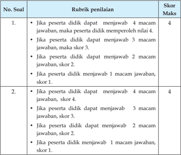

Tabel ini menunjukkan skor maksimal yang diberikan kepada peserta didik berdasarkan jumlah jawaban yang diberikan. Topik utama tabel adalah tentang penilaian berdasarkan jumlah jawaban yang diberikan oleh peserta didik. Kolom-kolom yang ada dalam tabel meliputi No. Soal, Rubrik penilaian, dan Skor Maks. Data atau pola penting yang terlihat dalam tabel ini adalah bahwa skor maksimal yang diberikan kepada peserta didik akan meningkat seiring dengan semakin banyaknya jawaban yang diberikan. Misalnya, jika peserta didik dapat menjawab 4 macam jawaban, maka skor maksimalnya adalah 4; jika peserta didik dapat menjawab 3 macam jawaban, maka skor maksimalnya adalah 3; jika peserta didik dapat menjawab 2 macam jawaban, maka skor maksimalnya adalah 2; dan jika peserta didik hanya dapat menjawab 1 macam jawaban, maka skor maksimalnya adalah 1.

 

---
## 📄 Halaman 76

Nilai:

Jumlah nilai yang diperoleh peserta didik (PG dan Essay)

Jumlah nilai maksimal

× 100

 

---
## 📄 Halaman 77

Nilai maksimal dari soal pilihan ganda dan essay adalah 10 + 20 = 30 Jika peserta didik memperoleh nilai soal pilihan ganda 8 dan nilai soal essay 15, maka nilai yang diperoleh adalah  8 + 15 = 23. Jadi nilai yang diperoleh peserta didik tersebut adalah: 30 23 100 # = 77.

Perolehan nilai tersebut menunjukkan bahwa peserta didik telah mencapai ketuntasan belajar sebagaimana ditetapkan dalam Permendikbud No.  53  Tentang  Penilaian  Hasil  Belajar  oleh  Pendidik  dan  Satuan Pendidikan pada Pendidikan Dasar dan Pendidikan Menengah.

### Diskusi tentang Melaksanakan Pengurusan Jenazah

---
**📊 Tabel**

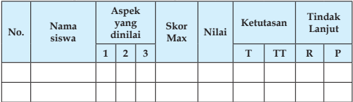

Tabel ini menunjukkan data evaluasi siswa berdasarkan aspek-aspek tertentu yang telah dilakukan penilaian. Topik utama tabel adalah evaluasi siswa dalam beberapa aspek, yaitu Aspek 1, Aspek 2, dan Aspek 3. Kolom-kolom yang ada meliputi Nama Siswa, Skor Max, Nilai, Ketutasan (T untuk Tidak Memenuhi, TT untuk Tidak Memenuhi dengan Kriteria, R untuk Memenuhi, P untuk Memenuhi dengan Kriteria), dan Tindakan Lanjut (Tidak ada tindakan lanjut). Data penting yang terlihat adalah bahwa banyak siswa belum memenuhi kriteria dalam beberapa aspek, seperti Aspek 1 dan Aspek 2, dengan skor maksimal yang masih cukup tinggi. Ini menunjukkan bahwa masih ada ruang untuk peningkatan kinerja siswa dalam beberapa aspek tersebut.

### Keterangan:

T

: Tuntas

TT  : Tidak tuntas

R

: Remedial P

: Pengayaan

### Aspek dan rubrik penilaian:

### 1. Kejelasan dan kedalaman informasi

- Jika kelompok tersebut dapat memberikan kejelasan dan kedalaman informasi lengkap dan sempurna, skor 4.
- Jika kelompok tersebut dapat memberikan penjelasan dan kedalaman informasi lengkap dan  kurang sempurna, skor 3.
- Jika  kelompok  tersebut  dapat  memberikan  penjelasan  dan kedalaman informasi  kurang lengkap,  skor 2.
- Jika kelompok tersebut  tidak dapat memberikan penjelasan dan kedalaman informasi,  skor 1.

### 2. Keaktifan dalam diskusi

- Jika  kelompok tersebut  berperan sangat aktif  dalam diskusi, skor 4.
- Jika kelompok tersebut berperan  aktif dalam diskusi, skor 3.

 

---
## 📄 Halaman 78

- Jika kelompok tersebut kurang aktif dalam diskusi, skor 2.
- Jika kelompok tersebut tidak aktif dalam diskusi, skor 1.
- Kejelasan dan kerapian presentasi
- Jika kelompok tersebut dapat mempresentasikan  sangat jelas dan rapi, skor 4.
- Jika kelompok tersebut dapat mempresentasikan   jelas dan rapi, skor 3.
- Jika kelompok tersebut dapat mempresentasikan  sangat jelas dan kurang rap, skor 2.
- Jika  kelompok  tersebut  dapat  mempresentasikan  kurang    jelas dan  tidak rapi, skor 1.

``

Jumlah nilai maksimal diskusi adalah 12 (4 + 4 + 4) Jika  pada bagian 1 (kejelasan dan kedalaman informasi) peserta didik memperoleh nilai 3, bagian 2 (keaktifan dalam diskusi)  nilai 3 dan pada bagian 3 (kejelasan dan kerapihan prsentasi) nilai 3, maka jumlah nilai diskusi yang diperoleh peserta didik adalah 9. Jadi perhitungan nilainya adalah: 12 9 100 # = 75.

Perolehan nilai  tersebut  menunjukkan  bahwa  peserta  didik  telah  mencapai ketuntasan belajar sebagaimana ditetapkan dalam Permendikbud No.53 Tentang Penilaian Hasil Belajar oleh Pendidik dan Satuan Pendidikan pada Pendidikan Dasar dan Pendidikan Menengah.

### Catatan:

- Guru  dapat  mengembangkan  instrumen  penilaian  sesuai  dengan kebutuhan.
- Guru  diharapkan  memiliki  catatan  sikap  atau  nilai-nilai  karakter yang dimiliki peserta didik selama dalam proses pembelajaran.
- Aspek penilaian diskusi ini dapat digunakan pada penilaian sikap ketika kegiatan  membuka relung hati dan mengkritisi lingkungan sekitar.

 

---
## 📄 Halaman 79

### 3.  Tugas

Isilah kolom pilihan jawaban dengan jujur!

---
**📊 Tabel**

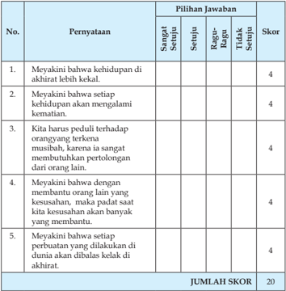

Tabel ini berisi pernyataan tentang kepercayaan dalam kehidupan akhirat dan pilihan jawaban untuk setiap pernyataan tersebut. Topik utama tabel adalah tentang pemahaman tentang kehidupan akhirat dan bagaimana orang-orang percaya dengan setiap pernyataan. Kolom-kolom yang ada meliputi nomor pernyataan, pernyataan itu sendiri, pilihan jawaban (Sangat Setuju, Setuju, Ragu-Ragu, Tidak Setuju), dan skor. Data penting yang terlihat adalah bahwa semua pernyataan memiliki skor 4, menunjukkan bahwa setiap pernyataan dianggap benar oleh semua responden. Jumlah skor keseluruhan adalah 20, menunjukkan bahwa seluruh responden mendapatkan skor maksimal.

``

### Keterangan:

- Jika peserta didik menjawab sangat setuju, maka skor 4.
- Jika peserta didik menjawab setuju, maka skor 3.
- Jika peserta didik menjawab ragu-ragu, maka skor 2.
- Jika peserta didik menjawab tidak setuju, maka skor 1.

 

---
## 📄 Halaman 80

---
**📊 Tabel**

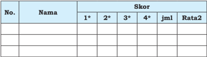

Tabel ini menunjukkan skor siswa dalam beberapa mata pelajaran, dengan kolom "Nama" untuk menyimpan nama-nama siswa, kolom "Skor" untuk menyimpan skor mereka dalam empat kategori berbeda (1*, 2*, 3*, dan 4*), kolom "Jml" untuk jumlah skor yang diberikan, dan kolom "Rata2" untuk rata-rata skor mereka. Topik utama tabel ini adalah evaluasi akademik siswa, dengan data penting yang terlihat adalah bahwa setiap siswa mendapatkan skor yang berbeda-beda dalam empat kategori tersebut, dan rata-rata skor mereka juga berbeda-beda.

### Nilai = Jumlah skor yang diperoleh siswa × 100

### *Keterangan:

- Memandikan skor maksimal 4
- Mengkafani skor maksimal 4
- Menyolatkan skor maksimal 4
- Menguburkan skor maksimal
- 4 J u m l a h 16

### Rubrik Penilaian:

Sangat baik  :    Apabila  peserta  didik  dapat  memperagakan  dengan lancar tanpa ada kesalahan, maka memperoleh nilai  4.

Baik :

Apabila peserta  didik  dapat  memperagakan  dengan lancar,  tapi  masih  ada  kesalahan,  maka    memperoleh nilai 3 .

Sedang :

Apabila peserta  didik  dapat  memperagakan  dengan lancar,    tetapi  masih  banyak  kesalahan,  maka    memperoleh nilai 2.

Kurang :

Apabila  peserta  didik  dapat  memperagakan  dengan tidak lancar, maka memperoleh nilai 1.

Jika  peserta  didik  dalam  praktik  mengurus  jenazah  memperoleh  nilai sebagai  berikut:  memandikan  3,  mengkafani  3,  menyalatkan  4  dan menguburkan 3, maka nilai yang diperoleh peserta didik  adalah:   3 + 3 + 4 + 3 = 16 13 100 # =  81.

### Jumlah skor maksimal

 

---
## 📄 Halaman 81

### 4. Tugas Kelompok

Dalam  kegiatan  tugas/kerja  kelompok  hal-hal  yang  dilakukan  guru adalah:

- Membuat  kelompok  sesuai  dengan  jumlah  peserta  didik  di  dalam kelasnya maksimal 5 orang dalam satu kelompok.
- Masing-masing  kelompok  mengerjakan  tugas  sesuai  dengan  perintah yang ada di dalam buku peserta didik, guru melakukan mentoring.
- Masing-masing kelompok mempresentasikan hasil kerjanya dan kelompok lainnya memberikan tanggapan, guru melakukan pengamatan dan penilaian (sangat baik, baik, cukup baik, atau kurang baik).
Guru  memberikan  komentar  atau  penguatan  terhadap  materi  yang didiskusikan oleh peserta didik.

### G.  Pengayaan

Dalam kegiatan pembelajaran, bagi siswa yang sudah menguasai materi ketentuan  syariat  Islam  dalam  mengurus  jenazah  dengan  baik  dan  telah memperoleh nilai yang memuaskan (sangat baik), maka siswa mengerjakan soal pengayaan yang telah disiapkan oleh guru seperti materi yang terdapat dalam  pengembangan  pembelajaran.  (Guru    mencatat  dan  memberikan tambahan nilai bagi  peserta didik  yang berhasil dalam pengayaan).

### H.  Remedial

Bila peserta didik setelah dilakukan penilaian ternyata ada yang belum menguasai materi ketentuan syariat Islam dalam mengurus jenazah (belum mencapai  KKM),  maka  dapat  dilakukan  penilaian  kembali  dengan  soal yang sejenis atau soal yang lain yang tetap mengacu pada KD yang belum dikuasai dengan baik oleh siswa. Remedial dilaksanakan pada waktu dan hari  tertentu  yang  disesuaikan,  seperti:    pada  saat  kegiatan  pembelajaran atau  di  luar  jam  pelajaran  (tekhniknya  dapat  dimusyawarahkan  dengan siswa yang bersangkutan).

 

---
## 📄 Halaman 82

### I. Interaksi Guru Dengan Orang Tua

Peserta didik memperlihatkan buku teks bagian kolom 'Interaksi Guru dengan Orang Tua' kepada orang tuanya,  orang tua memberikan komentar dan  paraf.  Dapat  juga  dengan    menggunakan  buku  penghubung  kepada orang  tua  tentang  perubahan  perilaku  siswa  setelah  mengikuti  kegiatan pembelajaran  atau  berkomunikasi  langsung  atau  lewat  telepon  tentang perkembangan  perilaku  peserta  didik  dalam  menerapkan  pengurusan jenazah.

 

---
## 📄 Halaman 83

### BAB 4

### A.  Kompetensi Inti

- KI-1  Menghayati dan mengamalkan ajaran agama yang dianutnya.
- KI-2 Menunjukkan  perilaku  jujur, disiplin,  bertanggung  jawab, peduli  (gotong  royong,  kerja  sama,  toleran,  damai),  santun, responsif, dan pro-aktif sebagai bagian dari solusi atas berbagai permasalahan dalam berinteraksi secara efektif dengan lingkungan  sosial  dan  alam  serta  menempatkan  diri  sebagai cerminan bangsa dalam pergaulan dunia.
- KI-3 Memahami,  menerapkan,  menganalisis  pengetahuan  faktual, konseptual, prosedural berdasarkan rasa ingin tahunya tentang ilmu  pengetahuan,  teknologi,  seni,  budaya,  dan  humaniora dengan wawasan kemanusiaan, kebangsaan, kenegaraan, dan peradaban  terkait  penyebab  fenomena  dan  kejadian,  serta menerapkan pengeta-huan prosedural pada bidang kajian yang spesiik sesuai dengan bakat dan minatnya.
- KI-4   Mengolah,  menalar,  dan  menyaji  dalam  ranah  konkret  dan  ranah abstrak  terkait  dengan  pengembangan  dari  yang  dipelajari-nya  di sekolah  secara  mandiri,  dan  mampu  menggunakan  metoda  sesuai kaidah keilmuan.

### Saling Menasihati dalam Islam

 

---
## 📄 Halaman 84

### B.  Kompetensi Dasar

- 1.8  Menerapkan  ketentuan  khutbah,  tablig  dan  dakwah  di  masyarakat sesuai dengan syariat Islam.
- 2.8  Menjaga  kebersamaan  dengan  orang  lain  dengan  saling  menasihati melalui khutbah, tablīg dan dakwah.
- 3.8  Menganalisis pelaksanaan khutbah , tablīg dan dakwah.
- 4.8    Menyajikan ketentuan khutbah , tablīg , dan dakwah.

### C.  Tujuan Pembelajaran

Setelah mengikuti proses pembelajaran, Peserta didik mampu:

- Menjelaskan pengertian khutbah, tablīg dan dakwah.
- Menjelaskan  dalil  yang  menerangkan  tentang  khutbah, tablīg dan dakwah.
- Membedakan antara khutbah, tablīg dan dakwah.
- Menjelaskan ketentuan syariat Islam dalam pelaksanaan khutbah, tablīg dan dakwah.
- Mempraktikkan khutbah, tablīg dan dakwah.
- Membiasakan khutbah, tablīg dan dakwah dalam kehidupan sehari-hari di masyarakat.

### D.  Pengembangan Materi

- Menelaah dalil- dalil al-Qur'ãn dan  Hadis  tentang  khutbah ,  tablīg dan dakwah .
- Melaksanakan  dakwah  di  masyarakat  (praktik  dakwah)  didukung dengan laporan secara tertulis.
- Menjelaskan tujuan khutbah, tablīg , dan dakwah.
- Menjelaskan keutamaan khutbah, tablīg , dan dakwah.
Pengembangan  materi  tersebut  dapat  disampaikan  apabila pada materi inti yang terdapat  di dalam KD telah dikuasai oleh siswa.

 

---
## 📄 Halaman 85

### E.  Proses Pembelajaran

### 1. Persiapan

- Pembelajaran dimulai dengan guru mengucapkan salam dan berdoa bersama.
- Memeriksa  kehadiran,  kerapian  berpakaian,  posisi  tempat  duduk disesuaikan dengan kegiatan pembelajaran.
- Menyapa peserta didik.
- Melaksanakan apersepsi dan pretes.
- Menyampaikan tujuan pembelajaran.
- Mempersiapkan model pembelajaran yang sesuai dengan kompetensi ini discovery learning, project based learning dan  metode diskusi, demonstrasi dan praktik.

### 2. Pelaksanaan

### Membuka Relung Hati

- Peserta  didik  menyimak  dan  mencermati  tayangan  atau  gambar yang ada di dalam buku teks.
- Peserta didik bertanya/memberi komentar terhadap tayangan atau gambar tersebut.
- Peserta didik diberikan penjelasan tentang maksud yang terkandung di dalam gambar tersebut.
- Peserta  didik  menyimak  dan  mencermati  uraian  yang  ada  pada 'Membuka Relung Hati'  di dalam buku teks.
- Peserta didik bertanya/memberi komentar terhadap hasil pengamatannya pada uraian  tersebut.
- Peserta didik diberikan penjelasan tentang maksud yang terkandung di dalam uraian tersebut.

### Mengkritisi Sekitar Kita

- Peserta didik menyimak uraian yang ada pada 'Mengkritisi Sekitar Kita' di dalam buku teks.
- Peserta  didik    memberi  komentar  terhadap  hasil  pengamatannya pada uraian  tersebut.
- Peserta didik diberikan penjelasan tambahan dan penguatan mengenai  hasil pengamatannya  oleh guru/pembimbing.
- Peserta  didik  menjawab  pertanyaan  yang  terdapat  pada  kolom 'Aktivitas  siswa'  di  lembar  kerja  atau  kertas  folio  dan  guru memberikan penilaian dalam bentuk porto folio.

 

---
## 📄 Halaman 86

### Memperkaya Khazanah Peserta Didik

- a . Selanjutnya peserta didik menyimak teks bacaan tentang khutbah , tablīg dan dakwah di dalam  kelompoknya masing-masing.
- Peserta didik bertanya tentang khutbah , tablīg dan dakwah khutbah , tabligh dan dakwah di dalam kelompoknya masing-masing.
- Peserta didik mendiskusikan khutbah , tabligh dan dakwah di dalam kelompoknya masing-masing.
- Peserta  didik  diamati  dan  difasilitasi  oleh  guru  dalam  diskusi kelompok tentang khutbah , tabligh dan dakwah.
- Peserta  didik  membuat  rumusan  naskah/laporan  hasil  diskusi tentang khutbah, tablīg dan dakwah di dalam kelompoknya masingmasing.
- Peserta didik yang telah ditentukan sebagai panelis mempresentasikan hasil diskusi kelompok tentang khutbah , tabligh dan dakwah di depan kelompok lainnya.
- Peserta didik mengkritisi hasil presentasi kelompok tentang khutbah , tablīg dan dakwah.
- Peserta didik diberikan penjelasan tambahan dan penguatan mengenai khutbah , tablīg dan dakwah oleh guru/pembimbing.
- Peserta  didik  menjawab  pertanyaan  yang  terdapat  pada  kolom 'Aktivitas  siswa'  di  lembar  kerja  atau  kertas  folio  dan  guru memberikan penilaian dalam bentuk portofolio.

### Menerapkan Perilaku Mulia

- Peserta  didik  menyimak  teks  bacaan  perilaku  terpuji  yang  dapat diterapkan  sebagai  penghayatan  dan  pengamalan  setelah    mempelajari materi khutbah , tablīg dan dakwah di dalam  kelompoknya masingmasing.
- Peserta didik bertanya tentang perilaku terpuji yang dapat diterapkan sebagai penghayatan dan pengamalan setelah  mempelajari  materi khutbah , tablīg dan dakwah di dalam kelompoknya masing-masing
- Peserta didik mendiskusikan perilaku terpuji yang dapat diterapkan sebagai penghayatan dan pengamalan setelah  mempelajari  materi khutbah , tablīg dan dakwah .
- Peserta  didik  menyampaikan  hasil  diskusi  kelompok    tentang perilaku  terpuji  yang  dapat  diterapkan  sebagai  penghayatan  dan pengamalan terhadap  materi khutbah , tablīg dan dakwah.

 

---
## 📄 Halaman 87

- Peserta didik mencermati dan mengkritisi hasil presentasi  panelis dalam  diskusi  kelompok  tentang  perilaku  terpuji  yang  dapat diterapkan sebagai penghayatan dan pengamalan terhadap  materi khutbah , tablīg dan dakwah .
- Peserta didik diberikan penjelasan tambahan dan penguatan mengenai perilaku terpuji yang dapat diterapkan sebagai penghayatan dan pengamalan terhadap  materi khutbah ,  tablīg dan dakwah oleh guru/pembimbing.
- Peserta  didik  menyimpulkan  intisari  pelajaran  tentang  khutbah , tablīg dan  dakwah dengan  menelaah  rangkuman  yang  terdapat dalam buku teks.
- Peserta didik mempraktikkan khutbah , tablīg dan dakwah di bawah bimbingan guru.
- Guru melakukan penilaian praktik khutbah , tablīg dan dakwah yang dilakukan peserta didik.
- Peserta  didik  menampilkan  sikap  yang  mencerminkan  khutbah, tabligh dan dakwah dalam kehidupan sehari-hari.
- Peserta didik menerima tugas individu mengerjakan soal-soal pada kolom 'Evaluasi' yang ada di dalam buku teks dan membuat naskah khutbah untuk praktik sebagai pemantapan pemahaman terhadap khutbah ,  tablīg dan dakwah .

### F. Penilaian

### 1. Soal Pilihan Ganda (PG)

Skor  penilaian jawaban soal pilihan ganda adalah: jumlah jawaban benar  2    (skor maksimal 5 x 2 = 10)

### 2. Soal Uraian

Nilai maksimal pada setiap nomor soal uraian adalah 4,  jumlah nilai maksimal 4  5 (soal) = 20.

 

---
## 📄 Halaman 88

### Rubrik Penilaian

---
**📊 Tabel**

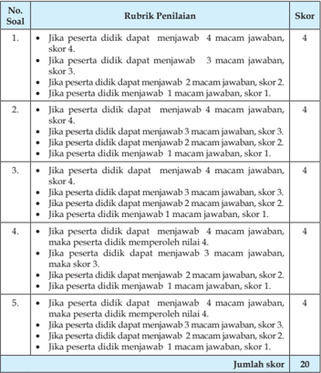

Tabel ini berisi rubrik penilaian untuk mengukur kemampuan peserta didik dalam menjawab pertanyaan dengan berbagai macam jawaban. Topik utama tabel adalah tentang kemampuan menjawab pertanyaan dengan berbagai macam jawaban. Kolom-kolomnya meliputi skor 4, skor 3, skor 2, dan skor 1. Data penting yang terlihat adalah bahwa skor 4 diberikan jika peserta didik dapat menjawab 4 macam jawaban, skor 3 diberikan jika peserta didik dapat menjawab 3 macam jawaban, skor 2 diberikan jika peserta didik dapat menjawab 2 macam jawaban, dan skor 1 diberikan jika peserta didik tidak menjawab 1 macam jawaban. Selain itu, tabel juga menunjukkan bahwa skor 4 diberikan jika peserta didik dapat menjawab 4 macam jawaban, skor 3 diberikan jika peserta didik dapat menjawab 3 macam jawaban, skor 2 diberikan jika peserta didik dapat menjawab 2 macam jawaban, dan skor 1 diberikan jika peserta didik tidak menjawab 1 macam jawaban.

Nilai = Jumlah nilai yang diperoleh peserta didik (PG dan Essay) Jumlah nilai maksimal × 100

Nilai maksimal dari soal pilihan ganda dan essay adalah 10 + 20 = 30 Jika peserta didik memperoleh nilai soal pilihan ganda 8 dan nilai soal essay 15, maka nilai yang diperoleh adalah  8 + 15 = 23.

Jadi nilai yang diperoleh peserta didik tersebut adalah 30 23 100 = 77 #

 

---
## 📄 Halaman 89

Perolehan nilai  tersebut  menunjukkan  bahwa  peserta  didik  telah  mencapai ketuntasan belajar sebagaimana ditetapkan dalam Permendikbud No.53 Tentang Penilaian Hasil Belajar oleh Pendidik dan Satuan Pendidikan pada Pendidikan Dasar dan Pendidikan Menengah.

### Diskusi tentang Khutbah, Tablīgh dan Dakwah

---
**📊 Tabel**

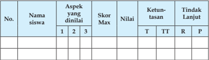

Tabel ini menunjukkan data evaluasi siswa berdasarkan aspek-aspek tertentu yang telah dilakukan oleh mereka. Kolom-kolomnya mencakup nomor siswa, nama siswa, aspek-aspek yang dinilai, skor maksimum, nilai yang diberikan, ketuntasan (T untuk baik, TT untuk cukup baik, R untuk kurang, P untuk sangat kurang), dan tindakan lanjut yang diambil. Topik utama tabel ini adalah evaluasi kinerja siswa dalam berbagai aspek. Data penting yang terlihat adalah bahwa beberapa siswa memiliki skor yang lebih tinggi dibandingkan dengan aspek yang dinilai, sementara beberapa siswa memiliki skor yang lebih rendah. Ini menunjukkan perbedaan dalam kemampuan dan pengetahuan siswa dalam setiap aspek yang ditinjau.

### Keterangan:

T

: Tuntas

TT : Tidak tuntas

R

: Remedial

P

: Pengayaan

### Aspek dan rubrik  penilaian: 1.  Kejelasan dan kedalaman informasi

- Jika kelompok tersebut dapat memberikan kejelasan dan kedalaman informasi lengkap dan sempurna maka skor 4.
- Jika kelompok tersebut dapat memberikan penjelasan dan kedalaman informasi lengkap dan  kurang sempurna maka skor 3.
- Jika kelompok tersebut dapat memberikan  penjelasan dan kedalaman informasi  kurang lengkap  maka skor 2.
- Jika kelompok tersebut  tidak dapat memberikan penjelasan dan kedalaman informasi  maka skor 1.

### 2.  Keaktifan dalam diskusi

- Jika kelompok tersebut  berperan sangat aktif  dalam diskusi maka skor 4.
- Jika kelompok tersebut berperan  aktif dalam diskusi maka skor 3.
- Jika kelompok tersebut kurang aktif dalam diskusi maka skor 2.

 

---
## 📄 Halaman 90

- Jika kelompok tersebut tidak aktif dalam diskusi maka skor 1.

### 3.  Kejelasan dan kerapian presentasi

- Jika kelompok tersebut dapat mempresentasikan  sangat jelas dan rapi maka skor 4.
- Jika kelompok tersebut dapat mempresentasikan   jelas dan rapi maka skor 3.
- Jika kelompok tersebut dapat mempresentasikan  sangat jelas dan kurang rapi maka skor 2.
- Jika kelompok tersebut dapat mempresentasikan kurang  jelas dan tidak rapi maka skor 1.

``

Jumlah nilai maksimal diskusi adalah 12 (4 + 4 + 4)

Jika  pada bagian 1 (kejelasan dan kedalaman informasi) peserta didik memperoleh nilai 3, bagian 2 (keaktifan dalam diskusi)  nilai 3 dan pada bagian 3 (kejelasan dan kerapihan persentasi) nilai 3, maka jumlah nilai diskusi yang diperoleh peserta didik adalah 9.

Jadi perhitungan nilainya adalah: 12 9 100 # = 75.

Perolehan  nilai  tersebut  menunjukkan  bahwa  peserta  didik  telah mencapai ketuntasan belajar sebagaimana ditetapkan dalam Permendikbud No.53 Tentang Penilaian Hasil Belajar oleh Pendidik dan Satuan Pendidikan pada Pendidikan Dasar dan Pendidikan Menengah.

### Catatan:

- Guru  dapat  mengembangkan  instrumen  penilaian  sesuai  dengan kebutuhan.
- Guru  diharapkan  memiliki  catatan  sikap  atau  nilai-nilai  karakter yang dimiliki peserta didik selama dalam proses pembelajaran.
- Aspek penilaian diskusi ini dapat digunakan pada penilaian sikap ketika kegiatan  membuka relung hati dan mengkritisi lingkungan sekitar.

 

---
## 📄 Halaman 91

### 3. Tugas

---
**📊 Tabel**

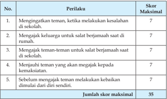

Tabel ini menunjukkan skor maksimal untuk berbagai perilaku yang dianjurkan dalam situasi tertentu. Topik utamanya adalah bagaimana mengajak teman-teman untuk berbuat baik dan saling membantu. Kolom pertama berisi nomor perilaku, sedangkan kolom kedua berisi deskripsi perilaku tersebut. Skor maksimal untuk setiap perilaku adalah 7, dan jumlah skor maksimal untuk seluruh tabel adalah 35. Pola penting yang terlihat adalah bahwa semua perilaku memiliki skor maksimal yang sama, yaitu 7, yang menunjukkan bahwa setiap perilaku dianggap penting dan harus dilakukan dengan serius.

### Nilai = J umlah nilai yang diperoleh  100

Rubrik Penilaian pada kolom tersebut adalah:

35

- Jika peserta didik setiap hari dalam satu minggu melaksanakannya, skor 7.
- Jika peserta didik 6 kali dalam satu minggu melaksanakannya, skor 6
- Jika peserta didik 5 kali dalam satu minggu melaksanakannya, skor 5.
- Jika peserta didik 4 kali dalam satu minggu melaksanakannya, skor 4.
- Jika peserta didik 3 kali dalam satu minggu melaksanakannya, skor 3.
- Jika peserta didik 2 kali dalam satu minggu melaksanakannya, skor 2.
- Jika peserta didik 1 kali dalam satu minggu  melaksanakannya, skor 1.
Jika peserta didik pada  soal nomor 1 memperoleh nilai 6, no. 2 nilai 6, no. 3 nilai 7, no. 4 nilai 5 dan no. 5 nilai 6, maka nilai yang diperoleh peserta didik adalah (6 + 6 + 7 + 5 + 5) = 35 29 100 # =  83.

Isilah kolom keterangan dengan memberikan alasan secara jujur!

 

---
## 📄 Halaman 92

---
**📊 Tabel**

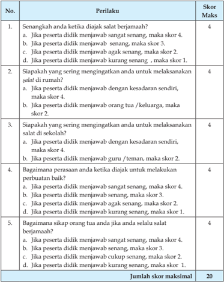

Tabel ini berisi 5 pernyataan yang bertujuan untuk mengukur tingkat keberanian dan sikap seseorang dalam menjawab pertanyaan-pertanyaan tertentu. Setiap pernyataan memiliki skor maksimal yang ditentukan berdasarkan tingkat keberanian yang diberikan. Topik utama tabel ini adalah tentang keberanian dalam menjawab pertanyaan yang sensitif atau menyinggung. Kolom-kolomnya meliputi pernyataan yang harus dijawab, skor maksimal yang diberikan, dan jumlah skor maksimal yang dapat diperoleh. Data penting yang terlihat adalah bahwa setiap pernyataan memiliki skor maksimal yang berbeda-beda, mulai dari 4 hingga 1, dan total skor maksimal yang dapat diperoleh adalah 20.

Nilai akhir =

Jumlah nilai yang diperoleh peserta didik × 100

 

---
## 📄 Halaman 93

---
**📊 Tabel**

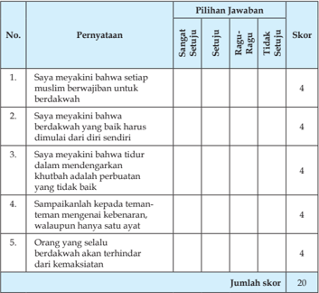

Tabel ini berisi 5 pernyataan yang harus dijawab dengan pilihan jawaban "Sangat Setuju", "Setuju", "Ragu-Ragu", atau "Tidak Setuju". Setiap jawaban diberikan skor tertentu, dengan total skor maksimal 20. Topik utama tabel adalah tentang pandangan atau persepsi terhadap berbagai aspek kehidupan, seperti berdakwah, tidur dalam mendengarkan khutbah, dan sikap terhadap teman-teman. Pola penting yang terlihat adalah bahwa semua pernyataan memberikan skor 4, menunjukkan bahwa setiap jawaban memiliki nilai yang sama dan tidak membedakan tingkat kepuasan atau kesetiaan.

Nilai akhir = Jumlah nilai yang diperoleh peserta didik × 100

20

### Keterangan:

- Jika peserta didik menjawab sangat setuju, makanilai yang diperoleh 4.
- Jika peserta didik menjawab setuju, maka nilai yang diperoleh 3.
- Jika peserta didik menjawab ragu-ragu, maka nilai yang diperoleh 2.
- Jika peserta didik menjawab tidak setuju, maka nilai yang diperoleh 1.
Buatlah teks khutbah, dakwah, atau tablīg (pilih salah satu) dengan tema bebas!

### Rubrik penilaian :

- Jika peserta didik mampu membuat naskah sangat baik, maka nilai yang diperoleh 4.
- Jika peserta didik mampu membuat naskah dengan baik, maka nilai yang diperoleh 3.

 

---
## 📄 Halaman 94

- Jika peserta didik mampu membuat naskah cukup baik, maka nilai yang diperoleh 2.
- Jika peserta didik mampu membuat naskah tetapi kurang baik, skor 1.

### Keterangan:

Sangat baik

:   Jika  naskah  tersebut  memenuhi  4  kriteria  (lengkap, sistematis,  baik  dan  benar    tulisannya,  dan    baik  dan benar konsepnya).

Baik :

Jika  naskah  tersebut  yang  terpenuhi  hanya  3  dari  4 kriteria.

Cukup baik

:   Jika  naskah  tersebut  yang  terpenuhi  hanya  2  dari  4 kriteria.

Kurang baik  :

Jika  naskah  tersebut  yang  terpenuhi  hanya  1  dari  4 kriteria.

### Penilaian Praktik Khutbah

---
**📊 Tabel**

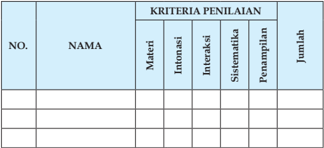

Tabel ini menunjukkan hasil penilaian berdasarkan kriteria tertentu untuk beberapa nama individu. Topik utama tabel adalah penilaian berdasarkan kriteria intensivitas, interaksi, sistematis, dan penampilan. Kolom-kolomnya mencakup nomor urut (NO.), nama individu, dan jumlah poin yang diberikan untuk setiap kriteria. Data penting yang terlihat adalah bahwa setiap nama memiliki nilai yang berbeda-beda untuk setiap kriteria, menunjukkan variasi dalam penilaian berdasarkan kriteria tersebut.

* Nilai Praktik = Jumlah nilai yang diperoleh × 100

20

### Kriteria Penilaian :

- Penguasaan materi
- Intonasi suara
- Interaksi
- Sistematika
- Penampilan

 

---
## 📄 Halaman 95

### Rubrik Penialian :

- Apabila  peserta  didik  dapat  memperagakan  dengan  lancar  tanpa ada kesalahan, maka memperoleh nilai 4.
- Apabila peserta didik dapat memperagakan dengan lancar, tapi masih ada kesalahan, maka memperoleh nilai 3.
- Apabila peserta didik dapat  memperagakan dengan lancar, tetapi masih banyak kesalahan. maka memperoleh nilai 2.
- Apabila  peserta  didik  tidak  dapat  memperagakan  dengan  lancar, maka memperoleh nilai 1.
Jika  peserta  didik  dalam  praktik  khutbah  memperoleh  nilai  sebagai berikut: Penguasaan materi memperoleh nilai 3, intonasi nilai 3, inetraksi nilai  3,  sistematika  nilai  2,  dan  performens  nilai  4,  maka  nilai  yang diperoleh adalah (3 + 3 + 3 + 2 + 4) = 20 15 100 # = 75

### 4. Tugas Kelompok

Dalam  kegiatan  tugas/kerja  kelompok  hal-hal  yang  dilakukan  guru adalah:

- Membuat kelompok sesuai dengan jumlah peserta didik di dalam kelasnya maksimal 5 orang dalam satu kelompok.
- Masing-masing kelompok mengerjakan tugas sesuai dengan perintah yang ada di dalam buku peserta didik, guru melakukan mentoring.
- Masing-masing  kelompok  mempresentasikan  hasil  kerjanya  dan kelompok lainnya memberikan tanggapan, guru melakukan pengamatan  dan  penilaian  (sangat  baik,  baik,  cukup  baik,  atau kurang baik).
- Guru memberikan komentar atau penguatan terhadap materi yang didiskusikan oleh peserta didik.

 

---
## 📄 Halaman 96

### G.  Pengayaan

Dalam kegiatan pembelajaran, bagi siswa yang sudah menguasai materi Saling Menasehati dalam Islam (khutbah, dakwah dan tablīg )  dengan baik dan  telah  memperoleh  nilai  yang  memuaskan  (sangat  baik),  maka  siswa mengerjakan soal pengayaan yang telah disiapkan oleh guru. Guru dapat memberikan materi pengayaan dengan mengacu pada materi pengembangan di atas (Guru mencatat dan memberikan tambahan nilai bagi  peserta didik yang berhasil dalam pengayaan).

### H.  Remedial

Bila peserta didik setelah dilakukan penilaian ternyata ada yang belum menguasai  materi  Saling  Menasehati  dalam  Islam,  dakwah  dan tablīg (belum mencapai KKM), maka dapat dilakukan penilaian kembali dengan soal yang sejenis atau soal lain yang tetap mengacu pada KD yang belum dikuasai dengan baik oleh siswa. Remedi dilaksanakan pada waktu dan hari tertentu yang disesuaikan, seperti:  pada saat kegiatan pembelajaran atau di luar jam pelajaran (tehniknya dapat dimusyawarahkan dengan siswa yang bersangkutan).

### I. Interaksi Guru Dengan Orang Tua

Peserta didik memperlihatkan buku teks bagian kolom 'Interaksi Guru dengan  Orang  Tua'  kepada  orang  tuanya  dengan  memberikan  komentar dan  paraf.  Dapat  juga  dengan    menggunakan  buku  penghubung  kepada orang  tua  tentang  perubahan  perilaku  siswa    setelah  mengikuti  kegiatan pembelajaran atau berkomunikasi baik langsung atau lewat telepon tentang perkembangan perilaku peserta didik dalam semangat untuk berkhutbah, tabligh, dan berdakwah.

 

---
## 📄 Halaman 97

### BAB 5

### A.  Kompetensi Inti

- KI-1  Menghayati dan mengamalkan ajaran agama yang dianutnya.
- KI-2 Menunjukkan  perilaku  jujur, disiplin,  bertanggung  jawab, peduli  (gotong  royong,  kerja  sama,  toleran,  damai),  santun, responsif, dan pro-aktif sebagai bagian dari solusi atas berbagai permasalahan dalam berinteraksi secara efektif dengan lingkungan  sosial  dan  alam  serta  menempatkan  diri  sebagai cerminan bangsa dalam pergaulan dunia.
- KI-3 Memahami,  menerapkan,  menganalisis  pengetahuan  faktual, konseptual, prosedural berdasarkan rasa ingin tahunya tentang ilmu  pengetahuan,  teknologi,  seni,  budaya,  dan  humaniora dengan wawasan kemanusiaan, kebangsaan, kenegaraan, dan peradaban  terkait  penyebab  fenomena  dan  kejadian,  serta menerapkan pengeta-huan prosedural pada bidang kajian yang spesiik sesuai dengan bakat dan minatnya.
- KI-4   Mengolah,  menalar,  dan  menyaji  dalam  ranah  konkret  dan  ranah abstrak  terkait  dengan  pengembangan  dari  yang  dipelajari-nya  di sekolah  secara  mandiri,  dan  mampu  menggunakan  metoda  sesuai kaidah keilmuan.

### Masa Kejayaan Islam

 

---
## 📄 Halaman 98

### B.  Kompetensi Dasar

- 1.10 Mengakui bahwa nilai-nilai islam dapat mendorong kemajuan kejayaan Islam yang dinantikan kembali.
- 2.10 Bersikap rukun dan kompetitif dalam kebaikan sebagai implementasi dari nilai-nilai kejayaan Islam yang dinantikan kembali.
- 3.10 Menelaah kejayaan Islam yang dinantikan kembali.
- 4.10 Menyajikan kaitan antara perkembangan peradaban Islam pada masa kejayaan dengan prinsip-prinsip yang mempe-ngaruhi-nya.

### C.  Tujuan Pembelajaran

Setelah mengikuti proses pembelajaran, Peserta didik mampu:

- Mendeskripsikan perkembangan peradaban Islam pada abad pertengahan.
- Menjelaskan faktor-faktor yang mempengaruhi kejayaan umat Islam pada abad pertengahan.
- Menjelaskan  faktor-faktor  yang  mempengaruhi  kemunduran  umat Islam pada abad pertengahan.
- Menjelaskan hikmah dari perkembangan Islam pada abad pertengahan.
- Menampilkan sikap semangat menumbuhkembangkan ilmu pengetahuan  dan  kerja  keras  sebagai  implementasi  dari  kejayaan umat Islam pada abad pertengahan.

### D.  Proses Pengembangan Materi

- Menelaah  kejayaan  Islam  pada  abat  pertengahan  untuk  membandingkan dengan perkembangan Islam saat ini.
- Menelaah  cara  untuk  mewujudkan  kejayaan  Islam  pada  masa sekarang ini.

### E.  Proses Pembelajaran

### 1. Persiapan

- Pembelajaran dimulai dengan guru mengucapkan salam dan berdoa bersama.
- Memeriksa  kehadiran,  kerapian  berpakaian,  posisi  tempat  duduk disesuaikan dengan kegiatan pembelajaran.
- Menyapa peserta didik.
- Melaksanakan apersepsi dan pretes
- Menyampaikan tujuan pembelajaran.

 

---
## 📄 Halaman 99

- Mempersiapkan  model  pembelajaran  kompetensi  ini misalnya discovery learning dengan metode diskusi, puzzle atau bermain peran.

### 2. Pelaksanaan

### Membuka Relung Hati

- Peserta  didik  menyimak  dan  mencermati  tayangan  atau  gambar yang ada di dalam buku teks.
- Peserta didik bertanya/memberi komentar terhadap tayangan atau gambar tersebut.
- Peserta didik diberikan penjelasan tentang maksud yang terkandung di dalam gambar tersebut.
- Peserta  didik  menyimak  dan  mencermati  uraian  yang  ada  pada 'Membuka Relung Hati'  di dalam buku teks.
- Peserta didik bertanya/memberi komentar terhadap hasil pengamatan  nya pada uraian  tersebut.
- Peserta didik diberikan penjelasan tentang maksud yang terkandung di dalam uraian tersebut.

### Mengkritisi Sekitar Kita

- Peserta didik menyimak uraian yang ada pada 'Mengkritisi Sekitar Kita' di dalam buku teks.
- Peserta  didik    member  komentar  terhadap  hasil  pengamatannya pada uraian  tersebut.
- Peserta didik diberikan penjelasan tambahan dan penguatan mengenai  hasil pengamatannya  oleh guru/pembimbing.
- Peserta  didik  menjawab  pertanyaan  yang  terdapat  pada  kolom 'Aktivitas siswa' dilembar kerja atau kertas folio dan guru memberikan penilaian dalam bentuk portofolio.

### Memperkaya Khazanah Peserta Didik

- Selanjutnya peserta didik menyimak teks bacaan mengenai kejayaan Islam  yang  dinantikan  kembali  di  dalam  kelompoknya  masingmasing.
- Peserta  didik  bertanya  mengenai  kejayaan  Islam  yang  dinantikan kembali di dalam kelompoknya masing-masing.
- Peserta didik mendiskusikan  kejayaan Islam yang dinantikan kembali di dalam kelompoknya masing-masing.
- Peserta didik mengamati yang difasilitasi oleh guru dalam diskusi kelompok mengenai kejayaan Islam yang dinantikan kembali.

 

---
## 📄 Halaman 100

- Peserta  didik  membuat  rumusan  naskah/laporan  hasil  diskusi mengenai  kejayaan Islam yang dinantikan kembali di  dalam kelompoknya masing-masing.
- Peserta didik yang telah ditentukan sebagai panelis mempresentasikan hasil diskusi kelompok mengenai kejayaan Islam yang dinantikan kembali di didepan kelompok lainnya.
- Peserta  didik  mengkritisi  hasil  presentasi  kelompok  mengenai kejayaan Islam yang dinantikan kembali.
- Peserta didik diberikan penjelasan tambahan dan penguatan mengenai    kejayaan  Islam  yang  dinantikan  kembali  oleh  guru/ pembimbing.
- Peserta  didik  menjawab  pertanyaan  yang  terdapat  pada  kolom 'Aktivitas siswa' dilembar kerja atau kertas folio dan guru memberikan penilaian dalam bentuk portofolio.

### Menerapkan Perilaku Mulia

- Peserta didik menyimak teks bacaan perilaku terpuji yang dapat  diterapkan  sebagai  penghayatan  dan  pengamalan  setelah mempelajari    materi  kejayaan  Islam  yang  dinantikan  kembali  di dalam  kelompoknya masing-masing.
- Peserta didik bertanya tentang perilaku terpuji yang dapat diterapkan sebagai penghayatan dan pengamalan setelah  mempelajari  materi kejayaan  Islam  yang  dinantikan  kembali  di  dalam  kelompoknya masing-masing.
- Peserta didik mendiskusikan perilaku terpuji yang dapat diterapkan sebagai penghayatan dan pengamalan setelah  mempelajari  materi kejayaan Islam yang dinantikan kembali.
- Peserta  didik  menyampaikan  hasil  diskusi  kelompok    tentang perilaku  terpuji  yang  dapat  diterapkan  sebagai  penghayatan  dan pengamalan  terhadap  materi kejayaan Islam yang dinantikan kembali.
- Peserta didik mencermati dan mengkritisi hasil presentasi  panalis dalam  diskusi  kelompok  tentang  perilaku  terpuji  yang  dapat diterapkan sebagai penghayatan dan pengamalan terhadap  materi kejayaan Islam yang dinantikan kembali.

 

---
## 📄 Halaman 101

- Peserta didik diberikan penjelasan tambahan dan penguatan mengenai perilaku terpuji yang dapat diterapkan sebagai penghayatan dan pengamalan terhadap  materi kejayaan Islam yang dinantikan kembali oleh guru/pembimbing.
- Peserta  didik  menyimpulkan  intisari  pelajaran  tentang  kejayaan Islam yang dinantikan kembali dengan menelaah rangkuman yang terdapat dalam buku teks.
- Peserta  didik  menampilkan  sikap  yang  mencerminkan  kejayaan Islam yang dinantikan kembali dalam kehidupan sehari-hari.
- Peserta didik menerima tugas individu mengerjakan soal-soal pada kolom 'Evaluasi' yang ada di dalam buku teks  sebagai pemantapan pemahaman terhadap  kejayaan Islam yang dinantikan kembali.

### F. Penilaian

### 1. Soal Pilihan Ganda (PG)

Skor  penilaian jawaban soal pilihan ganda adalah :

jumlah jawaban benar  2  (skor maksimal 5  2 = 10)

### 2. Soal Uraian

Nilai maksimal pada setiap nomor soal uraian adalah 4,  jumlah nilai maksimal 4  5 (soal) = 20.

### Rubrik Penilaian

---
**📊 Tabel**

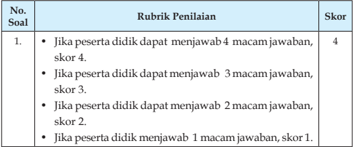

Tabel ini menunjukkan skor yang diberikan kepada peserta didik berdasarkan jumlah jawaban yang benar mereka dapatkan dalam sebuah soal. Topik utama tabel ini adalah tentang penilaian soal yang melibatkan 4 macam jawaban. Kolom-kolomnya mencakup No. Soal (nomor soal), Rubrik Penilaian (panduan untuk menentukan skor), dan Skor (skor yang diberikan kepada peserta didik). Data penting yang terlihat adalah bahwa setiap jawaban benar mendapatkan skor tertentu: 4 skor jika 4 macam jawaban, 3 skor jika 3 macam jawaban, 2 skor jika 2 macam jawaban, dan 1 skor jika hanya 1 macam jawaban yang benar. Ini menunjukkan bahwa skor penilaian berada di bawah 4 skor jika tidak semua jawaban benar.

 

---
## 📄 Halaman 102

---
**📊 Tabel**

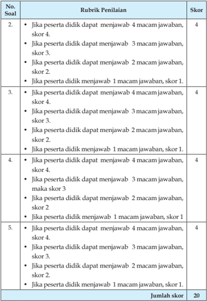

Tabel ini berisi rubrik penilaian untuk sebuah ujian atau tes, dengan skor yang ditentukan berdasarkan jumlah jawaban yang benar oleh peserta didik. Topik utama tabel adalah tentang penilaian keterampilan menjawab soal-soal dalam ujian. Tabel ini memiliki 5 baris (soal) dan 2 kolom: Rubrik Penilaian dan Skor. Data penting yang terlihat adalah bahwa setiap soal memiliki skor tertentu yang ditentukan berdasarkan jumlah jawaban yang benar. Misalnya, soal pertama memberikan skor 4 jika peserta didik dapat menjawab 4 macam jawaban, 3 jika dapat menjawab 3 macam, 2 jika dapat menjawab 2 macam, dan 1 jika hanya menjawab 1 macam. Tabel ini membantu dalam proses penilaian yang objektif dan akurat.

Nilai = Jumlah skor yang diperoleh (PG dan Isian) Jumlah nilai maksimal × 100

 

---
## 📄 Halaman 103

Nilai maksimal dari soal pilihan ganda dan essay adalah 10 + 20 = 30. Jika peserta didik memperoleh nilai soal pilihan ganda 8 dan nilai soal essay 15, maka nilai yang diperoleh adalah  8 + 15 = 23.

Jadi nilai yang diperoleh peserta didik tersebut adalah: 30 23 100 # = 77

Perolehan nilai  tersebut  menunjukkan  bahwa  peserta  didik  telah  mencapai ketuntasan belajar sebagaimana ditetapkan dalam Permendikbud No.53 Tentang Penilaian Hasil Belajar oleh Pendidik dan Satuan Pendidikan pada Pendidikan Dasar dan Pendidikan Menengah.

### Diskusi tentang Masa Kejayaan Islam

---
**📊 Tabel**

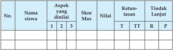

Tabel ini menunjukkan data evaluasi siswa berdasarkan aspek-aspek tertentu yang telah dinilai oleh guru. Tabel ini terdiri dari kolom seperti Nama Siswa, Aspek yang Dinilai, Skor Max, Nilai, Ketuntasan (T, TT, R), dan Tindak Lanjut (P). Topik utama tabel ini adalah evaluasi akademik siswa, dengan fokus pada aspek-aspek tertentu yang telah dinilai. Data penting yang terlihat adalah bahwa beberapa siswa memiliki skor maksimal yang sama untuk aspek tertentu, sementara beberapa siswa memiliki nilai yang lebih tinggi dibandingkan dengan skor maksimal. Selain itu, tabel juga menunjukkan tindakan lanjutan yang diberikan kepada siswa yang memerlukan perbaikan.

### Keterangan:

T

: Tuntas

TT : Tidak tuntas

R

: Remedial

P

: Pengayaan

### Aspek dan rubrik  penilaian:

### 1. Kejelasan dan kedalaman informasi

- Jika kelompok tersebut dapat memberikan kejelasan dan kedalaman informasi lengkap dan sempurna, maka skor 4.
- Jika kelompok tersebut dapat memberikan penjelasan dan kedalaman informasi lengkap dan  kurang sempurna maka, skor 3.
- Jika  kelompok  tersebut  dapat  memberikan  penjelasan  dan kedalaman informasi  kurang lengkap,  maka skor 2.
- Jika kelompok tersebut  tidak dapat memberikan penjelasan dan kedalaman informasi,  maka skor 1.

### 2. Keaktifan dalam diskusi

- Jika  kelompok tersebut  berperan sangat aktif  dalam diskusi, maka skor 4.

 

---
## 📄 Halaman 104

- Jika kelompok tersebut berperan  aktif dalam diskusi, maka skor 3.
- Jika kelompok tersebut kurang aktif dalam diskusi, maka skor 2.
- Jika kelompok tersebut tidak aktif dalam diskusi, maka skor 1.
- Kejelasan dan kerapian presentasi
- Jika  kelompok  tersebut  dapat  mempresentasikan    sangat  jelas dan rapi, maka skor 4.
- Jika kelompok tersebut dapat mempresentasikan   jelas dan rapi, maka skor 3.
- Jika  kelompok  tersebut  dapat  mempresentasikan  sangat  jelas dan  kurang rapi, maka skor 2.
- Jika kelompok tersebut dapat mempresentasikan kurang  jelas dan  tidak rapi, maka skor 1.

``

Jumlah nilai maksimal diskusi adalah 12 (4 + 4 + 4)

Jika  pada bagian 1 (kejelasan dan kedalaman informasi) peserta didik memperoleh nilai 3, bagian 2 (keaktifan dalam diskusi)  nilai 3 dan pada bagian 3 (kejelasan dan kerapihan prsentasi) nilai 3, maka jumlah nilai diskusi yang diperoleh peserta didik adalah 9. Jadi perhitungan nilainya adalah: 12 9 100 # = 75 .

Perolehan nilai tersebut menunjukkan bahwa peserta didik telah mencapai ketuntasan belajar sebagaimana ditetapkan dalam Permendikbud No.53  Tentang  Penilaian  Hasil  Belajar  oleh  Pendidik  dan  Satuan Pendidikan pada Pendidikan Dasar dan Pendidikan Menengah.

### Catatan:

- Guru  dapat  mengembangkan  instrumen  penilaian  sesuai  dengan kebutuhan.
- Guru  diharapkan  memiliki  catatan  sikap  atau  nilai-nilai  karakter yang dimiliki peserta didik selama dalam proses pembelajaran.
- Aspek penilaian diskusi ini dapat digunakan pada penilaian sikap ketika kegiatan  membuka relung hati dan mengkritisi lingkungan sekitar.

 

---
## 📄 Halaman 105

### 3. Tugas

Isilah kolom pilihan jawaban dengan jujur!

---
**📊 Tabel**

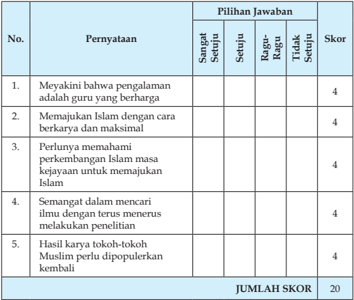

Tabel ini berisi 5 pernyataan yang harus dijawab dengan pilihan jawaban "Sangat Setuju", "Setuju", "Ragu-Ragu", atau "Tidak Setuju". Setiap jawaban diberi skor tertentu, dan jumlah skor akhir ditampilkan di bawah tabel. Topik utama tabel adalah tentang pemahaman dan dukungan terhadap Islam, termasuk pengalaman guru, perkembangan Islam melalui penelitian, dan popularitas karya tokoh-tokoh Muslim. Pola penting yang terlihat adalah bahwa semua pernyataan memiliki skor 4, menunjukkan bahwa setiap pernyataan dianggap sangat mendukung atau setuju dengan pandangan tersebut.

### Keterangan:

- Jika peserta didik menjawab sangat setuju, maka skor 4.
- Jika peserta didik menjawab setuju, maka skor 3.
- Jika peserta didik menjawab ragu-ragu, maka skor 2.
- Jika peserta didik menjawab tidak setuju, maka skor 1.
Jumlah nilai yang diperoleh peserta didik ×

Nilai akhir = 100

Skor  maksimal

 

---
## 📄 Halaman 106

### 4. Tugas Proyek

Rubrik penilaian:

- Jika  peserta  didik  mampu  mengerjakan  tugasnya  dengan  sangat baik, maka skor 4.
- Jika peserta didik mampu mengerjakan tugasnya dengan baik, maka skor 3.
- Jika peserta didik mampu mengerjakan tugasnya cukup baik, maka skor 2.
- Jika peserta didik mampu mengerjakan tugasnya kurang baik, maka skor 1.

### Keterangan:

Sangat baik indah dan rapi).

Baik :  Jika  naskah  tersebut  yang  terpenuhi  hanya  3  dari  4 kriteria.

- Cukup baik   :  Jika  naskah  tersebut  yang  terpenuhi  hanya  2  dari  4 kriteria.
- Kurang baik  :  Jika  naskah  tersebut  yang  terpenuhi  hanya  1  dari  4 kriteria.

### 5. Tugas Kelompok

Dalam  kegiatan  tugas/kerja  kelompok  hal-hal  yang  dilakukan  guru adalah:

- Membuat kelompok sesuai dengan jumlah peserta didik di dalam kelasnya maksimal 5 orang dalam satu kelompok.
- Masing-masing kelompok mengerjakan tugas sesuai dengan perintah yang ada di dalam buku peserta didik, guru melakukan mentoring.
- Masing-masing  kelompok  mempresentasikan  hasil  kerjanya  dan kelompok lainnya memberikan tanggapan, guru melakukan pengamatan  dan  penilaian  (sangat  baik,  baik,  cukup  baik,  atau kurang baik).
- Guru memberikan komentar atau penguatan terhadap materi yang didiskusikan oleh peserta didik.
: Jika naskah tersebut memenuhi

4

krit

 

---
## 📄 Halaman 107

### G.  Pengayaan

Dalam  kegiatan  pembelajaran,  bagi  siswa  yang  sudah  menguasai materi masa kejayaan Islam dengan baik dan telah memperoleh nilai yang memuaskan (sangat baik), maka siswa mengerjakan soal pengayaan yang telah  disiapkan  oleh  guru.  (Guru    mencatat  dan  memberikan  tambahan  nilai bagi  peserta didik  yang berhasil dalam pengayaan).

### H.  Remedial

Setelah  dilakukan  penilaian  ternyata  ada  peserta  didik  yang  belum menguasai  materi  masa  kejayaan  Islam  (belum  mencapai  KKM),  maka dapat dilakukan penilaian kembali dengan soal yang sejenis atau soal lain yang tetap mengacu pada KD yang belum dikuasai dengan baik oleh siswa. Remedi dilaksanakan pada waktu dan hari tertentu yang disesuaikan, seperti: pada saat kegiatan pembelajaran atau di luar jam pelajaran (tehniknya dapat dimusyawarahkan dengan siswa yang bersangkutan).

### I. Interaksi Guru Dengan Orang Tua

Peserta didik memperlihatkan buku teks bagian kolom 'Interaksi Guru dengan Orang Tua' kepada orang tuanya dengan memberikan komentar dan paraf. Dapat juga dengan  mengunakan buku penghubung kepada orang tua tentang perubahan perilaku siswa  setelah mengikuti kegiatan pembelajaran atau  berkomunikasi  langsung  baik  langsung  atau  lewat  telepon  tentang perkembangan perilaku peserta didik dalam semangat untuk mewujudkan kejayaan Islam yang dinantikan kembali.

 

---
## 📄 Halaman 108

BAB 6

### Perilaku Taat, Kompetensi dalam Kebaikan dan Etos Kerja

### A.  Kompetensi Inti

- KI-1  Menghayati dan mengamalkan ajaran agama yang dianutnya.
- KI-2 Menunjukkan  perilaku  jujur, disiplin,  bertanggung  jawab, peduli  (gotong  royong,  kerja  sama,  toleran,  damai),  santun, responsif, dan pro-aktif sebagai bagian dari solusi atas berbagai permasalahan dalam berinteraksi secara efektif dengan lingkungan  sosial  dan  alam  serta  menempatkan  diri  sebagai cerminan bangsa dalam pergaulan dunia.
- KI-3 Memahami,  menerapkan,  menganalisis  pengetahuan  faktual, konseptual, prosedural berdasarkan rasa ingin tahunya tentang ilmu  pengetahuan,  teknologi,  seni,  budaya,  dan  humaniora dengan wawasan kemanusiaan, kebangsaan, kenegaraan, dan peradaban  terkait  penyebab  fenomena  dan  kejadian,  serta menerapkan pengeta-huan prosedural pada bidang kajian yang spesiik sesuai dengan bakat dan minatnya.
- KI-4 Mengolah, menalar, dan menyaji dalam ranah konkret dan ranah abstrak terkait dengan pengembangan dari yang dipelajari-nya di sekolah secara mandiri, dan mampu menggunakan metoda sesuai kaidah keilmuan.

 

---
## 📄 Halaman 109

### B.  Kompetensi Dasar

- 1.1 Terbiasa membaca al-Quran dengan meyakini bahwa taat pada aturan, kompetisi dalam kebaikan, dan etos kerja sebagai perintah agama.
- 2.1 Bersikap taat aturan, tanggung jawab, kompetitif dalam kebaikan dan kerja keras sebagai implementa-si dari pemahaman QS. Al Maidah /5: 48; Q.S. An-Nisa /4: 59; dan Q.S. At Taubah /9: 105 serta Hadis yang terkait.
- 3.1 Menganalisis  makna Q.S.  Al-Maidah /5  :  48; Q.S.  An-Nisa /4:  59,  dan Q.S. At-Taubah /9 : 105, serta hadis tentang taat pada aturan, kompetisi dalam kebaikan, dan etos kerja.
- 4.1.1  Membaca Q.S.  Al-Maidah /5  :  48; Q.S.  An-Nisa /4:  59,  dan Q.S.  AtTaubah /9: 105 sesuai dengan kaidah tajwid dan makharijulhuruf .
- 4.1.2  Mendemonstrasikan hafalan Q.S. Al-Maidah /5 : 48; Q.S. An-Nisa /4: 59, dan Q.S. At-Taubah /9: 105 dengan fasih dan lancar.
- 4.1.3  Menyajikan keterkaitan antara perintah berkompetisi dalam kebaikan dengan kepatuhan terhadap ketentuan Allah sesuai dengan pesan Q.S. Al-Maidah /5 : 48; Q.S. An-Nisa /4: 59, dan Q.S. At-Taubah /9: 105.

### C.  Tujuan Pembelajaran

Setelah mengikuti proses pembelajaran, Peserta didik mampu:

- Membaca Q.S. an-Nisã /4 : 59, Q.S. al-Mãidah /5: 48, Q.S. at-Taubah /9: 105 sesuai dengan kaidah Tajwĩd dan makhrajul huruf
- Menyebutkan arti Q.S. an-Nisã /4 : 59, Q.S. al-Mãidah /5 : 48, Q.S. atTaubah /9 : 105.
- Menjelaskan  makna  isi  kandungan Q.S.  an-Nisã /4  :  59, Q.S.  alMãidah /5 :  48, Q.S. at Taubah /9  :  105  sesuai  dengan  kaidah  Tajwĩd dan makhrajul huruf .
- Mendemontrasikan hafalan Q.S. an-Nisã /4 : 59, Q.S. al-Mãidah /5 : 48, Q.S.  at-Taubah /9  :  105  sesuai  dengan  kaidah Tajwĩd dan makhrajul huruf.
- Menampilkan contoh perilaku taat kompetitif dalam kebaikan dan kerja keras berdasarkan Q.S. an-Nisã /4 : 59, Q.S. al-Mãidah /5: 48, dan Q.S. at-Taubah /9: 105.

 

---
## 📄 Halaman 110

### D.  Pengembangan Materi

- Menyajikan model-model jenis seni tilawah pada Q.S. an-Nisã /4 : 59, Q.S. al-Mãidah /5: 48, dan Q.S. at-Taubah /9: 105.
- Membacakan sari tilãwah  an-Nisã /4 :  59, Q.S. al-Mãidah /5:  48,  dan Q.S.  at-Taubah /9:  105    dengan  nada  yang  khidmat,  menarik  dan indah.
- Menjelaskan  makna  isi  kandungan Q.S.  an-Nisã /4  :  59, Q.S.  alMãidah /5: 48, dan Q.S. at-Taubah /9: 105 dengan mengkaji beberapa kitab tafsir
- Mendemontrasikan hafalan Q.S. an-Nisã /4 : 59, Q.S. al-Mãidah /5: 48, dan Q.S. at-Taubah/9: 105 sesuai dengan kaidah tajwĩd dan makhrajul huruf .
- Menjelaskan  makna  hadis  yang  berkaitan  dengan  taat,  kompetisi dalam kebaikan, dan etos kerja.
- Menelaah kisah-kisah orang yang taat, berkopetensi dalam kebaikan dan memiliki etos kerja.
Pengembangan  materi  tersebut  dapat  disampaikan  apabila pada materi inti yang terdapat  di dalam KD telah dikuasai oleh siswa.

### E. Proses Pembelajaran

### 1. Persiapan

- Pembelajaran dimulai dengan guru mengucapkan salam dan berdoa bersama.
- Memeriksa  kehadiran,  kerapian  berpakaian,  posisi  tempat  duduk disesuaikan dengan kegiatan pembelajaran.
- Menyapa peserta didik.
- Melakukan apersepsi dan pretes.
- Menyampaikan tujuan pembelajaran.
- Mempersiapkan  model  pembelajaran  yang  dapat  digunakankan sebagai  alternatif  dalam  kompetensi  ini  seperti discovery  learning , problem based learning , puzzle , bermain peran ( role playing ), mengembangkan  kemampuan  dan  keterampilan  ( skill ) peserta didik dalam membaca al-Qur'an dengan menggunakan metode drill (latihan dengan mengulang-ulang bacaan).

 

---
## 📄 Halaman 111

### 2. Pelaksanaan

### Membuka Relung Hati

- Peserta  didik  menyimak  dan  mencermati  tayangan  atau  gambar yang ada di dalam buku teks.
- Peserta didik bertanya/memberi komentar terhadap tayangan atau gambar tersebut.
- Peserta didik diberikan penjelasan tentang maksud yang terkandung di dalam gambar tersebut.
- Peserta didik menyimak dan mencermati kolom  uraian yang ada pada 'Membuka Relung Hati' yang ada di dalam buku teks.
- Peserta didik bertanya/memberi komentar terhadap hasil pengamatannya pada kolom uraian  tersebut.
- Peserta didik diberikan penjelasan tentang maksud yang terkandung di dalam uraian tersebut.

### Mengkritisi Sekitar Kita

- Peserta didik menyimak uraian yang ada pada 'Mengkritisi Sekitar Kita' di dalam buku teks.
- Peserta  didik    member  komentar  terhadap  hasil  pengamatannya pada uraian  tersebut.
- Peserta didik diberikan penjelasan tambahan dan penguatan mengenai  hasil pengamatannya  oleh guru/pembimbing.
- Peserta  didik  menjawab  pertanyaan  yang  terdapat  pada  kolom 'Aktivitas  siswa'  di  lembar  kerja  atau  kertas  folio  dan  guru memberikan penilaian dalam bentuk portofolio.

### Memperkaya Khazanah Peserta Didik

- Peserta didik mengkaji Q.S. an-Nisã /4 : 59, Q.S. al-Mãidah /5: 48, dan Q.S. at-Taubah /9: 105 tentang taat, kompetisi dalam kebaikan, dan etoskerja.
- Peserta didik mengemukakan hasil kajian Q.S. an-Nisã /4 : 59, Q.S. al-Mãidah /5: 48, dan Q.S. at-Taubah /9: 105  tentang taat, kompetisi dalam kebaikan, dan etos kerja tersebut.
- Peserta didik diberikan penjelasan tambahan dan penguatan tentang hasil  kajiannya Q.S.  an-Nisã /4 :  59, Q.S.  al-Mãidah /5:  48,  dan Q.S. at-Taubah /9: 105 tentang taat, kompetisi dalam kebaikan, dan etos kerja.

 

---
## 📄 Halaman 112

- Guru meminta kembali peserta didik untuk mengamati bacaan Q.S. an-Nisã /4 : 59, Q.S. al-Mãidah /5: 48, dan Q.S. at-Taubah /9: 105 tentang taat, kompetisi dalam kebaikan, dan etos kerja.
- Peserta  didik  mengemukaan  isi  bacaan Q.S.  an-Nisã /4  :  59, Q.S. al-Mãidah /5:  48,  dan Q.S.  at-Taubah /9:  105  tentang  taat,  kompetisi dalam kebaikan, dan etos kerja tersebut.
- Peserta didik diberikan penjelasan tambahan kembali dan penguatan bacaan Q.S. an-Nisã /4 : 59, Q.S. al-Mãidah /5: 48, dan Q.S. at-Taubah /9: 105  tentang taat, kompetisi dalam kebaikan, dan etoskerja.tersebut.
- Peserta  didik  menyimak  contoh  cara  membaca Q.S.  an-Nisã /4 :  59, Q.S.  al-Mãidah /5:  48,  dan Q.S.  at-Taubah /9:  105    tentang  taat, kompetisi dalam kebaikan, dan etos kerja dengan tartĩl.
- Peserta didik menirukan bacaan Q.S. an-Nisã /4 : 59, Q.S. al-Mãidah /5: 48, dan Q.S. at-Taubah /9: 105  tentang taat, kompetisi dalam kebaikan, dan etos kerja dengan tartĩl .
- Peserta didik mengulang-ulang  bacaan Q.S. an-Nisã /4 : 59, Q.S. alMãidah /5: 48, dan Q.S. at-Taubah /9: 105 secara berkelompok.
- Peserta didik secara berpasangan mengulang kembali bacaan Q.S. an-Nisã /4 : 59, Q.S. al-Mãidah /5: 48, dan Q.S. at-Taubah /9: 105 tentang taat,  kompetisi    dalam  kebaikan,  dan  etos  kerja  sampai  akhirnya peserta didik dapat menghafal bacaan tersebut dengan lancar.
- Peserta didik mengamati  hukum bacaan tajwĩd yang terdapat dalam Q.S. an-Nisã /4 : 59, Q.S. al-Mãidah /5: 48, dan Q.S. at-Taubah /9: 105
- Peserta didik bertanya tentang hukum bacaan tajwĩd , yang terdapat dalam Q.S. an-Nisã /4 : 59, Q.S. al-Mãidah /5: 48, dan Q.S. at-Taubah /9: 105.
- Peserta  didik  mendiskusikan  tentang  ketentuan  hukum  bacaan tajwĩd , yang terdapat dalam Q.S. an-Nisã /4 : 59, Q.S. al-Mãidah /5: 48, dan Q.S. at-Taubah /9: 105.
- Peserta  didik  merumuskan  hasil  diskusi  tentang  hukum  bacaan tajwĩd , yang terdapat dalam Q.S. an-Nisã /4 : 59, Q.S. al-Mãidah /5: 48, dan Q.S. at-Taubah /9: 105.
- Peserta  didik  mempresentasikan  hasil  diskusi  tentang  hukum bacaan tajwĩd , yang terdapat dalam  dalam Q.S. an-Nisã /4 : 59, Q.S. al-Mãidah /5: 48, dan Q.S. at-Taubah /9: 105.
- Peserta didik diberikan penjelasan tentang  ketentuan hukum bacaan tajwĩd ,  yang terdapat dalam Q.S. an-Nisã /4 : 59, Q.S. al-Mãidah /5: 48,  dan Q.S.  at-Taubah /9:  105.  melalui  media/alat  peraga/alat

 

---
## 📄 Halaman 113

- bantu bisa berupa tulisan manual di papan tulis/whiteboard, kertas karton (tulisan yang besar dan mudah dilihat/dibaca) atau bisa juga menggunakan multimedia berbasis ICT atau media lainnya.
- Peserta didik mengamati arti ayat ( mufradãt ) dan terjemah Q.S. anNisã /4 : 59, Q.S. al-Mãidah /5: 48, dan Q.S. at-Taubah /9: 105.
- Peserta didik mendiskusikan arti ayat ( mufradãt ) dan terjemah Q.S. an-Nisã /4 : 59, Q.S. al-Mãidah /5: 48, dan Q.S. at-Taubah /9: 105.
- Peserta  didik  memasangkan  kertas  yang  bertuliskan  potonganpotongan ayat tersebut dengan kertas lain  yang berisi tentang arti dan terjemah dari ayat yang dipilih.
- Peserta didik mengamati isi kandungan Q.S. an-Nisã /4 : 59, Q.S. alMãidah /5: 48, dan Q.S. at-Taubah /9: 105.
- Peserta didik  mendiskusikan isi kandungan Q.S. an-Nisã /4 : 59, Q.S. al-Mãidah /5: 48, dan Q.S. at-Taubah /9: 105. secara berkelompok.
- Secara  bergantian  masing-masing  kelompok  mempresentasikan hasil diskusinya, dan kelompok lainnya  mendengarkan/menyimak sambil memberikan tanggapan.
- Peserta didik diberikan penjelasan tambahan dan penguatan terhadap hasil diskusi tentang  isi kandungan Q.S.  an-Nisã /4 : 59, Q.S. al-Mãidah /5: 48, dan Q.S. at-Taubah /9: 105 dan hadis-hadis yang terkait.
- Guru  dan  peserta  didik  menyimpulkan  intisari  dari  pelajaran tersebut  sesuai  yang  terdapat  dalam  buku  teks  siswa  pada  kolom rangkuman.
- Pada kolom 'Membaca dan Menghafal', guru :
- Membimbing    peserta  didik  untuk  membaca  dengan Tartĩl, kemudian memberikan tanda (  )  pada kolom 'sangat lancar', 'lancar', 'sedang', 'kurang lancar' atau 'tidak lancar'.
- Meminta peserta didik untuk menyalin Q.S. an-Nisã /4 : 59, Q.S. al-Mãidah /5: 48, dan Q.S. at-Taubah /9: 105.
- Meminta  peserta  didik  untuk  mencari  hukum Tajwĩd yang terdapat pada ayat Q.S. an-Nisã/4 : 59, Q.S. al-Mãidah/5: 48, dan Q.S. at-Taubah/9: 105.
- Meminta  peserta  didik  untuk  membacakan  hadis-hadis  yang terkait dengan taat, kompetisi dalam kebaikan, dan etos kerja.

 

---
## 📄 Halaman 114

### Menerapkan Perilaku Mulia

- Peserta didik mengkaji bentuk-bentuk perilaku yang terdapat dalam Q.S. an-Nisã /4 : 59, Q.S. al-Mãidah /5: 48, dan Q.S. at-Taubah /9: 105.
- Peseta didik mendiskusikan bentuk-bentuk perilaku yang terdapat dalam Q.S. an-Nisã /4 : 59, Q.S. al-Mãidah /5: 48, dan Q.S. at-Taubah /9: 105.
- Peserta didik mengemukakan/mempresentasikan hasil kajian dengan  mengemukakan  bentuk-bentuk  perilaku  yang  terdapat dalam Q.S. an-Nisã /4 : 59, Q.S. al-Mãidah /5: 48, dan Q.S. at-Taubah /9: 105 dan hadis-hadis terkait.
- Peserta didik mengkritisi hasil presentasi kelompok tentang contoh perilaku  taat,  kompetisi  dalam  kebaikan  dan  etos  kerja  yang terkandung dalam Q.S. an-Nisã /4 : 59, Q.S. al-Mãidah /5: 48, dan Q.S. at-Taubah /9: 105 dan hadis-hadis terkait.
- Peserta didik diberikan penjelasan tambahan dan penguatan mengenai  bentuk-bentuk  perilaku  berdasarkan Q.S. an-Nisã /4: 59, Q.S.  al-Mãidah /5:  48,  dan Q.S.  at-Taubah /9:  105  tentang  taat, kompetitif dalam kebaikan dan kerja keras.
- Guru  dan  peserta  didik  menyimpulkan  intisari  dari  pelajaran tersebut sesuai dengan materi yang terdapat dalam buku teks siswa pada kolom rangkuman.
- Peserta didik  mengerjakan soal-soal pilihan ganda, uraian, dan isian yang terdapat dalam kolom evalusi.

### F.   Penilaian

### 1. Soal Pilihan Ganda (PG)

Skor  penilaian jawaban soal pilihan ganda adalah : jumlah jawaban benar  2  (skor maksimal 5  2 = 10)

### 2. Soal Uraian

Nilai maksimal pada setiap nomor soal uraian adalah 4,  jumlah nilai maksimal 4  5 (soal) = 20.

 

---
## 📄 Halaman 115

### Rubrik Penilaian

---
**📊 Tabel**

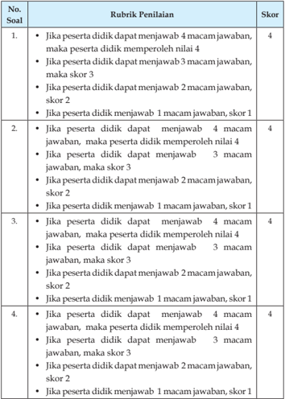

Tabel ini menunjukkan skor yang diberikan kepada siswa berdasarkan jumlah jawaban yang benar mereka dalam sebuah ujian. Topik utama tabel adalah tentang skor yang diberikan berdasarkan jumlah jawaban yang benar. Kolom pertama berisi nomor soal, kolom kedua berisi rubrik penilaian, dan kolom ketiga berisi skor yang diberikan. Data penting yang terlihat adalah bahwa skor tertinggi adalah 4 poin dan skor terendah adalah 1 poin. Pola yang jelas adalah semakin banyak jawaban yang benar, semakin tinggi skor yang diterima.

 

---
## 📄 Halaman 116

---
**📊 Tabel**

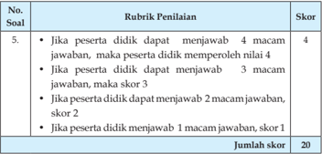

Tabel ini menunjukkan skor yang diberikan kepada peserta didik berdasarkan jumlah jawaban yang benar mereka berikan dalam sebuah soal. Topik utama tabel adalah tentang penilaian soal 5, di mana peserta didik harus menjawab 4 macam jawaban untuk mendapatkan skor tertinggi. Skor akan turun jika mereka menjawab kurang dari itu. Misalnya, jika peserta didik menjawab 3 macam jawaban, mereka mendapatkan skor 3; jika 2 macam jawaban, skor menjadi 2; dan jika hanya 1 macam jawaban, skor menjadi 1. Total skor semua soal adalah 20.

`Nilai = jumlah skor yang diperoleh (PG dan Isian) Jumlah nilai maksimal × 100 l`

Nilai maksimal dari soal pilihan ganda dan essay adalah 10 + 20 = 30 Jika peserta didik memperoleh nilai soal pilihan ganda 8 dan nilai soal essay 15, maka nilai yang diperoleh adalah  8 + 15 = 23.

Jadi nilai yang diperoleh peserta didik tersebut adalah 30 23 100 # = 77

Perolehan nilai  tersebut  menunjukkan  bahwa  peserta  didik  telah  mencapai ketuntasan belajar sebagaimana ditetapkan dalam Permendikbud No.53 Tentang Penilaian Hasil Belajar oleh Pendidik dan Satuan Pendidikan pada Pendidikan Dasar dan Pendidikan Menengah.

### Diskusi  tentang  Perilaku  Taat,  Kompetensi  dalam  Kebaikan  dan Etos Kerja

---
**📊 Tabel**

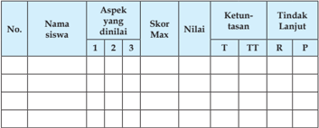

Tabel ini menunjukkan data evaluasi siswa berdasarkan aspek-aspek tertentu yang telah dilakukan penilaian. Topik utama tabel adalah evaluasi kinerja siswa dalam beberapa aspek tertentu. Kolom-kolom yang ada meliputi nomor siswa, nama siswa, aspek yang dinilai, skor maksimum, nilai yang diberikan, ketuntasan (T untuk baik, TT untuk cukup baik, R untuk kurang), dan tindakan lanjut yang diambil. Data penting yang terlihat adalah bahwa banyak siswa memiliki nilai yang cukup baik atau baik, namun masih ada yang kurang dalam beberapa aspek. Ini menunjukkan bahwa perbaikan masih diperlukan untuk meningkatkan kinerja siswa secara keseluruhan.

 

---
## 📄 Halaman 117

### Keterangan:

T

:   Tuntas

TT  :   Tidak tuntas

R

:   Remedial

P

:   Pengayaan

### Aspek dan rubrik  penilaian:

### 1. Kejelasan dan kedalaman informasi

- Jika kelompok tersebut dapat memberikan kejelasan dan kedalaman informasi lengkap dan sempurna maka skor 4.
- Jika  kelompok  tersebut  dapat  memberikan  penjelasan  dan kedalaman informasi lengkap dan  kurang sempurna maka skor 3.
- Jika kelompok  tersebut dapat memberikan  penjelasan dan kedalaman informasi  kurang lengkap  maka skor 2.
- Jika kelompok tersebut  tidak dapat memberikan penjelasan dan kedalaman informasi  maka skor 1.

### 2. Keaktifan dalam diskusi

- Jika  kelompok  tersebut    berperan  sangat  aktif  dalam  diskusi maka skor 4
- Jika kelompok tersebut berperan  aktif dalam diskusi maka skor 3
- Jika kelompok tersebut kurang aktif dalam diskusi maka skor 2
- Jika kelompok tersebut tidak aktif dalam diskusi maka skor 1

### 3. Kejelasan dan kerapian presentasi

- Jika kelompok tersebut dapat mempresentasikan sangat jelas dan rapi maka skor 4.
- Jika kelompok tersebut dapat mempresentasikan jelas dan rapi maka skor 3.
- Jika kelompok tersebut dapat mempresentasikan sangat jelas dan kurang rapi maka skor 2.
- Jika  kelompok  tersebut  dapat  mempresentasikan  kurang    jelas dan  tidak rapi maka skor 1.
Perolehan Nilai Diskusi = J umlah nilai yang diperoleh  100 Jumlah nilai maksimal

Jumlah nilai maksimal diskusi adalah 12 (4 + 4 + 4)

 

---
## 📄 Halaman 118

Jika  pada bagian 1 (kejelasan dan kedalaman informasi) peserta didik memperoleh nilai 3, bagian 2 (keaktifan dalam diskusi)  nilai 3 dan pada bagian 3 (kejelasan dan kerapihan prsentasi) nilai 3, maka jumlah nilai diskusi yang diperoleh peserta didik adalah 9.

Jadi perhitungan nilainya adalah: 12 9 100 # =75 Perolehan nilai  tersebut  menunjukkan  bahwa  peserta  didik  telah  mencapai ketuntasan belajar sebagaimana ditetapkan dalam Permendikbud No.53 Tentang Penilaian Hasil Belajar oleh Pendidik dan Satuan Pendidikan pada Pendidikan Dasar dan Pendidikan Menengah.

### Catatan:

- Guru  dapat  mengembangkan  instrumen  penilaian  sesuai  dengan kebutuhan.
- Guru  diharapkan  memiliki  catatan  sikap  atau  nilai-nilai  karakter yang dimiliki peserta didik selama dalam proses pembelajaran.
- Aspek penilaian diskusi ini dapat digunakan pada penilaian sikap ketika kegiatan  membuka relung hati dan mengkritisi lingkungan sekitar.

### 3. Tugas

Kolom 'Membaca dan menghafal dengan tartil' Rubrik Pengamatannya sebagai berikut:

---
**📊 Tabel**

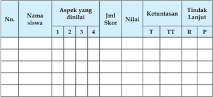

Tabel ini merupakan alat evaluasi yang digunakan untuk mengevaluasi aspek-aspek tertentu siswa berdasarkan skor yang diberikan. Topik utama tabel adalah evaluasi aspek-aspek tertentu siswa. Kolom-kolom yang ada meliputi No., Nama siswa, Aspek yang dinilai, Jml Skor, Nilai, Ketuntasan, dan Tindak Lanjut. Data atau pola penting yang terlihat adalah bahwa tabel ini mencakup beberapa aspek yang berbeda seperti aspek 1, 2, 3, dan 4, dengan jumlah skor yang ditentukan untuk setiap aspek tersebut. Selain itu, tabel juga mencakup nilai yang diberikan kepada setiap aspek, ketuntasan yang diperoleh oleh siswa, dan tindakan lanjut yang akan dilakukan jika siswa belum memenuhi standar.

### Keterangan:

T

: Tuntas

TT  : Tidak tuntas

R

: Remedial

P

: Pengayaan

 

---
## 📄 Halaman 119

maksimal

Aspek yang dinilai   :  1.

- Tajwĩd
- → Niali maksimal 4
- Kelancaran            → Niali maksimal 4
- Faşoĥah
- → Niali
- Seni tilãwah
- → Niali maksimal 4
Nilai Maksimal 12

Jumlah nilai yang diperoleh peserta didik × 100

12

Nilai Akhir :

### Rubrik penilaiannya adalah:

### 1. Tajwĩd

- Jika peserta didik dapat menyebutkan 4  hukum bacaan, maka nilai yang diperoleh 4.
- Jika peserta didik dapat menyebutkan 3 hukum bacaan  maka nilai yang diperoleh 3.
- Jika peserta didik dapat menyebutkan 2 hukum bacaan maka nilai yang diperoleh 2.
- Jika peserta didik dapat menyebutkan 1  hukum bacaan,  maka nilai yang diperoleh 1.

### 2. Kelancaran

- Jika peserta didik dapat membaca dalam Q.S. an-Nisã /4 : 59, Q.S. Al-Mãidah /5: 48, dan Q.S. at-Taubah /9: 105 dengan lancar dan tartĩl maka skor 4.
- Jika peserta didik dapat membaca dalam Q.S. an-Nisã /4 : 59, Q.S. alMãidah /5: 48, dan Q.S. at-Taubah /9: 105 dengan lancar dan  kurang tartĩl maka skor 3.
- Jika peserta didik dapat membaca Q.S. an-Nisã /4 : 59, al-Mãidah /5: 48, dan Q.S. at-Taubah /9: 105  kurang lancar dan  kurang tartĩl maka skor 2.
- Jika peserta didik tidak  dapat membaca dalam Q.S. an-Nisã /4 : 59, Q.S. al-Mãidah /5: 48, dan Q.S. at-Taubah /9: 105 maka skor 1

### 3. Faşoĥah

- Jika peserta didik dapat membaca sangat faşih, maka skor 4.
- Jika peserta didik dapat membaca dengan  faşih, maka skor 3.
- Jika peserta didik dapat membaca  cukup faşih, maka skor 3.
- Jika peserta didik dapat membaca  kurang faşih, maka skor 2.
- Jika peserta didik dapat membaca tidak faşih, maka skor 1.
4

 

---
## 📄 Halaman 120

### 4. Seni tilãwah

- Jika peserta didik dapat membaca dengan sangat merdu dan indah, maka skor 4.
- Jika peserta didik dapat membaca  dengan merdu dan indah, maka skor 3.
- Jika  peserta didik dapat membaca cukup merdu dan indah, maka skor 2
- Jika peserta didik  dapat membaca  kurang  merdu dan  indah, maka skor 1
Jika  peserta  didik  pada  aspek  1  ( tajwid )  memperoleh  nilai  3,  aspek  2 (kelancaran) nilai 4, aspek 3 ( faşhohah ) nilai 3 dan aspek ke 4 (seni tilawah ) nilai 3, maka nilai membaca dan menghafal peserta didik adalah:

``

### Menyalin dan mencari hukum tajwĩd .

Format Penilaiannya:

---
**📊 Tabel**

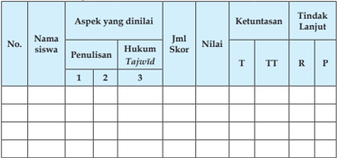

Tabel ini menunjukkan hasil evaluasi siswa dalam aspek penulisan hukum Tajwid. Kolom-kolomnya meliputi nomor siswa, nama siswa, aspek yang dinilai (penulisan, hukum Tajwid), jumlah skor, nilai, ketuntasan (T untuk baik, TT untuk cukup baik, R untuk kurang, P untuk tidak mencapai), dan tindakan lanjut. Data penting yang terlihat adalah bahwa banyak siswa memiliki skor yang baik dalam penulisan dan hukum Tajwid, namun masih ada yang kurang dalam ketuntasan. Ini menunjukkan perluasan untuk peningkatan keterampilan penulisan dan pemahaman hukum Tajwid bagi siswa.

Keterangan:

T

: Tuntas

TT  : Tidak tuntas

R

: Remedial

P

: Pengayaan

 

---
## 📄 Halaman 121

### Rubrik penialain:

### 1. Sesuai kaidah penulisan

- Jika  peserta  didik  dapat  menulis  sesuai  kaidah  penulisan  dengan sangat baik, maka skor 4.
- Jika  peserta  didik  dapat  menulis  sesuai  kaidah  penulisan  dengan baik, maka skor 3
- Jika  peserta  didik  dapat  menulis  sesuai  kaidah  penulisan  dengan kurang baik, maka skor 2.
- Jika peserta didik tidak dapat menulis sesuai kaidah penulisan yang baik, maka skor 1.

### 2. Kerapian

- Jika peserta didik dapat menulis sangat rapi,
- Jika peserta didik dapat menulis dengan rapi,
- Jika peserta didik dapat menulis kurang rapi,
maka maka

maka

- Jika peserta didik dapat menulis tidak rapi,

### 3. Hukum Tajwid

- Apabila  Peserta  didik  dapat  menemukan  4  hukum  bacaan,  maka skor 4.
- Apabila  Peserta  didik  dapat  menemukan  3  hukum  bacaan,  maka skor 3.
- Apabila Peserta didik dapat menemukan 2 hukum bacaan, skor 2.
- Apabila Peserta didik dapat menemukan 1 hukum bacaan, skor 1.
Perolehan Nilai  = Jumlah nilai yang diperoleh × 100 Jumlah Nilai  maksimal

Jika peserta didik pada aspek 1(jenis/model tulisan) memperoleh nilai 3, aspek 2 ( kerapihan) nilai 4, aspek 3 (tajwid) nilai 3 , maka nilai membaca dan menghafal peserta didik adalah:  (3 + 4 + 3) = 12 10 100 # = 83

maka skor

skor skor

skor

1.

4.

3.

2.

 

---
## 📄 Halaman 122

---
**📊 Tabel**

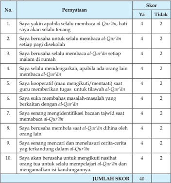

Tabel ini menunjukkan skor yang diberikan kepada setiap pernyataan tentang kecintaan terhadap Al-Qur'an dan keinginan untuk membaca Al-Qur'an. Topik utama tabel adalah kecintaan terhadap Al-Qur'an dan keinginan untuk membaca Al-Qur'an. Kolom pertama berisi pernyataan, sedangkan kolom kedua berisi skor yang diberikan. Data penting yang terlihat adalah bahwa sebanyak 40 poin diberikan kepada setiap pernyataan, dengan skor tertinggi 4 dan skor terendah 2. Pola penting yang terlihat adalah bahwa banyak pernyataan memiliki skor yang sama, yaitu 4 dan 2, menunjukkan bahwa responden memiliki kecintaan dan keinginan yang sama terhadap Al-Qur'an.

``

Kolom  'Menerapkan  perilaku  mulia  berdasarkan  Q.S.  an-Nisã/4  :  59 dengan baik.

 

---
## 📄 Halaman 123

---
**📊 Tabel**

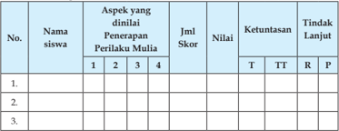

Tabel ini menunjukkan hasil penilaian perilaku mulia siswa berdasarkan aspek-aspek tertentu. Kolom-kolomnya meliputi nomor siswa, nama siswa, aspek yang dinilai, jumlah skor, nilai, ketuntasan, dan tindakan lanjut. Topik utama tabel adalah evaluasi perilaku mulia siswa. Data penting yang terlihat adalah bahwa setiap siswa memiliki aspek tertentu yang dinilai, jumlah skor yang diberikan, nilai yang diberikan, dan tindakan lanjut yang diambil. Tabel ini membantu dalam memantau perkembangan perilaku siswa dan memberikan saran untuk pengembangan diri.

### Aspek yang dinilai:

- Sudah dilakukan dengan sangat baik → Skor   4
- Sudah dilakukan dengan baik → Skor   3
- Sudah dilakukan dengan cukup baik → Skor   2
- Sudah dilakukan namun kurang baik → Skor   1
Nilai Maksimal….

10

### Keterangan:

### a. Sangat baik:

Peserta didik akan mendapat  skor  4 jika peserta didik tersebut sudah  terbiasa  dan  sering  menerapkan  perilaku  taat  berdasarkan. Q.S. an-Nisa' /4: 59 tersebut dengan baik.

### b. Baik:

Peserta didik akan mendapat skor 3 jika peserta didik tersebut sering menerapkan perilaku taat berdasarkan Q.S. an-Nisa' /4: 59 tersebut tetapi belum konsisten.

### c. Cukup:

Peserta didik akan mendapat skor 2 jika peserta didik tersebut kadangkadang  menerapkan  perilaku  taat  berdasarkan. Q.S.  an-Nisa' /4:  59 tersebut dengan baik.

### d. Kurang baik

Peserta didik akan mendapat skor 1 jika peserta didik tersebut kadangkadang/jarang menerapkan perilaku taat berdasarkan. Q.S. an-Nisa' /4: 59 tersebut dengan baik.

 

---
## 📄 Halaman 124

Guru dapat mengembangkan skor tersebut jika ditemui kriteria penilaian lain berdasarkan bentuk perilaku peserta didik pada situasi dan kondisi yang berkembang,  terkait  dengan  penerapan  perilaku  taat  berdasarkan Q.S.anNisa' /4: 59 tersebut.

Kolom  'Menerapkan  perilaku  mulia    berdasarkan QS.  al-Mãidah /5:  48 dengan baik

Rubrik Pengamatan Perilaku Kompetisi dalam kebaikan berdasarkan Q.S. al-Mãidah /5: 48

---
**📊 Tabel**

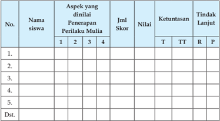

Tabel ini menunjukkan analisis perilaku mulia siswa berdasarkan empat aspek tertentu: Aspek 1, Aspek 2, Aspek 3, dan Aspek 4. Setiap siswa memiliki satu baris di tabel ini, dengan kolom-kolom yang mencakup nama siswa, aspek-aspek yang dinilai, jumlah skor, nilai, ketuntasan, dan tindakan lanjut. Data dalam tabel ini menunjukkan bahwa setiap siswa telah dianalisis secara mendalam tentang perilaku mulia mereka dalam empat aspek tertentu. Tabel ini membantu dalam memahami bagaimana perilaku mulia siswa dapat dianalisis dan diperbaiki melalui penilaian dan tindakan lanjut yang tepat.

### Aspek yang dinilai:

- Sudah dilakukan dengan sangat baik, skor 4
- Sudah dilakukan dengan baik, skor 3
- Sudah dilakukan dengan cukup baik skor  2
- Sudah dilakukan kurang baik Skor 1

### Keterangan:

### a. Sangat baik:

Peserta didik akan mendapat skor 4 jika peserta didik tersebut sudah terbiasa  dan  sering  menerapkan  perilaku  taat  berdasarkan Q.S.  alMaidah /5: 48 tersebut dengan baik.

 

---
## 📄 Halaman 125

### b. Baik:

Peserta didik akan mendapat skor 3 jika peserta didik tersebut sering menerapkan  perilaku  taat  berdasarkan Q.S.  al-Maidah /5:  48  tersebut tetapi belum konsisten.

### c. Cukup:

Peserta didik akan mendapat skor 2 jika peserta didik tersebut kadangkadang  menerapkan  perilaku  taat  berdasarkan Q.S.  al-Maidah /5:  48 tersebut dengan baik .

### d. Kurang

Peserta didik akan mendapat skor 1 jika peserta didik tersebut kadangkadang/ jarang menerapkan perilaku taat berdasarkan Q.S. al-Maidah /5: 48 tersebut dengan baik.

Guru dapat mengembangkan skor tersebut bila ditemui kriteria penilaian lain  berdasarkan  bentuk  perilaku  peserta  didik  pada  situasi  dan  kondisi yang berkembang, terkait dengan penerapan perilaku taat berdasarkan Q.S. al- Maidah /5: 48 tersebut.

``

Jika peserta didik pada kolom 1 memperoleh nilai 4, kolom 2 nilai 3 dan kolom 3 nilai 4, serta kolom 4 nilai 4, maka nilai yang diperoleh peserta didik adalah:

``

Perolehan nilai tersebut menunjukkan bahwa peserta didik telah memiliki perilaku  yang  sangat  baik  sebagaimana  ditetapkan  dalam  Permendikbud No.53 Tentang Penilaian Hasil Belajar oleh Pendidik dan Satuan Pendidikan pada Pendidikan Dasar dan Pendidikan Menengah.

 

---
## 📄 Halaman 126

### 4. Tugas Kelompok

Dalam  kegiatan  tugas/kerja  kelompok  hal-hal  yang  dilakukan  guru adalah:

- Membuat kelompok sesuai dengan jumlah peserta didik di dalam kelasnya maksimal 5 orang dalam satu kelompok.
- Masing-masing kelompok mengerjakan tugas sesuai dengan perintah yang ada di dalam buku peserta didik, guru melakukan mentoring.
- Masing-masing  kelompok  mempresentasikan  hasil  kerjanya  dan kelompok lainnya memberikan tanggapan, guru melakukan pengamatan  dan  penilaian  (sangat  baik,  baik,  cukup  baik,  atau kurang baik).
- Guru memberikan komentar atau penguatan terhadap materi yang didiskusikan oleh peserta didik.

### G.  Pengayaan

Dalam kegiatan pembelajaran membaca dengan tartĩl Q.S. an-Nisã /4 : 59, Q.S. al-Mãidah /5: 48, dan Q.S. at-Taubah /9: 105 tentang taat, kompetisi dalam kebaikan, dan etos kerja, bagi siswa yang sudah menguasai materi dengan baik, peserta didik dapat mengerjakan soal pengayaan yang telah disiapkan oleh  guru  berupa  pertanyaan-pertanyaan  yang  berkaitan  dengan  hukum bacaan tajwĩd pada surat  dan  ayat  yang  lain.  Kemudian  Guru    mencatat dan memberikan tambahan nilai bagi  peserta didik  yang berhasil dalam pengayaan.

### H.  Remedial

Bagi peserta didik yang belum menguasai materi membaca dengan tartĩl Q.S. an-Nisã /4 : 59, al-Mãidah /5: 48, dan Q.S. at-Taubah /9: 105  dan memahami isi kandungannya dengan baik tentang taat, kompetisi dalam kebaikan, dan etos kerja (belum sampai KKM) tersebut, dapat dilakukan penilaian kembali dengan  soal  yang  sejenis  atau  soal  yang  lain  yang  tetap  mengacu  pada KD yang belum dikuasai dengan baik oleh siswa. Remedial dilaksanakan pada waktu dan hari tertentu yang disesuaikan, seperti:  pada saat kegiatan pembelajaran atau di luar jam pelajaran (tehniknya dapat dimusyawarahkan dengan siswa yang bersangkutan.

 

---
## 📄 Halaman 127

### I. Interaksi Guru Dengan Orang Tua

Guru meminta peserta didik memperlihatkan kolom 'Evaluasi' dalam buku teks kepada orang tuanya dengan memberikan komentar dan paraf. Dapat  juga  dengan    menggunakan  buku  penghubung  kepada  orang  tua tentang perubahan perilaku siswa  setelah mengikuti kegiatan pembelajaran atau berkomunikasi langsung,dengan pernyataan tertulis atau lewat telepon tentang perkembangan kemampuan membaca dan menghafal peserta didik, terkait dengan materi tentang taat, kompetisi dalam kebaikan, dan etos kerja.

 

---
## 📄 Halaman 128

BAB 7

### RasulR asul Kekasih Allah Swt.

### A.  Kompetensi Inti

- KI-1  Menghayati dan mengamalkan ajaran agama yang dianutnya.
- KI-2 Menunjukkan  perilaku  jujur, disiplin,  bertanggung  jawab, peduli  (gotong  royong,  kerja  sama,  toleran,  damai),  santun, responsif, dan pro-aktif sebagai bagian dari solusi atas berbagai permasalahan dalam berinteraksi secara efektif dengan lingkungan  sosial  dan  alam  serta  menempatkan  diri  sebagai cerminan bangsa dalam pergaulan dunia.
- KI-3 Memahami,  menerapkan,  menganalisis  pengetahuan  faktual, konseptual, prosedural berdasarkan rasa ingin tahunya tentang ilmu  pengetahuan,  teknologi,  seni,  budaya,  dan  humaniora dengan wawasan kemanusiaan, kebangsaan, kenegaraan, dan peradaban  terkait  penyebab  fenomena  dan  kejadian,  serta menerapkan pengeta-huan prosedural pada bidang kajian yang spesiik sesuai dengan bakat dan minatnya.
- KI-4   Mengolah,  menalar,  dan  menyaji  dalam  ranah  konkret  dan  ranah abstrak  terkait  dengan  pengembangan  dari  yang  dipelajari-nya  di sekolah  secara  mandiri,  dan  mampu  menggunakan  metoda  sesuai kaidah keilmuan.

 

---
## 📄 Halaman 129

### B.  Kompetensi Dasar

- 1.4 Meyakini adanya rasul-rasul Allah Swt.
- 2.4 Menunjukkan  perilaku  saling  menolong  sebagai  cerminan  beriman kepada rasul-rasul Allah Swt.
- 3.4 Menganalisis makna iman kepada rasul-rasul Allah Swt.
- 4.4 Menyajikan kaitan antara iman kepada rasul-rasul Allah Swt dengan keteguhan dalam bertauhid, toleransi, ketaatan, dan kecintaan kepada Allah Swt.

### C.  Tujuan Pembelajaran

Setelah mengikuti proses pembelajaran, Peserta didik mampu:

- Menyebutkan arti iman kepada rasul-rasul Allah Swt.
- Menjelaskan kandungan dalil naqli tentang iman kepada Rasul-rasul Allah Swt.
- Menjelaskan makna iman kepada Rasul-rasul Allah Swt.
- Menunjukkan perilaku yang mencerminkan iman kepada Rasul-rasul Allah Swt.
- Mengimplementasikan perilaku iman kepada rasul-rasul Allah Swt. dalam kehidupan sehari-hari.

### D.  Pengembangan Materi

- Menelaah dalil-dalil Al-Qur'ãn dan hadis tentang beriman kepada rasul-rasul Allah Swt.
- Menjelaskan pengetian Rasul.
- Menjelaskan pentingnya seorang Rasul.
- Menjelaskan mengenai kedudukan Rasul.
- Menjelaskan Sifat-sifat Rasul.
- Menelaah Nabi Muhammad saw. sebagai penutup para Nabi.
- Menjelaskan ketauladanan Nabi Muhammad saw.
Pengembangan  materi  tersebut  dapat  disampaikan  apabila pada materi inti yang terdapat  di dalam KD telah dikuasai oleh siswa

 

---
## 📄 Halaman 130

### E. Proses Pembelajaran

### 1. Persiapan

- Pembelajaran dimulai dengan guru mengucapkan salam dan berdoa bersama.
- Memeriksa  kehadiran,  kerapian  berpakaian,  posisi  tempat  duduk disesuaikan dengan pembelajaran kegiatan.
- Menyapa peserta didik.
- Melakukan appersepsi dan pretes.
- Menyampaikan tujuan pembelajaran.
- Mempersiapkan  Model  pembelajaran  yang  dapat  digunakankan sebagai  alternatif  dalam  kompetensi  ini  seperti discovery  learning, problem based learning, puzzle , bermain peran ( role playing ), mengembangkan kemampuan dan keterampilan ( skill ) peserta didik.

### 2. Pelaksanaan

### Membuka Relung Hati

- Peserta  didik  menyimak  dan  mencermati  tayangan  atau  gambar yang ada di dalam buku teks.
- Peserta  didik  memberi  komentar  terhadap  tayangan  atau  gambar tersebut.
- Peserta didik diberikan penjelasan tentang maksud yang terkandung di dalam gambar tersebut.
- Peserta didik menyimak dan mencermati kolom  uraian yang ada pada 'Membuka Relung Hati' yang ada di dalam buku teks
- Peserta didik bertanya/memberi komentar terhadap hasil pengamatan  nya pada kolom uraian  tersebut.
- Peserta didik diberikan penjelasan tentang maksud yang terkandung di dalam uraian tersebut.
- Peserta  didik  menjawab  pertanyaan  yang  terdapat  pada  kolom 'Membuka Relung Hati' dan guru memberikan penilaian.

### Mengkritisi Sekitar Kita

- Peserta didik menyimak uraian yang ada pada 'Mengkritisi Sekitar Kita' di dalam buku teks.
- Peserta  didik  memberi  komentar  terhadap  hasil  pengamatannya pada uraian tersebut.
- Peserta didik diberikan penjelasan tambahan dan penguatan mengenai  hasil pengamatannya  oleh guru/pembimbing.

 

---
## 📄 Halaman 131

- Peserta  didik  menjawab  pertanyaan  yang  terdapat  pada  kolom 'Aktivitas  siswa'  di  lembar  kerja  atau  kertas  folio  dan  guru memberikan penilaian dalam bentuk portofolio.

### Memperkaya Khazanah Peserta Didik

- Selanjutnya  peserta  didik  menyimak  teks  bacaan  tentang  iman kepada  rasul-rasul  Allah  Swt.  di  dalam  kelompoknya  masingmasing.
- Peserta didik bertanya tentang iman kepada rasul-rasul Allah Swt. di dalam kelompoknya masing-masing.
- Peserta didik mendiskusikan iman kepada rasul-rasul Allah Swt. di dalam kelompoknya masing-masing.
- Peserta  didik  diamati  dan  difasilitasi  oleh  guru  dalam  diskusi kelompok tentang iman kepada rasul-rasul Allah Swt.
- Peserta  didik  membuat  rumusan  naskah/laporan  hasil  diskusi tentang iman kepada rasul-rasul Allah Swt. di dalam kelompoknya masing-masing.
- Peserta didik yang telah ditentukan sebagai panelis mempresentasikan hasil diskusi kelompok tentang iman kepada rasul-rasul Allah Swt. di depan kelompok lainnya.
- Peserta didik mengkritisi hasil presentasi kelompok  tentang iman kepada Rasul-rasul Allah Swt.
- Peserta didik diberikan penjelasan tambahan dan penguatan mengenai iman kepada rasul-rasul Allah Swt. oleh guru/ pembimbing.
- Peserta  didik  menjawab  pertanyaan  yang  terdapat  pada  kolom 'Aktivitas  siswa'  di  lembar  kerja  atau  kertas  folio  dan  guru memberikan penilaian dalam bentuk portofolio.

### Menerapkan Perilaku Mulia

- Peserta didik menyimak teks bacaan perilaku terpuji yang dapat  diterapkan  sebagai  penghayatan  dan  pengamalan  setelah mempelajari  materi iman kepada rasul-rasul Allah Swt. di dalam kelompoknya masing-masing.
- Peserta didik bertanya tentang perilaku terpuji yang dapat diterapkan sebagai penghayatan dan pengamalan setelah  mempelajari  materi iman kepada rasul-rasul Allah Swt. di dalam kelompoknya masingmasing.

 

---
## 📄 Halaman 132

- Peserta didik mendiskusikan perilaku terpuji yang dapat diterapkan sebagai penghayatan dan pengamalan setelah  mempelajari  materi iman kepada rasul-rasul Allah Swt.
- Peserta  didik  menyampaikan  hasil  diskusi  kelompok    tentang perilaku  terpuji  yang  dapat  diterapkan  sebagai  penghayatan  dan pengamalan terhadap  materi iman kepada rasul-rasul Allah Swt..
- Peserta didik mencermati dan mengkritisi hasil presentasi  panelis dalam  diskusi  kelompok  tentang  perilaku  terpuji  yang  dapat diterapkan sebagai penghayatan dan pengamalan terhadap  materi iman kepada rasul-rasul Allah Swt.
- Peserta didik diberikan penjelasan tambahan dan penguatan mengenai perilaku terpuji yang dapat diterapkan sebagai penghayatan dan pengamalan terhadap  materi iman kepada Rasulrasul Allah Swt. oleh guru/pembimbing.
- Peserta didik menyimpulkan intisari pelajaran tentang iman kepada rasul-rasul Allah Swt. dengan menelaah rangkuman yang terdapat dalam buku teks.
- Peserta didik menampilkan sikap yang mencerminkan iman kepada Rasul-rasul Allah Swt. dalam kehidupan sehari-hari.
- Peserta didik menerima tugas individu mengerjakan soal-soal pada kolom 'Evaluasi' yang ada di dalam buku teks  sebagai pemantapan pemahaman terhadap  iman kepada rasul-rasul Allah Swt..

### F.   Penilaian

### 1. Soal Pilihan Ganda (PG)

Skor  penilaian jawaban soal pilihan ganda adalah: jumlah jawaban benar × 2 (skor maksimal 5 ×

### 2. Soal Uraian

Nilai maksimal pada setiap nomor soal uraian adalah 4,  jumlah nilai maksimal 4 × 5 (soal) = 20.

2 = 10)

 

---
## 📄 Halaman 133

### Rubrik Penilaian

---
**📊 Tabel**

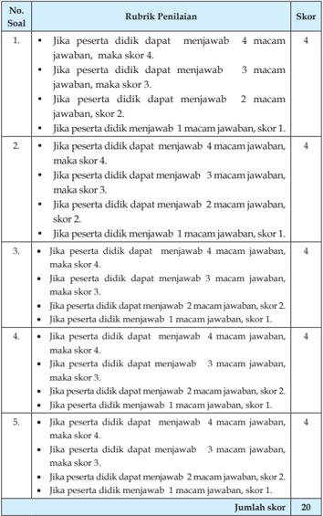

Tabel ini menunjukkan skor yang diberikan kepada peserta didik berdasarkan jumlah jawaban yang benar mereka dapatkan dalam sebuah ujian. Topik utama tabel adalah tentang penilaian berdasarkan jumlah jawaban yang benar. Tabel memiliki dua kolom utama: Soal dan Rubrik Penilaian. Kolom Soal berisi pertanyaan-pertanyaan yang harus dijawab oleh peserta didik, sementara kolom Rubrik Penilaian berisi kriteria penilaian untuk setiap soal. Skor ditentukan berdasarkan jumlah jawaban yang benar peserta didik dapatkan. Misalnya, jika peserta didik dapat menjawab 4 macam jawaban, maka skor 4; jika hanya 3 macam jawaban, maka skor 3, dan seterusnya. Tabel ini membantu dalam mengukur kemampuan peserta didik dalam menjawab pertanyaan dengan tepat dan memberikan skor yang sesuai.

 

---
## 📄 Halaman 134

``

### Jumlah nilai maksimal

Nilai maksimal dari soal pilihan ganda dan essay adalah 10 + 20 = 30. Jika peserta didik memperoleh nilai soal pilihan ganda 8 dan nilai soal essay 15, maka nilai yang diperoleh adalah  8 + 15 = 23. Jadi nilai yang diperoleh peserta didik tersebut adalah 30 23 100 # = 77.

Perolehan nilai tersebut menunjukkan bahwa peserta didik telah mencapai ketuntasan belajar sebagaimana ditetapkan dalam Permendikbud No.53  Tentang  Penilaian  Hasil  Belajar  oleh  Pendidik  dan  Satuan Pendidikan pada Pendidikan Dasar dan Pendidikan Menengah.

### Diskusi tentang Rasul-rasul Kekasih Allah Swt.

---
**📊 Tabel**

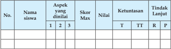

Tabel ini menunjukkan data evaluasi siswa berdasarkan aspek-aspek tertentu yang telah dilakukan penilaian. Kolom-kolomnya meliputi nomor siswa, nama siswa, aspek-aspek yang dinilai (1, 2, 3), skor maksimum, nilai, ketuntasan (T, TT, R, P), dan tindakan lanjut. Topik utama tabel ini adalah evaluasi kinerja siswa dalam beberapa aspek tertentu. Data penting yang terlihat adalah bahwa setiap siswa memiliki aspek-aspek yang berbeda untuk dianalisis, dengan skor maksimum yang berbeda pula. Selain itu, tabel juga menunjukkan tingkat ketuntasan siswa dalam setiap aspek, yang dapat membantu dalam menentukan tindakan lanjut yang sesuai.

### Keterangan:

T

: Tuntas

TT : Tidak tuntas

R

: Remedial

P

: Pengayaan

### Aspek dan rubrik  yang dinilai

### 1).   Kejelasan dan kedalaman informasi

- Jika  kelompok  tersebut  dapat  memberikan  kejelasan  dan  kedalaman informasi lengkap dan sempurna maka skor 4.
- Jika kelompok tersebut dapat memberikan penjelasan dan kedalaman informasi lengkap dan  kurang sempurna maka skor 3.
- Jika  kelompok  tersebut  dapat  memberikan  penjelasan  dan kedalaman informasi  kurang lengkap  maka skor 2.
- Jika kelompok tersebut  tidak dapat memberikan penjelasan dan kedalaman informasi  maka skor 1.

 

---
## 📄 Halaman 135

### 2).   Keaktifan dalam diskusi

- Jika  kelompok  tersebut    berperan  sangat  aktif    dalam  diskusi maka skor 4.
- Jika kelompok tersebut berperan  aktif dalam diskusi maka skor 3.
- Jika kelompok tersebut kurang aktif dalam diskusi maka skor 2.
- Jika kelompok tersebut tidak aktif dalam diskusi maka skor 1.

### 3).   Kejelasan dan kerapian presentasi

- Jika  kelompok  tersebut  dapat  mempresentasikan    sangat  jelas dan rapi maka skor 4.
- Jika kelompok tersebut dapat mempresentasikan   jelas dan rapi maka skor 3.
- Jika  kelompok  tersebut  dapat  mempresentasikan    sangat  jelas dan  kurang rapi maka skor 2.
- Jika kelompok tersebut dapat mempresentasikan kurang  jelas dan  tidak rapi maka skor 1.

``

Jumlah nilai maksimal diskusi adalah 12 (4 + 4 + 4).

Jika  pada bagian 1 (kejelasan dan kedalaman informasi) peserta didik memperoleh nilai 3, bagian 2 (keaktifan dalam diskusi)  nilai 3 dan pada bagian 3 (kejelasan dan kerapihan prsentasi) nilai 3, maka jumlah nilai diskusi yang diperoleh peserta didik adalah 9. Jadi perhitungan nilainya adalah : 9 100 # =  75.

``

Perolehan nilai tersebut menunjukkan bahwa peserta didik telah mencapai ketuntasan belajar sebagaimana ditetapkan dalam Permendikbud No.53  Tentang  Penilaian  Hasil  Belajar  oleh  Pendidik  dan  Satuan Pendidikan pada Pendidikan Dasar dan Pendidikan Menengah.

### Catatan:

- Guru  dapat  mengembangkan  instrumen  penilaian  sesuai  dengan kebutuhan.
- Guru  diharapkan  memiliki  catatan  sikap  atau  nilai-nilai  karakter yang dimiliki peserta didik selama dalam proses pembelajaran.

 

---
## 📄 Halaman 136

- Aspek penilaian diskusi ini dapat digunakan pada penilaian sikap ketika kegiatan  membuka relung hati dan mengkritisi lingkungan sekitar.

### 3. Tugas

Kerjakan kolom berikut ini sesuai perintah! Tulislah jawaban ya atau tidak pada kolom yang sudah tersedia di bawah ini dengan jujur!

---
**📊 Tabel**

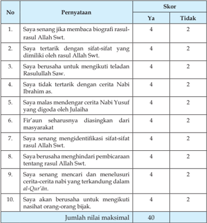

Tabel ini menunjukkan skor yang diberikan kepada setiap pernyataan dalam sebuah tes atau ujian. Topik utamanya adalah tentang pemahaman dan kepercayaan terhadap Al-Qur'an dan nasihat Rasulullah SAW. Kolom "Pernyataan" berisi 10 pernyataan yang harus dijawab dengan "Ya" atau "Tidak". Skor ditentukan berdasarkan jawaban tersebut, dengan skor maksimal 40. Pola penting yang terlihat adalah bahwa semua pernyataan memiliki skor yang sama, yaitu 4 untuk "Ya" dan 2 untuk "Tidak", menunjukkan bahwa setiap jawaban memiliki nilai yang sama dalam skor akhir.

Jumlah nilai yang diperoleh peserta didik × 100

Perolehan nilai =

Skor  maksimal

 

---
## 📄 Halaman 137

### G.  Pengayaan

Dalam kegiatan pembelajaran, bagi peserta didik yang sudah menguasai materi meneladani rasul-rasul Allah Swt. dengan baik dan telah memperoleh nilai yang memuaskan (sangat baik), peserta didik diberikan tugas menelaah mengenai sejarah rasul-rasul Allah Swt. di perpustakaan dengan membaca buku  Ensklopedi  Islam  atau  referensi  lainnya,  kemudian  peserta  didik membuat  resume  dari  naskah yang dibaca/diamati. (Guru mencatat dan  memberikan  tambahan  nilai  bagi  peserta  didik  yang  berhasil  dalam pengayaan.

### H.  Remedial

Bila  peserta  didik  setelah  dilakukan  penilaian  nyata  ada  yang  belum menguasai materi meneladani rasul-rasul Allah Swt. (belum mencapai KKM), maka  guru  melakukan remedial  teaching kemudian  melakukan  penilaian kembali dengan soal yang sejenis atau soal lain yang tetap mengacu pada KD yang belum dikuasai dengan baik oleh peserta didik. Remedial dilaksanakan pada waktu dan hari tertentu yang disesuaikan dengan situasi dan kondisi, seperti: pada saat kegiatan pembelajaran atau di luar jam pelajaran (tekniknya dapat dimusyawarahkan dengan peserta didik yang bersangkutan).

### I. Interaksi Guru Dengan Orang Tua

Peserta didik memperlihatkan buku teks bagian kolom 'Interaksi Guru dengan Orang Tua' kepada orang tuanya dengan memberikan komentar dan paraf. Dapat juga dengan menggunakan buku penghubung kepada orang tua tentang perubahan perilaku peserta didik, setelah mengikuti kegiatan pembelajaran atau berkomunikasi baik  langsung  atau  lewat  telepon  tentang  perkembangan  perilaku  peserta  didik, misalnya dengan mengamati perilakunya, dalam meneladani rasul-rasul Allah Swt. kehidupan sehari-hari.

 

---
## 📄 Halaman 138

BAB 8

### Menghormati dan Menyayangi Orang Tua dan Guru

### A.  Kompetensi Inti

- KI-1  Menghayati dan mengamalkan ajaran agama yang dianutnya.
- KI-2 Menunjukkan  perilaku  jujur, disiplin,  bertanggung  jawab, peduli  (gotong  royong,  kerja  sama,  toleran,  damai),  santun, responsif, dan pro-aktif sebagai bagian dari solusi atas berbagai permasalahan dalam berinteraksi secara efektif dengan lingkungan  sosial  dan  alam  serta  menempatkan  diri  sebagai cerminan bangsa dalam pergaulan dunia.
- KI-3 Memahami,  menerapkan,  menganalisis  pengetahuan  faktual, konseptual, prosedural berdasarkan rasa ingin tahunya tentang ilmu  pengetahuan,  teknologi,  seni,  budaya,  dan  humaniora dengan wawasan kemanusiaan, kebangsaan, kenegaraan, dan peradaban  terkait  penyebab  fenomena  dan  kejadian,  serta menerapkan pengeta-huan prosedural pada bidang kajian yang spesiik sesuai dengan bakat dan minatnya.
- KI-4   Mengolah,  menalar,  dan  menyaji  dalam  ranah  konkret  dan  ranah abstrak  terkait  dengan  pengembangan  dari  yang  dipelajari-nya  di sekolah  secara  mandiri,  dan  mampu  menggunakan  metoda  sesuai kaidah keilmuan.

 

---
## 📄 Halaman 139

### B.  Kompetensi Dasar

- 1.6 Meyakini bahwa hormat dan patuh kepada orang tua dan guru sebagai kewajiban agama.
- 2.6 Menunjuk-kan perilaku hormat dan patuh kepada orang tua dan guru sebagai implementasi dari pemahaman Q.S. al-Isra' /17: 23-24 dan hadis terkait.
- 3.6 Menganalisis perilaku hormat dan patuh kepada orang tua dan guru.
- 4.6     Menyaji-kan kaitan antara ketauhidan dalam beribadah dengan hormat dan patuh kepada orang tua dan guru sesuai dengan Q.S. al-Isra' /17: 23-24 dan hadis terkait.

### C.  Tujuan Pembelajaran

Setelah mengikuti proses pembelajaran, peserta didik mampu:

- Menjelaskan isi Q.S. al Isra ' /17: 23-24.
- Menjelaskan isi hadis-hadis yang terkait dengan hormat dan patuh kepada orang tua dan guru.
- Menunjukkan  contoh  perilaku  yang  mencerminkan  hormat  dan patuh kepada orang tua dan guru.
- Menampilkan  perilaku  yang  mencerminkan  hormat  dan  patuh kepada orang tua dan guru dalam kehidupan sehari-hari.

### D.  Pengembangan Materi

- Menelaah dalil-dalil al-Qur'ãn dan hadis tentang hormat dan patuh kepada orang tua dan guru.
- Mengambil  teladan  dari  kisah-kisah  tentang    hormat  dan  patuh kepada orang tua dan guru.
- Menjelaskan bahaya durhaka kepada orang tua.
- Menjelaskan bahaya durhaka kepada guru.
Pengembangan  materi  tersebut  dapat  disampaikan  apabila pada materi inti yang terdapat  di dalam KD telah dikuasai oleh siswa

 

---
## 📄 Halaman 140

### E. Proses Pembelajaran

### 1. Persiapan

- Pembelajaran dimulai dengan guru mengucapkan salam dan berdoa bersama.
- Memeriksa  kehadiran,  kerapian  berpakaian,  posisi  tempat  duduk disesuaikan dengan kegiatan pembelajaran.
- Menyapa peserta didik.
- Melakukan appersepsi dan pretes.
- Menyampaikan tujuan pembelajaran.
- Mempersiapkan  model  pembelajaran  yang  dapat  digunakankan sebagai alternatif dalam kompetensi ini seperti discovery learning, problem based learning, puzzle, bermain peran (role playing) dan lain-lain  untuk  mengembangkan  kemampuan  dan  keterampilan (skill) peserta didik.

### 2. Pelaksanaan Membuka Relung Hati

- Peserta  didik  menyimak  dan  mencermati  tayangan  atau  gambar yang ada di dalam buku teks.
- Peserta didik bertanya/memberi komentar terhadap tayangan atau gambar tersebut.
- Peserta didik diberikan penjelasan tentang maksud yang terkandung di dalam gambar tersebut.
- Peserta didik menyimak dan mencermati kolom  uraian yang ada pada 'Membuka Relung Hati' yang ada di dalam buku teks.
- Peserta didik bertanya/memberi komentar terhadap hasil pengamatannya pada kolom uraian  tersebut.
- Peserta didik diberikan penjelasan tentang maksud yang terkandung di dalam uraian tersebut.
- Peserta  didik  menjawab  pertanyaan  yang  terdapat  pada  kolom 'Membuka Relung Hati' dan guru memberikan penilaian.

### Mengkritisi Sekitar Kita

- Peserta didik menyimak uraian yang ada pada 'Mengkritisi Sekitar Kita' di dalam buku teks.
- Peserta  didik    memberi  komentar  terhadap  hasil  pengamatannya pada uraian  tersebut.

 

---
## 📄 Halaman 141

- Peserta didik diberikan penjelasan tambahan dan penguatan mengenai  hasil pengamatannya  oleh guru/pembimbing.
- Peserta  didik  menjawab  pertanyaan  yang  terdapat  pada  kolom 'Aktivitas  siswa'  di  lembar  kerja  atau  kertas  folio  dan  guru memberikan penilaian dalam bentuk portofolio.

### Memperkaya Khazanah Peserta Didik

- Selanjutnya peserta didik menyimak teks bacaan tentang hormat dan patuh kepada orang tua dan guru di dalam  kelompoknya masingmasing.
- Peserta didik bertanya tentang hormat dan patuh kepada orang tua dan guru di dalam kelompoknya masing-masing.
- Peserta didik mendiskusikan hormat dan patuh kepada orang tua dan guru di dalam kelompoknya masing-masing.
- Peserta  didik  diamati  dan  difasilitasi  oleh  guru  dalam  diskusi kelompok tentang hormat dan patuh kepada orang tua dan guru.
- Peserta  didik  membuat  rumusan  naskah/laporan  hasil  diskusi tentang  hormat  dan  patuh  kepada  orang  tua  dan  guru  di  dalam kelompoknya masing-masing.
- Peserta  didik  yang  telah  ditentukan  sebagai  panelis  mempresentasikan hasil diskusi kelompok tentang hormat dan patuh kepada orang tua dan guru di didepan kelompok lainnya.
- Peserta didik mengkritisi hasil presentasi kelompok  tentang hormat dan patuh kepada orang tua dan guru.
- Peserta didik diberikan penjelasan tambahan dan penguatan mengenai  hormat dan patuh kepada orang tua dan guru oleh guru/ pembimbing.
- Peserta  didik  menjawab  pertanyaan  yang  terdapat  pada  kolom 'Aktivitas  siswa'  di  lembar  kerja  atau  kertas  folio  dan  guru memberikan penilaian dalam bentuk portofolio.

### Menerapkan Perilaku Mulia

- Peserta didik menyimak teks bacaan perilaku terpuji yang dapat  diterapkan  sebagai  penghayatan  dan  pengamalan  setelah mempelajari  materi hormat dan patuh kepada orang tua dan guru di dalam  kelompoknya masing-masing.

 

---
## 📄 Halaman 142

- Peserta didik bertanya tentang perilaku terpuji yang dapat diterapkan sebagai penghayatan dan pengamalan setelah  mempelajari  materi hormat dan patuh kepada orang tua dan guru di dalam kelompoknya masing-masing.
- Peserta didik mendiskusikan perilaku terpuji yang dapat diterapkan sebagai penghayatan dan pengamalan setelah  mempelajari  materi hormat dan patuh kepada orang tua dan guru.
- Peserta  didik  menyampaikan  hasil  diskusi  kelompok    tentang perilaku  terpuji  yang  dapat  diterapkan  sebagai  penghayatan  dan pengamalan terhadap  materi hormat dan patuh kepada orang tua dan guru.
- Peserta didik mencermati dan mengkritisi hasil presentasi  panelis dalam  diskusi  kelompok  tentang  perilaku  terpuji  yang  dapat diterapkan sebagai penghayatan dan pengamalan terhadap  materi hormat dan patuh kepada orang tua dan guru.
- Peserta didik diberikan penjelasan tambahan dan penguatan mengenai perilaku terpuji yang dapat diterapkan sebagai penghayatan dan pengamalan terhadap  materi hormat dan patuh kepada orang tua dan guru oleh guru/pembimbing.
- Peserta didik menyimpulkan intisari pelajaran tentang hormat dan patuh  kepada  orang  tua  dan  guru  dengan  menelaah  rangkuman yang terdapat dalam buku teks.
- Peserta didik menampilkan sikap yang mencerminkan hormat dan patuh kepada orang tua dan guru dalam kehidupan sehari-hari.
- Peserta didik menerima tugas individu mengerjakan soal-soal pada kolom 'Evaluasi' yang ada di dalam buku teks  sebagai pemantapan pemahaman  terhadap    hormat  dan  patuh  kepada  orang  tua  dan guru.

### F.   Penilaian

### 1. Soal Pilihan Ganda (PG)

Skor  penilaian jawaban soal pilihan ganda adalah : jumlah jawaban benar × 2    (skor maksimal 5 × 2 = 10)

 

---
## 📄 Halaman 143

### 2. Soal Uraian

Nilai  maksimal  pada  setiap  nomor  soal  uraian  adalah  4,  jumlah  nilai maksimal 4 x 5 (soal) = 20

### Rubrik Penilaian

---
**📊 Tabel**

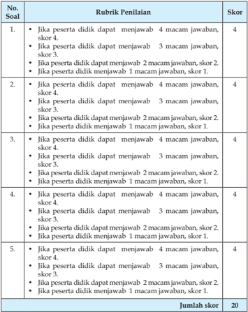

Tabel ini menunjukkan rubrik penilaian untuk sebuah soal yang melibatkan perhitungan skor berdasarkan jumlah jawaban yang benar oleh peserta didik. Topik utama tabel adalah tentang metode penilaian yang digunakan untuk mengukur kemampuan peserta didik dalam menjawab pertanyaan. Tabel ini terdiri dari dua kolom: Rubrik Penilaian dan Skor. Rubrik Penilaian mencakup berbagai kondisi di mana peserta didik dapat mendapatkan skor tertentu, seperti mendapatkan 4 macam jawaban, 3 macam jawaban, 2 macam jawaban, atau 1 macam jawaban. Skor yang diberikan untuk setiap kondisi tersebut juga disebutkan dalam tabel. Selain itu, tabel ini juga menyediakan jumlah skor keseluruhan yang diperoleh peserta didik, yaitu 20. Dari tabel ini, dapat dilihat bahwa skor tertinggi yang bisa diperoleh peserta didik adalah 4, sedangkan skor terendahnya adalah 1. Pola penting yang terlihat adalah bahwa semakin banyak jawaban yang benar yang diberikan oleh peserta didik, semakin tinggi pula skor yang diperolehnya.

``

 

---
## 📄 Halaman 144

Jika peserta didik memperoleh nilai soal pilihan ganda 8 dan nilai soal essay  15,  maka  nilai  yang  diperoleh  adalah    8  +  15  =  23.    Jadi  nilai  yang diperoleh peserta didik tersebut adalah 30 23 100 # = 77 .

Perolehan nilai tersebut  menunjukkan  bahwa  peserta  didik  telah mencapai ketuntasan belajar sebagaimana ditetapkan dalam Permendikbud No.53 Tentang Penilaian Hasil Belajar oleh Pendidik dan Satuan Pendidikan pada Pendidikan Dasar dan Pendidikan Menengah.

### Diskusi tentang Hormat dan Patuh kepada Orang Tua dan Guru

---
**📊 Tabel**

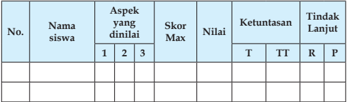

Tabel ini menunjukkan hasil evaluasi siswa dalam aspek tertentu, dengan kolom-kolom seperti Nama Siswa, Aspek yang Dinilai, Skor Max, Nilai, Ketuntasan, dan Tindakan Lanjut. Topik utama tabel adalah evaluasi siswa dalam aspek tertentu. Kolom "Nama Siswa" menyediakan identifikasi individu siswa, sedangkan kolom "Aspek yang Dinilai" menunjukkan aspek khusus yang diukur. Skor Max menunjukkan skor maksimal yang dapat diperoleh untuk aspek tersebut, sementara Nilai menunjukkan skor yang sebenarnya diperoleh oleh siswa. Kolom "Ketuntasan" menunjukkan tingkat keberhasilan siswa dalam aspek tersebut, dengan T untuk Tidak Berhasil, TT untuk Tidak Terlalu Berhasil, R untuk Relatif Berhasil, dan P untuk Berhasil. Kolom "Tindakan Lanjut" memberikan saran atau tindakan yang diberikan kepada siswa untuk meningkatkan pengetahuan atau keterampilan mereka dalam aspek tersebut. Data penting yang terlihat adalah bahwa beberapa siswa memiliki skor yang rendah dibandingkan dengan skor maksimal, yang menunjukkan bahwa mereka memerlukan lebih banyak latihan atau bimbingan untuk meningkatkan pengetahuan atau keterampilan mereka dalam aspek tersebut.

### Keterangan:

T

: Tuntas

TT

: Tidak tuntas

R

: Remedial

P

: Pengayaan

### Aspek yang dinilai

### 1. Kejelasan dan kedalaman informasi

- Jika kelompok tersebut dapat memberikan kejelasan dan kedalaman informasi lengkap dan sempurna, maka skor 4.
- Jika kelompok tersebut dapat memberikan penjelasan dan kedalaman informasi lengkap dan  kurang sempurna, maka skor 3.
- Jika kelompok tersebut dapat memberikan penjelasan dan kedalaman informasi  kurang lengkap,  maka skor 2.
- Jika  kelompok  tersebut  tidak  dapat  memberikan  penjelasan  dan kedalaman informasi, maka skor 1.

### 2. Keaktifan dalam diskusi

- Jika kelompok tersebut  berperan sangat aktif dalam diskusi, maka skor 4.

 

---
## 📄 Halaman 145

- Jika  kelompok  tersebut  berperan    aktif  dalam  diskusi,  maka  skor  3.
- Jika  kelompok  tersebut  tidak  aktif  dalam  diskusi,  maka  skor  1.
- Jika  kelompok  tersebut  kurang  aktif  dalam  diskusi,  maka  skor  2.
- Kejelasan dan kerapian presentasi
- Jika  kelompok  tersebut  dapat  mempresentasikan  jelas  dan  rapi, maka skor 3.
- Jika  kelompok  tersebut  dapat  mempresentasikan  sangat  jelas  dan rapi, maka skor 4.
- Jika  kelompok  tersebut  dapat  mempresentasikan  sangat  jelas  dan kurang rapi, maka skor 2.
- Jika kelompok tersebut dapat mempresentasikan kurang  jelas dan tidak rapi, maka skor 1.

``

Jumlah nilai maksimal diskusi adalah 12 (4 + 4 + 4)

Jika  pada bagian 1 (kejelasan dan kedalaman informasi) peserta didik memperoleh nilai 3, bagian 2 (keaktifan dalam diskusi)  nilai  3  dan  pada bagian 3 (kejelasan dan kerapihan prsentasi) nilai 3, maka jumlah nilai diskusi yang diperoleh peserta didik adalah 9.

Jadi perhitungan nilainya adalah: 12 9 100 # = 75

Perolehan nilai tersebut  menunjukkan  bahwa  peserta  didik  telah mencapai ketuntasan belajar sebagaimana ditetapkan dalam Permendikbud No.53 Tentang Penilaian Hasil Belajar oleh Pendidik dan Satuan Pendidikan pada Pendidikan Dasar dan Pendidikan Menengah.

### Catatan:

- Guru dapat mengembangkan  instrumen  penilaian sesuai dengan kebutuhan.
- Guru diharapkan memiliki catatan sikap atau nilai-nilai karakter yang dimiliki peserta didik selama dalam proses pembelajaran.
- Aspek penilaian diskusi ini dapat digunakan pada penilaian sikap ketika kegiatan  membuka relung hati dan mengkritisi lingkungan sekitar.

 

---
## 📄 Halaman 146

### 4. Tugas Kelompok

### a. Kerjakan kolom berikut ini sesuai perintah!

Berilah  tanda  centang  (  )  pada  kolom  ya  atau  tidak  pada  tabel  yang sudah tersedia di bawah ini dengan jujur!

---
**📊 Tabel**

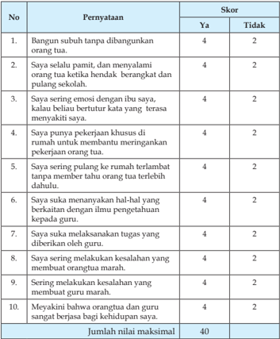

Tabel ini menunjukkan skor yang diberikan untuk setiap pernyataan dalam sebuah survei atau penilaian. Topik utama tabel adalah tentang perilaku dan emosi seseorang terhadap orang tua dan guru mereka. Kolom-kolomnya meliputi "Pernyataan" dan "Skor", dengan "Ya" dan "Tidak" sebagai opsi untuk memberikan skor. Data penting yang terlihat adalah bahwa semua pernyataan memiliki skor 4 untuk "Ya" dan 2 untuk "Tidak", menunjukkan bahwa responden secara umum menganggap perilaku tersebut positif atau tidak berbahaya.

Jumlah nilai yang diperoleh peserta didik × 100

Skor  maksimal

Perolehan nilai =

 

---
## 📄 Halaman 147

### G.  Pengayaan

Dalam kegiatan pembelajaran menghormati dan menyayangi orang tua dan  guru,  bagi  peserta  didik  yang  sudah  menguasai  materi  dengan  baik dapat mengerjakan soal pengayaan yang telah disiapkan oleh guru berupa pertanyaan-pertanyaan misalnya, hikmah apa saja yang anda peroleh ketika anda  selalu  menghormati  dan  menyayangi  orang  tua  maupun  gurumu. Kemudian guru  mencatat dan memberikan tambahan nilai bagi  peserta didik  yang berhasil dalam pengayaan.

### H.  Remedial

Bagi  peserta  didik  yang  belum  menguasai  materi  menghormati  dan menyangi  orang  tua  dan  guru  (belum  mencapai  KKM),  dapat  dilakukan penilaian kembali dengan soal yang sejenis atau soal yang lain yang tetap mengacu  pada  KD  yang  belum  dikuasai  dengan  baik  oleh  peserta  didik. Remedial  dilaksanakan  pada  waktu  dan  hari  tertentu  yang  disesuaikan, seperti:  pada saat kegiatan pembelajaran atau di luar jam pelajaran (tehniknya dapat dimusyawarahkan dengan siswa yang bersangkutan).

### I. Interaksi Guru Dengan Orang Tua

Guru meminta peserta didik memperlihatkan kolom 'Evaluasi' dalam buku teks kepada orang tuanya dengan memberikan komentar dan paraf. Dapat  juga  dengan    menggunakan  buku  penghubung  kepada  orang  tua tentang perubahan perilaku siswa  setelah mengikuti kegiatan pembelajaran atau berkomunikasi langsung dengan pernyataan tertulis atau lewat telepon tentang perkembangan kemampuan pemahaman dan sikap  peserta didik, terkait dengan materi menghormati dan menyangi orang tua maupun guru.

 

---
## 📄 Halaman 148

### BAB 9

### A.  Kompetensi Inti

- KI-1  Menghayati dan mengamalkan ajaran agama yang dianutnya.
- KI-2 Menunjukkan  perilaku  jujur, disiplin,  bertanggung  jawab, peduli  (gotong  royong,  kerja  sama,  toleran,  damai),  santun, responsif, dan pro-aktif sebagai bagian dari solusi atas berbagai permasalahan dalam berinteraksi secara efektif dengan lingkungan  sosial  dan  alam  serta  menempatkan  diri  sebagai cerminan bangsa dalam pergaulan dunia.
- KI-3 Memahami,  menerapkan,  menganalisis  pengetahuan  faktual, konseptual, prosedural berdasarkan rasa ingin tahunya tentang ilmu  pengetahuan,  teknologi,  seni,  budaya,  dan  humaniora dengan wawasan kemanusiaan, kebangsaan, kenegaraan, dan peradaban  terkait  penyebab  fenomena  dan  kejadian,  serta menerapkan pengeta-huan prosedural pada bidang kajian yang spesiik sesuai dengan bakat dan minatnya.
- KI-4   Mengolah,  menalar,  dan  menyaji  dalam  ranah  konkret  dan  ranah abstrak  terkait  dengan  pengembangan  dari  yang  dipelajari-nya  di sekolah  secara  mandiri,  dan  mampu  menggunakan  metoda  sesuai kaidah keilmuan.

### Prinsip dan Praktik Ekonomi  Islam

 

---
## 📄 Halaman 149

### B.  Kompetensi Dasar

- 1.9 Menerapkan prinsip ekonomi dan muamalah sesuai dengan ketentuan syariat Islam.
- 2.9 Bekerjasama dalam menegakkan prinsip-prinsip dan praktik ekonomi sesuai syariat Islam.
- 3.9 Menelaah  prinsip-prinsip dan praktik ekonomi dalam Islam.
- 4.9 Mempresentasikan prinsip-prinsip dan praktik ekonomi dalam Islam.

### C.  Tujuan Pembelajaran

Setelah mengikuti proses pembelajaran, peserta didik mampu:

- Menunjukkan contoh perilaku berekonomi berdasarkan syari'at Islam.
- Menampilkan  perilaku berekonomi berdasarkan prinsip-prinsip ajaran Islam.
- Menjelaskan  prinsip-prinsip  dan  praktik  ekonomi  Islam  prinsipprinsip dan praktik ekonomi Islam.
- Menjelaskan  dalil-dalil  nash  tentang  prinsip-prinsip  dan  praktik ekonomi Islam.

### D.  Pengembangan Materi

- Mengkaji dalil-dalil Al-Qur'ãn dan hadis tentang Ekonomi Islam.
- Mengenalkan pruduk-produk ekonomi syari'ah yang ada di lembaga keuangan mikro dan makro syari'ah.
- Membuat laporan individu mengenai produk-produk syariah yang ada di lembaga keuangan mikro dan makro syariah.
- Menelaah contoh-contoh praktik ekonomi Islam pada  zaman Rasulullah saw., para sahabat dan salafus sholeh.
Pengembangan  materi  tersebut  dapat  disampaikan  apabila pada materi inti yang terdapat  di dalam KD telah dikuasai oleh siswa

### E. Proses Pembelajaran

### 1. Persiapan

- Pembelajaran dimulai dengan guru mengucapkan salam dan berdoa bersama.
- Memeriksa  kehadiran,  kerapian  berpakaian,  posisi  tempat  duduk disesuaikan dengan kegiatan pembelajaran.

 

---
## 📄 Halaman 150

- Menyapa peserta didik.
- Melakukan apersepsi dan pretes.
- Menyampaikan tujuan pembelajaran.
- Mempersiapkan  model  pembelajaran  yang  dapat  digunakankan sebagai  alternatif  dalam  kompetensi  ini  seperti discovery  learning, project  based  learning,  puzzle, bermain  peran  ( role  playing )  dan  lainlain  untuk  mengembangkan  kemampuan  dan  keterampilan  ( skill ) peserta didik.

### 2. Pelaksanaan

### Membuka Relung Hati

- Peserta  didik  menyimak  dan  mencermati  tayangan  atau  gambar yang ada di dalam buku teks.
- Peserta didik bertanya/memberi komentar terhadap tayangan atau gambar tersebut.
- Peserta didik diberikan penjelasan tentang maksud yang terkandung di dalam gambar tersebut.
- Peserta didik menyimak dan mencermati kolom  uraian yang ada pada 'Membuka Relung Hati' yang ada di dalam buku teks.
- Peserta didik bertanya/memberi komentar terhadap hasil pengamatannya pada kolom uraian  tersebut.
- Peserta didik diberikan penjelasan tentang maksud yang terkandung di dalam uraian tersebut.

### Mengkritisi Sekitar Kita

- Peserta didik menyimak uraian yang ada pada 'Mengkritisi Sekitar Kita' di dalam buku teks.
- Peserta  didik  memberi  komentar  terhadap  hasil  pengamatannya pada uraian  tersebut.
- Peserta didik diberikan penjelasan tambahan dan penguatan mengenai  hasil pengamatannya  oleh guru/pembimbing.
- Peserta  didik  menjawab  pertanyaan  yang  terdapat  pada  kolom 'Aktivitas  siswa'  di  lembar  kerja  atau  kertas  folio  dan  guru memberikan penilaian dalam bentuk portofolio.

### Memperkaya Khazanah Peserta Didik

- Selanjutnya  peserta  didik  menyimak  teks  bacaan  tentang  prinsipprinsip dan praktik ekonomi dalam Islam di dalam  kelompoknya masing-masing.

 

---
## 📄 Halaman 151

- Peserta didik bertanya tentang prinsip-prinsip dan praktik ekonomi dalam Islam di dalam kelompoknya masing-masing.
- Peserta didik mendiskusikan prinsip-prinsip dan praktik ekonomi dalam Islam di dalam kelompoknya masing-masing.
- Peserta  didik  diamati  dan  difasilitasi  oleh  guru  dalam  diskusi kelompok tentang prinsip-prinsip dan praktik ekonomi dalam Islam.
- Peserta  didik  membuat  rumusan  naskah/laporan  hasil  diskusi tentang prinsip-prinsip dan praktik ekonomi dalam Islam di dalam kelompoknya masing-masing.
- Peserta  didik  yang  telah  ditentukan  sebagai  panelis  mempresentasikan hasil diskusi kelompok tentang prinsip-prinsip dan praktik ekonomi dalam Islam di depan kelompok lainnya.
- Peserta didik mengkritisi hasil presentasi kelompok  tentang prinsipprinsip dan praktik ekonomi dalam Islam.
- Peserta didik diberikan penjelasan tambahan dan penguatan mengenai  prinsip-prinsip dan praktik ekonomi dalam Islam oleh guru/pembimbing.
- Peserta  didik  menjawab  pertanyaan  yang  terdapat  pada  kolom 'Aktivitas  siswa'  di  lembar  kerja  atau  kertas  folio  dan  guru memberikan penilaian dalam bentuk portofolio.

### Menerapkan Perilaku Mulia

- Peserta didik menyimak teks bacaan perilaku terpuji yang dapat  diterapkan  sebagai  penghayatan  dan  pengamalan  setelah mempelajari    materi  prinsip-prinsip  dan  praktik  ekonomi  dalam Islam di dalam  kelompoknya masing-masing.
- Peserta didik bertanya tentang perilaku terpuji yang dapat diterapkan sebagai penghayatan dan pengamalan setelah mempelajari materi prinsip-prinsip dan praktik ekonomi dalam Islam di dalam kelompoknya masing-masing.
- Peserta didik mendiskusikan perilaku terpuji yang dapat diterapkan sebagai penghayatan dan pengamalan, setelah  mempelajari  materi prinsip-prinsip dan praktik ekonomi dalam Islam.
- Peserta  didik  menyampaikan  hasil  diskusi  kelompok    tentang perilaku  terpuji  yang  dapat  diterapkan  sebagai  penghayatan  dan pengamalan terhadap  prinsip-prinsip dan praktik ekonomi dalam Islam.

 

---
## 📄 Halaman 152

- Peserta didik mencermati dan mengkritisi hasil presentasi  panelis dalam  diskusi  kelompok  tentang  perilaku  terpuji  yang  dapat diterapkan sebagai penghayatan dan pengamalan terhadap  materi prinsip-prinsip dan praktik ekonomi dalam Islam.
- Peserta didik diberikan penjelasan tambahan dan penguatan mengenai perilaku terpuji yang dapat diterapkan sebagai penghayatan dan pengamalan terhadap  materi prinsip-prinsip dan praktik ekonomi dalam Islam oleh guru/pembimbing.
- Peserta  didik  menyimpulkan  intisari  pelajaran  tentang  prinsipprinsip dan praktik ekonomi  dalam Islam dengan menelaah rangkuman yang terdapat dalam buku teks.
- Peserta  didik  menampilkan  sikap  yang  mencerminkan  prinsipprinsip dan praktik ekonomi dalam Islam dalam kehidupan seharihari.
- Peserta didik menerima tugas individu mengerjakan soal-soal pada kolom 'Evaluasi' yang ada di dalam buku teks  sebagai pemantapan pemahaman terhadap  prinsip-prinsip dan praktik ekonomi dalam Islam.

### F.   Penilaian

### 1. Soal Pilihan Ganda (PG)

Skor  penilaian jawaban soal pilihan ganda adalah :

Jumlah jawaban benar × 2    (skor maksimal 5 × 2 = 10)

### 2. Soal Uraian

Nilai maksimal pada setiap nomor soal uraian adalah 4,  jumlah nilai maksimal 4  5 (soal) = 20.

### Rubrik Penilaian

---
**📊 Tabel**

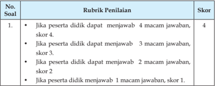

Tabel ini menunjukkan skor yang diberikan kepada peserta didik berdasarkan jumlah jawaban yang benar mereka dapatkan dalam sebuah soal. Topik utama tabel adalah tentang penilaian soal yang melibatkan 4 macam jawaban. Kolom-kolomnya mencakup No. Soal (Nomor Soal), Rubrik Penilaian (Penilaian Kriteria), dan Skor (Skor yang Diberikan). Data penting yang terlihat adalah bahwa setiap jawaban benar mendapatkan skor tertentu: 4 skor untuk 4 macam jawaban, 3 skor untuk 3 macam jawaban, 2 skor untuk 2 macam jawaban, dan 1 skor untuk 1 macam jawaban. Ini menunjukkan bahwa skor penilaian meningkat seiring dengan semakin banyak jawaban yang benar yang diberikan oleh peserta didik.

 

---
## 📄 Halaman 153

---
**📊 Tabel**

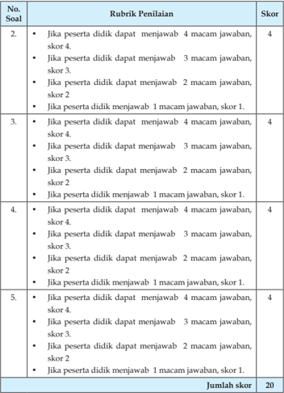

Tabel ini berisi rubrik penilaian untuk 5 soal, dengan skor yang ditentukan untuk setiap jawaban. Topik utama tabel adalah penilaian keterampilan berkomunikasi peserta didik melalui menjawab pertanyaan. Kolom-kolomnya mencakup soal, rubrik penilaian, dan skor. Data penting yang terlihat adalah bahwa setiap soal memiliki skor yang berbeda-beda, menunjukkan variasi dalam tingkat kesulitan atau kualitas jawaban. Misalnya, soal 1 memberikan skor 4 untuk semua jenis jawaban, sementara soal 2 memberikan skor 3 untuk beberapa jenis jawaban. Ini menunjukkan bahwa penilaian ini mungkin dirancang untuk memperhatikan berbagai tingkat keterampilan berkomunikasi peserta didik.

Jumlah nilai maksimal

Nilai = Jumlah nilai yang diperoleh Peserta didik (PG dan Essay) × 100

 

---
## 📄 Halaman 154

Nilai maksimal dari soal pilihan ganda dan essay adalah 10 + 20 = 30.

Jika peserta didik memperoleh nilai soal pilihan ganda 8 dan nilai soal essay  15,  maka  nilai  yang  diperoleh  adalah    8  +  15  =  23.    Jadi  nilai  yang diperoleh peserta didik tersebut adalah: 30 23 100 # = 77.

Perolehan nilai tersebut  menunjukkan  bahwa  peserta  didik  telah mencapai ketuntasan belajar sebagaimana ditetapkan dalam Permendikbud No.53 Tentang Penilaian Hasil Belajar oleh Pendidik dan Satuan Pendidikan pada Pendidikan Dasar dan Pendidikan Menengah.

### Diskusi tentang prinsip-prinsip dan praktik ekonomi dalam Islam:

---
**📊 Tabel**

Tabel ini menunjukkan informasi tentang penilaian siswa berdasarkan aspek tertentu. Kolom-kolomnya meliputi nomor siswa, nama siswa, aspek yang dinilai, skor maksimum, nilai, ketuntasan (T untuk terima, TT untuk tidak terima, R untuk revisi, P untuk penilaian ulang), dan tindakan lanjut. Topik utama tabel adalah penilaian siswa dalam berbagai aspek. Data penting yang terlihat adalah bahwa beberapa siswa memiliki nilai yang rendah dibandingkan dengan skor maksimum, sementara beberapa siswa mendapatkan nilai yang lebih tinggi. Selain itu, banyak siswa diberikan tindakan lanjut seperti revisi atau penilaian ulang, menunjukkan adanya perbaikan yang diperlukan.

### Keterangan:

T

: Tuntas

TT : Tidak tuntas

R

: Remedial

P

: Pengayaan

### Aspek dan rubrik  penilaian:

### 1)   Kejelasan dan kedalaman informasi

- Jika kelompok tersebut dapat memberikan kejelasan dan kedalaman informasi lengkap dan sempurna maka skor 4.
- Jika  kelompok  tersebut  dapat  memberikan  penjelasan  dan kedalaman informasi lengkap dan  kurang sempurna maka skor 3.
- Jika  kelompok  tersebut  dapat  memberikan  penjelasan  dan kedalaman informasi  kurang lengkap  maka skor 2.
- Jika kelompok tersebut  tidak dapat memberikan penjelasan dan kedalaman informasi  maka skor 1.

 

---
## 📄 Halaman 155

### 2)   Keaktifan dalam diskusi

- Jika  kelompok  tersebut    berperan  sangat  aktif    dalam  diskusi maka skor 4.
- Jika kelompok tersebut berperan  aktif dalam diskusi maka skor 3.
- Jika kelompok tersebut kurang aktif dalam diskusi maka skor 2.
- Jika kelompok tersebut tidak aktif dalam diskusi maka skor 1.

### 3).  Kejelasan dan kerapian presentasi

- Jika  kelompok  tersebut  dapat  mempresentasikan    sangat  jelas dan rapi maka skor 4.
- Jika kelompok tersebut dapat mempresentasikan   jelas dan rapi maka skor 3.
- Jika  kelompok  tersebut  dapat  mempresentasikan    sangat  jelas dan  kurang rapi maka skor 2.
- Jika kelompok tersebut dapat mempresentasikan kurang  jelas dan  tidak rapi maka skor 1.

``

Jumlah nilai maksimal diskusi adalah 12 (4 + 4 + 4).

Jika  pada bagian 1 (kejelasan dan kedalaman informasi) peserta didik memperoleh nilai 3, bagian 2 (keaktifan dalam diskusi)  nilai  3  dan  pada bagian 3 (kejelasan dan kerapihan prsentasi) nilai 3, maka jumlah nilai diskusi yang diperoleh peserta didik adalah 9.

Jadi perhitungan nilainya adalah: 12 9 100 # =  75

Perolehan nilai tersebut  menunjukkan  bahwa  peserta  didik  telah mencapai ketuntasan belajar sebagaimana ditetapkan dalam Permendikbud No.53 Tentang Penilaian Hasil Belajar oleh Pendidik dan Satuan Pendidikan pada Pendidikan Dasar dan Pendidikan Menengah.

### Catatan:

- Guru dapat mengembangkan  instrumen  penilaian sesuai dengan kebutuhan.
- Guru diharapkan memiliki catatan sikap atau nilai-nilai karakter yang dimiliki peserta didik selama dalam proses pembelajaran.
- Aspek penilaian diskusi ini dapat digunakan pada penilaian sikap ketika kegiatan  membuka relung hati dan mengkritisi lingkungan sekitar.

 

---
## 📄 Halaman 156

### 3. Tugas

### Isilah kolom keterangan dengan memberikan alasan secara jujur!

---
**📊 Tabel**

Tabel ini berisi skor untuk menjawab pertanyaan-pertanyaan dalam sebuah tes atau ujian. Topik utamanya adalah tentang perilaku dan sikap seseorang dalam situasi tertentu. Tabel dibagi menjadi dua bagian: satu untuk menjawab pertanyaan dan satu untuk menunjukkan jumlah skor maksimal. Kolom "Pernyataan" berisi berbagai pertanyaan yang harus dijawab oleh peserta, seperti "Jika peserta didik menjawab sangat sering, skor 4", "Jika peserta didik menjawab sering, skor 3", dll. Kolom "Skor" menyediakan skor yang akan diberikan kepada peserta sesuai dengan jawaban mereka. Pola penting yang terlihat adalah bahwa setiap pertanyaan memberikan skor yang berbeda-beda tergantung pada tingkat kebiasaan atau sikap peserta dalam menjawab pertanyaan tersebut.

Nilai =

Jumlah skor yang diperoleh × 100

Jumlah nilai maksimal

 

---
## 📄 Halaman 157

### Isilah kolom pilihan jawaban dengan jujur!

Nilai  = Jumlah skor yang diperoleh × 100 Jumlah nilai maksimal

### Rubrik Penilaian:

- Jika peserta didik menjawab sangat setuju, skor 4.
- Jika peserta didik menjawab setuju, skor 3.
- Jika peserta didik menjawab ragu-ragu, skor 2.
- Jika peserta didik menjawab tidak setuju, skor 1.

 

---
## 📄 Halaman 158

### G.  Pengayaan

Dalam  kegiatan  pembelajaran    prinsip-prinsip  dan  praktik  ekonomi Islam, bagi peserta didik yang sudah menguasai materi dengan baik, maka dapat mengerjakan soal pengayaan yang telah disiapkan oleh guru berupa pertanyaan-pertanyaan. Kemudian guru mencatat dan memberikan tambahan nilai bagi  peserta didik  yang berhasil dalam pengayaan.

### H.  Remedial

Bagi  peserta  didik  yang  belum  menguasai  materi  prinsip-prinsip  dan praktik ekonomi Islam (belum mencapai KKM), dapat dilakukan penilaian kembali dengan soal yang sejenis atau soal yang lain yang tetap mengacu pada  KD  yang  belum  dikuasai  dengan  baik  oleh  peserta  didik.  Remedial dilaksanakan pada waktu dan hari tertentu yang disesuaikan, seperti:  pada saat  kegiatan  pembelajaran  atau  di  luar  jam  pelajaran  (tehniknya  dapat dimusyawarahkan dengan siswa yang bersangkutan.

### I. Interaksi Guru Dengan Orang Tua

Guru meminta peserta didik memperlihatkan kolom 'Evaluasi' dalam buku teks kepada orang tuanya dengan memberikan komentar dan paraf. Dapat  juga  dengan    menggunakan  buku  penghubung  kepada  orang  tua tentang perubahan perilaku siswa, setelah mengikuti kegiatan pembelajaran atau berkomunikasi langsung dengan pernyataan tertulis atau lewat telepon tentang perkembangan kemampuan pemahaman dan sikap  peserta didik, terkait dengan materi prinsip-prinsip dan praktik ekonomi Islam.

 

---
## 📄 Halaman 159

### BAB 10

### A.  Kompetensi Inti

- KI-1  Menghayati dan mengamalkan ajaran agama yang dianutnya.
- KI-2 Menunjukkan  perilaku  jujur, disiplin,  bertanggung  jawab, peduli  (gotong  royong,  kerja  sama,  toleran,  damai),  santun, responsif, dan pro-aktif sebagai bagian dari solusi atas berbagai permasalahan dalam berinteraksi secara efektif dengan lingkungan  sosial  dan  alam  serta  menempatkan  diri  sebagai cerminan bangsa dalam pergaulan dunia.
- KI-3 Memahami,  menerapkan,  menganalisis  pengetahuan  faktual, konseptual, prosedural berdasarkan rasa ingin tahunya tentang ilmu  pengetahuan,  teknologi,  seni,  budaya,  dan  humaniora dengan wawasan kemanusiaan, kebangsaan, kenegaraan, dan peradaban  terkait  penyebab  fenomena  dan  kejadian,  serta menerapkan pengeta-huan prosedural pada bidang kajian yang spesiik sesuai dengan bakat dan minatnya.
- KI-4   Mengolah,  menalar,  dan  menyaji  dalam  ranah  konkret  dan  ranah abstrak  terkait  dengan  pengembangan  dari  yang  dipelajari-nya  di sekolah  secara  mandiri,  dan  mampu  menggunakan  metoda  sesuai kaidah keilmuan.

### Pembaru Islam

 

---
## 📄 Halaman 160

### B.  Kompetensi Dasar

Mempertahankan  keyakinan  yang  benar  sesuai  ajaran  islam  dalam sejarah peradaban Islam pada masa modern.

- 2.11 Bersikap rukun dan kompetitif dalam kebaikan sebagai implementasi dari nilai-nilai sejarah peradaban Islam pada masa modern.
- 4.11.1 Menyajikan  prinsip-prinsip  perkembangan  peradaban  Islam  pada masa modern (1800-sekarang).
- 4.11.2 Menyajikan prinsip-prinsip pembaharuan yang sesuai dengan perkem-bangan peradaban Islam pada masa modern.

### C.  Tujuan Pembelajaran

Setelah mengikuti proses pembelajaran, Peserta didik mampu:

- Mendeskripsikan  perkembangan  Islam  pada  masa  modern  (1800  sekarang).
- Menjelaskan  faktor-faktor  yang  mempengaruhi  kemunduran  umat Islam.
- Menjelaskan factor-faktor yang mempengaruhi kebangkitan  umat Islam.
- Menjelaskan  hikmah dari perkembangan Islam pada masa modern
- Menampilkan  sikap  semangat  menumbuhkembangkan  ilmu  pengetahuan dan kerja keras sebagai implementasi dari semangat umat Islam pada masa modern.

### D.  Pengembangan Materi

- Menelaah dan membandingkan perkembangan Islam pada masa modern dengan masa kejayaan Islam (masa golden age ).
- Menelaah pejuang muslim pada masa kini dalam mewujudkan kebangkitan Islam.

### E. Proses Pembelajaran

### 1. Persiapan

- Pembelajaran dimulai dengan guru mengucapkan salam dan berdoa bersama.
- Memeriksa  kehadiran,  kerapian  berpakaian,  posisi  tempat  duduk disesuaikan dengan kegiatan pembelajaran.
- Menyapa peserta didik.
- Melakukan apersepsi dan pretes.

 

---
## 📄 Halaman 161

- Menyampaikan tujuan pembelajaran.
- Mempersiapkan  model  pembelajaran  yang  dapat  digunakankan sebagai  alternatif  dalam  kompetensi  ini  seperti discovery  learning, project  based  learning,  puzzle, bermain  peran  ( role  playing )  dan  lainlain  untuk  mengembangkan  kemampuan  dan  keterampilan  ( skill ) peserta didik.

### 2. Pelaksanaan

### Membuka Relung Hati

- Peserta  didik  menyimak  dan  mencermati  tayangan  atau  gambar yang ada di dalam buku teks.
- Peserta didik bertanya/memberi komentar terhadap tayangan atau gambar tersebut.
- Peserta didik diberikan penjelasan tentang maksud yang terkandung di dalam gambar tersebut.
- Peserta didik menyimak dan mencermati kolom  uraian yang ada pada 'Membuka Relung Hati' yang ada di dalam buku teks
- Peserta didik bertanya/memberi komentar terhadap hasil pengamatannya pada kolom uraian  tersebut.
- Peserta didik diberikan penjelasan tentang maksud yang terkandung di dalam uraian tersebut.

### Mengkritisi Sekitar Kita

- Peserta didik menyimak uraian yang ada pada 'Mengkritisi Sekitar Kita' di dalam buku teks.
- Peserta  didik    member  komentar  terhadap  hasil  pengamatannya pada uraian  tersebut.
- Peserta didik diberikan penjelasan tambahan dan penguatan mengenai  hasil pengamatannya  oleh guru/pembimbing
- Peserta  didik  menjawab  pertanyaan  yang  terdapat  pada  kolom 'Aktivitas  siswa'  di  lembar  kerja  atau  kertas  folio  dan  guru memberikan penilaian dalam bentuk portofolio.

### Memperkaya Khazanah Peserta Didik

- Selanjutnya peserta didik menyimak teks bacaan tentang bangkitlah para pejuang Islam di dalam  kelompoknya masing-masing.
- Peserta didik bertanya tentang  pembaru Islam di dalam kelompoknya masing-masing.

 

---
## 📄 Halaman 162

- Peserta didik mendiskusikan pembaru Islam di dalam kelompoknya masing-masing.
- Peserta  didik  diamati  dan  difasilitasi  oleh  guru  dalam  diskusi kelompok tentang pembaru Islam.
- Peserta  didik  membuat  rumusan  naskah/laporan  hasil  diskusi tentang pembaru Islam di dalam kelompoknya masing-masing.
- Peserta didik yang telah ditentukan sebagai panelis mempresentasikan  hasil  diskusi  kelompok  tentang  pembaru  Islam  di  didepan kelompok lainnya.
- Peserta didik mengkritisi hasil presentasi kelompok tentang pembaru Islam.
- Peserta didik diberikan penjelasan tambahan dan penguatan pembaru Islam.
- Peserta  didik  menjawab  pertanyaan  yang  terdapat  pada  kolom 'Aktivitas  siswa'  di  lembar  kerja  atau  kertas  folio  dan  guru memberikan penilaian dalam bentuk portofolio.

### Menerapkan Perilaku Mulia

- Peserta didik menyimak teks bacaan perilaku terpuji yang dapat  diterapkan  sebagai  penghayatan  dan  pengamalan  setelah mempelajari    materi  bangkitlah  para  pejuang  Islam  di  dalam kelompoknya masing-masing.
- Peserta didik bertanya tentang perilaku terpuji yang dapat diterapkan sebagai penghayatan dan pengamalan setelah  mempelajari  materi bangkitlah  para  pejuang  Islam  di  dalam  kelompoknya  masingmasing.
- Peserta didik mendiskusikan perilaku terpuji yang dapat diterapkan sebagai penghayatan dan pengamalan setelah  mempelajari  materi bangkitlah para pejuang Islam.
- Peserta  didik  menyampaikan  hasil  diskusi  kelompok    tentang perilaku  terpuji  yang  dapat  diterapkan  sebagai  penghayatan  dan pengamalan terhadap  bangkitlah para pejuang Islam.
- Peserta didik mencermati dan mengkritisi hasil presentasi  panelis dalam  diskusi  kelompok  tentang  perilaku  terpuji  yang  dapat diterapkan sebagai penghayatan dan pengamalan terhadap  materi bangkitlah para pejuang Islam.

 

---
## 📄 Halaman 163

- Peserta didik diberikan penjelasan tambahan dan penguatan mengenai perilaku terpuji yang dapat diterapkan sebagai penghayatan dan pengamalan terhadap  materi pembaru Islam.
- Peserta  didik  menyimpulkan  intisari  pelajaran  tentang  pembaru Islam dengan menelaah rangkuman yang terdapat dalam buku teks.
- Peserta  didik  menampilkan  sikap  yang  mencerminkan  semangat belajar  dan  cinta  ilmu  sebagai  implementasi  dari  pemahaman terhadap pembaru Islam dalam kehidupan sehari-hari.
- Peserta didik menerima tugas individu mengerjakan soal-soal pada kolom 'Evaluasi' yang ada di dalam buku teks  sebagai pemantapan pemahaman terhadap pembaru Islam.

### F.   Penilaian

### 1. Soal Pilihan Ganda (PG)

Skor  penilaian jawaban soal pilihan ganda adalah :

Jumlah jawaban benar × 2    (skor maksimal 5 × 2 = 10)

### 2. Soal Uraian

Nilai maksimal pada setiap nomor soal uraian adalah 4,  jumlah nilai maksimal 4  5 (soal) = 20.

### Rubrik Penilaian

---
**📊 Tabel**

Tabel ini menunjukkan rubrik penilaian untuk dua soal yang berbeda. Topik utama tabel adalah tentang skor yang diberikan kepada peserta didik berdasarkan jumlah jawaban yang benar mereka. Dalam kolom Rubrik Penilaian, ada beberapa kriteria yang ditentukan untuk mendapatkan skor tertentu. Soal pertama memerlukan 4 jawaban benar untuk mendapatkan skor 4, 3 jawaban untuk skor 3, 2 jawaban untuk skor 2, dan 1 jawaban untuk skor 1. Soal kedua memiliki persyaratan yang sama, yaitu 4 jawaban benar untuk skor 4, 3 jawaban untuk skor 3, 2 jawaban untuk skor 2, dan 1 jawaban untuk skor 1. Data penting yang terlihat adalah bahwa skor yang diberikan sangat bergantung pada jumlah jawaban yang benar yang diberikan oleh peserta didik.

 

---
## 📄 Halaman 164

---
**📊 Tabel**

Tabel ini menunjukkan rubrik penilaian untuk soal-soal tertentu dalam sebuah ujian atau tes. Topik utama tabel adalah penilaian berdasarkan jumlah jawaban yang benar oleh peserta didik. Tabel dibagi menjadi kolom-kolom berikut: No. Soal, Rubrik penilaian, dan Skor. Data penting yang terlihat adalah bahwa setiap soal memiliki skor yang berbeda tergantung pada jumlah jawaban yang benar. Misalnya, jika peserta didik dapat menjawab 4 macam jawaban, mereka mendapatkan skor 4; jika hanya 3 macam jawaban, skor 3; dan seterusnya. Total skor semua soal adalah 20. Ini menunjukkan bahwa setiap soal memiliki skor yang berbeda dan harus diperhatikan dengan baik oleh peserta didik saat menjawab.

### Nilai = Jumlah nilai yang diperoleh peserta didik (PG dan Essay) × 100 Jumlah nilai maksimal

Nilai maksimal dari soal pilihan ganda dan essay adalah 10 + 20 = 30

Jika peserta didik memperoleh nilai soal pilihan ganda 8 dan nilai soal essay  15,  maka  nilai  yang  diperoleh  adalah    8  +  15  =  23.    Jadi  nilai  yang diperoleh peserta didik tersebut adalah 30 23 100 # = 77.

Perolehan nilai tersebut  menunjukkan  bahwa  peserta  didik  telah mencapai ketuntasan belajar sebagaimana ditetapkan dalam Permendikbud No.53 Tentang Penilaian Hasil Belajar oleh Pendidik dan Satuan Pendidikan pada Pendidikan Dasar dan Pendidikan Menengah.

 

---
## 📄 Halaman 165

### Diskusi tentang Pembaru Islam:

---
**📊 Tabel**

Tabel ini menunjukkan hasil penilaian siswa dalam aspek-aspek tertentu, dengan kolom-kolom yang mencakup nama siswa, aspek yang dinilai, skor maksimum, nilai yang diberikan, ketuntasan, dan tindakan lanjut. Topik utama tabel adalah penilaian siswa dalam berbagai aspek, seperti keterampilan, kemampuan, dan perilaku. Kolom-kolomnya membantu dalam membandingkan hasil penilaian siswa dengan standar yang ditetapkan. Data penting yang terlihat adalah bahwa beberapa siswa memiliki nilai yang rendah dibandingkan dengan skor maksimum, yang mungkin menunjukkan perluannya untuk peningkatan atau bantuan tambahan.

### Keterangan:

T

: Tuntas

TT : Tidak tuntas

R

: Remedial

P

: Pengayaan

### Aspek dan rubrik  penilaian

### 1).   Kejelasan dan kedalaman informasi

- Jika kelompok tersebut dapat memberikan kejelasan dan kedalaman informasi lengkap dan sempurna, maka skor 4.
- Jika kelompok tersebut dapat memberikan penjelasan dan kedalaman informasi lengkap dan  kurang sempurna, maka skor 3.
- Jika  kelompok  tersebut  dapat  memberikan  penjelasan  dan kedalaman informasi  kurang lengkap,  maka skor 2.
- Jika kelompok tersebut  tidak dapat memberikan penjelasan dan kedalaman informasi,  maka skor 1.

### 2).   Keaktifan dalam diskusi

- Jika  kelompok tersebut  berperan sangat aktif  dalam diskusi, maka skor 4.
- Jika kelompok tersebut berperan  aktif dalam diskusi, maka skor 3.
- Jika kelompok tersebut kurang aktif dalam diskusi, maka skor 2.
- Jika kelompok tersebut tidak aktif dalam diskusi, maka skor 1.

### 3).   Kejelasan dan kerapian presentas i

- Jika  kelompok  tersebut  dapat  mempresentasikan  sangat  jelas dan rapi, maka skor 4.
- Jika kelompok tersebut dapat mempresentasikan jelas dan rapi, maka skor 3.
- Jika  kelompok  tersebut  dapat  mempresentasikan  sangat  jelas dan  kurang rapi, maka skor 2.

 

---
## 📄 Halaman 166

- Jika  kelompok  tersebut  dapat  mempresentasikan  kurang  jelas dan tidak rapi, maka skor 1.

``

### Skor  maksimal

Jumlah nilai maksimal diskusi adalah 12 (4 + 4 + 4)

Jika  pada bagian 1 (kejelasan dan kedalaman informasi) peserta didik memperoleh nilai 3, bagian 2 (keaktifan dalam diskusi)  nilai  3  dan  pada bagian  3  (kejelasan  dan  kerapihan  persentasi)  nilai  3,  maka  jumlah  nilai diskusi yang diperoleh peserta didik adalah 9.

Jadi perhitungan nilainya adalah: 12 9 100 # =  75

Perolehan nilai tersebut  menunjukkan  bahwa  peserta  didik  telah mencapai ketuntasan belajar sebagaimana ditetapkan dalam Permendikbud No.53 Tentang Penilaian Hasil Belajar oleh Pendidik dan Satuan Pendidikan pada Pendidikan Dasar dan Pendidikan Menengah

### Catatan:

- Guru dapat mengembangkan  instrumen  penilaian sesuai dengan kebutuhan.
- Guru diharapkan memiliki catatan sikap atau nilai-nilai karakter yang dimiliki peserta didik selama dalam proses pembelajaran.
- Aspek penilaian diskusi ini dapat digunakan pada penilaian sikap ketika kegiatan  membuka relung hati dan mengkritisi lingkungan sekitar.

### 3. Tugas

### Isilah kolom keterangan dengan memberikan alasan secara jujur!

---
**📊 Tabel**

Tabel ini berisi pernyataan tentang perilaku peserta didik dalam melaksanakan ritual makanan sajian. Kolom "Pernyataan" berisi empat pilihan jawaban yang berbeda, sedangkan kolom "Skor" menunjukkan skor yang diberikan untuk setiap pilihan jawaban. Topik utama tabel ini adalah evaluasi perilaku peserta didik dalam melaksanakan ritual makanan sajian. Data penting yang terlihat adalah bahwa pilihan jawaban "peserta didik menjawab tidak pernah" mendapatkan skor tertinggi yaitu 4, sementara pilihan jawaban "peserta didik menjawab sering" mendapatkan skor terendah yaitu 1. Ini menunjukkan bahwa perilaku peserta didik yang menjawab "tidak pernah" dalam melaksanakan ritual makanan sajian lebih dihargai dibandingkan dengan perilaku yang sering dilakukan.

 

---
## 📄 Halaman 167

---
**📊 Tabel**

Tabel ini berisi 5 pertanyaan yang bertujuan untuk menilai tingkat keberhasilan peserta didik dalam memahami dan menerapkan prinsip-prinsip Islam. Topik utamanya adalah bagaimana peserta didik berinteraksi dengan teman-temannya dalam konteks kegiatan kajian Islam. Tabel ini dibagi menjadi 5 baris, masing-masing bertujuan untuk mengevaluasi tingkat keberhasilan peserta didik dalam beberapa aspek seperti senangkah bekerja sama, pemahaman tentang buku-buku tentang toko pembaharuan Islam, dan bagaimana mereka merayakan hari besar Islam. Setiap pertanyaan memiliki skor yang ditentukan berdasarkan tingkat keberhasilan peserta didik, mulai dari 1 (kurang) hingga 4 (tinggi). Skor maksimal yang dapat diperoleh oleh peserta didik adalah 20.

Nilai  =

Jumlah nilai maksimal

Jumlah skor yang diperoleh × 100

### Isilah kolom pilihan jawaban dengan jujur!

---
**📊 Tabel**

Tabel ini menunjukkan skor maksimal untuk setiap pilihan dalam sebuah penilaian yang berkaitan dengan pemahaman tentang kepentingan membatasi imperialisme dan penjajahan. Topik utama tabel adalah tentang pentingnya membatasi imperialisme dan penjajahan. Tabel memiliki tiga kolom: "Pernyataan", "Nilai maksimal setiap pilihan", dan "Skor Maks". Kolom "Pernyataan" berisi pernyataan yang harus dijawab oleh peserta didik, sedangkan kolom "Nilai maksimal setiap pilihan" menunjukkan skor maksimal yang dapat diperoleh untuk setiap pilihan jawaban. Skor maksimal untuk setiap pilihan ditentukan berdasarkan tingkat kesetujuan atau kurang kesetujuan terhadap pernyataan tersebut. Pola penting yang terlihat adalah bahwa skor maksimal untuk setiap pilihan dapat bervariasi tergantung pada tingkat kesetujuan atau kurang kesetujuan terhadap pernyataan tersebut.

 

---
## 📄 Halaman 168

---
**📊 Tabel**

Tabel ini berisi hasil penilaian dari 5 poin yang ditanyakan kepada responden tentang pemahaman mereka terhadap agama dan pendidikan. Setiap poin memiliki skor maksimal 4, dengan skor tertinggi 20. Topik utama tabel adalah pemahaman dan pandangan responden tentang agama, pendidikan, dan kekuasaan. Kolom-kolomnya meliputi nomor poin, penjelasan poin, dan skor setiap poin. Data penting yang terlihat adalah bahwa semua poin memiliki skor maksimal 4, menunjukkan bahwa responden memiliki pemahaman yang sama tentang setiap poin. Skor total adalah 20, menunjukkan kesetiaan dan kesetiaan responden terhadap setiap poin.

Nilai  =

Jumlah skor yang diperoleh × 100

Jumlah nilai maksimal

### Rubrik Penilaian :

- Jika peserta didik menjawab sangat setuju, maka memperoleh nilai 4.
- Jika peserta didik menjawab  setuju, maka memperoleh nilai 3.
- Jika peserta didik menjawab ragu-ragu, maka memperoleh nilai 2.
- Jika peserta didik menjawab tidak setuju, maka memperoleh nilai 1.

 

---
## 📄 Halaman 169

### 4. Tugas Kelompok

Dalam  kegiatan  tugas/kerja  kelompok  hal-hal  yang  dilakukan  guru adalah:

- Membuat  kelompok  sesuai  dengan  jumlah  peserta  didik  di  dalam kelasnya maksimal 5 orang dalam satu kelompok.
- Masing-masing  kelompok  mengerjakan  tugas  sesuai  dengan  perintah yang ada di dalam buku peserta didik, guru melakukan mentoring.
- Masing-masing kelompok mempresentasikan hasil kerjanya dan kelompok lainnya memberikan tanggapan, guru melakukan pengamatan dan penilaian (sangat baik, baik, cukup baik, atau kurang baik).
- Guru  memberikan  komentar  atau  penguatan  terhadap  materi  yang didiskusikan oleh peserta didik.

### G.  Pengayaan

Dalam kegiatan pembelajaran, bagi siswa yang sudah menguasai materi Pembaru Islam dengan baik dan telah memperoleh nilai  memuaskan (sangat baik), maka siswa mengerjakan soal pengayaan yang telah disiapkan oleh guru. (Guru  mencatat dan memberikan tambahan nilai bagi  peserta didik yang berhasil dalam pengayaan).

### H.  Remedial

Bila peserta didik setelah dilakukan penilaian ternyata ada yang belum menguasai  materi    Pembaru  Islam  (belum  mencapai  KKM),  maka  dapat dilakukan penilaian kembali dengan soal yang sejenis atau soal lain yang tetap mengacu pada KD yang belum dikuasai dengan baik oleh siswa. Remedial dilaksanakan pada waktu dan hari tertentu yang disesuaikan, seperti:  pada saat  kegiatan  pembelajaran  atau  di  luar  jam  pelajaran  (tehniknya  dapat dimusyawarahkan dengan siswa yang bersangkutan).

 

---
## 📄 Halaman 170

### I. Interaksi Guru Dengan Orang Tua

Peserta didik memperlihatkan buku teks bagian kolom 'Interaksi Guru dengan  Orang  Tua'  kepada  orang  tuanya  dengan  memberikan  komentar dan  paraf.  Dapat  juga  dengan    menggunakan  buku  penghubung  kepada orang  tua  tentang  perubahan  perilaku  siswa    setelah  mengikuti  kegiatan pembelajaran  atau  berkomunikasi    baik  langsung  atau  melalui  telepon tentang  perkembangan  perilaku  peserta  didik  berkenaan  dengan  materi Pembaru Islam.

 

---
## 📄 Halaman 171

### BAB 11

### A.  Kompetensi Inti

- KI-1  Menghayati dan mengamalkan ajaran agama yang dianutnya.
- KI-2 Menunjukkan  perilaku  jujur, disiplin,  bertanggung  jawab, peduli  (gotong  royong,  kerja  sama,  toleran,  damai),  santun, responsif, dan pro-aktif sebagai bagian dari solusi atas berbagai permasalahan dalam berinteraksi secara efektif dengan lingkungan  sosial  dan  alam  serta  menempatkan  diri  sebagai cerminan bangsa dalam pergaulan dunia.
- KI-3 Memahami,  menerapkan,  menganalisis  pengetahuan  faktual, konseptual, prosedural berdasarkan rasa ingin tahunya tentang ilmu  pengetahuan,  teknologi,  seni,  budaya,  dan  humaniora dengan wawasan kemanusiaan, kebangsaan, kenegaraan, dan peradaban  terkait  penyebab  fenomena  dan  kejadian,  serta menerapkan pengeta-huan prosedural pada bidang kajian yang spesiik sesuai dengan bakat dan minatnya.
- KI-4   Mengolah,  menalar,  dan  menyaji  dalam  ranah  konkret  dan  ranah abstrak  terkait  dengan  pengembangan  dari  yang  dipelajari-nya  di sekolah  secara  mandiri,  dan  mampu  menggunakan  metoda  sesuai kaidah keilmuan.

### Toleransi Sebagai Alat Pemersatu Bangsa

 

---
## 📄 Halaman 172

### B.  Kompetensi Dasar

- 1.2 Meyakini  bahwa  agama  mengajarkan  toleransi,  kerukunan,  dan menghindarkan diri dari tindak kekerasan.
- 2.2 Bersikap toleran, rukun dan menghindarkan diri dari tindak kekerasan sebagai implementasi dari pemahaman Q.S.  Yunus /10 : 40-41 dan Q.S. al-Maidah /5 : 32, serta hadis terkait.
- 3.2 Menganalisis makna Q.S.  Yunus /10 :  40-41  dan Q.S.  Al-Maidah /5 : 32, serta hadis tentang toleransi, rukun, dan menghindarkan diri dari tindak kekerasan.
- 4.2.1 Membaca Q.S.  Yunus /10:  40-41  dan Q.S.  Al-Maidah /5:  32  sesuai dengan kaidah tajwid dan makharijul huruf .
- 4.2.2 Mendemonstrasikan  hafalan Q.S.  Yunus /10:  40-41  dan Q.S.  AlMaidah /5: 32 dengan fasih dan lancar.
- 4.2.3 Menyajikan keterkaitan antara kerukunan dan toleransi sesuai pesan Q.S. Yunus /10: 40-41 dengan menghindari tindak kekerasan sesuai pesan Q.S. al-Maidah /5: 32.

### C.  Tujuan Pembelajaran

Setelah mengikuti proses pembelajaran, Peserta didik mampu:

- Menunjukkan  contoh  perilaku  toleran  dan  menghindari  tindak kekerasan sebagai implementasi dari pemahaman Q.S.  Yŭnus /10 : 40-41 dan Q.S. Al-Mãidah /5 : 32 serta hadis yang terkait.
- Menampilkan perilaku sebagai implementasi dari pemahaman Q.S. Yŭnus /10 : 40-41 dan Q.S. Al-Mãidah /5 : 32  serta hadis yang terkait.
- Membaca Q.S. Yŭnus/10 : 40-41 dan Q.S. Al-Mãidah /5 : 32 dengan benar
- Mengidentiikasi  hukum  bacaan Tajwĩd  Q.S.  Yŭnus /10 : 40-41 dan Q.S. Al-Mãidah /5 : 32
- Menyebutkan  arti Q.S.  Yŭnus /10  :  40-41  dan Q.S.  Al-Mãidah /5 :  32  serta  hadis  yang  terkait  tentang  perilaku  toleran,  rukun  dan menghindari tindak kekerasan.
- Menjelaskan isi kandungan Q.S.  Yŭnus /10 : 40-41 dan Q.S. Al-Mãidah /5 : 32 serta hadis yang terkait tentang perilaku toleran, rukun dan menghindari tindak kekerasan.
- Mendemontrasikan  bacaan Q.S.  Yŭnus (10)  :  40-41  dan Q.S.  AlMãidah (5) : 32

 

---
## 📄 Halaman 173

- Mendemontrasikan hafalan Q.S. Yŭnus /10 : 40-41 dan Q.S. Al-Mãidah /5 : 32.

### D.  Pengembangan Materi

- Menyajikan model-model jenis cara membaca indah Q.S. Yŭnus/ 10 : 4041 dan Q.S. Al-Mãidah /5 : 32 sesuai dengan kaidah tajwĩd dan makhrajul huruf
- Membacakan sari tilãwah Q.S. Yŭnus /10 : 40-41 dan Q.S. Al-Mãidah /5 : 32 sesuai dengan kaidah tajwĩ d dan makhrajul huruf dengan nada yang khidmad , menarik dan indah
- Menjelaskan makna isi kandungan Q.S.  Yŭnus /10 : 40-41 dan Q.S. AlMãidah /5 : 32 sesuai dengan kaidah tajwĩd dan makhrajul huruf ; dengan menggunakan IT
- Mendemontrasikan hafalan Q.S. Yŭnus /10 : 40-41 dan Q.S. Al-Mãidah /5: 32 sesuai dengan kaidah tajwĩd dan makhrajul huruf .
- Menjelaskan makna hadis yang berkaitan dengan toleransi.
- Menjelaskan batas-batas toleransi.
- Menelaah  kisah-kisah  di  zaman  Rasulluloh  saw.  dan  sahabat  tentang toleransi.
Pengembangan materi tersebut dapat disampaikan apabila pada materi inti yang terdapat  di dalam KD telah dikuasai oleh siswa

### E.   Proses Pembelajaran

### 1. Persiapan

- Pembelajaran dimulai dengan guru mengucapkan salam dan berdoa bersama.
- Memeriksa  kehadiran,  kerapian  berpakaian,  posisi  tempat  duduk disesuaikan dengan kegiatan pembelajaran.
- Menyapa peserta didik dengan memperkenalkan diri kepada peserta didik.
- Melakukan apersepsi dan pretes
- Menyampaikan tujuan pembelajaran.

 

---
## 📄 Halaman 174

- Mempersiapkan  model  pembelajaran  yang  dapat  digunakankan sebagai  alternatif  dalam  kompetensi  ini  seperti discovery  learning, project based learning , puzzle, bermain peran ( role playing )  dan lainlain  untuk  mengembangkan  kemampuan  dan  keterampilan  ( skill ) peserta didik.

### 2. Pelaksanaan Membuka Relung Hati

- Peserta  didik  menyimak  dan  mencermati  tayangan  atau  gambar yang ada di dalam buku teks.
- Peserta didik bertanya/memberi komentar terhadap tayangan atau gambar tersebut.
- Peserta didik diberikan penjelasan tentang maksud yang terkandung di dalam gambar tersebut.
- Peserta didik menyimak dan mencermati kolom  uraian yang ada pada 'Membuka Relung Hati' yang ada di dalam buku teks
- Peserta didik bertanya/memberi komentar terhadap hasil pengamatannya pada kolom uraian  tersebut.
- Peserta didik diberikan penjelasan tentang maksud yang terkandung dalam uraian tersebut.

### Mengkritisi Sekitar Kita

- Peserta didik menyimak uraian yang ada pada 'Mengkritisi Sekitar Kita' di dalam buku teks.
- Peserta  didik    member  komentar  terhadap  hasil  pengamatannya pada uraian  tersebut.
- Peserta didik diberikan penjelasan tambahan dan penguatan mengenai  hasil pengamatannya  oleh guru/pembimbing
- Peserta  didik  menjawab  pertanyaan  yang  terdapat  pada  kolom 'Aktivitas  siswa'  di  lembar  kerja  atau  kertas  folio  dan  guru memberikan penilaian dalam bentuk portofolio.

### Memperkaya Khazanah Peserta Didik

- Peserta didik mengkaji Q.S. Yŭnus /10 : 40-41 dan Q.S. Al-Mãidah /5: 32
- Peserta didik mengemukakan hasil kajian Q.S. Yŭnus /10 : 40-41 dan Q.S. Al-Mãidah /5 : 32
- Peserta didik diberikan penjelasan tambahan dan penguatan tentang hasil kajiannya Q.S. Yŭnus /10 : 40-41 dan Q.S. Al-Mãidah /5 : 32

 

---
## 📄 Halaman 175

- Guru meminta kembali peserta didik untuk mengamati bacaan Q.S. Yŭnus/10 : 40-41 dan Q.S. Al-Mãidah /5 : 32
- Peserta didik mengemukaan isi bacaan Q.S.  Yŭnus /10 : 40-41 dan Q.S. Al-Mãidah /5 : 32.
- Peserta didik diberikan penjelasan tambahan kembali dan penguatan yang tentang isi bacaan Q.S. Yŭnus /10 : 40-41 dan Q.S. Al-Mãidah /5 : 32.
- Peserta didik menyimak contoh cara membaca Q.S. Yŭnus /10 : 40-41 dan Q.S. Al-Mãidah /5 : 32.
- Peserta didik menirukan bacaan Q.S. Yŭnus /10 : 40-41 dan Q.S. AlMãidah /5 : 32.
- Peserta didik mengulang-ulang  bacaan Q.S.  Yŭnus /10 : 40-41 dan Q.S. Al-Mãidah /5 : 32 secara berkelompok.
- Peserta didik secara berpasangan mengulang kembali bacaan Q.S. Yŭnus /10 : 40-41 dan Q.S. Al-Mãidah /5 : 32  sampai tajwĩd akhirnya peserta didik dapat menghafal bacaan tersebut dengan lancar.
- Peserta  didik  mengamati  ketentuan  hukum  bacaan tajwĩd yang terdapat dalam Q.S. Yŭnus/ 10 : 40-41 dan Q.S. Al-Mãidah /5 : 32.
- Peserta didik bertanya tentang hukum bacaan, yang terdapat dalam Q.S. Yŭnus /10 : 40-41 dan Q.S. Al-Mãidah /5 : 32.
- Peserta  didik  mendiskusikan  tentang  ketentuan  hukum  bacaan tajwĩd ,  yang  terdapat  dalam Q.S.  Yŭnus /10  :  40-41  dan Q.S.  AlMãidah /5 : 32.
- Peserta  didik  merumuskan  hasil  diskusi  tentang  hukum  bacaan tajwĩd, yang  terdapat  dalam Q.S.  Yŭnus /10  :  40-41  dan Q.S.  AlMãidah /5 : 32.
- Peserta  didik  mempresentasikan  hasil  diskusi  tentang  hukum bacaan tajwĩd, yang terdapat dalam Q.S.  Yŭnus /10 : 40-41 dan Q.S. Al-Mãidah /5 : 32.
- Peserta  didik  diberikan  penjelasan  tentang    ketentuan  hukum bacaan tajwĩd, yang terdapat dalam Q.S. Yŭnus /10 : 40-41 dan Q.S. Al-Mãidah /5 : 32 melalui media/alat peraga/alat bantu bisa berupa tulisan  manual  di  papan  tulis/whiteboard,  kertas  karton  (tulisan yang besar dan mudah dilihat/dibaca) atau bisa juga menggunakan multimedia berbasis ICT atau media lainnya.

 

---
## 📄 Halaman 176

- Peserta  didik  mengamati  arti  ayat  ( mufradat) dan  terjemah Q.S. Yŭnus /10 : 40-41 dan Q.S. Al-Mãidah /5 : 32.
- Peserta didik mendiskusikan arti ayat ( mufradat ) dan terjemah Q.S. Yŭnus /10 : 40-41 dan Q.S. Al-Mãidah /5 : 32.
- Peserta  didik  memasangkan  kertas  yang  bertuliskan  potonganpotongan ayat tersebut dengan kertas lain  yang berisi tentang arti dan terjemah dari ayat yang dipilih.
- Peserta didik mengamati isi kandungan Q.S.  Yŭnus /10 : 40-41 dan Q.S. Al-Mãidah /5 : 32.
- Peserta didik  mendiskusikan isi kandungan secara berkelompok.
- Secara  bergantian    masing-masing  kelompok    mempresentasikan hasil diskusinya, dan kelompok lainnya  mendengarkan/menyimak sambil memberikan tanggapan.
- Peserta didik diberikan penjelasan tambahan dan penguatan terhadap hasil diskusi tentang  isi kandungan Q.S. Yŭnus /10 : 40-41 dan Q.S. Al-Mãidah /5 : 32  dan hadis-hadis yang terkait.
- Guru  dan  peserta  didik  menyimpulkan  intisari  dari  pelajaran tersebut  sesuai  yang  terdapat  dalam  buku  teks  siswa  pada  kolom rangkuman.
- Pada kolom 'Membaca dan Menghafal', guru:
- Membimbing    peserta  didik  untuk  membaca  dengan  tartĩl, kemudian memberikan tanda (  )  pada  kolom  'sangat  lancar', 'lancar', 'sedang', 'kurang lancar' atau 'tidak lancar'.
- Meminta peserta didik untuk menyalin Q.S.  Yŭnus /10 :  40-41 dan Q.S. Al-Mãidah /5 : 32.
- Meminta  peserta  didik  untuk  mencari  hukum tajwĩd yang terdapat pada ayat Q.S. Yŭnus /10 : 40-41 dan Q.S. Al-Mãidah /5: 32.
- Meminta  peserta  didik  untuk  membacakan  hadis-hadis  yang terkait dengan toleransi.

### Menerapkan Perilaku Mulia

- Peserta didik mengkaji bentuk-bentuk perilaku yang terdapat dalam Q.S. Yŭnus /10 : 40-41 dan Q.S. Al-Mãidah /5 : 32.

 

---
## 📄 Halaman 177

- Peseta didik mendiskusikan bentuk-bentuk perilaku yang terdapat dalam Q.S.  Yŭnus /10  :  40-41  dan Q.S.  Al-Mãidah /5  :  32  Peserta didik  mengemukakan/mempresentasikan    hasil  kajian  dengan mengemukakan  bentuk-bentuk perilaku yang terdapat dalam Q.S. Yŭnus /10 : 40-41 dan Q.S. Al-Mãidah /5 : 32.
- Peserta didik mengkritisi hasil presentasi kelompok tentang contoh perilaku  yang  mencerminkan  sikap  toleransi    yang  terkandung dalam Q.S. Yŭnus /10 : 40-41 dan Q.S. Al-Mãidah /5 : 32 dan hadishadis terkait.
- Peserta didik diberikan penjelasan tambahan dan penguatan mengenai bentuk-bentuk perilaku berdasarkan Q.S.  Yŭnus /10 : 4041 dan Q.S. Al-Mãidah /5 : 32.
- Guru  dan  peserta  didik  menyimpulkan  intisari  dari  pelajaran tersebut sesuai dengan materi yang terdapat dalam buku teks siswa pada kolom rangkuman.
- Peserta didik  mengerjakan soal-soal pilihan ganda, uraian, dan isian yang terdapat dalam kolom evalusi.

### F.   Penilaian

### 1. Soal Pilihan Ganda (PG)

Skor  penilaian jawaban soal pilihan ganda adalah : jumlah jawaban benar  2    (skor maksimal 5  2 = 10)

### 2. Soal Uraian

Nilai maksimal pada setiap nomor soal uraian adalah 4,  jumlah nilai maksimal 4  5 (soal) = 20.

### Rubrik Penilaian

---
**📊 Tabel**

Tabel ini menunjukkan rubrik penilaian untuk sebuah soal dalam buku pelajaran. Topik utama tabel adalah tentang skor yang diberikan kepada peserta didik berdasarkan jumlah jawaban yang diberikan. Rubrik penilaian terdiri dari tiga poin, masing-masing dengan skor tertentu. Jika peserta didik dapat menjawab 4 macam jawaban, maka mendapatkan skor 4. Jika hanya dapat menjawab 3 macam jawaban, skornya menjadi 3. Jika hanya dapat menjawab 2 macam jawaban, skornya menjadi 2. Dan jika hanya dapat menjawab 1 macam jawaban, skornya menjadi 1. Pola penting yang terlihat adalah bahwa semakin banyak jawaban yang diberikan, semakin tinggi skor yang diterima.

 

---
## 📄 Halaman 178

---
**📊 Tabel**

Tabel ini menunjukkan skor yang diberikan kepada peserta didik berdasarkan jumlah jawaban yang diberikan mereka dalam sebuah ujian. Topik utama tabel adalah tentang penilaian berdasarkan jumlah jawaban yang diberikan oleh peserta didik. Tabel ini memiliki dua kolom utama: Rubrik Penilaian dan Skor. Rubrik Penilaian mencakup berbagai kondisi di mana peserta didik mendapatkan skor tertentu, seperti mendapatkan 4 macam jawaban, 3 macam jawaban, 2 macam jawaban, atau 1 macam jawaban. Skor ditentukan berdasarkan jumlah jawaban tersebut. Data penting yang terlihat adalah bahwa setiap kondisi mendapatkan skor tertentu, dan jumlah total skor yang dapat diperoleh adalah 20. Ini menunjukkan bahwa skor maksimal yang dapat diperoleh adalah 20, dengan skor tertinggi 4 untuk setiap kondisi.

100

Nilai = Jumlah skor yang diperoleh (PG dan Isian) × 100

Nilai maksimal dari soal pilihan ganda dan essay adalah 10 + 20 = 30

Jika peserta didik memperoleh nilai soal pilihan ganda 8 dan nilai soal essay 15, maka nilai yang diperoleh adalah  8 + 15 = 23.

Jadi nilai yang diperoleh peserta didik tersebut adalah 30 23 100 # = 77. Perolehan nilai tersebut  menunjukkan  bahwa  peserta  didik  telah

 

---
## 📄 Halaman 179

mencapai ketuntasan belajar sebagaimana ditetapkan dalam Permendikbud No.53 Tentang Penilaian Hasil Belajar oleh Pendidik dan Satuan Pendidikan pada Pendidikan Dasar dan Pendidikan Menengah.

### Diskusi dan presentasi

---
**📊 Tabel**

Tabel ini menunjukkan hasil penilaian siswa dalam aspek-aspek tertentu, dengan kolom-kolom yang mencakup nama siswa, aspek yang dinilai, skor maksimum, nilai yang diberikan, ketuntasan, dan tindakan lanjut. Topik utama tabel adalah penilaian siswa dalam berbagai aspek, seperti keterampilan, kemampuan, dan perilaku. Kolom-kolomnya membantu dalam membandingkan perkembangan siswa di setiap aspek. Data penting yang terlihat adalah bahwa beberapa siswa memiliki ketuntasan yang baik (T), sedangkan beberapa masih perlu melakukan peningkatan (TT). Sementara itu, tindakan lanjut seperti revisi (R) atau pengembangan (P) juga ditetapkan untuk beberapa siswa.

### Keterangan:

T

: Tuntas

TT : Tidak tuntas

R

: Remedial

P

: Pengayaan

### Aspek dan rubrik  penilaian

### 1).   Kejelasan dan kedalaman informasi

- Jika kelompok tersebut dapat memberikan kejelasan dan kedalaman informasi lengkap dan sempurna, skor 4.
- Jika  kelompok  tersebut  dapat  memberikan  penjelasan  dan kedalaman informasi lengkap dan  kurang sempurna, skor 3.
- Jika  kelompok  tersebut  dapat  memberikan  penjelasan  dan kedalaman informasi  kurang lengkap,  skor 2.
- Jika kelompok tersebut  tidak dapat memberikan penjelasan dan kedalaman informasi,  skor 1.

### 2).   Keaktifan dalam diskusi

- Jika  kelompok tersebut  berperan sangat aktif  dalam diskusi, skor 4.
- Jika kelompok tersebut berperan  aktif dalam diskusi, skor 3.
- Jika kelompok tersebut kurang aktif dalam diskusi, skor 2.
- Jika kelompok tersebut tidak aktif dalam diskusi, skor 1.

 

---
## 📄 Halaman 180

### 3).   Kejelasan dan kerapian presentas i

- Jika  kelompok  tersebut  dapat  mempresentasikan  sangat  jelas dan rapi, maka skor 4.
- Jika kelompok tersebut dapat mempresentasikan jelas dan rapi, maka skor 3.
- Jika  kelompok  tersebut  dapat  mempresentasikan  sangat  jelas dan  kurang rapi, maka skor 2.
- Jika kelompok tersebut dapat mempresentasikan kurang  jelas dan tidak rapi, maka skor 1.
Nilai akhir = Jumlah nilai yang diperoleh × 100

### Skor  maksimal

Jumlah nilai maksimal diskusi adalah 12 (4 + 4 + 4)

Jika  pada bagian 1 (kejelasan dan kedalaman informasi) peserta didik memperoleh nilai 3, bagian 2 (keaktifan dalam diskusi)  nilai  3  dan  pada bagian 3 (kejelasan dan kerapihan prsentasi) nilai 3, maka jumlah nilai diskusi yang diperoleh peserta didik adalah 9.

Jadi perhitungan nilainya adalah: 12 9 100 # =  75

Perolehan nilai tersebut  menunjukkan  bahwa  peserta  didik  telah mencapai ketuntasan belajar sebagaimana ditetapkan dalam Permendikbud No.53 Tentang Penilaian Hasil Belajar oleh Pendidik dan Satuan Pendidikan pada Pendidikan Dasar dan Pendidikan Menengah.

Catatan:

- Guru dapat mengembangkan  instrumen  penilaian sesuai dengan kebutuhan.
- Guru diharapkan memiliki catatan sikap atau nilai-nilai karakter yang dimiliki peserta didik selama dalam proses pembelajaran.
- Aspek penilaian diskusi ini dapat digunakan pada penilaian sikap ketika kegiatan  membuka relung hati dan mengkritisi lingkungan sekitar.

### 3. Tugas

Kolom 'Membaca dan menghafal dengan tartil' Rubrik Pengamatannya sebagai berikut:

 

---
## 📄 Halaman 181

---
**📊 Tabel**

Tabel ini menunjukkan hasil penilaian siswa dalam aspek-aspek tertentu, dengan berbagai skor maksimum dan nilai yang diberikan. Topik utama tabel adalah penilaian siswa dalam berbagai aspek, seperti keterampilan, kemampuan, dan perilaku. Kolom-kolom yang ada meliputi nomor siswa, nama siswa, aspek yang dinilai, skor maksimum, nilai yang diberikan, ketuntasan (T untuk baik, TT untuk cukup baik, R untuk kurang, P untuk sangat kurang), dan tindakan lanjut yang diberikan. Data penting yang terlihat adalah bahwa banyak siswa mendapatkan nilai yang cukup baik atau baik, namun masih ada beberapa siswa yang mendapat nilai kurang atau sangat kurang. Tindakan lanjut yang diberikan juga menunjukkan bahwa guru telah memberikan bantuan atau saran kepada siswa yang memerlukan perbaikan.

### Keterangan:

T

: Tuntas

TT : Tidak tuntas

R

: Remedial

P

: Pengayaan

### Aspek yang dinilai   :

- Tajwĩd
→  Nilai maksimal   4

- Kelancaran          →
Nilai maksimal 4

- Faşoĥah
→  Nilai maksimal   4

- Seni tilãwah →
Nilai maksimal 4

Nilai Maksimal ….   16

Jumlah nilai yang diperoleh peserta didik ×

``

Skor  maksimal (16)

### Rubrik penilaiannya adalah:

### 1. Tajwĩd

- Jika peserta didik dapat menyebutkan 4  hukum bacaan, maka nilai yang diperoleh 4.
- Jika peserta didik dapat menyebutkan 3 hukum bacaan  maka nilai yang diperoleh 3.
- Jika peserta didik dapat menyebutkan 2 hukum bacaan maka nilai yang diperoleh 2.
- Jika peserta didik dapat menyebutkan 1  hukum bacaan,  maka nilai yang diperoleh 1.

### 2. Kelancaran

- Jika peserta didik dapat membaca Q.S. Yŭnus /10 : 40-41 dan Q.S. AlMãidah /5 : 32 dengan sangat lancar dan tartĩl maka skor 4.

 

---
## 📄 Halaman 182

- Jika peserta didik dapat membaca Q.S. Yŭnus /10 : 40-41 dan Q.S. AlMãidah /5 : 32 dengan lancar dan tartĩl maka skor 3.
- Jika peserta didik dapat membaca Q.S. Yŭnus /10 : 40-41 dan Q.S. AlMãidah /5 : 32 dengan cukup lancar dan tartĩl maka skor 2.
- Jika peserta didik dapat membaca Q.S. Yŭnus /10 : 40-41 dan Q.S. AlMãidah /5 : 32 kurang lancar dan tartĩl maka skor 1.

### 3. Faşoĥah

- Jika peserta didik dapat membaca sangat faşih, maka skor 4.
- Jika peserta didik dapat membaca dengan  faşih, maka skor 3.
- Jika peserta didik dapat membaca  cukup faşih, maka skor 2.
- Jika peserta didik dapat membaca  kurang faşih, maka skor 1.

### 4. Seni tilãwah

- Jika peserta didik dapat membaca dengan sangat merdu dan indah, maka skor 4.
- Jika peserta didik dapat membaca  dengan merdu dan indah, maka skor 3.
- Jika  peserta didik dapat membaca cukup merdu dan indah, maka skor 2.
- Jika peserta didik  dapat membaca  kurang  merdu dan  indah, maka skor 1.
Jika  peserta  didik  pada  aspek  1( tajwid )  memperoleh  nilai  3,  aspek  2 (kelancaran) nilai 4, aspek 3 ( faşoĥah )  nilai  3  dan  aspek  ke  4  (seni  tilawah) nilai 3, maka nilai membaca dan menghafal peserta didik adalah (3+4+3+3) = 16 13 100 # = 81.

Menyalin dan mencari hukum tajwĩd.

### Format Penilaiannya:

---
**📊 Tabel**

Tabel ini menunjukkan hasil penilaian siswa dalam aspek-aspek tertentu, dengan kolom-kolom yang mencakup nama siswa, aspek yang dinilai, skor, nilai, ketuntasan, dan tindakan lanjut. Topik utama tabel adalah evaluasi kinerja siswa dalam berbagai aspek. Kolom "Nama siswa" menyediakan identifikasi individu, sedangkan kolom "Aspek yang dinilai" menunjukkan berbagai aspek yang dianalisis. Skor dan nilai dihitung berdasarkan perbandingan antara aspek yang dinilai dan aspek yang diharapkan. Kolom "Ketuntasan" menunjukkan tingkat keberhasilan siswa dalam aspek tersebut, sementara kolom "Tindakan Lanjut" menunjukkan tindakan yang akan dilakukan untuk meningkatkan kinerja siswa. Data penting yang terlihat adalah bahwa beberapa siswa memiliki skor dan nilai yang rendah, yang mungkin memerlukan tindakan lanjut seperti pembelajaran tambahan atau pengembangan keterampilan.

 

---
## 📄 Halaman 183

### Keterangan:

T :

Tuntas

TT  :

Tidak tuntas

R :

Remedial

P :

Pengayaan

### Rubrik penialain:

### 1. Sesuai kaidah penulisan

- Jika  peserta  didik  dapat  menulis  sesuai  kaidah  penulisan  dengan sangat baik, maka skor 4.
- Jika  peserta  didik  dapat  menulis  sesuai  kaidah  penulisan  dengan baik, maka skor 3
- Jika  peserta  didik  dapat  menulis  sesuai  kaidah  penulisan  dengan kurang baik, maka skor 2.
- Jika peserta didik tidak dapat menulis sesuai kaidah penulisan yang baik, maka skor 1.

### 2. Kerapian

- Jika peserta didik dapat menulis sangat rapi,
- Jika peserta didik dapat menulis dengan rapi,
- Jika peserta didik dapat menulis kurang rapi,
maka maka

maka

- Jika peserta didik dapat menulis tidak rapi,

### 3. Hukum Tajwid

- Apabila  peserta  didik  dapat  menemukan  4  hukum  bacaan,  maka skor 4.
- Apabila  peserta  didik  dapat  menemukan  3  hukum  bacaan,  maka skor 3.
- Apabila peserta didik dapat menemukan 2 hukum bacaan, skor 2.
- Apabila peserta didik dapat menemukan 1 hukum bacaan, skor 1.

``

Jika peserta didik pada aspek 1 (jenis/model tulisan) memperoleh nilai 3, aspek 2 ( kerapihan) nilai 4, aspek 3 ( tajwid ) nilai 3 , maka nilai membaca dan menghafal peserta didik adalah (3 + 4 + 3) = 12 10 100 # = 83

maka skor

skor skor

skor

1.

4.

3.

2.

 

---
## 📄 Halaman 184

---
**📊 Tabel**

Tabel ini menunjukkan skor toleransi berdasarkan jenis-jenis toleransi yang ditetapkan. Kolom "Jenis Toleransi" mencakup 10 jenis toleransi yang berbeda, sementara kolom "SKOR Ditepati" dan "SKOR Tidak ditepati" masing-masing menunjukkan skor yang diterima untuk setiap jenis toleransi. Data yang penting yang terlihat adalah bahwa semua jenis toleransi mendapatkan skor 4, kecuali satu jenis yang mendapatkan skor 2. Ini menunjukkan bahwa sebagian besar jenis toleransi dianggap baik atau tepat, tetapi ada satu jenis yang kurang memuaskan.

``

Tulislah jawaban ya atau tidak pada kolom yang sudah tersedia di bawah dengan jujur!

---
**📊 Tabel**

Tabel ini menunjukkan skor yang diberikan kepada responden atas pernyataan tentang kecenderungan mereka untuk membaca al-Qur'an. Topik utama tabel adalah kecenderungan dan sikap responden dalam membaca al-Qur'an. Kolom pertama berisi pernyataan yang ditanyakan, sedangkan kolom kedua berisi skor yang diberikan. Skor 4 diberikan jika responden mengatakan "Ya" pada pernyataan tersebut, sedangkan skor 2 diberikan jika mereka mengatakan "Tidak". Data penting yang terlihat adalah bahwa sebagian besar responden (90%) memiliki kecenderungan positif untuk membaca al-Qur'an, baik secara selalu maupun setiap pagi setelah sekolah. Ini menunjukkan bahwa kecenderungan untuk membaca al-Qur'an adalah sangat dominan di antara responden yang diwawancarai.

 

---
## 📄 Halaman 185

---
**📊 Tabel**

Tabel ini menunjukkan skor yang diberikan kepada responden atas pernyataan-pernyataan tentang minat dan keinginan untuk belajar Al-Qur'an. Topik utama tabel adalah minat dan keinginan untuk belajar Al-Qur'an. Kolom-kolomnya meliputi nomor pernyataan (No.), pernyataan itu sendiri, skor "Ya" (4), dan skor "Tidak" (2). Data penting yang terlihat adalah bahwa semua pernyataan mendapatkan skor "Ya", dengan skor tertinggi 4 dan skor terendah 2. Ini menunjukkan bahwa responden memiliki minat yang kuat dan keinginan yang tinggi untuk belajar Al-Qur'an.

``

---
**📊 Tabel**

Tabel ini menunjukkan analisis perilaku siswa berdasarkan aspek-aspek tertentu dalam kurikulum. Kolom pertama berisi nomor siswa, kolom kedua berisi nama siswa, kolom ketiga berisi aspek-aspek yang dinilai, kolom keempat berisi jumlah skor, kolom kelima berisi nilai, kolom keenam berisi ketuntasan, dan kolom ketujuh berisi tindakan lanjut yang diambil. Data penting yang terlihat adalah bahwa setiap siswa memiliki aspek-aspek yang berbeda untuk dinilai, jumlah skor yang berbeda, dan tindakan lanjut yang berbeda sesuai dengan ketuntasan mereka. Ini menunjukkan bahwa analisis perilaku siswa harus dilakukan secara individu dan berfokus pada aspek-aspek yang relevan bagi setiap siswa.

### Aspek yang dinilai:

- Sudah dilakukan dengan sangat baik → Skor   4
- Sudah dilakukan dengan baik
- → Skor   3
- Sudah dilakukan dengan cukup baik
- → Skor   2
- Sudah dilakukan namun kurang baik
- → Skor   1
Nilai Maksimal….

 

---
## 📄 Halaman 186

Keterangan:

### a. Sangat baik:

Peserta didik akan mendapat skor 4 jika peserta didik tersebut sudah terbiasa dan sering menerapkan perilaku taat berdasarkan. Q.S.  Yŭnus /10 : 40-41   tersebut dengan baik.

### b. Baik:

Peserta didik akan mendapat skor 3 jika peserta didik tersebut sering menerapkan perilaku taat berdasarkan Q.S. Yŭnus /10 : 40-41  tersebut tetapi belum konsisten.

### c. Cukup:

Peserta didik akan mendapat skor 2 jika peserta didik tersebut kadangkadang menerapkan perilaku taat berdasarkan. Q.S.  Yŭnus /10 : 40-41 tersebut dengan baik.

### d. Kurang baik

Peserta didik akan mendapat skor 1 jika peserta didik tersebut kadangkadang/ jarang menerapkan perilaku taat berdasarkan. Q.S. Yŭnus /10 : 40-41   tersebut dengan baik.

Guru dapat mengembangkan skor tersebut jika ditemui kriteria penilaian lain berdasarkan bentuk perilaku peserta didik pada situasi dan kondisi yang berkembang, terkait dengan penerapan perilaku taat berdasarkan Q.S. Yŭnus /10 : 40-41   tersebut.

---
**📊 Tabel**

Tabel ini menunjukkan hasil evaluasi penerapan perilaku mulia oleh sejumlah siswa. Kolom-kolomnya mencakup nomor siswa, nama siswa, aspek-aspek yang dinilai (1 hingga 4), jumlah skor, nilai, ketuntasan (T untuk telah dilakukan, TT untuk tidak cukup, R untuk belum dilakukan, P untuk perlu diperbaiki), dan tindakan lanjut yang diambil. Topik utama tabel adalah evaluasi perilaku mulia siswa. Data penting yang terlihat adalah bahwa beberapa siswa telah berhasil mempraktekkan beberapa aspek dari perilaku mulia, sementara yang lain masih perlu diperbaiki atau belum mempraktekkan sama sekali.

 

---
## 📄 Halaman 187

---
**📊 Tabel**

Tabel ini menunjukkan hasil penilaian perilaku siswa berdasarkan aspek-aspek tertentu. Kolom-kolomnya meliputi nomor siswa, nama siswa, aspek yang dilinai, jumlah skor, nilai, ketuntasan, dan tindakan lanjut. Topik utama tabel adalah evaluasi perilaku siswa. Data penting yang terlihat adalah bahwa setiap siswa memiliki aspek tertentu yang dianalisis, jumlah skor yang diberikan, nilai yang diberikan, dan tindakan lanjut yang diambil. Ini membantu dalam memahami bagaimana perilaku siswa diukur dan dinilai dalam konteks pembelajaran.

### Aspek yang dinilai:

- Sudah dilakukan dengan sangat baik, skor 4.
- Sudah dilakukan dengan baik, skor 3.
- Sudah dilakukan dengan  cukup baik, skor 2.
- Sudah dilakukan kurang baik, skor  1.

### Keterangan:

### a. Sangat baik:

Peserta didik akan mendapat skor 4 jika peserta didik tersebut sudah terbiasa  dan  sering  menerapkan  perilaku  taat  berdasarkan Q.S.  AlMãidah /5 : 32  tersebut dengan baik.

### b. Baik:

Peserta didik akan mendapat skor 3 jika peserta didik tersebut sering menerapkan  perilaku  taat  berdasarkan Q.S.  al-Maidah /5: 48 tersebut tetapi belum konsisten.

### c. Cukup:

Peserta didik akan mendapat skor 2 jika peserta didik tersebut kadangkadang  menerapkan  perilaku  taat  berdasarkan Q.S.  al-Maidah /5: 48 tersebut dengan baik.

### d. Kurang

Peserta didik akan mendapat skor 1 jika peserta didik tersebut kadangkadang/ jarang menerapkan perilaku taat berdasarkan Q.S. al-Maidah /5: 48 tersebut dengan baik.

 

---
## 📄 Halaman 188

Guru dapat mengembangkan skor tersebut bila ditemui kriteria penilaian lain  berdasarkan  bentuk  perilaku  peserta  didik  pada  situasi  dan  kondisi yang berkembang, terkait dengan penerapan perilaku taat berdasarkan Q.S. al- Maidah /5: 48 tersebut.

Guru dapat mengembangkan skor tersebut bila ditemui kriteria penilaian lain  berdasarkan  bentuk  perilaku  peserta  didik  pada  situasi  dan  kondisi yang berkembang, terkait dengan penerapan perilaku taat berdasarkan Q.S. al- Maidah /5: 48 tersebut.

``

Jika peserta didik pada kolom 1 memperoleh nilai 4, kolom 2 nilai 3 dan kolom 3 nilai 4, maka nilai yang diperoleh peserta didik adalah: 4 + 3 + 4 + 4 = 16 11 100 # = 92.

Perolehan nilai tersebut menunjukkan bahwa peserta didik telah memiliki perilaku  yang  sangat  baik  sebagaimana  ditetapkan  dalam  Permendikbud No.53 Tentang Penilaian Hasil Belajar oleh Pendidik dan Satuan Pendidikan pada Pendidikan Dasar dan Pendidikan Menengah.

### 4. Tugas Kelompok

Dalam  kegiatan  tugas/kerja  kelompok  hal-hal  yang  dilakukan  guru adalah:

- Membuat  kelompok  sesuai  dengan  jumlah  peserta  didik  di  dalam kelasnya maksimal 5 orang dalam satu kelompok.
- Masing-masing  kelompok  mengerjakan  tugas  sesuai  dengan  perintah yang ada di dalam buku peserta didik, guru melakukan mentoring.
- Masing-masing kelompok mempresentasikan hasil kerjanya dan kelompok lainnya memberikan tanggapan, guru melakukan pengamatan dan penilaian (sangat baik, baik, cukup baik, atau kurang baik).
- Guru  memberikan  komentar  atau  penguatan  terhadap  materi  yang didiskusikan oleh peserta didik.

 

---
## 📄 Halaman 189

### G.  Pengayaan

Dalam kegiatan pembelajaran Q.S. Yŭnus /10 : 40-41 dan Q.S. Al-Mãidah /5 : 32  , bagi siswa yang sudah menguasai materi dengan baik, peserta didik dapat mengerjakan soal pengayaan yang telah disiapkan oleh guru berupa pertanyaan-pertanyaan  yang  berkaitan  dengan  hukum    bacaan    ' Tajwĩd ' pada suarat dan ayat yang lain. Kemudian Guru  mencatat dan memberikan tambahan nilai bagi  peserta didik  yang berhasil dalam pengayaan.

### H.  Remedial

Bagi peserta didik yang belum menguasai materi Q.S.  Yŭnus /10 : 4041  dan Q.S.  Al-Mãidah /5  :  32  (belum  mencapai  KKM),  dapat  dilakukan penilaian kembali dengan soal yang sejenis atau soal yang lain yang tetap mengacu pada KD yang belum dikuasai dengan baik oleh siswa. Remedial dilaksanakan pada waktu dan hari tertentu yang disesuaikan, seperti:  pada saat  kegiatan  pembelajaran  atau  di  luar  jam  pelajaran  (tehniknya  dapat dimusyawarahkan dengan siswa yang bersangkutan).

### I . Interaksi Guru Dengan Orang Tua

Guru meminta peserta didik memperlihatkan kolom 'Evaluasi' dalam buku teks kepada orang tuanya dengan memberikan komentar dan paraf. Dapat  juga  dengan    menggunakan  buku  penghubung  kepada  orang  tua tentang perubahan perilaku siswa  setelah mengikuti kegiatan pembelajaran atau berkomunikasi langsung,dengan pernyataan tertulis atau lewat telepon tentang perkembangan kemampuan membaca dan menghafal peserta didik, terkait dengan materi Q . S. Yŭnus /10 : 40-41 dan Q.S. Al-Mãidah /5 : 32.

 

---
## 📄 Halaman 190

### Daftar Pustaka

- Daradjat, Zakiah. 1995. Metodik Khusus Pengajaran Agama Islam . Jakarta: Bumi Aksara.
- Ismail SM.  2011. Strategi Pembelajaran  Agama  Islam  Berbasis  PAIKEM . Semarang: Rasail Cetakan ke-16.
- Kementerian Pendidikan Nasional. 2003. Undang-undang Nomor 20 Tahun 2003 tentang Sistem Pendidikan Nasional (SNP).
- Kementerian Pendidikan Nasional. 2005. Peraturan Pemerintah Nomor 19 Tahun 2005 tentang Standar Nasional Pendidikan.
- Kementerian  Pendidikan  Nasional.  2006.  Peraturan  Menteri  Pendidikan Nasional Nomor 22 Tahun 2006 tentang Standar Isi.
- Kementerian  Pendidikan  Nasional.  2006.  Peraturan  Menteri  Pendidikan Nasional Nomor 23 Tahun 2006 tentang Standar Kompetensi Lulusan.
- Kementerian  Pendidikan  Nasional.  2006.  Peraturan  Menteri  Pendidikan Nasional  Nomor  6  Tahun  2007  tentang  Perubahan  Peraturan  Menteri Pendidikan Nasional Nomor 24 Tahun 2006.
- Kementerian Pendidikan Nasional. 2007. Peraturan Pemerintah Nomor 55 Tahun 2007 tentang Pendidikan Agama dan Pendidikan Keagamaan.
- Kementerian Pendidikan dan Kebudayaan. 2010. Peraturan Presiden Nomor 5 Tahun 2010 tentang Rencana Pembangunan Jangka Menengah Nasional.
- Kementerian Agama. 2010. Peraturan Menteri Agama Nomor 16 Tahun 2010 tentang Pengelolaan Pendidikan Agama.
- Kementerian  Agama.  2011.  Keputusan  Menteri  Agama  RI  (KMA)  Nomor 211  Tahun  2011  tentang  Pedoman  Pengembangan  Standar  Nasional Pendidikan Agama Islam pada Sekolah.
- Kementrian Agama. 2012. Buku Pegangan Guru SD / MI. Jakarta: Penerbit Arya Duta.
- Mulya, Andi.2012. Pendidikan Lingkungan Kehidupan Jakarta . Jakarta: CV Akar Aksara Indonesia.
- Peraturan No. 32 tahun 2013 tentang perubahan atas PP No. 19 tahun 2005 tentang Standar Nasional Pendidikan.
- Peter  Salim,  Drs.,  MA  dan  Yenny  Salim,  B.Sc. Kamus  Bahasa  Indonesia Kontemporer (Modern English Press, Jakarta,  edisi kedua 1995).
- Pusat  Kurikulum.  2008. Model  Penilaian  Kelas  SD/MI/SDB .  Jakarta:  Badan Penelitian dan Pengembangan Pendidikan Nasional.
- http://d-winur.blogspot.com/2009/05/pengertian-kd-indikator-materi. html.

 

---
## 📄 Halaman 191

### Glosarium

Akhlak :

budi pekerti, kelakuan.

Aktivitas :

keaktifan; kegiatan.

al-Hadis :

sumber  hukum  Islam  kedua,  ucapan,  perbuatan  dan ketetapan Nabi Muhammad saw.

al-Qur'ãn :

kitab suci umat Islam yang berisi pedoman hidup dan sebagai sumber hukum Islam yang pertama.

Audio :

alat peraga yang bersifat dapat didengar.

Da'i

:    orang yang kerjanya berda'wah.

Da'wah

:    penyiaran  agama  dan  pengembangannya  di  kalangan masyarakat, seruan untuk memeluk ajaran agama.

Doa :

permohonan kepada Allah Swt.

Empati :

merasakan apa yang dirasakan orang lain.

Faşih :

lancar, bersih dan baik lafalnya.

Fasilitator :

orang yang menyediakan fasilitas; penyedia: di dalam konsep  belajar  mandiri,  guru  dan  sekolah  tidak  lagi menjadi titik pusat kegiatan, tetapi lebih bersifat    sebagai pendukung dan fasilitator kebutuhan peserta didik.

Hikmah :

makna yang dalam, manfaat sesuatu, kebijsanaan  Allah Swt.

Ibadah :

merendahkan  diri  kepada Allah  Azza  wa  Jalla ,  yaitu tingkatan  tunduk  yang  paling  tinggi  disertai  dengan rasa mahabbah (kecintaan) yang paling tinggi.

ICT :

I nformation and Communication Technoloy ; Teknologi Informasi adalah suatu teknologi yang digunakan untuk mengolah  data,  termasuk  memproses,  mendapatkan, menyusun, menyimpan,  memanipulasi data dalam berbagai cara untuk menghasilkan  informasi yang berkualitas.

Ijtihad :

berusaha  dengan  sungguh-sungguh  untuk      mencari hukum baru yang belum terdapat pada al-Qur'ãn dan Hadis.

Iman :

kepercayaan.

 

---
## 📄 Halaman 192

Implementas :

pelaksanaan; penerapan.

Inovatif :

bersifat  memperkenalkan  sesuatu  yang  baru;  bersifat pembaruan (kreasi baru).

Instrumen :

alat yag  dipakai  untuk  mengerjakan  sesuatu,  mis. penilaian.

Intelektual :

cerdas, berakal, dan berpikiran jernih berdasarkan ilmu pengetahuan; yang mempunyai kecerdasan tinggi; cendekiawan.

Interaksi :

hal  saling  melakukan  aksi,  berhubungan,  mempengaruhi; antarhubungan.

Intisari :

isi yang paling pokok atau penting; pokok isi; sari; pati; sari pati.

Jenazah :

mayat, jasad orang yang telah meninggal.

Jujur :

lurus hati, tidak berbohong, kesesuaian antara   perkataan dan perbuatan.

Kandungan :

makna, maksud, isi.

Karakter :

perangai;  watak;  budi  pekerti;  perbuatan  yang  selalu dilakukan; kelakuan; tingkah laku.

Khatib :

orang yang berkhutbah.

Kisah :

cerita tentang kejadian (riwayat).

Kitab Suci

:

buku yang berisi irman-irman Allah Swt. yang diberikan  kepada  para  nabi-Nya  ( Taurat , Zabur , Injil , dan Al-Qur'ãn ).

Kompetensi

:   kemampuan seseorang yang dapat terobservasi mencakup atas pengetahuan,   keterampilan dan sikap kerja dalam menyelesaikan suatu pekerjaan atau tugas sesuai dengan standar performa yang ditetapkan .

Konkret

:  nyata; benar-benar ada (berwujud, dapat dilihat, diraba).

Konsep :

rancangan; ide.

Konsisten :

tetap (tidak berubah-ubah); taat asas; ajek .

Kreatif :

memiliki daya cipta; memiliki  kemampuan  untuk menciptakan.

Lingkungan :

daerah (kawasan dsb) yang termasukdi dalamnya

Mu'amala :

melakukan interkasi sosial yang meliputi jual beli,  sewa- menyewa, pinjam-meminjam, dan utang-piutang.

Muhajirin :

kaum Mekah yang ikut hijrah bersama Rasulullah saw. ke Madinah.

Musyawarah

:    pembahasan bersama dengan maksud mencapai keputusan atas penyelesaian masalah.

 

---
## 📄 Halaman 193

Nabi :

orang  yang  menjadi  pilihan  Allah  untuk  menerima wahyu-Nya.

Pengetahuan :

segala sesuatu yang diketahui; kepandaian.

Persepsi :

tanggapan (penerimaan) langsung dari sesuatu.

Profesional :

bersangkutan dengan profesi; memerlukan kepandaian khusus untuk menjalankannya.

Proses :

runtunan perubahan (peristiwa) dalam perkembangan sesuatu.

Rasul :

orang yang menerima wahyu Tuhan untuk disampaikan kepada manusia.

Releksi :

cerminan; gambaran.

Respons :

tanggapan; reaksi; jawaban.

Retorika :

keterampilan berbahasa secara efektif.

Sekolah :

bangunan  atau  lembaga  untuk  belajar  dan  mengajar serta tempat menerima dan  memberi pelajaran.

Simulasi :

metode pelatihan yang meragakan sesuatu dalam bentuk tiruan yang mirip dengan keadaan yang sesungguhnya.

Sistemati :

teratur  menurut  sistem;  memakai  sistem;  dengan  cara yang diatur baik-baik.

Skenario :

rencana lakon sandiwara atau ilm berupa adegan demi adegan yang tertulis secara terperinci.

Sosialisasi :

proses belajar seorang anggota masyarakat untuk mengenal  dan  menghayati  kebudayaan  masyarakat dalam lingkungannya.

Spiritual :

berhubungan  dengan  atau  bersifat  kejiwaan  (rohani, batin).

Stimulus

:    perangsang atau reseptor lain untuk menjadi aktif

Taat :

setia dan patuh.

Tabligh :

penyiaran agama Islam.

Teknis :

bersifat atau mengenai (menurut) teknik; secara teknik.

Teladan :

sesuatu  yang  patut  ditiru  atau  baik  untuk  dicontoh (tentang perbuatan, kelakuan, sifat, dsb).

visual :

dapat dilihat dengan indra penglihat (mata); berdasarkan penglihatan.

 

---
## 📄 Halaman 194

### Profil Penulis

Nama Lengkap

:   Drs. Mustakim, MA.

Telp. Kantor/HP

:   (021) 7495981/ 081380902163

E-mail

:   mustakimkurdi25@gmail.com

Akun Facebook :   -

Alamat Kantor

:   Pamulang Barat - Tangsel

Bidang Keahlian  :   Pendidikan Islam.

### Riwayat Pekerjaan/Profesi dalam 10 tahun terakhir

- 1992 - 2016 :
Guru PAI  di SMA Muh Pamulang-Tangsel

- 2007 - 2010 :
Dosen di STAI Citra Didaktika Jakarta

- 2005 - 2007 :
Dosen di STAI Daarul Qalam Jakarta

### Riwayat Pendidikan Tinggi dan Tahun Belajar

- S2 :   Program Studi Islam, konsentrasi Pendidikan Islam Sekolah Pasca Sarjana UIN Syarif Hidayatullah Jakarta
- S1 :   Fakultas Tarbiyah /jurusan Pendidikan Agama Islam (PAI) IAIN Syarif Hidayatullah Jakarta

### Judul Buku dan Tahun Terbit (10 Tahun Terakhir)

- Khutbah Jum'at Tematik
- Buku Guru dan Buku Siswa Pendidikan Agama Islam kelas 11 yang diterbitkan oleh Pukurbuk Kemdikbud.

### Judul Penelitian dan Tahun Terbit (10 Tahun Terakhir)

- Penelitian ilmiah yang pernah dilakukan adalah Metode Menghafal Al-Qur'an ( Studi Kasus di PTIQ Jakarta ),
- Pendidikan Karakter (Studi Kasus di School of Universe Parung Bogor).

### Informasi Lain dari Penulis

Penulis  memiliki  pekerjaan/profesi  sebagai  guru/Pegawai  Negeri  Sipil  Kementerian Agama RI yang ditugaskan  di SMA Muhammadiyah 25 Pamulang, Tangerang Selatan, Banten. Disamping itu pernah menjadi dosen di STAI Daarul Qalam Jakarta, STAI Citra Didaktika Jakarta, dan STAI Bani Saleh.

Penulis  berdomisili di  Perumahan Bumi Mentari Blok D1 No. 9 Rt. 02 Rw. 013 Kelurahan Pondok Petir Kecamatan Bojongsari Kota Depok - Jawa Barat. Menikah dan dikaruniai 4 orang anak ( 2 putra dan 2 putri). Aktif diberbagai kegiatan profesi guru seperti menjadi sekretaris MGMP PAI Kota Tangerang Selatan dan wakil ketua Asosiasi Guru Pendidikan Agama Islam Indonesia (AGPAII) kota Tangerang Selatan. Terlibat di berbagai kegiatan di  bidang  pendidikan  seperti  menjadi  nara  sumber/instruktur  nasional  kurikulum 2013 mata pelajaran PAI dan Budi Pekerti dari Kementrian Agama (Kemenag) Republik Indonesia dan Kementerian Pendidikan dan Kebudayaan (Kemdikbud), menjadi tenaga monitoring dan evaluasi pelaksanaan kurikulum 2013 di wilayah yang menjadi binaan Puskurbuk Kementrian Pendidikan dan Kebudayaan serta aktif dalam kegiatan dakwah di wilayah DKI Jakarta dan Tangerang.

 

---
## 📄 Halaman 195

Nama Lengkap

:   H. Mustahdi, M.Ag.

Telp. Kantor/HP

:   021-7401602/081288634665.

E-mail

:   mustahdi2010@gmail.com.

Akun Facebook

:   Mustahdi Ibn Kasah.

Alamat Kantor

:   Jl. Pendidikan No. 49 Ciputat,  Tangerang Selatan.

Bidang Keahlian  :   Pendidikan Agama Islam.

### Riwayat Pekerjaan/Profesi dalam 10 tahun terakhir

- 2008 - 2016   :
Guru PAI dan BP di SMAN 1 Kota Tangerang  Selatan - Banten.

- 2005 - 2008 :
Guru PAI dan BP di Sekolah Pembangunan Jaya Bintaro Jaya,

Tangerang Selatan - Banten.

- 2005 - 2010 :
Dosen di STIT Darul Fatah Tangerang Selatan - Banten.

- 2010 - 2016 :
Dosen di STIT Otista Tangerang Selatan - Banten.

### Riwayat Pendidikan Tinggi dan Tahun Belajar

- S2: Ilmu Pendidikan Islam/Manajemen Pendidikan Islam/Perguruan Tinggi Ilmu Al-Qur'an (PTIQ) Jakarta  (2006-2008).
- S1: Tarbiyah/Bahasa Arab/IAIN Syarif Hidayatullah Jakarta (1989-1994).

### Judul Buku dan Tahun Terbit (10 Tahun Terakhir)

- Pendidikan Agama Islam untuk SD Kelas 1-6 (6 Jilid) terbit tahun 2005.
- Panduan Baca Tulis Al-Qur'an (BTQ) untuk SMA Kelas X-XII (3 Jilid) terbit tahun 2008.
- Modul Pembelajaran PAI dan Budi Pekerti Berbasis Islam Rahmatan Lil'alamin (3 Jilid) terbit tahun 2016.

### Judul Penelitian dan Tahun Terbit (10 Tahun Terakhir)

Tidak ada.

### Informasi Lain dari Penulis

Saat ini menetap di Kota Tangerang Selatan. Aktif di organisasi profesi Guru (MGMP dan  PGRI)  dan  Dewan  Masjid  Indonesia  (DMI)  Kota  Tangerang  Selatan.  Terlibat  di berbagai kegiatan di bidang pendidikan, menjadi narasumber di bimtek pembelajaran berbasis Islam Rahmatan Lil'alamin, bimtek model pembelajaran active learning, baik yang diselenggarakan oleh Kemdikbud maupun Kemenag RI.

Motto: 'Semangat untuk mewujudkan proses pembelajaran berbasis Islam Rahmatan Lil'alamin, sehingga diharapkan akan lahir manusia-manusia  muslim yang ramah dan berperadaban'.

 

---
## 📄 Halaman 196

### Profil Penelaah

Nama Lengkap

:   Dr. Asep Nursobah, S.Ag.

Telp. Kantor/HP

:   022-7802276/ 08179235489.

E-mail

:   kangasnur@gmail.com dan  kangasnur@uinsgd.ac.id.

Akun Facebook

:   Asep Nursobah.

Alamat Kantor

:   Jl. A.H. Nasution 105 Cibiru, Bandung.

Bidang Keahlian  :   Kurikulum dan Pembelajaran Pendidikan Agama Islam.

### Riwayat Pekerjaan/Profesi dalam 10 tahun terakhir

- Dosen Fakultas Tarbiyah dan Kegurun UIN Sunan Gunung Djati Bandung (2000-sekarang).
- Sekretaris Prodi Pendidikan Islam S.3 Program Pascasarjana UIN Sunan Gunung Djati Bandung (2009-2015).
- Angota Badan Akreditasi Propinsi Sekolah/Madrasah (BAP S/M) Jawa Barat (20122017).

### Riwayat Pendidikan Tinggi dan Tahun Belajar

- S3: Program Pascasarjana/Program Studi Teknologi Pendidikan Universitas Negeri Jakarta  (1999 - 2009).
- S2: Program Pascasarjana/Program Studi Teknologi Pendidikan Universitas Negeri Jakarta  (1998-1999).
- S1: Fakultas Ushuluddin/Jurusan Dakwah Institut Agama Islam Darussalam (IAID) Ciamis (1990-1994).

### Judul Buku yang Pernah Ditelaah (10 Tahun Terakhir)

- Buku Teks PAI Kelas II
- Buku Teks PAI Kelas VIII
- Buku Teks PAI Kelas XI

### Judul Penelitian dan Tahun Terbit (10 Tahun Terakhir)

- 2009:  Hubungan antara Kemandirian Belajar, Komunikasi Interpersonal, dan Identitas Sosial dengan Hasil Belajar Agama Islam.
- 2009: Integrasi Sains, Teknologi, dan Lingkungan dalam Pendidikan Islam.
- 2014: Budaya Mutu Pendidikan di Madrasah di Jawa Barat.
- 2015 : Nilai-nilai Pendidikan Madrasah PUI  di Kabupaten Ciamis.

### Informasi Lain dari Penenelaah

Lahir di Ciamis, 18 Mei 1971. Saat ini menetap di Bandung. Aktif di organisasi masyarakat keagamaan Persatuan Ummat Islam (PUI) dan dan terlibat dalam berbagai seminar tentang pendidikan agama Islam, pendidikan madrasah, dan pembinaan pendidikan agama dan akhlak mulia.

 

---
## 📄 Halaman 197

Nama Lengkap

:   H. Ismail, M.Ag.

Telp. Kantor/HP

:   024-7601295. Faks. 024-7615387.

E-mail

:   ismail_smg@yahoo.com.

Akun Facebook :   -

Alamat Kantor

:   Jl. Prof.Dr. Hamka (Kampus 2) Ngaliyan, Semarang.

Bidang Keahlian  :   Pendidikan Agama Islam.

### Riwayat Pekerjaan/Profesi dalam 10 tahun terakhir

- Ilmu Pendidikan  Islam (IPI) jenjang S.1 jabatan Prodi PAI/PBA/KI Fakultas Tarbiyah IAIN Walisongo,  tahun 1997-Sekarang.
- Bahasa Arab IV (asisten Ustad H. Mardiyo) jenjang S.1  jabatan Prodi PAI/PBA Fakultas Tarbiyah, tahun 1998-1999.
- English for Islamic Studies (asisten Ustad H. Djamaluddin Darwis) jenjang S.1 jabatan Prodi PAI/PBA/KI Fakultas Tarbiyah IAIN Walisongo, tahun 1997-2005.
- Metodologi Pembelajaran  jenjang S.1 jabatan Prodi PAI/KI Fakultas Tarbiyah IAIN Walisongo, tahun 2004-Sekarang.
- Micro Teaching jenjang S.1 jabatan Prodi PAI//KI/Tadris Fakultas Tarbiyah IAIN Walisongo, tahun 2004-Sekarang.
- Perencanaan Pembelajaran jenjang S.1 jabatan Prodi PAI/KI Fakultas Tarbiyah IAIN Walisongo, tahun 2010-Sekarang.
- Sistem Akreditasi Sekolah/Madrasah jenjang S.1 jabatan Prodi KI Fakultas Tarbiyah IAIN Walisongo, tahun 2010 s.d. Sekarang.
- PTK (Penelitian Tindakan Kelas) jenjang S.1 jabatan Prodi PAI Fakultas Tarbiyah IAIN Walisongo, tahun 2010-Sekarang.

### Riwayat Pendidikan Tinggi dan Tahun Belajar

- Program Doktor (S.3) Universitas Sebelas Maret (UNS) Surakarta, Prodi Ilmu Pendidikan (On going).
- Program Magister (S.2) IAIN Walisongo Semarang Prodi Pendidikan Islam (2002).
- Program Sarjana (S-1), Fakultas Tarbiyah Prodi PAI IAIN Walisongo Semarang (1995).

### Judul Buku yang Pernah Ditelaah (10 Tahun Terakhir)

- 2006:  Editor  Buku, Meraih  Taqwa  Melalui  Mimbar  Jum'at:  Kumpulan  Khotbah Kontemporer. Penerbit MAJT Press, Masjid Agung Jawa Tengah, Semarang, 2006.
- 2006: Editor buku: Kompilasi Kebijakan Pendidikan Nasional Indonesia .   Penerbit Pimpinan Wilayah Lembaga Pendidikan Ma'arif NU Jawa Tengah, 2006.
- 2006:  Editor  buku: Kompilasi  Kurikulum  Tingkat  Satuan  Pendidikan  (KTSP)  untuk Madrasah/Sekolah .  Penerbit  Pimpinan  Wilayah  Lembaga  Pendidikan  Ma'arif  NU Jawa Tengah, 2006.
- 2007:  Tim  Penulis/Perumus  Standar  Akademik  Sistem  Penjaminan  Mutu  IAIN Walisongo  Semarang.    Program  Kerja  Sama  UPMA  IAIN  Walisongo  dengan Direktorat Pendidikan Tinggi Islam Depag RI, (Semarang, 15-22 Januari 2007).
- 2005: Editor Buku: Ideologi Pendidikan Islam , Penulis Prof. DR. H. Achmadi. Penerbit Pustaka Pelajar, Yogyakarta, 2005.
- 2004: Penerjemah & Editor Buku bersama Sulaiman, A.Maghfurin, M.Nasir: Jihad Damai  Ala  Pesantren  (Judul  asli:  Peaceful  Jihad:  Javanese  Islamic  Education  And Religious  Identity  Construction ,  [Disertasi/  ASU/1997]),  Penulis  Prof.  Ronald  Allan Lukens Bull, M.A., Ph.D.  Penerbit Gama Media, Yogyakarta, 2004.

 

---
## 📄 Halaman 198

- 2003: Editor Buku: Psikologi Pendidikan , Penulis: Drs. H. Mustaqim. Penerbit Pustaka Pelajar, Yogyakarta, 2003.
- 2002: Editor  Buku bersama Abdul Kholiq & Nurul Huda: Dinamika Pesantren dan Madrasah .  Penerbit Pustaka Pelajar, Yogyakarta, 2002.
- 2001:  Editor    Buku  bersama  Abdul  Kholiq  &  Nurul  Huda: Paradigma Pendidikan Islam. Penerbit Pustaka Pelajar, Yogyakarta, 2001.
- 2000: Editor Buku: Pendidikan Islam , Demokratisasi dan Masyarakat Madani. Penerbit Pustaka Pelajar, Yogyakarta, 2000.
- 2009:  Editor  Buku: Understanding  Islam, English  for  Islamic  Studies,  Penulis:  Dr. Muslih MZ,M.A. Walisongo Press Semarang, 2009.
- 2013:  Editor  Buku: Guru  Profesional  PAI,  Harapan  &  Kenyataan, Penulis:  Agus Ma'sum,MSI. Penerbit Katazam Semarang, 2013.

### Judul Penelitian dan Tahun Terbit (10 Tahun Terakhir)

- 2015: Pengembangan  Multiple  Intelligences  Anak  Usia  dini  di  RA  se  Kecamatan Ngaliyan  Kota  Semarang, Peneliti  (Individual)  DIPA  Fakultas  Ilmu  Tarbiyah  dan Keguruan IAIN Walisongo 2015.
- 2014: Peningkatan Keterampilan Mengajar Calon Guru Melalui Multistrategi Microteaching:  Studi  Tindakan  pada  Prodi  PGMI  FITK  IAIN  Walisongo  Semarang, Peneliti  (Individual)  DIPA  Fakultas  Ilmu  Tarbiyah  dan  Keguruan  IAIN  Walisongo 2014.
- 2012: 'Pemberdayaan Pendidikan Anak Usia Islam Berbasis Masjid di Kota Semarang' , Peneliti (Individual) DIPA Fakultas Tarbiyah IAIN Walisongo 2012.
- 2011: 'Evaluasi Pelaksanaan Program Rintisan PPJJ-Pengembangan Pendidikan Jarak  Jauh  Untuk  Mengetahui  Kesiapan  IAIN  Walisongo  Menuju  Pembelajaran Online (Kerjasama DBE2 USAID dengan IAIN Walisongo Semarang)' , Ketua Peneliti [Kolektif; Ismail SM, Wenty Dwi Yuniarti, Nur Hasanah] DIPA IAIN Walisongo 2011.
- 2011: Manajemen Sekolah Laboratorium Berbasis Perguruan Tinggi (Studi Analisis, Context,  input,  Process,  Product)  Terhadap  Pengelolaan  Labschool  di  Universitas Negeri Malang). Anggota Peneliti [Kolektif; Ismail SM, Musthofa, Fahrurrozi] DIPA FT IAIN Walisongo 2011.
- 2010 'Manajemen Penjaminan Mutu Pendidikan Madrasah Aliyah Melalui Akreditasi (Studi  Kebijakan  Tentang  Pelaksanaan  Akreditasi  Madrasah  Aliyah  Oleh  BAP-S/M Provinsi  Jawa  Tengah  Tahun  2008-2009)' , [Individu,  2010]  Peneliti  (Individual) [Kompetitif Individual, Ditjen Diktis Kemenag RI; 2010].
- 2010: Kompetensi Guru Pendidikan Agama Islam (PAI) Pasca Lulus Sertifikasi  Guru (Studi Kasus Guru PAI Bersertifikat Pendidik Di Provinsi Jawa Tengah), Anggota Peneliti [Kolektif; Ismail SM, Muntholiah, M. Rikza] [Kompetitif Kelompok, Ditjen Diktis Kemenag RI; 2010].
- 2010 'Manajemen  Pencitraan  dalam  Sistem  Manajemen  Mutu  Terpadu  pada Madrasah Unggulan Nasional (Studi di MAN Insan Cendekia Serpong)' , P e n e l i t i (Individual) DIPA IAIN Walisongo 2010.
- 2010: ' Respon  Sekolah Latihan Terhadap  Kompetensi  Mahasiswa  Jurusan  KI (Kependidikan  Islam)  Fakultas  Tarbiyah  (Studi  atas  Pelaksanaan  PPL  Jurusan  KI Fakultas  Tarbiyah  IAIN  Walisongo  Tahun  Akademik  Semeter  Genap  2009/2010)' , Anggota Peneliti (Kolektif: Ismail, Amin Farih Musthofa,Lift Anis Ma'shumah)DIPA Fakultas Tarbiyah IAIN Walisongo 2010.

 

---
## 📄 Halaman 199

- 2009: 'Implementasi Model Problem Based Learning, Studi Tindakan Kelas Perkuliahan Mahasiswa Jurusan KI Fakultas Tarbiyah IAIN Walisongo Semarang' , Anggota Peneliti (Kolektif: Ismail, Musthofa, Muntholi'ah, Fahrurrozi) DIPA-R Fakultas Tarbiyah IAIN Walisongo 2009.
- 2008: 'Studi  Pengembangan  Mahasiswa  Jurusan  Kependidikan  Islam  Fakultas Tarbiyah IAIN Walisongo Berdasar Evaluasi Keterserapan Alumni Dalam Dunia Kerja' , Ketua Peneliti (Kolektif: Ismail, Musthofa, Muntholi'ah, Fahrurrozi) DIPA-R Fakultas Tarbiyah IAIN Walisongo 2008.
- 2007: 'Studi  Tentang  Peningkatan  Mutu  Akademik  Melalui  Implementasi  Strategi Pembelajaran Aktif bagi Dosen Muda IAIN Walisongo Semarang' , Peneliti (Individual) DIPA IAIN Walisongo 2007.
- 2007: 'Respons dan Kesiapan Guru Madrasah dalam Pelaksanaan Sertifikasi Guru di Kota Semarang', Anggota Peneliti (Kolektif: Ismail SM, Amin Farih, Abdul Rohman). DIPA IAIN Walisongo 2007.
- 2006: 'Problematika Penelitian Skripsi Mahasiswa Fakultas Tarbiyah IAIN Walisongo Semarang', Anggota Peneliti (Kolektif: Ismail, Karnadi, Raharjo, Syamsuddin Yahya). DIPA IAIN Walisongo 2006.
- 2003: 'Kemampuan  Sikap  Ilmiah  Siswa  SLTA  (Survey  pada  Beberapa  Sekolah Menengah Tingkat Atas di Kendal)' , Anggota Peneliti (Kolektif: Raharjo, Ismail, Nurul Huda). DIPA IAIN Walisongo 2003.
- 2002: 'Konsep  Pendidikan  Islam:  Studi  Pemikiran  Pendidikan  Islam  Muhammad Naquib Al-Attas' (Tesis Pascasarjana), Peneliti (individual)  Beaya Mandiri.
- 2002: 'Signifikansi  Peran  Pesantren  dalam  Pengembangan  Masyarakat  Madani (Studi di Pondok Pesantren Maslakul Huda Kajen Pati' , Peneliti (individual) DIPA IAIN Walisongo 2002.
- 2001: 'Paradigma Spiritual dalam Gerakan Politik: Studi Kasus dalam Penyelenggaraan Istighasah di Kota Semarang' , Anggota Peneliti (Penelitian Kompetitif IAIN/ STAIN / PTAS: A.Kholiq, Abdul Muhayya, Ismail, Ahmad Ismail). DIPA Ditjen Kelembagaan Agama Islam Depag RI, Jakarta, 2001.
- 1999:   ' Pendidikan Seks Islami: Upaya Mencari Konsep Metodologis-Paedagogis dalam Konteks Pendidikan Masa Kini' , Peneliti (individual) Dana DIK-S IAIN Walisongo 1999.
- 1998: Pre-leminary research: 'Paradigma Pendidikan Islam: Telaah Filosofis Terhadap Pemikiran Pendidikan Syed Muhammad Naquib Al-Attas', Peneliti (individual) Dana Bantuan Puslit IAIN Walisongo Semarang 1998.
- 1995: ' Analisis Filosofis terhadap Pemikiran Prof. DR. Mohammad Athiyah Al-Abrasy tentang Tujuan Pendidikan Islam dan Implikasinya dalam Pengembangan Pesantren di Indonesia' , Peneliti (individual) Beaya Mandiri.

 

---
## 📄 Halaman 200

### Profil Editor

Nama Lengkap

:   Drs. Zulfikri Anas, M.Ed

Telp. Kantor/HP

:   02134834862

E-mail

:   fikrieanas@yahoo.com

Akun Facebook

:   Facebook.com/zulfikri.anas

Alamat Kantor

:   Pusat Kurikulum dan Perbukuan, Jl. Gunung Sahari Raya No. 4, Jakarta Pusat

Bidang Keahlian  :   Copy Editor

### Riwayat Pekerjaan/Profesi dalam 10 tahun terakhir

1995 - 2016  :   Staf bidang Pembelajaran di Pusat Kurikulum dan Perbukuan, Balitbang, Kemdikbud.

### Riwayat Pendidikan Tinggi dan Tahun Belajar

- S3 :   Fakultas Pasca Sarjana, Manajemen Kependidikan, Universitas Negeri Semarang (tahun masuk 2011 - dalam proses).
- S2 :   School of Education, Curtin University of Technology, Perth, Western Autralia  1996-1997.
- S1 :   Fakultas Sastra dan Ilmu Sosial, Antropologi, Universitas Andalas Padang 1983-1989.

### Judul Buku yang Pernah di Edit (10 Tahun Terakhir)

2016  :  Editor Buku, Pendidikan Agama Islam dan Budi Pekerti Kelas XI.  Kementerian Pendidikan dan Kebudayaan Republik Indonesia.

---

*📊 Statistik: 71 visual berhasil, 3 dilewati, 0 gagal | Durasi: 11m 36s*