# Salinan Kelas 11 Islam BS press

*Diekstrak: 17 May 2026, 14:28*

---

---
## 📄 Halaman 1

Kelas XI SMA/MA/SMK/MAK

•

Pendidikan Agama Islam dan Budi Pekerti

Pendidikan Agama Islam dan Budi Pekerti

 

---
## 📄 Halaman 2

### Hak Cipta © 2017 pada Kementerian Pendidikan dan Kebudayaan Dilindungi Undang-Undang

Disklaimer: Buku  ini  merupakan  buku  siswa  yang  dipersiapkan  Pemerintah  dalam rangka implementasi Kurikulum 2013. Buku siswa ini disusun dan ditelaah oleh berbagai pihak di bawah koordinasi Kementerian Pendidikan dan Kebudayaan, dan dipergunakan dalam tahap awal penerapan Kurikulum 2013. Buku ini merupakan 'dokumen hidup' yang senantiasa diperbaiki,  diperbaharui,  dan  dimutakhirkan  sesuai  dengan  dinamika kebutuhan dan perubahan zaman. Masukan dari berbagai kalangan yang dialamatkan kepada  penulis  dan  laman  http://buku.kemdikbud.go.id  atau  melalui  email  buku@ kemdikbud.go.id diharapkan dapat meningkatkan kualitas buku ini.

### Katalog Dalam Terbitan (KDT)

Indonesia. Kementerian Pendidikan dan Kebudayaan.

Pendidikan Agama Islam dan Budi Pekerti/Kementerian Pendidikan dan Kebudayaan.-- . Edisi Revisi Jakarta: Kementerian Pendidikan dan Kebudayaan, 2017.

vi, 210 hlm. : ilus. ; 25 cm.

Untuk SMA/MA/SMK/MAK Kelas XI

ISBN  978-602-427-042-1 (jilid lengkap)

ISBN  978-602-427-044-5 (jilid 2)

- Islam -- Studi dan Pengajaran
- Kementerian Pendidikan dan Kebudayaan
I.   Judul

297.07

Penulis :

Mustahdi dan Mustakim.

Penelaah

:    Asep Nursobah dan  Ismail.

Pereview :

Evi Zahara

Penyelia Penerbitan  :

Pusat Kurikulum dan Perbukuan, Balitbang, Kem en dikbud.

Cetakan Ke-2, 2017 (Edisi Revisi)

Disusun dengan huruf Times New Roman, 11 pt.

 

---
## 📄 Halaman 3

### Kata Pengantar

Segala puji bagi Allah Swt. Tuhan seru sekalian alam. Salawat serta salam semoga tercurah  kepada  junjungan  kita  baginda  Nabi  Besar  Muhammad  saw.  serta  para keluarganya, para sahabatnya dan para pengikut setianya sampai saat ini, amiin.

Dengan  kehendak  dan  kuasa  Allah  Swt.,  penulis  dapat  menyelesaikan  buku Pendidikan Agama  Islam  (PAI)  dan  Budi  Pekerti  untuk  kelas  XI  SMA/MA/SMK/ MAK. Buku PAI dan Budi Pekerti ini merupakan salah satu buku pegangan peserta didik untuk memahami ajaran Islam dan mengamalkannya dalam kehidupan seharihari.

Sebagaimana diamanatkan pada Pasal 3 UU No 20 Tahun 2003 tentang Undangundang Sistem Pendidikan Nasional, bahwa tujuan pendidikan adalah: 'Berkembangnya potensi peserta didik agar menjadi manusia yang beriman dan bertakwa kepada Tuhan Yang Maha Esa, berakhlak mulia, sehat, berilmu, cakap, kreatif, mandiri, dan menjadi warga negara yang demokratis serta bertanggung jawab', maka buku ini diharapkan menjadi media untuk terwujudnya harapan tersebut.

Buku ini merupakan penjabaran dari Standar Isi Kurikulum 2013 yang menitikberatkan  pada  asfek  sikap  spiritual  (Kompetensi  Inti  1)  dan  sikap  sosial (Kompetensi  Inti  2).  Namun  demikian,  agar  KI-1  dan  KI-2  dapat  terimplementasi dengan benar, dijabarkan pula aspek pengetahuan dan ketrampilan.

Diawali dengan tema: 'Membuka Relung Kalbu' dan 'Mengkritisi Sekitar Kita', diharapkan buku ini mampu menggugah kepekaan peserta didik terhadap isyu-isyu aktual, kemudian bisa menyelesaikan masalah-masalah tersebut dengan baik.

Memang, dalam buku ini tidak semua pengetahuan dan ketrampilan dijabarkan secara luas, hal ini sengaja di lakukan agar peserta didik mau mencari informasi lain sebagai pendalaman dan perluasan materi. Oleh karena itu, setelah selesai sub pokok bahasan,  peserta  didik  diminta  untuk  mengerjakan  tugas  dalam  bentuk  'aktivitas siswa'. Hal ini sesuai dengan prinsip pengembangan kurikulum 2013, bahwa peserta didik harus mencari tahu, bukan diberi tahu'.  Sementara di setiap akhir bab ditambah dengan 'Menerapkan Perilaku Mulia', ini dimaksudkna agar nilai-nilai ajaran Islam secara konkrit bisa diwujudkan dengan tindakan nyata dalam kehidupan sehari-hari.

Sudah  barang  tentu  dalam  penyusunan  buku  ini  masih  banyak  kekurangan  dan kekhilafan, oleh karena itu penulis dengan sangat ikhlas menerima kritik dan saran dari seluruh pembaca, demi kesempurnaan penyusunan buku ini pada saat mendatang.

Akhirnya, penulis berharap semoga buku PAI dan Budi Pekerti kelas XI SMA/ MA/SMK/MAK dapat bermanfaat khususnya bagi peserta didik kelas XI, dan semoga menjadi wasilah untuk terwujudnya manusia muslim yang sempurna. Semoga Allah Swt. senantiasa memberikan taufiq dan hidayah kepada kita sekalian. Amiin

Penulis

 

---
## 📄 Halaman 4

### Daftar Isi

 

---
## 📄 Halaman 7

### Bab 1

### Beriman Kepada Kitab-Kitab Allah Swt.

### Peta Konsep

---
**🖼️ Gambar/Diagram**

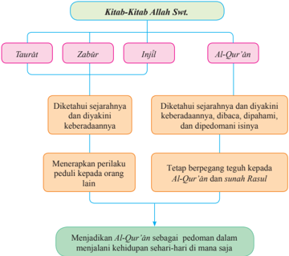

> **Deskripsi Visual:** Gambar ini adalah diagram yang menunjukkan hubungan antara berbagai kitab suci dalam agama Islam. Diagram ini terdiri dari empat cabang utama yang masing-masing menggambarkan sebuah kitab suci:

1. Taurât (Kitab Taurat)
2. Zabûr (Kitab Zabur)
3. Injil
4. Al-Qur'an

Setiap cabang memiliki label yang menjelaskan konteks dan tujuan dari kitab tersebut:

- Taurât dan Zabûr diketahui sejarahnya dan diyakini keberadaannya.
- Injil diketahui sejarahnya dan dipercaya keberadaannya.
- Al-Qur'an diketahui sejarahnya dan dipercaya keberadaannya.

Selain itu, diagram juga menunjukkan bahwa setiap kitab memiliki tujuan yang sama yaitu untuk memberikan pedoman dalam hidup. Ini melibatkan:

- Menerapkan perilaku peduli kepada orang lain.
- Tetap berpegang teguh kepada Al-Qur'an dan sunnah Rasul.

Akhirnya, diagram menekankan bahwa Al-Qur'an harus menjadi pedoman dalam menjalani kehidupan sehari-hari, tidak peduli di mana saja.

Dengan demikian, diagram ini membantu pembaca memahami hubungan dan tujuan dari berbagai kitab suci dalam agama Islam, serta bagaimana mereka saling berkaitan dalam mendukung kehidupan moral dan spiritual.

1

 

---
## 📄 Halaman 8

---
**🖼️ Gambar/Diagram**

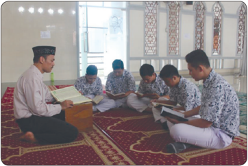

> **Deskripsi Visual:** Gambar ini menunjukkan sebuah ruangan yang tampak seperti masjid dengan lantai berlapis karpet merah dan putih. Di tengah ruangan, ada seorang guru yang sedang membimbing murid-muridnya. Guru tersebut memegang buku dan sedang memberikan penjelasan kepada murid-murid yang duduk di depannya. Murid-murid tersebut juga sedang memegang buku dan tampak sangat fokus pada materi yang dibahas oleh guru. Ruangan ini dilengkapi dengan beberapa pilar dan pintu yang terbuat dari kayu, serta terdapat lampu yang menyala di sudut ruangan. Seluruh suasana tampak tenang dan serius, menunjukkan bahwa aktivitas ini berlangsung dalam suasana yang sopan dan disiplin.

Gambar 1.1 Seorang guru sedang mengajarkan al-Qur'ān

---
**🖼️ Gambar/Diagram**

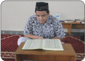

> **Deskripsi Visual:** Gambar ini adalah foto yang menunjukkan seorang pria sedang membaca Al-Qur'an. Pria tersebut berdiri di atas karpet yang biasanya digunakan untuk ibadah di masjid. Belakangnya tampak ruangan dengan beberapa kursi dan meja, serta beberapa peralatan seperti lampu dan rak. Pria tersebut mengenakan jubah berwarna putih dengan lengan panjang dan topi tradisional yang sering digunakan oleh umat Islam. Di depannya ada dua buku besar, salah satunya tampaknya adalah Al-Qur'an. 

Elemen utama dalam gambar ini adalah pria yang sedang membaca Al-Qur'an, ruangan di belakangnya, dan peralatan yang ada di sekitarnya. Relasi antara elemen-elemen ini adalah bahwa pria tersebut sedang berada di dalam ruangan yang biasanya digunakan untuk ibadah, dan peralatan di sekitarnya menunjukkan bahwa ini adalah tempat yang sering digunakan untuk kegiatan religius.

Teks, angka, atau label penting yang terlihat dalam gambar ini adalah nama-nama peralatan dan elemen-elemen yang ada di sekitar pria tersebut. Informasi kunci yang dapat diambil pembaca adalah bahwa gambar ini mungkin digunakan sebagai contoh atau penjelasan tentang kegiatan membaca Al-Qur'an dalam konteks kehidupan sehari-hari.

### Aktivitas Siswa:

Setelah  kamu  mengamati  gambar  di  atas,  coba  berikan  tanggapanmu  tentang pesan-pesan yang ada pada gambar tersebut.

2

---
**🖼️ Gambar/Diagram**

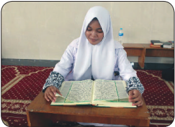

> **Deskripsi Visual:** Gambar ini adalah foto yang menunjukkan seorang siswi sedang membaca buku. Siswa tersebut mengenakan hijab putih dan seragam sekolah hijau. Buku yang dibaca siswi tampak seperti buku pelajaran dengan tulisan berwarna hitam pada lembaran putih. Di sebelah kanan buku, terdapat beberapa buku lain yang terletak di atas meja kayu. Meja tersebut diletakkan di atas karpet merah dengan motif geometris. Di sudut kiri atas gambar, terdapat botol air minum.

 

---
## 📄 Halaman 9

Sejak  Nabi  Adam  as.  sampai  Nabi Muhammad  saw., para rasul datang untuk  menyampaikan ajaran Allah Swt. kepada umat-Nya. Sebagai manusia biasa,  para  rasul  juga  akan  meninggal dunia. Sepeninggal para rasul kehidupan umat manusia mengalami pergeseran dan ada yang mulai meninggalkan ajarannya.  Saat  itulah  kehidupan  umat manusia mulai kacau karena mereka tidak lagi berpedoman sebagaimana yang  telah  dibawa  oleh  rasul.  Dengan diturunkannya kitab suci, umat manusia memiliki pedoman hidup.

Al-Qur'±n adalah kitab suci umat Islam yang diwahyukan oleh Allah Swt. melalui Malaikat  Jibril  secara  berangsur-angsur  kepada  Nabi  Muhammad  saw. Al-Qur'±n merupakan kitab suci terakhir dan merupakan penyempurna kitab-kitab sebelumnya. Isi kitab suci al-Qur'±n mencakup seluruh inti wahyu yang telah diturunkan kepada para nabi dan rasul sebelumnya. Al-Qur'± n adalah mukjizat Nabi Muhammad saw. yang  terbesar  dan  abadi  di  antara  mukjizat-mukjizat  lainnya.  Oleh  karena  itu, alQur'± n idealnya menjadi pedoman sekaligus menjadi dasar hukum bagi kehidupan seluruh umat manusia dalam mencapai kebahagiaan di dunia dan di akhirat.

Rasulullah  saw.  menegaskan  bahwa  manusia  tidak  tersesat  dalam  menjalani hidupnya selama berpegang teguh pada al-Qur'± n dan hadis.

``

Artinya: 'Kutinggalkan untukmu dua perkara (pusaka), kalian tidak akan tersesat selama berpegang teguh kepada keduanya, yaitu ( al-Qur'± n) dan sunnah rasul-Nya.' (H.R. Hakim)

### Aktivitas Siswa:

Carilah hadis-hadis yang berkaitan dengan pentingnya membaca al-Qur' ± n !

3

 

---
## 📄 Halaman 10

---
**🖼️ Gambar/Diagram**

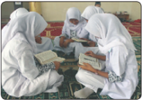

> **Deskripsi Visual:** Gambar ini adalah foto yang menunjukkan tiga orang siswa berbaju hijab sedang belajar bersama-sama di sebuah ruangan yang tampak seperti kelas. Mereka tengah membaca buku-buku yang diletakkan di atas meja. Siswa di tengah tampak sedang memegang buku dengan telapak tangan, sementara dua siswi di sisi lain sedang menatap buku tersebut. Latar belakang tampak seperti lantai karpet merah dan dinding putih, menunjukkan suasana yang serius dan fokus pada studi.

Elemen-elemen utama dalam gambar ini adalah tiga siswa, buku-buku yang mereka baca, dan ruangan belajar mereka. Siswa-siswi tersebut merupakan elemen utama yang menunjukkan aktivitas belajar mereka. Buku-buku yang mereka baca merupakan objek penting yang menunjukkan tujuan belajar mereka. Ruangan belajar mereka tampak seperti kelas dengan lantai karpet merah dan dinding putih, menunjukkan lingkungan yang sesuai untuk belajar.

Teks, angka, atau label penting yang terlihat dalam gambar ini tidak ada, karena gambar hanya menggambarkan situasi tanpa teks atau angka tambahan. Informasi kunci yang dapat diambil pembaca melalui gambar ini adalah bahwa tiga siswa sedang belajar bersama-sama di kelas, menggunakan buku sebagai alat pembelajaran.

Gambar 1.5 al-Qur'ān

Dalam hadis yang bersumber dari Hudzaifah  bin  Yaman,  Rasulullah  saw. meramalkan kelak pada suatu masa akan  terjadi  perpecahan  dan  perselisihan sepeninggal beliau. Hudzaifah berkata, Aku  bertanya  kepada  Rasulullah:  Wahai Rasulullah, apa yang paduka perintahkan kepadaku  jika  aku  menjumpai  hal  itu? Beliau menjawab, 'Pelajarilah kitab Allah Swt. dan amalkan, karena itu solusinya.' Lalu  aku  mengulang  pertanyaan  itu  3x, dan Rasul juga menjawab 3x: 'Pelajarilah kitab  Allah  Swt.  dan  amalkanlah,  karena itu kunci keselamatan.'

Kritisi  perilaku  berikut  ini,  kemudian  berikan  tanggapanmu  dengan  beberapa sudut pandang (contoh dari sisi agama, sosial, budaya, dan sebagainya)!

- Pada bulan suci Rama«an , hampir di seluruh masjid dan musala terdengar suara lantunan al-Qur'±n , tidak terkecuali di rumah-rumah. Sungguh pengalaman yang sangat menakjubkan. Akan tetapi, setelah selesai Ramadan, selesai pula aktivitas tersebut.  Padahal  Rasulullah  saw.  menegaskan  bahwa: 'Sebaik-baik  kamu adalah orang yang belajar al-Qur'± n dan mengamalkannya'. Dapatkah kamu memberikan tanggapan tentang hal itu?
- Dalam  kehidupan  sehari-hari masih  kita  rasakan  banyaknya  permasalahan kehidupan yang sulit diatasi. Berbagai macam penyakit timbul seolah-olah tanpa diketahui  cara  pengobatannya.  Bencana  yang  terjadi  tidak  disangka-sangka, tawuran antarwarga, atau antarpelajar, dan lain sebagainya. Semua itu merupakan beberapa dampak  perilaku manusia yang sudah meninggalkan al-Qur'±n . Mengapa hal ini terjadi?
- Perlu disadari, bahwa membaca dan mempelajari al-Qur'±n akan meminimalisir kegelisahan  batin,  bahkan  gangguan  jiwa  yang  erat  kaitannya  dengan  penyakit jasmani. Memperbanyak membaca dan mempelajari al-Qur'±n akan meningkatkan kewaspadaan diri dan termotivasi untuk selalu taat kepada Allah Swt. dan rasulNya.  Dengan  banyak  mengkaji  dan  mengamalkan  isi al-Qur'±n ,  kehidupan akan menjadi aman, tenteram, damai, sejahtera, selamat dunia dan akhirat serta mendapat ri«h± Allah swt. Betulkah demikian adanya?

### Aktivitas Siswa:

Tanggapi tiga peristiwa di atas di lembar kerja atau kertas folio, dengan menyertakan alasan-alasan serta dokumen yang memperkuat.

4

 

---
## 📄 Halaman 11

### A. Al-Qur'±n dan Kitab-Kitab Allah Swt. Lainnya

Iman kepada kitab Allah Swt. artinya  meyakini  sepenuh  hati  bahwa Allah  Swt.  telah  menurunkan  kitab kepada  nabi  atau  rasul  yang  berisi wahyu untuk disampaikan kepada seluruh  umat  manusia.  Di  dalam alQur'±n disebutkan bahwa ada 4 kitab Allah  Swt.  yang  diturunkan  kepada para  nabi-Nya.  4  kitab  tersebut  yaitu; Taur±t diturunkan  kepada  Nabi  Musa as., Zabµr kepada Nabi Daud as., Inj³ l kepada  Nabi  Isa  as.,  dan al-Qur'±n kepada Nabi Muhammad saw.

Firman Allah Swt.:

Artinya: 'Dan Kami telah menurunkan Kitab (al-Qur'±n) kepadamu (Muhammad) dengan  membawa  kebenaran,  yang  membenarkan  kitab-kitab  yang diturunkan  sebelumnya  dan  menjaganya,  maka  putuskanlah  perkara mereka menurut apa yang diturunkan Allah Swt. dan janganlah engkau mengikuti keinginan mereka dengan meninggalkan kebenaran yang telah datang kepadamu...' (Q.S. al-M±idah/5: 48)

Kitab-kitab yang dimaksud pada ayat di atas adalah kitab yang berisi peraturan, ketentuan, perintah, dan larangan yang dijadikan pedoman bagi  umat  manusia.  Kitab-kitab  Allah  Swt. tersebut diturunkan pada masa yang berlainan. Semua kitab tersebut berisi ajaran pokok yang sama,  yaitu  ajaran  mengesa -kan  Allah  Swt. ( tauh³d ).  Yang  berbeda  hanyalah  dalam  hal syariat  yang  disesuaikan  dengan  zaman  dan keadaan umat pada waktu itu.

5

 

---
## 📄 Halaman 12

### Aktivitas Siswa:

- Carilah ayat-ayat yang mendukung  keberadaan  kitab-kitab sebelum alQur'ān.
- Jelaskan  pesan-pesan  yang  terkandung  dalam  ayat  yang  kamu  temukan tersebut!
Selain kitab-kitab tersebut di atas, Allah Swt. juga menurunkan wahyu kepada para nabi-Nya. Wahyu tersebut berbentuk £u¥uf ,  yaitu  wahyu Allah Swt. yang berupa lembaran-lembaran yang terpisah.

Dalam al-Qur'±n disebutkan adanya £u¥uf yang dimiliki Nabi Musa as. dan Nabi Ibrahim as. Perhatikan firman Allah Swt. berikut ini:

Artinya: 'Sesungguhnya ini terdapat dalam kitab-kitab yang dahulu, (yaitu) £u¥uf£u¥uf  (kitab-kitab) yang diturunkan kepada Ibrahim dan Musa.' (Q.S. al-A'l±/87: 18-19).

Perhatikan  secara  singkat  penjelasan  tentang  kitab-kitab  yang  Allah  Swt. turunkan kepada para nabi-Nya.

### 1.  Kitab Taur±t

Kata Taurat berasal dari bahasa Ibrani ( thora : instruksi). Kitab Taur±t adalah salah satu kitab suci yang diwahyukan Allah Swt. kepada Nabi Musa as. Kitab Taur±t menjadi petunjuk dan bimbingan bagi Bani Israil. Firman Allah Swt:

Artinya: 'Dan Kami berikan kepada Musa, Kitab (Taur±t) dan Kami jadikannya petunjuk bagi Bani Israil (dengan firman), Janganlah kamu mengambil (pelindung) selain Aku'. (Q.S. al-Isr±'/17: 2)

### Aktivitas Siswa:

- Carilah penjelasan tentang ṡuḥuf -ṡuḥuf selain ṡuḥuf Nabi Ibrahim as. dan Nabi Musa as.
- Jelaskan isi ṡuḥuf -ṡuḥuf yang kamu temukan itu.
- Hubungkan pesan-pesan ṡuḥuf dengan isi al-Qur'ān, apakah bertentangan atau tidak.

 

---
## 📄 Halaman 13

Taur±t merupakan salah satu dari tiga komponen ( Thora , Nab³n ,  dan Khetub³n )  yang terdapat  dalam  kitab  suci  agama  Yahudi  yang disebut Biblia ( al-Kitab ). Oleh orang-orang Kristen disebut Old Testament (Perjanjian Lama).

Isi pokok Kitab Taur±t dikenal dengan Sepuluh Hukum ( Ten Commandements ) atau  Sepuluh  Firman.  Sepuluh  Hukum    ( Ten Commandements ) diterima Nabi Musa as. di atas Bukit Tursina (Gunung Sinai). Sepuluh Hukum tersebut berisi asas-asas keyakinan (akidah) dan asas-asas kebaktian ( syar³'ah ), seperti berikut.

- Tiada Tuhan selain Allah Swt.
- Jangan menyembah berhala
- Jangan mempersekutukan Allah Swt.
- Sucikan hari sabat (hari Sabtu).
- Hormati kedua orang tuamu.
- Jangan membunuh.
- Jangan berzina.
- Jangan mencuri.
- Jangan bersumpah palsu (bersaksi dusta).
- Jangan menginginkan milik orang lain (menginginkan hak orang lain).

### Aktivitas Siswa:

- Carilah keberadaan Kitab Taurāt , baik melalui literatur-literatur Islam maupun yang lainnya.
- Jelaskan tanggapanmu tentang keberadaan kitab suci tersebut, dan bandingkan dengan isi al-Qur'ān.

### 2.   Kitab Zabµr

Kata zabur (bentuk  jamaknya zubµr )  berasal  dari zabara-yazburu-zabr yang berarti menulis.  Makna aslinya adalah kitab yang tertulis. Zabµr dalam bahasa Arab dikenal dengan sebutan mazmµr (jamaknya maz±mir). Dalam bahasa Ibrani disebut mizmar ,  yaitu nyanyian rohani yang dianggap suci. Sebagian ulama menyebutnya Mazmµr, yaitu  salah  satu  kitab  suci yang  diturunkan  sebelum al-Qur'±n (selain Taur±t dan Inj³ l ).

7

---
**🖼️ Gambar/Diagram**

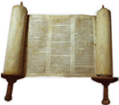

> **Deskripsi Visual:** Gambar ini menunjukkan sebuah buku yang tampak seperti sebuah alat tulis tradisional, mungkin untuk menulis atau membaca. Buku tersebut terletak di atas meja yang berwarna coklat, dengan latar belakang yang lebih gelap. Buku itu terbuka sebagian, dengan beberapa halaman terlihat, dan tampaknya ada tulisan atau gambar pada halaman tersebut. Di samping buku, terdapat dua papan kayu yang digunakan sebagai alas untuk membaca atau menulis. Papan kayu tersebut memiliki lubang di tengah-tengah untuk memudahkan penggunaan. Gambar ini menunjukkan elemen-elemen yang penting dalam proses menulis atau membaca, yaitu buku, papan kayu, dan meja. Informasi kunci yang dapat diambil dari gambar ini adalah bahwa ini adalah alat tulis tradisional yang digunakan untuk menulis atau membaca, dan juga menunjukkan bagaimana cara menggunakan alat tersebut.

 

---
## 📄 Halaman 14

Dalam bahasa Ibrani, istilah zabur berasal dari kata zimra , yang berarti 'lagu atau  musik'. Zamir (lagu)  dan mizmor (mazmur),  merupakan  pengembangan dari kata zamar , artinya 'nyanyi, nyanyian pujian'. Zabµr adalah kitab suci yang diturunkan Allah Swt. kepada kaum Bani Israil melalui utusannya yang bernama Nabi Daud as.

Ayat yang menegaskan keberadaan Kitab Zabµr antara lain:

Artinya: 'Sesungguhnya Kami mewahyukan kepadamu (Muhammad) sebagaimana Kami telah mewahyukan kepada Nuh dan nabi-nabi setelahnya, dan  Kami  telah  mewahyukan  (pula)  kepada  Ibrahim,  Ismail,  Ishak, Yakub dan anak cucunya; Isa, Ayyub, Yunus, Harun dan Sulaiman. Dan Kami telah memberikan Kitab Zabūr kepada Daud.' (Q.S. an-Nisā'/4: 163)

Kitab Zabµr berisi  kumpulan  ayat-ayat  yang  dianggap  suci.  Ada  150  surah dalam Kitab Zabµr yang tidak mengandung hukum-hukum, tetapi hanya berisi nasihat-nasihat, hikmah, pujian, dan sanjungan kepada Allah Swt.

Secara garis besar, nyanyian rohani yang disenandungkan oleh Nabi Daud as. dalam Kitab Zabµr terdiri atas lima macam:

- nyanyian untuk memuji Tuhan ( liturgi ),
- nyanyian perorangan sebagai ucapan syukur,
- ratapan-ratapan jamaah,
- ratapan dan doa individu, dan
- nyanyian untuk raja.

### Aktivitas Siswa:

- Carilah keberadaan Kitab Zabūr, baik melalui literatur-literatur Islam maupun yang lainnya.
- Jelaskan tanggapanmu tentang keberadaan kitab suci tersebut, dan bandingkan dengan isi al-Qur'ān.

 

---
## 📄 Halaman 15

### 3.  Kitab Inj ³ l

Kitab Inj³ l diwahyukan  oleh  Allah  Swt. kepada  Nabi  Isa  as.  Kitab Inj³ l diturunkan kepada nabi Isa as. Kitab Inj³l yang diturunkan kepada nabi Isa as. memuat keteranganketerangan yang benar dan nyata, yaitu perintah-perintah  Allah  Swt.  agar  manusia mengesa -kan  dan  tidak  menyekutukan-Nya dengan  suatu  apa  pun.  Dalam  Kitab Inj³l terdapat pula keterangan mengenai akan lahirnya nabi yang terakhir dan penutup para  nabi  dan  rasul,  bernama  Ahmad  atau Muhammad saw.

Kitab Inj³l diturunkan  kepada  Nabi  Isa  as.  sebagai  petunjuk  dan  cahaya penerang  bagi  manusia.  Nabi  Is  as.  diutus  untuk  mengajarkan  tauhid  kepada umat  atau  pengikutnya.  Tauhid  di  sini  artinya  mengesa -kan  Allah  dan  tidak menyekutukan-Nya.

Penjelasan ini tertulis dalam Q.S. al-¦ad ³ d /57: 27.

``

Artinya: 'Kemudian  Kami  susulkan  rasul-rasul  Kami  mengikuti  jejak  mereka dan Kami susulkan (pula) Isa putra Maryam; Dan Kami berikan Inj³ l kepadanya dan Kami jadikan rasa santun dan kasih sayang dalam hati orang-orang yang mengikutinya....' (Q.S. al-¦ad ³ d/57: 27)

Kitab Inj³l dan Kitab Taur±t ,  yakni  sudah  mengalami  perubahan  dan  penggantian yang dilakukan oleh tangan manusia. Kitab Inj³l yang sekarang memuat tulisan dan catatan perihal kehidupan atau sejarah hidup Nabi Isa as. Kitab ini ditulis  menurut  versi  penulisnya,  yaitu  Matius,  Markus,  Lukas,  dan  Yahya (Yohana).  Mereka  sebenarnya  bukanlah  orang-orang  yang  dekat  dengan  masa hidup Nabi Isa as. Sejarah mencatat sebenarnya masih ada lagi Kitab Inj³ l versi Barnaba. Isi dari Inj³ l  Barnaba ini  sangat berbeda dengan isi empat Kitab Inj³ l yang tersebut di atas.

### Aktivitas Siswa:

- Carilah keberadaan Kitab Inj ³ l ,  baik  melalui  literatur-literatur  Islam  maupun yang lainnya.
- Jelaskan tanggapanmu tentang keberadaan kitab suci tersebut dan bandingkan dengan isi al-Qur'ān .
9

 

---
## 📄 Halaman 16

### 4.  Kitab al-Qur'±n

Al-Qur'±n merupakan kitab suci yang  diturunkan  Allah  Swt.  kepada  Nabi Muhammad saw.  melalui  malaikat  Jibril, Al-Qur'±n diturunkan tidak sekaligus, melainkan  secara berangsur-angsur. AlQur'±n diturunkan  selama  kurang  lebih 23 tahun atau tepatnya  22 tahun 2 bulan 22 hari. Al-Qur'±n terdiri atas 30 juz, 114 surat, 6.236  ayat,  74.437  kalimat,  dan 325.345 huruf.

Wahyu yang terakhir turun adalah Q.S. al-M±idah ayat 3. Ayat tersebut turun pada tanggal 9 ¬zulhijjah tahun 10 Hijriyah di

Padang Arafah, ketika Nabi Muhammad saw. sedang menunaikan haji wada' (haji perpisahan). Beberapa hari sesudah menerima wahyu tersebut, Nabi Muhammad saw. wafat.

### B.  Intisari al-Qur±n

Al-Qur'±n yang  diwahyukan  kepada  Nabi  Muhammad  saw.  menghapus sebagian  syariat  yang  tertera  dalam  kitab-kitab  terdahulu  dan  melengkapinya dengan tuntunan yang sesuai dengan perkembangan zaman. Al-Qur'±n merupakan kitab suci terlengkap dan berlaku bagi semua umat manusia sampai akhir zaman.

Oleh karena itu, sebagai muslim kita tidak perlu meragukannya sama sekali. Firman Allah Swt.:

``

Artinya: 'Kitab  (al-Qur'±n)  ini  tidak  ada  keraguan  padanya;  petunjuk  bagi mereka yang berta kwa.' (Q.S. al-Baqarah/2: 2)

### Aktivitas Siswa:

Bandingkanlah isi kitab suci al-Qur'ān dengan kitab-kitab lainnya.

 

---
## 📄 Halaman 17

### Pahala Istimewa Penghafal Al-Qur'ān

Diriwayatkan  bahwa  Allah  Swt.  akan  memberikan  keistimewaan  kepada para  penghafal al-Qur'±n dan  orang  tuanya.  Rasulullah  saw.  bersabda,  'Pada hari  kiamat  nanti, al-Qur'±n akan  menemui  penghafalnya  ketika  keluar  dari kuburnya. Al-Qur'±n akan  berwujud  seorang  yang  ramping.  Ia  akan  bertanya pada penghafalnya, 'Apakah Anda mengenalku?' Maka, penghafal itu menjawab 'Tidak, saya tidak mengenal Anda.'

Al-Qur'±n berkata,  'Saya  adalah  temanmu, al-Qur'±n yang  membuatmu kehausan  di  tengah  hari.  Sesungguhnya,  setiap  pedagang  akan  mendapatkan keuntungan. Dan Anda pada hari ini mendapatkan keuntungan.'

Kemudian, penghafal itu diberi kekuasaan di tangan kanannya dan  diberi kekekalan di tangan kirinya, serta dipasang mahkota di atas kepalanya. Tidak hanya  itu,  orang  tua  penghafal  itu  juga  mendapatkan  keistimewaan.  Mereka diberikan dua pakaian baru yang bagus dan harganya tidak dapat dibayar oleh penghuni dunia.

Kedua orang tua penghafal itu kemudian bertanya, 'Kenapa kami diberikan pakaian seperti ini?'

Kemudian, mereka mendapat jawaban dari Allah Swt., 'Karena anakmu telah menghafal al-Qur'±n .'

Kemudian,  kepada  penghafal al-Qur'±n tadi  diperintahkan,  'Bacalah  dan naiklah ke tingkat-tingkat surga dan kamar-kamarnya!' Maka, ia pun naik sambil membaca  bacaan al-Qur'±n .

(Diambil dari 365 Kisah Teladan Islam satu kisah selama setahun, Ariany Syurfah)

### 1.  Nama-Nama Lain Al-Qur'±n

Nama-nama lain dari al-Qur'±n , yaitu:

- Al-Hud± , artinya al-Qur'±n sebagai petunjuk seluruh umat manusia.
- Al-Furq±n , artinya al-Qur'±n sebagai pembeda antara yang baik dan buruk.
- Asy-Syif±' , artinya al-Qur'±n sebagai penawar (obat penenang hati).
- A§-¨ikr , artinya al-Qur'±n sebagai peringatan adanya ancaman dan balasan.
- Al-Kit±b , artinya al-Qur'±n adalah firman Allah Swt. yang dibukukan.

### Aktivitas Siswa:

- Carilah ayat-ayat al-Qur'ān yang mengandung nama-nama tersebut di atas.
- Jelaskan arti kata tersebut yang kamu temukan sesuai dengan terjemahannya.
- Jelaskan hubungan antara kata tersebut dan isi al-Qur'ān secara umum.

 

---
## 📄 Halaman 18

### 2.  Isi Al-Qur'±n

Adapun isi pokok al-Qur'±n adalah seperti berikut.

- Aq³ dah atau keimanan.
- ' Ib±dah, baik ' ib±dah ma¥«ah maupun gairu ma¥«ah .
- Akhlaq seorang  hamba  kepada Kh±liq, kepada  sesama  manusia  dan  alam sekitarnya.
- Mu'±malah, yaitu hubungan manusia dengan sesama manusia.
- Qi££ah, yaitu cerita nabi dan rasul, orang-orang saleh, dan orang-orang yang ingkar.
- Semangat mengembangkan ilmu pengetahuan.

### Aktivitas Siswa:

- Carilah  ayat-ayat al-Qur'±n yang  mengandung  penjelasan  tentang aq³dah , ' ib±dah , akhlaq , mu'±malah , dan qi££ah !
- Jelaskan pesan yang terkandung pada ayat yang menjelaskan aq³dah , ' ib±dah , akhlaq , mu'±malah , dan qi££ah !

### 3.  Keistimewaan Al-Qur'±n

Keistimewaan kitab suci al-Qur'±n adalah sebagai berikut.

- Sebagai petunjuk dan rahmat bagi orang-orang yang beriman dan bertakwa.
- Sebagai  informasi  kepada  setiap  umat  bahwa  nabi  dan  rasul  terdahulu mempunyai syariat (aturan) dan caranya masing-masing dalam menyembah Allah Swt.
- Al-Qur'±n sebagai kitab suci terakhir dan terjamin keasliannya.
- Al-Qur'±n tidak dapat tertandingi oleh ide-ide manusia yang ingin menyimpangkannya.
- Membaca dan mempelajari isi al-Qur'±n merupakan ibadah.
Umat  Islam  wajib  mengimani  dan  mempercayai  isi al-Qur'±n karena alQur'±n merupakan pedoman hidup umat manusia, terlebih lagi pedoman hidup umat Islam. Apabila kita tidak mengimani dan mengamalkannya, kita termasuk orang-orang yang ingkar (kafir).

Cara  mengamalkan  isi al-Qur'±n adalah  dengan  mempelajari  cara  belajar membaca (mengaji) baik melalui iqra' , qiraati ,  atau  yang  lainnya.  Kemudian, mempelajari artinya, menganalisis isinya, dan mengamalkannya.

 

---
## 📄 Halaman 19

### Aktivitas Siswa:

- Carilah ayat-ayat yang menjelaskan tentang keistimewaan al-Qur'ān sebagaimana penjelasan di atas (lihat keistimewaan al-Qur'ān ).
- Jelaskan pesan yang terkandung pada ayat yang kamu temukan tersebut.
- Jelaskan tentang keistimewaan tersebut dengan kitab-kitab lainnya.
Bagi orang yang beriman kepada kitab-kitab Allah Swt., ia akan melakukan perilaku mulia sebagai berikut:

- Meyakini bahwa kitab-kitab suci sebelum al-Qur'±n datang dari Allah Swt.
- Al-Qur'±n sudah  dijaga  kemurniannya  oleh  Allah  Swt.  sampai  sekarang. Menjaga kemurnian al-Qur'±n adalah tugas kita sebagai muslim. Salah satu cara  menjaga al-Qur'±n adalah  dengan  menghormati,  memuliakan,  dan menjunjung tinggi kitab suci al-Qur'±n.
- Menjadikan al-Qur'±n sebagai petunjuk dan pedoman hidup, dan tidak sekalikali berpedoman kepada selain al-Qur'±n .
- Berusaha untuk membaca al-Qur'±n dalam segala kesempatan di kala suka maupun duka, kemudian belajar memahami arti dan isinya.
- Berusaha untuk mengamalkan isi al-Qur'±n di dalam kehidupan sehari-hari, baik di waktu sempit maupun di waktu lapang.
Kita sebagai umat Islam, wajib meyakini dan memercayai semua kitab-kitab Allah Swt, baik Taurat, Zabur, Injil, dan al-Qur'±n . Keimanan kepada kitab-kitab selain al-Qur'±n , dilakukan dengan cara menghormati dan menghargai keyakinan mereka. Tetapi keyakinan terhadap al-Qur'±n ,  bukan hanya sekedar percaya di dalam lisan dan hati saja, tetapi harus diwujudkan dalam perilaku kita sehari-hari. Keselamatan dan ketenteraman hidup baik di dunia maupun di akhirat dapat kita raih apabila kita menjadikan al-Qur'±n sebagai pedoman dalam menjalani hidup sehari-hari.

Mari kita  mulai  saat  ini  untuk  menjadikan al-Qur'±n sebagi  pedoman  hidup  dengan cara membaca, mempelajari, mengkaji, dan mengamalkan isi kandungannya.

 

---
## 📄 Halaman 20

### Rangkuman

- Umat Islam wajib mengimani kitab-kitab Allah Swt., baik al-Qur'±n maupun kitab-kitab sebelumnya, yaitu Taur±t , Zabµr , dan Inj³l .
- Kitab Taur±t diturunkan kepada Nabi Musa as. berisi tentang sepuluh perintah,  yaitu:  tiada  Tuhan  selain  Allah  Swt.,  jangan  menyembah berhala,  jangan  mempersekutukan  Allah  Swt.,  sucikan  hari  sabat (hari sabtu), hormati  kedua orang tuamu, jangan membunuh, jangan berzina, jangan mencuri, jangan bersumpah palsu (bersaksi dusta), dan jangan menginginkan milik orang lain (menginginkan hak orang lain).
- Kitab Zabµr diwahyukan  Allah  Swt.  kepada  Nabi  Daud  as.  Kitab Zabµr berisi  tentang  zikir,  nasihat  dan  hikmah.  Kitab Zabµr tidak memuat syariat karena diperintahkan oleh Allah Swt. untuk mengikuti syariat Nabi Musa as.
- Kitab Inj³l diturunkan  kepada  Nabi  Isa  as.  memuat  perintah  agar manusia  mengesa -kan  Allah  Swt.  dan  tidak  menyekutukan-Nya. Dalam kitab Inj³l juga menjelaskan bahwa di akhir zaman akan lahir nabi yang terakhir, yaitu Ahmad atau Muhammad.
- Al-Qur'±n adalah kitab suci yang diturunkan kepada Nabi Muhammad saw., sebagai penyempurna kitab-kitab sebelumnya. Al-Qur'±n terdiri atas 30 juz, 114 surat dan kurang lebih 6.236 ayat, 74.437 kalimat, dan 325.345 huruf. Turunnya al-Qur'±n disebut Nuzulul Qur'±n .
- Di antara keutamaan al-Qur'±n adalah diberi pahala bagi pem  bacanya.

### Evaluasi

### A. Berilah tanda silang (x) pada huruf a, b, c, d, atau e yang dianggap sebagai jawaban yang paling tepat!

- Berikut ini yang termasuk perilaku orang yang beriman kepada kitab suci yang diturunkan Allah Swt. kepada para nabi-Nya adalah ....
- hanya meyakini satu kitab suci saja.
- berlomba-lomba untuk mempertahankan kebenaran masing-masing .
- selalu menjalankan ajaran semua kitab suci yang diturunkan Allah Swt.
- menyeleksi  isinya  kemudian  menjalankan  yang  dianggap  mudah  untuk diamalkan.
- mengimani keberadaan semua kitab suci, tetapi hanya menjalankan isi kitab suci yang diyakininya saja.

 

---
## 📄 Halaman 21

- Nabi  Muhammad  saw.  menjelaskan  bahwa  tidak  akan  tersesat  orang  yang berpegang teguh kepada al-Qur'±n dan sunah, maksudnya adalah ....
- bagi orang yang selalu membawanya ke mana saja ia pergi.
- bagi orang yang selalu mengamalkannya di mana saja ia berada.
- bagi orang yang selalu mengkajinya siang dan malam.
- bagi orang yang selalu berdakwah untuk kebenaran al-Qur'±n.
- bagi orang yang meyakini dalam hatinya.
- Ketika terjadi perdebatan tentang kebenaran masing-masing kitab suci, sikap yang harus diperlihatkan oleh seorang muslim adalah .…
- membiarkan perbedaan tersebut karena merupakan rahmat Allah Swt.
- memancing suasana agar makin ramai perdebatannya.
- mencari solusi dengan cara meminta penjelasan rekan sejawat.
- mencari akar masalah dan menggali sumber kebenaran kepada ahlinya.
- mengembalikan permasalahan tersebut kepada al-Qur'±n dan hadis.
- Cara menjaga al-Qur'±n adalah sebagai berikut, kecuali .…
- mempelajari al-Qur'±n dengan sungguh-sungguh.
- mengamalkan al-Qur'±n di tempat tertutup.
- menghafal semua ayat al-Qur'±n dengan baik.
- mengkaji isinya dengan seluas-luasnya.
- mengamalkan isinya.
- Yang tidak termasuk nama lain al-Qur'±n adalah ....
- al-Hud±
- al-Furq±n
- al-Miz±n
- al-Kit±b
- asy-Syif±'

### B. Jawablah soal-soal berikut dengan tepat!

- Kemukakan beberapa pendapat kamu tentang kitab-kitab Allah Swt. sebelum al-Qur'±n !
- Mengapa al-Qur'±n disebut kitab yang bersifat universal?
- Bagaimana cara mewujudkan perilaku supaya bisa disebut orang yang beriman kepada al-Qur'±n ?
- Mengapa al-Qur'±n disebut  sebagai  kitab  penyempurna  dari  kitab-kitab sebelumnya?
- Bagaimana  pendapat  kamu  ketika  menyaksikan  orang  Islam  tidak  mau membaca dan mengkaji al-Qur'±n ?

 

---
## 📄 Halaman 22

### C. Isilah kolom berikut dengan jujur sesuai keadaanmu!

- Isilah  kolom  keterangan  dengan  menjelaskan  berapa  kali  kamu  melakukan perilaku-perilaku berikut ini selama satu minggu!

---
**📊 Tabel**

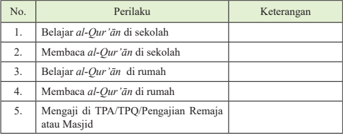

Tabel ini menunjukkan berbagai perilaku belajar dan membaca Al-Qur'an di berbagai tempat, seperti sekolah, rumah, dan masjid. Topik utamanya adalah tentang cara-cara yang dilakukan untuk mempelajari dan membaca Al-Qur'an. Kolom "Perilaku" mencakup lima pilihan, yaitu belajar di sekolah, membaca di sekolah, belajar di rumah, membaca di rumah, dan mengaji di TPA/TPQ/Pengajian Remaja atau Masjid. Keterangan memberikan penjelasan singkat tentang setiap perilaku tersebut. Pola penting yang terlihat adalah bahwa semua perilaku ini berkaitan dengan pembelajaran dan penggunaan Al-Qur'an, baik itu di sekolah, rumah, maupun tempat lainnya.

### 2.  Isilah kolom keterangan dengan memberikan alasan secara jujur!

---
**📊 Tabel**

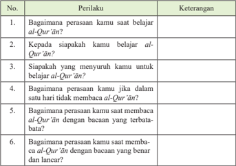

Tabel ini berisi enam pertanyaan tentang perasaan dan perilaku belajar Al-Qur'an, dengan keterangan untuk setiap pertanyaan. Topik utama tabel adalah bagaimana perasaan dan perilaku belajar Al-Qur'an. Kolom-kolomnya meliputi 1) bagaimana perasaan kamu saat belajar Al-Qur'an?, 2) kepada siapakah kamu belajar Al-Qur'an?, 3) siapakah yang menyuruh kamu untuk belajar Al-Qur'an?, 4) bagaimana perasaan kamu jika dalam satu hari tidak membaca Al-Qur'an?, 5) bagaimana perasaan kamu saat membaca Al-Qur'an dengan bacaan yang terbatas?, dan 6) bagaimana perasaan kamu saat membaca Al-Qur'an dengan bacaan yang benar dan lancar?. Data atau pola penting yang terlihat adalah bahwa tabel ini mencakup berbagai aspek perasaan dan perilaku belajar Al-Qur'an, mulai dari perasaan saat belajar, siapa yang menyuruh belajar, perasaan jika tidak membaca dalam satu hari, perasaan saat membaca dengan bacaan terbatas, hingga perasaan saat membaca dengan bacaan yang benar dan lancar.

 

---
## 📄 Halaman 23

### 3.  Isilah kolom pilihan jawaban dengan jujur!

---
**📊 Tabel**

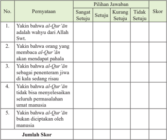

Tabel ini berisi pertanyaan tentang kepercayaan terhadap al-Qur'an dan pilihan jawaban yang ditawarkan untuk setiap pertanyaan. Topik utama tabel adalah kepercayaan terhadap al-Qur'an sebagai wahyu Allah Swt., serta peran al-Qur'an dalam kehidupan manusia. Kolom-kolomnya meliputi nomor pertanyaan, pilihan jawaban (sangat setuju, setuju, kurang setuju, tidak setuju), skor, dan jumlah skor. Data penting yang terlihat adalah bahwa setiap pertanyaan memiliki skor yang dapat ditambahkan untuk mencapai total skor akhir.

### D. Tugas Kelompok

- Buatlah beberapa kelompok dengan beranggotakan lima orang setiap kelompoknya.
- Setiap kelompok membuat ringkasan materi tentang isi Taur±t , Zabµr , Inj³l , dan al-Qur'±n.
- Setiap  kelompok mempresentasikan hasil kerjanya dan kelompok yang lain menanggapi.

---
**📊 Tabel**

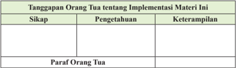

Tabel ini menunjukkan tanggapan orang tua tentang implementasi materi tertentu dalam kurikulum. Topik utamanya adalah bagaimana orang tua merespons terhadap materi tersebut. Tabel memiliki tiga kolom: Sikap, Pengetahuan, dan Keterampilan. Dalam kolom Sikap, data yang diberikan adalah "Paraf Orang Tua". Kolom Pengetahuan dan Keterampilan tidak memiliki data yang disediakan. Pola penting yang terlihat adalah bahwa tabel ini fokus pada tanggapan orang tua terhadap materi, dengan menyoroti sikap mereka sebagai satu-satunya informasi yang diberikan.

 

---
## 📄 Halaman 24

Bab 2

### Berani Hidup Jujur

### Peta Konsep

---
**🖼️ Gambar/Diagram**

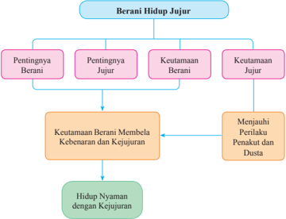

> **Deskripsi Visual:** Gambar ini adalah diagram yang menunjukkan hubungan antara berani hidup jujur dengan keutamaan berani dan jujur. Diagram ini dibagi menjadi dua bagian utama: Pentingnya Berani dan Pentingnya Jujur, serta Keutamaan Berani dan Keutamaan Jujur. Setiap bagian tersebut memiliki subbagian yang lebih spesifik, seperti Menjauhi Perilaku Penakut dan Dusta, dan Hidup Nyaman dengan Kejujuran.

Elemen utama dalam diagram ini adalah konsep-konsep dasar tentang berani dan jujur, serta bagaimana mereka saling berkaitan. Teks penting dalam diagram ini mencakup istilah seperti "Berani Hidup Jujur", "Pentingnya Berani", "Keutamaan Berani", "Pentingnya Jujur", "Keutamaan Jujur", "Menjauhi Perilaku Penakut dan Dusta", dan "Hidup Nyaman dengan Kejujuran".

Informasi kunci yang dapat diambil pembaca melalui diagram ini adalah bahwa berani hidup jujur melibatkan dua aspek utama: berani dan jujur. Kedua aspek ini saling terkait dan mempengaruhi perilaku seseorang. Berani membela kebenaran dan kejujuran merupakan keutamaan yang dihasilkan dari kedua aspek ini. Akhirnya, hidup nyaman dengan kejujuran adalah hasil dari menjauhi perilaku penakut dan dusta, yang merupakan bagian dari pentingnya berani dan jujur.

 

---
## 📄 Halaman 25

---
**🖼️ Gambar/Diagram**

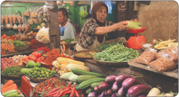

> **Deskripsi Visual:** Gambar ini adalah foto yang menunjukkan seorang penjual sayuran di pasar tradisional. Gambar ini menampilkan berbagai jenis sayuran segar seperti wortel, tomat, kubis, dan kacang polong yang disusun rapi di atas meja beli. Penjual sedang memegang sayuran dan menunjuknya kepada pembeli. Di sebelah kiri, ada beberapa pohon buah yang tampak tidak terpengaruh oleh aktivitas penjualan. Di latar belakang, beberapa orang lain juga terlihat sedang berbelanja. Gambar ini menunjukkan kehidupan sehari-hari di pasar tradisional dengan detail tentang penjualan sayuran dan lingkungan sekitarnya.

### Aktivitas Siswa:

Setelah kamu mengamati gambar di atas, coba berikan tanggapanmu tentang pesanpesan yang ada pada gambar tersebut!

 

---
## 📄 Halaman 26

Sikap jujur merupakan sikap positif yang  harus dimiliki setiap orang.  Namun  pada  saat  sekarang, kejujuran merupakan hal yang mulai langka dan jarang dapat kita jumpai. Kejujuran  dapat  menunjukkan  ja  lan kebaikan yang nantinya dapat mem­ bantu mengantarkan kita ke surga.

Sikap jujur merupakan faktor terbesar  tegaknya  agama  dan  dunia. Kehidupan  dunia  akan  hancur  dan agama  juga  menjadi  lemah  di  atas kebohongan, khianat serta perbuatan curang.

---
**🖼️ Gambar/Diagram**

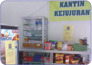

> **Deskripsi Visual:** Gambar ini adalah foto yang menunjukkan kantin kejujuran. Dalam foto tersebut, kita bisa melihat berbagai jenis produk yang tersedia di kantin, termasuk makanan ringan, minuman, dan produk lainnya. Antara produk-produk tersebut ada papan informasi yang menunjukkan harga dan jenis produk yang tersedia. Di atas kantin, terdapat papan tulisan dengan tulisan "KANTIN KEJUJURAN" yang menunjukkan tujuan dari kantin tersebut. Gambar ini menunjukkan bahwa kantin ini dirancang untuk memberikan akses mudah kepada mahasiswa atau pengunjung untuk membeli makanan ringan dan minuman.

Kejujuran harus ditegakkan meskipun berat dan susah. Orang yang jujur akan menjadi  mulia  di  sisi  Allah  Swt.  maupun  di  sisi  manusia.  Ungkapan  tentang 'orang jujur akan hancur' adalah keliru. Allah Swt.  menyifatkan diri­Nya dengan kejujuran. Ini adalah bukti kesaktian jujur. Sekarang ini makin terbuka mata kita terhadap keunggulan perilaku jujur. Betapa banyak orang yang tidak jujur harus masuk penjara.

Kejujuran adalah pujian dari Allah Swt. untuk diri­Nya. Allah Swt. memiliki sifat  jujur  dalam  semua  berita­Nya,  syari'ah­Nya,  dalam  kisah­kisah­Nya. Semuanya yang datang dari Allah Swt. semuanya benar.

``

Artinya: 'Allah, tidak ada tuhan selain Dia. Dia pasti akan mengumpulkan kamu pada hari Kiamat yang tidak diragukan terjadinya. Siapakah yang lebih benar perkataan(nya) daripada Allah?' (Q.S. an-Nis±'/4:87)

Mengapa sikap jujur itu penting? Karena kejujuran dapat membuat hati kita nyaman dan tenteram. Ketika kita berkata jujur, tidak akan ada ketakutan yang mengikuti  atau  bahkan  kekhawatiran  tentang  terungkapnya  sesuatu  yang  tidak kita  katakan.  Seseorang yang terbiasa berkata jujur akan merasa tidak nyaman saat dia berkata bohong walau hanya sekali.

Semoga  kita  mampu  berbuat  jujur  dalam  segala  hal.  Yakinlah,  Allah  Swt. pembela kita semua. Orang yang jujur pasti akan mujur (beruntung).

 

---
## 📄 Halaman 27

Kata jujur seolah­olah  menjadi barang langka, bahkan hampir sirna. Lalu, di manakah engkau wahai jujur? Di setiap sudut kehidupan selalu  saja  tampak  perilaku  ketidak­ jujuran. Saat di sekolah, banyak peserta  didik  yang  melakukan  ke­ bohongan. Misalnya saat ulangan harian,  ujian  tengah  semester,  ujian akhir semester, maupun perilaku lain yang menampilkan ketidakjujuran.

Kritisi perilaku berikut ini, kemudian berikan tanggapanmu dengan beberapa sudut pandang (contoh dari sisi agama, sosial, budaya, dan sebagainya)!

- Banyak  yang  menganggap  kejujuran  sudah  sulit  ditemukan.  Akan  tetapi masih  banyak  juga  orang  yang  sebenarnya  sangat  jujur  dalam  hidupnya. Hal ini terbukti dari beberapa kejadian yang diliput oleh media. Bagaimana tanggapanmu mengenai hal ini? dan berikan contohnya!
- Jika  kejujuran  dilakukan  oleh  siswa  di  sekolah,  seperti  dalam  berkata  dan berbuat,  pasti  ia  akan  dihormati  teman,  disayang  guru,  dan  interaksi  sosial sesama menjadi indah. Sebaliknya, jika perilaku kita diwarnai ketidakjujuran, pastilah  interaksi  kita  tidak  nyaman.  Begitu  juga  di  rumah,  sepanjang  kita menjunjung  tinggi  nilai  kejujuran  dalam  hal  apa  pun,  pasti  orang  tua  akan bangga.  Di  masyarakat  pun  demikian,  kejujuran  harus  disandingkan  dalam kehidupan kita tanpa kecuali. Berikan tanggapanmu mengenai hal tersebut!

 

---
## 📄 Halaman 28

### Sebentar Lagi Seorang Penghuni Surga Akan Masuk!

Dari Anas Bin Malik, suatu ketika Rasulullah saw. duduk di Masjid Nabawi dan berbincang­bincang dengan para sahabat. Tiba­tiba beliau bersabda, 'Sebentar lagi seorang penghuni surga akan masuk kemari!' Semua mata pun tertuju  ke  pintu  masjid  dan  pikiran  para  sahabat  pun  membayangkan  seorang yang luar biasa. 'Penghuni surga, penghuni surga.' Demikian gumam mereka.

Beberapa  saat  kemudian,  masuklah  seorang  pria  dengan  air  wudhu  yang masih membasahi wajahnya. Apakah gerangan keistimewaan orang itu sehingga mendapat jaminan surga? Tidak seorang pun yang berani bertanya, walau semua sahabat merindukan jawabannya.

Keesokan  harinya,  peristiwa  semula  terulang  kembali.  Bahkan,  pada  hari ketiga pun terjadi hal yang demikian.

'Abdullah,  putra  Gubernur  Pertama  di  Mesir:  'Amr  bin  al­'Ash,  tidak tahan  lagi,  meski  ia  tidak  berani  dan  khawatir  mendapat  jawaban  yang  tidak memuaskannya. Maka, timbullah suatu ide dalam benaknya. Dia pun mendatangi si penghuni surga sambil berkata, 'Wahai saudaraku! Bolehkah aku menginap di rumahmu selama tiga hari?'

'Tentu, tentu,' jawab si penghuni surga yang ternyata seorang An¡ar bernama Sa'ad  bin  'Amr  bin  al­'Ash.  Setelah  memperhatikan,  mencermati,  bahkan mengintip si penghuni surga, ternyata, tak ada sesuatu pun yang istimewa. Tidak ada ibadah khusus yang dilakukan si penghuni surga. Tidak ada ¡alat malam, tidak ada pula puasa sunah. Ia bahkan tidur dengan nyenyak hingga beberapa saat sebelum fajar. Memang sesekali ia menyebut nama Allah Swt. di pembaringannya, tetapi sejenak saja dan tidurnya pun berlanjut.

Pada  siang  hari,  si  penghuni  surga  berkerja  dengan  tekun.  Ia  ke  pasar, sebagaimana halnya orang yang ke pasar. 'Pasti ada sesuatu yang disembunyikan atau yang tak sempat kulihat. Aku harus berterus terang kepadanya,' demikian gumam 'Abdullah bin 'Amr.

'Apa yang engkau lihat, itulah saya!' jawab si penghuni surga.

Dengan  rasa  kecewa,  'Abdullah  bin  'Amr  bermaksud  kembali  ke  rumah, tetapi  tiba­tiba  tangannya  dipegang  oleh  sang  penghuni  surga  seraya  berkata, 'Apa yang engkau lihat, itulah yang saya lakukan, ditambah sedikit lagi, saya tidak pernah merasa iri terhadap seseorang yang dianugerahi nikmat oleh Allah Swt. Tidak pernah pula saya berdusta dalam melakukan segala kegiatan saya!' (H.R. Ahmad).

(Diambil dari: Mutiara Akhlak Rasulullah saw. Ahmad Rofi' Usmani)

 

---
## 📄 Halaman 29

### A.  Pentingnya Memiliki Sifat Syaja'ah

Allah  Swt.  memerintahkan  kepada  orang­orang  yang  beriman  agar  tidak menjadi penakut dan pengecut. Karena rasa takut dan pengecut akan membawa kegagalan  dan  kekalahan.  Keberanian  adalah  tuntutan  keimanan.  Iman  pada Allah  Swt.  mengajarkan  kita  menjadi  orang­orang  yang  berani  menghadapi beragam tantangan dalam hidup ini. Tantangan utama yang kita hadapi adalah memperjuangkan  kebenaran,  meskipun  harus  menghadapi  berbagai  rintangan. Rasulullah saw. menjelaskan dalam sabdanya:

Artinya: ' Katakanlah yang benar walaupun itu pahit ' (H.R. Ahmad).

Islam tidak menyukai orang yang lemah/penakut. Orang yang lemah/penakut biasanya tidak berani untuk mempertahankan hidup sehingga gampang putus asa. Ketakutan  itu  diantaranya  karena  takut  dikucilkan  dari  lingkungannya.  Takut karena berlainan sikap dengan banyak orang atau takut untuk membela sebuah kebenaran dan keadilan.

Keberanian dalam ajaran  Islam  disebut Syaja'ah.  Syaja'ah menurut  bahasa artinya berani. Sedangkan menurut istilah syaja'ah adalah keteguhan hati, kekuatan pendirian  untuk  membela  dan  mempertahankan  kebenaran  secara  jantan  dan terpuji. Jadi syaja'ah dapat diartikan keberanian yang berlandaskan ke  benaran, dilakukan  dengan  penuh  pertimbangan  dan  perhitungan  untuk  mengharapkan keridaan Allah Swt.

Keberanian ( syaja'ah ) merupakan jalan untuk mewujudkan sebuah ke  menang­ an  dalam  keimanan.  Tidak  boleh  ada  kata  gentar  dan  takut  bagi  muslim  saat mengemban  tugas  bila  ingin  meraih  kegemilangan.  Semangat  keimanan  akan selalu  menuntun  mereka  untuk  tidak  takut  dan  gentar  sedikit  pun.  Allah  Swt. berfirman:

Artinya:  ' Janganlah kamu bersikap lemah, dan janganlah (pula) kamu bersedih hati,  padahal  kamulah  orang-orang  yang  paling  tinggi  (derajatnya), jika kamu orang-orang yang beriman '. ( Q.S. Ali Imr±n/3 : 139)

### Aktivitas Siswa:

Coba amati perilaku orang-orang yang memiliki sifat syaja'ah baik  melalui media maupun melihat langsung di tengah-tengah masyarakat, lalu bagaimana tanggapanmu terhadap sifat tersebut?

 

---
## 📄 Halaman 30

### B. Pentingnya Memiliki Sifat Jujur

Nabi  menganjurkan  kita  sebagai  umatnya  untuk  selalu  jujur.  Kejujuran merupakan akhlak mulia yang akan mengarahkan pemiliknya kepada kebajikan, sebagaimana dijelaskan oleh Nabi Muhammad saw.,

``

Artinya: 'Dari  Abdullah  bin  Mas'ud  radhiyallahu  'anhu,  ia  berkata:  Telah bersabda  Rasulullah:  'Sesungguhnya  jujur  itu  membawa  kepada kebaikan dan kebaikan itu membawa ke surga....' (H.R. Muslim)

Sifat  jujur  merupakan  tanda  ke­ islaman  seseorang  dan  juga  tanda kesempurnaan  bagi  si  pemilik  sifat tersebut. Pemilik kejujuran memiliki kedudukan yang tinggi di dunia dan  akhirat.  Dengan  kejujurannya, seorang hamba akan mencapai derajat orang­orang yang mulia dan selamat dari segala keburukan.

Dapat kita saksikan dalam kehidupan  sehari­hari  bahwa  orang yang  jujur  akan  dipermudah  rezeki

dan  segala  urusannya.  Contoh  yang  perlu  diteladani  adalah  kejujuran,  Nabi Muhammad  saw.  ketika  belau  dipercaya  oleh  Siti  Khadijah  untuk  membawa barang dagangan lebih banyak lagi. Selama membawa barang dangan tersebut, beliau selalu menerapkan kejujuran. Kepada para pembelinya, beliau selalu berkata jujur tentang kondisi barang dangan yang dijualnya. Sifat jujur yang dilakukan oleh  Nabi  Muhammad  saw.  selama  berdagang  mendatangkan  kemudahan  dan keuntungan yang lebih besar. Apa yang dilakukan Nabi Muhammad saw. adalah contoh dalam kehidupan sehari­hari tentang hikmah perilaku jujur. Kamu dapat mencari contoh lainnya.

Sebaliknya,  orang  yang  tidak  jujur  atau  bohong  akan  dipersulit  rezeki  dan segala urusannya. Orang yang pernah berbohong akan terus berbohong karena untuk menutupi kebohongan yang diperbuat, dia harus berbuat kebohongan lagi. Bersyukurlah bagi orang yang pernah berbohong kemudian sadar dan mengakui kebohongannya itu sehingga terputusnya mata rantai kebohongan.

Kejujuran berbuah kepercayaan, sebaliknya dusta menjadikan orang lain tidak percaya.  Jujur  membuat  hati  kita  tenang,  sedangkan  berbohong  membuat  hati menjadi was­was. Contoh seorang siswa yang tidak jujur kepada orang tua dalam hal uang saku, pasti nuraninya tidak akan tenang apabila bertemu. Apabila orang

 

---
## 📄 Halaman 31

tuanya mengetahui ketidakjujuran anaknya, runtuhlah kepercayaan terhadap anak tersebut.  Kegundahan  hati  dan  kekhawatiran  yang  bertumpuk­tumpuk  berisiko menjadi penyakit.

Menurut tempatnya, jujur itu ada beberapa macam, yaitu jujur dalam hati atau niat, jujur dalam perkataan atau ucapan, dan jujur dalam perbuatan.

- Jujur dalam niat dan kehendak, yaitu motivasi bagi setiap gerak dan langkah seseorang da­ lam rangka menaati perintah Allah Swt. dan ingin mencapai ri«a ­Nya.  Jujur  sesungguhnya berbeda dengan pura­pura jujur. Orang yang pura­pura jujur  berarti  tidak  ikhlas  dalam berbuat.
- Jujur dalam ucapan, yaitu memberitakan sesuatu sesuai dengan realitas yang terjadi.  Untuk kemaslahatan yang dibenarkan oleh syari'at seperti dalam kondisi perang atau mendamaikan dua orang yang bersengketa atau perkataan suami yang  ingin  menyenangkan  istrinya,  diperbolehkan  untuk  tidak  mengatakan hal  yang  sebenarnya.  Setiap  hamba  berkewajiban  menjaga  lisannya,  yakni berbicara  jujur  dan  dianjurkan  menghindari  kata­kata  sindiran  karena  hal itu sepadan dengan kebohongan. Benar/jujur dalam ucapan merupakan jenis kejujuran yang paling tampak dan terang di antara macam­macam kejujuran.
- Jujur  dalam  perbuatan,  yaitu  seimbang  antara  lahiriah  dan  batiniah  hingga tidaklah berbeda antara amal lahir dan amal batin. Jujur  dalam perbuatan ini juga berarti melaksanakan suatu pekerjaan sesuai dengan yang diri«ai Allah Swt. dan melaksanakannya secara terus­menerus dan ikhlas.
Merealisasikan kejujuran, baik jujur dalam hati, jujur dalam perkataan,   maupun jujur dalam perbuatan membutuhkan kesungguhan. Adakalanya kehendak untuk jujur itu lemah, adakalanya pula menjadi kuat.

### Aktivitas Siswa:

Menurut objeknya, jujur itu ada beberapa macam, yaitu jujur kepada Allah Swt., jujur kepada orang lain, dan jujur kepada diri sendiri.

- Identifikasilah	jenis-jenis	kejujuran	di	sekitarmu,	baik	di	rumah	maupun	di	sekolah atau di lingkungan masyarakat, termasuk kategori kejujuran yang manakah!
- Jelaskan  hubungannya  antara  perilaku  jujur  yang  diamati  dengan    akibat  yang ditimbulkan!
- Buatlah contoh perilaku jujur kepada Allah Swt., kepada orang lain, dan kepada diri sendiri!
- Carilah dalil naqli maupun aqli tentang perintah jujur kepada Allah Swt., kepada orang lain, dan kepada diri sendiri.

 

---
## 📄 Halaman 32

### C.  Harus Berani Jujur

Pada pembahasan sebelumnya, telah dijelaskan mengenai arti sebuah kejujuran. Kejujuran akan membawa kepada kebaikan dan kebaikan akan dapat membawa ke  surga.  Sebaliknya,  betapa  berbahayanya  sebuah  kebohongan.  Kebohongan akan mengantarkan pelakunya tidak dipercaya oleh orang lain.

Ketika seseorang sudah berani menutupi kebenaran, bahkan menyelewengkan kebenaran untuk tujuan jahat, ia telah melakukan kebohongan. Kebohongan yang dilakukannya itu telah membawa kepada apa yang dikhianatinya itu.

Artinya: '...Barangsiapa berkhianat, niscaya pada hari kiamat dia akan datang membawa apa yang dikhianatkannya itu. Kemudian setiap orang akan diberi balasan yang sempurna sesuai dengan apa yang dilakukannya, dan mereka tidak dizalimi.'' (Q.S. Ãli 'Imr±n/3: 161)

Abu Bakr  bin  Abi  Syaibah  menuturkan  kepada  kami.  Dia  berkata;  Yazid  bin Harun  menuturkan  kepada  kami.  Dia  berkata;  Abdul  Malik  bin  Qudamah  al­ Jumahi menuturkan kepada kami dari Ishaq bin Abil Farrat dari al­Maqburi dari Abu Hurairah ­radhiyallahu'anhu­, dia berkata; Rasulullah shallallahu 'alaihi wa sallam bersabda,

Artinya: 'Akan  datang  kepada  manusia  tahun-tahun  yang  penuh  dengan penipuan.  Ketika  itu  pendusta  dibenarkan,  sedangkan  orang  yang jujur  malah  didustakan,  pengkhianat  dipercaya,  sedangkan  orang yang  amanah  justru  dianggap  sebagai  pengkhianat.  Pada  saat  itu, Ruwaibidhah  berbicara.'  Ada  sahabat  yang  bertanya,  'Apa  yang dimaksud Ruwaibidhah?' Beliau menjawab, 'Orang bodoh yang turut campur dalam urusan masyarakat luas.' (H.R. Ibnu Majah).

 

---
## 📄 Halaman 33

Menjaga amanah ialah menunai  kan dengan  baik  terhadap  hak­hak  Allah  Swt. dan  hak­hak  manusia  tanpa  terpengaruh oleh perubahan keadaan, baik susah maupun senang.

Ada beberapa hikmah yang dapat dipetik dari perilaku jujur, antara lain sebagai berikut.

- Perasaan enak dan hati tenang. Jujur akan membuat hati kita menjadi tenang, tidak takut akan diketahui  kebohongannya karena tidak berbohong.
- Mendapatkan kemudahan dalam hidup.
- Selamat dari azab dan bahaya.
- Membawa kepada kebaikan, dan kebaikan akan menuntun kita ke surga.
- Dicintai oleh Allah Swt. dan Rasul­Nya.

### Aktivitas Siswa:

- Buktikan bahwa jujur itu membawa hikmah. Minimal bukti dalil naqli -nya baik ayat maupun hadis!
- Jelaskan pesan-pesan dalam ayat atau hadis yang kamu temukan dan hubungkan dengan peristiwa kejujuran dalam kehidupan sehari-hari!

### Menerapkan Perilaku Mulia

Kita harus menanamkan kesadaran pada diri kita untuk selalu berani membela kebenaran dan berperilaku jujur, baik kepada Allah Swt., orang lain, maupun diri sendiri. Jika kita sudah bisa membiasakan berperilaku jujur, kita akan mendapatkan hikmah yang luar biasa dalam kehidupan sehari­hari.

Kita  harus  menyadari  dan  mengetahui  akibat  dari  kebohongan  sehingga kita  bisa  menjauhi sifat  buruk  tersebut.  Contoh akibat dari kebohongan adalah hilangnya kepercayaan orang lain terhadap kita, susah mendapatkan teman bahkan tidak  memiliki  teman,  dan  susah  mendapat  pekerjaan  karena  tidak  dipercaya. Berperilaku berani membela kebenaran dan  jujur terkadang sangat pahit pada awalnya, tetapi buah manis akan didapat di akhirnya.

Perilaku berani membela kebenaran dan jujur dapat diterapkan dalam berbagai hal dalam kehidupan sehari­hari, baik di sekolah, di rumah, maupun di lingkungan masyarakat  di  mana  kita  tinggal. Berikut  ini  cara  menerapkan  perilaku  berani membela kebenaran dan jujur.

 

---
## 📄 Halaman 34

- Di sekolah, kita meluruskan niat untuk menuntut ilmu, mengerjakan tugas­ tugas  yang  diberikan  oleh  ibu  bapak/guru,  tidak  menyontek  pekerjaan teman, melaksanakan piket sesuai jadwal, menaati peraturan yang berlaku di sekolah, dan berbicara benar dan sopan baik kepada guru, teman ataupun orang­orang yang ada di lingkungan sekolah.
- Di  rumah,  kita  meluruskan  niat  untuk  berbakti  kepada  orang  tua  dan memberitakan  hal  yang  benar.  Contohnya,  tidak  menutup­nutupi  suatu masalah pada orang tua dan tidak melebih­lebihkan sesuatu hanya untuk membuat orang tua senang.
- Di masyarakat, kita melakukan kejujuran dengan niat untuk membangun lingkungan yang baik, tenang, dan tenteram. Hal tersebut dapat terwujud dengan tidak mengarang cerita yang dapat membuat suasana di lingkungan tidak kondusif dan tidak membuat berita bohong. Ketika diberi kepercayaan untuk  melakukan  sesuatu  yang  diamanahkan,  harus  dipenuhi  dengan sungguh­sungguh, dan lain sebagainya.

### Jujurlah! Maka, Kamu akan Untung di Dunia dan Mendapat Pahala di Akhirat

Diceritakan, ada seorang saleh yang selalu mewasiatkan kepada pekerjanya untuk selalu meminta kepada para langganannya agar diberitahukan kalau ada barang  dagangannya  yang  cacat.  Setiap  kali  ada  pembeli  datang,  ia  meminta untuk mengecek barangnya terlebih dahulu.

Suatu hari, seorang Yahudi datang ke tokonya dan membeli sehelai baju yang ada cacatnya. Pada waktu itu pemilik toko tidak ada di tempat, sementara Yahudi tidak mengecek baju ini terlebih dahulu dan keburu pergi. Tidak lama kemudian, pemilik  toko  datang  dan  menanyakan  perihal  baju  yang  cacat  tersebut.  Maka dijawab, 'Baju itu telah dibeli oleh seorang Yahudi.'

Lalu  pemilik  toko  itu  bertanya  perihal  Yahudi  tadi,  'Apakah  ia  sudah mengecek cacat yang ada pada baju itu?' Lalu dijawab, 'Belum.' Pemilik toko bertanya lagi, 'Sekarang mana dia?' Dijawab kembali, 'Ia sudah pergi bersama rombongan dagang.' Seketika itu pula, sang pemilik toko membawa uang hasil pembayarannya  dari  baju  cacat  itu.  Lalu  ia  mencari  rombongan  dagang  yang dimaksud dan baru mendapatinya setelah menempuh perjalanan tiga hari, seraya berkata,  'Hai  Fulan,  tempo  hari  kamu  telah  membeli  sehelai  baju  yang  ada cacatnya. Ambil uang kamu ini dan berikan baju itu.' Yahudi itu balas menjawab,

'Apa yang menyebabkan berbuat sampai sejauh ini?'

Lelaki itu menimpali, 'Islam dan sabda Rasulullah saw., 'Siapa yang menipu bukan berasal dari umatku.'

Yahudi balik menimpali, 'Uang yang aku bayarkan kepadamu juga palsu. Maka, ambillah uang tiga ribu ini sebagai gantinya dan aku tambahkan lagi lebih dari itu, 'Aku bersaksi tiada Tuhan selain Allah, dan Muhammad itu Rasulullah.'

(Sumber: 100 Kisah Teladan Tokoh Besar; Muhammad Said Mursi & Qasim Abdullah Ibrahim)

 

---
## 📄 Halaman 35

### Rangkuman

- Jujur  adalah  mengatakan  atau  melakukan  sesuatu  sesuai  dengan kenyataan. Lawan jujur adalah dusta, yaitu mengatakan atau melakukan sesuatu tidak sesuai dengan apa yang sebenarnya.
- Jujur merupakan sebagian dari ruh agama. Barang siapa yang berbuat jujur, ia akan memperoleh kebaikan, dan sedang menuju surga.
- Ada  beberapa  jenis  jujur  dilihat  dari  perilakunya,  yaitu;  jujur  dalam berbuat,  jujur  dalam  perkataan,  jujur  dalam  niat,  dan  jujur  dalam berjanji.
- Kejujuran bisa melemah karena melemahnya tekad, kejujuran juga bisa melemah akibat pergaulan.
- Jujur  bisa  dilakukan  di  mana  saja:  di  rumah,  sekolah,  maupun  di lingkungan masyarakat.

### Evaluasi

- Berilah	tanda	silang	(x)	pada	huruf	a,	b,	c,	d,	atau	e	yang	dianggap sebagai	jawaban	yang	paling	tepat!
- Perhatikan pernyataan berikut ini!
- Orang jujur akan mendapatkan banyak teman.
- Orang jujur akan susah hidupnya.
- Orang jujur akan mendapatkan kebahagiaan di akhirat.
- Orang munafik akan disukai teman di akhirat.
- Orang jujur selalu mendapatkan berkah di mana saja. Pernyataan di atas yang tidak termasuk hikmah dari perilaku jujur adalah ....
- 1 dan 2
- 2 dan 3
- 3 dan 4
- 2 dan 4
- 3 dan 5
- Nabi Muhammad saw. menjelaskan bahwa jujur itu membawa kebaikan dan kebaikan itu menuntun ke surga. Ungkapan tersebut mengandung arti ....
- jujur sangat penting dalam kehidupan sehari­hari
- jujur menyebabkan kenyamanan dalam berperilaku
- jujur membuat pelakunya selalu gelisah
- jujur membawa keberkahan dalam hidup
- jujur perlu dijunjung tinggi agar hidup tenteram

 

---
## 📄 Halaman 36

- Ikhlas dalam melakukan sesuatu, tanpa dicampuri oleh kepentingan­ kepentingan dunia. Jenis jujur seperti ini termasuk kategori ….
- jujur dalam berbuat
- jujur dalam berkata
- jujur dalam niat
- jujur dalam berjanji
- jujur dalam bertekad
- Perhatikan ungkapan berikut ini: 'Jikalau Allah Swt. memberikan kepadaku harta,  aku  akan  membelanjakan  sebagian  di  jalan  Allah  Swt.'  Jenis  jujur seperti ini termasuk kategori ….
- jujur dalam berbuat
- jujur dalam berkata
- jujur dalam niat
- jujur dalam berjanji
- jujur dalam bertekad
- Orang yang tidak jujur atau dusta disebut orang munafik. Salah satu ciri orang munafik adalah....
- jika bekerja ingin upah
- jika berkata ingin didengar
- jika berbuat ingin dilihat
- jika berjanji tidak ditepati
- jika dipercaya ia amanah

### B.	Jawablah	soal-soal	berikut	dengan	tepat!

- Mengapa kita harus berani membela kebenaran dan kejujuran?
- Buatlah contoh  perilaku  yang  menggambarkan  berani  dalam  membela kebenaran!
- Buatlah contoh  perilaku  yang  menggambarkan  berani  dalam  membela kejujuran!
- Tulis artinya dan jelaskan maksud dari hadis berikut!
- Jelaskan manfaat dari perilaku berani dalam kebenaran dan kejujuran!

 

---
## 📄 Halaman 37

### C.	Tugas	Individu

### 1.  Isilah kolom pilihan jawaban dengan jujur!

---
**📊 Tabel**

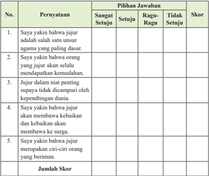

Tabel ini berisi pernyataan yang harus dijawab dengan pilihan "Sangat Setuju", "Setuju", "Ragu-Ragu", atau "Tidak Setuju". Setiap pernyataan memiliki skor yang ditentukan berdasarkan pilihan jawaban tersebut. Topik utama tabel adalah tentang pandangan atau pemahaman tentang jujur sebagai salah satu unsur agama yang paling dasar. Kolom-kolomnya meliputi nomor pernyataan, pilihan jawaban, dan skor. Data penting yang terlihat adalah bahwa setiap pernyataan memiliki skor yang berbeda-beda tergantung pada pilihan jawaban yang diberikan oleh pengguna.

### D.	Tugas	Kelompok

- Buatlah kelompok sesuai dengan jumlah peserta didik di kelasmu. (Maksimal lima orang satu kelompok).
- Buatlah naskah drama tentang kejujuran dalam kehidupan sehari­hari.
- Setiap  kelompok  mempresentasikan  hasil  kerjanya,  kelompok  yang  lain menanggapi.

---
**📊 Tabel**

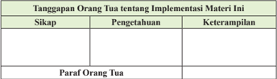

Tabel ini menunjukkan tanggapan orang tua tentang implementasi materi tertentu dalam kurikulum. Topik utamanya adalah bagaimana orang tua merespons terhadap materi tersebut. Tabel dibagi menjadi tiga kolom: Sikap, Pengetahuan, dan Keterampilan. Dalam kolom Sikap, data yang diberikan adalah "Paraf Orang Tua". Kolom Pengetahuan dan Keterampilan tampak kosong, menunjukkan bahwa informasi spesifik tentang pengetahuan dan keterampilan orang tua tidak disediakan dalam tabel ini. Pola penting yang terlihat adalah bahwa tabel ini fokus pada tanggapan orang tua secara umum, tanpa menyebutkan detail spesifik tentang materi atau situasi yang dijelaskan.

 

---
## 📄 Halaman 38

### Bab 3

### Melaksanakan Pengurusan Jenazah

### Peta Konsep

---
**🖼️ Gambar/Diagram**

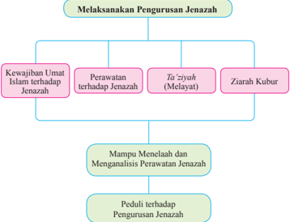

> **Deskripsi Visual:** Gambar ini adalah diagram yang menunjukkan proses pengurusan jenazah dalam konteks Islam. Diagram ini dibagi menjadi empat bagian utama: Kewajiban Umat Islam terhadap Jenazah, Perawatan terhadap Jenazah, Ta'ziyah (Melayat), dan Ziarah Kubur. Setiap bagian tersebut memiliki subbagian yang lebih spesifik, seperti Mampu Menelaah dan Menganalisis Perawatan Jenazah, Peduli terhadap Pengurusan Jenazah.

Elemen utama dalam diagram ini adalah proses pengurusan jenazah yang melibatkan berbagai tindakan dan tanggung jawab yang harus dilakukan oleh umat Islam. Relasi antara elemen-elemen ini sangat jelas, dengan setiap bagian memainkan peran penting dalam proses pengurusan jenazah.

Teks, angka, atau label penting yang terlihat dalam diagram ini mencakup nama-nama proses pengurusan jenazah dan subbagian yang lebih spesifik. Informasi kunci yang dapat diambil pembaca termasuk bahwa pengurusan jenazah melibatkan berbagai tindakan dan tanggung jawab yang harus dilakukan oleh umat Islam, serta bahwa ada beberapa tahapan dalam proses pengurusan jenazah yang harus dipahami dan dijalankan dengan benar.

 

---
## 📄 Halaman 39

---
**🖼️ Gambar/Diagram**

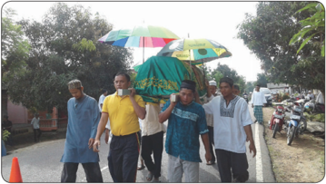

> **Deskripsi Visual:** Gambar ini adalah foto yang menunjukkan beberapa orang sedang berjalan di jalan raya. Di antara mereka, ada dua orang yang membawa payung warna-warni. Latar belakangnya tampak seperti sebuah jalan raya dengan beberapa pohon dan kendaraan lalu lintas. Di sebelah kanan, terlihat beberapa motor dan sepeda motor yang bergerak. Di sebelah kiri, terlihat sebagian mobil dan sepeda motor yang berhenti. Di tengah-tengah, terdapat beberapa papan nama atau spanduk yang tidak jelas teksnya. Gambar ini menunjukkan aktivitas sehari-hari di jalan raya dengan fokus pada orang-orang yang sedang berjalan dan menggunakan payung untuk melindungi dari hujan atau sinar matahari.

### Aktivitas Siswa:

Setelah  kamu  mengamati  gambar  di  atas,  coba  berikan  tanggapanmu  tentang pesan-pesan yang ada pada gambar tersebut.

 

---
## 📄 Halaman 40

Hidup  di  dunia  ini  tidaklah  selamanya. Akan datang masanya kita berpisah dengan dunia berikut isinya. Perpisahan itu terjadi saat kematian menjemput. Kematian adalah pintu  dan  setiap  manusia  akan  memasuki pintu itu, tanpa ada seorang pun yang dapat menghindar darinya.

Artinya: Tiap-tiap yang bernyawa akan merasakan mati. ( QS. Ãli 'Imr±n/3:185 )

Ayat di atas menjelaskan bahwa setiap yang bernyawa pasti akan mati. Kita juga akan mati sebab kita ini manusia yang memiliki nyawa. Kematian datang tidak pernah pilih-pilih. Apabila ajal datang, tidak ada satu kekuatan pun untuk mempercepat  atau  memperlambat.  Adakalanya  kematian  itu  menjemput  saat masih bayi, kanak-kanak, remaja, dewasa, bahkan orang yang sudah tua renta. Kadang ia menjemputnya saat manusia sedang tidur, sedang terjaga, sedang sedih, sedang bahagia, sedang sendiri, atau sedang bersama-sama. Kematian datang tak pernah ada yang tahu. Oleh karena itu, mengingat mati harus sering dilakukan agar  manusia  menyadari  bahwa  dirinya  tidaklah  akan  hidup  kekal.  Tentu  saja di  samping  kita  mengingat  mati,  kita  juga  harus  mempersiapkan  bekal  untuk menghadapi hidup setelah mati, yaitu segera bertobat dan memperbanyak amal saleh.

Salah satu cara untuk mengingat mati adalah sering-seringlah berta'ziyyah (mendatangi keluarga yang terkena musibah meninggal dunia), mengurus jenazah, mulai dari memandikan, mengafani, menyalati, sampai menguburnya.

Sungguh, hanya orang-orang yang cerdaslah yang banyak mengingat mati dan menyiapkan bekal untuk mati. Seorang putra dari sahabat yang mulia, Abdullah bin  'Umar  r.a.  mengabarkan,  'Aku  sedang  duduk  bersama  Rasulullah  saw. tatkala datang seorang lelaki dari kalangan An£ar . Ia mengucapkan salam kepada Rasulullah  saw.,  lalu  berkata,  'Ya  Rasulullah,  mukmin  manakah  yang  paling utama?'  Beliau  menjawab, 'Yang  paling  baik  akhlaknya  di  antara  mereka.' 'Mukmin manakah yang paling cerdas?' tanya lelaki itu lagi. Beliau menjawab: 'Orang yang paling banyak mengingat mati dan paling baik persiapannya untuk kehidupan  setelah  mati.  Mereka  itulah  orang-orang  yang  cerdas.' ( HR.  Ibnu Majah).

 

---
## 📄 Halaman 41

Perhatikan peristiwa berikut!

- Suasana mencekam ketika gunung berapi meletus. Semua orang yang tinggal di  dekat  gunung  berhamburan  untuk  melarikan  diri.  Lahar  panas  mulai mengalir,  menghanguskan  semua  yang  ada  di  dekatnya.  Hancur  dan  luluh lantak keadaan kampung itu, tak satu pun penduduk tersisa. Sungguh sangat mengerikan. Setelah beberapa hari, tim segera bergegas mendekati kampung yang telah hancur disapu lahar panas. Mereka sengaja datang untuk mencari para korban yang tertinggal karena tidak bisa melarikan diri saat gunung itu meletus.
- Kecelakaan  maut  itu  telah  merenggut  puluhan  nyawa.  Penyebabnya  adalah anak di bawah umur (kurang lebih 12 tahun) mengendarai mobil dan melaju dengan  kecepatan  tinggi.  Tiba-tiba  ia  tidak  bisa  mengendalikan  mobilnya dan menabrak kendaraan yang ada di depannya, akhirnya terjadilah tabrakan beruntun. Sebagian korban dilarikan ke rumah sakit terdekat untuk mendapatkan pertolongan  medis.  Akan  tetapi,  sebelas  orang  harus  menjadi  korban  yang disebabkan oleh kesalahan manusia ( human error ).
- Jika  seorang  perempuan meninggal dan di tempat itu tidak ada perempuan, suami, atau mahramnya, mayat itu hendaklah 'ditayamumkan' saja,  tidak boleh dimandikan oleh laki-laki yang lain. Begitu juga jika yang meninggal adalah  seorang  laki-laki,  sedangkan  di  sana  tidak  ada  laki-laki,  istri  atau mahramnya, mayat itu ditayamumkan saja. Peristiwa menyedihkan apa yang terjadi di lingkunganmu?

### Aktivitas Siswa:

Siswa  diminta  untuk  mengkritisi  peristiwa  di  atas  dari  beberapa  sudut pandang! (contoh dari sudut agama, sosial, dan lainnya)

Ada  banyak peristiwa menyedihkan yang  kita  amati  dalam  kehidupan  seharihari. Contohnya  musibah  banjir, tanah longsor, angin puting beliung, kecelakaan di jalan raya, gempa bumi, dan lain sebagainya.  Kita    seharusnya  menjadikan peristiwa  tersebut  sebagai  pelajaran  berharga sehingga kita terselamatkan dari musibah  tersebut.  Bila  usaha  maksimal sudah dilakukan, tetapi kita masih tertimpa juga, itulah yang disebut takdir, kita perlu tawakal, ikhlas, dan sabar menerimanya.

 

---
## 📄 Halaman 42

### A.  Kewajiban Umat Islam Terhadap Jenazah

Apabila seseorang telah dinyatakan positif  meninggal  dunia,  ada  beberapa hal yang harus disegerakan dalam pengurusan  jenazah  oleh  keluarganya, yaitu:  memandikan,  mengafani,  menyalat  kan  dan  menguburnya.  Namun, sebelum  mayat  itu  dimandikan,  ada beberapa  hal  yang  harus  diperhatikan, yaitu seperti berikut.

- Pejamkanlah  matanya  dan  mohonkanlah  ampun  kepada  Allah  Swt. atas segala dosanya.
- Tutuplah  seluruh  badannya  dengan kain sebagai penghormatan dan agar tidak kelihatan auratnya.
- Ditempatkan di tempat yang aman dari jangkauan binatang.
- Bagi keluarga dan sahabat-sahabat dekatnya tidak dilarang mencium si mayat.

### B.  Perawatan Jenazah

### 1.  Memandikan Jenazah

- Syarat-syarat wajib memandikan jenazah
- Jenazah itu orang Islam. Apa pun aliran, mazhab, ras, suku, dan profesinya.
- Didapati tubuhnya walaupun sedikit.
- Yang berhak memandikan jenazah
- Apabila  jenazah  itu  laki-laki,  yang  memandikannya  hendaklah  laki-laki pula. Perempuan tidak boleh memandikan jenazah laki-laki, kecuali istri dan mahram -nya.
- Apabila  jenazah  itu  perempuan,  hendaklah  dimandikan  oleh  perempuan pula, laki-laki tidak boleh memandikan kecuali suami atau mahram -nya.
- Apabila jenazah itu seorang istri, sementara suami dan mahram -nya ada semua, suami lebih berhak untuk memandikan istrinya.
- Apabila jenazah itu seorang suami, sementara istri dan mahram -nya ada semua, istri lebih berhak untuk memandikan suaminya.

 

---
## 📄 Halaman 43

Kalau mayatnya anak laki-laki atau anak perempuan masih kecil, perempuan atau laki-laki dewasa boleh memandikan  nya. Berikut tata cara memandikan jenazah.

- Di tempat tertutup agar yang melihat hanya  orang-orang  yang  memandikan dan yang mengurusnya saja.
- Mayat  diletakkan  di  tempat  yang tinggi seperti dipan.
- Dipakaikan kain basahan seperti sarung agar auratnya tidak ter  buka.
- Mayat didudukkan atau disandar  kan pada sesuatu, lantas disapu perutnya sambil ditekan pelan-pelan agar semua kotorannya  keluar.  Setelah  itu,  dibersihkan  dengan  tangan  kiri,  dan  yang memandikannya dianjurkan mengenakan sarung tangan. Dalam hal ini boleh memakai wangi-wangian agar tidak ter  ganggu bau kotoran si mayat.
- Setelah itu  hendaklah meng  gan  ti  sarung  tangan  untuk  membersihkan  mulut dan gigi si mayat.
- Membersihkan semua kotoran dan najis.
- Mewudukan, setelah itu mem  basuh seluruh badannya.
- Disunahkan membasuh tiga sampai lima kali.
Air untuk memandikan mayat sebaiknya dingin. Kecuali udara sangat dingin atau terdapat kotoran yang sulit dihilangkan, boleh menggunakan air hangat.

### Aktivitas Siswa:

- Cermati  tata  cara  memandikan  jenazah,  baik  jenazah  laki-laki  maupun perempuan!
- cari hadis-hadis terkait tentang tata cara memandikan jenazah!

 

---
## 📄 Halaman 44

### 2.  Mengafani Jenazah

Setelah  selesai  dimandikan,  jenazah  selanjutnya  dikafani.  Pembelian  kain kafan  diambilkan  dari  uang  si  mayat  sendiri.  Apabila  tidak  ada,  orang  yang selama ini menghidupinya yang membelikan kain kafan. Jika ia tidak mampu, boleh diambilkan dari uang kas masjid, atau kas RT/RW, atau yang lainnya secara sah. Apabila tidak ada sama sekali, wajib atas orang muslim yang mampu untuk membiayainya.

Kain kafan paling tidak satu lapis. Sebaiknya tiga lapis bagi mayat laki-laki dan lima lapis bagi mayat perempuan. Setiap satu lapis di antaranya merupakan kain basahan. Abu Salamah r.a. menceritakan, bahwa ia pernah bertanya kepada 'Aisyah  r.a. 'Berapa  lapiskah  kain  kafan  Rasulullah  saw.?'  'Tiga  lapis  kain putih,' jawab Aisyah. (HR. Muslim).

Cara  membungkusnya  adalah  hampar  kan kain kafan helai demi helai dengan  menaburkan  kapur  barus  pada tiap lapisnya. Kemudian, si mayat diletakkan di atasnya. Kedua tangannya dilipat di atas dada dengan tangan kanan di atas tangan kiri. Mengafaninya pun  tidak  boleh  asal-asalan. 'Apabila kalian mengafani mayat saudara kalian, kafanilah sebaik-baiknya.' (HR. Muslim dari Jabir Abdullah r.a.)

### 3.  Menyalati Jenazah

Orang yang meninggal dunia dalam keadaan  Islam  berhak  untuk  di¡alat -kan. Sabda Rasulullah saw. '¡alatkanlah orang-orang  yang  telah  mati.' ( H.R. Ibnu Majah). '¢alatkanlah olehmu orang-orang yang mengucapkan: 'Lailaaha  Illallah.' (H.R.  Daruqu¯ni). Dengan demikian, jelaslah bahwa orang  yang  berhak  di¡alati  ialah  orang yang  meninggal  dunia  dalam  keadaan beriman  kepada  Allah  Swt.  Adapun orang yang telah murtad dilarang untuk di¡alati.

 

---
## 📄 Halaman 45

Untuk bisa di¡alati, keadaan si mayat haruslah:

- Suci, baik badan, tempat, maupun kafan.
- Sudah dimandikan dan dikafani.
- Jenazah sudah berada di depan orang yang menyalatkan atau sebelah kiblat.
Tata cara pelaksanaan ¡alat jenazah adalah sebagai berikut.

- Jenazah diletakkan di depan jamaah. Apabila mayat laki-laki, imam berdiri di dekat kepala jenazah. Apabila mayat perempuan imam berdiri di dekat perut jenazah.
- Imam berdiri paling depan diikuti oleh makmum, jika yang mensalati sedikit, usahakan dibuat 3 baris / sh±f .
- Mula-mula  semua  jamaah  berdiri  dengan  berniat  melakukan £alat jenazah dengan empat takbir.
Niat itu ada yang dibaca dalam hati, ada yang dilafalkan. Apabila dilafalkan, maka bacannya sebagai berikut.

``

Artinya: 'Aku berniat £alat atas jenazah ini empat takbir fardu kifayah sebagai makmum karena Allah ta'ala.'

- Kemudian  takbiratul  ihram  yang  pertama,  dan  setelah  takbir  pertama  itu selanjutnya membaca surat al-F±tihah.
- Takbir yang kedua, dan setelah itu, membaca salawat atas Nabi Muhammad saw.

``

- Takbir yang ketiga, kemudian membaca doa untuk jenazah. Bacaan doa bagi jenazah adalah sebagai berikut.

``

Artinya: 'Ya  Allah, ampunilah  ia, kasihanilah ia, sejahterakanlah ia, maafkanlah kesalahannya.'

- Takbir yang keempat, dilanjutkan dengan membaca doa sebagai berikut:

``

Artinya: 'Ya  Allah,  janganlah  Engkau  menjadikan  kami  penghalang  dari mendapatkan  pahalanya  dan  janganlah  engkau  beri  kami  fitnah sepeninggalnya, dan ampunilah kami dan dia.' (H.R. Hakim)

- Membaca salam sambil menoleh ke kanan dan ke kiri.

 

---
## 📄 Halaman 46

### Catatan:

Do'a yang dibaca setelah takbir ketiga dan keempat disesuaikan dengan jenis kelamin jenazahnya.

- Apabila jenazahnya seorang wanita, damir/kata ganti hu ( )  diganti dengan kata ha ( ).
- Apabila jenazahnya dua orang, damir/kata ganti hu ( ) diganti dengan huma ( ).
- Apabila jenazahnya banyak, maka damir/kata ganti hu ( )  diganti dengan untuk  laki-laki  atau  laki-laki  serta  perempuan  dan untuk perempuan.

### 4.  Mengubur Jenazah

Perihal mengubur jenazah ada beberapa penjelasan sebagai berikut.

- Rasulullah saw. menganjurkan  agar  jenazah segera dikuburkan, sesuai sabdanya:

``

Artinya: 'dari  Abu  Hurairah  r.a.  Dari  Nabi  Muhammad  saw.  bersabda: Segerakanlah menguburkan jenazah....' (H.R. Bukhari Muslim)

- Sebaiknya  menguburkan  jenazah  pada  siang  hari.  Mengubur  mayat  pada malam hari diperbolehkan apabila dalam keadaan terpaksa seperti karena bau yang sangat menyengat meskipun sudah diberi wangi-wangian, atau karena sesuatu hal lain yang harus disegerakan untuk dikubur.
- Anjuran meluaskan lubang kubur. Rasulullah saw. pernah mengantar jenazah sampai di kuburnya. Lalu, beliau duduk di tepi lubang kubur, dan bersabda, 'Luaskanlah pada bagian kepala, dan luaskan juga pada bagian kakinya. Ada beberapa kurma baginya di surga.' ( H.R. Ahmad dan Abu Dawud)
- Boleh  menguburkan  dua  tiga  jenazah  dalam  satu  liang  kubur.  Hal  itu dilakukan sewaktu usai perang Uhud. Rasulullah saw. bersabda, 'Galilah dan dalamkanlah. Baguskanlah dan masukkanlah dua atau tiga orang di dalam

 

---
## 📄 Halaman 47

satu liang kubur. Dahulukanlah (masukkan  lebih  dulu)  orang yang  paling  banyak  hafal  alQur'±n.' (H.R. Nasai dan Tirmidzi dari Hisyam bin Amir r.a.)

- Bacaan meletakkan mayat dalam kubur. Apabila meletakkan mayat dalam kubur, Rasulullah saw. membaca:
Artinya: Dengan nama Allah dan nama agama Rasulullah .

Dalam riwayat lain, Rasulullah saw. membaca:

``

Artinya: Dengan nama Allah dan nama agama Rasulullah dan atas nama sunnah Rasulullah .' (H.R. Lima ahli hadis, kecuali Nasai dan Ibnu Umar ra.)

- Sebelum  dikubur,  ahli  waris  atau  keluarga  hendaklah  bersedia  menjadi penjamin atau menyelesaikan atas hutang-hutang si mayat jika ada, baik dari harta yang ditinggalkannya atau dari sumbangan keluarganya. Nabi Muhammad saw. bersabda: 'Diri orang mu'min itu tergantung (tidak sampai ke hadirat Tuhan),  karena  hutangnya,  sampai  dibayar  dahulu  hutangnya  itu  (oleh keluarganya).' ( H.R. Ahmad dan Tirmidzi dari Abu Hurairah r.a.)

### Aktivitas Siswa:

- Jelaskan pesan-pesan pada hadis yang artinya ' Segeralah jenazah itu dikubur '!
- Jelaskan relevansi antara segera mengubur dengan kondisi jenazah yang lama sekali tidak dikubur dan berada di kamar jenazah!

 

---
## 📄 Halaman 48

### C. Ta'ziyyah (Melayat)

Ta'ziyyah atau  melayat  adalah dengan  maksud  menghibur  atau memberi semangat dan untuk mengunjungi  orang  yang  sedang tertimpa musibah kematian. Para mu'azziy ³ n (orang lakilaki yang berta'ziyyah ) atau mu'azziy±t (orang perempuan yang berta'ziyyah ) hendaknya memberikan  dorongan  kekuatan mental atau menasihati agar orang yang tertimpa musibah tetap

sabar dan tabah menghadapi musibah ini. Umayah ra. mengatakan bahwa anak perempuan Rasulullah saw. menyuruh seseorang untuk memanggil dan memberi tahu beliau bahwa anaknya dalam keadaan hampir mati. Lalu, beliau bersabda, 'Kembalilah engkau kepadanya. Katakan bahwa segala yang diambil dan yang diberikan, bahkan apa pun yang ada di hadapan kita kepunyaan Allah. Dialah yang menentukan ajalnya, maka suruhlah ia sabar dan tunduk kepada perintah.' ( H.R. Bukhari Muslim).

Adab (etika) orang berta'ziyyah antara lain seperti berikut.

- Menyampaikan  doa  untuk  kebaikan  dan  ampunan  terhadap  orang  yang meninggal serta kesabaran bagi orang yang ditinggal.
- Hindarilah pembicaraan yang menambah sedih keluarga yang ditimpa musibah.
- Hindarilah canda-tawa apalagi sampai terbahak-bahak.
- Usahakan  turut  menyalati  mayat  dan  turut  mengantarkan  ke  pemakaman sampai selesai penguburan.
- Membuatkan makanan bagi keluarga yang ditimpa musibah.
Demikian diperintahkan Rasulullah saw. kepada keluarganya sewaktu keluarga Ja'far ditimpa kematian (H.R. Lima Ahli Hadis kecuali Nasai).

### D.  Ziarah Kubur

Ziarah  artinya  berkunjung,  kubur  artinya  kuburan.  Ziarah  kubur  artinya berkunjung ke kuburan dengan niat mendoakan orang yang sudah meninggal dan mengingat  kematian.  Pada  zaman  awal  Islam,  Rasulullah  saw.  melarang  umat Islam untuk berziarah kubur karena dikhawatirkan akan melakukan sesuatu hal yang tidak baik, misalnya menangis di atas kuburan, bersedih, meratapi, bahkan

 

---
## 📄 Halaman 49

yang lebih bahaya adalah meminta sesuatu kepada si mayat yang ada di kuburan. Kemudian, Rasulullah saw. menganjurkan berziarah kubur dengan tujuan untuk mengingat kematian dan mendoakan si mayat. Hal ini sangat baik karena dengan mengingat mati, kita akan selalu berhati-hati dan memperbanyak amal saleh.

Rasulullah saw. bersabda:

``

Artinya: 'Dari Abdullah bin Buraidah berkata, Rasulullah saw.  bersabda: 'Aku pernah melarang kalian berziarah kubur, maka sekarang berziarahlah kalian ke kubur.' (HR. Nas±'i)

Di  antara  hikmah  dari  ziarah  kubur antara lain seperti berikut.

- Mengingat kematian.
- Dapat  bersikap zuhud (menjauhkan diri dari sifat keduniawian).
- Selalu ingin berbuat baik sebagai bekal  kelak  di  alam  kubur  dan  hari akhir.
- Mendokan si mayat agar Allah Swt.  mengampuni  segala  dosanya, menerima amal baiknya, dan mendapat ridlo-Nya.
Apabila  kita  mau  berziarah  kubur,  sebaiknya  perhatikan  adab  atau  etika berziarah kubur, yaitu seperti berikut.

- Ketika mau berziarah, niatkan dengan ikhlas karena Allah Swt., tunduk hati dan merasa diawasi oleh Allah Swt.
- Sesampai di pintu kuburan, ucapkan salam sebagaimana yang diajarkan oleh Rasulullah saw.:

``

Artinya:  ' Keselamatan  semoga  tetap  bagimu  wahai  ahli  kubur  dan  Insya Allah kami akan bertemu dengan kamu semua.' (H.R. Tirmizi)

- Tidak banyak bicara mengenai urusan dunia di atas kuburan.
- Berdoa untuk ampunan dan kesejahteraan si mayat di alam barzah dan akhirat kelak.
- Diusahakan tidak berjalan melangkahi kuburan atau menduduki nisan (tanda kuburan).

 

---
## 📄 Halaman 50

Kita sebagai muslim harus peduli dengan orang lain, terutama yang berada di sekitar kita. Ketika ada orang yang meninggal atau musibah lainnya, selayaknya kita harus memperlihatkan perilaku-perilaku mulia. Perilaku mulia yang dimaksud antara lain seperti berikut.

- Segera  mengunjungi  keluarga  yang  terkena  musibah  kematian,  mendoakan mayat, mengucapkan turut berduka kepada keluarga yang ditinggalkan.
- Membantu  persiapan  pengurusan  jenazah  seperti  memandikan,  mengafani, menyalati, dan menguburkan.
- Memberikan bantuan kepada keluarga korban untuk memperingan bebannya sesuai kemampuan kita.
- Menghibur keluarga korban dengan ungkapan-ungkapan yang membesarkan hati dan nasihat tentang kesabaran dan ketabahan.

### Malaikat Izrail Berkunjung ke Rumah Rasulullah saw.

Pada suatu saat, terdengar seseorang berseru mengucapkan salam. 'Bolehkah saya masuk?' tanyanya.

Fatimah  menyahutnya:  'Maafkanlah,  ayahku  sedang  demam,'  kata  Fatimah sambil menutup pintu. Kemudian, ia kembali menemani ayahnya.

'Siapakah itu, wahai anakku?'

'Tak tahu, ayahku, sepertinya baru sekali ini aku melihatnya,' tutur Fatimah lembut.

Lalu, Rasulullah saw. menatap putrinya. 'Ketahuilah anakku, dialah malaikatul maut,' kata Rasulullah saw.

Malaikat maut datang, Rasulullah saw. menanyakan kenapa Jibril tidak ikut. Kemudian, dipanggillah Jibril  dan  Rasulullah  saw.  bertanya  kepadanya:  'Jibril, jelaskan apa hakku nanti di hadapan Allah Swt.?' tanya Rasululllah saw. dengan suara lemah.

'Pintu-pintu langit telah terbuka, para malaikat telah menanti ruhmu. Semua surga  terbuka  lebar  menanti  kedatanganmu,  ya,  Rasul,'  kata  Jibril.  Tapi,  itu ternyata tidak membuat Rasulullah saw. lega, matanya masih penuh kecemasan. 'Engkau tidak senang mendengar kabar ini?' tanya Jibril lagi.

'Kabarkan kepadaku bagaimana nasib umatku kelak?'

'Jangan khawatir, wahai Rasul! Aku pernah mendengar Allah Swt. berfirman kepadaku:  'Kuharamkan  surga  bagi  siapa  saja,  kecuali  umat  Muhammad  telah berada di dalamnya,' kata Jibril.

 

---
## 📄 Halaman 51

Detik-detik makin  dekat,  saatnya Izrail  melakukan  tugas.  Perlahan  ruh Rasulullah saw. ditarik. Tampak seluruh tubuh Rasulullah saw. bersimbah peluh, urat-urat lehernya menegang.

'Jibril, betapa sakit sakaratul maut ini.' Perlahan Rasulullah saw. mengaduh. Fatimah  terpejam,  Ali  yang  di  sampingnya  menunduk  makin  dalam  dan  Jibril memalingkan muka.

'Jijikkah kau melihatku, hingga kaupalingkan wajahmu, Jibril?' tanya Rasulullah saw. pada malaikat pengantar wahyu itu.

'Siapakah yang sanggup melihat kekasih Allah Swt. direnggut ajal,' kata Jibril.

Sebentar  kemudian  terdengar  Rasulullah  saw.  mengaduh  karena  sakit  yang tidak tertahankan lagi. 'Ya Allah, dahsyat nian maut ini, timpakan saja semua siksa maut ini kepadaku, jangan pada umatku.'

Badan Rasulullah saw. mulai dingin, kaki dan dadanya sudah tidak bergerak lagi. Bibirnya bergetar seakan hendak membisikkan sesuatu. Ali segera mendekatkan telinganya. ' ¸£³kum bi ¡al±ti, wa m± malakat aim±nukum !' 'Peliharalah £alat dan peliharalah orang-orang lemah di antaramu.'

Di luar pintu, tangis mulai terdengar bersahutan, sahabat saling berpelukan. Ali kembali mendekatkan telinganya ke bibir Rasulullah saw. yang mulai kebiruan.

' Ummat³,  ummat³,  ummat³ '  -  'Umatku,  umatku,  umatku'  dan,  berakhirlah hidup manusia mulia yang memberi sinaran itu.

(Kisah-kisah-teladan-Rasulullah saw.-dan- para-sahabat)

### Rangkuman

- Kewajiban  terhadap  jenazah  antara  lain:  memandikan,  mengafani, menyalati, dan menguburnya.
- Yang berhak memandikan jenazah adalah keluarga terdekat, bapak, ibu, suami, istri dan anak.
- Jumlah  kain  kafan  bagi  laki-laki  disunahkan  tiga  helai,  dan  bagi perempuan lima helai.
- Tata cara ¡alat jenazah berbeda dengan ¡alat biasa. ¢alat Pada £alat jenazah,  tidak  ada  rukuk  dan  sujud,  hanya  empat  kali  takbir  dan diselingi doa.
- Cara mengingat mati adalah dengan menjenguk atau berta'ziyyah dan berziarah kubur.
- Mengurus jenazah hukumnya far«u kif±yah , yaitu kewajiban secara bersama-sama atau gotong royong.

 

---
## 📄 Halaman 52

### Evaluasi

### A.	Berilah	tanda	silang	(x)	pada	huruf	a,	b,	c,	d,	atau	e	yang	dianggap sebagai	jawaban	yang	paling	tepat!

- Perhatikan pernyataan-pernyataan berikut.
- Jenazah laki-laki sebaiknya dibungkus dengan tiga helai kain kafan dan wanita dengan lima helai.
- Jika jenazahnya laki-laki hendaknya orang yang mengafaninya juga lakilaki.
- Tiap helai kain kafan dihamparkan di atas tikar dan diberi harum-haruman.
- Jenazah  diletakkan  di  atas  kain  kafan  dengan  posisi  tangan  diangkat seperti sedang takbir ihram.
- Seluruh tubuh jenazah dibalut dengan kain kafan kecuali muka dibiarkan terbuka.
Dari pernyataan tersebut, pernyataan yang termasuk ketentuan syariat dalam mengafani jenazah ialah .…

- 1, 2, dan 4
- 2, 3, dan 5
- 1, 2, 4, dan 5
- 1, 2, dan 3
- 3, 4, dan 5
- Perhatikan pernyataan berikut.
- Yang ¡alat jenazah harus orang Islam.
- Merendahkan suara bacaan ketika ¡alat.
- Salat jenazah dilakukan setelah jenazah dimandikan.
- Membaca surah pendek setelah al-Fatih±h .
- Letak jenazah di sebelah kiblat dari yang menyalatkan.
Dari pernyataan-pernyataan tersebut, pernyataan yang termasuk syarat-syarat sah ¡alat jenazah adalah .…

- 1, 2, dan 3
- 1, 3, dan 5
- 3, 4, dan 5
- 1, 2, dan 4
- 2, 3, dan 4

 

---
## 📄 Halaman 53

- Salah satu ucapan doa dalam ¡alat jenazah berbunyi:

``

### Artinya …

- Gantikanlah rumahnya, dengan yang lebih baik dari rumahnya ketika di dunia.
- Gantikanlah kaum keluarganya dari kaum keluarganya dahulu.
- Ampunilah segala dosanya yang telah lalu.
- Ya  Allah,  ampunilah  ia,  kasihanilah  ia,  sejahterakanlah  ia,  maafkanlah kesalahannya.
- Peliharalah dia dari siksa kubur dan azab neraka.
- Perhatikan pernyataan-pernyataan berikut!
- Seorang muslimah tidak boleh menyalatkan jenazah laki-laki muslim.
- Bila jenazahnya laki-laki, letak imam ¡alat jenazah sejajar dengan kepala jenazah.
- Laki-laki muslim tidak boleh menyalatkan jenazah wanita muslimah.
- Bila jenazahnya wanita, letak imam ¡alat jenazah sejajar dengan bagian tengah badan jenazah.
- ¢alat jenazah gaib harus menghadap di mana jenazah itu dimakamkan.
Dari  pernyataan-pernyataan  tersebut,  pernyataan  yang  termasuk  ke  dalam ketentuan syariat tentang ¡alat jenazah adalah …

- 1 dan 2
- 2 dan 3
- 3 dan 4
- 2 dan 4
- 1, 3, dan 5
- Berikut yang merupakan pernyatan yang benar adalah ...
- Apabila mayatnya perempuan imam berdiri di dekat kepala.
- Apabila mayatnya laki-laki maka imam berdiri di dekat perut.
- Apabila mayatnya bayi laki-laki maka imam berdiri di dekat kepala.
- Apabila mayatnya perempuan tua maka imam berdiri di dekat kaki.
- Apabila mayatnya bayi perempuan maka imam berdiri didekat kepala.

 

---
## 📄 Halaman 54

### B.	Jawablah	soal-soal	berikut	dengan	benar	dan	tepat!

- Mengapa Rasulullah saw. menyebutkan bahwa,  'Mukmin yang paling banyak mengingat mati dan yang paling baik persediaannya untuk hidup setelah mati adalah mukmin yang paling cerdik.' Jelaskan!
- Sebutkan hal-hal yang sebaiknya segera dilakukan terhadap jenazah yang baru saja meninggal dunia sebelum jenazahnya dimandikan!
- Apa  yang  dimaksud  dengan ta'ziyyah ?  Kemukakan pula hukumnya, alasan hukumnya, dan adab-adabnya!
- Jika  orang  yang  meninggal  dunia  meninggalkan  utang,  bagaimana  hukum melunasinya dan harta siapa yang digunakan untuk melunasi utangnya?
- Memandikan,  mengafani,  menyalatkan,  dan  menguburkan  jenazah  seorang muslim hukumnya adalah far«u kif±yah . Jelaskan maksudnya!

### C.	Tugas	Individu

Isilah kolom pilihan jawaban dengan jujur!

---
**📊 Tabel**

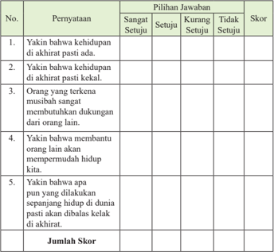

Tabel ini berisi hasil survei tentang pemahaman tentang kehidupan akhirat di masa depan. Topik utamanya adalah perspektif tentang kehidupan setelah kematian manusia. Tabel dibagi menjadi kolom dengan judul "Pernyataan" dan "Pilihan Jawaban", serta baris untuk skor. Setiap pernyataan memiliki tiga pilihan jawaban: sangat setuju, setuju, kurang setuju, dan tidak setuju. Skor diberikan berdasarkan pilihan jawaban tersebut. Tabel juga mencakup kolom untuk jumlah skor total. Data penting yang terlihat adalah bahwa banyak responden sangat setuju atau setuju dengan pernyataan-pernyataan tersebut, menunjukkan kesadaran umum tentang kehidupan akhirat.

 

---
## 📄 Halaman 55

### D.	Tugas	Kelompok

- Buatlah kelompok sesuai dengan jumlah peserta didik di kelasmu. (Maksimal lima orang satu kelompok).
- Buatlah skenario tentang teknik merawat jenazah.
- Setiap  kelompok  mempresentasikan  hasil  kerjanya,  kelompok  yang  lain menanggapi.

---
**📊 Tabel**

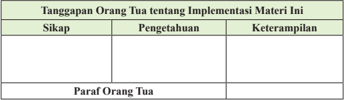

Tabel ini menunjukkan tanggapan orang tua tentang implementasi materi tertentu dalam kurikulum. Kolom-kolomnya meliputi Sikap, Pengetahuan, dan Keterampilan. Para orang tua diwawancara tentang bagaimana mereka merespons terhadap materi tersebut, termasuk sikap mereka, pengetahuan yang mereka miliki, dan keterampilan yang mereka dapatkan. Data penting yang terlihat adalah bahwa banyak orang tua merasa positif terhadap implementasi materi ini, dengan pengetahuan dan keterampilan yang diperoleh menjadi faktor yang signifikan.

 

---
## 📄 Halaman 56

### Bab 4

### Saling Menasehati dalam Islam

### Peta Konsep

---
**🖼️ Gambar/Diagram**

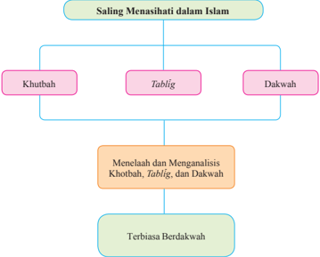

> **Deskripsi Visual:** Gambar ini adalah diagram yang menunjukkan struktur dan hubungan antara tiga aspek dalam Islam, yaitu Khutbah, Tablig, dan Dakwah. Diagram ini dibagi menjadi dua bagian utama: "Saling Menasihati dalam Islam" dan "Menelaah dan Menganalisis Khutbah, Tablig, dan Dakwah". Di bawah "Saling Menasihati dalam Islam", ada tiga sub-aspek utama: Khutbah, Tablig, dan Dakwah. Untuk setiap sub-aspek tersebut, ada satu sub-sub-aspek yang disebutkan sebagai "Menelaah dan Menganalisis Khutbah, Tablig, dan Dakwah". Terakhir, ada satu sub-sub-aspek yang disebutkan sebagai "Terbiasa Berdakwah".

Elemen-elemen utama dalam diagram ini adalah tiga aspek utama dalam Islam, yaitu Khutbah, Tablig, dan Dakwah, serta dua sub-aspek utama yang membahas masing-masing aspek tersebut. Relasi antara elemen-elemen ini adalah bahwa Khutbah, Tablig, dan Dakwah merupakan aspek utama dalam Islam, sedangkan menelaah dan menganalisis mereka serta terbiasa berdakwah merupakan sub-aspek yang membahas lebih lanjut tentang masing-masing aspek tersebut.

Teks, angka, atau label penting yang terlihat dalam diagram ini adalah "Khutbah", "Tablig", "Dakwah", "Menelaah dan Menganalisis Khutbah, Tablig, dan Dakwah", dan "Terbiasa Berdakwah". Informasi kunci yang dapat diambil pembaca dari diagram ini adalah bahwa dalam Islam, terdapat tiga aspek utama, yaitu Khutbah, Tablig, dan Dakwah, dan bahwa ada dua sub-aspek yang membahas masing-masing aspek tersebut, yaitu menelaah dan menganalisis mereka serta terbiasa berdakwah.

 

---
## 📄 Halaman 57

---
**🖼️ Gambar/Diagram**

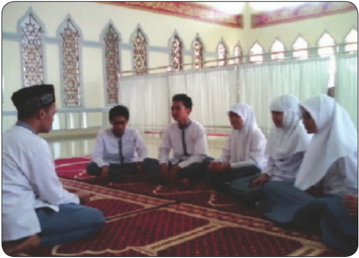

> **Deskripsi Visual:** Gambar ini menunjukkan sebuah ruangan yang tampak seperti masjid atau tempat ibadah. Di tengah ruangan tersebut ada beberapa orang yang sedang berdiri dan berbicara. Mereka tampaknya sedang mengikuti sesi pengajian atau pembelajaran. Ruangan memiliki lantai karpet merah dengan motif yang indah, dan dindingnya dilapisi dengan kaca dengan desain yang unik. Di sekeliling ruangan, terdapat pohon-pohon hijau yang memberikan suasana yang tenang dan damai. Gambar ini menunjukkan bahwa aktivitas ini berlangsung dalam lingkungan yang serba hijau dan tenang, yang mungkin merupakan bagian dari kegiatan religius atau edukasi yang dilakukan di tempat tersebut.

### Aktivitas Siswa:

Setelah kamu mengamati gambar di atas, coba berikan tanggapanmu tentang pesanpesan yang ada pada gambar tersebut!

 

---
## 📄 Halaman 58

Pada dasarnya, setiap individu muslim  diperintahkan  untuk  melaksanakan dakwah Islam sesuai dengan kadar kemampuannya. Siswa muslim juga  punya  kewajiban  itu.  Apalagi Allah Swt. memberi predikat kepada kita  sebagai khairu  ummah (sebaikbaiknya umat). Predikat ini akan sesuai  jika  kita  selalu  berusaha  di barisan depan orang-orang yang gemar berdakwah.

Banyak dalil atau ayat dan hadis yang  menyebutkan  kewajiban  dakwah  bagi  setiap  individu  mukmin.  Dalam sebuah hadis £ahih , Rasulullah saw. bersabda:

``

``

Artinya: Dari  'Abdullah  bin  'Amr.  dituturkan,  bahwasanya  Rasulullah  saw. bersabda, 'Sampaikanlah dariku walaupun satu ayat.' (HR. Bukhari)

``

``

Artinya: 'Kamu  adalah  umat  yang  terbaik  yang  dilahirkan  untuk  manusia, menyuruh kepada yang ma'ruf, dan mencegah dari yang mungkar, dan beriman kepada Allah....' (Q.S. Ãli Imr±n/3:110)

### Aktivitas Siswa:

Tanggapi ungkapan berikut ini!

'Apa  artinya  kita  menjadi  umat  yang  terbaik  kalau  kita  tinggalkan  jalan  dakwah. Ketika melihat kemungkaran, didiamkan saja, bahkan malah ikut-ikutan. Mari kita jaga predikat kita sebagai umat yang terbaik ini dengan terus berdakwah!'

Gambar 4.4 berapi-api.

 

---
## 📄 Halaman 59

Allah Swt. berfirman bahwa: 'Sesungguhnya manusia itu dalam keadaan rugi, kecuali orang yang beriman, beramal saleh, dan saling memberi nasihat dalam kebenaran dan kesabaran.' ( Q.S. al-A£r/103: 2-3 )

Sudah banyak kita saksikan di masyarakat sekarang ini, banyak bermunculan da'i muda.  Dengan adanya kontes dacil (da'i cilik di televisi dan lain sebagainya),  menandakan  gairah  untuk berlomba-lomba  dalam  berdakwah  terlihat semarak. Ini adalah fenomena positif yang harus dilestarikan.

Kritisilah peristiwa berikut ini, kemudian berikan tanggapanmu dari beberapa sudut pandang (contoh dari sisi agama, sosial, budaya, dan sebagainya)!

- Semarak  berhijab  di  kalangan  artis  maupun  masyarakat  umum  mulai  kian tampak, dengan berbagai mode dan desain hijab yang sedang trend sekarang. Di satu sisi gairah beragama secara formal tampak sekali, di sisi lain kekerasan seksual juga melonjak. Padahal, sisi positif hijab adalah untuk menghindari perilaku-perilaku buruk berupa pelecehan seksual. Ada apa dengan perilaku tercela ini?
- Akhir-akhir  ini,  gairah  menghidupkan  masjid  cukup  membanggakan.  Kita dapat  melihat  betapa  banyak  pembangunan  masjid,  sampai  pada  program memakmurkan  masjid,  Kegiatan  memakmurkan  seperti  pengajian  anakanak,  remaja,  ibu-ibu,  bahkan  bapak-bapak  sudah  terprogram  dengan  rapi. Akan  tetapi,  pelaksanaan ¡ alat berjamaah  masih  memilukan.  Saat  azan dikumandangkan,  tayangan  televisi,  dan  suara  alunan  musik  masih  kerap terlihat dan terdengar di rumah-rumah muslim. Ada gejala apa sebenarnya?
- Hermansyah adalah seorang siswa kelas XI salah satu SMA. Ia rajin beribadah, rajin  mengajak  teman  untuk  ikut  pengajian  remaja,  kajian  Islam,  dan  lain sebagainya. Dia sadar dengan banyak mengajak teman, ia harus introspeksi diri  untuk  mengamalkan  ilmu  yang  didapat  dari  pengajiannya.  Maka,  ia berusaha semaksimal mungkin untuk menjauhi perilaku-perilaku tercela. Apa yang perlu direspons dari perilaku Hermansyah ini? Bagaimana hubungannya dengan kondisi sekarang ini?

### Aktivitas Siswa:

Siswa menanggapi tiga perilaku masyarakat di atas di lembar kerja atau kertas folio, dengan menyertakan alasan-alasan serta dokumen yang memperkuat.

 

---
## 📄 Halaman 60

### A.  Pengertian Kh o tbah, Tabl ³g, dan Dakwah

Makna khutbah, tabl ³g , dan dakwah hampir sama, yaitu menyampaikan pesan kepada  orang  lain.  Secara  etimologi  ( lugawi /bahasa),  makna  ketiganya  dapat diuraikan sebagai berikut.

- Khutbah berasal dari kata: bermakna memberi nasihat dalam kegiatan ibadah seperti; ¡alat ( ¡alat Jumat, Idul Fitri, Idul Adha, Istisqo, Kusuf),  wukuf, dan nikah. Menurut istilah,  khutbah berarti kegiatan ceramah kepada sejumlah orang Islam dengan syarat dan rukun tertentu yang berkaitan langsung dengan keabsahan atau kesunahan ibadah. Misalnya khutbah Jumat untuk ¡alat Jum'at,  khutbah  nikah  untuk  kesunahan  akad  nikah.  Khutbah diawali dengan hamdallah, salawat, wasiat taqwa, dan doa.
- Tablig berasal dari kata: yang berarti menyampaikan, mem  beritahukan  dengan  lisan.  Menurut  istilah, tabl ³g a dalah  kegiatan  menyampaikan 'pesan'  Allah  Swt.  secara  lisan  kepada  satu  orang  Islam  atau  lebih  untuk diketahui  dan  diamalkan  isinya.  Misalnya,  Rasulullah  saw.  memerintahkan kepada sahabat yang datang di majelisnya untuk menyampaikan suatu ayat kepada sahabat yang tidak hadir.
Dalam  pelaksanaan tabl ³g ,  seorang  mubaligh  (orang  yang  menyampaikan tabl ³g )  biasanya  menyampaikan tabl ³g -nya  dengan  gaya  dan  retorika  yang menarik.  Ada  pula  istilah tabl ³g akbar,  yaitu  kegiatan  menyampaikan  'pesan' Allah  Swt. dalam jumlah pendengar yang cukup banyak.

- Dakwah berasal dari kata: yang berarti memanggil,  menyeru,  mengajak  pada sesuatu  hal.  Menurut  istilah,  dakwah adalah  kegiatan  mengajak  orang  lain, seseorang  atau  lebih  ke  jalan  Allah Swt.  secara  lisan  atau  perbuatan.  Di sini dikenal adanya da'wah billis±n dan da'wah bilh±l . Kegiatan dakwah bukan hanya ceramah, tetapi  juga  aksi  sosial yang  nyata.  Misalnya,  santunan  anak yatim,  sumbangan  untuk  membangun fasilitas umum, dan lain sebagainya.

---
**🖼️ Gambar/Diagram**

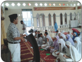

> **Deskripsi Visual:** Gambar ini adalah foto yang menunjukkan sebuah acara di dalam sebuah masjid. Gambar ini menampilkan beberapa orang yang sedang berdiri dan berbicara di depan sekelompok orang lain yang tampaknya sedang mendengarkan. Orang-orang tersebut mengenakan pakaian tradisional yang menunjukkan adanya budaya atau kepercayaan tertentu. Di sekitar mereka, terlihat beberapa elemen arsitektur masjid seperti pintu masuk, lantai, dan dinding yang tampaknya dibuat dari batu atau kayu. Di atas atap masjid, terdapat lampu-lampu yang menyala, memberikan pencahayaan yang cukup untuk melihat detail gambar. 

Elemen-elemen utama dalam gambar ini adalah orang-orang yang sedang berbicara dan mendengarkan, serta arsitektur masjid yang menunjukkan keindahan dan keagungan bangunan. Relasi antara elemen-elemen ini adalah bahwa orang-orang yang sedang berbicara dan mendengarkan berada di dalam ruangan yang dihiasi dengan arsitektur masjid yang indah.

Teks, angka, atau label penting yang terlihat dalam gambar ini tidak ada. Namun, informasi kunci yang dapat diambil pembaca adalah bahwa gambar ini mungkin menunjukkan sebuah acara religius atau sosial di dalam masjid, dengan orang-orang yang sedang berbicara dan mendengarkan sebagai bagian dari acara tersebut.

 

---
## 📄 Halaman 61

### B.  Pentingnya Kh o tbah, Tabl ³g , dan Dakwah

### 1. Pentingnya Kh o tbah

Sebagaimana  dijelaskan  di  atas, bahwa  khutbah  termasuk  aktivitas ibadah.  Oleh  karena  itu,  khutbah tidak bisa ditinggalkan karena akan membatalkan rangkaian aktivitas ibadah. Contoh, apabila ¡alat Jumat tidak  ada  khutbahnya, ¡alat Jumat tidak sah. Apabila wukuf di Arafah tidak  ada  khutbah-nya,  wukufnya tidak sah.

Sesungguhnya, khutbah merupakan  kesempatan  yang  sangat  besar

untuk berdakwah dan membimbing manusia menuju keri«a -an Allah Swt. Hal ini jika khutbah dimanfaatkan sebaik-baiknya, dengan menyampaikan materi yang dibutuhkan  oleh  hadirin  menyangkut  masalah  kehidupannya,  dengan  ringkas, tidak panjang lebar, dan dengan cara yang menarik serta tidak membosankan.

Khutbah  memiliki  kedudukan  yang  agung  dalam  syariat  Islam  sehingga sepantasnya seorang khatib melaksanakan tugasnya dengan sebaik-baiknya.

Hal-hal berikut yang seharusnya dimiliki oleh seorang khatib:

- Seorang khathib harus memahami aqidah yang £a¥³hah (benar) sehingga dia tidak sesat dan menyesatkan orang lain.
- Seorang khatib harus memahami fiqh sehingga mampu membimbing manusia dengan cahaya syariat menuju jalan yang lurus.
- Seorang khatib harus memperhatikan keadaan masyarakat, kemudian mengingatkan  mereka  dari  penyimpangan-penyimpangan  dan  mendorong kepada ketaatan.
- Seorang khathib sepantasnya juga seorang yang £±lih , mengamalkan ilmunya, tidak  melanggar  larangan  sehingga  akan  memberikan  pengaruh  kebaikan kepada para pendengar.

### 2. Pentingnya Tabl ³g

Salah satu sifat wajib bagi rasul adalah tabl ³g ,  yakni menyampaikan wahyu dari  Allah  Swt.  kepada  umatnya.  Semasa  Nabi  Muhammad saw. masih hidup, seluruh  waktunya  dihabiskan  untuk  menyampaikan  wahyu  kepada  umatnya. Setelah Rasulullah saw. wafat, kebiasaan ini dilanjutkan oleh para sahabatnya, para tabi'in (sahabat Nabi), dan tabi'it-tabi'in (pengikut sahabat Nabi).

 

---
## 📄 Halaman 62

Setelah mereka semuanya tiada, siapakah  yang  akan  meneruskan  kebiasaan menyampaikan  ajaran  Islam  kepada  orangorang?  Kita  sebagai  siswa  muslim  punya tanggung jawab untuk meneruskan kebiasaan bertabligh tersebut.

Banyak  yang  menyangka  bahwa  tugas tabl ³g hanyalah  tugas  alim  ulama  saja.  Hal itu tidak benar. Setiap orang yang mengetahui kemungkaran yang terjadi di  hadapannya,  ia wajib  mencegahnya  atau  menghentikannya. Kegiatan  untuk  mencegah  dengan  tangannya

(kekuasaanya),  mulutnya  (nasihat),  atau  dengan  hatinya  (bahwa  ia  tidak  ikut dalam kemungkaran tersebut).

Seseorang  tidak  harus  menjadi  ulama  terlebih  dulu  untuk  menghentikan kemungkaran. Siapa pun yang melihat kemungkaran terjadi di depan matanya, dan ia mampu menghentikannya, ia wajib menghentikannya. Bagi yang mengerti suatu permasalahan agama, ia harus menyampaikannya kepada yang lain, siapa pun mereka. Sebagaimana hadis Rasulullah saw.:

``

Artinya: Dari Abi Said al-Khudri ra. berkata, saya mendengar Rasulullah saw. bersabda:  barangsiapa  yang  melihat  kemungkaran,  maka  ubahlah dengan  tangannya.  Apabila  tidak  mampu  maka  ubahlah  dengan lisannya. apabila tidak mampu maka dengan hatinya (tidak mengikuti kemungkaran tersebut), dan itu selemah-lemahnya iman. (HR. Muslim)

### Teguran dari Allah Swt. melalui Al-Qur'ãn

Pada  suatu  hari  Rasulullah  saw.  membaca al-Qur'±n dan  menyampaikan dakwahnya  dengan  wajah  berseri-seri.  Tiba-tiba  datang  seorang  buta  yang bernama Abdullah bin Suraikh bin Malik bin Rabi'ah Al-Fihri. Ia hendak bertemu Nabi dan benar-benar ingin mendapatkan penjelasan tentang Islam langsung dari Nabi.  Tetapi  Nabi  tidak  menghiraukannya,  ia  berharap  dengan  memperhatikan, pembesar Quraisy ini akan masuk Islam sehingga Islam makin kuat. Sementara si buta ini  tidak banyak membawa pengaruh kepada kemajuan Islam sehingga tidak dihiraukan oleh Nabi.

 

---
## 📄 Halaman 63

Dengan adanya peristiwa tersebut, Allah  Swt. menurunkan ayat Q.S. 'Abasa /80: 1-11  sebagai  berikut:  Dia  (Muhammad)  berwajah  masam  dan  berpaling,  karena seorang buta telah datang kepadanya (Abdullah bin Ummi Maktum). Dan tahukah engkau  (Muhammad)  barangkali  dia  ingin  menyucikan  dirinya  (dari  dosa),  atau dia (ingin) mendapatkan pengajaran, yang memberi manfaat kepadanya? Adapun orang  yang  merasa  dirinya  serba  cukup  (pembesar-pembesar  Quraisy),  engkau (Muhammad) memberi perhatian kepadanya, padahal tidak ada (cela) atasmu kalau dia  tidak  menyucikan  diri  (beriman).  Dan  adapun  orang  yang  datang  kepadamu dengan  bersegera  (untuk  mendapatkan  pengajaran),  sedang  dia  takut  (kepada Allah), engkau (Muhammad) malah mengabaikannya. Sekali-kali jangan (begitu)! Sungguh, (ajaran-ajaran Allah) itu suatu peringatan.'

Ayat tersebut sebagai teguran Allah Swt. kepada Nabi Muhammad saw. Sejak itu  Nabi  selalu  berseri-seri  menghormati  siapa  saja  yang  datang  dan  meminta penjelasan.

(Diambil dari 365 Kisah Teladan Islam satu kisah selama setahun, Ariany Syurfah)

### 3.  Pentingnya Dakwah

Salah  satu  kewajiban  umat  Islam adalah berdakwah. Sebagian ulama ada yang menyebut berdakwah itu hukumnya far«u  kifayah (kewajiban kolektif), dan ada juga yang menyatakan far«u ain . Rasulullah saw. selalu mengajarkan agar seorang muslim selalu menyeru pada jalan kebaikan dengan cara-cara yang baik.

Setiap dakwah hendaknya bertujuan untuk  mewujudkan  kebahagiaan  dan kesejahteraan  hidup  di  dunia  dan  di akhirat. Setelah itu, dengan berdakwah

kita akan mendapat ri«a dari Allah Swt. Nabi Muhammad saw. mencontohkan dakwah kepada umatnya melalui lisan, tulisan, dan perbuatan.

Rasulullah  saw.  memulai  dakwahnya  kepada  istri,  keluarga,  dan  temanteman karibnya hingga raja-raja yang berkuasa pada saat itu. Di antara raja-raja yang mendapat surat atau risalah Rasulullah saw. adalah Kaisar Heraklius dari Byzantium, Mukaukis dari Mesir, Kisra dari Persia (Iran), dan Raja Najasyi dari Habasyah (Ethiopia). Ada beberapa metode dakwah yang bisa dilakukan seorang muslim menurut syariat.

 

---
## 📄 Halaman 64

Arinya: 'Dan hendaklah di antara kamu ada segolongan orang yang menyeru kepada  kebajikan,  menyuruh  (berbuat)  yang  makruf,  dan  mencegah dari yang mungkar, dan mereka itulah orang-orang yang beruntung.' (Q.S. Ãli 'Imr±n/3: 104)

### Aktivitas Siswa:

- Carilah  ayat  atau  hadis  yang  berkaitan  dengan  kewajiban  khutbah,  tabl³g,  dan dakwah!
- Jelaskan pesan ayat dan hadis yang kamu temukan tersebut!
- Apa  kaitannya  antara  pesan  ayat  dan  hadis  dengan  kebutuhan  saat  ini  untuk khutbah, tabl³g, dan dakwah?

### C.  Ketentuan Khutbah, Tabl³g, dan Dakwah

### 1.  Ketentuan Khutbah

### a. Syarat khatib

- Islam.
- Ballig.
- Berakal sehat.
- Mengetahui ilmu agama.

### b.  Syarat dua khutbah

- Khutbah dilaksanakan sesudah masuk waktu dhuhur.
- Khatib duduk di antara dua khutbah.
- Khutbah diucapkan dengan suara yang keras dan jelas.
- Tertib.

### c. Rukun khutbah

- Membaca hamdallah.
- Membaca syahadatain.
- Membaca shalawat.
- Berwasiat taqwa.
- Membaca ayat al-Qur'±n pada salah satu khutbah.
- Berdoa pada khutbah kedua.

### d.  Sunah khutbah

- Khatib berdiri ketika khutbah.
- Mengawali khutbah dengan memberi salam.
- Khutbah hendaknya jelas, mudah dipahami, tidak terlalu panjang.
- Khatib menghadap jamaah ketika khutbah.
- Menertibkan rukun khutbah.
- Membaca surat al-Ikhl±s ketika duduk di antara dua khutbah.

 

---
## 📄 Halaman 65

### Keterangan:

- Pada prinsipnya ketentuan dan tata  cara  khutbah,  baik  ¡ alat Jumat,  Idul Fitri, Idul Adha, dan ¡alat khusuf sama. Perbedaannya terletak pada waktu pelaksanaannya, yaitu dilaksanakan setelah ¡alat dan diawali dengan takbir.
- Khutbah  wukuf  adalah  khutbah  yang  dilaksanakan  pada  saat  wukuf di  Arafah.  Khutbah  wukuf  merupakan  salah  satu  rukun  wukuf  setelah melaksanakan ¡alat zuhur dan ashar diqa£ar . Khutbah wukuf hampir sama dengan  khutbah  Jumat.  Perbedaannya  terletak  pada  waktu  pelaksanaan, yakni dilaksanakan ketika wukuf di Arafah.

### 2.  Ketentuan Tabl³g

Tabligh artinya menyampaikan. Orang yang menyampaikan disebut muballig . Ketentuan-ketentuan  yang  harus  diperhatikan  dalam  melakukan tabl ³ gh adalah sebagai berikut.

### a.  Syarat Muballig

- Islam.
- Ball³g .
- Berakal.
- Mendalami ajaran Islam.

### b.  Etika dalam menyampaikan tabl ³gh

- Bersikap lemah lembut, tidak kasar, dan tidak merusak.
- Menggunakan bahasa yang mudah dimengerti.
- Mengutamakan musyawarah dan berdiskusi untuk memperoleh kesepakatan bersama.
- Materi dakwah yang disampaikan harus mempunyai dasar hukum yang kuat dan jelas sumbernya.
- Menyampaikan  dengan  ikhlas  dan  sabar, sesuai dengan  kondisi, psikologis dan sosiologis para pendengarnya atau penerimanya.
- Tidak  menghasut  orang  lain  untuk  bermusuhan,  merusak,  berselisih, dan mencari-cari kesalahan orang lain.

### 3.  Ketentuan Dakwah

Dakwah artinya mengajak. Orang yang melaksanakan dakwah disebut da'i. Ada  dua  cara  berdakwah,  yaitu  dengan  lisan  ( da'wah  billis±n )  dan  dengan perbuatan ( da'wah bilh±l ).  Ketentuan-ketentuan yang harus diperhatikan dalam berdakwah adalah seperti berikut.

### a. Syarat da'i

- Islam,
- Ball³g ,
- Berakal,
- Mendalami ajaran Islam.

 

---
## 📄 Halaman 66

### b.  Etika dalam berdakwah:

- Dakwah dilaksanakan dengan hikmah, yaitu ucapan yang jelas, tegas dan sikap yang bijaksana.
- Dakwah dilakukan dengan maui§atul hasanah atau nasihat yang baik, yaitu  cara  persuasif  (tanpa  kekerasan)  dan  edukatif  (memberikan pengajaran).
- Dakwah  dilaksanakan  dengan  memberi  contoh  yang  baik  ( uswatun hasanah ).
- Dakwah dilakukan dengan muj±dalah , yaitu diskusi atau tukar pikiran yang  berjalan  secara  dinamis  dan  santun  serta  menghargai  pendapat orang lain.

``

Artinya: 'Serulah  (manusia)  kepada  jalan  Tuhanmu  dengan  hikmah)  dan pengajaran yang baik,  dan  berdebatlah  dengan  mereka  dengan  cara yang  baik.  Sesungguhnya  Tuhanmu,  Dialah  yang  lebih  mengetahui siapa  yang  sesat  dari  jalan-Nya  dan  Dialah  yang  lebih  mengetahui siapa yang mendapat petunjuk.' (Q.S. an-Nahl/16:125)

Kita  sebagai  umat  Islam  harus  dapat  mengaplikasikan  nilai-nilai  khutbah, tabl³g ,  dan  dakwah  di  mana  saja  berada.  Cara  untuk  mewujudkan  perilakuperilaku tersebut antara lain sebagai berikut.

- Ketika  melaksanakan ¡alat Jumat,  hendaklah  mengamati  dan  menyimak khutbah  yang  disampaikan kh±tib (bagaimana  etikanya,  bacaan-bacaan yang  dibacanya,  serta  urutannya).  Dengan  memperhatikan  khatib  secara utuh  diharapkan  suatu  saat  nanti  bisa  tampil  sebagai  khatib  pada  waktu ¡alat Jumat.
- Ketika  melihat  kemungkaran  di  sekitar  harus  mencegahnya.  Cara  mencegahnya  dengan  tangan  (kekuasaan),  misalnya  dengan  memindahkan duri di tengah jalan dan apabila tidak mampu dengan tangan (kekuasaan) dengan lisan (memberikan alasan yang logis), apabila tidak mampu dengan keduanya cukup dalam hati saja bahwa kita tidak ikut berbuat yang dilarang.

 

---
## 📄 Halaman 67

- Kita  harus  mencontoh  ketika  melihat  sesuatu  yang  baik  (baik  menurut agama maupun masyarakat).Hal yang baik harus dimulai dari diri sendiri. Mulai dari yang terkecil, dan dari sekarang. Tidak boleh ditunda-tunda.
- Melibatkan  diri  secara  aktif  pada  kegiatan-kegiatan  keagamaan  seperti: peringatan hari besar Islam ( Maµlid Nabi Muhammad saw., Isr±' Mi'r±j , Nuzulul  Qur'±n ,  dan  lain-lain)  baik  di  lingkungan  sekolah  maupun masyarakat.
- Memprakarsai kegiatan dakwah Islam di sekolah, remaja masjid, karang taruna, dakwah kampus, dan lain sebagainya.

### Rangkuman

- Khutbah bermakna memberi nasihat agama dalam kegiatan ibadah seperti; ¡alat , wukuf, dan nikah. Orang yang memberikan khutbah disebut khatib. Khutbah lebih bersifat satu arah. Hanya khatib saja yang berbicara yang lain mendengarkan.
- Tabl ³ g berarti  menyampaikan,  memberitahukan  kebenaran  kepada  orang lain. Tabl ³ g dapat bersifat dua arah, saling berdiskusi, dan lain sebagainya.
- Dakwah berarti memanggil, menyeru, mengajak orang lain akan sesuatu hal untuk berbuat baik dan mencegah berbuat buruk. Dakwah bisa bersifat dua arah.
- Dalam berdakwah minimal ada dua cara, yaitu dakwah dengan lisan ( da'wah billis±n ) dan dakwah dengan perbuatan ( da'wah bilh±l ).
- Dakwah billis±n artinya  dakwah  yang  dilakukan  dengan  berkata-kata, seperti ceramah, tabl ³ g akbar, dan sebagainya.
- Dakwah bilhal artinya  dakwah  yang  dilakukan  dengan  berbuat,  seperti menyantuni fakir miskin, yatim piatu, menyumbang untuk fasilitas sosial, dan sebagainya.

 

---
## 📄 Halaman 68

### Evaluasi

- Berilah tanda silang (x) pada huruf a, b, c, d, atau e yang dianggap sebagai jawaban yang paling tepat!
- Islam, ball³g , berakal sehat adalah beberapa dari ....
- syarat khutbah
- rukun khutbah
- sunnat khutbah
- syarat kh±tib
- orang beriman
- Apabila ada orang yang mengatakan, 'Saya nanti saja kalau sudah tua baru bertobat  dan  akan  menjalankan  ajaran  agama  secara  maksimal.  Sekarang saya belum bisa menjaga diri.' Hal yang harus kamu lakukan adalah sebagai berikut, kecuali ....
- membiarkan saja karena itu urusan dia, biar dia sendiri yang menanggungnya
- membujuknya untuk bertobat sekarang
- mengingatkan bahwa kematian seseorang tidak ada yang tahu
- segeralah bertobat sebelum terlambat
- memberikan tausiah tentang kisah-kisah teladan
- Ketika khatib sedang berkhutbah, temanmu berbicara atau ngobrol. Hal yang kamu lakukan adalah ...
- mengatakan  kepadanya  kalau  berbicara  saat  khatib  sedang  berkhutbah dapat membatalkan pahala ¡alat nya
- memberitahukan kepada orang tuanya kalau anaknya suka bercanda saat ¡alat Jumat berlangsung
- menjauhinya karena takut kita terpengaruh oleh perilaku-perilaku tercelanya
- membiarkan dia ngobrol sendiri karena saya sedang khusyuk mendengarkan khutbah
- memberi isyarat kepada temannya agar tidak berbicara dan ngobrol
- Seorang  da'i  hendaklah  memulai  dakwahnya  atas  dirinya  sendiri.  Istilah ungkapan tersebut adalah ...
- amar ma'rµf
- nah ³ munkar
- ib'da binafsik
- haqqul yaq ³ n
- uswatun hasanah

 

---
## 📄 Halaman 69

- Salah satu  metode dakwah Rasulullah saw. adalah ' al-Maui§atul hasanah ' artinya ...
- dengan kata-kata yang jelas
- tutur kata yang sopan
- dengan gaya yang menarik
- nasihat/pengajaran yang baik
- memberi hadiah

### B. Jawablah soal-soal berikut sesuai dengan pernyataan!

- Mengapa umat Islam diwajibkan untuk berdakwah?
- Jelaskan perbedaan antara dakwah, tabl ³g , dan khutbah!
- Bagaimana cara berdakwah Nabi Muhammad saw.?
- Bagaimana cara berdakwah di lingkungan yang memang sudah jauh dari nilainilai ajaran Islam?
- Apa yang kamu lakukan ketika melihat orang Islam yang perilakunya tidak sesuai dengan apa yang ada dalam ajaran Islam?

### C. Tugas Individu

- Isilah  kolom  keterangan  dengan  menjelaskan  berapa  kali  kamu  melakukan perilaku-perilaku berikut ini selama satu minggu!

---
**📊 Tabel**

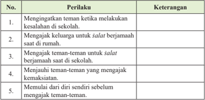

Tabel ini berisi perilaku dan keterangan tentang bagaimana mengatasi situasi di sekolah yang mungkin menyebabkan kesulitan antara teman-teman. Topik utamanya adalah cara-cara untuk menjaga hubungan baik dengan teman-teman, terutama ketika mereka melakukan kesalahan atau tidak menghormati aturan. Kolom pertama berisi perilaku yang harus dilakukan, sementara kolom kedua berisi keterangan tentang bagaimana mengimplementasikan perilaku tersebut. Data penting yang terlihat adalah bahwa semua perilaku yang disebutkan memiliki tujuan untuk menjaga hubungan baik antara teman-teman, baik itu mengajak untuk beribadah, menjauhi teman-teman yang mengganggu, atau memulai dari diri sendiri sebelum mengajak teman-teman.

 

---
## 📄 Halaman 70

### 2.  Isilah kolom keterangan dengan memberikan alasan secara jujur!

---
**📊 Tabel**

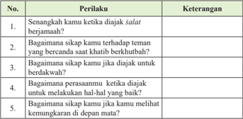

Tabel ini berisi pertanyaan tentang perilaku dan keterangan yang berkaitan dengan sikap seseorang dalam situasi tertentu. Topik utamanya adalah tentang bagaimana seseorang akan berinteraksi dengan orang lain ketika diajak untuk berdoa, berbicara dengan teman yang bercanda, berdakwah, melakukan hal-hal baik, dan menghadapi kemungkinan di masa depan. Kolom "Perilaku" berisi pertanyaan-pertanyaan tersebut, sedangkan kolom "Keterangan" memberikan informasi tentang bagaimana seseorang akan merespons situasi tersebut. Data penting yang terlihat adalah bahwa tabel ini mencakup berbagai aspek perilaku sosial dan interaksi manusia dalam berbagai situasi.

### 3.  Isilah kolom pilihan jawaban dengan jujur!

---
**📊 Tabel**

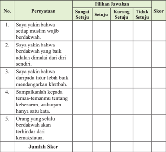

Tabel ini berisi pernyataan yang harus dijawab dengan pilihan jawaban "Sangat Setuju", "Setuju", "Kurang Setuju", dan "Tidak Setuju". Setiap pernyataan memiliki skor yang ditentukan untuk setiap pilihan jawaban. Topik utama tabel adalah tentang kepercayaan dan sikap dalam berdakwah. Kolom-kolom yang ada meliputi nomor pernyataan, pilihan jawaban, dan skor. Data penting yang terlihat adalah bahwa setiap pernyataan memiliki skor yang berbeda-beda sesuai dengan pilihan jawaban yang diberikan.

- Buatlah  teks  khutbah,  dakwah,  atau tabl ³ g (pilih  salah  satu)  dengan  tema bebas!

 

---
## 📄 Halaman 71

### D. Tugas Kelompok

- Buatlah kelompok sesuai dengan jumlah peserta didik di kelasmu. (Maksimal lima orang satu kelompok).
- Susunlah acara dalam suatu kegiatan dengan pembagian tugas: MC, pembaca al-Qur'±n, sambutan, ceramah, dan doa.
- Setiap kelompok mempresentasikan hasil kerjanya, kelompok lain menanggapi.

---
**📊 Tabel**

Tabel ini menunjukkan tanggapan orang tua tentang implementasi materi tertentu dalam kurikulum. Topik utamanya adalah bagaimana orang tua merespons terhadap materi tersebut. Tabel memiliki tiga kolom: Sikap, Pengetahuan, dan Keterampilan. Para Orang Tua diharapkan untuk memberikan paraf mereka tentang cara mereka merespons terhadap materi tersebut. Data penting yang terlihat adalah bahwa para orang tua harus memberikan penilaian tentang sikap, pengetahuan, dan keterampilan mereka terhadap materi tersebut. Ini membantu dalam memahami bagaimana orang tua merespons terhadap materi tersebut dan bagaimana mereka dapat meningkatkan pengetahuan dan keterampilan mereka.

 

---
## 📄 Halaman 72

Bab 5

### Masa Kejayaan Islam

### Peta Konsep

---
**🖼️ Gambar/Diagram**

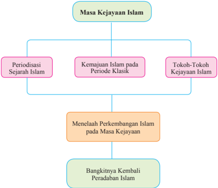

> **Deskripsi Visual:** Gambar ini adalah diagram yang menunjukkan struktur topik dalam materi tentang masa kejayaan Islam. Diagram ini terdiri dari empat bagian utama:

1. Masa Kejayaan Islam: Ini adalah topik utama yang dibagi menjadi tiga subtopik: Periodisasi Sejarah Islam, Kemajuan Islam pada Periode Klasik, dan Tokoh-Tokoh Kejayaan Islam.

2. Menelaah Perkembangan Islam pada Masa Kejayaan: Ini merupakan bagian dari subtopik "Kemajuan Islam pada Periode Klasik".

3. Bangkitnya Kembali Peradaban Islam: Ini adalah bagian dari subtopik "Tokoh-Tokoh Kejayaan Islam".

4. Informasi kunci yang dapat diambil pembaca melalui diagram ini adalah bahwa materi ini membahas perkembangan Islam dari periode awal hingga kembali ke peradaban Islam, dengan fokus pada kemajuan Islam pada periode klasik dan tokoh-tokoh yang mempengaruhi masa kejayaan Islam.

Diagram ini membantu pembaca untuk memahami struktur topik dan hubungan antara subtopik-topik tersebut dalam konteks masa kejayaan Islam.

 

---
## 📄 Halaman 73

---
**🖼️ Gambar/Diagram**

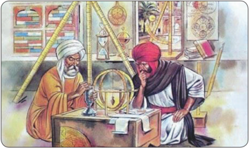

> **Deskripsi Visual:** Gambar ini adalah ilustrasi yang menunjukkan dua orang peneliti atau ahli astronomi berada di sebuah ruangan yang penuh dengan peralatan astronomi. Ruangan tersebut dipenuhi dengan berbagai alat seperti teleskop, kompas, dan peta astronomi. Kedua peneliti tersebut sedang berbicara dan memeriksa sebuah alat astronomi yang disebut sebagai "astrolabium". Astrolabium adalah alat yang digunakan untuk mengukur posisi bintang atau bulan dalam langit. Peneliti di sebelah kiri mengenakan jubah kuning dan topi berwarna merah, sementara peneliti di sebelah kanan mengenakan jubah merah dan topi berwarna putih. Ruangan mereka tampak penuh dengan buku-buku astronomi dan alat-alat lainnya yang menunjukkan bahwa mereka sangat terlibat dalam penelitian astronomi. Gambar ini menunjukkan hubungan antara peneliti, alat-alat astronomi, dan lingkungan mereka yang penuh dengan informasi dan pengetahuan tentang astronomi.

### Aktivitas Siswa:

Setelah mengamati gambar di atas, coba berikan tanggapanmu tentang pesan-pesan yang ada pada gambar tersebut!

 

---
## 📄 Halaman 74

Seorang sejarahwan Barat, Jacques C. Reister, menyatakan bahwa selama  lima  ratus  tahun Islam  menguasai  dunia  dengan kekuatan, ilmu pengetahuan, dan peradaban yang sangat tinggi.

Seorang sejarahwan dari Scotlandia Montgomery Watt juga memberikan pernyataan bahwa  peradaban  Eropa  tidak dibangun oleh proses regenerasi mereka sendiri. Tanpa dukungan peradaban  Islam  yang  menjadi 'dinamo'-nya, Barat bukanlah apa-apa.

Barack  Obama,  mantan  presiden  Amerika  memberikan  pernyataan  bahwa Peradaban  yang  berkembang  saat  ini  berutang  besar  pada  Islam.  Beberapa pernyataan  tersebut  menggambarkan  bahwa  siapa  pun  sesungguhnya  tak  akan bisa  mengelak  untuk  mengakui  keagungan  peradaban  Islam  pada  masa  lalu. Sumbangsih peradaban Islam bagi dunia, termasuk dunia Barat denyutnya masih terasa  hingga hari ini.  Meski banyak ditutup-tutupi, pengaruh peradaban Islam terhadap kemajuan Barat saat ini tetaplah nyata.

Lalu, di manakah kejayaan Islam yang telah banyak memengaruhi peradaban umat  manusia?  Dengan  'mengenang'  kembali  masa-masa  kejayaan  dulu, diharapkan umat Islam akan mampu melihat kembali kebesaran peradaban Islam masa lalu sekaligus mengembalikan potensi untuk hadir pada masa kini dan masa yang  akan  datang  untuk  yang  kedua  kalinya.  Selain  meretrospeksi  keagungan peradaban Islam masa lalu, diharapkan ada upaya untuk memproyeksi sekaligus merekonstruksi  kembali  masa  depan  perabadan  Islam.  Peradaban  Barat  yang berkembang saat ini, sesungguhnya sudah mulai tampak kerapuhan dan tandatanda kemundurannya.

Sebagai  generasi  muda  Islam,  bangkit  dan  singsingkan  lengan  baju,  untuk menggapai kembali kejayaan Islam sebagaimana Islam pernah mengukir sejarah peradaban dunia ini! Semoga!

 

---
## 📄 Halaman 75

Waktu  bergerak  maju  dan  tidak  pernah mundur. Begitu juga peristiwa sejarah. Sebagai  manusia  yang  diberi  akal,  pastinya sudah mengingat, apa dan bagaimana kejadian  yang  terjadi  pada  masa  lalu.  Akal dapat memprediksi kejadian yang akan datang dengan belajar dari masa lalu.

Berikut adalah beberapa sebab mundurnya dan runtuhnya peradaban Islam.

- Mulai pudarnya ketaatan pemeluknya kepada  Sang Khalik ,  saling  dengki,  dan serakah.  Umat  Islam  kurang  memiliki semangat untuk maju dalam ilmu
- pengetahuan.  Selain  itu,  sulit  untuk  umat  Islam  bersatu  padu.  Andaikan penyebab ini sekarang bisa diperbaiki, niscaya Islam akan mengulang masa kejayaan yang pernah diraih masa lalu.
- Modernisasi telah mengglobal yang ditandai dengan berkembangpesatnya alatalat telekomunikasi dan informasi. Modernisasi membuat jarak tidak menjadi hambatan. Modernisasi memiliki dampak positif dan negatif, dampak positif kecanggihan  alat  telekomunikasi  dan  informasi  mempermudah  aktivitas manusia. Tetapi  dampak negatif  dari    kecanggihan  alat  telekomunikasi  dan informasi adalah mudahnya dipergunakan untuk melakukan tindak kejahatan. Hal ini menuntut adanya pembangunan moral yang kokoh.
- Perpustakaan  sekolah  sebagai  jantung  peradaban  tidak  banyak  dikunjungi. Sebagaian umat terlena dengan mainan baru berupa alat komunikasi, seperti handphone .  Bukankah Islam jaya karena keingintahuan akan ilmu pengetahuan begitu besar? Hal itu diwujudkan dengan transliterasi buku-buku berkualitas dan dijadikan rujukan untuk mengembangkan ilmu pengetahuan.

### Aktivitas Siswa:

Kamu  diminta  untuk  mengkritisi  peristiwa  di  atas  dari  beberapa  sudut  pandang (contoh dari sisi agama, sosial, budaya, dan sebagainya)!

 

---
## 📄 Halaman 76

### A.  Periodisasi Sejarah Islam

Harun Nasution dalam  bukunya yang berjudul " Islam  Ditinjau  dari  Berbagai Aspeknya" membagi  sejarah  Islam  ke dalam tiga periode besar berikut.

- Periode Klasik (650  -1250)
Periode  Klasik  merupakan  periode kejayaan Islam yang dibagi ke dalam

- dua fase, yaitu:
- fase ekspansi dan integrasi, (6501000),
- fase disintegrasi (1000-1250).
- Periode Pertengahan (1250-1800) Periode Pertengahan merupakan periode kemunduran Islam yang
dibagi ke dalam dua fase, yaitu:

- fase kemunduran (1250-1500 M), dan
- fase munculnya ketiga kerajaan besar (1500-1800), yang dimulai dengan zaman kemajuan (1500-1700 M) dan zaman kemunduran (1700-1800).
- Periode Modern (1800-dan seterusnya) Periode  Modern  merupakan  periode  kebangkitan  umat  Islam  yang  ditandai dengan munculnya para pembaharu Islam.

### B.  Masa Kejayaan Islam

Masa  kejayaan  Islam  terjadi  pada  sekitar  tahun  650-1250  M.  Periode  ini disebut Periode Klasik. Pada kurun waktu  itu, terdapat dua kerajaan besar, yaitu Kerajaan Umayyah atau sering disebut Daulah Umayyah dan Kerajaan Abbasiyah yang sering disebut Daulah Abbasiyah .

Pada masa Bani Umayyah, perkembangan Islam ditandai dengan meluasnya wilayah  kekuasaan  Islam  dan  berdirinya  bangunan-bangunan  sebagai  pusat dakwah Islam. Kemajuan Islam pada masa ini meliputi: bidang politik, keagamaan, ekonomi, ilmu bangunan (arsitektur), sosial, dan bidang militer.

 

---
## 📄 Halaman 77

---
**🖼️ Gambar/Diagram**

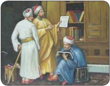

> **Deskripsi Visual:** Gambar ini adalah ilustrasi yang menunjukkan tiga orang dalam situasi yang berbeda. Pada bagian kiri, ada dua orang yang sedang berbicara dengan papan tulis, tampaknya sedang berdiskusi atau memberikan penjelasan. Di tengah, ada seorang pria yang sedang membaca sebuah dokumen atau surat, tampaknya memperhatikan atau mempelajari informasi yang diberikan. Di kanan, ada seorang pria yang sedang berbaring dan tampaknya sedang tidur atau menghabiskan waktu luang. Semua orang tersebut tampaknya berada dalam ruangan yang sederhana, dengan meja di belakang mereka dan beberapa peralatan seperti papan tulis dan buku di sekelilingnya. Ilustrasi ini mungkin digunakan untuk menjelaskan konsep atau situasi tertentu dalam pembelajaran atau diskusi.

### Faktor internal antara lain:

- Konsistensi dan istiqamah umat Islam kepada ajaran Islam,
- Ajaran Islam yang mendorong umatnya untuk maju,
- Islam sebagai rahmat seluruh alam,
- Islam  sebagai  agama  dakwah  sekaligus  keseimbangan  dalam  menggapai kehidupan duniawi dan ukhrawi.

### Faktor eksternal antara lain seperti berikut.

- Terjadinya asimilasi antara bangsa Arab dan bangsa-bangsa lain yang lebih dahulu  mengalami  perkembangan  dalam  ilmu  pengetahuan.  Pengaruh Persia  pada  saat  itu  sangat  penting.  Persia  banyak  berjasa  dalam  bidang pemerintahan, perkembangan ilmu filsafat, dan sastra. Adapun pengaruh Yunani masuk melalui  berbagai macam terjemahan dalam banyak bidang ilmu, terutama filsafat.
- Gerakan terjemahan pada masa Periode Klasik, usaha penerjemahan kitabkitab  asing  dilakukan  dengan  giat  sekali.  Pengaruh  gerakan  terjemahan terlihat dalam perkembangan ilmu pengetahuan umum terutama di bidang astronomi, kedokteran, filsafat, kimia, dan sejarah.
Selain faktor tersebut di atas, kejayaan Islam ini disebabkan pula oleh adanya gerakan ilmiah atau etos keilmuan dari para ulama yang ada pada Periode Klasik tersebut, antara lain seperti berikut.

- Melaksanakan ajaran al-Qur'±n secara maksimal. Al-Qur'±n di dalam nya banyak ayat menyuruh kita menggunakan akal untuk berpikir.
- Melaksanakan  isi  hadis. Banyak  hadis  yang  menyuruh  kita  untuk  terusmenerus  menuntut  ilmu,  meskipun  harus  ke  negeri  Cina.  Bukan  hanya ilmu agama yang dicari, tetapi ilmu-ilmu lain yang berhubungan dengan kehidupan manusia di dunia ini.
Perkembangan Islam pada masa Bani Abbasiyah ditandai dengan pesatnya perkembangan ilmu  pengetahu  an.  Kemajuan  Islam pada masa ini meliputi bidang ilmu  pengetahuan,  ekonomi,  ilmu bangunan (arsitektur), sosial, dan bidang militer.

Kemajuan umat Islam pada masa Bani Umayyah atau  Bani Abbasiyah tidak  terjadi  secara  tiba-tiba.  Akan tetapi, disebabkan oleh faktor internal dan faktor eksternal.

 

---
## 📄 Halaman 78

- Mengembangkan ilmu agama dengan berijtihad. Contohnya ilmu pengetahuan umum dengan mempelajari ilmu filsafat Yunani. Maka, pada saat itu banyak bermunculan ulama fiqh, tauhid (kalam), tafsir, hadis, ulama bidang sains (ilmu kedokteran, matematika, optik, kimia, fisika, geografi), dan lain-lain.
- Ulama yang berdiri sendiri serta menolak untuk menjadi pegawai pemerintahan.

### Aktivitas Siswa:

- Baca sejarah Bani Umayyah, lalu jelaskan kemajuan Islam di bidang apa saja yang dicapai pada masa itu!
- Adakah hubungannya hasil kemajuan yang dicapai pada saat itu dengan kondisi sekarang?
Dari  gerakan-gerakan  tersebut  di  atas,  muncullah  tokoh-tokoh  Islam  yang memiliki semangat berijtihad dan mengembangkan  berbagai ilmu pengetahuan, antara lain sebagai berikut.

### 1. Ilmu Filsafat

- Al-Kindi (809-873 M)
- Al Farabi (wafat tahun 916 M)
- Ibnu Bajah (wafat tahun 523 H)
- Ibnu Thufail (wafat tahun 581 H)
- Ibnu Shina (980-1037 M)
- Al-Ghazali (1085-1101 M)
- Ibnu Rusyd (1126-1198 M)
- Bidang Kedokteran
- Jabir bin Hayyan (wafat 778 M)
- Hurain bin Ishaq (810-878 M)
- Thabib bin Qurra (836-901 M)
- Ar-Razi atau Razes (809-873 M)
- Bidang Matematika
- Umar Al-Farukhan
- Al-Khawarizmi
- Bidang Astronomi
- Al-Farazi: pencipta Astro lobe
- Al-Gattani/Al-Betagnius
- Abul Wafa: menemukan jalan ketiga dari bulan
- Al-Farghoni atau Al-Fragenius

 

---
## 📄 Halaman 79

- Bidang Seni Ukir Badr dan Tariff (961-976 M)
- Ilmu Tafsir
- Ibnu Jarir ath Tabary
- Ibnu Athiyah al-Andalusy (wafat 147 H)
- As Suda, Muqatil bin Sulaiman (wafat 150 H)
- Muhammad bin Ishak dan lain-lain.

### 7. Ilmu Hadis

- Imam Bukhori (194-256 H)
- Imam Muslim (wafat 231 H)
- Ibnu Majah (wafat 273 H)
- Abu Daud (wafat 275 H)
- At-Tarmidzi, dan lain-lain

### C.  Tokoh-Tokoh pada Masa Kejayaan Islam

### Miqdad bin Amr (Ahli Filsafat yang Dicintai Allah Swt. dan Rasul-Nya)

Miqdad bin Amr termasuk rombongan yang pertama masuk Islam. Ia adalah orang  ketujuh  yang  menyatakan  keislamannya.  Dengan  kejujurannya,  ia  rela mendapatkan sisksaan dari kafir Quraisy. Miqdad bin Amr adalah seorang filosof dan ahli pikir. Suatu ketika, dia diangkat Rasulullah saw. menjadi seorang Amir di daerahnya. Ia melaksanakan amanah itu. Dirinya pun diliputi oleh kemegahan dan puji-pujian. Hal ini dianggapnya sebagai pengalaman pahit. Ia tidak ingin tenggelam dalam kemegahan dan pujian. Maka, sejak itu dia menolak menerima jabatan amir .

Kecintaan  Miqdad  terhadap  Rasulullah  saw.  sangat  besar.  Kecintaannya  itu menyebabkan hati dan ingatannya dipenuhi rasa tanggung jawab terhadap beliau. Misalnya, setiap ada sesuatu yang membahayakan Rasulullah saw., secepat kilat ia telah berada di depan pintu rumah Rasulullah saw. Ia menghunus pedangnya untuk membela beliau.

Demikian Miqdad menjalani hidupnya,  ia  senantiasa  memberikan  pembelaan terhadap  Islam  dan  Rasulullah  saw.  dengan  keteguhan  hati  yang  menakjubkan dalam membela Islam. Ia mendapat kehormatan dari Rasulullah saw., 'Sungguh Allah Swt. telah menyuruhku untuk mencintaimu dan menyampaikan pesan-Nya padaku bahwa Dia (Allah) mencintaimu.'

(Diambil dari 365 Kisah Teladan Islam satu kisah selama setahun, Ariany Syurfah)

Sebagaimana  disebutkan  di  atas,  banyak  sekali  tokoh  Islam  yang  memiliki keahlian dalam berbagai bidang ilmu. Di sini akan dijelaskan sebagian biografi beberapa tokoh secara singkat. Selanjutnya, tokoh-tokoh yang tidak dijelaskan biografinya,  bisa  dicari  melalui  buku-buku  lain  yang  membahasnya.  Berikut tokoh-tokoh muslim yang telah menyumbangkan karyanya untuk peradaban umat manusia.

 

---
## 📄 Halaman 80

### 1.  Ibnu Rusyd (520 -595 H)

Nama lengkapnya Abu Al-Walid Muhammad Ibnu Rusyd, lahir di Cordova (Spanyol) pada tahun 520 H. dan wafat di Marakesy (Maroko) pada tahun 595 H. Beliau menguasai ilmu fiqh, ilmu kalam, sastra Arab, matematika, fisika astronomi, kedokteran, dan filsafat. Karya-karya  beliau  antara  lain: Kitab  Bidayat  alMujtahid (kitab yang membahas tentang fiqh), Kuliyat Fi  At-Tib (buku  tentang  kedokteran  yang  dijadikan pegangan bagi para mahasiswa kedokteran di Eropa), Fasl al-Magal fi Ma Bain Al-Hikmat wa Asy-Syariat . Ibnu  Rusyd  berpendapat  antara  filsafat  dan  agama Islam tidak bertentangan, bahkan Islam menganjurkan para pemeluknya untuk mempelajari ilmu filsafat.

### 2.  Al-Ghazali (450 -505 H)

Nama lengkapnya Abu Hamid al-Ghazali, lahir di Desa Gazalah, dekat Tus, Iran Utara pada tahun 450 H. Beliau wafat pada tahun 505 H di Tus Iran Utara. Beliau dididik dalam keluarga dan guru yang zuhud (hidup sederhana dan tidak tamak terhadap duniawi). Beliau belajar di Madrasah Imam AI-Juwaeni. Setelah beliau menderita sakit, beliau ber -uzla (mengasingkan diri dari khalayak ramai dengan niat beribadah mendekatkan  diri  kepada  Allah  Swt.).  Beliau  pun kemudian  menjalani  kehidupan  tasawuf  selama  10 tahun di Damaskus, Jerusalem, Mekah, Madinah, dan Tus.  Adapun  jasa-jasa  beliau  terhadap  umat  Islam antara lain sebagai berikut.

- Memimpin Madrasah  Nizamiyah  di Bagdad  dan  sekaligus  sebagai  guru besarnya.
- Mendirikan madrasah untuk para calon ahli fiqh di Tus.
- Menulis  berbagai  macam  buku  yang  jumlahnya  mencapai  288  buah, mengenai ta£awwuf , teologi, filsafat, logika, dan fiqh .
Di antara bukunya yang terkenal, yaitu Ihy± 'Ulµm ad-D ³ n , membahas masalahmasalah ilmu akidah, ibadah, akhlak, dan ta£awwuf berdasarkan al-Qur'±n dan hadis. Dalam bidang filsafat, beliau menulis At-Tah±fu (tidak konsistennya para filsuf).  Al-Ghazali  merupakan  ulama  yang  sangat  berpengaruh  di  dunia  Islam sehingga mendapat gelar Hujjatul Isl±m (bukti kebenaran Islam).

 

---
## 📄 Halaman 81

### 3.  AI-Kindi (805 -873 M)

Nama lengkapnya Yakub bin Ishak AI-Kindi, lahir di Kufah pada tahun 805 M dan wafat di Bagdad pada tahun 873 M. AI-Kindi termasuk cendekiawan muslim yang produktif. Hasil karyanya di bidang-bidang filsafat, logika, astronomi, kedokteran, ilmu jiwa, politik,  musik,  dan  matematika.  Beliau  berpendapat, bahwa filsafat tidak bertentangan dengan agama karena sama-sama  membicarakan  tentang  kebenaran.  Beliau juga merupakan satu-satunya filosof Islam dari Arab. Ia disebut Failasuf al-Arab (filosof orang Arab).

### 4.   (872 -950 M)

Nama  lengkapnya  Abu  Nashr  Muhammad  Ibnu Tarkhan Ibnu Uzlag AI-Farabi. Beliau lahir di Farabi Transoxania pada tahun 872 M dan wafat di Damsyik pada tahun 950 M. Beliau keturunan Turki. Al-Farabi menekuni berbagai bidang ilmu pengetahuan, antara lain: logika, musik, kemiliteran, metafisika, ilmu alam, teologi,  dan  astronomi.  Di  antara  karya  ilmiahnya yang  terkenal  berjudul Ar-Royu  Ahlul  al-Mad ³ nah wa aI-Fad ³ lah (pemikiran tentang penduduk negara utama).

### 5.  Ibnu Sina (980 -1037 M)

Nama lengkapnya Abu Ali AI-Husein Ibnu Abdullah Ibnu Sina, lahir di Desa Afsyana dekat Bukhara, wafat dan  dimakamkan  di  Hamazan.  Beliau  belajar  bahasa Arab, geometri, fisika, logika, ilmu hukum Islam, teologi Islam,  dan  ilmu  kedokteran.  Pada  usia  17  tahun,  ia telah terkenal dan dipanggil untuk mengobati Pangeran Samani, Nuh bin Mansyur.

Beliau  menulis  lebih  dari  200  buku  dan  di  antara karyanya  yang  terkenal  berjudul Al-Qanµn  Fi  a¯-° ³ b , yaitu ensiklopedi tentang ilmu kedokteran dan Al-Syif± , ensiklopedi tentang filsafat dan ilmu pengetahuan.

-

Gambar 5.10 AI-Kindi

Ibnu Sina (

8

9

0

-

7

1

3

0

M

)

 

---
## 📄 Halaman 82

### Aktivitas Siswa:

- Cari data tentang tokoh-tokoh penemu  dalam bidang ilmu fisika dan matematika!
- Jelaskan secara spesifik penemuannya itu yang bisa dimanfaatkan sampai saat ini!
Perilaku mulia yang perlu dilestarikan oleh umat Islam sekarang adalah seperti berikut.

- Menuntut ilmu seluas mungkin agar mengetahui informasi-informasi yang berkembang baik yang sudah lampau maupun yang akan datang. Hal ini bisa diperoleh dengan terus-menerus menuntut ilmu.
- Mempelajari  bahasa-bahasa  asing  dan  menerjemahkan  buku-buku  berbahasa asing.
- Melakukan penelitian tentang berbagai macam permasalahan yang ada di lingkungan kita. Dengan meneliti, permasalahan dapat diketahui penyebab dan penyelesaiannya.
- Memberikan  pengetahuan  yang  dimiliki  kepada  orang  lain  yang  belum mengetahui.
- Kreatif dan tekun dalam menggali ilmu pengetahuan agar mengetahui apa yang tersembunyi dan menghasilkan apa yang diinginkan.

### Rangkuman

Sejarah Peradaban Islam dibagi tiga periode besar, yaitu:

- Periode Klasik (650-1250);
- Periode  Klasik  merupakan  periode  kejayaan  Islam  yang  dibagi  ke dalam dua fase, yaitu:
- fase ekspansi, integrasi, (650-1000);
- fase disintegrasi (1000-1250).
- Periode Pertengahan (1250-1800);
Periode Pertengahan juga dibagi ke dalam dua fase, yaitu:

- fase kemunduran (1250-1500), dan
- fase munculnya tiga kerajaan besar (1500-1800), yang dimulai dengan zaman kemajuan (1500-1700) dan zaman kemunduran (1700 - 1800),

 

---
## 📄 Halaman 83

- Periode Modern (1800-dan seterusnya);
- Kejayaan  Islam  pada  masa  Bani  Umayyah  ditandai  berdirinya bangunan-bangunan sebagai pusat dakwah Islam. Sementara kejayaan  Islam  pada  masa  Dinasti  Abbasiyah  ditandai  dengan pesatnya perkembangan ilmu pengetahuan.

### Evaluasi

- Berilah	tanda	silang	(x)	pada	huruf	a,	b,	c,	d,	atau	e	yang	dianggap sebagai	jawaban	yang	paling	tepat!
- Yang  menyebabkan  Islam  mengalami  perkembangan  sangat  pesat  adalah sebagai berikut, kecuali …
- menerjemahkan buku-buku asing yang sarat akan pengetahuan.
- pentingnya taql ³ d agar kita disebut orang-orang yang setia.
- meyakini bahwa al-Qur'±n itu pedoman hidup yang sangat dinamis.
- mencari ilmu tidak cukup di negeri Arab saja, bisa ke negeri Cina.
- semangat  mengembangkan  ilmu  pengetahuan  untuk  kepentingan  umat manusia.
- Di bawah ini adalah tokoh-tokoh di bidang kedokteran, kecuali ...
- Harun al-Rasyid.
- Jabir bin Hayyan.
- Hurain bin Ishaq.
- Thabib bin Qurra.
- Ar Razi atau Razes.
- Cendekiawan muslim dalam bidang ilmu tafsir adalah ...
- Ibnu Athiyah al-Andalusy.
- Imam Bukhori.
- Imam Muslim.
- Ibnu Majah.
- Abu Daud.

 

---
## 📄 Halaman 84

- Di bawah ini yang tidak termasuk faktor penyebab kejayaan Islam pada masa lalu adalah ...
- semangat untuk menerjemahkan buku-buku berbahasa Yunani yang penuh dengan ilmu pengetahuan.
- semangat  untuk  mempertahankan  keyakinan  yang  bersifat  khurafat  dan tahayul.
- semangat  untuk  menjalankan  perintah  Allah  Swt.  dan  meninggalkan kejumudan.
- semangat mengkaji ilmu-ilmu pengetahuan yang berasal dari Yunani.
- semangat menulis dan menemukan ilmu-ilmu baru yang bisa dikembangkan.
- Karyanya  yang  terkenal  berjudul Al-Qanµn  Fi  a¯-° ³ b dan Al-Syif± .  Buku tersebut ditulis oleh ...
- Hamzah Fansuri.
- Ibnu Sina.
- Nuruddin Ar-Raniri.
- Al-Farabi.
- Al-Ghozali.

### B.	Jawablah	soal-soal	berikut	dengan	singkat	dan	tepat!

- Jelaskan periodisasi sejarah peradaban Islam yang kamu ketahui!
- Mengapa umat Islam mengalami kemajuan yang sangat gemilang? Jelaskan faktor-faktor penyebabnya!
- Sebutkan kemajuan apa saja yang dicapai pada masa Bani Umayyah!
- Sebutkan kemajuan apa saja yang dicapai pada masa Bani Abbasiyah!
- Sebutkan  tokoh-tokoh  yang  pernah  berjasa  dalam  dunia  pengetahuan  yang hidup pada masa Bani Abbasiyah!

### C.	Tugas	Individu

Isilah kolom pilihan jawaban dengan jujur!

---
**📊 Tabel**

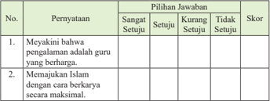

Tabel ini berisi dua pertanyaan yang bertujuan untuk mengukur tingkat kesetiaan siswa terhadap pengalaman guru dan dukungan mereka dalam memajukan Islam melalui pendidikan. Pertanyaan pertama bertujuan untuk mengetahui sejauh mana siswa setuju dengan pernyataan bahwa pengalaman guru adalah hal yang berharga, sementara pertanyaan kedua bertujuan untuk mengetahui sejauh mana siswa setuju dengan pernyataan bahwa mereka memajukan Islam dengan cara yang maksimal. Dalam tabel ini, setiap siswa akan memberikan pilihan jawaban antara sangat setuju, setuju, kurang setuju, dan tidak setuju. Skor diberikan berdasarkan pilihan jawaban tersebut, dengan skor tertinggi 4 dan skor terendah 0. Topik utama tabel ini adalah penilaian keikutsertaan siswa dalam proses pembelajaran dan pengembangan diri melalui pendidikan Islam. Kolom-kolom yang ada dalam tabel ini adalah No., Pernyataan, Pilihan Jawaban, dan Skor. Data atau pola penting yang terlihat dalam tabel ini adalah bahwa setiap siswa memiliki kesempatan untuk memberikan pilihan jawaban yang berbeda-beda tergantung pada tingkat kesetiaannya terhadap pengalaman guru dan dukungan mereka dalam memajukan Islam melalui pendidikan.

 

---
## 📄 Halaman 85

---
**📊 Tabel**

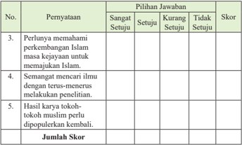

Tabel ini menunjukkan hasil pengukuran pemeringkatan pendapat siswa tentang beberapa peryataan mengenai perkembangan Islam dan kegiatan ilmiah. Topik utama tabel adalah pemeringkatan pendapat siswa tentang perkembangan Islam dan kegiatan ilmiah. Kolom-kolomnya meliputi nomor peryataan (No.), pilihan jawaban (Sangat Setuju, Setuju, Kurang Setuju, Tidak Setuju), skor, dan jumlah skor. Data penting yang terlihat adalah bahwa peryataan 3 mendapatkan skor tertinggi, sedangkan peryataan 4 mendapatkan skor terendah. Ini menunjukkan bahwa siswa lebih setuju dengan perkembangan Islam dan kegiatan ilmiah dibandingkan dengan pengetahuan mereka tentang perkembangan Islam.

### D.	Tugas	Kelompok

- Buatlah kelompok sesuai dengan jumlah peserta didik di kelasmu. (Maksimal lima orang satu kelompok).
- Buatlah proyek tentang hal-hal berikut.
- Peta wilayah kekuasaan pada masa Bani Umayyah, serta beri keterangan jenis-jenis kemajuannya!
- Peta wilayah kekuasaan pada masa Bani Abbasiyah, serta beri keterangan jenis-jenis kemajuannya!
- Buatlah gambar tokoh kejayaan Islam pada sebuah tabel lengkap dengan hasil penemuannya!

 

---
## 📄 Halaman 86

Bab 6

### Perilaku Taat, Kompetisi dalam Kebaikan, dan Etos Kerja

### Peta Konsep

---
**🖼️ Gambar/Diagram**

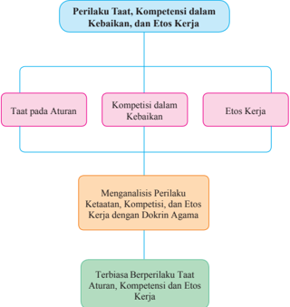

> **Deskripsi Visual:** Gambar ini adalah diagram yang menunjukkan struktur dan hubungan antara perilaku taat, kompetensi dalam kebaikan, dan etos kerja. Diagram ini dibagi menjadi dua bagian utama: bagian atas berisi tiga subbagian yang masing-masing menunjukkan aspek perilaku tersebut, yaitu taat pada aturan, kompetensi dalam kebaikan, dan etos kerja. Bagian bawah diagram menggambarkan proses analisis perilaku tersebut menggunakan doktrin agama sebagai dasar.

Elemen utama dalam diagram ini meliputi:
1. Perilaku Taat, Kompetensi dalam Kebaikan, dan Etos Kerja.
2. Analisis perilaku dengan doktrin agama.
3. Terbiasa berperilaku taat, aturan, kompetensi, dan etos kerja.

Teks, angka, atau label penting yang terlihat dalam diagram ini meliputi:
- "Perilaku Taat, Kompetensi dalam Kebaikan, dan Etos Kerja" sebagai judul topiannya.
- "Mengamalisis Perilaku Taat, Aturan, Kompetensi, dan Etos Kerja dengan Doktrin Agama" sebagai subjudul bagian bawah.
- "Terbiasa Berperilaku Taat, Aturan, Kompetensi, dan Etos Kerja" sebagai penutupan diagram.

Informasi kunci yang dapat diambil pembaca dari gambar ini adalah bahwa diagram ini membahas tentang bagaimana mengamalkan nilai-nilai moral seperti taat, kompetensi, dan etos kerja dalam konteks agama. Ini mencakup analisis perilaku tersebut menggunakan doktrin agama sebagai dasar, serta bagaimana terbiasanya berperilaku baik dalam berbagai situasi kerja.

 

---
## 📄 Halaman 87

---
**🖼️ Gambar/Diagram**

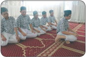

> **Deskripsi Visual:** Gambar ini adalah foto yang menunjukkan empat orang pria sedang berdiri di atas karpet yang berwarna putih dengan motif hijau. Mereka semua mengenakan baju seragam biru dengan topi berwarna hitam dan celana pendek. Pria pertama berdiri di sebelah kiri, sementara pria lainnya berdiri di sebelah kanan. Semua pria tampak tenang dan rapi dalam posisi mereka. Karpet yang digunakan sebagai latar belakang memiliki motif yang halus dan menarik perhatian.

---
**🖼️ Gambar/Diagram**

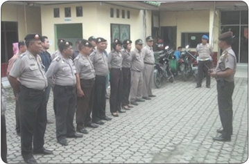

> **Deskripsi Visual:** Gambar ini adalah foto yang menunjukkan sekelompok orang yang terdiri dari beberapa orang tahanan dan beberapa orang petugas keamanan. Mereka berdiri di depan sebuah bangunan dengan latar belakang yang tampak seperti sebuah lapangan atau area publik. Petugas keamanan terlihat berjajar rapi di sebelah kanan, sedangkan tahanan berdiri di sebelah kiri. Di tengah-tengah, ada beberapa motor yang tampak seperti sepeda motor. Latar belakang juga menunjukkan beberapa pohon dan bangunan lainnya. Gambar ini menunjukkan situasi yang serius dan formal, mungkin sebagai bagian dari proses administratif atau hukum.

### Aktivitas Siswa:

Setelah kamu mengamati gambar di atas, coba berikan tanggapanmu tentang pesanpesan yang ada pada gambar tersebut!

 

---
## 📄 Halaman 88

Apa  jadinya  kalau  aturan  yang telah dibuat tidak ditaati? Apa jadinya kalau hidup yang seharusnya dinamis  ini  tidak  lagi  termotivasi? Apa  jadinya  kalau  mengharap  citacita  tercapai,  tetapi  tidak  ada  kerja keras?

Manusia boleh saja berkhayal, tetapi  khayalannya  harus  diarahkan pada  keinginan  atau  cita-cita  untuk hidup  lebih  baik  lagi  di  masa  yang akan  datang,  baik  di  dunia  maupun di akhirat. Agar hidup yang sekali ini bermakna dan bermanfaat, kita harus memanfaatkan semaksimal mungkin.

Bagaimana  cara memanfaatkan hidup dengan sebaik-baiknya? Kita laksanakan apa yang diperintahkan Allah  Swt. dan rasul-Nya, dan taati pula pemimpin di antara kita.  Dengan menaati perintah Allah Swt. dan rasul-Nya, serta pemimpin, niscaya hidup kita akan penuh dengan rahmat. Hal ini dijanjikan oleh Allah Swt. dalam firman-Nya: 'Dan taatilah Allah dan rasul, supaya kamu diberi rahmat.' ( Q.S. ali-Imran/3:132 )

Setiap manusia ingin hidup damai, tenteram, dan bahagia. Kehidupan yang damai akan muncul karena tidak ada pelanggaran terhadap aturan yang berlaku. Ketenteraman  akan  hadir  karena  adanya  semangat  berkompetisi  secara  sportif dan  kolaboratif.  Kebahagiaan  akan  terwujud  jika  apa  yang  diinginkan  sudah terpenuhi. Bangsa ini akan menjadi besar apabila masyarakatnya yang diyakini dan yang berlaku di masyarakat. Misalnya, nilai spiritual, yakni dengan meyakini dan  menaati  ajaran  agama  yang  dianutnya.  Selain  itu,  kita  juga  harus  menaati pemimpin. Semangat berkolaborasi dalam berkompetisi, serta memiliki etos kerja dalam meraih cita-cita yang harus dijunjung tinggi.

Kita tidak bisa melempar tanggung jawab kepada orang lain atau pihak lain. Kita sendiri yang harus melakukannya. Dengan bersama-sama kita junjung tinggi nilai ketaatan, kompetisi dalam kebaikan, dan etos kerja, bangsa ini akan menjadi bangsa yang cukup disegani dan dibanggakan.

 

---
## 📄 Halaman 89

Kamu diminta mengkritisi gambar-gambar berikut ini dan berikan tanggapanmu!

### TATATERTIB SEKOLAH

- 1.Anak-Anakharushadirdisekolah5 menitpalinglambatsebelumloncengberbunyi
- Memakai pakaian rapi dan bersih 6.Kemeja seragam harusmasukke dalam 7.Selaluhormatkepadaguru
- 2.Berbaris dengan tertib dan teratur 3.Sebelumpelajarandimulai berdoa menurut kepercayaannya masing-masing 4.Anak-Anak mengikuti upacara dengan tertib
- 8.Peliharalahbuku dan alat-alatdengan rapih dan bersih
- 10.Bila tidak masuk sekolah,harap memberitahukan secaralisan/tertuliske sekolah
- Menjaga kebersihan sekolah.
- Apa  yang  kamu  pahami  dari gambar di samping?
- Apa yang harus dilakukan agar kesebelasannya  unggul  dalam berkompetisi?
- Mengapa  dalam  berkompetisi diperlukan kolaborasi?
- Sejauh mana kamu mengetahui tata tertib di sekolahmu?
- Apa  relevansi  antara  aturan  yang dibuat dan kondisi di lapangan?
- Bagaimana dampak yang terjadi apabila aturan itu tidak dilaksanakan?
- Bagaimana dampak  yang  terjadi apabila aturan itu ditaati?
Sumber: Dok. Kemdikbud Gambar 6.5 Tata tertib sekolah

### TATA TERTIB SEKOLAH

L.Anak-Anakharushadirdisekolah5 menitpalinglambatsebelumloncengberbunyi

5.Memakaipakaian rapidan bersih 6.Kemejaseragamharusmasukke dalam 7.Selaluhormatkepadaguru 8.Peliharalahbuku danalat-alatdengan rapih danbersih

2.Berbarisdengan tertibdanteratur 3.Sebelumpelajarandimulaiberdoa menurut kepercayaannya masing-masing 4.Anak-Anak mengikuti upacara dengan tertib

9.Menjagakebersihan sekolah. 10.Bilatidak masuksekolah,harap memberitahukansecaralisan/tertuliske sekolah

Sumber: www.rikyfernandes.mywapblog.com Gambar 6.6 Sportif dalam bermain sepak bola.

 

---
## 📄 Halaman 90

- Apa yang kamu simpulkan dari gambar di samping?
- Apakah pak tani bekerja hanya dengan menggunakan otot tanpa pakai otak? Mengapa?
- Apa  hubungannya  antara  kerja keras dan kerja cerdas?
Kamu  diminta  mengkritisi  perilaku  sosial  berikut  ini  dari  beberapa  sudut pandang (contoh dari sisi agama, sosial, budaya, dan sebagainya)!

- Akhir-akhir ini, kita  sering  menyaksikan melalui media, banyaknya pelanggaran terhadap  norma-norma  agama.  Misalnya  pencurian,  penipuan,  perampokan, pembunuhan,  dan  lain  sebagainya.  Pelakunya  pun  terkadang  merasa  tidak berdosa dan tidak ada beban sama sekali. Ada juga berita seorang anak yang tega membunuh ibu kandungnya sendiri hanya karena persoalan sepele, yaitu tidak diberi uang jajan pada saat mau berangkat sekolah. Bagaimana tanggapanmu?
- Sejak  dahulu  dalam  dunia  pendidikan  sudah  melaksanakan  ujian  nasional. Ujian nasional dilakukan untuk mengetahui sejauh mana kualitas pendidikan di  negeri  ini.  Ironisnya,  setiap  kegiatan  ujian  nasional  berlangsung,  terjadi perilaku negatif. Bocornya soal, siswa yang saling menyontek, dan perilakuperilaku negatif lainnya menjadikan kualitas pendidikan menjadi kurang baik. Semangat berkompetisi untuk mendapatkan yang terbaik di antara siswa tidak pernah tertanam.
Bagaimana tanggapanmu?

- Bagaimana  tanggapanmu  mengenai  banyaknya  kaum  tuna  wisma  yang meminta-minta di jalan? Tidak jarang mereka melakukan berbagai cara agar orang-orang merasa iba dan akhirnya memberikan sedekah/sumbangan kepada mereka.

 

---
## 📄 Halaman 91

### Aktivitas Siswa:

- Cermati pernyataan di atas, kemudian buatlah kesimpulan dari permasalahan tersebut!
- Berikan tanggapanmu terhadap penyelesaian permasalahan tersebut!

### A.  Pentingnya Taat kepada Aturan

Taat memiliki arti tunduk (kepada Allah Swt., pemerintah, dsb.) tidak berlaku curang,  dan  atau  setia.  Aturan  adalah  tindakan  atau  perbuatan  yang  harus dijalankan. Taat pada aturan adalah sikap tunduk kepada tindakan atau perbuatan yang telah dibuat baik oleh Allah Swt., nabi, pemimpin, atau yang lainnya.

Di sekolah, di rumah, atau di lingkungan masyarakat terdapat aturan.  Di mana saja kita berada, pasti ada aturannya. Aturan dibuat agar terjadi ketertiban dan ketenteraman. Oleh karena itu, wajib hukumnya kita menaati aturan yang berlaku.

Aturan yang paling tinggi adalah aturan yang dibuat oleh Allah Swt., yaitu terdapat  pada al-Qur'±n .  Sementara  di  bawahnya  ada  aturan  yang  dibuat  oleh Nabi  Muhammad saw.,  yang  disebut  sunah  atau  hadis.  Di  bawahnya  lagi  ada aturan yang dibuat oleh pemimpin, baik pemimpin pemerintah, negara, daerah, maupun pemimpin yang lain, termasuk pemimpin keluarga.

### Aktivitas Siswa:

Identifikasilah aturan-aturan yang ada di sekolah, di rumah, maupun di masyarakat. Kemudian, jelaskan hubungan antara aturan dan kondisi sosial di masyarakat?

Peranan  pemimpin  sangatlah  penting.  Sebuah  institusi,  dari  yang  terkecil (keluarga)  sampai  yang  terbesar  adalah  negara,  tidak  akan  tercapai  kestabilan tanpa adanya seorang pemimpin. Tanpa adanya seorang pemimpin dalam sebuah negara,  tentulah  negara  tersebut  akan  menjadi  lemah  dan  mudah  terombangambing oleh kekuatan luar. Oleh karena itu, Islam memerintahkan umatnya untuk taat  kepada  pemimpin.  Dengan  ketaatan  rakyat  kepada  pemimpin  (yang  tidak bermaksiat), akan terciptalah keamanan dan ketertiban serta kemakmuran.

 

---
## 📄 Halaman 92

Artinya: 'Wahai  orang-orang  yang  beriman!  Taatilah  Allah  dan  taatilah Rasul (Muhammad), dan Ulil Amri (pemegang kekuasaan)) di antara kamu. Kemudian, jika kamu berbeda pendapat tentang sesuatu, maka kembalikanlah kepada Allah (al-Qur'an) dan Rasul (sunnahnya), jika kamu beriman kepada Allah dan hari kemudian. Yang demikian itu lebih utama (bagimu) dan lebih baik akibatnya.' (Q.S. an-Nis±/4: 59)

### Penerapan Hukum Tajwid

---
**📊 Tabel**

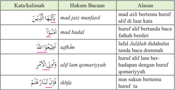

Tabel ini berisi informasi tentang hukum bacaan beberapa kata/kalimat dalam bahasa Arab, dengan penjelasan alasan masing-masing hukum. Topik utama tabel adalah hukum bacaan dalam pengucapan kata/kalimat. Kolom pertama berisi kata/kalimat yang perlu dibaca dengan cara tertentu, sedangkan kolom kedua berisi hukum bacaannya. Kolom ketiga memberikan alasan mengapa kata/kalimat tersebut dibaca dengan cara tertentu. Misalnya, "mad asil bertemu huruf alf di luar kata" menunjukkan bahwa huruf alf bertemu dengan huruf huruf lain di luar kata, sehingga harus dibaca dengan cara tertentu. Tabel ini membantu pembaca memahami bagaimana mengucapkan kata/kalimat dengan benar sesuai dengan hukum bacaannya.

### Aktivitas Siswa:

Pada ayat tersebut sebenarnya banyak sekali kata/kalimat yang mengandung hukum bacan tajw ³ d . Identifikasi lebih lanjut hukum bacaan tajw ³ d selain yang ada di kotak, minimal lima hukum bacaan tajw ³ d !

### Arti Kata/Kalimat

---
**📊 Tabel**

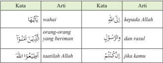

Tabel ini berisi definisi beberapa kata dalam bahasa Arab, dengan penjelasan tentang artinya dalam konteks Islam. Topik utama tabel adalah definisi dan arti kata-kata dalam bahasa Arab yang berkaitan dengan kepercayaan dan agama Islam. Kolom pertama berisi kata-kata dalam bahasa Arab, sedangkan kolom kedua berisi arti dari kata-kata tersebut. Kolom ketiga berisi contoh penggunaan kata-kata tersebut dalam ayat-ayat Al-Qur'an atau hadits. Dari tabel ini, kita dapat melihat bahwa banyak kata-kata yang digunakan untuk menggambarkan hubungan antara manusia dengan Allah, seperti "wahai" yang merujuk pada Allah, "orang-orang yang beriman" yang merujuk pada umat Islam, dan "taatilah Allah" yang merujuk pada kewajiban umat Islam. Selain itu, tabel juga menunjukkan bahwa beberapa kata memiliki arti yang lebih spesifik, seperti "kepada Allah" yang merujuk pada sifat kebaikan dan "jika kamu" yang merujuk pada kondisi tertentu. Dengan demikian, tabel ini memberikan pemahaman yang baik tentang bagaimana kata-kata dalam bahasa Arab digunakan dalam konteks Islam dan bagaimana mereka membantu kita memahami dan mempraktikkan prinsip-prinsip agama.

 

---
## 📄 Halaman 93

---
**📊 Tabel**

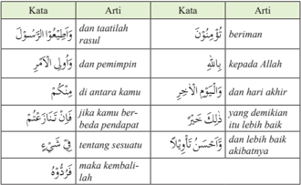

Tabel ini berisi definisi kata-kata dalam bahasa Arab, dengan dua kolom: "Kata" dan "Arti". Topik utama tabel adalah pengertian dan arti dari beberapa kata dalam bahasa Arab. Kolom pertama ("Kata") menunjukkan kata-kata yang akan dijelaskan, sementara kolom kedua ("Arti") memberikan penjelasan atau arti dari setiap kata tersebut. Data penting yang terlihat dalam tabel meliputi definisi kata seperti "beriman", "kepada Allah", "dan hari akhir", "yang demikian lebih baik", dan lain-lain. Tabel ini membantu pembaca memahami arti dari kata-kata dalam konteks bahasa Arab, yang dapat berguna untuk pemahaman dan penggunaan kata-kata tersebut dalam percakapan atau tulisan.

Asb±bu  an-Nuzµl atau  sebab  turunnya  ayat  ini  menurut  Ibn  Abbas  adalah berkenaan dengan Abdullah bin Huzaifah bin Qays as-Samhi ketika Rasulullah saw.    mengangkatnya  menjadi  pemimpin  dalam sariyyah (perang  yang  tidak diikuti  oleh  Rasulullah  saw.).  As-Sady  berpendapat  bahwa  ayat  ini  turun berkenaan dengan Amr bin Yasir dan Khalid bin Walid ketika keduanya diangkat oleh Rasulullah saw. sebagai pemimpin dalam sariyyah .

Q.S. an-Nis±/4: 59 memerintahkan kepada kita untuk menaati perintah Allah Swt., perintah Rasulullah saw., dan ulil  amri .  Tentang  pengertian ulil  amri ,  di bawah ini ada beberapa pendapat.

---
**📊 Tabel**

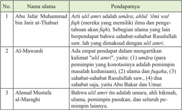

Tabel ini membahas pendapat para ulama tentang istilah "ulmi amri" dalam konteks Islam. Topik utamanya adalah definisi dan pengertian ulama tentang istilah tersebut. Tabel memiliki tiga kolom: No., Nama ulama, dan Pendapatnya. Data penting yang terlihat antara lain bahwa Abu Jafar Muhammad bin Jarir at-Tabari mendefinisikan "ulmi amri" sebagai umarah (para pemimpin masalah keuangan), ulama, fiqih, sahabat-sahabat Rasulullah saw., dan Abu Bakar dan Umar. Al-Mawardi menunjukkan empat poin pendapatnya, termasuk definisi ulmi amri. Sementara itu, Ahmad Mustafa al-Maraghi menyatakan bahwa ulmi amri adalah umarah, ahli hikmah, ulana, pemimpin pasukan, dan seluruh pemimpin lainnya.

 

---
## 📄 Halaman 94

Kita memang diperintah oleh Allah Swt. untuk taat kepada ulil amri (apa pun pendapat  yang  kita  pilih  tentang  makna ulil  amri ).  Namun,  perlu  diperhatikan bahwa perintah taat kepada ulil amri tidak dapat disamakan dengan 'taat' kepada Allah Swt. dan rasul-Nya. Quraish Shihab, Mufassir Indonesia, memberi ulasan bahwasannya: 'Tidak disebutkannya kata 'taat' pada ulil  amri untuk memberi isyarat bahwa ketaatan kepada mereka tidak berdiri sendiri, tetapi berkaitan atau bersyarat  dengan  ketaatan  kepada  Allah  Swt.  dan  rasul-Nya.  Artinya,  apabila perintah itu bertentangan dengan nilai-nilai ajaran Allah Swt. dan rasul-Nya, tidak dibenarkan untuk taat kepada mereka.

Lebih lanjut Rasulullah saw. menegaskan dalam hadis berikut ini:

``

Artinya: 'Dari Abi Abdurahman, dari Ali sesungguhnya Rasulullah bersabda... Tidak boleh taat terhadap perintah bermaksiat kepada Allah, sesungguhnya  ketaatan  itu  hanya  dalam  hal  yang  makruf.' (H.R. Muslim)

Umat Islam wajib menaati perintah Allah Swt. dan rasul-Nya. Umat Islam juga diperintahkan pula untuk mengikuti atau menaati pemimpinnya. Apabila pemimpinnya  memerintahkan  kepada  hal-hal  yang  baik.  Apabila  pemimpin tersebut mengajak kepada kemungkaran, wajib hukumnya untuk menolak.

- Apa yang kamu simpulkan dari gambar di samping?
- Apa hubungannya antara imam dan makmum?
- Apa akibatnya kalau makmum tidak mengikuti imam?
- Apa akibatnya kalau imam melakukan kesalahan?

 

---
## 📄 Halaman 95

### Aktivitas Siswa:

- Carilah ayat dan hadis yang berhubungan dengan ketaatan pada aturan!
- Jelaskan pesan-pesan yang terdapat pada ayat dan hadis yang kamu temukan itu!
- Hubungkan pesan-pesan ayat dan hadis tersebut dengan kondisi di lingkungan masyarakat yang kamu temui!

### B.  Kompetisi dalam Kebaikan

Hidup adalah kompetisi un  tuk menjadi yang terbaik, dan juga untuk meraih citacita yang diinginkan. Namun sayang,  banyak  orang  terjebak pada kompetisi yang hanya memperturutkan hawa nafsu duniawi  dan  jauh  dari  suasana robbani. Kompetisi yang hanya memperturutkan hawa nafsu, contohnya kompetensi mengumpulkan  harta  kekayaan atau memperebutkan jabatan dan  kedudukan.  Semuanya  bak

fatamorgana,  indah  menggoda,  tetapi  sesungguhnya  tiada.  Bahkan,  tak  jarang dalam kompetisi diiringi ' suu§an ' buruk sangka, bukan hanya kepada manusia, tetapi juga kepada Allah Swt. Lebih merugi lagi jika rasa iri dan riya ikut bermain dalam kompetisi tersebut.

Lalu,  bagaimanakah selayaknya kompetisi bagi orang-orang yang beriman? Allah Swt. telah memberikan pengarahan bahkan penekanan kepada orang-orang beriman untuk berkompetisi dalam kebaikan sebagaimana firman-Nya:

 

---
## 📄 Halaman 96

Artinya: ' Dan Kami telah menurunkan Kitab (al-Qur'±n) kepadamu (Muhammad) dengan  membawa  kebenaran,  yang  membenarkan  kitab-kitab  yang diturunkan  sebelumnya  dan  menjaganya  maka  putuskanlah  perkara mereka menurut apa yang diturunkan Allah Swt. dan janganlah engkau mengikuti  keinginan  mereka  dengan  meninggalkan  kebenaran  yang telah  datang  kepadamu.  Untuk  setiap  umat  di  antara  kamu,  Kami berikan aturan dan jalan yang terang. Kalau Allah Swt. menghendaki, niscaya kamu dijadikan-Nya satu umat (saja), tetapi Allah Swt. hendak menguji kamu terhadap karunia yang telah diberikan-Nya kepadamu, maka berlomba-lombalah berbuat kebajikan. Hanya kepada Allah Swt. kamu semua kembali, lalu diberitahukan-Nya kepadamu terhadap apa yang dahulu kamu perselisihkan.' (Q.S. al-M±idah/5: 48)

### Penerapan Hukum Tajwid

---
**📊 Tabel**

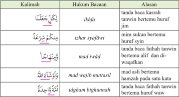

Tabel ini berisi informasi tentang kelimah (kata) dan hukum bacaan mereka dalam bahasa Arab, ditambah dengan alasan mengapa setiap kelimah memiliki hukum bacaan tertentu. Topik utama tabel adalah penjelasan tentang kelimah dan hukum bacaannya. Kolom-kolomnya meliputi kelimah, hukum bacaan, dan alasan. Data penting yang terlihat adalah bahwa beberapa kelimah memiliki tanda baca kasrah (ikhfa), misalnya "رَكْبًا" (rikab). Beberapa kelimah memiliki tanda baca sukaun (izhar), seperti "صَفَحَةٌ" (safhah). Ada juga kelimah yang memiliki tanda baca fathah (mad iwād), seperti "تَوَاهَتُ" (tawahut). Selain itu, ada kelimah yang memiliki tanda baca fathah dan tawthih (idgham bighunnah), seperti "جَاءَةً" (jahat). Tabel ini membantu pembaca memahami bagaimana kelimah Arab dihakimi dalam hal bacaan dan mengapa setiap kelimah memiliki tanda baca tertentu.

### Aktivitas Siswa:

Pada ayat tersebut sebenarnya banyak sekali kata/kalimat yang mengandung hukum bacaan tajwid. Identifikasi lebih lanjut hukum bacaan tajwid selain yang ada di kotak tersebut di atas, minimal lima hukum bacaan tajwid.

 

---
## 📄 Halaman 97

### Arti Kata/Kalimat

---
**📊 Tabel**

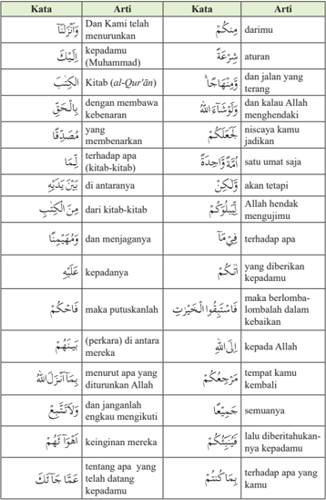

Tabel ini berisi arti kata-kata dalam bahasa Arab yang digunakan dalam Al-Qur'an. Topik utamanya adalah pengertian dan definisi kata-kata khusus dalam Al-Qur'an. Tabel dibagi menjadi dua kolom: "Kata" dan "Artii". Kolom "Kata" menunjukkan kata-kata yang dijelaskan, sementara kolom "Artii" memberikan arti atau makna dari kata-kata tersebut. Data penting yang terlihat meliputi penggunaan kata-kata seperti "kepadamu", "Kitab (al-Qur'an)", "kebajikan", dan "kehormatan", serta penjelasan tentang maknanya dalam konteks Al-Qur'an. Tabel ini membantu pembaca memahami arti dari kata-kata khusus dalam Al-Qur'an dengan cara yang sistematis dan mudah dipahami.

 

---
## 📄 Halaman 98

---
**📊 Tabel**

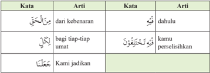

Tabel ini berisi definisi kata-kata dalam bahasa Melayu, dengan dua kolom: "Kata" dan "Arti". Topik utama tabel adalah pengenalan kata-kata dan artinya dalam konteks bahasa Melayu. Kolom pertama ("Kata") menunjukkan kata-kata yang akan dijelaskan, sementara kolom kedua ("Arti") memberikan penjelasan atau arti dari setiap kata tersebut. Data penting yang terlihat meliputi definisi kata seperti "dari kebenaran", "bagi tiap-tiap umat", dan "kamu perselisihkan", serta bagaimana kata-kata tersebut digunakan dalam konteks bahasa Melayu.

### Perhatikan gambar di samping:

- Bagaimana ayat pada Q.S . al-M±idah /5: 48 memahami kelompokkelompok manusia?
- Apa yang harus dilakukan oleh setiap kelompok tersebut sesuai dengan pesan ayat Q.S. al-M±idah /5: 48?
- Apakah kamu temukan perilaku tersebut di tengahtengah masyarakat? Bagaimana kamu menyikapinya?
Pada Q.S. al-M±idah/5:48 Allah Swt. menjelaskan bahwa setiap kaum diberikan aturan atau syariat. Syariat  setiap  kaum  berbeda-beda sesuai  dengan  waktu  dan  keadaan hidupnya.  Meskipun  mereka  berbeda-beda, yang terpenting adalah semuanya beribadah dalam rangka mencari ri«a Allah Swt., atau berlomba-lomba dalam kebaikan.

---
**🖼️ Gambar/Diagram**

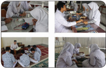

> **Deskripsi Visual:** Gambar ini adalah ilustrasi yang menunjukkan berbagai aktivitas belajar di sekolah. Ilustrasi ini terdiri dari empat panel yang masing-masing menunjukkan aktivitas belajar yang berbeda. Panel pertama menunjukkan siswa sedang belajar dengan menggunakan komputer. Panel kedua menunjukkan siswa sedang bermain permainan matematika. Panel ketiga menunjukkan siswa sedang belajar dengan menggunakan alat tulis dan papan tulis. Panel keempat menunjukkan siswa sedang berdiskusi tentang materi belajar. Setiap panel memiliki elemen-elemen yang penting seperti siswa, peralatan belajar, dan lingkungan belajar. Informasi kunci yang dapat diambil dari gambar ini adalah bahwa aktivitas belajar di sekolah melibatkan penggunaan berbagai peralatan dan teknologi untuk meningkatkan pengetahuan dan keterampilan siswa.

 

---
## 📄 Halaman 99

Allah  Swt.  mengutus  para  nabi  dan  menurunkan  syariat  kepadanya  untuk memberi petunjuk kepada manusia agar berjalan pada jalan atau arah yang benar dan lurus. Akan tetapi, sebagian dari ajaran-ajaran mereka disembunyikan atau diselewengkan. Sebagai ganti ajaran para nabi, manusia membuat ajaran sendiri yang bersifat khurafat dan takhayul.

Surat al-M±idah /5:  48    ini    membicarakan  bahwa al-Qur'±n memiliki  kedudukan yang sangat tinggi. Al-Qur'±n merupakan pembenar kitab-kitab sebelumnya, juga sebagai penjaga kitab-kitab tersebut. Dengan menekankan terhadap dasar-dasar ajaran para nabi terdahulu, al-Qur'±n sepenuhnya memelihara keaslian ajaran itu dan menyempurnakannya.

Akhir ayat ini juga mengatakan, perbedaan syariat tersebut seperti layaknya perbedaan manusia dalam penciptaannya, bersuku-suku, dan berbangsabangsa.  Semua  perbedaan  itu  adalah  rahmat  dan  untuk  saling  mengenal.  Ayat ini mendorong pengembangan berbagai macam kemampuan yang dimiliki oleh manusia, dan bukan menjadi ajang perdebatan. Semua orang dengan potensi dan kadar kemampuan masing-masing, harus berlomba-lomba dalam melaksanakan kebaikan. Allah  Swt. senantiasa melihat dan memantau perbuatan manusia dan bagi-Nya tidak ada sesuatu yang tersembunyi.

Mengapa  kita  diperintahkan  untuk  berlomba-lomba  dalam  kebaikan?  Ada beberapa  alasan  mengapa  kita  diperintahkan  untuk  berlomba-lomba  dalam kebaikan, antara lain sebagai berikut.

Pertama ,  bahwa  melakukan  kebaikan  tidak  bisa  ditunda-tunda,  dan  harus segera  dikerjakan.  Kesempatan  hidup  sangat  terbatas,  begitu  juga  kesempatan berbuat baik belum tentu setiap saat kita dapatkan. Kematian bisa datang secara tiba-tiba tanpa diketahui sebabnya. Oleh karena itu, ketika ada kesempatan untuk berbuat baik, jangan ditunda-tunda lagi, tetapi segera dikerjakan.

Kedua ,  untuk  berbuat  baik  hendaknya  saling  memotivasi dan saling tolong-menolong, Oleh karena itu, kita perlunya berkolaborasi  atau  kerja  sama.    Lingkungan  yang  baik adalah  lingkungan  yang  membuat  kita  terdorong  untuk berbuat  baik.  Tidak  sedikit  seorang  yang  tadinya  baik menjadi rusak karena lingkungan. Lingkungan yang saling mendukung kebaikan akan tercipta kebiasaan berbuat baik secara istiq±mah (konsisten).

Ketiga ,  bahwa  kesigapan  melakukan  kebaikan  harus didukung dengan kesungguhan.

Allah Swt. bersabda:

 

---
## 📄 Halaman 100

Langkah  awal  untuk  menciptakan  lingkungan  yang  baik  adalah  dengan memulai dari diri sendiri, dari yang terkecil, dan dari sekarang. Kita harus memulai dari diri sendiri dan keluarga. Sebuah bangsa, apa pun hebatnya secara teknologi, tidak  akan  pernah  bisa  tegak  dengan  kokoh  jika  pribadi  manusia  dan  keluarga yang ada di dalamnya sangat rapuh.

- Apa  yang  kamu  simpulkan dari gambar di samping?
- Apa akibatnya kalau melakukan pekerjaan seorang diri meskipun dalam  keadaan  berkompetisi?
- Apa akibatnya kalau pekerjaan dilakukan secara berkolaborasi?

### Aktivitas Siswa:

- Carilah ayat dan hadis yang berhubungan dengan kompetisi dalam kebaikan!
- Jelaskan pesan-pesan yang terdapat pada ayat dan hadis yang kamu temukan itu!
- Hubungkan  pesan-pesan  ayat  dan  hadis  tersebut  dengan  kondisi  objekif  di lapangan yang kamu temui!

### C.  Etos Kerja

Sudah menjadi kewajiban manusia untuk berusaha memenuhi kebutuhan dan kepentingan  dalam  kehidupannya.  Seorang  muslim  haruslah  menyeimbangkan antara  kepentingan  dunia  dan  akhirat.  Tidak  semata  hanya  berorientasi  pada kehidupan akhirat saja, melainkan juga harus memikirkan kepentingan kehidupannya  di  dunia.  Untuk  menyeimbangkan  antara  kehidupan  dunia  dan akhirat, wajiblah seorang muslim untuk bekerja.

Bekerja dalam berbagai bidang. Seseorang yang bekerja layak untuk mendapatkan  predikat  yang  terpuji,  seperti  potensial,  aktif,  dinamis,  produktif atau profesional, karena prestasi kerjanya. Karena itu, agar manusia benar-benar 'hidup',  ia  memerlukan  ruh  (spirit).  Oleh  karena  itulah, al-Qur'±n diturunkan sebagai spirit hidup, sekaligus sebagai nur (cahaya) yang tak kunjung padam agar aktivitas hidup manusia tidak tersesat.

Dalam al-Qur'±n maupun hadis, ditemukan banyak literatur yang memerintahkan  seorang  muslim  untuk  bekerja  dalam  rangka  memenuhi  dan melengkapi kebutuhan duniawinya. Salah satu perintah Allah Swt . kepada umatNya untuk bekerja termaktub dalam Q.S. at-Taubah/9:105 berikut ini.

---
**🖼️ Gambar/Diagram**

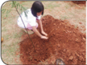

> **Deskripsi Visual:** Gambar ini adalah ilustrasi yang menunjukkan seorang anak sedang memperbaiki tanah dengan tangan. Gambar ini menggambarkan proses perbaikan tanah, yang merupakan bagian penting dari kegiatan pertanian atau pengembangan lingkungan. Anak tersebut tampaknya sedang memegang tanah dengan telapak tangan, menunjukkan upaya dan kerja keras yang diperlukan untuk memperbaiki tanah. Ilustrasi ini mungkin digunakan sebagai contoh atau penjelasan tentang cara memperbaiki tanah, baik itu untuk pertanian, perkebunan, atau pengembangan lingkungan.

 

---
## 📄 Halaman 101

Artinya:  ' Dan  katakanlah, 'Bekerjalah kamu, maka  Allah akan melihat pekerjaanmu,  begitu  juga  rasul-Nya  dan  orang-orang  mukmin,  dan kamu akan dikembalikan kepada (Allah) yang maha mengetahui yang gaib dan yang nyata, lalu diberitakan-Nya kepada kamu apa yang telah kamu kerjakan .' (Q.S. at-Taubah/9: 105)

### Penerapan Hukum Tajwid

---
**📊 Tabel**

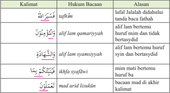

Tabel ini membahas tentang hukum bacaan dalam bahasa Arab, dengan fokus pada beberapa contoh kalimat yang menunjukkan perbedaan dalam penulisan dan bacaan. Topik utama tabel adalah tentang bagaimana alfif (tanda baca) dan huruf mimit (mim) berfungsi dalam menentukan cara membaca kalimat tersebut. Dalam tabel ini, kita dapat melihat bahwa alfif lam qamariyah digunakan ketika alfif lam bertemu dengan huruf mim yang tidak berasal dari kata yang berarti "bisa" atau "boleh". Alfif lam syamsiyyah digunakan ketika alfif lam bertemu dengan huruf sim yang berasal dari kata yang berarti "bisa" atau "boleh". Sementara itu, ikhfa syafjawi digunakan ketika huruf mimit bertemu dengan alfif lam yang berasal dari kata yang berarti "bisa" atau "boleh". Dan mad arid lisukin digunakan ketika huruf mimit bertemu dengan alfif lam yang berasal dari kata yang berarti "tidak bisa" atau "tidak boleh". Pola penting yang terlihat adalah bahwa alfif lam dan huruf mimit memiliki peran penting dalam menentukan cara membaca kalimat dalam bahasa Arab.

### Aktivitas Siswa:

Pada ayat tersebut sebenarnya banyak sekali kata/kalimat yang mengandung hukum bacaan tajwid. Identifikasi lebih lanjut hukum bacaan tajwid selain yang ada di kotak di atas, dan sebutkan minimal lima hukum bacaan tajwid!

### Arti Kata/Kalimat

---
**📊 Tabel**

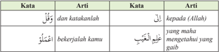

Tabel ini berisi informasi tentang dua kata dalam bahasa Arab, yaitu "كَفَّلَ" (kafal) dan "كَتَبَ" (katab). Kata "كَفَّلَ" memiliki arti "dan katakanlah", sementara "كَتَبَ" memiliki arti "kepada Allah". Dalam konteks ini, "كَتَبَ" juga memiliki arti "yang maha mengetahui yang gaib". Tabel ini membahas hubungan antara kata-kata dalam konteks peribahasa atau ungkapan dalam bahasa Arab, serta artinya dalam konteks keagamaan.

 

---
## 📄 Halaman 102

---
**📊 Tabel**

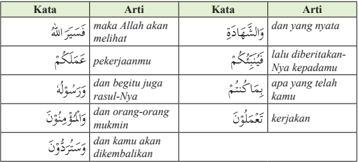

Tabel ini berisi pernyataan-penyataan dalam bahasa Arab yang diartikan dalam bahasa Indonesia. Topik utamanya adalah tentang kepercayaan dan doa kepada Allah. Kolom pertama berisi kata-kata dalam bahasa Arab, sedangkan kolom kedua berisi arti dari kata-kata tersebut dalam bahasa Indonesia. Data penting yang terlihat adalah bahwa semua pernyataan mengandung pesan-pesan tentang kepercayaan pada Allah dan doa kepada-Nya, serta tentang keberkahan dan kesejahteraan yang akan datang bagi orang-orang yang berdoa dan berpuasa.

Q.S. at-Taubah / 9: 105 menjelas  kan, bahwa Allah Swt. memerintahkan  kepada  kita  untuk semangat  dalam  melakukan  amal saleh sebanyak-banyaknya. Allah Swt. akan melihat dan menilai amal-amal tersebut. Pada akhirnya, seluruh manusia akan dikembalikan kepada Allah Swt. dengan membawa amal perbuatannya masing-masing. Mereka  yang  berbuat baik akan

diberi pahala atas perbuatannya itu. Mereka yang berbuat jahat akan diberi siksaan atas perbuatan yang telah mereka lakukan selama hidup di dunia.

Sebutan  lain  dari  ganjaran  adalah  imbalan  atau  upah  atau compensation . Imbalan dalam konsep Islam menekankan pada dua aspek, yaitu dunia dan akhirat. Q.S. at-Taubah / 9: 105 juga menjelaskan bahwa Allah Swt. memerintahkan kita untuk bekerja, dan Allah Swt. pasti membalas semua yang telah kita kerjakan. Hal yang perlu diperhatikan dalam ayat ini adalah penegasan Allah  Swt. bahwa motivasi atau niat bekerja itu harus benar.

Umat  Islam  dianjurkan  agar  tidak  hanya  merasa  cukup  dengan  melakukan 'tobat' saja, tetapi harus dibarengi dengan usaha-usaha untuk melakukan perbuatan terpuji yang lainnya. Perbuatan-perbuatan terpuji itu seperti menunaikan zakat, membantu  orang-orang  yang  membutuhkan  pertolongan,  menyegerakan  untuk mengerjakan ¡alat , saling menasihati teman dalam hal kebenaran dan kesabaran, dan masih banyak lagi. Semua itu dilakukan atas dasar taat dan patuh kepada perintah Allah Swt. dan yakin bahwa Allah Swt. pasti menyaksikan itu.

Ayat ini pun berisi peringatan bahwa perbuatan mereka itu pun nantinya akan diperlihatkan kelak di hari kiamat. Dengan demikian, akan terlihatlah kebajikan dan kejahatan yang mereka lakukan sesuai amal perbuatannya. Bahkan, di dunia ini pun sudah sering kita saksikan, bagaimana gambaran orang-orang yang berbuat

 

---
## 📄 Halaman 103

jahat  seperti  pencuri,  penipu,  koruptor,  dan  lain  sebagainya. Banyaknya  berita tentang korupsi, dan bagaimana seorang koruptor dipertontonkan di ruang publik. Ini menandakan bahwa di dunia pun perbuatan kita sudah bisa dipertontonkan. Apalagi kelak di akhirat yang pasti sangat nyata dan tidak bisa ditutup-tutupi.

Bekerjalah dengan sungguh-sungguh dan maksimal. Bekerjalah sesuai dengan aturan Allah Swt. dan rasul-Nya. Kalau pekerjaan itu tidak baik dan tidak benar, jauhilah!

Jangan sampai di kemudian hari baru menyesal. Sungguh tidak ada artinya.

Artinya: 'Dari Miqdam ra. dari Nabi saw. beliau bersabda: 'Tidak seorang pun yang makan lebih baik daripada makan hasil usahanya sendiri. Sungguh Nabi Daud as. makan hasil usahanya.' ( H.R. Bukhari)

Gambar 6.14 Sedang meminta-minta dan menghayal

- Apa yang kamu simpulkan dari  gambar di atas?
- Mengapa ada sebagian pemerintah daerah melarang warganya untuk memberi sumbangan kepada pengemis di jalan?
- Bagaimana tanggapan kamu ketika ada orang yang menikmati kemewahan tanpa ada kerja keras?

### Aktivitas Siswa:

- Carilah ayat dan hadis yang berhubungan dengan etos kerja!
- Jelaskan pesan-pesan yang terdapat pada ayat dan hadis yang kamu temukan itu!
- Hubungkan  pesan-pesan  ayat  dan  hadis  tersebut  dengan  kondisi  objekif  di lapangan yang kamu temui!

 

---
## 📄 Halaman 104

Perilaku mulia (ketaatan) yang perlu dilestarikan adalah seperti berikut.

- Selalu  menaati  perintah  Allah  Swt.  dan  rasul-Nya,  serta  meninggalkan larangan-Nya, baik di waktu lapang maupun di waktu sempit.
- Merasa  menyesal  dan  takut  apabila  melakukan  perilaku  yang  dilarang  oleh Allah dan rasul-Nya.
- Menaati dan menjunjung tinggi aturan-aturan yang telah disepakati, baik di rumah, di sekolah maupun di lingkungan masyarakat.
- Menaati  pemimpin  selagi  perintahnya  sesuai  dengan  tuntunan  dan  syariat agama.
- Menolak dengan cara yang baik apabila pemimpin  mengajak  kepada kemaksiatan.
Perilaku  mulia  (kompetisi  dalam  kebaikan)  yang  perlu  dilestarikan  adalah seperti berikut.

- Meyakini bahwa hidup itu perjuangan dan di dalam perjuangan ada kompetisi.
- Berkolaborasi  dalam  melakukan  kompetisi  agar  pekerjaan  menjadi  ringan, mudah, dan hasilnya maksimal.
- Dalam berkolaborasi, semuanya diniatkan ibadah, dan semata-mata mengharap ri«a Allah Swt.
- Selalu melihat sesatu dari sisi positif, tidak memperbesar masalah perbedaan, tetapi mencari titik persamaan.
- Ketika  mendapatkan  keberhasilan,  tidak  tinggi  hati;  ketika  mendapatkan kekalahan, ia selalu sportif dan berserah diri kepada Allah Swt. ( tawakkal ).
Perilaku mulia (etos kerja) yang perlu dilestarikan adalah seperti berikut.

- Meyakini bahwa dengan kerja keras, pasti ia akan mendapatkan sesuatu yang diinginkan ( 'man jada wa jada' - Siapa yang giat, pasti dapat).
- Melakukan sesuatu dengan prinsip: 'Mulai dari diri sendiri, mulai dari yang terkecil, dan mulai dari sekarang.'
- Pantang menyerah dalam melakukan suatu pekerjaan.

 

---
## 📄 Halaman 105

### Rangkuman

- Pentingnya  menaati  pemimpin  agar  roda  pemerintahan  berjalan dengan baik, makin baik kepemimpinan, makin baik pula rakyatnya.
- Kandungan Q.S. an-Nis±/4: 59 adalah perintah untuk menaati Allah Swt., rasul, dan pemimpin. Apabila terjadi perselisihan, diperintahkan untuk kembali kepada al-Qur'±n dan hadis.
- Hidup ini dinamis, perlu berkompetisi dan berkolaborasi agar dapat meraih sesuatu yang diinginkan dengan baik.
- Kandungan Q.S. al-M±idah/5: 48 adalah bahwa Allah Swt. memerintahkan  kepada  umat  Islam  untuk  berlomba-lomba  dalam kebaikan.
- Barangsiapa  yang  giat  pasti  dapat.  Untuk  mendapatkan  sesuatu, diperlukan kerja keras.
- Kandungan Q.S. at-Taubah/9:  105 adalah bahwa Allah Swt. memerintahkan kepada umat Islam untuk semangat dan bersungguhsungguh dalam bekerja.

### Evaluasi

### A.	Berilah	tanda	silang	(x)	pada	huruf	a,	b,	c,	d,	atau	e	yang	dianggap sebagai	jawaban	yang	paling	tepat!

- Perhatikan pernyataan berikut ini!
- Berusaha dengan sungguh-sungguh agar tercapai cita-citanya
- Suka mengikuti kompetisi yang dilakukan sekolah-sekolah lain
- Menjalankan perintah Allah Swt., rasul, dan pemimpin
- Berlomba dalam mewujudkan kebersihan dan keindahan
- Disiplin dan selalu berseragam dengan lengkap setiap hari
- Dari pernyataan di atas, yang termasuk perilaku mulia terkait ketaatan adalah
....

- 1 dan 2
- 2 dan 3
- 3 dan 4
- 2 dan 5
- 3 dan 5

 

---
## 📄 Halaman 106

- Akhir-akhir ini semangat berkompetisi sangat menurun di kalangan pelajar. Ini  dibuktikan  ketika  diumumkan  tentang  peringkat  kelas,  justru  sang  juara menjadi cemoohan teman-temannya yang lain. Mereka menanggapinya dengan sinis bahwa si juara ini pelit orangnya, tidak mau bagi-bagi pada saat ujian.
Yang harus dilakukan oleh orang yang memahami  isi Q.S. al-M±idah / 5:48 adalah .…

- belajar dengan sungguh-sungguh agar ia menjadi juara kelas
- bekerja keras agar apa yang diinginkan dapat tercapai
- berkompetisi secara sehat, tidak curang dan tidak menyontek
- berkolaborasi agar sama-sama mendapatkan nilai memuaskan
- menaati semua aturan yang ada di sekolah dan kelas
- Ketika  menemukan  masalah,  kemudian  terjadi  perselisihan  karena  masingmasing  menganggap  paling  benar  pendapatnya,  yang  harus  kamu  lakukan adalah sebagai berikut, kecuali ….
- menghormati perbedaan pendapat orang lain
- berusaha mencari titik temu dari perbedaan tersebut
- mengembalikan permasalahan kepada al-Qur'±n dan hadis
- melakukan terobosan baru dengan berijtihad
- tidak perlu diselesaikan karena keduanya ingin menang
- Apabila  ada  pemimpin  yang  mengajak  kepada  kemaksiatan,  sikap  kita sebagaimana dijelaskan pada Q.S. an-Nis± / 4:59 adalah ….
- mengikuti meskipun salah
- memeranginya dengan cara yang keras
- melakukan demo untuk menentangnya
- menolaknya dengan cara yang halus
- membiarkan dan masa bodoh saja
- Perhatikan penyataan berikut ini!
- Mempersaudarakan rakyatnya seperti saudara kandung
- Senantiasa bersikap adil dan bijaksana serta berpola hidup sederhana
- Bekerja keras dengan cara yang baik dan halal
- Menyelesaikan tugas sampai tuntas
- Kelompok-kelompok yang berbeda tidak perlu diperangi, tetapi didekati
- Ungkapan di atas yang termasuk kategori etos kerja adalah ....
- 1 dan 2
- 2 dan 3
- 3 dan 4
- 4 dan 5
- 1 dan 5

 

---
## 📄 Halaman 107

### B.	Jawablah	pertanyaan	berikut	dengan	benar	dan	tepat!

- Mengapa manusia perlu aturan?
- Apa jadinya kalau dalam kehidupan ini tidak ada aturan?
- Bagaimana pendapatmu jika ada pemimpin yang membuat kebijakan tetapi ia sendiri tidak menjalankan?
- Mengapa manusia perlu berkompetisi dan berkolaborasi?
- Mengapa kita dianjurkan untuk saling menasihati antarsesama?

### C.	Tugas	Individu

- Berilah  tanda  ceklist  (  )  pada  kolom  di  bawah  ini  sesuai  kemampuanmu dalam membaca dan menghafal ayat-ayat berikut!

 

---
## 📄 Halaman 108

- Salinlah  kata atau kalimat yang ada pada Q.S. an-Nis±/4: 59 , Q.S. al-M±idah/5: 48 ,  dan Q.S. at-Taubah/9:  105 ,  kemudian  sebutkan  hukum  bacaannya  dan jelaskan alasannya!
- Tulislah  jawaban ya atau tidak pada  kolom  yang  sudah  tersedia  di  bawah dengan jujur!

---
**📊 Tabel**

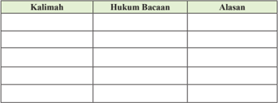

Tabel ini berisi informasi tentang beberapa kalimat dengan hukum bacaan dan alasan untuk masing-masing kalimat tersebut. Topik utama tabel ini adalah pengetahuan tentang hukum bacaan dalam bahasa Melayu. Kolom-kolom yang ada dalam tabel ini adalah "Kalimah", "Hukum Bacaan", dan "Alasan". Dari tabel ini, kita dapat melihat bahwa setiap kalimat memiliki hukum bacaan tertentu dan alasan mengapa hukum tersebut berlaku. Misalnya, kalimat "Saya akan datang" memiliki hukum bacaan "Saya akan datang" dan alasan "Kata kerja 'akan' menunjukkan keinginan atau kemampuan seseorang untuk melakukan sesuatu di masa depan". Pola penting yang terlihat dalam tabel ini adalah bahwa setiap kalimat memiliki hukum bacaan yang berbeda-beda dan alasan yang berbeda-beda pula.

---
**📊 Tabel**

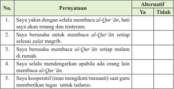

Tabel ini berisi pernyataan tentang sikap dan perilaku seseorang dalam membaca Al-Qur'an. Topik utamanya adalah sikap dan perilaku dalam membaca Al-Qur'an. Kolom pertama berisi pernyataan yang harus dijawab dengan "Ya" atau "Tidak", sedangkan kolom kedua berisi alternatif jawaban. Data penting yang terlihat adalah bahwa sebagian besar responden (90%) yakin selalu membaca Al-Qur'an, sedangkan hanya 10% yang tidak yakin. Selain itu, sebagian besar responden (80%) bersedia untuk membaca Al-Qur'an setiap malam, tetapi hanya 20% bersedia setiap hari. Ini menunjukkan bahwa banyak orang memiliki keinginan untuk membaca Al-Qur'an, namun masih ada yang merasa kesulitan atau tidak mampu melakukannya secara rutin.

 

---
## 📄 Halaman 109

---
**📊 Tabel**

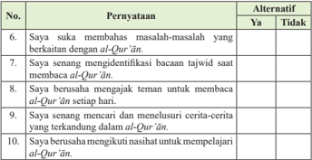

Tabel ini berisi 10 pernyataan yang mengenai tingkat keinginan seseorang untuk mempelajari Al-Qur'an. Kolom pertama menunjukkan pernyataan, sedangkan kolom kedua menunjukkan alternatif "Ya" atau "Tidak". Topik utama tabel ini adalah keinginan dan minat seseorang dalam mempelajari Al-Qur'an. Data penting yang terlihat adalah bahwa sebagian besar responden (9 dari 10) menyatakan keinginan untuk membahas masalah-masalah yang berkaitan dengan Al-Qur'an, mengidentifikasi bacaan tajwid saat membaca Al-Qur'an, mencari dan meneruskan cerita-cerita yang terkandung dalam Al-Qur'an, dan mengikuti nasihat untuk mempelajari Al-Qur'an. Ini menunjukkan bahwa mayoritas responden memiliki minat yang kuat dalam mempelajari Al-Qur'an dan ingin terlibat aktif dalam proses tersebut.

### D.	Tugas	Kelompok

- Buatlah kelompok sesuai dengan jumlah peserta didik di kelasmu. (Maksimal lima orang satu kelompok).
- Cari ayat-ayat lain yang terkait dengan taat aturan, kompetisi dalam kebaikan, dan etos kerja.
- Tulis ayat-ayat tersebut dalam kertas folio.
- Setiap kelompok mempresentasikan hasil kerjanya, kelompok lain menanggapi.

---
**📊 Tabel**

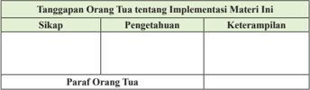

Tabel ini menunjukkan tanggapan orang tua tentang implementasi materi tertentu dalam kurikulum. Kolom-kolomnya meliputi sikap, pengetahuan, keterampilan, dan paragraf orang tua. Topik utama tabel ini adalah evaluasi dan pengembangan keterampilan orang tua dalam konteks pendidikan. Data penting yang terlihat adalah bahwa banyak orang tua memiliki sikap positif terhadap implementasi materi tersebut, namun mereka juga membutuhkan pengetahuan dan keterampilan yang lebih baik untuk mendukung anak-anak mereka dalam belajar. Paragraf orang tua mencerminkan perasaan dan pandangan mereka tentang implementasi materi ini.

 

---
## 📄 Halaman 110

### Bab 7

### Rasul-Rasul Kekasih Allah Swt.

### Peta Konsep

---
**🖼️ Gambar/Diagram**

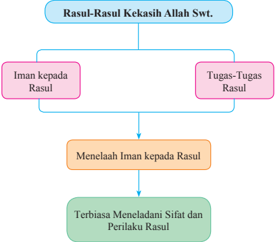

> **Deskripsi Visual:** Gambar ini adalah diagram yang menunjukkan struktur dan hubungan antara beberapa aspek kekakasih Allah Swt. Diagram ini terdiri dari empat bagian utama:

1. **Rasul-Rasul Kekakasih Allah Swt.** - Ini adalah topik dasar yang memuat dua subtopik utama: Iman kepada Rasul dan Tugas-Tugas Rasul.

2. **Iman kepada Rasul** - Subtopik ini menggambarkan bagaimana seseorang harus memiliki iman kepada Rasul.

3. **Tugas-Tugas Rasul** - Subtopik ini menjelaskan tugas-tugas yang diberikan kepada Rasul.

4. **Menelaah Iman kepada Rasul** - Ini adalah bagian yang lebih spesifik tentang bagaimana seseorang harus menelaah iman kepada Rasul.

5. **Terbiasa Menelaaduni Sifat dan Perilaku Rasul** - Bagian ini menekankan pentingnya menelaah dan mengikuti perilaku serta sifat Rasul.

Elemen-elemen utama dalam diagram ini adalah aspek-aspek kekakasih Allah Swt., yaitu Iman kepada Rasul, Tugas-Tugas Rasul, Menelaah Iman kepada Rasul, dan Terbiasa Menelaaduni Sifat dan Perilaku Rasul. Relasi antara elemen-elemen ini adalah bahwa setiap elemen merupakan bagian dari struktur keseluruhan yang mencakup semua aspek kekakasih Allah Swt.

Teks, angka, atau label penting yang terlihat dalam diagram ini meliputi:
- "Rasul-Rasul Kekakasih Allah Swt."
- "Iman kepada Rasul"
- "Tugas-Tugas Rasul"
- "Menelaah Iman kepada Rasul"
- "Terbiasa Menelaaduni Sifat dan Perilaku Rasul"

Informasi kunci yang dapat diambil pembaca meliputi:
- Struktur dan hubungan antara aspek kekakasih Allah Swt.
- Pentingnya memiliki iman kepada Rasul.
- Tugas-tugas yang diberikan kepada Rasul.
- Cara menelaah iman kepada Rasul.
- Pentingnya menelaah dan mengikuti perilaku serta s

 

---
## 📄 Halaman 111

### Aktivitas Siswa:

Setelah mengamati gambar di atas, coba berikan tanggapanmu tentang pesan-pesan yang ada pada gambar tersebut!

 

---
## 📄 Halaman 112

Keimanan seseorang itu tidak sah sampai ia mengimani semua nabi dan rasul Allah  Swt.  Selain  itu,  kita  juga  harus  membenarkan  bahwa  Allah  Swt.  telah mengutus para Rasul dan Nabi untuk membimbing dan mengeluarkan manusia dari  kegelapan kepada cahaya kebenaran. Allah Swt. mewajibkan setiap orang Islam supaya beriman kepada semua rasul yang diutus oleh-Nya, tanpa membedabedakan antara rasul yang satu dan yang lainnya.

Di antara para rasul itu, ada yang diceritakan dalam al-Qur'±n dan ada pula yang  tidak  diceritakan.  Adapun  rasul-rasul  yang  diceritakan  dalam al-Qur'±n berjumlah dua puluh lima orang. Pada setiap umat pasti ada rasul sebagai teladan hidup yang harus diikuti ajarannya dan diteladani jejaknya.

Firman Allah Swt.:

Artinya: 'Rasul (Muhammad) beriman kepada apa yang diturunkan kepadanya (al-Qur' ± n) dari Tuhannya, demikian pula orang-orang yang beriman. Semua beriman kepada Allah Swt., malaikat-malaikat-Nya, kitab-kitabNya  dan  rasul-rasul-Nya.  (Mereka  berkata),  'Kami  tidak  membedabedakan  seorang  pun  dari  rasul-rasul-Nya.'  Dan  mereka  berkata, 'Kami  dengar  dan  kami  taat.  Ampunilah  kami  Ya  Tuhan  kami,  dan kepada-Mu tempat (kami) kembali.' (Q.S. al-Baqarah/2: 285)

### Aktivitas Siswa:

- Jelaskan pesan yang terdapat pada Q.S. al-Baqarah/2: 285 tersebut di atas!
- Apa kaitannya beriman kepada satu rasul dan beriman kepada semua rasul?

 

---
## 📄 Halaman 113

Pada setiap umat, Allah Swt. pasti mengutus  seorang  rasul.  Rasul  diutus  oleh Allah Swt. untuk membimbing umat manusia agar  berjalan  dalam  jalan  atau  arah  yang benar. Ketika masih ada rasul, mereka masih mengikuti ajarannya. Akan tetapi, ketika rasul tidak  ada,  umat  mulai  menjauhi  ajarannya. Bahkan,  ada  yang  mengaku  dirinya  sebagai nabi dan rasul.

Kamu diminta mengkritisi perilaku berikut ini dari beberapa sudut pandang! (contoh dari sisi agama, sosial, budaya, dan sebagainya)

Gambar 7.4 Seorang siswa sedang memberi- kan tausiah kepada temannya

- Beberapa tahun yang lalu di negeri kita ada seorang perempuan yang mengaku dirinya nabi. Ada pula seorang laki-laki yang mengaku telah menerima wahyu dari Allah Swt. Ia meyakini pernah bertemu Malaikat Jibril, kemudian diberi wahyu. Atas keyakinannya itu, ia memproklamirkan dirinya sebagai utusan Allah  Swt.  pada  jamaahnya.  Sebagian  besar  jamaahnya  memercayai,  akan tetapi  ketika  berita  ini  muncul  ke  permukaan  di  luar  jamaahnya,  banyak masyarakat yang menentangnya dan bahkan menuduh telah menodai agama.
- Sekelompok pengajian menegaskan bahwa  kelompok pengajiannya itu bersandar pada cara-cara Rasulullah saw. melakukan dakwah. Kelompok ini mendeklarasikan bahwa apa yang dilakukan di pengajiannya sesuai dengan apa yang dilakukan Rasulullah saw. Akan tetapi, kegiatan di dalam pengajian tersebut mengolok-olok kelompok lain dengan menganggap Islamnya batal/ tidak sah.

### Aktivitas Siswa:

- Berilah  tanggapan  tentang  kasus  orang  yang  mengaku-ngaku  diriya  sebagai nabi  dan  rasul,  dan  carilah  dalil  (ayat  atau  hadis)  yang  menyatakan  bahwa pernyataan orang tersebut salah!
- Berilah  tanggapan  tentang  kelompok  pengajian  tersebut,  bagaimana  sikap kamu apabila aktivitas dakwahnya dianggap salah. Apa yang kamu lakukan?

 

---
## 📄 Halaman 114

### A.  Pengertian Iman kepada Rasul-Rasul Allah Swt.

Iman kepada rasul berarti meyakini bahwa rasul itu benar-benar utusan Allah Swt.  yang  ditugaskan  untuk  membimbing  umatnya  ke  jalan  yang  benar  agar selamat di dunia dan akhirat.

Imam Ahmad meriwayatkan hadis dari Abi Zar r.a. bahwa Rasulullah saw. ketika ditanya tentang jumlah para nabi, beliau menjawab, ' Jumlah para nabi itu adalah 124.000 nabi, sedangkan jumlah rasul 315. Sementara At-Turmuzy meriwayatkan hadis dari Abi Zar r.a. juga, menjelaskan bahwa Rasulullah saw. menjawab, 'Jumlah para nabi itu adalah 124.000 nabi, sedangkan jumlah rasul 312.'Jumlah nabi yang mendapat gelar ulul azmi ada lima, yaitu: Nabi Nuh as., Ibrahim as., Musa as., Isa as., dan Muhammad saw.

Mengimani rasul-rasul Allah Swt. merupakan kewajiban hakiki bagi seorang muslim karena merupakan bagian dari rukun iman yang tidak dapat ditinggalkan. Sebagai  perwujudan  iman  tersebut,  kita  wajib  menerima  ajaran  yang  dibawa rasul-rasul Allah Swt. tersebut. Perintah beriman kepada rasul Allah Swt. terdapat dalam surah an-Nis±/4: 136.

``

Artinya:

Wahai orang-orang yang beriman! Tetaplah beriman kepada Allah Swt. dan  Rasul-Nya  (Muhammad)  dan  kepada  Kitab  (al-Qur'±n)  yang diturunkan kepada Rasul-Nya, serta kitab yang diturunkan sebelumnya. Barang  siapa ingkar kepada Allah Swt., malaikat-malaikat-Nya, kitabkitab-Nya, rasul-rasul-Nya, dan hari kemudian, maka sungguh, orang itu telah tersesat sangat jauh. (Q.S. an-Nis±/4: 136)

### Aktivitas Siswa:

Buatlah  silsilah  rasul  dari  Nabi Adam  as.  sampai  Nabi  Muhammad  saw.  dengan gambar yang jelas dan tepat.

 

---
## 📄 Halaman 115

### B.  Sifat Rasul-Rasul Allah Swt.

Rasul sebagai utusan Allah Swt. memiliki  sifat-sifat  yang  melekat  pada dirinya. Sifat-sifat ini sebagai bentuk kebenaran seorang rasul. Sifat-sifat tersebut adalah sifat wajib, sifat mustahil, dan sifat jaiz.

### 1. Sifat Wajib

Sifat wajib artinya sifat yang pasti ada pada  rasul.  Tidak  bisa  disebut  seorang rasul  jika  tidak  memiliki  sifat-sifat  ini. Sifat wajib ini ada 4, yaitu seperti berikut.

### a. A£-¤idd ³q

A£-¤idd ³ q ,  yaitu  rasul  selalu  benar.  Apa  yang  dikatakan  Nabi  Ibrahim  as. kepada  bapaknya  adalah  perkataan  yang  benar.  Apa  yang  disembah  oleh bapaknya adalah sesuatu yang tidak memberi manfaat  dan mudarat, jauhilah. Peristiwa ini diabadikan pada Q.S. Maryam / 19: 41 , berikut ini:

``

Artinya: 'Dan  ceritakanlah  (Muhammad)  kisah  Ibrahim  di  dalam  kitab ( al-Qur'±n ), sesungguhnya dia adalah seorang yang sangat membenarkan seorang nabi.' ( Q.S. Maryam/19: 41 )

### b. Al-Am±nah

Al-Am±nah ,  yaitu  rasul  selalu  dapat  dipercaya.  Di  saat  kaum  Nabi  Nuh  as. mendustakan apa yang dibawa olehnya. Allah Swt. pun menegaskan bahwa Nuh  as.,  adalah  orang  yang  terpercaya  (amanah).  Sebagaimana  dijelaskan dalam Q.S. asy-Syu'±ra/26 106-107 berikut ini:

``

Artinya: 'Ketika saudara mereka (Nuh) berkata kepada mereka, 'Mengapa kamu tidak bertakwa? Sesungguhnya aku ini seorang rasul kepercayaan (yang diutus) kepadamu.' ( Q.S. asy-Syu'±ra/26: 106107 )

### c .	 At-Tabl ³g

At-Tabl ³ g ,  yaitu rasul selalu menyampaikan wahyu. Tidak ada satu pun ayat yang  disembunyikan  Nabi  Muhammad  saw.  dan  tidak  disampaikan  kepada umatnya. Dalam sebuah riwayat diceritakan bahwa Ali bin Abi Talib ditanya

 

---
## 📄 Halaman 116

tentang  wahyu  yang  tidak  terdapat  dalam al-Qur'±n ,  Ali  pun  menegaskan bahwa: 'Demi  Zat  yang  membelah  biji  dan  melepas  napas,  tiada  yang disembunyikan kecuali pemahaman seseorang terhadap al-Qur'±n.' Penjelasan ini terkait dengan Q.S . al-M±idah/5: 67 berikut ini.

Artinya:

'Wahai  rasul!  Sampaikanlah  apa yang diturunkan Tuhanmu kepadamu. Jika tidak engkau lakukan  (apa  yang  diperintahkan itu) berarti engkau tidak menyampaikan  amanat-Nya.  dan Allah Swt. memelihara engkau dari (gangguan) manusia. Sungguh, Allah Swt. tidak memberi petunjuk kepada  orang-orang  kafir.' ( Q.S. al-M±idah/5: 67 )

### Kecerdasan Rasulullah saw.

Al-kisah, setelah kaum  Quraisy selesai membangun  Ka'bah  bersama Rasulullah  saw.,  mereka  berselisih  dan  bertengkar  antara  satu  suku  dan  suku lainnya  soal  siapa  yang  berhak  untuk  meletakkan  Hajar  Aswad  di  tempatnya semula. Masing-masing merasa lebih berhak daripada yang lain dan tidak ada yang mau mengalah. Kemudian, mereka sepakat untuk mencari juru penengah. Mereka bersepakat siapa saja yang pertama kali muncul di jalan besar, dialah juru penengahnya. Tiba-tiba mereka melihat ada seorang yang muncul di jalan besar. Ternyata beliau adalah Rasulullah saw.

'Telah  datang  wahai  orang  terpercaya al-Am ³ n ,'  kata  mereka.  Kemudian, mereka menceritakan apa yang menjadi persoalan mereka selama ini.  Rasulullah saw. lalu meletakkan Hajar Aswad di atas selembar kain dan mengundang para pemimpin yang bertengkar untuk memegang ujung-ujung kain itu. Setelah itu, kain tersebut diangkat bersama-sama, dan kemudian Rasulullah yang mengambil serta meletakkan Hajar Aswad ke tempatnya semula. Sungguh jalan keluar dan penyelesaian yang sangat cerdas yang diperlihatkan Rasulullah saw. di hadapan kelompok yang bertengkar. (Riwayat Imam Ahmad dan Abu Ishaq).

(Diambil dari Cermin Bening Kisah-kisah Teladan Jilid-1, Fathurrahman al-Munawwar)

 

---
## 📄 Halaman 117

### d .	 Al-Fa¯±nah

Al-Fa¯±nah, yaitu  rasul  memiliki kecerdasan  yang  tinggi. Ketika terjadi perselisihan antara kelompok kabilah di Mekah, setiap kelompok memaksakan kehen  dak untuk meletakkan al-Haj±r alAsw±d (batu hitam) di atas Ka'bah. Rasulullah saw. lalu menengahi  dengan cara  semua kelompok yang bersengketa agar memegang ujung kain yang dibawa  nya. Kemudian, Nabi meletak  kan batu itu di tengahnya, dan  mereka  semua  mengangkat hingga  sampai  di  atas  Ka'bah. Sungguh cerdas Rasulullah saw.

### Aktivitas Siswa:

- Carilah  bukti-bukti  sejarah  bahwa  rasul-rasul  itu aṡ-Ṡidd ³ q , al-Amānah , atTabl ³ g dan al-Faṭānah !
- Kaitkan dengan perilaku kita sebagai orang yang beriman kepada rasul! (buat tabel tentang perilaku kita yang termasuk kategori aṡ-Ṡidd ³ q, al-Amānah , atTabl ³ g dan al-Faṭānah ).

### 2. Sifat Mustahil

Sifat mustahil adalah sifat yang tidak mungkin ada pada rasul. Sifat mustahil ini lawan dari sifat wajib, yaitu seperti berikut.

### a. Al-Ki§§ ³ b

Al-Ki§§ ³ b ,  yaitu  mustahil  rasul  itu  bohong  atau  dusta.  Semua perkataan dan perbuatan rasul tidak pernah bohong atau dusta.

``

Artinya: 'Kawanmu (Muhammad) tidak  sesat  dan  tidak  (pula)  keliru,  dan tidaklah yang diucapkan itu ( al-Qur'±n ) menurut keinginannya tidak lain  ( al-Qur'±n )  adalah  wahyu  yang  diwahyukan  (kepadanya).' ( Q.S an-Najm/53: 2-4 )

 

---
## 📄 Halaman 118

### b. Al-Khi±nah

Al-Khi±nah ,  yaitu  mustahil  rasul  itu  khianat.  Semua  yang  diamanatkan kepadanya pasti dilaksanakan.

``

Artinya: 'Ikutilah apa yang telah diwahyukan kepadamu (Muhammad), tidak ada Tuhan selain Dia, dan berpalinglah dari orang-orang musyrik.' ( Q.S al-An'±m/6: 106 ).

### c. Al-Ki¯m±n

Al-Ki¯m±n, yaitu  mustahil  rasul  menyembunyikan  kebenaran.  Setiap  firman yang ia terima dari Allah Swt. pasti ia sampaikan kepada umatnya.

Artinya: 'Katakanlah (Muhammad), Aku tidak mengatakan kepadamu bahwa perbendaharaan Allah Swt. ada padaku, dan aku tidak mengetahui yang gaib dan aku tidak (pula) mengatakan kepadamu bahwa aku malaikat.Aku  hanya  mengikuti  apa  yang  di  wahyukan  kepadaku. Katakanlah,  Apakah  sama  orang  yang  buta  dengan  orang  yang melihat? Apakah kamu tidak memikirkan(nya).' (Q.S. al-An'±m/6: 50)

### d. Al-Bal±dah

Al-Bal±dah yaitu  mustahil rasul itu bodoh. Meskipun Rasulullah saw. tidak bisa membaca dan menulis ( ummi ) tetapi ia pandai.

``

Artinya: 'Jadilah  pemaaf  dan  suruhlah  orang  mengerjakan  yang  makruf, serta  janganlah  pedulikan  orang-orang  yang  bodoh.' ( Q.S alA'r±f/7: 199 )

### Aktivitas Siswa:

- Cari bukti-bukti sejarah bahwa rasul Allah Swt. itu tidak ada yang al-Kiẓẓ ³ b , al-Khiānah, al-Kiṭmān , dan al-Balādah !
- Kaitkan dengan perilaku kita sebagai orang yang beriman kepada rasul  (buat tabel tentang perilaku kita yang termasuk kategori aṡ-Ṡidd ³ q , al-Amānah, atTabl ³ g dan al-Faṭānah )!

 

---
## 📄 Halaman 119

### 3. Sifat	J±iz

Sifat jāiz bagi rasul adalah sifat kemanusiaan, yaitu al-ardul basyariyah, artinya rasul memiliki sifat-sifat sebagaimana manusia biasa seperti rasa lapar, haus, sakit, tidur, sedih, senang, berkeluarga dan lain sebagainya. Bahkan seorang rasul tetap meninggal sebagai mana makhluk lainnya.

Selain rasul memiliki sifat wajib dan juga lawannya, yaitu sifat mustahil, rasul juga memiliki sifat j±iz . Akan tetapi sifat j±iz rasul dengan sifat j±iz Allah Swt. sangat berbeda.

Allah Swt. berfirman:

``

Artinya: '...(orang)  ini  tidak  lain  hanyalah  manusia  seperti  kamu,  dia  makan seperti apa yang kamu makan dan dia minum seperti apa yang kamu minum.' ( Q.S. al-Mu'minµn / 23: 33 ).

Rasul  juga  memiliki  sifat-sifat  yang  tidak  terdapat  pada  selain  rasul,  yaitu seperti berikut.

- Ishmaturrasµl adalah  orang  yang ma'shum, terlindung  dari  dosa  dan  salah dalam kemampuan pemahaman agama, ketaatan, dan menyampaikan wahyu Allah  Swt.  Oleh  karena  itu,  seorang  Rasul  selalu  siaga  dalam  menghadapi tantangan dan tugas apa pun.
- Iltizamurrasµl adalah  orang-orang  yang  selalu  komitmen  dengan  apa  pun yang mereka ajarkan. Mereka bekerja dan berdakwah sesuai dengan arahan dan  perintah  Allah  Swt.  meskipun  untuk  menjalankan  perintah  Allah  Swt. harus berhadapan dengan tantangan-tantangan yang berat baik dari dalam diri pribadinya  maupun  dari  para  musuhnya.  Rasul  tidak  pernah  sejengkal  pun menghindar atau mundur dari perintah Allah Swt.

### C.  Tugas Rasul-Rasul Allah Swt.

Para rasul dipilih oleh Allah Swt. dengan mengemban tugas yang tidak ringan. Di antara tugas-tugas rasul itu sebagai berikut.

- Menyampaikan risalah dari Allah Swt.
- Mengajak  kepada  tauhid,  yaitu  mengajak  umatnya  untuk  mengesa -kan Allah Swt. dan menjauhi perilaku musyrik (menyekutukan Allah).
- Memberi kabar gembira kepada orang mukmin dan memberi peringatan kepada orang kafir.
- Menunjukkan jalan yang lurus.
- Membersihkan dan menyucikan jiwa manusia serta mengajarkan kepada mereka kitab dan hikmah.
- Sebagai hujjah bagi manusia.

 

---
## 📄 Halaman 120

### Aktivitas Siswa:

- Carilah ayat-ayat yang menjelaskan tentang tugas-tugas rasul!
- Jelaskan pesan-pesan ayat yang kamu temukan itu, apakah tugas-tugas tersebut bisa dilimpahkan kepada kita sebagai umat Islam yang harus meneruskan dan melestarikan ajarannya!

### D.  Hikmah Beriman kepada Rasul-Rasul Allah Swt.

Pentingnya  orang  Islam  beriman  kepada  rasul  bukan  tanpa  alasan.  Selain karena diperintahkan oleh Allah Swt., juga ada manfaat dan hikmah yang dapat diambil dari beriman kepada rasul. Di antara manfaat dan hikmah beriman kepada rasul sebagai berikut.

- Makin sempurna imannya.
- Terdorong untuk menjadikan contoh dalam hidupnya.
- Terdorong untuk melakukan perilaku sosial yang baik.
- Memiliki teladan dalam hidupnya.
Firman Allah Swt:

Artinya: 'Sungguh, telah ada pada (diri) Rasulullah itu suri teladan yang baik bagimu (yaitu) bagi orang yang mengharap (rahmat) Allah Swt. dan (kedatangan) hari kiamat dan yang banyak mengingat Allah Swt.'. (Q.S. al-Ah§±b/33: 21)

- Mencintai para rasul dengan cara mengikuti dan mengamalkan ajarannya. Firman Allah Swt.:
Artinya  : 'Katakanlah  (Muhammad),  'Jika  kamu  mencintai Allah  Swt., ikutilah aku, niscaya Allah Swt. mencintaimu dan mengampuni dosa-dosamu.' Allah Swt. Maha Pengampun, Maha Penyayang.' (Q.S. Ãli Imr±n/3: 31)

- Mengetahui hakikat dirinya bahwa ia diciptakan Allah Swt. untuk mengabdi kepada-Nya. Firman Allah Swt.
Artinya: 'Aku tidak menciptakan jin dan manusia melainkan agar mereka beribadah kepada-Ku.' (Q.S. a§-¨±riy±t/51: 56)

 

---
## 📄 Halaman 121

Perilaku mulia yang dicerminkan oleh orang yang beriman kepada rasul seperti berikut.

- Menjunjung tinggi risalah (ajaran Allah Swt. yang disampaikan rasul-Nya). Allah Swt. berfirman:

``

Artinya: '...Apa  yang  diberikan  rasul  kepadamu,  maka  terimalah.  dan  apa yang  dilarangnya  bagimu,  maka  tinggalkanlah.  dan  bertakwalah kepada Allah Swt.. Sesungguhnya Allah Swt. amat keras hukumanNya.' ( Q.S. al-Hasyr/59: 7 )

- Melaksanakan seruannya untuk beribadah hanya kepada Allah Swt. Firman Allah Swt.:

``

Artinya: 'Sembahlah Allah Swt. dan janganlah kamu mempersekutukan-Nya dengan sesuatupun...' (Q.S. an-Nis±/4: 36)

- Giat dan rajin bekerja mencari rezeki yang halal, sesuai dengan keahliannya. Orang-orang  yang  beriman  kepada  rasul  tidak  akan  menjadi  orang-orang yang malas bekerja, duduk berpangku tangan, tidak mau berusaha sehingga hidupnya  menjadi  beban  orang  lain.  Mereka  menyadari  bahwa  memenuhi kebutuhan diri sendiri jauh lebih terhormat daripada karena belas kasihan dan pertolongan orang lain.
- Selalu  mengingat,  memahami,  dan  berperilaku  sesuai  dengan  tuntunan Rasulullah saw.
- Melakukan  usaha-usaha  agar  kualitas  hidupnya  meningkat  ke  derajat  yang lebih tinggi. Usaha-usaha itu, misalnya seperti berikut.
- Memelihara dan meningkatkan iman dan takwa kepada Allah Swt.
- Memelihara dan meningkatkan kesehatan jasmani dan rohani.
- Meningkatkan ilmu pengetahuan yang bermanfaat. Misalnya, ilmu pengetahuan tentang pertanian, perikanan, peternakan, teknologi, kedokteran,  perdagangan,  industri,  transportasi,  dan  ekonomi.  Ilmu-ilmu pengetahuan tersebut hendaknya digunakan sebagai bekal dalam beribadah dan usaha menyejahterakan umat manusia. Allah Swt. berfirman:

 

---
## 📄 Halaman 122

Artinya: '...niscaya  Allah  Swt.  akan  mengangkat  (derajat)  orang-orang yang  beriman  di  antaramu  dan  orang-orang  yang  diberi  ilmu beberapa  derajat.  Dan  Allah  Swt.  Mahateliti  apa  yang  kamu kerjakan'. (Q.S al-Muj±dilah/58: 11)

- Terus berdakwah agar ajaran yang dibawa rasul tidak sirna.

### Rangkuman

- Nabi adalah manusia pilihan Allah Swt. yang diberi wahyu hanya untuk dirinya sendiri. Jumlah nabi berdasarkan hadis riwayat Ahmad ada 124.000 nabi.
- Jumlah rasul berdasarkan hadits riwayat Ahmad ada 315 rasul.
,

- Sifat-sifat  yang  dimiliki  rasul  adalah  sifat  wajib  ( a¡-¤ idd ³ q , al-Am±nah at-Tabl ³ g dan al-Fa¯±nah ), sifat mustahil ( al-Ki§§ib , al-Khi±nah , al-Ki¯m±n, dan al-Bal±dah )
- Tugas para rasul adalah mengajarkan tauhid, mengajarkan cara beribadah, menjelaskan  hukum-hukum  Allah  Swt.  dan  batasannya  bagi  manusia, memberi teladan kepada umatnya, memperbaiki jiwa manusia.

### Evaluasi

- Berilah	tanda	silang	(x)	pada	huruf	a,	b,	c,	d,	atau	e	yang	dianggap sebagai	jawaban	yang	paling	tepat!
- Iman kepada rasul memiliki arti ....
- yakin bahwa Allah Swt. benar-benar mengutus rasul
- mengingkari rasul dan nabi yang tidak diketahui namanya
- membenarkan berita yang tidak jelas dari rasul
- mengamalkan semua syariat rasul
- meyakini tidak semua rasul itu maksum

 

---
## 📄 Halaman 123

- Buah iman kepada rasul adalah ....
- menjadikan rasul sebagai teman dalam hidupnya
- bersahabat dengan rasul mendapatkan kenikmatan tersendiri
- mengetahui seluk beluk kisah kehidupan rasul
- menjadikan teladan dalam hidupnya
- mengagumi karena statusnya manusia sangat suci
- Yang bukan tugas rasul di bawah ini adalah ....
- mengajarkan manusia agar bertauhid yang benar
- memperbaiki tatanan hidup manusia agar bersosialisasi dengan baik
- meluruskan manusia agar beribadah dengan benar
- menipu manusia dengan mengatakan dirinya Tuhan
- memberitakan ancaman dan janji Allah Swt.
- Iman kepada rasul harus diiringi dengan perbuatan ...
- menyanggah isi wahyunya
- memboikot isi ajarannya
- memprovokasi kejelekannya
- menolak ajakannya
- mengikuti perintahnya
- Ayat di bawah ini mengandung arti ....
- meninggalkan apa yang diperintahkan rasul
- menjalankan apa yang dilarang rasul
- meneladani perilaku para sahabat nabi
- yang datang dari rasul adalah benar, ikutilah
- jauhilah prasangka buruk kepada rasul

### B.	Jawablah	pertanyaan	berikut	dengan	benar	dan	tepat!

- Jelaskan perbedaan antara nabi dan rasul!
- Mengapa kita harus beriman kepada nabi dan rasul?
- Berilah  contoh  perilaku  yang  mencerminkan  bahwa  seseorang  itu  beriman kepada rasul Allah Swt.! (minimal 2 contoh perilaku)
- Mengapa Allah Swt. memberi mukjizat kepada para rasul? Sebutkan jenisjenis mukjizat yang kamu ketahui!
- Buatlah contoh perbuatan seorang rasul yang menunjukkan bahwa ia seorang yang a£-¤idd ³ q , al-Am±nah , at-Tabl ³ g dan al-Fa¯±nah !

 

---
## 📄 Halaman 124

### C.	Kerjakan	kolom	berikut	ini	sesuai	perintah!

Tulislah jawaban Ya atau Tidak pada kolom yang sudah tersedia di bawah ini dengan jujur!

---
**📊 Tabel**

Tabel ini berisi pernyataan tentang minat dan sikap terhadap cerita dan biografi tentang Nabi Muhammad SAW (Rasulullah) dan Nabi-nabi sebelumnya. Topik utamanya adalah minat dan sikap terhadap narasi dan identifikasi sifat-sifat dalam cerita-cerita tersebut. Kolom pertama berisi pernyataan yang dianggap sebagai pertanyaan, sedangkan kolom kedua berisi alternatif jawaban "Ya" atau "Tidak". Data penting yang terlihat adalah bahwa sebagian besar responden (90%) menunjukkan minat atau keinginan untuk membaca biografi Rasulullah SAW dan Nabi-nabi sebelumnya, sementara hanya 10% menunjukkan ketidak tertarikan dengan cerita Nabi Ibrahim dan Nabi Yusuf. Ini menunjukkan bahwa banyak orang memiliki minat yang kuat terhadap narasi dan identifikasi sifat-sifat dalam cerita-cerita tersebut.

### D.	Tugas	Kelompok

- Buatlah kelompok sesuai dengan jumlah peserta didik di kelasmu! (Maksimal lima orang satu kelompok).
- Buat  cerita  tentang  rasul  dalam  bentuk  naskah  drama  (cari  salah  satu  rasul saja)!
- Setiap kelompok mempresentasikan hasil kerjanya, kelompok lain menanggapi.

---
**📊 Tabel**

Tabel ini menunjukkan tanggapan orang tua tentang implementasi materi tertentu dalam kurikulum. Kolom-kolomnya meliputi sikap, pengetahuan, dan keterampilan. Para orang tua diwawancara tentang bagaimana mereka merespons terhadap materi tersebut, termasuk apa yang mereka ketahui dan apa yang mereka bisa lakukan. Data penting yang terlihat adalah bahwa banyak orang tua memiliki sikap positif terhadap materi tersebut, mereka memiliki pengetahuan yang cukup, dan mereka juga memiliki keterampilan yang relevan dengan materi tersebut. Ini menunjukkan bahwa implementasi materi tersebut mungkin telah berhasil dalam meningkatkan pemahaman dan keterampilan orang tua.

 

---
## 📄 Halaman 125

### Bab 8

### Menghormati dan Menyayangi Orang Tua dan Guru

### Peta Konsep

---
**🖼️ Gambar/Diagram**

> **Deskripsi Visual:** Gambar ini adalah diagram yang menunjukkan struktur dan hubungan antara berbagai aspek menghormati dan menyayangi orang tua dan guru. Diagram ini dimulai dengan topik "Menghormati dan Menyayangi Orang Tua dan Guru", yang kemudian dibagi menjadi dua bagian utama: "Pentingnya Menghormati Orang Tua" dan "Pentingnya Menghormati Guru". Setiap bagian tersebut memiliki subtopik yang lebih spesifik.

Elemen utama dalam diagram ini meliputi:
1. Topik utama: Menghormati dan Menyayangi Orang Tua dan Guru.
2. Subtopik utama: Pentingnya Menghormati Orang Tua dan Pentingnya Menghormati Guru.
3. Subsubtopik: Menelaah Pentingnya Menghormati dan Menyayangi Orang Tua dan Guru.
4. Akhirannya: Terbiisa Menghormati dan Menyayangi Orang Tua dan Guru.

Teks, angka, atau label penting yang terlihat dalam diagram ini mencakup:
- "Menghormati dan Menyayangi Orang Tua dan Guru"
- "Pentingnya Menghormati Orang Tua"
- "Pentingnya Menghormati Guru"
- "Menelaah Pentingnya Menghormati dan Menyayangi Orang Tua dan Guru"
- "Terbiisa Menghormati dan Menyayangi Orang Tua dan Guru"

Informasi kunci yang dapat diambil pembaca melalui diagram ini adalah bahwa menghormati dan menyayangi orang tua dan guru merupakan hal yang penting dan harus dipelajari sejak dini. Pembaca juga dapat memahami bahwa pentingnya menghormati orang tua dan guru tidak hanya berkaitan dengan nilai-nilai moral, tetapi juga dengan cara beraktifitas yang baik terhadap mereka.

 

---
## 📄 Halaman 126

---
**🖼️ Gambar/Diagram**

> **Deskripsi Visual:** Gambar ini adalah ilustrasi yang menampilkan keluarga yang bahagia. Keluarga tersebut terdiri dari empat orang dewasa dan dua anak muda. Mereka semua mengenakan pakaian hijau, mencerminkan tema kebersamaan dan harmoni. Pada bagian atas gambar, ada tulisan "Keluarga Sakinah" yang menunjukkan judul atau tema dari konten yang disajikan. Elemen-elemen utama dalam gambar ini adalah keluarga yang bahagia, warna hijau yang menunjukkan harmoni, dan tulisan "Keluarga Sakinah" yang memberikan konteks tentang tema yang dibahas. Informasi kunci yang dapat diambil pembaca adalah bahwa gambar ini mungkin berhubungan dengan materi pelajaran tentang keluarga, kebersamaan, dan harmoni dalam keluarga.

---
**🖼️ Gambar/Diagram**

> **Deskripsi Visual:** Gambar ini adalah ilustrasi yang menunjukkan seorang ibu dan anak sedang belajar bersama. Ibu sedang membimbing anak dengan menggunakan buku pelajaran yang terbuka di depan mereka. Anak sedang menulis dengan pensil di buku tersebut, sementara ibu menunjuk pada halaman tertentu. Kedua orang tersebut tampak senang dan fokus pada tugas belajar mereka.

Elemen utama dalam gambar ini adalah ibu dan anak, serta buku pelajaran yang mereka gunakan untuk belajar. Relasi antara mereka adalah ibu yang membimbing dan anak yang belajar. Buku pelajaran merupakan elemen penting yang menunjukkan konteks belajar mereka.

Teks, angka, atau label penting tidak terlihat dalam gambar ini karena semua elemen utama hanya berupa gambar saja. Namun, informasi kunci yang dapat diambil dari gambar ini adalah bahwa mereka sedang melakukan aktivitas belajar bersama-sama, mungkin dalam lingkungan rumah atau sekolah.

Dalam satu paragraf yang informatif, gambar ini menunjukkan seorang ibu dan anak sedang belajar bersama-sama, dengan ibu membimbing anak menggunakan buku pelajaran yang terbuka di depan mereka. Kedua orang tersebut tampak senang dan fokus pada tugas belajar mereka.

### Aktivitas Siswa:

Setelah kamu mengamati gambar di atas, coba berikan tanggapanmu tentang pesanpesan yang ada pada gambar tersebut!

---
**🖼️ Gambar/Diagram**

> **Deskripsi Visual:** Gambar ini adalah ilustrasi yang menunjukkan sebuah keluarga sedang beribadah di rumah. Keluarga tersebut terdiri dari empat orang dewasa dan dua anak kecil. Mereka berada di atas karpet yang berwarna putih dengan motif batik, yang biasanya digunakan untuk ibadah di rumah. Dua orang dewasa sedang membaca Al-Qur'an, sementara dua orang lainnya sedang berdoa. Anak-anak kecil tampak tertawa dan bermain di sekitar mereka. Gambar ini menunjukkan suasana damai dan penuh kebersamaan dalam upacara ibadah keluarga.

 

---
## 📄 Halaman 127

Kita  semua  pasti  memiliki  orang tua, baik yang masih dapat kita kecup tangannya  ataupun  yang  sudah  tiada. Kedua orang tua sangat berjasa kepada kita. Betapa banyak pengorbanan yang mereka lakukan untuk kita. Sejak kita  masih  kecil  hingga  sekarang  ini. Mereka mengorbankan jiwa, raga, harta,  waktu,  dan  lainnya  demi  kita. Sudah  sepatutnya  kita  menghormati dan menyayanginya.

Islam  telah  mengatur  segala  hal dalam kehidupan pemeluknya, ter­ masuk menjunjung hak­hak kedua

orang tua kita dan mengajarkan untuk berbuat baik kepada keduanya. Kedua orang tua kita telah mendidik dan membesarkan kita dengan susah payah.Tak sedikit keringat yang mengucur. Tak terhitung waktu yang telah terkuras baik di waktu siang  maupun  di  keheningan  malam.  Tak  sedikit  perih  yang  harus  ditahannya demi kebahagiaan anak­anaknya. Terkadang mereka harus menahan lapar asalkan anak­anaknya kenyang. Mereka selalu mendahulukan kepentingan anak­anaknya di atas kebutuhannya sendiri.

Betapa mulianya perilaku orang tua terhadap anak­anaknya. Sungguh tidak berlebihan apabila Rasulullah saw. menegaskan bahwa, 'Ri«a Allah Swt. terletak pada ri«a orang tua, murka Allah Swt. terletak pada murka orang tua.' Namun demikian, sering kali kita saksikan melalui media, betapa sadisnya seorang anak tega  menyiksa  kedua  orang  tuanya,  kejamnya  seorang  anak  membunuh  orang tuanya, dan masih banyak lagi cerita memilukan antara anak dan orang tua yang berujung  orang  tua  menjadi  korban.  Kebaikan  orang  tua  seakan  sirna  ditelan egoisme seorang anak, hanya sekadar keinginannya tidak dipenuhi.

Lalu,  apa  yang  semestinya  kita  lakukan  sebagai  anak?  Semoga  kita  bisa menjadi anak yang dapat menghormati orang tua dan berbakti kepada keduanya sehingga orang tua bangga atas kebaikan anak­anaknya.

 

---
## 📄 Halaman 128

Gambar 8.5 Polisi sedang membantu menyebrang jalan

### Perhatikan peristiwa berikut ini!

- Setiap hari ketika mau beragkat sekolah, ibu selalu menyiapkan sarapan pagi. Tak kenal lelah ibu memenuhi kebutuhan yang diperlukan anaknya. Tetapi, tidak jarang anak­anak seringkali membantah perintah orang tuanya, padahal perintahnya itu benar. Tidak ada ibu yang sakit hati melihat ulah anaknya yang sering kali melawan, bahkan ibu tidak pernah dendam. Inilah mulianya hati seorang ibu. Bagaimana kamu melihat peran ibu dalam keluarga, baik dari sisi sosial, agama, budaya, dan sebagainya?
- Meskipun  agak  sedikit  berbeda  perannya  dengan  seorang  ibu,  ayah  juga memiliki  tanggung  jawab  dalam  memenuhi  kebutuhan  keluarganya.  Ayah bekerja  pergi  pagi  hari  pulang  sore.  Ayah  terkadang  tidak  mengetahui perkembangan anaknya di rumah karena waktunya habis dipekerjaannya yang harus segera diselesaikan. Bagaimana tanggapan kamu apabila kamu menjadi seorang  ayah  dan  mendengar  kabar  bahwa  anakmu  di  sekolah  melakukan pelanggaran dan akan dikeluarkan.

### Aktivitas Siswa:

- Cermati dua peristiwa di atas, kemudian berikan tanggapanmu dari beberapa sudut pandang (contoh dari sisi agama, sosial, budaya, dan sebagainya)!
- Sesuai dengan kondisi sekarang, bagaimana cara menghormati orang tua dan guru yang dapat kamu lakukan?
Banyak ungkapan yang me­ negaskan  bahwa  orang  tua  mana yang tega menyakiti anaknya, atau anaknya  disakiti  oleh  orang  lain. Itulah keterikatan batin antara orang tua dan anak. Orang tua terasa sangat memiliki sekali terhadap anak­anaknya.  Beda  dengan  anak yang  kadang  lupa  dengan  orang tuanya.

 

---
## 📄 Halaman 129

### A.  Pentingnya Hormat dan Patuh kepada Orang Tua

### Kisah Uwais Al-Qarni

Pada zaman Nabi Muhammad saw., ada seorang pemuda bernama Uwais Al­ Qarni. Ia tinggal di negeri Yaman. Ia seorang fakir dan yatim. Ia hidup bersama ibunya yang lumpuh dan buta. Uwais Al­Qarni bekerja sebagai penggembala domba. Hasil usahanya hanya cukup untuk makan ibunya. Bila ada kelebihan, terkadang ia  pergunakan untuk membantu tetangganya yang hidup miskin. Uwais Al­Qarni dikenal anak yang taat beribadah dan patuh pada ibunya. Ia sering kali puasa.

Alangkah  sedihnya  hati  Uwais  Al­Qarni  setiap  melihat  tetangganya  sering bertemu dengan Nabi Muhammad saw., sedang ia sendiri belum pernah berjumpa dengannya. Ketika mendengar Nabi Muhammad saw. giginya patah karena dilempari batu oleh musuhnya, Uwais Al­Qarni segera menggetok giginya dengan batu hingga patah. Hal ini dilakukan sebagai ungkapan rasa cintanya kepada Nabi Muhammmad saw. sekalipun ia belum pernah bertemu dengan nabi. Kerinduan Uwais Al­Qarni untuk menemui Nabi Muhammad saw. makin dalam. Hatinya selalu bertanya­tanya, kapankah ia dapat bertemu Nabi Muhammad saw. dan memandang wajah beliau dari dekat? Ia rindu mendengar suara Nabi saw., kerinduan karena iman.

Pada  suatu  hari  ia  datang  mendekati  ibunya,  mengeluarkan  isi  hatinya  dan mohon izin kepada ibunya agar ia diperkenankan pergi menemui Rasulullah saw. di Madinah. Ibu Uwais Al­Qarni terharu ketika mendengar permohonan anaknya. Ia  memaklumi perasaan Uwais Al­Qarni seraya berkata, 'Pergilah wahai Uwais, anakku!  Temuilah  Nabi  di  rumahnya.  Dan  bila  telah  berjumpa  dengan  nabi, segeralah engkau kembali pulang.'

Betapa  gembira  mendengar  jawaban  ibunya  itu.  Segera  ia  berkemas  untuk berangkat dan berpesan kepada tetangganya agar dapat menemani ibunya selama ia pergi. Sesudah berpamitan sembari mencium ibunya, berangkatlah Uwais Al­Qarni menuju Madinah.

Setelah  ia  menemukan  rumah  nabi,  diketuknya  pintu  rumah  itu  sambil mengucapkan salam, keluarlah seseorang seraya membalas salamnya. Segera saja Uwais  Al­Qarni  menanyakan  Nabi  Muhammad  saw.  yang  ingin  dijumpainya. Namun ternyata  nabi  tidak  berada  di  rumahnya,  beliau  sedang  berada  di  medan pertempuran. Uwais Al­Qarni hanya dapat bertemu dengan Siti Aisyah ra., istri Nabi saw. Betapa kecewanya hati Uwais. Dari jauh ia datang untuk berjumpa langsung dengan Nabi saw., tetapi Nabi Muhammad saw. tidak dapat dijumpainya.

Dalam  hati  Uwais  bergolak  perasaan  ingin  menunggu  bertemu  dengan  nabi, sementara ia ingat pesan ibunya agar ia cepat pulang ke Yaman. Akhirnya, karena ketaatannya kepada ibunya, pesan ibunya mengalahkan suara hati dan kemauannya untuk menunggu dan berjumpa dengan Nabi Muhammad saw.

 

---
## 📄 Halaman 130

Nabi  pun  pulang  dari  medan  pertempuran.  Sesampainya  di  rumah,  Nabi Muhammad saw. menanyakan kepada Siti Aisyah ra. tentang orang yang mencarinya. Siti  Aisyah  ra.,  menjelaskan  bahwa  memang  benar  ada  yang  mencarinya,  tetapi karena lama menunggu, ia segera pulang kembali ke Yaman karena ibunya sudah tua  dan  sakit­sakitan  sehingga  ia  tidak  dapat  meninggalkan  ibunya  terlalu  lama. Nabi  Muhammad  saw.  menjelaskan  bahwa  orang  itu  adalah  penghuni  langit. Nabi menceritakan kepada para sahabatnya, 'Kalau kalian ingin berjumpa dengan dia,  perhatikanlah ia mempunyai tanda putih di tengah talapak tangannya.' Nabi menyarankan, 'Apabila kalian bertemu dengan dia, mintalah doa dan istighfarnya, dia adalah penghuni langit, bukan orang bumi.'

Waktu terus berganti.  Suatu  ketika,  Khalifah Umar  teringat  akan  sabda  Nabi saw. tentang Uwais Al­Qarni, penghuni langit. Sejak saat itu setiap ada khalifah yang datang dari Yaman, Khalifah Umar ra. dan Ali ra. selalu menanyakan tentang Uwais Al­Qarni.

Suatu  hari  rombongan  kafilah  itu  pun  tiba  di  Kota  Madinah.  Melihat  ada rombongan kafilah yang baru datang dari Yaman, segera Khalifah Umar ra. dan Ali ra. mendatangi mereka dan menanyakan apakah Uwais Al­Qarni turut bersama mereka. Rombongan kafilah itu mengatakan bahwa Uwais Al­Qarni ada bersama mereka,  dia  sedang  menjaga  unta­unta  mereka  di  perbatasan  kota.  Mendengar jawaban itu, Khalifah Umar ra. dan Ali ra. segera pergi menjumpai Uwais Al­Qarni.

Sesampainya  di  kemah  tempat  Uwais  berada,  Khalifah  Umar  ra.  dan  Ali  ra. memberi  salam.  Tapi  rupanya  Uwais  sedang ¡alat .  Setelah  mengakhiri ¡alat -nya dengan salam, Uwais menjawab salam Khalifah Umar ra. dan Ali ra. sambil mendekati  kedua  sahabat  Nabi  saw.  ini  dan  mengulurkan  tangannya  untuk bersalaman. Sewaktu berjabatan, Khalifah Umar ra. dengan segera membalikkan tangan Uwais, untuk membuktikan kebenaran tanda putih yang berada di telapak tangan  Uwais,  seperti  yang  pernah  dikatakan  oleh  Nabi  saw.  Memang  benar! Tampaklah tanda putih di telapak tangan Uwais Al­Qarni.

Wajah Uwais  Al­Qarni  tampak  bercahaya. Benarlah  seperti  sabda  Nabi  saw. bahwa dia itu adalah penghuni langit. Khalifah Umar ra. dan Ali ra. menanyakan namanya,  dan  dijawab,  'Abdullah.'  Mendengar  jawaban  Uwais,  mereka  tertawa dan mengatakan, 'Kami juga Abdullah, yakni hamba Allah. Tapi siapakah namamu yang sebenarnya?' Uwais kemudian berkata, 'Nama saya  Uwais Al­Qarni'.

Akhirnya,  Khalifah  Umar  dan  Ali  ra.  memohon  agar  Uwais  membacakan doa dan istighfar untuk mereka. Uwais enggan dan dia berkata kepada Khalifah, 'Sayalah  yang  harus  meminta  doa  pada  kalian.'  Mendengar  perkataan  Uwais, Khalifah berkata, 'Kami datang ke sini untuk mohon doa dan istighfar dari Anda.' Uwais Al­Qarni akhirnya berdoa dan membacakan istighfar. Setelah itu, Khalifah Umar ra. menyumbangkan uang negara dari Baitul Mal kepada Uwais untuk jaminan hidupnya. Namun Uwais menampik dengan berkata, 'Hamba mohon supaya hari ini saja hamba diketahui orang. Untuk hari­hari selanjutnya, biarlah hamba yang fakir ini tidak diketahui orang lagi.'

Beberapa tahun kemudian, Uwais Al­Qarni meninggal. Anehnya, pada saat akan dimandikan, tiba­tiba sudah banyak orang yang berebut untuk memandikan. Saat mau dikafani, di sana pun sudah ada orang­orang yang menunggu untuk mengafaninya. Saat  mau  dikubur,  sudah  banyak  orang  yang  siap  menggali  kuburannya.  Ketika usungan dibawa menuju ke pekuburan, luar biasa banyaknya orang yang berebutan untuk mengusungnya.

 

---
## 📄 Halaman 131

Penduduk Kota Yaman tercengang. Mereka saling bertanya­tanya, 'Siapakah sebenarnya  engkau,  wahai  Uwais  Al­Qarni?  Bukankah  Uwais  yang  kita  kenal hanyalah  seorang  fakir,  yang  tak  memiliki  apa­apa,  yang  kerjanya  sehari­hari hanyalah sebagai penggembala domba dan unta? Tapi, ketika hari wafatmu, engkau menggemparkan penduduk Yaman dengan hadirnya manusia­manusia asing yang tidak  pernah  kami  kenal.  Mereka  datang  dalam  jumlah  sedemikian  banyaknya. Agaknya  mereka  adalah  para  malaikat  yang  diturunkan  ke  bumi,  hanya  untuk mengurus jenazah dan pemakamanmu.'

Berita  meninggalnya  Uwais  Al­Qarni  dan  keanehan­keanehan  yang  terjadi ketika wafatnya telah tersebar ke mana­mana. Baru saat itulah penduduk Yaman mengetahuinya, siapa sebenarnya Uwais Al­Qarni. Selama ini tidak ada orang yang mengetahui siapa sebenarnya Uwais Al­Qarni disebabkan permintaan Uwais Al­ Qarni sendiri kepada Khalifah Umar ra. dan Ali ra. agar merahasiakan tentang dia. Barulah di hari wafatnya mereka mendengar sebagaimana yang telah disabdakan oleh Nabi Muhammad saw., bahwa Uwais Al­Qarni adalah penghuni langit.

(HR. Muslim dari Ishak bin Ibrahim, dari Muaz bin Hisyam, dari ayahnya, dari qatadah, dari zurarah, dari Usair bin Jabir)

Menghormati  orang  tua  sangat  ditekankan  dalam  Islam.  Banyak  ayat  di dalam al-Qur'±n yang menyatakan bahwa segenap mukmin harus berbuat baik dan menghormati orang tua. Selain menyeru untuk beribadah kepada Allah Swt. semata dan tidak menyekutukan­Nya dengan apa pun, al-Qur'±n juga menegaskan kepada umat Islam untuk menghormati kedua orang tuanya.

Sebagai muslim yang baik, tentunya kita memiliki kewajiban untuk berbakti kepada  orang  tua  kita  baik  ibu  maupun  ayah.  Agama  Islam  mengajarkan  dan mewajibkan kita sebagai anak untuk berbakti dan taat kepada ibu maupun ayah. Taat dan berbakti kepada kedua orang tua adalah sikap dan perbuatan yang terpuji.

Sebagaimana telah dijelaskan bahwa Allah Swt. memerintahkan kepada umat manusia untuk menghormati orang tua. Dalil­dalil tentang perintah Allah Swt. tersebut antara lain:

Artinya: 'Dan Tuhanmu telah memerintahkan agar kamu jangan menyembah selain Dia  dan  hendaklah  berbuat  baik  kepada  ibu  bapak.  Jika  salah  seorang di  antara  keduanya  atau  kedua-duanya  sampai  berusia  lanjut  dalam pemeliharaanmu, maka sekali-kali janganlah engkau mengatakan kepada keduanya  perkataan  'ah'  dan  janganlah  engkau  membentak  keduanya, dan ucapkanlah kepada keduanya perkataan yang baik. Dan rendahkanlah dirimu  terhadap  keduanya  dengan  penuh  kasih  sayang  dan  ucapkanlah, 'Wahai Tuhanku! Sayangilah keduanya sebagaimana mereka berdua telah mendidik aku pada waktu kecil.' ( Q.S. al-Isr±'/17: 23-24 )

 

---
## 📄 Halaman 132

### Aktivitas Siswa:

- Jelaskan pesan-pesan yang terkandung pada Q.S. al-Isrā '/17: 23-24 di atas!
- Jelaskan hubungan antara pesan ayat tersebut dan kondisi objektif  di keluarga kita!
Pentingnya seorang anak untuk meminta doa restu dari kedua orang tuanya pada setiap keinginan dan kegiatannya karena restu Allah Swt. disebabkan restu orang  tua.  Orang  yang  berbakti  kepada  orang  tua  doanya  akan  lebih  mudah dikabulkan oleh Allah Swt.

Apalagi  seorang  anak  mau  melakukan  atau  menginginkan  sesuatu.  Seperti, mencari ilmu, mendapatkan pekerjaan, dan lain sebagainya, yang paling penting adalah meminta restu kedua orang tuanya. Dalam sebuah hadis disebutkan:

``

Artinya: 'Ri«a Allah terletak pada ri«a orang tua, dan murka Allah terletak pada kemurkaan orang tua.' (HR. Baihaqi).

``

Artinya: 'Aku bertanya kepada Nabi saw., 'Amalan apakah yang paling dicintai oleh  Allah  Swt.?'  Beliau  menjawab,  '¡alat  pada  waktunya.'  Aku berkata, 'Kemudian apa?' Beliau  menjawab, 'Berbakti kepada orang tua.'  Aku  berkata,  'Kemudian  apa?'  Beliau  menjawab,  'Kemudian jihad di jalan Allah.' (HR. Bukhari).

Perlu ditegaskan kembali, bahwa birrul w±lidain (berbakti kepada kedua orang tua), tidak hanya sekadar berbuat ihsan (baik) saja. Akan tetapi, birrul w±lidain memiliki 'bakti'. Bakti itu pun bukanlah balasan yang setara jika dibandingkan dengan  kebaikan  yang  telah  diberikan  orang  tua.  Namun  setidaknya,  berbakti sudah dapat menggolongkan pelakunya sebagai orang yang bersyukur.

Imam An-Nawaawi menjelaskan, 'Arti birrul wālidain , yaitu berbuat baik terhadap kedua orang tua, bersikap baik kepada keduanya, melakukan berbagai hal yang dapat membuat mereka bergembira, serta berbuat baik kepada teman-teman mereka.'

 

---
## 📄 Halaman 133

Imam Adz­Dzahabi  menjelaskan,  bahwa birrul  w±lidain atau  bakti  kepada orang tua, hanya dapat direalisasikan dengan memenuhi tiga bentuk kewajiban:

Pertama

:     Menaati segala perintah orang tua, kecuali dalam maksiat.

Kedua

:     Menjaga amanah harta yang dititipkan orang tua, atau diberikan oleh orang tua.

Ketiga

:   Membantu atau menolong orang tua bila mereka membutuhkan.

Tentu saja, kewajiban kita untuk berbakti kepada kedua orang tua dan guru bukan tanpa alasan. Penjelasan di atas merupakan alasan betapa pentingnya kita berbakti kepada kedua orang tua dan guru.

Adapun hikmah yang bisa diambil dari berbakti kepada kedua orang tua dan guru, antara lain seperti berikut.

- Berbakti kepada kedua orang tua merupakan amal yang paling utama.
- Apabila orang tua kita ri«a atas apa yang kita perbuat, Allah Swt. pun ri«a .
- Berbakti  kepada  kedua  orang  tua  dapat  menghilangkan  kesulitan  yang sedang dialami, yaitu dengan cara bertawasul dengan amal saleh tersebut.
- Berbakti kepada kedua orang tua akan diluaskan rezeki dan dipanjangkan umur.
- Berbakti  kepada  kedua  orang  tua  dapat  menjadikan  kita  dimasukkan  ke jannah (surga) oleh Allah Swt.
Dikisahkan,  ada  seorang  laki-laki  yang  menghadap  Nabi  Muhammad  saw.  dan berkeinginan untuk ber bai'at kepada nabi serta ikut ber jihad dengan tujuan mencari pahala dari Allah Swt. Kedua orang tua laki-laki tersebut masih hidup. Kemudian, nabi  menyuruh  laki-laki  tersebut  untuk  kembali  kepada  kedua  orang  tuanya  dan menyuruh berbuat baik, menemani dan mengurus orang tuanya.' (Muttafaq 'alaih).

### Aktivitas Siswa:

- Jelaskan pesan-pesan yang terkandung pada kisah di atas!
- Jelaskan hubungan antara pesan kisah tersebut dan kondisi objektif  di keluarga kita?

 

---
## 📄 Halaman 134

### B.  Pentingnya Hormat dan Patuh kepada Guru

Guru  adalah  orang  yang  mengajarkan  kita  berbagai  ilmu  pengetahuan  dan mendidik  kita  sehingga  menjadi  orang  yang  mengerti  dan  dewasa.  Setinggi pangkat atau kedudukan seseorang, tetaplah ia seorang pelajar yang berhutang budi kepada guru yang pernah mendidiknya dahulu.

Guru adalah orang yang mengetahui ilmu ( '±lim/ulam± ),  dialah  orang  yang takut kepada Allah Swt.

``

Artinya:  'Dan  demikian  (pula)  di  antara  manusia,  makhluk  bergerak  yang bernyawa  dan  hewan-hewan  ternak  ada  yang  bermacam-macam warnanya (dan jenisnya). Di antara hamba-hamba Allah Swt. yang takut kepada-Nya, hanyalah para ulama. Sungguh, Allah Swt. Mahaperkasa, Maha Pengampun.' (Q.S. F±¯ir/35: 28)

Guru adalah pewaris para nabi. Karena melalui guru, wahyu atau ilmu para nabi  diteruskan  kepada  umat  manusia.  Imam  Al­Gazali  mengkhususkan  guru dengan sifat­sifat kesucian, kehormatan, dan penempatan guru langsung sesudah kedudukan para nabi. Beliau juga menegaskan bahwa: 'Seorang yang berilmu dan kemudian bekerja dengan ilmunya itu, maka dialah yang dinamakan besar di bawah kolong langit ini, ia adalah ibarat matahari yang menyinari orang lain dan mencahayai dirinya sendiri, ibarat minyak kesturi yang baunya dinikmati orang lain dan ia sendiri pun harum. Siapa yang berkerja di bidang pendidikan, maka sesungguhnya ia telah memilih pekerjaan yang terhormat dan yang sangat penting, maka hendaknya ia memelihara adab dan sopan satun dalam tugasnya ini.'

Penyair Syauki telah mengakui pula nilainya seorang guru dengan kata­kata sebagai berikut: 'Berdiri dan hormatilah guru dan berilah penghargaan, seorang guru itu hampir saja merupakan seorang rasul.'

Guru adalah bapak rohani bagi seorang murid, ialah yang memberikan santapan jiwa dengan ilmu, pendidikan akhlak, dan membimbingnya. Maka, menghormati guru berarti  penghargaan terhadap anak­anak kita, dengan guru itulah, mereka hidup dan berkembang.

Sesuai dengan ketinggian derajat dan martabat guru, tidak heran kalau para ulama  sangat  menghormati  guru­guru  mereka.  Cara  mereka  memperlihatkan penghormatan terhadap gurunya antara lain sebagai berikut.

- Mereka rendah hati terhadap gurunya, meskipun ilmu sudah lebih banyak ketimbang gurunya.

 

---
## 📄 Halaman 135

- Mereka  menaati  setiap  arahan  serta  bimbingan  guru.  Misalnya  seorang pasien yang tidak tahu apa­apa tentang penyakitnya dan hanya mengikut arahan seorang dokter pakar yang mahir.
- Mereka  juga  senantiasa  berkhidmat  untuk  guru­guru  mereka  dengan mengharapkan balasan pahala serta kemuliaan di sisi Allah Swt.
- Mereka  memandang  guru  dengan  perasaan  penuh  hormat  dan ta'§³m (memuliakan) serta memercayai kesempurnaan ilmunya. Ini lebih membantu pelajar untuk memperoleh manfaat dari apa yang disampaikan guru mereka.
Berdasarkan  uraian  di  atas,  betapa  pentingnya  menghormati  guru.  Dengan menghormati  guru,  kita  akan  mendapatkan  berbagai  keuntungan,  antara  lain sebagai berikut.

- Ilmu yang kita peroleh akan menjadi berkah dalam kehidupan kita.
- Akan lebih mudah menerima pelajaran yang disampaikannya.
- Ilmu yang diperoleh dari guru akan menjadi manfaat bagi orang lain.
- Akan selalu didoakan oleh guru.
- Akan  membawa  berkah,  memudahkan  urusan,  dianugerahi  nikmat  yang lebih dari Allah Swt.
- Seorang  guru  tidak  selalu  di  atas  muridnya.  Ilmu  dan  kelebihan  itu merupakan anugerah Allah Swt. akan memberikan anugerah­Nya kepada orang­orang yang dikehendaki­Nya.

### Aktivitas Siswa:

- Ingat-ingatlah guru-gurumu yang pernah mengajar saat di TK, SD, dan SMP!
- Kebaikan apa yang pernah mereka berikan kepadamu dan kebaikan apa yang pernah kamu berikan kepadanya?

### Cara Berbakti kepada Orang Tua

Ada banyak cara untuk berbakti kepada orang tua,  di antaranya adalah seperti berikut.

- Berbakti dengan melaksanakan nasihat dan perintah yang baik dari keduanya.
- Merawat dengan penuh keikhlasan dan kesabaran apalagi jika keduanya sudah tua dan pikun.
- Merendahkan diri, kasih sayang, berkata halus dan sopan, serta mendoakan keduanya.
- Rela berkorban untuk orang tuanya.

 

---
## 📄 Halaman 136

Rasulullah saw. bersabda:

'Ada seorang laki-laki datang kepada nabi dan bertanya 'Sesungguhnya aku mempunyai harta sedang orang tuaku membutuhkannya.' Nabi menjawab: 'Engkau dan hartamu adalah milik orang tuamu karena sesungguhnya anakanakmu adalah sebaik-baiknya usahamu. Karena itu, makanlah dari usaha anak-anakmu itu.' (H.R Abu Daud dan Ibnu Majah)

- Meminta kerelaan orang tua ketika akan berbuat sesuatu.
- Berbuat baik kepada orang tua, walaupun ia berbuat aniaya. Maksudnya anak tidak boleh menyinggung perasaan orang tuanya walaupun ia telah menyakiti anaknya. Jangan sekali­kali seorang anak berbuat tidak baik atau membalas ketidakbaikan keduanya. Allah Swt. tidak me­ ri«ainya hingga orang tua itu me­ ri«ai ­nya.
Berbakti kepada orang tua tidak hanya kita lakukan ketika orang tua masih hidup. Berbakti kepada orang tua juga dapat kita lakukan meski orang tua telah meninggal.  Dalam  hadis  dijelaskan  bahwa: 'Kami  pernah  berada  pada  suatu majelis bersama nabi, seorang bertanya kepada Rasulullah: wahai Rasulullah, apakah ada sisa kebajikan yang dapat aku perbuat setelah kedua orang tuaku meninggal dunia?' Rasulullah  bersabda:  ' Ya,  ada  empat  hal:  mendoakan  dan memintakan ampun untuk keduanya, menempati/melaksanakan janji keduanya, memuliakan  teman-teman  kedua  orang  tua,  dan  bersilaturrahmi  yang  engkau tiada mendapatkan kasih sayang kecuali karena kedua orang tua.'

Beberapa hal yang dapat kita lakukan untuk berbakti kepada orang tua yang telah meninggal adalah seperti berikut.

- Merawat jenazah dengan cara memandikan, mengafankan, menyalatkan, dan menguburkannya.
- Melaksanakan  wasiat  dan  menyelesaikan  hak  Adam  yang  ditinggalkannya (utang atau perjanjian dengan orang lain yang masih hidup).
- Menyambung tali silaturahmi kepada kerabat dan teman­teman dekatnya atau memuliakan teman­teman kedua orang tua.
- Melanjutkan cita­cita luhur yang dirintisnya atau menepati janji kedua orang tua.
- Mendoakan orang tua yang telah tiada dan memintakan ampun kepada Allah Swt. dari segala dosa orang tua kita.

### Cara Berbakti kepada Guru

Banyak  cara  yang  dapat  dilakukan  seorang  siswa  dalam  rangka  berakhlak terhadap guru, di antaranya adalah sebagai berikut.

- Menghormati dan memuliakannya, serta mengikuti nasihatnya.
- Mengamalkan ilmunya dan membaginya kepada orang lain.
- Tidak melawan, menipu, dan membuka rahasia guru.
- Memuliakan keluarga dan sahabat karib guru.

 

---
## 📄 Halaman 137

- Murid harus mengikuti sifat guru yang baik akhlak, tinggi ilmu dan keahlian, berwibawa, santun dan penyayang.
- Murid  harus  mengagungkan  guru  dan  meyakini  kesempurnaan  ilmunya. Orang yang berhasil hingga menjadi ilmuwan besar, sama sekali tidak boleh berhenti menghormati guru.
- Menghormati dan selalu mengenangnya, meskipun sudah wafat.
- Bersikap sabar terhadap perlakuan kasar atau akhlak buruk guru. Hendaknya berusaha untuk memaafkan perlakuan kasar, turut mendoakan keselamatan guru.
- Menunjukkan rasa berterima kasih terhadap ajaran guru. Melalui itulah ia mengetahui apa yang harus dilakukan dan dihindari.
- Sopan  ketika  berhadapan  dengan  guru,  misalnya;  duduk  dengan  tawadu', tenang,  diam,  posisi  duduk  sedapat  mungkin  berhadapan  dengan  guru, menyimak  perkataan  guru sehingga tidak  membuat  guru  mengulangi perkataan.
- Tidak dibenarkan berpaling atau menoleh tanpa keperluan jelas, terutama saat guru berbicara kepadanya.
- Berkomunikasi dengan guru secara santun dan lemah­lembut.

### Aktivitas Siswa:

- Carilah ayat atau hadis yang menjelaskan tentang tata cara atau etika berbakti kepada guru!
- Jelaskan isi pesan ayat atau hadis yang kamu temukan itu!!

### Rangkuman

- Orang yang harus didahulukan untuk dihormati atau berbakti adalah ibumu, baru kemudian ayahmu sesuai anjuran Rasulullah saw.
- Cara untuk berbakti kepada orang tua, antara lain melaksanakan nasihatnya, memelihara dengan penuh keikhlasan dan kesabaran, kasih sayang, berkata halus dan sopan, serta mendoakan keduanya, rela berkorban untuk orang tuanya, dan meminta kerelaannya.
- Cara  berbakti  kepada  orang  tua  yang  telah  meninggal  adalah  merawat jenazah, melaksanakan wasiat dan menyelesaikan hak Adam  yang ditinggalkannya,  menyambung  silaturahmi  kepada  kerabat  dan  teman­ teman dekatnya, melanjutkan cita­cita luhur yang dirintisnya atau menepati janji kedua ibu bapak, dan mendoakannya.
- Cara berbakti kepada guru antara lain menghormati dan memuliakannya, mengikuti nasihatnya, tidak menceritakan keburukannya, dan mengamalkan ilmu yang diberikannya.

 

---
## 📄 Halaman 138

### Evaluasi

- Berilah	tanda	silang	(x)	pada	huruf	a,	b,	c,	d,	atau	e	yang	dianggap sebagai	jawaban	yang	paling	tepat!
- Di  bawah  ini  adalah  ayat­ayat  yang  memerintahkan  untuk  berbakti  kepada kedua orang tua, kecuali ....
- QS. al-An'±m/6: 151
- Q.S. Luqm±n/31: 14
- Q.S. al-Isr±'/17: 23
- Q.S. al-Isr±'/17: 24
- Q.S. al-Isr±'/17: 17
- Orang tua yang harus dihormati terlebih dahulu adalah ....
- nenek
- kakek
- ibu
- bapak
- paman
- ' Ri«a Allah Swt. ada pada ri«a orang tua, dan murkanya Allah Swt. ada pada murka orang tua' maksud hadis tersebut adalah ....
- kalau ingin mendapatkan ri«a orang tua, harus taat kepada Allah Swt.
- kalau ingin mendapat murka Allah Swt., sayangi orang tua
- kalau ingin mendapat ri«a Allah Swt., hormati orang tua
- kalau ingin dicintai Allah Swt., jauhilah orang tua
- kalau ingin masuk surga, ciumlah kaki ibu
- Sering  seorang  siswa  membeda­bedakan  fungsi  antara  orang  tua  dan  guru, padahal fungsi keduanya hampir sama. Di bawah ini adalah fungsi orang tua dan guru yang sama, kecuali...
- mendidik dan mengajari
- membina dan merawat
- merawat sehingga ia mandiri
- memberi makan untuk pertumbuhan
- menjadi tempat mengadu
- Yang termasuk cara berbakti kepada kedua orang tua dan guru adalah ....
- selalu meminta pendapatnya
- menceritakan keburukannya
- mendengarkan nasihatnya
- meminta agar keduanya memberi hadiah
- meminta agar keduanya selalu membimbingnya

 

---
## 📄 Halaman 139

### B.	Jawablah	pertanyaan	berikut	dengan	benar	dan	tepat!

- Mengapa kita diwajibkan untuk menghormati orang tua dan guru?
- Tulislah  hadis  yang  menjelaskan  bahwa  ibu  adalah  manusia  yang  paling pertama  untuk  dihormati  sebelum  seorang  bapak/ayah!  Berikan  alasannya mengapa ibu menduduki posisi istimewa!
- Jelaskan pengaruh durhaka kepada orang tua dalam kehidupan anak!
- Jelaskan kedudukan profesi guru dalam Islam!
- Bagaimana cara menghormati orang tua dan guru? Jelaskan!

### C.	Kerjakan	kolom	berikut	ini	sesuai	perintah!

Berlah tanda centang (  ) pada kolom Ya atau Tidak yang sudah tersedia di bawah ini dengan jujur!

---
**📊 Tabel**

Tabel ini berisi 10 pernyataan yang mengenai perilaku anak terhadap orang tua dan guru. Kolom "Pilihan" menyediakan dua pilihan jawaban: "Ya" dan "Tidak". Topik utama tabel adalah tentang perilaku anak dalam berinteraksi dengan orang tua dan guru. Data penting yang terlihat adalah bahwa sebagian besar anak (8 dari 10) sering melakukan kesalahan yang membuat orang tua atau guru marah, menunjukkan adanya masalah dalam hubungan antara anak dan orang tua/guru.

 

---
## 📄 Halaman 140

### D.	Tugas	Individu

- Sebutkan nama­nama keluargamu dalam bentuk silsilah keluarga (berbentuk bagan)!
- Sebutkan nama­nama gurumu dari tingkat TK, SD, dan SMP (dikelompokkan) dalam bentuk bagan!
- Buatlah kesan­kesan terhadap gurumu baik di tingkat TK, SD, dan SMP!

---
**📊 Tabel**

Tabel ini menunjukkan tanggapan orang tua tentang implementasi materi tertentu dalam kurikulum. Kolom-kolomnya meliputi sikap, pengetahuan, dan keterampilan. Para orang tua diwawancara tentang bagaimana mereka merespons terhadap materi tersebut, termasuk apa yang mereka ketahui tentang materi tersebut dan apa yang mereka lakukan untuk mempraktekkan atau meningkatkan pengetahuan dan keterampilan mereka. Data penting yang terlihat adalah bahwa banyak orang tua memiliki sikap positif terhadap materi tersebut, mereka memiliki pengetahuan yang cukup baik tentang materi tersebut, dan mereka sering melakukan praktik atau latihan untuk meningkatkan pengetahuan dan keterampilan mereka.

 

---
## 📄 Halaman 141

### Bab 9

### Prinsip dan Praktik Ekonomi Islam

### Peta Konsep

---
**🖼️ Gambar/Diagram**

> **Deskripsi Visual:** Gambar ini adalah diagram yang menunjukkan struktur dan konten materi tentang Prinsip dan Praktik Ekonomi Islam. Diagram ini terdiri dari empat bagian utama:

1. **Pengertian Mu'āmahalah** - Ini merupakan bagian pertama yang menjelaskan konsep dasar mu'āmahalah dalam ekonomi Islam.
2. **Macam-Macam Mu'āmahalah** - Bagian ini membahas berbagai jenis mu'āmahalah yang ada dalam praktik ekonomi Islam.
3. **Syirkah dan Perbankan** - Ini adalah bagian yang memperjelas bagaimana syirkah dan perbankan diatur dalam konteks ekonomi Islam.
4. **Menelaah Prinsip dan Praktik Ekonomi Islam** - Bagian ini mengajarkan cara untuk menganalisis prinsip-prinsip dan praktik ekonomi Islam.
5. **Ber-Mu'āmahalah Sesuai Aturan Islam** - Ini adalah bagian terakhir yang memberikan petunjuk tentang bagaimana melakukan mu'āmahalah yang sesuai dengan aturan Islam.

Elemen-elemen utama dalam diagram ini adalah pengertian mu'āmahalah, macam-macam mu'āmahalah, syirkah dan perbankan, serta langkah-langkah untuk menelaah dan bermu'āmahalah sesuai aturan Islam. Relasi antara elemen-elemen ini adalah bahwa setiap bagian menyediakan informasi yang penting untuk memahami dan menerapkan ekonomi Islam secara komprehensif. Teks, angka, atau label penting yang terlihat meliputi nama-nama prinsip dan praktik ekonomi Islam, serta deskripsi singkat dari setiap bagian. Informasi kunci yang dapat diambil pembaca adalah bahwa ekonomi Islam mencakup banyak aspek, mulai dari definisi hingga praktik sehari-hari, dan bahwa setiap aspek harus dipahami dan diikuti dengan teliti sesuai aturan Islam.

 

---
## 📄 Halaman 142

---
**🖼️ Gambar/Diagram**

> **Deskripsi Visual:** Gambar ini adalah foto yang menunjukkan penampilan pasar sayuran. Dalam foto ini, kita bisa melihat berbagai jenis sayuran yang disajikan dalam rak-rak yang teratur. Ada banyak pohon sayuran seperti brokoli, kubis, dan kacang-kacangan lainnya yang tampak segar dan segar. Beberapa pedagang juga terlihat sedang berjualan di sekitar area tersebut. Di sekeliling area ini, kita bisa melihat beberapa papan iklan yang menunjukkan harga produk. Selain itu, ada juga beberapa papan informasi tentang jenis-jenis sayuran yang tersedia. Gambar ini menunjukkan bahwa pasar sayuran ini sangat ramai dan menyediakan berbagai pilihan sayuran untuk konsumen.

### Aktivitas Siswa:

Setelah kamu mengamati gambar di atas, coba berikan tanggapanmu tentang pesanpesan yang ada pada gambar tersebut!

 

---
## 📄 Halaman 143

Allah Swt. menjadikan kita sebagai makhluk sosial. Makhluk sosial adalah makhluk yang dalam memenuhi  kebutuhan  hidupnya  tidak bisa dilakukan tanpa bantuan orang lain.  Ini  artinya  kita  harus  melakukan interaksi atau hubungan dengan sesama. Kita perlu hidup tolong-menolong, dalam  segala  urusan  hidup.  Dengan cara  demikian,  kehidupan  masyarakat menjadi  teratur,  hubungan  yang  satu dengan yang lainnya menjadi lebih baik.

Namun demikian,  sifat buruk sering kali menghinggapi diri kita. Contohnya adalah sifat tamak. Sifat tamak mendorong kita selalu mementingkan diri sendiri dan lupa terhadap kepentingan orang lain, bahkan masyarakat pada umumnya. Sifat inilah yang dapat membuat hidup kita menjadi gelisah tidak nyaman dan tenteram. Tamak, bisa mendorong kita untuk mengambil alih hak orang lain. Oleh karena  itu,  agama  memberi  peraturan  yang  sebaik-baiknya  tentang  bagaimana kita melakukan interaksi dengan manusia yang lainnya.

Hukum yang mengatur hubungan antarsesama manusia ini disebut mu'±malah . Tujuan diadakannya aturan ini adalah agar tatanan kehidupan masyarakat berjalan dengan baik dan saling menguntungkan. Allah Swt. berfirman:

Artinya: '...dan  tolong-menolonglah  kamu  dalam  (mengerjakan)  kebajikan dan  takwa,  dan  jangan  tolong-menolong  dalam  berbuat  dosa  dan pelanggaran. Dan bertakwalah kamu kepada Allah Swt., ....' (Q.S. alMaid±h/5: 2)

 

---
## 📄 Halaman 144

Dalam melakukan interaksi antarsesama, kita tidak bisa terhindar  dari  perilaku  jual-beli,  utangpiutang, pinjam-meminjam, dan sewa-menyewa.  Akan  tetapi,  karena mungkin  ketidaktahuan  kita, sering kali kita melanggar ketentuanketentuan  yang  berlaku.  Akibatnya, banyak orang yang dirugikan.

### Perhatikan perilaku berikut ini!

- Ada banyak pasangan yang belum dikaruniai anak. Demi memiliki buah hati, sepasang orang tua bahkan berkehendak mengadopsi bayi untuk diasuh sebagai anak  kandung.  Fenomena  tersebut  ternyata  dimanfaatkan  oleh  seseorang yang tidak  bertanggung  jawab.  Dalam  situs  jual  beli online ,  orang  tersebut menawarkan bayi lucu berusia 18 bulan lengkap dengan fotonya. Bayi tersebut pun dihargai 10 juta rupiah dan ternyata banyak peminat menginginkan penjual bayi  tersebut.  Namun,  setelah  dikonfirmasikan  ternyata  hal  tersebut  adalah kebohongan  belaka.  Bagaimana  tanggapanmu  tentang  jual-beli  bayi online tersebut?
- Di  taman  bermain  biasa  dijajakan  mainan  berupa  panah  yang  nantinya diarahkan pada lingkaran di dinding. Di papan tersebut terdapat nomor yang menunjukkan barang yang akan diperoleh. Jual-beli semacam ini mengandung garar karena  jenis  barang  yang  akan  kita  peroleh  bersifat  spekulatif  atau untung-untungan. Mengapa hal ini dapat terjadi di negeri ini?

### Aktivitas Siswa:

- Sebutkan jenis aktivitas yang saling menguntungkan yang bisa kita lakukan!
- Kamu  diminta  mengkritisi  peristiwa  di  atas  dari  beberapa  sudut  pandang (contoh dari sisi agama, sosial, budaya, dan sebagainya)!

 

---
## 📄 Halaman 145

### A.  Pengertian Mu'±malah

Mu'±malah dalam  kamus  Bahasa Indonesia artinya hal-hal yang  termasuk  urusan  kemasyarakatan  (per  gaulan, perdata, dan sebagainya). Sementara  dalam fiqh Islam  berarti tukar-menukar barang atau sesuatu yang memberi manfaat dengan cara yang ditempuhnya, seperti jual-beli, sewamenyewa, upah-mengupah, pinjammeminjam,  urusan  bercocok  tanam, berserikat, dan usaha lainnya.

---
**🖼️ Gambar/Diagram**

> **Deskripsi Visual:** Gambar ini adalah foto yang menunjukkan luaran sebuah toko ritel besar. Dalam foto tersebut, kita bisa melihat berbagai pilihan produk yang tersedia di dalam toko, mulai dari makanan ringan hingga produk perawatan kulit. Ada beberapa banner yang menonjol di sepanjang dinding, menawarkan berbagai produk dengan harga diskon. Di tengah-tengah foto, ada beberapa orang pengunjung yang sedang berbelanja. Di sebelah kanan, terdapat sejumlah meja belanja yang lengkap dengan berbagai produk. Di sebelah kiri, terdapat sejumlah keranjang belanja yang tampak siap digunakan oleh pengunjung. Gambar ini menunjukkan kegiatan belanja yang ramai dan beragam di dalam toko ritel tersebut.

Dalam melakukan transaksi ekonomi, seperti jual-beli, sewa-menyewa, utangpiutang, dan pinjam-meminjam, Islam melarang beberapa hal di antaranya seperti berikut.

- Tidak boleh mempergunakan cara-cara yang batil.
- Tidak boleh melakukan kegiatan riba.
- Tidak boleh dengan cara-cara §±l³ m (aniaya).
- Tidak boleh mempermainkan takaran, timbangan, kualitas, dan kehalalan.
- Tidak boleh dengan cara-cara spekulasi/berjudi.
- Tidak boleh melakukan transaksi jual-beli barang haram.

### Aktivitas Siswa:

- Carilah  dalil-dalil  (ayat  atau  hadis)  yang  menjelaskan  larangan-larangan tersebut di atas!
- Jelaskan  pesan-pesan  yang  terkandung  dalam  ayat  dan  hadis  yang  kamu temukan tersebut, dan hubungkan dengan keadaan sekarang!

 

---
## 📄 Halaman 146

### B.   Macam-Macam Mu'±malah

Sebagaimana telah dijelaskan di atas tentang macam-macam mu'±malah ,  di sini akan dijelaskan lebih lanjut sebagai berikut.

### 1.  Jual-Beli

Jual-beli menurut syariat agama ialah kesepakatan tukar-menukar benda untuk memiliki  benda  tersebut  selamanya.  Melakukan  jual-beli  dibenarkan,  sesuai dengan firman Allah Swt. berikut ini:

``

Artinya: '...  dan  Allah  Swt.  telah  menghalalkan  jual  beli  dan  mengharamkan riba...' (Q.S. al-Baqarah/2: 275).

Apabila  jual-beli  itu  menyangkut  suatu  barang  yang  sangat  besar  nilainya, dan agar tidak terjadi kekurangan di belakang hari, al-Qur'±n menyarankan agar dicatat, dan ada saksi, lihatlah penjelasan ini pada Q.S . al-Baqarah /2: 282.

### a.  Syarat-Syarat Jual-Beli

Syarat-syarat  yang  telah  ditetapkan  dalam  Islam  tentang  jual-beli  adalah sebagai berikut.

- Penjual dan pembelinya haruslah:
- ball ³ g ,
- berakal sehat,
- atas kehendak sendiri.
- Uang dan barangnya haruslah:
- halal dan suci. Haram menjual arak dan bangkai, begitu juga babi dan berhala, termasuk lemak bangkai tersebut;
- bermanfaat.  Membeli  barang-barang  yang  tidak  bermanfaat  sama dengan menyia-nyiakan harta atau pemboros.

``

Artinya: 'Sesungguhnya pemboros-pemboros itu adalah saudara-saudara syaitan dan syaitan itu adalah sangat ingkar kepada Tuhannya.' (Q.S. al-Isr±'/17: 27)

- Keadaan  barang  dapat  diserahterimakan.  Tidak  sah  menjual  barang yang  tidak  dapat  diserahterimakan.  Contohnya,  menjual  ikan  dalam laut  atau  barang  yang  sedang  dijadikan  jaminan  sebab  semua  itu mengandung tipu daya.
- Keadaan barang diketahui oleh penjual dan pembeli.
- Milik  sendiri,  sabda  Rasulullah  saw., 'Tak  sah  jual-beli  melainkan atas barang yang dimiliki.' (HR. Abu Daud dan Tirmidzi).

 

---
## 📄 Halaman 147

### 3)  Ijab Qobul

Seperti pernyataan penjual, 'Saya jual barang ini dengan harga sekian.' Pembeli menjawab, 'Baiklah saya beli.' Dengan demikian, berarti jual-beli itu berlangsung suka sama suka. Rasulullah saw. bersabda, 'Sesungguhnya jual-beli itu hanya sah jika suka sama suka.' (HR. Ibnu Hibban)

### b. Khiy±r

### 1)  Pengertian Khiy±r

Khiy±r adalah bebas memutuskan  antara  meneruskan  jual-beli atau membatalkannya. Islam memperbolehkan melakukan khiy±r karena jual-beli  haruslah  berdasarkan suka sama suka, tanpa ada unsur paksaan sedikit pun. Penjual berhak mempertahankan harga barang dagangannya, sebaliknya  pembeli  berhak  menawar  atas  dasar  kualitas  barang  yang diyakininya. Rasulullah saw. bersabda, 'Penjual dan pembeli tetap dalam khiyar selama keduanya belum berpisah. Apabila keduanya berlaku benar dan  suka  menerangkan  keadaan  (barang)nya,  maka  jual-belinya  akan memberkahi  keduanya.  Apabila  keduanya  menyembunyikan  keadaan sesungguhnya serta berlaku dusta, maka dihapus keberkahan jual-belinya.' (HR. Bukhari dan Muslim)

### 2)  Macam-Macam Khiy±r

- Khiy±r Majelis ,  adalah selama penjual dan pembeli masih berada di tempat  berlangsungnya  transaksi/tawar-menawar.  Keduanya  berhak memutuskan  meneruskan  atau  membatalkan  jual-beli.  Rasulullah saw.  bersabda, 'Dua  orang  yang  berjual-beli,  boleh  memilih  akan meneruskan  atau  tidak  selama  keduanya  belum  berpisah.' (HR. Bukhari dan Muslim).
- Khiy±r  Syarat ,  adalah  khiyar  yang  dijadikan  syarat  dalam  jual-beli. Misalnya penjual mengatakan, 'Saya jual barang ini dengan harga sekian dengan syarat khiyar tiga hari.' Maksudnya penjual memberi batas waktu kepada pembeli untuk memutuskan jadi tidaknya pembelian tersebut dalam waktu tiga hari. Apabila pembeli mengiyakan, status barang tersebut sementara waktu (dalam masa khiy±r ) tidak ada pemiliknya. Artinya, si penjual tidak berhak menawarkan kepada orang  lain  lagi.  Namun,  jika  akhirnya  pembeli  memutuskan  tidak jadi,  barang  tersebut  menjadi  hak  penjual  kembali.  Rasulullah  saw. bersabda  kepada  seorang  lelaki, 'Engkau  boleh  khiy±r  pada  segala barang yang engkau beli selama tiga hari tiga malam.' (HR. Baihaqi dan Ibnu Majah)
- Khiy±r  Aibi  (cacat) ,  adalah  pembeli  boleh  mengembalikan  barang yang dibelinya jika terdapat cacat yang dapat mengurangi kualitas atau nilai barang tersebut, namun hendaknya dilakukan sesegera mungkin.

 

---
## 📄 Halaman 148

### c. Rib±

### 1)  Pengertian Rib±

Rib± adalah bunga uang atau nilai lebih atas penukaran barang. Hal ini sering terjadi dalam pertukaran bahan makanan, perak, emas, dan pinjam-meminjam.

Rib± ,  apa  pun  bentuknya,  dalam  syariat  Islam  hukumnya  haram.  Sanksi hukumnya juga sangat berat. Diterangkan dalam hadis yang diriwayatkan bahwa, 'Rasulullah  mengutuk  orang  yang  mengambil  rib±,  orang  yang  mewakilkan, orang yang mencatat, dan orang yang menyaksikannya.' (HR. Muslim). Dengan demikian, semua orang yang terlibat dalam riba sekalipun hanya sebagai saksi, terkena dosanya juga.

Guna menghindari riba, apabila mengadakan jual-beli barang sejenis seperti emas dengan emas atau perak dengan perak ditetapkan syarat:

- Sama timbangan ukurannya; atau
- Dilakukan serah terima saat itu juga,
- Tunai.
Apabila tidak sama jenisnya, seperti emas dan perak boleh berbeda takarannya, namun tetap harus secara tunai dan diserahterimakan saat itu juga. Kecuali barang yang  berlainan  jenis  dengan  perbedaan  seperti  perak  dan  beras,  dapat  berlaku ketentuan jual-beli sebagaimana barang-barang yang lain.

### Penjual Susu yang Jujur

Dikisahkan pada zaman Khalifah Umar bin Khattab, ada seorang ibu dan putrinya yang pekerjaan sehari-harinya adalah menjual susu. Pada suatu malam sang Ibu berkata kepada putrinya, 'Campurkan susu murni ini dengan air agar jumlahnya lebih banyak. Kita akan untung banyak juga.'

Dengan wajah kaget sang putri berkata, 'Jangan, Bu, Khalifah Umar melarang itu.'  Sang  Ibu  berkata,  'khalifah  Umar  tidak  akan  melihat  kita.'  Mendengar jawaban  ibunya  sang  putri  spontan  berkata,'Memang  khalifah  tidak  melihat kita, tetapi Allah Swt. melihat perbuatan kita.' Tanpa sepengetahuan mereka, Khalifah  Umar  yang  sedang  berkeliling  mengontrol  rakyatnya  mendengar perbincangan itu. Dalam hati khalifah bergetar, dan memuji kejujuran perilaku gadis itu, 'Subhanallah, sunguh mulia akhlak gadis itu.'

(Dikisahkan dari 365 Kisah Teladan Islami - Ariany Syurfah)

 

---
## 📄 Halaman 149

### 2)  Macam-Macam Rib±

- Rib± Fa«li , adalah pertukaran barang  sejenis  yang  tidak  sama timbangannya.  Misalnya,  cincin emas 22 karat seberat 10 gram  ditukar  dengan  emas  22 karat  namun  seberat  11  gram. Kelebihannya  itulah  yang  termasuk riba.
- Rib± Qor«i , adalah pinjammeminjam  dengan  syarat  harus
- memberi kelebihan saat mengembalikannya. Misal si A bersedia meminjami si B uang sebesar Rp100.000,00 asal si B bersedia mengembalikannya sebesar Rp115.000,00. Bunga pinjaman itulah yang disebut riba.
- Rib±  Y±di ,  adalah  akad  jual-beli  barang  sejenis  dan  sama  timbangannya, namun penjual dan pembeli berpisah sebelum melakukan serah terima. Seperti penjualan kacang atau ketela yang masih di dalam tanah.
- Rib±  Nas ³'ah ,  adalah  akad  jual-beli  dengan  penyerahan  barang  beberapa waktu kemudian. Misalnya, membeli buah-buahan yang masih kecil-kecil di pohonnya, kemudian diserahkan setelah besar-besar atau setelah layak dipetik. Atau, membeli padi di musim kemarau, tetapi diserahkan setelah panen.

### Aktivitas Siswa:

- Banyak kegiatan  di  tengah-tengah  masyarakat  yang  bisa  dikategorikan  ribā. Coba carilah kegiatan-kegiatan tersebut!
- Jelaskan bagaimana tanggapanmu tentang kegiatan tersebut!

### 2.  Utang-piutang

### a.  Pengertian Utang-piutang

Utang-piutang adalah menyerahkan  harta dan benda kepada seseorang dengan  catatan  akan  dikembalikan  pada  waktu  kemudian.  Tentu  saja  dengan tidak  mengubah  keadaannya.  Misalnya  utang  Rp100.000,00  di  kemudian  hari harus  melunasinya  Rp100.000,00.  Memberi  utang  kepada  seseorang  berarti menolongnya dan sangat dianjurkan oleh agama.

 

---
## 📄 Halaman 150

### b.  Rukun Utang-piutang

Rukun utang-piutang ada tiga, yaitu:

- Yang berpiutang dan yang berutang,
- A da harta atau barang,
- Lafadz kesepakatan. Misal: 'Saya utangkan ini kepadamu.' Yang berutang menjawab, 'Ya,  saya  utang  dulu,  beberapa  hari  lagi  (sebutkan  dengan jelas) atau jika sudah punya akan saya lunasi.'
Untuk menghindari keributan di kemudian hari, Allah Swt. menyarankan agar kita mencatat dengan baik utang-piutang yang kita lakukan.

Jika orang yang berutang tidak dapat melunasi tepat pada waktunya karena kesulitan, Allah Swt. menganjurkan memberinya kelonggaran.

``

Artinya: 'Dan  jika (orang berutang itu) dalam  kesulitan, maka  berilah tenggang waktu sampai dia memperoleh kelapangan. Dan jika kamu menyedekahkan, itu lebih baik bagimu, jika kamu mengetahui..' (Q.S. al-Baqarah/2: 280)

Apabila  orang  membayar  utangnya  dengan  memberikan  kelebihan  atas kemauannya sendiri tanpa perjanjian sebelumnya, kelebihan tersebut halal bagi yang berpiutang, dan merupakan suatu kebaikan bagi yang berutang. Rasulullah saw.  bersabda: 'Sesungguhnya  sebaik-baik  kamu,  ialah  yang  sebaik-baiknya ketika  membayar  utang.'  (sepakat  ahli  hadis).  Abu  Hurairah  ra.  berkata, 'Rasulullah saw. telah berutang hewan, kemudian beliau bayar dengan hewan yang lebih besar dari hewan yang beliau utang itu, dan Rasulullah saw. bersabda, 'Orang  yang  paling  baik  di  antara  kamu  ialah  orang  yang  dapat  membayar utangnya dengan yang lebih baik.' (HR. Ahmad dan Tirmidzi).

Bila orang yang berpiutang meminta tambahan pengembalian dari orang yang melunasi utang dan telah disepakati bersama sebelumnya, hukumnya tidak boleh. Tambahan pelunasan tersebut tidak halal sebab termasuk riba. Rasulullah saw. berkata 'Tiap-tiap  piutang  yang  mengambil  manfaat  maka  ia  semacam  dari beberapa macam rib±.' (HR. Baihaqi)

### 3.  Sewa-menyewa

### a.  Pengertian Sewa-menyewa

Sewa-menyewa dalam fiqh Islam disebut ij±rah , artinya imbalan yang harus diterima oleh seseorang atas jasa yang diberikannya. Jasa di sini berupa penyediaan tenaga dan pikiran, tempat tinggal, atau hewan.

 

---
## 📄 Halaman 151

Dasar hukum ij±rah dalam firman Allah Swt.:

Artinya: '...dan jika kamu ingin anakmu disusukan oleh orang lain, maka tidak ada dosa bagimu apabila kamu memberikan pembayaran menurut yang patut..' (Q.S. al-Baqarah/2: 233)

``

Artinya: '...kemudian jika mereka menyusukan  (anak-anak)  mu  maka berikanlah imbalannya kepada mereka...'(Q.S. a¯-°al±q/65: 6)

### b.  Syarat dan Rukun Sewa-menyewa

- Yang menyewakan dan yang menyewa haruslah telah ballig dan berakal sehat.
- Sewa-menyewa dilangsungkan atas kemauan masing-masing, bukan karena dipaksa.
- Barang tersebut menjadi hak sepenuhnya orang yang menyewakan, atau walinya.
- Ditentukan barangnya serta keadaan dan sifat-sifatnya.
- Manfaat  yang  akan  diambil  dari barang tersebut harus diketahui secara jelas oleh kedua belah pihak. Misalnya, ada orang akan menyewa sebuah  rumah.  Si  penyewa  harus menerangkan  secara  jelas  kepada pihak  yang  menyewakan,  apakah rumah tersebut mau ditempati atau dijadikan gudang.  Dengan demikian, si pemilik rumah akan mempertimbangkan boleh atau  tidak  disewa.  Sebab  risiko kerusakan  rumah  antara  dipakai
sebagai  tempat  tinggal  berbeda  dengan  risiko  dipakai  sebagai  gudang. Demikian  pula  jika  barang  yang  disewakan  itu  mobil,  harus  dijelaskan dipergunakan untuk apa saja.

 

---
## 📄 Halaman 152

- Berapa lama memanfaatkan barang tersebut harus disebutkan dengan jelas.
- Harga sewa dan cara pembayarannya juga harus ditentukan dengan jelas serta disepakati bersama.
Dalam hal sewa-menyewa atau kontrak tenaga kerja, haruslah diketahui secara jelas dan disepakati bersama sebelumnya hal-hal berikut.

- Jenis pekerjaan dan jam kerjanya.
- Berapa lama masa kerja.
- Berapa  gaji  dan  bagaimana  sistem  pembayarannya:  harian,  bulanan, mingguan ataukah borongan?
- Tunjangan-tunjangan seperti transpor, kesehatan, dan lain-lain, kalau ada.

### Aktivitas Siswa:

- Carilah barang-barang yang sering disewakan di masyarakat!
- Bagaimana pendapat kamu tentang sewa-menyewa barang tersebut?

### C. Syirkah

Secara bahasa, kata syirkah (perseroan) berarti mencampurkan dua bagian atau lebih sehingga tidak dapat lagi dibedakan antara bagian yang satu dengan bagian yang lainnya. Menurut istilah, syirkah adalah suatu akad yang dilakukan oleh dua pihak  atau  lebih  yang  bersepakat  untuk  melakukan  suatu  usaha  dengan  tujuan memperoleh keuntungan.

### a.  Rukun dan Syarat Syirkah

Adapun rukun syirkah secara garis besar ada tiga, yaitu seperti berikut.

- Dua belah pihak yang berakad ( 'aqidani ). Syarat orang yang melakukan akad adalah harus memiliki kecakapan ( ahliyah ) melakukan ta£arruf (pengelolaan harta).
- Objek akad yang disebut juga ma'qud 'alaihi mencakup pekerjaan atau modal. Adapun syarat pekerjaan atau benda yang dikelola dalam syirkah harus halal dan diperbolehkan dalam agama dan pengelolaannya dapat diwakilkan.
- Akad  atau  yang  disebut  juga  dengan  istilah £igat .  Adapun  syarat  sah  akad harus berupa ta£arruf , yaitu adanya aktivitas pengelolaan.

### b.  Macam-Macam Syirkah

Syirkah dibagi menjadi beberapa macam, yaitu syirkah `in±n, syirkah 'abd±n, syirkah wujµh, dan syirkah muf±wa«ah.

 

---
## 📄 Halaman 153

### 1) Syirkah 'In±n

Syirkah 'inān adalah syirkah antara dua pihak atau lebih yang masingmasing memberi kontribusi kerja (amal) dan modal (mal). Syirkah ini hukumnya boleh berdasarkan dalil sunah dan ijma' sahabat.

Contoh syirkah 'in±n : A dan B sarjana teknik komputer. A dan B sepakat menjalankan bisnis perakitan komputer dengan membuka pusat service dan penjualan  komponen  komputer.  Masing-masing  memberikan  kontribusi modal sebesar Rp10 juta dan keduanya sama-sama bekerja dalam syirkah tersebut.  Dalam syirkah jenis  ini,  modalnya  disyaratkan  harus  berupa uang. Sementara barang seperti rumah atau mobil yang menjadi fasilitas tidak boleh dijadikan modal, kecuali jika barang tersebut dihitung nilainya pada  saat  akad.  Keuntungan  didasarkan  pada  kesepakatan  dan  kerugian ditanggung  oleh  masing-masing sy±rik (mitra  usaha)  berdasarkan  porsi modal. Jika masing-masing modalnya 50%, masing-masing menanggung kerugian sebesar 50%.

### 2) Syirkah 'Abd±n

Syirkah 'abdān adalah syirkah antara dua pihak atau lebih yang masing-masing hanya  memberikan  kontribusi  kerja  (amal),  tanpa  kontribusi  modal  (amal). Konstribusi kerja itu dapat berupa kerja pikiran (seperti penulis naskah) ataupun kerja fisik (seperti tukang batu). Syirkah ini juga disebut syirkah 'amal.

Contohnya: A dan B samasama  nelayan  dan bersepakat melaut  bersama  untuk  mencari ikan. Mereka juga sepakat apabila memperoleh ikan akan  dijual  dan  hasilnya  akan dibagi dengan ketentuan: A mendapatkan  se    besar  60%  dan B  sebesar  40%.  Dalam syirkah ini  tidak  disyaratkan  kesamaan profesi atau keahlian, tetapi

---
**🖼️ Gambar/Diagram**

> **Deskripsi Visual:** Gambar ini adalah ilustrasi yang menunjukkan proses konstruksi rumah. Ilustrasi ini menggambarkan sebuah rumah tradisional dengan atap berbentuk ganda dan dinding kayu. Di sebelah kiri, ada seorang pekerja konstruksi yang sedang memeriksa proyek tersebut. Ilustrasi ini mencakup beberapa elemen penting:

1. **Apa yang Ditampilkan Secara Keseluruhan**: Gambar ini menunjukkan proses konstruksi rumah tradisional, termasuk detail struktur bangunan seperti atap, dinding, dan pintu.

2. **Elemen-Elemen Utama dan Relasinya**: 
   - **Rumah Tradisional**: Ini adalah objek utama yang menunjukkan struktur bangunan.
   - **Atap Berbentuk Ganda**: Atap rumah memiliki dua lapisan, mungkin untuk meningkatkan kehangatan atau kehangatan.
   - **Dinding Kayu**: Dinding rumah terbuat dari kayu, menunjukkan gaya arsitektur tradisional.
   - **Pekerja Konstruksi**: Pekerja konstruksi sedang memeriksa proyek, menunjukkan aspek manajemen proyek.

3. **Teks, Angka, atau Label Penting yang Terlihat**: 
   - Ada teks yang memberikan informasi tentang jenis bangunan (rumah tradisional) dan detail struktur (dinding kayu, atap berbentuk ganda).
   - Ada angka yang mungkin menunjukkan ukuran atau posisi elemen-elemen bangunan.

4. **Informasi Kunci yang Bisa Diambil Pembaca**: 
   - Proses konstruksi rumah tradisional.
   - Penggunaan bahan bangunan seperti kayu dan atap berbentuk ganda.
   - Aspek manajemen proyek dalam proses konstruksi.

Dengan demikian, gambar ini memberikan gambaran umum tentang proses konstruksi rumah tradisional, menunjukkan detail struktur dan aspek manajemen proyek.

boleh  berbeda profesi. Jadi, boleh saja syirkah 'abd±n terdiri atas beberapa tukang  kayu  dan  tukang  batu.  Namun,  disyaratkan  bahwa  pekerjaan  yang dilakukan merupakan pekerjaan halal dan tidak boleh berupa pekerjaan haram, misalnya  berburu  anjing.  Keuntungan  yang  diperoleh  dibagi  berdasarkan kesepakatan,  porsinya  boleh  sama  atau  tidak  sama  di  antara syarik (mitra usaha).

 

---
## 📄 Halaman 154

### Aktivitas Siswa:

- Carilah  contoh syirkah  'abdān yang  sering  dilakukan  oleh  sebagian  besar masyarakat!
- Bagaimana  cara  membagi  keuntungan  maupun  kerugian  yang  dialami  oleh pelaku syirkah 'abdān !

### 3) Syirkah Wujµh

Syirkah  wujūh adalah kerja sama  karena didasarkan pada  kedudukan, ketokohan,  atau  keahlian  (wujuh)  seseorang  di  tengah  masyarakat. Syirkah wujūh adalah syirkah antara dua pihak yang sama-sama memberikan kontribusi kerja (amal) dengan pihak ketiga yang memberikan konstribusi modal (mal).

Contohnya: A dan B adalah tokoh yang dipercaya pedagang. Lalu A dan B bersyirkah wujuh dengan cara membeli barang dari seorang pedagang secara  kredit.  A  dan B  bersepakat  bahwa  masing-masing  memiliki  50% dari  barang  yang  dibeli.  Lalu,  keduanya  menjual  barang  tersebut  dan keuntungannya  dibagi  dua.  Sementara  harga  pokoknya  dikembalikan kepada pedagang. Syirkah wujµh ini  hakikatnya  termasuk dalam syirkah 'abd±n.

### 4) Syirkah Muf±wa«ah

Syirkah  mufāwaḍah adalah syirkah antara dua pihak atau lebih  yang menggabungkan  semua  jenis syirkah di atas. Syirkah  mufāwaḍah dalam pengertian ini boleh dipraktikkan. Sebab setiap jenis syirkah yang sah berarti boleh  digabungkan  menjadi  satu.  Keuntungan  yang  diperoleh  dibagi  sesuai dengan  kesepakatan,  sedangkan  kerugian  ditanggung  sesuai  dengan  jenis syirkahnya, yaitu ditanggung oleh para pemodal sesuai porsi modal jika berupa syirkah  'inān ,  atau  ditanggung  pemodal  saja  jika  berupa mufāwaḍah ,  atau ditanggung  mitra-mitra  usaha  berdasarkan  persentase  barang  dagangan  yang dimiliki jika berupa syirkah wujūh .

Contohnya:  A  adalah  pemodal,  berkontribusi  modal  kepada B  dan  C. Kemudian, B dan C juga sepakat untuk berkontribusi modal untuk membeli barang secara kredit atas dasar kepercayaan pedagang kepada B dan C. Dalam hal ini, pada awalnya yang terjadi adalah syirkah 'abd±n , yaitu ketika B dan C sepakat masing-masing bersyirkah dengan memberikan kontribusi kerja saja. Namun, ketika A memberikan modal kepada B dan C, berarti di antara mereka bertiga terwujud mu«±rabah . Di sini A sebagai pemodal, sedangkan B dan C sebagai pengelola. Ketika B dan C sepakat bahwa masing-masing memberikan

 

---
## 📄 Halaman 155

kontribusi modal, di samping kontribusi kerja, berarti terwujud syirkah 'in±n di antara B dan C. Ketika B dan C membeli barang secara kredit atas dasar kepercayaan pedagang kepada keduanya, berarti terwujud syirkah wujµh antara B dan C. Dengan demikian, bentuk syirkah seperti ini telah menggabungkan semua jenis syirkah dan disebut syirkah muf±wa«ah .

### Aktivitas Siswa:

- Buatlah  contoh  konkret  setiap  syirkah  ( syirkah  'inān,  'abdān,  wujūh,  dan mufāwaḍah ) yang sering dijumpai dalam kehidupan sehari-hari!
- Tanggapi setiap contoh tersebut dengan menyertakan dalil sebagai penguat!

### 5) Mu«±rabah

Mu«±rabah adalah akad kerja sama usaha antara dua pihak. Pihak pertama menyediakan semua modal ( £±hibul m±l ), dan pihak lainnya menjadi pengelola atau pengusaha ( mu«arrib ). Keuntungan usaha secara mu«±rabah dibagi menurut kesepakatan  yang  dituangkan  dalam  kontrak.  Akan  tetapi,  apabila  mengalami kerugian, ditanggung oleh pemilik modal selama kerugian tersebut bukan akibat kelalaian si pengelola. Seandainya kerugian itu diakibatkan karena kecurangan atau  kelalaian  si  pengelola,  pengelola  harus  bertanggung  jawab  atas  kerugian tersebut.

Kontrak  bagi  hasil  disepakati  di  depan  sehingga  bila  terjadi  keuntungan, pembagiannya akan mengikuti kontrak bagi hasil tersebut. Misalkan, kontrak bagi hasilnya  adalah  60:40,  di  mana  pengelola  mendapatkan  60%  dari  keuntungan, pemilik modal mendapat 40% dari keuntungan.

Mu«±rabah sendiri  dibagi  menjadi  dua,  yaitu mu«±rabah  mu¯laqah dan mu«±rabah muqayyadah . Mu«±rabah mu¯laqah merupakan  bentuk  kerja  sama antara pemilik modal dan pengelola yang cakupannya sangat luas dan tidak dibatasi oleh spesifikasi jenis usaha, waktu, dan daerah bisnis. Mu«±rabah muqayyadah adalah kebalikan dari mu«±rabah mu¯laqah ,  yakni  usaha yang akan dijalankan dengan dibatasi oleh jenis usaha, waktu, atau tempat usaha.

### 6) Mus±qah , Muz±ra'ah , dan Mukh±barah

### a) Mus±qah

Mus±qah adalah  kerja  sama  antara  pemilik  kebun  dan  petani.  Pemilik kebun menyerahkan kepada petani agar dipelihara dan hasil panennya nanti akan dibagi dua menurut persentase yang ditentukan pada waktu akad.

 

---
## 📄 Halaman 156

Konsep mus±qah merupakan kon  sep kerja sama yang saling menguntungkan antara kedua belah pihak (simbiosis mutualisme). Tidak jarang para pemilik lahan tidak memiliki  waktu  luang  untuk  merawat perkebunannya. Sementara di pihak lain ada petani yang memiliki banyak waktu luang namun tidak memiliki lahan yang bisa digarap. Dengan  adanya  sistem kerja sama mus±qah ,  setiap  pihak akan sama-sama mendapatkan manfaat.

### b) Muz±ra'ah dan Mukh±barah

Muz±ra'ah adalah  kerja  sama  dalam  bidang  pertanian  antara  pemilik lahan dan petani penggarap. Dalam kerja sama ini benih tanaman berasal dari petani. Sementara mukh±barah ialah kerja sama dalam bidang pertanian antara pemilik lahan dan petani penggarap. Dalam kerja sama ini, benih tanamannya berasal  dari  pemilik  lahan. Muz±ra'ah memang  sering  kali  diidentikkan dengan mukh±barah . Namun demikian, keduanya sebenarnya memiliki sedikit perbedaan. Muz±ra'ah ,  benihnya  berasal  dari  petani  penggarap,  sedangkan mukh±barah benihnya berasal dari pemilik lahan.

Muz±ra'ah dan mukh±barah merupakan bentuk kerja sama pengolahan pertanian antara pemilik lahan dan penggarap yang sudah dikenal sejak masa Rasulullah  saw.  Dalam  hal  ini,  pemilik  lahan  memberikan  lahan  pertanian kepada penggarap untuk ditanami dan dipelihara dengan pembagian persentase tertentu dari hasil panen. Di Indonesia, khususnya di kawasan pedesaan, kedua model penggarapan tanah itu sama-sama dipraktikkan oleh masyarakat petani. Landasan syariahnya terdapat dalam hadis dan ijma' ulama.

### D.  Perbankan

### 1.  Pengertian Perbankan

Bank  adalah  sebuah  lembaga  keuangan  yang  bergerak  dalam  menghimpun dana  masyarakat  dan  disalurkan  kembali  dengan  menggunakan  sistem  bunga. Hakikat dan tujuan bank ialah untuk membantu masyarakat yang memerlukan. Bank  membantu  masyarakat  dalam  bentuk  penyimpanan  maupun  peminjam, baik berupa uang atau barang berharga lainnya dengan imbalan bunga yang harus dibayarkan oleh masyarakat sebagai pengguna jasa bank.

Bank dilihat dari segi penerapan bunganya, dapat dikelompokkan menjadi dua, yaitu seperti berikut.

---
**🖼️ Gambar/Diagram**

> **Deskripsi Visual:** Gambar ini adalah foto yang menunjukkan proses konstruksi bangunan. Dalam foto tersebut, dua orang pekerja sedang membangun dinding dengan menggunakan batu-batu merah. Pekerja di depan sedang memasang batu-batu merah ke atas, sementara pekerja di belakang sedang memegang batu-batu merah untuk dipasang. Di sebelah kiri, terlihat sebuah alat berbentuk seperti kapak yang digunakan untuk memotong batu-batu merah. Di sebelah kanan, terlihat seorang pekerja yang sedang berdiri dan mengenakan pakaian kerja yang sesuai dengan pekerjaan konstruksi. Gambar ini menunjukkan proses konstruksi bangunan dengan detail tentang peralatan dan tindakan pekerja.

 

---
## 📄 Halaman 157

### a.  Bank Konvensional

Bank konvensional ialah bank yang fungsi utamanya menghimpun dana untuk disalurkan kepada yang memerlukan, baik perorangan maupun badan usaha.  Penghimpunan  dana  digunakan  untuk  mengembangkan  usahanya dengan menggunakan sistem bunga.

### b.  Bank Islam atau Bank Syar³ ' ah

Bank Islam atau bank syar ³ ' ah ialah  bank yang menjalankan operasinya menurut syariat Islam. Istilah bunga yang ada pada bank konvensional tidak ada  dalam  bank  Islam. Bank  syariah  menggunakan  beberapa  cara  yang bersih dari riba, misalnya seperti berikut.

- 1 ) Mu«±rabah ,  yaitu  kerja  sama antara  pemilik  modal  dan  pelaku  usaha  dengan  perjanjian bagi hasil dan sama-sama menanggung  kerugian  dengan persentase sesuai perjanjian. Dalam  sistem mu«±rabah ,  pihak bank sama sekali tidak mengintervensi manajemen perusaha  an.
- 2 ) Musy±rakah ,  yakni  kerja  sama  antara  pihak  bank  dan  pengusaha  di mana masing-masing pihak sama-sama memiliki saham. Oleh karena itu, kedua belah pihak mengelola usahanya secara bersama-sama dan menanggung untung ruginya secara bersama-sama pula.
- Wad³'ah ,  yakni  jasa  penitipan  uang,  barang,  deposito,  maupun  surat berharga. Amanah dari pihak nasabah tersebut dipelihara dengan baik oleh pihak bank. Pihak bank juga memiliki hak untuk menggunakan dana yang dititipkan dan menjamin bisa mengembalikan dana tersebut sewaktu- waktu pemiliknya memerlukan.
- Qar«ul  has±n ,  yakni  pembiayaan  lunak  yang  diberikan  kepada nasabah yang baik dalam keadaan darurat. Nasabah hanya diwajibkan mengembalikan  simpanan  pokok  pada  saat  jatuh  tempo.  Biasanya layanan  ini  hanya  diberikan  untuk  nasabah  yang  memiliki  deposito di  bank  tersebut  sehingga  menjadi  wujud  penghargaan  bank  kepada nasabahnya.
- Mur±bahah , yaitu suatu istilah dalam fiqh Islam yang menggambarkan suatu jenis penjualan di mana penjual sepakat dengan pembeli untuk menyediakan  suatu  produk,  dengan  ditambah  jumlah  keuntungan tertentu di atas biaya produksi. Di sini, penjual mengungkapkan biaya sesungguhnya yang dikeluarkan dan berapa keuntungan yang hendak diambilnya.

---
**🖼️ Gambar/Diagram**

> **Deskripsi Visual:** Gambar ini adalah ilustrasi yang menunjukkan lingkungan kerja di Bank Syariah Mandiri. Gambar ini menggambarkan dua orang pegawai bank sedang berkomunikasi di meja kerja mereka. Pegawai wanita berdiri di sebelah kiri, sedangkan pegawai pria duduk di sebelah kanan. Mereka tampak sibuk dengan pekerjaan mereka, menunjukkan kegiatan rutin di kantor bank.

Elemen-elemen utama dalam gambar ini meliputi:
1. Lingkungan kerja di Bank Syariah Mandiri.
2. Dua pegawai bank yang sedang bekerja.
3. Meja kerja yang terlihat rapi dan bersih.
4. Pohon hias yang menambahkan nuansa alami pada ruangan.

Teks, angka, atau label penting yang terlihat dalam gambar ini tidak ada, karena gambar hanya menggambarkan suasana dan aktivitas di kantor bank tanpa informasi spesifik lainnya.

Informasi kunci yang dapat diambil pembaca dari gambar ini adalah bahwa Bank Syariah Mandiri memiliki lingkungan kerja yang rapi dan profesional, serta pegawai bank yang aktif dan berkomunikasi dalam menjalankan tugas mereka.

 

---
## 📄 Halaman 158

Pembayaran dapat dilakukan saat penyerahan barang atau ditetapkan pada tanggal tertentu yang disepakati. Dalam hal ini, bank membelikan atau menyediakan barang yang diperlukan pengusaha untuk dijual  lagi.  Kemudian,  bank  meminta  tambahan  harga  atas  harga pembeliannya  tersebut.  Namun  demikian,  pihak  bank  harus  secara jujur menginformasikan harga pembelian yang sebenarnya.

### Aktivitas Siswa:

- Cari informasi tentang perbankan, baik bank konvensional maupun syar ³ 'ah !
- Jelaskan perbedaan antara bank konvensional dan bank syar ³ 'ah !

### E. Asuransi Syar³'ah

### 1.  Prinsip-Prinsip Asuransi Syar³'ah

Asuransi berasal dari bahasa Belanda, assurantie yang artinya pertanggungan.  Dalam  bahasa  Arab dikenal dengan at-Ta'm ³n yang berarti pertanggungan, perlindungan, keamanan, ketenangan atau bebas dari  perasaan  takut.  Si  penanggung ( assuradeur )  disebut mu'ammin dan tertanggung ( geasrurrerde ) disebut musta'min .

Dalam  Islam,  asuransi  merupakan  bagian  dari mu±malah .  Dasar  hukum asuransi menurut fiqh Islam adalah boleh ( jaiz ) dengan suatu ketentuan produk asuransi tersebut harus sesuai dengan ketentuan hukum Islam. Pada umumnya, para  ulama  berpendapat  asuransi  yang  berdasarkan syar ³ 'ah dibolehkan  dan asuransi konvensional haram hukumnya.

Asuransi  dalam  ajaran  Islam  merupakan  salah  satu  upaya  seorang  muslim yang  didasarkan  nilai  tauhid.  Setiap  manusia  menyadari  bahwa  sesungguhnya setiap  jiwa  tidak  memiliki  daya  apa  pun  ketika  menerima  musibah  dari  Allah Swt., baik berupa kematian, kecelakaan, bencana alam maupun takdir buruk yang lain.  Untuk  menghadapi  berbagai  musibah  tersebut,  ada  beberapa  cara  untuk menghadapinya. Pertama, menanggungnya sendiri. Kedua, mengalihkan risiko ke pihak lain. Ketiga, mengelolanya bersama-sama.

Dalam ajaran Islam, musibah bukanlah permasalahan individual, melainkan masalah  kelompok  walaupun  musibah  ini  hanya  menimpa  individu  tertentu. Apalagi  jika  musibah  itu  mengenai  masyarakat  luas  seperti  gempa  bumi  atau banjir. Berdasarkan ajaran inilah, tujuan asuransi sangat sesuai dengan semangat ajaran tersebut.

 

---
## 📄 Halaman 159

Allah Swt. menegaskan hal ini dalam beberapa ayat, di antaranya berikut ini:

``

Artinya: '...dan  tolong-menolonglah  kamu  dalam  (mengerjakan)  kebajikan dan  takwa,  dan  jangan  tolong-menolong  dalam  berbuat  dosa  dan pelanggaran  dosa  dan  pelanggaran.  Dan  bertakwalah  kamu  kepada Allah Swt.,...' (Q.S. al-M±idah/5: 2)

Banyak pula hadis Rasulullah  saw.  yang  memerintahkan  umat  Islam  untuk saling  melindungi  saudaranya  dalam  menghadapi  kesusahan. Berdasarkan  ayat al-Qur'±n dan  riwayat  hadis,  dapat  dipahami  bahwa  musibah  ataupun  risiko kerugian  akibat  musibah  wajib  ditanggung  bersama.  Setiap  individu  bukan menanggungnya sendiri-sendiri dan tidak pula dialihkan ke pihak lain. Prinsip menanggung musibah secara bersama-sama inilah yang sesungguhnya esensi dari asuransi syar ³'ah.

### 2.  Perbedaan Asuransi Syar³ ' ah dan Asuransi Konvensional

Prinsip  asuransi syar ³'ah tersebut  berbeda  dengan  yang  berlaku  di  sistem asuransi  konvensional,  yang  menggunakan  prinsip  transfer  risiko.  Seseorang membayar  sejumlah  premi  untuk  mengalihkan  risiko  yang  tidak  mampu  dia pikul kepada perusahaan asuransi. Dengan kata lain, telah terjadi 'jual-beli' atas risiko  kerugian  yang  belum  pasti  terjadi.  Di  sinilah  cacat  perjanjian  asuransi konvensional. Sebab akad dalam Islam mensyaratkan adanya sesuatu yang bersifat pasti, apakah itu berbentuk barang ataupun jasa.

Perbedaan yang lain, pada asuransi konvensional dikenal dana hangus, di mana peserta tidak dapat melanjutkan pembayaran premi ketika ingin mengundurkan diri sebelum masa jatuh tempo. Dalam konsep asuransi syar ³'ah , mekanismenya tidak  mengenal  dana  hangus.  Peserta  yang  baru  masuk  sekalipun,  karena  satu dan lain hal ingin mengundurkan diri, dana atau premi yang sebelumnya sudah dibayarkan dapat diambil kembali. Apabila sebagian kecil dana atau preminya sudah diniatkan untuk dana tabarru' (sumbangan), maka tidak dapat diambil lagi.

Setidaknya,  ada  manfaat  yang  bisa  diambil  kaum  muslimin  dengan  terlibat dalam  asuransi syar ³'ah .  Manfaat  yang  di  ambil  di  antaranya  bisa  menjadi alternatif  perlindungan  yang  sesuai  dengan  hukum Islam. Produk ini juga bisa menjadi pilihan bagi pemeluk agama lain yang memandang konsep syariah lebih adil. Syariah merupakan sebuah prinsip yang bersifat universal sehingga semua pemeluk agama dapat menggunakannya.

Untuk  pengaturan  asuransi  di  Indonesia  dapat  dipedomani  Fatwa  Dewan Syar³'ah Nasional No. 21/DSN-MUI/X/2001 tentang Pedoman Umum Asuransi Syar³'ah .

 

---
## 📄 Halaman 160

### Rangkuman

- Mu±malah ialah  kegiatan  tukar-menukar  barang  atau  sesuatu  yang memberi  manfaat  dengan  cara  yang  ditempuhnya,  seperti  jual-beli, sewa-menyewa,  utang-piutang,  pinjam-meminjam,  urusan  bercocok tanam, berserikat, dan usaha lainnya.
- Syirkah (perseroan) berarti suatu akad yang dilakukan oleh dua pihak atau lebih yang bersepakat untuk melakukan suatu usaha dengan tujuan memperoleh keuntungan. Syirkah ada beberapa macam: syirkah `in±n , syirkah 'abd±n , syirkah wujµh , dan syirkah muf±wa«ah .
- Mu«±rabah adalah akad kerja sama usaha antara dua pihak, di mana pihak pertama menyediakan semua modal ( £±hibul m±l ),  sedangkan pihak lainnya menjadi pengelola atau pengusaha ( mu«arrib ).
- Mus±qah adalah kerja sama antara pemilik kebun dan petani di mana sang pemilik kebun menyerahkan kepada petani agar dipelihara dan hasil panennya nanti dibagi dua menurut persentase yang ditentukan pada waktu akad.
- Bank Islam atau bank syariah, yaitu bank yang menjalankan operasinya menurut syariat Islam. Bank syariah menggunakan beberapa cara yang bersih dari riba, misalnya: mu«±rabah , musy±rakah , wa« ³'ah , qar«ul has±n , dan mur±bahah .

### Evaluasi

### A. Berilah tanda silang (x) pada huruf a, b, c, d, atau e yang dianggap sebagai jawaban yang paling tepat!

- Perhatikan pernyataan-pernyataan berikut:
- Setiap  transaksi  pada  dasarnya  mengikat  orang  (pihak)  yang  melakukan transaksi itu.
- Ketentuan-ketentuan  dalam  transaksi,  boleh  menyimpang  dari  aturan syariat.
- Setiap transaksi harus dilakukan secara sukarela, tanpa ada unsur paksaan dari pihak mana pun.
- Setiap transaksi hendaknya dilandasi dengan niat baik dan ikhlas karena Allah Swt. semata.
- Transaksi ekonomi antara umat Islam dan umat bukan Islam dibolehkan walaupun menyimpang dari syariat.

 

---
## 📄 Halaman 161

Dari  pernyataan-pernyataan  tersebut,  pernyataan  yang  termasuk  ke  dalam asas-asas transaksi ekonomi dalam Islam ialah ....

- 1, 2, dan 3
- 3, 4, dan 5
- 2, 4, dan 5
- 2, 3, dan 4
- 1, 3, dan 4

### 2.  Perhatikan ungkapan-ungkapan berikut:

- Berakal
- Berilmu
- Ballig
Dengan melihat ungkapan tersebut yang, termasuk syarat-syarat bagi penjual dan pembeli ialah ….

- 1, 2, dan 3
- 1, 3, dan 4
- 1, 3, 4, dan 5
- 2, 3, dan 4
- 2, 4, dan 5
- Contoh jual-beli yang batil ialah …
- penjual dan pembeli tidak berada dalam satu tempat.
- penjual dan pembeli tidak mengucapkan ijab kabul.
- nilai tukar barang yang dijual menggunakan kartu kredit.
- nilai tukar bukan berupa uang, tetapi berupa barang.
- jual-beli minuman keras ( khamr ).
- Hal yang tidak termasuk rukun mudarabah ialah …
- ¡±hibul m±l dan mu«arrib syaratnya ball³g , berakal sehat, dan jujur
- jenis usaha dan tempatnya sebaiknya disepakati bersama.
- besarnya  keuntungan  bagi £±hibul  m±l dan mu«arrib hendaknya  sesuai dengan kesepakatan bersama pada waktu akad.
- kerugian dalam waktu berusaha ditanggung oleh mu«arrib .
- mu«arrib hendaknya bersikap jujur tidak boleh menggunakan modal untul kepentingan sendiri dan orang lain tanpa seizin £±hibul m±l.
- Ulama fiqh sepakat  bahwa  asuransi  dibolehkan  asal  cara  kerjanya  Islami, kecuali …
- ditegakkannya prinsip keadilan
- dihilangkannya unsur untung-untungan/ mai£ir
- tidak ada perampasan hak dan kezaliman
- bersih dari unsur rib±
- para karyawan perusahaan asuransi harus orang Islam
- Berhak menggunakan hartanya
- Dapat melihat

 

---
## 📄 Halaman 162

### B. Jawablah soal-soal berikut dengan benar dan tepat!

- Sebutkan lima macam usaha untuk memenuhi kebutuhan dengan cara yang tidak halal merugikan orang lain!
- Kemukakan usaha-usaha yang harus dilakukan agar setiap kegiatan transaksi ekonomi itu bernilai ibadah!
- Sebutkan tiga contoh jual-beli yang dianggap b±¯il !
- Kemukakan alasan (dalil) naqli dan aqlinya bahwa jual-beli yang mengandung unsur kecurangan itu hukumnya haram!
- Kemukakan perbedaan antara perbankan konvensional dan perbankan syar ³'ah !

### C. Isilah kolom berikut dengan benar!

### 1.  Isilah kolom keterangan dengan memberikan alasan secara jujur!

---
**📊 Tabel**

Tabel ini berisi pertanyaan tentang perilaku transaksi jual-beli yang dilakukan oleh individu, dengan keterangannya yang memberikan informasi tentang bagaimana perilaku tersebut sesuai dengan prinsip-prinsip Islam. Topik utama tabel ini adalah tentang etika transaksi jual-beli dalam konteks Islam. Kolom pertama berisi nomor pertanyaan, sedangkan kolom kedua berisi keterangan tentang perilaku yang dijelaskan dalam pertanyaan. Data penting yang terlihat dalam tabel ini adalah bahwa semua pertanyaan tersebut berkaitan dengan kejujuran dan integritas dalam transaksi jual-beli, yang merupakan aspek penting dalam praktik Islam.

### 2.  Isilah kolom pilihan jawaban dengan jujur!

---
**📊 Tabel**

Tabel ini berisi dua pernyataan yang harus dijawab dengan pilihan jawaban "Sangat Setuju", "Setuju", "Kurang Setuju", dan "Tidak Setuju". Topik utama tabel adalah tentang pandangan terhadap Islam dan pembiayaan bank. Kolom-kolomnya mencakup nomor pernyataan, pilihan jawaban, dan skor. Data penting yang terlihat adalah bahwa kedua pernyataan tersebut memiliki pilihan jawaban yang sama, yaitu "Sangat Setuju", "Setuju", "Kurang Setuju", dan "Tidak Setuju". Skor juga ditentukan untuk setiap pilihan jawaban.

 

---
## 📄 Halaman 163

---
**📊 Tabel**

Tabel ini berisi pertanyaan-pertanyaan tentang peryatauan yang harus dijawab dengan pilihan jawaban "Sangat Setuju", "Setuju", "Kurang Setuju", dan "Tidak Setuju". Topik utama tabel adalah tentang kebijaksanaan dalam pengambilan keputusan, seperti meminjam uang dari bank dengan sistem bagi hasil, menyewa barang dengan harga melebihi pasar, dan kerja sama tetapi hasilnya dikuasai oleh pemilik modal tanpa kesepakatan awal. Kolom-kolom yang ada adalah No., Peryatauan, Pilihan Jawaban, Skor, dan Jumlah Skor. Data penting yang terlihat adalah bahwa setiap peryatauan memiliki skor yang ditentukan berdasarkan tingkat setujuannya, dan jumlah skor untuk setiap peryatauan juga ditentukan.

### D. Tugas Kelompok

- Buatlah kelompok sesuai dengan jumlah peserta didik di kelasmu. (Maksimal lima orang satu kelompok).
- Buatlah peristiwa transaksi ekonomi (tema: jual-beli, sewa-menyewa, utangpiutang,  pinjam-meminjam, khiy±r ,  bank syar ³' ah ,  asuransi syar ³ ' ah )  pilih salah satu tema dalam bentuk naskah!
- Peragakan peristiwa transaksi ekonomi tersebut, kelompok lain menanggapi.

---
**📊 Tabel**

Tabel ini menunjukkan tanggapan orang tua tentang implementasi materi tertentu dalam kurikulum. Topik utamanya adalah bagaimana orang tua merespons terhadap materi tersebut. Tabel memiliki tiga kolom: Sikap, Pengetahuan, dan Keterampilan. Para Orang Tua diharapkan untuk memberikan paraf mereka tentang cara mereka merespons terhadap materi tersebut. Data penting yang terlihat adalah bahwa para orang tua harus memberikan penilaian tentang sikap, pengetahuan, dan keterampilan mereka terhadap materi tersebut. Ini membantu dalam memahami bagaimana orang tua merespons terhadap materi tersebut dan bagaimana mereka dapat meningkatkan pengetahuan dan keterampilan mereka.

 

---
## 📄 Halaman 164

### Bab 10

### Pembaru Islam

### Peta Konsep

---
**🖼️ Gambar/Diagram**

> **Deskripsi Visual:** Gambar ini adalah diagram yang menunjukkan struktur dan perkembangan pembaruan Islam. Diagram ini terdiri dari empat bagian utama:

1. Pembaru Islam: Ini adalah titik awal diagram dan merupakan topik utama yang mencakup tiga subbagian lainnya.
2. Islam Periode Modern: Subbagian ini menjelaskan perkembangan Islam dalam periode modern.
3. Tokoh-Tokoh Pembaru: Ini menunjukkan peran tokoh-tokoh dalam pembaruan Islam.
4. Jenis-Pembaruan Islam: Ini menggambarkan berbagai bentuk pembaruan Islam.

Elemen-elemen utama diagram meliputi:
- Titik awal "Pembaru Islam" yang membagi diagram menjadi empat bagian.
- "Islam Periode Modern", "Tokoh-Tokoh Pembaru", dan "Jenis-Pembaruan Islam" sebagai subbagian yang masing-masing menjelaskan aspek tertentu dari pembaruan Islam.
- "Menelaah Perkembangan Islam Periode Modern" sebagai titik penyeberangan antara subbagian "Islam Periode Modern" dan "Bangkitnya Perjuangan Islam".
- "Bangkitnya Perjuangan Islam" sebagai titik akhir yang menunjukkan hasil dari pembaruan Islam.

Teks, angka, atau label penting yang terlihat meliputi:
- Nama-nama subbagian seperti "Islam Periode Modern", "Tokoh-Tokoh Pembaru", "Jenis-Pembaruan Islam", "Menelaah Perkembangan Islam Periode Modern", dan "Bangkitnya Perjuangan Islam".
- Nama-nama tokoh yang mungkin termasuk dalam subbagian "Tokoh-Tokoh Pembaru".

Informasi kunci yang dapat diambil pembaca meliputi:
- Struktur dan perkembangan pembaruan Islam.
- Peran tokoh-tokoh dalam pembaruan Islam.
- Aspek-aspek penting dari pembaruan Islam dalam periode modern.
- Hasil dari pembaruan Islam yang disebutkan sebagai "Bangkitnya Perjuangan Islam".

 

---
## 📄 Halaman 165

---
**🖼️ Gambar/Diagram**

> **Deskripsi Visual:** Gambar ini adalah foto yang menunjukkan sebuah kompleks bangunan modern di malam hari. Kompleks ini terdiri dari beberapa gedung tinggi yang terang dengan lampu, dengan salah satu gedung memiliki menara besar yang mencolok. Di sekitar kompleks ini, terlihat beberapa bangunan lain yang lebih rendah, serta jalan raya yang tampak gelap. Langit malam berwarna biru tua dengan awan putih, memberikan suasana yang tenang dan damai. 

Elemen-elemen utama dalam gambar ini meliputi gedung-gedung tinggi yang terang, menara besar, jalan raya, dan langit malam. Relasi antara elemen-elemen ini adalah bahwa gedung-gedung tinggi dan menara besar merupakan bagian dari kompleks bangunan yang sama, sementara jalan raya dan langit malam menunjukkan lingkungan sekitarnya.

Teks, angka, atau label penting tidak terlihat dalam gambar ini. Namun, informasi kunci yang dapat diambil pembaca adalah bahwa gambar ini mungkin digunakan untuk menggambarkan arsitektur atau pembangunan di suatu tempat, serta suasana malam hari di kota tersebut.

### Aktivitas Siswa:

Setelah kamu mengamati gambar di atas, coba berikan tanggapanmu tentang pesanpesan yang ada pada gambar tersebut!

 

---
## 📄 Halaman 166

Saat ini diperkirakan terdapat antara 1.250 juta hingga 1,4 miliar umat  Islam  yang  tersebar di  seluruh  dunia.  Dari  jumlah tersebut,  sekitar  18%  hidup  di negara-negara Arab, 20% di Afrika,  20%  di  Asia  Tenggara, dan  30%  di  Asia  Selatan  yakni Pakistan, India dan Bangladesh.

Populasi muslim terbesar dalam satu negara dapat dijumpai di Indonesia. Populasi muslim juga dapat ditemukan dalam  jumlah  yang  signifikan  di Republik  Rakyat  Cina,  Amerika Serikat, Eropa, Asia Tengah, dan Rusia.

Pertumbuhan umat Islam sendiri diyakini mencapai 2,9% per tahun, sementara pertumbuhan  penduduk  dunia  hanya  mencapai  2,3%.  Besaran  ini  menjadikan Islam sebagai agama dengan pertumbuhan pemeluk yang tergolong cepat di dunia. Beberapa  pendapat  menghubungkan  pertumbuhan  ini  dengan  tingginya  angka kelahiran  di  banyak  negara  Islam.  Enam  dari  sepuluh  negara  di  dunia  dengan angka kelahiran tertinggi di dunia adalah negara dengan mayoritas muslim. Namun belum lama ini, sebuah studi demografi menyatakan bahwa angka kelahiran di negara muslim menurun hingga ke tingkat negara Barat.

Perkembangan penduduk muslim yang cukup signifikan tentu saja berpengaruh terhadap  perilaku  umat  Islam  itu  sendiri.  Pada  zaman  Rasulullah  saw.,  umat Islam  masih  sedikit  dan  penanganannya  juga  tidak  serumit  saat  ini.  Berbagai macam kelompok muslim yang satu sama lain memiliki persepsi tentang Islam, menjadikan  Islam  berwarna-warni.  Sepanjang  masih  saling  menghargai  dan toleransi antara intern agama, Islam insya Allah akan berkembang pesat dengan baik. Akan tetapi, apabila setiap kelompok menyatakan bahwa kelompoknyalah yang  paling  benar,  inilah  awal  dari  kehancuran. Berdasarkan  analisis  tersebut, kita sebagai pemeluk Islam harus waspada dan terus belajar tentang Islam secara kaffah sehingga akhirnya kita menjadi orang Islam yang arif lagi bijaksana.

 

---
## 📄 Halaman 167

Islam adalah agama yang memberi  kebebasan  kepada  umatnya un  tuk mengekspresikan diri asal  kan sesuai dengan kaidah ajaran  Islam  dan  sejalan  dengan tujuan  penciptanya,  yakni  untuk beribadah kepada Allah Swt. Perjalanan sejarah umat Islam telah membuktikan bahwa di setiap masa ada umat yang menjadi pemberi  motivasi  atau  pembaru bagi masyarakat.

Kamu  diminta  untuk  mengkritisi  perilaku  berikut  ini  dari  beberapa  sudut pandang (contoh dari sisi agama, sosial, budaya, dan sebagainya)!

- Ada kelompok umat Islam yang beranggapan bahwa hidup di dunia ini hanya mementingkan  urusan  akhiratlah  yang  dan  meninggalkan  dunia.  Mereka beranggapan bahwa hidup di akhirat bersifat kekal dan abadi. Oleh karena itu, mereka berpendapat memiliki harta benda, kedudukan tinggi, dan ilmu pengetahuan dunia adalah tidak perlu. Mereka hanya berpikir tentang akherat karena hidup di dunia ini hanya sebentar dan sementara. Selain itu, ada juga umat Islam yang menganut paham fatalisme. Fatalisme yaitu paham yang mengharuskan  manusia  untuk  berserah  diri  kepada  nasib  dan  tidak  perlu berikhtiar. Mereka beranggapan hidup manusia dikuasai dan dikendalikan oleh nasib sehingga tidak perlu bersusah payah berusaha. Berikan tanggapanmu!
- Saat  ini  gairah  generasi  muda  untuk  mengaji  dan  mengkaji  Islam  tampak menggembirakan.  Hal  ini  dapat  dilihat  dari  maraknya  kegiatan  keislaman yang diikuti oleh pelajar-pelajar dan remaja Islam. Akan tetapi antusiasme remaja Islam dalam melaksanakan kegiatan tidak dibarengi dengan semangat berkarya,  baik  dalam  ilmu  pengetahuan  maupun  yang  lainnya.  Akibatnya, perkembangan Islam hanya pada formalitas saja tetapi secara kualitas tidak tampak. Berikan tanggapanmu!

### Aktivitas Siswa:

- Cermatilah kegiatan-kegiatan keislaman di sekolahmu atau di tempat tinggalmu!
- Bagaimana  tanggapan  teman-temanmu  yang  muslim  terkait  kegiatan  yang diadakan tersebut?

 

---
## 📄 Halaman 168

### Memperkaya Khazanah

### A.  Munculnya Pembaruan Islam (1800 dan Seterusnya)

Harun Nasution (1985) mem  bagi periodisasi  sejarah  kebudayaan  Islam menjadi  tiga  garis  besar.  Tiga  periode besar tersebut adalah:

- Periode abad klasik (650 - 1250 M)
- Periode  abad  pertengahan  (1250  1800 M)
- Periode abad Modern (1800 -sekarang)
Setiap periode memiliki ciri-ciri yang membedakan dengan periode lainnya.

---
**🖼️ Gambar/Diagram**

> **Deskripsi Visual:** Gambar ini adalah foto yang menunjukkan pemandangan masjid besar dengan menara-menara tinggi dan arsitektur yang indah. Gambar ini menunjukkan banyak orang yang berdiri di depan masjid, mungkin sedang berdoa atau menghadiri acara umum. Menara-menara masjid memiliki arsitektur yang unik dengan desain yang menarik, sementara halaman masjid tampak luas dan terlihat tenang. Gambar ini menunjukkan keindahan dan keagungan masjid, serta kegiatan umat yang serentak di sekitarnya.

Gambar 10.6 menara

Periode abad klasik menggambarkan kondisi kejayaan dunia Islam. Periode abad  pertengahan  menggambarkan  kondisi  kemunduran  dunia  Islam.  Periode abad  modern  menggambarkan  kondisi  kebangkitan  dunia  Islam.  Dunia  Islam membentang dari Maroko sampai ke Indonesia dengan mengecualikan beberapa wilayah yang penduduknya mayoritas nonmuslim.

Menurut  Muhaimin  (2011),  Islam  mencapai  kemajuan  di  abad  klasik, disebabkan oleh beberapa hal yaitu:

- Umat  Islam  melaksanakan  ajaran al-Qur'±n yang  memerintahkan  supaya manusia banyak menggunakan akal.
- Umat Islam melaksanakan ajaran Rasulullah saw. yang mendorong agar kaum Muslimin tidak hanya menuntut 'ilmu agama', tetapi juga mempelajari ilmuilmu lain yang bermanfaat bagi kehidupan.
- Umat Islam mengembangkan 'ilmu agama' dengan berijtihad dan mengembangkan sains. Pada masa ini dunia Islam bukan hanya muncul ahli ilmu  hadis,  fiqih,  dan  tafsir.  Akan  tetapi  juga  ahli  kedokteran,  matematika, optika, kimia, fisika, astronomi, dan sebagainya.
- Ulama  yang  berdiri  sendiri.  Para  ulama  pada  periode  ini  menolak  tawaran penguasa untuk menjadi pegawainya.
Pada periode abad pertengahan terutama abad ke-16 sampai 18, laju keilmuan dari para ulama semakin melemah. Ciri-ciri periode abad pertengahan ini adalah:

- Ulama kurang berani lagi melakukan ijtihad.
- Para  ulama  menganggap  bahwa  penggunaan  akal  sebagaimana  diajarkan al- Qur±n sudah bukan zamannya.
- Ulama pada periode ini menerima saja karya-karya yang dihasilkan oleh ulama zaman abad klasik.
- Banyak  ulama  yang  tidak  lagi  berdiri  sendiri,  tetapi  bergantung  kepada penguasa.

 

---
## 📄 Halaman 169

- Para ulama pada periode ini hanya menurut/mengikuti (bertaklid) pada ulama zaman klasik.
- Ulama  hanya  sibuk  pada  'ilmu  agama'  saja,  sehingga  'ilmu  umum'  tidak berkembang dan justru cenderung lenyap.
- Ilmu yang datang dari dunia Barat ke dunia Islam tidak dikenali lagi sebagai warisan umat Islam di zaman sebelumnya.
Produktivitas keilmuan di zaman abad pertengahan menurun jauh dibandingkan dengan produktivitas keilmuan di abad klasik. Umat Islam mengalami kemunduran di berbagai bidang, sedangkan orang Eropa menikmati kemajuan yang pesat di bidang sains, ekonomi, politik, militer, dan lainnya.

Pada  periode  abad  modern  (abad  ke-19)  mulailah  muncul  kesadaran  umat Islam. Kesadaran tersebut muncul ketika orang-orang Eropa berhasil menguasai dunia  Islam.  Pada  awalnya,  bangsa  Eropalah  yang  mengalami  kemunduran. Bangsa Eropa juga pernah dikalahkan oleh umat Islam pada zaman abad klasik (650-1250). Contoh berhasilnya orang-orang Eropa yang menguasai dunia Islam di antaranya adalah:

- Negara Turki Usmani yang dielu-elukan umat Islam pada penghujung abad pertengahan ternyata mulai surut akibat kalah perang dengan penguasa Eropa.
- Napoleon Bonaparte dari Perancis dapat menguasai seluruh Mesir dalam waktu kurang dari tiga minggu.
- Inggris  sebagai  salah  satu  kekuatan  Eropa  mampu  memasuki  India  dan menaklukkan kerajaan Mughal.
Dalam kondisi keterpurukan seperti itu, membuat para ulama sadar atas derita kemunduran  yang  dialami  umat  Islam  dibandingkan  dengan  kemajuan  Eropa. Oleh karena itu, pada abad modern muncul para ulama dengan gagasan-gagasan yang  bertujuan  memajukan  umat  Islam  sehingga  dunia  Islam  dapat  mengejar kemajuan Barat.

Pemikiran para ulama yang muncul pada abad modern ini bukanlah doktrin mutlak  seperti  layaknya  ayat-ayat  dalam  Kitab  Suci.  Akan  tetapi,  pemikiranpemikiran tersebut hanya sebatas gagasan relatif yang masih 'menerima perubahan dan pengurangan.' Bagi bangsa Indonesia, kehadiran para ulama Islam modern ini  membawa  pengaruh  yang  kuat.  Langsung  atau  tidak  langsung  mereka mengembangkan  gagasan-gagasan  yang  sesuai  dengan  konteks  keindonesiaan saat  ini.  Di  antara  para  ulama  modern  yang  memiliki  pengaruh  dan  gagasan tersebut akan diuraikan di bawah ini.

### Aktivitas Siswa:

Bacalah  berbagai  pustaka  mengenai  sejarah  Islam.  Temukan  tiga  istilah  kunci ini: taklid,  jumud,  ijtihad .  Apa  arti  istilah-istilah  tersebut? Apa  tanggapan  kalian terhadap adanya gejala ketiga istilah ( taklid, jumud, ijtihad ) masing- masing yang telah berkembang dalam masyarakat kita?

 

---
## 📄 Halaman 170

### B.  TokohT okoh Pembaru Islam pada Masa Modern

### 1. Pembaru dari India

### a. Syah Waliyullah (1703-1762 M.)

Syah  Waliyullah  dilahirkan  di  Delhi pada  21  Februari  1703.  Ia  memperoleh pendidikan dari orang tuanya yang dikenal  'sufi'  dan  pengelola  madrasah, yaitu Syah Abd. Rahim. Setelah dewasa, ia  turut  menjadi  guru  di  madrasah  itu. Kemudian beliau menunaikan ibadah haji dan menimba ilmu pada ulama-ulama di Mekah  dan  Madinah  selama  setahun.  Ia kembali  ke  Delhi  pada  tahun  1732  dan meneruskan karir lamanya sebagai guru.

Syah Waliyullah juga gemar menulis.

Ketika wafat beliau banyak meninggalkan karya-karya tulis, Karya-karya beliau di antaranya yang sangat terkenal berjudul Hujjatullah Al-Balighah dan Fuyun Al-Haramain .

Ketika melihat kemunduran dunia Islam, Syah Waliyullah berpendapat bahwa penyebab kemunduran dunia Islam di  antaranya  adalah  sebagai berikut:

- Terjadinya perubahan sistem pemerintahan Islam dari sistem kekhalifahan menjadi sistem kerajaan.
- Sistem demokrasi yang melekat dalam kekhalifahan diganti dengan sistem monarki absolut.
- Perpecahan di kalangan umat Islam merupakan akibat dari adanya perbedaan aliran-aliran yang muncul di dalamnya. Tiap- tiap aliran mengaku dirinya yang paling benar.
- Mencampuradukkan ajaran Islam dengan unsur-unsur ajaran lainnya, sehingga ajaran Islam yang murni menjadi kurang jelas.
Pemikiran  lain  dari  Syah  Waliyullah  adalah  perlunya  penerjemahan al-Qur'±n ke dalam bahasa asing. Tujuan penerjemahan ini agar masyarakat yang tidak mengerti bahasa Arab dapat memahami maksud dan menerapkannya dalam kehidupan sehari-hari. Pemikiran ini termasuk baru,  sebab  penerjemahan al-Qur'±n pada  saat  itu  masih  dilarang  oleh para  ulama.  Bahasa  yang  dipilih  untuk  terjemahan al-Qur'±n adalah bahasa Persia, karena banyak digunakan di kalangan pelajar Islam India saat itu. Penerjemahan al-Qur'±n ke dalam bahasa Persia disempurnakan Syah Waliyullah di tahun 1758.

 

---
## 📄 Halaman 171

Terjemahan  yang  semula  ditentang  itu  lambat  laun  dapat  diterima oleh masyarakat Islam India pada saat itu. Setelah masyarakat bersedia menerima  terjemahan al-Qur'±n , kemudian  putra Syah  Waliyullah melanjutkan pemikiran ayahnya. Putra Syah Waliyullah membuat terjemahan al-Qur'±n ke dalam bahasa Urdu. Bahasa Urdu inilah yang lebih  umum  digunakan  oleh  masyarakat  Islam  India  daripada  bahasa Persia.

### b.  Sayyid Ahmad Khan (1817-1898 M.)

Setelah Kerajaan Mughal dihancurkan oleh  kekuatan  Inggris  pada  tahun  1857, maka tampillah ulama baru di India, yaitu Sayyid  Ahmad  Khan.  Ia  lahir  di  Delhi pada  tahun  1817.  Sayyid  Ahmad  Khan memperoleh pendidikan tradisional dalam pengetahuan  agama.  Selain  mempelajari bahasa  Arab,  ia  juga  menekuni  bahasa Persia. Ia rajin  membaca  dan  banyak memperluas pengetahuan dengan mem  baca buku berbagai bidang ilmu pengetahuan.

Sayyid  Ahmad  Khan  pernah  bekerja pada  Serikat  India  Timur  ketika  usianya masih 18 tahun. Kemudian ia bekerja pula

sebagai hakim. Akan tetapi, pada tahun 1846 ia pulang kembali ke Delhi untuk meneruskan studinya.

Pada tahun 1857, terjadi pemberontakan terhadap kekuasaan Inggris oleh rakyat India. Pada saat kejadian tersebut, Sayyid Ahmad Khan banyak berusaha untuk mencegah terjadinya kekerasan. Dalam kesempatan yang sama, ia pun banyak menolong orang Inggris dari pembunuhan.

Pihak Inggris menganggap bahwa Sayyid Ahmad Khan telah banyak berjasa kepada mereka sehingga mereka ingin membalas jasanya. Namun, Sayyid  Ahmad  Khan  menolak  hadiah  yang  dianugerahkan  Inggris kepadanya.  Ia  hanya  menerima  gelar  'Sir'  yang  diberikan  pemerintah Inggris  kepadanya.  Dengan  gelar  'Sir'  tersebut  sehingga  ia  populer dipanggil dengan nama 'Sir Sayyid Akhmad Khan.' Komunikasi Sayyid Ahmad  Khan  yang  baik  dengan  pihak  Inggris  digunakannya  sebagai strategi untuk kepentingan umat Islam di India.

Sayyid Ahmad Khan berpendapat bahwa kedudukan umat Islam di India dapat meningkat apabila mereka bersedia bekerja sama dengan Inggris.

 

---
## 📄 Halaman 172

Sayyid  Ahmad  Khan  berpendapat  demikian  karena  Inggris  merupakan penguasa terkuat di India melebihi penguasa-penguasa lainnya di sana. Oleh karena itu, apabila umat Islam di India menentang kekuasaan Inggris maka  hal  tersebut  tidak  akan  membawa  kebaikan  bagi  mereka.  Sikap antipati terhadap Inggris justru akan menjadikan umat Islam di India tetap mundur dan akhirnya tertinggal.

Pemikiran  Sayyid  Ahmad  Khan  tentang  pembaruan  Islam  adalah sebagai berikut:

- Kemunduran umat Islam disebabkan oleh umat Islam sendiri yang tidak mengikuti perkembangan sains dan teknologi produk Barat.
- Ilmu  dan  teknologi  modern  adalah  hasil  pemikiran  manusia.  Oleh karena itu, akal dalam batas kekuatannya harus dihargai tinggi oleh umat Islam.
- Islam  adalah  agama  yang  memiliki  paham  hukum  alam  buatan Tuhan. Antara hukum alam sebagai ciptaan Allah Swt. dan al-Qur'±n sebagai  firman  Allah  Swt.  pasti  tidak  terdapat  pertentangan,  akan tetapi keduanya sejalan.
- Sumber  ajaran  Islam  hanyalah al-Qur'±n dan  Al-Hadis.  Pendapat ulama  masa  lampau  tidak  mengikat  bagi  umat  Islam.  Di  antara pendapat  mereka  ada  yang  sudah  kurang  sesuai  dengan  zaman modern.
- Umat Islam harus didorong untuk memiliki sikap dan perilaku yang mencerminkan  semangat  berpikir,  bukan  sikap  dan  perilaku  taklid (hanya mengikuti pendapat lain tanpa mengerti alasannya).
- Cara efektif untuk mengubah sikap mental umat Islam dari keterbelakangan adalah pendidikan. Oleh karena itu, ia mendirikan sekolah yang akhirnya memiliki peranan penting dalam kebangkitan umat  Islam  di  India.  Sekolah  tersebut  diberi  nama  Muhammedan Anglo Oriental College (MAOC) yang terletak di Aligarh.

### c. Muhammad Iqbal (1876-1938 M.)

Muhammad  Iqbal (1876-1938) berasal dari keluarga golongan menengah di Punjab, India. Ia belajar di Lahore hingga memperoleh gelar kesarjanaan tingkat magister (M.A.). Di kota itulah ia berkenalan dengan seorang  orientalis  bernama  Thomas  Arnold.  Orientalis  inilah  yang mendorong  Iqbal  untuk  melanjutkan  studi  ke  Inggris.  Iqbal  kemudian masuk  ke  Universitas  Cambridge  pada  tahun  1905  untuk  mempelajari filsafat.

 

---
## 📄 Halaman 173

Dua tahun kemudian Iqbal pindah ke Munich, Jerman. Di Jerman inilah Iqbal memperoleh  gelar  doktor  (Ph.D.)  dalam bidang tasawuf. Tesis doktoral Iqbal berjudul The Development of Metaphysics in  Persia (Perkembangan  Metafisika  di Persia).

Pada  tahun  1908  Iqbal  kembali  ke Lahore  dan  menekuni  profesi  sebagai pengacara dan dosen filsafat. Ia menulis buku The  Reconstruction  of  Religious Thought  in  Islam .  Buku  ini  merupakan kumpulan dari ceramah-ceramah Iqbal di universitas di India.

Pada  tahun  1930,  Iqbal  dipilih  menjadi  Presiden  Liga  Muslimin.  Ia pernah  menghadiri  Konferensi  Islam  yang  diadakan  di  Yerusalem. Pada  tahun  1933,  ia  diundang  ke  Afghanistan  untuk  membicarakan pembentukan Universitas Kabul.

Berbeda  dengan  pembaru-pembaru  lain,  Muhammad  Iqbal  adalah penyair dan filosof. Pemikiran Iqbal mengenai kemunduran dan kemajuan umat Islam mempunyai pengaruh pada gerakan pembaruan dalam Islam. Pemikiran- pemikirannya antara lain sebagai berikut.

- Ijtihad mempunyai kedudukan penting dalam pembaruan Islam. Oleh karena itu, pintu ijtihad tetap terbuka.
- Umat Islam perlu mengembangkan sikap dinamis. Dalam syairnya, ia mendorong umat Islam untuk bergerak dan jangan tinggal diam.
- Kemunduran umat Islam disebabkan oleh kebekuan dan kebuntuan ( kejumudan ) dalam berpikir.
- Hukum Islam  tidak  bersifat  statis,  tetapi  dapat  berkembang  sesuai perkembangan zaman.
- Umat Islam harus menguasai sains dan teknologi yang dimiliki Barat.
- Perhatian  berlebihan  umat  Islam  terhadap  kehidupan  yang  bersifat zuhud  telah  menyebabkan  kurangnya  perhatian  terhadap  masalahmasalah keduniaan dan sosial kemasyarakatan.

 

---
## 📄 Halaman 174

### 2.  Pembaru dari Mesir

### a.  Muhammad Ali Pasya (1765-1849 M.)

Muhammad Ali Pasya lahir di Kawala, Yunani,  tahun  1765  dan  meninggal  di Mesir pada tahun 1849. Ia adalah seorang keturunan Turki. Sebagai seorang raja,  Muhammad  Ali  memprioritaskan bidang  militer.  Ia  berpandangan  bahwa kekuasaannya hanya dapat dipertahankan dan diperbesar dengan kekuatan militer. Untuk menopang kekuatan militer, maka ia  membangun  kekuatan  ekonomi.  Ia berpendapat  bahwa  di  balik  kekuatan militer pasti ada kekuatan ekonomi sebagai penyedia biayanya. Untuk membangun kekuatan militer dan kekuatan  ekonomi,  ilmu-ilmu  modern

(1765-1849)

diperlukan sebagaimana telah dikenal orang di Eropa .

Selain  pemikiran  tersebut,  ide  dan  gagasan  Muhammad  Ali  Pasya yang dinilai inovatif pada zamannya adalah mendirikan sekolah-sekolah modern.

Muhammad Ali Pasya memasukkan ilmu-ilmu modern dan sains ke dalam kurikulum di  sekolah-sekolah  yang  ia  dirikan.  Sekolah-  sekolah inilah  yang  kemudian  dikenal  sebagai  sekolah  modern  di  Mesir  pada khususnya dan dunia Islam pada umumnya .

Ketika  Muhammad  Ali  Pasya  memperkenalkan  pendidikan  sistem modern, masyarakat Mesir saat itu masih menggunakan sistem pendidikan tradisional yaitu kuttab, masjid, madrasah, dan Jami' Al-Azhar (Universitas  Al-Azhar).  Ilmu-ilmu  yang  dikembangkan  di  lembaga-lembaga tradisional  ini  hanya  'ilmu  keagamaan  saja',  seperti  tafsir,  hadis,  fiqh, dan ilmu tauhid .

Muhammad Ali Pasya melihat  bahwa  lembaga-lembaga  pendidikan tradisional  yang  sudah  ada  tentu  sulit  menerima  kurikulum  modern  ke dalam lembaganya. Oleh karena itu, ia tidak mengubah lembaga pendidikan tradisional yang sudah ada, tetapi menempuh jalan alternatif mendirikan sekolah modern sendiri. Ide dan tindakan yang ditempuh Muhammad Ali Pasya ini menunjukkan adanya kemajuan di zamannya. Ia berani berbeda dengan merealisasikan pikiran strategisnya untuk kemajuan umat Islam.

 

---
## 📄 Halaman 175

### b.  Rifa'ah Baidawi Rafi' Al-Tahtawi (1801-1873 M.)

Tokoh ini sering dikenal dengan sebutan Al- Tahtawi. Ia lahir pada tahun 1801 di Tahta, suatu kota yang terletak di  Mesir  bagian  selatan  dan  meninggal di  Kairo  pada  tahun  1873.  Al-Tahtawi mulai  belajar  di  Universitas  Al-Azhar Kairo ketika usianya 16 tahun.

Ia  menyelesaikan  studi  di  Al-Azhar pada tahun 1822 dalam  waktu  lima tahun.

Beberapa pemikiran tentang  pembaruan  Islam  yang  diusungnya  adalah sebagai berikut:

(1801-1873)

- Ajaran  Islam  bukan  hanya  mementingkan  kesejahteraan  hidup  di akhirat belaka, tetapi juga hidup di dunia.
- Kekuasaan raja yang cenderung absolut harus dibatasi dengan syariat. Oleh karena itu, raja harus bermusyawarah dengan ulama dan kaum intelektual.
- Syariat harus diartikan sesuai dengan perkembangan modern.
- Para ulama harus mempelajari filsafat dan ilmu pengetahuan modern agar syariat dapat tegak di tengah kehidupan masyarakat modern.
- Pendidikan harus bersifat universal, misalnya wanita harus memperoleh  pendidikan  yang  sama  dengan  kaum  pria.  Istri  harus menjadi teman dalam kehidupan intelektual dan sosial.
- Umat Islam harus dinamis dan meninggalkan sifat statisnya.

### c. Jamaludin Al-Afghani (1839-1897 M.)

Jamaludin lahir di Afghanistan pada tahun 1839 dan meninggal dunia di  Istanbul  tahun  1897.  Pada  usia  22  tahun,  ia  telah  menjadi  pembantu bagi Pangeran Dost Muhammad Khan di Afghanistan. Di tahun 1864 ia menjadi penasehat Sir Ali Khan. Beberapa tahun kemudian ia diangkat oleh Muhammad A'zam Khan menjadi Perdana Menteri.

Pada saat ia menjadi perdana Menteri, penguasa Inggris telah mulai mencampuri  soal  politik  dalam  negeri  Afghanistan.  Ketika  pergolakan terjadi di Afganistan, maka Al-Afghani memilih untuk melawan golongan yang disokong oleh Inggris. Dalam pergolakan itu, pihak Al-Afghani kalah,

 

---
## 📄 Halaman 176

maka ia merasa lebih aman meninggalkan tanah  tempat  kelahirnya  dan  akhirnya menempuh perjalanan ke Mesir.

Beberapa pemikiran Jamaludin AlAfghani tentang pembaruan Islam adalah sebagai berikut:

- Kemunduran umat Islam tidak disebabkan karena Islamnya. Kemunduran itu disebabkan oleh berbagai faktor yang terdapat dalam diri umat Islam sendiri.
- Untuk mengembalikan kejayaan Islam  di  masa  lalu  dan  sekaligus menghadapi dunia modern, maka
- umat  Islam  harus  kembali  kepada  ajaran  Islam  yang  murni.  Islam juga harus dipahami dengan akal serta kebebasan berpikir.
- Corak  pemerintahan  otokrasi  dan  absolut  harus  diganti  dengan pemerintahan demokratis. Kepala negara  harus  bermusyawarah dengan pemuka masyarakat yang berpengalaman.
- Tidak  ada  pemisahan  antara  agama  dan  politik.  Rasa  solidaritas antarumat Islam (Pan Islamisme) harus dihidupkan kembali di dunia Islam.

### d.  Muhammad Abduh (1849-1905 M.)

Muhammad Abduh dilahirkan di daerah  Mesir  hilir  pada  tahun  1849.  dan wafat  tanggal  11  Juli  1905.  Ketika  kecil, Muhammad  Abduh  belajar  di  rumah.  Ia melanjutkan belajar al-Qur'±n hingga hafal dalam waktu dua tahun. Ia kemudian meneruskan  studinya  ke  Universitas  AlAzhar.  Di  lembaga  inilah  Abduh  untuk pertama kalinya bertemu dengan Jamaludin Al-Afghani yang datang ke Mesir dalam  perjalanannya  ke  Istanbul.  Dalam pertemuan itu, Jamaludin Al-Afghani mengajukan pertanyaan-pertanyaan mengenai  arti beberapa  ayat al-Qur'an , kemudian Al-Afghani memberikan tafsirannya.

 

---
## 📄 Halaman 177

Perjumpaan itu menorehkan kesan yang baik dalam diri Muhammad Abduh. Ketika Jamaludin Al-Afghani datang ke Mesir lagi untuk menetap di tahun 1871, Muhammad Abduh menjadi muridnya yang setia. Ia mulai belajar filsafat di bawah pimpinan Jamaludin Al-Afghani. Di masa ini ia telah mulai menulis karangan-karangan untuk harian Al-Ahram.

Studi Abduh di Al-Azhar selesai pada tahun 1877 dengan mendapat gelar Alim. Setelah itu, ia mulai mengajar, pertama di Al-Azhar, kemudian di Dar Al- Ulum dan di rumahnya sendiri. Di antara sumber bahan ajarnya adalah buku akhlak karangan Ibn Miskawaih,

Mukaddimah  karya  Ibn  Khaldun  dan  Sejarah  Kebudayaan  Eropa karangan Guizot. Ketiga buku terebut diterjemahkan Al-Tahtawi ke dalam bahasa Arab di tahun 1857.

Adapun  ide-ide  pembaruan  Muhammad  Abduh  yang  membawa dampak positif bagi pengembangan pemikiran Islam sebagai berikut.

- Pintu ijtihad masih terbuka lebar bagi umat Islam. Ijtihad merupakan dasar penting dalam menafsirkan kembali ajaran Islam.
- Islam adalah ajaran rasional yang sejalan dengan akal. Dengan akal, maka ilmu pengetahuan menjadi maju.
- Kekuasaan  negara  harus  dibatasi  oleh  konstitusi  yang  dibuat  oleh negara yang bersangkutan.

### e. Muhammad Rasyid Rida (1865-1935 M.)

Muhammad  Rasyid Rida adalah murid Muhammad Abduh yang paling dekat. Ia lahir pada tahun 1865 di AlQalamun, suatu desa di Lebanon yang letaknya  tidak  jauh  dari  kota  Tripoli (Syria).  Semasa  kecil,  ia  dimasukkan ke madrasah tradisional di Al-Qalamun untuk  belajar  menulis,  berhitung,  dan membaca al-Qur'±n . Pada tahun 1882, ia  meneruskan  pelajaran  di  Madrasah Al-Wataniah Al-Islamiyah (Sekolah Nasional Islam) di Tripoli. Di madrasah ini, selain diajarkan bahasa Arab, Turki dan Perancis, juga diajarkan pengetahuan-pengetahuan  agama  dan pengetahuan-pengetahuan modern.

 

---
## 📄 Halaman 178

Meskipun Muhammad Rasyid Rida sudah belajar kepada guru-guru sebelumnya.Dalam perjalanan pemikirannya, ia banyak dipengaruhi juga oleh  ide-ide  Jamaluddin  Al-Afghani  dan  Muhammad  Abduh  melalui majalah Al-Urwah  Al-Wu£qa .  Ia  berniat  untuk  menggabungkan  diri dengan Al-Afghani di Istanbul, tetapi niat itu tidak terwujud.

Sewaktu  Muhammad  Abduh  berada  dalam  pembuangan  di  Beirut, Muhammad  Rasyid  Rida  mendapat  kesempatan  untuk  berjumpa  dan berdialog dengan murid Al-Afghani ini. Dialog-dialog ilmiah itu meninggalkan kesan yang baik dalam diri Muhammad Rasyid Rida.

Muhammad Rasyid Rida mulai menjalankan ide-ide pembaruan ketika masih berada di Syria. Usaha-usaha itu  mendapat  tantangan  dari  pihak Kerajaan Usmani.  Ketika  masih  berada  di  Syria,  ia  merasa  terikat  dan tidak bebas. Akhirnya, ia berketetapan hati untuk pindah ke Mesir agar dapat dekat dengan Muhammad Abduh. Muhammad Rasyid Rida tiba di Mesir pada bulan Januari 1898.

Beberapa bulan kemudian Muhammad Rasyid Rida mulai menerbitkan majalah  yang  termasyhur  berjudul Al-Manar .  Isi  majalah  ini  banyak diilhami oleh pemikiran Muhammad Abduh. Pada edisi nomor pertama dijelaskan  bahwa  tujuan  Al-Manar  sama  dengan  tujuan Al-Urwah  AlWu£qa .  Tujuan  tersebut  antara  lain  mengadakan  pembaruan  dalam bidang agama, sosial, dan ekonomi. Tujuan kedua majalah tersebut yaitu memurnikan tauhid umat Islam dari unsur-unsur ajaran yang bukan Islam, menghilangkan  paham  fatalisme  yang  bersarang  di  tengah  kehidupan umat Islam, meningkatkan mutu pendidikan dan membela umat Islam dari permainan politik negara-negara Barat.

Beberapa  pemikiran  Rasyid  Rida  tentang  pembaruan  Islam  adalah sebagai berikut:

- Di tengah kehidupan umat Islam harus ditumbuhkan sikap aktif dan dinamis.
- Umat Islam harus meninggalkan sikap dan pemikiran kaum fatalis, Jabariyah (yaitu kaum yang hanya pasrah pada keadaan).
- Akal  dapat  dipergunakan  untuk  menafsirkan  ayat  dan  hadis  tanpa meninggalkan prinsip umumnya.
- Umat  Islam  harus  menguasai  sains  dan  teknologi  untuk  mencapai kemajuan.
- Kemunduran umat Islam disebabkan karena ada banyak unsur ajaran bukan Islam yang sudah masuk terlalu jauh ke dalam ajaran Islam, sehingga ajaran Islam di tengah kehidupan umat Islam tidak murni lagi.  Oleh  karena  itu,  perlu  dilakukan  pemurnian  ajaran  Islam  di tengah kehidupan umat Islam.

 

---
## 📄 Halaman 179

### 3.  Pembaru dari Turki

### a.  Sultan Mahmud II (1785-1839 M.)

Pelopor pembaruan di Kerajaan Turki Utsmani abad ke-19 sama  dengan di Mesir, yaitu Raja. Pembaru Islam di Mesir dipelopori  oleh  Muhammad  Ali  Pasya, sedangkan  pembaruan  di  Turki  Usmani dipelopori oleh Sultan Mahmud II.

Sultan Mahmud II lahir pada tahun  1785  dan  wafat  tahun  1839.  Ia mempunyai  latar  belakang  pendidikan tradisional  dalam  bidang  pengetahuan agama, pengetahuan pemerintahan, sejarah dan sastra Arab, sastra Turki, dan sastra Persia.

Mahmud  diangkat menjadi Sultan di  tahun  1807 dalam usia kira-kira 22 tahun. Pada masa kesultanannya yang  pertama,  ia  disibukkan  oleh  peperangan  dengan  Rusia  dan  usaha menundukkan daerah-daerah yang mempunyai kekuasaan otonomi besar. Peperangan  dengan  Rusia  berakhir  pada  tahun  1812.  Ia  juga  berhasil memperkecil otonomi daerah, kecuali kekuasaan Muhammad Ali Pasya di Mesir dan satu daerah otonomi lain di Eropa.

Setelah Sultan Mahmud II berkuasa, maka pusat pemerintahan Kerajaan  Turki  Usmani  bertambah  kuat.  Ia  akhirnya  berpendapat  bahwa  tiba waktunya untuk memulai usaha-usaha pembaruan yang telah lama dicitacitakannya.

Di antara pemikiran-pemikiran pembaruan Sultan Mahmud II sebagai berikut.

- Menerapkan sistem demokrasi dalam pemerintahannya.
- Menghapus pengultusan sultan yang dianggap suci oleh rakyatnya.
- Memasukan bidang 'keilmuan umum' ke dalam kurikulum lembagalembaga pendidikan madrasah.
- Mendirikan sekolah Maktebi Ma'arif untuk mempersiapkan tenagatenaga administrasi dan mendirikan Maktebi Ulum'i Edebiyet untuk mempersiapkan tenaga-tenaga ahli penerjemah.
- Mendirikan sekolah kedokteran, militer, dan teknik.

 

---
## 📄 Halaman 180

### b.  Namik Kemal (1840-1888)

Namik Kemal dikenal sebagai pemikir terkemuka dari golongan intelegensia Kerajaan Turki Usmani yang banyak menentang ke  kuasa  an absolut sultan. Go  longan  intelegensia  ini  disebut  dalam sejarah dengan nama Utsmani Muda (Yeni Usmanlitar-Young Ottoman).

Utsmani  Muda  pada  mulanya  adalah perkumpulan rahasia yang didirikan pada tahun  1865.  Perkumpulan  ini  bertujuan untuk  mengubah  pemerintahan  absolut Kerajaan  Usmani  menjadi  pemerintahan konstitusional.

Namik  Kemal  berasal  dari  keluarga yang berkecukupan, sehingga orang tuanya sanggup menyediakan pendidikan

khusus baginya di rumah. Selain mempelajari bahasa Arab dan Persia, ia juga menekuni bahasa Perancis. Ketika berusia belasan tahun, ia diangkat menjadi  pegawai  di  kantor  penerjemahan,  kemudian  dipindah  menjadi pegawai di istana sultan.

Pemikiran-pemikiran Namik Kemal banyak dipengaruhi oleh pemikir  an seorang sastrawan kenamaan yang pernah belajar di Perancis, yaitu Ibrahim Sinasi  (1826-1871).  Sastrawan  ini  banyak  menggunakan  istilah-istilah hak  rakyat,  kebebasan  berpendapat,  kesadaran  nasional,  pemerintahan konstitusional, dan istilah lain yang  semakna.  Ibrahim  Sinasi juga menerbitkan surat kabar bernama Tasvir-Efkar yang banyak berpengaruh dalam kebangkitan intelektual di Kerajaan Utsmani abad ke-19.

Ketika  Sinasi  pergi  ke  Paris  di  tahun  1865,  pimpinan  Tasvir-Efkar dipegang oleh Namik Kemal sendiri. Namun, tulisan-tulisan Namik Kemal yang  kental  dengan  ide-ide  pembaruan  membuatnya  terpaksa  pergi  ke Eropa pada tahun 1867. Ia diperbolehkan kembali ke Istanbul pada tahun 1870,  tetapi  tiga  tahun  kemudian  ditangkap  dan  dipenjarakan  di  Pulau Siprus.  Ia  dibebaskan  dan  dapat  kembali ke Istanbul setelah kekuasaan Sultan Abdul Aziz runtuh pada pada tahun 1876.

Namik Kemal dinilai memiliki jiwa Islam yang baik. Ia tidak menerima ide-ide  yang  datang  dari Barat  apa  adanya,  tetapi  memodifikasi  secara selektif  sehingga  sesuai  dengan  ajaran-ajaran  Islam.  Namik  mengkritik ide-ide  Barat  yang  belum  tentu  sesuai  dengan  kebutuhan  masyarakat Timur.

 

---
## 📄 Halaman 181

Namik Kemal menyampaikan analisisnya tentang sebab kemunduran Kerajaan Utsmani dan alternatif solusinya, di antaranya adalah:

- Kondisi  ekonomi  dan  politik  Kerajaan  Turki  Utsmani  tidak  beres. Solusi  yang  ditawarkan  adalah  perubahan  sistem  pemerintahan absolut menjadi pemerintahan konstitusional.
- Rakyat sebagai warga negara memiliki hak-hak politik yang harus dihormati dan dilindungi negara.
- Pemerintahan  demokratis  tidak  bertentangan  dengan  ajaran  Islam, sebab  negara  yang  dibentuk  dan  dipimpin  oleh  empat  khalifah sepeninggal Rasulullah saw. sebenarnya memiliki corak demokrasi. Sistem baiat yang yang terdapat dalam pemerintahan para khalifah pada hakikatnya merupakan kedaulatan rakyat.
- Islam  mengajarkan al-maslahat  al-ammah .  Ajaran  ini  sebenarnya adalah maslahat (kebaikan) umum. Khalifah tidak boleh bersikap dan bertindak yang bertentangan dengan al-maslahat al-ammah .
- Kepala negara dalam mengurus negara tidak boleh melanggar syariat. Syariat  merupakan  'konstitusi'  yang  harus  dipatuhi  oleh  kepala negara.

### Aktivitas Siswa:

Bacalah  tokohtokoh  di  atas  dengan  cermat.  Buatlah  grafik  yang  menunjukkan persamaan dan perbedaan ide dari tokoh-tokoh pembaru tersebut.

### C. Pengaruh Gerakan Pembaruan terhadap Perkembangan Islam di Indonesia

Gerakan pembaruan Islam yang muncul di Mesir, India, dan Turki pada abad modern, secara langsung atau tidak langsung, berpengaruh pada gerakan Islam di Asia Tenggara. Para tokoh Islam di Asia Tenggara, termasuk Indonesia, menyerap secara selektif ide-ide pembaruan dari tokoh-tokoh Islam luar negeri yang telah disebutkan sebelumnya.

Pengaruh tersebut  diakui  oleh  para  tokoh  Islam  dan  intelektual  Islam  di  Indonesia berikutnya dalam bentuk tulisan-tulisan. Misalnya, pada tahun 1961, Haji Abdul Malik  Karim  Amrullah  (HAMKA),  mantan  Ketua  Majelis  Ulama  Indonesia (MUI), menulis buku berjudul Pengaruh Muhammad Abduh di Indonesia . Pada tahun 1969, H.A. Mukti Ali, mantan Menteri Agama Repulik Indonesia menulis buku berjudul Alam Pikiran Islam Modern di Indonesia . Pada tahun 1973, tulisan Deliar  Noer  diterbitkan  oleh  Oxford  University  Press  berjudul The  Modernist Muslim Movement in Indonesia 1900-1942 .  Buku tersebut diterbitkan dalam versi

 

---
## 📄 Halaman 182

bahasa Indonesia pada tahun 1980 berjudul Gerakan Modern Islam di Indonesia Tahun 1900-1942. Tulisan serupa masih banyak muncul di Indonesia di tahuntahun berikutnya.

Dari buku H.A. Mukti Ali dapat diketahui adanya lima faktor yang mendorong munculnya gerakan pembaruan Islam di Indonesia, yaitu:

- Adanya kenyataan ajaran Islam yang bercampur dengan kebiasaan yang bukan Islam.
- Adanya lembaga-lembaga pendidikan Islam yang kurang efisien.
- Adanya kekuatan misi dari luar Islam yang mempengaruhi gerak dakwah Islam.
- Adanya  gejala  dari  golongan  intelegensia  tertentu  yang  merendahkan Islam.
- Adanya kondisi politik, ekonomi, dan sosial Indonesia yang buruk akibat penjajahan.
Melihat pada lima realitas tersebut, maka para ulama pembaru Islam melakukan lima gerakan besar pembaruan, yaitu:

- Membersihkan  Islam  di  Indonesia  dari  pengaruh  dan  kebiasaan  yang bukan Islam;
- Mereformulasi doktrin Islam dengan pandangan alam pikiran modern;
- Mereformasi penafsiran-penafsiran terhadap ajaran dan kondisi pendidikan Islam;
- Mempertahankan Islam dari desakan-desakan dan pengaruh kekuatan luar Islam;
- Melepaskan Indonesia dari belenggu penjajahan.
Lima gerakan pembaruan tersebut bukan peristiwa yang terjadi begitu saja. Akan tetapi secara langsung atau tidak langsung memiliki akar panjang sejarah dari tokoh pembaru Islam di Mesir, India, dan Turki. Pengaruh tersebut berlangsung melalui proses pendidikan dan bahan bacaan (surat kabar/majalah).

Pada akhir abad ke-19 ada banyak kaum muslim muda Indonesia yang belajar ke Mekkah dan Mesir. Di sana mereka bersentuhan dengan ide-ide pembaruan. Mereka membaca majalah-majalah yang diterbitkan khusus untuk misi pembaruan Islam, seperti majalah Al-Urwat Al-Wu£qa dan Al-Manar yang terbit di Mesir.

Misi  pembaruan  melalui  media  majalah  kemudian  ditiru  oleh  para  ulama pembaru di beberapa tempat di Asia Tenggara. Di Singapura, terbit sebuah majalah dengan nama Majalah Al-Imam (terbit pada tahun 1908). Di Minangkabau dengan nama  Majalah Al-Munir (terbit  tahun  1911),  dan  di  Yogyakarta  dengan  nama Suara Muhammadiyah .

Ada banyak tokoh Islam di Indonesia yang sepaham dengan misi pembaruan tersebut,  tetapi  dalam  buku  teks  ini  tidak  disebut  semuanya.  Di  antara  mereka adalah:

- Syeikh Muhammad  Tahir  Jalaluddin asal Padang yang hijrah  Ke Singapura.  Tokoh  ini  memiliki  pengaruh  yang  cukup  besar  terhadap gerakan pembaruan di Asia Tenggara.

 

---
## 📄 Halaman 183

- Haji Abdullah Ahmad dan Haji Abdul Malik Karim Amrullah (HAMKA). Kedua  tokoh  ini  dipandang  penting  sebab  keduanya  menjadi  pelopor pembaruan Islam di Minangkabau.
- K.H. Ahmad Dahlan, pendiri organisasi atau Persyarikatan Muhammadiyah pada tanggal 18 November 1912 di Yogyakarta.
- K.H.  Hasyim  Asy'ari,  pendiri  organisasi  Nahdlatul  Ulama  (NU)  pada tanggal 31 Januari 1926. di Jombang Jawa Timur.
K.H. Ahmad Dahlan adalah teman seperguruan dengan tokoh Islam pendiri Jam'iyyah Nahdhatul Ulama (NU), yaitu K.H. Hasyim Asy'ari. NU didirikan pada tanggal 31 Januari 1926. K.H. Ahmad Dahlan dan K.H. Hasyim Asy'ari berguru pada guru yang sama ketika belajar di Mekkah, yaitu Syekh Ahmad Khatib Al-Minangkabawi dan Syeikh Nawawi Al-Bantani.

K.H. Ahmad Dahlan dan K.H. Hasyim Asy'ari memang mendirikan organisasi Islam  yang  berbeda.  Di  antara  keduanya  pun  terdapat  pendapat  yang  berbeda  tentang keislaman. Namun, pendapat yang berbeda tersebut tidak sampai menyentuh pada akar  dasar  ajaran  Islam  dan  tujuan  dakwah  Islam.  Dasar  Islam  yang  dipegang tetap sama, yaitu al-Qur'±n dan Al-Hadis. Keduanya juga menghargai ijtihad para ulama sebelumnya dengan caranya masing-masing.

Setelah kita membaca sejarah tokoh-tokoh pembaru Islam di atas, kita dapat banyak  menarik  pelajaran  dari  mereka.  Pelajaran  tersebut  di  antaranya  adalah sebagai berikut:

- Di  sepanjang  sejarah  Islam  senantiasa  muncul  tokoh-tokoh  besar  Islam yang gigih mengawal fondasi ajaran-ajaran Islam agar tetap tegak berdiri di tengah- tengah umat Islam yang memiliki budaya lokal.
- Di  sepanjang  sejarah  Islam  senantiasa  muncul  tokoh-tokoh  besar  Islam yang gigih mengawal agama Islam melalui lembaga-lembaga pendidikan yang lebih modern dan berkualitas.
- Di  sepanjang  sejarah  Islam  senantiasa  muncul  tokoh-tokoh  besar  Islam yang gigih melawan segala bentuk penjajahan demi tegaknya keimanan, kemerdekaan, persatuan, kedaulatan, kedilan, dan kemakmuran bangsanya.
- Di  era  awal  abad  ke-20,  di  saat  teknologi  informatika  masih  sangat terbatas, ternyata telah terjalin komunikasi dan ukhuwah antarumat Islam di  berbagai  belahan  dunia.  Ada  proses  saling  memberi  dan  menyerap ide-ide kreatif antartokoh Islam untuk memperjuangkan agama di tengah pusaran  kolonialisme  dan  kekuatan-kekuatan  misi  lain  di  luar  Islam. Saat ini merupakan zaman merdeka dan sarat teknologi informasi, maka komunikasi  dan  ukhuwah  islamiyah  tentu  lebih  mudah  dijalin  secara intensif.

 

---
## 📄 Halaman 184

- Dalam proses menyerap ide-ide tentang keislaman dari luar negeri, para tokoh  Islam  di  Indonesia  mengambil  sikap  dan  cara  yang  selektif  dan evolutif.

### Aktivitas Siswa:

Di  zaman  modern  ini,  umat  Islam  di  Indonesia  juga  memiliki  banyak  tokoh cendekiawan  yang  memiliki  pemikiran-pemikiran  maju.  Telusurilah berbagai pustaka  untuk  menemukan  tokoh-tokoh  tersebut. Apa  tanggapan  kalian  terhadap pemiran-pemikiran mereka?

### Rangkuman

- Perkembangan  Islam  pada  masa  modern  dimulai  dari  tahun  1800 dan  berlangsung  sampai  sekarang  yang  ditandai  dengan  gerakan pembaruan dalam berbagai bidang.
- Tokoh-tokoh  yang  memelopori  gerakan  pembaruan  Islam,  antara lain;  Muhammad  bin  Abdul  Wahab,  Syah  Waliyullah,  Muhammad Ali  Pasya,  Al-Tahtawi,  Jamaludin  Al-Afghani,  Muhammad  Abduh, Rasyid Rida, Sayyid Ahmad Khan, dan Sultan Mahmud II.
- Saat Islam mengalami kemunduran, bangsa Eropa justru mengalami kemajuan  luar  biasa  dalam  lapangan  kebudayaan,  ekonomi,  ilmu pengetahuan, dan teknologi. Sementara kondisi dunia Islam berada di bawah pengaruh kolonialisme dan imperialisme Eropa.

### Evaluasi

- Berilah	tanda	silang	(x)	pada	huruf	a,	b,	c,	d,	atau	e	yang	dianggap sebagai	jawaban	yang	paling	tepat!
- Di antara faktor yang melatarbelakangi bangkitnya umat Islam pada abad ke18 adalah ...
- tidak adanya misi Islam
- benturan antara kekuatan Barat dan kekuatan Islam
- kekuatan Islam yang semakin meningkat
- kekuatan Eropa sudah mulai melemah
- lemahnya umat Islam dalam beribadah

 

---
## 📄 Halaman 185

- Cara  untuk  mengubah  pola  pikir  umat  Islam  dari  keterbelakangan  adalah pendidikan. Hal ini secara jelas dikemukakan oleh...
- Al-Tahtawi
- Rasyid Ridha
- Syah Ahmad Khan
- Muhammad Ali Pasya
- Jamaludin Al-Afgani
- Jamaludin Al-Afghani adalah tokoh pembaru Islam dari negara ...
- Pakistan
- Afganistan
- Turkistan
- Turki
- Arab Saudi
- 'Kekuasaan raja yang absolut harus dibatasi oleh syariat, raja harus bermusyawarah dengan ulama dan intelektual'. Gagasan ini dimunculkan oleh
...

- Al-Tahtawi
- Rasyid Ridha
- Syah Waliyullah
- Muhammad Ali Pasya
- Jamaludin Al-Afgani
- Ijtihad merupakan dasar penting dalam menafsirkan kembali ajaran Islam. Hal ini secara jelas dikemukakan oleh ...
- Al-Tahtawi
- Rasyid Ridha
- Syah Waliyullah
- Muhammad Abduh
- Jamaludin Al-Afgani

### B.	Jawablah	pertanyaan-pertanyaan	ini	dengan	singkat	dan	tepat!

- Apa alasan bangsa Eropa menjajah negara-negara Islam atau negara berpenduduk mayoritas Islam?
- Bagaimanakah  pemikiran  pembaruan  yang  digagas  oleh  Jamaluddin  AlAfghani?
- Apa  saja  usaha-usaha  yang  dilakukan  oleh  Sayyid  Ahmad  Khan  untuk memajukan umat Islam India di bidang iptek?
- Apa hikmah mempelajari perkembangan Islam pada masa modern?
- Seperti apakah contoh peristiwa perkembangan  Islam di bidang ilmu pengetahuan pada masa modern?

 

---
## 📄 Halaman 186

### C.	Isilah	kolom	berikut	dengan	benar!

Isilah kolom keterangan dengan memberikan alasan secara jujur!

---
**📊 Tabel**

Tabel ini berisi pernyataan tentang sikap dan perilaku yang dianggap positif dalam konteks keagamaan dan pengetahuan umum. Topik utamanya adalah tentang bagaimana seseorang harus mempertahankan nilai-nilai agama dan pengetahuan umum, serta bagaimana menanggapi perkembangan ilmu modern. Kolom pertama berisi pernyataan atau sikap yang dianggap positif, sedangkan kolom kedua berisi keterangan atau penjelasan tentang setiap pernyataan tersebut. Data penting yang terlihat adalah bahwa semua pernyataan tersebut menekankan pentingnya menjaga nilai-nilai agama dan pengetahuan umum, serta tidak mengabaikan perkembangan ilmu modern.

---
**📊 Tabel**

Tabel ini menunjukkan tanggapan orang tua tentang implementasi materi tertentu dalam kurikulum. Topik utamanya adalah bagaimana orang tua merespons terhadap materi tersebut. Tabel dibagi menjadi tiga kolom: Sikap, Pengetahuan, dan Keterampilan. Para orang tua diharapkan untuk memberikan informasi tentang sikap mereka terhadap materi tersebut, pengetahuan mereka tentang materi tersebut, dan keterampilan mereka dalam menerapkan materi tersebut. Data penting yang terlihat adalah bahwa para orang tua harus memberikan informasi tentang bagaimana mereka merespons terhadap materi tersebut, apa pengetahuan mereka tentang materi tersebut, dan apa keterampilan mereka dalam menerapkan materi tersebut. Ini membantu dalam memahami bagaimana orang tua dapat mendukung pembelajaran anak-anak mereka dengan cara yang efektif.

 

---
## 📄 Halaman 187

Bab 11

### Toleransi sebagai Alat Pemersatu Bangsa

### Peta Konsep

---
**🖼️ Gambar/Diagram**

> **Deskripsi Visual:** Gambar ini adalah diagram yang menunjukkan struktur dan hubungan antara toleransi sebagai alat pemerataan bangsa. Diagram ini dibagi menjadi empat bagian utama:

1. **Perilaku Toleransi** - Ini merupakan bagian pertama dari diagram, yang melibatkan dua subbagian: "Menghindarkan Diri dari Tindak Kekerasan" dan "Menghargai Perbedaan dengan Doktrin Agama". Subbagian ini menggambarkan bagaimana toleransi dapat dilakukan melalui penghindaran tindakan kekerasan dan penghargian perbedaan berdasarkan doktrin agama.

2. **Terbiasa Toleransi dan Menghindari Tindak Kekerasan** - Bagian ini menunjukkan bahwa setelah melakukan perilaku toleransi, seseorang akan terbiasa dengan toleransi dan lebih mampu menghindari tindakan kekerasan.

3. **Menghargai Perbedaan dengan Doktrin Agama** - Ini adalah bagian dari subbagian "Menghindarkan Diri dari Tindak Kekerasan", yang menunjukkan bagaimana toleransi dapat dilakukan melalui penghargian perbedaan berdasarkan doktrin agama.

4. **Teks, Angka, atau Label Penting yang Terlihat** - Di bagian atas diagram, ada teks yang menyebutkan "Toleransi sebagai Alat Pemerataan Bangsa". Di bagian-bagian utama, ada label seperti "Perilaku Toleransi", "Menghindarkan Diri dari Tindak Kekerasan", "Menghargai Perbedaan dengan Doktrin Agama", dan "Terbiasa Toleransi dan Menghindari Tindak Kekerasan".

**Informasi Kunci yang Dapat Diambil Pembaca**: Gambar ini membantu pembaca memahami bahwa toleransi adalah alat pemerataan bangsa yang melibatkan penghindaran tindakan kekerasan dan penghargian perbedaan berdasarkan doktrin agama. Setelah melakukan perilaku toleransi, seseorang akan terbiasa dengan toleransi dan lebih mampu menghindari tindakan kekerasan.

 

---
## 📄 Halaman 188

---
**🖼️ Gambar/Diagram**

> **Deskripsi Visual:** Gambar ini adalah foto yang menunjukkan kelompok orang yang sedang berdiri bersama-sama. Mereka tampak senang dan berpose untuk foto. Kelompok ini terdiri dari beberapa pria dan wanita yang bervariasi dalam usia dan penampilan. Beberapa wanita mengenakan hijab, sementara pria lainnya memakai pakaian casual. Semua orang tampak bahagia dan terlibat dalam suasana yang positif.

Elemen-elemen utama dalam gambar ini adalah kelompok orang yang berdiri bersama-sama. Relasi antara mereka adalah teman atau rekan sekelompok, karena mereka tampak saling berinteraksi dan berpose untuk foto bersama. Teks, angka, atau label penting tidak ada dalam gambar ini, sehingga fokus utama adalah pada wajah dan tindakan orang-orang tersebut.

Informasi kunci yang dapat diambil pembaca dari gambar ini adalah bahwa kelompok ini mungkin sedang menghadiri acara atau perayaan bersama, karena mereka tampak sangat senang dan bersemangat. Warna-warna yang digunakan dalam penampilan mereka juga menunjukkan bahwa acara tersebut mungkin berlangsung pada hari yang cerah dan hangat.

### Aktivitas Siswa:

Setelah kamu mengamati gambar di atas, coba berikan tanggapanmu tentang pesanpesan yang ada pada gambar tersebut.

 

---
## 📄 Halaman 189

Salah  satu  agenda  besar  dalam kehidupan berbangsa dan bernegara adalah  menjaga  persatuan  dan  ke­ satuan  Negara  Kesatuan  Republik Indonesia (NKRI). Tantangan untuk mewujudkan kesatuan dan persatuan bangsa tersebut salah satunya adalah masalah kerukunan  umat beragama dan  kerukunan  bangsa.  Kerukunan intern  beragama,  kerukunan  antar­ umat beragama, dan kerukunan antar  umat beragama dengan pe­ merin  tah.  Kerukunan itu bukan ba­ rang  gratis.  Ada  penggalan  sejarah kelam  di  mana  kerukunan  pernah terkoyak di negeri ini.

Bukan  hanya  harta  benda  yang hilang atau terbakar, tetapi banyak nyawa manusia tak bersalah juga ikut menjadi korban. Kita sebagai masyarakat harus berperan serta secara aktif dalam menjaga keutuhan  bangsa  dan  negara.  Kita  juga  harus  menjaga  keharmonisan  dalam kehidupan bermasyarakat, berpartisipasi dalam menjaga kerukunan, di mana saja kita berada dan kapan saja waktunya.

Artinya: 'Dari Anas ra. Sesungguhnya Rasulullah saw. bersabda, 'Demi (Allah) yang jiwaku di tangan-Nya, tidaklah beriman seorang hamba sehingga dia mencintai tetangganya sebagaimana dia mencintai dirinya sendiri.' (H.R. Bukhari Muslim)

Melalui  hadis  di  atas,  Rasulullah  saw.  mengajak  kepada  umat  Islam  untuk saling menghargai, saling menghormati, dan saling mencintai di antara sesama.

---
**🖼️ Gambar/Diagram**

> **Deskripsi Visual:** Gambar ini adalah ilustrasi yang menunjukkan dua orang tangan yang saling menggenggam. Gambar ini menggunakan warna hijau dan merah untuk menunjukkan kedua tangan tersebut. Di bawah gambar tersebut, terdapat teks dalam bahasa Indonesia yang membahas tentang silaturahmi dan manfaatnya. Teks tersebut menyatakan bahwa silaturahmi tidak akan memanjangkan umur, tetapi akan memperbanyak rezeki. Ini menunjukkan bahwa gambar ini bertujuan untuk memberikan informasi atau nasihat tentang pentingnya silaturahmi dalam kehidupan sehari-hari.

 

---
## 📄 Halaman 190

Perhatikan peristiwa berikut ini!

- Tawuran  antarpelajar  marak  terjadi  sekarang  ini.  Mereka  yang  terlibat langsung akan menjadi korban, baik korban fisik maupun non fisik, Beberapa dari  mereka bahkan ada yang harus masuk tahanan polisi, atau dikeluarkan dari sekolah. Berikan tanggapanmu mengenai dampak yang ditimbulkan untuk diri sendiri dan lingkungan sekitar.
- Pengrusakan tempat­tempat ibadah, tawuran antarwarga, demonstrasi mahasiswa, dan berbagai macam tindakan kekerasan lainnya telah menggambarkan  secara  jelas  pudarnya  persatuan  dan  rasa  toleransi.  Apa tanggapanmu jika melihat kondisi seperti ini?
- Saat lebaran tiba, semua muslim bersahaja, bergembira menyambut Idul Fitri. Saling bersilaturrahmi dan saling memaafkan menjadi kebiasaan baik di setiap lebaran. Yang tua memaafkan yang muda, yang muda meminta maaf. Sungguh pemandangan  yang  perlu  dilestarikan.  Bagaimana  tanggapanmu  apabila suasana tersebut berlangsung setiap saat?

### Aktivitas Siswa:

Cermati  peristiwa  di  atas,  kemudian  berikan  tanggapanmu  dari  beberapa  sudut pandang (contoh dari sisi agama, sosial, budaya, dan sebagainya)!

Akhir­akhir ini, nilai kerukunan yang dijaga dengan baik oleh masyara­ kat mulai terkikis, mengalami degradasi. Semboyan bhinneka  tunggal  ika sudah mulai  luntur  dalam  pemahaman  dan pengamalan masyarakat.

Ini bisa dilihat berbagai konflik yang terjadi  di  berbagai  daerah  seperti  yang mengatasnamakan agama. Konflik­ konflik  yang  mengatasnamakan agama ini  bahkan  disinyalir  telah  mengancam terjadinya disintegrasi (perpecahan) bangsa.

 

---
## 📄 Halaman 191

### A.  Pentingnya Perilaku Toleransi

### Menghormati Orang Lain Itu Perlu

Al-Kisah, Ali bin Abi Thalib hendak pergi ke masjid dengan buru-buru karena takut tertinggal ṡalat subuh berjamaah. Di tengah perjalanan, ia bertemu seorang kakek yang sedang berjalan pelan di depannya. Sang kakek berjalan sangat lambat di sebuah gang sempit. Demi memuliakan dan menghormati kakek tua itu, Ali bin Abi Thalib tidak mau mendahuluinya, meskipun terdengar di masjid sudah iqamah. Ketika  sampai  di  dekat  pintu  masjid,  si  kakek  tua  itu  justru  berjalan  terus  saja, ternyata kakek tua itu beragama Nasrani. Ali buru-buru masuk ke masjid. Ajaibnya, ia  mendapati  Rasulullah  saw.  dan  para  jamaahnya  masih  melakukan  rukuk. Ali pun ikut rukuk sampai selesai sehingga Ali bin Abi Thalib ikut berjamaah dengan sempurna.

Sehabis ṣalat para  sahabat  bertanya,'Wahai  Rasulullah,  mengapa  tadi rukuknya lama sekali, padahal Anda belum pernah melakukan hal itu sebelumnya?' Rasulullah saw. menjawab, 'Tadi Jibril datang dan meletakkan sayapnya di atas punggungku dan menahannya lama. Ketika ia melepaskan sayapnya, barulah saya bangun  dari  rukuk'.  Para  sahabat  bertanya,  'Mengapa  Jibril  melakukan  itu?' 'Aku  tidak  menanyakan  kepada  Jibril,'  jelas  Rasulullah.  Lalu  Jibril  datang  dan menjelaskan,  'Hai  Muhammad,  tadi  Ali  tergesa-gesa  ingin  melaksanakan ṣalat berjamaah, akan tetapi di tengah perjalanan ada seorang kakek dan ia tidak mau mendahuluinya karena sangat menghormati orang lain, meskipun ia Nasrani.'

(Diambil dari Cermin Bening Kisah-kisah Teladan Jilid-1, Fathurrahman al-Munawwar)

Toleransi sangat penting dalam kehidupan manusia, baik dalam berkata­kata maupun  dalam  bertingkah  laku.  Dalam  hal  ini,  toleransi  berarti  menghormati dan belajar dari orang lain, menghargai perbedaan, menjembatani kesenjangan di antara kita sehingga tercapai kesamaan sikap. Toleransi merupakan awal dari sikap menerima bahwa perbedaan bukanlah suatu hal yang salah, justru perbedaan harus dihargai dan dimengerti sebagai kekayaan. Misalnya, perbedaan ras, suku, agama, adat istiadat, cara pandang, perilaku, pendapat. Dengan perbedaan tersebut, diharapkan manusia dapat mempunyai sikap toleransi terhadap segala perbedaan yang ada, dan berusaha hidup rukun, baik individu dan individu, individu dan kelompok  masyarakat,  serta  kelompok  masyarakat  dan  kelompok  masyarakat yang lainnya.

 

---
## 📄 Halaman 192

Terkait  pentingnya  toleransi,  Allah  Swt.  menegaskan  dalam  firman­Nya sebagai berikut.

### Penerapan Hukum Tajwid

---
**📊 Tabel**

Tabel ini berisi informasi tentang kalimat dan hukum bacaan dalam bahasa Arab, dengan fokus pada penggunaan huruf mim, bighunnah, bilaghannah, lam, dan tanda fathah. Topik utama tabel adalah penjelasan tentang bagaimana huruf-huruf tersebut digunakan dalam kalimat dan apa hukum bacaannya. Kolom-kolomnya meliputi kalimat, hukum bacaan, alasan, dan contoh kalimat. Data penting yang terlihat adalah bahwa huruf mim digunakan untuk menunjukkan bermusuhan (idgham mimmi), huruf bighunnah untuk menunjukkan bermusuhan (idgham bighunnah), huruf bilaghannah untuk menunjukkan bermusuhan (idgham bilaghannah), huruf lam untuk menunjukkan bermusuhan (idgham mutajajanisain), dan tanda fathah untuk menunjukkan bermusuhan (mad asli).

### Aktivitas Siswa:

Pada ayat tersebut sebenarnya banyak sekali kata/kalimat yang mengandung hukum bacaan tajwid. Identifikasi lebih lanjut hukum bacaan tajwid selain yang ada di kotak tersebut di atas, minimal lima hukum bacaan tajwid!

 

---
## 📄 Halaman 193

### Arti Kata/Kalimat

---
**📊 Tabel**

Tabel ini berisi perbandingan kata dan artinya dalam bahasa Arab, dengan fokus pada penggunaan kata-kata dalam konteks yang berbeda. Topik utama tabel adalah perbandingan antara kata-kata yang memiliki arti yang sama tetapi digunakan dalam situasi yang berbeda. Kolom pertama berisi kata dalam bahasa Arab, sedangkan kolom kedua berisi arti dari kata tersebut. Data penting yang terlihat adalah bahwa beberapa kata memiliki arti yang sama namun digunakan dalam konteks yang berbeda, seperti "dan jika mereka mendustakan kamu" dan "dan jika mereka beriman". Ini menunjukkan bahwa dalam bahasa Arab, kata-kata dapat memiliki arti yang sama tetapi digunakan dalam konteks yang berbeda.

### Arti Ayat

'Dan  di  antara  mereka  ada  orang-orang  yang  beriman  kepadanya  (alQur'±n), dan di antaranya ada (pula) orang-orang  yang  tidak  beriman kepadanya.  Sedangkan  Tuhanmu  lebih  mengetahui  tentang  orang-orang  yang berbuat kerusakan.' ( Q.S. Yµnus/10: 40 )

'Dan jika mereka (tetap) mendustakanmu (Muhammad), maka katakanlah, Bagiku pekerjaanku dan bagimu pekerjaanmu. Kamu tidak bertanggung jawab terhadap apa yang aku kerjakan dan aku pun tidak bertanggung jawab terhadap apa yang kamu kerjakan.' ( Q.S. Yµnus/10: 41 )

Q.S. Yµnus/10: 40 Allah Swt. menjelaskan bahwa setelah Nabi Muhammad saw. berdakwah, ada orang yang beriman kepada al-Qur'±n dan  mengikutinya serta memperoleh manfaat dari risalah yang disampaikan, tapi ada juga yang tidak beriman dan mereka mati dalam kekafiran.

 

---
## 📄 Halaman 194

Pada Q.S. Yµnus/10: 41 Allah Swt. memberikan penegasan kepada rasul­Nya, bahwa jika mereka mendustakanmu, katakanlah bahwa bagiku pekerjaanku, dan bagi kalian pekerjaan kalian, kalian berlepas diri dari apa yang aku kerjakan dan aku berlepas diri terhadap apa yang kalian kerjakan. Allah Swt. Mahaadil dan tidak pernah § alim ,  bahkan Dia memberi kepada setiap manusia sesuai dengan apa yang diterimanya.

Dari penjelasan ayat tersebut dapat disimpulkan hal­hal berikut.

- Umat manusia yang hidup setelah diutusnya Nabi Muhammad saw. terbagi menjadi 2 golongan. Dua golongan umat itu yang pertama adalah golongan ada  umat  yang  beriman  terhadap  kebenaran  kerasulan  dan  kitab  suci  yang disampaikan  Nabi  Muhammad  saw.  kedua  adalah  golongan  umat  yang mendustakan  kerasulan  Nabi  Muhammad  saw.  dan  tidak  beriman  kepada al-Qur'±n.
- Allah Swt. Maha Mengetahui sikap dan perilaku orang­orang beriman yang selama  hidup  di  dunia  senantiasa  bertaqwa  kepada­Nya,  begitu  juga  orang kafir yang tidak beriman kepada­Nya.
- Orang  beriman  harus  tegas  dan  berpendirian  teguh  atas  keyakinannya.  Ia tegar meskipun hidup di tengah­tengah orang yang berbeda keyakinan dengan dirinya.
Ayat di atas juga menjelaskan perlunya menghargai perbedaan dan toleransi. Cara menghargai perbedaan dan toleransi antara lain tidak mengganggu  aktivitas keagamaan orang lain. Rasulullah saw. bersabda:

``

Artinya: Dari Ibn Umar ra. Sesungguhnya Rasulullah  saw bersabda, 'Sebaikbaik sahabat di sisi Allah Swt. adalah yang paling baik di antara mereka terhadap sesama saudaranya. Dan sebaik-baik tetangga di sisi Allah Swt. adalah yang paling baik di antara mereka terhadap tetangganya.' (H.R. Attirmizi)

### Aktivitas Siswa:

- Carilah ayat dan hadis yang berhubungan dengan toleransi!
- Jelaskan pesan-pesan yang terdapat pada ayat dan hadis yang kamu temukan itu!
- Hubungkan  pesan-pesan  ayat  dan  hadis  tersebut  dengan  kondisi  objekif  di lapangan yang kamu temui!

 

---
## 📄 Halaman 195

### B.    Menghindari Diri dari Perilaku Tindak Kekerasan

Manusia dianugerahi oleh Allah Swt. berupa nafsu. Dengan nafsu tersebut, manusia  dapat  merasakan  benci  dan  cinta.  Dengannya  pula  manusia  bisa melakukan persahabatan dan permusuhan. Dengannya pula manusia bisa mencapai kebahagiaan ataupun kesengsaraan. Hanya nafsu yang telah berhasil dijinakkan oleh  akal  saja  yang  akan  mampu  menghantarkan  manusia  kepada  kemuliaan. Namun sebaliknya, jika nafsu di luar kendali akal, niscaya akan menjerumuskan manusia ke dalam jurang kesengsaraan dan kehinaan.

Permusuhan  berasal  dari  rasa  benci  yang  dimiliki  oleh  setiap  manusia. Sebagaimana  cinta,  benci  pun  berasal  dari  nafsu  yang  harus  bertumpu  di  atas pondasi akal. Permusuhan di antara manusia terkadang karena kedengkian pada hal­hal  duniawi  seperti  pada  kasus  Qabil  dan  Habil  ataupun  pada  kisah  Nabi Yusuf  as.  dan  saudara­saudaranya.  Terkadang  pula  permusuhan  dikarenakan dasar ideologi dan keyakinan yang berbeda.

Akhir­akhir ini  sering  sekali  tindak  kekerasan  disebabkan  oleh  pemahaman dan  keyakinan  yang  berbeda.  Karena  perbedaan  keyakinan  dan  pemahaman, banyak orang yang menghujat dan berakhir dengan kekerasan.

Islam melarang perilaku kekerasan terhadap siapa pun. Allah Swt. berfirman:

Artinya: 'Oleh karena itu Kami tetapkan (suatu hukum) bagi Bani Israil, bahwa ba-rangsiapa membunuh seseorang, bukan karena orang itu membunuh orang  lain  (qisas),  atau  bukan  karena  berbuat  kerusakan  di  bumi, maka seakan-akan dia telah membunuh semua manusia. Barangsiapa memelihara kehidupan seorang manusia, maka seakan-akan dia telah memelihara  kehidupan  semua  manusia.  Sesungguhnya  rasul-rasul Kami  telah  datang  kepada  mereka  dengan  (membawa)  keteranganketerangan  yang  jelas.  Tetapi  kemudian  banyak  di  antara  mereka setelah itu melampaui batas di bumi.' ( Q.S . al-M±idah/5: 32 )

 

---
## 📄 Halaman 196

### Penerapan Hukum Tajwid

---
**📊 Tabel**

Tabel ini berisi informasi tentang hukum bacaan dalam bahasa Arab, yang diperlukan untuk memahami cara membaca ayat-ayat Al-Qur'an dengan benar. Topik utama tabel adalah "Hukum Bacaan" dan "Alasan". Tabel ini mencakup lima kalimat yang masing-masing memiliki hukum bacaan yang berbeda dan alasan spesifik mengapa mereka memiliki hukum tersebut. Misalnya, kalimat "من آمن" memiliki hukum bacaan "Qalqalah sugra", yang berarti huruf jim bertanda harus dibaca di tengah kata. Sementara itu, kalimat "من يسألك" memiliki hukum bacaan "Mad asil bertemu hamzah pada satu kata", yang berarti huruf madasil harus bertemu dengan huruf hamzah pada satu kata. Tabel ini sangat berguna bagi pembaca yang ingin memahami cara membaca ayat-ayat Al-Qur'an dengan benar dan tepat.

### Aktivitas Siswa:

Pada ayat tersebut sebenarnya banyak sekali kata/kalimat yang mengandung hukum bacaan tajwid. Identifikasi lebih lanjut hukum bacaan tajwid selain yang ada di kotak tersebut di atas, minimal lima hukum bacaan tajwid!

### Arti Kata/Kalimat

---
**📊 Tabel**

Tabel ini berisi definisi beberapa kata dalam bahasa Arab, dengan dua kolom: "Kata" dan "Arti". Topik utama tabel adalah definisi kata-kata dalam konteks Al-Qur'an. Kolom pertama berisi kata-kata yang dijelaskan, sementara kolom kedua berisi artinya. Data penting yang terlihat meliputi penggunaan kata-kata tersebut dalam konteks Al-Qur'an, seperti "menghidupkan manusia", "semuanya", "dan sungguh", dan lain-lain. Tabel ini membantu pembaca memahami makna dari kata-kata khusus dalam Al-Qur'an dan bagaimana mereka digunakan dalam ayat-ayat suci.

 

---
## 📄 Halaman 197

---
**📊 Tabel**

Tabel ini berisi perbandingan antara kata-kata dalam bahasa Melayu dan Arab, serta artinya. Topik utamanya adalah perbandingan kata-kata dalam dua bahasa tersebut. Kolom pertama berisi kata dalam bahasa Melayu, sedangkan kolom kedua berisi kata dalam bahasa Arab dengan arti yang sama. Data penting yang terlihat adalah bahwa beberapa kata dalam bahasa Melayu memiliki arti yang mirip dengan kata-kata dalam bahasa Arab, seperti "bukan karena" (jiwa) yang berarti "dengan membawa penjelasan" (بِالْمَيْتِينَ). Selain itu, tabel juga menunjukkan bahwa beberapa kata dalam bahasa Melayu memiliki arti yang mirip dengan kata-kata dalam bahasa Arab, seperti "membuat kerusakan" (كونِتُوُّ فِيمَ) yang berarti "dari mereka" (منِّا). Ini menunjukkan bahwa bahasa Melayu dan Arab memiliki hubungan yang erat dalam hal perbandingan kata-kata dan artinya.

Allah  Swt. menjelaskan dalam ayat ini, bahwa setelah peristiwa pembunuhan Qabil  terhadap  Habil,  Allah  Swt.  menetapkan  suatu  hukum  bahwa  membunuh seorang  manusia,  sama  dengan  membunuh  seluruh  manusia.  Begitu  juga menyelamatkan  kehidupan  seorang  manusia,  sama  dengan  menyelamatkan seluruh manusia. Ayat ini menyinggung sebuah  prinsip sosial di mana masyarakat bagaikan  sebuah  tubuh,  sedangkan  individu­individu  masyarakat  merupakan anggota tubuh tersebut.  Apabila sebuah anggota tubuh sakit, maka anggota tubuh yang lainnya pun ikut merasakan sakit.

Begitu  juga  apabila  seseorang  berani  mencemari  tangannya  dengan  darah orang  yang  tak  berdosa,  maka  pada  hakikatnya  dia  telah  membunuh  manusia­ manusia lain yang tak berdosa. Dari segi sistem penciptaan manusia, terbunuhnya Habil telah menyebabkan hancurnya generasi besar suatu masyarakat, yang akan tampil dan lahir di  dunia ini. Al-Qur'±n memberikan perhatian penuh terhadap perlindungan  jiwa manusia dan menganggap membunuh seorang manusia, sama dengan membunuh sebuah masyarakat.

Pengadilan  di  negara­negara  tertentu  menjatuhkan  hukuman qisas ,  yaitu membunuh orang  yang  telah  membunuh.  Di  Indonesia  juga  pernah  dilakukan hukuman mati bagi para pembunuh.

 

---
## 📄 Halaman 198

- Dalam Q.S. al-M±idah/5: 32 terdapat  tiga  pelajaran yang dapat dipetik.
- Nasib kehidupan manusia sepanjang sejarah memiliki kaitan dengan orang lain. Sejarah kemanusiaan merupakan mata  rantai yang saling berhubungan.  Oleh karena itu,  terputusnya sebuah mata  rantai akan mengakibatkan musnahnya sejumlah besar umat manusia.
- Nilai suatu pekerjaan berkaitan dengan tujuan mereka. Pembunuhan seorang manusia  dengan  maksud  jahat  merupakan  pemusnahan  sebuah  masyarakat, tetapi  keputusan  pengadilan  untuk  melakukan  eksekusi  terhadap  seorang pembunuh  dalam rangka qisas merupakan sumber kehidupan masyarakat.
- Mereka yang memiliki pekerjaan yang berhubungan dengan penyelamatan jiwa manusia, seperti dokter, perawat, atau polisi harus mengerti nilai pekerjaan mereka. Menyembuhkan atau menyelamatkan orang yang sakit dari kematian bagaikan menyelamatkan sebuah masyarakat dari kehancuran.
Tugas kita bersama adalah menjaga ketenteraman hidup dengan cara mencintai, orang­orang yang berada di sekitar kita. Artinya, kita dilarang melakukan perilaku­ perilaku yang dapat merugikan orang lain, termasuk menyakiti dan melakukan tindakan kekerasan.

Di  Indonesia  ada  hukum  yang  mengatur  pelarangan  melakukan  tindak kekerasan, termasuk kekerasan kepada anak dan anggota keluarga, misalnya UU No. 23 Tahun 2002 dan UU No. 23 Tahun 2004.

### Aktivitas Siswa:

- Carilah  ayat  dan  hadis  yang  berhubungan  dengan  menghindarkan  diri  dari tindak kekerasan!
- Jelaskan pesan-pesan yang terdapat pada ayat dan hadis yang kamu temukan itu!
- Hubungkan  pesan-pesan  ayat  dan  hadis  tersebut  dengan  kondisi  obyekif  di lingkungan!
Mari kita renungkan dan amati suasana kehidupan bangsa Indonesia. Kondisi bangsa Indonesia yang berbhinneka ini harus kita pertahankan demi ketenteraman dan kedamaian penduduknya. Salah satu cara mempertahankan kebhinnekaan ini adalah dengan toleransi atau saling menghargai.

Dalam  kehidupan  masyarakat  Indonesia,  kerukunan  hidup  antarsuku,  ras, golongan  dan  agama  harus  selalu  dijaga  dan  dibina.  Kita  tidak  ingin  bangsa Indonesia terpecah belah saling bermusuhan satu sama lain.

 

---
## 📄 Halaman 199

Berikut  perilaku­perilaku  toleransi  yang  harus  dibina  sesuai  dengan  ajaran Islam.

- Saling menghargai adanya perbedaan keyakinan. Kita tidak boleh memaksakan kehendak  kepada  orang  lain  agar  mereka  mengikuti  keyakinan  kita.  Orang yang berkeyakinan lain pun tidak boleh memaksakan keyakinan kepada kita. Dengan memperlihatkan perilaku berakhlak mulia, insya Allah orang lain akan tertarik. Rasulullah saw. selalu memperlihatkan akhlak mulia kepada siapa pun termasuk musuh­musuhnya, banyak orang kafir yang tertarik kepada akhlak Rasulullah saw. lalu masuk Islam karena kemuliaannya.
- Saling menghargai adanya perbedaan pendapat. Manusia diciptakan dengan membawa perbedaan. Kita harus menghargai perbedaan tersebut.
- Belajar empati, yaitu merasakan apa yang dirasakan oleh orang lain. Bantulah orang yang membutuhkan.  Sering  terjadi tindak kekerasan disebabkan hilangnya rasa empati. Ketika ingin mengganggu orang lain, harus sadar bahwa mengganggu itu akan menyakitkan, bagaimana kalau itu terjadi pada diri kita. Masih banyak lagi contoh perilaku toleransi yang harus kita miliki.
Dengan toleransi, yaitu sikap saling menghargai dan saling menghormati, akan terbina kehidupan yang rukun, tertib, dan damai.

### Rangkuman

- Dalam kehidupan sehari­hari, sikap toleran perlu dikembangkan.
- Dalam masalah keimanan ( aq³dah ) dan peribadatan ( ib±dah ), kita berpegang pada keyakinan tanpa bergeser sedikit pun, tetapi tetap menghargai orang lain yang berbeda keyakinan dengan kita.
- Manusia diberi kebebasan untuk memilih agama atau keyakinan mana pun karena agama adalah hak azasi manusia.  Akan tetapi, semua pilihan itu ada konsekuensinya.  Manusia  harus  bertanggung  jawab  terhadap  pilihannya tersebut.
- Allah menjanjikan surga bagi yang bertaqwa dan neraka bagi orang­orang yang dhalim.
- Dalam  pergaulan  hidup  bermasyarakat  antara  umat  Islam  dan  umat  lain (non­Islam)  hendaknya  saling  menghormati  dan  menghargai  serta  boleh bekerja sama dalam urusan dunia demi terwujudnya keamanan, ketertiban, kedamaian, dan  kesejahteraan bersama.

 

---
## 📄 Halaman 200

### Evaluasi

### A. Berilah tanda silang (x) pada huruf a, b, c, d, atau e yang dianggap sebagai jawaban yang paling tepat!

- Perilaku toleransi adalah sesuatu yang harus dijunjung tinggi dalam  interaksi sosial masyarakat karena ....
- toleransi terdapat pada undang­undang.
- toleransi menenteramkan kehidupan masyarakat.
- toleransi diajarkan di sekolah.
- toleransi bukan syarat utama dalam masyarakat.
- toleransi merupakan terpecahnya solidaritas.
- Pada  kalimat di bawah secara berurutan mengandung hukum bacaan:
- ikhf±, idg±m bigunnah, izhar dan iql±b.
- izhar halqi, idg±m bigunnah dan idg±m mimmi.
- izhar halqi, idg±m mimmi dan idg±m bilagunnah.
- ikhfa', idg±m mimi dan idg±m bilagunnah.
- izhar, idg±m mimi dan idg±m bigunnah.
- Bentuk toleransi dalam perbedaan pendapat dapat diwujudkan dengan ....
- mengedepankan pembenaran sepihak.
- melakukan pengamanan atas jalannanya diskusi.
- membiarkan suasana tegang.
- mengedepankan kesepakatan untuk dialog.
- menyelesaikan masalah dengan cara anarkis.
- Q.S. Yµnus ayat:  41  mengajarkan  pada  kita,  dalam  menyikapi  orang­orang yang mendustkan al-Qur'±n , dengan cara mengatakan...
- bagiku agamaku dan bagimu agamamu.
- bagiku pekerjaanku dan bagimu pekerjaanmu.
- kamu bukan penyembah Tuhan yang aku sembah.
- Tuhanku tidak sama dengan Tuhanmu.
- aku tidak bertanggung jawab atas pekerjaanmu.
- Di  bawah  ini  adalah  beberapa  manfaat  dari  toleransi  antarumat  beragama kecuali ....
- menyadari bahwa hidup ini tidak bisa terlepas dari orang lain.
- berpikir positif terhadap keberadaan agama lain.
- memaksa penganut agama lain untuk masuk Islam.
- membangun tradisi dialog antaragama.
- saling menghormati dan menghargai pemeluk agama lain.

 

---
## 📄 Halaman 201

### B. Jawablah pertanyaan berikut dengan benar dan tepat!

- Mengapa kita harus berperilaku toleransi?
- Jelaskan isi Q.S. al-M±idah / 5: 32 !
- Kemukakan  pendapatmu  jika  ada  pemimpin  yang  membiarkan  adanya intoleransi!
- Sebutkan hadis yang menjelaskan pentingnya perilaku toleransi!
- Mengapa kita dianjurkan untuk berkompetisi dalam kebaikan?

### C. Penerapan

- Berilah  tanda  ceklist  (  )  pada  kolom  di  bawah  ini  sesuai  kemampuanmu dalam membaca dan menghafal ayat­ayat berikut!

 

---
## 📄 Halaman 202

- Salinlah  kata­kata pada Q.S. Yµnus/10 ayat 40-41 , Q.S. al-M±idah/5: 32 dan jelaskan hukum bacaannya!

---
**📊 Tabel**

Tabel ini berisi informasi tentang hukum bacaan beberapa kalimat dalam bahasa Melayu. Kolom "Kalimah" menyajikan kalimat yang harus dibaca dengan cara tertentu, kolom "Hukum Bacaan" menunjukkan jenis hukum bacaan yang harus digunakan untuk membaca kalimat tersebut, dan kolom "Alasan" memberikan penjelasan mengapa hukum bacaan tersebut diperlukan.

Topik utama tabel ini adalah tentang pemahaman tentang hukum bacaan dalam bahasa Melayu. Dalam tabel ini, kita dapat melihat bahwa ada beberapa kalimat yang memiliki hukum bacaan yang berbeda-beda, seperti "Bacaan 1", "Bacaan 2", dan "Bacaan 3". Setiap hukum bacaan memiliki alasan spesifiknya, yang biasanya berkaitan dengan struktur kalimat atau konteks penggunaannya.

Dari tabel ini, kita dapat memahami bahwa pemahaman tentang hukum bacaan sangat penting dalam pembelajaran bahasa Melayu, karena setiap kalimat memiliki cara baca yang berbeda-beda tergantung pada struktur dan konteksnya. Ini akan membantu siswa dalam memahami dan menerapkan bahasa Melayu dengan benar dan tepat.

### D. Tugas Individu

Hasil proyek yang telah kamu kerjakan, baik tugas terkait pentingnya toleransi dan  menghindarkan  diri  dari  tindak  kekerasan  semuanya  dilampirkan  dan diserahkan  kepada  gurumu.  Portofolio  tersebut  sebagai  bahan  saat  kamu presentasi.

---
**📊 Tabel**

Tabel ini menunjukkan tanggapan orang tua tentang implementasi materi tertentu dalam kurikulum. Topik utamanya adalah bagaimana orang tua merespons terhadap materi tersebut. Tabel dibagi menjadi tiga kolom: Sikap, Pengetahuan, dan Keterampilan. Para orang tua diharapkan untuk memberikan informasi tentang sikap mereka terhadap materi tersebut, pengetahuan mereka tentang materi tersebut, dan keterampilan mereka dalam menerapkan materi tersebut. Data penting yang terlihat adalah bahwa para orang tua harus memberikan informasi tentang bagaimana mereka merespons terhadap materi tersebut, apa pengetahuan mereka tentang materi tersebut, dan apakah mereka memiliki keterampilan dalam menerapkan materi tersebut.

 

---
## 📄 Halaman 203

### Daftar Pustaka

- Mukti Ali, 1969. Alam Pikiran Islam Modern di Indonesia , Yogyakarta, Yayasan Nida.
- Ahmad Rofi' Usmani. 2006. Mutiara Akhlak Rasulullah saw . 100 Kisah Teladan tentang Iman, Taqwa, Sabar, Syukur, Ridha, Tawakal, Ikhlas, Jujur, Do'a dan Taubat. Bandung: PT Mizan Pustaka.
- Ariany Syurfah. 2010. 365 Kisah Teladan Islam Sehari Satu Kisah Selama Setahun . Jakarta: Penebar Swadaya.
- Departemen Agama. 2010. Al-Qur 'an dan Terjemahnya . Jakarta: UD Mekar Surabaya.
- Departemen Pendidikan Nasional Pusat Perbukuan Bagian Proyek Buku Agama Pendidikan Dasar. 2002. Ensiklopedi Islam . Jakarta: PT Ichtiar Baru Van Hoeve.
- Fuad Wahab, dkk. 2009. Pendalaman Materi Kompetensi Profesional . Bandung: Fakultas Tarbiyah dan Keguruan UIN Sunan Gunung Djati.
- Fathurrahman al-Munawwar. 2004. Cermin BeningKisah-kisah Teladan, Yogyakarta : PT. LKiS, Pelangi Aksara. Jilid-1 cetakan 1.
- Shabir, Muslich. 1981. Terjemahan Riyadusshalihin. Semarang : CV. Toha Putra.
- Nasution, Harus. 2001. Islam Ditinjau dari Berbagai Aspeknya . Jakarta: Penerbit Universitas Indonesia.
- Salim, Peter dan Yenny Salim. 1995 . Kamus Bahasa Indonesia Kontemporer . Edisi kedua. Jakarta: Modern English Press .
- Rasjid, Sulaiman H. 2006. Fiqh Islam . Jakarta: Sinar Baru Algensindo.
- Wahbah Az-Zuhaili. 2010. Fiqih Islam Wa adillatuhu . Jakarta: Gema Insani Darulfikir.
- Yatim, Badri. 2005. Sejarah Peradaban Islam. Dirasah Islamiyah II . Jakarta: Raja Grafindo Persada.

 

---
## 📄 Halaman 204

### Glosarium

aib malu, cela, noda, salah, keliru.

bilagunnah tanpa dengung.

akhirat hari  setelah  hancurnya  dunia (kiamat).

akhlak budi pekerti, kelakuan.

al-Qur'ān kitab  suci  yang  diberikan kepada Nabi Muhammad saw.

al-Amānah dapat dipercaya.

al-Māidah nama surat pada al-Qur'ān , yaitu surat ke-5.

an-Nisā nama  surat  pada al-Qur'ān , yaitu surat ke-4.

aq ³ dah kepercayaan dasar, keyakinan pokok.

arafah tempat berkumpulnya jamaaah haji untuk melaksanakan  wukuf (salah satu rukun haji).

at-Taubah nama surat pada al-Qur'ān , yaiu surat ke-9.

azāb siksa  Tuhan  yang  diberikan  kepada  manusia  yang  melanggar  larangan agama.

baitullāh baitulharam, bangunan yang ditetapkan oleh Allah.

balig dewasa.

batal gagal atau tidak sah.

berjamaah berkumpul, bersama-sama.

bigunnah dengan dengung.

da'i orang yang kerjanya berdakwah.

dakwah penyiaran agama dan pengembangannya di kalangan masyarakat, seruan untuk memeluk ajaran agama.

disintegrasi keadaan tidak bersatu padu, keadaan terpecah belah, hilangnya keutuhan atau persatuan, perpecahan.

doa permohonan kepada Allah Swt.

empati merasakan apa yang dirasakan orang lain.

etimologi cabang ilmu bahasa yang  menyelidiki  asal-usul serta perubahan bentuk dan makna.

fanatik teramat kuat kepercayaan (keyakinan) terhadap ajaran (politik, agama dan lain-lain).

farḍu 'ain kewajiban perseorangan.

farḍu kifāyah kewajiban bersama bagi mukallaf ,  yang  apabila  sudah dilaksanakan oleh seseorang di antara mereka, yang lain bebas dari kewajiban.

fase tingkatan masa (perubahan, perkembangan).

fāsih lancar, bersih dan baik lafalnya.

 

---
## 📄 Halaman 205

fenomena hal  yang  dapat  disaksikan dengan pancaindra.

firman perkataan Allah Swt.

Gua Hira tempat di mana Nabi Muhammad saw. menerima wahyu pertama kali.

hadas keadaan  tidak  suci  pada  diri orang karena sebab-sebab tertentu.

hikmah makna  yang  dalam,  manfaat sesuatu, kebijaksanaan Allah Swt.

ibādah pengabdian seorang hamba kepada Allah Swt.

ijtihad berusaha dengan sungguhsungguh untuk mencari hukum baru yang belum terdapat pada alQur'ān dan hadis.

ikhlas tulus hati, bersih hati, atau niat yang tulus.

iman kepercayaan.

imam pemimpin.

imperium kerajaan, kekaisaran.

Inj ³ l kitab suci yang diberikan kepada Nabi Isa as.

istisq ā salat minta hujan.

informal tidak resmi.

istiqāmah komitmen, tekun, dan ulet.

jenazah mayat, jasad orang yang telah meninggal.

hijab kerudung  lebar  yang  dipakai wanita muslim untuk menutup kepala dan leher sampai dada.

jujur lurus hati, tidak berbohong, kesesuaian antara perkataan dan perbuatan.

kafir ingkar kepada Allah Swt.

khātib orang yang berkhutbah.

khalwat merenung di suatu tempat.

kitab  suci buku  yang  berisi  firmanfirman Allah  Swt.  yang  diberikan kepada para nabi-Nya ( Taurāt , Zabūr , Inj ³ l , dan al-Qur'ān ).

khotbah pidato,  menguraikan  ajaran agama.

mad bacaan panjang, yaitu apabila ada alif  sukun  sebelumnya  fathah,  ya sukun sebelumnya kasrah, dan waw sukun sebelumnya dommah.

makmum yang mengikuti imam pada saat ṡalat berjamaah.

makruf perbuatan baik, jasa, terkenal; mashur.

masbūq makmum yang tertinggal ṡalatnya dari imam.

muḍarrabah akad  kerja  sama  usaha antara  dua  pihak,  di  mana  pihak pertama menyediakan semua modal  ( sāhibul  māl ),  sedangkan pihak  lainnya  menjadi  pengelola atau pengusaha ( muḍarrib ).

muḍarrib pengelola atau pengusaha.

mu'āmalah melakukan interkasi sosial yang meliputi jual beli, sewamenyewa,  pinjam-meminjam,  dan utang-piutang.

mahram orang (perempuan atau lakilaki)  yang  masih  termasuk  sanak saudara dekat karena keturunan, sesusuan, atau hubungan perkawinan  sehingga  tidak  boleh menikah di antaranya.

mukallaf orang  dewasa  yang  wajib menjalani hukum agama.

mukjizat kejadian (peristiwa) ajaib  yang  sukar  dijangkau  oleh kemampuan akal manusia.

 

---
## 📄 Halaman 206

- munafiq orang yang kalau berbicara ia dusta, diberi amanah ia khianat, dan apabila berjanji ia tidak menepati.
nabi manusia pilihan Allah Swt. yang diberi  wahyu  untuk  dirinya  saja tidak punya kewaajiban untuk menyampaikan kepada umatnya.

najis kotor  yang  menjadi  penyebab terhalangnya seseorang untuk beribadah kepada Allah Swt. seperti terkena jilatan anjing.

najis  hukmiyah najis  yang  diyakini keberadaannya, tetapi tidak ada bentuk dan sifatnya.

najis  'ainiyah najis  yang  masih  ada salah satu bentuk atau sifatnya.

nuzulul Qur'ān peristiwa turunnya alQur'ān.

nifāq melakukan perbuatan munafik.

pemaaf orang yang rela  memberi maaf kepada orang lain.

rasul manusia pilihan Allah Swt. yang diberi  wahyu  untuk  disampaikan kepada umatnya.

rezeki pemberian  Allah  Swt.  yang menyenangkan.

retorika keterampilan berbahasa secara efektif.

rukun yang harus dipenuhi untuk sahnya suatu pekerjaan.

rukhsah keringanan.

ṡalat Jumat salat  yang  dilaksanakan pada hari Jumat dan hanya diwajibkan kepada laki-laki.

ṡāhibul māl pemilik modal.

syāhid orang yang mati di jalan Allah Swt.

syar ³ 'ah hukum agama yang menetapkan peraturan hidup manusia,  hubungan  manusia  dan Allah,  hubungan  manusia  dengan manusia dan alam sekitar.

syirkah kerjasama dua orang atau lebih  untuk  memanfaatkan  harta atau tenaga.

- sabar tabah,  tahan  menderita,  ulet, tekun, tidak mudah putus asa.
ṡuḥuf lembaran-lembaran yang berisi firman Allah yang diberikan kepada nabi-Nya  (suhuf  Ibrahaim,  suhuf Musa).

sultan raja, baginda.

taat setia dan patuh.

tabl ³ g penyiaran agama Islam.

tafsir  Ibnu  Katsir nama  kitab  tafisr al-Qur'ān yang dikarang oleh Ibnu Katsir.

tafsir  Al-Maraghi nama  kitab  tafisr al-Qur'ān yang  dikarang  oleh AlMaraghi Swt. menjadi kiblat umat Islam ketika ṡalat .

- Taurāt kitab suci yang diberikan kepada Nabi Musa as.
ta'ziyyah berkunjung ke keluarga yang meninggal dunia.

taṡawwuf ajaran  untuk  mengenal  dan mendekatkan diri kepada  Allah Swt. sehingga memperoleh hubungan langsung secara sadar dengan-Nya.

tayammum cara bersuci dengan menggunakan debu, baik untuk hadas  kecil  maupun  hadas  besar. Caranya menyapukan debu ke kepala dan dua tangannya.

 

---
## 📄 Halaman 207

ṭawaf mengelilingi Ka'bah.

ulil amri penguasa.

- wa'ad  dan  wa'id salah  satu  isi alQur'ān (janji dan ancaman).
wukuf salah satu upacara menunaikan ibadah haji dengan berdiam di Arafah pada tanggal 9 Zulhijjah.

- wahyu petunjuk dari Allah yang diturunkan kepada nabi atau rasul.
- wajib perbuatan yang kalau dikerjakan dapat  pahala,  apabila  ditinggalkan mendapat dosa.
- wuḍu bersuci dari hadas kecil dengan air.
Zabūr kitab suci yang diberikan kepada Nabi Daud as.

zinā perbuatan bersenggama  antara laki-laki dan perempuan yang tidak terikat oleh hubungan pernikahan (perkawinan).

 

---
## 📄 Halaman 208

### A

### Indeks

 

---
## 📄 Halaman 209

### K

Ka'bah  114, 115, 208 Kafir  12, 75, 114, 117, 206 Kaisar Heraklius  59 Khairu Ummah  54 Khatib  60, 183 Khutbah  V, 52, 56, 57, 60, 61, 63 Kitab Suci  3, 6, 7, 8, 9, 10, 12, 13, 14, 15, 205, 206, 207, 208 Kolaborasi  86, 97 Kompetisi  85, 92, 93, 97, 102, 103, 107

### M

Madinah  72, 76, 109, 128, 129, 165, 170 Mahram  38, 206 Makmum  41, 92, 206 Malaikat Izrail  46 Malaikat Jibril  3 Masbūq  206 Masjid  4, 22, 40, 55, 63, 165, 168, 174, 192 Maui ¡ atul Hasanah  62 Maµlid  63 Mesir  22, 59, 169, 174, 175, 176, 177, 178, 179, 181, 182 Motivasi  25, 100, 167 Mukjizat  3, 121, 206 Munafiq  207 Musibah  36, 37, 44, 46, 50, 157, 158 Musyrik  116, 117

### N

Nabi Adam As.  3 Nabi Isa as.  5, 9, 14, 206 Nabi Muhammad saw.  3, 5, 10, 14, 15, 24, 30, 205, 206 Nabi Musa as.  5, 6, 7, 14, 207 Nisan  45

### P

Peradaban Islam  68, 79, 204

Persia  59, 73, 170, 171, 173, 179, 180

### R

Ri « a  57, 59, 95, 102, 131, 132, 138 Rukun  56, 60, 61, 64, 112, 151, 161, 205, 207

### S

¢ alat  22, 40, 41, 47, 48, 49, 56, 57, 60, 61, 62, 63, 64, 131 Sejarah  9, 70, 71, 72, 73, 74, 80, 115, 116, 167, 169, 179, 180, 182, 183, 184,

190, 199

Sejarah Islam  v, 68, 72 Sosial  iii, 4, 21, 37, 55, 56, 62, 63, 71, 72, 73, 87, 88, 98, 111, 118, 127, 142, 143, 167, 173, 175, 178, 182, 206 Surga  11, 20, 21, 22, 24, 26, 27, 30, 32, 42, 46, 132, 138 Syaja'ah  iv, 23 Syar ³ 'Ah  156, 157, 158 Syariat  5, 10, 12, 14, 48, 49, 57, 59, 95, 96, 102, 120, 145, 147, 156, 159, 160, 175, 181, 185, 186

### T

Taat  v, 83, 88, 130 Tabl ³ g  56, 57, 58, 60, 62, 63, 65, 67, 207 Takbir  41, 42, 47, 48, 60 Takhayul  96 Ta ¡ awwuf  207 Taur ± t  1, 5, 6, 7, 9, 14, 17 Tawakkal  102 Tayammum  207 Ta'ziyyah  36, 44, 47, 50, 207 Tokoh  74, 76, 78, 80, 81, 153, 170, 181, 182, 183, 184, 185 Toleransi  vi, 188, 192, 201 Turki  69, 77, 169, 174, 177, 179, 180, 181,

182, 185

### U

Ulil Amri  90, 91, 208 Uswatun Hasanah  62, 64

### W

Wahyu  3, 5, 6, 10, 17, 47, 57, 111, 112, 113, 114, 115, 117, 120, 133, 206, 207, 208

Wukuf  56, 57, 61, 63, 205, 208

### Z

Zabur  1, 5, 7, 8, 14, 17 Zuhud  45, 76, 173

 

---
## 📄 Halaman 210

### Profil Penulis

Nama Lengkap

:   H. Mustahdi, M.Ag.

Telp. Kantor/HP

:   021-7401602/081288634665.

E-mail

:   mustahdi2010@gmail.com.

Akun Facebook

:   Mustahdi Ibn Kasah.

Alamat Kantor

:   Jl. Pendidikan No. 49 Ciputat,  Tangerang Selatan.

Bidang Keahlian  :   Pendidikan Agama Islam.

### Riwayat Pekerjaan/Profesi dalam 10 tahun terakhir

- 2008 - 2016   :
Guru PAI dan BP di SMAN 1 Kota Tangerang  Selatan - Banten.

- 2005 - 2008 :
Guru PAI dan BP di Sekolah Pembangunan Jaya Bintaro Jaya,

Tangerang Selatan - Banten.

- 2005 - 2010 :
Dosen di STIT Darul Fatah Tangerang Selatan - Banten.

- 2010 - 2016 :
Dosen di STIT Otista Tangerang Selatan - Banten.

### Riwayat Pendidikan Tinggi dan Tahun Belajar

- S2: Ilmu Pendidikan Islam/Manajemen Pendidikan Islam/Perguruan Tinggi Ilmu Al-Qur'an (PTIQ) Jakarta  (2006-2008).
- S1: Tarbiyah/Bahasa Arab/IAIN Syarif Hidayatullah Jakarta (1989-1994).

### Judul Buku dan Tahun Terbit (10 Tahun Terakhir)

- Pendidikan Agama Islam untuk SD Kelas 1-6 (6 Jilid) terbit tahun 2005.
- Panduan Baca Tulis Al-Qur'an (BTQ) untuk SMA Kelas X-XII (3 Jilid) terbit tahun 2008.
- Modul Pembelajaran PAI dan Budi Pekerti Berbasis Islam Rahmatan Lil'alamin (3 Jilid) terbit tahun 2016.

### Judul Penelitian dan Tahun Terbit (10 Tahun Terakhir)

Tidak ada.

### Informasi Lain dari Penulis

Saat  ini  menetap  di  Kota  Tangerang  Selatan.  Aktif  di  organisasi  profesi  Guru (MGMP  dan  PGRI)  dan  Dewan  Masjid  Indonesia  (DMI)  Kota  Tangerang  Selatan. Terlibat di berbagai kegiatan di bidang pendidikan, menjadi narasumber di bimtek pembelajaran  berbasis  Islam  Rahmatan  Lil'alamin,  bimtek  model  pembelajaran active learning, baik yang diselenggarakan oleh Kemdikbud maupun Kemenag RI.

Motto:  'Semangat untuk mewujudkan  proses pembelajaran berbasis Islam Rahmatan Lil'alamin,  sehingga  diharapkan  akan  lahir  manusia-manusia    muslim yang ramah dan berperadaban'.

 

---
## 📄 Halaman 211

Nama Lengkap

:   Drs. Mustakim, MA.

Telp. Kantor/HP

:   (021) 7495981/ 081380902163

E-mail

:   mustakimkurdi25@gmail.com

Akun Facebook :   -

Alamat Kantor

:   Pamulang Barat - Tangsel

Bidang Keahlian  :   Pendidikan Islam.

### Riwayat Pekerjaan/Profesi dalam 10 tahun terakhir

- 1992 - 2016 :
Guru PAI  di SMA Muh Pamulang-Tangsel

- 2007 - 2010 :
Dosen di STAI Citra Didaktika Jakarta

- 2005 - 2007 :
Dosen di STAI Daarul Qalam Jakarta

### Riwayat Pendidikan Tinggi dan Tahun Belajar

- S2 :   Program Studi Islam, konsentrasi Pendidikan Islam Sekolah Pasca
Sarjana UIN Syarif Hidayatullah Jakarta

- S1 :   Fakultas Tarbiyah /jurusan Pendidikan Agama Islam (PAI) IAIN Syarif
Hidayatullah Jakarta

### Judul Buku dan Tahun Terbit (10 Tahun Terakhir)

- Khutbah Jum'at Tematik
- Buku Guru dan Buku Siswa Pendidikan Agama Islam kelas 11 yang diterbitkan oleh Pukurbuk Kemdikbud.

### Judul Penelitian dan Tahun Terbit (10 Tahun Terakhir)

- Penelitian ilmiah yang pernah dilakukan adalah Metode Menghafal Al-Qur'an ( Studi Kasus di PTIQ Jakarta ),
- Pendidikan Karakter (Studi Kasus di School of Universe Parung Bogor).

### Informasi Lain dari Penulis:

Penulis memiliki pekerjaan/profesi sebagai guru/Pegawai Negeri Sipil Kementerian Agama  RI  yang  ditugaskan    di  SMA  Muhammadiyah  25  Pamulang,  Tangerang Selatan, Banten. Disamping itu pernah menjadi dosen di STAI Daarul Qalam Jakarta, STAI Citra Didaktika Jakarta, dan STAI Bani Saleh.

Penulis    berdomisili  di    Perumahan  Bumi  Mentari  Blok  D1  No.  9  Rt.  02  Rw.  013 Kelurahan Pondok Petir Kecamatan Bojongsari Kota Depok - Jawa Barat. Menikah dan dikaruniai 4 orang anak ( 2 putra dan 2 putri). Aktif diberbagai kegiatan profesi guru seperti menjadi sekretaris MGMP PAI Kota Tangerang Selatan dan wakil ketua Asosiasi Guru Pendidikan Agama Islam Indonesia (AGPAII) kota Tangerang Selatan. Terlibat di berbagai kegiatan di bidang pendidikan seperti menjadi nara sumber/ instruktur  nasional  kurikulum  2013  mata  pelajaran  PAI  dan  Budi  Pekerti  dari Kementrian Agama (Kemenag) Republik Indonesia dan Kementerian Pendidikan dan Kebudayaan (Kemdikbud), menjadi tenaga monitoring dan evaluasi pelaksanaan kurikulum 2013 di wilayah yang menjadi binaan Puskurbuk Kementrian Pendidikan dan  Kebudayaan  serta  aktif  dalam  kegiatan  dakwah  di  wilayah  DKI  Jakarta  dan Tangerang.

 

---
## 📄 Halaman 212

### Profil Penelaah

Nama Lengkap

:   Dr. Asep Nursobah, S.Ag.

Telp. Kantor/HP

:   022-7802276/ 08179235489.

E-mail

:   kangasnur@gmail.com dan  kangasnur@uinsgd.ac.id.

Akun Facebook

:   Asep Nursobah.

Alamat Kantor

:   Jl. A.H. Nasution 105 Cibiru, Bandung.

Bidang Keahlian  :   Kurikulum dan Pembelajaran Pendidikan Agama Islam.

### Riwayat Pekerjaan/Profesi dalam 10 tahun terakhir

- Dosen Fakultas Tarbiyah dan Kegurun UIN Sunan Gunung Djati Bandung (2000-sekarang).
- Sekretaris Prodi Pendidikan Islam S.3 Program Pascasarjana UIN Sunan Gunung Djati Bandung (2009-2015).
- Angota Badan Akreditasi Propinsi Sekolah/Madrasah (BAP S/M) Jawa Barat (2012-2017).

### Riwayat Pendidikan Tinggi dan Tahun Belajar

- S3: Program Pascasarjana/Program Studi Teknologi Pendidikan Universitas Negeri Jakarta  (1999 - 2009).
- S2: Program Pascasarjana/Program Studi Teknologi Pendidikan Universitas Negeri Jakarta  (1998-1999).
- S1: Fakultas Ushuluddin/Jurusan Dakwah Institut Agama Islam Darussalam (IAID) Ciamis (1990-1994).

### Judul Buku yang Pernah Ditelaah (10 Tahun Terakhir)

- Buku Teks PAI Kelas II
- Buku Teks PAI Kelas VIII
- Buku Teks PAI Kelas XI

### Judul Penelitian dan Tahun Terbit (10 Tahun Terakhir)

- 2009:  Hubungan antara Kemandirian Belajar, Komunikasi Interpersonal, dan Identitas Sosial dengan Hasil Belajar Agama Islam.
- 2009: Integrasi Sains, Teknologi, dan Lingkungan dalam Pendidikan Islam.
- 2014: Budaya Mutu Pendidikan di Madrasah di Jawa Barat.
- 2015 : Nilai-nilai Pendidikan Madrasah PUI  di Kabupaten Ciamis.

### Informasi Lain dari Penenelaah:

Lahir  di  Ciamis,  18  Mei  1971.  Saat  ini  menetap  di  Bandung.  Aktif  di  organisasi masyarakat  keagamaan  Persatuan  Ummat  Islam  (PUI)  dan  dan  terlibat  dalam berbagai  seminar  tentang  pendidikan  agama  Islam,  pendidikan  madrasah,  dan pembinaan pendidikan agama dan akhlak mulia.

 

---
## 📄 Halaman 213

Nama Lengkap

:   H. Ismail, M.Ag.

Telp. Kantor/HP

:   024-7601295. Faks. 024-7615387.

E-mail

:   ismail_smg@yahoo.com.

Akun Facebook :   -

Alamat Kantor

:   Jl. Prof.Dr. Hamka (Kampus 2) Ngaliyan, Semarang.

Bidang Keahlian  :   Pendidikan Agama Islam.

### Riwayat Pekerjaan/Profesi dalam 10 tahun terakhir

- Ilmu Pendidikan  Islam (IPI) jenjang S.1 jabatan Prodi PAI/PBA/KI Fakultas Tarbiyah IAIN Walisongo,  tahun 1997-Sekarang.
- Bahasa Arab IV (asisten Ustad H. Mardiyo) jenjang S.1  jabatan Prodi PAI/PBA Fakultas Tarbiyah, tahun 1998-1999.
- English for Islamic Studies (asisten Ustad H. Djamaluddin Darwis) jenjang S.1 jabatan Prodi PAI/PBA/KI Fakultas Tarbiyah IAIN Walisongo, tahun 1997-2005.
- Metodologi Pembelajaran  jenjang S.1 jabatan Prodi PAI/KI Fakultas Tarbiyah IAIN Walisongo, tahun 2004-Sekarang.
- Micro Teaching jenjang S.1 jabatan Prodi PAI//KI/Tadris Fakultas Tarbiyah IAIN Walisongo, tahun 2004-Sekarang.
- Perencanaan Pembelajaran jenjang S.1 jabatan Prodi PAI/KI Fakultas Tarbiyah IAIN Walisongo, tahun 2010-Sekarang.
- Sistem Akreditasi Sekolah/Madrasah jenjang S.1 jabatan Prodi KI Fakultas Tarbiyah IAIN Walisongo, tahun 2010 s.d. Sekarang.
- PTK (Penelitian Tindakan Kelas) jenjang S.1 jabatan Prodi PAI Fakultas Tarbiyah IAIN Walisongo, tahun 2010-Sekarang.

### Riwayat Pendidikan Tinggi dan Tahun Belajar

- Program Doktor (S.3) Universitas Sebelas Maret (UNS) Surakarta, Prodi Ilmu Pendidikan (On going).
- Program Magister (S.2) IAIN Walisongo Semarang Prodi Pendidikan Islam (2002).
- Program Sarjana (S-1), Fakultas Tarbiyah Prodi PAI IAIN Walisongo Semarang (1995).

### Judul Buku yang Pernah Ditelaah (10 Tahun Terakhir)

- 2006:  Editor  Buku, Meraih  Taqwa  Melalui  Mimbar  Jum'at:  Kumpulan  Khotbah Kontemporer. Penerbit  MAJT  Press,  Masjid  Agung  Jawa  Tengah,  Semarang, 2006.
- 2006: Editor buku: Kompilasi Kebijakan Pendidikan Nasional Indonesia . Penerbit Pimpinan Wilayah Lembaga Pendidikan Ma'arif NU Jawa Tengah, 2006.
- 2006: Editor buku: Kompilasi Kurikulum Tingkat Satuan Pendidikan (KTSP) untuk Madrasah/Sekolah . Penerbit Pimpinan Wilayah Lembaga Pendidikan Ma'arif NU Jawa Tengah, 2006.
- 2007: Tim Penulis/Perumus Standar Akademik Sistem Penjaminan Mutu IAIN Walisongo  Semarang.    Program  Kerja  Sama  UPMA  IAIN  Walisongo  dengan Direktorat Pendidikan Tinggi Islam Depag RI, (Semarang, 15-22 Januari 2007).
- 2005: Editor Buku: Ideologi Pendidikan Islam , Penulis Prof. DR. H. Achmadi. Penerbit Pustaka Pelajar, Yogyakarta, 2005.

 

---
## 📄 Halaman 214

- 2004:  Penerjemah  &  Editor  Buku  bersama  Sulaiman,  A.Maghfurin,  M.Nasir: Jihad Damai Ala Pesantren (Judul asli: Peaceful Jihad: Javanese Islamic Education And Religious Identity Construction , [Disertasi/ ASU/1997]), Penulis Prof. Ronald Allan Lukens Bull, M.A., Ph.D.  Penerbit Gama Media, Yogyakarta, 2004.
- 2003: Editor Buku: Psikologi Pendidikan , Penulis: Drs. H. Mustaqim. Penerbit Pustaka Pelajar, Yogyakarta, 2003.
- 2002: Editor  Buku bersama Abdul Kholiq & Nurul Huda: Dinamika Pesantren dan Madrasah .  Penerbit Pustaka Pelajar, Yogyakarta, 2002.
- 2001: Editor  Buku bersama Abdul Kholiq & Nurul Huda: Paradigma Pendidikan Islam. Penerbit Pustaka Pelajar, Yogyakarta, 2001.
- 2000: Editor Buku: Pendidikan Islam , Demokratisasi dan Masyarakat Madani. Penerbit Pustaka Pelajar, Yogyakarta, 2000.
- 2009: Editor Buku: Understanding Islam, English for Islamic Studies, Penulis: Dr. Muslih MZ,M.A. Walisongo Press Semarang, 2009.
- 2013:  Editor  Buku: Guru  Profesional  PAI,  Harapan  &  Kenyataan, Penulis:  Agus Ma'sum,MSI. Penerbit Katazam Semarang, 2013.

### Judul Penelitian dan Tahun Terbit (10 Tahun Terakhir)

- 2015: Pengembangan Multiple Intelligences Anak Usia dini di RA se Kecamatan Ngaliyan Kota Semarang, Peneliti (Individual) DIPA Fakultas Ilmu Tarbiyah dan Keguruan IAIN Walisongo 2015.
- 2014: Peningkatan  Keterampilan  Mengajar  Calon  Guru  Melalui  Multistrategi Microteaching: Studi Tindakan pada Prodi PGMI FITK IAIN Walisongo Semarang, Peneliti (Individual) DIPA Fakultas Ilmu Tarbiyah dan Keguruan IAIN Walisongo 2014.
- 2012: 'Pemberdayaan  Pendidikan  Anak  Usia  Islam  Berbasis  Masjid  di  Kota Semarang' , Peneliti (Individual) DIPA Fakultas Tarbiyah IAIN Walisongo 2012.
- 2011: 'Evaluasi Pelaksanaan Program Rintisan PPJJ-Pengembangan Pendidikan  Jarak  Jauh  Untuk  Mengetahui  Kesiapan  IAIN  Walisongo  Menuju Pembelajaran Online (Kerjasama DBE2 USAID dengan IAIN Walisongo Semarang)', Ketua  Peneliti  [Kolektif;  Ismail  SM,  Wenty  Dwi  Yuniarti,  Nur Hasanah] DIPA IAIN Walisongo 2011.
- 2011: Manajemen Sekolah Laboratorium Berbasis Perguruan Tinggi (Studi Analisis, Context, input, Process, Product) Terhadap Pengelolaan Labschool di Universitas Negeri  Malang). Anggota  Peneliti  [Kolektif;  Ismail  SM,  Musthofa,  Fahrurrozi] DIPA FT IAIN Walisongo 2011.
- 2010 'Manajemen  Penjaminan  Mutu  Pendidikan  Madrasah  Aliyah  Melalui Akreditasi  (Studi  Kebijakan  Tentang  Pelaksanaan  Akreditasi  Madrasah  Aliyah Oleh BAP-S/M Provinsi Jawa Tengah Tahun 2008-2009)' , [Individu, 2010] Peneliti (Individual) [Kompetitif Individual, Ditjen Diktis Kemenag RI; 2010].
- 2010: Kompetensi Guru Pendidikan Agama Islam (PAI) Pasca Lulus Sertifikasi  Guru  (Studi  Kasus  Guru  PAI  Bersertifikat  Pendidik  Di  Provinsi  Jawa Tengah), Anggota Peneliti [Kolektif; Ismail SM, Muntholiah, M. Rikza] [Kompetitif Kelompok, Ditjen Diktis Kemenag RI; 2010].
- 2010 'Manajemen  Pencitraan  dalam  Sistem  Manajemen  Mutu  Terpadu  pada Madrasah Unggulan Nasional (Studi di MAN Insan Cendekia Serpong)' , Peneliti (Individual) DIPA IAIN Walisongo 2010.

 

---
## 📄 Halaman 215

- 2010:  ' Respon  Sekolah  Latihan  Terhadap  Kompetensi  Mahasiswa  Jurusan  KI (Kependidikan Islam) Fakultas Tarbiyah (Studi atas Pelaksanaan PPL Jurusan KI Fakultas Tarbiyah IAIN Walisongo Tahun Akademik Semeter Genap 2009/2010)' , Anggota Peneliti  (Kolektif:  Ismail,  Amin  Farih  Musthofa,Lift  Anis  Ma'shumah) DIPA  Fakultas Tarbiyah IAIN Walisongo 2010.
- 2009: 'Implementasi  Model  Problem  Based  Learning,  Studi  Tindakan  Kelas Perkuliahan Mahasiswa Jurusan KI Fakultas Tarbiyah IAIN Walisongo Semarang' , Anggota  Peneliti  (Kolektif:  Ismail,  Musthofa,  Muntholi'ah,  Fahrurrozi)  DIPA-R Fakultas Tarbiyah IAIN Walisongo 2009.
- 2008: 'Studi  Pengembangan  Mahasiswa  Jurusan  Kependidikan  Islam  Fakultas Tarbiyah  IAIN  Walisongo  Berdasar  Evaluasi  Keterserapan  Alumni  Dalam  Dunia Kerja' , Ketua Peneliti (Kolektif: Ismail, Musthofa, Muntholi'ah, Fahrurrozi) DIPA-R Fakultas Tarbiyah IAIN Walisongo 2008.
- 2007: 'Studi Tentang Peningkatan Mutu Akademik Melalui Implementasi Strategi Pembelajaran  Aktif  bagi  Dosen  Muda  IAIN  Walisongo  Semarang', Peneliti (Individual) DIPA IAIN Walisongo 2007.
- 2007: 'Respons dan Kesiapan Guru Madrasah dalam Pelaksanaan Sertifikasi Guru di  Kota  Semarang' , Anggota  Peneliti  (Kolektif:  Ismail  SM,  Amin  Farih,  Abdul Rohman). DIPA IAIN Walisongo 2007.
- 2006: 'Problematika Penelitian Skripsi Mahasiswa Fakultas Tarbiyah IAIN Walisongo  Semarang', Anggota  Peneliti  (Kolektif:  Ismail,  Karnadi,  Raharjo, Syamsuddin Yahya). DIPA IAIN Walisongo 2006.
- 2003: 'Kemampuan  Sikap  Ilmiah  Siswa  SLTA  (Survey  pada  Beberapa  Sekolah Menengah Tingkat Atas di Kendal)' ,  Anggota Peneliti (Kolektif: Raharjo, Ismail, Nurul Huda). DIPA IAIN Walisongo 2003.
- 2002: 'Konsep Pendidikan Islam: Studi Pemikiran Pendidikan Islam Muhammad Naquib Al-Attas' (Tesis Pascasarjana), Peneliti (individual)  Beaya Mandiri.
- 2002: 'Signifikansi  Peran  Pesantren  dalam  Pengembangan Masyarakat Madani (Studi di Pondok Pesantren Maslakul Huda Kajen Pati' , Peneliti (individual) DIPA IAIN Walisongo 2002.
- 2001: 'Paradigma Spiritual dalam Gerakan Politik: Studi Kasus dalam Penyelenggaraan  Istighasah  di  Kota  Semarang' , Anggota  Peneliti  (Penelitian Kompetitif IAIN/ STAIN /PTAS: A.Kholiq, Abdul Muhayya, Ismail, Ahmad Ismail). DIPA Ditjen Kelembagaan Agama Islam Depag RI, Jakarta, 2001.
- 1999:  ' Pendidikan Seks Islami: Upaya Mencari Konsep Metodologis-Paedagogis dalam  Konteks  Pendidikan  Masa  Kini' , Peneliti  (individual)  Dana  DIK-S  IAIN Walisongo 1999.
- 1998:  Pre-leminary  research: 'Paradigma  Pendidikan  Islam:  Telaah  Filosofis Terhadap  Pemikiran  Pendidikan  Syed  Muhammad  Naquib  Al-Attas' , Peneliti (individual) Dana Bantuan Puslit IAIN Walisongo Semarang 1998.
- 1995:  ' Analisis  Filosofis  terhadap  Pemikiran  Prof.  DR.  Mohammad  Athiyah  AlAbrasy tentang Tujuan Pendidikan Islam dan Implikasinya dalam Pengembangan Pesantren di Indonesia' , Peneliti (individual)   Beaya Mandiri.

 

---
## 📄 Halaman 216

### Profil Editor

Nama Lengkap

:   Drs. Zulfikri Anas, M.Ed

Telp. Kantor/HP

:   02134834862

E-mail

:   fikrieanas@yahoo.com

Akun Facebook

:   Facebook.com/zulfikri.anas

Alamat Kantor

:   Pusat Kurikulum dan Perbukuan, Jl. Gunung Sahari Raya No. 4, Jakarta Pusat

Bidang Keahlian  :   Copy Editor

### Riwayat Pekerjaan/Profesi dalam 10 tahun terakhir

1995 - 2016  :   Staf bidang Pembelajaran di Pusat Kurikulum dan Perbukuan, Balitbang, Kemdikbud.

### Riwayat Pendidikan Tinggi dan Tahun Belajar

- S3 :   Fakultas Pasca Sarjana, Manajemen Kependidikan, Universitas Negeri Semarang (tahun masuk 2011 - dalam proses).
- S2 :   School of Education, Curtin University of Technology, Perth, Western Autralia  1996-1997.
- S1 :   Fakultas Sastra dan Ilmu Sosial, Antropologi, Universitas Andalas Padang  1983-1989.

### Judul Buku yang Pernah di Edit (10 Tahun Terakhir)

2016  :  Editor Buku, Pendidikan Agama Islam dan Budi Pekerti Kelas XI.  Kementerian Pendidikan dan Kebudayaan Republik Indonesia.

---
**🖼️ Gambar/Diagram**

> **Deskripsi Visual:** Gambar ini adalah ilustrasi yang menunjukkan sebuah kutipan teks dalam bahasa Indonesia. Kutipan tersebut berbunyi: "Narkoba narkoba narkoba. Sudah berapa korban yang meninggal karena narkoba." Ilustrasi ini menggunakan warna hijau dan biru dengan pola garis yang membentuk kotak di sekitar kutipan tersebut. 

1. Apa yang ditampilkan secara keseluruhan: Gambar ini menampilkan sebuah kutipan teks yang disertai oleh sebuah ilustrasi dengan pola garis hijau dan biru.

2. Elemen-elemen utama dan relasinya: Elemen utama gambar ini adalah kutipan teks yang disertai oleh sebuah ilustrasi dengan pola garis hijau dan biru. Pola garis tersebut membentuk kotak di sekitar kutipan, yang membuatnya menjadi lebih menonjol dan mudah dilihat.

3. Teks, angka, atau label penting yang terlihat: Teks penting yang terlihat dalam gambar ini adalah kutipan teks yang berbunyi "Narkoba narkoba narkoba. Sudah berapa korban yang meninggal karena narkoba." Angka yang penting dalam gambar ini tidak ada, karena hanya ada satu kutipan teks saja.

4. Informasi kunci yang dapat diambil pembaca: Informasi kunci yang dapat diambil pembaca dari gambar ini adalah bahwa ada sebuah kutipan teks tentang narkoba dan korban yang meninggal akibat narkoba. Gambar ini juga menggunakan pola garis hijau dan biru untuk memberikan kesan yang lebih menonjol dan menarik perhatian pembaca.

---

*📊 Statistik: 85 visual berhasil, 104 dilewati, 0 gagal | Durasi: 22m 34s*