# Salinan Kelas 11 Katolik BG press

*Diekstrak: 17 May 2026, 14:50*

---

---
## 📄 Halaman 1

### Buku Guru

### Pendidikan Agama Katolik dan Budi Pekerti

SMA/SMK

KELAS

XI

 

---
## 📄 Halaman 2

### Hak Cipta © 2017 pada Kementerian Pendidikan dan Kebudayaan Dilindungi Undang-Undang

Disklaimer: Buku  ini  merupakan  buku  guru  yang  dipersiapkan  Pemerintah  dalam  rangka implementasi Kurikulum 2013. Buku guru ini disusun dan ditelaah oleh berbagai pihak di bawah koordinasi Kementerian Pendidikan dan Kebudayaan, dan dipergunakan dalam tahap awal penerapan Kurikulum 2013. Buku ini merupakan 'dokumen hidup' yang senantiasa diperbaiki, diperbaharui, dan dimutakhirkan sesuai dengan dinamika kebutuhan dan perubahan zaman. Masukan dari berbagai kalangan yang dialamatkan kepada penulis dan laman http://buku. kemdikbud.go.id atau melalui email buku@kemdikbud.go.id diharapkan dapat meningkatkan kualitas buku ini.

### Katalog Dalam Terbitan (KDT)

Indonesia. Kementerian Pendidikan dan Kebudayaan.

Pendidikan Agama Katolik dan Budi Pekerti : buku guru / Kementerian Pendidikan dan Kebudayaan.-- . Edisi Revisi, Jakarta: Kementerian Pendidikan dan Kebudayaan, 2017.

vi, 330 hlm. : ilus. ; 25 cm.

Untuk SMA/SMK Kelas XI ISBN  978-602-427-062-9 (jilid lengkap)

ISBN  978-602-427-064-3 (jilid 2)

- Katolik -- Studi dan Pengajaran
- Kementerian Pendidikan dan Kebudayaan
I. Judul

282

Penulis :

Daniel Boli Kotan dan P . Leo Sugiyono

Nihil Obstat :

FX. Adisusanto

22 Februari 2013

Imprimatur :

Mgr. John Liku Ada

22 Maret 2014

Penelaah :

F.X. Adi Susanto, Matias Endar Suhendar dan

Pereview

Penyelia Penerbitan :

Dr. Vincentius Darmin Mbula, O.F.M

:    Marsianus Kae Koban

Pusat Kurikulum dan Perbukuan Balitbang Kem en dikbud

Cetakan Ke-1, 2014 ISBN 978-602-282-423-7 (jilid 2)

Cetakan Ke-2, 2017 (Edisi Revisi)

Disusun dengan huruf Minion Pro, 11 pt.

 

---
## 📄 Halaman 3

### Kata Pengantar

Pantaslah kita semua bersyukur kepada Allah yang Mahakuasa atas terbitnya buku Pendidikan Agama Katolik dan Budi Pekerti yang telah direvisi  dan diselaraskan sesuai perkembangan Kurikulum 2013.

Agama terutama bukanlah soal mengetahui mana yang benar atau yang salah. Tidak ada gunanya mengetahui, tetapi tidak melakukannya, seperti dikatakan oleh Santo Yakobus; 'Sebab seperti tubuh tanpa roh adalah mati, demikian jugalah iman tanpa  perbuatan-perbuatan  adalah  mati'  (Yakobus  2:26).  Demikianlah,  belajar bukan  sekadar  untuk  tahu,  melainkan  dengan  belajar  seseorang  menjadi  tumbuh dan  berubah.  Tidak  sekadar  belajar  lalu  berubah,  tetapi  juga  mengubah  keadaan. Begitulah  Kurikulum  2013  dirancang  agar  tahapan  pembelajaran  memungkinkan siswa berkembang dari proses menyerap pengetahuan  dan  mengembangkan keterampilan hingga memekarkan sikap serta nilai-nilai luhur kemanusiaan.

Pembelajaran  agama  diharapkan  mampu  menambah  wawasan  keagamaan, mengasah keterampilan beragama serta mewujudkan sikap beragama peserta didik yang utuh dan berimbang yang mencakup hubungan manusia dengan Penciptanya, sesama manusia dan manusia dengan lingkungannya. Oleh karena itu pendidikan agama  perlu  diberi  penekanan  khusus  terkait  dengan  penanaman  karakter  dalam pembentukan budi pekerti yang luhur. Karakter yang ingin kita tanamkan antara lain: kejujuran, kedisiplinan, cinta kebersihan, cinta kasih, semangat berbagi, optimisme, cinta tanah air, intelektual, dan kreativitas.

Nilai-nilai karakter itu digali dan diserap dari pengetahuan agama yang dipelajari para  siswa  itu  dan  menjadi  penggerak  dalam  pembentukan,  pengembangan, peningkatan, pemeliharaan, dan perbaikan perilaku anak didik agar mau dan mampu melaksanakan tugas-tugas hidup mereka secara selaras, serasi, seimbang antara lahirbatin,  jasmani-rohani,  material-spiritual,  dan  individu-sosial.  Selaras  dengan  itu, pendidikan agama Katolik secara khusus bertujuan membangun dan membimbing peserta  didik  agar  tumbuh  dan  berkembang  mencapai  kepribadian  utuh  yang semakin  mencerminkan  diri  mereka  sebagai  gambar  Allah,  sebab  demikianlah, ' Allah  menciptakan  manusia  itu  menurut  gambar-Nya,  menurut  gambar  Allah diciptakan-Nya  dia'  (Kejadian  1:27).  Sebagai  makhluk  yang  diciptakan  seturut gambar Allah, manusia perlu mengembangkan sifat cinta kasih dan takut akan Allah, memiliki kecerdasan, keterampilan, pekerti luhur, memelihara lingkungan, serta ikut bertanggung jawab dalam pembangunan masyarakat, bangsa dan negara. [Sigit D.K: 2013]

 

---
## 📄 Halaman 4

Buku pelajaran Pendidikan Agama Katolik dan Budi Pekerti ini ditulis dengan semangat  itu.  Pembelajarannya  dibagi-bagi  dalam  kegiatan-kegiatan  yang  harus dilakukan  siswa  dalam  usaha  memahami  pengetahuan  agamanya.  Akan  tetapi pengetahuan agama bukanlah hasil  akhir  yang  dituju.  Pemahaman  tersebut  harus diaktualisasikan  dalam  tindakan  nyata  dan  sikap  keseharian  yang  sesuai  dengan tuntunan agamanya, baik dalam bentuk ibadah ritual maupun ibadah sosial. Oleh karena itu, sebagai buku agama yang mengacu pada kurikulum berbasis kompetensi, rencana pembelajarannya dinyatakan dalam bentuk aktivitas-aktivitas. Di dalamnya dirancang urutan pembelajaran yang dinyatakan dalam kegiatan-kegiatan keagamaan yang harus dilakukan siswa. Dengan demikian, buku ini menuntun apa yang harus dilakukan siswa bersama guru dan teman-teman sekelasnya untuk memahami dan menjalankan ajaran iman Katolik.

Buku  ini  bukanlah  satu-satunya  sumber  belajar  bagi  siswa.  Sesuai  dengan pendekatan  yang  dipergunakan  dalam  Kurikulum  2013,  siswa  didorong  untuk mempelajari agamanya melalui pengamatan terhadap sumber belajar yang tersedia dan  terbentang  luas  di  sekitarnya.  Lebih-lebih  untuk  usia  remaja  perlu  ditantang untuk kritis sekaligus peka dalam menyikapi fenomena alam, sosial, dan seni budaya.

Peran  guru  sangat  penting  untuk  menyesuaikan  daya  serap  siswa  dengan ketersediaan kegiatan yang ada dalam buku ini. Penyesuaian ini antara lain dengan membuka  kesempatan  luas  bagi  kreativitas  guru  untuk  memperkayanya  dengan kegiatan  kegiatan  lain  yang  sesuai  dan  relevan  dengan  tempat  di  mana  buku  ini diajarkan, baik belajar melalui sumber tertulis maupun belajar langsung dari sumber lingkungan sosial dan alam sekitar.

Komisi Kateketik Konferensi Waligereja Indonesia sebagai lembaga yang bertanggung  jawab  atas  ajaran  iman  Katolik  berterima  kasih  kepada  pemerintah, yaitu Kementerian Pendidikan dan Kebudayaan atas kerja sama yang baik selama ini mulai dari proses penyusunan kurikulum hingga penulisan buku teks pelajaran ini.

Jakarta, Medio Februari 2017

Salam,

Penulis

 

---
## 📄 Halaman 5

### Daftar Isi

 

---
## 📄 Halaman 7

### Pendahuluan

### A.  Latar Belakang

Dalam  kehidupan  anak,  pendidikan  memiliki  tempat  dan  peran  yang  amat strategis. Melalui pendidikan, anak dibantu dan distimulasikan agar dirinya berkembang menjadi pribadi yang dewasa secara utuh. Begitu juga dalam kehidupan beragama dan beriman, pendidikan iman mempunyai peran dan tempat yang utama. Meskipun  perkembangan  hidup  beriman  pertamatama  merupakan  karya  Allah yang  menyapa  dan  membimbing  anak  menuju  kesempurnaan  hidup  berimannya, manusia bisa membantu perkembangan hidup beriman anak dengan menciptakan situasi yang memudahkan semakin erat dan mesranya hubungan anak dengan Allah. Dengan demikian, pendidikan iman tidak dimaksudkan untuk mencampuri secara langsung perkembangan hidup beriman anak yang merupakan suatu misteri, tetapi untuk menciptakan situasi dan iklim kehidupan yang membantu serta memudahkan perkembangan hidup beriman anak.

Pendahuluan Pendidikan pada umumnya merupakan hak dan kewajiban utama dan pertama  orangtua.  Demikian  pula  dengan  pendidikan  iman,  orang  tualah  yang memiliki  hak  dan  kewajiban  pertama  dan  utama  dalam  memberikan  pendidikan iman  kepada  anak-anaknya.  Pendidikan  iman  pertama-tama  harus  dimulai  dan dilaksanakan  di  lingkungan  keluarga,  tempat  dan  lingkungan  dimana  anak  mulai mengenal dan mengembangkan iman. Pendidikan iman yang dimulai di keluarga perlu diperkembangkan lebih lanjut dalam kebersamaan dengan jemaat yang lain. Perkembangan iman dilakukan pula dengan bantuan pastor, katekis, dan guru agama. Negara  mempunyai  kewajiban  untuk  menjaga  dan  memfasilitasi  agar  pendidikan iman bisa terlaksana dengan baik sesuai dengan iman masing-masing.

Salah satu bentuk dan pelaksanaan pendidikan iman adalah pendidikan iman yang dilaksanakan  secara  formal  dalam  konteks  sekolah  yang  disebut  pelajaran  agama. Dalam konteks Agama Katolik, pelajaran agama di sekolah dinamakan Pendidikan Agama Katolik yang merupakan salah satu realisasi tugas dan perutusannya untuk menjadi pewarta dan saksi Kabar Gembira Yesus Kristus.

Melalui  Pendidikan  Agama  Katolik  peserta  didik  dibantu  dan  dibimbing  agar semakin mampu memperteguh iman terhadap Tuhan sesuai ajaran agama Katolik dengan  tetap  memperhatikan  dan  mengusahakan  penghormatan  terhadap  agama dan kepercayaan lain. Hal ini dimaksudkan untuk menciptakan hubungan antarumat beragama yang harmonis dalam masyarakat Indonesia yang plural demi terwujudnya persatuan nasional. Dengan  kata lain, Pendidikan Agama  Katolik bertujuan

 

---
## 📄 Halaman 8

membangun  hidup  beriman  kristiani  peserta  didik.  Membangun  hidup  beriman Kristiani  berarti  membangun  kesetiaan  pada  Injil  Yesus  Kristus  yang  memiliki keprihatinan tunggal terwujudnya Kerajaan Allah dalam hidup manusia. Kerajaan Allah merupakan situasi dan peristiwa penyelamatan, yaitu situasi dan perjuangan untuk  perdamaian  dan  keadilan,  kebahagiaan  dan  kesejahteraan,  persaudaraan dan kesatuan, kelestarian lingkungan hidup yang dirindukan oleh setiap orang dari berbagai agama dan kepercayaan.

### B. Hakikat Pendidikan Agama Katolik

Pendidikan  Agama  Katolik  adalah  usaha  yang  dilakukan  secara  terencana  dan berkesinambungan dalam rangka mengembangkan kemampuan peserta didik untuk memperteguh  iman  dan  ketakwaan  kepada  Tuhan  Yang  Maha  Esa  sesuai  dengan agama  Katolik.  Hal  ini  dilakukan  dengan  tetap  memperhatikan  penghormatan terhadap  agama  lain  dalam  hubungan  kerukunan  antar  umat  beragama  dalam masyarakat untuk mewujudkan persatuan nasional. Secara lebih tegas dapat dikatakan bahwa  pendidikan  Agama  Katolik  di  sekolah  merupakan  salah  satu  usaha  untuk memampukan peserta didik berinteraksi  (berkomunikasi), memahami, menggumuli, dan menghayati iman. Dengan kemampuan berinteraksi antara pemahaman iman, pergumulan iman, dan penghayatan iman itu diharapkan iman peserta didik semakin diperteguh.

### C. Tujuan Pendidikan Agama Katolik

Pendidikan Agama Katolik pada dasarnya bertujuan agar peserta didik memiliki kemampuan untuk membangun hidup yang semakin beriman. Membangun hidup beriman  Kristiani  berarti  membangun  kesetiaan  pada  Injil  Yesus  Kristus,  yang memiliki  keprihatinan  tunggal,  yakni  Kerajaan  Allah.  Kerajaan  Allah  merupakan situasi dan peristiwa penyelamatan: situasi dan perjuangan untuk perdamaian dan keadilan,  kebahagiaan  dan  kesejahteraan,  persaudaraan  dan  kesetiaan,  kelestarian lingkungan  hidup,  yang  dirindukan  oleh  setiap  orang  dari  pelbagai  agama  dan kepercayaan.

### D. Ruang Lingkup Pendidikan Agama Katolik

Ruang lingkup pembelajaran dalam Pendidikan Agama Katolik mencakup empat aspek yang memiliki keterkaitan satu dengan yang lain. Keempat aspek yang dibahas secara lebih mendalam sesuai tingkat kemampuan pemahaman peserta didik adalah sebagai berikut.

 

---
## 📄 Halaman 9

### 1. Pribadi peserta didik

Membahas  tentang  pemahaman  diri  sebagai  pria  dan  wanita  yang  memiliki kemampuan dan keterbatasan, kelebihan dan kekurangan dalam berelasi dengan sesama serta lingkungan sekitarnya.

### 2. Yesus Kristus

Membahas tentang bagaimana meneladani pribadi Yesus Kristus yang mewartakan Allah Bapa dan Kerajaan Allah, seperti yang terungkap dalam Kitab Suci Perjanjian Lama dan Perjanjian Baru.

### 3. Gereja

Membahas tentang makna Gereja, bagaimana mewujudkan kehidupan menggereja dalam realitas hidup sehari-hari.

### 4. Masyarakat

Membahas  secara  mendalam  tentang  hidup  bersama  dalam  masyarakat  sesuai firman/sabda Tuhan, ajaran Yesus dan ajaran Gereja.

### E. Pendekatan Pembelajaran Pendidikan Agama Katolik

Pendekatan pembelajaran dapat diartikan sebagai titik tolak atau sudut pandang kita terhadap proses pembelajaran, yang merujuk pada pandangan tentang terjadinya suatu proses yang sifatnya masih sangat umum. Di dalamnya mewadahi, menginsiprasi,  menguatkan,  dan  melatari  metode  pembelajaran  dengan  cakupan teoritis tertentu. Dalam pendidikan Agama Katolik, pendekatan pembelajaran lebih ditekankan pada pendekatan yang di dalamnya terkandung tiga proses, yaitu proses pemahaman, pergumulan yang diteguhkan dalam terang Kitab Suci/ajaran Gereja dan pembaharuan hidup yang terwujud dalam penghayatan iman sehari-hari.

### F. Kompetensi Inti dan Kompetensi Dasar

Kompetensi  inti  dan  kompetensi dasar yang perlu dimiliki setiap peserta didik setelah menyelesaikan kegiatan pembelajaran Pendidikan Agama Katolik di kelas XI adalah sebagai berikut.

 

---
## 📄 Halaman 10

---
**📊 Tabel**

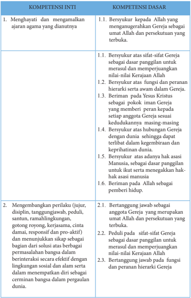

Tabel ini berisi informasi tentang kompetensi inti dan dasar yang relevan dengan agama Kristen. Topik utamanya adalah pengembangan karakter dan perilaku yang sesuai dengan nilai-nilai Gereja. Kolom pertama menunjukkan kompetensi inti, sementara kolom kedua menunjukkan kompetensi dasar. Data penting yang terlihat meliputi: 1) Menghargai dan mengamalkan ajaran agama yang diajarkan; 2) Mengembangkan perilaku yang disiplin, tanggung jawab, peduli, santun, gotong royong, kerjasama, cinta damai, responsif, dan pro-aktif; 3) Bersikap berdasarkan fungsinya dan peranan hierarki Gereja; 4) Berperilaku sesuai dengan sifat-sifat Gereja sebagai umat Allah dan persekutuan yang terbaik; dan 5) Berperilaku sesuai dengan fungsi dan peranan hierarki Gereja. Pola ini membantu individu untuk memahami bagaimana mengimplementasikan nilai-nilai Gereja dalam kehidupan sehari-hari.

 

---
## 📄 Halaman 11

---
**📊 Tabel**

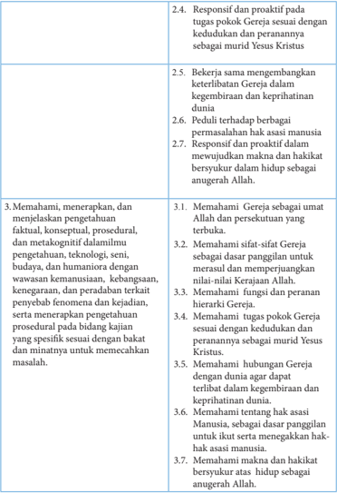

Tabel ini berisi informasi tentang tugas pokok Gereja dan responsinya dalam berbagai aspek kehidupan. Topik utama adalah bagaimana Gereja memenuhi tugas pokonya dengan cara yang responsif dan proaktif. Kolom pertama menjelaskan tugas pokok Gereja, seperti membantu orang lain, mengembangkan keterampilan, dan memahami hak-hak manusia. Kolom kedua menyajikan contoh tugas dan respons Gereja, misalnya membantu orang miskin dan peduli terhadap permasalahan hak asasi manusia. Data penting yang terlihat adalah bahwa Gereja harus berperilaku seperti Yesus Kristus dalam setiap tugasnya, termasuk dalam hubungan dengan manusia dan dalam mewujudkan hak-hak manusia.

 

---
## 📄 Halaman 12

---
**📊 Tabel**

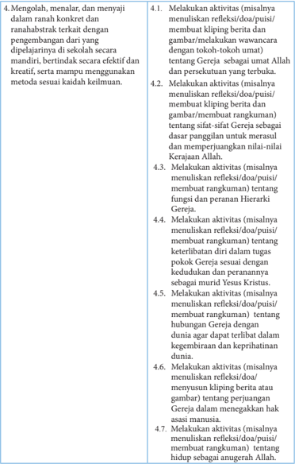

Tabel ini berisi instruksi untuk melakukan aktivitas yang melibatkan refleksi, doa, puisi, kliping berita, gambar, dan rangkuman tentang tokoh-tokoh umat dalam konteks Gereja. Topik utama adalah pengembangan diri secara mandiri dan kreatif, dengan fokus pada pemahaman tentang kehidupan dan peran Gereja dalam konteks agama Islam. Kolom-kolomnya mencakup berbagai aspek seperti refleksi, doa, puisi, kliping berita, gambar, dan rangkuman. Data penting yang terlihat adalah bahwa semua aktivitas tersebut harus dilakukan secara mandiri dan kreatif, menunjukkan bahwa tujuan utama adalah untuk memperkaya pemahaman dan pengalaman individu dalam konteks Gereja.

 

---
## 📄 Halaman 13

### Bab I Arti  dan  Makna Gereja

Gereja Katolik telah mengarungi dunia selama  2000 tahun lebih, dan menghadapi berbagai  macam  tantangan  dan  rintangan  selama  perjalanannya.  Hal  ini  adalah kesaksian    nyata  bahwa  Gereja  berasal  dari  Tuhan,  sebagai  pemenuhan  dari  janji Kristus.  Jadi,  Gereja  bukan  semata-mata  organisasi  manusia,  meskipun  tidak  bisa diungkiri bahwa ada masa-masa sulit dimana Gereja dipimpin oleh pemimpin Gereja yang kurang bijaksana. Gereja Katolik tetap berdiri sampai sekarang. Jika Gereja ini hanya  organisasi  manusia  semata,  tentulah  ia  sudah  hancur  sejak  lama.  Sekarang Gereja  Katolik  beranggotakan  sekitar  satu  milyar  anggota,  sekitar  seperenam  dari jumlah manusia di dunia, dan menjadi kelompok yang terbesar dibandingkan dengan gereja-gereja yang lain. Gereja tetap eksis bukan karena kepandaian para pemimpin Gereja, melainkan karena karya Roh Kudus.

'Gereja' berasal dari kata  bahasa Portugis, igreja dibawa oleh misionaris Portugis ratusan  tahun  silam  ke  Indonesia.  Kata  tersebut  merupakan  ejaan  Portugis  untuk kata latin ecclesia yang berakar dari bahasa Yunani, 'ekklesia' . Kata Yunani tersebut berarti  'kumpulan'  atau  'pertemuan'  'rapat' .  Meski  demikian,  Gereja  atau  ekklesia bukan sembarang  kumpulan, melainkan kelompok orang yang sangat khusus. Untuk menonjolkan  kekhususan  itu  dipakailah  kata  asing  tersebut,  dan  kadang-kadang dipakai juga kata 'jemaat' atau 'Umat' . Namun perlu diingat bahwa jemaat ini sangat istimewa. Maka, lebih baik menggunakan kata  'Gereja' saja yaitu ekklesia yang dalam kata  bahasa  Yunani  yang  berarti  'memanggil' .  Gereja  adalah  Umat  yang  dipanggil Tuhan.

Untuk memahami  arti, makna dan hakikat  Gereja yang sesungguhnya, maka pada bab ini, kita akan mempelajari pengertian Gereja dalam Kitab Suci dan Ajaran Gereja. Dengan demikian, peserta didik memiliki pemahaman tentang Gereja secara utuh  yaitu  dari  segi  biblis  (Kitab  Suci)  dan  teologis  (ajaran/magisterium  Gereja), terutama  ajaran Konsili Vatikan II. Konsili Vatikan II yang menandai wajah baru Gereja ini memunculkan pandangan baru tentang Gereja sebagai Umat Allah dan Sakramen  Keselamatan  dunia.  Sebelum  Konsili    Vatikan  II,  Gereja    lebih  berciri hierarkis piramidal, kemudian pasca  Konsili Vatikan II, pemahaman tentang Gereja

 

---
## 📄 Halaman 14

bergeser  ke  arah  Gereja  sebagai    Umat  Allah,  dengan  konsekuensi    bahwa  semua anggota Gereja mesti terlibat aktif untuk  melanjutkan misi dan karya Yesus di dunia. Ada banyak gagasan baru  berkaitan dengan pemahaman tentang  Gereja sebagai Umat Allah, sebagai berikut.

- Memperlihatkan sifat historis Gereja yang hidup 'inter tempora' , yakni Gereja dilihat menurut perkembangannya dalam sejarah keselamatan; hal ini berarti menurut  perkembangan  di  bawah  dorongan  Roh  Kudus.  Segi  organisatoris Gereja  tidak  terlalu  ditekankan  lagi,  tetapi  sebagai  gantinya  ditekankan  segi kharismatisnya. Gereja berkembang 'dari bawah' , dari kalangan Umat sendiri.
- Menempatkan  hierarki  dalam  keseluruhan  Gereja  sebagai  suatu  fungsi, sehingga  sifat  pengabdian  hierarki  menjadi  lebih  kentara.  Hierarki  jelas mempunyai fungsi pelayanan. Hierarki tidak lagi ditempatkan di atas Umat, tetapi di dalam Umat.
- Memungkinkan  pluriformitas  dalam  hidup  Gereja,  termasuk  pluriformitas dalam corak hidup, ciri-ciri, dan sifat serta pelayanan dalam Gereja.
Pada bab pertama ini, para peserta didik mempelajari  arti dan makna Gereja. Terdapat dua pokok-bahasan  yang akan digumuli peserta didik yaitu;

- Gereja sebagai Umat Allah,
- Gereja sebagai Persekutuan yang Terbuka.

### Kompetensi Inti

- Menghayati dan mengamalkan ajaran agama yang dianutnya.
- Menghayati  dan  mengamalkan  perilaku  jujur,  disiplin,  tanggung  jawab,  peduli (gotong  royong,  kerja  sama,  toleran,  damai),  santun,  responsif  dan  pro-aktif dan  menunjukkan  sikap  sebagai  bagian  dari  solusi  atas  berbagai  permasalahan dalam berinteraksi secara efektif dengan lingkungan sosial dan alam serta dalam menempatkan diri sebagai cerminan bangsa dalam pergaulan dunia
- Memahami pengetahuan (faktual, konseptual, dan prosedural) berdasarkan rasa ingin tahunya tentang ilmu pengetahuan, teknologi, seni, budaya terkait fenomena dan kejadian tampak mata.
- Mengolah, menyaji, dan menalar dalam ranah konkret (menggunakan, mengurai, merangkai, memodifikasi, dan membuat) dan ranah abstrak (menulis,membaca, menghitung,  menggambar,  dan  mengarang)  sesuai  dengan  yang  dipelajari  di sekolah dan sumber lain yang sama dalam sudut pandang/teori.

 

---
## 📄 Halaman 15

### A. Gereja sebagai Umat Allah

### Kompetensi Dasar

- 1.1 Bersyukur  kepada  Allah yang  menganugerahkan Gereja sebagai umat Allah dan persekutuan yang terbuka.
- 2.1    Bertanggung jawab sebagai anggota Gereja  yang merupakan umat Allah dan persekutuan yang terbuka.
- 3.1   Memahami  Gereja sebagai umat Allah dan persekutuan yang terbuka.
- 4.1   Melakukan aktivitas (misalnya menuliskan refleksi/doa/puisi/ membuat kliping berita dan gambar/melakukan wawancara dengan tokoh-tokoh umat)  tentang Gereja  sebagai umat Allah dan persekutuan yang terbuka.

### Indikator

- Mengungkapkan  pandangannya  tentang  Gereja,  melalui    pengalaman  pribadi, lagu, cerita,  atau gambar.
- Menjelaskan arti Gereja yang sesungguhnya sebagai Umat Allah.
- Menyebutkan  ciri-ciri Gereja sebagai Umat Allah.
- Menjelaskan arti  Gereja  menurut  Kitab  Suci  (Kis  2:41-47;  1Kor  12:7-11;  1  Kor 12:12-18).
- Menjelaskan konsekuensi Gereja sebagai Umat Allah dalam hidup menggereja dewasa ini.

### Bahan Kajian

- Pandangan peserta didik  tentang Gereja.
- Gereja sebagai Umat Allah dalam Kis 2: 41-47
- Konsekuensi paham Gereja sebagai Umat Allah.
- Tindakan-tindakan dari anggota Umat Allah.

### Sumber Belajar

- Pengalaman peserta didik dan guru dalam hidup menggereja
- Kitab Suci ; Kis 2:41-47; 1Kor 12:7-11; 1Kor 12:12-18.
- Gambar atau foto bangunan gereja .
- Dokpen KWI (penterj) Dokumen Konsili Vatikan II,  Obor, Jakarta, 1993.
- KWI, Iman Katolik,  Kanisius, Yogyakarta, 1995.
- Katekismus Gereja Katolik,  Nusa Indah, Ende Flores, 1995.

### Pendekatan

Kateketis dan saintifik

 

---
## 📄 Halaman 16

### Sarana

- Kitab Suci (Alkitab).
- Buku Siswa SMA/SMK, Kelas XI,  Pendidikan Agama Katolik dan Budi Pekerti.

### Waktu

3x45 menit.

- Pengelolaan  waktu  untuk  kegiatan  pembelajaran  subtema  ini  dapat  disesuaikan dengan pengaturan jam pelajaran di sekolah masing-masing.

### Pemikiran Dasar

Apa  itu  Gereja?  Apabila  pertanyaan  tersebut  ditujukan  kepada  Umat  katolik sendiri,  banyak  yang  menjawab Gereja sebagai  tempat ibadat atau  tempat untuk misa agama katolik atau agama kristen lainnya. Ada pula yang menjawab Gereja itu sebuah organisasi rohani atau keagamaan dengan pemimpinnya  Paus, Uskup, Imam. Bagi  orang-orang  non  kristen,  Gereja  sama  dengan  tempat  ibadat  orang  kristiani, atau bahkan Gereja adalah sebuah lembaga sosial keagamaan warisan bangsa kolonial ratusan tahun silam.

Kata 'Gereja' dalam bahasa Indonesia  berasal dari kata Portugis igreja yang berasal dari kata  Yunani ekklesia dan  dalam      kata  Latin  disebut ecclesia. Kata Yunani ekklesia  (=  mereka  yang  dipanggil,  kaum,  golongan). Ekklesia  juga  berarti kumpulan  atau  pertemuan,  rapat.  Namun,  Gereja  atau ekklesia bukan  sembarang kumpulan,  melainkan  kelompok  orang  yang  sangat  khusus.  Untuk  menonjolkan kekhususan dipakailah kata asing. Kadang-kadang dipakai kata jemaat atau Umat. Kata  'Gereja'    digunakan  baik  untuk  gedung-gedung  ibadat  maupun  untuk  Umat Kristen  setempat (jemaat, Umat) dan Umat seluruhnya.  Konsili Vatikan II memilih istilah biblis Umat Allah untuk menyebut para pengikut Yesus Kristus, yaitu mereka semua para anggota Gereja yang telah dibaptis. Umat Katolik bersekutu sepenuhnya dengan Gereja Kristus melalui rahmat, sakramen-sakramen, pengakuan iman, serta persekutuan dengan para uskup gereja yang bersatu dengan Paus. Namun demikian, Umat Katolik  yang  hidup  dalam  keadaan  dosa  berat  hanya  memiliki  persekutuan yang tak sempurna dengan Gereja. Orang-orang Kristen lainnya yang telah dibaptis meskipun  tidak  sepenuhnya  berada  dalam  persekutuan  dengan  Gereja  Katolik, memiliki semacam persekutuan dengan Gereja melalui rahmat Pembaptisan. Kamulah bangsa yang terpilih, imamat yang rajani, bangsa yang kudus, Umat kepunyaan Allah sendiri, supaya kamu memberitakan perbuatan-perbuatan yang besar dari Dia. (1Pet 2:9). Istilah Umat Allah sebenarnya merupakan istilah yang sudah sangat tua. Istilah itu sudah terdapat dalam Kitab Suci Perjanjian Lama (KSPL), misalnya dalam Kel. 6: 6; 33: 13; Yeh. 36: 28; Ul. 7: 6, 26: 15. Istilah Umat Allah itu kemudian diperkenalkan

 

---
## 📄 Halaman 17

sebagai paham yang baru dalam Gereja, menggantikan paham yang sudah lebih dulu dianut Gereja. Paham baru Gereja sebagai Umat Allah itu mulai diperkenalkan sejak Konsili Vatikan II (1962-1965). Maka, paham itu sebenarnya merupakan paham yang masih baru. Paham Gereja sebagai Umat Allah dianggap sebagai paham yang cocok atau relevan dengan tuntutan dan perkembangan zaman. Paham ini dinilai memiliki nilai  historis  dengan  Umat Allah Perjanjian Lama karena Gereja menganggap diri sebagai Israel Baru, kelanjutan dari Israel yang lama.

Para remaja atau orang muda Katolik yang sedang berada pada jenjang pendidikan SMA  atau  SMK  sudah  mulai  sadar  akan  jati  dirinya  sebagai  orang  Katolik  serta berusaha menghayati hidup bersama sebagai anggota Gereja. Dalam proses sosialisasi dirinya  tersebut  mereka  diajak  untuk  semakin  menyadari  dan  menghayati  hidup bersama dalam satu masyarakat khusus, yaitu Gereja, yang merupakan satu Umat Allah,  yang  hidup  dalam  kesatuan  iman,  harapan,  dan  cinta.    Dengan  demikian, mereka dapat mengahayati  Gereja sebagai  Umat Allah   yang  adalah  paguyuban orang-orang yang beriman, yang telah dipilih oleh Allah. Sebagai anak-anak Allah semuanya mempunyai martabat yang sama dalam pembaptisan.  Karena itu, tidak ada  Umat  kelas  VIP ,  semua  anak  Allah.    Awam,  Imam,  Biarawan-Biarawati,  para tokoh  Umat  semuanya  berjalan  bersama  berziarah  menuju  Bapa.  Semuanya  ikut ambil bagian dalam pembangunan jemaat, solider dan saling memperhatikan.

### Kegiatan Pembelajaran

### Pembuka: Doa

- Guru mengajak para peserta didik untuk memulai pelajaran dengan berdoa:
Ya Bapa sumber keselamatan hidup kami,

Pujian dan syukur, kami haturkan kepada-Mu Karena Engkau telah menyatukan kami dari berbagai tempat, suku, bangsa, dan bahasa menjadi Umat-Mu yang kudus, yaitu Gereja. Melalui pertemuan ini, kami ingin memahami lebih mendalam tentang Gereja sebagai Umat Allah dan kemudian menghayatinya dalam kehidupan keseharian kami. Mampukanlah kami membuka hati, budi, dan pikiran kami dalam pertemuan ini agar selanjutnya dapat hidup sebagai anggota Gereja-Mu. Demi Kristus Tuhan dan pengantara kami. Amin

- Setelah berdoa, dilanjutkan dengan  menyanyikan  lagu  berikut ini!
Gereja Bagai Bahtera (PS 621 / 1=D)

- Gereja bagai bahtera di laut yang seram mengarahkan haluannya ke pantai seberang.

 

---
## 📄 Halaman 18

Mengamuklah samudera dan badai menderu, gelombang zaman menghempas dan sulit ditempuh. Penumpang pun bertanyalah selagi berjerih. Berapa lagi jauhnya labuhan abadi?

- Ref :
Tuhan tolonglah! Tuhan, tolonglah! Tanpa Dikau semua binasa kelak, Ya, Tuhan tolonglah.

- Gereja bagai bahtera diatur awaknya. setiap orang bekerja menurut tugasnya. Semua satu padulah, setia bertekun demi tujuan tunggalnya yang harus ditempuh. Roh Allah yang menyatukan, membina, membentuk di dalam kasih dan iman dan harapan yang teguh.Ref: ……
- Gereja bagai bahtera di laut yang seram, mengarahkan haluannya ke pantai seberang. Hai kau yang takut dan resah, kau tak sendirian, teman sejalan banyaklah dan Tuhan di depan. Bersama-sama majulah, bertahan berteguh, tujuan akhir Tuhanlah, labuhan yang teduh. - Ref: ……
(guru  dapat  berdialog  sejenak  dengan  para  peserta  didik  tentang  lagu  yang  telah dinyanyikan sebagai pengantar masuk ke dalam kegiatan pembelajaran).

### Langkah Pertama: Menggali Pemahaman tentang Arti dan Makna Gereja   dalam Hidup Sehari-hari

### 1. Menggali Arti  dan Makna Gereja Melalui Gambar

- Guru mengajak peserta didik memperhatikan gambar-gambar berikut ini
- Guru  mengajak  peserta  didik  untuk  merumuskan  pertanyaan-pertanyaan  terkait

 

---
## 📄 Halaman 19

- gambar yang telah diamatinya, kemudian memberikan pendapat pribadinya tentang makna Gereja sejauh yang mereka ketahui.
- Setelah  peserta  didik  menjelaskan  makna  Gereja    berdasarkan  pengamatannya terhadap  gambar-gambar  tersebut,  guru  mengajak  peserta  didik  untuk  berdialog lebih lanjut tentang arti dan makna  Gereja menurut padangan orang lain pada umumnya.

### 2. Penjelasan

- Setelah    peserta  didik  menyampaikan  pandangan-pandangan  tentang  makna Gereja, guru memberikan penjelasan.
Apabila kita bertanya kepada  orang-orang Katolik maupun yang tidak Katolik tentang apa  makna Gereja, maka kurang lebih jawaban-jawaban yang diperoleh adalah:

- Gereja adalah gedung ,  Gereja adalah rumah Allah, tempat beribadat, misa, atau merayakan ekaristi Umat Katolik atau Umat kristiani pada umumnya.
- Gereja adalah ibadat , Gereja adalah lembaga rohani yang menyalurkan kebutuhan manusia dalam relasinya dengan Allah lewat ibadat-ibadat. Jawaban lain, Gereja adalah  lembaga  yang  mengatur  dan  menyelenggarakan  ibadat-ibadat.  Gereja adalah persekutuan Umat yang beribadat.
- Gereja  adalah  ajaran ,  Gereja  adalah  lembaga  untuk  mempertahankan  dan mempropagandakan seperangkat ajaran yang biasanya dirangkum dalam sebuah buku yang disebut Katekismus . Untuk bisa menjadi anggota Gereja, si calon harus mengetahui  sejumlah  ajaran/doktrin/dogma.  Menjadi  anggota  Gereja  berarti menerima sejumlah 'kebenaran' .
- Gereja adalah organisasi/lembaga sejagat/internasional ,  Gereja adalah organisasi dengan  pemimpin  tertinggi  di  Roma  dengan  cabang-cabangnya  sampai  ke pelosok-pelosok seantero jagat. Garis komando dan koordinasi diatur dengan rapi dan teliti. Ada pimpinan; Paus, Uskup-Uskup, Pastor-Pastor, Biarawan, dan Umat.
- Gereja  adalah  Umat  pilihan ,  Gereja  adalah  kumpulan  orang  yang  dipilih  dan dikhususkan  Allah  untuk  diselamatkan.  Tanpa  menjadi  anggota  Gereja  maka tidak akan diselamatkan masuk surga.
- Gereja  adalah  badan  sosial, Gereja  adalah  Lembaga  yang  menyelenggarakan sekolah-sekolah,  rumah  sakit-rumah  sakit  dan  macam-macam  usaha  untuk menolong orang miskin.
Gambaran-gambaran Gereja yang diungkapkan di atas mungkin ada benarnya, tetapi  belum  mengungkapkan  hakikat  Gereja  yang  sebenarnya.  Oleh  karena  itu, marilah menyimak kisah berikut ini untuk semakin mengetahui makna hakikat Gereja yang sebenarnya.

 

---
## 📄 Halaman 20

### 3.  Menggali Arti dan Makna Gereja sebagai Umat Allah Melalui Sebuah Cerita.

- Guru mengajak peserta didik membaca dan menyimak  berita  berikut ini:

### Paus: Gereja sebagai keluarga Allah

(Audiensi Umum Paus Fransiskus pada tanggal 29 Mei 2013)

Saudara-saudari sekalian, Selamat pagi!

Rabu lalu saya menekankan ikatan yang mendalam antara Roh Kudus dan Gereja. Hari ini saya ingin memulai beberapa katekese mengenai misteri Gereja, misteri yang kita semua alami dan kita turut ambil bagian di dalamnya. Saya ingin melakukannya dengan beberapa konsep yang jelas dalam teks-teks dari Konsili Vatikan II.

Hari ini yang pertama adalah: 'Gereja sebagai keluarga Allah' .

Dalam beberapa bulan terakhir saya menyebutkan lebih dari sekali Perumpamaan tentang  Anak  yang  Hilang  atau,  lebih  tepatnya,  Bapa  Yang  Murah  Hati  (bdk.  Luk 15:11-32). Anak bungsu meninggalkan rumah ayahnya, menghabiskan semua yang ia miliki dan memutuskan untuk pulang lagi karena dia menyadari bahwa dia telah bersalah. Dia tidak lagi menganggap dirinya layak menjadi anak, tetapi berpikir ia memiliki kesempatan untuk dipekerjakan sebagai pembantu. Ayahnya, sebaliknya, berlari untuk menemui dia, memeluknya, mengembalikan kepadanya martabatnya sebagai  anak  dan  merayakan  hal  tersebut.  Perumpamaan  ini,  seperti  yang  lainnya dalam Injil, jelas menunjukkan rencana Allah bagi Umat manusia.

Apakah rencana Allah itu? Yakni membuat kita semua menjadi satu keluarga sebagai anak-anak-Nya,  di  mana  setiap  orang  merasa  bahwa  Allah  itu  dekat  dan  merasa dicintai olehNya, seperti dalam perumpamaan Injil, merasakan kehangatan menjadi keluarga  Allah.  Gereja  berakar  dalam  rencana  besar  ini.  Gereja  bukan  organisasi yang didirikan atas perjanjian antara beberapa orang, tetapi  seperti Paus Benediktus XVI  telah  begitu  sering  mengingatkan  kita  Gereja  adalah  pekerjaan  Allah,  yang lahir justru dari rancangan penuh kasih, ini yang secara bertahap masuk ke dalam sejarah. Gereja ini lahir dari keinginan Allah untuk memanggil semua orang dalam persekutuan dengan dia, persahabatan dengan dia; untuk berbagi dalam kehidupan ilahi-Nya sendiri sebagai putra-putra dan putri-putri-Nya. Kata 'Gereja' , berasal dari bahasa Yunani 'ekklesia' , berarti 'pertemuan akbar orang - orang yang dipanggil': Allah memanggil kita, Ia mendorong kita untuk keluar dari individualisme kita, dari kecenderungan kita untuk menutup diri kita sendiri, dan Dia memanggil kita untuk menjadi keluarga-Nya.

Selanjutnya,  panggilan  ini  berasal  dari  penciptaan  itu  sendiri.  Allah  menciptakan kita supaya kita hidup dalam hubungan persahabatan yang mendalam dengan Dia, dan bahkan ketika dosa memutuskan hubungan dengan Dia, dengan orang lain dan

 

---
## 📄 Halaman 21

dengan ciptaan lainnya, Allah tidak meninggalkan kita. Seluruh kisah keselamatan adalah kisah Allah yang berusaha meraih manusia, menawarkan cinta-Nya kepada mereka  dan menyambut mereka. Ia memanggil Abraham untuk menjadi bapa dari banyak orang, Ia memilih orang Israel untuk membuat sebuah perjanjian yang akan merangkul  semua  orang,  dan  dalam  kepenuhan  waktu,  Ia  mengutus  Putra-Nya sehingga rencana cinta dan keselamatan-Nya dapat digenapi dalam Perjanjian Baru dan kekal dengan seluruh Umat manusia.

Ketika  kita  membaca  Injil,  kita  melihat  bahwa  Yesus  mengumpulkan  di  sekitarNya  komunitas  kecil  yang  menerima  firman-Nya,  mengikuti-Nya,  turut  serta dalam  perjalanan-Nya,  menjadi  keluarga-Nya,  dan  dengan  komunitas  inilah  Dia mempersiapkan dan membangun Gereja-Nya.

Jadi dari manakah Gereja itu terlahir? Gereja lahir dari tindakan kasih yang paling agung dari Salib, dari sisi lambung Yesus yang ditusuk dan mengalirkan darah dan air, simbol dari Sakramen Ekaristi dan Pembaptisan. Darah kehidupan keluarga Allah, Gereja, adalah kasih Allah yang diaktualisasikan dalam mencintai diri-Nya dan orang lain, semua orang, tanpa membeda-bedakan atau membatasi. Gereja adalah keluarga yang kita cintai dan mencintai kita.

Kapan Gereja memanifestasikan dirinya? Kita merayakannya dua minggu yang lalu, Gereja  menjadi  nyata  ketika  karunia  Roh  Kudus  memenuhi  hati  para  Rasul  dan membakar semangat mereka untuk pergi ke luar dan memulai perjalanan mereka untuk mewartakan Injil, menyebarkan kasih Allah.

Hari  ini  masih  ada  beberapa  orang  yang  mengatakan:  'Kristus  ya,  Gereja  tidak' . Seperti orang yang mengatakan, 'Saya percaya pada Tuhan, tetapi tidak pada Imam' . Tapi  Gereja  sendiri  yang  membawa  Kristus  kepada  kita  dan  yang  membawa  kita kepada Allah. Gereja adalah keluarga besar anak-anak Allah. Tentu saja Gereja juga memiliki aspek manusiawi. Dalam diri mereka yang membentuk Gereja, para Imam dan Umat beriman, terdapat kekurangan, ketidaksempurnaan, dan dosa. Paus juga memiliki hal-hal tersebut dan banyak dari mereka; tetapi yang indah adalah bahwa ketika kita menyadari bahwa kita adalah orang berdosa kita menemukan rahmat Allah yang selalu mengampuni. Jangan lupa: Allah selalu mengampuni dan menerima kita ke dalam cintanya yang penuh dengan pengampunan dan belas kasihan. Beberapa orang mengatakan bahwa dosa adalah suatu pelanggaran terhadap Allah, tetapi juga merupakan kesempatan untuk merendahkan diri sendiri  untuk menyadari bahwa ada sesuatu yang lain lebih indah: kerahiman Allah. Mari kita pikirkan hal ini.

Mari kita bertanya pada diri kita hari ini: seberapa saya mencintai Gereja? Apakah saya berdoa untuknya? Apakah saya merasa menjadi bagian dari keluarga Gereja? Apa yang harus saya lakukan untuk memastikan bahwa Gereja adalah sebuah komunitas tempat setiap orang merasa diterima dan dipahami, merasa belas kasihan dan kasih

 

---
## 📄 Halaman 22

Allah yang memperbaharui hidup? Iman adalah sebuah karunia dan sebuah perbuatan yang menjadi perhatian kita secara pribadi, tetapi Allah memanggil kita untuk hidup dengan iman kita bersama-sama, sebagai sebuah keluarga, sebagai Gereja.

Mari kita mohon kepada Tuhan, dengan cara yang sangat khusus selama Tahun Iman ini,  semoga masyarakat kita, seluruh Gereja, semakin menjadi keluarga sejati yang hidup dan membawa kehangatan kasih Allah....(AO)

Lapangan Santo Petrus, 29 Mei 2013,

Diterjemahkan dari: www.vatican.va

dalam  http://katolisitas.org/11518/paus-gereja-sebagai-keluarga-allah

### 4. Pendalaman Cerita

- Guru  mengajak  peserta  didik  untuk  merumuskan  pertanyaan-pertanyaan    atas cerita  yang  telah  mereka  dengar  atau  membacanya  untuk  didiskusikan  dalam kelompok.
- Apa makna Gereja menurut Paus Fransiskus?
- Gambaran Gereja macam apakah yang  terkandung dalam cerita ini?
- Apa makna Gereja sebagai keluarga  Allah?
- Bagaimana sikap kita terhadap Gereja?

### 5. Penjelasan

- Setelah  para  peserta  didik  menanggapi,  mendalami  lewat  tanya-jawab,  guru memberikan penjelasan,
- -Kata  'Gereja' ,  berasal  dari  bahasa  Portugis, igreja yang    diambil  dari  kata bahasaYunani ekklesia , berarti 'kumpulan' , 'pertemuan' , 'rapat' .  Paus Fransiskus menjelaskan ekklesia sebagai  'pertemuan akbar orang-orang yang dipanggil': Allah memanggil  kita semua untuk menjadi keluarga-Nya.
- -Gereja, adalah kasih Allah yang diaktualisasikan dalam mencintai diri-Nya dan orang lain, semua orang, tanpa membeda-bedakan.
- -Gereja adalah keluarga yang kita cintai dan mencintai kita.
- -Gereja  menjadi  nyata  ketika  karunia  Roh  Kudus  memenuhi  hati  para  Rasul dan membakar semangat mereka untuk pergi ke luar dan memulai perjalanan mereka untuk mewartakan Injil, menyebarkan kasih Allah.
- -Ciri-ciri Gereja  sebagai Umat Allah yang  tampak dalam cerita tersebut adalah kesatuan dalam persaudaraan sejati.
Langkah Kedua:  Menggali Makna Gereja sebagai Umat Allah

 

---
## 📄 Halaman 23

### Menurut Ajaran Kitab Suci dan Ajaran Gereja

### 1.  Diskusi:  Mendalami  Ajaran  Kitab  Suci  (Alkitab)  sebagai  Dasar  Biblis Gereja sebagai Umat Allah

- Guru membagi peserta didik dalam tiga atau beberapa kelompok untuk mendalami makna  Gereja  sebagai  Umat  Allah  yang  ditulis  dalam  Kitab  Suci.  Pertanyaanpertanyaan untuk panduan diskusi, sebagai berikut.
- Apa pesan keseluruhan teks Kitab Suci yang dibaca?
- Apa makna Gereja menurut teks Kitab Suci tersebut  (sebutkan ayat-ayat terkait)?
- Apa ciri-ciri Gereja sebagai Umat Allah dalam perikop Kitab Suci tersebut?
- Apa saja konsekuensinya bagi kita sebagai anggota Gereja, Umat Allah?

### Kelompok 1

### Kisah para Rasul. 2:41- 47

- 41 Orang-orang yang menerima perkataannya itu memberi diri dibaptis dan pada hari itu jumlah mereka bertambah kira-kira tiga ribu jiwa.
- 42 Mereka bertekun dalam pengajaran rasul-rasul dan dalam persekutuan. Dan mereka selalu berkumpul untuk memecahkan roti dan berdoa.
- 43 Maka  ketakutanlah  mereka  semua,  sedang  rasul-rasul  itu  mengadakan  banyak mujizat dan tanda.
- 44 Dan semua orang yang telah menjadi percaya tetap bersatu, dan segala kepunyaan mereka adalah kepunyaan bersama,
- 45 dan selalu ada dari mereka yang menjual harta miliknya, lalu membagi-bagikannya kepada semua orang sesuai dengan keperluan masing-masing.
- 46 Dengan bertekun dan dengan sehati mereka berkumpul tiap-tiap hari dalam Bait Allah. Mereka memecahkan roti di rumah masing-masing secara bergilir dan makan bersama-sama dengan gembira dan dengan tulus hati,
- 47 sambil memuji Allah. Dan mereka disukai semua orang. Dan tiap-tiap hari Tuhan menambah jumlah mereka dengan orang yang diselamatkan.

### Kelompok 2

### 1Korintus 12:7-11

 

---
## 📄 Halaman 24

gan pengetahuan.

- 9 Kepada yang seorang Roh yang sama memberikan iman, dan kepada yang lain Ia memberikan karunia untuk menyembuhkan.
- 10  Kepada yang seorang Roh memberikan kuasa untuk mengadakan mujizat, dan kepada yang lain Ia memberikan karunia untuk bernubuat, dan kepada yang lain lagi Ia  memberikan karunia untuk membedakan bermacam-macam roh. Kepada yang seorang Ia memberikan karunia untuk berkata-kata dengan bahasa roh, dan kepada yang lain Ia memberikan karunia untuk menafsirkan bahasa roh itu.
- 11 Tetapi semuanya ini dikerjakan oleh Roh yang satu dan yang sama, yang memberikan karunia kepada tiap-tiap orang secara khusus, seperti yang dikehendaki-Nya.

### Kelompok 3

### 1 Korintus 12:12-18

- 12 Karena sama seperti tubuh itu satu dan anggota-anggotanya banyak, dan segala anggota itu, sekalipun banyak, merupakan satu tubuh, demikian pula Kristus.
- 18 Tetapi  Allah  telah  memberikan  kepada  anggota,  masing-masing  secara  khusus, suatu tempat pada tubuh, seperti yang dikehendaki-Nya.

### 2. Melaporkan Hasil Diskusi

- Guru  mengajak  setiap  kelompok  untuk  mempresentasikan  hasil  diskusinya, sementara kelompok lain memberikan tanggapan atau pertanyaan-pertanyaan.

### 3. Penjelasan

- Setelah peserta didik mendalami  Kitab Suci dalam diskusi kelompok dan melaporkan hasil diskusinya masing-masing di depan kelas,  guru memberikan penjelasan
- -Hidup meng-Umat pada dasarnya merupakan hakikat Gereja itu sendiri, sebab

 

---
## 📄 Halaman 25

- hakikat  Gereja  adalah  persaudaraan  cinta  kasih  seperti  yang  dicerminkan  oleh hidup Umat Perdana ( lih . Kis 2: 41-47).
- -Dalam hidup meng-Umat banyak karisma dan rupa-rupa karunia dapat dilihat, diterima, dan digunakan untuk kekayaan seluruh Gereja. Hidup Gereja yang terlalu menampilkan segi organisatoris dan struktural dapat mematikan banyak karisma dan karunia yang muncul dari bawah (1Kor 12: 7-10).
- -Dalam hidup meng-Umat, semua orang yang merasa menghayati martabat yang sama akan bertanggung jawab secara aktif dalam fungsinya masing-masing untuk membangun Gereja dan memberi kesaksian kepada dunia (Ef 4: 11-13; 1Kor 12: 12-18; 26-27).

### 4. Mendiskusikan ajaran Gereja tentang Makna Gereja sebagai Umat Allah

- Guru  mengajak    peserta  didik  masuk  dalam  kelompok  untuk  mendiskusikan makna  Gereja sebagai Umat Allah   dari dokumen-dokumen Konsili Vatikan II. Pembagian kelompok diskusi dapat disesuaikan dengan situasi dan kondisi peserta didik.  Diskusi kelompok ini dapat dipandu dengan beberapa pertanyaan, misalnya;
- Apa  isi dokumen secara keseluruhan?
- Apa makna Gereja sebagai Umat Allah menurut dokumen tersebut?
- Apa ciri-ciri  Gereja sebagai Umat Allah menurut dokumen tersebut?
- Apa dasar dan konsekuensi  Gereja sebagai Umat Allah?

### Materi diskusi kelompok 1

### Rencana Bapa yang Bermaksud Menyelamatkan Semua Orang

Atas keputusan kebijaksanaan serta kebaikan-Nya yang sama sekali bebas dan rahasia, Bapa yang kekal menciptakan dunia semesta. Ia menetapkan, bahwa Ia akan mengangkat manusia untuk ikut serta menghayati hidup Ilahi. Ketika dalam diri Adam Umat manusia jatuh, Ia  tidak  meninggalkan  mereka,  melainkan  selalu  membantu mereka supaya selamat, demi Kristus Penebus, citra Allah yang tak kelihatan, yang sulung dari segala makluk (Kol 1:15). Adapun semua orang, yang sebelum segala zaman telah dipilih oleh Bapa, telah dikenal-Nya dan ditentukan-Nya sejak semula, untuk menyerupai citra putera-Nya, supaya Dialah yang menjadi sulung di antara banyak saudara (Rom 8:29). Bapa menetapkan untuk menghimpun mereka yang beriman akan Kristus dalam Gereja kudus. Gereja itu sejak awal dunia telah dipralambangkan, serta disiapkan dalam sejarah bangsa Israel dan dalam perjanjian lama. Gereja didirikan pada zaman terakhir, ditampilkan berkat pencurahan Roh, dan akan disempurnakan pada akhir zaman. Dan pada saat itu seperti tercantum dalam karya tulis para Bapa yang suci, semua orang yang benar sejak Adam, dari Abil yang saleh hingga orang terpilih yang terakhir, akan dipersatukan dalam Gereja semesta di hadirat Bapa ( Lumen Gentium  artikel  2)

 

---
## 📄 Halaman 26

Roh Kudus yang menguduskan Gereja. Ketika  sudah  selesailah  karya,  yang  oleh Bapa  dipercayakan  kepada  Putera  untuk  dilaksanakan  didunia  (lih  Yoh  17:4), diutuslah  Roh  Kudus  pada  hari  Pentekosta,  untuk  tiada  hentinya  menguduskan Gereja. Dengan demikian Umat beriman akan dapat mendekati Bapa melalui Kristus dalam satu Roh (lih Ef 2:18). Dialah Roh kehidupan atau sumber air yang memancar untuk hidup kekal (lih Yoh, 4:14; 7:38-39). Melalui Dia Bapa menghidupkan orangorang yang mati karena dosa, sampai Ia membangkitkan tubuh mereka yang fana dalam  Kristus  (lih  Rom,  8:10-11).  Roh  itu  tinggal  dalam  Gereja  dan  dalam  hati Umat beriman bagaikan dalam kenisah (lih 1Kor 3:16; 6:19). Dalam diri mereka Ia berdoa dan memberi kesaksian tentang pengangkatan mereka menjadi putera (lih Gal,  4:6;  Rom  8:15-16  dan  26).  Oleh  Roh  Gereja  diantar  kepada  segala  kebenaran (lih, Y oh, 16:13), dipersatukan dalam persekutuan serta pelayanan, diperlengkapi dan dibimbing dengan aneka kurnia hirarkis dan karismatis, serta disemarakkan dengan buah-buah-Nya (lih, Ef, 4:11-12; 1Kor, 12:4; Gal, 5:22). Dengan kekuatan Injil Roh meremajakan  Gereja  dan  tiada  hentinya  membaharuinya,  serta  mengantarkannya kepada persatuan sempurna dengan Mempelainya. Sebab Roh dan Mempelai berkata kepada Tuhan Yesus: 'Datanglah!' (lihat Why, 22:17). Demikianlah seluruh Gereja nampak sebagai Umat yang disatukan berdasarkan kesatuan Bapa dan Putera dan Roh Kudus. ( Lumen Gentium artikel 4)

### Materi diskusi kelompok 3

Gereja,  Tubuh  mistik  Kristus. Dalam  kodrat  manusiawi  yang  disatukan  dengan diri-Nya,  Putera  Allah  telah  mengalahkan  maut  dengan  wafat  dan  kebangkitanNya.  Demikianlah  Ia  telah  menebus  manusia  dan  mengubahnya  menjadi  ciptaan baru (lih Gal, 6:15; 2Kor, 5:17). Sebab Ia telah mengumpulkan saudara-saudara-Nya dari segala bangsa, dan dengan mengaruniakan Roh-Nya Ia secara gaib membentuk mereka menjadi Tubuh-Nya. Dalam Tubuh itu hidup Kristus dicurahkan ke dalam Umat beriman. Melalui sakramen-sakramen mereka itu secara rahasia namun nyata dipersatukan  dengan  Kristus  yang  telah  menderita  dan  dimuliakan.  Sebab  berkat Babtis kita menjadi serupa dengan Kristus:  'karena dalam satu Roh kita semua telah dibabtis menjadi satu Tubuh' (1Kor 12:13). Dengan upacara suci itu dilambangkan dan  diwujudkan  persekutuan  dengan  wafat  dan  Kebangkitan  Kristus:  'Sebab  oleh babtis  kita  telah  dikuburkan  bersama  dengan  Dia  ke  dalam  kematian';  tetapi  bila 'kita telah dijadikan satu dengan apa yang serupa dengan wafat-Nya, kita juga akan disatukan dengan apa yang serupa dengan kebangkitan-Nya' (Rom, 6: 4-5). Dalam pemecahan roti ekaristis kita secara nyata ikut serta dalam Tubuh Tuhan; maka kita diangkat untuk bersatu dengan Dia dan bersatu antara kita. Karena roti adalah satu, maka kita yang banyak ini merupakan satu Tubuh; sebab kita semua mendapat bagian dalam roti yang satu itu (1Kor 10:17). Demikianlah kita semua dijadikan anggota Tubuh  itu  (lih,  1Kor,  12:  27),  'sedangkan  masing-masing  menjadi  anggota  yang

 

---
## 📄 Halaman 27

seorang terhadap yang lain' (Rom 12:5).  Adapun semua anggota tubuh manusia, biarpun banyak jumlahnya, membentuk hanya satu Tubuh, begitu pula para beriman dalam Kristus (lih 1Kor 12:12). Juga dalam pembangunan Tubuh Kristus terhadap aneka ragam anggota dan jabatan. Satulah Roh, yang membagikan aneka anugrahNya sekedar kekayaan-Nya dan menurut kebutuhan pelayanan, supaya bermanfaat bagi  Gereja  (lih  1Kor  12:1-11).  Di  antara  karunia-karunia  itu  rahmat  para  Rasul mendapat  tempat  istimewa.  Sebab  Roh  sendiri  menaruh  juga  para  pengemban karisma dibawah kewibawaan mereka (lih 1Kor 14). Roh itu juga secara langsung menyatukan Tubuh dengan daya kekuatan-Nya dan melalui hubungan batin antara para anggota. Ia menumbuhkan cinta kasih di antara Umat beriman dan mendorong mereka untuk mencintai. Maka, bila ada satu anggota yang menderita, semua anggota ikut menderita; atau bila satu anggota dihormati, semua anggota ikut bergembira (lih 1Kor 12:26).

Kepala Tubuh itu Kristus. Ia citra Allah yang tak kelihatan, dan dalam Dia segalasesuatu  telah  diciptakan.  Ia  mendahului  semua  orang,  dan  segala-galanya  berada dalam Dia. Ialah Kepala Tubuh yakni Gereja. Ia pula pokok pangkal, yang sulung dari orang mati, supaya dalam segala-sesuatu Dialah yang utama (lih Kor 1:15-18). Dengan kekuatan-Nya yang agung Ia berdaulat atas langit dan bumi; dan dengan kesempurnaan serta karya-Nya yang amat luhur Ia memenuhi seluruh Tubuh dengan kekayaan  kemuliaan-Nya  (lih,  Ef,  1:18-23).[7]Semua  anggota  harus  menyerupai Kristus,  sampai  Ia  terbentuk  dalam  mereka  (lih,  Gal,  4:19).  Maka  dari  itu,  kita diperkenankan memasuki misteri-misteri hidup-Nya, disamakan dengan-Nya, ikut mati dan bangkit bersama dengan-Nya, hingga kita ikut memerintah bersama dengan-Nya (lih Flp 3:21; 2Tim 2:11; Ef 2:6; Kol 2:12; dan lain-lain). Selama masih mengembara di dunia, dan mengikut jejak-Nya dalam kesusahan dan penganiyaan, kita digabungkan  dengan  kesengsaraan-Nya  sebagai Tubuh  dan  Kepala; kita menderita  bersama  dengan-Nya,  supaya  kelak  ikut  dimuliakan  bersama  denganNya  pula  (lih  Rom  8:17).  Dari  Kristus  seluruh  Tubuh,  yang  ditunjang  dan  diikat menjadi satu oleh urat-urat dan sendi-sendi, menerima pertumbuhan ilahinya (Kol 2:19). Senantiasa Ia membagi-bagikan karunia-karunia pelayanan dalam Tubuh-Nya, yakni  Gereja.  Berkat  kekuatan-Nya,  kita  saling  melayani  dengan  karunia-karunia itu  agar  selamat.  Demikianlah,  sementara  mengamalkan  kebenaran  dalam  cinta kasih,  kita  bertumbuh  melalui  segalanya  menjadi  Dia,  yang  menjadi  Kepala  kita (lih,  Ef,  4:11-16  yun).  Supaya  kita  tiada  hentinya  diperbaharui  dalam  Kristus  (lih, Ef,  4:23),  Ia  mengaruniakan  Roh-Nya  kepada  kita.  Roh  itu  satu  dan  sama  dalam Kepala  maupun  dalam  para  anggota-Nya  dan  menghidupkan,  menyatukan  serta menggerakkan seluruh Tubuh sedemikian rupa, sehingga peran-Nya oleh para Bapa suci dapat dibandingkan dengan fungsi, yang dijalankan oleh azas kehidupan atau jiwa dalam tubuh manusia[8]. Kristus mencintai Gereja sebagai Mempelai-Nya. Ia menjadi teladan bagi suami yang mengasihi isterinya sebagai Tubuh-Nya sendiri (lih Ef 5:25-28). Sebaliknya Gereja patuh kepada Kepalanya (Ay.23-24). 'Sebab dalam Dia tinggallah seluruh kepenuhan Allah secara badaniah' (Kol 2: 9). Ia memenuhi Gereja,

 

---
## 📄 Halaman 28

yang merupakan Tubuh dan kepenuhan-Nya, dengan karunia-karunia ilahi-Nya (lih, Ef, 1:22-23), supaya Gereja menuju dan mencapai segenap kepenuhan Allah (lih, Ef ,3:19).( Lumen Gentium, artikel 7)

### 5. Melaporkan hasil diskusi

- Guru meminta setiap kelompok untuk menyampaikan hasil diskusi kelompoknya masing-masing, dan kelompok lain diperkenankan untuk menanggapi atau mengajukan pertanyaan-pertanyaan informatif.

### 6. Penjelasan

- Setelah peserta didik berdiskusi dan menyampaikan hasil diskusinya, guru bersama peserta didik membuat rangkuman,  misalnya sebagai berikut.

### · Hakikat Gereja sebagai Umat Allah

- Umat  Allah  merupakan  suatu  pilihan  dan  panggilan  dari  Allah  sendiri.  Umat Allah adalah bangsa terpilih, bangsa terpanggil.
- Umat  Allah dipanggil dan dipilih oleh Allah untuk misi tertentu, yaitu menyelamatkan dunia.
- Hubungan antara Allah dan Umat-Nya dimeteraikan oleh suatu perjanjian. Umat harus menaati perintah-perintah Allah dan Allah akan selalu menepati janji-janjiNya.
- Umat  Allah  selalu  dalam  perjalanan,  melewati  padang  pasir,  menuju  Tanah Terjanji.  Artinya,  kita  sebagai  Gereja,  Umat  Allah  sedang  berziarah  di  dunia menuju rumah Bapa di surga.

### · Dasar dan Konsekuensi Gereja sebagai Umat Allah

- Hakikat Gereja sendiri adalah persaudaraan cinta kasih, sebagaimana jelas tampak dalam praktik hidup Gereja Perdana (bdk. Kis. 2: 41-47; 4: 32-37)
- Adanya aneka macam karisma dan karunia yang tumbuh di kalangan Umat yang semestinya dipelihara dan dikembangkan untuk pelayanan dalam jemaat (bdk. 1Kor. 12: 7-10)
- Seluruh anggota Gereja memiliki martabat yang sama sebagai satu anggota Umat Allah meskipun di antara mereka terdapat fungsi yang berbeda-beda (bdk. 1Kor. 12: 12-18)

 

---
## 📄 Halaman 29

### · Konsekuensi Gereja sebagai Umat Allah

- Konsekuensi untuk Umat (awam); Umat  harus  menyadari kesatuannya dengan Umat yang lain (menghayati iman dalam kebersamaan);  Umat  aktif ambil bagian dalam kegiatan-kegiatan hidup menggereja di lingkungan/wilayahnya dengan segala karisma dan karunia yang dimilikinya.
- Konsekuensi untuk hierarki; Hierarki mesti menyadari bahwa tugas kepemimpinan yang diembannya adalah tugas pelayanan. Mereka berada di tengah-tengah Umat sebagai pelayan. Hierarki semestinya memberi ruang dan tempat bagi Umat untuk berperan aktif ikut dalam membangun Gereja dengan karisma dan karunia yang mereka miliki.
- Konsekuensi  dalam  hubungan  Hierarki-Umat;  Hierarki  harus  memandang Umat sebagai partner kerja dalam membangun Gereja, bukan sebagai pelengkap penderita yang  seolah-olah tidak berperan  apa-apa.  Hierarki juga harus memperlakukan seluruh anggota Gereja sebagai satu Umat Allah yang memiliki martabat yang sama meskipun menjalankan fungsi yang berbeda-beda.

### Langkah Ketiga: Menghayati Makna Gereja sebagai Umat Allah

### 1. Mengungkapkan Keterlibatan dalam Hidup Gereja sebagai Umat Allah Melalui Sebuah Permainan.

- Guru  membagi  dua  atau  tiga  kelompok  peserta  didik  dan  telah  mempersiapkan dua  atau  tiga  gambar  gedung  gereja  (sebaiknya  dalam  kertas  karton  yang  tidak mudah  robek)  yang  telah  digunting  menjadi  beberapa  potongan  sesuai  dengan jumlah  kelompok.  Kemudian,  guru  membagikan  potongan  gambar  gereja  secara acak bisa juga guru mengambil satu dua potongan gambar tersebut. Peserta didik diminta untuk menuliskan nama dan cita-citanya di balik potongan gambar gereja. Kemudian menyatukan potongan membentuk sebuah gambar. Kelompok yang satu dengan yang lain berusaha agar lebih dahulu selesai menyatukan gambar tersebut.

### 2. Penjelasan

- Setelah  selesai  permainan,  guru  mengarahkan  agar  para  peserta  didik    sampai memahami gambaran umum tentang Gereja melalui proses  permainan  tersebut, antara lain sebagai berikut:
- -Gedung gereja terdiri atas: atap, pintu, tiang, ubin, jendela, dinding, salib, menara dan seterusnya. sesuai potongan-potongan gambar gereja dalam permainan tersebut.
- -Kita semua adalah anggota Gereja Katolik atau anggota Umat Allah.
- -Gereja  Katolik  terdiri  atas:  guru,  dokter,  pengusaha,  jaksa,  pengacara,  petani,

 

---
## 📄 Halaman 30

- pedagang, suster, pastor, pramugari, pilot, uskup dan sebagainya, sesuai dengan cita-cita yang ditulis oleh siswa dalam permainan tadi. Tidak mungkin gereja terdiri atas guru semua atau pedagang semua, atau dokter semua, atau pastor semua, uskup semua.
- -Kebersamaan, kekeluargaan, persatuan, persekutuan dari keanekaragaman dalam iman akan Kristus itulah  ciri dari Gereja.

### 3. Re fleksi

- Peserta  didik  menulis  tentang  sejauh  manakah  ia  dapat  hidup  menggereja, menggunakan  segala  karisma,  karunia,  dan  fungsi  yang  dipercayakan  kepadanya untuk kepentingan dan misi Gereja di tengah masyarakat.
- Peserta didik membuat doa syukur karena dipilih menjadi anggota Gereja dan mohon agar kesatuan dan persaudaraan Gereja tetap terjaga.

### Tugas

- Peserta didik menuliskan kegiatan konkret yang dapat mereka lakukan di lingkungan atau  parokinya  sebagai  anggota  Gereja,  dan  membuat  laporan  tertulis  tentang kegiatannya  tersebut.  Agar  kegiatan  yang  dilaporkan  itu  benar  adanya,  maka disertai dengan keterangan serta tandatangan dari  orang Tua/wali murid.
- Peserta  didik  melakukan  wawancara  dengan  pastor  paroki  atau  katekis/guru agama di parokinya tentang apa makna Gereja sebagai Umat Allah dan bagaimana mewujudkan  Gereja  sebagai  Umat  Allah  di  dalam  parokinya.  Hasil  wawancara ditulis kemudian dikumpulkan di kelas.

### Penutup

- Peserta didik diajak untuk menutup pelajaran ini dengan doa,
Ya Bapa yang Mahabijaksana,

Engkau  telah  menyegarkan  pemahaman  kami  tentang  Gereja  sebagai  Umat  Allah dalam  pertemuan  kami  ini.  Kini  kami  mohon,  Rahmatilah  dengan  Roh  KudusMu agar kami semakin bangga dan dengan penuh semangat menjalani hidup kami sebagai anggota Gereja, sebagai Umat-Mu yang Kau-telah tebus. Engkau yang hidup dan meraja, kini dan sepanjang masa. Amin

 

---
## 📄 Halaman 31

### B. Gereja Sebagai Persekutuan Yang Terbuka

### Kompetensi Dasar

- 1.1 Bersyukur  kepada  Allah yang  menganugerahkan Gereja sebagai umat Allah dan persekutuan yang terbuka.
- 2.1   Bertanggung jawab sebagai anggota Gereja  yang merupakan umat Allah dan persekutuan yang terbuka.
- 3.1   Memahami  Gereja sebagai umat Allah dan persekutuan yang terbuka.
- 4.1   Melakukan aktivitas (misalnya menuliskan refleksi/doa/puisi/ membuat kliping berita dan gambar/melakukan wawancara dengan tokoh-tokoh umat)  tentang Gereja  sebagai umat Allah dan persekutuan yang terbuka.

### Indikator

- Menemukan perbedaan paham dan ciri khas dari gambaran model Gereja Institusional Hierarkis Piramidal dengan gambaran model Gereja sebagai  Persekutuan Umat Allah.
- Menjelaskan    keanggotaan  Gereja  beserta  peran  dan  fungsinya  masing-masing menurut ajaran Gereja (Konsili Vatikan II).
- Merumuskan paham Gereja sebagai persekutuan terbuka dari Kitab Suci Kis 4:3237 tentang 'Cara Hidup Jemaat Perdana' .
- Menjelaskan konsekuensi arti Gereja sebagai persekutuan yang terbuka dengan bersikap inklusif atau terbuka.

### Bahan Kajian

- Model-model Gereja.
- Model Gereja menurut ajaran Kitab Suci (Kis 4: 32-37).
- Konsekuensi arti Gereja sebagai persekutuan yang terbuka dalam hidup menggereja dan memasyarakat dewasa ini.
- Bentuk-bentuk kerja sama untuk membangun masyarakat yang adil, damai, dan sejahtera.

### Sumber Belajar

- A. Heuken, SJ, Ensiklopedi Gereja, Cipta Loka Caraka, Jakarta, 2004)
- Pengalaman peserta didik dan guru
- Kitab Suci 1 Kor. 12:12-27
- Gambar model Gereja Institusional Hierarkis Piramidal
- KWI, Iman Katolik, Yogyakarta, Kanisius, 1995
- Katekismus Gereja Katolik,  Nusa Indah, Flores

 

---
## 📄 Halaman 32

- Dokpen KWI (penterj), Dokumen Konsili Vatikan II,   Obor, Jakarta, 1993
- Kitab Hukum Kanonik (KHK)

### Pendekatan

Kateketis dan saintifik

### Sarana

- Gambar model Gereja piramidal dan Gereja sebagai persekutuan.
- Buku Siswa SMA/SMK, Kelas XI,  Pendidikan Agama Katolik dan Budi Pekerti.

### Waktu

3 x 45 menit

- Apabila  pelajaran  ini  dilaksanakan  dalam  dua  kali  pertemuan  secara  terpisah, waktu pelaksanaannya diatur oleh guru.

### Pemikiran Dasar

Umat katolik  hidup  di tengah  dunia bersama  sesama manusia lainnya yang bermacam-ragam  latar belakang suku-bangsa, agama, serta keyakinannya. Dalam sejarah panjangnya, Gereja Katolik pernah 'menutup diri'  dengan ajaran bahwa di luar Gereja (Katolik) tidak ada keselamatan (extra ecllesiam nula salus) .  Ajaran ini membuat Gereja  (Katolik)  menutup  pintu  dialog  dengan  agama  dan  kepercayaan serta masyarakat  lain pada umumnya. Sejarah Gereja berubah ketika Konsili Vatikan II  (1962-1965), membuka pintu-pintu dialog, serta memperbarui diri untuk hidup bersama dengan sesama   manusia ciptaan Tuhan dari berbagai latarbelakang agama dan budaya. Meski pintu dialog sudah dibuka lebar-lebar oleh para bapa Gereja kita, di tengah masyarakat kita masih menjumpai banyak Umat Katolik yang hidup secara eksklusif, tertutup.

Paus  Fransiskus    dalam  audensinya  dengan  para  peziarah  di  Vatikan    (lihat pelajaran    sebelumnya)  menegaskan  bahwa  Gereja  ini  lahir  dari  keinginan  Allah untuk  memanggil  semua  orang  dalam  persekutuan  dengan  dia,  persahabatan dengan dia; untuk berbagi dalam kehidupan ilahi-Nya sendiri sebagai putra-putra dan  putri-putri-Nya.  Seperti  yang  sudah  dijelaskan  bahwa  kata  'Gereja' ,  berasal dari bahasa Yunani 'ekklesia' ,  berarti 'orang-orang yang dipanggil. Demikian Paus Fransiskus menegaskan, ' Allah memanggil kita, Ia mendorong kita untuk keluar dari individualisme kita, dari kecenderungan kita untuk menutup diri kita sendiri, dan Dia memanggil kita untuk menjadi keluarga-Nya.

 

---
## 📄 Halaman 33

Pada pokok bahasan ini akan kita pelajari secara khusus tentang Gereja sebagai persekutuan yang terbuka. Gereja hadir di dunia dengan persekutuan yang terbuka artinya, Gereja hadir di dunia bukan untuk dirinya sendiri, Gereja hadir untuk dunia, kegembiraan dan harapan serta kabar sukacita sehingga  menjadi tanda keselamatan bagi  dunia.  Gereja  sebagai  persekutuan  terbuka,  memperlihatkan  kesiapan  Gereja untuk berdialog dengan agama dan budaya mana pun, dan memiliki partisipasi aktif untuk membangun masyarakat yang adil, damai, dan makmur. Melalui pelajaran ini para peserta didik diajak untuk memahami dan menghayati dirinya sebagai  anggota Gereja  yang hidup dalam persekutuan yang terbuka di tengah masyarakat.

### Kegiatan Pembelajaran

### Pembukaan: Doa

- Guru mengajak  peserta didik untuk memulai pelajaran dengan berdoa,

### Ya Bapa Yang Mahabaik

Siramilah kami dengan rahmat-Mu, agar melalui Gereja-Mu terbentuk persekutuan cinta kasih sejati sebagaimana yang telah diteladankan Yesus Kristus Putera-Mu kepada kami.

Bantulah kami agar melalui perjumpaan ini, kami semakin memahami dan menghayati persekutuan sebagai anggota Gereja dan semakin terlibat aktif dalam masyarakat.

Engkau yang hidup dan berkuasa, kini dan sepanjang masa. Amin.

### Langkah Pertama:  Menggali Pemahaman tentang Perubahan  Cara Pandang terhadap Gereja

### 1. Mengamati Gambar

- Guru mengajak para peserta didik untuk mengamati gambar-gambar berikut ini.

---
**🖼️ Gambar/Diagram**

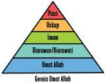

> **Deskripsi Visual:** Gambar ini adalah diagram yang menunjukkan struktur hierarki dari berbagai jenis genetik. Diagram ini terdiri dari empat tingkatan yang disusun secara horizontal dari atas ke bawah:

1. Paling atas adalah "Ploid", yang merupakan tingkat dasar dalam hierarki ini.
2. Di bawahnya ada "Ookup", yang merupakan tingkat kedua dalam hierarki ini.
3. Selanjutnya ada "Inam", yang merupakan tingkat ketiga dalam hierarki ini.
4. Terakhir, ada "Gentis Genetik Alifah", yang merupakan tingkat tertinggi dalam hierarki ini.

Elemen-elemen utama dalam diagram ini adalah tingkatan hierarki tersebut, yang disimbolkan oleh empat segitiga berwarna berbeda. Setiap tingkatan memiliki warna yang berbeda untuk menunjukkan perbedaan dalam struktur genetik.

Teks, angka, atau label penting yang terlihat pada diagram ini adalah nama-nama tingkatan hierarki genetik, yaitu "Ploid", "Ookup", "Inam", dan "Gentis Genetik Alifah".

Informasi kunci yang dapat diambil pembaca dari gambar ini adalah bahwa hierarki ini menunjukkan berbagai tingkatan dalam struktur genetik, dari tingkat dasar (Ploid) hingga tingkat tertinggi (Gentis Genetik Alifah). Ini menunjukkan bahwa struktur genetik dapat dikelompokkan menjadi beberapa tingkatan yang berbeda, masing-masing dengan karakteristik dan fungsi yang berbeda.

Gambar 1.3

Sumber : (Dokumen penulis)

Gambar 1.4

Sumber : (Dokumen penulis)

 

---
## 📄 Halaman 34

- Guru memberikan kesempatan kepada para peserta didik  untuk bertanya, misalnya pertanyaan-pertanyaan  sebagai berikut.
- Apa makna gambar  model Gereja  yang pertama? (gbr.1.3)
- Apa makna gambar model Gereja kedua (gbr.1.4)
- Apa bedanya antara model Gereja institusional dan hierarkis-piramidal dan Gereja persekutuan Umat Allah?
- Apa pengaruh dari setiap model Gereja tersebut?
- Setelah  mengamati  gambar  tersebut,  guru  mengajak  para  peserta  didik  untuk membuat pertanyaan-pertanyaan, seperti berikut;
- Adakah hubungannya gambar model Gereja pertama dengan gambar model Gereja kedua?
- Apakah gambar ini menunjukkan adanya perubahan pemahaman tentang model Gereja sekarang ini?

### 2. Penjelasan

- Guru  memberikan penjelasan,  tentang model-model Gereja sebelum dan sesudah Konsili Vatikan II, misalnya sebagai berikut.
Gambar-gambar itu menunjukkan dua model Gereja, yaitu model Gereja institusional hierarkis piramidal dan Gereja persekutuan Umat.

- Gambar 1.3 : Gereja Umat Allah Model Institusi Piramidal
Sebelum  Konsili  Vatikan  II  Gereja  mempunyai  model/bentuk  institusional, hierarkis piramidal

- -Para hierarki (Paus, Uskup, dan para tahbisan) menguasai Umat.
- -Organisasi (lahiriah) yang berstruktur piramidal, tertata rapi.
- -Mereka memiliki kuasa untuk menentukan segala sesuatu bagi seluruh Gereja. Sebaliknya Umat hanya mengikuti saja hasil keputusan hierarki.
- -Model ini cenderung 'imamsentris'  atau 'hierarki sentris' artinya hierarki pusat gerak Gereja.
- -Gereja model piramidal cenderung mementingkan aturan, lebih statis ,dan sarat dengan aturan.
- -Gereja sering merasa sebagai satu-satunya penjamin kebenaran dan keselamatan bahkan bersikap triumfalistik (memegahkan diri).

 

---
## 📄 Halaman 35

- Gambar 1.4 : Gereja Umat Allah Model Persekutuan Umat
Setelah Konsili Vatikan II, ada  keterbukaan dan pembaharuan cara pandang pada Gereja sebagai persekutuan Umat.

- -Gereja  tidak  lagi  'hierarki  sentris'  melainkan  Kristosentris' ,  artinya  Kristuslah pusat hidup Gereja. Kaum hierarki, Awam, dan Biarawan-Biarawati sama-sama mengambil  bagian  dalam  tugas  Kristus  dengan  cara  yang  berbeda-beda  sesuai dengan talenta  dan kemampuannya masing-masing.
- -Gereja  lebih  bersikap  terbuka  dan  rela  berdialog  untuk  semua  orang.  Gereja meyakini bahwa di luar Gereja pun terdapat keselamatan.
- -Adanya paham Gereja sebagai  Umat  Allah  yang  memberikan  penekanan  pada kolegialitas episkopal (keputusan dalam kebersamaan).
- -Adanya pembaharuan ( aggionarmento ) yang mendorong Umat untuk terlibat dan berpartisipasi serta bekerj asama dengan para klerus.
- -Kepemimpinan  Gereja;  Didasarkan  pada  spiritualitas  Yesus  yang  melayani para  murid-Nya,  maka  konsekuensi  yang  dihadapi  oleh  Gereja  sebagai  Umat Allah  adalah:  hierarki  yang  ada  dalam  Gereja  bertindak  sebagai  pelayan  bagi Umat  dengan  cara  mau  memperhatikan  dan  mendengarkan  Umat.  Selain,  itu keterlibatan Umat untuk mau aktif dan bertanggung jawab atas perkembangan Gereja juga menjadi hal yang penting. Maka, hierarki dan Umat/awam diharapkan dapat menjalin kerja sama sebagai partner kerja dalam karya penyelamatan Allah di dunia.
- Gerakan pembaruan yang terjadi dalam Gereja nampak dalam ketentuan berikut.
- -Umat punya hak dan wewenang  yang sama (tetapi tetap ada batasnya), khususnya ikut menentukan gerak  kegiatan liturgi di Paroki melalui wadah Dewan Paroki.
- -Gerakan pembaruan ini tidak hanya menyangkut kepemimpinan Gereja, melainkan lebih dari itu menjangkau masalah-masalah dunia.
- -Susunan  Kepengurusan  Dewan  Paroki  bukan  lagi  Piramdal,  melainkan  lebih merupakan kaitan yang saling bekerja sama dan saling melengkapi. Intinya Gereja mengundang orang beriman untuk berkomunikasi terlibat dan diubah.
Langkah Kedua:      Menggali Makna Gereja sebagai Persekutuan yang terbuka Menurut Ajaran Gereja dan Ajaran Kitab Suci

### 1. Menyimak,  Ajaran  Gereja  tentang  Gereja  sebagai  Persekutuan  yang Terbuka

- Guru mengajak para peserta didik untuk menyimak dokumen ajaran Gereja berikut ini.

 

---
## 📄 Halaman 36

'Gereja,  yang  diutus  oleh  Kristus  untuk  memperlihatkan  dan  menyalurkan cinta kasih Allah kepada semua orang dan segala bangsa, menyadari bahwa karya misioner  yang  harus  dilaksanakannya  memang  masih  amat  berat.  Masih  ada  dua miliar manusia, yang jumlahnya makin bertambah, dan yang berdasarkan hubunganhubungan hidup budaya yang tetap, berdasarkan tradisi-tradisi keagamaan yang kuno, berdasarkan pelbagai ikatan kepentingan-kepentingan sosial yang kuat, terhimpun menjadi  golongan-golongan  tertentu  yang  besar,  yang  belum  atau  hampir  tidak mendengar Warta Injil. Di kalangan mereka ada yang tetap asing terhadap pengertian akan  Allah  sendiri,  ada  pula  yang  jelas-jelas  mengingkari  adanya  Allah,  bahkan ada kalanya menentangnya. Untuk dapat menyajikan kepada semua orang misteri keselamatan serta  kehidupan  yang  disediakan  oleh  Allah,  Gereja  harus  memasuki golongan-golongan  itu  dengan  gerak  yang  sama  seperti  Kristus  sendiri,  ketika  Ia dalam penjelmaan-Nya mengikatkan diri pada keadaan-keadaan sosial dan budaya tertentu, pada situasi orang-orang yang sehari-hari dijumpai-Nya' .( Ad Gentes/AG art. 10)

### 2. Diskusi

- Guru mengajak peserta didik untuk  berdiskusi dalam kelompok untuk mendalami dokumen ajaran Gereja tentang Gereja sebagai persekutuan  yang terbuka dengan mengajukan pertanyaan-pertanyaan, sebagai berikut.
- Apa makna Gereja sebagai  persekutuan yang terbuka menurut AG, art. 10
- Apa pesan dokumen tersebut  untuk kehidupan Gereja Katolik saat ini?

### 3. Melaporkan Hasil Diskusi

- Setelah berdiskusi, tiap-tiap kelompok menyampaikan laporan hasil diskusinya di depan kelas. Peserta didik dari kelompok lain diberi kesempatan untuk bertanya atau menanggapi laporan hasil diskusi kelompok lain.

### 4. Penjelasan Hasil Diskusi

- Setelah mendengar laporan hasil diskusi kelompok dan mendalami bersama, guru memberikan penegasan, seperti berikut.
- -Gereja diutus oleh Kristus untuk memperlihatkan dan menyalurkan cinta kasih Allah kepada semua orang dan segala bangsa.
- -Sama seperti Yesus, Gereja harus memasuki golongan-golongan manusia apa saja, termasuk keadaan sosial,  budaya untuk mewartakan dan melaksanakan karya keselamatan Allah bagi semua orang.

 

---
## 📄 Halaman 37

### 5.  Menyimak makna Gereja sebagai Persekutuan Umat dalam Terang Kitab Suci

- Guru mengajak peserta didik untuk membaca atau  mendengarkan kutiban Kitab Suci berikut ini.

### Cara Hidup Jemaat

(Kis 4: 32-37;  bdk.1 Kor 12: 12 - 27)

- 32 Adapun kumpulan orang yang telah percaya itu, mereka sehati dan sejiwa, dan tidak seorang pun yang berkata, bahwa sesuatu dari kepunyaannya adalah miliknya sendiri, tetapi segala sesuatu adalah kepunyaan mereka bersama. 33 Dan dengan kuasa yang besar rasul-rasul memberi kesaksian tentang kebangkitan Tuhan Yesus dan mereka semua hidup dalam kasih karunia yang melimpah-limpah. 34 Sebab tidak ada seorang pun yang berkekurangan di antara mereka, karena semua orang yang mempunyai tanah atau rumah, menjual kepunyaannya itu, dan hasil penjualan itu mereka bawa 35 dan mereka letakkan di depan kaki rasul-rasul; lalu dibagi-bagikan kepada setiap orang sesuai dengan keperluannya.
- 36 Demikian pula dengan Yusuf, yang oleh rasul-rasul disebut Barnabas, artinya anak penghiburan, seorang Lewi dari Siprus. 37 Ia menjual ladang miliknya, lalu membawa uangnya itu dan meletakkannya di depan kaki rasul-rasul.

### 6.  Pendalaman teks Kitab Suci

- Guru mengajak peserta didik untuk menanggapi atau mengajukan  pertanyaanpertanyaan berdasarkan cerita Kitab Suci yang telah dibaca atau didengar.
- Selanjutnya guru  mengajak para peserta didik untuk berdialog dengan pertanyaan di bawah ini.
- Apa saja yang menarik dari cara hidup Umat Perdana yang dikisahkan di atas?
- Gambaran Gereja model apa yang terungkap dari kisah tersebut?
- Apakah cara hidup Umat Perdana itu dapat kita tiru secara harafiah? Mengapa?

### 7. Penjelasan

- Guru memberikan penjelasan, sebagai berikut:
- Kitab  Suci  (Kis  4:32-37)  di  atas  memberikan  gambaran  yang  ideal  terhadap komunitas/persekutuan Umat Perdana. Cara hidup Umat Perdana tersebut tetap relevan bagi kita hingga sekarang. Kebersamaan dan menganggap semua adalah

 

---
## 📄 Halaman 38

- milik  bersama  mengungkapkan  persahabatan  yang  ideal  pada  waktu  itu.  Yang pokok  ialah  bahwa  semua  anggota  jemaat  dicukupi  kebutuhannya  dan  tidak seorang  pun  menyimpan  kekayaan  bagi  dirinya  sendiri  sementara  yang  lain berkekurangan.
- Mungkin  saja  kita  tidak  dapat  menirunya  secara  harafiah,  sebab  situasi  sosialekonomi  kita  sudah  sangat  berbeda.  Namun,  semangat  dasarnya  dapat  kita tiru,  yaitu  kepekaan  terhadap  situasi  sosial-ekonomis  sesama  saudara  dalam persekutuan  Umat.  Kebersamaan  kita  dalam  hidup  menggereja  tidak  boleh terbatas  pada  hal-hal  rohani  seperti  doa,  perayaan  ibadah,  kegiatan-kegiatan pembinaan iman, tetapi harus juga menyentuh kehidupan sosial, ekonomi, politik, dan budaya seperti yang sekarang digalakkan dalam Komunitas Basis Gereja.

### Langkah Ketiga:          Menghayati  Gereja  sebagai  Persekutuan  Umat yang  Terbuka

### 1.  Membaca, Menyimak  Artikel

- Guru mengajak peserta didik menyimak kisah berikut ini.

### Pergilah Keluar, Pergilah!

Pada  tanggal  19  Mei  2013,  sekitar  200  ribu  orang-orang  dari  berbagai  organisasi, kelompok, gerakan, hadir di lapangan Santo Petrus, Vatikan Roma, untuk menghadiri hari yang diperuntukkan bagi mereka.

Mereka datang dari berbagai negara dan daerah, untuk beraudiensi dan berdialog dengan Paus Fransiskus. Dalam dialog dengan Paus Fransiskus, ada empat pertanyaan yang diajukan.

Pertama, Bagaimana kita bisa  sampai tahap kedewasaan iman dan bagaimana cara untuk mengalahkan kelemahan yang ada dalam diri kita?

Paus  Fransiskus  menjawab  pertanyaan  yang  pertama  dengan  sebuah  cerita.  Saya sungguh  mempunyai  keberuntungan  karena  saya  tumbuh  dalam  keluarga  yang mempunyai  kehidupan  rohani  cukup  kuat.  Walaupun  sederhana  yang  diajarkan, secara  konkret,  dan  saya  bisa  melaksanakannya.  Nenek  saya,  mengajarkan  saya tumbuh dalam iman, ia mengajarkan saya berdoa, menceritakan Kitab Suci, ajaran Gereja, dan juga tradisi Jumat Agung, Yesus wafat untuk kita, dan akan bangkit dari kematian-Nya.  Saya  menerima  pewartaan  yang  pertama  kali  dari  nenek  saya.  Ia mengajarkan juga untuk menyerahkan rasa takut kepada Tuhan. 'Kita semua lemah,

 

---
## 📄 Halaman 39

tetapi Tuhan lebih kuat. Dengan-Nya kita akan merasa aman, iman akan tumbuh jika kita hidup bersama Tuhan' , ujar Paus Fransiskus.

Kedua, Apakah yang paling penting dalam hidup?'

Paus  Fransiskus  menjawab,  'Yesus' .  Jika  kita  berjalan  bersama  dalam  sebuah organisasi/kelompok, tanpa menyertakan Yesus kelompok tidak akan berjalan. Kita diundang untuk hidup dalam Roh Kudus, jangan terlalu banyak berbicara, namun kesaksian yang hidup, sangatlah diperlukan' .

Ketiga, Bagaimana caranya Gereja yang miskin dapat membantu yang miskin juga? Apa yang bisa dilakukan oleh Gereja kepada masyarakat dalam situasi Zaman sekarang ini?

Paus Fransiskus menjawab: 'Kita harus menghayati Injil dan memberikan yang baik yang  bisa  kita  berikan.  Gereja  bukanlah  gerakan  politik,  dan  juga  bukan  sebuah organisasi.  Kita  bukanlah  organisasi  kemanusiaan,  jika  Gereja  menjadi  sebuah organisasi sosial/kemanusiaan saja, kita kehilangan garam terasa hambar, bila hanya sebuah  organisasi  yang  kosong.  Hal  yang  membahayakan  adalah  menutup  diri sendiri. Menutup diri berarti kurang sehat, atau dapat dikatakan sakit. 'Gereja harus keluar dari diri sendiri menuju keberadaannya' . Memang jika keluar, ada berbagai masalah, tetapi lebih baik daripada Gereja yang menutup diri, seperti Gereja yang sakit.  'Pergilah  Keluar,  Pergilah!!'  Keluar  dari  budaya  keegoisan,  budaya  sampah, menuju pada  budaya  kebersamaan,  bertemu  dengan  yang  lain;  dengan  Yesus  dan dengan saudara-saudari, mulai dari yang miskin, yang kurang diperhatikan, dan yang menderita' .

Keempat, Bagaimana dapat mewartakan iman?

Paus Fransiskus menjawab: 'Untuk mewartakan Kabar Gembira, diperlukan dua keutamaan: 'Keberanian dan Kesabaran' , seperti saudara kita Shabhaz Bhatti, seorang pejabat pemerintah Pakistan, yang karena membela kebenaran dan orang miskin dia dibunuh tahun 2011. Ia telah memberikan kesaksian dengan gagah berani, sebagai martir.  Kita semua dipanggil untuk menjadi saksi-Nya, menjadi martir dalam kehidupan  sehari-hari,  sekecil  apa  pun.  Seorang  Kristiani  harus  bisa  menjawab  dan membedakan mana yang baik dan mana yang jahat. Kita mencoba untuk menyatukan diri bersama saudara-saudari kita yang kurang beruntung. '

(Yohana Halimah/ Zenit  dalam MISSIO KKI No.37/XVI/Agustus/2013)

 

---
## 📄 Halaman 40

### 2. Dialog

- Guru memberikan kesempatan kepada para peserta didik  merumuskan  pertanyaanpertanyaan untuk dialog, contoh.
- Apa pandangan Paus Fransiskus tentang Gereja Katolik?
- Hal-hal apa saja yang menghambat Gereja (Umat) dalam pergaulannya di dunia?
- Bagaimana semestinya sikap kita sebagai anggota Gereja saat ini?

### 3. Penjelasan

- Guru memberikan penjelasan, sebagai berikut.
- -Yesus  adalah  pusat  Gereja, tanpa  Yesus, kita (Gereja) tidak bisa berjalan sebagaimana mestinya.
- -Gereja harus keluar dari diri sendiri menuju keberadaannya' . Memang jika keluar, ada berbagai masalah, tetapi lebih baik daripada Gereja yang menutup diri, seperti Gereja yang sakit.

### 4. Diskusi

- Guru  mengajak  peserta  didik  untuk  masuk  dalam  beberapa  kelompok  untuk mendiskusikan beberapa pertanyaan berikut ini.
- -Pada saat ini sering dikatakan bahwa Gereja itu hendaknya tidak bersikap eksklusif (tertutup), tetapi inklusif (terbuka). Apa artinya?
- -Mengapa Gereja harus bersikap inklusif atau terbuka?
- -Bagaimana sikap inklusif itu dapat diwujudkan oleh persekutuan Umat Katolik?
- -Apa peluang dan tantangannya?
- -Apa yang dapat kamu lakukan sebagai perwujudan anggota Gereja yang bersikap terbuka dalam hidup sehari-hari?

### 5. Re fleksi

- Guru mengajak peserta didik  untuk membuat sebuah refleksi tertulis berdasarkan bacaan 1 Kor 12: 12-27

 

---
## 📄 Halaman 41

### 6. Rencana Aksi

- Peserta  didik  diajak  untuk  merencanakan  aksi    untuk  berpartisipasi  aktif  dan bekerja sama dengan siapa saja dalam membangun masyarakat yang adil, damai, dan sejahtera di lingkungan  rumah, sekolah, dan masyarakat.

### Penutup

- Guru  mengajak  peserta  didik    untuk  menutup  pelajaran  dengan  berdoa  syukur bersama
Terima kasih ya Bapa atas penyertaan-Mu dalam pertemuan kami ini. Kiranya pertemuan ini mengantar kami kepada pemahaman dan penghayatan yang utuh dan benar tentang Gereja-Mu. Anugerahkanlah kepada kami Roh Kudus-Mu agar menyemangati kami untuk menempuh persekutuan yang suci sebagai anggota Gereja-Mu. Demikian juga anugerahkanlah kami, anak-anak Mu ini, hati yang suci agar semakin terlibat dalam suka duka kehidupan masyarakat melalui potensi-potensi kami. Demi Kristus pengantara kami. Amin

### Penugasan

- Guru meminta peserta didik  untuk  menuliskan sebuah artikel tentang  keterlibatan dirinya  sebagai Umat Katolik yang menghayati  Gereja sebagai persekutuan yang terbuka dalam hidup bermasyarakat.
- Guru meminta peserta didik untuk mengkliping beberapa berita media cetak tentang keterlibatan  Gereja  Katolik  dalam  kegiatan  kemasyarakatan  bersama  Umat  dari agama dan kepercayaan lain, dan memberikan tanggapan/analisis secara tertulis pada kliping tersebut.

### Penilaian

### 1. Penilain Sikap (Spiritual dan Sosial)

### Observasi

Nama Peserta Didik

: …………………………………..

Kelas/ Program

: …………………………………..

Mata Pelajaran

: …………………………………..

Semester

: …………………………………..

 

---
## 📄 Halaman 42

---
**📊 Tabel**

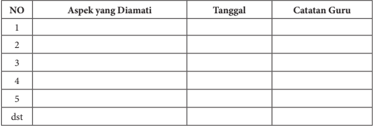

Tabel ini merupakan lembar kerja untuk mengevaluasi aspek-aspek tertentu dalam sebuah proses atau tugas. Topik utamanya adalah evaluasi atau penilaian berdasarkan beberapa aspek yang diamati oleh guru. Tabel ini memiliki kolom-kolom berikut: NO (Nomor), Aspek yang Diamati, Tanggal, dan Catatan Guru. Data atau pola penting yang terlihat adalah bahwa setiap aspek yang diamati memiliki nomor yang unik, dan informasi tentang tanggal dan catatan guru disediakan untuk memudahkan pengumpulan data dan analisis. Ini membantu guru dalam melakukan penilaian yang lebih akurat dan terstruktur.

### 2. Penilaian Pengetahuan

### Tes tertulis:

- Apa arti Gereja?
- Apa arti Gereja sebagai Umat Allah?
- Apa dasar biblis (Alkitab) tentang Gereja sebagai Umat Allah?
- Apa isi ajaran Gereja tentang Gereja sebagai Umat Allah?
- Apa ciri-ciri Gereja sebagai Umat Allah?
- Apa dasar dan konsekuensi Gereja sebagai Umat Allah?
- Apa makna Gereja sebagai persekutuan?
- Mengapa Gereja sebagai persekutuan Umat harus terbuka?
- Apa makna Gereja menurut AG, art. 10
- Apa makna ajaran Kitab Suci tentang Gereja sebagai persekutuan yang terbuka?
- Apa saja kegiatan yang dapat kamu lakukan untuk menunjukkan bahwa kamu adalah  anggota  Umat  Allah  yang  sungguh  terbuka  kepada  temanmu  yang berkeyakinan lain?

### 3. Penilaian Keterampilan:

### Portofolio:

- Tulislah sebuah refleksi tentang dirimu sebagai anggota Umat Allah atau Gereja.
- Tulislah sebuah Doa Syukur kepada Tuhan karena engkau telah dipilih menjadi anggota Gereja dan permohonan untuk kesatuan dan persatuan Gereja.

 

---
## 📄 Halaman 43

### Kegiatan Remidial

Bagi  peserta  didik  yang  belum  memahami  Bab  ini,  diberikan  remidial  dengan kegiatan-kegiatan berikut.

- Guru menyampaikan pertanyaan kepada peserta didik akan hal-hal apa saja yang belum mereka pahami.
- Berdasarkan hal-hal yang belum mereka pahami, guru mengajak peserta didik untuk mempelajarinya kembali dengan  memberikan  bantuan  peneguhanpeneguhan yang lebih praktis.
- Guru  memberikan  penilaian  ulang untuk penilaian pengetahuan,  dengan pertanyaan yang lebih sederhana, sesuai dengan kondisi peserta didik.

### Kegiatan Pengayaan

Bagi  peserta  didik  yang  telah  memahami  Bab  ini,  diberikan  pengayaan  dengan kegiatan berikut.

- Guru meminta peserta didik untuk melakukan studi pustaka (ke perpustakaan atau mencari di koran/ majalah) untuk menemukan cerita/ kisah tentang  perwujudan kehidupan  Gereja  sebagai  Umat  Allah  dan  Gereja  sebagai  persekutuan  yang terbuka.
- Hasil temuannya ditulis dalam laporan tertulis yang berisi gambaran singkat dari kisah atau cerita tersebut.

 

---
## 📄 Halaman 44

### Bab II Sifat-Sifat Gereja

Pada  bab  pertama,    telah  dibahas    pelajaran    tentang    makna  Gereja  sebagai persekutuan orang-orang yang dipanggil dan dihimpun oleh Allah sendiri. Karena itu, Gereja adalah suatu persekutuan yang khas. Pada bab ini kita akan membahas sifat-sifat  Gereja  yang    tentunya  mempunyai  kaitan  dengan  makna  dan  hakikat Gereja  itu  sendiri.  Syahadat  iman  Gereja  Katolik  dirumuskan  dalam    doa  kredo ( credere =  percaya).  Ada dua rumusan kredo yaitu rumusan pendek dan rumusan panjang.  Syahadat  rumusan  pendek  disebut  Syahadat  Para  Rasul  karena  menurut tradisi  syahadat  ini  disusun  oleh  para  rasul.  Yang  panjang  disebut  Syahadat  Nikea yang  disahkan  dalam  Konsili  Nikea    (325)  yang  menekankan  keilahian  Yesus. Pada  kemudian  hari  lazim  disebut  sebagai  Syadat  Nikea-Konstantinopel  karena berhubungan  dengan  Konsili  Konstantinopel  I  (381).  Pada  Konsili  ini  ditekankan keilahian Roh Kudus yang harus disembah dan dimuliakan bersama Bapa dan Putera. Syahadat inilah yang lebih sering digunakan dalam liturgi-liturgi Gereja Katolik. Di dalam rumusan syahadat panjang itu pada bagian akhir dinyatakan keempat sifat atau ciri Gereja Katolik:satu, kudus, katolik dan apostolik.

- Gereja itu  'satu'  karena  Roh  Kudus  yang  mempersatukan para anggota jemaat satu sama lain dengan  para kepala atau pimpinan jemaat (uskup) baik partikular maupun universal (Paus) yang berkedudukan di Vatikan.
- Gereja itu 'kudus' karena berkat Roh Kudus yang menjiwai-Nya, Gereja bersatu dengan Tuhan, satu-satunya yang dari diri-Nya sendiri kudus.
- Gereja itu 'katolik' , 'menyeluruh' , 'am' atau 'umum' karena tersebar di seluruh dunia sehingga mencakup semua.
- Gereja  itu  'apostolik'  karena  warganya  dikatakan  'anggota  umat  Allah'  jika bersatu dengan pusat-pusat Gereja yang mengakui diri sebagai tahta para Rasul (apostoloi).
Keempat sifat  Gereja itu kait mengait, tetapi tidak merupakan rumus yang siap pakai.  Gereja  memahaminya  dengan  mer efleksikan  dirinya  sendiri  dengan  karya

 

---
## 📄 Halaman 45

Roh Kudus di dalam dirinya. Gereja itu Ilahi sekaligus insani, berasal dari Yesus dan berkembang dalam sejarah. Gereja itu bersifat dinamis, tidak sekali jadi dan statis. Oleh karena itu, sifat-sifat Gereja tersebut harus selalu diperjuangkan.

Pada  bab  ini,    berturut-turut    kita  akan  membahas  pokok  bahasan  pelajaran tentang:

- Gereja yang Satu
- Gereja yang Kudus,
- Gereja yang Katolik, dan
- Gereja yang Apostolik.
Diharapkan setelah menyelesaikan pembelajaran ini, peserta didik dapat memiliki pemahaman yang baik tentang makna dan hakikat sifat-sifat Gereja serta mampu menghayatinya dalam hidup sehari-hari sebagai anggota Gereja.

### Kompetensi Inti

- Menghayati dan mengamalkan ajaran agama yang dianutnya.
- Menghayati  dan  mengamalkan  perilaku  jujur,  disiplin,  tanggungj  awab,  peduli (gotong  royong,  kerja  sama,  toleran,  damai),  santun,  responsif,  dan  proaktif dan menunjukkan sikap sebagai bagian dari solusi atas berbagai permasalahan dalam berinteraksi secara efektif dengan lingkungan sosial dan alam serta dalam menempatkan diri sebagai cerminan bangsa dalam pergaulan dunia
- Memahami pengetahuan (faktual, konseptual, dan prosedural) berdasarkan rasa ingin tahunya tentang ilmu pengetahuan, teknologi, seni, budaya terkait fenomena dan kejadian tampak mata.
- Mengolah, menyaji, dan menalar dalam ranah konkret (menggunakan, mengurai, merangkai, memodifikasi, dan membuat) dan ranah abstrak (menulis, membaca, menghitung,  menggambar,  dan  mengarang)  sesuai  dengan  yang  dipelajari  di sekolah dan sumber lain yang sama dalam sudut pandang/teori.

 

---
## 📄 Halaman 46

### A. Gereja yang Satu

### Kompetensi Dasar

- 1.2 Bersyukur  atas  sifat-sifat  Gereja  sebagai  dasar  panggilan  untuk  merasul  dan memperjuangkan nilai-nilai Kerajaan Allah.
- 2.2 Peduli  pada      sifat-sifat  Gereja  sebagai  dasar  panggilan  untuk  merasul  dan memperjuangkan nilai-nilai Kerajaan Allah.
- 3.2 Memahami  sifat-sifat  Gereja  sebagai  dasar  panggilan  untuk  merasul  dan memperjuangkan nilai-nilai Kerajaan Allah.
- 4.2   Melakukan aktivitas (misalnya menuliskan refleksi/doa/puisi/ membuat kliping berita  dan  gambar/membuat  rangkuman)    tentang  sifat-sifat  Gereja  sebagai dasar panggilan untuk merasul dan memperjuangkan nilai-nilai Kerajaan Allah.

### Indikator

- Menjelaskan arti Gereja yang Satu.
- Mendeskripsikan hal-hal yang dapat melukai Gereja yang Satu.
- Menyebutkan usaha-usaha untuk mewujudkan Gereja yang Satu

### Bahan Kajian

- Rumusan 'Doa Syahadat (Doa Aku Percaya).
- Kitab Suci: Ef 4: 1-7 dan 1Kor 6: 19.

### Sumber  Belajar

- A. Heuken, S.J, Ensiklopedi Gereja, CLC, Jakarta, 1991
- Kitab Suci (1Ptr 2:5-10; 1Kor 12:12; 2Tim 2:22)
- Katekismus Gereja Katolik , Percetakan Arnoldus, Ende.
- Konferensi  Wali  Gereja  Indonesia  (KWI). Iman  Katolik .  Kanisius-Yogyakarta/ Obor-Jakarta, 1996.
- Dokpen KWI  (penterj) Dokumen Konsili Vatikan II ,  Obor, Jakarta, 1993
- Pengalaman hidup peserta didik dan guru

### Pendekatan

Kateketis dan saintifik

 

---
## 📄 Halaman 47

### Sarana

- Kitab Suci (Alkitab).
- Buku Siswa SMA/SMK, Kelas XI,  Pendidikan Agama Katolik dan Budi Pekerti.

### Waktu

3x45 menit

- Apabila  pelajaran  ini  dibawakan  dalam  dua  kali  pertemuan  secara  terpisah, pelaksanaannya diatur oleh guru.

### Pemikiran Dasar

Ajaran tradisonal Gereja Katolik menyebutkan bahwa sifat-sifat Gereja adalah satu, kudus, katolik, dan Apostolik. Pada subpokok bahasan ini akan dipelajari tentang sifat Gereja yang satu. Apa sesungguhnya arti dan makna Gereja yang satu itu?  Menurut Ensiklopedi Gereja, ' Gereja adalah satu karena bersatu dalam iman, pembaptisan, perayaan ekaristi, dan pimpinan di seluruh dunia. Kesatuan ini harus dibina, dijaga, dipelihara  dalam  semangat  saling  mengampuni  dan  menghormati.  Kesatuan  ini bukan  keseragaman  yang  dipaksakan  atau  tidak  mengindahkan  kebebasan  wajar Gereja-gereja    partikular.  Oleh  karena  itu,  ciri  Gereja  yang  satu    menuntut  suatu communio dengan Gereja Roma atau sekurang-kurangnya tidak terpisah daripadanya ( ex-communicatio ). '

Gereja yang satu  adalah Gereja yang  percaya akan kehendak Allah, sebagaimana tertulis  dalam  Kitab  Suci,  bahwa  orang-orang  beriman  kepada  Kristus  hendaknya berhimpun menjadi Umat Allah (1Ptr 2:5-10) dan menjadi satu Tubuh ( 1Kor 12:12) . Gereja Katolik percaya bahwa kesatuan itu menjadi begitu kokoh dan kuat karena secara historis bertolak dari penetapan Petrus sebagai penerima kunci Kerajaan Surga. Setelah Petrus menyatakan pengakuannya bahwa Yesus adalah Mesias, Anak Allah yang hidup, maka Yesus pun menyatakan akan mendirikan jemaat-Nya di atas batu karang yang alam maut tidak akan menguasainya (Mat 16:16-19). Demikianlah Petrus ditugaskan untuk menggembalakan domba-domba dengan cinta. Secara historis juga menjadi  bagian  dari  kepercayaan  bahwa  para  Paus  merupakan  pengganti  Petrus (Paus yang pertama), yang memimpin Gereja bersama semua Uskup seluruh dunia secara  kolegial  disebut  sebagai successio  apostolica .  Konsili  Vatikan  II  menegaskan corak kolegial tugas penggembalaan ini yang bertanggung jawab bagi pelakasanaan tugas-tugas Gereja: memimpin/melayani, mengajar, dan menguduskan.

Melalui  pelajaran  ini,  para  peserta  didik  diharapkan  memahami  sifat  kesatuan Gereja sehingga sebagai anggota Gereja mereka berusaha menjaga keutuhan Gereja di tengah masyarakat.

 

---
## 📄 Halaman 48

### Kegiatan Pembelajaran

### Pembukaan: Doa

- Guru mengajak para peserta didik untuk berdoa sebelum pelajaran dimulai.
Ya Allah pokok keselamatan kami,

Gereja-Mu telah menjadi tanda keselamatan bagi banyak jiwa di bumi ini. Kehadiran Gereja  yang  bersifat:  Satu,  Kudus,  Katolik,  dan  Apostolik  sebagaimana  iman  para Rasul yang telah kami imani sampai saat ini, kini telah menyatukan kami dan menjadi tanda  kehadiran-Mu  yang  menguduskan  kami  semua.  Kami  mohon  kepada-Mu ya  Bapa,  hadirlah  dalam  pertemuan  ini  agar  kami  semakin  mengenal,  memahami teristimewa Gereja yang Satu serta selanjutnya dapat  mengamalkan kehendak-Mu sebagai anggota Gereja. Demi Kristus Tuhan dan Pengantara kami. Amin.

### Langkah Pertama:    Menggali Pengalaman Kehidupan  Umat Katolik Berkaitan dengan Segi  Kesatuan Gereja.

### 1. Mendalami Cerita Yang Mengungkapkan Segi-Segi Kesatuan Gereja.

- Guru  mengajak  peserta  didik  untuk  membaca,  menyimak,  atau    mendengarkan cerita berikut ini: (bila memungkinkan guru dapat menayangka n film 'World Youth Day - Brazil  2013', yang dapat diundu di youtube atau sumber media lainnya).

### Kaum Muda Katolik Sedunia Bertemu di Brasil

Ratusan bendera nasional berkibar di tengah tiupan angin dingin yang kencang di Pantai Copacabana, Brasil tempat orang muda Katolik dari semua latar belakang, yang  didorong  oleh  iman  yang  sama,  berpartisipasi  dalam  Misa  pembukaan  Hari Kaum Muda Sedunia  atau World Youth Day (WYD) .  Pada  hari  Rabu (24-7-2013) Paus  Fransiskus  meminta  kepada  umat  Katolik  untuk  menghindari  materialisme dalam Misa publik perjalanan internasional pertama sebagai Paus.

Paus Fransiskus juga mengunjungi salah satu tempat ziarah yang paling terkenal di Amerika Latin, yakni Gua Maria Aparecida, atau yang disebut 'tempat ziarah penderitaan manusia' , dan mengunjungi sebuah rumah sakit di Rio de Janeiro, tempat rehabilitasi  para  pecandu narkoba. Kedua kunjungan itu menunjukkan kesederhanaan Paus yang ditekankan selama kepausannya. Ia juga mengecam penyembahan 'berhala'  terhadap  uang  dan  kekuasaan  serta  mendesak  umat  Katolik  fokus  pada kaum miskin dan orang terpinggirkan. Paus menyebut orang-orang muda sebagai 'mesin' yang dapat memperkuat Gereja Katolik dan membantu membangun sebuah masyarakat yang lebih baik. Gbr. 2.1. Paus bersama kaum muda di Brasil 2013.

Terkait Misa pembukaan, para peserta WYD merasa senang dengan acara tersebut dan menyebutnya sebagai acara yang luar biasa karena menyatukan mereka dari ber-

 

---
## 📄 Halaman 49

bagai latar belakang.'Kami datang dari budaya berbeda, berbicara bahasa berbeda, tetapi kami menyanyikan lagu-lagu yang sama dan memiliki iman yang sama,' kata Nancy Issa dari Ramallah, Tepi Barat. Issa adalah salah satu dari 20 anggota delegasi Palestina untuk merayakan WYD yang berlangsung 23-28 Juli di Brasil.

Uskup Agung Orani Joao Tempesta dari Rio de Jeneiro secara resmi membuka WYD dengan  Misa.  Pada  awal  sambutannya,  Uskup  Agung  Tempesta  ingat  Paus Emeritus Benediktus XVI, yang memprakarsai dan memilih kota itu menjadi tuan rumah Hari Kaum Muda Sedunia 2013.

Di tengah kerumunan massa, ribuan orang Argentina bersorak-sorai, dan di dekatnya, sekelompok kecil dari Kanada mengungkapkan kegembiraan mereka sepanjang perayaan itu.'Ini sangat luar biasa dan menggairahkan, ' kata JP Martelino, 18, dari Paroki St. Patrick di Vancouver, British Columbia. Ketika ditanya, apa yang ia akan lakukan usai menghadiri acara itu, Martelino menjawab, 'Pasti …. Aku akan membawa pesan ini ke Kanada dan saya mencoba berusaha mengajak lebih banyak orang muda ke gereja. '

Sumber: ucanews.com, Catholic News Service

### 2.  Mendalami Pesan Cerita

- Guru mengajak peserta didik untuk bertanya, memberi tanggapan, pesan dan kesan tentang isi cerita yang telah didengar atau dibaca, misalnya pertanyaan-pertanyaan sebagai berikut.
- Pertemuan itu adalah pertemuan kaum muda Katolik sejagad! Apa tujuannya?
- Sifat-sifat Gereja yang tampak cukup jelas dalam acara-acara pertemuan itu?
- Apakah dalam acara-acara pertemuan itu cukup terungkap segi-segi yang menunjukkan bahwa Gereja itu Satu?
- Apa artinya Gereja itu Satu?

### 3. Penjelasan

- Guru dapat memberikan penjelasan, setelah para peserta didik menanggapi cerita tersebut.
Dari pertemuan kaum muda sejagad itu  terungkap segi-segi Gereja yang satu. Makna Gereja  yang bersifat  satu itu dapat kita pelajari dalam Kitab Suci.

Langkah Kedua:     Menggali Ajaran Kitab Suci dan Ajaran Gereja

tentang Makna Kesatuan Gereja

 

---
## 📄 Halaman 50

### 1. Menemukan Ayat-Ayat  Kitab Suci yang Menjelaskan tentang kesatuan Gereja.

- Guru meminta peserta didik untuk mencari ayat-ayat Kitab Suci yang menggambarkan kesatuan Gereja.
- Guru mengajak peserta didik membaca, menyimak, dan mendiskusikan pesan Kitab Suci  berikut ini.

### 1Petrus 2: 5-10

- 5 Dan biarlah kamu juga dipergunakan sebagai batu hidup untuk pembangunan suatu rumah rohani, bagi suatu imamat kudus, untuk mempersembahkan persembahan rohani yang karena Yesus Kristus berkenan kepada Allah.
- 6 Sebab ada tertulis dalam Kitab Suci: 'Sesungguhnya, Aku meletakkan di Sion sebuah batu yang terpilih, sebuah batu penjuru yang mahal, dan siapa yang percaya kepadaNya, tidak akan dipermalukan.'
- 7 Karena itu bagi kamu, yang percaya, ia mahal, tetapi bagi mereka yang tidak percaya: 'Batu yang telah dibuang oleh tukang-tukang bangunan, telah menjadi batu penjuru, juga telah menjadi batu sentuhan dan suatu batu sandungan. '
- 8 Mereka tersandung padanya, karena mereka tidak taat kepada Firman Allah; dan untuk itu mereka juga telah disediakan.
- 9 Tetapi kamulah bangsa yang terpilih, imamat yang rajani, bangsa yang kudus, umat kepunyaan  Allah  sendiri,  supaya  kamu  memberitakan  perbuatan-perbuatan  yang besar dari Dia, yang telah memanggil kamu keluar dari kegelapan kepada terang-Nya yang ajaib:
- 10 kamu, yang dahulu bukan umat Allah, tetapi yang sekarang telah menjadi umatNya, yang dahulu tidak dikasihani tetapi yang sekarang telah beroleh belas kasihan.

### 1 Korintus 12:12

- 12 Karena sama seperti tubuh itu satu dan anggota-anggotanya banyak, dan segala anggota itu, sekalipun banyak, merupakan satu tubuh, demikian pula Kristus.

### 2 Timoteus 2:22

- 22 Sebab itu jauhilah nafsu orang muda, kejarlah keadilan, kesetiaan, kasih dan damai bersama-sama dengan mereka yang berseru kepada Tuhan dengan hati yang murni.

### Efesus 4:3-6

- 3 Dan berusahalah memelihara kesatuan Roh oleh ikatan damai sejahtera:
- 4 satu  tubuh,  dan  satu  Roh,  sebagaimana kamu telah dipanggil kepada satu pengharapan yang terkandung dalam panggilanmu,

 

---
## 📄 Halaman 51

- 5 satu Tuhan, satu iman, satu baptisan,
- 6 satu Allah dan Bapa dari semua, Allah yang di atas semua dan oleh semua dan di dalam semua.

### Matius 16:16-19

- 16 Maka jawab Simon Petrus: 'Engkau adalah Mesias, Anak Allah yang hidup!'
- 17 Kata  Yesus  kepadanya:  'Berbahagialah  engkau  Simon  bin  Yunus  sebab  bukan manusia yang menyatakan itu kepadamu, melainkan Bapa-Ku yang di sorga.
- 18 Dan Aku pun berkata kepadamu: Engkau adalah Petrus dan di atas batu karang ini Aku akan mendirikan jemaat-Ku dan alam maut tidak akan menguasainya.
- 19 Kepadamu akan Kuberikan kunci Kerajaan Sorga. Apa yang kau ikat di dunia ini akan terikat di sorga dan apa yang kau lepaskan di dunia ini akan terlepas di sorga. '

### 2. Penjelasan

- Setelah peserta didik berdiskusi dalam kelompok dan mempresentasikannya, guru memberikan penjelasan tentang sifat Gereja yang satu sebagai berikut.
- -Allah berkenan menghimpun orang-orang yang beriman akan Kristus menjadi Umat Allah (lih.  1Ptr,  2:  5-10)  dan  membuat  mereka  menjadi  satu  tubuh  (lih. 1Kor 12: 12). Tetapi, bagaimana rencana Allah itu dilaksanakan oleh setiap orang Kristen? Semangat persatuan harus selalu dipupuk dan diperjuangkan oleh setiap orang Kristen itu sendiri.
- -Kesatuan Gereja pertama-tama adalah kesatuan iman (lih. Ef 4: 3-6) yang mungkin dirumuskan dan diungkapkan secara berbeda-beda.
- -Kristus memang mengangkat Petrus menjadi ketua para rasul, supaya kolegialitas para rasul tetap satu dan tidak terbagi. Di dalam diri Petrus, Kristus menetapkan asas dan dasar kesatuan iman serta persekutuan yang tetap kelihatan. Kesatuan ini tidak boleh dilihat pertama-tama secara universal. Tidak hanya Paus, tetapi tiaptiap uskup (pemimpin Gereja lokal) menjadi asas dan dasar yang kelihatan dari kesatuan dalam Gereja.
- -Kristus  akan  tetap  mempersatukan  Gereja,  tetapi  dari  pihak  lain  disadari  pula bahwa  perwujudan  konkret  harus  diperjuangkan  dan  dikembangkan  serta disempurnakan terus-menerus. Oleh karena itu,  kesatuan iman mendorong semua orang Kristen supaya mencari 'persekutuan' dengan semua saudara seiman.
- -Kesatuan  Gereja  pertama-tama  harus  diwujudkan  dalam  persekutuan  konkret antara orang beriman yang hidup bersama dalam satu negara atau daerah yang sama.  Tuntutan  zaman  dan  tantangan  masyarakat  merupakan  dorongan  kuat untuk menggalang kesatuan iman dalam menghadapi tugas bersama. Kesatuan Gereja  terarah  kepada  kesatuan  yang  jauh  melampaui  batas-batas  Gereja  dan terarah kepada kesatuan semua orang yang 'berseru kepada Tuhan dengan hati yang murni' (2Tim, 2: 22).

 

---
## 📄 Halaman 52

- -Kesatuan Gereja itu terungkap dalam: Kesatuan iman para anggotanya; Kesatuan iman  ini  bukan  kesatuan  yang  statis,  melainkan  kesatuan  yang  dinamis.  Iman adalah  prinsip  kesatuan  batiniah  Gereja.  Kesatuan  dalam  pimpinannya,  yaitu hierarki. Hierarki mempunyai tugas untuk mempersatukan umat. Hierarki sering dilihat sebagai prinsip kesatuan lahiriah dari Gereja. Kesatuan dalam kebaktian dan  kehidupan  sakramental.  Kebaktian  dan  sakramen-sakramen  merupakan ekspresi simbolis dari kesatuan Gereja itu (lih. Ef 4: 3-6).

### 3. Menyimak Ajaran Gereja tentang Kesatuan Gereja

- Guru mengajak peserta didik untuk membaca, menyimak  ajaran Gereja berikut ini.
KEGEMBIRAAN  DAN  HARAPAN,  duka  dan  kecemasan  orang-orang  zaman sekarang,  terutama  kaum  miskin  dan  siapa  saja  yang  menderita,  merupakan kegembiraan  dan  harapan,  duka  dan  kecemasan  para  murid  Kristus  juga.  Tiada sesuatu  pun  yang  sungguh  manusiawi,  yang  tak  bergema  di  hati  mereka.  Sebab persekutuan  mereka  terdiri  dari  orang-orang,  yang  dipersatukan  dalam  Kristus, dibimbing oleh Roh Kudus dalam peziarahan mereka menuju Kerajaan Bapa, dan telah menerima warta keselamatan untuk disampaikan kepada semua orang. Maka persekutuan mereka itu mengalami dirinya sungguh erat berhubungan dengan umat manusia serta sejarahnya. ( Gaudium et Spes (GS)  artikel 1)

### 4. Pendalaman

- Guru mengajak peserta didik untuk mengajukan pertanyaan-pertanyaan berdasarkan dokumen Ajaran Gereja yang telah dibaca.
- Guru mengajak para peserta didik untuk berdiskusi sesuai pertanyaan-pertanyaan yang muncul, berikut ini.
- Apa arti Gereja sebagai  satu persekutuan dalam Roh Kudus?
- Apa yang menjadi dasar semangat  pendorong persatuan?

### 5. Penjelasan

- Setelah peserta didik berdiskusi dalam kelompok dan mempresentasikannya, guru memberikan penjelasan tentang sifat Gereja yang satu sebagai berikut:
- -Umat Katolik merupakan satu persekutuan dalam Roh Kudus. Umat terjalin satu sama lain dengan ikatan iman dan sarana-sarana rahmat yang sama. Persatuan umat  turut  mengusahakan  persaudaraan,  perdamaian  dan  cinta  kasih  serta pengembangan  kehidupan  manusia  yang  lebih  layak.  Dengan  demikian,  umat turut menyumbangkan terwujudnya Kerajaan Allah.

 

---
## 📄 Halaman 53

- -Semangat dan Roh Kristus adalah semangat dan Roh cinta kasih harus menjadi pendorong seluruh jajaran umat untuk mengabdi kepada persatuan, kesatuan dan solidaritas  bangsa,  untuk  membina toleransi dan kerukunan, untuk mengikhtiarkan kepentingan umum dan turut membangun di segala sektor. Semuanya dilakukan sambil menghormati otonomi dunia  dalam terang cahaya Injil.

### Langkah Ketiga:   Menghayati  Kesatuan Gereja

### 1. Diskusi

- Guru mengajak para peserta didik untuk berdiskusi, dengan pertanyaan-pertanyaan, seperti berikut:
- Gereja itu satu, tetapi merupakan kenyataan pula bahwa dalam Gereja masih terdapat perpecahan-perpecahan. Bagaimana kita dapat memperjuangkan kesatuan itu?
- Bagaimana kita secara pribadi mewujudkan kesatuan  dalam Gereja?
- Guru memberikan penjelasan, tentang kesatuan Gereja sebagai berikut.
- -Gereja itu Ilahi sekaligus insani, berasal dari Yesus dan berkembang dalam sejarah. Gereja itu bersifat dinamis, tidak sekali jadi dan statis. Oleh karena itu, kesatuan Gereja harus selalu diperjuangkan.
- -Kita menyadari bahwa kenyataannya dalam Gereja sering terjadi perpecahan dan keretakan-keretakan.  Perpecahan  dan  keretakan  yang  terjadi  dalam  Gereja  itu tentu saja disebabkan oleh perbuatan manusia.
- -Katekismus  Gereja  Katolik  (KGK)  menjelaskan  bahwa  Gereja  itu  satu,  karena tiga  alasan.  Pertama,  Gereja  itu  satu  menurut  asalnya,  yang  adalah  Tritunggal Mahakudus, kesatuan Allah tunggal dalam tiga Pribadi - Bapa, Putra dan Roh Kudus.  Kedua,  Gereja  itu  satu  menurut  pendiri-Nya,  Yesus  Kristus,  yang  telah mendamaikan  semua  orang  dengan  Allah  melalui  darah-Nya  di  salib.  Ketiga, Gereja  itu  satu  menurut  jiwanya,  yakni  Roh  Kudus,  yang  tinggal  di  hati  umat beriman,  yang  menciptakan  persekutuan  umat  beriman,  dan  yang  memenuhi serta membimbing seluruh Gereja (KGK art.813).
- -'Kesatuan'  Gereja  juga kelihatan nyata. Sebagai orang-orang  Katolik, kita dipersatukan dalam pengakuan iman yang satu dan sama, dalam perayaan ibadat bersama  terutama  sakramen-sakramen,  dan  struktur  hierarkis  berdasarkan suksesi  apostolik  yang  dilestarikan  dan  diwariskan  melalui  Sakramen  Tahbisan Suci. Sebagai contoh, kita ikut ambil bagian dalam Misa di Surabaya, Larantuka, Alexandria,  San  Francisco,  Moscow,  Mexico  City,  Etiopia,  atau  di  mana  pun, Misanya  sama;  bacaan-bacaan,  tata  perayaan,  doa-doa,  dan  lain  sebagainya terkecuali  bahasa  yang  dipergunakan  dapat  berbeda  -  dirayakan  oleh  orangorang percaya yang sama-sama beriman Katolik, dan dipersembahkan oleh Imam

 

---
## 📄 Halaman 54

- yang dipersatukan dengan Uskupnya, yang dipersatukan dengan Bapa Suci, Paus, penerus tahta St. Petrus.
- -Gereja yang satu memiliki kemajemukan yang luar biasa. Umat beriman menjadi saksi  iman  dalam  panggilan  hidup  yang  berbeda-beda  dan  beraneka  bakat serta  talenta,  tetapi  saling  bekerja  sama  untuk  meneruskan  misi  Tuhan  kita. Keanekaragaman budaya dan tradisi memperkaya Gereja kita dalam ungkapan iman yang satu. Pada intinya, cinta kasih haruslah merasuki Gereja, sebab melalui cinta kasihlah para anggotanya saling dipersatukan dalam kebersamaan dan saling bekerja sama dalam persatuan yang harmonis.

### 2. Re fleksi

- Guru mengajak para peserta didik untuk berrefleksi dengan pertanyaan-pertanyaan, sebagai berikut.
•

- -Usaha-usaha apa yang dapat saya galakkan untuk menguatkan persatuan kita ke dalam?
- -Usaha-usaha apa yang dapat saya galakkan untuk menguatkan persatuan 'antarGereja?'
- Setelah peserta didik menyampaikan hasil refleksinya, guru memberikan penjelasan,
- -Usaha-usaha  yang dapat digalakkan untuk menguatkan persatuan kita ke dalam adalah antara lain, aktif berpartisipasi dalam kehidupan bergereja, berusaha setia dan taat kepada persekutuan umat, dan termasuk hierarki.
- -Usaha-usaha yang dapat digalakkan untuk menguatkan persatuan antar-Gereja adalah antara lain, lebih bersifat jujur dan terbuka kepada satu sama lain, lebih melihat kesamaan daripada perbedaan dan mengadakan berbagai kegiatan sosial dan peribadatan bersama.

### 3. Menuliskan Doa

- Guru mengajak para peserta didik untuk menulis doa  yang berisi ungkapan syukur dan harapan untuk ikut mengambil bagian dalam kesatuan Gereja.

 

---
## 📄 Halaman 55

### Penutup

- Guru mengajak para peserta didik untuk menutup pelajaran dengan doa,
Terima  kasih  ya  Tuhan  Yesus,  Juru  Selamat  kami  atas  pertemuan  ini,  yang  telah mengingatkan  kami  akan  sifat-sifat  Gereja-Mu  yang  Satu,  Kudus,  Katolik  dan Apostolik  sebagaimana  iman  para  Rasul.  Kami  mohon  ya  Tuhan,  tambahkanlah kepada kami iman, agar kami semakin mampu untuk bersatu mempersiapkan masa depan kami dalam iman akan Yesus Sang Putera yang telah mendirikan Gereja bagi kami. Engkau yang hidup dan berkuasa kini dan sepanjang masa. Amin

 

---
## 📄 Halaman 56

### B.  Gereja yang Kudus

### Kompetensi Dasar

- 1.2 Bersyukur  atas  sifat-sifat  Gereja  sebagai  dasar  panggilan  untuk  merasul  dan memperjuangkan nilai-nilai Kerajaan Allah.
- 2.2 Peduli  pada  sifat-sifat  Gereja  sebagai  dasar  panggilan  untuk  merasul  dan memperjuangkan nilai-nilai Kerajaan Allah.
- 3.2 Memahami  sifat-sifat  Gereja  sebagai  dasar  panggilan  untuk  merasul  dan memperjuangkan nilai-nilai Kerajaan Allah.
- 4.2     Melakukan aktivitas (misalnya menuliskan refleksi/doa/puisi/ membuat kliping berita  dan  gambar/membuat  rangkuman)    tentang  sifat-sifat  Gereja  sebagai dasar panggilan untuk merasul dan memperjuangkan nilai-nilai Kerajaan Allah.

### Indikator

- Menjelaskan arti Gereja yang Kudus.
- Menguraikan letak kekudusan Gereja Katolik.
- Mendeskripsikan hal-hal yang melukai Gereja yang kudus.
- Menyebutkan usaha-usaha untuk mewujudkan Gereja yang kudus

### Bahan Kajian

- Arti Gereja yang Kudus.
- Kekudusan Gereja Katolik.
- Hal-hal yang melukai Gereja yang kudus.
- Usaha-usaha untuk mewujudkan Gereja yang kudus

### Sumber  Belajar

- Heuken, A. S.J. 1991.  Ensiklopedi Gereja, Jakarta: CLC
- Kitab Suci
- Propinsi  Gerejani  Ende  (penterj).  1995.  Katekismus  Gereja  Katolik.Ende:  Nusa Indah
- Konferensi Wali Gereja Indonesia (KWI). 1996. Iman Katolik. Yogyakarta: Kanisius dan Jakarta: Obor
- Dokumentasi dan Penerangan KWI  (penterj). 1993. Dokumen Konsili Vatikan II, Jakarta: Dokpen KWI.
- Pengalaman hidup peserta didik dan guru

### Pendekatan

Kateketis dan saintifik

 

---
## 📄 Halaman 57

### Sarana

- Kitab Suci (Alkitab).
- Buku Siswa SMA/SMK, Kelas XI,  Pendidikan Agama Katolik dan Budi Pekerti.

### Waktu

3x45 menit.

- Apabila pelajaran ini dibawakan dalam dua kali pertemuan secara terpisah, maka pelaksanaannya diatur oleh guru.

### Pemikiran Dasar

Setelah  mendalami  makna  dan  hakikat  sifat  Gereja  yang  Satu  pada  kegiatan pembelajaran  sebelumnya,  pada  pembelajaran  ini  akan  dipelajari  pokok  bahasan tentang  ciri  Gereja  yang  kedua  yaitu  Gereja  yang  Kudus.  Apabila  kita  bertanya kepada  umat Katolik, termasuk kaum muda Katolik, tentang  arti kata kudus dalam Gereja Katolik, sebagian besar menjawab kurang tau. Penjelasan ini baru menyangkut arti  kata,  belum  menyangkut  hakikat  kekudusan  Gereja  Katolik  dan  bagaimana mempraktikkannya dalam hidup bergereja di tengah kehidupan masyarakat. Kudus sebetulnya  berarti  'yang  dikhususkan  bagi  Tuhan. '  Maka,  pertama-tama  'kudus' (suci) itu menyangkut seluruh bidang keagamaan. Yang 'kudus' bukan hanya orang, tempat,  atau  barang  yang  dikhususkan  bagi  Tuhan,  melainkan  lingkup  kehidupan Tuhan. Semua yang lain, orang, waktu, atau tempat disebut kudus karena termasuk lingkup kehidupan Tuhan. Yang kudus itu adalah Allah. Gereja menerima kekudusan sebagai anugerah dari Allah dalam Kristus oleh iman. Kekudusan tidak datang dari Gereja,  tetapi  dari  Allah  yang  mempersatukan  Gereja  dengan  Kristus  dalam  Roh Kudus. Jadi, kekudusan Gereja tidak terutama diartikan secara moral, tetapi secara teologial, menyangkut keberadaan dalam lingkup hidup Allah.

Gereja katolik meyakini diri kudus bukan karena tiap anggotanya sudah kudus tetapi  lebih-lebih  karena  dipanggil  kepada  kekudusan  oleh  Tuhan,  'Hendaklah kamu sempurna sebagaimana Bapamu di surga sempurna adanya' (Mat 5:48).Perlu diperhatikan juga bahwa kategori kudus yang dimaksud terutama bukan dalam arti moral, melainkan teologi, bukan soal baik atau buruknya tingkah laku, melainkan hubungannya dengan Allah. Ini tidak berarti hidup yang sesuai dengan kaidah moral tidak penting. Namun, kedekatan dengan yang Ilahi itu lebih penting, sebagaimana dinyatakan, 'kamu telah memperoleh urapan dari Yang Kudus (1Yoh 2:20),yakni dari Roh Allah sendiri (bdk. Kis10:38). Diharapkan dari diri seorang yang telah terpanggil kepada kekudusan seperti itu juga menanggapinya dalam kehidupan sehari-hari yang sesuai dengan kaidah-kaidah moral (lihat LG. Art.26).

 

---
## 📄 Halaman 58

Pada  pembelajaran  ini,  peserta  didik    dibimbing  untuk    memahami  dan menghayati dalam hidupnya, makna dan hakikat kekudusan Gereja. Bahwa Gereja itu kudus karena sumber dari mana Gereja berasal, ke mana arah yang dituju Gereja, dan unsur-unsur Ilahi yang ada di dalam Gereja adalah kudus. Kekudusan (kesucian) Gereja adalah kekudusan (kesucian) Kristus. Gereja menerima kekudusan (kesucian) sebagai anugerah dari Allah dalam Kristus oleh iman. Kesucian Gereja tidak datang dari  Gereja  itu  sendiri,  tetapi  datang  dari  Allah  dan  dipersatukan  dengan  Kristus oleh Roh Kudus. Kristus ada dalam Gereja dan selalu menyertai Gereja sampai akhir zaman.

### Kegiatan Pembelajaran

### Pembukaan: Doa

- Guru mengajak para peserta didik  untuk memulai pelajaran dengan berdoa.
Ya Allah pokok keselamatan kami,

Gereja-Mu  telah  menjadi  tanda  keselamatan  bagi  banyak  jiwa  di  bumi ini.  Kehadiran  Gereja  yang  bersifat:  Satu,  Kudus,  Katolik  dan  Apostolik sebagaimana iman para Rasul yang telah kami imani sampai saat ini, kini telah menyatukan kami dan menjadi tanda kehadiran-Mu yang menguduskan kami semua. Kami mohon kepada-Mu ya Bapa, hadirlah dalam pertemuan ini agar kami semakin mengenal, memahami teristimewa Gereja yang Kudus, serta selanjutnya dapat  mengamalkan kehendak-Mu sebagai anggota Gereja yang turut serta menguduskan dunia. Demi Kristus Tuhan dan Pengantara kami. Amin!

### Langkah  Pertama:    Mendalami  Makna  dan  Segi-Segi  Kekudusan Gereja

### 1. Menggali Pemahaman tentang Kekudusan Gereja

- Guru  mengajak  peserta  didik  untuk  menyampaikan  pemahaman  pribadinya tentang  makna  kekudusan  Gereja.  Setelah  para  peserta  didik  menyampaikan pemahamannya tentang kekudusan Gereja, guru menjelaskan arti kekudusan.

### 2. Menyimak Cerita tentang Segi-Segi Kekudusan Gereja

- Guru  mengajak  peserta  didik  untuk  membaca,  menyimak  atau    mendengarkan cerita berikut ini.

 

---
## 📄 Halaman 59

### Santo Bernardinus Realino

Bernardinus lahir di Carpi, lembah Sungai Po, Italia Utara pada tahun 1530. Setelah belajar ilmu kedokteran dan hukum, ia berturut-turut diangkat sebagai walikota di Fellizano, jaksa di Aleksandria dan sekretaris kedutaan Napoli.

Setelah  Kloside,  istrinya  meninggal  dunia,  ia  berkenalan  dengan  Serikat  Yesus di  Napoli.  Perkenalan  itu  berawal  dari  khotbah-khotbah  seorang  imam  Yesuit yang  diikutinya  dengan  rajin.  Khotbah-khotbah  ini  sungguh  menarik  sehingga  ia memutuskan  untuk  lebih  memperhatikan  kehidupan  rohaninya.  Keputusan  ini semakin diperkuat oleh penampakan istrinya sebanyak tiga kali dengan pesan supaya ia meninggalkan karier duniawinya. Pesan istrinya itupun kemudian dikuatkan lagi oleh penampakan Bunda Maria padanya.

Terdorong  oleh  hal-hal  di  atas,  Bernardinus  memutuskan  untuk  mengajukan permohonan untuk menjadi anggota Serikat  Yesus.  Permohonannya  diterima  dan setelah mengikuti suatu pendidikan khusus, Bernardinus ditahbiskan menjadi Imam. Selama beberapa tahun ia bekerja di Napoli. Sifatnya yang sopan dan ramah, penuh cinta  dan pengertian kepada umatnya menyebabkan dia sangat dicintai oleh umat Napoli.  Umat  dengan  berat  hati  melepaskan  dia  ketika  dia  dipindahkan  ke  Lecce, Provinsi Apulia, untuk mendirikan sebuah Kolose. Di Kolose Yesuit ini, Bernardius memberi kuliah filsafat dan teologi. Hingga akhir hidupnya dalam masa kerja selama 42 tahun, Bernardius menetap di Lecce.

Sebagaimana  di  Napoli,  di    Lecce  pun  Bernardinus  sungguh  dicintai.  Ia  menampilkan  diri  sebagai  seorang  pewarta  iman  yang  tangguh,  pengkhotbah  ulung, pembimbing rohani, dan bapa pengakuan yang disenangi umat. Kemasyuran namanya bukan saja  karena  gaya  kepemimpinannya yang penuh kesabaran, pengertian dan cinta, melainkan juga lebih-lebih karena kesalehan hidupnya dan mukzijat-mukzijat pe-nyembuhan yang dilakukannya.

Bernardinus  sangat  akrab  dengan  anak-anak  dan  muda-mudi.  Ia  menjadi penolong  dan  penghibur  yang  tidak  kenal  lelah  bagi  orang-orang  yang  malang. Ketika ajalnya mendekat, walikota Lecce mengumpulkan semua pembantunya dan pemimpin-pemimpin  masyarakat  setempat  untuk  berdoa  bagi  keselamatan  jiwa Bernardinus. Kepada mereka ia berkata: 'Kota kita telah diberkati Allah dengan satu anugerah istimewa, yakni Pater Bernardinus Realino. Beliau telah mengabdi di kota ini  selama  40  tahun  dan  telah  melakukan  banyak  hal  dengan  hidupnya yang suci, karunia-karunia dan berbagai mukzijat. Setiap orang dari kota ini, juga mereka yang berasal dari kota lain telah menikmati sedikit kebaikan hati Pater Bernardinus. Oleh karena itu, saya mengusulkan agar Pastor Bernardinus diangkat sebagai pelindung Kota Lecce. '

Ketika tiba saat terakhir hidupnya, Bernardinus berkata kepada para pemimpin masyarakat, 'Dari surga kediamanku yang abadi, Aku akan selalu melindungi kota Lecce dan seluruh umat.' Bernardinus Realino meninggal dunia pada tanggal 2 Juli 1616.

(iman-katolik.or.id- gbr. Jesuit.org).

 

---
## 📄 Halaman 60

### 3. Pendalaman Cerita

- Guru  mengajak  para  peserta  didik  untuk  merumuskan  pertanyaan-pertanyaan untuk  berdiskusi.  Pertanyaan-pertanyaan  yang  muncul  dari  para  peserta  didik, sebagai berikut;
- Karya apa yang dilakukan oleh Realino semasa hidupnya?
- Segi-segi kekudusan apa yang tampak dalam hidup dan karya Realino?
- Mengapa ia disebut orang kudus?

### 4. Penjelasan

- Setelah  peserta  didik  menanggapi  cerita,  guru  memberikan  penjelasan,  dan menggarisbawahi makna kekudusan.
- -Bernardinus  sungguh  dicintai  umat.  Ia  menampilkan  diri  sebagai  seorang pewarta iman yang tangguh, pengkhotbah ulung, pembimbing rohani dan bapa pengakuan yang disenangi umat. Kemasyuran namanya bukan saja karena gaya kepemimpinannya yang penuh kesabaran, pengertian dan cinta, tetapi juga lebihlebih karena kesucian dan kesalehan hidupnya.
- -Kesaksian  walikota Lecce: 'Kota kita telah diberkati Allah dengan satu anugerah istimewa,  yakni  Pater  Bernardinus  Realino.  Beliau  telah  mengabdi  di  kota ini  selama  40  tahun  dan  telah  melakukan  banyak  hal  dengan hidupnya  yang suci,(kudus)  karunia-karunia dan berbagai mukzijat.

### Langkah Kedua:   Mendalami Ajaran  Kitab Suci dan Ajaran Gereja tentang kekudusan Gereja

### 1. Mendalami  Pesan Kitab Suci tentang Kekudusan Gereja

- Guru  mengajak  peserta  didik  untuk  mencari  ayat-ayat  Kitab  Suci,  khususnya Perjanjian Baru yang menyatakan kekudusan Gereja.
- Guru mengajak peserta didik untuk berdiskusi  dalam kelompok beberapa perikop Kitab Suci yang telah ditemukan, misalnya;

### Efesus 5:25-26

- 25 Hai  suami,  kasihilah  isterimu  sebagaimana  Kristus  telah  mengasihi  jemaat  dan telah menyerahkan diri-Nya baginya,
- 26 untuk  menguduskannya,  sesudah  Ia  menyucikannya  dengan  memandikannya dengan air dan firman

 

---
## 📄 Halaman 61

### Matius 5:48

48 Karena itu haruslah kamu sempurna, sama seperti Bapamu yang di sorga adalah sempurna.'

### 1 Yoh 2:20

20 Tetapi  kamu  telah  beroleh  pengurapan  dari  Yang  Kudus,  dan  dengan  demikian kamu semua mengetahuinya.

### Kisah Para Rasul 10:38

38 yaitu  tentang  Y esus  dari  Nazaret:  bagaimana  Allah  mengurapi  Dia  dengan  Roh Kudus  dan  kuat  kuasa,  Dia,  yang  berjalan  berkeliling  sambil  berbuat  baik  dan menyembuhkan semua orang yang dikuasai Iblis, sebab Allah menyertai Dia.

### Roma 1: 7

7 Kepada kamu sekalian yang tinggal di Roma, yang dikasihi Allah, yang dipanggil dan dijadikan orang-orang kudus: Kasih karunia menyertai kamu dan damai sejahtera dari Allah, Bapa kita, dan dari Tuhan Yesus Kristus.

### Yohanes 17: 11

11 Dan Aku tidak ada lagi di dalam dunia, tetapi mereka masih ada di dalam dunia, dan Aku datang kepada-Mu. Ya Bapa yang kudus, peliharalah mereka dalam namaMu, yaitu nama-Mu yang telah Engkau berikan kepada-Ku, supaya mereka menjadi satu sama seperti Kita.

### 2. Pendalaman

- Guru mengajak peserta didik untuk mendalami teks Kitab Suci  dengan bantuan pertanyaan, sebagai berikut.
- Apa makna kekudusan menurut Kitab Suci?
- Apa bentuk implementasi kekudusan itu dalam hidup umat Katolik?

### 3. Penjelasan

- Guru memberikan penjelasan, misalnya sebagai berikut.
- -Perjanjian  Baru  melihat  proses  pengudusan  manusia  sebagai  pengudusan  oleh Roh  Kudus  (lih.  1Ptr  1:  2).  Dikuduskan  karena  terpanggil  (lih.  Rm  1:7).  Dari pihak manusia, kekudusan (kesucian) hanya berarti tanggapan atas karya Allah, terutama  dengan  sikap  iman  dan  pengharapan.  Sikap  iman  dinyatakan  dalam segala perbuatan dan kegiatan kehidupan yang serba biasa. Kesucian bukan soal bentuk kehidupan (seperti menjadi biarawan), melainkan sikap yang dinyatakan dalam hidup sehari-hari.

 

---
## 📄 Halaman 62

- -Kekudusan itu terungkap dengan aneka cara pada setiap orang. Kehidupan Gereja bukanlah suatu sifat yang seragam, yang sama bentuknya untuk semua, melainkan semua mengambil bagian dalam satu kekudusan Gereja, yang berasal dari Kristus. Kesucian ini adalah kekudusan yang harus diperjuangkan terus-menerus.
- -Sumber dari mana Gereja berasal adalah kudus. Gereja didirikan oleh Kristus. Gereja menerima kekudusannya dari Kristus dan doa-Nya.  'Ya Bapa yang kudus, … kuduskanlah mereka dalam kebenaran … ( lih. Yoh 17: 11).
- -Tujuan dan arah Gereja adalah kudus. Gereja bertujuan untuk kemuliaan Allah dan penyelamatan umat manusia.

### 4. Menyimak Ajaran Gereja tentang  Kekudusan Gereja

- Guru mengajak peserta didik untuk menyimak dokumen ajaran Gereja berikut ini.
'Uskup mempunyai kepenuhan sakramen Tahbisan, maka ia menjadi 'pengurus rahmat imamat tertinggi' , terutama dalam Ekaristi, yang dipersembahkannya sendiri atau  yang  dipersembahkan  atas  kehendaknya,  dan  yang  tiada  hentinya  menjadi sumber kehidupan dan pertumbuhan Gereja. Gereja Kristus itu sungguh hadir dalam semua jemaat beriman setempat yang sah, yang mematuhi para gembala mereka, dan dalam Perjanjian Baru disebut Gereja. Gereja-Gereja itu ditempatnya masing-masing merupakan  umat  baru  yang  dipanggil  oleh  Allah,  dalam  Roh  Kudus  dan  dengan sepenuh-penuhnya (lih 1Tes 1:5). Di situ umat beriman berhimpun karena pewartaan Injil  Kristus,  dan  dirayakan  misteri  Perjamuan  Tuhan,  'supaya  karena  Tubuh  dan Darah  Tuhan  semua  saudara  perhimpunan  dihubungkan  erat-erat' .  Dalam  setiap himpunan di sekitar altar, dengan pelayanan suci Uskup, tampillah lambang cinta kasih dan 'kesatuan tubuh mistik itu, syarat mutlak untuk keselamatan' . Di jemaatjemaat itu, meskipun sering hanya kecil dan miskin, atau tinggal tersebar, hiduplah Kristus; dan berkat kekuatan-Nya terhimpunlah Gereja yang satu, kudus, katolik dan apostolik.  Sebab  'keikutsertaan  dalam  tubuh  dan  darah  Kristus  tidak  lain  berarti berubah menjadi apa yang kita sambut' .

Adapun semua perayaan Ekaristi yang sah dipimpin oleh Uskup. Ia diserahi tugas mempersembahkan  ibadat  agama  kristiani  kepada  Allah  yang  Maha  Agung,  dan mengaturnya menurut perintah Tuhan dan hukum Gereja, yang untuk keuskupan masih perlu diperinci menurut pandangan Uskup sendiri. Demikianlah para Uskup, dengan  berdoa  dan  bekerja  bagi  Umat,  membagikan  kepenuhan  kesucian  Kristus dengan  pelbagai  cara  dan  secara  melimpah.  Dengan  pelayanan  sabda  mereka menyampaikan  kekuatan  Allah  kepada  Umat  beriman  demi  keselamatannya  (lih. Rom 1:16). Dengan sakramen-sakramen, yang pembagiannya mereka urus dengan kewibawaan  mereka  supaya  teratur  dan  bermanfaat,  mereka  menguduskan  umat beriman.  Mereka  mengatur  penerimaan  babtis,  yang  memperoleh  keikut-sertaan dalam imamat rajawi Kristus. Merekalah pelayan sakramen penguatan sesungguhnya, mereka pula yang menerima tahbisan-tahbisan suci mengatur dan mengurus tata-

 

---
## 📄 Halaman 63

tertib pertobatan. Dengan saksama mereka mendorong dan mendidik Umat, supaya dengan iman dan hormat menunaikan perannya dalam liturgi, dan terutama dalam korban kudus misa. Akhirnya mereka wajib membantu umat yang mereka pimpin dengan  teladan  hidup  mereka,  yakni  dengan  mengendalikan  perilaku  mereka dan  sedapat  mungkin    menjauhkan  dari  segala  cela,  dengan  pertolongan  Tuhan mengubahnya menjadi baik. Dengan demikian mereka akan mencapai hidup kekal, bersama  dengan  kawanan  yang  dipercayakan  kepada  mereka' .(Lumen  Gentium artikel  26)

### 5.  Diskusi

- Guru  mengajak  peserta  didik  untuk  berdiskusi  dalam  kelompok    ajaran  Gereja tentang kekudusan Gereja dengan pertanyaan sebagai berikut.
- Apa makna kekudusan Gereja dalam dokumen tersebut?
- Apa konsekuensi seorang uskup yang memiliki kepenuhan  Sakramen tahbisan?

### 6.   Penjelasan

- Setelah peserta didik berdiskusi dan menyampaikan  hasil diskusinya, guru memberikan penjelasan.
- -Tuhan kita Sendiri adalah sumber dari segala kekudusan: 'Sebab hanya satulah Pengantara  dan  jalan  keselamatan,  yakni  Kristus.  Ia  hadir  bagi  kita  dalam tubuh-Nya,  yakni  Gereja'  (Konstitusi  Dogmatis  tentang  Gereja,  #14).  Kristus menguduskan Gereja, dan pada gilirannya, melalui Dia dan bersama Dia, Gereja adalah agen pengudusan-Nya. Melalui pelayanan Gereja dan kuasa Roh Kudus, Tuhan  kita  mencurahkan  berlimpah  rahmat,  teristimewa  melalui  sakramensakramen.  Oleh  karena  itu,  melalui  ajarannya,  doa  dan  sembah  sujud,  serta perbuatan-perbuatan baik, Gereja adalah tanda kekudusan yang kelihatan.
- -'Uskup mempunyai kepenuhan sakramen Tahbisan, maka ia menjadi 'pengurus rahmat  imamat  tertinggi'  terutama  dalam  Ekaristi,  yang  dipersembahkannya sendiri  atau  yang  dipersembahkan  atas  kehendaknya,  dan  yang  tiada  hentinya menjadi sumber kehidupan dan pertumbuhan Gereja' (LG.art.26)
- -Masing-masing kita sebagai anggota Gereja, telah dipanggil kepada kekudusan. Melalui Sakramen Baptis, kita telah dibebaskan dari dosa asal, dipenuhi dengan rahmat pengudusan, dibenamkan ke dalam misteri sengsara, wafat dan kebangkitan Tuhan, dan dipersatukan ke dalam Gereja, 'umat kudus Allah' . Dengan rahmat Tuhan, kita berjuang mencapai kekudusan.
- -Konsili Vatican II  mendesak, 'Segenap umat Katolik wajib menuju kesempurnaan Kristen,  dan  menurut  situasi  masing-masing  mengusahakan,  supaya  Gereja,

 

---
## 📄 Halaman 64

- seraya membawa kerendahan hati dan kematian Yesus dalam tubuhnya, dari hari ke  hari  makin  dibersihkan  dan  diperbaharui,  sampai Kristus menempatkannya di  hadapan  Dirinya  penuh  kemuliaan,  tanpa  cacat  atau  kerut'  (Dekrit  tentang Ekumenisme, #4).
- -Gereja kita telah ditandai dengan teladan-teladan kekudusan yang luar biasa dalam hidup para kudus sepanjang masa. Tak peduli betapa gelapnya masa bagi Gereja kita, selalu ada para kudus besar melalui siapa terang Kristus dipancarkan. Kita manusia yang rapuh, dan terkadang kita jatuh dalam dosa; tetapi, kita bertobat dari dosa kita dan sekali lagi kita melanjutkan perjalanan di jalan kekudusan.
- -Dalam arti tertentu, Gereja kita adalah Gereja kaum pendosa, bukan kaum yang merasa diri benar atau merasa yakin akan keselamatannya sendiri. Salah satu doa terindah dalam Misa dipanjatkan sebelum Tanda Damai, 'Tuhan Yesus Kristus, jangan  memperhitungkan  dosa  kami,  tetapi  perhatikanlah  iman  Gereja-Mu.' Meski  individu-individu  warga  Gereja  rapuh  dan  malang,  jatuh  dan  berdosa, Gereja terus menjadi tanda dan sarana kekudusan.

### Langkah Ketiga:   Menghayati  Kekudusan Gereja

### 1. Diskusi Kelas

- Guru mengajak peserta didik  untuk berdiskusi dengan pertanyaan, misalnya; Bagaimana cara kita memperjuangkan kekudusan  Gereja  dalam hidup seharihari?
- Setelah berdiskusi, guru memberikan penjelasan.
- Kekudusan  dapat  dilakukan  dengan  saling  memberi  kesaksian  untuk  hidup sebagai putra-putri Allah
- Meneladani semangat hidup orang-orang Katolik yang telah mencapai kekudusan,  seperti  para  santo-santa,  beato-beata,  atau  para  martir  yang berjuang menegakkan kebenaran, keadilan, demi kemanusiaan.
- Merenungkan dan mendalami Kitab Suci, khususnya ajaran dan hidup Yesus, yang merupakan pedoman dan arah hidup kita, dan sebagainya.

### 2. Re fleksi

- Guru mengajak  peserta didik untuk menulis sebuah refleksi  tentang hal-hal apa yang  dapat  ia  perjuangkan  untuk  menguduskan  diri  sebagai  anggota-anggota Gereja.

 

---
## 📄 Halaman 65

### 3. Rencana Aksi

- Peserta  didik  dalam  kelompok  menyusun  ibadat  sabda  dengan  intensi  bagi kekudusan Gereja.
- Guru mengajak para peserta didik untuk berdoa bersama-sama dalam ibadat sabda, dengan memilih salah satu teks ibadat sabda yang telah disusun oleh para peserta didik.

### Penutup : Doa

Ya  Allah  yang  Mahakudus,  limpah  terima  kasih  kami  sampaikan  kepada-Mu, karena berkat pembicaraan kami dalam pertemuan ini telah menghantarkan kami menemukan  makna  kehadiran-Mu  yang  kudus  melalui  Gereja-Mu,  yaitu  demi keselamatan kami. Kami mohon ya Allah, sertailah kami dalam perziarahan kami ini, agar tetap yakin dan percaya pada penyelenggaraan-Mu melalui Gereja yang kudus. Demi Kristus pengantara kami. Bapa Kami…. Amin.

 

---
## 📄 Halaman 66

### C.  Gereja yang Katolik

### Kompetensi  Dasar

- 1.2 Bersyukur  atas  sifat-sifat  Gereja  sebagai  dasar  panggilan  untuk  merasul  dan memperjuangkan nilai-nilai Kerajaan Allah.
- 2.2 Peduli  pada      sifat-sifat  Gereja  sebagai  dasar  panggilan  untuk  merasul  dan memperjuangkan nilai-nilai Kerajaan Allah.
- 3.2 Memahami  sifat-sifat  Gereja  sebagai  dasar  panggilan  untuk  merasul  dan memperjuangkan nilai-nilai Kerajaan Allah.
- 4.2 Melakukan aktivitas (misalnya menuliskan refleksi/doa/puisi/ membuat kliping berita  dan  gambar/membuat  rangkuman)    tentang  sifat-sifat  Gereja  sebagai dasar panggilan untuk merasul dan memperjuangkan nilai-nilai Kerajaan Allah.

### Indikator

- Menjelaskan arti Gereja yang Katolik berdasarkan Lumen Gentium art 13.
- Menjelaskan arti Gereja yang Katolik menurut  ajaran Kitab Suci.
- Mendeskripsikan usaha-usaha untuk mewujudkan Gereja yang Katolik.
- Menguraikan konsekuensi Gereja yang Katolik bagi para warganya.

### Bahan Kajian

- Makna Katolik.
- Perwujudan sifat  kekatolikan.
- Konsekuensi Gereja yang Katolik bagi para warganya.

### Sumber Bahan

- A. Heuken, S.J. Ensiklopedi Gereja , CLC, Jakarta, 1991
- Pengalaman  peserta didik  dan guru
- Dokumen Konsili Vatikan II (LG art 13, ).
- KWI, Iman Katolik , Y ogyakarta: Kanisius, 1995
- Katekismus Gereja Katolik, Nusa Indah, Ende-Flores, 1995

### Pendekatan

Kateketis dan saintifik

 

---
## 📄 Halaman 67

### Sarana

- Kitab Suci
- Buku Siswa SMA/SMK, Kelas XI,  Pendidikan Agama Katolik dan Budi Pekerti.

### Waktu

3x45 menit.

- Apabila  pelajaran  ini  dibawakan  dalam  dua  kali  pertemuan  secara  terpisah, pelaksanaannya diatur oleh guru.

### Pemikiran Dasar

Pada kegiatan pembelajaran  sebelumnya telah dibahas tentang sifat Gereja yang 'kudus' . Pada pelajaran ini akan dibahas sifat  Gereja yang ketiga  yaitu  'Katolik' . Sebagaimana    makna  dan  hakikat  sifat  Gereja  yang  satu  dan  kudus,  apabila  kita bertanya  kepada  umat  awam  katolik,  termasuk  kaum  muda  Katolik,  banyak  yang belum memahami makna kekatolikan yang mereka sandang. Ada yang mengatakan, yang penting saya ini orang Katolik . Jawaban seperti ini akan menjadi kendala ketika berhadapan  dengan  umat  beragama  lain  dalam  suatu  forum  dialog,  atau  hanya sekedar  mendapat  pertanyaan  spontan  dari  umat  beragama  lain  yang  mengetahui makna katolik.

Katolik dari kata Latin, catholicus yang berarti universal atau umum. Nama yang sudah dipakai sejak awal abad ke II M, pada masa St. Ignatius dari Antiokia menjadi Uskup.  Ciri  katolik  ini  mengandung  arti  Gereja    yang  utuh,  lengkap,  tidak  hanya setengah atau sebagian dalam menerapkan sistem yang berlaku dalam Gereja. Bersifat universal artinya, Gereja Katolik itu mencakup semua orang yang telah dibaptis secara katolik di seluruh dunia, dimana setiap orang menerima pengajaran iman dan moral serta berbagai tata liturgi yang sama di manpun berada. Kata universal juga sering dipakai untuk menegaskan tidak adanya sekte-sekte dalam Gereja Katolik. Konstitusi Lumen Gentium Konsili Vatikan ke II menegaskan arti kekatolikan itu : 'Satu umat Allah itu hidup di tengah segala bangsa di dunia, karena memperoleh warganya dari segala bangsa. Gereja nemajukan dan menampung segala kemampuan, kekayaan dan adat  istiadat  bangsa-bangsa  sejauh  itu  baik.  Gereja  yang  katolik  secara  tepat  guna dan tiada hentinya berusaha merangkum segenap umat manusia beserta segala harta kekayaannya di bawah Kristus Kepala, dalam kesatuan Roh-Nya' (LG. 13).

Melalui  pelajaran  ini,  peserta  didik  diharapkan  memahami  sifat  kekatolikan Gereja  sehingga  terdorong  untuk  ikut  serta  mewujudkan  nilai-nilai  luhur  Injili dan  memperjuangkan  suatu  dunia  yang  lebih  baik  untuk  seluruh  umat  manusia tanpa pandang bulu. Peserta didik juga memahami bahwa Gereja dipanggil untuk menghormati kebudayaan, adat istiadat, bahkan agama mana pun. Oleh karena itu, dirinya sebagai orang Katolik ikut berjuang untuk kepentingan, kesejahteraan umum, memajukan nilai-nilai luhur dan memperjuangkan satu dunia yang lebih baik untuk seluruh umat manusia.

 

---
## 📄 Halaman 68

### Kegiatan Pembelajaran

### Pembukaan: Doa

Guru mengajak para peserta didik  untuk memulai pelajaran dengan berdoa,

Ya Bapa sumber kebijaksanaan sejati,

Dalam  pertemuan  ini  kami  ingin  memahami  lebih  mendalam  tentang  hakekat dan  sifat-sifat  Gereja,  teristimewa  Gereja  yang  Katolik  .  Kami  mohon  kepadaMu, anugerahkanlah kepada kami hati dan budi yang suci, serta berilah semangat untuk mengikuti dan ambil bagian dalam proses pembelajaran ini, agar kami dapat memahami kehadiran Gereja-Mu di bumi ini. Engkau yang hidup dan berkuasa kini dan sepanjang segala masa.

### Langkah Pertama:    Menggali  Makna Kekatolikan Gereja

### 1. Menggali Pemahaman Peserta didik tentang Kekatolikan Gereja

- Guru mengajak para peserta didik untuk mengungkapkan pemahamannya tentang kekatolikan Gereja. Atau Peserta didik bertanya tentang makna kekatolikan yang dipahami teman-teman sekelasnya.

### 2.  Menyimak  dan  Mendalami  Cerita  yang  Mengungkapkan  Segi-Segi Kekatolikan Gereja

- Guru mengajak para peserta didik untuk mendengarkan, menyimak  cerita berikut ini

### Simpul Persaudaraan Kardinal Bergoglio

Ketika  memangku  reksa  kegembalaan  sebagai  Uskup  Agung  Buenos  Aires, Bergoglio sudah  memiliki  kebiasaan  dialog, menjalin relasi, kerja  sama  dan persaudaraan  dengan  tradisi  kepercayaan  lain.  Kardinal  kelahiran  Flores,  Buenos Aires, 17 Desember 1936 ini aktif mengadakan kunjungan secara berkala dan hadir dalam  acara-acara  penting  komunitas  agama  lain  di  Argentina.  Bahkan,  ia  sering menggelar acara bersama dengan para pemuka agama lain untuk mempererat tali silaturahmi.

Tak  segan-segan,  Bergoglio  berkunjung  dan  masuk  ke  masjid  untuk  berbaur dengan  saudara-saudari  Muslim.  Ia  pun  dengan  senang  hati  menghadiri  acara keagamaan orang Yahudi. Pertemuan-pertemuan berskala nasional dengan banyak denominasi  Kristen  dari  berbagai  aliran  juga  menjadi  prioritas  dalam  agendanya.

 

---
## 📄 Halaman 69

Sikap  keterbukaan  dan  kehangatan  sapaannya  dalam  kancah  dialog  damai  dan persaudaraan terpatri begitu kuat dalam hati para pemuka agama di Argentina.

Pada November 2012, simpul kedekatannya dengan komunitas tradisi agama lain pun terkristalisasi dalam suatu pertemuan penuh makna. Bergoglio mengundang para pemimpin umat agama lain dalam suatu pertemuan persaudaraan. Perhelatan yang digelar di kompleks Katedral Buenos Aires ini menjadi ajakan untuk merefleksikan roh pemersatu dalam persaudaraan sebagai komunitas umat manusia. Undangannya itu pun mendapat sambutan hangat dari para tamunya. Kala itu, perwakilan Islam, Yahudi, Orthodoks, dan sejumlah denominasi Gereja Kristen Evangelis di Argentina berbondong-bondong menghadiri undangan Bergoglio.

Para  tamunya  pun  semakin  terkesima  ketika  Sang  Kardinal  mengajak  mereka masuk ke Katedral Buenos Aires untuk berdoa bersama. Seakan-akan ia membuka pintu  Gereja  Katedral  lebar-lebar  bagi  umat  beriman  dan  semua  orang  yang berkehendak  baik  demi  perdamaian.  Bergoglio  merangkul  para  pemuka  agama untuk  mendoakan perdamaian di Timur Tengah yang dinodai dengan kebencian, permusuhan, penindasan, dan perang.  Para  tokoh  agama  Argentina  menyebutnya sebagai 'pembuka pintu' untuk orang lain di rumahnya, dan menawarkan sambutan hangat pada siapa pun yang bertamu. (Catholic-news.com)

### 3. Pendalaman

- Guru  mengajak  para  peserta  didik  merumuskan  pertanyaan-pertanyaan  untuk didiskusikan. Pertanyaan-pertanyaan yang muncul.
- Apa  saja  yang  dilakukan  oleh  Mgr.  Bergoglio  semasa  berkarya  sebagai  uskup agung Buenos Aires?
- Segi-segi kekatolikan apa yang ia tampakkan?
- Apa dampaknya bagi orang-orang di sekitarnya?
- Semangat apa yang patut diteladani dari Mgr. Bergoglio?

### 4. Penjelasan

- Guru memberikan penjelasan tentang Uskup Agung Buenos Aires
- -Uskup Agung Buenos Aires, Bergoglio memiliki kebiasaan dialog, menjalin relasi, kerjasama dan persaudaraan dengan tradisi kepercayaan lain.
- -Mgr.  Bergoglio  aktif  mengadakan  kunjungan  secara  berkala  dan  hadir  dalam acara-acara  penting  komunitas  agama  lain  di  Argentina.  Bahkan,  ia  sering menggelar acara bersama dengan para pemuka agama lain untuk mempererat tali silaturahmi.  Sikap Mgr. Bergoglio ini menampkkan semangat kekatolikan dalam hidupnya.

 

---
## 📄 Halaman 70

### Langkah  Kedua:  Menggali  Makna  Kekatolikan  menurut  Ajaran Gereja

### 1. Menyimak Dokumen Gereja

- Guru mengajak peserta didik masuk dalam beberapa kelompok untuk membaca dan menyimak dokumen Gereja  Konsili Vatikan II  berikut ini.
'Semua orang dipanggil sebagai Umat Allah yang baru. Maka umat itu, yang tetap satu  dan  tunggal,  harus  disebarluaskan  keseluruh  dunia  dan  melalui  segala  abad, supaya terpenuhilah rencana kehendak Allah, yang pada awal mula menciptakan satu kodrat manusia, dan menetapkan untuk akhirnya menghimpun dan mempersatukan lagi anak-anak-Nya yang tersebar (lih. Yoh 11:52). Sebab demi tujuan itulah Allah mengutus  Putera-Nya,  yang  dijadikan-Nya  ahli  waris  alam  semesta  (lih.  Ibr  1:2), agar Ia menjadi Guru, Raja dan Imam bagi semua orang, Kepala umat anak-anak Allah yang baru dan universal. Demi tujuan itu pulalah Allah mengutus Roh PuteraNya, Tuhan yang menghidupkan, yang bagi seluruh Gereja dan masing-masing serta segenap orang beriman menjadi azas penghimpun dan pemersatu dalam ajaran para rasul dan persekutuan, dalam pemecahan roti, dan doa-doa (lih. Kis 1:42 yun.).

Jadi  satu  Umat  Allah  itu  hidup  ditengah  segala  bangsa  dunia,  warga  Kerajaan yang tidak bersifat duniawi melainkan sorgawi. Sebab semua orang beriman, yang tersebar diseluruh dunia, dalam Roh Kudus berhubungan dengan anggota-anggota lain.  Demikianlah 'dia yang tinggal di Roma mengakui orang-orang India sebagai saudaranya'[23].  Namun,  karena  Kerajaan  Kristus  bukan  dari  dunia  ini  (lih.  Yoh 18:36), maka Gereja dan Umat Allah, dengan membawa masuk Kerajaan itu, tidak mengurangi  sedikitpun  kesejahteraan  materiil  bangsa  manapun  juga.  Malahan sebaliknya, Gereja memajukan dan menampung segala kemampuan, kekayaan dan adat-istiadat  bangsa-bangsa  sejauh  itu  baik;  tetapi  dengan  menampungnya  juga memurnikan, menguatkan serta mengangkatnya. Sebab Gereja tetap  ingat,  bahwa harus ikut mengumpulkan bersama dengan Sang Raja, yang diserahi segala bangsa sebagai  warisan  (lih.  Mzm  2:8),  untuk  mengantarkan  persembahan  dan  upeti kedalam kota-Nya (lih. Mzm 71/72:10; Yes 60:4-7; Why 21:24). Sifat universal, yang menyemarakkan Umat Allah itu, merupakan kurnia Tuhan sendiri. Karenanya Gereja yang katolik secara tepat-guna dan tiada hentinya berusaha merangkum segenap umat manusia beserta segala harta kekayaannya dibawah Kristus Kepala, dalam kesatuan Roh-Nya[24].

Berkat ciri katolik itu setiap bagian Gereja menyumbangkan kepunyaannya sendiri kepada bagian-bagian lainnya dan kepada seluruh Gereja. Dengan demikian, Gereja semesta dan masing-masing bagiannya berkembang karena semuanya saling berbagi dan serentak menuju kepenuhannya dalam kesatuan. Maka dari itu umat Allah bukan hanya dihimpun dari pelbagai bangsa, melainkan dalam dirinya sendiri pun tersusun dari  aneka  golongan.  Sebab  di  antara  para  anggotanya  terdapat  macam-ragam,

 

---
## 📄 Halaman 71

bisa  karena  jabatan,  sebab  ada  beberapa  yang  menjalankan  pelayanan  suci  demi kesejahteraan saudara-saudara mereka, bisa karena corak dan tata-tertib kehidupan, sebab cukup banyak yang dalam status hidup bakti (religius) menuju kesucian melalui jalan yang lebih sempit, yang mendorong saudara-saudara dengan teladan mereka. Maka dalam persekutuan Gereja selayaknya pula terdapat Gereja-Gereja khusus, yang memiliki tradisi mereka sendiri, tetaplah utuh primat takhta Petrus, yang mengetuai segenap  persekutuan  cinta  kasih[25],  melindungi  keanekaragam  yang  wajar,  dan sekaligus menjaga, agar hal-hal yang khusus jangan merugikan kesatuan, melainkan justru  menguntungkannya.  Maka  antara  pelbagai  bagian  Gereja  perlu  ada  ikatan persekutuan yang mesra mengenai kekayaan rohani para pekerja dalam kerasulan dan bantuan materiil. Sebab para anggota umat Allah dipanggil untuk saling berbagi harta-benda, dan bagi masing-masing Gereja pun berlaku amanat Rasul: 'Layanilah seorang  akan  yang  lain,  sesuai  dengan  kurnia  yang  telah  diperoleh  setiap  orang, sebagai  pengurus aneka rahmat Allah yang baik. ' (1Ptr. 4:10).

Jadi  kepada  kesatuan  katolik  umat  Allah  itulah,  yang  melambangkan  dan memajukan  perdamaian  semesta,  semua  orang  dipanggil.  Mereka  termasuk  ke kesatuan  itu,  atau  terarahkan  kepadanya  dengan  aneka  cara,  baik  kaum  beriman katolik, umat lainnya yang beriman akan Kristus, maupun semua orang tanpa kecuali, yang karena rahmat Allah dipanggil kepada keselamatan. (Lumen Gentium  artikel 13)

### 2. Diskusi tentang  Ajaran Gereja

Guru  mengajak  para  peserta  didik  untuk  merumuskan  pertanyaan-pertanyaan berkaitan dengan dokumen ajaran Gereja  yang telah dibaca atau didengarnya. Beradasarkan pertanyaan-pertanyaan tersebut, peserta didik  mendiskusikannya. Pertanyaan yang muncul misalnya;

- Apa makna Katolik menurut ajaran Gereja?
- Mengapa Gereja disebut Katolik?
- Bagaimana mewujudkan kekatolikan Gereja di dunia

### 3. Penjelasan

- Setelah berdiskusi, guru memberi penjelasan, Ajaran Gereja sebagai berikut.
- -Katolik makna aslinya berarti universal atau umum. Arti universal dapat dilihat secara kwantitatif dan kualitatif.
- -Gereja  itu  katolik  karena  Gereja  dapat  hidup  di  tengah  segala  bangsa  dan memperoleh warganya dari semua bangsa. Gereja sebagai sakramen Roh Kudus mempunyai  pengaruh  dan  daya  pengudus  yang  tidak  terbatas  pada  anggota Gereja saja, melainkan juga terarah kepada seluruh dunia. Dengan sifat katolik

 

---
## 📄 Halaman 72

- ini dimaksudkan bahwa Gereja mampu mengatasi keterbatasannya sendiri untuk berkiprah ke seluruh penjuru dunia.
- -Gereja itu katolik karena ajarannya dapat diwartakan kepada segala bangsa dan segala  harta  kekayaan  bangsa-bangsa  dapat  ditampungnya  sejauh  itu  baik  dan luhur. Gereja terbuka terhadap semua kemampuan, kekayaan, dan adat-istiadat yang  luhur  tanpa  kehilangan  jati  dirinya.  Sebenarnya,  Gereja  bukan  saja  dapat menerima dan merangkum segala sesuatu, tetapi Gereja dapat menjiwai seluruh dunia  dengan  semangatnya.  Oleh  sebab  itu,  yang  katolik  bukan  saja  Gereja universal, melainkan juga setiap anggotanya, sebab dalam setiap jemaat hadirlah seluruh Gereja. Setiap jemaat adalah Gereja yang lengkap, bukan sekedar 'cabang' Gereja universal. Gereja setempat merupakan seluruh Gereja yang bersifat katolik.
- -Gereja  bersifat  katolik  berarti  terbuka  bagi  dunia,  tidak  terbatas  pada  tempat tertentu,  bangsa  dan  kebudayaan  tertentu,  waktu  atau  golongan  masyarakat tertentu.  Kekatolikan  Gereja  tampak  dalam:  Rahmat  dan  keselamatan  yang ditawarkannya.
- -Iman dan ajaran Gereja yang bersifat umum, dapat diterima dan dihayati oleh siapa pun juga.
- -Kekatolikan  Gereja  tidak  berarti  bahwa  Gereja  meleburkan  diri  ke  dalam dunia. Dalam keterbukaan itu, Gereja tetap mempertahankan identitas dirinya. Kekatolikan  justru  terbukti  dengan  kenyataan  bahwa  identitas  Gereja  tidak tergantung pada bentuk lahiriah tertentu, melainkan merupakan suatu identitas yang  dinamis,  yang  selalu  dan  dimana-mana  dapat  mempertahankan  diri, bagaimanapun juga bentuk pelaksanaannya. Kekatolikan Gereja bersumber dari firman Tuhan sendiri.
- -Gereja itu bersifat dinamis. Maka Gereja dapat dikembangkan lebih nyata  atau diwujudkan dengan cara: Bersikap terbuka dan menghormati kebudayaan, adatistiadat, bahkan agama bangsa mana pun. Bekerja sama dengan pihak mana pun yang berkehendak baik untuk mewujudkan nilai-nilai yang luhur di dunia ini.
- -Berusaha untuk memprakarsai dan memperjuangkan suatu dunia yang lebih baik untuk  umat  manusia.  Terlibat  dalam  kehidupan  bermasyarakat,  sehingga  kita dapat  memberi kesaksian bahwa 'katolik' artinya  terbuka  untuk  apa  saja  yang baik dan siapa yang berhendak baik.

### Langkah Ketiga: Menghayati  Kekatolikan Gereja

### 1. Re fleksi

- Guru mengajak para peserta didik untuk membuat suatu refleksi tertulis dengan pertanyaa;  Bagaimana  upayasaya    mewujudkan  kekatolikan  saya  dalam  hidup sehari-hari?

 

---
## 📄 Halaman 73

### 2. Rencana Aksi

- Peserta didik membuat rencana aksi untuk mewujudkan kekatolikan Gereja secara konkret  dalam  hidupnya.    Rencana  aksi  tersebut  dapat  dilakukan  secara  pribadi atau  bersama  teman  sekelas  atau  teman  separokinya.  Setelah  rencana  aksi  itu dilaksanakan, peserta didik diminta untuk membuat laporan tertulis yang diperkuat dengan  keterangan  orangtua  dan  atau  ketua  lingkungan  atau  komunitas  basis setempat.

### Penutup

- Guru mengajak para siswa untuk menutup pelajaran dengan berdoa.
Terima kasih ya Bapa, atas  penyertaan-Mu dalam pertemuan kami ini. Kini kami telah  memahami rencana penyelamatan-Mu untuk seluruh umat manusia melalui kehadiran Gereja Katolik, juga penyelamatan-Mu  atas kami yang bepangkal pada  tradisi  para  rasul.  Kami  mohon  ya  Bapa,  jadikanlah  kami  pewarta-pewarta Kabar  Sukacita  di  tengah-tengah  masyarakat  kami  agar  setiap  orang  menemukan kebahagiaan sejati baik di dunia ini, maupun dalam kemuliaan kekal nanti. Demi Kristus Tuhan dan pengantara kami. Amin.

 

---
## 📄 Halaman 74

### D. Gereja yang Apostolik

### Kompetensi  Dasar

- 1.2 Bersyukur  atas  sifat-sifat  Gereja  sebagai  dasar  panggilan  untuk  merasul  dan memperjuangkan nilai-nilai Kerajaan Allah.
- 2.2 Peduli  pada      sifat-sifat  Gereja  sebagai  dasar  panggilan  untuk  merasul  dan memperjuangkan nilai-nilai Kerajaan Allah.
- 3.2 Memahami  sifat-sifat  Gereja  sebagai  dasar  panggilan  untuk  merasul  dan memperjuangkan nilai-nilai Kerajaan Allah.
- 4.2 Melakukan aktivitas (misalnya menuliskan refleksi/doa/puisi/ membuat kliping berita  dan  gambar/membuat  rangkuman)    tentang  sifat-sifat  Gereja  sebagai dasar panggilan untuk merasul dan memperjuangkan nilai-nilai Kerajaan Allah.

### Indikator

- Mendeskripsikan arti sifat Gereja yangApostolik.
- Menyebutkan berbagai tradisi Gereja yang menunjukkan ciri Apostolik
- Menguraikan usaha-usaha Gereja dalam mewujudkan sifat yang Apostolik pada zaman ini.

### Bahan Kajian

- Arti sifat Gereja yang Apostolik.
- Berbagai tradisi Gereja yang menunjukkan ciri Apostolik
- Usaha-usaha mewujudkan sifat Gereja yang apostolik.
- Sifat-sifat Gereja yang lebih ditonjolkan dewasa ini.

### Sumber Belajar

- A. Heuken, S.J., Ensiklopedi Gereja, CLC, Jakarta, 1991
- Pengalaman  siswa dan guru
- Kitab Suci;  Kisah Para Rasul 2:41-47
- Dokumen Konsili Vatikan II
- Konferensi Waligereja Indonesia, Iman Katolik,  Kanisius,  Yogyakarta, 1995
- Komisi Kepausan untuk Keadilan dan Perdamaian, Kompendium Ajaran Sosial Gereja, Maumere, Ledalero, 2009
- Katekismus Gereja Katolik, Nusa Indah, Ende-Flores, 1995

### Pendekatan

Kateketis dan saintifik

 

---
## 📄 Halaman 75

### Sarana

- Kitab Suci
- Buku Siswa SMA/SMK, Kelas XI,  Pendidikan Agama Katolik dan Budi Pekerti.

### Waktu

2x45 menit.

- Apabila  pelajaran  ini  dibawakan  lebih  dari  satu  kali  pertemuan  secara  terpisah, maka pelaksanaannya diatur oleh guru.

### Pemikiran Dasar

Kristus mendirikan Gereja dan mempercayakan otoritas-Nya kepada para rasulNya, para uskup yang pertama. Ia mempercayakan otoritas khusus kepada St. Petrus, Paus Pertama dan Uskup Roma, untuk bertindak sebagai Vicaris-Nya (= wakil-Nya) di sini di dunia. Otoritas ini telah diwariskan melalui Sakramen Tahbisan Suci dalam apa yang kita sebut suksesi apostolik dari Uskup ke Uskup, dan kemudian diperluas ke  Imam  dan  Diakon.  Ketika  Bapa  Uskup  mentahbiskan  imam,  ia  melakukannya dengan  otoritas  suksesi  apostolik.  Imam  tertabis    itu,  pada  gilirannya  ikut  ambil bagian dalam imamat Tuhan kita Yesus Kristus. Tak ada Uskup, Imam, atau Diakon dalam Gereja kita  yang  mentahbiskan  dirinya  sendiri  atau  memaklumkan  dirinya sendiri,  melainkan,  ia  dipanggil  oleh  Gereja  dan  ditahbiskan  ke  dalam  pelayanan apostolik  yang  dianugerahkan  Tuhan  kita  kepada  Gereja-Nya  untuk  dilaksanakan dalam  persatuan  dengan  Paus.    Gereja  yang  apostolik    berarti  warisan  iman seperti  yang  kita  dapati  dalam  Kitab  Suci  dan  Tradisi  Suci  dilestarikan,  diajarkan, dan diwariskan oleh para rasul. Di bawah bimbingan Roh Kudus, Roh kebenaran, Magisterium (= otoritas mengajar Gereja yang dipercayakan kepada para rasul dan penerus  mereka)  berkewajiban  untuk  melestarikan,  mengajarkan,  membela,  dan mewariskan  warisan  iman.  Di  samping  itu,  Roh  Kudus  melindungi  Gereja  dari kesalahan dalam otoritas mengajarnya.

Yesus mengutus para Rasul dan bersabda, 'Pergilah, ajarilah semua bangsa, dan baptislah  mereka  atas  nama  Bapa  dan  Putra  dan  Roh  Kudus,  dan  ajarlah  mereka menaati segala sesuatu yang telah Kuperintahkan kepadamu' (lih. Mat. 28: 19-20). Perintah resmi Kristus untuk mewartakan kebenaran yang menyelamatkan itu oleh Gereja  diterima  dari  para  Rasul  dan  harus  dilaksanakan  sampai  ke  ujung  bumi. Gereja terus-menerus mengutus para pewarta sampai Gereja-Gereja baru terbentuk sepenuhnya untuk melanjutkan karya pewartaan Injil.

Melalui pelajaran ini, peserta didik dibimbing untuk  memahami sifat keapostolikan Gereja sehingga terdorong untuk ikut serta mewujudkan nilai-nilai luhur Injili dan memperjuangkan suatu dunia yang lebih baik untuk seluruh umat manusia tanpa pandang bulu.

 

---
## 📄 Halaman 76

### Kegiatan Pembelajaran

### Pembukaan: Doa

Guru mengajak para peserta didik berdoa sebelum memulai pelajaran,

Ya Bapa sumber kebijaksanaan sejati,

Dalam  pertemuan  ini  kami  ingin  memahami  lebih  mendalam  tentang  hakekat dan  sifat-sifat  Gereja,  teristimewa  Gereja  yang  Apostolik.  Kami  mohon  kepadaMu, anugerahkanlah kepada kami hati dan budi yang suci, serta berilah semangat untuk mengikuti dan ambil bagian dalam proses pembelajaran ini, agar kami dapat memahami keapostolikan  Gereja-Mu di bumi ini. Engkau yang hidup dan berkuasa kini dan sepanjang segala masa. Amin

### Langkah Pertama:  Menggali Makna Keapostolikan Gereja

### 1. Mengamati Pemahaman Peserta Didik tentang Keapostolikan Gereja

- Guru mengajak para peserta didik untuk mengungkapkan pemahamannya tentang keapostolikan  Gereja.  Peserta  didik  bertanya  tentang  makna  keapostolikan  yang dipahami teman-teman sekelasnya.

### 2. Menyimak cerita yang Mengungkapkan Segi-Segi Keapostolikan Gereja

- Guru mengajak para peserta didik untuk  menyimak  cerita berikut ini:

### Habemus Papam

Tepat pukul 19.07 waktu Roma, asap putih mengepul dari cerobong asap paling terkenal di dunia, di atas Kapel Sistina, Vatikan. Awalnya, asap putih itu tipis; makin lama makin menebal menembus hujan rintik yang mengguyur Vatikan sejak siang hari.

Tepuk tangan puluhan ribu umat dan warga bergemuruh. Teriakan dan jeritan 'fumata bianca' (asap putih) mewarnai Piazza San Pietro . Selang lima menit, loncenglonceng Basilika Santo Petrus berdentang, bersahut-sahutan. Seturut tradisi, bunyi lonceng  mengonfirmasi  bahwa  asap  putih  betul  putih,  tanda  Paus  sudah  terpilih. Lebih dari lima menit asap putih mengepul disertai oleh lonceng, disaksikan puluhan ribu orang di Piazza, dan jutaan orang di seluruh dunia yang mengikuti momentum ini lewat berbagai media komunikasi. Alun-alun Santo Petrus makin dipadati warga Roma, umat beriman dari berbagai bangsa, meski hujan terus mengguyur dengan suhu udara 10°C. Kebanyakan orang, baik tua-muda, anak pun remaja, merangsek mendekati Basilika, ingin lebih dekat menyambut Paus baru dan menerima berkat.

 

---
## 📄 Halaman 77

Mata  seluruh  orang  di  Piazza  tertuju  pada  balkon  utama  tempat  namanya  akan diumumkan.  Wajah  Basilika  San  Pietro  sore  itu  berseri.  Bagian  mukanya  terang benderang, disinari lampu dari kiri dan kanan; jendela-jendela mengeluarkan cahaya kekuningan.  Pada  pukul  20.05,  cahaya  di  jendela  makin  cerah,  semakin  memikat banyak  manusia  yang  berkerumun  di  Piazza.  Selang  beberapa  saat,  pukul  20.10, Kardinal  Jean-Louis  Tauran  sebagai  Kardinal  Proto  Diacon  muncul  di  balkon  itu. Seluruh Piazza menjadi hening. Ia mengangkat muka dan berkata: 'Saya umumkan kepada Anda sebuah suka cita besar: kita mempunyai seorang Paus' . Selanjutnya ia menyebut nama  Jorge Mario Bergoglio. Sebagai Paus ia mengenakan nama Fransiskus. Setelah ini diumumkan, meledaklah Piazza dengan sorak dan tepuk-tangan. Sebagian melonjak. Sebagian lagi berseru: 'Viva il Papa', 'Papa Francesco!'

Pukul 20.22, keluarlah para Kardinal di balkon sebelah kiri dan balkon sebelah kanan Basilika. Paus Fransiskus muncul, berjubah putih dan mengenakan Soli Deo putih. Ia berdiri, diam, menatap umatnya. Lalu, ia mengucap salam sahaja, 'Saudarasaudariku, selamat sore!' . Publik menyambut dengan tepuk tangan dan sorak-sorai. Ia melanjutkan dan mengatakan bahwa amanat sebuah Konklaf adalah menghadiahkan seorang  Uskup  kepada  Roma.  Seperti  diketahui  Paus  adalah  juga  Uskup  Roma. Bapa  Suci  mengatakan,  'Tampaknya  para  saudaraku  Kardinal  telah  pergi  untuk mengambilnya  hampir-hampir  di  ujung  dunia.  Saya  ucapkan  terima  kasih  atas sambutan Anda sekalian. Komunitas Keuskupan Roma mempunyai uskupnya, terima kasih!'  Paus  yang  dikenal  bersahabat  dengan  orang  kecil  ini  menuturkan,  Uskup Roma  dan  umat  berjalan  bersama-sama.  Peziarahan  ini  merupakan  peziarahan persaudaraan, kasih, dan saling percaya. Ia pun mengajak untuk berdoa bagi dunia supaya menjadi sebuah persaudaraan agung.

Dalam sambutan pertama dan spontan itu, Paus Fransiskus juga mengajak umat untuk berdoa bagi Uskup Emeritus Roma, Benediktus XVI, agar Tuhan memberkatinya dan Bunda Maria menjaganya. Hari makin gelap, malam sudah turun, tetapi tidak di  Vatikan,  terutama  di  Piazza  San  Pietro.  Terang  dan  sorak  kegirangan  terus berlangsung. Mereka sedang menantikan sebuah hal istimewa yang ditunggu-tunggu, berkat Urbi  et  Orbi ,  bagi  Kota  Roma  dan  dunia.  Sebelum  memberikan  berkatnya, Bapa Suci meminta umat yang hadir untuk mendoakan dirinya. Satu menit, hening. Pada pukul 20.25, Paus Fransiskus melimpahkan berkatnya.

(http://www.hidupkatolik.com/2013/04/10/..)

*****

 

---
## 📄 Halaman 78

### 3. Pendalaman

- Guru  mengajak  para  peserta  didik  untuk  mendiskusikan  isi  dari  cerita  di  atas, misalnya dengan pertanyaan-pertanyaan berikut.
- Apa pesan dan kesanmu terhadap cerita ini?
- Suksesi kepemimpinan seperti apakah yang digambarkan dalam kisah tersebut?
- Apa makna Paus sebagai Uskup Roma?

### Langkah Kedua:   Mendalami  Makna Keapostolikan  dalam Ajaran Kitab Suci dan Ajaran Gereja

### 1. Menyimak ajaran Kitab Suci tentang Keapostolikan Gereja

- Guru mengajak para peserta didik untuk menemukan ajaran Kitab Suci tentang keapostolikan Gereja.
- Guru mengajak para peserta didik untuk membaca, menyimak ajaran Kitab Suci tentang keapostolikan Gereja.

### Mateus 28:19-20

- 19 Karena  itu  pergilah,  jadikanlah  semua  bangsa  murid-Ku  dan  baptislah  mereka dalam nama Bapa dan Anak dan Roh Kudus,
- 20 dan ajarlah mereka melakukan segala sesuatu yang telah Kuperintahkan kepadamu. Dan ketahuilah, Aku menyertai kamu senantiasa sampai kepada akhir zaman.'

### 2. Diskusi

- Guru  mengajak  para  peserta  didik  masuk  dalam  beberapa  kelompok  untuk mendiskusikan dengan bantuan pertanyaan.
- Apa isi pesan teks Kitab Suci?
- Apa yang dimaksudkan dengan keapostolikan Gereja dalam teks Kitab Suci itu?

### 3. Melaporkan hasil diskusi

- Guru meminta setiap kelompok diskusi untuk menyampaikan hasil diskusinya di depan kelas dan mempersilakan kelompok lain untuk bertanya atau menanggapinya secara kritis.

 

---
## 📄 Halaman 79

### 4. Penjelasan

- Guru memberi penjelasan, sebagai berikut.
- -Yesus mengutus para rasul dengan bersabda: 'Pergilah, ajarilah semua bangsa, dan baptislah mereka atas nama Bapa dan Putra dan Roh Kudus, dan ajarlah mereka menaati segala sesuatu yang telah Kuperintahkan kepadamu' (lih. Mat 28: 19-20).
- -Perintah  resmi  Kristus  untuk  mewartakan  kebenaran  yang  menyelamatkan  itu oleh  Gereja  diterima  dari  para  rasul  dan  harus  dilaksanakan  sampai  ke  ujung bumi. Gereja terus-menerus mengutus para pewarta sampai Gereja-Gereja baru terbentuk sepenuhnya untuk melanjutkan karya pewartaan Injil.

### 5. Menyimak ajaran  Gereja tentang keapostolikan Gereja

- Guru  mengajak  para  peserta  didik  untuk  menemukan  dokumen  ajaran  Gereja tentang keapostolikan Gereja.
- Guru  mengajak  para  peserta  didik  untuk  membaca,  menyimak  ajaran  Gereja tentang keapostolikan Gereja dalam dokumen Gereja  Konsili Vatikan II berikut ini.

### Uskup Setempat dan Gereja Universal

'Persatuan  kolegial  tampak  juga  dalam  hubungan  timbal-balik  antara  Uskup dan  Gereja-Gereja  khusus  serta  Gereja  semesta.  Imam  Agung  di  Roma,  sebagai pengganti  Petrus,  menjadi  azas  dan  dasar  yang  kekal  dan  kelihatan  bagi  kesatuan para  Uskup  maupun  segenap  kaum  beriman.  Selanjutnya,  setiap  Uskup  menjadi azas  dan  dasar  kelihatan  bagi  kesatuan  dalam  Gereja  khususnya,  yang  terbentuk menurut citra Gereja semesta. Gereja katolik yang satu dan tunggal berada dalam Gereja-Gereja khusus dan terhimpun daripadanya. Maka dari itu, tiap-tiap Uskup mewakili Gerejanya sendiri, sedangkan semua Uskup bersama Paus mewakili seluruh Gereja dalam ikatan damai, cinta kasih dan kesatuan. Setiap Uskup, yang mengetuai Gereja khusus, menjalankan kepemimpinan pastoralnya terhadap Umat Allah yang dipercayakan  kepadanya.  Bukan  terhadap  Gereja-Gereja  lain  atau  Gereja  semesta, melainkan sebagai anggota Dewan para Uskup dan pengganti para Rasul yang sah mereka  masing-masing  -  atas  penetapan  dan  perintah  Kristus  -  wajib  menaruh perhatian terhadap seluruh Gereja. Meskipun perhatian itu tidak diwujudkan melalui tindakan  menurut  wewenang  hukumnya,  sangat  bermanfaat  bagi  seluruh  Gereja. Semua Uskup wajib memajukan dan melindungi kesatuan iman dan tata tertib yang berlaku umum bagi segenap Gereja, mendidik umat beriman untuk mencintai seluruh Tubuh Kristus yang mistik, terutama para anggotanya yang miskin serta bersedih hati, dan mereka yang menanggung penganiayaan demi kebenaran (lih. Mat. 5:10); akhirnya memajukan segala kegiatan, yang umum bagi seluruh Gereja, terutama agar supaya iman berkembang dan cahaya kebenaran yang penuh terbit bagi semua orang. Memang sudah pastilah bahwa bila mereka membimbing dengan baik Gereja mereka

 

---
## 📄 Halaman 80

sendiri sebagai bagian Gereja semesta, mereka memberi sumbangan yang nyata bagi kesejahteraan seluruh Tubuh mistik, yang merupakan badan Gereja-Gereja itu.

Penyelenggaraan pewartaan Injil di seluruh dunia merupakan kewajiban badan para Gembala, yang kesemuanya bersama-sama menerima perintah Kristus, dan dengan demikian juga mendapat tugas bersama, seperti telah ditegaskan oleh Paus Coelestinus kepada para bapa Konsili di Efesus. Maka setiap Uskup, melaksanakan tugas mereka sendiri, wajib ikut serta dalam kerja sama antara mereka sendiri dan dengan pengganti Petrus, yang secara istimewa diserahi tugas menyiarkan iman kristiani. Untuk daerahdaerah misi sedapat mungkin mereka wajib menyediakan pekerja-pekerja panenan, maupun bantuan-bantuan rohani dan jasmani, bukan hanya langsung dari mereka sendiri, melainkan juga dengan membangkitkan semangat kerja sama yang berkobar di antara umat beriman. Akhirnya hendaklah para Uskup, dalam persekutuan semesta cinta kasih, dengan sukarela memberi bantuan persaudaraan kepada Gereja-Gereja lain, terutama yang lebih dekat dan miskin, menurut teladan mulia Gereja kuno' .

Berkat  penyelenggaraan  ilahi,  bahwa  pelbagai  Gereja,  yang  didirikan  di  pelbagai tempat  oleh  para  Rasul  serta  para  pengganti  mereka,  sesudah  waktu  tertentu bergabung menjadi berbagai kelompok yang tersusun secara organis. Dengan tetap mempertahankan kesatuan iman serta susunan satu-satunya yang berasal dari Allah bagi seluruh Gereja, kelompok-kelompok itu mempunyai tata tertib sendiri, tata cara liturgi mereka sendiri, dan warisan teologis serta rohani mereka sendiri. Di antaranya ada beberapa, khususnya Gereja-Gereja patriarkal kuno, yang ibarat ibu dalam iman, melahirkan Gereja-Gereja lain sebagai anak-anaknya. Gereja-Gereja kuno itu sampai sekarang  tetap  berhubungan  dengan  Gereja-Gereja  cabang  mereka  karena  ikatan cinta kasih yang lebih erat dalam hidup sakramental dan saling menghormati hakhak serta kewajiban mereka. Keanekaragaman Gereja-Gereja setempat yang menuju kesatuan itu dengan cemerlang memperlihatkan sifat katolik Gereja yang tak terbagi. Begitu  pula  konferensi-konferensi  Uskup  sekarang  ini  dapat  memberi  sumbangan bermacam-macam yang berfaedah, supaya semangat kolegial mencapai penerapannya yang konkret.'( Lumen Gentium  artikel 23)

### 6. Diskusi

- Guru  mengajak  para  peserta  didik  masuk  dalam  beberapa  kelompok  untuk mendiskusikan dokumen Gereja (LG.art.23) dengan bantuan pertanyaan.
- Apa isi dokumen Gereja tersebut?
- Apa yang dimaksudkan dengan keapostolikan Gereja?
- Apa pendapatmu tentang keapostolikan Gereja dewasa ini?

 

---
## 📄 Halaman 81

### 7. Melaporkan Hasil Diskusi

- Guru meminta setiap kelompok diskusi untuk menyampaikan hasil diskusinya di depan kelas dan mempersilakan kelompok lain untuk bertanya atau menanggapinya secara kritis.

### 8. Penjelasan

- Guru memberi penjelasan, misalnya sebagai berikut.
- -Gereja  yang  apostolik  berarti  Gereja  yang  berasal  dari  para  Rasul  dan  tetap berpegang  teguh  pada  kesaksian  iman  mereka,  yang  mengalami  secara  dekat peristiwa Yesus. Kesadaran bahwa Gereja dibangun atas dasar para Rasul dengan Yesus Kristus sebagai batu penjuru sudah ada sejak zaman Gereja Perdana.
- -Hubungan historis antara Gereja para Rasul dan Gereja sekarang tidak boleh dilihat sebagai semacam 'estafet' , yang di dalamnya ajaran yang benar bagaikan sebuah tongkat dari Rasul-Rasul tertentu diteruskan sampai kepada para uskup sekarang. Yang  disebut  apostolik  bukanlah  para  Uskup,  melainkan  Gereja.  Hubungan historis itu pertama-tama menyangkut seluruh Gereja dalam segala bidang dan pelayanannya.  Gereja  bersifat  apostolik  berarti  Gereja  sekarang  mengaku  diri sama  dengan  Gereja  Perdana,  yakni  Gereja  para  Rasul.  Hubungan  historis  itu jangan dilihat sebagai pergantian orang, melainkan sebagai kelangsungan iman dan pengakuan.
- -Gereja yang apostolik tidak berarti bahwa Gereja terpaku pada Gereja Perdana. Gereja tetap berkembang di bawah bimbingan Roh Kudus dan tetap berpegang pada Gereja para Rasul sebagai norma imannya. Hidup Gereja tidak boleh bersifat rutin, tetapi harus dinamis.
- -Gereja  disebut  apostolik  karena  Gereja  berhubungan  dengan  para  rasul  yang diutus  oleh  Kristus.  Hubungan  itu  tampak  dalam:  Legitimasi  fungsi  dan  kuasa hierarki  dari  para  Rasul.  Fungsi  dan  kuasa  hierarki  diwariskan  dari  para  rasul. Ajaran-ajaran Gereja diturunkan dan berasal dari kesaksian para rasul.Ibadat dan struktur Gereja pada dasarnya berasal dari para rasul.
- -Gereja sekarang sama dengan Gereja para rasul. Bahkan identitas Gereja sekarang mempunyai kesatuan dan kesamaan fundamental dengan Gereja para rasul.

### Langkah Ketiga:  Menghayati  Keapostolikan Gereja

### 1. Diskusi

- Guru  mengajak  peserta  didik  untuk  berdiskusi,  dengan  pertanyaan-pertanyaan berikut.
- Bagaimana cara kita mewujudkan keapostolikan kita?
- Bagaimana cara kita melestarikan dan mengembangkan Gereja yang apostolik?

 

---
## 📄 Halaman 82

### 2. Penjelasan

- Setelah berdiskusi, guru memberi penjelasan sebagai berikut.
Usaha kita untuk keapostolikan Gereja antara lain:

- -Setia dan mempelajari Injil, sebab Injil merupakan iman Gereja para rasul.
- -Menafsirkan dan mengevaluasi situasi konkret kita dengan iman Gereja para rasul, serta
- -Setia dan loyal kepada hierarki sebagai pengganti para rasul.

### 3. Re fleksi

- Guru mengajak peserta didik untuk menuliskan refleksi
'Bagaimana saya  mengamalkan  Keapostolikan Gereja  dalam hidup saya seharihari?'

### Penutup

- Guru mengajak peserta didik  untuk menutup pelajaran dengan doa.
Terima kasih ya Bapa, atas  penyertaan-Mu dalam pertemuan kami ini. Kini kami telah  memahami rencana penyelamatan-Mu untuk seluruh umat manusia melalui Gereja,  juga  penyelamatan-Mu  atas  kami  yang  bepangkal  pada  tradisi  para  rasul. Kami mohon ya Bapa, jadikanlah kami pewarta-pewarta Kabar Sukacita di tengahtengah masyarakat kami agar setiap orang menemukan kebahagiaan sejati baik di dunia ini, maupun dalam kemuliaan kekal nanti. Demi Kristus Tuhan dan pengantara kami. Amin.

### Penugasan

Peserta didik mencari berita-berita tentang upacara penahbisan Imam atau Uskup, kemudian memberikan analisa berita upacara tahbisan tersebut dan dihubungkan dengan keapostolikan Gereja.

 

---
## 📄 Halaman 83

### Penilaian

Penilain Sikap (Spiritual dan Sosial)

JURNAL

Nama Peserta Didik

: …………………………………..

Kelas/ Program

: …………………………………..

Mata Pelajaran

: …………………………………..

Semester

: …………………………………..

Untuk Penilaian dalam kegiatan diskusi dengan format penilaian:

---
**📊 Tabel**

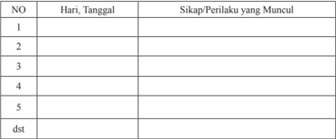

Tabel ini merupakan alat pengumpulan data yang digunakan untuk mencatat perilaku atau sikap seseorang pada setiap hari tertentu. Topik utamanya adalah tentang perubahan perilaku atau sikap seiring berjalannya waktu. Tabel ini memiliki dua kolom utama: "Hari, Tanggal" dan "Sikap/Perilaku yang Muncul". Kolom pertama menunjukkan tanggal dan hari tertentu, sementara kolom kedua menampilkan perubahan perilaku atau sikap yang muncul pada hari tersebut. Data penting yang terlihat adalah bahwa perilaku atau sikap seseorang dapat berubah secara signifikan dari hari ke hari, menunjukkan bahwa perilaku atau sikap ini tidak stabil tetapi cenderung berubah-ubah.

### · Penilaian Pengetahuan

### Tes tertulis :

- Apa arti sifat  Gereja itu Satu?
- Apa artinya Gereja hendaknya menghayati kesatuan, bukan uniformitas?
- Apa artinya Gereja harus menjadi Gereja yang  satu pada zaman ini?
- Apa arti sifat  Gereja itu Kudus?
- Apa artinya Gereja harus menjadi Gereja yang kudus pada zaman ini?
- Bagaimana cara mewujudkan kekudusan Gereja dalam hidup sehari-hari?
- Apa  arti Gereja yang Katolik berdasarkan Lumen Gentium  art 13?
- Apa  arti Gereja yang Katolik menurut  ajaran Kitab Suci?
- Apa saja  usaha-usaha untuk mewujudkan Gereja yang Katolik?
- Apa konsekuensi Gereja yang Katolik bagi para warganya?
- Apa arti sifat Gereja yang Apostolik?
- Sebutkan dan jelaskan  berbagai tradisi Gereja yang menunjukkan ciri Apostolik
- Apa  usaha-usaha Gereja  untuk mewujudkan sifat yang Apostolik pada zaman ini?

 

---
## 📄 Halaman 84

### · Penilaian Keterampilan:

Portofolio

Buatlah  refleksi tertulis tentang  bagaimana engkau menghayati  dan  mewujudkan sifat Gereja yang satu, kudus, katolik, dan apostolik.

### Praktik:

- Ikut terlibat dalam  kegiatan umat (doa bersama, pendalaman iman, aksi soial) di lingkungan, komunitas basis). Berdasarkan aktivitas tersebut, kemudian dibuat laporan tertulis.

### Kegiatan Remedial

Bagi  peserta  didik  yang  belum  memahami  Bab  ini,  diberikan  remidial  dengan kegiatan sebagai berikut:

- Guru menyampaikan pertanyaan kepada peserta didik akan hal-hal apa saja yang belum mereka pahami tentang sifat-sifat Gereja; satu, kudus, katolik, dan apostolik.
- Berdasarkan hal-hal yang belum mereka pahami, guru mengajak peserta didik untuk mempelajari kembali dengan memberikan bantuan peneguhan-peneguhan yang lebih praktis.
- Guru  memberikan  penilaian ulang untuk penilaian pengetahuan, dengan pertanyaan yang lebih sederhana, sesuai dengan kondisi peserta didik.

### Kegiatan Pengayaan

Bagi  peserta  didik  yang  telah  memahami  Bab  ini,  diberikan  pengayaan  dengan kegiatan-kegiatan berikut.

- Guru meminta peserta didik untuk melakukan studi pustaka (ke perpustakaan atau mencari di koran/ majalah) untuk menemukan cerita/ kisah tentang  perwujudan sifat-sifat Gereja; satu, kudus, katolik dan apostolik.
- Hasil temuannya ditulis dalam laporan tertulis yang berisi gambaran singkat dari kisah atau cerita tersebut.

 

---
## 📄 Halaman 85

### Peran Hierarki dan Kaum Awam

### Bab III dalam Gereja Katolik

Setelah  mempelajari sifat-sifat Gereja yaitu Gereja yang satu, kudus, katolik, dan apostolik ,    pada  bab  ini  kita  akan  mempelajari lebih lanjut tentang dua komponen penting  dalam  Gereja  sebagai  persekutuan  umat,  yaitu Hierarki dan Awam. Kita akan  mendalami  hubungan  antara  hierarki  dan  Awam,  khususnya  menyangkut pemahaman tentang Gereja yang institusional hierarkis dan Gereja yang mengumat.

Berkaitan  dengan  peranan  hierarki  dan  Awam,  Konsili  Vatikan  II  menegaskan antara lain; 'Dari harta kekayaan rohani Gereja kaum Awam, seperti semua orang beriman kristiani, berhak menerima secara melimpah melalui pelayanan para Gembala hierarkis, terutama bantuan sabda Allah dan sakramen-sakramen. Hendaklah para Awam  mengemukakan  kebutuhan-kebutuhan  dan  keinginan-keinginan  mereka kepada  para  Imam,  dengan  kebebasan  dan  kepercayaan,  seperti  layaknya  bagi anak-anak  Allah  dan  saudara-saudara  dalam  Kristus.  Sekadar  ilmu  pengetahuan, kompetensi  dan  kecakapan  mereka  para  Awam  mempunyai  kesempatan,  bahkan kadang-kadang juga kewajiban, untuk menyatakan pandangan mereka tentang halhal  yang  menyangkut  kesejahteraan  Gereja.  Bila  itu  terjadi,  hendaklah  dijalankan melalui  lembaga-lembaga  yang  didirikan  Gereja,  selalu  jujur,  tegas  dan  bijaksana, dengan hormat dan cinta kasih terhadap mereka, yang karena tugas suci bertindak atas nama Kristus' (LG 37).

Pada bab ini peserta didik  akan menggumuli  dua pokok bahasan yang  saling berkaitan satu dengan yang lainnya.

- Hierarki dalam Gereja Katolik
- Kaum Awam dalam Gereja Katolik
Peserta  didik  diharapkan  dapat    memahami  fungsi  dan  peranan  hierarki  dan Awam sehingga ikut berpartisipasi dalam hidup menggereja.

 

---
## 📄 Halaman 86

### Kompetensi Inti

- Menghayati dan mengamalkan ajaran agama yang dianutnya.
- Menghayati  dan  mengamalkan  perilaku  jujur,  disiplin,  tanggung  jawab,  peduli (gotong  royong,  kerja  sama,  toleran,  damai),  santun,  responsif  dan  proaktif dan menunjukkan sikap sebagai bagian dari solusi atas berbagai permasalahan dalam berinteraksi secara efektif dengan lingkungan sosial dan alam serta dalam menempatkan diri sebagai cerminan bangsa dalam pergaulan dunia.
- Memahami pengetahuan (faktual, konseptual dan prosedural) berdasarkan rasa ingin tahunya tentang ilmu pengetahuan, teknologi, seni, budaya terkait fenomena dan kejadian tampak mata
- Mengolah, menyaji, dan menalar dalam ranah konkret (menggunakan, mengurai, merangkai, memo difikasi, dan membuat) dan ranah abstrak (menulis,membaca, menghitung,  menggambar,  dan  mengarang)  sesuai  dengan  yang  dipelajari  di sekolah dan sumber lain yang sama dalam sudut pandang/teori.

 

---
## 📄 Halaman 87

### A. Hierarki dalam Gereja Katolik

### Kompetensi Dasar

- 1.3 Bersyukur atas  fungsi dan peranan hierarki serta awam dalam Gereja.
- 2.3 Bertanggung jawab pada  fungsi dan peranan hierarki Gereja.
- 3.3 Memahami  fungsi dan peranan hierarki serta kaum awam dalam Gereja Katolik
- 4.3 Melakukan aktivitas (misalnya menuliskan r efleksi/doa/puisi/ membuat rangkuman) tentang fungsi dan peranan Hierarki Gereja .

### Indikator

- Menjelaskan makna hierarki Gereja Katolik.
- Menjelaskan hubungan  hierarki dalam Gereja Katolik dengan pesan  Injil Yohanes 21:15-19.
- Menjelaskan pengertian dasar dan susunan hierarki dalam Gereja Katolik.
- Mendeskripsikan corak kepemimpinan dalam Gereja Katolik.
- Menyebutkan susunan struktur kepemimpinan atau hierarki dalam Gereja Katolik.

### Bahan Kajian

- Paham tentang hierarki dalam Gereja Katolik.
- Dasar biblis hierarki dalam Gereja (Yoh 21: 15-19).
- Pengertian dasar dan susunan hierarki dalam Gereja Katolik.
- Corak kepemimpinan dalam Gereja Katolik.

### Sumber Belajar

- A. Heuken, S.J. Ensiklopedi Gereja , CLC, Jakarta, 1991
- Pengalaman  peserta didik  dan guru.
- Kitab Suci (Yoh  21:15-19;  Yoh 15:16).
- Dokumen Konsili Vatikan II (LG art 18; 22; 23; 27; 29; 37 dan CD art 4-7.
- KWI, I man Katolik ,  Kanisius, Yogyakarta,  1995.
- Katekismus Gereja Katolik, Nusa Indah, Ende-Flores, 1995.

### Pendekatan

Kateketis dan saintifik

 

---
## 📄 Halaman 88

### Sarana

- Kitab Suci
- Skema Hierarki Gereja.
- Buku Siswa SMA/SMK, Kelas XI,  Pendidikan Agama Katolik dan Budi Pekerti.

### Waktu

3x45 menit.

- Apabila  pelajaran  ini  dibawakan  dalam  dua  kali  pertemuan  secara  terpisah, pelaksanaannya diatur oleh guru.

### Pemikiran Dasar

Kata 'Hierarki' berasal dari bahasa Yunani hierarchy yang berarti 'asal usul suci atau tata susunan' . Menurut ajaran resmi Gereja Katolik, susunan, struktur hierarki sekaligus  merupakan  hakikat  kehidupannya  juga.  Kitab  Suci  menjelaskan  bahwa perutusan  ilahi,  yang  dipercayakan  Kristus  kepada  para  Rasul,  akan  berlangsung sampai akhir zaman (lih. Mat 28:20). Sebab Injil, yang harus mereka wartakan, bagi Gereja merupakan azas seluruh kehidupan untuk selamanya. Maka dari itu, dalam himpunan yang tersusun secara hierarkis yaitu para Rasul telah berusaha mengangkat para pengganti mereka. Maka Konsili mengajarkan 'atas penetapan ilahi para Uskup menggantikan  para  Rasul  sebagai  gembala  Gereja' .  Kepada  para  Rasul    berpesan, agar  menjaga  seluruh  kawanan,  tempat  Roh  Kudus  mengangkat  mereka  untuk menggembalakan jemaat Allah (lih. Kis 20:28).(LG 20). Pengganti meraka yakni, para Uskup, dikehendaki-Nya menjadi gembala dalam Gereja-Nya hingga akhir zaman (LG 18). Maksud dari 'penetapan ilahi para Uskup menggantikan para Rasul sebagai gembala  Gereja'  ialah  bahwa  dari  hidup  dan  kegiatan  Yesus  timbullah  kelompok orang yang kemudian berkembang menjadi Gereja, seperti yang dikenal sekarang.

Struktur Hierarkis Gereja yang sekarang terdiri atas dewan para Uskup dengan Paus sebagai kepalanya, dan para Imam serta Diakon sebagai pembantu Uskup. Para Uskup  pengganti  para  Rasul  yang  dipimpin  oleh  Paus  pengganti  Petrus  bertugas melayani,  menggembalakan jemaat (bdk.  Yoh  21:  15-19 )    bersama  para  pembantu mereka,  yakni  para  Imam  dan  Diakon.  Sebagai  wakil  Kristus,  mereka  memimpin kawanan yang mereka gembalakan (pimpin), sebagai guru dalam ajaran, Imam dalam ibadat suci, dan pelayan dalam bimbingan (bdk. Lumen Gentium, Art. 20).

Pada  pembelajaran  ini  para  peserta  didik    dibimbing  untuk  memahami  arti, susunan,  dan  fungsi/peranan  hierarki  Gereja  Katolik  serta  tanggung  jawab  umat beriman terhadap hierarki dan pemuka agama Katolik sehingga mereka dapat ambil bagian dalam tugas penggembalaan Gereja.

 

---
## 📄 Halaman 89

### Kegiatan Pembelajaran

### Pembukaan: Doa

- Guru mengajak para peserta didik  untuk memulai  pelajaran dengan doa (misalnya).
Ya Bapa yang Mahabijaksana,

Syukur dan terima kasih kami haturkan kepada-Mu,

Atas para Gembala utusan-Mu ke tengah-tengah kami.

Mereka adalah Bapa Paus, para Uskup, para Imam dan Diakon untuk menuntun dan mendampingi kami para dombanya menuju ke tempat yang akan menyejahterakan hidup kami.

Kini kami hendak merenungkan kehadiran para Gembala kami dalam pertemuan ini. Arahkanlah pembicaraan kami ini agar kami dapat memahami dan menghayati kehadiran sebagai wujud cinta kasih-Mu. Demi Kristus Tuhan kami. Amin.

### Langkah Pertama:  Menggali Makna Hierarki dalam Gereja Katolik

### 1. Mengamati Pemahaman Peserta Didik tentang Hierarki

- Guru mengajak peserta didik untuk menyampaikan pemahamannya tentang makna hierarki dalam Gereja Katolik. Bisa juga peserta didik diminta untuk mengajukan pertanyaan-pertanyaan seputar hierarki.
- Guru meneguhkan jawaban-jawaban para peserta didik, kemudian mengajaknya untuk  beranjak pada kegiatan pembelajaran kedua.

### 2. Membaca, Menyimak Kisah

- Guru mengajak para peserta didik untuk membaca, menyimak kisah berikut ini.

### Mgr. Yohanes Harun Yuwono Resmi Menjadi Uskup Tanjungkarang

Kabut  tipis  perlahan  mulai  menyingkir  di  hembus  angin  pagi  di  tanah  seribu 'way' ini. Pagi melipat selimutnya dan berganti dengan kecerahan mentari, seolaholah  ikut  merasakan  kegembiraan  umat  Katolik  keuskupan  Tanjung  Karang.  Hari ini,  Kamis (10/10), merupakan hari yang bersejarah bagi umat Katolik Keuskupan Tanjungkarang  karena  pada  hari  ini  sebagian  dari  mereka  menyaksikan  tahbisan Uskup Tanjungkarang yang baru. Upacara tahbisan yang diselenggarakan di lapangan Kompleks  Sekolah  Xaverius  Pahoman,  Bandar  Lampung,  ini  dihadiri  oleh  ribuan umat dan berlangsung meriah.

 

---
## 📄 Halaman 90

Antusiasme baik umat Keuskupan Tanjungkarang sendiri maupun dari kalangan kaum religius sungguh besar. Diperkirakan umat yang hadir mengikuti misa tahbisan ini  sekitar  10.000  orang,  jauh  lebih  banyak  daripada  undangan  yang  disebar  yaitu 7.000. Umat terlihat tumpah ruah menyesaki halaman Kompleks Sekolah Xaverius dan  bahkan  ruang-ruang  kelas  dipakai  untuk  mengikuti  misa  Penahbisan  Uskup Tanjungkarang  yang  baru  ini.  Sementara  itu,  acara  tersebut  juga  dihadiri  oleh  27 Uskup  dari  seluruh  Indonesia,  empat  Uskup  emeritus  serta  lebih  dari  200  orang Imam yang datang dari berbagai keuskupan, antara lain: Keuskupan Agung Medan, Keuskupan Agung Palembang, Keuskupan Pangkalpinang, Keuskupan Agung Jakarta, dan Keuskupan Bogor.

Acara  Tahbisan  Uskup  baru  Tanjungkarang  ini  juga  dihadiri  oleh  Duta  Besar Vatikan untuk Indonesia, Mgr. Antonio Guido Filipazzi yang secara langsung mewakili Bapa Suci, Fransiskus. Di antara sejumlah tamu undangan yang hadir, tampak antara lain: Bapak Kardinal Yulius Darmaatmaja S.J. Ketua KWI, Mgr. Ignatius Suharyo, dan Dirjen Bimas Katolik RI, Bp. Antonius Semara Duran. Acara tahbisan Uskup baru Tanjungkarang, Mgr. Yohanes Harun Yuwono yang dimulai pada pukul 09.00 WIB tersebut  berjalan  dengan  hikmat.  Bertindak  sebagai  Uskup  Penahbis  adalah  Mgr. Aloysius Sudarso S.C.J, Uskup Agung Keuskupan Agung Palembang yang sekaligus adalah mantan Administrator Apostolik KeUskupan Tanjungkarang sebelum terpilihnya Mgr. Harun Yuwono didampingi oleh Mgr. Anicetus Sinaga O.F.M.Cap sebagai penahbis pertama, serta Mgr Hilarius Moa Nurak S.V .D, Uskup KeUskupan Pangkalpinang, sebagai penahbis kedua

Sebelum berkat meriah penutup Mgr. Ignatius Suharyo, Ketua KWI, menyampaikan kata sambutannya yang antara lain menyebutkan bahwa motto yang dipilih oleh Mgr. Yuwono, ' Non Est Personarum Acceptor Deus ' (Kis 10:34) mencerminkan keluasan hati beliau. Mgr. Suharyo mengharapkan bahwa Uskup Harun Yuwono tetap menjadi Harun seperti cerita dalam Perjanjian Lama untuk mendampingi 'Musa-Musa kecil' di KeUskupan Tanjungkarang memimpin umat Allah.

Sementara itu, Duta Besar Vatikan  dalam  kata  sambutannya antara lain menyebutkan bahwa rasa suka cita umat  Keuskupan Tanjungkarang karena memperoleh gembala yang baru harus diperdalam dan diperluas. Hal ini membutuhkan fondasi yang kuat, yaitu iman. Duta Vatikan mengharapkan dengan mengutip sebagian isi dokumen Lumen Fidei no. 18 - bahwa Uskup Tanjungkarang yang baru juga harus memandang  dirinya,  visinya,  umat  yang  dipercayakan  Tuhan  dengan  pandangan penuh kasih, bahkan dengan kasih seperti Yesus sendiri. Menjadi Uskup bukanlah menjadi  manajer  atau  penguasa,  melainkan  gembala  seperti  Yesus.  Sementara  itu, di  lain  pihak  umat  pun  tidak  perlu  bertanya-tanya  tentang  asal-usul,  suku,  gelar akademis, ataupun keterbatasan Uskup baru. Mereka diharapkan memandang segala situasi dengan mata Yesus sendiri, yaitu mata iman. Dalam diri Uskup yang memiliki keterbatasan, tetap ada Yesus yang hadir di sana.

Uskup  terpilih,  Mgr.  Yohanes  Harun  Yuwono  dalam  kata  sambutannya  antara lain  menyampaikan  rasa  terima  kasih  kepada  Mgr.  A.  Henrisoesanto  S.C.J.  yang memberikan fondasi dasar baginya untuk menjadi seorang Imam Diosesan hingga

 

---
## 📄 Halaman 91

saat ini serta mengajak umat dalam keterbatasan dirinya mau berjalan bersama untuk mewujudkan  kehendak  baik.  Uskup  Yuwono  juga  mengharapkan  dukungan  dari semua umat beriman, baik Imam maupun Awam untuk bersama-sama menciptakan kerukunan dan kedamaian. 'Inilah persaudaraan sejati dalam perziarahan menuju keselamatan berdasarkan iman akan Allah yang menghendaki semua orang selamat,' ucapnya. (Dokpen KWI)

Sumber: http://www.mir ifica.net/11/10/13

### 3. Diskusi kelas

- Guru  mengajak  para  peserta  didik    untuk  merumuskan  pertanyaan-pertanyaan diskusi guna mendalami isi/pesan dari cerita. Pertanyaan-pertanyaan itu sebagai berikut.
- Apa  yang dikisahkan dalam cerita tersebut?
- Apa makna tahbisan seorang Uskup dalam Gereja Katolik?
- Apa makna hierarki Gereja katolik?
- Apa artinya menjadi rohaniwan dan gembala umat adalah suatu panggilan?

### Langkah Kedua: Menggali Ajaran Gereja tentang Hierarki dan Ajaran Kitab Suci tentang Panggilan dan Pilihan Tuhan untuk Menjadi Gembala Umat

### 1. Menyimak Ajaran Kitab Suci

- Peserta  didik  diajak  untuk  mencari  ayat-ayat    Kitab  Suci  Perjanjian  Baru  yang berbicara tentang panggilan dan Pilihan Tuhan untuk Menjadi Gembala Umat.
- Guru mengajak para peserta didik untuk membaca,  mendengarkan kutipan Kitab Suci (Yoh 21: 15-19) berikut ini:

### Gembalakanlah Domba-dombaku

15 Sesudah sarapan Yesus berkata kepada Simon Petrus: 'Simon, anak Yohanes, apakah engkau mengasihi Aku lebih dari pada mereka ini?' Jawab Petrus kepadaNya:  'Benar  Tuhan,  Engkau  tahu,  bahwa  aku  mengasihi  Engkau' .  Kata  Yesus kepadanya: 'Gembalakanlah domba-domba-Ku.'  16 Kata Yesus pula kepadanya untuk kedua kalinya: 'Simon, anak Yohanes, apakah engkau mengasihi Aku?' Jawab Petrus kepada-Nya: 'Benar Tuhan, Engkau tahu, bahwa aku mengasihi Engkau.' Kata Yesus kepadanya: 'Gembalakanlah domba-domba-Ku.'

17 Kata Yesus kepadanya untuk ketiga kalinya: 'Simon, anak Yohanes, apakah engkau mengasihi Aku?' Maka sedih hati Petrus karena Yesus berkata untuk ketiga kalinya:

*******

 

---
## 📄 Halaman 92

' Apakah engkau mengasihi Aku?' Dan ia berkata kepada-Nya: 'Tuhan, Engkau tahu segala sesuatu, Engkau tahu, bahwa aku mengasihi Engkau.' Kata Yesus kepadanya: 'Gembalakanlah domba-domba-Ku.  18  Aku berkata kepadamu: Sesungguhnya ketika engkau  masih  muda  engkau  mengikat  pinggangmu  sendiri  dan  engkau  berjalan ke  mana  saja  kau  kehendaki,  tetapi  jika  engkau  sudah  menjadi  tua,  engkau  akan mengulurkan tanganmu dan orang lain akan mengikat engkau dan membawa engkau ke tempat yang tidak kau kehendaki. ' 19 Dan hal ini dikatakan-Nya untuk menyatakan bagaimana Petrus akan mati dan memuliakan Allah. Sesudah mengatakan demikian Ia berkata kepada Petrus: 'Ikutlah Aku. '

### 2. Mendalami Teks Kitab Suci

- Guru mengajak para peserta didik untuk berdialog untuk  mendalami isi/pesan dari cerita di atas, misalnya dengan pertanyaan-pertanyaan berikut:
- Apa yang dapat kalian tangkap dari pengangkatan Petrus sebagai Gembala oleh Yesus dalam kisah tersebut?
- Mengapa Yesus memilih Petrus yang sering ceroboh dan labil untuk menjadi pemimpin umat-Nya?
- Mengapa tugas sebagai gembala/pimpinan dikaitkan dengan kasih?

### 3. Penjelasan

- Guru memberikan penjelasan, setelah dialog  tentang pesan Kitab Suci misalnya sebagai berikut.
- -Yesus memilih Petrus menjadi gembala dan pemimpin kawanan-Nya, walaupun Petrus sering ceroboh dan labil, bahkan pernah menyangkal-Nya sampai tiga kali. Pemilihan oleh Tuhan sungguh berdasarkan kasih karunia-Nya semata. Manusia tidak memiliki andil apa-apa untuk itu.
- -Yang dituntut oleh Tuhan dari Petrus (dan semua penggantinya) hanyalah kasih. Kasih dapat menghapus banyak dosa. Mungkin Tuhan berpikir seorang pemimpin yang tahu kelemahannya akan bersikap penuh pengertian dalam memimpin orang lain. Petrus akan banyak belajar dari kelemahannya. Yang penting adalah cintanya kepada Tuhan tidak diragukan.
- -Sekalipun  Petrus  sebagai  gembala  atau  siapa  pun  juga  yang  menjadi  gembala, Yesus selalu menyebut domba-domba itu sebagai 'domba-domba-Ku.' Kawanan domba itu tidak menjadi milik sang gembala manusia. Tidak seorang pun dapat menggantikan Yesus.
Dengan demikian, seorang pimpinan Gereja atau gembala dalam Gereja adalah orang yang sangat mengasihi Yesus dan bersedia menyerahkan nyawanya untuk Yesus dan umat gembalaannya.

 

---
## 📄 Halaman 93

### 4. Diskusi ajaran Gereja tentang hierarki Gereja Katolik

- G uru  mengajak  para  peserta  didik  untuk  membaca  dan  mendiskusikan  dalam kelompok  dokumen-dokumen  Konsili  Vatikan  II,  berikut  ini.  Masing-masing kelompok diberikan dokumen untuk didalami.

### Kelompok 1:

Untuk menggembalakan dan senantiasa mengembangkan umat Allah, Kristus Tuhan mengadakan  dalam  Gereja-Nya  aneka  pelayanan,  yang  tujuannya  kesejahteraan seluruh Tubuh. Para pelayan, yang mempunyai kekuasaan kudus, melayani saudarasaudara mereka, supaya semua yang termasuk Umat Allah. Karena itu, mempunyai martabat  kristiani  sejati,  dengan  bebas  dan  teratur  bekerja  sama  untuk  mencapai tujuan  tadi,  dan  dengan  demikian  mencapai  keselamatan.  Mengikuti  jejak  Konsili Vatikan  I,  Konsili  suci  ini  mengajarkan  dan  menyatakan,  bahwa  Yesus  Kristus Gembala kekal telah mendirikan Gereja Kudus, dengan mengutus para Rasul seperti Ia sendiri di utus oleh Bapa (lih. Yoh 20:21). Para pengganti mereka yakni para Uskup, dikehendaki-Nya  untuk  menjadi  gembala  dalam  Gereja-Nya  hingga  akhir  zaman. Namun, supaya episkopat itu sendiri tetap satu dan tak terbagi, Ia mengangkat Santo Petrus menjadi ketua para Rasul lainnya. Dan dalam diri Petrus itu Ia menetapkan adanya azas dan dasar kesatuan iman serta persekutuan yang tetap dan kelihatan. Ajaran tentang penetapan, kelestarian, kuasa dan arti Primat Kudus Imam Agung di Roma maupun tentang Wewenang Mengajarnya yang tak dapat sesat, oleh Konsili suci sekali lagi dikemukakan kepada semua orang beriman untuk diimani dengan teguh. Dan melanjutkan apa yang sudah dimulai itu Konsili memutuskan, untuk menyatakan dan memaklumkan dihadapan mereka semua ajaran tentang para Uskup, pengganti para Rasul, yang beserta pengganti Petrus, Wakil Kristus dan Kepala Gereja semesta yang kelihatan, memimpin rumah Allah yang hidup. (Lumen Gentium  artikel  18)

### Kelompok 2:

### (Kolegialitas Dewan para Uskup)

Seperti Santo Petrus dan para Rasul lainnya atas penetapan Tuhan merupakan satu Dewan para Rasul, begitu pula Imam Agung di Roma, pengganti Petrus, bersama para Rasul, merupakan himpunan yang serupa. Adanya kebiasaan amat kuno, bahwa para Uskup di seluruh dunia berhubungan satu dengan lainnya serta dengan Uskup di Roma dalam ikatan kesatuan, cinta kasih dan damai, begitu pula adanya Konsilikonsili yang dihimpun untuk mengambil keputusan-keputusan bersama yang amat penting,  sesudah  ketetapan  dipertimbangkan  dalam  musyawarah  banyak  orang, semua itu memperlihatkan sifat dan hakekat kolegial pangkat Uskup. Sifat itu dengan jelas sekali terbukti dari Konsili-Konsili Ekumenis, yang diselenggarakan disepanjang abad-abad  yang  lampau.  Sifat  itu  tercermin  pula  pada  kebiasaan  yang  berlaku sejak  zaman  kuno,  yakni  mengundang  Uskup-Uskup  untuk  ikut  berperan  dalam

 

---
## 📄 Halaman 94

mengangkat orang terpilih baru bagi pelayanan Imamat Agung. Seseorang menjadi anggota Dewan para Uskup dengan menerima tahbisan sakramental dan berdasarkan persekutuan hierarkis dengan Kepala maupun para anggota Dewan.

Adapun Dewan atau Badan para  Uskup  hanyalah  berwibawa  bila  bersatu  dengan Imam Agung di Roma, pengganti Petrus, sebagai Kepalanya, dan selama kekuasaan Primatnya terhadap semua, baik para Gembala maupun para beriman, tetap berlaku seutuhnya. Sebab Imam Agung di Roma berdasarkan tugasnya, yakni sebagai Wakil Kristus  dan  Gembala  Gereja  semesta,  mempunyai  kuasa  penuh,  tertinggi  dan universal terhadap Gereja; dan kuasa itu selalu dapat dijalankannya dengan bebas. Sedangkan  Badan  para  Uskup,  yang  menggantikan  Dewan  para  Rasul,  dan  tugas mengajar  dan  bimbingan  Pastoral,  bahkan  yang  melestarikan  Badan  para  Rasul, bersama dengan Imam Agung di Roma selaku Kepalanya, dan tidak pernah tanpa Kepala, merupakan subjek kuasa tertinggi dan penuh juga terhadap Gereja; tetapi kuasa  itu  hanyalah  dapat  dijalankan  dengan  persetujuan  Imam  Agung  di  Roma. Hanya Simonlah yang oleh Tuhan ditempatkan sebagai batu karang dan juru kunci Gereja  (lih.  Mat  16:18-19),  dan  diangkat  menjadi  Gembala  seluruh  kawananNya (lih. Yoh 21:15 dsl.). Tetapi tugas mengikat dan melepaskan, yang diserahkan kepada Petrus (lih. Mat 16:19), ternyata diberikan juga kepada Dewan para Rasul dalam persekutuan dengan Kepalanya (lih. Mat 18:18; 28:16-20)[64]. Sejauh terdiri dari  banyak  orang,  Dewan  itu  mengungkapkan  macam-ragam  dan  sifat  universal Umat Allah; tetapi sejauh terhimpun dibawah satu kepala, mengungkapkan kesatuan kawanan Kristus. Dalam Dewan itu para Uskup, sementara mengakui dengan setia kedudukan  utama  dan  tertinggi  Kepalanya,  melaksanakan  kuasanya  sendiri  demi kesejahteraan umat beriman mereka, bahkan demi kesejahteraan Gereja semesta; dan Roh Kudus tiada hentinya meneguhkan tata-susunan organis serta kerukunannya. Kuasa tertinggi terhadap Gereja seluruhnya, yang ada pada dewan itu, secara meriah dijalankan dalam Konsili Ekumenis. Tidak pernah ada Konsili Ekumenis, yang tidak disahkan atau sekurang-kurangnya diterima baik oleh pengganti Petrus. Adalah hak khusus Imam Agung di Roma untuk mengundang Konsili itu, dan memimpin serta mengesahkannya. Kuasa kolegial itu dapat juga dijalankan oleh para Uskup bersama Paus, kalau mereka tersebar diseluruh dunia, asal saja Kepala Dewan mengundang mereka  untuk  melaksanakan  tindakan  kolegial,  atau  setidak-tidaknya  menyetujui atau dengan bebas menerima kegiatan bersama para Uskup yang terpencar, sehingga sungguh-sungguh terjadi tindakan kolegial.( Lumen Gentium artikel 22)

### Kelompok 3:

### (Tugas menggembalakan)

Para Uskup membimbing Gereja-Gereja khusus yang dipercayakan kepada mereka sebagai  wakil  dan  utusan  Kristus,  dengan  petunjuk-petunjuk,  nasihat-nasihat  dan teladan mereka, tetapi juga dengan kewibawaan dan kuasa suci. Kuasa itu hanyalah mereka  gunakan  untuk  membangun  kawanan  mereka  dalam  kebenaran  dan

 

---
## 📄 Halaman 95

kesucian, dengan mengingat bahwa yang terbesar hendaklah menjadi sebagai yang paling muda dan pemimpin sebagai pelayan (lih. Luk 22:26-27). Kuasa, yang mereka jalankan sendiri atas nama Kristus, bersifat pribadi, biasa dan langsung, walaupun penggunaannya  akhirnya  diatur  oleh  kewibawaan  tertinggi  Gereja,  dan  dapat diketahui batasan-batasan tertentu, demi faedahnya bagi Gereja atau Umat beriman. Berkat kuasa itu para Uskup mempunyai hak suci dan kewajiban dihadapan Tuhan untuk  menyusun  undang-undang  bagi  bawahan  mereka,  untuk  bertindak  sebagai hakim, dan mengatur segala-sesuatu, termasuk ibadat dan keRasulan. Secara penuh mereka diserahi tugas kegembalaan, atau pemeliharaan biasa dan sehari-hari terhadap kawanan mereka. Mereka itu jangan dianggap sebagai wakil Imam Agung di Roma, sebab mereka mengemban kuasa mereka sendiri, dan dalam arti yang sesungguhnya disebut  pembesar  umat  yang  mereka  bimbing.  Maka  kuasa  mereka  tidak  dihapus oleh  kuasa  tertinggi  dan  universal,  melainkan  justru  ditegaskan,  diteguhkan  dan dipertahankan.  Sebab  Roh  Kudus  memelihara  secara  utuh  bentuk  pemerintahan yang ditetapkan oleh Kristus Tuhan dalam Gereja-Nya.

Uskup diutus oleh Bapa keluarga untuk memimpin keluarga-Nya. Maka hendaknya ia mengingat teladan Gembala Baik, yang datang tidak untuk dilayani melainkan untuk melayani (lih. Mat 20:28; Mrk 10:45), dan menyerahkan nyawa-Nya untuk dombadomba-Nya (lih. Yoh 10:11). Ia diambil dari manusia dan merasa lemah sendiri. Maka ia  dapat  memahami mereka yang tidak tahu dan sesat (lih. Ibr 5:1-2). Hendaklah ia  selalu  bersedia  mendengarkan  bawahannya,  yang  dikasihinya  sebagai  anakanaknya sendiri dan diajak untuk gembira bekerja sama dengannya. Ia kelak akan memberikan pertanggungjawaban atas jiwa-jiwa mereka dihadapan Allah (lih. Ibr 13:17). Maka hendaklah ia dalam doa, pewartaan dan segala macam amal cinta kasih memperhatikan mereka maupun orang-orang, yang telah dipercayakan kepadanya dalam Tuhan. Seperti Rasul Paulus ia berhutang kepada semua. Maka hendaklah ia bersedia mewartakan Injil kepada semua orang (lih. Rom 1:14-15), dan mendorong Umatnya yang beriman untuk ikut serta dalam kegiatan keRasulan dan misi. Adapun kaum beriman wajib patuh terhadap Uskup, seperti Gereja terhadap Yesus Kristus, dan  seperti  Yesus  Kristus  terhadap  Bapa.  Demikianlah  semua  akan  sehati  karena bersatu [98], dan melimpah rasa syukurnya demi kemuliaan Allah (lih. 2Kor 4:15).

(Lumen Gentium artikel 27)

### Kelompok 5:

### (Para Diakon)

Pada tingkat hierarki yang lebih rendah terdapat para Diakon, yang ditumpangi tangan 'bukan untuk Imamat, melainkan untuk pelayanan' . Sebab dengan diteguhkan rahmat sakramental mereka mengabdikan diri kepada Umat Allah dalam perayaan liturgi, sabda dan amal kasih, dalam persekutuan dengan Uskup dan para Imamnya. Adapun

 

---
## 📄 Halaman 96

tugas  Diakon,  sejauh  dipercayakan  kepadanya  oleh  kewibawaan  yang  berwenang, yakni:  menerimakan Babtis secara meriah, menyimpan dan membagikan Ekaristi, atas  nama  Gereja  menjadi  saksi  perkawinan  dan  memberkatinya,  mengantarkan Komuni  Suci  terakhir  kepada  orang  yang  mendekati  ajalnya,  membacakan  Kitab suci  kepada  kaum  beriman,  mengajar  dan  menasehati  Umat,  memimpin  ibadat dan doa kaum beriman, menerimakan sakramen-sakramentali, memimpin upacara jenazah dan pemakaman. Sambil membaktikan diri kepada tugas-tugas cinta kasih dan  administrasi,  hendaklah  para  Diakon  mengingat  nasehat  Santo  Polikarpus: 'Hendaknya mereka selalu bertindak penuh belaskasihan dan rajin, sesuai dengan kebenaran Tuhan, yang telah menjadi hamba semua orang' .

Namun, karena tugas-tugas yang bagi kehidupan Gereja sangat penting itu menurut tata-tertib  yang  sekarang  berlaku  di  Gereja  latin  di  pelbagai  daerah  sulit  dapat dijalankan,  pada  masa  mendatang  Diakonat  dapat  diadakan  lagi  sebagai  tingkat hierarki  tersendiri  dan  tetap.  Adalah  tugas  berbagai  macam  konferensi  Uskup setempat yang berwewenang, untuk menetapkan dengan persetujuan Imam Agung Tertinggi sendiri, apakah dan dimanakah sebaiknya diangkat Diakon-Diakon seperti itu  demi  pemeliharaan  jiwa-jiwa.  Dengan  ijin  Imam  Agung  di  Roma  Diakonat itu  dapat  diterimakan  kepada  pria  yang  sudah  lebih  masak  usianya,  juga  yang berkeluargapun juga kepada pemuda yang cakap tetapi bagi mereka ini hukum selibat harus dipertahankan. ( Lumen Gentium artikel 29)

### 4. Melaporkan Hasil Diskusi

- Guru mengajak para peserta didik untuk melaporkan hasil diskusi kelas. Kelompok lain diminta untuk menanggapi atau menanyakan untuk mendalaminya.

### 5.  Diskusi  tentang  Dasar  Kepemimpinan  dan  Struktur  Kepemimpinan dalam Gereja

- Guru mengajak para peserta didik  untuk memerhatikan hasil diskusi sebelumnya (dokumen-dokumen ajaran Gereja) kemudian berdiskusi kembali dalam  kelompok, dengan panduan pertanyaan-pertanyaan:
- Apakah dasar kepemimpinan atau hierarki dalam Gereja Katolik?
- Sebutkan dan jelaskanlah struktur kepemimpinan dalam Gereja Katolik!
- Bagaimanakah fungsi dan corak kepemimpinan dalam Gereja!

### 6. Melaporkan Hasil Diskusi

- Guru meminta setiap kelompok untuk melaporkan hasil diskusinya dan ditanggapi oleh kelompok lain.

 

---
## 📄 Halaman 97

### 7. Membuat Rangkuman Bersama-sama

- Guru  bersama  para  peserta  didik  membuat  rangkuman  hasil  diskusi,  misalnya sebagai berikut.

### Dasar kepemimpinan (hierarki) dalam Gereja

Gereja  adalah  persekutuan  yang  semua  anggotanya  sungguh-sungguh  sederajat martabatnya, sederajat pula kegiatan umum dalam membangun Tubuh Kristus (LG 31). Ada fungsi khusus dalam Gereja yang diemban oleh hierarki, ada corak hidup khusus  yang  dijalani  Biarawan/Biarawati,  ada  fungsi  dan  corak  hidup  keduniaan yang menjadi medan khas para Awam. Tetapi yang pokok adalah iman yang sama akan Allah dalam Kristus oleh Roh Kudus. Yang umum lebih penting daripada yang khusus.

### Hierarki dalam Gereja Katolik

Kata  hierarki  berasal  dari  bahasa  Yunani  'hierarchy'  yang  berarti  jabatan  ( hieros ) suci ( archos ).  Itu  berarti bahwa yang termasuk dalam hierarki adalah mereka yang mempunyai jabatan karena mendapat penyucian melalui tahbisan. Maka mereka serng disebut sebagai kuasa tahbisan. Dan orang yang termasuk hieraki disebut sebagai para tertahbis. Namun, pada umumnya hierarki diartikan sebagai tata susunan. Hieraki sebagai pejabat umat beriman kristiani dipanggil untuk menghadirkan Kristus yang tidak kelihatan sebagai tubuh-Nya, yaitu Gereja. Dalam tingkatan hieraki tertahbis ( hierarchia ordinis ),  Gereja terdiri dari Uskup, Imam, dan Diakon (KHK 330-572). Menurut tata susunan yurisdiksi ( hierarchia yurisdictionis ), yurisdiksi ada pada Paus dan para Uskup yang disebut kolegialitas. Kekhasan hierarki terletak pada hubungan khusus mereka dengan Kristus sebagai gembala umat.

### Sejarah hierarki

Struktur  hierarki  bukanlah  suatu  yang  ditambahkan  atau  dikembangkan  dalam sejarah Gereja. Menurut ajaran Konsili Vatikan II, struktur itu dikehendaki Tuhan dan akhirnya berasal dari Kristus sendiri. Hal ini dapat dilihat dalam sejarah hierarki di bawah ini:

### Zaman Para Rasul

Awal perkembangan hierarki adalah kelompok kedua belas Rasul. Kelompok inilah yang pertama-tama disebut Rasul. Rasul atau ' Apostolos' adalah utusan. Akan tetapi setelah kebangkitan Kristus, sebutan Rasul tidak hanya untuk kelompok kedua belas, melainkan juga utusan-utusan selain kelompok kedua belas itu. Bahkan akhirnya, semua 'utusan jemaat' (2Kor8:22) dan semua 'utusan Kristus' (2Kor 5:20) disebut Rasul. Lama kelamaan, kelompok Rasul lebih luas dari pada kelompok kedua belas Rasul. Sesuai dengan namanya, Rasul diutus untuk mewartakan iman dan memberi kesaksian tentang kebangkitan Kristus.

 

---
## 📄 Halaman 98

### Zaman sesudah Para Rasul

Setelah kedua belas Rasul tidak ada, muncul aneka sebutan, seperti 'penatua-penatua' (Kis  15:2),  dan  'Rasul-Rasul' ,  'Nabi-Nabi' ,  Pemberita-Pemberita  Injil' ,  GembalaGembala',  'Pengajar'  (Ef  4:11),  'Episkopos'  (Kis  20:28),  dan  'Diakonos'  (1Tim 4:14). Dari sebutan itu ada banyak hal yang tidak jelas arti dan maksudnya. Namun pada akhir perkembangannya, ada struktur dari Gereja St. Ignatius dari Antiokhia yang mengenal sebutan 'Penilik' (Episkopos), 'Penatua' (Prebyteros) , dan 'Pelayan' (Diakonos). Struktur inilah yang selanjutnya menjadi struktur hierarki Gereja yang menjadi Uskup, Imam, dan Diakon. Di sini yang penting, bukanlah kepemimpinan Gereja yang terbagi atas aneka fungsi dan peran, melainkan bahwa tugas pewartaan para Rasul lama-kelamaan menjadi tugas kepemimpinan jemaat.

### Dasar kepemimpinan (hierarki) dalam Gereja

Berdasarkan sejarah di atas, kepemimpinan dalam Gereja diserahkan kepada hierarki. Konsili  mengajarkan bahwa 'atas penetapan Ilahi, para Uskup menggantikan para Rasul sebagai penggembala Gereja' (lih LG 20). ' Konsili suci ini mengajarkan dan mengatakan bahwa Yesus Kristus, Gembala kekal, mendirikan Gereja kudus dengan mengutus para Rasul seperti Dia diutus oleh Bapa (lih Yoh 20:21). Para pengganti mereka,  yakni  para  Uskup,  dikehendaki-Nya  menjadi  gembala  dalam  gereja-Nya sampai akhir zaman (lih. LG 18).

Pernyataan  di  atas  dimaksudkan  bahwa  dari  hidup  dan  kegiatan  Yesus  timbullah kelompok orang yang kemudian berkembang menjadi Gereja, seperti yang dikenal sekarang.  Proses  perkembangan  pokok  itu  terjadi  dalam  umat  perdana  (Gereja Perdana), yakni Gereja yang mengarang Kitab Suci Perjanjian Baru. Jadi, dalam kurun waktu antara kebangkitan Yesus dan awal abad kedua secara prinsip terbentuklah hierarki  gereja  yang  dikenal  sekarang.  Wujud  Gereja  perdana  beserta  struktur kepemimpinannya menjadi patokan bagi perkembangan Gereja selanjutnya.

### Struktur kepemimpinan (hierarki) dalam Gereja

Secara struktural kepemimpinan dalam Gereja sekarang dapat diurutkan sebagai berikut.

### Dewan Para Uskup dengan Paus sebagai Kepalanya

Ketika  Kristus  mengangkat  kedua  belas  Rasul,  Ia  membentuk  mereka  menjadi semacam dewan atau badan tetap. Sebagai ketua dewan, Yesus mengangkat Petrus yang  dipilih-Nya  dari  antara  para  Rasul  itu.  Seperti  Santo  Petrus  dan  para  Rasul lainnya, atas penetapan Kristus merupakan satu dewan para Rasul. Begitu pula Paus (penganti Petrus) bersama Uskup (pengganti Rasul) merupakan satu himpunan yang serupa.Pada akhir masa Gereja perdana, sudah diterima cukup umum bahwa para

 

---
## 📄 Halaman 99

Uskup adalah pengganti para Rasul. Tetapi hal itu bukan berarti bahwa hanya ada dua belas Uskup (karena ada dua belas Rasul). Bukan Rasul satu per satu diganti orang lain, tetapi kalangan para Rasul sebagai pemimpin Gereja diganti oleh para Uskup. Tegasnya Dewan para Uskup adalah pengganti para Rasul (LG 20). Yang menjadi pimpinan Gereja adalah Dewan para Uskup.

Seseorang  menjadi  Uskup  karena  diterima  ke  dalam  dewan.  'Seseorang  menjadi anggota Dewan Para Uskup dengan menerima tahbisan sakramental dan berdasarkan persekutuan hierarkis dengan kepala maupun para anggota Dewan' (LG 22). Sebagai lambang kolegial ini, tahbisan Uskup selalu dilakukan paling sedikit tiga Uskup, sebab tahbisan Uskup berarti bahwa seorang anggota baru diterima ke dalam Dewan Uskup' (LG 11). Uskup itu pertama-tama adalah pemimpin Gereja setempat. Namun, dalam persekutuan gereja-gereja setempat hiduplah Gereja Universal. Dalam persekutuan dengan  Uskup-Uskup  lain  itu,  para  Uskup  setempat  menjadi  pemimpin  Gereja Universal. Maka, Uskup merupakan pemimipin Gereja setempat sekaligus pemimpin Gereja Universal.

### Paus

Konsili  Vatikan  II  menegaskan,  'adapun  dewan  atau  badan  para  Uskup  hanyalah berwibawa bila bersatu dengan Imam Agung di Roma pengganti Petrus sebagai kepala dan selama kekuasaan primatnya terhadap semua, baik para gembala maupun kaum beriman,  tetap  berlaku  seutuhnya. '  Imam  Agung  di  Roma  berdasarkan  tugasnya, yakni sebagai wakil Kristus dan gembala Gereja semesta mempunyai kuasa penuh, tertinggi, dan universal terhadap Gereja, dan kuasa itu selalu dapat dijalankan dengan bebas (LG 22).

Penegasan  itu  didasarkan  bahwa  Kristus  mengangkat  Petrus  sebagai  ketua  para Rasul. Yesus mengangkat Santo Petrus menjadi ketua para Rasul lainnya. Dalam diri Petrus, Yesus menetapkan adanya asas dan dasar kesatuan iman serta persekutuan yang tetap dan kelihatan (bdk. LG 18) Petrus diangkat menjadi pemimpin para Rasul. Paus sebagai pengganti Petrus juga pemimpin para Uskup. Menurut kesaksian tradisi, Petrus adalah Uskup Roma yang pertama. Karena itu, Roma dipandang sebagai pusat dan pedoman seluruh Gereja. Menurut keyakinan tradisi, Uskup Roma itu pengganti Petrus,  bukan  hanya  sebagai  Uskup  lokal  melainkan  terutama  dalam  fungsinya sebagai ketua Dewan Pimpinan Gereja. Paus adalah Uskup Roma, dan sebagai Uskup Roma, ia adalah pengganti Petrus dengan tugas dan kuasa seperti Petrus.

Tugas dan kuasa Petrus, menurut Perjanjian Baru, begitu istimewa (Mat 16:16-19; Yoh 21:15-19), Ia diakui sebagai pemimpin Gereja. 'Para Rasul menghimpun Gereja semesta, yang oleh Tuhan didirikan dalam diri mereka dan di atas Rasul Petrus, ketua mereka,  sedangkan  Yesus  Kristus  sendiri  sebagai  batu  sendinya'  (LG  19).  Fungsi dan kedudukan Petrus sebagai pemimpin Gereja diakui pula sebagai unsur prinsip hierarki, yang akhirnya berasal dari Kristus sendiri. Itulah tugas dan wewenang Paus, pengganti Petrus.

 

---
## 📄 Halaman 100

### Uskup

Pada  dasarnya  Paus  adalah  seorang  Uskup.  Seorang  Uskup  selalu  berkarya  dalam persekutuan dengan para Uskup lain dan mengakui Paus sebagai kepala. Karya seorang Uskup adalah 'menjadi asas dan dasar kelihatan  bagi  kesatuan  dalam  Gereja-Nya (LG 23). Tugas pokok Uskup di tempatnya sendiri adalah pemersatu. Tugas hierarki yang pertama dan utama adalah mempersatukan dan mempertemukan umat. Tugas ini  dapat  disebut  tugas  kepemimpinan  dari  para  Uskup  'dalam  arti  sesungguhnya disebut pembesar umat yang mereka bimbing' (LG 27)

Tugas pemersatu ini selanjutnya dibagi menjadi tugas khusus menurut tiga bidang kehidupan gereja, yaitu pewartaan, perayaan, dan pelayanan, tempat dimungkinkan komunikasi iman dalam Gereja. Dan dalam bidang-bidang itulah para Uskup dan Paus menjalankan tugas kepemimpinannya. Pewartaan Injil menjadi tugas terpenting (LG 25). Tugas penting selanjutnya adalah perayaan, 'mempersembahkan ibadat agama Kristen kepada Allah yang Mahaagung dan mengaturnya menurut perintah Tuhan dan hukum Gereja' (LG 26). Selanjutnya adalah pelayanan, 'membimbing Gerejagereja yang dipecayakan kepada mereka sebagai wakil dan utusan Kristus, dengan petunjuk-petunjuk, nasihat-nasihat, dan teladan hidup mereka, tetapi juga dengan kewibawaan dan kuasa suci' (LG 27). Dalam ketiga bidang kehidupan menggereja, Uskup bertindak sebagai pemersatu, yang mempertemukan orang dalam komunikasi iman.

### Pembantu Uskup: Imam dan Diakon

Dalam mengemban tugas dan fungsinya, para Uskup memerlukan 'pembantu' dan rekan 'kerja' , mereka sebagai berikut:

### Para Imam: adalah Wakil Uskup

Dalam setiap jemaat setempat dalam arti tertentu, mereka menghadirkan Uskup. 'Para Imam dipanggil melayani umat Allah sebagai pembantu arif bagi badan Uskup, sebagai penolong dan organ mereka '(LG 28). Tugas konkret para Imam sama seperti Uskup. Mereka ditahbiskan pertama-tama untuk mewartakan Injil (lih. PO 4) dan menggembalakan umat (lih. PO 6)

### Diakon: pelayan, hierarki tingkat yang lebih rendah

Ditumpangi tangan bukan untuk Imamat tetapi untuk pelayanan (LG 29). Mereka ini juga pembantu Uskup, tetapi tidak mewakili. Para Diakon adalah pembantu Uskup dengan tugas terbatas. Dengan kata lain Diakon adalah pembantu khusus Uskup, sedangkan Imam adalah pembantu umum Uskup.

### Kardinal:

Kardinal  bukan  jabaran  hierarkis  dan  tidak  termasuk  struktur  hierarkis.  Kardinal adalah penasihat dan pembantu Paus dalam tugas reksa harian seluruh Gereja. Mereka

 

---
## 📄 Halaman 101

membentuk suatu dewan Kardinal. Jumlah dewan yang berhak memilih Paus dibatasi 120 orang di bawah usia 80 tahun. Seorang Kardinal dipilih oleh Paus secara bebas.

### Fungsi Khusus Hierarki

Seluruh umat Allah mengambil bagian di dalam tugas Kristus sebagai nabi (mengajar), Imam (menguduskan), dan Raja (menggembalakan). Pada kenyataannya umat tidak seragam, maka Gereja mengenal pembagian tugas tiap komponen umat (hierarki, biarawan/biarawati,  dan  awam).  Menjalankan  tugas  dengan  cara  yang  berbeda. Berdasarkan  keterangan  yang  telah  diungkapkan  di  atas,  fungsi  khusus  hierarki sebagai berikut:

- -Menjalankan  tugas  Gerejani,  yakni  tugas-tugas  yang  langsung  dan  eksplistis menyangkut kehidupan beriman Gereja, seperti: pelayanan sakramen-sakramen, dan mengajar.
- -Menjalankan  tugas  kepemimpinan  dalam  komunikasi  iman.  Hierarki  mempersatukan umat dalam iman dengan petunjuk, nasihat, dan teladan.

### Corak Kepemimpinan dalam Gereja

- -Kepemimpinan dalam Gereja  merupakan  suatu  panggilan  khusus  dan  campur tangan Tuhan merupakan unsur yang dominan. Kepemimpinan Gereja tidak diangkat oleh manusia  berdasarkan bakat, kecakapan, atau prestasi tertentu.  Kepemimpinan  dalam  Gereja  tidak  diperoleh  oleh  kekuatan  manusia sendiri.  'Bukan  kamu  yang  memilih  Aku,  tetapi  Akulah  yang  memilih  kamu. ' Kepemimpinan  dalam  masyarakat  dapat  diperjuangkan  oleh  manusia,  tetapi kepemimpinan dalam Gereja tidaklah demikian.
- -Kepemimpinan dalam Gereja bersifat mengabdi dan melayani dalam arti semurnimurninya, walaupun ia sungguh mempunyai wewenang yang berasal dari Kristus sendiri.
- -Kepemimpinan gerejani adalah kepemimpinan melayani, bukan untuk dilayani, sebagaimana yang ditunjukkan oleh Yesus sendiri.  Maka    Paus  disebut  sebagai 'Servus Servorum Dei' =hamba dari hamba-hamba Allah.
- -Kepemimpinan hierarki berasal dari Tuhan, maka tidak dapat dihapuskan oleh manusia.  Kepemimpinan  dalam  masyarakat  dapat  diturunkan  oleh  manusia, karena ia memang diangkat dan diteguhkan oleh manusia.

### Langkah Ketiga:  Menghayati dan Menghormati  Hierarki dalam Gereja Katolik

### 1. Re fleksi

- Guru mengajak para peserta didik untuk menulis sebuah r efleksi  tentang  kepemipinan hierarki yang diharapkan di parokinya.

 

---
## 📄 Halaman 102

### 2. Rencana Aksi

- Guru mengajak para peserta didik menuliskan  doa untuk para pemimpin Gereja!
- Membuat niat untuk selalu menghormati para pemimpin Gereja, lokal, dan universal, juga termasuk para ketua dan pengurus lingkungan atau ketua dan pengurus umat basisnya masing-masing.

### Penutup

- Guru mengajak para peserta didik untuk mengakhiri pelajaran dengan doa.
Ya Bapa,

Baru saja kami Kau tuntun untuk mengerti lebih mendalam dalam pertemuan ini, makna kehadiran para Gembala kami di tengah himpitan dunia ini. Kami mohon kepada-Mu, berilah kepada kami kerendahan hati untuk mengikuti teladannya dan juga anugerahkanlah kepada para gembala kami: Bapa Suci, para Uskup, para Imam dan Diakon kesehatan yang baik, kesejahteraan dan tambahkanlah iman agar semakin setia menuntun hidup kami. Engkau kami puji kini dan sepanjang masa.

### Penugasan

Peserta didik ditugasi  untuk mencari informasi, dengan cara mewawancarai Pastor paroki, membaca buku, atau membuka internet tentang hierarki Gereja Katolik Indonesia. Informasi tersebut ditulis kemudian dikumpulkan di kelas.

 

---
## 📄 Halaman 103

### B. Kaum  Awam dalam Gereja Katolik

### Kompetensi Dasar

- 1.3 Bersyukur atas  fungsi dan peranan hierarki serta awam dalam Gereja.
- 2.3 Bertanggung jawab pada  fungsi dan peranan hierarki Gereja.
- 3.3    Memahami  fungsi dan peranan hierarki serta kaum awam dalam Gereja Katolik.
- 4.3 Melakukan aktivitas (misalnya menuliskan r efleksi/doa/puisi/  membuat rangkuman)  tentang  fungsi  dan  peranan  Hierarki  serta  kaum  awam  dalam Gereja Katolik.

### Indikator

- Menjelaskan  arti  Kaum  Awam  menurut  ajaran  Gereja  LG  art.  30,  dan  peranan Kaum Awam dalam Gereja.
- Menjelaskan arti Kerasulan Awam.
- Menjelaskan  ciri khas Kerasulan Awam.
- Menjelaskan hubungan Awam dan hierarki yang sesungguhnya.
- Menemukan  bentuk-bentuk  tindakan  yang  yang  dapat  dilakukan  Kaum  Awam dalam membangun Gereja di lingkungan dan parokinya.

### Bahan Kajian

- Arti Kaum Awam dalam Gereja
- Arti Kerasulan Awam
- Ciri-ciri Kerasulan Awam
- Hubungan Awam dan hierarki
- Bentuk-bentuk  tindakan  yang  yang  dapat  dilakukan  Kaum  Awam  dalam membangun Gereja

### Sumber Bahan

- A. Heuken, S.J., Ensiklopedi Gereja , CLC, Jakarta, 1991
- Kitab Suci
- KWI, Iman Katolik ,  Kanisius, Yogyakarta, 1995
- Katekismus Gereja Katolik, Nusa Indah, Ende-Flores, 1995
- Dokpen KWI (penterj), D okumen Konsili Vatikan II, Obor,  Jakarta, 1993
- Konferensi Waligereja Indonesia. Iman Katolik. KanisiusYogyakarta/Obor-Jakarta, 1996.
- Kompendium Katekismus Gereja Katolik
- Kompendium Ajaran Sosial Gereja

 

---
## 📄 Halaman 104

### Pendekatan

Kateketis dan saint ifik

### Sarana

- Kitab Suci (Alkitab)
- Buku Siswa SMA/SMK, Kelas XI,  Pendidikan Agama Katolik dan Budi Pekerti.

### Waktu

3x45 menit.

- Apabila pelajaran ini dibawakan dalam dua kali pertemuan secara terpisah, maka pelaksanaannya diatur oleh guru.

### Pemikiran Dasar

Istilah ' Awam' diterjemahkan dari kata Yunani 'Laikos' yang berarti bukan ahli. Dalam  kaitan dengan kehidupan agama Yahudi, kelompok ' Awam' adalah anggota umat yang bukan golongan Imam atau Levit yang terkenal sebagai ahli Kitab Suci (Taurat). Kompendium Ajaran Sosial Gereja  menjelaskan bahwa 'ciri khas hakiki Kaum  Awam  beriman  yang  bekerja  di  kebun  anggur  Tuhan  (bdk.Mat  20:1-16) adalah  corak  sekular  dari  kemuridan  mereka  sebagai    orang    Kristen,  yang  justru dilaksanakan  di dalam dunia' . Fakta dalam kehidupan Gereja, bagian terbesar dalam Gereja  adalah Kaum Awam.  Menurut Lumen Gentium art.31 ,  Kaum Awam adalah semua orang beriman Kristiani kecuali mereka yang termasuk golongan Imam atau berstatus  religius  yang  diakui  dalam  Gereja.  Jadi,  kaum  beriman  Kristiani,  berkat baptis telah menjadi anggota Tubuh Kristus, terhimpun menjadi Umat Allah. Dengan cara mereka sendiri, mereka ikut mengemban tugas Imamat, kenabian, dan rajawi Kristus.  Dengan  demikian,  sesuai  dengan  kemampuannya  mereka  melaksanakan perutusan segenap umat Kristiani dalam Gereja dan dunia.Tugas khas Kaum Awam adalah melaksanakan dan mewujudkan kabar baik di tengah-tengah dunia, di mana kaum klerus dan biarawan-biarawati tidak dapat masuk ke dalamnya kecuali melalui Kaum Awam.

Dewasa ini keterlibatan Kaum Awam dalam tugas menggereja dan memasyarakat semakin  aktif.  Harus  diakui  bahwa  masih  ada  Awam  yang  masih  bersifat  pasif, menunggu  perintah  dari  hierarki.  Namun  demikian,  hal  itu  tidak  mengurangi meningkatnya partisipasi Kaum Awam dalam kegiatan kerasulan gerejani.

Melalui pelajaran ini, para peserta didik dibimbing untuk memahami siapa yang dimaksud dengan Kaum Awam dan apa yang menjadi tugas khasnya dalam Gereja dewasa ini. Peserta didik juga dibimbing untuk memahami makna, bentuk-bentuk Kerasulan  Awam  serta    apa  dan  bagaimana  hubungan  antara  Awam  dan  hierarki sebagai  partner kerja yang sederajat untuk membangun Kerajaan Allah.

 

---
## 📄 Halaman 105

### Kegiatan Pembelajaran

### Pembuka: Doa

- Guru mengajak para peserta didik untuk memulai pelajaran dengan doa, misalnya:
Ya Bapa yang Mahabijaksana,

Engkau telah mengangkat hamba-hamba-Mu, melalui Imamat yang suci menjadi pemimpin Gereja kami. Engkau juga memanggil semua orang kristiani, mereka yang tak tertahbis, para Awam, untuk terlibat aktif dalam karya-karya Gereja-Mu di dunia ini.  Kami mohon ya Bapa, semoga dalam pertemuan ini kami dapat mengerti dan memahami pentingnya keterlibatan Kaum Awam dalam gerak-gerak Gereja. Engkau yang kami puji kini dan sepanjang masa. Amin.

### Langkah Pertama: Menggali Pemahaman tentang Makna Kaum Awam dalam Gereja Katolik

### 1. Menyimak Cerita

- Guru mengajak para peserta didik untuk membaca, mendengarkan cerita berikut ini:

### Ignatius Joseph Kasimo, Pahlawan Nasional  Indonesia

Pendiri  Partai  Katolik,  Ignatius  Joseph  Kasimo  dianugerahi  gelar  Pahlawan Nasional.  Upacara  penganugerahan  gelar  pahlawan  nasional  dilakukan  di  Istana Negara oleh Presiden Susilo Bambang Yudhoyono, Selasa 8 November 2011  sebagai rangkaian dari perayaan hari Pahlawan 2011.

I.J.  Kasimo  mungkin  bagi  kebanyakan  masyarakat  Indonesia  merupakan  nama yang masih asing dan tidak terlalu dikenal, pun juga bagi sebagian orang Katolik. Ignatius  Joseph  Kasimo,  anak  seorang  prajurit  Keraton  Yogyakarta  yang  menjadi Katolik di bawah asuhan Pater van Lith, SJ telah menjadi teladan bagaimana berpolitik semestinya dihidupi dan mengabdi kepada kepentingan rakyat.

Pernah menjadi murid Pater van Lith, S.J. di Sekolah Guru Muntilan, IJ. Kasimo muda  mengabdikan  diri  dan  karyanya  di  bidang  pendidikan.  Selain  pendidikan, pernah juga  I.J.  Kasimo  muda  bekerja  sebagai  mandor  perkebunan  karet.  Namun karena  keberanian  I.J.  Kasimo  membela  buruh-buruh  yang  ditindas,  I.J.  Kasimo akhirnya dipindah kembali menjadi guru pertanian. Kedalamannya akan penghayatan iman katolik dalam hidup nyata di masyarakat dan bangsanya sangat dipengaruhi oleh pemahaman I.J. Kasimo tentang Ajaran Sosial Gereja. Inspirasi dari ASG yang menekankan  kemerdekaan,  persamaan  hak  dan  persatuan  bangsa  mendorong  I.J. Kasimo untuk mulai aktif di berbagai organisasi pergerakan dan politik.

 

---
## 📄 Halaman 106

Peranan  I.J.  Kasimo  dalam  perjuangan  kebangsaan  dimulai  dari  kegigihannya membela dan memperjuangkan hak-hak kemerdekaan di dalam Volksraad (Dewan Rakyat)  dari  tahun  1931-1943.  Pidato  terkenalnya  di  Volksraad  adalah  ketika  dia menyerukan kemerdekaan untuk bangsa Indonesia dalam sidang Volksraad 19 Juli 1932.

Bagi kalangan Katolik sendiri IJ.. Kasimo dipandang sebagai 'bapak politik' bagi umat  Katolik  Indonesia.  Lewat  Partai  Katolik  yang  didirikannya  I.J.  Kasimo  mau menggarisbawahi bahwa iman katolik adalah iman yang harusnya menggema dalam hidup bermasyarakat sehari-hari.

I.J.  Kasimo  melihat  politik  sebagai  sebuah  sarana  perjuangan  yang  harus dilaksanakan dengan menjunjung kemanusiaan dan kesejahteraan masyarakat. Dan ini  semua  dia  yakini  sebagai  sebuah  penghayatan  akan  iman  Katoliknya.  Sebagai seorang Katolik, I.J. Kasimo berani berdiri di persimpangan, mewartakan yang benar, dan atas keyakinan dan imannya dia berani memperjuangkan kebenaran itu.

Diangkatnya I.J. Kasimo menjadi Pahlawan Nasional seharusnyalah membuat kita umat Katolik diajak untuk kembali bercermin pada sosok I.J. Kasimo. Dewasa ini, baik para Uskup, umat dan kita semua, tidak banyak yang berdiri di 'persimpangan' untuk mewartakan kebenaran. Mungkin tidak ada lagi para Uskup atau Awam yang berani  bersuara  lantang  secara  individu  atas  ketidakadilan  baik  yang  menimpa umat Katolik  atau  masyarakat  pada  umumnya.  Bagaimana  politikus  Katolik?  Kita patut prihatin misalnya beberapa skandal di DPR baik hukum dan keuangan yang melibatkan politisi Katolik, yang tidak berani bersuara melantangkan kebenaran.

I.J.  Kasimo  adalah  potret  bagaimana  iman  bersuara  dan  mungkin  merupakan sebuah  'sketsa'  Gereja  yang  bersuara.  Dia  adalah  potret  bagaimana  iman  itu menggema dalam hidup  dan memberanikan diri berpijak pada 'yang benar' .Semoga kita  dan  Gereja  Katolik  Indonesia  tidak  semakin  takut  kepada  'yang  bayar'  atau malu-malu berbicara lantang tentang 'yang benar' . Bila kita takut, semoga bercermin pada Ignatius Joseph Kasimo dan Yesus sendiri membuat kita berani bangkit.

Sumber:

http://www.pmkri.or.id/ dari berbagai sumber

### 2. Pendalaman

- Guru  mengajak  peserta  didik  untuk  mendalami  isi/pesan  dari  cerita  kemudian membuat  pertanyaan-pertanyaan  untuk  di  diskusikan  bersama.  Pertanyaanpertanyaan misalnya;
- Siapakah I.J. Kasimo?
- Apa saja karyanya?
- Apa pandangannya tentang politik sebagai  seorang Awam Katolik?
- Apa yang dapat anda teladani dari Bp. I.J. Kasimo?

 

---
## 📄 Halaman 107

### 3. Penjelasan

- Guru memberikan penjelasan atas hasil diskusi, seperti berikut ini:
- -Semangat  Ajaran Sosial Gereja (ASG) yang menekankan kemerdekaan, persamaan hak dan persatuan bangsa mendorong I.J. Kasimo untuk aktif di berbagai organisasi pergerakan dan politik.
- -Melalui Partai Katolik yang didirikannya I.J. Kasimo bersaksi bahwa iman Katolik adalah iman yang harusnya menggema dalam hidup bermasyarakat sehari-hari.
- -I.J.  Kasimo  melihat  politik  sebagai  sebuah  sarana  perjuangan  yang  harus dilaksanakan dengan menjunjung kemanusiaan dan kesejahteraan masyarakat.

### Langkah Kedua 2:  Menggali Makna Awam dan Kerasulan Awam dalam Ajaran Gereja Katolik

### 1. Dialog kelas

- Guru  mengajak  peserta  didik  untuk  mengungkapkan  pemahamannya  tentang makna Kaum Awam dan Kerasulan Awam menurut ajaran Gereja Katolik.

### 2. Diskusi Kelompok

- Guru mengajak para peserta didik untuk berdiskusi dalam kelompok tentang makna Awam dan Kerasulan Awam menurut ajaran Gereja Katolik, berikut ini.

### 'Siapakah Kaum Awam Itu?'

'Yang  dimaksud  dengan  istilah  Awam  disini  ialah  semua  orang  beriman  kristiani kecuali mereka yang termasuk golongan Imam atau status religius yang diakui dalam Gereja. Jadi, kaum beriman kristiani, yang berkat babtis telah menjadi anggota tubuh Kristus, terhimpun menjadi Umat Allah, dengan cara mereka sendiri ikut mengemban tugas Imamat, kenabian dan rajawi Kristus, dengan demikian sesuai dengan kemampuan mereka melaksanakan perutusan segenap Umat kristiani dalam Gereja dan di dunia. Ciri khas dan istimewa Kaum Awam yakni sifat keduniaannya. Mereka yang termasuk golongan Imam, meskipun kadang-kadang memang dapat berkecimpung dalam urusan-urusan keduniaan, juga dengan mengamalkan profesi keduniaan, berdasarkan panggilan khusus dan tugas mereka terutama diperuntukkan bagi pelayanan suci. Sedangkan para religius dengan status hidup mereka memberi kesaksian yang cemerlang  dan  luhur, bahwa  dunia  tidak dapat  diubah  dan dipersembahkan kepada Allah, tanpa semangat Sabda bahagia. Berdasarkan panggilan mereka yang khas, Kaum Awam wajib mencari kerajaan Allah, dengan mengurusi hal-hal  yang  fana  dan  mengaturnya  seturut  kehendak  Allah.  Mereka  hidup  dalam dunia, artinya: menjalankan segala macam tugas dan pekerjaan duniawi, dan berada

 

---
## 📄 Halaman 108

ditengah kenyataan biasa hidup berkeluarga dan sosial. Hidup mereka kurang lebih terjalin dengan itu semua. Di situlah mereka dipanggil oleh Allah, untuk menunaikan tugas  mereka  sendiri  dengan  dijiwai  semangat  Injil,  dan  dengan  demikian  ibarat ragi  membawa  sumbangan  mereka  demi  pengudusan  dunia  bagaikan  dari  dalam. Begitulah  mereka  memancarkan  iman,  harapan  dan  cinta  kasih  terutama  dengan kesaksian  hidup  mereka,  serta  menampakkan  Kristus  kepada  sesama.  Jadi  tugas mereka yang istimewa yakni: menyinari dan mengatur semua hal-hal fana, yang eraterat melibatkan mereka, sedemikian rupa, sehingga itu semua selalu terlaksana dan berkembang menurut kehendak Kristus, demi kemuliaan Sang Pencipta dan Penebus' . ( Lumen Gentium , Art. 31)

### 3. Melaporkan Hasil Diskusi Kelompok

- Guru meminta setiap  kelompok  untuk  menyampaikan  hasil  diskusinya  di  depan kelas.

### 4. Menyimak Ajaran Gereja

- Guru  mengajak  para  peserta  didik  untuk  membaca,  dan  menyimak  dokumen berikut ini.
(Hubungan Kaum Awam dengan Hierarki)

'Dari  harta  kekayaan  rohani  Gereja  Kaum  Awam,  seperti  semua  orang  beriman kristiani,  berhak  menerima  secara  melimpah  melalui  pelayanan  para  Gembala hierarkis, terutama bantuan sabda Allah dan sakramen-sakramen. Hendaklah para Awam  mengemukakan  kebutuhan-kebutuhan  dan  keinginan-keinginan  mereka kepada  para  Imam,  dengan  kebebasan  dan  kepercayaan,  seperti  layaknya  bagi anak-anak  Allah  dan  saudara-saudara  dalam  Kristus.  Sekadar  ilmu  pengetahuan, kompetensi  dan  kecakapan  mereka  para  Awam  mempunyai  kesempatan,  bahkan kadang-kadang juga kewajiban, untuk menyatakan pandangan mereka tentang halhal yang menyangkut kesejahteraan Gereja. Bila itu terjadi, hendaklah itu dijalankan melalui lembaga-lembaga yang didirikan gereja untuk itu, dan selalu dengan jujur, tegas dan bijaksana, dengan hormat dan cinta kasih terhadap mereka, yang karena tugas suci bertindak atas nama Kristus.

Hendaklah para Awam, seperti semua orang beriman kristiani, mengikuti teladan Kristus, yang dengan ketaatan-Nya sampai mati, membuka jalan yang membahagiakan bagi  semua  orang,  jalan  kebebasan  anak-anak  Allah.  Hendaklah  mereka  dengan ketaatan  kristiani  bersedia  menerima  apa  yang  ditetapkan  oleh  para  Gembala hierarkis sejauh menghadirkan Kristus, sebagai guru dan pemimpin dalam Gereja. Dan janganlah  mereka  lupa  mendoakan  di  hadirat  Allah  para  pemimpin  mereka, sebab  para  pemimpin  itu  berjaga  karena  akan  memberi  pertanggungjawaban  atas

 

---
## 📄 Halaman 109

jiwa-jiwa kita, supaya itu mereka jalankan dengan gembira tanpa keluh-kesah (lih. Ibr 13:1).

Sebaliknya hendaklah para Gembala hierarkis mengakui dan memajukan martabat serta  tanggung  jawab  Kaum  Awam  dalam  Gereja.  Dan  Hendaklah  mereka  diberi kebebasan  dan  keleluasaan  untuk  bertindak;  bahkan  mereka  pantas  diberi  hati, supaya  secara  spontan  memulai  kegiatan-kegiatan  juga.  Hendaklah  para  Gembala dengan  kasih  kebapaan,  penuh  perhatian  dalam  Kristus,  mempertimbangkan prakarsa-prakarsa , usul-usul serta keinginan-keinginan yang diajukan oleh Kaum Awam. Hendaklah para Gembala dengan saksama mengakui kebebasan sewajarnya, yang ada pada semua warga masyarakat duniawi.

Dari  pergaulan  persaudaraan  antara  Kaum  Awam  dan  para  Gembala  itu  boleh diharapkan banyak manfaat bagi Gereja. Dengan demikian para Awam diteguhkan kesadaran bertanggung jawab dan ditingkatkan semangat. Lagi pula tenaga Kaum Awam lebih mudah digabungkan dengan karya para Gembala. Sebaliknya, dibantu oleh pengalaman para Awam, para Gembala dapat mengadakan penegasan yang lebih jelas  dan  tepat  dalam  perkara-perkara  rohani  maupun  jasmani.  Dengan  demikian seluruh Gereja, dikukuhkan oleh semua anggotanya akan menunaikan secara lebih tepat perutusannya demi kehidupan dunia.( Lumen Gentium artikel 37)

### 5. Diskusi

- Setelah  para  peserta  didik  membaca,  menyimak  ajaran    Gereja  tersebut,  guru mengajak para peserta didik untuk merumuskan pertanyaan-pertanyaan  tentang hal-hal yang berkaitan dengan isi dokumen tersebut.
- Guru mengajak para peserta didik untuk mendiskusikankan ajaran Gereja dengan bantuan pertanyaan, seperti berikut.
- Apa pengertian Awam?
- Bagaimana hubungan Kaum Awam dengan hierarki?
- Apa peran Awam dalam Gereja?

### 6. Penjelasan

- Guru  memberikan  penjelasan  sebagai  rangkuman  atas  hasil  diskusi  kelompok, misalnya sebagai berikut.

### Pengertian Awam

Yang  dimaksud  dengan  kaum  Awam  adalah  semua  orang  beriman  Kristiani  yang tidak termasuk golongan yang menerima tahbisan suci dan status kebiarawanan yang diakui dalam Gereja (lih. LG 31). D efinisi Awam dalam praktik dan dalam dokumendokumen Gereja ternyata mempunyai dua macam:

 

---
## 📄 Halaman 110

- -De finisi teologis : Awam adalah warga Gereja yang tidak ditahbiskan. Jadi, Awam meliputi  Biarawan/Biarawati  seperti  Suster  dan  Bruder  yang  tidak  menerima tahbisan suci.
- -D efinisi tipologis :  Awam adalah warga Gereja yang tidak ditahbiskan dan juga bukan Biarawan/Biarawati. Maka dari itu Awam tidak mencakup para Suster dan Bruder
- -Definisi ini dikutip dari Lumen Gentium yang rupanya menggunakan definisi tipologis. Dan untuk selanjutnya istilah ' Awam' yang digunakan adalah sesuai dengan pengertian tipologis di atas.

### Hubungan Awam dan Hierarki sebagai Partner Kerja

Sesuai dengan ajaran Konsili Vatikan II, rohaniwan (hierarki) dan Awam memiliki martabat  yang  sama,  hanya  berbeda  fungsi.  Semua  fungsi  sama  luhurnya,  asal dilaksanakan dengan motivasi yang baik, demi Kerajaan Allah.

### Peranan Awam

Peranan Awam sering diistilahkan sebagai Kerasulan Awam yang tugasnya dibedakan sebagai  Kerasulan  internal  dan  eksternal.  Kerasulan  internal  atau  kerasulan  'di dalam Gereja' adalah Kerasulan membangun jemaat. Kerasulan ini lebih diperani oleh  jajaran  hierarkis,  walaupun  Awam  dituntut  juga  untuk  mengambil  bagian  di dalamnya. Kerasulan eksternal atau keRasulan 'dalam tata dunia' lebih diperani oleh para Awam. Namun harus disadari bahwa keRasulan dalam Gereja bermuara pula ke dunia. Gereja tidak hadir di dunia ini untuk dirinya sendiri, tetapi untuk dunia. Gereja hadir untuk membangun Kerajaan Allah di dunia ini

### Kerasulan dalam Tata Dunia (eksternal)

Berdasarkan  panggilan  khasnya,  Awam  bertugas  mencari  Kerajaan  Allah  dengan mengusahakan  hal-hal  duniawi  dan  mengaturnya  sesuai  dengan  kehendak  Allah. Mereka hidup dalam dunia, yakni dalam semua dan tiap jabatan serta kegiatan dunia. Mereka dipanggil Allah menjalankan tugas khasnya dan dibimbing oleh semangat Injil. Mereka dapat menguduskan dunia dari dalam laksana ragi (lih. LG 31). Kaum Awam dapat menjalankan Kerasulannya dengan kegiatan penginjilan dan pengudusan manusia serta meresapkan dan memantapkan semangat Injil ke dalam 'tata dunia' sedemikian rupa sehingga kegiatan mereka sungguh-sungguh memberikan kesaksian tentang karya Kristus dan melayani keselamatan manusia.

Dengan kata lain 'tata dunia' adalah medan bakti khas kaum Awam. Hidup keluarga dan  masyarakat  yang  bergumul  dalam  bidang-bidang  ipoleksosbudhamkamnas hendaknya menjadi medan bakti mereka.

Sampai sekarang ini, masih banyak di antara kita yang melihat Kerasulan dalam tata dunia bukan sebagai kegiatan Kerasulan. Mereka menyangka bahwa Kerasulan hanya

 

---
## 📄 Halaman 111

berurusan  dengan  hal-hal  rohani  yang  sakral,  kudus,  serba  keagamaan,  dan  yang menyangkut kegiatan-kegiatan dalam lingkup Gereja.

Dengan  paham  gereja  sebagai  'Tanda  dan  Sarana  Keselamatan  Dunia'  yang dimunculkan oleh gaudium et Spes , di mana otonomi dunia dan sifatnya yang sekuler diakui, maka dunia dan lingkungannya mulai diterima sebagai partner dialog dapat saling  memperkaya  diri.  Orang  mulai  menyadari  bahwa  menjalankan  tugas-tugas duniawi tidak hanya berdasarkan alasan kewargaan dalam masyarakat atau negara saja,  tetapi  juga  karena  dorongan  iman  dan  tugas  Kerasulan  kita,  asalkan  dengan motivasi  yang  baik.  Iman  tidak  hanya  menghubungkan  kita  dengan  Tuhan,  tetapi sekaligus juga menghubungkan dengan sesama kita di dunia ini

### Kerasulan dalam Gereja (internal)

Karena Gereja itu Umat Allah, Gereja harus sungguh-sungguh menjadi Umat Allah. Ia  hendaknya  mengkonsolidasi  diri  untuk  benar-benar  menjadi  Umat  Allah.  Ini adalah tugas membangun gereja. Tugas ini dapat disebut Kerasulan internal. Tugas ini  pada  dasarnya  dipercayakan  kepada  golongan  hierarkis  (keRasulan  hierarkis), tetapi  Awam  dituntut  pula  untuk  ambil  bagian  di  dalamnya.  Keterlibatan  Awam dalam tugas membangun gereja ini bukanlah karena menjadi perpanjangan tangan dari hierarki atau ditugaskan hierarki, karena pembabtisan ia mendapat tugas itu dari Kristus. Awam hendaknya berpartisipasi dalam tri tugas gereja. 1) Dalam tugas nabiah (pewarta sabda), seorang Awam dapat mengajar agama, sebagai katekis,memimpin kegiatan pendalaman Kitab Suci atau pendalaman iman, dsb

Dalam tugas Imamiah (menguduskan), seorang Awam dapat

- memimpin doa dalam pertemuan uma;
- memimpin kor atau nyanyian dalam ibadah;
- membagi komuni sebagi proDiakon; dan
- menjadi pelayan putra Altar, dsb
Dalam tugas nabiah (pewarta sabda), seorang Awam dapat:

- menjadi anggota dewan paroki,
- menjadi ketua seksi, ketua lingkungan atau wilayah, dan sebagainya.
Hubungan antara Awam dan hierarki, perlu memerhatikan  hal-hal berikut ini.

### Gereja sebagai Umat Allah

Keyakinan bahwa semua anggota warga Gereja memiliki martabat yang sama, hanya berbeda fungsi dapat menjamin hubungan yang wajar antara semua komponen Gereja. Tidak  boleh  ada  klaim  bahwa  komponen-komponen  tertentu  lebih  bermartabat dalam  Gereja  Kristus  dan  menyepelekan  komponen  yang  lainnya.  Keyakinan  ini harus diimplementasikan secara konsekuen dalam hidup dan karya semua anggota Gereja.

 

---
## 📄 Halaman 112

### Setiap Komponen Gereja memiliki Fungsi yang khas

Setiap  komponen  Gereja  memiliki  fungsi  yang  khas.  Hierarki  yang  bertugas memimpin (melayani) dan mempersatukan Umat Allah. Biarawan/biarawati dengan kaul-kaulnya mengarahkan Umat Allah pada dunia yang akan datang (eskatologis) . Para  Awam  bertugas  merasul  dalam  tata  dunia.  Mereka  menjadi  Rasul  dalam keluarga-keluarga dan dalam masyarakat di bidang ipoleksosobudhamkamnas. Jika setiap komponen gereja menjalankan fungsinya masing-masing dengan baik, maka adanya kerja sama yang baik pasti terjamin.

### Kerja sama

Walaupun  tiap  komponen  memiliki  fungsinya  masing-masing,  namun  untuk bidang-bidang tertentu, terlebih dalam Kerasulan internal yaitu membangun hidup menggereja,  masih  dibutuhkan  partisipasi  dan  kerja  sama  dari  semua  komponen. Dalam  hal  ini  hendaknya  hierarki  tampil  sebagai  pelayan  yang  memimpin  dan mempersatukan.  Pimpinan  tertahbis,  yaitu  dewan  Diakon,  dewan  Presbyter,  dan dewan  Uskup  tidak  berfungsi  untuk  mengumpulkan  kekuasaan  ke  dalam  tangan mereka,  tetapi  untuk  menyatukan  rupa-rupa  tipe,  jenis,  dan  fungsi  pelayanan (kharisma) yang ada.

Hierarki berperan untuk memelihara keseimbangan dan persaudaraan di antara  sekian  banyak  tugas  pelayanan.  Para  pemimpin  tertahbis  memperhatikan serta  memelihara  keseluruhan  visi,  misi,  dan  reksa  pastoral.  Karena  itu,  tidak mengherankan bahwa di antara mereka termasuk dalam dewan hierarki ini ada yang bertanggung jawab untuk memelihara ajaran yang benar dan memimpin perayaan sakramen-sakramen.

### Langkah Ketiga:  Menghayati  Hubungan Awam dan Hierarki

### 1. Re fleksi

- Guru mengajak para peserta didik untuk membuat r efleksi tertulis dengan bantuan dua pertanyaan berikut ini:
- Bagaimana hubungan antara Awam dan pimpinan Gereja lokal di tempatmu?
- Bagaimana hubungan antara Awam dan pimpinan Gereja lokal yang ideal menurut pendapatmu?

### 2. Aksi

- Guru meminta para peserta  didik  untuk  menuliskan  sebuah  doa  dengan  intensi persatuan  Kaum  Awam  dan  hierarki  dalam  upaya  mewujudkan  Gereja  sebagai Umat Allah yang mewartakan kasih Allah di dunia.
- Guru  meminta  setiap  peserta  didik  untuk  membuat  rencana  aksi  pribadi  untuk selalu melakukan komunikasi yang baik dengan Pastor parokinya untuk bersamasama membangun kehidupan umat paroki yang semakin lebih baik.

 

---
## 📄 Halaman 113

### Penugasan

Guru  meminta  para  peserta  didik  untuk  mewawancarai  beberapa  tokoh  Awam di parokinya tentang  peran dan tugas para Awam kemudian membuat analisis dan penilaian.

### Penutup

- Guru mengajak para peserta didik  untuk menutup pelajaran dengan doa spontan yang sesuai dengan tema pembelajaran

### Tuhan Yesus,

Terima  kasih  kami  sampaikan  kepada-Mu,  karena  Engkau  telah  berkenan  hadir dan menyertai pembicaraan kami dalam pembelajaran ini. Ya Tuhan kami mohon, buatlah  agar  para  pemimpin  Gereja  kami  dengan  seluruh  Umat  Allah  sehati  dan sejiwa dalam membangun Gereja. Semangati juga diri kami, agar dapat terlibat aktif dalam kegiatan-kegiatan Gereja. Bapa Kami…. Salam Maria…

********

### Penilaian

Penilain Sikap (Spiritual dan Sosial)

JURNAL

Nama Peserta Didik

: …………………………………..

Kelas/Program

: …………………………………..

Mata Pelajaran

: …………………………………..

Semester

: …………………………………..

---
**📊 Tabel**

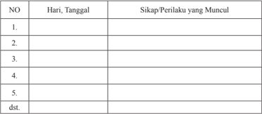

Tabel ini berisi informasi tentang sikap dan perilaku yang muncul pada hari tertentu. Kolom "Hari, Tanggal" menyediakan tanggal-tanggal tertentu untuk membandingkan sikap dan perilaku tersebut. Kolom "Sikap/Perilaku yang Muncul" mencatat tindakan atau perbuatan yang terjadi pada setiap hari. Topik utama tabel ini adalah analisis sikap dan perilaku individu atau kelompok dalam waktu yang singkat. Data penting yang terlihat adalah bahwa sikap dan perilaku dapat berubah dari hari ke hari, menunjukkan variasi dalam perilaku sehari-hari.

 

---
## 📄 Halaman 114

### · Penilaian Pengetahuan

### Tes tertulis:

- Jelaskan  dasar kepemimpinan (hierarki) dalam Gereja!
- Sebut dan jelaskan struktur kepemimpinan (hierarki) dalam Gereja!
- Jelaskan fungsi khusus hierarki!
- Jelaskan corak kepemimpinan dalam Gereja !
- Tulislah ciri-ciri  gembala  umat  yang  sesuai  dengan  zaman  ini  menurut pendapatmu!
- Buatlah doa untuk para pemimpin Gereja!
- Apa arti Kaum Awam menurut ajaran Gereja LG art. 30?
- Apa saja peranan Kaum Awam dalam Gereja?
- Apa arti kerasulan Awam?
- Apa saja ciri khas kerasulan Awam?
- Bagaimana hubungan Awam dan hierarki yang sesungguhnya?
- Apa bentuk-bentuk tindakan yang yang dapat dilakukan Kaum Awam dalam membangun Gereja di lingkungan dan parokinya?

### · Penilaian Keterampilan:

### Portofolio:

- -Menuliskan r efleksi  tentang peranan hierarki dalam Gereja  Katolik  bagi diriku .
- -Menuliskan  doa    untuk  para  pemimpin  Gereja,  semoga  mereka  setia  dalam panggilannya sebagai gembala umat.
- -Menuliskan refleksi tentang peranan kaum awam  muda  dalam Gereja Katoik.
- -Menuliskan  doa  untuk    tokoh-tokoh  awam  Katolik,  khususnya  yang  memiliki posisi penting dalam masyarakat dan negara, agar mereka dapat menjadi terang dan  garam  bagi  dunia  sehingga  Yesus  Kristus  dimuliakan  karena  perbuatanperbuatan mereka.

### Kegiatan Remedi

Bagi peserta didik yang belum memahami Bab ini, diberikan remedi dengan kegiatankegiatan berikut.

- Guru menyampaikan pertanyaan kepada peserta didik akan hal-hal apa saja yang belum mereka pahami tentang hierarki dan kaum Awam.
- Berdasarkan hal-hal yang belum mereka pahami, guru mengajak peserta didik untuk mempelajari kembali dengan memberikan bantuan peneguhan-peneguhan yang lebih praktis.

 

---
## 📄 Halaman 115

- Guru  memberikan  penilaian  ulang  untuk  penilaian  pengetahuan,  dengan  pertanyaan yang lebih sederhana, sesuai dengan kondisi peserta didik.

### Kegiatan Pengayaan

Bagi peserta didik yang telah memahami Bab ini, diberi pengayaan dengan kegiatan sebagai berikut.

- Guru  meminta  peserta  didik  melakukan  studi  pustaka  (ke  perpustakaan  atau mencari di koran/ majalah) untuk menemukan cerita/ kisah tentang  perwujudan hubungan hierarki dan Kaum Awam dalam Gereja Katolik.
- Hasil temuannya ditulis dalam laporan tertulis yang berisi gambaran singkat dari kisah atau cerita tersebut.
Glosarium

 

---
## 📄 Halaman 116

### Bab IV Tugas-Tugas Gereja

Kateksmus Gereja Katolik merumuskan Gereja sebagai 'himpunan orang-orang yang digerakkan untuk berkumpul oleh Firman Allah, yakni, berhimpun bersama untuk  membentuk  Umat  Allah  dan  yang  diberi  santapan  dengan  Tubuh  kristus, menjadi Tubuh Kristus' (No 777). Eksitensi himpunan Umat Allah ini diwujudkan (secara lokal) dalam hidup berparoki. Di dalam paroki inilah himpunan Umat Allah mengambil bagian dan terlibat dalam menghidupkan peribadatan yang menguduskan (Liturgia),  mengembangkan pewartaan Kabar Gembira (Kerygma), menghadirkan dan membangun persekutuan (Koinonia), memajukan karya cinta kasih/pelayanan (Diakonia)  dan  memberi  kesaksian  sebagai  murid-murid  Tuhan  Yesus  Kristus (Martyria).

Pokok bahasan ini  berturut-turut akan membahas tentang tugas-tugas Gereja yaitu;

- Gereja yang Menguduskan (Liturgia)
- Gereja yang Mewartakan Kabar Gembira (Kerygma)
- Gereja yang Melayani (Diakonia)
- Gereja yang Bersaksi  (Martyria)
- Gereja yang membangun persekutuan (Koinonia)

### Kompetensi Inti

- Menghayati dan mengamalkan ajaran agama yang dianutnya
- Menghayati  dan  mengamalkan  perilaku  jujur,  disiplin,  tanggung  jawab,  peduli (gotong  royong,  kerja  sama,  toleran,  damai),  santun,  responsif  dan  pro-aktif dan menunjukkan sikap sebagai bagian dari solusi atas berbagai permasalahan dalam berinteraksi secara efektif dengan lingkungan sosial dan alam serta dalam menempatkan diri sebagai cerminan bangsa dalam pergaulan dunia.
- 3.Memahami pengetahuan (faktual, konseptual dan prosedural) berdasarkan rasa ingin  tahunya  tentang  ilmu  pengetahuan,  teknologi,  seni,    dan  budaya  terkait fenomena dan kejadian tampak mata.
- Mengolah, menyaji, dan menalar dalam ranah konkret (menggunakan, mengurai, merangkai, memo difikasi, dan membuat) dan ranah abstrak (menulis,membaca, menghitung,  menggambar,  dan  mengarang)  sesuai  dengan  yang  dipelajari  di sekolah dan sumber lain yang sama dalam sudut pandang/teori.

 

---
## 📄 Halaman 117

### A. Gereja yang Menguduskan (Liturgia)

### Kompetensi Dasar

- 1.4 Beriman  pada Yesus Kristus sebagai  pokok  iman Gereja yang memberi  peran kepada setiap anggota Gereja sesuai  kedudukannya  masing-masing.
- 2.4 Responsif dan proaktif pada tugas pokok Gereja sesuai dengan kedudukan dan peranannya sebagai murid Yesus Kristus.
- 3.4 Memahami    tugas  pokok  Gereja  sesuai  dengan  kedudukan  dan  peranannya sebagai murid Yesus Kristus.
- 4.4 Melakukan aktivitas (misalnya menuliskan r efleksi/doa/puisi/membuat rangkuman) tentang keterlibatan diri dalam tugas pokok Gereja sesuai dengan kedudukan dan peranannya sebagai murid Yesus Kristus.

### Indikator

- Mendeskripsikan tentang  tugas Gereja yang menguduskan.
- Menjelaskan arti dan fungsi doa dan liturgi dalam Gereja.
- Menjelaskan bentuk-bentuk tugas atau tindakan Gereja yang menguduskan melalui perayaan-perayaan sakramen dan devosi.

### Bahan Kajian

- Pemahaman siswa tentang bentuk-bentuk kegiatan yang berkaitan dengan tugas Gereja yang menguduskan (liturgi).
- Pengertian doa dan liturgi.
- Kitab Suci: 1Ptr 2: 9-10 dan Lumen Gentium, Art 10 dan 11.
- Bentuk-bentuk kegiatan Gereja yang berkaitan dengan tugas Gereja yang menguduskan.
- Partisipasi siswa dalam kegiatan doa dan liturgi.

### Sumber Belajar

- A. Heuken, SJ, Ensiklopedi Gereja, CLC, Jakarta, 1991
- Kitab Suci (Alkitab).
- Dokpen KWI (terj) Dokumen Konsili Vatikan II
- Komkat KWI. Iman Katolik. Kanisius-Yogyakarta/Obor-Jakarta, 1996.
- Katekismus Gereja Katolik.

### Pendekatan

Kateketis dan saintifik

 

---
## 📄 Halaman 118

### Sarana

- Kitab Suci (Alkitab)
- Buku Siswa SMA/SMK, Kelas XI,  Pendidikan Agama Katolik dan Budi Pekerti.

### Waktu

3x45 menit

- Apabila  pelajaran  ini  dibawakan  dalam  dua  kali  pertemuan  secara  terpisah, pelaksanaannya diatur oleh guru.

### Pemikiran Dasar

Di beberapa gereja, sebelum perayaan ekaristi dimulai, Imam atau Lektor memberikan pengumuman bahwa  orang tua diharapkan mengajak dan membantu anakanaknya untuk menghayati liturgi secara baik. Hal tersebut dapat dimaklumi karena banyak umat yang datang ke gereja pada hari minggu, atau bahkan setiap hari  sekedar memenuhi kewajibannya sebagai orang Katolik, tanpa atau kurang menyelami hakikat liturgi itu sendiri.

Para  Bapa  Gereja  mengajarkan  bahwa  'dalam  liturgi  Kristus  yang  bertindak, Kepala dan Tubuh. Sebagai Imam Agung kita, Dia merayakan dengan tubuh-Nya, yaitu Gereja, baik di surga maupun di bumi' (Kompendium KGK 233). Ditegaskan pula  bahwa  'Gereja  di  dunia  merayakan  liturgi  sebagai  umat  imami,  setiap  orang bertindak menurut fungsinya  masing-masing dalam kesatuan dengan Roh Kudus. Orang-orang yang dibaptis menyerahkan diri mereka kedalam kurban rohani, para pelayan yang ditahbiskan  merayakan sesuai dengan tugas yang mereka terima bagi pelayanan seluruh anggota Gereja, para Uskup dan Imam bertindak atas nama Pribadi Kristus,  sang  Kepala'  (KKGK 235). Dengan demikian liturgi merupakan perayaan iman. Perayaan iman tersebut merupakan pengungkapan iman Gereja, di mana orang yang ikut dalam perayaan iman mengambil bagian dalam misteri yang dirayakan. Tentu saja bukan hanya dengan partisipasi lahiriah, tetapi yang pokok adalah hati yang ikut menghayati apa yang diungkapkan dalam doa. Kekhasan doa Gereja ini merupakan sifat resminya, sebab justru karena itu Kristus bersatu dengan umat yang berdoa.  Dengan  bentuk  yang  resmi,  doa  umat  menjadi  doa  seluruh  Gereja  yang sebagai mempelai Kristus, berdoa bersama Kristus, Sang Penyelamat, sekaligus tetap merupakan doa pribadi setiap anggota jemaat.  Liturgi sungguh-sungguh menjadi doa dalam arti penuh, bila semua yang hadir secara pribadi dapat bertemu dengan Tuhan dalam doa bersama itu. Kalau demikian terjadi apa yang dikatakan Tuhan: '… di mana ada dua atau tiga orang berkumpul dalam nama-Mu, di situ Aku ada di tengah-tengah mereka' (Mat 18: 20). Atau dengan rumusan Konsili Vatikan II, 'Di dalam jemaat-jemaat, meskipun sering hanya kecil dan miskin, atau tinggal tersebar,

 

---
## 📄 Halaman 119

hiduplah Kristus, dan berkat kekuatan-Nya terhimpunlah Gereja yang Satu, Kudus, Katolik, dan Apostolik' (Lumen Gentium, Art. 26). Karena kehadiran Kristus, liturgi membuat jemaat setempat menjadi Gereja dalam arti yang penuh, sebab di dalamnya setiap orang di dorong ke arah kesatuan secara pribadi dengan Kristus dan bersamasama mereka membentuk Gereja Kristus. Dengan demikian, setiap 'paroki dalam arti tertentu menghadirkan Gereja semesta' (SC 42). Doa resmi Gereja tidak sama dengan mendaraskan  rumus-rumus  hafalan  doa-doa  resmi,  melainkan  pertama-tama  dan terutama adalah pernyataan iman di hadapan Allah. Doa berarti mengarahkan hati kepada Tuhan. Yang berdoa adalah hati, bukan badan. Hal itu berlaku untuk doa pada umumnya, dan juga untuk doa pribadi. Akan tetapi, untuk doa bersama membutuhkan sedikit  keseragaman  demi  kesatuan  doa  dan  pengungkapan  iman.  Ibadat  resmi Gereja tampak dalam ibadat pagi, ibadat siang, ibadat sore, ibadat malam, dan ibadat bacaan.  Yang  pokok  dalam  doa  bukan  sifat  'resmi'  atau  kebersamaan,  melainkan kesatuan Gereja dengan Kristus dalam doa. Dengan bentuk yang resmi, doa umat menjadi doa seluruh Gereja, yang sebagai mempelai Kristus berdoa bersama Sang Penyelamat, sekaligus  tetap  merupakan  doa  pribadi  setiap  anggota  jemaat.  Liturgi sunguh-sungguh menjadi doa dalam arti penuh jika semua yang hadir secara pribadi dapat bertemu dengan Tuhan dalam doa bersama itu.

Pada pelajaran ini para peserta didik diajak untuk memahami liturgi sebagai upaya kita  (Gereja)  untuk  menguduskan  dunia.  Karenanya  kita  semua  perlu  memahami bahwa tidak ada keterpisahan antara hidup dan ibadat di dalam umat. Pengertian mengenai  hidup  sebagai  persembahan  dalam  Roh  dapat  memperkaya  perayaan Ekaristi  yang  mengajak  seluruh  umat,  membiarkan  diri  diikutsertakan  dalam penyerahan Kristus kepada Bapa. Dalam pengertian ini, perayaan Ekaristi sungguhsungguh merupakan sumber dan puncak seluruh hidup Kristiani. Dalam pelajaran ini,  kita  akan  membatasi  diri  pada  bentuk-bentuk  dan  kegiatan  pengudusan  yang sering dilakukan di dalam Gereja, yakni: Doa dan doa resmi Gereja (liturgi), perayaan sakramen-sakramen, perayaan sakramentali,  serta devosi dalam Gereja Katolik.

### Kegiatan Pembelajaran

### Pembukaan: Doa

- Guru mengajak para peserta didik untuk membuka pelajaran dengan doa,
Ya Allah yang Mahakudus, melalui sakramen pembaptisan Engkau telah mengangkat kami  menjadi  putra-putriMu.  Demikian  juga  melalui  sakramen-sakremen  yang Engkau  curahkan  melalui  Gereja-Mu  telah  menguduskan  kami  semua,  sehingga layaklah  kami memperoleh hidup abadi.

Ya Allah yang Mahakudus, kuduskanlah tempat ini, kuduskanlah kami semua yang hendak melangsungkan pertemuan ini, agar proses pembicaraan pembelajaran kami ini bermanfaat bagi kami dan seluruh umat Allah. Engkau yang hidup dan berkuasa kini dan sepanjang masa. Amin.

 

---
## 📄 Halaman 120

### Langkah Pertama: Mendalami Makna Doa sebagai Sarana Pengudusan

### 1. Berbagi Pengalaman Tentang Doa

- Guru  mengajak    beberapa  peserta  didik  untuk  menceritakan  pengalaman  doa pribadi dan doa bersama dalam keluarga atau di lingkungannya masing-masing.
- Guru  mengajak  para  peserta  didik  yang  lain  untuk  bertanya  kepada  temantemannya yang menceritakan pengalaman doanya. Misalnya, apa makna  doa, apa fungsi doa yang mereka pahami.

### 2. Menyimak cerita

- Guru mengajak para peserta  didik  untuk  membaca  dan  menyimak    pesan  Paus Fransiskus  berikut ini.

### Berteguhlah dalam Iman

Ketika menghadapi aneka kesukaran dalam perutusan evangelisasi, mungkin kalian akan dicobai untuk berkata seperti nabi Yeremia: ' Ah, Tuhan, aku tidak pandai bicara karena aku ini masih muda' . Tetapi Tuhan akan berkata kepada kalian juga: 'Jangan katakan 'aku ini masih muda'; tetapi kepada siapa pun engkau Ku-utus, engkau harus pergi' (Yer 1:6-7). Kapan saja kalian merasa tidak cakap, tidak mampu dan rapuh dalam mewartakan dan memberi kesaksian iman, jangan takut. Evangelisasi bukanlah prakarsa  kita.  Evangelisasi  tidak  bergantung  pada  bakat-bakat  kita.  Evangelisasi adalah sebuah tanggapan yang setia dan taat pada panggilan Tuhan, dan karena itu bukan tergantung pada kekuatan kita melainkan pada kekuatan Tuhan.  Santo Paulus mengetahui hal  ini  dari  pengalaman:  'Tetapi  harta  ini  kami  punyai  dalam  bejana tanah  liat,  supaya  nyata,  bahwa  kekuatan  yang  melimpah-limpah  itu  berasal  dari Allah bukan dari diri kami' (2Kor 4:7).

Untuk  alasan  ini,  saya  menyemangati  kalian  untuk  membuat  doa  dan  sakramensakramen sebagai pondasi kalian. Evangelisasi yang asli lahir dari doa dan dilanjutkan dengan doa. Kita pertama-tama harus bercakap-cakap  dengan Tuhan agar mampu bercakap-cakap tentang Tuhan.   Dalam doa, kita mempercayakan pada Tuhan, orangorang,  yang  kepada  mereka  kita  telah  diutus,  memohon  Dia  agar  menjamah  hati mereka. Kita mohon Roh Kudus untuk menjadikan kita alat-alat untuk keselamatan mereka. Kita mohon Kristus untuk menaruh kata-kata-Nya di bibir kita dan untuk menjadikan kita tanda-tanda cinta kasih-Nya. Secara lebih umum, kita berdoa bagi missi  seluruh  Gereja,  seperti  telah  dengan  jelas  diperintahkan  Yesus:  'Mintalah kepada  tuan  yang  empunya  tuaian  supaya  Ia  mengirimkan  pekerja-pekerja  untuk tuaian itu' (Mat 9:38). Temukanlah dalam Perayaan Ekaristi, mata air kehidupan iman

 

---
## 📄 Halaman 121

dan kesaksian Kristen, dengan secara berkala menghadiri Perayaan Ekaristi setiap Minggu dan kapan saja  kalian bisa hadir dalam sepekan. Datanglah ke Sakramen Tobat secara berkala.  Hal ini merupakan perjumpaan yang istimewa dengan belas kasih Allah saat Dia menyambut kita, mengampuni kita, memperbarui hati kita dalam cinta  kasih.  Berupayalah  menerima  Sakramen  Penguatan  atau  Krisma,  jika  kalian belum  menerimanya,  dan  persiapkanlah  dengan  penuh  perhatian  dan  komitmen. Sakramen Penguatan, seperti Sakramen Ekaristi, ialah sakramen perutusan, karena memberikan kepada kita kekuatan dan cinta kasih dari Roh Kudus untuk mengakui iman  kita  tanpa  takut.  Saya  juga  mendorong  kalian  untuk  melaksanakan  Adorasi Ekaristi.  Menggunakan  waktu  untuk  mendengarkan  dan  bercakap-cakap  dengan Yesus yang hadir dalam Sakramen Mahakudus menjadi  sumber semangat perutusan yang baru.

Jika  kalian  mengikuti  jalan  ini,  Kristus  sendiri  akan  memberikan  kepada  kalian kemampuan untuk setia penuh terhadap sabda-Nya dan menjadi saksi yang  setia dan bersemangat atas Dia. Kadang-kadang kalian akan dipanggil untuk memberikan bukti  dari  ketekunanmu,  khususnya  ketika  Sabda  Allah  menemui  penolakan  atau tantangan. Di wilayah-wilayah dunia tertentu, sebagian dari kalian menderita oleh fakta bahwa kalian tidak dapat menjalankan kesaksian publik atas iman kalian akan Kristus  berhubung  dengan  kurangnya  kebebasan  agama.  Beberapa  teman    telah membayar  harga  dari  kenyataan  bahwa  mereka  telah  menjadi  kepunyaan  Gereja dengan  nyawa  mereka.  Saya  meminta  kalian  untuk  tetap  berteguh  dalam  iman, percaya bahwa Kristus ada di sisi kalian pada setiap pencobaan.  Kepada kalian pula Ia  berkata:  'Berbahagialah  kamu,  jika  karena  Aku  kamu  dicela  dan  dianiaya  dan kepadam u  difitnahkan  segala  yang  jahat.  Bersukacita  dan  bergembiralah,  karena upahmu besar di sorga' (Mat 5:11-12).

Pesan Paus Fransiskus bagi kaum muda, persiapan menuju WYD 2013

### 3. Mendalami cerita

- Guru mengajak para peserta didik untuk menanggapi  cerita dengan bertanya, atau mengungkapkan kesan-kesannya terhadap cerita tersebut.
- Guru mengajak para peserta didik untuk  berdialog  dengan pertanyaan-pertanyaan, seperti berikut.
- Apa pesan Paus tentang doa kepada kaum muda Katolik?
- Apa peran Ekaristi dalam kehidupan umat Katolik?
- Mengapa doa itu penting bagi hidup kita?

 

---
## 📄 Halaman 122

### Langkah Kedua: Mendalami  Ajaran Gereja tentang Doa

### 1. Menemukan Makna Ajaran Gereja Tentang Doa

- Guru mengajak para peserta didik untuk menemukan ajaran Gereja tentang makna doa.

### 2. Menyimak ajaran Gereja Tentang Doa

- Guru mengajak para peserta didik untuk menyimak dokumen ajaran Gereja tentang makna doa.
'(Keikut-sertaan  kaum  awam  dalam  imamat  umum  dan  ibadat).  Imam  Tertinggi dan Abadi Kristus Yesus bermaksud melangsungkan kesaksian dan palayanan-Nya melalui  kaum  awam  juga.  Maka  oleh  Roh-Nya  Ia  tiada  hentinya  menghidupkan dan mendorong mereka untuk menjalankan segala karya yang baik dan sempurna. Sebab mereka, yang erat-erat disatukan-Nya dengan hidup dan perutusan-Nya, juga diikutsertakan-Nya  dalam  tugas  imamat-Nya  untuk  melaksanakan  ibadat  rohani, supaya  Allah  dimuliakan  dan  umat  manusia  diselamatkan.  Oleh  karena  itu  para awam,  sebagai  orang  yang  menyerahkan  diri  kepada  Kristus  dan  diurapi  dengan Roh Kudus, secara  ajaib  dipanggil  dan  disiapkan,  supaya  secara  makin  melimpah menghasilkan buah-buah Roh dalam diri mereka. Sebab semua karya, doa-doa dan usaha  kerasulan  mereka,  hidup  mereka  selaku  suami-isteri  dan  dalam  keluarga, jerih-payah mereka sehari-hari, istirahat bagi jiwa dan badan mereka, bila dijalankan dalam  Roh,  bahkan  beban-beban  hidup  bila  ditanggung  dengan  sabar,  menjadi korban rohani, yang dengan perantaraan Yesus Kristus berkenan kepada Allah (lih. 1Ptr 2:5). Korban itu dalam perayaan Ekaristi, bersama dengan persembahan Tubuh Tuhan, penuh khidmat dipersembahkan kepada Bapa. Demikianlah para awam pun juga sebagai penyembah Allah, yang di mana-mana hidup dengan suci, membaktikan dunia kepada Allah' . ( Lumen Gentium, artikel 34 )

### 3. Pendalaman

- Guru mengajak  peserta didik  untuk  bertanya  tentang  isi  dokumen  Gereja  yang telah dibacanya.
- Guru mengajak peserta didik untuk menjelaskan makna doa menurut dokumen ajaran Gereja yang telah dibacanya.

### 4. Penjelasan

- Guru memberikan penjelasan, misalnya sebagai berikut

 

---
## 📄 Halaman 123

- -Liturgi merupakan perayaan iman. Perayaan iman tersebut merupakan pengungkapan  iman  Gereja,  di  mana  orang  yang  ikut  dalam  perayaan  iman mengambil bagian dalam misteri yang dirayakan. Tentu saja bukan hanya dengan partisipasi lahiriah, tetapi yang pokok adalah hati yang ikut menghayati apa yang diungkapkan dalam doa. Kekhasan doa Gereja ini merupakan sifat resminya, sebab justru karena itu Kristus bersatu dengan umat yang berdoa. Dengan bentuk yang resmi, doa umat menjadi doa seluruh Gereja sebagai mempelai Kristus, berdoa bersama Kristus, Sang Penyelamat, sekaligus tetap merupakan doa pribadi setiap anggota jemaat.
- -Doa dan ibadat merupakan salah satu tugas Gereja untuk menguduskan umatnya dan umat manusia. Tugas ini disebut tugas imamiah Gereja. Kristus Tuhan, Imam Agung, yang dipilih dari antara manusia menjadikan umat baru, 'kerajaan ImamImam bagi Allah dan Bapa-Nya' (Why 1: 6: bdk. 5: 9-10). Mereka yang dibaptis dan diurapi Roh Kudus disucikan menjadi kediaman rohani dan imamat suci untuk (sebagai  orang  kristiani  dengan  segala  perbuatan  mereka)  mempersembahkan korban rohani dan untuk mewartakan daya kekuatan-Nya! Oleh sebab itu, Gereja bertekun dalam doa, memuji Allah, dan mempersembahkan diri sebagai korban yang  hidup,  suci,  berkenan  kepada  Allah.  Gereja  memiliki  imamat  umum  dan imamat jabatan dengan cara khasnya masing-masing mengambil bagian dalam satu imamat Kristus.
- -Imamat  umum  melaksanakan  tugas  pengudusan  antara  lain  dengan  berdoa, menyambut sakramen-sakramen, memberi kesaksian hidup, pengingkaran diri, melaksanakan cinta kasih secara aktif dan kreatif.
- -Imamat jabatan membentuk dan memimpin umat serta memberikan pelayanan sakramen-sakramen.
- -Semua umat mengambil bagian dalam imamat Kristus untuk melakukan suatu ibadat rohani demi kemuliaan Allah dan keselamatan manusia. Yang dimaksudkan dengan ibadat rohani adalah setiap ibadat yang dilakukan dalam Roh oleh setiap orang Kristiani. Dalam urapan Roh, seluruh hidup orang Kristiani dapat dijadikan satu  ibadat  rohani.  'Persembahkan  tubuhmu  sebagai  korban  hidup,  suci,  dan berkenan kepada Allah. Itulah ibadat rohani yang sejati' (Rm 12: 1). Dalam arti ini, konstitusi Lumen Gentium menandaskan: 'Semua kegiatan mereka, doa dan usaha  kerasulan  hidup  suami-istri  dan  keluarga,  kegiatan  sehari-hari,  rekreasi jiwa raga, jika dilakukan dalam Roh, bahkan kesulitan hidup, bila diderita dengan sabar, menjadi korban rohani, yang dapat diterima Allah dengan perantaraan Yesus Kristus  ( bdk. 1Ptr  2:  5).  Dalam  perayaan  Ekaristi,  korban  ini  dipersembahkan dengan sangat hikmat kepada Bapa, bersama dengan persembahan Tubuh Tuhan' ( Lumen Gentium , Art. 34).
- -Tidak  ada  keterpisahan  antara  hidup  dan  ibadat  di  dalam  umat.  Pengertian mengenai hidup sebagai persembahan dalam Roh dapat memperkaya perayaan Ekaristi  yang  mengajak  seluruh  umat,  membiarkan  diri  diikutsertakan  dalam penyerahan  Kristus  kepada  Bapa.  Dalam  pengertian  ini,  Perayaan  Ekaristi sungguh-sungguh merupakan sumber dan puncak seluruh hidup Kristiani.

 

---
## 📄 Halaman 124

- -Arti doa ;  Doa berarti berbicara dengan Tuhan secara pribadi; doa juga merupakan ungkapan  iman  secara  pribadi  dan  bersama-sama.  Oleh  sebab  itu,  doa-doa Kristiani  biasanya  berakar  dari  kehidupan  nyata.  Doa  selalu  merupakan  dialog yang  bersifat  pribadi  antara  manusia  dan  Tuhan  dalam  hidup  yang  nyata  ini. Dalam dialog tersebut, kita dituntut untuk lebih mendengar daripada berbicara, seba b  firman  Tuhan  akan  selalu  menjadi  pedoman  yang  menyelamatkan.  Bagi umat Kristiani, dialog ini terjadi di dalam Yesus Kristus, sebab Dialah satu-satunya jalan dan perantara kita dalam berkomunikasi dengan Allah. Perantara ini tidak mengurangi sifat dialog antar pribadi dengan Allah.
- -Fungsi  doa ;  Peranan  dan  fungsi  doa  bagi  orang  Kristiani,  antara  lain:  mengkomunikasikan diri kita  kepada  Allah;mempersatukan  diri  kita  dengan  Tuhan; mengungkapkan cinta, kepercayaan, dan harapan kita kepada Tuhan; membuat diri kita melihat dimensi baru dari hidup dan karya kita, sehingga menyebabkan kita  melihat  hidup,  perjuangan dan karya kita dengan mata iman; mengangkat setiap karya kita menjadi karya yang bersifat apostolis atau merasul.
- -Syarat dan cara doa yang baik; didoakan dengan hati; berakar dan bertolak dari pengalaman hidup; diucapkan dengan rendah hati.
- -Cara-cara berdoa yang baik: Berdoa secara batiniah.'Tetapi jika engkau berdoa, masuklah ke dalam kamar …' ( lih . Mat 6: 5-6). Berdoa dengan cara sederhana dan jujur, 'Lagi pula dalam doamu janganlah kamu bertele-tele … ' ( lih . Mat 6: 7).
- -Doa Resmi Gereja; Orang boleh saja berdoa secara pribadi atas nama pribadi dan berdoa bersama dalam suatu kelompok atas nama kelompok. Doa-doa itu tidak mewakili seluruh Gereja. Tetapi doa, di mana suatu kelompok berdoa atas nama dan mewakili Gereja secara resmi, doa kelompok yang resmi itu disebut ibadat atau liturgi. Hal yang pokok bukan sifat 'resmi' atau kebersamaan, melainkan kesatuan Gereja dengan Kristus dalam doa. Dengan demikian, liturgi adalah 'karya Kristus, Imam Agung, serta Tubuh-Nya, yaitu Gereja' . Oleh karena itu, liturgi tidak hanya merupakan 'kegiatan suci yang sangat istimewa' , tetapi juga wahana utama untuk mengantar umat Kristiani ke dalam persatuan pribadi dengan Kristus (SC 7).

### 5. Menggali Makna Sakramen sebagai Sarana Pengudusan dalam Gereja

- Guru mengajak para peserta didik untuk berdialog, misalnya menjawab pertanyaanpertanyaan berikut.
- Apa arti sakramen?
- Bagaimana pembagian jenis sakramen?
- Ada berapa sakramen dalam Gereja Katolik?
- Simbol-simbol  apa  saja  yang  digunakan  dalam  sakramen-sakramen,  dan  apa maknanya?

 

---
## 📄 Halaman 125

### 6. Informasi/Penjelasan tentang Sakramen

- Setelah para peserta didik memberikan jawaban, guru memberi penjelasan tentang sakramen dalam Gereja Katolik.

### -Makna Sakramen;

Sakramen  berasal  dari  kata 'mysterion' (Yunani),  yang  dijabarkan  dengan  kata 'mysterium' dan 'sacramentum' (Latin). Sacramentum dipakai untuk menjelaskan tanda yang kelihatan dari kenyataan keselamatan yang tak kelihatan yang disebut sebagai 'mysterium'. Kitab Suci menyampaikan dasar pengertian sakramen sebagai misteri/ 'mysterium' kasih  Allah,  yang  diterjemahkan  sebagai  'rahasia  yang tersembunyi dari abad ke abad… tetapi yang sekarang dinyatakan kepada orangorang kudus-Nya' (Kol 1:26, Rom 16:25). Rahasia/ 'misteri' keselamatan ini tak lain dan tak bukan adalah Kristus (Kol 2:2; 4:3; Ef 3:3) yang hadir di tengah-tengah kita (Kol 1:27).

Sakramen merupakan hal-hal yang berkaitan dengan yang kudus atau yang ilahi. Sakramen juga berarti tanda keselamatan Allah yang diberikan kepada Manusia, 'Untuk  mengkuduskan  manusia,  membangun  Tubuh  Kristus  dan  akhirnya mempersembahkan ibadat kepada Allah'(SC 59).

Karena  Sakramen  sebagai  tanda  dan  sarana  keselamatan,  maka  menerima dan  memahami  sakramen  hendaknya  ditempatkan  dalam  kerangka  iman  dan didasarkan kepada iman. Sakramen biasanya diungkapkan dengan kata-kata dan tindakan. Maka sakramen dalam Gereja Katolik mengandung dua unsur hakiki yaitu :

- -Forma artinya kata-kata yang menjelaskan peristiwa ilahi
- -Materia artinya barang atau tindakan tertentu yang kelihatan

### -Sakramen adalah Lambang atau Simbol

Dalam hidup sehari-hari kita mengenal banyak benda atau perbuatan yang pada hakikatnya punya makna dan arti jauh lebih dalam daripada benda atau perbuatan itu sendiri (arti yang biasa).

'Perayaan  liturgi  dijalin  dengan  tanda-tanda  dan  simbol-simbol  yang  artinya berakar  dalam  penciptaan  dan  budaya  manusia,  ditentukan  dalam  peristiwaperistiwa  Perjanjian  Lama  dan  diungkapkan  secara  penuh  dalam  Pribadi  dan Karya Yesus' (Kompendium Katekismus Gereja Katolik - 236)

 

---
## 📄 Halaman 126

' Asal-usul  tanda-tanda/simbol  sakramental  'berasal  dari  ciptaan  (cahaya,  air, api, roti, anggur, minyak), dan yang lain berasal dari kehidupan sosial (mencuci, mengurapi  dengan  minyak,  memecah  roti)  dan  beberapa  yang  lainnya  lagi berasal  dari  sejarah  keselamatan  dalam  Perjanjian  Lama  (ritus  paskah,  korban, penumpangan tangan, pengudusan). Tanda-tanda ini, yang  bersifat normatif dan tak berubah, diambil oleh Kristus dan dipakai untuk tindakan penyelamatan dan pengudusan' (Kompendium Katekismus Gereja Katolik - 237).

### -Sakramen-Sakramen Mengungkapkan Karya Tuhan yang Menyelamatkan

Jika kita memperhatikan karya Allah dalam sejarah penyelamatan akan tampak hal-hal  ini:  Allah  yang  tidak  kelihatan  menjadi  kelihatan  dalam  Yesus  Kristus. Dalam Yesus Kristus orang dapat melihat, mengenal, mengalami siapa sebenarnya Allah itu.  Namun, Yesus sekarang sudah dimuliakan. Ia tidak kelihatan lagi. Ia hadir  secara  rohani  di  tengah  kita.  Melalui  Gereja-Nya,  Ia  menjadi  kelihatan. Maka,  Gereja  adalah  alat  dan  sarana  penyelamatan,  di  mana  Kristus  tampak untuk menyelamatkan manusia. Gereja menjadi alat dan sarana penyelamatan, justru dalam kejadian-kejadian, peristiwa-peristiwa, tindakan dan kata-kata yang disebut sakramen. Sakramen-sakramen adalah 'Tangan Kristus' yang menjamah kita, merangkul kita, dan menyembuhkan kita. Meskipun yang tampak di mata kita, yang bergaung di telinga kita hanya hal-hal atau tanda-tanda biasa, namun Kristuslah  yang  berkarya  lewat  tanda-tanda  itu.  Dengan  perantaraan  para pelayanan-Nya, Kristus sungguh aktif berkarya dalam umat Allah.

### -Sakramen-Sakramen Meningkatkan dan Menjamin Mutu Hidup Kita sebagai Orang Kristiani

Perlu  disadari  bahwa  sakramen-sakramen  itu  erat  sekali  hubungannya  dengan kenyataan  hidup  sehari-hari.  Dalam  hidup  sehari-hari  orang  membutuhkan bantuan. Sementara kualitas dan mutu hidup manusia makin melemah, banyak orang yang jatuh dalam dosa, banyak orang yang butuh peneguhan dan kekuatan. Pada saat itulah kita dapat mendengar suara Kristus yang bergaung di telinga kita: ' Aku tidak menghukum engkau, pulanglah dan jangan berdosa lagi …' Singkatnya, sakramen-sakramen adalah cara dan sarana bagi Kristus untuk menjadi 'tampak' dan dengan demikian dapat dialami oleh manusia dewasa ini.

Sakramen-sakramen  itu  tidak  bekerja  secara  otomatis.  Sakramen-sakramen sebagai  'tanda'  kehadiran  Kristus  menantikan  sikap  pribadi  (sikap  batin)  dari manusia. Sikap batin itu ialah iman dan kehendak baik.

Perayaan sakramen adalah suatu 'pertemuan' antara Kristus dan manusia. Oleh karena  itu,  meski  tidak  sama  tingkatnya,  peran  manusia  (sikap  iman)  sangat penting. Walaupun Kristus Mahakuasa, Ia tidak akan menyelamatkan orang yang memang tidak mau diselamatkan atau yang tidak percaya.

 

---
## 📄 Halaman 127

### Pembagian Sakramen-Sakramen Gereja

Sakramen-Sakramen dibagi menjadi: Sakramen inisiasi Kristen ; Sakramen Pembaptisan, Penguatan ,  dan Ekaristi  Kudus.   Sakramen-Sakramen Penyembuhan; Tobat dan Pengurapan Orang Sakit dan Sakramen-Sakramen pelayanan pesersekutuan  dan  perutusan yaitu  Sakramen  Penahbisan  dan  Perkawinan  (lihat Kompendium KGK 250 - KGK 1210-1211)

Sakramen-Sakramen    inisiasi  Kristen; Inisisasi  atau  bergabung  menjadi  orang Kristen  dilaksanakan  melalui  Sakramen-Sakramen  yang  memberikan  dasar  hidup Kristen.  Orang  beriman,  yang  dilahirkan  kembali  menjadi  manusia  baru  dalam Sakramen Pembaptisan, dikuatkan dengan Sakramen Penguatan dan diberi makanan dengan Sakramen Ekaristi (lihat Kompendium KGK 251).

Sakramen-Sakramen Penyembuhan; Kristus Sang Penyembuh jiwa dan badan kita, menetapkan  sakramen  ini  karena  kehidupan  baru  yang  Dia  berikan  kepada  kita dalam Sakramen-sakramen inisiasi Kristiani dapat melemah, bahkan hilang karena dosa. Karena itu, Kristus menghendaki agar Gereja melanjutkan karya penyembuhan dan penyelamatan-Nya melalui Sakramen ini; Tobat dan Pengurapan Orang Sakit (lihat kompendium KGK 295 - KGK 1420-1421. 1426).

Sakramen-Sakramen  pelayanan  pesersekutuan  dan  perutusan;  Dua  Sakramen, Sakramen Penahbisan dan Perkawinan memberikan rahmat khusus untuk perutusan tertentu  dalam  Gereja  untuk  melayani  dan  membangun  umat  Allah.  SakramenSakramen ini memberikan sumbangan dengan cara yang khusus  pada persekutuan gerejawi  dan  penyelamatan  orang-orang  lain.  (lihat  Kompendium  KGK  321,  KGK 1533-1535).

### Ketujuh Sakramen

Pada saat-saat penting dalam hidup, Kristus menyertai umat-Nya. Kehadiran Kristus ini dirayakan dalam ketujuh sakramen.

### 1. Sakramen Pembaptisan/ Permandian

Jika  seseorang  secara  resmi  menyatakan  tobat  dan  imannya  kepada  Yesus  Kristus, serta bertekad untuk bersama umat ikut serta dalam tugas panggilan Kristus, maka dia diterima dalam umat dengan upacara yang sejak zaman para Rasul disebut. Kenyataan yang lebih dalam ialah bahwa orang yang menerima sakramen permandian diterima  oleh  Kristus  menjadi  anggota  Tubuh-Nya,  Umat  Allah  (Gereja).  Orang tersebut laksana baru lahir di dalam Gereja. Peristiwa kelahiran baru menjadi putra Bapa dalam Roh Kudus berarti bahwa selanjutnya ia ikut menghayati hidup Kristus

 

---
## 📄 Halaman 128

sendiri yang ditandai oleh wafat dan kebangkitan-Nya. Oleh karena itu, orang yang telah dipermandikan harus bersama Kristus 'mati bagi dosa' supaya dalam Kristus, ia hidup bagi Allah. Kebenaran itu diperagakan, dirayakan, dan dilambangkan dalam peristiwa pencurahan air pada dahinya, sementara wakil umat (Imam) mengatakan: ' Aku mempermandikan engkau dalam nama Bapa, Putra, dan Roh Kudus.'

Dengan permandian, mulailah babak baru dalam hidup seseorang. Kristus sendiri menjiwai  dia  melalui  Roh-Nya,  maka  segala  pelanggaran  dan  dosa  yang  telah diperbuatnya dihapus.

### 2. Sakramen Penguatan

Bagi orang dewasa, sakramen penguatan sebetulnya merupakan bagian dari sakramen permandian.  Orang  yang  telah  dipermandikan  ditandai  dengan  minyak  (krisma), tanda kekuatan Roh Kudus, sebelum diutus untuk memperjuangkan cita-cita Kristus dalam  Gereja  dan  masyarakat.  Sakramen  penguatan  menjadi  tanda  kedewasaan, maka  orang  yang  menerima  Sakramen  Penguatan  turut  serta  bertanggung  jawab atas kehidupan Umat Allah. Kepada setiap orang, Roh Kudus memberikan karismakarisma-Nya  (bakat  kemampuan).  Atas  karisma-karisma  (anugerah)  Tuhan  ini, orang yang bersangkutan menyadari tanggung jawabnya terhadap sesama. Dengan bakat kemampuan yang diterima dari Tuhan, orang yang bersangkutan diharapkan hidup bukan untuk diri sendiri, melainkan untuk ikut membina Tubuh Kristus (Umat Allah). Bakat kemampuan menyatakan karya Roh, yang melalui setiap orang Kristen, mengantar sesamanya kepada Kristus.

### 3.  Sakramen Ekaristi

Pada  malam  menjelang  sengsara-Nya,  Yesus  mengajak  murid-murid-Nya  untuk merayakan hari kemerdekaan bangsa-Nya (Paska) sesuai dengan adat istiadat Yahudi. Bangsa  Yahudi  memperingati  pembebasan  dari  Mesir  dalam  sebuah  perjamuan kekeluargaan. Dalam perjamuan Paska itu, Yesus mengambil roti (makanan seharihari orang Yahudi), memecahkannya, dan membagi-bagikan roti itu seraya berkata: 'Makanlah  roti  ini,  karena  inilah  Tubuh-Ku  yang  dikorbankan  bagimu. '  (Tubuh adalah tanda kehadiran Yesus yang tersalib yang dikorbankan bagi kita).

Kemudian, Yesus mengambil sebuah cawan (piala) berisi air anggur sambil berkata: 'Minumlah  semua  dari  cawan  ini,  karena  inilah  Darah-Ku,  darah  perjanjian baru  dan  kekal  yang  diadakan  dengan  kalian  dan  dengan  semua  manusia  demi pengampunan  dosa'  (Darah  menjadi  tanda  hidup.  Jadi,  kalau  Yesus  memberikan darah-Nya berarti Ia menyerahkan diri-Nya seluruhnya untuk kita). Kata-kata Yesus mengungkapkan wafat-Nya. Injil Matius dan Markus menambahkan bahwa 'darahNya ditumpahkan….' , yang berarti Ia dipersembahkan sebagai korban persembahan. Jadi, roti dan anggur menyatakan cara Yesus mati (menumpahkan darah). Kemudian

 

---
## 📄 Halaman 129

disebut  juga,  mengapa  Ia  harus  mati,  yaitu  demi  pengampunan  dosa-dosa.  Yesus kemudian berkata: 'Kenangkanlah Aku dengan merayakan perjamuan ini.' ( Baca : Luk 22: 14-23; Mat 26: 26-29; Mrk 14: 22-25) Maka Sejak zaman para rasul, umat Kristen suka berkumpul untuk bersyukur kepada Allah Bapa yang membangkitkan Yesus dari alam maut dan menjadikannya Tuhan dan Penyelamat.

Berkumpul  di  sekitar  meja  Altar  untuk  menyambut  Kristus  dalam  sabda  dan perjamuan-Nya merupakan kehadiran Gereja yang paling nyata dan penuh; ungkapan yang paling konkret dari persatuan umat dan Tuhan serta persatuan para anggotanya.

### 4. Sakramen Tobat

Selama hidup di dunia, kita tidak pernah luput dari kesalahan dan dosa. Kita hidup dalam 'situasi dosa' . Situasi dosa ini merasuki diri kita dan masyarakat kita sedalamdalamnya. Perjuangan untuk tetap teguh berdiri, tidak berdosa, memang merupakan proses perjuangan yang tidak kunjung selesai. Oleh karena itu, usaha untuk bangun lagi sesudah jatuh, berbaik lagi dengan Tuhan dan sesama, merupakan unsur yang hakiki dan harus selalu ada dalam hidup kita.

Para  pengikut  Kristus  perlu  bertobat  dan  membaharui  diri  secara  terus-menerus di  hadapan  Tuhan  dan  sesama.  Tanda  pertobatan  di  hadapan  Tuhan  dan  sesama itu  diterima  dalam  perayaan  sakramen  tobat.  Seseorang  yang  melakukan  sesuatu yang bertolak belakang dengan kehendak Tuhan berarti dia memisahkan diri dari Tuhan dan sesama. Selama suatu kesalahan berat belum diampuni, ia tidak dapat ikut serta dalam ibadat umat secara sempurna. Dia ibarat cabang yang mati dari sebuah tanaman. Agar dia diterima kembali menjadi anggota umat yang hidup, dia harus bertobat dan menghadapi wakil umat (Pastor) untuk mendapatkan pengampunan. Tobat sejati menuntut agar kerugian yang diakibatkan oleh kesalahan itu diperbaiki.

### 5. Sakramen Pengurapan  Orang Sakit

Jika  seorang  anggota  umat  sakit  keras,  keprihatinan  Tuhan  diungkapkan  dengan sakramen perminyakan orang sakit. Kristus menguatkan si sakit dengan Roh KudusNya yang ditandakan dengan minyak suci. Dengan demikian, si sakit dibuat siap dan tabah untuk menerima apa saja dari tangan Allah yang mencintai kita, baik dalam kesembuhan maupun dalam maut. Dengan menderita seperti Kristus, si sakit menjadi lebih serupa dengan Kristus.

### 6. Sakramen Tahbisan/ Imamat

Umat  membutuhkan  pelayan-pelayan  yang  bertugas  menunaikan  berbagai  tugas pelayanan  di  tengah  umat  demi  kepentingan  dan  perkembangan  umat  dalam

 

---
## 📄 Halaman 130

hidup  beriman  dan  bermasyarakat.  Pelayanan-pelayanan  itu  juga  berfungsi  untuk mempersatukan umat, membimbing umat dengan berbagai cara demi penghayatan iman  pribadi  dan  bersama;  membantu  melancarkan  komunikasi  iman  demi tercapainya persekutuan umat, persekutuan iman.

Pelantikan  para  pelayan  itu  dirayakan,  disahkan,  dan  dinyatakan  dalam  tahbisan (sakramen imamat).

### 7.  Sakramen Perkawinan

Membangun  keluarga  merupakan  kejadian  yang  sangat  penting  dalam  hidup seseorang. Tentu usaha sepenting ini tidak di luar perhatian Kristus serta umat-Nya. Maka, Kristus sendiri hadir dalam cinta mereka antar suami istri.

Cinta mereka  menjadi tanda dari cinta Kristus kepada Gereja-Nya. Kristus menguduskan cinta insani menjadi alat dan sarana keselamatan abadi. Umat Kristus merestui dan menyertai pengantin dalam keputusan mereka yang sangat penting. Di hadapan umat, kedua mempelai berjanji satu sama lain untuk setia dan cinta, baik dalam suka maupun duka, selama hayat dikandung badan.

Allah sendiri menjadi penjamin kesetiaan, maka apa yang disatukan Allah jangan diceraikan  oleh  manusia.  Sakramen  perkawinan  berlangsung  selama  hidup  dan mengandung  panggilan  luhur  untuk  membina  keluarga  sebagai  tanda  kasih  setia Allah bagi setiap insan. Kristus mendampingi suami-istri untuk membina cinta yang semakin dalam dan untuk mendidik anak menjadi warga Gereja dan warga masyarakat yang berguna dan untuk membangun keluarga Katolik yang baik pula. Suami-istri yang  hidup  dalam  perkawinan  Katolik  dipanggil  pula  untuk  memberi  kesaksian kepada dunia tentang cinta Allah kepada umat manusia melalui cinta suami-istri. Hidup cinta mereka menjadi tanda (sakramen) cinta Allah kepada manusia.

### 7.        Mendalami  Sakramentali dan Devosi-Devosi sebagai Sarana Pengudusan dalam Gereja

- Guru mengajak para peserta didik untuk mengamati dan menyebutkan kegiatankegiatan pemberkatan  gerejani di lingkungan atau komunitas umat basis dimana mereka berada. (Diharapkan mereka menyebutkan, misalnya pemberkatan; rosario, rumah, sawah/ladang, kapel, gua Maria, dan sebagainya).

### 8.   Penjelasan tentang  Sakramentali

Setelah  para  peserta  didik  menyebutkan  jenis-jenis  ragam    pemberkatakan  di lingkungan  Gereja,  guru  memberikan  penjelasan  tentang  sakramentali,  misanya sebagai berikut:

 

---
## 📄 Halaman 131

Selain  ketujuh  sakramen,  Gereja  juga  mengadakan  tanda-tanda  suci  (berupa ibadat/upacara/ pemberkatan) yang mirip dengan sakramen-sakramen yang disebut sakramentali . Berkat tanda-tanda suci ini berbagai buah rohani ditandai dan diperoleh melalui doa-doa permohonan dengan perantaraan Gereja.

Aneka ragam sakramentali:

- -Pemberkatan , yakni pemberkatan orang, benda/barang rohani, tempat, makanan, dsb. Contoh: pemberkatan ibu hamil atau anak, alat-alat pertanian, mesin pabrik, alat transportasi, rumah, patung, rosario, dan makanan. Pemberkatan atas orang atau benda/barang tersebut adalah pujian kepada Allah dan doa untuk memohon anugerah-anugerah-Nya.
- -Pemberkatan  dalam  arti  tahbisan  rendah ,  yakni  pentahbisan  orang  dan  benda. Contoh pentahbisan/pemberkatan lektor, akolit, dan katekis; pemberkatan benda atau  tempat  untuk  keperluan  liturgi,  misalnya  pemberkatan  gereja/kapel,  altar, minyak suci, dan lonceng.

### 9.  Mendalami Devosi dalam Gereja Katolik

- Setelah  guru  memberikan  penjelasan  tentang  sakramentali,  guru  mengajak  para peserta  didik  untuk  kembali  mengamati  dan  menyebutkan  kegiatan  devosi  umat yang  biasa  dilakukan  di  lingkungan,  komunitas  umat  basis  atau  di  tingkat  stasi atau parokinya, yang mungkin ada peserta didik ikut dalam kegiatan devosional itu sendiri. Guru dapat memulainya dengan sebuah cerita kehidupan (kesaksian) yang sesuai tentang devosi umat, kemudian peserta didik diminta untuk menggali makna devosi itu dengan berbagai pertanyaan ataupun sharing pengalaman berdevosi.

### 10. Penjelasan

- Setelah menemukan contoh-contoh devosi, dan atau sharing pengalaman tentang kegiatan devosi, guru memberikan penjelasan tentang devosi, sebagai berikut:
- -Devosi (Latin: devotio = penghormatan) adalah bentuk-bentuk penghormatan/ kebaktian khusus orang atau umat beriman kepada rahasia kehidupan Yesus yang tertentu,  misalnya  kesengsaraan-Nya,  Hati-Nya  yang  Mahakudus,  Sakramen Mahakudus, dan sebagainya. Atau devosi kepada orang-orang kudus, misalnya devosi  kepada  Bunda  Maria  dengan    novena  3x  salam  Maria,    berdoa  rosario, berziarah  ke  gua Maria pada bulan Mei dan  Oktober.
- -Segala  macam bentuk devosi ini  bersifat  sukarela  (tidak  mengikat/tidak  wajib) dan harus bertujuan untuk semakin menguatkan iman kita kepada Allah dalam diri Yesus Kristus.

 

---
## 📄 Halaman 132

### Langkah Ketiga : Menghayati  Liturgi Gereja

### 1. Menyusun tata perayaan  sabda

- Guru mengajak para peserta didik membentuk kelompok untuk menyusun suatu perayaan Sabda  yang bertema: Syukur untuk Kenaikan Kelas, atau tema lain yang disepakati bersama.

### 2. Mengadakan ibadat sabda

- Guru mengajak para peserta didik untuk ibadat sabda bersama  memilih salah satu tema ibadat yang telah disusun. Peserta didik diminta untuk saling berbagi tugas dalam kegiatan ibadat tersebut (pemimpin ibadat, pembawa lagu, lektor, pembawa doa umat, pembawa renungan, dan seabagainya).

### Penutup

- Guru mengajak para peserta didik untuk menutup pelajaran dengan doa,
Ya Allah yang Mahakudus, puji dan syukur kami  haturkan kepada-Mu,  karena oleh bimbingan-Mu,  apa yang kami  pelajari dalam pertemuan ini telah mengantarkan kami untuk  menemukan makna kehadiran-Mu yang kudus melalui Gereja-Mu, yaitu demi keselamatan kami. Kami mohon ya Allah, sertailah kami dalam perziarahan kami ini, agar tetap yakin dan percaya pada penyelenggaraan-Mu melalui Gereja yang kudus. Demi Kristus pengantara kami. Bapa Kami….

 

---
## 📄 Halaman 133

### B. Gereja yang Mewartakan (Kerygama)

### Kompetensi Dasar

- 1.4 Beriman  pada Yesus Kristus sebagai  pokok  iman Gereja yang memberi  peran kepada setiap anggota Gereja sesuai  kedudukannya  masing-masing.
- 2.4 Responsif dan proaktif pada tugas pokok Gereja sesuai dengan kedudukan dan peranannya sebagai murid Yesus Kristus.
- 3.4    Memahami    tugas  pokok  Gereja  sesuai  dengan  kedudukan  dan  peranannya sebagai murid Yesus Kristus.
- 4.4 Melakukan aktivitas (misalnya menuliskan r efleksi/doa/puisi/membuat rangkuman) tentang keterlibatan diri dalam tugas pokok Gereja sesuai dengan kedudukan dan peranannya sebagai murid Yesus Kristus.

### Indikator

- Menjelaskan  pesan  pokok  Injil  Mat  28:  16-20  dalam  kaitannya  dengan  Tugas pewartaan Gereja.
- Mendeskripsikan bentuk-bentuk pewartaan dalam Gereja Katolik.
- Menjelaskan peranan Magisterium atau wewenang mengajar.

### Bahan Kajian

- Kitab Suci: Mat 28: 16-20.
- Bentuk-bentuk pewartaan sabda.
- Magisterium
- Pewartaan sabda.
- Bentuk partisipasi siswa.

### Sumber Belajar

- Konferensi Waligereja Indonesia. 1996 Iman Katolik. Kanisius-Yogyakarta/OborJakarta
- Komisi Kateketik KWI. 1995 (Penterj) Petunjuk Umum Katekese.Dokpen KWI: Jakarta
- Dokumentasi dan Penerangan KWI (penterj)  2000. Evangelii Nuntiandi.Dokpen KWI: Jakarta
- Dokumentasi  dan  Penerangan  KWI  (penterj)    2000.  Kitab  Hukum  Kanonik. Dokpen KWI: Jakarta
- Provinsi Gerejani Ende (penterj). 1997. Katekismus Gereja Katolik. Nusa Indah: Ende

 

---
## 📄 Halaman 134

### Pendekatan

Kateketis dan saint ifik

### Sarana

- Kitab Suci (Alkitab).
- Buku Siswa SMA/SMK, Kelas XI,  Pendidikan Agama Katolik dan Budi Pekerti.

### Waktu

3x45 menit.

- Apabila  pelajaran  ini  dibawakan  dalam  dua  kali  pertemuan  secara  terpisah, pelaksanaannya diatur oleh guru.

### Pemikiran Dasar

Kita (Gereja) pasti telah mendengar dan membaca firman Tuhan Yesus,'Pergilah jadikanlah  semua bangsa murid-Ku dan baptislah mereka dalam nama Bapa dan Anak  dan  Roh  Kudus,  dan  ajarlah  mereka  melakukan  segala  sesuatu  yang  telah kuperintahkan kepadamu' (Mat. 28,19-20). Lebih jelas lagi dalam Markus 16, 1516:  'Pergilah  ke  seluruh  dunia,  beritakanlah  Injil  kepada  segala  makhluk.  Siapa yang percaya dan dibaptis akan diselamatkan tetapi siapa yang tidak percaya akan dihukum'. Firman ini tidak hanya berlaku pada zaman para rasul saja, tetapi juga bagi kita semua pengikut Kristus Yesus  pada zaman modern ini, bahwa kita wajib untuk mewartakan injil, tentu  saja dengan cara yang berbeda-beda.

De  facto bahwa  kabar  keselamatan  Allah  telah  diwartakan  oleh  Gereja  dengan setia  dari  dulu  hingga  sekarang  lewat  berbagai  cara  sesuai  dengan  peranan  dan kedudukann masing-masing umat beriman. Salah satu tugas terpenting dan utama para  Uskup  adalah  pewartaan  Injil.  Sebab,  para  Uskup  adalah  pewarta  iman  yang mengantarkan murid-murid baru kepada Kristus. Para Uskup adalah pengajar yang otentik  dan  pengemban  kewibawaan  Kristus.  Artinya,  para  Uskup  mewartakan kepada umat yang diserahkan kepadanya iman yang harus dipercaya dan diterapkan dalam  perilaku  manusia.  Para  Uskup  membuat  iman  itu  berbuah,  dan  dengan waspada  menanggulangi  kesesatan-kesesatan  yang  mengancam  umatnya.  Kaum beriman wajib menyambut dengan baik ajaran para uskup mereka tentang iman dan kesusilaan yang disampaikan atas nama Kristus dan mematuhinya dengan ketaatan hati yang suci ( bdk. Lumen Gentium, Art. 25). Tugas pewartaan pada dasarnya adalah tugas  hierarki,  namun  para  awam dapat berpartisipasi dalam tugas ini. Pewartaan awam  lebih  dalam  bentuk  kesaksian  hidup.  Ciri  khas  dan  keistimewaan  kaum

 

---
## 📄 Halaman 135

awam adalah sifat keduniaannya. Berdasarkan panggilan mereka, kaum awam wajib mencari  Kerajaan  Allah  dengan  menguasai  hal-hal  yang  fana  dan  mengaturnya seturut kehendak Allah. Kaum awam memancarkan iman, harapan, dan cinta kasih terutama dengan kesaksian hidup mereka, serta menampakkan Kristus kepada semua orang (bdk. Lumen Gentium , Art. 31).

Melalui pelajaran ini, para peserta didik  dapat memahami tugas pewartaan Gereja dan dengan demikian dapat terlibat dalam tugas ini, khususnya dengan kesaksian hidup mereka. Sebagai bagian dari umat awam, peserta didik  menjadi bentara yang ikut  bertanggung jawab dalam pewarta iman. Peserta didik juga diharapkan tanpa ragu-ragu memadukan pengakuan iman dengan penghayatan iman. Pewartaan Injil yang disampaikan dengan kesaksian hidup dan kata-kata memperoleh ciri khas dan daya guna istimewa justru karena dijalankan dalam keadaan-keadaan biasa dunia ini (bdk. . Lumen Gentium , Art. 35).

### Kegiatan Pembelajaran

### Pembukaan: Doa

- Guru mengajak para peserta didik  untuk memulai  pelajaran dengan doa spontan yang sesuai  dengan tema  oleh guru atau salah seorang peserta didik.

### Ya Allah yang Mahakuasa,

Sebelum  meninggalkan  dunia  ini  Yesus  Kristus  Sang  Putra  bersabda  kepada  para murid: 'Pergilah, jadikanlah semua bangsa murid-Ku dan baptislah mereka dalam nama Bapa dan Anak dan Roh Kudus dan ajarlah mereka melakukan segala sesuatu yang telah Ku-perintahkan kepadamu' . Ya Bapa, bersabdalah juga kepada kami saat ini agar kami Kau-mampukan untuk mendalami materi dalam pertemuan ini dengan tulus ikhlas. Ya Allah anugerahkanlah juga kepada kami akal budi yang bijaksana dan hati yang mencintai agar kami rela membaktikan diri untuk terlibat aktif dalam karya pewartaan Gereja. Demi Kristus Tuhan kami. Amin.

### Langkah Pertama:  Mendalami Makna Tugas Gereja Mewartakan

### 1.  Mengamati  Pemahaman  Peserta  Didik  tentang  Tugas  Gereja  yaitu Mewartakan (kerygma)

- Guru mengajak para peserta didik untuk mengungkapkan pemahamannya tentang tugas Gereja yaitu mewartakan, dengan pertanyaan, misalnya; apa itu mewartakan, apa  isi  pewartaan,  bagaimana  mewartakan,  kapan  mewartakan,  di  mana  kita mewartakan.

 

---
## 📄 Halaman 136

### 2. Membaca Sebuah Puisi Karya Mgr. Camara

- Guru  mengajak  para  peserta  didik    untuk  membaca  atau    mendengarkan  puisi berikut ini:

### Misi Berarti Meninggalkan!

Misi berarti meninggalkan, pergi, melepas segala sesuatu, keluar dari diri sendiri, memecah dinding keegoisan, yang memenjarakan kita, dalam ke' AKU'an Misi berarti berhenti berkisar pada diri sendiri seolah-olah kita adalah pusat dunia dan kehidupan

Misi berarti menolak terikat pada masalah-masalah dunia yang kecil dimana kita termasuk didalamnya: Kemanusiaan itu jauh lebih besar.

Misi selalu berarti meninggalkan tetapi tidak selalu Mengadakan perjalanan. Di atas semua itu, misi berarti membuka diri sendiri bagi sesama, sebagai saudara dan saudari, menemukan mereka, menjumpai mereka.

Dan jika, untuk menemukan mereka dan mencintai mereka perlu menyeberangi lautan dan terbang mengarungi cakrawala maka, misi berarti pergi sampai ke ujung dunia.

(Uskup Agung Helder Camara)

 

---
## 📄 Halaman 137

### 3. Pendalaman Puisi

- Guru mengajak para peserta didik  untuk berdialog mendalami isi/pesan dari puisi di atas, misalnya dengan pertanyaan-pertanyaan berikut.
- Apa isi pesan puisi di atas?
- Apa makna pewartaan menurut puisi itu?
- Apa pendapatmu tentang tugas pewartaan Gereja?

### Langkah Kedua:  Mendalami Ajaran Kitab Suci dan Ajaran   Gereja tentang Perutusan Murid-Murid Yesus

### 1.  Menyimak Ajaran Kitab Suci

- Guru mengajak para peserta didik  untuk membaca dan menyimak  kutipan Kitab Suci berikut ini:

### Perintah untuk Memberitakan Injil

(Mat 28: 16-20)

16 Dan  kesebelas  murid  itu  berangkat  ke  Galilea,  ke  bukit  yang  telah  ditunjukkan Yesus kepada mereka. 17 Ketika melihat Dia mereka menyembah-Nya, tetapi beberapa orang ragu-ragu. 18 Yesus mendekati mereka dan berkata: 'Kepada-Ku telah diberikan segala kuasa di surga dan di bumi. 19 Karena itu pergilah, jadikanlah semua bangsa murid-Ku dan baptislah mereka dalam nama Bapa dan Anak dan Roh Kudus,  20 dan ajarlah mereka melakukan segala sesuatu yang telah Kuperintahkan kepadamu. Dan ketahuilah, Aku menyertai kamu senantiasa sampai kepada akhir zaman.'

### 2. Pendalaman Kitab Suci

- Guru mengajak para peserta didik  untuk berdialog mendalami isi/pesan dari cerita di atas, misalnya dengan pertanyaan-pertanyaan berikut:
- Apa pesan Injil di atas bagi kita?
- Sebutlah cara atau pola pewartaan yang sebaiknya kita gunakan pada zaman ini di Tanah Air kita!
- Bentuk-bentuk pewartaan apa sajakah yang dapat kita gunakan pada zaman ini?
- Apa yang harus kita perhatikan supaya pewartaan kita berhasil?

 

---
## 📄 Halaman 138

### 3. Membaca Dokumen Ajaran Gereja tentang Tugas Pewartaan (Kerygma)

- Guru mengajak para peserta didik  untuk membaca dan menyimak  kutipan Ajaran Gereja  berikut ini.
Sebab seperti Putera diutus oleh Bapa, begitu pula Ia sendiri mengutus para Rasul (lih. Y oh 20:21), sabda-Nya: 'Pergilah, ajarilah semua bangsa, dan babtislah mereka atas  nama  Bapa  dan  Putera  dan  Roh  Kudus,  dan  ajarlah  mereka  menaati  segala sesuatu yang telah Ku-perintahkan kepadamu. Dan ketahuilah, Aku menyertai kamu senantiasa sampai akhir zaman' (Mat 28:19-20). Perintah resmi Kristus itu mewartakan kebenaran yang menyelamatkan itu oleh Gereja diterima dari para Rasul, dan harus dilaksanakan sampai ujung bumi (lih. Kis 1:8). Maka Gereja mengambil alih sabda Rasul: 'Celakalah aku, jika aku tidak memberitakan Injil!' (1Kor 9:16). Maka dari itu gereja terus-menerus mengutus para pewarta, sampai Gereja-Gereja baru terbentuk sepenuhnya,  dan  mereka  sendiri-pun  melanjutkan  karya  pewartaan  Injil.  Sebab Gereja didorong oleh Roh Kudus untuk ikut mengusahakan, agar rencana Allah, yang menetapkan Kristus sebagai azas keselamatan bagi seluruh dunia, terlaksana secara efektif. Dengan mewartakan Injil Gereja mengundang mereka yang mendengarnya kepada  iman  dan  pengakuan  iman,  menyiapkan  mereka  untuk  menerima  babtis, membebaskan  mereka  dari  perbudakan  kesesatan,  dan  menyaturagakan  mereka kedalam Kristus, supaya karena cinta kasih mereka bertumbuh ke arah Dia hingga kepenuhannya. Dengan usaha-usahanya Gereja menyebabkan, bahwa segala kebaikan yang tertaburkan dalam hati serta budi orang-orang, atau dalam upacaraupacara  dan  kebudayaan  para  bangsa  sendiri,  bukan  saja  tidak  hilang,  melainkan disehatkan,  diangkat  dan  disempurnakan  demi  kemuliaan  Allah,  demi  tersipusipunya  setan  dan  kebahagiaan  manusia.  Setiap  murid  Kristus  mengemban  beban untuk menyiarkan iman sekadar kemampuannya[35]. Setiap orang dapat membabtis orang beriman. Tetapi tugas Imamlah melaksanakan pembangunan Tubuh Kristus dengan mempersembahkan korban Ekaristi. Dengan demikian terpenuhilah sabda Allah  melalui  nabi:  'Dari  terbitnya  matahari  sampai  terbenamnya  besarlah  namaKu diantara para bangsa, dan disetiap tempat dikorbankan dan dipersembahkanlah persembahan murni kepada nama-Ku' (Mal 1:11)[36]. Begitulah Gereja sekaligus berdoa dan berkarya, agar kepenuhan dunia seluruhnya beralih menjadi Umat Allah, Tubuh  Tuhan  dan  Kenisah  Roh  Kudus,  dan  supaya  dalam  Kristus,  Kepala  semua orang, di persembahkan kepada Sang Pencipta dan Bapa semesta alam segala hormat dan kemuliaan (LG. art.17)

### 4. Pendalaman Ajaran Gereja

- Guru mengajak para peserta didik  untuk berdialog mendalami isi/pesan ajaran Gereja , misalnya dengan pertanyaan-pertanyaan berikut:

 

---
## 📄 Halaman 139

- Apa pesan  isi dokumen ini?
- Bentuk-bentuk pewartaan apa sajakah yang dapat kita gunakan pada zaman ini?
- Apa yang harus kita perhatikan supaya pewartaan kita berhasil?

### 5. Penjelasan

- Guru memberikan penjelasan , misalnya sebagai berikut:

### Tugas Mewartakan

Dalam  diri  Yesus  dari  Nasaret,  sabda  Allah  tampak  secara  konkret  manusiawi. Penampakan itu merupakan puncak seluruh sejarah pewahyuan sabda Allah. Tetapi oleh karena sabda itu sudah menjelmakan diri dalam sejarah dan tidak dapat tinggal dalam sejarah untuk selamanya, untuk mempertahankan hasilnya bagi semua orang, sabda itu harus menciptakan bentuk-bentuk lain, yang di dalamnya sabda itu dapat hadir dan berbicara.

Ada tiga bentuk sabda Allah dalam Gereja.

- Sabda/pewartaan para rasul sebagai daya yang membangun Gereja.
- Sabda Allah dalam Kitab Suci sebagai kesaksian normatif.
- Sabda Allah dalam pewartaan aktual Gereja sepanjang zaman.
Tiga bentuk pewartaan tersebut di atas saling berhubungan satu sama lain. Pewartaan aktual Gereja masa kini berdasarkan dan merupakan kesinambungan dari pewartaan para rasul dan pewartaan Kitab Suci yang diwariskan kepada kita.Ada perbedaan antara sabda Allah dalam ajaran para rasul dan Alkitab dan sabda Allah dalam pewartaan aktual Gereja. Oleh karena wahyu selesai dengan kematian para rasul, maka dasar normatif juga sudah diletakkan. Segala pewartaan selanjutnya tergantung pada norma itu. Tugas pewartaan tidak lain adalah mengaktualisasi apa yang disampaikan Allah dalam  Kristus  sebagaimana  diwartakan  para  rasul.Dengan  demikian,  sabda  Allah sungguh datang kepada manusia dan menyelamatkan mereka yang mendengarkan dan  melaksanakan  pewartaan  Gereja.  Pewartaan  sabda  Allah  oleh  Gereja  bukan hanya  sekedar  informasi  mengenai  Allah  dan  Yesus  Kristus,  melainkan  sungguhsungguh menghadirkan Kristus yang mulia. Di dalamnya Kristus menyelamatkan, menyembuhkan hati dari setiap orang yang mendengar dan membuka diri terhadap sabda yang disampaikan itu. Kristus membebaskan kita dari dosa melalui sabda-Nya.

Dalam mewartakan sabda Allah, kita dapat mewartakannya secara verbal melalui kata-kata ( kerygma ), tetapi juga dengan tindakan ( martyria) . Pola pewartaan itu adalah

 

---
## 📄 Halaman 140

### Pewartaan Verbal (kerygma)

Pewartaan  verbal  pada  dasarnya  merupakan  tugas  hierarki,  tetapi  para  awam diharapkan untuk berpartisipasi dalam tugas ini, misalnya sebagai katekis, guru agama,  fasilitator  pendalaman  Kitab  Suci,  dsb.  Bentuk-bentuk  pewartaan  masa kini, antar lain:

- -Kotbah atau Homili: Kotbah adalah pewartaan tematis. Homili adalah pewartaan yang berdasarkan suatu perikope Kitab Suci. Kedua-duanya merupakan pewartaan dari mimbar. Kotbah dan homili yang baik harus menyapa manusia. Walaupun secara lahiriah terjadi komunikasi satu arah, tetapi kotbah yang baik harus dapat menciptakan komunikasi dua arah secara batiniah.
- -Pelajaran  Agama: Dalam  pelajaran agama diharapkan para guru agama mendampingi para siswa untuk menemukan makna hidupnya dalam terang Kitab Suci dan ajaran Gereja. Pelajaran agama adalah proses pergumulan hidup nyata dalam terang iman.
- -Katekese Umat :  Katekese  umat  adalah  kegiatan  suatu  kelompok  umat,  dimana mereka aktif berkomunikasi untuk menafsirkan hidup nyata dalam terang Injil, yang  diharapkan  berkelanjutan  dengan  aksi  nyata,  sehingga  dapat  membawa perubahan dalam masyarakat ke arah yang lebih baik.
- -Pendalaman  Kitab  Suci,  dsb. Pendalaman  Kitab  Suci  dapat  dilakukan  dalam keluarga,  kelompok,  atau  pada  kesempatan-kesempatam  khusus  seperti  pada masa Prapaskah (APP), masa Adven, dan pada bulan Kitab Suci (September).
Tugas  pewartaan  mengaktualisasi  sabda  Tuhan  yang  disampaikan  dalam  Kristus sebagaimana  diwartakan  oleh  para  rasul.  Usaha  mengaktualisasi  sabda  Tuhan  itu mengandaikan berbagai tuntutan yang harus dipenuhi.  Ada dua tuntutan pewartaan sebagai berikut.

### a. Mendalami dan menghayati sabda Tuhan

Pengenalan dan penghayatan yang diwartakan adalah sabda Allah. Orang tidak dapat mewartakan sabda Allah dengan baik, jika ia sendiri tidak mengenal dan menghayatinya.  Oleh  sebab  itu,  kita  hendaknya  cukup  mengenal,  mengetahui, dan menghayati isi Kitab Suci, ajaran-ajaran resmi Gereja, dan keseluruhan tradisi Gereja,  baik  Gereja  universal  maupun  Gereja  lokal.  Kita  hendaknya  senantiasa membekali diri dengan berbagai bacaan, penataran, dan macam-macam pembekalan lainnya.

### b. Mengenal umat/masyarakat konteksnya

Pengenalan  latar  belakang  dari  orang-orang  yang  kepadanya  sabda  Allah  akan disampaikan tentu sangat penting. Kita harus mengenal jiwa dan budaya mereka.

 

---
## 📄 Halaman 141

Dengan  kata  lain,  pewartaan  kita  harus  sungguh  menyapa  para  pendengarnya, harus inkulturatif. Karena itu, pengenalan dan kepekaan terhadap lingkup budaya seseorang atau masyarakat sangat dibutuhkan. Pengenalan akan lingkup budaya dapat  kita  timba  dari  berbagai  bacaan  dan  keterlibatan  kita  yang  utuh  kepada manusia dan budayanya. Kita hendaknya 'menyatu dengan mereka yang kepadanya kita akan mewartakan kabar gembira itu' .

### Langkah Ketiga: Menghayati Tugas Pewartaan dalam Hidup Seharihari sebagai Orang Katolik.

### 1.  Menyimak, Meresapi  Pesan Paus Fransiskus

- Guru mengajak para peserta didik  untuk membaca, menyimak   teks berikut ini.

### Berteguhlah dalam Iman

Ketika menghadapi aneka kesukaran dalam perutusan evangelisasi, mungkin kalian akan dicobai untuk berkata seperti nabi Yeremia: ' Ah, Tuhan, aku tidak pandai bicara karena aku ini masih muda' . Tetapi Tuhan akan berkata kepada kalian juga: 'Jangan katakan 'aku ini masih muda'; tetapi kepada siapa pun engkau Kuutus, engkau harus pergi' (Yer 1:6-7). Kapan saja kalian merasa tidak cakap, tidak mampu dan rapuh dalam mewartakan dan memberi kesaksian iman, jangan takut. Evangelisasi bukanlah prakarsa  kita.  Evangelisasi  tidak  bergantung  pada  bakat-bakat  kita.  Evangelisasi adalah sebuah tanggapan yang setia dan taat pada panggilan Tuhan, dan karena itu bukan tergantung pada kekuatan kita melainkan pada kekuatan Tuhan.  Santo Paulus mengetahui hal  ini  dari  pengalaman:  'Tetapi  harta  ini  kami  punyai  dalam  bejana tanah  liat,  supaya  nyata,  bahwa  kekuatan  yang  melimpah-limpah  itu  berasal  dari Allah bukan dari diri kami' ( 2 Ko r 4:7).

Untuk  alasan  ini,  saya  menyemangati  kalian  untuk  membuat  doa  dan  sakramensakramen sebagai pondasi kalian. Evangelisasi yang asli lahir dari doa dan dilanjutkan dengan doa. Kita pertama-tama harus bercakap-cakap  dengan Tuhan agar mampu bercakap-cakap tentang Tuhan.   Dalam doa, kita mempercayakan pada Tuhan, orangorang,  yang  kepada  mereka  kita  telah  diutus,  memohon  Dia  agar  menjamah  hati mereka. Kita mohon Roh Kudus untuk menjadikan kita alat-alat untuk keselamatan mereka. Kita mohon Kristus untuk menaruh kata-kata-Nya di bibir kita dan untuk menjadikan kita tanda-tanda cinta kasih-nya.

Secara  lebih  umum,  kita  berdoa  bagi  missi  seluruh  Gereja,  seperti  telah  dengan jelas      diperintahkan  Y esus:  'Mintalah  kepada  tuan  yang  empunya  tuaian  supaya Ia  mengirimkan pekerja-pekerja untuk tuaian itu'  (Mat  9:38).  Temukanlah  dalam Perayaan  Ekaristi,  mata  air  kehidupan  iman  dan  kesaksian  Kristen,  dengan  cara

 

---
## 📄 Halaman 142

berkala menghadiri perayaan ekaristi setiap minggu dan kapan saja  kalian bisa hadir dalam sepekan. Datanglah ke Sakramen Tobat secara berkala.  Hal ini merupakan perjumpaan  yang  istimewa  dengan  belas  kasih  Allah  saat  Dia  menyambut  kita, mengampuni kita, memperbarui hati kita dalam cinta kasih. Berupayalah menerima Sakramen Penguatan atau Krisma, jika kalian belum menerimanya, dan persiapkanlah dengan penuh perhatian  dan  komitmen.    Sakramen  Penguatan,  seperti  Sakramen Ekaristi,  ialah  sakramen  perutusan,  karena  memberikan  kepada  kita  kekuatan dan cinta kasih dari Roh Kudus untuk mengakui iman kita tanpa takut. Saya juga mendorong kalian untuk melaksanakan Adorasi Ekaristi. Menggunakan waktu untuk mendengarkan  dan  bercakap-cakap  dengan    Yesus  yang  hadir  dalam  Sakramen Mahakudus menjadi  sumber semangat perutusan yang baru.

Jika  kalian  mengikuti  jalan  ini,  Kristus  sendiri  akan  memberikan  pada  kalian kemampuan untuk setia penuh terhadap sabda-Nya dan menjadi saksi yang  setia dan bersemangat atas Dia. Kadang-kadang kalian akan dipanggil untuk memberikan bukti  dari  ketekunanmu,  khususnya  ketika  Sabda  Allah  menemui  penolakan  atau tentangan. Di wilayah-wilayah dunia tertentu, sebagian dari kalian menderita oleh fakta bahwa kalian tidak dapat menjalankan kesaksian publik atas iman kalian akan Kristus  berhubung  dengan  kurangnya  kebebasan  agama.  Beberapa  teman    telah membayar  harga  dari  kenyataan  bahwa  mereka  telah  menjadi  kepunyaan  Gereja dengan  nyawa  mereka.  Saya  meminta  kalian  untuk  tetap  berteguh  dalam  iman, percaya  bahwa  Kristus  ada  di  sisi  kalian  pada  setiap  pencobaan.    Kepada  kalian pula Ia berkata: 'Berbahagialah kamu, jika karena Aku, kamu dicela dan dianiaya dan kepadamu difitnahkan segala yang jahat. Bersukacita dan bergembiralah,karena upahmu besar di sorga' (Mat 5:11-12).

Pesan Paus Fransiskus menjelang  WYD 2013

- Setelah para peserta didik membaca, menyimak, teks di atas, guru mengajak para peserta didik  untuk membuat pertanyaan-pertanyaan r efleksif.

### 2. Re fleksi

- Guru  mengajak  para  peserta  didik  untuk  membuat  sebuah  refleksi  tertulis berdasarkan  pertanyaan-pertanyaan  yang  telah  dibuatnya.  Misalnya,  'Sudahkah saya melaksanakan tugas pewartaan, sebagai murid-murid Yesus dalam hidupku sehari-hari?'

 

---
## 📄 Halaman 143

### Penutup

- Guru mengajak para siswa untuk menutup pelajaran dengan doa,
Ya Allah yang Maha bijaksana,

Pujian  dan  syukur,  kami  haturkan  kepada-Mu  atas  rahmat  penyertaan-Mu  dalam pertemuan ini. Kami telah Engkau segarkan dengan sabda perutusanMu, agar kami semakin terlibat aktif dalam karya-karya Gereja-Mu, terlebih karya pewartaan kabar Sukacita-Mu. Kini kami mohon, bersabdalah kepada kami, utuslah kami Ya Allah. Kami siap mendengarkan, kami siap melaksanakan. Engkau yang hidup dan berkuasa kini dan sepanjang masa. Amin.

 

---
## 📄 Halaman 144

### C. Gereja yang Menjadi Saksi Kristus (Martyria)

### Kompetensi Dasar

- 1.4     Beriman  pada Yesus Kristus sebagai  pokok  iman Gereja yang memberi  peran kepada setiap anggota Gereja sesuai  kedudukannya  masing-masing.
- 2.4    Responsif dan proaktif pada tugas pokok Gereja sesuai dengan kedudukan dan peranannya sebagai murid Yesus Kristus.
- 3.4      Memahami    tugas  pokok  Gereja  sesuai  dengan  kedudukan  dan  peranannya sebagai murid Yesus Kristus.
- 4.4 Melakukan aktivitas (misalnya menuliskan r efleksi/doa/puisi/membuat rangkuman) tentang keterlibatan diri dalam tugas pokok Gereja sesuai dengan kedudukan dan peranannya sebagai murid Yesus Kristus.

### Indikator

- Menjelaskan arti tugas Gereja menjadi saksi Kristus.
- Menjelaskan makna kemartiran dalam Gereja Katolik.
- Menceritakan contoh martir atau saksi-saksi Kristus zaman sekarang.
- Mendeskripsikan bentuk partisipasi menjadi saksi Kristus sesuai dengan kedudukannya pada zaman sekarang.

### Bahan Kajian

- Makna menjadi saksi Kristus (Kis 1: 8).
- Arti dan makna kesaksian.
- Kemartiran dalam Gereja Katolik.
- Beberapa contoh martir atau saksi-saksi Kristus.
- Partisipasi siswa dalam tugas kesaksian.

### Sumber Bahan

- A de Mello, S.J. Burung Berkicau. Penerbit: Cipta Loka Caraka - Jakarta.
- Rm. P. Suwita, Pr. Bidang Kesaksian. Penerbit: Dioma - Malang, 2003.
- Kamus Umum Bahasa Indonesia.
- Ensiklopedi Orang Kudus. Penerbit: Cipta Loka Caraka - Jakarta.

### Pendekatan

Kateketis dan saintifik

 

---
## 📄 Halaman 145

### Sarana

- Kitab Suci (Alkitab)
- Buku Siswa SMA/SMK, Kelas XI,  Pendidikan Agama Katolik dan Budi Pekerti.

### Waktu

3x45 menit.

- Apabila  pelajaran  ini  dibawakan  dalam  dua  kali  pertemuan  secara  terpisah, pelaksanaannya diatur oleh guru.

### Pemikiran Dasar

Setiap  orang  yang  mengaku  Yesus  sebagai  Juruselamatnya,  maka  panggilan untuknya adalah menjadi saksi.  Setiap  orang  percaya  harus  mengetahui  tugas  ini. Namun tidak  jarang  kita  temukan  masih  banyak  orang  Katolik  yang  masih  takut bersaksi. Mengapa takut bersaksi? Apabila kita pergi ke pengadilan, jika ada seorang saksi yang takut bersaksi maka kemungkinan besar bahwa kesaksiannya itu bohong atau tidak benar. Kemungkinan lain adalah saksi tersebut sedang diintimidasi, ditekan, diancam dan sebagainya, sehingga ia takut. Namun bagi kita orang Kristiani, kita harus berani bersaksi tentang Kritus sebagai Tuhan dan juruselamat kita.  Injil  Mateus 28 ayat 18 menegaskan : 'Yesus telah menerima segala kuasa baik di sorga dan di bumi' Artinya bahwa, Yesus berkuasa atas segala-galanya. Biasanya di pengadilan, seorang saksi  dihadirkan  tugasnya  untuk  menceritakan  dengan  jujur  dan  benar  apa  yang diketahuinya saja. Ia tidak perlu membela diri, berdebat atau berusaha meyakinkan orang lain. Orang lain mau percaya atau tidak, bukan masalah yang penting saksi tersebut  telah  menceritakan  dengan  jujur  dan  benar.  Ketidakpercayaan  seseorang tidak akan mengubah kebenaran menjadi salah. Sedangkan untuk membela ada tugas orang lain lagi, yang kita sebut dengan pengacara atau pembela. Orang ini dibekali berbagai ilmu dan ahli untuk membela kliennya.  Konteksnya kita sebagai orang yang percaya kepada Yesus, kalau kita diminta menjadi saksi artinya; kita mesti ceritakan apa saja yang kita  alami bersama Yesus.

Injil pertama-tama diwartakan dengan kesaksian, yakni diwartakan dengan, katakata,  tingkah laku, dan perbuatan. Gereja juga mewartakan Injil kepada dunia dengan kesaksian  hidupnya  yang  setia  kepada  Tuhan  Yesus.  Para  murid  Yesus  dipanggil supaya mereka menjadi saksi-Nya mulai dari Yerusalem yang kemudian berkembang ke seluruh Yudea dan Samaria, bahkan sampai ke ujung bumi (bdk. Kis 1:8). Menjadi saksi Yesus Kristus pun ada konsekuensinya,  mulai dari penolakan hingga tindakan kekerasan. Stefanus adalah orang pertama yang mengalami penyesahan dan kemudian diakhiri hidupnya oleh kaum Yahudi secara mengenaskan(bdk. Kis 7:51-8:1a).

 

---
## 📄 Halaman 146

Pada  pembelajaran  ini  para  peserta  didik  dibimbing  untuk  memahami  makna menjadi  saksi  Yesus  Kristus    dalam  hidupnya.  Pewartaan  dalam  bentuk  kesaksian hidup mungkin sangat relevan bagi kita di Indonesia. Kita hidup di tengah bangsa yang sangat majemuk dalam kepercayaan dan budayanya. Pewartaan verbal mungkin kurang  simpatik  dibandingkan  dengan  pewartaan  lewat  dialog,  termasuk  dialog hidup, tempat kita mewartakan iman kita melalui kesaksian hidup kita. Kita dapat menunjukkan  hidup  yang  penuh  kasih  dan  persaudaraan  di  tengah  situasi  yang sarat  dengan  permusuhan,  kekerasan,  dan  terror.  Kita  dapat  menunjukkan  hidup yang bersemangat solider di tengah suasana hidup yang serakah dan korup karena didorong oleh nafsu kepentingan diri atau golongan.

### Kegiatan Pembelajaran

### Pembuka: Doa

- Guru mengajak para peserta didik untuk mengawali pelajaran dengan doa, (sambil menyanyi)  misalnya lagu berikut ini.

### Jadilah Saksi Kristus

---
**📊 Tabel**

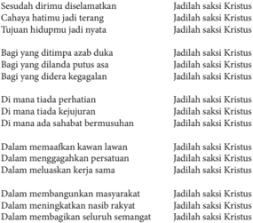

Tabel ini berisi 10 baris dengan 3 kolom, masing-masing berisi frasa yang berbeda. Topik utama tabel adalah tentang kebijaksanaan dalam berbagai situasi hidup. Kolom pertama berisi frasa yang menggambarkan situasi atau tantangan, sedangkan kolom kedua dan ketiga berisi frasa yang menunjukkan kebijaksanaan atau cara-cara untuk menghadapi situasi tersebut. Data penting yang terlihat adalah bahwa kebijaksanaan seringkali melibatkan penilaian, pengambilan keputusan, dan pengambilan tindakan yang tepat untuk mengatasi masalah atau menghadapi tantangan.

Madah Bakti No. 455

 

---
## 📄 Halaman 147

### Langkah Pertama: Mendalami Makna Menjadi Saksi Yesus Kristus

### 1.  Menggali Pemahaman Peserta Didik tentang Makna Menjadi Saksi Yesus Kristus

- Guru  mengajak  para  peserta  untuk  bertanya  tentang  makna    lagu  yang  telah dinyanyikan pada doa pembuka kegiatan, misalnya apa makna 'saksi', apa makna 'jadilah saksi Kristus'

### 2. Menyimak Wejangan Paus Fransiskus

- Guru mangajak para peserta  didik    untuk  membaca,  menyimak  wejangan  Paus Fransiskus  berikut ini:

### Iman Tidak Bisa Dinegosiasikan; Gereja Kita adalah Gereja Martir

Memberikan kesaksian keterpaduan iman dengan berani adalah sebuah ajakan dari Paus Fransiskus selama Misa yang dipimpinnya di Kapel Casa Santa Marta.

Dalam homilinya yang singkat, Paus mengomentari bacaan-bacaan Alkitab pada hari Sabtu masa Oktaf Paskah: yang pertama merujuk kepada Petrus dan Yohanes yang  memberikan  kesaksian  iman  dengan  berani  di  hadapan  para  imam  kepala Yahudi  meskipun  menghadapi  ancaman-ancaman,  kemudian  dalam  bacaan  Injil, Yesus yang bangkit menegur para rasul yang tidak mempercayai banyak orang yang telah meyakini melihat-Nya hidup.

Sri  Paus bertanya: 'Bagaimana dengan iman kita sendiri? Kuatkah? Atau kerap kali seperti air mawar yang keruh?' . Ketika kesulitan-kesulitan hidup datang 'apakah kita berani seperti Petrus atau merasa segan?'. Paus mengamati bahwa Petrus tidak kehilangan iman, ia tidak jatuh kepada kompromi-kompromi, karena 'iman tidak bisa dinegosiasikan' . Paus juga meyakini bahwa 'dalam sejarah umat Allah, telah ada pencobaan ini: menyurutkan iman sebagian, pencobaan menjadi sedikit 'seperti yang dilakukan  semua  orang' ,  yaitu  'tidak  menjadi,  sangat  tegar' .  Tetapi  saat  kita  mulai menyurutkan iman, mulai mengkompromi iman, sedikit menjualnya kepada penawar tertinggi kata Paus menggarisbawahi, maka kita memulai jalan apostasi, yaitu jalan ketidaksetiaan kepada Tuhan' .

'Contoh iman dari Petrus dan Yohanes membantu kita, memberikan kita kekuatan, tetapi,  dalam  sejarah  Gereja  ada  banyak  martir  sampai  sekarang,  karena  untuk menemukan  martir-martir  tidak  perlu  mengunjungi  kuburan  atau  ke  Koloseum: martir-martir hidup saat ini, di banyak negara. Umat Kristen kata Paus mengalami penganiayaan atas iman mereka. Di beberapa Negara banyak dari mereka tidak boleh membawa salib: mereka dihukum apabila melakukannya. Saat ini, pada abad XXI,

 

---
## 📄 Halaman 148

Gereja kita merupakan Gereja para martir,  yaitu orang-orang yang berbicara seperti Petrus dan Yohanes: 'Kami tidak dapat berdiam terhadap apa yang telah kami saksikan dan dengarkan' . Paus melanjutkan, 'Dan hal ini memberikan kekuatan kepada kita, yang kerap kali memiliki iman yang agak lemah. Memberikan kita kekuatan untuk bersaksi dengan hidup, iman yang telah kita terima, yang merupakan rahmat dari Tuhan kepada semua bangsa'.

Sri Paus kemudian menutup homilinya: 'Tetapi, kita tidak dapat melakukannya sendiri: itu adalah sebuah rahmat yaitu rahmat iman, yang harus kita mohon setiap hari:  'Tuhan …peliharalah imanku, tambahlah imanku, agar selalu kuat, pemberani, dan bantulah aku di dalam saat-saat di mana-seperti Petrus dan Yohanes-aku harus memberikan kesaksian iman di hadapan banyak orang. Berikanlah aku keberanian'. Ini akan menjadi sebuah doa yang indah pada hari ini: semoga Tuhan membantu kita untuk memelihara iman, membawanya maju, dan untuk menjadi, kita, wanita dan pria yang beriman. Amin'.(Sumber: Radio Vatikan)

(diterjemahkan oleh Shirley Hadisandjaja, 6 April 2013, dipublikasikan di www. http://katolisitas.org/11059/ empat-hal-tentang-visi-gereja-menurut-kardinal-bergoglio)

### 3. Pendalaman

- Guru mengajak para peserta didik  untuk berdialog mendalami isi/pesan dari cerita tersebut, misalnya dengan pertanyaan-pertanyaan berikut:
- Apa komentarmu terhadap homili Paus Fransiskus di atas?
- Apakah  sebagai orang Katolik yang hidup di tengah masyarakat Indonesia yang majemuk ini, engkau dapat melaksanakan tugas pewartaan kepada sesamamu?
- Apa pendapatmu, bentuk pewartaan mana yang lebih cocok di negeri kita yang sangat majemuk dalam kepercayaan dan budaya ini?

### Langkah Kedua:  Mendalami Ajaran Kitab Suci tentang Kesaksian sebagai Murid Yesus

### 1. Menemukan  Cerita Kitab Suci tentang Kesaksian Hidup Murid-Murid Yesus

- Guru  mengajak  para  peserta  didik  untuk  mencari  dalam  Kitab  Suci  Perjanjian Baru, cerita-cerita tentang kesaksian hidup para murid Yesus.
- Guru  bersama  para  peserta  didik  mencatat  ayat-ayat  Kitab  Suci  yang  telah ditemukan, misalnya  Kis 7:51-8:1a.

 

---
## 📄 Halaman 149

### 2. Membaca Cerita Kitab Suci tentang Kesaksian (Martyria)

- Guru mengajak para peserta didik untuk membaca, menyimak, kisah Kitab Suci berikut ini.
'Hai orang-orang yang keras kepala, yang keras hati dan tuli, kamu selalu menentang Roh Kudus, sama seperti nenek moyangmu, demikian juga kamu. Siapa dari nabinabi yang tidak dianiaya oleh nenek moyangmu? Bahkan mereka membunuh orangorang yang lebih dahulu memberitakan kedatangan Orang Benar, yang sekarang telah kamu khianati dan bunuh. Kamu telah menerima hukum Taurat yang disampaikan oleh malaikat-malaikat. Akan tetapi, kamu tidak menurutinya. '

Ketika anggota-anggota Mahkamah Agama itu mendengar semuanya itu, hati mereka sangat  tertusuk.  Mereka  menyambutnya  dengan  kertak  gigi.  Tetapi  Stefanus,  yang penuh dengan Roh Kudus, menatap ke langit, lalu melihat kemuliaan Allah dan Yesus berdiri di sebelah kanan Allah. Lalu katanya, 'Sungguh, aku melihat langit terbuka dan Anak Manusia berdiri di sebelah kanan Allah. ' Tetapi berteriak-teriaklah mereka dan sambil menutup telinga, mereka menyerbu dia. Mereka menyeret dia ke luar kota, lalu melemparinya dengan batu. Saksi-saksi meletakkan jubah mereka di depan kaki seorang pemuda yang bernama Saulus. Sementara mereka melemparinya Stefanus berdoa, katanya, 'Ya Tuhan Yesus, terimalah rohku. ' Sambil berlutut ia berseru dengan suara  nyaring,  'Tuhan,  janganlah  tanggungkan  dosa  ini  kepada  mereka!'  Sesudah berkata demikian, ia pun meninggal. Saulus juga setuju dengan pembunuhan atas Stefanus (Kis 7:51-8:1a).

### 3. Pendalaman Teks Kitab Suci

- Setelah  membaca    teks  Kitab  Suci,  para  peserta  didik  diminta  untuk  membuat beberapa pertanyaan, seperti berikut.
- Apa makna kesaksian dalam cerita Kitab Suci?
- Apa konsekuensinya menjadi murid Yesus dalam bersaksi?

### 4. Penjelasan

- Setelah dialog kelas, guru  memberi  penjelasan  misalnya sebagai berikut.
- -Menjadi  saksi  Kristus  berarti  menyampaikan  atau  menunjukkan  apa  yang dialami dan diketahuinya tentang Yesus Kristus kepada orang lain. Penyampaian penghayatan dan pengalaman akan Yesus itu dapat dilaksanakan melalui katakata, sikap, dan perbuatan nyata.

 

---
## 📄 Halaman 150

- -Menjadi saksi Kristus akan menuai banyak risiko seperti yang dialami St. Stefanus, martir pertama, dan para martir atau saksi Kristus lainnya di sepanjang segala abad.

### 5.  Menemukan Pengalaman Kesaksian sebagai  Pengikut Yesus Kristus melalui Kesaksian hidup

- Guru mengajak para peserta didik untuk menemukan nama para martir  dalam Gereja  Katolik  (dari  zaman  lampau  hingga  abad  modern  ini).  Menceritakan gambaran sepintas  hidup, karya serta bagaimana wafatnya para martir itu.
- Guru  mengajak  para  peserta  didik  untuk  membaca  dan  mendengarkan  kisah berikut ini:

### Uskup Agung Romero

Kesaksian  hidup  dari  almarhum  Uskup  Agung  Oscar  Romero  adalah  melalui khotbah-khotbahnya  yang  menyuarakan  dukungan  pada  kaum  miskin  dan  kaum tertindas pada zaman modern seperti sekarang ini. Hidupnya yang penuh pengabdian kepada umat dan masyarakatnya, khususnya kepada masyarakat kecil yang miskin dan  tertindas.  ia  tidak  segan-segan  memperingatkan  para  penguasa  negerinya  (El Salvador) yang bertindak sewenang-wenang terhadap rakyat kecil yang tidak berdaya sehingga para penguasa negerinya tidak senang.

Pada  tanggal  24  Maret  1980  ia  ditembak  oleh  penembak  sewaan.  Ia  mati  saat merayakan Ekaristi dan sedang mengucapkan kata-kata konsekrasi 'Inilah tubuh-Ku, yang dikorbankan bagi kamu, dan inilah darah-Ku yang ditumpahkan bagimu.'

### 6.  Pendalaman Cerita

- Guru mengajak para peserta didik untuk membuat pertanyaan-pertanyaan yang berkaitan dengan cerita Uskup Agung Romero.
- Guru mengajak para peserta didik untuk berdialog tentang cerita Uskup Romero, misalnya dengan pertanyaan-pertanyaan berikut:
- Apa kesan dan pesan dari cerita tersebut?
- Kesaksian hidup macam  apakah yang dilakukan Uskup Agung Romero?

### 7. Penjelasan dan Rangkuman

- Guru  memberi penjelasan sebagai rangkuman,  misalnya sebagai berikut.
- -Menjadi saksi Kristus ternyata dapat menuai banyak risiko. Yesus telah berkata 'Kamu akan dikucilkan,  bahkan  akan  datang  saatnya  bahwa  setiap  orang  yang

 

---
## 📄 Halaman 151

- membunuh kamu akan menyangka bahwa ia berbuat bakti bagi Allah (Yoh. 16: 2). Yesus sendiri telah menjadi martir. Ia menderita dan wafat disalib demi Kerajaan Allah.
- -Dalam sejarah, kita juga tahu bahwa banyak orang telah bersedia menumpahkan darahnya demi imannya akan Kristus dan ajaran-Nya. Mereka itulah para martir. Mereka  mati  demi  imannya  kepada  Kristus.  Ada  yang  bersedia  mati  daripada harus  mengkhianati  imannya  akan  Kristus.  Ada  pula  martir  yang  mati  karena memperjuangkan keadilan dan kesejahteraan bagi orang-orang yang tertindas.

### Langkah Ketiga: Menghayati Hidup sebagai Saksi Yesus

### 1. Re fleksi

- Guru mengajak para peserta didik untuk menuliskan sebuah r efleksi dengan bantuan pertanyaan, sebagai berikut.
- Apakah sikap dan perilaku ku saat ini telah menjadi saksi tanda kehadiran dan karya keberbagian Allah?
- Apakah saya telah menunjukkan keberpihakan dan keberbagian kepada kebenaran, kejujuran, kesejahteraan umum untuk yang lemah serta miskin?

### 2. Rencana Aksi

- Guru mengajak para peserta didik  untuk mencatat di buku tulisnya, kesaksiankesaksian konkret apa saja yang dapat ia lakukan di tengah lingkungannya sebagai seorang Kristiani! Tuliskan juga alasan mengapa ia memilih bentuk kesaksian itu!

### Penutup

- Guru mengajak para peserta didik untuk mengakhiri kegiatan pembelajaran dengan doa.

### Bapa yang penuh kasih,

Puji dan syukur kami haturkan kepada-Mu atas bimbingan-Mu pada kami selama mengikuti kegiatan belajar ini. Melalui pembelajaran ini, kami  semakin menyadari bahwa setiap kami juga mendapat tugas perutusan dari Yesus  untuk menjadi saksiNya dalam hidup sehari-hari  di  tengah  masyarakat.  Semoga  tugas  ini  dapat  kami jalankan dengan penuh semangat dan tanggung jawab sebagai pengikut setia Yesus, sang Guru dan Juruselamat kami. Amin.

 

---
## 📄 Halaman 152

### Penugasan/Pengayaan

Peserta didik ditugaskan untuk membaca buku ensiklopedi orang kudus, atau media internet,  atau  menanyakan  kepada  Pastor  paroki  atau  tokoh  umat,  dan  sumbersumber lain, minimal tentang lima orang yang berani menyerahkan jiwanya (mati sebagai martir) demi iman mereka kepada Kristus. Peserta didik diminta  menulis riwayat singkat kelima martir tersebut.

 

---
## 📄 Halaman 153

### D. Gereja yang Membangun Persekutuan (Koinonia)

### Kompetensi Dasar

- 1.4     Beriman  pada Yesus Kristus sebagai  pokok  iman Gereja yang memberi  peran kepada setiap anggota Gereja sesuai  kedudukannya  masing-masing.
- 2.4     Responsif dan proaktif pada tugas pokok Gereja sesuai dengan kedudukan dan peranannya sebagai murid Yesus Kristus.
- 3.4      Memahami    tugas  pokok  Gereja  sesuai  dengan  kedudukan  dan  peranannya sebagai murid Yesus Kristus.
- 4.4 Melakukan aktivitas (misalnya menuliskan r efleksi/doa/puisi/membuat rangkuman) tentang keterlibatan diri dalam tugas pokok Gereja sesuai dengan kedudukan dan peranannya sebagai murid Yesus Kristus.

### Indikator

- Menjelaskan makna persekutuan (koinonia) Gereja Katolik.
- Menjelaskan makna Komunitas Basis Gerejani.
- Menjelaskan ciri-ciri Komunitas Basis Gerejani.
- Menjelaskan fungsi Komunitas Basis Gerejani.
- Menjelaskan upaya-upaya untuk membangun Komunitas Basis Gerejani.

### Bahan Kajian

- Makna persekutuan (koinonia) Gereja Katolik
- Makna Komunitas Basis Gerejani
- Ciri-ciri Komunitas Basis Gerejani
- Fungsi Komunitas Basis Gerejani

### Sumber Belajar

- Pengalaman hidup peserta didik dan guru
- Kitab Suci
- KWI, 1995. Iman Katolik, Yogyakarta: Kanisius
- Propinsi Gerejani Ende (Penterj). 1995. Katekismus Gereja Katolik. Ende: Nusa Indah
- R. Hardowiryono, SJ (Penterj). 1993. Dokumen Konsili Vatikan II, Jakarta: Dokpen KWI dan Obor

### Pendekatan

Kateketis dan saintifik

 

---
## 📄 Halaman 154

### Sarana

- Kitab Suci (Alkitab)
- Buku Siswa Kelas XI

### Waktu

3x45 menit.

- Apabila  pelajaran  ini  dibawakan  dalam  dua  kali  pertemuan  secara  terpisah, pelaksanaannya diatur oleh guru.

### Pemikiran Dasar

Gereja bukan sekadar organisasi saja, tetapi merupakan kumpulan anggota Umat Allah yang  hidup bersekutu, bersatu dalam nama Tuhan. Apa beda Perusahaan (Organisasi) dan  Gereja?  Dalam  suatu  organisasi  kalau  salah  satu  departemennya  'mogok' paling-paling  yang  mogok  itu  di-PHK,  kemudian  manajemen  mencari  orang  lain menggantikan. Akan tetapi di dalam Gereja kalau ada salah satu anggotanya mogok, kita akan usahakan supaya dia kembali. Kita akan berusaha memahami kesulitannya, kita akan mendoakan dia, kita akan menolong dia, kita akan membesuk dia, kita akan turut simpati keadaannya. Singkat kata, kita dalam semangat kebersamaan berusaha menolong  anggota  Gereja  yang  mengalami  kesulitan  atau  kesusahan  karena  kita adalah satu kesatuan keluarga Allah (Gereja).

Dalam  Kitab  Suci,  dikatakan;  D emikianlah  kamu  bukan  lagi  orang  asing  dan pendatang, melainkan kawan sewarga dari orang-orang kudus dan anggota-anggota keluarga Allah (Efesus 2:19). Artinya, bahwa kesatuan dan kebersamaan orang-orang percaya di dalam Kristus disebut persekutuan. Kata yang dipakai untuk persekutuan dalam  bahasa  Yunani  adalah  Koinonia  yang  berasal  dari  kata  dasar  koinos  yang berarti lazim atau umum. Artinya, berkaitan dengan kebersamaan. Dalam Galatia 2:9,  digambarkan  bahwa  Paulus  dan  Baernabas  dengan  berjabatan  tangan  sebagai tanda  persekutuan  diterima  secara  penuh  dalam  persekutuan  yang  dijadikan  oleh iman bersama kepada Kristus. Tanda hubungan erat antara kedua belah pihak, bahwa mereka bersekutu dalam Kristus. Maka, koinonia (persekutuan) mempunyai dasar dan tujuan yang berasal dari Yesus Kristus. Dasar dan tujuan ini tidak dapat diganti dengan dasar dan tujuan yang lain. Jikalau persekutuan ini mengganti dasar, yang sudah diletakkan oleh dan di dalam Yesus Kristus, maka persekutuan ini kehilangan hakikatnya  dan  secara  azasi  bukan  persekutuan  (koinonia)  lagi.  Koinonia  adalah persekutuan jemaat di dalam Kristus, walaupun banyak anggota, membentuk satu tubuh Kristus. Di dalam Koinonia ini kita tidak hanya sekedar bersekutu, tetapi kita mengabarkan Injil Kerajaan Allah melalui perkataan/ kesaksian (Martyria) maupun perbuatan /pelayanan (Diakonia) dimana saja kita berada.

 

---
## 📄 Halaman 155

Pada pelajaran ini, para peserta didik dibimbing untuk memahami makna dan hakikat Gereja yang membangun persekutuan, antara lain melalui gerakan Komunitas Basis Gerejani (KBG) yang telah dicanangkan pada Sidang Agung Gereja Katolik Indonesia (SAGKI). Peserta didik diharapkan menghayati semangat persekutuan umat itu di lingkungan dimana ia berada.

### Kegiatan Pembelajaran

### Pembuka: Doa

- Guru mengajak para peserta didik  untuk memulai pelajaran dengan doa. Bapa yang penuh kasih,
Terima kasih atas kasih karunia-Mu yang telah menghimpun kami di sini menjadi satu persekutuan atas nama Yesus Putera-Mu. Berkatilah kami dalam kegiatan belajar ini sehingga semakin memahami makna persekutuan dalam Gereja, dan menghayatinya dalam hidup menggereja kami, demi Yesus Kristus Putra-Mu, Tuhan dan Juruselamat kami. Amin.

### Langkah Pertama: Menggali Pemahaman tentang Makna Gereja  yang Membangun Persekutuan

### 1. Dialog

- Guru  mengajak  para  peserta  didik  untuk  berdialog  seputar  pemahaman  dan pengalaman mereka tentang  persekutuan dalam Gereja. Pertanyaan untuk dialog, misalnya;  apa  makna  persekutuan  (koinonia),  dengan  cara  Gereja  membangun persekutuan,  dan  pengalaman  kegiatan  persekutuan    sebagai  umat  katolik  di lingkungan atau komunitas basis masing-masing.

### 2. Mengamati  Makna Persekutuan Umat

- Guru mengajak para peserta didik untuk menyimak artikel berita  berikut ini.
'Sekitar 60 orang yang terdiri atas Pastor, Bruder, Suster, dan Awam dari tujuh paroki di  Kevikepan  Kepulauan  Bangka-Belitung  sepakat  untuk  terus  mengembangkan Komunitas  Basis  Gerejani  (KBG).  Kesepakatan  tersebut  dibuat  pada  akhir  sinode yang  diadakan  pada  14-15  Juni  di  Rumah  Retret  Puri  Sadhana,  Bangka  Tengah. Uskup Pangkalpinang Mgr. Hilarius Moa Nurak, S.V.D. turut hadir pada pertemuan tersebut.'Semua  orang  menyarankan  agar  KBG  terus  dikembangkan  di  sini, '  kata Pastor Fransiskus Tatu Mukin.

 

---
## 📄 Halaman 156

Ia mengatakan ada dua alasan untuk terus mengembangkan komunitas basisi. Pertama karena Keuskupan Pangkalpinang melayani wilayah yang terdiri atas beberapa pulau. Kedua, umat Katolik tinggal berjauhan, bahkan ada yang tinggal di pulau kecil yang sama sekali tidak terhubungkan dengan paroki terdekat.'KBG memungkinkan umat Katolik  membangun  semangat  persaudaraan  di  antara  mereka  dan  juga  dengan pengikut  agama  lain.  Melalui  KBG,  orang-orang  yang  punya  jiwa  melayani  bisa tampil, ' katanya. Kevikepan Bangka-Belitung sudah memulai komunitas basis sejak tahun 1995 dan dijadikan prioritas pada sinode tahun 2000.

Dalam  homili  pada  penutupan  sinode,  Mgr  Hilarius  mengatakan  pemberdayaan komunitas  basis  merupakan  perwujudan  dari  Gereja  partisipatif  di  Kevikepan tersebut.'KBG  bisa  diartikan  sebagai  persatuan  antara  Umat  Tuhan  yang  selalu melihat Kristus sebagai pusat dari segala sesuatu dan yang melanjutkan misi Kristus dalam kehidupan mereka sehari-hari,' kata Uskup. KBG merupakan kelompok orang Kristen di tingkat keluarga atau tetangga, yang datang dan berkumpul bersama untuk berdoa,  membaca  Kitab  Suci,  katekese,  serta  diskusi  tentang  masalah  keseharian manusia  dan  gereja  dengan  tujuan  untuk  tercapai  komitmen  bersama. '  (ucanews. com)

### 3. Pendalaman Cerita

- Setelah peserta didik menyimak artikel atau berita tersebut, guru mengajak para peserta  didik  untuk  merumuskan  pertanyaan-pertanyaan  untuk  dibahas  lebih mendalam. Pertanyaan yang muncul sebagai berikut.
- Apa makna KBG,?
- Apa hubungan KBG dengan Persekutuan Umat?
- Apa  fungsi KBG?

### Langkah Kedua: Menggali Ajaran Kitab Suci tentang  Persekutuan Umat (Komunitas Basis Gerejani)

### 1. Mengamati Teks-Teks Kitab Suci Tentang Persekutuan Umat

- Guru mengajak  peserta didik untuk mencari teks-teks Kitab Suci Perjanjian Baru yang membicarakan tentang persekutuan umat.
- Guru  mengajak  para  peserta  didik  untuk  menyimak  salah  satu  teks  Kitab  Suci berikut ini (misalnya)

 

---
## 📄 Halaman 157

### Kisah Para Rasul 4:32-37

- 32 Adapun kumpulan orang yang telah percaya itu, mereka sehati dan sejiwa, dan tidak seorang pun yang berkata, bahwa sesuatu dari kepunyaannya adalah miliknya sendiri, tetapi segala sesuatu adalah kepunyaan mereka bersama.
- 33 Dan dengan kuasa yang besar rasul-rasul memberi kesaksian tentang kebangkitan Tuhan Yesus dan mereka semua hidup dalam kasih karunia yang melimpah-limpah.
- 34 Sebab tidak ada seorang pun yang berkekurangan di antara mereka; karena semua orang  yang  mempunyai  tanah  atau  rumah,  menjual  kepunyaannya  itu,  dan  hasil penjualan itu mereka bawa
- 35 dan mereka letakkan di depan kaki rasul-rasul; lalu dibagi-bagikan kepada setiap orang sesuai dengan keperluannya.
- 36 Demikian pula dengan Yusuf, yang oleh rasul-rasul disebut Barnabas, artinya anak penghiburan, seorang Lewi dari Siprus.
- 37 Ia  menjual  ladang,  miliknya,  lalu  membawa  uangnya  itu  dan  meletakkannya  di depan kaki rasul-rasul.

### 2.  Diskusi Kelompok

- Setelah  menyimak  teks  Kitab  Suci,    guru  mengajak  para  peserta  didik  untuk mendalami lewat diskusi kelompok, pesan Kitab Suci dengan pertanyaanpertanyaan, seperti beikut.
- Apa makna persekutuan menurut Kitab Suci,?
- Apa ciri-ciri persekutuan umat?
- Apa fungsi persekutuan umat?
- Apa kaitan pesesekutuan umat  dalam Kitab Suci dengan Komunitas Basis Gerejani yang sedang dikembangkan di Gereja Indonesia?

### 3. Melaporkan Hasil Diskusi

- Setelah berdiskusi, guru mempersilakan wakil-wakil kelompok untuk melaporkan hasil  diskusi,  dan  kelompok  lain  diminta  untuk  menanggapi  atau  menanyakan apabila dirasakan perlu.

### 4. Penjelasan

Setelah semua kelompok menyampaikan laporan hasil diskusinya, guru memberikan penjelasan.

 

---
## 📄 Halaman 158

Gambaran tentang persekutuan umat atau komunitas basis model jemaat perdana (Kis  4:32-37)    dapat  menjadi  model  atau  cermin  bagi  kita  untuk  membangun persekutuan umat atau Komunitas Basis. Model Komunitas Umat perdana itu tidak dimaksudkan  hanya  untuk  kelompok  kecil  umat  saja,  tetapi  sesungguhnya  model hidup  (gaya  hidup)  Jemaat  Perdana  itu  juga  merupakan  patron  dan  acuan  untuk model atau cara hidup Gereja (umat beriman) sepanjang waktu, partikular maupun universal.  Artinya bahwa cara hidup jemat perdana itu juga tetap merupakan cita-cita yang terus-menerus diupayakan, diperjuangkan, dan diwujudkan oleh umat beriman sepanjang waktu.

Ciri-ciri utama cara hidup jemaat perdana itu nampak sangat menonjol dalam lima hal yaitu adanya:

- a.) persaudaraan/persekutuan,
- b.) mendengarkan Sabda/pengajaran,
- c.) pelayanan terhadap sesama/solidaritas,
- d.) perayaan iman/pemecahan roti/doa, dan
- e.) memberi kesaksian iman (tentang Tuhan) melalui cara hidup mereka.
Karena cara hidup mereka itu, mereka disukai semua orang, jumlah mereka makin lama makin bertambah dan mereka sangat dihormati orang banyak.

Perlu  dipahami  bahwa  cara  hidup  berkomunitas  seperti  yang  mereka  miliki  itu muncul karena tuntutan situasi dan lingkungan yang mengharuskan mereka untuk menemukan cara baru sebagai orang-orang yang telah dibaptis, yang percaya kepada Tuhan. Bisa dimengerti pada waktu itu, sekitar awal-awal abad pertama mereka masih merupakan kelompok kecil di tengah kelompok (lingkungan) lain yang jauh lebih besar, bahkan mungkin mengancam mereka juga. Sebagai kelompok kecil, yang baru memiliki  identitas  sendiri  sebagai  orang  beriman,  yang  berbeda  dari  orang-orang lain di sekitar mereka, mau tidak mau mereka harus bersekutu, bersaudara, saling memperhatikan, saling membantu, dan harus memberikan kesaksian bahwa mereka adalah  orang-orang  yang  baik  (sebagai  orang  yang  percaya)  agar  mereka  dapat diterima  dan  dihargai  oleh  orang-orang  lain  di  sekitar  mereka.  Itu  semua  mereka lakukan  demi  iman  mereka  akan  Tuhan  Yesus.  Iman  mereka  menjadi  penggerak utama dan sekaligus menjadi sumber kekuatan bagi mereka, untuk melakukan apa yang terbaik bagi diri mereka sendiri dan juga bagi orang lain di sekitar mereka.

Apa  yang  mereka  lakukan  sebetulnya  merupakan  suatu  proses  pemahaman  akan jati  diri  mereka  sebagai  orang  beriman.  Kiranya  karena  keadaan  lingkungan  yang menuntut,  mereka  berusaha  mengenal  diri  mereka  sendiri,  sesungguhnya  siapa mereka atau apa ciri khas mereka sebagai orang beriman, bagaimana mereka harus berada di tengah lingkungan masyarakat dan apa yang harus mereka lakukan? Juga cara  mereka  mengatur  persekutuan  (paguyuban)  dan  melayani  kebutuhan  sesama warga komunitas sejauh kita bisa amati dalam Kisah Para Rasul itu, lebih bersifat spontan dan sukarela, muncul dari dorongan hati nurani, dengan kerendahan hati  dan

 

---
## 📄 Halaman 159

ketulusan masing-masing. Kiranya tidak bisa dikatakan bahwa mereka merupakan komunitas  yang  sudah  jadi  atau  sudah  mapan.  Kegiatan  mereka  pastilah  belum berdasarkan  rumusan  visi,  misi,  strategi,  dan  program  kerja  serta  anggaran  dana operasional seperti yang kita mau lakukan. Mereka belum mengenal ilmu manajemen yang  sangat  menekankan  sistem,  struktur  serta  mekanisme  kerja  yang  jelas  dan rapi, dengan aturan main dan batasan-batasan kewenangan yang jelas. Kiranya cara mereka  mengatur  kebersamaan  jauh  dari  kecanggihan  sistim  dan  metode-metode seperti yang kita gulati sekarang.

Namun tampak sekali dari cerita seperti yang dipaparkan dalam Kisah para rasul itu bahwa mereka merupakan komunitas yang sangat hidup, sangat terbuka, sangat aktif  dan sangat dinamis. Yang  paling menarik ialah cara hidup mereka, cara berada mereka  sangat  efektif,  berdampak  sangat  positif  bagi  orang-orang  lain  di  sekitar mereka, sehingga mereka disukai semua orang (Kis 2:47), jumlah orang yang percaya kepada Tuhan makin hari makin bertambah (Kis.2:47; Kis. 5:14), dan mereka sangat dihargai oleh orang banyak (Kis. 5:13).

Hal  yang  sangat  penting  bahwa  iman  mereka  akan  Tuhan  adalah  landasan  atau sokoguru  atau  tulang  pungggung  dari  segala  upaya  yang  mereka  lakukan  untuk meneguhkan  keberadaan  mereka  di  tengah  lingkungan  (di  tengah  dunia),  dan untuk mewartakan atau memberikan kesaksian tentang apa yang mereka percaya. Sementara  itu,  hal-hal  lain  yang  pada  permukaan  tampak  dalam  wujud  tindakan sosial  dan  ekonomi,  aksi  solidaritas,  kepedulian  kepada  sesama,  menolong,  dan menyembuhkan orang sakit (Kis. 5:16) merupakan buah, hasil atau dampak dari iman mereka kepada Tuhan, merupakan hasil dari upaya meneguhkan dan mewartakan iman  mereka  sendiri.  Maka,  komunitas  Jemaat  Perdana  adalah  komunitas  iman, komunitas spiritual, komunitas yang digerakkan oleh Roh Kudus, komunitas orangorang yang bertobat (mau berubah), bukan komunitas yang terbentuk pertama-tama karena alasan-alasan (kepentingan) sosial, ekonomi atau kekuasaan. Tatanan duniawi, urusan sosial-ekonomi justru diresapi, dijiwai, digerakkan, oleh/karena iman mereka akan Tuhan itu dan bukan sebaliknya.

### Langkah Ketiga: Menghayati  Persekutuan dalam Gereja

### 1. Membuat Re fleksi

- Guru  mengajak  peserta  didik  untuk  menuliskan  r efleksi  tentang  Gereja  yang membangun persatuan.

### 2. Rencana Aksi

- Guru mengajak peserta didik untuk menuliskan  niat untuk terlibat aktif dalam persekutuan  umat  di  lingkungan  atau  Komunitas  Basisnya.  Hasil  kegiatan  yang

 

---
## 📄 Halaman 160

akan dilakasanakan itu dilaporkan secara tertulis dengan diketahui oleh orang tua dan ketua lingkungan, atau ketua Komunitas Umat Basis masing-masing. Kegiatan tidak hanya bersifat liturgis, tetapi juga sosial kemasyarakatan.

### Penutup

- Guru mengajak peserta didik untuk mengakhiri  kegiatan belajar dengan doa,
Allah  Bapa  yang  Mahabaik,  kami  bersyukur  telah  mendenga r  firman-Mu  melalui kegiatan belajar ini. Semoga apa yang kami peroleh dalam pelajaran tentang Gereja yang membangun persekutuan ini, dapat  menguatkan kami untuk ikut ambil bagian sebagai anggota Gereja dalam membangun persekutuan umat demi kemuliaan-Mu sepanjang segala masa. Amin.

### Penugasan

Para peserta didik diminta untuk mewawancarai tokoh umat tentang  tugas Gereja yang membangun persektuan. Hasil wawancara ditulis dan dilaporkan.

 

---
## 📄 Halaman 161

### E. Gereja yang Melayani (Diakonina )

### Kompetensi Dasar

- 1.4    Beriman  pada Yesus Kristus sebagai  pokok  iman Gereja yang memberi  peran kepada setiap anggota Gereja sesuai  kedudukannya  masing-masing.
- 2.4     Responsif dan proaktif pada tugas pokok Gereja sesuai dengan kedudukan dan peranannya sebagai murid Yesus Kristus.
- 3.4      Memahami    tugas  pokok  Gereja  sesuai  dengan  kedudukan  dan  peranannya sebagai murid Yesus Kristus.
- 4.4 Melakukan aktivitas (misalnya menuliskan r efleksi/doa/puisi/membuat rangkuman) tentang keterlibatan diri dalam tugas pokok Gereja sesuai dengan kedudukan dan peranannya sebagai murid Yesus Kristus.

### Indikator

- Mendeskripsikan isi/pesan Injil Mrk 10:35-45 dalam kaitannya dengan semangat pelayanan bagi orang Katolik.
- Menjelaskan  tugas pelayanan sebagai tanggung jawab murid-murid Kristus
- Mendeskripsikan ciri-ciri pelayanan Gereja.
- Menyebutkan macam-macam bentuk pelayanan Gereja Katolik.
- Menceritakan tokoh-tokoh Gereja yang mencurahkan hidupnya untuk pelayanan kepada kaum miskin dan tertindas.
- Mendeskripsikan  bentuk partisipasi dalam tugas pelayanan Gereja.

### Bahan Kajian

- Pengalaman siswa dalam melayani orang lain.
- Menguasai atau melayani dalam Injil (Mrk 10: 35-45).
- Tanggung jawab murid-murid Kristus.
- Ciri-ciri pelayanan Gereja.
- Bentuk-bentuk pelayanan dalam Gereja Katolik.
- Tokoh-tokoh Gereja pelayan kaum miskin dan tertindas.
- Partisipasi siswa dalam tugas pelayanan Gereja.

### Sumber Belajar

- Pengalaman hidup peserta didik dan guru
- Kitab Suci (Kis 4:41-47; Yoh 13:13-14; Mrk 10:45; 1Yoh 2:6; Flp 2:7; Mrk 9:35; Luk 17:10)

 

---
## 📄 Halaman 162

- Konferensi Waligereja Indonesia. 1995. Iman Katolik , Y ogyakarta: Kanisius
- Propinsi  Gerejani  Ende  (Penterj).  1995. Katekismus Gereja Katolik .  Ende:  Nusa Indah
- R. Hardowiryono, SJ (Penterj). 1993. Dokumen Konsili Vatikan II , Jakarta: Dokpen KWI dan Obor

### Pendekatan

Kateketis dan saint ifik

### Sarana

- Kitab Suci (Alkitab)
- Buku Siswa SMA/SMK, Kelas XI,  Pendidikan Agama Katolik dan Budi Pekerti.

### Waktu

3x45 menit.

- Apabila  pelajaran  ini  dibawakan  dalam  dua  kali  pertemuan  secara  terpisah, pelaksanaannya diatur oleh guru.

### Pemikiran Dasar

Dalam hidup sehari-hari telinga kita akrab mendengar kata pelayan dan melayani. Dalam  dunia  pemerintahan  negara,  semua  aparat  negara  bahkan  disebut  sebagai pelayan masyarakat. Namun, dalam kenyataan, kita menjumpai banyak aparat negara berperilaku  sebaliknya  yaitu  ingin  selalu  dilayani  sebagai  tuan-tuan,  atau  sebagai bos. Perilaku seperti ini tentu bertentangan dengan sumpah jabatan mereka sebagai pelayan atau abdi masyarakat.

Gereja (Umat Allah) dipanggil untuk melayani manusia, seluruh umat manusia. 'Melayani' adalah kata penting dalam ajaran Yesus. Pada Malam Perjamuan Terakhir, Yesus membasuh kaki para murid-Nya. Sikap ini menunjukkan bahwa para pengikut Yesus harus merendahkan diri dan rela menjadi pelayan bagi sesamanya. Jika orang ingin menjadi terkemuka, ia harus rela menjadi pelayan. Yesus sendiri menegaskan: ' Anak manusia datang bukan untuk dilayani, melainkan untuk melayani' (Mrk 10: 45).  Itulah  sikap  yang  diharapkan  oleh  Yesus  terhadap  murid-murid-Nya.Gereja mempunyai  tanggung  jawab  untuk  melayani  manusia.  Dasar  pengabdian  Gereja adalah imannya akan Kristus. Barang siapa menyatakan diri murid Kristus, 'ia wajib hidup seperti Kristus' (1Yoh 2: 6). Kristus yang 'mengambil rupa seorang hamba' (Flp 2: 7) tidak ada artinya jika murid-murid-Nya mengambil rupa seorang penguasa. Melayani berarti mengikuti jejak Kristus.

Melalui pelajaran ini, para peserta didik dibimbing untuk menyadari panggilan sebagai pengikut Kristus untuk menjadi pelayan bagi sesamanya.

 

---
## 📄 Halaman 163

### Kegiatan Pembelajaran

### Pembukaan: Doa

- Guru mengajak para peserta didik  untuk memulai pelajaran dengan doa.
Bapa yang Maharahim, Yesus Kristus Putra-Mu telah memberikan teladan tentang bagaimana seharusnya kami hidup saling melayani.  Karena itu ya Bapa, bimbinglah kami dalam pelajaran ini agar mampu memahami ajaran Yesus tentang melayani yang diwariskan kepada Gereja sehingga selanjutnya kami mampu menjadi pelayan satu terhadap yang lain atas dasar kasih Yesus sendiri sendiri. Amin.

### Langkah Pertama:  Mendalami Makna Gereja  yang Melayani

### 1. Menyanyikan Lagu Yang Bertema Tentang Melayani

- Guru  mengajak  para  peserta  didik  untuk  menyanyikan  lagu  'Melayani  Lebih Sungguh'.

### 2. Pendalaman Lagu

- Guru  mengajak  para  peserta  didik  untuk  merumuskan  pertanyaan-pertnyaan tentang  lagu yang telah dinyanyikan.
- Guru mengajak para peserta didik untuk mengungkapkan pengalaman pelayannya sebagai  anggota  Gereja  di  lingkungan,  Komunitas  Basis,  Stasi  atau  di  parokinya masing-masing.

### 3. Menyimak Sebuah Cerita Kehidupan

- Guru mengajak para peserta didik untuk membaca dan menyimak kisah pelayanan seorang dokter Katolik berikut ini.

### dr. Lie Augustinus Dharmawan, Peduli Kaum Pinggiran

LABUAN BAJO, FBCKeprihatinan terhadap kaum pinggiran yakni mereka yang miskin dan termarjinal telah mendorong  dr. Augustinus Dharmawan, Ph.d, FICF, SpB,  Sp  B.T.K.V  mengabdikan  diri  tanpa  pamrih  dengan  memberikan  pelayanan medis secara gratis kepada ribuan masyarakat miskin di desa-desa di seluruh wilayah Indonesia.

Untuk  mempermudah  aktivitas  pelayanan  medis,  ia  mendirikan  sebuah  wadah yakni  Yayasan Doctor  Share (share  accessible  health  and  care) yang  berkedudukan

 

---
## 📄 Halaman 164

di Jakarta. 'Saya terpanggil untuk melayani mereka yang miskin dan terpinggirkan. Saya terpanggil untuk mengabdikan diri untuk masyarakat kita yang sebagian besar masih hidup dalam kemiskinan terutama anak-anak. Mereka harus diselamatkan dari kematian terutama karena malnutrisi,' ujar dr. Lie demikian ia biasa disapa ketika berbincang-bincang dengan FBC di Labuan Bajo, Sabtu pekan lalu.

Keprihatinan terhadap kaum miskin dan terpinggirkan merupakan panggilan jiwa dr. Lie untuk memberikan diri sepenuhnya melayani orang-orang sakit. Ia berkeliling Indonesia memberikan pertolongan medis secara gratis. dr, Lie adalah seorang ahli bedah dan telah menghabiskan waktu dan tenaga untuk melayani masyarakat miskin di seluruh Indonesia. Ia berjalan dari kampung ke kampung untuk melayani mereka yang  sakit  dan  menderita.  Ia  sudah  menjelajahi  separuh  wilayah  Indonesia  dari Sabang sampai Merauke.

Ia mengaku selama menjalankan pelayanan medis, ia menghadapi berbagai tantangan dan  halangan  terutama  tantangan  alam  yang  sering  tidak  bersahabat.  Namun  ia mengaku kekuatan Tuhan telah menuntun perjalanan dan karya luhurnya melayani sesama.

Pengagum berat Muder Theresa dari Kalkuta ini menyatakan, NTT termasuk wilayah yang  mendapatkan  pelayanan  dari  yayasannya  karena  daerah  NTT  merupakan salah satu daerah paling tertinggal di Indonesia selain Papua dan Maluku. Di NTT sejumlah daerah telah ia kunjungi seperti Atambua di Pulau Timor dan Manggarai Barat di Flores.

Kata dia, manusia tentu saja menghadapi banyak persoalan, namun persoalan tersebut bukanlah untuk dihindari  melainkan  untuk  diatasi.  Ia  mengaku  sejak  Yayasan  ini didirikan pada tahun 2008 lalu, sudah ribuan pasien yang mendapatkan pelayanan secara  gratis.  Dalam  tugas  pelayanan  itu  ditemukan  beragam  penyakit  mulai  dari penyakit yang ringan sampai yang berat seperti penyakit kanker.

Atas dedikasi dan pelayanan tanpa pamrih itu pada tahun 2011 lalu, ia mendapat penghargaan  dari  Museum  Rekor  Indonesia  (MURI)  karena  berhasil  menolong pasien secara gratis sebanyak 12.380 orang pasien.

Dokter ahli bedah yang tampil low pro file itu mengatakan, Indonesia semestinya tidak boleh miskin dan menderita kalau semua orang termasuk pemerintah peduli pada mereka yang miskin dan terpinggirkan. Manusia Indonesia harus sehat secara rohani, jasmani, dan spiritualnya.

Untuk  mendukung  karya  pelayanan,  yayasan  telah  merancang  sebuah  kapal  laut untuk dijadikan rumah sakit terapung. Rumah sakit itu untuk melayani masyarakat di wilayah-wilayah terpencil terutama masyarakat yang tinggal di pulau-pulau terpencil di seluruh Indonesia.

 

---
## 📄 Halaman 165

'Kami sudah punya rumah sakit terapung tetapi kami tidak datang bersama kapal karena cuaca buruk. Namun ke depan kami akan melakukan pelayanan di atas kapal yang sudah tersedia. Dengan adanya rumah sakit terapung, masyarakat di pulau-pulau akan mendapatkan pelayanan kesehatan tanpa harus ke darat,' ujarnya. (Kornelius Rahalaka)

http://www .floresbangkit.com/2012/08/dr-lie-augustinus-dharmawan-peduli-kaum-pinggiran/

### 4. Pendalaman Cerita

- Guru mengajak para peserta didik untuk merumuskan beberapa pertanyaan untuk berdialog, seperti berikut.
- Apa pesan  cerita tersebut?
- Apa motivasi dr. Lie membangu  rumah sakit terapung?
- Sebagai anggota Gereja Katolik, tugas apakah yang telah dan sedang dr. Lea  lakukan Berikan analisis Anda!
- Semangat apa yang dapat Anda teladani dalam hidupmu sebagai anggota Gereja?
- Guru bersama para peserta didik  membuat kesimpulan-kesimpulan berdasarkan hasil dialog atas isi dan pesan  cerita.

### Langkah  Kedua:  Mendalami    Ajaran  Kitab  Suci  tentang  Gereja  yang Melayani

### 1.  Menyimak Cerita Kitab Suci

- Guru  mengajak  para  peserta  didik  untuk  membaca  dan  mendengarkan  kutiban Kitab Suci berikut ini

### Bukan Memerintah Melainkan Melayani (Mrk 10: 35-45)

35 Lalu  Yakobus  dan  Yohanes,  anak-anak  Zebedeus,  mendekati  Yesus  dan  berkata kepada-Nya: 'Guru, kami  harap supaya Engkau  kiranya  mengabulkan  suatu permintaan kami!'  36 Jawab-Nya kepada mereka: ' Apa yang kamu kehendaki, Aku perbuat bagimu?' 37 Lalu  kata  mereka: 'Perkenankanlah kami duduk dalam kemuliaanMu kelak, yang seorang di sebelah kanan-Mu dan yang seorang di sebelah kiri-Mu. 38 Tetapi kata Yesus kepada mereka: 'Kamu tidak tahu apa yang kamu minta. Dapatkah kamu meminum cawan yang harus Ku-minum dan dibaptis dengan baptisan yang

 

---
## 📄 Halaman 166

harus  Kuterima?' 39 Jawab  mereka:  'Kami  dapat. '  Yesus  berkata  kepada  mereka: 'Memang, kamu akan meminum cawan yang harus Ku-minum dan akan dibaptis dengan baptisan yang harus Kuterima. 40 Tetapi hal duduk di sebelah kanan-Ku atau di sebelah kiri-Ku, Aku tidak berhak atau memberikannya. Itu akan diberikan kepada orang-orang bagi siapa itu telah disediakan' .

41   Mendengar itu kesepuluh murid yang lain menjadi marah kepada Yakobus dan Yohanes. 42 Tetapi Yesus memanggil mereka lalu berkata: 'Kamu tahu, bahwa mereka yang disebut pemerintah bangsa-bangsa memerintah rakyatnya dengan tangan besi, dan  pembesar-pembesarnya  menjalankan  kuasanya  dengan  keras  atas  mereka. 43 Tidaklah demikian di antara kamu. Barang siapa ingin menjadi besar di antara kamu, hendaklah ia menjadi pelayanmu, 44 dan barangsiapa ingin menjadi yang terkemuka di  antara  kamu,  hendaklah  ia  menjadi  hamba  untuk  semuanya. 45 Karena  anak manusia juga datang bukan untuk dilayani, melainkan untuk melayani dan untuk memberikan nyawa-Nya menjadi tebusan bagi banyak orang.'

### 2. Pendalaman Cerita Kitab Suci

- Guru mengajak para peserta didik untuk berdialog mendalami isi/pesan cerita Injil tersebut di atas, misalnya dengan pertanyaan-pertanyaan berikut:
- Apa isi pesan Kitab Suci tyang telah dibaca?
- Sikap apakah yang diajarkan Yesus kepada kita?
- Salah satu tugas Gereja adalah melayani. Apakahciri-ciri pelayanan Gereja itu?
- Apa sajakah bentuk-bentuk pelayanan Gereja Katolik  di Indonesia?

### 3. Kesimpulan atas Pendalaman Kitab Suci

- Guru memberi penjelasan, misalnya sebagai berikut
Yesus mengajari kita untuk saling melayani dengan kerendahan hati. Demikian juga sebagai pemimpin. Seorang pemimpin dipilih untuk melayani umat atau masyarakat dan bukan sebaliknya untuk dilayani.

### 4. Penjelasan

- Guru  mengajak  para  peserta  didik  untuk  meresapi  makna  tugas  Gereja  yang melayani, dengan penjelasan, sebagai berikut
Semangat  pelayanan  itu  diteruskan  di  dalam  Gereja-Nya.  Hal  itu  ditekankan  lagi oleh Konsili Vatikan II. Tugas kegembalaan atau kepemimpinan dalam Gereja adalah tugas pelayanan.

 

---
## 📄 Halaman 167

### 1. Dasar Pelayanan dalam Gereja

- -Dasar  pelayanan  dalam  Gereja  adalah  semangat  pelayanan  Kristus  sendiri. Barangsiapa menyatakan diri murid, 'ia wajib hidup sama seperti hidup Kristus (1Yoh 2: 6). Yesus yang 'mengambil rupa seorang hamba' (Flp 2: 7) tidak ada artinya jika para murid-Nya mengambil rupa para penguasa. Pelayanan berarti mengikuti jejak Yesus. Perwujudan iman Kristiani adalah pelayanan. Yesus bersabda: ' Apabila kamu telah melakukan segala sesuatu yang ditugaskan kepadamu, hendaklah kamu berkata: Kami adalah hamba-hamba yang tidak berguna; kami hanya melakukan apa yang harus kami lakukan' (Luk 17: 10).
- -Pelayanan Kristiani adalah sikap pokok para pengikut Yesus. Dengan kata lain, melayani sesama  adalah tanggung jawab setiap orang Kristiani sebagai konsekuensi dari imannya. Dengan demikian, orang Kristen tidak hanya bertanggung jawab terhadap  Allah  dan  Putra-Nya,  Yesus  Kristus,  tetapi  juga  bertanggung  jawab terhadap orang lain dengan menjadi sesamanya.

### 2. Ciri-Ciri Pelayanan Gereja:

### a.  Bersikap sebagai pelayan

Yesus menyuruh para murid-Nya selalu bersikap sebagai 'yang paling rendah dari semua dan sebagai pelayan dari semua' (Mrk 9: 35). Yesus sendiri memberi teladan dan  menerangkan  bahwa  demikianlah  kehendak  Bapa.  Menjadi  pelayanan  adalah sikap iman yang radikal.

### b.  Kesetiaan kepada Kristus sebagai Tuhan dan Guru

Ciri  religius  pelayanan  Gereja  ialah  menimba  kekuatannya  dari  sari  teladan  Yesus Kristus.

### c.  Orientasi pelayanan Gereja terutama ditunjukkan kepada kaum miskin

Dalam usaha pelayanan kepada kaum miskin janganlah mereka menjadi objek belas kasihan. Pelayanan berarti kerja sama, di dalamnya semua orang merupakan subjek yang ikut bertanggung jawab. Yang pokok adalah harkat, martabat, harga diri, bukan kemajuan dan bantuan spiritual ataupun sosial, yang hanyalah sarana. Tentu saranasarana juga penting, dan tidak dapat ditinggalkan begitu saja, tetapi yang pokok ialah sikap pelayanan itu sendiri.

### d.  Kerendahan hati

Dalam pelayanan, Gereja (kita) harus tetap bersikap rendah hati. Gereja tidak boleh berbangga diri, tetapi tetap melihat dirinya sebagai 'hamba yang tak berguna' (Luk 17: 10)

### 3.  Bentuk-Bentuk Pelayanan Gereja

 

---
## 📄 Halaman 168

Pelayanan Gereja dapat bersifat ke dalam, tetapi juga ke luar. Pelayanan ke dalam adalah pelayanan  untuk  membangun  jemaat.  Pelayanan  ini  pada  dasarnya  dipercayakan kepada hierarki, tetapi awam pun diharapkan berpartisipasi di dalamnya, misalnya dengan melibatkan diri dalam kepengurusan Dewan Keuskupan, Dewan Paroki, dan Pengurus Wilayah/ Lingkungan.

Pelayanan  ke  luar  yang  lebih  difokuskan  adalah  pelayanan  demi  kepentingan masyarakat luas. Bentuk-bentuk pelayanan Gereja Katolik Indonesia untuk masyarakat luas antara lain; Pelayanan di bidang kebudayaan dan pendidikan,  bidang kesejahteraan, politik dan hukum.

### Langkah Ketiga: Menghayati Tugas Gereja yang Melayani

### 1. Re fleksi

- Guru  mengajak  para  peserta  didik  untuk  menuliskan  sebuah  r efleksi  tentang sejauh manakah ia (peserta didik meneladani Yesus dalam melayani sesama dalam hidupnya sehari-hari.

### 2. Rencana Aksi

- Guru mengajak para peserta didik  untuk menentukan satu tindakan konkret yang dapat mereka lakukan dalam hubungannya dengan pelayanan di lingkungan atau di sekolah mereka.

### Penutup

- Guru mengajak para peserta didik untuk mengakhiri  pelajaran dengan doa, seperti contoh berikut
Ya Bapa, terima kasih untuk segala berkat dan rahmat-Mu yang Engkau limpahkan kepada kami dalam pertemuan ini. Semoga dalam hidup sehari-hari, kami sanggup melayani    sesama  baik  dalam  kata-kata  maupun  perbuatan  demi  kemuliaan-Mu, sepanjang segala masa. Amin.

### Penugasan

- Guru memberi penugasan kepada setiap peserta didik untuk melaksanakan rencana pelayanan yang telah dibuat, kemudian memberikan laporan secara tertulis. Agar laporan  tersebut benar adanya,  laporan tertulis tersebut ditandatangani oleh orangt ua atau wali murid.

 

---
## 📄 Halaman 169

### Penilaian

Penilain Sikap (Spiritual dan Sosial)

### OBSERVASI

Nama Peserta Didik

: …………………………………..

Kelas/Program

: …………………………………..

Pelaksanaan pengamatan             : .........................................................

---
**📊 Tabel**

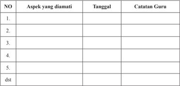

Tabel ini merupakan lembaran untuk memantau perkembangan siswa dalam berbagai aspek belajar. Topik utamanya adalah aspek-aspek yang diamati oleh guru, seperti keterampilan berbicara, pengetahuan teks, pemahaman konsep, kemampuan menyelesaikan masalah, dan lain-lain. Kolom-kolom yang ada meliputi nomor urut (NO), aspek yang diamati, tanggal, dan catatan guru. Data penting yang terlihat adalah bahwa tabel ini dirancang untuk memfasilitasi pengawasan dan evaluasi pembelajaran secara teratur, dengan memberikan ruang untuk mencatat perubahan dan perkembangan siswa dalam setiap aspek yang diamati.

### · Penilaian Pengetahuan

### Tes tertulis :

- Apa makna liturgi?
- Apa makna doa dan ibadat?
- Apa makna sakramen, dan sebutkan serta  jelaskan tujuh Sakramen Gereja.
- Sebutkan bentuk-bentuk kegiatan pengudusan atau pemberkatan (sakramentali) yang sering terjadi di lingkungan umat!
- Sebutkan bentuk-bentuk kegiatan devosi di lingkungan umat!
- Apa  makna  pokok  dari    Injil  Mat  28:  16-20  dalam  kaitannya  dengan  tugas pewartaan Gereja?
- Sebut dan jelaskan bentuk-bentuk pewartaan dalam Gereja Katolik!
- Jelaskan peranan Magisterium atau wewenang mengajar  dalam Gereja Katolik!
- Bagaimana caranya kamu mengambil bagian dalam tugas pewartaan Injil dalam hidupmu sehari-hari?
- Jelaskan arti tugas Gereja menjadi saksi Kristus!
- Jelaskan makna kemartiran dalam Gereja Katolik!
- Siapa saja martir atau saksi-saksi Kristus jaman sekarang?

 

---
## 📄 Halaman 170

- Bagaimana bentuk partisipasimu menjadi saksi Kristus sesuai dengan kedudukannya di zaman sekarang.
- Mengapa  pewartaan  melalui  kesaksian  hidup  lebih  simpatik  dibandingkan dengan kesaksian secara verbal (kata-kata)?
- Mengapa menghayati hidup yang solider dengan orang kecil yang lemah, miskin, tertindas,  menderita,  dan  tersingkirkan  di  tengah-tengah  masyarakat  yang serakah  (hanya  mengingat  kepentingan  sendiri  dan  golongan)  disebut  sebagai salah satu bentuk pewartaan?
- Jelaskan apa makna persekutuan (koinonia) dalam Gereja!
- Uraikan, apa  makna dan hakikat Komunitas Basis Gerejani!
- Jelaskan ciri-ciri Komunitas Basis Gerejani!
- Jelaskan fungsi-fungsi Komunitas Basis Gerenai!
- Apa artinya melayani?
- Apa ajaran Yesus tentang melayani?
- Apa ajaran gereja tentang melayani?
- Bagaimana penilaianmu tentang para pemimpin dalam Gereja dan masyarakat di lingkunganmu dalam hubungan dengan pelayanan mereka?
- Tulislah  ciri-ciri  pemimpin  Gereja  yang  kalian  cita-citakan  dalam  hubungan dengan pelayanan!

### · Penilaian Keterampilan:

Portofolio

Tulislah r efleksi tentang bagaimana engkau menghayati tugas-tugas Gereja dalam hidupmu  sehari-hari  yaitu;  menguduskan,  mewartakan,  bersaksi,  membangun persekutuan, dan melayani.

### Kegiatan Remedial

Bagi  peserta  didik  yang  belum  memahami  Bab  ini,  diberikan  remedial  dengan kegiatan sebagai berikut.

- Guru menyampaikan pertanyaan kepada peserta didik akan hal-hal apa saja yang belum mereka pahami tentang tugas-tugas Gereja; menguduskan, mewartakan, bersaksi, bersekutu/bersatu, dan melayani.
- Berdasarkan hal-hal yang belum mereka pahami, guru mengajak peserta didik untuk mempelajari kembali dengan memberikan bantuan peneguhan-peneguhan yang lebih praktis.
- Guru  memberikan  penilaian  ulang  untuk  penilaian  pengetahuan,  dengan pertanyaan yang lebih sederhana, sesuai dengan kondisi peserta didik.

 

---
## 📄 Halaman 171

### Kegiatan Pengayaan

Bagi  peserta  didik  yang  telah  memahami  Bab  ini,  diberikan  pengayaan  dengan kegiatan-kegiatan berikut.

- Guru meminta peserta didik untuk melakukan studi pustaka (ke perpustakaan atau mencari di koran/majalah) untuk menemukan cerita/kisah tentang  perwujudan tugas-tugas Gereja; menguduskan, mewartakan, bersaksi, bersekutu/bersatu, dan melayani.
- Hasil temuannya ditulis dalam laporan tertulis yang berisi gambaran singkat dari kisah atau cerita tersebut.

 

---
## 📄 Halaman 172

### Bab V Gereja dan Dunia

Gereja  Post  Konsili  Vatikan  II  melihat  dirinya  sebagai  sakramen  keselamatan bagi dunia. Gereja manjadi terang, garam, dan ragi bagi dunia dan  dunia menjadi tempat atau ladang, tempat Gereja berbakti. Dunia tidak dihina dan dijauhi tetapi didatangi dan ditawari keselamatan. Dunia dijadikan mitra dialog dan Gereja dapat menawarkan  nilai-nilai  Injil  dan  dunia  dapat  mengembangkan  kebudayaannya, adat  istiadat,  alam  pikiran,  ilmu  pengetahuan,  dan  teknologi.  Karenanya,  Gereja dapat lebih efektif menjalankan misi dunia. Gereja pun tetap menghormati otonomi dunia dengan sifatnya yang sekuler karena di dalamnya terkandung nilai-nilai yang dapat menyejahterakan manusia dan membangun sendi-sendi kerajaan Allah. Pada dasarnya Gereja dan dunia manusia merupakan realitas yang sama, seperti mata uang yang ada dua sisinya. Berbicara tentang Gereja berarti bicara tentang dunia manusia. Bagi orang Kristen berbicara tentang dunia manusia berarti berbicara tentang dunia manusia sebagai umat Allah yang sedang berziarah di dunia ini.

Sesudah  mempelajari  Gereja  secara  internal  (ke  dalam  dirinya  sendiri),  pada bab V ini kita akan mempelajari Gereja lebih secara eksternal, yakni Gereja dalam hubungannya  dengan  dunia.  Dunia  di  sini  diartikan  sebagai  seluruh  keluarga manusia dengan segala hal yang ada di sekelilingnya. Dunia dilihat secara lebih positif dibandingkan  dengan  masa  lalu  (prakonsili  Vatikan  II).  Gereja  dan  dunia  dapat berdialog dan saling mengisi demi terciptanya Kerajaan Allah di bumi ini.

Pada kegiatan  pembelajaran ini, para peserta didik akan mempelajari  pokokpokok bahasan tentang materi-materi berikut.

- Permasalahan yang Dihadapi Dunia,
- Hubungan Gereja dan Dunia,
- Ajaran Sosial Gereja, dan
- Keterlibatan Gereja Dalam Membangun Dunia yang Damai dan Sejahtera.

 

---
## 📄 Halaman 173

### Kompetensi Inti

- Menghayati dan mengamalkan ajaran agama yang dianutnya.
- Menghayati  dan  mengamalkan  perilaku  jujur,  disiplin,  tanggung  jawab,  peduli (gotong  royong,  kerjasama,  toleran,  damai),  santun,  responsif,  dan  proaktif dan menunjukkan sikap sebagai bagian dari solusi atas berbagai permasalahan dalam berinteraksi secara efektif dengan lingkungan sosial dan alam serta dalam menempatkan diri sebagai cerminan bangsa dalam pergaulan dunia.
- Memahami pengetahuan (faktual, konseptual, dan prosedural) berdasarkan rasa ingin tahunya tentang ilmu pengetahuan, teknologi, seni, budaya terkait fenomena dan kejadian tampak mata.
- Mengolah, menyaji, dan menalar dalam ranah konkret (menggunakan, mengurai, merangkai, memo difikasi, dan membuat) dan ranah abstrak (menulis,membaca, menghitung,  menggambar,  dan  mengarang)  sesuai  dengan  yang  dipelajari  di sekolah dan sumber lain yang sama dalam sudut pandang/teori.

 

---
## 📄 Halaman 174

### A. Permasalahan yang Dihadapi Dunia

### Kompetensi Dasar

- 1.5     Bersyukur atas hubungan Gereja dengan dunia  sehingga dapat terlibat dalam kegembiraan dan keprihatinan dunia.
- 2.5 Bekerja sama mengembangkan keterlibatan Gereja dalam kegembiraan dan keprihatinan dunia.
- 3.5. Memahami  hubungan Gereja dengan dunia agar dapat terlibat dalam kegembiraan dan keprihatinan dunia.
- 4.5.    Melakukan aktivitas (misalnya menuliskan r efleksi/doa/puisi/membuat rangkuman) tentang hubungan Gereja dengan dunia agar dapat terlibat dalam kegembiraan dan keprihatinan dunia.

### Indikator

- Mengidentifikasi persoalan-persoalan  pokok yang dihadapi oleh dunia saat ini.
- Mengemukakan  alasan  terjadinya  persoalan-persoalan  pokok  yang  dihadapi manusia di dunia dewasa ini.
- Menjelaskan bagaimana Gereja terlibat dalam membangun masyarakat yang adil, damai, dan sejahtera.
- Melakukan tindakan-tindakan nyata di lingkungannya untuk menunjang gerakan dan  kegiatan  membangun  masyarakat  yang  lebih  adil,  damai,  dan  pelestarian lingkungan alam.

### Bahan Kajian

- Persoalan-persoalan  pokok yang dihadapi oleh dunia saat ini; Perdamaian dunia, kaum miskin, penegakan keadilan, pelestarian keutuhan ciptaan.
- Alasan  terjadinya  persoalan-persoalan  pokok  yang  dihadapi  manusia  di  dunia dewasa ini.
- Gereja terlibat dalam membangun masyarakat yang adil, damai, dan sejahtera
- Tindakan-tindakan nyata di lingkungannya untuk menunjang gerakan dan kegiatan membangun masyarakat yang lebih adil, damai, dan pelestarian lingkungan alam.

### Sumber Belajar

- Kitab Suci
- Konferensi Waligereja Indonesia. 1995.Iman Katolik, Yogyakarta: Kanisius
- Propinsi Gerejani Ende (Penterj). 1995. Katekismus Gereja Katolik. Ende: Nusa Indah

 

---
## 📄 Halaman 175

- R.  Hardowiryono,  S.J  (Penterj).  1993.  Dokumen  Konsili  Vatikan  II,  Jakarta: Dokpen KWI dan Obor
- Kompendium Ajaran Sosial Gereja
- Kompendium Katekismus Gereja Katolik
- Artikel/berita mengenai keprihatinan dunia.

### Pendekatan

Kateketis dan saint ifik

### Sarana

- Kitab Suci
- Buku Siswa SMA/SMK, Kelas XI,  Pendidikan Agama Katolik dan Budi Pekerti.

### Waktu

3x45 menit.

- Apabila  pelajaran  ini  dibawakan  dalam  dua  kali  pertemuan  secara  terpisah, pelaksanaannya diatur oleh guru.

### Pemikiran Dasar

Acapkali  muncul  pertanyaan  seputar  sikap  Gereja  menghadapi  keadaan  sosial, ekonomi, kebudayaan, dan politik dalam hidup sehari-hari. Bagaimanakah Gereja menyikapi  umat  yang  hidup  melarat,  tidak  cukup  makan  dan  minum,  tidak  bisa bayar  uang  obat,  tidak  bisa  mengecapi  pendidikan  dasar?  Apakah  Gereja  hanya meminta mereka untuk berdoa dan memohon kepada Tuhan supaya Dia menolong untuk menghadapi masalah-masalah yang sedang dihadapi di dunia ini? , Disamping memohon kepada Tuhan dengan tekun, Gereja juga mengambil sejumlah tindakan nyata untuk mengeluarkan mereka dari kungkungan sosial yang menyengsarakan, menyakitkan, dan menekan lahir dan batin?

Konsili  Vatikan  II  merupakan  tonggak  pembaharuan  hidup  Gereja  Katolik secara menyeluruh. GS ( Gaudium et Spes) menaruh keprihatinan secara luas pada tema  hubungan  Gereja  dan  Dunia  modern.  Ada  kesadaran  kokoh  dalam  Gereja untuk  berubah  seiring  dengan  perubahan  kehidupan  manusia  modern.  Hal-hal yang disentuh oleh GS berkisar tentang kemajuan manusia di dunia modern. Selain menyoroti  masalah jurang yang tetap lebar antara si kaya dan si miskin, hubungan Gereja dan dunia dibahas secara lebih gamblang. Sebagai contoh menyentuh nilai hubungan timbal balik antara Gereja dan dunia pada beberapa masalah mendesak, seperti;  perkawinan,  keluarga,  kebudayaan,  pendidikan  kristiani;  kehidupan  sosial

 

---
## 📄 Halaman 176

ekonomi, perdamaian dan persatuan bangsa-bangsa, pencegahan perang serta kerja sama internasional. Konsili menegaskan bahwa kegembiraan dan harapan, duka dan kecemasan manusia-manusia zaman ini, terutama kaum miskin dan yang menderita, adalah kegembiraan dan harapan, duka dan kecemasan para murid Kristus juga (GS art.1).

Dalam pembelajaran  ini para peserta didik dibimbing untuk memahami bahwa Gereja  sebagai  kumpulan  orang  beriman  yang  hidup  dalam  dunia  yang  dinamis, maka Gereja pun harus bersifat dinamis pula. Dalam dinamika itu, Gereja terpanggil untuk melaksanakan dan mewujudkan amanat Yesus Kristus. Gereja (kita semua) diutus ke tengah-tengah dunia untuk membangun  kehidupan manusia yang damai, adil, sejahtera  serta senantiasa menjaga keutuhan alam  ciptaan Tuhan.

### Kegiatan Pembelajaran

### Pembukaan: Doa

- Guru mengajak para peserta didik  untuk membuka pelajaran dengan doa, misalnya
Allah Bapa yang penuh kasih,

Yesus  Kristus    telah  mengutus  kami,  Gereja-Mu  ke  tengah-tengah  dunia  untuk membangun    kehidupan  manusia  yang  damai,  adil,  sejahtera,  serta  senantiasa menjaga keutuhan alam  ciptaan Tuhan.  Berkatilah kami dalam pelajaran ini agar semakin memahami permasalahan-permasalahan yang sedang dihadapi dunia pada saat ini sehingga sebagai anggota Gereja, kami pun dapat ikut menjaga ketenteraman sesuai kehendak-Mu demi Yesus Kristus, Tuhan dan juru selamat kami. Amin.

### Langkah  Pertama:  Menggali  Permasalahan-Permasalahan  yang  Sedang Dihadapi Dunia Saat Ini.

### 1. Ident ifikasi Permasalahan-Permasalahan Dunia Saat Ini

- Guru  mengajak para peserta didik untuk mengindentifikasi permasalahanpermasalahan  yang  sedang  dihadapi  dunia  saat  ini,  misalnya  tentang  masalah perdamaian, keadilan, dan lingkungan alam.
- Menyimak  Artikel Yang Berkaitan dengan Masalah  Perdamaian Umat Manusia  di Dunia
- Guru mengajak para peserta didik  untuk membaca dan  menyimak berita media massa.
'Tuduhan bahwa rezim Suriah menggunakan senjata kimia pada 21 Agustus 2013 merupakan dalih Barat untuk menyerang negara. Demikian pernyataan Pemimpin

 

---
## 📄 Halaman 177

Agung Iran, Ayatullah Ali Khamenei, Kamis, 5 September 2013. Iran, sekutu utama Suriah  di  kawasan  Timur  Tengah,  memperingatkan  kekuatan  Barat  atas  niatnya berperang  melawan  negara  yang  sedang  dilanda  perang  saudara  itu.  Menurut Khameini, Washington dan sekutunya 'menggunakan dugaan serangan senjata kimia sebagai  dalih. '  Dia  menambahkan,  '(Benarkah)  mereka  ingin  berperang  dengan alasan kemanusiaan?'

' Amerika Serikat salah mengenai Suriah. Mereka (Amerika Serikat) akan menderita seperti yang terjadi di Irak dan Afganistan, ' ujar Khamenei kepada anggota Dewan Pakar, lembaga yang mengawasi kinerjanya. Secara terpisah, Kepala Unit Pasukan Elite Iran Quds, Qassem Soleimani, mengatakan Teheran akan mendukung Suriah sampai kapan  pun  guna  menghadapi  kemungkinan  intervensi  Amerika.  Para  pengamat yakin melebarnya keinginan Presiden Barack Obama dalam melancarkan serangan sesungguhnya diniatkan untuk menumpulkan pengaruh Teheran dan menimbulkan konsekuensi  terhadap  sekutu  Amerika,  Israel. 'Tujuan  Amerika  Serikat  bukanlah untuk  melindungi  hak  asasi  manusia,  tetapi  ingin  menghancurkan  musuh  Israel, ' kata Komandan Pasukan Quds sebagaimana dikutip media Iran, Kamis, 5 September 2013.'Kami akan mendukung Suriah hingga akhir hayat,' Soleiman menambahkan dalam pidatonya di depan Dewan Pakar' .(Al Jazeera | Choirul)

http://www.tempo.co/read/news/2013/09/06/115511033

### 3. Pendalaman Artikel

- Guru mengajak para peserta didik untuk membuat pertanyaan berkaitan dengan cerita  yang  sudah  dibaca.  Berdasarkan  pertanyaan-pertanyaan  tersebut,  peserta didik  dapat  mendiskusikannya  dalam  kelompok-kelompok.  Contoh  pertanyaan diskusi, sebagai berikut.
- Apa sebab terjadi perang saudara?
- Apa saja konsekuensinya?
- Apa penilaiannya terhadap pandangan para tokoh dalam kisah tersebut?
- Apa jalan keluarnya mengakhiri perang saudara di Suriah?
- Apa makna perdamaian itu?

### 4. Penjelasan

- Guru memberi penjelasan, seperti contoh berikut.
Perang saudara atau perang antar negara, tidak pernah membawa keuntungan apa pun bagi kedua belah pihak. Ada peribahasa mengatakan menang jadi arang, kalah jadi  debu.  Artinya,  kedua  belah  pihak  sama-sama  rugi  dalam  segala  hal, jasmani, dan rohani. Maka hidup damai itu memang indah.

 

---
## 📄 Halaman 178

### 5. Menyimak Artikel Tentang Masalah Keadilan dalam Hidup Manusia di Dunia

- Guru mengajak para peserta didik  untuk membaca dan  menyimak berita media massa  berikut ini.

### Kesenjangan  Semakin Melebar antara Si Kaya dan Si Miskin

VIVA News - Studi terbaru menunjukkan bahwa kesenjangan pendapatan antara negara-negara  barat  atau  negara  maju  dengan  negara  berkembang  melonjak  733 persen dalam 200 tahun. Hal tersebut, seperti dikutip dari ' Hu ffington Post' ,  Rabu 29  Mei  2013,  ditemukan  oleh  Diego  Comin,  seorang  profesor Harvard  Business School dan Marti Mestieri, peneliti di Toulouse School of Economics . Hasil penelitian menunjukkan, pada tahun 1800 pendapatan negara-negara maju di Eropa dengan negara berkembang sebesar 90 persen. Memasuki tahun 2000, perbedaan ekonomi antara  keduanya  membengkak  hingga  750  persen.  Ada  dua  penyebab  mengapa jurang  ekonomi  tersebut  terjadi,  pertama  adalah  akses  terbatas  warga  negara berkembang terhadap teknologi baru. Kedua, lambatnya warga negara berkembang untuk mengadopsi berbagai inovasi.

Salah satu cara untuk memecahkan masalah ini adalah menciptakan kebijakan yang bertujuan untuk membawa teknologi baru untuk negara-negara miskin. Teknologi baru dapat membawa negara miskin menuju produktivitas yang lebih tinggi. Semakin banyak unit teknologi baru yang digunakan negara, makin tinggi pula keuntungan produktivitas  yang  dibawa  oleh  teknologi  baru  tersebut.Raksasa  teknologi  seperti Google, telah mendanai dan mengembangkan jaringan internet nirkabel di berbagai negara  berkembang  sebagai  upaya  mempercepat  transfer  teknologi  di  seluruh dunia.  Namun, upaya tersebut kemungkinan tidak cukup untuk membalikkan 200 tahun sejarah. Kesenjangan juga diciptakan oleh adanya kolonialisasi Eropa selama 500 tahun terakhir. Bangsa Eropa menguras sumber daya alam dari negara-negara nonbarat yang mereka taklukkan. Catatan New York Review of Books menunjukkan, beberapa negara terjajah adalah negara terkaya dan paling maju beberapa ratus tahun lalu, kini termasuk dalam negara termiskin. Namun, saat ini diprediksi akan muncul tren  yang  dapat  membalikkan  keadaan.  Berbagai  lembaga  ekonomi  memprediksi pertumbuhan ekonomi negara-negara berkembang lebih dahsyat tahun ini, di atas lima  persen,  dibandingkan  pertumbuhan  ekonomi negara kaya yang diperkirakan hanya tumbuh 1,2 persen. (asp)

Sumber: Vivanews.com

 

---
## 📄 Halaman 179

### 6. Pendalaman Artikel

- Guru  mengajak  para  peserta  didik  untuk  merumuskan    pertanyaan  berkaitan dengan  cerita  yang  sudah  dibaca.  Berdasarkan  pertanyaan-pertanyaan  tersebut, peserta didik dapat mendiskusikannya dalam kelompok.

### 7. Penjelasan

- Guru  memberikan  penjelasan  setelah  para  peserta  didik  menyampaikan  hasil diskusinya, Seperti contoh berikut.
Hasil penelitian menunjukkan, bahwa ada kesenjangan pendapatan  antara pendapatan negara-negara maju di Eropa dengan negara berkembang. Penyebabnya adalah  akses terbatas warga negara berkembang terhadap teknologi baru dan  lambatnya warga negara berkembang untuk mengadopsi berbagai inovasi. Hal tersebut menciptakan jurang kemiskinan yang sangat dalam antara negara-negara Barat dan negara-negara berkembang. Hal ini menciptakan ketidakadilan dalam relasi antar negara. Karenanya ,Gereja Katolik merasa prihatin dan menyerukan keadilan sosial bagi umat manusia di dunia.

### 8. Membahas Masalah  Lingkungan Alam di Dunia

- Guru mengajak para peserta didik  untuk membaca dan  menyimak berita media massa  berikut ini.
(Pustaka Fisika). Telah diketahui umum, salah satu masalah terbesar yang kita hadapi  saat  ini  adalah  pemanasan  global (Global  Warming) .  Dampaknya  pada bumi dan kehidupan seluruh makhluk sungguh sangat menakutkan. Apa yang menjadi sebab terjadinya global warming, sudah sangat sering diperdebatkan oleh komunitas ilmuwan, media, bahkan politisi. Akan tetapi, sayangnya, kita masih saja terus memperbincangkan penyebab seputar global warming, padahal akibat yang  ditimbulkan  setiap  hari  semakin  nyata  dan  terukur.  Satu  hal  yang  pasti, penyebabnya adalah siapa lagi kalau bukan kita, umat manusia, dan akibat dari ini akan sangat terasa. Berikut ini faktor penyebab terjadinya pemanasan global:

### · Polusi Karbondioksida dari Pembangkit Listrik Bahan Bakar Fosil

Ketergantungan kita yang semakin meningkat pada listrik dari pembangkit listrik bahan bakar fosil membuat semakin meningkatnya pelepasan gas karbondioksida sisa pembakaran ke atmosfer. Sekitar 40% dari polusi karbondioksida dunia, berasal dari produksi listrik Amerika Serikat. Kebutuhan ini akan terus meningkat setiap harinya.

 

---
## 📄 Halaman 180

Sepertinya, usaha penggunaan energi alternatif selain fosil harus segera dilaksanakan. Akan tetapi, masih banyak dari kita yang enggan untuk  melakukan ini.

### · Polusi Karbondioksida dari Pembakaran Bensin untuk Transportasi

Sumber polusi karbondioksida lainnya berasal dari mesin kendaraan bermotor. Apalagi, keadaan semakin diperparah oleh adanya fakta bahwa permintaan kendaraan bermotor setiap tahunnya terus meningkat seiring dengan populasi manusia yang juga  tumbuh  sangat  pesat.  Sayangnya,  semua  peningkataan  ini  tidak  diimbangi dengan usaha untuk mengurangi dampak.

### · Gas Metana dari Peternakan dan Pertanian

Gas  metana  menempati  urutan  kedua  setelah  karbondioksida  yang  menjadi penyebab terjadinya efek rumah kaca. Gas metana dapat berasal dari bahan organik yang dipecah oleh bakteri dalam kondisi kekurangan oksigen, misalnya di persawahan. Proses  ini  juga  dapat  terjadi  pada  usus  hewan  ternak,  dan  dengan  meningkatnya jumlah  populasi  ternak,  mengakibatkan  peningkatan  produksi  gas  metana  yang dilepaskan ke atmosfer bumi.

### · Aktivitas Penebangan Pohon

banyaknya penggunaan kayu dari pohon sebagai bahan baku membuat jumlah pohon  kita  makin  berkurang.  Apalagi,  hutan  sebagai  tempat  pohon  kita  tumbuh semakin sempit akibat beralih fungsi menjadi lahan perkebunan seperti kelapa sawit. Padahal, fungsi hutan sangat penting sebagai paru-paru dunia dan dapat digunakan untuk  mendaur ulang karbondioksida yang terlepas di atmosfer bumi.

### · Penggunaan Pupuk Kimia yang Berlebihan

Pada  kurun  waktu  paruh  terakhir  abad  ke-20,  penggunaan  pupuk  kimia dunia  untuk  pertanian  meningkat  pesat.  Kebanyakan  pupuk  kimia  ini  berbahan nitrogenoksida yang 300 kali lebih kuat dari karbondioksida sebagai perangkap panas, sehingga ikut memanaskan bumi. Akibat lainnya adalah pupuk kimia yang meresap masuk ke dalam tanah dapat mencemari sumber-sumber air minum kita. Berikut ini akibat yang ditimbulkan oleh terjadinya pemanasan global:

### · Kenaikan Permukaan Air Laut Seluruh Dunia

Para ilmuwan memprediksi peningkatan tinggi air laut di seluruh dunia karena mencairnya  dua  lapisan  es  raksasa  di  Antartika  dan  Greenland.  Banyak  negara di seluruh dunia akan mengalami efek berbahaya dari kenaikan air laut ini. Inilah

 

---
## 📄 Halaman 181

mungkin faktor penyebab tenggelamnya Ibu Kota Jakarta beberapa tahun mendatang sesuai dengan yang diprediksi ilmuwan.

### · Peningkatan Intensitas Terjadinya Badai

Tingkat terjadinya badai dan siklon semakin meningkat. Didukung  oleh bukti  yang  telah  ditemukan  oleh  para  ilmuwan  bahwa  pemanasan  global  secara sig nifikan  akan  menyebabkan  terjadinya  kenaikan  temperatur  udara  dan  lautan. Hal ini mengakibatkan terjadinya peningkatan kecepatan angin yang dapat memicu terjadinya badai kuat.

### · Menurunnya Produksi Pertanian Akibat Gagal Panen

Diyakini bahwa milyaran penduduk di seluruh dunia akan mengalami bencana kelaparan karena faktor menurunnya produksi pangan pertanian akibat kegagalan panen. Ini disebabkan oleh pemanasan global yang memicu terjadinya perubahan iklim yang kurang kondusif bagi tanaman pangan.

### · Makhluk Hidup Terancam Kepunahan

Berdasarkan penelitian yang dipublikasikan di Nature, pada tahun 2050 mendatang, peningkatan suhu dapat menyebabkan terjadinya kepunahan jutaan spesies. Artinya, pada tahun-tahun mendatang keragaman spesies bumi akan jauh berkurang. Namun, semoga saja tidak termasuk di dalamnya spesies manusia.

Tulisan diolah dari: planetsave.com sumber: http://ilmufajar.com

### 9. Pendalaman Artikel

- Guru mengajak para peserta didik untuk membuat pertanyaan berkaitan dengan cerita  yang  sudah  dibaca.  Berdasarkan  pertanyaan-pertanyaan  tersebut,  peserta didik dapat mendiskusikannya dalam kelompok.
Langkah Kedua: Menggali Ajaran Kitab Suci dan Ajaran Gereja tentang  Keadilan, Perdamaian, dan Lingkungan Alam.

### 1. Mendalami Ajaran Kitab Suci tentang Perdamaian dan Keadilan

- Guru  mengajak  para  peserta  didik  untuk  menemukan  ajaran-ajaran  Kitab  Suci tentang keadilan dan perdamaian sebagaimana yang dikehendaki Tuhan.

 

---
## 📄 Halaman 182

- Guru mengajak para peserta didik untuk membaca dan menyimak teks Kitab Suci berikut ini.

### Garam dan terang Dunia  (Mat 5: 13-16)

- 13 'Kamu  adalah  garam  dunia.  Jika  garam  itu  menjadi  tawar,  dengan  apakah  ia diasinkan? Tidak ada lagi gunanya selain dibuang dan diinjak orang.
- 14 Kamu  adalah  terang  dunia.  Kota  yang  terletak  di  atas  gunung  tidak  mungkin tersembunyi.
- 15 Lagipula  orang  tidak  menyalakan  pelita  lalu  meletakkannya  di  bawah  gantang, melainkan di atas kaki dian sehingga menerangi semua orang di dalam rumah itu.
- 16 Demikianlah  hendaknya  terangmu  bercahaya  di  depan  orang,  supaya  mereka melihat perbuatanmu yang baik dan memuliakan Bapamu yang di sorga.'

### 2. Pendalaman Teks Kitab Suci

- Guru mengajak para peserta didik untuk membuat pertanyaan berkaitan dengan teks Kitab Suci  yang sudah dibaca. Berdasarkan pertanyaan-pertanyaan tersebut, diadakan  dialog  untuk  mendalaminya.  Contoh  pertanyaan  untuk  dialog  kelas, Sebagai beikut.
- Apa pesan kitab Suci tentang damai dan keadilan
- Inspirasi  apa  yang  dapat  kita  peroleh  dari  Kitab  Suci    untuk  memperjuangkan masyarakat yang damai, sejahtera, dan adil?
- Manakah hal-hal pokok yang harus diperhatikan dalam membangun masyarakat yang damai dan adil?

### 3. Penjelasan

- Setelah berdialog, guru memberikan penjelasan sebagai berikut.
- -Yesus yang mulai membangun Kerajaan Allah di bumi ini telah mengamanatkan kepada kita para pengikut-Nya agar menjadi garam dan terang dunia ( lih . Mat 5: 13-16) serta ragi bagi masyarakat.
- -Yesus Kristus Sang Juru Selamat, Sang Raja Damai, akan membangun kerajaanNya di bumi ini, tempat manusia akan mengalami kesejahteraan lahir dan batin.
- -Sebagai pengikut Kristus, kita dipanggil untuk berperan serta secara aktif dalam membangun Kerajaan Allah di dunia, supaya dunia lebih manusiawi dan layak untuk dihuni.

 

---
## 📄 Halaman 183

### 4.  Mendalami  Ajaran  Gereja  tentang  Perdamaian  dan  Keadilan,  serta Kesejahteraan

- Guru mengajak para peserta didik untuk menemukan ajaran-ajaran Gereja  tentang keadilan dan perdamaian sebagaimana yang dikehendaki Tuhan.
- Guru mengajak para peserta didik untuk membaca dan menyimak ajaran Gereja berikut ini.

### Memajukan Kesejahteraan Umum(Gs.art.26)

'Karena  saling  ketergantungan  itu  semakin  meningkat  dan  lambatlaun  meluas ke  seluruh  dunia,  maka  kesejahteraan  umum  sekarang  ini  juga  semakin  bersifat universal, dan oleh karena itu mencakup hak-hak maupun kewajiban-kewajiban, yang menyangkut seluruh umat manusia. Yang dimaksudkan dengan kesejahteraan umum ialah:  keseluruhan  kondisi-kondisi  hidup  kemasyarakatan,  yang  memungkinkan baik kelompok-kelompok maupun anggota-anggota perorangan, untuk secara lebih penuh dan lebih lancar mencapai kesempurnaan mereka sendiri. Setiap kelompok harus  memperhitungkan  kebutuhan-kebutuhan  serta  aspirasi-aspirasi  kelompokkelompok lain yang wajar, bahkan kesejahteraan umum segenap keluarga manusia. Akan tetapi serta-merta berkembanglah kesadaran dan unggulnya martabat pribadi manusia, karena melampaui segala sesuatu, lagi pula hak-hak maupun kewajibankewajibannya  bersifat  universal  dan  tidak  dapat  diganggu-gugat.  Maka  sudah seharusnyalah, bahwa bagi manusia disediakan segala sesuatu, yang dibutuhkannya untuk hidup secara sungguh manusiawi, misalnya nafkah, pakaian, perumahan, hak untuk dengan bebas memilih status hidupnya dan untuk membentuk keluarga, hak atas pendidikan, pekerjaan, nama baik, kehormatan, informasi yang semestinya, hak untuk bertindak menurut norma hati nuraninya yang benar, hak atas perlindungan hidup  perorangan,  dan  atas  kebebasan  yang  wajar,  juga  perihal  agama.  Jadi,  tata masyarakat  serta  kemajuannya  harus  tiada  hentinya  menunjang  kesejahteraan pribadi-pribadi sebab penataan hal-hal harus dibawahkan kepada tingkatan pribadipribadi, dan jangan sebaliknya menurut yang diisyaratkan oleh Tuhan sendiri ketika bersabda bahwa hari Sabbat itu ditetapkan demi manusia, dan bukan manusia demi hari Sabbat. Tata dunia itu harus semakin dikembangkan, didasarkan pada kebenaran, dibangun  dalam  keadilan,  dihidupkan  dengan  cinta  kasih,  harus  menemukan keseimbangannya  yang  semakin  manusiawi  dalam  kebebasan.  Supaya  itu  semua terwujudkan perlulah diadakan pembaharuan mentalitas dan peubahan-perubahan sosial  secara  besar-besaran.  Roh  Allah,  yang  dengan  penyelenggaraan-Nya  yang mengagumkan mengarahkan peredaran zaman dan membaharui muka bumi, hadir ditengah perkembangan itu. Adapun ragi Injil telah dan masih membangkitkan dalam hati manusia tuntutan tak terkendali akan martabatnya' . (GS.art. 26)

 

---
## 📄 Halaman 184

### 5. Pendalaman Ajaran Gereja

- Guru mengajak para peserta didik untuk membuat pertanyaan berkaitan dengan ajaran  Gereja  yang  sudah  dibaca.  Berdasarkan  pertanyaan-pertanyaan  tersebut, diadakan dialog untuk mendalaminya. Pertanyaan untuk dialog kelas, misalnya;
- Apa pesan ajaran Gereja tentang kesejahteraan umum?
- Bagaimana  sikap  kita  (Gereja)  dalam  menghadapi  situasi  sulit  seperti  yang dilukiskan di atas?

### 6. Penjelasan

- Setelah berdialog, guru memberikan penjelasan sebagai berikut.
- -Kegembiraan dan harapan,  duka  dan  kecemasan  orang-orang  zaman  sekarang, terutama kaum miskin dan menderita, merupakan keprihatinan Gereja.
- -Gereja mengalami dirinya sungguh erat berhubungan dengan umat manusia serta sejarahnya. Gereja yang hidup dalam dunia yang dinamis, maka Gereja pun harus hidup dinamis. Dalam dinamika itu, Gereja terpanggil untuk melaksanakan dan mewujudkan amanat Yesus Kristus. Gereja diutus ke tengah-tengah dunia untuk membawa damai sejahtera.

### 7. Menyimak Cerita tentang Upaya Gereja Menjaga Kelestarian Lingkungan Alam (Keutuhan Ciptaan Tuhan)

- Guru mengajak para peserta didik untuk menyimak kisah berikut ini.

### Mgr. Pujasumarta; Pemanasan Global tidak Pandang Agama

'Pemanasan global tidak pandang agama.' Uskup Agung Semarang Mgr Johannes Pujasumarta Pr berbicara dalam Misa di Gua Maria Sendang Jati Penadaran, Gubug, Grobogan,  Jawa  Tengah,  yang  dirayakan  dalam  rangka  penanaman  bibit  untuk penghijauan melalui program Kuliah Kerja Nyata (KKN) Universitas Katolik (Unika) Soegijapranata Semarang.

Menurut Mgr Pujasumarta, pemanasan global tidak pandang wilayah dan tidak pandang bulu. 'Semuanya kalau terkena pemanasan global akan hancur. Apakah kita masih bisa menahan pemanasan global itu dengan cara-cara yang sederhana?' tanya Uskup Agung.

Menurut Mgr Pujasumarta, kalau menanam sekarang, masih ada harapan bahwa suatu ketika yang ditanam itu akan tumbuh dan berkembang menghasilkan buahbuah yang baik. 'Tapi kalau kita tidak menanam, kita tidak akan bisa mengharapkan apa-apa,' tegas uskup agung seraya menambahkan bahwa yang sekarang mencintai benih memiliki masa depan.

 

---
## 📄 Halaman 185

Penanaman bibit yang dilakukan di sekitar Gua Maria Sendang Jati Penadaran tanggal  16  Agustus  2013  itu,  menurut  Mgr  Pujasumarta,  'meskipun  sederhana merupakan ungkapan kita untuk mencintai bumi ini, supaya bumi ini juga memiliki masa depan.'

Nasib bumi, lanjut Mgr. Pujasumarta, tergantung dari apa yang dibuat sekarang. 'Keadaan bumi itu juga akan menentukan nasib manusia. Kalau bumi hancur, ruangruang hancur, ruang-ruang kediaman manusia hancur, manusia sendiri juga akan hancur,' kata Uskup Agung di hadapan para mahasiswa, pengajar, dan masyarakat Katolik Penadaran.

Juga diingatkan bahwa lingkungan menjadi rusak karena orang ingin menghabiskan segala-galanya.  'Orang  ingin  makan  segala-galanya.  Kalau  boleh  dikatakan,  orang ingin menjadi serigala bagi yang lain. Bukan menjadi keselamatan bagi yang lain,' kata Mgr. Pujasumarta seraya mengajak umat untuk merawat bumi dan melestarikan keutuhan ciptaan untuk kesejahteraan bersama.

Mgr  Pujasumarta  mengajak  umat  bekerja  sama  dengan  jemaat  lebih  luas  dan masyarakat  dari  berbagai  latar  belakang,  karena  Tuhan  menghendaki  supaya  kita menjadi penjaga satu sama lain. 'Saya berharap agar umat Paroki Grobogan menjadi penjaga satu sama lain. Hidup rukun bersama dengan masyarakat sekitar. Siapa yang menjadi penjaga-penjaga yang paling utama bagi rumah kita? Bukan orang jauh dari kita tetapi tetangga-tetangga kita. '

Rektor  Unika  Soegijapranata,  Profesor  Yohanes  Budi  Widianarko  mengatakan, di kawasan yang terkesan gersang itu ia menemukan suaka alam yang indah berkat kerja  sama  semua  pihak  dan  niat  baik  untuk  melestarikan  alam.'Salah  satu  fokus dari  Unika  Soegijapranata  adalah  permukiman  berkelanjutan,  permukiman  yang ramah lingkungan. Dengan tanpa ragu-ragu, kami mengirim mahasiswa kami untuk dititipkan  kepada  warga  di  sini  supaya  mereka  belajar, '  kata  Profesor  Budi  seraya meminta mahasiswa belajar dari warga masyarakat tentang pentingnya pelestarian lingkungan.***   (PEN@ Indonesia)

### 8. Pendalaman  Cerita

- Guru mengajak para peserta didik untuk membuat pertanyaan berkaitan dengan cerita yang sudah dibaca. Berdasarkan pertanyaan-pertanyaan tersebut, diadakan dialog untuk mendalaminya. Contoh pertanyaan untuk dialog kelas, misalnya;
- Apa pesan dari cerita tersebut ?
- Bagaimana sikap kita (Gereja)  terhadap lingkungan alam?

### 9. Penjelasan

- Setelah berdialog, guru memberikan penjelasan seperti berikut.

 

---
## 📄 Halaman 186

- -Mencintai  lingkungan  alam  dengan  cara  melestarikannya,  misalnya  dengan gerakan merawat pohon yang ada dan menanam pohon di tempat-tempat yang memungkinkannya.  Kita  sebagai  umat  Katolik    diajak  oleh  para  gembala  kita untuk memiliki kesadaran berekologi.
- -'Menyangkut persoalan ekologis, ajaran sosial Gereja mengingatkan kita bahwa bumi yang telah diciptakan Allah mesti digunakan secara bijaksana oleh semua orang. Mereka mesti saling berbagi secara merata, sesuai dengan keadilan dan cinta kasih. Pada dasarnya ini merupakan persoalan tentang mencegah ketidakadilan penimbunan sumber-sumber daya alam: ketamakan, entah itu perorangan atau kolektif,  bertentangan  dengan  tata  susunan  ciptaan.  Masalah-masalah  ekologi modern memiliki matra seluas planet bumi itu sendiri dan dapat secara efektif dipecahkan hanya melalui kerjasama internasional yang bisa menjadi koordinasi yang  lebih  besar  dalam  penggunaan  sumber-sumber  daya  bumi(Kompendium ASG 481).

### 10. Membuat Rangkuman

- Guru  mengajak  para  peserta  didik  untuk  bersama-sama  membuat  rangkuman, seperti contoh berikut.
- -Adil berarti tidak berat sebelah, berpihak kepada yang benar atau berpegang pada kebenaran.  Orang  mengakui  hak  sesamanya  tanpa  pilih  kasih.  Keadilan  tidak hanya  mengatur  kehidupan  perorangan,  tetapi  mengatur  kehidupan  bersama antara manusia. Keadilan adalah satu prinsip menata dan membangun masyarakat manusiawi yang damai sejahtera.
- -Damai tidak hanya berarti tidak ada perang, dan tidak hanya berarti sekedar adanya keseimbangan antara kekuatan-kekuatan yang berlawanan. Damai mengandaikan adanya  tatanan  sosial  yang  adil,  sama  dan  serasa  yang  menjamin  ketenangan dan keamanan hidup setiap manusia. Damai merupakan kesejahteraan tertinggi, yang  sangat  diperlukan  untuk  perkembangan  manusia  dan  lembaga-lembaga kemanusiaan.
- -Sejahtera adalah keseluruhan kondisi hidup masyarakat yang memungkinkan, baik kelompok-kelompok  maupun  anggota-anggota  perorangan,  untuk  lebih  penuh dan lebih lancar mencapai kesempurnaan mereka sendiri. Setiap kelompok harus memperhitungkan  kebutuhan  dan  aspirasi  kelompok  lain  yang  wajar,  bahkan kesejahteraan umum segenap keluarga manusia. Maka, sudah seharusnya setiap orang memperoleh sesuatu yang dibutuhkan untuk hidup secara manusiawi.

 

---
## 📄 Halaman 187

### Langkah Ketiga:  Menghayati  Keadilan, Kedamaian dan Kesejahteraan

### 1.  Menyimak  Gagasan  tentang  Kedamaian  dan  Keadilan  dalam  Hidup Manusia

- Guru mengajak para peserta didik untuk membaca dan  menyimak tulisan berikut ini.
Keadilan,  kedamaian,  dan  kesejahteraan  menyangkut  martabat  manusia  yang merupakan anugerah dari Sang Pencipta. Oleh karena itu, kita harus memperjuangkan kondisi  dan  situasi  masyarakat  yang  adil,  damai,  dan  sejahtera.  Keadilan  demi kesejahteraan  hanya  dapat  diperjuangkan  dengan  memberdayakan  mereka  yang menjadi kurban ketidakadilan. Tidak cukup hanya dengan karya belas kasih (karya karitatif) melulu. Para korban ketidakadilan harus disadarkan tentang situasi yang menimpa dirinya, kemudian diajak untuk bangkit bersama-sama melalui berbagai usaha kooperatif untuk memperbaiki nasibnya. Dengan cara demikian, struktur dan sistem sosial yang tidak adil dapat diubah. Tanpa gerakan dan tindakan yang sungguh kooperatif  sebuah  struktur  dan  sistem  tidak  akan  tergoyahkan.  Cara  bertindak yang tepat adalah dengan memberikan kesaksian hidup melalui keterlibatan untuk menciptakan keadilan dalam diri kita sendiri terlebih dahulu. Kita hendaknya mulai dengan diri dan lingkungan kita, misalnya dalam lingkungan Jemaat Kristiani sendiri. Usaha memperjuangkan keadilan dan kesetiakawanan bersama dengan mereka yang diperlakukan tidak adil tidak boleh dilakukan dengan kekerasan. Keunggulan cinta kasih di dalam sejarah menarik banyak orang untuk memilih dan bertindak tanpa kekerasan melawan ketidakadilan. Bekerja sama perlu pula diusahakan.

### 2. Refleksi

- Guru  mengajak  para  peserta  didik  untuk  membuat  refleksi  tertulis  dengan bantuan  pertanyaan,  misalnya;'Sejauh  manakah  saya  sebagai  pengikut  Yesus memperjuangkan  keadilan,  perdamaian,  dan  kesejahteraan  dalam  hidup  seharihari?

### 3. Rencana aksi

- Guru mengajak para peserta didik untuk menuliskan sebuah doa bagi para pejuang perdamaian,  keadilan serta  lingkungan hidup.
- Menuliskan niat untuk turut mengambil bagian sekecil apa pun dalam perjuangan perdamaian, keadilan serta pelestarian lingkungan hidup kehidupan sehari-hari.

 

---
## 📄 Halaman 188

### Penutup

- Guru mengajak para peserta didik  untuk mengakhiri  pelajaran dengan doa, seperti contoh berikut.
Allah Bapa yang Mahakasih, kami bersyukur telah mengikuti pelajaran ini dengan baik.  Berkatilah  kami agar semakin memahami dan menghayati memperjuangkan keadilan, kedamaian, dan kesejahteraan dalam hidup kami sehari-hari. Amin.

 

---
## 📄 Halaman 189

### B. Hubungan Gereja dan Dunia

### Kompetensi Dasar

- 1.5    Bersyukur atas hubungan Gereja dengan dunia  sehingga dapat terlibat dalam kegembiraan dan keprihatinan dunia.
- 2.5 Bekerja  sama  mengembangkan  keterlibatan  Gereja  dalam  kegembiraan  dan keprihatinan dunia.
- 3.5 Memahami    hubungan  Gereja  dengan  dunia  agar  dapat  terlibat  dalam kegembiraan dan keprihatinan dunia.
- 4.5. Melakukan aktivitas (misalnya menuliskan r efleksi/doa/puisi/membuat rangkuman) tentang hubungan Gereja dengan dunia agar dapat terlibat dalam kegembiraan dan keprihatinan dunia.

### Indikator

- Menjelaskan arti dunia.
- Menganalisis pandangan Gereja tentang  dunia.
- Menjelaskan  Misi dan Tugas Gereja dalam dunia.
- Menjelaskan usaha-usaha untuk ikut serta membangun dunia.

### Bahan Kajian

- Arti dunia.
- Pandangan Gereja tentang dunia.
- Gaudium et Spes, Artikel 1 dan 40.
- Tugas Gereja di dalam dunia.
- Usaha-usaha untuk ikut serta membangun dunia.

### Sumber Belajar

- Kitab Suci
- Konferensi Waligereja Indonesia. 1995.Iman Katolik, Yogyakarta: Kanisius
- Propinsi Gerejani Ende (Penterj). 1995. Katekismus Gereja Katolik. Ende: Nusa Indah
- R. Hardowiryono, SJ (Penterj). 1993. Dokumen Konsili Vatikan II, Jakarta: Dokpen KWI dan Obor
- Kompendium Ajaran Sosial Gereja
- Kompendium Katekismus Gereja Katolik

### Pendekatan

Kateketis dan saintifik

 

---
## 📄 Halaman 190

### Sarana

- Kitab Suci (Alkitab)
- Buku Siswa SMA/SMK, Kelas XI,  Pendidikan Agama Katolik dan Budi Pekerti.

### Waktu

3x45 menit.

- Apabila pelajaran ini dibawakan dalam dua kali pertemuan secara terpisah, maka pelaksanaannya diatur oleh guru.

### Pemikiran Dasar

Konsili Vatikan II dalam Konstitusi Pastoral Gaudium et Spes, Art.1 antara lain berkata:  'Kegembiraan  dan  harapan,  duka,  dan  kecemasan  manusia  dewasa  ini, terutama  yang  miskin  dan  terlantar,  adalah  kegembiraan  dan  harapan,  duka,  dan kecemasan murid-murid Kristus pula' . Kata-kata Konsili ini menunjukkan perhatian dan  keprihatinan  Gereja  terhadap  dunia.  Namun,  Gereja  tidak  berhenti  pada perhatian dan keprihatinan saja. Gereja sungguh-sungguh mewartakan dan memberi kesaksian  tentang  'Kabar  Gembira'  kepada  dunia,  sambil  belajar  dan  mengambil banyak nilai positif yang dimiliki dunia untuk perkembangan diri dan pewartaannya. Gereja  kini  telah  memiliki  pandangan  tentang  dunia  yang  jauh  lebih  positif  dari zaman-zaman yang lampau, sehingga hubungan antara keduanya menjadi lebih saling menguntungkan.  Jadi,  hubungan  antara  Gereja  dan  dunia  memiliki  pandanganpandangan baru yang perlu dipahami.

Gaudium et Spes sebagai sebuah tanggapan yang sarat makna dari pihak Gereja terhadap berbagai harapan dan kerinduan dunia dewasa ini. Dalam konstitusi ini, 'selaras  dengan  pembaruan  gerejawi,  dir efleksikan  sebuah  gagasan  baru  tentang bagaimana menjadi sebuah persekutuan kaum beriman dan umat Allah. Konstitusi tersebut membangkitkan minat baru berkenaan dengan doktrin yang termuat dalam dokumen-dokumen terdahulu tentang kesaksian dan kehidupan orang-orang Kristen sebagai cara-cara yang sejati menjadikan kehadiran Allah di dunia ini kasatmata.' Gaudium et Spes menampilkan wajah Gereja yang 'mengalami dirinya sungguh erat berhubungan dengan umat manusia serta sejarahnya' , yang menempuh perjalanan bersama dengan seluruh umat manusia dan bersama dengan dunia mengalami nasib keduniaan yang sama, tetapi pada saat yang sama 'hadir ibarat ragi dan bagaikan penjiwa masyarakat manusia yang harus dibarui dalam Kristus dan diubah menjadi keluarga Allah' .

Melalui  pembelajaran  ini  para  peserta  didik  memahami  apa  dan  bagaimana sesungguhnya  hubungan  Gereja  dan  dunia,  terutama  pasca  Konsili  Vatikan  II. Dengan memahami esensi hubungan tersebut peserta didik sebagai anggota Gereja dapat turut serta membangun dunia dengan semangat Kristus sebagai Kepala Gereja.

 

---
## 📄 Halaman 191

### Kegiatan Pembelajaran

### Pembukaan: Doa

- Guru mengajak para peserta didik untuk memulai pelajaran dengan doa, seperti contoh berikut.

### Allah Bapa di Surga,

Terima  kasih  atas  berkat  dan  penyelenggaraan-Mu  bagi  kami,  waktu  yang  indah untuk  belajar  memahami  kehendak-Mu.  Pada  kesempatan  ini  kami  akan  belajar tentang hubungan antara Gereja dan dunia. Berkatilah  kami agar mampu menjadi saluran  berkat  di  tengah  masyarakat,  membawa  api  cinta-Mu  bagi  sesama,  demi Yesus Kristus, Tuhan dan Juruselamat kami. Amin.

### Langkah Pertama:  Mendalami Makna Hubungan Gereja dan Dunia

### 1.  Mengamati Pemahaman Peserta Didik tentang Hubungan Gereja dan Dunia

- Guru mengajak para peserta didik untuk mencari tahu informasi tentang makna hubungan Gereja dan dunia.
- Guru  mengajak  peserta  didik  untuk  mengungkapkan  pemahamannya  tentang bagaimana hubungan Gereja dan dunia, sebelum dan sesudah Konsili Vatikan II.

### 2. Membaca, Menyimak Ajaran Gereja

- Guru mengajak para peserta didik  untuk membaca dan menyimak teks dokumen berikut ini.

### Gaudium et Spes artikel 2

Maka,  sesudah  menjajagi  misteri  Gereja  secara  lebih  mendalam,  Konsili  Vatikan Kedua tanpa ragu-ragu mengarahkan amanatnya bukan lagi hanya kepada puteraputera  Gereja  dan  sekalian  orang  yang  menyerukan  nama  Kristus,  melainkan kepada  semua  orang.  Kepada  mereka  semua  Konsili  bermaksud  menguraikan, bagaimana memandang kehadiran serta kegiatan Gereja di masa kini.  Jadi Konsili mau menghadapi dunia manusia, dengan kata lain segenap keluarga manusia beserta kenyataan  semesta  yang  menjadi  lingkungan  hidupnya;  dunia  yang  mementaskan sejarah umat manusia, dan ditandai oleh jerih-payahnya, kekalahan serta kejayaannya; dunia,  yang  menurut  iman  umat  kristiani  diciptakan  dan  dilestarikan  oleh  cinta kasih  Sang  Pencipta;  dunia,  yang  memang  berada  dalam  perbudakan  dosa,  tetapi telah  dibebaskan oleh Kristus yang disalibkan dan bangkit, sesudah kuasa si Jahat dihancurkan, supaya menurut rencana Allah mengalami perombakan dan mencapai kepenuhannya.

 

---
## 📄 Halaman 192

### Gaudium et Spes artikel 3

Adapun zaman sekarang umat manusia terpukau oleh rasa kagum akan penemuanpenemuan serta kekuasaannya sendiri. Tetapi sering pula manusia dengan gelisah bertanya-tanya tentang perkembangan dunia dewasa ini, tentang tempat dan tugasnya di  alam  semesta,  tentang  makna  jerih-payahnya  perorangan  maupun  usahanya bersama, akhirnya tentang tujuan terakhir segala sesuatu dan manusia sendiri. Oleh karena itu Konsili menyampaikan kesaksian dan penjelasan tentang iman segenap Umat Allah yang dihimpun oleh Kristus. Konsili tidak dapat menunjukkan secara lebih jelas-mengena kesetiakawanan, penghargaan serta cinta kasih umat itu terhadap seluruh keluarga manusia yang mencakupnya, dari pada dengan menjalin temu wicara dengannya tentang pelbagai masalah itu. Konsili menerangi soal-soal itu dengan cahaya Injil, serta menyediakan bagi bangsa manusia daya-kekuatan pembawa keselamatan, yang oleh gereja, dibawah bimbingan Roh Kudus, diterima dari pendirinya. Sebab memang pribadi manusia harus diselamatkan, dan masyarakatnya diperbarui. Maka manusia, ditinjau dalam kesatuan dan keutuhannya, beserta jiwa maupun raganya, dengan hati serta nuraninya, dengan budi dan kehendaknya, akan merupakan poros seluruh uraian kami.

Maka  Konsili  suci  mengakui,  bahwa  amat  luhurlah  panggilan  manusia,  dan menyatakan bahwa suatu benih ilahi telah ditanam dalam dirinya. Konsili menawarkan kepada umat manusia kerja sama Gereja yang tulus, untuk membangun persaudaraan semua  orang,  yang  menanggapi  panggilan  itu.  Gereja  tidak  sedikit  pun  tergerak oleh  ambisi  duniawi;  melainkan hanya satu maksudnya: yakni, dengan bimbingan Roh Penghibur melangsungkan karya Kristus sendiri, yang datang ke dunia untuk memberi kesaksian akan kebenaran; untuk menyelamatkan, bukan untuk mengadili; untuk melayani, bukan untuk dilayani.

### 3. Pendalaman Ajaran Gereja

- Guru  mengajak  para  peserta  didik  untuk  berdialog  mendalami  isi/pesan  cerita tersebut di atas, dengan mengajukan  pertanyaan-pertanyaan, seperti berikut.
- Apa pandangan Konsili tentang dunia?
- Bagaimana hubungan Gereja dan dunia?
- Apa pesan cerita di atas bagi Gereja kita saat ini?

### 4. Penjelasan

- Guru  memberi penjelasan, seperti berikut.
Konsili  Vatikan  II  sungguh  telah  memperbarui  Gereja  dan  hubungannya  dengan dunia. Hubungan yang menjadi lebih baik ini disebabkan oleh Gereja mulai memiliki

 

---
## 📄 Halaman 193

pandangan  baru  tentang  dunia  dan  manusia.  Mungkin  ada  baiknya  kita  melihat pandangan-pandangan  baru  tentang  dunia  dan  manusia.  Kemudian  kita  melihat hubungan  antara  Gereja  dan  dunia  serta  alasan-alasan  mengapa  harus  terjalin hubungan yang saling mengisi antara keduanya.

### Pandangan Baru tentang Dunia dan Manusia

### · Dunia

Pada masa lampau dunia sering  dipandang negatife sebagai dunia berdosa sehingga terdapat gagasan bahwa dunia tidak berharga, berbahaya, jahat, dan tidak termasuk lingkup  keselamatan  manusia,  bahkan  merupakan  halangan  dan  rintangan  bagi manusia  untuk  mencapai  keselamatannya.  Pandangan  demikian  didasari  oleh penafsiran  secara  dangkal  terhadap  teks  Kitab  Suci,  misalnya:'Janganlah  kamu mengasihi dunia dan apa yang ada di dalamnya. Jikalau orang mengasihi dunia, maka kasih akan Bapa tidak ada di dalam orang itu. Sebab semua orang yang ada di dalam dunia, yaitu keinginan daging dan keinginan mata serta keangkuhan hidup, bukanlah berasal  dari  Bapa,  melainkan  dari  dunia'  (1Yoh  2:  15-16).  '  Kita  tahu  bahwa  kita berasal dari Allah dan seluruh dunia berada dibawah kuasa si jahat' (1 Yoh 5: 19). 'Janganlah menjadi serupa dengan dunia' (Rm 12: 2). Dalam Injil ataupun dalam surat-surat juga ditekankan bahwa dunia berdosa, dunia yang bermusuhan dengan Allah telah dikalahkan oleh Kristus (bdk. Yoh 16: 33). Berkat salib Kristus, seorang Kristen hidup dalam dunia yang baru. Dunia yang terletak dalam genggaman si jahat telah dikalahkan oleh Kristus seperti dikatakan Paulus: 'Karena salib Kristus, bagiku dunia disalibkan dan Aku pun disalibkan bagi dunia (Gal 6: 14).

### · Konsili Vatikan II mengajak kita untuk melihat dunia secara lebih positif

Dunia  dilihat  sebagai  seluruh  keluarga  manusia  dengan  segala  hal  yang  ada  di sekelilingnya. Dunia menjadi pentas berlangsungnya sejarah umat manusia. Dunia ditandai oleh usaha-usaha manusia, dengan segala kekalahan dan kemenangannya. Dunia diciptakan dan dipelihara oleh cinta kasih Tuhan Pencipta. Dunia yang pernah jatuh menjadi budak dosa, kini telah dimerdekakan oleh Kristus yang telah disalibkan dan bangkit pula, untuk menghancurkan kekuasaan setan agar dunia dapat disusun kembali sesuai dengan rencana Allah dan dapat mencapai kesempurnaan (G.S. 2).

### · Martabat Manusia

Manusia adalah ciptaan yang memiliki akal budi, kehendak bebas, dan hati nurani. Ketiganya menunjukkan bahwa manusia adalah sebagai citra Allah, walaupun dapat disalahgunakan  sehingga  jatuh  ke  dalam  dosa.  Manusia  sungguh  ciptaan  yang istimewa, karena ia diciptakan demi dirinya sendiri, padahal makhluk lain diciptakan hanya untuk manusia.

### · Masyarakat Manusia

Manusia diciptakan sebagai makhluk yang bermasyarakat. Allah, yang memelihara

 

---
## 📄 Halaman 194

segala  sesuatu  sebagai  Bapa,  menghendaki  agar  semua  manusia  membentuk  satu keluarga  dan  memperlakukan  seorang  akan  yang  lain  dengan  jiwa  persaudaraan (G.S.  24).  Kristus  sendiri  berdoa  agar  'semua  menjadi  satu………seperti  kita  pun satu adanya' (Ya 17: 21-22).

### · Usaha atau Karya Manusia

Perkembangan  dunia  di  segala  bidang  memang  dikehendaki  Tuhan  dan  manusia dipilih untuk menjadi 'rekan kerja' Tuhan dalam melaksanakan kebaikan dunia.

### · Hubungan antara Gereja dan Dunia

Menyangkut hubungan antara Gereja dan dunia dapat diangkat dalam tiga hal berikut ini:

- Gereja postkonsilier melihat dirinya sebagai 'Sakramen Keselamatan' bagi dunia. Gereja menjadi terang, garam, dan ragi bagi dunia. Dunia menjadi tempat atau ladang, tempat Gereja berbakti. Dunia tidak dihina dan dijauhi, tetapi didatangi dan ditawari keselamatan.
- Dunia  dijadikan  mitra  dialog. Gereja  dapat  menawarkan  nilai-nilai  injili  dan dunia dapat mengembangkan kebudayaannya, adat istiadat, alam pikiran, ilmu pengetahuan  dan  teknologi  sehingga  Gereja  dapat  lebih  efektif  menjalankan misinya di dunia.
- G ereja tetap menghormati otonomi dunia dengan sifatnya yang sekuler, karena di  dalamnya  terkandung  nilai-nilai  yang  dapat  menyejahterakan  manusia  dan membangun sendi-sendi Kerajaan.

### Langkah Kedua:  Mendalami Misi Gereja terhadap Dunia

### 1. Diskusi Kelompok

- Guru mengajak para peserta didik  untuk berdiskusi  dalam kelompok  tentang apa tugas Gereja terhadap: Martabat manusia,  Masyarakat manusia, usaha dan karya manusia, dan hal-hal mendesak lainnya yang perlu menjadi perhatian Gereja.

### 2. Melaporkan Hasil Diskusi Kelompok

- Para  peserta  didik  melaporkan  hasil  diskusi  kelompok  mereka  masing-masing. Laporan-laporan itu dapat ditanggapi oleh kelompok lain.

### 3. Penjelasan

- Guru memberi  penjelasan, seperti berikut.
- -Tugas Gereja adalah melanjutkan karya Yesus, yakni mewartakan Kerajaan Allah kepada seluruh umat manusia. Kerajaan Allah baru terwujud secara sempurna

 

---
## 📄 Halaman 195

- pada akhir zaman, tetapi Kerajaan Allah harus diwujudkan mulai dari dunia ini.
- -Dalam Injil tersirat kesadaran bahwa misi atau tugas Gereja pertama-tama bukan 'penyebaran  agama' ,  melainkan  Kabar  Gembira  (Kerajaan  Allah)  yang  relevan dan mengena pada situasi konkret manusia dalam dunia yang majemuk ini.
- -Menjadi  pelayan  Kerajaan  Allah  berarti  berusaha  dengan  segala  macam  cara ke  arah  terwujudnya  nilai-nilai  Kerajaan  Allah  di  tengah  masyarakat,  misalnya persaudaraan,  kerja  sama,  dialog,  solidaritas,  keterbukaan,  keadilan,  hormat kepada hidup, memperhatikan yang lemah, miskin, tertindas, dan tersingkirkan.
- -Bagi Gereja, mewartakan Injil berarti membawa Kabar Gembira ke segenap lapisan umat manusia, sehingga berkat dayanya kabar tersebut masuk ke dalam lubuk hati manusia dan membarui umat manusia dari dalam. 'Lihatlah Aku memperbarui seluruh ciptaan' (EN 18).
- -Beberapa hal pokok seperti yang disarankan oleh Gaudium et Spes yang harus menjadi perhatian Gereja masa kini:

### Martabat Manusia

Manusia  dewasa  ini  berada  di  jalan  menuju  pengembangan  kepribadiannya  yang lebih penuh dan menuju penemuan serta penebusan hak-haknya yang makin hari makin bertambah. Oleh karena itu Gereja dapat berperan antara lain:

- -Membebaskan martabat kodrat manusia dari segala perubahan paham, misalnya terlalu menekankan dan mendewakan tubuh manusia atau sebaliknya.
- -Menolak dengan tegas segala macam perbudakan dan pemerkosaan martabat dan pribadi manusia.
- -Menempatkan dan memperjuangkan martabat manusia sesuai dengan maksud Penciptanya.

### Masyarakat Manusia

Terhadap masyarakat manusia Gereja dapat berperan sebagai berikut.

- -Membangkitkan karya-karya yang melayani semua orang, terutama yang miskin, seperti karya-karya amal, dan sebagainya.
- -Mendorong  semua  usaha  ke  arah  persatuan,  sosialisasi,  dan  persekutuan  yang sehat di bidang kewargaan dan ekonomi.
- -Karena  universalitasnya,  Gereja  dapat  menjadi  pengantara  yang  baik  antara masyarakat dan negara-negara yang berbeda-beda hidup budaya dan politik.

### Usaha dan Karya Manusia

- -Gereja  akan  tetap  meyakinkan  putra-putrinya  dan  dunia,  bahwa  semua  usaha manusia,  betapa  pun  kecilnya  bila  sesuai  dengan  kehendak  Tuhan  mempunyai

 

---
## 📄 Halaman 196

- nilai yang sangat tinggi karena merupakan sumbangan pada pelaksanaan rencana Tuhan.
- -Gereja akan tetap bersikap positif dan mendorong setiap kemajuan ilmiah dan teknik  di  dunia  ini  asal  tidak  menghalangi  tetapi  secara  positif  mengusahakan tercapainya tujuan akhir manusia.
- -Konsili Vatikan II mencatat masalah-masalah yang dilihatnya sebagai masalah yang mendesak, yakni martabat pernikahan dan kehidupan keluarga, pengembangan kemajuan kebudayaan, kehidupan sosial ekonomi, dan politik serta perdamaian dan persatuan bangsa-bangsa.

### Langkah Ketiga: Menghayati  Makna  Mubungan Gereja dan Dunia

### 1. Reflekesi

- Guru mengajak para peserta didik  menuliskan sebuah refleksi tentang usaha-usaha konkretnya untuk hidup di tengah dunia sebagai orang murid Yesus  sebagaimana yang diajarkan Gereja dalam Konsili Vatikan II. (Peserta didik memilih salah satu point dari hal pokok yang mendesak yaitu martabat manusia, Masyarakat Manusia, Usaha dan Karya Manusia.

### 2. Rencana Aksi

- Peserta  didik  membuat  rencana  aksi,  baik  secara  pribadi  atau  secara  kelompok untuk melakukan aksi sosial di lingkungan sekolah atau lingkungan masyarakat, sesuai jenis kegiatannya.

### Penutup

- Guru mengajak para  peserta didik  untuk mengakhiri pelajaran dengan doa, contoh doa ini dapat didoakan siswa.

### Allah Bapa yang penuh kasih,

Kami telah diingatkan para bapa Gereja melalui pelajaran ini bahwa 'Kegembiraan dan harapan, duka, dan kecemasan manusia dewasa ini, terutama yang miskin dan terlantar,  adalah  kegembiraan  dan  harapan,  duka,  dan  kecemasan  murid-murid Kristus pula' . Semoga kami sebagai anggota Gereja turut aktif ikut membangun dunia yang adil dan sejahtera sesuai talenta kami yang Engkau berikan, demi kemuliaanMu, sepanjang segala masa. Amin.

 

---
## 📄 Halaman 197

### C. Ajaran Sosial Gereja

### Kompetensi Dasar

- 1.5    Bersyukur atas hubungan Gereja dengan dunia  sehingga dapat terlibat dalam kegembiraan dan keprihatinan dunia.
- 2.5      Bekerja  sama  mengembangkan  keterlibatan  Gereja  dalam  kegembiraan  dan keprihatinan dunia.
- 3.5    Memahami  hubungan Gereja dengan dunia agar dapat terlibat dalam kegembiraan dan keprihatinan dunia.
- 4.5. Melakukan aktivitas (misalnya menuliskan r efleksi/doa/puisi/membuat rangkuman) tentang hubungan Gereja dengan dunia agar dapat terlibat dalam kegembiraan dan keprihatinan dunia.

### Indikator

- Menjelaskan arti dan latar belakang ajaran sosial Gereja.
- Menjelaskan sejarah singkat ajaran sosial Gereja.
- Menjelaskan macam-macam ajaran sosial Gereja.
- Menjelaskan pokok-pokok penting ajaran sosial Katolik.
- Menganalisis  beberapa  alasan  mengapa  ajaran  sosial  Gereja  kurang  bergema dalam kehidupan nyata.
- Menjelaskan nilai-nilai ajaran sosial Gereja bagi umat Katolik Indonesia.

### Bahan Kajian

- Arti dan latar belakang ajaran sosial Gereja.
- Sejarah singkat ajaran sosial Gereja.
- Macam-macam ajaran sosial Gereja.
- Pokok-pokok penting ajaran sosial Katolik.
- Beberapa alasan mengapa ajaran sosial Gereja kurang bergema dalam kehidupan nyata.
- Nilai-nilai ajaran sosial Gereja bagi umat Katolik Indonesia.

### Sumber Belajar

- Kitab Suci
- Konferensi Waligereja Indonesia. 1995. Iman Katolik , Y ogyakarta: Kanisius
- Propinsi Gerejani Ende (Penterj). 1995. Katekismus Gereja Katolik. Ende:  Nusa Indah
- R. Hardowiryono, SJ (Penterj). 1993. Dokumen Konsili Vatikan II , Jakarta: Dokpen KWI dan Obor

 

---
## 📄 Halaman 198

- Kompendium Ajaran Sosial Gereja
- Kompendium Katekismus Gereja Katolik
- Schultheis Michael J. SJ, P . de Berri, Peter Henriot SJ. 1988. Pokok-Pokok Ajaran Sosial Gereja . Penerbit Kanisius - Yogyakarta
- Kieser B, SJ. 1992. Solidaritas 100 Tahun Ajaran Sosial Gereja. Kanisius - Yogyakarta,

### Pendekatan

Kateketis dan saint ifik

### Sarana

Buku Siswa Kelas XI , ' Ajaran Sosial Gereja'

### Waktu

3x45 menit.

- Apabila  pelajaran  ini  dibawakan  dalam  dua  kali  pertemuan  secara  terpisah, pelaksanaannya diatur oleh guru

### Pemikiran Dasar

Acapkali  muncul  pertanyaan  seputar  sikap  Gereja  menghadapi  keadaan  sosial, ekonomi, kebudayaan, dan politik dalam hidup sehari-hari. Bagaimanakah Gereja menyikapi umat yang hidup melarat, tidak cukup makan dan minum, tidak bisa bayar uang obat, tidak bisa mengecap pendidikan dasar. Apakah Gereja hanya meminta mereka  untuk  berdoa  dan  memohon  kepada  Tuhan  supaya  Dia  menolong  untuk menghadapi masalah-masalah yang sedang dihadapi?, apakah di samping memohon kepada Tuhan dengan tekun, Gereja juga mengambil sejumlah tindakan nyata untuk mengeluarkan mereka dari kungkungan sosial yang menyengsarakan, menyakitkan , serta menekan lahir dan batin?

Jika diamati dengan saksama, penampilan Gereja Indonesia ternyata masih lebih berpenampilan  ibadat  daripada  penampilan  gerakan  sosial.  Bahkan,  dikatakan bahwa  wajah  Gereja  Indonesia    adalah  berwajah  pesta  yang  tampak  dalam perayaan-perayaan  kultis-liturgisnya.  Seandainya  ada  penampilan  sosial,  hal  itu tidak merupakan penampilan utama. Penampilan sosial yang ada sampai sekarang merupakan penampilan sosial karitatif, seperti membantu yang miskin, mencarikan pekerjaan bagi pengangguran. Demikian juga, mereka yang datang di gereja adalah orang-orang yang telah menjadi puas bila dipenuhi kebutuhan pribadinya dengan kegiatan  ibadat  atau  sudah  cukup  senang  dengan  memberi  dana  sejumlah  uang

 

---
## 📄 Halaman 199

bagi mereka yang sengsara. Namun, mencari sebab-sebab mengapa ada pengemis, mengapa ada pengangguran belum dianggap sebagai hal yang berhubungan dengan iman.  Padahal,  kita  tahu  ajaran  sosial  Gereja  lebih  mengundang  kita  untuk  tidak merasa  kasihan  kepada  para  korban,  tetapi  mencari  sebab-sebab  mengapa  terjadi korban dan mencari siapa penyebabnya. Mungkin saja bahwa penyebabnya adalah orang-orang yang mengaku beriman Katolik itu sendiri.

Ajaran  sosial  Gereja  yang  dikembangkan  sejak  abad  XIX  merupakan  bagian integral  dari  seluruh  pandangan  hidup  Kristiani.  Ensiklik Rerum Novarum (1891) mengembangkan ajaran sosial klasik yang berkisar pada masalah-masalah keadilan untuk kaum buruh upahan. Selanjutnya  sejak Ensiklik Mater et Magistra (1961), Gaudium  et  Spes (1965),  dan Populorum  Progressio (1971)  dimunculkan  tekanan baru  pada  segi  pastoral  dan  praksis,  dimensi  internasional  dan  masalah hakhak  asasi  manusia. Masalah  konkret  yang  sangat  mendesak  adalah  negara  yang sedang  berkembang,  ledakan  penduduk,  nilai  kerja  manusia,  diskriminasi  rasial, otonomi  bidang  duniawi  dari  agama,  keahlian  profesional.  Pada  tahap  kedua  ini, Gereja berjuang untuk membela martabat setiap pribadi manusia dan membangun masyarakat yang manusiawi. Ajaran sosial Gereja sering terkesan sebagai pedoman yang  kaku.  Terdorong  dan  diterangi  iman  dicari  jawaban  atas masalah-masalah baru. Ajaran  sosial  Gereja  berkembang,  walaupun  prinsip-prinsip  dasarnya  sama. Bila  keputusan  dan  tindakan  politik  tidak  adil,  Gereja  harus  bicara.  Ajaran  sosial Gereja menolak pandangan yang salah tentang masyarakat, yaitu ajaran kapitalisme liberal  dan  komunisme  total.  Ajaran  sosial  Gereja  memusatkan  perhatian  pada penekanan  nilai-nilai  dasar  kehidupan  bersama.  Titik  tolaknya  adalah  pengertian manusia sebagai makhluk berpribadi dan sekaligus makhluk sosial. Di satu pihak, manusia membutuhkan masyarakat dan hanya dapat berkembang di dalamnya. Di lain pihak, masyarakat yang sungguh manusiawi mustahil terwujud tanpa individuindividu yang berkepribadian kuat, baik, dan penuh tanggung jawab. Masyarakat sehat dicirikan oleh adanya pengakuan terhadap martabat pribadi manusia, kesejahteraan bersama, solidaritas.

Melalui  pembelajaran  ini  peserta  didik  dibimbing  untuk  memahami    Ajaran Sosial Gereja dan mampu menghayati dan mengamalkan dalam hidupnya di tengah masyarakat.

### Kegiatan Pembelajaran

### Pembuka: Doa

- Guru mengajak para peserta didik  untuk memulai pelajaran dengan doa, seperti contoh berikut.
Bapa yang penuh kasih,

Engkau menciptakam manusia sebagai makhluk yang paling mulia karena sebagai

 

---
## 📄 Halaman 200

Citra atau gambar-Mu sendiri. Namun dalam kehidupan di dunia ini, sering terjadi martabat  manusia  yang  luhur  itu  diperlakukan  tidak  baik  oleh  sesama  manusia yang lain. Pada pelajaran ini, kami akan belajar tentang Ajaran Sosial Gereja yang mengajak kami untuk selalu menghargai martabat pribadi manusia dalam hidup dan karya.  Doa ini kami satukan dengan doa yang dijarkan oleh Yesus sendiri kepada kami.'Bapa kami yang ada di surga.... '

### Langkah Pertama:  Mendalami Keprihatinan Sosial Kaum Pekerja di Sekitar Kita

### 1. Mengamati Masalah-Masalah Sosial Seputar Nasib Kaum Pekerja

- Guru mengajak para peserta didik mengamati dan menyebutkan masalah-masalah faktual yang dihadapi kaum pekerja (termasuk kaum buruh) di Indonesia.
- Setelah  para  peserta  didik  menyebutkan  masalah-masalah  terkait  nasib  kaum pekerja,  guru  mengajak  para  peserta  didik  untuk  mengklasifikasikan  masalahmasalah sosial tersebut.
- Guru  mengajak  peserta  didik  untuk  memberikan  pandangan  atau  pendapatnya tentang  masalah-masalah  faktual  kaum  pekerja  dengan  cita-cita    pembangunan bangsa Indonesia yang tercantum dalam sila kedua dan kelima Pancasila.

### 2. Membaca, Menyimak Cerita

- Guru mengajak para peserta didik  untuk membaca dan menyimak  cerita berikut ini:

### Perbudakan di Tangerang, Empat Buruh di Bawah 17 Tahun

TANGERANG,  KOMPAS.com -  Dugaan  praktik  perbudakan  dan  penyiksaan terhadap puluhan buruh industri pengolahan limbah menjadi perangkat aluminium, di Kampung Bayur Opak RT 03 RW 06, Desa Lebak Wangi, Kecamatan Sepatan Timur, Tangerang,  mengejutkan.  Saat  membebaskan  penyekapan  sekitar  30  buruh  pabrik yang memproduksi wajan itu, polisi mendapati sejumlah temuan yang mengejutkan, di  antaranya,  ada  empat  buruh  yang  masih  berumur  di  bawah  17  tahun.  Petugas Polda Metro Jaya bersama aparat Polresta Tangerang melakukan penggerebekan di lokasi pada Jumat (3-5-2013) malam. Temuan lainnya, para buruh hanya disediakan tempat istirahat berupa ruang tertutup sekitar 8 m x 6 m, tanpa ranjang tidur, hanya alas tikar, kondisi pengap, lembab, gelap, kamar mandi jorok, dan tidak terawat. Para buruh yang rata-rata berasal dari Jawa Barat dan Lampung itu juga tak menerima gaji seperti yang dijanjikan, yaitu Rp 600.000 per bulan, termasuk yang sudah bekerja lebih dari dua bulan. Telepon genggam, dompet, uang, dan pakaian yang dibawa buruh

 

---
## 📄 Halaman 201

ketika pertama kali datang bekerja di tempat itu disita lalu disimpan pemilik pabrik, J.K dan isterinya, tanpa argumentasi yang jelas. Saat dibebaskan, ada enam buruh yang disekap dengan kondisi dikunci dari luar. Pakaian yang digunakan buruh cenderung kumal karena tidak diganti berbulan-bulan, robek, dan jorok. Kondisi fisik mereka juga tak terawat, dengan rambut coklat, kelopak mata gelap, berpenyakit kulit kurap atau gatal-gatal, dan tampak tidak sehat. Para buruh ini juga diduga diperlakukan kasar  dan  tidak  manusiawi.  Hak-hak  terkait  kesehatan  dan  berkomunikasi  tidak diberikan oleh pemilik usaha.

### Terbongkar

Sebelumnya, kepolisian bersama Komisi untuk Orang Hilang dan Korban Tindak Kekerasan  (Kontras)  membebaskan  penyekapan  sekitar  30  buruh  pabrik  wajan  di Kampung Bayur Opak, Desa Lebak, Tangerang, Banten, Jumat (3/5/2013) sore. Aktivis Kontras, Syamsul Munir, menjelaskan, awalnya pihaknya menerima pengaduan dari dua orang buruh yang berhasil kabur dari pabrik, yakni Andi (19) dan Junaedi (20). Saat itu, keduanya mengaku diperlakukan tak manusiawi oleh pemilik pabrik. Mereka harus bekerja dari pukul 06.00 WIB sampai tengah malam dengan hanya diberi dua kali makan. Bahkan, mereka tak diberi gaji.

'Kamar mandi cuma satu, tidur berdesakan, sampai tidak bisa selonjoran. Kalau sakit dipukul sama centeng-centeng, disuruh kerja lagi. Karena enggak kuat, mereka kabur tanpa bawa apa-apa. Dompet sama ponsel dirampas waktu awal masuk,' kata Munir melalui telepon seusai ikut dalam pembebasan para pekerja.

Dari aduan itu, tambah Munir, pihaknya lalu berkoordinasi dengan Komnas HAM, Mabes Polri, dan Polda Metro Jaya. Mereka lalu mendatangi lokasi, ditambah anggota kepolisian setempat.

(http://megapolitan.kompas.com/read/2013/05/04/10352561/Perbudakan.di.Tangerang.Empat.Buruh.

di.Bawah.17.Tahun)

### 3. Mendalami cerita

- Guru  mengajak  para  peserta  didik    untuk  merumuskan  pertanyaan-pertanyaan untuk didiskusikan. Contoh pertanyaan-pertanyaan, seperti berikut
- Bagaimana perasaanmu ketika membaca cerita tersebut?
- Apa pesan dan  kesanmu atas cerita tersebut?
- Mengapa terjadi ketidakadilan?
- Apa yang seharusnya engkau lakukan bila engkau seorang pemilik perusahaan?

 

---
## 📄 Halaman 202

### 4. Penjelasan Hasil Diskusi

- Guru menjelaskan sebagai rangkuman setelah mendengar peserta didik menyampaikan hasil diskusinya.

### Langkah Kedua: Mendalami Ajaran Sosial Gereja

### 1. Mengamati Pemahaman Peserta Didik tentang Ajaran Sosial Gereja

- Guru mengajukan beberapa pertanyaan untuk melihat  sejauh mana pengetahuan para peserta didik tentang Ajaran Sosial Gereja.
- Apa itu Ajaran Sosial Gereja?
- Apa tujuan Ajaran Sosial Gereja?

### 2 . Penjelasan tentang Ajaran Sosial Gereja

- Setelah para peserta didik memberikan jawaban, atau juga mengajukan pertanyaanpertanyaan dalam dialog tersebut, guru memberikan penjelasan tentang  Ajaran Sosial Gereja, berikut contoh penjelasanya.
- -Ajaran Sosial Gereja (ASG) adalah ajaran mengenai hak dan kewajiban berbagai anggota masyarakat dalam hubungannya  dengan  kebaikan bersama, baik dalam lingkup nasional maupun internasional. Ajaran sosial Gereja merupakan tanggapan  Gereja  terhadap  fenomena  atau  persoalan-persoalan  yang  dihadapi oleh  umat  manusia  dalam  bentuk  imbauan,  kritik,  atau  dukungan.  Dengan kata lain, ajaran sosial Gereja merupakan bentuk keprihatinan Gereja terhadap dunia  dan  umat  manusia  dalam  wujud  dokumen  yang  perlu  disosialisasikan. Karena masalah-masalah yang dihadapi oleh manusia beragama bervariasi, dan ini  dipengaruhi  oleh  semangat  dan  kebutuhan  zaman,  tanggapan  Gereja  juga bervariasi sesuai dengan isu sosial yang muncul.
- -Tujuan ASG adalah menghadirkan kepada manusia rencana Allah bagi realitas duniawi dan menerangi serta membimbing manusia dalam membangun dunia seturut rencana Tuhan. ASG dimaksudkan untuk menjadi pedoman, dorongan dan bekal bagi banyak orang Katolik dalam perjuangannya ikut serta menciptakan dunia kerja dan beragam relasi manusia yang terhormat dan masyarakat sejahtera yang  bersahabat  dan  bermartabat.  Dengan  bekal  dan  pedoman  ajaran  sosial, mereka diharapkan menjadi rasul awan yang tangguh dan terus berkembang di tengah kehidupan real.

 

---
## 📄 Halaman 203

### 3. Mendata  Ajaran Sosial Gereja

- Guru  mengajak  para  peserta  didik  untuk  mendata  ajaran-ajaran  sosial  Gereja sepanjang masa, mulai dari  sebelum dan sesudah Konsili Vatikan II hingga saat ini.

### 4. Penjelasan tentang Ajaran Sosial  Gereja Sepanjang Massa

- Setelah para peserta didik menyebutkan ajaran Sosial Gereja yang ditemukan, guru memberi penjelasan, berikut ini.

---
**📊 Tabel**

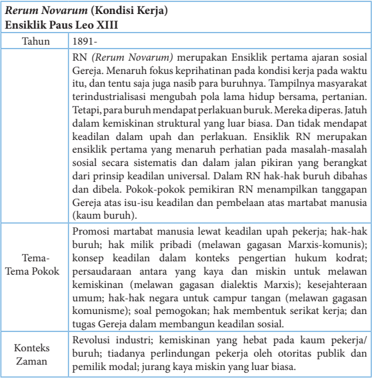

Tabel ini membahas Ensiklik Paus Leo XIII tentang Kondisi Kerja (Rerum Novarum) dari tahun 1891. Topik utamanya adalah tentang kesejahteraan pekerja dan hak-hak mereka dalam konteks industrialisasi. Tabel ini terdiri dari kolom "Tahun", "Tema Pokok", dan "Konteks Zaman". Data penting yang terlihat meliputi bahwa Ensiklik ini menekankan pentingnya kemiskinan struktural dan sistematis dalam masyarakat universal, serta menekankan hak-hak pekerja seperti promosi, hak untuk bermain, dan hak untuk mendapatkan gaji yang adil. Konteks zaman yang penting adalah revolusi industri, kemiskinan yang hebat pada kaum pekerja buruh, dan tidak adanya perlindungan pekerja oleh otoritas publik dan pemilik modal.

 

---
## 📄 Halaman 204

---
**📊 Tabel**

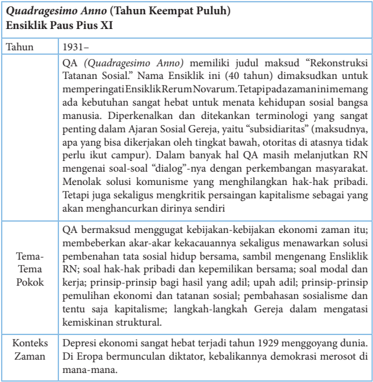

Tabel ini membahas Ensisilim Pius XI, yang dikenal sebagai Quadragesimo Anno (40 tahun). Topik utamanya adalah tentang rekonstruksi tatanan sosial dan perubahan ekonomi di masa depan. Kolom-kolomnya meliputi tahun 1931, tema, pokok, konteks, dan zaman. Data penting menunjukkan bahwa Ensisilim ini dirancang untuk memperbaiki kehidupan sosial manusia, dengan fokus pada subdinas (kebijakan) yang tidak berdasar pada kepentingan umum. Tidak ada solusi komunisme yang disebutkan, tetapi ada penekanan pada penghentian hukum pribadi dan pembangunan sosial. Konteksnya adalah depresi ekonomi yang sangat hebat pada tahun 1929, yang menggoyang dunia.

---
**📊 Tabel**

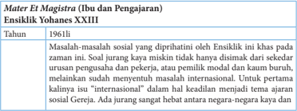

Tabel ini membahas tentang masalah sosial yang diangkat dalam Ensiklik Yohanes XXXIII, yang dirilis pada tahun 1961. Topik utama tabel adalah masalah sosial yang dihadapi oleh masyarakat pada masa itu, khususnya masalah jurnalisme dan penggunaan media massa. Tabel ini mencakup dua kolom utama: "Tahun" dan "Masalah sosial yang diprioritaskan". Dalam kolom "Tahun", hanya satu data yang diberikan, yaitu tahun 1961. Di kolom "Masalah sosial yang diprioritaskan", terdapat dua masalah yang disebutkan: masalah jurnalisme dan penggunaan media massa. Pola penting yang terlihat adalah bahwa Ensiklik tersebut memprioritaskan masalah jurnalisme dan penggunaan media massa sebagai isu utama yang perlu diselesaikan pada tahun 1961.

 

---
## 📄 Halaman 205

---
**📊 Tabel**

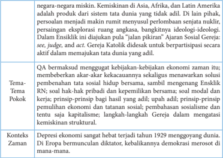

Tabel ini membahas topik utama tentang kemiskinan di negara-negara Asia, Afrika, dan Latin Amerika. Kolom-kolomnya meliputi Tema Pokok, Konteks Zaman, dan Data Penting. Topik utama adalah kemiskinan dan bagaimana ia berkaitan dengan ekonomi zaman. Dalam konteks zaman, tabel menunjukkan bahwa kemiskinan sangat hebat terjadi pada tahun 1929 akibat depresi ekonomi global. Data penting mencakup bahwa kemiskinan di negara-negara tersebut tidak hanya disebabkan oleh kebijakan ekonomi zaman itu sendiri, tetapi juga oleh berbagai faktor seperti kebijakan-kebijakan sosial, prinsip-prinsip bisnis, dan struktur ekonomi kapitalisme.

---
**📊 Tabel**

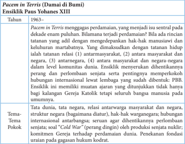

Tabel ini membahas perkembangan pemikiran Paus Yohanes XIII tentang Pacem in Terris (Damai di Bumi) dari tahun 1963 hingga sekarang. Topik utama adalah bagaimana pemikiran tersebut berkembang dan menjadi isu sentral dalam dekade berikutnya. Kolom-kolom yang ada meliputi tahun, penjelasan tentang Pacem in Terris, dan tema pokok. Data penting yang terlihat adalah bahwa pemikiran ini berkembang dari pendekatan hak-hak manusiawi dan keluhuran martabatnya menjadi lebih kompleks dengan tatanan hidup relasi antarmasyarakat, antara masyarakat dan negara, antar negara, dan antara masyarakat dan negara-negara dalam level komunitas. Tema pokok yang dominan adalah hubungan internasional, terutama konsep "Cold War" sebagai perang ideologi, dan komitmen Gereja terhadap perdamaian dunia.

 

---
## 📄 Halaman 206

### Konteks Zaman

Perang dingin antara Barat dan Blok Timur, pendirian Tembok Berlin yang memisahkan antara Jerman Barat dan Timur simbol pemisahan bangsa manusia (Agustus 1961), soal krisis Misile Cuba (1962)

---
**📊 Tabel**

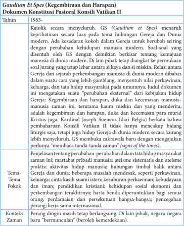

Tabel ini membahas dokumen konstitusi Gaudium et Spes dari Paus Yohanes Paulus II, yang dirilis pada tahun 1965. Topik utama tabel adalah perubahan dan harapan dalam konteks gereja Katolik. Tabel dibagi menjadi dua bagian: satu untuk informasi umum tentang dokumen tersebut, dan satu untuk detail lebih lanjut tentang konteks dan implikasinya. Kolom-kolom utama termasuk tahun, topik pokok, konteks zaman, dan penjelasan tentang perubahan-perubahan dalam konteks gereja. Data penting yang terlihat meliputi bahwa dokumen ini menekankan pentingnya hubungan antara gereja dan dunia modern, serta perubahan dalam kehidupan manusia di era modern.

 

---
## 📄 Halaman 207

---
**📊 Tabel**

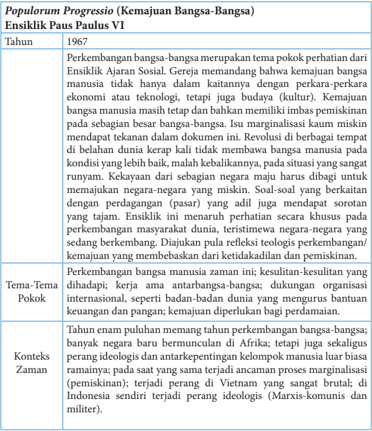

Populorum Progressio (Kemajuan Bangsa-Bangsa) adalah ensiklik Paus Paulus VI yang dirilis pada tahun 1967. Topik utamanya adalah perkembangan bangsa-bangsa manusia secara global dan interdependensial. Tabel ini membagi ensiklik tersebut menjadi dua kolom utama: Konteks Zaman dan Tema-Tema Pokok.

Konteks Zaman menunjukkan bahwa era ini diwarnai oleh berbagai peristiwa penting seperti Revolusi Keras di beberapa negara, kematian negara-negara miskin, dan kekayaan negara-negara yang miskin. Selain itu, terjadi perang di Vietnam yang sangat brutal, dan Indonesia sendiri terjadi perang ideologis antara komunis dan militer.

Tema-Tema Pokok mencakup berbagai aspek penting seperti perkembangan bangsa-bangsa manusia secara zatim, kesulitan-kesulitan yang dihadapi, dan peran penting organisasi internasional dalam membantu masyarakat. Selain itu, juga disebutkan tentang peran penting pemerintah dalam membantu masyarakat, terutama dalam hal pengembangan ekonomi dan pemerintahan.

Dengan demikian, Populorum Progressio mencoba memberikan pandangan umum tentang kemajuan bangsa-bangsa manusia dan bagaimana mereka dapat berkontribusi untuk kemajuan global.

---
**📊 Tabel**

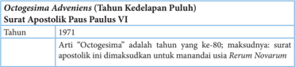

Tabel ini membahas tentang "Octogesima Adventis" (Tahun Kedelapan Puluh) Surat Apostolik Paus Paulus VI, yang diterbitkan pada tahun 1971. Topik utama tabel adalah penjelasan tentang arti "Octogesima" sebagai tahun ke-80 dalam kalender Gregorian, yang berarti bahwa surat apostolik ini dianggap sebagai surat yang kedelapan puluh. Tabel ini memperlihatkan bahwa tahun 1971 merupakan tahun ke-80 dalam kalender Gregorian, dan bahwa surat apostolik ini dianggap sebagai surat yang kedelapan puluh dalam sejarah surat-surat apostolik. Data penting lainnya yang terlihat dalam tabel adalah bahwa surat apostolik ini dianggap sebagai surat yang kedelapan puluh dalam sejarah surat-surat apostolik, dan bahwa tahun 1971 merupakan tahun ke-80 dalam kalender Gregorian.

 

---
## 📄 Halaman 208

---
**📊 Tabel**

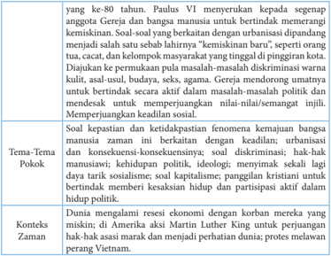

Tabel ini membahas topik utama tentang kebijaksanaan sosial dan politik Paulus, dengan fokus pada konsep "kebijaksanaan" dalam konteks urbanisasi dan kehidupan modern. Kolom-kolomnya mencakup aspek-aspek penting seperti:

1. **Topik Utama**: Kebijaksanaan sosial dan politik Paulus, dengan fokus pada urbanisasi dan kehidupan modern.

2. **Kolom-Kolom**: 
   - **Sosial/kebijaksanaan**: Menggambarkan bagaimana Paulus menekankan pentingnya kebijaksanaan dalam berbagai aspek sosial dan politik.
   - **Pemikiran**: Menyajikan pandangan Paulus tentang kebijaksanaan sebagai kunci untuk memperbaiki masalah-masalah sosial dan politik.
   - **Konteks Zaman**: Menggambarkan bagaimana Paulus berbicara di tengah-tengah era urbanisasi dan perkembangan teknologi, serta bagaimana dia menghadapi tantangan-tantangan baru dalam konteks tersebut.

3. **Data/Pola Penting**:
   - **Urbanisasi**: Paulus menekankan pentingnya kebijaksanaan dalam konteks urbanisasi, yang merupakan tren penting di masa itu.
   - **Kebijaksanaan Sosial**: Dia mengajarkan bahwa kebijaksanaan adalah kunci untuk memperbaiki masalah-masalah sosial dan politik, termasuk ketidakadilan, ketidakseimbangan ekonomi, dan konflik sosial.
   - **Pengaruh Politik**: Paulus juga berbicara tentang bagaimana kebijaksanaan dapat digunakan untuk mempengaruhi kebijakan politik dan mendorong perubahan positif dalam masyarakat.

Dengan demikian, tabel ini memberikan gambaran yang jelas tentang bagaimana Paulus menggunakan kebijaksanaan sebagai alat untuk memperbaiki kehidupan sosial dan politik di tengah-tengah era urbanisasi dan perkembangan teknologi.

---
**📊 Tabel**

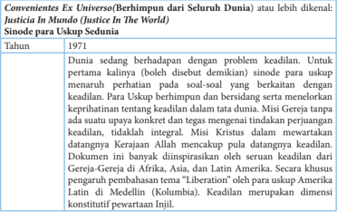

Tabel ini berisi informasi tentang konvensi Ex Universo (Berhimpun dari Seluruh Dunia) atau lebih dikenal sebagai Justicia In Mundo (Justice In The World), sebuah sinode untuk uskup sedunia yang dibentuk pada tahun 1971. Topik utama tabel adalah tentang perjuangan dunia dengan problem keadilan, khususnya dalam konteks gereja-gereja di Afrika, Asia, dan Latin Amerika. Kolom-kolom yang ada meliputi tahun pembentukan sinode, deskripsi masalah keadilan yang dihadapi oleh dunia, misi gereja dalam mewakili dan memperjuangkan keadilan, dan inspirasi dari Gereja-Gereja di berbagai wilayah tersebut. Data penting yang terlihat adalah bahwa sinode ini dibentuk untuk membantu uskup sedunia dalam menyelesaikan masalah keadilan secara global, dan memiliki inspirasi dari Gereja-Gereja di berbagai belahan dunia.

 

---
## 📄 Halaman 209

---
**📊 Tabel**

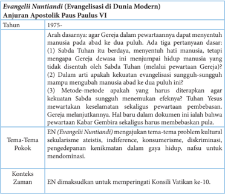

Tabel ini membahas Evangelisasi Paus Paulus VI di dunia modern, dengan fokus pada anjuran apostoliknya tahun 1975. Topik utama adalah tentang cara Gereja dapat menyentuh manusia secara efektif dan membangun kepercayaan. Kolom-kolom utamanya meliputi: Tahun (1975), Arah dasarannya, Tema-Tema Pokok, dan Konteks Zaman. Data penting menunjukkan bahwa anjuran tersebut mencakup berbagai aspek evangelisasi, termasuk pendekatan yang lebih langsung kepada manusia, penggunaan metode metodis, dan penekanan pada konsistensi dan integritas dalam upaya gereja. Konteks zaman yang disebutkan, yaitu dimasa Konsili Vatikan ke-10, menunjukkan bahwa anjuran ini merupakan bagian dari perubahan besar dalam pemikiran gereja tentang evangelisasi.

 

---
## 📄 Halaman 210

---
**📊 Tabel**

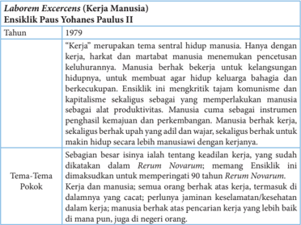

Tabel ini membahas tema utama "Kerja" dalam konteks eksistensial Paus Yohanes Paulus II, dengan fokus pada tahun 1979. Topik utama adalah bagaimana kerja mempengaruhi kehidupan manusia dan komunitasnya. Tabel dibagi menjadi dua kolom: "Tahun" dan "Tema-Tema Pokok". Kolom "Tahun" menunjukkan bahwa topik ini disinggung pada tahun 1979. Dalam kolom "Tema-Tema Pokok", terdapat dua topik utama yang dijelaskan: "Kerja" dan "Manusia". Topik "Kerja" dijelaskan bahwa kerja merupakan aset penting bagi manusia, memberikan nilai dan makna hidup, dan memiliki dampak positif pada komunitas. Sementara itu, topik "Manusia" menekankan bahwa manusia berharga sebagai diri sendiri, tidak hanya sebagai hasil dari kerja, dan memiliki hak untuk hidup dengan bebas dan sejahtera. Pola penting yang terlihat adalah bahwa Paus Yohanes Paulus II memfokuskan perdebatan tentang kerja dan manusia, serta bagaimana kerja dapat mempengaruhi kehidupan manusia secara keseluruhan.

 

---
## 📄 Halaman 211

---
**📊 Tabel**

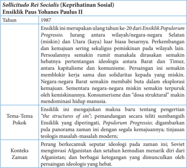

Tabel ini membahas Ensisilik Paus Yohanes Paulus II tahun 1987, sebuah dokumen kebijaksanaan sosial yang mencakup berbagai aspek teologis dan politik. Topik utama tabel adalah tentang pengertian struktur "the structure of sin" dalam konteks teologi modern dan bagaimana Ensisilik tersebut mempengaruhi pemahaman tentang kemiskinan dan kemanusiaan. Kolom-kolom dalam tabel meliputi: Tahun (1987), Ensisilik ini merupakan ulang tahun ke-20 dari Ensisilik Populorum Progressio, Tema-Tema Pokok, dan Konteks Zaman. Data penting yang terlihat adalah bahwa Ensisilik ini menekankan pentingnya pemahaman tentang struktur kemiskinan dan kemanusiaan, serta bagaimana pemahaman ini berdampak pada pemahaman tentang teologi modern dan bagaimana itu berperan dalam mengatasi masalah sosial seperti kemiskinan.

---
**📊 Tabel**

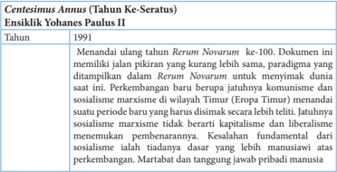

Tabel ini berisi informasi tentang tahun 1991 dalam konteks kritik terhadap dokumen "Rerum Novarum" ke-100, yang merupakan dokumen penting dalam teologi dan ekonomi. Topik utama tabel adalah perubahan paradigma dalam pemikiran tentang komunisme dan sosialisasi marxisme di Eropa Timur setelah Perang Dingin berakhir. Kolom-kolom yang ada meliputi tahun (1991), penjelasan tentang perubahan paradigma tersebut, dan perbandingan dengan "Rerum Novarum". Data penting yang terlihat adalah bahwa dokumen tersebut menunjukkan perubahan dalam pemikiran tentang komunisme dan sosialisasi marxisme di Eropa Timur setelah Perang Dingin berakhir, yang menunjukkan bahwa paradigma tersebut tidak lagi berlaku seperti yang ditunjukkan oleh "Rerum Novarum".

 

---
## 📄 Halaman 212

---
**📊 Tabel**

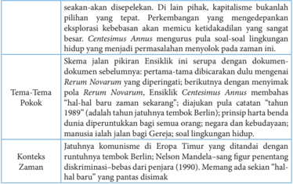

Tabel ini membahas perkembangan pilihan kapitalisme bukanlah sesuatu yang tepat, dengan penekanan pada peran ekspor kebebasan dalam memicu ketidakadilan sosial. Tema utama adalah perkembangan pilihan kapitalisme dan dampaknya terhadap kebebasan sosial. Kolom-kolom yang ada meliputi tema, pokok, dan konteks zaman. Data penting yang terlihat adalah bahwa perkembangan kapitalisme bukanlah sesuatu yang tepat karena dapat memicu ketidakadilan sosial, dan bahwa pilihan kapitalisme harus dihindari untuk mencegah kebebasan sosial. Konteks zaman yang ditunjukkan adalah bahwa perkembangan kapitalisme di Eropa Timur ditandai dengan diskriminasi berbasis ras dari penjara (1990).

---
**📊 Tabel**

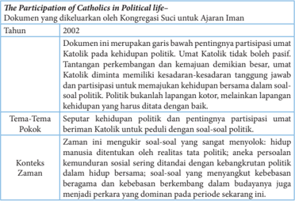

Tabel ini membahas partisipasi Katolik dalam politik di Indonesia pada tahun 2002. Topik utamanya adalah pentingnya partisipasi umat Katolik dalam kehidupan politik, terutama dalam konteks sosial-politik. Kolom-kolom yang ada meliputi tahun (2002), tema-tema pokok (seperti kehidupan politik dan pentingnya partisipasi umat), dan konteks zaman (yang mencakup realitas politik dan budaya). Data penting yang terlihat adalah bahwa dokumen tersebut menekankan pentingnya partisipasi umat Katolik dalam kehidupan politik, terutama dalam konteks sosial-politik, dan bahwa partisipasi ini harus dilakukan dengan cara yang baik dan bertanggung jawab.

 

---
## 📄 Halaman 213

---
**📊 Tabel**

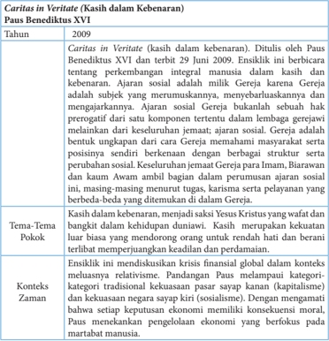

Tabel ini membahas doktrin "Caritas in Veritate" (kasih dalam kebenaran) yang dikeluarkan oleh Paus Benediktus XVI pada tahun 2009. Doktrin ini menekankan pentingnya kasih dalam berbagai aspek kehidupan, termasuk dalam melayani orang lain dengan penuh kasih dan integritas. Tabel ini mencakup empat kolom utama: Tahun, Tema-Tema Pokok, Konteks Zaman, dan Ensislik. Topik utama adalah tentang kasih dalam kebenaran dan bagaimana kasih tersebut harus diimplementasikan dalam berbagai aspek kehidupan. Data penting yang terlihat meliputi bahwa doktrin ini dikeluarkan pada tahun 2009, menekankan kasih dalam berbagai aspek kehidupan, dan mengajarkan bahwa kasih harus diimplementasikan dalam konteks kebijaksanaan sosial dan ekonomi.

### Tujuh tema kunci dari ensiklik-ensiklik tersebut:

- Kesucian hidup manusia dan martabat pribadi  harus dijunjung tinggi melebihi benda-benda dan harus dijaga sejak dikandung ibunya. Ini prinsip dasar ajaran Gereja. Gereja melawan serangan terhadap kehidupan manusia (aborsi, eutanasia, hukuman  mati,  pembasmian  suku  bangsa,  siksaan,  pembunuhan  rakyat  sipil, rasisme, diskriminasi, dan sebagainya. Gereja tidak anti perang tetapi anti perang yang tidak adil. Hukuman mati hanya boleh demi menjaga kehidupan bagsa, itu pun jikalau tidak tersedia jalan lain yang tidak 'membunuh' .  Tetapi kalau tersedia, negara harus mengusahakannya demi kesucian dan martabat hidup manusia.
- Panggilan untuk membentuk Keluarga Allah di tengah masyarakat yang melibatkan semua warga. 'Tidak baik manusia hidup sendirian' (Kej 2:18). Manusia menjadi

 

---
## 📄 Halaman 214

baik  dan  makin  sempurna  kalau  berdua  dan  bergabung.  Membentuk  keluarga lalu membentuk negara lalu membentuk Keluarga Allah. Baik-buruknya lembaga keluarga-masyarakat-negara dinilai dari sumbangannya kepada kehidupan dan martabat  pribadi  manusia.  Gereja  menolak  2  ekstrem:  ekstrem  individualistis (pasar bebas, laissez-faire ) dan ekstrem sosial (kolektivisme & komunisme). Hak tiap orang untuk ambil bagian dalam hidup masyarakat, harus dijunjung tinggi. Gereja  mendorong  prisip  subsidiaritas  (=  hal  yang  bisa  ditangani  oleh  warga negara tidak boleh ditangani oleh negara. Negara hanya wajib membantu saja).

- Hak azasi manusia selalu berdasar pada dan demi martabat pribadi manusia. Batas hak  azasi  manusia  memang  kewajiban  azasi  manusia  (melainkan  maksudnya bukan kewajiban kemasyarakatan,  kewajiban menunaikan martabat manusia yang mencakup kewajiban sosial). Hak azasi paling dasar = hak hidup, hak mencapai kepenuhan  hidup  dan  hak  atas  keperluan  hidup.  Hidup  yg  dimaksud  adalah hidup bermartabat (Kekasih Allah, Citra Allah, Keluiarga Allah). Hak keperluan hidup antara lain: pekerjaan, jaminan kesehatan, pendidikan, rumah, berkeluarga, kebebasan beragama  dan hak milik. Kebebasan beragama = bebas berhubungan dengan Tuhan yang membebaskan bukan yang memperbudak, kebebasan hati nurani, kebebasan mengungkapkan isi hati dan keagamaan). Hak milik (harta) itu  bukan  tanpa  batas.  Batasnya  kebersamaan.  Tidak  boleh  disalah  gunakan. Tidak boleh ditimbun secara tidak adil (negara berhak mendistribusikannya).
- Preferential option for the poor and vulnerable (selalu mendahulukan orang yang miskin dan tanpa pembela) termasuk anak dalam kandungan, orang cacat, orang jompo, orang dalam sakrat maut, dan sebagai berikut. Ukuran martabat suatu bangsa adalah perlakuannya terhadap orang-orang semacam itu. Menolong orang miskin dari kocek sendiri. Bersikap hormat kepada mereka. Mendoakan mereka. Membentuk tim advokasi hukum untuk mereka. Dan sebagai berikut.
- Nilai luhur pekerjaan. Salah satu keperluan hidup yang jadi hak azasi manusia adalah pekerjaan. Pada awalnya manusia dipanggil Tuhan untuk  bersama bekerja mengelola  bumi  dan  mengenyam  hasilnya  bersama.  Inilah  dua  realitas  dasar dunia. Kalau dua hal tersebut. terjamin, maka damai sejahtera. Pekerjaan adalah kunci penyelesaian masalah sosial. Manusia yang tidak bekerja itu bukan manusia. Karena  bekerja,  manusia  jadi  manusia.  Pekerjaan  adalah  dasar  kemerdekaan. Tanpa punya pekerjaan pribadi, manusia jadi budak majikan. Kerja-sama bukan hanya bekerja bersama, tetapi tanggung jawab bersama. Aku bekerja untuk kamu dan kamu untuk aku. Sumbangan majikan kepada masyarakat berupa jasa atau produk dan pekerjaan yang menjunjung tinggi kemanusiaan. Hak buruh, selain hak atas pekerjaan yang aman dan produktif, juga decent-fair-living wage (upah pantas, adil, dan menghidupi keluarga), dan hak membentuk serikat buruh untuk melindungi kepentingan buruh. Kewajiban buruh adalah bekerja sepenuh hati dengan setia, a  fair  day's  work  for  a  fair  day's  pay (memenuhi jam kerja sesuai

 

---
## 📄 Halaman 215

- upah pantas  per  hari).  Sikap  buruh  menghormati  majikan  dan  sesama  buruh, nonviolence (anti  kekerasan),  'menerima'  keadaan (voluntary  poverty) ,  antidiskriminasi, takwa (doa), dan kekeluargaan.
- Solidaritas (setia-kawan, solid = kokoh ). Ini  keutamaan  kristiani.  Asalnya dari  kasih  Allah  Tritunggal  (Bapa  Putera  Roh  Kudus  saling  mengasihi).  Dia mempertaruhkan Diri, menyatu menjadi manusia agar manusia menjadi 'Allah' , dengan menanam kasih-Nya dan semangat Keluarga Allah dalam hati tiap orang, sehingga  tiap  orang  punya  semangat  menyangkal  diri  dan  semangat  altruistis (hidup untuk orang lain). Tujuan akhirnya Keluarga Allah di tengah masyarakat dan  di  sorga.  Sikap  yang  menonjol  adalah  penjaga  sesama  (anti  semangat Kain),  penolong  orang  sengsara,  menjadi  tempat  singgah  bagi  orang  asing (juga  immigran),  pendidikan  anak-anaknya,  mencukupi  kebutuhannya,  dan sebagai berikut. Sikap mengampuni dan mau berdamai dengan musuh. Secara internasional, gereja minta pengurangan hutang negara miskin. Di masyarakat, umat Allah memelopori perubahan struktur masyarakat.
- Memelihara  ciptaan  Allah.  Keadilan  kristiani  berlaku,  baik  di  antara  manusia maupun terhadap mahluk lain. Manusia harus tampil sebagai pemelihara setia alam ciptaan, bukan pengeruk alam. Alam adalah jaminan sosial sekarang dan masa  depan  anak  cucu.  Korban  pertama  paling  parah  dari  pengerukan  alam adalah orang miskin. Mereka jadi alat keruk murah. Hanya di alam yang telah rusak  itu  saja  mereka  boleh  tinggal.  Umat  kristiani  harus  dididik  memelihara lingkungan dan menolong orang miskin.

### Langkah Kedua: Mendalami Ajaran Sosial Gereja di Indonesia

### 1. Menyimak Kisah Kehidupan

### Sekolah Katolik, Sanggupkah Katolik

Pak Frans, demikian nama sapaannya,  berdomisili di pinggiran kota Jakarta. Dia seorang  Katolik  yang  aktif  di  lingkungan  atau  komunitas  basisnya.  Pekerjaan  Pak Frans adalah seorang buruh pabrik dengan penghasilan paspasan, sementara istrinya adalah  seorang  tukang  cuci  pakaian  alias  pembantu  rumah  tangga  di  kompleks perumahan tempat mereka tinggal. Anak-anaknya ada tiga orang dan masih kecilkecil. Mereka tinggal di sebuah rumah berbentuk petak, miliknya sendiri yang dibeli dari hasil warisan orang tua Pak Frans di kampung asalnya, serta uang pesangon Pak Frans ketika di-PHK dari pekerjaan sebelumnya.

Meski secara ekonomi boleh dikatakan sangat terbatas, dan dapat dikategorikan dalam golongan keluarga miskin, Pak Frans dan istrinya ingin menyekolahkan anakanak mereka di sekolah Katolik yang tidak seberapa jauh dari rumah mereka. Dalam

 

---
## 📄 Halaman 216

benak Pak Frans, anak-anak usia dini harus sekolah di sekolah Katolik yang terkenal disiplin, dan lebih dari itu anak-anak mendapat pendidikan agama yang lebih baik. Niatnya semakin kuat tatkala ia mendengar informasi dari umat seimannya bahwa anak-anak Katolik diprioritaskan di sekolah katolik itu serta mendapatkan kemudahan pembiayaan.

Waktunya pun tiba, anak pertamanya akan masuk SD, setelah belajar TK umum di samping rumahnya. Ketika ada pengumuman penda ftaran SD Katolik  itu melalui mimbar gereja, Pak Frans bergegas menyiapkan berkas-berkas untuk pendaftaran. Bahkan untuk memperkuat keinginannya itu, Pak Frans meminta rekomendasi dari ketua lingkungan, ketua wilayah, serta Pastor paroki bahwa ia berasal dari keluarga sederhana atau miskin. Dengan penuh harapan, Pak Frans bersama sang istri serta sang  buah  hatinya,  sebut  saja  Sinta  namanya,  berangkat  ke  SD  Katolik  itu  untuk melakukan pendaftaran.

Sekolah menerima pendaftaran itu dengan menyodorkan berbagai persyaratan, antara lain uang pangkal dan uang SPP bulanan yang harus dibayar. Pak Frans dan Ibu  Suci,  demikian  sapaan  nama  istrinya  bernegosiasi  dengan  menunjukan  surat rekomendasi dari lingkungan serta paroki. Mereka hanya meminta keringanan bukan gratis.  Pihak  sekolah  tak  bergeming,  bahkan  surat  rekomendasi    yang  ada  tanda tangan Pastor parokinya  itu tak digubris. Hal yang lebih menyakitkan adalah respon dari pihak sekolah itu, bahwa kalau tidak mampu ya...jangan sekolah di sini.

Pak Frans dan istri serta anaknya pun kembali dengan penuh kekecewaan...Sejak saat itu, Pak Frans tak pernah berpikir untuk menyekolahkan anak-anaknya di sekolah Katoli. Meski demikian, ia tetap tegar untuk menyekolahkan anak-anaknya di sekolah negeri yang terjangkau biayanya. Sementara untuk pendidikan agama Katolik bagi anaknya itu, ia harus mengantarnya setiap hari Minggu ke gereja untuk mengikuti pelajaran bina iman anak di parokinya.

Diangkat dari kisah nyata, dan ditulis kembali oleh Daniel Boli Kotan

### 2. Diskusi

- Guru mengajak para peserta  didik  untuk  berdiskusi,  dengan  pertanyaan,  seperti contoh berikut.
- Apa kesanmu  tentang cerita tersebut?
- Apakah sekolah Katolik itu sudah mempraktikan atau mewujudkan Ajaran Sosial Gereja?
- Mengapa orang Katolik sendiri tidak melaksanakan Ajaran Sosial Gereja?
- Adakah kasus-kasus lain berkaitan ddengan  perilaku orang Katolik atau lembagalembaga  Katolik yang tidak mencerminkan pelaksanaan Ajaran Sosial Gereja?

 

---
## 📄 Halaman 217

### 3. Penjelasan

- Setelah  para  peserta  didik  memberikan  jawaban  dalam  diskusi,  guru  memberi penjelasan, misalnya sebagai berikut.
- -Ajaran  Sosial  Gereja  belum  dilaksanakan  secara  maksimal  di  Indonesia  oleh orang-orang Katolik sendiri.
- -Ajaran Sosial Gereja tampaknya hanya sebatas ajaran, teori, yang dijadikan wacana, tetapi belum menjadi sebuah gerakan atas dasar kasih.

### Langkah Ketiga: Menghayati Ajaran Sosial Gereja

### 1. Refleksi

- Guru mengajak para peserta didik untuk membaca dan menyimak tulisan berikut ini.
Penampilan  Gereja  di  Indonesia  lebih  merupakan  penampilan  ibadat  daripada penampilan gerakan sosial. Seandainya ada penampilan sosial, itu tidak merupakan penampilan  utama.  Penampilan  sosial  yang  ada  sampai  sekarang  merupakan penampilan sosial karitatif, seperti membantu yang miskin, mencarikan pekerjaan bagi pengangguran, dan sebagainya. Demikian juga, mereka yang datang di gereja adalah  orang-orang  yang  telah  menjadi  puas  bila  dipenuhi  kebutuhan  pribadinya dengan kegiatan ibadat atau sudah cukup senang dengan memberi dana sejumlah uang bagi mereka yang sengsara. Namun, mencari sebab-sebab mengapa ada pengemis, mengapa ada pengangguran belum dianggap sebagai hal yang berhubungan dengan iman. Padahal,  kita  tahu  ajaran  sosial  Gereja  lebih  mengundang  kita  agar  tidak merasa  kasihan  kepada  para  korban,  tetapi  mencari  sebab-sebab  mengapa  terjadi korban dan mencari siapa penyebabnya. Mungkin saja bahwa penyebabnya adalah orang-orang yang mengaku beriman Katolik itu sendiri.

- Guru mengajak para peserta didik untuk meresapi tulisan tersebut, dan membuat refleksi  pribadinya,  dengan  bantuan  pertanyaan;    sudahkah  saya  menjalankan Ajaran Sosial Gereja dalam hidup saya?

### 2.  Rencana Aksi

- Guru mengajak para peserta didik untuk merencanakan aksinya untuk mewujudkan Ajaran Sosial Gereja dalam hidupnya.

 

---
## 📄 Halaman 218

### Penutup: Doa

- Guru mengajak para peserta didik untuk mengakhiri  pelajaran dengan doa,
Bapa yang Mahabaik, terima kasih atas bimbingan-Mu selama pelajaran ini. Semoga pada masa mendatang, oleh berkat-Mu kami mampu membangun masyarakat yang sehat  yang  dicirikan  oleh  adanya  pengakuan  terhadap  martabat  pribadi  manusia, kesejahteraan bersama,  serta solidaritas sebagai sesama manusia ciptaan-Mu. Amin.

### Penugasan:

Para peserta didik diminta mewawancarai tokoh-tokoh paroki: Sejauh mana ajaran sosial Gereja telah diterapkan di parokinya. Hasil wawancara ditulis dan dikumpulkan dengan tandatangan orangtua/walimurid.

### Penilaian

Penilain Sikap (Spiritual dan Sosial)

JURNAL

Nama Peserta Didik

: …………………………………..

Kelas/Program

: …………………………………..

Mata Pelajaran

: …………………………………..

Semester

: …………………………………..

---
**📊 Tabel**

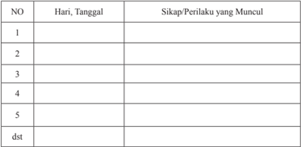

Tabel ini berisi informasi tentang sikap dan perilaku yang muncul pada hari tertentu sepanjang waktu. Kolom pertama menunjukkan tanggal-tanggal tertentu, sedangkan kolom kedua menunjukkan sikap atau perilaku yang muncul pada setiap tanggal tersebut. Topik utama tabel ini adalah analisis sikap dan perilaku individu selama periode waktu tertentu. Data penting yang terlihat adalah bahwa sikap dan perilaku individu dapat berubah-ubah dari hari ke hari, menunjukkan variasi dalam perilaku dan sikap.

 

---
## 📄 Halaman 219

### · Penilaian Pengetahuan

### Tes tertulis:

- Apa  hubungan  antara  keadilan  dan  situasi damai  serta sejahtera  dalam masyarakat?
- Jelaskanlah bahwa kesejahteraan ada hubungannya dengan martabat manusia!
- Buatlah penelitian mengenai ketidakadilan di bidang ekonomi di lingkunganmu yang membuat masyarakat tidak sejahtera?
- Apa pandangan Gereja tentang dunia?
- Apa pandangan Gereja tentang manusia?
- Apa pandangan Gereja tentang martabat manusia?
- Apakah Gereja Indonesia cukup punya andil dalam pembangunan? Jelaskanlah!
- Bagaimana  caranya agar Gereja Indonesia lebih memiliki daya pikat?
- Apa makna Ajaran Sosial Gereja?
- Apa tujuan Ajaran Sosial Gereja?
- Sebutkan dan jelaskan beberapa Ajaran Sosial Gereja?
- Apa bedanya perjuangan Gereja dan perjuangan kaum komunis dalam membantu para buruh?
- Apakah Ajaran Sosial Gereja sudah sungguh dilaksaanakan di Indonesia?

### · Penilaian Keterampilan:

### Nontes

Cobalah  untuk  berbicara,  berkomunikasi  dengan  Pastor    paroki,  dan  juga  orang tuamu, serta  ketua lingkungan atau ketua pengurus kelompok umat basismu  tentang kegiatan yang akan kamu lakukan di tengah keluarga, dalam rangka mewujudkan situasi damai dan adil, menjaga keutuhan lingkungan serta ajaran sosial Gereja. Buatlah laporan secara tertulis dan diketahui/ditandatangani oleh orangtua/walimurid.

### Kegiatan Remedial

Bagi  peserta  didik  yang  belum  memahami  Bab  ini,  diberikan  remedial  dengan kegiatan berikut ini.

- Guru menyampaikan pertanyaan kepada peserta didik akan hal-hal apa saja yang belum mereka pahami tentang permasalahan-permasalahan yang dihadapi dunia hubungan Gereja dan dunia, serta ajaran sosial Gereja.
- Berdasarkan hal-hal yang belum mereka pahami, guru mengajak peserta didik untuk mempelajari kembali dengan memberikan bantuan peneguhan-peneguhan yang lebih praktis.

 

---
## 📄 Halaman 220

- Guru  memberikan  penilaian  ulang untuk penilaian pengetahuan,  dengan pertanyaan yang lebih sederhana, sesuai dengan kondisi peserta didik.

### Kegiatan Pengayaan

Bagi  peserta  didik  yang  telah  memahami  bab  ini,  diberikan  pengayaan  dengan kegiatan berikut ini.

- Guru meminta peserta didik untuk melakukan studi pustaka (ke perpustakaan atau mencari di koran/majalah) untuk menemukan cerita/ kisah tentang  permasalahan yang dihadapi dunia, hubungan Gereja dan dunia serta ajaran sosial Gereja.
- Hasil temuannya ditulis dalam laporan tertulis yang berisi gambaran singkat dari kisah atau cerita tersebut.

 

---
## 📄 Halaman 221

### Pengantar

Pada bagian kelima tentang Gereja, kita telah mempelajari hubungan Gereja dan dunia. Pada bagian ini, kita akan mempelajari tentang Hak Asasi Manusia yang merupakan salah satu keprihatinan dunia dan Gereja pada saat ini. Hak Asasi Manusia adalah salah satu isu penting umat manusia dewasa ini sehingga ada baiknya kita mempelajari dan mendalaminya secara khusus.

Dalam pembahasan tentang Hak Asasi Manusia, para peserta didik akan mempelajari tema-tema  tentang materi-materi berikut.

- Hak Asasi Manusia.
- Hak Asasi Manusia dalam Terang Kitab Sucidan Ajaran Gereja.
- Budaya  Kekerasan versus Budaya Kasih.
- Aborsi
- Bunuh Diri dan Euthanasia
- Hukuman Mati
- Bebas dari Obat Terlarang dan HIV/AIDS

### Kompetensi Inti

- Menghayati dan mengamalkan ajaran agama yang dianutnya.
- Menghayati  dan  mengamalkan  perilaku  jujur,  disiplin,  tanggung  jawab,  peduli (gotong  royong,  kerja  sama,  toleran,  damai),  santun,  responsif  dan  proaktif dan menunjukkan sikap sebagai bagian dari solusi atas berbagai permasalahan dalam berinteraksi secara efektif dengan lingkungan sosial dan alam serta dalam menempatkan diri sebagai cerminan bangsa dalam pergaulan dunia.
- Memahami pengetahuan (faktual, konseptual, dan prosedural) berdasarkan rasa ingin tahunya tentang ilmu pengetahuan, teknologi, seni, budaya terkait fenomena, dan kejadian tampak mata.
- Mengolah, menyaji, dan menalar dalam ranah konkret (menggunakan, mengurai, merangkai, memo difikasi, dan membuat) dan ranah abstrak (menulis, membaca, menghitung,  menggambar,  dan  mengarang)  sesuai  dengan  yang  dipelajari  di sekolah dan sumber lain yang sama dalam sudut pandang/teori.

### Bab VI Hak Asasi Manusia

 

---
## 📄 Halaman 222

### A. Hak Asasi Manusia

### Kompetensi Dasar

- 1.6    Bersyukur  atas adanya hak asasi Manusia, sebagai dasar panggilan untuk ikut serta menegakkan hak-hak asasi manusia.
- 2.6 Peduli terhadap berbagai permasalahan hak asasi manusia.
- 3.6 Memahami tentang hak asasi Manusia, sebagai dasar panggilan untuk ikut serta menegakkan hak-hak asasi manusia.
- 4.6 Melakukan  aktivitas  (misalnya  menuliskan  r efleksi/doa/  menyusun  kliping berita atau gambar) tentang perjuangan Gereja dalam menegakkan hak asasi manusia.

### Indikator

- Menjelaskan pengertian Hak Asasi Manusia.
- Menjelaskan beberapa pasal penting Piagam PBB tentang HAM.
- Menyebutkan contoh-contoh pelanggaran HAM.
- Menjelaskan upaya-upaya yang dapat dilakukan dalam rangka memperjuangkan Hak asasi Manusia di lingkungan sekitarnya.

### Bahan Kajian

- Pengertian Hak Asasi Manusia.
- Piagam PBB tentang Hak Asasi Manusia.
- Pandangan Gereja tentang Hak Asasi Manusia.
- Kerja sama memperjuangkan Hak Asasi Manusia.

### Sumber Belajar

- KOMNAS HAM.1997. Hak  Asasi  Manusia  dalam  Perspektif  Budaya  Indonesia. Gramedia Pustaka Utama: Jakarta.
- Darwan Prinst. Sosialisasi dan Diseminasi Penegakan HAM. Citra Aditya Bakti Bandung, 2001.
- Koran/mediamassa tentang pelanggaran HAM

### Pendekatan

Kateketis dan saintifik

 

---
## 📄 Halaman 223

### Sarana

- Piagam HAM PBB
- Buku Siswa SMA/SMK, Kelas XI,  Pendidikan Agama Katolik dan Budi Pekerti.
- Kliping koran/media massa tentang pelanggaran HAM

### Waktu

3x45 menit.

- Apabila  pelajaran  ini  dibawakan  dalam  dua  kali  pertemuan  secara  terpisah, pelaksanaannya diatur oleh guru.

### Pemikiran Dasar

Homo  homini  lupus, sebuah  frase  singkat  yang  pertama  kali  diucapkan  oleh Plautus  pada  195  SM,  yang  berarti  bahwa  manusia  adalah  serigala  bagi  manusia yang lain, sebuah penegasan bahwa manusia itu mengganggap penaklukan terhadap manusia  lainnya  adalah  sebuah  kodrat.  Kehidupan  manusia  layaknya  kehidupan serigala di alam liar. Kita saling menerkam, merampas, menyakiti, dan merebut milik manusia lainnya. Dalam sejarahnya, rentang waktu kita telah dipenuhi oleh darah dan air mata, alirannya bahkan belum akan kering hingga saat ini. Sejarah mencatat pernah terjadi perang dunia, atau perang antar bangsa dengan blok-bloknya selama dua kali, belum termasuk perang-perang saudara dengan berbagai motifnya. Karena pengalaman  umat  manusia  atas  sejarah  penderitaan  manusia  yang  tak  terbilang jumlahnya itulah, timbullah perjuangan untuk menegakkan hak-hak asasi manusia. Ada hasrat kuat bersama untuk menghentikan segala perkosaan martabat manusia. Hasrat  itu  menyatakan  dengan  tegas:  orang  harus  menjamin  dan  membela  hakhak  asasi  manusia,  dan  jangan  merampasnya.  Karena  sejarah  penderitaan  itulah, Perserikatan  Bangsa-Bangsa    terdorong  untuk  mendeklarasikan  piagam  hak  asasi manusia pada tanggal 10 Desember 1948 di Paris. Hak Asasi Manusia dalam piagam itu dapat digolongkan ke dalam dua kelompok, yaitu: (1) hak-hak sipil dan politik; (2) hak-hak ekonomi, sosial, dan budaya.

Hak-Hak Sipil dan Politik; Hak-hak sipil dan politik lebih menyangkut hubungan warga  negara  dan  pemerintahan,  serta  menjamin  agar  setiap  warga  memperoleh kemerdekaan. Hak-hak ini meliputi: hak atas hidup, hak kebebasan berpikir dan hak kebebasan menyatakan pendapat, hak kebebasan hati nurani dan agama, serta hak kebebasan berkumpul atau berserikat; hak atas kebebasan dan kemampuan dirinya; hak atas kesamaan di depan hukum dan hak atas perlindungan hukum di hadapan pengadilan (dalam hal penangkapan, penggeledahan, penahanan, penganiayaan, dan sebagainya); hak atas partisipasi dalam pemerintahan (berpolitik), dan lain-lain. Hakhak ekonomi, sosial, dan budaya lebih menyangkut hidup kemasyarakatan dalam arti

 

---
## 📄 Halaman 224

luas dan menjamin agar orang dapat mempertahankan kemerdekaan. Hak-hak itu meliputi: hak mendirikan keluarga serta hak atas kerja, hak atas pendidikan, hak atas tingkat kehidupan yang layak bagi dirinya sendiri dan keluarga, dan hak atas jaminan waktu sakit dan pada hari tua. Ada pula hak atas lingkungan hidup yang sehat serta hak para bangsa atas perdamaian.

Pada  pembelajaran  ini,  peserta  didik  dibimbing  untuk  memahami  makna  dan hakikat hak asasi manusia, khususnya menurut piagam HAM PBB dan menghayati serta  mengamalkannya  (memperjuangkan)  dalam  hidupnya  sehari-hari  sebagai manusia yang bermartabat mulia, sesuai norma-norma universal serta norma ajaran kristiani.

### Kegiatan Pembelajaran

### Pembuka: Doa

- Guru mengajak para peserta didik untuk mengawali pembelajaran  dengan doa, seperti contoh berikut.

### Bapa yang penuh kasih,

Pada pelajaran ini kami akan mempelajari tema tentang Hak Asasi Manusia' yaitu hak yang melekat pada diri setiap manusia yang Engkau anugerahkan kepada kami. Bimbinglah kami  agar mampu memahami makna Hak Asasi Manusia itu sehingga ikut memperjuangkannya dalam hidup kami. Demi Yesus Kristus, Tuhan dan Juruselamat kami. Amin.

### Langkah Pertama: Mendalami Makna Hak Asasi Manusia

### 1. Dialog

- Guru mengajak para peserta didik untuk menyampaikan pemahamannya tentang hak asasi manusia, misalnya dengan pertanyaan, 'Kamu pernah mendengar  istilah Hak Asasi Manusia (HAM)? Apa artinya?'

### 2.  Mengamati dan Mendalami Kasus Pelanggaran Hak Asasi Manusia di Dunia

- Guru mengajak para peserta didik menyebutkan berbagai jenis pelanggaran HAM di dunia yang mereka ketahui.
- Guru mengajak para peserta didik untuk mengklasifikasikan jenis-jenis pelanggaran HAM  yang telah disebutkan sebelumnya.

 

---
## 📄 Halaman 225

### 3. Menyimak Cerita/Berita

- Guru mengajak para peserta didik untuk membaca dan menyimak kisah  berikut ini.

### Vietnam Dituduh Menggunakan Nap Kriminal untuk Menyiksa Tahanan Politik

Para petugas penjara (sipir) di Vietnam menggunakan 'para narapidana kriminal' untuk menyiksa tahanan politik (tapol), demikian petisi yang ditandatangani oleh 15 tokoh agama berbagai negara.

Petisi yang ditandatangani oleh empat pemimpin Buddha, tiga pemimpin Katolik, tiga  pemimpin Cao Dai dan lima pemimpin Protestan, mendesak pembebasan 14 pemuda 'dan banyak pemuda lain yang sedang ditahan.'

Petisi itu menyatakan bahwa para pejabat menggunakan 'kekuasaan, kekerasan, dan kebohongan untuk menyiksa para tapol.' Petisi itu menuntut bahwa 'pemerintah tidak menggunakan napi kriminal untuk menyerang dan menyiksa tapol sebagaimana telah dialami orang-orang muda tersebut, terutama penjara tidak digunakan untuk hukuma n fisik, penyiksaan dalam rangka … memaksa mereka untuk mengaku.'

Situs  Kongregasi  Redemptoris  di  Vietnam  pada  2  Oktober  menerbitkan  teks petisi itu dalam bahasa Inggris. Ke-14 pemuda tapol tersebut beragama Katolik dan Protestan, kata petisi itu. Petisi itu secara khusus meminta salah satu dari mereka, Do Thi Minh Hanh, seorang mahasiswa, dibebaskan dengan alasan kesehatan.

'Pemerintah  harus  membawa  mereka  ke  rumah  sakit  untuk  perawatan  medis atau mengizinkan mereka keluar dengan jaminan sehingga mereka bisa mengobati penyakit  dan  luka-luka  yang  diderita  mereka.  Kasus  yang  paling  memprihatinkan adalah Do Thi Minh Hanh,' kata petisi itu. Petisi ini ditujukan kepada berbagai pihak, dari  anggota  parlemen  Vietnam  hingga  PBB,  dan  ASEAN,  'pemerintah  negaranegara demokrasi' serta 'mitra Vietnam di luar dan di Vietnam. '

Ia mengatakan 14 pemuda yang disebutkan dalam petisi itu telah ditahan 'hanya menuntut  aspirasi  mereka  dan  tidak  melarang  konstitusi,  seperti  membagikan selebaran … menulis artikel di internet mempromosikan kebebasan dan demokrasi … berpartisipasi  dalam  organisasi  dan  partai  politik  non  komunis  serta  membela hak-hak pekerja dan … warga negara.'  Mereka ditahan hanya 'memiliki aspirasi politik berbeda, ' kata petisi itu.

Redemptoris  adalah 'salah satu kelompok yang paling vokal menyerukan keadilan dan  hak  asasi  manusia  di  Vietnam, '  demikian  kelompok  hak Christian  Solidarity Worldwide (CSW) berkomentar pada akhir pekan.  'Namun, petisi itu penting yang ditandatangani oleh para pemuka agama mewakili sejumlah agama,' kata CSW.

Sumber: Vietnam accused of using inmates as torturers http://indonesia.ucanews.com 06-10-2013

 

---
## 📄 Halaman 226

### 4. Pendalaman

- Guru mengajak  para peserta didik  untuk berdialog mendalami isi/pesan dari cerita di atas, misalnya dengan pertanyaan-pertanyaan berikut.
- Apa pesan cerita itu?
- Apa alasan terjadi peristiwa pelanggaran HAM  tersebut?
- Apakah kamu dapat menyebutkan dan menceritakan peristiwa-peristiwa lain saat manusia diperlakukan sewenang-wenang?

### 5. Penjelasan

- Guru memberikan penjelasan, misalnya sebagai berikut.
- -Hak Asasi Manusia (HAM) adalah hak-hak yang melekat dalam diri manusia, bukan karena diberikan kepadanya oleh masyarakat atau negara, melainkan berdasarkan martabatnya sebagai manusia. Hak-hak itu dimiliki manusia karena ia manusia. Sejak seseorang mulai berada dalam rahim ibunya, ia memiliki hak-hak asasi itu.
- -Dalam  paham  Hak  Asasi  Manusia,  hak-hak  itu  tidak  dapat  dihilangkan.  Oleh karena manusia tidak menerima hak itu dari negara, negara juga tidak dapat meniadakannya.  Walaupun  negara  tidak  mengakuinya,  hak-hak  itu  tetap  dimiliki manusia dan seharusnya diakui.
- -Hak-hak asasi merupakan hak yang universal. Artinya, hak-hak itu menyangkut semua orang, berlaku dan harus diberlakukan di mana-mana. Sebagai contoh, hak untuk hidup layak, hak untuk mendapat pendidikan dan pekerjaan, hak untuk menikah.
- -Perumusan hak-hak asasi tidak pernah lepas  dari  konteks  kultural/budaya  tertentu. Rumus dan pengertian hak asasi ditentukan oleh lingkup kebudayaan, seharusnya membuat orang makin peka, agar jangan sampai ada penderitaan yang tidak diperhatikan dan jangan sampai ada hak seseorang yang dilanggar. Menolak sifat universal hak-hak asasi manusia berarti menyangkal unsur manusiawi yang terdapat dalam setiap kebudayaan.

### Langkah Kedua:  Mendalami Deklarasi atau Piagam PBB tentang Hak Asasi  Manusia

### 1. Menyimak Piagam PBB tentang HAM

- Guru mengajak para peserta didik  untuk membaca dan menyimak deklarasi atau piagam PBB tentang Hak Asasi Manusia berikut ini.

 

---
## 📄 Halaman 227

### PIAGAM PBB TENTANG HAK ASASI MANUSIA (HAM) (Dideklarasikan pada tanggal 10 Desember 1948 di Paris)

### MUKADINAH

Menimbang bahwa pengakuan atas martabat alamiah dan hak-hak yang sama dan mutlak dari semua anggota keluarga manusia adalah dasar kemerdekaan, keadilan, dan perdamaian di dunia.

Menimbang bahwa mengabaikan dan memandang rendah hal-hak asasi manusia telah mengakibatkan perbuatan-perbuatan bengis yang menimbulkan rasa kemarahan hati nurani umat manusia, dan terbentuknya suatu dunia tempat manusia akan mengecap kenikmatan kebebasan berbicara dan beragama serta kebebasan dari ketakutan dan kekurangan telah dinyatakan sebagai cita-cita tertinggi dari rakyat biasa.

Menimbang bahwa hak-hak asasi manusia perlu dilindungi oleh peraturan hukum supaya orang tidak akan terpaksa memilih pemberontakan sebagai usaha terakhir guna menentang kelaliman dan penindasan.

Menimbang  bahwa  pembangunan  hubungan  persahabatan  antara  negara-negara perlu digalakkan.

Menimbang bahwa bangsa-bangsa dari Perserikatan Bangsa-Bangsa sekali lagi telah menyatakan di dalam Piagam Perserikatan Bangsa-Bangsa kepercayaan mereka akan hak-hak dasar dari manusia, akan martabat dan nilai seseorang manusia dan akan hak-hak yang sama dari pria maupun wanita, dan telah bertekad untuk menggalakkan kemajuan sosial dan taraf hidup yang lebih baik di dalam kemerdekaan yang lebih luas.

Menimbang bahwa Negara-Negara Anggota telah berjanji untuk mencapai kemajuan dalam  penghargaan  dan  penghormatan  umum  terhadap  hak-hak  asasi  manusia dan kebebasan-kebebasan asasi, dengan bekerja sama dengan Perserikatan BangsaBangsa.

Menimbang  bahwa  pengertian  umum  tentang  hak-hak  dan  kebebasan-kebebasan tersebut  sangat  penting  untuk  pelaksanaan  yang  sungguh-sungguh  dari  janji  ini, maka,  Majelis  Umum  dengan  ini  memproklamasikan  Pernyataan  Umum  tentang Hak-Hak Asasi Manusia.

Sebagai  satu  standar  umum  keberhasilan  untuk  semua  bangsa  dan  semua  negara, dengan  tujuan  agar  setiap  orang  dan  setiap  badan  dalam  masyarakat  dengan senantiasa  mengingat  Pernyataan  ini,  akan  berusaha  dengan  jalan  mengajar  dan mendidik  untuk  menggalakkan  penghargaan  terhadap  hak-hak  dan  kebebasankebebasan  tersebut,  dan  dengan  jalan  tindakan-tindakan  progresif  yang  bersifat

 

---
## 📄 Halaman 228

nasional maupun internasional, menjamin pengakuan dan penghormatannya secara universal dan efektif, baik oleh bangsa-bangsa dari Negara-Negara Anggota sendiri maupun oleh bangsa-bangsa dari daerah-daerah yang berada di bawah kekuasaan hukum mereka.

### Pasal 1

Semua orang dilahirkan merdeka dan mempunyai martabat dan hak-hak yang sama. Mereka dikaruniai akal dan hati nurani dan hendaknya bergaul satu sama lain dalam persaudaraan.

### Pasal 2

Setiap orang berhak atas semua hak dan kebebasan-kebebasan yang tercantum di dalam pernyataan ini tanpa perkecualian apa pun, seperti ras, warna kulit, jenis kelamin, bahasa, agama, politik atau pendapat yang berlainan, asal mula kebangsaan atau kemasyarakatan, hak milik, kelahiran ataupun kedudukan lain.

Di samping itu, tidak diperbolehkan melakukan perbedaan atas dasar kedudukan politik, hukum atau kedudukan internasional dari negara atau daerah dari mana seseorang berasal, baik dari negara yang merdeka, yang berbentuk wilayah-wilayah perwalian, jajahan atau yang berada di bawah batasan kedaulatan yang lain.

### Pasal 3

Setiap orang berhak atas penghidupan, kebebasan dan keselamatan individu.

### Pasal 4

Tidak  seorang  pun  boleh  diperbudak  atau  diperhambakan,  perbudakan  dan perdagangan budak dalam bentuk apa pun mesti dilarang.

### Pasal 5

Tidak seorang pun boleh disiksa atau diperlakukan secara kejam, memperoleh perlakuan atau dihukum secara tidak manusiawi atau direndahkan martabatnya.

### Pasal 6

Setiap orang berhak atas pengakuan di depan hukum sebagai pribadi di mana saja ia berada.

### Pasal 7

Semua orang sama di depan hukum dan berhak atas perlindungan hukum yang sama tanpa diskriminasi. Semua berhak atas perlindungan yang sama terhadap setiap bentuk diskriminasi yang bertentangan dengan Pernyataan ini dan terhadap segala hasutan yang mengarah pada diskriminasi semacam itu.

### Pasal 8

Setiap orang berhak atas bantuan yang efektif dari pengadilan nasional yang kompeten  untuk  tindakan  pelanggaran  hak-hak  dasar  yang  diberikan  kepadanya  oleh undang-undang dasar atau hukum.

 

---
## 📄 Halaman 229

### Pasal 9

Tak seorang pun boleh ditangkap, ditahan atau dibuang secara sewenang-wenang.

### Pasal 10

Setiap  orang,  dalam  persamaan  yang  penuh,  berhak  atas  pengadilan  yang  adil dan terbuka oleh pengadilan yang bebas dan tidak memihak, dalam menetapkan hak dan kewajiban-kewajibannya serta dalam setiap tuntutan pidana yang dijatuhkan kepadanya.

### Pasal 11

- Setiap orang yang dituntut karena disangka melakukan suatu pelanggaran hukum dianggap tidak bersalah, sampai dibuktikan kesalahannya menurut hukum dalam suatu  pengadilan  yang  terbuka,  di  mana  dia  memperoleh  semua  jaminan  yang diperlukan untuk pembelaannya.
- Tidak  seorang  pun  boleh  dipersalahkan  melakukan  pelanggaran  hukum  karena  perbuatan  atau  kelalaian  yang  bukan  merupakan  suatu  pelanggaran  hukum menurut undang-undang nasional atau internasional, ketika perbuatan tersebut dilakukan. Juga tidak diperkenankan menjatuhkan hukuman lebih berat daripada hukuman yang seharusnya dikenakan ketika pelanggaran hukum itu dilakukan.

### Pasal 12

Tidak seorang pun dapat diganggu dengan sewenang-wenang urusan pribadinya, rumah-tangganya atau hubungan surat-menyuratnya, juga tidak diperkenankan pelanggaran atas kehormatannya dan nama baiknya. Setiap orang berhak mendapat perlindungan hukum terhadap gangguan atau pelanggaran itu.

### Pasal 13

- Setiap orang berhak atas kebebasan bergerak dan berdiam di dalam batas-batas negara.
- Setiap  orang  berhak  meninggalkan  sesuatu  negeri,  termasuk  negerinya  sendiri, dan berhak kembali ke negerinya.

### Pasal 14

- Setiap orang berhak mencari dan menikmati suaka di negeri lain untuk melindungi diri dari pengejaran.
- Hak ini tidak berlaku untuk kasus pengejaran yang benar-benar timbul karena kejahatan-kejahatan yang tak berhubungan dengan politik, atau karena perbuatanperbuatan yang bertentangan dengan tujuan dasar Perserikatan Bangsa-Bangsa.

### Pasal 15

- Setiap orang berhak atas sesuatu kewarga-negaraan.
- Tidak  seorang  pun  dengan  semena-mena  dapat  dicabut  kewarga-negaraannya atau ditolak haknya untuk mengganti kewarga-negaraannya.

 

---
## 📄 Halaman 230

### Pasal 16

- Pria dan wanita yang sudah dewasa, dengan tidak dibatasi kebangsaan, kewarganegaraan atau agama, berhak untuk nikah dan untuk membentuk keluarga. Mereka mempunyai hak yang sama dalam soal perkawinan, di dalam masa perkawinan dan pada saat perceraian.
- Perkawinan hanya dapat dilaksanakan berdasarkan pilihan bebas dan persetujuan penuh oleh kedua mempelai.
- Keluarga adalah kesatuan alamiah dan fundamental dari masyarakat dan berhak mendapat perlindungan dari masyarakat dan negara.

### Pasal 17

- Setiap orang berhak memiliki harta, baik sendiri maupun bersama-sama dengan orang lain.
- Tak seorang pun boleh dirampas hartanya dengan semena-mena.

### Pasal 18

Setiap  orang  berhak  atas  kebebasan  pikiran,  hati  nurani  dan  agama,  dalam  hal ini termasuk kebebasan berganti agama atau kepercayaan, dan kebebasan untuk menyatakan agama atau kepercayaan dengan cara mengajarkannya, mempraktikkannya, melaksanakan ibadahnya dan mentaatinya, baik sendiri maupun bersama-sama dengan orang lain, di muka umum maupun sendiri.

### Pasal 19

Setiap  orang  berhak  atas  kebebasan  mempunyai  dan  mengeluarkan  pendapat; dalam hak ini termasuk kebebasan memiliki pendapat tanpa gangguan, dan untuk mencari, menerima dan menyampaikan informasi dan buah pikiran melalui media apa saja dan dengan tidak memandang batas-batas (wilayah).

### Pasal 20

- Setiap  orang  mempunyai  hak  atas  kebebasan  berkumpul  dan  berserikat  secara damai.
- Tidak seorang pun boleh dipaksa untuk memasuki sesuatu perkumpulan.

### Pasal 21

- Setiap orang berhak turut serta dalam pemerintahan negerinya, secara langsung atau melalui wakil-wakil yang dipilih dengan bebas.
- Setiap orang berhak atas kesempatan yang sama untuk diangkat dalam jabatan pemerintahan negerinya.
- Kehendak rakyat harus menjadi dasar kekuasaan pemerintah; kehendak ini harus  dinyatakan  dalam  pemilihan  umum  yang  dilaksanakan  secara  berkala  dan jujur dan yang dilakukan menurut hak pilih yang bersifat umum dan yang tidak membeda-bedakan, dan dengan pemungutan suara yang rahasia ataupun menurut cara-cara lain yang menjamin kebebasan memberikan suara.

 

---
## 📄 Halaman 231

### Pasal 22

Setiap orang, sebagai anggota masyarakat, berhak atas jaminan sosial dan berhak melaksanakan usaha-usaha nasional dan kerjasama internasional, dan sesuai dengan organisasi serta sumber-sumber kekayaan setiap negara, hak-hak ekonomi, sosial dan kebudayaan yang sangat diperlukan untuk martabat dan pertumbuhan bebas pribadinya.

### Pasal 23

- Setiap  orang  berhak  atas  pekerjaan,  berhak  dengan  bebas  memilih  pekerjaan, berhak atas syarat-syarat perburuhan yang adil serta baik, dan berhak atas perlindungan dari pengangguran.
- Setiap orang, tanpa diskriminasi, berhak atas pengupahan sama untuk pekerjaan yang sama.
- Setiap orang yang melakukan pekerjaan berhak atas pengupahan yang adil dan baik yang menjamin kehidupannya dan keluarganya, suatu kehidupan yang pantas untuk manusia yang bermartabat, dan jika perlu di tambah dengan perlindungan sosial lainnya.
- Setiap  orang  berhak  mendirikan  dan  memasuki  serikat-serikat  pekerja  untuk melindungi kepentingannya.

### Pasal 24

Setiap  orang  berhak  atas  istirahat  dan  liburan,  termasuk  pembatasan-pembatasan jam kerja yang layak dan hari libur berkala, dengan menerima upah.

### Pasal 25

- Setiap orang berhak atas taraf hidup yang menjamin kesehatan dan kesejahteraan untuk  dirinya  dan  keluarganya,  termasuk  pangan,  pakaian,  perumahan  dan perawatan kesehatannya, serta pelayanan sosial yang diperlukan, dan berhak atas jaminan pada saat menganggur, menderita sakit, cacat, menjadi janda, mencapai usia lanjut atau mengalami kekurangan mata pencarian yang lain karena keadaan yang berada di luar kekuasaannya.
- Para ibu dan anak-anak berhak mendapat perawatan dan bantuan khusus. Semua anak, baik yang dilahirkan di dalam maupun di luar perkawinan, harus mendapat perlindungan sosial yang sama.

### Pasal 26

- Setiap  orang  berhak  mendapat  pendidikan.  Pendidikan  harus  gratis,  setidaktidaknya untuk tingkat sekolah rendah dan pendidikan dasar. Pendidikan rendah harus diwajibkan. Pendidikan teknik dan jurusan secara umum harus terbuka bagi semua orang, dan pengajaran tinggi harus secara adil dapat diakses oleh semua orang, berdasarkan kepantasan.
- Pendidikan harus ditujukan ke arah perkembangan pribadi yang seluas-luasnya serta  memperkokoh  rasa  penghargaan  terhadap  hak-hak  asasi  manusia  dan

 

---
## 📄 Halaman 232

- kebebasan asasi. Pendidikan harus menggalakkan saling pengertian, toleransi dan persahabatan di antara semua bangsa, kelompok ras maupun agama, serta harus memajukan kegiatan Perserikatan Bangsa-Bangsa dalam memelihara perdamaian.
- Orang  tua  mempunyai  hak  utama  untuk  memilih  jenis  pendidikan  yang  akan diberikan kepada anak-anak mereka.

### Pasal 27

- Setiap orang berhak untuk turut serta dengan bebas dalam kehidupan kebudayaan masyarakat, untuk mengecap kenikmatan kesenian dan berbagi dalam kemajuan ilmu pengetahuan dan manfaatnya.
- Setiap orang berhak untuk memperoleh perlindungan atas kepentingankepentingan moril dan material yang diperoleh sebagai hasil dari sesuatu produksi ilmiah, kesusastraan atau kesenian yang diciptakannya.

### Pasal 28

Setiap orang berhak atas suatu tatanan sosial lokal dan internasional di mana hakhak dan kebebasan-kebebasan yang termaktub di dalam pernyataan ini dapat dilaksanakan sepenuhnya.

### Pasal 29

- Setiap  orang  mempunyai  kewajiban  terhadap  masyarakat  tempat  satu-satunya di mana ia memperoleh kesempatan untuk mengembangkan pribadinya dengan penuh dan leluasa.
- Dalam menjalankan hak-hak dan kebebasan-kebebasannya, setiap orang harus tunduk  hanya  pada  pembatasan-pembatasan  yang  ditetapkan  oleh  undangundang dengan maksud semata-mata untuk menjamin pengakuan serta penghormatan yang layak terhadap hak-hak dan kebebasan-kebebasan orang lain, dan untuk memenuhi syarat-syarat yang adil dalam hal kesusilaan, ketertiban dan kesejahteraan umum dalam suatu masyarakat demokrasi.
- Hak-hak dan kebebasan-kebebasan ini dengan jalan bagaimanapun tidak boleh dilaksanakan bertentangan dengan tujuan dan dasar Perserikatan Bangsa-Bangsa.

### Pasal 30

Tidak satu pun di dalam pernyataan ini boleh ditafsirkan seolah-olah memberikan sesuatu negara, kelompok ataupun seseorang, hak untuk terlibat di dalam kegiatan apa pun atau melakukan perbuatan yang bertujuan untuk merusak hak-hak dan kebebasan-kebebasan yang mana pun yang termaktub di dalam Penyataan ini.

### 2. Diskusi kelompok

- Guru  mengajak  para  peserta  didik    untuk  merumuskan  pertanyaan-pertanyaan untuk didiskusikan  dalam kelompok. Pertanyaan-pertanyaan itu seperti berikut.

 

---
## 📄 Halaman 233

- Apa isi pesan piagam PBB tentang hak asasi manusia?
- Pasal-pasal mana yang menarik perhatianmu? Jelaskan alasannya!
- Bagaimanakah kla sifikasi isi dari piagam PBB tersebut.

### 3. Melaporkan hasil diskusi

- Guru meminta setiap kelompok melaporkan hasil diskusi kelompoknya dan dapat ditanggapi oleh kelompok lain.

### 4. Penjelasan

- Guru memberi penjelasan , misalnya sebagai berikut.
PBB terdorong untuk mendeklarasikan Piagam Hak Asasi Manusia pada tanggal 10 Desember 1948 di Paris untuk menghentikan pelecehan martabat manusia yang terjadi di pelbagai negara di dunia.

Hak Asasi Manusia dalam piagam itu dapat digolongkan ke dalam dua kelompok.

### a. Hak-Hak Sipil dan Politik

Hak-hak sipil dan politik lebih menyangkut hubungan warga negara dan pemerintahan, serta menjamin agar setiap warga memperoleh kemerdekaan. Hak-hak ini meliputi: hak atas hidup, hak kebebasan berpikir, dan hak kebebasan menyatakan pendapat, hak kebebasan hati nurani dan agama, serta hak kebebasan berkumpul atau berserikat; hak atas kebebasan dan kemampuan dirinya; hak atas kesamaan di depan hukum dan hak atas perlindungan hukum di hadapan pengadilan (dalam hal penangkapan, penggeledahan, penahanan, penganiayaan, dan sebagainya); hak atas partisipasi dalam pemerintahan (berpolitik), dan lain-lain.

### b. Hak-Hak Ekonomi, Sosial, dan Budaya

Hak-hak ekonomi, sosial, dan budaya lebih menyangkut hidup kemasyarakatan dalam arti luas dan menjamin agar orang dapat mempertahankan kemerdekaan. Hak-hak itu meliputi: hak mendirikan keluarga serta hak atas kerja, hak atas pendidikan, hak atas tingkat kehidupan yang layak bagi dirinya sendiri dan keluarga, dan hak atas jaminan waktu sakit dan di hari tua. Ada pula hak atas lingkungan hidup yang sehat serta hak para bangsa atas perdamaian dan perkembangan.

 

---
## 📄 Halaman 234

### Langkah ketiga: Menghayati HAM

### 1. Re fleksi

- Guru meminta para peserta didik untuk menuliskan sebuah refleksi kritis tentang HAM.

### 2. Rencana Aksi

- Guru  mengajak  para  peserta  didik  untuk  mengamalkan  nilai-nilai  HAM  dalam hidup sehari-sehari. Sebagai contoh, menghormati, menghargai semua orang tanpa mengenal latarbelakang, atau asal-usulnya.

### Penutup

- Guru mengajak para peserta didik untuk mengakhiri pembelajaran dengan doa, seperti contoh berikut.
Allah Bapa yang penuh kasih, terima kasih atas bimbingan-Mu bagi kami dalam pelajaran ini.

Semoga kami dapat menghargai hak-hak asasi sesama di sekitar kami.

Secara khusus kami berdoa bagi mereka yang melakukan pelanggaran hak-hak asasi sesamanya,  semoga  mereka  menyadari  perbuatan-perbuatan  dan  kembali  ke  jalan yang benar sesuai kehendak-Mu.

Doa ini kami sampaikan kepada-Mu dengan perantaraan Yesus, Kritus, Tuhan dan Juruselamat kami. Amin.

 

---
## 📄 Halaman 235

### B. Hak Asasi Manusia dalam Terang Kitab Suci dan   Ajaran Gereja

### Kompetensi Dasar

- 1.6    Bersyukur  atas adanya hak asasi Manusia, sebagai dasar panggilan untuk ikut serta menegakkan hak-hak asasi manusia.
- 2.6 Peduli terhadap berbagai permasalahan hak asasi manusia.
- 3.6 Memahami tentang hak asasi Manusia, sebagai dasar panggilan untuk ikut serta menegakkan hak-hak asasi manusia.
- 4.6 Melakukan  aktivitas  (misalnya  menuliskan  r efleksi/doa/  menyusun  kliping berita atau gambar) tentang perjuangan Gereja dalam menegakkan hak asasi manusia.

### Indikator

- Menjelaskan kasus HAM  di Indonesia
- Menjelaskan Hak Asasi Manusia dalam terang Kitab Suci dan ajaran Gereja.
- Menyebutkan tokoh-tokoh pejuang HAM di kalangan Gereja Katolik.
- Menjelaskan perjuangan Gereja terhadap penegakan HAM.

### Bahan Kajian

- Hak Asasi Manusia dalam terang Kitab Suci dan ajaran Gereja.
- Tokoh-tokoh pejuang HAM di kalangan Gereja Katolik.
- Perjuangan Gereja terhadap penegakan HAM.

### Sumber Belajar

- Kitab Suci
- R. Hardawiryana S.J (penterj). 1993. Dokumen  Konsili Vatikan II. Obor - Jakarta, 1993.
- Konferensi Waligereja Indonesia. Iman  Katolik. Kanisius-Yogyakarta/OborJakarta, 1996.
- Kompendium Ajaran Sosial Gereja
- Katekismus Gereja Katolik
- Kisah-Kisah Pejuang HAM

### Pendekatan

 

---
## 📄 Halaman 236

### Sarana

- Kitab Suci
- Buku Siswa SMA/SMK, Kelas XI,  Pendidikan Agama Katolik dan Budi Pekerti.

### Waktu

3x45 menit.

- Apabila  pelajaran  ini  dibawakan  dalam  dua  kali  pertemuan  secara  terpisah, pelaksanaannya diatur oleh guru.

### Pemikiran Dasar

Isu  pelanggaran hak asasi manusia (HAM) di Indonesia  sering menjadi soroton baik di dalam maupun luar negeri. Kasus kekerasan terhadap penganut agama dan keyakinan  minoritas  oleh  kelompok-kelompok  tertentu  bukan  lagi  menjadi  hal yang  luar  biasa,  tetapi  biasa-biasa  saja.  Aparat  negara  yang  sejatinya  melindungi rakyatnya terkesan melakukan pembiaran sehingga kasus yang sama sering terulang kembali. Begitupun dengan kasus-kasus lain seperti penghilangan nyawa penggiat HAM, seperti Munir dan lain-lain sampai kini terus diperbincangkan dan dicarikan keadilannya. Belum menyangkut kasus HAM yang lain dari  segi ekonomi, politik, dan  budaya.  Indonesia  menurut  catatan  Komisi  HAM  PBB,  termasuk  negara pelanggar HAM terbesar yang memprihatinkan dan telah mencoreng nilai-nilai dasar kemartabatan manusia Indonesia. Pada umumnya, pelanggaran HAM di Indonesia disebabkan oleh struktur dan sistem politik, ekonomi, dan budaya masyarakat yang diciptakan oleh kaum penguasa dan kaum kaya.

Ajaran  sosial  Gereja  menegaskan:  'karena  semua  manusia  mempunyai  jiwa berbudi dan diciptakan menurut citra Allah karena mempunyai kodrat dan asal yang sama, serta karena penebusan Kristus, mempunyai panggilan dan tujuan ilahi yang sama, maka kesamaan asasi antara manusia harus senantiasa diakui' (GS 29). Dari ajaran tersebut tampak jelas pandangan Gereja  tentang hak asasi, yakni hak yang melekat pada diri manusia sebagai insan ciptaan Allah. Hak ini tidak diberikan kepada seseorang  karena  kedudukan,  pangkat  atau  situasi.  Hak  ini  dimiliki  setiap  orang sejak lahir karena  dia seorang manusia.  Hak ini bersifat asasi bagi manusia, karena kalau hak ini diambil, ia tidak dapat hidup sebagai manusia lagi. Oleh karena itu, hak asasi manusia merupakan tolok ukur dan pedoman yang tidak dapat diganggu gugat dan  harus  ditempatkan  di  atas  segala  aturan  hukum.  Gereja  mendesak  diatasinya dan  dihapuskannya,  'setiap  bentuk  diskriminasi,  entah  yang  bersifat  sosial  atau kebudayaan, entah yang didasarkan pada jenis kelamin, warna kulit, suku, keadaan sosial,  bahasa  ataupun  agama...  karena  berlawanan  dengan  maksud  dan  kehendak

 

---
## 📄 Halaman 237

Allah'  (GS  29).Dalam  sejarahnya,  perjuangan  Gereja    dalam  menegakkan  HAM antara lain  melalui terbitnya Ensiklik Mater et Magistra (1961) dan Pacem in Terris (1963) mulai berbicara tentang hak asasi manusia. Konsili Vatikan II (1962-1965) berulang-ulang  berbicara  mengenai  hak  asasi  manusia,  terutama  dalam  konstitusi Gaudium et Spes dan Dignitatis Humanae .  Tahun 1974 panitia kepausan 'Yustita et Pax' menerbitkan sebuah kertas kerja 'Gereja dan hak-hak asasi manusia' . Komisi Teologi Internasional mengeluarkan sejumlah tesis mengenai martabat dan hak-hak pribadi manusia.

Kitab Suci mengajarkan bahwa ' Allah  menciptakan  manusia menurut citra-Nya sendiri (Kej 9:6). Maksudnya, 'kepadanya dikenakan kekuatan yang serupa dengan kekuatan Tuhan sendiri, agar manusia merajai binatang dan unggas' (Sir. 17:3-4). Manusia diciptakan Tuhan sebagai makhluk yang berdaulat dan semua hak manusia adalah  hak  mengembangkan  diri  sebagai  citra  Allah.  Hak  manusia  dilindungi Tuhan,  terutama  bila  ia  sendiri  tidak  mampu  membela  diri.  Bahkan  di  tempat manusia kehilangan haknya karena kesalahan dan dosanya sendiri, di sana Tuhan tetap  membela  dan  melindunginya:  '  ...apa  yang  lemah  bagi  dunia,  dipilih  Allah untuk memalukan apa yang kuat; dan apa yang tidak terpandang dan yang hina bagi dunia, dipilih Allah untuk meniadakan yang berarti, supaya jangan ada orang yang memegahkan diri di hadapan Allah' . (1Kor. 1:27-290)

Dalam kegiatan pembelajaran ini para peserta didik  dibimbing untuk memahami bahwa  kasih Tuhan senantiasa menjadi dasar terdalam hak-hak asasi manusia. Kita semua sebagai  murid Yesus  harus mempunyai komitmen  untuk membela orangorang yang tertindas hak-hak asasinya sebagai manusia.

### Pembuka: Doa

- Guru mengajak para peserta didik untuk memulai kegiatan pembelajaran dengan doa, seperti doa berikut.
Allah Bapa yang Maharahim,

Manusia Engkau ciptakan sebagai makhluk yang berdaulat dan semua hak manusia adalah    hak  mengembangkan diri sebagai citra-Mu. Pada pelajaran ini kami akan belajar tema  tentang   hak asasi manusia dalam terang Kitab Suci dan Ajaran Gereja. Bimbinglah kami ya Bapa, agar kami semakin memahami hak manusia sesuai kehendak-Mu yang diwartakan Gereja-Mu sepanjang segala abad. Amin.

### Langkah Pertama:  Mengamati Situasi Hak Asasi Manusia di Tanah Air

### 1. Mengident ifikasi Kasus-Kasus Pelanggaran HAM di Indonesia

- Guru mengajak para peserta didik untuk menyebutkan dan menjelaskan hak-hak

 

---
## 📄 Halaman 238

- dasar yang dimiliki oleh setiap orang.
- Guru mengajak para peserta didik  untuk  menyebutkan  kasus-kasus  pelanggaran HAM di Indonesia.

### 2. Menyimak cerita

- Guru mengajak para peserta didik untuk membaca dan menyimak berita  berikut ini.

### Gereja St. Bernadet Didemo, Pintu Digembok

Gereja Paroki St. Bernadet di Ciledug, Tangerang Selatan, didemo oleh ratusan warga sekitar  pada  Ahad  22  September  2013.'Mereka  datang  minta  gereja  ditutup, '  kata Pastor  Paroki  St.  Bernadet,  Romo  Paulus  Dalu  Lubur,  C.I.C.M.  ketika  dihubungi Tempo, usai kejadian.

Para pengunjuk rasa lalu menggembok pintu masuk gereja dari luar, sebagai tanda bahwa gereja itu tidak boleh lagi digunakan. Romo Paulus mengatakan para pendemo datang  dengan  mengenakan  pakaian  berwarna  putih  dan  ikat  kepala  berwarna merah.'Mereka mengatasnamakan warga sekitar,' tambahnya.

'Demo itu, 'kata Romo Paulus' , terjadi pada pagi hari dan berlangsung sekitar tiga jam.  Demo  dari  jam  8  sampai  11  siang  lewat, '  ucap  Romo  Paulus.  Romo  Paulus mengatakan,  dia  belum  tahu  apakah  Paroki  St.  Bernadete  akan  kembali  mencari lokasi baru untuk tempat ibadah selanjutnya. Untuk saat ini, ujarnya, pihak paroki akan berdialog dengan warga sekitar terkait tuntutan mereka.

Sementara itu Romo Antonius Benny Susetyo, sekretaris eksekutif  Komisi Hubungan Antaragama dan Kepercayaan Konferensi Waligereja Indonesia, mengatakan kepada Jakarta Globe bahwa paroki itu telah memperoleh izin mendirikan bangunan (IMB) pada 11 September 2013.

'Warga  telah  menyetujui  pembangunan  tersebut, '  kata  Romo  Benny.  Paroki  telah menghadapi  intoleransi  sebelumnya.  Tahun  2004,  para  pengunjuk  rasa  memaksa gereja  untuk  pindah  dari  sekolah  Sang  Timur  di  Ciledug.  Pemrotes  membangun tembok di pintu gerbang menuju sekolah itu, dan memblokir akses ke sekolah.

Sumber: http://indonesia.ucanews.com

### 3. Pendalaman

- Guru mengajak para peserta didik untuk menyampaikan pendapat atau pandangannya atas berita tersebut.

 

---
## 📄 Halaman 239

- Guru  mengajak  para  peserta  didik  untuk  menemukan  kasus-kasus  lain  yang berkaitan dengan pelanggaran HAM di Indonesia dan memberikan pandangannya.

### 4. Mengamati Sebab-Sebab Terjadi Pelanggaran HAM di Indonesia

- Guru mengajak para peserta didik untuk menyebutkan dan  menganalisis sebabsebab terjadinya pelanggaran HAM di Indonesia.

### 5. Penjelasan

- Setelah para peserta didik menjelaskan sebab-sebab terjadinya pelanggaran HAM di Indonesia, guru memberikan penjelasan, seperti berikut.
- -Hak-hak dasar yang dimiliki oleh setiap manusia adalah; Hak hidup, hak  atas keyakinan keagamaan, hak atas harta  milik, hak politik, hak atas perlindungan hukum, hak atas pekerjaan, hak atas tempat tinggal, hak atas pendidikan, dan sebagainya. Hak-hak tersebut sering dilecehkan oleh orang-perorangan, kelompok, atau negara.
- -Terjadinya pelanggaran HAM di Indonesia, antara lain disebabkan oleh struktur kemasyarakatan yang diciptakan oleh orang-orang yang memiliki kekuasaan dan uang. Mayoritas bangsa Indonesia berada dalam keadaan terjepit dan menjadi bulan-bulanan kaum penguasa dan kaum kaya. Sistem sosial, politik, dan ekonomi yang disusun penguasa dan pengusaha menciptakan ketergantungan rakyat jelata kepadanya sehingga mereka dapat bertindak sewenang-wenang.
- -Pembangunan ekonomi, sosial, dan politik dunia dewasa ini belum menciptakan kesempatan yang luas bagi 'orang-orang kecil' , melainkan justru mempersempit ruang gerak 'orang-orang kecil' untuk mengungkapkan jati dirinya secara penuh. Kita dapat melihatnya dalam lingkup yang besar di dalam percaturan negara dan kita dapat mengalaminya di dalam lingkup yang kecil di lingkungan kita sendiri. Orang-orang kecil tetap saja menjadi orang yang tersisih dan menderita.
- -Ketidakadilan dan pelanggaran HAM terhadap perempuan disebabkan oleh struktur dan sistem kemasyarakatan yang tidak adil, yang telah diciptakan oleh kaum laki-laki.  Laki-laki  telah  menciptakan  masyarakat patriarkhi. Budaya patriarkhi mengajarkan bahwa garis keturunan anak ditentukan oleh garis dari ayah, maka semua pranata sosial tentang kehidupan dilatarbelakangi oleh pandangan patriarkhi. Ayah menjadi penentu keturunan, maka dalam proses kehidupan kaum laki-laki menjadi kelompok masyarakat yang berkuasa. Akibatnya, kekuasaan kaum laki-laki menjadi sebuah sistem yang kuat dan dianggap benar.

 

---
## 📄 Halaman 240

### Langkah Kedua:   Mendalami Ajaran Kitab Suci  dan Ajaran Gereja tentang HAM

### 1. Mengamati Pemahaman Peserta Didik tentang Ajaran HAM dalam Kitab Suci

- Guru  mengajak  para  peserta  didik  untuk  menemukan  teks-teks  Kitab  Suci  yang membicarakan tentang martabat luhur manusia.
- Guru mengajak para peserta didik untuk berdialog dengan pertanyaan-pertanyaan, seperti berikut.
- Apa yang diajarkan Kitab Suci tentang martabat manusia?
- Siapa sajakah orang-orang dalam cerita Kitab Suci yang selalu disingkirkan sesamanya?
- Bagaimana sikap Yesus terhadap kaum tersingkir itu?

### 2. Menyimak teks Kitab Suci

- Guru mengajak para peserta didik untuk membaca, menyimak beberapa teks Kitab Suci berikut ini.

### Keluaran 3:7-8

- 7  Dan TUHAN ber firman: ' Aku telah memperhatikan dengan sungguh kesengsaraan umat-Ku di tanah Mesir, dan Aku telah mendengar seruan mereka yang disebabkan oleh pengerah-pengerah mereka, ya, Aku mengetahui penderitaan mereka.
- 8 Sebab itu Aku telah turun untuk melepaskan mereka dari tangan orang Mesir dan menuntun mereka keluar dari negeri itu ke suatu negeri yang baik dan luas, suatu negeri yang berlimpah-limpah susu dan madunya, ke tempat orang Kanaan, orang Het, orang Amori, orang Feris, orang Hewi dan orang Yebus.

### Yesaya 10:1-2

- 1 Celakalah  mereka  yang  menentukan  ketetapan-ketetapan  yang  tidak  adil,  dan mereka yang mengeluarkan keputusan-keputusan kelaliman,
- 2 untuk  menghalang-halangi  orang-orang  lemah  mendapat  keadilan  dan  untuk merebut hak orang-orang sengsara di antara umat-Ku, supaya mereka dapat merampas milik janda-janda, dan dapat menjarah anak-anak yatim!

### Mateus 23:2-4

- 2 ' Ahli-ahli Taurat dan orang-orang Farisi telah menduduki kursi Musa.

 

---
## 📄 Halaman 241

- 3 Sebab itu turutilah dan lakukanlah segala sesuatu yang mereka ajarkan kepadamu, tetapi janganlah kamu turuti perbuatan-perbuatan mereka, karena mereka mengajarkannya tetapi tidak melakukannya.
- 4 Mereka mengikat beban-beban berat, lalu meletakkannya di atas bahu orang, tetapi mereka sendiri tidak mau menyentuhnya.

### Yohanes  8:1-11

- 1 tetapi Y esus pergi ke bukit Zaitun.
- 2 Pagi-pagi benar Ia berada lagi di Bait Allah, dan seluruh rakyat datang kepada-Nya. Ia duduk dan mengajar mereka.
- 3 Maka ahli-ahli Taurat dan orang-orang Farisi membawa kepada-Nya seorang perempuan yang kedapatan berbuat zinah.
- 4 Mereka menempatkan perempuan itu di tengah-tengah lalu berkata kepada Yesus: 'Rabi, perempuan ini tertangkap basah ketika ia sedang berbuat zinah.
- 5 Musa  dalam  hukum  Taurat  memerintahkan  kita  untuk  melempari  perempuanperempuan yang demikian. Apakah pendapat-Mu tentang hal itu?'
- 6  Mereka mengatakan hal itu untuk mencobai Dia, supaya mereka memperoleh sesuatu untuk menyalahkan-Nya. Tetapi Yesus membungkuk lalu menulis dengan jariNya di tanah.
- 7 Dan ketika mereka terus-menerus bertanya kepada-Nya, Ia pun bangkit berdiri lalu berkata  kepada  mereka:  'Barangsiapa  di  antara  kamu  tidak  berdosa,  hendaklah  ia yang pertama melemparkan batu kepada perempuan itu.'
- 8 Lalu Ia membungkuk pula dan menulis di tanah.
- 9 Tetapi  setelah  mereka  mendengar  perkataan  itu,  pergilah  mereka  seorang  demi seorang,  mulai  dari  yang  tertua.  Akhirnya  tinggallah  Yesus  seorang  diri  dengan perempuan itu yang tetap di tempatnya.
- 10 Lalu Yesus bangkit berdiri dan berkata kepadanya: 'Hai perempuan, di manakah mereka? Tidak adakah seorang yang menghukum engkau?'
- 11 Jawabnya: 'Tidak ada, Tuhan.' Lalu kata Yesus: ' Aku pun tidak menghukum engkau. Pergilah, dan jangan berbuat dosa lagi mulai dari sekarang. '

### 3. Diskusi Kelompok

- Guru  mengajak  para  peserta  didik  untuk  berdiskusi  dalam  kelompok  dengan pertanyaan, sebagai berikut.
- Apa pesan dari teks-teks Kitab Suci itu?
- Apa kaitan teks-teks Kitab Suci tadi dengan HAM?
- Selain teks Perjanjian Baru yang sudah dibacakan, manakah teks lain  (PB) yang menjelaskan  tentang ajaran  dan sikap Yesus yang  membela harkat dan martabat manusia yang menderita, tertindas, tersingkirkan?

 

---
## 📄 Halaman 242

### 4. Penjelasan

- Guru  memberikan  penjelasan,  setelah  para  peserta  didik  menyampaikan  hasil diskusi, seperti contoh berikut.
- -Dalam Kitab Suci perjanjian Lama, kita melihat  bahwa orang miskin dan yang tak berdaya mendapat perhatian khusus bagi Tuhan. Maka, hak-hak asasi pertamatama harus diperjuangkan untuk orang yang lemah dan yang tidak berdaya dalam masyarakat.
- -Dasar perjuangan itu adalah tindakan Tuhan sendiri yang melindungi orang yang tidak  mempunyai  hak  dan  kekuatan.  Dalam  Yes  10:1-2  dikatakan:  'Celakalah mereka yang menentukan ketetapan-ketetapan yang tidak adil, dan mengeluarkan keputusan-keputusan kelaliman untuk merebut hak orang-orang sengsara di antara umat-Ku, supaya dapat merampas milik janda-janda dan dapat menjarah anak-anak yatim.'
- -Dalam Kitab Suci Perjanjian baru, kita dapat melihat bahwa pewartaan, sikap, dan tindakan Yesus berpihak pada kaum miskin zaman-Nya. Yesus tidak mengucilkan dan membenci para penguasa dan kaum kaya. Namun, Ia sering menyerang para penguasa agama dan politik yang memperberat hidup orang-orang kecil yang tidak berdaya.
- -Yesus melihat bahwa keterpurukan orang-orang kecil disebabkan oleh kemuna fikan dan keserakahan para pemimpin agama dan politik. Yesus mengajak orangorang kecil untuk mengatasi kekurangan dan kemiskinan mereka dengan kerelaan untuk saling membagi dan memberi. Mereka harus solider satu sama lain. Kekurangan dan kemiskinan yang diderita oleh sebagian besar rakyat disebabkan oleh keserakahan segelintir orang berkuasa dan kaya. Ajaran dan sikap Yesus ini dihayati oleh para pengikut-Nya, yaitu umat perdana yang hidup pada awal Gereja.
- -Yesus berani berdiri pada pihak yang kurang beruntung, pendosa, orang miskin, wanita,  orang  sakit,  dan  tersingkir,  baik  orang  Yahudi  maupun  bukan  Yahudi. Dengan semangat kasih-Nya yang tanpa pamrih, Yesus rela membela mereka yang tidak mempunyai pembela. Ia berani menghadapi berbagai tantangan bagi mereka yang harus mendapatkan perlakuan yang wajar sebagai pribadi, baik wanita maupun lelaki.

### 5. Menyimak Ajaran Gereja tentang HAM

- Guru  mengajak  para  peserta  didik  untuk  membaca,  menyimak  Ajaran  Gereja berikut ini.

### Kesamaan hakiki antara semua orang dan keadilan sosial

Semua orang mempunyai jiwa yang berbudi dan diciptakan menurut gambar Allah, dengan demikian mempunyai kodrat serta asal mula yang sama. Mereka semua ditebus

 

---
## 📄 Halaman 243

oleh Kristus, dan mengemban panggilan serta tujuan ilahi yang sama pula. Maka, harus semakin diakuilah kesamaan dasariah antara semua orang. Memang karena pelbagai  kemampua n  fisik  maupun  kemacam-ragaman  daya  kekuatan  intelektual dan moral tidak dapat semua orang disamakan. Tetapi setiap cara diskriminasi dalam hak-hak asasi pribadi , entah bersifat sosial entah budaya, berdasarkan jenis kelamin, suku, warna kulit, kondisi sosial, bahasa atau agama, harus diatasi dan disingkirkan, karena bertentangan dengan maksud Allah. Sungguh layak disesalkan, bahwa hakhak  asasi  pribadi  itu  di  mana-mana  belum  dipertahankan  secara  utuh  dan  aman. Seperti bila seorang wanita tidak diakui wewenangnya untuk dengan bebas memilih suaminya dan menempuh status hidupnya, atau menempuh pendidikan dan meraih kebudayaan yang sama seperti dipandang wajar bagi pria.

Kecuali  itu,  sungguh  pun  antara  orang-orang  terdapat  perbedaan-perbedaan  yang wajar,  tetapi  kesamaan  martabat  pribadi  menuntut,  agar  dicapailah  kondisi  hidup yang lebih manusiawi dan adil. Perbedaan-perbedaan yang keterlaluan antara sesama anggota  dan  bangsa  dalam  satu  keluarga  manusia  di  bidang  ekonomi  maupun sosial menimbulkan batu sandungan, lagi pula berlawanan dengan keadilan sosial, kesamarataan,  martabat  pribadi  manusia,  pun  juga  merintangi  kedamaian  sosial dan international. Sementara itu lembaga-lembaga manusiawi, baik swasta maupun umum, hendaknya berusaha melayani martabat serta tujuan manusia, seraya sekaligus berjuang dengan gigih melawan setiap perbudakan baik sosial maupun politik, serta mengabdi  kepada  hak-hak  asasi  manusia  di  bawah  setiap  pemerintahan.  Bahkan lembaga-lembaga semacam itu lambat-laun harus menanggapi kenyataan-kenyataan rohani,  yang  melampaui  segala-galanya,  juga  kalau  ada  kalanya  diperlukan  waktu cukup lama untuk mencapai tujuan yang dimaksudkan (Gaudium et Spes artikel 29).

### 6. Diskusi

- Guru  mengajak  para  peserta  didik  untuk  berdiskusi  dengan  contoh  pertanyaan, berikut.
- Apa isi ajaran Gereja tentang HAM
- Bagaimana cara menegakkan HAM sesuai ajaran Gereja tersebut?

### 7. Penjelasan

- Guru memberi penjelasan,  misalnya sebagai berikut.
- -Sepanjang sejarahnya, Gereja dengan berbagai cara telah memperjuangkan nasib orang-orang miskin.
- -Ensiklik-ensiklik para Paus merupakan  acuan  pertama  bagi ajaran sosial

 

---
## 📄 Halaman 244

Gereja  untuk  memperjuangkan  kaum  miskin.  Di  samping  ensiklik-ensiklik, ada pernyataan dari konferensi-konferensi para Uskup yang membahas tentang pewartaan iman untuk menanggapi tantangan kemasyarakatan dan politik dalam hubungannya dengan rakyat miskin.

### 8. Menyimak Kisah Beberapa Tokoh Pejuang HAM  Katolik

- Guru mengajak para peserta didik untuk membaca kisah-kisah berikut ini.

### Ibu Theresa dari Calkuta

Ib u Theresa dari Calkuta, begitulah ia biasanya disapa. Hidupnya secara total ia abdikan  bagi Tuhan  melalui karya caritatif, melayani orang-orang sakit, orang lapar dan yang tersingkirkan. Ia bersama para pengikutnya dari biara yang didirikannya 'Ordo Cinta Kasih' , menelusuri lorong-lorong Calkuta yang kumuh dan mengerikan untuk  menolong   mereka  yang  menderita  dan  yang  sekarat  meregang  nyawa.  Ibu Theresa yang ketika masa hidupnya dijuluki sebagai santa yang hidup itu berusaha mengangkat  martabat  kaum  miskin  dan  menderita  tanpa  pamrih.  Ia  pun  diberi predikat sebagai  rasul kaum miskin dan hina-hina.

Atas  pengabdiannya  dalam  melayani  sesama,  Bunda  Theresa  menerima  penghargaan  Templeton  pada  1973,  Nobel  Perdamaian  pada  1979,  dan  penghargaan tertinggi  warga  sipil  India,  Bharat  Ratna,  pada  1980.  Selain  itu,  dia  dijadikan Warga Negara Kehormatan Amerika Serikat pada 1996. Bunda Theresa wafat pada 5 September 1997, dalam usia 87 tahun. Dalam sambutan pemakamannya, Nawaz Sharif,  Perdana  Menteri  Pakistan,  menyatakan,  'Bunda  Theresa  adalah  seorang individu langka dan unik, yang tinggal lama untuk tujuan lebih tinggi. Pengabdian seumur hidupnya untuk merawat orang miskin, orang sakit, dan kurang beruntung, merupakan salah satu contoh pelayanan tertinggi untuk umat manusia.'Sementara mantan Sekretaris Jenderal PBB, Javier Perez de Cuellar, mengatakan, 'Ia  (Bunda Theresa) adalah pemersatu bangsa. Ia adalah perdamaian di dunia ini. '

Pada tahun 2003 oleh Paus Yohanes Paulus II diangkat sebagai Bunda Teresa (yang berbahagia),  satu  langka  sebelum  menjadi  seorang  Santa.  Pada  tahun  2013,  PBB kembali memberikan penghargaan atas jasa kemanusiaannya itu dengan menetapkan tanggal 5 September  sebagai hari amal  sedunia.

### Uskup Agung Helder Camara

Uskup  Agung  Helder  Camera  dari  Olinda  di  Brasilia  terkenal  sebagai  uskup pelayan  dan  pengabdi  kaum  miskin.  Ia  mempertaruhkan  segala-galanya  untuk kaum miskin. Uang hadiah Nobel yang diperolehnya digunakannya untuk membeli tanah  bagi  kaum  miskin.  Ia  menentang  kapitalisme  dan  kaum  penguasa  kaliber internasional.  Ia  sering  dimusuhi  oleh  orang  yang  berkuasa  dan  orang  kaya  dan rumahnya sering ditembaki oleh penembak-penembak gelap suruhan para penguasa. Akhirnya, nyawanya ia pertaruhkan demi kaum miskin. Ia mati ditembak pada saat

 

---
## 📄 Halaman 245

mempersembahkan Ekaristi Kudus di gereja persis pada saat mengucapkan kata-kata konsekrasi: 'Inilah tubuh-Ku yang dikorbankan bagimu' dan 'Inilah darah-Ku yang ditumpahkan bagimu.'

### 9. Pendalaman Kisah

- Guru  mengajak  para  peserta  didik  untuk  merumuskan  pertanyaan-pertanyaan untuk didiskusikan bersama. Pertanyaa-pertanyaan yang muncul  sebagai berikut.
- Apa yang diperjuangkan oleh para tokoh pejuang HAM Katolik itu
- Mengapa mereka gigih memperjuang HAM di tempat karyanya masing-masing?

### 10. Penjelasan

- Guru memberikan penjelasan, seperti berikut.
- -Atas dasar harkat dan martabat manusia sebagaimana yang  diajarkan dan diteladankan  Yesus, maka Ib u Theresa dan Uskup Helder Camara memperjuangkan HAM sampai akhir hayat hidupnya.

### 11. Menyimak Cerita tentang Upaya Gereja Katolik dalam Memperjuangkan HAM di Indonesia

- Guru mengajak para peserta didik untuk membaca, menyimak  kisah berikut ini

### Romo Mangunwijaya, Pr.

Romo Mangun terlahir dengan nama lengkap Yusuf Bilyarta Mangunwijaya, pada 6 Mei 1929 di  Semarang. Ia pernah mengalami masa revolusi fisik melawan Belanda untuk  membebaskan  negeri  ini  dari  belenggu  penjajahan  yang  menyengsarakan rakyat. Beliau pernah bergabung ke dalam prajurit Tentara Keamanan Rakyat (TKR) batalyon X divisi III yang bertugas di Benteng Vrederburg, Yogyakarta. Ia sempat ikut dalam pertempuran di Ambarawa, Magelang, dan Mranggen. Rangkaian peristiwa hidup tersebut membuat Romo Mangun mengenal arti humanisme. Ia menyaksikan sendiri rakyat Indonesia menderita, kelaparan, terancam jiwanya, dan bahkan mati sia-sia akibat aksi militer Belanda yang mencaplok wilayah Republik. Berangkat dari pengalaman hidup inilah, Romo Mangun bertekad untuk sepenuhnya mengabdikan diri  pada  rakyat.  Putu  Wijaya,  seorang  dramawan  dan  novelis  pernah  bertutur, 'Romo Mangun adalah seorang yang sangat dekat dengan rakyat. Dia selalu berpihak kepada mereka yang tertindas. Contohnya, kepeduliannya pada warga Kali Code dan Kedung Ombo. Perhatiannya selalu kepada rakyat sederhana, miskin, disingkirkan, dan tertindas. '

Sumber: Buku 'Kotak Hitam Sang Burung Manyar, Kebijaksanaan dan Kisah Hidup Romo Mangunwijaya' , oleh YSuyatno Hadiatmojo, Pr, Galang Press, Yogyakarta, 2012

 

---
## 📄 Halaman 246

### 12. Pendalaman Cerita

- Guru  mengajak  para  peserta  didik  merumuskan  pertanyaan-pertanyaan  untuk berdiskusi. Pertanyaan-pertanyaan itu, seperti berikut.
- Siapakah Romo mangun Wijaya itu?
- Apa saja yang telah diperjuangkannya dalam hidupnya?
- Bagaimanakah analisis tentang hubungan  perjuangan Romo. Mangun  dengan ajaran dan sikap Yesus yang dijelaskan dalam Kitab Suci dan Ajaran Gereja?
- Apa saja upaya Gereja Katolik Indonesia dalam memperjuangkan HAM di Indonesia?

### 13. Penjelasan Hasil Diskusi

- Setelah  para  peserta  didik  berdiskusi  dan  menyampaikan  hasil  diskusinya,  guru memberikan penjelasan, seperti berikut.
- -Romo  Mangun Wijaya, merupakan salah satu pejuang HAM di Indonesia. Sebagai pengikut Yesus, ia  berkomitmen untuk membela orang-orang kecil, orang miskin, serta orang-orang yang tertindas sampai akhir hayat hidupnya.
- -Gereja  Katolik  Indonesia,  baik  secara  lembaga  ataupun  secara  komunitas,  atau perorangan  ikut berjuang menegakkan HAM di Indonesia.  Misalnya perjuangan membela hak-milik warga dalam kasus pertambangan di Flores, di Sumatra Utara, di Papua, dan sebagainya.
- -Konperensi Waligereja Indonesia (KWI)  dalam banyak surat gembalanya menyerukan  supaya  hak-hak  rakyat  kecil  diperhatikan  dan  ditegakkan.  KWI selalu  berpegang  teguh  pada  ajaran  sosial  Gereja  yang  antara  lain  menegaskan bahwa 'karena semua manusia mempunyai jiwa berbudi dan diciptakan menurut citra Allah, karena mempunyai kodrat dan asal yang sama, serta karena penebusan Kristus mempunyai panggilan dan tujuan ilahi yang sama, maka kesamaan asasi antara manusia harus senantiasa diakui' ( Gaudium et Spes , Art. 29).
- -Pandangan Gereja tentang hak asasi, yakni hak yang melekat pada diri manusia sebagai insan ciptaan Allah. 'Hak ini tidak diberikan kepada seseorang karena kedudukan, pangkat atau situasi; hak ini dimiliki setiap orang sejak lahir, karena dia seorang manusia. Hak ini bersifat asasi bagi manusia, karena jika hak ini diambil, ia tidak dapat hidup sebagai manusia lagi. Oleh karena itu, hak asasi manusia merupakan tolok ukur dan pedoman yang tidak dapat diganggu-gugat dan harus ditempatkan di atas segala aturan hukum.
- -Gereja mendesak diatasinya dan dihapuskannya 'setiap bentuk diskriminasi, entah yang bersifat sosial atau kebudayaan, entah yang didasarkan pada jenis kelamin, warna kulit, suku, keadaan sosial, bahasa ataupun agama, karena berlawanan dengan maksud dan kehendak Allah' ( Gaudium et Spes , Art. 29).

 

---
## 📄 Halaman 247

- -KWI dan hampir semua keuskupan membentuk lembaga yang antara lain memperjuangkan hak asasi manusia dari rakyat kecil itu, misalnya: Komisi Keadilan dan  Perdamaian,  Migran  dan  Perantau;  Komisi  Hubungan  Antara  Agama  dan Kepercayaan; Sekretariat Gender  Pemberdayaan Perempuan. Lembaga-lembaga tersebut telah bekerja keras, antara lain: Mengadakan pendidikan dan pelatihan tentang HAM kepada para fasilitator dan masyarakat luas supaya mereka mengetahui dan menyadari akan hak-haknya dan kemudian terlibat untuk turut memperjuangkan  haknya;  Mengadakan  berbagai  lembaga  advokasi  untuk  membela hak-hak rakyat; Memperluas jaringan kerjasama dengan pihak mana saja untuk memperjuangkan HAM.

### Langkah Ketiga: Menghayati HAM  sesuai Ajaran Yesus

### 1. Re fleksi

- Guru mengajak para peserta didik untuk membaca tulisan berikut ini:
Gereja hendaknya mawas diri dan mencoba menegakkan hak-hak asasi manusia di kalangannya sendiri. Kalau tidak ada keadilan dalam lingkungan Gereja sendiri, Gereja baik Imam maupun Awam tidak berhak berbicara mengenai keadilan. Gereja juga tidak berhak berbicara  kalau orang-orang Katolik sendiri tidak sungguh-sungguh terlibat dalam perjuangan bangsa di segala bidang pembangunan. Tidak ada keadilan tanpa perjuangan. Dalam usaha  memperjuangkan keadilan, kaum beriman dapat memperoleh pedoman dan dukungan dari ajaran sosial Gereja. Namun pengarahan umum itu belum menjamin, sejauh belum ada kaidah tindakan menanggapi situasi konkret. Untuk membentuk kaidah-kaidah itu, perlu ada pengamatan cermat atas kehidupan sosial di lingkungan konkret (analisis sosial). Jadi, guna membela hakhak  asasi  manusia,  masih  harus  dicari  cara-cara  rasional,  perumusan  yang  tepat, dan perencanaan bagi tindakan yang efektif. Dalam hal ini Gereja seluruhnya harus berjuang,  tetapi  semua  anggota,  Imam,    dan  Awam,  mengambil  bagian  menurut tempat dan panggilannya masing-masing.

Gereja harus berjuang bersama antar-warga masyarakat. Dalam semua kegiatan konkret  itu,  perhatian  Gereja  seharusnya  menjadi  'tanda  dan  pelindung  martabat luhur pribadi manusia'(GS 76). Hak-hak asasi  dan semua tata hukum lainnya hanya akan terlaksana, kalau dalam masyarakat ada kesadaran etis yang mengikat. Maka tidak cukup bila Gereja hanya menyumbangkan kritik dan celaan. Gereja masih harus berusaha  membangun  keterpaduan  antar-warga  masyarakat dalam  semangat  cinta kasih  dan  perdamaian.  Menegakkan  keterpaduan  dalam  masyarakat  merupakan sumbangan  khas  kelompok-kelompok  agama.  Bersama  dengan  orang  beragama lain, dan orang-orang yang berkehendak baik, umat Kristen harus memperjuangkan keadilan dalam persaudaraan dengan semua orang.

 

---
## 📄 Halaman 248

- Setelah  membaca  tulisan  di  atas,  guru  mengajak  para  peserta  didik  menuliskan sebuah  refleksi  pribadinya    tentang  penegakan  HAM  di  Indonesia  sesuai  ajaran Yesus.

### 2. Aksi

- Peserta didik menuliskan doa untuk perjuangan Gereja dalam menegakkan HAM.
- Peserta  didik  menuliskan  niat-niatnya  untuk  menghormati Hak Asasi Manusia sesamanya  dalam  hidup  sehari-hari;  mulai  dari  dalam  keluarganya  sendiri,  di sekolah dan di dalam masyarakat.

### Penutup

- Guru mengajak para peserta didik  untuk mengakhiri  pelajaran dengan doa, seperti berikut ini.

### Bapa yang Mahabaik,

Semoga kami dapat memahami warta St. Paulus ini,  '...apa yang lemah bagi dunia, dipilih Allah untuk mempermalukan yang kuat; dan apa yang tidak terpandang dan yang hina bagi dunia, dipilih Allah untuk meniadakan yang berarti, supaya jangan ada orang yang  memegahkan diri di hadapan Allah' . Semoga kami dalam cahaya kasih-Mu  ikut serta memperjuangkan tegaknya hak asasi manusia di dunia ini. Demi Yesus Kristus, Tuhan dan Juruselamat kami, sepanjang segala abad. Amin.

### Tugas

- Peserta didik melakukan observasi dan melaporkan secara tertulis tentang  hak-hak asasi manusia yang paling sering dilanggar di lingkungan sekitar ia tinggal, atau di desa atau di kotanya.

 

---
## 📄 Halaman 249

### C. Budaya Kekerasan Versus  Budaya Kasih

### Kompetensi Dasar

- 1.6    Bersyukur  atas adanya hak asasi Manusia, sebagai dasar panggilan untuk ikut serta menegakkan hak-hak asasi manusia.
- 2.6    Peduli terhadap berbagai permasalahan hak asasi manusia.
- 3.6     Memahami tentang hak asasi Manusia, sebagai dasar panggilan untuk ikut serta menegakkan hak-hak asasi manusia.
- 4.6 Melakukan  aktivitas  (misalnya  menuliskan  r efleksi/doa/menyusun  kliping berita atau gambar) tentang perjuangan Gereja dalam menegakkan hak asasi manusia.

### Indikator

- Menganalisis sebab akibat terjadinya kasus-kasus kekerasan di Indonesia.
- Menjelaskan firman Yesus tentang kasih kepada musuh (Luk 6: 27-36).
- Menyebutkan contoh tindakan Yesus yang memperlihatkan tindakan kasih kepada musuh.
- Menjelaskan perlunya keberanian untuk mengakhiri balas dendam dengan kasih.

### Bahan Kajian

- Sebab dan akibat terjadinya kekerasan di Indonesia.
- Kasih kepada musuh  (Luk 6: 27-36).
- Contoh-contoh dari Yesus dan tokoh lain yang menunjukkan kasih kepada musuh.
- Keberanian memerangi kekerasan dengan kasih.

### Sumber Belajar

- Kitab Suci (Alkitab)
- Claude Levi-Strauss. Ras dan Sejarah. Yogyakarta: LKS, 2000.
- Dr. Hubert Muda SVD. Management Konflik. (makalah seminar)
- Berita media massa tentang kekerasan
- Pengalaman peserta didik dan guru

### Pendekatan

Kateketis dan saintiik

 

---
## 📄 Halaman 250

### Sarana

- Kitab Suci (Alkitab).
- Buku Siswa SMA/SMK, Kelas XI,  Pendidikan Agama Katolik dan Budi Pekerti.

### Waktu

3x45 menit.

- Apabila  pelajaran  ini  dibawakan  dalam  dua  kali  pertemuan  secara  terpisah, pelaksanaannya diatur oleh guru.

### Pemikiran Dasar

Masyarakat Indonesia sejak  zaman dahulu kala terkenal sebagai manusia  yang ramah-tamah. Karena itu, ada syair lagu mengatakan 'tak ada negeri seindah persada nusantara. Terkenal manis budi bahasa dan lemah lembut perangainya....Mereka saling mengenal dan saling menghargai hak asasi... ' Namun kisah indah manusia Indonesia dalam syair lagu tersebut  kini harus dikoreksi kembali. Betapa tidak,  kini manusia Indonesia mudah terpicu untuk  bertikai dan bahkan tidak segan-segan menggunakan kekerasan bedarah-darah. Tiada hari tanpa berita di media massa tentang kekerasan di  negeri  ini.  Masalah-masalah  yang  sepele  saja  dapat  memicu  kekerasan  yang besar  antar  kampung,  antar  kampus,  antar  sekolah,  antar  etnis,  suku,  dan  agama. Bagaimana jadinya, apabila ada masalah besar? Bisa saja terjadi peristiwa killing fields di negeri ini. Fenomena kekerasan di Indonesia kini menjadi budaya, yaitu budaya kekerasan Menurut Prof. Dawam Raharjo, istilah 'budaya kekerasan' adalah sebuah contradiction in terminis. Agaknya, istilah itu semula berasal dari ucapan menyindir bahwa  'kekerasan  telah  membudaya' .  Maksudnya  adalah  bahwa  kekerasan  telah menjadi perilaku umum. Frekuensi pemberitaannya di media massa mempertegas bahwa gejolaknya sangat nampak dalam masyarakat. Tindak kekerasan yang umum terjadi bisa dilakukan secara individual maupun secara kolektif atau bersama-sama. Kekerasan yang dilakukan secara kolektif lebih berbahaya dibandingkan kekerasan yang dilakukan secara individual. Karena selain jumlah pelakunya lebih banyak, juga karena efek yang ditimbulkan lebih destruktif. Tren tindak kekerasan yang dilakukan secara kolektif yang paling menonjol adalah tindak kekerasan yang dilakukan oleh Satuan Polisi Pamong Praja (Satpol PP) dan Organisasi Kemasyarakatan (Ormas).

Dilihat dari segi dimensi maka tampak kekerasa n fisik dan psikologis. Sementara dari segi rupa-rupa wajah: ada kekerasan sosial, kekerasan kultural, kekerasan etnis, kekerasan  gender.  Analisis  'teori  konflik'  menemukan  alasan  kekerasan  berbagai bentuk 'perbedaan kepentingan' kelompok-kelompok masyarakat sehingga kelompok  yang  satu  ingin  menguasai  bahkan  mencaplok  kelompok  lain.  Analisis 'fungsionalisme struktural' berpendapat bahwa hampir semua kerusuhan berdarah di Indonesia disebabkan oleh disfungsi sejumlah institusi sosial, terutama lembaga politik yang menunjang integritas Indonesia sebagai satu bangsa.

 

---
## 📄 Halaman 251

Dalam  pembelajaran  ini  para  peserta  didik  memahami  bahwa  sikap  Gereja menolak  keras  setiap  tindakan  kekerasan  yang  merendahkan  martabat  manusia. Yesus  adalah  tokoh  teladan  yang  sempurna  yang  mengajarkan  dan  mempraktik dalam hidup-Nya dengan budaya kasih ketika mengalami kekerasan yang dilakukan oleh sesamanya sendiri bangsa Yahudi dan penguasa kolonial Romawi.

### Kegiatan Pembelajaran

### Pembuka: Doa

- Guru mengajarkan para peserta didik  untuk mengawali  pelajaran dengan doa, misalnya seperti doa berikut.

### Bapa yang penuh kasih,

Pada kesempatan ini, kami akan belajar tentang budaya kasih yang dapat mengatasi segala bentuk kekerasan yang terjadi dalam hidup kami. Bimbinglah kami ya Bapa, agar  melalui pelajaran ini, kami pun semakin memahami ajaran Yesus  tentang kasih dan melaksanakannya dalam hidup kami sesuai teladan Yesus Kristus.  Amin.

### Langkah Pertama: Mengamati dan Menganalisis Ko nflik dan Kekerasan di Tanah Air

### 1. Menggali Makna Konflik dan Kekerasan di Indonesia

- Guru mengajak para peserta didik untuk mengungkapkan pemahamannya tentang makna konflik dan kekerasan di Indonesia.

### 2. Menyimak Kisah Kekerasan di Sekitar Kita

- Guru mengajak para peserta didik  untuk membaca dan menyimak  kisah  berikut ini.

### Pastor John Djonga Berjuang Di Tanah Konflik

Kasus kekerasan di Papua belum juga surut. Dalam beberapa bulan belakangan ini,  penembakan  terhadap  baik  warga  sipil  maupun  militer  kembali  terjadi.  pada tengah situasi politik dan keamanan yang tak menentu, John Djonga melepas jubah pastornya.  Ia  ikut    berjibaku  bersama  warga  Papua  memperjuangkan  Hak  Asasi Manusia. Kampung kecil Hupeba terletak sepuluh kilometer dari pusat Kota Wamena, Jayawijaya, Papua. Pastor  John (sapaannya) tinggal di sebuah rumah papan sederhana. Di tepi Sungai Baliem dan dikelilingi pegunungan. Udara pagi yang menusuk  tulang, tak meng-halangi  Pastor John memeriksa pekarangan yang ditanami aneka pohon. Ia juga berternak ayam dan ikan.

 

---
## 📄 Halaman 252

Menginjak usia 54 tahun, Pastor John sudah menghabiskan setengah hidupnya di  Bumi  Cendrawasih.  Berpindah  dari  satu  desa  ke  desa  yang  lain  memberikan pengharapan kepada masyarakat. Sosoknya dikenal peduli  persoalan kemanusiaan. Berkat sepak terjangnya ia mendapatkan penghargaan HAM, Ya p Thiam Hien tahun 2009.  Setelah  selesai  memeriksa  tanaman  dan  ternaknya,  lelaki  asal  Flores,  Nusa Tenggara  Timur    itu  menghidupkan  sepeda  motor.  Ia  ke  Kota  Wamena  membela kasus para pedagang  buah pinang yang tersingkir. Orang Papua memiliki kebiasaan mengunyah buah pinang, mirip seperti kebutuhan minum air putih setiap hari.

' Ada sekitar 30 mama janda yang jual pinang, mengeluhnya satu saja: Pater, kenapa ini kami baru jual satu kilogram pinang, tetapi kenapa pendatang ini, yang pengusaha besar, mereka juga jual pinang. Ini kami sulit bergerak, karena modalnya ada, kami tidak.  Lalu  kami  mau  apa?, '  tuturnya.  Berjaket  hitam  dan  celana  pendek  Pastor John meluncur  dengan sepeda motor sport kesayangannya. Di tengah perjalanan, ia  sempat cerita tentang  aktivitasnya membela warga   kampung Hupeba. Kata dia pihak TNI selalu awasi gerak-geriknya. 'Mereka sudah pantau kegiatan saya setiap hari.  Mereka suka tanya dengan anak-anak yang tinggal bersama saya. Kalau buat pertemuan itu, tentang apa? Jadi seperti dulu mereka memantau saya, ' ceritanya.

### · Diancam dibunuh

Tahun  2007,  saat  berjibaku  dengan  warga  di  perbatasan,  Kabupaten  Keerom, lelaki bertumbuh tambun ini pernah mendapat ancaman dari aparat militer. Ia akan dikubur di kedalaman 700 meter! Sebabnya, Pastor John kerap menyuarakan hak-hak warga setempat yang terintimidasi dengan penyisiran aparat militer yang mencari anggota OPM dengan senjata lengkap.  Ia sempat protes kepada militer karena pernah salah tembak warga sipil hingga tewas.'Di sana juga saya berhadapan dengan cara pandang militer, polisi, yang sampai saat saya juga dituduh Pastor OPM. Tapi sudah, saya pikir, bagaimana supaya OPM dan TNI tidak terjadi serang-menyerang, bunuh membunuh, tembak-menembak, maka pendekatan pastoral yang saya pakai. Walau pun TNI atau OPM-nya dari Islam, ketika kita omong tentang kemanusiaan, saya pikir, tidak ada batas lagi, ' tegasnya.

Setibanya di Kota Wamena, di tepi jalan perempuan setempat yang disebut mamamama penjual buah pinang berbaris  di depan meja papan dagangan mereka. Tak jauh dari sana pertokoan besar menjual buah serupa. Pastor John menghampiri  salah satu dari pedagang, Selira Wenda.'Saya Pater John, yang kali lalu suruh Lidia Seiep, Dorkas  Kossay  untuk  cek  mama-mama.  Apa  perasaan  mama-mama  selama  ini? Ada dukungan dari pemerintahkah jual pinang ini? Terus kami kumpulin itu tanya nanti kita mau ketemu dengan DPR. Ngomong saja. Jangan takut. Menurut mama bagaimana?'  ucapnya.  Selira  menjawab,  'Sekarang  mereka,  ruko-ruko  itu  banyak juga.  Tapi  mereka  tak  tahu,  kami  ini  orang  Papua,  tak  beri  bantuan.  Kita  maunya dikasih bantuan, kasih modal saja boleh…'

 

---
## 📄 Halaman 253

Kedatangan Pastor John mengundang perhatian para pejalan kaki. Di antaranya, John Wenda, 'Tak pernah ada bantuan dari pemerintah. Ini usaha ibu-ibu, bawa sayur, kayu, pinang, ini untuk biaya anak di Jakarta, Jayapura, di mana-mana. Usaha ibu ini sampai 2-3 juta/bulan, itu untuk biaya sekolah anak lewat hasil pinang dan sayur. Jadi, orang-orang pejabat di sini itu berhasil karena hasil-hasil pinang, babi, sayur, dan ubi. Jadi, pemerintah di sini tak pernah bantu. Jadi masyarakat kecewa. 'Tersingkirnya pedagang  pinang    setempat  oleh  pendatang    adalah  potret  kegagalan  pemerintah daerah mensejahterakan warganya.  Di balik keindahan dan kesuburan alam Wamena kehidupan warganya masih terjerat kemiskinan. Menurut data Badan Pusat Statistik (BPS) lebih dari seperempat warga di sana atau sekitar 15 ribu jiwa  tak bisa memenuhi kebutuhan hidup dasar seperti makan, rumah, dan pekerjaan.

### Bangkitkan kesadaran warga

Belasan orang duduk melingkar di ruang tamu rumah Pastor John.  Saat itu, ia mengumpulkan jajaran pimpinan jemaat Gereja dari pelbagai kampung.  'Kita saat ini mengalami krisis kepemimpinan. Dalam adat itu ada krisis kepemimpinan. Dalam pemerintahan  ini,  lebih  jahat.  Sekarang  ini  makin  ramai  korupsi.  Hak-hak  rakyat dirampas…,' ucapnya. Jelang pemilihan bupati dan wakil bupati Wamena pada Kamis esok (19/9-red), Pastor John mengingatkan kepada jajaran pemimpin jemaat untuk tak memilih politikus busuk atau yang memiliki rekam jejak bermasalah seperti kasus korupsi. Menurut salah satu pemimpin jemaat dari kampung Kurima, Didimus Seiep, cara penyampaian ceramah Pastor John lebih mudah dimengerti, lantaran menyentuh persoalan yang dihadapi masyarakat.

'Kasus  di  kampung  itu,  seperti  tadi.  Kehilangan  kepemimpinan  seperti  tadi. Dulu kepemimpinan di sini ada kepala suku. Wam, itu kesuburan. Kemudian ada kepala  suku  perang.  Tapi  di  dalamnya  ada  urus  kebun.  Ini  itu.  Tapi  sekarang  itu, orang-orangnya ada. Hanya saja, dia sendiri tak sadar tugasnya, ' imbuhnya. Pesan itu merupakan bahan khotbah untuk disampaikan ke seluruh penduduk kampung melalui ibadah Mingguan. Selama lebih dari 25 tahun hidup di Papua, Pastor John menilai tak ada perubahan yang berarti bagi kesejahteraan warga. Otonomi Khusus Papua dengan dana belasan triliun rupiah tak berdampak kepada perbaikan pelayanan publik seperti pendidikan, kesehatan, dan perekonomian. Ia mencurigai dana tersebut dikorupsi, seraya berharap Komisi Pemberantasan Korupsi (KPK) menyelidiki.

'Di  Papua  ini,  sistem  pemerintahan,  ada  banyak  orang  yang  jadi  pejabat,  atau bupati, tapi mereka mengelola pemerintahan itu seperti pemerintahan adat. Dan ini banyak korupsinya. Mungkin saja, mereka korupsi bukan untuk kepentingan pribadi. Tapi  untuk  bagi-bagi  masyarakat  datang  minta.  Tapi  menurut  saya,  pemerintahan seperti itu ya harus cepat ditanggapi oleh pemerintah pusat, provinsi. Bahwa ini bukan pemerintahan adat. Ini pemerintahan Republik Indonesia,' ungkap Pastor John.

Selain menyoroti persoalan korupsi di pemerintahan daerah,  pekerjaan rumah Pastor John lainnya berupaya mengembalikan kesadaran kritis warga yang  trauma terhadap operasi militer selama beberapa dekade. Ia mulai merintis Papuan Voices,

 

---
## 📄 Halaman 254

sebuah  kelompok  anak  muda  Papua  yang  peduli  dengan  persoalan  kesejahteraan warga.'Cara  melawan  dengan  panah,  dengan  tombak,  dengan  senjata,  kita  coba supaya  masyarakat  itu,  bisa  menggunakan  pena  untuk  menginvestigasi,  membuat laporan, tulisan. Itu yang menurut saya lebih penting. Dengan melihat ketidakadilan itu dengan cara menulis. Kini, usia Pastor John tak lagi muda. Salah satu koleganya Pendeta Benny Giay, menilai belum ada yang bisa menggantikan posisinya sebagai pemuka  agama  sekaligus  pejuang  HAM.'Dia  itu  pastor  yang  saya  pikir  berbaur dengan umat. Dan itu menurut saya Pastor yang ideal. Pastor yang tenggelam dalam rawa-rawa penderitaan umat. Bisa kasih tunjuk masyarakat, mari kita keluar. Nah, dia ada di situ. Saya pikir Pastor John ini masih ada energi sisa. Tapi kami, dan yang lain-lain sudah mulai turun, sudah aus, sudah capek. Tapi pertanyaan saya ke Mas. Mas tolong tanya dia itu, masih ada energikah? Kalau ada, bagaimana bagi-bagi ke yang lain-lain?' katanya.

Pastor  John  menimpali,  'Sebenarnya  energi  itu  bukan  tidak  bisa  hilang.  Tapi makin hari, kita makin berusia lanjut. Tapi sampai saat ini saya merasa energi itu masih ada. Energi supaya masyarakat bisa hidup tenang, aman, di atas tanah mereka sendiri. Karena itu, saya bekerja. Meneguhkan mereka. '

Sumber: KBR68H

### 3. Diskusi

- Guru  mengajak  para  peserta  didik  merumuskan  pertanyaan-pertanyaan  untuk berdiskusi. Pertaanyaan-pertanyaan itu,  seperti berikut.
- Apa kesanmu terhadap kisah tersebut?
- Apa pesan dari  cerita tersebut?
- Apa yang menjadi  akar dari ko nflik dan kekerasan dalam kisah  itu?
- Budaya macam apa yang dilakukan oleh Pastor John Djonga di tanah Papua?

### 4. Mengenal ko nflik dan kekerasan di Indonesia

- Guru mengajak para peserta didik untuk menginfentarisasi  kasus-kasus kekerasan yang terjadi di Indonesia.
- Guru mengajak para peserta didik untuk mengindentifikasi kasus-kasus kekerasan yang telah ditemukan.

### 5. Penjelasan

- Guru  memberi penjelasan atas temuan  para peserta didik tentang kekerasan di Indonesia, misalnya sebagai berikut.

 

---
## 📄 Halaman 255

### Budaya Kekerasan dan Ko nflik di Tanah Air

### a) Pengertian budaya kekerasan

Kekerasan budaya yakni nilai-nilai budaya yang di gunakan untuk  membenarkan dan  mengesahkan  penggunaan  kekerasan  langsung  atau  tidak  langsung.  Wujud dari  kekerasan  cultural  adalah,  pidato  para  pemimpin,  dalil-dalil  dalam  agama, dan beragam poster yang membangkitkan dorongan untuk menjalankan kekerasan sehingga kekerasan ini menjadi sah secara budaya dan mendapatkan legitimasi.

Kekerasan dan ko nflik memiliki hubungan yang sangat erat karena kekerasan adalah merupakan aktualisasi daripada konflik, dan konflik itu sendiri menempatkan dirinya berada pada alam bawah sadar atau di otak kita. Jadi, kekerasan itu berangkat terlebih dahulu dari konflik yang tersimpan dalam memori kita, kemudian berujung pada terjadinya benturan fisik atau psikis.

Masyarakat Indonesia sangat majemuk secara budaya, etnis, dan agama. Kemajemukan ini  apabila  tidak  dikelola  dengan  baik  dan  benar  dapat  menimbulkan  konflik  dan kekerasan.  Kekerasan  yang  sering  terjadi    di  negeri  kita  menunjukkan  rupa-rupa dimensi dan rupa-rupa wajah.

### b) Rupa-rupa dimensi kekerasan

### 1. Kekerasan Langsung

Kekerasan langsung adalah kekerasan yang dilakukan oleh satu atau sekelompok aktor kepada pihak lain dengan menggunakan alat kekerasan, dan sering lebih bersifat fisik dan secara langsung, jelas siapa subjek siapa objek, siapa korban dan siapa pelakunya. Seperti contoh pembunuhan, pemotongan anggota tubuh dan lain sebagainya. Jadi, identifikasi  paling  mendasar  tentang  kekerasan  langsung  adalah  dengan  adanya korban luka maupun meninggal.

### 2. Kekerasan Tidak Langsung

Kekerasan tidak langsung adalah kebalikan dari kekerasan langsung, dimana lebih bersifat psikis, seperti contoh kasus gizi buruk, itu bukan akibat ulah kekerasan yang dilakukan secara langsung tetapi lebih kepada akibat tatanan sistem politik, sosial budaya dan juga ekonomi yang tidak adil atau tidak seimbang dalam menjalankan perannya, karena alasan ini menyebabkan kekerasan menjadi terbuka, atau contoh lain seperti pembalasan dendam, pengasingan, blokade, dan diskriminasi,.

 

---
## 📄 Halaman 256

### c) Wajah-Wajah kekerasan

Dimensi kekerasan di atas ini dapat kita lihat dalam bentuk-bentuk kekerasan yang akhir-akhir ini hadir dalam skala frekuensi yang makin meningkat di Indonesia.

### a. Kekerasan Sosial

Kekerasan sosial adalah situasi diskriminatif yang mengucilkan sekelompok orang agar tanah atau harta milik mereka dapat dijarah dengan alasan 'Pembangunan Negara' . Payung pembangunan seperti sebuah tujuan yang boleh menghalalkan segala cara. Ada sekelompok orang atau wilayah tertentu yang sepertinya tanpa henti mengusung 'stigma' dari penguasa. Stigmatisasi yang biasanya berlanjut dengan 'marginalisasi' dan berujung pada 'viktimasi' . Mereka yang mengusung 'stigma' tertentu sepertinya layak ditertibkan, dibunuh, atau diperlakukan tidak manusiawi.

### 2. Kekerasan Kultural

Kekerasan  kultural  terjadi  ketika  ada  pelecehan,  penghancuran  nilai-nilai  budaya minoritas  demi  hegemoni  penguasa.  Kekerasan  kultural  sangat  mengandaikan 'stereotype'  dan  'prasangka-prasangka  kultural' .  Dalam  konteks  ini,  keseragaman dipaksakan,  perbedaan  harus  dimusuhi,  dan  dilihat  sebagai  momok.  Apa  yang menjadi milik kebudayaan daerah tertentu dijadikan budaya nasional tanpa sebuah proses yang demokratis, dan budaya daerah lainnya dilecehkan.

### 3. Kekerasan Etnis

Kekerasan  etnis  berupa  pengusiran  atau  pembersihan  sebuah  etnis  karena  ada ketakutan  menjadi  bahaya  atau  ancaman  bagi  kelompok  tertentu.  Suku  tertentu dianggap tidak layak bahkan mencemari wilayah tertentu dengan berbagai alasan. Suku yang tidak disenangi harus hengkang dari tempat diam yang sudah menjadi miliknya bertahun-tahun dan turun-temurun.

### 4. Kekerasan Keagamaan

Kekerasan keagamaan terjadi ketika ada 'fanatisme, fundamentalisme, dan eksklusivisme' yang melihat agama lain sebagai musuh. Kekerasan atas nama agama ini umumnya dipicu oleh pandangan agama yang sempit atau absolut. Menganiaya atau membunuh penganut agama lain dianggap sebagai sebuah tugas luhur. Kekerasan atas  nama  agama sering  berpijak  pada  genderang  perang  ' Allah  harus  dibela  oleh manusia.'

 

---
## 📄 Halaman 257

### 5. Kekerasan Gender

Kekerasan  gender  adalah  situasi  saat  hak-hak  perempuan  dilecehkan.  Budaya patriarkhi  dihayati  sebagai  peluang  untuk  tidak  atau  kurang  memperhitungkan peranan  perempuan.  Kultur  pria  atau  budaya  maskulin  sangat  dominan  dan kebangkitan  wanita  dianggap  aneh  dan  mengada-ada.  Perkosaan  terhadap  hak perempuan dilakukan secara terpola dan sistematis.

### 6. Kekerasan Politik

Kekerasan politik adalah kekerasan yang terjadi dengan paradigma 'politik adalah panglima' . Demokratisasi adalah sebuah proses seperti yang didiktekan oleh penguasa. Ada ekonomi, manajemen, dan agama versi penguasa. Karena politik adalah panglima, maka paradigma politik harus diamankan lewat pendekatan keamanan. Semua yang berbicara vokal dan kritis harus dibungkam dengan segala cara termasuk dengan cara isolasi atau penjara. Tidak ada partai oposisi dan kalau ada partai itu tidak lebih hanya sebagai boneka. Dalam konteks ini, ' single majority ' adalah sesuatu yang sangat ideal, indoktrinasi adalah sarana ampuh yang harus dilestarikan, sistem monopartai adalah kehendak Tuhan.

### 7. Kekerasan Militer

Kekerasan  militer  berdampingan  dengan  kekerasan  politik.  Kekerasan  terjadi karena ada militerisasi semua bidang kehidupan masyarakat. Cara pandang dan tata nilai  militer  merasuk  sistem  sosial  masyarakat.  Dalam  jenis  kekerasan  ini  terjadi banyak sekali peristiwa seperti: pembredelan pers, larangan berkumpul, dan litsus sistematis. Pendekatan keamanan (security approach) sering diterapkan.

### 8. Kekerasan terhadap Anak-Anak

Anak-anak  di  bawah  umur  dipaksa  bekerja  dengan  jaminan  yang  sangat  rendah sebagai  pekerja  murah.  Prostitusi  anak-anak  tidak  ditanggapi  aneh  karena  dilihat sebagai sumber na fkah bagi keluarga. Dalam pendidikan, misalnya, masih merajlela ideologi-ideologi pendidikan yang fanatik. Konservatisme pendidikan dan fundamentalisme  pendidikan  tidak  dicermati  dan  tidak  dihindari  sehingga  anak tumbuh dan berkembang secara tidak sehat.

### 9. Kekerasan Ekonomi

Kekerasan ekonomi paling nyata ketika masyarakat yang sudah tidak berdaya secara ekonomis diperlakukan secara tidak manusiawi. Ekonomi pasar bebas dan bukannya pasar adil telah membawa kesengsaraan bagi rakyat miskin.

 

---
## 📄 Halaman 258

Sebuah sikap dan tindakan yang melihat dunia dengan sebuah tafsiran eksploitatif.  Bumi manusia tidak dilihat lagi secara akrab dan demi kehidupan manusia itu sendiri.

### d) Resolusi Ko nflik.

Lebih  mudah  untuk    menawarkan  resolusi  ko nflik jika terlebih dahulu  kita mengetahui jenis kekerasan yang terjadi , Kekerasan langsung, tidak langsung atau kekerasan budaya. Jika jenis kekerasan yang terjadi adalah kekerasan langsung yang paling tepat adalah dengan menggunakan kekuatan di luar kedua belah pihak yang berkonflik dan tentu harus lebih kuat. Jika kekerasan yang terjadi adalah kekerasan tidak langsung maka yang paling tepat digunakan adalah memutuskan mata rantai yang  menyebabkan  terus  menerusnya  kelangsungan  hidup  kekerasan  struktural tersebut dengan cara memberikan pengetahuan kepada generasi selanjutnya bahwa kekerasan itu harus dihentikan dan menyediakan mediator yang telah disetujui oleh kedua belah fihak, serta menjalin, dan menjaga komunikasi yang baik dan seimbang. Dengan begitu yang menjadi inti dari  struktur itu adalah pengertian tentang nilai nilai positif yang akan berujung pada berhentinya kekerasan struktural tersebut yang mengarah pada gerakan masif.

### Mengembangkan Budaya Non-Violence dan Budaya Kasih.

Konflik dan kekerasan yang sering terjadi karena adanya perbedaan kepentingan. Untuk mengatasi konflik dan kekerasan, kita dapat mencoba usaha-usaha preventif dan usaha-usaha mengelola konflik dan kekerasan, jika konflik dan kekerasan sudah terjadi.

- Usaha-Usaha Membangun Budaya Kasih sebelum Terjadi Konflik dan Kekerasan
Banyak konflik dan kekerasan terjadi karena terdorong oleh kepentingan tertentu. Fanatisme kelompok sering disebabkan oleh kekurangan pengetahuan dan merasa diri terancam oleh kelompok lain. Untuk itu perlu diusahakan beberapa hal.

- -Dialog dan komunikasi.
- -Kerja  sama  atau  membentuk  jaringan  lintas  batas  untuk  memperjuangkan kepentingan umum.
- Usaha-Usaha Membangun Budaya Kasih Sesudah Terjadi Konflik dan Kekerasan
Usaha  untuk  membangun  budaya  kasih  sesudah  terjadi  konflik  dan  kekerasan sering disebut 'pengelolaan atau managemen konflik dan kekerasan' . Ada tahapan langkah yang dapat dilakukan.

 

---
## 📄 Halaman 259

- -Langkah  Pertama;  ko nflik  atau  kekerasan  perlu  diceritakan  kembali  oleh  yang menderita. Kekerasan bukanlah sesuatu yang abstrak atau interpersolnal melainkan personal, pribadi, maka perlu dikisahkan kembali.
- -Langkah Kedua; Mengakui kesalahan dan minta maaf serta penyesalan dari pihak atau  kelompok  yang  melakukan  kekerasan  atau  menjadi  penyebab  konflik  dan kekerasan.  Pengakuan  ini  harus  dilakukan  secara  publik  dan  terbuka,  sebuah pengakuan jujur tanpa mekanisme bela diri.
- -Langkah Ketiga; Pengampunan dari korban kepada yang melakukan kekerasan.
- -Langkah Keempat; Rekonsiliasi.

### Langkah Kedua:  Mendalami Ajaran Kitab Suci tentang Budaya Kasih

### 1. Menyimak Kisah Kitab Suci

- Guru mengajak para peserta didik untuk membaca,  dan  menyimak  Injil Mat 26: 47-56 berikut ini:

### YESUS DITANGKAP

(Mat 26: 47-56)

47 Waktu  Yesus  masih  berbicara  datanglah  Yudas,  salah  seorang  dari  kedua  belas murid itu, dan bersama-sama dia serombongan besar orang yang membawa pedang dan pentung, disuruh oleh imam-imam kepala dan tua-tua bangsa Yahudi. 48 Orang yang menyerahkan Dia telah memberitahukan tanda ini kepada mereka: 'Orang yang akan kucium, itulah Dia, tangkaplah Dia' . 49 Dan segera ia maju mendapatkan Yesus dan berkata: 'Salam Rabi' , lalu mencium Dia. 50 Tetapi Yesus berkata kepadanya: 'Hai sahabat, untuk itulah engkau datang?' Maka majulah mereka memegang Yesus dan menangkap-Nya.  51 Tetapi seorang dari mereka yang menyertai Yesus mengulurkan tangannya, menghunus pedangnya dan menetakkannya kepada hamba Imam Besar sehingga putuslah telinganya. 52 Maka kata Yesus kepadanya: 'Masukkan pedang itu kembali ke dalam sarungnya, sebab barangsiapa menggunakan pedang, akan binasa oleh pedang. 53 Atau kau sangka, bahwa Aku tidak dapat berseru kepada Bapa-Ku, supaya Ia segera mengirim lebih dari dua belas pasukan malaikat membantu Aku? 54 Jika  begitu,  bagaimanakah  akan  digenapi  yang  tertulis  dalam  Kitab  Suci,  yang mengatakan, bahwa harus terjadi demikian?' 55 Pada saat itu Yesus berkata kepada orang banyak: 'Sangkamu Aku ini penyamun, maka kamu datang lengkap dengan pedang  dan  pentung  untuk  menangkap  Aku?  Padahal  tiap-tiap  hari  Aku  duduk mengajar di Bait Allah, dan kamu tidak menangkap Aku. 56 Akan tetapi semua ini terjadi supaya genap yang ada tertulis dalam kitab nabi-nabi' . Lalu semua murid itu meninggalkan Dia dan melarikan diri.

 

---
## 📄 Halaman 260

### 2. Diskusi

- Guru mengajak para peserta didik berdiskusi untuk mendalami isi teks kitab Suci dengan pertanyaan-pertanyaan, sebagai berikut.
- Apa yang dikisahkan dalam teks Kitab Suci itu?
- Ayat-ayat Kitab Suci  yang menyentuh hatimu dalam hubungan dengan  ko nflik dan kekerasan?
- Apa pendapatmu tentang perkataan Yesus kepada murid yang mengkhianati-Nya: 'Hai  sahabat,  untuk  itukah  engkau  datang?'  Bagaimana  pendapatmu  terhadap ucapan Yesus itu?
- Apa pendapatmu tentang perkataan Yesus kepada murid-Nya yang menghunus pedang: 'Masukkan pedang itu kembali ke dalam sarungnya, sebab barangsiapa menggunakan pedang, akan binasa oleh pedang!'
- Apa sajakah teks-teks lain dalam Kitab Suci yang  menceritakan tentang Yesus yang mengajarkan kita untuk tidak menggunakan kekerasan, tetapi  dengan  mencintai musuh-musuh kita.

### 3. Penjelasan

- Setelah berdiskusi, guru memberi penjelasan, sebagai berikut:
- -Yesus bukan saja mengajak kita untuk tidak menggunakan kekerasan menghadapi musuh-musuh, tetapi juga untuk mencintai musuh-musuh dengan tulus. Yesus mengajak kita untuk mengembangkan budaya kasih dengan mencintai sesama, bahkan mencintai musuh (lih. Luk 6: 27-36).
- -Pesan  Yesus  untuk  kita  memang  sangat  radikal  dan  bertolak  belakang  dengan kebiasaan, kebudayaan, dan keyakinan gigi ganti gigi yang kini sedang berlaku. Kasih yang berdimensi keagamaan sungguh melampaui kasih manusiawi. Kasih Kristiani tidak terbatas pada lingkungan keluarga karena hubungan darah; tidak terbatas pada lingkungan kekerabatan atau suku; tidak terbatas pada lingkungan daerah atau idiologi atau agama. Kasih Kristiani menjangkau semua orang, sampai kepada musuh-musuh kita.
- -Dasar  kasih  Kristiani  adalah  keyakinan  dan  kepercayaan  bahwa  semua  orang adalah putra dan putri Bapa kita yang sama di surga. Dengan menghayati cinta yang demikian, kita meniru cinta Bapa di surga, yang memberi terang matahari dan curah hujan kepada semua orang (orang baik maupun orang jahat).
- -Mengembangkan budaya kasih untuk melawan budaya kekerasan memang tidak mudah. Dalam kehidupan sehari-hari, kita merasa betapa sulitnya untuk berbuat baik dan mencintai orang yang membuat kita sakit hati.
- -Apabila kita memiliki kebenaran maka kebenaran ini akan merdekakan kita untuk berbuat kasih kepada sesama (bdk. Yoh 8:32)

 

---
## 📄 Halaman 261

- -Apabila kita sungguh hidup dalam Kristus maka kita akan menjadi pembawa damai dan hidup tanpa memperhitungkan kesalahan atau pelanggaran yang dibuat orang lain. Iman dalam Kristus Yesus menjadikan kita juru damai dalam setiap perselisihan (bdk. 2 Kor. 5:17-19)

### Langkah Ketiga: Menghayati Budaya Kasih di Tengah Ko nflik  dan Kekerasan

### 1. Refleksi

- Guru  mengajak  para  peserta  didik  untuk  membuat  refleksi  tertulis  tentang mengembangkan  budaya  nonviolence  dan  budaya  kasih,  sesuai  ajaran  dan  suri teladan Yesus, tokoh dan idola iman kita.

### 2. Rencana Aksi

- Guru mengajak para peserta didik untuk menuliskan niatnya untuk mewujudkan budaya kasih,  budaya  tanpa  kekerasan,  dalam  hidupnya  sehari-hari,  mulai  dari rumah/keluarga, sekolah, dan dalam masyarakat.

### Penutup

- Guru mengajak para peserta didik untuk mengakhiri kegiatan pembelajaran  dengan doa seperti berikut.
Bapa yang penuh kasih,

Yesus  Putra-Mu  adalah  tokoh  teladan  yang  sempurna  yang  mengajarkan  dan mempraktikkan dalam hidup-Nya budaya kasih ketika mengalami kekerasan yang dilakukan  oleh  sesamanya  sendiri  bangsa  Yahudi  dan  penguasa  kolonial  Romawi. Semoga oleh berkat-Mu kami mampu meneladani Yesus dalam menghadapi berbagai persoalan kekerasan dengan budaya kasih itu. Amin.

 

---
## 📄 Halaman 262

### D. Aborsi

### Kompetensi Dasar

- 1.7 Beriman pada  Allah sebagai pemberi hidup.
- 2.7 Responsif  dan  proaktif  dalam  mewujudkan  makna  dan  hakikat    bersyukur dalam hidup sebagai  anugerah Allah.
- 3.7 Memahami makna dan hakikat bersyukur atas  hidup sebagai anugerah Allah.
- 4.7 Melakukan aktivitasa (misalnya menuliskan r efleksi/doa/puisi/membuat rangkuman)  tentang hidup sebagai anugerah Allah.

### Indikator

- Menjelaskan makna aborsi
- Menganalisis sebab dan akibat terjadinya kasus aborsi;
- Menjelaskan macam-macam pandangan tentang aborsi;
- Menjelaskan pandangan negara dan Gereja Katolik tentang aborsi;
- Menyebutkan  tindakan-tindakan  preventif  terhadap  kemungkinan  terjadinya aborsi.

### Bahan Kajian

- Makna Aborsi
- Sebab dan akibat terjadi aborsi.
- Macam-macam pandangan tentang aborsi.
- Pandangan Gereja Katolik dan negara tentang aborsi.
- Tindakan preventif terhadap aborsi.

### Sumber Belajar

- Kitab Suci (Alkitab)
- Konferensi Waligereja Indonesia (KWI). 1996. Iman Katolik .Yogyakarta:Kanisius dan Jakarta: Obor
- Provinsi Gerejani Ende (Penterj). 1995. Katekismus Gereja Katolik .Ende: Nusa Indah
- Bertens, K. 2001. Perspektif Etika, Esai-Esai Tentang Masalah Aktual. Yogyakarta: Kanisius.
- Bertens, K. 2002. Aborsi Sebagai Masalah Etika . Jakarta: PT Gramedia Widiasarana Indonesia
- Soesilo,R.1994. Kitab Undang-Undang Hukum Pidana (KUHP) serta  KomentarKomentar Lengkap Pasal Demi Pasal. Bogor: Politei.
- Jenny, Teichman.1998. Etika Sosial . Y ogyakarta: Kanisius

 

---
## 📄 Halaman 263

- Heuken, A, SJ. 1998. Sembilan Bulan Pertama Dalam Hidupku. Jakarta: Cipta Loka Caraka.

### Pendekatan

Kateketis dan saintiik

### Sarana

- Kitab Suci (Alkitab).
- Video atau slide tentang aborsi (jika ada dan siswanya sudah siap).
- Buku Siswa SMA/SMK, Kelas XI,  Pendidikan Agama Katolik dan Budi Pekerti.

### Waktu

3x45 menit.

- Apabila  pelajaran  ini  dibawakan  dalam  dua  kali  pertemuan  secara  terpisah, pelaksanaannya diatur oleh guru.

### Pemikiran Dasar

Aborsi  diartikan  sebagai  tindakan  menghentikan  kehamilan  dengan  sengaja sebelum janin dapat hidup di luar kandungan (sebelum kehamilan 20 minggu atau berat  janin  masih  kurang  dari  500  gram)  tanpa  indikasi  medis  yang  jelas.  Remaja di  kota  besar  yang  mempunyai  tipe 'early  sexual  experience,  late  marriage', maka hal inilah yang menunjang terjadinya masalah aborsi biasanya terjadi di kota besar. Disinyalir bahwa saat ini di Indonesia terjadi 2,6 juta aborsi setiap tahun. Sebanyak 700.000 di antaranya pelakunya adalah remaja. Data mengenai aborsi di Indonesia sering tidak begitu pasti karena dalam pelaksanaan kasus aborsi baik si pelaku yang diaborsi maupun yang melakukan tindakan aborsi tidak pernah melaporkan kejadian tersebut,  bahkan sering dilakukan secara sembunyi-sembunyi ( bdk. J.M. Seno Adjie/ Kesehatan Reproduksi Remaja).

Ajaran  Gereja  Katolik  menegaskan,  'Kehidupan  manusia  adalah  kudus  karena sejak awal ia membutuhkan 'kekuasaan Allah Pencipta' dan untuk selama-lamanya tinggal  dalam  hubungan  khusus  dengan  Penciptanya,  tujuan  satu-satunya.  Hanya Allah sajalah Tuhan kehidupan sejak awal sampai akhir: tidak ada seorang pun boleh berpretensi  mempunyai  hak,  dalam  keadaan  mana  pun,  untuk  mengakhiri  secara langsung kehidupan manusia yang tidak bersalah' (' Donum vitae, '  5).  Karena  itu aborsi atau pengguguran kandungan merupakan tindakan kejahatan dan termasuk kategori dosa besar karena ada unsur aktif melenyapkan hidup manusia.  Menurut hukum  positif,  hidup  manusia  harus  dilindungi  dari  setiap  ancaman.  Namun,

 

---
## 📄 Halaman 264

perlindungan  tersebut  sering  berhenti  pada  wacana,  karena  dalam  kenyataannya banyak peristiwa yang kita saksikan, justru bukan merupakan perlindungan terhadap hidup, tetapi pemusnahan hidup. Kasus-kasus pengguguran dengan sengaja sering kita baca dan dapat kita lihat di berbagai media.

Gereja  Katolik  sebagai  sebuah  institusi  yang  berfungsi  sebagai  pedoman  moral (khususnya) menyerukan bahwa 'kehidupan manusia harus dihormati dan dilindungi secara absolut sejak saat perubahannya di dalam rahim seorang ibu. Kitab Suci menulis: 'Sebelum Aku membentuk engkau dalam rahim ibumu, Aku telah mengenal engkau, dan sebelum engkau keluar dari kandungan, Aku telah menguduskan engkau' (Yer 1: 5). Karenanya setiap orang mempunyai tugas dan tanggung jawab untuk mencegah terjadinya abortus. Negara dan Gereja berpandangan sama bahwa abortus merupakan tindakan yang tidak dapat dibenarkan. Karena itu, kepada pelaku kejahatan abortus akan dikenakan hukuman pidana berat dan dosa besar di hadapan Tuhan.

Melalui kegiatan pembelajaran ini, para peserta didik memahami ajaran Gereja tentang  kekudusan  hidup  manusia,  dan  berusaha  untuk  menjauhkan  diri  dari perbuatan-perbuatan yang merendahkan martabatnya sebagai  manusia.

### Kegiatan Pembelajaran

### Pembukaan: Doa

- Guru mengajak para peserta didik  untuk memulai  pelajaran dengan doa ,seperti contoh berikut.
Allah Bapa yang penuh kasih,

Terima  kasih  untuk  berkat  penyelenggaraan-Mu  bagi  hidup  kami  yang  sangat berharga. Kami mohon bimbingan-Mu ya Bapa agar kami dapat memahami pelajaran tentang bagaimana  seharusnya kami menghargai hidup manusia sesuai kehendakMu. Doa ini kami satukan dengan doa yang diajarkan Yesus kepada kami; 'Bapa kami yang ada di surga..... '

### Langkah Pertama:  Menggali Makna Aborsi

### 1. Menyimak Kasus Aborsi

- Guru mengajak para peserta didik  untuk membaca dan menyimak berita  berikut ini:

### Menyusuri Praktik Aborsi Ilegal di Jakarta

JAKARTA, KOMPAS.com - Berkali-kali tempat aborsi ilegal digerebek polisi, tetapi

 

---
## 📄 Halaman 265

keberadaannya tetap saja menjamur. Namanya ilegal, tentu saja tempat praktiknya hanya diketahui orang-orang tertentu.  Lokasi tempat-tempat praktik aborsi ilegal ini diketahui dari mulut ke mulut. Pengguna jasanya pun tidak bisa langsung ke tempat praktik aborsi, melainkan harus menggunakan jasa calo.

Wartawan Kompas.com dan Seputar Indonesia sempat bertemu dengan calo berinisial aborsi  ilegal,  sebut  saja  namanya  Irwan  (bukan  nama  asli),  di  Jalan  Raden  Saleh, Cikini, Jakarta Pusat. Irwan mengaku menerima komisi Rp 300.000,00 untuk sekali mengantarkan pasien. Uang tersebut diberikan langsung oleh dokter yang menangani. Setelah  itu,  Irwan  mengantar  kami  ke  salah  satu  rumah  tempat  aborsi  ilegal  yang berada  di  antara  perumahan  di  kawasan  Salemba,  Jakarta  Pusat.  Saat  memasuki rumah  tersebut,  tampak  lima  orang  berbadan  tegap  dan  berambut  cepak,  seperti aparat keamanan memakai baju bebas, berjaga di depan rumah. Para pria berbadan tegap  itu  tidak  sungkan-sungkan  menanyakan  keperluan  siapa  pun  yang  datang. Namun  karena  sudah  mengenal  Irwan,  mereka  memperbolehkan  kami  masuk menemui dokter.

Memasuki rumah, setiap pasien disambut bagian administrasi. Mereka diwajibkan membayarkan biaya administrasi konsultasi sebesar Rp 100.000,00 yang diserahkan kepada  dua  orang  wanita  yang  berada  di  ruang  tamu.  Setelah  itu,  barulah  pasien bertemu dengan sang dokter. 'Mana wanitanya? Kok hanya prianya saja,' tanya pria berusia 50 tahun, yang disebut-sebut sebagai dokter aborsi. Mengetahui kami hanya ingin berkonsultasi, dokter yang hanya mengenakan kemeja itu kemudian memberi penjelasan. Mulai dari tarif hingga prosedur aborsi.  Menurut dokter tersebut, umur kandungan  menentukan  harga.  Untuk  kandungan  di  bawah  tiga  bulan,  tarifnya dikenakan Rp 2 juta hingga Rp 3 juta. Sementara itu untuk usia kandungan di atas tiga bulan, tarifnya berkisar Rp 4 juta hingga Rp 5 juta. Sebelum dilakukan pengaborsian, pasien  akan  diperiksa  terlebih  dahulu  kandungannya  dengan  menggunakan  USG. Dari hasil USG, dapat diketahui berapa umur kandungan tersebut.

Setelah itu, dokter juga memberi tahu apa saja yang harus diperhatikan oleh pasien pasca  aborsi.  'Jika  sudah  diaborsi,  nanti  wanitanya  jangan  minum  yang  bersoda, beralkohol, jangan makan yang pedas-pedas dan berminyak. Dan jangan berhubungan intim dulu selama tiga minggu,' kata dokter tersebut. 'Tindakan aborsinya sebentar saja kok, paling 10 menit. Nanti kita berikan dua jenis obat untuk menghilangkan rasa sakit. Lalu selama tiga minggu pasien harus istirahat total. Nanti kalau capek, takutnya akan terjadi pendarahan, ' jelasnya. Setelah 30 menit berkonsultasi, Kompas. com kembali berbincang dengan Irwan. Dia menceritakan bahwa beberapa publik figur juga pernah memakai jasanya mengantarkan ke dokter aborsi.

'Biasanya kalau artis dibawa ke Jalan Kramat karena di sana tempatnya lebih bagus dan harganya pun jauh lebih mahal, bisa lebih dari Rp 8 juta, ' kata Irwan.  Di wilayah Jakarta Pusat, kata dia, terdapat tujuh lokasi tempat praktik aborsi ilegal, seperti di

 

---
## 📄 Halaman 266

Salemba, Kramat, Pardede, Raden Saleh, dan Tanah Tinggi. Selain di wilayah Jakarta Pusat, praktik aborsi ini juga ada di wilayah Jakarta Timur, tepatnya di daerah Pondok Kopi.    Sementara  itu,  Kapolresta  Jakarta  Pusat  Komisaris  Besar  Agesta  Ramona Yoyol menampik keberadaan praktik aborsi ilegal tersebut. Menurutnya, selama ini pihaknya tidak pernah menerima laporan keberadaan aborsi ilegal.   'Tidak, tidak ada. Di mana itu tempatnya, biar kami tangkap pelakunya,' jawabnya saat diko nfirmasi, Rabu (3/4/2013).

### 2. Pendalaman

- Guru  mengajak  para  peserta  didik  merumuskan  pertanyaan-pertanyaan  untuk berdiskusi guna mendalami isi/pesan cerita. Pertanyaan-pertanyaan sebagai berikut.
- Apa perasaanmu mendengar atau membaca cerita di atas?
- Apa itu aborsi?
- Mengapa orang melakukan aborsi?
- Apa akibat dari perbuatan aborsi?
- Apa pandangan atau pendapatmu sendiri tentang  aborsi?

### 3. Penjelasan

- Setelah berdialog dengan para peserta didik, guru kemudian memberikan penjelasan
- -Aborsi  diartikan  sebagai  tindakan  menghentikan  kehamilan  dengan  sengaja sebelum janin dapat hidup di luar kandungan.
- -Para  dokter  dan  petugas  medis  sering  dihadapkan  dengan  permintaan  untuk membunuh  anak  yang  'di  luar  rencana' ,  padahal  merekalah  'wakil  dan  wali kehidupan' dalam masyarakat. Mereka (oknum paramedis) hanya mementingkan uang (mamon) daripada nilai martabat manusia yang telah mereka cabik-cabik, yang tentu bertentangan dengan suara hatinya.
- -Tugas membela dan melindungi hidup tidak dapat dibebankan seluruhnya kepada ibu yang hamil saja.
- -Tidak  pada  tempatnya  menilai,  apalagi  mengutuk  seorang  ibu  yang  ternyata menggugurkan anaknya. Tidak ada orang yang menggugurkan kandungan karena senang  membunuh,  melainkan  karena  mengalami  diri  terjepit  dalam  konflik. Konflik hidup hanya diatasi dengan bantuan praktis.
- -Bila ada orang merasa harus menggugurkan kandungan atau telah melakukannya karena alasan apa pun orang itu, hendaknya diberi pendampingan manusiawi agar dapat kembali menghargai hidup.
- -Masalah  pengguguran  yang  bersifat  kriminal    seperti  dalam  cerita  atau  berita tadi, dilakukan dengan sengaja oleh paramedis, atau para petugas kesehatan yang profesional. Ada beberapa jenis atau cara menggugurkan kandungan, antara lain sebagai berikut.

 

---
## 📄 Halaman 267

### · Dilatasi/Kuret

Lubang rahim diperbesar, agar rahim dapat dimasuki kuret, yaitu sepotong alat yang tajam. Kemudian janin yang hidup itu dipotong kecil-kecil, dilepaskan dari dinding rahim dan dibuang keluar. Umumnya terjadi banyak pendarahan. Bidan operasi ini harus mengobatinya dengan baik, bila tidak, akan terjadi infeksi.

### · Kuret dengan Cara Penyedotan

Kuret  dengan  cara  penyedotan  dilakukan  dengan  memperlebar  lubang  rahim, kemudian  dimasukkan  alat  berbentuk  tabung  ke  dalam  rahim  dan  dihubungkan dengan alat penyedot yang kuat. Dengan cara demikian, bayi dalam rahim tercabikcabik menjadi kepingan-kepingan kecil, lalu disedot masuk ke dalam sebuah botol.

### · Peracunan dengan Garam

Pengguguran dengan peracunan garam ini dilakukan pada janin berusia lebih dari 16 minggu (4 bulan), ketika sudah cukup banyak cairan yang terkumpul di sekitar bayi dalam kantong anak. Jarum suntik yang panjang dimasukkan melalui perut ibu ke dalam kantung bayi, kemudian sejumlah cairan disedot keluar dan larutan garam yang pekat disuntikan ke dalamnya. Bayi dalam rahim akan menelan garam beracun sehingga ia sangat menderita. Bayi itu akan meronta-ronta dan menendang-nendang karena dibakar hidup-hidup oleh racun itu. Dengan cara ini, sang bayi akan mati dalam  waktu  kira-kira  1  jam  dan  kulitnya  benar-benar  hangus.  Dalam  waktu  24 jam kemudian, si ibu akan mengalami sakit beranak dan melahirkan seorang bayi yang sudah mati. Namun, sering juga terjadi bayi yang lahir itu masih hidup, tetapi biasanya dibiarkan saja sampai bayi itu meninggal.

### · Histerotomi/Caesar

Histerotomi/caesar  terutama  dilakukan  3  bulan  terakhir  dari  kehamilan.  Rahim dimasuki alat bedah melalui dinding perut. Bayi kecil ini dikeluarkan dan dibiarkan sampai meninggal atau kadang-kadang langsung dibunuh.

### · Pengguguran Kimia Prostaglandin

Pengguguran  cara  terbaru  ini  memakai  bahan-bahan  kimia  yang  dikembangkan. Bahan-bahan kimia ini mengakibatkan rahim ibu mengkerut, sehingga bayi dalam rahim itu mati dan terdorong keluar. Kerutan ini sedemikian kuatnya sehingga ada bayi-bayi yang terpenggal. Sering juga bayi yang keluar masih hidup. Efek sampingan bagi si ibu yang menggugurkan dengan cara ini banyak sekali, ada yang mati akibat serangan jantung sewaktu cairan kimia itu disuntikan.

 

---
## 📄 Halaman 268

### Alasan Orang Melakukan Pengguguran

- Alasan dari wanita (ibu) yang mau menggugurkan kandungannya:
- -Karena malu, buah kandungannya adalah hasil penyelewengannya atau hubungan badan pranikah dengan pacarnya.
- -Karena tekanan batin buah kandungannya adalah akibat dari perkosaan.
- -Karena tekanan ekonomi, tidak sanggup membiayai hidup janin itu selanjutnya.
- Alasan dari yang membantu melaksanakan pengguguran
- -Alasan utama mungkin karena uang, biasanya untuk pengguguran dibayar mahal. Wanita atau ibu yang mau menggugurkan kandungannya biasanya dalam situasi terjepit, maka berapa pun biayanya akan membayarnya.
- -Mungkin saja ia prihatin dengan keadaan si wanita atau ibu yang kehamilannya tidak dikehendaki
- Risiko pengguguran kandungan
Pengguguran adalah operasi besar yang dapat mengakibatkan komplikasi yang sangat berbahaya. Statistik menunjukkan bahwa setelah pengguguran, seorang wanita dapat menghadapi kemungkinan seperti berikut.

- -Keguguran pada masa mendatang, hamil di saluran telur, kelahiran bayi yang terlalu dini, tidak dapat hamil lagi, dan sebagainya.
- -Dapat mengalami gangguan-gangguan emosional yang berat.
- -Merasa bersalah seumur hidupnya karena senantiasa mendapat teguran dari hati nuraninya sendiri.

### Langkah Kedua:  Mencermati Ajaran Kitab Suci, Ajaran Gereja, dan Negara tentang Perlindungan terhadap Hidup Manusia Dalam kandungan

### 1. Diskusi

- Guru mengajak para peserta didik  untuk berdiskusi, dengan pertanyaan-pertanyaan berikut.
- Ayat-ayat  Kitab  Suci  mana  sajakah  yang  berbicara  tentang  perlindungan  anak dalam kandungan?
- Apa  ajaran atau pandangan Gereja tentang pengguguran kandungan/aborsi?
- Apa  yang dikatakan  Undang-Undang Hukum Pidana di Indonesia  tentang aborsi?

 

---
## 📄 Halaman 269

- Apa pendapatmu tentang ajaran Kitab Suci, Gereja, dan Negara  berkaitan dengan perbuatan  aborsi?

### 2. Penjelasan

- Guru memberi penjelasan,  berdasarkan ayat-ayat kitab suci sebagai berikut.

### a. Ajaran Kitab Suci

Allah  berkata  kepada  Yeremia:  'Sebelum  Aku  membentuk  engkau  dalam  rahim ibumu, Aku telah mengenal engkau, dan sebelum engkau keluar dari kandungan, Aku telah menguduskan engkau. Aku telah menetapkan engkau menjadi Nabi bagi bangsa-bangsa' (Yer 1: 4-5).

Allah  sudah  mengenal  Yeremia  ketika  ia  masih  dalam  kandungan  ibunya,  Allah menguduskan dia, dan menetapkannya menjadi seorang nabi. Seandainya ibu Yermia melakukan  pengguguran,  maka  'Yeremialah'  yang  terbunuh.  Ibu  Yeremia  belum mengetahui  nama  bayi  yang  dikandungnya,  tapi  Allah  sudah  memberikan  nama kepadanya. Ibu Yeremia belum mengetahui bahwa bayi dalam kandungannya akan menjadi nabi Allah yang besar, tapi Allah sudah menetapkannya. Seandainya bayi itu digugurkan, maka Allah akan merasa sangat kehilangan.

Alkitab mengatakan, bahwa Yohanes Pembaptis penuh dengan Roh Kudus ketika ia masih berada dalam rahim ibunya. Allah mengutus malaikat-Nya kepada Zakharia untuk  memberitahukan  bahwa  isterinya  akan  melahirkan  seorang  anak  laki-laki dan bahkan memberitahukan nama yang harus diberikan pada bayi itu. Zakharia diberitahu bahwa, 'Banyak orang akan bersuka cita atas kelahirannya, sebab ia akan menjadi  besar  dalam  pandangan  Allah'  (Luk  1:  11-17).  Allah  mengenal  Yohanes dengan baik dan Ia mempunyai rencana khusus bagi kehidupan Yohanes Pembaptis di dunia ini selagi ia masih berada dalam rahim ibunya.

Malaikat Gabriel juga memberitahu Maria: 'Sesungguhnya engkau akan mengandung dan melahirkan seorang anak laki-laki dan hendaklah engkau menamai Dia, Yesus. Ia akan menjadi besar dan akan disebut Anak Allah yang maha tinggi ... dan kerajaanNya tidak akan berkesudahan' (Luk 1: 31-33).

Dari  beberapa  kutipan  Kitab  Suci  di  atas,  kita  lihat  bahwa  Allah  tidak  menunggu sampai bayi itu dapat bergerak atau sudah betul-betul siap untuk lahir, baru Allah mengenal dan mengasihinya sebagai seorang manusia. Sesungguhnya, hanya Allah yang berhak memberi atau mencabut kehidupan. (lih. Ul 32: 39) Hanya Dia yang berhak membuka dan menutup kandungan.

 

---
## 📄 Halaman 270

### b. Ajaran Gereja

Tradisi  Gereja  amat  jelas,  dan  tegas.  Mulai  dari  abad  pertama  sejarahnya,  Gereja membela hidup anak di dalam kandungan. Konsili Vatikan II menyebut pengguguran suatu 'tindakan kejahatan yang durhaka' , sama dengan pembunuhan anak. 'Sebab Allah, Tuhan kehidupan; telah mempercayakan pelayanan mulia melestarikan hidup kepada manusia, untuk dijalankan dengan cara yang layak baginya. Maka kehidupan sejak saat pembuahan harus dilindungi dengan sangat cermat.' (GS 51)

Menurut ensiklik Paus Paulus VI, Humanae Vitae (1968) pengguguran, juga dengan alasan  terapeutik,  bertentangan  dengan  tugas  memelihara  dan  meneruskan  hidup (14). Dalam ensiklik Paus Yohanes Paulus II, Veritatis Splendor (1993), pengguguran digolongkan  di  antara  'perbuatan-perbuatan  yang-lepas  dari  situasinya  -  dengan sendirinya dan dalam dirinya dan oleh karena isinya dilarang keras' .

Gaudium et Spes menyatakan, ' Apa saja yang berlawanan dengan kehidupan sendiri, bentuk pembunuhan yang mana pun juga, penumpasan suku, pengguguran, eutanasia, dan bunuh diri yang sengaja; apa pun yang melanggar keutuhan pribadi manusia, seperti … penganiayaan, apa pun yang melukai martabat manusia … : semuanya itu sudah merupakan perbuatan keji, mencoreng peradaban manusia : .. sekaligus sangat bertentangan dengan kemuliaan Sang Pencipta.' (GS 27; VS 80).

'Kehidupan manusia adalah kudus karena sejak awal ia membutuhkan 'kekuasaan Allah Pencipta' dan untuk selama-lamanya tinggal dalam hubungan khusus dengan Penciptanya, tujuan satu-satunya. Hanya Allah sajalah Tuhan kehidupan sejak awal sampai  akhir:  tidak  ada  seorang  pun  boleh  berpretensi  mempunyai  hak,  dalam keadaan  mana  pun,  untuk  mengakhiri  secara  langsung  kehidupan  manusia  yang tidak bersalah' ( Donum vitae , 5).

Kitab Hukum Kanonik mengenakan hukuman ekskomunikasi pada setiap orang yang aktif terlibat dalam 'mengusahakan pengguguran kandungan yang berhasil' (KHK kan. 1398). Hukuman itu harus dimengerti dalam rangka keprihatinan Gereja untuk melindungi hidup manusia. Sebab hak hidup 'adalah dasar dan syarat bagi segala hal lain, dan oleh karena itu harus dilindungi lebih dari semua hal yang lain. Masyarakat atau pimpinan mana pun tidak dapat memberi wewenang atas hak itu kepada orangorang tertentu dan juga tidak kepada orang lain' (Kongregasi untuk Ajaran Iman, Deklarasi mengenai Aborsi, 18 November 1974, no. 10). 'Hak itu dimiliki anak yang baru  lahir  sama  seperti  orang  dewasa.  Hidup  manusia  harus  dihormati  sejak  saat proses pertumbuhannya mulai' (no. 11).

Manusia  dalam  kandungan  memiliki martabat  yang  sama seperti  manusia  yang sudah  lahir.  Karena  martabat  itu,  manusia  mempunyai  hak-hak  asasi  dan  dapat mempunyai  segala  hak  sipil  dan  gerejawi,  sebab  dengan  kelahirannya  hidup  manusia  sendiri  tidak  berubah,  hanya  lingkungan  hidupnya  menjadi  lain.  Kendati

 

---
## 📄 Halaman 271

anak  baru  mulai  membangun  relasi  sosial  setelah  kelahiran,  namun  pada  saat dalam kandungan kemampuannya berkembang untuk relasi pribadi. Baru sesudah kelahirannya, manusia menjadi anggota masyarakat hukum. Namun sebelum lahir, ia  adalah  individu unik, yang mewakili seluruh 'kemanusiaan' dan oleh sebab itu patut  dihargai  martabatnya.  Keyakinan-keyakinan  dasar  ini  makin  berlaku  bagi orang yang percaya, bahwa setiap manusia diciptakan oleh Allah menurut citra-Nya, ditebus karena cinta kasih-Nya, dan dipanggil untuk hidup dalam kesatuan denganNya. ' Allah menyayangi kehidupan' (KWI, Pedoman Pastoral tentang Menghormati Kehidupan, 1991).  Artinya:  setiap  manusia  disayangi-Nya.  Maka  sebetulnya  tidak cukuplah mengakui 'hak' hidup manusia dalam kandungan; hidup manusia harus dipelihara supaya dapat berkembang sejak awal.

### c. Hukum Negara

Upaya  perlindungan  terhadap  bayi  dalam  kandungan  terwujud  dalam  ketentuan hukum, yaitu dalam Kitab Undang-Undang Hukum Pidana (KUHP). Beberapa pasal dapat kita kutip, misalnya:

- 342 Seorang ibu yang dengan sengaja akan menjalankan keputusan yang diambilnya sebab takut ketahuan bahwa ia tidak lama lagi akan melahirkan anak, menghilangkan  jiwa  anaknya  itu  pada  ketika  dilahirkan  atau  tidak  lama kemudian  daripada  itu,  dihukum  karena  pembunuhan  anak  yang  direncanakan dengan hukuman penjara selama-lamanya 9 tahun.
- 346  Perempuan yang dengan sengaja menyebabkan gugur atau mati kandungannya atau menyuruh orang lain untuk itu, dihukum penjara selama-lamanya 4 tahun
- 347  (1) Barang siapa dengan sengaja menyebabkan gugur atau mati kandungan seorang perempuan tidak dengan ijin perempuan itu di hukum penjara selama-lamanya 12 tahun.
- 348  (1) Barang siapa dengan sengaja menyebabkan gugur atau mati kandungan seorang perempuan dengan izin perempuan itu dihukum penjara selamalamanya 5 tahun 6 bulan.
- 349 Jika seorang tabib, dukun beranak, atau tukang obat membantu dalam kejahatan yang tersebut dalam pasal 346 atau bersalah atau membantu dalam salah satu kejahatan yang diterapkan dalam pasal 347 dan 348, maka hukuman yang ditentukan dalam pasal itu dapat ditambah dengan 1/3-nya dan dapat dipecat dari jabatannya yang digunakan untuk melakukan kejahatan itu.

 

---
## 📄 Halaman 272

### Langkah Ketiga:        Tindakan Preventif untuk Mencegah Pengguguran Kandungan

### 1. Diskusi

- Guru mengajak para peserta didik untuk berdiskusi, dengan pertanyaan-pertanyaan sebagai berikut.
- Apa yang harus dilakukan para remaja, terlebih remaja putri, supaya mereka tidak terlibat dalam kasus aborsi?
- Apa yang harus dilakukan oleh keluarga-keluarga supaya mereka tidak terpaksa melakukan tindakan aborsi?

### 2. Penjelasan

- Guru  memberi  penjelasan,    tentang  mencegah  pengguguran  kandungan  sebagai berikut.

### Untuk para remaja:

Para remaja harus berusaha untuk tidak melakukan hubungan intim sebelum resmi menikah. Dalam berpacaran dan bertunangan sikap tahu menahan diri merupakan tanda pangungkapan cinta yang tertempa dan tidak egoistis.

### Untuk para keluarga:

Perencanaan  kehamilan  harus  dipertimbangkan  betul-betul  dan  dipertahankan dengan  sikap  ugahari  dan  bijaksana.  Kehadiran  buah  kandungan  yang  tidak direncanakan harus dielakkan secara tepat dan etis.

### Untuk sekolah

Memberikan bimbingan dan penyuluhan  seputar kesehatan reproduksi remaja, pendidikan seksualitas melalui mata pelajaran terkait

### Untuk Gereja/Lembaga Agama

Memberikan pendidikan, bimbingan  pastoral seputar seksualitas, perkawinan kepada para remaja.

### 3. Re fleksi

Guru  mengajak  para  peserta  didik  untuk  menuliskan  r efleksi  tentang  pergaulan remaja yang sehat, menjauhkan  diri dari perilaku seks yang menyesatkan.

 

---
## 📄 Halaman 273

### 4. Rencana Aksi

Menuliskan sebuah doa atau puisi yang berisi niat, harapan untuk selalu menghargai hidup manusia.

### Penutup

- Guru mengajak para peserta didik untuk mengakhiri pelajaran dengan doa,

### Bapa yang penuh kasih,

Semoga kami semakin memahami bahwa kehidupan manusia adalah kudus karena berasal dari pada-Mu. Karena itu ya Bapa, bimbinglah kami agar  kami selalu  ikut serta menjaga hidup setiap manusia sesuai pengajaran dan teladan Putra-Mu, Yesus Kritus sang Juruselamat kami. Amin.

 

---
## 📄 Halaman 274

### E. Bunuh Diri dan Euthanasia

### Kompeteni Dasar

- 1.7 Beriman pada  Allah sebagai pemberi hidup.
- 2.7 Responsif  dan  proaktif  dalam  mewujudkan  makna  dan  hakikat    bersyukur dalam hidup sebagai  anugerah Allah.
- 3.7 Memahami makna dan hakikat bersyukur atas  hidup sebagai anugerah Allah.
- 4.7     Melakukan aktivitasa (misalnya menuliskan r efleksi/doa/puisi/ membuat rangkuman)  tentang hidup sebagai anugerah Allah.

### Indikator

- Menjelaskan makna bunuh diri dan  euthanasia.
- Menganalisis kasus-kasus bunuh diri dan euthanasia.
- Mengungkapkan pandangannya tentang bunuh diri dan euthanasia.
- Menjelaskan beberapa pandangan tentang bunuh diri dan euthanasia.
- Melakukan tindakan preventif terhadap terjadinya bunuh diri dan euthanasia.

### Bahan Kajian

- Arti, sebab, dan akibat bunuh diri dan euthanasia.
- Beberapa pandangan tentang bunuh diri dan euthanasia (kesehatan, kebudayaan, dan agama).
- Pandangan Gereja Katolik tentang bunuh diri dan euthanasia.
- Tindakan preventif terhadap terjadinya bunuh diri dan euthanasia.

### Sumber Belajar

- Kitab Suci (Alkitab ).
- Konferensi Waligereja Indonesia (KWI). 1996. Iman Katolik. Yogyakarta: Kanisius dan Jakarta: Obor.
- Bertens, K. 2002. Perspektif Etika: Esai-Esai tentang Masalah Aktual. Yogyakarta: Kanisius.
- Kompedium Ajaran Sosial Gereja
- Propinsi Gerejani Ende (penterj). 1995. Katekismus Gereja Katolik. Ende: Nusa Indah.

### Pendekatan

Kateketis dan Saintifik

 

---
## 📄 Halaman 275

### Sarana

- Kitab Suci (Alkitab).
- Buku Siswa SMA/SMK, Kelas XI,  Pendidikan Agama Katolik dan Budi Pekerti.

### Waktu

3x45 menit.

- Apabila  pelajaran  ini  dibawakan  dalam  dua  kali  pertemuan  secara  terpisah, pelaksanaannya diatur oleh guru.

### Pemikiran Dasar

Perkembangan dunia yang semakin maju, peradaban manusia tampil gemilang sebagai r efleksi dari kemajuan ilmu pengetahuan dan teknologi, persoalan-persoalan norma dan hukum kemasyarakatan dunia bisa bergeser, sesuai dengan kebutuhan dan aspirasi masyarakat yang bersangkutan. Di dalam masyarakat modern seperti di Barat, kebutuhan  dan  aspirasi  masyarakat  menempati  kedudukan  yang  tinggi,  sehingga berdasarkan itu, suatu produk hukum yang baru dibuat. Dari sini dapat digambarkan bahwa apabila terjadi pergeseran nilai dalam masyarakat, maka interpretasi terhadap hukum  pun  bisa  berubah.  Masalah  euthanasia  telah  lama  dipertimbangkan  oleh beberapa kalangan. Mengenai pembahasan euthanasia ini masih terus di perdebatkan, terutama ketika masalahnya dikaitkan dengan pertanyaan bahwa menentukan mati itu hak siapa, dan dari sudut mana ia dilihat.

Dalam Kitab Suci (Alkitab), dijelaskan bahwa manusia hidup karena diciptakan dan dikasihi Allah. Karena itu, biarpun sifatnya manusiawi dan bukan Ilahi, hidup itu suci. Kitab Suci menyatakan bahwa nyawa manusia (yakni hidup biologisnya) tidak boleh diremehkan. Hidup manusia mempunyai nilai yang istimewa, karena sifatnya yang pribadi. Bagi manusia, hidup (biologis) adalah 'masa hidup' , dan tak ada sesuatu 'yang dapat diberikan sebagai ganti nyawanya' (lih. Mrk 8: 37). Dengan usaha dan rasa, dengan kerja dan kasih, orang mengisi masa hidupnya dan bersyukur kepada Tuhan bahwa ia 'boleh berjalan di hadapan Allah dalam cahaya kehidupan' (lih. Mzm. 56: 14). Memang, 'masa hidup kita hanya tujuh puluh tahun' (lih. Mzm. 90: 10) dan 'di sini kita tidak mempunyai tempat tinggal yang tetap' (lih. Ibr. 14: 14). Namun, hidup fana merupakan titik pangkal bagi kehidupan yang diharapkan di masa datang. Hidup fana menunjuk pada hidup dalam perjumpaan dengan Tuhan, sesudah hidup yang fana  ini  dilewati.  Kesatuan  dengan  Allah  dalam  perjumpaan  pribadi  memberikan kepada  manusia  suatu  martabat  yang  membuat  masa  hidup  sekarang  ini  sangat berharga dan suci.

Menurut  ajaran  Gereja  Katolik,  tindakan  euthanasia  tidak  dapat  dibenarkan. Tidak seorang pun diperkenankan meminta perbuatan pembunuhan, entah untuk dirinya sendiri, entah untuk orang lain yang dipercayakan kepadanya. (Kongregasi

 

---
## 📄 Halaman 276

untuk Ajaran Iman, Deklarasi Mengenai Euthanasia , 5 Mei, 1980). Penderitaan harus diringankan  bukan  dengan  pembunuhan,  melainkan  dengan  pendampingan  oleh seorang  teman.  Demi  salib  Kristus  dan  demi  kebangkitan-Nya,  Gereja  mengakui adanya  makna  dalam  penderitaan,  sebab  Allah  tidak  meninggalkan  orang  yang menderita. Dengan  memikul  penderitaan  dan  solidaritas, kita ikut  menebus penderitaan.

Melalui  pelajaran  ini,  para  peserta  didik  dibimbing  untuk  memahami  makna bunuh  diri  dan  euthanasia  sehingga  dapat  bersikap  secara  tepat  sebagai  orang Katolik dalam menghadapi masalah-masalah yang berkaitan dengan bunuh diri dan euthanasia.

### Kegiatan Pembelajaran

### Pembuka: Doa

- Guru mengajak para peserta didik untuk memulai  pelajaran dengan berdoa
Bapa yang penuh kasih,

Bimbinglah kami dalam pelajaran ini agar memahami makna hidup yang Engkau berikan kepada kami dan berusaha menghargai kehidupan sesuai ajaran dan teladan Putra-Mu, Tuhan kami  Yesus Kristus, sang Juruselamat kami. Amin

### Langkah Pertama:  Mendalami  Makna Bunuh Diri dan Euthanasia

### 1. Membaca, Menyimak Cerita/Berita kasus Bunuh Diri

- Guru mengajak para peserta didik untuk membaca, menyimak atau mendengarkan berita berikut ini.

### Bunuh Diri !!

'Kalau kamu menjauh dariku, aku akan bunuh diri. '

SMS itu dikirimkan seorang perempuan kepada kekasihnya. Ia ingin meneguhkan betapa berartinya sang kekasih bagi hidupnya. Ia rela kehilangan nyawa, ia rela bunuh diri demi sang kekasih. Cukupkah alasan itu untuk bunuh diri?  Bisa cukup, bisa juga tidak.  Yang  jelas,  tiap  orang  punya  alasan  tersendiri  untuk  mengakhiri  hidupnya. Secara historis, bangsa ini tak punya budaya hara-kiri seperti bangsa Jepang. Namun, pada kenyataannya, sebagaimana diberitakan oleh Rakyat Merdeka, 50 Ribu Orang Indonesia Bunuh Diri Tiap Tahun, (Rabu, 10/10/07)

Angka bunuh diri di dunia makin meningkat setiap tahun seiring peningkatan jumlah gangguan jiwa. Di Indonesia, jumlah yang bunuh diri setiap tahun mencapai 50 ribu orang.

 

---
## 📄 Halaman 277

Dosen Kesehatan Mental Universitas Trisakti Ahmad Prayitno mengatakan, sebanyak 50 ribu orang Indonesia bunuh diri tiap tahunnya. Jumlah itu sama dengan jumlah penduduk yang meninggal akibat overdosis psikotropika dan zat terlarang.

Prayitno  menjelaskan,  Indonesia  memiliki  banyak  faktor  gangguan  jiwa  penyebab bunuh  diri.  Jumlah  pengangguran  yang  mencapai  40  juta  orang,  kemiskinan,  kesulitan ekonomi, mahalnya biaya hidup, penggusuran, lingkungan psikososial yang parah, kesenjangan yang begitu besar, pekerja migran dan pasien gangguan mental tidak tertangani secara optimal mudah memicu gangguan jiwa.

Menurut berita Kompas.com 5 Januari 2011, Lima Orang Diduga Bunuh Diri , Ketua Program Studi  Doktoral  Fakultas  Psikologi  Universitas  Indonesia, Hamdi Muluk, mengatakan  seseorang  dengan  kondisi  mental  tertentu  dan  kebetulan  ditimpa masalah berat bisa tiba-tiba berpikir untuk mengakhiri hidupnya:

'Saat pikiran itu ada, muncul pula pikiran cara-cara bunuh diri yang efektif. Mungkin saat itulah kasus bunuh diri mengilhaminya, ' kata Hamdi.

Dengan  gencarnya  berita  tentang  kasus  bunuh  diri  di  media  massa,  pernyataan Hamdi Muluk memang ada benarnya. Kompas.com 5 Januari 2011 memuat berita Awas, Bunuh Diri di Mal Jadi Tren, pada 4 Januari 2011 Iwan, tamu hotel Boutique di Jalan S. Parman, melompat dari lantai 9. Pada hari yang sama, Hendrik Cendana, pemilik bengkel dinamo di Jl. Kerajinan, melompat dari lantai 3 gedung Gajah Mada Plaza. Bila Iwan hanya mengalami luka-luka, Hendrik tewas dengan kepala pecah. Sehari sebelumnya, Agus Sarwono, pegawai Tata Usaha SMP swasta, melompat dari pusat perbelanjaan Blok M Square. Agus tewas mengenaskan.

Apa yang mendorong orang untuk bunuh diri? Menurut pengamatan saya, korban merangkap pelaku berasal dari setiap strata sosial, mulai dari pengangguran sampai kalangan  berduit.  Laki-laki,  perempuan,  bahkan  anak-anak,  berpendidikan,  dan kurang  berpendidikan.  Alasannya  macam-macam,  seperti  diungkap  oleh  dosen Trisakti Ahmad Prayitno di atas, sampai hal-hal yang bagi orang lain nampak sepele seperti  patah hati, tidak naik kelas, takut dimarahi orang tua,  bahkan karena protes gara-gara  dagangannya  disita  polisi  seperti  yang  terjadi  di  Tunisia;  Muhammed Bouazizi,  26  tahun,  sarjana  komputer  yang  karena  situasi  ekonomi  yang  sulit  di Tunisia terpaksa jadi pengasong buah dan sayur. Tanggal 17 Desember 2010 yang lalu, dagangannya disita polisi. Bouazizi protes, dagangannya adalah satu-satunya sumber penghidupannya. Ia protes dengan cara membakar diri. Setelah berhari-hari dirawat di rumah sakit, Bouazisi meninggal tanggal 4 Januari 2011. Protesnya itu akhirnya menjungkalkan Presiden Zine El Abidine Ben Ali dari kursi yang sudah didudukinya selama 23 tahun.

Bila  penyebab  Bouazizi  bunuh  diri  adalah  protes  atas  kesewenang-wenangan penguasa ditambah tekanan ekonomi, nampaknya tidak demikian di Jepang. Negeri yang sempat porak poranda akibat perang dunia II itu, telah tumbuh menjadi salah

 

---
## 📄 Halaman 278

satu  raksasa  ekonomi  dunia,  dan  rata-rata  penduduknya  hidup  berkecukupan. Lantas,  apa  pasal  banyak  rakyatnya  yang  bunuh  diri?  Jepang,  pada  2010  mencatat angka bunuh diri sebanyak 31.560 orang. Urutan pertama ditempati Tokyo dengan jumlah 2.938 orang; disusul Osaka sebanyak 2.031 orang dan Kanagawa sebanyak 1.810  orang.  Tingginya  angka  bunuh  diri  yang  terus  meningkat  selama  13  tahun sampai membuat Pemerintah Jepang menugaskan NPA (Kepolisian Nasional Jepang) untuk menyelidiki penyebab aksi bunuh diri.

Kerasnya  persaingan  hidup  di  Jepang  dan  harga  diri  yang  dijunjung  tinggi  kerap dituding menjadi biang keladi pemicu bunuh diri. Zaman dahulu, seorang samurai lebih  baik  melakukan seppuku (*)  daripada  hidup  menanggung  malu.  Kemudian, ketika Jepang memutuskan menyerah pada Sekutu semasa perang dunia II, banyak tentara Jepang yang memilih bunuh diri daripada menyerah kepada musuh. Tahun 1995,  Wakil  Walikota  Kobe,  bunuh  diri  karena  merasa  gagal  memulihkan  kota Kobe pasca gempa bumi hebat tahun 1995. Tahun 2007, Menteri Pertanian Jepang, Toshikatsu Matsuoka, menggantung diri karena tersandung perkara korupsi.

Persaingan hidup yang keras di Jepang juga menjadi penyebab. Etos kerja di Jepang menjunjung  tinggi  kesetiaan  pada  perusahaan.  Tak  jarang  seseorang  bekerja  di suatu perusahaan yang ayah bahkan kakeknya pernah bekerja di situ. Maka ketika kesetiaannya diragukan, atau posisinya tergeser oleh pendatang baru, seseorang bisa memutuskan  untuk  mengakhiri  hidup.  Demikian  juga  dengan  nilai  sekolah  yang merosot, dimarahi guru, ijime (bullying) ,  jam sekolah yang panjang, beban sekolah yang berat, menjadi sebab sebagian anak sekolah di Jepang melakukan bunuh diri.

Dari beberapa kasus bunuh diri yang saya baca, ada orang yang bunuh diri karena sakit parah tak kunjung sembuh. Dari sudut pandang pasien yang berada dalam status vegetable , sepenuhnya bergantung pada orang lain, mengakhiri hidup adalah hal yang logis.  Masalahnya,  kalau  untuk  melakukan  tindak  bunuh  diri  itu  ia    memerlukan bantuan orang lain. Hingga kini, euthanasia masih jadi perdebatan banyak kalangan. Sejauh  ini  hanya  Belanda  dan  Belgia  yang  melegalkan  euthanasia,  sedangkan  di banyak negara lain masih dianggap sebagai tindak kejahatan.

Kembali lagi pada SMS perempuan di atas, apakah sungguh ia akan bunuh diri? Dari kasus-kasus bunuh diri di Indonesia, ternyata hanya sedikit yang disebabkan oleh patah hati atau putus cinta. Angka persis untuk Indonesia tak bisa saya dapatkan, tetapi saya ambil contoh di Sragen pada 2009 ada 18 kasus, dan tidak ada satu pun yang disebabkan oleh putus cinta (Kompas.com, 30 Juli 2010, Makin Sering Orang Bunuh Diri di Sragen ).

(*) seppuku: lebih dikenal dengan sebutan hara-kiri, dilakukan dengan cara menusuk perut dengan tanto (pisau) atau wakizashi (pedang pendek) lalu merobeknya ke kiri dan ke kanan. Sementara itu, di belakang orang yang melakukan seppuku, berdiri

 

---
## 📄 Halaman 279

seorang kaishakunin (orang  kedua)  yang  tugasnya  kemudian  menebas  leher  si samurai. Seppuku adalah suatu ritual yang dilakukan di depan umum dan dianggap sebagai penebus malu

Oleh Tina Kardjono http://sosbud.kompasiana.com/2011/03/22/berani-bunuh-diri-348566.html

### 2. Diskusi

- Guru mengajak para peserta didik untuk berdiskusi dengan pertanyaan-pertanyaan sebagai berikut.
- Apa  pendapatmu tentang  tulisan mengenai bunuh diri?
- Mengapa bisa terjadi kasus bunuh diri?
- Apa yang  kalian  tahu tentang kasus-kasus bunuh diri di dunia ini? (pada pertanyaan  ini,  peserta  didik  diminta  untuk  menemukan  informasi  seputar  kasus bunuh diri di dunia melalui berbagai sumber informasi, termasuk internet, bila hal itu memungkinkan)
- Bagaimana pendapatmu tentang  kasus-kasus bunuh diri di Indonesia?

### 3. Penjelasan

- Guru dapat memberi  penjelasan  (jika diperlukan), misalnya:

### Alasan atau Sebab-Sebab Bunuh Diri

Ada banyak alasan yang menyebabkan orang melakukan tindakan bunuh diri. Di sini hanya akan disebut dua alasan besar.

### a. Orang mengalami depresi, tekanan batin

Perasaan tertekan, frustrasi, dan bingung dapat disebabkan oleh:

- -putus  cinta,  pasangan  menyeleweng,  kurang  diperhatikan  dan  dihargai  dalam keluarga, dan sebagainya.
- -beban ekonomi yang tidak tertanggungkan, kehilangan pekerjaan, dililit utang, dan sebagainya
- -merasa hidup tak lagi bermakna, dan sebagainya.

### b. Orang mau mengungkapkan protes.

Mungkin saja terjadi kasus-kasus ketidakadilan, kemudian untuk memprotesnya orang melakukan aksi mogok makan sampai tewas, membakar diri, menembak diri, dan sebagainya.

 

---
## 📄 Halaman 280

### 4.  Mendalami Tindakan Euthanasia

- Guru mengajak para peserta didik untuk membaca, mendengar kisah berikut ini,

### Kasus Ny. Agian, RS Telah Lakukan Euthanasia Pasif

Jakarta - Masih ingat Ny Agian yang karena lama tidak sadarkan diri dari sakitnya membuat sang suami minta agar RS menyuntik mati saja (euthanasia), tapi ditolak? Menurut dr Marius Widjajarta,  apa  yang  dilakukan  RS  terhadap  Ny  Agian  sudah masuk  kategori  euthanasia  pasif.  'Sebenarnya  pihak  RS  sudah  melaksanakan euthanasia pasif. Kalau orang yang tidak punya uang dan membuat suatu pernyataan tidak mau dirawat, itu sudah merupakan euthanasia pasif meskipun euthanasia dapat diancam hingga 12 tahun penjara,' kata Marius dari Yayasan Konsumen Kesehatan Indonesia menjawab pertanyaan wartawan. Seperti diketahui, Ny Agian Isna Nauli (33)  hingga  kini  dirawat  di  bagian  stroke  RSCM,  Jakarta,  setelah  berbulan-bulan tidak sadarkan diri pasca melahirkan. Karena ketiadaan ongkos, suaminya (Hassan Kusuma) meminta RSCM menyuntik mati istrinya karena dirasa tidak ada harapan hidup normal kembali. Tapi RSCM menolak menyuntik mati Agian karena secara kedokteran tidak bisa dikatakan koma meskipun dia tidak bisa melakukan kontak. Dalam  istilah  kedokteran,  pasien  mengalami  gangguan  komplikasi,  digolongkan sebagai stroke, sehingga tidak ada alasan untuk euthanasia. Selain itu, di Indonesia, euthanasia tidak dibenarkan dalam etika dokter juga dalam hukum 'Jadi saya rasa, kalau  pembiayaan  kesehatan  sudah  ditanggung  negara  dengan  disahkannya  UU Sistem Jaminan Sosial, maka saya rasa kasus-kasus euthanasia tidak terulang lagi, ' sambung dr Marius. Bagaimana dengan permintaan euthanasia bukan alasan biaya, tapi  karena  tidak  punya  harapan  hidup?  'Karena  itulah  saya  sudah  menganjurkan pada pemerintah, profesi, ahli hukum, dan agama, kalau euthaniasi diatur lagi sesuai peraturan. Jangan seperti sekarang, boleh atau tidak boleh. Tetapi, harus ada jalan keluarnya bahwa pasien mempunyai hak untuk memilih,' demikian dr Marius.

Muhammad Atqa- detikNews

- Guru mengajak para peserta didik  untuk berdialog,  dengan pertanyaan-pertanyaan, sebagai berikut.
- Apa tanggapanmu terhadap cerita tersebut?
- Apa arti euthanasia?
- Apakah euthanasia itu  diperbolehkan atau tidak? Mengapa?

### 5. Pendalaman cerita

- Guru mengajak para peserta didik  untuk berdialog,  dengan pertanyaan-pertanyaan, sebagai berikut.

 

---
## 📄 Halaman 281

- Apa tanggapanmu terhadap cerita tersebut?
- Apa arti euthanasia?
- Apakah euthanasia itu  diperbolehkan atau tidak? Mengapa?

### 6. Penjelasan

- Guru  memberi penjelasan tentang euthanasia  sebagaia berikut:

### a. Arti Euthanasia

- -Kata  euthanasia  berasal  dari  bahasa  Yunani  yang  berarti  'kematian  yang  baik (mudah). Kematian dilakukan untuk membebaskan seseorang dari penderitaan yang amat berat. Masalah ini menimbulkan masalah moral seperti bunuh diri. Namun, euthanasia melibatkan orang lain, baik yang melakukan penghilangan nyawa maupun yang menyediakan sarana kematian (umumnya obat-obatan).
- -Euthanasia  merupakan  tindakan  penghentian  kehidupan  manusia  baik  dengan cara  menyuntikkan  zat  tertentu  atau  dengan  meminum  pil  atau  dengan  cara lainnya. Tindakan ini muncul akibat terjadinya penderitaan yang berkepanjangan dari pasien. Di beberapa negara Eropa dan sebagian Amerika Serikat, tindakan euthanasia ini telah mendapat izin dan legalitas negara. Pada umumnya mereka beranggapan bahwa menentukan hidup dan mati seseorang adalah hak asasi yang harus dijunjung tinggi.
- -Kode Etik Kedokteran Indonesia menggunakan euthanasia dalam tiga arti sebagai berikut.
Berpindahnya ke alam baka dengan tenang dan aman tanpa penderitaan, buat yang beriman dengan nama Tuhan di bibir. Waktu hidup akan berakhir, diringankan penderitaan  si  sakit  dengan  memberi  obat  penenang. Mengakhiri  penderitaan dan  hidup  seorang  sakit  dengan  sengaja  atas  permintaan  pasien  sendiri  dan keluarganya.

### b. Jenis-Jenis Euthanasia

### 1) Dilihat dari segi pelakunya

- -Compulsary  euthanasia, yakni  bila  orang  lain  memutuskan  kapan  hidup seseorang akan berakhir. Orang tersebut mungkin kerabat, dokter, atau bahkan masyarakat secara keseluruhan. Kadang-kadang euthanasia jenis ini disebut mercy killing (penghilangan nyawa penuh belas kasih). Misalnya: dilakukan pada orang yang menderita sakit mengerikan, seperti anak-anak yang cacat parah.
- -Voluntary euthanasia , berarti orang itu sendiri minta untuk mati. Beberapa orang percaya bahwa pasien-pasien yang sekarat karena penyakit yang tak tersembuhkan dan menyebabkan penderitaan yang berat hendaknya diizinkan untuk meminta dokter  untuk  membantunya  mati.  Mungkin  mereka  dapat  menandatangani

 

---
## 📄 Halaman 282

dokumen legal sebagai bukti permintaannya dan disaksikan oleh satu orang atau lebih  yang  tidak  mempunyai  hubungan  dengan  masalah  itu,  untuk  kemudian dokter  menyediakan  obat  yang  dapat  mematikannya.  Pandangan  seperti  ini diajukan oleh masyarakat euthanasia sukarela.

### 2) Dilihat dari segi caranya

- -Euthanasia aktif: Mempercepat kematian seseorang secara aktif dan terencana, juga bila secara medis ia tidak dapat lagi disembuhkan dan juga kalau euthanasia dilakukan  atas  permintaan  pasien  itu  sendiri.  Dengan  kata  lain,  euthanasia  ini menggunakan cara langsung dan sukarela: memberi jalan kematian dengan cara yang dipilih pasien. Tindakan ini dianggap sebagai bunuh diri. Ada juga menggunakan cara sukarela  tetapi  tidak  langsung:  pasien  diberitahu  bahwa  harapan untuk hidup kecil sekali sehingga pasien ini berusaha agar ada orang lain yang dapat  mengakhiri  penderitaan  dan  hidupnya.  Ada  juga  dengan  cara  langsung tetapi  tidak  sukarela:  dilakukan  tanpa  sepengetahuan  pasien,  misalnya  dengan memberikan dosis letal pada anak yang lahir cacat.
- -Euthanasia  pasif: Pengobatan  yang  sia-sia  dihentikan  atau  sama  sekali  tidak dimulai, atau diberi obat penangkal sakit yang memperpendek hidupnya, karena pengobatan apa pun tidak berguna lagi. Cara ini termasuk tidak langsung dan tidak sukarela: merupakan tindakan euthanasia pasif yang dianggap paling mendekati moral.

### c. Bagaimana Pandangan Negara Indonesia tentang Euthanasia?

- -Euthanasia tidak diperbolehkan mempercepet kematian secara aktif dan terencana, juga jika secara medis ia tidak lagi dapat disembuhkan dan juga kalau euthanasia dilakukan atas permintaan pasien sendiri ( bdk . KUHP pasal 344). Seperti halnya dengan  pengguguran,  di  sini  ada  pertimbangan  moral  yang  jelas,  juga  dalam proses kematian, manusia pun harus dihormati martabatnya. Semua sependapat, bahwa tidak seorang pun berhak mengakhiri hidup orang lain, walaupun dengan rasa iba.

### Langkah Kedua:  Mendalami Pandangan Gereja tentang Bunuh Diri dan Euthanasia

### 1. Diskusi Pandangan Gereja tentang  Bunuh Diri

- Guru mengajak para peserta didik untuk berdiskusi, dengan pertanyaan-pertanyaan, sebagai berikut.

 

---
## 📄 Halaman 283

- Apa yang kalian tahu tentang bunuh diri menurut ajaran Gereja?
- Apa isi   ajaran Gereja (moral kristiani) tentang bunuh diri ?

### 2. Penjelasan

- Guru  memberi  penjelasan, pandangan Gereja tentang bunuh diri.

### Dalam Kitab Suci.

- -Manusia hidup karena diciptakan dan dikasihi Allah. Karena itu, biarpun sifatnya manusiawi dan bukan Ilahi, hidup itu suci. Kitab Suci menyatakan bahwa nyawa manusia  (yakni  hidup  biologisnya)  tidak  boleh  diremehkan.  Hidup  manusia mempunyai nilai yang istimewa karena sifatnya yang pribadi. Bagi manusia, hidup (biologis) adalah 'masa hidup' , dan tak ada sesuatu 'yang dapat diberikan sebagai ganti nyawanya' (lih. Mrk 8: 37). Dengan usaha dan rasa, dengan kerja dan kasih, orang  mengisi  masa  hidupnya,  dan  bersyukur  kepada  Tuhan,  bahwa  ia  'boleh berjalan di hadapan Allah dalam cahaya kehidupan' (lih . Mzm. 56: 14). Memang, 'masa  hidup  kita  hanya  tujuh  puluh  tahun'  (lih.  Mzm.  90:  10)  dan  'di  sini  kita tidak mempunyai tempat tinggal yang tetap' (lih. Ibr. 14: 14). Namun, hidup fana merupakan titik pangkal bagi kehidupan yang diharapkan di masa mendatang.
- -Hidup  fana  menunjuk  pada  hidup  dalam  perjumpaan  dengan  Tuhan,  sesudah hidup yang fana ini dilewati. Kesatuan dengan Allah dalam perjumpaan pribadi memberikan kepada manusia suatu martabat yang membuat masa hidup sekarang ini sangat berharga dan suci. Hidup manusia di dunia ini sangat berharga. Oleh sebab itu, manusia tidak boleh menghilangkan nyawanya sendiri, misalnya dengan melakukan  bunuh  diri.  Hanya  Tuhan  yang  boleh  mengambil  kembali  hidup manusia.

### Katekismus Gereja Katolik.

Tentang 'bunuh diri' secara khusus dibahas dalam bahasan Kehidupan dalam Kristus, seksi dua tentang Sepuluh Perintah Allah yang kelima.

- -2280'Tiap orang bertanggung jawab atas kehidupannya. Allah memberikan hidup kepadanya. Allah ada dan tetap merupakan Tuhan kehidupan yang tertinggi. Kita berkewajiban  untuk  berterima  kasih  karena  itu  dan  mempertahankan  hidup demi  kehormatan-Nya  dan  demi  keselamatan  jiwa  kita.  Kita  hanya  pengurus, bukan pemilik kehidupan, dan Allah mempercayakan itu kepada kita. Kita tidak mempunyai kuasa apa pun atasnya' .

 

---
## 📄 Halaman 284

Gereja katolik tidak merestui bunuh diri. Alasan pertama yang sangat masuk akal adalah alasan adikodrati, dalam kaitannya manusia dengan penciptanya. Hidup yang mengalir di diri kita ini bukanlah milik kita sendiri, tetapi hanya titipan dari Tuhan sang  pencipta  dan  pemilik  sejati.  Oleh  karenanya  manusia,  saya  dan  kamu,  tidak berhak membunuh atau bunuh diri. Bunuh diri sama beratnya dengan membunuh orang lain.

- 2281'Bunuh  diri  bertentangan  dengan  kecondongan  kodrati  manusia  supaya memelihara  dan  mempertahankan  kehidupan.  Itu  adalah  pelanggaran  berat terhadap cinta diri yang benar. Bunuh diri juga melanggar cinta kepada sesama, karena merusak ikatan solidaritas dengan keluarga, dengan bangsa dan dengan umat manusia, kepada siapa kita selalu mempunyai kewajiban. Akhirnya bunuh diri bertentangan dengan cinta kepada Allah yang hidup'
Alasan kedua bersifat: kodrati, alamiah, dan sosial. Bunuh diri melawan dorongan kodrat  'mempertahankan hidup' dan melanggar hukum cinta kepada diri sendiri dan sesama. Dorongan naluriah setiap orang adalah agar terus hidup (dorongan ini asli, terbawa sejak lahir, ada pada setiap pribadi, ditanam oleh Tuhan sendiri). Orang normal akan sekuat tenaga mempertahankan hidup. Sakit diobati, kalau ada bahaya menghindar atau membela diri. Maka bunuh diri jelas-jelas mengabaikan keinginan itu. Secara sosial, juga sangat jelas. Bunuh diri mempunyai akibat lanjutan yang tidak baik bagi orang-orang lain di sekitarnya terutama keluarga. Ingatlah, keluarga selain berduka juga akan menanggung malu.

- -2282  'Kalau  bunuh  diri  dilakukan  dengan  tujuan  untuk  memakainya  sebagai contoh terutama bagi orang-orang muda- maka itu pun merupakan satu skandal yang  besar.  Bantuan  secara  sukarela  dalam  hal  bunuh  diri,  melawan  hukum moral.  Gangguan  psikis  yang  berat,  ketakutan  besar  atau  kekhawatiran  akan suatu musibah, akan suatu kesusahan atau suatu penganiayaan, dapat mengurangi tanggung jawab pelaku bunuh diri' .
Bunuh  diri  dengan  alasan  yang  sangat  mulia  sekalipun  tidak  dibenarkan.  Di  sini berlaku prinsip moral 'tujuan tidak dapat menghalalkan cara' . Sebaik apapun tujuan hidup manusia tidak bisa digunakan sebagai sarana untuk mencapainya. Prinsip ini juga berlaku terhadap hidup manusia lain. Kita tidak boleh mempermainkan hidup orang  lain  untuk  tujuan  kita  semulia  apap  un.  Kemudian  ditegaskan  juga,  yang membantu  orang  untuk  bunuh  diri  juga  ikut  bersalah.  Hal  yang  dapat  dianggap meringankan 'dosa' bunuh diri hanyalah beberapa kondisi nyata seperti: gangguan psikis berat, ketakutan atau kekhawatiran besar, kesusahan atau penganiayaan serius.

- -2283 'Orang tidak boleh kehilangan harapan akan keselamatan abadi bagi mereka yang telah mengakhiri kehidupannya. Dengan cara yang diketahui Allah, Ia masih dapat memberi kesempatan kepada mereka untuk bertobat supaya diselamatkan.

 

---
## 📄 Halaman 285

Gereja berdoa bagi mereka yang telah mengakhiri kehidupannya' .

Walaupun demikian, kita tetap diajak mengimani 100% pada kerahiman Tuhan. Kita didorong untuk meyakini bahwa 'rahmat-Nya tetap bekerja' sampai detik terakhir hidup semua orang. Dengan cara-Nya sendiri, Tuhan pasti mendorong orang  yang  bunuh  diri  untuk  bertobat,  sampai  detik  saat  dia  sudah  tidak  bisa kembali  lagi.  Tuhan  yang  Maharahim  pasti  akan  menyelamatkan  orang  yang bertobat itu.

### 3. Diskusi  Pandangan Gereja tentang  Euthanasia

- Guru  mengajak  para  peserta  didik  berdialog,  untuk  mengetahui  pemahaman peserta didik tentang euthanasia menurut pandangan atau ajaran Gereja, dengan pertanyaan, sebagai berikut.
- Apa  saja dokumen ajaran Gereja tentang euthanasia,
- Apa isi dokumen ajaran Gereja tersebut?

### 4. Penjelasan

- Guru  memberikan  penjelasan  setelah  mengumpulkan  hasil  dialog  bersama  para peserta didik tentang euthanasia, misalnya;
- -Katekismus Gereja Katolik, 1997 (No 2276-2279 dan 2324) memberikan ikhtisar penjelasan ajaran Gereja Katolik  yang menolak dengan tegas euthanasia aktif.
- -Kongregasi untuk Ajaran Iman; dalam , Deklarasi Mengenai Euthanasia , 5 Mei, 1980). Pendapat Gereja Katolik mengenai euthanasia aktif sangat jelas, bahwa tidak seorang pun diperkenankan meminta perbuatan pembunuhan, entah untuk dirinya sendiri, entah untuk orang lain yang dipercayakan kepadanya. Penderitaan harus diringankan bukan dengan pembunuhan, melainkan dengan pendampingan oleh seorang teman. Demi salib Kristus dan demi kebangkitan-Nya, Gereja mengakui  adanya  makna  dalam  penderitaan,  sebab  Allah  tidak  meninggalkan orang  yang  menderita.  Dengan  memikul  penderitaan  dan  solidaritas,  kita  ikut menebus penderitaan.
- -Ensiklik Evengelium Vitaeoleh Y ohanes  Paulus II pada tanggal 25 Maret 1995. Secara khusus, ensiklik ini membahas euthanasia pada artikel nomor  64-67. Paus Yohanes Paulus II, yang prihatin dengan semakin meningkatnya praktik euthanasia, memperingatkan kita untuk melawan 'gejala yang paling mengkhawatirkan dari 'budaya kematian' …. Jumlah orang lanjut usia dan lemah yang meningkat dianggap  sebagai  beban  yang  mengganggu' .  Euthanasia  yang 'mengendalikan maut dan mendatangkannya sebelum waktunya, dengan secara 'halus' mengakhiri hidupnya sendiri atau hidup orang lain ….. tampak t idak masuk akal dan melawan perikemanusiaan '. Euthanasia merupakan 'pelanggaran berat terhadap hukum Al-

 

---
## 📄 Halaman 286

lah, karena itu berarti pembunuhan manusia yang disengaja dan dari sudut moral tidak dapat diterima' . Sebagai pendasaran, teks tersebut menunjuk pada hukum kodrati, Sabda Allah, tradisi dan ajaran umum Gereja Katolik.

### Langkah Ketiga:  Menghayati Ajaran Gereja tentang Bunuh Diri dan Euthanasia

### 1. Peresapan

- Guru mengajak para peserta didik untuk membaca, meresapi tulisan  berikut ini!
Hidup  manusia  berasal  dari  Allah,  maka  urusan  memberi  dan  mengakhiri  hidup manusia adalah wewenang Allah. Tidak ada hak siapa pun juga untuk mengakhiri hidup seseorang. Hidup manusia ada di tangan Allah dan Allahlah yang berkuasa untuk membuat hidup dan mengakhirinya dengan kematian. Karena itu, para medis tidak  diperbolehkan  melakukan  tindakan  eutanasia  karena  hal  itu  kontra  hukum Allah. Hidup manusia tidak dapat diganggu pada tahap dan dalam situasi apapun juga.  Setiap  suara  hati  mesti  diarahkan  untuk  menjunjung  tinggi  nilai  kehidupan manusia. Semoga budaya kehidupan terpatri dalam diri setiap orang dan senantiasa menentang budaya kematian!

### 2. Re fleksi

- Setelah  meresapkan artikel tersebut,  guru  mengajak para peserta didik membuat refleksi tertulis tentang bunuh diri dan euthanasia.

### Penutup

- Guru  mengajak  para  peserta  didik  untuk  mengakhiri    pelajaran  dengan  doa (misalnya seperti contoh berikut)
Bapa yang Maharahim,

Kami  telah  belajar  tentang  bagaimana  menghargai  hidup  sesuai  pengajaran  dan teladan  Putra-Mu,  Yesus  Kristus.  Semoga  dalam  hidup  sehari-hari,  kami  mampu menghargai hidup itu baik dalam hidup kami sendiri maupun hidup sesama. Amin.

 

---
## 📄 Halaman 287

### F. Hukuman Mati

### Kompetensi Dasar

- 1.7    Beriman pada  Allah sebagai pemberi hidup.
- 2.7    Responsif dan proaktif dalam mewujudkan makna dan hakikat  bersyukur dalam hidup sebagai  anugerah Allah.
- 3.7    Memahami makna dan hakikat bersyukur atas  hidup sebagai anugerah Allah.
- 4.7 Melakukan aktivitasa (misalnya menuliskan r efleksi/doa/puisi/ membuat rangkuman)  tentang hidup sebagai anugerah Allah.

### Indikator

- Menjelaskan pengertian hukuman mati.
- Menguraikan berbagai cara praktik hukuman mati.
- Menjelaskan berbagai pandangan tentang hukuman mati.
- Menganalisis pandangan dan sikap Gereja terhadap hukuman mati

### Bahan Kajian

- Pengertian hukuman mati.
- Berbagai cara praktek hukuman mati.
- Berbagai pandangan tentang hukuman mati.
- Pandangan dan sikap Gereja terhadap hukuman mati

### Sumber Belajar

- Kitab Suci (Alkitab )
- Konferensi Waligereja Indonesia (KWI). 1996. Iman Katolik . Y ogyakarta: Kanisius dan Jakarta: Obor
- Bertens, K. 2002. Perspektif Etika: Esai-Esai tentang Masalah Aktual . Yogyakarta: Kanisius.
- Komedium Ajaran Sosial Gereja
- Propinsi Gerejani Ende (penterj). 1995. Katekismus Gereja Katolik .  Ende:  Nusa Indah

### Pendekatan

Kateketis dan saintifik

 

---
## 📄 Halaman 288

### Sarana

- Kitab Suci
- Buku Siswa SMA/SMK, Kelas XI,  Pendidikan Agama Katolik dan Budi Pekerti.

### Waktu

3x45 menit.

- Apabila  pelajaran  ini  dibawakan  dalam  dua  kali  pertemuan  secara  terpisah, pelaksanaannya diatur oleh guru.

### Pemikiran Dasar

Hukuman mati ialah suatu hukuman atau vonis yang dijatuhkan pengadilan (atau tanpa pengadilan) sebagai bentuk hukuman terberat yang dijatuhkan atas seseorang akibat  perbuatannya.  Menurut  wikipedia.org.  pada  tahun  2005,  setidaknya  2.148 orang dieksekusi di 22 negara, termasuk Indonesia. Dari data tersebut 94% praktik hukuman mati hanya dilakukan di beberapa negara, misalnya: Iran, Tiongkok, Arab Saudi, dan Amerika Serikat.

Dalam sejarah, dikenal beberapa cara pelaksanaan hukuman mati, yaitu Hukuman pancung: hukuman dengan cara potong kepala; Sengatan listrik: hukuman dengan cara  duduk  di  kursi  yang  kemudian  dialiri  listrik  bertegangan  tinggi; Hukuman gantung: hukuman dengan cara digantung di tiang gantungan; Suntik mati :  hukuman dengan  cara  disuntik  obat  yang  dapat  membunuh; Hukuman tembak :  hukuman dengan cara  menembak jantung seseorang,  biasanya  pada  hukuman  ini  terpidana harus menutup mata agar tidak melihat. Rajam :  hukuman dengan cara dilempari batu hingga mati.

Studi ilmiah secara konsisten gagal menunjukkan adanya bukti yang meyakinkan bahwa hukuman mati membuat efek jera dan efektif dibanding jenis hukuman lainnya. Survei yang dilakukan PBB pada tahun 1998 dan tahun 2002 tentang hubungan antara praktik  hukuman  mati  dan  angka  kejahatan  pembunuhan  menunjukkan,  praktik hukuman  mati  lebih  buruk  daripada  penjara  seumur  hidup  dalam  memberikan efek jera pada pidana pembunuhan. Tingkat kriminalitas berhubungan erat dengan masalah  kesejahteraan  dan  kemiskinan  suatu  masyarakat,  maupun  berfungsi  atau tidaknya institusi penegakan hukum. Dukungan hukuman mati didasari argumen di antaranya bahwa hukuman mati untuk pembunuhan sadis akan mencegah banyak orang untuk membunuh karena gentar akan hukuman yang sangat berat. Jika pada hukuman penjara penjahat bisa jera dan bisa juga membunuh lagi jika tidak jera, pada hukuman mati penjahat pasti tidak akan bisa membunuh lagi karena sudah dihukum mati  dan  itu  hakikatnya  memelihara  kehidupan  yang  lebih  luas.  Dalam  berbagai kasus banyak pelaku kejahatan yang merupakan residivis yang terus berulang-ulang

 

---
## 📄 Halaman 289

melakukan  kejahatan  karena  ringannya  hukuman.  Sering  penolakan  hukuman mati  hanya  didasarkan  pada  sisi  kemanusiaan  terhadap  pelaku  tanpa  melihat  sisi kemanusiaan  dari  korban  sendiri,  keluarga,  kerabat  ataupun  masyarakat  yang tergantung pada korban. Lain halnya bila memang keluarga korban sudah memaa fkan pelaku tentu vonis bisa diubah dengan prasyarat yang jelas. Hingga Juni 2006 hanya 68 negara yang masih menerapkan praktik hukuman mati, termasuk Indonesia, dan lebih dari setengah negara-negara di dunia telah menghapuskan praktik hukuman mati. Ada 88 negara yang telah menghapuskan hukuman mati untuk seluruh kategori kejahatan, 11 negara menghapuskan hukuman mati untuk kategori kejahatan pidana biasa, 30 negara melakukan moratorium ( de facto tidak menerapkan) hukuman mati, dan total 129 negara yang melakukan abolisi (penghapusan) terhadap hukuman mati.

Praktek  hukuman  mati  juga  kerap  dianggap  bersifat  bias,  terutama  bias  kelas dan  bias  ras.  Di  AS,  sekitar  80%  terpidana  mati  adalah  orang  nonkulit  putih  dan berasal dari kelas bawah. Sementara di berbagai negara banyak terpidana mati yang merupakan  warga  negara  asing  tetapi  tidak  diberikan  penerjemah  selama  proses persidangan.Kesalahan vonis pengadilan sejak 1973, 123 terpidana mati dibebaskan di AS setelah ditemukan bukti baru bahwa mereka tidak bersalah atas dakwaan yang dituduhkan kepada mereka. Dari jumlah itu 6 kasus pada tahun 2005 dan 1 kasus pada tahun 2006. Beberapa di antara mereka dibebaskan pada saat-saat terakhir akan dieksekusi. Kesalahan-kesalahan ini umumnya terkait dengan tidak bekerja baiknya aparatur kepolisian dan kejaksaan, atau juga karena tidak tersedianya pembela hukum yang baik. Dalam rangka menghindari kesalahan vonis mati terhadap terpidana mati, sedapat mungkin aparat hukum yang menangani kasus tersebut adalah aparat yang mempunyai pengetahuan luas dan sangat memadai, sehingga Sumber Daya manusia yang disiapkan dalam rangka penegakan hukum dan keadilan adalah sejalan dengan tujuan hukum yang akan menjadi pedoman di dalam pelaksanaannya, dengan kata lain khusus dalam penerapan vonis mati terhadap pidana mati tidak adalagi unsur politik yang dapat memengaruhi dalam penegakan hukum dan keadilan dimaksud.

Di Indonesia sudah puluhan atau ratusan orang dieksekusi mati mengikuti sistem KUHP  (Kitab  Undang-Undang  Hukum  Pidana)    peninggalan  kolonial  Belanda. Bahkan  selama  Orde  Baru  korban  yang  dieksekusi  sebagian  besar  merupakan narapidana politik. Walaupun amandemen kedua konstitusi UUD '45, pasal 28 ayat 1, menyebutkan: 'Hak untuk hidup, hak untuk tidak disiksa, hak kemerdekaan pikiran dan hati nurani, hak beragama, hak untuk tidak diperbudak, hak untuk diakui sebagai pribadi di depan hukum, dan hak untuk tidak dituntut atas dasar hukum yang berlaku surut adalah hak asasi manusia yang tidak dapat dikurangi dalam keadaan apapun', tetapi peraturan perundang-undangan di bawahnya tetap mencantumkan ancaman hukuman  mati.Kelompok  pendukung  hukuman  mati  beranggapan  bahwa  bukan hanya pembunuh saja yang punya hak untuk hidup dan tidak disiksa. Masyarakat luas juga punya hak untuk hidup dan tidak disiksa. Untuk menjaga hak hidup masyarakat, maka pelanggaran terhadap hak tersebut patut dihukum mati. Pada tahun 2006 tercatat ada  11  peraturan  perundang-undangan  yang  masih  memiliki  ancaman  hukuman mati, seperti: KUHP, UU Narkotika, UU Anti Korupsi, UU Anti Terorisme, dan UU

 

---
## 📄 Halaman 290

Pengadilan HAM. Daftar ini bisa bertambah panjang dengan adanya RUU Intelijen dan RUU Rahasia Negara.Vonis atau hukuman mati mendapat dukungan yang luas dari pemerintah dan masyarakat Indonesia. Pemungutan suara yang dilakukan media di Indonesia pada umumnya menunjukkan 75% dukungan untuk adanya vonis mati. (World Coalition Against the Death Penalty dlm. http://www.worldcoalition.org/)

Ensiklik  Evangelium  Vitae dari  Paus  Yohanes  Paulus  II  menegaskan  kembali apa  yang  telah  dikemukakan  dalam  Katekismus  dan  juga  yang  dikemukakan  oleh konferensi para Uskup. Kebenaran dari upaya pertahanan diri yang sah serta tujuan sebuah  hukuman.  Adapun yang menjadi tujuan utama hukuman yang dijatuhkan oleh  masyarakat  adalah  'untuk  memulihkan  kekacauan  yang  diakibatkan  oleh pelanggaran' dan juga demi menjamin ketertiban dalam masyarakat. Dalam kaitan dengan upaya memulihkan kekacauan dan menjamin ketertiban dalam masyarakat, ketika menunjuk pada pertanyaan apakah eksekusi seorang yang bersalah diijinkan, ajaran Paus tentang persoalan ini nampaknya cukup tegas. Ia menulis:'Sudah jelaslah, bahwa  supaya  tujuan-tujuan  itu  tercapai,  hakIkat  dan  beratnya  hukuman  harus dievaluasi dan diputuskan secara cermat, dan jangan sampai ekstrem melaksanakan hukuman mati kecuali bila memang perlu. Dengan kata lain, bila tanpa itu sudah tidak mungkin lagi melindungi masyarakat.'

Dengan menekankan pada perlunya evaluasi atas hukuman yang dijatuhkan, Paus Yohanes Paulus II tidak menyangkal ajaran tradisional mengenai hak penguasa dalam menjatuhkan hukuman mati. Karenanya, ia memang tidak menolak legitimasi hukum pada umumnya, namun demikian ia menentang aplikasi hukuman mati dalam dunia modern. Bapa Suci lebih lanjut menjelaskan  perbedaan antara status sah hak untuk melaksanakannya di dalam keadaan tertentu dan kebutuhan untuk penggunaan hak itu dalam dunia sekarang. Paus Yohanes Paulus II menegaskan bahwa status sah yang memungkinkan pelaksanaan hukuman mati ini tidak terletak lagi pada pertimbangan berat ringannya suatu tindak kejahatan yang dilakukan, tetapi pada ketidakmampuan masyarakat di dalam mempertahankan dirinya dengan cara-cara lain. Menurutnya, status  ketidakmampuan  masyarakat  melindungi  dan  mempertahankan  dirinya dengan cara-cara lain adalah faktor yang menentukan di dalam memutuskan apakah hukuman mati diperbolehkan atau tidak bagi seseorang yang melakukan kejahatan. Sejalan  dengan  itu,  sejak  masyarakat  kita  dapat  menghukum  yang  melakukan kejahatan serius dengan hukuman penjara seumur hidup, Bapa Suci menilai bahwa bukan  lagi  sebuah  kebutuhan  mutlak  untuk  menjatuhkan  hukuman  mati  sebagai upaya mempertahankan dan melindungi masyarakat.

Melalui  pelajaran  ini,  peserta  didik  dibimbing  untuk  memahami    pandangan ajaran Gereja tentang hukuman mati, dan ikut berusaha untuk terlibat aktif dalam memperjuangkan budaya kehidupan, dan menghindari budaya kematian.

 

---
## 📄 Halaman 291

### Kegiatan Pembelajaran

### Pembuka: Doa

- Guru mengajak para peserta didik untuk memulai  pelajaran dengan doa
Ya Bapa,

Berkatilah  kami  dalam  pelajaran  ini,  agar  memahami    ajaran  Gereja  tentang hukuman  mati,  dan  ikut  berusaha  untuk  terlibat  aktif  dalam  memperjuangkan budaya kehidupan, dan menghindari budaya kematian.  Demi Yesus Kristus, Tuhan dan Juruselamat kami. Amin.

### Langkah Pertama:  Mengamati dan Mendalami Makna Hukuman Mati

### 1. Menyimak Cerita/Berita Kasus

- Guru mengajak para peserta didik untuk membaca, menyimak atau mendengarkan berita berikut ini:

### Lonceng Kematian (Rasa) Keadilan

Fabianus  Tibo  (60),  Dominggus  da  Silva  (42),  dan  Marinus  Riwu  (52)  akhirnya dieksekusi juga di hadapan tiga regu tembak pasukan Brimob Polda Sulawesi Tengah. Prosesi  penembakan  yang  berlangsung  secara  serentak  mulai  pukul  01.10  sampai dengan pukul 01.15 Wita itu dilaksanakan di sebuah tempat rahasia di pinggiran Kota Palu (Kompas Cyber Media, 22-9-2006).

Puluhan  tahun  kehidupan  yang  dianugerahkan  Tuhan  lenyap  hanya  dalam  lima menit di tangan eksekutor. Melayang sudah nyawa ketiga warga bangsa itu, bukan oleh tangan Tuhan, melainkan oleh keputusan kekuasaan. Mereka mati bukan atas kehendak Yang Mahakuasa, melainkan oleh arogansi otoritas penguasa.  Kematian Fabianus,  Dominggus,  dan  Marinus  juga  menggemakan  lonceng  kematian  (rasa) keadilan di negeri ini. Kasus yang menjerat Tibo dan kawan-kawan memang penuh dengan  kontroversi  ketidakadilan.  Mereka  menjadi  korban  peradilan  yang  sesat. Mereka menjadi tumbal ketidakadilan dan proses hukum yang inskonstitusional.

Eksekusi mati terhadap Tibo dan kedua kawannya merupakan manifestasi ketidakpekaan penguasa terhadap rasa keadilan. Lebih lagi, eksekusi mati terhadap orang yang masih berupaya mengais keadilan merupakan bukti tiadanya perikemanusiaan yang adil dan beradab.  Eksekusi mati terhadap Tibo dan kawankawan  merupakan  bukti  bahwa  penguasa  republik  ini  menyandang  cacat  tuna kemanusiaan, tuna keadilan, dan tuna keadaban!  Kenekatan mengeksekusi Tibo dan

 

---
## 📄 Halaman 292

dua rekannya oleh pihak penguasa menunjukkan tiadanya kepekaan penguasa dalam menyelesaikan kasus Poso pada umumnya, dan nasib Tibo dan kawan-kawan pada khususnya.

Di tengah maraknya desakan moral lintas agama dan tokoh-tokoh masyarakat maupun tokoh-tokoh agama serta pembela hak asasi manusia yang menolak hukuman mati, penguasa negeri ini tetap saja memaksakan kehendaknya dengan tega menghabisi nyawa warga bangsanya.  Kian jelas ketidakpekaan itu sebab secara hukum terdapat bukti  kuat,  Tibo  dan  kawan-kawan  hanya  korban!  Menurut  catatan  Antonius Sujata, Ketua Komisi Ombudsman Nasional, sejak awal Tibo dan menyangkal telah melakukan  rangkaian  perbuatan  yang  didakwakan.  Bahkan,  pada  saat  kejadian, mereka tak berada di tempat dimaksud. Fabianus Tibo menyampaikan enam belas nama orang yang menurut dia terlibat.

Putusan  pengadilan  pun  menyatakan,  Tibo  dan  kawan-kawan  bukan  pelaku langsung. Namun, tidak pernah disebutkan siapa pelaku langsungnya dan bagaimana hubungan antara Tibo cs sebagai bukan pelaku langsung (dader) dan para pelaku langsung (Suara Pembaruan, 2-9-2006).  Namun, Tibo dan dua kawannya-lah yang harus menanggung risiko mereguk cawan ketidakadilan yang mematikan. Itulah buah ketidakpekaan penguasa. Ketidakpekaan penguasa itu, meminjam analisis sosiolog Tamrin Amal Tomagola, dapat diretas sekiranya Susilo Bambang Yudhoyono mau menggunakan hak prerogatifnya sebagai Presiden untuk menghapus hukuman mati di republik ini. Dua alasan yang amat fundamental diajukan Tamrin Amal Tomagola. Dan itu berakar pada Pancasila sebagai dasar negara kita.

Pertama,  hukuman  mati  bertentangan  dengan  sila  pertama  Pancasila,  Ketuhanan Yang Maha Esa. Alasannya, hanya Tuhan-lah yang berhak mutlak atas nyawa manusia. Kedua, hukuman mati bertentangan dengan sila kedua Pancasila, Kemanusiaan Yang Adil dan Beradab (Kompas, 04-9-2006).

### Genta ketidakadilan

Eksekusi terhadap Tibo dan dua temannya mengumandangkan genta ketidakadilan, tidak hanya di Nusantara, tetapi di seluas dunia. Semua agama di dunia meyakini dan mengimani, hidup mati manusia ada di tangan Tuhan. Namun, di republik ini kekuasaan dan penguasa telah berlumuran darah ketidakadilan.

Sementara secara internasional, hukuman mati telah ditinggalkan oleh banyak negara sebagai bukti majunya peradaban; di Indonesia, penguasa masih memberlakukannya. Padahal,  hukuman  mati  sesungguhnya  bertentangan  tidak  saja  dengan  Pancasila, tetapi  juga  dengan  Undang-Undang  Dasar  (UUD)  1945.  Belum  dihapus  rumusan konstitusional UUD 1945 Pasal 28A bahwa setiap orang berhak untuk hidup serta berhak  mempertahankan  hidup  dan  kehidupannya.  UUD  1945  Pasal  28  I  Ayat (1)  mengatakan secara lebih tegas, hak untuk hidup, hak untuk tidak disiksa, dan

 

---
## 📄 Halaman 293

seterusnya  adalah  hak  asasi  manusia  yang  tidak  dapat  dikurangi  dalam  keadaan apa  pun.  Itu  berarti,  menurut  UUD  1945  (dan  Pancasila),  hukum  positif  yang memberlakukan pidana mati tidak pantas untuk dipertahankan.

Dengan demikian, eksekusi mati terhadap Fabianus Tibo, Dominggus da Silva, dan Marinus  Riwu  bersifat  inskonstitusional  dan  menjadi  bentuk  ketidakadilan  yang paling fundamental.  Ketidakadilan terhadap Tibo dan kawan-kawannya kian jelas dan meluas mengingat Tibo dan kawan-kawan adalah saksi utama yang masih amat dibutuhkan  untuk  menuntaskan  pengungkapan  kejahatan  kemanusiaan  di  Poso. Dengan tewasnya Tibo dan kedua rekannya, tewas juga proses penegakan keadilan bagi rakyat di Poso.

Para aktor utama kejahatan kemanusiaan di Poso akan tetap berkeliaran. Bersamaan dengan kematian Tibo dan kawan-kawannya, penguasa republik ini telah mematikan keadilan  dan  menguburkan  prospek  pengungkapan  kasus  Poso  untuk  selamanya! Meski dengan hati tersayat karena kematian Tibo dan kedua rekannya menegaskan kematian  rasa  keadilan  di  negeri  ini,  kita  tetap  berharap  semoga  eksekusi  mati terhadap  mereka  merupakan  eksekusi  terakhir  di  Indonesia.  Biarlah  setelahnya, segera dihapus pemberlakuan hukuman mati di negeri Pancasila Indonesia. Biarlah hukuman mati terkubur bersama Tibo dan kedua temannya. Jangan ada lagi arogansi kekuasaan yang sewenang-wenang menghabisi nyawa manusia, apa pun alasannya!

Aloys Budi Purnomo

Rohaniwan; Pemimpin Redaksi Majalah INSPIRASI , Lentera yang Membebaskan, Semarang

Sumber: Kompas, 23 September 2006.

### 2. Diskusi

- Guru  mengajak  para  peserta  didik  merumuskan  pertanyaan-pertanyaan  untuk berdiskusi, sebagai berikut.
- Apa  pesan keseluruhan dari artikel tersebut?
- Apa itu hukuman mati?
- Apa pendapatmu tentang hukuman mati yang telah dilaksanakan , jika ditinjau dari isi  ajaran UUD 45?
- Apakah hukuman mati  tersebut dapat dibenarkan dari sisi Undang-Undang?
- Mengapa hukuman mati  tersebut tidak memenuhi rasa keadilan?

### 3. Dialog tentang  Berbagai Cara PraktIk Hukuman Mati

- Guru mengajak para peserta didik untuk berdialog, dengan pertanyaan-pertanyaan, sebagai berikut.

 

---
## 📄 Halaman 294

- Apa sajakah cara-cara praktik hukuman mati terhadap manusia di dunia ini?
- Apa pendapatmu tentang hal itu?

### 4. Penjelasan

- Guru memberikan penjelasan berdasarkan jawaban, tanggapan para peserta didik, dengan cara dialog,
Dalam sejarah, dikenal beberapa cara pelaksanaan hukuman mati, sebagai berikut.

- -Hukuman pancung : hukuman dengan cara potong kepala; ( peserta didik diminta untuk menyebutkan negara kawasan manakah yang sampai kini mempraktikkan cara tersebut )
- -Sengatan listrik :  hukuman  dengan  cara  duduk  di  kursi  yang  kemudian  dialiri listrik bertegangan tinggi; ( peserta didik diminta untuk menyebutkan negara kawasan manakah yang sampai kini mempraktikkan cara tersebut )
- -Hukuman gantung : hukuman dengan cara digantung di tiang gantungan; ; ( peserta didik diminta untuk menyebutkan negara kawasan manakah yang sampai kini mempraktikkan cara tersebut )
- -Suntik mati: hukuman dengan cara disuntik obat yang dapat membunuh; ; ( peserta didik diminta untuk menyebutkan negara kawasan manakah yang sampai kini mempraktikkan cara tersebut )
- -Hukuman tembak : hukuman dengan cara menembak jantung seseorang, biasanya pada hukuman ini terpidana harus menutup mata untuk tidak melihat eksekutornya; ( peserta didik diminta untuk menyebutkan negara kawasan manakah yang sampai kini mempraktikkan cara tersebut )
- -Rajam: hukuman dengan cara dilempari batu hingga mati.; ( peserta didik diminta untuk menyebutkan negara kawasan manakah yang sampai kini mempraktikkan cara tersebut )

### 5. Diskusi Berbagai Pandangan tentang Hukuman Mati

- Guru mengajak para peserta didik untuk menjelaskan berbagai pandangan tentang hukuman mati, dengan pertanyaan;
- Adakah yang mengetahui pandangan-pandangan dalam masyarakat tentang hukuman mati? Jelaskan!
- Apa dasar pandangan tersebut?

### 6. Penjelasan

- Guru  memberikan  penjelasan  setelah  mendapat  jawaban,  tanggapan  dari  para peserta didik, seperti berikut.

 

---
## 📄 Halaman 295

Dalam  masyarkat,  baik  di  Indonesia  maupun  dunia  internasional,  hukuman  mati masih terus diperdebatkan. Di beberapa negara, hukuman mati sudah dihapuskan, sementara negara lain masih terus memberlakukan, seperti di Indonesia hukuman mati dilakukan dengan cara ditembak. Perlu diketahui bahwa cara pandangan tentang hukuman mati sangat dipengaruhi oleh latarbelakang agama dan  budaya pada wilayah kawasan tersebut.

### Langkah kedua:  Menggali Pandangan Kitab Suci dan Pandangan Gereja  tentang Hukuman Mati

### 1. Membahas Ajaran Kitab Suci  tentang Hukuman Mati

- Guru mengajak para peserta didik untuk menemukan  Ajaran Kitab Suci  yang berkaitan dengan  hukuman mati.
- Guru memberikan penjelasan/peneguhan  sebagai berikut.

### Kitab Suci Perjanjian Lama

- -Allah seringkali menyatakan kemurahan-Nya  ketika berhadapan dengan kesalahan yang seharusnya dianggap bisa dijatuhi hukuman mati. Hal ini nampak misalnya ketika Daud melakukan perzinahan dan pembunuhan berencana, namun Allah tidak menuntut nyawanya diambil (2 Samuel 11:1-5; 4-17; 12:13). Contoh lain dapat dilihat di dalam kisah tentang Kain yang membunuh saudaranya Habel. Dalam kisah ini nampak bahwa Allah menghukum Kain yang telah membunuh saudaranya Habel, tetapi Allah tidak menjatuhkan hukuman mati atasnya.'Sekalikali tidak! Barangsiapa yang membunuh Kain akan dibalaskan kepadanya tujuh kali lipat. 'Kemudian TUHAN menaruh tanda pada Kain, supaya ia jangan dibunuh oleh siapapun yang bertemu dengan dia' (Kejadian 4:15).
- -Dari  sisi  ini  dapat  dilihat  bahwa  tampaknya  Perjanjian  Lama  mengajarkan tentang  pelaksanaan  hukuman  mati  sejauh  menyangkut  persoalan/  kesalahan yang  bersifat  serius  dan  biasanya  menyangkut  kejahatan  terhadap  masyarakat. Hal  ini  misalnya  menyangkut  pelanggaran  terhadap  perjanjian  dengan  Tuhan yang darinya dianggap bisa mendatangkan hukuman/ kutukan bagi bangsa Israel. Maka untuk menjaga hubungan yang harmonis dengan Allah, para pelanggar ini harus dikeluarkan dari masyarakat. Tentu saja di sini yang dimaksudkan dengan dikeluarkan  dari  lingkungan  masyarakat  artinya  dihukum  dengan  hukuman mati, dan hukuman mati yang umumnya dijalankan adalah dengan cara dirajam dengan batu. Hal ini juga berhubungan erat dengan pengertian mereka tentang penyelenggaraan Tuhan, yakni bahwa yang berkuasa atas hidup dan mati hanyalah Tuhan  sendiri.  Dia  merupakan  sumber  dan  pemelihara  segalanya,  termasuk

 

---
## 📄 Halaman 296

- hukum.  Oleh  karena  itu,  yang  melanggar  perjanjian  yang  telah  dibuat  dengan umat-Nya dapat diserahkan kepada kematian oleh kuasa-Nya dan dalam namaNya.
- -Namun  di  sisi  lain,  Tuhan  adalah  Maha  Pengampun  yang  tidak  serta  merta menghendaki kematian orang berdosa. Dalam konteks ini, Perjanjian Lama juga memperlihatkan secara jelas tentang Tuhan yang Maha Pengampun dan murah hati. Ini nampak dalam sabda-Nya kepada Yehezkiel: 'Katakanlah kepada mereka: Demi Aku yang hidup, demikianla h firman Tuhan ALLAH, Aku tidak berkenan kepada kematian orang fasik, melainkan Aku berkenan kepada pertobatan orang fasik itu dari kelakuannya supaya ia hidup. Bertobatlah, bertobatlah dari hidupmu yang jahat itu! Mengapakah kamu akan mati, hai kaum Israel?' (Yehezkiel 33:11)
- -Dengan  demikian  nampak  bahwa  Allah  memang  menghukum  yang  bersalah, namun Dia tidak menghendaki orang berdosa itu mati,  Allah lebih menghendaki agar ia bertobat dan kembali kepada jalan yang benar. Dari sini tampak adanya semacam  cara  pendidikan  dari  Allah  yang  masih  mau  memberi  kesempatan kepada yang bersalah untuk bisa berubah.

### Kitab Suci Perjanjian Baru

- -Perjanjian Baru tidak memiliki ajaran yang spesifik tentang persoalan hukuman mati.  Namun  gagasan  Perjanjian  Lama  yang  menekankan  prinsip  mata  ganti mata diubah di dalam Perjanjian Baru dengan menekankan 'hukum kasih dan pembebasan' . Dalam hal ini Perjanjian Baru menghadirkan suatu hukum baru yang merupakan sebuah penyempurnaan dari hukum lama, yakni hukum cinta kasih dengan menekankan perlunya mengasihani musuh. Hukum ini dikemukakan oleh Yesus ketika harus diperhadapkan dengan kenyataan banyaknya kecenderungan balas dendam yang terjadi di lingkungan bangsa-Nya.(Kenneth R. Overberg, S.J., Respect Lif e:The Bible And The Death Penalty Today)
- -Dalam  kata-kata  dan  tindakan-Nya,  Yesus  menunjukkan  kepada  para  muridNya untuk menghindari semangat balas dendam dan mengusahakan cinta kasih. Cinta adalah prinsip yang harus dipadukan dalam kata-kata dan tindakan.Dengan mengajarkan  tentang  semangat  hidup  dalam  kasih,  Yesus  mau  menunjukkan bahwa semangat balas dendam janganlah menjadi motivasi terdalam dalam setiap tindakan manusia apalagi menjadi motivasi untuk menghakimi sesama.
- -Dalam  khotbah  di  bukit,  Yesus  menetapkan  dan  menjelaskan  hukum  baru. Dia  memerintahkan  kepada  para  pengikutnya  untuk  melepaskan  tidak  hanya perbuatan-perbuatan  jahat,  tetapi  juga  kecenderungan  jahat  yang  timbul  dari mereka.'Kamu telah mendengar yang difirmankan kepada nenek moyang kita: Jangan membunuh; siapa yang membunuh harus dihukum. Tetapi Aku berkata kepadamu: Setiap orang yang marah terhadap saudaranya harus dihukum; siapa yang berkata kepada saudaranya: Kafir! harus dihadapkan ke Mahkamah Agama dan siapa yang berkata: Jahil! harus diserahkan ke dalam neraka yang menyalanyala. ' (Matius 5:21-22).

 

---
## 📄 Halaman 297

- -Selain itu, hukum baru yang dikemukakan Yesus akan menghapus semua hal yang membatasi perwujudan kasih para pengikut-Nya, di mana Ia menekankan tentang kasih yang tak terbatas. 'Kamu telah mendengar firman: Mata ganti mata dan gigi ganti gigi. Tetapi Aku berkata kepadamu: Janganlah kamu melawan orang yang berbuat  jahat  kepadamu,  melainkan  siapapun  yang  menampar  pipi  kananmu, berilah juga kepadanya pipi kirimu….Kamu telah mendengar firman: Kasihilah sesamamu  manusia  dan  bencilah  musuhmu.  Tetapi  Aku  berkata  kepadamu: Kasihilah musuhmu dan berdoalah bagi mereka yang menganiaya kamu.'(Matius 5:38-39; 43-44. Bandingkan pula Matius 22:34-40; Markus 12:28-34; Lukas 10:2528).
- Dengan ini sesungguhnya Yesus mau menunjukkan bahwa semua manusia adalah orang  yang  tak  luput  dari  dosa  dan  karenanya  tidak  mempunyai  hak  untuk menghakimi satu sama lain (Matius 7:1-7). Dalam kasus tentang perempuan yang kedapatan berzinah, Yesus berkata kepada orang-orang yang ingin melemparinya dengan  batu:  'Barangsiapa  di  antara  kamu  tidak  berdosa,  hendaklah  ia  yang pertama melemparkan batu kepada perempuan itu' (Yohanes 8:7).
- -Dari apa yang bisa ditemukan dalam Perjanjian Baru, nampaknya Yesus dalam arti tertentu tidak menyetujui dijalankannya praktik hukuman mati. Namun demikian itu  bukanlah  berarti  Dia  menyetujui  adanya  kejahatan,  tetapi  terutama  yang diajarkan-Nya adalah tentang kasih Allah yang begitu  agung, kasih yang selalu rela untuk mengampuni dan mau memberi kesempatan bagi semua orang untuk berubah (Yohanes 8:11).

### 2. Membahas Ajaran Gereja tentang hukuman mati

- Guru mengajak para peserta didik untuk menemukan  Ajaran Gereja  yang berkaitan dengan  hukuman mati.
- Guru memberikan penjelasan/peneguhan, sebagai berikut.

### Katekismus Gereja Katolik

Dalam kaitannya dengan perintah kelima, Katekismus mempertimbangkan topik ini dalam dua perspektif, yakni dari hak untuk mempertahankan diri dan dari perspektif efek yang ditimbulkan dari sebuah hukuman(KGK art. 2263-2267). Dalam kaitannya dengan  persoalan  pertama  tentang  hak  untuk  mempertahankan  diri,  Katekismus membedakan  antara  'upaya  pertahanan  diri  dan  masyarakat  yang  dilakukan secara sah' dan pembunuhan yang dilakukan secara sengaja. Menurut Katekismus, pertahanan diri yang sah bukanlah sebuah perkecualian dan dispensasi untuk suatu pembunuhan  yang  dilakukan  secara  sengaja.  Keduanya  berada  dalam  level  yang sangat berbeda.

 

---
## 📄 Halaman 298

Dalam kaitannya  dengan  upaya  pertahanan  diri,  Katekismus  menekankan  hal-hal seperti berikut:

'Cinta kepada diri sendiri merupakan  dasar ajaran susila. Dengan demikian adalah sah menuntut haknya atas kehidupannya sendiri. Siapa yang membela kehidupannya, tidak  bersalah  karena  pembunuhan,  juga  apabila  ia  terpaksa  menangkis  penyerangannya dengan satu pukulan yang mematikan(KGK, art. 2264)

Lebih  lanjut,  Katekismus  Gereja  Katolik  juga  menekankan  bahwa  pembelaan kesejahteraan umum  masyarakat menuntut agar penyerang dihalangi untuk menyebabkan  kerugian.  Karena  alasan  ini,  maka  ajaran  Gereja  sepanjang  sejarah mengakui keabsahan hak dan kewajiban dari kekuasaan politik yang sah, menjatuhkan hukuman yang setimpal dengan beratnya kejahatan, tanpa mengecualikan hukuman mati  dalam  kejadian-kejadian  yang  serius  (KGK,  art.  2266)Prinsip  inilah  yang berlaku bagi negara dalam melaksanakan kewajibannya untuk menjaga keselamatan orang  banyak  dan  melindungi  warganya  dari  malapetaka.  Sebab  itu,  negara  dapat menyatakan dan memaklumkan perang melawan penyerang dari luar komunitasnya sama seperti individu memiliki hak yang sah untuk mempertahankan diri.

Berdasarkan pemahaman di atas, Gereja Katolik pada prinsipnya menjunjung tinggi hak  negara  untuk  melaksanakan  hukuman  mati  atas  penjahat-penjahat  tertentu. Walau  Gereja  menjunjung  tinggi  tradisi  ajaran  yang  mengijinkan  hukuman  mati untuk tindak kejahatan yang berat, tetapi ada beberapa persyaratan serius yang harus dipenuhi  guna  melaksanakan  otoritas  tersebut,  yakni  apakah  cara  ini  merupakan satu-satunya  kemungkinan  untuk  melindungi  masyarakat  atau  adakah  cara-cara tidak berdarah lainnya? Apakah dengan demikian pelaku dijadikan 'tak lagi dapat mencelakai orang lain'? Apakah pelaku memiliki kemungkinan untuk meloloskan diri? Apakah kasus ini merupakan suatu kasus khusus yang menjamin bahwa hukuman yang demikian tidak akan sering dilakukan? Karena itu Katekismus juga menegaskan; 'Sejauh  cara-cara  tidak  berdarah  mencukupi,  untuk  membela  kehidupan  manusia terhadap penyerang dan untuk melindungi peraturan resmi dan keamanan manusia, maka yang berwenang harus membatasi dirinya pada cara-cara ini, karena cara-cara itu lebih menjawab syarat-syarat konkret bagi kesejahteraan umum dan lebih sesuai dengan martabat manusia.'(KGK, art. 2267).

### Thomas dari Aquino

Dengan hukuman mati, dan dengan hukuman pada umumnya, masyarakat mendenda perbuatan  seseorang  yang  di  pengadilan  terbukti  salah.  Dengan  sanksi  hukuman dinyatakan bahwa masyarakat tidak dapat menerima dan menyetujui perbuatan jahat. Dengan menjatuhkan hukuman, masyarakat membela diri, yaitu dengan meringkus penjahat dan dengan demikian mengancam penjahat-penjahat lain. Melalui hukuman, keonaran sosial akibat kejahatan akan dibereskan, dan diharapkan bahwa penjahat pun memperbaiki diri dan kembali menjadi anggota masyarakat yang biasa. Prinsip

 

---
## 📄 Halaman 299

ini sudah dirumuskan oleh Santo Tomas dari Aquino: 'Kesejahteraan bersama lebih tinggi nilainya daripada kesejahteraan perorangan. Kesejahteraan perorangan perlu dikurangi sedikit guna menegakkan kesejahteraan umum.'

### Paus Yohanes Paulus II

Ensiklik  Evangelium  Vitae dari  Paus  Y ohanes  Paulus  II  yang  membahas  tentang martabat  hidup  manusia.  Di  dalam  ensiklik  tersebut,  Paus  menegaskan  kembali apa  yang  telah  dikemukakan  dalam  Katekismus  dan  juga  yang  dikemukakan  oleh konferensi  para  uskup.  Dengannya,  Paus  menegaskan  lagi  kebenaran  dari  upaya pertahanan  diri  yang  sah  serta  tujuan  sebuah  hukuman.  Adapun  yang  menjadi tujuan utama hukuman yang dijatuhkan oleh masyarakat adalah 'untuk memulihkan kekacauan yang diakibatkan oleh pelanggaran' dan juga demi menjamin ketertiban dalam masyarakat( KGK, art. 2267)

Dalam kaitan dengan upaya memulihkan kekacauan dan menjamin ketertiban dalam masyarakat, ketika menunjuk pada pertanyaan apakah eksekusi seorang yang bersalah diijinkan, ajaran Paus tentang persoalan ini nampaknya cukup tegas. Ia menulis: 'Sudah  jelaslah,  bahwa  supaya  tujuan-tujuan  itu  tercapai,  hakekat  dan  beratnya hukuman harus dievaluasi dan diputuskan secara cermat, dan jangan sampai kepada ekstrem  melaksanakan  hukuman  mati  kecuali  bila  memang  perlu.  Dengan  kata lain, bila tanpa itu sudah tidak mungkin lagi melindungi masyarakat. '(Paus Yohanes Paulus II, Evangelium Vitae , terj.R. Hardawirjana, SJ, Jakarta: Departemen Dokumentasi dan Penerangan KWI, 1997), art.56 paragraf 2.)

Dengan  menekankan  pada  perlunya  evaluasi  atas  hukuman  yang  dijatuhkan, Yohanes  Paulus  II  tidak  menyangkal  ajaran  tradisional  mengenai  hak  penguasa dalam menjatuhkan hukuman mati. Karenanya, ia memang tidak menolak legitimasi hukum pada umumnya, demikian ia menentang aplikasi hukuman mati dalam dunia modern. Di sini Bapa Suci lebih lanjut menjelaskan  perbedaan antara status sah hak untuk melaksanakannya di dalam keadaan tertentu dan kebutuhan untuk penggunaan hak itu dalam dunia sekarang. Yohanes Paulus II menegaskan bahwa status sah yang memungkinkan pelaksanaan hukuman mati ini tidak terletak lagi pada pertimbangan berat ringannya suatu tindak kejahatan yang dilakukan, tetapi pada ketidakmampuan masyarakat di dalam mempertahankan dirinya dengan cara-cara lain. Menurutnya, status  ketidakmampuan  masyarakat  melindungi  dan  mempertahankan  dirinya dengan cara-cara lain adalah faktor yang menentukan di dalam memutuskan apakah hukuman mati diperbolehkan atau tidak bagi seseorang yang melakukan kejahatan. Sejalan  dengan  itu,  sejak  masyarakat  kita  dapat  menghukum  yang  melakukan kejahatan serius dengan hukuman penjara seumur hidup, Bapa Suci menilai bahwa bukan  lagi  sebuah  kebutuhan  mutlak  untuk  menjatuhkan  hukuman  mati  sebagai upaya mempertahankan dan melindungi masyarakat.

 

---
## 📄 Halaman 300

'Mengenai  soal  ini  makin  kuatlah  kecenderungan  baik  di  dalam  Gereja  maupun dalam masyarakat sipil, untuk meminta supaya hukuman itu diterapkan secara sangat terbatas, atau bahkan dihapus sama sekali. ' (ibid)

Singkatnya,  menjatuhkan  hukuman  mati  ketika  itu  tidak  mutlak  perlu  karena hukuman mati merupakan sebuah tindakan yang melanggar ajaran Gereja Katolik yang  sejak  semula  selalu  dengan  tegas  mengulagi  perintah  jangan  membunuh. Pandangan  Gereja  yang  demikian  tentang  hukuman  mati  ini  dirasakan  sejalan dengan martabat manusia dan juga dengan rencana Allah sendiri. Selain itu, hal ini juga sejalan dengan tujuan utama hukuman yang dijatuhkan kepada seseorang yang berbuat jahat, yakni untuk memulihkan kekacauan yang diakibatkan oleh pelanggaran yang dilakukan seseorang(bdk. KGK, art. 2266). Atas dasar ini, maka Gereja melihat bahwa pemerintah wajib memenuhi tujuan mempertahankan kepentingan umum, serta menjamin keamanan rakyatnya sekaligus memberikan dorongan dan bantaun kepada  pelaku  kejahatan/pelanggaran  untuk  bisa  mendapatkan  rehabilitasi.(bdk. KGK, art. 2266.)

Pandangan ini didasarkan pada ajaran Gereja mengenai kekudusan hidup manusia dan martabat manusia, yang menentang tindakan mengakhiri hidup manusia. Namun demikian, hak untuk hidup merupakan dasar dari kewajiban untuk melindungi serta memelihara hidup diri sendiri.(bdk. KGK, art. 2264)

### Langkah Ketiga: Menghayati Ajaran Gereja tentang Hukuman Mati

### 1. Meresapi teks

Tidak banyak menolong, bila kejahatan hanya ditangkis dengan kekerasan senjata. Tidak  mungkin  mengadakan  keadilan  dan  menjamin  hidup  bersama  yang  aman di  luar  tata  hukum  atau  tanpa  pengadilan  yang  jujur.  Tidaklah  sesuai  dengan semangat  Kristen,  bahwa  perbuatan  jahat  yang  membawa  penderitaan  dibalas dengan penderitaan juga. Menurut moral Kristen, hukuman berkaitan dengan suatu kesalahan moral. Narapidana memikul beban kesalahannya. Namun orang Kristen mengimani bahwa semua beban dosa telah dipikul oleh Kristus, yang telah mati bagi dosa  kita  dan  adalah  perdamaian  kita.  Maka  menurut  keinginan  Kristiani,  bukan beban  kejahatan  yang  harus  dikenakan  pada  orang  jahat,  melainkan  pendamaian Kristus yang mesti diwujudkan. Dalam hal 'hukuman' kita juga bertanya, 'bagaimana kita makin memelihara hidup?' (Iman Katolik, KWI)

 

---
## 📄 Halaman 301

### 2. Re fleksi

- Guru  mengajak  para  peserta  didik  untuk  menuliskan  sebuah  refleksi  tentang hukuman mati,  dari sudut pandang ajaran Gereja Katolik, yang  menekankan bahwa hukuman mati sebagai pelanggaran kasih Allah sang Penyelenggara kehidupan.

### 3. Rencana Aksi

- Guru meminta para peserta didik untuk  membuat poster atau stiker yang berisi penolakan terhadap hukuman mati, karena bertentangan dengan kehendak Tuhan sendiri.

### Penutup

- Guru mengajak para peserta didik untuk memulai  pelajaran dengan doa:
Ya Bapa,

Berkatilah  kami  dalam  pelajaran  ini,  agar  memahami    ajaran  Gereja  tentang  hukuman mati, dan berusaha untuk ikut terlibat aktif dalam memperjuangkan budaya kehidupan, dan menghindari budaya kematian.  Demi Yesus Kristus, Tuhan dan Juru selamat kami. Amin.

### Penugasan

- Guru meminta peserta didik untuk mencaritahu pandangan tentang hukuman mati menurut agama-agama di dunia dan berbagai sumber.

 

---
## 📄 Halaman 302

### G. Bebas  dari  HIV/AIDS dan Obat  Terlarang

### Kompetensi Dasar

- 1.7   Beriman pada  Allah sebagai pemberi hidup.
- 2.7   Responsif dan proaktif dalam mewujudkan makna dan hakikat  bersyukur dalam hidup sebagai  anugerah Allah.
- 3.7 Memahami makna dan hakikat bersyukur atas  hidup sebagai anugerah Allah.
- 4.7 Melakukan aktivitasa (misalnya menuliskan r efleksi/doa/puisi/ membuat rangkuman)  tentang hidup sebagai anugerah Allah.

### Indikator

- Menjelaskan arti Narkoba.
- Menganalisis mengapa orang kecanduan Narkoba.
- Menjelaskan akibat dari kecanduan Narkoba.
- Menjelaskan hubungan antara Narkoba dan HIV/AIDS.
- Menjelaskan  cara-cara penularan HIV/AIDS serta  akibat HIV/AIDS.
- Menjelaskan  ajaran  Kitab Suci (1Kor 3: 16-17) berkaiatan dengan  penghargaan atas tubuh/diri manusia.
- Menjelaskan  upaya  Gereja    untuk    mencegah  dan  membebaskan  manusia  dari HIV/AIDS, serta narkoba.
- Menjelaskan cara-cara untuk menghindarkan diri dari bahaya HIV/AIDS, serta narkoba.
- Bersikap  positif terhadap orang yang telah terlibat Narkoba dan terinfeksi HIV/ AIDS.

### Bahan Kajian

- Menjelaskan arti Narkoba.
- Menganalisis mengapa orang kecanduan Narkoba.
- Menjelaskan akibat dari kecanduan Narkoba.
- Menjelaskan hubungan antara Narkoba dan HIV/AIDS.
- Menjelaskan  cara-cara penularan HIV/AIDS serta  akibat HIV/AIDS.
- Menjelaskan  ajaran  Kitab Suci  (1Kor 3: 16-17) berkaiatan dengan  penghargaan atas tubuh/diri manusia.
- Menjelaskan  upaya  Gereja    untuk    mencegah  dan  membebaskan  manusia  dari HIV/AIDS, serta narkoba.
- Menjelaskan cara-cara untuk menghindarkan diri dari bahaya HIV/AIDS, serta narkoba.
- Bersikap  positif terhadap orang yang telah terlibat Narkoba dan terinfeksi HIV/ AIDS.

 

---
## 📄 Halaman 303

### Sumber Belajar

- Yayasan Kasih Mulia. Jangan Biarkan Mereka Terpuruk.
- Flaviani Mareike. Makalah Sosiologi: Maraknya Penyalahgunaaan Napza di Kalangan Remaja. 2000.
- Syaiful W . Harahap. Kapan Anda Harus Tes HIV

### Pendekatan

Kateketis dan saint ifik

### Sarana

- Gambar orang kecanduan Narkoba.
- Gambar orang mengidap HIV/AIDS.
- Buku Siswa SMA/SMK, Kelas XI,  Pendidikan Agama Katolik dan Budi Pekerti.

### Waktu

3x45 menit.

- Apabila  pelajaran  ini  dibawakan  dalam  dua  kali  pertemuan  secara  terpisah, pelaksanaannya diatur oleh guru.

### Pemikiran Dasar

Indonesia kini  tidak hanya negara perdagangan narkoba, namun juga produsen dan pasar jaringan global yang sistematik. Menghadapi bahaya tersebut, maka baik lembaga negara, mapun swasta  (Lembaga Swadaya Masyarakat) berbasis agama atau umum, berupaya untuk mencegah/menangkal peredaran narkoba dengan caranya masing-masing.  Tidak  hanya  mencegah,  tetapi  juga  mengobati  mereka  yang  telah menjadi korban narkoba. Kini di mana-mana, kita dapat membaca slogan, Say no to drug! Ini merupakan slogan yang sangat sederhana namun memiliki implikasi yang kompleks terkait dengan harapan yang harus diwujudkan, usaha berikut kebijakannya yang mesti diimplementasikan. Say no to drug , bukan hanya sebuah jargon, ini adalah tanggung jawab kita bersama untuk meningkatkan dan memberdayakan masyarakat kita menuju kehidupan yang sehat baik dari aspek mental, jasmani, maupun spiritual. Di  seluruh  dunia  banyak  program  yang  didirikan  dengan  maksud  mencegah penyalahgunaan  Narkoba,  atau  untuk  mengobati  mereka  yang  terkena  narkoba melalui  kepercayaan  dan  praktik-praktik  agama  tertentu.  Pendekatan  ini  banyak dilakukan di Indonesia dan negara-negara berkembang lainnya.

 

---
## 📄 Halaman 304

Di  samping  masalah  Narkoba,  masalah  yang  cukup  memprihatinkan  adalah semakin bertambah banyaknya jumlah penderita HIV/AIDS dari hari ke hari. Hal itu dapat dimengerti karena keduanya memang sering saling terkait satu sama lain. Maka melalui pelajaran ini, siswa dibantu untuk menyadari akan bahaya Narkoba dan penyakit HIV/AIDS. Karena sampai saat ini belum ditemukan obat yang mampu menyembuhkan orang yang terkena HIV/AIDS. Penyakit ini dapat menular dengan cukup  mudah  melalui  hubungan  seks,  transfusi  darah,  ataupun  alat  suntik.  Oleh karena itu, perlu usaha-usaha atau tindakan preventif yang dapat mencegah seseorang kecanduan Narkoba atau terinfeksi HIV/AIDS.

Santo  Paulus  mengatakan:  'Tidak  tahukah  kamu,  bahwa  kamu  adalah  Bait Allah dan bahwa Roh Allah diam di dalam kamu?' (1Kor 3: 16). Dengan suratnya ini,  Paulus  mengingatkan  betapa  berharganya  tubuh  kita.  Itu  berarti  kekacauan yang  terjadi  dalam  diri  kita  berarti  juga  kekacauan  dalam  Bait  Allah.  Karena  itu, mengkonsumsi  Narkoba  berarti  awal  dari  usaha  merusak  Bait  Allah.  Begitu  juga kalau pergaulan bebas yang mengarah pada seks bebas akan rentan terhadap HIV/ AIDS, juga merupakan pencemaran Bait Allah. Bila Narkoba dan HIV/AIDS telah merusak manusia, maka manusia sulit untuk menggerakkan akal budi, hati nurani, dan perilakunya yang sesuai dengan kehendak Allah. Kita harus senantiasa menjaga diri kita, termasuk tubuh kita, agar Roh Allah tetap diam di dalam diri kita.

Melalui  pelajaran  ini,  para  peserta  didik  dibimbing  untuk  memahami  tentang makna dan dampak narkoba, serta bagaimana bersikap yang baik terhadap mereka yang sudah kecanduan Narkoba atau terinfeksi HIV/AIDS.

### Kegiatan Pembelajaran

### Pembuka: Doa

- Guru mengajak para  peserta didik  untuk mengawali kegiatan belajar dengan doa
Bapa yang mahakasih,

Pada kesempatan yang baik ini, kami akan mempelajari tentang bahaya narkoba dan HIV/AIDS yang kini  mengancam  kehidupan  umat  manusia.  Bimbinglah  kami  ya Bapa, agar kami sungguh memahami materi  yang akan kami pelajari ini sehingga mampu menjaga kesucian diri kami agar terhindar dari bahaya narkoba serta  penyakit HIV/AIDS. Doa ini kami sampaikan melalui perantaraan Yesus Kristus, Guru dan Juruselamat kami. Amin.

### Langkah Pertama:  Mengamati dan Mendalami Masalah Narkoba di Sekitar Kita

 

---
## 📄 Halaman 305

### 1. Menyimak  Cerita  Kasus Narkoba

- Guru mengajak para peserta didik untuk  membaca, menyimak  kisah  berikut ini.

### Pabrik Rumahan Ekstasi Beromzet 90 Juta Sehari Dibongkar

Metrotvnews.com , Jakarta: Kepolisian Resort Metro Jakarta Barat kembali membuka tabir  peredaran  narkoba.  Sebelumnya,  dua  orang  yang  diduga  sebagai  pengedar (kurir) narkoba, yakni JK dan GY, ditangkap di depan minimarket, Jalan Casablanca Raya, Jakarta Selatan, pada Senin (7/10). Pada saat ditangkap, polisi menyita barang bukti berupa 1 paket narkotika jenis sabu dan 48 pil ekstasi. Berdasarkan pengakuan JK dan GY, polisi mengendus keberadaan dua orang yang diduga sebagai otak dari jaringan peredaran barang haram tersebut. Berbekal informasi dari tersangka, pada Selasa (8/10), polisi menggerebek rumah di Jalan Tubagus Angke Gang Siaga 1 RT 009/004 Nomor 35 Kelurahan Angke, Kecamatan Tambora, Jakarta Barat.

Diketahui di rumah seluas 3x20 meter itu dihuni kedua tersangka yang merupakan suami-istri, yakni HY dan HI. Kedua tersangka menjadi DPO karena HY dan HI telah kabur terlebih dahulu sebelum penggerebekan.'Saat tim melakukan penggerebekan, ditemukan sejumlah barang bukti berupa bahan-bahan pembuatan narkoba jenis pil ekstasi, alat-alat produksi dan hasil produksi berupa 1.000 pil ekstasi siap edar, dan senjata berupa softgun , ' papar Kapolres Metro Jakarta Barat Kombes Fadil Imran di lokasi kejadian saat melakukan olah TKP , Rabu (16/10).

Sehari-hari, HY dan HI berhasil meraup omzet sebesar Rp90 juta. Tidak diragukan angka tersebut terbilang fantastis. Pasalnya, harga penjualan narkotika jenis ekstasi dipatok seharga Rp300.000,00 per butir. Dalam sehari, tersangka dapat memproduksi pil ekstasi sebanyak 300 butir. (Tesa Oktiana Surbakti)Editor: Wisnu A.S.

### 2. Diskusi tentang Kasus Narkoba

- Guru  mengajak  para  peserta  didik    untuk  merumuskan  pertanyaan-pertanyaan untuk berdiskusi tentang berita tersebut. Pertanyaan-pertanyaan tersebut adalah:
- Apa isi berita tersebut?
- Adakah cerita  lain sejenis yang berkaitan dengan kasus  ini?
- Apa itu Narkoba?
- Apa jenis-jenis zat yang termasuk dalam Narkoba?
- Mengapa seseorang orang dapat menjadi pengguna Narkoba?
- Bagaimana gejala-gejala dari orang-orang yang sudah kecanduan Narkoba?
- Apa akibat dari orang yang kecanduan Narkoba?

 

---
## 📄 Halaman 306

### 3. Penjelasan tentang Narkoba

- Guru dapat memberi penjelasan tentang arti dan jenis narkoba, yaitu:

### a.  Arti dan Jenis Narkoba

- -Narkoba adalah singkatan dari narkotika, psikotropika dan bahan adiktif lainnya. Istilah lainnya adalah Napza [narkotika, psikotropika dan zat adiktif]. Istilah ini banyak dipakai oleh para praktisi kesehatan dan rehabilitasi. Narkotika adalah zat atau obat yang berasal dari tanaman atau bukan tanaman baik sintetis maupun semi  sintetis  yang  dapat  menyebabkan  penurunan  atau  perubahan  kesadaran, hilangnya  rasa,  mengurangi  sampai  menghilangkan  rasa  nyeri,  dan  dapat menimbulkan ketergantungan.
- -Psikotropika adalah zat atau obat, baik alamiah maupun sintetis bukan narkotika, yang  berkhasiat  psikoaktif  melalui  pengaruh  selektif  pada  susunan  saraf  pusat yang  menyebabkan  perubahan  khas  pada  aktivitas  mental  dan  perilaku.  Lebih sering digunakan oleh dokter untuk mengobati gangguan jiwa.
- -Bahan adiktif lainnya adalah zat atau bahan lain bukan narkotika dan psikotropika yang berpengaruh pada kerja otak dan dapat menimbulkan ketergantungan. [UU No.22 Tahun 1997 tentang Narkotika] bahan ini bisa mengarahkan atau sebagai jalan adiksi terhadap narkotika.

### b.    Jenis-Jenis Narkoba

Secara umum, yang disebut Narkoba atau Napza adalah sebagai berikut.

### 1) Narkotika

Menurut UU RI No. 22 tahun 1997, Narkotika meliputi zat atau obat yang berasal dari tanaman atau bukan tanaman baik sintetis maupun semi sintetis, yaitu:

- -Golongan opiat: heroin, mor fin, candu, dan lain-lain.
- -Golongan kanabis: ganja, hashis, dan lain-lain.
- -Golongan koka: kokain, crack, dan lain-lain.

### 2) Alkohol

Yang dimaksud dengan alkohol adalah minuman yang mengandung etanol (etil alkohol) tetapi bukan obat.

 

---
## 📄 Halaman 307

### 3) Psikotropika

Menurut UU RI No. 5 tahun 1997, psikotropika meliputi zat atau obat, baik alamiah maupun sintetis bukan narkotika, seperti ecstasy , shabu-shabu ,  obat penenang/obat tidur, obat anti depresi, dan obat anti psikosis.

### 4) Zat adiktif

Yang  termasuk  zat  adiktif  adalah inhalansia (aseton,  thinner  cat,  lem), nikotin (tembakau), kafein (kopi).

Napza tergolong zat psikoaktif.  Zat psikoaktif adalah zat yang terutama mempengaruhi otak sehingga menimbulkan perubahan pada perilaku, perasaan, pikiran, persepsi, dan kesadaran. Sebenarnya, banyak di antara zat ini digunakan dalam pengobatan dengan  takaran  tertentu  (untuk  obat  bius,  penenang,  obat  tidur,  dan  sebagainya). Tidak semua zat psikoaktif disalahgunakan.

Sementara  itu,  yang  dikenal  secara  luas  adalah  kata  Narkoba,  kependekan  dari Narkotika dan atau obat/ bahan berbahaya . Kategori penyalahgunaan obat berbahaya pada dasarnya tidak hanya obat, tetapi juga ganja, ektasi, heroin, kokain yang tidak diguanakan sebagai obat lagi.

### c.   Tahap-Tahap dan Gejala Orang Kecanduan Narkoba

Tidak semua orang yang menggunakan Narkoba dapat dikatakan sebagai pecandu. Sebelum seseorang dikatakan sebagai pecandu, ia akan melewati tahap-tahap sebagai berikut:

### 1) User (pemakai coba-coba)

Pada tahap ini orang menggunakan Narkoba hanya sekali-sekali dan dalam waktu yang relatif  jarang.  Misalnya:  menggunakan  Narkoba  untuk  merayakan  kelulusan, tahun baru, dan pesta-pesta seperti ulang tahun.

Pada  tahap  ini  hubungan  seseorang  dengan  keluarga  dan  masyarakatnya  masih terjalin dengan baik. Demikian halnya dalam bidang pendidikan (jika orang tersebut masih bersekolah atau kuliah). Semua itu terjadi karena orang tersebut masih dapat mengontrol kebiasaan 'memakainya' .

Apabila seseorang yang berada dalam tahap user ini terus-menerus memfokuskan dirinya pada Narkoba, maka ia akan melangkahkan hidupnya pada tahap yang kedua, yaitu menjadi seorang abuser (pemakai iseng).

 

---
## 📄 Halaman 308

### 2) Abuser (pemakai iseng)

Pada  tahap  ini  orang  yang  mengkonsumsi  Narkoba  lebih  sering  daripada  saat  ia berada  dalam  tahap  pertama.  Pengguna  Narkoba  tersebut  mulai  menggunakan Narkoba sebagai suatu keisengan untuk melupakan masalah, mencari kesenangan, dan sebagainya.

Pada tahap ini, orang tersebut sebenarnya mulai dihantui masalah-masalah. Hal itu terjadi  karena  kontrol  dirinya  terhadap  penggunaan  Narkoba  semakin  melemah sehingga  mempengaruhi  hubungannya  dengan  keluarga,  dan  masyarakat  secara langsung. Begitu pula halnya dengan pengguna Narkoba yang masih duduk di bangku sekolah  atau  kuliah.  Pendidikan  mereka  akan  mulai  terganggu  karena  konsentrasi mereka terhadap pelajaran semakin melemah.

Pada tahap ini seseorang sudah mulai kehilangan kontrol dalam memakai Narkoba, sehingga sangat potensial untuk terjerumus pada tahap ketiga, yaitu menjadi seorang pecandu (pemakai tetap).

### 3) Pecandu (pemakai tetap)

Pada tahap ini seseorang telah kehilangan kontrol sama sekali dalam hal penggunaan Narkoba.  Pada  saat  ini,  bukan  mereka  yang  mengontrol  kebiasaan  penggunaan Narkoba, melainkan mereka yang dikontrol oleh Narkoba.

Pada tahap ini hubungan antara orang tersebut dengan keluarga dan masyarakatnya sudah rusak karena perilaku mereka benar-benar tidak terkontrol lagi. Hal itu terjadi karena jika kebutuhan Narkoba tidak terpenuhi, maka orang tersebut akan merasa ' gejala putus obat' yang amat menyakitkan.

### d.   Tanda-Tanda Pecandu Narkoba

Tanda-tanda bahwa seseorang menjadi pecandu Narkoba dapat dilihat dari beberapa aspek, yaitu:

### 1) Fisik

Gejal a  fisik  yang  tampak  meliputi:  berat  badan  turun  drastis,  sering  menguap, mengeluarkan air mata, keringat berlebihan, mata cekung dan merah, muka pucat, bibir kehitam-hitaman, sering batuk dan pilek yang berkepanjangan, tangan penuh bintik-bintik merah seperti bekas gigitan nyamuk dan ada luka bekas sayatan, ada goresan dan perubahan warna kulit di tempat bekas suntikan, buang air besar dan buang air kecil berkurang, dan juga gejala sembelit atau sakit perut tanpa alasan yang jelas.

 

---
## 📄 Halaman 309

### 2) Emosi

Gejala emosi yang tampak meliputi: sangat sensitif dan cepat bosan, bila ditegur atau dimarahi akan menunjukkan sikap membangkang, emosinya tidak stabil dan tidak ragu untuk memukul orang, dan berbicara kasar kepada anggota keluarga atau orang di sekitarnya.

### 3) Perilaku

Gejala kecanduan Narkoba juga tampak dalam perilaku-perilaku berikut: malas dan sering melupakan tanggung jawab dan tugas-tugas rutinnya, sering berbohong dan ingkar janji, menunjukkan sikap tidak peduli dan jauh dari keluarga, suka mencuri uang,  menggadaikan  barang-barang  berharga  di  rumah,  takut  akan  air  karena menyakitkan sehingga mereka malas mandi, waktu di rumah kerap kali dihabiskan di kamar tidur, kloset, gudang, ruang yang gelap, kamar mandi/tempat-tempat sepi lainnya.

### e.   Tanda-Tanda Sakaw

Jenis-jenis Narkoba menunjukkan gejala berbeda pada waktu pecandu Narkoba mengalami sakaw.

### 1) Obat jenis opiat (heroin, mor fin, putaw)

Obat-obatan  jenis  ini  menimbulkan  gejala  banyak  berkeringat,  sering  menguap, gelisah, mata berair, gemetar, hidung berair, tak ada selera makan, pupil mata melebar, mual atau muntah, tulang atau otot sendi menjadi sakit, diare, panas dingin, tidak dapat tidur, dan tekanan darah sedikit naik.

### 2) Obat jenis ganja

Obat  jenis  ini  menyebabkan  muculnya  gejala-gejala:  banyak  berkeringat,  gelisah, gemetar, tak ada selera makan, mual atau muntah, diare, tak dapat tidur (insomnia).

### 3) Obat jenis amphetamin (shabu-shabu, ekstasi)

Obat jenis ini menimbulkan efek depresif, gangguan tidur dan mimpi bertambah, merasa lelah.

### 4) Obat jenis kokain

Obat jenis ini menimbulkan depresi, rasa lelah yang berlebihan, banyak tidur, mimpi, gugup, ansietas, dan perasaan curiga.

 

---
## 📄 Halaman 310

### 5) Obat jenis alkohol atau benzodiazepin

Obat jenis ini menimbulkan gejala banyak berkeringat, mudah tersinggung, gelisah, murung, mual/muntah, lemah, berdebar-debar, tangan gemetar, lidah dan kelopak mata  bergetar,  bila  dehidrasi  (kekurangan  cairan)  tekanan  darah  menurun,  dan seminggu kemudian dapat timbul halusinasi atau delirium.

### f.  Latar Belakang Orang Terlibat Narkoba

### 1) Faktor Intern

Faktor intern berarti faktor penyebab yang berasal dari diri orang itu sendiri. Faktor intern ini masih dapat dikla sifikasikan sebagai berikut.

### · Kepribadian

Memang sudah menjadi anggapan umum bahwa pola kepribadian seseorang besar pengaruhnya dalam berbagai kasus penyalahgunaan Narkoba. Begitu pula pada remaja. Sebenarnya, remaja berada pada batas peralihan kehidupan anak dan dewasa. Adapun ciri kepribadian seorang remaja adalah:

- -Kegelisahan: Pada umumnya remaja memiliki banyak keinginan dan berusaha untuk meraih keinginan tersebut. Namun terkadang tidak semua keinginan tersebut dapat dipenuhi. Akhirnya hal tersebut menimbulkan perasaan gelisah.
- -Pertentangan: Pertentangan yang ada, baik di dalam diri remaja itu sendiri maupun  pertentangan  dengan  orang  lain,  pada  umumnya  disebabkan  oleh  emosi remaja yang masih labil. Hal itu tentu akan banyak menimbulkan perselisihan dan pertentangan pendapat antara pandangan remaja dan orang tuanya. Pertentangan itu dapat menimbulkan dampak negatif seperti depresi atau stress.
- -Berkeinginan besar untuk mencoba hal baru.
- -Senang berkhayal dan berfantasi.
- -Mencari identitas diri dengan kegiatan berkelompok.
- -Ciri-ciri khusus lainnya: senang suasana meriah dan keramaian, mudah bosan dan kesepian, kurang sabar dan mudah kecewa, suka mencari perhatian, dan mudah tersinggung.

### · Intelegensi

Dalam konseling diketahui bahwa para pengguna Narkoba pada umumnya memiliki kecerdasan di bawah rata-rata pada kelompok usianya. Dalam hal ini, remaja yang tingkat  intelegensinya  kurang,  tentu  juga  kurang  dapat  menggunakan  pikirannya secara kritis, kurang dapat mengambil keputusan untuk memilih yang baik dan yang buruk. Mereka cenderung mengambil keputusan dengan pemikiran yang dangkal, yang bersifat kenikmatan sementara.

 

---
## 📄 Halaman 311

Memang,  tidak  tertutup  kemungkinan  bahwa  seorang  remaja  yang  memiliki inteligensi  rata-rata  atau  bahkan  di  atas  rata-rata  juga  menjadi  pecandu  Narkoba, karena  penggunaan  Narkoba  tidak  hanya  dipengaruhi  oleh  faktor  inteligensi  saja, melainkan juga disebabkan oleh faktor lain.

### · Mencari pemecahan masalah

Kepribadian remaja pada umumnya mudah depresi dan membutuhkan jalan keluar untuk  masalahnya.  Ditambah  dengan  ciri  khas  remaja  yang  kurang  berpikiran panjang dalam mengambil keputusan, maka akan sangat mudah bagi seorang remaja untuk menjadi pengguna Narkoba karena dengan demikian untuk sementara mereka dapat membebaskan diri dari persoalan berat yang sedang dihadapi.

### · Dorongan kenikmatan

Pada dasarnya, setiap orang, termasuk remaja, mempunyai dorongan hedonistis, yaitu dorongan untuk mengulangi pengalaman yang dirasakan memberikan kenikmatan. Narkoba dapat memberikan suatu rasa kenikmatan tersendiri yang unik. Pengaruh kimiawi  Narkoba  mampu  memberikan  suatu  pengalaman  yang  aneh,  lucu,  dan menyenangkan.

### · Ketidaktahuan

Karena  kurangnya  informasi  yang  diberikan  mengenai  Narkoba,  seseorang  dapat tanpa sadar menjadi pengguna Narkoba.

### 2) Faktor Ekstern

### · Pengaruh keluarga

Keluarga yang tidak utuh dan tidak harmonis pasti membuat anak-anak frustasi. Demikian  juga  halnya  dengan  keluarga  yang  terlalu  memanjakan  anak  atau sebaliknya  terlalu  keras  terhadap  anak.  Hal  tersebut  dapat  membawa  dampak negatif bagi kepribadian anak sehingga anak-anak mudah terjerumus dalam dunia Narkoba.

### · Pengaruh sekolah

Sekolah  yang  tidak  memiliki  disiplin  dan  mempunyai  banyak  siswa  yang  sudah menjadi pengguna Narkoba dapat menjadikan anak-anak lain cenderung terlibat dengan Narkoba.

 

---
## 📄 Halaman 312

- Pengaruh masyarakat
Dewasa  ini  masyarakat  telah  dibanjiri  Narkoba.  Hal  itu  bukan  saja  karena  nilai ekonomisnya  yang  tinggi  tetapi  juga  termasuk  konspirasi  politik  sebagai  alat penekan menjatuhkan lawan politik yang sedang berkuasa. Tidak mustahil bahwa ma fia Narkoba cukup bebas berkeliaran dalam masyarakat karena ada backing yang kuat di belakangnya. Narkoba mempunyai nilai komersial yang sangat tinggi, tetapi juga politis.

### 4. Mencermati Penyakit HIV/AIDS

- Guru mengajak para peserta didik untuk menyimak artikel berita berikut ini.

### Kasus HIV/AIDS Meningkat di Kalangan Generasi Muda

Dari total kasus HIV/AIDS di Indonesia yang dilaporkan pada 1 Januari-30 Juni 2012 tercatat  sebanyak  9.883  kasus  HIV  dan  2.224  kasus  AIDS,  45  persen  di  antaranya diidap oleh generasi muda.

'Jumlah  ini  cukup  besar  dan  memprihatinkan  sekaligus  mengancam  hancurnya program  investasi  sumber  daya  manusia  untuk  mendukung  pembangunan,'  kata Deputi Bidang Keluarga Sejahtera dan Pemberdayaan Keluarga (KSPK) BKKBN DR Sudibyo Alimoeso, M.A. di Bandara Sutan Syarif Kasim, Pekanbaru, Minggu.

Deputi  KSPK  BKKBN  Sudibyo  Alimoesa  berkunjung  ke  Provinsi  Riau  dari  4-6 November 2012 dalam rangkaian kampanye ' Genre Goes to school' dan peresmian Pusyandra Lancang Kuning BKKBN Provinsi Riau. Menurutnya, ancaman yang bakal terjadi  terkait  generasi  muda yang terjangkit HIV dan AIDS adalah generasi yang memiliki kualitas rendah.

Ancaman  hancurnya  program  investasi  SDM  juga  bisa  terjadi  akibat  banyaknya generasi muda Indonesia yang terlibat narkoba. Sebanyak 27 persen generasi muda Indonesia terlibat narkoba dan pergaulan seks bebas tercatat sebesar 20,9 persen. 'Jumlah generasi muda Indonesia mencapai 74 juta jiwa, satu jumlah cukup besar yang  sangat  potensial  sebagai  sumber  investasi  SDM  di  RI  yang  sekaligus  masuk dalam program Bonus Demografi tahun 2012,' katanya. (ANTARA)

http://indonesia.ucanews.com/2012/11/05/45-persen-generasi-muda-indonesia-terjangkit-hivaids/

### 5. Pendalaman

- Guru  mengajak  para  peserta  didik  merumuskan  pertanyaan-pertanyaan  berikut untuk berdiskusi berdasarkan artikel tersebut.

 

---
## 📄 Halaman 313

- Apa tanggapan terhadap berita tersebut?  (buatlah sebuah analisis terhadap berita tersebut).
- Apa hubungan antara Narkoba dengan HIV/AIDS?
- Apakah yang dimaksud dengan HIV?
- Apa arti dari AIDS?
- Bagaimana cara  penularan HIV/AIDS?
- Apa gejala orang yang terinfeksi HIV/AIDS
- Apa akibat HIV/AIDS bagi kelangsungan bangsa kita ke depan?

### 6. Penjelasan

- Guru dapat memberi masukan secara dialogis (jika diperlukan),  misalnya sebagai berikut:

### a. Narkoba dan HIV/AIDS

Pecandu Narkoba mempunyai kemungkinan yang sangat besar untuk terjangkit HIV/ AIDS. Dikatakan bahwa lima juta pemakai Narkoba di dunia pada saat ini, tiga juta di antaranya positif menderita HIV/AIDS. Sekitar 95% pemakai Narkoba menggunakan suntikan yang menyebabkan mereka rentan terhadap infeksi HIV/AIDS. Belum lagi melalui hubungan seksual, sebab pemakai Narkoba kadangkala atau bahkan sering kali  mempraktikkan hubungan seks bebas. Selain itu, pemakai Narkoba putri juga terkadang terpaksa menjadi wanita penghibur  demi uang untuk membeli Narkoba.

### b. Arti HIV/AIDS

- -AIDS  adalah  singkatan  dari Acquired  Immune  Deficiency  Syndrome.  Acquired artinya  didapat.  Immune artinya kekebalan tubuh. Syndrome artinya  kumpulan gejala penyakit. Jadi, AIDS dapat disimpulkan sebagai kumpulan gejala penyakit yang timbul akibat menurunnya kekebalan tubuh.
- -Menurunnya kekebalan tubuh ini disebabkan oleh virus yang disebut HIV. HIV adalah singkatan dari Human Immunodeficiency Virus. Virus ini secara perlahanpelan mengurangi kekebalan tubuh manusia.
- -Infeksi pada kekebalan tubuh terjadi bila virus tersebut masuk ke dalam sel darah putih yang disebut limfosit. Materi genetik virus masuk ke dalam DNA sel yang terinfeksi. Di dalam sel, virus berkembang biak dan pada akhirnya menghancurkan sel serta melepaskan partikel virus yang baru. Partikel virus yang baru kemudian menyebabkan infeksi pada limfosit lainnya dan kemudian menghacurkannya. Virus ini  menempel pada limfosit yang memiliki suatu reseptor protein yang disebut sebagai cd4 yang terdapat di selaput bagian luar. Sel-sel yang memiliki reseptor cd4  biasanya  disebut  sebagai  cd4+  atau  limfoset  penolong.  Limfosit  penolong berfungsi mengakt ifkan dan mengatur sel-sel lainnya pada sistem kekebalan, yang semuanya membantu menghancurkan sel-sel ganas dan organisme asing.

 

---
## 📄 Halaman 314

- -Infeksi  HIV  menyebabkan  hancurnya  limfosit,  yaitu  limfosit  penolong,  dan  itu menyebabkan  sistem  dalam  tubuh  untuk  melindungi  dirinya  terhadap  infeksi kanker menjadi lemah. Infeksi HIV juga menyebabkan gangguan pada limfosit B (limfosit yang menghasilkan antibodi) dan sering kali menyebabkan produksi antibodi yang berlebihan. Antibodi ini terutama ditujukan untuk melawan HIV dan infeksi yang dialami penderita, tetapi antibodi ini tidak banyak membantu dalam  melawan  berbagai  infeksi opportunistik pada  AIDS.  Karena  pada  saat yang  bersamaan,  penghancuran  limfosit  cd4+  oleh  virus  akan  menyebabkan berkurangnya kemampuan sistem kekebalan tubuh dalam organisme dan sasaran baru yang harus diserang.

### c. Penularan HIV/AIDS

Penularan HIV terjadi melalui kontak dengan cairan tubuh yang mengandung sel terinfeksi atau partikel virus. Yang dimaksud dengan cairan tubuh di sini adalah darah, semen , cairan vagina, cairan serebrospinal, dan air susu ibu. Dalam konsentrasi yang lebih kecil, virus juga terdapat di dalam air mata, air kemih, dan air ludah.

HIV ditularkan melalui cara-cara berikut.

- -Hubungan seksual dengan penderita, di mana selaput lendir mulut, vagina, atau rektum berhubungan langsung dengan cairan tubuh yang terkontaminasi.
- -Suntikan atau infus darah yang terkontaminasi, seperti yang terjadi pada transfusi darah,  pemakaian jarum bersama-sama, atau tidak sengaja tergores oleh jarum yang terkontaminasi virus HIV .
- -Pemindahan virus dari ibu yang terinfeksi kepada anaknya sebelum atau selama proses kelahiran atau melalui ASI. Kemungkinan terinfeksi oleh HIV meningkat jika kulit atau selaput lendir robek atau rusak, seperti yang terjadi pada hubungan seksual yang kasar (pemerkosaan), baik melalui vagina maupun melalui anus.
- -Penelitian menunjukkan  kemungkinan  penularan  HIV  sangat  tinggi pada pasangan  seksual  yang  menderita herpes,  sifilis, atau  penyakit  kelamin  lainnya, yang mengakibatkan kerusakan pada permukaan kulit.
- -Penularan HIV juga dapat terjadi pada oral seks (hubungan seksual melalui mulut), walaupun lebih jarang.
- -Virus  HIV  pada  penderita  wanita  yang  sedang  hamil  dapat  ditularkan  kepada janinnya  pada  awal  kehamilan  (melalui plasenta )  atau  pada  saat  persalinan (melalui jalan lahir). Anak-anak yang sedang disusui oleh ibu yang terinfeksi HIV juga dapat tertular melalui ASI.

### 4. Gejala Infeksi HIV/AIDS

Beberapa penderita menampakkan  gejala yang menyerupai Mononukleosis infeksiosa dalam waktu beberapa minggu setelah terinfeksi. Gejalanya berupa demam, ruam-ruam, pembengkakan kelenjar getah bening, dan rasa tidak enak badan yang

 

---
## 📄 Halaman 315

berlangsung  selama  3-14  hari.  Sebagian  besar  gejala  akan  menghilang,  meskipun kelenjar getah bening tetap membesar. Selama beberapa tahun, gejala lainnya tidak muncul.  Tetapi  sejumlah  besar  virus  segera  akan  ditemukan  di  dalam  darah  dan cairan tubuh lainnya, sehingga penderita dapat menularkan penyakitnya.

Dalam waktu beberapa bulan setelah terinfeksi, penderita dapat mengalami gejalagejala yang ringan secara berulang yang belum benar-benar menunjukkan suatu AIDS. Penderita dapat menunjukkan gejala-gejala infeksi HIV dalam waktu beberapa tahun sebelum  terjadinya  infeksi  atau  tumor  yang  khas  untuk  AIDS.  Gejalanya  berupa: pembengkakan  kelenjar  getah  bening,  penurunan  berat  badan,  demam,  perasaan tidak enak badan, lelah, diare berulang, anemia, thrush (infeksi jamur di mulut).

### Langkah Kedua:  Mendalami Pandangan Gereja tentang Hubungan antara Narkoba dan HIV/AIDS

### 1. Dialog

- Guru mengajak para peserta didik untuk berdialog, dengan pertanyaan berikut.
- Teks  Kitab  Suci  apa  saja  yang  berbicara  tentang  kesucian  tubuh  manusia  yang harus  dijaga?  (peserta  didik  diberi  kesempatan  untuk  mencari  ayat  Kitab  Suci tersebut, dengan menggunakan concordansi Kitab Suci atau jika memungkinkan menggunakan internet.
- Apa hubungan antara pesan teks Kitab Suci dengan para pemakai Narkoba yang juga terinfeksi HIV/AIDS

### 2. Menyimak teks Kitab Suci

- Guru mengajak para peserta didik untuk membaca teks Kitab Suci berikut ini.

### 1Korintus 3:16

- 16 Tidak tahukah kamu, bahwa kamu adalah bait Allah dan bahwa Roh Allah diam di dalam kamu?
- 17 Jika ada orang yang membinasakan bait Allah, maka Allah akan membinasakan dia. Sebab bait Allah adalah kudus dan bait Allah itu ialah kamu.
- 18 Janganlah ada orang yang menipu dirinya sendiri. Jika ada di antara kamu yang menyangka dirinya berhikmat menurut dunia ini, biarlah ia menjadi bodoh, supaya ia berhikmat.
- 19 Karena hikmat dunia ini adalah kebodohan bagi Allah. Sebab ada tertulis: 'Ia yang menangkap orang berhikmat dalam kecerdikannya.'
- 20 Dan di tempat lain: 'Tuhan mengetahui rancangan-rancangan orang berhikmat; sesungguhnya semuanya sia-sia belaka.'
- 21 Karena itu janganlah ada orang yang memegahkan dirinya atas manusia, sebab segala sesuatu adalah milikmu

 

---
## 📄 Halaman 316

### 3. Pendalaman Teks Kitab Suci

- Guru  mengajak  para  peserta  didik  berdialog,  misalnya  dengan  pertanyaanpertanyaan berikut:
- Santo Paulus mengatakan bahwa diri kita adalah Bait Allah, apa maksudnya?
- Jika diri kita sungguh Bait Allah, apa implikasinya bagi kita?
- Apa hubungannya antara  penggunaan Narkoba yang dapat menyebabkan HIV/ AIDS,  dengan  pesan Kitab Suci  tentang diri atau tubuh kita adalah Bait Allah?

### 4.  Penjelasan

- Guru dapat memberi penjelasan, misalnya sebagai berikut.
Santo Paulus mengimbau orang beriman untuk menghormati dirinya sebagai Bait Allah. Dengan pernyataan atau penegasan Santo Paulus  tersebut, semakin jelas bahwa diri kita adalah Bait Allah. Itu berarti, kekacauan yang terjadi di dalam diri kita juga berarti kekacauan pada Bait Allah. Karena itu, mengkonsumsi Narkoba berarti awal dari usaha merusak Bait Allah. Begitu juga kalau pergaulan bebas yang mengarah pada seks bebas akan rentan terhadap HIV/AIDS, juga akan merusak Bait Allah.

Bila Narkoba, HIV/AIDS telah merusak manusia, manusia sulit untuk menggerakkan akal  budi,  hati,  dan  perilakunya  menurut  kehendak  Allah.  Itulah  ciri  perusakan terhadap Bait Allah. Di dalam tubuh yang rusak itulah Roh Allah akan sulit menemukan kedamaian, ketenangan karena selalu dihantui oleh ketakutan dan diisolasi. Karena itu, sebagai sarana keselamatan, Gereja Katolik selalu berupaya untuk mengingatkan warganya  agar  hati-hati,  waspada,  dan  menghindari  kemungkinan  terlibat  dalam kegiatan mengkonsumsi Narkoba (atau menjadi distributor, produsen), menghindari seks bebas supaya tidak terinfeksi virus HIV . Narkoba, AIDS adalah penyakit yang sulit disembuhkan di samping membutuhkan biaya yang sangat besar.

### 5. Mendiskusikan Upaya-Upaya pencegahan terhadap Narkoba dan HIV/ AIDS

- Guru  mengajak  para  peserta  didik  untuk  berdiskusi  dalam  beberapa  kelompok tentang  upaya-upaya  pencegahan  terhadap  Narkoba  dan  HIV/AIDS,  dengan pertanyaan-pertanyaan berikut ini.
- Apa usaha negara kita untuk menangani Narkoba dan HIV/AIDS?
- Apa usaha kita (Gereja) untuk menangani Narkoba dan HIV/AIDS?
- Bagaimana sikap kita terhadap mereka yang sudah terlibat dengan Narkoba dan HIV/AIDS?

 

---
## 📄 Halaman 317

### 6. Melaporkan Hasil Diskusi

- Setiap kelompok melaporkan hasil diskusi dan ditanggapi oleh kelompok lain.

### 7. Penjelasan

- Guru  memberi penjelasan, tentang usaha negara dan Gereja menghadapi Narkoba dan HIV/AIDS.

### Usaha Negara untuk Menghadapi Narkoba dan HIV/AIDS

U.U. No. 25 tahun 2000 tentang Program Pembangunan Nasional (Propenas) tahun 2000-2004, dalam program kesehatan dan kesejahteraan sosial, antara lain mengenai perilaku sehat dan pemberdayaan masyarakat. Sasaran khususnya antara lain adalah meningkatkan  perwujudan  kepedulian  perilaku  hidup  bersih  dan  sehat  dalam kehidupan masyarakat; menurunnya prevalensi perokok; penyalahgunaan narkotika; psikotropika;  dan  zat  adiktif  (Napza),  serta  meningkatnya  lingkungan  sehat  bebas rokok, dan bebas Napza di sekolah, tempat kerja, dan tempat umum. Selanjutnya, dalam program obat, makanan, dan bahan berbahaya bertujuan antara lain untuk melindungi  masyarakat  dari  penyalahgunaan  dan  kesalahgunaan  obat,  Narkoba, psikotropika, zat adiktif, dan bahan berbahaya lainnya.

Selain itu, pemerintah telah  membentuk  BNN  (Badan  Narkotika  Nasional). Pembentukan  BNN  memperjelas  komitmen  pemerintah  terhadap  pemberantasan Narkoba. Tugas BNN secara berjenjang adalah mencegah perluasan jaringan Narkoba (pembuat, pemakai, pedagang atau distributor). Artinya bahwa pemerintah melarang keras penyalahgunaan Narkoba.

Sebagai  tindakan  kuratif,  seperti  pendirian  Rumah  Sakit  Ketergantungan  Obat (RSKO),  yang  bertujuan  untuk  menampung  dan  merehabilitasi  korban  Narkoba. Di samping itu, pemerintah juga mengupayakan pemberian dukungan material dan moral bagi panti-panti rehabilitasi yang ada.

### Upaya yang  Dilakukan Gereja

Peran  Gereja  Katolik  dalam  menangani  masalah  penyalahgunaan  Narkoba  dan masalah HIV/AIDS seperti berikut ini.

- Gereja Katolik menyatakan kutukan terhadap kejahatan pribadi dan sosial yang menyebabkan dan menguntungkan bagi penyalahgunaan Narkoba/Napza.
- Memperkuat kesaksian Injil dari orang-orang beriman yang mengabdikan dirinya kepada pengobatan pemakai Narkoba menurut contoh Yesus Kristus, yang tidak

 

---
## 📄 Halaman 318

datang untuk dilayani melainkan untuk melayani dan memberikan hidupnya (lih. Mat 20:28; Fil 2:7). Konkretnya, memberdayakan setiap orang dengan cara:

- -Memberikan pendidikan nilai/moral bagi orang-orang, keluarga-keluarga, dan komunitas-komunitas, melalui prinsip-prinsip adikodrati untuk mencapai kemanusiaan yang utuh dan penuh (menyeluruh dan total).
- -Memberikan informasi yang baik dan benar tentang Narkoba kepada komu nitas-komunitas, orang tua, anak-anak remaja, dan masyarakat.
- -Membantu orang tua meningkatkan keterampilan untuk membangun keke luargaan yang kuat.
- -Membantu orang tua melakukan strategi pencegahan penggunaan obat terla rang di rumah dengan memberi contoh yang baik dan sehat, meningkatkan peran pengawasan dan mengajari cara menolak penawaran obat terlarang oleh  orang lain.
- Menyatakan cinta kasih kebapaan Allah yang diarahkan kepada keselamatan setiap pengguna Narkoba dan para penderita HIV/AIDS, melalui cinta yang mengatasi rasa bersalah. 'Bukan orang sehat yang memerlukan tabib, tetapi orang sakit (Mat 9: 12; Luk 15: 11-32).
- Melakukan  tindakan  pengobatan  dan  rehabilitasi,  antara  lain  dengan  cara: menggalang kerja sama di antara komunitas-komunitas yang menyelenggarakan pengobatan  atau  rehabilitasi  dan  menambah  lembaga-lembaga  yang  mengelola pencegahan penyalahgunaan Narkoba dan penularan HIV/AIDS.
- Memutuskan  mata  rantai  permintaan  atau  distribusi  Narkoba  dengan  cara memperkuat pertahanan keluarga dan pembinaan remaja di tingkat lingkungan, wilayah, dan paroki.
- Surat Gembala KWI 2013 menghimbau antara lain:
Berhadapan  dengan  penyalahgunaan  narkoba  ini,  kita  tidak  bisa  tinggal diam. Kita harus pro-aktif bergerak bersama warga masyarakat lainnya untuk mengatasi masalah ini. Sekuat mungkin kita harus mencegah penyalahgunaan narkoba,  jangan  sampai  seorang  pun  jatuh  menjadi  korban  narkoba.  Dalam keluarga,  para  orangtua  hendaknya  sungguh-sungguh  mencintai,  mengenal dan  memperhatikan  anak  secara  cermat.  Jangan  sampai  anak  merasa  tidak diperhatikan  dan  tidak  dicintai  oleh  orangtuanya  yang  sibuk  dengan  urusan sendiri.

Kerjasama terpadu antara orang tua dan guru sangat penting bagi kehidupan generasi  muda  agar  terhindar  dari  bahaya  narkoba.  Di  samping  keluarga dan  sekolah,  lingkungan  kerja  dan  komunitas-komunitas  pergaulan  harus memperhatikan bahaya narkoba ini.

### Apa yang Dapat Dilakukan oleh Setiap Orang untuk Membantu Orang Lain yang Kecanduan Narkoba atau Menderita HIV/AIDS?

- -Jangan menjauhi atau menolak mereka yang kecanduan Narkoba atau terinfeksi HIV/AIDS, karena mereka adalah manusia yang paling kesepian di dunia ini.

 

---
## 📄 Halaman 319

- -Berilah mereka peneguhan bahwa mereka dapat mengatasi persoalannya. Mereka sendiri harus bangkit untuk memulai hidup baru. Singkatnya, jadilah sahabat dan pendamping mereka. Dengarkanlah keluhan para pecandu Narkoba dan pengidap HIV/AIDS.

### Langkah Ketiga:  Menghayati Hidup Sehat; bebas dari HIV/AIDS dan Obat Terlarang

### 1. Re fleksi

- Guru mengajak para peserta didik untuk menyimak artikel berikut ini:

### KWI Ajak Umat Atasi Penyalahgunaan Narkoba

Para uskup mengajak seluruh umat Katolik di Indonesia untuk terlibat secara aktif dalam upaya memerangi penyalahgunaan narkoba yang dianggap sebagai bencana kemanusiaan  yang  sangat  membahayakan  dan  mampu  meruntuhkan  sendi-sendi kehidupan bangsa.  'Narkoba telah menyebabkan banyak orang menderita secara fisik dan juga secara rohani. Ini sungguh menyedihkan kami. Oleh karena itu, para Bapak Uskup dalam sidang ingin agar kita semua ikut terlibat,' kata Uskup Agung Palembang Mgr. Aloysius Sudarso SCJ.

Pernyataan  tersebut  disampaikan  dalam  homili  saat  Misa  yang  diadakan  Kamis (14/11/13)  sore  di  Paroki  Kristus  Raja  di  Pejompongan,  Jakarta  Pusat.  Misa  ini menutup Sidang KWI yang digelar selama 10 hari dan dihadiri oleh lebih dari 30 Uskup. Selama  sidang,  para  Uskup  juga  mengikuti  hari-hari  studi  dengan  mendatangkan sejumlah narasumber. 'Kami, para Uskup, telah mendengar tentang penyalahgunaan narkoba selama studi di awal sidang. Setelah kami mempelajarinya, kami mengajak seluruh  umat  beriman  untuk  bersama-sama  memerangi  penyalahgunaan  narkoba yang merusak kehidupan orang yang terlibat didalamnya,' kata prelatus itu.  'Sidang ini  mengajak  kita  semua,  seluruh  umat  Gereja,  untuk  memberi  perhatian  kepada korban-korban  narkoba  dan  untuk  memberi  perhatian  kepada  rehabilitasi  bagi mereka yang terkena narkoba,' lanjutnya.

Ia  juga  mengimbau  agar  para  orang  tua  juga  memberi  perhatian  kepada  anakanak mereka untuk mencegah adanya penyalahgunaan narkoba. Berbicara kepada ucanews.com ,  Uskup  Agung  Sudarso  menyinggung  soal  bahaya  penyalahgunaan narkoba bagi keluarga. 'Kemarin (saat sidang) kami juga mengundang satu keluarga yang anaknya terkena narkoba. Narkoba memberi keluarga suatu masalah seperti keretakan (rumah tangga),' katanya.  Terkait upaya rehabilitasi, ia menegaskan bahwa ini harus menjadi langkah pertama dalam membantu para korban penyalahgunaan narkoba. 'Banyak korban narkoba yang dimasukkan ke penjara. Itu bukan jalan. Jadi untuk membantu korban narkoba adalah menyiapkan pusat-pusat rehabilitasi.'

 

---
## 📄 Halaman 320

Ia juga menyarankan agar setiap keuskupan hendaknya bekerja sama dengan rumah sakit-rumah  sakit  Katolik  setempat.  'Rumah  sakit  Katolik,  walaupun  kecil,  mulai membuat rehabilitasi, ' katanya. Sebagai contoh, Uskup Agung Sudarso lalu menyebut Rehabilitasi Kunci yang didirikan oleh para Bruder Karitas (FC) pada November 2005 di Sleman, Yogyakarta. Bruder Apolonaris Setara FC, yang juga narasumber untuk sidang para Uskup itu, mengatakan bahwa pusat rehabilitasinya itu telah memberikan pendampingan kepada sekitar 200 remaja. 'Penyebab mereka menggunakan narkoba adalah pergaulan bebas, masalah keluarga dan percekcokan dalam keluarga,' katanya kepada ucanews.com melalui telepon.

Ia menyambut ajakan para Uskup karena ini menunjukkan kemauan Gereja untuk terlibat  dalam  proses  penanganan  para  pecandu  narkoba.  'Ini  belum  terlambat, ' katanya, seraya menambahkan bahwa 30 persen dari sekitar empat juta pengguna narkoba di seluruh Indonesia adalah umat Katolik berusia 10-40 tahun. Sambutan positif juga diberikan oleh Sera fina Dwi Pervitasari, seorang guru bina iman di paroki Pejompongan tersebut. 'Saya, sebagai umat Katolik, setuju sekali ini dijadikan sebagai misi Gereja untuk menyelamatkan generasi penerus,' katanya kepada ucanews.com.

Katharina R. Lestari, Jakarta http://indonesia.ucanews.com/2013/11/15/kwi-ajak-umat-atasi-penyalahgunaan-narkoba/

- Setelah  menyimak  artikel  tersebut  guru  mengajak  para  peserta  didik  untuk menuliskan sebuah refleksi  tentang 'Bebas dari HIV/AIDS dan Obat Terlarang'.

### 2. Aksi

- Guru  meminta  para  peserta  didik  untuk  membentuk  kelompok  kecil  untuk melakukan  kampanye  anti  NARKOBA  melalui  poster,  spanduk,  karikatur    atau media komunikasi lainnya. Hasil-hasil karya tersebut kemudian dapat dipajang di dalam atau di luar  lingkungan sekolah.

### Penutup

- Guru  mengajak  para  peserta  didik  untuk  mengakhiri  pelajaran  dengan  doa (misalnya), mendaraskan Mazmur  26  berikut ini.
- 1 Dari Daud. Berilah keadilan kepadaku, ya TUHAN, sebab aku telah hidup dalam ketulusan; kepada TUHAN aku percaya dengan tidak ragu-ragu.
- 2 Ujilah aku, ya TUHAN, dan cobalah aku; selidikilah batinku dan hatiku.
- 3 Sebab mataku tertuju pada kasih setia-Mu, dan aku hidup dalam kebenaran-Mu.
- 4 Aku tidak duduk dengan penipu, dan dengan orang munafik aku tidak bergaul;
- 5 aku benci kepada perkumpulan orang yang berbuat jahat, dan dengan orang fasik aku tidak duduk.

 

---
## 📄 Halaman 321

- 6 Aku membasuh tanganku tanda tak bersalah, lalu berjalan mengelilingi mezbahMu, ya TUHAN,
- 7 Sambil  memperdengarkan nyanyian syukur dengan nyaring, dan menceritakan segala perbuatan-Mu yang ajaib.
- 8 TUHAN, aku cinta  pada  rumah  kediaman-Mu  dan  pada  tempat  kemuliaan-Mu bersemayam.
- 9 Janganlah mencabut nyawaku bersama-sama orang berdosa, atau hidupku bersamasama orang penumpah darah,
- 10 Yang  pada  tangannya  melekat  perbuatan  mesum,  dan  yang  tangan  kanannya menerima suapan.
- 11 Tetapi aku ini hidup dalam ketulusan; bebaskanlah aku dan kasihanilah aku.
- 12 Kakiku berdiri di tanah yang rata; aku mau memuji TUHAN dalam jemaah.
********

### Penilaian

Penilain Sikap (Spiritual dan Sosial)

Observasi

Nama Peserta Didik :

...................................................

Kelas/Program :

...................................................

Pelaksanaan Pengamatan

: .........................................................

---
**📊 Tabel**

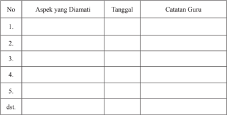

Tabel ini merupakan alat untuk mengevaluasi aspek-aspek tertentu dalam sebuah kegiatan atau proses belajar-mengajar. Topik utamanya adalah penilaian atau evaluasi berdasarkan observasi guru terhadap perilaku siswa. Tabel ini memiliki tiga kolom utama: "Aspek yang Diamati", "Tanggal", dan "Catatan Guru". Kolom pertama, "Aspek yang Diamati", mencakup berbagai aspek yang perlu diperhatikan seperti keterampilan berbicara, keterampilan berpikir kritis, keterampilan komunikasi, dan sebagainya. Kolom kedua, "Tanggal", digunakan untuk menandai waktu ketika observasi dilakukan. Kolom ketiga, "Catatan Guru", menyediakan ruang untuk guru untuk merangkum dan merekam observasi mereka tentang perilaku siswa tersebut. Data atau pola penting yang terlihat adalah bahwa tabel ini dirancang untuk memfasilitasi proses evaluatif yang terstruktur dan sistematis, dengan fokus pada aspek-aspek tertentu yang perlu diperhatikan oleh guru dalam konteks belajar-mengajar.

 

---
## 📄 Halaman 322

### · Penilaian Pengetahuan

### Tes tertulis :

- Apa makna HAM?
- Sebut dan jelaskan jenis-jenis pelanggaran HAM dalam masyarakat  dunia!
- Apa pandanganmu  terhadap HAM dewasa ini?
- Apa makna HAM menurut piagam PBB?
- Sebut dan jelaskan jenis-jenis HAM menurut piagam HAM PBB!
- Apa makna HAM menurut ajaran Kitab Suci (Alkitab)?
- Apa makna HAM menurut ajaran Gereja Katolik?
- Hak-hak asasi manusia mana yang paling sering dilanggar pada saat ini? Mengapa?
- Apakah dalam Gereja sendiri HAM sungguh ditegakkan? Jelaskan alasan jawaban Anda!
- Apa itu kekerasan?
- Apa hubungan ko nflik dan kekerasan?
- Apa itu budaya kekerasan?
- Sebut dan jelaskan jenis-jenis kekerasan di Indonesia!
- Bagaimana sikap gereja terhadap kekerasan dalam masyarakat?
- Bagaimana upaya Gereja untuk menyelesaikan konflik dan kekerasan yang terjadi dalam masyarakat?
- Apa yang harus engkau usahakan untuk menghentikan tawuran antar pelajar?
- Apa makna Aborsi?
- Apa akibat Abortus?
- Mengapa terjadi Aborsi
- Apa pandangan Kitab Suci (Alkitab tentang kehidupan anak dalam kandungan?
- Apa pandangan Gereja Katolik tentang Aborsi?
- Bagaimana mencegah terjadi Aborsi?
- Apakah  seorang  gadis  yang  hamil  karena  perkosaan  dapat  melakukan  aborsi? Jelaskan jawabanmu!
- Apakah seorang gadis yang melakukan aborsi karena dipaksa oleh orang tua atau pacarnya bersalah?
- Apa makna bunuh diri dan  euthanasia?
- Apa sebab-sebab kasus-kasus  bunuh diri dan euthanasia?
- Apa pandanganmu tentang bunuh diri dan euthanasia?
- Ada beberapa pandangan tentang bunuh diri dan euthanasia. Jelaskanlah itu!
- Bagaimana  melakukan  tindakan  preventif  terhadap  terjadinya  bunuh  diri  dan euthanasia?
- Jelaskan pengertian hukuman mati!
- Sebut dan jelaskan berbagai cara praktIk hukuman mati di dunia!
- Jelaskan macam-macam pandangan tentang hukuman mati!
- Apa pandangan dan sikap Gereja terhadap hukuman mati?
- Jelaskan arti dan makna Narkoba?

 

---
## 📄 Halaman 323

- Mengapa orang kecanduan Narkoba?
- Apa akibat dari kecanduan Narkoba?
- Apa hubungan antara Narkoba dan HIV/AIDS?
- Apa cara-cara penularan HIV/AIDS serta  akibat HIV/AIDS?
- Jelaskan    ajaran    Kitab  Suci    berkaitan  dengan    penghargaan  atas  tubuh/diri manusia!
- Apa upaya Gereja  untuk  mencegah dan membebaskan manusia dari HIV/AIDS, serta narkoba?
- Bagaimana cara untuk menghindarkan diri dari bahaya HIV/AIDS, serta narkoba?
- Bagaimana semestinya sikapmu terhadap orang yang telah terlibat Narkoba dan terinfeksi HIV/AIDS?

### · Penilaian Keterampilan:

### Portofolio:

- -R efleksi tertulis  tentang keterlibatanku dalam menegakkan HAM  dalam terang Kitab Suci dan Ajaran Gereja.
- -Menuliskan doa untuk para pejuang HAM dalam Gereja Katolik.
- -Refleksi tertulis  tentang sikap hormat dan menghargai hidup manusia.
- -Membuat poster  atau stiker  yang berisi ajakan untuk  menolak, mencegah aborsi.
- -Refleksi tertulis tentang sikap dan pandangan sebagai orang katolik terhadap kasus bunuh diri dan euthanasia.
- -Refleksi  tertulis  tentang  hukuman  mati  dari  sudut  pandang  ajaran  Gereja Katolik.
- -Poster atau stiker yang berisi penolakan terhadap hukuman mati, sesuai ajaran Gereja Katolik.
- -Releksi tertulis tentang  Bebas dari HIV/AIDS dan Obat Terlarang.
- -Membuat poster  berisi anti  terhadap penggunaan obat terlarang dan bebas penyakit  HIV/ AIDS.

### Kegiatan Remidial

Bagi  peserta  didik  yang  belum  memahami  bab  ini,  diberikan  remidial  dengan kegiatan-kegiatan berikut.

- Guru  menyampaikan  pertanyaan  kepada  peserta  didik  akan  hal-hal  apa  saja yang  belum  mereka  pahami  tentang;  Hak  Asasi  Manusia,  Hak  Asasi  Manusia dalam Terang Kitab Suci dan Ajaran Gereja, Budaya  Kekerasan versus Budaya Kasih, Aborsi, Bunuh diri dan Euthanasia, Hukuman Mati serta Bebas dari Obat Terlarang dan HIV/AIDS

 

---
## 📄 Halaman 324

- Berdasarkan hal-hal yang belum mereka pahami, guru mengajak peserta didik untuk mempelajari kembali dengan memberikan bantuan peneguhan-peneguhan yang lebih praktis.
- Guru  memberikan  penilaian ulang untuk penilaian pengetahuan, dengan pertanyaan yang lebih sederhana, sesuai dengan kondisi peserta didik.

### Kegiatan Pengayaan

Bagi  peserta  didik  yang  telah  memahami  bab  ini,  diberikan  pengayaan  dengan kegiatan-kegiatan berikut:

- Guru meminta peserta didik untuk melakukan studi pustaka (ke perpustakaan atau mencari di koran/ majalah) untuk menemukan cerita/ kisah berkaitan dengan topik pembahasan tentang Hak Asasi Manusia, Hak Asasi Manusia dalam Terang Kitab Suci dan Ajaran Gereja, Budaya  Kekerasan versus Budaya Kasih, Aborsi, Bunuh diri dan Euthanasia, Hukuman Mati serta Bebas dari Obat Terlarang dan HIV/AIDS.
- Hasil temuannya ditulis dalam laporan tertulis yang berisi gambaran singkat dari kisah atau cerita tersebut.

 

---
## 📄 Halaman 325

### Glosarium

Ad Gentesdekrit tentang Kegiatan Misioner Gereja, hasil Konsili Vatikan II, 1965 Apostolicam Actuositatemdekri t tentang kerasulan awam, hasil Konsili Vatikan II, 1965

Caritas  in  Veritate (kasih  dalam  kebenaran),  ensiklik  yang  ditulis  oleh  Paus Benediktus XVI, dan terbit 29 Juni 2009.

Centesimus Annus (tahun ke seratus), ensiklik  yang ditulis oleh Paus Yohanes Paulus II dalam rangka 100 tahun Rerum Novarum, terbit 15 Mei 1991.

Christus  Dominusdekrit tentang  Tugas  Pastoral  para  Uskup  dalam  Gereja,  hasil Konsili Vatikan II, 1965

Dei Verbum, konstitusi dogmatis tentang Wahyu Ilahi, hasil Konsili Vatikan II, 1965 Dignitatis Humanae, pernyataan tentang kebebasan beragama, hasil Konsili Vatikan II, 1965

Ensiklik ,surat yang ditulis oleh Paus untuk seluruh Gereja.Umumnya ensiklik berisi hal-hal berkenaan dengan doktrin, ajaran moral, keprihatinan sosial, atau peringatanperingatan tertentu. Judul formal ensiklik biasanya diambil dari dua kata pertama dari teks  resminya yang umumnya berbahasa Latin. Ensiklik ditujukan kepada seluruh Gereja dan merupakan ajaran dari Paus yang bersifat otoritatif.

Gaudium  et  Spes (kegembiraan  dan  harapan),  merupakan  dokumen  Konstitusi Pastoral tentang Gereja dalam dunia modern, hasil Konsili Vatikan II, 7 Desember 1965

Laborem Exercens (kerja manusia), ensiklik yang ditulis oleh Paus Yohanes Paulus II, 14 September 1981

Lumen Gentium, konstitusi dogmatis tentang Gereja, hasil Konsili Vatikan II, 1965 Mater et Magistra (ibu dan guru), merupakan ensiklik yang ditulis oleh Paus Yohanes XXIII, 15 Mei 1961, tentang kemajuan sosial dalam terang ajaran kristiani

Nostra Aetate, pernyataan  tentang  hubungan  Gereja  dengan  agama-agama bukan Kristen

Octogesima Adveniens (penantian tahun ke delapan puluh), ensiklik yang ditulis oleh Paus Paulus VI, 15 Mei 1971, tentang panggilan untuk bertindak atau bersikap.

Pacem in Terris (damai di bumi), oleh Paus Yohanes XXIII, 11 April 1963.

Populorum Progressio (kemajuan bangsa-bangsa), ensiklik yang ditulis oleh Paus Paulus VI, 26 Maret 1967

Quadragessimo Anno (setelah 40 tahun), ensiklik yang ditulis oleh Paus Pius XI, 15 Mei 1931, tentang rekonstruksi tata sosial kemasyarakatan.

Rerum Novarum (hal-hal  baru),  ensiklik  yang  ditulis  oleh  Paus  Leo  XIII,  15  Mei 1891, tentang kondisi para buruh

Sollicitudo  Rei  Socialis (keprihatinan  akan  masalah-masalah  sosial),  terbit  30 Desember 1987 dalam rangka memperingati 20 tahun Populorum Progressio

Unitatis Redintegratio, dekrit tentang ekumenisme, hasil Konsili Vatikan II, 1965

 

---
## 📄 Halaman 326

### Daftar Pustaka

- Go, Piet (penterj). 2010. NAPZA . Jakarta: Dokumentasi dan Penerangan KWI
- Go, Piet. 1989. Euthanasia: Beberapa Soal Etis Akhir Hidup menurut Gereja Katolik, Malang: Dioma.
- Hardawiryana, S.J.R (penterj). 1993. Dokumen Konsili Vatikan II ,    Jakarta:  Dokumentasi dan Penerangan KWI dan Obor
- Susanto S.J., Harry (Penterj). 2009. Kompendium Katekismus Gereja Katolik. Jakarta: Konferensi Waligereja Indonesia. Yogyakarta: Kanisius
- Heuken S.J. 1995. Ensiklopedi Orang Kudus . Jakarta: Cipta Loka Caraka
- Heuken S.J. 2004. Ensiklopedi Gereja . Jakarta: Cipta Loka Caraka
- Heuken  S.J.  1998. Sembilan  Bulan  Pertama  Dalam  Hidupku .  Jakarta:  Cipta  Loka Caraka
- Jacobs S.J., Tom.  SJ. 1987. Gereja Menurut Vatikan II. Yogyakarta: Kanisius
- Bertens. 1994. Sketsa-sketsa Moral: 50 Esai tentang Masalah Aktual , Y ogyakarta: Kanisius.
- Bertens. 2001. Perspektif Etika, Esai-Esai Tentang Masalah Aktual . Y ogyakarta: Kanisius.
- Bertens. 2002. Aborsi Sebagai Masalah Etika. Jakarta: PT Gramedia Widiasarana Indonesia.
- Kieser B, SJ. 1992. Solidaritas 100 Tahun Ajaran Sosial Gereja . Y ogyakarta: Kanisus
- Komisi Kateketik KWI,  2010. M enjadi Murid Yesus, Pendidikan Agama Katolik  untuk SMA/ SMK  Kelas XI.Yogyakarta: Kanisus
- Komisi  Kateketik  KWI.  2007. Seri  Murid-Murid  Yesus;  Perutusan  Murid-Murid Yesus, Pendidikan Agama Katolik  untuk SMA/ SMK  (KTSP) Kelas 3. Yogyakarta: Kanisius

 

---
## 📄 Halaman 327

- Komisi Kepausan untuk Keadilan dan Perdamaian. 2009. Kompendium Ajaran Sosial Gereja. Maumere: Penerbit Ledalero
- Komisi  Nasional Hak  Asasi  Manusia  1997.  Hak  Asasi  Manusia  dalam  Perspektif Budaya Indonesia . Jakarta:  PT. Gramedia Pustaka Utama.
- Konferensi Waligereja Indonesia. 1996. Iman Katolik. Buku Informasi dan Referensi. Yogyakarta: Kanisus, Jakarta: Obor
- Paus Yohanes Paulus II. 1997. Evangelium Vitae , (terj.R. Hardawirjana, SJ).  Jakarta: Departemen Dokumentasi dan Penerangan KWI
- Peschke,  Karl-Heinz,  2003. Etika  Kristiani  Jilid  III:  Kewajiban  Moral  dalam  Hidup Pribadi, Maumere: Penerbit Ledalero, 2003.
- Prihartana  B.R.  Agung  (penterj).  2011.  HIV/AIDS.  Jakarta:  Dokumentasi  dan Penerangan KWI.
- Propinsi Gerejani Ende (penterj). 1995. Katekismus Gereja Katolik. Ende: Nusa Indah
- Soesilo.  1994. Kitab  Undang-Undang  Hukum  Pidana  (KUHP)  serta  KomentarKomentar Lengkap Pasal Demi Pasal. Bogor: Politeia
- Raharjo,  M  Dawam.  1999.  Tantangan  Indonesia  Sebagai  Bangsa; esai-esai  kritis ekonomi,sosial, dan politik , Y ogyakarta: UII Press
- Samil, Ratna Suprapti. 1994. Etika Kedokteran Indonesia , Jakarta: Fakultas Kedokteran Universitas Indonesia
- Shanno n, Thomas A. 1995. Pengantar Bioetika , Jakarta: Gramedia Pustaka Utama
Suseno Franz Magnis. 1989. Etika Sosial Jakarta: PT Gramedia

 

---
## 📄 Halaman 328

Van Bilsen, MSC. 1978. Pewartaan Iman Katolik 3. Yogyakarta: Kanisius

### Internet

Pollard, Brian. 'Euthanasia' http://www.euthanasia.co m. /definitions. Html.

Stolinsky David. C, M.D. ' Assisted Suicide of the Medical Profession' dalam. http:// www.euthanasia.com/historyeuthanasia.html,

'History of Euthanasia' dalamww.euthanasia.com/historyeuthanasia.html, Hukuman Mati  dalam http://id.wikipedia.org/wiki/Hukuman_mati# World Coalition Against the Death Penalty dlm. http://www.worldcoalition.org/)

William Saunders, Straight Answers: Capital Punishment and Church Teaching , diterjemahkan oleh YESAYA: http://www.indocell.net/yesaya atas ijin The Arlington Catholic Herald), http:// yesaya.indocell.net/id935.htm)

 

---
## 📄 Halaman 329

### Profil Penulis

Nama Lengkap  :  Daniel Boli Kotan, S.Pd.,M.M

Telp. Kantor/HP :   021-31937970/081389200271

E-mail

:   daniel_kotan@yahoo.co.id

Akun Facebook :   Daniel Boli Kotan

Alamat Kantor

:   Komkat KWI, Jl.Cut Mutiah No.10

Jakarta Pusat

Bidang Keahlian:  Kurikulum Pendidikan Agama Katolik

### Riwayat pekerjaan/profesi dalam 10 tahun terakhir:

- 1990-2016: Staf di Komisi Kateketik  KWI Jakarta.
- 2007-2015: Dosen di Sekolah Tingg Ilmu Pemerintahan Abdi Negara (STIP-AN) Jakarta.

### Riwayat Pendidikan Tinggi dan Tahun Belajar:

- S2:Manajemen/Manajemen Pendidikan/Sekolah Tinggi Manajemen IMMI, Jakarta (2008-2010)
- S1:Fakultas  Keguruan  dan  Ilmu  Pendidikan/Ilmu  Pendidikan  Teologi/Universitas Katolik Indonesia, Atma Jaya Jakarta (1989-1995)

### Judul Buku dan Tahun Terbit (10 Tahun Terakhir):

- Pendidikan Agama Katolik Sekolah  Dasar (bdk.KTSP), Buku Guru dan Buku Siswa kelas I, thn. 2007. Penerbit: Kanisius Yogyakarta.
- Pendidikan Agama Katolik Sekolah  Dasar (bdk.KTSP), Buku Guru dan Buku Siswa kelas II, thn. 2007. Penerbit: Kanisius Yogyakarta.
- Pendidikan Agama Katolik Sekolah  Dasar (bdk.KTSP), Buku Guru dan Buku Siswa kelas III, thn. 2007. Penerbit: Kanisius Yogyakarta.
- Pendidikan Agama Katolik Sekolah  Dasar (bdk.KTSP), Buku Guru dan Buku Siswa kelas IV, thn. 2007. Penerbit: Kanisius Yogyakarta.
- Pendidikan Agama Katolik Sekolah  Dasar (bdk.KTSP), Buku Guru dan Buku Siswa kelas V, thn. 2007. Penerbit: Kanisius Yogyakarta.
- Pendidikan Agama Katolik Sekolah  Dasar (bdk.KTSP), Buku Guru dan Buku Siswa kelas VI, thn. 2007. Penerbit: Kanisius Yogyakarta.
- Pendidikan Agama Katolik Sekolah Dasar  Kelas III  (buku teks), thn. 2010. Penerbit: Kanisius Yogyakarta.
- Kuliah  Pendidikan  Agama  Katolik  di  Universitas  Terbuka,  thn.  2007.  Penerbit: Universitas Terbuka.
- Identitas Katekis di Tengah Arus Perubahan Zaman, thn. 2005. Penerbit: Komkat KWI, Jakarta.
- Hidup  di  Era  Digital;    Gagasan  Dasar  dan  Modul  Katekese,  thn.2015.  Penerbit: Kanisius Yogyakarta.

 

---
## 📄 Halaman 330

### Judul Penelitian dan Tahun Terbit (10 Tahun Terakhir):

Tidak ada.

### Informasi Lain dari Penulis

Daniel  Boli  Kotan,S.Pd.,MM ,    berasal  dari  Lembata  -  NTT,  dan    kini  menetap  di Pabuaran, Bogor, Jawa Barat. Penulis menikah dengan isteri yang seorang guru dan telah  dikaruniai  dua  orang  anak.  Sejak  1994  penulis  sudah  berkecimpung  dalam penyusunan kurikulum pendidikan  Agama Katolik. Selain sebagai staf dan dosen, pada  tahun  2014,  penulis  menjadi    narasumber  untuk  Kurikulum  2013,  Mapel Pendidikan Agama Katolik dan Budi Pekerti di berbagai diklat yang diselenggarakan oleh  Kementerian  Pendidikan  dan  Kebudayaan,  Kementerian  Agama  (cq.  Bimas Katolik) dan beberapa yayasan pendidikan Katolik di seluruh Indonesia.

 

---
## 📄 Halaman 331

### Profil Penelaah

Nama Lengkap  :  Dr.  Visensius Darmin Mbula, OFM

Telp. Kantor/HP :   021 42803546/ 08128732247

E-mail

:   lembaknai@yahoo.com

Akun Facebook :  -

Alamat Kantor

:  Jln Ledjen Suprapto No 80, Tanah Tinggi, Senen,

Jakarta Pusat

Bidang Keahlian:  Manajemen Pendidikan

### Riwayat pekerjaan/profesi dalam 10 tahun terakhir:

- 2010 - 2016: Guru Bimbingan Konseling dan Pendidikan Nilai  di SMIP Rex Mundi, Jakarta.
- 2010-2016: Konsultan Pendidikan dan Pengembang Kurikulum di Yayasan Yosep Yeemye
- 2010-2016: Direktur Yayasan Santo Fransiskus, Jakarta
- 2011-2016:  Dosen  Pengantar  pendidikan,  Psikologi  Pendidikan,  Perkembangan peserta didik di Univeristas Katolik Atmajaya Jakarta
- 2010-2016: Ketua Presidium Majelis Nasional Pendidikan Katolik (MNPK)

### Riwayat Pendidikan Tinggi dan Tahun Belajar:

- S3: Manajemen Pendidikan, Universitas Negeri Jakarta (UNJ)
- S2: Manajemen Pendidikan, Universitas Negeri Jakarta (UNJ)
- S1: Sarjana Filsafat, Sekolah Tinggi Filsafat Driyarkara, Jakarta

### Judul Buku yang Pernah Ditelaah:

- Buku Pendidikan Agama Katolik
- Buku Pendidikan Agama Katolik dan Budi Pekerti
- Judul Penelitian dan Tahun Terbit (10 Tahun Terakhir): Tidak ada

### Informasi Lain dari Penulis

Tidak ada

 

---
## 📄 Halaman 332

Nama Lengkap  :  Matias Endar Suhendar, S.Pd.

Telp. Kantor/HP :   022-4207232 - 081321351940

E-mail

:   komkat2001@yahoo.com

Akun Facebook :  Matias Endar

Alamat Kantor

:   Jl. Jawa No. 6 Bandung

Bidang Keahlian:  Pastoral katekese

### Riwayat pekerjaan/profesi dalam 10 tahun terakhir:

- 2003-2009
: Ketua Komisi Kateketik Keuskupan Bandung

- 2.
2010-Sekarang   : Sekretaris Dewan karya Pastoral Keuskupan Bandung

- 3.
2005-Sekarang   : Guru Honorer di SMA Negeri 3 dan 5 Bandung, mengajar

Pendidikan Agama katolik

- 4.
2011  - Sekarang : Dosen Agama Katolik di Sekolah Tinggi Pariwisata Bandung

### Riwayat Pendidikan Tinggi dan Tahun Belajar:

- S1  :  Fakultas  Pendidikan,  Jurusan  pendidikan  Agama  katolik,  program  studi Pendidikan Agama katolik, Universitas Sanata Dharma Yogyakarta. Tahun masuk 1990 - Tahun Lulus 1995. S3: Manajemen Pendidikan, Universitas Negeri Jakarta (UNJ)

### Judul Buku yang Pernah Ditelaah:

- Menjadi  penelaah  Buku  kurikulum  Pendidikan  Agama  katolik  Buku  Pendidikan Agama Katolik

### Judul Penelitian dan Tahun Terbit (10 Tahun Terakhir):

Tidak ada

### Informasi Lain dari Penulis

Lahir  di  Kuningan,  29  Oktober  1968.  Menikah  dan  dikaruniai  2  orang  anak.  Saat  ini menetap di Bandung. Aktif dalam organisasi kegerejaan, menjadi pengurus di Dewan Karya Pastoral Keuskupan. Sering diundang dan menjadi narasumber dalam pembinaan dan pembekalan bagi guru-guru agama katolik dan bagi para aktivis gereja.

 

---
## 📄 Halaman 333

Nama Lengkap  :  Drs. F.X. Adisusanto SJ., S.T.L.

Telp. Kantor/HP :   (021) 31925757

E-mail

:   adisusanto@kawali.org

Akun Facebook :  -

Alamat Kantor

:   Dokpen KWI, jl. Cut Meutia 10, Jakpus

Bidang Keahlian:  Kateketik

### Riwayat pekerjaan/profesi dalam 10 tahun terakhir:

- 2006-2010
: Dosen kateketik di Univ. Atma Jaya, Jakarta.

- 2005-2012
: Sekretaris Komisi Kateketik KWI, Jakarta.

- 2012 - ……..
: Kepala Dokpen KWI, Jakarta.

### Riwayat Pendidikan Tinggi dan Tahun Belajar:

- Sarjana Kateketik (197 -1974), Sekolah Tinggi Kateketik  'Pradnyawidya' , Yogyakarta.
- Licensiat  Filsafat  (1965-1968),  Universitas  Kepausan,  Buku  Pendidikan  Agama Katolik Poona, India.
- Licensiat Kateketik (1984 -1986), Universitas Kepausan Salesianum, Roma, Italia.

### Judul Buku yang Pernah Ditelaah:

- Buku Pendidikan Agama Katolik (KTSP).
- Buku Pendidikan Agama Katolik (Buku Teks).
- Buku Pendidikan Agama Katolik (Kurikulum 2013).

### Judul Penelitian dan Tahun Terbit (10 Tahun Terakhir):

Tidak ada

 

---
## 📄 Halaman 334

### Profil Editor

Nama Lengkap  :  Dra. Mariati Purba, M.Pd .

Telp. Kantor/HP :   021-3804248/ 085216177766

E-mail

:   mariati.prb@gmail.com

Akun Facebook :  Mariati Purba

Alamat Kantor

:  Jl Gunung Sahari Raya No 4 Jakarta Pusat

Bidang Keahlian:  Pengembang Kurikulum dan Penelitian Bidang Pendidikan Manajemen Pendidikan

### Riwayat pekerjaan/profesi dalam 10 tahun terakhir:

- 2000 - 2014  : Staf bidang Kurikulum Pendidikan Menengah di Pusat Kurikulum dan Perbukuan, Balitbang, Kemdikbud.
- 2014 - 2016      : Staf bidang  Kurikuum di Pusat Kurikulum dan Perbukuan, Balitbang, Kemdikbud.
- dst.

### Riwayat Pendidikan Tinggi dan Tahun Belajar:

- S2:  Magister  Pendidikan  /  program  studi  Penelitian  dan  Evaluasis  PendidikanUniversitas Negeri Jakarta (tahun masuk  th. 2002 tahun lulus th. 2005)
- S1:  FMIPA/  Fisika-  Universitas  Sumatera  Utara-Medan  (tahun  masuk  th.  1981  tahun lulus, th. 1986)

### Judul Buku yang Pernah Diedit:

- Pendidikan Agama Kristen dan Budi Pekerti kelas X
- Pendidikan Agama Kristen dan Budi Pekerti kelas IX
- Pendidikan Agama Kristen dan Budi Pekerti kelas XI
- Pendidikan Agama Hinda dan Budi Pekerti kelas X
- Pendidikan Agama Katolik dan Budi Pekerti kelas XI
- dst.

### Judul Penelitian dan Tahun Terbit (10 Tahun Terakhir):

- 'Pengembangan  Kreativitas  Siswa  Melalui  Pertanyaan  Divergen  Pada  Mata Pelajaran  Ilmu  Pengetahuan  Alam  (IPA)  di  SMPN  49  Jakarta'  Mariati:  Jurnal Balitbang, Ed. November 2006 Tahun ke -12, No. 063:
- 'Profil Sekolah Bertaraf Internasional di 8 Provinsi' Mariati: Jurnal Balitbang, Edisi Juli 2007 Tahun ke -13, No. 067: '
- 'Penyelenggaraan  sistem  SKS  di  Sekolah  Menengah  di  NTB'  Mariati:Jurnal Balitbang, Edisi Maret 2008 Tahun ke-14 N0. 071
- 'Integrasi  HIV  dan  AIDS  di  Papua'  Mariati:  Proseeding  dan  Presentasi  Ilmiah Balitbang Edisi Maret 2010:

 

---
## 📄 Halaman 335

- 'KTSP dari Negeri Gurindam di SMAN2 Tanjungpinang' Mariati: Proseeding dan Presentasi Ilmiah Balitbang, Edisi April 2010
- 'Pelaksanaan Pembelajaran IPA Terpadu di SMP di 4 Provinsi' Mariati: Edisi  Juli 2011 Proseeding dan Presentasi Ilmiah Balitbang
- 'Iptek Nuklir dalam Kurikulum SMA di 6 Provinsi' Mariati: Jurnal Balitbang Edisi Maret 2013 Tahun ke-19 N0. 089

 

---
## 📄 Halaman 336

---
**🖼️ Gambar/Diagram**

> **Deskripsi Visual:** Gambar ini adalah ilustrasi yang menunjukkan sebuah slogan atau peringatan dalam bahasa Melayu. Slogan tersebut berbunyi "Dekatkan diri Anda pada Yang Maha Kuasa bukan dengan NARKOBA". Ilustrasi ini menggunakan warna hitam dan putih dengan elemen-elemen seperti garis dan titik untuk memberikan efek visual yang menarik.

1. **Apa yang ditampilkan secara keseluruhan**: Gambar ini menampilkan sebuah slogan atau peringatan yang disampaikan dalam bahasa Melayu. Slogan tersebut mengajarkan tentang pentingnya mendekatkan diri kepada Tuhan atau Yang Maha Kuasa, bukan dengan narkoba.

2. **Elemen-elemen utama dan relasinya**: 
   - **Slogan**: "Dekatkan diri Anda pada Yang Maha Kuasa bukan dengan NARKOBA" adalah elemen utama yang digunakan untuk menyampaikan pesan.
   - **Garis dan Titik**: Garis dan titik digunakan untuk memisahkan kata-kata dan membuat gambar menjadi lebih menarik dan mudah dibaca.
   - **Warna**: Warna hitam dan putih digunakan untuk menciptakan kontras yang jelas antara teks dan latar belakang.

3. **Teks, angka, atau label penting yang terlihat**: 
   - **Teks Penting**: "Dekatkan diri Anda pada Yang Maha Kuasa bukan dengan NARKOBA".
   - **Angka**: Ada dua titik di awal dan akhir teks yang membantu memisahkan kata-kata.

4. **Informasi kunci yang dapat diambil pembaca**: Gambar ini mengajarkan bahwa pentingnya menjaga kesehatan mental dan spiritual dengan mendekatkan diri kepada Tuhan atau Yang Maha Kuasa, bukan dengan penggunaan narkoba. Ini menekankan pentingnya kepercayaan dan hubungan spiritual dalam hidup.

---

*📊 Statistik: 29 visual berhasil, 6 dilewati, 0 gagal | Durasi: 5m 46s*