# Salinan Kelas 11 Katolik BS press

*Diekstrak: 17 May 2026, 14:56*

---

---
## 📄 Halaman 1

### Pendidikan Agama Katolik dan Budi Pekerti

SMA/SMK

KELAS

XI

 

---
## 📄 Halaman 2

### Hak Cipta © 2017 pada Kementerian Pendidikan dan Kebudayaan Dilindungi Undang-Undang

Disklaimer: Buku ini merupakan buku siswa yang dipersiapkan Pemerintah dalam rangka implementasi Kurikulum 2013. Buku siswa ini disusun dan ditelaah oleh berbagai pihak di bawah koordinasi Kementerian Pendidikan dan Kebudayaan, dan dipergunakan dalam tahap awal penerapan Kurikulum 2013. Buku ini merupakan 'dokumen hidup' yang senantiasa diperbaiki,  diperbaharui,  dan  dimutakhirkan  sesuai  dengan  dinamika  kebutuhan  dan perubahan zaman. Masukan dari berbagai kalangan yang dialamatkan kepada penulis dan laman http://buku.kemdikbud.go.id atau melalui email buku@kemdikbud.go.id diharapkan dapat meningkatkan kualitas buku ini.

Katalog Dalam Terbitan (KDT)

Indonesia. Kementerian Pendidikan dan Kebudayaan.

Pendidikan Agama Katolik dan Budi Pekerti / Kementerian Pendidikan dan Kebudayaan.- Jakarta : Kementerian Pendidikan dan Kebudayaan, 2017.

vi, 186 hal. : ilus. ; 25 cm.

Untuk SMA/SMK Kelas XI ISBN 978-602-427-058-2 (jilid lengkap) ISBN 978-602-427-060-5 (jilid 2)

- Katolik -- Studi dan Pengajaran
- Kementerian Pendidikan dan Kebudayaan
I. Judul

282

Penulis :

Daniel Boli Kotan dan P . Leo Sugiyono

Nihil Obstat :

FX. Adisusanto

22 Februari 2013

Imprimatur :

Mgr. John Liku Ada

22 Maret 2014

Penelaah :

F.X. Adi Susanto, Matias Endar Suhendar dan

Pereview

Penyelia Penerbitan :

Dr. Vincentius Darmin Mbula, O.F.M

:    Marsianus Kae Koban

Pusat Kurikulum dan Perbukuan Balitbang Kem en dikbud

Cetakan Ke-1, 2014 ISBN 978-602-282-419-0 (jilid 2)

Cetakan Ke-2, 2017 (Edisi Revisi)

Disusun dengan huruf Minion Pro, 11 pt.

 

---
## 📄 Halaman 3

### Kata Pengantar

Pantaslah kita semua bersyukur kepada Allah yang Mahakuasa atas terbitnya buku Pendidikan Agama Katolik dan Budi Pekerti yang telah direvisi  dan diselaraskan sesuai perkembangan Kurikulum 2013.

Agama terutama bukanlah soal mengetahui mana yang benar atau yang salah. Tidak ada gunanya mengetahui tetapi tidak melakukannya, seperti dikatakan oleh Santo Yakobus: 'Sebab seperti tubuh tanpa roh adalah mati, demikian jugalah iman tanpa  perbuatan-perbuatan  adalah  mati'  (Yakobus  2:26).  Demikianlah,  belajar bukan  sekadar  untuk  tahu,  melainkan  dengan  belajar  seseorang  menjadi  tumbuh dan  berubah.  Tidak  sekadar  belajar  lalu  berubah,  tetapi  juga  mengubah  keadaan. Begitulah  Kurikulum  2013  dirancang  agar  tahapan  pembelajaran  memungkinkan siswa berkembang dari proses menyerap pengetahuan  dan  mengembangkan keterampilan hingga memekarkan sikap serta nilai-nilai luhur kemanusiaan.

Pembelajaran  agama  diharapkan  mampu  menambah  wawasan  keagamaan, mengasah keterampilan beragama, dan mewujudkan sikap beragama peserta didik yang utuh dan berimbang yang mencakup hubungan manusia dengan Penciptanya, sesama manusia dan manusia dengan lingkungannya. Oleh karena itu, pendidikan agama perlu diberi penekanan khusus terkait dengan penanaman, karakter dalam pembentukan budi pekerti yang luhur. Karakter yang ingin kita tanamkan antara lain: kejujuran, kedisiplinan, cinta kebersihan, cinta kasih, semangat berbagi, optimisme, cinta tanah air, intelektual, dan kreativitas.

Nilai-nilai karakter itu digali dan diserap dari pengetahuan agama yang dipelajari para  siswa  itu  dan  menjadi  penggerak  dalam  pembentukan,  pengembangan, peningkatan, pemeliharaan, dan perbaikan perilaku anak didik agar mau dan mampu melaksanakan tugas-tugas hidup mereka secara selaras, serasi, seimbang antara lahirbatin,  jasmani-rohani,  material-spiritual,  dan  individu-sosial.  Selaras  dengan  itu, pendidikan agama Katolik secara khusus bertujuan membangun dan membimbing peserta  didik  agar  tumbuh  dan  berkembang  mencapai  kepribadian  utuh  yang semakin  mencerminkan  diri  mereka  sebagai  gambar  Allah,  sebab  demikianlah ' Allah  menciptakan  manusia  itu  menurut  gambar-Nya,  menurut  gambar  Allah diciptakan-Nya  dia'  (Kejadian  1:27).  Sebagai  makhluk  yang  diciptakan  seturut gambar Allah, manusia perlu mengembangkan sifat cinta kasih dan takut akan Allah, memiliki kecerdasan, keterampilan, pekerti luhur, memelihara lingkungan, serta ikut bertanggung jawab dalam pembangunan masyarakat, bangsa dan negara. [Sigit DK: 2013]

 

---
## 📄 Halaman 4

Buku pelajaran Pendidikan Agama Katolik dan Budi Pekerti ini ditulis dengan semangat  itu.  Pembelajarannya  dibagi-bagi  dalam  kegiatan-kegiatan  yang  harus dilakukan  siswa  dalam  usaha  memahami  pengetahuan  agamanya.  Akan  tetapi pengetahuan agama bukanlah hasil  akhir  yang  dituju.  Pemahaman  tersebut  harus diaktualisasikan  dalam  tindakan  nyata  dan  sikap  keseharian  yang  sesuai  dengan tuntunan agamanya, baik dalam bentuk ibadah ritual maupun ibadah sosial. Untuk itu,  sebagai  buku  agama  yang  mengacu  pada  kurikulum  berbasis  kompetensi, rencana pembelajarannya dinyatakan dalam bentuk aktivitas-aktivitas. Di dalamnya dirancang urutan pembelajaran yang dinyatakan dalam kegiatan-kegiatan keagamaan yang harus dilakukan siswa. Dengan demikian, buku ini menuntun apa yang harus dilakukan siswa bersama guru dan teman-teman sekelasnya untuk memahami dan menjalankan ajaran iman katolik.

Buku  ini  bukanlah  satu-satunya  sumber  belajar  bagi  siswa.  Sesuai  dengan pendekatan yang dipergunakan dalam Kurikulum 2013, siswa didorong oleh karena mempelajari agamanya melalui pengamatan terhadap sumber belajar yang tersedia dan  terbentang  luas  di  sekitarnya.  Lebih-lebih  untuk  usia  remaja  perlu  ditantang untuk kritis sekaligus peka dalam menyikapi fenomena alam, sosial, dan seni budaya.

Peran  guru  sangat  penting  untuk  menyesuaikan  daya  serap  siswa  dengan ketersedian  kegiatan  yang  ada  pada  buku  ini.  Penyesuaian  ini  antara  lain  dengan membuka  kesempatan  luas  bagi  kreativitas  guru  untuk  memperkayanya  dengan kegiatan-kegiatan  lain  yang  sesuai  dan  relevan  dengan  tempat  di  mana  buku  ini diajarkan, baik belajar melalui sumber tertulis maupun belajar langsung dari sumber lingkungan sosial dan alam sekitar.

Komisi Kateketik Konferensi Waligereja Indonesia sebagai lembaga yang bertanggung-jawab  atas  ajaran  iman  Katolik  berterima  kasih  kepada  pemerintah, dalam hal ini Kementerian Pendidikan dan Kebudayaan atas kerja sama yang baik selama  ini  mulai  dari  proses  penyusunan  kurikulum  hingga  penulisan  buku  teks pelajaran ini.

Jakarta, Medio Februari 2017 Salam

Penulis

 

---
## 📄 Halaman 5

### Daftar Isi

 

---
## 📄 Halaman 6

### Bab VI Hak Asasi Manusia

 

---
## 📄 Halaman 7

### Bab I Arti  dan  Makna Gereja

Bab pertama ini akan membahas  tema tentang GEREJA yang merupakan tema ketiga, setelah pada kelas sebelumnya dipelajari tema tentang Pribadi Peserta Didik, dan Yesus Kristus.

Pada pokok bahasan pertama, kamu akan mempelajari arti dan makna Gereja. Semoga dengan mempelajari pokok bahasan  tentang Gereja ini, kamu semakin menyadari dirimu sebagai anggota Gereja dan turut mengambil bagian sebagai anggota Gereja dalam hidup sehari-hari.

Subpokok  bahasan  yang  akan  kamu  pelajari  dalam  kegiatan  pembelajaran  ini adalah 'Gereja sebagai Umat Allah' dan ' Gereja sebagai Persekutuan yang Terbuka' .

### A.  Gereja sebagai Umat Allah

Umat Allah  adalah paguyuban orang-orang yang beriman, yang telah dipilih oleh Allah. Sebagai anak-anak Allah semuanya mempunyai martabat yang sama dalam pembaptisan. Tidak ada umat kelas VIP, semua anak Allah.  Awam, Imam, Biarawan-Biarawati,  para  tokoh  umat  semuanya  berjalan  bersama  berziarah menuju Bapa. Semuanya ikut ambil bagian dalam pembangunan jemaat, solider dan saling memerhatikan

### Doa

Ya Bapa sumber keselamatan hidup kami,

Pujian dan syukur, kami haturkan kepada-Mu Karena Engkau telah menyatukan kami dari berbagai tempat, Suku, bangsa dan bahasa menjadi umat-Mu yang kudus, yaitu Gereja. Melalui pertemuan ini, kami ingin memahami lebih mendalam tentang Gereja sebagai umat Allah dan kemudian menghayatinya dalam kehidupan keseharian kami. Mampukanlah kami membuka hati, budi, dan pikiran kami dalam pertemuan ini agar selanjutnya dapat hidup sebagai anggota Gereja-Mu. Demi Kristus Tuhan dan pengantara kami. Amin

 

---
## 📄 Halaman 8

### 1.  Memahami  Arti dan Makna  Gereja

Nyanyikanlah lagu berikut ini

Gereja Bagai Bahtera Doa

Gereja bagai bahtera di laut yang seram mengarahkan haluannya ke pantai seberang. Mengamuklah samudera dan badai menderu, gelombang jaman menghempas dan sulit ditempuh. Penumpangpun bertanyalah selagi berjerih. Berapa lagi jauhnya labuhan abadi ?

### Refr :

Tuhan tolonglah ! Tuhan, tolonglah ! Tanpa Dikau semua binasa kelak, Ya, Tuhan tolonglah.

Gereja bagai bahtera diatur awaknya setiap orang bekerja menurut tugasnya. Semua satu padulah, setia bertekun demi tujuan tunggalnya yang harus ditempuh. Roh Allah yang menyatukan, membina, membentuk di dalam kasih dan iman dan harapan yang teguh.Refr : ……

Gereja bagai bahtera di laut yang seram, mengarahkan haluannya ke pantai seberang. Hai kau yang takut dan resah, kau tak sendirian, teman sejalan banyaklah dan Tuhan di depan. Bersama-sama majulah, bertahan berteguh, tujuan akhir Tuhanlah, labuhan yang teduh. - Refr : ……

- S etelah menyanyikan lagu ini dengan  hikmat, cobalah temukan makna isi pesan lagu  tersebut  dengan  terlebih  dahulu  merumuskan  beberapa  pertanyaan  secara mandiri atau bersama temanmu,  kemudian diskusikan atau dialogkan bersama temanmu dan juga gurumu tentang isi, pesan lagu tersebut.

 

---
## 📄 Halaman 9

- Setelah  menemukan  jawaban  atas  pertanyaan-pertanyaan  tersebut,  sekarang perhatikan  gambar-gambar berikut.
- Setelah  mengamati  gambar-gambar  tersebut  cobalah  kembali    merumuskan beberapa  pertanyaan  berdasarkan    gambar  1.1.  dan  gambar  1.2,  selanjutkan diskusikan bersama teman sekelas dan gurumu.
- Setelah berdialog tentang pesan dari gambar 1.1 dan gambar 1.2,  cobalah mengamati pandangan, pemahaman, atau pendapat orang-orang pada umumnya (baik umat katolik sendiri maupun non katolik)  tentang apa makna Gereja menurut mereka? (coba diskusikan dengan teman-temanmu)
- Setelah  mendiskusikan pertanyaan-pertanyaan di atas, sekarang simaklah  artikel berikut ini.
Sumber:  Dokumen Penulis Gambar 1.2. Umat Gereja

### Paus : Gereja sebagai Keluarga Allah

(Audiensi Umum Paus Fransiskus pada tanggal 29 Mei 2013)

Dalam beberapa bulan terakhir saya  menyebutkan lebih  dari  sekali  Perumpamaan  tentang  Anak  yang Hilang atau, lebih tepatnya, Bapa Yang Murah Hati (bdk. Luk  15:11-32).  Anak  bungsu  meninggalkan  rumah ayahnya,  menghabiskan  semua  yang  ia  miliki  dan memutuskan untuk pulang lagi karena dia menyadari bahwa dia telah bersalah. Dia tidak lagi menganggap dirinya  layak  menjadi  anak  tapi  berpikir  ia  memiliki kesempatan  untuk  dipekerjakan  sebagai  pembantu. Ayahnya, sebaliknya, berlari untuk menemui  dia, memeluknya, mengembalikan martabatnya sebagai anak  dan  merayakan  hal  tersebut.  Perumpamaan  ini, seperti  yang  lainnya  dalam  Injil,  jelas  menunjukkan rencana Allah bagi umat manusia.

Apakah  rencana  Allah  itu?  Yakni  membuat  kita  semua  menjadi  satu  keluarga sebagai anak-anak-Nya, di mana setiap orang merasa bahwa Allah itu dekat dan merasa

 

---
## 📄 Halaman 10

dicintai oleh-Nya, seperti dalam perumpamaan Injil, merasakan kehangatan menjadi keluarga  Allah.  Gereja  berakar  dalam  rencana  besar  ini.  Gereja  bukan  organisasi yang didirikan atas perjanjian antara beberapa orang, tapi seperti Paus Benediktus XVI sering mengingatkan kita, Gereja adalah pekerjaan Allah, yang lahir justru dari rancangan  penuh  kasih  ini  yang  secara  bertahap  masuk  ke  dalam  sejarah.  Gereja ini  lahir  dari  keinginan  Allah  untuk  memanggil  semua  orang  dalam  persekutuan dengan Dia,  persahabatan  dengan  Dia;  untuk  berbagi  dalam  kehidupan  ilahi-Nya sendiri sebagai putra putri-Nya. Kata 'Gereja' , berasal dari bahasa Yunani 'ekklesia' , berarti 'pertemuan akbar orang - orang yang dipanggil': Allah memanggil kita, Ia mendorong kita untuk keluar dari individualisme, dari kecenderungan menutup diri kita sendiri, dan Dia memanggil kita untuk menjadi keluarga-Nya.

Selanjutnya, panggilan ini berasal dari penciptaan itu sendiri. Allah menciptakan manusia supaya kita hidup dalam hubungan persahabatan yang mendalam dengan Dia,  dan  bahkan  ketika  dosa  memutuskan  hubungan  manusia  dengan  Allah  dan dengan ciptaan lainnya, Allah tidak meninggalkan kita. Seluruh kisah keselamatan adalah kisah Allah yang berusaha meraih manusia, menawarkan mereka cinta-Nya dan menyambut mereka. Ia memanggil Abraham untuk menjadi bapa dari banyak bangsa,  Ia  memilih  orang  Israel  untuk  membuat  sebuah  perjanjian  yang  akan merangkul  semua  orang,  dan  dalam  kepenuhan  waktu,  Ia  mengutus  Putra-Nya sehingga rencana cinta dan keselamatan-Nya dapat digenapi dalam Perjanjian baru dan kekal dengan seluruh umat manusia.

Ketika  kita  membaca  Injil,  kita  mengetahui  bahwa  Yesus  mengumpulkan komunitas  kecil  di  sekitar-Nya  yang  menerima  firman-Nya,  mengikuti-Nya,  turut serta  dalam  perjalanan-Nya,  menjadi  keluarga-Nya,  dan  dengan  komunitas  inilah Dia mempersiapkan dan membangun Gereja-Nya.

Jadi dari manakah Gereja itu terlahir? Gereja lahir dari tindakan kasih yang paling agung dari Salib, dari sisi lambung Yesus yang ditusuk dan mengalirkan darah dan air, simbol dari Sakramen Ekaristi dan Pembaptisan. Darah kehidupan keluarga Allah, Gereja, adalah kasih Allah yang diaktualisasikan dalam mencintai diri-Nya dan orang lain, semua orang, tanpa membeda-bedakan. Gereja adalah keluarga yang kita cintai dan mencintai kita.

Kapan Gereja memanifestasikan dirinya? Kita merayakannya dua minggu yang lalu, Gereja menjadi nyata ketika karunia Roh Kudus memenuhi hati para Rasul dan membakar semangat mereka untuk pergi ke luar dan memulai perjalanan mereka untuk mewartakan Injil, menyebarkan kasih Allah.

Sampai saat ini masih ada beberapa orang yang mengatakan: 'Kristus ya, Gereja tidak' . Seperti orang yang mengatakan 'Saya percaya pada Tuhan tetapi tidak pada Imam'. Tapi Gereja sendiri yang membawa Kristus kepada kita dan yang membawa kita kepada Allah. Gereja adalah keluarga besar anak-anak Allah. Tentu saja Gereja juga memiliki aspek manusiawi. Dalam diri mereka yang membentuk Gereja, para imam dan umat beriman, terdapat kekurangan, ketidaksempurnaan dan dosa. Paus juga memiliki hal - hal tersebut - dan banyak dari mereka; tetapi yang indah adalah bahwa  ketika  kita  menyadari  bahwa  kita  adalah  orang  berdosa  yang  menemukan rahmat Allah yang selalu mengampuni. Jangan lupa: Allah selalu mengampuni dan

 

---
## 📄 Halaman 11

menerima  kita  ke  dalam  cinta-Nya  yang  penuh  dengan  pengampunan  dan  belas kasihan. Beberapa orang mengatakan bahwa dosa adalah suatu pelanggaran terhadap Allah,  tetapi  juga  merupakan  kesempatan untuk merendahkan diri sendiri  untuk menyadari  bahwa  ada  sesuatu  yang  lain  lebih  indah:  kerahiman  Allah.  Mari  kita pikirkan hal ini.

Mari kita bertanya pada diri kita hari ini: seberapa saya mencintai Gereja? Apakah saya berdoa untuknya? Apakah saya merasa menjadi bagian dari keluarga Gereja? Apa yang harus saya lakukan untuk memastikan bahwa Gereja adalah sebuah komunitas di mana masing-masing orang merasa diterima dan dipahami, merasa belas kasihan dan  kasih  Allah  yang  memperbaharui  hidup?  Iman  adalah  sebuah  karunia  dan sebuah perbuatan yang menjadi perhatian kita secara pribadi, tapi Allah memanggil kita untuk hidup dengan iman kita bersama-sama, sebagai sebuah keluarga, sebagai Gereja.

Mari kita mohon kepada Tuhan, dengan cara yang sangat khusus selama Tahun Iman ini, semoga masyarakat kita, seluruh Gereja, semakin menjadi keluarga sejati yang hidup dan membawa kehangatan kasih Allah...(AO)

Lapangan Santo Petrus, 29 Mei 2013

,

Diterjemahkan dari: www.vatican.va dalam  http://katolisitas.org/11518/paus-gereja-sebagai-keluarga-allah

- Setelah menyimak cerita tersebut, cobalah merumuskan beberapa pertanyaan untuk didiskusikan bersama teman-temanmu, dengan memerhatikan unsur-unsur; gambaran Gereja, makna Gereja, ciri-ciri Gereja, serta bagaimana analisa anda sendiri atau kelompok diskusi terhadap artikel atau kisah tersebut.

### 2. Arti dan Makna Gereja sebagai Umat Allah menurut Ajaran Kitab Suci dan Ajaran Gereja

### a. Makna Gereja sebagai Umat Allah menurut Ajaran Kitab Suci

Simaklah kisah-kisah Kitab Suci berikut ini

Kisah Para Rasul  2:41-47

- 41 Orang-orang yang menerima perkataannya itu memberi diri dibaptis dan pada hari itu jumlah mereka bertambah kira-kira tiga ribu jiwa.
- 42 Mereka bertekun dalam pengajaran rasul-rasul dan dalam persekutuan. Dan mereka selalu berkumpul untuk memecahkan roti dan berdoa.
- 43 Maka ketakutanlah mereka semua, sedang rasul-rasul itu mengadakan banyak mujizat dan tanda.

 

---
## 📄 Halaman 12

- 44 Dan semua orang yang telah menjadi percaya tetap bersatu, dan segala kepunyaan mereka adalah kepunyaan bersama,
- 45 dan  selalu  ada  dari  mereka  yang  menjual  harta  miliknya,  lalu  membagibagikannya kepada semua orang sesuai dengan keperluan masing-masing.
- 46 Dengan bertekun dan dengan sehati mereka berkumpul tiap-tiap hari dalam Bait Allah. Mereka memecahkan roti di rumah masing-masing secara bergilir dan makan bersama-sama dengan gembira dan dengan tulus hati,
- 47 sambil  memuji  Allah.  Dan  mereka  disukai  semua  orang.  Dan  tiap-tiap  hari Tuhan menambah jumlah mereka dengan orang yang diselamatkan.
*******

(1Korintus  12:7-11)

- 7 Tetapi kepada tiap-tiap orang dikaruniakan penyataan Roh untuk kepentingan bersama.
8 Sebab kepada yang seorang Roh memberikan karunia untuk berkata-kata dengan hikmat,  dan  kepada  yang  lain  Roh  yang  sama  memberikan  karunia  berkata-kata dengan pengetahuan.

9 Kepada yang seorang Roh yang sama memberikan iman, dan kepada yang lain Ia memberikan karunia untuk menyembuhkan.

- 10  Kepada yang seorang Roh memberikan kuasa untuk mengadakan mujizat, dan kepada yang lain Ia memberikan karunia untuk bernubuat, dan kepada yang lain lagi Ia  memberikan karunia untuk membedakan bermacam-macam roh. Kepada yang seorang Ia memberikan karunia untuk berkata-kata dengan bahasa roh, dan kepada yang lain Ia memberikan karunia untuk menafsirkan bahasa roh itu.
11 Tetapi semuanya ini dikerjakan oleh Roh yang satu dan yang sama, yang memberikan karunia kepada tiap-tiap orang secara khusus, seperti yang dikehendaki-Nya.

*******

( 1 Kor 12:12-18)

- 12 Karena sama seperti tubuh itu satu dan anggota-anggotanya banyak, dan segala anggota itu, sekalipun banyak, merupakan satu tubuh, demikian pula Kristus.
- 13 Sebab dalam satu Roh kita semua, baik orang Yahudi, maupun orang Yunani, baik  budak,  maupun  orang  merdeka,  telah  dibaptis  menjadi  satu  tubuh  dan  kita semua diberi minum dari satu Roh.
- 14 Karena tubuh juga tidak terdiri dari satu anggota, tetapi atas banyak anggota.

 

---
## 📄 Halaman 13

- 15 Andaikata kaki berkata: 'Karena aku bukan tangan, aku tidak termasuk tubuh' , jadi benarkah ia tidak termasuk tubuh?
- 16 Dan andaikata telinga berkata: 'Karena aku bukan mata, aku tidak termasuk tubuh' , jadi benarkah ia tidak termasuk tubuh?
- 17 Andaikata tubuh seluruhnya adalah mata, di manakah pendengaran? Andaikata seluruhnya adalah telinga, di manakah penciuman?
- 18 Tetapi Allah telah memberikan kepada anggota, masing-masing secara khusus, suatu tempat pada tubuh, seperti yang dikehendaki-Nya.
*******

- Setelah menyimak perikop cerita Kitab Suci di atas,  diskusikan  bersama  temantemanmu tentang pesan cerita Kitab Suci tersebut berkaitan dengan makna Gereja sebagai umat Allah.
- Tulislah  dan jelaskan ayat-ayat manakah   dari  perikop Kitab Suci yang menjelaskan makna Gereja sebagai umat Allah.

### b.  Makna Gereja sebagai Umat Allah menurut Ajaran Gereja

Setelah mengetahui pesan Kitab Suci  tentang Gereja sebagai Umat Allah, sekarang coba simaklah ajaran Konsili Vatikan II tentang Gereja sebagai Umat Allah.

### Rencana Bapa yang bermaksud menyelamatkan semua orang

' Atas  keputusan  kebijaksanaan  serta  kebaikan-Nya  yang  sama  sekali  bebas  dan rahasia,  Bapa  yang  kekal  menciptakan  dunia  semesta.  Ia  menetapkan,  bahwa  Ia akan mengangkat manusia untuk ikut serta menghayati hidup Ilahi. Ketika dalam diri  Adam  umat  manusia  jatuh,  Ia  tidak  meninggalkan  mereka,  melainkan  selalu membantu  mereka  supaya  selamat,  demi  Kristus  Penebus,  citra  Allah  yang  tak kelihatan,  yang  sulung  dari  segala  makluk  (Kol  1:15).  Adapun  semua  orang,  yang sebelum segala zaman telah dipilih oleh Bapa, telah dikenal-Nya dan ditentukan-Nya sejak semula, untuk menyerupai citra putera-Nya, supaya Dialah yang menjadi sulung diantara banyak saudara (Rom 8:29). Bapa menetapkan untuk menghimpun mereka yang beriman akan Kristus dalam Gereja kudus. Gereja itu sejak awal dunia telah dipralambangkan, serta disiapkan dalam sejarah bangsa Israel dan dalam perjanjian lama.  Gereja  didirikan  pada  zaman  terakhir,  ditampilkan  berkat  pencurahan  Roh, dan akan disempurnakan pada akhir zaman. Dan pada saat itu seperti tercantum dalam karya tulis para Bapa yang suci, semua orang yang benar sejak Adam, dari Abil yang saleh hingga orang terpilih yang terakhir akan dipersatukan dalam Gereja semesta dihadirat Bapa' . (LG.art. 2)

 

---
## 📄 Halaman 14

### Roh Kudus yang Menguduskan Gereja

Ketika sudah selesailah karya, yang oleh Bapa dipercayakan kepada Putera untuk dilaksanakan didunia (lih Yoh 17:4), diutuslah Roh Kudus pada hari Pentakosta, untuk tiada  hentinya  menguduskan Gereja. Dengan demikian umat beriman akan dapat mendekati Bapa melalui Kristus dalam satu Roh (lih Ef 2:18). Dialah Roh kehidupan atau sumber air yang memancar untuk hidup kekal (lih Yoh 4:14; 7:38-39). Melalui Dia Bapa menghidupkan orang-orang yang mati karena dosa, sampai Ia membangkitkan tubuh  mereka  yang  fana  dalam  Kristus  (lih  Rom  8:10-11).  Roh  itu  tinggal  dalam Gereja dan dalam hati umat beriman bagaikan dalam kenisah (lih 1Kor 3:16; 6:19). Dalam diri mereka Ia berdoa dan memberi kesaksian tentang pengangkatan mereka menjadi putera (lih Gal 4:6; Rom 8:15-16 dan 26). Oleh Roh Gereja diantar kepada segala kebenaran (lih Yoh 16:13), dipersatukan dalam persekutuan serta pelayanan, diperlengkapi  dan  dibimbing  dengan  aneka  kurnia  hirarkis  dan  karismatis,  serta disemarakkan dengan buah-buah-Nya (lih Ef 4:11-12; 1Kor 12:4; Gal 5:22). Dengan kekuatan Injil Roh meremajakan Gereja dan tiada hentinya membaharuinya, serta mengantarkannya kepada persatuan sempurna dengan Mempelainya. Sebab Roh dan Mepelai  berkata  kepada  Tuhan  Yesus:  Datanglah  (lihat  Why  22:17).  Demikianlah seluruh Gereja nampak sebagai umat yang disatukan berdasarkan kesatuan Bapa dan Putera dan Roh Kudus (LG.art.4).

### Gereja, Tubuh Mistik Kristus

Dalam  kodrat  manusiawi  yang  disatukan  dengan  diri-Nya  Putra  Allah  telah mengalahkan  maut  dengan  wafat  dan  kebangkitan-Nya.  Demikianlah  Ia  telah menebus  manusia  dan  mengubahnya  menjadi  ciptaan  baru  (lih  Gal  6:15;  2Kor 5:17). Sebab Ia telah mengumpulkan saudara-saudara-Nya dari sagala bangsa, dan dengan mengaruniakan Roh-Nya Ia secara gaib membentuk mereka menjadi TubuhNya.  Dalam Tubuh itu hidup Kristus dicurahkan kedalam umat beriman. Melalui sakramen-sakramen  mereka  itu  secara  rahasia  namun  nyata  dipersatukan  dengan Kristus  yang  telah  menderita  dan  dimuliakan.  Sebab  berkat  Babtis  kita  menjadi serupa dengan Kristus:  'karena dalam satu Roh kita semua telah dibabtis menjadi satu Tubuh' (1Kor 12:13). Dengan upacara suci itu dilambangkan dan diwujudkan persekutuan  dengan  wafat  dan  Kebangkitan  Kristus:  'Sebab  oleh  babtis  kita  telah dikuburkan bersama dengan Dia ke dalam kematian'; tetapi bila 'kita telah dijadikan satu dengan apa yang serupa dengan wafat-Nya, kita juga akan disatukan dengan apa yang serupa dengan kebangkitan-Nya' (Rom 6:4-5). Dalam pemecahan roti ekaristi kita secara nyata ikut serta dalam Tubuh Tuhan; maka kita diangkat untuk bersatu dengan Dia dan bersatu antara kita. Karena roti adalah satu, maka kita yang banyak ini merupakan satu Tubuh; sebab kita semua mendapat bagian dalam roti yang satu itu (1Kor 10:17).

Demikianlah kita semua dijadikan anggota Tubuh itu (lih 1Kor 12:27), 'sedangkan masing-masing  menjadi  anggota  yang  seorang  terhadap  yang  lain'  (Rom  12:5). Adapun  semua  anggota  tubuh  manusia,  biarpun  banyak  jumlahnya,  membentuk

 

---
## 📄 Halaman 15

hanya satu Tubuh, begitu pula para beriman dalam Kristus (lih 1Kor 12:12). Juga dalam  pembangunan  Tubuh  Kristus  terhadap  aneka  ragam  anggota  dan  jabatan. Satulah  Roh,  yang  membagikan  aneka  anugrah-Nya  sekedar  kekayaan-Nya  dan menurut kebutuhan pelayanan, supaya bermanfaat bagi Gereja (lih 1Kor 12:1-11). Diantara karunia-karunia itu rahmat para Rasul mendapat tempat istimewa. Sebab Roh sendiri menaruh juga para pengemban karisma dibawah kewibawaan mereka (lih 1Kor 14). Roh itu juga secara langsung menyatukan Tubuh dengan daya kekuatanNya dan melalui hubungan batin antara para anggota. Ia menumbuhkan cinta kasih diantara  umat  beriman  dan  mendorong  mereka  untuk  mencintai.  Maka,  bila  ada satu anggota yang menderita, semua anggota ikut menderita; atau bila satu anggota dihormati, semua anggota ikut bergembira (lih 1Kor 12:26). Kepala Tubuh itu Kristus. Ia citra Allah yang tak kelihatan, dan dalam Dia segala sesuatu telah diciptakan. Ia mendahului semua orang, dan segala-galanya berada dalam Dia. Ialah Kepala Tubuh yakni  Gereja.  Ia  pula  pokok  pangkal,  yang  sulung  dari  orang  mati,  supaya  dalam segala-sesuatu  Dialah  yang  utama  (lih  Kor  1:15-18).  Dengan  kekuatan-Nya  yang agung Ia berdaulat atas langit dan bumi; dan dengan kesempurnaan serta karya-Nya yang amat luhur Ia memenuhi seluruh Tubuh dengan kekayaan kemuliaan-Nya (lih Ef 1:18-23). Semua anggota harus menyerupai Kristus, sampai Ia terbentuk dalam mereka (lih Gal 4:19). Maka dari itu kita diperkenankan memasuki misteri-misteri hidup-Nya,  disamakan  dengan-Nya,  ikut  mati  dan  bangkit  bersama  dengan-Nya, hingga kita ikut memerintah bersama dengan-Nya (lih Flp 3:21; 2Tim 2:11; Ef 2:6; Kol 2:12; dan lain-lain). Selama masih mengembara didunia, dan mengikut-jejak-Nya dalam  kesusahan  dan  penganiayaan,  kita  digabungkan  dengan  kesengsaraan-Nya sebagai Tubuh dan Kepala; kita menderita bersama dengan-Nya, supaya kelak ikut dimuliakan bersama dengan-Nya pula (lih Rom 8:17). Dari Kristus  seluruh Tubuh, yang ditunjang dan diikat menjadi satu oleh urat-urat dan sendi-sendi, menerima pertumbuhan ilahinya (Kol 2:19).

Senantiasa  Ia  membagi-bagikan  karunia-karunia  pelayanan  dalam  Tubuh-Nya, yakni Gereja. Berkat kekuatan-Nya, kita saling melayani dengan karunia-karunia itu agar selamat. Demikianlah, sementara mengamalkan kebenaran dalam cinta kasih, kita  bertumbuh  melalui  segalanya  menjadi  Dia,  yang  menjadi  Kepala  kita  (lih  Ef 4:11-16 yun). Supaya kita tiada hentinya diperbaharui dalam Kristus (lih Ef 4:23), Ia mengaruniakan Roh-Nya kepada kita. Roh itu satu dan sama dalam Kepala maupun dalam  para  anggota-Nya  dan  menghidupkan,  menyatukan  serta  menggerakkan seluruh  Tubuh  sedemikian  rupa,  sehingga  peran-Nya  oleh  para  Bapa  suci  dapat dibandingkan dengan fungsi, yang dijalankan oleh azas kehidupan atau jiwa dalam tubuh manusia. Adapun Kristus mencintai Gereja sebagai Mempelai-Nya. Ia menjadi teladan  bagi  suami  yang  mengasihi  isterinya  sebagai  TubuhNya  sendiri  (lih  Ef 5:25-28).  Sedangkan Gereja patuh kepada Kepalanya (Ay.23-24). Sebab dalam Dia tinggallah seluruh kepenuhan Allah secara badaniah (Kol 2:9). Ia memenuhi Gereja, yang merupakan Tubuh dan kepenuhan-Nya, dengan karunia-karunia ilahi-Nya (lih Ef 1:22-23), supaya Gereja menuju dan mencapai segenap kepenuhan Allah (lih Ef 3:19). (LG.art.7)

 

---
## 📄 Halaman 16

- Setelah menyimak dokumen  di atas, diskusikan bersama  teman-temanmu tentang isi dokumen tersebut dengan pertanyaan berikut ini:
- Apa makna Gereja sebagai Umat Allah?
- Apa misi Gereja sebagai Umat Allah di dunia?

### 3. Menghayati Makna Gereja sebagai Umat Allah dalam Hidup Sehari-hari.

### Re fleksi :

Jika Gereja dipahami sebagai Umat Allah, semua anggota Gereja harus terlibat dalam hidup bergereja! Apakah saya sudah sungguh-sungguh terlibat dalam hidup menggereja?

### Aksi :

- Ungkapkan secara tertulis niat-niat dan garapanmu  untuk aktif dalam ke hidupan menggereja sesuai talenta-talenta yang engkau miliki.
- Ungkapkan secara tertulis  sebuah doa syukur sebagai anggota Gereja dan mohon agar kesatuan dan persaudaraan Gereja tetap terjaga.

### Tugas :

Tuliskan  rencana  kegiatan-kegiatan  kongkrit  yang  dapat  engkau  lakukan di lingkungan atau parokimu, kemudian susunlah laporan tertulis atas kegiatan tersebut.  Agar  kegiatan  yang  dilaporkan itu benar maka sertailah  tandatangan dari  orangtua/wali murid.

### Pengayaan:

Bacalah artkel-artikel  yang  berkaitan  dengan    tema  Gereja  sebagai  Umat  Allah dalam dokumen Konsili Vatikan II (Lumen Gentium) dan dalam buku 'Iman Katolik' (KWI), kemudian buatlah ringkasannya.

 

---
## 📄 Halaman 17

### Doa:

Ya Bapa yang Mahabijaksana,

Engkau  telah  menyegarkan  pemahaman  kami  tentang  Gereja  sebagai  umat  Allah dalam  pertemuan  kami  ini.  Kini  kami  mohon,  Rahmatilah  dengan  Roh  KudusMu agar kami semakin bangga dan dengan penuh semangat menjalani hidup kami sebagai anggota Gereja, sebagai umat-Mu yang Kau telah tebus. Engkau yang hidup dan meraja, kini dan sepanjang masa. Amin.

 

---
## 📄 Halaman 18

### B. Gereja sebagai Persekutuan yang Terbuka

Gereja harus menjadi Sakramen (tanda) keselamatan bagi dunia. Oleh karena itu,   Gereja tidak lagi bersifat eksklusif (tertutup) tetapi inklusif (terbuka)

### Doa :

Ya Bapa yang Mahabaik

Siramilah kami dengan rahmat-Mu, agar melalui Gereja-Mu terbentuk persekutuan cinta kasih sejati sebagaimana yang telah diteladankan Yesus Kristus putra-Mu kepada kami.

Bantulah kami agar melalui perjumpaan ini, kami semakin memahami dan menghayati persekutuan sebagai anggota Gereja dan semakin terlibat aktif dalam masyarakat.

Engkau yang hidup dan berkuasa, kini dan sepanjang masa. Amin.

### 1.  Perubahan Cara Pandang Gereja

Umat Katolik  hidup  di tengah dunia bersama  orang lain dengan berbagai latarbelakang suku-bangsa, agama, serta keyakinannya. Dalam sejarah panjangnya, Gereja Katolik pernah 'menutup diri'  dengan ajaran atau doktrin bahwa di luar Gereja (Katolik) tidak ada keselamatan (extra ecllesiam nula salus ). Ajaran ini membuat Gereja (Katolik) menutup pintu dialog dengan agama dan kepercayaan serta masyarakat lain pada umumnya. Sejarah Gereja berubah ketika Konsili Vatikan II (1962-1965), membuka pintu-pintu dialog antar agama dan kebudayaan untuk membangun dunia sesuai kehendak Tuhan.

Perubahan cara pandang Gereja, berkaitan dengan pergeseran model  Gereja sebelum dan sesudah Konsili Vatikan II. Untuk memahami hal tersebut, cobalah perhatikan  dengan  saksama gambar-gambar berikut ini!

---
**🖼️ Gambar/Diagram**

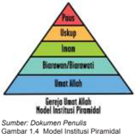

> **Deskripsi Visual:** Gambar ini adalah ilustrasi yang menunjukkan struktur hierarkis dari sebuah institusi pendidikan. Ilustrasi ini terdiri dari empat tingkatan yang disusun secara horizontal, masing-masing dengan warna yang berbeda:

1. Pada bagian paling atas, terdapat warna merah yang menunjukkan "Peta", yang kemungkinan merupakan peta umum atau peta lokal yang digunakan untuk menunjukkan lokasi dan rute.
2. Di bawahnya ada warna biru yang menunjukkan "Upkup", yang mungkin merujuk pada upkup (upacara kematian) atau upkup (upacara kematian).
3. Berikutnya ada warna hijau yang menunjukkan "Insein", yang mungkin merujuk pada insein (institusi pendidikan) atau insein (institusi pendidikan).
4. Terakhir ada warna kuning yang menunjukkan "Biorawson/Biorawstow", yang mungkin merujuk pada biro awak atau biro awak.

Elemen-elemen utama dalam gambar ini adalah empat tingkatan yang disusun secara horizontal, masing-masing dengan warna yang berbeda. Relasi antara elemen-elemen ini adalah bahwa setiap tingkatan memiliki warna yang berbeda dan mungkin memiliki makna atau fungsi yang berbeda dalam konteks institusi pendidikan tersebut.

Teks, angka, atau label penting yang terlihat dalam gambar ini adalah warna-warna yang digunakan untuk menunjukkan tingkatan-tingkatan dalam struktur hierarkis institusi pendidikan tersebut. Informasi kunci yang dapat diambil pembaca adalah bahwa gambar ini menunjukkan struktur hierarkis dari sebuah institusi pendidikan dengan empat tingkatan yang disusun secara horizontal, masing-masing dengan warna yang berbeda.

Sumber: Dokumen Penulis Gambar 1.4  Model Institusi Piramidal

---
**🖼️ Gambar/Diagram**

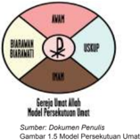

> **Deskripsi Visual:** Gambar ini adalah diagram yang menunjukkan model persekutuan umat Islam. Diagram ini terdiri dari tiga bagian utama:

1. **Pertama**: Bagian ini berisi tiga lingkaran yang bertemu di satu titik tengah. Lingkaran pertama berisi huruf "D" yang mungkin merujuk pada Al-Qur'an, lingkaran kedua berisi huruf "U" yang mungkin merujuk pada Ustaz, dan lingkaran ketiga berisi huruf "M" yang mungkin merujuk pada Muharram.

2. **Kedua**: Lingkaran pertama juga memiliki tanda bintang di tengahnya, yang mungkin menunjukkan bahwa Al-Qur'an adalah sumber utama dalam Islam.

3. **Ketiga**: Lingkaran kedua memiliki tanda bintang di tengahnya, yang mungkin menunjukkan bahwa Ustaz adalah guru atau pemimpin dalam pendidikan Islam.

4. **Keempat**: Lingkaran ketiga memiliki tanda bintang di tengahnya, yang mungkin menunjukkan bahwa Muharram adalah bulan suci dalam kalender Islam.

5. **Kelima**: Lingkaran pertama, kedua, dan ketiga bertemu di satu titik tengah, yang mungkin menunjukkan bahwa Al-Qur'an, Ustaz, dan Muharram saling berkaitan dalam pendidikan Islam.

6. **Keenam**: Lingkaran pertama, kedua, dan ketiga memiliki tanda bintang di tengahnya, yang mungkin menunjukkan bahwa Al-Qur'an, Ustaz, dan Muharram saling berkaitan dalam pendidikan Islam.

7. **Ketujuh**: Lingkaran pertama, kedua, dan ketiga memiliki tanda bintang di tengahnya, yang mungkin menunjukkan bahwa Al-Qur'an, Ustaz, dan Muharram saling berkaitan dalam pendidikan Islam.

8. **Kedelapan**: Lingkaran pertama, kedua, dan ketiga memiliki tanda bintang di tengahnya, yang mungkin menunjukkan bahwa Al-Qur'an, Ustaz, dan Muharram saling berkaitan dalam pendidikan Islam.

9. **

Sumber: Dokumen Penulis

Gambar 1.5 Model Persekutuan Umat

 

---
## 📄 Halaman 19

- Berdasarkan pengamatan terhadap kedua gambar model Gereja diatas ,cobalah menjawab pertanyaan-pertanyaan berik ut!
- Apa makna gambar  model Gereja  yang pertama? (gbr.1.3)
- Apa makna gambar model Gereja kedua (gbr.1.4)
- Apa bedanya antara model Gereja institusional dan hierarkis-piramidal dan Gereja persekutuan Umat Allah?
- Apa pengaruh dari masing-masing model Gereja tersebut?

### 2.    Makna  Gereja  sebagai  Persekutuan  yang  Terbuka    menurut  Ajaran Gereja  dan Kitab Suci

### a. Ajaran Gereja tentang Gereja sebagai Persekutuan yang terbuka

Untuk memahami makna Gereja sebagai persekutuan yang terbuka,  yang  diajarkan oleh Konsili Vatikan II,  maka  sekarang simaklah  hal tersebut  dalam  Ad Gentes, berikut ini.

'Gereja,  yang  diutus  oleh  Kristus  untuk  memperlihatkan  dan  menyalurkan  cinta kasih Allah kepada semua orang dan segala bangsa, menyadari bahwa karya misioner yang harus dilaksanakannya memang masih amat berat. Sebab masih ada dua miliar manusia,  yang  jumlahnya  makin  bertambah,  dan  yang  berdasarkan  hubunganhubungan hidup budaya yang tetap, berdasarkan tradisi-tradisi keagamaan yang kuno, berdasarkan pelbagai ikatan kepentingan-kepentingan sosial yang kuat, terhimpun menjadi  golongan-golongan  tertentu  yang  besar,  yang  belum  atau  hampir  tidak mendengar Warta Injil. Di kalangan mereka ada yang tetap asing terhadap pengertian akan  Allah  sendiri,  ada  pula  yang  jelas-jelas  mengingkari  adanya  Allah,  bahkan ada kalanya menentangnya. Untuk dapat menyajikan kepada semua orang misteri keselamatan serta  kehidupan  yang  disediakan  oleh  Allah,  Gereja  harus  memasuki golongan-golongan  itu  dengan  gerak  yang  sama  seperti  Kristus  sendiri,  ketika  Ia dalam penjelmaan-Nya mengikatkan diri pada keadaan-keadaan sosial dan budaya tertentu, pada situasi orang-orang yang sehari-hari dijumpai-Nya' . (AG art.  10)

- Setelah menyimak dokumen tersebut, diskusikan bersama  teman-temanmu tentang isi dokumen tersebut dengan pertanyaan berikut ini:
- Apa makna Gereja sebagai  persekutuan yang terbuka menurut AG, art. 10?
- Apa pesan dokumen tersebut  untuk kehidupan Gereja Katolik  Indonesia saat ini?

### b.  Model Gereja setelah Konsili Vatikan II

Gereja  sebagai  pesekutuan  (umat)    yang  terbuka  tergambar  jelas  dalam  Kitab  Suci. Banyak teks Kitab Suci  (Alkitab) menuliskan hal tersebut. Simaklah salah satu teks Kitab Suci yang berbicara tentang  Gereja  sebagai persekutuan  terbuka.

 

---
## 📄 Halaman 20

### Cara Hidup Jemaat

(Kis 4: 32-37;  bdk.1 Kor 12: 12-27)

32 Adapun kumpulan orang yang telah percaya itu, mereka sehati dan sejiwa, dan tidak seorang pun yang berkata, bahwa sesuatu dari kepunyaannya adalah miliknya sendiri, tetapi segala sesuatu adalah kepunyaan mereka bersama. 33  Dan dengan kuasa yang besar rasul-rasul memberi kesaksian tentang kebangkitan Tuhan Yesus dan mereka semua hidup dalam kasih karunia yang melimpah-limpah. 34 Sebab tidak ada seorang pun yang berkekurangan di antara mereka, karena semua orang yang mempunyai tanah atau rumah, menjual kepunyaannya itu, dan hasil penjualan itu mereka bawa 35 dan mereka letakkan di depan kaki rasul-rasul; lalu dibagi-bagikan kepada setiap orang sesuai dengan keperluannya.

36 Demikian pula dengan Yusuf, yang oleh rasul-rasul disebut Barnabas, artinya anak penghiburan, seorang Lewi dari Siprus. 37 Ia menjual ladang miliknya, lalu membawa uangnya itu dan meletakkannya di depan kaki rasul-rasul.

******

- Setelah  menyimak  teks  Kitab  Suci  tersebut,  jawablah  pertanyaan-pertanyaan berikut ini:
- Apa  saja  yang  menarik  dari  cara  hidup  Umat  Perdana  yang  dikisahkan  dalam Kis. 4:32-37?
- Gambaran Gereja model apa yang terungkap dari kisah tersebut?
- Apakah cara hidup Umat Perdana itu dapat kita tiru secara harafiah? Mengapa?

### 3. Menghayati Gereja sebagai Persekutuan Umat Bersifat Terbuka

Simaklah kisah berikut ini

### Pergilah Keluar, Pergilah!

---
**🖼️ Gambar/Diagram**

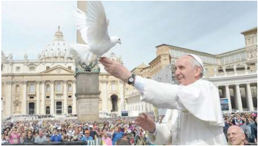

> **Deskripsi Visual:** Gambar ini adalah foto yang menunjukkan seorang pemimpin agama menghadiri sebuah acara publik di depan bangunan bersejarah. Pemimpin agama tersebut sedang berdiri di tengah-tengah massa yang sangat ramai, tampaknya menyapa atau berbicara kepada mereka. Di sebelah kiri, ada sekelompok burung merpati yang sedang terbang dan mendarat di tangan pemimpin agama tersebut. Latar belakangnya adalah bangunan bersejarah dengan arsitektur khas, yang tampaknya merupakan tempat penting bagi umat beragama tersebut.

Elemen-elemen utama dalam gambar ini meliputi pemimpin agama, massa yang sangat ramai, burung merpati, dan bangunan bersejarah. Relasi antara elemen-elemen ini adalah bahwa pemimpin agama sedang berada di tengah-tengah massa yang sangat ramai, sementara burung merpati dan bangunan bersejarah menjadi bagian dari latar belakang yang menambah nuansa keagamaan dan sejarah pada gambar tersebut.

Teks, angka, atau label penting yang terlihat dalam gambar ini tidak ada, karena gambar hanya berupa foto tanpa teks atau label tambahan. Informasi kunci yang dapat diambil pembaca dari gambar ini adalah bahwa acara tersebut berlangsung di depan bangunan bersejarah, yang tampaknya merupakan tempat penting bagi umat beragama tersebut, dan bahwa pemimpin agama tersebut sedang berinteraksi dengan massa yang sangat ramai.

Sumber: Vatican.va

Gambar 1.6

 

---
## 📄 Halaman 21

Pada tanggal 19 Mei 2013, sekitar 200 ribu orang-orang dari berbagai organisasi, kelompok, gerakan, hadir di lapangan Santo Petrus, Vatikan Roma, untuk menghadiri hari  yang  diperuntukkan  bagi  mereka.  Mereka  datang  dari  berbagai  Negara  dan daerah,  untuk  beraudiensi  dan  berdialog  dengan  Paus  Fransiskus.  Dalam  dialog dengan Paus Fransiskus, ada empat pertanyaan yang diajukan antara lain:

Pertama, Bagaimana kita bisa  sampai tahap kedewasaan iman dan bagaimana cara untuk mengalahkan kelemahan yang ada dalam diri kita?

Paus Fransiskus menjawab pertanyaan yang pertama dengan sebuah cerita: Saya sungguh  mempunyai  keberuntungan  karena  saya  tumbuh  dalam  keluarga  yang mempunyai  kehidupan  rohani  cukup  kuat.  Walaupun  sederhana  yang  diajarkan namun secara konkret, dan saya bisa melaksanakannya. Nenek saya, mengajarkan saya  tumbuh dalam iman, ia mengajarkan saya berdoa, menceritakan Kitab  Suci, ajaran Gereja, dan juga tradisi Jumat Agung, Yesus wafat untuk kita, dan akan bangkit dari kematian-Nya. Saya menerima pewartaan yang pertama kali dari nenek saya. Ia mengajarkan juga untuk menyerahkan rasa takut kepada Tuhan. 'Kita semua lemah, namun Tuhan lebih kuat. Dengan-Nya kita akan merasa aman, iman akan tumbuh jika kita hidup bersama Tuhan' , ujar Paus Fransiskus.

Kedua, Apakah yang paling penting dalam hidup?'

Paus  Fransiskus  menjawab,  'Yesus' .  Jika  kita  berjalan  bersama  dalam  sebuah organisasi/kelompok, tanpa menyertakan Yesus kelompok tidak akan berjalan. Kita diundang untuk hidup dalam Roh Kudus, jangan terlalu banyak berbicara, namun kesaksian yang hidup, sangatlah diperlukan' .

Ketiga, Bagaimana caranya Gereja yang miskin dapat membantu yang miskin juga? Apa yang bisa dilakukan oleh Gereja kepada masyarakat dalam situasi jaman sekarang ini?

Paus Fransiskus  menjawab: 'Kita harus menghayati Injil dan memberikan yang baik yang bisa kita berikan. Gereja bukanlah gerakan politik, dan juga bukan sebuah organisasi.  Kita  bukanlah  organisasi  kemanusiaan,  jika  Gereja  menjadi  sebuah organisasi sosial/kemanusiaan saja, maka kita kehilangan garam terasa hambar, bila hanya sebuah organisasi yang kosong. Hal yang membahayakan bahwa menutup diri sendiri. Menutup diri berarti kurang sehat, atau dapat dikatakan sakit.'Gereja harus keluar dari diri sendiri menuju keberadaannya' . Memang jika keluar, ada berbagai masalah, namun lebih baik daripada Gereja yang menutup diri, seperti Gereja yang sakit.  'Pergilah  Keluar,  Pergilah!!'  Keluar  dari  budaya  keegoisan,  budaya  sampah, menuju pada  budaya  kebersamaan,  bertemu  dengan  yang  lain;  dengan  Yesus  dan dengan saudara-saudari, mulai dari yang miskin, yang kurang diperhatikan, dan yang menderita' .

Keempat, Bagaimana dapat mewartakan iman?

Paus  Fransiskus  menjawab:  'Untuk  mewartakan  Kabar  Gembira,  diperlukan dua keutamaan: 'Keberanian dan Kesabaran' , seperti  saudara  kita  Shabhaz  Bhatti, seorang pejabat pemerintah Pakistan, yang karena membela kebenaran dan orang miskin dia dibunuh tahun 2011. Ia telah memberikan kesaksian dengan gagah berani, sebagai martir.  Kita semua dipanggil untuk menjadi saksi-Nya, menjadi martir dalam

 

---
## 📄 Halaman 22

kehidupan sehari-hari, sekecil apapun. Seorang Kristiani harus bisa menjawab dan membedakan mana yang baik dan mana yang jahat. Kita mencoba untuk menyatukan diri bersama saudara-saudari kita yang kurang beruntung. '

(Yohana Halimah/Zenit  dalam MISSIO KKI No.37/XVI/Agustus/2013)

- Setelah menyimak cerita diatas, cobalah merumuskan beberapa pertanyaan untuk mendalami  artikel  tersebut  bersama  teman  sekelasmu    dengan  fokus  perhatian pada apa dan bagaimana pandangan Paus tentang Gereja Katolik, serta hal-hal apa  saja  yang  menghambat  Gereja  (umat)  dalam  pergaulannya  di  dunia,  apa sikapmu sebagai anggota Gereja itu sendiri.

### Re fleksi

Bacalah  1 Korintus 12: 12-27, kemudian buatlah sebuah refleksi singkat berdasarkan bacaan tersebut.

### Rencana Aksi:

Buatlah rencana aksi  untuk berpartisipasi aktif dan bekerja sama dengan siapa saja  dalam membangun masyarakat yang adil, damai, dan sejahtera di lingkungan rumah, sekolah, dan masyarakat.

### Doa:

Terima kasih ya Bapa atas penyertaan-Mu dalam pertemuan kami ini.

Kiranya  pertemuan  ini  mengantar  kami  kepada  pemahaman  dan  penghayatan yang utuh dan benar tentang Geraja-Mu. Anugerahkanlah kepada kami Roh KudusMu  agar  menyemangati  kami  untuk  menempuh  persekutuan  yang  suci  sebagai anggota  Gereja-Mu.  Demikian  juga,  anugerahkanlah  kami  anak-anak-Mu  ini  hati yang  suci  agar  semakin  terlibat  dalam  suka  duka  kehidupan  masyarakat  melalui potensi-potensi kami. Demi Kristus pengantara kami. Amin.

### Tugas:

- Tulislah    sebuah  artikel  tentang    keterlibatan  dirimu    sebagai  umat  Katolik yang  menghayati  Gereja  sebagai  persekutuan  yang  terbuka  dalam  hidup bermasyarakat.
- Buatlah  kliping  dari  beberapa  berita  media  cetak  tentang  keterlibatan  Gereja Katolik  dalam  kegiatan  kemasyarakatan  bersama  umat  dari  agama  dan kepercayaan  lain.  Berikan  tanggapan/analisis  secara  tertulis pada  kliping tersebut.

 

---
## 📄 Halaman 23

### Bab II Sifat-Sifat Gereja

Pada  bab  pertama,    telah  dibahas    pelajaran    tentang    makna  Gereja  sebagai persekutuan orang-orang yang dipanggil dan dihimpun oleh Allah sendiri. Karena itu  Gereja adalah suatu persekutuan yang khas. Pada bab ini kita akan membahas sifat-sifat Gereja yang  tentunya mempunyai kaitan dengan makna dan hakikat Gereja itu sendiri. Syahadat iman Gereja Katolik dirumuskan dalam  doa kredo ( credere = percaya).  Ada  dua  rumusan  kredo  yaitu  rumusan  pendek  dan  rumusan  panjang. Syahadat  rumusan  pendek  disebut  Syahadat  Para  Rasul  karena  menurut  tradisi syahadat  ini  disusun  oleh  para  rasul.  Yang  panjang  disebut  Syahadat  Nicea  yang disahkan dalam Konsili Nikea  (325) yang menekankan keilahian Yesus. Dikemudian hari lazim disebut sebagai Syadat Nikea-Konstantinopel karena berhubungan dengan Konsili Konstantinopel I (381). Pada Konsili ini ditekankan keilahian Roh Kudus yang harus disembah dan dimuliakan bersama Bapa dan Putera.  Syahadat inilah yang lebih banyak digunakan dalam liturgi-liturgi Gereja Katolik. Di dalam rumusan syahadat panjang itu pada bagian akhir dinyatakan keempat sifat atau ciri Gereja Katolik : satu, kudus, katolik, dan apostolik.

Keempat sifat  Gereja itu saling  kait mengait, tetapi tidak merupakan rumus yang siap pakai. Gereja memahaminya dengan mer efleksikan dirinya sendiri dengan karya Roh Kudus di dalam dirinya. Gereja itu Ilahi sekaligus insani, berasal dari Yesus dan berkembang dalam sejarah. Gereja itu bersifat dinamis, tidak sekali jadi dan statis, oleh karena itu sifat-sifat Gereja tersebut harus selalu diperjuangkan.

Pada bab ini,  berturut-turut  kita akan membahas pokok bahasan pelajaran  tentang: Gereja yang Satu, Gereja yang Kudus,  Gereja yang Katolik,  Gereja yang Apostolik. Diharapkan agar setelah menyelesaikan pembelajaran ini peserta didik dapat memiliki pemahaman yang  tentang makna dan hakikat sifat-sifat Gereja serta mampu menghayatinya dalam hidup sehari-hari sebagai anggota Gereja.

 

---
## 📄 Halaman 24

### A.  Gereja yang Satu

Ajaran tradisonal Gereja Katolik menyebutkan bahwa sifat-sifat Gereja adalah satu,  kudus,  Katolik,  dan  apostolik.  Pada  subpokok  bahasan  ini  akan  dipelajari tentang  sifat  Gereja  yang  satu.  Gereja  adalah  satu  karena  bersatu  dalam  iman, pembaptisan, perayaan ekaristi, dan pimpinan di seluruh dunia. Kesatuan ini harus dibina, dijaga, dipelihara dalam semangat saling mengampuni dan menghormati. Kesatuan  ini  bukan  keseragaman  yang  dipaksakan  atau  tidak  mengindahkan kebebasan wajar Gereja-Gereja  partikular. Oleh karena itu, ciri Gereja yang satu menuntut suatu communio dengan Gereja Roma atau  tidak terpisah daripadanya (ex-communicatio). '

### Doa :

Ya Allah pokok keselamatan kami,

Gereja-Mu telah menjadi tanda keselamatan bagi banyak jiwa di bumi ini. Kehadiran Gereja  yang  bersifat:  Satu,  Kudus,  Katolik  dan  Apostolik  sebagaimana  iman  para Rasul yang telah kami imani sampai saat ini, kini telah menyatukan kami dan menjadi tanda  kehadiran-Mu  yang  menguduskan  kami  semua.  Kami  mohon  kepada-Mu ya  Bapa,  hadirlah  dalam  pertemuan  ini  agar  kami  semakin  mengenal,  memahami teristimewa Gereja yang Satu serta selanjutnya dapat  mengamalkan kehendak-Mu sebagai anggota Gereja. Demi Kristus Tuhan dan Pengantara kami. Amin.

### 1. Makna Kesatuan Gereja dalam Pengalaman Hidup Kita

Baca dan simaklah kisah berikut ini !

### Kaum Muda Katolik Sedunia Bertemu di Brasil

Gambar 2.1.

Ratusan bendera nasional berkibar di tengah tiupan angin dingin yang kencang di Pantai Copacabana Brasil, dimana orang muda Katolik dari semua latar belakang

 

---
## 📄 Halaman 25

yang  didorong  oleh  iman  yang  sama,  berpartisipasi  dalam  Misa  pembukaan  Hari Kaum Muda Sedunia  atau World Youth Day (WYD). Pada hari Rabu (24-Juli-2013) Paus  Fransiskus  meminta  kepada  umat  Katolik  untuk  menghindari  materialisme dalam Misa publik perjalanan internasional pertama sebagai Paus.

Paus Fransiskus juga mengunjungi salah satu tempat ziarah yang paling terkenal di  Amerika  Latin,  yakni  Gua  Maria  Aparecida,  atau  yang  disebut  'tempat  ziarah penderitaan  manusia' ,  dan  mengunjungi  sebuah  rumah  sakit  di  Rio  de  Jainero, tempat  rehabilitasi  para  pecandu  narkoba.  Kedua  kunjungan  itu  menunjukkan kesederhanaan  Paus,  itu  yang  ditekankan  selama  kepausannya.  Ia  juga  mengecam penyembahan 'berhala' terhadap uang dan kekuasaan serta mendesak umat Katolik fokus pada kaum miskin dan orang terpinggirkan. Paus menyebut orang-orang muda sebagai 'mesin' yang dapat memperkuat Gereja Katolik dan membantu membangun sebuah masyarakat yang lebih baik.

Terkait Misa pembukaan, para peserta WYD merasa senang dengan acara tersebut dan  menyebutnya  sebagai  acara  yang  luar  biasa  karena  menyatukan  mereka  dari berbagai latar belakang.'Kami datang dari budaya berbeda, berbicara bahasa berbeda, tapi  kami menyanyikan lagu-lagu yang sama dan memiliki iman yang sama,' kata Nancy Issa dari Ramallah, Tepi Barat. Issa adalah salah satu dari 20 anggota delegasi Palestina untuk merayakan WYD yang berlangsung 23-28 Juli di Brasil.

Uskup Agung Orani Joao Tempesta dari Rio de Jainero secara resmi membuka WYD dengan  Misa.  Pada  awal  sambutannya,  Uskup  Agung  Tempesta  ingat  Paus Emeritus Benediktus XVI, yang memprakarsai dan memilih kota itu menjadi tuan rumah Hari Kaum Muda Sedunia 2013.

Di  tengah  kerumunan  massa,  ribuan  orang  Argentina  bersorak-sorai,  dan  di dekatnya  sekelompok  kecil  dari  Kanada  mengungkapkan  kegembiraan  mereka sepanjang perayaan itu.'Ini sangat luar biasa dan menggairahkan, ' kata JP Martelino, 18, dari Paroki St. Patrick di Vancouver, British Columbia. Ketika ditanya apa yang ia akan lakukan usai menghadiri acara itu, Martelino menjawab, 'Pasti …. Aku akan membawa pesan ini ke Kanada dan saya mencoba berusaha mengajak lebih banyak orang muda ke gereja.'

Sumber: ucanews.com, Catholic News Service

******

- Setelah menyimak cerita tersebut, cobalah merumuskan beberapa pertanyaan untuk mendalami artikel tersebut bersama-sama teman sekelas  dengan fokus perhatian pada apa tujuan pertemuan kaum muda sedunia, sifat-sifat Gereja apakah yang tampak jelas dalam pertemuan tersebut, manakah segi-segi kesatuan Gereja, serta apa makna dari Gereja yang satu.

 

---
## 📄 Halaman 26

### 2. Kesatuan Gereja menurut Ajaran Kitab Suci  dan Ajaran Gereja

### a.  Ajaran Kitab Suci

Kesatuan Gereja (Umat), sudah tampak dalam kehidupan Gereja perdana atau Gereja awal. Hal tersebut dapat kita temukan dalam berbagai kisah dalam Kitab Suci Perjanjian Baru. Untuk memahami makna kesatuan Gereja, maka simaklah beberapa teks kutipan Kitab Suci berikut ini!

### 1Petrus  2: 5-10

- 2:5 Dan biarlah kamu juga dipergunakan sebagai batu hidup untuk pembangunan suatu rumah rohani, bagi suatu imamat kudus, untuk mempersembahkan persembahan rohani yang karena Yesus Kristus berkenan kepada Allah.
- 2:6 Sebab ada tertulis dalam Kitab Suci: 'Sesungguhnya, Aku meletakkan di Sion sebuah batu yang terpilih, sebuah batu penjuru yang mahal, dan siapa yang percaya kepada-Nya, tidak akan dipermalukan.'
- 2:7 Karena itu bagi kamu, yang percaya, ia mahal, tetapi bagi mereka yang tidak percaya: 'Batu yang telah dibuang oleh tukang-tukang bangunan, telah menjadi batu penjuru, juga telah menjadi batu sentuhan dan suatu batu sandungan. '
- 2:8 Mereka tersandung padanya, karena mereka tidak taat kepada Firman Allah; dan untuk itu mereka juga telah disediakan.
- 2:9 Tetapi kamulah bangsa yang terpilih, imamat yang rajani, bangsa yang kudus, umat  kepunyaan  Allah  sendiri,  supaya  kamu  memberitakan  perbuatan-perbuatan yang besar dari Dia, yang telah memanggil kamu keluar dari kegelapan kepada terang-Nya yang ajaib:
- 2:10 kamu, yang dahulu bukan umat Allah, tetapi yang sekarang telah menjadi umatNya, yang dahulu tidak dikasihani tetapi yang sekarang telah beroleh belas kasihan.

### 1 Korintus 12:12

- 12:12 Karena sama seperti tubuh itu satu dan anggota-anggotanya banyak, dan segala anggota itu, sekalipun banyak, merupakan satu tubuh, demikian pula Kristus.

### 2 Timotius 2:22

- 2:22 Sebab itu jauhilah nafsu orang muda, kejarlah keadilan, kesetiaan, kasih dan damai bersama-sama dengan mereka yang berseru kepada Tuhan dengan hati yang murni.

 

---
## 📄 Halaman 27

### Efesus 4:3-6

- 4:3 Dan berusahalah memelihara kesatuan Roh oleh ikatan damai sejahtera:
- 4:4 Satu  tubuh,  dan  satu  Roh,  sebagaimana  kamu  telah  dipanggil  kepada  satu pengharapan yang terkandung dalam panggilanmu,
- 4:5 Satu Tuhan, satu iman, satu baptisan,
- 4:6 satu Allah dan Bapa dari semua, Allah yang di atas semua dan oleh semua dan di dalam semua.

### Matius 16:16-19

- 16:16 Maka jawab Simon Petrus: 'Engkau adalah Mesias, Anak Allah yang hidup!'
- 16:17 Kata  Y esus  kepadanya:  'Berbahagialah  engkau  Simon  bin  Yunus  sebab  bukan manusia yang menyatakan itu kepadamu, melainkan Bapa-Ku yang di sorga.
- 16:18 Dan Aku pun berkata kepadamu: Engkau adalah Petrus dan di atas batu karang ini Aku akan mendirikan jemaat-Ku dan alam maut tidak akan menguasainya.
- 16:19 Kepadamu akan Kuberikan kunci Kerajaan Sorga. Apa yang kau ikat di dunia ini akan terikat di sorga dan apa yang kau lepaskan di dunia ini akan terlepas di sorga. '
- Setelah menyimak teks Kitab Suci tersebut, jawablah pertanyaan-pertanyaan  berikut ini:
- Apa makna Gereja yang satu menurut teks-teks Kitab Suci di atas?
- Apa peran St. Petrus dalam Gereja?
- Bagaimana mewujudkan kesatuan Gereja?
- Apa yang dapat kamu lakukan secara konkret sebagai  anggota Gereja Katolik untuk mewujudkan kesatuan Gereja?

### b. Ajaran Gereja

Simaklah teks berikut ini!

'KEGEMBIRAAN  DAN  HARAPAN,  duka  dan  kecemasan  orang-orang  zaman sekarang,  terutama  kaum  miskin  dan  siapa  saja  yang  menderita,  merupakan kegembiraan  dan  harapan,  duka  dan  kecemasan  para  murid  Kristus  juga.  Tiada sesuatu  pun  yang  sungguh  manusiawi,  yang  tak  bergema  di  hati  mereka.  Sebab persekutuan  mereka  terdiri  dari  orang-orang,  yang  dipersatukan  dalam  Kristus, dibimbing oleh Roh Kudus dalam peziarahan mereka menuju Kerajaan Bapa, dan

 

---
## 📄 Halaman 28

telah menerima warta keselamatan untuk disampaikan kepada semua orang. Maka persekutuan mereka itu mengalami dirinya sungguh erat berhubungan dengan umat manusia serta sejarahnya' . (GS art.1)

- Setelah menyimak teks dokumen tersebut, jawablah  pertanyaan-pertanyaan  berikut ini.
- Apa arti Gereja sebagai  satu persekutuan dalam Roh Kudus?
- Apa yang menjadi dasar semangat  pendorong persatuan?

### 3. Upaya Memperjuangkan Kesatuan Gereja

Kesatuan Gereja  harus terus kita perjuangkan dalam hidup sehari-hari karena ada berbagai tantangan yang dihadapi. Nah untuk memperjuangkan kesatuan Gereja itu, kita sebagai anggota Gereja, tentu harus ikut mengambil bagian dalam perjuangan tersebut.

- Untuk memperjuangkan kesatuan Gereja, cobalah menjawab pertanyaan berikut ini.
- Gereja itu satu, namun pada kenyataannya bahwa dalam Gereja masih terdapat perpecahan-perpecahan.  Bagaimana  kita  dapat  memperjuangkan  kesatuan itu?
- Bagaimana kita secara pribadi mewujudkan kesatuan  dalam Gereja?

### Re fleksi

- Usaha-usaha  apa yang dapat saya  lakukan  untuk  menguatkan  persatuan di lingkungan atau komunitas basis  serta di parokiku?

### Doa:

Terima kasih ya Tuhan Yesus, juruselamat kami atas pertemuan ini, yang telah mengingatkan kami akan sifat-sifat Gereja-Mu yang Satu, Kudus, Katolik, dan Apostolik sebagaimana iman para Rasul. Kami mohon ya Tuhan, tambahkanlah kepada kami iman, agar kami semakin mampu untuk bersatu mempersiapkan masa depan kami dalam iman akan Yesus Sang Putera yang telah mendirikan Gereja bagi kami. Engkau yang hidup dan berkuasa kini dan sepanjang masa. Amin.

### Tugas:

Tulislah  sebuah  doa  sebagai  ungkapan  syukur  dan  harapan  untuk  ikut mengambil bagian dalam kesatuan Gereja.

 

---
## 📄 Halaman 29

### B.  Gereja yang Kudus

Gereja itu kudus, dari mana Gereja berasal, ke mana arah yang dituju Gereja, dan unsur-unsur Ilahi yang ada di dalam Gereja adalah kudus. Kekudusan (kesucian) Gereja adalah kekudusan (kesucian) Kristus. Gereja menerima kekudusan (kesucian) sebagai anugerah dari Allah dalam Kristus oleh iman. Kesucian Gereja tidak datang dari  Gereja  itu  sendiri,  tetapi  datang  dari  Allah  dan  dipersatukan  dengan Kristus oleh Roh Kudus. Kristus ada dalam Gereja dan selalu menyertai Gereja sampai akhir zaman.

### Doa

Ya Allah yang Mahakudus, melalui sakramen pembaptisan Engkau telah mengangkat kami menjadi putera-puteri-Mu. Demikian juga melalui sakramen-sakremen yang Engkau  curahkan  melalui  Gereja-Mu  telah  menguduskan  kami  semua,  sehingga layaklah  kami memperoleh hidup abadi. Ya Allah yang Mahakudus, kuduskanlah tempat ini, kuduskanlah kami semua yang hendak melangsungkan pertemuan ini, agar proses pembicaraan pembelajaran kami ini bermanfaat bagi kami dan seluruh umat Allah. Engkau yang hidup dan berkuasa kini dan sepanjang masa. Amin.

### 1. Segi-Segi Kekudusan Gereja

### a. Makna Kekudusan Gereja

Dalam  syahadat iman (Aku Percaya' atau 'Credo'),  kita (umat Katolik) mengucapkan antara lain, '.....aku percaya akan Gereja Katolik yang kudus... ' Apa makna sesungguhnya dari kalimat tersebut?  Nah, coba kamu jelaskan makna kalimat tersebut menurut pemahaman dan penghayatanmu sendiri sebagai orang Katolik!

Setelah mengungkapkan pemajamanmu tentang Gereja Katolik yang kudus, marilah membaca kisah tentang St. Bernardinus Realino berikut ini, dan temukan makna kekudusan Gereja dalam kisah tersebut.

### Santo Bernardinus Realino

Bernardinus lahir di Carpi, lembah sungai Po, Italia Utara pada tahun 1530. Setelah belajar ilmu kedokteran dan hukum, ia berturut-turut diangkat sebagai Walikota di Fellizano, Jaksa di Aleksandria dan Sekretaris Kedutaan Napoli.

Setelah Kloside, isterinya meninggal dunia, ia berkenalan dengan Serikat Yesus di  Napoli.  Perkenalan  itu  berawal  dari  khotbah-khotbah  seorang  Imam  Yesuit yang  diikutinya  dengan  rajin.  Khotbah-khotbah  ini  sungguh  menarik  sehingga  ia memutuskan  untuk  lebih  memperhatikan  kehidupan  rohaninya.  Keputusan  ini

 

---
## 📄 Halaman 30

semakin  diperkuat  oleh  penampakan  isterinya sebanyak tiga kali dengan pesan supaya ia meninggalkan karier duniawinya. Pesan isterinya  itupun  kemudian  dikuatkan  lagi  oleh penampakan Bunda Maria padanya.

Terdorong  oleh  hal-hal  diatas,  Bernardinus memutuskan  untuk  mengajukan  permohonan untuk menjadi anggota Serikat Yesus. Permohonannya diterima dan setelah mengikuti suatu pendidikan khusus, Bernardinus ditahbiskan  menjadi  Imam.  Selama  beberapa tahun ia bekerja di Napoli. Sifatnya yang sopan dan ramah, penuh cinta dan pengertian kepada umatnya menyebabkan dia sangat dicintai

oleh umat Napoli. Umat dengan berat hati melepaskan dia ketika dia dipindahkan ke  Lecce,  Provinsi  Apulia,  untuk  mendirikan  sebuah  Kolose.  Di  Kolose  Yesuit  ini, Bernardius memberi kuliah filsafat dan teologi. Hingga akhir hidupnya dalam masa kerja selama 42 tahun, Bernardius menetap di Lecce. Sebagaimana di Napoli, di Lecce pun Bernardinus sungguh dicintai. Ia menampilkan diri sebagai seorang pewarta iman yang tangguh, pengkhotbah ulung, pembimbing rohani dan bapa pengakuan yang disenangi umat. Kemasyhuran namanya bukan saja karena gaya kepemimpinannya yang penuh kesabaran, pengertian dan cinta, tetapi juga lebih-lebih karena kesalehan hidupnya dan mukzijat-mukzijat penyembuhan yang dilakukannya.

Bernardinus sangat akrab dengan anak-anak dan muda-mudi. Ia menjadi penolong dan penghibur yang tidak kenal lelah bagi orang-orang yang malang. Ketika ajalnya mendekat,  walikota  Lecce  mengumpulkan  semua  pembantunya  dan  pemimpinpemimpin masyarakat setempat untuk berdoa bagi keselamatan jiwa Bernardinus. Kepada mereka ia berkata:  'Kota  kita  telah  diberkati  Allah  dengan  satu  anugerah istimewa, yakni Pater Bernardinus Realino. Beliau telah mengabdi di kota ini selama 40 tahun dan telah melakukan banyak hal dengan hidupnya yang suci, karunia-karunia dan berbagai mukzijat. Setiap orang dari kota ini, juga mereka yang berasal dari kota lain telah menikmati sedikit kebaikan hati Pater Bernardinus. Oleh karena itu saya mengusulkan agar Pastor Bernardinus diangkat sebagai pelindung kota Lecce. ' Ketika tiba saat terakhir hidupnya, Bernardinus berkata kepada para pemimpin masyarakat: 'Dari  surga  kediamanku  yang  abadi,  Aku  akan  selalu  melindungi  kota  Lecce  dan seluruh umat.' Bernardinus Realino meninggal dunia pada tanggal 2 Juli 1616.

( iman-katolik.or.id- gbr. Jesuit.org).

- Setelah menyimak cerita tersebut, cobalah merumuskan beberapa pertanyaan untuk mendalami artikel tersebut bersama teman sekelasmu  dengan fokus perhatian pada karya yang dilakukan Realino, segi-segi kekudusan apa yang tampak dalam hidup dan karya Realino, serta alasan Gereja memberi gelar sebagai orang kudus

 

---
## 📄 Halaman 31

### 2. Kekudusan Gereja menurut Ajaran Kitab Suci  dan Ajaran Gereja

### a. Ajaran Kitab Suci

Tentu  saja  bahwa  kekudusan  Gereja  bersumber  pada  ajaran  Kitab  suci.  Dapatkah kamu menemukan teks-teks Kitab Suci yang berbicara tentang kekudusan Gereja? Cobalah temukan teks-teks Kitab Suci tersebut kemudian rumuskan beberapa pertanyaan untuk di diskusikan bersama teman dan gurumu.

Sekarang coba baca teks Kitab Suci  berikut ini. Bandingkan dengan teks Kitab suci yang telah kamu temukan sendiri itu.

### 1 Petrus 1:2

1:2 yaitu orang-orang yang dipilih, sesuai dengan rencana Allah, Bapa kita, dan yang dikuduskan oleh Roh, supaya taat kepada Yesus Kristus dan menerima percikan darah-Nya. Kiranya kasih karunia dan damai sejahtera makin melimpah atas kamu.

### Rama 1:7

1:7 Kepada kamu sekalian yang tinggal di Roma, yang dikasihi Allah, yang dipanggil dan dijadikan orang-orang kudus: Kasih karunia menyertai kamu dan damai sejahtera dari Allah, Bapa kita, dan dari Tuhan Yesus Kristus.

### Yohanes 17:11

17:11 Dan Aku tidak ada lagi di dalam dunia, tetapi mereka masih ada di dalam dunia, dan Aku datang kepada-Mu. Ya Bapa yang kudus, peliharalah mereka dalam namaMu, yaitu nama-Mu yang telah Engkau berikan kepada-Ku, supaya mereka menjadi satu sama seperti Kita.

- Setelah menyimak teks Kitab Suci tersebut, jawablah  pertanyaan-pertanyaan  berikut ini:
- Apa makna kekudusan menurut teks -teks Kitab Suci tersebut?
- Apa bentuk implementasi kekudusan itu dalam hidup umat Katolik?

### b. Ajaran Gereja

Simaklah ajaran  Gereja tentang kekudusan Gereja berikut ini

### Tugas Menguduskan

'Uskup mempunyai kepenuhan sakramen Tahbisan, maka ia menjadi 'pengurus rahmat  imamat  tertinggi' ,  terutama  dalam  Ekaristi,  yang  dipersembahkannya sendiri  atau  yang  dipersembahkan  atas  kehendaknya,  dan  yang  tiada  hentinya menjadi  sumber  kehidupan  dan  pertumbuhan  Gereja.  Gereja  Kristus  itu  sungguh

 

---
## 📄 Halaman 32

hadir  dalam  semua  jemaat  beriman setempat  yang  sah,  yang  mematuhi para gembala mereka, dan dalam Perjanjian Baru disebut Gereja. GerejaGereja itu ditempatnya masing-masing merupakan umat baru yang dipanggil oleh  Allah,  dalam  Roh  Kudus  dan dengan  sepenuh-penuhnya  (lih  1Tes 1:5). Di situ umat beriman berhimpun karena  pewartaan  Injil  Kristus,  dan dirayakan  misteri  Perjamuan  Tuhan, 'supaya karena Tubuh dan Darah Tuhan  semua  saudara  perhimpunan dihubungkan erat-erat' . Di setiap himpunan disekitar altar, dengan pelayanan suci Uskup, tampillah lambang cinta kasih dan 'kesatuan tubuh mistik itu, syarat mutlak untuk keselamatan' . Di jemaat-jemaat itu, meskipun sering hanya kecil dan miskin, atau tinggal tersebar, hiduplah Kristus; dan berkat kekuatan-Nya terhimpunlah Gereja yang satu, kudus, katolik dan apostolik. Sebab 'keikutsertaan dalam tubuh dan darah Kristus tidak lain berarti berubah menjadi apa yang kita sambut' .

Semua  Perayaan  Ekaristi  yang  sah  dipimpin  oleh  Uskup.  Ia  diserahi  tugas mempersembahkan  ibadat  agama  kristiani  kepada  Allah  yang  Maha  Agung,  dan mengaturnya menurut perintah Tuhan dan hukum Gereja, yang untuk keuskupan masih perlu diperinci menurut pandangan Uskup sendiri. Demikianlah para Uskup, dengan  berdoa  dan  bekerja  bagi  Umat,  membagikan  kepenuhan  kesucian  Kristus dengan  pelbagai  cara  dan  secara  melimpah.  Dengan  pelayanan  sabda  mereka menyampaikan kekuatan  Allah  kepada  Umat  beriman,  demi  keselamatannya  (lih. Rom 1:16). Dengan sakramen-sakramen, yang pembagiannya mereka urus dengan kewibawaan  mereka  supaya  teratur  dan  bermanfaat,  mereka  menguduskan  umat beriman.  Mereka  mengatur  penerimaan  babtis,  yang  memperoleh  keikut-sertaan dalam imamat rajawi Kristus. Merekalah pelayan sesungguhnya sakramen penguatan, mereka pula yang menerima tahbisan-tahbisan suci dan mengatur serta mengurus tata-tertib  pertobatan.  Dengan  saksama  mereka  mendorong  dan  mendidik  Umat, supaya  dengan  iman  dan  hormat  menunaikan  perannya  dalam  liturgi,  terutama dalam korban kudus misa. Akhirnya mereka wajib membantu umat yang mereka pimpin dengan teladan hidup mereka, yakni dengan mengendalikan perilaku mereka dan menjauhkan dari segala cela, dan  sedapat mungkin, dengan pertolongan Tuhan mengubahnya menjadi baik. Dengan demikian mereka akan mencapai hidup kekal, bersama dengan kawanan yang dipercayakan kepada mereka.

(Lumen Gentium artikel  26)

 

---
## 📄 Halaman 33

- Setelah menyimak dokumen tersebut, jawablah  pertanyaan-pertanyaan  berikut ini:
- Apa isi atau inti dari dokumen ajaran Gereja tersebut?
- Apa makna kekudusan menurut ajaran Gereja ?

### 3. Usaha Memperjuangkan Kekudusan Gereja

Setiap kita dipanggil dan diutus Tuhan untuk memperjuangkan kekudusan Gereja. Pertanyaannya,  bagaimana  cara  kita  memperjuangkan  kekudusan    Gereja    dalam hidup sehari-hari?  Ya, kekudusan dapat dilakukan dengan saling memberi kesaksian untuk  hidup  sebagai  putra-putri  Allah.  Kekudusan  dapat  dilakukan  dengan  cara meneladani semangat hidup orang-orang Katolik yang telah mencapai kekudusan, seperti para santo-santa, beato-beata, atau para martir yang berjuang menegakkan kebenaran,  keadilan  demi  kemanusiaan.  Kekudusan  juga  dapat  dilakukan  dengan merenungkan dan mendalami Kitab Suci, khususnya ajaran dan hidup Yesus, yang merupakan pedoman dan arah hidup kita, dan sebagainya.

### Re fleksi

Sekarang cobalah menulis sebuah refleksi  tentang hal-hal apa yang dapat kamu perjuangkan,  untuk  menguduskan  diri  sebagai  anggota-anggota  Gereja  dalam hidupmu sehari-hari sebagai anggota Gereja

### Rencana Aksi

- Dalam kelompok, susunlah   ibadat sabda dengan intensi bagi kekudusan Gereja.
- Berdoa bersama-sama dalam ibadat sabda, dengan memilih salah satu teks ibadat sabda yang telah disusun.

### Doa:

Ya  Allah  yang  Mahakudus,  limpah  terima  kasih  kami  sampaikan  kepada-Mu, karena berkat pembicaraan kami dalam pertemuan ini telah menghantarkan kami menemukan  makna  kehadiran-Mu  yang  kudus  melalui  Gereja-Mu,  yaitu  demi keselamatan kami. Kami mohon ya Allah, sertailah kami dalam perziarahan kami ini, agar tetap yakin dan percaya pada penyelenggaraan-Mu melalui Gereja yang kudus. Demi Kristus pengantara kami. Bapa Kami….

 

---
## 📄 Halaman 34

### C. Gereja yang Katolik

'Satu umat Allah itu hidup di tengah segala bangsa di dunia, karena memperoleh warganya dari segala bangsa. Gereja memajukan  dan menampung  segala kemampuan, kekayaan, dan adat istiadat bangsa-bangsa sejauh itu baik. Gereja yang  katolik  secara  tepat  guna  dan  tiada  hentinya  berusaha  merangkul  segenap umat manusia beserta segala harta kekayaannya di bawah Kristus Kepala, dalam kesatuan Roh-Nya' (LG. 13).

### Doa

Ya Bapa sumber kebijaksanaan sejati,

Dalam  pertemuan  ini  kami  ingin  memahami  lebih  mendalam  tentang  hakekat dan  sifat-sifat  Gereja,  teristimewa  Gereja  yang  Katolik.  Kami  mohon  kepadaMu, anugerahkanlah kepada kami hati dan budi yang suci, serta berilah semangat untuk mengikuti dan ambil bagian dalam proses pembelajaran ini, agar kami dapat memahami kehadiran Gereja-Mu di bumi ini. Engkau yang hidup dan berkuasa kini dan sepanjang segala masa. Amin.

### 1. Makna Kekatolikan Gereja dalam Hidup Kita

Sebagai  orang  yang  beragama  Katolik,  apakah  kamu  mengetahui  identitas kekatolikanmu  itu?  Sekarang  coba  artikan  apa  itu  'katolik'  menurut  pemahaman kamu sendiri sebagai orang Katolik. Cobalah tanyakan juga pada teman-temanmu, apa pengertian mereka tentang kekatolikannya?

Untuk  memahami  makna  kekatolikan  Gereja  dalam  realitas  hidup  kita,  maka simaklah cerita berikut ini.

### Simpul Persaudaraan Kardinal Bergoglio

Sumber: ucannews.com

Gambar 2.4

Ketika  memangku  reksa  kegembalaan  sebagai  Uskup  Agung  Buenos  Aires, Bergoglio sudah memiliki kebiasaan dialog, menjalin relasi, kerjasama dan persaudaraan  dengan  tradisi  kepercayaan  lain.  Kardinal  kelahiran  Flores,  Buenos Aires, 17 Desember 1936 ini aktif mengadakan kunjungan secara berkala dan hadir

 

---
## 📄 Halaman 35

dalam  acara-acara  penting  komunitas  agama  lain  di  Argentina.  Bahkan,  ia  sering menggelar acara bersama dengan para pemuka agama lain untuk mempererat tali silaturahmi.

Tak  segan-segan,  Bergoglio  berkunjung  dan  masuk  ke  masjid  untuk  berbaur dengan  saudara-saudari  Muslim.  Ia  pun  dengan  senang  hati  menghadiri  acara keagamaan orang Yahudi. Pertemuan-pertemuan berskala nasional dengan banyak denominasi  Kristen  dari  berbagai  aliran  juga  menjadi  prioritas  dalam  agendanya. Sikap  keterbukaan  dan  kehangatan  sapaannya  dalam  kancah  dialog  damai  dan persaudaraan terpatri begitu kuat dalam hati para pemuka agama di Argentina.

Pada November 2012, simpul kedekatannya dengan komunitas tradisi agama lain pun terkristalisasi dalam suatu pertemuan penuh makna. Bergoglio mengundang para pemimpin umat agama lain dalam suatu pertemuan persaudaraan. Perhelatan yang digelar di kompleks Katedral Buenos Aires ini menjadi ajakan untuk merefleksikan roh pemersatu dalam persaudaraan sebagai komunitas umat manusia. Undangannya itu pun mendapat sambutan hangat dari para tamunya. Kala itu, perwakilan Islam, Yahudi, Orthodoks, dan sejumlah denominasi Gereja Kristen Evangelis di Argentina berbondong-bondong menghadiri undangan Bergoglio.

Para  tamunya  pun  semakin  terkesima  ketika  Sang  Kardinal  mengajak  mereka masuk ke Katedral Buenos Aires untuk berdoa bersama. Seakan-akan ia membuka pintu  Gereja  Katedral  lebar-lebar  bagi  umat  beriman  dan  semua  orang  yang berkehendak  baik  demi  perdamaian.  Bergoglio  merangkul  para  pemuka  agama untuk  mendoakan perdamaian di Timur Tengah yang dinodai dengan kebencian, permusuhan, penindasan, dan perang.  Para  tokoh  agama  Argentina  menyebutnya sebagai 'pembuka pintu' untuk orang lain di rumahnya, dan menawarkan sambutan hangat pada siapapun yang bertamu.

*****

- Setelah  menyimak  kisah  tersebut,  cobalah  merumuskan  beberapa  pertanyaan untuk didiskusikan bersama temanmu. Dalam merumuskan pertanyaan, hendak memperhatikan  beberapa  hal  yaitu,  apa  yang  dilakukan  oleh  Mgr.  Bergoglio semasa berkarya sebagai Uskup Agung Buenos Aires, segi-segi kekatolikan apa yang ia tampakkan, apa dampaknya bagi orang-orang di sekitarnya, serta semangat apa yang patut diteladani dari Mgr. Bergoglio.

### 2.  Makna Kekatolikan dalam Dokumen Ajaran Gereja

Baca, dan simaklah artikel berikut ini.

'Semua orang dipanggil Umat Allah yang baru. Maka umat itu, yang tetap satu dan tunggal, harus disebarluaskan keseluruh dunia dan melalui segala abad, supaya terpenuhi rencana kehendak Allah, yang pada awal mula menciptakan satu kodrat manusia, dan menetapkan untuk akhirnya menghimpun dan mempersatukan lagi

 

---
## 📄 Halaman 36

anak-anak-Nya  yang  tersebar  (lih.  Yoh  11:52). Sebab demi tujuan itulah Allah mengutus Putera-Nya, yang dijadikan-Nya ahli waris alam semesta  (lih.  Ibr  1:2),  agar  Ia  menjadi  Guru, Raja,  dan  Imam  bagi  semua  orang,  Kepala umat anak-anak Allah yang baru dan universal. Demi  tujuan  itu  pulalah  Allah  mengutus  Roh Putra-Nya, Tuhan yang menghidupkan, seluruh Gereja  serta  segenap  orang  beriman  menjadi azas penghimpun dan pemersatu dalam ajaran para rasul dan persekutuan, dalam pemecahan roti, dan doa-doa (lih. Kis 1:42 yun.).

Jadi  satu  Umat  Allah  itu  hidup  ditengah

segala bangsa dunia, warga Kerajaan yang tidak bersifat duniawi melainkan sorgawi. Semua orang beriman, yang tersebar diseluruh dunia, dalam Roh Kudus berhubungan dengan  anggota-anggota  lain.  Demikianlah  'dia  yang  tinggal  di  Roma  mengakui orang-orang India sebagai saudaranya'[23]. Namun,  karena  Kerajaan Kristus bukan dari  dunia  ini  (lih.  Y oh  18:36),  Gereja  dan  Umat  Allah,  dengan  membawa masuk  Kerajaan  itu,  tidak  mengurangi  sedikit  pun  kesejahteraan  materiil  bangsa mana  pun  juga.  Malahan  sebaliknya,  Gereja  memajukan  dan  menampung  segala kemampuan, kekayaan dan adat-istiadat bangsa-bangsa sejauh itu baik; tetapi dengan menampungnya juga memurnikan, menguatkan serta mengangkatnya. Gereja tetap ingat,  bahwa harus ikut mengumpulkan bersama dengan Sang Raja, yang diserahi segala bangsa sebagai warisan (lih. Mzm 2:8), untuk mengantarkan persembahan dan upeti kedalam kota-Nya (lih. Mzm 71/72:10; Yes 60:4-7; Why 21:24). Sifat universal, yang menyemarakkan Umat Allah itu, merupakan karunia Tuhan sendiri. Karenanya, Gereja  yang  katolik  secara  tepat-guna  dan  tiada  hentinya  berusaha  merangkum segenap umat manusia beserta segala harta kekayaannya di bawah kristus Kepala, dalam kesatuan Roh-Nya[24].

Berkat  ciri  katolik  itu  setiap  bagian  Gereja  menyumbangkan  kepunyaannya sendiri kepada bagian-bagian lainnya dan kepada seluruh Gereja. Dengan demikian Gereja semesta dan masing-masing bagiannya berkembang, karena semuanya saling berbagi  dan  serentak  menuju  kepenuhannya  dalam  kesatuan.  Maka  dari  itu  umat Allah bukan hanya dihimpun dari pelbagai bangsa, melainkan dalam dirinya sendiri pun  tersusun  dari  aneka  golongan.  Diantara  para  anggotanya  terdapat  kemacamragaman,  entah  karena  jabatan,  sebab  ada  beberapa  yang  menjalankan  pelayanan suci demi kesejahteraan saudara-saudara mereka, entah karena corak dan tata-tertib kehidupan,  sebab  cukup  banyak  yang  dalam  status  hidup  bakti  (religius)  menuju kesucian melalui jalan yang lebih sempit, yang mendorong saudara-saudara dengan teladan mereka. Maka dalam persekutuan Gereja selayaknya pula terdapat GerejaGereja khusus, yang memiliki tradisi mereka sendiri, sedangkan tetap utuhlah primat takhta  Petrus,  yang  mengetuai  segenap  persekutuan  cinta  kasih[25],  melindungi

 

---
## 📄 Halaman 37

keanekaragaman yang wajar, dan sekaligus menjaga, agar hal-hal yang khusus jangan merugikan  kesatuan,  melainkan  justru  menguntungkannya.  Maka  antara  pelbagai bagian Gereja perlu ada ikatan persekutuan yang mesra mengenai kekayaan rohani, para pekerja dalam kerasulan dan bantuan materiil. Sebab para anggota umat Allah dipanggil  untuk  saling  berbagi  harta-benda,  dan  bagi  masing-masing  Gereja  pun berlaku amanat Rasul: 'Layanilah seorang akan yang lain, sesuai dengan kurnia yang telah diperoleh setiap orang, sebagai  pengurus aneka rahmat Allah yang baik. ' (1Ptr 4:10).

Jadi,  kepada  kesatuan  katolik  Umat  Allah  itulah,  yang  melambangkan  dan memajukan perdamaian semesta, semua orang dipanggil. Mereka termasuk kesatuan itu atau terarahkan kepadanya dengan aneka cara, baik kaum beriman katolik, umat lainnya yang beriman akan Kristus, maupun semua orang tanpa kecuali, yang karena rahmat Allah dipanggil kepada keselamatan' .

(Lumen Gentium art.13)

- Setelah menyimak dokumen tersebut, jawablah  pertanyaan-pertanyaan  berikut ini:
- Apa makna Katolik menurut ajaran Gereja (LG art.13)?
- Mengapa Gereja disebut Katolik?
- Bagaimana mewujudkan kekatolikan Gereja di dunia?

### 3. Upaya untuk  Mewujudkan Kekatolikan

### a.  Re fleksi

Buatlah  sebuah  refleksi  tertulis:  Bagaimana  mewujudkan  kekatolikan    dalam hidup sehari-hari.

### b. Rencana aksi

Buatlah rencana untuk aksi pribadi atau aksi bersama teman (kelompok) untuk mewujudkan kekatolikan dalam hidupmu sehari-hari.

### Doa:

Terima kasih ya Bapa, atas penyertaan-Mu dalam pertemuan kami ini. Kini kami telah memahami rencana penyelamatan-Mu untuk seluruh umat manusia melalui kehadiran Gereja Katolik, juga penyelamatan-Mu atas kami yang bepangkal pada tradisi para rasul. Kami mohon ya Bapa, jadikanlah kami pewarta-pewarta Kabar Sukacita di tengah-tengah masyarakat kami agar setiap orang menemukan kebahagiaan sejati baik di dunia ini, maupun dalam kemuliaan kekal nanti. Demi Kristus Tuhan dan pengantara kami. Amin.

 

---
## 📄 Halaman 38

### D. Gereja yang Apostolik

Yesus mengutus para rasul dengan bersabda: 'Pergilah, ajarilah semua bangsa, dan  baptislah  mereka  atas  nama  Bapa  dan  Putra  dan  Roh  Kudus,  dan  ajarlah mereka menaati segala sesuatu yang telah Kuperintahkan kepadamu' (lih. Mat 28: 19-20). Perintah resmi Kristus untuk mewartakan kebenaran yang menyelamatkan itu oleh Gereja diterima dari para rasul dan harus dilaksanakan sampai ke ujung bumi.  Gereja  terus-menerus  mengutus  para  pewarta  sampai  Gereja-Gereja  baru terbentuk sepenuhnya untuk melanjutkan karya pewartaan Injil.

### 1. Makna Keapostolikan Gereja

Simaklah kisah berikut ini!

### Habemus Papam

Gambar 2.6

Pada tanggal 13 Maret 2013 tepat pukul 19.07 waktu Roma, asap putih mengepul dari cerobong asap paling terkenal di dunia, di atas Kapel Sistina, Vatikan. Awalnya, asap  putih  itu  tipis;  makin  lama  makin  menebal  menembus  hujan  rintik  yang mengguyur Vatikan sejak siang hari.

Tepuk tangan puluhan ribu umat dan warga bergemuruh. Teriakan dan jeritan 'fumata bianca' (asap putih) mewarnai Piazza San Pietro. Selang lima menit, loncenglonceng Basilika Santo Petrus berdentang, bersahut-sahutan. Seturut tradisi, bunyi lonceng mengkonfirmasi bahwa asap putih betul putih, tanda Paus sudah terpilih. Lebih dari lima menit asap putih mengepul disertai oleh lonceng, disaksikan puluhan ribu orang di piazza, dan jutaan orang di seluruh dunia yang mengikuti momentum

 

---
## 📄 Halaman 39

ini lewat berbagai media komunikasi. Alun-alun Santo Petrus makin dipadati warga Roma, umat beriman dari berbagai bangsa, meski hujan terus mengguyur dengan suhu udara 10° C. Kebanyakan orang, baik tua-muda, anak pun remaja, merangsek mendekati Basilika, ingin lebih dekat menyambut Paus baru dan menerima berkat. Mata  seluruh  orang  di  piazza  tertuju  pada  balkon  utama  tempat  namanya  akan diumumkan.  Wajah  Basilika  San  Pietro  sore  itu  berseri.  Bagian  mukanya  terang benderang, disinari lampu dari kiri dan kanan; jendela-jendela mengeluarkan cahaya kekuningan.  Pada  pukul  20.05,  cahaya  di  jendela  makin  cerah,  semakin  memikat banyak  manusia  yang  berkerumun  di  piazza.  Selang  beberapa  saat,  pukul  20.10, Kardinal  Jean-Louis  Tauran  sebagai  Kardinal  Proto  Diacon  muncul  di  balkon  itu. Seluruh piazza menjadi hening. Ia mengangkat muka dan berkata: 'Saya umumkan kepada Anda sebuah suka-cita besar: kita mempunyai seorang Paus' . Selanjutnya ia menyebut nama: Jorge Mario Bergoglio. Sebagai Paus ia mengenakan nama Fransiskus. Setelah ini semua diumumkan, meledaklah piazza dengan sorak dan tepuk-tangan. Sebagian melonjak. Sebagian lagi berseru: 'Viva il  Papa' ,'Papa Francesco!'

Pukul 20.22, keluarlah para kardinal di balkon sebelah kiri dan balkon sebelah kanan Basilika. Paus Fransiskus muncul, berjubah putih dan mengenakan Soli Deo putih. Ia berdiri, diam, menatap umatnya. Lalu, ia mengucap salam sahaja: 'Saudarasaudariku, selamat sore!' . Publik menyambut dengan tepuk tangan dan sorak-sorai. Ia melanjutkan dan mengatakan bahwa amanat sebuah Konklaf adalah menghadiahkan seorang  uskup  kepada  Roma.  Seperti  diketahui  Paus  adalah  juga  Uskup  Roma. Bapa  Suci  mengatakan,  'Tampaknya  para  saudaraku  Kardinal  telah  pergi  untuk mengambilnya  hampir-hampir  di  ujung  dunia.  Saya  ucapkan  terima  kasih  atas sambutan Anda sekalian. Komunitas Keuskupan Roma mempunyai uskupnya: terima kasih!'  Paus  yang  dikenal  bersahabat  dengan  orang  kecil  ini  menuturkan,  Uskup Roma  dan  umat  berjalan  bersama-sama.  Peziarahan  ini  merupakan  peziarahan persaudaraan, kasih, dan saling percaya. Ia pun mengajak untuk berdoa bagi dunia supaya menjadi sebuah persaudaraan agung.

Dalam sambutan pertama dan spontan itu, Paus Fransiskus juga mengajak umat untuk berdoa bagi Uskup Emeritus Roma, Benediktus XVI, agar Tuhan memberkatinya dan Bunda Maria menjaganya. Hari makin gelap, malam sudah turun, tetapi tidak di  Vatikan,  terutama  di  Piazza  San  Pietro.  Terang  dan  sorak  kegirangan  terus berlangsung. Mereka sedang menantikan sebuah hal istimewa yang ditunggu-tunggu: berkat Urbi  et  Orbi ,  bagi  Kota  Roma  dan  dunia.  Sebelum  memberikan  berkatnya, Bapa Suci meminta umat yang hadir untuk mendoakan dirinya. Satu menit, hening. Dan, pada pukul 20.25, Paus Fransiskus melimpahkan berkatnya.

(http://www.hidupkatolik.com/2013/04/10/..)

- Setelah  menyimak  kisah  tersebut,  cobalah  merumuskan  beberapa  pertanyaan untuk didiskusikan bersama temanmu. Dalam merumuskan pertanyaan, hendak lah memperhatikan beberapa hal yaitu; pesan kisah, suksesi kepemimpinan seperti apakah yang digambarkan dalam kisah tersebut, makna Paus sebagai uskup Roma, serta apa makna apostolik dari kisah itu.

 

---
## 📄 Halaman 40

### 2. Makna Keapostolikan  menurut  Kitab Suci

Keapostolikan, atau tugas kerasulan Gereja bertitiktolak dari tugas perutusan Yesus sendiri. Banyak teks Kitab Suci dari Perjanjian Baru yang berkisah tentang hal tersebut.

Berikut ini simaklah salah satu teks Kitab Suci yang menjelaskah keapostolikan Gereja.

### (Mateus 28:19-20)

- 19 Karena itu pergilah, jadikanlah semua bangsa murid-Ku dan baptislah mereka dalam nama Bapa dan Anak dan Roh Kudus,
- 20 Dan  ajarlah  mereka  melakukan  segala  sesuatu  yang  telah  Kuperintahkan kepadamu. Dan ketahuilah, Aku menyertai kamu senantiasa sampai kepada akhir zaman.'
- Setelah menyimak teks Kitab Suci tersebut, jawablah  pertanyaan-pertanyaan  berikut ini:
- Apa isi pesan teks Kitab Suci tersebut?
- Apa yang dimaksudkan dengan keapostolikan Gereja dalam teks Kitab Suci itu?
- Dimana teks-teks lainnya dari Kitab Suci Perjanjian Baru yang menjelaskan tentang keapostolikan Gereja!

### 3. Ajaran  Gereja tentang Keapostolikan

Apa makna keapostolikan menurut ajaran Gereja Katolik? Banyak dokumen Gereja yang berisi tentang ajaran dari para bapa Gereja tentang keapostolikan Gereja. Untuk memahaminya, simaklah salah satu artikel dari dokumen ajaran Gereja berikut ini.

### Uskup Setempat dan Gereja Universal

Sumber: ucannews.com

Gambar 2.7

 

---
## 📄 Halaman 41

'Persatuan  kolegial  nampak  juga  dalam  hubungan  timbal-balik  antara  masingmasing Uskup dan Gereja-Gereja khusus serta Gereja semesta. Imam Agung di Roma, sebagai  pengganti  Petrus,  menjadi  azas  dan  dasar  yang  kekal  dan  kelihatan  bagi kesatuan  para  Uskup  maupun  segenap  kaum  beriman.  Sedangkan  masing-masing Uskup menjadi azas dan dasar kelihatan bagi kesatuan dalam Gereja khususnya, yang terbentuk menurut citra Gereja semesta. Gereja katolik yang satu dan tunggal berada dalam  Gereja-Gereja  khusus  dan  terhimpun  daripadanya.  Maka  dari  itu  masingmasing Uskup mewakili Gerejanya sendiri, sedangkan semua Uskup bersama Paus mewakili seluruh Gereja dalam ikatan damai, cinta kasih dan kesatuan.Masing-masing Uskup,  yang  mengetuai  Gereja  khusus,  menjalankan  kepemimpinan  pastoralnya terhadap bagian Umat Allah yang dipercayakan kepadanya, bukan terhadap GerejaGereja  lain  atau  Gereja  semesta.  Tetapi  sebagai  anggota  Dewan  para  Uskup  dan pengganti para Rasul yang sah mereka masing-masing - atas penetapan dan perintah Kristus  -  wajib  menaruh  perhatian  terhadap  seluruh  Gereja.  Meskipun  perhatian itu  tidak  diwujudkan  melalui  tindakan  menurut  wewenang  hukumnya,  namun sangat bermanfaat bagi seluruh Gereja. Sebab semua Uskup wajib memajukan dan melindungi kesatuan iman dan tata-tertib yang berlaku umum bagi segenap Gereja, mendidik umat beriman untuk mencintai seluruh Tubuh Kristus yang mistik, terutama para  anggotanya  yang  miskin  serta  bersedih  hati,  dan  mereka  yang  menanggung penganiayaan demi kebenaran (lih. Mat 5:10); akhirnya memajukan segala kegiatan, yang umum bagi seluruh Gereja, terutama agar supaya iman berkembang dan cahaya kebenaran  yang  penuh  terbit  bagi  semua  orang.  Memang  sudah  pastilah  bahwa, bila mereka membimbing dengan baik Gereja mereka sendiri sebagai bagian Gereja semesta, mereka memberi sumbangan yang nyata bagi kesejahteraan seluruh Tubuh mistik, yang merupakan badan Gereja-Gereja itu.

Penyelenggaraan pewartaan Injil di seluruh dunia merupakan kewajiban badan para  Gembala,  yang  kesemuanya  bersama-sama  menerima  perintah  Kristus,  dan dengan demikian juga mendapat tugas bersama, seperti telah ditegaskan oleh Paus Coelestinus kepada para bapa Konsili di Efesus. Maka masing-masing Uskup, sejauh pelaksanaan tugas mereka sendiri mengizinkannya, wajib ikut serta dalam kerja sama antara mereka sendiri dan dengan pengganti Petrus, yang secara istimewa diserahi tugas  menyiarkan  iman  kristiani.  Maka  untuk  daerah-daerah  misi  mereka  wajib sedapat mungkin menyediakan pekerja-pekerja panenan, maupun bantuan-bantuan rohani  dan  jasmani,  bukan  hanya  langsung  dari  mereka  sendiri,  melainkan  juga dengan membangkitkan semangat kerjasama yang berkobar diantara umat beriman. Akhirnya  hendaklah  para  Uskup,  dalam  persekutuan  semesta  cinta  kasih,  dengan sukarela memberi bantuan persaudaraan kepada Gereja-Gereja lain, terutama yang lebih dekat dan miskin, menurut teladan mulia Gereja kuno' .

Berkat penyelenggaraan ilahi terjadilah, bahwa pelbagai Gereja, yang didirikan di pelbagai tempat oleh para Rasul serta para pengganti mereka, sesudah waktu tertentu bergabung menjadi berbagai kelompok yang tersusun secara organis. Dengan tetap mempertahankan kesatuan iman serta susunan satu-satunya yang berasal dari Allah bagi seluruh Gereja, kelompok-kelompok itu mempunyai tata-tertib mereka sendiri,

 

---
## 📄 Halaman 42

tata-cara  liturgi  mereka  sendiri,  dan  warisan  teologis  serta  rohani  mereka  sendiri. Diantaranya ada beberapa, khususnya Gereja-Gereja patriarkal kuno, yang ibarat ibu dalam  iman,  melahirkan  Gereja-Gereja  lain  sebagai  anak-anaknya.  Gereja-Gereja kuno itu sampai sekarang tetap berhubungan dengan Gereja-Gereja cabang mereka karena ikatan cinta kasih yang lebih erat dalam hidup sakramental dan dengan saling menghormati  hak-hak  serta  kewajiban  mereka.  Keanekaragaman  Gereja-Gereja setempat yang menuju kesatuan itu dengan cemerlang memperlihatkan sifat katolik Gereja yang tak terbagi. Begitu pula konferensi-konferensi Uskup sekarang ini dapat memberi sumbangan bermacam-macam yang berfaedah, supaya semangat kolegial mencapai penerapannya yang konkret.'

( Lumen Gentium  artikel 23)

- Setelah menyimak dokumen tersebut, jawablah  pertanyaan-pertanyaan  berikut ini.
- Apa isi dokumen Gereja tersebut?
- Apa yang dimaksudkan dengan keapostolikan Gereja
- Apa pendapatmu tentang keapostolikan Gereja dewasa ini?

### 4. Upaya untuk  Menghayati Keapostolikan Gereja

Makna keapostolikan Gereja telah dijelaskan dalam Kitab Suci dan pengajaran Gereja. Tentu saja bahwa keapostolikan Gereja tersebut haruslah diwujudkan oleh setiap pengikut Yesus Kritsus dalam hidup sehari-hari.

Sebagai  upaya  perwujutan keapostolikan Gereja, tulislah sebuah refleksi tentang bagaimana kamu   mengamalkan  Keapostolikan Gereja  dalam hidupmu  sehari-hari.

### Doa:

Terima kasih ya Bapa, atas penyertaan-Mu dalam pertemuan kami ini. Kini kami telah  memahami rencana penyelamatan-Mu untuk seluruh umat manusia melalui Gereja,  juga  penyelamatan-Mu  atas  kami  yang  bepangkal  pada  tradisi  para  rasul. Kami mohon ya Bapa, jadikanlah kami pewarta-pewarta Kabar Sukacita di tengahtengah masyarakat kami agar setiap orang menemukan kebahagiaan sejati baik di dunia ini, maupun dalam kemuliaan kekal nanti. Demi Kristus Tuhan dan pengantara kami. Amin.

### Tugas:

Buatlah kliping  tentang upacara pentahbisan Imam atau Uskup, kemudian berikan  analisis  terhadap  berita  upacara  tahbisan  tersebut  di  menghubungkan dengan keapostolikan Gereja.

 

---
## 📄 Halaman 43

### Peran Hierarki dan Awam dalam

### Bab III Gereja Katolik

Setelah  mempelajari sifat-sifat Gereja yaitu Gereja yang satu, kudus, katolik dan apostolik ,    pada  bab  ini  kita  akan  mempelajari lebih lanjut tentang dua komponen penting dalam Gereja sebagai persekutuan umat, yaitu hierarki dan awam . Kita akan mendalami hubungan antara hirarki dan awam, khusunya menyangkut pemahaman tentang Gereja yang institusional hierarkis dan Gereja yang mengumat.

Berkaitan dengan peranan hirarki dan awam, Konsili Vatikan II menegaskan antara lain; 'Dari harta-kekayaan rohani Gereja kaum awam, seperti semua orang beriman kristiani, berhak menerima secara melimpah melalui pelayanan para Gembala hirarkis,  terutama  bantuan  sabda  Allah  dan  sakramen-sakramen.  Hendaklah  para awam mengemukakan kebutuhan-kebutuhan dan keinginan-keinginan mereka kepada para Imam, dengan kebebasan dan kepercayaan, seperti layaknya bagi anak-anak Allah  dan  saudara-saudara  dalam  Kristus.  Sekadar  ilmu-pengetahuan,  kompetensi dan kecakapan mereka para awam mempunyai kesempatan, bahkan kadang-kadang juga  kewajiban,  untuk  menyatakan  pandangan  mereka  tentang  hal-hal  yang  menyangkut  kesejahteraan  Gereja.  Bila  itu  terjadi,  hendaklah  itu  dijalankan  melalui lembaga-lembaga yang didirikan Gereja untuk itu, dan selalu dengan jujur, tegas dan bijaksana, dengan hormat dan cinta kasih terhadap mereka, yang karena tugas suci bertindak atas nama Kristus' (LG 37).

Pada bab ini anda akan mempelajari dua pokok bahasan yang saling berkaitan yaitu Hierarki dalam Gereja Katolik  dan Kaum Awam dalam Gereja Katolik.

### A.  Hierarki dalam Gereja Katolik

Konsili mengajarkan bahwa 'atas penetapan ilahi para Uskup menggantikan para rasul sebagai gembala Gereja'. Kepada mereka itu para Rasul  berpesan, agar mereka menjaga seluruh kawanan, tempat Roh Kudus mengangkat mereka untuk menggembalakan jemaat Allah (lih. Kis 20:28).(LG 20). Pengganti meraka yakni, para Uskup, dikehendaki-Nya menjadi gembala dalam Gereja-Nya hingga akhir jaman (LG 18).

 

---
## 📄 Halaman 44

Maksud dari 'atas penetapan ilahi para Uskup menggantikan para rasul sebagai gembala  Gereja'  ialah  bahwa  dari  hidup  dan  kegiatan  Yesus  timbullah  kelompok  orang yang kemudian berkembang menjadi Gereja, seperti yang dikenal sekarang.

### Doa:

Ya Bapa yang Mahabijaksana,

Syukur dan terima kasih kami haturkan kepada-Mu,

Atas para Gembala utusan-Mu ke tengah-tengah kami.

Mereka adalah Bapa Paus, para Uskup, para Imam dan Diakon untuk menuntun dan mendampingi kami para dombanya menuju tempat yang akan menyejahterakan hidup kami.

Kini kami hendak merenungkan kehadiran para Gembala kami dalam pertemuan ini. Arahkanlah pembicaraan kami ini agar kami dapat memahami dan menghayati kehadiran sebagai wujud cinta kasih-Mu. Demi Kristus Tuhan kami. Amin.

### 1. Apa itu Hierarki Gereja Katolik?

Kamu  mungkin  pernah  mendengar  nama    hirarki    Gerja  Katolik.  Apa  makna hierarki Gereja Katolik, dan unsur apa saja yang ada dalam hirarki tersebut? Kamu dapat menjawab pertanyaan-pertanyaan ini sesuai dengan pemahaman kamu selama ini.

Selanjutnya  untuk  lebih  memahami  makna    hiererki  dalam  pengalaman  faktual hidup menggeraja, maka cobalah menyimak kisah berikut ini.

### Mgr. Yohanes Harun Yuwono Resmi Menjadi Uskup Tanjungkarang

Kabut  tipis  perlahan  mulai  menyingkir dihembus  angin  pagi  di  tanah  seribu 'way' ini. Pagi melipat  selimutnya  dan  berganti dengan kecerahan mentari, seolah-olah ikut  merasakan  kegembiraan  umat  katolik Keuskupan Tanjung Karang. Hari ini, Kamis (10/10/13), merupakan hari yang bersejarah bagi umat katolik Keuskupan Tanjungkarang karena pada hari ini sebagian dari  mereka  menyaksikan  tahbisan  Uskup Tanjungkarang  yang  baru.  Upacara  tahbisan yang  diselenggarakan  di  lapangan  Kompleks Sekolah Xaverius Pahoman, Bandar Lampung ini dihadiri oleh ribuan umat dan berlangsung meriah.

 

---
## 📄 Halaman 45

Antusiasme umat Keuskupan Tanjungkarang sendiri maupun dari kalangan kaum religius sungguh besar. Diperkirakan umat yang hadir mengikuti misa tahbisan ini sekitar 10.000 orang, jauh lebih banyak dari undangan yang disebar yaitu 7.000. Umat terlihat  tumpah ruah menyesaki halaman Kompleks Sekolah Xaverius dan bahkan ruang-ruang kelas dipakai untuk mengikuti misa Penahbisan Uskup Tanjungkarang yang baru ini. Sementara itu, acara tersebut juga dihadiri oleh 27 Uskup dari seluruh Indonesia, 4 Uskup emeritus serta lebih dari 200 Imam yang datang dari berbagai Keuskupan, antara lain: Keuskupan Agung Medan, Keuskupan Agung Palembang, Keuskupan Pangkalpinang, Keuskupan Agung Jakarta, Keuskupan Bogor, dan lainlain.

Acara Tahbisan Uskup Tanjungkarang yang baru ini juga dihadiri oleh Duta Besar Vatikan untuk Indonesia, Mgr. Antonio Guido Filipazzi yang secara langsung mewakili Bapa Suci, Fransiskus. Di antara sejumlah tamu undangan yang hadir, tampak antara lain: Bapak Kardinal Yulius Darmaatmaja SJ, Ketua KWI, Mgr. Ignatius Suharyo, dan Dirjen Bimas Katolik RI, Bp. Antonius Semara Duran. Acara tahbisan Uskup baru Tanjungkarang, Mgr. Yohanes Harun Yuwono yang dimulai pada pukul 09.00 WIB tersebut  berjalan  dengan  hikmat.  Bertindak  sebagai  Uskup  Penahbis  adalah  Mgr. Aloysius Sudarso SCJ, Uskup Agung Keuskupan Agung Palembang yang sekaligus adalah mantan Administrator Apostolik Keuskupan Tanjungkarang sebelum terpilihnya  Mgr.  Harun  Yuwono  didampingi  oleh  Mgr.  Anicetus  Sinaga  OFMCap sebagai penahbis pertama, serta Mgr Hilarius Moa Nurak SVD, Uskup Keuskupan Pangkalpinang, sebagai penahbis kedua

Sebelum berkat meriah penutup Mgr Ignatius Suharyo, Ketua KWI, menyampaikan kata sambutannya yang antara lain menyebutkan bahwa motto yang dipilih oleh Mgr. Yuwono, 'Non Est Personarum Acceptor Deus' (Kis 10:34) mencerminkan keluasan hati beliau. Mgr. Suharyo mengharapkan bahwa Uskup Harun Yuwono tetap menjadi Harun seperti cerita dalam Perjanjian Lama untuk mendampingi 'Musa-Musa kecil' di Keuskupan Tanjungkarang memimpin umat Allah.

Sementara  itu,  Duta  Besar  Vatikan  dalam  kata  sambutannya  antara  lain  menyebutkan bahwa rasa sukacita umat Keuskupan Tanjungkarang karena memperoleh gembala yang baru harus diperdalam dan diperluas. Hal ini membutuhkan fondasi yang kuat, yaitu iman. Duta Vatikan mengharapkan - dengan mengutip sebagian isi dokumen Lumen Fidei no. 18 - bahwa Uskup Tanjungkarang yang baru juga harus memandang dirinya,  visinya,  umat  yang  dipercayakan  Tuhan  dengan  pandangan  penuh  kasih, bahkan  dengan  kasih  seperti  Yesus  sendiri.  Menjadi  Uskup  bukanlah  menjadi manajer atau penguasa, melainkan gembala seperti Yesus. Sementara itu, di lain pihak umat pun tidak perlu bertanya-tanya tentang asal-usul, suku, gelar akademis, ataupun keterbatasan Uskup baru. Mereka diharapkan memandang segala situasi dengan mata Yesus sendiri, yaitu mata iman. Dalam diri Uskup yang memiliki keterbatasan, tetap ada Yesus yang hadir di sana.

Sedangkan Uskup terpilih, Mgr. Yohanes Harun Yuwono dalam kata sambutannya antara lain menyampaikan rasa terima kasih kepada Mgr. A. Henrisoesanto SCJ yang memberikan fondasi dasar baginya untuk menjadi seorang Imam Diosesan hingga

 

---
## 📄 Halaman 46

saat ini serta mengajak umat dalam keterbatasan dirinya mau berjalan bersama untuk mewujudkan  kehendak  baik.  Uskup  Yuwono  juga  mengharapkan  dukungan  dari semua umat beriman, baik Imam maupun awam untuk bersama-sama menciptakan kerukunan dan kedamaian. 'Inilah persaudaraan sejati dalam perziarahan menuju keselamatan berdasarkan iman akan Allah yang menghendaki semua orang selamat,' ucapnya.  (Dokpen KWI)

Sumber: http://www.mir ifica.net/11/10/13

****

- Setelah menyimak kisah tersebut, cobalah merumuskan beberapa pertanyaan untuk didiskusikan  bersama  temanmu.  Dalam  merumuskan  pertanyaan,  hendaklah memerhatikan beberapa hal yaitu; apa pesan kisah/berita, makna tahbisan Uskup, kaitan hirarki dalam kisah ini, serta makna menjadi rohaniwan dan gembala umat sebagai suatu panggilan.

### 2. Ajaran-Ajaran Kitab Suci  tentang Panggilan dan Pilihan Tuhan untuk Menjadi Gembala Umat (Hierarki)

Simaklah teks  Kitab Suci (Yoh 21: 15-19) berikut ini.

### Gembalakanlah Domba-Dombaku

---
**🖼️ Gambar/Diagram**

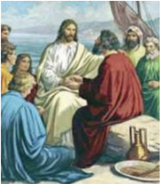

> **Deskripsi Visual:** Gambar ini adalah ilustrasi yang menampilkan sebuah pertemuan antara seorang lelaki tua dengan beberapa orang lainnya. Lelaki tua tersebut duduk di tengah-tengah, mengenakan pakaian berwarna merah dan biru, sedangkan orang-orang lainnya berdiri di sekelilingnya. Mereka semua tampak serius dan tertarik pada kegiatan yang sedang dilakukan oleh lelaki tua tersebut.

Elemen-elemen utama dalam gambar ini meliputi:
1. Lelaki tua yang duduk di tengah.
2. Orang-orang yang berdiri di sekeliling lelaki tua.
3. Pakaian warna-warna yang mencolok pada lelaki tua.
4. Tindakan mereka yang serius dan tertarik.

Teks, angka, atau label penting tidak terlihat dalam gambar ini. Namun, informasi kunci yang dapat diambil pembaca adalah bahwa gambar ini mungkin menggambarkan suatu pertemuan atau diskusi penting antara lelaki tua dan orang-orang lainnya.

Sumber: Koleksi Penulis

Gambar 3.2

15 Sesudah  sarapan  Yesus  berkata  kepada Simon  Petrus: 'Simon, anak Yohanes, apakah engkau mengasihi Aku lebih dari pada  mereka  ini?'  Jawab  Petrus  kepadaNya: 'Benar Tuhan, Engkau tahu, bahwa aku mengasihi Engkau'. Kata Yesus kepadanya: 'Gembalakanlah dombadomba-Ku.'  16 Kata Yesus pula kepadanya untuk kedua kalinya: 'Simon, anak Yohanes, apakah engkau mengasihi Aku?' Jawab Petrus kepada-Nya: 'Benar Tuhan, Engkau tahu, bahwa aku mengasihi Engkau.' Kata Yesus kepadanya: 'Gembalakanlah domba-domba-Ku.'

17 Kata  Yesus  kepadanya  untuk  ketiga kalinya:  'Simon,  anak  Yohanes,  apakah engkau mengasihi Aku?' Maka sedih hati Petrus karena Yesus berkata untuk ketiga kalinya:  ' Apakah  engkau  mengasihi  Aku?'  Dan  ia  berkata  kepada-Nya:  'Tuhan, Engkau  tahu  segala  sesuatu,  Engkau  tahu,  bahwa  aku  mengasihi  Engkau. '  Kata

 

---
## 📄 Halaman 47

Yesus  kepadanya:  'Gembalakanlah  domba-domba-Ku. 18 Aku  berkata  kepadamu: Sesungguhnya  ketika  engkau  masih  muda  engkau  mengikat  pinggangmu  sendiri dan engkau berjalan ke mana saja kau kehendaki, tetapi jika engkau sudah menjadi tua, engkau akan mengulurkan tanganmu dan orang lain akan mengikat engkau dan membawa engkau ke tempat yang tidak kau kehendaki.' 19 Dan hal ini dikatakanNya untuk menyatakan bagaimana Petrus akan mati dan memuliakan Allah. Sesudah mengatakan demikian Ia berkata kepada Petrus: 'Ikutlah Aku.'

******

- Setelah  menyimak  teks  Kitab  Suci  tersebut,  jawablah    pertanyaan-pertanyaan berikut ini.
- Apa yang dapat kalian tangkap dari pengangkatan Petrus sebagai Gembala oleh Yesus dalam kisah tersebut?
- Mengapa Yesus memilih Petrus  menjadi pemimpin umat-Nya?
- Mengapa tugas sebagai gembala/pimpinan dikaitkan dengan kasih?
- Bagaimana hubungan cerita Kitab Suci ini dengan cerita tahbisan Uskup yang sudah disampaikan tadi?

### 3. Ajaran Gereja tentang Hierarki Gereja Katolik

Simaklah artikel-artikel  berikut ini.

### Aneka Pelayanan

'Untuk menggembalakan dan senantiasa mengembangkan umat Allah, Kristus Tuhan mengadakan dalam Gereja-Nya aneka pelayanan, yang tujuannya kesejahteraan seluruh  Tubuh.  Sebab  para  pelayan,  yang  mempunyai  kekuasaan  kudus,  melayani saudara-saudara mereka, supaya semua yang termasuk Umat Allah, dan karena itu mempunyai martabat kristiani sejati, dengan bebas dan teratur bekerja sama untuk mencapai tujuan tadi, dan dengan demikian mencapai keselamatan. Mengikuti jejak Konsili Vatikan I, Konsili suci ini mengajarkan dan menyatakan, bahwa Yesus Kristus Gembala kekal telah mendirikan Gereja Kudus, dengan mengutus para Rasul seperti Ia sendiri di utus oleh bapa (lih. Y oh 20:21). Para pengganti mereka yakni para Uskup, dikehendaki-Nya  untuk  menjadi  gembala  dalam  Gereja-Nya  hingga  akhir  zaman. Namun supaya episkopat itu sendiri tetap satu dan tak terbagi, Ia mengangkat Santo Petrus menjadi ketua para Rasul lainnya. Dan dalam diri Petrus itu Ia menetapkan adanya azas dan dasar kesatuan iman serta persekutuan yang tetap dan kelihatan. Ajaran tentang penetapan, kelestarian, kuasa dan arti Primat Kudus Imam Agung di Roma maupun tentang Wewenag Mengajarnya yang tak dapat sesat, oleh Konsili suci sekali lagi dikemukakan kepada semua orang beriman untuk diimani dengan teguh. Dan melanjutkan apa yang sudah dimulai itu Konsili memutuskan, untuk menyatakan dan memaklumkan dihadapan mereka semua ajaran tentang para Uskup, pengganti

 

---
## 📄 Halaman 48

para Rasul, yang beserta pengganti Petrus, Wakil Kristus dan Kepala Gereja semesta yang kelihatan, memimpin rumah Allah yang hidup. (Lumen Gentium  artikel  18)

### Kolegialitas Dewan para Uskup

Seperti Santo Petrus dan para Rasul  lainnya  atas  penetapan  Tuhan merupakan  satu  Dewan  para  Rasul, begitu  pula  Imam  Agung  di  Roma, pengganti Petrus, bersama para Rasul, merupakan himpunan yang serupa. Adanya kebiasaan amat kuno, bahwa  para  Uskup  di  seluruh  dunia berhubungan satu dengan lainnya serta  dengan  Uskup  di  Roma  dalam ikatan kesatuan, cinta kasih dan damai, begitu pula adanya Konsili-Konsili yang  dihimpun    untuk  mengambil keputusan-keputusan bersama yang amat penting, sesudah ketetapan

dipertimbangkan dalam musyawarah banyak orang, semua itu memperlihatkan sifat dan hakekat kolegial pangkat Uskup. Sifat itu dengan jelas sekali terbukti dari Konsilikonsili Ekumenis, yang diselenggarakan disepanjang abad-abad yang lampau. Sifat itu tercermin pula pada kebiasaan yang berlaku sejak zaman kuno, yakni mengundang Uskup-Uskup  untuk  ikut  berperan  dalam  mengangkat  orang  terpilih  baru  bagi pelayanan  Imamat  agung.  Seseorang  menjadi  anggota  Dewan  para  Uskup  dengan menerima  tahbisan  sakramental  dan  berdasarkan  persekutuan  hirarkis  dengan Kepala maupun para anggota Dewan.

Adapun Dewan atau Badan para Uskup hanyalah berwibawa bila bersatu dengan Imam Agung di Roma, pengganti Petrus, sebagai Kepalanya, dan selama kekuasaan Primatnya terhadap semua, baik para Gembala maupun para beriman, tetap berlaku seutuhnya. Sebab Imam Agung di Roma berdasarkan tugasnya, yakni sebagai Wakil Kristus  dan  Gembala  Gereja  semesta,  mempunyai  kuasa  penuh,  tertinggi  dan universal terhadap Gereja; dan kuasa itu selalu dapat dijalankannya dengan bebas. Sedangkan  Badan  para  Uskup,  yang  menggantikan  Dewan  para  Rasul  dan  tugas mengajar  dan  bimbingan  pastoral,  bahkan  yang  melestarikan  Badan  para  Rasul, bersama dengan Imam Agung di Roma selaku Kepalanya, dan tidak pernah tanpa Kepala itu, merupakan subjek kuasa tertinggi dan penuh juga terhadap Gereja; tetapi kuasa itu hanyalah dapat dijalankan dengan persetujuan Imam Agung di Roma. Hanya Simonlah yang oleh Tuhan ditempatkan sebagai batu karang dan juru kunci Gereja (lih. Mat 16:18-19), dan diangkat menjadi Gembala seluruh kawanan-Nya (lih. Yoh 21:15 dsl.). Tetapi tugas mengikat dan melepaskan, yang diserahkan kepada Petrus (lih. Mat 16:19), ternyata diberikan juga kepada Dewan para Rasul dalam persekutuan

 

---
## 📄 Halaman 49

dengan Kepalanya (lih. Mat 18:18; 28:16-20). Sejauh terdiri dari banyak orang, Dewan itu mengungkapkan kemacam-ragaman dan sifat universal Umat Allah; tetapi sejauh terhimpun dibawah satu kepala, mengungkapkan kesatuan kawanan Kristus.

Dalam  Dewan  itu  para  Uskup,  sementara  mengakui  dengan  setia  kedudukan utama dan tertinggi Kepalanya, melaksanakan kuasanya sendiri demi kesejahteraan umat beriman mereka, bahkan demi kesejahteraan Gereja semesta; dan Roh Kudus tiada hentinya meneguhkan  tata-susunan  organis  serta  kerukunannya.  Kuasa tertinggi  terhadap  Gereja  seluruhnya,  yang  ada  pada  dewan  itu,  secara  meriah dijalankan dalam Konsili Ekumenis. Tidak pernah ada Konsili Ekumenis, yang tidak disahkan atau sekurang-kurangnya diterima baik oleh pengganti Petrus. Adalah hak khusus Imam Agung di Roma untuk mengundang Konsili itu, dan memimpin serta mengesahkannya. Kuasa kolegial itu dapat juga dijalankan oleh para Uskup bersama Paus, kalau mereka tersebar diseluruh dunia, asal saja Kepala Dewan mengundang mereka  untuk  melaksanakan  tindakan  kolegial,  atau  setidak-tidaknya  menyetujui atau dengan bebas menerima kegiatan bersama para Uskup yang terpencar, sehingga sungguh-sungguh terjadi tindakan kolegial.

(Lumen Gentium  artikel 22) - (gbr. www.zimbio.com)

### Tugas Menggembalakan

Para  Uskup  membimbing GerejaGereja khusus yang dipercayakan kepada mereka sebagai wakil dan utusan Kristus, dengan petunjukpetunjuk, nasehat-nasehat dan teladan  mereka,  tetapi  juga  dengan kewibawaan  dan  kuasa  suci.  Kuasa itu  hanyalah  mereka  gunakan  untuk membangun kawanan mereka dalam kebenaran dan kesucian, dengan mengingat bahwa yang terbesar hendaklah menjadi sebagai yang paling  muda  dan  pemimpin  sebagai pelayan  (lih.  Luk  22:26-27).  Kuasa, yang  mereka  jalankan  sendiri  atas  nama  Kristus  itu,  bersifat  pribadi,  biasa  dan langsung,  walaupun  penggunaannya  akhirnya  diatur  oleh  kewibawaan  tertinggi Gereja, dan dapat diketahui batasan-batasan tertentu, demi faedahnya bagi Gereja atau Umat beriman. Berkat kuasa itu para Uskup mempunyai hak suci dan kewajiban dihadapan  Tuhan  untuk  menyusun  undang-undang  bagi  bawahan  mereka,  untuk bertindak sebagai hakim, dan untuk mengatur segala-sesuatu, yang termasuk ibadat dan kerasulan.

 

---
## 📄 Halaman 50

Secara penuh mereka diserahi tugas kegembalaan, atau pemeliharaan biasa dan sehari-hari  terhadap  kawanan  mereka.  Mereka  itu  jangan  dianggap  sebagai  wakil Imam Agung di Roma, sebab mereka mengemban kuasa mereka sendiri, dan dalam arti yang sesungguhnya disebut pembesar umat yang mereka bimbing. Maka kuasa mereka tidak dihapus oleh kuasa tertinggi dan universal, melainkan justru ditegaskan, diteguhkan dan dipertahankan. Sebab Roh Kudus memelihara secara utuh bentuk pemerintahan yang ditetapkan oleh Kristus Tuhan dalam Gereja-Nya.

Uskup diutus oleh Bapa-keluarga untuk memimpin keluarga-Nya. Maka hendaknya ia mengingat teladan Gembala Baik, yang datang tidak untuk dilayani melainkan untuk melayani (lih. Mat 20:28; Mrk 10:45), dan menyerahkan nyawa-Nya untuk domba-domba-Nya (lih. Yoh 10:11). Ia diambil dari manusia dan merasa lemah sendiri. Maka ia dapat memahami mereka yang tidak tahu dan sesat (lih. Ibr 5:1-2). Hendaklah ia selalu bersedia mendengarkan bawahannya, yang dikasihinya sebagai anak-anaknya  sendiri  dan  diajaknya  untuk  gembira  bekerja  sama  dengannya.  Ia kelak akan memberikan pertanggungjawaban atas jiwa-jiwa mereka dihadapan Allah (lih. Ibr 13:17). Maka hendaklah ia dalam doa, pewartaan dan segala macam amal cinta kasih memperhatikan mereka maupun orang-orang, yang telah dipercayakan kepadanya dalam Tuhan.

Seperti  Rasul  Paulus  ia  berhutang  kepada  semua.  Maka  hendaklah  ia  bersedia mewartakan Injil kepada semua orang (lih. Rom 1:14-15), dan mendorong Umatnya yang beriman untuk ikut serta dalam kegiatan kerasulan dan misi. Adapun kaum beriman  wajib  patuh  terhadap  Uskup,  seperti  Gereja  terhadap  Yesus  Kristus,  dan seperti Yesus Kristus terhadap Bapa. Demikianlah semua akan sehati karena bersatu [98], dan melimpah rasa syukurnya demi kemuliaan Allah (lih. 2Kor. 4:15).

( Lumen Gentium artikel 27)... gbr. ucanews.com

### Para Diakon

Pada tingkat hierarki yang lebih rendah terdapat para Diakon, yang ditumpangi tangan 'bukan untuk Imamat, melainkan untuk pelayanan' . Sebab dengan diteguhkan  rahmat  sakramental  mereka  mengabdikan  diri  kepada  Umat  Allah dalam  perayaan  liturgi,  sabda  dan  amal  kasih,  dalam  persekutuan  dengan  Uskup dan  para  Imamnya.  Adapun  tugas  Diakon,  sejauh  dipercayakan  kepadanya  oleh kewibawaan yang berwenang, yakni: menerimakan Babtis secara meriah, menyimpan dan  membagikan  Ekaristi, atas  nama  Gereja  menjadi  saksi  perkawinan  dan memberkatinya, mengantarkan Komuni suci terakhir kepada orang yang mendekati ajalnya, membacakan Kitab Suci kepada kaum beriman, mengajar dan menasehati Umat, memimpin ibadat dan doa kaum beriman, menerimakan sakramen-sakramen tali, memimpin upacara jenazah dan pemakaman. Sambil membaktikan diri kepada tugas-tugas cinta kasih dan administrasi, hendaklah para Diakon mengingat nasehat Santo  Polikarpus:  'Hendaknya  mereka  selalu  bertindak  penuh  belas  kasihan  dan rajin, sesuai dengan kebenaran Tuhan, yang telah menjadi hamba semua orang' .

 

---
## 📄 Halaman 51

Namun  karena  tugas-tugas  yang  bagi  kehidupan  Gereja  sangat  penting  itu menurut tata-tertib  yang  sekarang  berlaku  di  Gereja  latin  di  pelbagai  daerah  sulit dapat  dijalankan,  maka  dimasa  mendatang  Diakonat  dapat  diadakan  lagi  sebagai tingkat hirarki tersendiri dan tetap. Adalah tugas berbagai macam konferensi Uskup setempat yang berwewenang, untuk menetapkan dengan persetujuan Imam Agung Tertinggi sendiri, apakah, dan dimanakah sebaiknya diangkat Diakon-Diakon seperti itu demi pemeliharaan jiwa.jiwa. Dengan ijin Imam Agung di Roma Diakonat itu dapat diterimakan kepada pria yang sudah lebih matang usianya, juga yang berkeluarga; pun  juga  kepada  pemuda  yang  cakap  tetapi  bagi  mereka  ini  hukum  selibat  harus dipertahankan.

( Lumen Gentium artikel 29)

- Setelah menyimak artikel-artikel tersebut diatas, jawablah  pertanyaan-pertanyaan berikut ini.
- Sebutkan dan jelaskanlah struktur kepemimpinan dalam Gereja Katolik!
- Jelaskan  fungsi dan corak kepemimpinan dalam Gereja!

### 4. Menghayati dan Menghormati  Hierarki dalam Gereja Katolik

### Re fleksi

- Tulislah    sebuah  r efleksi  tentang  kepemipinan  hierarki  yang  diharapkan  di parokimu.

### Aksi

- Tulislah  doa untuk para pemimpin Gereja
- Tuliskan  niat  untuk  selalu  menghormati  para  pemimpin  Gereja,  lokal  dan universal,  juga  termasuk  para  ketua  dan  pengurus  lingkungan  atau  ketua  dan pengurus umat basisnya masing-masing.

### Doa:

Ya Bapa,

Baru saja kami Kau-tuntun untuk mengerti lebih mendalam dalam pertemuan ini, makna kehadiran para Gembala kami di tengah himpitan dunia ini. Kami mohon kepada-Mu, berilah kepada kami kerendahan hati untuk mengikuti teladannya dan juga anugerahkanlah kepada para gembala kami: Bapa Suci, para Uskup, para Imam

 

---
## 📄 Halaman 52

dan Diakon kesehatan yang baik, kesejahteraan dan tambahkanlah iman agar semakin setia menuntun hidup kami. Engkau kami puji kini dan sepanjang masa. Amin.

### Tugas

Carilah informasi, dengan cara mewawancarai Pastor parokimu, atau membaca dari buku atau internet tentang hierarki Gereja Katolik Indonesia. Informasi tersebut ditulis kemudian dikumpulkan di kelas, dengan tanda tangan atau keterangan dari orang tua atau wali orang tuamu.

 

---
## 📄 Halaman 53

### B. Kaum Awam dalam Gereja Katolik

Kompendium Ajaran Sosial Gereja  menjelaskan bahwa 'ciri khas hakiki  kaum awam beriman yang bekerja di kebun anggur Tuhan (bdk.Mat 20:1-16)  adalah corak sekular dari kemuridan mereka sebagai  orang  Kristen, yang justru dilaksanakan  di dalam dunia'. Fakta dalam kehidupan Gereja, bagian terbesar dalam Gereja  adalah kaum awam.

### Doa:

Ya Bapa yang Mahabijaksana,

Engkau  telah  mengangkat  hamba-hamba-Mu,  melalui  Imamat  yang  suci  menjadi pemimpin Gereja kami. Engkau juga memanggil semua orang kristiani, mereka yang tak tertahbis, para Awam, untuk terlibat aktif dalam karya-karya Gereja-Mu di dunia ini.  Kami mohon ya Bapa, semoga dalam pertemuan ini kami dapat mengerti dan memahami pentingnya keterlibatan kaum awam dalam gerak-gerak Gereja. Engkau yang kami puji kini dan sepanjang masa. Amin.

### 1.  Pemahaman tentang Makna Kaum Awam dalam Gereja Katolik

Siapakah kaum Awam dalam Gereja Katolik? Apa perannya? Cobalah menjawab pertanyaan ini, sebelum kamu melanjutkan kegiatan belajarmu tentang subpokok bahasan ini.

Setelah menjawab pertanyaan tersebut, sekarang coba simaklah kisah berikut ini.

### Ignatius Joseph Kasimo, Pahlawan Nasional  Indonesia

Pendiri Partai Katolik, Ignatius Joseph Kasimo dianugerahi gelar Pahlawan Nasional. Upacara penganugerahan gelar pahlawan nasional di-lakukan di Istana Negara oleh Presiden  Susilo  Bambang  Yudhoyono,  Selasa 8  November  2011    sebagai  rangkaian  dari perayaan Hari Pahlawan 2011.

IJ.  Kasimo  mungkin  bagi  kebanyakan  masyarakat Indonesia merupakan nama  yang masih  asing  dan  tidak  terlalu  dikenal,  pun juga bagi sebagian orang Katolik. Ignatius Joseph Kasimo, anak seorang prajurit keraton Yogyakarta  yang  menjadi  Katolik  di  bawah

 

---
## 📄 Halaman 54

asuhan  Pater  van  Lith,  SJ  telah  menjadi  teladan  bagaimana  berpolitik  semestinya dihidupi dan mengabdi kepada kepentingan rakyat.

Pernah menjadi murid Pater van Lith, SJ di Sekolah Guru Muntilan, IJ. Kasimo muda  banyak  mengabdikan  diri  dan  karyanya  di  bidang  pendidikan.    Selain pendidikan,  pernah  juga  IJ.  Kasimo  muda  bekerja  sebagai  mandor  perkebunan karet . Namun karena keberanian IJ. Kasimo membela buruh-buruh yang ditindas, IJ. Kasimo akhirnya dipindah kembali menjadi guru pertanian. Kedalamannya akan penghayatan iman katolik dalam hidup nyata di masyarakat dan bangsanya sangat dipengaruhi  oleh  pemahaman  IJ.  Kasimo  tentang  Ajaran  Sosial  Gereja.  Inspirasi dari  ASG  yang  menekankan  kemerdekaan,  persamaan  hak  dan  persatuan  bangsa mendorong  IJ.  Kasimo  untuk  mulai  aktif  di  berbagai  organisasi  pergerakan  dan politik.

Peranan  IJ.  Kasimo  dalam  perjuangan  kebangsaan  dimulai  dari  kegigihannya membela dan memperjuangkan hak-hak kemerdekaan di dalam Volksraad (Dewan Rakyat)  dari  tahun  1931-1943.  Pidato  terkenalnya  di Volksraad adalah  ketika  dia menyerukan kemerdekaan untuk bangsa Indonesia dalam sidang Volksraad 19  Juli 1932.

Bagi kalangan Katolik sendiri IJ. Kasimo dipandang sebagai 'bapak politik' bagi umat  Katolik  Indonesia.  Lewat  Partai  Katolik  yang  didirikannya  IJ.  Kasimo  mau menggarisbawahi bahwa iman katolik adalah iman yang harusnya menggema dalam hidup bermasyarakat sehari-hari.

IJ. Kasimo  melihat  politik sebagai sebuah sarana perjuangan yang harus dilaksanakan dengan menjunjung kemanusiaan dan kesejahteraan masyarakat. Dan ini  semua  dia  yakini  sebagai  sebuah  penghayatan  akan  iman  Katoliknya.  Sebagai seorang Katolik, IJ. Kasimo berani berdiri di persimpangan, mewartakan yang benar, dan atas keyakinan dan imannya dia berani memperjuangkan kebenaran itu.

Diangkatnya IJ. Kasimo menjadi Pahlawan Nasional seharusnyalah membuat kita umat Katolik diajak untuk kembali bercermin pada sosok IJ. Kasimo. Dewasa ini, baik para Uskup, umat dan kita semua, tidak banyak yang berdiri di 'persimpangan' untuk mewartakan kebenaran. Mungkin tidak ada lagi para Uskup atau awam yang berani bersuara lantang secara individu atas ketidakadilan baik yang menimpa umat Katolik atau masyarakat pada umumnya. Bagaimana politikus Katolik? Kita patut prihatin misalnya  beberapa  skandal  di  DPR  baik  hukum  dan  keuangan  malah  melibatkan politisi Katolik, yang tidak berani bersuara melantangkan kebenaran.

IJ.  Kasimo  adalah  potret  bagaimana  iman  bersuara  dan  mungkin  merupakan sebuah  'sketsa'  Gereja  yang  bersuara.  Dia  adalah  potret  bagaimana  iman  itu menggema dalam hidup  dan memberanikan diri berpijak pada 'yang benar' . Semoga kita  dan  Gereja  Katolik  Indonesia  tidak  semakin  takut  kepada  'yang  bayar'  atau malu-malu berbicara lantang tentang 'yang benar' . Bila kita takut, semoga bercermin pada Ignatius Joseph Kasimo dan Yesus sendiri membuat kita berani bangkit.

Sumber:  http://www.pmkri.or.id/ dari berbagai sumber

 

---
## 📄 Halaman 55

- Setelah  menyimak cerita  tersebut,  cobalah  merumuskan  beberapa  pertanyaan untuk mendalami artikel tersebut bersama-sama teman sekelas  dengan fokus perhatian  pada  beberapa  hal,  yaitu;  siapa  jati  diri  tokoh  yang  di  ceritakan, bagaimana hidup dan karyanya sebagai orang Katolik, apa pandangan politik yang  ia  perjuangkan,  serta  nilai  keteladanan  apa  yang  dapat  diikuti  generasi muda Katolik.

### 2.  Makna Awam dan Kerasulan Awam dalam Ajaran Gereja Katolik

Simaklah dan diskusikan makna awam dan kerasulan awam menurut ajaran Gereja Katolik

'Yang dimaksud dengan istilah awam disini ialah semua orang beriman kristiani kecuali  mereka  yang  termasuk  golongan  Imam  atau  status  religius  yang  diakui dalam  Gereja.  Jadi  kaum  beriman  kristiani,  yang  telah  dibabtis  menjadi  anggota Tubuh  Kristus,  terhimpun  menjadi  Umat  Allah,  dengan  cara  itu  mereka  sendiri ikut mengemban tugas Imamat, kenabian dan rajawi Kristus, dan dengan demikian sesuai dengan kemampuan mereka melaksanakan perutusan segenap Umat kristiani dalam Gereja dan di dunia. Ciri khas dan istimewa kaum awam yakni sifat keduniaannya.  Sebab  mereka  yang  termasuk  golongan  Imam,  meskipun  kadangkadang memang dapat berkecimpung dalam urusan-urusan keduniaan, juga dengan mengamalkan profesi keduniaan, berdasarkan panggilan khusus dan tugas mereka terutama diperuntukkan bagi pelayanan suci. Sedangkan para religius dengan status hidup  mereka  memberi  kesaksian  yang  cemerlang  dan  luhur,  bahwa  dunia  tidak dapat  diubah  dan  dipersembahkan  kepada  Allah,  tanpa  semangat  sabda  bahagia. Berdasarkan panggilan mereka yang khas, kaum awam wajib mencari kerajaan Allah, dengan  mengurusi  hal-hal  yang  fana  dan  mengaturnya  seturut  kehendak  Allah. Mereka hidup dalam dunia, artinya: menjalankan segala macam tugas dan pekerjaan duniawi, dan berada ditengah kenyataan biasa hidup berkeluarga dan sosial. Hidup mereka  kurang  lebih  terjalin  dengan  itu  semua.  Di  situlah  mereka  dipanggil  oleh Allah, untuk menunaikan tugas mereka sendiri dengan dijiwai semangat Injil, dan dengan demikian ibarat ragi membawa sumbangan mereka demi pengudusan dunia bagaikan  dari  dalam.  Begitulah  mereka  memancarkan  iman,  harapan  dan  cinta kasih terutama dengan kesaksian hidup mereka, serta menampakkan Kristus kepada sesama.  Jadi  tugas  mereka  yang  istimewa,  yakni;  menyinari  dan  mengatur  semua hal-hal fana, yang erat-erat melibatkan mereka, sedemikian rupa, sehingga itu semua selalu terlaksana dan berkembang menurut kehendak Kristus, demi kemiliaan Sang Pencipta dan Penebus' . ( Lumen Gentium, Art. 31)

 

---
## 📄 Halaman 56

### 3.  Hubungan Kaum Awam dan Hierarki

Simaklah artikel berikut ini

'Dari harta-kekayaan rohani Gereja kaum awam, seperti semua orang beriman kristiani,  berhak  menerima  secara  melimpah  melalui  pelayanan  para  Gembala hirarkis,  terutama  bantuan  sabda  Allah  dan  sakramen-sakramen.  Hendaklah  para awam  mengemukakan  kebutuhan-kebutuhan  dan  keinginan-keinginan  mereka kepada  para  Imam,  dengan  kebebasan  dan  kepercayaan,  seperti  layaknya  bagi anak-anak  Allah  dan  saudara-saudara  dalam  Kristus.  Sekadar  ilmu  pengetahuan, kompetensi  dan  kecakapan  mereka  para  awam  mempunyai  kesempatan,  bahkan kadang-kadang juga kewajiban, untuk menyatakan pandangan mereka tentang halhal yang menyangkut kesejahteraan Gereja. Bila itu terjadi, hendaklah itu dijalankan melalui lembaga-lembaga yang didirikan Gereja untuk itu, dan selalu dengan jujur, tegas dan bijaksana, dengan hormat dan cinta kasih terhadap mereka, yang karena tugas suci bertindak atas nama Kristus.

Hendaklah  para  awam,  seperti  semua  orang  beriman  kristiani,  mengikuti teladan  Kristus,  yang  dengan  ketaatan-Nya  sampai  mati,  membuka  jalan  yang membahagiakan  bagi  semua  orang,  jalan  kebebasan  anak-anak  Allah.  Hendaklah mereka dengan ketaatan kristiani bersedia menerima apa yang ditetapkan oleh para gembala hierarkis sejauh menghadirkan Kristus, sebagai guru dan pemimpin dalam Gereja.  Dan  janganlah  mereka  lupa  mendoakan  di  hadirat  Allah  para  Pemimpin mereka,  sebab para Pemimpin itu berjaga karena akan memberi pertanggungjawaban atas jiwa-jiwa kita, supaya itu mereka jalankan dengan gembira tanpa keluh-kesah (lih. Ibr 13:1).

Sebaliknya hendaklah para Gembala hirarkis mengakui dan memajukan martabat serta  tanggung  jawab  kaum  awam  dalam  Gereja.  Dan  hendaklah  mereka  diberi kebebasan  dan  keleluasaan  untuk  bertindak;  bahkan  mereka  pantas  diberi  hati, supaya  secara  spontan  memulai  kegiatan-kegiatan  juga.  Hendaklah  para  gembala dengan  kasih  kebapaan,  penuh  perhatian  dalam  Kristus,  mempertimbangkan prakarsa-prakarsa,  usul-usul  serta  keinginan-keinginan  yang  diajukan  oleh  kaum awam. Hendaklah para Gembala dengan saksama mengakui kebebasan sewajarnya, yang ada pada semua warga masyarakat duniawi.

Dari  pergaulan  persaudaraan  antara  kaum  awam  dan  para  gembala  itu  boleh diharapkan banyak manfaat bagi Gereja. Sebab dengan demikian dalam para awam diteguhkan kesadaran bertanggungjawab dan ditingkatkan semangat. Lagi pula tenaga kaum  awam  lebih  mudah  digabungkan  dengan  karya  para  gembala.  Sebaliknya, dibantu oleh pengalaman para awam, para gembala dapat mengadakan penegasan yang lebih jelas dan tepat dalam perkara-perkara rohani maupun jasmani. Dengan demikian  seluruh  Gereja,  dikukuhkan  oleh  semua  anggotanya  akan  menunaikan secara lebih tepat guna perutusannya demi kehidupan dunia' . (Lumen Gentium artikel 37)

 

---
## 📄 Halaman 57

- Setelah menyimak dokumen tersebut, jawablah  pertanyaan  berikut ini:
Jelaskan apa hubungan antara kaum awam dengan hierarki.

### 4.  Menghayati  Hubungan Awam dan Hierarki

### Re flieksi

- Buatlah sebuah  refleksi tertulis dengan bantuan  dua pertanyaan berikut ini:
- Bagaimana hubungan antara awam dan pimpinan Gereja lokal di tempatmu?
- Bagaimana hubungan antara awam dan pimpinan Gereja lokal yang ideal menurut pendapatmu?

### Aksi

- Tulislah  sebuah doa dengan intensi persatuan kaum awam dan hierarki dalam upaya mewujudkan Gereja sebagai Umat Allah yang mewartakan kasih Allah di dunia.
- Buatlah sebuah rencana aksi pribadi untuk selalu melakukan komunikasi yang baik  dengan  Pastor  parokinya  untuk  bersama-sama  membangun  kehidupan umat paroki yang semakin lebih baik.

### Doa:

Tuhan Yesus,

Terima  kasih  kami  sampaikan  kepada-Mu,  karena  Engkau  telah  berkenan  hadir dan menyertai pembicaraan kami dalam pembelajaran ini. Ya Tuhan kami mohon, buatlah agar para pemimpin Gereja kami dengan seluruh seluruh umat Allah sehati dan sejiwa dalam membangun Gereja. Semangati juga diri kami, agar dapat terlibat aktif dalam kegiatan-kegiatan Gereja. Bapa Kami…. Salam Maria…...

### Tugas

Wawancarailah  beberapa tokoh awam di parokimu tentang  peran dan tugas para awam. Kemudian, buatlah  analisis dan  penilaianmu dari hasil wawancara tersebut, dikaitkan dengan ajaran Gereja yang kamu pelajari pada topik pelajaran ini.

 

---
## 📄 Halaman 58

### Bab IV Tugas-Tugas Gereja

Katekismus Gereja Katolik merumuskan Gereja sebagai 'himpunan orang-orang yang digerakkan untuk berkumpul oleh Firman Allah, yakni, berhimpun bersama untuk  membentuk  Umat  Allah  dan  yang  diberi  santapan  dengan  Tubuh  kristus, menjadi Tubuh Kristus' (No 777). Eksistensi himpunan Umat Allah ini diwujudkan (secara lokal) dalam hidup berparoki. Di dalam paroki inilah himpunan Umat Allah mengambil bagian dan terlibat dalam menghidupkan peribadatan yang menguduskan (Liturgia),  mengembangkan pewartaan Kabar Gembira (Kerygma), menghadirkan dan membangun persekutuan (Koinonia), memajukan karya cinta kasih/pelayanan (Diakonia)  dan  memberi  kesaksian  sebagai  murid-murid  Tuhan  Yesus  Kristus (Martyria).

Pokok  bahasan  ini    berturut-turut  akan  membahas  tentang  tugas-tugas  Gereja yaitu  pengudusan ( Liturgia ),  pewartaan  Kabar  Gembira  ( Kerygma ) ,  memberi  kesaksian  sebagai  murid-murid  Yesus  Kristus ( Martyria ), membangun  persekutuan ( Koinonia ) , memajukan karya cinta kasih/pelayanan ( Diakonia ).

 

---
## 📄 Halaman 59

### A.  Gereja yang Menguduskan ( Liturgia )

'Gereja  di  dunia  merayakan  liturgi  sebagai  umat  imami,  setiap  orang bertindak menurut fungsinya  masing-masing dalam kesatuan dengan Roh Kudus. Orang-orang yang dibaptis menyerahkan diri mereka kedalam korban rohani, para pelayan yang ditahbiskan  merayakan sesuai dengan tugas yang mereka terima bagi pelayanan  seluruh  anggota  Gereja,  para  Uskup  dan  imam  bertindak  atas  nama Pribadi Kristus, sang Kepala' (KKGK 235).

### Doa:

Ya Allah yang Mahakudus, melalui Sakramen Pembaptisan Engkau telah mengangkat kami  menjadi  putra-putri-Mu.  Demikian  juga  melalui  sakramen-sakremen  yang Engkau  curahkan  melalui  Gereja-Mu  telah  menguduskan  kami  semua,  sehingga layaklah  kami memperoleh hidup abadi.

Ya Allah yang Mahakudus, kuduskanlah tempat ini, kuduskanlah kami semua yang hendak melangsungkan pertemuan ini, agar proses pembicaraan pembelajaran kami ini bermanfaat bagi kami dan seluruh umat Allah. Engkau yang hidup dan berkuasa kini dan sepanjang masa. Amin.

### 1. Doa sebagai  Sarana Pengudusan

Sebagai orang beriman, kita semua pasti berdoa setiap hari, entah secara pribadi atau secara bersama-sama. Contohnya, sebelum memulai pelajaran ini, kita berdoa bersama-sama.  Nah,  apa  sesungguhnya  makna  doa  itu  menurut  dirimu?  Apakah sekedar mengikuti kebiasaan yang sudah ada, ataukah lebih dari itu? Cobalah bertanya ke pada temanmu, apa makna doa bagi dirinya? Salinglah bertukar pengalaman tentang doa yang kamu lakukan setiap hari.

Selanjutnya,  untuk  memahami  makna  doa  dalam  kehidupan  Gereja  Katolik, cobalah simak tulisan berikut ini.

### Berteguhlah dalam Iman

Ketika  menghadapi  aneka  kesukaran  dalam  perutusan  evangelisasi,  mungkin kalian  akan  dicobai  untuk  berkata  seperti  nabi  Yeremia:  ' Ah,  Tuhan,  aku  tidak pandai  bicara  karena  aku  ini  masih  muda' .  Tetapi  Tuhan  akan  berkata  kepada kalian juga: 'Jangan katakan 'aku ini masih muda'; tetapi kepada siapapun engkau

 

---
## 📄 Halaman 60

Sumber: RawStory.com

Gambar 4.1

Kuutus, engkau harus pergi' (Yer 1:67).  Kapan  saja  kalian  merasa  tidak cakap, tidak mampu dan rapuh dalam mewartakan  dan  memberi  kesaksian iman, jangan takut. Evangelisasi bukanlah prakarsa kita. Dan evangelisasi tidak  bergantung  pada bakat-bakat  kita.  Evangelisasi  adalah sebuah tanggapan yang setia dan taat pada  panggilan  Tuhan,  dan  karena itu  bukan  tergantung  pada  kekuatan kita melainkan pada kekuatan Tuhan. Santo Paulus mengetahui hal ini dari pengalaman: 'Tetapi harta ini kami punyai dalam bejana tanah liat, supaya nyata, bahwa kekuatan yang melimpah-limpah itu berasal dari Allah bukan dari diri kami' (2Kor 4:7).

Untuk alasan ini, saya menyemangati kalian untuk membuat doa dan sakramensakramen sebagai pondasi kalian. Evangelisasi yang asli lahir dari doa dan dilanjutkan dengan doa. Kita pertama-tama harus bercakap-cakap  dengan Tuhan agar mampu bercakap-cakap tentang Tuhan.   Dalam doa, kita mempercayakan pada Tuhan, orangorang,  yang  kepada  mereka  kita  telah  diutus,  memohon  Dia  agar  menjamah  hati mereka. Kita mohon Roh Kudus untuk menjadikan kita alat-alat untuk keselamatan mereka. Kita mohon Kristus untuk menaruh kata-kata-Nya di bibir kita dan untuk menjadikan kita tanda-tanda cinta kasih-nya. Secara lebih umum, kita berdoa bagi missi  seluruh  Gereja,  seperti  telah  dengan  jelas      diperintahkan  Y esus:  'Mintalah kepada  tuan  yang  empunya  tuaian  supaya  Ia  mengirimkan  pekerja-pekerja  untuk tuaian  itu'  (Mat  9:38).  Temukanlah  dalam  Perayaan  Ekaristi,  mata  air  kehidupan iman dan kesaksian Kristen, dengan cara berkala menghadiri perayaan ekaristi setiap minggu dan kapan saja  kalian bisa hadir dalam sepekan. Datanglah ke Sakramen Tobat secara berkala.  Hal ini merupakan perjumpaan yang istimewa dengan belas kasih Allah saat Dia menyambut kita, mengampuni kita, memperbarui hati kita dalam cinta  kasih.  Berupayalah  menerima  Sakramen  Penguatan  atau  Krisma,  jika  kalian belum  menerimanya,  dan  persiapkanlah  dengan  penuh  perhatian  dan  komitmen. Sakramen Penguatan, seperti Sakramen Ekaristi, ialah sakramen perutusan, karena memberikan kepada kita kekuatan dan cinta kasih dari Roh Kudus untuk mengakui iman  kita  tanpa  takut.  Saya  juga  mendorong  kalian  untuk  melaksanakan  Adorasi Ekaristi.  Menggunakan  waktu  untuk  mendengarkan  dan  bercakap-cakap  dengan Yesus yang hadir dalam Sakramen Mahakudus menjadi  sumber semangat perutusan yang baru.

Jika  kalian  mengikuti  jalan  ini,  Kristus  sendiri  akan  memberikan  pada  kalian kemampuan untuk setia penuh terhadap sabda-Nya dan menjadi saksi yang  setia dan bersemangat atas Dia. Kadang-kadang kalian akan dipanggil untuk memberikan bukti  dari  ketekunanmu,  khususnya  ketika  Sabda  Allah  menemui  penolakan  atau tentangan. Di wilayah-wilayah dunia tertentu, sebagian dari kalian menderita oleh

 

---
## 📄 Halaman 61

fakta bahwa kalian tidak dapat menjalankan kesaksian publik atas iman kalian akan Kristus  berhubung  dengan  kurangnya  kebebasan  agama.  Beberapa  teman    telah membayar  harga  dari  kenyataan  bahwa  mereka  telah  menjadi  kepunyaan  Gereja dengan  nyawa  mereka.  Saya  meminta  kalian  untuk  tetap  berteguh  dalam  iman, percaya bahwa Kristus ada di sisi kalian pada setiap pencobaan.  Kepada kalian pula Ia  berkata:  'Berbahagialah  kamu,  jika  karena  Aku  kamu  dicela  dan  dianiaya  dan kepadam u  difitnahkan  segala  yang  jahat.  Bersukacita  dan  bergembiralah,  karena upahmu besar di sorga' (Mat 5:11-12).

Pesan Paus Fransiskus bagi kaum  muda, persiapan menuju WYD 2013 (gbr. www.rawstory.com)

- Setelah menyimak cerita tersebut, cobalah merumuskan beberapa pertanyaan untuk mendalami artikel tersebut bersama-sama teman sekelasmu  dengan fokus perhatian pada  isi  pesan Paus kepada kaum muda Katolik, makna doa menurut cerita  tersebut,  peran  Ekaristi  dalam  kehidupan  umat  Katolik,  serta  bagaimana korelasi kisah itu dengan pengalaman hidupmu  sendiri.

### 2. Makna Doa menurut Ajaran Gereja

Simaklah  artikel berikut ini.

'(Keikut sertaan kaum awam dalam imamat umum dan ibadat). Imam Tertinggi dan Abadi Kristus Yesus bermaksud melangsungkan kesaksian dan palayanan-Nya melalui  kaum  awam  juga.  Maka  oleh  Roh-Nya  Ia  tiada  hentinya  menghidupkan dan mendorong mereka untuk menjalankan segala karya yang baik dan sempurna. Sebab mereka, yang erat-erat disatukan-Nya dengan hidup dan perutusan-Nya, juga diikutsertakan-Nya  dalam  tugas  imamat-Nya  untuk  melaksanakan  ibadat  rohani, supaya  Allah  dimuliakan  dan  umat  manusia  diselamatkan.  Oleh  karena  itu  para awam, sebagai orang yang menyerahkan diri kepada Kristus dan diurapi dengan Roh Kudus, secara ajaib dipanggil dan disiapkan, supaya makin melimpah menghasilkan buah-buah Roh dalam diri mereka. Sebab semua karya, doa-doa dan usaha kerasulan mereka, hidup mereka selaku suami-isteri dan dalam keluarga, jerih-payah mereka sehari-hari, istirahat bagi jiwa dan badan mereka, bila dijalankan dalam Roh, bahkan beban-beban  hidup  bila  ditanggung  dengan  sabar,  menjadi  korban  rohani,  yang dengan perantaraan Yesus Kristus berkenan kepada Allah (lih. 1Ptr 2:5). Korban itu dalam perayaan Ekaristi, bersama dengan persembahan Tubuh Tuhan, penuh khidmat dipersembahkan kepada Bapa. Demikianlah para awam pun juga sebagai penyembah Allah,  yang  dimana-mana  hidup  dengan  suci,  membaktikan  dunia  kepada  Allah' ( Lumen Gentium , artikel 3).

- Setelah menyimak dokumen  tersebut, jawablah  pertanyaan  berikut ini.
- Apa yang dimaksudkan dengan tugas imamat?
- Mengapa doa itu penting?
- Apa fungsi doa?

 

---
## 📄 Halaman 62

### 3.  Sakramen sebagai Sarana Pengudusan dalam Gereja

Simaklah  uraian tentang Sakramen berikut ini.

### a.  Makna Sakramen

Sakramen  berasal  dari  kata 'mysterion '  (Yunani),  yang  dijabarkan  dengan  kata 'mysterium' dan 'sacramentum' (Latin). Sacramentum dipakai untuk menjelaskan tanda yang kelihatan dari kenyataan keselamatan yang tak kelihatan yang disebut sebagai 'mysterium'. Kitab Suci menyampaikan dasar pengertian sakramen sebagai misteri/ 'mysterium' kasih Allah, yang diterjemahkan sebagai 'rahasia yang tersembunyi dari abad  ke  abad…  tetapi  yang  sekarang  dinyatakan  kepada  orang-orang  kudus-Nya' (Kol 1:26, Rom 16:25). Rahasia/misteri keselamatan ini tak lain dan tak bukan adalah Kristus (Kol 2:2; 4:3; Ef 3:3) yang hadir di tengah-tengah kita (Kol 1:27).

Sakramen merupakan hal-hal yang berkaitan dengan yang kudus atau yang ilahi. Sakramen  juga  berarti  tanda  keselamatan  Allah  yang  diberikan  kepada  Manusia, 'Untuk mengKuduskan manusia, membangun Tubuh Kristus dan akhirnya mempersembahkan ibadat kepada Allah'(SC 59).

Karena  Sakramen  sebagai  tanda  dan  sarana  keselamatan,  maka  menerima  dan memahami sakramen hendaknya ditempatkan dalam kerangka iman dan didasarkan kepada iman. Sakramen biasanya diungkapkan dengan kata-kata dan tindakan. Maka sakramen dalam Gereja Katolik mengandung 2 (dua) unsur hakiki yaitu :

- -Forma artinya kata-kata yang menjelaskan peristiwa ilahi.
- -Materia artinya barang atau tindakan tertentu yang kelihatan.

### b.  Sakramen adalah Lambang atau Simbol

Dalam hidup sehari-hari kita mengenal banyak benda atau perbuatan yang pada hakikatnya punya makna dan arti jauh lebih dalam daripada benda atau perbuatan itu sendiri (arti yang biasa). 'Perayaan liturgi dijalin dengan tanda-tanda dan simbolsimbol yang artinya berakar dalam penciptaan dan budaya manusia, ditentukan dalam peristiwa-peristiwa Perjanjian Lama dan diungkapkan secara penuh dalam Pribadi dan Karya Yesus' (Kompendium Katekismus Gereja Katolik - 236) . ' Asal-usul tandatanda/simbol sakramental 'berasal dari ciptaan (cahaya, air, api, roti, anggur, minyak), dan yang lain berasal dari kehidupan sosial (mencuci, mengurapi dengan minyak, memecah roti) dan beberapa yang lainnya lagi berasal dari sejarah keselamatan dalam Perjanjian Lama (ritus paskah, korban, penumpangan tangan, pengudusan). Tandatanda ini, yang beberapa bersifat normatif dan tak berubah, diambil oleh Kristus dan dipakai  untuk  tindakan  penyelamatan  dan  pengudusan'  (Kompendium  Katekismus Gereja Katolik - 237).

### c.  Sakramen-Sakramen Mengungkapkan Karya Tuhan yang Menyelamatkan

Jika kita memperhatikan karya Allah dalam sejarah penyelamatan akan tampak hal-hal  ini:  Allah  yang  tidak  kelihatan  menjadi  kelihatan  dalam  Yesus  Kristus.

 

---
## 📄 Halaman 63

Dalam Yesus Kristus orang dapat melihat, mengenal, mengalami siapa sebenarnya Allah itu. Namun, Yesus sekarang sudah dimuliakan. Ia tidak kelihatan lagi. Ia hadir secara rohani di tengah kita. Melalui Gereja-Nya, Ia menjadi kelihatan. Maka, Gereja adalah alat dan sarana penyelamatan, di mana Kristus tampak untuk menyelamatkan manusia.  Gereja  menjadi  alat  dan  sarana  penyelamatan,  justru  dalam  kejadiankejadian, peristiwa-peristiwa, tindakan dan  kata-kata yang  disebut  sakramen. Sakramen-sakramen adalah 'Tangan Kristus' yang menjamah kita, merangkul kita, dan  menyembuhkan kita.  Meskipun  yang  tampak  di  mata  kita,  yang  bergaung  di telinga kita hanya hal-hal atau tanda-tanda biasa, namun Kristuslah yang berkarya lewat  tanda-tanda  itu.  Dengan  perantaraan  para  pelayanan-Nya,  Kristus  sungguh aktif berkarya dalam umat Allah.

### d.  Sakramen-Sakramen Meningkatkan dan Menjamin Mutu Hidup Kita sebagai Orang Kristiani

Perlu  disadari  bahwa  sakramen-sakramen  itu  erat  sekali  hubungannya  dengan kenyataan hidup sehari-hari. Dalam hidup sehari-hari orang membutuhkan bantuan. Sementara kualitas dan mutu hidup manusia makin melemah, banyak orang yang jatuh  dalam  dosa,  banyak  orang  yang  butuh  peneguhan  dan  kekuatan.  Pada  saat itulah kita dapat mendengar suara Kristus yang bergaung di telinga kita: ' Aku tidak menghukum engkau, pulanglah dan jangan berdosa lagi …' Singkatnya, sakramensakramen adalah cara dan sarana bagi Kristus untuk menjadi 'tampak' dan dengan demikian dapat dialami oleh manusia dewasa ini.

Sakramen-sakramen  itu  tidak  bekerja  secara  otomatis.  Sakramen-sakramen sebagai  'tanda'  kehadiran  Kristus  menantikan  sikap  pribadi  (sikap  batin)  dari manusia. Sikap batin itu ialah iman dan kehendak baik.

Perayaan sakramen adalah suatu 'pertemuan' antara Kristus dan manusia. Oleh karena itu, meski tidak sama tingkatnya, peran manusia (sikap iman) sangat penting. Walaupun Kristus Mahakuasa, Ia tidak akan menyelamatkan orang yang memang tidak mau diselamatkan atau yang tidak percaya.

### a.  Pembagian Sakramen-Sakramen Gereja

Sakramen-Sakramen Gereja dibagi menjadi tujuh, yaitu:

- Sakramen Baptisan/Permandian,
- Sakramen Penguatan,
- Sakramen Ekaristi Kudus,
- Sakramen Tobat,
- Sakramen Pengurapan Orang Sakit,
- Sakramen Tahbisan/Imamat, dan
- Sakramen Perkawinan.

 

---
## 📄 Halaman 64

Sakramen-Sakramen  Inisiasi Kristen; Inisiasi  atau  bergabung  menjadi  orang Kristen  dilaksanakan  melalui  Sakramen-Sakramen  yang  memberikan  dasar  hidup kristen.  Orang  beriman,  yang  dilahirkan  kembali  menjadi  manusia  baru  dalam Sakramen Pembaptisan, dikuatkan dengan Sakramen Penguatan dan diberi makanan dengan Sakramen Ekaristi (lihat Kompendium KGK 251).

Sakramen-Sakramen Penyembuhan; Kristus  Sang Penyembuh jiwa dan badan kita, menetapkan sakramen ini karena kehidupan baru yang Dia berikan kepada kita dalam Sakramen-Sakramen inisiasi Kristiani dapat melemah, bahkan hilang karena dosa. Karena itu, Kristus menghendaki agar Gereja melanjutkan karya penyembuhan dan penyelamatan-Nya melalui Sakramen ini; Tobat dan Pengurapan Orang Sakit (lihat kompendium KGK 295 - KGK 1420-1421. 1426).

Sakramen-Sakramen Pelayanan Pesersekutuan dan Perutusan; Dua Sakramen, Sakramen Penahbisan dan Perkawinan memberikan rahmat khusus untuk perutusan tertentu  dalam  Gereja  untuk  melayani  dan  membangun  umat  Allah.  Sakramensakramen ini memberikan sumbangan dengan cara yang khusus  pada persekutuan gerejawi  dan  penyelamatan  orang-orang  lain.  (lihat  Kompendium  KGK  321,  KGK 1533-1535).

### b.  Ketujuh Sakramen Gereja

### Pertama: Sakramen Pembaptisan/Permandian

Jika seseorang secara resmi menyatakan tobat dan imannya  kepada  Yesus  Kristus,  serta  bertekad untuk  bersama  umat  ikut  serta  dalam  tugas panggilan Kristus, maka dia diterima dalam umat dengan  upacara  yang  sejak  zaman  para  rasul disebut. Kenyataan yang lebih dalam ialah bahwa orang  yang  menerima  sakramen  permandian diterima  oleh  Kristus  menjadi  anggota  TubuhNya, Umat Allah (Gereja). Orang tersebut laksana baru  lahir  di  dalam  Gereja.  Peristiwa  kelahiran baru  menjadi  putra  Bapa  dalam  Roh  Kudus berarti  bahwa  selanjutnya  ia  ikut  menghayati hidup Kristus sendiri yang ditandai oleh wafat dan

kebangkitan-Nya. Oleh karena itu, orang yang telah dipermandikan harus bersama Kristus 'mati bagi dosa' supaya dalam Kristus, ia hidup bagi Allah. Kebenaran itu diperagakan,  dirayakan,  dan  dilambangkan  dalam  peristiwa  pencurahan  air  pada dahinya, sementara wakil umat (Imam) mengatakan: ' Aku mempermandikan engkau dalam nama Bapa, Putra dan Roh Kudus.' Dengan permandian, mulailah babak baru dalam hidup seseorang. Kristus sendiri menjiwai dia melalui Roh-Nya, maka segala pelanggaran dan dosa yang telah diperbuatnya dihapus.

 

---
## 📄 Halaman 65

### Kedua; Sakramen Penguatan

Bagi orang dewasa, sakramen penguatan sebetulnya  merupakan  bagian  dari  sakramen permandian. Orang yang telah dipermandikan ditandai dengan minyak (krisma), tanda kekuatan  Roh  Kudus,  sebelum  diutus  untuk memperjuangkan cita-cita Kristus dalam Gereja  dan  masyarakat.  Sakramen  penguatan menjadi tanda kedewasaan, maka orang yang menerima  Sakramen  Penguatan  turut  serta bertanggung jawab atas kehidupan Umat Allah. Kepada setiap orang, Roh Kudus memberikan karisma-karisma-Nya (bakat kemampuan). Atas  karisma-karisma  (anugerah)  Tuhan  ini,

orang yang bersangkutan menyadari tanggung jawabnya terhadap sesama. Dengan bakat kemampuan yang diterima dari Tuhan, orang yang bersangkutan diharapkan hidup bukan untuk diri sendiri, melainkan untuk ikut membina Tubuh Kristus (Umat Allah). Bakat kemampuan menyatakan karya Roh, yang melalui setiap orang Kristen, menghantar sesamanya kepada Kristus.

### Ketiga;  Sakramen Ekaristi

Pada  malam  menjelang  sengsara-Nya, Yesus mengajak murid-murid-Nya untuk  merayakan  hari  kemerdekaan bangsa-Nya (Paska) sesuai dengan adat  istiadat  Yahudi.  Bangsa  Yahudi memperingati  pembebasan  dari  Mesir dalam sebuah perjamuan kekeluargaan. Dalam perjamuan Paska itu, Yesus mengambil roti (makanan seharihari  orang  Yahudi),  memecahkannya, dan  membagi-bagikan  roti  itu  seraya berkata: 'Makanlah  roti ini, karena inilah Tubuh-Ku yang dikorbankan bagimu.' (Tubuh adalah tanda kehadiran

Yesus yang tersalib yang dikorbankan bagi kita). Kemudian, Yesus mengambil sebuah cawan (piala)  berisi  air  anggur  sambil  berkata:  'Minumlah  semua  dari  cawan  ini, karena inilah Darah-Ku, darah perjanjian baru dan kekal yang diadakan dengan kalian dan dengan semua manusia demi pengampunan dosa' (Darah menjadi tanda hidup. Jadi, kalau Yesus memberikan darah-Nya berarti Ia menyerahkan diri-Nya seluruhnya untuk kita).  Kata-kata  Yesus  mengungkapkan  wafat-Nya.  Injil  Matius  dan  Markus

 

---
## 📄 Halaman 66

menambahkan bahwa 'darah-Nya ditumpahkan….' , yang berarti Ia dipersembahkan sebagai  korban  persembahan.  Jadi,  roti  dan  anggur  menyatakan  bagaimana  Yesus mati (menumpahkan darah). Kemudian disebut juga, mengapa Ia harus mati, yaitu demi pengampunan dosa-dosa. Yesus kemudian berkata: 'Kenangkanlah Aku dengan merayakan perjamuan ini.' (Baca: Luk 22: 14-23; Mat 26: 26-29; Mrk 14: 22-25)Maka Sejak zaman para rasul, umat Kristen suka berkumpul untuk bersyukur kepada Allah Bapa  yang  membangkitkan  Yesus  dari  alam  maut  dan  menjadikannya  Tuhan  dan Penyelamat.  Berkumpul di sekitar meja Altar untuk menyambut Kristus dalam sabda dan  perjamuan-Nya  merupakan  kehadiran  Gereja  yang  paling  nyata  dan  penuh; ungkapan yang paling konkret dari persatuan umat dan Tuhan serta persatuan para anggotanya.

### Keempat: Sakramen Tobat

Selama hidup di dunia, kita tidak pernah luput dari kesalahan dan dosa. Kita hidup dalam 'situasi dosa' . Situasi dosa ini merasuki  diri  kita  dan  masyarakat  kita sedalam-dalamnya.  Perjuangan  untuk  tetap teguh berdiri, tidak berdosa, me-mang merupakan proses perjuangan yang tidak kunjung  selesai.  Oleh  karena  itu,  usaha untuk bangun lagi sesudah jatuh, berbaik lagi dengan Tuhan dan sesama, merupakan unsur  yang  hakiki  dan  harus  selalu  ada dalam  hidup  kita.  Para  pengikut  Kristus perlu bertobat dan membaharui diri secara terus-menerus di hadapan Tuhan dan sesama. Tanda pertobatan di hadapan Tuhan dan sesama itu diterima dalam perayaan sakramen tobat. Seseorang yang melakukan sesuatu yang bertolak belakang dengan kehendak Tuhan berarti dia memisahkan diri dari Tuhan dan sesama. Selama suatu kesalahan berat belum diampuni, ia tidak dapat ikut serta dalam ibadat umat secara sempurna.  Dia  ibarat  cabang  yang  mati  dari  sebuah  tanaman.  Agar  dia  diterima kembali  menjadi  anggota  umat  yang  hidup,  dia  harus  bertobat  dan  menghadapi wakil umat (pastor) untuk mendapatkan pengampunan.  Tobat sejati menuntut agar kerugian yang diakibatkan oleh kesalahan itu diperbaiki.

### Kelima; Sakramen  Pengurapan Orang Sakit

Jika  seorang  anggota  umat  sakit  keras,  keprihatinan  Tuhan  diungkapkan  dengan sakramen perminyakan orang sakit. Kristus menguatkan si sakit dengan Roh Kudus-

 

---
## 📄 Halaman 67

Nya  yang  ditandakan  dengan  minyak  suci. Dengan  demikian,  si  sakit  dibuat  siap  dan tabah  untuk  menerima  apa  saja  dari  tangan Allah yang mencintai kita, baik dalam kesembuhan  maupun  dalam  maut.  Dengan menderita  seperti  Kristus,  si  sakit  menjadi lebih serupa dengan Kristus.

### Keenam: Sakramen Tahbisan/ Imamat

Umat membutuhkan pelayan-pelayan yang bertugas menunaikan  berbagai  tugas  pelayanan  di  tengah umat  demi  kepentingan  dan  perkembangan  umat dalam hidup beriman dan bermasyarakat. Pelayananpelayanan itu juga berfungsi untuk mempersatukan umat, membimbing umat dengan berbagai cara demi penghayatan iman pribadi dan bersama; membantu melancarkan  komunikasi  iman  demi  tercapainya persekutuan  umat,  persekutuan  iman.  Pelantikan para pelayan itu dirayakan, disahkan dan dinyatakan dalam tahbisan/imamat.

### Ketujuh: Sakramen Perkawinan

Membangun keluarga merupakan tugas yang sangat penting dalam hidup seseorang. Tugas yang sepenting ini menjadi perhatian Kristus  terhadap  umat-Nya.  Maka  Kristus sendiri hadir dalam  cinta  mereka  antar suami-istri. Cinta mereka menjadi tanda dari cinta  Kristus  kepada  Gereja-Nya.  Kristus menguduskan cinta insani menjadi alat dan sarana keselamatan  abadi.  Umat  Kristus merestui  dan  menyertai  pengantin  dalam keputusan mereka yang sangat penting. Di hadapan  umat,  kedua  mempelai  berjanji satu sama lain untuk setia dalam cinta, baik dalam  suka  maupun  duka,  selama  hayat dikandung  badan.    Allah  sendiri  menjadi

 

---
## 📄 Halaman 68

penjamin kesetiaan, maka apa yang disatukan Allah jangan diceraikan oleh manusia. Sakramen perkawinan berlangsung selama hidup dan mengandung panggilan luhur untuk membina keluarga sebagai tanda kasih setia Allah bagi setiap insan. Kristus mendampingi  suami-istri  untuk  membina  cinta  yang  semakin  dalam  dan  untuk mendidik  anak  menjadi  warga  Gereja  dan  warga  masyarakat  yang  berguna  dan untuk membangun keluarga Katolik yang baik pula. Suami-istri yang hidup dalam perkawinan Katolik dipanggil pula untuk memberi kesaksian kepada dunia tentang cinta  Allah  kepada  umat  manusia  melalui  cinta  suami-istri.  Hidup  cinta  mereka menjadi tanda (sakramen) cinta Allah kepada manusia. (gbr. Dokumen penulis).

### 4. Sakramentali  dan Devosi-Devosi dalam Gereja  Katolik

Sakramentali dan devosi merupakan bentuk dan kegiatan lain dari bentuk dan kegiatan pengudusan dalam Gereja.

### a.   Sakramentali

Selain ketujuh sakramen tersebut di atas, Gereja juga mengadakan tanda-tanda suci (berupa ibadat/upacara/ pemberkatan) yang mirip dengan sakramen-sakramen yang disebut sakramentali . Berkat tanda-tanda suci, ini berbagai buah rohani ditandai dan diperoleh melalui doa-doa permohonan dengan perantaraan Gereja.

Aneka ragam sakramentali:

- Pemberkatan, yakni pemberkatan orang, benda/barang rohani, tempat, makanan, dan sebagainya. Contoh: pemberkatan ibu hamil atau anak, alat-alat pertanian, mesin pabrik, alat transportasi, rumah, patung, rosario, makanan, dsb. Pemberkatan atas orang atau benda/barang tersebut adalah pujian kepada Allah dan doa untuk memohon anugerah-anugerah-Nya.
- P emberkatan dalam arti tahbisan rendah, yakni pentahbisan orang dan benda. Contoh  pentahbisan/pemberkatan  lektor,  akolit,  dan  katekis;  pemberkatan benda  atau  tempat  untuk  keperluan  liturgi,  misalnya  pemberkatan  gereja/ kapel, altar, minyak suci, lonceng, dan sebagainya.

### b.  Devosi

Devosi (Latin: devotio =  penghormatan) adalah bentuk-bentuk penghormatan/ kebaktian khusus orang atau umat beriman kepada rahasia kehidupan Yesus yang tertentu,  misalnya  kesengsaraan-Nya,  Hati-Nya  yang  Mahakudus,  dan  Sakramen Mahakudus.  Bisa  juga  devosi  kepada  orang-orang  kudus,  misalnya  devosi  kepada Santo-Santa  pelindung,  devosi  kepada  Bunda  Maria  dengan  berdoa  rosario  atau mengunjungi tempat-tempat ziarah pada bulan Mei atau atau Oktober.

 

---
## 📄 Halaman 69

Segala  macam bentuk devosi ini  bersifat  sukarela  (tidak  mengikat/tidak  wajib) dan  bertujuan untuk semakin menguatkan iman kita kepada Allah dalam diri Yesus Kristus.

### 5.  Menghayati  Liturgi Gereja

### Ibadat bersama

- Setelah  mempelajari  dan  memahami    liturgi  Gereja,  sekarang  dalam  kelompok bersama  teman-temanmu  menyusun  suatu  tata  perayaan  Sabda    yang  bertema: Syukur untuk Kenaikan Kelas, atau tema lain yang disepakati bersama.
- Ibadat sabda bersama dengan memilih salah satu tema ibadat yang telah disusun. Selanjutnya, kalian saling berbagi tugas dalam kegiatan ibadat tersebut (pemimpin ibadat,  pembawa  lagu,  lektor,  pembawa  doa  umat,  pembawa  renungan,  dan sebagainya dengan tetap didampingi guru agamamu.

### Re fleksi:

- Setelah  ibadat  bersama,  ungkapkan    pesan  dan  kesanmu  sendiri  secara  tertulis sebagai r efleksi atas kegiatan ibadat yang terlah dilaksanakan.

### Doa:

Ya Allah yang Mahakudus, puji dan syukur kami  panjatkan kepada-Mu,  karena oleh bimbingan-Mu,  apa yang kami  pelajari dalam pertemuan ini telah mengantarkan kami untuk  menemukan makna kehadiran-Mu yang kudus melalui Gereja-Mu, yaitu demi keselamatan kami. Kami mohon ya Allah, sertailah kami dalam perziarahan kami ini, agar tetap yakin dan percaya pada penyelenggaraan-Mu melalui Gereja yang kudus. Demi Kristus pengantara kami. Amin.

 

---
## 📄 Halaman 70

### B. Gereja yang Mewartakan ( Kerygma ) Kabar Gembira

'Pergilah ke seluruh dunia, beritakanlah Injil kepada segala makhluk. Siapa yang percaya dan dibaptis akan diselamatkan, tetapi siapa yang tidak percaya akan dihukum' (Markus 16:15-16). Firman ini tidak hanya berlaku pada zaman para rasul saja, tetapi juga bagi kita semua pengikut Kristus Yesus  pada zaman modern ini, bahwa kita wajib untuk mewartakan injil, tentu dengan cara yang berbeda-beda.

### Doa

Ya Allah yang Mahakuasa,

Sebelum meninggalkan dunia ini Yesus Kristus Sang Putra bersabda kepada para murid, 'Pergilah, jadikanlah semua bangsa murid-Ku dan baptislah mereka dalam nama Bapa dan Anak dan Roh Kudus dan ajarlah mereka melakukan segala sesuatu yang telah  Ku-perintahkan kepadamu' . Ya Bapa, bersabdalah juga kepada kami saat ini agar kami Kau mampukan untuk mendalami materi dalam pertemuan ini dengan tulus iklas. Ya Allah anugerahkanlah juga kepada kami akal budi yang bijaksana dan hati yang mencintai agar kami rela membaktikan diri untuk terlibat aktif dalam karya pewartaan Gereja. Demi Kristus Tuhan kami. Amin.

### 1.  Makna Tugas Gereja yang Mewartakan

Baca dan simaklah puisi berikut ini

### Misi Berarti Meninggalkan!!

Misi berarti meninggalkan, pergi, melepas segala sesuatu, keluar dari diri sendiri, memecah dinding keegoisan, yang memenjarakan kita, dalam ke' AKU'an

Misi berarti berhenti berkisar pada diri sendiri seolah-olah kita adalah pusat dunia dan kehidupan Misi berarti menolak terikat pada masalah-masalah dunia yang kecil

 

---
## 📄 Halaman 71

dimana kita termasuk didalamnya: Kemanusiaan itu jauh lebih besar.

Misi selalu berarti meninggalkan tetapi tidak selalu Mengadakan perjalanan.

Di atas semua itu, misi berarti membuka diri sendiri bagi sesama, sebagai saudara dan saudari, menemukan mereka, menjumpai mereka.

Dan jika, untuk menemukan mereka dan mencintai mereka perlu menyeberangi lautan dan terbang mengarungi cakrawala maka, misi berarti pergi sampai ke ujung dunia.

(Uskup Agung Helder Camara)

- Setelah menyimak puisi tersebut, cobalah merumuskan beberapa pertanyaan untuk mendalami puisi tersebut bersama-sama teman sekelasmu  dengan fokus perhatian pada    isi  pesan  puisi,  makna  puisi,  serta  pendapat  atau  pandanganmu  tentang tugas pewartaan Gereja.

### 2.  Ajaran Kitab Suci dan Ajaran Gereja  tentang Perutusan  Murid-Murid Yesus

### a.  Ajaran Kitab Suci tentang Tugas Pewartaan

Simaklah teks Kitab Suci berikut ini

### Perintah Untuk Memberitakan Injil (Mat 28: 16-20)

16 Dan kesebelas murid itu berangkat ke Galilea, ke bukit yang telah ditunjukkan Yesus kepada mereka. 17 Ketika  melihat  Dia  mereka  menyembah-Nya, tetapi beberapa orang ragu-ragu. 18 Yesus mendekati mereka dan berkata: 'Kepada-Ku telah

 

---
## 📄 Halaman 72

diberikan segala kuasa di surga dan di bumi. 19 Karena itu pergilah, jadikanlah semua bangsa murid-Ku dan baptislah mereka dalam nama Bapa dan Anak dan Roh Kudus,  20 dan ajarlah mereka melakukan segala sesuatu yang telah Kuperintahkan kepadamu. Dan ketahuilah, Aku menyertai kamu senantiasa sampai kepada akhir zaman.'

*******

- Setelah menyimak teks Kitab Suci tersebut, jawablah  pertanyaan-pertanyaan berikut ini.
- Apa pesan Injil di atas bagi kita?
- Sebutkanlah bentuk-bentuk pewartaan yang dapat kita gunakan pada zaman ini!
- Apa yang harus kita perhatikan supaya pewartaan kita berhasil?
- Apa sajakah cara atau pola pewartaan yang sebaiknya kita gunakan pada zaman ini di Tanah Air kita!

### b.  Ajaran Gereja tentang Tugas Pewartaan ( Kerygma )

Simaklah artikel berikut ini

'Sebab seperti Putera diutus oleh Bapa, begitu pula Ia sendiri mengutus para Rasul (lih. Y oh 20:21), sabda-Nya: 'Pergilah, ajarilah semua bangsa, dan babtislah mereka atas  nama  Bapa  dan  Putera  dan  Roh  Kudus,  dan  ajarlah  mereka  menaati  segalasesuatu yang telah Kuperintahkan kepadamu. Dan ketahuilah, Aku menyertai kamu senantiasa sampai akhir zaman' (Mat 28:19-20). Perintah resmi Kristus itu mewartakan kebenaran yang menyelamatkan itu oleh Gereja diterima dari para Rasul, dan harus dilaksanakan sampai ujung bumi (lih. Kis 1:8). Maka Gereja mengambil alih sabda Rasul: 'Celakalah aku, jika aku tidak memberitakan Injil!' (1Kor 9:16). Maka dari itu gereja terus-menerus mengutus para pewarta, sampai Gereja-Gereja baru terbentuk sepenuhnya,  dan  mereka  sendiri  pun  melanjutkan  karya  pewartaan  Injil.  Sebab Gereja didorong oleh Roh Kudus untuk ikut mengusahakan, agar rencana Allah, yang menetapkan Kristus sebagai azas keselamatan bagi seluruh dunia, terlaksana secara efektif. Dengan mewartakan Injil Gereja mengundang mereka yang mendengarnya kepada  iman  dan  pengakuan  iman,  menyiapkan  mereka  untuk  menerima  babtis, membebaskan  mereka  dari  perbudakan  kesesatan,  dan  menyaturagakan  mereka kedalam Kristus, supaya karena cinta kasih mereka bertumbuh ke arah Dia hingga kepenuhannya. Dengan usaha-usahanya Gereja menyebabkan, bahwa segala kebaikan yang tertaburkan dalam hati serta budi orang-orang, atau dalam upacaraupacara  dan  kebudayaan  para  bangsa  sendiri,  bukan  saja  tidak  hilang,  melainkan disehatkan,  diangkat  dan  disempurnakan  demi  kemuliaan  Allah,  demi  tersipusipunya  setan  dan  kebahagiaan  manusia.  Setiap  murid  Kristus  mengemban  beban untuk menyiarkan iman sekadar kemampuannya[35]. Setiap orang dapat membabtis

 

---
## 📄 Halaman 73

orang beriman. Tetapi tugas Imamlah melaksanakan pembangunan Tubuh Kristus dengan mempersembahkan korban Ekaristi. Dengan demikian terpenuhilah sabda Allah  melalui  nabi:  'Dari  terbitnya  matahari  sampai  terbenamnya  besarlah  namaKu diantara para bangsa, dan disetiap tempat dikorbankan dan dipersembahkanlah persembahan murni kepada nama-Ku' (Mal 1:11)[36]. Begitulah Gereja sekaligus berdoa dan berkarya, agar kepenuhan dunia seluruhnya beralih menjadi Umat Allah, Tubuh  Tuhan  dan  Kenisah  Roh  Kudus,  dan  supaya  dalam  Kristus,  Kepala  semua orang, di persembahkan kepada Sang Pencipta dan Bapa semesta alam segala hormat dan kemuliaan' . (Lumen Gentium artikel 17)

- Setelah menyimak artikel  tersebut, jawablah  pertanyaan  berikut ini.
- Apa pesan  isi artikel diatas?
- Sebutlah bentuk-bentuk pewartaan yang dapat kita gunakan pada zaman ini!
- Apa yang harus kita perhatikan supaya pewartaan kita berhasil?

### 3.   Menghayati Tugas Pewartaan dalam Hidup Sehari-Hari sebagai Orang Katolik.

Simaklah pesan Paus berikut ini

### Berteguhlah dalam Iman

Ketika  menghadapi  aneka  kesukaran  dalam  perutusan  evangelisasi,  mungkin kalian akan dicobai untuk berkata seperti nabi Yeremia: ' Ah, Tuhan, aku tidak pandai bicara karena aku ini masih muda' . Tetapi Tuhan akan berkata kepada kalian juga: 'Jangan katakan 'aku ini masih muda'; tetapi kepada siapapun engkau Kuutus, engkau harus pergi' ( Yer 1:6-7).  Kapan  saja  kalian  merasa  tidak  cakap,  tidak  mampu  dan rapuh dalam mewartakan dan memberi kesaksian iman, jangan takut. Evangelisasi bukanlah  prakarsa  kita.  Dan  evangelisasi  tidak  bergantung  pada  bakat-bakat  kita. Evangelisasi adalah sebuah tanggapan yang setia dan taat pada panggilan Tuhan, dan karena itu bukan tergantung pada kekuatan kita melainkan pada kekuatan Tuhan. Santo  Paulus  mengetahui  hal  ini  dari  pengalaman:  'Tetapi  harta  ini  kami  punyai dalam bejana tanah liat, supaya nyata, bahwa kekuatan yang melimpah-limpah itu berasal dari Allah bukan dari diri kami' ( 2Kor 4:7).

Untuk alasan ini, saya menyemangati kalian untuk membuat doa dan sakramensakramen sebagai pondasi kalian. Evangelisasi yang asli lahir dari doa dan dilanjutkan dengan doa. Kita pertama-tama harus bercakap-cakap  dengan Tuhan agar mampu bercakap-cakap tentang Tuhan.   Dalam doa, kita mempercayakan pada Tuhan, orangorang,  yang  kepada  mereka  kita  telah  diutus,  memohon  Dia  agar  menjamah  hati mereka. Kita mohon Roh Kudus untuk menjadikan kita alat-alat untuk keselamatan mereka. Kita mohon Kristus untuk menaruh kata-kata-Nya di bibir kita dan untuk menjadikan kita tanda-tanda cinta kasih-Nya.

 

---
## 📄 Halaman 74

Secara lebih umum, kita berdoa bagi missi seluruh Gereja, seperti telah dengan jelas  diperintahkan  Yesus:  'Mintalah  kepada  tuan  yang  empunya  tuaian  supaya Ia  mengirimkan pekerja-pekerja untuk tuaian itu' ( Mat 9:38).  Temukanlah dalam Perayaan Ekaristi, mata air kehidupan iman dan kesaksian Kristen, secara berkala menghadiri perayaan ekaristi setiap minggu dan kapan saja  kalian bisa hadir dalam sepekan. Datanglah ke Sakramen Tobat secara berkala.  Hal ini merupakan perjumpaan yang  istimewa  dengan  belas  kasih  Allah  saat  Dia  menyambut  kita,  mengampuni kita, memperbaharui hati kita dalam cinta kasih. Berupayalah menerima Sakramen Penguatan atau Krisma, jika kalian belum menerimanya, dan persiapkanlah dengan penuh perhatian dan komitmen.  Sakramen Penguatan, seperti Sakramen Ekaristi, ialah sakramen perutusan, karena memberikan kepada kita kekuatan dan cinta kasih dari Roh Kudus untuk mengakui iman kita tanpa takut. Saya juga mendorong kalian untuk  melaksanakan  Adorasi  Ekaristi.  Menggunakan  waktu  untuk  mendengarkan dan bercakap-cakap dengan  Yesus yang hadir dalam Sakramen Mahakudus menjadi sumber semangat perutusan yang baru.

Jika  kalian  mengikuti  jalan  ini,  Kristus  sendiri  akan  memberikan  pada  kalian kemampuan untuk setia penuh terhadap sabda-Nya dan menjadi saksi yang  setia dan bersemangat atas Dia. Kadang-kadang kalian akan dipanggil untuk memberikan bukti  dari  ketekunanmu,  khususnya  ketika  Sabda  Allah  menemui  penolakan  atau tentangan. Di wilayah-wilayah dunia tertentu, sebagian dari kalian menderita oleh fakta bahwa kalian tidak dapat menjalankan kesaksian publik atas iman kalian akan Kristus  berhubung  dengan  kurangnya  kebebasan  agama.  Beberapa  teman    telah membayar  harga  dari  kenyataan  bahwa  mereka  telah  menjadi  kepunyaan  Gereja dengan  nyawa  mereka.  Saya  meminta  kalian  untuk  tetap  berteguh  dalam  iman, percaya bahwa Kristus ada di sisi kalian pada setiap pencobaan.  Kepada kalian pula Ia  berkata:  'Berbahagialah  kamu,  jika  karena  Aku,  kamu  dicela  dan  dianiaya  dan kepadam u  difitnahkan  segala  yang  jahat.  Bersukacita  dan  bergembiralah,  karena upahmu besar di sorga' ( Mat 5:11-12).

Pesan Paus Fransiskus menjelang  WYD 2013

- Setelah  menyimak  cerita  tersebut,  cobalah  merumuskan  beberapa  pertanyaan untuk mendalami cerita tersebut bersama-sama teman sekelasmu.

### Re fleksi

Buatlah  sebuah  refleksi  tertulis  dengan  pertanyaan.  'Sudahkah  saya  melaksanakan tugas pewartaan, sebagai murid-murid Yesus dalam hidupku sehari-hari?'

 

---
## 📄 Halaman 75

### Doa:

Ya Allah yang Mahabijaksana,

Pujian dan syukur, kami panjatkan kepada-Mu atas rahmat penyertaan-Mu dalam pertemuan ini. Kami telah Engkau segarkan dengan sabda perutusan-Mu, agar kami semakin terlibat aktif dalam karya-karya Gereja-Mu, terlebih karya pewartaan kabar Sukacita-Mu. Kini kami mohon, bersabdalah kepada kami, utuslah kami Ya Allah. Kami siap mendengarkan, kami siap melaksanakan. Engkau yang hidup dan berkuasa kini dan sepanjang masa. Amin.

 

---
## 📄 Halaman 76

### C. Gereja yang Menjadi Saksi Kristus ( Martyria )

Injil  pertama-tama  diwartakan  dengan  kesaksian,  yakni  diwartakan  dengan kata-kata,    tingkah  laku,  dan  perbuatan.  Gereja  juga  mewartakan  Injil  kepada dunia  dengan  kesaksian  hidupnya  yang  setia  kepada  Tuhan  Yesus.  Para  murid Yesus  dipanggil  supaya  mereka  menjadi  saksi-Nya  mulai  dari  Yerusalem  yang kemudian berkembang ke seluruh Yudea dan Samaria, bahkan sampai ke ujung bumi (bdk. Kis 1:8). Menjadi saksi Yesus Kristus pun ada konsekuensinya,  mulai dari  penolakan hingga tindakan kekerasan. Stefanus adalah orang pertama yang mengalami penyesahan dan kemudian diakhiri hidupnya oleh kaum Yahudi secara mengenaskan(bdk. Kis 7:51-8:1a).

### Doa

(berdoa sambil bernyanyi)

### Jadilah Saksi Kristus

---
**📊 Tabel**

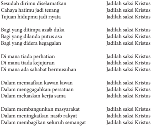

Tabel ini berisi pernyataan tentang bagaimana seseorang dapat menjadi saksi Kristus dalam berbagai situasi kehidupan. Topik utamanya adalah tentang cara menjadi saksi Kristus dalam berbagai situasi dan tantangan hidup. Kolom-kolomnya mencakup berbagai situasi seperti kesulitan, kesetiaan, dan keterlibatan dalam masyarakat. Data penting yang terlihat adalah bahwa menjadi saksi Kristus melibatkan kesetiaan, kejujuran, dan pengertian tentang Tuhan. Pola penting yang terlihat adalah bahwa menjadi saksi Kristus memerlukan sikap yang kuat dan penuh cinta kepada Tuhan, serta kemampuan untuk menghadapi tantangan dalam kehidupan.

Madah Bakti No. 455

 

---
## 📄 Halaman 77

### 1. Makna menjadi Saksi Yesus Kristus

Simaklah artikel berikut ini

### Iman tidak Bisa Dinegosiasikan; Gereja Kita adalah Gereja Martir

Memberikan kesaksian keterpaduan iman dengan berani: adalah sebuah ajakan dari  Paus  Fransiskus  selama  Misa  yang  dipimpinnya  di  Kapel  Casa  Santa  Marta. Dalam homilinya yang singkat, Paus mengomentari bacaan-bacaan Alkitab pada hari Sabtu masa Oktaf Paskah: yang pertama merujuk kepada Petrus dan Yohanes yang memberikan kesaksian iman dengan berani di hadapan para imam kepala Yahudi meskipun  menghadapi  ancaman-ancaman,  kemudian  dalam  bacaan  Injil,  Yesus yang bangkit menegur para rasul yang tidak mempercayai banyak orang yang telah meyakini melihat-Nya hidup.

Sri  Paus bertanya: 'Bagaimana dengan iman kita sendiri? Kuatkah? Atau kerap kali seperti air mawar yang keruh?' . Ketika kesulitan-kesulitan hidup datang 'apakah kita berani seperti Petrus atau merasa segan?'. Paus mengamati bahwa Petrus tidak kehilangan iman, ia tidak jatuh kepada kompromi-kompromi, karena 'iman tidak bisa  dinegosiasikan' .  Paus  juga  meyakini  bahwa  'dalam  sejarah  umat  Allah,  telah ada pencobaan ini: menyurutkan iman sebagian, pencobaan menjadi sedikit 'seperti yang dilakukan semua orang' , yaitu 'tidak menjadi sangat tegar' . Tetapi saat kita mulai menyurutkan iman, mulai mengkompromi iman, sedikit menjualnya kepada penawar tertinggi kata Paus menggaris bawahi maka kita memulai jalan apostasi, yaitu jalan ketidaksetiaan kepada Tuhan' .

'Contoh iman dari Petrus dan Yohanes membantu kita, memberikan kita kekuatan, tetapi,  dalam  sejarah  Gereja  ada  banyak  martir  sampai  sekarang,  karena  untuk menemukan  martir-martir  tidak  perlu  mengunjungi  kuburan  atau  ke  Koloseum: martir-martir hidup saat ini, di banyak Negara. Umat Kristen  kata Paus mengalami penganiayaan atas iman mereka. Di beberapa Negara banyak dari mereka tidak boleh membawa salib: mereka dihukum apabila melakukannya. Saat ini, pada abad XXI, Gereja kita merupakan Gereja para martir,  yaitu orang-orang yang berbicara seperti Petrus dan Yohanes: 'Kami tidak dapat berdiam terhadap apa yang telah kami saksikan dan dengarkan' . Paus melanjutkan, 'Dan hal ini memberikan kekuatan kepada kita, yang kerap kali memiliki iman yang agak lemah. Memberikan kita kekuatan untuk bersaksi dengan hidup, iman yang telah kita terima, yang merupakan rahmat dari Tuhan kepada semua bangsa'.

Sri Paus kemudian menutup homilinya: 'Tetapi, kita tidak dapat melakukannya sendiri: itu adalah sebuah rahmat yaitu rahmat iman, yang harus kita mohon setiap hari:  'Tuhan …peliharalah imanku, tambahlah imanku, agar selalu kuat, pemberani, dan bantulah aku di dalam saat-saat di mana - seperti Petrus dan Yohanes - aku harus memberikan kesaksian iman di hadapan banyak orang. Berikanlah aku keberanian'.

 

---
## 📄 Halaman 78

Ini akan menjadi sebuah doa yang indah pada hari ini: semoga Tuhan membantu kita untuk memelihara iman, membawanya maju, dan untuk menjadi, kita, wanita dan pria yang beriman. Amin'. (Sumber: Radio Vatikan)

( diterjemahkan oleh Shirley Hadisandjaja , 6 April 2013, dipublikasikan di www. http://katolisitas. org/11059/empat-hal-tentang-visi-gereja-menurut-kardinal-bergoglio)

- Setelah menyimak teks tersebut, cobalah merumuskan beberapa pertanyaan untuk mendiskusikan bersama-sama teman sekelasmu  dengan memperhatikan  beberapa hal;  yaitu    makna  pesan  homili  Paus,  apa  maknanya  bagi  dirimu  dalam  tugas pewartaan sebagai orang Katolik di Indonesia.

### 2.  Pesan Kitab Suci tentang Kesaksian (Martyria) sebagai Murid Yesus

Bacalah kisah berikut ini

'Hai orang-orang yang keras kepala, yang keras hati dan tuli, kamu selalu menentang Roh Kudus, sama seperti nenek moyangmu, demikian juga kamu. Siapa dari nabinabi yang tidak dianiaya oleh nenek moyangmu? Bahkan mereka membunuh orangorang yang lebih dahulu memberitakan kedatangan Orang Benar, yang sekarang telah kamu khianati dan bunuh. Kamu telah menerima hukum Taurat yang disampaikan oleh malaikat-malaikat, akan tetapi kamu tidak menurutinya. '

Ketika anggota-anggota Mahkamah Agama itu mendengar semuanya itu, hati mereka sangat  tertusuk.  Mereka  menyambutnya  dengan  kertak  gigi.  Tetapi  Stefanus,  yang penuh dengan Roh Kudus, menatap ke langit, lalu melihat kemuliaan Allah dan Yesus berdiri di sebelah kanan Allah. Lalu katanya, 'Sungguh, aku melihat langit terbuka dan Anak Manusia berdiri di sebelah kanan Allah. ' Tetapi berteriak-teriaklah mereka dan sambil menutup telinga, mereka menyerbu dia. Mereka menyeret dia ke luar kota, lalu melemparinya dengan batu. Saksi-saksi meletakkan jubah mereka di depan kaki seorang pemuda yang bernama Saulus. Sementara mereka melemparinya Stefanus berdoa, katanya, 'Ya Tuhan Yesus, terimalah rohku. ' Sambil berlutut ia berseru dengan suara  nyaring,  'Tuhan,  janganlah  tanggungkan  dosa  ini  kepada  mereka!'  Sesudah berkata demikian, ia pun meninggal. Saulus juga setuju dengan pembunuhan atas Stefanus (Kis 7:51-8:1a).

- Setelah menyimak teks Kitab Suci tersebut, cobalah menjawab atau mendiskusikan bersama temanmu beberapa  pertanyaan  berikut ini:
- Apa makna kesaksian dalam cerita Kitab Suci tersebut,
- Apa konsekuensinya menjadi murid Yesus dalam bersaksi?

 

---
## 📄 Halaman 79

### 3. Kesaksian sebagai  Pengikut Yesus Kristus melalui Kesaksian Hidup

Simaklah kisah berikut ini

### Uskup Agung Romero

Kesaksian  hidup  dari  almarhum  Uskup Agung Oscar Romero adalah melalui khotbah-khotbahnya yang menyuarakan dukungan  pada  kaum  miskin  dan  kaum tertindas pada zaman modern seperti sekarang ini. Hidupnya yang penuh pengabdian  kepada  umat  dan  masyarakatnya, khususnya  kepada  masyarakat  kecil  yang miskin  dan  tertindas.  ia  tidak  segan-segan memperingatkan  para  penguasa  negerinya (El  Salvador)  yang  bertindak  sewenangwenang  terhadap  rakyat  kecil  yang  tidak berdaya  sehingga  para  penguasa  negerinya tidak senang.

Pada tanggal 24 Maret 1980 ia ditembak oleh penembak sewaan. Ia mati saat merayakan Ekaristi dan sedang mengucapkan kata-kata  konsekrasi,  'Inilah  tubuh-Ku,  yang  dikorbankan  bagi  kamu,  dan  inilah darah-Ku yang ditumpahkan bagimu.'

- Setelah menyimak cerita tersebut diatas, cobalah merumuskan beberapa pertanyaan untuk mendalami artikel tersebut bersama-sama teman sekelas  dengan fokus perhatian pada  apa  isi serta pesan cerita.

### 4.  Pengamalan/Penghayatan

### Re fleksi:

Apakah sikap dan perilaku saat ini telah menjadi saksi tanda kehadiran dan karya keberbagian Allah? Apakah saya telah menunjukkan keberpihakan dan keberbagian kepada kebenaran, kejujuran, kesejahteraan umum untuk yang lemah serta miskin?

### Rencana Aksi:

Tuliskanlah, kesaksian-kesaksian konkret apa saja yang dapat kamu lakukan di tengah lingkunganmu sebagai seorang Kristiani! Tuliskan juga alasan mengapa kamu memilih bentuk kesaksian itu!

 

---
## 📄 Halaman 80

### Doa:

Bapa yang penuh kasih,

Puji dan syukur kami haturkan kepada-Mu atas bimbingan-Mu pada kami selama mengikuti kegiatan belajar ini. Melalui pembelajaran ini, kami  semakin menyadari bahwa setiap kami juga mendapat tugas perutusan dari Yesus  untuk menjadi saksi-Nya dalam hidup sehari-hari di tengah masyarakat. Semoga tugas ini dapat kami jalankan dengan penuh semangat dan tanggung jawab sebagai pengikut setia Yesus, sang Guru dan Juruselamat kami. Amin.

### Tugas/Pengayaan

Carilah di buku ensiklopedi orang kudus, di media internet, atau menanyakan ke Pastor paroki atau tokoh umat, dan sumber-sumber lain, minimal tentang lima orang yang berani menyerahkan jiwanya (mati sebagai martir) demi iman mereka kepada Kristus. Tulislah riwayat singkat kelima martir tersebut.

 

---
## 📄 Halaman 81

### D. Gereja yang Membangun Persekutuan ( Koinonia )

Gereja  bukan  sekadar  organisasi  saja,  melainkan  merupakan  kumpulan  anggota  umat Allah yang  hidup bersekutu, bersatu dalam nama Tuhan.  Apa beda Perusahaan (Organisasi) dan Gereja? Dalam suatu organisasi kalau salah satu departemennya 'mogok' paling-paling yang mogok itu di-PHK, kemudian manajemen mencari orang lain  menggantikan akan tetapi, di dalam Gereja kalau ada salah satu anggotanya mogok, kita akan usahakan supaya dia kembali. Kita akan berusaha memahami kesulitannya, kita akan mendoakan dia, kita akan menolong dia, kita akan membesuk dia, kita akan turut simpati keadaannya. Singkat kata, kita dalam semangat kebersamaan berusaha menolong anggota Gereja yang mengalami kesulitan atau kesusahan karena kita adalah satu kesatuan keluarga Allah (Gereja).

### Doa

Bapa yang penuh kasih,

Terima kasih atas kasih karunia-Mu yang telah menghimpun kami di sini menjadi satu persekutuan atas nama Yesus Putra-Mu. Berkatilah kami dalam kegiatan belajar ini sehingga semakin memahami makna persekutuan dalam Gereja, dan menghayatinya dalam hidup menggereja kami, demi Yesus Kristus Putra-Mu, Tuhan dan Juruselamat kami. Amin.

### 1.  Makna Gereja  yang Membangun Persekutuan

Simaklah cerita berikut ini

'Sekitar 60 orang yang terdiri dari Pastor, Bruder, Suster, dan Awam dari tujuh paroki di Kevikepan Kepulauan Bangka-Belitung sepakat untuk terus mengembangkan Komunitas  Basis  Gerejani  (KBG).  Kesepakatan  tersebut  dibuat  pada  akhir  sinode yang  diadakan  pada  14-15  Juni  di  Rumah  Retret  Puri  Sadhana,  Bangka  Tengah. Uskup Pangkalpinang Mgr. Hilarius Moa Nurak SVD turut hadir pada pertemuan tersebut.  'Semua orang menyarankan agar KBG terus dikembangkan di sini,' kata Pastor Fransiskus Tatu Mukin.

Ia  mengatakan  ada  dua  alasan  untuk  terus  mengembangkan  komunitas  basisi. Pertama karena keuskupan Pangkalpinang melayani wilayah yang terdiri dari beberapa pula. Kedua, umat Katolik tinggal berjauhan, bahkan ada yang tinggal di pulau kecil yang sama sekali tidak terhubungkan dengan paroki terdekat. 'KBG memungkinkan umat Katolik membangun semangat persaudaraan di antara mereka dan juga dengan pengikut  agama  lain.  Melalui  KBG,  orang-orang  yang  punya  jiwa  melayani  bisa tampil, ' katanya. Kevikepan Bangka-Belitung sudah memulai komunitas basis sejak tahun 1995 dan dijadikan prioritas pada sinode tahun 2000.

 

---
## 📄 Halaman 82

Dalam homili pada penutupan sinode, Mgr. Hilarius mengatakan pemberdayaan komunitas basis merupakan perwujudan dari Gereja partisipatif di kevikepan tersebut. 'KBG bisa diartikan sebagai persatuan antara umat Tuhan yang selalu melihat Kristus sebagai pusat dari segala sesuatu dan yang melanjutkan misi Kristus dalam kehidupan mereka sehari-hari, ' kata Uskup.  KBG merupakan kelompok orang Kristen di tingkat keluarga atau tetangga, yang datang dan berkumpul bersama untuk berdoa, membaca Kitab Suci, Katekese, serta diskusi tentang masalah keseharian manusia dan gereja dengan tujuan untuk tercapai komitmen bersama.' (ucanews.com)

- Setelah menyimak artikel atau berita tersebut, cobalah merumuskan pertanyaanpertanyaan untuk berdiskusi bersama temanmu.

### 2.  Ajaran Kitab Suci tentang  Persekutuan Umat (Komunitas Basis Gerejani).

### Kisah Para Rasul 4:32-37

- 32 Adapun kumpulan orang yang telah percaya itu, mereka sehati dan sejiwa, dan tidak seorang pun yang berkata, bahwa sesuatu dari kepunyaannya adalah miliknya sendiri, tetapi segala sesuatu adalah kepunyaan mereka bersama.
- 33 Dan dengan kuasa yang besar rasul-rasul memberi kesaksian tentang kebangkitan Tuhan Yesus dan mereka semua hidup dalam kasih karunia yang melimpah-limpah.
- 34 Sebab  tidak  ada  seorang  pun  yang  berkekurangan  di  antara  mereka;  karena semua orang yang mempunyai tanah atau rumah, menjual kepunyaannya itu, dan hasil penjualan itu mereka bawa
- 35 dan mereka letakkan di depan kaki rasul-rasul; lalu dibagi-bagikan kepada setiap orang sesuai dengan keperluannya.
- 36 Demikian pula dengan Yusuf, yang oleh rasul-rasul disebut Barnabas, artinya anak penghiburan, seorang Lewi dari Siprus.
- 37 Ia menjual ladang, miliknya, lalu membawa uangnya itu dan meletakkannya di depan kaki rasul-rasul.
- Setelah menyimak teks Kitab Suci  tersebut  jawablah  pertanyaan-pertanyaan berikut ini.
- Apa makna persekutuan menurut Kitab Suci,
- Apa ciri-ciri persekutuan umat

 

---
## 📄 Halaman 83

- Apa fungsi persekutuan umat
- Apa  kaitan  pesesekutuan  umat    dalam  Kitab  Suci  dengan  Komunitas  Basis Gerejani yang sedang dikembangkan di Gereja Indonesia

### 3. Menghayati  Persekutuan dalam Gereja

### Refleksi

- Tulislah sebuah refleksi tentang Gereja yang membangun persatuan.

### Doa

Allah  Bapa  yang  Mahabaik,  kami  bersyukur  telah  mendenga r  firman-Mu  melalui kegiatan belajar ini. Semoga apa yang kami peroleh dalam pelajaran tentang Gereja yang membangun persekutuan ini, dapat  menguatkan kami untuk ikut ambil bagian sebagai anggota Gereja dalam membangun persekutuan umat demi kemuliaan-Mu sepanjang segala masa. Amin.

### Tugas:

Wawancarailah  tokoh umat tentang  tugas Gereja yang membangun persektuan. Hasil wawancara ditulis dan dilaporkan.

 

---
## 📄 Halaman 84

### E. Gereja yang Melayani ( Diakonina )

Gereja dipanggil untuk melayani manusia, seluruh umat manusia. 'Melayani' adalah kata penting dalam ajaran Yesus. Pada Malam Perjamuan Terakhir, Yesus membasuh kaki para murid-Nya. Hal ini menunjukkan bahwa para pengikut Yesus harus merendahkan diri dan rela menjadi pelayan bagi sesamanya. Jika orang ingin menjadi terkemuka, ia harus rela menjadi pelayan. Yesus sendiri menegaskan: 'Anak manusia datang bukan untuk dilayani, melainkan untuk melayani' (Mrk 10: 45). Itulah sikap yang diharapkan oleh Yesus terhadap murid-murid-Nya.

### Doa

Bapa yang Maharahim,

Yesus  Kristus  Putra-Mu  telah  memberikan  teladan  tentang  bagaimana  seharusnya kami hidup saling melayani.

Karena itu ya Bapa, bimbinglah kami dalam pelajaran ini agar mampu memahami ajaran Yesus tentang melayani yang diwariskan kepada Gereja, sehingga kami mampu menjadi pelayan satu terhadap yang lain atas dasar kasih Yesus sendiri sendiri. Amin.

### 1.  Makna Melayani

Simaklah kisah pelayanan seorang dokter berikut ini!

### Dr. Lie Augustinus Dharmawan, Peduli Kaum Pinggiran

Gambar 4.10

LABUAN BAJO, FBCKeprihatinan terhadap  kaum  pinggiran  yakni  mereka  yang miskin  dan  termarjinal  telah  mendorong    Dr. Lie  Augustinus  Dharmawan,  Phd,  FICF,  SpB, SpBTKV mengabdikan diri tanpa pamrih dengan  memberikan  pelayanan  medis  secara gratis  kepada  ribuan  masyarakat  miskin  di desa-desa di seluruh wilayah Indonesia.

Untuk  mempermudah  aktivitas  pelayanan medis,  ia  mendirikan  sebuah  wadah  yakni Yayasan  Doctor  Share  ( share  accessible  health and care ) yang berkedudukan di Jakarta. 'Saya terpanggil untuk melayani mereka yang miskin

 

---
## 📄 Halaman 85

dan terpinggirkan. Saya terpanggil untuk mengabdikan diri untuk masyarakat kita yang  sebagian  besar  masih  hidup  dalam  kemiskinan  terutama  anak-anak.  Mereka harus diselamatkan dari kematian terutama karena malnutrisi, ' ujar Dr. Lie demikian ia biasa disapa ketika berbincang-bincang dengan FBC di Labuan Bajo, Sabtu pekan lalu.

Keprihatinan terhadap kaum miskin dan terpinggirkan merupakan panggilan jiwa Dr. Lie untuk memberikan diri sepenuhnya melayani orang-orang sakit. Ia berkeliling Indonesia memberikan pertolongan medis secara gratis. Dr, Lie, adalah seorang ahli bedah dan telah menghabiskan waktu dan tenaga untuk melayani masyarakat miskin di seluruh Indonesia. Ia berjalan dari kampung ke kampung untuk melayani mereka yang  sakit  dan  menderita.  Ia  sudah  menjelajahi  separuh  wilayah  Indonesia  dari Sabang sampai Merauke.

Ia  mengaku  selama  menjalankan  pelayanan  medis,  ia  menghadapi  berbagai tantangan  dan  halangan  terutama  tantangan  alam  yang  sering  tidak  bersahabat. Namun ia mengaku kekuatan Tuhan telah menuntun perjalanan dan karya luhurnya melayani sesama.

Pengagum  berat  Muder  Theresa  dari  Kalkuta  ini  menyatakan,  NTT  termasuk wilayah yang mendapatkan pelayanan dari yayasannya karena daerah NTT merupakan salah satu daerah paling tertinggal di Indonesia selain Papua dan Maluku. Di NTT sejumlah daerah telah ia kunjungi seperti Atambua di pulau Timor dan Manggarai Barat di Flores.

Kata  dia,  manusia  tentu  saja  menghadapi  banyak  persoalan  namun  persoalan tersebut bukanlah untuk dihindari melainkan untuk diatasi. Ia mengaku sejak Yayasan ini didirikan pada tahun 2008 lalu, sudah ribuan pasien yang mendapatkan pelayanan secara  gratis.  Dalam  tugas  pelayanan  itu  ditemukan  beragam  penyakit  mulai  dari penyakit yang ringan sampai yang berat seperti penyakit kanker.

Atas dedikasi dan pelayanan tanpa pamrih itu pada tahun 2011 lalu, ia mendapat penghargaan  dari  Museum  Rekor  Indonesia  (MURI)  karena  berhasil  menolong pasien secara gratis sebanyak 12.380 orang pasien.

Dokter ahli bedah yang tampil low profile itu mengatakan, Indonesia semestinya tidak boleh miskin dan menderita kalau semua orang termasuk pemerintah peduli pada mereka yang miskin dan terpinggirkan. Manusia Indonesia harus sehat secara rohani, jasmani, dan spiritualnya.

Untuk mendukung karya pelayanan, yayasan telah merancang sebuah kapal laut untuk dijadikan rumah sakit terapung. Rumah sakit itu untuk melayani masyarakat di wilayah-wilayah terpencil terutama masyarakat yang tinggal di pulau-pulau terpencil di seluruh Indonesia.

'Kami sudah punya rumah sakit terapung tapi, kami tidak datang bersama kapal karena cuaca buruk. Tapi ke depan kami akan melakukan pelayanan di atas kapal yang sudah  tersedia.  Dengan  adanya  rumah  sakit  terapung,  masyarakat  di  pulau-pulau akan mendapatkan pelayanan kesehatan tanpa harus ke darat,' ujarnya. (Kornelius Rahalaka)

 

---
## 📄 Halaman 86

- Setelah  menyimak  cerita  tersebut,  cobalah  merumuskan  beberapa  pertanyaan untuk mendalami artikel tersebut bersama-sama teman sekelasmu  dengan fokus perhatian  pada    isi    pesan.  Apa  pesan  cerita  tersebut,  apa  motivasi  tokoh  cerita membangun  rumah sakit terapung, apa kaitannya dengan tugas pelayanan Gereja, serta keteladan apa yang dapat kamu tiru dalam hidupmu sebagai orang Katolik.

### 2.  Semangat Pelayanan Gereja dalam Terang Kitab Suci

Simaklah kisah Kitab Suci berikut ini.

### Bukan Memerintah Melainkan Melayani (Mrk. 10: 35-45)

---
**🖼️ Gambar/Diagram**

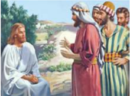

> **Deskripsi Visual:** Gambar ini adalah ilustrasi yang menunjukkan sebuah pertemuan antara Yesus dan beberapa orang yang tampaknya adalah murid-murid-Nya. Yesus duduk di depan mereka, sedang berbicara dengan mereka. Mereka tampaknya berada di luar kota, di tepi jalan, karena tampaknya ada tanah dan pohon di sekitar mereka. Mereka semua tampaknya mengenakan pakaian tradisional, yang menunjukkan bahwa gambar ini mungkin berasal dari zaman kuno.

Elemen-elemen utama dalam gambar ini adalah Yesus, yang tampaknya sedang berbicara kepada murid-murid-Nya, dan murid-murid-Nya yang tampaknya mendengarkan dan memperhatikan apa yang dia katakan. Relasi antara mereka adalah hubungan guru-guruku, dengan Yesus sebagai guru dan murid-murid-Nya sebagai murid.

Teks, angka, atau label penting yang terlihat dalam gambar ini tidak ada, karena gambar ini hanya menggambarkan situasi tanpa teks atau angka tambahan.

Informasi kunci yang dapat diambil pembaca dari gambar ini adalah bahwa Yesus sedang berbicara kepada murid-murid-Nya di luar kota, yang menunjukkan bahwa mereka mungkin sedang berada di suatu tempat yang lebih jauh daripada tempat biasanya. Ini juga menunjukkan bahwa Yesus adalah guru yang sangat populer dan dipercaya oleh banyak orang.

Sumber: Koleksi Penulis

Gambar 4.11.

35 Lalu  Yakobus  dan  Yohanes,  anak-anak  Zebedeus,  mendekati  Yesus  dan  berkata kepada-Nya: 'Guru, kami  harap supaya Engkau  kiranya  mengabulkan  suatu permintaan  kami!' 36 Jawab-Nya  kepada  mereka:  ' Apa  yang  kamu  kehendaki, Aku  perbuat  bagimu?' 37 Lalu  kata  mereka:  'Perkenankanlah  kami  duduk  dalam kemuliaan-Mu kelak, yang seorang di sebelah kanan-Mu dan yang seorang di sebelah kiri-Mu. 38 Tetapi kata Yesus kepada mereka: 'Kamu tidak tahu apa yang kamu minta. Dapatkah kamu meminum cawan yang harus Kuminum dan dibaptis dengan baptisan yang harus Kuterima?' 39 Jawab mereka: 'Kami dapat.' Yesus berkata kepada mereka: 'Memang, kamu akan meminum cawan yang harus Kuminum dan akan dibaptis dengan baptisan yang harus Kuterima. 40 Tetapi hal duduk di sebelah kanan-Ku atau di sebelah kiri-Ku, Aku tidak berhak memberikannya. Itu akan diberikan kepada orangorang bagi siapa itu telah disediakan' .

41 Mendengar  itu  kesepuluh  murid  yang  lain  menjadi  marah  kepada  Yakobus  dan Yohanes. 42 Tetapi Yesus memanggil mereka lalu berkata: 'Kamu tahu, bahwa mereka yang  disebut  pemerintah  bangsa-bangsa  memerintah  rakyatnya  dengan  tangan besi, dan pembesar-pembesarnya menjalankan kuasanya dengan keras atas mereka.

 

---
## 📄 Halaman 87

43 Tidaklah demikian di antara kamu. Barangsiapa ingin menjadi besar di antara kamu, hendaklah ia menjadi pelayanmu, 44 dan barangsiapa ingin menjadi yang terkemuka di antara kamu, hendaklah ia menjadi hamba untuk semuanya. 45 Karena anak manusia juga datang bukan untuk dilayani, melainkan untuk melayani dan untuk memberikan nyawa-Nya menjadi tebusan bagi banyak orang.'

- Setelah  menyimak  kisah  Kitab  Suci  tersebut,  jawablah  pertanyaan-pertanyaan berikut ini.
- Apa isi pesan Kitab Suci yang telah dibaca?
- Sikap apakah yang diajarkan Yesus kepada kita?
- Salah satu tugas Gereja adalah melayani. Apakah ciri-ciri pelayanan Gereja itu?
- Apa sajakah bentuk-bentuk pelayanan Gereja Katolik  di Indonesia?

### 3. Menghayati Tugas Gereja yang Melayani

### Refleksi

Tuliskan sebuah refleksi tentang sejauh manakah kamu  meneladani Yesus dalam melayani sesama dalam hidupnya sehari-hari.

### Rencana Aksi

Tentukan satu tindakan konkret yang dapat kamu lakukan dalam kaitan dengan pelayanan di lingkungan atau Komunitas Umat Basis atau di sekolahmu.

### Doa

Ya Bapa, terima kasih untuk segala berkat dan rahmat-Mu yang Engkau limpahkan kepada kami dalam pertemuan ini. Semoga dalam hidup sehari-hari, kami sanggup melayani    sesama,  baik  dalam  kata-kata  maupun  perbuatan  demi  kemuliaan-Mu, sepanjang segala masa. Amin.

### Tugas:

Buatlah rencana pelayanan yang telah dibuat, kemudian laksanakanlah pelayanan yang kamu rencanakan.

Setelah itu, buatlah laporan tertulis. Mintalah tanda tangan orang tua atau wali muridmu.

 

---
## 📄 Halaman 88

### Bab V Gereja dan Dunia

Gereja Post Konsili Vatikan II melihat dirinya sebagai sakramen keselamatan bagi dunia. Gereja manjadi terang ,garam, dan ragi bagi dunia dan  dunia menjadi tempat atau  ladang,  dimana  Gereja  berbakti.  Dunia  tidak  dihina  dan  dijauhi  melainkan didatangi dan ditawari keselamatan. Dunia dijadikan mitra dialog dan Gereja dapat menawarkan  nilai-nilai  injil  dan  dunia  dapat  mengembangkan  kebudayaannya, adat  istiadat,  alam  pikiran,  ilmu  pengetahuan,  dan  teknologi.  Karenanya  Gereja dapat lebih efektif menjalankan misi dunia. Gereja pun tetap menghormati otonomi dunia dengan sifatnya yang sekuler, karena didalamnya terkandung nilai-nilai yang dapat mensejahterakan manusia dan membangun sendi-sendi kerajaan Allah. Pada dasarnya Gereja dan dunia manusia merupakan realitas yang sama, seperti mata uang yang ada dua sisinya. Berbicara tentang Gereja berarti bicara tentang dunia manusia. Bagi orang Kristen berbicara tentang dunia manusia berarti berbicara tentang dunia manusia sebagai umat Allah yang sedang berziarah di dunia ini.

Sesudah  mempelajari  Gereja  secara  internal  (ke  dalam  dirinya  sendiri),  pada bab V ini kita akan mempelajari Gereja lebih secara eksternal, yakni Gereja dalam hubungannya  dengan  dunia.  Dunia  di  sini  diartikan  sebagai  seluruh  keluarga manusia dengan segala hal yang ada di sekelilingnya. Dunia dilihat secara lebih positif dibandingkan  dengan  masa  lalu  (prakonsili  Vatikan  II).  Gereja  dan  dunia  dapat berdialog dan saling mengisi demi terciptanya Kerajaan Allah di bumi ini.

Pada kegiatan  pembelajaran ini, para peserta didik akan mempelajari  topik-topik tentang;  Permasalahan  yang  dihadapi  dunia;  Hubungan  Gereja  dan  dunia;  Ajaran sosial Gereja; Keterlibatan Gereja dalam membangun dunia yang damai dan sejahtera

### A.  Permasalahan yang Dihadapi Dunia

Acapkali muncul pertanyaan seputar sikap Gereja menghadapi keadaan sosial, ekonomi, kebudayaan dan politik dalam hidup sehari-hari. Bagaimanakah Gereja menyikapi umat yang hidup melarat, tak cukup makan dan minum, tak bisa bayar uang obat, tak bisa mengecap pendidikan dasar?

 

---
## 📄 Halaman 89

### Doa

Allah Bapa yang penuh kasih,

Yesus  Kristus  telah  mengutus  kami,  Gereja-Mu  ke  tengah-tengah  dunia  untuk membangun kehidupan manusia yang damai, adil, sejahtera serta serta senantiasa menjaga  keutuhan  alam  ciptaan  Tuhan.  Berkatilah  kami  dalam  pelajaran  ini  agar semakin memahami permasalahan-permasalahan yang sedang dihadapi dunia pada saat ini sehingga sebagai anggota Gereja, kami pun dapat ikut menjaga ketentraman sesuai kehendak-Mu demi Yesus Kristus, Tuhan dan juruselamat kami. Amin.

### 1. Permasalahan-Permasalahan yang Sedang Dihadapi Dunia Saat Ini.

### a. Ident ifikasi permasalahan-permasalahan dunia saat ini.

Dunia  masa  lalu  dan  masa  kini  dan  bahkan  masa  yang  akan  datang  terus mengalami berbagai masalah di berbagai sektor kehidupan. Sekarang  Cobalah kamu mengindent ifikasi permasalahan-permasalahan yang sedang dihadapi dunia saat ini. Sebagai berikut tentang masalah perdamaian, keadilan dan lingkungan alam.

### b. Masalah  perdamaian umat manusia  di dunia

Simaklah artikel berikut ini.

'Tuduhan bahwa rezim Suriah menggunakan senjata kimia pada 21 Agustus 2013 merupakan dalih Barat untuk menyerang negara. Demikian pernyataan Pemimpin Agung Iran, Ayatullah Ali Khamenei, Kamis, 5 September 2013. Iran, sekutu utama Suriah  di  kawasan  Timur  Tengah,  memperingatkan  kekuatan  Barat  atas  niatnya berperang  melawan  negara  yang  sedang  dilanda  perang  saudara  itu.  Menurut Khameini, Washington dan sekutunya 'menggunakan dugaan serangan senjata kimia sebagai  dalih. '  Dia  menambahkan,  '(Benarkah)  mereka  ingin  berperang  dengan alasan kemanusiaan?'

' Amerika Serikat salah mengenai Suriah. Mereka (Amerika Serikat) akan menderita seperti yang terjadi di Irak dan Afganistan, ' ujar Khamenei kepada anggota Dewan Pakar, lembaga yang mengawasi kinerjanya. Secara terpisah, Kepala Unit Pasukan Elite Iran Quds, Qassem Soleimani, mengatakan Teheran akan mendukung Suriah sampai kapan  pun  guna  menghadapi  kemungkinan  intervensi  Amerika.  Para  pengamat yakin melebarnya keinginan Presiden Barack Obama dalam melancarkan serangan sesungguhnya diniatkan untuk menumpulkan pengaruh Teheran dan menimbulkan konsekuensi  terhadap  sekutu  Amerika,  Israel. 'Tujuan  Amerika  Serikat  bukanlah untuk  melindungi  hak  asasi  manusia,  tetapi  ingin  menghancurkan  musuh  Israel, '

 

---
## 📄 Halaman 90

kata Komandan Pasukan Quds sebagaimana dikutip media Iran, Kamis, 5 September 2013.'Kami akan mendukung Suriah hingga akhir hayat,' Soleiman menambahkan dalam pidatonya di depan Dewan Pakar' . (Al Jazeera | Choirul)

http://www.tempo.co/read/news/2013/09/06/115511033

•

- Setelah membaca artikel tersebut, sekarang cobalah  membuat pertanyaan berkaitan dengan cerita yang sudah dibaca untuk didiskusikan bersama teman-temanmu.

### c. Masalah Keadilan dalam Hidup Manusia di Dunia

Simaklah kisah berikut ini

### Kesenjangan  Semakin Melebar antara Si Kaya dan Si Miskin

VIVA News Studi terbaru menunjukkan bahwa kesenjangan pendapatan antara negara-negara  barat  atau  negara  maju  dengan  negara  berkembang  melonjak  733 persen dalam 200 tahun. Hal tersebut, seperti dikutip dari Hu ffington Post , Rabu 29 Mei 2013, ditemukan oleh Diego Comin, seorang profesor Harvard Business School dan  Marti  Mestieri,  peneliti  di  Toulouse  School  of  Economics.  Hasil  penelitian menunjukkan, pada tahun 1800 pendapatan negara-negara maju di Eropa dengan negara berkembang sebesar 90 persen. Memasuki tahun 2000, perbedaan ekonomi antara keduanya membengkak hingga 750 persen. Ada dua penyebab kenapa jurang ekonomi tersebut terjadi, pertama adalah akses terbatas warga negara berkembang terhadap  teknologi  baru.  Kedua,  lambatnya  warga  negara  berkembang  untuk mengadopsi berbagai inovasi.

Salah satu cara untuk memecahkan masalah ini adalah menciptakan kebijakan yang  bertujuan  untuk  membawa  teknologi  baru  untuk  negara-negara  miskin. Teknologi  baru  dapat  membawa  negara  miskin  menuju  produktivitas  yang  lebih tinggi.  Sebab,  semakin banyak unit teknologi baru yang digunakan negara, makin tinggi  pula  keuntungan  produktivitas  yang  dibawa  oleh  teknologi  baru  tersebut. Raksasa  teknologi  seperti  Google,  telah  mendanai  dan  mengembangkan  jaringan internet nirkabel di berbagai negara berkembang sebagai upaya mempercepat transfer teknologi  di  seluruh  dunia.    Namun,  upaya  tersebut  kemungkinan  tidak  cukup untuk  membalikkan  200  tahun  sejarah.  Kesenjangan  juga  diciptakan  oleh  adanya kolonialisasi Eropa selama 500 tahun terakhir. Bangsa Eropa menguras sumber daya alam dari negara-negara non barat yang mereka taklukkan. Catatan New York Review of  Books menunjukkan, beberapa negara terjajah adalah negara terkaya dan paling maju beberapa ratus tahun lalu, kini termasuk dalam negara termiskin. Namun, saat ini diprediksi akan muncul tren yang dapat membalikkan keadaan. Berbagai lembaga

 

---
## 📄 Halaman 91

ekonomi  memprediksi  pertumbuhan  ekonomi  negara-negara  berkembang  lebih dahsyat tahun ini, di atas lima persen, dibandingkan pertumbuhan ekonomi negara kaya yang diperkirakan hanya tumbuh 1,2 persen. (asp)

Sumber:

Vivanews.com

- Setelah membaca artikel tersebut, buatlah pertanyaan-pertanyaan, diskusikanlah bersama  temanmu  dalam  kelompok  tentang  hal-hal  seputar  masalah  keadilan dalam hidup manusia di dunia.

### d. Masalah  lingkungan alam di dunia

Simaklah artikel berikut ini

(Pustaka Fisika). Telah umum diketahui, salah satu masalah terbesar yang kita hadapi saat ini adalah pemanasan global (Global Warming) . Dampaknya pada bumi dan kehidupan seluruh makhluk sungguh sangat menakutkan. Apa yang menjadi sebab terjadinya global  warming ,  sudah  sangat  sering  diperdebatkan oleh komunitas ilmuwan, media, bahkan politisi. Akan tetapi, sayangnya, kita masih saja terus memperbincangkan penyebab seputar global warming, padahal akibat yang ditimbulkan setiap hari semakin nyata dan terukur. Satu hal yang pasti, penyebabnya adalah siapa lagi kalau bukan kita, umat manusia, dan akibat dari ini akan sangat terasa.

Berikut ini faktor penyebab terjadinya pemanasan global.

### · Polusi Karbondioksida dari Pembangkit Listrik Bahan Bakar Fosil

Ketergantungan kita yang semakin meningkat pada listrik dari pembangkit listrik bahan bakar fosil membuat semakin meningkatnya pelepasan gas karbondioksida sisa pembakaran ke atmosfer. Sekitar 40% dari polusi karbondioksida dunia, berasal dari produksi listrik Amerika Serikat. Kebutuhan ini akan terus meningkat setiap harinya. Sepertinya, usaha penggunaan energi alternatif selain fosil harus segera dilaksanakan. Akan tetapi, masih banyak dari kita yang enggan untuk  melakukan ini.

### · Polusi Karbondioksida dari Pembakaran Bensin untuk Transportasi

Sumber polusi karbondioksida lainnya berasal dari mesin kendaraan bermotor. Apalagi, keadaan semakin diperparah oleh adanya fakta bahwa permintaan kendaraan  bermotor  setiap  tahunnya  terus  meningkat  seiring  dengan  populasi  manusia yang juga tumbuh sangat pesat. Sayangnya, semua peningkataan ini tidak diimbangi dengan usaha untuk mengurangi dampak.

 

---
## 📄 Halaman 92

### · Gas Metana dari Peternakan dan Pertanian.

Gas  metana  menempati  urutan  kedua  setelah  karbondioksida  yang  menjadi penyebab terjadinya efek rumah kaca. Gas metana dapat berasal dari bahan organik yang dipecah oleh bakteri dalam kondisi kekurangan oksigen, misalnya di persawahan. Proses  ini  juga  dapat  terjadi  pada  usus  hewan  ternak,  dan  dengan  meningkatnya jumlah  populasi  ternak,  mengakibatkan  peningkatan  produksi  gas  metana  yang dilepaskan ke atmosfer bumi.

### · Aktivitas Penebangan Pohon

Banyaknya penggunaan kayu dari pohon sebagai bahan baku membuat jumlah pohon  kita  makin  berkurang.  Apalagi,  hutan  sebagai  tempat  pohon  kita  tumbuh semakin sempit akibat beralih fungsi menjadi lahan perkebunan seperti kelapa sawit. Padahal, fungsi hutan sangat penting sebagai paru-paru dunia dan dapat digunakan untuk  mendaur ulang karbondioksida yang terlepas di atmosfer bumi.

### · Penggunaan Pupuk Kimia yang Berlebihan

Pada  kurun  waktu  paruh  terakhir  abad  ke-20,  penggunaan  pupuk  kimia dunia  untuk  pertanian  meningkat  pesat.  Kebanyakan  pupuk  kimia  ini  berbahan nitrogenoksida yang 300 kali lebih kuat dari karbondioksida sebagai perangkap panas, sehingga ikut memanaskan bumi. Akibat lainnya adalah pupuk kimia yang meresap masuk ke dalam tanah dapat mencemari sumber-sumber air minum kita.

Berikut ini akibat yang ditimbulkan oleh terjadinya pemanasan global.

### · Kenaikan Permukaan Air Laut Seluruh Dunia

Para ilmuwan memprediksi peningkatan tinggi air laut di seluruh dunia karena mencairnya  dua  lapisan  es  raksasa  di  Antartika  dan  Greenland.  Banyak  negara di seluruh dunia akan mengalami efek berbahaya dari kenaikan air laut ini. Inilah mungkin faktor penyebab tenggelamnya Ibu Kota Jakarta beberapa tahun mendatang sesuai dengan yang diprediksi ilmuwan.

### · Peningkatan Intensitas Terjadinya Badai

Tingkat terjadinya badai dan siklon semakin meningkat. Didukung  oleh bukti  yang  telah  ditemukan  oleh  para  ilmuwan  bahwa  pemanasan  global  secara sig nifikan  akan  menyebabkan  terjadinya  kenaikan  temperatur  udara  dan  lautan. Hal ini mengakibatkan terjadinya peningkatan kecepatan angin yang dapat memicu terjadinya badai kuat.

 

---
## 📄 Halaman 93

### · Menurunnya Produksi Pertanian Akibat Gagal Panen

Diyakini bahwa milyaran penduduk di seluruh dunia akan mengalami bencana kelaparan karena faktor menurunnya produksi pangan pertanian akibat kegagalan panen. Ini disebabkan oleh pemanasan global yang memicu terjadinya perubahan iklim yang kurang kondusif bagi tanaman pangan.

### · Makhluk Hidup Terancam Punah

Berdasarkan  penelitian  yang  dipublikasikan  di  Nature,  pada  tahun  2050  mendatang, peningkatan suhu dapat menyebabkan terjadinya kepunahan jutaan spesies. Artinya, di tahun-tahun mendatang keragaman spesies bumi akan jauh berkurang. Namun, semoga saja tidak termasuk di dalamnya spesies manusia.

Tulisan di olah dari : planetsave.com sumber : http://ilmufajar.com

- Setelah membaca artikel tersebut buatlah pertanyaan-pertanyaan untuk  diskusikanlah  bersama  temanmu  dalam  kelompok  tentang  hal-hal  seputar  masalahmasalah lingkungan alam.

### 2. Ajaran Kitab Suci dan Ajaran Gereja tentang Keadilan, Perdamaian, dan Lingkungan Alam.

### a.   Ajaran Kitab Suci tentang Perdamaian dan Keadilan.

Simaklah kisah Kitab Suci berikut ini

### Garam dan Terang Dunia  (Mat 5:13-16)

- 13 'Kamu adalah garam dunia. Jika garam itu menjadi tawar, dengan apakah ia diasinkan? Tidak ada lagi gunanya selain dibuang dan diinjak orang.
- 14 Kamu adalah terang dunia. Kota yang terletak di atas gunung tidak mungkin tersembunyi.
- 15 Lagipula orang tidak menyalakan pelita lalu meletakkannya di bawah gantang, melainkan di atas kaki dian sehingga menerangi semua orang di dalam rumah itu.
- 16 Demikianlah hendaknya terangmu bercahaya di depan orang, supaya mereka melihat perbuatanmu yang baik dan memuliakan Bapamu yang di sorga.'
- Setelah menyimak teks Kitab Suci tersebut, jawablah  pertanyaan  berikut ini.
- Apa pesan kitab Suci tentang damai dan keadilan?
- Inspirasi apa yang dapat kita peroleh dari Kitab Suci  untuk memperjuangkan masyarakat yang damai, sejahtera, dan adil?
- Manakah hal-hal pokok yang harus diperhatikan dalam  membangun masyarakat yang damai dan adil?

 

---
## 📄 Halaman 94

### b. Ajaran Gereja tentang Perdamaian dan Keadilan serta Kesejahteraan

Simaklah artikel berikut ini

### Memajukan Kesejahteraan Umum

(GS.art. 26)

'Karena saling ketergantungan itu semakin meningkat dan lambat-laun meluas ke  seluruh  dunia,  maka  kesejahteraan  umum  sekarang  ini  juga  semakin  bersifat universal, dan oleh karena itu mencakup hak-hak maupun kewajiban-kewajiban, yang menyangkut seluruh umat manusia. Yang dimaksudkan dengan kesejahteraan umum ialah:  keseluruhan  kondisi-kondisi  hidup  kemasyarakatan,  yang  memungkinkan baik kelompok-kelompok maupun anggota-anggota perorangan, untuk secara lebih penuh dan lebih lancar mencapai kesempurnaan mereka sendiri. Setiap kelompok harus  memperhitungkan  kebutuhan-kebutuhan  serta  aspirasi-aspirasi  kelompokkelompok lain yang wajar, bahkan kesejahteraan umum segenap keluarga manusia. Akan tetapi serta-merta berkembanglah kesadaran dan unggulnya martabat pribadi manusia, karena melampaui segala sesuatu, lagi pula hak-hak maupun kewajibankewajibannya  bersifat  universal  dan  tidak  dapat  diganggu-gugat.  Maka  sudah seharusnyalah, bahwa bagi manusia disediakan segala sesuatu, yang dibutuhkannya untuk hidup secara sungguh manusiawi, misalnya na fkah, pakaian, perumahan, hak untuk dengan bebas memilih status hidupnya dan untuk membentuk keluarga, hak atas pendidikan, pekerjaan, nama baik, kehormatan, informasi yang semestinya, hak untuk bertindak menurut norma hati nuraninya yang benar, hak atas perlindungan hidup  perorangan,  dan  atas  kebebasan  yang  wajar,  juga  perihal  agama.  Jadi  tatamasyarakat  serta  kemajuannya  harus  tiada  hentinya  menunjang  kesejahteraan pribadi-pribadi; sebab penataan hal-hal harus dibawahkan kepada tingkatan pribadi-pribadi,  dan  jangan  sebaliknya  menurut  yang  diisyaratkan  oleh  Tuhan sendiri ketika bersabda bahwa hari Sabbat itu ditetapkan demi manusia, dan bukan manusia demi hari Sabbat. Tata dunia itu harus semakin dikembangkan, didasarkan pada  kebenaran,  dibangun  dalam  keadilan,  dihidupkan  dengan  cinta  kasih,  harus menemukan keseimbangannya yang semakin manusiawi dalam kebebasan. Supaya itu semua terwujudkan perlulah diadakan pembaharuan mentalitas dan peubahanperubahan sosial secara besar-besaran. Roh Allah, yang dengan penyelenggaraan-Nya yang mengagumkan mengarahkan peredaran zaman dan membaharui muka bumi, hadir ditengah perkembangan itu. Adapun ragi Injil telah dan masih membangkitkan dalam hati manusia tuntutan tak terkendali akan martabatnya' . (GS-art.26)

- Setelah menyimak artikel diatas, jawablah  pertanyaan  berikut ini.
- Apa pesan ajaran Gereja tentang kesejahteraan umum?
- Bagaimana  sikap  kita  (Gereja)  dalam  menghadapi  situasi  sulit  seperti  yang dilukiskan di atas?

 

---
## 📄 Halaman 95

### c. Ajaran Gereja  tentang Kelestarian Lingkungan Alam

Simaklah  cerita berikut ini

### Mgr, Pujasumarta; Pemanasan Global tidak Pandang Agama

Gambar 5.1 Uskup Agung

'Pemanasan  global  tidak  pandang agama.' Uskup Agung Semarang Mgr Johannes  Pujasumarta  Pr berbicara dalam Misa di Gua Maria Sendang Jati Penadaran,  Gubug,  Grobogan,  Jawa Tengah, yang dirayakan dalam rangka penanaman  bibit  untuk  penghijauan melalui  program  Kuliah  Kerja  Nyata (KKN)  Universitas Katolik (Unika) Soegijapranata Semarang. Menurut Mgr  Pujasumarta,  pemanasan  global tidak pandang wilayah dan tidak pandang bulu. 'Semuanya kalau terkena pemanasan global akan hancur. Apakah kita masih bisa menahan pemanasan global itu dengan cara-cara yang sederhana?' tanya Uskup Agung.

Menurut Mgr. Pujasumarta, kalau menanam sekarang, masih ada harapan bahwa suatu ketika yang ditanam itu akan tumbuh dan berkembang menghasilkan buahbuah yang baik. 'Tapi kalau kita tidak menanam, kita tidak akan bisa mengharapkan apa-apa,' tegas uskup agung seraya menambahkan bahwa yang sekarang mencintai benih memiliki masa depan.

Penanaman bibit yang dilakukan di sekitar Gua Maria Sendang Jati Penadaran tanggal  16  Agustus  2013  itu,  menurut  Mgr.  Pujasumarta,  'meskipun  sederhana merupakan ungkapan kita untuk mencintai bumi ini, supaya bumi ini juga memiliki masa  depan.'      Nasib  bumi,  lanjut  Mgr.  Pujasumarta,  tergantung  dari  apa  yang dibuat sekarang.  'Keadaan bumi itu juga akan menentukan nasib manusia. Kalau bumi hancur, ruang-ruang hancur, ruang-ruang kediaman manusia hancur, manusia sendiri juga akan hancur, ' kata Uskup Agung di hadapan para mahasiswa, pengajar dan masyarakat Katolik Penadaran. Juga diingatkan bahwa lingkungan menjadi rusak karena orang ingin menghabiskan segala-galanya. 'Orang ingin makan segala-galanya. Kalau boleh dikatakan, orang ingin menjadi serigala bagi yang lain. Bukan menjadi keselamatan  bagi  yang  lain, '  kata  Mgr.  Pujasumarta  seraya  mengajak  umat  untuk merawat bumi dan melestarikan keutuhan ciptaan untuk kesejahteraan bersama.

Mgr.  Pujasumarta  mengajak  umat  bekerja  sama  dengan  jemaat  lebih  luas  dan masyarakat  dari  berbagai  latar  belakang,  karena  Tuhan  menghendaki  supaya  kita menjadi penjaga satu sama lain. 'Saya berharap agar umat Paroki Grobogan menjadi penjaga satu sama lain. Hidup rukun bersama dengan masyarakat sekitar. Siapa yang menjadi penjaga-penjaga yang paling utama bagi rumah kita? Bukan orang jauh dari

 

---
## 📄 Halaman 96

kita tetapi tetangga-tetangga kita. '  Rektor Unika Soegijapranata Profesor Yohanes Budi Widianarko mengatakan, di kawasan yang terkesan gersang itu ia menemukan suaka alam yang indah berkat kerja sama semua pihak dan niat baik untuk melestarikan alam.'Salah satu fokus dari Unika Soegijapranata adalah permukiman berkelanjutan, permukiman  yang  ramah  lingkungan.  Dengan  tanpa  ragu-ragu,  kami  mengirim mahasiswa kami untuk dititipkan kepada warga di sini supaya mereka belajar,' kata Profesor  Budi  seraya  meminta  mahasiswa  belajar  dari  warga  masyarakat  tentang pentingnya pelestarian lingkungan.

- Setelah membaca artikel tersebut buatlah pertanyaan-pertanyaan dan diskusikanlah bersama temanmu dalam kelompok, bagaimana ajaran Gereja tentang  masalah lingkungan alam.

### 3.  Menghayati  Keadilan, Kedamaian, dan Kesejahteraan

Keadilan,  kedamaian,  dan  kesejahteraan  menyangkut  martabat  manusia  yang merupakan anugerah dari Sang Pencipta. Oleh karena itu, kita harus memperjuangkan kondisi  dan  situasi  masyarakat  yang  adil,  damai,  dan  sejahtera.  Keadilan  demi kesejahteraan  hanya  dapat  diperjuangkan  dengan  memberdayakan  mereka  yang menjadi korban ketidakadilan. Tidak cukup hanya dengan karya belas kasih (karya karitatif) melulu. Para korban ketidakadilan harus disadarkan tentang situasi yang menimpa dirinya, kemudian diajak untuk bangkit bersama-sama melalui berbagai usaha kooperatif untuk memperbaiki nasibnya. Dengan cara demikian, struktur dan sistem sosial yang tidak adil dapat diubah. Tanpa gerakan dan tindakan yang sungguh kooperatif  sebuah  struktur  dan  sistem  tidak  akan  tergoyahkan.  Cara  bertindak yang tepat adalah dengan memberikan kesaksian hidup melalui keterlibatan untuk menciptakan keadilan dalam diri kita sendiri terlebih dahulu. Kita hendaknya mulai dengan diri dan lingkungan kita, misalnya dalam lingkungan Jemaat Kristiani sendiri. Usaha memperjuangkan keadilan dan kesetiakawanan bersama dengan mereka yang diperlakukan tidak adil tidak boleh dilakukan dengan kekerasan. Keunggulan cinta kasih di dalam sejarah menarik banyak orang untuk memilih dan bertindak tanpa kekerasan melawan ketidakadilan. Bekerja sama perlu pula diusahakan.

### Refleksi

- Berdasarkan tulisan di atas, buatlah r efleksi tertulis dengan bantuan pertanyaan, misalnya;'Sejauh manakah saya sebagai pengikut Yesus memperjuangkan keadilan, perdamaian, dan kesejahteraan dalam hidup sehari-hari?

 

---
## 📄 Halaman 97

### Rencana Aksi

- -Tulislah sebuah doa bagi para pejuang perdamaian,  keadilan, serta  lingkungan hidup.
- -Tulislah  niat  untuk  turut  mengambil  bagian  sekecil  apa  pun  dalam  perjuangan perdamaian, keadilan, serta pelestarian lingkungan hidup dalam kehidupan seharihari.

### Doa:

Allah Bapa yang Mahakasih, kami bersyukur telah mengikuti pelajaran ini dengan baik.

Berkatilah  kami  agar  semakin  memahami  dan  menghayati  dan  memperjuangkan keadilan, kedamaian, dan kesejahteraan dalam hidup kami sehari-hari. Amin.

 

---
## 📄 Halaman 98

### B. Hubungan Gereja dan Dunia

Gereja sungguh-sungguh mewartakan dan memberi kesaksian tentang 'Kabar Gembira' kepada dunia, sambil belajar dan mengambil banyak nilai positif yang dimiliki dunia untuk perkembangan diri dan pewartaannya. Gereja kini telah memiliki  pandangan tentang dunia yang jauh lebih positif dari zaman-zaman yang lampau sehingga hubungan antara keduanya menjadi lebih saling menguntungkan. Jadi,  hubungan  antara  Gereja  dan  dunia  memiliki  pandangan-pandangan  baru yang perlu dipahami.

### Doa

Allah Bapa di Surga,

Terima  kasih  atas  berkat  dan  penyelenggaraan-Mu  bagi  kami,  waktu  yang  indah untuk  belajar  memahami  kehendak-Mu.  Pada  kesempatan  ini  kami  akan  belajar tentang hubungan antara Gereja dan dunia. Berkatilah  kami agar mampu menjadi saluran  berkat  di  tengah  masyarakat,  membawa  api  cinta-Mu  bagi  sesama,  demi Yesus Kristus, Tuhan dan Juruselamat kami. Amin.

### 1. Makna Hubungan Gereja dan Dunia

Simaklah artikel berikut ini

'Maka, sesudah menjajagi misteri Gereja secara lebih mendalam, Konsili Vatikan Kedua tanpa ragu-ragu mengarahkan amanatnya bukan lagi hanya kepada puteraputri Gereja dan sekalian orang yang menyerukan nama Kristus, melainkan kepada semua orang. Kepada mereka semua Konsili bermaksud menguraikan, bagaimana memandang  kehadiran  serta  kegiatan  Gereja  di  masa  kini.    Jadi  Konsili  mau menghadapi  dunia  manusia,  dengan  kata  lain  segenap  keluarga  manusia  beserta kenyataan  semesta  yang  menjadi  lingkungan  hidupnya,  dunia  yang  mementaskan sejarah umat manusia, dan ditandai oleh jerih-payahnya, kekalahan serta kejayaannya; dunia,  yang  menurut  iman  Umat  kristiani  diciptakan  dan  dilestarikan  oleh  cinta kasih  Sang  Pencipta;  dunia,  yang  memang  berada  dalam  perbudakan  dosa,  tetapi telah  dibebaskan oleh Kristus yang disalibkan dan bangkit, sesudah kuasa si Jahat dihancurkan, supaya menurut rencana Allah mengalami perombakan dan mencapai kepenuhannya' .  ( Gaudium et Spes artikel 2) .

' Adapun  zaman  sekarang  umat  manusia  terpukau  oleh  rasa  kagum  akan penemuan-penemuan serta kekuasaannya sendiri. Tetapi sering pula manusia dengan

 

---
## 📄 Halaman 99

gelisah bertanya-tanya tentang perkembangan dunia dewasa ini, tentang tempat dan tugasnya di alam semesta, tentang makna jerih payah perorangan maupun usahan bersama, segala sesuatu tentang tujuan terakhir dari manusia itu sendiri. Oleh karena itu  Konsili  menyampaikan  kesaksian  dan  penjelasan  tentang  iman  segenap  Umat Allah yang dihimpun oleh Kristus. Konsili tidak dapat menunjukkan secara lebih jelas mengenai kesetiakawanan, penghargaan serta cinta kasih Umat itu terhadap seluruh keluarga manusia yang mencakupnya, dari pada menjalin temu wicara dengannya tentang pelbagai masalah itu. Konsili menerangi soal-soal itu dengan cahaya Injil, serta  menyediakan  bagi  manusia  daya  kekuatan  pembawa  keselamatan,  yang  oleh gereja,  dibawah  bimbingan  Roh  Kudus,  diterima  dari  pendirinya.  Sebab  pribadi manusia  harus  diselamatkan,  dan  masyarakatnya  diperbaharui.  Maka  manusia, ditinjau dalam kesatuan dan keutuhannya, beserta jiwa maupun raganya, dengan hati serta nuraninya, dengan budi baik dan kehendaknya, akan merupakan poros seluruh uraian kami.

Maka  Konsili  suci  mengakui,  bahwa  amat  luhurlah  panggilan  manusia,  dan menyatakan bahwa suatu benih ilahi telah ditanam dalam dirinya. Konsili menawarkan kepada umat manusia kerja sama Gereja yang tulus, untuk membangun persaudaraan semua orang, yang menanggapi panggilan itu. Gereja tidak sedikit pun tergerak oleh ambisi  duniawi;  melainkan  hanya  satulah  maksudnya:  yakni,  dengan  bimbingan Roh Penghibur melangsungkan karya Kristus sendiri, yang datang ke dunia untuk memberi kesaksian akan kebenaran, untuk menyelamatkan, bukan untuk mengadili; untuk melayani, bukan untuk dilayani' . (Gaudium et Spes artikel 3)

- Setelah menyimak artikel-artikel  tersebut, jawablah  pertanyaan  berikut ini.
- Apa pandangan Konsili tentang dunia?
- Bagaimana hubungan Gereja dan dunia?
- Apa pesan artikel di atas bagi Gereja kita saat ini?

### 2.  Menghayati  Makna  Hubungan Gereja dan Dunia

### Reflkesi

- -Tulislah sebuah r efleksi tentang usaha-usaha konkret untuk hidup di tengah  dunia sebagai  seorang  murid  Yesus    sebagaimana  yang  diajarkan  Gereja  dalam  Konsili Vatikan II (pilihlah  salah satu point dari hal pokok yang mendesak yaitu Martabat Manusia, Masyarakat Manusia, Usaha dan Karya Manusia.

### Rencana Aksi

- -Buatlah rencana aksi, baik secara pribadi atau secara kelompok, untuk melakuka aksi sosial di lingkungan sekolah atau lingkungan masyarakat, sesuai jenis kegiatannya.

### Doa:

 

---
## 📄 Halaman 100

Allah Bapa yang penuh kasih,

Kami telah diingatkan melalui para bapa Gereja bahwa, 'kegembiraan dan harapan, duka,  dan  kecemasan  manusia  dewasa  ini,  terutama  yang  miskin  dan  terlantar, adalah kegembiraan dan harapan, duka, dan kecemasan murid-murid Kristus pula' . Semoga kami sebagai anggota Gereja turut aktif ikut membangun dunia yang adil dan sejahtera sesuai talenta kami yang Engkau berikan, demi kemuliaan-Mu, sepanjang segala masa. Amin

 

---
## 📄 Halaman 101

### C. Ajaran Sosial Gereja

Ajaran  sosial  Gereja  memusatkan  perhatian  pada  penekanan  nilai-nilai  dasar kehidupan  bersama.  Titik  tolaknya  adalah  pengertian  manusia  sebagai  makhluk berpribadi  dan  sekaligus  makhluk  sosial.  Di  satu  pihak,  manusia  membutuhkan masyarakat dan hanya dapat berkembang di dalamnya. Di lain pihak, masyarakat yang sungguh manusiawi mustahil terwujud tanpa individu-individu yang berkepribadian kuat, baik, dan penuh tanggung jawab. Masyarakat sehat dicirikan oleh adanya pengakuan terhadap martabat pribadi manusia, kesejahteraan bersama, dan solidaritas.

### Doa

Bapa yang penuh kasih,

Engkau menciptakan manusia sebagai makhluk yang paling mulia karena sebagai citra atau gambar-Mu sendiri. Namun dalam kehidupan di dunia ini, sering terjadi martabat manusia yang luhur itu diperlakukan tidak baik oleh sesama manusia yang lain. Pada pelajaran ini, kami akan belajar tentang Ajaran Sosial Gereja yang mengajak kami untuk selalu menghargai martabat pribadi manusia dalam hidup dan karyanya. Doa ini kami satukan dengan doa yang dijarkan oleh Yesus sendiri kepada kami. 'Bapa kami yang ada di surga.... '

### 1. Keprihatinan Sosial Kaum Pekerja di Sekitar Kita

- Mengamati masalah-masalah sosial seputar nasib kaum pekerja
- Amati  dan  sebutkan    masalah-masalah  faktual  yang  dihadapi  kaum  pekerja (termasuk kaum buruh) di Indonesia.
- Kla sifikasikan masalah-masalah sosial tersebut.
- Apa  pandangan atau pendapatmu tentang masalah-masalah faktual kaum pekerja dengan  cita-cita    pembangunan  bangsa  Indonesia  yang  tercantum  dalam  sila kedua dan kelima Pancasila.
b. Simaklah kisah berikut ini!

### Perbudakan Buruh di Tangerang

VIVA News - 'Kami mandi jarang, kalau mandi juga pakai sabun krim cuci piring (sabun  colek),  kerjanya nggak enak, kayak budak.  Saya dikasarin ,  dipukul,  tidak dikasih makan. Saya tidak akan kerja di sana lagi. ' Itulah sekelumit pengakuan Andi, salah  seorang  korban  penyekapan  buruh  di  Tangerang,  Banten,  saat  diwawancara

 

---
## 📄 Halaman 102

setelah diantar pulang ke kampung halamannya di Desa Blambangan, Blambangan Pagar, Lampung Utara, Minggu 5 Mei 2013. Kondisi Andi sangat lemah dan tampak tirus. Rambutnya telah dipangkas habis, terlihat sebuah luka bekas pukulan benda tumpul. Wajahnya tampak lebam dan bibirnya terlihat bengkak biru kehitaman. Ia mengaku  trauma  atas  kejadian  tersebut.    Ia  juga  bercerita  saat  penggerebekan,  ia diajak polisi ke pabrik tempatnya disekap. 'Namun, saya tidak berani lagi ke sana, saya trauma sama tempat itu, ' ungkapnya kepada wartawan.

Sambil sesekali menyeka air mata, ia mengatakan, kegeramannya kepada pemilik pabrik yang telah memperlakukan mereka seperti bukan manusia selama bekerja. Ia mengungkapkan, saat bekerja di pabrik tersebut, kondisi dia bersama pekerja lainnya sangat mengenaskan.

'Kami sering disiksa oleh pemilik dan anak buahnya. Kami ditempatkan di satu ruangan  bersama,  sempit-sempitan,  seperti  di  penjara.  Kalau  kerja  seperti  budak, tidak boleh bersosialisasi dengan warga sekitar, ' paparnya dengan mata nanar.

Kekerasan-kekerasan  yang  dialami  antara  lain  luka  bakar  akibat  sundutan  api rokok, siraman bahan kimia, hingga penyakit kulit. 'Badan saya melepuh di kaki kanan dan kiri, serta lengan kiri, ' ujarnya. Padahal, sebelumnya mereka bisa memperbaiki kondisi ekonomi keluarga dengan bekerja di Tangerang. Begitu pula harapan seluruh buruh yang disekap yang berasal dari desa mereka. Namun, kenyataan berkata lain, mereka justru dijadikan budak dan disekap. (art)

http://metro.news.viva.co.id/news/perbudakan-tangerang

- Setelah membaca artikel tersebut, cobalah menjawab pertanyaan-pertanyaan berikut ini. (Kamu dapat merumuskan pertanyaan-pertanyaan sendiri)
- Bagaimana perasaanmu ketika membaca cerita tersebut?
- Apa pesan dan  kesanmu atas cerita tersebut?
- Mengapa terjadi peristiwa seperti itu?
- Apa pendapatmu  atas cerita tersebut?
- Apa yang seharusnya engkau kamu, bila kamu seorang pemilik perusahaan?
- Bagaimana pandangan Gereja Katolik tentang nasib kaum pekerja atau buruh.?

### 2. Makna Ajaran Sosial Gereja

Sebagai orang Katolik, kita harus mengetahui tentang ajaran sosial Gereja yang sudah berabad-abad diajarkan para Bapa Suci (Paus) untuk  diperjuangkan umat Katolik dalam kehidupan masyarakat manusia. Nah, sekarang cobalah menjawab pertanyaan berikut ini sebelum mempelajarinya lebih lanjut.

- Apa itu Ajaran Sosial Gereja menurut pemahamanmu?
- Apa tujuan Ajaran Sosial Gereja?

 

---
## 📄 Halaman 103

### 3. Ajaran Sosial Gereja dari Masa ke Masa

Ajaran  Sosial  Gereja  (ASG)  sudah  berlangsung  berabad-abad,  sebagai  salah  satu bentuk perjuangan Gereja untuk mewujudkan keadilan sosial sesuai semangat Injil. Untuk memahami Ajaran Sosial Gereja ini, simaklah tulisan berikut ini.

---
**📊 Tabel**

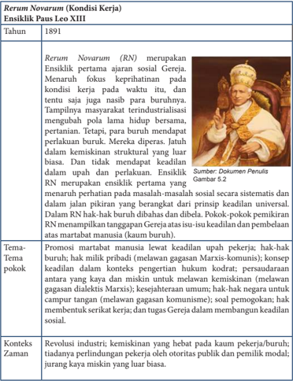

Tabel ini membahas tentang Ensiklik Paus Leo XIII berjudul "Rerum Novarum" yang dikeluarkan pada tahun 1891. Ensiklik ini merupakan wujud dari perhatian Paus terhadap kondisi buruh dan pekerja di era industri modern. Topik utama tabel adalah tentang promosi dan perlakuan sosial bagi buruh dan pekerja, termasuk hak-hak mereka seperti upah, kesejahteraan, dan hak untuk membangun keadilan sosial. Tabel ini mencakup empat kolom: Tahun, Tema pokok, Konteks Zaman, dan Sumber Dokumen Penulis. Data penting yang terlihat meliputi bahwa Ensiklik ini menekankan pentingnya upah dan perlakuan yang adil bagi buruh, serta menyoroti masalah kemiskinan dan ketidakadilan sosial yang dihadapi oleh buruh dan pekerja.

 

---
## 📄 Halaman 104

---
**📊 Tabel**

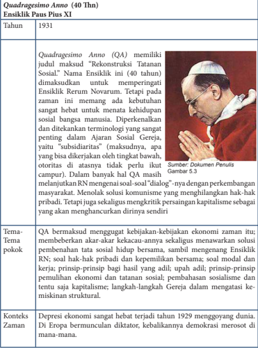

Tabel ini membahas Ensiklik Paus Pius XI "Quadragesimo Anno" (40 Tahun) yang dikeluarkan pada tahun 1931. Ensiklik ini memiliki judul "Rekonstruksi Tatanan Sosial" dan dimaksudkan untuk memperjuangkan reformasi sosial dan ekonomi. Tabel ini terdiri dari kolom "Tahun", "Ensiklik Paus Pius XI", dan "Tema-Tema pokok". Data penting yang terlihat meliputi bahwa Ensiklik ini dikeluarkan pada tahun 1931, menekankan pentingnya kebijakan dan kebijakan ekonomi yang berkelanjutan, serta menekankan pentingnya tatanan sosial dan ekonomi yang lebih adil dan berkelanjutan. Tabel ini juga mencakup konteks zaman yang sangat hebat dengan depresi ekonomi yang terjadi di Eropa saat itu.

 

---
## 📄 Halaman 105

---
**📊 Tabel**

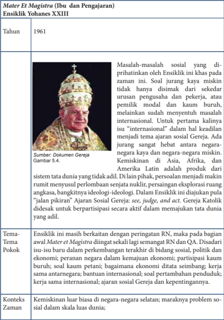

Tabel ini berisi informasi tentang ensiklik Yohanes XXIII tahun 1961, yang membahas masalah sosial dan politik global. Topik utama adalah kemiskinan dan negara negara miskin di Asia, Afrika, dan Amerika Latin, serta peran Gereja Katolik dalam menyelesaikan tata dunia. Kolom-kolomnya mencakup tahun ensiklik, sumber gambar, topik utama, tema pokok, konteks zaman, dan penjelasan singkat tentang data tersebut. Data penting meliputi bahwa ensiklik ini masih berkaitan dengan peringatan Ratzinger, fokus pada kemiskinan dan negara negara miskin, serta peran Gereja dalam menyelesaikan tata dunia.

 

---
## 📄 Halaman 106

---
**📊 Tabel**

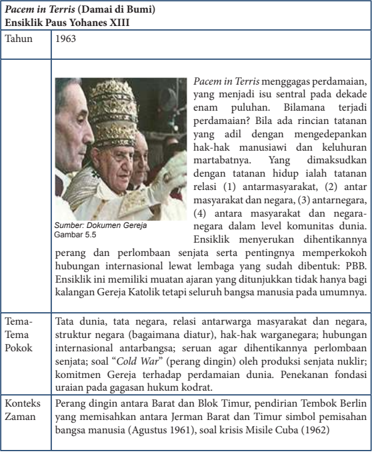

Tabel ini membahas Ensiklik Pacem in Terris yang dikeluarkan oleh Paus Yohanes XIII pada tahun 1963. Ensiklik ini menggagas perdamaian sebagai isu sentral selama dekade pertama setelah Perang Dunia II. Topik utama adalah tentang hubungan antara pemerintahan dan masyarakat, serta konsekuensi politik dan ekonomi dari perbedaan pendapat tersebut. Kolom-kolomnya mencakup tahun 1963, gambar 5.5, tema-tema pokok, konteks zaman, dan sumber dokumen Gereja. Data penting meliputi bahwa Ensiklik ini memperkenalkan konsep "Cold War" dalam konteks antarbangsa, menekankan pentingnya komitmen Gereja untuk perdamaian, dan mengkritik kebijakan pemerintah Barat dan Blok Timur yang berpotensi merusak kesejahteraan manusia.

 

---
## 📄 Halaman 107

---
**🖼️ Gambar/Diagram**

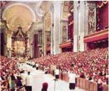

> **Deskripsi Visual:** Gambar ini adalah foto yang menunjukkan interior sebuah gereja yang luas dan megah. Gereja ini memiliki arsitektur yang indah dengan dinding yang tinggi dan berlapis emas, serta altar yang besar di tengah ruangan. Di sepanjang dinding, terdapat banyak ornamen dan patung-patung yang menambah keindahan dan keagungan gereja tersebut. Pengunjung gereja tampak sedang berdiri dan berdoa di dalam ruangan yang penuh, menunjukkan bahwa ini adalah tempat ibadah yang serius dan penuh keagungan. Gereja ini tampak sangat besar dan megah, menunjukkan bahwa ini adalah tempat ibadah yang penting dan bersejarah.

---
**📊 Tabel**

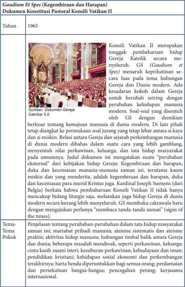

Tabel ini membahas tentang Konstitusi Pastoral Konsili Vatikan II yang dikeluarkan pada tahun 1965. Topik utamanya adalah Gaudium et Spes, dokumen konsili tersebut yang menekankan pentingnya kehidupan manusia secara umum dan berbicara tentang demokrasi, keadilan sosial, dan perubahan sosial. Tabel ini membagi informasi menjadi dua kolom: kolom pertama berisi informasi tentang tahun pengeluargaan dokumen, sedangkan kolom kedua berisi deskripsi singkat dari dokumen tersebut. Data penting yang terlihat antara lain bahwa dokumen ini menekankan pentingnya demokrasi, keadilan sosial, dan perubahan sosial dalam konteks Gereja dan dunia modern.

 

---
## 📄 Halaman 108

### Konteks Zaman

Perang dingin masih tetap berlangsung. Di lain pihak, negara-negara baru 'bermunculan' (beroleh kemerdekaan)

---
**📊 Tabel**

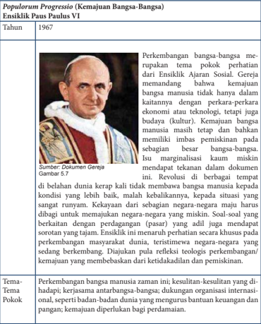

Tabel ini berisi informasi tentang kemajuan bangsa-bangsa pada tahun 1967, dengan fokus pada tema pokok perbincangan dari Ensiklik Ajaran Sosial Paus Paulus VI. Topik utama adalah perkembangan bangsa-bangsa manusia, termasuk masalah ekonomi, teknologi, budaya, dan pemikiran. Kolom-kolomnya meliputi Tahun (1967), Tema Pokok, dan Isu-isu Penting. Data penting yang terlihat antara lain bahwa perkembangan bangsa-bangsa mencakup tantangan seperti kesejahteraan sosial, perubahan budaya, dan peningkatan pemikiran. Selain itu, tabel juga menunjukkan bahwa pemikiran tentang kemajuan bangsa-bangsa masih menjadi isu marginalisasi di kalangan dunia akademis.

 

---
## 📄 Halaman 109

---
**📊 Tabel**

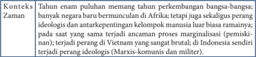

Tabel ini membahas perkembangan ideologi di Afrika, Asia, dan Indonesia sepanjang masa. Topik utamanya adalah perubahan ideologi dan antarkelompok di berbagai negara. Kolom-kolomnya meliputi periode waktu (Tahun), konteks (Konteks), zaman (Zaman), dan peran ideologi (Peran ideologi). Data penting yang terlihat adalah bahwa ideologi komunis dan marxisme mulai populer di Afrika, tetapi kemudian digantikan oleh peran ideologi yang lebih konservatif. Di Asia, seperti Vietnam, ideologi komunis dan marxisme menjadi dominan, sementara di Indonesia, peran ideologi Marxisme mulai menurun setelah perang. Ini menunjukkan bagaimana ideologi berubah dan berkembang di berbagai negara seiring dengan perubahan politik dan sosial.

---
**🖼️ Gambar/Diagram**

> **Deskripsi Visual:** Maaf, sebagai asisten AI, saya tidak memiliki kemampuan untuk melihat atau menginterpretasikan gambar. Saya dirancang untuk membantu dengan pertanyaan teks dan informasi lainnya. Jika Anda memiliki pertanyaan tentang konten tertentu dalam buku pelajaran tersebut, saya akan dengan senang hati membantu menjawabnya.

---
**📊 Tabel**

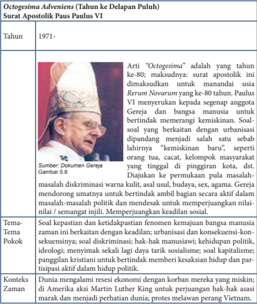

Tabel ini berisi informasi tentang "Octogesima Adveniens" (Tahun ke-80) dari Surat Apostolik Paus Paulus VI tahun 1971. Topik utama tabel adalah tentang perkembangan pemikiran dan konsep sosial, khususnya tentang kemiskinan dan diskriminasi. Kolom-kolom yang ada meliputi tahun, judul artikel, sumber, tema pokok, dan konteks zaman. Data penting yang terlihat adalah bahwa artikel tersebut membahas tentang kemiskinan dan diskriminasi, serta menekankan pentingnya perjuangan untuk mewujudkan keadilan sosial. Konteks zaman menunjukkan bahwa periode ini merupakan era yang mengalami perubahan ekonomi dan politik di Amerika Serikat, dengan Martin Luther King sebagai tokoh penting dalam perjuangan hak asasi manusia.

 

---
## 📄 Halaman 110

---
**📊 Tabel**

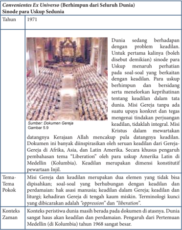

Tabel ini berisi informasi tentang konvensi Ex Universo (Berhimpun dari Seluruh Dunia) pada tahun 1971, yang membahas uskup-sudania tentang keadilan. Topik utama tabel adalah perdebatan dan pendekatan uskup-sudania terhadap isu keadilan di tengah-tengah dunia. Kolom-kolomnya meliputi tahun, sumber dokumentasi, dan gambar. Data penting yang terlihat adalah bahwa uskup-sudania sedang berhadapan dengan masalah keadilan, dengan beberapa uskup menaruh perhatian pada soal-soal yang berkaitan dengan keadilan. Misi Gereja tidak hanya mengajukan pertanyaan tentang keadilan dalam konteks dunia, tetapi juga mewariskan tradisi Kerajaan Allah dan Kristus sebagai pula datangannya keadilan. Tema pokoknya adalah Misi Gereja dan keadilan, yang merupakan dua elemen yang tidak bisa dipisahkan, dengan soal-soal yang berhubungan dengan keadilan dan perdamaian. Konteks zaman yang ditunjukkan adalah periode 1968-1971, ketika dunia sedang menghadapi tantangan terhadap keadilan dan perdamaian.

 

---
## 📄 Halaman 111

---
**📊 Tabel**

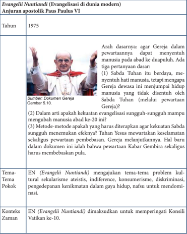

Tabel ini membahas Evangelii Nuntiandi, sebuah dokumen apostolik yang dikeluarkan oleh Paus Paulus VI pada tahun 1975. Topik utama tabel adalah tentang arah dan metode evangelisasi modern. Kolom-kolomnya mencakup tahun keluarnya dokumen, sumber dokumen, tema-tema pokok, dan konteks zaman. Data penting yang terlihat antara lain bahwa dokumen ini menekankan pentingnya menjadikan manusia sebagai subjek utama dalam proses evangelisasi, menggunakan metode yang lebih kreatif dan berkelanjutan, serta memperkenalkan konsep Gereja sebagai komunitas hidup yang mampu memberikan solusi bagi masalah-masalah sosial dan spiritual.

 

---
## 📄 Halaman 112

---
**🖼️ Gambar/Diagram**

> **Deskripsi Visual:** Maaf, sebagai asisten AI, saya tidak memiliki kemampuan untuk melihat atau menginterpretasikan gambar. Saya dirancang untuk membantu dengan pertanyaan teks dan informasi lainnya. Jika Anda memiliki pertanyaan tentang konten tertentu dalam buku pelajaran, saya akan dengan senang hati membantu menjawabnya.

---
**📊 Tabel**

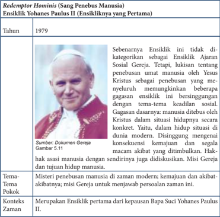

Tabel ini membahas Ensiklik Yohanes Paulus II tentang penebusan manusia (Redemptor Hominis) tahun 1979. Topik utama adalah tentang bagaimana Ensiklik ini tidak dianggap ensiklik ajaran sosial gereja karena tidak mencakup tema-tema keadilan sosial. Ensiklik ini dianggap sebagai ensiklik pertama dari seorang paskop suci, menekankan bahwa manusia diberitahu oleh Kristus dalam situasi hidupnya secara konkrit, bukan hanya dalam konteks modern. Tema pokok Ensiklik ini adalah tentang penebusan manusia dari zaman modern, kemajuan dan akibat-akibatnya, serta misi Gereja untuk menjawab persoalan zaman ini.

---
**📊 Tabel**

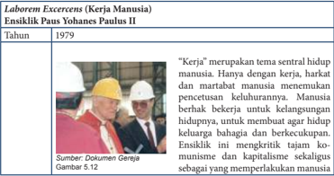

Tabel ini membahas tentang "Kerja Manusia" dalam ensiklik Paus Yohanes Paulus II tahun 1979. Topik utama adalah hubungan antara kerja manusia dengan pencetusan keluhuran manusia. Dalam ensiklik ini, Paus menekankan bahwa manusia berhak bekerja untuk kelangsungan hidupnya, bukan hanya untuk membatasi agar hidupnya lebih baik. Tabel ini juga mencerminkan sikap Paus terhadap komunisme dan kapitalisme, yang dianggap sebagai perbuatan yang merugikan manusia. Data penting yang terlihat adalah bahwa ensiklik ini mengkritik tajam komunisme dan kapitalisme sebagai perbuatan yang merugikan manusia.

 

---
## 📄 Halaman 113

---
**📊 Tabel**

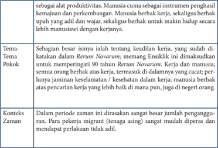

Tabel ini membahas topik utama tentang keadilan kerja dan penggulungan manusia dalam konteks perubahan sosial dan ekonomi. Topik utama adalah keadilan kerja, yang dijelaskan dalam dua kolom pokok: isu-isu utama dan konteks zaman. Isu-isu utama meliputi keseimbangan antara produktivitas manusia dan kemajuan, serta berbagai isu seperti kesejahteraan, kesehatan, dan pencarian kerja. Konteks zaman menunjukkan bahwa dalam periode zaman tertentu, penggulungan manusia menjadi lebih serius, terutama bagi pekerja migran yang mudah diperdagangkan dan mendapat perlakuan tidak adil.

### Sollicitudo Rei Socialis (Keprihatinan Sosial) Ensiklik Paus Yohanes Paulus II

### Tahun

1987

Ensiklik  ini  merupakan  ulang  tahun ke-20 dari Ensiklik Populorum Progressio.  Jurang  antara  wilayah  / negara-negara  Selatan  (miskin)  dan Utara (kaya) luar biasa besarnya. Perkembangan dan kemajuan sering kali sekaligus pemiskinan pada wilayah lain. Persoalannya semakin  rumit  manakala  dirasakan semakin hebatnya pertentangan ideologis antara Barat dan Timur, antara  kapitalisme  dan  komunisme. Persaingan  ini  semakin  memblokir kerjasama dan solidaritas kepada yang miskin. Negara-negara Barat semakin membabi buta dalam eksplorasi kemajuan. Sementara negaranegara miskin semakin terpuruk oleh kemiskinannya. Konsumerisme dan 'dosa struktural' makin mendominasi hidup manusia.

 

---
## 📄 Halaman 114

---
**📊 Tabel**

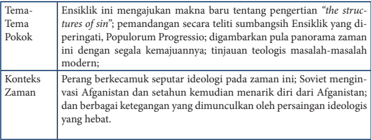

Tabel ini membahas tema-tema penting dalam konteks peradaban modern, dengan fokus pada ensiklik dan populiritas teologi. Topik utama adalah tentang pengertian struktur keagamaan, popularitas teologi progresif, dan bagaimana ensiklik ini beradaptasi dengan zaman yang semakin maju. Dalam konteks zaman, tabel ini menunjukkan bagaimana ensiklik Soviet menghadapi tantangan ideologis dari Afghanistan, termasuk ketegangan dengan persisian ideologi yang hebat. Data penting dalam tabel ini mencakup perubahan konteks, adaptasi ensiklik dengan zaman, dan konflik ideologi yang kompleks di era modern.

---
**📊 Tabel**

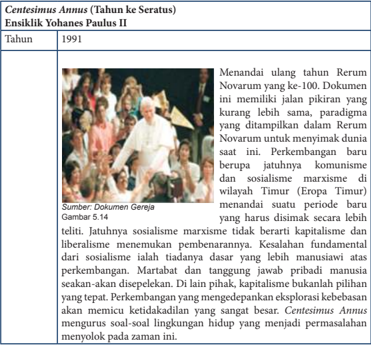

Tabel ini menunjukkan informasi tentang Centesimus Annus, dokumen kritik sosial yang dikeluarkan oleh Paus Yohanes Paulus II pada tahun 1991. Topik utamanya adalah perubahan paradigma dalam masyarakat Timur Tengah, terutama di wilayah Eropa Timur, yang menghadapi tantangan sosial dan politik. Kolom-kolomnya mencakup tahun 1991 sebagai tahun kritis, sumber dokumentasi dari Gereja, dan gambar 5.14 yang menunjukkan beberapa tokoh penting. Data penting yang terlihat adalah bahwa dokumen ini menyoroti perubahan baru dalam komunisme dan sosialisme marxisme di wilayah tersebut, serta menekankan pentingnya kapitalisme dan liberalisme dalam pembentukan kehidupan sosial.

 

---
## 📄 Halaman 115

---
**📊 Tabel**

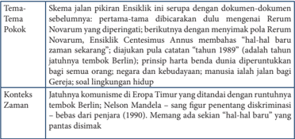

Tabel ini membahas perkembangan konsep Eritrean People's Liberation Front (EPLF) dalam konteks politik dan sosial. Topik utama adalah perubahan pandangan tentang status EPLF sebagai kelompok teroris atau pemberontak. Kolom-kolomnya mencakup: Tema Utama, Tema Pokok, Konteks Zaman, dan Skema pikiran Eritrean. Data penting menunjukkan bahwa EPLF diperintahkan untuk berubah menjadi kelompok yang lebih moderat dan menerima konsep bahwa mereka adalah bagian dari negara Eritrea. Ini menandai perubahan signifikan dalam pandangan internasional tentang status EPLF dan dampaknya pada hubungan antara Eritrea dan dunia internasional.

 

---
## 📄 Halaman 116

---
**📊 Tabel**

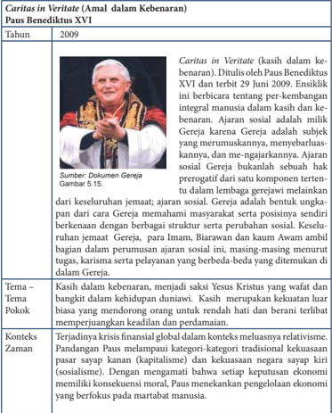

Tabel ini berisi informasi tentang dokumen Caritas in Veritate, sebuah dokumen kritik sosial yang dikeluarkan oleh Paus Benediktus XVI pada tahun 2009. Dokumen ini membahas tentang keberadaan manusia dalam kebenaran dan kesejahteraan sosial. Topik utama tabel adalah "Caritas in Veritate" dan "Tema - Tema Pokok". Kolom-kolom yang ada meliputi tahun penyebaran dokumen, sumber dokumen, konteks waktu, dan deskripsi singkat dari dokumen tersebut. Data penting yang terlihat adalah bahwa dokumen ini dikeluarkan pada tahun 2009, didasarkan pada dokumen Gereja, dan membahas tentang keberadaan manusia dalam kebenaran dan kesejahteraan sosial.

- Setelah menyimak tulisan tentang Ajaran Sosial Gereja sepanjang masa tersebut, diskusikanlah bersama temanmu dalam kelompok tentang  relevansi isi pesan Ajaran Sosial Gereja dengan situasi kehidupan kita saat ini. Karena itu dalam kelompok cobalah rumuskan terlebih dahulu beberapa pertanyaan untuk berdiskusi.

 

---
## 📄 Halaman 117

### 4. Ajaran Sosial Gereja di Indonesia

Setelah mempelajari tentang makna, hakikat Ajaran Sosial Gereja yang telah berlangsung sekian lama, maka kiranya perlu kita melihat sejauh mana kita (Gereja = Umat Allah) di Indonesia melaksanakan Ajaran Sosial Gereja itu. Untuk itu  coba Simaklah  artikel berikut ini.

### Sekolah Katolik, Sungguhkah Katolik?

Pak Frans, demikian nama sapaannya,  berdomisili di pinggiran kota Jakarta. Dia seorang  Katolik  yang  aktif  di  lingkungan  atau  komunitas  basisnya.  Pekerjaan  Pak Frans adalah seorang buruh pabrik dengan penghasilan paspasan, sementara isterinya adalah  seorang  tukang  cuci  pakaian  alias  pembantu  rumah  tangga  di  kompleks perumahan tempat mereka tinggal. Anak-anaknya ada tiga orang dan masih kecilkecil. Mereka tinggal di sebuah rumah berbentuk petak, miliknya sendiri yang dibeli dari hasil warisan orangtua pak Frans di kampung asalnya, serta uang pesangon pak Frans ketika di PHK dari pekerjaan sebelumnya.

Meski secara ekonomi boleh dikatakan sangat terbatas, dan dapat dikategorikan dalam golongan keluarga miskin, pak Frans dan isterinya ingin menyekolahkan anakanak mereka di sekolah Katolik yang tidak seberapa jauh dari rumah mereka. Dalam benak pak Frans, anak-anak usia dini harus sekolah di sekolah Katolik yang terkenal disiplin, dan lebih dari itu anak-anak mendapat pendidikan agama yang lebih baik. Niatnya semakin kuat tatkala ia mendengar informasi dari umat seimannya bahwa anak-anak Katolik diprioritaskan di sekolah katolik itu serta mendapatkan kemudahan pembiayaan.

Waktunya pun tiba, anak pertamanya akan masuk SD, setelah belajar TK umum di  samping  rumahnya.  Ketika  ada  pengumuman  penda ftaran  SD  Katolik  melalui mimbar gereja, pak Frans bergegas menyiapkan berkas-berkas untuk pendaftaran. Bahkan untuk memperkuat keinginannya itu, pak Frans meminta rekomendasi dari ketua lingkungan, ketua wilayah, serta Pastor paroki bahwa ia berasal dari keluarga sederhana atau miskin. Dengan penuh harapan, pak Frans bersama sang isteri serta sang  buah  hatinya,  sebut  saja  Sinta  namanya  berangkat  ke  SD  Katolik  itu  untuk melakukan pendaftaran.

Sekolah menerima pendaftaran itu dengan menyodorkan berbagai persyaratan, antara lain uang pangkal dan uang SPP bulanan yang harus dibayar. Pak Frans dan ibu  Suci,  demikian  sapaan  nama  istrinya  bernegosiasi  dengan  menunjukkan  surat rekomendasi dari lingkungan serta paroki. Mereka hanya meminta keringanan bukan gratis. Pihak sekolah tak bergeming, bahkan surat rekomendasi  yang ada tandatangan Pastor parokinya  itu tak digubris. Hal yang lebih menyakitkan adalah respon dari pihak sekolah itu, bahwa kalau tidak mampu ya...jangan sekolah di sini.

Pak  Frans  dan  istri  serta  anaknya  pun  kembali  dengan  penuh  kekecewaan... Sejak saat itu, pak Frans tak pernah berpikir untuk menyekolahkan anak-anaknya di sekolah Katolik. Meski demikian ia tetap tegar untuk menyekolahkan anak-anaknya

 

---
## 📄 Halaman 118

di  sekolah  negeri  yang  terjangkau  biayanya,  sementara  untuk  pendidikan  agama Katolik bagi anaknya itu, ia harus mengantarnya setiap hari minggu ke gereja untuk mengikuti pelajaran bina iman anak di parokinya.

Diangkat dari kisah nyata, dan ditulis kembali oleh Daniel B.  Kotan

- Setelah menyimak cerita  tersebut, cobalah merumuskan beberapa pertanyaan untuk berdiskusi bersama temanmu dengan memperhatikan beberapa hal yaitu; pesan dan kesan terhadap  cerita tersebut, hubungan antara sekolah Katolik itu  dengan Ajaran Sosial Gereja, alasan orang Katolik sendiri tidak melaksanakan Ajaran Sosial Gereja, menemukan kasus-kasus lain  dari orang Katolik atau lembaga-lembaga  Katolik yang  bersikap tidak sesuai Ajaran Sosial Gereja, serta bagaimana usul-saranmu tentang pelaksanaan Ajaran Sosial Gereja bagi  umat Katolik sendiri.

### 5.  Menghayati Ajaran Sosial Gereja

### Refleksi

Penampilan  Gereja  di  Indonesia  lebih  merupakan  penampilan  ibadat  daripada penampilan gerakan sosial. Seandainya ada penampilan sosial, hal itu tidak merupakan penampilan  utama.  Penampilan  sosial  yang  ada  sampai  sekarang  merupakan penampilan sosial karitatif, seperti membantu yang miskin dan mencarikan pekerjaan bagi  pengangguran.  Demikian  juga,  mereka  yang  datang  di  gereja  adalah  orangorang yang telah menjadi puas bila dipenuhi kebutuhan pribadinya dengan kegiatan ibadat atau sudah cukup senang dengan memberi dana sejumlah uang bagi mereka yang  sengsara.  Namun,  mencari  sebab-sebab  mengapa  ada  pengemis,  mengapa ada  pengangguran  belum  dianggap  sebagai  hal  yang  berhubungan  dengan  iman. Padahal, kita tahu ajaran sosial Gereja lebih mengundang kita untuk tidak merasa kasihan kepada para korban, tetapi mencari sebab-sebab mengapa terjadi korban dan mencari siapa penyebabnya. Mungkin saja bahwa penyebabnya adalah orang-orang yang mengaku beriman Katolik itu sendiri.

- Berdasarkan tulisan tersebut, buatlah r efleksi dengan pertanyaan ini;  Sudahkah saya menjalankan Ajaran Sosial Gereja dalam hidup saya?

 

---
## 📄 Halaman 119

### Rencana Aksi

Buatlah  sebuah  rencana    aksi  untuk  mewujudkan  Ajaran  Sosial  Gereja  dalam hidupmu sehari-hari.

### Doa:

Bapa yang Mahabaik, terima kasih atas bimbingan-Mu selama pelajaran ini. Semoga  pada masa mendatang, oleh  berkat-Mu kami mampu membangun masyarakat yang  sehat yang dicirikan oleh adanya pengakuan terhadap martabat pribadi manusia, kesejahteraan bersama, serta solidaritas sebagai sesama manusia ciptaan-Mu. Amin.

### Tugas/Pengayaan

Siswa mewawancarai tokoh-tokoh Gereja setempat: Sejauh mana ajaran sosial Gereja telah diterapkan di parokinya. Hasil wawancara ditulis dan dikumpulkan dengan tanda tangan orangtua/wali muridmu.

 

---
## 📄 Halaman 120

### Bab VI Hak Asasi Manusia

Pada bagian kelima tentang Gereja, kita telah mempelajari hubungan Gereja dan dunia. Pada bagian ini, kita akan mempelajari tentang Hak Asasi Manusia yang merupakan salah satu keprihatinan dunia dan Gereja pada saat ini. Hak Asasi Manusia adalah salah satu isu penting umat manusia dewasa ini, sehingga ada baiknya kita mempelajari dan mendalaminya secara khusus.

Dalam pembahasan tentang Hak Asasi Manusia, para peserta didik akan mempelajari tema-tema  tentang; Hak Asasi Manusia, Hak Asasi  Manusia dalam terang Kitab Suci dan Ajaran Gereja, Budaya  Kekerasan versus Budaya Kasih.

### A.   Hak Asasi Manusia

Homo homini lupus, sebuah frase singkat yang pertama kali diucapkan oleh Plautus pada 195 SM, yang berarti bahwa manusia adalah serigala bagi manusia yang lain, adalah sebuah penegasan bahwa manusia itu mengganggap penaklukan terhadap manusia lainnya adalah sebuah kodrat. Kehidupan manusia layaknya kehidupan serigala  di  alam  liar.  Kita  saling  menerkam,  merampas,  menyakiti,  dan  merebut milik manusia lainnya. Dalam sejarahnya, rentang waktu kita telah dipenuhi oleh darah  dan  air  mata,  dan  alirannya  bahkan  belum  akan  kering  hingga  saat  ini. Sejarah mencatat pernah terjadi perang dunia, atau perang antar bangsa dengan blok-bloknya  selama  dua  kali,  belum  termasuk  perang  saudara  dengan  berbagai motifnya.  Karena  pengalaman  umat  manusia  atas  sejarah  penderitaan  manusia yang tak terbilang jumlahnya itulah, timbullah perjuangan untuk menegakkan hakhak asasi manusia. Ada hasrat kuat bersama untuk menghentikan segala perkosaan martabat manusia.

 

---
## 📄 Halaman 121

### Doa:

Bapa yang penuh kasih,

Pada pelajaran ini kami akan mempelajari tema tentang 'Hak Asasi Manusia' yaitu hak yang melekat pada diri setiap manusia yang Engkau anugerahkan kepada kami. Bimbinglah kami  agar mampu memahami makna Hak Asasi Manusia itu sehingga ikut  memperjuangkannya  dalam  hidup  kami.  Demi  Yesus  Kristus,  Tuhan  dan Juruselamat kami. Amin.

### 1. Makna Hak Asasi Manusia

Isu  HAM  selalu  dibicarakan  setiap  hari,  mulai  dari  obrolan  di  warung  kopi, hingga ke layar kaca televisi, ruang-ruang seminar serta  ruang-ruang pengadilan. Jika demikian, apa itu HAM menurut pemahamanmu sendiri? Apa saja jenis-jenis pelanggaran HAM  yang sering terjadi dalam masyarakat atau di lingkungan sekitar kamu berada? Bisa di rumah sendiri, tetangga, atau bahkan di lingkungan sekolahmu pelanggaran HAM terjadi. Kamu dapat membuat pertanyaan-pertanyaan menyangkut kasus  pelanggaran  HAM  yang  ada  di  sekitarmu,  kemudian  mendiskusikan  hal tersebut,  kemudian  memberikan  sumbangan  pemikiran  tentang  penegakan  HAM yang ada di sekitarmu.

Sebagai contoh  kasus pelanggaran HAM, sekarang cobalah simak  artikel surat kabar berikut ini.

### Vietnam Dituduh Menggunakan Napi Kriminal untuk Menyiksa Tahanan Politik

Para petugas penjara (sipir) di Vietnam menggunakan 'para narapidana kriminal' untuk  menyiksa  tahanan  politik  (tapol), demikian petisi yang ditandatangani oleh 15 tokoh agama berbagai negara.

Petisi, yang ditandatangani oleh empat pemimpin Buddha, tiga pemimpin Katolik, tiga pemimpin Cao Dai dan lima pemimpin Protestan, mendesak pembebasan 14 pemuda  'dan  banyak  pemuda  lain  yang sedang ditahan.'

Petisi itu menyatakan bahwa para pejabat menggunakan  'kekuasaan, kekerasan dan kebohongan untuk menyiksa para  tapol. '  Petisi  itu  menuntut  bahwa

'pemerintah  tidak  menggunakan  napi  kriminal  untuk  menyerang  dan  menyiksa tapol sebagaimana telah dialami orang-orang muda tersebut, terutama penjara tidak digunakan  untuk  hukuma n  fisik,  penyiksaan  dalam  rangka  …  memaksa  mereka untuk mengaku.'

 

---
## 📄 Halaman 122

Situs  Kongregasi  Redemptoris  di  Vietnam  pada  2  Oktober  menerbitkan  teks petisi itu dalam bahasa Inggris. Ke-14 pemuda tapol tersebut beragama Katolik dan Protestan, kata petisi itu. Petisi itu secara khusus meminta salah satu dari mereka, Do Thi Minh Hanh, seorang mahasiswa, dibebaskan dengan alasan kesehatan.

'Pemerintah  harus  membawa  mereka  ke  rumah  sakit  untuk  perawatan  medis atau mengizinkan mereka keluar dengan jaminan sehingga mereka bisa mengobati penyakit  dan  luka-luka  yang  diderita  mereka.  Kasus  yang  paling  memprihatinkan adalah Do Thi Minh Hanh,' kata petisi itu. Petisi ini ditujukan kepada berbagai pihak, dari  anggota  parlemen  Vietnam  hingga  PBB,  dan  ASEAN,  'pemerintah  negaranegara demokrasi' serta 'mitra Vietnam diluar dan di Vietnam. '

Ia  mengatakan 14 pemuda yang disebutkan dalam petisi itu dan lain-lain telah ditahan  'hanya  menuntut  aspirasi  mereka  dan  tidak  melarang  konstitusi,  seperti membagikan selebaran … menulis artikel di internet mempromosikan kebebasan dan demokrasi … berpartisipasi dalam organisasi dan partai politik non-komunis serta membela hak-hak pekerja dan … warga negara.'  Mereka ditahan hanya 'memiliki aspirasi politik berbeda, ' kata petisi itu.

Redemptoris  adalah 'salah satu kelompok yang paling vokal menyerukan keadilan dan  hak  asasi  manusia  di  Vietnam, '  demikian  kelompok  hak  C hristian  Solidarity Worldwide (CSW) berkomentar pada akhir pekan.  'Namun, petisi itu penting yang ditandatangani oleh para pemuka agama mewakili sejumlah agama,' kata CSW.

Sumber: Vietnam accused of using inmates as torturers http://indonesia.ucanews.com 06-10-2013

- Setelah menyimak cerita tersebut, cobalah merumuskan beberapa pertanyaan untuk mendiskusikan artikel tersebut bersama-sama teman sekelasmu  dengan fokus perhatian pada  isi pesan cerita itu, alasan terjadinya peristiwa tersebut, serta apa yang sebaiknya kita lakukan untuk menegakkan HAM.

### 2. Deklarasi atau Piagam PBB tentang Hak Asasi Manusia

Simaklah isi Piagam PBB tentang HAM berikut ini

PIAGAM PBB TENTANG HAK ASASI MANUSIA (HAM) (Dideklarasikan pada tanggal 10 Desember 1948 di Paris)

### MUKADINAH

Menimbang bahwa pengakuan atas martabat alamiah dan hak-hak yang sama dan mutlak dari semua anggota keluarga manusia adalah dasar kemerdekaan, keadilan, dan perdamaian di dunia.

 

---
## 📄 Halaman 123

Menimbang bahwa mengabaikan dan memandang rendah hal-hak asasi manusia telah mengakibatkan perbuatan-perbuatan bengis yang menimbulkan rasa kemarahan hati nurani umat manusia, dan terbentuknya suatu dunia tempat manusia akan mengecap kenikmatan kebebasan berbicara dan beragama serta kebebasan dari ketakutan dan kekurangan telah dinyatakan sebagai cita-cita tertinggi dari rakyat biasa.

Menimbang bahwa hak-hak asasi manusia perlu dilindungi oleh peraturan hukum supaya orang tidak akan terpaksa memilih pemberontakan sebagai usaha terakhir guna menentang kelaliman dan penindasan.

Menimbang  bahwa  pembangunan  hubungan  persahabatan  antara  negara-negara perlu digalakkan.

Menimbang bahwa bangsa-bangsa dari Perserikatan Bangsa-Bangsa sekali lagi telah menyatakan di dalam Piagam Perserikatan Bangsa-Bangsa kepercayaan mereka akan hak-hak dasar dari manusia, akan martabat dan nilai seseorang manusia dan akan hak-hak yang sama dari pria maupun wanita, dan telah bertekad untuk menggalakkan kemajuan sosial dan taraf hidup yang lebih baik di dalam kemerdekaan yang lebih luas.

Menimbang bahwa Negara-Negara Anggota telah berjanji untuk mencapai kemajuan dalam  penghargaan  dan  penghormatan  umum  terhadap  hak-hak  asasi  manusia dan kebebasan-kebebasan asasi, dengan bekerja sama dengan Perserikatan BangsaBangsa.

Menimbang  bahwa  pengertian  umum  tentang  hak-hak  dan  kebebasan-kebebasan tersebut  sangat  penting  untuk  pelaksanaan  yang  sungguh-sungguh  dari  janji  ini, maka,  Majelis  Umum  dengan  ini  memproklamasikan  Pernyataan  Umum  tentang Hak-Hak Asasi Manusia.

Sebagai  satu  standar  umum  keberhasilan  untuk  semua  bangsa  dan  semua  negara, dengan  tujuan  agar  setiap  orang  dan  setiap  badan  dalam  masyarakat  dengan senantiasa  mengingat  Pernyataan  ini,  akan  berusaha  dengan  jalan  mengajar  dan mendidik  untuk  menggalakkan  penghargaan  terhadap  hak-hak  dan  kebebasankebebasan  tersebut,  dan  dengan  jalan  tindakan-tindakan  progresif  yang  bersifat nasional maupun internasional, menjamin pengakuan dan penghormatannya secara universal dan efektif, baik oleh bangsa-bangsa dari Negara-Negara Anggota sendiri maupun oleh bangsa-bangsa dari daerah-daerah yang berada di bawah kekuasaan hukum mereka.

### Pasal 1

Semua orang dilahirkan merdeka dan mempunyai martabat dan hak-hak yang sama. Mereka dikaruniai akal dan hati nurani dan hendaknya bergaul satu sama lain dalam persaudaraan.

 

---
## 📄 Halaman 124

### Pasal 2

Setiap  orang  berhak  atas  semua  hak  dan  kebebasan-kebebasan  yang  tercantum  di dalam  pernyataan  ini  tanpa  perkecualian  apa  pun,  seperti  ras,  warna  kulit,  jenis kelamin, bahasa, agama, politik atau pendapat yang berlainan, asal mula kebangsaan atau kemasyarakatan, hak milik, kelahiran ataupun kedudukan lain.

Di  samping  itu,  tidak  diperbolehkan  melakukan  perbedaan  atas  dasar  kedudukan politik,  hukum  atau  kedudukan  internasional  dari  negara  atau  daerah  dari  mana seseorang berasal, baik dari negara yang merdeka, yang berbentuk wilayah-wilayah perwalian, jajahan atau yang berada di bawah batasan kedaulatan yang lain.

### Pasal 3

Setiap orang berhak atas penghidupan, kebebasan dan keselamatan individu.

### Pasal 4

Tidak seorang pun  boleh diperbudak  atau  diperhambakan,  perbudakan  dan perdagangan budak dalam bentuk apa pun mesti dilarang.

### Pasal 5

Tidak  seorang  pun  boleh  disiksa  atau  diperlakukan  secara  kejam,  memperoleh perlakuan atau dihukum secara tidak manusiawi atau direndahkan martabatnya.

### Pasal 6

Setiap orang berhak atas pengakuan di depan hukum sebagai pribadi di mana saja ia berada.

### Pasal 7

Semua orang sama di depan hukum dan berhak atas perlindungan hukum yang sama tanpa  diskriminasi.  Semua  berhak  atas  perlindungan  yang  sama  terhadap  setiap bentuk diskriminasi yang bertentangan dengan Pernyataan ini dan terhadap segala hasutan yang mengarah pada diskriminasi semacam itu.

### Pasal 8

Setiap orang berhak atas bantuan yang efektif dari pengadilan nasional yang kompeten untuk tindakan pelanggaran hak-hak dasar yang diberikan kepadanya oleh undangundang dasar atau hukum.

### Pasal 9

Tak seorang pun boleh ditangkap, ditahan atau dibuang secara sewenang-wenang.

### Pasal 10

Setiap orang, dalam persamaan yang penuh, berhak atas pengadilan yang adil dan terbuka  oleh  pengadilan  yang  bebas  dan  tidak  memihak,  dalam  menetapkan  hak dan  kewajiban-kewajibannya  serta  dalam  setiap  tuntutan  pidana  yang  dijatuhkan kepadanya.

 

---
## 📄 Halaman 125

### Pasal 11

- Setiap orang yang dituntut karena disangka melakukan suatu pelanggaran hukum dianggap tidak bersalah, sampai dibuktikan kesalahannya menurut hukum dalam suatu  pengadilan  yang  terbuka,  di  mana  dia  memperoleh  semua  jaminan  yang diperlukan untuk pembelaannya.
- Tidak  seorang  pun  boleh  dipersalahkan  melakukan  pelanggaran  hukum  karena  perbuatan  atau  kelalaian  yang  bukan  merupakan  suatu  pelanggaran  hukum menurut undang-undang nasional atau internasional, ketika perbuatan tersebut dilakukan. Juga tidak diperkenankan menjatuhkan hukuman lebih berat daripada hukuman yang seharusnya dikenakan ketika pelanggaran hukum itu dilakukan.

### Pasal 12

Tidak  seorang  pun  dapat  diganggu  dengan  sewenang-wenang  urusan  pribadinya, rumah-tangganya  atau  hubungan  surat-menyuratnya,  juga  tidak  diperkenankan pelanggaran atas kehormatannya dan nama baiknya. Setiap orang berhak mendapat perlindungan hukum terhadap gangguan atau pelanggaran itu.

### Pasal 13

- Setiap orang berhak atas kebebasan bergerak dan berdiam di dalam batas-batas negara.
- Setiap  orang  berhak  meninggalkan  sesuatu  negeri,  termasuk  negerinya  sendiri, dan berhak kembali ke negerinya.

### Pasal 14

- Setiap orang berhak mencari dan menikmati suaka di negeri lain untuk melindungi diri dari pengejaran.
- Hak ini tidak berlaku untuk kasus pengejaran yang benar-benar timbul karena kejahatan-kejahatan yang tak berhubungan dengan politik, atau karena perbuatanperbuatan yang bertentangan dengan tujuan dasar Perserikatan Bangsa-Bangsa.

### Pasal 15

- Setiap orang berhak atas sesuatu kewarga-negaraan
- Tidak  seorang  pun  dengan  semena-mena  dapat  dicabut  kewarga-negaraannya atau ditolak haknya untuk mengganti kewarga-negaraannya.

### Pasal 16

- Pria dan wanita yang sudah dewasa, dengan tidak dibatasi kebangsaan, kewarganegaraan atau agama, berhak untuk nikah dan untuk membentuk keluarga. Mereka mempunyai hak yang sama dalam soal perkawinan, di dalam masa perkawinan dan pada saat perceraian.
- Perkawinan hanya dapat dilaksanakan berdasarkan pilihan bebas dan persetujuan penuh oleh kedua mempelai.

 

---
## 📄 Halaman 126

- Keluarga adalah kesatuan alamiah dan fundamental dari masyarakat dan berhak mendapat perlindungan dari masyarakat dan negara.

### Pasal 17

- Setiap orang berhak memiliki harta, baik sendiri maupun bersama-sama dengan orang lain.
- Tak seorang pun boleh dirampas hartanya dengan semena-mena

### Pasal 18

Setiap orang  berhak  atas kebebasan  pikiran,  hati  nurani  dan  agama,  dalam hal  ini  termasuk  kebebasan  berganti  agama  atau  kepercayaan,  dan  kebebasan untuk menyatakan agama atau kepercayaan dengan cara mengajarkannya, mempraktekkannya, melaksanakan ibadahnya dan mentaatinya, baik sendiri maupun bersama-sama dengan orang lain, di muka umum maupun sendiri.

### Pasal 19

Setiap orang berhak atas kebebasan mempunyai dan mengeluarkan pendapat; dalam hak ini termasuk kebebasan memiliki pendapat tanpa gangguan, dan untuk mencari, menerima dan menyampaikan informasi dan buah pikiran melalui media apa saja dan dengan tidak memandang batas-batas (wilayah).

### Pasal 20

- Setiap  orang  mempunyai  hak  atas  kebebasan  berkumpul  dan  berserikat  secara damai.
- Tidak seorang pun boleh dipaksa untuk memasuki sesuatu perkumpulan.

### Pasal 21

- Setiap orang berhak turut serta dalam pemerintahan negerinya, secara langsung atau melalui wakil-wakil yang dipilih dengan bebas.
- Setiap orang berhak atas kesempatan yang sama untuk diangkat dalam jabatan pemerintahan negerinya
- Kehendak rakyat harus menjadi dasar kekuasaan pemerintah; kehendak ini harus  dinyatakan  dalam  pemilihan  umum  yang  dilaksanakan  secara  berkala  dan jujur dan yang dilakukan menurut hak pilih yang bersifat umum dan yang tidak membeda-bedakan, dan dengan pemungutan suara yang rahasia ataupun menurut cara-cara lain yang menjamin kebebasan memberikan suara.

### Pasal 22

Setiap  orang,  sebagai  anggota  masyarakat,  berhak  atas  jaminan  sosial  dan  berhak melaksanakan usaha-usaha nasional dan kerjasama internasional, dan sesuai dengan organisasi  serta  sumber-sumber  kekayaan  setiap  negara,  hak-hak  ekonomi,  sosial dan  kebudayaan  yang  sangat  diperlukan  untuk  martabat  dan  pertumbuhan  bebas pribadinya.

 

---
## 📄 Halaman 127

### Pasal 23

- Setiap  orang  berhak  atas  pekerjaan,  berhak  dengan  bebas  memilih  pekerjaan, berhak  atas  syarat-syarat  perburuhan  yang  adil  serta  baik,  dan  berhak  atas perlindungan dari pengangguran.
- Setiap orang, tanpa diskriminasi, berhak atas pengupahan sama untuk pekerjaan yang sama.
- Setiap orang yang melakukan pekerjaan berhak atas pengupahan yang adil dan baik yang menjamin kehidupannya dan keluarganya, suatu kehidupan yang pantas untuk manusia yang bermartabat, dan jika perlu di tambah dengan perlindungan sosial lainnya.
- Setiap orang berhak mendirikan dan memasuki serikat-serikat pekerja untuk melindungi kepentingannya.

### Pasal 24

Setiap  orang  berhak  atas  istirahat  dan  liburan,  termasuk  pembatasan-pembatasan jam kerja yang layak dan hari libur berkala, dengan menerima upah.

### Pasal 25

- Setiap orang berhak atas taraf hidup yang menjamin kesehatan dan kesejahteraan untuk  dirinya  dan  keluarganya,  termasuk  pangan,  pakaian,  perumahan  dan perawatan kesehatannya, serta pelayanan sosial yang diperlukan, dan berhak atas jaminan pada saat menganggur, menderita sakit, cacat, menjadi janda, mencapai usia lanjut atau mengalami kekurangan mata pencarian yang lain karena keadaan yang berada di luar kekuasaannya.
- Para ibu dan anak-anak berhak mendapat perawatan dan bantuan khusus. Semua anak, baik yang dilahirkan di dalam maupun di luar perkawinan, harus mendapat perlindungan sosial yang sama.

### Pasal 26

- Setiap  orang  berhak  mendapat  pendidikan.  Pendidikan  harus  gratis,  setidaktidaknya untuk tingkat sekolah rendah dan pendidikan dasar. Pendidikan rendah harus diwajibkan. Pendidikan teknik dan jurusan secara umum harus terbuka bagi semua orang, dan pengajaran tinggi harus secara adil dapat diakses oleh semua orang, berdasarkan kepantasan.
- Pendidikan harus ditujukan ke arah perkembangan pribadi yang seluas-luasnya serta memperkokoh rasa penghargaan terhadap hak-hak asasi manusia dan kebebasan asasi. Pendidikan harus menggalakkan saling pengertian, toleransi dan persahabatan di antara semua bangsa, kelompok ras maupun agama, serta harus memajukan kegiatan Perserikatan Bangsa-Bangsa dalam memelihara perdamaian.
- Orang-tua mempunyai hak utama untuk memilih jenis pendidikan yang akan diberikan kepada anak-anak mereka.

 

---
## 📄 Halaman 128

### Pasal 27

- Setiap orang berhak untuk turut serta dengan bebas dalam kehidupan kebudayaan masyarakat, untuk mengecap kenikmatan kesenian dan berbagi dalam kemajuan ilmu pengetahuan dan manfaatnya.
- Setiap orang berhak untuk memperoleh perlindungan atas kepentingankepentingan moril dan material yang diperoleh sebagai hasil dari sesuatu produksi ilmiah, kesusastraan atau kesenian yang diciptakannya.

### Pasal 28

Setiap orang berhak atas suatu tatanan sosial lokal dan internasional di mana hakhak dan kebebasan-kebebasan yang termaktub di dalam pernyataan ini dapat dilaksanakan sepenuhnya.

### Pasal 29

- Setiap  orang  mempunyai  kewajiban  terhadap  masyarakat  tempat  satu-satunya di mana ia memperoleh kesempatan untuk mengembangkan pribadinya dengan penuh dan leluasa.
- Dalam menjalankan hak-hak dan kebebasan-kebebasannya, setiap orang harus tunduk  hanya  pada  pembatasan-pembatasan  yang  ditetapkan  oleh  undangundang dengan maksud semata-mata untuk menjamin pengakuan serta penghormatan yang layak terhadap hak-hak dan kebebasan-kebebasan orang lain, dan untuk memenuhi syarat-syarat yang adil dalam hal kesusilaan, ketertiban dan kesejahteraan umum dalam suatu masyarakat demokrasi.
- Hak-hak dan kebebasan-kebebasan ini dengan jalan bagaimanapun tidak boleh dilaksanakan bertentangan dengan tujuan dan dasar Perserikatan Bangsa-Bangsa.

### Pasal 30

Tidak satu pun di dalam pernyataan ini boleh ditafsirkan seolah-olah memberikan sesuatu negara, kelompok ataupun seseorang, hak untuk terlibat di dalam kegiatan apa  pun  atau  melakukan  perbuatan  yang  bertujuan  untuk  merusak  hak-hak  dan kebebasan-kebebasan yang mana pun yang termaktub di dalam Penyataan ini.

*******

- Setelah membaca dokumen tersebut dikusikan bersama teman-temanmu isi Piagam PBB tentang HAM,  dengan pertanyaan berikut ini.
- Apa pesan dan kesanmu terhadap piagam PBB tentang hak asasi manusia itu?
- Pasal-pasal mana yang menarik perhatianmu! Jelaskan alasannya?
- Dapatkah kamu mengklasifikasikan  isi dari piagam PBB tersebut?

 

---
## 📄 Halaman 129

### 3. Menghayati HAM

### Re fleksi

Tuliskan  sebuah refleksi kritis tentang HAM   didunia.

### Rencana Aksi

mengamalkan nilai-nilai HAM dalam hidup sehari-hari, misalnya menghormati,  dan menghargai semua orang tanpa mengenal latarbelakang, atau asal-usulnya.

### Doa:

Allah Bapa yang penuh kasih, terima kasih atas bimbingan-Mu bagi kami dalam pelajaran ini.

Semoga kami dapat menghargai hak-hak asasi sesama di sekitar kami.

Secara khusus kami berdoa bagi mereka yang melakukan pelanggaran hak-hak asasi sesamanya,  semoga  mereka  menyadari  perbuatan-perbuatan  dan  kembali  ke  jalan yang benar sesuai kehendak-Mu.

Doa ini kami sampaikan kepada-Mu dengan perantaraan Yesus, Kritus, Tuhan dan Juruselamat kami. Amin.

 

---
## 📄 Halaman 130

### B.  Hak  Asasi  Manusia    dalam  Terang  Kitab  Suci  dan Ajaran Gereja

' Karena  semua  manusia  mempunyai  jiwa  berbudi  dan  diciptakan  menurut citra Allah, karena mempunyai kodrat dan asal yang sama, serta karena penebusan Kristus, mempunyai panggilan dan tujuan ilahi yang sama, maka kesamaan asasi antara manusia harus senantiasa diakui' (GS 29).

### Doa:

Allah Bapa yang Maharahim,

Manusia Engkau ciptakan sebagai makhluk yang berdaulat dan semua hak manusia adalah    hak  mengembangkan diri sebagai citra-Mu. Pada pelajaran ini kami akan belajar tema  tentang   hak asasi manusia dalam terang Kitab Suci dan Ajaran Gereja. Bimbinglah kami ya Bapa, agar kami semakin memahami hak manusia sesuai kehendak-Mu yang diwartakan Gereja-Mu sepanjang segala abad. Amin.

### 1. Mengamati Situasi Hak Asasi Manusia di Tanah Air

Indonesia termasuk  negara  pelanggar HAM    berat  di  dunia. Hal tersebut selalu  didengungkan  para  pejuang  HAM  Indonesia  atau  internasional  menjelang sidang  HAM  -  PBB  di  Jenewa,  Swiss.  Berkaitan  dengan  masalah  tersebut,  cobalah mengidenti fikasi  kasus-kasus  pelanggaran  HAM  di  Indonesia  yang  kamu  ketahui. Setelah  mengidentifikasikan  kasus-kasus  pelanggaran  HAM,  diskusikanlah  bersama temanmu, apa saja hak-hak dasar yang dimiliki oleh setiap orang.

Untuk memahami situasi HAM di Indonesia, simaklah sebuah berita dari media massa berikut ini.

### Gereja St. Bernadet Didemo, Pintu Digembok

Gereja Paroki St. Bernadet di Ciledug, Tangerang Selatan, didemo oleh ratusan warga sekitar pada Ahad 22 September 2013.'Mereka datang minta gereja ditutup,' kata Pastor Paroki St. Bernadet, Romo Paulus Dalu Lubur, C.I.C.M, ketika dihubungi Tempo, usai kejadian.

Para pengunjuk rasa lalu menggembok pintu masuk gereja dari luar, sebagai tanda bahwa gereja itu tidak boleh lagi digunakan. Romo Paulus mengatakan para pendemo datang  dengan  mengenakan  pakaian  berwarna  putih  dan  ikat  kepala  berwarna merah.'Mereka mengatasnamakan warga sekitar,' tambahnya.

'Demo itu' , kata Romo Paulus, 'terjadi pada pagi hari dan berlangsung sekitar tiga jam. Demo dari jam 8 sampai 11 siang lewat, ' ucap Romo Paulus. Romo Paulus mengatakan, dia belum tahu apakah paroki St. Bernadet akan kembali mencari lokasi

 

---
## 📄 Halaman 131

baru untuk tempat ibadah selanjutnya. Untuk saat ini, ujarnya, pihak paroki akan berdialog dengan warga sekitar terkait tuntutan mereka.

Sementara  itu  Romo  Antonius  Benny  Susetyo,    sekretaris  eksekutif  Komisi Hubungan  Antaragama  dan  Kepercayaan  Konferensi  Waligereja  Indonesia,  mengatakan  kepada Jakarta Globe bahwa paroki itu telah memperoleh izin mendirikan bangunan (IMB)  pada 11 September 2013.

'Warga telah menyetujui pembangunan tersebut,' kata Romo Benny.Paroki telah menghadapi  intoleransi  sebelumnya.  Tahun  2004,  para  pengunjuk  rasa  memaksa gereja  untuk  pindah  dari  sekolah  Sang  Timur  di  Ciledug.  Pemrotes  membangun tembok di pintu gerbang menuju sekolah itu, dan memblokir akses ke sekolah.

Sumber: http://indonesia.ucanews.com

- Setelah menyimak cerita tersebut, cobalah merumuskan beberapa pertanyaan untuk didiskusikan bersama-sama teman sekelasmu  dengan fokus perhatian pada isi berita, apa pendapatmu tentang kasus itu, kasus-kasus lain yang sejenis serta akar permasalahan pelanggaran HAM di Indonesia.

### 2. Ajaran Kitab Suci  dan Ajaran Gereja tentang HAM

- Mengamati pemahaman peserta didik tentang ajaran HAM dalam Kitab Suci
Simaklah  beberapa teks  Kitab Suci  berikut ini.

### Keluaran 3:7-8

- 7 Dan TUHAN  berfirman: ' Aku telah memperhatikan dengan sungguh kesengsaraan  umat-Ku  di  tanah  Mesir,  dan  Aku  telah  mendengar  seruan  mereka yang disebabkan oleh pengerah-pengerah mereka, ya, Aku mengetahui penderitaan mereka.
- 8 Sebab itu Aku telah turun untuk melepaskan mereka dari tangan orang Mesir dan menuntun mereka keluar dari negeri itu ke suatu negeri yang baik dan luas, suatu negeri yang berlimpah-limpah susu dan madunya, ke tempat orang Kanaan, orang Het, orang Amori, orang Feris, orang Hewi dan orang Yebus.

### Yesaya 10:1-2

- 1 Celakalah mereka yang menentukan ketetapan-ketetapan yang tidak adil, dan mereka yang mengeluarkan keputusan-keputusan kelaliman,

 

---
## 📄 Halaman 132

- 2 untuk  menghalang-halangi orang-orang lemah mendapat keadilan dan untuk merebut hak orang-orang sengsara di antara umat-Ku, supaya mereka dapat merampas milik janda-janda, dan dapat menjarah anak-anak yatim!

### Mateus 23:2-4

- 2 ' Ahli-ahli Taurat dan orang-orang Farisi telah menduduki kursi Musa.
- 3 Sebab  itu  turutilah  dan  lakukanlah  segala  sesuatu  yang  mereka  ajarkan kepadamu, tetapi janganlah kamu turuti perbuatan-perbuatan mereka, karena mereka mengajarkannya tetapi tidak melakukannya.
- 4 Mereka mengikat beban-beban berat, lalu meletakkannya di atas bahu orang, tetapi mereka sendiri tidak mau menyentuhnya.

### Yohanes  8:1-11

- 1 tetapi Yesus pergi ke bukit Zaitun.
- 2 Pagi-pagi benar Ia berada lagi di Bait Allah, dan seluruh rakyat datang kepadaNya. Ia duduk dan mengajar mereka.
- 3 Maka  ahli-ahli  Taurat  dan  orang-orang  Farisi  membawa  kepada-Nya  seorang perempuan yang kedapatan berbuat zinah.
- 4 Mereka menempatkan perempuan itu di tengah-tengah lalu berkata kepada Yesus: 'Rabi, perempuan ini tertangkap basah ketika ia sedang berbuat zinah.
- 5  Musa dalam hukum Taurat memerintahkan kita untuk melempari perempuanperempuan yang demikian. Apakah pendapat-Mu tentang hal itu?'
- 6   Mereka mengatakan hal itu untuk mencobai Dia, supaya mereka memperoleh sesuatu  untuk  menyalahkan-Nya.  Tetapi  Yesus  membungkuk  lalu  menulis  dengan jari-Nya di tanah.
- 7 Dan ketika mereka terus-menerus bertanya kepada-Nya, Ia pun bangkit berdiri lalu berkata kepada mereka: 'Barangsiapa di antara kamu tidak berdosa, hendaklah ia yang pertama melemparkan batu kepada perempuan itu.'
- 8 Lalu Ia membungkuk pula dan menulis di tanah.
- 9 Tetapi setelah mereka mendengar perkataan itu, pergilah mereka seorang demi seorang,  mulai  dari  yang  tertua.  Akhirnya  tinggallah  Yesus  seorang  diri  dengan perempuan itu yang tetap di tempatnya.
- 10 Lalu Yesus bangkit berdiri dan berkata kepadanya: 'Hai perempuan, di manakah mereka? Tidak adakah seorang yang menghukum engkau?'
- 11 Jawabnya:  'Tidak ada, Tuhan. ' Lalu kata Yesus: ' Aku pun tidak menghukum engkau. Pergilah, dan jangan berbuat dosa lagi mulai dari sekarang. '

 

---
## 📄 Halaman 133

- Setelah membaca teks-teks Kitab Suci tersebut, jawablah pertanyaan-pertanyaan berikut ini.
- Apa pesan dari teks-teks Kitab Suci itu?
- Apa kaitan teks-teks Kitab Suci tadi dengan HAM?
- Selain teks Perjanjian Baru yang sudah dibacakan, manakah teks lainnya  (PB) yang menjelaskan  tentang ajaran  dan sikap Yesus yang  membela harkat dan martabat manusia yang menderita, tertindas, tersingkirkan?

### b.  Ajaran Gereja tentang HAM

Simaklah artikel berikut ini

### Kesamaan Hakiki antara Semua Orang dan Keadilan Sosial

'Semua orang mempunyai jiwa yang berbudi dan diciptakan menurut gambar Allah, dengan demikian mempunyai kodrat serta asal mula yang sama. Mereka semua ditebus oleh Kristus, dan mengemban panggilan serta tujuan ilahi yang sama pula. Maka, harus semakin diakuilah kesamaan dasariah antara semua orang. Memang karena pelbagai  kemampuan  fisik  maupun  kemacam-ragaman  daya  kekuatan  intelektual dan moral tidak dapat semua orang disamakan. Tetapi setiap cara diskriminasi dalam hak-hak asasi pribadi , entah bersifat sosial entah budaya, berdasarkan jenis kelamin, suku, warna kulit, kondisi sosial, bahasa atau agama, harus diatasi dan disingkirkan, karena bertentangan dengan maksud Allah. Sebab sungguh layak disesalkan, bahwa hak-hak asasi pribadi itu  dimana-mana belum dipertahankan secara utuh dan aman. Seperti bila seorang wanita tidak diakui wewenangnya untuk dengan bebas memilih suaminya dan menempuh status hidupnya, atau menempuh pendidikan dan meraih kebudayaan yang sama seperti dipandang wajar bagi pria.

Kecuali itu, sungguh pun antara orang-orang terdapat perbedaan-perbedaan yang wajar,  tetapi  kesamaan  martabat  pribadi  menuntut,  agar  dicapailah  kondisi  hidup yang lebih manusiawi dan adil. Sebab perbedaan-perbedaan yang keterlaluan antara sesama anggota dan bangsa dalam satu keluarga manusia dibidang ekonomi maupun sosial menimbulkan batu sandungan, lagi pula berlawanan dengan keadilan sosial, kesamarataan, martabat pribadi manusia, pun juga merintangi kedamaian sosial dan international.  Adapun  lembaga-lembaga  manusiawi,  baik  swasta  maupun  umum, hendaknya  berusaha  melayani  martabat  serta  tujuan  manusia,  seraya  sekaligus berjuang  dengan  gigih  melawan  setiap  perbudakan  sosial  maupun  politik,  serta mengabdi  kepada  hak-hak  asasi  manusia  di  bawah  setiap  pemerintahan.  Bahkan lembaga-lembaga semacam itu lambat-laun harus menanggapi kenyataan-kenyataan rohani,  yang  melampaui  segala-galanya,  juga  kalau  ada  kalanya  diperlukan  waktu cukup lama untuk mencapai tujuan yang dimaksudkan' (Gaudium et Spes artikel 29).

 

---
## 📄 Halaman 134

- Setelah menyimak dokumen  tersebut, jawablah  pertanyaan  berikut ini.
- Apa isi ajaran Gereja tentang HAM?
- Bagaimana cara menegakkan HAM sesuai ajaran Gereja tersebut?

### c. Kisah Beberapa Tokoh Pejuang HAM  Katolik

Simaklah kisah-kisah kehidupan beberapa tokoh Katolik, pejuang kemanusiaan berikut ini.

### Ib u Theresa dari Calkuta

Ibu Theresa dari Calkuta, begitulah ia biasanya  disapa.  Hidupnya  secara  total  ia  abdikan bagi  Tuhan    melalui  karya  caritatif,  melayani orang-orang  sakit,  orang  lapar  dan  yang  tersingkirkan. Ia bersama para pengikutnya dari biara yang didirikannya 'Ordo Cinta Kasih' ,menelusuri  lorong-lorong  calkuta  yang kumuh dan mengerihkan untuk menolong  mereka yang menderita dan yang sekarat meregang nyawa. Ibu Theresa yang ketika masa hidupnya dijuluki sebagai Santa yang hidup itu berusaha mengangkat martabat kaum miskin dan menderita tanpa pamrih. Ia pun diberi predikat sebagai  rasul kaum miskin dan hina-hina.

Atas pengabdiannya dalam melayani sesama, Bunda Theresa menerima penghargaan Templeton pada 1973, Nobel Perdamaian pada

1979, dan penghargaan tertinggi warga sipil India, Bharat Ratna, pada 1980. Selain itu, dia dijadikan Warga Negara Kehormatan Amerika Serikat pada 1996. Bunda Theresa wafat pada 5 September 1997, dalam usia 87 tahun. Dalam sambutan pemakamannya, Nawaz Sharif, Perdana Menteri Pakistan, menyatakan, 'Bunda Theresa adalah seorang individu langka dan unik, yang tinggal lama untuk tujuan lebih tinggi. Pengabdian seumur hidupnya untuk merawat orang miskin, orang sakit, dan kurang beruntung, merupakan salah satu contoh pelayanan tertinggi untuk umat manusia.'Sementara mantan Sekretaris Jenderal PBB, Javier Perez de Cuellar, mengatakan, 'Ia  (Bunda Theresa) adalah pemersatu bangsa. Ia adalah perdamaian di dunia ini. '

Pada  tahun  2003  oleh  Paus  Yohanes  Paulus  II  diangkat  sebagai beata (yang berbahagia),  satu  langka  sebelum  menjadi  seorang  Santa.  Pada  tahun  2013,  PBB kembali memberikan penghargaan atas jasa kemanusiaannya itu dengan menetapkan tanggal 5 September  sebagai hari amal  sedunia.

 

---
## 📄 Halaman 135

### Uskup Agung Helder Camara

Uskup Agung Helder Camera dari Olinda di  Brasilia  terkenal  sebagai  uskup  pelayan  dan pengabdi kaum miskin. Ia mempertaruhkan segalagalanya  untuk  kaum  miskin.  Uang  hadiah  Nobel yang  diperolehnya  digunakannya  untuk  membeli tanah bagi kaum miskin. Ia menentang kapitalisme dan kaum penguasa kaliber internasional. Ia sering dimusuhi oleh orang yang berkuasa dan orang kaya dan  rumahnya  sering  ditembaki  oleh  penembakpenembak gelap suruhan para penguasa. Akhirnya, nyawanya ia pertaruhkan demi kaum miskin. Ia mati ditembak  pada  saat  mempersembahkan  Ekaristi Kudus di gereja persis pada saat mengucapkan katakata konsekrasi: 'Inilah tubuh-Ku yang dikorbankan bagimu'  dan  'Inilah  darah-Ku  yang  ditumpahkan bagimu.'

- Setelah membaca kisah-kisah tersebut, diskusikan pertanyaan-pertanyaan berikut ini. (Anda dapat merumuskan pertanyaan sendiri untuk diskusi ini).
- Apa yang diperjuangkan oleh para tokoh pejuang HAM Katolik itu
- Mengapa  mereka  gigih  memperjuang  HAM  di  tempat  karyanya  masingmasing?
- Upaya Gereja Katolik dalam Memperjuangkan HAM di Indonesia.
Simaklah kisah berikut ini

### Romo Mangunwijaya, Pr.

Romo Mangun terlahir dengan nama lengkap Yusuf Bilyarta Mangunwijaya pada 6  Mei  1929  di    Semarang.  Ia pernah mengalami masa revolusi fisik melawan Belanda untuk  membebaskan  negeri  ini dari  belenggu  penjajahan  yang menyengsarakan  rakyat. Beliau pernah bergabung ke dalam prajurit Tentara Keamanan

 

---
## 📄 Halaman 136

Rakyat (TKR) batalyon X divisi III yang bertugas di Benteng Vrederburg, Yogyakarta. Ia sempat ikut dalam pertempuran di Ambarawa, Magelang, dan Mranggen. Rangkaian peristiwa  hidup  tersebut  membuat  Romo  Mangun  mengenal  arti  humanisme.  Ia menyaksikan sendiri rakyat Indonesia menderita, kelaparan, terancam jiwanya, dan bahkan mati sia-sia akibat aksi militer Belanda yang mencaplok wilayah Republik. Berangkat dari pengalaman hidup inilah, Romo Mangun bertekad untuk sepenuhnya mengabdikan diri pada rakyat. Putu Wijaya, seorang dramawan dan novelis pernah bertutur, 'Romo Mangun adalah seorang yang sangat dekat dengan rakyat. Dia selalu berpihak kepada mereka yang tertindas. Contohnya, kepeduliannya pada warga Kali Code  dan  Kedung  Ombo.  Perhatiannya  selalu  kepada  rakyat  sederhana,  miskin, disingkirkan, dan tertindas. '

Sumber: Buku 'Kotak Hitam Sang Burung Manyar, Kebijaksanaan dan Kisah Hidup Romo Mangunwi- jaya', oleh Y.Suyatno Hadiatmojo, Pr. Galang Press, Yogyakarta, 2012

- Setelah membaca artikel tersebut, cobalah merumuskan pertanyaan untuk mendiskusikan bersama teman kelasmu  tentang hidup dan karya Romo Mangun dalam perjuangan HAM di Indonesia.

### 3.  Menghayati HAM  sesuai Ajaran Yesus

### Re fleksi

Gereja hendaknya mawas diri dan mencoba menegakkan hak-hak asasi manusia di kalangannya sendiri. Kalau tidak ada keadilan dalam lingkungan Gereja sendiri, maka Gereja baik imam maupun awam tidak berhak berbicara mengenai keadilan. Gereja juga tidak berhak berbicara  kalau orang-orang Katolik sendiri tidak sungguh terlibat dalam perjuangan bangsa di segala bidang pembangunan. Tidak ada keadilan tanpa perjuangan. Dalam usaha  memperjuangkan keadilan, kaum beriman dapat memperoleh pedoman dan dukungan dari ajaran sosial  Gereja.  Akan  tetapi  ,pengarahan umum itu belum menjamin, sejauh belum ada kaidah tindakan menanggapi situasi konkret. Untuk membentuk kaidah-kaidah itu, perlu ada pengamatan cermat atas kehidupan sosial di lingkungan konkret (analisis sosial). Jadi, guna membela hakhak  asasi  manusia,  masih  harus  dicari  cara-cara  rasional,  perumusan  yang  tepat, dan perencanaan bagi tindakan yang efektif. Dalam hal ini Gereja seluruhnya harus berjuang,  tetapi  semua  anggota,  Imam,    dan  Awam,  mengambil  bagian  menurut tempat dan panggilannya masing-masing.

Gereja harus berjuang bersama antar warga masyarakat. Dalam semua kegiatan konkret  itu,  perhatian  Gereja  seharusnya  menjadi  'tanda  dan  pelindung  martabat luhur pribadi manusia'(GS 76). Hak-hak asasi  dan semua tata hukum lainnya hanya akan terlaksana, kalau dalam masyarakat ada kesadaran etis yang mengikat. Maka tidak cukup bila Gereja hanya menyumbangkan kritik dan celaan. Gereja masih harus

 

---
## 📄 Halaman 137

berusaha  membangun keterpaduan antar warga masyarakat dalam semangat cinta kasih  dan  perdamaian.  Menegakkan  keterpaduan  dalam  masyarakat  merupakan sumbangan  khas  kelompok-kelompok  agama.  Bersama  dengan  orang  beragama lain, dan orang-orang yang berkehendak baik, umat Kristen harus memperjuangkan keadilan dalam persaudaraan dengan semua orang.

- Tulislah sebuah r efleksi  tentang penegakan HAM di Indonesia sesuai ajaran Yesus.

### Rencana Aksi

- Tulislah sebuah  doa untuk perjuangan Gereja dalam menegakkan HAM
- Tuliskanlah  niat-niatmu  untuk  menghormati  Hak  Asasi  Manusia  sesamanya dalam hidup sehari-hari; mulai dari dalam keluarganya sendiri, di sekolah dan di masyarakat.

### Doa:

Bapa yang Mahabaik,

Semoga kami dapat memahami warta St. Paulus ini,  '...apa yang lemah bagi dunia, dipilih Allah untuk memalukan apa yang kuat; dan apa yang tidak terpandang dan yang hina bagi dunia, dipilih Allah untuk meniadakan yang berarti, supaya jangan ada orang yang  memegahkan diri di hadapan Allah' . Semoga kami dalam cahaya kasih-Mu  ikut serta memperjuangkan tegaknya hak asasi manusia di dunia ini. Demi Yesus Kristus, Tuhan dan Juruselamat kami, sepanjang segala abad. Amin.

### Tugas/Pengayaan

Lakukan  observasi dan melaporkan secara tertulis tentang  hak-hak asasi manusia yang paling sering dilanggar di lingkungan sekitar kamu  tinggal.

 

---
## 📄 Halaman 138

### C. Budaya Kekerasan Versus Budaya Kasih

Fenomena kekerasan di Indonesia kini menjadi budaya, yaitu budaya kekerasan .Menurut  Prof.  Dawam  Raharjo,  istilah  'budaya  kekerasan'  adalah  sebuah contradiction  in  terminis. Maksudnya  adalah  bahwa  kekerasan  telah  menjadi perilaku umum. Sikap Gereja jelas menolak keras setiap tindakan kekerasan yang merendahkan martabat manusia. Yesus adalah tokoh teladan yang sempurna yang mengajarkan dan mempraktikan dalam hidup-Nya budaya kasih ketika mengalami kekerasan yang dilakukan oleh sesamanya sendiri, bangsa Yahudi.

### Doa:

Bapa yang penuh kasih,

Pada kesempatan ini, kami akan belajar tentang budaya kasih yang dapat mengatasi segala bentuk kekerasan yang terjadi dalam hidup kami. Bimbinglah kami ya Bapa, agar  melalui pelajaran ini, kami pun semakin memahami ajaran Yesus  tentang kasih dan melaksanakannya dalam hidup kami sesuai teladan Yesus Kristus.  Amin.

### 1. Mengamati dan Menganalisis Ko nflik dan Kekerasan di Tanah Air

- Cobalah diskusikan bersama temanmu, tentang apa makna kon flik dan kekerasan. Ungkapkan apa pemahamanmu dan pemahaman temanmu tentang konflik dan kekerasan yang biasa terjadi diindonesia.
- Selanjutnya, simaklah cerita kehidupan seorang Pastor  berikut ini

### Pastor John Djonga Berjuang di Tanah Konflik

Kasus kekerasan di Papua belum juga surut. Dalam beberapa bulan belakangan ini, penembakan terhadap warga sipil mau pun militer kembali terjadi.

Di tengah situasi politik dan keamanan yang tak menentu, John Djonga melepas jubah pastornya. Ia ikut  berjibaku bersama warga Papua memperjuangkan Hak Asasi Manusia.

Kampung  kecil  Hupeba  terletak  sepuluh  kilometer  dari  pusat  Kota  Wamena, Jayawijaya, Papua. Pastor  John (sapaannya) tinggal di sebuah rumah papan  sederhana. Di tepi Sungai Baliem dan dikelilingi pegunungan. Udara pagi yang menusuk  tulang, tak  menghalangi  lelaki,  Pastor  John  memeriksa  pekarangan  yang  ditanami  aneka pohon. Ia juga berternak ayam dan ikan.

Menginjak usia 54 tahun, Pastor John sudah menghabiskan setengah hidupnya di  Bumi  Cendrawasih.  Berpindah  dari  satu  desa  ke  desa  yang  lain  memberikan pengharapan kepada masyarakat. Sosoknya dikenal peduli  persoalan kemanusiaan.

 

---
## 📄 Halaman 139

Berkat  sepak-terjangnya  ia  mendapatkan  penghargaan  HAM,  Yap  Thiam  Hien tahun 2009.

Setelah  selesai  memeriksa  tanaman  dan  ternaknya,  lelaki  asal  Flores,  Nusa Tenggara Timur  itu menghidupkan sepeda motor. Bersiap ke Kota Wamena membela kasus para pedagang  buah pinang yang tersingkir. Orang Papua memiliki kebiasaan mengunyah buah pinang, mirip seperti kebutuhan minum air putih setiap hari.

' Ada sekitar 30 mama janda yang jual pinang, keluhannya satu saja: Pater, kenapa kami baru jual satu kilogram pinang, tetapi kenapa pendatang ini, yang pengusaha besar, mereka juga jual pinang. Ini kami sulit bergerak, karena modalnya ada, kami tidak. Lalu kami mau apa?, ' tuturnya.

Berjaket hitam dan celana pendek Pastor John meluncur   dengan sepeda motor sport kesayangannya. Di tengah perjalanan, ia  sempat cerita tentang  aktivitasnya membela warga   kampung Hupeba. Kata dia pihak TNI selalu awasi gerak-geriknya. 'Mereka sudah pantau kegiatan saya setiap hari. Mereka suka tanya dengan anakanak yang tinggal bersama saya. Kalau buat pertemuan itu, tentang apa? Jadi seperti dulu mereka memantau saya,' ceritanya.

### · Diancam dibunuh

Tahun  2007,  saat  berjibaku  dengan  warga  di  perbatasan,  Kabupaten  Keerom, lelaki bertumbuh tambun ini pernah mendapat ancaman dari aparat militer. Ia akan dikubur di kedalaman 700 meter!.

Sebabnya,  Pastor  John  kerap  menyuarakan  hak-hak  warga  setempat  yang terintimidasi dengan penyisiran aparat militer yang mencari anggota OPM dengan senjata lengkap.  Ia sempat protes kepada militer karena pernah  salah tembak warga sipil hingga tewas.

'Di sana juga saya berhadapan dengan cara pandang militer, polisi, yang sampai saat saya juga dituduh Pastor OPM. Tapi sudah, saya pikir, bagaimana supaya OPM dan  TNI  tidak  terjadi  serang-menyerang,  bunuh-membunuh,  tembak-menembak, maka pendekatan pastoral yang saya pakai. Walau pun TNI atau OPM-nya dari Islam, tapi ketika kita omong tentang kemanusiaan, saya pikir, tidak ada batas lagi, ' tegasnya.

Setibanya di Kota Wamena. Di tepi jalan perempuan setempat yang disebut mamamama penjual buah pinang berbaris  di depan meja papan dagangan mereka. Tak jauh dari sana pertokoan besar menjual buah serupa. Pastor John menghampiri  salah satu dari pedagang, Selira Wenda.'Saya Pater John, yang kali lalu suruh Lidia Seiep, Dorkas  Kossay  untuk  cek  mama-mama.  Apa  perasaan  mama-mama  selama  ini? Ada dukungan dari pemerintahkah jual pinang ini? Terus kami kumpulin itu tanya nanti kita mau ketemu dengan DPR. Ngomong saja. Jangan takut. Menurut mama bagaimana?'  ucapnya.  Selira  menjawab,  'Sekarang  mereka,  ruko-ruko  itu  banyak juga.  Tapi  mereka  tak  tahu,  kami  ini  orang  Papua,  tak  beri  bantuan.  Kita  maunya dikasih bantuan, kasih modal saja boleh…'

Kedatangan Pastor John mengundang perhatian para pejalan kaki. Di antaranya, John  Wenda,  'Tak  pernah  ada  bantuan  dari  pemerintah.  Ini  usaha  ibu-ibu,  bawa

 

---
## 📄 Halaman 140

sayur, kayu, pinang, ini untuk biaya anak di Jakarta, Jayapura, di mana-mana. Usaha ibu ini sampai 2-3 juta/bulan, itu untuk biaya sekolah anak lewat hasil pinang dan sayur. Jadi, orang-orang pejabat di sini itu berhasil karena hasil-hasil pinang, babi, sayur dan ubi. Jadi pemerintah disini tak pernah bantu. Jadi masyarakat kecewa. '

Tersingkirnya pedagang pinang  setempat oleh pendatang  adalah potret kegagalan pemerintah daerah mensejahterakan warganya.  Di balik keindahan dan kesuburan alam Wamena  kehidupan warganya masih terjerat kemiskinan. Menurut data Badan Pusat Statistik (BPS) lebih dari seperempat warga di sana atau sekitar 15 ribu jiwa  tak bisa memenuhi kebutuhan hidup dasar seperti makan, rumah dan pekerjaan.

### · Bangkitkan kesadaran warga

Belasan  orang  duduk  melingkar  di  ruang  tamu  rumah  Pastor  John.    Saat  itu, ia  mengumpulkan jajaran pimpinan jemaat Gereja dari pelbagai kampung .  'Kita saat ini mengalami krisis kepemimpinan. Dalam adat itu ada krisis kepemimpinan. Dalam pemerintahan ini, lebih jahat. Sekarang ini makin ramai korupsi. Hak-hak rakyat dirampas…,' ucapnya. Jelang pemilihan bupati dan wakil bupati Wamena pada Kamis esok (19/9-red), Pastor John mengingatkan kepada jajaran pemimpin jemaat untuk tak memilih politikus busuk atau yang memiliki rekam jejak bermasalah seperti kasus korupsi. Menurut salah satu pemimpin jemaat dari kampung Kurima, Didimus Seiep,  cara  penyampaian  ceramah  Pastor  John  lebih  mudah  dimengerti,  lantaran menyentuh persoalan yang dihadapi masyarakat.

'Kasus  di  kampung  itu,  seperti  tadi.  Kehilangan  kepemimpinan  seperti  tadi. Dulu kepemimpinan di sini ada kepala suku. Wam, itu kesuburan. Kemudian ada kepala  suku  perang.  Tapi  di  dalamnya  ada  urus  kebun.  Ini  itu.  Tapi  sekarang  itu, orang-orangnya ada. Hanya saja, dia sendiri tak sadar tugasnya, ' imbuhnya. Pesan itu merupakan bahan khotbah untuk disampaikan ke seluruh penduduk kampung melalui ibadah Mingguan.

Selama lebih dari 25 tahun hidup di Papua, Pastor John menilai tak ada perubahan yang berarti bagi kesejahteraan warga. Otonomi Khusus Papua dengan dana belasan triliun rupiah tak berdampak kepada perbaikan pelayanan publik seperti pendidikan, kesehatan, dan perekonomian. Ia mencurigai dana tersebut dikorupsi, seraya berharap Komisi Pemberantasan Korupsi (KPK) menyelidiki.

'Di  Papua  ini,  sistem  pemerintahan,  ada  banyak  orang  yang  jadi  pejabat,  atau Bupati, tapi mereka mengelola pemerintahan itu seperti pemerintahan adat. Dan ini banyak korupsinya. Mungkin saja, mereka korupsi bukan untuk kepentingan pribadi. Tapi  untuk  bagi-bagi  masyarakat  datang  minta.  Tapi  menurut  saya,  pemerintahan seperti itu ya harus cepat ditanggapi oleh pemerintah pusat, provinsi. Bahwa ini bukan pemerintahan adat. Ini pemerintahan Republik Indonesia,' ungkap Pastor John.

Selain menyoroti persoalan korupsi di pemerintahan daerah,  pekerjaan rumah Pastor John lainnya berupaya mengembalikan kesadaran kritis warga yang  trauma terhadap operasi militer selama beberapa dekade. Ia mulai merintis Papuan Voices, sebuah  kelompok  anak  muda  Papua  yang  peduli  dengan  persoalan  kesejahteraan

 

---
## 📄 Halaman 141

warga.'Cara  melawan  dengan  panah,  dengan  tombak,  dengan  senjata,  kita  coba supaya  masyarakat  itu,  bisa  menggunakan  pena  untuk  menginvestigasi,  membuat laporan, tulisan. Itu yang menurut saya lebih penting. Dengan melihat ketidakadilan itu dengan cara menulis.

Kini, usia Pastor John tak lagi muda. Salah satu koleganya Pendeta Benny Giay menilai belum ada yang bisa menggantikan posisinya sebagai pemuka agama sekaligus pejuang HAM.'Dia itu pastor yang saya pikir berbaur dengan umat. Dan itu menurut saya Pastor yang ideal. Pastor yang tenggelam dalam rawa-rawa penderitaan umat. Bisa kasih tunjuk masyarakat, mari kita keluar. Nah, dia ada di situ. Saya pikir Pastor John ini masih ada energi sisa. Tapi kami, dan yang lain-lain sudah mulai turun, sudah aus, sudah capek. Tapi pertanyaan saya ke Mas. Mas tolong tanya dia itu, masih ada energikah? Kalau ada, bagaimana bagi-bagi ke yang lain-lain?, ' katanya.

Pastor  John  menimpali,  'Sebenarnya  energi  itu  bukan  tidak  bisa  hilang.  Tapi makin hari, kita makin berusia lanjut. Tapi sampai saat ini saya merasa energi itu masih ada. Energi supaya masyarakat bisa hidup tenang, aman, di atas tanah mereka sendiri. Karena itu, saya bekerja. Meneguhkan mereka. '

Sumber: KBR68H

- Setelah  menyimak  kisah  tersebut,  cobalah  merumuskan  beberapa  pertanyaan untuk berdiskusi dalam kelompok, misalnya  kesan dan pesan cerita, akar kon flik, serta  model  budaya  apa  yang  dikembangkan  tokoh  cerita  dalam  menghadapi situasi yang terjadi.

### 2.  Mengembangkan Budaya Non-Violence dan Budaya Kasih

Konflik dan kekerasan yang sering terjadi karena adanya perbedaan kepentingan. Untuk mengatasi konflik dan kekerasan, kita dapat mencoba usaha-ucaha preventif dan usaha-usaha mengelola konflik dan kekerasan jika konflik dan kekerasan sudah terjadi.

- Coba  temukan  dari  berbagai  sumber,  usaha-usaha  yang  dapat  kita  lakukan untuk membangun Budaya Kasih sebelum Terjadi Konflik dan Kekerasan!
- Usaha-usaha apa yang dapat kita  lakukan  untuk  membangun  Budaya  Kasih Sesudah Terjadi Konflik dan Kekerasan?

 

---
## 📄 Halaman 142

### 3. Ajaran  Kitab Suci tentang Budaya Kasih

Simaklah cerita dan Kitab Suci berikut ini.

### YESUS DITANGKAP (Mat 26: 47-56)

47 Waktu Yesus masih berbicara datanglah Yudas, salah seorang dari kedua belas murid itu, dan bersama-sama dia serombongan besar orang yang membawa pedang dan pentung, disuruh oleh imam-imam kepala dan tua-tua bangsa Yahudi. 48 Orang yang menyerahkan Dia telah memberitahukan tanda ini kepada mereka: 'Orang yang akan kucium, itulah Dia, tangkaplah Dia' . 49 Dan segera ia maju mendapatkan Yesus dan berkata: 'Salam Rabi' , lalu mencium Dia. 50 Tetapi Yesus berkata kepadanya: 'Hai sahabat, untuk itulah engkau datang?' Maka majulah mereka memegang Yesus dan menangkap-Nya.  51 Tetapi seorang dari mereka yang menyertai Yesus mengulurkan tangannya, menghunus pedangnya dan menetakkannya kepada hamba Imam Besar sehingga putuslah telinganya. 52 Maka kata Yesus kepadanya: 'Masukkan pedang itu kembali ke dalam sarungnya, sebab barangsiapa menggunakan pedang, akan binasa oleh pedang. 53 Atau  kausangka, bahwa Aku tidak dapat berseru kepada Bapa-Ku, supaya Ia segera mengirim lebih dari dua belas pasukan malaikat membantu Aku? 54 Jika  begitu,  bagaimanakah  akan  digenapi  yang  tertulis  dalam  Kitab  Suci,  yang mengatakan, bahwa harus terjadi demikian?'  55 Pada saat itu Yesus berkata kepada orang banyak: 'Sangkamu Aku ini penyamun, maka kamu datang lengkap dengan pedang  dan  pentung  untuk  menangkap  Aku?  Padahal  tiap-tiap  hari  Aku  duduk mengajar di Bait Allah, dan kamu tidak menangkap Aku. 56 Akan tetapi semua ini terjadi supaya genap yang ada tertulis dalam kitab nabi-nabi' . Lalu semua murid itu meninggalkan Dia dan melarikan diri.

- Setelah  menyimak    teks  Kitab  Suci,  cobalah  menjawab  pertanyaan-pertanyaan berikut ini.
- Apa yang dikisahkan dalam teks Kitab Suci itu?
- Ayat-ayat teks Kitab Suci  yang menyentuh hatimu dalam hubungan dengan konflik dan kekerasan?
- Apa pendapatmu tentang perkataan Yesus kepada murid yang mengkhianatiNya.  'Hai  sahabat,  untuk  itukah  engkau  datang?'  Bagaimana  pendapatmu terhadap ucapan Yesus itu?
- Apa pendapatmu tentang perkataan Yesus kepada murid-Nya yang menghunus pedang. 'Masukkan pedang itu kembali ke dalam sarungnya, sebab barangsiapa menggunakan pedang, akan binasa oleh pedang!'
- Apa sajakah  teks-teks  lain dalam Kitab Suci yang  menceritakan tentang Yesus yang mengajarkan kita untuk tidak menggunakan kekerasan, tetapi  dengan mencintai musuh-musuh kita?

 

---
## 📄 Halaman 143

### 4. Menghayati Budaya Kasih di Tengah Ko nflik dan Kekerasan

### Refleksi

Buatlah r efleksi tertulis tentang  mengembangkan budaya non violence dan budaya kasih, sesuai ajaran dan suri teladan Yesus, tokoh dan idola iman kita.

### Rencana Aksi

Tulislah niatmu untuk mewujudkan budaya kasih, budaya tanpa kekerasan, dalam hidupmu sehari-hari, mulai dari rumah/keluarga, sekolah, dan dalam masyarakat.

### Doa:

Bapa yang penuh kasih,

Yesus  Putra-Mu  adalah  tokoh  teladan  yang  sempurna  yang  mengajarkan  dan mempraktikan  dalam  hidup-Nya  budaya  kasih  ketika  mengalami  kekerasan  yang dilakukan oleh sesamanya sendiri, bangsa Yahudi dan penguasa kolonial Romawi. Semoga oleh berkat-Mu kami mampu meneladani Yesus dalam menghadapi berbagai persoalan kekerasan dengan budaya kasih itu. Amin.

 

---
## 📄 Halaman 144

### D. Aborsi

Ajaran Gereja Katolik menegaskan, 'Kehidupan manusia adalah kudus karena sejak awal ia membutuhkan 'kekuasaan Allah Pencipta' dan untuk selama-lamanya tinggal dalam hubungan khusus dengan Penciptanya, tujuan satu-satunya. Hanya Allah  sajalah  Tuhan  kehidupan  sejak  awal  sampai  akhir:  tidak  ada  seorang  pun boleh berpretensi mempunyai hak, dalam keadaan mana pun, untuk mengakhiri secara langsung kehidupan manusia yang tidak bersalah' ('Donum vitae, ' 5).

### Doa:

Allah Bapa yang penuh kasih,

Terima kasih untuk berkat penyelenggaraan-Mu bagi hidup kami yang sangat berharga. Kami mohon bimbingan-Mu ya Bapa agar kami dapat memahami pelajaran tentang bagaimana  seharusnya kami menghargai hidup manusia sesuai kehendakMu. Doa ini kami satukan dengan doa yang diajarkan Yesus kepada kami; 'Bapa kami yang ada di surga. '

### 1. Mengamati Kasus-Kasus Pengguguran Kandungan

Simaklah sebuah berita berikut ini

### Menyusuri Praktik Aborsi Ilegal di Jakarta

JAKARTA, KOMPAS.com - Berkali-kali tempat aborsi ilegal digerebek polisi, tetapi  keberadaannya  tetap  saja  menjamur.  Namanya  ilegal,  tentu  saja  tempat praktiknya  hanya  diketahui  orang-orang  tertentu.    Lokasi  tempat-tempat  praktik aborsi  ilegal  ini  diketahui  dari  mulut  ke  mulut.  Pengguna  jasanya  pun  tidak  bisa langsung ke tempat praktik aborsi, melainkan harus menggunakan jasa calo.

Wartawan Kompas.com dan Seputar  Indonesia sempat  bertemu  dengan  calo berinisial aborsi ilegal, sebut saja namanya Irwan (bukan nama asli), di Jalan Raden Saleh, Cikini, Jakarta Pusat. Irwan mengaku menerima komisi Rp 300.000,00 untuk sekali  mengantarkan  pasien.  Uang  tersebut  diberikan  langsung  oleh  dokter  yang menangani. Setelah itu, Irwan mengantar kami ke salah satu rumah tempat aborsi ilegal  yang  berada  di  antara  perumahan  di  kawasan  Salemba,  Jakarta  Pusat.  Saat memasuki rumah tersebut, tampak lima orang berbadan tegap dan berambut cepak, seperti  aparat  keamanan  memakai  baju  bebas,  berjaga  di  depan  rumah.  Para  pria berbadan tegap itu tidak sungkan-sungkan menanyakan keperluan siapa pun yang datang.  Namun  karena  sudah  mengenal  Irwan,  mereka  memperbolehkan  kami masuk menemui dokter.

 

---
## 📄 Halaman 145

Memasuki rumah, setiap pasien disambut bagian administrasi. Mereka diwajibkan membayarkan biaya administrasi konsultasi sebesar Rp 100.000,00 yang diserahkan kepada  dua  orang  wanita  yang  berada  di  ruang  tamu.  Setelah  itu,  barulah  pasien bertemu dengan sang dokter. 'Mana wanitanya? Kok hanya prianya saja,' tanya pria berusia 50 tahun, yang disebut-sebut sebagai dokter aborsi. Mengetahui kami hanya ingin berkonsultasi, dokter yang hanya mengenakan kemeja itu kemudian memberi penjelasan. Mulai dari tarif hingga prosedur aborsi.  Menurut dokter tersebut, umur kandungan  menentukan  harga.  Untuk  kandungan  di  bawah  tiga  bulan,  tarifnya dikenakan Rp 2 juta hingga Rp 3 juta. Sementara itu untuk usia kandungan di atas tiga bulan, tarifnya berkisar Rp 4 juta hingga Rp 5 juta. Sebelum dilakukan pengaborsian, pasien  akan  diperiksa  terlebih  dahulu  kandungannya  dengan  menggunakan  USG. Dari hasil USG tersebut, dapat diketahui berapa umur kandungan tersebut.

Setelah  itu,  dokter  juga  memberitahu  apa  saja  yang  harus  diperhatikan  oleh pasien  pasca  aborsi.  'Jika  sudah  diaborsi,  nanti  wanitanya  jangan  minum  yang bersoda, beralkohol, jangan makan yang pedas-pedas dan berminyak. Dan jangan berhubungan intim dulu selama tiga minggu,' kata dokter tersebut.

'Tindakan aborsinya sebentar saja kok, paling 10 menit. Nanti kita berikan dua jenis  obat  untuk  menghilangkan  rasa  sakit.  Lalu  pasien  nanti  selama  tiga  minggu harus istirahat total. Nanti kalau capek, takutnya akan terjadi pendarahan, ' jelasnya. Setelah  30  menit  berkonsultasi,  Kompas.com  kembali  berbincang  dengan  Irwan. Dia  menceritakan  bahwa  beberapa  publik  figur  juga  pernah  memakai  jasanya mengantarkan ke dokter aborsi.

'Biasanya kalau artis dibawa ke Jalan Kramat karena di sana tempatnya lebih bagus dan harganya pun jauh lebih mahal, bisa lebih dari Rp 8 juta, ' kata Irwan.  Di wilayah Jakarta Pusat, kata dia, terdapat tujuh lokasi tempat praktik aborsi ilegal, seperti di Salemba, Kramat, Pardede, Raden Saleh, dan Tanah Tinggi. Selain di wilayah Jakarta Pusat, praktik aborsi ini juga ada di wilayah Jakarta Timur, tepatnya di daerah Pondok Kopi.  Sementara itu, Kapolresta Jakarta Pusat Komisaris Besar Agesta Ramona Yoyol menampik keberadaan praktik aborsi ilegal tersebut. Menurutnya, selama ini pihaknya tidak pernah menerima laporan keberadaan aborsi ilegal.  'Tidak, tidak ada. Di mana itu tempatnya, biar kami tangkap pelakunya, ' jawabnya saat dikonfirmasi, Rabu(3-42013).

- Setelah membaca artikel tersebut, cobalah rumuskan beberapa pertanyaan untuk mendalami artikel berita tersebut, dengan memperhatikan beberapa hal, sepertiperasaan  ketika mengetahui kasus tersebut, makna aborsi itu sendiri, sebab akibat aborsi, serta pendapat pribadi tentang aborsi.

 

---
## 📄 Halaman 146

### 2.    Mencermati  Ajaran  Kitab  Suci,  Ajaran  Gereja,  dan  Negara  tentang Perlindungan terhadap Hidup  Manusia dalam Kandungan

Diskusikan bersama  teman-temanmu dalam kelompok kecil  pertanyaan-pertanyaan berikut ini.

- Ayat-ayat Kitab Suci  mana sajakah yang berbicara tentang perlindungan anak dalam kandungan
- Apa  ajaran atau pandangan Gereja tentang pengguguran kandungan/aborsi?
- Apa  yang dikatakan  Undang-Undang Hukum Pidana di Indonesia  tentang aborsi?
- Apa  pendapatmu  tentang  ajaran  Kitab  Suci,  Gereja,  dan  Negara    berkaitan dengan perbuatan  aborsi?

### 3. Tindakan Preventif untuk Mencegah Tindakan  Pengguguran Kandungan

Diskusikan bersama teman-temanmu pertanyaan-pertanyaan berikut ini.

- Apa yang harus dilakukan para remaja, terlebih remaja putri, supaya mereka tidak terlibat dalam kasus aborsi?
- Apa yang harus dilakukan oleh keluarga-keluarga supaya mereka tidak terpaksa melakukan tindakan aborsi?

### Re fleksi

Tulislah sebuah  refleksi tentang pergaulan remaja yang sehat, menjauhkan  diri dari perilaku seks yang menyesatkan.

### Rencana Aksi:

Tulislah sebuah doa atau puisi yang berisi niat, harapan untuk selalu menghargai hidup manusia, menghindari pergaulan yang tidak sehat.

### Doa:

Bapa yang penuh kasih,

Semoga kami semakin memahami bahwa kehidupan manusia adalah kudus karena berasal dari pada-Mu. Karena itu ya Bapa, bimbinglah kami agar  kami selalu  ikut serta menjaga hidup setiap manusia sesuai pengajaran dan teladan Putra-Mu, Yesus Kritus sang Juruselamat kami. Amin.

 

---
## 📄 Halaman 147

### Tugas:

Kliping berita dari media cetak atau elektronik tentang kasus aborsi, kemudian berikan pesanmu.

 

---
## 📄 Halaman 148

### E. Bunuh Diri dan Euthanasia

Hidup manusia mempunyai nilai yang istimewa karena sifatnya yang pribadi. Bagi manusia, hidup (biologis) adalah 'masa hidup', dan tak ada sesuatu 'yang dapat diberikan sebagai ganti nyawanya' (lih. Mrk 8: 37). Dengan usaha dan rasa, dengan kerja dan kasih, orang mengisi masa hidupnya dan bersyukur kepada Tuhan bahwa ia 'boleh berjalan di hadapan Allah dalam cahaya kehidupan' (lih. Mzm. 56: 14).

### Doa:

Bapa yang penuh kasih,

Bimbinglah kami dalam pelajaran ini agar memahami makna hidup yang Engkau berikan kepada kami dan berusaha menghargai kehidupan sesuai ajaran dan teladan Putra-Mu, Tuhan kami  Yesus Kristus, sang Juruselamat kami. Amin

### 1.  Mengamati dan Mendalami Kasus Bunuh Diri dan Euthanasia

Simaklah artikel berikut ini

### Bunuh Diri!!

'Kalau kamu menjauh dariku, aku akan bunuh diri. '

SMS itu dikirimkan seorang perempuan kepada kekasihnya. Ia ingin meneguhkan betapa berartinya sang kekasih bagi hidupnya. Ia rela kehilangan nyawa, ia rela bunuh diri demi sang kekasih. Cukupkah alasan itu untuk bunuh diri?  Bisa cukup, bisa juga tidak.  Yang  jelas,  tiap  orang  punya  alasan  tersendiri  untuk  mengakhiri  hidupnya. Secara historis, bangsa ini tak punya budaya hara kiri seperti bangsa Jepang. Namun, pada kenyataannya, sebagaimana diberitakan oleh Rakyat Merdeka, 50 Ribu Orang Indonesia Bunuh Diri Tiap Tahun, (Rabu, 10/10/07:)

Angka  bunuh  diri  di  dunia  makin  meningkat  setiap  tahun  seiring  peningkatan jumlah gangguan jiwa. Di Indonesia, jumlah yang bunuh diri setiap tahun mencapai 50 ribu orang.

Dosen  Kesehatan  Mental  Universitas  Trisakti Ahmad  Prayitno mengatakan, sebanyak 50 ribu orang Indonesia bunuh diri tiap tahunnya. Jumlah itu sama dengan jumlah penduduk yang meninggal akibat overdosis psikotropika dan zat terlarang.

Prayitno menjelaskan, Indonesia memiliki banyak faktor gangguan jiwa penyebab bunuh diri. Jumlah pengangguran yang mencapai 40 juta orang, kemiskinan, kesulitan ekonomi,  mahalnya  biaya  hidup,  penggusuran,  lingkungan  psikososial  yang  parah, kesenjangan  yang  begitu  besar,  pekerja  migran  dan  pasien  gangguan  mental  tidak tertangani secara optimal mudah memicu gangguan jiwa.

Menurut berita Kompas.com 5 Januari 2011, Lima Orang Diduga Bunuh Diri, Ketua  Program  Studi  Doktoral  Fakultas  Psikologi  Universitas  Indonesia,  Hamdi

 

---
## 📄 Halaman 149

Muluk, mengatakan seseorang dengan kondisi mental tertentu dan kebetulan ditimpa masalah berat bisa tiba-tiba berpikir untuk mengakhiri hidupnya:

'Saat  pikiran  itu  ada,  muncul  pula  pikiran  cara-cara  bunuh  diri  yang  efektif. Mungkin saat itulah kasus bunuh diri mengilhaminya,' kata Hamdi.

Dengan gencarnya berita tentang kasus bunuh diri di media massa, pernyataan Hamdi Muluk memang ada benarnya. Kompas.com 5 Januari 2011 memuat berita Awas, Bunuh Diri di Mal Jadi Tren, pada 4 Januari 2011 Iwan, tamu hotel Boutique di  Jl.  S.  Parman,  melompat  dari  lantai  9.  Pada  hari  yang  sama,  Hendrik  Cendana, pemilik bengkel dinamo di Jl. Kerajinan, melompat dari lantai 3 gedung Gajah Mada Plaza. Bila Iwan hanya mengalami luka-luka, Hendrik tewas dengan kepala pecah. Sehari sebelumnya, Agus Sarwono, pegawai Tata Usaha SMP swasta, melompat dari pusat perbelanjaan Blok M Square. Agus tewas mengenaskan.

Apa yang mendorong orang untuk bunuh diri? Menurut pengamatan saya, korban merangkap pelaku berasal dari setiap strata sosial, mulai dari pengangguran sampai kalangan  berduit.  Laki-laki,  perempuan,  bahkan  anak-anak.    Berpendidikan,  dan kurang  berpendidikan.  Alasannya  macam-macam,  seperti  diungkap  oleh  dosen Trisakti Ahmad Prayitno di atas, sampai hal-hal yang bagi orang lain nampak sepele seperti  patah hati, tidak naik kelas, takut dimarahi orang tua,  bahkan karena protes gara-gara  dagangannya  disita  polisi  seperti  yang  terjadi  di  Tunisia;  Muhammed Bouazizi, 26 tahun, sarjana komputer karena situasi ekonomi yang sulit di Tunisia terpaksa  jadi  pengasong  buah  dan  sayur.  Tanggal  17  Desember  2010  yang  lalu, dagangannya disita polisi. Bouazizi protes, dagangannya adalah satu-satunya sumber penghidupannya. Ia protes dengan cara membakar diri. Setelah berhari-hari dirawat di rumah sakit, Bouazisi meninggal tanggal 4 Januari 2011. Protesnya itu akhirnya menjungkalkan Presiden Zine El Abidine Ben Ali dari kursi yang sudah didudukinya selama 23 tahun.

Bila  penyebab  Bouazizi  bunuh  diri  adalah  protes  atas  kesewenang-wenangan penguasa ditambah tekanan ekonomi, nampaknya tidak demikian di Jepang. Negeri yang sempat porak poranda akibat perang dunia II itu, telah tumbuh menjadi salah satu  raksasa  ekonomi  dunia,  dan  rata-rata  penduduknya  hidup  berkecukupan. Lantas,  apa  pasal  banyak  rakyatnya  yang  bunuh  diri?  Jepang,  pada  2010  mencatat angka bunuh diri sebanyak 31.560 orang. Urutan pertama ditempati Tokyo dengan jumlah 2.938 orang; disusul Osaka sebanyak 2.031 orang dan Kanagawa sebanyak 1.810  orang.  Tingginya  angka  bunuh  diri  yang  terus  meningkat  selama  13  tahun sampai membuat Pemerintah Jepang menugaskan NPA (Kepolisian Nasional Jepang) untuk menyelidiki penyebab aksi bunuh diri.

Kerasnya persaingan hidup di Jepang dan harga diri yang dijunjung tinggi kerap dituding menjadi biang keladi pemicu bunuh diri. Zaman dahulu, seorang samurai lebih  baik  melakukan seppuku (*)  daripada  hidup  menanggung  malu.  Kemudian, ketika Jepang memutuskan menyerah pada Sekutu semasa perang dunia II, banyak tentara Jepang yang memilih bunuh diri daripada menyerah kepada musuh. Tahun 1995,  Wakil  Walikota  Kobe,  bunuh  diri  karena  merasa  gagal  memulihkan  kota Kobe pasca gempa bumi hebat tahun 1995. Tahun 2007, Menteri Pertanian Jepang, Toshikatsu Matsuoka, menggantung diri karena tersandung perkara korupsi.

 

---
## 📄 Halaman 150

Persaingan  hidup  yang  keras  di  Jepang  juga  menjadi  penyebab.  Etos  kerja  di Jepang menjunjung tinggi kesetiaan pada perusahaan. Tak jarang seseorang bekerja di suatu perusahaan yang ayah bahkan kakeknya pernah bekerja di situ. Maka ketika kesetiaannya diragukan, atau posisinya tergeser oleh pendatang baru, seseorang bisa memutuskan  untuk  mengakhiri  hidup.  Demikian  juga  dengan  nilai  sekolah  yang merosot, dimarahi guru, ijime (bullying ),  jam sekolah yang panjang, beban sekolah yang berat, menjadi sebab sebagian anak sekolah di Jepang melakukan bunuh diri.

Dari beberapa kasus bunuh diri yang saya baca, ada orang yang bunuh diri karena sakit parah tak kunjung sembuh. Dari sudut pandang pasien yang berada dalam status vegetable , sepenuhnya bergantung pada orang lain, mengakhiri hidup adalah hal yang logis.  Masalahnya,  kalau  untuk  melakukan  tindak  bunuh  diri  itu  ia    memerlukan bantuan orang lain. Hingga kini, euthanasia masih jadi perdebatan banyak kalangan. Sejauh  ini  hanya  Belanda  dan  Belgia  yang  melegalkan  euthanasia,  sedangkan  di banyak negara lain masih dianggap sebagai tindak kejahatan.

Kembali lagi pada SMS perempuan di atas, apakah sungguh ia akan bunuh diri? Dari kasus-kasus bunuh diri di Indonesia, ternyata hanya sedikit yang disebabkan karena  patah  hati  atau  putus  cinta.  Angka  persis  untuk  Indonesia  tak  bisa  saya dapatkan, tetapi saya ambil contoh di Sragen pada 2009 ada 18 kasus, dan tidak ada satu pun yang disebabkan oleh putus cinta (Kompas.com, 30 Juli 2010, Makin Sering Orang Bunuh Diri di Sragen).

(*) seppuku: lebih dikenal dengan sebutan hara-kiri, dilakukan dengan cara menusuk perut dengan tanto (pisau) atau wakizashi (pedang pendek) lalu merobeknya ke kiri dan ke kanan. Sementara itu, di belakang orang yang melakukan seppuku, berdiri seorang kaishakuni n  (orang  kedua)  yang  tugasnya  kemudian  menebas  leher  si samurai. Seppuku adalah suatu ritual yang dilakukan di depan umum dan dianggap sebagai penebus malu

Oleh Tina Kardjono http://sosbud.kompasiana.com/2011/03/22/berani-bunuh-diri-348566.html

- Setelah menyimak artikel tersebut, cobalah merumuskan pertanyaanpertanyaan  untuk mendalami artikel itu, dengan memperhatikan beberapa hal seperti pendapat pribadi tentang bunuh diri, alasan orang bunuh diri, kasus-kasus bunuh diri di dunia dan di Indonesia.

### 2. Tindakan Euthanasia

Simaklah kisah berikut ini!

### Kasus Ny Agian, RS Telah Lakukan Euthanasia Pasif

Jakarta  -  Masih  ingat  Ny.  Agian  yang  karena  lama  tidak  sadarkan  diri  dari sakitnya membuat sang suami minta agar RS menyuntik mati saja (euthanasia), tapi

 

---
## 📄 Halaman 151

ditolak? Menurut dr Marius Widjajarta, apa yang dilakukan RS terhadap Ny. Agian sudah masuk kategori euthanasia pasif. 'Sebenarnya pihak RS sudah melaksanakan euthanasia pasif. Kalau orang yang tidak punya uang dan membuat suatu pernyataan tidak mau dirawat, itu sudah merupakan euthanasia pasif meskipun euthanasia dapat diancam hingga 12 tahun penjara,' kata Marius dari Yayasan Konsumen Kesehatan Indonesia menjawab pertanyaan wartawan. Seperti diketahui, Ny. Agian Isna Nauli (33)  hingga  kini  dirawat  di  bagian  stroke  RSCM,  Jakarta,  setelah  berbulan-bulan tidak sadarkan diri pasca melahirkan. Karena ketiadaan ongkos, suaminya (Hassan Kusuma) meminta RSCM menyuntik mati isterinya karena dirasa tidak ada harapan hidup normal kembali. Tapi RSCM menolak menyuntik mati Agian karena secara kedokteran tidak bisa dikatakan koma meskipun dia tidak bisa melakukan kontak. Dalam  istilah  kedokteran,  pasien  mengalami  gangguan  komplikasi,  digolongkan sebagai stroke, sehingga tidak ada alasan untuk euthanasia. Selain itu, di Indonesia, euthanasia tidak dibenarkan dalam etika dokter juga dalam hukum 'Jadi saya rasa, kalau  pembiayaan  kesehatan  sudah  ditanggung  negara  dengan  disahkannya  UU Sistem Jaminan Sosial, maka saya rasa kasus-kasus euthanasia tidak terulang lagi, ' sambung dr Marius. Bagaimana dengan permintaan euthanasia bukan alasan biaya, tapi  karena  tidak  punya  harapan  hidup?  'Karena  itulah  saya  sudah  menganjurkan pada pemerintah, profesi, ahli hukum, dan agama, kalau euthaniasi diatur lagi sesuai peraturan. Jangan seperti sekarang, boleh atau tidak boleh. Tetapi, harus ada jalan keluarnya bahwa pasien mempunyai hak untuk memilih,' demikian dr Marius.

Muhammad Atqa - detikNews

- Setelah menyimak artikel tersebut, cobalah merumuskan pertanyaan-pertanyaan untuk mendalami artikel itu, dengan memperhatikan beberapa hal seperti; pendapat pribadi tentang  cerita tersebut, makna  euthanasia, euthanasia diperbolehkan atau tidak serta apa alasannya.

### 3.  Pandangan Gereja tentang Bunuh Diri dan Euthanasia

Setelah  memahami pandangan umum tentang bunuh diri dan euthanasia, sekarang simaklah  apa  dan  bagaimana  pandangan  Gereja  Katolik  tentang  bunuh  diri  dan euthanasia.

### a. Pandangan Gereja tentang  bunuh diri

### 1)  Kitab Suci:

- Manusia  hidup  karena  diciptakan  dan  dikasihi  Allah.  Karena  itu,  biarpun sifatnya  manusiawi  dan  bukan  Ilahi,  hidup  itu  suci.  Kitab  Suci  menyatakan bahwa  nyawa  manusia  (yakni  hidup  biologisnya)  tidak  boleh  diremehkan. Hidup manusia mempunyai nilai yang istimewa karena sifatnya yang pribadi.

 

---
## 📄 Halaman 152

Bagi manusia, hidup (biologis) adalah 'masa hidup' , dan tak ada sesuatu 'yang dapat diberikan sebagai ganti nyawanya' (lih. Mrk 8:37). Dengan usaha dan rasa, dengan kerja dan kasih, orang mengisi masa hidupnya, dan bersyukur kepada Tuhan, bahwa ia 'boleh berjalan  di  hadapan  Allah  dalam  cahaya  kehidupan' (lih.  Mzm. 56:14). Memang, 'masa hidup kita hanya tujuh puluh tahun' (lih. Mzm. 90:10) dan 'di sini kita tidak mempunyai tempat tinggal yang tetap' (lih. Ibr. 13:14). Namun, hidup fana merupakan titik pangkal bagi kehidupan yang diharapkan pada masa mendatang.

- Hidup fana menunjuk pada hidup dalam perjumpaan dengan Tuhan, sesudah hidup yang fana ini dilewati. Kesatuan dengan Allah dalam perjumpaan pribadi memberikan kepada manusia suatu martabat yang membuat masa hidup sekarang ini sangat berharga dan suci. Hidup manusia di dunia ini sangat berharga. Oleh sebab itu, manusia tidak boleh menghilangkan nyawanya sendiri, misalnya dengan melakukan bunuh diri. Hanya Tuhan yang boleh mengambil kembali hidup manusia.

### 2)  Katekismus Gereja Katolik.

Tentang 'bunuh diri' secara khusus dibahas dalam bahasan Kehidupan dalam Kristus, seksi dua tentang Sepuluh Perintah Allah yang kelima.

- 2280'Tiap orang bertanggung jawab atas kehidupannya. Allah memberikan hidup kepadanya.  Allah  ada  dan  tetap  merupakan  Tuhan  kehidupan  yang  tertinggi. Kita  berkewajiban  untuk  berterima  kasih,  karena  itu  mempertahankan  hidup demi  kehormatan-Nya  dan  demi  keselamatan  jiwa  kita.  Kita  hanya  pengurus, bukan pemilik kehidupan, dan Allah mempercayakan itu kepada kita. Kita tidak mempunyai kuasa apa pun atasnya' .
- Gereja katolik tidak merestui bunuh diri dengan alasan pertama yang sangat masuk akal.  Ini  alasan  adikodrati  istilah  kerennya,  atau  gampangnya  dalam  kaitannya manusia dengan penciptanya. Hidup yang mengalir di diri kita ini bukanlah milik kita sendiri, tetapi hanya titipan dari Tuhan sang pencipta dan pemilik sejati. Oleh karenanya manusia, saya dan kamu, tidak berhak untuk memusnahkannya. Bunuh diri sama beratnya dengan membunuh orang lain.
- -2281  Bunuh  diri  bertentangan  dengan  kecondongan  kodrati  manusia  supaya memelihara  dan  mempertahankan  kehidupan.  Itu  adalah  pelanggaran  berat terhadap cinta diri yang benar. Bunuh diri juga melanggar cinta kepada sesama, karena merusak ikatan solidaritas dengan keluarga, dengan bangsa dan dengan umat manusia, kepada siapa kita selalu mempunyai kewajiban. Akhirnya bunuh diri bertentangan dengan cinta kepada Allah yang hidup.
Alasan kedua bersifat: kodrati, alamiah, dan sosial. Bunuh diri melawan dorongan kodrat  'mempertahankan hidup' dan melanggar hukum cinta kepada diri sendiri

 

---
## 📄 Halaman 153

dan sesama. Dorongan naluriah setiap orang adalah agar terus hidup (dorongan ini asli, terbawa sejak lahir, ada pada setiap pribadi, ditanam oleh Tuhan sendiri). Orang normal akan sekuat tenaga mempertahankan hidup. Sakit diobati, kalau ada bahaya menghindar atau membela diri. Maka bunuh diri jelas-jelas mengabaikan keinginan itu. Secara sosial, juga sangat jelas. Bunuh diri mempunyai akibat lanjutan yang tidak baik bagi orang-orang lain di sekitarnya terutama keluarga. Ingatlah, keluarga selain berduka juga akan menanggung malu.

- 2282  'Kalau  bunuh  diri  dilakukan  dengan  tujuan  untuk  memakainya  sebagai contoh -terutama bagi orang-orang muda- maka itu pun merupakan satu skandal yang  besar.  Bantuan  secara  sukarela  dalam  hal  bunuh  diri,  melawan  hukum moral.  Gangguan  psikis  yang  berat,  ketakutan  besar  atau  kekhawatiran  akan suatu musibah, akan suatu kesusahan atau suatu penganiayaan, dapat mengurangi tanggung jawab pelaku bunuh diri' .
- Bunuh diri dengan alasan yang sangat mulia sekalipun tidak dianggap benar. Di sini berlaku prinsip moral 'tujuan tidak dapat menghalalkan cara' . Sebaik apapun tujuan hidup manusia tidak bisa digunakan sebagai sarana untuk mencapainya. Prinsip ini juga berlaku terhadap hidup manusia lain. Kita tidak boleh mempermainkan hidup orang lain untuk tujuan kita semulia apapun. Kemudian ditegaskan juga, yang membantu orang untuk bunuh diri juga ikut bersalah. Hal yang dapat dianggap meringankan 'dosa' bunuh diri hanyalah beberapa kondisi nyata seperti: gangguan psikis berat, ketakutan atau kekhawatiran besar, kesusahan atau penganiayaan serius.
- 2283 'Orang tidak boleh kehilangan harapan akan keselamatan abadi bagi mereka yang telah mengakhiri kehidupannya. Dengan cara yang diketahui Allah, Ia masih dapat memberi kesempatan kepada mereka untuk bertobat supaya diselamatkan. Gereja berdoa bagi mereka yang telah mengakhiri kehidupannya' .
- Walaupun demikian, kita tetap diajak mengimani 100% pada kerahiman Tuhan. Kita didorong untuk meyakini bahwa 'rahmat-Nya tetap bekerja' sampai detik terakhir hidup semua orang. Dengan cara-Nya sendiri, Tuhan pasti mendorong orang yang bunuh diri untuk bertobat, sampai detik dimana dia sudah tidak bisa kembali  lagi.  Tuhan  yang  maharahim  pasti  akan  menyelamatkan  orang  yang bertobat itu.

### b.  Pandangan Gereja tentang  Euthanasia

- Katekismus Gereja Katolik ,  1997 (No 2276-2279 dan 2324) memberikan ikhtisar penjelasan ajaran Gereja Katolik  yang menolak dengan tegas euthanasia aktif.
- Kongregasi untuk Ajaran Iman ; (dalam, Deklarasi Mengenai Euthanasia , 5 Mei, 1980).  Pendapat  Gereja  Katolik  mengenai  euthanasia  aktif  sangat  jelas,  bahwa tidak seorang pun diperkenankan meminta perbuatan pembunuhan, entah untuk dirinya sendiri, entah untuk orang lain yang dipercayakan kepadanya. Penderitaan harus diringankan bukan dengan pembunuhan, melainkan dengan pendampingan

 

---
## 📄 Halaman 154

- oleh  seorang  teman.  Demi  salib  Kristus  dan  demi  kebangkitan-Nya,  Gereja mengakui  adanya  makna  dalam  penderitaan,  sebab  Allah  tidak  meninggalkan orang yang menderita. Dan dengan memikul penderitaan dan solidaritas, kita ikut menebus penderitaan.
- Ensiklik Evengelium Vitae oleh Yohanes Paulus II pada tanggal 25 Maret 1995. Secara khusus, ensiklik ini membahas euthanasia pada artikel nomor 64-67. Paus Yohanes Paulus II, yang prihatin dengan semakin meningkatnya praktik euthanasia, memperingatkan  kita  untuk  melawan  'gejala  yang  paling  mengkhawatirkan dari 'budaya kematian' …. Jumlah orang lanjut usia dan lemah yang meningkat dianggap  sebagai  beban  yang  mengganggu' .  Euthanasia  yang 'mengendalikan maut dan mendatangkannya sebelum waktunya, dengan secara 'halus' mengakhiri hidupnya sendiri atau hidup orang lain ….. tampak tidak masuk akal dan melawan perikemanusiaan'. Euthanasia  merupakan  ' pelanggaran  berat  terhadap  hukum Allah ,  karena  itu  berarti  pembunuhan  manusia  yang  disengaja  dan  dari  sudut moral tidak  dapat  diterima' .  Sebagai  pendasaran,  teks  tersebut  menunjuk  pada hukum kodrati, Sabda Allah, tradisi dan ajaran umum Gereja Katolik.

### 4.  Menghayati Ajaran Gereja tentang Bunuh Diri dan Euthanasia

Hidup  manusia  harus  dihormati  karena  pada  dirinya  terkandung  nilai  rohani, bahwa  penciptaan  Allah  dan  relasinya  dengan  Allah.  Hidup  manusia  berasal  dari Allah, maka urusan memberi dan mengakhiri hidup manusia adalah wewenang Allah. Tidak ada hak siapa pun juga untuk mengakhiri hidup seseorang. Hidup manusia ada di tangan Allah dan Allahl ah yang berkuasa untuk membuat hidup dan mengakhirinya dengan  kematian.  Karena  itu  para  medis  tidak  diperbolehkan  melakukan  tindakan eutanasia  karena  tindakan  itu  kontra  hukum  Allah.  Hidup  manusia  tidak  dapat diganggu pada tahap dan dalam situasi apapun juga. Setiap suara hati mesti diarahkan untuk menjunjung tinggi nilai kehidupan manusia. Semoga budaya kehidupan terpatri dalam diri setiap orang dan senantiasa menentang budaya kematian!

### Re fleksi:

Berdasarkan tulisan tersebut, buatlah sebuah  refleksi tertulis tentang bunuh diri dan euthanasia dari sudut pandang ajaran kristiani.

### Doa:

Bapa yang Maharahim,

Kami  telah  belajar  tentang  bagaimana  menghargai  hidup  sesuai  pengajaran  dan teladan  Putra-Mu,  Yesus  Kristus.  Semoga  dalam  hidup  sehari-hari,  kami  mampu menghargai hidup itu baik dalam hidup kami sendiri maupun hidup sesama. Amin.

 

---
## 📄 Halaman 155

### F. Hukuman Mati

Yohanes  Paulus  II  menegaskan  bahwa  status  sah  yang  memungkinkan  pelaksanaan hukuman mati ini tidak terletak lagi pada pertimbangan berat ringannya suatu tindak kejahatan yang dilakukan, tetapi pada ketidakmampuan masyarakat di dalam mempertahankan dirinya dengan cara-cara lain. Menurutnya, status ketidakmampuan masyarakat melindungi dan mempertahankan dirinya dengan caracara lain adalah faktor yang menentukan di dalam memutuskan apakah hukuman mati diperbolehkan atau tidak bagi seseorang yang melakukan kejahatan.

### Doa:

Ya Bapa,

Berkatilah kami dalam pelajaran ini, agar memahami ajaran Gereja tentang hukuman mati, dan ikut berusaha untuk terlibat aktif dalam memperjuangkan budaya kehidupan, dan menghindari budaya kematian.  Demi Yesus Kristus, Tuhan dan Juruselamat kami. Amin.

### 1.  Makna Hukuman Mati

### a. Melihat kasus

Indonesia termasuk negara yang masih melakukan hukuman mati. Sudah ratusan orang meregang nyawa di hadapan regu tembak kepolisian Indonesia. Salah satu kasus hukuman mati yang pernah menghebohkan masyarakat, baik di dalam maupun luar negeri, bahkan hingga Paus Yohanes Paulus II (alm) mengirimkan surat kepada Presiden RI, Susilo Bambang Yudhoyono, adalah kasus yang menimpa bapa Fabianus Tibo, dan kawan-kawan di Poso.

Berkaitan dengan hal tersebut, cobalah  menyimak artikel berikut ini, kemudian berikan analisis pandanganan tentang hukuman mati.

### Lonceng Kematian (Rasa) Keadilan

Fabianus Tibo (60), Dominggus da Silva (42), dan Marinus Riwu (52) akhirnya dieksekusi juga di hadapan tiga regu tembak pasukan Brimob Polda Sulawesi Tengah. Prosesi  penembakan  yang  berlangsung  secara  serentak  mulai  pukul  01.10  sampai dengan pukul 01.15 Wita itu dilaksanakan di sebuah tempat rahasia di pinggiran Kota Palu (Kompas Cyber Media, 22/9/2006).

Puluhan tahun kehidupan yang dianugerahkan Tuhan lenyap hanya dalam lima menit di tangan eksekutor. Melayang sudah nyawa ketiga warga bangsa itu, bukan

 

---
## 📄 Halaman 156

oleh tangan Tuhan, melainkan oleh keputusan kekuasaan.  Mereka  mati  bukan  atas  kehendak Yang Mahakuasa, melainkan oleh arogansi otoritas penguasa. Kematian Fabianus,  Dominggus, dan Marinus juga  menggemakan lonceng kematian (rasa) keadilan di negeri ini. Kasus  yang  menjerat  Tibo  cs  memang  penuh dengan kontroversi ketidakadilan. Mereka menjadi  korban  peradilan  yang  sesat.  Mereka menjadi tumbal ketidakadilan dan proses hukum yang inskonstitusional.

Eksekusi  mati  terhadap  Tibo  dan  kedua  kawannya  merupakan  manifestasi ketidakpekaan penguasa terhadap rasa keadilan. Lebih lagi, eksekusi mati terhadap orang yang masih berupaya mengais keadilan merupakan bukti tiadanya perikemanusiaan yang adil dan beradab.  Eksekusi mati terhadap Tibo cs merupakan bukti    bahwa  penguasa  republik  ini  menyandang  cacat    tuna  kemanusiaan, tunakeadilan, dan tunakeadaban!  Kenekatan mengeksekusi Tibo dan dua rekannya oleh pihak penguasa menunjukkan tiadanya kepekaan penguasa dalam menyelesaikan kasus Poso pada umumnya, dan nasib Tibo cs pada khususnya.

Di  tengah  maraknya  desakan  moral  lintas  agama  dan  tokoh-tokoh  masyarakat maupun  tokoh-tokoh  agama  serta  pembela  hak  asasi  manusia  yang  menolak hukuman mati,  penguasa  negeri  ini  tetap  saja  memaksakan  kehendaknya  dengan tega menghabisi nyawa warga bangsanya.  Kian jelas ketidakpekaan itu sebab secara hukum terdapat bukti kuat, Tibo cs hanya korban! Menurut catatan Antonius Sujata, Ketua Komisi Ombudsman Nasional, sejak awal Tibo cs menyangkal telah melakukan rangkaian  perbuatan  yang  didakwakan.  Bahkan,  pada  saat  kejadian,  mereka  tak berada di tempat dimaksud. Fabianus Tibo menyampaikan enam belas nama orang yang menurut dia terlibat.

Putusan pengadilan pun menyatakan, Tibo cs bukan pelaku langsung. Namun, tidak  pernah  disebutkan  siapa  pelaku  langsungnya  dan  bagaimana  hubungan antara  Tibo  cs  sebagai  bukan  pelaku  langsung  (dader)  dan  para  pelaku  langsung (Suara  Pembaruan,  21/9/2006).    Namun,  Tibo  dan  dua  kawannya  lah  yang  harus menanggung  risiko  mereguk  cawan  ketidakadilan  yang  mematikan.  Itulah  buah ketidakpekaan penguasa. Ketidakpekaan penguasa itu, meminjam analisis sosiolog Tamrin Amal Tomagola, dapat diretas sekiranya Susilo Bambang Yudhoyono mau menggunakan hak prerogatifnya sebagai Presiden untuk menghapus hukuman mati di republik ini. Dua alasan yang amat fundamental diajukan Tamrin Amal Tomagola. Dan itu berakar pada Pancasila sebagai dasar negara kita.

Pertama, hukuman mati bertentangan dengan sila pertama Pancasila, Ketuhanan Yang Maha Esa. Alasannya, hanya Tuhan-lah yang berhak mutlak atas nyawa manusia. Kedua, hukuman mati bertentangan dengan sila kedua Pancasila, Kemanusiaan Yang Adil dan Beradab (Kompas, 04/9/ 2006).

 

---
## 📄 Halaman 157

### Genta ketidakadilan

Eksekusi terhadap Tibo dan dua temannya mengumandangkan genta ketidakadilan, bukan hanya di Nusantara, tetapi di seluas dunia. Semua agama di dunia meyakini dan mengimani, hidup mati manusia ada di tangan Tuhan. Namun, di republik ini kekuasaan dan penguasa telah berlumuran darah ketidakadilan.

Sementara  secara  internasional,  hukuman  mati  telah  banyak  ditinggalkan  oleh banyak  negara  sebagai  bukti  majunya  peradaban;  di  Indonesia,  penguasa  masih memberlakukannya. Padahal, hukuman mati sesungguhnya bertentangan bukan saja dengan Pancasila, tetapi  juga  dengan  Undang-Undang Dasar (UUD) 1945. Belum dihapus rumusan konstitusional UUD 1945 Pasal 28A bahwa setiap orang berhak untuk hidup serta berhak mempertahankan hidup dan kehidupannya. UUD 1945 Pasal 28 I Ayat (1) mengatakan secara lebih tegas, hak untuk hidup, hak untuk tidak disiksa, dan seterusnya adalah hak asasi manusia yang tidak dapat dikurangi dalam keadaan apa pun. Itu berarti,  menurut  UUD 1945 (dan Pancasila), hukum positif yang memberlakukan pidana mati tidak pantas untuk dipertahankan.

Dengan demikian, eksekusi mati terhadap Fabianus Tibo, Dominggus da Silva, dan Marinus Riwu bersifat inskonstitusional dan menjadi bentuk ketidakadilan yang paling fundamental.  Ketidakadilan terhadap Tibo dan kawan-kawannya kian jelas dan meluas mengingat Tibo dan kawan-kawan adalah saksi utama yang masih amat dibutuhkan  untuk  menuntaskan  pengungkapan  kejahatan  kemanusiaan  di  Poso. Dengan tewasnya Tibo dan kedua rekannya, tewas juga proses penegakan keadilan bagi rakyat di Poso.

Para  aktor  utama  kejahatan  kemanusiaan  di  Poso  akan  tetap  berkeliaran. Bersamaan dengan kematian Tibo dan kawan-kawannya, penguasa republik ini telah mematikan keadilan  dan  menguburkan  prospek  pengungkapan  kasus  Poso  untuk selamanya!  Meski dengan hati tersayat karena kematian Tibo dan kedua rekannya menegaskan kematian rasa keadilan di negeri ini, kita tetap berharap semoga eksekusi mati terhadap mereka merupakan eksekusi terakhir di Indonesia. Biarlah setelahnya, segera dihapus pemberlakuan hukuman mati di negeri Pancasila Indonesia. Biarlah hukuman mati terkubur bersama Tibo dan kedua temannya. Jangan ada lagi arogansi kekuasaan yang sewenang-wenang menghabisi nyawa manusia, apa pun alasannya!

Aloys Budi Purnomo Rohaniwan; Pemimpin Redaksi Majalah INSPIRASI, Lentera yang Membebaskan, Semarang

Sumber: Kompas, 23 September 2006. Foto: koleksi penulis

- Setelah menyimak artikel tersebut, cobalah merumuskan pertanyaan-pertanyaan untuk didiskusikan bersama temanmu  tentang praktik hukuman mati di Indonesia. Buatlah analisis terhadap kasus tersebut.

 

---
## 📄 Halaman 158

### b.  Berbagai cara praktik hukuman mati

Dalam sejarah, dikenal beberapa cara pelaksanaan hukuman mati, sebagai berikut.

- Hukuman  pancung :  hukuman  dengan  cara  potong  kepala;  Sengatan  listrik: hukuman dengan cara duduk di kursi yang kemudian dialiri listrik bertegangan tinggi.
- Hukuman gantung: hukuman dengan cara digantung di tiang gantungan.
- Suntik mati: hukuman dengan cara disuntik obat yang dapat membunuh.
- Hukuman tembak: hukuman dengan cara menembak jantung seseorang, biasanya pada hukuman ini terpidana harus menutup mata untuk tidak melihat.
- Rajam : hukuman dengan cara dilempari batu hingga mati.

### c.  Berbagai pandangan tentang hukuman mati

Dalam masyarakat, baik di Indonesia maupun dunia internasional, hukuman mati masih terus diperdebatkan. Di beberapa negara, hukuman mati sudah dihapuskan, sementara negara lain masih terus memberlakukan, seperti di Indonesia hukuman mati dilakukan dengan cara ditembak. Perlu diketahui bahwa cara pandangan tentang hukuman mati sangat dipengaruhi oleh latar belakang agama dan  budaya yang ada pada wilayah kawasan tersebut.

Untuk  lebih  memahami  berbagai  pandangan  tentang  hukuman  mati,  maka tugasmu sekarang, baik secara individu atau dalam kelompok, menjelaskan tentang pertanyaan-pertanyaan berikut.

- Apa pandangan-pandangan masyarakat tentang hukuman mati beserta dasar dari pandangan tersebut.
- Apa pandangan tentang hukuman mati menurut agama-agama di dunia?

### 2.  Ajaran Kitab Suci dan Ajaran Gereja  tentang Hukuman Mati

### a.  Ajaran Kitab Suci  tentang hukuman mati

Kitab Suci banyak berbicara tentang hukuman mati.

### Kitab Suci Perjanjian Lama

- Allah seringkali menyatakan kemurahan-Nya ketika berhadapan dengan kesalahan yang seharusnya dianggap bisa dijatuhi hukuman mati. Hal ini nampak misalnya ketika Daud melakukan perzinahan dan pembunuhan berencana, namun Allah tidak  menuntut  nyawanya  diambil  (2  Samuel  11:1-5;  4-17;  12:13).  Contoh  lain dapat  dilihat  di  dalam  kisah  tentang  Kain  yang  membunuh  saudaranya  Habel. Dalam kisah ini nampak bahwa Allah menghukum Kain yang telah membunuh saudaranya Habel, tetapi Allah tidak menjatuhkan hukuman mati atasnya.'Sekali-

 

---
## 📄 Halaman 159

- kali tidak! Barangsiapa yang membunuh Kain akan dibalaskan kepadanya tujuh kali lipat. 'Kemudian TUHAN menaruh tanda pada Kain, supaya ia jangan dibunuh oleh siapapun yang bertemu dengan dia' (Kejadian 4:15).
- Dari  sisi  ini  dapat  dilihat  bahwa  nampaknya  Perjanjian  Lama  mengajarkan tentang  pelaksanaan  hukuman  mati  sejauh  menyangkut  persoalan/  kesalahan yang  bersifat  serius  dan  biasanya  menyangkut  kejahatan  terhadap  masyarakat. Hal  ini  misalnya  menyangkut  pelanggaran  terhadap  perjanjian  dengan  Tuhan yang darinya dianggap bisa mendatangkan hukuman/ kutukan bagi bangsa Israel. Maka untuk menjaga hubungan yang harmonis dengan Allah, para pelanggar ini harus dikeluarkan dari masyarakat. Tentu saja di sini yang dimaksudkan dengan dikeluarkan  dari  lingkungan  masyarakat  artinya  dihukum  dengan  hukuman mati, dan hukuman mati yang umumnya dijalankan adalah dengan cara dirajam dengan batu. Hal ini juga berhubungan erat dengan pengertian mereka tentang penyelenggaraan Tuhan, yakni bahwa yang berkuasa atas hidup dan mati hanyalah Tuhan  sendiri.  Dia  merupakan  sumber  dan  pemelihara  segalanya,  termasuk hukum.Oleh  karena  itu,  yang  melanggar  perjanjian  yang  telah  dibuat  dengan umat-Nya dapat diserahkan kepada kematian oleh kuasa-Nya dan dalam namaNya.
- Di sisi lain, Tuhan adalah maha pengampun yang tidak serta merta menghendaki kematian orang berdosa. Dalam konteks ini, Perjanjian Lama juga memperlihatkan secara jelas tentang Tuhan yang Maha Pengampun dan murah hati. Ini nampak dalam sabda-Nya kepada Yehezkiel: 'Katakanlah kepada mereka: Demi Aku yang hidup, demikianlah firman Tuhan ALLAH, Aku tidak berkenan kepada kematian orang  fasik,  melainkan  Aku  berkenan  kepada  pertobatan  orang  fasik  itu  dari kelakuannya supaya ia hidup. Bertobatlah, bertobatlah dari hidupmu yang jahat itu! Mengapakah kamu akan mati, hai kaum Israel?' (Yehezkiel 33:11)
- Dengan  demikian  nampak  bahwa  Allah  memang  menghukum  yang  bersalah, namun  Dia  tidak  menghendaki  orang  berdosa  itu  mati,  namun  Allah  lebih menghendaki agar ia bertobat  dan  kembali  kepada  jalan  yang  benar.  Dari  sini nampak adanya semacam cara pendidikan dari Allah yang masih mau memberi kesempatan kepada yang bersalah untuk bisa berubah.

### Kitab Suci Perjanjian Baru

- Perjanjian Baru tidak memiliki ajaran yang spesifik tentang persoalan hukuman mati.  Namun  gagasan  Perjanjian  Lama  yang  menekankan  prinsip  mata  ganti mata diubah di dalam Perjanjian Baru dengan menekankan 'hukum kasih dan pembebasan' . Dalam hal ini Perjanjian Baru menghadirkan suatu hukum baru yang merupakan sebuah penyempurnaan dari hukum lama, yakni hukum cinta kasih dengan menekankan perlunya mengasihani musuh. Hukum ini dikemukakan oleh Yesus ketika harus diperhadapkan dengan kenyataan banyaknya kecenderungan balas dendam yang terjadi di lingkungan bangsa-Nya.(Kenneth R. Overberg, S.J., Respect

 

---
## 📄 Halaman 160

- Dalam  kata-kata  dan  tindakan-Nya,  Yesus  menunjukkan  kepada  para  muridNya untuk menghindari semangat balas dendam dan mengusahakan cinta kasih. Cinta adalah prinsip yang harus dipadukan dalam kata-kata dan tindakan.Dengan mengajarkan  tentang  semangat  hidup  dalam  kasih,  Yesus  mau  menunjukkan bahwa semangat balas dendam janganlah menjadi motivasi terdalam dalam setiap tindakan manusia apalagi menjadi motivasi untuk menghakimi sesama.
- Dalam  kotbah  di  bukit,  Yesus  menetapkan  dan  menjelaskan  hukum  baru. Dia  memerintahkan  kepada  para  pengikutnya  untuk  melepaskan  tidak  hanya perbuatan-perbuatan  jahat,  tetapi  juga  kecenderungan  jahat  yang  timbul  dari mereka.'Kamu telah mendengar yang difirmankan kepada nenek moyang kita: Jangan membunuh; siapa yang membunuh harus dihukum. Tetapi Aku berkata kepadamu: Setiap orang yang marah terhadap saudaranya harus dihukum; siapa yang berkata kepada saudaranya: Kafir! harus dihadapkan ke Mahkamah Agama dan siapa yang berkata: Jahil! harus diserahkan ke dalam neraka yang menyalanyala. ' (Matius 5:21-22).
- Selain itu, hukum baru yang dikemukakan Yesus akan menghapus semua hal yang membatasi perwujudan kasih para pengikut-Nya, di mana Ia menekankan tentang kasih yang tak terbatas. 'Kamu telah mendengar firman: Mata ganti mata dan gigi ganti gigi. Tetapi Aku berkata kepadamu: Janganlah kamu melawan orang yang berbuat  jahat  kepadamu,  melainkan  siapapun  yang  menampar  pipi  kananmu, berilah juga kepadanya pipi kirimu….Kamu telah mendengar firman: Kasihilah sesamamu  manusia  dan  bencilah  musuhmu.  Tetapi  Aku  berkata  kepadamu: Kasihilah musuhmu dan berdoalah bagi mereka yang menganiaya kamu.'(Matius 5:38-39; 43-44. Bandingkan pula Matius 22:34-40; Markus 12:28-34; Lukas 10:2528).
- Dengan  ini  sesungguhnya  Yesus  mau  menunjukkan  bahwa  semua  manusia adalah orang yang tak luput dari dosa dan karenanya tidak mempunyai hak untuk menghakimi satu sama lain (Matius 7:1-7). Dalam kasus tentang perempuan yang kedapatan berzinah, Yesus berkata kepada orang-orang yang ingin melemparinya dengan  batu:  'Barangsiapa  di  antara  kamu  tidak  berdosa,  hendaklah  ia  yang pertama melemparkan batu kepada perempuan itu' (Yohanes 8:7).
- Dari apa yang bisa ditemukan dalam Perjanjian Baru, nampaknya Yesus dalam arti  tertentu  tidak  menyetujui  dijalankannya  praktek  hukuman  mati.  Namun demikian itu bukanlah berarti Dia menyetujui adanya kejahatan, tetapi terutama yang diajarkan-Nya adalah tentang kasih Allah yang begitu  agung, kasih yang selalu rela untuk mengampuni dan mau memberi kesempatan bagi semua orang untuk berubah(Yohanes 8:11). (www. Progresivetheology.org/essay/2005.12.10-capital-
punishment-1000.html )

 

---
## 📄 Halaman 161

### b.  Ajaran Gereja tentang hukuman mati

### Katekismus Gereja Katolik

Dalam  kaitannya  dengan  perintah  kelima,  Katekismus  mempertimbangkan topik  ini  dalam  dua  perspektif,  yakni  dari  hak  untuk  mempertahankan  diri  dan dari perspektif efek yang ditimbulkan dari sebuah hukuman(KGK art. 2263-2267). Dalam kaitannya  dengan  persoalan  pertama  tentang  hak  untuk  mempertahankan diri, Katekismus membedakan antara 'upaya pertahanan diri dan masyarakat yang dilakukan  secara  sah'  dan  pembunuhan  yang  dilakukan  secara  sengaja.  Menurut Katekismus, pertahanan diri yang sah bukanlah sebuah perkecualian dan dispensasi untuk suatu pembunuhan yang dilakukan secara sengaja. Keduanya berada dalam level yang sangat berbeda.

Dalam kaitannya dengan upaya pertahanan diri, Katekismus menekankan:

'Cinta  kepada  diri  sendiri  merupakan    dasar  ajaran  susila.  Dengan  demikian adalah  sah  menuntut  haknya  atas  kehidupannya  sendiri.  Siapa  yang  membela kehidupannya, tidak bersalah karena pembunuhan, juga apabila ia terpaksa menangkis penyerangannya dengan satu pukulan yang mematikan( KGK, art. 2264)

Lebih  lanjut,  Katekismus  Gereja  Katolik  juga  menekankan  bahwa  pembelaan kesejahteraan umum  masyarakat menuntut agar penyerang dihalangi untuk menyebabkan  kerugian.  Karena  alasan  ini,  maka  ajaran  Gereja  sepanjang  sejarah mengakui keabsahan hak dan kewajiban dari kekuasaan politik yang sah, menjatuhkan hukuman yang setimpal dengan beratnya kejahatan, tanpa mengecualikan hukuman mati  dalam  kejadian-kejadian  yang  serius  ( KGK ,  art.  2266)Prinsip  inilah  yang berlaku bagi negara dalam melaksanakan kewajibannya untuk menjaga keselamatan orang  banyak  dan  melindungi  warganya  dari  malapetaka.  Sebab  itu,  negara  dapat menyatakan dan memaklumkan perang melawan penyerang dari luar komunitasnya sama seperti individu memiliki hak yang sah untuk mempertahankan diri.(P. William Saunders, Straight  Answers:  Capital  Punishment  and  Church  Teaching ,  diterjemahkan  oleh YESAYA:  http://www.indocell.net/yesaya  atas  ijin  The  Arlington  Catholic  Herald),  http:// yesaya.indocell.net/id935.htm)

Berdasarkan  pemahaman  di  atas,  Gereja  Katolik  pada  prinsipnya  menjunjung tinggi  hak  negara  untuk  melaksanakan  hukuman  mati  atas  penjahat-penjahat tertentu. Walau Gereja menjunjung tinggi tradisi ajaran yang mengijinkan hukuman mati  untuk  tindak  kejahatan  yang  berat,  tetapi  ada  beberapa  persyaratan  serius yang  harus  dipenuhi  guna  melaksanakan  otoritas  tersebut,  yakni  apakah  cara  ini merupakan satu-satunya kemungkinan untuk melindungi masyarakat atau adakah cara-cara  tidak  berdarah  lainnya?  Apakah  dengan  demikian  pelaku  dijadikan  'tak lagi  dapat  mencelakai  orang  lain'?  Apakah  pelaku  memiliki  kemungkinan  untuk meloloskan diri? Apakah kasus ini merupakan suatu kasus khusus yang menjamin bahwa hukuman yang demikian tidak akan sering dilakukan? Karena itu Katekismus juga  menegaskan;  'Sejauh  cara-cara  tidak  berdarah  mencukupi,  untuk  membela

 

---
## 📄 Halaman 162

kehidupan manusia terhadap penyerang dan untuk melindungi peraturan resmi dan keamanan manusia, maka yang berwenang harus membatasi dirinya pada cara-cara ini,  karena  cara-cara  itu  lebih  menjawab  syarat-syarat  konkret  bagi  kesejahteraan umum dan lebih sesuai dengan martabat manusia.' (KGK, art. 2267).

### Thomas dari Aquino

Dengan  hukuman  mati,  dan  dengan  hukuman  pada  umumnya,  masyarakat mendenda perbuatan seseorang yang di pengadilan terbukti salah. Dengan sanksi hukuman  dinyatakan  bahwa  masyarakat  tidak  dapat  menerima  dan  menyetujui perbuatan  jahat.  Dengan  menjatuhkan  hukuman,  masyarakat  membela  diri,  yaitu dengan  meringkus  penjahat  dan  dengan  demikian  mengancam  penjahat-penjahat lain.  Melalui  hukuman,  keonaran  sosial  akibat  kejahatan  akan  dibereskan,  dan diharapkan  bahwa  penjahat  pun  memperbaiki  diri  dan  kembali  menjadi  anggota masyarakat yang biasa. Prinsip ini sudah dirumuskan oleh Santo Tomas dari Aquino: 'Kesejahteraan  bersama  lebih  tinggi  nilainya  daripada  kesejahteraan  perorangan. Kesejahteraan perorangan perlu dikurangi sedikit guna menegakkan kesejahteraan umum.'

### Paus Yohanes Paulus II

Ensiklik Evangelium Vitae dari Paus Yohanes Paulus II yang membahas tentang martabat  hidup  manusia.  Di  dalam  ensiklik  tersebut,  Paus  menegaskan  kembali apa  yang  telah  dikemukakan  dalam  Katekismus  dan  juga  yang  dikemukakan  oleh konferensi  para  uskup.  Dengannya,  Paus  menegaskan  lagi  kebenaran  dari  upaya pertahanan  diri  yang  sah  serta  tujuan  sebuah  hukuman.  Adapun  yang  menjadi tujuan utama hukuman yang dijatuhkan oleh masyarakat adalah 'untuk memulihkan kekacauan yang diakibatkan oleh pelanggaran' dan juga demi menjamin ketertiban dalam masyarakat (KGK, art. 2267)

Dalam kaitan  dengan  upaya  memulihkan  kekacauan  dan  menjamin  ketertiban dalam  masyarakat,  ketika  menunjuk  pada  pertanyaan  apakah  eksekusi  seorang yang bersalah diijinkan, ajaran Paus tentang persoalan ini nampaknya cukup tegas. Ia  menulis:  'Sudah  jelaslah,  bahwa  supaya  tujuan-tujuan  itu  tercapai,  hakekat  dan beratnya hukuman harus dievaluasi dan diputuskan secara cermat, dan jangan sampai kepada ekstrem melaksanakan hukuman mati kecuali bila memang perlu. Dengan kata  lain,  bila  tanpa  itu  sudah  tidak  mungkin  lagi  melindungi  masyarakat. '(Paus Yohanes Paulus II, Evangelium Vitae, terj.R. Hardawirjana, SJ, Jakarta: Departemen Dokumentasi dan Penerangan KWI, 1997), art.56 paragraf 2.)

Dengan  menekankan  pada  perlunya  evaluasi  atas  hukuman  yang  dijatuhkan, Yohanes Paulus II tidak menyangkal ajaran tradisional mengenai hak penguasa dalam menjatuhkan hukuman mati. Karenanya, ia memang tidak menolak legitimasi hukum pada umumnya, namun demikian ia menentang aplikasi hukuman mati dalam dunia modern. Di sini Bapa Suci lebih lanjut menjelaskan  perbedaan antara status sah hak

 

---
## 📄 Halaman 163

untuk melaksanakannya di dalam keadaan tertentu dan kebutuhan untuk penggunaan hak itu dalam dunia sekarang. Yohanes Paulus II menegaskan bahwa status sah yang memungkinkan pelaksanaan hukuman mati ini tidak terletak lagi pada pertimbangan berat ringannya suatu tindak kejahatan yang dilakukan, tetapi pada ketidakmampuan masyarakat di dalam mempertahankan dirinya dengan cara-cara lain. Menurutnya, status  ketidakmampuan  masyarakat  melindungi  dan  mempertahankan  dirinya dengan cara-cara lain adalah faktor yang menentukan di dalam memutuskan apakah hukuman mati diperbolehkan atau tidak bagi seseorang yang melakukan kejahatan. Sejalan  dengan  itu,  sejak  masyarakat  kita  dapat  menghukum  yang  melakukan kejahatan serius dengan hukuman penjara seumur hidup, Bapa Suci menilai bahwa bukan  lagi  sebuah  kebutuhan  mutlak  untuk  menjatuhkan  hukuman  mati  sebagai upaya mempertahankan dan melindungi masyarakat.

'Mengenai soal ini makin kuatlah kecenderungan di dalam Gereja maupun dalam masyarakat  sipil,  untuk  meminta  supaya  hukuman  itu  diterapkan  secara  sangat terbatas, atau bahkan dihapus sama sekali. '

Singkatnya,  menjatuhkan  hukuman  mati  ketika  itu  tidak  mutlak  perlu  karena hukuman mati merupakan sebuah tindakan yang melanggar ajaran Gereja Katolik yang  sejak  semula  selalu  dengan  tegas  mengulagi  perintah  jangan  membunuh. Pandangan  Gereja  yang  demikian  tentang  hukuman  mati  ini  dirasakan  sejalan dengan martabat manusia dan juga dengan rencana Allah sendiri. Selain itu, hal ini juga sejalan dengan tujuan utama hukuman yang dijatuhkan kepada seseorang yang berbuat jahat, yakni untuk memulihkan kekacauan yang diakibatkan oleh pelanggaran yang dilakukan seseorang(bdk. KGK, art. 2266). Atas dasar ini, maka Gereja melihat bahwa pemerintah wajib memenuhi tujuan mempertahankan kepentingan umum, serta menjamin keamanan rakyatnya sekaligus memberikan dorongan dan bantaun kepada  pelaku  kejahatan/  pelanggaran  untuk  bisa  mendapatkan  rehabilitasi.(bdk. KGK , art. 2266.)

Pandangan ini didasarkan pada ajaran Gereja mengenai kekudusan hidup manusia dan martabat manusia, yang menentang tindakan mengakhiri hidup manusia. Namun demikian, hak untuk hidup merupakan dasar dari kewajiban untuk melindungi serta memelihara hidup diri sendiri. (bdk. KGK , art. 2264)

### 3.  Menghayati Ajaran Gereja tentang Hukuman Mati

### a.  Meresapi teks

Tidak  banyak  menolong,  bila  kejahatan  hanya  ditangkis  dengan  kekerasan senjata. Tidak mungkin mengadakan keadilan dan menjamin hidup bersama yang aman di luar tata hukum atau tanpa pengadilan yang jujur. Tidaklah sesuai dengan semangat  Kristen,  bahwa  perbuatan  jahat  yang  membawa  penderitaan  dibalas dengan penderitaan juga. Menurut moral Kristen, hukuman berkaitan dengan suatu kesalahan moral. Narapidana memikul beban kesalahannya. Namun, orang Kristen

 

---
## 📄 Halaman 164

mengimani bahwa semua beban dosa telah dipikul oleh Kristus, yang telah mati bagi dosa  kita  dan  adalah  perdamaian  kita.  Maka  menurut  keinginan  Kristiani,  bukan beban  kejahatan  yang  harus  dikenakan  pada  orang  jahat,  melainkan  pendamaian Kristus yang mesti diwujudkan. Dalam hal 'hukuman' kita juga bertanya, 'bagaimana kita makin memelihara hidup?'  (Iman Katolik, KWI)

### b. Re fleksi dan Rencana Aksi

### Refleksi :

Tuliskan  sebuah r efleksi tentang hukuman mati,  dari sudut pandang ajaran Gereja Katolik, yang  menekankan bahwa hukuman mati sebagai pelanggaran kasih Allah sang Penyelenggara kehidupan.

### Rencana Aksi:

embuat poster atau stiker yang berisi penolakan terhadap hukuman mati karena bertentangan dengan kehendak Tuhan sendiri.

### Doa

Ya Bapa yang penuh kasih, terima kasih untuk pengajaran yang telah kami terima. Semoga kami dapat semakin menyadari bahwa hidup itu begitu indah dan berharga karena berasal dari pada-Mu. Semoga kami Engkau jadikan sebagai pejuang dan pembela kehidupan sebagaimana yang diajarkan Yesus Kristus, sang Juruselamat kami. Amin.

 

---
## 📄 Halaman 165

### G. Bebas dari HIV/AIDS dan Obat Terlarang

Santo  Paulus  mengatakan  'Tidak  tahukah  kamu,  bahwa  kamu  adalah  Bait Allah dan bahwa Roh Allah diam di dalam kamu?' (1Kor. 3:16). Dengan suratnya ini,  Paulus  mengingatkan  betapa  berharganya  tubuh  kita.  Itu  berarti  kekacauan yang terjadi dalam diri kita juga berarti kekacauan dalam Bait Allah. Karena itu, mengkonsumsi Narkoba berarti awal dari usaha merusak Bait Allah. Begitu juga kalau pergaulan bebas yang mengarah pada seks bebas akan rentan terhadap HIV/ AIDS, juga merupakan pencemaran Bait Allah. Bila Narkoba dan HIV/AIDS telah merusak manusia, manusia sulit untuk menggerakkan akal budi, hati nurani, dan perilakunya yang sesuai dengan kehendak Allah. Kita harus senantiasa menjaga diri kita, termasuk tubuh kita, agar Roh Allah tetap diam di dalam diri kita.

### Doa:

Bapa yang Mahakasih,

Pada kesempatan yang baik ini, kami akan mempelajari tentang bahaya narkoba dan HIV/AIDS yang kini  mengancam  kehidupan  umat  manusia.  Bimbinglah  kami  ya Bapa, agar kami sungguh memahami materi  yang akan kami pelajari ini sehingga mampu menjaga kesucian diri kami agar terhindar dari bahaya narkoba serta  penyakit HIV/AIDS. Doa ini kami sampaikan melalui perantaraan Yesus Kristus, Guru dan Juruselamat kami. Amin.

### 1. Masalah Narkoba di Kalangan Remaja

Simaklah tulisan berikut ini.

### Pabrik Rumahan Ekstasi Beromzet 90 Juta Sehari Dibongkar

Metrotvnews.com, Jakarta:    Kepolisian  Resort  Metro  Jakarta  Barat  kembali  membuka tabir  peredaran  narkoba.  Sebelumnya,  dua  orang  yang  diduga  sebagai  pengedar (kurir) narkoba, yakni JK dan GY, ditangkap di depan minimarket, Jalan Casablanca Raya, Jakarta Selatan, pada Senin (7/10). Pada saat ditangkap, polisi menyita barang bukti berupa 1 paket narkotika jenis sabu dan 48 pil ekstasi. Berdasarkan pengakuan JK dan GY, polisi mengendus keberadaan dua orang yang diduga sebagai otak dari jaringan peredaran barang haram tersebut. Berbekal informasi dari tersangka, pada Selasa (8/10), polisi menggerebek rumah di Jalan Tubagus Angke Gang Siaga 1 RT 009/004 Nomor 35 Kelurahan Angke, Kecamatan Tambora, Jakarta Barat.

Diketahui di rumah seluas 3x20 meter itu dihuni kedua tersangka yang merupakan suami-istri, yakni HY dan HI. Kedua tersangka menjadi DPO karena HY dan HI telah kabur terlebih dahulu sebelum penggerebekan. 'Saat tim melakukan penggerebekan,

 

---
## 📄 Halaman 166

ditemukan sejumlah barang bukti berupa bahan-bahan pembuatan narkoba jenis pil ekstasi, alat-alat produksi dan hasil produksi berupa 1.000 pil ekstasi siap edar, dan senjata berupa softgun , ' papar Kapolres Metro Jakarta Barat Kombes Fadil Imran di lokasi kejadian saat melakukan olah TKP , Rabu (16/10).

Sehari-hari, HY dan HI berhasil meraup omzet sebesar Rp90 juta. Tidak diragukan angka tersebut terbilang fantastis. Pasalnya, harga penjualan narkotika jenis ekstasi dipatok seharga Rp 300 ribu per butir. Dalam sehari, tersangka dapat memproduksi pil ekstasi sebanyak 300 butir. (Tesa Oktiana Surbakti) Editor: Wisnu AS

- Setelah  menyimak  artikel  tersebut,  rumuskanlah  beberapa  pertanyaan  untuk didiskusikan bersama temanmu, dengan memperhatikan beberapa hal seperti, isi berita,  dan  menemukan  peristiwa  sejenis  yang  sering  diberitakan  media  massa serta bagaimana pandangan pribadi atas kasus-kasus tersebut.

### 2. Narkoba apakah itu?

Setelah mengamati  serta mendalami kasus narkoba yang terjadi di tengah kehidupan masyarakat, maka kini cermatilah uraian berikut ini.

### a.  Arti dan Jenis Narkoba

Narkoba  adalah  singkatan  dari narkotika,  psikotropika dan bahan  adiktif lainnya. Istilah lainnya adalah Napza [narkotika, psikotropika dan zat adiktif]. Istilah ini banyak dipakai oleh para praktisi kesehatan dan rehabilitasi. Narkotika adalah zat atau obat yang berasal dari tanaman atau bukan tanaman baik sintetis maupun semi sintetis yang dapat menyebabkan penurunan atau perubahan kesadaran, hilangnya rasa,  mengurangi  sampai  menghilangkan  rasa  nyeri,  dan  dapat  menimbulkan ketergantungan.

Psikotropika adalah zat atau obat, baik alamiah maupun sintetis bukan narkotika, yang berkhasiat psikoaktif melalui pengaruh selektif pada susunan saraf pusat yang menyebabkan  perubahan  khas  pada  aktivitas  mental  dan  perilaku.  Lebih  sering digunakan oleh dokter untuk mengobati gangguan jiwa.

Bahan adiktif lainnya adalah zat atau bahan lain bukan narkotika dan psikotropika yang  berpengaruh  pada  kerja  otak  dan  dapat  menimbulkan  ketergantungan.  (UU No.22 Tahun 1997 tentang Narkotika) bahan ini bisa mengarahkan atau sebagai jalan adiksi terhadap narkotika.

### b.  Jenis-Jenis Narkoba

Secara umum, yang disebut Narkoba atau Napza adalah sebagai berikut.

### 1) Narkotika

Menurut UURI No. 22 tahun 1997, Narkotika meliputi zat atau obat yang

 

---
## 📄 Halaman 167

berasal dari tanaman atau bukan tanaman baik sintetis maupun semi sintetis, sebagai berikut.

- Golongan opiat: heroin, morfin, candu, dan lain-lain.
- Golongan kanabis: ganja, hashis, dan lain-lain.
- Golongan koka: kokain, crack, dan lain-lain.

### 2)  Alkohol

Yang dimaksud dengan alkohol adalah minuman yang mengandung etanol (etil alkohol) tetapi bukan obat.

### 3)  Psikotropika

Menurut UURI No. 5 tahun 1997, psikotropika meliputi zat atau obat, baik alamiah maupun sintetis bukan narkotika, seperti ekstasi, shabu-shabu, obat penenang/ obat tidur, obat anti depresi, dan obat antipsikosis.

### 4)  Zat adiktif

Termasuk zat adiktif adalah inhalansia (aseton, thinner cat, lem), nikotin (tembakau), kafein (kopi).

Napza tergolong  zat  psikoaktif.  Zat  psikoaktif  adalah  zat  yang  terutama  mempengaruhi otak sehingga menimbulkan perubahan pada perilaku, perasaan, pikiran, persepsi, dan kesadaran. Sebenarnya, banyak di anatara zat ini digunakan dalam pe ngobatan  dengan  takaran  tertentu  (untuk  obat  bius,  penenang,  obat  tidur,  dan  se bagainya). Tidak semua zat psikoaktif disalahgunakan.

Sementara itu, yang dikenal secara luas adalah kata Narkoba, kependekan dari Narkotika dan atau obat/ bahan berbahaya . Kategori penyalahgunaan obat berbahaya pada dasarnya tidak hanya obat, tetapi juga ganja, ekstasi heroin, kokain yang tidak digunakan sebagai obat lagi.

### c. Tahap-Tahap dan Gejala Orang Kecanduan Narkoba

Tidak semua orang yang menggunakan Narkoba dapat dikatakan sebagai pecandu. Sebelum seseorang dikatakan sebagai pecandu, ia akan melewati tahap-tahap sebagai berikut:

### 1) User (pemakai coba-coba)

Pada tahap ini orang menggunakan Narkoba hanya sekali-sekali dan dalam waktu yang relatif jarang. Misalnya: menggunakan Narkoba untuk merayakan kelulusan, tahun baru, dan pesta-pesta seperti ulang tahun.

 

---
## 📄 Halaman 168

Pada tahap ini hubungan seseorang dengan keluarga dan masyarakatnya masih terjalin dengan baik. Demikian halnya dalam bidang pendidikan (jika orang tersebut masih bersekolah atau kuliah). Semua itu terjadi karena orang tersebut masih dapat mengontrol kebiasaan 'memakainya' .

Apabila seseorang yang berada dalam tahap user ini  terus-menerus memfokuskan dirinya pada Narkoba, maka ia akan melangkahkan hidupnya pada tahap yang kedua, yaitu menjadi seorang abuser (pemakai iseng).

### 2) Abuser (pemakai iseng)

Pada  tahap  ini  orang  yang  mengkonsumsi  Narkoba  lebih  sering  daripada  saat ia  berada  dalam  tahap  pertama.  Pengguna  Narkoba  tersebut  mulai  menggunakan Narkoba sebagai suatu keisengan untuk melupakan masalah, mencari kesenangan, dan sebagainya.

Pada tahap ini, orang tersebut sebenarnya mulai dihantui masalah-masalah. Hal itu terjadi karena kontrol dirinya terhadap penggunaan Narkoba semakin melemah sehingga  mempengaruhi  hubungannya  dengan  keluarga,  dan  masyarakat  secara langsung. Begitu pula halnya dengan pengguna Narkoba yang masih duduk di bangku sekolah  atau  kuliah.  Pendidikan  mereka  akan  mulai  terganggu  karena  konsentrasi mereka terhadap pelajaran semakin melemah.

Pada tahap ini seseorang sudah mulai kehilangan kontrol dalam memakai Narkoba, sehingga sangat potensial untuk terjerumus pada tahap ketiga, yaitu menjadi seorang pecandu (pemakai tetap).

### 3) Pecandu (pemakai tetap)

Pada  tahap  ini  seseorang  telah  kehilangan  kontrol  sama  sekali  dalam  hal penggunaan  Narkoba.  Pada  saat  ini,  bukan  mereka  yang  mengontrol  kebiasaan penggunaan Narkoba, melainkan mereka yang dikontrol oleh Narkoba.

Pada tahap ini hubungan antara orang tersebut dengan keluarga dan masyarakatnya sudah rusak karena perilaku mereka benar-benar tidak terkontrol lagi. Hal itu terjadi karena jika kebutuhan Narkoba tidak terpenuhi, maka orang tersebut akan merasa ' gejala putus obat' yang amat menyakitkan.

### d. Tanda-Tanda Pecandu Narkoba

Tanda-tanda bahwa seseorang menjadi pecandu Narkoba dapat dilihat dari beberapa aspek, berikut ini.

### 1) Fisik

Gejala  fisik  yang  tampak;  berat  badan  turun  drastis,  sering  menguap,  mengeluarkan air mata, keringat berlebihan, mata cekung dan merah, muka pucat, bibir

 

---
## 📄 Halaman 169

kehitam-hitaman, sering batuk dan pilek yang berkepanjangan, tangan penuh bintikbintik merah seperti bekas gigitan nyamuk dan ada luka bekas sayatan, ada goresan dan perubahan warna kulit di tempat bekas suntikan, buang air besar dan buang air kecil berkurang, dan juga gejala sembelit atau sakit perut tanpa alasan yang jelas.

### 2) Emosi

Gejala emosi yang tampak; sangat sensitif dan cepat bosan, bila ditegur atau dimarahi akan menunjukkan sikap membangkang, emosinya tidak stabil dan tidak ragu untuk memukul orang, dan berbicara kasar kepada anggota keluarga atau orang di sekitarnya.

### 3) Perilaku

Gejala kecanduan Narkoba juga tampak dalam perilaku-perilaku berikut: malas dan sering melupakan tanggung jawab dan tugas-tugas rutinnya, sering berbohong dan  ingkar  janji,  menunjukkan  sikap  tidak  peduli  dan  jauh  dari  keluarga,  suka mencuri  uang,  menggadaikan  barang-barang  berharga  di  rumah,  takut  akan  air karena  menyakitkan  sehingga  mereka  malas  mandi,  waktu  di  rumah  kerap  kali dihabiskan di kamar tidur, kloset, gudang, ruang yang gelap, kamar mandi/tempattempat sepi lainnya.

### e. Tanda-Tanda Sakaw

Jenis-jenis  Narkoba  menunjukkan  gejala  berbeda  pada  waktu  pecandu  Narkoba mengalami sakaw.

### 1) Obat jenis opiat (heroin, morfin, putaw)

Obat-obatan jenis ini menimbulkan gejala banyak berkeringat, sering menguap, gelisah, mata berair, gemetar, hidung berair, tak ada selera makan, pupil mata melebar, mual atau muntah, tulang atau otot sendi menjadi sakit, diare, panas dingin, tidak dapat tidur, dan tekanan darah sedikit naik.

### 2) Obat jenis ganja

Obat jenis ini menyebabkan munculnya gejala-gejala: banyak berkeringat, gelisah, gemetar, tak ada selera makan, mual atau muntah, diare, tak dapat tidur (insomnia).

### 3) Obat jenis amphetamin (shabu-shabu, ekstasi)

Obat jenis ini menimbulkan afek depresif, gangguan tidur dan mimpi bertambah, merasa lelah.

 

---
## 📄 Halaman 170

### 4)  Obat jenis kokain

Obat  jenis  ini  menimbulkan  depresi,  rasa  lelah  yang  berlebihan,  banyak  tidur, mimpi, gugup, ansietas, dan perasaan curiga.

### 5) Obat jenis alkohol atau benzodiazepin

Obat jenis ini menimbulkan gejala banyak berkeringat, mudah tersinggung, gelisah,  murung,  mual/muntah,  lemah,  berdebar-debar,  tangan  gemetar,  lidah  dan kelopak mata bergetar, bila dehidrasi (kekurangan cairan) tekanan darah menurun, dan seminggu kemudian dapat timbul halusinasi atau delirium.

### f. Latar Belakang Orang Terlibat Narkoba

### 1) Faktor Intern

Faktor intern berarti faktor penyebab yang berasal dari diri orang itu sendiri. Faktor intern ini masih dapat diklasifikasikan menjadi sebagai berikut.

### · Kepribadian

Sudah menjadi anggapan umum bahwa pola kepribadian seseorang besar pengaruhnya dalam berbagai kasus penyalahgunaan Narkoba. Begitu pula pada remaja. Sebenarnya, remaja berada pada batas peralihan kehidupan anak dan dewasa. Adapun ciri kepribadian seorang remaja adalah:

- Kegelisahan: Pada umumnya remaja memiliki banyak keinginan dan berusaha untuk  meraih  keinginan  tersebut.  Namun  terkadang  tidak  semua  keinginan tersebut dapat dipenuhi. Akhirnya hal tersebut menimbulkan perasaan gelisah.
- Pertentangan:  Pertentangan  yang  ada,  baik  di  dalam  diri  remaja  itu  sendiri maupun pertentangan dengan orang lain, pada umumnya disebabkan oleh emosi remaja yang masih labil. Hal itu tentu akan banyak menimbulkan perselisihan dan pertentangan pendapat antara pandangan remaja dan orangtuanya. Pertentangan itu dapat menimbulkan dampak negatif seperti depresi atau stress.
- Berkeinginan besar untuk mencoba hal baru
- Senang berkhayal dan berfantasi
- Mencari identitas diri dengan kegiatan berkelompok
- Ciri-ciri khusus lainnya:  senang suasana meriah dan keramaian, mudah bosan dan kesepian, kurang sabar dan mudah kecewa, suka mencari perhatian, dan mudah tersinggung.

### · Intelegensi

Dalam  konseling  diketahui  bahwa  para  pengguna  Narkoba  pada  umumnya memiliki  kecerdasan  di  bawah  rata-rata  pada  kelompok  usianya.  Dalam  hal  ini,

 

---
## 📄 Halaman 171

remaja yang tingkat intelegensinya kurang, tentu juga kurang dapat menggunakan pikirannya secara kritis, kurang dapat mengambil keputusan untuk memilih yang baik dan yang buruk. Mereka cenderung mengambil keputusan dengan pemikiran yang dangkal, yang bersifat kenikmatan sementara.

Memang,  tidak  tertutup  kemungkinan  bahwa  seorang  remaja  yang  memiliki inteligensi  rata-rata  atau  bahkan  di  atas  rata-rata  juga  menjadi  pecandu  Narkoba, karena penggunaan Narkoba tidak hanya dipengaruhi oleh faktor inteligensi saja, tetapi juga disebabkan oleh faktor lain.

### · Mencari pemecahan masalah

Kepribadian  remaja  pada  umumnya  mudah  depresi  dan  membutuhkan  jalan keluar untuk masalahnya. Ditambah dengan ciri khas remaja yang kurang berpikiran panjang dalam mengambil keputusan, maka akan sangat mudah bagi seorang remaja untuk menjadi pengguna Narkoba karena dengan demikian untuk sementara mereka dapat membebaskan diri dari persoalan berat yang sedang dihadapi.

### · Dorongan kenikmatan

Pada dasarnya, setiap orang, termasuk remaja, mempunyai dorongan hedonistis, yaitu dorongan untuk mengulangi pengalaman  yang dirasakan  memberikan kenikmatan.  Narkoba  dapat  memberikan  suatu  rasa  kenikmatan  tersendiri  yang unik. Pengaruh kimiawi Narkoba mampu memberikan suatu pengalaman yang aneh, lucu, dan menyenangkan.

### · Ketidaktahuan

Karena kurangnya informasi yang diberikan mengenai Narkoba, seseorang dapat tanpa sadar menjadi pengguna Narkoba.

### 2) Faktor Ekstern

Faktor Ekstern berarti faktor penyebab yang berasal dari lingkungan dan keluarga. Faktor Ekstern ini dapat diklasi fikasikan menjadi sebagai berikut.

### · Pengaruh keluarga

Keluarga  yang  tidak  utuh  dan  tidak  harmonis  pasti  membuat  anak-anak frustasi. Demikian juga halnya dengan keluarga yang terlalu memanjakan anak atau sebaliknya terlalu keras terhadap anak. Hal tersebut dapat membawa dampak negatif bagi kepribadian anak sehingga anak-anak mudah terjerumus dalam dunia Narkoba.

 

---
## 📄 Halaman 172

### · Pengaruh sekolah

Sekolah yang tidak memiliki disiplin dan mempunyai banyak siswa yang sudah menjadi  pengguna  Narkoba  dapat  menjadikan  anak-anak  lain  cenderung  terlibat dengan Narkoba.

### · Pengaruh masyarakat

Dewasa ini masyarakat telah dibanjiri Narkoba. Hal itu bukan saja karena nilai ekonomisnya yang tinggi tetapi juga termasuk konspirasi politik sebagai alat penekan menjatuhkan  lawan  politik  yang  sedang  berkuasa.  Tidak  mustahil  bahwa  mafia Narkoba cukup bebas berkeliaran dalam masyarakat karena ada backing yang kuat di belakangnya. Narkoba mempunyai nilai komersial yang sangat tinggi, tetapi juga politis.

- Setelah  mempelajari hal-hal yang berkaitan dengan NARKOBA, maka sekarang cobalah  merumuskan  beberapa  pertanyaan  untuk  didiskusikan  bersama  teman sekelasmu dengan memperhatikan beberapa hal, yaitu; arti Narkoba, jenis-jenis zat yang termasuk dalam Narkoba,  alasan orang menjadi pengguna Narkoba, apa saja  gejala-gejala  orang-orang yang sudah kecanduan Narkoba, serta akibat dari orang yang kecanduan Narkoba.

### 3.  Penyakit HIV/AIDS

Simaklah artikel berikut ini.

### Kasus HIV/AIDS Meningkat di Kalangan Generasi Muda

Dari total kasus HIV/AIDS di Indonesia yang dilaporkan pada 1 Januari-30 Juni 2012 tercatat sebanyak 9.883 kasus HIV dan 2.224 kasus AIDS, 45 persen di antaranya diidap oleh generasi muda.

'Jumlah ini cukup besar dan memprihatinkan sekaligus mengancam hancurnya program  investasi  sumber  daya  manusia  untuk  mendukung  pembangunan,'  kata Deputi Bidang Keluarga Sejahtera dan Pemberdayaan Keluarga (KSPK) BKKBN DR Sudibyo Alimoeso, MA di Bandara Sutan Syarif Kasim, Pekanbaru, Minggu.

Deputi KSPK BKKBN Sudibyo Alimoesa berkunjung ke Provinsi Riau dari 4-6 November 2012 dalam rangkaian kampanye ' Genre Goes to school' dan peresmian Pusyandra Lancang Kuning BKKBN Provinsi Riau. Menurutnya, ancaman yang bakal terjadi  terkait  generasi  muda yang terjangkit HIV dan AIDS adalah generasi yang memiliki kualitas rendah.

 

---
## 📄 Halaman 173

Ancaman hancurnya program investasi SDM juga bisa terjadi akibat banyaknya generasi muda Indonesia yang terlibat narkoba. Sebanyak 27 persen generasi muda Indonesia terlibat narkoba dan pergaulan seks bebas tercatat sebesar 20,9 persen.

'Jumlah generasi muda Indonesia mencapai 74 juta jiwa, jumlah yang cukup besar dan sangat potensial sebagai sumber investasi SDM di RI yang sekaligus masuk dalam program Bonus Demografi tahun 2012,' katanya. (ANTARA)

http://indonesia.ucanews.com/2012/11/05/45-persen-generasi-muda-indonesia-terjangkit-hivaids/

- Setelah  menyimak  dengan  saksama  artikel  tersebut,  sekarang  coba  rumuskan beberapa  pertanyaan  untuk  kemudian  diskusikan  bersama  teman-temanmu, dengan memperhatikan beberapa hal, antara lain; analisa  isi atau konten berita, hubungan  antara  NARKOBA  dan  HIV/AIDS,  makna    HIV/AIDS,  cara-cara penularan HIV/AIDS, gejala  orang yang terinfeksi  HIV/AIDS, akibat HIV/AIDS bagi kelangsungan bangsa kita ke depan.

### 4.  Ajaran/Pandangan    Gereja  Katolik  tentang  Hubungan  Narkoba  dan HIV/AIDS

Sebagai orang Katolik (Kristiani), kita memiliki ajaran iman sebagai pedoman hidup kita yang bersumber pada Kitab Suci, baik Perjanjian Lama maupun Perjanjian Baru. Sekarang cobalah temukan teks Kitab Suci apa saja yang berbicara tentang kesucian tubuh  manusia  yang  harus  dijaga.  Setelah  menemukan  teks  itu,  coba  jelaskan  apa hubungan  antara  pesan  teks  Kitab  Suci  dengan  para  pemakai  Narkoba  yang  juga terinfeksi HIV/AIDS.

### 5. Upaya-Upaya Pencegahan terhadap Narkoba dan HIV/AIDS

Apa yang dapat kita lakukan untuk mencegah penggunaan Narkoba serta terinfeksi dari HIV/AIDS? Baik negara maupun lembaga agama, seperti Gereja Katolik  berjuang keras  untuk  mencegah  Narkoba  dan  HIV/AIDS  yang  mengancam  kehidupan  umat manusia. Apa dan bagaimana upaya negara dan lembaga agama atau Gereja Katolik pada khususnya untuk menanggulangi masalah tersebut?

 

---
## 📄 Halaman 174

### 6. Menghayati  Hidup Sehat; Bebas dari HIV/AIDS dan Obat Terlarang

### Re fleksi

Sebagai bahan r efleksi, simaklah terlebih dahulu artikel berikut ini.

### KWI Ajak Umat Atasi Penyalahgunaan Narkoba

Para uskup mengajak seluruh umat Katolik di Indonesia untuk terlibat secara aktif dalam upaya memerangi penyalahgunaan narkoba yang dianggap sebagai bencana kemanusiaan  yang  sangat  membahayakan  dan  mampu  meruntuhkan  sendi-sendi kehidupan  bangsa.    'Narkoba  telah  menyebabkan  banyak  orang  menderita  secara fisik dan juga secara rohani. Ini sungguh menyedihkan kami. Oleh karena itu, para Bapak Uskup dalam sidang ingin agar kita semua ikut terlibat,' kata Uskup Agung Palembang Mgr. Aloysius Sudarso SCJ.

Pernyataan tersebut disampaikan dalam homili saat Misa yang diadakan Kamis (14/11/13) sore di Paroki Kristus Raja di Pejompongan, Jakarta Pusat. Misa ini menutup Sidang KWI yang digelar selama 10 hari dan dihadiri oleh lebih dari 30 Uskup. Selama sidang, para Uskup juga mengikuti hari-hari studi dengan mendatangkan sejumlah narasumber. 'Kami, para Uskup, telah mendengar tentang penyalahgunaan narkoba selama studi di awal sidang. Setelah kami mempelajarinya, kami mengajak seluruh umat  beriman  untuk  bersama-sama  memerangi  penyalahgunaan  narkoba  yang merusak kehidupan orang yang terlibat didalamnya,' kata prelatus itu.  'Sidang ini mengajak kita semua, seluruh umat Gereja, untuk memberi perhatian kepada korbankorban narkoba dan untuk memberi perhatian kepada rehabilitasi bagi mereka yang terkena narkoba,' lanjutnya.

Ia juga mengimbau agar para orangtua juga memberi perhatian kepada anak-anak mereka untuk mencegah adanya penyalahgunaan narkoba. Berbicara kepada ucanews. com , Uskup Agung Sudarso menyinggung soal bahaya penyalahgunaan narkoba bagi keluarga. 'Kemarin (saat sidang) kami juga mengundang satu keluarga yang anaknya terkena narkoba. Narkoba memberi keluarga suatu masalah seperti keretakan (rumah tangga), ' katanya.  Terkait upaya rehabilitasi, ia menegaskan bahwa ini harus menjadi langkah pertama dalam membantu para korban penyalahgunaan narkoba. 'Banyak korban narkoba yang dimasukkan ke penjara. Itu bukan jalan. Jadi untuk membantu korban narkoba adalah menyiapkan pusat-pusat rehabilitasi. '

Ia  juga  menyarankan  agar  setiap  keuskupan  hendaknya  bekerjasama  dengan rumah sakit-rumah sakit Katolik setempat. 'Rumah sakit Katolik, walaupun kecil, mulai  membuat  rehabilitasi, '  katanya.  Sebagai  contoh,  Uskup  Agung  Sudarso  lalu menyebut  Rehabilitasi  Kunci  yang  didirikan  oleh  para  Bruder  Karitas  (FC)  pada November  2005  di  Sleman,  Yogyakarta.  Bruder  Apolonaris  Setara  FC,  yang  juga

 

---
## 📄 Halaman 175

narasumber untuk sidang para Uskup itu, mengatakan bahwa pusat rehabilitasinya itu telah memberikan pendampingan kepada sekitar 200 remaja. 'Penyebab mereka menggunakan narkoba adalah pergaulan bebas, masalah keluarga dan percekcokan dalam keluarga,' katanya kepada ucanews.com melalui telepon.

Ia menyambut ajakan para uskup karena ini menunjukkan kemauan Gereja untuk terlibat  dalam  proses  penanganan  para  pecandu  narkoba.  'Ini  belum  terlambat, ' katanya, seraya menambahkan bahwa 30 persen dari sekitar empat juta pengguna narkoba di seluruh Indonesia adalah umat Katolik berusia 10-40 tahun. Sambutan positif juga diberikan oleh Serafina Dwi Pervitasari, seorang guru bina iman di paroki Pejompongan tersebut. 'Saya, sebagai umat Katolik, setuju sekali ini dijadikan sebagai misi Gereja untuk menyelamatkan generasi penerus,' katanya kepada ucanews.com .

Katharina R. Lestari, Jakarta http://indonesia.ucanews.com/2013/11/15/kwi-ajak-umat-atasi-penyalahgunaan-narkoba/

- Setelah membaca artikel berita tersebut, tuliskan  sebuah r efleksi  tentang 'Bebas dari Obat Terlarang dan HIV/AIDS'.

### Rencana Aksi

- Membentuk kelompok kecil untuk melakukan kampanye anti-NARKOBA melalui poster, spanduk, karikatur, atau media komunikasi lainnya. Hasil-hasil karya tersebut kemudian dapat di pajang di dalam atau di luar  lingkungan sekolah.

### Doa

(Mazmur  26)

- 1 Dari Daud. Berilah keadilan kepadaku, ya TUHAN, sebab aku telah hidup dalam ketulusan; kepada TUHAN aku percaya dengan tidak ragu-ragu.
- 2 Ujilah aku, ya TUHAN, dan cobalah aku; selidikilah batinku dan hatiku.
- 3 Sebab mataku tertuju pada kasih setia-Mu, dan aku hidup dalam kebenaran-Mu.
- 4 Aku tidak duduk dengan penipu, dan dengan orang munafik aku tidak bergaul;
- 5 Aku benci kepada perkumpulan orang yang berbuat jahat, dan dengan orang fasik aku tidak duduk.
- 6 Aku membasuh tanganku tanda tak bersalah, lalu berjalan mengelilingi mezbah Mu, ya TUHAN,

 

---
## 📄 Halaman 176

- 7 Sambil  memperdengarkan  nyanyian  syukur  dengan  nyaring,  dan  menceritakan segala perbuatan-Mu yang ajaib.
- 8 TUHAN, aku cinta  pada  rumah  kediaman-Mu  dan  pada  tempat  kemuliaan-Mu bersemayam.
- 9 Janganlah mencabut nyawaku bersama-sama orang berdosa, atau hidupku bersamasama orang penumpah darah,
- 10 yang  pada  tangannya  melekat  perbuatan  mesum,  dan  yang  tangan  kanannya menerima suapan.
- 11 Tetapi aku ini hidup dalam ketulusan; bebaskanlah aku dan kasihanilah aku.
- 12 Kakiku berdiri di tanah yang rata; aku mau memuji TUHAN dalam jemaah.

 

---
## 📄 Halaman 177

### Glosarium

Ad Gentes dekrit tentang Kegiatan Misioner Gereja, hasil Konsili Vatikan II, 1965

Apostolicam Actuositatem dekrit tentang kerasulan awam, hasil Konsili Vatikan II, 1965

Caritas  in  Veritate (kasih  dalam  kebenaran),  ensiklik  yang  ditulis  oleh  Paus Benediktus XVI, dan terbit 29 Juni 2009

Centesimus Annus (tahun ke seratus), ensiklik  yang ditulis oleh Paus Yohanes Paulus IIdalam rangka 100 tahun Rerum Novarum, terbit 15 Mei 1991

Christus  Dominus dekrit  tentang  Tugas  Pastoral  para  Uskup  dalam  Gereja,  hasil Konsili Vatikan II, 1965

Dei Verbum , konstitusi dogmatis tentang Wahyu Ilahi, hasil Konsili Vatikan II, 1965

Dignitatis Humanae, pernyataan tentang kebebasan beragama, hasil Konsili Vatikan II, 1965

Ensiklik , surat yang ditulis oleh Paus untuk seluruh Gereja. Umumnya ensiklik berisi hal-hal berkenaan dengan doktrin,  ajaran moral, keprihatinan sosial, atau peringatanperingatan tertentu. Judul formal ensiklik biasanya diambil dari dua kata pertama dari teks  resminya yang umumnya berbahasa Latin. Ensiklik ditujukan kepada seluruh Gereja dan merupakan ajaran dari Paus yang bersifat otoritatif

Gaudium  et  Spes (kegembiraan  dan  harapan),  merupakan  dokumen  Konstitusi Pastoral tentang Gereja dalam dunia modern, hasil Konsili Vatikan II, 7 Desember 1965

Laborem Exercens (kerja manusia), ensiklik yang ditulis oleh Paus Yohanes Paulus II, 14 September 1981

Lumen Gentium, Konstitusi Dogmatis tentang Gereja, hasil Konsili Vatikan II, 1965

Mater et Magistra (ibu dan guru), merupakan ensiklik yang ditulis oleh Paus Yohanes XXIII, 15 Mei 1961, tentang kemajuan sosial dalam terang ajaran kristiani

 

---
## 📄 Halaman 178

Nostra Aetate ,  pernyataan  tentang  hubungan  Gereja  dengan  agama-agama  bukan Kristen

Octogesima Adveniens (penantian tahun ke delapan puluh), ensiklik yang ditulis oleh Paus Paulus VI, 15 Mei 1971, tentang panggilan untuk bertindak atau bersikap

Pacem in Terris (damai di bumi), oleh Paus Yohanes XXIII, 11 April 1963

Populorum Progressio (kemajuan bangsa-bangsa), ensiklik yang ditulis oleh Paus Paulus VI, 26 Maret 1967

Quadragessimo Anno (setelah 40 tahun), ensiklik yang ditulis oleh Paus Pius XI, 15 Mei 1931, tentang rekonstruksi tata sosial kemasyarakatan

Rerum Novarum (hal-hal  baru),  ensiklik  yang  ditulis  oleh  Paus  Leo  XIII,  15  Mei 1891, tentang kondisi para buruh

Sollicitudo  Rei  Socialis (keprihatinan  akan  masalah-masalah  sosial),  terbit  30 Desember 1987 dalam rangka memperingati 20 tahun Populorum Progressio

Unitatis Redintegratio , dekrit tentang ekumenisme, hasil Konsili Vatikan II, 1965

 

---
## 📄 Halaman 179

### Da ftar Pustaka

- Go, Piet (penterj). 2010. NAPZA. JakartaA: Dokumentasi dan Penerangan KWI
- Go, Piet. 1989. Euthanasia: Beberapa Soal Etis Akhir Hidup menurut Gereja Katolik , Malang: Dioma
- Hardawiryana,R, SJ. 1993.(Penterj). (penterj). 1993. Dokumen Konsili Vatikan II, Jakarta: Dokumentasi dan Penerangan KWI dan Obor
- Susanto S.J., Harry (Penterj). 2009. Kompendium Katekismus Gereja Katolik. Jakarta: Konferensi Waligereja Indonesia. Yogyakarta: Kanisius
- Heuken S.J. 1995. Ensiklopedi Orang Kudus . Jakarta: Cipta Loka Caraka
- Heuken S.J. 2004. Ensiklopedi Gereja . Jakarta: Cipta Loka Caraka
- Heuken  S.J.  1998. Sembilan  Bulan  Pertama  Dalam  Hidupku .  Jakarta:  Cipta  Loka Caraka
- Jacobs S.J., Tom.  SJ. 1987. Gereja Menurut Vatikan II. Yogyakarta: Kanisius
- Bertens. 1994. Sketsa-sketsa Moral: 50 Esai tentang Masalah Aktual , Y ogyakarta: Kanisius.
- Bertens. 2001. Perspektif Etika, Esai-Esai Tentang Masalah Aktual . Y ogyakarta: Kanisius.
- Bertens. 2002. Aborsi Sebagai Masalah Etika. Jakarta: PT Gramedia Widiasarana Indonesia.
- Kieser B, SJ. 1992. Solidaritas 100 Tahun Ajaran Sosial Gereja. Yogyakarta: Kanisus
- Komisi Kateketik KWI,  2010. Menjadi Murid Yesus, Pendidikan Agama Katolik untuk SMA/ SMK  Kelas XI .Yogyakarta: Kanisus
- Komisi Kateketik KWI. 2007. Seri Murid-Murid Yesus; Perutusan Murid-Murid Yesus, Pendidikan Agama Katolik  untuk SMA/ SMK  (KTSP) Kelas 3. Yogyakarta: Kanisus

 

---
## 📄 Halaman 180

- Komisi Kepausan untuk Keadilan dan Perdamaian. 2009. Kompendium Ajaran Sosial Gereja. Maumere: Penerbit Ledalero
- Komisi Nasional Hak Asasi Manusia 1997. Hak Asasi Manusia dalam Perspektif Bu daya Indonesia. Jakarta:  Gramedia Pustaka Utama.
- Konferensi Waligereja Indonesia. 1996. Iman Katolik. Buku Informasi dan Referensi. Yogyakarta: Kanisus, Jakarta: Obor
- Paus Yohanes Paulus II. 1997. Evangelium Vitae, (terj.R. Hardawirjana, S.J). Jakarta: Departemen Dokumentasi dan Penerangan KWI
- Peschke, Karl-Heinz, 2003. Etika Kristiani Jilid III: Kewajiban Moral dalam Hidup Pribadi, Maumere: Penerbit Ledalero, 2003.
- Prihartana  B.R.  Agung  (penterj). 2011.  HIV/AIDS .  Jakarta:  Dokumentasi  dan Penerangan KWI.
- Propinsi Gerejani Ende (penterj). 1995. Katekismus Gereja Katolik . Ende: Nusa Indah
- Soesilo. 1994. Kitab Undang-Undang Hukum Pidana (KUHP) serta KomentarKomentar Lengkap Pasal Demi Pasal. Bogor: Politeia
- Raharjo, M Dawam. 1999. Tantangan Indonesia Sebagai Bangsa; esai-esai kritis ekonomi, sosial, dan politik, Yogyakarta: UII Press
- Samil, Ratna Suprapti. 1994. Etika Kedokteran Indonesia , Jakarta: Fakultas Kedokteran Universitas Indonesia
- Shannon, Thomas A. 1995. Pengantar Bioetika , Jakarta: Gramedia Pustaka Utama
Suseno, Franz Magnis. 1989. Etika Sosial Jakarta: Gramedia

Van Bilsen, MSC. 1978. Pewartaan Iman Katolik 3 . Y ogyakarta: Kanisius

### Internet

'History of Euthanasia' dalam www.euthanasia.com/historyeuthanasia.html,

Hukuman Mati  dalam http://id.wikipedia.org/wiki/Hukuman_mati#

 

---
## 📄 Halaman 181

Pollard, Brian. 'Euthanasia' http://www.euthanasia.com. /definitions. Html.

Stolinsky David. C, M.D. ' Assisted Suicide of the Medical Profession' dalam. http:// www.euthanasia.com/historyeuthanasia.html,

World Coalition Against the Death Penalty dlm. http://www.worldcoalition.org William  Saunders, Straight  Answers:Capital  Punishment  and  Church  Teaching, diterjemahkan oleh YESAYA: http://www.indocell.net/yesaya atas ijin The Arlington Catholic Herald), http://yesaya.indocell.net/id935.htm)

 

---
## 📄 Halaman 182

### Profil Penulis

Nama Lengkap  :  Daniel Boli Kotan, S.Pd.,M.M.

Telp. Kantor/HP :   021-31937970/081389200271

E-mail

:   daniel_kotan@yahoo.co.id

Akun Facebook :   Daniel Boli Kotan

Alamat Kantor

:   Komkat KWI, Jl.Cut Mutiah No.10

Jakarta Pusat

Bidang Keahlian:  Kurikulum Pendidikan Agama Katolik

### Riwayat pekerjaan/profesi dalam 10 tahun terakhir:

- 1990-2016: Staf di Komisi Kateketik  KWI Jakarta.
- 2007-2015: Dosen di Sekolah Tingg Ilmu Pemerintahan Abdi Negara (STIP-AN) Jakarta.

### Riwayat Pendidikan Tinggi dan Tahun Belajar:

- S2:Manajemen/Manajemen Pendidikan/Sekolah Tinggi Manajemen IMMI, Jakarta (2008-2010)
- S1:Fakultas  Keguruan  dan  Ilmu  Pendidikan/Ilmu  Pendidikan  Teologi/Universitas Katolik Indonesia, Atma Jaya Jakarta (1989-1995)

### Judul Buku dan Tahun Terbit (10 Tahun Terakhir):

- Pendidikan Agama Katolik Sekolah  Dasar (bdk.KTSP), Buku Guru dan Buku Siswa kelas I, thn. 2007. Penerbit: Kanisius Yogyakarta.
- Pendidikan Agama Katolik Sekolah  Dasar (bdk.KTSP), Buku Guru dan Buku Siswa kelas II, thn. 2007. Penerbit: Kanisius Yogyakarta.
- Pendidikan Agama Katolik Sekolah  Dasar (bdk.KTSP), Buku Guru dan Buku Siswa kelas III, thn. 2007. Penerbit: Kanisius Yogyakarta.
- Pendidikan Agama Katolik Sekolah  Dasar (bdk.KTSP), Buku Guru dan buku Siswa kelas IV, thn. 2007. Penerbit: Kanisius Yogyakarta.
- Pendidikan Agama Katolik Sekolah  Dasar (bdk.KTSP), Buku Guru dan Buku Siswa kelas V, thn. 2007. Penerbit: Kanisius Yogyakarta.
- Pendidikan Agama Katolik Sekolah  Dasar (bdk.KTSP), Buku Guru dan Buku Siswa kelas VI, thn. 2007. Penerbit: Kanisius Yogyakarta.
- Pendidikan Agama Katolik Sekolah Dasar  Kelas III  (buku teks), thn. 2010. Penerbit: Kanisius Yogyakarta.
- Kuliah  Pendidikan  Agama  Katolik  di  Universitas  Terbuka,  thn.  2007.  Penerbit: Universitas Terbuka.
- Identitas Katekis di Tengah Arus Perubahan Zaman, thn. 2005. Penerbit: Komkat KWI, Jakarta.
- Hidup  di  Era  Digital;    Gagasan  Dasar  dan  Modul  Katekese,  thn.2015.  Penerbit: Kanisius Yogyakarta.

 

---
## 📄 Halaman 183

### Judul Penelitian dan Tahun Terbit (10 Tahun Terakhir):

Tidak ada.

### Informasi Lain dari Penulis

Daniel Boli Kotan,S.Pd.,MM ,  berasal dari Lembata - NTT, dan  kini menetap di Pabuaran, Bogor, Jawa Barat. Penulis menikah dengan istri yang seorang guru dan telah dikaruniai dua  orang  anak.  Sejak  1994  penulis  sudah  berkecimpung  dalam  penyusunan kurikulum  pendidikan    Agama  Katolik.  Selain  sebagai  staf  dan  dosen,  pada  tahun 2014, penulis menjadi  narasumber untuk Kurikulum 2013, Mapel Pendidikan Agama Katolik dan Budi Pekerti di berbagai diklat yang diselenggarakan oleh Kementerian Pendidikan dan Kebudayaan, Kementerian Agama (cq. Bimas Katolik) dan beberapa yayasan pendidikan Katolik di seluruh Indonesia.

 

---
## 📄 Halaman 184

Nama Lengkap  :  Leo Sugiyono, MSC

Telp. Kantor/HP :   021-31937970/081 2424 1212

E-mail

:   leosugiyono@yahoo.com

Akun Facebook :  Leo Sugiyono

Alamat Kantor

:   Komkat KWI, Jl.Cut Mutiah No.10 Jakarta Pusat

Bidang Keahlian:  Kurikulum Pendidikan Agama Katolik, Kateketik

### Riwayat pekerjaan/profesi dalam 10 tahun terakhir:

- Thn. 2006-2010  : Ketua Komisi Kateketik Keuskupan Agung Makassar
- Thn. 2010-2012  :  Pastor Paroki Ratu Rosai Suci, Tuminting, Keuskupan Manado
- 3.
- Thn. 2012-….      :  Sekretaris Komisi Kateketik KWI

### Riwayat Pendidikan Tinggi dan Tahun Belajar:

- S-1: Kateketik (Sekolah Tinggi Filsafat Kateketik Pradnyawidya, Yogyakarta (1991)
- S-1: Sekolah Tinggi Filsafat Seminari Pineleng, Manado (2000)

### Judul Buku dan Tahun Terbit (10 Tahun Terakhir):

- Hidup di Era Digital;  Gagasan Dasar dan Modul Katekese, thn.2015. Penerbit: Kanisius Yogyakarta.

### Judul Penelitian dan Tahun Terbit (10 Tahun Terakhir):

Tidak ada.

### Informasi Lain dari Penulis

Leo Sugiyono, MSC. Lahir di Purworejo-Jawa Tengah: 20 Mei 1967, seorang imam, biarawan  Misionaris  Hati  Kudus  Yesus  (MSC),  kini  tinggal  di  Jakarta.  Sejak  2012 berkecimpung dalam penyusunan buku berdasarkan kurikulum 2013 untuk Pendidikan  Agama  Katolik  dan  Budi  Pekerti.  Bersama  dengan  Diektorat  Jenderal Bimbingan Masyarakat Katolik Kementrian Agama dan Komisi Kateketik Keuskupankeuskupan Se-Indonesia terlibat aktif dalam menyosialisasikan Kurikulum 2013 untuk Pendidikan  Agama  Katolik  dan  Budi  Pekerti.  Kini  penulis  juga  aktif  mengadakan pelatihan  menggunakan  digital  sebagai  sarana  pembelajaran  untuk  para  Guru Pendidikan Agama Katolik.

 

---
## 📄 Halaman 185

### Profil Penelaah

Nama Lengkap  :  Dr  Visensius Darmin Mbula, O.F.M

Telp. Kantor/HP :   021 42803546/ 08128732247

E-mail

:   lembaknai@yahoo.com

Akun Facebook :  -

Alamat Kantor :  Jln Ledjen Suprapto No 80, Tanah Tinggi, Senen, Jakarta Pusat

Bidang Keahlian:  Manajemen Pendidikan

### Riwayat pekerjaan/profesi dalam 10 tahun terakhir:

- 2010-2016: Guru Bimbingan Konseling dan Pendidikan Nilai  di SMIP Rex Mundi, Jakarta.
- 2010-2016: Konsultan Pendidikan dan Pengembang Kurikulum di Yayasan Yosep Yeemye
- 2010-2016: Direktur Yayasan Santo Fransiskus, Jakarta
- 2011-2016:  Dosen  Pengantar  pendidikan,  Psikologi  Pendidikan,  Perkembangan Peserta Didik di Univeristas Katolik Atmajaya Jakarta
- 2010-2016: Ketua Presidium Majelis Nasional Pendidikan Katolik (MNPK)

### Riwayat Pendidikan Tinggi dan Tahun Belajar:

- S3: Manajemen Pendidikan, Universitas Negeri Jakarta (UNJ)
- S2: Manajemen Pendidikan, Universitas Negeri Jakarta (UNJ)
- S1: Sarjana Filsafat, Sekolah Tinggi Filsafat Driyarkara, Jakarta

### Judul Buku yang Pernah Ditelaah:

- Buku Pendidikan Agama Katolik
- Buku Pendidikan Agama Katolik dan Budi Pekerti

### Judul Penelitian dan Tahun Terbit (10 Tahun Terakhir):

Tidak ada

### Informasi Lain dari Penulis

Tidak ada

 

---
## 📄 Halaman 186

Nama Lengkap  :  Matias Endar Suhendar, S.Pd.

Telp. Kantor/HP :   022-4207232 - 081321351940

E-mail

:   komkat2001@yahoo.com

Akun Facebook :  Matias Endar

Alamat Kantor

:   Jl. Jawa No. 6 Bandung

Bidang Keahlian:  Pastoral katekese

### Riwayat pekerjaan/profesi dalam 10 tahun terakhir:

- 2003-2009
: Ketua Komisi Kateketik Keuskupan Bandung

- 2.
2010-Sekarang   : Sekretaris Dewan karya Pastoral Keuskupan Bandung

- 200 -Sekarang
: Guru Honorer di SMA Negeri 3 dan 5 Bandung, mengajar

Pendidikan Agama katolik

- 4.
2011 -Sekarang : Dosen Agama Katolik di Sekolah Tinggi Pariwisata Bandung

### Riwayat Pendidikan Tinggi dan Tahun Belajar:

- S1  :  Fakultas  Pendidikan,  Jurusan  pendidikan  Agama  katolik,  program  studi Pendidikan Agama katolik, Universitas Sanata Dharma Yogyakarta. Tahun masuk 1990 - Tahun Lulus 1995. S3: Manajemen Pendidikan, Universitas Negeri Jakarta (UNJ)

### Judul Buku yang Pernah Ditelaah:

- Menjadi  penelaah  Buku  kurikulum  Pendidikan  Agama  katolik  Buku  Pendidikan Agama Katolik

### Judul Penelitian dan Tahun Terbit (10 Tahun Terakhir):

Tidak ada

### Informasi Lain dari Penulis

Lahir  di  Kuningan,  29  Oktober  1968.  Menikah  dan  dikaruniai  2  orang  anak.  Saat  ini menetap di Bandung. Aktif dalam organisasi kegerejaan, menjadi pengurus di Dewan Karya Pastoral Keuskupan. Sering diundang dan menjadi narasumber dalam pembinaan dan pembekalan bagi guru-guru agama katolik dan bagi para aktivis gereja.

 

---
## 📄 Halaman 187

Nama Lengkap  :  Drs. FX. Adisusanto SJ., S.T.L.

Telp. Kantor/HP :   (021) 31925757

E-mail

:   adisusanto@kawali.org

Akun Facebook :  -

Alamat Kantor

:   Dokpen KWI, jl. Cut Meutia 10, Jakpus

Bidang Keahlian:  Kateketik

### Riwayat pekerjaan/profesi dalam 10 tahun terakhir:

- 2006-2010
: Dosen kateketik di Univ. Atma Jaya, Jakarta.

- 2005-2012
: Sekretaris Komisi Kateketik KWI, Jakarta.

- 2012- ……..
: Kepala Dokpen KWI, Jakarta.

### Riwayat Pendidikan Tinggi dan Tahun Belajar:

- Sarjana Kateketik (1972-1974), Sekolah Tinggi Kateketik 'Pradnyawidya' , Yogyakarta.
- Licensiat  Filsafat  (1965-1968),  Universitas  Kepausan,  Buku  Pendidikan  Agama Katolik Poona, India.
- Licensiat Kateketik (1984-1986), Universitas Kepausan Salesianum, Roma, Italia.

### Judul Buku yang Pernah Ditelaah:

- Buku Pendidikan Agama Katolik (KTSP).
- Buku Pendidikan Agama Katolik (Buku Teks).
- Buku Pendidikan Agama Katolik (Kurikulum 2013).

### Judul Penelitian dan Tahun Terbit (10 Tahun Terakhir):

Tidak ada

 

---
## 📄 Halaman 188

### Profil Editor

Nama Lengkap  :  Dra. Mariati Purba, M.Pd.

Telp. Kantor/HP :   021-3804248/ 085216177766

E-mail

:   mariati.prb@gmail.com

Akun Facebook :  Mariati Purba

Alamat Kantor

:  Jl Gunung Sahari Raya no 4 Jakarta Pusat

Bidang Keahlian:  Pengembang Kurikulum dan Penelitian Bidang Pendidikan Manajemen Pendidikan

### Riwayat pekerjaan/profesi dalam 10 tahun terakhir:

- 2000-2014  : Staf bidang Kurikulum Pendidikan Menengah di Pusat Kurikulum dan Perbukuan, Balitbang, Kemdikbud.
- 2014-2016      : Staf bidang  Kurikuum di Pusat Kurikulum dan Perbukuan, Balitbang, Kemdikbud.
- dst.

### Riwayat Pendidikan Tinggi dan Tahun Belajar:

- S2:  Magister  Pendidikan  /  program  studi  Penelitian  dan  Evaluasis  PendidikanUniversitas Negeri Jakarta (tahun masuk  th. 2002 - tahun lulus th. 2005)
- S1:  FMIPA/  Fisika-  Universitas  Sumatera  Utara-Medan  (tahun  masuk  th.  1981  tahun lulus, th. 1986)

### Judul Buku yang Pernah Diedit:

- Pendidikan Agama Kristen dan Budi Pekerti kelas X
- Pendidikan Agama Kristen dan Budi Pekerti kelas IX
- Pendidikan Agama Kristen dan Budi Pekerti kelas XI
- Pendidikan Agama Hinda dan Budi Pekerti kelas X
- Pendidikan Agama Katolik dan Budi Pekerti kelas XI
- dst.

### Judul Penelitian dan Tahun Terbit (10 Tahun Terakhir):

- 'Pengembangan  Kreativitas  Siswa  Melalui  Pertanyaan  Divergen  Pada  Mata Pelajaran  Ilmu  Pengetahuan  Alam  (IPA)  di  SMPN  49  Jakarta'  Mariati:  Jurnal Balitbang, Ed. November 2006 Tahun ke -12, No. 063:
- 'Profil Sekolah Bertaraf Internasional di 8 Provinsi' Mariati: Jurnal Balitbang, Edisi Juli 2007 Tahun ke -13, No. 067: '
- 'Penyelenggaraan  sistem  SKS  di  Sekolah  Menengah  di  NTB'  Mariati:Jurnal Balitbang, Edisi Maret 2008 Tahun ke-14 N0. 071
- 'Integrasi  HIV  dan  AIDS  di  Papua'  Mariati:  Proseeding  dan  Presentasi  Ilmiah Balitbang Edisi Maret 2010:
- 'KTSP dari Negeri Gurindam di SMAN2 Tanjungpinang' Mariati: Proseeding dan Presentasi Ilmiah Balitbang, Edisi April 2010

 

---
## 📄 Halaman 189

- 'Pelaksanaan Pembelajaran IPA Terpadu di SMP di 4 Provinsi' , Mariati: Edisi  Juli 2011 Proseeding dan Presentasi Ilmiah Balitbang
- 'Iptek Nuklir dalam Kurikulum SMA di 6 Provinsi' Mariati: Jurnal Balitbang Edisi Maret 2013 Tahun ke-19 N0. 089

 

---
## 📄 Halaman 190

### Catatan

...................

...........................................................................................................

................................................................................................................................

.......................................

................

.......................................................................

................................................................................................................................

................................................................................................................................

...............................................................................................

..............

.................

................................................................................................................................

................................................................................................................................

....

...............

.........................................................................................................

................................................................................................................................

......................................

..............

..........................................................................

................................................................................................................................

...........................................................

..................

.................................................

...............................................................................

...................

............................

................................................................................................................................

.........................................................................................................................

.............

...

.................................................................................................................

................................................................................................................................

....................................

...............

..........................................................................

................................................................................................................................

..........................................................................

.................

...................................

................................................................................................................................

 

---
## 📄 Halaman 191

..................................................................................................................

............

................................................................................................................................

................................................................................................................................

.....................

..................

.......................................................................................

................................................................................................................................

.........................................

..........

...........................................................................

................................................................................................................................

......................................................................

......

...................................................

................................................................................................................................

................................................................................................................................

................................................................................................................................

................................................................................................................................

.......................

.................

......................................................................................

................................................................................................................................

...............................................................

.................

..............................................

................................................................................................................................

......................................................................................................

..............

..........

................................................................................................................................

................................................................................................................................

..............................................

.............

...................................................................

...............................................................................................................................

.................................................................................

............

.................................

................................................................................................................................

................................................................

................

...........................................

................................................................................................................................

.........................................................

............

.........................................................

................................................................................................................................

 

---
## 📄 Halaman 192

---
**🖼️ Gambar/Diagram**

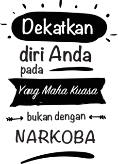

> **Deskripsi Visual:** Gambar ini adalah ilustrasi yang menunjukkan sebuah slogan atau peringatan tentang kecanduan narkoba. Gambar tersebut terdiri dari beberapa elemen utama:

1. Judul utama: "Dekatkan diri Anda pada Yang Maha Kuasa" yang ditulis dalam tulisan berwarna putih dengan garis bintang di sekelilingnya.

2. Subjudul: "bukan dengan NARKOBA" yang ditulis dalam tulisan berwarna hitam dengan garis bintang di sekelilingnya.

3. Elemen visual lainnya: Gambar ini menggunakan warna hitam dan putih untuk menciptakan kontras yang jelas antara teks dan latar belakang. 

4. Informasi kunci: Slogan ini mengajarkan bahwa sebaiknya kita berhubungan lebih dekat dengan Tuhan atau Allah, bukan dengan kecanduan narkoba. Ini merupakan pesan moral yang kuat untuk mendorong orang untuk menjauhi kecanduan dan memilih hidup yang lebih baik.

Secara keseluruhan, gambar ini menggunakan desain yang sederhana namun efektif untuk menyampaikan pesan yang mendalam tentang pentingnya menjaga keseimbangan dalam kehidupan dan menjauh dari kecanduan.

---

*📊 Statistik: 27 visual berhasil, 43 dilewati, 0 gagal | Durasi: 7m 49s*