# Salinan Kelas 11 Khonghucu BG press

*Diekstrak: 17 May 2026, 15:04*

---

---
## 📄 Halaman 1

### Buku Guru dan Budi Pekerti

### Pendidikan Agama Khonghucu

SMA/SMK KELAS XI

 

---
## 📄 Halaman 2

### Hak Cipta © 2017 pada Kementerian Pendidikan dan Kebudayaan Dilindungi Undang-Undang

Disklaimer: Buku ini merupakan buku guru yang dipersiapkan Pemerintah dalam rangka implementasi Kurikulum 2013. Buku guru ini disusun dan ditelaah oleh berbagai pihak di bawah koordinasi Kementerian Pendidikan dan Kebudayaan, dan dipergunakan dalam tahap awal penerapan Kurikulum 2013. Buku ini merupakan 'dokumen hidup' yang senantiasa diperbaiki,  diperbaharui,  dan  dimutakhirkan  sesuai  dengan  dinamika  kebutuhan  dan perubahan zaman. Masukan dari berbagai kalangan yang dialamatkan kepada penulis dan laman http://buku.kemdikbud.go.id atau melalui email buku@kemdikbud.go.id diharapkan dapat meningkatkan kualitas buku ini.

### Katalog Dalam Terbitan (KDT)

Indonesia. Kementerian Pendidikan dan Kebudayaan.

Pendidikan Agama Khonghuxu dan Budi Pekerti : buku guru/ Kementerian Pendidikan dan Kebudayaan.-- . Edisi Revisi Jakarta : Kementerian Pendidikan dan Kebudayaan, 2017.

x, 158 hlm. : ilus. ; 25 cm.

Untuk SMA/SMK Kelas XI ISBN  978-602-427-086-5 (jilid lengkap) ISBN  978-602-427-088-9 (jilid 2)

- Khonghucu -- Studi dan Pengajaran
- Kementerian Pendidikan dan Kebudayaan
I. Judul

299.512

Penulis

:  Js. Hartono dan Js. Gunadi.

Penelaah

:  Xs. Oesman Arif, Xs. Buanadjaja, dan Js. Maria Engelina Santoso.

Pereview Guru

:  Cici Indriyani.

Penyelia Penerbitan : Pusat Kurikulum dan Perbukuan, Balitbang, Kem en dikbud.

Cetakan Ke-1, 2014 ISBN 978-602-282-447-3 (jilid 2) Cetakan Ke-2, 2017 (Edisi Revisi)

Disusun dengan huruf Georgia, 12 pt.

 

---
## 📄 Halaman 3

### Kata Pengantar

Salam Kebajikan, Wei De Dong Tian.

Seiring  dengan  Penguatan  dan  Penataan  Ulang  Kurikulum  yang  terus dilakukan oleh Kementerian Pendidikan dan Kebudayan , kami turut menyambut  baik  karena  mendapat  kesempatan  untuk  turut  memperbaiki dan  menata  ulang  Kurikulum  Pendidikan  Agama  Khonghucu.  Kiranya penataan  untuk  Kurikulum  2013    ini  benar-benar  dapat  meningkatkan kualitas pendidikan Indonesia, yang tentunya ditandai dengan pencapaian kompetensi oleh peserta didik yang sesuai dengan kebutuhannya.

Kiranya ketersediaan buku Teks Pendidikan Agama Khonghucu dan Budi Pekerti ini dapat benar-benar  menjadi sarana pendukung kegiatan belajarmengajar di sekolah dalam rangka membentuk karakter peserta didik yang mulia  dan  unggul.  Materi  yang  disajikan    dalam  buku  ini  mecakup  Kitab Suci; Tata Ibadah dan Persembahyangan; Wahyu dan Iman (aspek ajaran); Perilaku Junzi; dan Sejarah Suci.

Akhir kata, kami sampaikan terima kasih kepada semua pihak yang telah berpartisipasi dalam penyusunan dan penerbitan buku ini. Untuk perbaikan dan  penyempurnaan  di  masa  mendatang  kami  sangat  mengharapkan masukan dan saran konstruktif dari semua pihak.

Jakarta, Januari 2016

 

---
## 📄 Halaman 4

iv

Buku Guru Kelas XI SMA/SMK

 

---
## 📄 Halaman 5

### Daftar Isi

 

---
## 📄 Halaman 7

### Bagian II Penjelasan Bab

 

---
## 📄 Halaman 10

x

Bagian 1 Penjelasan Umum

Buku Guru Kelas XI SMA/SMK

 

---
## 📄 Halaman 11

### BAB 1

### Pendahuluan

### A. Hakikat Pendidikan

Pendidikan sangat menekankan adanya suatu pandangan bahwa watak sejati manusia itu pada dasarnya baik. Sekiranya sifat manusia itu jahat, maka pendidikan tidak akan terlaksana tanpa sebuah pemaksaan, dan pendidikan yang dilaksanakan dengan sebuah pemaksaan pasti tidak akan membuahkan hasil yang baik. Pendidikan, sebagaimana ditegaskan dalam kitab Liji adalah 'membimbing berjalan dan bukan menyeret'. Pendidikan adalah usaha sadar yang terencana, dan segalanya harus dilakukan dengan wajar, membukakan jalan lalu mengarahkan, memberi penguatan namun tidak mendikte.

Berdasarkan  filosofi  pendidikan  ini,  muncul  peribahasa  'Menanam pohon cukup sepuluh tahun, menanam manusia butuh seratus tahun'. Oleh karena itu perlu dipahami bahwa proses pendidikan membutuhkan waktu lama, kerja keras, konsistensi, dan komitmen yang tinggi (kesungguhan) dari para guru. Dalam Liji ditegaskan,  'Di  rumah, merawat tidak mendidik itu kesalahan orang tua. Di luar rumah, mendidik tidak sungguh-sungguh itu kemalasan guru'.

Atas dasar kenyakinan bahwa watak sejati manusia itu baik, maka melalui pendidikan dapat menjadikan orang tetap baik, bertahan pada fitrah/kodrat alaminya, maka pendidikan harus ada untuk semua orang tanpa membedakan kelas. Inilah filosofi dan pemikiran yang paling mendasar tentang pendidikan yang dimiliki bangsa Zhongguo selama ribuan tahun.

Dari  uraian  di  atas  juga  dapat  ditarik  kesimpulan,  bahwa  hakikat pendidikan  adalah:  'Memanusiakan  manusia'.  Dengan  kata  lain:  'Belajar menjadi manusia' sehingga tercipta manusia berbudi luhur ( Junzi ).

### B. Tujuan Pendidikan Agama Khonghucu

Pendidikan Agama Khonghucu bertujuan membentuk manusia berbudi luhur  ( Junzi )  yang  mampu  menggemilangkan  Kebajikan  Watak  Sejatinya, mengasihi  sesama  dan  berhenti  pada  Puncak  Kebaikan.  Pada  dasarnya perilaku Junzi memang merupakan tujuan utama yang ingin dan harus dicapai

 

---
## 📄 Halaman 12

dalam  pendidikan  agama  Khonghucu  baik  di  rumah,  di  sekolah  maupun dalam  kelembagaan  agama  Khonghucu.  Maka  sudah  sewajarnya  aspek perilaku Junzi harus menjadi porsi terbesar dan utama dalam pendidikan agama Khonghucu di sekolah.

Orang  yang  berpendidikan  adalah  seseorang  yang  memiliki  moralitas tinggi. Orang yang memiliki pengetahuan tetapi tidak berpendidikan (tidak memiliki moralitas yang tinggi) tidak bisa disebut Junzi , inilah standar yang dipakai  untuk  mengukur  kualitas  manusia.  Prinsip  dasar  dan  target  akhir pendidikan adalah pembinaan pribadi yang penuh Cinta Kasih atau Ren ( 仁 ); kemampuan memuliakan hubungan atau Xiao ( 孝 ) dalam setiap interaksinya dengan semua unsur kehidupan; kemampuan  mengendalikan emosi; memiliki ketulusan hati dan keikhlasan, serta pelaksanaan kebajikan yang lainnya, sehingga pembinaan moralnya berkembang terus dari hari ke hari (meningkat). Artinya, pendidikan selalu ditujukan kepada pribadi manusia, yang tujuannya tidak lain untuk meningkatkan kualitas moral setiap individu.

### C. Pentingnya Pendidikan

Tidak dapat dipungkiri, dan hal ini harus dipahami oleh siapapun yang berprofesi  sebagai  guru,  bahwa  pendidikan  itu  penting,  bahkan  sangat penting. Bagaimana  tidak, bahwa  melalui pendidikanlah budaya dan peradaban manusia dapat disempurnakan.

Tersurat  di  dalam Liji XVI:  1,  'Bila  penguasa  selalu  memikirkan  atau memperhatikan perundang-undangan, dan mencari orang baik dan tulus, ini cukup untuk mendapat pujian, tetapi tidak cukup untuk menggerakkan orang banyak. Bila ia berusaha mengembangkan masyarakat yang bajik dan bijak, dan  dapat  memahami  mereka  yang  jauh,  ini  cukup  untuk  menggerakkan rakyat,  tetapi  belum  cukup  untuk  mengubah  rakyat.  Bila  ingin  mengubah rakyat  dan  menyempurnakan  adat  istiadatnya,  dapatkah  kita  tidak  harus melalui pendidikan?' ( Liji . XVI: 1)

### D. Pendidikan yang Baik

Setelah memahami benar akan pentingnya pendidikan untuk mengubah masyarakat dan menyempurnakan adat istiadatnya, tugas kita selanjutnya adalah  bagaimana  menyediakan  'Pendidikan  yang  Baik'.  Jika  pendidikan itu  penting,  tetapi  tidak  tersedia  pendidikan  yang  baik,  sama  artinya  kita tidak mementingkan sesuatu yang penting. Oleh karenanya, para guru harus memahami bagaimana pendidikan yang baik itu bisa terselenggara.

 

---
## 📄 Halaman 13

Di dalam kitab Liji tersurat: 'Seorang yang mengerti apa yang menjadikan pendidikan berhasil  dan  berkembang,  dan  mengerti  apa  yang  menjadikan pendidikan hancur, ia boleh menjadi guru bagi orang lain. Maka cara seorang yang bijaksana memberikan pendidikan, jelasnya demikian: Ia membimbing berjalan  dan  tidak  menyeret;  ia  menguatkan  dan  tidak  menjerakan;  ia membuka jalan tetapi tidak menuntun sampai akhir pencapaian. Membimbing berjalan,  tidak  menyeret  menumbuhkan  keharmonisan;  menguatkan  dan tidak menjerakan, itu memberi kemudahan; dan, membukakan jalan tetapi tidak  menuntun  sampai  akhir  pencapaian,  menjadikan  orang  berpikir. Menimbulkan keharmonisan, memberi kemudahan dan menjadikan orang berpikir, itu pendidikan yang baik'.

'Hukum  di  dalam Daxue :  mencegah  sebelum  sesuatu  timbul,  itulah dinamai memberi kemudahan ( Yu );  yang  wajib  dan  diperkenankan, itulah dinamai cocok waktu ( Shi ); yang tidak bertentangan dengan ketentuan yang diberikan, itulah dinamai selaras keadaan ( Sun ); saling memperhatikan demi kebaikan itulah dinamai saling menggosok ( Mo ). Empat hal inilah yang perlu diikuti demi berhasil dan berkembangnya pendidikan ( Sixing )'.

'Setelah permasalahan timbul baru diadakan larangan, akan mendatangkan perlawanan, itu akan menyebabkan ketidakberhasilan ( Busheng ). Setelah lewat waktu baru memberi pelajaran akan menyebabkan payah, pahit dan mengalami kesulitan untuk berhasil sempurna ( Nancheng ). Pemberian pelajaran yang lepas tak jelas dan tidak sesuai akan mengakibatkan kerusakan dan kekacauan sehingga tidak terbina ( Buxiu ).

Belajar sendirian dan tanpa sahabat menyebabkan orang merasa sebatang kara dan tidak  berkembang  karena  kekurangan  informasi  ( Guawen ). Berkawan  dalam  berhura-hura  menjadikan  orang  melawan  guru  ( Nishi ), dan, berkawan dalam bermaksiat akan menghancurkan pelajaran (Feixue). Enam hal inilah yang menjadikan pendidikan cenderung gagal ( Jiaofei )'.

### E. Guru yang Baik

### 1. Pengabdian dan Totalitas

Pendidikan  tentu  terkait  erat  dengan  pendidik  (guru).  Guru  adalah ujung tombak pendidikan. Bagaimana tidak, karena proses pendidikan akan dijalankan  oleh  seorang  yang  bernama  'guru',  seorang  yang  menyandang prosfesi nan mulia. Sekali lagi, pendidikan itu penting, maka harus tersedia pendidikan  yang  baik,  dan  selanjutnya  harus  ada  guru  baik  yang  akan menjalankannya.

 

---
## 📄 Halaman 14

Guru yang memandang profesinya sebagai panggilan (nun jauh di sudut nuraninya)  dia  merasa  terpanggil  untuk  mendidik  sesama  dengan  penuh pengabdian.  Dengan  begitu,  maka  ia  akan  mampu  menginspirasi  banyak pembelajar.  Kata-katanya  akan  diingat  sepanjang  masa  oleh  mereka  yang menjadi  peserta  didiknya.  Sikap  dan  perilakunya  akan  menuntun  dan mengarahkan  mereka  dalam  mengarungi  perjalanan  menuju  kehidupan sukses dan bermakna.

Dengan segala totalitas, kecintaan dan dedikasi, guru akan menjadi pelita bagi berjuta jiwa, jiwa para pembelajar. Kalau saja setiap guru mampu terus berbenah diri, terus menjadi lebih baik dan lebih mengerti dari hari ke hari, niscaya generasi mendatang juga akan jauh lebih membanggakan.

Mengajar tidak sekedar masuk kelas, bertemu para pembelajar, menyuruh ini-itu, atau melarang ini-itu. Kalau cuma itu, semua orang bisa melakukannya. Pandanglah ini sebagai suatu yang lebih dari sekedar transfer informasi dan 'penjejalan' pengetahuan. Namun hadirkanlah kasih sayang dan kepedulian dengan segala rasa pengabdian, komitmen, kerendahan hati, kreativitas,  keikhlasan  dan  karakter-karakter  unggul  lainnya  di  dalamnya. Mengajarlah  dengan  hati,  membimbing  dengan  nurani,  mendidik  dengan segenap  keikhlasan  dan  kesungguhan,  menginspirasi  dan  menyampaikan kebenaran dengan kasih, dan mempersembahkan apapun yang kita lakukan sebagai ibadah kepada Tian .

### 2.   Tanggungjawab

Tanggung  jawab  sebagai  guru  sungguh  besar.  Beratus-ratus  bahkan beribu-ribu  pembelajar  menjadi  taruhan  dari  setiap  kata  yang  keluar  dari mulut  seorang  guru.  Setiap  kata  yang  keluar  seharusnya  mencerahkan, menjadi ilham bagi jiwa-jiwa yang ada di ruang belajar bersama kita, yang akan membuat mereka untuk terus-menerus memperbaiki diri, dan menjelma menjadi insan-insan yang berkualitas, seiring dengan bertumbuhnya karakter dan nilai-nilai di dalam kehidupan mereka.

Mengajar itu akan efektif dan menggairahkan apabila kita menyatukan hati  dan  jiwa  dengan  pembelajar  kita,  sehingga  kita  tahu  persis  apa  yang mereka  rasakan  dan  inginkan,  karena  kita  berada  di  sisi  yang  sama.  Kita memandang aktivitas belajar dari sudut pandang mereka. Setiap gerak hati dan  suara-suara  halus  di  jiwa  mereka  bisa  kita  tangkap  dengan  kejelian nurani kita.

Guru harus tahu bagaimana membuat mereka berharga, termotivasi dan gembira, karena kita adalah mereka, dan mereka adalah kita. Kita melebur dengan segala totalitas yang ada. Kita larut, menyatu dan all out . Pada level

 

---
## 📄 Halaman 15

ini kita tak perlu lagi memberikan reward dan punishment , yang ada sematamata kegairahan belajar. Sebuah insting yang memang manusia miliki sejak lahir.  Nampaknya  aneh,  tapi  penelitian  membuktikan  bahwa  hadiah  dan hukuman dalam jangka panjang justru akan menurunkan minat belajar

### 3.   Menyambung Cita

'Penyanyi  yang  baik  akan  menjadikan  orang  menyambung  suaranya; pengajar yang baik akan menjadikan orang menyambung citanya, kata-kata yang ringkas tetapi menjangkau sasaran; tidak mengada-ada tetapi dalam; biar sedikit gambaran tetapi mengena untuk pengajaran. Itu boleh dinamai menyambung citaJizhi '. ( Liji . XVI: 15)

### 4.   Meragamkan Cara

'Seorang Junzi mengerti apa yang sulit dan yang mudah dalam proses belajar,  dan  mengerti  kebaikan dan keburukan kualitas muridnya, dengan demikian dapat meragamkan cara mengasuhnya. Bila ia dapat meragamkan cara mengasuh, baharulah kemudian ia benar-benar mampu menjadi guru. Bila ia benar-benar mampu menjadi guru, baharulah kemudian ia mampu menjadi kepala (departemen). Bila ia benar-benar mampu menjadi kepala, baharulah kemudian ia mampu menjadi pimpinan (Negara). Demikianlah, karena  guru  orang  dapat  belajar  menjadi  pemimpin.  Maka,  memilih  guru tidak boleh tidak hati-hati. Di dalam catatan tersurat, 'Tiga raja dari keempat dinasti itu semuanya karena guru, 'ini kiranya memaksudkan hal itu'. ( Liji . XVI: 16)

'Orang  yang  memahami  ajaran  lama  dan  dapat  menerapkannya  pada yang baru, ia boleh dijadikan guru'. ( Lunyu . II: 11)

### 5.   Lima Cara Mengajar

'Seorang Junzi mempunyai 5 macam cara mengajar: 1) ada kalanya ia memberi pelajaran seperti menanam di saat musim hujan. 2) Ada kalanya ia  menyempurnakan  kebajikan  muridnya.  3)  Ada  kalanya  ia  membantu perkembangan  bakat  muridnya.  4)  Ada  kalanya  ia  bersoal  jawab.  5)  Ada kalanya ia membangkitkan usaha murid itu sendiri'. ( Mengzi . VIIA: 40)

### 6.   Kesungguhan

Untuk  segala  hal,  persoalan  utamanya  bukanlah  mampu  atau  tidak mampu, tetapi kesungguhanlah yang akan menentukan sebuah keberhasilan. Zigong bersanjak, 'Betapa indah bunga Tongtee . Selalu bergoyang menarik. Bukan aku tidak mengenangmu, hanya tempatmu terlampau jauh'. Mendengar itu nabi bersabda, 'Sesungguhnya engkau tidak memikirkannya benar-benar. Kalau benar-benar apa artinya jauh'. ( Lunyu . IX: 31)

 

---
## 📄 Halaman 16

Di dalam Kong-gao tertulis, 'Berlakulah seumpama merawat bayi, bila dengan  sebulat  hati  mengusahakannya,  meski  tidak  tepat  benar,  niscaya tidak jauh dari yang seharusnya. Sesungguhnya tiada yang harus lebih dahulu belajar merawat bayi baru boleh menikah. ( Daxue . Bab IX: 2)

Zizhang berkata,  'Seorang  yang  memegang  kebajikan  tetapi  tidak mengembangkannya, percaya akan jalan suci tetapi tidak sungguh-sungguh; ia ada tidak menambah, dan tidak ada pun tidak mengurangi'. ( Lunyu . XIX:

2)

---
**🖼️ Gambar/Diagram**

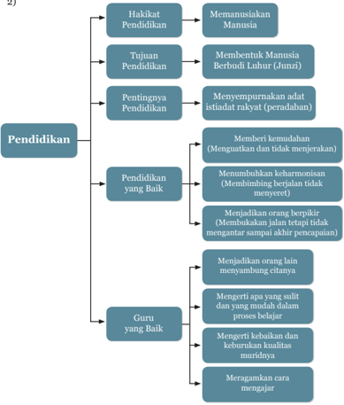

> **Deskripsi Visual:** Gambar ini adalah diagram yang menunjukkan struktur dan tujuan pendidikan. Diagram ini dibagi menjadi beberapa bagian utama yang masing-masing menjelaskan aspek penting pendidikan. Pada bagian atas, ada tiga poin utama tentang pendidikan: Hakikat Pendidikan, Tujuan Pendidikan, dan Pentingnya Pendidikan. Setiap poin ini memiliki sub-poin yang menjelaskan lebih lanjut.

Pada bagian tengah, ada dua poin yang disebutkan sebagai "Pendidikan yang Baik" dan "Guru yang Baik". Pendidikan yang Baik mencakup empat sub-poin yang melibatkan memberikan kemudahan, membangun keharmonisan, menjadikan orang berpikir, dan menjadikan orang lain menyambung citatnya. Guru yang Baik juga memiliki empat sub-poin yang melibatkan mengerti apa yang sulit dan yang mudah dalam proses belajar, mengerti kebaikan dan kekurangan kualitas muridnya, merangkam cara mengajar, dan menjadikan orang lain menyambung citatnya.

Dalam diagram ini, relasi antara poin-poin utama dan sub-poin sangat jelas. Setiap sub-poin pada bagian "Pendidikan yang Baik" dan "Guru yang Baik" secara langsung berkaitan dengan poin utama pendidikan. Ini menunjukkan bahwa setiap aspek pendidikan harus dipenuhi untuk mencapai tujuan pendidikan yang baik.

Teks, angka, atau label penting yang terlihat dalam diagram ini adalah nama-nama sub-poin dan poin utama yang disebutkan. Misalnya, "Menyempurnakan adat istiadat rakyat (peradaban)" adalah sub-poin penting dalam poin "Pendidikan yang Baik".

Informasi kunci yang dapat diambil pembaca dari diagram ini adalah bahwa pendidikan harus mencakup semua aspek yang disebutkan, termasuk hakikat pendidikan, tujuan pendidikan, pentingnya pendidikan, pendidikan yang baik, dan guru yang baik. Semua aspek ini harus dipenuhi untuk mencapai tujuan pendidikan yang baik.

 

---
## 📄 Halaman 17

### BAB 2

### Prinsip dan Pendekatan Pembelajaran

### A. Prinsip Pembelajaran

Prinsip yang digunakan dalam proses pelaksanaan pembelajaran Pendidikan Agama Khonghucu dan Budi Pekerti, sebagai berikut:

### 1. Mencari Tahu, Bukan Diberi Tahu

Kongzi bersabda, 'Jika diberi tahu satu sudut tetapi tidak mau mencari ketiga sudut lainnya, aku tidak mau memberi tahu lebih lanjut'.

'Kalau di dalam membimbing belajar orang hanya mencatat pertanyaan, itu  belum  memenuhi  syarat  sebagai  guru  orang.  Tidak  haruskah  guru mendengar pertanyaan? Ya, tetapi bila murid tidak mampu bertanya, guru wajib memberi uraian penjelasan, setelah demikian, sekalipun dihentikan, itu masih boleh'.

Mengajar  bukanlah  memindahkan  pengetahuan  dari  guru  ke  peserta didik. Mengajar berarti berpartisipasi dengan peserta didik dalam membentuk pengetahuan, membuat makna, mempertanyakan kejelasan, bersikap kritis, mengadakan justifikasi. Guru berperan sebagai mediator dan fasilitator.

'Kini,  orang  di  dalam  mengajar,  (guru)  bergumam  membaca  tablet (buku bilah dari bambu) yang diletakkan di hadapannya, setelah selesai lalu banyak-banyak memberi pertanyaan. Mereka hanya bicara tentang berapa banyak  pelajaran  yang  telah  dimajukan  dan  tidak  diperhatikan  apa  yang telah  dapat  dihayati;  ia  menyuruh  orang  dengan  tidak  melalui  cara  yang tulus,  dan  mengajar  orang  dengan  tidak  sepenuh  kemampuannya.  Cara memberi pelajaran yang demikian ini bertentangan dengan kebenaran dan yang belajar patah semangat. Dengan cara itu, pelajar akan putus asa dan membenci gurunya; mereka dipahitkan oleh kesukaran dan tidak mengerti apa  manfaatnya.  Biarpun  mereka  nampak  tamat  tugas-tugasnya,  tetapi dengan  cepat  akan  meninggalkannya.  Kegagalan  pendidikan,  bukankah karena hal itu?' ( Liji . XVI: 10)

### 2.  Peserta  Didik  sebagai  Pusat  Pembelajaran  ( Student  Center ), Bukan Guru;

Kegiatan  diarahkan  pada  apa  yang  dilakukan  murid,  bukan  apa  yang dilakukan guru.

 

---
## 📄 Halaman 18

Oleh karena itu, proses pembelajaran seyogyanya didesain untuk meningkatkan  keterlibatan  peserta  didik  secara  aktif.  Dengan  demikian, diharapkan peserta didik akan memperoleh harga diri dan kegembiraan. Hal ini  selaras  dengan  hasil  penelitian  yang  menyatakan  bahwa  peserta  didik hanya belajar 10% dari yang dibaca, 20% dari yang didengar, 30% dari yang dilihat, 50% dari yang dilihat dan didengar, 70% dari yang dikatakan, dan 90% dari yang dikatakan dan dilakukan. 'Kamu dengar kamu lupa, kamu lihat kamu ingat, kamu lakukan kamu mengerti'. ( Confucius )

Selaras  dengan  prinsip  tersebut,  maka  paradigma  yang  harus  dimiliki guru ketika memasuki ruang kelas adalah: 'apa yang akan dilakukan murid, bukan apa yang akan dilakukan guru'.

### 3.  Pembelajaran Terpadu Bukan Parsial

'Orang jaman dahulu itu, di dalam menuntut pelajaran, membandingkan berbagai  benda  yang  berbeda-beda  dan  melacak  jenisnya.  Tambur  tidak mempunyai hubungan khusus dengan panca nada; tetapi panca nada tanpa diiringinya  tidak  mendapatkan  keharmonisannya.  Air  tidak  mempunyai hubungan istimewa dengan panca warna; tetapi tanpa air, panca warna tidak dapat dipertunjukkan. Belajar tidak mempunyai hubungan khusus dengan lima  jawatan;  tetapi  tanpa  belajar,  lima  jawatan  tidak  dapat  diatur.  Guru tidak mempunyai hubungan istimewa dengan ke lima macam pakaian duka, tetapi tanpa guru, kelima macam pakaian duka itu tidak dipahami bagaimana memakainya'. ( Liji . XVI: 21)

### 4.  Menerapkan Nilai-nilai Melalui Keteladanan dan Membangun Kemauan

Ki Hajar Dewantara, ' Ing ngarso sung tulodo, ing madyo mangun karso, tut wuri handayani '.

Sebagaima  telah  ditegaskan  di  atas  tentang  cara  seorang  bijaksana memberikan pendidikan: Di depan '… Ia membimbing berjalan dan tidak menyeret; di tengah, 'Ia menguatkan dan tidak menjerakan; Di belakang, 'Ia membuka jalan tetapi tidak menuntun sampai akhir pencapaian. Membimbing berjalan,  tidak  menyeret  menumbuhkan  keharmonisan;  menguatkan  dan tidak menjerakan, itu memberi kemudahan; dan, membukakan jalan tetapi tidak  menuntun  sampai  akhir  pencapaian,  menjadikan  orang  berpikir. Menimbulkan keharmonisan, memberi kemudahan dan menjadikan orang berpikir, itu pendidikan yang baik'.

 

---
## 📄 Halaman 19

### 5.  Keseimbangan antara Keterampilan Fisikal ( Hardskills )  dan Keterampilan Mental ( Softskills )

Hakekat pengajaran agama adalah menselaraskan daya hidup jasmani dan rohani. Seperti halnya konsep Yin Yang , bahwa segala sesuatu diciptakan berpasang-pasangan saling melengkapi. Pengajaran agama  berpangkal membina  yang  di  dalam  diri  (rohani/mental)  hingga  akhirnya  mewujud keluar  diri  dan  berujung  berlaksa  perkara  menjadi  beres.  Membina  diri adalah melatih soft-skills dan berlaksa perkara menjadi beres adalah adanya ketrampilan hard-skills . Contoh ketrampilan hard skills adalah pengetahuan dan  ketrampilan  teknis,  sedangkan  contoh  ketrampilan soft-skills adalah pengelolaan diri dan orang lain. Keduanya saling melengkapi dan tidak bisa dipisahkan satu dengan yang lainnya.

Dalam kitab Liji VIII:2.9-10  tersurat, Junzi berkata,  'Bila  orang  tidak mempunyai batasan (pedoman) dalam diri, biar melihat sesuatu tidak dapat benar-benar memeriksa; ingin memeriksa sesuatu bila tanpa mengikuti Li , orang tidak akan berhasil. Maka mengerjakan sesuatu bila tidak dilandasi Li , orang tidak akan menghormatinya;mengeluarkan kata-kata bila tidak sesuai dengan Li , orang tidak akan mempercayainya. Maka dikatakan Li itu adalah perwujudan tertinggi dari segala sesuatu.

Maka  pada  jaman  kuno,  Raja  yang  telah  mendahulu  itu,  di  dalam menyusun Li ,  berlandas  bahan  dan  bendanya,  sehingga  dicapai  hakekat kebenarannya. Di dalam mengerjakan urusan besar, pasti  mematuhi waktu yang dikaruniakan Tian ; di dalam melaksanakan pekerjaan pagi dan sore,  mencontoh  kepada  matahari  dan  bulan.  Untuk  hal  yang  menuntut ketinggian,  dimanfaatkan  bukit  dan  gundukan,  dan  terhadap  hal  yang menuntut  kerendahan  dimanfaatkan  singai  dan  rawa-rawa.  Demikianlah maka tiap musim (waktu yang dikaruniakan Tian )  mempunyai hujan yang memunculkan rawa-rawa.  Seorang Junzi dengan  kecerdasannya  berupaya memanfaatkannya dengan sungguh-sungguh'.

Dalam kitab Lunyu XIX:13 disebutkan' Zi Xia berkata, kalau memangku jabatan, janganlah lupa memperdalam pelajaran. Dalam belajar, janganlah lupa pula melakukan tugas'.

### 6.  Pembelajaran  yang  Menerapkan  Prinsip  bahwa  Siapa  Saja adalah  Guru,  Siapa  Saja  adalah  Peserta  Didik,  Dan  Di  Mana Saja adalah Kelas

Kongzi  bersabda,  'Tiap  kali  jalan  bertiga,  niscaya  ada  yang  dapat kujadikan guru; Kupilih yang baik, Ku ikuti dan yang tidak baik Ku perbaiki'. ( Lunyu . VII: 22)

 

---
## 📄 Halaman 20

'Di  dalam kesusilaan ( Li )  Ku  dengar  bagaimana mengambil seseorang sebagai  suritauladan,  tidak  kudengar  bagaimana  berupaya  agar  diambil sebagai  teladan.  Di  dalam  kesusilaan  kudengar  bagaimana  orang  datang untuk belajar, tidak kudengar bagaimana orang pergi untuk mendidik'.

'Biar ada makanan lezat, bila tidak dimakan, orang tidak tahu bagaimana rasanya;  biar  ada  Jalan  Suci  yang  Agung,  bila  tidak  belajar,  orang  tidak tahu bagaimana kebaikannya. Maka belajar menjadikan orang tahu kekurangan  dirinya,  dan  mengajar  menjadikan  orang  tahu  kesulitannya. Dengan  mengetahui  kekurangan  dirinya,  orang  dipacu  mawas  diri;  dan dengan mengetahui kesulitannya, orang dipacu menguatkan diri ( Ziqiang ). Maka dikatakan,  'Mengajar  dan  belajar  itu  saling  mendukung'.  Nabi  Yue bersabda, 'Mengajar itu setengah belajar'. ( Shujing IV. VIII. C. 5) Ini kiranya memaksudkan hal itu'. ( Liji . XVI: 3)

### 7.  Pemanfaatan  Teknologi  Informasi  dan  Komunikasi  untuk Meningkatkan Efisiensi dan Efektivitas Pembelajaran

Agar  peserta  didik  tidak  gagap  terhadap  perkembangan  ilmu  dan teknologi, pendidik hendaknya mengaitkan materi yang disampaikan dengan kemajuan ilmu pengetahuan dan teknologi. Hal ini dapat diciptakan dengan pemberian tugas yang mengharuskan peserta didik berhubungan langsung dengan teknologi.

### 8.  Menumbuhkan Kesadaran sebagai Warga Negara yang Baik

Kegiatan pembelajaran ini perlu diciptakan untuk mengasah jiwa nasionalisme peserta didik. Rasa cinta kepada tanah air dapat diimplementasikan ke dalam beragam sikap.

### 9.  Pembudayaan dan Pemberdayaan Peserta Didik sebagai Pembelajar Sepanjang Hayat

Dalam agama Khonghucu, menuntut ilmu diwajibkan bagi setiap orang, mulai dari tiang ayunan hingga liang lahat. Berkaitan dengan ini, pendidik harus  mendorong  peserta  didik  untuk  belajar  sepanjang  hayat  ' long  life Learning '.

Zhengzi berkata, 'Seorang peserta didik tidak boleh tidak berhati luas dan berkemauan keras, karena beratlah bebannya dan jauhlah perjalanannya.

- 'Cinta Kasih itulah bebannya, bukankah berat? Sampai mati barulah berakhir, bukankah jauh?' ( Lunyu .VIII: 7)

 

---
## 📄 Halaman 21

### 10  Perpaduan antara Kompetisi, Kerja Sama, dan Solidaritas

Kegiatan  pembelajaran  perlu  memberikan  kesempatan  kepada  peserta didik untuk mengembangkan semangat berkompetisi sehat, bekerja sama,  dan  solidaritas.  Untuk  itu,  kegiatan  pembelajaran  dapat  dirancang dengan strategi diskusi, kunjungan ke tempat-tempat yatim piatu, ataupun pembuatan laporan secara berkelompok.

### 11. Mengembangkan Keterampilan Pemecahan Masalah

Tolak ukur kepandaian peserta didik banyak ditentukan oleh kemampuannya untuk memecahkan masalah. Oleh karena itu, dalam proses pembelajaran, perlu diciptakan situasi yang menantang kepada pemecahan masalah agar peserta didik peka, sehingga peserta didik bisa belajar secara aktif.

### 12. Mengembangkan Kreativitas Peserta Didik

Pendidik  harus  memahami  bahwasanya  setiap  peserta  didik  memiliki tingkat keragaman yang berbeda satu sama lain. Dalam kontek ini, kegiatan pembelajaran seyogyanya didesain agar masing-masing peserta didik dapat  mengembangkan  potensinya  secara  optimal,  dengan  memberikan kesempatan dan kebebasan secara konstruktif. Ini merupakan bagian dari pengembangan kreativitas peserta didik.

### B.  Pendekatan Pembelajaran

Sejalan dengan Kurikulum 2013, pendekatan pembelajaran Pendidikan Agama Khonghucu mengacu pada pendekatan saintifik ( scientific approach ). Berikut adalah kriteria dan langkah-langkah pendekatan saintifik.

### 1. Kriteria Pendekatan Saintifik

- -Materi pembelajaran berbasis pada fakta atau fenomena yang dapat dijelaskan dengan logika atau penalaran tertentu; bukan sebatas kirakira, khayalan, legenda, atau dongeng semata.
- -Penjelasan  guru,  respon  peserta  didik,  dan  interaksi  edukatif  gurusiswa terbebas dari prasangka yang serta-merta, pemikiran subjektif, atau penalaran yang menyimpang dari alur berpikir logis.
- -Mendorong  dan  menginspirasi  peserta  didik  berpikir  secara  kritis, analistis, dan tepat dalam mengidentifikasi, memahami, memecahkan masalah, dan mengaplikasikan materi pembelajaran.
- -Mendorong dan menginspirasi peserta didik mampu berpikir hipotetik dalam melihat perbedaan, kesamaan, dan tautan satu sama lain dari materi pembelajaran.

 

---
## 📄 Halaman 22

- -Mendorong  dan  menginspirasi  peserta  didik  mampu  memahami, menerapkan,  dan  mengembangkan  pola  berpikir  yang  rasional  dan objektif dalam merespon materi pembelajaran.
- -Berbasis pada konsep, teori, dan fakta empiris yang dapat dipertanggung- jawabkan.
- -Tujuan pembelajaran dirumuskan secara sederhana dan jelas, tetapi menarik sistem penyajiannya.

### 2.  Langkah-langkah Pendekatan Saintifik

Kurikulum  2013  menekankan  pada  dimensi  pedagogik  modern  dalam pembelajaran,  yaitu  menggunakan  pendekatan  ilmiah.  Pendekatan  ilmiah ( scientific approach ) dalam pembelajaran sebagaimana dimaksud meliputi, mengamati, menanya, menalar, mencoba, membentuk jejaring untuk semua mata pelajaran.

Pendekatan  saintifik  ini  sangat  sejalan  dengan  apa  yang  diajarkan Nabi  Kongzi  tentang pendekatan  belajar  sebagaimana  tersurat  dalam kitab Zhongyong Bab  XIX  pasal  19.  'Banyak-banyalah  belajar;  pandaipandailah bertanya; hati-hatilah memikirkannya; dan sungguh-sungguhlah melaksanakannya'.

---
**📊 Tabel**

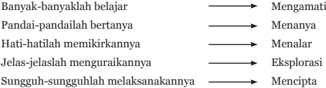

Tabel ini berisi informasi tentang berbagai cara untuk belajar dan mempelajari sesuatu. Topik utamanya adalah metode belajar yang efektif. Kolom pertama menunjukkan tindakan-tindakan belajar, sedangkan kolom kedua menunjukkan hasil atau konsekuensi dari tindakan tersebut. Data penting yang terlihat adalah bahwa belajar melalui pengamatan (mengamati) dapat membantu dalam memahami dan memahami suatu hal. Selain itu, berpandang dan bertanya tentang sesuatu juga sangat penting untuk memahami dan memahami lebih dalam. Melakukan penelitian dan eksplorasi juga merupakan cara yang efektif untuk memperluas pemahaman kita tentang suatu topik. Sementara itu, menciptakan hubungan dengan orang lain dan menjelaskan ide-ide kita kepada mereka dapat membantu kita memahami dan memahami lebih baik.

### 3. Kegiatan Pembelajaran Saintifik

---
**📊 Tabel**

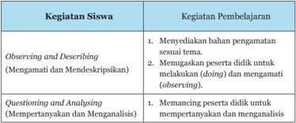

Tabel ini membahas dua jenis kegiatan belajar siswa: Observing and Describing (Mengamati dan Mendeskripsikan) dan Questioning and Analyzing (Mempertanyakan dan Menganalisis). Observing and Describing melibatkan siswa menyediakan bahan pengamatan sesuai tema dan menugaskan peserta didik untuk melakukan (doing) dan mengamati (observing). Sementara itu, Questioning and Analyzing memerintahkan peserta didik untuk mempertanyakan dan menganalisis. Topik utama tabel ini adalah metode pembelajaran yang melibatkan aktivitas kritis dan analitis. Kolom-kolomnya mencakup tiga bagian utama: Kegiatan Siswa, Kegiatan Pembelajaran, dan Data atau Pola Penting. Data penting yang terlihat adalah bahwa kedua jenis kegiatan belajar ini melibatkan aktivitas kritis dan analitis, dengan fokus pada pemahaman dan pengetahuan yang lebih mendalam tentang topik yang diajarkan.

 

---
## 📄 Halaman 23

---
**📊 Tabel**

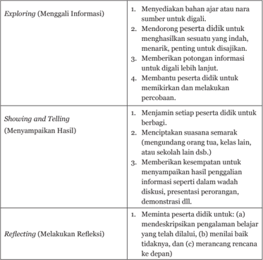

Tabel ini membahas tiga tahap dalam proses pembelajaran, yaitu Exploring (Menggali Informasi), Showing and Telling (Menyampaikan Hasil), dan Reflecting (Melakukan Refleksi). Topik utama tabel ini adalah bagaimana guru dapat memfasilitasi proses belajar siswa dengan cara-cara yang efektif. Kolom-kolomnya mencakup tugas-tugas yang harus dilakukan oleh guru dalam setiap tahap tersebut. Dalam tahap Exploring, guru bertanggung jawab untuk menyediakan bahan ajar atau narasumber yang relevan, mendorong siswa untuk didukung dalam mengeksplorasi informasi, memberikan potongan informasi untuk digali lebih lanjut, dan membiarkan siswa berpikir dan melakukan percobaan. Tahap Showing and Telling melibatkan guru menjamin bahwa semua siswa diberi kesempatan untuk berbagi, menciptakan suasana semarak dengan mengundang orang tua, kelas lain, atau sekolah lain dalam diskusi, presentasi, atau demonstrasi. Sementara itu, tahap Reflecting melibatkan guru meminta siswa untuk mendeskripsikan pengalaman belajar yang telah dilalui, menyalin tidaksetujuan, dan merancang rencana ke depan. Pola penting yang terlihat adalah bahwa setiap tahap memiliki tujuan dan tugas yang spesifik yang harus dilakukan oleh guru untuk memfasilitasi proses belajar siswa secara efektif.

Agar  kegiatan  belajar  dan  pembelajaran  dapat  berjalan  baik  sesuai dengan tuntutan yang diharapkan, guru harus memahami hal-hal yang harus disediakan dan diperhatikan. Berikut ini merupakan hal yang harus tersedia dan terlaksana dalam kegiatan belajar dan pembelajaran:

- Menyediakan media belajar yang relevan
- Menyediakan bahan bacaan/sumber informasi
- Sediakan nara sumber (atau menugaskan peserta didik mencari)
- Ajak peserta didik merancang percobaan dan melakukannya
- Ajak peserta didik berpikir kritis, dan analitis

 

---
## 📄 Halaman 24

- Mendorong peserta didik untuk melakukan pengamatan dengan:
- Menghitung
- Mengukur
- Membandingkan
- Membantu  peserta  didik  agar  mampu  menuliskan/mendeskripsikan hasil pengamatannya:
- Melukiskan/meniru/ trace
- Menuliskan hasil perhitungan atau pengukuran pada gambar
- Mendeskripsikan gambar (kalau dianggap masih perlu)
- Mempersiapkan diri peserta didik
- Dorong peserta didik untuk memilih format presentasi yang terbaik mereka
- Bantu peserta didik mengembangkan presentasinya (alur, dan kalimatkalimatnya)
- Tetapkan tempat presentasi masing-masing dan simulasikan (kalau perlu)
- Memfasilitasi penyampaian hasil
- Melakukan refleksi
- Ajak peserta didik untuk menuliskan pengalaman belajar yang telah diperoleh
- Ajak peserta didik untuk menilai sendiri pengalaman tersebut (mana yang baik, mana yang kurang baik dan menganalisis apa yang telah dilakukannya sendiri.
- Ajak  peserta  didik  untuk  menuliskan  rencana  kerja  ke  depan  agar diperoleh hasil yang lebih baik.

 

---
## 📄 Halaman 25

### BAB 3

### Desain Dasar Pembelajaran

### A. Rancangan Pembelajaran

Rancangan pembelajaran merupakan bagian dari proses pembelajaran, oleh  karenanya  pembahasan  mengenai  rancangan  pembelajaran  tidak akan  lepas  dari  pembahasan  mengenai  proses  pembelajaran  sebagaimana dijelaskan dalam Standar Proses.

Standar Proses adalah kriteria mengenai pelaksanaan pembelajaran pada satuan  pendidikan  untuk  mencapai  Standar  Kompetensi  Lulusan.  Standar Proses dikembangkan mengacu pada SKL dan SI.

- -Standar Kompetensi  Lulusan  sebagai kerangka konseptual tentang sasaran pembelajaran yang harus dicapai.
- -Standar  Isi  sebagai  kerangka  konseptual  tentang  kegiatan  belajar  dan pembelajaran yang diturunkan dari tingkat kompetensi dan ruang lingkup materi.
- -Sasaran  pembelajaran  mencakup  pengembangan  ranah  sikap  (afektif), pengetahuan (kognitif), dan keterampilan (psikomotorik).

### B.  Perencanaan Pembelajaran

Setiap  pendidik  pada  Satuan  Pendidikan  wajib  menyusun  Rencana Pelaksanaan Pembelajaran (RPP) secara lengkap dan sistematis agar pembelajaran berlangsung secara interaktif, inspiratif,  menyenangkan, menantang, efisien, memotivasi peserta didik untuk berpartisipasi aktif serta memberikan ruang yang cukup bagi prakarsa, kreativitas, dan kemandirian sesuai dengan bakat, minat dan perkembangan fisik serta psikologis peserta didik.

Perencanaan pembelajaran dirancang dalam bentuk Silabus dan Rencana Pelaksanaan Pembelajaran (RPP) yang mengacu pada Standar Isi.

Perencanaan  pembelajaran  meliputi  penyusunan  rencana  pelaksanaan pembelajaran  dan  menyiapkan  media  dan  sumber  belajar, perangkat penilaian pembelajaran, dan skenario pembelajaran.

 

---
## 📄 Halaman 26

Rencana  Pelaksanaan  Pembelajaran  (RPP)  adalah  rencana  kegiatan pembelajaran tatap muka untuk satu pertemuan atau lebih. RPP dikembangkan  dari  Silabus  untuk  mengarahkan  kegiatan  pembelajaran peserta didik dalam upaya mencapai Kompetensi Dasar (KD).

### C. Pelaksanaan Proses Pembelajaran

- Alokasi waktu jam tatap muka pembelajaran: SMK/SMA 45 menit.
- Bahan ajar (berupa buku teks, Handout ,  Lembar  Kegiatan  Siswa,  dll.) diperlukan untuk meningkatkan efisiensi dan efektivitas pembelajaran
- Pengelolaan kelas meliputi:
- Memberikan penjelasan tentang silabus
- Pengaturan tempat duduk, sehingga sesuai dengan tujuan dan karakteristik materi.
- Mengatur volume suara sehingga terdengar dengan jelas.
- Mengatur tutur kata sehingga terdengar santun, lugas dan mudah dimengerti.
- Berpakaian sopan, bersih dan rapih.
- Menciptakan ketertiban, kedisiplinan, kenyamanan, dan keselamatan.
- Memberikan penguatan dan umpan balik terhadap respon dan hasil belajar peserta didik selama proses pembelajaran berlangsung.
- Mendorong dan menghargai peserta didik untuk bertanya dan mengungkapkan pendapat.
- Pelaksanaan  pembelajaran  merupakan  implementasi  RPP  meliputi: Kegiatan Pendahuluan, Kegiatan Inti, dan Kegiatan Penutup.

### a.  Kegiatan Pendahuluan

Hal-hal yang mesti disiapkan guru dalam kegiatan pendahuluan:

- -menyiapkan  peserta  didik  secara  psikis  dan  fisik  untuk  mengikuti proses pembelajaran;
- -memberi  motivasi  belajar  peserta  didik  secara  kontekstual  sesuai manfaat  dan  aplikasi materi ajar dalam  kehidupan  sehari-hari, dengan  memberikan  contoh  dan  perbandingan  lokal,  nasional  dan internasional;
- -mengajukan  pertanyaan-pertanyaan  yang  menkaitkan  pengetahuan sebelumnya dengan materi yang akan dipelajari;

 

---
## 📄 Halaman 27

- -menjelaskan tujuan pembelajaran atau kompetensi dasar yang akan dicapai; dan
- -menyampaikan cakupan materi dan penjelasan uraian kegiatan sesuai silabus.

### b.  Kegiatan Inti

Kegiatan inti menggunakan model pembelajaran, metode pembelajaran, media pembelajaran, dan sumber belajar yang disesuaikan dengan  karakteristik peserta didik dan  mata  pelajaran.  Pemilihan pendekatan  tematik  dan/atau  tematik  terpadu  dan/atau  saintifik  dan/ atau  inkuiri  dan  penyingkapan  ( discovery )  dan/atau  pembelajaran yang  menghasilkan  karya  berbasis  pemecahan  masalah  ( project  based learning )  disesuaikan  dengan  karakteristik  kompetensi  dan  jenjang pendidikan.

### c.  Sikap

Sesuai dengan karakteristik sikap, maka salah satu alternatif yang  dipilih  adalah  proses  afeksi  mulai  dari  menerima,  menjalankan, menghargai, menghayati, hingga mengamalkan. Seluruh aktivitas pembelajaran  berorientasi  pada  tahapan  kompetensi  yang  mendorong peserta didik untuk melakukan aktivitas tersebut.

### d.  Pengetahuan

Pengetahuan  dimiliki  melalui  aktivitas  mengetahui,  memahami, menerapkan, menganalisis, mengevaluasi, hingga mencipta. Karakteritik aktivititas  belajar  dalam  domain  pengetahuan  ini  memiliki  perbedaan dan  kesamaan  dengan  aktivitas  belajar  dalam  domain  keterampilan. Untuk memperkuat pendekatan saintifik, tematik terpadu, dan tematik sangat  disarankan  untuk  menerapkan  belajar  berbasis  penyingkapan/ penelitian ( discovery/inquiry learning ).  Untuk  mendorong  peserta didik menghasilkan  karya  kreatif dan  kontekstual, baik individual maupun kelompok, disarankan menggunakan pendekatan pembelajaran yang  menghasilkan  karya  berbasis  pemecahan  masalah  ( project  based learning ).

### e.  Keterampilan

Keterampilan diperoleh melalui kegiatan  mengamati,  menanya, mencoba,  menalar,  menyaji,  dan  mencipta.  Seluruh  isi  materi  (topik dan subtopik) mata pelajaran yang diturunkan dari keterampilan harus mendorong peserta didik untuk melakukan proses pengamatan hingga penciptaan. Untuk mewujudkan keterampilan tersebut perlu melakukan pembelajaran yang menerapkan modus belajar berbasis penyingkapan/

 

---
## 📄 Halaman 28

penelitian ( discovery/inquiry learning ) dan pembelajaran yang menghasilkan karya berbasis pemecahan masalah ( project based learning ).

### f. Kegiatan Penutup

Dalam kegiatan penutup, pendidik bersama peserta didik baik secara individual maupun kelompok melakukan refleksi untuk mengevaluasi:

- -seluruh rangkaian aktivitas pembelajaran dan hasil-hasil yang diperoleh  untuk  selanjutnya  secara  bersama  menemukan  manfaat langsung maupun tidak langsung dari hasil pembelajaran yang telah berlangsung;
- -memberikan umpan balik terhadap proses dan hasil pembelajaran;
- -melakukan kegiatan tindak lanjut dalam bentuk pemberian tugas, baik tugas individual maupun kelompok; dan
- -menginformasikan rencana kegiatan pembelajaran untuk pertemuan berikutnya.

 

---
## 📄 Halaman 29

BAB 4

### Model-Model Pembelajaran

### A. Kooperatif ( Cooperative Learning )

Pembelajaran kooperatif sesuai dengan fitrah manusia sebagai makhluk sosial  yang  penuh  ketergantungan  dengan  orang  lain,  mempunyai  tujuan dan tanggung jawab bersama, pembagian tugas, dan rasa senasib. Dengan memanfaatkan kenyatan itu, belajar berkelompok secara kooperatif, peserta didik  dilatih  dan  dibiasakan  untuk  saling  berbagi  ( sharing )  pengetahuan, pengalaman,  tugas,  dan  tanggung  jawab.  Saling  membantu  dan  berlatih berinteraksi-komunikasi-sosialisasi merupakan tuntutan kehidupan secara sosiologis. Karena itu, sikap kooperatif adalah cerminan dari hidup bermasyarakat. Proses pembelajaran tidak bisa lepas dari prinsip tersebut karena di antara hakikat belajar adalah menyadari kekurangan dan kelebihan masing-masing  yang  kemudian  menuntut take  and  give  knowledge and skill secara resiprokal. Jadi model pembelajaran kooperatif adalah kegiatan pembelajaran dengan cara berkelompok untuk bekerjasama saling membantu mengkontruksi konsep, menyelesaikan persoalan, atau inkuiri. Menurut teori dan pengalaman agar kelompok kohesif (kompak-partisipatif), tiap anggota kelompok  terdiri  dari  4-5  orang,  peserta  didik  heterogen  (kemampuan, gender, karakter), ada kontrol dan fasilitasi, dan meminta tanggung jawab hasil kelompok berupa laporan atau presentasi.

Langkah pembelajaran kooperatif meliputi informasi, pengarahanstrategi, membentuk kelompok heterogen, kerja kelompok, presentasi hasil kelompok, dan pelaporan.

Misalnya, pada pembelajaran Pendidikan Agama Khonghucu khususnya dalam pembelajaran materi membuat skema altar.

### B.  Darmawisata ( Study Tour )

Peserta  didik  diajak  langsung  mengunjungi  lokasi  yang  mendukung materi pembelajaran.

Misalnya,  aspek  Tata  Ibadah,  peserta  didik  diajak  langsung  ke  lokasi tempat ibadah/ tempat suci (Kelenteng/ Miao /Litang).

 

---
## 📄 Halaman 30

### C.  Ibadah Bersama

Model pembelajaran ini sering digunakan oleh pendidik sangat dikhususkan pada bidang studi pendidikan agama Khonghucu.

Misalnya, aspek tata ibadah, aspek perilaku Junzi ,  aspek kitab suci, peserta didik ibadah bersama di Litang. Saat kebaktian guru dapat mengevaluasi atau menilai perilaku peserta didik dalam menjaga ketertiban. Peserta didik mulai berlatih membaca kitab suci dalam suatu rangkaian upacara sembahyang.

### D. Kontekstual ( Contextual Teaching and Learning )

Pembelajaran  kontekstual  adalah  pembelajaran  yang  dimulai  dengan sajian atau tanya jawab lisan (ramah, terbuka, negosiasi) yang terkait dengan dunia  nyata  kehidupan  peserta  didik  ( daily  life  modeling ),  sehingga  akan terasa  manfaat  dari  materi  yang  akan  disajikan,  motivasi  belajar  muncul, dunia pikiran peserta didik menjadi konkret, dan suasana menjadi kondusif, nyaman  dan  menyenangkan.  Prinsip  pembelajaran  kontekstual  adalah aktivitas  peserta  didik,  peserta  didik  melakukan  dan  mengalami,  tidak hanya menonton dan mencatat, dan pengembangan kemampuan sosialisasi. Ada  tujuh  indikator  pembelajaran  kontekstual  sehingga  bisa  dibedakan dengan  model  lainnya,  yaitu modeling (pemusatan  perhatian,  motivasi, penyampaian kompetensi-tujuan, pengarahan-petunjuk, rambu-rambu, contoh), questioning (eksplorasi,  membimbing,  menuntun,  mengarahkan, mengembangkan, evaluasi, inkuiri, generalisasi), learning  community (seluruh peserta didik partisipatif dalam belajar kelompok atau individual, minds-on , hands-on , mencoba, mengerjakan), inquiry (identifikasi, investigasi, hipotesis, konjektur (dugaan), generalisasi, menemukan), constructivism (membangun pemahaman sendiri, mengkonstruksi konsepaturan, analisis-sintesis), reflection (reviu, rangkuman,  tindak  lanjut), authentic assessment (penilaian selama proses dan sesudah pembelajaran, penilaian terhadap setiap aktvitas-usaha peserta didik, penilaian portofolio, penilaian secara objektif dari berbagai aspek dengan berbagai cara).

### E.  Pembelajaran Langsung ( Direct Learning )

Pengetahuan  yang  bersifat  informasi  dan  prosedural  yang  menjurus pada  keterampilan  dasar  akan  lebih  efektif  jika  disampaikan  dengan  cara pembelajaran  langsung.  Langkahnya  adalah  menyiapkan  peserta  didik, sajian informasi dan prosedur, latihan terbimbing, refleksi, latihan mandiri, dan evaluasi. Cara ini sering disebut dengan metode ceramah atau ekspositori (ceramah bervariasi).

 

---
## 📄 Halaman 31

Misalnya: Pada pembelajaran Pendidikan Agama Khonghucu khususnya dalam pembelajaran tata ibadah seperti tata cara sembahyang kepada Tian , Nabi Kongzi , para Shenming atau leluhur.

### F.  Pembelajaran Berbasis Masalah ( Problem Based Learning )

Kehidupan adalah identik dengan menghadapi masalah. Model pembelajaran ini melatih dan mengembangkan kemampuan untuk menyelesaikan masalah yang berorientasi pada masalah otentik dari kehidupan  aktual  peserta  didik,  untuk  merangsang  kemampuan  berpikir tingkat tinggi. Kondisi yang tetap harus dipelihara adalah suasana kondusif, terbuka,  negosiasi,  demokratis,  suasana  nyaman  dan  menyenangkan  agar peserta didik dapat berpikir optimal.

Indikator model pembelajaran ini adalah metakognitif, elaborasi (analisis), interpretasi, induksi, identifikasi, investigasi, eksplorasi, konjektur, sintesis, generalisasi, dan inkuiri.

Misalnya:  Model  pembelajaran  ini  dapat  diterapkan  dalam  materi perilaku Junzi, dimana peserta didik diberikan masalah sosial yang terjadi di  masyarakat  yang  pada  akhirnya  mereka  mencari  penyelesaian  sampai didapatlah  sebuah  kesimpulan  atau  pemahaman  yang  lebih  mendalam tentang implementasi perilaku Junzi .

### G. Penyelesaian Masalah ( Problem Solving )

Dalam hal ini masalah didefinisikan sebagai suatu persoalan yang tidak rutin,  belum  dikenal  cara  penyelesaiannya.  Justru  problem  solving  adalah mencari atau menemukan cara penyelesaian (menemukan pola, aturan, atau algoritma). Langkahnya adalah sajikan permasalahan yang memenuhi kriteria di  atas,  peserta  didik  berkelompok  atau  individual  mengidentifikasi  pola atau aturan yang disajikan, peserta didik mengidentifkasi, mengeksplorasi, menginvestigasi, menduga, dan akhirnya menemukan solusi.

Misalnya: Model pembelajaran ini dapat diterapkan dalam materi perilaku berlandaskan kebajikan, dimana peserta didik diberikan suatu masalah atau konflik yang menjadikan peserta didik seakan berada dalam konflik tersebut yang pada akhirnya mereka mencari penyelesaian sampai didapatlah sebuah kesimpulan atau pemahaman yang lebih mendalam tentang implementasi perilaku berkebajikan.

 

---
## 📄 Halaman 32

### H. Pemecahan Masalah ( Problem Posing)

Bentuk lain dari problem solving adalah problem posing , yaitu pemecahan masalah dengan melalui elaborasi, yaitu merumuskan kembali masalah  menjadi  bagian-bagian  yang  lebih  sederhana  sehingga  dipahami. Langkahnya  adalah:  pemahaman,  jalan  keluar,  identifikasi  kekeliruan, menimalisasi tulisan-hitungan, cari alternatif, menyusun soal-pertanyaan.

Misalnya,  pada  pembelajaran  pendidikan  Agama  Khonghucu  model pembelajaran  ini  dapat  diterapkan  dalam  kegiatan  penugasan,  dimana peserta  didik  didorong  kemampuannya  untuk  menyusun  pertanyaan  dari materi yang telah diberikan, agar kekayaan materi dapat bervariasi melalui pembuatan soal.

### I. Probing Prompting

Teknik probing-prompting adalah  pembelajaran  dengan  cara  guru menyajikan serangkaian petanyaan yang sifatnya menuntun dan menggali sehingga terjadi proses berpikir yang mengaitkan pengetahuan setiap peserta didik dan pengalamannya dengan pengetahuan baru yang sedang dipelajari. Selanjutnya  peserta  didik  mengonstruksi  konsep-prinsip-aturan  menjadi pengetahuan baru, dengan demikian pengetahuan baru tidak diberitahukan.

Dengan model pembelajaran ini proses tanya jawab dilakukan dengan menunjuk  peserta  didik  secara  acak  sehingga  setiap  peserta  didik  mau tidak  mau  harus  berpartisipasi  aktif,  peserta  didik  tidak  bisa  menghindar dari proses pembelajaran, setiap saat ia bisa dilibatkan dalam proses tanya jawab.  Kemungkinan  akan  terjadi  suasana  tegang,  namun  demikian  bisa dibiasakan. Untuk mengurangi kondisi tersebut, guru hendaknya mengajukan serangkaian pertanyaan disertai dengan wajah ramah, suara menyejukkan, nada lembut. Ada canda, senyum, dan tertawa, sehingga suasana menjadi nyaman,  menyenangkan,  dan  ceria.  Jangan  lupa,  bahwa  jawaban  peserta didik  yang  salah  harus  dihargai  karena  salah  adalah  cirinya  dia  sedang belajar, ia telah berpartisipasi.

### J.  Pembelajaran Bersiklus ( Cycle Learning )

Ramsey  (1993)  mengemukakan  bahwa  pembelajaran  efektif  secara bersiklus, mulai dari eksplorasi (deskripsi), kemudian eksplanasi (empiris), dan diakhiri dengan aplikasi (aduktif). Eksplorasi berarti menggali pengetahuan  dasar,  eksplanasi  berarti  mengenalkan  konsep  baru  dan alternatif  pemecahan,  dan  aplikasi  berarti  menggunakan  konsep  dalam konteks yang berbeda.

 

---
## 📄 Halaman 33

### K.   Pembelajaran Berbalik ( Reciprocal Learning)

Weinstein & Meyer (1998) mengemukakan bahwa dalam pembelajaran harus  memperhatikan  empat  hal,  yaitu  bagaimana  peserta  didik  belajar, mengingat, berpikir, dan memotivasi diri. Sedangkan Resnik (1999) mengemukan  bahwa  belajar  efektif  dengan  cara  membaca  bermakna, merangkum, bertanya, representasi,  hipotesis.  Untuk  mewujudkan  belajar efektif, Donna Meyer (1999) mengemukakan cara pembelajaran resiprokal, yaitu: informasi, pengarahan, berkelompok mengerjakan LKS-modul, membaca-merangkum.

### L.   SAVI ( Somatic Auditory Visualization on intellectually )

Pembelajaran  SAVI  adalah  pembelajaran  yang  menekankan  bahwa belajar  haruslah  memanfaatkan  semua  alat  indra  yang  dimiliki  peserta didik. Istilah SAVI sendiri adalah kependekan dari: Somatic yang bermakna gerakan tubuh ( hands-on , aktivitas fisik) di mana belajar dengan mengalami dan  melakukan; Auditory yang  bermakna  bahwa  belajar  haruslah  dengan melalui  mendengarkan,  menyimak,  berbicara,  presentasi,  argumentasi, mengemukakan  pendapat,  dan  menaggapi; Visualization yang  bermakna belajar haruslah menggunakan indra mata melalui mengamati, menggambar, mendemonstrasikan,  membaca,  menggunakan  media  dan  alat  peraga; dan Intellectualy yang  bermakna  bahawa  belajar  haruslah  menggunakan kemampuan berpikir ( minds-on ) belajar haruslah dengan konsentrasi pikiran dan berlatih menggunakannya melalui nalar, menyelidiki, mengidentifikasi, menemukan, mencipta, mengkonstruksi, memecahkan masalah, dan menerapkan.

 

---
## 📄 Halaman 34

24

Buku Guru Kelas XI SMA/SMK

 

---
## 📄 Halaman 35

### BAB 5

### Media dan Sumber Belajar

### A. Media Pembelajaran

Adalah  penting  sekali  bagi  guru  untuk  memperhatikan  karakteristik beragam media agar mereka dapat memilih media mana yang sesuai dengan kondisi dan kebutuhan. Untuk itu perlu dicermati daftar kelompok media instruksional menurut Anderson, 1976 dalam Kumaat (2007) berikut ini:

---
**📊 Tabel**

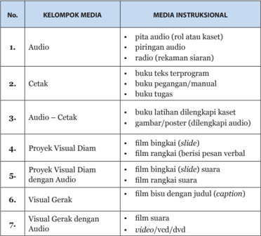

Tabel ini memperlihatkan berbagai jenis media instruksional yang digunakan dalam pembelajaran, yang dapat dibagi menjadi beberapa kelompok berdasarkan jenisnya. Topik utama tabel ini adalah media instruksional yang digunakan dalam pendidikan. Kolom-kolom yang ada dalam tabel ini meliputi: 1. Audio, 2. Cetak, 3. Audio - Cetak, 4. Proyek Visual Diam, 5. Proyek Visual Diam dengan Audio, 6. Visual Gerak, dan 7. Visual Gerak dengan Audio. Data atau pola penting yang terlihat dalam tabel ini adalah bahwa setiap jenis media instruksional memiliki variasi dan kombinasi yang berbeda-beda, mulai dari audio hingga visual gerak dengan audio. Misalnya, audio termasuk pita audio, piringan audio, dan radio rekaman siaran. Sedangkan untuk media instruksional cetak, ada buku teks program, buku pegangan/manual, dan buku tugas. Selain itu, tabel ini juga menunjukkan bahwa media instruksional audio-cetak dan proyek visual diam dengan audio merupakan kombinasi dari dua jenis media tersebut. Ini menunjukkan bahwa dalam pendidikan, penggunaan media instruksional seringkali tidak hanya satu jenis saja, tetapi bisa berupa kombinasi dari beberapa jenis media.

 

---
## 📄 Halaman 36

---
**📊 Tabel**

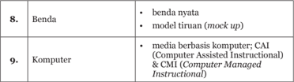

Tabel ini memuat informasi tentang dua jenis benda: benda nyata dan model tiruan (mock-up), serta komputer yang berbasis komputer dan CAI (Computer Assisted Instruction) serta CMI (Computer Managed Instruction). Topik utama tabel ini adalah tentang benda dan komputer, dengan kolom pertama menyebutkan jenis benda tersebut. Data penting yang terlihat adalah bahwa benda nyata dan model tiruan termasuk dalam kategori benda, sedangkan komputer berbasis komputer, CAI, dan CMI termasuk dalam kategori komputer. Ini menunjukkan bahwa tabel ini membahas tentang jenis benda dan komputer dalam konteks pembelajaran.

### B.  Sumber Belajar

- Buku Teks Pelajaran Khonghucu dan Budi Pekerti Kelas XI
- Buku Tata Laksana dan Tata Ibadah Agama Khonghucu
- Kitab Sishu, Wujing, Xiaojing
- Buku Referensi
- Koran (media cetak)
- Situs internet
- Nara Sumber
- Fenomena (alam dan sosial)

 

---
## 📄 Halaman 37

### BAB 6

### Kompetensi Inti dan Kompetensi Dasar

### A. Standar Kompetensi Lulusan

Standar Kompetensi  Lulusan adalah kreteria mengenai  kualifikasi kemampuan lulusan yang mencakup sikap, pengetahuan dan keterampilan.

Standar Kompetensi Lulusan digunakan sebagai acuan utama pengembangan  standar  isi,  standar  proses,  standar  penilaian  pendidikan, standar pendidik dan tenaga kependidikan, standar sarana dan prasarana, standar pengelolaan, dan standar pembiayaan.

### 1.  Standar Kompetensi Lulusan Domain Sikap

Memiliki perilaku yang mencerminkan sikap orang beriman, berakhlak mulia, percaya diri, dan bertanggung jawab dalam berinteraksi secara efektif dengan lingkungan sosial dan alam serta dalam menempatkan dirinya sebagai cerminan bangsa dalam pergaulan dunia

### 2.  Standar Kompetensi Lulusan Domain Keterampilan

Memiliki kemampuan pikir dan tindak yang efektif dan kreatif dalam ranah abstrak dan konkret terkait dengan pengembangan dari yang dipelajarinya di sekolah (dari berbagai sumber berbeda dalam informasi dan sudut pandang/ teori yang dipelajarinya di sekolah, masyarakat, dan belajar mandiri)

### 3.  Standar Kompetensi Lulusan Domain Pengetahuan

Memiliki pengetahuan prosedural dan metakognitif dalam ilmu pengetahuan, teknologi, seni, budaya, humaniora, dengan wawasan kebangsaan,  kenegaraan,  dan  peradaban  terkait  penyebab  fenomena  dan kejadian

### B.  Kompetensi Inti (KI)

Kompetensi  Inti  adalah  gambaran  mengenai  kompetensi  utama yang dikelompokkan ke dalam aspek sikap, pengetahuan, dan keterampilan (afektif, kognitif, dan psikomotor) yang harus dipelajari peserta didik untuk

 

---
## 📄 Halaman 38

suatu jenjang sekolah, kelas dan mata pelajaran. Dengan kata lain, KI adalah kemampuan yang harus dimiliki  seorang  peserta  didik  untuk  setiap  kelas melalui pembelajaran:

- Menerima dan menjalankan ajaran agama yang dianutnya
- Memiliki  perilaku  jujur,  disiplin,  tanggung  jawab,  santun,  peduli,  dan percaya diri dalam berinteraksi dengan keluarga, teman, dan guru
- Memahami pengetahuan faktual  dengan  cara  mengamati  [mendengar, melihat,  membaca] dan menanya berdasarkan rasa ingin tahu tentang dirinya, makhluk ciptaan Tuhan dan kegiatannya, dan benda-benda yang dijumpainya di rumah dan di sekolah
- Menyajikan  pengetahuan  faktual  dalam  bahasa  yang  jelas  dan  logis, dalam karya yang estetis, dalam gerakan yang mencerminkan anak sehat, dan  dalam  tindakan  yang  mencerminkan  perilaku  anak  beriman  dan berakhlak mulia
KI pertama, menerima dan menjalankan ajaran agama yang dianutnya, merupakan kompetensi spiritual yang berkaitan dengan keimanan. Kompetensi dasar yang terkait keimanan dikelompokkan dalam kompetensi inti pertama.

KI  kedua,  memiliki  perilaku  jujur,  disiplin,  tanggung  jawab,  santun, peduli,  dan  percaya  diri  dalam  berinteraksi  dengan  keluarga,  teman,  dan guru; merupakan  kompetensi  yang berkaitan dengan interaksi sosial kemasyarakatan. Kompetensi dasar yang terkait dengan kompetensi sikap sosial kemasyarakatan dikelompokkan dalam kompetensi inti kedua.

KI  ketiga,  memahami  pengetahuan  faktual  dengan  cara  mengamati (mendengar,  melihat,  membaca)  dan  menanya  berdasarkan  rasa  ingin tahu tentang dirinya, makhluk ciptaan Tuhan dan kegiatannya, dan bendabenda yang dijumpainya di rumah dan di sekolah; merupakan kompetensi yang  terkait  dengan  pengetahuan.  Kompetensi  dasar  yang  terkait  dengan kompetensi pengetahuan dikelompokkan dalam kompetensi inti ketiga.

KI,  menyajikan  pengetahuan  faktual  dalam  bahasa  yang  jelas  dan logis,  dalam  karya  yang  estetis,  dalam  gerakan  yang  mencerminkan  anak sehat, dan dalam tindakan yang mencerminkan perilaku anak beriman dan berakhlak mulia; merupakan kompetensi yang terkait dengan kemampuan berkomunikasi  dan  keterampilan.  Kompetensi  dasar  yang  terkait  dalam ranah  psikomotorik/keterampilan  dikelompokkan  dalam  kompetensi  inti keempat.

 

---
## 📄 Halaman 39

Meskipun keempat aspek yang tercakup dalam Kompetensi Inti tersebut merupakan  satu  kesatuan,  namun  dalam  pengajarannya  tidaklah  mudah. Seseorang yang dapat berperilaku menyimpang, belum tentu merasa telah melakukan tindakan yang menyimpang. Perilaku tersebut pasti didasari oleh pengetahan dan pengalaman yang dimilikinya. Kematangan dan kedewasaan dalam berfikir, bersikap dan berperilaku inilah merupakan hasil yang ingin dicapai.

Materi  pokok  umumnya kompetensi yang terkait dengan pengetahuan (KI  atau  KD  ketiga)  dan  keterampilan  (KI  atau  KD  keempat).  Hal  ini dikarenakan kompetensi pengetahuan dan keterampilan adalah kompetensi yang mudah diukur. Berbeda dengan kompetensi sikap, kompetensi inti atau kompetensi  dasar  pertama  dan  kedua,  relative  lebih  sulit  diukur.  Namun dalam penguasaan kompetensi ketiga dan keempat, kompetensi pertama dan kedua sangat berpengaruh.

Sebagai contoh, seseorang yang lurus (menjaga kebenaran) akan sungguh-sungguh dalam mengerjakan tugas dan menghindari jalan pintas/ menyontek.  Karena  bersungguh-sungguh,  tentu  penguasaan  materi  akan menjadi lebih baik.

Sebaliknya, pemahaman pengetahuan tentang pentingnya pengendalian diri akan lebih menguatkan sikap dan perilaku. Jadi, meskipun kompetensi sikap  tidak  secara  langsung  tersirat  dalam  materi,  namun  dapat  dilatih sebagai  dampak  pengiring  dalam  pembelajaran  kompetensi  pengetahuan dan keterampilan.

Kompetensi  sikap  merupakan  kemampuan  dalam  menginternalisasi nilai-nilai dan mengimplementasikan dalam kehidupan sehari-hari. Contoh implementasi kompetensi sikap di antaranya adalah:

- Kesungguhan dalam belajar dan menyelesaikan tugas, kejujuran, pantang menyerah, dengan kata lain 'belajar tidak merasa lelah'.
- Keterampilan memilah dan memutuskan mana yang prioritas dan mana yang kemudian, kemampuan menunda kesenangan untuk hal yang lebih penting.
- Kemampuan  untuk  saling  menghormati,  menghargai,  toleransi,  dan dapat bekerjasama.
- Kemampuan  untuk  sportif/jujur,  mengakui  kesalahan,  dan  terbuka terhadap masukan, mau mengalah dan memaafkan.
- Kemampuan berempati dan mendengarkan dalam berkomunikasi.

 

---
## 📄 Halaman 40

### C.  Kompetensi Dasar

Kompetensi dasar merupakan sejumlah kemampuan yang harus dimiliki peserta didik dalam mata pelajaran tertentu sebagai rujukan untuk menyusun indikator kompetensi. Kompetensi dasar untuk kelas XI meliputi:

- 3.1 Memahami pembinaan diri sebagai kewajiban pokok setiap manusia;
- 3.2 Memahami makna Xiao sebagai pokok kebajikan;
- 3.3 Menjelaskan upacara (sembahyang) kepada para suci ( Shenming );
- 3.4 Memahami Nabi Kongzi sebagai Tianzhi Muduo ;
- 3.5 Menjelaskan prinsip-prinsip moral yang diajarkan Mengzi ;
- 3.6 Memahami upacara-upacara persembahyangan kepada leluhur;
- 3.7 Menjelaskan makna cinta kasih dan kebenaran;
- 4.1  Mempraktikkan  sikap  mengasihi  sesama  manusia  dan  usaha  berhenti pada puncak kebaikan dari salah-satu predikat yang disandang;
- 4.2 Mempraktikkan perilaku hormat kepada orang tua sebagai bentuk laku bakti;
- 4.3 Memberikan sumbangan dana untuk bakti sosial pada hari persaudaraan;
- 4.4 Mempraktikkan  sikap  dan  kebiasaan  Nabi Kongzi dalam  kehidupan sehari-hari;
- 4.5 Mempraktikkan prinsip-prinsip moral yang diajarkan Mengzi ;
- 4.6 Memperagakan upacara persembahyangan kepada leluhur;
- 4.7 Mempraktikkan perilaku yang berlandaskan Cinta kasih dan kebenaran;

 

---
## 📄 Halaman 41

### BAB 7

### Standar Penilaian

### A. Hakikat Penilaian

Penilaian  merupakan  suatu  kegiatan  pendidik  yang  terkait  dengan pengambilan keputusan tentang pencapaian kompetensi atau hasil belajar peserta  didik  yang  mengikuti  proses  pembelajaran  tertentu.  Keputusan tersebut  berhubungan  dengan  tingkat  keberhasilan  peserta  didik  dalam mencapaian suatu kompetensi.

Penilaian  merupakan  suatu  proses  yang  dilakukan  melalui  langkahlangkah  perencanaan,  penyusunan  alat  penilaian,  pengumpulan  informasi melalui sejumlah bukti yang menunjukkan pencapaian hasil belajar peserta didik, pengolahan, dan penggunaan informasi tentang hasil belajar peserta didik. Penilaian kelas dilaksanakan melalui berbagai cara, seperti penilaian unjuk  kerja  ( performance ),  penilaian  sikap,  penilaian  tertulis  ( paper  and pencil test ), penilaian proyek, penilaian produk, penilaian melalui kumpulan hasil kerja/karya peserta didik (portfolio), dan penilaian diri.

Penilaian berfungsi sebagai berikut:

- Menggambarkan  sejauh  mana  peserta  didik  telah  menguasai  suatu kompetensi;
- Mengevaluasi hasil pembelajaran peserta didik dalam rangka membantu peserta  didik  memahami  dirinya  dan  membuat  keputusan  tentang langkah  berikutnya,  baik  untuk  pemilihan  program,  pengembangan kepribadian, maupun untuk penjurusan (sebagai bimbingan);
- Menemukan  kesulitan  belajar  dan  kemungkinan  prestasi  yang  bisa dikembangkan peserta didik dan sebagai alat diagnosis yang membantu pendidik menentukan apakah seseorang perlu mengikuti remedial atau pengayaan;
- Menemukan  kelemahan  dan  kekurangan  proses  pembelajaran  yang sedang berlangsung guna perbaikan proses pembelajaran berikutnya;
- Sebagai  kontrol  bagi  pendidik  (guru)  dan  sekolah  tentang  kemajuan perkembangan peserta didik;

 

---
## 📄 Halaman 42

### B.  Prinsip-Prinsip Penilaian

### 1. Valid dan Reliabel

### a. Valid

Validitas berarti menilai apa yang seharusnya dinilai dengan menggunakan  alat  yang  sesuai  untuk  mengukur  kompetensi.  Dalam mata pelajaran pendidikan agama Khonghucu misalnya untuk indikator 'mempraktikkan  cara  menghormat  dengan  merangkapkan  tangan'. Maka penilaian akan valid apabila  mengunakan penilaian unjuk kerja. Jika menggunakan tes tertulis maka penilaian tidak valid.

### b. Reliabilitas

Reliabilitas berkaitan dengan konsistensi (keajegan) hasil penilaian. Penilaian yang reliable (ajeg) memungkinkan perbandingan yang reliable dan  menjamin  konsistensi.  Misalnya  Pendidik  menilai  dengan  proyek, penilaian  akan  reliabel  jika  hasil  yang  diperoleh  itu  cenderung  sama bila  proyek itu dilakukan lagi dengan kondisi yang relatif sama. Untuk menjamin  penilaian  yang  reliabel  petunjuk  pelaksanaan  proyek  dan penskorannya harus jelas.

### 2.  Terfokus pada Kompetensi

Penilaian harus terfokus pada pencapaian kompetensi (rangkaian kemampuan), bukan hanya pada penguasaan materi (pengetahuan).

### 3.  Keseluruhan/Komprehensif

Penilaian harus menyeluruh dengan menggunakan beragam cara dan alat untuk menilai beragam kompetensi peserta didik, sehingga tergambar profil kompetensi peserta didik.

### 4.  Objektivitas

Penilaian harus dilaksanakan secara obyektif. Untuk itu, penilaian harus adil,  terencana,  berkesinambungan,  dan  menerapkan  kriteria  yang  jelas dalam pemberian skor.

### 5.  Mendidik

Penilaian  dilakukan  untuk  memperbaiki  proses  pembelajaran  bagi pendidik dan meningkatkan kualitas belajar bagi peserta didik.

 

---
## 📄 Halaman 43

### C.  Penilaian Otentik

### 1. Definisi

- Penilaian  otentik  ( Authentic  Assessment )  adalah  pengukuran  yang bermakna  secara  signifikan  atas  hasil  belajar  peserta  didik  untuk ranah sikap, keterampilan, dan pengetahuan.
- Istilah Assessment merupakan sinonim dari penilaian, pengukuran, pengujian, atau evaluasi.
- Istilah otentik merupakan sinonim dari asli, nyata, valid, atau reliabel.
- Secara konseptual penilaian otentik lebih bermakna secara signifikan dibandingkan dengan tes pilihan ganda terstandar sekali pun.
- Ketika menerapkan penilaian otentik untuk mengetahui hasil dan  prestasi  belajar  peserta  didik,  guru  menerapkan  kriteria  yang berkaitan dengan konstruksi pengetahuan, aktivitas mengamati dan mencoba, dan nilai prestasi luar sekolah.

### 2.  Penilaian Otentik dan Tuntutan Kurikulum 2013

- -Penilaian otentik memiliki relevansi kuat terhadap pendekatan ilmiah dalam pembelajaran sesuai dengan tuntutan Kurikulum 2013.
- Penilaian tersebut mampu menggambarkan peningkatan hasil belajar peserta didik, baik dalam rangka mengobservasi, menalar, mencoba, membangun jejaring, dan lain-lain.
- -Penilaian  otentik  cenderung  fokus  pada  tugas-tugas  kompleks  atau kontekstual, memungkinkan peserta didik untuk menunjukkan kompetensi mereka dalam pengaturan yang lebih otentik.
- -Penilaian otentik sangat relevan dengan pendekatan tematik terpadu dalam  pembelajaran,  khususnya  jenjang  sekolah  dasar  atau  untuk mata pelajaran yang sesuai.
- -Penilaian  otentik  sering  dikontradiksikan  dengan  penilaian  yang menggunakan standar tes berbasis norma, pilihan ganda, benar-salah, menjodohkan, atau membuat jawaban singkat.
- -Tentu  saja,  pola  penilaian  seperti  ini  tidak  diantikan  dalam  proses pembelajaran,  karena  memang  lazim  digunakan  dan  memperoleh legitimasi secara akademik.
- -Penilaian otentik dapat dibuat oleh guru sendiri, guru secara tim, atau guru bekerja sama dengan peserta didik.

 

---
## 📄 Halaman 44

- -Dalam penilaian otentik, seringkali keterlibatan peserta didik sangat penting. Asumsinya, peserta didik dapat melakukan aktivitas belajar lebih baik ketika mereka tahu bagaimana akan dinilai.
- -Peserta didik diminta untuk merefleksikan dan mengevaluasi kinerja mereka sendiri  dalam  rangka  meningkatkan  pemahaman yang lebih dalam  tentang  tujuan  pembelajaran  serta  mendorong  kemampuan belajar yang lebih tinggi.
- -Pada  penilaian  otentik  guru  menerapkan  kriteria  yang  berkaitan dengan  konstruksi  pengetahuan,  kajian  keilmuan,  dan  pengalaman yang diperoleh dari luar sekolah.
- Penilaian otentik mencoba menggabungkan kegiatan guru mengajar, kegiatan peserta didik belajar, motivasi dan keterlibatan peserta didik, serta keterampilan belajar.
- -Karena penilaian itu merupakan bagian dari proses pembelajaran, guru dan peserta didik berbagi pemahaman tentang kriteria kinerja.
- -Dalam  beberapa  kasus,  peserta  didik  bahkan  berkontribusi  untuk mendefinisikan harapan atas tugas-tugas yang harus mereka lakukan.
- -Penilaian otentik sering digambarkan sebagai penilaian atas perkembangan  peserta  didik,  karena  berfokus  pada  kemampuan mereka berkembang untuk belajar bagaimana belajar tentang subjek.
- Penilaian otentik harus mampu menggambarkan sikap, keterampilan, dan  pengetahuan  apa  yang  sudah  atau  belum  dimiliki  oleh  peserta didik, bagaimana mereka menerapkan pengetahuannya, dalam hal apa mereka sudah atau belum mampu menerapkan perolehan belajar, dan sebagainya.
- -Atas dasar itu, guru dapat mengidentifikasi materi apa yang sudah layak dilanjutkan dan untuk materi apa kegiatan remedial harus dilakukan.

### 3. Penilaian Otentik dan Pembelajaran Otentik

- -Penilaian otentik mengharuskan pembelajaran yang otentik pula.
- -Menurut Ormiston, belajar otentik mencerminkan tugas dan pemecahan masalah yang diperlukan dalam kenyataannya di luar sekolah.
- -Penilaian  otentik  terdiri  dari  berbagai  teknik  penilaian.  Pertama, pengukuran langsung keterampilan peserta didik yang berhubungan dengan hasil jangka panjang pendidikan seperti kesuksesan di tempat kerja. Kedua, penilaian atas tugas-tugas yang memerlukan keterlibatan yang  luas  dan  kinerja  yang  kompleks.  Ketiga,  analisis  proses  yang digunakan  untuk  menghasilkan  respon  peserta  didik  atas  perolehan

 

---
## 📄 Halaman 45

- sikap, keterampilan, dan pengetahuan yang ada.
- Penilaian otentik akan bermakna bagi guru untuk menentukan caracara  terbaik  agar  semua  peserta  didik  dapat  mencapai  hasil  akhir, meski dengan satuan waktu yang berbeda.
- -Konstruksi  sikap,  keterampilan,  dan  pengetahuan  dicapai  melalui penyelesaian tugas di mana peserta didik telah memainkan peran aktif dan kreatif.
- -Keterlibatan peserta didik dalam melaksanakan tugas sangat bermakna bagi perkembangan pribadi mereka.
- -Dalam  pembelajaran  otentik,  peserta  didik  diminta  mengumpulkan informasi  dengan  pendekatan  saintifik,  memahami  aneka  fenomena atau gejala dan hubungannya satu sama lain secara mendalam, serta mengaitkan apa yang dipelajari dunia nyata yang ada di luar sekolah.
- -Guru dan peserta didik memiliki tanggung jawab atas apa yang terjadi. Peserta  didik  pun  tahu  apa  yang  mereka  ingin  pelajari,  memiliki parameter  waktu  yang  fleksibel,  dan  bertanggungjawab  untuk  tetap pada tugas.
- -Penilaian  otentik  pun  mendorong  peserta  didik  mengkonstruksi, mengorganisasikan, menganalisis, mensintesis, menafsirkan, menjelaskan, dan mengevaluasi informasi untuk kemudian mengubahnya menjadi pengetahuan baru.

### 4. Pembelajaran Otentik dan Guru Otentik

Pada  pembelajaran  otentik,  guru  harus  menjadi  'guru  otentik'.  Peran guru bukan hanya pada proses pembelajaran, melainkan juga pada penilaian. Untuk  bisa  melaksanakan  pembelajaran  otentik,  guru  harus  memenuhi kriteria tertentu:

- -Mengetahui bagaimana menilai kekuatan dan kelemahan peserta didik serta desain pembelajaran.
- Mengetahui bagaimana cara membimbing peserta didik untuk mengembangkan pengetahuan mereka sebelumnya dengan cara mengajukan pertanyaan dan menyediakan sumber daya memadai bagi peserta didik untuk melakukan akuisisi pengetahuan.
- -Menjadi pengasuh proses pembelajaran, melihat informasi baru, dan mengasimilasikan pemahaman peserta didik.
- -Menjadi kreatif tentang bagaimana proses belajar peserta didik dapat diperluas  dengan  menimba  pengalaman  dari  dunia  di  luar  tembok sekolah.

 

---
## 📄 Halaman 46

### 5.   Proses Penilaian yang Mendukung Kreativitas

Sharp,  C.  2004. Developing young children's creativity : what can we learn from research ? Guru dapat membuat peserta didik berperilaku kreatif melalui:  tugas  yang  tidak  hanya  memiliki  satu  jawaban  benar,  mentolerir jawaban  yang  asal-asalan,  menekankan  pada  proses  bukan  hanya  hasil saja.  Memberanikan  peserta  didik  untuk:  mencoba,  menentukan  sendiri yang  kurang  jelas/lengkap  informasi,  memiliki  interpretasi  sendiri  terkait pengetahuan/kejadian, memberikan keseimbangan antara kegiatan terstruktur dan spontan/ekspresif.

### D. Pengembangan Instrumen Penilaian Sikap

Sikap seseorang mencakup perasaan (seperti suka atau tidak suka) yang terkait  dengan  kecenderungan  orang  tersebut  dalam  merespons  sesuatu atau  objek  tertentu.  Sikap  juga  merupakan  suatu  ekspresi  dari  nilai-nilai atau  pandangan  hidup  yang  dimiliki  oleh  seseorang.  Ada  tiga  komponen sikap, yakni: afektif, kognitif, dan konatif/perilaku. Komponen afektif adalah perasaan yang dimiliki oleh seseorang atau penilaiannya terhadap sesuatu objek.  Komponen  kognitif  adalah  kepercayaan  atau  keyakinan  seseorang mengenai  objek.  Adapun  komponen  konatif  adalah  kecenderungan  untuk berperilaku  atau  berbuat  dengan  cara-cara  tertentu  berkenaan  dengan kehadiran objek sikap.

Terkait dengan penilaian hasil belajar peserta didik, penilaian terhadap sikap  seorang  peserta  didik  dapat  dilakukan  dengan  berbagai  cara,  yang salah  satunya  adalah  melalui  pengamatan  atau  observasi.  Di  samping observasi,  penilaian  terhadap  sikap  peserta  didik  dapat  juga  dilakukan dengan menggunakan pendekatan penilaian diri ( self-assessment ), penilaian oleh  teman  sebaya  atau  penilaian  antar-teman  ( peer-assessment ),  atau menggunakan jurnal. Berikut ini adalah uraian secara rinci tentang teknik dan langkah-langkah dalam pengembangan instrumen untuk penilaian sikap peserta didik.

### 1. Teknik Pengembangan Instrumen Observasi

Observasi merupakan teknik penilaian yang dilakukan secara berkesinambungan  dengan  menggunakan  indera,  baik  secara  langsung maupun  tidak  langsung  dengan  menggunakan  pedoman  observasi  yang berisi sejumlah indikator perilaku yang diamati.

### a. Observasi perilaku

Pendidik  dapat  melakukan  observasi  terhadap  peserta  didik  yang dibinanya.  Hasil  pengamatan  dapat  dijadikan  sebagai  umpan  balik

 

---
## 📄 Halaman 47

dalam pembinaan. Observasi perilaku di sekolah dapat dilakukan dengan menggunakan  buku  catatan  khusus  tentang  kejadian-kejadian  yang berkaitan dengan peserta didik selama di sekolah.

### Contoh Isi Buku Catatan Harian:

---
**📊 Tabel**

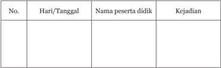

Tabel ini berisi informasi tentang kejadian yang dialami oleh peserta didik pada hari tertentu. Kolom "Hari/Tanggal" menyediakan tanggal atau hari yang relevan dengan kejadian tersebut. Kolom "Nama peserta didik" mencakup nama-nama individu yang terlibat dalam kejadian tersebut. Kolom "Kejadian" menyajikan deskripsi singkat dari apa yang terjadi pada setiap peserta didik. Topik utama tabel ini adalah pemeriksaan atau analisis kejadian yang dialami oleh peserta didik pada hari tertentu. Data penting yang terlihat meliputi tanggal atau hari kejadian, nama peserta didik yang terlibat, dan deskripsi singkat dari kejadian tersebut.

Kolom kejadian  diisi  dengan  kejadian  positif  maupun  negatif.  Catatan dalam  lembaran  buku  tersebut,  selain  bermanfaat  untuk  merekam  dan menilai perilaku peserta didik sangat bermanfaat pula untuk menilai sikap peserta  didik  serta  dapat  menjadi  bahan  dalam  penilaian  perkembangan peserta didik secara keseluruhan.

Selain itu, dalam observasi perilaku dapat juga digunakan daftar cek yang memuat  perilaku-perilaku  tertentu  yang  diharapkan  muncul  dari  peserta didik pada umumnya atau dalam keadaan tertentu. Berikut contoh format Penilaian Sikap.

### Contoh Format Penilaian Sikap dalam praktik:

---
**📊 Tabel**

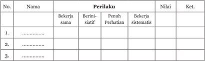

Tabel ini berisi informasi tentang perilaku kerja individu dalam sebuah organisasi. Topik utamanya adalah tentang bagaimana seseorang bekerja sama, berinisiatif, memahami perhatian, dan bekerja sistematis. Kolom-kolomnya meliputi Nama, Perilaku, Nilai, dan Ket. Data penting yang terlihat adalah bahwa setiap individu memiliki perilaku yang berbeda-beda dalam hal ini, dengan beberapa orang lebih bekerja sama, berinisiatif, memahami perhatian, dan bekerja sistematis dibandingkan dengan yang lain. Ini menunjukkan bahwa perilaku kerja individu dapat sangat bervariasi dan mempengaruhi hasil kerja dalam tim.

### Catatan:

- Kolom perilaku diisi dengan angka yang sesuai dengan kriteria berikut.
- 1  = sangat kurang
- 2  = kurang
- 3  = sedang
- 4  = baik
- 5  = amat baik

 

---
## 📄 Halaman 48

- Nilai merupakan jumlah dari skor-skor tiap indikator perilaku.
- Keterangan diisi dengan kriteria berikut
Nilai 18-20 berarti amat baik

Nilai 14-17 berarti baik

Nilai 10-13 berarti sedang

Nilai 6-9 berarti kurang

Nilai 0-5 berarti sangat kurang

### b. Pertanyaan Langsung

Kita juga dapat menanyakan secara langsung atau wawancara tentang sikap  seseorang  berkaitan  dengan  sesuatu  hal.  Misalnya,  bagaimana tanggapan  peserta  didik  tentang  kebijakan  yang  baru  diberlakukan  di sekolah mengenai 'peningkatan ketertiban'.

Berdasarkan  jawaban  dan  reaksi  lain  yang  tampil  dalam  memberi jawaban  dapat  dipahami  sikap  peserta  didik  itu  terhadap  objek  sikap. Dalam  penilaian  sikap  peserta  didik  di  sekolah,  pendidik  juga  dapat menggunakan teknik ini dalam menilai sikap dan membina peserta didik.

### 2. Teknik Pengembangan Instrumen Penilaian Diri

Penilaian  diri  adalah  suatu  teknik  penilaian  di  mana  seorang  peserta didik  diminta  untuk  menilai  dirinya  sendiri  berkaitan  dengan  kelebihan dan  kekurangannya,  serta  tingkat  pencapaian  kompetensi  dari  apa  yang dipelajarinya.  Teknik  penilaian  diri  dapat  digunakan  untuk  mengukur kompetensi afektif.  Untuk  menentukan  capaian  kompetensi  tertentu  serta untuk pengambilan keputusan terhadap peserta didik, penilaian diri biasanya dikombinasikan dengan teknik penilaian lainnya.

Penilaian diri adalah suatu teknik penilaian di mana peserta didik diminta untuk menilai dirinya sendiri  berkaitan  dengan  status,  proses  dan  tingkat pencapaian kompetensi yang dipelajarinya dalam mata pelajaran tertentu. Teknik penilaian diri dapat digunakan untuk mengukur kompetensi kognitif, afektif dan psikomotorik.

- -Penilaian kompetensi kognitif di kelas, misalnya: peserta didik diminta untuk menilai penguasaan pengetahuan dan keterampilan berpikirnya sebagai hasil belajar dari suatu mata pelajaran tertentu. Penilaian diri peserta didik didasarkan atas kriteria atau acuan yang telah disiapkan.

 

---
## 📄 Halaman 49

- -Penilaian  kompetensi  afektif,  misalnya,  peserta  didik  dapat  diminta untuk membuat tulisan yang memuat curahan perasaannya terhadap suatu objek tertentu. Selanjutnya, peserta didik diminta untuk melakukan  penilaian  berdasarkan  kriteria  atau  acuan  yang  telah disiapkan.
- -Berkaitan  dengan  penilaian  kompetensi  psikomotorik,  peserta  didik dapat diminta untuk menilai kecakapan atau keterampilan yang telah dikuasainya berdasarkan kriteria atau acuan yang telah disiapkan.
Penggunaan teknik ini dapat memberi dampak positif terhadap perkembangan  kepribadian  seseorang.  Keuntungan  penggunaan  penilaian diri di kelas antara lain:

- dapat menumbuhkan rasa percaya diri peserta didik, karena mereka diberi kepercayaan untuk menilai dirinya sendiri;
- -peserta  didik  menyadari  kekuatan  dan  kelemahan  dirinya,  karena ketika  mereka  melakukan  penilaian,  harus  melakukan  introspeksi terhadap kekuatan dan kelemahan yang dimilikinya;
- -dapat  mendorong,  membiasakan,  dan  melatih  peserta  didik  untuk berbuat jujur, karena mereka dituntut untuk jujur dan objektif dalam melakukan penilaian.
Penilaian diri dilakukan berdasarkan kriteria yang jelas dan objektif. Oleh karena itu, penilaian diri oleh peserta didik di kelas perlu dilakukan melalui langkah-langkah sebagai berikut.

- Menentukan kompetensi atau aspek kemampuan yang akan dinilai.
- -Menentukan kriteria penilaian yang akan digunakan.
- -Merumuskan  format  penilaian,  dapat  berupa  pedoman  penskoran, daftar tanda cek, atau skala penilaian.
- -Meminta peserta didik untuk melakukan penilaian diri.
- -Pendidik mengkaji sampel hasil penilaian secara acak, untuk mendorong peserta didik supaya senantiasa melakukan penilaian diri secara cermat dan objektif.
- Menyampaikan umpan balik kepada peserta didik berdasarkan hasil kajian terhadap sampel hasil penilaian yang diambil secara acak.

### 3.   Teknik Pengembangan Instrumen Penilaian Antar-teman

Teknik penilaian antar peserta didik yang biasa disebut sebagai penilaian teman sebaya atau penilaian antar-teman adalah penilaian yang dilakukan terhadap sikap atau keterampilan seorang peserta didik oleh seorang (atau

 

---
## 📄 Halaman 50

lebih)  peserta  didik  lainnya  dalam  suatu  kelas  atau  rombongan  belajar. Penilaian ini merupakan bentuk penilaian untuk melatih peserta didik penilai menjadi objektif dan kritis dalam melaksanakan tugasnya. Sementara itu di sisi  lain,  penilaian  ini  juga  dapat  melatih  peserta  didik  yang  dinilai  untuk dapat merefleksi diri guna peningkatan kapabilitas dan kualitas diri.

### 4.   Teknik Pengembangan Instrumen Penilaian dengan Jurnal

Jurnal  adalah  catatan  pendidik  di  dalam  dan  di  luar  kelas  yang  berisi informasi hasil pengamatan tentang kekuatan dan kelemahan peserta didik berkaitan dengan sikap dan perilaku. Jurnal dapat memuat penilaian peserta didik terhadap aspek tertentu. Pada umumnya, objek sikap yang perlu dinilai dalam proses pembelajaran berbagai mata pelajaran adalah sikap terhadap materi  pelajaran,  guru,  proses  pembelajaran,  serta  nilai  atau  norma  yang berhubungan dengan suatu materi pelajaran. Penilaian sikap peserta didik dapat  dilakukan  dengan  menggunakan  jurnal  belajar  peserta  didik  (buku harian), pertanyaan langsung, atau laporan pribadi.

### 5.   Teknik Pengembangan Instrumen Skala Sikap

Beberapa hal yang harus diperhatikan dalam Pengembangan Instrumen Skala Sikap adalah sebagai berikut:

Perencanaan Penilaian dengan Menggunakan Skala Sikap.

Beberapa  hal  yang  harus  dilakukan  dalam  merencanakan  penilaian dengan menggunakan instrumen skala sikap adalah sebagai berikut:

- -Menentukan kompetensi terkait sikap yang akan dinilai.
- -Menentukan komponen sikap yang akan dinilai apakah terkait kognitif atau afektif.
- -Menyusun sejumlah indikator sikap berdasarkan kompetensi dasar.
- Merencanakan waktu penilaian dan lamanya waktu yang diperlukan.
- -Menyusun  kisi-kisi  untuk  memetakan  banyaknya  item  pertanyaan pada setiap indikator.
- -Menentukan  rentang  skala  penilaian  yang  akan  digunakan  dalam menilai sikap.
- -Menyusun butir soal skala sikap berdasarkan indikator sikap yang akan dinilai.
Beberapa hal yang harus dilakukan dalam pelaksanaan penilaian dengan menggunakan instrumen skala sikap adalah sebagai berikut.

- -Memberikan  seperangkat  pertanyaan  atau  pernyataan  skala  sikap

 

---
## 📄 Halaman 51

kepada peserta didik,

- -Meminta peserta didik untuk memberi respon sesuai sikap, persepsi atau pandangan peserta didik yang sesungguhnya,
- -Mengumpulkan dan merekap skala sikap yang telah diisi peserta didik,
- -Memberi skor (scoring) terhadap lembar kerja atau jawaban responden. Skor untuk skala pada pertanyaan atau pernyataan positif (favorable) yang biasa digunakan adalah: sangat setuju (SS) = 5; setuju (S) = 4; netral  (N)  =  3;  tidak  setuju  (TS)  =  2;  dan  sangat  tidak  setuju  (STS) =  1.  ;  Sedangkan  untuk  pertanyaan  atau  pernyataan  atau  negatif (unfavorable) diberi skor sebaliknya, yaitu SS = 1; S = 2; N = 3; TS = 4; dan STS = 5.
- Memetakan  sikap  peserta didik berdasarkan respon sikap yang diberikan pada instrumen.

### E.  Pengembangan Instrumen Penilaian Pengetahuan

Penilaian  hasil  belajar  pada  kompetensi  pengetahuan  dapat  dilakukan melalui  berbagai  teknik,  seperti  tes  tertulis,  tes  lisan,  dan  penugasan. Instrumen  yang  digunakan  dalam  tes  tertulis  dapat  menggunakan  bentuk soal  pilihan  ganda,  isian,  jawaban  singkat,  benar-salah,  menjodohkan, dan uraian. Khusus untuk tes uraian, perlu dilengkapi dengan rubrik atau pedoman penskoran.

Instrumen  untuk  tes  lisan  dapat  menggunakan  daftar  dari  beberapa pertanyaan  yang  akan  disampaikan  secara  lisan  dan  dilengkapi  dengan rambu-rambu atau pedoman penskoran. Di samping tes tulis dan tes lisan, penilaian  terhadap  aspek  pengetahuan  dapat  dilakukan  dengan  teknik penugasan  yang  biasanya  berupa  pekerjaan  rumah  dan/atau  projek,  baik penugasan secara individu atau kelompok, sesuai dengan karakteristik tugas yang diberikan.

### 1. Teknik Pengembangan Instrumen Tes Tertulis

Tes tertulis merupakan seperangkat pertanyaan atau tugas dalam bentuk tulisan  yang  direncanakan  untuk  mengukur  atau  memperoleh  informasi tentang kemampuan peserta tes. Tes tertulis menuntut adanya respon dari peserta tes yang dapat dijadikan sebagai representasi dari kemampuan yang dimilikinya.

Secara garis besar, tes tertulis dapat diklasifikasikan dalam dua bentuk, yaitu: bentuk pertanyaan yang menuntut jawaban pilihan (bentuk pilihan) dan jawaban uraian (bentuk uraian). Bentuk pertama di antaranya: bentuk

 

---
## 📄 Halaman 52

pilihan ganda, salah benar, dan menjodohkan. Yang termasuk dalam bentuk kedua adalah bentuk pertanyaan uraian terbuka dan uraian tertutup, bentuk jawaban singkat ( short answer ) dan bentuk isian ( completion ).

### 2. Tes Tertulis Bentuk Pilihan

Tes tertulis bentuk pilihan adalah tes tertulis  yang  mengandung kemungkinan jawaban ( option )  yang  harus  dipilih  peserta  tes.  Peserta  tes harus memilih jawaban dari kemungkinan jawaban yang telah disediakan. Dengan  demikian, penskoran jawaban peserta tes sepenuhnya dapat dilakukan secara objektif.

### 3. Tes Tertulis Bentuk Uraian

Tes tertulis bentuk uraian adalah tes yang jawabannya menuntut peserta tes  mengingat  dan  mengorganisasikan  gagasan  atau  hal-hal  yang  telah dipelajarinya  dengan  cara  mengemukakan  atau  mengekspresikan  gagasan tersebut  secara  tertulis  dengan  kata-kata  sendiri.  Ciri  khas  tes  bentuk  ini, jawaban tidak disediakan oleh penyusun tes, tetapi harus dibuat oleh peserta tes sendiri. Peserta tes dapat memilih, menghubungkan, dan menyampaikan gagasanya dengan menggunakan kata-katanya sendiri.

### 4. Teknik Pengembangan Instrumen Tes Lisan

Tes lisan adalah tes yang menuntut peserta didik memberikan jawaban secara  lisan.  Tes  lisan  biasanya  dilaksanakan  dengan  cara  mengadakan percakapan  antara  peserta  didik  dengan  tester  tentang  masalah  yang diujikan. Pelaksanaan Tes lisan dilakukan dengan mengadakan tanya jawab secara  langsung  antara  pendidik  dan  peserta  didik.  Tes  lisan  digunakan untuk mengungkapkan hasil belajar peserta didik pada aspek pengetahuan. Tes  lisan  juga  dapat  digunakan  untuk  menguji  peserta  didik,  baik  secara individual maupun secara kelompok. Tes lisan bisa digunakan pada ulangan harian,  ulangan  tengah  semester,  ulangan  akhir  semester,  ujian  tingkat kompetensi, ujian mutu tingkat kompetensi, dan ujian sekolah.

### 5. Teknik Pengembangan Instrumen Penugasan

Instrumen  penugasan  dapat  berupa  pekerjaan  rumah  dan/atau  projek yang harus dikerjakan oleh peserta didik, baik secara individu atau kelompok, sesuai dengan karakteristik tugas.

### F.  Pengembangan Instrumen Penilaian Keterampilan

Penilaian terhadap kompetensi keterampilan peserta didik dapat dilakukan  melalui  berbagai  teknik  penilaian,  yang  salah  satunya  adalah penilaian  kinerja.  Penilaian  kinerja  merupakan  penilaian  yang  menuntut

 

---
## 📄 Halaman 53

peserta didik mendemonstrasikan suatu kompetensi tertentu dengan menggunakan tes praktik, projek, dan penilaian portofolio. Instrumen yang digunakan dalam penilaian tersebut biasanya menggunakan daftar cek atau skala penilaian ( rating scale ) yang dilengkapi rubrik.

Berikut ini  akan  diuraikan  petunjuk  teknis  pengembangan tes  praktik, projek, dan penilaian portofolio beserta kriteria minimal yang harus dipenuhi, baik dalam perencanaan maupun pelaksanaan penilaian.

### 1. Teknik Pengembangan Instrumen Tes Praktik

Tes praktik dilakukan dengan mengamati kegiatan peserta didik dalam melakukan sesuatu. Penilaian digunakan untuk menilai ketercapaian kompetensi yang menuntut peserta didik melakukan tugas tertentu seperti:  praktik  di  laboratorium,  praktik  salat,  praktik  olahraga,  bermain peran,  memainkan  alat  musik,  bernyanyi,  membaca  puisi/deklamasi,  dan sebagainya.

Untuk  dapat  memenuhi  kualitas  perencanaan  dan  pelaksanaan  tes praktik, berikut ini adalah petunjuk teknis dan acuan dalam merencanakan dan melaksanakan penilaian melalui tes praktik.

### Format Penilaian Praktik

Materi Praktik

: ...............................................................

Nama peserta didik

: ...............................................................

Kelas

: ...............................................................

---
**📊 Tabel**

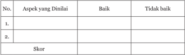

Tabel ini menunjukkan aspek-aspek yang dinilai dalam sebuah evaluasi, dengan dua kategori utama: "Baik" dan "Tidak Baik". Setiap aspek memiliki kolom untuk menunjukkan apakah nilai tersebut dianggap baik atau tidak baik. Topik utama tabel ini adalah penilaian atau evaluasi, dengan aspek-aspek yang dinilai sebagai elemen pentingnya. Data atau pola penting yang terlihat adalah bahwa setiap aspek memiliki dua pilihan, baik atau tidak baik, yang menunjukkan kemampuan untuk memberikan evaluasi berdasarkan kriteria tertentu. Skor yang ditampilkan pada akhir tabel mungkin merupakan hasil akhir dari evaluasi tersebut, menunjukkan keseluruhan skor yang diberikan kepada setiap aspek.

### Keterangan:

- -Baik mendapat skor 1
- -Tidak baik mendapat skor 0

 

---
## 📄 Halaman 54

Format Penilaian Praktik

Materi Praktik

: ...............................................................

Nama Peserta didik

: ................................................................

Kelas

: ................................................................

---
**📊 Tabel**

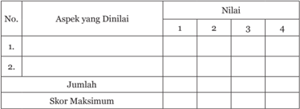

Tabel ini menunjukkan hasil penilaian berdasarkan aspek-aspek tertentu pada empat kategori skor (1 hingga 4). Topik utama tabel adalah penilaian berdasarkan aspek-aspek tertentu. Kolom pertama berisi aspek-aspek yang dinilai, sedangkan kolom kedua berisi nilai yang diberikan untuk setiap aspek tersebut. Data penting yang terlihat adalah bahwa setiap aspek memiliki empat kategori skor yang berbeda, dengan skor maksimum yang sama untuk semua aspek. Ini menunjukkan bahwa penilaian dilakukan secara objektif dan standar, dengan mempertimbangkan berbagai aspek yang mungkin relevan dalam konteks tertentu.

### Keterangan penilaian:

- 1 = tidak kompeten
- 2 = cukup kompeten
- 3 = kompeten
- 4 = sangat kompeten
Kriteria penilaian dapat dilakukan sebagai berikut:

- Jika  seorang  peserta  didik  memperoleh  skor  26  -  28  dapat  ditetapkan sangat kompeten
- Jika  seorang  peserta  didik  memperoleh  skor  21  -  25  dapat  ditetapkan kompeten
- Jika  seorang  peserta  didik  memperoleh  skor  16  -  20  dapat  ditetapkan cukup kompeten
- Jika seorang peserta didik memperoleh skor 0 - 15 dapat ditetapkan tidak kompeten

### 2. Teknik Pengembangan Instrumen Penilaian Proyek

Penilaian proyek merupakan kegiatan penilaian terhadap suatu tugas yang harus diselesaikan dalam periode atau waktu tertentu. Tugas tersebut berupa suatu investigasi sejak dari perencanaan, pengumpulan, pengorganisasian, pengolahan  dan  penyajian  data.  Penilaian  proyek  dapat  digunakan  untuk

 

---
## 📄 Halaman 55

mengetahui  pemahaman,  kemampuan  mengaplikasikan,  penyelidikan  dan menginformasikan peserta  didik  pada  mata  pelajaran  dan  indikator/topik tertentu secara jelas.

Pada penilaian proyek, setidaknya ada 3 (tiga) hal yang perlu dipertimbangkan: (a) kemampuan pengelolaan: kemampuan peserta didik dalam  memilih  indikator/topik,  mencari  informasi  dan  mengelola  waktu pengumpulan data serta penulisan laporan, (b) relevansi, kesesuaian dengan mata  pelajaran  dan  indikator/topik,  dengan  mempertimbangkan  tahap pengetahuan,  pemahaman  dan  keterampilan  dalam  pembelajaran,  dan (c)  keaslian:  proyek  yang  dilakukan  peserta  didik  harus  merupakan  hasil karyanya, dengan mempertimbangkan kontribusi guru berupa petunjuk dan dukungan terhadap proyek peserta didik.

Selanjutnya,  untuk  menjamin  kualitas  perencanaan  dan  pelaksanaan penilaian proyek, perlu dikemukakan petunjuk teknis. Berikut dikemukakan petunjuk teknis pelaksanaan dan acuan dalam menentukan kualitas penilaian proyek.

### 3. Teknik Pengembangan Instrumen Penilaian Portofolio

Penilaian portofolio merupakan penilaian berkelanjutan yang didasarkan pada  kumpulan  informasi  yang  menunjukkan  perkembangan  kemampuan peserta didik dalam satu periode tertentu. Informasi tersebut dapat berupa karya  peserta  didik  atau  hasil  ulangan  dari  proses  pembelajaran  yang dianggap terbaik oleh peserta didik. Akhir suatu periode hasil karya tersebut dikumpulkan dan dinilai oleh guru. Berdasarkan informasi perkembangan tersebut,  guru  dan  peserta  didik  sendiri  dapat  menilai  perkembangan kemampuan peserta didik dan terus melakukan perbaikan.

### G. Konversi dan Pengolahan Skor

### 1. Konversi Nilai

Nilai  Kuantitatif  dengan  Skala  1-4  (berlaku  kelipatan  0,33)  digunakan untuk Nilai Pengetahuan (KI 3) dan Nilai Keterampilan (KI 4). Sedangkan nilai kualitatif digunakan untuk Nilai Sikap Spiritual (KI 1), Sikap Sosial (KI 2),  dan  Kegiatan  Ekstra  Kurikuler,  dengan  kualifikasi  SB  (Sangat  Baik),  B (Baik), C (Cukup), dan K (Kurang).

 

---
## 📄 Halaman 56

---
**📊 Tabel**

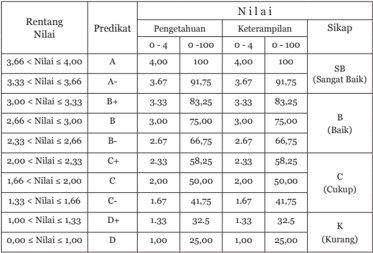

Tabel ini menunjukkan korelasi antara rentang nilai predikat dengan pengetahuan, keterampilan, dan sikap siswa. Topik utama tabel adalah hubungan antara predikat nilai (A, B+, B, C+, C, D+) dengan pengetahuan, keterampilan, dan sikap mereka. Kolom-kolomnya meliputi rentang nilai predikat, predikat nilai, pengetahuan, keterampilan, dan sikap. Data penting yang terlihat adalah bahwa predikat nilai A memiliki pengetahuan dan keterampilan tertinggi, sedangkan predikat nilai D+ memiliki pengetahuan dan keterampilan terendah. Sikap juga berfluktuasi, dengan predikat nilai A memiliki sikap yang paling baik (Sangat Baik), sedangkan predikat nilai D+ memiliki sikap yang paling buruk (Kurang).

### 2.  Pengolahan Skor

Penilaian yang dilakukan untuk mengisi laporan Pencapaian Kompetensi ada 3 (tiga) macam, yaitu:

### a. Penilaian Pengetahuan

- Penilaian Pengetahuan dilakukan oleh Guru Mata Pelajaran (Pendidik).
- Penilaian Pengetahuan terdiri atas:
- -Nilai Harian (NH)
- -Nilai Ulangan Tengah Semester (UTS)
- -Nilai Ulangan Akhir Semester (UAS)
- Nilai Harian (NH) diperoleh dari hasil ulangan harian yang terdiri dari: tes tulis, tes lisan, dan penugasan yang dilaksanakan pada setiap akhir pembelajaran satu Kompetensi Dasar (KD).
- Nilai Ulangan Tengah Semester (NUTS) diperoleh dari hasil tes tulis yang dilaksanakan  pada  tengah  semester.  Materi  Ulangan  Tengah  Semester mencakup seluruh kompetensi yang telah dibelajarkan sampai dengan saat pelaksanaan UTS.

 

---
## 📄 Halaman 57

- Nilai  Ulangan  Akhir  Semester  (NUAS)  diperoleh  dari  hasil  tes  tulis yang  dilaksanakan  di  akhir  semester.  Materi  UAS  mencakup  seluruh kompetensi pada semester tersebut.
- Penghitungan  Nilai  Pengetahuan  diperoleh  dari  rata-rata  Nilai  Proses (NP), Ulangan Tengah Semester (UTS), Ulangan Akhir Semester (UAS)/ Ulangan Kenaikan Kelas (UKK) yang bobotnya ditentukan oleh satuan pendidikan.
- Penilaian untuk pengetahuan menggunakan penilaian kuantitatif 0 -100:
Sangat Baik  =   100

Baik

=   75

Cukup

=   50

Kurang

=   25

dengan kelipatan 0,33 dengan 2 (dua) desimal di belakang koma.

- Penghitungan Nilai Pengetahuan adalah dengan cara:
- Menggunakan skala nilai 0 sd 100
- Menetapkan pembobotan.
- Penetapan  bobot  nilai  ditetapkan  oleh  satuan  pendidikan  dengan mempertimbangkan karakteristik sekolah dan peserta didik.
- Nilai UAS disarankan untuk diberi bobot lebih besar dari pada UTS dan  NT  karena  lebih  mencerminkan  perkembangan  pencapaian kompetensi peserta didik.
- Contoh:  Pembobotan  3  :  2  :  1  untuk  NUAS  :  NUTS  :  NT  (jumlah perbandingan pembobotan = 6. Skor Akhir sebagai berikut:
(SA)

= {(3 x UAS) + (2 x UTS) + (NT)}/6

SA

= skor Akhir, 1 - 4

UAS

= nilai ujian akhir semester, 1 - 4

UTS

= nilai ujian tengah semester, 1 - 4

NT

= nilai tugas, 1 - 4

 

---
## 📄 Halaman 58

### Contoh:

Siswa  A  memperoleh  nilai  pada  mata  pelajaran  Agama  Khonghucu sebagai berikut:

NUAS

= 3,5

NUTS

= 3,0

NT

= 3,2

Nilai Rapor

= {(3 x 3,5) + (2 x 3,0) + (1 x 3,2)} : 6

= (10,5 + 6,0 + 3,2) : 6

= 3,23

Nilai Rapor

= 3,28 = Baik

Deskripsi

= sudah menguasai seluruh kompetensi dengan baik.

Konversi (0 - 100) = 3,28 : 4 x 100 = 82

### b. Penilaian Keterampilan

- Penilaian Keterampilan diperoleh melalui penilaian kinerja yang terdiri atas:
- Nilai Praktik
- Nilai Portofolio
- Nilai Proyek
- Nilai Portofolio diperoleh dari kumpulan nilai tugas/pekerjaan yang telah dilakukan oleh peserta didik selama pembelajaran di kelas.
- Nilai  Proyek  diperoleh  dari  akumulasi  pengetahuan,  keterampilan  dan sikap  yang  diwujudkan  mulai  perencanaan,  pelaksanaan  sampai  ke pelaporan dalam satu pekerjaan.
- Pengolahan Nilai untuk Keterampilan menggunakan penilaian kuantitatif 0 - 100:
Sangat Baik

= 100

Baik

= 75

Cukup

= 50

Kurang

= 25

dengan kelipatan 0,33 dengan 2 (dua) desimal di belakang koma seperti yang tertuang pada Tabel.

 

---
## 📄 Halaman 59

- Penghitungan Nilai Keterampilan adalah dengan cara:
- Menetapkan pembobotan.
- Menggunakan skala nilai 0 sd 4.
- Pembobotan ditetapkan oleh Satuan Pendidikan dengan mempertimbangkan karakteristik sekolah dan peserta didik.
- Nilai  Praktik  disarankan  diberi  bobot  lebih  besar  dari  pada  Nilai Proyek  dan  Nilai  Portofolio  karena  lebih  mencerminkan  proses perkembangan pencapaian kompetensi peserta didik.
- Contoh : Pembobotan 3 : 2 : 1 untuk Nilai Praktik : Nilai Proyek : Nilai Portofolio (jumlah perbandingan pembobotan = 6). Skor Akhir sebagai berikut:

`(SA) = {(3xUP) + (2xUPJ) + (NP}/6`

SA

= Skor Akhir, 1 - 4

UP

= nilai ujian akhir praktik, 1 - 4

UPJ

= nilai proyek, 1 - 4

NP

= nilai portofolio, 1 - 4

### Contoh:

Siswa  A  memperoleh  nilai  pada  Mata  Pelajaran  Agama  Khonghucu sebagai berikut :

Nilai Praktik

= 3,5

Nilai Proyek

= 3,0

Nilai Portofolio

= 3,1

Skor Akhir

= {(3 x 3,5 + (2 x 3,0) + (1 x 3,1)} : 6

= (10,5 + 6,0 + 3,1) : 6

= 13,1 : 6

Nilai Akhir

= 3,27 = B+

Deskripsi

=  sudah baik dalam mengerjakan praktik dan portofolio.

Konversi (0 - 100) = 3,2: 4 x 100 = 81,75

 

---
## 📄 Halaman 60

- Penilaian Sikap
- Penilaian Sikap (spiritual dan sosial) dilakukan oleh Guru Mata Pelajaran (Pendidik).
- Penilaian Sikap diperoleh menggunakan instrumen:
- Penilaian observasi (Penilaian Proses)
- Penilaian diri sendiri
- Penilaian antar teman
- Jurnal catatan guru
- Nilai  observasi  diperoleh  dari  hasil  pengamatan  terhadap  proses  sikap tertentu  pada  sepanjang  proses  pembelajaran  satu  Kompetensi  Dasar (KD).
- Untuk penilaian Sikap Spiritual dan Sosial (KI-1 dan KI-2) menggunakan nilai Kualitatif sebagai berikut:
- Penghitungan Nilai Sikap adalah dengan cara:
- Menetapkan pembobotan
- Pembobotan ditetapkan oleh Satuan Pendidikan dengan mempertimbangkan karakteristik sekolah dan peserta didik
- Nilai Proses atau Nilai Observasi disarankan diberi bobot lebih besar dari pada Penilaian Diri Sendiri, Nilai Antarteman, dan Nilai Jurnal Guru  karena  lebih  mencerminkan  proses  perkembangan  perilaku peserta didik yang otentik.
- Contoh:  Pembobotan  2  :  1  :  1  :  1  untuk  Nilai  Observasi  :  Nilai Penilaian Diri Sendiri : Nilai Antarteman : Nilai Jurnal Guru. (jumlah perbandingan pembobotan = 6. Skor Akhir sebagai berikut:
- SB = Sangat Baik
= 3.66 sd. 4

= 91.50 sd. 100

- B = Baik
= 2.66 sd. 3.65 = 66.50 sd. 91.25

- C = Cukup
= 1.66 sd. 2.65 = 41,50 sd. 66.25

- K
- = Kurang
- = < 1.65 = < 41.25

 

---
## 📄 Halaman 61

### Contoh:

Siswa A dalam mata pelajaran Agama Khonghucu memperoleh :

 

---
## 📄 Halaman 62

52

Bagian II Penjelasan Bab

Buku Guru Kelas XI SMA/SMK

 

---
## 📄 Halaman 63

### · Aspek

---
**🖼️ Gambar/Diagram**

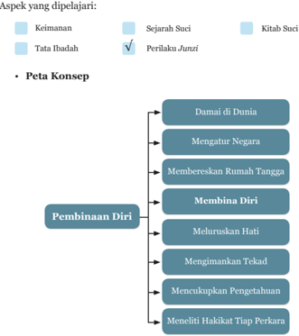

> **Deskripsi Visual:** Gambar ini adalah diagram yang menunjukkan aspek-aspek yang dipelajari dalam sebuah kursus atau program pelajaran. Diagram ini terdiri dari dua bagian utama: "Aspek yang Dipelajari" dan "Peta Konsep". 

1. **Aspek yang Dipelajari**:
   - Terdapat tiga aspek utama yang ditampilkan: Keimanan, Tata Ibadah, dan Perilaku Junzi.

2. **Peta Konsep**:
   - Peta konsep ini berisi empat baris vertikal dengan judul topik-topik yang berhubungan dengan pembinaan diri.
   - Judul topik-topik tersebut adalah: Damai di Dunia, Mengatur Negara, Membereskan Rumah Tangga, Membina Diri, Meluruskan Hati, Mengimankan Tekad, Mencukupkan Pengetahuan, dan Meniti Hakikat Tiap Perkara.

3. **Elemen-elemen Utama dan Relasinya**:
   - Setiap topik dalam peta konsep memiliki hubungan dengan pembinaan diri, yang merupakan topik utama di bagian bawah diagram.
   - Topik-topik lainnya (Damai di Dunia, Mengatur Negara, Membereskan Rumah Tangga) mungkin merupakan bagian dari pembinaan diri, tetapi tidak secara langsung terkait dengan pembinaan diri.

4. **Teks, Angka, atau Label Penting yang Terlihat**:
   - Ada tanda centang biru di atas "Perilaku Junzi", yang menunjukkan bahwa ini adalah topik yang dipelajari.
   - Ada tanda centang biru di atas "Keimanan" dan "Kitab Suci", yang menunjukkan bahwa ini adalah aspek yang dipelajari.

5. **Informasi Kunci yang Bisa Diambil Pembaca**:
   - Diagram ini memberikan pandangan umum tentang struktur materi pelajaran yang dipelajari dalam kursus tersebut.
   - Pembaca dapat melihat bahwa pembinaan diri adalah topik utama, dan ada beberapa aspek lain yang mungkin berkaitan dengan pembinaan diri.

Dengan demikian, gambar ini memberikan gambaran umum tentang struktur materi pelajaran yang

### Pembinaan Diri Sebagai Kewajiban Pokok

 

---
## 📄 Halaman 64

### · Kompetensi Inti dan Kompetensi Dasar

---
**📊 Tabel**

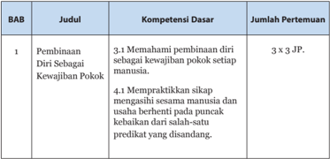

Tabel ini menunjukkan detail tentang pembinaan diri sebagai kewajiban pokok manusia dalam kurikulum. Topik utamanya adalah pembinaan diri, yang terbagi menjadi dua kompetensi dasar: memahami pembinaan diri sebagai kewajiban pokok setiap manusia (3.1) dan mempraktikkan sikap menghargai sesama manusia dan usaha berhenti pada puncak kebaikan (4.1). Setiap kompetensi dasar tersebut diukur melalui 3 pertemuan kerja praktis (JP), sehingga totalnya ada 6 pertemuan kerja praktis untuk mengevaluasi pembinaan diri sebagai kewajiban pokok manusia.

### A. Tujuan Pembelajaran

Setelah menyelesaikan kegiatan pembelajaran bab pertama, peserta didik diharapkan mampu:

- menjelaskan pentingnya pembinaan diri sebagai pokok
- menjelaskan landasan keimanan pembinaan diri
- menjelaskan perkembangan rohani hasil pembinaan diri
- menjelaskan tahapan pembinaan diri

### B.  Langkah-Langkah Pembelajaran

### 1.  Mengamati:

Pada  langkah  mengamati,  guru  dapat  mempersiapkan  objek  (dalam bentuk  benda  atau  fenomena)  yang  relevan  dengan  tema  pembelajaran seperti:

- -Mengamati  kliping/cuplikan berita dalam koran, televisi, atau potongan adegan film yang sesuai dengan tema.
- -Mengamati  perilaku  manusia  dalam  rangka  melakukan  pilihan tindakan sesuai dengan prioritas dalam dirinya.
- -Memberikan  pernyataan  provokatif  sebagai  bahan  diskusi:  'Umat Khonghucu pilih kasih dalam mencintai, setujukah anda?'

 

---
## 📄 Halaman 65

### 2.  Menanya:

Memancing atau mendorong peserta didik mempertanyakan dan menganalisis potongan informasi yang telah diterima di tahap mengamati. Misalnya,  menggali  lebih  jauh  informasi  atau  kemungkinan-kemungkinan latar belakang atau sebab-sebab terjadinya fenomena, berita, atau potongan adegan  yang  diamati  atau  saling  menanyakan  pendapat  masing-masing terkait  dengan  tema  pembelajaran  untuk  diinventarisir  dan  ditelaah  lebih lanjut.

### 3.  Eksperimen/Eksplorasi:

- -Menginventaris ayat suci yang berkaitan dengan pembinaan diri.
- -Membaca/melafalkan ayat suci Daxue bab utama pasal 1.
- -Menuliskan urutan tahap-tahap pembinaan
- -Mencari  faktor-faktor  penyebab  dari  suatu  fenomena,  berita  atau potongan adegan melalui eksplorasi sumber-sumber informasi seperti internet, refleksi diri dan lain sebagainya.

### 4.  Mengasosiasi:

- -Merenungkan  hasil  jawaban  menanya  dan  merekonstruksi  ulang pemikiran dalam diri sendiri tentang pembinaan diri.
- -Menghubungkan antara kejadian,  fenomena,  berita  yang  diperoleh untuk memahami kejadian, fenomena lainnya. Misalnya apakah ada persamaan  atau  perbedaan  dalam  pembinaan  diri  antara  seorang anak, orangtua, seorang pelajar, seorang adik, kakak, pemimpin, dan lain sebagainya?
- -Menghubungkan kewajiban membina diri dengan perbedaan status sosial (kedudukan) dalam masyarakat.

### 5.  Mengomunikasikan:

- -Mengungkapkan pentingnya pembinaan diri.
- -Mengungkapkan tahapan dalam pembinaan diri dan perkembangan rohani yang menyertainya.
- -Menceritakan  pengalaman  pribadi  tentang  usaha  berhenti  pada puncak kebaikan dari setiap predikat yang disandang.
- -Mengungkapkan sikap dan perilaku yang menunjukkan pembinaan diri.

 

---
## 📄 Halaman 66

### C.  Aktivitas Pembelajaran

### 1.  Diskusi Kelompok

### a. Topik Diskusi

Pada Aktivitas 1.1 (diskusi kelompok), peserta didik diminta mendiskusikan maksud ayat suci berikut:

Orang yang mengetahui mana hal yang dahulu dan mana hal yang kemudian ia sudah dekat dengan Jalan Suci.

### b. Tujuan Kegiatan

Peserta didik mengetahui hal-hal yang pokok dan tahapan pengembangan rohani sehingga dapat berhasil dalam hidup ini.

### c. Petunjuk jawaban

Untuk membina diri, seseorang perlu mengetahui mana yang dahulu dan mana yang kemudian; mana yang pokok dan mana yang merupakan pengembangan.

Apa yang menjadi pokok adalah seperti apa yang terdapat dalam Jalan Suci  yang  dibawakan  Ajaran  Besar  yakni  menggemilangkan  kebajikan bercahaya, mengasihi sesama dan berhenti pada puncak kebaikan.

Setelah kita mengetahui arah atau tempat hentian yang penting untuk kita capai dalam hidup ini, kita akan mempunyai prinsip yang benar dan selanjutnya  akan  menjadikan  kita  berhasil  dalam  hidup  ini.  Mari  kita simak ayat berikut ini:

'Bila  sudah  diketahui  Tempat  Hentian,  akan  diperoleh  Ketetapan/ Tujuan.  Setelah  diperoleh  ketetapan/tujuan  barulah  dapat  dirasakan Ketentraman, setelah tentram barulah orang dapat merasakan Kesentosaan Batin, setelah sentosa barulah orang dapat Berpikir Benar, dengan berpikir benar, barulah orang dapat Berhasil'. ( Daxue Bab III. Ayat 4)

Lihat bagan pembinaan diri pada bagian perkembangan rohani hasil pembinaan diri.

Contoh dalam keseharian adalah sebagai berikut:

Sebagai seorang remaja yang sedang mencari jati diri, perlu berhatihati dalam pergaulan. Seringkali karena ingin diterima oleh kelompoknya, atau  mendapatkan  'pengakuan'  dirinya';  mudah  tergelincir  melakukan hal-hal  yang  tidak  sesuai  dengan  kebajikan,  menyakiti  orang  lain  dan bahkan akhirnya membuat susah orangtua dan orang banyak. Dengan mengetahui mana yang pangkal atau pokok, maka kita akan mempunyai benteng iman dalam menghadapi berbagai ujian hidup.

 

---
## 📄 Halaman 67

### 2.  Diskusi Kelompok

### a. Topik Diskusi

Pada Aktivitas 1.2 (diskusi kelompok), peserta didik diminta mendiskusikan maksud ayat suci berikut:

Nabi  Kongzi  menasehati  untuk  mencintai  semua  orang  (sesama), tetapi kita harus dekat dengan orang yang berpricinta kasih?

### b. Tujuan Kegiatan

Peserta didik dapat mengerti pentingnya bergaul dengan orang yang berperi cinta kasih dan hati-hati dalam memilih kawan dekat.

### c. Petunjuk jawaban

Dalam  bersikap  menghadapi  romantika  kehidupan,  terkadang  kita membutuhkan orang lain memberikan masukan dan nasehat. Bayangkan seandainya kita dekat dengan orang yang tidak berperi Cinta Kasih, ketika kita  ada  masalah  dengan  orangtua  kita  atau  ada  masalah  di  sekolah, maka nasehat yang kita peroleh bukannya menyelesaikan masalah justru menambah masalah.

Apabila kita dekat dengan orang-orang yang berperi Cinta Kasih kita akan beroleh bimbingan yang benar. Oleh karena itu adalah bijaksana untuk dekat dengan orang-orang yang berperi Cinta Kasih.

### 3.  Diskusi Kelompok

### a. Topik Diskusi

Pada Aktivitas 1.3 (diskusi kelompok), peserta didik diminta mendiskusikan yang dimaksud dengan:

Puncak kebaikan sebagai tempat hentian itu!

### b. Tujuan Kegiatan

Peserta  didik  dapat  lebih  memahami  apa  yang  dimaksud  berhenti pada puncak kebaikan dan instropeksi diri apakah sudah dapat berhenti pada puncak kebaikan.

### c. Petunjuk jawaban

Seperti  telah  dijelaskan  bahwa  kita  membawa  banyak  predikat. Sebagai  umat  agama  Khonghucu,  senantiasa  berusaha  menjadi  yang terbaik di setiap predikat yang diembannya. Seorang umat Khonghucu senantiasa berusaha memberikan yang terbaik dalam hidupnya. Sebagai anak, berusaha menjadi anak yang terbaik dengan berhenti pada sikap bakti.  Sebagai  orangtua kelak berusaha menjadi orangtua yang terbaik dengan berhenti pada sikap kasih sayang. Sebagai seorang suami kelak berusaha menjadi seorang suami yang terbaik dengan berhenti pada sikap bertanggungjawab.  Sebagai  isteri  kelak  berusaha  menjadi  isteri  yang terbaik dengan berhenti pada sikap setia dan menurut, dan seterusnya.

 

---
## 📄 Halaman 68

### 4.  Tugas Mandiri

### a. Deskripsi Tugas

Pada Aktivitas 1.4 (tugas mandiri), peserta didik diminta memberikan komentar/pandanganmu  terkait  pernyataan  bahwa  pembinaan  diri adalah kewajiban pokok setiap manusia!

### b. Tujuan Kegiatan

Peserta  didik  lebih  memahami  pentingnya  pembinaan  diri  sebagai kewajiban pokok .

### c. Petunjuk Jawaban

Manusia perlu belajar mengembangkan dirinya agar dapat menepati kodrat suci kemanusiaannya. Pembinaan diri sangat penting dilakukan untuk menimbulkan kemampuan diri dalam memahami dan menjalani hal-hal yang pokok dalam hidup. Karena Tian telah memberikan Watak Sejati  manusia  yang  merupakan  benih-benih  kebajikan Tian ,  pada hakekatnya kita telah mempunyai kemampuan untuk merasakan mana hal-hal bajik yang harus kita kembangkan dalam hidup dan mana hal-hal buruk yang harus kita jauhi dalam hidup.

Dapatkah Anda bayangkan kondisi seseorang yang tidak terbina dalam belantara kehidupan ini? Bayangkan seseorang yang tidak mempunyai arah untuk apa dia hadir ke dunia ini. Atau bayangkan seseorang yang mempunyai  prinsip  dalam  hidupnya,  namun  prinsip  tersebut  kurang pas. Misalnya prinsip 'bahwa dunia itu kejam dan untuk bertahan hidup boleh menghalalkan segala cara'. Apa kira-kira yang akan terjadi dalam kehidupan ini?  Permasalahan,  penderitaan  dan  kekacauan  timbul  dari diri yang tidak terbina.

### 5.  Tugas Mandiri

### a. Deskripsi Tugas

Pada Aktivitas 1.5 (tugas mandiri), peserta didik diminta membuat daftar kebiasaan dan sifat-sifat burukmu, dan berjanjilah pada diri sendiri untuk mengurangi kebiasaan-kebiasaan buruk itu! apa yang paling sulit dilaksanakan dalam proses pembinaan diri? berikan alasannya!

### b. Tujuan Kegiatan

Peserta didik dapat lebih mawas diri tentang kebiasaan dirinya yang perlu diperbaiki.

Dari poin yang kebiasaan yang paling sulit dapat diketahui kekurangan peserta didik dan bagaimana memperbaikinya.

 

---
## 📄 Halaman 69

### D. Penilaian

### 1.  Penilaian dan Pedoman Penskoran

### Penilaian Diri

### 1) Tujuan

Penilaian dengan menggunakan skala sikap ini bertujuan untuk:

- Mengetahui sikap peserta didik dalam menerima dan memahami ajaran tentang pembinaan diri.
- Menumbuhkan sikap sungguh-sungguh untuk senantiasa membina diri dalam kehidupan.

### 2)  Petunjuk

Peserta didik diminta mengisi lembar penilaian diri yang ditunjukkan dengan skala sikap, dengan memberikan tanda cheklis (√) di antara empat skala sebagai berikut:

SS  : Sangat Setuju

ST  : Setuju

RR : Ragu-Ragu

TS  : Tidak Setuju

### 3)  Instrumen Penilaian

- Kasihi sesamamu tanpa pandang bulu (kepada siapapun, di mana pun, dan kapan pun).
- Bergaul erat dengan orang yang baik dan berpericinta kasih.
- Memeriksa  setiap peran  atau predikat  yang  disandang,  dan berusaha berhenti pada puncak kebaikan dari setiap peran yang dimiliki.
- Dalam setiap perkara/persoalan yang dihadapi berusaha mencari mana hal yang dahulu dan mana yang kemudian.
- Tidak mendustai diri sendiri
- Mengendalikan setiap gejolak rasa yang timbul dari dalam diri.
- Teliti dan tekun dalam meluruskan hati.
- Harta benda menghias rumah, laku bajik menghias diri, hati yang lapang membuat tubuh sehat.

 

---
## 📄 Halaman 70

### 4)  Pedoman Penskoran

### Poin Penilaian

Pernyataan positif mengarahkan pada sikap atau respon yang positif, maka penskoran sebagai betikut:

poin 4

jika pilihan : Sangat Setuju

poin 3

jika pilihan : Setuju

poin 2

jika pilihan : Ragu-Ragu

poin 1

jika pilihan : Tidak Setuju

### Skor

Skor Maksimal 32

### Nilai

Nilai diperoleh dari: Jumlah skor dibagi jumlah instrumen soal.

(32 : 8) = 4

### 2.   Tes Tertulis

- Pilihan Ganda
Berilah tanda silang (X) di antara pilihan A, B, C, D, atau E yang merupakan  jawaban  paling  tepat  dari  pertanyaan-pertanyaan berikut ini!

- Adapun  Jalan  Suci  yang  dibawakan  Ajaran  Besar  itu  ialah  menggemilangkan Kebajikan yang bercahaya, mengasihi rakyat dan berhenti pada puncak
....

- kebaikan
- jalan suci
- kebenaran
- keimanan
- kebijaksanaan
- Untuk membina diri itu berpangkal pada ....
- meneliti hakikat tiap perkara
- meluruskan hati
- mengatur negara
- mengimankan tekad
- membereskan rumah tangga

 

---
## 📄 Halaman 71

- Teraturnya negara itu berpangkal pada ....
- pembinaan diri
- hari yang lurus
- damai di dunia
- Yang menjadi kewajiban pokok setiap manusia adalah ....
- berbuat baik
- membina diri
- dapat dipercaya
- Tempat hentian sebagai seorang anak berhenti pada sikap ....
- berbakti
- kasih sayang
- satya

### b. Uraian

### Jawablah  pertanyaan-pertanyaan  berikut  ini  dengan  uraian yang jelas!

- Mengapa dikatakan bahwa untuk membina diri itu harus lebih dahulu meluruskan hati? Jelaskan!
- Tuliskan urutan proses pembinaan diri seperti yang tersurat dalam kitab Daxue Bab utama ayat 4!
- Sesungguhnya teraturnya sebuah negara itu berpangkal pada keberesan rumah tangga, jelaskan!
- Jelaskan yang dimaksud puncak kebaikan sebagai tempat hentian itu!

### c. Jawaban

### Kunci Jawaban Pilihan Ganda

- A. kebaikan
- B. meluruskan hari
- E. keberesan rumah tangga
- B. membina diri
- A. berbakti
- dapat dipercaya
- tahu kewajiban
- meluruskan hati
- membereskan rumah tangga
- tekad yang beriman
- keberesan rumah tangga

 

---
## 📄 Halaman 72

### Kunci Jawaban Uraian

- Untuk membina diri itu harus lebih dahulu meluruskan hati
Pedoman jawaban terdapat di dalam kitab Daxue Bab VII ayat satu sampai tiga.

Adapun  yang  dinamai  'untuk  membina  diri  harus  lebih  dahulu meluruskan  hari'  itu  ialah:  diri  yang  diliputi  geram  dan  merah,  tidak dapat berbuat lurus; yang diliputi takut dan khawatir tidak dapat berbuat lurus, yang diliputi suka dan gemar, tidak dapat berbuat lurus, dan yang diliputi sedih dan sesal, tidak dapat berbuat lurus.

Hati yang tidak pada tempatnya, sekalipun melihat takkan tampak, meski mendengar takkan terdengar dan meski makan takkan merasakan. Apabila hal ini terjadi, maka kita tidak dapat melihat kebenaran dengan jelas sekalipun ada di hadapan kita.

Inilah sebabnya dikatakan, bahwa untuk membina diri itu berpangkal pada melurus hati.

- Tuliskan urutan proses pembinaan diri seperti yang tersurat dalam kitab Daxue Bab utama ayat 4!
Orang jaman dahulu yang hendak menggemilangkan Kebajikan Yang Bercahaya itu pada tiap umat di dunia, ia lebih dahulu berusaha mengatur negerinya;  untuk  mengatur  negerinya,  ia  lebih  dahulu  membereskan rumah tangganya; untuk membereskan rumah tangganya, ia lebih dahulu membina dirinya; untuk membina dirinya, ia lebih dahulu meluruskan hatinya;  untuk  meluruskan  hatinya,  ia  lebih  dahulu  mengimankan tekadnya; untuk mengimankan tekadnya, ia lebih dahulu mencukupkan pengetahuannya; dan untuk mencukupkan pengetahuannya, ia meneliti hakekat tiap perkara.

- Sesungguhnya teraturnya sebuah negara itu berpangkal pada keberesan rumah tangga, jelaskan!
- Pedoman jawaban terdapat dalam kitab Daxue Bab IX.
Adapun yang dikatakan 'untuk mengatur Negara harus lebih dahulu membereskan rumah tangga'  itu  ialah:  tidak  dapat  mendidik  keluarga sendiri tetapi dapat mendidik orang lain itulah hal yang takkan terjadi. Maka seorang Kuncu biar tidak keluar rumah, dapat menyempurnakan pendidikan di negaranya. Dengan berbakti kepada ayah bunda, ia turut mengabdi kepada raja; dengan bersikap rendah hati, ia turut mengabdi kepada atasannya; dan dengan bersikap kasih sayang, ia turut mengatur masyarakatnya.

 

---
## 📄 Halaman 73

Di dalam Kong-gao tertulis, 'Berlakulah seumpama merawat bayi,' bila  dengan  sebulat  hati  mengusahakannya  meski  tidak  tepat  benar, niscaya tidak jauh dari yang seharusnya. Sesungguhnya tiada yang harus lebih dahulu belajar merawat bayi baru boleh menikah. (V.9.3).

Bila  dalam  keluarga  saling  mengasihi  niscaya  seluruh  Negara  akan di dalam Cinta Kasih. Bila dalam tiap keluarga saling mengalah, niscaya seluruh Negara akan di dalam suasana saling mengalah. Tetapi bilamana orang  tamak  dan  curang,  niscaya  seluruh  negara  akan  terjerumus  ke dalam  kekalutan;  demikianlah  semua  itu  berperan.  Maka  dikatakan, sepatah  kata  dapat  merusak  perkara  dan  satu  orang  dapat  berperan menenteramkan Negara. (S.S. XX:1.5;II.2)

Yao dan Shun dengan Cinta Kasih memerintah dunia, maka rakyatpun meng-ikutinya. Kiat dan Tiu dengan kebuasan memerintah dunia, maka rakyatpun meng-ikutinya. Perintah yang tidak sesuai dengan kehendak rakyat,  rakyat  takkan  menurut;  maka  seorang  Kuncu  lebih  dahulu menuntut diri sendiri, baharu kemudian mengharap dari orang lain. Bila diri sendiri sudah tak bercacat baharu boleh mengharapkan dari orang lain. Bila diri sendiri belum dapat bersikap Tepasarira (tahu menimbang/ tenggang  rasa),  tetapi  berharap  dapat  memperbaiki  orang  lain,  itulah suatu hal yang belum pernah terjadi. (S.S.V:12; XV:24)

Maka teraturnya Negara itu sesungguhnya berpangkal pada keberesan dalam rumah tangga.

- Jelaskan yang dimaksud puncak kebaikan sebagai tempat hentian itu! Pedoman jawaban terdapat dalam kitab Daxue Bab III.
Puncak  kebaikan  sebagai  tempat  hentian  dimaksudkan  mampu membina diri dan menjadi yang terbaik sesuai predikat yang diembannya. Sebagai  pemimpin  ia  berhenti  di  dalam  Cinta  Kasih;  sebagai  bawahan berhenti pada Sikap Hormat (akan tugas); sebagai anak berhenti pada Sikap Bakti; sebagai ayah berhenti pasa Sikap Kasih Sayang; dan di dalam pergaulan dengan rakyat senegeri berhenti pada Sikap Dapat Dipercaya'. Nabi Kongzi didalam kitab Yijing Babaran Agung (A) Bab VIII pasal ke 45, menjelaskan bahwa orang yang mencapai puncak kebaikan ialah orang yang  dapat  sungguh-sungguh  berusaha  tanpa  menjadi  sombong,  dan berpahala tanpa merasa sebagai kebajikannya.

 

---
## 📄 Halaman 74

### 3.  Pedoman Pensekoran

### a. Pilihan Ganda

- -Poin setiap soal Pilihan Ganda adalah 5.
- -Jika semua soal terjawab dengan (5), maka jumlah skor tertinggi adalah 25.
- -Jika penilaian menggunakan skala 100, maka Nilai = Jumlah skor dibagi skor tertinggi dikali 100 (25 : 25 x 100) = 100
- -Jika penilaian menggunakan skala 4, maka Nilai = Jumlah skor dibagi skor tertinggi dikali 4 (25 : 25 x 4) = 4
N = (skor : skort tertinggi x 100)

N = (skor : skort tertinggi x 4)

### b. Uraian

- -Poin maksimal setiap soal uraian adalah 10
- -Jika semua soal terjawab dengan poin maksimal (10), maka jumlah skor adalah 50.
- -Jika penilaian menggunakan skala 100, maka Nilai = Jumlah skor dibagi skor tertinggi dikali 100 (50 : 50 x 100) = 100
- -Jika penilaian menggunakan skala 4, maka Nilai = Jumlah skor dibagi skor tertinggi dikali 4 (50 : 50 x 4) = 4
N = (skor : skort tertinggi x 100)

N = (skor : skort tertinggi x 4)

 

---
## 📄 Halaman 75

### E.  Remedial

Apabila  peserta  didik  ada  yang  memerlukan  ulangan  susulan  ataupun perbaikan, maka pada bagian remedial ini memberikan beberapa alternatif penilaian tambahan.

Prinsip  remedial  adalah  berfokus  pada  proses  pembentukan  karakter. Berikut adalah remedial yang dapat dilakukan:

### 1.  Penilaian Pengetahuan

- Memberikan  tugas  membuat  makalah  tentang  'Pengalamanku  dalam Membina Diri'.
- Memberikan tugas dengan metode Problem Base Learning. Tema masalah yang dapat diberikan sebagai tugas:
- Bagaimana memulihkan hubungan persahabatan akibat persaingan mendapatkan pacar.
- Bagaimana sikap anda, jika ada teman yang melaporkan kesalahan anda kepada guru?
- Bagaimana  anda  menyikapi  orangtua  yang  sibuk  mencari  nafkah sehingga waktu bersama keluarga kurang?

### 2.  Penilaian Sikap

Penilaian  sikap  bisa  menggunakan  teknik  wawancara  ataupun  teknik penilaian antar kawan. (lihat Bagian Satu tentang Penilaian).

### F.  Komunikasi Orangtua

Proses  pembentukan  karakter  harus  dilakukan  secara  integratif  dan holistik.  Integratif  karena  saat  ini  setiap  mata  pelajaran  juga  mengusung pembentukan karakter moral. Holistik artinya menyeluruh dalam kehidupan peserta  didik,  tidak  hanya  di  sekolah  tetapi  juga  dalam  pergaulan  di  luar sekolah dan di rumah.

Mengingat peran serta orangtua, maka perlu dibuatkan lembar komunikasi orangtua untuk memudahkan komunikasi.

 

---
## 📄 Halaman 76

### Contoh Lembar Komunikasi Orangtua

Nama Orangtua

:  …………………………….

Nama siswa

:  …………………………….

Kelas

:   …………………………..

Tema

:  Bab 1. Pembinaan Diri

Sub tema

:  Kebiasaanku

---
**📊 Tabel**

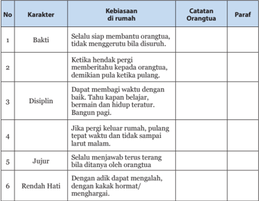

Tabel ini berisi karakteristik kebiasaan anak di rumah, disusun dengan kolom-kolom seperti No., Karakter, Kebiasaan di rumah, Catatan Orangtua, dan Paraf. Topik utama tabel adalah karakteristik kebiasaan anak yang diperhatikan oleh orangtua. Kolom No. menunjukkan nomor urut setiap karakteristik, Karakter menunjukkan jenis karakteristik tersebut, Kebiasaan di rumah menjelaskan perilaku anak yang dilihat oleh orangtua, Catatan Orangtua memberikan detail tentang apa yang orangtua katakan atau lakukan ketika melihat perilaku anak tersebut, dan Paraf adalah komentar atau penilaian orangtua tentang karakteristik tersebut. Data penting yang terlihat adalah bahwa anak-anak sering kali memiliki kebiasaan baik seperti bakti, disiplin, jujur, dan rendah hati, namun juga memiliki kebiasaan buruk seperti tidak menghormati orangtua atau tidak membuang sampah.

 

---
## 📄 Halaman 77

### Laku Bakti Pokok Kebajikan

---
**🖼️ Gambar/Diagram**

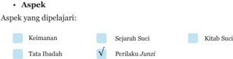

> **Deskripsi Visual:** Gambar ini adalah diagram yang menunjukkan aspek-aspek yang dipelajari dalam sebuah kursus atau program studi. Diagram ini terdiri dari beberapa kotak berwarna yang masing-masing menunjukkan topik yang berbeda. Kotak-kotak tersebut memiliki warna yang berbeda-beda dan teks yang menjelaskan topik-topik tersebut. Kotak yang berwarna biru dengan tulisan "Keimanan" menunjukkan bahwa topik ini merupakan salah satu aspek yang dipelajari. Kotak lainnya juga memiliki teks yang menjelaskan topik-topik lainnya seperti "Sejarah Suci", "Kitab Suci", "Tata Ibadah", dan "Perilaku Junzi". Diagram ini memberikan gambaran umum tentang topik-topik apa saja yang akan dipelajari dalam kursus tersebut.

### · Peta Konsep

---
**🖼️ Gambar/Diagram**

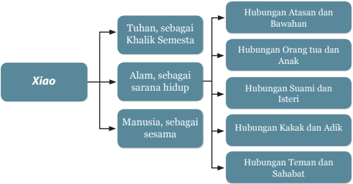

> **Deskripsi Visual:** Gambar ini adalah diagram yang menunjukkan struktur filosofis atau filosofi kehidupan dalam konteks filosofi Tiongkok. Diagram ini membagi filosofi kehidupan menjadi tiga aspek utama: Tuhan, Alam, dan Manusia. Setiap aspek tersebut kemudian dibagi lagi menjadi berbagai hubungan dan relasi yang penting dalam kehidupan.

1. **Apa yang Ditampilkan Secara Keseluruhan**: Gambar ini menunjukkan struktur filosofi kehidupan Tiongkok yang terdiri dari tiga aspek utama: Tuhan, Alam, dan Manusia. Setiap aspek tersebut memiliki berbagai hubungan dan relasi yang penting dalam kehidupan.

2. **Elemen-Elemen Utama dan Relasinya**: 
   - **Tuhan sebagai Khalik Semesta**: Ini adalah aspek pertama yang melibatkan Tuhan sebagai pengatur semesta.
   - **Alam sebagai Sarana Hidup**: Ini adalah aspek kedua yang melibatkan alam sebagai tempat untuk hidup.
   - **Manusia sebagai Sesama**: Ini adalah aspek ketiga yang melibatkan manusia sebagai bagian dari masyarakat.

   Setiap aspek tersebut memiliki berbagai hubungan dan relasi yang penting dalam kehidupan, seperti hubungan Atasan dan Bawahan, Hubungan Orang tua dan Anak, Hubungan Suami dan Istri, Hubungan Kakak dan Adik, dan Hubungan Teman dan Sahabat.

3. **Teks, Angka, atau Label Penting yang Terlihat**: 
   - **Tuhan sebagai Khalik Semesta**: Dapat dilihat sebagai hubungan Atasan dan Bawahan.
   - **Alam sebagai Sarana Hidup**: Dapat dilihat sebagai hubungan Orang tua dan Anak.
   - **Manusia sebagai Sesama**: Dapat dilihat sebagai hubungan Suami dan Istri, Hubungan Kakak dan Adik, dan Hubungan Teman dan Sahabat.

4. **Informasi Kunci yang Dapat Diambil Pembaca**: Gambar ini memberikan pemahaman tentang struktur filosofi kehidupan Tiongkok yang melibatkan Tuhan, Alam, dan Manusia, serta berbagai hub

 

---
## 📄 Halaman 78

### · Kompetensi Inti dan Kompetensi Dasar

---
**📊 Tabel**

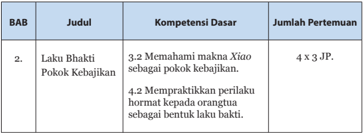

Tabel ini berisi informasi tentang kompetensi dasar yang harus dipenuhi oleh siswa dalam mengembangkan laku bakti dan pokok kebajikan. Topik utama tabel adalah "Laku Bakti Pokok Kebajikan", yang melibatkan dua kompetensi dasar: 3.2 Memahami makna Xio sebagai pokok kebajikan, dan 4.2 Mempelajari perilaku hormat kepada orangtuanya sebagai bentuk laku bakti. Dalam tabel ini, setiap kompetensi dasar dijelaskan dengan jumlah pertemuan yang diperlukan untuk memenuhi standar tersebut, yaitu 4 x 3 jam pelajaran (JP). Ini menunjukkan bahwa siswa perlu menghabiskan sekitar 12 jam pelajaran untuk memahami makna Xio dan 12 jam pelajaran untuk mempelajari perilaku hormat kepada orangtuanya.

### A. Tujuan Pembelajaran

Setelah  menyelesaikan  kegiatan  pembelajaran  bab  dua,  peserta  didik diharapkan mampu:

- Menjelaskan Xiao sebagai pokok kebajikan
- Menjelaskan bagaimana berbakti kepada orangtua
- Menjelaskan ajaran perilaku anak bakti yang terdapat dalam Dizigui .
- Menceritakan dan mengambil  hikmah  kisah keteladanan anak berbakti.

### B.  Langkah-Langkah Pembelajaran

### 1.  Mengamati:

Pada  langkah  mengamati,  guru  dapat  mempersiapkan  objek  (dalam bentuk  benda  atau  fenomena)  yang  relevan  dengan  tema  pembelajaran seperti:

- -Mengamati kegiatan orangtua sehari-hari untuk keperluan keluarga dan anak-anak di rumah.

### 2.  Menanya:

Memancing atau mendorong peserta didik mempertanyakan dan menganalisis adakah hubungan antara praktek Korupsi Kolusi dan Nepotisme (KKN) dengan budaya bakti dalam agama Khonghucu.

- -Menanyakan sikap anak yang baik terkait dengan pekerjaan orangtua.

 

---
## 📄 Halaman 79

### 3.  Eksperimen/Eksplorasi:

- -Menginventaris ayat suci yang berkaitan dengan bakti.
- -Mencari  fakta-fakta  latar  belakang  pelaku  korupsi  dan  mengapa sampai terjadinya korupsi melalui data-data yang tersedia di media massa, buku dan lain sebagainya.
- -Menghubungkan  fakta  atau  data  yang  diperoleh  dengan  ayat  suci tentang bakti dan mencari hubungan diantaranya.
- -Menuliskan karakter huruf Xiao .
- -Membaca dan menginventaris ayat-ayat suci tentang Xiao .
- -Membuat  laporan  tentang  sikap  dan  perilaku  terhadap  orangtua sehari-hari (di rumah).

### 4.  Mengasosiasi:

- -Menghubungkan  sikap  perlaku  bakti  dengan  kasih  sayang  dan perhatian orangtua.
- -Menghubungan sikap bakti dan kepatuhan terhadap orangtua dengan prestasi belajar.

### 5.  Mengomunikasikan:

- -Mendiskusikan tentang perilaku-perilaku yang melanggar laku bakti ( Xiao )  kepada  orangtua,  dan  cara  mengendalikan  diri  untuk  tidak melakukannya lagi.
- -Memberikan tanggapan terhadap presentasi hasil diskusi kelompok lain.
- -Mengemukakan pendapat mengapa Xiao menjadi pokok kebajikan.
- -Menyebutkan  contoh-contoh  perbuatan  yang  menunjukkan  sikap bakti kepada Tian, alam, dan manusia (orangtua).

### C.  Ringkasan Materi

Budaya bakti dan praktik Korupsi Kolusi Nepotisme (KKN).

Mungkin ada sebagian orang yang mengkaitkan tumbuh suburnya budaya KKN dengan budaya bakti, tetapi sesungguhnya justru terbalik karena akhir laku bakti adalah meninggalkan nama harum di kemudian hari. Seorang anak yang berbakti tidak akan berbuat yang memalukan keluarganya. Perhatikan ayat yang terdapat dalam Li Ji berikut ini:

 

---
## 📄 Halaman 80

Cingcu berkata, 'Diri ini adalah warisan tubuh ayah bunda.'

Memperlakukan  tubuh  warisan  ayah  bunda,  beranikah  tidak  penuh hormat? Rumah tangga tidak dibenahi baik-baik, itu tidak berbakti.

Mengabdi kepada pemimpin tidak setia, itu tidak berbakti.

Mengemban  jabatan  tidak  dilaksanakan  sungguh-sungguh,  itu  tidak berbakti. Antara kawan dan sahabat, tidak dapat dipercaya, itu tidak berbakti.

Bertugas di medan perang tiada keberanian, itu tidak berbakti.

Tidak dapat menyelenggarakan kelima perkara ini, itu akan memberi aib kepada orangtua. Beranikah orang tidak sungguh-sungguh?' ( Liji XXIV:17)

### D. Aktivitas Pembelajaran

### 1.  Tugas Mandiri

### a. Deskripsi Tugas

Pada Aktivitas 1.1 (Tugas Mandiri), peserta didik diminta memberikan pendapat/pandangan terkait  pernyataan  bahwa  Laku  Bakti  adalah  inti ajaran Khonghucu!

### b. Tujuan Kegiatan:

Peserta didik dapat memahami laku bakti secara benar.

### c. Petunjuk Jawaban:

Laku  bakti  adalah  pokok  kebajikan,  dari  situlah  ajaran  agama berkembang.  Hubungan  suci  antara  orangtua  dan  anak  adalah  kodrat kemanusiaan  yang  paling  dekat.  Dari  hubungan  orangtua  dan  anak berkembang Cinta Kasih yang tulus diantara keduanya. Sebagai orangtua berhenti pada sikap kasih sayang. Orangtua sedih kalau anaknya sakit. Apapun akan dilakukan oleh orangtua demi kesembuhan anaknya, bahkan rela  berkorban  jiwa  dan  raga.  Sebagai  anak  berhenti  pada  sikap  bakti. Kita  lahir  ke  dunia  ini  lewat  perantara  kedua  orangtua  kita.  Orangtua kita telah bersusah payah merawat dari bayi hingga saat ini, maka jasa orangtua  tak  ternilai.  Oleh  karena  itu  dikatakan  orangtua  adalah  wali Tian di atas dunia ini. Apabila hubungan antara orangtua dan anak dapat terjaga dengan baik, akan berkembang hubungan kemanusiaan yang lain.

Apabila  hubungan  antara  orangtua  dan  anak  tidak  baik  tetapi hubungan kemanusiaan yang lain dapat berkembang dengan baik, inilah yang  dinamakan  kebajikan  terbalik.  Bagaimana  kita  dapat  mengasihi

 

---
## 📄 Halaman 81

orang lain, kalau terhadap orangtua yang telah sangat berjasa kepada diri kita tidak dapat mengasihi. Bagaimana kita bisa hormat kepada pemimpin, kalau terhadap orangtua sendiri tidak dapat mengindahkannya. Hubungan suci antara orangtua dan anak adalah hubungan terdekat umat manusia dan  wajib  kita  jaga.  Darinya  akan  berkembang  berjuta-juta  kebajikan. Sebaliknya, jika tidak terjaga maka akan merusak kebajikan dan berjutajuta perkara di dunia ini.

Oleh karena itu dikatakan laku bakti adalah pokok kebajikan dan dari situlah agama berkembang.

### 2.   Diskusi Kelompok

### a. Topik Diskusi

Pada Aktivitas 2.2 (diskusi kelompok), peserta didik diminta menceritakan  pengalamannya  dalam  hal  memberi  peringatan  kepada orangtua ketika mereka merasa ada yang salah dari orangtua!

### b. Tujuan Kegiatan:

Peserta didik dapat lebih instropeksi diri ketika merasa dirinya benar dan dapat berlaku sopan terhadap orangtua.

### c. Petunjuk Jawaban:

Pedoman dalam menasehati orangtua adalah seperti  yang  terdapat dalam ayat-ayat berikut ini:

- Nabi  bersabda,'…  Terhadap  hal  yang  tidak  di  dalam  kebenaran, seorang anak tidak boleh tidak menyanggah/memperingatkan ayahnya, seorang menteri tidak boleh tidak menyanggah pimpinannya. Maka,  terhadap  hal  yang  tidak  di  dalam  kebenaran,  orang  wajib menyanggah.  Bagaimanakah  sikap  mengikuti  saja  perintah  ayah dapat dinilai berlaku bakti?' ( Xiaojing XV : 2)
- Nabi  bersabda,'Di  dalam  melayani  ayah-bunda  boleh  memperingatkan (tetapi  hendaklah  lemah  lembut).  Bila  tidak  diturut,  bersikaplah lebih hormat dan jangan melanggar. Meskipun harus bercapai lelah, janganlah menggerutu'. ( Lunyu . IV : 18)

 

---
## 📄 Halaman 82

### 3.  Tugas Kelompok

### a. Deskrepsi Tugas

Pada Aktivitas 2.3 (tugas kelompok), peserta didik diminta mencari reperensi  ayat  suci  dari  kitab Sishu , Liji ,  dan Xiaojing terkait  dengan perilaku-perilaku berikut:

- Cepat Tanggap
- Berpamitan, melapor, dan hidup teratur
- Melakukan yang baik, meninggalkan yang buruk
- Menjaga kesehatan jasmani dan rohani
- Menghadapi orangtua yang khilaf

### b. Tujuan Kegiatan

- Petunjuk Jawaban
- Menjaga kesehatan jasmani dan rohani:
Nabi bersabda,'Tubuh, anggota badan, rambut dan kulit diterima dari ayah dan bunda; perbuatan tidak berani membiarkannya rusah dan luka, itulah permulaan Laku Bakti'. ( Xiaojing I : 4)

- Menghadapi orangtua yang khilaf.
Lihat aktivitas nomor 2.

### E.  Penilaian dan Pedoman Penskoran

### 1. Tes Tertulis

Instrumen Soal Pilihan Ganda

Berilah tanda silang (X) di antara pilihan A, B, C, D, atau E yang merupakan  jawaban  paling  tepat  dari  pertanyaan-pertanyaan berikut ini!

- Nabi bersabda, 'Sesungguhnya laku bakti itulah pokok kebajikan, dari padanyalah agama berkembang. Tubuh, rambut dan kulit diterima dari ayah dan bunda, perbuatan tidak berani membiarkannya rusak, itulah .…

 

---
## 📄 Halaman 83

- puncak laku bakti
- permulaan laku bakti
- laku bakti yang besar
- Berdasarkan karakter huruf, Xiao mengandung arti ....
- yang lebih muda/anak mendukung yang lebih tua/orangtua
- yang lebih lebih tua/orangtua mendukung yang muda/anak
- yang muda menghormati yang lebih tua
- yang tua menghargai yang lebih muda
- memuliakan hubungan
- Di  antara  watak-watak  yang  terdapat  di  antara  langit  dan  bumi sesungguhnya  manusialah  yang  termulia.  Di  antara  perilaku  manusia tiada yang lebih besar daripada laku ....
- bijaksana
- cinta kasih
- bakti
- Bila orang tidak mencintai orangtuanya, tetapi dapat mencintai orang lain,  itulah  kebajikan  yang  terbalik.  Tidak  hormat  kepada  orangtua sendiri tetapi dapat hormat kepada orang lain, itulah ... terbalik.
- kebenaran
- kesusilaan
- cinta Kasih
- Zengzi berkata, 'Laku bakti itu ada tiga tingkatan, dan yang terbesar adalah…
- melakukan perawatan
- tidak memalukan ayah dan bunda
- memuliakan ayah dan bunda
- menghormati ayah bunda
- membahagiakan ayah bunda
- hormat
- pandangan
- dapat dipercaya
- tenggangrasa
- laku bakti yang utama
- laku bakti yang kecil

 

---
## 📄 Halaman 84

- Nabi bersabda, 'Di dalam melayani ayah bunda boleh memperingatkan, (tetapi  hendaklah  lemah  lembut).  Bila  tidak  diturut  bersikaplah  lebih hormat  dan  janganlah  melanggar.  Meskipun  harus  bercapai  lelah, janganlah ....
- menyesal
- menyerah
- A dan B benar
- Orang yang benar-benar mengabdi kepada orangtuanya, saat berkedudukan  tinggi,  tidak  menjadi  sombong;  saat  berkedudukan rendah, tidak suka mengacau; dan, di dalam hal-hal yang remeh tidak ....
- mau berebut
- menyepelekan
- sungguh-sungguh
- Sesungguhnya laku bakti itu dimulai dengan mengabdi kepada orangtua, selanjutnya mengabdi kepada pemimpin, dan akhirnya ....
- merawat orangtua
- memuliakan orangtua
- bersujud kepada Tian
- menuju tempat hentian
- menegakkan diri
- Menegakkan diri hidup menempuh jalan suci, meninggalkan nama baik di zaman kemudian, sehingga memuliakan ayah dan bunda, itulah ....
- inti laku bakti
- awal laku bakti
- akhir laku bakti
- pokok kebajikan
- inti kemanusiaan
- peduli
- sembarangan
- menggerutu
- marah-marah

 

---
## 📄 Halaman 85

### 2.  Pedoman Pensekoran

- -Jumlah soal Pilihan Ganda 9
- -Poin setiap soal Pilihan Ganda adalah 5
- -Jika semua soal terjawab dengan benar (5), maka jumlah skor tertinggi adalah 45.
- -Jika  penilaian  menggunakan  skala  100,  maka  Nilai  =  Jumlah  skor dibagi skor tertinggi dikali 45 (45 : 45 x 100) = 100
- -Jika penilaian menggunakan skala 4, maka Nilai = Jumlah skor dibagi skor tertinggi dikali 4 (45 : 45 x 4) = 4

### N = (skor : skor tertinggi x 100)

N = (skor : skor tertinggi x 4)

### Instrumen Soal Uraian

### Jawablah pertanyaan-petanyaan berikut ini dengan uraian yang jelas!

- Xiao secara imani berarti memuliakan hubungan, memuliakan hubungan yang dimaksud adalah?
- Tuliskan Lima Hubungan Kemasyarakatan ( Wulun ) sebagai Jalan Suci yang harus ditempuh manusia di dunia!
- Sebutkan tiga tingkatan berbakti kepada orangtua!
- Jelaskan hal melakukan perawatan kepada orangtua!
- Jelaskan awal dari laku bakti kepada orangtua!

### Kunci Jawaban Soal Pilihan Ganda

- Memuliakan hubungan antara manusia dengan Tian ,  manusia  dengan alam, manusia dengan manusia. Wujud pelaksanaannya adalah sebagai berikut:
- -Hubungan dengan Tian : dengan berlaku Satya, hidup selaras dengan xing (Watak Sejati) yakni ren , yi , li , zhi sehingga dapat menjadi insan yang dapat dipercaya.

 

---
## 📄 Halaman 86

- -Hubungan  dengan  alam:  dengan  melestarikan  alam,  memotong tumbuhan  dan  hewan  pada  waktunya  dan  menjaga  keseimbangan alam.
- -Hubungan  antar  manusia:  dengan  memuliakan  lima  hubungan kemasyarakatan  ( Wulun )  dan  menjalankan  10  kewajiban  ( Shiyi ), yakni:
- Orangtua harus bersikap kasih sayang
- Anak dapat bersikap Bakti
- Atasan dapat bersikap Cinta kasih
- Bawahan dapat Setia dan Hormat
- Suami dapat besikap benar/adil/tahu kewajiban
- Isteri dapat bersikap patuh menyesuaikan diri
- Kakak dapat bersikap mendidik
- Adik dapat bersikap hormat dan rendah hati
- Yang lebih tua dapat mengalah dan rendah hati
- Yang lebih muda dapat bersikap patuh
- Lima Hubungan Kemasyarakatan ( Wulun ) sebagai Jalan Suci yang harus ditempuh manusia di dunia! Yaitu:
- Hubungan antara orangtua dengan anak
- Hubungan antara pemimpin dengan pengikut
- Hubungan antara suami dengan isteri
- Hubungan antara kakak dengan adik
- Hubungan antara kawan dengan sahabat
- Tiga tingkatan berbakti kepada orangtua!
- -Laku bakti yang besar: mampu memuliakan orangtua
- -Laku bakti yang kedua: tidak memalukan orangtua
- -Laku bakti yang ketiga: hanya mampu memberi perawatan

### ( Liji . XXIV: 18)

- -Laku bakti yang besar: tidak dapat diukur dengan pikiran
- -Dapat menyiapkan segala-galanya dalam pengabdian.
- -Laku bakti yang tengah: menggunakan kejerih-payahan
- -Menjunjung cinta kasih dan damai sentosa dalam kebenaran.
- -Laku bakti yang kecil: menggunakan tenaga
- -Karena cinta kasih dan sayangnya sehingga melupakan jerih payah.
( Liji . XXIV: 20)

 

---
## 📄 Halaman 87

- Hal melakukan perawatan kepada orangtua!
Melakukan pemeliharaan/perawatan terhadap orangtua haruslah disertai dengan sikap hormat dan mengindahkan (kesusilaan). Kalau tidak disertai dengan sikap hormat apa bedanya dengan melakukan pemeliharaan terhadap anjing dan kuda atau seperti anjing dan kuda melakukan perawatan. Acuan

- Awal dari laku bakti kepada orangtua!
Acuan terdapat dalam Xiaojing bagian I, :

Nabi bersabda,'Tubuh, anggota badan, rambut dan kulit diterima dari ayah  dan  bunda;  perbuatan  tidak  berani  membiarkannya  rusah  dan  luka, itulah permulaan Laku Bakti'.

### Pedoman Pensekoran

- -Jumlah soal uraian 5
- -Poin maksimal setiap soal uraian adalah 10
- -Jika semua soal terjawab dengan poin maksimal (10), maka jumlah skor tertinggi adalah 50.
- -Jika  penilaian  menggunakan  skala  100,  maka  Nilai  =  Jumlah  skor dibagi skor tertinggi dikali 100 (50 : 50 x 100) = 100
- -Jika penilaian menggunakan skala 4, maka Nilai = Jumlah skor dibagi skor tertinggi dikali 4 (50 : 50 x 4) = 4
N = (skor : skor tertinggi x 100)

N = (skor : skor tertinggi x 100)

 

---
## 📄 Halaman 88

### F.  Remedial

Apabila  peserta  didik  ada  yang  memerlukan  ulangan  susulan  ataupun perbaikan, maka pada bagian remedial ini memberikan beberapa alternatif penilaian tambahan.

Prinsip  remedial  adalah  berfokus  pada  proses  pembentukan  karakter. Berikut  adalah  remedial  yang  dapat  dilakukan  menggunakan  metode wawancara.  Peserta  didik  diminta  untuk  mewancara  orangtuanya  atau walinya  dan  menggali  nilai-nilai  bakti  orangtua  dan  harapan  orangtua terhadap anaknya.

Poin yang perlu ada dalam hasil wawancara:

- Kondisi keluarga orangtua saat itu
- Pengalaman orangtua ketika masih muda berkaitan dengan didikan orangtuanya dan sikapnya saat itu.
- Apa  jasa  orangtua  yang  paling  dirasakan  berharga  oleh  orangtua anda?
- Apa yang akan dilakukan oleh orangtua anda terhadap orangtuanya seandainya waktu dapat diputar mundur kembali?
- Harapan orangtua terhadap anaknya (diri anda).

### G. Komunikasi Orangtua

Proses  pembentukan  karakter  harus  dilakukan  secara  integratif  dan holistik.  Integratif  karena  saat  ini  setiap  mata  pelajaran  juga  mengusung pembentukan karakter moral. Holistik artinya menyeluruh dalam kehidupan, tidak hanya di sekolah tetapi juga dalam pergaulan di luar sekolah dan di rumah.

Komunikasi  orangtua  menggunakan  momen  anak  berbincang  dengan orangtuanya dalam tugas wawancara seperti di atas.

 

---
## 📄 Halaman 89

### Nabi Kongzi

### Sebagai Tian Zhi Mu Duo

### A. Aspek

### Aspek yang dipelajari:

√

Keimanan

Tata Ibadah

### B.  Peta Konsep

---
**🖼️ Gambar/Diagram**

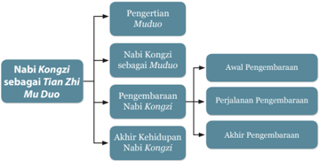

> **Deskripsi Visual:** Gambar ini adalah diagram yang menunjukkan struktur dan konten dari bab "Nabi Kongzi sebagai Tian Zhi Mu Duo" dalam buku pelajaran. Diagram ini dibagi menjadi empat bagian utama:

1. Pengertian Mu Duo
   - Nabi Kongzi sebagai Tian Zhi Mu Duo

2. Nabi Kongzi sebagai Mu Duo
   - Awal Pengembaraman
   - Perjalanan Pengembaraman
   - Akhir Pengembaraman

3. Penjelasan Nabi Kongzi
   - Akhir Kehidupan Nabi Kongzi

Elemen-elemen utama dalam diagram ini adalah:
- Nabi Kongzi sebagai Tian Zhi Mu Duo
- Nabi Kongzi sebagai Mu Duo
- Nabi Kongzi sebagai Tian Zhi Mu Duo
- Awal Pengembaraman
- Perjalanan Pengembaraman
- Akhir Pengembaraman
- Akhir Kehidupan Nabi Kongzi

Teks, angka, atau label penting yang terlihat dalam diagram ini adalah:
- "Nabi Kongzi sebagai Tian Zhi Mu Duo"
- "Awal Pengembaraman"
- "Perjalanan Pengembaraman"
- "Akhir Pengembaraman"
- "Akhir Kehidupan Nabi Kongzi"

Informasi kunci yang dapat diambil pembaca melalui diagram ini adalah bahwa bab ini membahas tentang pengertian Mu Duo, nabi Kongzi sebagai Mu Duo, penjelasan nabi Kongzi, dan akhir kehidupan nabi tersebut. Diagram ini memberikan struktur yang jelas tentang topik-topik yang akan dibahas dalam bab tersebut.

Sejarah Suci

Perilaku

Junzi

Kitab Suci

 

---
## 📄 Halaman 90

### C.  Kompetensi Inti dan Kompetensi Dasar

---
**📊 Tabel**

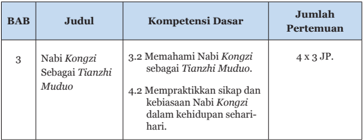

Tabel ini menunjukkan informasi tentang Bab 3 dalam buku pelajaran, yang berfokus pada Nabi Kongzi sebagai Tianzhi Muduo. Topik utama adalah tentang memahami Nabi Kongzi sebagai Tianzhi Muduo (Kompetensi Dasar 3.2) dan praktik mempraktikkan sikap dan kebiasaan Nabi Kongzi dalam kehidupan sehari-hari (Kompetensi Dasar 4.2). Dalam tabel ini, ada 12 pertemuan yang ditentukan, dengan 4 pertemuan untuk setiap kompetensi dasar tersebut. Ini menunjukkan bahwa pembelajaran akan dilakukan secara intensif untuk kedua kompetensi dasar tersebut.

### D. Tujuan Pembelajaran

Setelah  menyelesaikan  kegiatan  pembelajaran  bab  tiga,  peserta  didik diharapkan mampu:

- Menghayati Nabi Kongzi selaku Genta Rohani ( Tianzhi Muduo ).
- Menjelaskan Nabi Kongzi sebagai penyempurna Rujiao
- Menjelaskan silsilah Nabi Kongzi
- Menjelaskan  situasi  zaman  saat  Nabi  dilahirkan  dan  kiprahnya  di negeri Lu
- Menjelaskan  perjalanan  Nabi Kongzi dalam  menyebarkan  Firman Tian
- Menjelaskan saat-saat akhir kehidupan Nabi Kongzi

### E.  Langkah-Langkah Pembelajaran

### 1.  Mengamati:

Pada  langkah  mengamati,  guru  dapat  mempersiapkan  objek  (dalam bentuk  benda  atau  fenomena)  yang  relevan  dengan  tema  pembelajaran seperti:

- -Mengamati gambar kelahiran Nabi Kongzi ,  memberikan pernyataan yang memancing pertanyaan seperti apa maksud Nabi Kongzi sebagai raja tanpa mahkota.

 

---
## 📄 Halaman 91

- -Fenomena  dunia  yang  menghormati  Nabi Kongzi meskipun  sudah terpisah ribuan tahun dan ribuan kilometer dari tempat kelahirannya di Qufu .

### 2.  Menanya:

Memancing atau mendorong peserta didik menanya dan menganalisis potongan  informasi  yang  telah  diterima  di  tahap  mengamati.  Misalnya menggali lebih jauh informasi atau kemungkinan-kemungkinan latar belakang  atau  sebab-sebab  penghormatan  dunia  kepada  Nabi Kongzi . Bagaimana  konstektual  penggunaan  istilah  raja  saat  jaman  Nabi,  istilah Muduo dalam kaitannya Genta Rohani dan sebagainya.

### 3.  Eksperimen/Eksplorasi:

- -Menginventaris ayat suci yang berkaitan dengan kenabian Nabi Kongzi sebagai Tian Zhi Mu Duo atau Genta Rohani Umat Manusia.
- -Mencari  data-data  perayaan  Hari  Lahir  Nabi Kongzi di dunia, penghargaan kepada Nabi Kongzi yang dapat diamati sampai saat ini seperti perlindungan terhadap makam Kongzi , Kongmiao dan rumah Nabi Kongzi sebagai warisan sejarah dunia oleh Unesco; ajaran Nabi Kongzi yang diadopsi oleh tokoh-tokoh dunia lainnya.

### 4.  Mengasosiasi:

- -Merenungkan hasil jawaban menanya atau data-data yang diperoleh dan merekonstruksi ulang pemahaman tentang Nabi Kongzi sebagai Tianzhi Muduo .
- -Menyimpulkan benang merah kenabian Nabi Kongzi sebagai Tianzhi Muduo didasari  data-data  baru  yang  ditemukan  dan  ayat-ayat  suci yang menjelaskannya.

### 5.  Mengomunikasikan:

- -Mengungkapkan  kenabian  Nabi Kongzi dan  ayat-ayat  suci  yang melandasinya.
- -Mengungkapkan  kenyataan penghargaan dunia terhadap ajaran maupun sosok Nabi Kongzi .
- -Menghargai  dan  mendengarkan  dengan  seksama  pendapat  orang lain,  berusaha  memahami  maksud  pertanyaan  atau  pendapat  orang lain, memberikan argumentasi secara sopan dan selalu membuka diri terhadap kemungkinan adanya perbaikan atau koreksi di luar diri.

 

---
## 📄 Halaman 92

### F.  Pendalaman Materi

Rangkaian wahyu dalam agama Khonghucu :

---
**📊 Tabel**

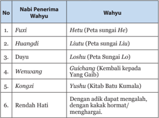

Tabel ini menunjukkan daftar nabi-nabi penerima wahyu di dalam Alkitab, disusun berdasarkan urutan dan nama mereka. Topik utama tabel ini adalah wahyu-wahyu yang diterima oleh para nabi tersebut. Kolom pertama berisi nomor urut nabi, sedangkan kolom kedua berisi nama-nama nabi. Kolom ketiga menyajikan wahyu-wahyu yang diterima oleh masing-masing nabi. Misalnya, Fuxi menerima wahyu tentang Hehu (peta sungai He), Huangdi menerima wahyu tentang Liu (peta sungai Liu), dan以此类推. Data penting yang terlihat adalah bahwa wahyu-wahyu ini seringkali berkaitan dengan peta-peta alam, seperti sungai dan batu-batu, yang menunjukkan hubungan antara wahyu dan dunia fisik. Selain itu, beberapa wahyu, seperti yang diterima oleh Kongzi, memiliki konteks moral dan etis yang mendalam, menunjukkan bahwa wahyu juga dapat memberikan petunjuk tentang kehidupan spiritual dan moral.

Pemahaman  pribadi  nabi  Kongzi  seperti  yang  terdapat  dalam  kitab Zhongyong sehingga mampu menetapkan Hukum/karya besar bagi dunia.

'Hanya Nabi yang sempurna di dunia ini yang dapat jelas pendengarannya, terang  penglihatannya,  cerdas  pikiran,  dan  bijaksana;  maka  cukuplah  ia menjadi pemimpin. Keluasan hatinya dan kelemah-lembutannya, cukup untuk meliputi segala sesuatu. Semangatnya yang berkobar-kobar, keperkasaanya, kekerasan  hatinya,  dan  katahan-ujiannya,  cukup  untuk  mengemudikan pekerjaan besar. Kejujurannya, kemuliaannya, ketengahannya dan kelurusannya cukup untuk menunjukkan kesungguhannya. Ketertibannya, keberesannya, ketelitiannya dan kewaspadaannya cukup untuk membedakan segala sesuatu'.

Kecakapan orang besar (Nabi):

- Mampu menggunakan panca indera dan potensi diri secara maksimal: Jelas  pendengarannya,  Terang  penglihatannya,  Cerdas  pikiran  dan Bijaksana.
Dengan mampu menggunakan panca indera pendengaran dan penglihatan  secara  baik,  tidak  mudah  emosi  dari  apa  yang  didengar atau  dilihat  melainkan  mampu  melihat  kenyataan/kebenaran  secara jernih.  Cerdas  pikiran  maka  mampu  menelaah  kenyataan/kebenaran dan bijaksana mampu mendahulukan mana yang pokok dan mana yang pengembangan.

 

---
## 📄 Halaman 93

- Mampu meliputi segala sesuatu: luas hati, lemah lembut
Luas hati membuat mampu menerima apapun masalah yang dihadapi. Lemah lembut mampu berempati dengan sesama.

- Mampu  mengemudikan  pekerjaan  besar:  semangat  berkobar-kobar, perkasa, keras hati/ tekad, dan tahan uji.
- Mempunyai kesungguhan:  jujur,  mulia  (tidak  melakukan  hal-hal  yang rendah),dan lurus (berjalan sesuai kebenaran)
- Ujian  dari  kesungguhan  adalah  nilai-nilai  kejujuran,  kemuliaan  dan kelurusan dalam bersikap.
- Mampu membedakan segala sesuatu: tertib (teratur), beres (kerja tuntas), teliti, waspada.
Melalui ketertiban, keberesan, ketelitian dan kewaspadaan maka seorang Nabi mampu membedakan segala sesuatu, mampu mendeteksi gejala yang timbul sejak dini baik gejala yang baik maupun gejala yang tidak baik.

Karena Nabi juga seorang manusia, maka seyogyanya kitapun mampu melakukan  seperti yang dilakukan para Nabi. Tinggal  kemauan  dan kesungguhan dalam membina diri.

### G. Aktivitas Pembelajaran

### 1.  Diskusi Kelompok

### a. Topik Diskusi

Pada Aktivitas 3.1 (diskusi kelompok), peserta didik diminta Jelaskan mengapa Nabi Kongzi dikatakan sebagai yang menyempurnakan Rujiao (sebutan untuk agama Khonghucu di zaman sebelum Nabi Kongzi )!

### b. Tujuan Kegiatan:

Peserta  didik  dapat  lebih  mengimani  Nabi Kongzi sebagai Tianzhi Muduo .

### c. Petunjuk Jawaban:

Kongzi adalah  seorang  pemikir  besar,  politisi,  pendidik  raksasa kebudayaan  China  yang  terkemuka  dan  termasyur  di  seluruh  pelosok Zhongguo . Kongzi memang bukanlah pendiri sebuah agama baru, tetapi beliau adalah seorang Nabi. Nabi Kongzi hanya meneruskan ajaran yang memang  sudah  ada  sebelumnya,  yaitu  agama Ru ,  yang  sudah  dirintis (diletakkan dasar-dasarnya oleh Nabi Tangyao dan Nabi Yishun tahun 2357 SM. - 2205 SM.) tetapi, Kongzi lah penyempurna dari suatu agama yang sudah ada itu.

 

---
## 📄 Halaman 94

Nabi Kongzi menggenapkan  kitab Yijing atau  kitab  Perubahan  yang merupakan  kitab  tertua  dari  kitab Wujing (kitab  yang  mendasari)  ajaran Rujiao .  Kitab Yijing sudah  dimulai  penulisannya  sejak  wahyu  Nabi  purba Fuxi . Nabi Kongzi merumuskan Shiyi atau sepuluh sayap yang menjelaskan makna dasar dan cara menggunakan Yijing .

### 2.  Tugas Mandiri

### a. Deskripsi Tugas

Pada Aktivitas 3.2 (tugas mandiri), peserta didik diminta menjelaskan yang dimaksud dengan Kebajikan Sejati?

Berikan contoh berdasarkan pengalaman hidupmu!

### b. Tujuan Kegiatan:

Peserta didik lebih memahami bagaimana berperilaku sesuai Kebajikan Sejati.

### c. Petunjuk Jawaban:

Yang  dimaksud  Kebajikan  Sejati  adalah  dapat  berbuat  kebaikan dengan dilandasi ketulusan, bukan pamrih atau mengharapkan sesuatu!

Contoh  penerapan  berbeda-beda  sesuai  dengan  pengalaman  dan pemahaman peserta didik.

### 3.  Aktivitas Bersama (Diskusi Kelompok)

### a. Deskripsi Tugas

Pada Aktivitas 3.2 (tugas mandiri), peserta didik diminta menceritakan poin-poin  penting  tentang  perjalanan  Nabi Kongzi sebagai Tianzhi Muduo ,  dan  apa  yang  dapat  kalian  simpulkan  tentang  tugas  suci  Nabi Kongzi sebagai Tianzhi Muduo !

### b. Tujuan Kegiatan:

Peserta didik dapat lebih mengimani tugas suci Nabi Kongzi dalam menyebarkan Jalan Suci melalui pengembaraanNya ke berbagai negeri.

### c. Petunjuk Jawaban:

Nabi Kongzi berani menepati panggilan suciNya untuk mengembangkan Jalan Suci. Nabi Kongzi memulai perjalanan suciNya setelah raja negeri Lu melalaikan Jalan Suci yang ditandai dengan tidak dilakukannya  sembahyang Dongzhi .  Saat  itu,  hanya  raja  sajalah  yang dapat memimpin sembahyang langsung kepada Tian .

 

---
## 📄 Halaman 95

Nabi Kongzi berani menerima panggilan suciNya meninggalkan jabatan Perdana Menteri waktu itu, untuk menyiarkan ajaran suciNya kepada rajaraja negeri lainnya agar membawa perubahan bagi dunia.

Nabi Kongzi senantiasa  menggunakan  Cinta  Kasih  dan  menghindari segala bentuk kekerasan ataupun perang dalam menyebarkan ajaranNya.

### 4.  Tugas Mandiri

### a. Deskripsi Tugas

Pada Aktivitas 3.4 (tugas mandiri), peserta didik diminta menyebutkan  sifat-sifat  yang  dimiliki  seorang  Nabi Kongzi sehingga mampu mengemudikan pekerjaan besar? Berikan penjelasanmu!

### b. Tujuan Kegiatan:

Peserta didik dapat lebih memahami kekuatan sifat-sifat atau karakter dalam dirinya dan sadar untuk mengembangkannya dalam hidup.

### c. Petunjuk Jawaban:

Sifat-sifat agar mampu mengemudikan pekerjaan besar :

### 1) semangat berkobar-kobar,

semangat adalah kekuatan yang terdapat dalam diri setiap manusia. dialah  jodoh  dari  kebenaran.  Semangat  yang  berkobar  artinya  mampu memelihara energy positif yang ada dalam dirinya sehingga memenuhi seluruh anggota tubuhnya bahkan ruang antara langi dan bumi. (Lihat Mengzi IIA : 2/12-13).

### 2) perkasa,

perkasa  memiliki  arti  memiliki  kebijaksanaan  sehingga  mampu menyelesaikan masalah yang dihadapi dengan baik.

### 3) keras hati/tekad

keras hati artinya dapat tahan dalam menderita dan terus mengupayakan sampai berhasil.

### 4) tahan uji

Tahan uji artinya dapat menahan diri terhadap kesenangan kecil demi mencapai tujuan hidup yang lebih besar.

 

---
## 📄 Halaman 96

### H. Penilaian dan Pedoman Penskoran

### 1. Tes Tertulis

Instrumen Soal Uraian

- Sebutkan dengan jelas kapan dan di mana Nabi Kongzi dilahirkan!
- Sebutkan tanda-tanda malam menjelang kelahiran Nabi Kongzi !
- Sebutkan Nabi-Nabi Agama Khonghucu sebelum Nabi Kongzi !
- Jelaskan mengapa Nabi Kongzi meninggalkan negeri Lu !
- Jelaskan apa yang dimaksud dengan Kebajikan Sejati itu!
- Simbol suci untuk Nabi Kongzi meliputi tiga aspek, yaitu ...
- Sebutkan tanda-tanda gaib dari Nabi Kongzi !
- Apa  pernyataan  Nabi Kongzi tentang  pengokohan  dirinya  sebagai nabi?
- Apa arti kata Muduo ?
- Apa perbedaan antar Jinduo dan Muduo , baik visual dan fungsinya?
- Pengembaraan Nabi Kongzi sebagai Muduo dimulai sejak ....
- Mengapa Muduo membuat sebutan untuk Sang Kongzi lebih terasa sebagai wakil dari eksistensi Nabi Kongzi ?

### 2.  Kunci Jawaban

- Waktu dan tempat Nabi Kongzi dilahirkan.
Nabi Kongzi dilahirkan, pada tanggal 27 bulan 8 Kongzili (27 Bayue ) tahun  551  SM.,  di  negeri Lu (salah  satu  negara  bagian  Dinasti Zhao ), kota Zouyi ,  di sebuah desa bernama Changping ,  di Lembah Kongsang . (Sekarang Jazirah Shandong kota Qufu ).

- Tanda-tanda malam menjelang kelahiran Nabi Kongzi !
Pada  malam  sang  bayi  (Nabi Kongzi )  lahir,  nampaklah  dua  ekor naga datang dan menjaga di kanan-kiri atap goa Kongsang . Di angkasa terdengar  musik  merdu  bergema.  Dua  orang  bidadari  menuangkan wewangian.  Setelah  sang  bayi  lahir,  muncul  sumber  air  hangat  yang jernih, dan kembali kering setelah sang bayi dimandikan. Pada tubuh sang bayi nampak tanda-tanda gaib yang luar biasa, seakan-akan di dadanya

 

---
## 📄 Halaman 97

terdapat untaian lima uruf kaligrafi: Zhizhuo Dengshihu yang bermakna: 'Yang  akan  menetapkan  hukum  abadi  dan  membawakan  damai  bagi dunia'.

### 3. Nabi-nabi sebelum Nabi Kongzi

Fuxi, Shennung, Huangdi. Tangyou, Yushun, Dayu, Yi, Chengtang, Yiyin, Wenwang, Wuwang, Zhaogongtan.

### 4. Alasan Nabi Kongzi meninggalkan negeri Lu !

Nabi Kongzi meninggalkan negeri Lu karena  Raja  negeri Lu sudah tidak mau mendengarkan nasehat-nasehat Nabi Kongzi dan melalaikan kewajibannya sebagai seorang raja dalam memimpin sembahyang besar ( Dongzhi ). Nabi Kongzi terpanggil untuk menyebarkan ajaranNya kepada raja-raja  lain  agar  membawa  kebaikan  dan  kesejahteraan  bagi  umat manusia.

### 5. Kebajikan Sejati itu

Kebajikan  yang  dilakukan  dengan  ketulusan  atau  keikhlasan  tanpa pamrih apapun juga.

- Simbol suci untuk Nabi Kongzi meliputi tiga aspek, yaitu ...
- Gansheng : tanda-tanda mukjijat menjelang kelahiran Nabi Kongzi .
- Shouming : menerima Firman
- Fengshan : menyempurnakan Firman

### 7. Tanda-tanda gaib dari Nabi Kongzi !

- Ketika kandungan ibu Yang Zhengzai makin tua beliau beroleh penglihatan  gaib  dikunjungi  lima  orang  yang  mengaku  sebagai Sari  Lima  Bintang  sambil  menuntun Qilin .  Setelah  berada  di hadapan bunda Yan Zhengzai , hewan suci Qilin berlutut dan dari mulutnya  menyemburkan  sebuah  Buku  Batu  Kumala  ( Yushu ) yang bertuliskan: 'Putera air suci akan datang untuk melanjutkan Maha Karya Dinasti Zhou dengan menjadi Raja Tanpa Mahkota ( Shouwang )'.
- Pada malam sang bayi (Nabi Kongzi ) lahir, nampaklah dua ekor naga datang dan menjaga di kanan-kiri atap goa Kongsang .  Di angkasa  terdengar  musik  merdu  bergema.  Dua  orang  bidadari menuangkan wewangian. Setelah sang bayi lahir, muncul sumber air  hangat  yang  jernih,  dan  kembali  kering  setelah  sang  bayi

 

---
## 📄 Halaman 98

dimandikan.  Pada  tubuh  sang  bayi  nampak  tanda-tanda  gaib yang luar biasa, seakan-akan di dadanya terdapat untaian lima huruf kaligrafi: Zhizhuo Dengshihu yang bermakna: 'Yang akan menetapkan hukum abadi dan membawakan damai bagi dunia'.

### 8.  Pernyataan Nabi Kongzi tentang pengokohan dirinya sebagai nabi?

Nabi Kongzi bersabda,  'Pada  waktu  berusia  15  tahun,  sudah  teguh semangat  belajarku'.  2)  'Usia  30  tahun,  tegaklah  pendirian'.  3)  'Usia 40  tahun,  tiada  lagi  keraguan  dalam  pikiran'.  4)  'Usia  50  tahun  Aku telah mengerti akan Firman Tian '. 5) 'Usia 60 tahun, pendengaran telah menjadi alat yang patuh untuk menerima kebenaran'. 6) 'Dan usia 70 tahun,  Aku  sudah  dapat  mengikuti  hati  dengan  tidak  melanggar  garis kebenaran'. ( Lunyu . IV: 5)

' Tian telah menyalakan kebajikan di dalam diriku. Apakah yang dapat dilakukan Huan-dui atasKu'. ( Lunyu . VII: 23)

Nabi terancam bahaya di negeri Guang . 2) beliau bersabda, 'Sepeninggalan raja Wen , bukankah ajaran-ajarannya Aku yang mewarisi?'

- 'Bila Tian hendak  memusnahkan  ajaran  itu,  Aku  sebagai  orang yang lebih kemudian tidak akan memperolehnya. Bila Tian tidak hendak memusnahkan ajaran itu, apa yang dapat dilakukan orang-orang negeri Guang atas diriku?' ( Lunyu . IX: 5)
- Arti kata Muduo Tian secara imani.
Genta Rohani umat manusia yang menyadarkan umat manusia untuk berbuat sesuai dengan Xing dan bersujud kehadirat Tian .

- Perbedaan antar Jinduo dan Muduo , baik visual dan fungsinya?
Jinduo adalah  lonceng  yang  pemukulnya  terbuat  dari  logam,  dan berfungsi sebagai tanda maklumat untuk kepentingan militer.

Muduo adalah  lonceng  yang  pemukulnya  terbuat  dari  kayu,  dan berfungsi sebagai tanda maklumat untuk kepentingan rakyat sipil.

- Pengembaraan Nabi Kongzi sebagai Muduo Tia n dimulai sejak ....
Nabi Kongzi

- mulai mengembara sejak tahun 495 SM.
- Muduo ',  simbol  suci  Nabi Kongzi tersebut  mengena  dalam  hati sanubari  umatNya  dan  menunjukkan  eksistensi  kenabian  Nabi Kongzi ?

 

---
## 📄 Halaman 99

Tertulis di dalam Kitab Shijing Buku III,  bab  IV,  ayat  II/3,  sebagai berikut:

'Tiap  awal  tahun  pada  bulan  pertama  musim  semi,  ditugaskan petugas yang membawa Muduo berkeliling, dan diserukan, 'para pejabat, kamu  wajib  mampu  mempersiapkan  petunjuk-petunjuk.  Para  pekerja, kamu hendaknya segera mempersiapkan peralatan dan segara bekerja. Kecamlah jangan lengah dan gegabah hingga tidak tak beres dan waspada untuk hal-ikwal yang tak benar'.

Ini memberi suatu acuan bahwa Muduo sudah terdokumentasi dalam keberadaan dan fungsinya di jaman Raja Zhong Kang dari  Dinasti Xia yang memerintah di tahun 2159-2146 SM.

Kitab Suci Liji bagian Yueling bahasan Zhongchun tersurat: '….Tiga hari sebelum cuaca buruk kilat halintar menyambar, dibunyikan Muduo untuk membawa berita memperingatkan rakyat'.

Ini  memberi gambaran bahwa Muduo digunakan sebagai pembawa firman  atau  amanat  dan  maklumat  kerajaan/raja  untuk  memperingati rakyat bila akan terjadi suatu bencana (dibunyikan sebagai pertanda atau peringatan!)

Muduo secara fungsional identik dengan wahyu yang diterima Nabi Kongzi dalam kitab Batu Kumala ( Yushu ) sebagai Raja Tanpa Mahkota.

Raja tanpa Mahkota,lebih untuk menunjukkan pengertian Raja: Putera Tian ( Tianzi ) yang tanpa mahkota berarti melintas batas 'pengangkatan duniawi' dan menembus dimensi 'pengakuan' serta batasan manusia.

### 3.  Pedoman Pensekoran

- -Poin maksimal setiap soal uraian adalah 10
- -Jika  semua soal terjawab dengan poin maksimal (10), maka jumlah skor tertinggi adalah 120.
- -Jika  penilaian  menggunakan  skala  100,  maka  Nilai  =  Jumlah  skor dibagi skor tertinggi dikali 100 (120 : 120 x 100) = 100
- -Jika penilaian menggunakan skala 4, maka Nilai = Jumlah skor dibagi skor tertinggi dikali 4 (120 : 120 x 4) = 4
N = (skor : skor tertinggi x 100)

N = (skor : skor tertinggi x 4)

 

---
## 📄 Halaman 100

### I.  Remedial

Apabila  peserta  didik  ada  yang  memerlukan  ulangan  susulan  ataupun perbaikan, maka pada bagian remedial ini memberikan beberapa alternatif penilaian tambahan.

Prinsip  remedial  adalah  berfokus  pada  proses  pembentukan  karakter. Berikut adalah remedial yang dapat dilakukan :

- Apabila peserta didik mempunyai bakat dalam melukis, maka dapat ditugaskan  untuk  melukis  salah  satu  bagian  dari  kisah  perjalanan Nabi Kongzi dan diberi bingkai. Hasil lukisan ini dapat dipajang di kelas atau dijadikan alat bantu ketika menerangkan bab ini di kelas.
- Membuat kaligrafi salah satu gelar atau penghargaan yang diterima Nabi Kongzi dan dibingkai sehingga dapat dipajang di kelas.
- Memberikan  tugas  membuat  karangan  minimal  5-10  halaman  A4 dengan spasi 1,5 dan font times new roman 12 dengan tema sebagai berikut (pilih salah satu) :
- Nabi Kongzi Genta Rohani Manusia
- Nabi Kongzi Teladan Hidupku

### Penilaian Sikap

Penilaian sikap bisa menggunakan teknik observasi saat belajar di kelas. Aspek yang dilihat antara lain :

- Kedisiplinan mengerjakan tugas
- Aktivitas di kelas
- Kepemimpinan
- Keterampilan komunikasi
(lihat Bagian Satu tentang Penilaian).

### J.  Komunikasi Orangtua

Proses  pembentukan  karakter  harus  dilakukan  secara  integratif  dan holistik.  Integratif  karena  saat  ini  setiap  mata  pelajaran  juga  mengusung pembentukan karakter moral. Holisti artinya menyeluruh dalam kehidupan peserta  didik,  tidak  hanya  di  sekolah  tetapi  juga  dalam  pergaulan  di  luar sekolah dan di rumah.

 

---
## 📄 Halaman 101

Mengingat peran serta orangtua, maka perlu dibuatkan lembar komunikasi orangtua untuk memudahkan komunikasi.

### Contoh Lembar Komunikasi Orangtua

Nama Orangtua :

……………………………..

Nama Siswa :

……………………………..

Kelas :

……………………………..

Tema :

Bab 3. Nabi Kongzi Tian Zhi Mu Duo

Sub tema :

Tokoh Idola/Kawan Dekat

---
**📊 Tabel**

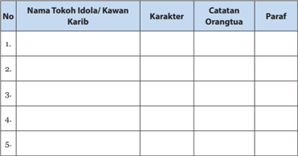

Tabel ini berisi informasi tentang tokoh idola atau kawan-kawan karib yang dihargai oleh orang tua. Topik utamanya adalah karakteristik tokoh tersebut, seperti nama, karakteristik, catatan orang tua, dan paraf. Kolom-kolomnya meliputi nomor urut (No.), nama tokoh, karakteristik, catatan orang tua, dan paraf. Data penting yang terlihat adalah bahwa setiap baris menunjukkan informasi tentang satu tokoh idola atau kawan-kawan karib, dengan detail mendalam tentang karakteristik mereka, catatan orang tua, dan penandaan oleh orang tua. Ini membantu dalam memahami hubungan dan penghargaan orang tua terhadap tokoh-tokoh tersebut.

### Keterangan :

- Tokoh idola adalah tokoh yang dikagumi oleh sang anak.
- Tanyakan  kepada  sang  anak  mengapa  mengagumi  tokoh  tersebut. Bagaimana karakter sang tokoh menurut sang anak?
- Kawan dekat adalah kawan yang sering bersama-sama.
- Tanyakan  kepada  sang  anak  mengapa  suka  berkawan  dengannya. Bagaimana karakter kawan tersebut menurutnya? Lakukan observasi dan berbincang-bincang dengan kawan dekat untuk menilai karakter pribadi kawan dekat anak kita.

 

---
## 📄 Halaman 102

---
**🖼️ Gambar/Diagram**

> **Deskripsi Visual:** Gambar ini adalah ilustrasi yang menampilkan sebuah bangunan tradisional Asia dengan atap berundak dan dua pintu utama. Atap bangunan memiliki tiga sudut yang menonjol ke atas, yang merupakan ciri khas bangunan seperti pagoda. Bangunan tersebut tampaknya berada di depan matahari yang terlihat di bagian atas gambar, menunjukkan waktu siang hari. Ilustrasi ini mungkin digunakan untuk membantu pembaca memahami struktur bangunan tradisional atau untuk menggambarkan bagaimana bangunan ini biasanya ditemukan dalam konteks budaya atau sejarah.

92

Buku Guru Kelas XI SMA/SMK

 

---
## 📄 Halaman 103

### A. Aspek

Aspek yang dipelajari:

√

Keimanan

Tata Ibadah

### B.  Peta Konsep

---
**🖼️ Gambar/Diagram**

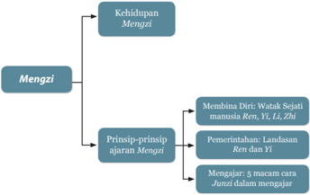

> **Deskripsi Visual:** Gambar ini adalah diagram yang menunjukkan struktur dan prinsip-prinsip dari Mengzi, sebuah konsep filosofis tradisional Tiongkok. Diagram ini dibagi menjadi dua bagian utama: Kehidupan Mengzi dan Prinsip-prinsip ajaran Mengzi.

Pertama, bagian "Kehidupan Mengzi" menunjukkan bahwa Mengzi adalah bagian dari kehidupan manusia. Ini menekankan bahwa Mengzi merupakan bagian integral dari kehidupan sehari-hari manusia.

Kedua, bagian "Prinsip-prinsip ajaran Mengzi" membahas tiga prinsip utama yang dianut oleh Mengzi. Pertama, "Membina Diri: Watak Sejati manusia Ren, Yi, Zhi" mengajarkan tentang pentingnya memiliki watak yang sejati dalam menjalani hidup. Kedua, "Pemerintahan: Landasan Ren dan Yi" menekankan pentingnya pemerintahan yang berdasarkan prinsip-prinsip Ren dan Yi. Ketiga, "Mengajar: 5 macam cara Junzi dalam mengajar" mengajarkan tentang berbagai cara yang dapat dilakukan oleh orang yang berpengaruh untuk mengajar dan mempengaruhi orang lain.

Dalam diagram ini, teks penting seperti "Mengzi", "Kehidupan Mengzi", "Prinsip-prinsip ajaran Mengzi", "Membina Diri: Watak Sejati manusia Ren, Yi, Zhi", "Pemerintahan: Landasan Ren dan Yi", dan "Mengajar: 5 macam cara Junzi dalam mengajar" sangat penting dan memberikan informasi yang kunci tentang struktur dan prinsip Mengzi.

### Mengzi Penegak Ajaran Khonghucu

Sejarah Suci

Perilaku Junzi

Kitab Suci

 

---
## 📄 Halaman 104

### C.  Kompetensi Inti dan Kompetensi Dasar

---
**📊 Tabel**

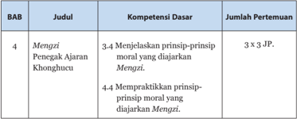

Tabel ini berisi informasi tentang kompetensi dasar yang harus dipenuhi oleh siswa dalam mengimplementasikan prinsip-prinsip moral yang dianjurkan oleh Mengzi, seorang penegak ajar Khonghucu. Topik utama tabel adalah tentang menjelaskan dan mempraktikkan prinsip-prinsip moral yang dianjurkan Mengzi. Tabel ini terdiri dari tiga kolom: Judul, Kompetensi Dasar, dan Jumlah Pertemuan. Kolom Judul menunjukkan judul bab yang berkaitan dengan prinsip-prinsip moral Mengzi, kolom Kompetensi Dasar menyatakan dua kompetensi dasar yang harus dipenuhi, yaitu menjelaskan prinsip-prinsip moral yang dianjurkan Mengzi (3.4) dan mempraktekkan prinsip-prinsip moral yang dianjurkan Mengzi (4.4), serta kolom Jumlah Pertemuan menunjukkan jumlah pertemuan yang harus dilakukan untuk mencapai setiap kompetensi dasar tersebut, yaitu 3 kali pertemuan untuk kedua kompetensi dasar tersebut. Dari tabel ini, dapat disimpulkan bahwa siswa harus melakukan 6 pertemuan untuk memenuhi semua kompetensi dasar yang ditentukan.

### D. Tujuan Pembelajaran

Setelah mempelajari  bab  ini diharapkan  para peserta didik lebih menghayati teladan Mengzi selaku Penegak Ajaran Nabi Kongzi (Y a Sheng ) dan  memperteguh  iman  dalam  beragama  Khonghucu.  Dalam  mengimani Mengzi selaku Yasheng , peserta didik diharapkan mampu :

- Menjelaskan teladan Ibunda Mengzi dalam mendidik anak
- Menjelaskan kehidupan Mengzi
- Menjelaskan prinsip-prinsip moral Mengzi
- Menjelaskan cara mengajar Mengzi .

### E.  Langkah-Langkah Pembelajaran

### 1.  Mengamati:

Pada  langkah  mengamati,  guru  dapat  mempersiapkan  objek  (dalam bentuk  benda  atau  fenomena)  yang  relevan  dengan  tema  pembelajaran seperti:

- -Mengamati  kitab Mengzi ,  gambar Mengzi sewaktu  kecil  atau  peta perjalanan Mengzi dalam menyebarkan ajaran Nabi Kongzi .

### 2.  Menanya:

Memancing atau mendorong peserta didik mempertanyakan dan menganalisis potongan informasi yang telah diterima di tahap mengamati. Misalnya menggali lebih jauh isi dan konteks kitab Mengzi , peranan ibunda

 

---
## 📄 Halaman 105

Mengzi dalam  mendidik Mengzi menjadi  tokoh  penegak  dalam  agama Khonghucu dan lain sebagainya.

### 3.  Eksperimen/Eksplorasi:

- -Membuat sistematika ajaran Mengzi seperti yang terdapat dalam kitab Mengzi ( Sishu )
- -Mencari informasi lebih lanjut terkait ajaran Mengzi ,  kondisi negerinegeri yang dikunjungi Mengzi ,  ajaran-ajaran lain yang berkembang seperti Mozi dan Yangzhu .

### 4.  Mengasosiasi:

- -Merenungkan  hasil  data-data  yang  diperoleh,  catatan  dalam  kitab Mengzi dan  penjelasan  atau  pemikiran Mengzi tang  menjelaskan lebih  jauh  tentang  ajaran  Nabi Kongzi .  Sebagai  contoh  penjelasan lebih  lanjut  tentang  Watak  Sejati.  Mencakup  sifat  apa  saja  disertai penjelasan  benih-benih  Watak  Sejati.  Contoh  bagaimana  penerapan pemerintah yang berlandaskan Cinta Kasih, misalnya tidak membebani rakyat dengan pajak yang beraneka macam, pembenaran ukuran agar ada keadilan dalam pajak hasil bumi, tidak mengganggu rakyat dalam menjalankan  kegiatannya  melainkan  bagaimana  membuat  sejahtera dan mengerti memuliakan hubungan ( Wulun ).
- -Menyimpulkan  benang  merah  ajaran Mengzi dengan  ajaran  Nabi Kongzi .

### 5.  Mengomunikasikan:

- -Mengungkapkan bagaimana pengaruh lingkungan dan didikan ibunda Mengzi dalam membentuk karakter Mengzi .
- -Menjelaskan dan mengungkapkan inti ajaran Mengzi sebagai penegak ajaran Nabi Kongzi disertai dengan ayat-ayat suci yang mendasarinya.
- -Menghargai  dan  mendengarkan  dengan  seksama  pendapat  orang lain,  berusaha  memahami  maksud  pertanyaan  atau  pendapat  orang lain, memberikan argumentasi secara sopan dan selalu membuka diri terhadap kemungkinan adanya perbaikan atau koreksi di luar diri.

 

---
## 📄 Halaman 106

### F.  Pendalaman Materi

Pemikiran dan ajaran Mengzi dapat kita pelajari dari kitab Mengzi yang terdiri dari 14 jilid yakni Mengzi jilid IA sampai VII A dan jilid IB sampai VII B.

Guru  dapat  menugaskan  peserta  didik  dalam  satu  kelas  menjadi  14 kelompok yang masing-masing meringkas 1 jilid, membuat laporannya dan mempresentasikan  di  depan  kelas.  Peserta  didik  saling  berdiskusi  ketika mempresentasikan di depan kelas.

Tanyakan  apakah  ada  yang  membaca  lebih  dari  jilid  yang  ditugaskan kepadanya. Gali apa yang telah dipelajarinya, apa manfaat yang diperolehnya. Berikan  penghargaan  kepada  peserta  didik  yang  belajar  lebih  sebagai contoh penerapan semangat belajar Mengzi disertai harapan dan doa untuk keberhasilan masa depannya.

### G. Aktivitas Pembelajaran

### 1.  Diskusi Kelompok

### a.  Topik Diskusi

Pada Aktivitas 4.1 (diskusi kelompok), peserta didik diminta memberikan  komentar  dan  pandanganmu  terkait  cara  mengasuh  dan mendidik ibu Mengzi !

### b. Petunjuk Kegiatan :

Bagi peserta didik dalam kelompok kecil 5 - 6 orang, beri waktu 10 -  15  menit untuk berdiskusi. Masing masing ketua kelompok atau yang mewakili menyampaikan presentasi sekitar 3 - 5 menit, kelompok yang lain  diberi  kesempatan  untuk  memberi  tanggapan,  masukan,  atau pertanyaan.

### c.  Tujuan Kegiatan:

Peserta  didik  dapat  lebih  memahami  pentingnya  lingkungan  dalam pembentukan karakter dan berhati-hati dalam memilih kawan dekat.

### d. Petunjuk Jawaban

Ibunda sangat memperhatikan perkembangan karakter Mengzi sebagai  pokok  dalam  mendidik  anaknya.  Dalam  membentuk  karakter, ibunda Mengzi sangat memperhatikan pengaruh lingkungan sekitar dan juga  kesungguhannya  dalam  belajar.  Untuk  mendapatkan  lingkungan

 

---
## 📄 Halaman 107

yang cocok untuk Mengzi ,  beliau sampai harus pindah rumah tiga kali. Untuk membangkitkan kesungguhan belajar Mengzi , beliau sampai harus menggunting kain yang telah dengan susah payah ditenunnya.

Guru  dapat  memberikan  pengayaan  dengan  meminta  murid-murid menuliskan  karakter  kawan  dekatnya  pada  selembar  kertas.  Hal  ini penting untuk melihat karakter peserta didik dan pengaruh pergaulannya.

### 2.  Aktivitas Bersama (Diskusi Kelompok)

### a.  Topik Diskusi

Pada Aktivitas 4.2 (diskusi kelompok), peserta didik diminta memberikan komentar dan pandanganmu tentang sikap Mengzi dalam menghadapi raja Hui dari negeri Liang !

### b. Petunjuk Kegiatan:

Bagi peserta didik dalam kelompok kecil 5 - 6 orang, beri waktu 1015  menit  untuk  berdiskusi.  Masing  masing  ketua  kelompok  atau  yang mewakili menyampaikan presentasi sekitar 3-5 menit, kelompok yang lain diberi kesempatan untuk memberi tanggapan, masukan, atau pertanyaan.

### c.  Tujuan Kegiatan:

Peserta didik dapat lebih mengutamakan Cinta Kasih dan Kebenaran dibandingkan keuntungan.

### d. Petunjuk Jawaban:

Keutamaan  sikap  dalam  menjunjung  Cinta  Kasih  dan  Kebenaran dibandingkan  keuntungan  semata.  Guru  dapat  melakukan  pengayaan dengan memberikan contoh-contoh dalam kehidupan nyata dan meminta peserta  didik  memilih  pilihan  tindakan  yang  akan  dipilihnya dan mengapa?

Sebagai contoh ketika ulangan dan kebetulan tidak siap. Apakah yang akan dilakukan peserta didik? Menjawab apa adanya ataukah melakukan berbagai cara agar nilai tidak jeblok? Bagaimana sikap orang yang berperi Cinta Kasih dan menjunjung Kebenaran?

Yang menjadi pertanyaan sebenarnya adalah mengapa tidak siap akan ulangan?  Apakah  seorang  yang  berperi  Cinta  Kasih  dan  menjunjung Kebenaran lalai akan tugas dan tanggungjawabnya?

Dia  tidak  akan  melalaikan  kewajibannya  dan  tidak  akan  terjebak dalam situasi seperti di atas. Dengan tahu mana yang pokok dan mana yang ujung maka kita dapat menghindari dari kesulitan yang tidak perlu.

 

---
## 📄 Halaman 108

### 3.  Diskusi Kelompok

### a.  Topik Diskusi

Pada Aktivitas 4.3 (diskusi kelompok), peserta didik diminta memberikan  mendiskusikan  tentang  bagaimana  cara  menyelami  hati sehingga dapat mengenal Watak Sejati?

### b. Petunjuk Kegiatan :

Bagi peserta didik dalam kelompok kecil 5 - 6 orang, beri waktu 1015  menit  untuk  berdiskusi.  Masing  masing  ketua  kelompok  atau  yang mewakili menyampaikan presentasi sekitar 3-5 menit, kelompok yang lain diberi kesempatan untuk memberi tanggapan, masukan, atau pertanyaan.

### c.  Tujuan Kegiatan:

Peserta  didik  dapat  lebih  memahami  bagaimana  mengabdi  kepada Tian dan menegakkan Firman.

### d. Petunjuk Jawaban:

Cara  menyelami  hati  adalah  dengan  kesadaran  melakukan  dialog internal  ke  dalam  dirinya  sendiri.  Dengan  adanya  kesadaran  dan pemahaman akan hal-hal yang baik dan hal-hal yang buruk, maka dapat mengenal Watak Sejati dirinya (manusia).

Apabila  kita  menyelami  hati  maka  akan  diketahui  bahwa  pada hakekatnya  kita  menyukai  kebajikan  dan  tidak  menyukai  hal-hal  yang tidak  sesuai  dengan  kebajikan.  Meskipun Mengzi telah  menjelaskan tentang  benih-benih  kebajikan  dalam  hati  manusia,  namun  dengan metode  refleksi  ke  dalam  diri  akan  membuat  kita  lebih  menyadari keberadaan benih-benih kebajikan tersebut.

Kita tidak terlepas dari pengaruh jasmani dan rohani kita. Adanya daya hidup  jasmani  beupa  benih-benih  kebajikan,  menjadikan  kita  mampu membedakan  perbuatan  baik  dan  buruk.  Adanya  daya  hidup  jasmani berupa nafsu-nafsu, menjadikan kita mempunyai daya hidup jasmani dan tetap hidup.

Mengabdi kepada Tian bukan  dengan  melakukan  hal-hal  yang  sulit atau  aneh-aneh,  melainkan  dapat  berbuat  sesuai  kodrat  kemanusiaan yang  telah  kita  terima  yakni  menggemilangkan  benih-benih  kebajikan hingga gemilang memberikan pengaruh kebaikan dimanapu kita berada.

Menjaga  hati  artinya  mengendalikan  nafsu-nafsu  yang  ada  jangan sampai mengendalikan hati manusia; jangan sampai nafsu mengendalikan hati nurani kita. Contohnya sangat beragam tergantung dari pengalaman pribadi masing-masing dan konteksnya.

 

---
## 📄 Halaman 109

Merawat watak sejati adalah berbuat selaras dengan sifat-sifat watak sejati itu sendiri. Merawat mengandung arti setiap saat tanpa henti dan tidak karena perbuatan baik sekali atau sehari saja.

### 4.  Aktivitas Bersama (Diskusi Kelompok)

### a.  Topik Diskusi

Pada Aktivitas 4.4 (diskusi kelompok), peserta didik diminta memberikan pendapat tentang lima cara Mengzi mengajar.

### b. Petunjuk Kegiatan:

Bagi peserta didik dalam kelompok kecil 5 - 6 orang, beri waktu 10 -  15  menit untuk berdiskusi. Masing masing ketua kelompok atau yang mewakili menyampaikan presentasi sekitar 3 - 5 menit, kelompok yang lain  diberi  kesempatan  untuk  memberi  tanggapan,  masukan,  atau pertanyaan.

### c.  Tujuan Kegiatan:

Guru dapat mengetahui cara mengajar yang paling banyak disukai oleh peserta  didik,  dan  peserta  didik  dapat  lebih  memahami  berbagai  cara dalam belajar.

- Penjelasan ragam cara Mengzi dalam mengajar dapat dilihat di bagian depan. Jawaban peserta didik tidak ada benar atau salah melainkan semata-mata hanya feedback bagi guru.

### H. Penilaian dan Pedoman Penskoran

### 1. Tes Tertulis

Instrumen Soal Pilihan Ganda

### Jawablah pertanyaan-pertanyaan berikut ini dengan uraian yang jelas!

- Apa pendapat Mengzi tentang sifat dasar (kodrat) manusia? Jelaskan!
- Sebutkan benih-benih kebajikan yang menjadi watak sejati manusia!
- Bila manusia memiliki sifat dasar (kodrat) yang baik, mengapa terdapat begitu banyak kejahatan di dunia ini?!
- Jelaskan prinsip-prinsip penting yang disampaikan oleh Mengzi tentang pemerintahan/memimpin Negara!

 

---
## 📄 Halaman 110

- Sebutkan faktor-faktor yang dapat menyebabkan manusia berbuat jahat (tidak sesuai dengan watak sejatinya)!
- Jelaskan prinsip moralitas yang disampaikan Mengzi !

### 2.  Kunci Jawaban Uraian

- Ajaran Mengzi tentang sifat dasar (kodrat) manusia?
' Tian menjelmakan rakyat, menyertai dengan bentuk dan sifat dan sifat umum pada manusia adalah menyukai kebajikan yang mulia'. ( Mengzi VII A: 6/8)

- Benih-benih kebajikan yang menjadi watak sejati manusia!
Yang  di  dalam  Watak  Sejati  manusia  adalah  Cinta  Kasih,  Kebenaran, Kesusilaan dan Kebijaksanaan. ( Mengzi VII A : 21)

- Mengapa terdapat begitu banyak kejahatan di dunia ini?!
Gong Duzi bertanya,  'Semuanya  ialah  manusia  mengapakah  ada  yang menjadi orang besar dan ada yang menjadi orang kecil?'

Mengzi menjawab, 'Orang yang menurutkan bagian dirinya yang besar akan menjadi orang besar, yang hanya menurutkan bagian dirinya yang kecil akan menjadi orang kecil'.

'Semuanya  ialah  manusia,  mengapakah  ada  yang  menurutkan  bagian dirinya yang besar dan ada yang menurutkan bagian dirinya yang kecil?' 'Tugas  telinga  dan  mata  tanpa  dikendalikan  pikiran,  niscaya  akan digelapkan oleh nafsu-nafsu (dari luar).

Nafsu-nafsu  (dari  luar)  bila  mana  bertemu  dengan  nafsu-nafsu  (dari dalam diri) mudah saling cenderung. Tugas hati ialah berpikir. Dengan berpikir  kita  akan  berhasil,  tanpa  berpikir  takkan  berhasil. Tian Yang Maha  Esa  mengaruniai  kita  semuanya  itu,  agar  kita  lebih  dahulu menegakkan bagian yang besar, sehingga begian yang kecil itu tidak bisa mengacau. Inilah yang menyebabkan orang bisa menjadi orang besar'.

( Mengzi VI A : 15.1 - 15.2)

- Prinsip-prinsip penting yang disampaikan oleh Mengzi tentang pemerintahan/memimpin Negara!
- Pemerintahan harus berlandaskan Cinta Kasih dan Kebenaran (Kitab Mengzi IA)
- Pokok dasar dunia ada pada Negara, pokok dasar Negara itu ada pada rumah tangga dan pokok rumah tangga itu ada pada diri sendiri. (kitab Mengzi IV A : 5.1)

 

---
## 📄 Halaman 111

- Hakekat memimpin adalah meluruskan. Dengan seorang pemimpin yang berjiwa lurus, seluruh negeri niscaya teratur beres. (kitab Mengzi IVA : 20.1)
- Faktor-faktor  yang  dapat  menyebabkan  manusia  berbuat  jahat  (tidak sesuai dengan watak sejatinya)!
'Sebaliknya ternyata ada pula orang yang mau menerima padi 10.000 zhong (cangkir tanpa pegangan) dengan tanpa mempedulikan Kesusilaan dan Kebenaran. Barang yang 10.000 zhong itu  sebenarnya akan dapat menambah apa  bagi  dirinya?  Mungkin  itu  dapat  untuk  memperindah gedung,  memelihara  isteri  dan  pelayan  atau  untuk  mendapat  terima kasihnya orang miskin yang ditolong.

'Disini ternyata, yang mula-mula biar mati tidak mau menerima; kini karena dapat untuk memperindah gedung, lalu diterima. Yang mula-mula biar  mati  tidak  mau  menerima;  kini  karena  dapat  untuk  memperoleh pelayanan isteri dan pelayan, lalu diterima. Yang mula-mula biar mati tidak mau menerima; kini karena dapat untuk memperoleh terima kasih orang-orang miskin, lalu diterima. Mengapa ia tidak dapat berbuat yang sama? Ini karena sudah kehilangan pokok hatinya'. ( Mengzi . VIA: 10.7 10.8)

- Prinsip moralitas yang disampaikan Mengzi !
- ' Tian menjelmakan  rakyat,  menyertai  dengan  bentuk  dan  sifat  dan sifat  umum  pada  manusia  adalah  menyukai  kebajikan  yang  mulia'. ( Mengzi . VII A: 6/8)
- Yang di dalam Watak Sejati manusia adalah Cinta Kasih, Kebenaran, Kesusilaan dan Kebijaksanaan. ( Mengzi . VII A: 21)
- Watak Sejati sudah Tian karuniakan ke dalam setiap manusia, bukan sesuatu yang dimasukkan dari luar ke dalam.
Rasa hati berbelas kasihan dan tidak tega adalah benih Cinta Kasih

Rasa hati malu dan tidak suka adalah benih Kebenaran

Rasa hati hormat dan mengindahkan adalah benih Kesusilaan

Rasa hati membenarkan dan adalah benih Kebijaksanaan.

( Mengzi . II A: 6/7)

- Cara mengabdi kepada Tian adalah dengan menjaga Hati, dan merawat Watak Sejati ( Mengzi VII A: 1)

 

---
## 📄 Halaman 112

### 3.  Pedoman Pensekoran

### Uraian

- -Jumlah soal 6
- -Poin maksimal setiap soal uraian adalah 10
- -Jika semua soal terjawab dengan poin maksimal, maka jumlah skor adalah 60.
- -Jika  penilaian  menggunakan  skala  100,  maka  Nilai  =  Jumlah  skor dibagi skor tertinggi dikali 100 (60 : 60 x 100) = 100
- -Jika penilaian menggunakan skala 4, maka Nilai = Jumlah skor dibagi skor tertinggi dikali 4 (40 : 40 x 4) = 4
N = (skor : skor tertinggi x 100)

N = (skor : skor tertinggi x 4)

### I.  Remedial

Apabila  peserta  didik  ada  yang  memerlukan  ulangan  susulan  ataupun perbaikan, maka pada bagian remedial ini memberikan beberapa alternatif penilaian tambahan.

Prinsip  remedial  adalah  berfokus  pada  proses  pembentukan  karakter. Berikut adalah pilihan remedial yang dapat dilakukan:

- Memberikan  tugas  kepada  peserta  didik  memilih  salah  satu  ayat  dari kitab Mengzi yang paling sesuai dengan dirinya. Guru dapat menanyakan alasan  peserta  didik  memilih  ayat  tersebut.  Lalu  membuat  prakarya kaligrafi  ayat  tersebut  dan  diberi  pigura.  Hasilnya  dapat  dipajang  di dalam kelas.
- Memberikan tugas karya tulis tentang pokok-pokok pemikiran Mengzi dengan tema:
- Pembinaan Diri
- Pemerintahan
- Hubungan pemimpin dengan pengikut
Karya tulis diketik pada kertas ukuran A4 dengan 1,5 spasi sebanyak 5-10 halaman.

 

---
## 📄 Halaman 113

### Penilaian Sikap

Penilaian  sikap  peserta  didik  bisa  dilakukan  melalui  metode  observasi saat bekerja kelompok, maupun berdiskusi.

### Penilaian dapat meliputi aspek :

- Kedisiplinan di kelas dan dalam mengerjakan tugas
- Keterampilan berkomunikasi
- Kerendahan hati dan suka menolong (lihat Bagian Satu tentang Penilaian).

### J.  Komunikasi Orangtua

Proses  pembentukan  karakter  harus  dilakukan  secara  integratif  dan holistik.  Integratif  karena  saat  ini  setiap  mata  pelajaran  juga  mengusung pembentukan karakter moral. Holistik artinya menyeluruh dalam kehidupan peserta  didik,  tidak  hanya  di  sekolah  tetapi  juga  dalam  pergaulan  di  luar sekolah dan di rumah.

Mengingat  pentingnya  peran  serta  orang  tua,  maka  perlu  dibangun lembar komunikasi orang tua untuk memudahkan komunikasi.

Contoh Lembar Komunikasi Orangtua

Nama Orang Tua   :  ………………………….…..

Nama Siswa

:  ………………………….…..

Kelas

:   ………………………….…..

Tema :

Bab 4. Mengzi sang Penegak Agama Khonghucu

Sub tema :

Kebiasaanku

---
**📊 Tabel**

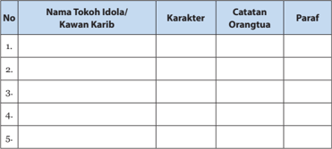

Tabel ini berisi informasi tentang tokoh idola atau kawan karib yang dianggap oleh orang tua sebagai inspirasi bagi anak-anak. Topik utama tabel ini adalah karakteristik tokoh tersebut, seperti nama, karakteristik, catatan orang tua, dan paraf. Kolom-kolom yang ada dalam tabel ini meliputi nomor urut (No.), nama tokoh idola/kawan karib, karakteristik, catatan orang tua, dan paraf. Data atau pola penting yang terlihat dalam tabel ini adalah bahwa banyak tokoh idola/kawan karib memiliki karakteristik positif seperti keberanian, kecerdasan, dan kejujuran. Selain itu, banyak orang tua memberikan catatan tentang karakteristik positif dan negatif dari tokoh tersebut. Paraf juga seringkali memberikan komentar atau pengakuan tentang tokoh tersebut.

 

---
## 📄 Halaman 114

104

Buku Guru Kelas XI SMA/SMK

 

---
## 📄 Halaman 115

### A. Aspek

√

### B.  Peta Konsep

---
**🖼️ Gambar/Diagram**

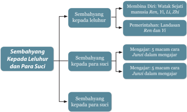

> **Deskripsi Visual:** Gambar ini adalah diagram yang menunjukkan struktur dan hubungan antara berbagai aspek dalam sebuah sistem atau konsep. Diagram ini terdiri dari tiga bagian utama:

1. **Sembahyang kepada leluhur**:
   - Dalam bagian ini, ada dua subbagian: "Membina Diri: Watak Sejati manusia Ren, Yi, Li, Zhiz" dan "Pemerintahan: Landasan Ren dan Yi". Subbagian ini mungkin merujuk pada prinsip-prinsip atau nilai-nilai yang harus dimiliki oleh individu untuk membangun diri yang sejati dan memimpin dengan benar.

2. **Sembahyang kepada para suci**:
   - Bagian ini juga terdiri dari dua subbagian: "Mengajar: 5 macam cara Junzi dalam mengajar" dan "Mengajar: 5 macam cara Junzi dalam mengajar". Ini mungkin merujuk pada metode-metode atau strategi yang digunakan untuk mengajar dengan efektif dan mendidik orang lain.

3. **Sembahyang kepada para suci**:
   - Bagian ini hanya memiliki satu subbagian: "Sembahyang kepada para suci", yang mungkin merujuk pada upacara-upacara atau ritual-upacara yang dilakukan untuk menghormati dan menghargai para suci.

Elemen-elemen utama dalam diagram ini adalah:
- Teks yang menjelaskan setiap bagian.
- Relasi antara bagian-bagian tersebut, yang mungkin menunjukkan hubungan antara sembahyang kepada leluhur, sembahyang kepada para suci, dan pengajaran.

Informasi kunci yang dapat diambil pembaca melalui diagram ini adalah bahwa sistem ini mungkin mencakup prinsip-prinsip moral, pemerintahan, dan pendidikan, serta upacara-upacara religius. Diagram ini memberikan pandangan umum tentang struktur dan fungsi dari sistem tersebut.

### Sembahyang Kepada Leluhur dan Para Suci

 

---
## 📄 Halaman 116

### C.  Kompetensi Inti dan Kompetensi Dasar

---
**📊 Tabel**

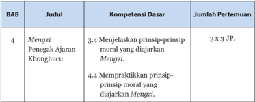

Tabel ini berisi informasi tentang kompetensi dasar yang harus dipenuhi oleh peserta didik dalam mata pelajaran Mengaji Penegak Ajaran Khonghucu. Topik utama tabel adalah tentang menjelaskan dan mempraktikkan prinsip-prinsip moral yang diajarkan dalam mengaji. Tabel ini terdiri dari tiga kolom: BAB (Bab), Judul, dan Jumlah Pertemuan. Kolom BAB menunjukkan nomor bab yang berkaitan dengan topik tersebut. Kolom Judul menyebutkan topik spesifik yang harus dipelajari, sementara kolom Jumlah Pertemuan menunjukkan jumlah pertemuan yang diperlukan untuk mencapai kompetensi tersebut. Data penting yang terlihat adalah bahwa peserta didik harus mengaji 3 kali sehari untuk mencapai kompetensi dasar tersebut.

### D. Tujuan Pembelajaran

Setelah  mempelajari  bab  ini  diharapkan  para  peserta  didik  dapat menghayati  pentingnya  sembahyang  kepada  leluhur  dan  shenming  serta landasan  ayat-ayat  sucinya.  Dalam  menghayati  bersembahyang  kepada leluhur, peserta didik diharapkan mampu:

- Menjelaskan dasar keimanan bersembahyang kepada leluhur
- Menjelaskan saat-saat bersembahyang kepada leluhur dan para shenming
- Mempraktekkan cara bersembahyang kepada leluhur dan shenming .

### E.  Langkah-Langkah Pembelajaran

### 1.  Mengamati:

Pada  langkah  mengamati,  guru  dapat  mempersiapkan  objek  (dalam bentuk  benda  atau  fenomena)  yang  relevan  dengan  tema  pembelajaran seperti:

- -Mengamati  foto  orang  sedang  bersembahyang  kepada  leluhur  atau shenming , peralatan sembahyang dan lain sebagainya.

### 2.  Menanya:

Memancing atau mendorong peserta didik menanya dan menganalisis potongan  informasi  yang  telah  diterima  di  tahap  mengamati.  Misalnya mengapa orang bersembahyang menghormati shenming ? Keteladanan apa

 

---
## 📄 Halaman 117

yang dapat kita pelajari dari shenming Kwan Kon g atau Guanyu , shenming Guan Yin Niangniang dan lain sebagainya?

Membangkitkan keinginantahuan saat-saat bersembahyang kepada leluhur dan para shenming lain sebagainya.

### 3.  Eksperimen/Eksplorasi:

- -Melakukan eksplorasi ke dalam diri terkait pengalaman bersembahyang kepada leluhur atau para shenming .
- -Mencari  informasi  lebih  lanjut  terkait  sembahyang  kepada  leluhur dan  para shenming seperti  saat  bersembahyang,  keteladanan  yang diajarkan, bagaimana bersembahyang kepada leluhur dan para shenming dan sebagainya.

### 4.  Mengasosiasi:

- -Merenungkan  pengalaman  beribadah  dengan  nilai-nilai  spiritual dalam  dirinya  serta  kemungkinan  manfaat  yang  diperoleh  dalam kehidupan sehari-hari.
- -Menyimpulkan benang merah pentingnya sembahyang kepada leluhur dan shenming dalam agama Khonghucu.

### 5.  Mengomunikasikan:

- -Mengungkapkan  pentingnya  sembahyang  kepada  para  leluhur  dan shenming dalam kehidupan manusia.
- -Menungkapkan jasa dan keteladanan para leluhur atau para shenming dalam kehidupan ini.
- -Menghargai  dan  mendengarkan  dengan  seksama  pendapat  orang lain,  berusaha  memahami  maksud  pertanyaan  atau  pendapat  orang lain, memberikan argumentasi secara sopan dan selalu membuka diri terhadap kemungkinan adanya perbaikan atau koreksi di luar diri.

### F.  Pendalaman Materi

Pelajari  kitab Lji Bagian  XX Jifa atau  Hukum  Sembahyang  untuk memperoleh  gambaran  bahwa  persembahyangan  umat  Khonghucu  telah dilaksanakan jauh sebelum Nabi Kongzi dilahirkan.

Pelajari  kitab Liji bagian  XXI Jiyi atau  Makna  Sembahyang  untuk memperoleh  gambaran  tentang  makna  persembahyangan  dalam  agama Khonghucu.

 

---
## 📄 Halaman 118

### G  Aktivitas Pembelajaran

### 1.  Diskusi Kelompok

### a. Topik Diskusi

Pada kegiatan diskusi kelompok (Aktivitas 3.1), Peserta didik diminta mendiskusi  maksud  dari  pernyataan  berikut:  'Sembahyang  kepada leluhur dimaksudkan agar arwah ( Hun ) leluhur yang dimaksud mencapai ketenangan,  tidak  tersesat  dalam  pengembaraannya  dan  segera  dapat menyatu dengan sukma ( Ling ).

### b. Petunjuk Kegiatan:

Bagi peserta didik dalam kelompok kecil 5-6 orang, beri waktu 1015  menit  untuk  berdiskusi.  Masing  masing  ketua  kelompok  atau  yang mewakili menyampaikan presentasi sekitar 3-5 menit, kelompok yang lain diberi kesempatan untuk memberi tanggapan, masukan, atau pertanyaan.

### c. Tujuan Kegiatan:

Peserta didik dapat lebih memahami konsep dan makna bersembahyang kepada leluhur dan mempertebal iman kepada adanya nyawa dan roh dalam agama Khonghucu.

### d. Petunjuk Jawaban:

Sembahyang leluhur adalah bakti seorang anak kepada orangtuanya, di dalamnya terkandung makna melanjutkan amal kebajikan para leluhur dan atau orangtua sehingga boleh membawa ketenangan bagi leluhur dan berkah bagi yang masih hidup.

### 2.  Diskusi Kelompok

### a. Topik Diskusi

Pada kegiatan diskusi kelompok (Aktivitas 5.2), Peserta didik diminta menuliskan pengalaman mereka tentang pelaksanaan sembahyang Qingming , dan mencari cerita tentang tradisi yang mengikuti sembahyang Qingming !

### b. Petunjuk Kegiatan:

Bagi peserta didik dalam kelompok kecil 5-6 orang, beri waktu 1015  menit  untuk  berdiskusi.  Masing  masing  ketua  kelompok  atau  yang mewakili menyampaikan presentasi sekitar 3-5 menit, kelompok yang lain diberi kesempatan untuk memberi tanggapan, masukan, atau pertanyaan.

 

---
## 📄 Halaman 119

### c. Tujuan Kegiatan

Peserta didik antusias di dalam melaksanakan sembahyang Qingming bersama keluarga.

### d. Petunjuk Jawaban:

Sembahyang Qingming di dalam keluarga dapat dilakukan di rumah dan atau bersembahyang di makam leluhur. Peserta didik diajak untuk membedakan  mana  yang  merupakan  ajaran  agama  dan  mana  yang merupakan tradisi. Ajaran agama apabila memiliki dasar

### 3.  Diskusi Kelompok

### a. Topik Diskusi

Pada kegiatan diskusi kelompok (Aktivitas 5.2), Peserta didik diminta membuat altar leluhur dengan simulasi, dan susunanlah perlengkapan yang ada pada altar leluhur dengan piranti lengkap!

### b. Petunjuk Kegiatan :

Bagi peserta didik dalam kelompok kecil 5-6 orang, beri waktu 1015  menit  untuk  berdiskusi.  Masing  masing  ketua  kelompok  atau  yang mewakili menyampaikan presentasi sekitar 3-5 menit, kelompok yang lain diberi kesempatan untuk memberi tanggapan, masukan, atau pertanyaan.

### c. Tujuan Kegiatan :

Peserta  didik  dapat  menyusun  perlengkapan  altar  leluhur  dengan piranti lengkap sebagai sarana bakti kepada leluhur.

### d. Petunjuk Jawaban:

Peserta  didik  diminta  untuk  menyusun  perlengkapan  altar  leluhur dengan piranti lengkap sebagai sarana bakti kepada leluhur. Selanjutnya guru dapat menanyakan makna dari perlengkapan atau piranti yang  dipergunakan.  Makna  simbol-simbol  keagamaan  dalam  sajian sembahyang kepada leluhur antara lain:

- Nasi, sayur dan lain-lain: melambangkan rasa bakti kepada leluhur dengan menyediakan makanan kesukaannya.
- Jeruk: melambangkan kebahagiaan.
- Pisang: melambangkan kelanggengan
- Gui Gao (Kue ku/kura-kura): melambangkan panjang umur

 

---
## 📄 Halaman 120

- Fa Gao (kue mangkuk): melambangkan berkah yang berkembang
- Wajik: melambangkan kerukunan dalam keluarga.
Lihat  kembali  kelas  X  bab  3  tentang  Pokok-pokok  Peribadahan  Umat Khonghucu.

### 4.  Diskusi Kelompok

### a. Topik Diskusi

Pada kegiatan diskusi kelompok (Aktivitas 5.4), Peserta didik diminta menceritakan  pengalaman  mereka  terkait  pelaksanaan  bakti  sosial pada hari persaudaraan, bagaimana pelaksanaan bakti sosial pada hari Persaudaraan di daerahmu!

### b. Petunjuk Kegiatan

Bagi peserta didik dalam kelompok kecil 5-6 orang, beri waktu 1015  menit  untuk  berdiskusi.  Masing  masing  ketua  kelompok  atau  yang mewakili menyampaikan presentasi sekitar 3-5 menit, kelompok yang lain diberi kesempatan untuk memberi tanggapan, masukan, atau pertanyaan.

### c. Tujuan Kegiatan:

Peserta didik dalam melaksanakan bakti sosial pada hari persaudaraan dan  mempertebal  perasaan  cinta  kepada  sesama  khususnya  bagi  yang membutuhkan bantuan melalui praktek nyata.

### d. Petunjuk Jawaban:

Peserta didik dapat berbagai perasaan dalam praktek atau pelaksanaan hari persaudaraan. Metode sharing atau berbagi pengalaman dilakukan bermanfaat untuk memberikan kesempatan bagi yang ingin berbagi dan memberikan sudut pandang yang lebih luas karena banyak yang berbagi pengalaman serta menguatkan bagi yang belum melaksanakan bakti sosial melalui contoh-contoh yang baik dari orang-orang yang sudah berbagi.

### H. Penilaian dan Pedoman Penskoran

### 1. Tes Tertulis

Instrumen Soal Uraian

Jawablah  pertanyaan-pertanyaan  berikut  ini  dengan  uraian yang lengkap dan jelas!

- Apa  maksud/tujuan  sembahyang  kepada  arwah  leluhur  yang  telah meninggal?

 

---
## 📄 Halaman 121

- Jelaskan mengapa penentuan saat sembahyang Qingming menggunakan Penanggalan/kalender masehi!
- Bila manakah sembahyang Qingming jatuh pada tanggal 4 April?
- Jelaskan  mengapa  sembahyang Qingming memilih  hari  yang  paling cerah!
- Jelaskan kembali tata cara sembahyang Qingming !
- Jelaskan fungsi meja abu/altar leluhur bagi keluarga Khonghucu!
- Jelaskan makna meja abu/altar leluhur!
- Di dalam Ershi Shangan ada lima unsur keberkahan yang disebut ' Wufu Linmen '  yang berarti 'Lima Keberkahan Menyertai penghuni Rumah', yaitu ...
- Wang Sunjia bertanya,'Apakah maksud peribahasa dari pada bermuka muka kepada Malaikat Oo (Malaikat  ruang  Barat  Daya  Rumah),  lebih baik  bermuka-muka  kepada  Malaikat Zao (Malaikat  Dapur)  itu?'  apa penjelasan nabi Kongzi terkait dengan pertanyaan Wang Sunjia itu?

### 2.  Kunci Jawaban Uraian

- Maksud/tujuan sembahyang kepada arwah leluhur yang telah meninggal.
Sembahyang kepada leluhur dimaksudkan agar arwah leluhur yang dimaksud mencapai ketenangan, arwahnya ( Hun )  tidak  tersesat  dalam pengembaraannya dan segera dapat menyatu dengan sukma ( Ling ).

Di sisi lain, sembahyang kepada leluhur juga dimaksudkan meneruskan  amal  ibadah  kepada Tian ,  menjaga  dan  memperbaiki maupun meningkatkan  amal  dan  laku  bajik  agar  leluhur  bisa  kembali keharibaan Tian Yang Mahakekal dan Maha Abadi itu.

Dapat  menyatu  kembali  antara Ling (sukma)  dan Hun (arwah)  di dalam kehidupan akhirat, inilah yang dimaksud dengan Shenming (arwah suci), dan hal ini akan membawa 'aura' suci, maka bila persembahyangan kepada leluhur bisa terlaksana dengan baik dan benar aura Shenming itu dapat membawa berkah dan perlindungan bagi keturunan/keluarga yang bersangkutan.

- Penentuan saat sembahyang Qingming menggunakan penanggalan/ kalender masehi!

 

---
## 📄 Halaman 122

Karena  dihitung  104  hari  sejak  sembahyang Dongzhi yaitu  22 Desember.

- Bila manakah sembahyang Qingming jatuh pada tanggal 4 April?
Apabila  tahun  kabisat,  maka  sembahyang Qing  Ming jatuh  pada tanggal  4  April  karena  penambahan  satu  hari  di  bulan  Februari  pada tahun kabisat (bulan Februari berjumlah 29 hari).

- Sembahyang Qingming memilih hari yang paling cerah!
Pada zaman dahulu umumnya tanah pemakamaan cukup jauh untuk ditempuh,  maka  dipilihlah  hari  yang  paling  cerah  dengan  tujuan  agar perjalanan dan pelaksanaan sembahyang Qingming tidak terganggu oleh cuaca yang buruk.

- Tata cara sembahyang Qingming !

### Pelaksanaan di Rumah

Terlebih dahulu dilaksanakan sembahyang kepada Tian Yang Maha Eesa (menghadap ke luar pintu/jendela) dengan dupa tiga batang dan dinaikan  secara  Dingli  lalu  ditancapkan  pada  tempat  dupa  yang  telah disediakan, kemudian bersikap Baoxin Bade dan menaikan doa sebagai berikut:

Kehadirat Tian Yang Mahabesar, di tempat Yang Mahatinggi, dengan bimbingan Nabi Kongzi , dipermuliakanlah.

Diperkenankan  kiranya  kami  melakukan  sujud  sebagai  pernyataan bakti  kepada  leluhur  kami.  Kami  berdoa  semoga Tian berkenan  bagi para arwah beliau itu selalu di dalam cahaya Kemulian Kebajikan Tian , sehingga damai dan tentram yang abadi boleh selalu padanya. Shanzai (diakhiri dengan sekali Dingli ).

Setelah  selesai  sembahyang  kepada Tian ,  kemudian  menuju  altar leluhur. Menyalakan dua batang atau empat batang dupa. Dupa dinaikan dua  kali  lalu  ditancapkan.  Kemudian  dengan  bersikap Baoxin Bade memanjatkan doa, sebagai berikut:

'Kehadapan leluhur (atau nama panggilan kita kepada beliau) yang kami  hormati  dan  cintai,  terimalah  hormat  dan  bakti  kami,  segenap kasih  dan  teladan  mulia  yang  telah  kami  terima  akan  tetap  kami junjung  dan  lanjutkan,  serta  kembangkan,  sebagaimana  Nabi Kongzi telah menyadarkan dan membimbing kami. Kami akan selalu berusaha menjaga keharuman dan nama baik keluarga dan leluhur, tidak menodai dan memalukan. Terimalah hormat dan bakti kami'. Shanzai.

 

---
## 📄 Halaman 123

### Pelaksanaan di Makam (Kuburan)

Sebelum melakukan sembahyang di hadapan makam, terlebih dahulu melakukan sambahyang di hadapan altar malaikat Bumi ( Fude Zhengshen ) yang selalu menjadi perawat bagi kehidupan di semesta alam atau di atas dunia, kemudian dilanjutkan bersembahyang kehadirat Tian Yang Maha Esa bagi arwah orangtua maupun saudara yang telah mendahului yang kita  hormati,  dengan  penuh  harapan  semoga  penghormatan  ini  dapat menjadi pendorong bagi kita untuk selalu berperilaku luhur dan mulia sebagaimana yang Tian Firmankan, bahwa kebahagiaan atau rahmat ( Fu ) dan Kebajikan ( De ) merupakan kesatuaan yang tidak terpisahkan.

- Fungsi meja abu/altar leluhur bagi keluarga Khonghucu!
Tempat  keluarga  disatukan  dalam  melaksanakan  peribadahan,  ini menjadi  semakin  penting  mengingat  iman  Khonghucu  menyebutkan kepala keluarga adalah juga sebagai pimpinan rohani keluarga.

Sebagai tempat  melakukan Moshi 'melakukan renungan' agar senantiasa  hidup  di  jalan  suci  sehingga  tidak  memalukan  para  leluhur yang telah mendahului (menengadah tidak malu kepada Tian , menunduk tidak malu kepada sesama manusia), yang merupakan puncak dari laku Bakti.

- Makna meja abu/altar leluhur!
Makna meja abu/altar leluhur adalah sebagai sarana persembahyangan menggenapi laku Bakti dalam kesusilaan. Mewujudkan  kesadaran manusia atas makna kehidupan dunia akhirat atas daya hidup duniawi dan rohani yang menjadi kodrati manusia.

- Di  dalam Ershi  Sishangan ada  lima  unsur  keberkahan  yang  disebut ' Wu Fu Lin Men '  yang berarti 'Lima Keberkahan Menyertai penghuni Rumah', yaitu ...
- Shou atau panjang umur.
- Fu atau keberkahan.
- Kangning atau sehat jasmani dan rohani.
- You Hao De atau yang mecintai kebajikan.
- Zhongming atau yang hidupnya memenuhi Firman Tian .
- Wang Sunjia  bertanya,'Apakah  maksud  peribahasa  daripada  bermuka muka kepada Malaikat Ao (Malaikat  ruang  Barat  Daya  Rumah),  lebih baik  bermuka-muka kepada Malaikat Zao (  Malaikat  Dapur)  itu?'  apa penjelasan nabi Kongzi terkait dengan pertanyaan Wang Sunjia itu?

 

---
## 📄 Halaman 124

Nabi bersabda, 'Itu tidak benar, Siapa berbuat dosa kepada Tian tiada tempat (lain) ia dapat meminta do'a'. ( Lunyu . III: 13)

### Pedoman Pensekoran Soal Uraian

- -Poin maksimal setiap soal uraian adalah 10
- -Jika  semua  soal  terjawab  dengan  poin  maksimal,  maka  jumlah  skor adalah 40.
- -Jika penilaian menggunakan skala 100, maka Nilai = Jumlah skor dibagi skor tertinggi dikali 100 (40 : 40 x 100) = 100
N = (skor : skor tertinggi x 100)

- -Jika penilaian menggunakan skala 100, maka Nilai = Jumlah skor dibagi skor tertinggi dikali 4 (40 : 40 x 4) = 4
N = (skor : skor tertinggi x 4)

### I.  Remedial

Apabila  peserta  didik  ada  yang  memerlukan  ulangan  susulan  ataupun perbaikan, maka pada bagian remedial ini memberikan beberapa alternatif penilaian tambahan.

Prinsip  remedial  adalah  berfokus  pada  proses  pembentukan  karakter. Berikut adalah pilihan remedial yang dapat dilakukan:

- Sembahyang  kepada  leluhur  dan  para  suci  pada  hakekatnya  adalah merupakan pengamalan, sehingga apabila peserta didik telah menjalankan sembahyang kepada leluhur dan para suci sesuai dengan waktu  bersembahyang  maka  peserta  didik  telah  mengamalkannya. Kepada peserta didik yang telah menjalankan sembahyang, guru dapat memberikan  nilai  remedial  dengan  tes  lisan  untuk  lebih  menggali pemahaman dan penghayatan peserta didik.
- Memberikan tugas karya tulis tentang kepada leluhur dan para shenming dengan tema:
- Bersembahyang kepada Leluhur dari perspektif keimanan agama Khonghucu
- Sembahyang  kepada  para shenming dari  perspektif  keimanan  agama Khonghucu

 

---
## 📄 Halaman 125

Karya tulis diketik pada kertas ukuran A4 dengan font Times New Roman 12 dan spasi 1,5 dengan jumlah halaman sebanyak 5-10 halaman.

### Penilaian Sikap

Penilaian  sikap  peserta  didik  bisa  dilakukan  melalui  metode  observasi saat bekerja kelompok, maupun berdiskusi.

Penilaian dapat meliputi aspek:

- Kedisiplinan di kelas dan dalam mengerjakan tugas
- Ketrampilan berkomunikasi
- Kerendahan hati dan suka menolong
- Dan lain sebagainya.
(lihat Bagian Satu tentang Penilaian).

### J.  Komunikasi Orangtua

Proses  pembentukan  karakter  harus  dilakukan  secara  integratif  dan holistik.  Integratif  karena  saat  ini  setiap  mata  pelajaran  juga  mengusung pembentukan karakter moral. Holistik artinya menyeluruh dalam kehidupan peserta  didik,  tidak  hanya  di  sekolah  tetapi  juga  dalam  pergaulan  di  luar sekolah dan di rumah.

Mengingat pentingnya peran serta orangtua, maka perlu dibangun lembar komunikasi orangtua untuk memudahkan komunikasi

 

---
## 📄 Halaman 126

### Contoh Lembar Komunikasi Orangtua

Nama Orangtua

:  …………………………….

Nama siswa / Kelas :  ……………………………. / …………..

Tema

:  Bab 5. Sembahyang Kepada Leluhur dan Shenming

Sub tema

:  Kebiasaanku

---
**📊 Tabel**

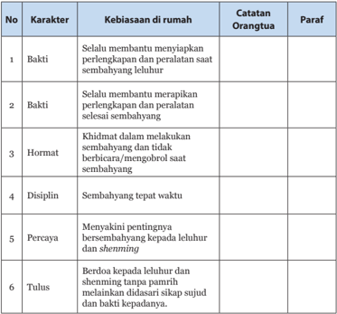

Tabel ini berisi karakteristik kebiasaan di rumah yang diukur oleh orang tua kepada anak-anak mereka. Topik utamanya adalah tentang bagaimana anak-anak memenuhi tanggung jawab dan tanggung jawab mereka dalam menjaga kebersihan dan kesejahteraan rumah. Kolom-kolomnya meliputi: No, Karakter, Kebiasaan di rumah, Catatan Orang tua, dan Paraf. Data penting yang terlihat adalah bahwa anak-anak harus selalu membantu menyiapkan peralatan dan perlengkapan saat sembahyang, serta harus disiplin dalam sembahyang tepat waktu. Selain itu, anak-anak juga harus bersikap bakti, hormat, dan tulus terhadap shalawat dan shahihin tanpa pamrih.

 

---
## 📄 Halaman 127

### A. Aspek

---
**🖼️ Gambar/Diagram**

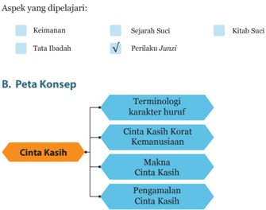

> **Deskripsi Visual:** Gambar ini adalah diagram yang menunjukkan aspek-aspek yang dipelajari dalam konteks keimanan, sejarah suci, kitab suci, dan perilaku junzi. Diagram ini dibagi menjadi dua bagian utama: A. Aspek yang Dipelajari dan B. Peta Konsep.

Pada bagian A, ada empat kotak berwarna yang masing-masing menunjukkan aspek yang dipelajari. Kotak pertama berwarna biru muda menunjukkan aspek Keimanan, kotak kedua berwarna biru muda menunjukkan aspek Sejarah Suci, kotak ketiga berwarna biru muda menunjukkan aspek Kitab Suci, dan kotak keempat berwarna biru muda menunjukkan aspek Perilaku Junzi, yang telah diberi tanda centang untuk menunjukkan bahwa aspek ini sedang dipelajari.

Pada bagian B, terdapat peta konsep yang menggambarkan hubungan antara konsep-konsep yang dipelajari. Peta ini terdiri dari beberapa baris teks berwarna biru muda yang menjelaskan hubungan antara konsep-konsep tersebut. Baris pertama berisi terminologi karakter huruf, baris kedua berisi Cinta Kasih Korat Kemanusiaan, baris ketiga berisi Makna Cinta Kasih, dan baris keempat berisi Pengamalan Cinta Kasih.

Dengan demikian, gambar ini memberikan gambaran umum tentang aspek-aspek yang dipelajari dalam konteks keimanan, sejarah suci, kitab suci, dan perilaku junzi, serta menggambarkan hubungan antara konsep-konsep yang dipelajari dalam konteks tersebut.

### Cinta Kasih Sebagai Sandaran Hidup

 

---
## 📄 Halaman 128

### C.  Kompetensi Inti dan Kompetensi Dasar

---
**📊 Tabel**

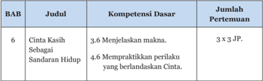

Tabel ini berisi informasi tentang kompetensi dasar dan jumlah pertemuan untuk Bab 6 dalam sebuah kursus atau program pelajaran. Topik utama adalah "Cinta Kasih Sebagai Sandaran Hidup". Dalam kolom "Kompetensi Dasar", ada dua kompetensi yang disebutkan: menjelaskan makna (3.6) dan mempraktekkan perilaku yang berlandaskan cinta (4.6). Kolom "Jumlah Pertemuan" menunjukkan bahwa setiap kompetensi memiliki 3 kali 3 jam pelajaran, totalnya 9 jam. Ini menunjukkan bahwa Bab 6 dianggap sebagai topik penting yang harus dipelajari dengan intensitas tinggi dalam kurikulum tersebut.

### D. Tujuan Pembelajaran

Setelah  mempelajari  bab  ini  diharapkan  para  peserta  didik  mampu mempraktekkan perilaku Junzi yakni menjalankan Ren (Cinta Kasih) sebagai salah  satu  benih  kebajikan  dalam  diri  manusia.  Dalam  mempraktekkan Kebenaran, peserta didik diharapkan mampu :

- Menjelaskan ayat-ayat suci yang terkait dengan cinta kasih
- Menjelaskan perasaan tidak tega adalah benih cinta kasih.
- Menjelaskan tepasalira sebagai wujud pelaksanaan cinta kasih.

### E.  Langkah-Langkah Pembelajaran

### 1.  Mengamati:

Pada  langkah  mengamati,  guru  dapat  mempersiapkan  objek  (dalam bentuk  benda  atau  fenomena)  yang  relevan  dengan  tema  pembelajaran misalnya:

- -Menyimak kisah 8 x 3 = 23 yang tidak disampaikan secara lengkap.

### 2.  Menanya:

Memancing atau  mendorong  peserta  didik  menanya  dan  menganalisis potongan kisah 8x3 = 23 mengapa Nabi Kongzi membenarkan hal tersebut dan menyalahkan Yanhui yang menjawab 24.

 

---
## 📄 Halaman 129

### 3.  Eksperimen/Eksplorasi:

- -Mencari informasi selengkapnya tentang kisah 8 x 3 = 23 atau menyimak kisah lengkapnya.
- -Merasakan  suasana  psikologis  saat  kejadian  tersebut  dan  melakukan refleksi ke dalam diri mengapa Nabi Kongzi membenarkan 8 x 3 = 23.

### 4.  Mengasosiasi:

- -Menyimpulkan benang merah teladan cinta kasih dalam kisah 8 x 3 = 23.
- -Mengembangkan  kemungkinan-kemungkinan  penerapan  teladan  cinta kasih dalam kehidupan sehari-hari.

### 5.  Mengomunikasikan:

- -Mengungkapkan pentingnya cinta kasih dan ayat-ayat suci yang melandasinya.
- -Menjelaskan implementasi cinta kasih dalam kehidupan sehari-hari.

### F.  Ringkasan Materi

### Ayat Suci tentang Cinta Kasih

Berikut ini adalah ayat-ayat tentang cinta kasih yang utama :

### 1. Mengzi VI A: 6/7 :

'Rasa hati berbelas-kasihan tiap orang mempunyai, rasa hati malu dan tidak suka tiap orang mempunyai, rasa hati hormat dan mengindahkan tiap orang mempunyai, dan rasa hati membenarkan dan menyalahkan tiap orang juga mempunyai. Adapun rasa hati berbelas-kasihan itu menunjukkan adanya benih cinta kasih, rasa hati malu dan tidak suka itu menunjukkan adanya benih kesadaran menjunjung Kebenaran, rasa hati hormat dan mengindahkan itu menunjukkan adanya benih kesusilaan, dan rasa hati membenarkan dan menyalahkan  itu  menunjukkan  adanya  benih  kebijaksanaan.  Cinta  kasih, kebenaran, kesusilaan dan kebijaksanaan itu bukan hal-hal yang dimasukkan dari  luar  ke  dalam  diri,  melainkan  diri  kita  sudah  mempunyainya.  Tetapi sering kita tidak mau mawas diri. Maka di katakan, 'Carilah dan engkau akan mendapatkannya, sia-siakanlah dan engkau akan kehilangan!'

 

---
## 📄 Halaman 130

Ayat  ini  berbicara  tentang  Watak  Sejati  manusia  yakni  Cinta  Kasih, Kebenaran, Kesusilaan dan Kebijaksanaan.

Benih  Cinta  Kasih  adalah  adanya  perasaan  hati  belas  kasihan  atau perasaan tidak tega. Benih ini ada dalam diri manusia yang menjadi kodrat kemanusiaan manusia yang merupakan karunia Tian .

Ayat yang mendasari adalah Mengzi VI A pasal ke -16 yakni :

- Mengzi berkata,  'Ada  kemuliaan  karunia Tian dan  ada  kemuliaan pemberian  manusia.  Cinta  Kasih,  Kebenaran,  Satya,  Dapat  dipercaya dan gemar akan Kebaikan dengan tidak merasa jemu, itulah kemuliaan karunia Tian Yang  Maha  Esa.  Kedudukan  raja  muda,  menteri  dan pembesar itulah kemuliaan pemberian manusia'.
Kemuliaan karunia Tian artinya berasal dari Tian , sedangkan kemuliaan pemberian  manusia  artinya  berasal  dari  manusia.  Watak  Sejati  adalah kemuliaan  karunia Tian ,  sedangkan  jabatan  adalah  kemuliaan  pemberian manusia. Kemuliaan karunia Tian bersifat permanen/selamanya, sedangkan kemuliaan pemberian manusia hanya sementara.

Strategi pembelajaran pemahaman Cinta Kasih dapat dilakukan dengan:

- Mengajak  peserta  didik  menyaksikan  film  bagaimana  hewan  merawat anaknya. Film dapat diunduh di internet.
- Menggali pandangan peserta didik, apa perbedaan hewan dalam merawat anaknya dengan manusia dalam merawat anaknya.
- Ketika memberikan ilustrasi hewan yang akan terjatuh ke dalam sumur, dapat menggunakan alat peraga boneka binatang untuk lebih menarik perhatian peserta didik.
- Ajak peserta didik aktif berdiskusi dan dapat dibagi dalam kelompok kecil 4 - 6 oarng. Selama mereka aktif berdiskusi amati dan berikan penilaian sesuai metode observasi. (lihat bagian penilaian).
- Berikan kesimpulan dan penguatan atau motivasi tentang kelebihan kita sebagai umat manusia.
Ayat Cinta Kasih yang lain adalah :

- 'Cinta Kasih itulah Kemanusiaan, dan mengasihi orang tua itulah yang terbesar.  Kebenaran  itulah  kewajiban  hidup,  dan  memuliakan  para bijaksana itulah yang terbesar. Perbedaan dalam mengasihi orang tua dan pertingkatan dalam memuliakan para bijaksana itu terjadi oleh adanya Tata Susila'. ( Zhongyong . XIX : 5)
- 'Adapun Jalan Suci yang harus ditempuh di dunia ini mempunyai Lima Perkara dengan Tiga Pusaka di dalam menjalankannya, yakni: hubungan

 

---
## 📄 Halaman 131

raja dengan menteri, ayah dengan anak, suami dengan istri, kakak dengan adik  dan  kawan  dengan  sahabat;  Lima  Perkara  inilah  Jalan  Suci  yang ditempuh di dunia. Kebijaksanaan, Cinta Kasih dan Berani; Tiga Pusaka inilah  Kebajikan  yang  harus  ditempuh.  Maka  yang  hendak  menjalani haruslah Satu tekadnya'. ( Zhongyong . XIX: 8)

- Nabi bersabda, 'Suka belajar itu mendekatkan kita kepada Kebijaksanaan; dengan  sekuat  tenaga  melaksanakan  tugas  mendekatkan  kita  kepada Cinta  Kasih  dan  Rasa  Tahu  Malu  mendekatkan  kita  kepada  Berani'. ( Zhongyong . XIX: 10).
- Mengzi berkata,  'Yang  merusak  diri  sendiri  tidak  dapat  di  ajak  bicara baik. Yang membuang diri sendiri tidak dapat di ajak berbuat baik. Yang perkataannya  tidak  di  dalam  Kesusilaan  dan  Kebenaran,  ia  dinamai merusak  diri  sendiri.  Yang  berpendapat:  'Aku  tidak  dapat  mendiami Cinta Kasih dan mengikuti Kebenaran', dinamai membuang diri sendiri.
- 'Cinta Kasih itulah Rumah Sentosa dan Kebenaran itulah Jalan Lurus.
- 'Kalau  orang  membiarkan  Rumah  Sentosa  itu  kosong  dan  tidak  mau mendiaminya, menyingkiri Jalan Lurus itu dan tidak mau melewatinya; ini sungguh menyedihkan!' ( Mengzi . IVA: 10)
Hanya  orang-orang  yang  berpericintakasih  dapat  sentosa  dan  tentram dalam menjalani hidup. Mereka siap menempuh penderitaan sekalipun untuk mengembangkan Cinta Kasih sehingga senantiasa memiliki kesentosaan dan ketentraman batin.

### Ciri-ciri perilaku Cinta kasih

- Mencintai sesama ( Lunyu XII : 22)
- Rela menderita dan membelakangkan keuntungan ( Lunyu VI : 22/ 2)
- Suka belajar dan penuh semangat

### G. Pendalaman Materi

Hubungan antara perasaan tidak tega sebagai benih Cinta Kasih dengan ciri-ciri orang berperi Cinta Kasih lainnya adalah sebagai berikut:

Perasaan  tidak  tega  atau  berbelas  kasihan  merupakan  pangkal  dari perasaan-perasaan Cinta Kasih lainnya seperti mencintai sesama manusia, rela  menderita  dan  membelakangkan  keuntungan  serta  suka  belajar  dan penuh semangat.

 

---
## 📄 Halaman 132

Dengan  perasaan tidak teganya maka  seseorang dapat mencintai seseorang. Bila mencintai seseorang tentu berharap memberikan yang terbaik baginya dan tidak tega kalau sampai membuatnya sedih dan menderita.

Orang yang mencintai seseorang menjadikan orang rela berkorban, rela menderita dan membelakangkan keuntungan.

Dengan perasaan tidak teganya, seseorang akan terpacu senantiasa suka belajar dan penuh semangat karena tidak mau tugasnya terbengkalai. Kalau tugasnya terbengkalai maka dapat membuat sedih orang yang dicintainya. Karena itu dengan perasaan tidak teganya maka terpacu untuk suka belajar dan penuh semangat. Dalam melakukan pengabdian kepada orang tua (orang yang dicintainya), tidak berani tidak belajar dan penuh semangat.

Ciri-ciri orang yang berperi Cinta Kasih seperti yang terdapat dalam ayat suci antara lain:

### 1. Keras kemauan

Keras kemauan adalah kemauan yang kuat. Orang yang berperi Cinta Kasih mempunyai kemauan yang keras karena tidak ingin mengecewakan orang yang dicintainya.

### 2. Tahan uji

Tahan uji artinya dapat menderita dan tidak mengambil jalan pintas dalam menjalani kehidupan dengan segala problematikanya.

### 3. Sederhana

Sederhana  artinya  tidak  boros  dan  bermewah-mewah.  Orang  yang berpericintakasih  tidak  menghambur-hamburkan  sesuatu  yang  tidak perlu.

### 4. Tidak mudah mengucapkan kata-kata

Orang yang berpricinta kasih menyadari bahwa untuk melaksanakan sesuatu tidaklah mudah sehingga tidak mudah mengucapkan kata-kata. ( Lunyu XIII : 27)

### 5. Hormat

Hormat artinya dapat menghargai atau mengindahkan orang lain  dan  diri  sendiri.  Orang  yang  berpericintakasih  menghargai  atau mengindahkan orang lain dan dirinya.

### 6. Lapang Hati

Berhati  lapang  artinya  dapat  menerima  hal-hal  atau  kejadian  yang tidak sesuai dengan harapannya.

 

---
## 📄 Halaman 133

### 7. Dapat Dipercaya

Dapat  dipercaya  artinya  dapat  menjaga  kepercayaan  orang  lain terhadap dirinya.

### 8. Cekatan

Cekatan artinya tangkas dalam bekerja. Orang berpericintakasih akan berusaha menjalankan tugasnya sebaik-baiknya sehingga cekatan dalam bekerja.

### 9. Bermurah Hati ( Lunyu . XVII : 6)

Bermurah hati artinya  suka  memberi,  kebahagiaan  yang  dirasakan oleh orang lain juga dirasakan sebagai kebahagiaan sendiri.

Salah  satu  pedoman  Pengamalan  Cinta  Kasih  yang  diberikan  oleh Nabi Kongzi adalah Tepasalira.

Intisari ajaran Tepasalira adalah seperti yang terdapat dalam Lunyu XV : 24, yakni ' Apa yang diri sendiri tiada inginkan, janganlah dilakukan terhadap orang lain'.

Yang  perlu  dicermati  dalam  prinsip  Tepasalira  adalah  pemakaian 'ukuran' diri sendiri kepada orang lain.

Guru  dapat  menyuruh  peserta  didik  membaca  kalimat  pernyataan tentang  tepasalira  yang  ada  di  buku  teks  peserta  didik  lalu  melempar pertanyaan kepada peserta didik perbedaan di antara kalimat tersebut.

Ada dua tipe kalimat pernyataan tersebut yang saling berpasangan:

Kalimat pertama, berkonotasi lakukan apa yang diri inginkan orang lain lakukan kepadamu.

Kalimat  kedua,  berkonotasi  jangaan  lakukan,  apa  yang  diri  sendiri tiada inginkan.

Demikian seterusnya saling berpasangan. Dengan menyimak kalimatkalimat  tersebut,  peserta  didik  dilatih  untuk  lebih  teliti  makna  yang terkandung dalam kata-kata.

Kalimat  pertama  masih  ada  unsur  pemakaian  ukuran  diri  sendiri, sedangkan kalimat pasangan kedua lebih bersifat instropektif.

 

---
## 📄 Halaman 134

### H. Aktivitas Pembelajaran

### 1. Tugas Mandiri

### a.  Deskripsi Tugas

Pada  kegiatan  Tugas  Mandiri  (aktivitas  6.1),  peserta  didik  diminta mengisi kolom berikut ini sesuai dengan kondisi yang terdapat di kolom paling kiri! (lihat tabel di bawah ini)

### b.  Petunjuk Kegiatan

Guru menjelaskan secara singkat cara pengisian tabel, yakni mengisi perasaan  pribadinya  jika  mengalami  peristiwa  atau  kondisi  di  kolom paling  kiri.  Kemudian  membayangkan  kemungkinan  perasaan  orang terdekatnya jika mereka tahu peserta didik sedang mengalami peristiwa atau kondisi seperti di kolom paling kiri. Peserta didik diberikan waktu 10-15 menit untuk mengisi tabel yang ditugaskan. Kemudian satu persatu sharing  dan  diberikan  waktu  untuk  saling  berdiskusi  atau  memberi pendapatnya.

### c. Tujuan Kegiatan

Melatih peserta didik memiliki kepekaan internal terhadap konsekuensi  yang  dapat  terjadi dari setiap pilihan  tindakan  yang dilakukan bagi dirinya ataupun orang-orang di sekitarnya.

Bayangkan anda pada posisi seperti di bawah ini: Tuliskan perasaan anda jika berada pada kondisi tersebut: Tuliskan perasaan orang-orang terdekat anda jika anda berada pada kondisi tersebut.

Mencari informasi lebih jauh melalui internet atau bertanya kepada kakak kelas tentang tugas yang  diberikan  guru  sehingga  mampu memahami pelajaran dengan baik.

Mengerjakan PR di sekolah ketika pelajaran akan dimulai

Membantu orang tua mencari uang sehingga dapat membayar SPP dan biaya sekolah lainnya secara mandiri.

Ketahuan mencontek, sehingga tidak lulus ujian

Melaksanakan setiap janji yang terucap meskipun kondisi sulit tidak mengeluh.

### d.  Petunjuk Jawaban:

Guru  membangkitkan  perasaan  tidak  tega  dan  kemauan  berjerih payah  peserta  didik  sehingga  dapat  lebih  bertanggungjawab  dalam tindakannya.

 

---
## 📄 Halaman 135

Peserta didik dapat diminta untuk menjelaskan perbedaan perasaan dirinya  ketika  dalam  masing-masing  kondisi  seperti  yang  ditunjukkan pada kolom di sebelah paling kiri. Demikian pula kemungkinan perbedaan perasaan yang muncul dari orang yang dicintai. Lebih suka dalam kondisi yang seperti apa? Ini untuk memperkuat kebijaksanaannya dan berpikir lebih  jauh  akan  akibat  yang  dapat  ditimbulkannya.  Dengan  demikian, peserta  didik  akan  dapat  lebih  bertanggungjawab  dalam  tindakannya dan  tidak  dengan  serta  merta  menghindari  kesulitan  hidup,  karena konsekuensinya akan ada konsekuensi lainnya yang lebih besar.

### 2.  Tugas Mandiri

### a Deskripsi Tugas

Pada kegiatan Tugas Mandiri (aktivitas 6.2), peserta didik diminta menyebutkan:

- Ciri-ciri  orang  yang  berperi  Cinta  Kasih  selain  dari  yang  sudah disebutkan.
- Menyebutkan ciri-ciri orang yang tidak berperi Cinta Kasih.
- Seandainya setiap keluarga dapat menjalankan perilaku Cinta Kasih bagaimana  kondisi  negara  tersebut?  Sebaliknya,  jika  tiap  keluarga tidak  menjalankan  perilaku  Cinta  Kasih  apakah  yang  akan  terjadi terhadap suatu negara?

### b.  Petunjuk Kegiatan

Guru  memberikan  waktu  3-5  menit  kepada  peserta  didik  untuk berfikir, kemudian memberikan kesempatan bergiliran untuk menjawab atau memberikan pendapat. Jika peserta didik pasif, guru dapat langsung menunjuk peserta didik secara bergiliran. Hasil jawaban peserta didik dapat  digunakan  sebagai  bahan  untuk  melibatkan  secara  aktif  peserta didik yang lain.

### c. Tujuan Kegiatan

Peserta  didik  bersikap  proaktif  mencari  informasi  dari  kitab Sishu dan Wujing dan melihat kemungkinan yang lebih besar (wawasan yang lebih luas) berkaitan dengan karakter Cinta Kasih.

### d.  Petunjuk Jawaban

Ciri-ciri  lain  orang yang berpericintakasih dapat dilihat dalam ayat Lunyu XIII : 27 dan Lunyu XVII : 6 seperti dalam pembahasan dimuka.

 

---
## 📄 Halaman 136

Acuan jawaban suasana Negara yang diliputi Cinta Kasih dapat dilihat pada kitab Daxue Bab IX pasal 3 seperti berikut ini :

'Bila dalam keluarga saling mengasihi niscaya seluruh Negara akan di dalam Cinta Kasih. Bila dalam tiap keluarga saling mengalah, niscaya seluruh Negara akan di dalam suasana saling mengalah. Tetapi bilamana orang  tamak  dan  curang,  niscaya  seluruh  Negara  akan  terjerumus  ke dalam  kekalutan;  demikianlah  semua  itu  berperan.  Maka  dikatakan, sepatah  kata  dapat  merusak  perkara  dan  satu  orang  dapat  berperan menenteramkan Negara'.

### 3.  Aktivitas Mandiri

### a. Deskripsi Tugas

Pada  kegiatan  Tugas  Mandiri  (aktivitas  6.3),  peserta  didik  diminta membuat  karya  tulis  dengan  Tema  'Cinta  Kasih  Pondasi  Diriku  dan Bangsaku'

Karya  tulis  menggambarkan  bagaimana  anda  menerapkan  Cinta Kasih dalam keseharian, dan bagaimana prinsip yang anda jalani kalau dijalankan oleh masyarakat luas akan menjadi sebuah gerakan nasional yang membawa kemajuan bagi bangsa Indonesia.

Jumlah halaman 8-15 halaman, diketik dengan huruf Calibri 12 spasi 1,15.

### b. Petunjuk Kegiatan

Guru  menugaskan  peserta  didik  membuat  karya  tulis  sesuai  tema di  atas.  Guru  menjelaskan  dan  memberikan  kesempatan  peserta  didik bertanya  tentang  tugasnya.  Apabila  sudah  jelas,  maka  peserta  didik mengerjakan tugas di rumah dan dikumpulkan seminggu kemudian.

### c. Tujuan Kegiatan

Memberikan kesadaran kepada peserta didik bahwa perilaku pribadinya  mempunyai  dampak  kepada  kehidupan  berbangsa  dan bernegara.

Melatih  ketrampilan  komunikasi  tidak  langsung  dengan  membuat tulisan.  Peserta  didik  diharapkan  mampu  menuangkan  pokok-pokok pikiran secara sistematis.

 

---
## 📄 Halaman 137

### d. Rubrik penilaian karya tulis:

---
**📊 Tabel**

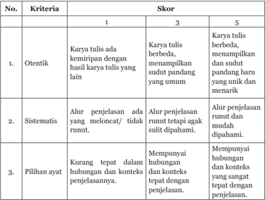

Tabel ini menunjukkan skor kriteria untuk evaluasi karya tulis berdasarkan ketiga kriteria utama: otentik, sistematis, dan pilihan ayat. Topik utama tabel adalah evaluasi kualitas karya tulis. Kolom pertama menunjukkan nomor kriteria, sedangkan kolom kedua menunjukkan skor yang diberikan kepada karya tulis. Skor 1 menunjukkan karya tulis yang tidak memenuhi kriteria, skor 3 menunjukkan karya tulis yang memenuhi kriteria dengan baik, dan skor 5 menunjukkan karya tulis yang sangat memenuhi kriteria. Data penting yang terlihat adalah bahwa skor 3 lebih tinggi daripada skor 1 dan skor 5, menunjukkan bahwa karya tulis yang memenuhi kriteria dengan baik akan mendapatkan skor tertinggi.

### I.  Penilaian dan Pedoman Penskoran

### 1. Tes Tertulis

Instrumen Soal Uraian

### Jawablah pertanyaan-petanyaan berikut ini dengan uraian yang jelas!

- Apa  yang  ada  di  dalam  Watak  Sejati  ( Xing )  manusia  seperti  yang disampaikan oleh Mengzi ...
- Ren berdasarkan karakter huruf sesuai kamus Swat Bun terdiri dari dua radikal huruf, yaitu...
- Benih dari Cinta kasih seperti yang dikatakan Mengzi adalah ...
- Apa  yang  tertulis  dalam  kitab Zhongyong Bab  Utama  ayat  1  tentang Watak Sejati manusia?
- Jelaskan kembali mengapa dikatakan bahwa laku Cinta kasih itu dimulai dari yang dekat!

 

---
## 📄 Halaman 138

- Apa ciri-ciri orang yang berperi Cinta Kasih?
- Apa ciri-ciri orang yang tidak berperi Cinta Kasih?
- Jelaskan pedoman Tepasalira yang dibimbingkan oleh Nabi Kongzi !

### 2.  Kunci Jawaban

- Yang ada di dalam Watak Sejati ( Xing ) manusia seperti yang disampaikan oleh Mengzi
Ren, Yi, Li, Zhi atau Cinta Kasih, Kebenaran, Kesusilaan, Kebijaksanaan

- Ren berdasarkan karakter huruf sesuai kamus Swat Bun terdiri dari dua radikal huruf, yaitu...
- Sesuatu yang 'ada' antara hubungan dua manusia.
- Benih dari Cinta kasih seperti yang dikatakan Mengzi adalah ...
- Perasaan belas kasihan atau perasaan tidak tega.
- Yang tertulis dalam kitab Zhongyong Bab Utama ayat 1 tentang Watak Sejati manusia?
Firman Tian (Tuhan Yang Maha Esa) itulah dinamai Watak Sejati. Hidup mengikuti  Watak  Sejati  itulah  dinamai  menempuh  Jalan  Suci.  Bimbingan menempuh Jalan Suci itulah dinamai Agama.

### 5. Laku Cinta kasih itu dimulai dari yang dekat!

Cinta Kasih dikembangkan dimulai dari orang-orang terdekat kemudian diluaskan sampai kepada seluruh umat manusia. Mengasihi orang tua itulah yang  terbesar.  Inilah  kebenaran  yang  wajib  kita  jalankan.  Apabila  dapat mencintai orang tua orang lain tetapi tidak mencintai orang tua sendiri inilah kebenaran yang terbalik dan tidak sesuai kodrat yang telah Tian firmankan kepada diri kita sebagai manusia.

Cinta Kasih itulah Kemanusiaan, dan mengasihi orang tua itulah yang terbesar. Kebenaran itulah kewajiban hidup, dan memuliakan para bijaksana itulah yang terbesar. Perbedaan dalam mengasihi orang tua dan pertingkatan dalam  memuliakan  para  bijaksana  itu  terjadi  oleh  adanya  Tata  Susila'. ( Zhongyong XIX : 5)

### 6. Ciri-ciri orang yang berperi Cinta Kasih

Ciri-ciri  orang  yang  berpericitakasih  di  antaranya  adalah  mencintai manusia,  tahan  menderita,  membelakangkan  keuntungan,  suka  belajar, semangat, cekatan, hati-hati dalam berkata-kata, hormat, dapat dipercaya..

 

---
## 📄 Halaman 139

- Ciri-ciri orang yang tidak berperi Cinta Kasih Pandai bermanis muka dan memutar kata-kata.
- Tepasalira yang dibimbingkan oleh Nabi Kongzi
Jangan lakukan, apa yang diri sendiri tiada inginkan orang lain perbuat atas dirimu.

### Pedoman Pensekoran Soal Uraian

- -Poin maksimal setiap soal uraian adalah 10
- -Jika semua soal terjawab dengan poin maksimal, maka jumlah skor adalah 40.
- -Jika  penilaian  menggunakan  skala  100,  maka  Nilai  =  Jumlah  skor dibagi skor tertinggi dikali 100 (40 : 40 x 100) = 100
N = (skor : skor tertinggi x 100)

- -Jika  penilaian  menggunakan  skala  100,  maka  Nilai  =  Jumlah  skor dibagi skor tertinggi dikali 4 (40 : 40 x 4) = 4
N = (skor : skor tertinggi x 4)

### J.  Penilaian Diri

Penilaian  peserta  didik  dilihat  berdasarkan  sikap  dalam  membuat tugas karya tulis dan hasil karya tulis itu sendiri. Untuk sikap yang dinilai adalah keaktifan, orisinil dalam arti tidak mencontek hasil karya temannya, pemahaman  materi  dan  kerunutan  dalam  menyampaikan  pokok-pokok gagasannya.

### K.  Remedial

Apabila  peserta  didik  ada  yang  memerlukan  ulangan  susulan  ataupun perbaikan, maka pada bagian remedial ini memberikan beberapa alternatif penilaian tambahan.

Prinsip  remedial  adalah  berfokus  pada  proses  pembentukan  karakter. Berikut adalah pilihan remedial yang dapat dilakukan:

 

---
## 📄 Halaman 140

- Memberikan  tugas  melakukan  proyek  terkait  nilai-nilai  Cinta  Kasih. Misalnya melakukan pelayanan sosial untuk anak jalanan atau di panti jompo, membantu orang yang tidak mampu dengan tenaga sebelum atau sepulang dari sekolah. Buat dokumentasi dan laporan kegiatan peserta didik.
- Memberikan tugas karya tulis dengan tema (pilih salah satu):
- Cinta Kasih Rumah Sentosa Manusia
- Pedoman menjalankan Cinta Kasih
- Cinta Kasih itulah Kemanusiaan.
Karya tulis diketik dengan huruf Times New Roman pada kertas ukuran A4 dengan spasi 1,5 sebanyak 5-10 halaman.

### Penilaian Sikap

Penilaian  sikap  peserta  didik  bisa  dilakukan  melalui  metode  observasi saat bekerja kelompok, maupun berdiskusi.

Penilaian dapat meliputi aspek:

- Kedisiplinan di kelas dan dalam mengerjakan tugas
- Keterampilan berkomunikasi
- Kerendahan hati dan suka menolong
- Dan lain sebagainya.
(lihat Bagian Satu tentang Penilaian).

### L.  Komunikasi Orangtua

Proses  pembentukan  karakter  harus  dilakukan  secara  integratif  dan holistik.  Integratif  karena  saat  ini  setiap  mata  pelajaran  juga  mengusung pembentukan karakter moral. Holistik artinya menyeluruh dalam kehidupan peserta  didik,  tidak  hanya  di  sekolah  tetapi  juga  dalam  pergaulan  di  luar sekolah dan di rumah.

Mengingat  pentingnya  peran  serta  orang  tua,  maka  perlu  dibangun lembar komunikasi orang tua untuk memudahkan komunikasi.

 

---
## 📄 Halaman 141

### Contoh Lembar Komunikasi Orangtua

Nama Orangtua   :   …………………………….

Nama siswa

:   …………………………….

Kelas :

………………..…………..

Tema :

Bab 6. Cinta Kasih

Sub tema :

Kebiasaanku

---
**📊 Tabel**

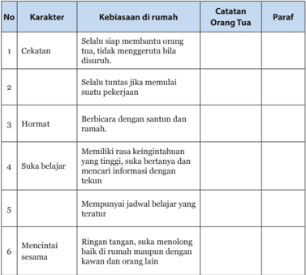

Tabel ini menunjukkan karakteristik kebiasaan di rumah dari seorang anak, dengan kolom "No", "Karakter", "Kebiasaan di rumah", "Catatan Orang Tua", dan "Paraf". Topik utama tabel ini adalah karakteristik kebiasaan anak di rumah. Kolom "No" memberikan nomor urut untuk setiap karakteristik. Kolom "Karakter" berisi nama-nama karakteristik tersebut, seperti cekatan, hormat, suka belajar, dan mencintai sesama. Kolom "Kebiasaan di rumah" menyajikan contoh-contoh kebiasaan anak yang berkaitan dengan setiap karakteristik. Kolom "Catatan Orang Tua" menyediakan catatan dari orang tua tentang kebiasaan anak tersebut, sementara kolom "Paraf" mungkin digunakan untuk penanda atau komentar dari guru atau orang tua lain. Data penting yang terlihat adalah bahwa anak-anak sering kali memiliki kebiasaan baik seperti cekatan, hormat, suka belajar, dan mencintai sesama, yang dianjurkan oleh orang tua dan guru.

 

---
## 📄 Halaman 142

132

Buku Guru Kelas XI SMA/SMK

 

---
## 📄 Halaman 143

### Kebenaran Jalan Hidup Bagi Manusia

---
**🖼️ Gambar/Diagram**

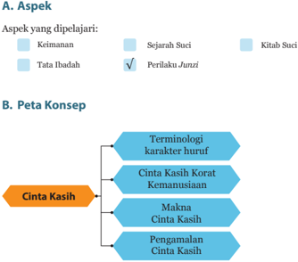

> **Deskripsi Visual:** Gambar ini adalah diagram yang menunjukkan aspek dan peta konsep dari materi pelajaran. Di bagian A, ada tiga aspek yang dipelajari, yaitu Keimanan, Sejarah Suci, dan Kitab Suci. Untuk aspek Keimanan, ada label "Sejarah Suci" dan "Kitab Suci". Untuk aspek Sejarah Suci, ada label "Tata Ibadah". Untuk aspek Kitab Suci, ada label "Perilaku Junzi". Di bagian B, ada peta konsep yang menggambarkan hubungan antara terminologi karakter huruf, cinta kasih korat, kemanusiaan, makna, pengamalan, dan cinta kasih. Label "Cinta Kasih" berada di tengah peta konsep, menunjukkan bahwa cinta kasih merupakan elemen penting dalam semua aspek yang dipelajari.

 

---
## 📄 Halaman 144

### C.  Kompetensi Inti dan Kompetensi Dasar

---
**📊 Tabel**

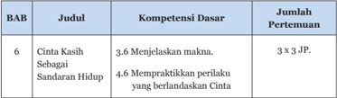

Tabel ini berisi informasi tentang kompetensi dasar dan jumlah pertemuan untuk Bab 6 dalam sebuah kursus atau program pelajaran. Topik utama adalah "Cinta Kasih Sebagai Sandaran Hidup". Kolom-kolomnya meliputi Judul Bab, Kompetensi Dasar, dan Jumlah Pertemuan. Data penting yang terlihat adalah bahwa Bab 6 memuat dua kompetensi dasar: menjelaskan makna Cinta Kasih sebagai sandaran hidup (Kompetensi Dasar 3.6) dan mempraktekkan perilaku yang berlandaskan cinta (Kompetensi Dasar 4.6). Selain itu, tabel menunjukkan bahwa setiap kompetensi dasar memerlukan 3 x 3 pertemuan, yang berarti total ada 9 pertemuan yang diperlukan untuk mempelajari Bab 6 dengan baik.

### D. Tujuan Pembelajaran

Setelah  mempelajari  bab  ini  diharapkan  para  peserta  didik  mampu mempraktekkan perilaku Junzi yakni menjalankan Yi (Kebenaran) sebagai salah  satu  benih  kebajikan  dalam  diri  manusia.  Dalam  mempraktekkan Kebenaran, peserta didik diharapkan mampu:

- Menjelaskan Hakekat Kebenaran
- Menjelaskan ayat-ayat suci yang terkait dengan kebenaran
- Menjelaskan rasa malu dan tidak suka adalah benih kebenaran
- Menjelaskan Kebenaran adalah Jalan Selamat manusia.

### E.  Langkah-Langkah Pembelajaran

### 1.  Mengamati:

Pada  langkah  mengamati,  guru  dapat  mempersiapkan  objek  (dalam bentuk  benda  atau  fenomena)  yang  relevan  dengan  tema  pembelajaran misalnya:

- -Memberikan skenario menemukan uang sepuluh ribu, seratus ribu, satu juta rupiah, dan seratus juta rupiah.
- -Memberikan  skenario  tambahan  jika  seandainya  tidak  ada  yang melihat, jika orangtua sedang sakit, atau butuh biaya untuk menikah.

### 2.  Menanya:

Memancing atau  mendorong  peserta  didik  menanya  dan  menganalisis jawaban kawan-kawannya tentang skenario yang diberikan.

 

---
## 📄 Halaman 145

### 3.  Eksperimen/Eksplorasi:

- -Melakukan fragment tentang skenario menemukan uang tersebut. Ada yang  berperan  menemukan  uang  dan  peran  orang  yang  kehilangan uang.
- -Merasakan suasana psikologis saat kejadian tersebut dan melakukan refleksi  ke  dalam  diri  terhadap  pilihan  yang  diambil  dan  nilai-nilai yang melandasinya.
- -Mencari dalam kitab Si Shu ayat-ayat terkait dengan kebenaran.

### 4.  Mengasosiasi:

- -Menyimpulkan makna kebenaran dan penerapannya dalam kehidupan sehari-hari.
- -Mengembangkan kemungkinan-kemungkinan penerapan kebenaran dalam kehidupan sehari-hari.

### 5.  Mengomunikasikan:

- -Mengungkapkan  pentingnya  Kebenaran  dalam  hidup  manusia  dan ayat-ayat suci yang melandasinya.
- -Menjelaskan implementasi Kebenaran dalam kehidupan sehari-hari .
- -Menghargai  dan  mendengarkan  dengan  seksama  pendapat  orang lain,  berusaha  memahami maksud pertanyaan atau pendapat orang lain, memberikan argumentasi secara sopan dan selalu membuka diri terhadap kemungkinan adanya perbaikan atau koreksi di luar diri.

### F.  Ringkasan Materi

### 1.  Hakekat Kebenaran

Kebenaran adalah Hukum ( Li ). Hukum adalah aturan-aturan yang telah Tian buat  dalam  kenyataan di  dunia  ini.  Kenyataan  yang  ada  di  dunia  ini dapat dibedakan menjadi 3 yang dikenal dengan San Cai (tiga  kenyataan) yakni Tian -Di -Ren .

Manifestasi Hukum dalam tiga kenyataan tersebut adalah sebagai berikut:

Tianli (Hukum Tian

): adanya sifat kebajikan Tian

Dili

(Hukum Alam): adanya hukum alam

 

---
## 📄 Halaman 146

Renli (Hukum Manusia): adanya watak sejati manusia

Dalam pembelajaran hakekat kebenaran perlu banyak diberikan contohcontoh,  terutama  dalam  menjelalaskan  sifat  kebenaran  ada  dalam  diri manusia. Berikut ini adalah contoh-contoh penjelasan kebenaran ada dalam diri manusia :

- Adanya perasaan malu dan tidak suka.
- Malu kalau berbuat hal yang memalukan
- Tidak suka kalau disalahkan orang lain
- Gembira setelah menyelesaikan tugas dengan baik
- Dan sebagainya.

### 2.  Ayat-ayat Suci tentang Kebenaran

'Maka  dikatakan,  mulut  dalam  hal  merasakan,  dapat  sama  dalam menikmati  rasa;  telinga  dalam  mendengar,  dapat  sama  dalam  menikmati suara; mata dalam melihat wajah seseorang, dapat sama dalam menyatakan ketampanannya.  Tetapi  akan  hal  hati,  mengapakah  diragukan  kesamaan hakekatnya bersamaan. Mengapa? Karena yang dinamakan hukum ( Li ) ialah Kebenaran.  Seorang  Nabi  dapat  lebih  dahulu  menyadarinya  dan  kitapun akan dapat menyamainya. Maka terlaksananya Hukum Kebenaran itu akan dapat menyukakan hati kita semua, seperti mulut kita dapat menyukai daging lembu dan babi'. ( Mengzi . VI A : 7.8)

Mengzi berkata, 'Hakekat Cinta Kasih itu ialah dapat mengabdi kepada orangtua. Hakekat Kebenaran itu ialah dapat menurut kepada kakak.

- Hakekat  Kebijaksanaan  itu  ialah  tahu  akan  dua  perkara  itu,  dan  tidak melupakannya.  Hakekat  Kesusilaan  itu  ialah  dapat  melakukan  dua macam perkara itu'. ( Mengzi . IV A : 27.1 - 27.2).
'Mencintai orangtua itulah Cinta Kasih, dan hormat kepada yang lebih tua  itulah  Kebenaran.  Tidak  dapat  dipungkiri,  memang  itulah  kenyataan yang ada di dunia'. ( Mengzi . VII A : 15.3).

### Keteladanan Guanyu

Guanyu atau  lebih  lazim  dipanggil dengan sebutan Kwan Kong ( Guan Gong )  hidup  pada  masa  akhir  jaman  dinasti Han . Guanyu digambarkan berwajah  merah  berjanggut  panjang.  Dalam  sejarah Guanyu mengangat sumpah saudara bersama Zhangfei , perwira berjambang lebat dan bermuka hitam; dan Liubei , seorang bangsawan berwajah pucat.

 

---
## 📄 Halaman 147

Guanyu sangat menyukai membaca Chun Qiujaning (Kitab Jaman Chun Qiu atau Pertengahan Dinasti Zhou )  yang dibuat oleh Nabi Kongzi .  Hanya saja sangat disayangkan, gambar Guanyu yang sedang membaca Kitab Chun Qiujing sekarang sudah mulai sulit ditemukan (langka).

### Kebenaran sebagai Jalan Selamat Manusia

Nabi Kongzi bersabda,  'Pegang  teguhlah,  maka  akan  terpelihara,  siasiakanlah, maka akan musnah'. ( Mengzi . Bab VIA: ayat 8/4)

Ini berkenaan dengan  sesuatu yang menjadi kodrat  kemanusiaan manusia;  yang  merupakan  karunia  sekaligus  kewajiban  manusia;  yang  di Firmankan-Nya  menjadi  watak  sejati  manusia;  yang  menjadi  Jalan  Suci datang  dan  kembali  dari  dan  kepada-Nya  maka  sungguh  terpelihara  atau musnah itu semua kembali pada manusia dalam misi suci hidupnya: Taqwa dan menggenapi ketentuan-Nya.

Mengzi berkata: 'Carilah  dan  engkau  akan  mendapatkannya,  siasiakanlah  dan  engkau  akan  kehilangan.  Inilah  mencari  yang  berfaedah untuk didapatkan, dan carilah di dalam diri. Carilah dengan Jalan Suci, akan hasilnya berserahlah ke pada Firman. Inilah mencari yang kemudian untuk didapatkan, dan carilah ini di luar diri'. ( Mengzi . VIIA: 3).

Hanya dengan hidup dalam kebenaran maka hidup manusia akan beroleh selamat.  Yang  utama  adalah  mampu hidup menepati kodrat kemanusiaan inilah kebenaran sejati dalam hidup ini.

Setelah mampu menepati kodrat kemanusiaannya maka dikatakan telah mampu  hidup  benar.  Dengan  mampu  hidup  benar  baharulah  berkenan beroleh rahmat dan karunia dari Tian maupun dari manusia yakni panjang usia dan memiliki ketahanan, kaya mulia, sehat jasmani rohani, senantiasa menyukai kebajikan, dan menggenapi Firman sampai akhir hayat. ( Shujing V. Hong Fan Jiu Chou III.39).

### G. Pendalaman Materi

Hal  terpenting  dalam  pembelajaran  tentang  kebenaran  adalah  keterus terangan  disertai  dengan  sikap  hormat.  Terus  terang  adalah  kejujuran terhadap  diri  sendiri  dan  sikap  hormat  menunjukkan  semangat  untuk memperbaiki diri.

Peserta  didik  dapat  saling  berbagi  pengalaman  terkait  pelaksanaan kebenaran dalam kehidupannya. Guru memberikan arahan dan menyimpulkan di akhir diskusi.

Guru  dapat  mempersiapkan  diri  lebih  matang  dengan  mengumpulkan ayat-ayat terkait kebenaran yang ada di kitab Sishu dan Wujing .

 

---
## 📄 Halaman 148

### H. Aktivitas Pembelajaran

### 1. Tugas Mandiri

### a.  Deskripsi Tugas

Pada Kegiatan Tugas Mandiri (Aktivitas 7.1), peserta didik diminta membuat kaligrafi huruf Yi ( 義 )

### b.  Petunjuk Kegiatan

Guru  memberikan  contoh  tulisan  kaligrafi Yi dan  memberikan penjelasan artinya. Peserta didik membuat kaligarafi di kertas selembar atau dalam buku. Dapat juga ditugaskan untuk membuat di rumah dalam ukuran  yang  besar  dan  dibingkai.  Yang  terbaik  dipajang  di  kelas  dan dapat dijadikan alat peraga untuk penjelasan tentang Yi tahun berikutnya. Tugas

### c.  Tujuan Kegiatan

Peserta didik lebih mengenal huruf Yi

### d.  Tindak Lanjut

Peserta  didik  membuat  kaligrafi  huruf Yi .  Setelah  selesai,  guru dapat menjelaskan arti kata Yi secara lebih mendalam disertai contohcontohnya.

### 2.  Diskusi Kelompok

### a.  Topik Diskusi

Pada Kegiatan Diskusi Kelompok (Aktivitas 7.2), peserta didik diminta mendiskusikan tentang kebenaran sejati yang mutlak benar dan setiap orang di dunia ini menyepakatinya? Seperti apakah kebenaran itu?

### b.  Petunjuk Kegiatan:

Bagi peserta didik dalam kelompok kecil 5-6 orang, beri waktu 1015  menit  untuk  berdiskusi.  Masing  masing  ketua  kelompok  atau  yang mewakili  menyampaikan  presentasi  sekitar  3-5  menit,  kelompok  yang lain  diberi  kesempatan  untuk  memberi  tanggapan,  masukan,  atau pertanyaan.

### c.  Tujuan Kegiatan

Peserta  didik  lebih  objektif  dalam  melihat  kebenaran  dan  mampu menghargai kebenaran di luar kelompoknya.

 

---
## 📄 Halaman 149

### d.  Petunjuk Jawaban:

Dasar penjelasan adalah kebenaran dalam Hukum yang meliputi tiga kenyataan ( Tian - Di - Ren ) yang ada.

Kebenaran sejati adalah mutlak benar adanya seperti halnya

### a. Tianli :

Hukum yang kokoh dan abadi.

Artinya  bahwa Hukum-hukum di alam semesta bersifat kokoh dan tidak berubah.

### Hukum sebab - akibat

Artinya  menjadikan  setiap  orang  memberoleh  berkah  dari  hasil perbuatannya;  berkah  yang  diterima  dapat  bersifat  positif  ataupun negatif.  Selain  itu  menjadikan setiap sebab menjadi akibat selanjutnya dan akibat selanjutnya menjadi sebab selanjutnya. Sebagai contoh: gerak air  memutar turbin, turbin berputar membangkitkan daya listrik, daya listrik dialirkan dan dapat dipergunakan untuk alat-alat elekronik.

### Hukum Tengah - Harmonis

Contohnya  adanya  keseimbangan  ekosistem,  adanya  jaring-jaring makanan. Begitu salah satu bagian terganggu akan mencari keseimbangan baru. Pada manusia menjadikan adanya keseimbangan antara perasaan gembira, marah, sedih, senang

### b. Dili :

Contohnya  matahari  terbit dari Timur, gaya gravitasi,  Hukum percepatan, dan sebagainya.

### c. Renli :

Adanya hukum kebajikan kecil tunduk kepada kebajikan besar, yang lemah  tunduk  kepada  yang  kuat,  adanya  rasa  hormat  kepada  kakak, rasa bakti kepada orangtua dan sebagainya. Cinta kasih rumah sentosa manusia  atau  hati  manusia;  kebenaran  adalah  jalan  lurus  atau  jalan selamat manusia.

Ternyata setiap manusia dapat menerima kebenaran ini. Kebenaran sejati meliputi kenyataan yang ada di alam semesta ini, dapat dirasakan dan diamati dengan hati nurani kita dan tidak memandang dari suku apa, golongan, agama, ras ataupun status sosial lainnya.

 

---
## 📄 Halaman 150

### 3.  Diskusi Kelopok

### a.  Topik Diskusi

Pada Kegiatan Diskusi Kelompok (Aktivitas 7.3), peserta didik diminta mendiskusikan  tentang  pilihan  tindakan  apa  yang  akan  anda  lakukan terhadap uang Rp. 1 miliar yang anda temukan tersebut.

### b.  Petunjuk Kegiatan :

Bagi peserta didik dalam kelompok kecil 5-6 orang, beri waktu 1015  menit  untuk  berdiskusi.  Masing  masing  ketua  kelompok  atau  yang mewakili  menyampaikan  presentasi  sekitar  3-5  menit,  kelompok  yang lain  diberi  kesempatan  untuk  memberi  tanggapan,  masukan,  atau pertanyaan.

### c.  Tujuan Kegiatan:

Peserta didik memiliki pemahaman kebenaran yang hakiki terbebas dari kepentingan pribadi atau pengaruh dari keuntungan di depan mata.

### d.  Petunjuk Jawaban:

Dilema  yang  terjadi  adalah  ketika  orangtua  sakit  dan  perlu  biaya berobat. Seandainya pilihan menggunakan uang untuk berobat orangtua, adalah pilihan yang banyak dilakukan setiap orang meskipun akibatnya bisa masuk  penjara karena menggunakan  uang  orang  lain  tanpa sepengetahuan yang memiliki. Pada hakekatnya seorang anak berbakti juga  akan  berusaha  berbuat  yang  terbaik  untuk  kedua  orangtuanya. Sebaliknya  jika  mengabaikan  kesempatan  dapat  uang  untuk  berobat orangtua  juga  seakan  tidak  bijaksana.  Bagaimana  jika  pertanyaannya adalah  seolah-olah  tidak  menemukan  uang  tersebut,  apa  yang  akan dilakukan?  Demikian  pula  halnya  dengan  kasus  kedua  untuk  biaya pernikahan.  Seorang  Junzi  ketika  melihat  keuntungan,  ingat  akan kebenaran.

Ingat,  tidak  ada  jawaban  benar  atau  salah.  Yang  ada  hanyalah pembelajaran untuk menjadi lebih bijaksana.

### 4.  Tugas Mandiri

### a.  Deskripsi Tugas

Pada Kegiatan Tugas Mandiri (Aktivitas 7.4), peserta didik diminta menuliskan teladan sikap menjunjung kebenaran dari Guanyu .

Bagaimana  wujud  penerapan  keteladanan Guanyu tersebut  dalam

 

---
## 📄 Halaman 151

### kehidupan sehari-hari anda?

### b.  Petunjuk Kegiatan

Guru  memberikan  waktu  5-10  menit  kepada  peserta  didik  untuk membaca  kisah  keteladanan Guanyu dan  selanjutnya  memberikan pendapatnya  secara  spontan  keteladanan Guanyu dan  kemungkinan penerapan dalam kehidupan sehari-hari. Jika peserta didik pasif, guru dapat langsung menunjuk peserta didik secara bergiliran. Hasil jawaban peserta didik dapat digunakan sebagai bahan untuk melibatkan secara aktif peserta didik yang lain.

### c.  Tujuan Kegiatan

Peserta didik memiliki pemahaman teladan kebenaran tokoh Guanyu.

### d.  Petunjuk Jawaban:

Guanyu dikenal karena sikapnya dalam menjunjung kebenaran. Saat ditawan Zaozao dapat  menjaga  sikapnya  dengan  tepat.  Suatu  ketika, untuk  membuat  perselisihan  antara Guanyu dengan Laupi , Zaozao sengaja  mengatur Guanyu tinggal  di  rumah  yang  sama  dengan  kedua orang  isteri Laupi .  Dengan  kondisi  demikian,  Guanyu  tinggal  di  luar pintu rumah dan duduk membaca kitab Chunqiujing karya Nabi Kongzi , dibawah lilin melewatkan malam sampai pagi hari.

Ketika dihadiahi dengan barang-barang berharga, Guanyu menyerahkan semuanya kepada kedua isteri Laupi . Bahkan ketika diberi sepuluh orang wanita cantik, mereka semua diperintah untuk melayani kedua kakak iparnya tersebut.

Guanyu tidak lupa hutang budi dan menepati janji meskipun kepada lawannya. Hal ini dibuktikan ketika Zaozao mendapat serangan musuh bebuyutannya, Yuan Shao . Guanyu menawarkan pengabdiannya kepada Zaozao melawan musuh dan berhasil membunuh salah seorang jenderal senior Yuanshao .

### 5.  Tugas Mandiri

### a.  Deskripsi Tugas

Pada Kegiatan Tugas Mandiri (Aktivitas 7.5), peserta didik diminta menuliskan tentang perasaan penyesalan? Mengapa? Coba anda renungkan  secara  jernih  dan  jujur,  apakah  ada  kebenaran  yang  telah

 

---
## 📄 Halaman 152

dilanggar? Bagaimana menghilangkan rasa penyesalan tersebut?

### b.  Petunjuk Kegiatan

Guru memberikan waktu 2-3 menit kepada peserta didik untuk duduk diam  ( Jingzuo )  sambil  mengarahkan  peserta  didik  untuk  merilekskan tubuhnya  dan  mengkondisikan  mental  peserta  didik  untuk  fokus  ke dalam dirinya dengan kata-kata pengantar. Setelah itu, berikan waktu 5 menit kepada peserta didik untuk merenungkan secara jernih kilas balik perjalanan hidupnya: apakah ada yang membuat menyesal hingga saat ini? Setelah itu berikan waktu 10-15 menit untuk menuangkan ke dalam tulisan. Apabila waktu sudah selesai, peserta didik diberikan kesempatan untuk membagikan pengalaman hidupnya kepada peserta didik lainnya. Yang  perlu  diingat  adalah  tidak  boleh  ditertawakan  oleh  yang  lainnya dan hanya sebatas sampai di kelas. Jika peserta didik pasif, guru dapat langsung menunjuk peserta didik secara bergiliran.

### c.  Tujuan Kegiatan:

Peserta didik memiliki pemahaman pentingnya menjalankan kebenaran untuk menghindari penyesalan.

### d.  Petunjuk Jawaban:

Tidak  ada  orang  yang  sempurna  dan  bebas  dari  kesalahan.  Tetapi kesalahan  yang  dibuat  jangan  diperturut  sehingga  lupa  diri  dan  tidak punya kontrol terhadap diri sendiri.

Kesalahan  yang  diulang-ulang  dapat  menjadi  karakter  yang  buruk. Bahkan  dari  kesalahan  yang  kita  perbuat  dapat  diketahui  apakah  kita termasuk orang yang berpericintakasih atau tidak. Oleh karena itu hatihati terhadap kesalahan.

Sikap  berani  bertanggungjawab  terhadap  kesalahan  dan  berani mengkoreksi diri sendiri inilah yang perlu ditanamkan dalam diri peserta didik.

### I.  Penilaian dan Pedoman Penskoran

### 1. Tes Tertulis

Instrumen Soal Pilihan Ganda

Jawablah  Pertanyaan-Pertayaan  Berikut  ini  dengan  Uraian yang Jekas!

- Yi (Kebenaran) berdasarkan terminologi karakter huruf dapat diartikan ....
- Mengzi berkata, 'Cinta Kasih itulah Hati Manusia, dan Kebenaran itulah

 

---
## 📄 Halaman 153

....

- Benih dari Kebenaran adalah ....
- Jelaskan tentang pentingnya rasa malu!
- Tuliskan kembali apa yang ucapkan Mengzi tentang 'Hidup dan Kebenaran'!
- Apa perbedaan seorang Junzi dengan seorang Xiaoren perihal kebenaran?
Kunci Jawaban Soal Uraian

- Yi (Kebenaran) berdasarkan terminologi karakter huruf :
Sesuatu  yang  merupakan  harmonisasi Yin dan Yang ,  yang  merangkai Tuhan, Sarana, Manusia. Yang dijunjung tinggi bagai 'raja' oleh manusia, dalam keselarasan berbagai keadaan ( Yin dan Yang )'.

- Mengzi berkata, 'Cinta Kasih itulah Hati Manusia, dan Kebenaran itulah ....
Jalan Manusia.

- Benih dari Kebenaran adalah ....
Rasa malu dan tidak suka.

- Pentingnya rasa malu!
Mengzi dalam bab VII A : 6 menjelaskan bahwa 'Orang tidak boleh tidak tahu malu, malu bila tidak tahu malu, menjadikan orang tidak menanggung malu'.. Lebih lanjut dijelaskan dalam Mengzi VII A pasal 7/3 'Rasa malu itu besar artinya bagi manusia. Yang tidak mempunyai rasa malu, tidak seperti manusia, dalam hal apa ia seperti manusia?'

- Ucapan Mengzi tentang 'Hidup dan Kebenaran'!
- Hidup,  aku  menyukai.  Kebenaran,  aku  menyukai  juga.  Tetapi  kalau tidak  dapat  kuperoleh  kedua-duanya,  akan  kulepaskan  hidup  dan kupegang teguh Kebenaran'.
- 'Hidup memang aku menyukainya, tetapi ada yang lebih kusukai dari pada hidup; maka aku tidak mau sembarangan untuk mendapatkannya. Mati, memang aku tidak menyukainya, tetapi ada yang lebih tidak kusukai dari pada mati; maka aku tidak mau sembarangan untuk menghindari penderitaan'.
- 'Kalau tiada hal lain yang lebih disukai daripada hidup, mengapa orang tidak mau berbuat apa saja asal dapat hidup? Kalau tiada hal lain yang lebih tidak disukai daripada mati. Mengapa orang tidak mau berbuat apa

 

---
## 📄 Halaman 154

saja asal dapat menghindari penderitaan?'

- 'Bahkan sekalipun ada jalan untuk hidup, ada juga yang tidak mau menggunakannya; ada jalan untuk menghindari penderitaan, tetapi ada juga yang tidak mau melakukannya'.
- 'Maka hal menyukai sesuatu yang lebih daripada hidup dan hal tidak menyukai sesuatu yang lebih daripada mati, bukan hanya terdapat pada hati  orang-orang  Bijaksana;  melainkan  semua  orang  mempunyainya. Tetapi orang Bijaksana itulah yang dapat tetap tidak mematikannya'.
- Perbedaan seorang Junzi dengan seorang Xiaoren perihal kebenaran:
Seorang Junzi selalu ingat kebenaran saat melihat keuntungan; seorang Xiaoren mengutamakan keuntungan diatas kebenaran.

Carilah dengan Jalan Suci, akan hasilnya berserahlah ke pada Firman. Inilah mencari yang kemudian untuk didapatkan, dan carilah ini di luar diri. Inilah cara mencari harta di dunia.

### Pedoman Pensekoran Soal Uraian

- -Poin maksimal setiap soal uraian adalah 10
- -Jika  semua  soal  terjawab  dengan  poin  maksimal,  maka  jumlah  skor adalah 40.
- -Jika penilaian menggunakan skala 100, maka Nilai = Jumlah skor dibagi skor tertinggi dikali 100 (40 : 40 x 100) = 100
N = (skor : skor tertinggi x 100)

- -Jika penilaian menggunakan skala 100, maka Nilai = Jumlah skor dibagi skor tertinggi dikali 4 (40 : 40 x 4) = 4
N = (skor : skor tertinggi x 4)

### 2. Penilaian Diri

- Tujuan Penilaian
Penilaian dengan menggunakan skala sikap ini bertujuan untuk:

- Mengetahui sikap peserta didik dalam menerima nilai-nilai kebenaran.
- Memahami  makna  pentingnya nilai-nilai kebenaran sebagai jalan hidupnya di dunia.

 

---
## 📄 Halaman 155

### Petunjuk:

Peserta  didik  diminta  mengisi  lembar  penilaian  diri  yang  ditunjukkan dengan skala sikap, dengan memberikan tanda cheklis (√) di antara empat skala sebagai berikut:

SS   : Sangat Setuju

ST : Setuju

RR

: Ragu-Ragu

TS

: Tidak Setuju

- Instrumen Penilaian
- Setiap hari saya selalu mawas diri dalam perilaku
- Saya bertanggungjawab atas kesalahan yang saya lakukan.
Selalu

- Saya tidak mengulangi kesalahan yang sama.
- Saya malu jika sampai berbuat kesalahan yang sama.
- Saya melaksanakan tugas dengan sungguh-sungguh untuk menghindari kesalahan.
- Saya tidak malu mengakui kesalahan jika memang benar bersalah.
- Saya menjunjung kebenaran di atas keuntungan
- Saya mengerjakan soal ujian sesuai dengan kemampuan saya dan tidak mencontek.
- Jika saya berjanji, saya berusaha untuk menepatinya.
- Saya optimis dapat menjadi lebih baik dari sekarang dan memperbaiki semua kesalahan saya.

 

---
## 📄 Halaman 156

- Selalu
Sering

- Pedoman Penskoran
Poin Penilaian

Pernyataan  positif  mengarahkan  pada  perilaku  yang  positif,  maka penskoran sebagai betikut:

poin

4

jika pilihan : Selalu

poin 3

jika pilihan : Sering

poin 2

jika pilihan : Jarang

poin 1

jika pilihan : Tidak Pernah

### Skor

Jumlah instruen 10

Poin Maksimal setiap butir instrument 4

Jumlah skor tertinggi 40

### Nilai

Nilai diperoleh dari: Jumlah skor dibagi jumlah instrumen soal.

``

Jika penilaian menggunakan skala 100, maka Nilai = Jumlah skor akhir dibagi 4 x 100.

### N = (skor akhir : 4 x 100)

### J.  Remedial

Apabila  peserta  didik  ada  yang  memerlukan  ulangan  susulan  ataupun perbaikan, maka pada bagian remedial ini memberikan beberapa alternatif penilaian tambahan.

Prinsip  remedial  adalah  berfokus  pada  proses  pembentukan  karakter. Berikut adalah pilihan remedial yang dapat dilakukan :

- Memberikan  tugas  membuat  tulisan  melalui study  literature tentang tokoh-tokoh yang menjunjung kebenaran. Berikan ulasan dengan

 

---
## 📄 Halaman 157

menggunakan landasan ayat dalam kitab Si Shu dan Wu Jing.

- Memberikan tugas karya tulis dengan tema (pilih salah satu):
- Kebenaran Jalan Selamat Manusia.
- Pedoman menjunjung Kebenaran
- Kebenaran atau Keuntungan?
Karya tulis diketik dengan huruf Calibri pada kertas ukuran A4 dengan spasi 1,5 sebanyak 5 - 10 halaman.

### Penilaian Sikap

Penilaian  sikap  peserta  didik  bisa  dilakukan  melalui  metode  observasi saat bekerja kelompok, maupun berdiskusi.

Penilaian dapat meliputi aspek :

- Kedisiplinan di kelas dan dalam mengerjakan tugas
- Ketrampilan berkomunikasi
- Kerendahan hati dan suka menolong
- Dan lain sebagainya.
(lihat Bagian Satu tentang Penilaian).

### K.  Komunikasi Orangtua

Proses  pembentukan  karakter  harus  dilakukan  secara  integratif  dan holistik.  Integratif  karena  saat  ini  setiap  mata  pelajaran  juga  mengusung pembentukan karakter moral. Holistik artinya menyeluruh dalam kehidupan peserta  didik,  tidak  hanya  di  sekolah  tetapi  juga  dalam  pergaulan  di  luar sekolah dan di rumah.

Mengingat pentingnya peran serta orangtua, maka perlu dibangun lembar komunikasi orangtua untuk memudahkan komunikasi.

 

---
## 📄 Halaman 158

### Contoh Lembar Komunikasi Orangtua

Nama Orangtua :

..…..………………………….

Nama Siswa / Kelas  :

……………………………….

Kelas :

….………………..…………..

Tema :

Bab 7. Kebenaran

Sub tema :

Kebiasaanku

---
**📊 Tabel**

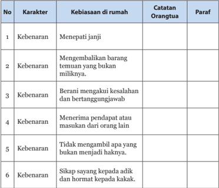

Tabel ini berisi karakter kebenaran yang dianjurkan di rumah, dengan catatan orang tua dan paraf untuk setiap karakter tersebut. Topik utama tabel adalah karakter kebenaran dan perilaku yang diharapkan di rumah. Kolom-kolomnya meliputi No, Karakter, Kebiasaan di rumah, Catatan Orang tua, dan Paraf. Data penting yang terlihat adalah bahwa semua karakter kebenaran memiliki catatan orang tua yang memberikan penjelasan atau petunjuk tentang bagaimana mengembangkan karakter tersebut. Paraf juga disediakan untuk setiap karakter, mungkin sebagai referensi atau sumber lain untuk mendiskusikan karakter tersebut.

 

---
## 📄 Halaman 159

### A

After life hidup setelah mati

Ai Cai seruan rasa sedih

Ao malaikat ruang Barat Daya Rumah

B

Ba Cheng Zhen Gui delapan keimanan

Bao Xin Ba De sikap delapan

kebajikan basic attitude sikap dasar

Bei Tang balairung/aula putih

Bei Xing malaikat bintang utara

C

Cheng Hsuan tokoh Khonghucu yang hidup di akhir Dinasti Han

Cheng Shun Mu Duo sepenuh iman mengikuti Genta Rohani (Nabi Kongzi)

Cheng Yang Xiao Si sepenuh iman memupuk cita berbakti

Cheng Zhe Gui Shen sepenuh percaya adanya nyawa dan roh

Chu Yi dan Shi Wu sembahyang Dian Xiang Tanggal 1 dan 15 Yinli

Chun Qiu zaman pertengahan Dinasti Zhou

Cu Si waktu antara jam 23.00 - 01.00 (malam)

### Glosarium

D

Da Cheng Zhi Sheng Wen Xuan Pemberita Kitab Suci Yang Besar

Wang Nabi Agung Guru Purba Sempurna.

da ling genta besar

Daxue Kitab Ajaran Besar

de kebajikan

Di Li Hukum Alam

Dian Xiang Sembahyang Chu Yi dan Shi Wu

ding li Menghormat dengan merangkapakan tangan (Bai) kepada yang lebih tua (posisi di atas dahi)

Dongzhi saat bersembahyang kepada Tian , pada saat matahari tepat berada pada titik terjauh di selatan,yakni tanggal 22 Desember.

E

Etimologi Ilmu tentang karakter huruf

F

Fa gao Kue mangkuk sajian sembahyang

Feng Shan menyempurnakan Firman

F.R Mateo Ricci misionaris Kristen dari ordo Jesuit yang datang ke daratan Cina.

Fu Rahmat

Fu De Zheng Shen Malaikat Bumi

 

---
## 📄 Halaman 160

### G

Gan sheng tanda-tanda gaib

Gui-Shen Nyawa dan Roh

Gui gao kue kura sajian sembahyang

### H

Hsieh Liang-tso dikenal juga sebagai master Shang ts'ai, adalah salah satu murid langsung terkemuka Ch'eng Hao dan Ch'eng I, tokoh NeoKonfusianisme di Song Utara Cina.

Huang Di Raja purba yang besar jasanya terhadap peradaban dan menjadi nenek moyang Nabi Kongzi.

Hun arwah

### I

Insting naluri

J

Jiao Agama

Jin duo genta dengan lidah pemukul dari logam.

Junzi Luhur Budi

### K

Kang-gao Kitab Dinasti Zhou

Kong Sang goa tempat Nabi Kongzi dilahirkan.

Kong Shu Liang He ayah Nabi Kongzi

Kongzili Penanggalan Nabi Kongzi L

Li alias Bo Yu anak laki-laki Nabi Kongzi

Li Ji Kitab Kesusilaan

Li Kesusilaan, hukum

Ling Sukma

Lu Ai Gong Raja Muda Negeri Lu pada abad ke 5.

Lu Ding Gong raja Negeri Lu zaman Nabi Kongzi

Luo Dao Gong Pangeran Jalan Suci Yang Jaya

### M

Mao shi waktu antara pukul 05.0007.00

Mengzi nama tokoh yang meluruskan ajaran Nabi Kongzi. Dikenal sebagai sang penegak.

Miao kuil/kelenteng rumah ibadah Khonghucu

Ming cerah

Ming De Kebajikan yang Bercahaya

Mo Zi salah satu nama tokoh aliran yang berkembang di zaman Zhan Guo

Mu Duo genta dengan lidah pemukul terbuat dari kayu.

N

Nanzi nama selir di Negeri Wei

Ni Fu Bapak Ni

P

Pasca sesudah

Po badan/Jasad

Pra sebelum

 

---
## 📄 Halaman 161

### Q

Qi roh

Qi Yue Chu Si tanggal 4 bulan 1 Yinli

Qing terang

Qilin hewan suci yang muncul menjelang kelahiran Nabi Kongzi

### R

Ren cinta kasih

Ren in action pelaksanaan cinta kasih

Ren Li hukum manusia

Ru Jiao istilah agama Khonghucu dalam bahasa kitab. Artinya agama bagi orang-orang yang lembut hati, yang terpelajar dan terbimbing.

### S

San Zi Jing Kitab Untaian Tiga Huruf

Shang Di Tuhan Yang Mahatinggi

Shang Di Tuhan Yang Mahatinggi/ Maha Kuasa

Shanzai demikian yang sebaik-baiknya

She lidah pemukul genta

Shen Zhu foto leluhur

Sheng Xuan Ni Fu Bapak Ni Pemberita Agama Yang Sempurna

Shenzu Gan rumah-rumahan pada altar leluhur

Shi Yi sepuluh Kewajiban

Shou Ming menerima Firman

Shujing Kitab Sejarah Suci

Si Duo petugas urusan keagamaan/ persembahyangan/upacara ritual

Sima Huan Tui nama penguasa Negeri Song yang lalim

Sima Niu adik Sima Huan Tui

Su Wang raja tanpa mahkota

### T

Tai Shi Maha Guru

Tao pohon persik

Tang Yao Raja suci yang meletakkan dasar Ru Jiao atau Agama Khonghucu.

Tian, Di, Ren Tuhan, Alam, Manusia

Tian Li Hukum Tuhan

Tian Zhi Mu Duo Genta Rohani Tuhan

W

Wan Shi Shi Biao Guru Teladan Sepanjang Masa

Wang Sun Jia nama menteri di Negeri Wei

Wei Shi waktu antara pukul 13.0015.00

Wen Sheng Ni Fu Bapak Ni Nabi Yang Mewarisi Kitab Suci

Wen Xuan Wang Raja Pemberita Kitab Suci

Wen Wang Raja suci pendiri Dinasti Zhou

Wu Fu Lin Men lima keberkahan menyertai penghuni rumah

Wu Lun lima hubungan kemasyarakatan

X

Xian Sheng Xuan Fu Bapak Pemberita Agama Nabi Purba

 

---
## 📄 Halaman 162

Xian Shi Ni Fu Bapak Ni Guru Purba

Xiang Lu tempat menancapkan dupa

Xiang Dupa

Xiang Hwee Miao Leluhur (Zu Miao)

Xiang wei tempat pendupaan

Xiaoren berbudi rendah

Xin Ci Dian kamus besar

Xin Chun tahun baru

Xing Watak Sejati

Xun Zi tokoh filsuf Khonghucu yang hidup di zaman peperangan antar tujuh negara dan memiliki pandangan yang berlawanan dengan Mengzi

### Y

Yan Zhengzai ibu Nabi Kongzi

Yanhui nama murid Nabi Kongzi yang paling pandai

Yang Huo nama pemberontak Negeri Lu

Yang Zhu salah satu nama tokoh aliran yang berkembang di zaman Zhan Guo

Yinli penanggalan bulan

Yu Shu Kitab batu kumala

Yu Shun penerus Raja Tang Yao, terkenal sebagai teladan anak berbakti

Z

Zai qin min mengasihi rakyat/sesama

Zao Jun Gong Malaikat Dapur

Zhan Guo Zaman peperangan antar 7 negara

Zhengzi murid Nabi Kongzi yang menjadi guru cucu Nabi Kongzi, yakni Zisi

Zhi Shan puncak kebaikan

Zhi Sheng Xian Shi Kong Fu Zi Nabi Agung Guru Purba Khonghucu

Zhi Sheng Wen Xuan Wang Nabi Agung Raja Pemberita Kitab Suci

Zhi Zhuo Deng Si Hu yang akan menetapkan hukum abadi dan membawakan damai bagi dunia

Zigong murid Nabi Kongzi yang memiliki kecakapan dalam berbicara, berusia 31 tahun lebih muda dari Nabi Kongzi

Zhong lonceng tanpa lidah dengan pemukul balok kayu

Zhong she Awal dan akhir

Zhong Ting Rumah abu umum Chunqiu

Zhonghua Bangsa Tionghoa

Zhongni anak kedua dari Bukit Ni

Zhou dinasti ketiga di Zhongguo

Zhou Jing Gong Kaisar Dinasti Zhou

Zhou Li Kitab Kesusilaan Dinasti Zhou

Zigong nama murid Nabi Kongzi yang pandai berdiplomasi

Zilu nama murid Nabi Kongzi yang gagah berani

Zu Miao Miao (kuil) leluhur

Zu zong wei meja abu leluhur

 

---
## 📄 Halaman 163

### Daftar Pustaka

Hwa, Tjiog Giok. Jalan Suci yang ditempuh para tokoh agama Khonghucu . Matakin Solo.

Ing,  Tjhie  Tjay. Panduan  Pengajaran  Dasa  Agama  Khonghucu .  Matakin Solo.

Lentera Konfusiani. 2007. Makin Curug Gunungsindur edisi ke 10 .

Media Konfusiani. 1998. Khongcu Bio Makin edisi Mei . Tangerang

Ongkowijaya, Bratayana. Widya Karya Edisi Khusus Harlah 255 0

Ongkowijaya, Bratayana. 1991. Widya Karya Edisi Harlah Nabi 2542

Ongkowijaya, Bratayana. Widya Karya Edisi Sincia 2542

Ronnie,  Dani.  2006. The  Power  Of  Emotional  &  Adversity  Quotient  For Teachers . Jakarta. Hikmah  Populer.

Si Shu  Kitab Yang Empat . Matakin Solo.

Simpkins, Alexander dan Annellen Simpkins. 2006. Simple Confusianism . Jakarta. PT. Buana Ilmu Populer.

Tang, Machael. Kisah-kisah Kebijaksanaan China Klasik .

Tata Laksana Upacara Agama Khonghucu . Matakin. Solo.

Wijanarko, Jarot. 2006. Kisah-kisah Ciptakan Nilai . Jakarta

Wu Jing Kitab Yang Lima . Matakin Solo.

Xiao Jing Kitab Bakti . Matakin Solo.

Yu Dan 1000 Hati Satu Hati Gerbang Kebajikan Ru . 2010. Jakarta

 

---
## 📄 Halaman 164

### Profil Penulis

Nama Lengkap  :  Hartono Hutomo, S.TP

Telp. Kantor/HP :   021-650 9941/0813-1073 9818

E-mail

:   ekolahminggukhonghucu@gmail.com

Akun Facebook :  ljlpk

Alamat Kantor

:   Ruko Royal Sunter blok D/6,

Jalan Danau Sunter Selatan, Jakarta

Bidang Keahlian:  Agama Khonghucu

### Riwayat pekerjaan/profesi dalam 10 tahun terakhir:

- 2014 - 2016: Bidang Pendidikan Majelis Tinggi Agama Khonghucu Jakarta.
- 2010 - 2014: Wakil Bidang Pendidikan Majelis Tinggi Agama Khonghucu Jakarta.
- 2006 - 2010: Kordinator Bidang Pendidikan Majelis Tinggi Agama Khonghucu Jakarta.

### Riwayat Pendidikan Tinggi dan Tahun Belajar:

- S2: Fakultas Ushuluddin/jurusan Perbandingan Agama/program studi Agama Khonghucu/Universitas Islam Negeri Syaif Hidayatullah Jakarta  (2014 - sekarang)
- S1: Fakultas Teknolog Pertanian/jurusan Teknologi Pangan dan Gizi/ program studi Pengolahan Pangan/Institut Pertanian Bogor  (1992 - 1997)

### Judul Buku dan Tahun Terbit (10 Tahun Terakhir):

- Pendidikan Agama dan Budi Pekerti Kelas VII;
- Pendidikan Agama dan Budi Pekerti Kelas X;
- Pendidikan Agama dan Budi Pekerti Kelas XI
- Media Pembelajaran Jenjang Pendidikan SMP kelas VII (video)
- Kumpulan Materi Sekolah Minggu (CD)
- Media Pembelajaran Sekolah Minggu (video - sedang dikerjakan)
- Harmoni Anak Indonesia (Editor)
- Judul Penelitian dan Tahun Terbit (10 Tahun Terakhir): Tidak ada.

 

---
## 📄 Halaman 165

### Profil Penulis

Nama Lengkap  :  Js. Gunadi, S.Pd.

Telp Kantor/HP  :   081315199783

E-mail

:   pra_buki@yahoo.com

Akun Facebook :  pra_buki@yahoo.com

Alamat Kantor

:   Komplek Royal Sunter Blok 5-6

Jalan Danau Sunter

Selatan Jakarta Utara 14350

Bidang Keahlian :  Agama Khonghucu

### Riwayat pekerjaan/profesi dalam 10 tahun terakhir:

- Kepala SD Setia Bhakti 2008-2010.
- Kepala SMK Setia Bhakti 2010-2014.

### Riwayat Pendidikan Tinggi dan Tahun Belajar:

- S1: Pendidikan/Keguruan dan Ilmu Pendidikan/PKn./STKIP Kusuma Negara (2003 - 2008)

### Judul Buku dan Tahun Terbit (10 Tahun Terakhir):

- Buku Teks Pendidikan Agama Khonghucu dan Budi Pekertyi kelas VII
- Buku Teks Pendidikan Agama Khonghucu dan Budi Pekertyi kelas X
- Buku Teks Pendidikan Agama Khonghucu dan Budi Pekertyi kelas XI
- Buku Teks Pendidikan Agama Khonghucu dan Budi Pekertyi kelas XII

### Judul Penelitian dan Tahun Terbit (10 Tahun Terakhir):

'Pengaruh Kewibawaan Guru terhadap Disiplin Siswa di SMK Setia Bhakti Tangerang'

 

---
## 📄 Halaman 166

### Profil Penelaah

Nama Lengkap  :  Xs. Dr. Oesman Arif, M.Pd.

Telp. Kantor/HP :   082141105839

E-mail

:   gentanusantara@gmail.com

Akun Facebook :  Xs Oesman Arief

Alamat Kantor

:   Jl. Drs. Yap Tjwan Bing No 15,

Surakarta Jawa Tengah

Bidang Keahlian:  Ilmu Filsafat Tiongkok,

Tusuk Jarum (Akupuntur)

### Riwayat pekerjaan/profesi dalam 10 tahun terakhir:

- 2008 - sekarang: Dosen luar biasa Universitas Negeri Solo (UNS)
- 1980 - sekerang: Dosen Agama Khonghucu di  Universitas Gajahmada (UGM)
- 2014 - 2015: Dosen Penguji  Doktor  di Universitas Indonesia (UI)
- 2013 - 2015: Dosen Tamu (Agama Khonghucu) Fakultas Ushuluddin UIN Syarif Hidayatullah Jakarta
- 1979 - 2007: Dosen Fakultas Sastra di Unervisitas Negeri Solo (UNS)

### Riwayat Pendidikan Tinggi dan Tahun Belajar:

- S3: Fakultas Filsafat Universitas Program Pascasarjana Universitas Gajahmada (2003-2007)
- S2: Fakultas Ilmu Sejarah IKIP Jakarta (1993-1996)
- S1: Fakultas Filsafat UGM, Universitas Gajahmada  (1973-1976)
- Sarjana Muda: Jurusan Filsafat Kebudayaan, IKIP  Negeri Surakarta (1968-1972)

### Judul Buku dan Tahun Terbit (10 Tahun Terakhir):

- Pendidikan Agama Khonghucu dan Budi Pekerti Tingkat SD;
- Pendidikan Agama Khonghucu dan Budi Pekerti Tingkat SMP;
- Pendidikan Agama Khonghucu dan Budi Pekerti Tingkat SMA;

### Judul Penelitian dan Tahun Terbit (10 Tahun Terakhir):

Penyelenggaraan Negara Menurut Filsafat Xun ZI (2007).

 

---
## 📄 Halaman 167

### Profil Penelaah

Nama Lengkap  : Js. Maria Engeline Santoso, S.Kom, M.Ag

Telp Kantor/HP  : 0878 3337 9688

E-mail

: mariaengeline@yahoo.com

Akun Facebook : mariaengeline@yahoo.com

Alamat Kantor

: Kompleks Royal Sunter Blok D-6,

Jl. Danau Sunter Selatan, Jakarta Utara

Bidang Keahlian: Agama Khonghucu

### Riwayat pekerjaan/profesi dalam 10 tahun terakhir:

- 2015-sekarang: Dosen character building: agama dan pancasila di Universitas Bina Nusantara Jakarta.
- 2011-2015: Guru Bahasa Mandarin di TK dan SD Mardi Yuana Depok, SD dan SMP Penuai Cibubur.
- 2010-2011: Guru Agama Khonghucu dan Budi Pekerti di SDN Mintaragen 4 dan 5 Tegal .

### Riwayat Pendidikan Tinggi dan Tahun Belajar:

- S2: Ushuluddin/Perbandingan Agama/Agama Khonghucu/UIN Syarif Hidayatullah Jakarta (2013-2015)
- S1: Teknik Informatika/Universitas Bina Nusantara Jakarta (2000-2004)

### Judul Buku dan Tahun Terbit (10 Tahun Terakhir):

- Buku Bahan Ajar Mata Kuliah Wajib Agama Khonghucu pada Perguruan Tinggi;
- Buku Pendidikan Agama Khonghucu dan Budi Pekerti tingkat SMALB.

### Judul Penelitian dan Tahun Terbit (10 Tahun Terakhir):

Pengaruh Ajaran Khonghucu tentang Ren terhadap Keharmonisan dan Kesejahteraan Keluarga (Studi Umat Khonghucu di Litang Harmoni Kehidupan Cimanggis (2015).

 

---
## 📄 Halaman 168

### Profil Editor

Nama Lengkap  :  Nening Daryati,SS

Telp. Kantor/HP :   081311417009

E-mail

:   dikningmaniez@gmail.com

Akun Facebook :  -

Alamat Kantor

:   Jl. Gunung Sahari Raya No 4

Komp. Eks Siliwangi, Senen - Jakarta Pusat

Bidang Keahlian:  Editor

### Riwayat pekerjaan/profesi dalam 10 tahun terakhir:

- 2005 - 2011: Staf Tata Usaha di Pusat Kurikulum, Balitbang,  Kemdikbud.
- 2011 - 2015: Staf Tata Usaha di Pusat Kurikulum dan Perbukuan
- 2015 - sekarang: Staf Bidang Perbukuan di Pusat Kurikulum dan Perbukuan

### Riwayat Pendidikan Tinggi dan Tahun Belajar:

- S1: Sastra Inggris/Pengajaran/Sekolah Tinggi Bahasa Asing LIA  (2006 - 2007).
- D3: Sastra Inggris/Terjemahan/Sekolah Tinggi Bahasa Asing LIA (2001 - 2003).

### Judul Buku yang Pernah DIedit (10 Tahun Terakhir):

- Buku Siswa dan Buku Guru Pendidikan Agama Islam Kelas VII;
- Buku Siswa dan Buku Guru Agama Khonghucu kelas XI;
- Buku Siswa Agama Khonghucu kelas XII.

### Judul Penelitian dan Tahun Terbit (10 Tahun Terakhir):

Tidak ada.

---

*📊 Statistik: 35 visual berhasil, 5 dilewati, 0 gagal | Durasi: 7m 9s*