# Salinan Kelas 11 Khonghucu BS press

*Diekstrak: 17 May 2026, 15:11*

---

---
## 📄 Halaman 1

### Pendidikan Agama Khonghucu dan Budi Pekerti

2

SMA/SMK

KELAS XI

 

---
## 📄 Halaman 2

### Hak Cipta © 2017 pada Kementerian Pendidikan dan Kebudayaan Dilindungi Undang-Undang

Disklaimer: Buku ini merupakan buku siswa yang dipersiapkan Pemerintah dalam rangka implementasi Kurikulum 2013. Buku siswa ini disusun dan ditelaah oleh berbagai pihak di bawah koordinasi Kementerian Pendidikan dan Kebudayaan, dan dipergunakan dalam tahap awal penerapan Kurikulum 2013. Buku ini merupakan 'dokumen hidup' yang senantiasa diperbaiki,  diperbaharui,  dan  dimutakhirkan  sesuai  dengan  dinamika  kebutuhan  dan perubahan zaman. Masukan dari berbagai kalangan yang dialamatkan kepada penulis dan laman http://buku.kemdikbud.go.id atau melalui email buku@kemdikbud.go.id diharapkan dapat meningkatkan kualitas buku ini.

### Katalog Dalam Terbitan (KDT)

Indonesia. Kementerian Pendidikan dan Kebudayaan.

- Pendidikan Agama Khonghucu dan Budi Pekerti / Kementerian Pendidikan dan Kebudayaan.-- . Edisi Revisi Jakarta: Kementerian Pendidikan dan Kebudayaan, 2017. vi, 194 hlm. : ilus. ; 25 cm. Untuk SMA/SMK Kelas XI ISBN  978-602-427-082-7 (jilid lengkap) ISBN  978-602-427-084-1 (jilid 2) 1. Khonghucu -- Studi dan Pengajaran I. Judul II. Kementerian Pendidikan dan Kebudayaan 299.512
Penulis

:  Js. Hartono dan Js. Gunadi.

Penelaah

:  Xs. Oesman Arif, Xs. Buanadjaja, dan Js. Maria Engelina Santoso.

Pereview Guru

:  Cici Indriyani.

Penyelia Penerbitan : Pusat Kurikulum dan Perbukuan, Balitbang, Kem en dikbud.

Cetakan Ke-1, 2014 ISBN 978-602-282-443-5 (jilid 2) Cetakan Ke-2, 2017 (Edisi Revisi)

Disusun dengan huruf Georgia, 12 pt.

 

---
## 📄 Halaman 3

### Kata Pengantar

Salam Kebajikan, Wei De Dong Tian .

Seiring dengan Penguatan dan Penataan Ulang Kurikulum yang terus dilakukan  oleh  Kement e rian Pendidikan dan Kebudayan ,  kami  turut  menyambut  baik  karena  mendapat kesempatan untuk turut memperbaiki dan menata ulang Kurikulum Pendidikan Agama Khonghucu.  Kiranya  penataan untuk Kurikulum 2013  ini benar-benar dapat  meningkatkan  kualitas pendidikan  Indonesia,  yang  tentunya  ditandai dengan pencapaian kompetensi oleh peserta didik yang sesuai dengan kebutuhannya.

Kiranya  ketersediaan  buku  Teks  Pendidikan  Agama  Khonghucu dan Budi Pekerti ini dapat benar-benar  menjadi sarana pendukung kegiatan  belajar-mengajar  di  sekolah  dalam  rangka  membentuk karakter peserta didik yang mulia dan unggul. Materi yang disajikan dalam buku ini mecakup Kitab Suci; Tata Ibadah dan Persembahyangan; Wahyu dan Iman (aspek ajaran); Perilaku Junzi; dan Sejarah Suci.

Akhir  kata,  kami  sampaikan  terima  kasih  kepada  semua  pihak yang telah berpartisipasi dalam penyusunan dan penerbitan buku ini. Untuk perbaikan dan penyempurnaan di masa mendatang kami sangat mengharapkan  masukan dan saran konstruktif dari semua pihak.

Jakarta, Januari 2016

 

---
## 📄 Halaman 4

### Daftar Isi

 

---
## 📄 Halaman 6

### Daftar Gambar

 

---
## 📄 Halaman 7

---
**🖼️ Gambar/Diagram**

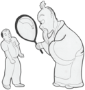

> **Deskripsi Visual:** Gambar ini adalah ilustrasi yang menunjukkan dua karakter: seorang pria muda dan seorang pria tua. Pria muda sedang berbicara dengan pria tua yang tampak agak marah. Pria tua memiliki ekspresi wajah yang tegang dan memegang sebuah alat elektronik besar. Pria muda tampak lebih tenang dan berada di depan pria tua.

Elemen utama dalam gambar adalah dua karakter manusia, pria muda dan pria tua, serta alat elektronik yang dimegang oleh pria tua. Relasi antara kedua karakter adalah interaksi sosial, di mana pria muda sedang berbicara kepada pria tua yang tampak marah. Alat elektronik yang dimegang oleh pria tua menjadi elemen penting dalam konteks interaksi tersebut.

Teks, angka, atau label penting tidak terlihat dalam gambar ini. Namun, informasi kunci yang dapat diambil pembaca melalui gambar adalah hubungan sosial antara dua karakter dan perasaan pria tua yang tampak marah.

Dalam satu paragraf, gambar ini menunjukkan dua karakter manusia, pria muda dan pria tua, dengan pria tua memegang alat elektronik besar dan tampak marah. Interaksi sosial antara kedua karakter menjadi fokus utama, sementara alat elektronik menjadi elemen penting dalam konteks interaksi tersebut.

### Pembinaan Diri sebagai Kewajiban Pokok

---
**🖼️ Gambar/Diagram**

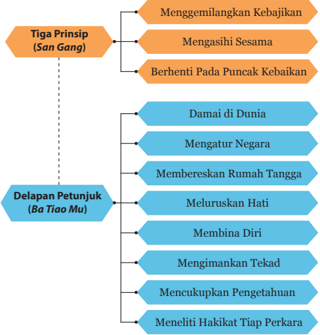

> **Deskripsi Visual:** Gambar ini adalah diagram yang menunjukkan tiga prinsip (San Gang) dan delapan petunjuk (Ba Tiao Mu) dalam sebuah konsep atau pendidikan. Prinsip utama ditampilkan dengan warna oranye dan berada di bagian atas, sementara petunjuk ditampilkan dengan warna biru dan berada di bawah. 

Elemen utama yang ditampilkan adalah tiga prinsip dan delapan petunjuk. Prinsip utama meliputi menggemilangkan kebajikan, mengasihasi sesama, dan berhenti pada puncak kebaikan. Petunjuk tersebut meliputi damai di dunia, mengatur negara, membereskan rumah tangga, meluruskan hati, membingina diri, mengimankan tekad, mencukupkan pengetahuan, dan meneliti hikmat tiap perkara.

Teks, angka, atau label penting yang terlihat adalah nama-nama prinsip dan petunjuk serta warna yang digunakan untuk menandakan kategori mereka. Informasi kunci yang dapat diambil pembaca adalah bahwa ada tiga prinsip utama yang harus dipatuhi dan delapan petunjuk yang membantu dalam mewujudkannya.

 

---
## 📄 Halaman 8

### A.  Pelajaran Agung dari Daxue

Dalam pengantar Zhuxi untuk kitab Ajaran Besar ( Daxue ) tertulis: Guruku Zhengzi berkata: 'Kitab Daxue ini adalah warisan mulia kaum Kong yang merupakan ajaran permulaan untuk masuk pintu gerbang kebajikan. Dengan ini akan dapat diketahui urutan cara belajar orang zaman  dahulu.  Hanya  oleh  terpeliharanya  kitab  ini,  selanjutnya dapat  dipelajari  baik-baik  kitab Lunyu dan  Kitab Mengzi .  Maka yang bermaksud belajar hendaklah mulai dengan bagian ini, dengan demikian tidak akan keliru'.

Kitab Daxue ini  berasal  dari  satu  di  antara  kitab Wujing ,  yaitu kitab Liji (kitab catatan kesusilaan). Awalnya, kitab ini tidak memuat bab dan ayat, namun kemudian Zisi (cucu Nabi Kongzi ) atas perintah gurunya Zengzi (salah  seorang murid Kongzi ),  memilah-milah buku ini,  hasilnya  adalah  satu  bab  naskah  kuno  yang  berasal  dari  Nabi Kongzi yang diturunkan kepada Zengzi , sebagai bab pendahuluan atau bab utama, sedangkan sepuluh bab yang lainnya sebagai uraian yang berisi pandangan Zengzi yang dicatat oleh para murid-muridnya.

Bab Utama dari Kitab Daxue yang terdiri dari tujuh ayat itu memuat hal pokok dan mendasar tentang pembinaan diri/pengembangan diri, yaitu:

- Adapun Jalan Suci yang dibawakan Ajaran Besar ( Daxue ) itu ialah; Menggemilangkan Kebajikan ( Mingde ) yang Bercahaya, Mengasihi Rakyat/Sesama ( Zai Qinmin ), dan berhenti pada Puncak Kebaikan ( Zhishan ).
- Bila sudah diketahui Tempat Hentian, akan diperoleh ketetapan/ tujuan. Setelah diperoleh ketetapan/tujuan barulah dapat dirasakan ketentraman,  setelah  tentram  barulah  orang  dapat  merasakan kesentosaan  batin,  setelah  sentosa  barulah  orang  dapat  berpikir benar, dengan berpikir benar, barulah orang dapat berhasil.
- Tiap  benda  mempunyai pangkal dan ujung, dan tiap perkara itu mempunyai awal dan akhir. Orang yang mengetahui mana hal yang dahulu dan mana hal yang kemudian ia sudah dekat dengan Jalan Suci.

 

---
## 📄 Halaman 9

- Orang  zaman  dahulu  yang  hendak  menggemilangkan  kebajikan yang  bercahaya  itu  pada  setiap  umat  di  dunia,  ia  lebih  dahulu berusaha mengatur negerinya; untuk mengatur negerinya, ia lebih dahulu  membereskan  rumah  tangganya;  untuk  membereskan rumah  tangganya, ia lebih dahulu membina  dirinya; untuk membina  dirinya,  ia  lebih  dahulu  meluruskan  hatinya;  untuk meluruskan  hatinya,  ia  lebih  dahulu  mengimankan  tekadnya; untuk  mengimankan  tekadnya,  ia  lebih  dahulu  mencukupkan pengetahuannya;  dan  untuk  mencukupkan  pengetahuannya,  ia meneliti hakikat tiap perkara.
- Dengan meneliti hakikat tiap perkara dapat cukuplah pengetahuannya;  dengan  cukup  pengetahuannya  akan  dapatlah mengimankan tekadnya; dengan tekad yang beriman akan dapat meluruskan hatinya; dengan hati yang lurus akan dapat membina dirinya;  dengan  diri  yang  terbina  akan  dapatlah  membereskan rumah tangganya;  dengan  rumah  tangga  yang  beres  akan  dapat mengatur negerinya; dan dengan negeri yang teratur akan dapat dicapai damai di dunia.
- Karena itu dari raja sampai rakyat jelata mempunyai satu kewajiban yang sama, yaitu mengutamakan pembinaan diri sebagai pokok.
- Adapun pokok yang salah itu tidak pernah menghasilkan penyelesaian yang baik, karena hal itu seumpama menipiskan benda yang  seharusnya  tebal  dan  menebalkan  benda  yang  seharusnya tipis. Hal ini adalah sesuatu yang belum pernah terjadi.
Aktivitas 1.1

### Diskusi Kelompok

'Orang yang mengetahui mana hal yang dahulu dan mana hal yang kemudian dia sudah dekat dengan Jalan Suci'. Diskusikanlah  maksud  ayat  suci  di  atas,  dan  berikan  paparan serta contoh nyatanya!

 

---
## 📄 Halaman 10

### 1. Menggemilangkan Kebajikan yang Bercahaya

Tian Yang Maha Esa menjelmakan manusia melengkapinya dengan dua bagian yang tak terpisahkan, yaitu: roh ( shen )  atau  daya  hidup rohani, dan nyawa ( gui ) atau daya hidup jasmani. Daya hidup Rohani itu adalah Watak Asli atau Watak Sejati yang di dalamnya terkandung benih-benih kebajikan, yaitu: Cinta kasih ( ren ), Kebenaran ( yi ), Susila ( li ), Bijaksana ( zhi ). Benih-benih kebajikan adalah kemampuan luhur manusia untuk berbuat baik/bajik. Watak Sejati ( xing ) inilah Firman Tian atas diri manusia dan menjadi kodrat suci manusia.

Dengan Watak Sejati  sebagai  Firman Tian yang  menjadi  kodrat sucinya itulah manusia mampu/berpotensi berbuat baik/bajik. Tetapi seperti dinyatakan (tertulis dalam Kang -gao ), 'Sesungguhnya Firman Tian itu  tidak  berlaku selamanya, kepada yang berbuat baik akan  mendapatkan  dan  yang  berbuat  tidak  baik  akan  kehilangan'. Begitupun apa yang telah difirmankan Tian atas manusia (watak sejati) yang menjadi kodrat sucinya. Artinya, bahwa manusia dapat menjadi tetap baik dan lebih baik, atau sebaliknya. Menggemilangkan berarti membuat sesuatu yang pada awalnya baik (watak sejati) menjadi lebih baik, dan bahkan dapat memberikan kebaikan kepada orang lain dan alam semesta.

Dalam  Kitab San Zi Jing disebutkan:  'Manusia  pada  mulanya memiliki  watak  sejati  baik.  Watak  sejati  itu  saling  mendekatkan (karena sama yakni menyukai kebajikan). Kebiasaan dan lingkungan itu yang menjauhkan. Bila tidak terbimbing/terdidik (dengan agama) watak sejatinya dapat berantakan. Jalan suci yang dibawakan agama memberikan kemampuan/kecakapan yang luhur mulia'.

### 2.  Mengasihi Sesama

Watak  Sejati  itu  memang  baik  pada  mulanya,  tetapi  dapatkah tetap baik sampai pada akhirnya? Inilah pertanyaan besar sepanjang perjalanan hidup manusia di atas dunia.

 

---
## 📄 Halaman 11

Mengasihi sesama, adalah kewajiban manusia dalam menggemilangkan  kebajikan  (watak  sejatinya).  Wujud  pelaksanaan menggemilangkan kebajikan yang bercahaya adalah dengan mengasihi sesama. Mengasihi sesama mengandung arti mengasihi orang-orang di  sekitar  kita.  Sifat-sifat  kemanusiaan  kita  diuji  melalui  orangorang yang ada di sekitar kita. Inilah yang dimaksud dengan manusia memanusiakan manusia. Mengasihi sesama dimulai dari yang dekat (keluarga) dan selanjutnya kepada yang jauh, bahkan sampai melewati batas-batas gender, suku, ras, etnis, agama atau kesamaan-kesamaan tertentu.

Nabi Kongzi mengajarkan  kepada  kita  bahwa  rasa  mengasihi memang  untuk  semua  orang,  tetapi  kita  harus  berhubungan  erat dengan  orang-orang  yang  berpericinta  kasih.  Nasihat  ini  tertulis dalam kitab Lunyu Jilid 1 pasal 2: 'Seorang muda di rumah hendaklah bersikap  bakti,  di  luar  hendaklah  bersikap  rendah  hati,  hati-hati sehingga dapat dipercaya, menaruh cinta kepada masyarakat (sesama), dan berhubungan erat dengan orang-orang yang berpericinta kasih'.

Aktivitas 1.2

### Diskusi Kelompok

Mengapa Nabi Kongzi menasihati untuk mencintai semua orang (sesama), tetapi kita harus dekat dengan orang yang berpricinta kasih?

Diskusikanlah maksud ayat suci di atas, dan berikan paparan dan contoh nyatanya!

### 3.  Berhenti pada Puncak Kebaikan

Berhenti pada Puncak Kebaikan dalam konteks ini berarti bertahan pada sikap senantiasa berusaha melakukan yang terbaik (spirit 'ter-'), dan  puncak  kebaikan  itulah  tempat  hentian  yang  harus  diusahakan oleh setiap orang. Apa puncak kebaikan sebagai tempat hentian itu?

 

---
## 📄 Halaman 12

Puncak kebaikan ini terkait erat dengan predikat atau peran yang kita miliki. Misalnya, dalam peran kita sebagai seorang anak adalah bersikap bakti, sebagai orangtua ia tahu harus bersikap kasih sayang; sebagai atasan harus bersikap cinta kasih; sebagai bawahan bersikap hormat  dan  setia  pada  tugas;  sebagai  suami  tahu  harus  bersikap bertanggung jawab; sebagai istri bersikap patuh mengikuti dan tahu kewajiban;  sebagai  kakak  bersikap  mendidik;  sebagai  adik  bersikap menurut; sebagai sesama teman dalam pergaulan harus bersikap dapat dipercaya.

Dari sini dapatlah dimengerti, bahwa peran atau predikat setiap orang tidak tunggal. Lebih dari itu, bahwa seiring dengan waktu peran atau predikat setiap orang bertambah. Misalkan, pada awalnya peran orang hanya sebagai anak, namun kemudian menjadi kakak setelah mempunyai  adik;  dari  orang  yang  lebih  muda  menjadi  orang  yang lebih tua dan seterusnya.

Tentang  puncak  kebaikan  ini  lebih  jelas  sebagaimana  tertulis dalam kitab Daxue bab  III  pasal  3,  sebagai  berikut:  Di  dalam  Kitab Sanjak tertulis, 'Sungguh Agung dan Luhur raja Wen , betapa gemilang budinya  karena  selalu  di  puncak  kebaikan.  Sebagai  raja  ia  bersikap cinta  kasih;  sebagai  menteri  bersikap  hormat  (akan  tugas);  sebagai anak bersikap bakti; sebagai ayah bersikap kasih sayang; dan di dalam pergaulan dengan rakyat senegeri bersikap dapat dipercaya'.

Aktivitas 1.3

### Diskusi Kelompok

Diskusikan, apa yang dimaksud dengan puncak kebaikan sebagai tempat hentian itu!

 

---
## 📄 Halaman 13

'Bila sudah diketahui Tempat Hentian, akan diperoleh Ketetapan/ Tujuan. Setelah diperoleh ketetapan/tujuan barulah dapat dirasakan Ketentraman, setelah tentram barulah orang dapat merasakan kesentosaan  batin,  setelah  sentosa  barulah  orang  dapat  berpikir benar, dengan berpikir benar, barulah orang dapat berhasil'. ( Daxue III : 4)

### B.  Pembinaan Diri Kewajiban Pokok Setiap Manusia

Kitab Daxue atau Kitab Ajaran Besar yang merupakan kitab pertama dari empat kitab ( Sishu ) yang berisi ajaran dan asas-asas pengetahuan moral  yang  tinggi,  untuk  diterapkan  dalam  perilaku  kehidupan  kita. Secara  sederhana, Daxue mengajarkan  bahwa  pembinaan  diri  dan pengembangan  pribadi  adalah  hal  pertama  yang  harus  diperhatikan jika  ingin  mencapai  damai  di  dunia.  Langkah  perantaranya  adalah tercipta  keteraturan-keteraturan  dalam  setiap  pemerintahan/negara, dan keteraturan sebuah negara itu tidak bisa lepas dari keberesan setiap rumah  tangga,  dan  setiap  rumah  tangga  itu  tidak  bisa  terlepas  dari pribadi-pribadi yang terbina di dalamnya.

Target tertingginya adalah dapat menggemilangkan kebajikan yang bercahaya pada setiap umat di dunia sehingga sampai pada satu kondisi damai di dunia, dan pembinaan diri adalah langkah awal yang tidak bisa dielakkan. Ini adalah sebuah pemikiran sederhana tetapi sangat agung, bahwa pembinaan diri (pengembangan pribadi) merupakan akar dari semua kebaikan dan merupakan dasar dari suatu tujuan tertinggi umat manusia di atas dunia ini.

Daxue Bab utama ayat 4 - 5, menyebutkan: 'Orang zaman dahulu yang hendak menggemilangkan kebajikan yang bercahaya pada setiap umat  di  dunia,  ia  lebih  dahulu  berusaha  mengatur  negerinya;  untuk mengatur negerinya, ia lebih dahulu membereskan rumah tangganya; untuk  membereskan  rumah  tangganya,  ia  lebih  dahulu  membina dirinya; untuk membina dirinya, ia lebih dahulu meluruskan hatinya; untuk  meluruskan  hatinya,  ia  lebih  dahulu  mengimankan  tekadnya;

 

---
## 📄 Halaman 14

untuk mengimankan tekadnya, ia lebih dahulu mencukupkan pengetahuannya; dan untuk mencukupkan pengetahuannya, ia meneliti hakikat tiap perkara'.

'Dengan meneliti hakikat tiap perkara dapat cukuplah pengetahuannya; dengan cukup pengetahuannya akan dapatlah mengimankan  tekadnya;  dengan  tekad  yang  beriman  akan  dapatlah meluruskan hatinya; dengan hati yang lurus akan dapatlah membina dirinya; dengan diri yang terbina akan dapatlah membereskan rumah tangganya; dengan rumah tangga yang beres akan dapatlah mengatur negerinya; dan dengan negeri yang teratur akan dapat dicapai damai di dunia'.

Aktivitas 1.4

### Tugas Mandiri

Berikan komentar dan pandanganmu terkait pernyataan bahwa pembinaan diri adalah kewajiban pokok setiap manusia! Apa yang dapat kalian simpulkan dari materi tersebut?

### 1.  Membina Diri Membereskan Rumah Tangga

Dalam Daxue Bab  VIII  ayat  1-3  dijelaskan  bahwa  untuk  dapat membereskan rumah tangga itu berpangkal pada pembinaan diri.

- Adapun yang dikatakan untuk membereskan rumah tangga harus lebih-dahulu  membina  diri  itu  ialah:  di  dalam  mengasihi  dan mencintai  biasanya  orang  menyebelah;  di  dalam  menghina  dan membenci biasanya orang menyebelah; di dalam menjunjung dan menghormat  biasanya  orang  menyebelah;  di  dalam  menyedihi dan mengasihi biasanya orang menyebelah; dan di dalam merasa bangga dan agungpun biasanya orang menyebelah. Sesungguhnya orang yang dapat mengetahui keburukan pada apa-apa yang disukai dan dapat mengetahui kebaikan pada apa-apa yang dibenci, amat jaranglah kita jumpai di dalam dunia ini.

 

---
## 📄 Halaman 15

- Maka  di  dalam  peribahasa  dikatakan,  'Orangtua  tidak  tahu keburukan  anaknya,  seperti  petani  yang  tidak  tahu  kesuburan padinya'.
- Inilah  yang  dikatakan,  bahwa  diri  yang  tidak  terbina  itu  takkan sanggup membereskan rumah tangganya.

### 2.  Membereskan Rumah Tangga Mengatur Negara

Dalam Daxue Bab IX pasal 1 - 3 dijelaskan, bahwa untuk dapat mengatur Negara itu berpangkal pada keberesan rumah tangga.

- Adapun  yang  dikatakan  untuk  mengatur  negara  harus  lebih dahulu membereskan rumah tangga, maksudnya ialah: tidak dapat mendidik keluarga sendiri tetapi dapat mendidik orang lain itulah hal yang takkan terjadi. Maka seorang Junzi biar  tidak  ke  luar  rumah, dapat menyempurnakan  pendidikan  di  keluarganya.  Dengan berbakti kepada ayah bunda, ia dapat turut mengabdi kepada raja; dengan bersikap rendah hati, ia turut mengabdi kepada atasannya; dan dengan bersikap kasih sayang, turut mengatur masyarakat.
- Di dalam Kang-gao tertulis, 'Berlakulah seumpama merawat bayi, bila  dengan  sebulat  hati  mengusahakannya,  meski  tidak  tepat benar,  niscaya  tidak  jauh  dari  yang  seharusnya.  Sesungguhnya tiada  yang  harus  lebih  dahulu,  belajar  merawat  bayi  baru  boleh menikah'.
- Bila dalam keluarga saling mengasihi niscaya seluruh negara akan di  dalam Cinta Kasih. Bila dalam tiap keluarga saling mengalah, niscaya seluruh Negara akan di dalam suasana saling mengalah. Tetapi bilamana orang tamak dan curang, niscaya seluruh negara akan terjerumus ke dalam kekalutan; demikianlah semuanya itu berperan.  Maka  dikatakan,  sepatah  kata  dapat  merusak  perkara dan satu orang dapat berperan menenteramkan Negara.

 

---
## 📄 Halaman 16

---
**🖼️ Gambar/Diagram**

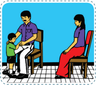

> **Deskripsi Visual:** Gambar ini adalah ilustrasi yang menunjukkan dua orang dewasa dan seorang anak kecil berada di sebuah ruangan yang tampak seperti kantor atau sekolah. Dewasa di sebelah kiri sedang memegang kursi untuk anak kecil, sementara dewasa di sebelah kanan duduk di kursi. Anak kecil tampak sedang berdiri di depan mereka. 

Elemen utama dalam gambar ini adalah dua orang dewasa dan seorang anak kecil. Dewasa di sebelah kiri tampak lebih tua dan sedang memegang kursi untuk anak kecil, sementara dewasa di sebelah kanan tampak lebih muda dan duduk di kursi. Anak kecil tampak berdiri di depan mereka.

Teks, angka, atau label penting tidak ada dalam gambar ini. Namun, informasi kunci yang dapat diambil pembaca adalah bahwa ada tiga individu dalam situasi yang tampaknya berhubungan, mungkin dalam konteks pendidikan atau sosial.

Sumber: dokumen Kemendikbud

- Yao dan Shun dengan  cinta  kasih  memerintah  dunia,  maka rakyatpun mengikutinya. Jie dan Zhou dengan kekejaman memerintah dunia, maka rakyatpun mengikutinya. Perintah yang tidak  sesuai  dengan  kehendak  rakyat,  rakyat  takkan  menurut; maka  seorang Junzi lebih  dahulu  menuntut  diri  sendiri,  baru kemudian mengharap dari orang lain. Bila diri sendiri sudah tak bercacat baru boleh mengharapkan dari orang lain. Bila diri sendiri belum  dapat  bersikap  Teposelero  (tahu  menimbang/tenggang rasa), tetapi berharap dapat memperbaiki orang lain, itulah suatu hal yang belum pernah terjadi.
- Maka  teraturnya Negara  itu sesungguhnya  berpangkal  pada keberesan dalam rumah tangga.
- Di dalam Kitab Sanjak tertulis, 'Betapa indah pohon persik ( Tao ) lebat  rimbunlah  daunnya;  laksana  nona  pengantin  ke  rumah suami, ciptakan damai dalam keluarga'. Dengan damai di dalam rumah barulah dapat mendidik rakyat negara.
- Di  dalam  Kitab  Sanjak  tertulis,  'Hormatilah  kakakmu,  cintailah adikmu. Hormatilah kakakmu, cintailah adikmu'. Dengan demikian barulah dapat mendidik rakyat negara.
- Di  dalam  Kitab  Sanjak  tertulis,  'Laku  yang  tanpa  cacat  itulah akan  meluruskan  hati  rakyat  di  empat  penjuru  negara'.  Dapat

 

---
## 📄 Halaman 17

- melaksanakan sebagai bapak, sebagai anak, sebagai kakak dan  sebagai adik,  barulah  kemudian  dapat  berharap  rakyat meneladaninya.
- Inilah  yang  dikatakan  mengatur  negara  itu  berpangkal  pada keberesan rumah tangga.

### 3.  Teraturnya Negara Damai di Dunia

Dalam Daxue Bab  X  Pasal  1-10  dijelaskan,  bahwa  untuk  dapat mencapai damai di dunia itu berpangkal pada teraturnya negara.

- Adapun  yang  dikatakan  damai  di  dunia  itu  berpangkal  pada teraturnya negara ialah: bila para pemimpin dapat hormat kepada orang yang lanjut usia, niscaya rakyat bangun rasa baktinya; bila para  pemimpin  dapat  merendah  diri  kepada  atasannya,  niscaya rakyat  bangun  rasa  rendah  hatinya;  bila  para  pemimpin  dapat berlaku  kasih  dan  memperhatikan  rakyatnya,  niscaya  rakyatpun tidak mau ketinggalan. Itulah sebabnya seorang Junzi mempunyai jalan suci yang bersifat siku.
- Apa yang tidak baik dari atas tidak dilanjutkan ke bawah; apa yang tidak  baik  dari  bawah  tidak  dilanjutkan  ke  atas;  apa  yang  tidak baik dari muka tidak dilanjutkan ke belakang; apa yang tidak baik dari belakang tidak dilanjutkan ke muka; apa yang tidak baik dari kanan tidak dilanjutkan ke kiri; apa yang tidak baik dari kiri tidak dilanjutkan ke kanan. Inilah yang dinamai jalan suci yang bersifat siku.

 

---
## 📄 Halaman 18

---
**🖼️ Gambar/Diagram**

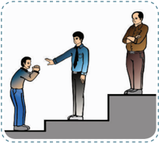

> **Deskripsi Visual:** Gambar ini adalah ilustrasi yang menunjukkan tiga orang yang sedang berbicara. Pada gambar tersebut, dua orang yang berdiri di atas tangga sedang berbicara dengan orang yang berdiri di lantai bawah. Orang yang berdiri di tangga tampak lebih tinggi dari orang di lantai bawah. Gambar ini mungkin digunakan untuk menggambarkan konsep hubungan sosial atau perbedaan status sosial dalam masyarakat.

Sumber: dokumen Kemendikbud

- Di dalam Kitab Sanjak tertulis, 'Bahagialah seorang Junzi , karena dialah ayah bunda rakyat', ia menyukai apa yang disukai rakyat dan membenci apa yang dibenci rakyat. Inilah yang dikatakan ia sebagai ayah bunda rakyat.
- Di dalam Kitab Sanjak tertulis, 'Pandanglah gunung Selatan, tinggi megah  batu  di  puncaknya,  ingatlah  akan  kebesaranmu  menteri Yin,  rakyat  selalu  melihatmu'.  Maka  seorang  yang  memegang kekuasaan  di  dalam  negara  tidak  boleh  tidak  hati-hati,  bila  ia menyebelah, dunia akan mengutuknya.
Lebih lanjut dijelaskan di dalam Daxue Bab X pasal 7-9 tentang kebajikan dan kekayaan, tentang yang pokok yang ujung: 'Kebajikan itulah yang pokok dan kekayaan itulah yang ujung'. 2) Bila mengabaikan yang pokok dan mengutamakan yang ujung, inilah meneladani rakyat untuk berebut. 3) Maka penimbunan kekayaan itu akan menimbulkan perpecahan di  antara  rakyat;  sebaliknya  tersebarnya  kekayaan  akan menyatukan rakyat.

### C.  Proses Pembinaan Diri

Bagaimana caranya mencapai pembinaan diri atau pengembangan pribadi?  Berikut  ini  adalah  urutan  penting  yang  harus  diperhatikan sebagai proses pembinaan diri seperti tercatat dalam Daxue . Bab VII:

 

---
## 📄 Halaman 19

'…Untuk  membina  dirinya  ia  lebih  dahulu  meluruskan  hatinya; untuk meluruskan hatinya, ia lebih dahulu mengimankan tekadnya; untuk  mengimankan  tekadnya,  ia  mencukupkan  pengetahuannya; dan  untuk  mencukupkan  pengetahuannya,  ia  meneliti  hakikat  tiap perkara'.

'Dengan meneliti hakikat tiap perkara dapat cukuplah pengetahuannya;  dengan  pengetahuan  yang  cukup  akan  dapatlah mengimankan tekadnya; dengan tekad yang beriman akan dapatlah meluruskan hatinya; dengan hati yang lurus akan dapatlah membina dirinya; dengan diri yang terbina akan dapatlah membereskan rumah tangganya; dengan rumah tangga yang beres akan dapatlah mengatur negerinya;  dan  dengan  negeri  yang  teratur  akan  dapatlah  dicapai damai di dunia'.

Dari  ayat  tersebut,  dapat  kalian  ketahui  bahwa  langkah-langkah pembinaan diri meliputi:

- Meneliti hakikat tiap perkara
- Mencukupkan pengetahuan
- Mengimankan tekad
- Meluruskan hati
- Membina diri

### 1. Meneliti Hakikat Setiap Perkara Mencukupkan Pengetahuan

Dalam Daxue Bab  V  pasal  1,  dijelaskan:  'Adapun  yang  dinamai meluaskan  pengetahuan  dengan  meneliti  hakikat  tiap  perkara  itu ialah:  Bila  kita  hendak  meluaskan  pengetahuan,  kita  harus  meneliti hukum  ( li )  sembarang  hal  sampai  sedalam-dalamnya.  Oleh  karena manusia itu mempunyai kekuatan bathin, sudah selayaknya tidak ada hal yang tidak dapat diketahui; selain itu juga karena tiap hal di dunia ini sudah mempunyai hukum tertentu. Tetapi kalau kita belum dapat mengetahui hukum itu sedalam-dalamnya, itulah karena kita belum sekuat tenaga menggunakan kecerdasan. Maka Kitab Daxue ini mula-

 

---
## 📄 Halaman 20

mula mengajarkan kita yang hendak belajar, supaya dapat menyelami dalam-dalam segala hal ihwal di dunia ini. Seorang yang mempunyai pengetahuan  hukum  itu  sedalam-dalamnya,  akan  menjadikan  ia sanggup mencapai puncak kesempurnaan'.

Bila  kita  dengan  sepenuh  tenaga  mempelajarinya,  niscaya  pada suatu pagi walaupun mungkin lama kita akan memperoleh kesadaran bathin  yang  menjalin  dan  menembusi  segala-galanya.  Di  situ  kita akan lihat semuanya luar dan dalam, halus dan kasar sehingga tidak ada  suatupun  yang  tidak  terjangkau.  Demikianlah  batin  kita  telah sepenuhnya  digunakan  sehingga  tiada  sesuatu  yang  tidak  terang. Demikianlah yang dinamai mengetahui pangkal, dan demikian pula yang dinamai memperoleh pengetahuan yang sempurna.

### 2.  Mengimankan Tekad

Dalam Daxue Bab VI pasal 1- 4, dijelaskan:

- Adapun yang dinamai mengimankan tekad itu ialah tidak mendustai diri  sendiri,  yakni  seperti  membenci  bau  busuk  dan  menyukai keelokan. Inilah yang dinamai bahagia di dalam diri sejati. Maka seorang Junzi hati-hati pada waktu seorang diri.
- Seorang rendah budi ( Xiaoren ) pada saat terluang dan menyendiri  suka  berbuat  hal-hal  yang  tidak  baik  dengan  tanpa mengenal  batas.  Bila  saat  itu  terlihat  oleh  seorang  Junzi,  ia mencoba menyembunyikan perbuatannya yang tidak baik itu dan berusaha  memperlihatkan  kebaikannya.  Tetapi  bila  orang  mau memperhatikannya  baik-baik,  niscaya  dapat  melihat  terang  isi hati dan perutnya. Maka apa gunanya perbuatan palsu itu? Inilah yang dinamai iman yang di dalam itu akan nampak meraga ke luar. Maka seorang Junzi sangat hati-hati pada waktu seorang diri.

 

---
## 📄 Halaman 21

---
**🖼️ Gambar/Diagram**

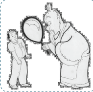

> **Deskripsi Visual:** Gambar ini adalah ilustrasi yang menunjukkan dua karakter: seorang anak kecil dan seorang dewasa. Anak kecil sedang berdiri dengan posisi teguh, sementara dewasa berdiri di belakangnya, memegang sebuah mikroskop besar. Mikroskop tersebut digunakan untuk memperbesar bagian tubuh anak kecil, yang tampak seperti menggambarkan tubuh dewasa. 

Elemen utama dalam gambar ini adalah dua karakter manusia, mikroskop, dan tubuh tubuh yang diperbesar. Mikroskop digunakan untuk menunjukkan perbandingan ukuran antara tubuh anak kecil dan dewasa. 

Teks, angka, atau label penting tidak ada dalam gambar ini. Namun, informasi kunci yang dapat diambil pembaca adalah bahwa gambar ini mungkin digunakan untuk membahas konsep tentang perkembangan fisik atau perbandingan ukuran antara generasi lalu dan sekarang.

Sumber: dokumen Kemendikbud

- Zengzi berkata, 'Sepuluh mata melihat sepuluh tangan menunjuk, tidaklah itu menakutkan!'
- Harta benda dapat menghias rumah, laku bajik menghias diri; hati yang lapang itu membuat tubuh kita sehat. Maka seorang Junzi senantiasa mengimankan tekadnya.

### 3.  Meluruskan Hati Membina Diri

Dalam Daxue Bab VII pasal 1 dijelaskan: '1. Adapun yang dinamai untuk  membina  diri  harus  lebih  dahulu  meluruskan  hati  itu  ialah: diri yang diliputi geram dan marah, tidak dapat berbuat lurus; yang diliputi  takut  dan  khawatir,  tidak  dapat  berbuat  lurus;  yang  diliputi suka dan gemar, tidak dapat berbuat lurus; dan yang diliputi sedih dan sesal  tidak  dapat  berbuat  lurus.  2.  Hati  yang  tidak  pada  tempatnya, sekalipun  melihat  tidak  akan  tampak,  meski  mendengar  tidak  akan terdengar  dan  meski  makan  takkan  merasakan.  3.  Inilah  sebabnya dikatakan, bahwa untuk membina diri itu berpangkal pada melurus hati'.

Ayat di atas menjelaskan bahwa untuk membina diri itu berpangkal pada meluruskan hati, dan meluruskan hati artinya: 'hati selalu pada tempatnya'. Hati yang tidak pada tempatnya adalah hati

 

---
## 📄 Halaman 22

yang  memikirkan  hal  yang  lain  ketika  ia  melakukan  sesuatu.  Maka dikatakan, jika hati tidak pada tempatnya sekalipun melihat tidak akan nampak/terlihat,  sekalipun  mendengar  takkan  terdengar  dan  meski makan takkan merasakan.

Mengapa  hati  seseorang  dapat  memikirkan  hal  lain  atau  tidak berada  di  tempatnya?  Karena  ia  sedang  diliputi/dilanda  nafsu  yang ada dalam dirinya, yaitu: geram dan marah, takut dan khawatir, suka dan gemar, sedih dan sesal.

Artinya, bahwa  ketika manusia  tidak merasakan  atau tidak dilanda  perasaan  marah,  gembira,  sedih  ataupun  senang/suka,  ia dalam keadaan Tengah. Secara kodrati jika manusia dalam keadaan Tengah ia akan mampu berbuat lurus. Tetapi keadaan hati manusia selalu rawan, banyak faktor-faktor dari luar diri yang dapat memicu timbulnya nafsu-nafsu dari dalam itu.

Mengzi berkata, 'Untuk memelihara hati tiada yang lebih baik dari pada mengurangi keinginan. Kalau orang dapat mengurangi keinginan, meskipun adakalanya tidak dapat menahannya, niscaya tiada seberapa. Kalau orang banyak keinginan-keinginannya, meskipun ada kalanya ia dapat menahannya, niscaya tiada seberapa'.

 

---
## 📄 Halaman 23

- '… setelah (nafsu-nafsu itu timbul) tetapi masih berada di batas tengah dinamai harmonis. Tengah itulah pokok besar dari pada dunia, dan keharmonisan itulah cara menempuh jalan suci di dunia'.
Maka untuk dapat meluruskan hati orang harus mampu mengendalikan setiap nafsu yang timbul dari dalam dirinya sehingga tidak melampaui batas Tengah, tidak melanda dan tetap harmonis.

Aktivitas 1.5

### Tugas Mandiri

- Buatlah daftar kebiasaan dan sifat-sifat burukmu, dan berjanjilah  pada  diri  sendiri  untuk  mengurangi  kebiasaankebiasaan buruk itu!
- Menurut pendapatmu hal apa yang paling sulit dilaksanakan dalam proses pembinaan diri? Berikan alasannya!

### Tujuan

- Lembar penilaian diri ini bertujuan untuk:
- Mengetahui sikap kalian dalam menerima dan memahami ajaran tentang pembinaan diri.
- Menumbuhkan sikap sungguh-sungguh untuk senantiasa membina diri dalam kehidupan.

 

---
## 📄 Halaman 24

### Petunjuk

- Isilah lembar penilaian diri yang ditunjukkan dengan skala sikap berikut ini!
SS  =  Sangat Setuju

ST  =  Setuju

RR =  Ragu-ragu

TS  =  Tidak Setuju

---
**📊 Tabel**

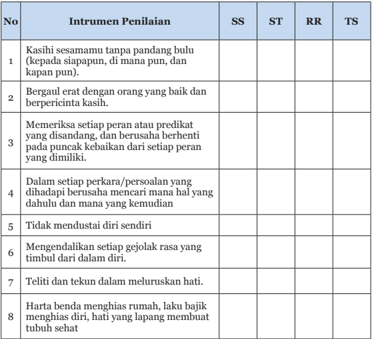

Tabel ini menunjukkan instrumen penilaian untuk empat kriteria utama: SS (Sesuai Standar), ST (Sesuai Target), RR (Relevan Rasa), dan TS (Tidak Sesuai). Setiap kriteria memiliki 8 poin penilaian yang berbeda-beda. Topik utama tabel adalah penilaian perilaku atau sikap seseorang dalam berbagai situasi. Kolom-kolomnya mencakup berbagai aspek seperti kebijaksanaan, kejujuran, keberanian, dan kecerdasan emosional. Data penting yang terlihat adalah bahwa setiap kriteria memiliki poin yang berbeda-beda, menunjukkan bahwa penilaian tidak hanya mengandalkan satu parameter tetapi juga mempertimbangkan berbagai aspek.

 

---
## 📄 Halaman 25

### Tempat Hentian

- 4/4 C = Do .  3    3  4    5    5  4  3    4 . . . Cin-ta  ka-sih  Ke-be-na-ran .  1    1  2    3  3  2  1     2 .  . . Ha-ki-kat  su-ci  fir-man  Thian .  7    7  1   4    2  2  1     2 .  .  . Ber-lan-das-kan  ke-ba-ji-kan .  3    3  4    5    5  4  3     4  .  .  . Ba-gi   in-san  Kon-fu-si-ni .  2    2  3   4    4  3  2     3  .  .  . Wa-jib  menge-nal  fir-man Thian .  1    1  2    3  3  2    1      2 .  .  . Kem-bang -kan wa-tak  se-ja-ti .  7     7  1   4     2  1  7     1 .  .  . Di da-lam  tem-pat  hen-ti-an .  3    3  4    5 .   1  1  6    6 . . . Ge-mi-lang-kan   ke-ba-ji-kan .  2    2  3    4 .   6  6  5    5 . . . Ber-peri-la-ku  pe-nuh  i-man .  1    1  2    3 .   5  5  4     4 . . . Menga-si-hi  in-san  Tu-han .  7    7  1   2 .   2    1  7     1  . . .
- Di da-lam  tem-pat  hen-ti-an
Cipt: Eddie Rhinaldy

 

---
## 📄 Halaman 26

### A.  Pilihan Ganda

Berilah  tanda  silang  (X)  di  antara  pilihan  A,  B,  C,  D,  atau E  yang  merupakan  jawaban  paling  tepat  dari  pertanyaanpertanyaan berikut ini!

- Adapun  Jalan Suci yang dibawakan Ajaran Besar itu ialah menggemilangkan  Kebajikan  yang  bercahaya,  mengasihi  rakyat dan berhenti pada puncak ....
- kebijaksanaan
- Untuk membina diri itu berpangkal pada ....
- meneliti hakikat tiap perkara
- meluruskan hati
- mengatur negara
- mengimankan tekad
- membereskan rumah tangga
- Teraturnya negara itu berpangkal pada ....
- pembinaan diri
- hari yang lurus
- damai di dunia
- Yang menjadi kewajiban pokok setiap manusia adalah ....
- berbuat baik
- membina diri
- dapat dipercaya
- meluruskan hati
- membereskan rumah tangga
- tekad yang beriman
- keberesan rumah tangga
- kebaikan
- jalan suci
- kebenaran
- keimanan

 

---
## 📄 Halaman 27

### 5.  Tempat hentian sebagai seorang anak berhenti pada sikap ....

- berbakti
- kasih sayang
- satya

### B.  Uraian

### Jawablah  pertanyaan-pertanyaan  berikut ini  dengan uraian yang jelas!

- Mengapa  dikatakan  bahwa  untuk  membina  diri  itu  harus  lebih dahulu meluruskan hati? Jelaskan!
- Tuliskan urutan proses pembinaan diri seperti yang tersurat dalam kitab Daxue Bab utama ayat 4!
- Sesungguhnya  teraturnya  sebuah  negara  itu  berpangkal  pada keberesan rumah tangga, jelaskan!
- Jelaskan yang dimaksud puncak kebaikan sebagai tempat hentian itu!
- dapat dipercaya
- tahu kewajiban

 

---
## 📄 Halaman 28

Mengzi  berkata,  'Kalau  kita  mau  mengikuti  gerak  rasa (batin),  akan  tahu  bahwa  sesungguhnya  watak  sejati  manusia adalah baik'. (Mengzi VI A : 6.5)

 

---
## 📄 Halaman 29

### Laku Bakti Pokok Kebajikan

---
**🖼️ Gambar/Diagram**

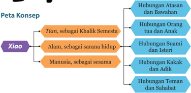

> **Deskripsi Visual:** Gambar ini adalah diagram yang menunjukkan peta konsep tentang hubungan antara berbagai konsep dalam konteks filosofis atau psikologis. Diagram ini terdiri dari dua baris utama: "Tian, sebagai Khalik Semesta" dan "Xiao, Alam, sebagai sarana hidup". Setiap konsep tersebut memiliki beberapa sub-konsep yang disusun dalam struktur hierarkis.

Pertama, "Tian, sebagai Khalik Semesta" memiliki sub-konsep "Hubungan Atasan dan Bawahan", "Hubungan Orang tua dan Anak", dan "Hubungan Suami dan Istri".

Kedua, "Xiao, Alam, sebagai sarana hidup" memiliki sub-konsep "Hubungan Kakak dan Adik", "Hubungan Teman dan Sahabat", dan "Hubungan Manusia, sebagai sesama".

Teks, angka, atau label penting yang terlihat dalam diagram ini adalah nama-nama konsep dan sub-konsep yang disusun dalam struktur hierarkis. Informasi kunci yang dapat diambil pembaca adalah bahwa hubungan antara berbagai konsep dalam konteks filosofis atau psikologis dapat dianalisis melalui struktur hierarkis yang ditunjukkan dalam diagram ini.

### A.  Pengertian Laku Bakti ( Xiao )

Xiao berdasarkan karakter huruf dapat didefinisikan sebagai berikut: Xiao dibangun dari dua radikal huruf/aksara, yaitu: Lao , yang artinya tua/orangtua/yang  dituakan/yang  dimuliakan,  dan Zi yang  berarti anak/yang lebih muda/yang memuliakan. Sehingga Xiao seakan-akan menggambarkan: Seorang anak/yang lebih muda mendukung orangtua/ yang  lebih  tua,  atau  dapat  diartikan  'yang  dijunjung/didukung  anak dengan sepenuh hati'.

 

---
## 📄 Halaman 30

Secara bebas anak dapat diartikan sebagai hamba (dalam mengabdi), sehingga secara umum, atau berdasarkan pengertian imani, Xiao dapat  diartikan  memuliakan hubungan  antara  yang  lebih  muda  (yang lebih  'rendah'  kedudukan  atau  usianya) dengan atau kepada yang lebih tua (yang lebih 'tinggi' kedudukan atau usianya).

Dari pengertian imani tersebut dapatlah  kita  ketahui  bahwa Xiao (yang dalam  bahasa  Indonesia  diterjemahkan sebagai bakti), bukan semata-mata menyangkut hubungan antara anak dengan orangtuanya. Memuliakan hubungan yang dimaksud adalah:

- Memuliakan  hubungan  dengan Tian sebagai Khalik
- Memuliakan hubungan dengan Alam sebagai sarana hidup

---
**🖼️ Gambar/Diagram**

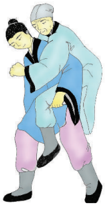

> **Deskripsi Visual:** Gambar ini adalah ilustrasi yang menunjukkan dua orang yang sedang bermain lari. Pada gambar tersebut, elemen utama adalah dua orang yang sedang berlari, dengan posisi tubuh mereka yang menunjukkan gerakan lari. Elemen-elemen lainnya meliputi latar belakang yang sederhana untuk memperhatikan fokus pada karakter utama. Teks, angka, atau label penting tidak ada dalam gambar ini karena ia hanya menggambarkan situasi tanpa teks atau angka tambahan. Informasi kunci yang dapat diambil pembaca adalah bahwa gambar ini mungkin digunakan untuk membantu mengajar tentang gerakan lari atau aktivitas fisik.

Gambar 2.1

Seorang anak/yang lebih muda mendukung orang tua/orang yang lebih tua.

- Memuliakan hubungan dengan Manusia sebagai sesama.
孝

子

老

Xiao berdasarkan karakter huruf mengandung arti: 'yang lebih muda/ anak mendukung yang lebih tua/ orang tua. Secara imani dapat diartikan 'memuliakan hubungan'.

Zi

artinya: Anak/yang lebih muda

Lao

artinya: Tua/yang lebih tua

 

---
## 📄 Halaman 31

Memuliakan  hubungan  antara  anak  dengan  orangtua  hanyalah salah satu bagian dari yang dimaksud oleh Xiao . Maka, menjadi sempit bila Xiao hanya diartikan sebagai bakti atau hubungan anak dengan orangtuanya. Xiao sesungguhnya merupakan sendi utama dari ajaran Khonghucu, sehingga ada yang menyimpulkan jika ajaran Khonghucu hanya  menekankan  perihal  laku  bakti  (kepatuhan  anak  terhadap orangtua).  Pendapat  ini  mungkin  tidak  menyimpang  jauh,  tetapi sangat disayangkan jika karena ini terjadi penyempitan/pendangkalan akan makna Xiao yang sesungguhnya.

Oleh  sebab  itulah,  diperlukan  pemahaman  yang  benar  sehingga Xiao tetap sebagai sendi utama ajaran Khonghucu dan pokok kebajikan tanpa menyempitkan makna terlebih lagi penyimpangan makna.

### B.  Laku Bakti ( Xiao ) sebagai Pokok Kebajikan

Laku  bakti  merupakan  pokok  dan  akar  dari  semua  kebajikan. Nabi Kongzi bersabda, 'Sesungguhnya laku bakti itu pokok kebajikan, darinya lah ajaran agama berkembang'. ( Xiaojing I.4)

Kalian tentu setuju bahwa manusia adalah makhluk yang paling mulia di antara mahluk ciptaan Tian yang lain! Apa yang menjadikan manusia menjadi mahluk termulia? Tentu karena manusia mengerti kebenaran,  bukan  hanya  hidup,  tumbuh  dan  berkembang  seperti tumbuhan. Bukan hanya memiliki nyawa seperti hewan, tetapi karena manusia selain memiliki semua itu, manusia juga memiliki daya hidup rohani (mengerti akan kebenaran).

Selanjutnya, di antara perilaku manusia, perilaku yang manakah yang  paling  mulia?  Nabi Kongzi bersabda,  'Di  antara  watak-watak yang  terdapat  di  antara  langit  dan  bumi,  sesungguhnya  manusialah yang  termulia.  Di  antara  perilaku  manusia  tiada  yang  lebih  besar daripada laku bakti (memuliakan hubungan). Di dalam laku bakti tiada yang lebih besar daripada penuh hormat dan memuliakan orangtua, dan hormat memuliakan orangtua itu tiada yang lebih besar daripada selaras dan harmonis kepada Tian '.

 

---
## 📄 Halaman 32

Youzi (salah seorang murid Nabi Kongzi ) berkata, 'Maka seorang Junzi mengutamakan pokok; sebab setelah pokok itu tegak, Jalan Suci akan tumbuh. Laku bakti dan rendah hati itulah pokok pericinta kasih'.

'Pada zaman dahulu, Zhougong melakukan sembahyang kepada Hou Ji (leluhur)  di  hadapan  altar  di  alun-alun  Selatan  menyertai persujudan kepada Tian ; dan melakukan sembahyang kepada baginda Wen (ayahnya) di hadapan altar Ming Tang (ruang gemilang) menyertai  persujudan  kepada Shangdi -Tian di  tempat  Yang  Maha Tinggi. Demikianlah berbagai utusan dari empat penjuru lautan datang ikut melakukan sembahyang. Maka, kebajikan seorang nabi, adakah yang lebih besar daripada laku bakti?'. ( Xiaojing IX : 3)

'Maka, rasa kasih itu tumbuh dari bawah lutut orangtua, dan tiap hari merawat ayah-bunda itu menjadikan rasa kasih tumbuh menjadi rasa gentar. Seorang nabi dengan adanya rasa gentar itu menjadikan sikap hormat; dengan adanya rasa kasih itu mendidik sikap mencintai. Agama (pendidikan) yang dibawakan nabi tanpa memerlukan kekerasan  sudah  menyempurnakan;  dan  di  dalam  pemerintahan, tanpa  memerlukan  hukuman  bengis  sudah  menjadikan  semuanya teratur. Yang menjadikan semuanya itu ialah karena diutamakan yang pokok'. ( Xiaojing . IX: 4)

---
**🖼️ Gambar/Diagram**

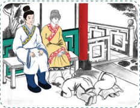

> **Deskripsi Visual:** Gambar ini adalah ilustrasi yang menunjukkan dua orang dewasa berbicara di tepi jalan. Pria tua dengan pakaian tradisional berdiri di sebelah kiri, sementara wanita muda berdiri di sebelah kanan. Mereka tampak sedang berbicara dengan penuh perhatian. Di depan mereka ada seorang anak kecil yang sedang berjalan-jalan dengan tangan di bahu. Anak tersebut tampak sangat tertarik pada sesuatu di sekitarnya. Di latar belakang, terlihat beberapa bangunan tradisional dengan atap merah dan pagar kayu. Jalan yang melintasi gambar tampak bersih dan rapi. Gambar ini menunjukkan hubungan sosial antara orang tua dan anak-anak, serta lingkungan tradisional yang masih dikenal.

Sumber: dokumen Kemendikbud

 

---
## 📄 Halaman 33

Betapa  luas  dan  dalam  makna  imani  akan Xiao (memuliakan hubungan) itu, karena mencangkup segala dimensi kehidupan manusia di atas dunia. Seperti disampaikan di atas bahwa memuliakan hubungan yang dimaksud menyangkut tiga aspek penting kehidupan manusia,  yaitu:  1). Tian sebagai  khalik  pencipta,  dimana  manusia dituntut/wajib  untuk  patuh  dan  taqwa.  2).  Alam  sebagai  sarana; dimana  manusia  wajib  selaras  dengan  keberadaannya.  3).  Manusia sebagai  sesama  makhluk  ciptaan-Nya;  dimana  kita  dituntut  untuk membangun keharmonisan.

Maka menjadi jelas bahwa agama ( Jiao ) sebagai pembimbing dan penuntun hidup manusia adalah ajaran tentang Xiao (ajaran tentang memuliakan hubungan). Di dalam bahasa kitab ( Han Yu / Zhong Wen ), kata  agama ditulis  dengan  istilah Jiao .  Kata  Jiao  bila  ditelaah  lebih jauh dari etimologi huruf , Jiao tersebut terdiri dari dua suku kata yaitu: Xiao dan Wen ,  sehingga  kata Jiao dapat  diartikan:  'ajaran  tentang Xiao ' atau 'ajaran tentang memuliakan hubungan'.

Xiao

artinya: Bakti

Wen

artinya: Ajaran

---
**🖼️ Gambar/Diagram**

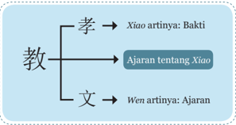

> **Deskripsi Visual:** Gambar ini adalah diagram yang menunjukkan hubungan antara kata-kata "孝" (Xiao), "教" (Jiào), dan "文" (Wen) dalam konteks ajaran tradisional Tiongkok. Diagram ini terdiri dari tiga cabang utama yang masing-masing menggambarkan arti kata tersebut:

1. Cabang pertama menunjukkan "孝" dengan artinya "Bakti". Ini dilihat dari teks "孝 artinya: Bakti".
2. Cabang kedua menunjukkan "教" dengan artinya "Ajaran". Ini dilihat dari teks "Ajaran tentang Xiao".
3. Cabang ketiga menunjukkan "文" dengan artinya "Ajaran". Ini dilihat dari teks "文 artinya: Ajaran".

Relasi antara elemen-elemen ini adalah bahwa setiap kata memiliki arti yang berhubungan dengan ajaran dan bakti. Diagram ini membantu pembaca memahami hubungan antara kata-kata ini dalam konteks ajaran tradisional Tiongkok.

Informasi kunci yang dapat diambil dari gambar ini adalah bahwa "孝" (bakti), "教" (ajaran), dan "文" (ajaran) memiliki hubungan yang erat dalam ajaran tradisional Tiongkok, dengan "孝" sebagai dasar untuk "教" dan "文".

Aktivitas 2.1

### Tugas Mandiri

- Berikan  komentar  dan  pandanganmu  terkait  pernyataan bahwa Laku Bakti inti ajaran Khonghucu!
- Apa yang dapat kalian simpulkan dari materi tersebut?

 

---
## 📄 Halaman 34

### C.  Laku Bakti ( Xiao ) kepada Orangtua

### 1. Lima Hubungan dan Sepuluh Kewajiban

Bila telah dijelaskan bahwa Xiao secara imani adalah memuliakan hubungan  dengan Tian ,  Alam  dan  sesama  manusia.  Di  dalam hubungannya dengan sesama manusia terdapat konsepsi Wudadao / Wulun (lima hubungan kemasyarakatan) sebagai jalan/hubungan yang mesti ditempuh/dijalani oleh manusia. Maka Wulun diyakini sebagai Jalan Suci yang harus ditempuh manusia di atas dunia.

'Adapun jalan suci  yang  harus  ditempuh  manusia  di  atas  dunia mempunyai lima perkara dan tiga pusaka di dalam menjalankannya, yakni:  Hubungan  raja  dengan  menteri/atasan  dengan  bawahan; orangtua  dengan  anak,  suami  dengan  istri,  kakak  dengan  adik,  dan teman  dengan  sahabat.  Lima  perkara  inilah  Jalan  Suci  yang  harus ditempuh manusia di dunia'.

'Kebijaksanaan, cinta kasih, dan berani, tiga pusaka inilah kebajikan yang harus ditempuh, maka yang hendak menjalani harus satu tekadnya'.

Dari lima Hubungan Kemasyarakatan ( Wulun ) melahirkan konsepsi Shiyi (Sepuluh Kewajiban), yaitu:

- Orangtua harus bersikap kasih sayang
- Anak dapat bersikap bakti
- Atasan dapat bersikap cinta kasih
- Bawahan dapat setia dan hormat
- Suami dapat besikap benar/adil/tahu kewajiban
- Isteri dapat bersikap patuh menyesuaikan diri (dalam kebenaran)
- Kakak dapat bersikap mendidik
- Adik dapat bersikap hormat dan rendah hati
- Yang lebih tua dapat mengalah dan rendah hati
- Yang lebih muda dapat bersikap patuh

 

---
## 📄 Halaman 35

Dari  konsepsi Wulun dan Shiyi tersebut  dapatlah  disimpulkan pengertian imani bahwa sesungguhnya antara manusia dengan Tian sebagai pencipta ada ayah dan ibu (orangtua yang melahirkan, merawat dan  membesarkan). Dengan demikian satya kepada Tian tidak  bisa tidak  dirangkai  dengan  bakti  kepada  orangtua,  dan  laku  bakti  itu hendaknya diimani dan diamalkan dengan bentuk yang lurus sebagai wujud pengamalan berawal dengan merawat badan hingga membina diri, hingga terlaksana satya dan bakti.

---
**🖼️ Gambar/Diagram**

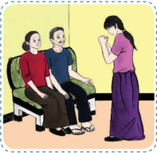

> **Deskripsi Visual:** Gambar ini adalah ilustrasi yang menunjukkan dua orang dewasa berbicara dengan seorang anak perempuan. Orang dewasa tersebut tampaknya sedang memberikan nasihat atau menjelaskan sesuatu kepada anak perempuan tersebut. Anak perempuan tersebut tampaknya mendengarkan dengan teliti dan mengangkat tangan untuk bertanya atau memberikan komentar.

Elemen utama dalam gambar ini adalah dua orang dewasa dan satu anak perempuan. Orang dewasa tersebut tampaknya berada di kedua sisi anak perempuan tersebut, menunjukkan hubungan sosial yang dekat. Anak perempuan tersebut tampaknya berada di tengah-tengah dua orang dewasa tersebut, menunjukkan bahwa ia adalah subjek utama dalam situasi ini.

Teks, angka, atau label penting yang terlihat dalam gambar ini tidak ada. Namun, informasi kunci yang dapat diambil pembaca adalah bahwa ada interaksi sosial antara dua orang dewasa dan satu anak perempuan, mungkin dalam konteks pendidikan atau pengembangan karakter.

Dalam satu paragraf yang informatif, gambar ini menunjukkan sebuah situasi sosial di mana dua orang dewasa berbicara dengan satu anak perempuan. Orang dewasa tersebut tampaknya berada di kedua sisi anak perempuan tersebut, menunjukkan hubungan sosial yang dekat. Anak perempuan tersebut tampaknya berada di tengah-tengah dua orang dewasa tersebut, menunjukkan bahwa ia adalah subjek utama dalam situasi ini. Interaksi ini mungkin berlangsung dalam konteks pendidikan atau pengembangan karakter.

Keluarga  adalah  sarana  yang  paling  dekat  untuk  mewujudkan satya dan teposelero, dimana di dalamnya terkandung: hormat kepada orangtua adalah langkah pertama hormat kepada Tian ,  bakti kepada orangtua  adalah  wujud  nyata  bakti  kepada Tian ,  dan  sembahyang kepada arwah leluhur adalah sembahyang kepada kebesaran Tian .

Keluarga  bukan  sekedar  suami  dan  istri  membesarkan  anakanaknya, tetapi  mencakup  pengertian  sakral,  di  mana  dituntut  agar selalu harmonis, dan tiap-tiap pribadi berperan dan bertanggungjawab untuk menciptakan suasana itu.

 

---
## 📄 Halaman 36

Orang  sering  menyempitkan  dan  merendahkan  citra  laku  bakti dengan menganggap bahwa hal itu hanya ditujukan kepada orangtua saja,  padahal  kalau  dikaji  benar-benar,  sesungguhnya  laku  bakti itu  termasuk  aspek  memelihara  lingkungan,  seperti  yang  dikatakan Zengzi :  'Pohon-pohon  dipotong  hanya  bila  tepat  pada  waktunya. Burung dan hewan-hewan dipotong hanya bila tepat pada waktunya'.

Nabi Kongzi bersabda, 'Sekali memotong pohon, sekali memotong hewan tidak pada waktunya, itu tidak berbakti'.

Namun terlepas dari semua itu, memang laku bakti yang ditujukan kepada  orangtua  merupakan  awal  dari  pengamalan  bakti  dalam kehidupan,  seperti  tersirat  dalam  kitab  bakti  ( Xiaojing Bab  IX:  5) berikut ini:

'Jalan Suci (hubungan) antara ayah dan anak itulah oleh Watak Sejati karunia Tian .  Di dalamnya terkandung kebenaran (hubungan) antara pemimpin dan pembantu. Seorang anak menerima hidupnya dari  ayah-bunda.  Adakah  pemberian  yang  lebih  besar  daripada  ini? Serasinya hubungan dengan pemimpin dan dengan orangtua: adakah yang  lebih  penting  daripada  ini?  Maka,  bila  orang  tidak  mencintai orangtuanya, tetapi dapat mencintai orang lain, itulah kebajikan yang terbalik. Tidak hormat kepada orangtua sendiri tetapi dapat hormat kepada orang lain, itulah kesusilaan terbalik. Orang mengikuti hal yang justru  melanggar/melawan  (kebenaran),  rakyat  tidak  mendapatkan sesuatu  yang  patut  ditiru.  Tiada  perbuatan  baik  dapat  dilakukan, semua perbuatannya hanya merusak kebajikan. Biarpun mungkin ia dapat berhasil mencapai sesuatu, seorang Junzi (berbudi luhur) tidak dapat dapat menghargainya'.

 

---
## 📄 Halaman 37

---
**🖼️ Gambar/Diagram**

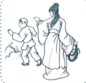

> **Deskripsi Visual:** Gambar ini adalah ilustrasi yang menunjukkan seorang guru dan murid berjalan di luar sekolah. Guru sedang membawa tas belajar dan mengenakan pakaian formal, sementara murid berdiri di depannya dengan tangan di sampingnya. Latar belakangnya tampak seperti halaman sekolah dengan pohon dan bangunan sekolah. Ilustrasi ini mungkin digunakan untuk menggambarkan hubungan antara guru dan murid, atau mungkin bagaimana guru memberikan bantuan atau mendampingi murid.

Sumber: dokumen Kemendikbud

Nabi bersabda, 'Pada zaman dahulu raja yang cerah batin mengabdi kepada ayahnya dengan laku bakti, demikian ia cerah batin mengabdi kepada Tian . Ia mengabdi kepada ibunya dengan laku bakti, demikian ia cermat mengabdi kepada bumi, maka berkah Tian pun datanglah'.

Mengzi berkata,  'Mengabdi  kepada  siapakah  yang  terbesar? Mengabdi kepada orangtua itulah yang terbesar. Menjaga apakah yang terbesar? Menjaga diri sendiri itulah yang terbesar'.

'Orang yang tidak kehilangan dirinya dan dapat mengabdi kepada orangtuanya, aku pernah mendengar. Tetapi orang yang kehilangan dirinya  dapat  mengabdi  kepada  orangtuanya,  aku  belum  pernah mendengar.  Siapa  yang  tidak  melakukan  pengabdian?  Mengabdi kepada orangtua itulah pokok pengabdian. Siapa yang tidak melakukan penjagaan? Menjaga diri sendiri itulah pokok penjagaan'.

'Cinta kasih itulah kemanusiaan, dan mengasihi orangtua itulah yang  terbesar.  Kebenaran  itulah  kewajiban  hidup,  dan  memuliakan para bijaksana itulah yang terbesar'. ( Zhongyong . Bab XIX: 5)

Mengzi berkata,  'Hakekat  cinta  kasih  itu  ialah  dapat  mengabdi kepada orangtua. Hakekat kebenaran itu ialah dapat menurut kepada kakak. Hakekat kebijaksanaan itu ialah tahu akan kedua perkara itu. Dan hakikat musik itu ialah dapat merasakan kesenangan dalam dua perkara  itu.  Kalau  kesenangan  itu  sudah  tumbuh,  pertumbuhanya

 

---
## 📄 Halaman 38

akan terjadi tanpa suatu paksaan, maka dengan tanpa dipikirkan sang kaki  dapat  melangkah dan sang tangan dapat menari dengan baik'. (Mengzi IV: 27)

Nabi Kongzi bersabda, 'Mendidik rakyat untuk saling mengasihi, tiada jalan yang lebih baik daripada laku Bakti'. ( Xiaojing XII : 1)

- Nabi Kongzi bersabda, 'Demikian  seorang  anak  berbakti mengabdi/melayani orangtuanya. Di rumah, sikapnya sungguh hormat; di dalam merawatnya, sungguh-sungguh berusaha memberi kebahagiaan; saat orangtua sakit, ia sungguh-sungguh  prihatin; di  dalam  berkabung,  ia  sungguh-sungguh  bersedih;  dan,  di  dalam menyembahyanginya, ia melakukan dengan sungguh-sungguh hormat. Orang yang dapat melaksanakan lima perkara ini, ia benar-benar boleh dinamai melakukan pengabdian kepada kepada orangtua'.
- Orang  yang  benar-benar  mengabdi  kepada  orangtuanya,  saat berkedudukan  tinggi,  tidak  menjadi  sombong;  saat  berkedudukan rendah, tidak suka mengacau; dan di dalam hal-hal yang remeh, tidak mau berebut'.
- 'Berkedudukan tinggi berlaku sombong, niscaya akan mengalami keruntuhan; berkedudukan rendah suka mengacau, niscaya dihukum; dan,  di  dalam  hal-hal  yang  remeh  suka  berebut,  niscaya  sering berkelahi. Bila orang tidak dapat menghilangkan tiga sifat ini, meski tiap hari memelihara orangtuanya dengan menyuguhi macam-macam daging, ia tetap seorang anak tidak berbakti'. ( Xiaojing . X: 1-3)

### 2.  Permulaan Laku Bakti

Nabi Kongzi bersabda,'..  tubuh  anggota  badan,  rambut,  dan kulit  diterima  dari  ayah  dan  bunda,  maka  perbuatan  tidak  berani membuatnya rusak dan luka (merawat), itulah permulaan laku bakti'. ( Xiaojing . I : 4)

'Mengendalikan diri hidup menempuh jalan suci, meninggalkan nama  baik  di  zaman  kemudian,  sehingga  memuliakan  ayah  bunda, itulah  akhir  dari  laku  bakti.  Sesungguhnya  laku  bakti  itu  dimulai

 

---
## 📄 Halaman 39

dengan  mengabdi  kepada  orangtua,  selanjutnya  mengabdi  kepada pemimpin, dan akhirnya menegakkan diri'. ( Xiaojing . I : 5 - 6).

'Tubuh dan diri ini adalah warisan ayah bunda, memperlakukan warisan ayah bunda, beranikah tidak hormat? Rumah  tangga tidak  diatur  baik-baik,  itu  tidak  berbakti.  Menjalankan  kewajiban dalam  jabatan  tidak  sungguh-sungguh,  itu  tidak  berbakti.  Dalam persahabatan  tidak  dapat  dipercaya,  itu  tidak  berbakti.  Bertugas  di medan  peperangan  tidak  ada  keberanian,  itu  tidak  berbakti.  Tidak dapat melaksanakan lima perkara itu berarti akan mencemarkan nama orangtua, maka beranikah tidak sungguh-sungguh?' ( Liji . XXIV : 17) Dari ayat tersebut mengertilah kita bahwa bakti kepada orangtua itu diawali dengan hal-hal yang sangat sederhana, yaitu merawat badan atau  menjaga  warisan  pemberian  orangtua.  Dalam  konteks  apapun dalam hubungan kita dengan sesama manusia prinsipnya tetap sama, bahwa merawat sebuah pemberian berarti menghormati/menghargai orang  yang  memberikannya.  Demikianlah  menjaga  dan  merawat badan sebagai warisan/pemberian orangtua.

### 3.  Hal Melakukan Perawatan

Zengzi berkata, 'Laku bakti ada tiga tingkatan, yang terbesar dapat memuliakan  orangtua,  yang  kedua  tidak  memalukan  orangtua,  dan yang ketiga hanya mampu memberikan perawatan'. ( Liji . XXIV: 4).

Ziyou bertanya  hal  laku  bakti,  nabi  menjawab:  'Sekarang  yang dikatakan berbakti katanya asal dapat memelihara, tetapi anjing dan kudapun  dapat  memberikan  pemeliharaan,  bila  tidak  disertai  rasa hormat apa bedanya'. ( Lunyu . II: 7) .

Zixia bertanya  hal  laku  bakti,  Nabi  menjawab,  'Sikap  wajahlah yang sukar, ada pekerjaan anak melakukan dengan sekuat tenaga, ada anggur dan makanan lebih dahulu disuguhkan kepada orangtua. Tetapi kalau hanya demikian saja, cukupkah dinamai laku bakti?' ( Lunyu . II : 8).

 

---
## 📄 Halaman 40

---
**🖼️ Gambar/Diagram**

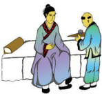

> **Deskripsi Visual:** Gambar ini adalah ilustrasi yang menunjukkan dua orang yang sedang berbicara. Pada gambar tersebut, seorang pria tua dengan topi hitam dan baju berwarna abu-abu sedang berbicara kepada seorang wanita muda dengan rambut panjang yang berwarna gelap. Wanita tersebut sedang duduk di kursi kayu sementara pria tersebut berdiri di depannya. Kedua orang tersebut tampak sangat serius dan fokus pada percakapan mereka. Di latar belakang, terlihat sebuah bangunan tradisional dengan atap berbentuk seperti kerucut. Gambar ini menunjukkan hubungan antara dua karakter utama dan suasana yang serius dalam percakapan mereka.

Sumber: dokumen Kemendikbud

Melakukan  pemeliharaan/perawatan  terhadap  orangtua  tentu tidaklah sama dengan melakukan perawatan kepada hewan peliharaan atau seperti hewan melakukan perawatan. Melakukan pemeliharaan/ perawatan terhadap orangtua haruslah disertai dengan sikap hormat dan mengindahkan (kesusilaan).

Kalau  tidak  disertai  dengan  sikap  hormat  apa  bedanya  dengan melakukan pemeliharaan terhadap anjing dan kuda atau seperti anjing dan kuda melakukan perawatan.

---
**🖼️ Gambar/Diagram**

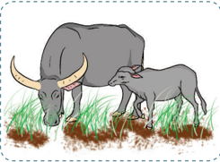

> **Deskripsi Visual:** Gambar ini adalah ilustrasi yang menunjukkan dua hewan, yaitu seekor sapi dewasa dan seekor anak sapi. Sapi dewasa memiliki bulu berwarna gelap dan gigi besar yang tumbuh di ujung kepala. Anak sapi berwarna lebih cerah dengan bulu yang lebih pendek. Kedua hewan tersebut sedang berdiri di atas tanah yang berlubang dan berwarna cokelat keemasan. Ilustrasi ini mungkin digunakan untuk membantu pembaca memahami konsep tentang perkembangan dan peran hewan dalam ekosistem.

Sumber: dokumen Kemendikbud

 

---
## 📄 Halaman 41

### 4.  Tidak Memalukan Orangtua

Hal melakukan perawatan bukanlah satu-satunya cara melaksanakan bakti,  ada  hal  lain  yang  lebih  penting  dari  itu.  Maka bukan suatu masalah bila orangtua yang melahirkan kita tidak berada dekat  atau  bahkan  sudah  tiada  lagi  sehingga  kita  tidak  dapat  lagi melakukan perawatan kepada mereka. Jalinan hubungan antara anak dengan orangtua tidak dapat dipisahkan oleh jarak dan waktu.

Di  manapun kita  berada  dan  di  manapun  orangtua  kita  berada, perihal kita sebagai anaknya tidak akan berubah. Jika kita melakukan hal-hal  yang  memalukan,  maka  orangtua  tetap  akan  mendapat dampaknya. Maka perbuatan tidak memalukan orangtua adalah juga bagian/perwujudan dari pelaksanaan laku bakti kita kepada orangtua, bahkan tingkatannya berada di atas hal melakukan perawatan.

### 5.  Hal Memberi Peringatan

Namun  laku  bakti  bukan  berarti  membuta  untuk  menuruti saja  semua  kehendak  orangtua,  kita  tetap  memiliki  kewajiban  dan tanggungjawab  untuk  memberikan  peringatan  bila  memang  terjadi penyelewengan/penyimpangan  dari  laku  bajik.  Tetapi,  tentu  saja peringatan yang kita berikan tetap mengikuti kaidah-kaidah bakti itu sendiri.

Zhengzi bertanya, 'Murid telah mendengar jelas hal kasih mengasihi,  hormat  menghormati,  memberikan  ketentraman  kepada orangtua dan meninggalkan nama  baik.  Kini  memberanikan bertanya, apakah  seorang anak yang menurut  saja permintaan orangtuanya  dapat  dinamai  laku bakti?'

Nabi Kongzi menjawab,  'Apa katamu? Pada zaman dahulu seorang raja yang mempunyai tujuh orang menteri yang berani memberi

---
**🖼️ Gambar/Diagram**

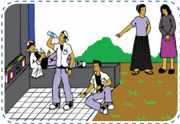

> **Deskripsi Visual:** Gambar ini adalah ilustrasi yang menunjukkan sekelompok orang sedang berjalan-jalan di jalan raya. Ilustrasi ini menggambarkan suasana sehari-hari di kota dengan detail yang cukup. Di sisi kiri, ada beberapa orang yang sedang berjalan, sementara di sisi kanan ada dua orang yang sedang berbicara. Di tengah-tengah, ada seorang pria yang sedang berjalan dengan membawa tas. Ilustrasi ini juga menunjukkan beberapa elemen lain seperti bangunan, pohon, dan jalan raya. Teks, angka, atau label penting tidak terlihat dalam gambar ini. Informasi kunci yang dapat diambil pembaca adalah bahwa gambar ini menunjukkan aktivitas sehari-hari di kota dan suasana yang nyaman.

Gambar 2.7 Apapun yang kita lakukan akan berdampak pada nama baik kedua orang tua kita

 

---
## 📄 Halaman 42

peringatan, meski ia ingkar dari jalan suci, tidak sampai kehilangan tahtanya. Ada seorang Pangeran yang mempunyai lima orang menteri yang  berani  memberikan  peringatan,  meski  ia  ingkar  dari  jalan suci,  tidak  sampai  kehilangan  negerinya.  Ada  seorang  pembesar yang  mempunyai  tiga  orang  pembantu  yang  berani  memberikan peringatan,  meski  ia  ingkar  dari  jalan  yang  benar,  ia  tidak  sampai kehilangan kedudukannya. Seorang bawahan bila mempunyai kawan yang berani memberikan peringatan, niscaya tidak kehilangan nama baiknya. Seorang ayah yang mempunyai anak yang berani memberikan peringatan,  niscaya  tidak  sampai  terjerumus  ke  dalam  hal-hal  yang tidak benar. Seorang anak tidak boleh tidak memberikan peringatan kepada ayahnya, dan seorang pembantu tidak boleh tidak memberikan peringatan  kepada  pimpinannya.  Maka  di  dalam  hal-hal  yang  tidak benar harus diberi peringatan, bagaimana seorang anak yang hanya menurut saja perintah ayahnya dapat dinilai berlaku bakti?' ( Xiaojing . XV : 1 - 2)

---
**🖼️ Gambar/Diagram**

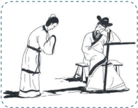

> **Deskripsi Visual:** Gambar ini adalah ilustrasi yang menunjukkan dua orang yang sedang berbicara. Pada gambar tersebut, salah satu orang tampak sedang berdiri dengan posisi tangan di depan tubuhnya, sementara orang lain duduk di kursi. Kedua orang tersebut tampak sangat serius dan fokus pada percakapan mereka. Ilustrasi ini mungkin digunakan untuk menggambarkan situasi dialog atau interaksi sosial dalam konteks pendidikan atau literatur.

Elemen utama dalam gambar ini adalah dua orang yang sedang berbicara. Relasi antara mereka adalah bahwa mereka berada dalam situasi dialog, yang dapat diinterpretasikan sebagai interaksi sosial atau komunikasi. Teks, angka, atau label penting tidak ada dalam gambar ini karena ia hanya berupa ilustrasi.

Informasi kunci yang dapat diambil pembaca dari gambar ini adalah bahwa ada dua orang yang sedang berbicara dalam situasi yang serius dan fokus. Ini mungkin digunakan untuk menggambarkan konsep-konsep seperti komunikasi, dialog, atau interaksi sosial dalam konteks pendidikan atau literatur.

Sumber: dokumen Kemendikbud

Jika laku bakti telah dijalani dengan tepat, maka bukan saja sudah melakukan kebajikan untuk diri sendiri, tetapi juga berarti menepati kodrat kemanusiaan yang Tian firmankan.

Nabi Kongzi bersabda, 'Sesungguhnya laku bakti Hukum Suci Tian , kebenaran dari bumi, dan yang wajib menjadi perilaku rakyat. Hukum Suci Tian dan  kebenaran  bumi  itulah  yang  menjadi  suri  tauladan rakyat. Bila hal ini (bakti) diturut semua orang di dunia, maka dalam

 

---
## 📄 Halaman 43

pendidikan  tidak  diperlukan  kekerasan  pun  akan  berhasil,  dalam pemerintahan tidak diperlukan kebengisan hukuman pun semuanya dapat terselenggara dengan baik'. ( Xiaojing . VII : 2, 4)

Aktivitas 2.2

### Tugas Mandiri

Ceritakan  pengalamanmu  dalam  hal  memberi  peringatan kepada orang tua ketika kamu merasa ada yang salah dari orang tua!

### 6.  Puncak Laku Bakti

Mengzi berkata,  'Memelihara  masa  hidup  orangtua  itu  belum cukup  dinamai  pekerjaan  besar.  Hanya  segenap  pengabdian  untuk mengantar  kewafatannya  barulah  dapat  dinamai  pekerjaan  besar'. ( Mengzi . IV B : 13).

'Menegakkan  diri  hidup  menempuh  jalan  suci,  meninggalkan nama baik di zaman kemudian, sehingga memuliakan ayah dan bunda, itulah akhir dari laku bakti'. ( Xiaojing . I : 5)

Menjadi  jelas  bahwa  melakukan  perawatan  kepada  orangtua bukanlah  pekerjaan  besar,  namun  segenap  pengabdian  yang  kamu curahkan kepada orangtua sampai akhir hayatnya itu baru pekerjaan besar.  Namun  laku  bakti  tentu  tidak  selesai  setelah  orangtua  tiada, tetapi terus berlanjut dengan semangat memuliakan nama orangtua, yaitu melalui usaha menegakkan diri selama hayat dikandung badan.

### 7.  Di Zi Gui Standar Perilaku Anak

Laku bakti kepada orangtua benar-benar harus diwujudkan dalam tindakkan nyata. Dari yang sederhana yang kasat mata yaitu melakukan perawatan, menjaga perilaku sehingga tidak sampai berbuat onar yang

 

---
## 📄 Halaman 44

akan memalukan orangtua, sampai pada usaha yang sungguh-sungguh untuk menggali potensi diri untuk mencapai prestasi yang gemilang sehingga memuliakan ayah bunda (orangtua).

Sekarang  marilah  kita  pelajari  dan  praktekkan  dalam  perilaku sehari-hari  kita  di  rumah,  tentang  bagaimana  seharusnya  menjadi seorang anak yang berbakti. Sebagai mana ajaran Nabi Kongzi yang tercatat dalam Lunyu bab I pasal 6.

Nabi Kongzi bersabda,  'Seorang  muda  di  rumah  hendaklah bersikap bakti, di luar rumah hendaklah bersikap rendah hati, hatihati sehingga dapat dipercaya, menaruh cinta kepada masyarakat dan berhubungan erat dengan orang-orang yang berpericinta kasih. Bila telah  melakukan  hal  itu  dan  masih  mempunyai  kelebihan  tenaga, gunakanlah untuk mempelajari kitab-kitab'.

### a.  Cepat Tanggap

Sebagai anak yang berbudi pekerti luhur, dalam hubungan dengan orangtua, rasa santun, hormat, patuh, dan berbakti harus diutamakan. Bila orangtua memanggil harus segera dijawab. Jangan acuh tak acuh dan jangan mengabaikannya!

Bila orangtua menugaskan kita untuk melakukan sesuatu, segera dilaksanakan. Jangan mencari-cari alasan untuk menundanya. Jangan malas, apalagi menolak tugas itu. Cepat tanggap dalam hal ini berarti segera merespon setiap panggilan dan melaksanakan perintah orangtua.

### b.  Menerima Nasihat

Bila orangtua memberi petunjuk dan nasihat, dengarkan dengan seksama dan ikuti dengan perbuatan. Orangtua pasti akan mengajarkan kita ilmu dan adab yang luhur, bersih, dan lurus. Nasihat itu pasti akan menyelamatkan kita dalam bergaul di tengah masyarakat luas. Oleh karena itu, dengarkan nasihat itu dengan hormat, santun, dan penuh perhatian,  untuk  selanjutnya  dipraktikkan  dalam  kehidupan  seharihari.

 

---
## 📄 Halaman 45

---
**🖼️ Gambar/Diagram**

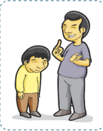

> **Deskripsi Visual:** Gambar ini adalah ilustrasi yang menunjukkan dua orang yang sedang berbicara. Orang pertama, yang berada di depan, tampak seperti seorang guru atau orang dewasa, sedang menggenggam tangan anak kecil yang berdiri di belakangnya. Guru tersebut tampak sangat serius dan sedang memberikan nasihat atau petunjuk kepada anak kecil. Anak kecil tampak lebih rendah dan sedikit ragu atau takut. Kedua orang tersebut tampak berada di luar ruangan, mungkin di sekolah atau di tempat lain yang tidak dikenal. Ilustrasi ini menunjukkan hubungan antara guru dan murid, serta konsep pendidikan dan pengaruh positif dari guru terhadap murid.

( Lunyu . I: 4)

### c.  Menyenangkan Hati Orangtua

Orangtua  sudah  berbuat  sangat  banyak  untuk  kepentingan  kita. Maka  sangat  layaklah  kiranya  kalau  kita  berusaha  membalasnya, dengan melayani kebutuhan orangtua kita. Semua itu mesti dilakukan dengan ikhlas, sungguh-sungguh, dan sepenuh hati.

'Adalah  Kesusilaan  bagi  semua  anak  manusia;  pada  musim dingin  berupaya  menghangatkan,  dan  pada  musim  panas  berusaha menyejukkan. Menjelang senja wajib membereskan segala sesuatunya dan pada pagi hari wajib menanyakan kesehatan orangtuanya; di dalam pergaulan dengan orang-orang mengupayakan tidak sampai berebut'. ( Liji . I A: II: 1/2)

Hal lain yang akan membahagiakan orangtua adalah kemantapan hati  dalam beraktivitas dan berkegiatan. Jangan sampai kita seperti orang yang selalu gelisah, tidak berketetapan hati, suka berganti-ganti pekerjaan,  kegiatan  dan  profesi.  Kemantapan  dan  ketekunan  kita dalam suatu kegiatan akan membawa kita semakin ahli dalam kegiatan

Bila kita terlanjur salah, khilaf, dan  keliru  lalu  ditegur  atau  dimarahi orangtua, jangan membantah. Kita harus  menerima  teguran  itu  dengan lapang  hati  dan  berjanji  pada  beliau untuk tidak mengulangi kesalahan yang sama.

Jangan membuat orangtua bersedih hati  melihat  kelakuan  kita  yang  salah tetapi tidak mau memperbaiki diri. Anak yang  berbakti  akan  senang  membaca petunjuk  ini,  sementara  anak  durhaka tidak akan senang dan mungkin marah.

Nabi Kongzi Bersabda: 'Bila bersalah janganlah takut memperbaiki'.

 

---
## 📄 Halaman 46

tersebut, dan hal itu akan semakin membahagiakan orangtua.

### d.  Berpamitan, Melapor, dan Hidup Teratur

Setiap  kita  hendak  berpergian,  harus  pamit  dan  minta  izin lebih dulu kepada beliau. Beritahu ke mana kita akan pergi dan apa tujuannya.  Begitu  pula  setiap  kita  pulang  dari  bepergian,  sapa  dulu beliau  dan  laporkan  kejadian  dalam  perjalanan  kita  tersebut.  Hal yang sangat memprihatinkan pada saat sekarang adalah, anak-anak di  rumah  merasa  tidak  perlu  lagi  memberitahukan/melapor  kepada orangtua saat baru tiba di rumah setelah bepergian.

---
**🖼️ Gambar/Diagram**

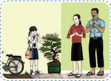

> **Deskripsi Visual:** Gambar ini adalah ilustrasi yang menunjukkan dua orang dewasa berdiri di depan sebuah pohon bonsai. Pohon bonsai tersebut tampak besar dan berwarna hijau, menunjukkan tumbuh dengan baik. Di sebelah kiri, ada seorang anak perempuan yang sedang berjalan ke arah mereka, mengenakan jaket putih dan celana hitam. Ia juga membawa tas ransel. Di sebelah kanan, ada dua orang dewasa, seorang wanita tua dan seorang pria muda, yang sedang berdiri dan saling berbincang. Wanita tua memegang tangan pria muda, sementara mereka semua tampak senang dan bersemangat. Latar belakangnya adalah jalan yang terlihat lapang dan bersih, dengan beberapa pohon lainnya yang tampak kecil dibandingkan dengan bonsai besar tersebut.

Elemen-elemen utama dalam gambar ini adalah dua orang dewasa, seorang anak perempuan, dan sebuah bonsai besar. Relasi antara mereka adalah saling berinteraksi dan berkomunikasi, sementara anak perempuan tampak tertarik pada pohon bonsai. Informasi kunci yang dapat diambil dari gambar ini adalah hubungan antara generasi muda dan tua, serta keindahan dan keberhasilan dalam merawat tanaman bonsai.

'Menjadi anak orang, bila akan berpergian wajib memberi tahu (ke mana ia akan pergi), bila sudah kembali ia wajib menemui orangtua. Kemana  ia  pergi,  wajib  ada  tujuan  yang  pasti.  Apa  yang  dilatihnya wajib berkait pekerjaannya'. (Liji. I A: 4/5)

### e.  Jangan Asal Melakukan

Urusan sekecil apapun, jangan melakukannya dengan asal-asalan. Segala  urusan  yang  kita  lakukan  dengan  asal-asalan  tentu  hasilnya tidak  akan  memadai.  Seringkali  orang  menyepelekan  hal-hal  kecil, padahal  justru  dalam  hal-hal  kecil  itu  dapat  menunjukan  apakah seseorang konsisten untuk selalu melakukan sesuatu dengan sungguhsungguh sebagai wujud komitmennya. Perlu diingat, bahwa kesalahan dalam hal-hal kecil ini dapat merusak citra dan kehormatan diri terkait

 

---
## 📄 Halaman 47

dengan status dan peran kita dalam keseharian.

Banyak contoh nyata dalam kehidupan sehari-hari tentang perlunya komitmen dan konsistensi dalam melakukan segala sesuatu. Membereskan  tempat  tidur,  membereskan  buku  pelajaran,  gosok gigi sebelum tidur, mencuci tangan sebelum makan, dan sebagainya merupakan contoh hal-hal kecil yang sering kali dilakukan dengan asalasalan. Padahal semua itu bermanfaat bagi pembentukan karakter bila dilakukan sungguh-sungguh. Sebaliknya, bila melakukannya dengan asal-asalan akan berakibat fatal, dan dalam kurun waktu panjang akan membentuk karakter buruk.

### f. Jangan Mengambil Barang Orang Lain

Walaupun kita sangat menyukai suatu benda, jika benda tersebut bukan milik kita, jangan sampai kita mengambilnya. Meskipun benda itu  kelihatannya  kurang  berharga,  kalau  belum  menjadi  milik  kita, jangan diambil dengan cara apapun juga. Kalau ini dilakukan, maka orangtua kita pasti akan merasa malu dan kecewa. Nama baik kita pun akan tercela karenanya.

Alkisah,  ada  seorang  Jenderal  yang  terkenal  'bersih'  di  zaman Dinasti  Jin  bernama  Taokan.  Dia  menjadi  terkenal  karena  didikan ibundanya yang disiplin dan keras. Suatu kali, sewaktu Taokan masih pegawai  rendahan  di  pabrik  pengolahan  ikan,  dia  mengirimi  sang ibunda  dengan  sekaleng  ikan  asin  yang  sebenarnya  milik  negara. Ibundanya  marah  dan  mengembalikan  kaleng  itu  kepada  anaknya disertai sepotong kata bijak yang mendidik. 'Sebagai pejabat kecil saja, kau sudah mengambil barang milik negara, ini perbuatan yang tidak terpuji'.

### g.  Melakukan yang Baik Meninggalkan yang Buruk

Semua orangtua pastilah menginginkan hal terbaik bagi anak-anaknya.  Hal  ini  menunjukkan  bahwa  setiap  orangtua  juga menghendaki  anak-anaknya  untuk  selalu  berbuat  baik.  Seorang anak  berbakti  senantiasa  memenuhi  harapan  dan  cita-cita  mulia kedua  orangtuanya.  Oleh  karenanya,  seorang  anak  berbakti  sangat

 

---
## 📄 Halaman 48

memperhatikan hal tersebut.

Di manapun kita berada dan di manapun orangtua kita, perihal kita sebagai anaknya tidak dapat dibatasi oleh ruang dan waktu. Jika kita melakukan hal-hal yang buruk, maka orangtua kita tetaplah terkena dampak buruknya. Maka melakukan yang baik dan meninggalkan yang buruk merupakan perwujudan perilaku bakti kita kepada orangtua.

'Meskipun ayah bunda telah meninggal dunia, bila akan melakukan sesuatu yang baik, wajib selalu mengingat bahwa dengan hasil pekerjaannya itu dapat memuliakan nama baik ayah bundanya. Bila akan melakukan sesuatu yang tidak baik, wajib selalu mengingat bahwa hasilnya dapat memalukan ayah bundanya'. ( Liji . X: I.I.17)

### h.  Menjaga Kesehatan Jasmani dan Rohani

Orangtua akan sangat cemas dan khawatir bila kita sakit, terluka atau badan 'kumuh', dan tidak terawat. Oleh karena itu, kita harus menjaga kesehatan jasmani, jangan sampai sakit, terkilir, dan terluka.

Secara  jasmani  kita  mendapatkan  hidup  dari  kedua  orangtua. Rambut dan kulit diterima dari ayah-bunda. Ini adalah warisan yang paling  berharga  dari  mereka,  maka  sudah  menjadi  kewajiban  kita untuk menjaga dan merawatnya sehingga tidak luka dan rusak. Jangan sampai kelalaian kita membuat badan kita terluka, karena hal itu akan membuat orangtua kita cemas.

Orangtua  juga  akan  malu  apabila  tingkah  laku  kita  tidak  baik. Perilaku  yang  baik  ini  menunjukkan  moralitas  yang  sehat.  Perilaku baik yang dimaksud harus dilakukan sampai akhir hayat

### i. Konsistensi Laku Bakti

Pada dasarnya, orangtua menyayangi anaknya dengan sepenuh hati. Maka selayaknyalah seorang anak berbakti kepada orangtua. Namun karena satu dan lain hal bisa saja  orangtua  membenci anak. Dalam kondisi seperti ini, anak tetap wajib berbakti kepada orangtuanya.

 

---
## 📄 Halaman 49

Cerita tentang orangtua yang membenci anaknya dialami oleh nabi Shun. Diceritakan orangtuanya pernah menyuruh Shun memperbaiki lumbung, (ketika Shun masih di atas atap rumah) tangganya diambil, lalu Gou-sou (ayahnya) membakar lumbung itu. Juga pernah disuruh memperdalam perigi,  ketika  Shun  sudah  keluar,  (orangtuanya  yang menyangka Shun masih ada di dalam) perigi itu lalu ditimbuni, Xiang (adik tiri Shun )  lalu  berkata, 'Akal menimbuni pangeran baru ini di dalam perigi adalah jasaku. Lembu dan kambingnya biarlah untuk ayah dan ibu. Gudang dan lumbungnya biarlah untuk ayah dan ibu pula. Aku mengambil perisai, tombak, celempung dan busurnya. Kedua ipar itu akan kusuruh mengatur tempat tidurku'. Meskipun demikian buruk perlakuan orangtua dan saudara tirinya, namun Shun tetap berbakti kepada mereka. Seiring berjalannya waktu akhirnya Shun yang sangat bebakti itu menjadi Raja menggantikan Baginda Tangyao, namu Shun tetap berbakti kepada kedua orangtuanya dan tetap mencintai saudarasaudaranya.

Demikianlah Shun tetap berbakti kepada orangtua walaupun kedua orangtuanya sangat membenci bahkan hendak membunuhnya.

### j. Menghadapi Orangtua yang Khilaf

Bagaimanapun hebatnya, orangtua kita adalah manusia biasa, yang tidak luput dari berbuat khilaf, keliru dan terlanjur. Bila sekali waktu mereka terlanjur berbuat salah, kita harus tetap hormat kepadanya, memahami dan setahap demi setahap mengingatkan mereka.

Mengingatkan ini harus dilakukan dengan santun, hati-hati, tulus, dan perlahan-lahan dengan tutur kata yang lembut, penuh kasih sayang dan sikap manis yang menyenangkan. Nabi Kongzi menasihati bahwa dalam melayani ayah bunda, boleh memperingatkan (tetapi hendaklah lemah  lembut).  Bila  tidak  diturut,  bersikaplah  lebih  hormat  dan janganlah melanggar. Meskipun harus lelah, janganlah menggerutu'.

Bila  pada  tahap  awal  mereka  belum  bisa  menerima  koreksi  dan pendapat  kita,  maka  kita  tetap  harus  sabar,  dan  penuh  kesantunan mencoba lagi. Carilah hari lain diwaktu hati mereka lebih santai dan terbuka, coba dan coba lagi. Walau mungkin orangtua akan menjadi

 

---
## 📄 Halaman 50

marah, kalau kita yakin mereka memang bersalah, ingatkan lagi. Walau sampai keluar  air  mata  karena  sangat  sedihnya,  tetaplah  bermohon kepada mereka untuk berubah sikap.

Walau mungkin orangtua sampai khilaf lalu memukul kita, jangan menyesal dan putus asa. Kita harus terus mencoba. Kalau orangtua dibiarkan terbiasa berbuat salah yang berulang-ulang, bisa merugikan kita semua.

### k.  Merawat Orangtua yang Sakit

Orangtua dalam merawat kita, kadang-kadang sampai melupakan kebutuhan dan kesehatannya sendiri. Kadang-kadang kita mendapati orangtua kita sakit. Mereka butuh perhatian dan kasih sayang anaknya yang tulus dan sungguh-sungguh. Kita harus mengerahkan segala daya upaya untuk mengobati mereka. Kita harus menjaga orangtua dengan baik,  menyelimutinya  jangan  sampai  kedinginan,  menyuapi  jangan sampai kurang asupan gizi, mengurut, membelai, dan menunjukkan kasih sayang kita kepada mereka.

Bila ternyata penyakit mereka bertambah parah, harus ditambah pula  perhatian  dan  kasih  sayang  kita.  Jangan  ditinggalkan  barang sekejap pun. Pagi, petang, siang, dan malam penuhi kebutuhannya dan jaga  mereka  dengan  baik.  Singkatnya,  kita  harus  merawat  orangtua seumur hidup mereka.

Mengzi  berkata,  'Memelihara  masa  hidup  orangtua  itu  belum cukup dinamai pekerjaan besar. Hanya segenap pengabdian mengantar kewafatannya barulah dapat dinamai pekerjaan besar'. ( Mengzi . IV B: 13)

### 8.  Kisah Anak Berbakti

### a.  Laku Bakti Raja Shun

Wanzhang  bertanya,  'Shun  ketika  mengerjakan  sawah,  sering menangis dan berseru kepada Tian Yang Maha Esa. Mengapakah ia menangis dan berseru demikian?' Mengzi menjawab, 'Ia  menyesali diri'.

 

---
## 📄 Halaman 51

- Wanzhang berkata, 'Kalau dicinta ayah bunda, dalam kegembiraan tidak boleh melupakan diri; kalau dibenci ayah-bunda, meskipun harus  bersusah  payah,  tidak  boleh  menyesalinya.  Mengapakah Shun menyesal?'
' Changxi pernah  bertanya  kepada Gong  Minggao ,  'Hal Shun mengerjakan  sawah,  saya  telah  mendengar  penjelasan  dengan mengerti; tetapi hal ia menangis dan berseru kepada Tian Yang Maha Pengasih serta ayah-bundanya, saya belum dapat mengerti.' Gong Minggao berkata,  'Sungguh  engkau  tidak  akan  mudah mengerti.' Menurut Gong Minggao, hati seorang anak yang berbakti sungguh berat  kalau  sampai  tidak  mendapat  cinta  orangtuanya. ( Shun tentu  berpikir).  'Aku  dengan  sekuat  tenaga  membajak sawah, inilah wajar bagi seorang anak. Tetapi kalau ayah dan ibu sampai tidak mencintai diriku, orang macam apakah aku ini?'

- 'Setelah  raja  ( Yao )  menyuruh  sembilan  orang  putera  dan  dua orang puterinya beserta para pembantunya, menyediakan lembu, kambing,  dan  gudang-gudang  harta  untuk  melayani Shun di tengah sawah, para siswa di dunia juga datang kepadanya. Raja menginginkan  ia  membantu  mengatur  dunia  untuk  kemudian mewariskan tahta kepadanya; tetapi karena belum dapat bersesuaian  dengan  ayah-bundanya,  ia  masih  merasa  sebagai seorang  miskin  yang  tidak  mempunyai  tempat  kediaman  untuk pulang'. ( Shijing . I.12)
- 'Disukai  oleh  para  siswa  di  dunia  adalah  keinginan  setiap  orang; tetapi  hal  itu  belum  dapat  meredakan  kesedihannya.  Keelokan wajah adalah keinginan setiap orang, ia telah beristerikan kedua orang  puteri  raja  ( Yao );  tetapi  hal  itu  belum  juga  meredakan kesedihannya. Kekayaan adalah keinginan setiap orang, ia sudah memiliki  kekayaan  di  dunia  ini;  tetapi  hal  itu  tidak  cukup  pula meredakan kesedihannya. Kedudukan tinggi ialah keinginan setiap orang,  kedudukannya  sudah  sebagai  raja;  tetapi  hal  itu  belum cukup juga untuk meredakan kesedihannya. Disukai para siswa, beristri elok, kaya dan berkedudukan tinggi ternyata semuanya itu

 

---
## 📄 Halaman 52

- belum dapat meredakan kesedihannya; karena menurut ia, hanya setelah dapat bersesuaian dengan ayah-bunda, barulah dapat lepas dari kesedihannya.
- 'Biasanya orang pada waktu muda selalu terkenang kepada ayahbundanya,  setelah  mengenal  keelokan  wajah,  ia  rindu  kepada kekasihnya; setelah berkeluarga, ia terkenang kepada anak-istrinya dan  setelah  memangku  jabatannya  terkenang  kepada  rajanya; bahkan kalau tidak mendapatkan raja yang mau menerimanya, ia dengan penuh nafsu mengusahakan. Tetapi orang yang besar rasa baktinya, sepanjang hidupnya akan tetap terkenang kepada ayahbundanya.  Dalam  usia  50  tahun  masih  terkenang  kepada  ayahbundanya, hal itu kulihat nyata pada diri Shun Agung'. ( Mengzi . VA: 1-5)

### b.  Memasak Obat untuk Ibu

Dikisahkan baginda Han Wendi yang bernama Heng , putera ketiga baginda Han Gaozhu , beliau pertama diangkat sebagai raja pengganti setelah  permaisuri Liuhe menyingkirkan  raja Liulu .  Para  menteri menyambut raja pengganti menerima jabatan serta kekuasaan tertinggi dan beliau adalah raja suci pertama dari tiga generasi sebelumnya.

Beliau sangat memperhatikan kesehatan ibunya, meskipun sudah menjadi kaisar kerajaan yang besar. Ketika ibu suri sakit, selama tiga tahun  Wendi  tidak  pernah  tidur  nyenyak  bahkan  malam  hari  tidak pernah  melepaskan  ikat  pinggang  pakaiannya  sehingga  setiap  saat dapat menerima pejabat yang melapor.

Setiap  kali  beliau  memasak  sendiri  obat  untuk  ibunya,  sebelum diberikan selalu dicicipi terlebih dahulu. Laku bakti dan Cinta - Kasih Wendi  berkenan  kepada Huangtian ,  ibunya  sembuh  dari  sakitnya. Peristiwa ini tersebar sampai empat penjuru lautan, sehingga rakyat terharu dan patuh terhadap kepemimpinan beliau.

 

---
## 📄 Halaman 53

### c.  Menyejukkan dan Menghangatkan Tempat Tidur

Huangxiang terlahir  pada  zaman  dinasti Han akhir,  dia  adalah seorang anak perempuan yang pandai dan memiliki sifat bakti. Ketika Huangxiang berusia 9 tahun, ibunya meninggal dunia dan sekarang dia hidup bersama ayahnya.

Siang malam ia memikirkan kasih sayang seorang ibu, ia sangat sedih  walau  nasihat  ayah  dan  orang  sekitarnya  tak  henti-hentinya menghibur dirinya namun itu semua tidak mengurangi kesedihannya.

Kepada ayahnya ia juga  sangat  menaruh  perhatian.  Saat  datang musim panas, maka pada tiap malam menjelang tidur, ia mengipasi tempat tidur sehingga ayahnya merasa sejuk dan nyaman. Bila musim dingin  tiba,  tubuhnya  menghangatkan  selimut  dan  tempat  tidur, sehingga ayahnya dapat tidur dengan tidak kedinginan. Demikian ia lakukan terus-menerus tiada rasa jemu.

Liuhe yang  menjadi  pembesar  daerah  itu,  ketika  mendengar prilaku Huangxiang ia sangat terkesan maka disebar-luaskan perilaku semangat bakti itu

### d.  Menangis di Depan Makam Ibunya

Wangbo  hidup  di  Kerajaan Wei ,  ia  adalah  seorang  yang  sangat berbakti. Ibunya dimakamkan di pinggiran hutan. Semasa hidupnya Ibu Wangbo sangat  takut  bila  mendengar  suara  halilintar.  Bila  ada suara halilintar, Wangbo buru-buru datang ke makam ibunya sambil berlutut dia berkata 'Jangan takut, Bo ada di dekat ibu' Demikian ia lakukan sebagai ungkapan bakti yang tulus.

Setelah berkeluarga, Wangbo hidup sebagai guru, dan saat mengajar murid-murid membaca Kitab Sanjak yang berbunyi: 'Sungguh  menderita  ayah-ibu  yang  melahirkan  dan  merawat  aku dengan  susah  payah',  tanpa  terasa  Wangbo  meneteskan  air  mata, tidak bisa menahan haru.

Melihat  kejadian  ini,  para  murid  meminta  dia  menghentikan pengajarannya agar tidak merasa sedih lagi.

 

---
## 📄 Halaman 54

### Tugas Kelompok

Carilah referensi ayat suci dari kitab Sishu , Liji , dan Xiao Jing terkait dengan perilaku-perilaku berikut:

- Cepat Tanggap.
- Berpamitan, melapor, dan hidup teratur.
- Melakukan yang baik, meninggalkan yang buruk.
- Menjaga kesehatan jasmani dan rohani.
- Menghadapi orang tua yang khilaf

### Tujuan

- Lembar penilaian diri ini bertujuan untuk:
- Mengetahui penerapan perilaku bakti di rumah.
- Sejauh mana penghayatan akan pentingnya perilaku bakti kepada orangtua.

### Petunjuk

- Isilah lembar penilaian diri yang ditunjukkan dengan skala sikap berikut ini!
SS  =  Sangat Setuju

ST  =  Setuju

RR =  Ragu-ragu

TS  =  Tidak Setuju

 

---
## 📄 Halaman 55

---
**📊 Tabel**

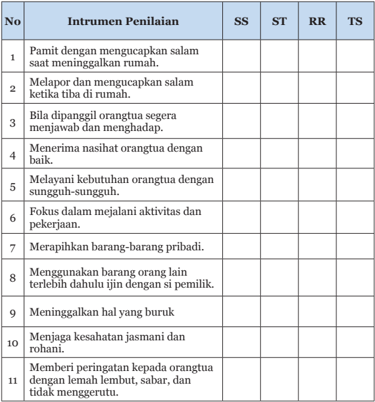

Tabel ini menunjukkan berbagai perilaku yang dianggap penting oleh siswa (SS), siswa tingkat standar (ST), siswa tingkat rendah (RR), dan siswa tingkat senior (TS) dalam membangun hubungan positif dengan orang tua mereka. Topik utama tabel adalah perilaku anak-anak dalam menjaga hubungan dengan orang tua mereka. Kolom-kolomnya mencakup perilaku seperti salam hangat saat meninggalkan rumah, menerima nasihat orang tua dengan baik, dan menjaga kesehatan fisik dan mental. Data penting yang terlihat adalah bahwa semua level penilaian (SS, ST, RR, TS) memberikan nilai pada beberapa perilaku, seperti salam hangat dan menerima nasihat orang tua, menunjukkan bahwa hal-hal ini dilihat sebagai sangat penting untuk semua tingkat penilaian.

 

---
## 📄 Halaman 56

### Hidup dalam Dunia

 

---
## 📄 Halaman 57

### A.  Pilihan Ganda

Berilah tanda silang (X) di antara pilihan A, B, C, D, atau E yang merupakan  jawaban  paling  tepat  dari  pertanyaan-pertanyaan berikut ini!

- Nabi bersabda, 'Sesungguhnya laku bakti itulah pokok kebajikan, dari padanyalah agama berkembang. Tubuh, rambut dan kulit  diterima  dari  ayah  dan  bunda,  perbuatan  tidak  berani membiarkannya rusak, itulah .…
- puncak laku bakti
- permulaan laku bakti
- laku bakti yang besar
- Berdasarkan karakter huruf, Xiao mengandung arti ....
- yang lebih muda/anak mendukung yang lebih tua/orangtua
- yang lebih lebih tua/orangtua mendukung yang muda/anak
- yang muda menghormati yang lebih tua
- yang tua menghargai yang lebih muda
- memuliakan hubungan
- Di  antara  watak-watak  yang  terdapat  di  antara  langit  dan  bumi sesungguhnya  manusialah  yang  termulia.  Di  antara  perilaku manusia tiada yang lebih besar daripada laku ....
- bijaksana
- cinta kasih
- bakti
- dapat dipercaya
- tenggangrasa
- laku bakti yang utama
- laku bakti yang kecil

 

---
## 📄 Halaman 58

- Bila  orang  tidak  mencintai  orangtuanya,  tetapi  dapat  mencintai orang lain, itulah kebajikan yang terbalik. Tidak hormat kepada orangtua sendiri tetapi dapat hormat kepada orang lain, itulah ... terbalik.
- kebenaran
- kesusilaan
- cinta Kasih
- Zengzi berkata, 'Laku bakti itu ada tiga tingkatan, dan yang terbesar adalah…
- melakukan perawatan
- tidak memalukan ayah dan bunda
- memuliakan ayah dan bunda
- menghormati ayah bunda
- membahagiakan ayah bunda
- Nabi bersabda, 'Di dalam melayani ayah bunda boleh memperingatkan,  (tetapi  hendaklah  lemah  lembut).  Bila  tidak diturut bersikaplah lebih hormat  dan  janganlah melanggar. Meskipun harus bercapai lelah, janganlah ....
- menyesal
- menyerah
- A dan B benar
- Orang  yang  benar-benar  mengabdi  kepada  orangtuanya,  saat berkedudukan tinggi, tidak menjadi sombong; saat berkedudukan rendah, tidak suka mengacau; dan di dalam hal-hal yang remeh tidak ....
- menggerutu
- marah-marah
- hormat
- pandangan
- mau berebut
- peduli
- menyepelekan
- sembarangan
- sungguh-sungguh

 

---
## 📄 Halaman 59

- Sesungguhnya  laku  bakti  itu  dimulai  dengan  mengabdi  kepada orangtua, selanjutnya mengabdi kepada pemimpin, dan akhirnya ....
- merawat orangtua
- memuliakan orangtua
- bersujud kepada Tian
- menuju tempat hentian
- menegakkan diri
- Menegakkan diri hidup menempuh jalan suci, meninggalkan nama baik di zaman kemudian, sehingga memuliakan ayah dan bunda, itulah ....
- inti laku bakti
- awal laku bakti
- akhir laku bakti

### B.  Jawablah pertanyaan-petanyaan berikut ini dengan uraian yang jelas!

- Xiao secara  imani  berarti  memuliakan  hubungan.  Memuliakan hubungan yang dimaksud adalah?
- Tuliskan Lima Hubungan Kemasyarakatan ( Wu Lun ) sebagai Jalan Suci yang harus ditempuh manusia di dunia!
- Sebutkan tiga tingkatan berbakti kepada orangtua!
- Jelaskan hal melakukan perawatan kepada orangtua!
- Jelaskan awal dari laku bakti kepada orangtua!
- pokok kebajikan
- inti kemanusiaan

 

---
## 📄 Halaman 60

Di dalam Kitab Bakti IX, Nabi Kongzi bersabda: 'Di antara watak-watak mahluk yang terdapat di antara langit dan bumi ini, sesungguhnya, manusialah yang termulia. Di antara perilaku manusia tiada yang lebih besar dari laku bakti. Di dalam laku bakti itu tiada yang lebih besar dari hormat kepada orangtua, dan pernyataan hormat itu tiada yang lebih besar dari kesujudan kepada Tian Yang Maha Esa'.

 

---
## 📄 Halaman 61

---
**🖼️ Gambar/Diagram**

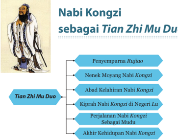

> **Deskripsi Visual:** Gambar ini adalah diagram yang menunjukkan struktur dan perjalanan hidup Nabi Kongzi sebagai Tian Zhi Mu Duo. Diagram ini terdiri dari beberapa elemen utama:

1. Nabi Kongzi sebagai Tian Zhi Mu Duo
   - Ini adalah judul utama yang menggambarkan topik utama gambar.

2. Penyempurnaan Rujiao
   - Ini merupakan salah satu bagian dari perjalanan Nabi Kongzi.

3. Nenek Moyang Nabi Kongzi
   - Ini merupakan bagian dari sejarah keluarga Nabi Kongzi.

4. Abad Kelahiran Nabi Kongzi
   - Ini menunjukkan periode awal hidup Nabi Kongzi.

5. Kiprah Nabi Kongzi di Negeri Lu
   - Ini merupakan bagian dari perjalanan Nabi Kongzi di luar negeri.

6. Perjalanan Nabi Kongzi Sebagai Muda
   - Ini merupakan bagian dari perjalanan Nabi Kongzi saat masih muda.

7. Akhir Kehidupan Nabi Kongzi
   - Ini merupakan bagian terakhir dari perjalanan hidup Nabi Kongzi.

Teks, angka, atau label penting yang terlihat dalam gambar meliputi:
- Judul "Nabi Kongzi sebagai Tian Zhi Mu Duo"
- Nama-nama bagian seperti "Penyempurnaan Rujiao", "Nenek Moyang Nabi Kongzi", dll.
- Angka yang mungkin menunjukkan urutan atau periode waktu.

Informasi kunci yang dapat diambil pembaca meliputi:
- Struktur dan perjalanan hidup Nabi Kongzi
- Pentingnya keluarganya dalam kehidupan Nabi Kongzi
- Perjalanan Nabi Kongzi di luar negeri
- Peran Nabi Kongzi saat masih muda
- Akhir kehidupan Nabi Kongzi

Diagram ini memberikan gambaran umum tentang perjalanan hidup Nabi Kongzi dan bagaimana ia berkembang seiring waktu, dari penyempurnaan Rujiao hingga akhir kehidupannya.

### A.  Nabi Kongzi sebagai Penggenap Ru Jiao

Nabi Kongzi , Beliau bermarga Kong , bernama Qiu alias Zhongni , artinya, anak kedua dari bukit Ni . Lahir dari seorang ibu bernama Yan Zhengzai .  Ayahnya adalah seorang perwira dari negeri Lu ,  bernama Kong Shulianghe .

Sebelum Zhongni lahir, Kong Shulianghe telah memiliki sembilan orang putri dan satu orang putra, namun sayangnya, putra satu-satunya itu  memiliki  cacat  pada  kakinya,  sehingga  dipandang  tidak  cakap untuk  melanjutkan  keturunan  keluarga Kong .  Mengingat  keadaan keluarganya yang seperti itu, Kong Shulianghe menjadi sangat bersedih

 

---
## 📄 Halaman 62

hati dan berharap akan mendapatkan putera lagi.  Ibunda Yan Zhengzai menganjurkan agar suaminya memohon kepada Tian dengan  melakukan  sembahyang  di  bukit Ni .  Maka  demikianlah  selanjutnya, Kong Shulianghe dan ibunda Yan Zhengzai sering melakukan  sembahyang  di  bukit Ni untuk memohon  kepada Tian agar  dikaruniakan seorang  putera  sebagai  pelanjut  keturunan keluarga Kong .  Harapan Kong Shulianghe dan  ibunda Yan Zhengzai dikabulkan  oleh Tian Yang  Maha  Esa  untuk  mendapatkan seorang putera.

Pada  waktu  itu  di Zhongguo sedang berkuasa di Dinasti Zhou . Dinasti Zhou

---
**🖼️ Gambar/Diagram**

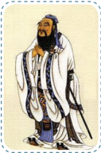

> **Deskripsi Visual:** Gambar ini adalah ilustrasi yang menampilkan seorang pria tua dengan penampilan tradisional. Pria tersebut mengenakan pakaian putih dengan detail warna biru dan hitam, serta memegang sebuah tongkat. Penampilannya menunjukkan kepercayaan diri dan kemampuan berbicara. Ilustrasi ini mungkin digunakan untuk membantu pembaca memahami karakteristik atau peran seseorang dalam konteks cerita atau teks yang lebih luas.

adalah Dinasti ketiga di Zhongguo , yang berkuasa dari tahun 1122 SM. - 255 SM. Pada tahun 770-476 SM., adalah masa yang dikenal dengan sebutan zaman Chunqiu atau zaman akhir Dinasti Zhou . Pada zaman Chunqiu ini, kekuasaan Dinasti Zhou sudah mulai melemah. Masa itu merupakan masa Feodalistik, di mana banyak negara-negara bagiannya memberontak dan saling berperang merebutkan wilayah kekuasaan. Kehidupan para panglima perangnya sama seperti kehidupan panglima perang pada umumnya, dipenuhi dengan pembantaian, kelaparan dan pesta pora.

Pada zaman yang kacau inilah Qiu alias Zhongni (Nabi Kongzi ) dilahirkan, pada tanggal 27 bulan 8 Kongzili tahun 551 SM., di negeri Lu (salah  satu  negara  bagian  Dinasti Zhao ),  kota Zou Yi ,  di  sebuah desa  bernama Changping ,  di  Lembah Kongsang .  (Sekarang  Jazirah Shandong kota Qufu ).

Bagi keluarga Kong , kelahiran Kongqiu merupakan suatu rakhmat dan  harapan  baru  untuk  dapat  dilanjutkannya  keturunan  keluarga Kong .

 

---
## 📄 Halaman 63

Ketika  Nabi Kongzi dilahirkan, Shulianghe telah  berusia  sangat lanjut. Pada saat usia Nabi Kongzi tiga tahun, Shulianghe wafat. Kong Qiu kecil  dirawat  dan  menerima  pendidikan  dari  ibu  dan  neneknya (nenek dari ibu).  Berkat  kebijaksanaan  dan  keteguhan  iman  ibunda Yan Zhengzai ,  dikemudian  hari Qiu berhasil  menjadi  orang  besar yang memiliki kebijaksanaan tinggi hingga menjadi guru pembimbing hidup bagi seluruh masyarakat umum pada masa itu.

Kongqiu adalah  penganut  ajaran Rujiao ,  ( Rujiao artinya  agama bagi  orang-orang  yang  lembut  hati  dan  terbimbing).  Beliau  adalah seorang yang sangat menyukai belajar, dan pada usia lima belas tahun semangat belajarnya sudah mantap dan membara.

Hal ini ditegaskan oleh Nabi Kongzi sendiri dan menjadi catatan penting tentang perjalanan kehidupannya. 'Ketika Aku berusia lima belas tahun, Aku hanya tertarik untuk belajar'. Inilah yang menjadi pondasi kokoh bagi kehidupannya, yang dapat dibagi dalam sejumlah tahap:

'…Usia  30  tahun,  tegaklah  pendirian.  Usia  40  tahun,  tiada  lagi keraguan dalam pikiran. Usia 50 tahun, telah mengerti akan Firman Tian .Usia 60 tahun, pendengaran telah menjadi alat yang patuh (untuk menerima kebenaran). Dan usia 70 tahun, Aku sudah dapat mengikuti hati dengan tidak melanggar garis Kebenaran'. ( Lunyu . II: 4).

Karena semangat dan kemauan belajar yang tinggi sehingga Nabi Kongzi memiliki  kebijaksanaan  yang  sempurna,  ditambah  dengan sifat-sifat  ke-Nabian yang memang sudah ada pada diri beliau sejak lahir, menjadikan Nabi Kongzi mampu  menyempurnakan dan menggenapi ajaran Ru , sekaligus sebagai penggenap rangkaian wahyu yang diturunkan Tian melalui Nabi-Nabi sebelum Nabi Kongzi .  Dari sini  maka  jelas  diketahui,  bahwa  Nabi Kongzi bukanlah  pencipta, melainkan  pelanjut,  penerus  dan  penggenap  ajaran-ajaran  yang memang sudah ada sebelumnya. Nabi Kongzi bersabda,  'Aku  tidak mencipta,  Aku  hanya  menaruh  suka  pada  ajaran-ajaran  yang  kuno itu'. (Sabda Suci. VII: 1) 'Orang yang menyukai ajaran kuno dan dapat menerapkannya pada yang baru dia boleh dijadikan guru'.

 

---
## 📄 Halaman 64

Pada  masa  selanjutnya,  oleh  para  sarjana-sarjana  Barat  yang dipelopori oleh FR. Matteo Ricci (1551-1610 Masehi) menyebut Nabi Kongzi sebagai Confucius .

Nabi Kongzi adalah seorang pemikir besar, politisi, pendidik besar kebudayaan  Tiongkok  yang  terkemuka  dan  termasyur  di  seluruh pelosok Zhongguo .  Nabi Kongzi memang  bukanlah  pendiri  sebuah agama baru, tetapi beliau adalah seorang yang sangat dalam perasaan keagamaannya. Nabi Kongzi hanya meneruskan ajaran yang memang sudah ada sebelumnya, yaitu agama Ru, yang sudah dirintis (diletakkan dasar-dasarnya oleh Nabi Tangyao dan Nabi Yishun tahun 2357 SM. 2205 SM.) tetapi, Nabi Kongzi lah penggenap dari agama yang sudah ada itu.

Nabi Kongzi menegaskan, bahwa kekuatan kebajikan beliau adalah Tian Yang Maha Esa yang menumbuhkannya, dan bahwa Nabi telah mengemban tugas suci Tian yang wajib diungkapkan dan ditebarkan, dan hal itu menjadi kekuatan bagi beliau untuk menang atas segala kekecewaan  dan  tetap  damai  tenang  menghadapi  orang-orang  yang memusuhi  atau  mengabaikannya.  Alam  pemikiran  Nabi Kongzi dimulai dari hal-hal yang bersifat 'kemanusiaan' ( Rendao ) dan naik menuju kepada yang bersifat 'Ketuhanan' ( Tiandao ).

Seperti hal para Nabi sebelumnya, Tian pun berkenan menurunkan wahyu kepada Nabi Kongzi , yaitu wahyu Yushu atau kitab Batu Kumala yang  dibawa  oleh  hewan  suci Qilin yang  diterima  oleh  ibunda Yan Zhengzai menjelang kelahiran Nabi.

Nabi Kongzi berhasil  menggenapkan  kitab Yijing atau  kitab Perubahan  yang  merupakan  salah-satu  bagian  dari  kitab Wujing (kitab  yang  mendasari)  ajaran Rujiao .  Kitab  Yijing  sudah  dimulai penulisannya  sejak  Nabi  purba Fuxi .  Nabi Kongzi merumuskan Shiyi atau  sepuluh  sayap  yang  menjelaskan  makna  dasar  dan  cara menggunakan Yijing .

 

---
## 📄 Halaman 65

### B.  Nenek Moyang Nabi Kongzi

Sebelum  lebih  jauh  membahas perihal kehidupan Nabi Kongzi ,  ada baiknya kita lebih dahulu mengenal tentang leluhur Nabi Kongzi . Menurut silsilah, Nabi Kongzi adalah keturunan Baginda Huangdi (26982598 SM.), seorang nabi purba yang besar jasanya dalam pembinaan peradaban dan kebudayaan.

Salah seorang keturunannya bernama Xie menjabat sebagai menteri  pendidikan  ( Sutho )  pada zaman pemerintahan Raja Suci Tangyao (2357-2255 SM.) dan Raja Suci Yushun (2255-2205 SM.).

---
**🖼️ Gambar/Diagram**

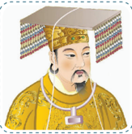

> **Deskripsi Visual:** Gambar ini adalah ilustrasi yang menampilkan seorang tokoh berpakaian tradisional, mungkin seorang pemimpin atau tokoh penting dalam budaya tertentu. Tokoh tersebut mengenakan pakaian kuning dengan detail emas dan perhiasan yang mencolok, serta topi yang melengkapi penampilannya. Ilustrasi ini tampaknya digunakan untuk membantu pembaca memahami atau menggambarkan karakteristik atau keadaan tokoh tersebut.

Elemen utama dalam gambar ini adalah tokoh yang diperlihatkan, yang merupakan subjek utama dari ilustrasi. Topi dan pakaian yang dipakai oleh tokoh tersebut merupakan elemen-elemen yang penting dalam penampilan dan identitasnya. Ilustrasi ini juga menunjukkan detail seperti perhiasan yang mencolok pada tokoh tersebut, yang mungkin memiliki makna atau fungsi kultural tertentu.

Teks, angka, atau label penting tidak terlihat dalam gambar ini karena ia hanya berupa ilustrasi. Namun, informasi kunci yang dapat diambil dari gambar ini adalah bahwa tokoh tersebut mungkin memiliki status atau kedudukan tertentu dalam masyarakat atau budaya tertentu, yang ditunjukkan melalui penampilannya yang elegan dan detailnya.

Dalam konteks pembelajaran, gambar ini dapat digunakan untuk membantu mengajarkan tentang budaya, kepemimpinan, atau karakteristik sosial tertentu dalam masyarakat. Ilustrasi ini juga dapat digunakan sebagai bahan diskusi tentang bagaimana penampilan dan perhiasan dapat menjadi simbol atau representasi dari status sosial atau budaya.

Pada zaman berikutnya, keturunan Xie yang bermarga Cu bernama Li alias Thien -iet atau lebih dikenal dengan sebutan Baginda Chengtang mendirikan Dinasti Shang (1766-1122 SM.). Setelah menumbangkan kekuasaan  Dinasti Xia (2205-1766  SM.),  yang  ketika  itu  diperintah

---
**🖼️ Gambar/Diagram**

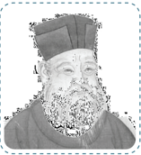

> **Deskripsi Visual:** Gambar ini adalah foto yang menampilkan wajah seorang pria tua dengan rambut pendek dan berkepang. Pria tersebut mengenakan topi tradisional yang menunjukkan kepeloporan atau status sosial tertentu. Wajahnya tampak tua dan berkerut, menunjukkan usia yang cukup tinggi. Kepala pria tersebut tampak lembut dan berkerut, menunjukkan usia yang cukup tinggi. Kepala pria tersebut tampak lembut dan berkerut, menunjukkan usia yang cukup tinggi. Kepala pria tersebut tampak lembut dan berkerut, menunjukkan usia yang cukup tinggi. Kepala pria tersebut tampak lembut dan berkerut, menunjukkan usia yang cukup tinggi. Kepala pria tersebut tampak lembut dan berkerut, menunjukkan usia yang cukup tinggi. Kepala pria tersebut tampak lembut dan berkerut, menunjukkan usia yang cukup tinggi. Kepala pria tersebut tampak lembut dan berkerut, menunjukkan usia yang cukup tinggi. Kepala pria tersebut tampak lembut dan berkerut, menunjukkan usia yang cukup tinggi. Kepala pria tersebut tampak lembut dan berkerut, menunjukkan usia yang cukup tinggi. Kepala pria tersebut tampak lembut dan berkerut, menunjukkan usia yang cukup tinggi. Kepala pria tersebut tampak lembut dan berkerut, menunjukkan usia yang cukup tinggi. Kepala pria tersebut tampak lembut dan berkerut, menunjukkan usia yang cukup tinggi. Kepala pria tersebut tampak lembut dan berkerut, menunjukkan usia yang cukup tinggi. Kepala pria tersebut tampak lembut dan berkerut, menunjukkan usia yang cukup tinggi. Kepala pria tersebut tampak lembut dan berkerut, menunjukkan usia yang cukup tinggi. Kepala pria tersebut tampak lembut dan berkerut, menunjukkan usia yang cukup tinggi. Kep

oleh  keturunan  Dayu  ( Yu Agung)  yang bernama Xiajie .

Seorang keturunan Chengtang bernama Weizi Qi kakak tertua Yinshou / Raja Tiu ,  Raja  terakhir  Dinasti  Shang, setelah  Dinasti  itu  ditumbangkan  oleh raja Wu , pendiri Dinasti Zhou (1122-255 SM.),  diangkat  menjadi  raja  muda  di negeri Song untuk  melanjutkan  kurun Dinasti Shang .  Karena Wei Ziqi tidak mempunyai anak, adiknya yang bernama Weizhong diangkat sebagai penerusnya. Weizhong inilah  yang  menurunkan raja muda-raja muda negeri Song .

 

---
## 📄 Halaman 66

Kong Fujia seorang bangsawan negeri Song keturunan Wei Zong ialah orang pertama yang menggunakan marga Kong dan  meninggalkan nama  keluarga Zi . Kong Fangshu ,  seorang  bangsawan  keturunan Khong Fujia telah pindah ke negeri Lu karena kekalutan politik yang terjadi  di  negeri Song . Kong Fangshu berputera Kong Poxia , Kong Poxia berputera Kong Shulianghe inilah ayah Nabi Kongzi .

Aktivitas 3.1

### Aktivitas Bersama

Ceritakan poin-poin penting tentang  perjalanan Nabi Kongzi sebagai Tianzhi Muduo ,  dan  apa  yang  dapat  kalian  simpulkan  tentang  tugas suci Nabi Kongzi sebagai Tianzhi Muduo !

### C.  Abad Kelahiran Nabi Kongzi

### 1. Keluarga Kong Shulianghe , Orangtua Nabi Kongzi

Nabi Kongzi adalah putera bungsu dari Kong Shulianghe . Sebelum kelahiran Nabi Kongzi keluarga Kong telah  memiliki  sembilan anak perempuan dan satu anak laki-laki bernama Mengpi . Namun sayang, putera satu-satunya itu memiliki cacat pada kakinya, sehingga dipandang kurang cakap untuk melanjutkan keturunan keluarga Kong . Kong Shulianghe mempunyai  istri  bernama Yan Zhengzai (ibunda Nabi Kongzi ).

### 2.  Sembahyang di Bukit Ni

Sebelum kelahiran Nabi Kongzi , Yan Zhengzai dan Kong Shulianghe sering melakukan sembahyang kehadirat Tian Yang Maha Esa di bukit Ni ( Ni Qiu ) memohon kepada Tian agar mendapat seorang putera lagi untuk dapat melanjutkan keturunan keluarga Kong .

 

---
## 📄 Halaman 67

Doa  dan  harapan  ibunda Yan Zhengzai dan Kong Shulianghe dikabulkan oleh Yang Maha Kuasa. Maka setelah mereka mendapatkan seorang  putera,  menamainya Qiu yang  artinya  bukit,  alias Zhongni yang artinya anak kedua dari bukit Ni .

Suatu ketika sebelum kelahiran Zhongni , saat ibunda Yan Zhengzai dan Kong Shulianghe naik ke bukit Ni untuk bersembahyang dilihatnya daun-daun dan tumbuh-tumbuhan

---
**🖼️ Gambar/Diagram**

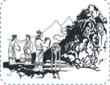

> **Deskripsi Visual:** Gambar ini adalah ilustrasi yang menunjukkan tiga orang yang sedang berjalan di sekitar sebuah hutan. Mereka tampak senang dan berbicara dengan penuh gairah. Di sebelah kiri, ada seorang pria tua yang membawa tas kecil, sedangkan di tengah, ada seorang remaja yang sedang berjalan dengan cepat. Di kanan, ada seorang wanita muda yang juga sedang berjalan dengan penuh semangat. Latar belakangnya adalah hutan yang hijau dengan pepohonan tinggi dan bukit di luar jangkauan pandangan. Ilustrasi ini menunjukkan suasana hidup dan aktifitas fisik yang positif.

menegakkan diri memberi jalan, dan waktu mereka turun, daun-daun dan pohon-pohon itu kembali merunduk.

Suatu malam ibunda Yan Zhengzai juga bermimpi bertemu dengan Malaikat Bintang Utara datang dan berkata kepadanya: 'Engkau akan melahirkan seorang putera yang Nabi, dan engkau akan melahirkannya di lembah Kong Sang '.

### 3.  Muncul Sang Qilin

Tak lama setelah mimpi bertemu dengan malaikat Bintang Utara ibunda Yan Zhengzai mengandung.  Suatu  ketika  beliau  mendadak seperti  bermimpi  melihat  lima  orangtua  turun  ke  serambi  rumah, lima  orang  itu  menyebut  diri  mereka  sebagai  Lima  Sari  Bintang. Lima orangtua (Sari Lima Bintang) menuntun hewan seperti lembu kecil bertanduk tunggal dan bersisik seperti naga. Hewan itu berlutut di  hadapan Yan Zhengzai dan  menyemburkan  Kitab  Batu  Kumala ( Yushu )  yang  bertuliskan:  'Putera  Sari  Air  Suci  akan  menggantikan dinasti Zhou yang sudah lemah, dan menjadi raja tanpa mahkota'.

 

---
## 📄 Halaman 68

Ibunda Yan Zhengzai lalu  mengikatkan pita merah pada tanduk hewan itu, dan penglihatan itupun kemudian hilang. Ketika suaminya diberi tahu beliau berkata: 'Makhluk itu pastilah Qilin , bersyukurlah kita karena biasanya Qilin akan mucul ketika orang-orang besar akan dilahirkan'.

---
**🖼️ Gambar/Diagram**

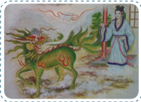

> **Deskripsi Visual:** Gambar ini adalah ilustrasi yang menampilkan seorang wanita berdiri di depan sebuah pintu dengan pohon besar berwarna hijau dan merah di belakangnya. Wanita tersebut mengenakan pakaian tradisional yang berwarna putih dengan detail warna-warna lainnya. Pohon besar tersebut memiliki daun-daun berwarna hijau dan bunga-bunga merah yang tampak seperti bunga sakura. Ilustrasi ini mungkin digunakan untuk membantu pembaca memahami konsep atau cerita yang berkaitan dengan kehidupan tradisional atau mitologi.

Setelah dekat saat melahirkan, ibunda Yan Zhengzai menanyakan kepada  suaminya,  adakah  tempat  yang  bernama Kong Sang itu. Shulianghe menjawab  bahwa Kong Sang itu  adalah  sebuah  goa kering di Bukit Selatan ( Nan San ). Ibunda Yan Zhengzai mengatakan bahwa ia akan pergi dan berdiam di sana menunggu saat melahirkan. Selanjutnya mereka mempersiapkan segala sesuatu yang diperlukan untuk menyambut kelahiran.

### 4.  Malam Suci Penuh Damai

Saat  sebelum  dan  sesudah  ibunda Yan  Zhengzai melahirkan, nampak tanda-tanda yang menakjubkan ( Gansheng ), yaitu:

- Dua ekor naga datang dan menjaga di kanan kiri rumah, mengitari atap bangunan di lembah Kong Sang .
- Di angkasa terdengar suara musik yang merdu.
- Dua orang bidadari menampakan diri di udara menuangkan baubauan yang wangi seolah-olah memandikan ibunda Yan Zhengzai dan sang bayi yang baru dilahirkan.
- Langit jernih, bumi terasa damai dan tentram.

 

---
## 📄 Halaman 69

- Angin bertiup sepoi-sepoi dan matahari bersinar hangat.
- f Terdengar  suara  (sabda)  ' Tian Yang  Maha  Esa  telah  berkenan menurunkan seorang putera yang Nabi'.
- Muncul sumber air yang jernih dan hangat dari lantai goa, dan kering kembali setelah bayi itu dimandikan.
- Pada tubuh sang bayipun terdapat tanda-tanda yang luar biasa. Pada dadanya terdapat tulisan lima huruf: Zhi Zhuo Deng Shi Hu , yang mengandung arti: 'Yang akan membawakan damai dan tertib bagi dunia'.
Demikian  telah  lahir  Nabi Kongzi yang  diberi  nama  kecil Qiu alias Zhongni ,  pada tanggal 27 bulan delapan penanggalan Kongzili tahun 551 SM. di negeri Lu , kota Zou Yi , desa Chang Ping , di lembah Kong Sang (sekarang Jazirah Shandong ,  kota Qufu ).  Pada  saat  itu, Lu Zhoukong memerintah negeri Lu 22 tahun, dan Zhou Lingwang memerintah dinasti Zhou 21 tahun.

### D.  Kiprah Nabi Kongzi di Negeri Lu

Kegetiran nasib umat manusia dalam kehidupan masyarakat masa itu  terjadi  di  mana-mana. Kondisi buruk yang terjadi setiap hari itu berdampak begitu dalam pada diri Kongqiu muda. Kongqiu tumbuh sebagai seorang yang tegar dan selalu berpikir praktis dalam hidupnya. Dengan segera Nabi Kongzi memahami bahwa semua penderitaan yang terjadi itu hanya bisa dihentikan apabila seluruh pemikiran masyarakat Tiongkok  diubah.  Ia  berkesimpulan  bahwa  tujuan  dari  masyarakat harus diubah, tetapi masyarakat itu sendiri tak perlu berubah.

'Para  pengusaha  harus  menjalankan  pemerintahan  dan  para pegawai dalam pemerintahan harus melaksanakan tugas-tugas mereka, seperti  halnya  seorang  ayah  harus  bertindak  sebagaimana  layaknya seorang ayah dan anak bertindak sebagaimana layaknya seorang anak. Kita semua harus berjuang semulia mungkin untuk memenuhi peran kita di atas dunia ini'.

 

---
## 📄 Halaman 70

Pada  usia  sembilan  belas  tahun,  Nabi Kongzi menikah  dan dikaruniai seorang anak laki-laki yang diberi nama Li alias Boyu yang artinya  Ikan  Gurame.  Nabi Kongzi menjalani  kehidupannya  yang sederhana.  Di  sela  kesibukannya  bekerja  Nabi Kongzi mempelajari sejarah, musik dan tata upacara. Karena semangat dan cintanya akan belajar, dengan segera Nabi Kongzi menjadi seorang terpelajar yang terkenal di negara Lu .

Nabi Kongzi adalah  pribadi  yang  memiliki  kemauan  keras.  Ia berharap pada suatu saat dia akan mendapatkan posisi di pemerintahan, sehingga  ia  dapat  menerapkan  gagasan-gagasannya  di  dunia  nyata. Tidaklah  mengherankan,  bila  para  penguasa  yang  senang  berpesta pora itu sama sekali tidak ingin mempekerjakan Nabi Kongzi , karena dianggap  dapat  mengganggu  kesukaan  mereka  untuk  bersenangsenang.

Selanjutnya,  seperti  yang  terjadi  pada  saat  ini,  orang  yang  tak bisa  memperoleh  pekerjaan  pada  bidang  yang  ia  sukai,  akhirnya mengajarkan  kepada  orang  lain.  Nabi Kongzi memiliki  kepribadian yang hangat dan banyak memberikan inspirasi maka dengan segera ia  mendapatkan  sejumlah  murid.  Suasana  yang  diciptakan  tampak informal.  Sang  Guru  bercakap-cakap  dengan  para  murid-muridnya. Kadang  kala  sang  Guru  memberikan  serangkaian  ceramah,  tetapi sebagian besar jam pelajarannya dihabiskan untuk sesi tanya jawab. Jawaban-jawaban sang Guru sering kali dalam bentuk wejangan.

Nabi Kongzi adalah guru ajaran moral, tujuannya adalah mengajar para murid-muridnya bagaimana cara berperilaku yang benar. Kalau mereka  ingin  menjadi  pejabat  yang  mengatur  rakyat,  maka  mereka harus terlebih dahulu belajar mengatur diri mereka sendiri. Inti yang paling utama dari semua ajaran-ajaran mempunyai suatu rangkaian yang  jelas,  kebajikan  berarti  saling  mencintai  antar  sesama  umat manusia.

Unsur  utama  dalam  ajaran  Nabi Kongzi disimbolkan  dengan karakter Ren atau  Cinta  Kasih,  karakter  ini  merupakan  gabungan dari kemurahan hati, kemuliaan dan cinta atas kemanusiaan. Ketika

 

---
## 📄 Halaman 71

ditanyai oleh seorang muridnya tentang Ren Nabi Kongzi menjawab, 'Kata  itu  berarti  mencintai  umat  manusia'.  Tentang  hal  ini,  lebih lanjut Nabi juga menjelaskan: 'Terdapat lima hal, dan siapapun yang dapat melaksanakan hal ini dapat disebut seorang yang berpericinta kasih. Kelima hal itu adalah rasa hormat, toleransi/lapang hati, dapat dipercaya, cekatan/ketekunan yang cerdas, dan kemurahan hati. Kalau seorang mempunyai rasa hormat, maka ia takkan terhina. Kalau orang mempunyai  sikap  toleran  dan  lapang  hati,  maka  ia  akan  diterima oleh  banyak  orang.  Kalau  orang  dapat  dipercaya,  maka  orang  lain akan mempercayakan tanggung jawab kepadanya. Bila orang cerdas, cekatan dan tekun, maka ia mendapat banyak keberhasilan. Kalau ia dipenuhi dengan sikap murah hati, belas kasihan dan suka menolong, maka ia akan layak untuk memerintah, dengan kata lain akan diturut perintahnya'. ( Lunyu . XVII: 6)

Nabi Kongzi memandang Ren sebagai  bagian  dari  pendidikan. Dengan  kata  lain,  orang  harus  diajari  mengenai  perilaku  macam ini,  bukan  semata-mata  mempelajarinya  dari  pengalaman.  Pada zamannya,  pendidikan  adalah  sebuah  sarana  pembelajaran  tentang cara  berperilaku,  dan  bukan  semata-mata  untuk  mengerti  suatu pengetahuan tertentu, Nabi Kongzi setuju dengan sikap ini.

Pemahaman pengetahuan hanyalah kebijaksanaan belaka bukan merupakan Ren . Ren tidak  hanya menyangkut moralitas, melainkan juga  menyangkut  banyak  nilai-nilai  sosio  kultural,  terutama  dalam soal kesalehan menyangkut hubungan orangtua dengan anak dan hal ini  jauh  lebih  kuat  dari  sekedar  penghormatan  terhadap  orangtua, karena melibatkan pula seluruh tatanan di dalam nilai-nilai dan ritual tradisional.

Nabi Kongzi menginginkan rakyat bahwa sebagai manusia memiliki tugas membina diri menjadi lebih baik. Hanya inilah satusatunya  jalan  yang  bermakna  dalam  menempuh  hidup.  Sebuah upaya harus dilakukan demi upaya itu sendiri. Ini merupakan suatu ekspresi  tertinggi  dalam  kemanusiaan,  yaitu  menjalankan  kebaikan

 

---
## 📄 Halaman 72

demi kebaikan itu sendiri, dan sama sekali bukan ingin mendapatkan imbalan dalam bentuk apapun, atau bukan karena takut mendapatkan hukuman apapun.

Kita  berbuat  baik  itu  dengan  ikhlas/tanpa  pamrih.  Manusia berbuat  baik  karena  kodratnya  sebagai  manusia  adalah  baik.  Inilah yang dimaksud dengan Kebajikan Sejati.

Ketika salah seorang muridnya bernama Zilu bertanya tentang apa yang  seharusnya  dilakukan  terhadap  arwah  orang  mati,  sang  Guru Nabi Kongzi menjawab, 'Untuk melayani manusia saja belum tahu, bagaimana kamu bisa mengerti tentang mati'.

Moralitas Nabi Kongzi tak pernah lepas dari ketentuan-ketentuan akan cara berperilaku dalam kehidupan sehari-hari. Beliau menasihati, 'Kendalikan diri! Jangan melakukan sesuatu kepada orang lain, bila kamu tak menghendaki hal itu dilakukan terhadapmu'.

'Manusia  seharusnya  memiliki  tujuan  untuk  menjadi  manusia yang  paripurna  yang  tidak  diliputi  kekhawatiran  dan  ketakutan'. Tetapi  bagaimana  caranya?  'Bila  setelah  melakukan  penilaian  diri, dan mendapatkan kenyataan bahwa dirinya tak memiliki apapun yang bisa dicela, lalu apa lagi yang perlu dikhawatirkan, apa lagi yang perlu ditakutkan?'.

Aktivitas 3.2

### Aktivitas Bersama

- Ceritakan  kembali  tentang    abad  kelahirnan  Nabi Kongzi secara berkelompok (di depan kelas)!
- Buatlah rangkuman tentang sikap dan prinsip Nabi Kongzi dalam mengahadapi kehidupan!

 

---
## 📄 Halaman 73

### E.  Perjalanan Nabi Kongzi sebagai Tian Zhi Mu Duo

### 1. Nabi Kongzi Meninggalkan Negeri Lu

Pada Hari Dongzi, pada saat kedudukan matahari tepat berada di atas garis 23 ½  derajat Lintang Selatan  (bertepatan dengan tanggal 22  Desember),  umat  Konghucu  melaksanakan  sembahyang  syukur dan harapan.

Pada zaman Dinasti Zhou (1122-255 SM.) saat ini ditetapkan sebagai saat tibanya Tahun Baru. Pada hari persembahyangan besar tersebut pada tahun 495 SM, Nabi Kongzi memutuskan untuk meninggalkan negeri Lu dan  meninggalkan  semua  yang  dimilikinya,  termasuk melepaskan jabatannya, sebagai Perdana Menteri.

Alasan lain  mengapa  Nabi Kongzi meninggalkan  negeri Lu adalah,  karena  beliau  merasa  raja  negeri Lu ( Lu Dinggong )  sudah tidak mengindahkan lagi nasihat-nasihatnya. Nabi Kongzi terpanggil untuk terus menyampaikan ajarannya walaupun harus mengembara ke berbagai negeri. Demi misi sucinya, Nabi Kongzi rela melepaskan jabatannya dan mulai menyebarkan ajarannya ke negeri-negeri lain. Maka bersama murid-muridnya, Nabi Kongzi memulai perjalananan berkeliling  ke  berbagai  negeri  untuk  menyebarkan  Firman Tian , mengajak umat manusia kembali ke Jalan Suci ( Dao ).

Maka  pada  Sembahyang  Besar Dongzhi bagi  umat  Khonghucu diperingati  sebagai  hari Muduo (Genta  Rohani),  hari  dimulainya perjalanan Nabi Kongzi menyebarkan ajaran-ajarannya.

Pada  saat  itu,  usia  Nabi Kongzi lima  puluh  enam  tahun.  Nabi Kongzi diiringi  beberapa  muridnya  melakukan  perjalanan  untuk menebarkan ajaran-ajarannya  ke  berbagai  pelosok  negeri.  Misi  suci selaku Genta Rohani Tian ( Tian Zhi Mu Duo )  adalah  membawakan damai bagi dunia.

Pengembaraannya menebarkan ajaran-ajaran suci tentang Kebajikan itu berlangsung selama tiga belas tahun lamanya. Pada saat itu  Nabi Kongzi telah  dianggap sebagai orang yang paling bijaksana

 

---
## 📄 Halaman 74

di  seluruh  pelosok  negeri.  Ia  telah  memberikan  ajarannya  kepada sejumlah besar pegawai negeri yang hebat di negeri Lu , dan negeri di sekitarnya.

Tetapi seperti halnya di negeri Lu sendiri, banyak pejabat (penguasa)  yang  tidak  menyukai  misi  rohani  Nabi Kongzi karena dianggap  membahayakan  kedudukan  dan  mengganggu  kepentingan mereka.

### 2.  Perjalanan ke Negeri Wei

Di lain waktu, ketika Nabi Kongzi dalam perjalanan ke Negeri Wei , ia berpapasan dengan kepala pemberontak yang menyerang negeri Wei . Ketua pemberontak itu memberitahu Nabi Kongzi bahwa ia tidak akan melepaskannya kecuali jika Nabi Kongzi berjanji untuk membatalkan rencana untuk mengunjungi negeri Wei .  Nabi Kongzi berjanji, tetapi segera  setelah  rombongan  pemberontak  itu  meninggalkannya  Nabi merubah arah dan berjalan menuju Negara Wei .

'Guru, apakah dibenarkan untuk mengingkari janji?' tanya Zigong heran. 'Saya tidak akan memenuhi janji yang dibuat di bawah tekanan/ paksaan!'. Kata Nabi Kongzi ' Tian pun akan memaafkan aku'.

Ketika mereka tiba di ibu kota Negara Wei, kota itu sangat sibuk, dan penduduknya banyak. 'Ah, begitu banyak orang'. kata Nabi Kongzi . 'Apa  yang  akan  guru  lakukan  untuk  mereka  jika  guru  mempunyai kesempatan  mengatur  negeri  ini?'  tanya Ran Qiu (salah  seorang muridnya). 'Aku akan membuat mereka makmur'. 'Selanjutnya apa?' 'Aku akan mendidik mereka'.

Di Negeri Wei Nabi Kongzi tinggal di rumah kakak ipar Zilu . Raja muda negeri Wei ( Wei Ling Gong ),  bertanya tentang berapa banyak Nabi Kongzi mendapat gaji di Negeri Lu ? Ketika mendapat keterangan bahwa  Nabi  diberi  6.000  takar  beras,  maka  ia  pun  memberi  Nabi sejumlah itu. Tetapi tatkala ada orang yang memfitnah dan memburukburukkan Nabi, iapun memerintahkan Wang Sunjia mengamati beliau.

 

---
## 📄 Halaman 75

Wei Linggong sebenarnya  seorang  yang  cukup  baik,  tetapi  ia sangat lemah, peragu dan tidak mempunyai ketetapan hati. Di dalam pemerintahan ia sangat dikuasai oleh Nanzi , seorang selir dari Negeri Song yang kemudian dijadikan permaisuri, ditambah dengan pengaruh yang besar dari Wang Sunjia ,  seorang  menteri yang sangat dikasihi karena pandai menjilat.

Kepada Nabi Kongzi yang tidak mau dekat kepadanya, Wang Sunjia pernah menyindir, 'Apa maksud peribahasa, daripada bermuka-muka kepada Malaikat Ao (Malaikat  ruang  Barat  Daya  rumah),  lebih  baik bermuka-muka kepada Malaikat Zao (Malaikat Dapur) itu?' Dengan tegas,  Nabi Kongzi bersabda,  'Itu  tidak  benar!  Siapa  berbuat  dosa kepada Tian Yang Maha Esa, tiada tempat lain ia dapat meminta doa' ( Lunyu . III: 13).

Karena nasihat-nasihatnya tidak kunjung dijalankan di negeri Wei , maka Nabi Kongzi hanya sepuluh bulan tinggal di situ dan selanjutnya menuju ke negeri Chen .

### 3.  Di Negeri Kuang

Dalam  perjalanan  menuju  negeri Chen harus  melewati  Negeri Kuang, sebuah negara kota yang pernah diporak-porandakan dan di jarah oleh Yanghuo , pemberontak dari Negeri Lu itu. Kata orang, wajah Nabi Kongzi mirip Yanghuo , sehingga menimbulkan kecurigaan, maka kemudian orang-orang Negeri Kuang yang mendengar itu dan salah sangka terhadap Nabi Kongzi ,  lalu  mengurung  dan  menahan beliau beserta murid-muridnya sampai lima hari.

Orang-orang Negeri Kuang sukar diberi penjelasan, mereka tetap mencurigai,  penjagaan  makin  diperketat,  sehingga  mengakibatkan murid-murid  Nabi  semakin  cemas.  Untuk  menentramkan  keadaan dan  memantapkan  iman  para  murid,  Nabi Kongzi dengan  tenang mengungkapkan tugas suci yang difirmankan Tian atas dirinya. Nabi bersabda,'Sepeninggal Raja Wen , bukankah kitab-kitabnya Aku yang mewarisi? Bila Tian Yang Maha Esa hendak memusnahkan kitab-kitab

 

---
## 📄 Halaman 76

itu,  Aku  sebagai  orang  yang  kemudian  tidak  akan  memperolehnya. Bila Tian tidak hendak memusnahkan kitab-kitab itu, apa yang dapat dilakukan orang-orang Negeri Kuang atas diriku'. ( Lunyu IX: 5).

Karena keadaan makin menggenting, Zilu akan melawan dengan  kekerasan.  Nabi  bersabda,  'Bagaimana  orang  yang  hendak menggemilangkan Cinta Kasih dan Kebenaran dapat berbuat demikian? Bila Aku tidak menerangkan tentang Kesusilaan dan Musik, itu kesalahanku. Tetapi bila Aku sudah mengabarkan akan ajaran para Raja Suci Purba dan mencintai yang kuno itu, lalu tertimpa kemalangan, ini  bukan  kesalahanku,  melainkan  Firman.  Marilah  menyanyi.  Aku akan mengiringimu!'

Zilu mengambil  kecapinya,  lalu  memetiknya  sambil  menyanyi bersama. Setelah menyanyi tiga bait, orang-orang Negeri Kuang sadar akan  kesalahannya.  Pemimpinnya  maju  menghadap  Nabi Kongzi memohon  maaf  dan  selanjutnya  membubarkan  diri,  bahkan  ada beberapa orang yang mohon menjadi murid Nabi Kongzi .

### 4.  Di Negeri Song

Ketika  Nabi Kongzi dan  murid-murid  sampai  di  Negeri Song , Sima Huantui sedang memperkerjakan rakyatnya secara paksa untuk membangun kuburan batu yang besar dan megah sebagai persiapan kelak ajalnya tiba. Sudah tiga tahun pekerjaan itu dilaksanakan dan belum  selesai  juga.  Banyak  pekerja  menjadi  lemah  dan  sakit.  Nabi sangat prihatin dan menyesali perbuatan itu.

Di Negeri Song banyak anak-anak muda mohon diterima sebagai murid,  bahkan Simaniu adik Sima Huantui juga  menjadi  murid Nabi.  Hal  ini  menjadikan  Sima Huantui tidak  senang,  ajaran  yang diberitakan  nabi  dianggap  membahayakan  kedudukannya.  Maka Huantui menyuruh  orang-orangnya  mengganggu  pekerjaan  nabi, bahkan berusaha mencelakakannya.

Suatu hari Nabi memimpin murid-muridnya melakukan upacara dan ibadah, Huantui menyuruh orang-orangnya memotong pohon dan merobohkan pohon besar di dekatnya. Murid-murid melihat perbuatan orang-orang itu menjadi cemas dan ketakutan serta akan melarikan

 

---
## 📄 Halaman 77

diri.  Tetapi  dengan  tenang  Nabi  mengatakan  kepada  mereka,  ' Tian Yang  Maha  Esa  telah  menyalakan  Kebajikan  dalam  diriku.  Apakah yang dapat dilakukan Huantui atas ku?' ( Lunyu . VII: 23).

### 5.  Di Kota Xie (Negeri Chai )

Ketika  Nabi Kongzi dan  murid-murid  berkunjung  ke  Kota Xie , Raja  muda Xie sangat  gembira  menyambut  kedatangan  nabi.  Suatu hari ia bertanya kepada nabi tentang pemerintahan dan dijawab oleh nabi, 'Pemerintahan yang baik dapat menggembirakan yang dekat dan dapat menarik yang jauh untuk datang'. ( Lunyu . XIII: 16).

Pada hari lain, Raja muda Xie bertanya tentang pribadi Nabi Kongzi kepada Zilu , tetapi Zilu tidak berani menjawab. Ketika Zilu melaporkan hal  itu  kepada  Nabi Kongzi ,  beliau  bersabda,  'Mengapakah  engkau tidak menjawab bahwa Dia adalah orang yang tidak merasa jemu dalam belajar, dan tidak merasa lelah mengajar orang lain; ia begitu rajin dan bersemangat, sehingga lupa akan lapar dan di dalam kegembiraannya lupa akan kesusah-payahannya dan tidak merasa bahwa usianya sudah lanjut'. ( Lunyu . VI: 19)

Sesungguhnya  Nabi Kongzi di  dalam  mengemban  tugas  suci sebagai Tianzhi Muduo (Genta  Rohani Tian )  tidak  pernah  merasa lelah  dan  jemu  dalam  belajar  dan  menyebarkan  ajaran  suci  untuk mengajak manusia menjunjung ajaran agama, menempuh Jalan Suci, menggemilangkan  Kebajikan,  sehingga  kehidupan  manusia  boleh mencerminkan  kebesaran  dan  kemuliaan Tian Yang  Maha  Esa  dan hidup beroleh kesentosaan.

### 6.  Dikepung Pasukan Chen dan Chai

Di  lain  waktu,  mereka  dikepung  oleh  pasukan  dari  Negeri Chen dan Cai yang mencoba untuk menghentikannya pergi ke negara lawan mereka,  yaitu  Negara Chu karena  takut  kebijaksanaan  Nabi Kongzi dapat mengubah Negara Chu menjadi kuat, yang dapat mengancam Negara Chen dan Cai .

 

---
## 📄 Halaman 78

Pasukan  itu  terus  mengepung  Nabi Kongzi sampai  persediaan makanan mereka habis, selama itu Nabi Kongzi terus mengajar mereka bernyanyi  dan  bermain  kecapi.  'Apakah  kita  harus  bertahan  dalam kesusahan  ini?'  tanya Zigong .  'Seorang  pria  sejati  dapat  bertahan dalam kesusahan seperti ini, tetapi orang yang picik akan kehilangan kemampuannya untuk mengontrol diri'. jawab Nabi Kongzi .

Sadar bahwa murid-muridnya sudah hampir putus asa, Nabi Kongzi bertanya kepada mereka. 'Apakah ada yang salah dengan ide-ideku? Secara teori jika ide-ide benar, aku akan sukses'. 'Mungkin kita tidak mempunyai kerendahan hati dan kebijaksaan seperti yang kita kira'. jawab Zilu .  'Sehingga  orang  tidak  mempercayai  dan  mendengarkan kita'.

'Mungkin  kamu  benar'  kata  Nabi Kongzi 'Tetapi  menurutmu bagaimana  dengan  orang-orang  hebat  yang  bernasib  buruk?  Jika orang yang bijaksana dan mulia secara otomatis dihormati, tidak ada dari mereka yang mengalami nasib buruk'.

'Mungkin  ajaran  guru  terlalu  tinggi'.  Kata Zigong ,  'Bagaimana bila  membuatnya  lebih  sederhana  sehingga  mudah  dimengerti  oleh banyak orang?'

'Seorang  petani  yang  cakap  tidak  selalu  menghasilkan  panen yang bagus'. kata Nabi Kongzi .  'Seorang pengukir yang mempunyai kepandaian tinggi, tetapi mungkin  gaya ukirannya tidak cocok di zamannya. Aku dapat memodifikasi, mengatur ulang atau menyederhanakan ide-ide, tetapi mungkin masih tidak dapat diterima di  dunia.  Jika  kamu  terlalu  mudah  berkompromi  hanya  untuk menyenangkan orang, maka prinsip-prinsip kamu akan rusak'.

'Ajaran  guru  adalah  ajaran  tentang  kebenaran', Yanhui berkata dengan  tegas.  'Karena  itu  sulit  diterima,  tetapi  kita  sendiri  harus tetap  hidup  sesuai  dengan  kebenaran  itu.  Apa  masalahnya  kalau tidak  dapat  diterima  oleh  orang  lain,  itu  adalah  kesalahan  mereka. Kenyataan bahwa orang menganggap ajaran guru sulit untuk diterima menunjukkan pemahaman dan citra diri mereka sendri'. Nabi Kongzi sangat senang mendengar pernyataan muridnya itu.

 

---
## 📄 Halaman 79

Pada akhirnya mereka diselamatkan oleh Raja Zhao dari  Negara Chu .  Untuk menunjukan penghargaanya terhadap Nabi Kongzi ,  raja hendak memberikan 700 meter persegi tanah untuk tempat tinggalnya, tetapi adik Raja Chao menentangnya. 'Di antara semua diplomatmu, adakah salah seorang yang keahliannya sejajar dengan Zigong murid Nabi Kongzi ?'  tanya  adik  raja.  'Tidak',  jawab  raja.  'Dan  di  antara semua jendralmu, adakah salah seorang yang mempunyai kemampuan dan  keberanian  menyerupai Zilu murid  Nabi Kongzi itu?'  'Tidak', jawab raja. 'Dan di antara semua penasihatmu, adakah salah seorang yang  kebijaksanaannya  menyamai Yanhui murid  Nabi Kongzi itu?' 'Tidak', jawab raja. 'Lalu apakah anda pikir memberikan tujuh ratus meter kepada Nabi Kongzi adalah ide yang bagus?' Saya mendengar cerita tentang seorang raja yang mendirikan Dinasti Zhou yang hanya mempunyai seratus li tanah dan akhirnya ia mampu menguasai dunia. Dengan kebijaksanaan dan pengetahuan serta semua kekuatan muridmuridnya, apakah nantinya tidak akan membahayakan kita?'

Raja Chu memperlakukan Nabi Kongzi seperti bangsawan, tetapi tidak jadi meminta Nabi Kongzi untuk tinggal karena menjadi khawatir akan kemungkinan seperti yang digambarkan adiknya.

Kemanapun  mereka  pergi,  kepala  negara  dan  para menteri pemerintahan berkumpul untuk mendengarkan ide-ide Nabi Kongzi mengenai pemerintahan dan penangganan sosial. Nabi Kongzi selalu mendorong  mereka  untuk  selalu  mempertahankan  ide  mengenai kebajikan.

Aktivitas 3.3

### Aktivitas Bersama

- Ceritakan poin-poin penting tentang  perjalanan Nabi Kongzi sebagai Tianzhi Muduo , dan apa yang dapat kalian simpulkan tentang tugas suci Nabi Kongzi sebagai Tianzhi Muduo !

 

---
## 📄 Halaman 80

### F.   Simbol Suci Nabi Kongzi

Menurut catatan Bai Hu Dang (diskusi umum Balariung Harimau Putih)  sebagai  lembaga  pengkajian Rujiao pada  zaman  dinasti Han tahun  79  Masehi  tersurat  tentang  simbol-simbol  yang  menyertai seorang raja suci/nabi. Simbol-simbol itu meliputi tiga aspek, yaitu: Tanda-tanda  Gaib  ( Gansheng ),  Penerimaan  Firman Tian tentang tugas kenabian Nabi Kongzi ( Shouming ), dan Penyempurnaan Tugas ( Fengshan ).

### 1. Tanda-Tanda Gaib ( Gan Sheng )

Tanda-tanda gaib yang menyertai kenabian Nabi Kongzi dan yang menyatakan bahwa kelahirannya di dunia ini memang rencana Agung Tian Yang  Maha  Esa.  Dalam  kitab Dong Zhou Lie  Guo  Zh i  Bab  78 disebutkan, terdapat tiga tanda yang menjadi Gansheng Nabi Kongzi , yaitu:

- Pada  masa  berdoa  yang  dilakukan  ibunda Yan  Zhengzai untuk memohon  pada Tian agar  dikaruniakan  seorang  putera  beliau mendapat penglihatan ditemui malaikat Bintang Utara ( Beichen ) yang membawakan berita kelahiran Nabi dengan berkata: 'Engkau akan  melahirkan  seorang  putera  yang  Nabi,  dan  engkau  akan melahirkannya di lembah Kong Sang '.
- Ketika kandungan Ibunda Yan Zhengzai makin tua beliau memperoleh  penglihatan  gaib  dikunjungi  lima  orangtua  sebagai Sari  Lima  Bintang  sambil  menuntun Qilin .  Setelah  berada  di hadapan ibunda Yan Zhengzai , hewan suci Qilin berlutut dan dari mulutnya  menyemburkan  sebuah  Kitab  Batu  Kumala  ( Yushu ) yang bertuliskan: 'Putera air suci akan datang untuk melanjutkan Maha Karya Dinasti Zhou dengan  menjadi  Raja  Tanpa  Mahkota ( Shouwang )'.
- Pada malam sang Bayi (Nabi Kongzi )  lahir,  nampaklah dua ekor Naga  datang  dan  menjaga  di  kanan-kiri  bangunan  di  lembah Kongsang .  Di  angkasa  terdengar  musik  merdu  bergema.  Dua orang Bidadari menuangkan wewangian. Setelah sang bayi lahir, muncul sumber air hangat yang jernih, dan kembali kering setelah sang Bayi dimandikan. Pada tubuh sang Bayi nampak tanda-tanda

 

---
## 📄 Halaman 81

gaib yang luar biasa, seakan-akan di dadanya terdapat untaian lima uruf kaligrafi: Zhi Zhuo Deng Shi Hu yang bermakna: 'Yang akan menetapkan hukum abadi dan membawakan damai bagi dunia'.

### 2.  Penerimaan Firman Tian Tentang Tugas Kenabian

Seluruh  kehidupan  Nabi Kongzi dari  muda  hingga  lanjut  usia penuh  dengan  pernyataan  yang  menunjukkan  bahwa Tian Yang Maha  Esa  telah  memilih  beliau  sebagai Muduo ,  sebagai  Nabi  yang mencanangkan Firman-Nya. Sebagai pengokohan penerimaan Firman Tian tentang  tugas  kenabian  Nabi Kongzi ( Shouming )  terdapat  tiga bagian pernyataan yang menjadi acuan pokok, yaitu:

### · Pernyataan nabi tentang misi suci yang diembannya.

Nabi Kongzi bersabda, 'Pada waktu berusia 15 tahun, sudah teguh semangat belajarku'. 2). 'Usia 30 tahun, tegaklah pendirian'. 3). 'Usia 40 tahun, tiada lagi keraguan dalam pikiran'. 4). 'Usia 50 tahun aku telah mengerti akan Firman Tian '. 5). 'Usia 60 tahun, pendengaran  telah  menjadi  alat  yang  patuh  untuk  menerima kebenaran'.  6).  'Dan  usia  70  tahun,  aku  sudah  dapat  mengikuti hati dengan tidak melanggar garis kebenaran'. ( Lunyu . IV: 5)

' Tian telah  menyalakan kebajikan di dalam diriku. Apakah yang dapat dilakukan Huan -tui atasku'. ( Lunyu . VII: 23)

Nabi  terancam  bahaya  di  negeri Kuang .  2)  Beliau  bersabda, 'Sepeninggalan  Raja Wen ,  bukankah  ajaran-ajarannya  aku  yang mewarisi?'.

- 'Bila Tian hendak memusnahkan ajaran itu, aku sebagai orang yang lebih kemudian tidak akan memperolehnya. Bila Tian tidak hendak memusnahkan ajaran itu, apa yang dapat dilakukan orangorang Negeri Kuang atas diriku?' ( Lunyu . IX: 5)

 

---
## 📄 Halaman 82

- Pernyataan  murid  dan  cucu  murid  nabi  serta  pertapa suci.
- Ada seorang berpangkat Thaicai bertanya kepada Zigong ,  'Seorang Nabikah guru tuan, mengapa begitu banyak kecakapannya?'
- Zigong  menjawab,  'Memang Tian telah  mengutusnya  sebagai Nabi, maka banyaklah kecakapannya'.
- Ketika mendengar itu Nabi bersabda, 'Tahukah pembesar itu akan diriku? Pada waktu muda aku banyak menderita, maka banyaklah aku memperoleh kecakapan-kecakapan biasa. Haruskah seorang Junzi memiliki  banyak  kecakapan?  Tidak,  ia  tidak  memerlukan banyak'.
Seorang  murid  bernama Luo berkata,  'Dahulu  guru  pernah bersabda  'Justru  karena  aku  tidak  diperdulikan  dunia,  maka  lebih banyaklah pengetahuan yang kuperoleh''. ( Lunyu . IX: 7)

Nabi  bersabda,  'Adakah  aku  mempunyai  banyak  pengetahuan? Tidak  banyak  pengetahuanku!  Tetapi  kalau  datang  seorang  yang sederhana  bertanya  dengan  kekosongan  hatinya;  dengan  berpegang kepada  kedua  ujung  persoalan  yang  dikemukakannya,  aku  akan berusaha baik-baik memecahkan persoalannya'. ( Lunyu . IX: 8)

Yu  Jiak berkata  tentang  gurunya  ( Kongzi ),  'Bukankah Qilin itu yang terlebih di antara hewan, Feng -huang di antara burung, Taishan di  antara  bukit  dan  gunung,  Begawan-lautan  di  antara  selokanselokan? Nabi dan rakyat jelata ialah umat sejenis tetapi dia memiliki kelebihan di antara jenisnya. Dialah yang terpilih dan terlebih mulia'. ( Mengzi . II: 2/28)

Mengzi berkata,  'Boyu  ialah  Nabi  Kesucian, Yiyin ialah  Nabi Kewajiban, Liu Xiahui ialah  Nabi  Keharmonisan,  dan Kongzi ialah Nabi Segala Masa'. ( Mengzi . IVB: 1/5)

Pertapa suci yang menjadi penjaga tapal batas negeri Yi menyatakan, 'Sudah lama dunia ingkar dari jalan suci, kini Tian menjadikan guru sebagai Muduo '. ( Lunyu . III: 24 )

 

---
## 📄 Halaman 83

### · Pernyataan dalam literatur-literatur klasik.

- Dalam kitab Zhongyong Bab XXX ayat 1-4, Nabi Kongzi dinyatakan sebagai: Seorang Nabi yang sempurna.
- 'Hanya  Nabi  yang  sempurna  di  dunia  ini  yang  dapat  terang pendengarnya, jelas pengelihatan, cerdas pikiran, dan bijaksana;  maka  cukuplah  ia  menjadi  pemimpin.  Keluasan hatinya  dan  kelemah-lembutannya,  cukup  untuk  meliputi segala sesuatu. Semangatnya yang berkobar-kobar, keperkasaanya, kekerasan hatinya, dan ketahan-ujiannya, cukup  untuk  mengemudikan  pekerjaan  besar.  Kejujurannya, kemuliaannya, ketengahannya dan kelurusannya cukup untuk menunjukkan kesungguhannya. Ketertibannya, keberesannya, ketelitiannya dan kewaspadaannya cukup untuk membedakan segala sesuatu'.
- 'Kebajikannya tersebar luas, dalam, tenang dan mengalir tiada henti-hentinya, ibarat air keluar dari sumbernya'.
- 'Keluasannya sebagai langit, ketenangannya  dalam  badai tanpa  batas.  Maka  rakyat  yang  melihatnya  tiada  yang  tidak hormat. Rakyat yang mendengar kata-katanya tiada yang tidak menaruh percaya, dan rakyat yang mengetahui perbuatannya tiada yang tidak bergembira'.
- 'Maka gema namanya meluas meliputi negeri Tengah, terberita hingga ke tempat bangsa Man dan Mo, ke mana saja perahu dan kereta dapat mencapai, tenaga manusia dapat menempuhnya; yang  dinaungi  langit,  yang  didukung  bumi,  yang  disinari matahari  dan  bulan,  yang  ditimpa  salju  dan  embun.  Semua mahkluk  yang  berdarah  dan  bernapas,  tiada yang tidak menjunjung tinggi  dan  mencintainya.  Maka  dikatakan,  telah manunggal dengan Tian Yang Maha Esa'.
- Dalam kitab Chunqiu bagian Hui Yan Kong Tu ,  Nabi Kongzi disebut sebagai Yuansheng (Nabi  Sempurna).  Sebagai  simbol  pernyatan Tian yang  telah  menerimakan Firman-Nya kepada Nabi Kongzi ,

 

---
## 📄 Halaman 84

dalam kitab tersebut juga tertulis: 'Nabi dijelmakan bukan tanpa makna, melainkan telah menetapkan Hukum agar mengungkapkan kehendak Tian kepada  manusia.  Demikian  Nabi Kongzi sebagai Muduo menetapkan Hukum bagi dunia. Selain itu juga tersurat: Setelah Qilin terbunuh, Tian telah menurunkan hujan darah yang membentuk tulisan di gerbang Luduan , berbunyi: 'Segera siapkan Hukum (kitab-kitab  itu),  telah  tiba  waktumu.  Dinasti Zhou dari keluarga Ki akan hancur, bintang sapu akan muncul dari Timur. Kerajaan Qin akan  bangkit  dan  menghancurkan  segala  budaya. Tetapi,  biarpun  kitab-kitab  suci  diporakporandakan  agama  ini tidak akan terpatahkan'.

Esok  harinya Zixia pergi  melihatnya,  dan  tulisan  merah  darah itu  ternyata  telah  terbang  menjelma  sebagai  seekor  burung  merah. Kemudian  berubah  pula  menjadi  tulisan  putih  yang  isinya  disebut sebagai Yankongtu (peta  yang  mengungkapkan tentang Nabi Kongzi ),  di dalamnya tertuliskan peta hukum tersebut. Ketika Nabi membicarakan kitab suci dengan para murid-murid, datanglah seekor burung yang kemudian berubah menjadi  tulisan,  Nabi Kongzi menerimanya  dan mengucapkan  pernyataan  kepada Tian .  Lalu  seeokor  burung  kecil yang hinggap pada tulisan itu berubah menjadi sepotong batu kumala kuning yang berukir kata-kata: ' Kongzi telah menerima Firman Tian untuk melaksanakan perintah-Nya, menetapkan ajaran yang selaras dengan hukum-Nya'.

Dari pernyataan-pernyataan di atas, maka dinyatakan Nabi Kongzi telah Shouming dengan menerima Firman Tian .

### 3.  Penyempurnaan Tugas ( Feng Shan )

Setelah  Nabi Kongzi menyelesaikan  tafsir  penulisan  kitab Chun Qiujing dan Xiaojing ,  bersama  72  orang  muridnya  menghadap  ke arah Bintang Utara. Dipukul alat dari batu yang nyaring bunyinya, lalu bersama-sama  berdiri. Zengzi diperintahkan  mendukung  kitab  dari sungai He dan Lu ( Yijing ) dengan menghadap ke Utara. Nabi Kongzi telah  berpuasa  dan  membersihkan  diri  dengan  menggunakan  jubah berwarna merah tua polos ( Zanyi ) mengangkat pena ke arah Bintang

 

---
## 📄 Halaman 85

Utara lalu Bai dan  menyampaikan laporannya kepada Tian tentang segala pekerjaan yang telah dilaksanakan (menyelesaikan kitab bakti/ Xiaojing sebanyak 4 jilid, kitab Chunqiu dan kitab sungai He dan Lu sebanyak 81 jilid). Beliau bersabda, 'Kini telah cukup Qiu menjalankan Firman Tian bagi manusia, Qiu telah menyelesaikan penyusunan dan pembukuan kitab-kitab suci ini. Bila telah tiba waktunya, Qiu bersedia kembali keharibaan Tian '.

Setelah  selesai  Nabi  menyampaikan  kata-katanya,  turunlah wewangian  harum  semerbak,  lalu  nampak  awan  gelap  di  sebelah Utara,  yang  tidak  lama  kemudian  berubah  menjadi  halimun  putih sampai mengenai tanah. Tidak lama kemudian, udara kembali cerah gemilang  dengan  munculnya  pelangi  merah  turun  dari  atas  dan berubah  menjadi  sebongkah  batu  kumala  kuning  yang  panjangnya tiga kaki dan berukir tulisan, Kongzi berlutut menerimanya. Demikian Nabi Kongzi telah menggenapi misi suci yang Tian Firmankan dengan menerima penyempurnaan tugas ( Fengshan ).

### G.  Nama Gelar Nabi Kongzi

- Ni Fu -- Bapak Ni Oleh Zhou Jinggong Kaisar  Dinasti Zhou ,  dan Lu Aigong Muda Negeri Lu pada abad ke 5.
Raja

- Sheng Xuan Ni Fu -- Bapak Ni Pemberita Agama Yang Sempurna Oleh  Raja-Raja  Dinasti Han Barat,  sampai  permulaan  abad  2 Masehi.
- Wen Sheng Ni Fu -- Bapak Ni Nabi Yang Mewarisi Kitab Suci Oleh Raja-Raja Dinasti Han Timur, sampai permulaan abad ke 3 Masehi.
- Xian Shi Ni Fu -- Bapak Ni Guru Purba Oleh Raja-Raja Dinasti Han Timur, sampai permulaan abad ke 3 Masehi.

 

---
## 📄 Halaman 86

- Xian Sheng Xuan Fu -- Bapak Pemberita Agama Nabi Purba Oleh Raja Tai Zong dari Dinasti Tang , abad 7 Masehi.
- Tai Shi -- Maha Guru Oleh Raja Gao Zong dari Dinasti Tang , abad 7 Masehi.
- Luo Dao Gong -- Pangeran Jalan Suci Yang Jaya Oleh Raja puteri Bu Hou , akhir abad 7 Masehi.
- Wen Xuan Wang -- Raja Pemberita Kitab Suci Oleh Raja Xian Zong dari Dinasti Tang, abad 8 Masehi.
- Zhi  Sheng Wen Xuan Wang --  Nabi  Agung  Raja  Pemberita Kitab Suci Oleh  Raja-Raja  Dinasti Song ,  abad  10  sampai  dengan  abad  13 Masehi.
- Da Cheng Zhi Sheng Wen Xuan Wang -- Nabi Agung Guru Purba Pemberita Kitab Suci Yang Besar Sempurna.
- Zhi Sheng Xian Shi Kong Fu Zi --  Nabi  Agung  Guru Purba Khonghucu
- Wan Shi Shi Biao -- Guru Teladan Sepanjang Masa Oleh  Raja-Raja  Dinasti Qing ( Mancu ),  abad  17  sampai  dengan abad 20 Masehi

### H.  Lambang Muduo

### 1. Arti Kata Muduo

Muduo dalam bahasa Indonesia dikenal sebagai genta atau lonceng adalah sebuah alat yang berfungsi sebagai pembawa atau penyampai berita. Umumnya terbuat dari logam dengan pemukul dari kayu atau juga dari logam. Lonceng yang ada di sekolah juga berfungsi kurang

 

---
## 📄 Halaman 87

lebih  sama,  yaitu  sebagai  tanda  akan  dimulainya  pelajaran  atau menandakan  berakhirnya  pelajaran.  Lonceng  yang  ada  di  sekolah dikenal dengan istilah 'Genta Pembangunan.

### 2.  Sejarah Mu Duo

Muduo dalam  keberadaanya  memiliki  sejarah  yang  sangat  tua, literatur  dan  bukti  sejarah  menunjukkan  kurun  waktu  tidak  kurang dari 4000 tahun. Pada mulanya adalah berbentuk Da ling (kelintingan) yang ditempatkan di atas kereta yang bila berjalan dengan sendirinya berbunyi. Selanjutnya Muduo digunakan untuk memberitakan maklumat-maklumat raja kepada rakyat.

Lebih jelasnya bahwa genta ini dibedakan oleh lidah pembunyinya. Ada yang lidah pembunyi dari logam, dan ada yang lidah pembunyinya dari kayu. Untuk yang lidah pembunyinya dari logam disebut Jinduo , dan  digunakan  untuk  menyampaikan  berita  yang  terkait  dengan masalah  militer  ( Wu ).  Untuk  yang  lidah  pembunyinya  dari  kayu disebut Muduo ,  dan  digunakan  untuk  menyampaikan  berita  yang terkait dengan masalah sipil ( Wen ).

Dari penjelasan di atas dapatlah kita ketahui bahwa Muduo dapat diartikan sebagai berikut: Duo artinya genta, Mu artinya kayu, dan Jin artinya logam. Jadi Muduo dapat diartikan genta dengan pemukul dari kayu, dan Jinduo dapat diartikan genta dengan pemukul dari logam.

Demikianlah Muduo dan Jinduo adalah  sarana  yang  berfungsi pembawa/pemberita  amanat  dan  maklumat  raja.  Tertulis  di  dalam Kitab Shujing Buku III, bab IV, ayat II/3, sebagai berikut:

'Tiap  awal  tahun  pada  bulan  pertama  musim  semi,  ditugaskan petugas  yang  membawa Muduo berkeliling,  dan  diserukan,  'Para pejabat, kamu wajib mampu mempersiapkan petunjuk-petunjuk. Para pekerja, kamu hendaknya segera mempersiapkan peralatan dan segara bekerja. Camkanlah, jangan lengah dan gegabah hingga tidak tak beres dan waspada untuk hal-ikwal yang tak benar'.

 

---
## 📄 Halaman 88

Ini  memberi  suatu  acuan  bahwa Muduo sudah  terdokumentasi dalam  keberadaan  dan  fungsinya  di  zaman  Raja Zhongkang dari Dinasti Xia yang memerintah di tahun 2159-2146 SM.

Kitab Suci Liji bagian Yueling bahasan Zhongchun tersurat: '….Tiga hari  sebelum  cuaca  buruk  kilat  halintar  menyambar,  dibunyikan Muduo untuk membawa berita memperingatkan rakyat'.

Ini memberi gambaran bahwa Muduo digunakan sebagai pembawa firman atau amanat dan maklumat kerajaan/raja dibunyikan sebagai pertanda atau peringatan bagi rakyat bila akan terjadi suatu bencana.

### Catatan :

- Dalam Kitab Suci Zhouli dijelaskan bahwa untuk urusan sipil dibunyikan Muduo , sedang untuk urusan militer dibunyikan Jinduo . Maka makin jelaslah bagi kita bahwa Muduo adalah 'sarana' pembawa dan pemberita firman raja, pertanda dan peringatan, pemandu dan  pemimpin.
- Raja Wen ( Wenwang ) mempergunakan Muduo sebagai  alat memanggil  rakyat  untuk  beribadah  dan  bersembahyang kehadirat Tian di Beitang ( Cihai ).

### 3.  Gelar Nabi Kongzi sebagai Muduo (Genta Rohani)

Pada  hari  besar  persembahyangan Dongzhi yang  bertepatan dengan  tanggal  22  Desember,  saat  jarak  matahari  dalam  lintasan terjauhnya pada garis balik di Selatan khatulistiwa, umat Khonghucu melaksanakan  sembahyang  kepada Tian yaitu  sembahyang  syukur dan  harapan,  atau  dikenal  juga  dengan  sembahyang Dongzhi .  Pada zaman Dinasti Zhou (1122-255 SM.), saat Dongzhi ditetapkan sebagai saat  tibanya  tahun  baru  ( Xin Chun ).  Pada  hari  persembahyangan besar  tersebut  di  tahun  497  SM,  Nabi Kongzi memutuskan  untuk meninggalkan  Negeri Lu dan  meninggalkan  semua  yang  ia  miliki di  Negeri Lu termasuk  melepaskan  jabatannya  (setingkat  perdana menteri di kerajaan Lu ). Beliau meninggalkan Negeri Lu mengembara

 

---
## 📄 Halaman 89

ke berbagai negeri untuk menyebarkan ajaran-ajarannya.

Alasan lain mengapa Nabi Kongzi meninggalkan negeri Lu adalah karena  raja  negeri Lu ( Lu Dinggong )  sudah  tidak  mengindahkan lagi  nasihat-nasihatnya.  Beliau  terpanggil  untuk  mewujudkan  misi sucinya untuk mulai mengembara mencari raja yang mau menerapkan ajarannya agar tercipta Keharmonisan Agung. Maka hari sembahyang besar Dongzhi bagi  umat  Khonghucu  juga  diperingati  sebagai  Hari Muduo atau  Genta Rohani, hari dimulainya perjalanan Nabi Kongzi menebarkan ajaran-ajarannya.

Maka  bersama murid-muridnya Kongzi memulai perjalanan berkeliling  ke  berbagai  negeri  menebarkan  ajaran  agama  mengajak dunia  kembali  ke  Jalan  Suci  ( Dao )  dan  kembali  ke  Negeri Lu pada tahun 484 SM. Perjalanan 13 tahun inilah yang mengkukuhkan kenabi-an Nabi Kongzi .

Di dalam Kitab Sishu bagian Lunyu Bab III ayat 24 ada tertulis: 'Sudah lama dunia ingkar dari Dao (Jalan Suci), kini Tian ( Tian Yang Maha Esa) mengutus dan menjadi Guru ( Kongzi ) Sebagai Muduo Tian (Genta Rohani Tian )'.

Jelas  dan  tegaslah  orang  suci  tapal  batas  negeri Gi yang  menyakinkan para murid Nabi untuk tidak gelisah dan menepati keadaan, memberi pandangan  Nabi Kongzi sebagai Muduo Tian bukan  tanpa  alasan! Dari  uraian  apa  dan  sejarah Muduo bisa  disimpulkan:  Bahwa  Nabi Kongzi dalam peran Suwang (Raja Tanpa Mahkota) yang melanjutkan (menggenapi  dan  menyempurnakan)  Maha  Karya  Dinasti Zhou (Rangkaian Wahyu dan Kitab Wahyu: Yijing ), yang menetapkan hukum dunia  dan  menghimpun  Kitab  Suci  untuk  manusia,  sesungguhnya memang tak lain tak bukan adalah Genta Rohani Tian :

- Yang  membawa  dan  memberitakan  Firman Tian untuk  umat manusia.
- Yang memberi pertanda dan peringatan bagi umat manusia akan Dia.

 

---
## 📄 Halaman 90

- Yang memandu dan memimpin kehidupan rohani umat manusia dalam Taqwa kepada-Nya sebagai Zhongshi semesta, dalam ibadah, dan dalam kehidupan beragama.
Demikianlah Nabi Kongzi diimani umat Khonghucu sebagai Genta Rohani Tian tak  dapat  dilepaskan  dari  fungsi  dan  makna Muduo , namun yang dibedakan bahwa firman yang dibawakan Nabi Kongzi bukanlah firman raja tetapi firman Tian .

### Catatan :

Dalam turunnya dikenal juga istilah Siduo sebagai petugas yang berhubungan dengan urusan keagamaan, masalah persembahyangan, hal ikhwal upacara/ritual. Ini memberi penambahan wawasan bahwa Muduo dengan Si Duo mempunyai hubungan tak terpisahkan dengan urusan  agama/sembahyang/ritual.  Mungkin Siduo bisa  disamakan dengan Rohaniawan dalam salah satu misi dan tugasnya!

Bila  ditambah  dengan  bagaimana Wenwang mempergunakan Muduo sebagai alat memanggil rakyat untuk beribadah dan bersembahyang kehadirat Tian di  Beitang ( Cihai ): maka makin lengkap dan jelaslah sebutan Muduo untuk Nabi di samping sebagai tersebut di muka, juga ada arti lain yang menunjukan peran Nabi Kongzi sebagai penyeru umat manusia beribadah kepada Tian Khalik Semesta!

Berdasarkan  referensi  dari  berbagai  fungsi  dan  makna Muduo tersebut, maka kita di Indonesia berketetapan untuk mempergunakan Genta Rohani sebagai  padanan kata Muduo ;  hal  ini  jelas  tak  jauh dari pesan ke-Nabian Kongzi sebagai 'pembawa dan pemberita Firman Tian ', pertanda dan peringatan bagi umat manusia akan hukum-Nya', pemandu dan pemimpin kehidupan rohani umat manusia', sekaligus 'penyeru panggilan beribadah kehadirat Tian Yang Maha Esa'.

Semoga  penjelasan  ini  bisa  meneguhkan  iman  kita  akan  Nabi Kongzi sebagai Genta Rohani Tian bagi  umat manusia, Cheng Shun Muduo (Sepenuh  Iman  mengikuti  Genta  Rohani)  demikian  umat Khonghucu berkeyakinan Iman dalam pilihan Iman dan agamanya!)

 

---
## 📄 Halaman 91

### 4.  Bentuk Visual Mu Duo

Masalah bentuk visual Muduo memang sulit untuk digambarkan, yang  sulit  justru  tentang  lidah  pembunyinya  yang  sesungguhnya penting karena itulah yang membedakan Muduo dan Jinduo karena pada bentuk gambar bisa dimunculkan dan bisa tidak dimunculkan, walau tentu mestinya berlidah.

Kamus Besar Xin Ci  Dian menyebutkan: Bahwa Duo adalah Da Ling /Klintingan  (Genta  Besar),  dengan  lidah  pembunyi: She yang dibedakan  dari Zhong :  Lonceng  tanpa  lidah  dengan  pemukul  dari balok kayu.

Muduo dipergunakan  untuk  menebarkan  perintah  keagamaan dengan Si Dou sebagai petugasnya.

Tetapi  harus  diingat  (camkan!)  bahwa Muduo itu  ada She nya. Maka definisi Kim Kau Bok Ci ( Jin Kou Mu She : mulut dari logam dan lidah pembunyi dari kayu adalah acuan baku tentang Muduo )!

---
**🖼️ Gambar/Diagram**

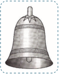

> **Deskripsi Visual:** Gambar ini adalah ilustrasi yang menunjukkan sebuah lonceng. Gambar ini menggambarkan bentuk umum lonceng dengan detail seperti penutup, duri, dan dasar. Lonceng ini tampak seperti lonceng tradisional yang sering digunakan dalam upacara atau acara resmi. Ilustrasi ini mungkin digunakan untuk membantu pembaca memahami konsep tentang lonceng dalam konteks sejarah atau budaya. Teks, angka, atau label penting tidak terlihat pada gambar ini karena hanya ada gambar saja tanpa teks atau informasi tambahan. Informasi kunci yang dapat diambil pembaca melalui gambar ini adalah bahwa lonceng memiliki bentuk yang khas dan biasanya digunakan sebagai simbol keagungan atau penghormatan dalam beberapa budaya.

---
**🖼️ Gambar/Diagram**

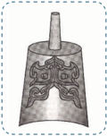

> **Deskripsi Visual:** Gambar ini adalah ilustrasi yang menunjukkan sebuah alat musik tradisional, mungkin gendang atau gong, dengan desain yang rumit dan unik. Gambar ini menggambarkan bagian atas alat musik tersebut, yang terdiri dari bagian tengah yang berbentuk seperti lingkaran dengan beberapa simbol atau motif yang tampaknya memiliki makna kultural tertentu. Bagian bawah alat musik tampaknya berada di atas dasar yang berwarna gelap, mungkin untuk menonjolkan alat musik tersebut.

Elemen utama dalam gambar ini adalah alat musik itu sendiri, yang tampak sangat detail dan kompleks. Desainnya yang rumit menunjukkan bahwa alat musik ini mungkin memiliki nilai estetika dan budaya yang tinggi. Label atau teks pada gambar ini tidak ada, sehingga informasi tambahan harus didapat melalui penafsiran visual.

Informasi kunci yang dapat diambil pembaca adalah bahwa gambar ini mungkin digunakan sebagai representasi atau penjelasan tentang alat musik tradisional, mungkin untuk membantu pembaca memahami bagaimana alat musik tersebut berfungsi atau memiliki makna kultural tertentu.

 

---
## 📄 Halaman 92

### Aktivitas Bersama

- Ceritakan poin-poin penting tentang  perjalanan Nabi Kongzi sebagai Tianzhi Muduo , dan apa yang dapat kalian simpulkan tentang tugas suci Nabi Kongzi tersebut!

### I. Akhir Kehidupan Nabi Kongzi

Pada saat itu  Nabi Kongzi telah  mencapai  usia  67  tahun,  ketika orang-orang  seusianya telah pensiun,  Nabi Kongzi masih  terus mengembara  menyebarkan  ajarannya.  Pada  akhirnya,  murid  Nabi Kongzi di  Negeri Lu memutuskan  bahwa  satu-satunya  jawaban terbaik dalam masalah ini adalah memanggil kembali guru mereka itu. Dengan demikian, tibalah saatnya bagi Nabi Kongzi untuk menyudahi pengembaraannya.  Akhirnya  Nabi Kongzi menjalani  lima  tahun terakhir hidupnya di Negeri Lu (negeri kelahirannya).

---
**🖼️ Gambar/Diagram**

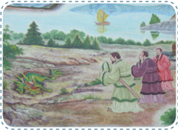

> **Deskripsi Visual:** Gambar ini adalah ilustrasi yang menunjukkan tiga orang wanita berjalan di sebuah lapangan hijau dengan pohon-pohon di sekitarnya. Mereka tampak sedang berbicara dan berjalan bersama-sama. Di latar belakang, terlihat bangunan tradisional dengan atap merah dan beberapa pohon besar. Di atas mereka, terdapat sebuah helikopter kecil yang mungkin sedang terbang atau akan mendarat. Gambar ini menunjukkan suasana damai dan nyaman di alam hijau, dengan elemen-elemen seperti pohon, lapangan hijau, dan bangunan tradisional yang menambah nuansa kehidupan sehari-hari.

Sumber: dokumen Kemendikbud

Sungguh  merupakan  tahun-tahun  yang  menyedihkan.  Murid kesayangannya yang paling pandai dan yang paling diharapkan untuk dapat melanjutkan harapan-harapannya yaitu Yanhui meninggal dunia. Peristiwa  ini  membuat  Nabi Kongzi sejenak  mengalami  kesedihan. 'Akhirnya, tak ada lagi orang yang bisa memahamiku'. katanya kepada murid-muridnya yang masih ada.

 

---
## 📄 Halaman 93

Beliau khawatir bahwa prinsip-prinsipnya yang penting itu tidak akan tersampaikan kepada generasi yang mendatang. Li , anak laki-laki satu-satunya juga meninggal dunia. Nabi Kongzi menghabiskan tahuntahun  terakhir  hidupnya  untuk  membaca,  menyunting  dan  menulis berbagai komentar karya-karya klasik Tiongkok serta berbagai karya yang berasal dari zaman peralihan Tiongkok.

Karya-karya klasik Tiongkok terentang mulai dari Shi Jing (yang berisi  puisi-puisi  yang  dikenal  juga  sebagai Book  of  Poetry )  yang menjadi  satu  dengan  berbagai  materi  legendaris  tentang  kehidupan Tiongkok pada zaman dahulu kala hingga kitab Yijing (Buku tentang perubahan dan kejadian dunia).

---
**🖼️ Gambar/Diagram**

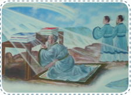

> **Deskripsi Visual:** Gambar ini adalah ilustrasi yang menunjukkan dua orang tangan yang sedang menulis atau mewarnai pada sebuah papan tulis. Pada papan tulis tersebut terdapat beberapa gambar dan teks yang tampaknya merupakan hasil kerja kreatif. Di sebelah kiri, ada seorang tangan yang sedang menulis dengan pensil, sementara di sebelah kanan ada seorang tangan yang sedang mewarnai gambar dengan warna-warna cerah. Latar belakangnya tampak seperti sebuah ruangan yang tenang dan tenang, dengan lampu yang menyala menyebabkan suasana yang tenang dan nyaman. Gambar ini menunjukkan proses kreativitas dan keterlibatan dalam membuat atau menggambar gambar.

Gambar 3.9 Menyelesaikan penyusunan kitab-kitab.

Pada tahun 479 SM., pada usia 72 tahun, Nabi Kongzi mangkat. Para  murid  telah  memberikan  perawatan  ketika  sang  Guru  sakit. Kata-kata yang terakhir yang direkam oleh muridnya Zigong , adalah: 'Gunung Tai runtuhlah,  balok-balok  patah.  Kini  selesailah  riwayat sang Budiman'.

Nabi Kongzi dimakamkan  oleh  murid-muridnya  di  kota Qu  Fu , di dekat sungai Si Shui . Bangunan di tempat tersebut dan lingkungan yang ada di sekitarnya, diperlakukan sebagai tempat suci. Selama lebih dari 2.000 tahun, tempat ini tak ada habisnya dikunjungi oleh para peziarah.

 

---
## 📄 Halaman 94

Bila menyimak  kata-kata terakhir Nabi Kongzi , sebenarnya Ia  sangat  sadar  akan  kebesaran  dirinya,  tetapi  Ia  juga  memiliki kekhawatiran bahwa pesan-pesan yang dicanangkannya itu akan tetap abadi  dalam  namanya. Kekhawatiran Nabi Kongzi cukup  beralasan, karena  sepeninggalnya,  para  murid-murid  yang  diharapkannya  itu tidak  sepenuhnya  mampu  mempertahankan  kemurnian  dari  ajaran Beliau,  ditambah  dengan  keadaan  pada  waktu  itu  yang  melahirkan banyak  aliran  juga  telah  mempengaruhi  kemurnian  pada  ajaranajaran Nabi Kongzi . Tetapi semua kembali teratasi, satu abad setelah kemangkatan  Nabi Kongzi lahir  seorang  pandai  bijaksana  bernama Mengzi .

Mengzi kemudian hari menjadi tokoh penegak ajaran Nabi Kongzi yang mulai diselewengkan. Dua abad setelah kematian Nabi Kongzi , berdiri  Dinasti Han yang  menerapkan  ajaran  Nabi Kongzi dalam pemerintahannya.  Agama  Khonghucu  atau  yang  dikenal  sebagai Rujiao menjadi agama negara saat dinasti Han .

 

---
## 📄 Halaman 95

### Uraian

### Jawablah pertanyaan-petanyaan berikut ini dengan uraian yang jelas!

- Sebutkan dengan jelas kapan dan di mana Nabi Kongzi dilahirkan!
- Sebutkan tanda-tanda malam menjelang kelahiran Nabi Kongzi !
- Sebutkan Nabi-Nabi Agama Khonghucu sebelum Nabi Kongzi !
- Jelaskan mengapa Nabi Kongzi meninggalkan negeri Lu !
- Jelaskan apa yang dimaksud dengan Kebajikan Sejati itu!
- Simbol suci untuk Nabi Kongzi meliputi tiga aspek, yaitu ...
- Sebutkan tanda-tanda gaib dari Nabi Kongzi !
- Apa pernyataan Nabi Kongzi tentang pengokohan dirinya sebagai nabi?
- Apa arti kata Muduo ?
- Apa perbedaan antar Jinduo dan Muduo , baik visual dan fungsinya?
- Pengembaraan Nabi Kongzi sebagai Muduo dimulai sejak ....
- Mengapa Muduo membuat sebutan untuk Sang Kongzi lebih terasa sebagai wakil dari eksistensi Nabi Kongzi ?

 

---
## 📄 Halaman 97

---
**🖼️ Gambar/Diagram**

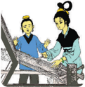

> **Deskripsi Visual:** Gambar ini adalah ilustrasi yang menunjukkan dua orang guru sedang mengajar siswa. Guru di sebelah kiri sedang memegang papan tulis dan menulis teks, sementara guru di sebelah kanan sedang berbicara kepada siswa. Siswa tampak tertarik dan menunjukkan minat dalam materi yang diajarkan. Ilustrasi ini menunjukkan hubungan antara guru dan siswa dalam proses belajar mengajar. Teks yang ditulis pada papan tulis mungkin merupakan materi yang sedang disampaikan oleh guru. Informasi kunci yang dapat diambil dari gambar ini adalah bahwa proses belajar mengajar melibatkan komunikasi antara guru dan siswa, serta interaksi aktif siswa dalam proses pembelajaran.

### Peta Konsep

---
**🖼️ Gambar/Diagram**

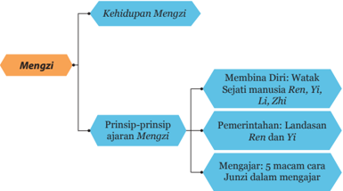

> **Deskripsi Visual:** Gambar ini adalah diagram yang menunjukkan struktur dan prinsip-prinsip Mengzi, sebuah konsep filosofis tradisional Tiongkok. Diagram ini dibagi menjadi dua bagian utama: Kehidupan Mengzi dan Mengzi. Bagian Kehidupan Mengzi meliputi tiga poin utama: Membina Diri, Prinsip-prinsip ajaran Mengzi, dan Pemerintahan. Prinsip-prinsip ajaran Mengzi meliputi Landasan Ren dan Yi, Mengajar, serta 5 macam cara Junzi dalam mengajar. Setiap elemen ini memiliki hubungan dengan elemen lainnya, menunjukkan bahwa Mengzi adalah konsep yang kompleks yang mencakup berbagai aspek kehidupan dan prinsip-prinsip moral.

### A.  Masa Awal Kehidupan Mengzi

Mengzi adalah tokoh besar kedua setelah Nabi Kongzi .  Memiliki nama  kecil Mengke yang  kemudian  dilatinkan  menjadi Mengzi . Mengzi adalah tokoh penegak ajaran Nabi Kongzi yang mulai banyak diselewengkan setelah kemangkatan Nabi Kongzi .

### BAB 4

### Mengzi Penegak Ajaran Khonghucu

 

---
## 📄 Halaman 98

Mengzi dilahirkan di wilayah yang sama dengan Nabi Kongzi tahun 372  SM-289  SM,  pada  zaman Zhanguo yaitu  zaman  akhir  Dinasti Zhou (kurang lebih satu abad setelah kemangkatan Nabi Kongzi ). Ayah Mengzi telah  berusia  lanjut  ketika  menikahi  ibunya,  dan  meninggal ketika Mengzi masih  sangat  kecil.  Ibu Mengzi memiliki  nama  gadis Chang , ia adalah seorang wanita yang luar biasa sebagai panutan ibu dalam mendidik anak.

Pada awalnya, Mengzi kecil tinggal di sebuah rumah dekat dengan pemakaman umum. Mengzi kecil adalah seorang anak yang cerdas. Suatu  ketika  ia  sedang  bermain-main  dengan  menirukan  upacara pemakaman  jenazah  yang  biasa  dilihatnya dari jendela  rumah. Ibunda Mengzi memperhatikan  hal  tersebut  dan  menyadari  bahwa ini bukanlah tempat yang baik untuk perkembangan anaknya. Ibunda Mengzi memutuskan  pindah  rumah  dan  mencari  lingkungan  baru yang lebih baik untuk perkembangan anaknya.

---
**🖼️ Gambar/Diagram**

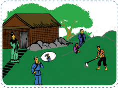

> **Deskripsi Visual:** Gambar ini adalah ilustrasi yang menunjukkan sebuah pertemuan antara dua orang tua yang sedang berbicara di depan rumah mereka. Di sebelah kiri, seorang pria tua dengan topi berdiri di depan rumah sementara seorang wanita tua berdiri di belakangnya. Di sebelah kanan, seorang pria muda dengan topi berdiri di depan rumah sementara seorang wanita muda berdiri di belakangnya. Kedua pasangan tersebut tampak sedang berbicara dengan penuh emosi. Di latar belakang, terlihat beberapa elemen seperti pohon, batu, dan rumah tradisional. Gambar ini menunjukkan hubungan sosial antara dua keluarga, mungkin dalam konteks persidangan atau konflik.

Sumber: dokumen Kemendikbud

Kemudian mereka tinggal  di  dekat  pasar. Mengzi suka  bermain dengan  berpura-pura  jadi  pedagang  yang  membeli  dan  menjual barang-barang  dagangan.  Sekali  lagi,  ibunda Mengzi merasa  bahwa inipun bukan tempat yang baik untuk perkembangan Mengzi , karena dilihatnya Mengzi mulai  menyerap  cara-cara  berdagang  yang  biasa dilakukan penjual kepada pembeli.

 

---
## 📄 Halaman 99

---
**🖼️ Gambar/Diagram**

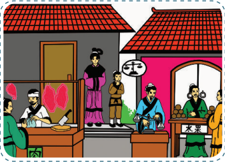

> **Deskripsi Visual:** Gambar ini adalah ilustrasi yang menunjukkan pertemuan antara seorang pedagang dan seorang pembeli di sebuah pasar tradisional. Ilustrasi ini menggambarkan berbagai elemen penting seperti pedagang yang sedang berbicara dengan pembeli, penonton yang menonton pertemuan tersebut, dan beberapa pakaian tradisional yang dikenakan oleh orang-orang tersebut.

Pedagang berdiri di sebelah kiri gambar, sedang berbicara dengan pembeli yang berada di tengah-tengah. Pembeli tampak tertarik pada barang yang dipamerkan oleh pedagang. Penonton yang berada di sebelah kanan gambar menonton pertemuan tersebut dengan minat.

Elemen-elemen utama dalam gambar meliputi pedagang, pembeli, penonton, dan pakaian tradisional. Relasi antara elemen-elemen ini adalah bahwa pedagang dan pembeli berada di dekat satu sama lain, sementara penonton berada di latar belakang. Pakaian tradisional digunakan oleh semua individu dalam gambar untuk menunjukkan suasana dan budaya yang ada di pasar tersebut.

Teks, angka, atau label penting tidak terlihat dalam gambar ini. Namun, informasi kunci yang dapat diambil pembaca adalah tentang kegiatan perdagangan tradisional dan budaya yang ada di pasar tersebut.

Mereka akhirnya pindah rumah kembali dan mencari lingkungan yang baru. Kali ini mereka tinggal berdekatan dengan sebuah sekolah. Sekarang Mengzi bermain seolah-olah menjadi seorang cendikiawan. Melihat hal tersebut, ibunda Mengzi gembira. 'Inilah tempat yang baik untuk anakku' ujar ibunya.

---
**🖼️ Gambar/Diagram**

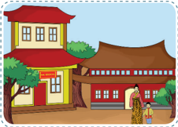

> **Deskripsi Visual:** Gambar ini adalah ilustrasi yang menunjukkan sebuah desa tradisional dengan berbagai elemen arsitektur dan tata ruang yang menarik. Gambar ini menggambarkan dua bangunan utama: sebuah rumah tradisional dengan atap merah dan dinding berwarna kuning, serta sebuah bangunan besar dengan atap berbentuk seperti pagoda. Kedua bangunan tersebut terletak di sebelah kiri dan kanan masing-masing, dengan pohon-pohon hijau yang menjulang di antara mereka. Di depan bangunan-bangunan tersebut, ada beberapa orang yang tampak sedang berjalan atau berdiri, menunjukkan kehidupan sehari-hari di desa tersebut. Selain itu, terdapat jalan raya yang membentang di belakang bangunan-bangunan tersebut, menunjukkan jalur transportasi yang umum digunakan di desa. Gambar ini memberikan gambaran tentang keindahan dan kehidupan sehari-hari di desa tradisional, serta menunjukkan bagaimana arsitektur dan tata ruang desa mempengaruhi kehidupan masyarakat di sana.

Sumber: dokumen Kemendikbud

Ibunda Mengzi senantiasa menyemangati anaknya untuk sungguh-sungguh  dalam  menuntut  ilmu.  Pada  suatu  hari  Mengzi pulang dari sekolah sebelum waktunya.  Melihat hal ini, Ibunda Mengzi menghentikan pekerjaannya menenun kain. Lalu memandang Mengzi seraya  bertanya,  'Bagaimana  pelajaranmu?  Mengapa  pulang  lebih cepat?' Mengzi menjawab dengan acuh-tak acuh, 'Baik'.

 

---
## 📄 Halaman 100

---
**🖼️ Gambar/Diagram**

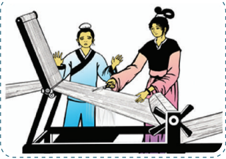

> **Deskripsi Visual:** Gambar ini adalah ilustrasi yang menunjukkan proses produksi kertas tradisional menggunakan mesin gulungan. Gambar ini menggambarkan dua orang yang sedang bekerja dengan mesin gulungan kertas. Pada bagian atas, ada seorang pria yang sedang memegang alat untuk memotong kertas, sementara di bawahnya, seorang wanita sedang memegang alat untuk memotong kertas. Kedua orang tersebut berada di dekat mesin gulungan kertas yang terletak di tengah gambar. Mesin gulungan kertas memiliki roda besar di atasnya dan beberapa alat lainnya yang digunakan untuk memotong dan menghaluskan kertas. Gambar ini menunjukkan proses produksi kertas yang manual dan tradisional, yang biasanya dilakukan oleh para pekerja kertas di masa lalu.

Sumber: dokumen Kemendikbud

Gambar 4.4 Kecewa dengan sikap anaknya, ibu Mengzi memotong hasil tenunannya.

Ibunda Mengzi kecewa  dengan  sikap  anaknya,  ibunda Mengzi mengambil gunting dan memotong benang yang sedang ditenunnya sendiri dengan gunting itu. Mengzi terperangah dan bertanya, 'Kenapa ibu  melakukan  itu,  merusak  kain  tenun  yang  sudah  ibu  kerjakan berhari-hari?'  Ibunya  menjawab,  'Ibu  memotong  kain  ini  seperti engkau memotong semangat belajarmu!' 'Semua akan menjadi sia-sia jika  engkau merusak segalanya di tengah jalan, seperti ibu merusak apa yang telah ibu mulai dengan susah-payah terhadap kain tenun ini!'

Mengzi menyadari kesalahannya, dan betapa besar pengorbanan ibundanya  demi  masa  depannya  kelak. Mengzi menginsyafi  bahwa belajar adalah penting untuk masa depannya dan semenjak itu tekun belajar.

### B.  Kehidupan Mengzi

Mengzi hidup  pada  zaman Peperangan Antar tujuh Negara atau Zhanguo . Di zamannya, beratus aliran yang menyimpang bermunculan tanpa  terkendali.  Masyarakat  menjadi  bingung  kehilangan  pokok dalam  menjalani  kehidupan  rohani.    Beratus  aliran  tersebut  saling berebut pengaruh satu dengan lainnya.

Mengzi mempelajari ajaran Nabi Kongzi di bawah bimbingan Zisi , (cucu laki-laki Nabi Kongzi ). Ia meyakini ajaran Nabi Kongzi sampai masuk  ke  dalam  batinnya,  'Walau  aku  sendiri  tidak  dapat  menjadi

 

---
## 📄 Halaman 101

murid Kongzi ,  sebenarnya  aku  telah  berusaha  mengolah  watak  dan mengenali orang-orang yang telah melakukannya'. Mengzi bertekad melanjutkan ajaran Nabi Kongzi dan meluruskan beratus aliran yang menyimpang saat itu.

Ada  dua  aliran  yang  mempunyai  pengaruh  besar  saat  itu  yakni ajaran Yangzi dan Mozi .  Aliran Yangzi hanya  mengutamakan  diri sendiri;  tidak  mau  mengakui  adanya  pemimpin. Mozi mengajarkan cinta yang menyeluruh sama; tidak mengakui adanya orangtua sendiri. Menurut Mengzi , yang tidak mengakui orangtua dan tidak mengakui pemimpin sesungguhnya hanya burung dan hewan saja. Kalau ajaran Yangzi dan Mozi tidak dipadamkan, jalan suci Kongzi tidak bersemi. Kata-kata jahat akan membodohkan rakyat,  menimbuni  Cinta  Kasih  dan Kebenaran. Bila Cinta Kasih dan Kebenaran tertimbun, ini seperti menuntun binatang memakan manusia;  bahkan  mungkin  manusia memakan manusia.

Seperti halnya Nabi Kongzi , Mengzi juga adalah seorang guru . Ia berusaha agar pemerintah/penguasa dapat  menjalankan  mandat    yang diterima dengan sebaik-baiknya. Mengzi banyak berkeliling negeri menemui para pemimpin negeri atau  penguasa  yang  menaruh  minat

---
**🖼️ Gambar/Diagram**

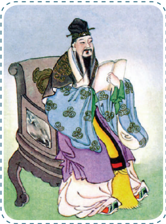

> **Deskripsi Visual:** Gambar ini adalah ilustrasi yang menampilkan tokoh kuno dalam pakaian tradisional Asia Timur. Tokoh tersebut berdiri di depan kursi yang dipenuhi dengan perhiasan dan barang-barang kuno. Tokoh tersebut mengenakan pakaian berwarna biru dan ungu dengan detail emas, serta memegang sebuah barang kecil yang tampak seperti perhiasan atau alat musik. Latar belakangnya cerah dan bersih, menunjukkan suasana yang tenang dan formal.

Elemen-elemen utama dalam gambar meliputi tokoh kuno, kursi, perhiasan, dan barang-barang kuno. Tokoh kuno merupakan subjek utama dan diperlihatkan dalam posisi yang menunjukkan kehormatan dan kepercayaan diri. Kursi yang dipenuhi dengan perhiasan dan barang-barang kuno menunjukkan kepentingan dan nilai budaya yang tinggi. Perhiasan dan barang-barang kuno tersebut tampak seperti simbol kekayaan dan keindahan.

Teks, angka, atau label penting tidak terlihat dalam gambar ini. Namun, informasi kunci yang dapat diambil pembaca meliputi penampilan dan posisi tokoh kuno, serta detail perhiasan dan barang-barang kuno yang menunjukkan kekayaan dan keindahan budaya.

Dalam satu paragraf yang informatif, gambar ini menunjukkan tokoh kuno dalam pakaian tradisional Asia Timur, duduk di kursi yang dipenuhi dengan perhiasan dan barang-barang kuno. Tokoh tersebut tampak berada dalam posisi yang menunjukkan kehormatan dan kepercayaan diri, sementara kursi dan perhiasan menunjukkan kepentingan dan nilai budaya yang tinggi.

terhadap ajarannya. Ia mencatat percakapannya dengan para pangeran dan raja-raja yang ia datangi.

 

---
## 📄 Halaman 102

Banyak hal-hal penting dapat digali dari percakapan antara Mengzi dengan para penguasa saat itu. Catatan ini merupakan inti sari dari ajaran Mengzi yang  dapat  kita  pelajari  hingga  saat  ini.  Catatan  itu selanjutnya menjadi bagian dari kitab-kitab yang pokok dalam ajaran Khonghucu yaitu Sishu (kitab yang empat).

Berbagai negeri yang pernah dikunjungi oleh Mengzi antara lain negeri Liang , negeri Qi , negeri Zou dan negeri Teng . Mengzi pensiun dari perannya sebagai penasihat pemerintah dan hidup dengan tenang sampai  usia  84  tahun.  Ia  meninggalkan  teladan  dan  warisan  yang berharga  untuk  menuntun  kita  memahami  penerapan  ajaran  Nabi Kongzi  dalam  kehidupan  sehari-hari.  Lewat  kitab Mengzi kita  bisa mempelajari  bagaimana  pembinaan  diri,  dan  penerapan  Jalan  Suci sesuai kedudukan kita khususnya sebagai seorang pemimpin

### C.  Ajaran Mengzi

Berikut  ini  adalah  ajaran Mengzi yang  menegakkan ajaran Nabi Kongzi .

### 1. Prinsip-prinsip Ajaran Moral Mengzi dalam Pembinaan Diri

- 'Tuhan menjelmakan rakyat, menyertai dengan bentuk dan sifat dan sifat  umum pada manusia adalah menyukai kebajikan yang mulia'. (Kitab Mengzi .VII A: 6/8)
- Yang di dalam Watak Sejati manusia adalah Cinta Kasih, Kebenaran, Kesusilaan dan Kebijaksanaan. ( Mengzi . VII A: 21)
- Watak  Sejati  sudah Tian karuniakan  ke  dalam  setiap  manusia, bukan sesuatu yang dimasukkan dari luar ke dalam. Rasa hati berbelas kasihan dan tidak tega adalah benih Cinta Kasih Rasa hati malu dan tidak suka adalah benih Kebenaran Rasa hati hormat dan mengindahkan adalah benih Kesusilaan Rasa hati membenarkan dan adalah benih Kebijaksanaan. ( Mengzi . II A: 6/7)

 

---
## 📄 Halaman 103

- Cara  mengabdi  kepada Tian adalah  dengan  menjaga  Hati,  dan merawat Watak Sejati ( Mengzi . VII A: 1)
- Yang mengerti lebih dahulu menyadarkan yang belum mengerti; yang insaf menyadarkan yang belum insaf ( Mengzi . VB: 1)
- Mengzi berkata,
- 'Berlaksa benda tersedia lengkap di dalam diri.
- 'Kalau  memeriksa  diri  ternyata  penuh  Iman,  sesungguhnya tiada kebahagiaan yang lebih besar dari ini.
- 'Sekuat  diri  laksanakanlah  Tepasalira,  untuk  mendapatkan Cinta Kasih tiada yang lebih dekat dari ini!' ( Mengzi . VII A: 4)
Agama Khonghucu mengajarkan agar  manusia  dapat  mengenali Watak Sejatinya dan mengembangkannya  dalam  kehidupannya. Watak  Sejati  inilah  kodrat  kemanusiaan  yang  berakar  dalam  hati sanubari/batin  manusia.  Hidup  selaras  dengan  Watak  Sejatinya merupakan kewajaran dan sifat alamiah kita sebagai manusia. Inilah sesungguhnya Firman Tian yang telah kita terima sebagai manusia dan sepantasnya kita kembangkan dalam hidup ini. Apabila kita mampu mengembangkannya, kita akan merasakan betapa besar karunia Tian dalam kehidupan kita.

Pribadi unggul apabila mampu mengembangkan benih cinta kasih, kebenaran, kesusilaan dan kebijaksanaan sehingga menjadi insan yang dapat dipercaya dalam kehidupan ini.

Praktik  kualitas  ini  dimulai  di  dalam  keluarga,  terutama  dari orangtua.  Kepatuhan  anak  kepada  orangtuanya  merupakan  nilai penting  di  mata  kaum  Konfusian.  Mereka  mempunyai  tugas  untuk mencintai dan menghormati orangtua. Sebagaimana diterangkan oleh Mengzi, kalau saja setiap orang memperlakukan orangtua dengan cinta kasih  dan rasa hormat, banyak persoalan dunia akan lenyap dengan sendirinya.

Pembinaan diri  dimulai dari yang dekat dan pokok, serta mengikuti kewajaran. Jalan Suci ada dalam diri, mengapa mencari yang jauh?

 

---
## 📄 Halaman 104

Untuk melaksanakannya mudah mengapa mencari yang sukar?

### Renungan

Jika Watak Sejati manusia baik, mengapa ada manusia jahat? Kalau semua orang mempunyai benih kebajikan, mengapa ada yang ingkar dari kebajikan? Seperti apa menjaga hati? Seperti apa merawat Watak Sejati?  Mengapa  dikatakan  jika  memiliki  iman,  sesungguhnya  tiada kebahagiaan  yang  lebih  besar  dari  hal  tersebut?  Lihat  dan  pelajari dalam kitab Mengzi .

### 2.  Prinsip-prinsip  Ajaran  Moral  Mengzi  dalam  Pemerintahan

- Pemerintahan  harus  berlandaskan  Cinta  Kasih  dan  Kebenaran ( Mengzi . IA)
- Pokok dasar dunia ada pada Negara, pokok dasar Negara itu ada pada  rumah  tangga  dan  pokok  rumah  tangga  itu  ada  pada  diri sendiri. ( Mengzi . IVA: 5.1)
- Hakekat memimpin adalah meluruskan. Dengan seorang pemimpin yang berjiwa lurus, seluruh negeri niscaya teratur beres. ( Mengzi . IVA: 20.1)
- Kalau ingin menjadi seorang pemimpin yang dapat melaksanakan Jalan  Suci  seorang  pemimpin,  kalau  ingin  menjadi  pembantu yang  dapat  melaksanakan  Jalan  Suci  seorang  pembantu; untuk kedua  hal  ini  semuanya  dapat  meneladan Yao dan Shun .  Kalau tidak meneladan Shun ketika mengabdi kepada Yao , maka belum dapat  dikatakan  mengabdi  kepada  pemimpinnya.  Kalau  tidak meneladan Yao di dalam mengatur rakyat itulah menjadi pencuri atas rakyatnya. ( Mengzi . IV A : 2.2)

### e. Mengzi berkata,

- 'Muliakanlah yang bijaksana, berikanlah jabatan kepada yang berkepandaian,  sehingga  jabatan-jabatan  diduduki  oleh  orangorang yang tepat. Dengan demikian menyenangkan para Siswa di dunia sehingga mau memangku jabatan. ( Zhongyong XIX.5).

 

---
## 📄 Halaman 105

- 'Barang-barang di pasar cukup dikenakan sewa tempat, janganlah dipungut  dengan  bermacam-macam  pajak;  dan  barang-barang yang  sudah  dikenakan  peraturan  tertentu  tidak  usah  dikenakan sewa  tempat.  Dengan  demikian  semua  pedagang  di  dunia  akan senang dan ingin datang ke pasar untuk berjual beli.
- 'Jagalah pintu kota untuk menilik orang-orang yang lewat, tetapi janganlah  untuk  memungut  bermacam-macam  pajak.  Dengan demikian  para  pengembara  di  dunia  ini  akan  senang  dan  ingin melewati jalan itu. (I B: 5.3)
- 'Para  petani  cukup  disuruh  membantu  (mengerjakan  sawah Negara),  janganlah  ditambah  dengan  bermacam-macam  pajak. Dengan demikian para petani di dunia ini akan senang dan ingin membajak sawah-sawah itu.
- 'Orang-orang yang diam di sekitar pasar yang memiliki toko, janganlah  dikenakan  denda  sebagai  pemalas,  dan  yang  tidak bercocok  tanam,  janganlah  dikenakan  denda  berupa  potongpotongan kain. Dengan demikian orang-orang di dunia ini akan senang dan ingin menjadi rakyatnya.
- 'Bila  dengan  penuh  tanggung  jawab  dapat  menjalankan  kelima hal ini, biarpun rakyat negeri tetangga, akan menganggapnya (raja itu) sebagai ayah-bundanya dan ingin menurut sebagai anak atau  adiknya.  Kalau  mereka  disuruh  menyerang  kepada  yang dipandang  sebagai  ayah-bundanya,  sejak  ada  manusia  hingga kini, belum pernah terjadi dapat berhasil. Dengan demikian akan tiada musuhnya di dunia ini, dengan tiada musuhnya di dunia ini, berarti  ia  berlaku  sebagai  menteri/pembantu  Tuhan  Yang  Maha Esa.  Kalau  sudah  demikian  tetapi  tidak  dapat  juga  menjadi  raja besar, itu belum pernah ada'. ( Mengzi . II A : 5)

 

---
## 📄 Halaman 106

### Untuk Kita Renungkan!

Mengapa pemerintahan harus  berlandaskan  Cinta  Kasih  dan  Kebenaran? Bukankah pemerintahan yang kuat harus ditegakkan dengan undangundang? Mana yang lebih utama, menegakkan peraturan atau sistem atau menegakkan kebajikan? Bukankah menegakkan kebajikan sangat bersifat subyektif dan tidak ada ukuran yang jelas? Mengapa dikatakan pokok Negara ada pada rumah tangga dan pokok rumah tangga ada pada diri sendiri.

Nabi  Kongzi  dan  Mengzi  menyadari  betapa  tidak  mudah  untuk membina  diri  dan  menjadi  seorang  teladan.  Oleh  karena  itu,  Nabi Kongzi dan Mengzi memberikan  bimbingan  agar  meneladani  para Nabi dan orang-orang suci, yakni raja Yao , raja Shun dan para pendiri dinasti Shang , Xia , dan Zhou .

---
**🖼️ Gambar/Diagram**

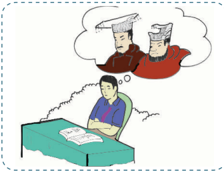

> **Deskripsi Visual:** Gambar ini adalah ilustrasi yang menunjukkan seorang siswa sedang belajar di meja belajar. Siswa tersebut sedang membaca buku dengan penutup berwarna merah. Di atas meja belajar, terdapat beberapa lembar kertas yang tampaknya merupakan tugas atau soal-soal yang harus diselesaikan. Siswa tersebut tampak tertarik pada buku yang dibukanya, menunjukkan bahwa ia sedang fokus pada materi yang dia baca.

Elemen-elemen utama dalam gambar ini meliputi siswa, buku, lembar kertas, dan meja belajar. Siswa adalah subjek utama yang memegang peran penting dalam gambar ini. Buku yang dibuka oleh siswa menjadi elemen penting lainnya, menunjukkan bahwa ia sedang belajar atau belajar. Lembar kertas di atas meja belajar menunjukkan bahwa siswa sedang bekerja dengan tugas atau soal-soal yang diberikan. Meja belajar sebagai tempat kerja yang digunakan oleh siswa untuk menyelesaikan tugas atau belajar.

Teks, angka, atau label penting yang terlihat dalam gambar ini tidak ada. Namun, informasi kunci yang dapat diambil pembaca adalah bahwa siswa sedang belajar atau bekerja dengan tugas atau soal-soal yang diberikan. Ini menunjukkan bahwa siswa aktif dan fokus dalam proses belajar atau belajar.

Sumber: dokumen Kemendikbud

Bagaimana  seorang  yang  berjiwa  lurus  dapat  mengatur  dan membereskan  seluruh  negeri?  Mengapa  Raja Yao dan  Raja Shun dijadikan  teladan  hingga  saat  ini?  Seperti  apa  Raja  Shun  dalam mengabdi kepada Raja Yao , dan seperti apa Raja Yao dalam mengatur rakyatnya?

 

---
## 📄 Halaman 107

### Aktivitas Mandiri

- Bacalah Shujing bagian Yao dan Shun agar  mendapat gambaran teladan mereka.
- Carilah dalam kitab Mengzi ,  mengapa korupsi bisa tumbuh berkembang. ( Mengzi VIA :  10).    Selanjutnya berikan pendapat anda tentang bagaimana cara mengatasinya!

### 3.  Prinsip-prinsip Ajaran Moral Mengzi dalam Mengajar

Mari kita simak bersama kitab Mengzi jilid  VIIA pasal 40. Seorang Junzi mempunyai 5 macam cara mengajar:

- Ada  kalanya  ia  memberi  pelajaran  seperti  menanam  di  saat musim hujan.
- Ada kalanya ia menyempurnakan kebajikan muridnya
- Ada kalanya ia membantu perkembangan bakat muridnya
- Ada kalanya ia bersoal jawab
- Ada kalanya ia membangkitkan usaha murid itu sendiri.
Demikianlah lima cara mengajar seorang Junzi.

Untuk kita renungkan :

Apa  maksud  seperti  menanam  padi  di  musim  hujan?  Bisakah kalian  memberikan  contohnya?  Lalu  apa  yang  dimaksud  dengan menyempurnakan kebajikan muridnya? Seperti apa contohnya? Apa yang  dimaksud  membantu  perkembangan  bakat  muridnya?  Seperti apa  contoh  membantu  perkembangan  bakat  muridnya?  Bagaimana jika bakat murid-muridnya beragam? Bagaimana jika bakatnya tidak sesuai  dengan bidang studi yang ditempuhnya? Apa yang dimaksud dengan bertanya jawab? Apakah ada panduan dalam bertanya jawab? Seperti apa contoh penerapannya? Apa yang dimaksud membangkitkan usaha murid itu sendiri? Seperti apa contohnya? Bagaimana jika sang murid malas?

 

---
## 📄 Halaman 108

Apakah  relevan dengan  kondisi saat ini?  Khususnya  dalam membentuk  mental  yang  tangguh  dan  tidak  mudah  terjerumus  ke dalam  pergaulan  yang  negatif.  Apakah  anda  sebagai  murid  merasa cocok  dengan  cara  mengajar  tersebut?  Jika  ya,  berikan  pandangan kalian. Jika tidak, berikan pandangan kalian juga.

Aktivitas 4.2

### Aktivitas Mandiri

- Berikan pandanganmu  terkait pengelolaan pajak untuk negara!
Mengzi mencatat  setiap  percakapannya  dengan  para  penguasa negeri dan memberikan catatan-catatan sehingga menjadi kumpulan tulisan  yang  kita  kenal  sekarang  dengan  kitab Mengzi .  Berikut  ini adalah  beberapa  catatan  percakapan Mengzi dengan  raja  penguasa negeri yang dikunjunginya.

### D.  Catatan Perjalanan Mengzi dalam Gambar

### 1. Kebenaran berasal dari dalam

---
**🖼️ Gambar/Diagram**

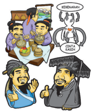

> **Deskripsi Visual:** Gambar ini adalah ilustrasi yang menunjukkan pertemuan antara sekelompok orang tua dan anak-anak di sebuah ruangan yang tampak seperti rumah. Ilustrasi ini menggambarkan situasi di mana seorang anak menerima hadiah dari orang tuanya. Anak tersebut sedang berdiri di depan orang tua, sementara orang tua tersebut sedang berdiri di belakang anak tersebut. Orang tua tersebut sedang memegang hadiah dan sedang memberikan ucapan selamat kepada anak tersebut.

Elemen-elemen utama dalam gambar ini meliputi:
1. Anak-anak dan orang tua.
2. Hadiah yang diberikan.
3. Ruangan yang tampak seperti rumah.
4. Ucapan selamat dari orang tua.

Teks, angka, atau label penting yang terlihat dalam gambar ini adalah "Selamat Hari Jadi" yang ditulis di atas hadiah. Ini menunjukkan bahwa gambar ini mungkin digunakan untuk menggambarkan perayaan hari jadi anak.

Informasi kunci yang dapat diambil pembaca dari gambar ini adalah bahwa ada perayaan hari jadi, anak telah menerima hadiah, dan orang tua sedang memberikan ucapan selamat.

Sumber: dokumen Kemendikbud

Gambar 4.7 Gaozi berkata, 'Merasakan makanan dan menikmati keindahan itulah Watak Sejati. Cinta Kasih memang dari dalam diri, tidak dari luar. Tetapi, rasa Kebenaran itu dari luar diri tidak dari dalam!'

 

---
## 📄 Halaman 109

---
**🖼️ Gambar/Diagram**

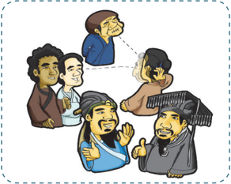

> **Deskripsi Visual:** Gambar ini adalah ilustrasi yang menunjukkan tiga orang yang sedang berbicara dengan satu orang lainnya. Ilustrasi ini mungkin digunakan untuk menggambarkan konsep komunikasi atau interaksi sosial. 

1. **Apa yang ditampilkan secara keseluruhan**: Gambar ini menampilkan tiga orang yang sedang berbicara dengan satu orang lainnya. Mereka tampaknya berada dalam situasi yang serius dan mendengarkan dengan seksama.

2. **Elemen-elemen utama dan relasinya**: 
   - **Orang pertama**: Berdiri di sebelah kiri, tampaknya sedang berbicara kepada dua orang lainnya.
   - **Orang kedua**: Berdiri di sebelah kanan, tampaknya juga sedang berbicara kepada dua orang lainnya.
   - **Orang ketiga**: Berdiri di tengah, tampaknya sedang mendengarkan dengan seksama.
   - **Orang keempat**: Berdiri di belakang mereka, tampaknya juga sedang mendengarkan.

3. **Teks, angka, atau label penting yang terlihat**: Tidak ada teks, angka, atau label yang terlihat pada gambar ini.

4. **Informasi kunci yang dapat diambil pembaca**: Gambar ini menunjukkan bahwa ada interaksi sosial antara empat orang, dengan dua orang yang sedang berbicara dan dua orang yang mendengarkan. Ini mungkin digunakan untuk menggambarkan konsep komunikasi, interaksi sosial, atau bahkan konflik dalam sebuah situasi tertentu.

Sumber: dokumen Kemendikbud

---
**🖼️ Gambar/Diagram**

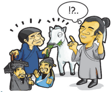

> **Deskripsi Visual:** Gambar ini adalah ilustrasi yang menunjukkan sekelompok orang yang sedang berbicara dengan sebuah hewan yang tampak seperti seekor kucing. Orang-orang tersebut tampak sangat antusias dan berteriak-teriak, sementara hewan tersebut tampak sedikit bingung atau tidak yakin. Di sebelah kanan, ada seorang pria yang sedang berbicara ke arah hewan tersebut, tampaknya memberikan perintah atau petunjuk kepada hewan tersebut. Dalam lingkungan mereka, terdapat beberapa elemen lain seperti pohon dan bangunan, yang menunjukkan bahwa mereka berada di luar ruangan. Teks pada gambar tampaknya mengandung informasi tentang situasi yang sedang dialami oleh hewan tersebut, namun tidak dapat dilihat secara jelas. Label atau teks penting lainnya tidak tampak dalam gambar ini. Gambar ini mungkin digunakan untuk menggambarkan situasi di mana hewan harus belajar atau mengikuti instruksi manusia, atau mungkin untuk menggambarkan konsep tentang komunikasi antara manusia dan hewan.

Sumber: dokumen Kemendikbud

Gambar 4.9 'Benar kalau kita melihat kuda putih, kita namakan putih; begitupun kalau kita melihat orang putih, kita namakan putih. Tetapi tidak dapatkah kita membedakan antara memandang tua seekor kuda yang tua dengan memandang tua seorang yang tua? Maka apakah makna Kebenaran di dalam hal ini? Karena kenyataan adanya usia tinggi ataukah karena adanya rasa hormat kepada usia tinggi?'.

 

---
## 📄 Halaman 110

### 2.  Menjadi Raja Besar

---
**🖼️ Gambar/Diagram**

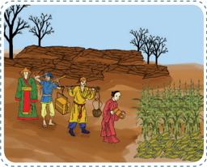

> **Deskripsi Visual:** Gambar ini adalah ilustrasi yang menunjukkan tiga orang pedagang berjalan di sekitar sebuah pasar tradisional. Mereka membawa barang-barang mereka dalam tas dan kantong, menunjukkan aktivitas perdagangan. Di sebelah kiri, ada dua pedagang yang sedang berbincang dengan penjual lainnya. Di tengah, pedagang berjalan dengan barang-barangnya. Di kanan, ada seorang pedagang yang sedang membeli barang dari penjual. Latar belakangnya menunjukkan pohon-pohon yang tidak berdaun dan tanah yang kering, menunjukkan suasana musim gugur atau musim dingin. Gambar ini menunjukkan hubungan antara pedagang dan penjual, serta aktivitas perdagangan di pasar tradisional.

Sumber: dokumen Kemendikbud

Gambar 4.10 Raja Hui dari Negeri Liang berkata, 'Di dalam mengatur negeri dengan sungguhsungguh  kuperhatikan.  Bila  di  daerah Henei menderita  bahaya  kelaparan,  kupindahkan penduduknya ke daerah Hedong :  dan  kelebihan  hasil  bumi  kukirimkan  ke  daerah Henei . Demikian pula kulakukan bila daerah Hedong menderita bahaya kelaparan. Kalau kuteliti, negeri-negeri  tetangga  dalam  pemerintahannya  ternyata  tidak  sepenuh  hati  seperti  aku; tetapi, mengapakah rakyat negeri-negeri tetangga itu tidak menjadi lebih sedikit dan rakyatku tidak bertambah banyak?' ( Mengzi . IA:3)

Sumber: dokumen Kemendikbud

Gambar  4.11 Mengzi menjawab, 'Baginda  suka  akan  peperangan, aku  pun  hendak  menggunakan hal peperangan sebagai perumpamaan: Jika tambur sudah dipukul  dengan  hebatnya,  tetapi para prajurit baru saja mulai menggunakan senjata,  mendadak mereka membuang perisainya lalu melarikan  diri  sambil  menyeret senjatanya.  Sebagian  lari  sampai seratus tindak baru berhenti, yang lain  lari  lima  puluh  tindak  sudah berhenti.  Kini  bila  yang  lari  lima puluh tindak itu mentertawai yang lari seratus tindak, layakkah?'

---
**🖼️ Gambar/Diagram**

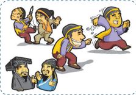

> **Deskripsi Visual:** Gambar ini adalah ilustrasi yang menunjukkan tiga orang anak laki-laki bermain di depan sebuah bangunan. Mereka sedang berteriak-teriak dan bergerak-gerak dengan gembira. Di sebelah kanan, ada seorang pria tua yang sedang berbicara dengan seorang anak kecil yang sedang berdiri di depannya. Pria tua tersebut tampaknya sedang memberikan nasihat atau petunjuk kepada anak kecil tersebut. Gambar ini menunjukkan hubungan sosial antara anak-anak dan orang dewasa, serta suasana hiburan dan interaksi sosial yang positif.

 

---
## 📄 Halaman 111

3.3. Dijawab, 'Itu tidak boleh. Meskipun mereka tidak lari seratus tindak, mereka pun sudah lari'.

---
**🖼️ Gambar/Diagram**

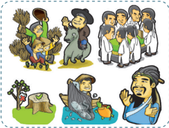

> **Deskripsi Visual:** Gambar ini adalah ilustrasi yang menunjukkan berbagai profesi dan aktivitas manusia. Gambar tersebut terdiri dari beberapa elemen utama:

1. **Pertama**: Gambar ini menunjukkan berbagai profesi dan aktivitas manusia. Ada seorang dokter yang sedang merawat pasien, seorang petani yang memanen padi, seorang guru yang sedang mengajar, seorang pekerja alam yang sedang memotong pohon, seorang peternak yang sedang merawat hewan, seorang penulis yang sedang menulis, seorang pengusaha yang sedang berbisnis, seorang pemuda yang sedang berjalan-jalan, dan seorang pedagang yang sedang menjual barang.

2. **Elemen-elemen Utama dan Relasinya**: Gambar ini menunjukkan berbagai profesi dan aktivitas manusia. Setiap elemen memiliki hubungan dengan profesi dan aktivitas mereka. Misalnya, dokter merawat pasien, petani memanen padi, guru mengajar, pekerja alam memotong pohon, peternak merawat hewan, penulis menulis, pengusaha berbisnis, pemuda berjalan-jalan, dan pedagang menjual barang.

3. **Teks, Angka, atau Label Penting yang Terlihat**: Gambar ini tidak memiliki teks, angka, atau label penting yang terlihat. Namun, elemen-elemen utama dan relasinya telah disebutkan di atas.

4. **Informasi Kunci yang Dapat Diambil Pembaca**: Gambar ini menunjukkan berbagai profesi dan aktivitas manusia. Setiap elemen memiliki hubungan dengan profesi dan aktivitas mereka. Misalnya, dokter merawat pasien, petani memanen padi, guru mengajar, pekerja alam memotong pohon, peternak merawat hewan, penulis menulis, pengusaha berbisnis, pemuda berjalan-jalan, dan pedagang menjual barang.

Dengan demikian, gambar ini menunjukkan berbagai profesi dan aktivitas manusia, serta hubungan antara elemen-elemen tersebut.

Sumber: dokumen Kemendikbud

Gambar 4.12 3.4. 'Jika dapat memahami hal ini, Baginda akan insaf pula tidak mengharapkan mempunyai penduduk lebih banyak dari negeri-negeri tetangga. Maka, janganlah mengganggu saat rakyat  mengerjakan  sawahnya  sehingga  hasil  bumi  tidak  kurang  untuk dimakan:  jangan  diperkenankan  penggunaan  jala  yang  bermata  rapat  untuk  menangkap ikan sehingga ikan dan kura-kura tidak kurang untuk dimakan; dan pemotongan kayu di hutan harus ditentukan waktunya sehingga kayu di hutan tidak kurang untuk dipergunakan. Jika hasil bumi, ikan dan kurakuratidak kurang untuk dimakan; kayu di hutan tidak kurang untuk dipergunakan, niscaya rakyat dapat memelihara keluarganya yang hidup dan dapat mengurus baik-baik bila ada kematian sehingga mereka tidak menyesal. Dapat memelihara keluarga yang hidup dan dapat mengurus baik-baik jika ada kematian sehingga tidak ada yang menyesal, inilah tindakan pertama yang harus baginda usahakan baik-baik.

'Keluarga yang mempunyai lima Mu (1 Mu =  1/6 Acre = 0,0667 Ha) sawah diwajibkan menanam pohon besaran sehingga mereka yang sudah berusia lima puluh tahun dapat mengenakan pakaian dari sutra. Dalam beternak babi, ayam, anjing, dan babi betina, diwajibkan tidak sembarang waktu memotongnya sehingga ternaknya tidak berkurang.

Dengan demikian, mereka yang berusia tujuh puluh tahun dapat memakan  daging.  Rakyat  yang  mempunyai  100 Mu sawah,  jangan diganggu waktu bertanamnya sehingga keluarga mereka tidak menderita kelaparan.

 

---
## 📄 Halaman 112

---
**🖼️ Gambar/Diagram**

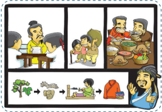

> **Deskripsi Visual:** Gambar ini adalah ilustrasi yang menunjukkan proses pembuatan pakaian tradisional dari bahan-bahan alami. Gambar dimulai dengan seorang pria tua sedang memotong pohon, kemudian menggiling kayu menjadi tepung, dan setelah itu menggiling tepung tersebut menjadi benang. Setelah itu, benang tersebut dipakai untuk membuat pakaian tradisional seperti celana dan kaos. Gambar ini menunjukkan bahwa pembuatan pakaian tradisional memerlukan proses yang rumit dan membutuhkan bahan-bahan alami.

Sumber: dokumen Kemendikbud

### 3.  Taman Milik Bersama

---
**🖼️ Gambar/Diagram**

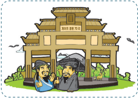

> **Deskripsi Visual:** Gambar ini adalah ilustrasi yang menunjukkan dua orang tukang kayu berbincang di depan sebuah bangunan tradisional Jepang. Bangunan tersebut memiliki atap emas dan pintu kayu besar, menunjukkan arsitektur khas Jepang. Kedua tukang kayu tersebut sedang berbicara dengan penuh semangat, tampaknya berada dalam suasana yang positif dan produktif. Gambar ini mungkin digunakan untuk menggambarkan hubungan kerja antara dua individu dalam konteks pekerjaan atau bisnis.

Sumber: dokumen Kemendikbud

 

---
## 📄 Halaman 113

---
**🖼️ Gambar/Diagram**

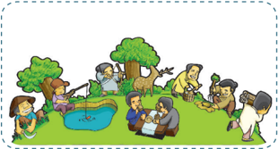

> **Deskripsi Visual:** Gambar ini adalah ilustrasi yang menunjukkan berbagai aktivitas sosial dan ekonomi di sebuah desa. Gambar ini mencakup beberapa elemen utama:

1. **Pertama**: Gambar ini menunjukkan berbagai aktivitas sosial dan ekonomi di sebuah desa. Ada beberapa orang sedang bermain bola, sementara yang lain sedang berjalan-jalan atau berbicara. Ada juga sekelompok orang yang sedang makan bersama di sekitar papan kayu.

2. **Elemen-elemen Utama dan Relasinya**: 
   - **Orang-orang**: Ini adalah elemen utama dari gambar, dengan berbagai individu yang terlibat dalam berbagai aktivitas.
   - **Permainan Bola**: Aktivitas ini terletak di bagian kiri atas gambar, menunjukkan kegiatan fisik dan rekreasi.
   - **Makan Bersama**: Di bagian tengah dan kanan atas, ada kelompok orang yang sedang makan bersama, menunjukkan hubungan sosial dan ekonomi.
   - **Lingkungan Desa**: Terdapat pohon-pohon dan tanaman di sekitar area ini, menunjukkan lingkungan alam desa.

3. **Teks, Angka, atau Label Penting yang Terlihat**:
   - Teks tidak terlihat dalam gambar ini, tetapi ada label-label yang mungkin menjelaskan aktivitas atau objek tertentu.

4. **Informasi Kunci yang Dapat Diambil Pembaca**:
   - Gambar ini menunjukkan bahwa desa tersebut memiliki kehidupan sosial dan ekonomi yang aktif dan harmonis.
   - Ada variasi dalam aktivitas, mulai dari permainan fisik hingga pertemuan sosial.
   - Lingkungan desa tampak sehat dan lestari, dengan adanya tanaman dan pohon.

Dengan demikian, gambar ini menggambarkan kehidupan sehari-hari di desa dengan berbagai aktivitas sosial dan ekonomi yang saling terkait dan mendukung.

Sumber: dokumen Kemendikbud

---
**🖼️ Gambar/Diagram**

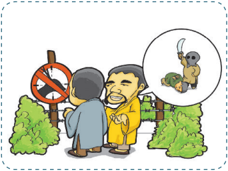

> **Deskripsi Visual:** Gambar ini adalah ilustrasi yang menunjukkan dua orang tua berbicara dengan seorang anak kecil di dekat sebuah papan tanda peringatan. Papan tanda tersebut menunjukkan larangan untuk memasuki area tertentu. Di sebelah kanan papan tanda, ada sebuah hewan kecil yang tampak seperti tikus, yang tampaknya sedang bergerak menuju anak kecil. Anak kecil tampak sangat terkejut dan sedang berbicara kepada orang tua tentang situasi tersebut.

Elemen-elemen utama dalam gambar ini adalah dua orang tua, anak kecil, papan tanda peringatan, dan tikus. Orang tua tampaknya sedang berbicara dengan anak kecil tentang situasi yang terjadi di sekitar mereka. Tikus tampaknya menjadi subjek utama diskusi mereka, karena posisinya yang jelas dan ukuran yang lebih besar dibandingkan dengan anak kecil.

Teks, angka, atau label penting yang terlihat dalam gambar ini adalah papan tanda peringatan yang menunjukkan larangan untuk memasuki area tertentu. Label "LARANGAN" yang tertera pada papan tanda juga sangat penting dalam menggambarkan situasi yang terjadi.

Informasi kunci yang dapat diambil pembaca dari gambar ini adalah bahwa situasi yang terjadi di sekitar mereka adalah tidak aman, mungkin karena adanya tikus atau hewan lainnya yang berbahaya. Ini menunjukkan pentingnya kesadaran dan pengawasan diri dalam lingkungan sehari-hari, terutama di tempat-tempat yang bisa menjadi habitat bagi hewan liar.

Sumber: dokumen Kemendikbud

 

---
## 📄 Halaman 114

### 4.  Memecat Diri Sendiri

---
**🖼️ Gambar/Diagram**

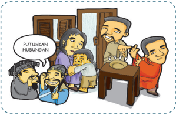

> **Deskripsi Visual:** Gambar ini adalah ilustrasi yang menunjukkan situasi keluarga yang sedang menghadapi masalah hubungan. Ilustrasi ini terdiri dari beberapa elemen utama:

1. **Pertama**: Gambar ini menampilkan kelompok keluarga yang terdiri dari empat orang dewasa dan dua anak kecil. Mereka berada di dalam sebuah ruangan yang tampak seperti rumah.

2. **Elemen Utama dan Relasinya**: 
   - **Orang Dewasa**: Ada dua orang dewasa yang sedang berbicara dengan nada yang sangat serius. Orang pertama (pria) sedang berbicara kepada orang kedua (perempuan). Kedua orang tersebut tampak sangat marah dan sedang memegang tangan mereka.
   - **Anak-anak**: Dua anak kecil tampak sangat terkejut dan sedang berteriak-teriak. Mereka tampak sangat tidak percaya dengan situasi yang terjadi.
   - **Keluarga Lain**: Ada dua orang dewasa lain yang tampak sangat frustasi dan sedang berbicara kepada orang tua mereka. Mereka tampak sangat marah dan sedang memegang tangan mereka juga.

3. **Teks, Angka, atau Label Penting**:
   - Terdapat teks "PUTUSKAN HUBUNGAN" yang ditulis di atas kepala orang tua yang sedang berbicara kepada orang tua lain. Ini menunjukkan bahwa mereka sedang membicarakan tentang hal-hal yang sangat penting dan mungkin akan menyebabkan konflik besar.

4. **Informasi Kunci**:
   - Gambar ini menunjukkan bahwa keluarga sedang menghadapi konflik yang sangat besar dan mungkin akan menyebabkan pelepasan hubungan antara beberapa anggota keluarga.
   - Situasi ini menunjukkan bahwa konflik dalam keluarga bisa sangat serius dan bahkan bisa menyebabkan pelepasan hubungan antara anggota keluarga.

Dengan demikian, gambar ini menunjukkan situasi keluarga yang sangat kompleks dan membutuhkan penyelesaian yang cepat untuk mengurangi konflik yang sedang terjadi.

Sumber: dokumen Kemendikbud

---
**🖼️ Gambar/Diagram**

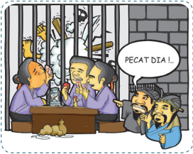

> **Deskripsi Visual:** Gambar ini adalah ilustrasi yang menunjukkan tiga orang yang sedang makan di sebuah restoran. Mereka sedang berbicara dan tampak sangat senang. Di sebelah kiri, ada seorang pria tua dengan topi hitam yang sedang makan nasi putih dengan sayur-sayuran. Di tengah, ada seorang pria muda dengan rambut pendek yang sedang makan nasi putih dengan daging. Di kanan, ada seorang pria tua dengan topi biru yang sedang makan nasi putih dengan sayur-sayuran. Semua orang tampak sangat puas dengan hidangan mereka. Teks "PECAT DIA..." tampak di bawah gambar, yang menunjukkan bahwa mereka merasa tidak puas dengan pelayanan atau makanan yang diberikan oleh restoran tersebut.

Sumber: dokumen Kemendikbud

 

---
## 📄 Halaman 115

---
**🖼️ Gambar/Diagram**

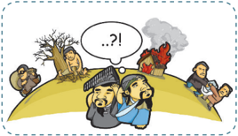

> **Deskripsi Visual:** Gambar ini adalah ilustrasi yang menunjukkan konsekuensi negatif dari kegiatan manusia yang tidak bertanggung jawab. Gambar ini terdiri dari beberapa elemen utama:

1. **Pertama**: Gambar ini menunjukkan tiga orang yang sedang memanfaatkan alam dengan cara yang tidak berbentuk. Mereka memotong pohon dan membakar kayu untuk kebutuhan sehari-hari.

2. **Kedua**: Dalam gambar tersebut, ada dua orang lainnya yang sedang berjalan-jalan di sekitar area yang sama. Mereka tampak gelisah dan menghadapi masalah seperti kekeringan dan kebakaran hutan.

3. **Tiga**: Di bagian atas gambar, terdapat teks yang bertuliskan "??!" dan "?!". Ini menunjukkan kebingungan dan kekhawatiran mereka tentang situasi yang sedang dialami.

4. **Keempat**: Gambar ini juga menunjukkan bahwa lingkungan mereka telah rusak, dengan pohon-pohon yang sudah tidak ada dan tanah yang kering. Ini menunjukkan dampak langsung dari kegiatan manusia yang tidak bertanggung jawab.

5. **Kelima**: Terdapat juga teks yang bertuliskan "?.?" dan "?!", yang menunjukkan kekhawatiran dan kebingungan mereka tentang masa depan mereka dan lingkungan mereka.

6. **Keenam**: Gambar ini juga menunjukkan bahwa mereka sedang berusaha mencari solusi untuk masalah yang sedang dialami, tetapi masih belum menemukan jawaban yang tepat.

7. **Ketujuh**: Terdapat juga teks yang bertuliskan "?.?" dan "?!", yang menunjukkan kekhawatiran dan kebingungan mereka tentang masa depan mereka dan lingkungan mereka.

8. **Kedelapan**: Gambar ini juga menunjukkan bahwa mereka sedang berusaha mencari solusi untuk masalah yang sedang dialami, tetapi masih belum menemukan jawaban yang tepat.

9. **Kelevi**: Terdapat juga teks yang bertuliskan "?.?" dan "?!", yang menunjukkan kekhawatiran dan kebingungan mereka tentang masa depan

Sumber: dokumen Kemendikbud

 

---
## 📄 Halaman 116

### Tujuan

- Lembar penilaian diri ini bertujuan untuk:
- Mengetahui penerapan perilaku semangat belajar.
- Sejauh mana penghayatan akan pentingnya belajar.

### Petunjuk

- Isilah lembar penilaian diri yang ditunjukkan dengan skala sikap berikut ini!
SS  =  Sangat Setuju

ST  =  Setuju

RR =  Ragu-ragu

TS  =  Tidak Setuju

---
**📊 Tabel**

Tabel ini menunjukkan hasil penilaian dari instrumen penilaian berbasis skala (SS), skala tertulis (ST), skala rata-rata (RR), dan skala tertulis standar (TS) untuk beberapa karakteristik belajar. Topik utama tabel adalah tentang kecenderungan belajar dan perilaku belajar seseorang. Kolom-kolomnya mencakup 6 poin penilaian, mulai dari "Setiap hari saya mengulang pelajaran sekolah di rumah" hingga "Saya merasa dapat mengontrol kehidupan saya". Data penting yang terlihat adalah bahwa setiap karakteristik belajar memiliki skor yang berbeda-beda, menunjukkan variasi dalam perilaku belajar antara individu.

 

---
## 📄 Halaman 117

---
**📊 Tabel**

Tabel ini berisi pertanyaan-pertanyaan yang mungkin diajukan dalam ujian atau tes akhir semester untuk menilai keterampilan belajar siswa. Topik utamanya adalah tentang sikap dan perilaku belajar, termasuk komunikasi dengan teman sekelas, kerja sama dalam menjawab soal, kepuasan dengan nilai ulangan, optimisme dalam proses belajar, dan kemampuan untuk melanjutkan materi pelajaran. Kolom-kolomnya mencakup pernyataan yang harus diisi oleh siswa, seperti "Saya sering bertukar pikiran dengan kawan dalam belajar", "Saya puas dengan nilai ulangan yang saya peroleh", dan lain-lain. Data atau pola penting yang terlihat adalah bahwa setiap pernyataan memiliki kolom kosong untuk siswa untuk memberikan jawaban mereka, menunjukkan bahwa ini adalah alat evaluasi yang digunakan untuk memantau perkembangan belajar siswa.

### Uraian

### Jawablah pertanyaan-petanyaan berikut ini dengan uraian yang jelas!

- Apa pendapat Mengzi tentang sifat dasar (kodrat) manusia? Jelaskan!
- Sebutkan benih-benih kebajikan yang menjadi Watak Sejati manusia!
- Bila manusia memiliki sifat dasar (kodrat) yang baik, mengapa terdapat begitu banyak kejahatan di dunia ini?!
- Jelaskan prinsip-prinsip penting yang disampaikan oleh Mengzi tentang pemerintahan/memimpin Negara!
- Sebutkan faktor-faktor yang dapat menyebabkan manusia berbuat jahat (tidak sesuai dengan Watak Sejatinya)!
- Jelaskan prinsip moralitas yang disampaikan Mengzi !

 

---
## 📄 Halaman 118

Mengzi  berkata,  'Kalau  kita  mau  mengikuti  gerak  rasa (batin),  akan  tahu  bahwa  sesungguhnya  watak  sejati  manusia adalah baik'. (Mengzi VI A : 6.5)

 

---
## 📄 Halaman 119

### BAB 5

---
**🖼️ Gambar/Diagram**

> **Deskripsi Visual:** Gambar ini adalah diagram yang menunjukkan struktur dan jenis-jenis sembahyang kepada Arwah Suci dalam agama Islam. Diagram ini dibagi menjadi dua bagian utama: "Sembahyang kepada leluhur" dan "Sembahyang kepada Nabi". Untuk setiap subtopik tersebut, ada beberapa pilihan lebih lanjut yang disebutkan dengan nama-nama tertentu.

Elemen utama yang ditampilkan adalah:
1. Gambaran umum sembahyang kepada Arwah Suci.
2. Subtopik "Sembahyang kepada leluhur" yang terdiri dari "Qingming" dan "Ershi Shengan".
3. Subtopik "Sembahyang kepada Nabi" yang terdiri dari "Zhisheng dan Lahir Nabi" serta "Zhisheng Jichen Wafat Nabi".
4. Subtopik "Sembahyang kepada para suci".

Teks, angka, atau label penting yang terlihat meliputi:
- Judul "Sembahyang kepada Arwah Suci".
- Nama-nama subtopik seperti "Qingming", "Ershi Shengan", "Zhisheng dan Lahir Nabi", "Zhisheng Jichen Wafat Nabi", dan "para suci".
- Gambaran umum sembahyang kepada Arwah Suci.

Informasi kunci yang dapat diambil pembaca meliputi:
- Ada dua jenis sembahyang utama: kepada leluhur dan kepada Nabi.
- Untuk subtopik "Sembahyang kepada leluhur", ada dua pilihan: Qingming dan Ershi Shengan.
- Untuk subtopik "Sembahyang kepada Nabi", ada dua pilihan: Zhisheng dan Lahir Nabi, serta Zhisheng Jichen Wafat Nabi.
- Sembahyang kepada para suci juga merupakan pilihan alternatif.

### A.  Sembahyang kepada Leluhur

### 1. Dasar Iman Sembahyang kepada Leluhur

Hidup manusia dalam iman Khonghucu adalah sebuah kelangsungan yang berkesinambungan dari pra ke pasca kehidupan di dunia ini. Maka iman akan datang dan kembali kepada-Nya; Khalik Semesta  Alam  sebagai  pencipta  dan  perlindungan  dari  segalanya, menjadi panggilan ibadah paling mendasar bagi umat Khonghucu.

 

---
## 📄 Halaman 120

Dalam  sejarah  manusia  di  awal  peradaban  pemujaan  kepada leluhur  memang  lebih  dulu  dikenal  sebelum  para  nabi  memberi bimbingan kepada umat manusia pada iman akan Tian sebagai Maha Leluhur manusia.

Dalam  agama  Khonghucu,  konsep  memuliakan  hubungan  atau Xiao ( 孝 ) menjadi pokok ajaran agama. Sebagaimana telah diuraikan pada bab 2 bahwa laku bakti itu pokok dari segala pengajaran agama, dan sesungguhnya laku bakti itu adalah pokok kebajikan, dari sinilah agama berkembang.

Berbakti kepada orangtua adalah langkah awal untuk patuh dan taqwa kepada Tian , dan menjadi kewajiban manusia. Bersembahyang kepada Tian dan  leluhur  adalah  suatu  rangkaian  ibadah  bagi  umat Khonghucu. Hal ini menyangkut makna suci kehidupan dan kematian, dunia akhirat serta menjadi pangkal dan ujung hidup manusia. Dari hal itu maka jelaslah bahwa kehidupan beragama sesungguhnya tidak akan lepas dari masalah memuliakan hubungan dengan leluhur.

Dalam salah satu keyakinan iman umat Khonghucu yaitu tentang Iman menyadari akan adanya nyawa dan roh ( Guishen ), menyiratkan keyakinan  bahwa  kehidupan  manusia  di  dunia  ini  dibangun  oleh adanya  daya  hidup  jasmani  ( Gui )  dan  daya  hidup  rohani  ( Shen ), keduanya berpadu dalam kehidupan dan menjadi kewajiban manusia untuk mengharmoniskan keduanya sesuai dengan Firman Tian .  Ibadah manusia  pada  dasarnya  adalah  bagaimana  menempuh  jalan  untuk 'kembali'  kepada Tian ,  dan  inilah  yang  merupakan  tujuan  tertinggi pengajaran agama di dunia bagi manusia, yaitu: mengharmoniskan/ menyelaraskan antara kehidupan rohani dengan kehidupan duniawi, atau menyelaraskan antara roh dan nyawa.

Di dalam kitab Liji (kitab kesusilaan) bab XXIV/13, tersurat sebagai berikut:  'Semangat  ( Qi )  itulah  perwujudan  tentang  adanya  roh, badan jasad ( Po )  itulah  perwujudan  tentang  adanya  nyawa.  Bersatu harmonisnya nyawa dan roh (kehidupan lahir dan kehidupan batin) itulah tujuan pengajaran agama'.

 

---
## 📄 Halaman 121

'Semua  yang  dilahirkan  (tumbuh),  pasti  mengalami  kematian; yang mati itu pasti kembali kepada tanah; inilah yang berkaitan dengan nyawa  (kehidupan  lahir).  Semangat  itu  mengembang  naik  ke  atas, memancar dihantar semerbaknya dupa, itulah sari kehidupan, itulah kenyataan daripada roh'.

Mengingat badan jasad yang terdiri dari bagian-bagian itu suatu ketika  akan  rusak,  dan  tidak  cukup  syarat  lagi  untuk  mendukung roh  ( Shen )  kehidupan  roh,  maka  terpisahlah  kedua  unsur  tersebut, inilah  yang  dimaksud  kematian  itu.  Namun  demikian,  kematian hanya  memisahkan  badan  jasad  ( Po )  kepada  bumi  dan  semangat ( Qi ) keharibaan Tian . Artinya, nyawa yang dalam hal ini badan/jasad ( Po )  yang  berunsur Yin akan  kembali  dan  melebur  dengan  tanah, tetapi semangat ( Qi ) atau roh itu tetap hidup, dan kebahagiaan hidup setelah kehidupan ini tergantung pada 'amal bajik' kehidupannya di dunia. Ling (sukma) akan menunggu Hun (arwah) yang mengembara untuk  menyatu  dalam  keharibaan Tian Yang  Maha  Gemilang  dan Maha  Abadi  itu.  Inilah  mengapa  persembahyangan  kepada  leluhur diserukan menjadi ibadah, karena hidup berlangsung terus-menerus (turun temurun).

Demikian  maka  konsep  bangun  kehidupan  yang  ada  unsur rohaniahnya berpadu dengan unsur lahiriah menjalani hidup di dunia ini. Dari dua unsur nyawa dan roh ( Guishen ) yang ada dalam manusia dan  membangun  kehidupan  manusia  itu,  dapat  dipetakan  sebagai berikut:

 

---
## 📄 Halaman 122

---
**🖼️ Gambar/Diagram**

> **Deskripsi Visual:** Gambar ini adalah diagram yang menunjukkan hubungan antara berbagai konsep filosofis tradisional Tiongkok. Diagram ini terdiri dari empat bagian utama: QIAN (乾), KUN (坤), REN (人), dan SHENMING (神明). Setiap bagian memiliki ikon yang menunjukkan konsep-konsep tersebut.

QIAN dan KUN terhubung melalui relasi "QIAN" dan "KUN", yang mungkin merujuk pada dua aspek atau dimensi dari konsep tersebut. REN terhubung dengan QIAN dan KUN melalui relasi "REN", yang mungkin menggambarkan hubungan antara manusia dengan elemen-elemen alam.

Shen/Roh (神) dan Gui/Nyawa (鬼) terhubung melalui relasi "Shen/Roh" dan "Gui/Nyawa", yang mungkin menggambarkan hubungan antara konsep spiritual atau spiritualitas dengan konsep kegelapan atau kegelapan. Hun/Arwah (魂) dan Po/Jasad (魄) juga terhubung melalui relasi "Hun/Arwah" dan "Po/Jasad", yang mungkin menggambarkan hubungan antara energi atau jiwa dengan struktur fisik.

Semua konsep ini terhubung dengan SHENMING (神明), yang mungkin merujuk pada konsep kekuasaan atau kekuatan spiritual. Ini menunjukkan bahwa semua konsep dalam diagram ini terkait erat dengan konsep spiritual atau spiritualitas.

Teks, angka, atau label penting yang terlihat dalam diagram ini adalah "QIAN", "KUN", "REN", "Shen/Roh", "Gui/Nyawa", "Hun/Arwah", "Po/Jasad", dan "SHENMING". Informasi kunci yang dapat diambil pembaca adalah hubungan kompleks antara konsep-konsep spiritual dan alamiah dalam filosofi Tiongkok.

Sembahyang  kepada  leluhur  dimaksudkan  agar  arwah  leluhur yang dimaksud mencapai ketenangan, tidak tersesat dalam pengembaraannya dan segera dapat menyatu dengan sukma ( Ling ).

Di sisi lain,  sembahyang  kepada  leluhur  juga  dimaksudkan meneruskan  amal  ibadah  kepada Tian ,  menjaga  dan  memperbaiki maupun meningkatkan amal dan laku bajik agar leluhur bisa kembali keharibaan Tian Yang Maha Kekal dan Maha Abadi itu.

Dapat  menyatu  kembali  antara Ling (sukma)  dan Hun (arwah) di dalam kehidupan akhirat, inilah yang dimaksud dengan Shenming (arwah  suci),  dan  hal  ini  akan  membawa  aura  suci,  maka  bila

 

---
## 📄 Halaman 123

persembahyangan  kepada  leluhur  bisa  terlaksana  dengan  baik  dan benar aura Shenming itu  dapat  membawa berkah dan perlindungan bagi keturunan/keluarga yang bersangkutan.

### Catatan :

Persembahyangan  kepada leluhur dalam iman Khonghucu  jelas memberi suatu gambaran yang menyatu pada hubungan Tian -LeluhurManusia, yang meliputi kesatuan dari tiga kenyataan hidup: Tian ,  Bumi/ Semesta Alam  dan Manusia itu sendiri. Ini mendasar pada kehidupan dunia akhirat yang  berkaitan dengan daya hidup duniawi dan Ilahi, yang memberi nuansa fisik dan metafisik (jasmani dan rohani). Maka semestinya  tak  perlu  lagi  diragukan  tentang  konsep after life dalam agama Khonghucu.

Aktivitas 5.1

### Diskusi Kelompok

- Diskusikan maksud pernyataan berikut: 'Tujuan Sembahyang kepada  leluhur adalah agar  arwah  ( Hun ) leluhur yang dimaksud mencapai ketenangan, tidak tersesat dalam pengembaraannya dan segera dapat menyatu dengan sukma ( Ling ).

### 2.  Saat-Saat Sembahyang Kepada Leluhur

### 1) Qingming

Sembahyang Qingming atau  sadranan,  dilaksanakan  bertepatan dengan  Tanggal  4  atau  5  April  (tergantung  kabisat  atau  tidak,  atau dapat dihitung 104 hari sejak sembahyang Dongzhi ). Dilaksanakan di makam/kuburan. Waktu pelaksanaan bebas dan boleh dengan sajian lengkap.

 

---
## 📄 Halaman 124

### 2) Ershi Shangan

Sembahyang dilaksanakan pada tanggal 24 bulan 12 Kongzili atau Shieryue ershisi, sehingga disebut juga Ershi Shengan .

Selain  dua  sembahyang  disebutkan  di  atas,  sembahyang  kepada leluhur yang umum dilaksanakan di antaranya:

### a) Chuyi dan Shiwu

Sembahyang pada saat Chuyi dan Shiwu adalah saat sembahyang kepada Tian , hanya  pada  waktu  yang  sama  juga dilaksanakan sembahyang kepada leluhur. Sembahyang dilaksanakan pada petang hari di rumah masing-masing, yakni pada altar leluhur atau di Miao Leluhur ( Zumiao ).

### b) Zhongyuan dan Jing Heping

Sebagaimana telah dijelaskan, bahwa Zhongyuan adalah sembahyang atas berkah bumi yang dikaitkan dengan leluhur dan arwah umum.  Jadi  pada  saat Zhongyuan juga  dilaksanakan  sembahyang kepada leluhur tepatnya tanggal 15 bulan 7, dan sembahyang kepada arwah umum ( Jing Heping ) tanggal 29 bulan 7 Kongzili .

### c)   Chuxi

Seperti  halnya  sembahyang  pada  saat Chuyi dan Shiwu ,  sembahyang Chuxi juga termasuk sembahyang kepada Tian yang dilaksnakan pada malam  menjelang  Tahun  Baru  (tanggal  29/30  bulan  12 Kongzili ), namun pada saat yang sama juga dilaksanakan sembahyang kepada leluhur.

### d)  Zuji

Zuji adalah  sembahyang  peringatan  hari  wafat  leluhur,  oleh karenanya waktu pelaksanaan sembahyang sesuai dengan hari wafat leluhur  masing-masing.  Artinya, Zuji adalah  sembahyang  kepada leluhur yang bersifat khusus.

 

---
## 📄 Halaman 125

### 3.  Sembahyang Qingming

### a. Sejarah Qingming

Qingming itu sudah ada sejak masa dinasti Zhou (1100-221 SM), pada periode Chunqiu (770-476 SM.) dan awal mulanya adalah suatu upacara  yang  berhubungan  dengan  musim  dan  pertanian.  Pertanda berakhirnya hawa (bukan cuaca) dingin dan mulainya hawa panas.

Qingming adalah saat yang paling tepat dan merupakan hari suci untuk berziarah atau menyadran kemakam para leluhur, maka disebut hari  sadranan. Qing berarti  bersih  dan  murni, Ming berarti  terang, maka Qingming secara harfiah berarti 'terang cerah' atau dikenal juga sebagai hari nan cemerlang.

Sembahyang Qingming dilaksanakan bertepatan dengan tanggal 5 April. Penggunaan penanggalan Masehi untuk sembahyang Qingming dan Dongzhi ini berkaitan dengan kedudukan bumi terhadap matahari.

### Catatan :

Sembahyang Qingming pada tahun kabisat jatuh bertepatan dengan tanggal 4 April karena penambahan satu hari di bulan Februari pada tahun kabisat (bulan Februari berjumlah 29 hari).

### b. Makna Sembahyang Qingming

Keimanan  keempat  dari  Delapan  Keimanan  ( Bacheng Zhengui ) disebut Chengzhi Guishen yang  mengandung  arti:  Sepenuh  iman menyadari adanya nyawa dan roh, adanya dua kekuatan hidup yakni rohaniah dan lahiriah yang disebut Roh dan Nyawa.

Manusia sebagai mahluk lahiriah sudah mempunyai syarat-syarat kehidupan jasmani, dengan demikian mempunyai kesamaan dengan makhluk-makhluk lain. Dorongan atau daya-daya kehidupan lahiriah seperti berbagai nafsu, perasaaan panca indra ada pada setiap manusia, tanpa itu tidak ada kehidupan lahiriah. Tetapi hidup rohaniah ialah yang  menjadi  ladang  tumbuh  berkembang  benih-benih  kebajikan

 

---
## 📄 Halaman 126

yang menjadi harkat kemanusiaan, maka di satu pihak kemanusiaan memiliki  benih-benih  cinta  kasih,  kebenaran,  susila  dan  bijaksana, dan di lain pihak manusia tidak dapat bebas dari perasaan gembira, marah, sedih, dan senang/suka.

Kenyataan  ini  meyakinkan  kita  bahwa  hidup  ini  didukung  oleh Gui atau  Nyawa  yang  memungkinkan  berkembangnya  kehidupan lahiriah, dan oleh Shen atau Roh yang memungkinkan berkembangnya kehidupan batiniah atau kehidupan rohani yang menjadi hakikat hidup manusia.

Dalam Kitab Shijing XXIV: 1 dinyatakan: 'Raja Wen nampak di atas, gemilang di langit, naik turun di kiri kanan Tian '. Ayat ini menyatakan bahwa seorang  yang  suci  hidupnya,  memenuhi  baik-baik  kewajiban hidup sebagaimana yang Tian Firmankan, rohnya akan pulang dalam keadaan gemilang kepada Tian .

Kewajiban  menghormati  leluhur  atau  orangtua  yang  meninggal dunia, dalam iman Agama Khonghucu berlandas kewajiban Laku Bakti yang wajib dikerjakan sesuai dengan keimanan kelima dari delapan ajaran  Iman, Chengyang Xiaosi ,  yaitu  Iman  tentang  perwakilan orangtua  atas  anak-anaknya;  atau  sepenuh  iman  memumpuk  cita berbakti.

Pada waktu seorang umat Konfusiani merangkapkan kedua tangan dalam satu genggaman di dalam melakukan persujudan, mengandung makna yang harus dihayati yaitu: 'Aku selalu ingat Tian Yang Maha Esa menjadikan/menjelmakan aku menjadi manusia melalui perantara ayah  dan  bunda.  Manusia  wajib  mengamalkan  Delapan  Kebajikan, yakni: berbakti, rendah hati, satya, dapat dipercaya, susila, menjunjung kebenaran/keadilan, suci hati dan tahu malu'.

Di dalam iman Konfusiani dihayati bahwa laku bakti itulah pokok dari segala perilaku kebajikan; karena bila hal itu tegak, maka jalan suci itu akan tumbuh dengan sendirinya. Laku bakti dan rendah hati itulah  pokok  pericinta  kasih.  ( Lunyu .  I:2).  Oleh  sebab  itu,  kepada para muridnya, Nabi Kongzi berpesan, 'Kepada orangtua saat hidup

 

---
## 📄 Halaman 127

layanilah  sesuai  dengan  kesusilaan;  pada  waktu  meninggal  dunia, makamkanlah sesuai dengan kesusilaan, dan sembahyangilah sesuai dengan kesusilaan'. ( Lunyu . II:5).

Di dalam Kitab Catatan Kesusilaan tertulis; Laku bakti itulah ialah permulaan hidup beragama. Laku bakti itu di mulai dengan memberi perawatan  kepada  orangtua,  namun  biar  dapat  memberi  perawatan masih  sukar  untuk  berlaku  hormat.  Dapat  berlaku  hormat,  masih sukar untuk dapat memberi kesentosaan. Dapat memberi kesentosaan masih sukar bagaimana menghadapi wafatnya. Dan setelah orangtua tiada lagi, hati-hatilah dalam perbuatan sehingga tidak memberi nama buruk kepada orangtua, inilah Laku Bakti'.

Di  dalam  Kitab  Bakti  IX,  Nabi Kongzi bersabda:  'Di  antara watak-watak  mahluk  yang  terdapat  di  antara  langit  dan  bumi  ini, sesungguhnya, manusialah yang termulia. Di antara perilaku manusia tiada yang lebih besar dari laku bakti. Di dalam laku bakti itu tiada yang lebih besar dari hormat kepada orangtua, dan pernyataan hormat itu tiada yang lebih besar dari kesujudan kepada Tian Yang Maha Esa'.

'Maka  orang  yang  tidak  mencintai  orangtuanya,  tetapi  dapat mencintai  orang  lain,  itulah  Kebajikan  yang  terbalik.  Kalau  dapat hormat kepada orang lain tetapi tidak hormat kepada orangtua sendiri, itulah kesusilaan yang terbalik. Seorang susilawan tidak menghargai perilaku semacam itu'.

### c. Tata Laksana Sembahyang Qingming

### 1)  Pelaksanaan di Rumah

Terlebih  dahulu  dilaksanakan  sembahyang  kepada Tian Yang Maha  Esa  (menghadap  ke  langit  lepas)  dengan  dupa  tiga  batang dan dinaikan secara Dingli lalu ditancapkan pada tempat dupa yang telah disediakan, kemudian bersikap Bao Xinbade dan menaikan doa sebagai berikut:

Kehadirat Tian Yang  Maha  Besar,  di  tempat  Yang  Maha  Tinggi, dengan bimbingan Nabi Kongzi , dipermuliakanlah.

 

---
## 📄 Halaman 128

Diperkenankan kiranya kami melakukan sujud sebagai pernyataan bakti kepada leluhur kami. Kami berdoa semoga Tian berkenan bagi para arwah beliau itu selalu di dalam cahaya Kemulian Kebajikan Tian , sehingga damai dan tentram yang abadi boleh selalu padanya. Shanzai (diakhiri dengan sekali Dingli )

Setelah  selesai  sembahyang  kepada Tian ,  kemudian  menuju altar leluhur. Menyalakan dua batang atau empat batang dupa. Dupa dinaikan dua kali lalu ditancapkan. Kemudian dengan bersikap Bao Xinbade memanjatkan doa, sebagai berikut:

'Kehadapan  leluhur  (atau  nama  panggilan  kita  kepada  beliau) yang  kami  hormati  dan  cintai,  terimalah  hormat  dan  bakti  kami, segenap kasih dan teladan mulia yang telah kami terima akan tetap kami  junjung  dan  lanjutkan,  serta  kembangkan,  sebagaimana  Nabi Kongzi telah menyadarkan dan membimbing kami. Kami akan selalu berusaha menjaga keharuman dan nama baik keluarga dan leluhur, tidak menodai dan memalukan. Terimalah hormat dan bakti kami'. Shanzai .

### 2) Pelaksanaan di Makam (Kuburan)

Kebanyakan  masyarakat  pagi-pagi  sekali  bahkan  sebelum  fajar telah berangkat ke tanah pemakaman, untuk membersihkan makam terlebih dahulu. Kebiasaan seperti ini masih tetap dilakukan hinggga sekarang  sekalipun  makam  itu  letaknya  berdekatan  dengan  rumah tinggal. Waktu pelaksanaan persembahyangan Qingming pagi sampai siang hari.

 

---
## 📄 Halaman 129

### Catatan :

- Membersihkan kuburan pada saat atau menjelang sembahyang Qingming itu  berkaitan  dengan  tumbuhnya  rumput  yang khawatir  akan  merusak  kuburan  dan  akan  mengganggu kenyamanan saat pelaksanaan sembahyang.
- Pada  dinasti Tang ,  hari Qingming ditetapkan  sebagai  hari wajib untuk para pejabat membersihkan kuburan, mengurus kuburan-kuburan  yang  terlantar  dan  menghormati  para leluhur.
- Upacara  di makam  leluhur  dilengkapi dengan  perlatan sembahyang dan sesajian yang merupakan pernyataan sikap Laku Bakti dan kasih terhadap leluhur. Demikianlah setelah tiba di makam, kemudian makam dibersihkan dan diletakkan secara teratur peralatan upacara.
Sebelum  melakukan  sembahyang  di  hadapan  makam,  terlebih dahulu  melakukan  sambahyang  di  hadapan  altar  malaikat  Bumi ( Tudigong )  yang  selalu  menjadi  perawat  bagi  kehidupan  di  alam semesta  atau  di  atas  dunia.  Kemudian  dilanjutkan  bersembahyang kehadirat Tian Yang Maha Esa bagi arwah orangtua maupun saudara yang  telah  mendahului  yang  kita  hormati,  dengan  penuh  harapan semoga penghormatan ini dapat menjadi pendorong bagi kita untuk selalu berperilaku luhur dan mulia sebagaimana yang Tian Firmankan, bahwa kebahagiaan atau rahmat ( Fu ) dan Kebajikan ( De ) merupakan kesatuan yang tidak terpisahkan.

### d. Surat Doa Sembahyang Qingming

'Puji  dan  Syukur  kami  naikan, Tian Yang  Maha  Esa  telah berkenan kami behimpun bersama pada Hari Qingming ,  hari  gilang gemilang yang suci ini untuk melaksanakan upacara pengenangan dan penghormatan bagi awah leluhur, orangtua maupun saudara kami yang telah tiada. Kami panjatkan doa kiranya Tian berkenan menerimanya di dalam cahaya kemuliaan Kebajikan, sehingga damai, dan tenteram yang abadi boleh besertanya.

 

---
## 📄 Halaman 130

Diperkenankan  pula  kiranya  kami  naikan  hormat  puji  kepada yang  kami  hormati:  Malaikat  Bumi  ( Fude  Zhengshen )  yang  selalu merawat  kehidupan  di  alam  semesta  alam  atau  di  atas  dunia  ini. Dipermuliakanlah'.

'Ke  hadapan  yang  kami  hormati Fude Zhengshen ,  kami  naikan hormat atas segenap kasih dan perawatan yang telah diberikan atas kehidupan  di  bumi  ini  maupun  bagi  arwah  para  leluhur,  orangtua maupun saudara kami yang telah tiada itu'.

'Penghormatan ini kiranya menjadi pendorong bagi kami untuk selalu berperilaku luhur dan mulia sebagai yang Tian Firmankan, kami yakini bahwa Kebahagian/rahmat ( Fu ) dan Kebajikan ( De ) merupakan kesatuan, kemanunggalan yang tak terpisahkan. Dipermuliakanlah'.

'Para arwah leluhur, orangtua dan saudara kami yang telah jauh, pada hari Qingming hari yang gemilang dan suci ini, terimalah masa lampau para leluhur yang telah mendahului serta sebagai peletak dasar peradaban dan penerus kehidupan ini'.

'Kami  yakin  segala  yang  mulia  itu  telah  terbit  dari  Kebajikan, berubah dari pengorbanan dan pengabdiaan para leluhur. Sungguh, ini  patut dan wajib kami kenang, kami hayati dan teladani sehingga menjadi pedoman dan teguh di dalam iman menghadapi tantangan dan segenap kewajiban hidup kami'.

'Saat ini semuanya kami sajikan dengan setulus hati dan sepenuh kebajikan  akan  persembahan  pernyataan  bakti  kami.  Semoga,  para leluhur  berkenan  menerima  semua  ini  sebagai  pernyataan  hormat kami.  Kami  yakin, Tian berkenan  tempat  yang  sentosa  bagi  para leluhur yang telah mendahului kami. Dipermuliakanlah'. Shanzai .

### e.  Perlengkapan Sembahyang dan Persembahan

- Shenzhu atau foto leluhur.
- Xianglu .
- Xiang (dupa) digunakan dua batang atau kelipatannya.

 

---
## 📄 Halaman 131

- Chaliao ,  terdiri  atas  teh,  arak  dan  manisan,  masing-masing disediakan  sejumlah  dua,  yang  melambangkan  sifat Yin dan Yang diletakan di depan Xianglu .
- Nasi,  sayur  dan  lain-lain,  diletakan  di  depan Chaliao ,  boleh lengkap menurut  tradisi, boleh sederhana sesuai  dengan makanan yang disukai almarhum.
- Jeruk, diletakan di depan sebelah kanan, pisang diletakan di depan, sebelah kiri.
- Guigao (kue kura), diletakan di samping kiri.
- Fagao (kue mangkok), diletakkan di samping kanan.
- Migao (Wajik), diletakan di tengah.
- Lilin satu pasang, masing-masing diletakan di samping kiri dan kanan deretan sesajian paling depan.
Jeruk

Migao

Fagao

Guigao

Posisi/urutan penempatan buah dan kue sembahyang leluhur

### Catatan :

- Perlengkapan sembahyang dan tata letak sajian sembahyang Qing  Ming berlaku  sama  untuk  pelaksanaan  di  rumah maupun di kuburan.
- Perlengkapan  sembahyang  dapat  ditambah  sesuai  dengan kebiasaan setempat, dengan  catatan tidak bertentangan dengan maksud penghormatan terhadap leluhur.
Pisang

 

---
## 📄 Halaman 132

### Tugas Mandiri

- Tuliskan pengalaman mu tentang pelaksanaan sembahyang Qingming !
- Carilah  cerita  tentang  tradisi  yang    mengikuti  sembahyang Qingming !

### 4.  Hari Persaudaraan

### a. Makna Hari Persaudaraan

Sembahyang  Hari  Persaudaraan  diselenggarakan  pada  tanggal 24  bulan  12 Kongzili atau Shieryue  ershisi ,  sehingga  disebut  juga Ershi Shengan .  Merupakan  upacara  mengantar  Malaikat  Dapur ( Zaojun ), pada saat Zishi yaitu antara jam 23.00 - 01.00. Pelaksanaan Sembahyang Hari Persaudaraan cukup dengan Dianxiang , di hadapan altar Zaojun.

Hari Persaudaran melambangkan bahwa Tian Maha Melihat, Tian Maha Mendengar, Tian menilai  perbuatan insan akan kesatyaannya di dalam Kebajikan selama satu tahun menempuh penghidupan yang sedang  berjalan,  banyak  perbuatan  lepas  dari  kebajikan.  Pada  saat ini  kita  membuka  hati,  dengan  tulus  dan  kerendahan  hati  bersujud menerima Firman, untuk meningkatkan pembinaan diri kita.

Hari persaudaraan di dalam Agama Khonghucu juga merupakan hari  untuk  mengadakan  kegiatan  kemanusiaan,  kegiatan  beramal untuk para fakir miskin agar saudara-saudara kita dapat merayakan Tahun Baru Kongzili ( Xinnian ) bersama keluarganya dalam suasana gembira.

 

---
## 📄 Halaman 133

Tian melihat  Kebajikanmu, junjung permuliakanlah Jalan Suci Tian , Jalan  Suci Tian memberi  bahagia  kepada  kebaikan  dan  memberi bencana kepada perbuatan sesat.  ( Shujing )

Di dalam Ershi Shengan ada lima unsur keberkahan yang disebut ' Wufu Linmen ' yang berarti 'Lima Keberkahan Menyertai penghuni Rumah', yaitu:

- Shou atau panjang umur.
- Fu atau keberkahan.
- Kang Nin g atau sehat jasmani dan rohani.
- You Hao De atau yang mecintai kebajikan.
- Zhong Ming atau yang hidupnya memenuhi Firman Tian .
Lima  unsur  Keberkahan  ini  dikaruniakan Tian kepada  manusia penghuni rumah yang sehari-harinya menjalankan kebaikan, mengamalkan kebajikan terhadap sesama manusia. Kita dianjurkan untuk  mengumpulkan  dana  sumbangan  dari  para  dermawan,  hasil dana itu disumbangkan kepada saudara-saudara kita terutama yang tidak mampu.

Nabi Kongzi bersabda,  'Seorang  yang  berpericinta  kasih  ingin dapat tegak, maka ia berusaha agar orang lainpun tegak, ia ingin maju, maka ia berusaha agar orang lainpun maju. Yang dapat memperlakukan orang lain dengan contoh yang dekat (diri sendiri) sudah cukup untuk dinamai seorang yang berpericintakasih'. ( Lunyu VI: 30)

 

---
## 📄 Halaman 134

### b. Teks Hari Persaudaraan

Tanggal 24 bulan 12 Kongzili sampai tanggal 4 bulan 1 Kongzili dihayati sebagai saat-saat pembuatan neraca penghidupan tahun yang lampau  dan  menyiapkan  diri  menghadapi  tahun  yang  akan  datang. Hikmah upacara ini mengetuk umat, hendaklah melakukan dana amal dan berbuat segala perkara yang baik bagi sesama yang memerlukan pertolongan, sehingga para fakir miskinpun dapat melakukan syukur dan merasakan berkah karunia Tian di  dalam perayaan menyambut tahun baru.

Demikianlah  dijadikan  hari  itu  sebagai  hari  persaudaraan  yang menggugah kita; hendaknya merasa bahagia merasa ikut bertanggung jawab pula untuk kebahagiaan sesamanya. Itulah syukur dan persembahan yang sebaik-baiknya kepada Tian dan menjadi kewajiban tiap umat yang mampu pada akhir tahun.

Wang Sunjia bertanya,'Apakah  maksud  peribahasa  daripada bermuka  muka  kepada  Malaikat Oo (Malaikat  ruang  Barat  Daya Rumah),  lebih  baik  bermuka-muka  kepada  Malaikat Zao (Malaikat Dapur) itu?'

Nabi bersabda, 'Itu tidak benar. Siapa berbuat Dosa kepada Tian Tian Yang Maha Esa, tiada tempat lain ia dapat meminta doa'. ( Lunyu . III:13)

Sumber: dokumen Kemendikbud

Gambar 5.2 Bakti sosial pembagian sembako pada hari persaudaraan atau Ershi Shangan

 

---
## 📄 Halaman 135

### c. Surat Doa Sembahyang Hari Persaudaraan

Hari ini tanggal 24 bulan 12 Kongzili ialah hari yang melambangkan bahwa Tian Maha  Melihat, Tian Maha  Mendengar, Tian menilai perbuatan insan akan kesatyaannya di dalam kebajikan. Akan genap setahun menempuh penghidupan dalam tahun yang sedang berjalan dan akan kami masuki tahun yang baru. Banyak perbuatan telah kami lakukan: Perbuatan yang di dalam Kebajikan yang Tian berkenan. Maka pada saat suci ini kami membuka hati, dengan tulus dan kerendahan hati bersujud menerima Firman.

'Hari ini tanggal 24 Shieryue ialah hari yang melambangkan bahwa Tian Maha  Kasih,  Maha  Adil  dan  Maha  Suci.  Tiap-tiap  perbuatan akan membawa buah yang harmonis dengan kebenaran. Kami selaku makhluk wajib taqwa dan siap menerima Firman. Yang menyenangkan, wajib bersedia menerima dengan Taqwa dan kerelaan, dan menanti semuanya itu dengan siap membina diri. Kami yakin hanya Kebajikan berkenan Tian ,  tiada  jarak jauh tidak terjangkau. Bukanlah Tian itu memihak, hanya Tian melindungi kebajikan.

Siaplah  kami  untuk  mengerti  akan  Firman,  bersedia  menerima Firman,  berusaha  menegakkan  Firman  dan  sepenuh  Iman  dan semangat berusaha melaksanakan demi tegaknya Firman. Menghayati itulah rakhmat yang terbesar atas hidup insani. Shanzai .

Aktivitas 5.3

### Tugas Mandiri

- Ceritakan  pengalamanmu  terkait  pelaksanaan  bakti  sosial pada hari prsaudaraan, bagaimana pelaksanaan bakti sosial pada hari Persaudaraan di daerahmu!

 

---
## 📄 Halaman 136

### 5.  Sembahyang Chuyi dan Shiwu

### a.  Tata Cara Pelaksanaan Sembahyang

Sembahyang kepada leluhur saat Chuyi dan Shiwu dilaksanakan pada petang hari di rumah masing-masing, yakni pada altar leluhur ( Ling Wei ) atau di Miao Leluhur atau Zumiao . Langkah-langkah dan ketentuan-ketentuan  sembahyang  kepada  leluhur  tiap Chuyi dan Shiwu sebagai berikut:

- Upacara sembahyang ini dapat dilakukan bersama atau perorangan.
- Teh arak ataupun manisan masing-masing disediakan sejumlah dua melambangkan sifat Yin dan Yang , begitupun jumlah dupa yang digunakan dua batang atau kelipatannya.
- Lebih  dahulu  sembahyang  kepada Tian Yang  Maha  Esa, menghadap ke langit lepas, dengan menggunakan dupa sebanyak tiga batang.
- Dupa  dinaikan  secara Dingli (sebanyak  tiga  kali),  diucapkan kalimat:
- Angkatan  pertama:  'Ke  Hadirat Tian Yang  Maha  Besar  di Tempat  Yang  Maha  Tinggi  yang  kami  hormati  dan  kami muliakan. Dipermuliakanlah'.
- Angkatan  kedua:  'Ke  Hadirat  Nabi  Kongzi  juru  penuntun hidup kami, yang kami hormati dan kami muliakan. Dipermuliakanlah'.
- Angkatan ketiga: 'Kehadapan para Suci dan para leluhur yang telah mendahului kami, yang kami hormati dan cintai, terimalah sembah sujud kami, yang kami naikan dengan setulus hati ini. Shanzai .
- Setelah selesai dupa ditancapkan ditempatnya (biasanya di sisi pintu sebelah kiri).
- Lalu kembali dan bersikap Baoxinbade untuk melakukan doa, sebagai berikut:

 

---
## 📄 Halaman 137

'Kehadirat Tian Yang Maha  Besar di Tempat Yang  Maha Tinggi,  dengan  bimbingan  Nabi  Agung Kongzi ,  dipermuliakanlah. Diperkenankanlah kiranya kami melakukan sujud sebagai pernyataan bakti kepada leluhur kami. Kami berdoa semoga Tian berkenan bagi para arwah 'beliau' itu selalu di dalam Cahaya Kebajikan Kemuliaan Tian , sehingga damai tentram boleh selalu padanya'. Shanzai (Diakhiri dengan melakukan Dingli satu kali).

- Selesai sembahyang kepada Tian, selanjutnya menuju altar  leluhur,  dengan  menggunakan  Xiang  dua  batang  atau kelipatannya.
- Dupa  dinaikan  dua  kali  dengan  Dingli  (sampai  di  atas  dahi), sebagai berikut:
- 'Kehadirat Tian Yang Maha Besar di Tempat Yang Maha Tinggi, yang  kami  hormati  dan  kami  muliakan,  dipermuliakanlah'. (dupa diturunkan).
- 'Kehadapan  leluhur  …  (nama  panggilan  kita  kepada  beliau) yang  kami  hormati  dan  kami  cintai,  terimalah  sembah  sujud bakti kami ini'. Shanzai (dupa diturunkan), selanjutnya dupa ditancapkan pada Xianglu dengan menggunakan tangan kiri.
- Selanjutnya  bersikap Bao Xinbade untuk  melakukan  doa, sebagai berikut:
'Kehadapan leluhur … (sebut nama panggilan kita kepada beliau) yang kami cintai  dan  hormati,  terimalah  sembah  sujud  hormat  dan bakti  kami  ini.  Segenap  kasih  dan  teladan  yang  telah  kami  terima akan  kami  junjung  dan  lanjutkan  serta  kembangkan,  sebagaimana dibimbingkan Nabi Kongzi . Kami akan senantiasa berusaha menjaga keharuman serta keluhuran nama keluarga dan leluhur kami, tidak  menodai  dan  memalukan.  Sehingga  itu  semua  boleh  kiranya memberikan ketenangan bagi … (leluhur yang dimaksud) di alam yang abadi di keharibaan kebajikan kemulian Tian . Terimalah hormat dan bakti kami ini. Shanzai

 

---
## 📄 Halaman 138

### Catatan :

- Susunan  kata  doa  tersebut  ialah  sebagai  petunjuk/contoh, tidak mesti harus demikian adanya. Artinya,  kata-kata dalam berdoa dapat disesuaikan.

### b.  Altar (Meja Abu) Leluhur

### 1)  Bentuk dan Nama Altar Leluhur

Bentuk meja abu/altar leluhur bisa sangat sederhana, hanya dengan sebuah  foto  almarhum/almarhumah  dilengkapi  dengan  tempat  lilin dan Xianglu tempat  menancapkan  dupa.  Namun  bisa  juga  lengkap dengan  meja  untuk  sajian,  bahkan  juga  boleh  diwujudkan  dengan altar  persembahyangan  yang  memadai.  Tetapi  utamanya  dalam bersembahyang  kepada  leluhur  adalah  kesungguhan  pelaksanaan ibadah/sembahyang itu sendiri.

Banyak  nama  yang  dipakai  untuk  meja  abu,  dari  yang  umum sebagai  atau  dengan  sebutan Lingwei .  Penyebutan  atau  istilah  ini berhubungan dengan keyakinan tentang 'menunggu' nya Ling /sukma dan 'Mengembara' nya Hun /arwah.

### 2) Makna Altar Leluhur

Makna meja abu/altar leluhur adalah sebagai sarana persembahyangan menggenapi laku bakti dalam kesusilaan. Mewujudkan kesadaran manusia atas makna kehidupan dunia akhirat atas daya hidup duniawi dan rohani yang menjadi kodrati manusia.

Menjadi realisasi kewajiban suci manusia atas hidup dan kehidupannya  yang  berkesinambungan,  ke  atas  kepada  leluhur  dan ke bawah kepada keturunan, dan ini semua berpangkal kepada Tian Khalik Semesta  Alam. Ibadah  persembahyangan  leluhur adalah wahana peribadahan yang menjadi titik awal dan terintegrasi dengan ibadah kepada Tian Sang  Maha Leluhur sekaligus sarana hubungan manusia dengan Tian nya.

 

---
## 📄 Halaman 139

### ' Jingtian Zunzu - Hormat Akan Tian Menjunjung Lelulur'.

---
**🖼️ Gambar/Diagram**

> **Deskripsi Visual:** Gambar ini adalah ilustrasi yang menunjukkan sebuah meja penyimpanan dengan berbagai alat kimia dan bahan kimia. Meja tersebut terdiri dari beberapa elemen utama seperti:

1. Meja: Berfungsi sebagai tempat penyimpanan untuk semua alat dan bahan kimia.
2. Alat Kimia: Termasuk pipet, jumplang, dan botol kimia.
3. Bahan Kimia: Ada beberapa botol berisi bahan kimia berbeda, termasuk larutan asam dan basah.

Elemen-elemen ini disusun secara rapi dan terorganisir dengan baik, menunjukkan bahwa gambar ini mungkin digunakan untuk tujuan pendidikan atau penjelasan tentang cara penyimpanan dan penggunaan alat kimia dalam laboratorium.

Teks, angka, atau label penting yang terlihat pada gambar meliputi:

- Nama-nama alat kimia yang ada (seperti pipet, jumplang)
- Nama-nama bahan kimia yang ada (seperti larutan asam dan basah)

Informasi kunci yang dapat diambil pembaca meliputi:

- Cara penyimpanan alat kimia dan bahan kimia dalam laboratorium
- Pentingnya penyimpanan yang rapi dan terorganisir dalam laboratorium
- Penggunaan alat kimia dalam eksperimen kimia

Dengan demikian, gambar ini memberikan gambaran umum tentang bagaimana alat kimia dan bahan kimia harus disimpan dalam laboratorium, serta pentingnya penyimpanan yang rapi dan terorganisir.

### 3) Fungsi Altar Leluhur

- Tempat  keluarga  disatukan  dalam  melaksanakan  peribadahan, ini menjadi semakin penting mengingat iman Khonghucu menyebutkan kepala keluarga adalah juga sebagai pimpinan rohani keluarga.
- Sebagai  tempat  melakukan Moshi 'melakukan  renungan'  agar senantiasa  hidup  di  jalan  suci  sehingga  tidak  memalukan  para leluhur  yang  telah  mendahului  (menengadah  tidak  malu  kepada Tian ,  menunduk  tidak  malu  kepada  sesama  manusia),  yang merupakan puncak dari laku bakti.
Sumber: dokumen Kemendikbud

Gambar 5.3 Meja Altar leluhur keluarga Khonghucu.

 

---
## 📄 Halaman 140

### 4) Skema Altar Leluhur

---
**🖼️ Gambar/Diagram**

> **Deskripsi Visual:** Gambar ini adalah diagram yang menunjukkan struktur dan komponen dari sistem penulisan tradisional Cina. Gambar ini terdiri dari beberapa bagian utama:

1. Atas: Terdapat tiga kotak berlabel A, B, dan C. Setiap kotak memiliki sub-kotak dengan angka 1, 2, dan 3, masing-masing menunjukkan bagian-bagian tertentu dari sistem penulisan.

2. Dua baris bawah: Baris pertama berisi huruf-huruf Cina "ZHU ZHUO" dan "JIZHUO", sedangkan baris kedua berisi huruf-huruf Cina "K".

3. Teks dan angka penting: Huruf-huruf Cina "ZHU ZHUO" dan "JIZHUO" menunjukkan bagian-bagian dari sistem penulisan, sementara angka 1, 2, dan 3 menunjukkan sub-kotak dalam setiap kotak.

Informasi kunci yang dapat diambil pembaca melalui gambar ini adalah bahwa sistem penulisan tradisional Cina terdiri dari beberapa bagian utama, seperti huruf-huruf Cina, sub-kotak, dan angka yang menunjukkan posisi dan fungsi mereka dalam sistem tersebut.

### Keterangan Gambar:

- Shenzhu atau Foto Leluhur
- Xianglu
- Chaliao
- Teh
- Manisan
- Arak
- Nasi, Sayur dll.

### Catatan :

- Shenzhu atau  foto  leluhur  bisa  juga  diletakkan  di  dalam rumah-rumahan yang disebut Gan atau Shenzu Gan .
- Sajian (nasi,  sayur  sawi,  dll.)  boleh  lengkap  sesuai  keinginan keluarga atau menurut tradisi setempat, boleh sederhana, sekedar makanan yang disukai leluhur (almarhum/almarhumah).

 

---
## 📄 Halaman 141

### Kerja Kelompok

- Bersama kelompokmu, buatlah altar leluhur dengan simulasi, dan susunanlah  perlengkapan yang ada pada altar leluhur dengan piranti lengkap!

### 6.  Sembahyang Jing Heping

### a.  Makna Sembahyang Jing He Ping

Sembahyang Arwah Umum atau Jing  Heping atau  Sembahyang untuk  arwah  para  sahabat  dilaksanakan  setiap  tanggal  29  bulan  7 Kongzili , (sekitar bulan Agustus-September). Saat ini merupakan saat  mewujudkan  Laku  Bakti  sesuai  dengan  Delapan  Kebajikan butir yang pertama yaitu Berbakti. Saat umat Khonghucu mendapat kegembiraan, kebahagiaan dan rahmat Tian Yang Maha Esa mereka harus ingat kepada leluhur, saudara-saudara, sahabat teman sekalipun mereka telah tiada karena arwah dan rohnya tetap abadi, kepadanya wajib  dihormati,  dikenang  didoakan  semoga Tian berkenan  bagi para arwah beliau itu selalu dalam Cahaya Kemulian Kebajikan Tian , sehingga damai dan tentram yang abadi boleh selalu padanya.

Pada  saat  Sembahyang Jing  Heping dilakukan,  penghormatan serta mendoakan semua insan yang telah mendahulu walaupun orangorang  tersebut  bukan  seiman  (bukan  Konfusiani),  termasuk  para arwah yang tidak mempunyai ahli waris, para arwah sahabat, dan para arwah pahlawan bangsa.

Dalam  pelaksanaaan  upacara  sembahyang Jing  Heping ,  bagi dermawan  diberi  kesempatan  untuk  menyumbangkan  uang  dan barang-barang yang dapat berbentuk bahan makanan pokok seperti beras, kacang, jagung, dan palawija atau bahan-bahan lain.

 

---
## 📄 Halaman 142

Sifat  sumbangan  ini  adalah  sukarela,  menurut  kemauan  dan kemampuan masing-masing yang menyumbang. Barang-barang yang disumbangkan tidak bersumber dari hal-hal yang tidak susila, tetapi harus bersih dan murni.

Sumbangsih dari umat Khonghucu yang telah terkumpul, selesai upacara Sembahyang Jing Heping atau keesokan hari barang-barang sumbangan tersebut akan dibagikan kepada fakir miskin atau orangorang  yang  membutuhkan  bantuan,  atau  disumbangkan  kepada yayasan sosial, misalnya panti jompo, panti asuhan, badan sosial umat agama lain atau institusi pemerintah.

Dalam setiap upacara besar kenegaraan Republik Indonesia pada tanggal  17  Agustus,  yaitu  Hari  Peringatan  Proklamasi  Kemerdekaan Republik Indonesia serta upacara kenegaraan yang lain, selalu diadakan pengheningan cipta serta doa bagi arwah para pahlawan yang telah gugur  tanpa  membedakan agama dan keyakinannya, demikian pula pada acara Sembahyang Jing Heping mempunyai maksud dan makna yang sama mulianya.

Dalam acara pembagian bahan-bahan kebutuhan hasil sumbangan tersebut  diatur  cara  pembagiannya,  sehingga  masing-masing  dapat menerima sesuai dengan jatah serta menghindari acara rebutan yang dapat menimbulkan hal-hal yang tidak kita inginkan.

Sebutan 'Sembahyang Rebutan' adalah tidak tepat, karena mempunyai  konotasi  negatif  terhadap  upacara  Sembahyang Jing Heping khususnya dan umat Khonghucu umumnya. Dari kata Heping yang artinya adalah sahabat baik, memberi konotasi yang ditujukan teman-teman dan kerabat kita.

Upacara Sembahyang Jing Heping bukan merupakan sembahyang  membayar  kaul,  hura-hura,  membuang  sial,  memuja setan atau roh yang tidak karuan, tetapi suatu acara ritual dari agama Khonghucu, serta merupakan saat umat Konghucu mencurahkan rasa bakti dan peduli terhadap semua umat manusia.

 

---
## 📄 Halaman 143

---
**🖼️ Gambar/Diagram**

> **Deskripsi Visual:** Gambar ini adalah foto yang menunjukkan sebuah acara pesta di luar ruangan. Di sekeliling meja besar yang dipenuhi berbagai jenis buah segar seperti apel, jeruk, nanas, dan buah-buahan lainnya, terdapat beberapa orang yang sedang berdiri dan berbicara. Mereka tampaknya sedang menyambut atau menghadiri acara tersebut. Di belakang mereka, terlihat beberapa pohon dengan daun hijau yang tampaknya merupakan bagian dari taman atau area hiburan. Di sisi kanan, terdapat seorang pria yang sedang berbicara kepada beberapa orang yang berdiri di depannya. Di sebelah kiri, terdapat beberapa orang yang tampaknya sedang berjalan-jalan atau berdiri diam. Seluruh gambar ini menunjukkan suasana yang hangat dan meriah, dengan banyak orang yang terlibat dalam acara tersebut.

Sumber: dokumen Kemendikbud

Ada  kalanya  orang  mempunyai  keyakinan  bahwa  orang  yang selama  hidupnya  sengsara  dan  menderita,  setelah  melaksanakan upacara sembahyang Jing Heping nasibnya berangsur-angsur menjadi baik. Kendati itu adalah keyakinan, tetapi yang pasti bahwa kita telah menjalankan Kebajikan.

Pelaksanaan upacara Sembahyang Jing Heping di halaman Miao atau ruang khusus, di rumah abu umum atau Zhongting dan di Litang .

Upacara Sembahyang Jing Heping merupakan pernyataan perwujudan  Cita  Berbakti  umat  Khonghucu  dengan  melaksanakan sembahyang  penghormatan  dan  pengenangan  kembali  atas  arwah leluhur,  saudara,  sahabat  dan  umat  lain  yang  telah  wafat,  serta mendoakan bagi arwah leluhur itu sehingga Tian berkenan memberi tempat yang tentram dan damai dalam cahaya kemuliaan Kebajikan Tian .

Nabi Kongzi bersabda, 'Sesungguhnya Laku Bakti itu ialah pokok/ akar  segala  Kebajikan  (cinta  kasih,  kebenaran,  susila,  bijaksana dan  dapat  dipercaya)  dan  daripadanya  ajaran  agama  berkembang'. ( Xiaojing . I: 4).

'Laku Bakti itu ialah hukum suci Tian kebenaran daripada bumi dan yang wajib menjadi perilaku manusia. Hukum Suci Tian dan bumi itulah yang menjadi suri teladan rakyat'. ( Xiaojing . VII: 2)

 

---
## 📄 Halaman 144

'Berbakti itulah hendaknya menjadi pedoman'. ( Shijing . I.IX. 3)

'Senantiasa ingatlah kepada leluhurmu, binalah kebajikan. Paculah dirimu hidup selaras dengan Firman Tian ,  maka engkau akan boleh mendapatkan banyak kebahagiaan'. ( Shijing . III.I.6)

Laku Bakti adalah akar/pokok yang menjadi berkembang segala kebajikan  sebagaimana  dirumuskan  di  dalam  Delapan  Kebajikan atau Ba De ,  yaitu:  bakti,  rendah  hati,  satya,  dapat  dipercaya,  susila, menjunjung kebenaran, suci hati, dan tahu malu.

Melakukan  sembahyang  kepada  leluhur  pada  bulan  7 Kongzili wajib didasari semangat bakti, penghormatan dan persembahyangan itu  diluaskan  sampai  kepada  arwah  para  sahabat  dan  orang-orang yang telah wafat, kepada arwah umum, itulah semangat yang wajib ada didalam sembahyang Jing Heping .

Dengan  demikian  kita  diingatkan  untuk  senantiasa  mensyukuri segenap rahmat Tian Yang Maha Esa yang kita terima lewat orangtua dan leluhur kita, lewat para pendahulu-pendahulu kita dan jasa para pahlawan-pahlawan  kita,  jasa  bakti  mereka  patut  kita  kenang  dan hormati, kita doakan untuk kesempurnaannya.

Dalam  kitab Liji Bab  IX,  tersurat:  'Maka  raja  Suci  Purba  itu berprihatin,  kalau Li (kesusilaan)  itu  tidak  dapat  dipahami  sampai ke bawah, maka dilakukan ibadah kepada Di ( Tian Yang Maha Esa) di  hadapan  altar Kau (di  Selatan  luar  ibu  kota),  dengan  demikian ditetapkan tempat bersujud kepada Tian Yang Maha Esa; dilakukan sembahyang  kepada  Malaikat  Bumi  di  altar Sia (bagian  Utara  ibu kota), dilakukan sembahyang  di kuil leluhur ( Zumiao ) dengan demikian  didapat  pokok  cinta  kasih,  di  altar  gunung  dan  sungai dilakukan  penghormatan  sebagai  penyambutan  tamu  kepada  para arwah ( Guishen ),  dan  di  hadapan lima altar keluarga, maka didapat pokok kegiatan keluarga. Sebutan Jing Heping atau persembahyangan kepada para sahabat itu berkait dengan upacara penghormatan sebagai penyambutan tamu kepada para arwah ( Guishen ) di atas.

 

---
## 📄 Halaman 145

Menjelang  sembahyang Jing  Heping umat  Khonghucu  juga menghimpun uang dan bahan-bahan lain yang dapat disumbangkan kepada fakir miskin atau yayasan sosial, yang merupakan perwujudan kesetiakawanan sosial.

'Seseorang susilawan mengutamakan pokok sebab setelah pokok itu tegak, Jalan Suci akan tumbuh, Laku dan Rendah Hati itulah pokok cinta kasih'. ( Lunyu . I: 2)

### b.  Surat Doa Sembahyang Jing Heping

Puji  dan  syukur  kami  panjatkan  kehadirat Tian dalam  bulan suci ke tujuh ini, diperkenankiranya kami berhimpun melaksanakan sembahyang  penghormatan  dan  pengenangan  kembali  atas  arwah para  leluhur,  umat  yang  telah  lebih  dahulu  menunaikan  kewajiban hidupnya di atas dunia ini.

Semoga bagi para arwah leluhur itu Tian berkenan memberikan tempat yang tentram dan damai dalam cahaya kemuliaan kebajikan, Cahaya Suci Tian . Dipermuliakanlah!

Para leluhur, para saudara serta segenap umat yang telah wafat, dalam rahmat Tian dengan bimbingan Nabi Kongzi , terimalah hormat dan persembahan kami.

Saat ini, kami kenangkan kembali sejarah kemanusiaan di muka bumi ini; bahwa yang dapat kami miliki dan alami serta jalankan dalam hidup yang kini tidak dapat lepas dari yang telah lampau.

Sebagai penerus dari hal-hal yang lama, dari peristiwa-peristiwa yang lalu, yang baik maupun buruk, yang menyenangkan maupun yang menyedihkan, semuanya itu menjadi pelajaran bagi kami, yang masih menunaikan kewajiban hidup saat ini, juga bagi generasi penerus yang mendatang,  dan  sembahyang  yang  kami  selenggarakan  ini,  semoga menjadi  kenangan  yang  memberi  dorongan  dan  kekuatan  untuk selalu mengusahakan diri dalam Kebajikan, karena darinyalah boleh diturunkan berkah dan rahmat Tian . Dipermuliakanlah!

 

---
## 📄 Halaman 146

### Kerja Kelompok

- Bersama  kelompokmu,  buatlah  meja  abu  (altar  leluhur)  dengan simulasi,  dan  susunlah  perlengkapan  pada  meja  abu  (altar  leluhur) dengan piranti lengkap!

### B.  Sembahyang kepada Para Suci

### 1. Para Suci dalam Agama Khonghucu

Nabi Kongzi bersabda,  'Seorang  Junzi  memuliakan  tiga  hal, Memuliakan  Firman Tian ,  Memuliakan  Orang-orang  Besar  dan memuliakan Sabda Para Nabi'.

Berdasarkan  peraturan  para  'raja  suci'  ( Shengwang )  tentang upacara  sembahyang,  sembahyang  dilakukan  kepada  orang  yang menegakkan hukum bagi rakyat kepada orang yang gugur menunaikan tugas, kepada orang yang telah berjerih-payah membangun kemantapan dan kejayaan Negara kepada orang yang dengan gagah berhasil menghadapi serta mengatasi bencana besar

Dari  tuntunan  ayat  suci  di  atas  yang  bersumber  dari  Kitab  Suci agama maka jelaslah  mengapa  umat  Khonghucu  melakukan  ibadah terhadap  leluhurnya  dengan  spirit Jingtian Zunzu yaitu:  'Hormat akan Tian menjunjung-memuliakan Leluhur'.

Selain bersembahyang kepada leluhurnya masing-masing, selanjutnya dalam perkembangan, orang juga bersembahyang kepada orang  (yang  bukan  leluhurnya).  Mereka  adalah  orang-orang  yang karena Kebajikannya (keteladanan semasa hidupnya),  membuat masyarakat luas merasakan 'manfaat' dari kebaikan tersebut. Karena alasan  itulah  maka  orang  juga  melakukan  ibadah  (menghormat/ menyatakan syukur) kepadanya.

 

---
## 📄 Halaman 147

Bahkan  karena  begitu  'besar'nya  penghormatan  itu,  sampaisampai  bermigrasipun  'dibawa'  (mentradisi  sampai  anak-cucunya) dan  akhirnya  men-dunia.  Inilah  yang  kemudian  menjadi Shenming yang kita  kenal.  Atas  dasar  iman  yang  sama,  hal  ini  juga  dilakukan oleh umat Khonghucu dimanapun ia berada, termasuk di Indonesia, sehingga juga dikenal Shenming lokal (Indonesia).

### Contoh Shenming yang popular, di antaranya :

- 觀 音 娘 娘
Guanyin Niangniang

- 天 上 聖 母 Tianshang Shengmu
- 關 聖 帝 君 Guansheng Dijun
- 廣 澤 尊 王 Guangze Zunwang

### Contoh Shenming lokal ( Indonesia ), di antaranya :

- •
- 澤 海 真 人 Zehai Zhenren
- 陳 府 真 人 Chenfu Zhenren
- 陳 黃 二 先 生
Chenhuang Erxiansheng

Di  samping  hal  di  atas,  dengan  dasar  iman  peribadahan  umat Khonghucu,  ada  ibadah  kepada  Shenming  yang  berdasarkan  spirit. Peribadahan yang bersifat 'Spirit' ini, sekarang dikenal antara lain ;

- 玄 天 上 帝
Xuantian Shangdi

- 福 德 正 神 Fude Zhengshen
Selain  yang  sudah  disebutkan  itu,  tidak  jarang  ada Shenming yang tidak jelas asal-usul nya. Ini bisa terjadi karena memang kurang popular  ( Shenming yang  sifatnya  ke-daerah-an).  Bisa  juga  karena muncul dari mulut ke mulut (ikut-ikutan). Ada juga yang berasal dari karya Sastra seperti:

- Penganugerahan Dewa' ( Fengshenbang )
Sebuah  cerita keterlibatan para  Dewa  dalam  perang  antara Wuwang , pendiri dinasti Zhou dengan Zhouwang raja terakhir dinasti Shang .

 

---
## 📄 Halaman 148

- Kisah-kisah  semacam  catatan  Perjalanan  ke  Timur  ( Dong Youji ); Catatan Perjalanan ke Selatan ( Nan Youji ); Catatan Perjalanan ke Barat ( Xi Youji ); dan Catatan Perjalanan ke Utara ( Bei Youji ).
- Bahkan  ada  yang  memang  bersifat  Mitos/Legenda.  Untuk Shenming kategori ini, perlu pengkajian yang lebih dalam. Demikian pula yang menyangkut 'Perkembangan Nilai', seperti persembahyangan ' Zaojun ' (yang memang sudah ada sejak zaman kuno), namun secara budaya kemudian berkembang menjadi peribadahan Songshen Qiufu (menghantar Shenming memohon Berkah; juga  disebut Songshen -menghantar Shenming ), yang kemudian diikuti peribadahan Yingshen Jiefu (menyambut Shenming menerima Berkah; Jieshen 'menyambut Shenming ).

### Referensi

Nabi  Bersabda:  'Masuk  ke  dalam Miao Besar  segenap  hal ditanyakan. Justru demikian inilah Kesusilaan.' ( Lunyu . III: 15)

Nabi  Bersabda:  'Pada  waktu  sembahyang  kepada  leluhur, hayatilah  akan  kehadirannya  dan  waktu  sembahyang  kepada Tian ,  hayatilah pula akan kehadiranNya Nabi bersabda: Kalau Aku  tidak  ikut  sembahyang  sendiri,  Aku  tidak  merasa  sudah bersembahyang.' ( Lunyu . III: 12)

Nabi  Bersabda:  'Bersembahyang  kepada  roh  yang  tidak seharusnya disembah, itulah menjilat.' ( Lunyu . II: 24)

 

---
## 📄 Halaman 149

### Tujuan

- Lembar penilaian diri ini bertujuan untuk:
- Mengetahui  sikap  terhadap  penghormatan  kepada  leluhur melalui upacara persembahyagan.
- Sejauh mana  penghayatan akan pentingnya leluhur bagi keberadaan kita.
- Pemahaman kalian tentang makna dan fungsi meja abu (altar) leluhur.

### Petunjuk

- Isilah lembar penilaian diri yang ditunjukkan dengan skala sikap berikut ini!
SS  =  Sangat Setuju

ST  =  Setuju

RR =  Ragu-ragu

TS  =  Tidak Setuju

---
**📊 Tabel**

Tabel ini menunjukkan instrumen penilaian untuk mengukur perilaku dan sikap siswa dalam berbagai situasi sosial. Topik utama tabel adalah tentang laku bakti, baik itu kepada orang tuanya maupun kepada leluhur. Kolom-kolom yang ada meliputi SS (Siswa Siswa), ST (Siswa Tamu), RR (Rumah Rukun), dan TS (Taman Siswa). Data penting yang terlihat adalah bahwa laku bakti kepada orang tuanya dianggap sebagai pokok bakti, sementara laku bakti kepada leluhur dianggap sebagai pokok kebaikan. Pola penting lainnya adalah bahwa laku bakti kepada orang tuanya dianggap lebih penting daripada laku bakti kepada leluhur.

 

---
## 📄 Halaman 150

---
**📊 Tabel**

Tabel ini berisi informasi tentang peran dan tanggung jawab dalam upacara adat tradisional, khususnya dalam konteks perayaan leluhur atau ziarah ke makam. Topik utama tabel adalah tentang bagaimana menjaga dan mempertahankan nilai-nilai adat tradisional dalam upacara tersebut. Kolom-kolom yang ada mencakup berbagai aspek seperti penghormatan kepada leluhur, menjaga kebersihan makam, memberikan makanan kepada leluhur, dan menjaga keamanan selama prosesi ziarah. Data penting yang terlihat adalah bahwa upacara ini harus dilakukan dengan hormat dan disiplin, termasuk menjaga kebersihan makam, memberikan makanan yang sesuai, dan menjaga keamanan selama prosesi. Selain itu, tabel juga menunjukkan bahwa upacara ini harus dilakukan secara resmi dan tidak boleh diubah atau ditambahkan sesuatu yang tidak sesuai dengan adat.

 

---
## 📄 Halaman 151

---
**📊 Tabel**

Tabel ini berisi dua baris yang masing-masing menunjukkan dua pernyataan yang berhubungan dengan kebajikan dan kesulitan dalam hubungan antara orang tua dan anak-anak. Topik utama tabel adalah tentang kebajikan dan kesulitan dalam hubungan tersebut. Kolom pertama menyediakan pernyataan yang harus diisi oleh siswa, sedangkan kolom kedua dan ketiga menyediakan pilihan jawaban yang sesuai dengan pernyataan tersebut. Data atau pola penting yang terlihat adalah bahwa pernyataan 15 mengandung kontras antara kebajikan dan kesulitan dalam hubungan orang tua dan anak-anak, sementara pernyataan 16 mencakup konsep tentang kebersihan dan disiplin dalam membentuk perilaku anak.

 

---
## 📄 Halaman 152

Di dalam Kitab Bakti IX, Nabi Kongzi bersabda: 'Di antara watak-watak mahluk yang terdapat di antara langit dan bumi ini, sesungguhnya, manusialah yang termulia. Di antara perilaku manusia tiada yang lebih besar dari laku bakti. Di dalam laku bakti itu tiada yang lebih besar dari hormat kepada orangtua, dan pernyataan hormat itu tiada yang lebih besar dari kesujudan kepada Tian Yang Maha Esa'.

 

---
## 📄 Halaman 153

---
**🖼️ Gambar/Diagram**

> **Deskripsi Visual:** Gambar ini adalah ilustrasi yang menunjukkan bab ke-6 dari buku pelajaran dengan judul "Cinta Kasih sebagai Sandaran Hidup". Gambar tersebut menggambarkan dua orang tua yang sedang berbicara dengan penuh cinta dan kasih sayang. Ilustrasi ini bertujuan untuk memberikan gambaran visual tentang konsep cinta kasih yang akan dibahas dalam bab tersebut.

Peta konsep yang ada di sisi kanan gambar ini membahas beberapa aspek penting tentang cinta kasih, termasuk terminologi karakter huruf, cinta kasih kodrat, kemanausahaan, makna cinta kasih, dan pengamalan cinta kasih. Setiap aspek ini disajikan dalam bentuk kotak berwarna hijau dengan tulisan yang jelas.

Informasi kunci yang dapat diambil dari gambar ini adalah bahwa bab ini akan membahas tentang cinta kasih sebagai bagian dari sandaran hidup, serta menjelaskan definisi, makna, dan praktik cinta kasih dalam konteks karakteristik manusia.

### A. Berdasarkan Terminologi Karakter Huruf

Huruf Ren menurut kamus Shuo Wen terdiri  atas  bangun  huruf yang mengandung radikal Ren yang artinya manusia, dan radikal Er yang artinya dua, yang satu dan lainnya, juga dapat berarti benih. Jadi, Ren ( 仁 ), berdasarkan terminologi huruf bisa dikatakan sebagai sesuatu yang 'ada' antara (hubungan) manusia yang satu dengan manusia yang lain; sesuatu yang merupakan 'benih' dari 'manusia' itu sendiri.

Jika kita meneliti kitab Lunyu , apa yang Nabi Kongzi maksudkan dengan Ren itu  ialah:  kemanusiaan, yang menjadi dasar hubungan antar manusia. Secara lebih  tegas, Ren adalah  ajaran  tentang:  bagaimana manusia benar-benar menjadi manusia (manusiawi), manusia sejati, manusia komplit, mencapai manusia 'sempurna' dalam menggenapi kodrat kemanusiaannya.

 

---
## 📄 Halaman 154

### Rujukan:

- Chenghsuan (127-200) berkeyakinan: ' Ren , adalah hubungan yang tepat/benar antara dua manusia'.
- Hsieh Liangtso (1050-1103) berkeyakinan: ' Ren , itu artinya benih kemanusiaan manusia'.
- Zunxi (1130-1200) berkeyakinan: ' Ren , merupakan inti (sari-pati) dari kemanusiaan manusia, dan benih dari kemanusiaan manusia yang membuahkan hubungan yang semestinya antar manusia'. Ia memisahkan antara Ren sebagai prinsipnya dan cinta kasih adalah aplikasinya.
- Mengzi : Ren = Kemanusiaan, perasaan dan pikiran kemanusiaan.
- Zengzi : Ren =  Kemanusiaan, kodrat kemanusiaan. Yang didasari iman yang dibimbingkan Nabi Kongzi , Ren = Kemanusiaan.

### Tugas Mandiri

- Buatlah kaligrafi huruf Ren

### B.  Ayat-ayat Suci tentang Cinta Kasih

### Cinta Kasih (Ren) Kodrat Kemanusiaan

Salah satu kodrat manusia adalah memiliki cinta kasih. Seperti apa perwujudan sifat cinta kasih pada manusia? Kalau kita memperhatikan hewan, mereka juga merawat dan melindungi anaknya. Apakah sifat melindungi anak pada hewan bukan termasuk wujud sifat cinta kasih?

Aktivitas 6.1

 

---
## 📄 Halaman 155

---
**🖼️ Gambar/Diagram**

> **Deskripsi Visual:** Gambar ini adalah ilustrasi yang menunjukkan berbagai hewan dan tumbuhan. Gambar ini menggambarkan dua orang orangutan yang sedang bermain, sebuah bebek putih dengan anak-anaknya, seekor ayam jantan, dan beberapa binatang lainnya seperti tikus dan kucing. Orangutan tampak sangat senang dan bermain sambil berjalan-jalan. Bebek putih dengan anak-anaknya tampak sangat nyaman dan bersantai. Ayam jantan tampak sangat aktif dan bergerak dengan cepat. Tikus dan kucing tampak sangat cerdas dan bermain dengan baik. Semua hewan tampak sangat sehat dan bahagia. Ini menunjukkan bahwa semua hewan memiliki kehidupan yang sehat dan bahagia.

Sumber: dokumen Kemendikbud

Kita  seringkali  menyebut  kemampuan  hewan  dalam  merawat anaknya  adalah  insting.  Lalu  apa  bedanya  dengan Ren ?  Dapatkah kamu membantu memberikan penjelasan?

Sekarang perhatikan gambar berikut ini :

---
**🖼️ Gambar/Diagram**

> **Deskripsi Visual:** Gambar ini adalah ilustrasi yang menunjukkan seorang pria tua berjalan kecil di dekat lubang. Lubang tersebut tampaknya telah ditinggalkan oleh sejenis mesin atau alat yang digunakan untuk mencari batu bara. Pria tua tersebut tampak sangat khawatir dan sedang berusaha untuk menghindar dari lubang tersebut. Ilustrasi ini mungkin digunakan untuk mengajarkan tentang bahaya lubang atau celah dalam lingkungan kerja atau lingkungan hidup.

Sumber: dokumen Kemendikbud

 

---
## 📄 Halaman 156

### Renungan

Bagaimana  perasaan  kamu  ketika  melihat  seorang  anak  kecil  akan terjatuh ke dalam sebuah sumur? Dapatkah hewan tergerak perasaannya ketika melihat hewan lain hampir terjatuh ke dalam sumur? Dapatkah kamu  melihat  dan  merasakan  perbedaan  Ren  dan  insting  hewan? Dapatkah  kamu  menjelaskan  perbedaan  tersebut?  Menurut  kamu, apakah sifat Ren berasal dari dalam diri yang sudah Tian karuniakan dalam diri kita ataukah berasal dari luar diri karena ada pemicunya? Carilah  ayat  dalam  kitab  Mengzi  di  bagian  Gaozi  yang  menjelaskan tentang hal ini.

### C. Makna Cinta Kasih

### Ciri-ciri Orang yang Berpericinta Kasih

Marilah  kita  simak  kisah  pengalaman Yanhui ,  murid Kongzi berikut ini.

Yanhui adalah murid kesayangan Nabi Kongzi yang suka belajar, sifatnya  baik.  Pada  suatu  hari,  ketika Yanhui sedang  bertugas,  dia melihat satu toko kain sedang dikerumuni banyak orang. Dia mendekat dan mendapati pembeli dan penjual kain sedang berdebat.

Pembeli berteriak: '8 x 3 = 23, kenapa kamu bilang 24?'. Yanhui mendekati pembeli kain dan berkata: 'Sobat, 8 x 3 = 24, tidak usah diperdebatkan lagi'. Pembeli kain tidak senang lalu menunjuk hidung Yanhui dan berkata: 'Siapa minta pendapatmu? Kalaupun mau minta pendapat mesti minta ke Nabi Kongzi . Benar atau salah Nabi Kongzi yang berhak mengatakan'.

Yanhui : 'Baik, jika Nabi Kongzi bilang kamu salah, bagaimana?' Pembeli kain: 'Kalau Nabi Kongzi bilang  saya  salah,  kepalaku  akan kupotong  untukmu.  Kalau  kamu  yang  salah,  bagaimana?' Yanhui : 'Kalau saya yang salah, jabatanku untukmu'. Keduanya sepakat untuk bertaruh, lalu pergi mencari Nabi Kongzi .  Setelah Nabi Kongzi tahu

 

---
## 📄 Halaman 157

duduk  persoalannya,  Nabi Kongzi berkata  kepada Yanhui sambil tertawa: '8 × 3 = 23. Yanhui , kamu kalah. Berikan jabatanmu kepada dia'. Selamanya Yanhui tidak akan berdebat dengan gurunya. Ketika mendengar Nabi Kongzi berkata dia salah, diturunkannya topinya lalu dia berikan kepada pembeli kain. Orang itu mengambil topi Yanhui dan berlalu dengan puas. Walaupun Yanhui menerima penilaian Nabi Kongzi , tapi hatinya tidak sependapat. Dia merasa Nabi Kongzi sudah tua  dan  pikun  sehingga  dia  tidak  mau  lagi  belajar  darinya. Yanhui minta cuti dengan alasan urusan keluarga.

Nabi Kongzi tahu  isi  hati Yanhui dan  memberi  cuti  padanya. Sebelum  berangkat, Yanhui pamitan  dan  Nabi Kongzi memintanya cepat  kembali  setelah  urusannya  selesai,  dan  memberi Yanhui dua nasihat : 'Bila hujan lebat, janganlah berteduh di bawah pohon. Jangan membunuh'. Yanhui menjawab, 'Baiklah,' lalu berangkat pulang. Di dalam perjalanan tiba-tiba angin kencang disertai petir, kelihatannya sudah  mau  turun  hujan  lebat. Yanhui ingin  berlindung  di  bawah pohon tapi tiba-tiba ingat nasihat Nabi Kongzi dan dalam hati berpikir untuk menuruti kata gurunya sekali lagi. Dia meninggalkan pohon itu. Belum lama dia pergi, petir menyambar dan pohon itu hancur. Yanhui terkejut, nasihat gurunya yang pertama sudah terbukti. Apakah saya akan membunuh orang? Yanhui tiba di rumahnya saat malam sudah larut  dan  tidak  ingin  mengganggu  tidur  istrinya.  Dia  menggunakan pedangnya  untuk  membuka  kamarnya.  Sesampai  di  depan  ranjang, dia meraba dan mendapati ada seorang di sisi kiri ranjang dan seorang lagi di sisi kanan.

Dia sangat marah, dan mau menghunus pedangnya. Pada saat mau menghujamkan pedangnya, dia ingat lagi nasihat Nabi Kongzi , jangan membunuh.  Dia  lalu  menyalakan  lilin  dan  ternyata  yang  tidur  di samping istrinya adalah adik istrinya. Pada keesokan harinya, Yanhui kembali  ke  Nabi Kongzi ,  berlutut  dan  berkata:  'Guru,  bagaimana guru  tahu  apa  yang  akan  terjadi?'  Nabi Kongzi berkata:  'Kemarin hari sangatlah panas, diperkirakan akan turun hujan petir, makanya guru  mengingatkanmu  untuk  tidak  berlindung  di  bawah  pohon. Kamu  kemarin  pergi  dengan  amarah  dan  membawa  pedang,  guru

 

---
## 📄 Halaman 158

mengingatkanmu  agar  jangan  membunuh'. Yanhui berkata:  'Guru, perkiraanmu hebat sekali, murid sangatlah kagum'. Jawab Nabi Kongzi : 'Aku tahu kamu minta cuti bukanlah karena urusan keluarga. Kamu tidak ingin belajar lagi dariku. Cobalah kamu pikir, kemarin guru bilang 8 × 3 = 23 adalah benar, kamu kalah dan kehilangan jabatanmu. Tapi jikalau guru bilang 8 × 3 = 24 adalah benar, si pembeli kainlah yang kalah dan itu berarti akan hilang satu nyawa. Menurutmu, jabatanmu lebih penting atau kehilangan satu nyawa yang lebih penting?' Yanhui sadar  akan  kesalahannya  dan  berkata:  'Guru  mementingkan  yang lebih utama, murid malah berpikir guru sudah tua dan pikun. Murid benar-benar malu'.

Sejak itu, ke  mana  pun  Nabi Kongzi pergi, Yanhui selalu mengikutinya. Hikmah apa yang dapat kamu ambil dari kisah tersebut?

### Ciri-ciri orang yang berpericinta kasih:

Dapatkah  kamu  menyebutkan  ciri-ciri  orang  yang  berpericinta kasih dari teladan Nabi Kongzi di  atas?  Adakah ciri-ciri  yang sesuai dengan ciri-ciri berikut ini?

- Mencintai sesama
- Rela menderita dan membelakangkan keuntungan
- Suka belajar dan penuh semangat
- Keteguhan hati, tahan uji, dan sederhana.
Carilah  ayat  yang  mendasari  ciri-ciri  di  atas  dalam  Kitab Sishu . Dapatkah kamu menjelaskan hubungan ciri-ciri orang yang berpericinta kasih tersebut dengan perasaan tidak tega yang menjadi benih cinta kasih? Mengapa suka belajar dan penuh semangat menjadi ciri orang yang berperi-cinta kasih?

 

---
## 📄 Halaman 159

### Renungan

Bayangkan  kamu  tidak  belajar  sungguh-sungguh  saat  ini, kemungkinan apa yang akan terjadi setahun dari sekarang, dua tahun atau lima tahun ke depan? Siapakah yang akan sedih jika seandainya  melihat  kondisimu  terjerumus  dalam  pergaulan yang  salah?  Tegakah  ketika  kondisi  orang  tua  makin  tua  dan melemah, namun kamu masih belum bisa membahagiakannya justru membuatnya sedih? Siapakah yang bisa menolong dirimu? Bandingkan seandainya kamu suka belajar dan penuh semangat saat ini, baik di sekolah maupun di luar sekolah. Hati-hati dalam pergaulan sehingga dapat meluaskan hubungan hidup yang baik dan benar. Belajar bukan hanya di sekolah melainkan juga melalui pengalaman hidup diri sendiri dan juga pengalaman hidup orang lain. Kemungkinan apa yang akan terjadi setahun dari sekarang, dua tahun atau lima tahun ke depan? Siapakah yang akan senang dan  bangga  dengan  dirimu  ketika  sudah  mandiri  dan  bisa membalas budi kepada orang tuamu? Oleh karena itu, jika kita tidak suka belajar dan penuh semangat, dapatkah kita dinamai berpericinta kasih? Bukankah berarti menyia-nyiakan diri sendiri dan membuat orang lain menjadi susah?

Aktivitas 6.2

### Aktivitas Mandiri

- Isilah kolom berikut ini sesuai dengan kondisi yang terdapat di kolom paling kiri.

 

---
## 📄 Halaman 160

---
**📊 Tabel**

Tabel ini berisi pernyataan tentang situasi di mana seseorang mungkin berada dan bagaimana mereka merasakan diri. Topik utamanya adalah tentang emosi dan perilaku seseorang ketika berada dalam kondisi tertentu. Kolom pertama menunjukkan situasi atau kondisi, sedangkan kolom kedua dan ketiga menuliskan perasaan atau reaksi seseorang jika berada dalam kondisi tersebut. Data penting yang terlihat adalah bahwa seseorang mungkin merasa stres, tidak nyaman, atau cemas ketika mencari informasi melalui internet atau bertanya kepada guru, sementara mereka mungkin merasa lebih tenang dan percaya diri ketika bekerja PR di sekolah. Selain itu, mereka mungkin merasa stres atau cemas ketika harus membantu orang tua mencari uang untuk membayar biaya sekolah, dan merasa tidak nyaman atau cemas ketika tidak dapat mencontek sehingga tidak lulus tugas.

 

---
## 📄 Halaman 161

Berikan  pandanganmu  terkait  pertanyaan-pertanyaan  di  bawah ini. Pentingkah sifat cinta kasih dalam hidupmu? Mengapa?

### Aktivitas 6.3

### Tugas Mandiri

Dapatkah kamu menyebutkan ciri-ciri lainnya orang yang berpericinta kasih?  Sebaliknya,  seperti  apa  ciri-ciri  orang  yang  tidak  berpericinta kasih?

Seandainya  setiap  keluarga  dapat  menjalankan  perilaku  cinta  kasih, bagaimana kondisi negara tersebut? Sebaliknya, jika tiap keluarga tidak menjalankan perilaku cinta kasih, apakah yang akan terjadi terhadap suatu negara?

Demikian cinta kasih dimulai dari keluarga di rumah, selanjutnya pengaruh kebajikan ini mampu membawa seluruh umat manusia ke dalam  damai.  Nabi  bersabda,  'Laku  berpericinta  kasih  itu  dimulai dari yang dekat, akhirnya sampai juga kepada yang jauh. Laku tidak berpericinta  kasih  itu  dimulai  dari  yang  jauh,  akhirnya  sampai  juga kepada yang dekat'.

Dimulai dari dalam keluarga,  pada  akhirnya  akan tersiar kepada masyarakat luas. Meskipun berbuat kebajikan hanya di dalam rumah, namun gemanya dapat tersiar ke seluruh negeri.

Sebaliknya, seberapa pintar menyembunyikan keburukan kita di tempat yang jauh  sekalipun,  pada  akhirnya akan sampai kepada orang terdekat kita. Seperti halnya Raja Negeri Liang yang gemar

---
**🖼️ Gambar/Diagram**

> **Deskripsi Visual:** Gambar ini adalah ilustrasi yang menampilkan dua orang dewasa berdiri dekat satu sama lain. Orang pertama mengenakan pakaian kuning dan tampaknya lebih tua, sedangkan orang kedua mengenakan pakaian biru dan tampaknya lebih muda. Kedua orang tersebut tampak senang dan tersenyum, dengan posisi tangan mereka yang menunjukkan hubungan sosial dan ikatan emosional yang kuat antara mereka.

Elemen-elemen utama dalam gambar ini adalah dua orang dewasa yang berdiri dekat satu sama lain. Hubungan antara mereka tampak sangat baik, dengan posisi tangan mereka yang menunjukkan rasa kebersamaan dan ikatan emosional yang kuat. Warna-warna pakaian mereka juga mencerminkan perbedaan usia dan kemungkinan karir atau status sosial.

Teks, angka, atau label penting tidak ada dalam gambar ini. Namun, informasi kunci yang dapat diambil pembaca adalah bahwa gambar ini mungkin digunakan untuk menunjukkan hubungan sosial, ikatan emosional, atau persahabatan antara dua orang dewasa.

Gambar 6.3 Cinta kasih itu dimulai dari yang dekat.

 

---
## 📄 Halaman 162

---
**🖼️ Gambar/Diagram**

> **Deskripsi Visual:** Gambar ini adalah ilustrasi yang menunjukkan dua orang yang sedang bekerja di sebuah lubang. Pada lubang tersebut, ada seorang pria yang sedang memegang tangga dan menggerakkan sejenis alat penarik air. Di bawah lubang, ada seorang anak kecil yang sedang berdiri dengan posisi kaki yang terlihat seperti sedang berjalan atau berlari. Lubang tersebut tampaknya berada di tepi sungai atau danau, karena air tampaknya mengalir keluar dari lubang tersebut. Ilustrasi ini mungkin digunakan untuk menjelaskan konsep tentang penarikan air menggunakan tangga dan alat penarik air, serta bagaimana cara kerja alat tersebut.

Sumber: dokumen Kemendikbud

### D. Pengamalan Cinta Kasih

Ada satu ajaran Nabi Kongzi terkait penerapan Cinta Kasih, yakni tepasalira. Mari kita simak bersama ayat-ayat yang berkenaan dengan prinsip tersebut.

'Seorang yang berpericinta kasih ingin dapat tegak. Maka, berusaha agar orang lain pun tegak; ia ingin maju, berusaha agar orang lain pun maju'. ( Lunyu . VI: 30)

'Yang  dapat  memperlakukan  orang  lain  dengan  contoh  yang dekat (diri sendiri),  sudah  cukup  untuk  dinamai  seorang  yang berpericintakasih'. ( Lunyu . VI: 30)

akan peperangan membuat  banyak jatuh  korban,  pada  akhirnya  adiknya sendiri  yang  menjadi  korban  dalam peperangan. Demikian halnya, jika kita terjerumus dalam pergaulan yang negatif, bukan saja membuat sulit diri sendiri melainkan juga orangtua kita!

Mengzi berkata, 'Usaha seseorang itu  dapat diumpamakan seperti orang menggali sumur. Meski sumur itu sudah digali sampai 9 depa, kalau belum juga sampai sumbernya, pekerjaan itu siasia  dan  tak  bisa  dikatakan  berhasil'. ( Mengzi . VII A: 29)

 

---
## 📄 Halaman 163

Zigong bertanya, 'Adakah suatu kata yang boleh menjadi pedoman sepanjang  hidup?'  nabi  bersabda,  'Itulah  tepasalira.  Apa  yang  diri sendiri tiada inginkan, janganlah diberikan kepada orang lain'. ( Lunyu . XV: 24)

Tepasalira  dapat  juga  diartikan  tenggang  rasa.  Untuk  dapat melaksanakan tepasalira, Nabi memberikan bimbingan dengan memperlakukan  orang  lain  dengan  contoh  yang  dekat,  yakni  diri sendiri. Namun, dalam pelaksanaannya, kita perlu berhati-hati jangan sampai terjebak menggunakan 'ukuran' kita terhadap orang lain.

Perhatikan pernyataan A dan B berikut ini dan bandingkan untuk memahami lebih lanjut:

- Saya suka dihormati orang lain sehingga saya juga harus menghormati orang lain terlebih dahulu.
- Saya tidak suka direndahkan oleh orang lain sehingga saya juga tidak boleh merendahkan orang lain.
- Saya  suka  dipuji  sehingga  saya  juga  harus  memuji  orang  lain terlebih dahulu.
- Saya tidak suka dicaci orang lain sehingga saya juga tidak boleh mencaci orang lain.
- Saya  suka  makan  durian  sehingga  saya  juga  harus  memberikan durian kepada orang lain terlebih dahulu.
- Saya tidak suka makan durian sehingga saya juga tidak boleh memaksa orang lain memakan durian.
Kalimat  A  terasa  lebih  menggunakan  ukuran  diri  sendiri  yang belum tentu pas untuk orang lain. Pernyataan A terkesan kurang wajar meskipun  secara  penjelasan  dapat  dikatakan  memberikan  sesuatu yang disukai terlebih dahulu kepada orang lain adalah perbuatan yang tidak mudah.

Kalimat  B  lebih  menekankan  bahwa  ukuran  diri  sendiri  bukan digunakan  untuk  orang  lain  tetapi  lebih  bersifat  introspektif  ke dalam  diri  dan  lebih  wajar.  Bukankah  kewajaran  dalam  menjalani

 

---
## 📄 Halaman 164

kehidupan sehari-hari mendekatkan kita kepada Jalan Suci? Mengzi pernah  memberikan  nasihatnya  bahwa  Jalan  Suci  ada  di  dalam diri  kita,  mengapa  mencari  ke  tempat  yang  jauh  diluar  diri?  Untuk menjalankannya mudah, mengapa mencari cara yang sulit?

Untuk lebih memperjelas lagi hal ini, mari kita simak cerita 'Kisah Kepala Ikan' berikut ini.

### Kisah Kepala Ikan

Alkisah ada seorang raja yang sangat terkenal pericinta kasihnya. Raja tersebut mempunyai seorang permaisuri yang sangat disayanginya. Mereka  telah hidup rukun  selama  belasan tahun lamanya, sampai suatu hari timbul masalah. Sang Permaisuri protes kepada suaminya,'Suamiku, saya tahu Kakanda seorang yang baik hati dan dicintai rakyat.

Namun izinkan saya kali ini mengeluarkan uneg-uneg yang sudah lama saya simpan sejak pertama kita menikah'.

---
**🖼️ Gambar/Diagram**

> **Deskripsi Visual:** Gambar ini adalah ilustrasi yang menunjukkan dua orang yang sedang memasak nasi. Gambar ini menggambarkan proses memasak nasi dengan menggunakan peralatan tradisional seperti piring dan sendok. Pada gambar tersebut, salah satu orang sedang memegang sendok dan piring, sementara orang lain sedang memasak nasi di atas piring. Ilustrasi ini menunjukkan bagaimana cara memasak nasi dengan menggunakan alat tradisional, yang biasanya digunakan oleh masyarakat Asia Timur. Gambar ini juga menunjukkan bagaimana makanan tradisional dapat dimasak dengan cara yang sehat dan menyenangkan.

Sang Raja terkejut dan berkata dengan penuh  kelembutan,  'Ada  apa,  Adinda, yang membuat engkau mempunyai uneguneg?  Bukankah  semua  kebutuhanmu, aku selalu berusaha memenuhinya?' 'Benar, tapi  ada  satu  hal  yang  membuat saya tidak tahan,' jawab sang istri. 'Apakah gerangan, Adinda tercinta?' tanya  sang  raja.  'Setiap  kali  kita  makan ikan berdua, selalu Kakanda memberi saya bagian  kepala  ikan.  Tahukah  Kakanda kalau  saya  tidak  menyukai  kepala  ikan? Demi  menjaga  perasaan  Kakanda,  saya tidak  menolaknya,  namun akhirnya saya tidak tahan lagi,' terang sang istri.

Mendengar penjelasan sang istri, sang Raja tersenyum dan berkata, 'Wahai, Adindaku tercinta. Sesungguhnya saya amat menyukai kepala ikan. Namun, demi Adinda, saya rela memberikan bagian yang saya sukai kepada Adinda tercinta'. 'Demikian halnya dengan saya. Saya berusaha ingin menjadi istri yang baik dan penuh pengertian. 'Sang

 

---
## 📄 Halaman 165

istri tersadar bahwa ternyata mereka telah berusaha melakukan yang terbaik untuk pasangannya hanya saja kurang dalam berkomunikasi. Mereka  tersenyum  bahagia  dan  menyadari  betapa  mereka  saling mencinta,  walaupun  apa  yang  dianggap  terbaik  bagi  pasangannya belum tentu terbaik baginya. Oleh karena itu, dalam mengembangkan cinta kasih kita senantiasa menuntut diri sendiri agar dapat lebih baik dan terus belajar membina diri. Nabi Kongzi memberikan bimbingan bagi umatnya untuk berhati-hati dengan bahaya 'menyebelah' seperti yang terdapat dalam Daxue VIII yakni:

'Adapun  yang  dikatakan  'untuk  membereskan  rumah  tangga harus lebih dahulu membina diri' itu ialah: di dalam mengasihi dan mencintai  biasanya  orang  menyebelah;  di  dalam  menghina  dan membenci  biasanya  orang  menyebelah;  di  dalam  menjunjung  dan menghormati biasanya  orang  menyebelah;  di  dalam  menyedihi  dan mengasihi biasanya orang menyebelah; dan di dalam merasa bangga dan  agungpun  biasanya  orang  menyebelah.  Sesungguhnya  orang yang dapat mengetahui keburukan dari apa yang disukai dan dapat mengetahui kebaikan dari apa yang dibencinya, amat jaranglah kita jumpai di dalam dunia ini'.

Menyebelah artinya tidak tengah atau condong ke arah tertentu. Misalnya, dalam mengasihi anak, mungkin lebih menyayangi si bungsu ibandingkan si kakak. Atau terhadap orang yang pernah mengecewakan perasaan kita, sangat mudah kita terjebak untuk memandang negatif apapun  yang  diperbuat  oleh  orang  tersebut.  Atau  sebaliknya,  kita terlalu  mencintai  seseorang,  apapun  yang  dilakukan  orang  tersebut seolah-olah semuanya baik dan cenderung kita membelanya jika ada kesalahan. Inilah tantangan utama dalam berpericinta kasih kepada sesama.  Meskipun  secara  alamiah  dan  sewajarnya  dalam  mencintai seseorang memang ada tingkatan perbedaan. Sebagai contoh mencintai orangtua  sendiri  dengan  orangtua  orang  lain  tentu  lah  tidak  sama. Tentu  saja,  sayang  kepada  anak  sendiri  dengan  kepada  anak  orang lain  pasti  berbeda.  Nabi Kongzi mengajarkan  adanya  pertingkatan, jika dapat mencintai orangtua sendiri sebaik-baiknya, barulah boleh berharap dapat mengembangkan diri mencintai orangtua orang lain seperti  mencintai orangtua sendiri. Kalau tidak, malah kita terjebak dalam  kebajikan  yang  terbalik  dan  menyalahi  kodrat  kemanusiaan kita.

 

---
## 📄 Halaman 166

Dengan mencintai  orang  terdekat  kita,  bukan  berarti  kita  egois, melainkan  ini  adalah  kodrat  kemanusiaan  kita  sebagai  manusia. Kita telah menerima budi kasih yang tidak mungkin terbalaskan dari orangtua  kita.  Oleh  karena  itu  sudah  sewajarnya  kita  sebagai  anak wajib berbakti dan mengasihi orangtua kita lebih dibandingkan dengan orang lain. Dapatkah kamu bayangkan jika ada seseorang yang dapat menghormati dan mencintai orang lain melebihi hormat dan cintanya kepada orangtuanya sendiri? Seperti apakah kira-kira karakter orang tersebut?

Demikian pula halnya terhadap adik atau kakak sendiri; terhadap anak  atau  istri  sendiri,  tentulah  kita  lebih  menghormati  dan  lebih menyayanginya dibandingkan dengan orang lain. Inilah sifat alamiah dari  cinta  kasih  kita  sebagai  manusia.  Inilah  kenyataan  atau  dapat juga dikatakan 'kebenaran' hubungan antara dua manusia. Sekarang coba kamu renungkan, adakah perbedaan antara menyebelah dengan tingkatan  dalam  mencintai?  Menyebelah  mengandung  arti  'berlebihan', sedangkan  tingkatan  dalam  mencintai  mengandung  arti  'adanya perbedaan  karena  berbeda  tingkat'.  Menyebelah  menyalahi  kodrat kemanusiaan kita, sedangkan perbedaan tingkatan dalam mencintai menepati kodrat kemanusiaan kita. Pembinaan diri dimulai dari yang dekat, akhirnya menjangkau yang jauh. Pembinaan diri dimulai dari diri  sendiri,  keluarga  sampai  akhirnya  kepada  masyarakat,  negara dan  dunia.  Demikian  halnya  dengan  mencintai,  dimulai  dari  yang dekat, lalu dikembangkan hingga menjangkau semua umat manusia. Jika  belum  dapat  membina  diri,  bagaimana  membina  keluarga  dan membereskan  masalah  negara?  Jika  belum  dapat  mencintai  orang yang  ada  di  dekat  kita  (keluarga)  sebaik-baiknya,  bagaimana  dapat mencintai masyarakat dan negara?

 

---
## 📄 Halaman 167

### Rangkuman

Cinta kasih adalah kodrat kemanusiaan yang telah Tian berikan kepada kita semua. Untuk melaksanakannya, Nabi Kongzi memberikan  pedoman  Tepasalira.  Memperlakukan  orang  lain dengan  mengambil  contoh  yang  dekat  yakni  diri  sendiri, ' Apa yang  diri  sendiri  tiada  inginkan,  janganlah  diberikan  kepada orang lain '.

Aktivitas 6.4

### Tugas Mandiri

- Buatlah karya tulis dengan Tema 'Cinta Kasih Fondasi Diriku dan Bangsaku.'
- Karya tulis  menggambarkan bagaimana kamu menerapkan cinta kasih dalam keseharian, dan bagaimana prinsip yang kamu jalani kalau dijalankan oleh masyarakat luas akan menjadi sebuah gerakan nasional yang  membawa  kemajuan  bagi  bangsa  Indonesia.  Jumlah  halaman 8-15 halaman, diketik dengan huruf Calibri 12 spasi 1,15.

 

---
## 📄 Halaman 168

### Api dan Air

 

---
## 📄 Halaman 169

### Uraian

### Jawablah pertanyaan-petanyaan berikut ini dengan uraian yang jelas!

- Apa yang ada di dalam Watak Sejati ( Xing ) manusia seperti yang disampaikan oleh Mengzi ...
- Ren berdasarkan  karakter  huruf  sesuai  kamus Shuo Wen terdiri dari dua radikal huruf, yaitu...
- Benih dari Cinta kasih seperti yang dikatakan Mengzi adalah ...
- Apa yang tertulis dalam kitab Zhongyong Bab Utama ayat 1 tentang Watak Sejati manusia?
- Jelaskan kembali mengapa dikatakan bahwa laku Cinta kasih itu dimulai dari yang dekat!
- Apa ciri-ciri orang yang berperi Cinta Kasih?
- Apa ciri-ciri orang yang tidak berperi Cinta Kasih?
- Jelaskan pedoman  Tepasalira yang dibimbingkan  oleh Nabi Kongzi !

 

---
## 📄 Halaman 170

Mengzi  berkata,  'Kalau  kita  mau  mengikuti  gerak  rasa (batin),  akan  tahu  bahwa  sesungguhnya  watak  sejati  manusia adalah baik'. (Mengzi VI A : 6.5)

 

---
## 📄 Halaman 171

### Kebenaran Jalan Hidup Manusia

---
**🖼️ Gambar/Diagram**

> **Deskripsi Visual:** Gambar ini adalah diagram konsep yang menunjukkan peta konsep tentang kebenaran dalam bahasa Indonesia. Diagram ini terdiri dari empat cabang utama yang masing-masing menjelaskan aspek-aspek kebenaran:

1. Termologi karakter huruf: Ini menjelaskan bagaimana huruf-huruf dalam bahasa Indonesia memiliki makna dan karakteristik tertentu.

2. Hakekat Kebenaran: Ini menggambarkan hubungan antara kebenaran dan hakikat, menekankan bahwa kebenaran harus sesuai dengan apa yang sebenarnya ada.

3. Benih Kebenaran: Ini membahas bagaimana kebenaran dapat ditanam dan tumbuh, menekankan pentingnya pemahaman dan pengembangan kebenaran.

4. Sebagai Jalan Selamat: Ini menekankan bahwa kebenaran juga merupakan jalan yang selamat untuk hidup dan berinteraksi dengan orang lain.

Elemen-elemen utama dalam diagram ini adalah cabang-cabang yang menjelaskan aspek-aspek kebenaran. Relasi antara elemen-elemen ini adalah hubungan hierarkis, dimulai dari definisi kebenaran (termologi karakter huruf) hingga penggunaan kebenaran sebagai jalan selamat.

Teks, angka, atau label penting yang terlihat dalam diagram ini meliputi nama-nama cabang (termologi karakter huruf, hakekat kebenaran, benih kebenaran, sebagai jalan selamat) dan deskripsi singkat dari setiap cabang.

Informasi kunci yang dapat diambil pembaca meliputi pentingnya pemahaman dan pengembangan kebenaran dalam bahasa Indonesia, hubungan antara kebenaran dan hakikat, serta bagaimana kebenaran dapat menjadi jalan selamat dalam hidup dan interaksi sosial.

### A.  Kebenaran ( Yi ) berdasarkan Karakter

berdasarkan  terminologi  karakter  huruf,  kebenaran  ( Yi )  dapat dijelaskan sebagai berikut : Yi ( 義 ) terdiri dari tiga radikat huruf, yaitu:

- ( 丷 ) artinya yin yang
- ( 王 ) artinya raja, yang merangkai Tian , Di , Ren
- ( 我 ) artinya saya
Jadi Yi ,  dari  arti  terminologi  hurufnya  bisa  diartikan:  'Sesuatu yang  merupakan  harmonisasi Yin dan Yang ,  yang  merangkai Tian , Sarana/Alam,  Manusia.  Yang  dijunjung  bagai  'raja'  oleh  manusia, dalam keselarasan berbagai keadaan ( Yin dan Yang )'.

 

---
## 📄 Halaman 172

Dalam Zhongyong Bab XIX: 5, tersurat bahwa Yi (kebenaran) itu ialah: Kebenaran itulah Kewajiban Hidup atau Jalan hidup manusia!

Demikian pula di dalam Mengzi VI A : 11 dijelaskan ,'Cinta Kasih itulah hati manusia. Kebenaran itulah Jalan manusia. 2. 'Kalau Jalan itu disia-siakan dan tidak dilalui. Hatinya lepas tidak tahu bagaimana mencarinya kembali; Ai Cai ,  sungguh menyedihkan!' ( Mengzi .  VI A: 11)

Putra Raja Qi yang bernama Dian bertanya kepada Mengzi :  'Apakah yang dikerjakan para Siswa itu?' 2. Mengzi menjawab, 'Meninggikan cita-citanya'. 3. 'Apakah arti meninggikan cita-cita itu?' 'Hanya Cinta Kasih dan Kebenaran tujuannya. Membunuh orang yang tidak berdosa itu  perbuatan  tidak  berperi  Cinta  Kasih.  Merampas  milik  orang  itu pebuatan yang tidak berdasar Kebenaran. Ia hendak berdiam di mana? Di dalam Cinta Kasih! Hendak jalan di mana? Di dalam Kebenaran. Mendiami  Cinta  Kasih,  menjalankan  Kebenaran,  inilah  lengkapnya usaha seorang besar'. ( Mengzi . VII A. 33)

Mengzi berkata,  'Yang  merusak  diri  sendiri  tidak  dapat  di  ajak bicara baik. Yang membuang diri sendiri tidak dapat di ajak berbuat baik.  Yang  perkataannya  tidak  di  dalam  Kesusilaan  dan  Kebenaran, ia dinamai merusak diri sendiri. Yang berpendapat: 'Aku tidak dapat mendiami Cinta Kasih dan mengikuti Kebenaran', dinamai membuang diri sendiri'.

- 'Cinta Kasih itulah Rumah Sentosa dan Kebenaran itulah Jalan Lurus'.
- 'Kalau  orang  membiarkan  Rumah  Sentosa  itu  kosong  dan tidak mau mendiaminya, menyingkiri Jalan Lurus itu dan tidak mau melewatinya; ini sungguh menyedihkan!' ( Mengzi . IVA: 10/2).
Dengan demikian menjadi jelas, bahwa Yi (Kebenaran/Keadilan/ Kewajiban) adalah kewajiban hidup manusia, yang merupakan jalan lurus  keselamatannya,  dan  ini  adalah  'jalan'  kemanusiaan  manusia yang diperintahkan Tian ! Dan ini tentu dibarengi dengan sesuatu: yang dirahmati-Nya,  yang  di  dalamnya  ridho  dan  berkah-Nya  menyertai,

 

---
## 📄 Halaman 173

yang  ada  dalam  perkenan Tian .  Maka  bersama  dengan Ren (Cinta kasih/Kemanusiaan)  yang  merupakan  sikap  dasar  ( basic  attitude ) maka Yi merupakan Ren dalam tindakan ( Ren in action ) atau realisasi perbuatan!

Dengan demikian maka turunannya akan menjadi: Kemanusiaan adalah motif dari tindakan; dan Kebenaran adalah wujud dari tindakan itu.  Inilah  mengapa  orang  berkesimpulan  bahwa  apa  yang Mengzi pertegas dalam ajaran Nabi Kongzi yang tertuang dalam Kitab Mengzi bisa diringkas dengan:

'Cinta  Kasih  itulah  Hati  Manusia  dan  Kebenaran  itulah  Jalan Manusia'.

Tugas Mandiri

- Buatlah kaligrafi huruf Yi

### B.  Hakikat Kebenaran

Pernahkah  anda  membaca  cerita  tentang  lima  orang  buta  yang meributkan  bentuk  gajah?  Ada  yang  mengatakan  gajah  itu  seperti tiang,  karena  memegang kakinya yang besar. Ada yang mengatakan lebar  seperti  daun  talas,  karena  memegang  kupingnya.  Ada  yang mengatakan  seperti  selang,  karena  memegang  belalainya.  Ada  yang mengatakan  seperti  tembok,  karena  memegang  badannya.  Dan  ada yang mengatakan seperti cambuk, karena memegang ekornya.

Aktivitas 7.1

 

---
## 📄 Halaman 174

---
**🖼️ Gambar/Diagram**

> **Deskripsi Visual:** Gambar ini adalah ilustrasi yang menunjukkan sebuah gajah besar dengan beberapa orang berdiri di atasnya. Gajah tersebut tampak besar dan memiliki ekor panjang yang menggantung ke bawah. Di sekitar gajah tersebut ada beberapa orang yang sedang berdiri, dengan posisi mereka yang berbeda-beda. Beberapa orang berdiri di bagian depan gajah, sementara yang lain berada di bagian belakang. Semua orang tampak kecil dibandingkan dengan gajah besar tersebut.

Elemen-elemen utama dalam gambar ini adalah gajah besar dan orang-orang yang berdiri di atasnya. Gajah merupakan subjek utama yang memerankan peran penting dalam gambar ini. Orang-orang tersebut tampak kecil dibandingkan dengan gajah, yang menunjukkan bahwa mereka lebih kecil atau tidak berarti dibandingkan dengan gajah.

Teks, angka, atau label penting yang terlihat dalam gambar ini adalah tidak ada. Gambar ini hanya menggambarkan situasi tanpa adanya teks atau angka yang menjelaskan atau memberikan informasi tambahan.

Informasi kunci yang dapat diambil pembaca dari gambar ini adalah bahwa ada beberapa orang yang berdiri di atas gajah besar, menunjukkan bahwa mereka lebih kecil atau tidak berarti dibandingkan dengan gajah. Ini juga menunjukkan bahwa gajah tersebut sangat besar dan kuat, karena bisa menahan banyak orang yang berdiri di atasnya.

Sumber: dokumen Kemendikbud

Mana  yang  benar?  Masing-masing  mengutarakan  kebenaran. Tetapi masing-masing tidak menggambarkan kebenaran bentuk gajah sebenarnya.

Pernahkah dalam kehidupan Anda, bertemu dengan orang yang tidak  sependapat  dengan  Anda.  Kalau  masing-masing  mempertahankan pendapatnya dan tidak ada yang mau mengalah, apa yang akan terjadi? Ya, debat kusir yang tidak berujung.

Masih ingat dengan cerita 8x3 = 23? Mengapa justru jawaban yang secara matematik salah yang dibenarkan oleh Nabi Kongzi ? Jadi apa makna dari kebenaran?

Kebenaran seseorang seringkali dibatasi oleh kebenaran orang lain. Apa yang menurut kita benar belum tentu benar menurut orang lain. Jadi apakah ada kebenaran sejati, yang benar menurut setiap orang di dunia ini?

Aktivitas 7.2

### Diskusi Kelompok

- Diskusikan dalam kelompok kecil (5 - 6 orang), apakah ada kebenaran sejati yang mutlak benar dan setiap orang di dunia ini menyepakatinya? Seperti apakah kebenaran itu?

 

---
## 📄 Halaman 175

### Ayat-ayat suci tentang Kebenaran

Marilah  kita  simak  ayat-ayat  tentang  Kebenaran  yang  terdapat dalam kitab Sishu :

- 'Seorang Junzi terhadap  persoalan  dunia  tidak  mengiakan atau  menolak  mentah-mentah.  Hanya  kebenaranlah  yang  dijadikan ukuran'. ( Lunyu . IV: 10).
- 'Maka  dikatakan,  mulut  dalam  hal  merasakan,  dapat  sama dalam menikmati rasa; telinga dalam mendengar, dapat sama dalam menikmati suara; mata dalam melihat wajah seseorang, dapat sama dalam menyatakan ketampanannya. Tetapi akan hal hati, mengapakah diragukan kesamaan hakekatnya bersamaan. Mengapa? Karena yang dinamakan  hukum  ( Li )  ialah  Kebenaran.  Seorang  Nabi  dapat  lebih dahulu  menyadarinya  dan  kitapun  akan  dapat  menyamainya.  Maka terlaksananya Hukum Kebenaran itu akan dapat menyukakan hati kita semua, seperti  mulut  kita  dapat  menyukai  daging  lembu  dan  babi'. ( Mengzi . VIA: 7/8)
- Mengzi berkata, 'Hakekat Cinta Kasih itu ialah dapat mengabdi kepada orangtua. Hakekat Kebenaran itu ialah dapat menurut kepada kakak.
- Hakekat Kebijaksanaan itu ialah tahu akan dua perkara itu, dan tidak melupakannya. Hakekat Kesusilaan itu ialah dapat melakukan dua macam perkara itu''. ( Mengzi . IVA: 27/1- 27/2).
- 'Mencintai  orangtua  itulah  Cinta  Kasih,  dan  hormat  kepada yang  lebih  tua  itulah  Kebenaran.  Tidak  dapat  dipungkiri,  memang itulah kenyataan yang ada di dunia'. ( Mengzi . VIIA: 15/3).
Dari ayat tersebut jelaslah bahwa yang dimaksud dengan Kebenaran adalah Hukum ( Li ). Apakah yang dimaksud dengan Hukum tersebut? Hukum adalah aturan-aturan yang telah Tian buat dalam kenyataan di dunia ini. Kenyataan yang ada di dunia ini dapat dibedakan menjadi 3 yang dikenal dengan Sancai (tiga hakikat) yakni Tian -Di -Ren .

 

---
## 📄 Halaman 176

Manifestasi Hukum dalam tiga kenyataan tersebut adalah sebagai berikut:

Tianli (Hukum Tian ) :

adanya sifat kebajikan Tian

Dili (Hukum Alam) :

adanya hukum alam

Renli (Hukum Manusia)   :

adanya watak sejati manusia

Apa yang terjadi jika kita hidup tanpa mengindahkan Kebenaran? Apa  jadinya  ketika  kita  melanggar Tianli , Dili dan Renli ?  Di  dalam kitab Yijing pada bagian Hexagram 2 : Khun, dalam babaran rohani dijelaskan  'Keluarga  yang  menghimpun  kebajikan  akan  mendapat kejayaan; yang menghimpun ketidakbaikan akan mendapatkan kesengsaraan'. Dapatkah kita menolak adanya kenyataan bahwa hanya kebajikan Tian berkenan?

Apa yang akan terjadi ketika kita meloncat dari lantai 17 sebuah gedung?  Meskipun  kita  berdoa  memohon  lindungan Tian ,  dapat dipastikan  kita  tetap  akan  mati.  Dapatkah  kita  menolak  adanya kenyataan hukum alam tersebut tersebut?

Apa jadinya ketika antara orangtua dan anak tiada Cinta Kasih dan antara  Pemimpin  dan  Pengikut  tiada  Kebenaran?  Antara  ayah  dan anak tega berbuat saling menyakiti, pemimpin tidak sewenang-wenang kepada  bawahan,  bawahan  semaunya  sendiri  tanpa  hormat  kepada atasan, maka dunia akan menjadi kacau. Dapatkah kita menyangkal adanya kenyataan Renli tersebut?

Maka seorang Junzi terhadap hal di dunia ini tidak mengiyakan atau  menolak  mentah-mentah,  hanya  Kebenaran  yang  dijadikan ukuran.  Kebenaran  dalam  hal  ini  adalah  berbicara  dalam  konteks sesuai dengan Hukum ( Li ).

Agar dapat memahami lebih jelas perbedaan Tianli , Dili , dan Renli , coba  anda  kategorikan  hal-hal  berikut  ini  ke  dalam  ketiga  Hukum tersebut :

 

---
## 📄 Halaman 177

- Hukum Relativitas
..........................................

- Tepasalira
..........................................

- Hukum Sebab - Akibat
..........................................

- Sikap Bakti
..........................................

- Menjadikan orang menuai hasil perbuatannya
..........................................

- Hukum Archimedes
..........................................

- Sikap Hormat
..........................................

- Kerja Enzim
..........................................

- Abadi, Kokoh, Tidak Berubah
..........................................

- Rela Berkorban
..........................................

### C.  Benih Kebenaran: Rasa Malu dan Tidak Suka

Mengzi menjelaskan bahwa  kebenaran adalah Watak Sejati manusia yang telah diberikan Tian dalam diri manusia. Pada jaman Mengzi terdapat  aliran Gaozi yang  justru  mengatakan  sebaliknya bahwa Kebenaran berasal dari luar diri yang dimasukkan ke dalam diri manusia.

Perhatikan percakapan Mengzi dengan Gaozi berikut ini:

Gaozi : 'Merasakan makanan dan menikmati keindahan itulah Watak Sejati. Cinta Kasih memang dari dalam diri, tidak dari luar. Tetapi rasa Kebenaran itu dari luar diri tidak dari dalam!'

Mengzi :  'Bagaimanakah  keterangannya  bahwa  Cinta  Kasih  itu  dari dalam dan kebenaran itu dari luar diri?'

 

---
## 📄 Halaman 178

- Gaozi :  'Kita  hormat  kepada  orang  yang  lebih  tua  ialah  karena  dia lebih tua dari kita, bukan karena sudah ada rasa hormat atas usianya.  Begitu  pula  seperti  kalau  kita  melihat  orang  yang putih,  ialah  karena  dia  lebih  putih  dari  kita;  jadi  menuruti penglihatan dari luar yang menunjukkan  putih. Itulah sebabnya kunamai dari luar!'
- Mengzi :  'Benar  kalau  kita  melihat  kuda  putih,  kita  namakan  putih; begitupun kalau kita melihat orang putih, kita namakan putih. Tetapi tidak dapatkah kita membedakan antara memandang tua  seekor  kuda  yang  tua  dengan  memandang  tua  seorang yang tua? Maka apakah makna Kebenaran di dalam hal ini? Karena kenyataan adanya usia tinggi ataukah karena adanya rasa hormat kepada usia tinggi?'
- Gaozi : 'Kepada  adikku,  aku  menyayanginya;  tetapi  kepada  adik orang  Negeri  Chien,  aku  tidak  menyayanginya.  Jadi  rasa suka itu sudah ada dalam diriku. Maka kukatakan hal itu dari dalam diri. Aku menghormati seorang Negeri Cho yang tua, juga  menghormati  seorang  yang  tua  dari  keluarga  sendiri. Jadi hal itu bergantung pada tuanya usia, maka kukatakan dari luar diri'.
- Mengzi :  'Tuan  bisa  menyukai  masakan  orang  Negeri  Chien  dengan tidak  berbeda  seperti  menyukai  masakan  keluarga  sendiri. Jadi dalam hal makanan, ternyata juga tidak ada perbedaan. Kalau  begitu  hal  menyukai  makanan  ini  apakah  juga  akan tuan katakan dari luar diri?'
Gunakan  waktu  lima  menit  untuk  mencatat  beberapa  hal  yang mungkin  anda  pikirkan  berkenaan  pembahasan  apakah  Kebenaran berasal dari dalam ataukah dari luar diri.

Kalau Kebenaran berasal dari dalam diri, bagaimana kita mengetahuinya? Kalau kebenaran adalah Watak Sejati manusia apa wujud nyata dalam kehidupan kita?

 

---
## 📄 Halaman 179

Perhatikan  ayat  suci  dalam  kitab Mengzi jilid  IIA  ayat  ke  enam bagian 5-7 berikut ini :

Mengzi berkata:  5.  'Perasaan  belas  kasihan  itulah  benih  Cinta Kasih. Perasaan malu dan tidak suka itulah benih Kebenaran. Perasaan rendah hati dan mau mengalah itulah benih Kesusilaan. Dan perasaan membenarkan dan menyalahkan itulah benih Kebijaksanaan'.

- 'Orang mempunyai ke-empat benih itu ialah seperti mempunyai ke-empat anggota badan. Mempunyai keempat benih itu, tetapi berkata bahwa dirinya tidak mampu, itulah pencuri terhadap diri sendiri. Bila berkata  bahwa  pemimpinnya  tidak  akan  mampu,  Ia  adalah  pencuri terhadap pemimpinnya'. ( Mengzi . IB: 8.3)
7. 'Karena ke-empat benih itu ada pada kita, maka yang mengerti itu harus sekuat mungkin mengembangkannya, seperti mengobarkan api yang baru menyala atau mengalirkan sumber yang baru muncul. Siapa dapat benar-benar mengembangkan, ia akan sanggup melindungi empat  penjuru  lautan;  tetapi  yang  tidak  dapat  mengembangkan,  ia tidak  mampu  meskipun  hanya  mengabdi  kepada  ayah-bundanya'. ( Mengzi . IIA: 6/5-7)

Dari ayat tersebut di atas dapatkah anda menjelaskan bahwa benih Kebenaran : perasaan malu dan tidak suka adalah berasal dari dalam diri,  dan  bukan  dari  luar  diri?  Dapatkah  anda  memberikan  contohcontoh yang menjelaskan bahwa perasaan malu dan tidak suka berasal dari dalam diri?

Dengan  analogi  ke-empat  benih  kebajikan  tersebut  dengan  keempat anggota badan menunjukkan betapa pentingnya ke-empat hal tersebut, termasuk rasa malu dan tidak suka.

Ditekankan lebih jauh bahwa yang mengerti harus mengembangkannya  sekuat  tenaga.  Yang  mampu  mengembangkan benar-benar dapat melindungi empat penjuru lautan, sebaliknya yang tidak  dapat  mengembangkannya  sekalipun  hanya  kepada  orangtua tidak  dapat  mengabdi  kepadanya.  Hal  ini  menunjukkan  betapa pentingnya rasa malu dan tidak suka. Apa maksud dari ayat tersebut?

 

---
## 📄 Halaman 180

Bayangkan  seandainya  Anda  mempunyai  seorang  kawan  yang mendapatkan ranking di kelas, namun Anda mengetahui kawan Anda tidak  jujur  ketika  ulangan.  Kawan  Anda  seringkali  mencontek  tepat dihadapan  Anda!  Bagaimana  perasaan  Anda  terhadap  kawan  Anda tersebut?

Sekarang bandingkan jika Anda mempunyai kawan yang prestasi  belajarnya  biasa-biasa  saja.  Namun  karena  ketekunan  dan kesungguhannya belajar, akhirnya Ia dapat mengejar ketertinggalannya dan bahkan menjadi juara kelas. Perasaan apa yang muncul terhadap teman Anda ini?

Seandainya  Anda  berada  di  posisi  kawan  Anda  yang  pertama, dapatkah Anda merasa bangga? Mengapa? Bagaimana jika posisi Anda berada  di  kawan  Anda  yang  kedua,  dapatkah  Anda  merasa  bangga dengan diri Anda?

Ternyata  meskipun  sama-sama  juara  kelas,  tetapi  jika  bukan dengan  cara  yang  tidak  benar  maka  secara  otomatis  hati  kita  akan muncul perasaan malu dan tidak suka.

---
**🖼️ Gambar/Diagram**

> **Deskripsi Visual:** Gambar ini adalah ilustrasi yang menunjukkan dua orang yang sedang berbicara. Pada gambar sebelah kiri, seorang pria sedang berjalan dengan sepeda motor sambil berbicara. Pada gambar sebelah kanan, seorang pria lain sedang duduk di pinggir jalan sambil berbicara di ponselnya. Kedua karakter tersebut tampaknya sedang berbicara tentang sesuatu yang penting. Gambar ini mungkin digunakan untuk mengajarkan tentang bahaya menggunakan ponsel saat berkendara atau berjalan kaki.

Sumber: dokumen Kemendikbud

Apa yang akan kalian lakukan sendainya menemukan uang 1 miliar di  jalan,  dan  pada  saat  itu  kalian  sedang  membutuhkan uang untuk pengobatan orangtua kalian yang sedang sakit keras?  Apakah yang akan kalian lakukan sebagai anak berbakti terhadap uang hasil temuan tersebut?

 

---
## 📄 Halaman 181

Seandainya  saat  itu  orangtua  kalian  sakit  keras  dan  perlu  biaya berobat Rp 1 miliar. Apakah yang akan kalian lakukan sebagai anak berbakti terhadap uang hasil temuan kalian?

Seandainya saat itu kalian sedang dikejar calon mertua kalian untuk segera menikahi anaknya segera dan kalian butuh uang setidaknya Rp 400  juta  untuk  biaya  resepsi  pernikahan.  Apakah  yang  akan  kalian lakukan sebagai seorang pacar yang bertanggungjawab terhadap uang hasil temuan kalian tersebut?

Aktivitas 7.3

### Tugas Kelompok

- Diskusikan  dalam  kelompok  kecil  (5-6  orang)  perihal  pilihan tindakan apa yang akan kalian lakukan terhadap uang Rp 1 miliar yang kalian temukan tersebut. Jawablah pertanyaan-pertanyaan yang ada di atas tersebut.
Tantangan  dalam  berbuat  sesuai  kebenaran  adalah  keuntungan yang  ada  di  depan  mata  kita.  Mumpung  kita  masih  punya  jabatan, mumpung kita masih punya kekuasaan, dan aji mumpung lainnya.

### Hikmah Cerita

### Guanyu , Teladan Kawan yang Menjunjung Kebenaran

Suatu  ketika, Guanyu dikepung  oleh  bala  tentara Caocao ,  dan ketika  itu Laupi sendiri  telah  lebih  dahulu  terkalahkan.  ' Guanyu sedang  sibuk  melindungi  ke  dua  orang  isteri Laupi .  Ini  saat  yang paling tepat untuk menggulung dan mengurung pasukannya dengan satu pukulan meyakinkan,' saran seorang penasihat Caocao . Caocao adalah perdana menteri yang mengambil alih kekuasaan Kaisar dinasti Han .

 

---
## 📄 Halaman 182

'Hhmm,' Caocao bergumam,'Tabiat dan kemampuan militernya sangat  mengesankan.  Aku  kira  lebih  baik  membujuknya  agar  mau menyerah'.

'Itulah yang tidak mudah Guanyu harus dibuat berbalik, melawan Laupi , sedangkan Ia terkenal sebagai seorang kawan sejati dan setia,' kata seorang bawahan Caocao .

'Saya  sangat  mengenal Guanyu .  Saya  akan  mencoba  untuk membujuknya,' kata bawahan yang lain. Maka orang-orang Caocao merencanakan suatu rekayasa untuk menjebak Guanyu menyerah.

Guanyu memang  benar  tidak  takut  mati,  tetapi  ia  bertanggung jawab  melindungi  kedua  orang  isteri Laupi . Ia  selalu  merawat semangatnya  untuk  membantu Laupi mewujudkan  misinya  kelak. Oleh karena itu, Guanyu bersedia untuk melakukan negosiasi dengan bawahan Caocao tersebut.

Guanyu berkata,'Kamu harus menyetujui tiga syarat sebelum aku menyerah. Pertama, aku hanya menyerah kepada kaisar Dinasti Han . Kedua, aku akan menjaga kedua orang isteri kakak angkatku. Tidak seorang  pun  yang  boleh  mengganggunya.  Ketiga,  sekali  aku  tahu  di mana tempat kakak angkatku, Laupi ,  berada,  aku akan segera pergi menyusulnya'.

Caocao menyetujui  ketiga  syarat  itu,  maka Guanyu menyerah. Caocao memperlakukan Guanyu dengan sangat hormat. Ia menaruh harapan besar kepadanya dan mencoba berbagai cara mendapatkan hati Guan Yu agar bersedia mengabdi kepadanya. Tetapi tidak berhasil.

Suatu hari Caocao melihat Guanyu mengenakan jubah militernya yang  sudah  tua,  lalu  diberinya  jubah  yang  baru.  Namun, Guanyu tetap  mengenakan  jubahnya  yang  lama. Caocao bertanya  kepada Guanyu ,  mengapa ia begitu kikir. GuanyYu menjawab,'Hal ini tidak ada hubungannya dengan kekikiran. Hal ini hanya karena jubah tua ini pemberian kakak angkatku, Laupi . Saat aku memakainya, seolaholah aku melihat kehadirannya. Aku tidak dapat melupakan kasih dan kebaikannya terhadapku hanya karena jubah baru'.

 

---
## 📄 Halaman 183

'Engkau sungguh teman yang setia,'seru Caocao , yang meskipun luarnya memuji Guanyu ,  tetapi  sesungguhnya  hatinya  merasa  tidak tentram.

Suatu ketika, untuk membuat perselisihan antara Guanyu dengan Laupi , Caocao sengaja mengatur Guanyu tinggal di rumah yang sama dengan kedua orang isteri Laupi .  Dengan kondisi demikian, Guanyu tinggal di luar pintu rumah dan duduk membaca kitab Chunqiujing karya Nabi Kongzi , dibawah lilin melewatkan malam sampai pagi hari.

Ketika dihadiahi dengan barang-barang berharga, Guanyu menyerahkan  semuanya  kepada  kedua  isteri Laupi .  Bahkan  ketika diberi sepuluh orang wanita cantik, mereka semua diperintah untuk melayani kedua kakak iparnya tersebut.

Suatu  hari, Caoccao melihat  kuda  tunggangan Guanyu begitu kurus,  lalu  memberinya  seekor  kuda  yang  kuat, chik  tho  ma yang mampu  menempuh  seribu li dalam  sehari.  Sungguh  mengejutkan, Guanyu menerimanya dengan penuh penghargaan dan terima kasih. 'Dalam beberapa kesempatan, aku telah menghadiahimu gadis-gadis cantik dan uang, tetapi tidak pernah mengucapkan pernyataan terima kasih. Hari ini, aku hanya memberimu seekor kuda, mengapa engkau kelihatan begitu bahagia?' tanya Caocao .

'Hal ini karena aku tahu bahwa kuda ini bukan kuda biasa. Dengan kuda ini, aku dapat cepat-cepat menyusul begitu tahu di mana kakak angkatku  berada.'  jawab Guanyu terus  terang.  Mendengar  jawaban itu, Caocao menyesal telah memberikan kuda itu kepada Guanyu . Ia sadar bahwa Guanyu tentu tidak mau tinggal berlama-lama karena ia sangat rindu kepada Laupi .

Caocao memerintahkan bawahannya menghubungi Guanyu untuk mengetahui apa rencananya. Guanyu berkata terus terang,'Aku sadar Caocao  memperlakukanku dengan baik,  tetapi  aku  berhutang budi kepada kakak angkatku. Aku tidak akan mengkhianatinya karena kami telah bersumpah setia bersama dalam suka maupun duka. Oleh karena itulah, aku tidak bermaksud berdiam terlalu lama di sini. Meski demikian, aku akan membayar segala kebaikan Caocao sebelum aku pergi!'

 

---
## 📄 Halaman 184

Ketika Caocao mendengar kata-kata Guanyu ini dari bawahannya, ia  memuji Guanyu .  Ia  berkata,' Guanyu adalah seorang yang benarbenar menjunjung kebenaran yang jarang kita dapati di dunia ini'.

Beberapa  waktu  kemudian, Caocao mendapat  serangan  musuh bebuyutannya, Yuanshao . Guanyu menawarkan pengabdiannya kepada Caocao melawan musuh dan berhasil membunuh salah seorang jenderal senior Yuanshao .

Caocao tahu  bahwa Guanyu berbuat  demikian  adalah  untuk membayar hutang budinya. Setelah hal ini terjadi, Guanyu tentu akan berusaha segera pergi.  Maka  ia  menghadiahi Guanyu banyak  sekali hadiah untuk mencoba menahannya.

Akhirnya Guanyu berhasil mendapatkan informasi tempat Laupi bermukim.  Waktu  telah  tiba  baginya  untuk  segera  pergi meninggalkan Caocao . Berkali-kali Guanyu berusaha dapat menemui Caocao untuk pamit, tetapi Caocao terus menghindar bertemu. Maka, suatu  hari,  Guanyu  menyegel  semua  hadiah  pemberian Caocao dan menempatkannya  di  ruang  duduk  kediamannya  disertai  sepucuk surat.  Kemudian  berangkatlah  bersama  kedua  orang  kakak  iparnya untuk dapat berkumpul kembali dengan Laupi.

Caocao segera  mengetahui  bahwa Guanyu telah  pergi.  Orangorang bawahannya ingin mengejar dan membunuhnya, tetapi Caocao mencegahnya dan berkata,'Jangan dikejar. Guanyu ternyata tetap setia kepada jalinan persaudaraannya dengan Laupi . Ia telah menanggung segala resiko demi kesetiaannya kepada saudara angkatnya. Ia seorang yang  berpegang  teguh  pada  kecerahan  mata  hatinya  dan  sungguh berjiwa luhur ( Junzi ). Ia pantas mendapatkan kebaikan kita'.

Demikianlah karena keteladanan dalam kesetiaan dan menjunjung kebenaran, Guanyu disembahyangi  sebagai  salah  satu shenming dalam agama Khonghucu. Bahkan altar Guanyu diletakkan di ruang pengadilan untuk mengambil sumpah bagi orang Tionghoa atau umat agama Khonghucu.

 

---
## 📄 Halaman 185

'Cinta Kasih itulah Kemanusiaan, dan mengasihi orangtua itulah yang  terbesar.  Kebenaran  itulah  kewajiban  hidup,  dan  memuliakan para bijaksana itulah yang terbesar. ( Zhongyong XIX:5)

Yi , jalan itu, sungguh bukan didapat begitu saja! kita belajar dan berlatih agar menemukan kebenaran itu, ada tekad untuk melaksanakan dan kepatuhan untuk tidak melanggar. Namun semua sesungguhnya ada dalam diri manusia, hanya benih itu perlu ditumbuhkan dan diamalkan, hingga 'jalan' itu walau setapak demi setapak dapat ditempuh hingga sampai tujuan.

Di dalam Shijing tertulis:  ' Tian menjelmakan manusia, menyertai dengan bentuk dan sifat, dan sifat umum pada manusia  ialah  suka  kepada  kebajikan  mulia  itu.  'Nabi Kongzi bersabda, 'Yang mengubah sanjak ini, tentu sudah mengenal akan Jalan Suci. Setiap bentuk tentu mempunyai sifat dan sifat umum (dasar) pada manusia, ialah menyukai Kebajikan Mulia itu'. ( Mengzi Bab VIA: 6, 8)

---
**🖼️ Gambar/Diagram**

> **Deskripsi Visual:** Gambar ini adalah ilustrasi yang menampilkan dua tokoh bersejarah. Tokoh di sebelah kiri tampak seperti seorang pria tua dengan rambut hitam dan mata besar, sedang duduk di atas singa. Tokoh ini mengenakan pakaian tradisional yang mewakili kekayaan dan kekuasaan. Di sisi kanan, ada tokoh lain yang tampak lebih muda, dengan rambut merah dan mata kecil, duduk di atas seekor harimau. Tokoh ini juga mengenakan pakaian tradisional yang menunjukkan kedamaian dan keberuntungan. Kedua tokoh ini tampak saling berinteraksi, mungkin menunjukkan hubungan atau perjanjian antara mereka. Ilustrasi ini mungkin digunakan untuk membantu pembaca memahami konsep tentang hubungan antar tokoh bersejarah atau konsep historis lainnya.

Setiap manusia menyukai kebenaran dan tidak menyukai kebohongan. Tiada satupun orang yang suka dibohongi. Setiap orang pasti senang mendapatkan pujian dan tidak senang ketika dimarahi. Tetapi  seandainya  Anda  berbuat  kesalahan  dapat  membahayakan diri  Anda, lalu kawan Anda memarahi Anda agar tidak melanjutkan kesalahan tersebut; dapatkah Anda menerima kemarahannya? Bandingkan jika seandainya kawan Anda justru memuji Anda karena ada  maksud  tertentu  untuk  mencelakakan  Anda,  dapatkah  Anda senang akan pujiannya?

 

---
## 📄 Halaman 186

Jika kita dapat memahami hal ini, sudahkah kita terapkan kepada sesama? Sudahkah kita benar-benar jujur dalam berhubungan dengan sesama?  Pernahkah  kita  berpura-pura  baik  di  hadapan  orang  lain karena takut kesalahan kita ketahuan? Pernahkah kita kehilangan rasa malu melakukan perbuatan yang tidak pantas tanpa mengindahkan orang-orang di sekitar kita? Apakah ketika kita 'keras' terhadap orang lain, juga dapat berperilaku 'keras' kepada diri sendiri? Malukah kita ketika tidak berlaku adil dan hanya mau menang sendiri?

Tidak mendustai diri sendiri, senantiasa hati-hati dalam perilaku. Meskipun seorang diri dan tiada yang melihat, tidak melakukan hal yang  tidak  baik  sampai  melampaui  batas.  Ini  berhubungan  dengan watak sejati manusia yang bajik, yang wujud pelaksanaannya = Yi .

Aktivitas 7.4

### Aktivitas Mandiri

- Tulislah teladan sikap menjunjung kebenaran dari Guanyu.
- Bagaimana  wujud  penerapan  keteladanan  Guanyu  tersebut dalam kehidupan sehari-hari anda?
Nabi bersabda, 'Seorang Junzi meluaskan pengetahuaannya dengan  mempelajari  kitab-kitab  (suci)  dan  membatasi  diri  dengan kesusilaan. Demikian ia tidak sampai melanggar kebajikan'. ( Lunyu . VI: 27)

### D.  Yi Sebagai Jalan (Selamat) Bagi Manusia

Dalam  penjelasan  di  atas  maka  ada  suatu  kesimpulan,  bahwa Yi adalah  tindakan  yang  berlandas  kebajikan,  suatu  yang  menjadi pilihan  dalam  memilih  alternatif,  hingga  tidak  beroleh  malu  dan sesuai dengan 'sifat umum (dasar)' manusia. Inilah kebenaran dalam kehidupannya di dunia dan tatanan penyelenggaraan hidup bersama dengan sesama. Inilah kewajiban manusia; dan dalam pengamalannya

 

---
## 📄 Halaman 187

ada pertimbangan untuk menegakkannya dalam aplikasi dan implikasi hidup agar sesuai/ layak/semestinya, inilah yang menjadi asas keadilan dalam hubungan hidup manusia.

Dalam kecenderungan hidup manusia, memang terkadang terasa kabur  ketegasan  dari  makna Yi ini,  hingga  dalam  kaitan  romantika hidup yang banyak diukur dari apa yang didambakan manusia dalam keduniawian,  perlu  tolok  ukur  pedoman  bimbingan  pembinaannya. Maka  Agama  Khonghucu  memberikan  pada  manusia  jawaban  dari masalah tersebut, bisa dilihat di dalam Kitab Daxue Bab X: ayat 7:

Kebajikan (kebenaran) itulah yang Pokok, Harta (hasil) itulah yang ujung  demikian  pegangan  utama  umat  Khonghucu,  dalam  memilah mana yang pokok dan mana yang ujung, jelas dari pokok yang benar ada ujung yang baik!

Nabi Kongzi bersabda, 'Pegang teguhlah, maka akan terpelihara, sia-siakanlah, maka akan musnah'. ( Mengzi . VIA: 8/4)

Ini berkenaan dengan sesuatu yang menjadi kodrat kemanusiaan manusia;  yang  merupakan  karunia  sekaligus  kewajiban  manusia; yang di Firmankan-Nya menjadi watak sejati manusia; yang menjadi Jalan Suci datang dan kembali dari dan kepada-Nya maka sungguh terpelihara atau musnah itu semua kembali pada manusia dalam misi suci hidupnya: Taqwa dan menggenapi apa ketentuan-Nya.

Mengzi berkata: 'Carilah dan engkau akan mendapatkannya, siasiakanlah dan engkau akan kehilangan. Inilah mencari yang berfaedah untuk  didapatkan,  dan  carilah  di  dalam  diri.  Carilah  dengan  Jalan Suci, akan hasilnya berserahlah ke pada Firman. Inilah mencari yang kemudian  untuk  didapatkan,  dan  carilah  ini  di  luar  diri'.  ( Mengzi . VIIA: 3).

Ayat di atas menegaskan bahwa yang utama ini adalah membina diri sesuai dengan apa yang menjadi harkat diri kemanusiaan manusia, ini ada dalam diri manusianya sendiri, inilah watak sejati yang bersemi di hati (nurani), inilah jalan suci yang harus ditempuh manusia! Untuk pelengkap dan (tentu) menjadi cita dan dambaan manusia yang bersifat

 

---
## 📄 Halaman 188

keduniawian (baik harta, pangkat, kuasa, maupun rasa dan kepuasan), carilah  dengan  jalan  suci  (Kebenaran)  dan  akan  hasilnya  berserah kepada-Nya. Yakin dan percayalah sepenuh iman, setelah berbuat yang terbaik maka pantas mendapatkan yang terbaik. Jika belum berbuat yang terbaik, bagaimana mengharapkan mendapat yang terbaik. Tiada sesuatu yang bukan karena Firman, oleh karena itu terimalah di dalam kelurusan. Inilah cara mendapatkannya sesuatu yang berasal dari luar diri manusia!

Nabi Khongcu bersabda,  '…  dan  di  dalam  melihat  keuntungan, selalu dipikirkan sudahkah sesuai dengan Kebenaran'. ( Lunyu . XVI : 10)

Nabi  bersabda,  'Dengan  makan  nasi  kasar,  minum  air  tawar, dan  tangan  dilipat  sebagai  bantal,  orang  masih  dapat  merasakan kebahagiaan  di  dalamnya.  Maka  harta  dan  kemuliaan  yang  tidak berlandaskan  kebenaran,  bagiku  laksana  awan  yang  berlalu  saja'. ( Lunyu . Bab VII: 16)

Menjadi jelas, bahwa hidup manusia memang bisa beraneka ragam, namun ada satu yang sama pada dirinya; yakni apa yang Tian berkenan! Dan sesungguhnya di  dalamnya  itulah  rahmat Tian ,  maka  sungguh mengapa manusia tak menyadarinya? Bahagia sejati mencakup hidup Qian dan Kun ,  yang  meliputi  seluruh  kenyataan  di  dunia,  meliputi segenap perkara hidup dan mati! Carilah maka engkau akan dapatkan, dan bila kau sia-siakan tentu engkau akan kehilangannya; demikianlah hidupmu dapat terpelihara atau musna semua bergantung pada iman mu  dalam  hal  ini!  Maka  tak  salah  bila  agama  sungguh  merupakan sarana beroleh keselamatan di dalam kuasa Tian .

 

---
## 📄 Halaman 189

### Renungan

Hakikat Kebenaran adalah Hukum ( Li )  yang meliputi tiga kenyataan yang ada di dunia ini yakni Tianli, Dili dan Renli. Seorang Nabi dapat lebih  dahulu  menyadarinya  dan  kitapun  akan  dapat  menyamainya. Maka terlaksananya Hukum Kebenaran itu akan dapat menyenangkan hati kita semua.

Hakikat  Cinta  Kasih  itu  ialah  dapat  mengabdi  kepada  orang tua.  Hakikat  Kebenaran  itu  ialah  dapat  menurut  kepada  kakak. Hakikat Kebijaksanaan itu ialah tahu akan dua perkara itu, dan tidak melupakannya.  Hakikat  Kesusilaan  itu  ialah  dapat  melakukan  dua macam perkara itu.

Aktivitas 7.5

### Aktivitas Mandiri

- Renungkan    dalam  tulisan.  Pernahkah  Anda  merasakan penyesalan? Mengapa? Coba Anda renungkan secara jernih dan  jujur,  apakah  ada  kebenaran  yang  telah  dilanggar? Bagaimana menghilangkan rasa penyesalan tersebut?

 

---
## 📄 Halaman 190

### Jawablah  Pertanyaan-Pertayaan  Berikut  dengan  Uraian yang Jelas!

- Yi (Kebenaran) berdasarkan terminologi karakter huruf dapat diartikan ....
- Mengzi berkata, 'Cinta Kasih itulah Hati Manusia, dan Kebenaran itulah ....
- Benih dari Kebenaran adalah ....
- Jelaskan tentang pentingnya rasa malu!
- Tuliskan kembali apa yang ucapkan Mengzi tentang 'Hidup dan Kebenaran'!
- Apa perbedaan seorang Junzi dengan seorang Xiaoren perihal kebenaran?

 

---
## 📄 Halaman 191

After life Kehidupan setelah mati

### Glosarium

Fude Zhengshen Maliakat Bumi

Aicai Seruan rasa sedih

Bacheng Zhengui Delapan keimanan

Baoxin Bade Sikap delapan kebajikan

Basis attitude Sikap dasar

Beitang Balairung/ aula putih

Beichen Malaikat bintang utara

Chengyang Xiaosi Sepenuh iman memupuk cita berbakti

Chengzhi Guishen Sepenuh percaya adanya nyawa dan roh

Chunqiu Zaman akhir dinasti Zhou

Chuyi dan Shiwu Sembahyang Dianxiang Tanggal 1 dan 15 Kongzili

Zixi Waktu antara jam 23.00 - 01.00 (malam)

Daling Genta besar

Daxue Kitab Ajaran Besar

De Kebajikan

Di Alam

Dianxiang Membakar dupa (sembahyang)

Dili Hukum Alam

Dingli Menghormat dengan merangkapkan tangan ( Bai ) mengangkat sampai ke atas dahi.

Dongzhi Saat bersembahyang kepada Tian, pada saat matahari tepat berada pada titik terjauh di selatan, yang bertepatan dengan tanggal 22 Desember

Etimologi Ilmu tentang karakter huruf

Fagao Kue mangkuk sajian sembahyang

Fengshan Menyempurnakan Firman

Fu Rahmat/berkah

Gansheng Tanda-tanda gaib

Guigao Kue kura sajian sembahyang

Guishen Nyawa dan Roh

Hun Arwah

Jiao Agama

Jinduo Genta dengan lidah pemukul dari logam.

Junzi Luhur Budi

Junzi Berbudi Luhur

Kang-gao Kitab Dinasti Zhou

Kongsang lembah tempat Nabi Kongzi dilahirkan.

Kongzili Penanggalan Nabi Kongzi

Li Kesusilaan/hukum

Liji Kitab Kesusilaan

Ling Sukma

Ling Wei Meja abu (altar leluhur)

Maoshi Waktu antara pukul 05.00-07.00

Mengzi nama tokoh yang meluruskan ajaran Nabi. Dikenal sebagai sang penegak.

Miao Kuil/kelenteng rumah ibadah Khonghucu

Ming Cerah

Mingde Kebajikan yang Bercahaya

Mozi salah satu nama tokoh aliran yang berkembang di zaman Zhanguo

Muduo Genta dengan lidah pemukul terbuat dari kayu.

Oo Malaikat ruang Barat Daya Rumah

Pasca Sesudah

 

---
## 📄 Halaman 192

Po Badan/Jasad

Pra Sebelum

Qi Roh

Qilin hewan suci yang muncul menjelang kelahiran Nabi Kongzi.

Qing Terang

Ren Manusia

Ren in action Pelaksanaan Cinta Kasih

Renli Hukum Manusia

Rujiao Istilah agama Khonghucu dalam bahasa kitab. Artinya agama bagi orang-orang yang lembut hati dan terbimbing.

Sanzijing Kitab Untaian Tiga Huruf

Shangdi Tian Yang Maha Tinggi/Maha Kuasa

Shanzai Demikian yang sebaik-baiknya

She Lidah pemukul genta

Shenzhu Papan arwah

Shenzu Gan Rumah-rumahan pada altar leluhur

Shiyi Sepuluh Kewajiban

Shouming Menerima Firman

Shujing Kitab Sejarah Suci

Siduo Petugas urusan keagamaan/ persembahyangan/ upacara ritual

Suwang Raja tanpa mahkota

Taishi Maha Guru

Tao Pohon persik

Tian Tian/Tuhan

Tianli Hukum Tian

Tianzhi Muduo Genta Rohani Tian.

Weishi Waktu antara pukul 13.00-15.00

Wen Urusan sipil

Wu Fu Linmen Lima Keberkahan Menyertai penghuni Rumah

Wu Urusan militer

Wulun Lima Hubungan Kemasyarakatan

Xiang Dupa

Xianglu Tempat menancapkan dupa

Xiangwei Tempat pendupaan

Xianhwee Miao Leluhur  (Zumiao)

Xiaoren Berbudi Rendah

Xincidian Kamus besar baru

Xing Watak Sejati

Xinnian Tahun baru

Yangzi salah satu nama tokoh aliran yang berkembang di zaman Zhanguo

Zaiqinmin Mengasihi Rakyat/Sesama

Zao Jungong Malaikat dapur

Zhanguo Zaman peperangan antar tujuh negara

Zhishan Puncak Kebaikan

Zhizhuo Dengsihu Yang akan menetapkan hukum abadi dan membawakan damai bagi dunia

Zhong Lonceng tanpa lidah dengan pemukul balok kayu.

Zhonghua Bangsa Tionghoa

Zhongshi Awal dan akhir

Zhongting Rumah abu umum

Zhou Dinasti ketiga di Zhongguo

Zhouli Kitab Kesusilaan dinasti Zhou

Zumiao Miao (kuil) Leluhur

 

---
## 📄 Halaman 193

### Index

---
**📊 Tabel**

Tabel ini berisi daftar nama-nama tempat di China, masing-masing dengan kode dan informasi lainnya. Topik utamanya adalah daftar lokasi geografis di China. Kolom pertama menunjukkan nama tempat, sementara kolom kedua menyediakan kode unik untuk setiap lokasi tersebut. Kolom ketiga dan keempat berisi informasi tentang lokasi, seperti kota atau provinsi. Data penting yang terlihat meliputi jumlah populasi, luas wilayah, dan sejarah pembentukan lokasi tersebut. Tabel ini membantu dalam memahami struktur dan hubungan antar lokasi di China.

 

---
## 📄 Halaman 194

---
**📊 Tabel**

Tabel ini berisi daftar nama-nama yang mungkin merupakan nama-nama karakter atau tokoh dalam sebuah cerita atau karya sastra tradisional. Topik utamanya adalah daftar nama-nama tersebut. Kolom pertama berisi nomor urut, kemudian setiap baris memiliki nama yang diikuti oleh informasi lainnya seperti angka atau huruf. Data penting yang terlihat meliputi jumlah nama yang ada (sekitar 100), beberapa nama memiliki jumlah angka yang besar (misalnya 27,82,106), dan beberapa nama memiliki kombinasi huruf dan angka (misalnya "Xiaoren" dan "Zhou"). Pola yang jelas adalah bahwa banyak nama memiliki jumlah angka yang besar, yang mungkin menunjukkan bahwa mereka adalah nama-nama yang memiliki makna atau arti khusus dalam konteks cerita tersebut.

 

---
## 📄 Halaman 195

### Daftar Pustaka

Hwa,  Tjiog  Giok. Jalan  Suci  yang  ditempuh  para  tokoh  agama Khonghucu . Matakin Solo.

Ing,  Tjhie  Tjay. Panduan  Pengajaran  Dasa  Agama  Khonghucu . Matakin Solo.

Lentera Konfusiani. 2007. Makin Curug Gunungsindur edisi ke 10 .

Media Konfusiani. 1998. Khongcu Bio Makin edisi Mei . Tangerang

Ongkowijaya, Bratayana. Widya Karya Edisi Khusus Harlah 255 0

Ongkowijaya, Bratayana. 1991. Widya Karya Edisi Harlah Nabi 2542

Ongkowijaya, Bratayana. Widya Karya Edisi Sincia 2542

Ronnie, Dani. 2006. The Power Of Emotional & Adversity Quotient For Teachers . Jakarta. Hikmah  Populer.

Si Shu  Kitab Yang Empat . Matakin Solo.

Simpkins, Alexander dan Annellen Simpkins. 2006. Simple Confusianism . Jakarta. PT. Buana Ilmu Populer.

Tang, Machael. Kisah-kisah Kebijaksanaan China Klasik .

Tata Laksana Upacara Agama Khonghucu . Matakin. Solo.

Wijanarko, Jarot. 2006. Kisah-kisah Ciptakan Nilai . Jakarta

Wu Jing Kitab Yang Lima . Matakin Solo.

Xiao Jing Kitab Bakti . Matakin Solo.

Yu Dan 1000 Hati Satu Hati Gerbang Kebajikan Ru . 2010. Jakarta

 

---
## 📄 Halaman 196

### Profil Penulis

Nama Lengkap  :  Hartono Hutomo, S.TP

Telp. Kantor/HP :   021-650 9941/0813-1073 9818

E-mail

:   ekolahminggukhonghucu@gmail.com

Akun Facebook :  ljlpk

Alamat Kantor

:   Ruko Royal Sunter blok D/6,

Jalan Danau Sunter Selatan, Jakarta

Bidang Keahlian:  Agama Khonghucu

### Riwayat pekerjaan/profesi dalam 10 tahun terakhir:

- 2014 - 2016: Bidang Pendidikan Majelis Tinggi Agama Khonghucu Jakarta.
- 2010 - 2014: Wakil Bidang Pendidikan Majelis Tinggi Agama Khonghucu Jakarta.
- 2006 - 2010: Kordinator Bidang Pendidikan Majelis Tinggi Agama Khonghucu Jakarta.

### Riwayat Pendidikan Tinggi dan Tahun Belajar:

- S2: Fakultas Ushuluddin/jurusan Perbandingan Agama/program studi Agama Khonghucu/Universitas Islam Negeri Syaif Hidayatullah Jakarta  (2014 - sekarang)
- S1: Fakultas Teknolog Pertanian/jurusan Teknologi Pangan dan Gizi/ program studi Pengolahan Pangan/Institut Pertanian Bogor  (1992 - 1997)

### Judul Buku dan Tahun Terbit (10 Tahun Terakhir):

- Pendidikan Agama dan Budi Pekerti Kelas VII;
- Pendidikan Agama dan Budi Pekerti Kelas X;
- Pendidikan Agama dan Budi Pekerti Kelas XI
- Media Pembelajaran Jenjang Pendidikan SMP kelas VII (video)
- Kumpulan Materi Sekolah Minggu (CD)
- Media Pembelajaran Sekolah Minggu (video - sedang dikerjakan)
- Harmoni Anak Indonesia (Editor)
- Judul Penelitian dan Tahun Terbit (10 Tahun Terakhir): Tidak ada.

 

---
## 📄 Halaman 197

### Profil Penulis

Nama Lengkap  :  Js. Gunadi, S.Pd.

Telp Kantor/HP  :   081315199783

E-mail

:   pra_buki@yahoo.com

Akun Facebook :  pra_buki@yahoo.com

Alamat Kantor

:   Komplek Royal Sunter Blok 5-6

Jalan Danau Sunter

Selatan Jakarta Utara 14350

Bidang Keahlian :  Agama Khonghucu

### Riwayat pekerjaan/profesi dalam 10 tahun terakhir:

- Kepala SD Setia Bhakti 2008-2010.
- Kepala SMK Setia Bhakti 2010-2014.

### Riwayat Pendidikan Tinggi dan Tahun Belajar:

- S1: Pendidikan/Keguruan dan Ilmu Pendidikan/PKn./STKIP Kusuma Negara (2003 - 2008)

### Judul Buku dan Tahun Terbit (10 Tahun Terakhir):

- Buku Teks Pendidikan Agama Khonghucu dan Budi Pekertyi kelas VII
- Buku Teks Pendidikan Agama Khonghucu dan Budi Pekertyi kelas X
- Buku Teks Pendidikan Agama Khonghucu dan Budi Pekertyi kelas XI
- Buku Teks Pendidikan Agama Khonghucu dan Budi Pekertyi kelas XII

### Judul Penelitian dan Tahun Terbit (10 Tahun Terakhir):

'Pengaruh Kewibawaan Guru terhadap Disiplin Siswa di SMK Setia Bhakti Tangerang'

 

---
## 📄 Halaman 198

### Profil Penelaah

Nama Lengkap  :  Xs. Dr. Oesman Arif, M.Pd.

Telp. Kantor/HP :   082141105839

E-mail

:   gentanusantara@gmail.com

Akun Facebook :  Xs Oesman Arief

Alamat Kantor

:   Jl. Drs. Yap Tjwan Bing No 15,

Surakarta Jawa Tengah

Bidang Keahlian:  Ilmu Filsafat Tiongkok,

Tusuk Jarum (Akupuntur)

### Riwayat pekerjaan/profesi dalam 10 tahun terakhir:

- 2008 - sekarang: Dosen luar biasa Universitas Negeri Solo (UNS)
- 1980 - sekerang: Dosen Agama Khonghucu di  Universitas Gajahmada (UGM)
- 2014 - 2015: Dosen Penguji  Doktor  di Universitas Indonesia (UI)
- 2013 - 2015: Dosen Tamu (Agama Khonghucu) Fakultas Ushuluddin UIN Syarif Hidayatullah Jakarta
- 1979 - 2007: Dosen Fakultas Sastra di Unervisitas Negeri Solo (UNS)

### Riwayat Pendidikan Tinggi dan Tahun Belajar:

- S3: Fakultas Filsafat Universitas Program Pascasarjana Universitas Gajahmada (2003-2007)
- S2: Fakultas Ilmu Sejarah IKIP Jakarta (1993-1996)
- S1: Fakultas Filsafat UGM, Universitas Gajahmada  (1973-1976)
- Sarjana Muda: Jurusan Filsafat Kebudayaan, IKIP  Negeri Surakarta (1968-1972)

### Judul Buku dan Tahun Terbit (10 Tahun Terakhir):

- Pendidikan Agama Khonghucu dan Budi Pekerti Tingkat SD;
- Pendidikan Agama Khonghucu dan Budi Pekerti Tingkat SMP;
- Pendidikan Agama Khonghucu dan Budi Pekerti Tingkat SMA;

### Judul Penelitian dan Tahun Terbit (10 Tahun Terakhir):

Penyelenggaraan Negara Menurut Filsafat Xun ZI (2007).

 

---
## 📄 Halaman 199

### Profil Penelaah

Nama Lengkap  : Js. Maria Engeline Santoso, S.Kom, M.Ag

Telp Kantor/HP  : 0878 3337 9688

E-mail

: mariaengeline@yahoo.com

Akun Facebook : mariaengeline@yahoo.com

Alamat Kantor

: Kompleks Royal Sunter Blok D-6,

Jl. Danau Sunter Selatan, Jakarta Utara

Bidang Keahlian: Agama Khonghucu

### Riwayat pekerjaan/profesi dalam 10 tahun terakhir:

- 2015-sekarang: Dosen character building: agama dan pancasila di Universitas Bina Nusantara Jakarta.
- 2011-2015: Guru Bahasa Mandarin di TK dan SD Mardi Yuana Depok, SD dan SMP Penuai Cibubur.
- 2010-2011: Guru Agama Khonghucu dan Budi Pekerti di SDN Mintaragen 4 dan 5 Tegal .

### Riwayat Pendidikan Tinggi dan Tahun Belajar:

- S2: Ushuluddin/Perbandingan Agama/Agama Khonghucu/UIN Syarif Hidayatullah Jakarta (2013-2015)
- S1: Teknik Informatika/Universitas Bina Nusantara Jakarta (2000-2004)

### Judul Buku dan Tahun Terbit (10 Tahun Terakhir):

- Buku Bahan Ajar Mata Kuliah Wajib Agama Khonghucu pada Perguruan Tinggi;
- Buku Pendidikan Agama Khonghucu dan Budi Pekerti tingkat SMALB.

### Judul Penelitian dan Tahun Terbit (10 Tahun Terakhir):

Pengaruh Ajaran Khonghucu tentang Ren terhadap Keharmonisan dan Kesejahteraan Keluarga (Studi Umat Khonghucu di Litang Harmoni Kehidupan Cimanggis (2015).

 

---
## 📄 Halaman 200

### Profil Editor

Nama Lengkap  :  Nening Daryati,SS

Telp. Kantor/HP :   081311417009

E-mail

:   dikningmaniez@gmail.com

Akun Facebook :  -

Alamat Kantor

:   Jl. Gunung Sahari Raya No 4

Komp. Eks Siliwangi, Senen - Jakarta Pusat

Bidang Keahlian:  Editor

### Riwayat pekerjaan/profesi dalam 10 tahun terakhir:

- 2005 - 2011: Staf Tata Usaha di Pusat Kurikulum, Balitbang,  Kemdikbud.
- 2011 - 2015: Staf Tata Usaha di Pusat Kurikulum dan Perbukuan
- 2015 - sekarang: Staf Bidang Perbukuan di Pusat Kurikulum dan Perbukuan

### Riwayat Pendidikan Tinggi dan Tahun Belajar:

- S1: Sastra Inggris/Pengajaran/Sekolah Tinggi Bahasa Asing LIA  (2006 - 2007).
- D3: Sastra Inggris/Terjemahan/Sekolah Tinggi Bahasa Asing LIA (2001 - 2003).

### Judul Buku yang Pernah DIedit (10 Tahun Terakhir):

- Buku Siswa dan Buku Guru Pendidikan Agama Islam Kelas VII;
- Buku Siswa dan Buku Guru Agama Khonghucu kelas XI;
- Buku Siswa Agama Khonghucu kelas XII.
- Judul Penelitian dan Tahun Terbit (10 Tahun Terakhir): Tidak ada.

### Dekatkan Diri anDa paDa

N A R K O B A

---

*📊 Statistik: 73 visual berhasil, 6 dilewati, 0 gagal | Durasi: 14m 18s*