# Salinan Kelas 11 Kristen BG press

*Diekstrak: 17 May 2026, 15:25*

---

---
## 📄 Halaman 1

### Buku Guru Pendidikan Agama Kristen dan Budi Pekerti

 

---
## 📄 Halaman 2

### Hak Cipta © 2017 pada Kementerian Pendidikan dan Kebudayaan Dilindungi Undang-Undang

Disklaimer: Buku ini merupakan buku guru yang dipersiapkan Pemerintah dalam rangka implementasi Kurikulum 2013. Buku guru ini disusun dan ditelaah oleh berbagai pihak di bawah koordinasi Kementerian Pendidikan dan Kebudayaan, dan dipergunakan dalam tahap awal penerapan Kurikulum 2013. Buku ini merupakan 'dokumen hidup' yang senantiasa diperbaiki,  diperbaharui,  dan  dimutakhirkan  sesuai  dengan  dinamika  kebutuhan  dan perubahan zaman. Masukan dari berbagai kalangan yang dialamatkan kepada penulis dan laman http://buku.kemdikbud.go.id atau melalui email buku@kemdikbud.go.id diharapkan dapat meningkatkan kualitas buku ini.

### Katalog Dalam Terbitan (KDT)

Indonesia. Kementerian Pendidikan dan Kebudayaan.

Pendidikan Agama Kristen dan Budi Pekerti : buku guru/ Kementerian Pendidikan dan Kebudayaan.-- . Edisi Revisi Jakarta : Kementerian Pendidikan dan Kebudayaan, 2017.

viii, 168 hlm. : ilus. ; 25 cm.

Untuk SMA/SMK Kelas XI ISBN  978-602-427-054-4 (jilid lengkap) ISBN  978-602-427-056-8 (jilid 2 )

- Kristen -- Studi dan Pengajaran
I. Judul

- Kementerian Pendidikan dan Kebudayaan
230

Penulis

:  Dien Sumiyatiningsih dan Stephanus.

Penelaah

:  Robert P . Borrong, Binsar J. Pakpahan, Daniel Stefanus, dan Isak Roedi.

Pereview

:  John Paulus Abineno

Penyelia Penerbitan :  Pusat Kurikulum dan Perbukuan, Balitbang, Kem en dikbud.

Cetakan Ke-1, 2014 ISBN 978-602-282-415-2 (jilid 2)

Cetakan Ke-2, 2017 (Edisi Revisi)

Disusun dengan huruf Myriad Pro, 11 pt.

 

---
## 📄 Halaman 3

### Kata Pengantar

Puji  dan syukur  ingin diungkapkan  kepada Tuhan Yesus Kristus, Sang Guru Agung, yang  hanya  karena penyertaan dan anugerah-Nya, maka buku Pendidikan Agama Kristen (PAK) dan Budi Pekerti edisi revisi untuk kelas XI ini bisa diselesaikan.

Pendidikan Agama Kristen sejak awal sesungguhnya sudah memiliki tempat yang penting dalam dinamika perkembangan  komunitas Kristen. Melalui Pendidikan  Agama Kristen Tuhan berkenan untuk mengajar, memelihara, serta mengembangkan komunitas Kristen.  Dalam buku PAK kelas XI ini secara khusus para siswa  akan dipandu untuk menjadi pribadi yang dewasa dan menghayati peran  Allah  dalam  kehidupan  keluarga.  Para  pemuda  juga  disiapkan  untuk memahami makna suatu penikahan dan keluarga Kristen. Di tengah perubahan sosial  yang  seringkali  mengancam  eksistensi  keluarga  Kristen,  para  pemuda Kristen dipanggil untuk berpegang teguh pada imannya dalam menghadapi gaya hidup modern, sekaligus dapat memanfaatkan perkembangan ilmu pengetahuan, budaya, seni, dan teknologi.

Buku Pendidikan Agama Kristen dan Budi Pekerti Kelas XI ini ditulis dengan mendasarkan pembelajaran pada rumusan kompetensi yang mencakup ranah  sikap,  keterampilan,  dan  pengetahuan.  Untuk  mencapai  tujuan  tersebut ditegaskan, ranah pengetahuan digunakan untuk mengembangkan  sikap spiritual agar menjadi remaja yang beriman, dan  sikap sosial agar menjadi remaja dengan akhlak mulia. Kompetensi Dasar yang digunakan sebagai acuan dalam pengembangan/revisi buku PAK ini sesuai dengan tuntutan kurikulum 2013, di mana siswa didorong untuk mencari sumber belajar lain yang lebih variatif dan kaya yang tersedia secara luas disekitarnya.

Hasil secara maksimal pelaksanaan kurikulum 2013 ini sesungguhnya sangat ter  gantung  dari  kerja  sama  berbagai  pihak.  Dalam  konteks  ini,  guru  PAK  yang kreatif memiliki peran sentral  untuk meningkatkan dan menyesuaikan daya serap siswa dengan ketersediaan kegiatan-kegiatan yang didesain secara relevan pada buku ini. Meskipun demikian, dukungan nyata dari para stakeholder (pemangku kepentingan) yaitu kepala sekolah dan para pengawas PAK sangat dibutuhkan. Orang tua juga perlu terlibat  dalam pemakaian buku ini, karena banyak waktu siswa dialokasikan di rumah. Dalam perspektif Alkitab, orang tua menjadi pendidik yang pertama dan utama bagi anak-anaknya

Akhir  kata,  diucapkan  banyak  terimakasih  atas  prakarsa  dan  dukungan pemerintah,  khususnya    Kementerian  Pendidikan  dan  Kebudayaan,  sehingga buku ini dapat hadir pada khasanah pendidikan menengah. Kami mengundang para pembaca kiranya berkenan memberikan kritik dan saran  untuk perbaikan buku di masa mendatang.

Penulis.

 

---
## 📄 Halaman 4

4

 

---
## 📄 Halaman 5

0

 

---
## 📄 Halaman 7

### Penjelasan Bab XIII Mensyukuri Anugerah Allah

 

---
## 📄 Halaman 8

---
**🖼️ Gambar/Diagram**

> **Deskripsi Visual:** Gambar ini adalah ilustrasi yang menampilkan keluarga berdiri bersama-sama. Keluarga terdiri dari dua orang dewasa (orangtua) dan dua anak (saudara). Semua anggota keluarga mengenakan kaos kuning dan celana biru. Orangtua berdiri di belakang anak-anak mereka, tampaknya memeluk atau menahan mereka. Anak perempuan berdiri di sebelah kiri, sedangkan anak laki-laki berdiri di sebelah kanan. Semua anggota keluarga tampak bahagia dan rileks. Ilustrasi ini mungkin digunakan untuk membantu pembaca memahami konsep tentang hubungan keluarga atau kebersamaan dalam keluarga.

 

---
## 📄 Halaman 9

### Bab I

### Pendahuluan

### A.  Latar Belakang

Pengembangan  Kurikulum  2013  dirumuskan  dan  dikembangkan  dengan suatu  optimisme  yang  tinggi  yang  diharapkan  dapat  menghasilkan  lulusan sekolah yang lebih cerdas, kreatif, inovatif, memiliki kepercayaan diri yang tinggi sebagai individu dan sebagai bangsa, serta toleran terhadap segala perbedaan yang ada. Beberapa latar belakang yang mendasari pengembangan Kurikulum 2013  tersebut  antara  lain  berkaitan  dengan  persoalan  sosial  dan  masyarakat, masalah yang terjadi dalam penyelenggaraan pendidikan itu sendiri, perubahan sosial  berupa  globalisasi  dan  tuntutan  dunia  kerja,  dan  perkembangan  ilmu pengetahuan dan teknologi.

Kurikulum 2013 dilaksanakan secara bertahap dan diharapkan dapat mengatasi masalah dan tantangan berupa kompetensi riil yang dibutuhkan oleh dunia kerja, globalisasi ekonomi pasar bebas, membangun kualitas manusia Indonesia yang berakhlak  mulia,  dan  menjadi  warga  negara  yang  bertanggung  jawab.  Pada hakikatnya pengembangan Kurikulum 2013 adalah upaya yang dilakukan melalui salah  satu  elemen  pendidikan,  yaitu  kurikulum  untuk  memperbaiki  kualitas hidup dan kondisi sosial bangsa Indonesia secara lebih luas. Jadi, pengembangan Kurikulum 2013 tidak hanya berkaitan dengan persoalan kualitas pendidikan saja, melainkan kualitas kehidupan bangsa Indonesia secara umum.

Muara dari semua proses pembelajaran dalam penyelenggaraan pendidikan adalah peningkatan kualitas hidup anak didik, yakni peningkatan pengetahuan, keterampilan,  dan  sikap  (aspek  kognitif,  afektif,  dan  psikomotorik)  yang  baik dan  tepat  di  sekolah.  Dengan  demikian  mereka  diharapkan  dapat  berperan dalam  membangun  tatanan  sosial  dan  peradaban  yang  lebih  baik.  Jadi,  arah penyelenggaraan  pendidikan  tidak  sekadar  meningkatkan  kualitas  diri,  tetapi juga untuk kepentingan yang lebih luas, yaitu membangun kualitas kehidupan masyarakat,  bangsa,  dan  negara  yang  lebih  baik.  Dengan  demikian  terdapat dimensi peningkatan kualitas personal anak didik dan di sisi lain terdapat dimensi peningkatan kualitas kehidupan sosial.

 

---
## 📄 Halaman 10

Dalam Implementasi Kurikulum 2013 telah disiapkan buku Teks Pelajaran bagi peserta didik untuk mendukung proses pembelajaran dan penilaian. Selanjutnya Guru dipermudah dengan adanya buku guru dalam  pembelajaran. Di dalamnya terdapat  materi  yang  akan  dipelajari,  metode  dan  proses  pembelajaran  yang disarankan,  serta  sistem  penilaian  yang  dianjurkan.  Bahkan  dalam  buku  untuk peserta didik terdapat  materi pelajaran, lembar evaluasi tertulis, dan sejenisnya. Kita menyadari bahwa peran Guru sangat penting  sebagai pelaksana kurikulum, yaitu  berhasil  tidaknya  pelaksanaan  kurikulum  salah  satunya  ditentukan  oleh peran  guru.  Hendaknya  guru:  (1)  memenuhi  kompetensi  profesi,  pedagogi, sosial, dan kepribadian yang baik; dan (2) dapat berperan sebagai fasilitator atau pendamping belajar anak didik yang baik,  mampu memotivasi anak didik dan mampu menjadi panutan yang dapat diteladani oleh peserta didik.

### B.  Tujuan

Buku  panduan  ini  digunakan  Guru  sebagai  acuan  dalam  penyelenggaraan proses  pembelajaran  dan  penilaian  Pendidikan  Agama  Kristen  (PAK)  di  kelas, secara khusus untuk:

- membantu  guru  mengembangkan  kegiatan  pembelajaran  dan  penilaian Pendidikan Agama Kristen di tingkat SMA/SMK kelas XI;
- memberikan gagasan dalam rangka mengembangkan pemahaman, keterampilan,  dan  sikap  serta  perilaku  dalam  berbagai  kegiatan  belajar  mengajar PAK dalam lingkup nilai-nilai Kristiani dan Allah Tritunggal;
- memberikan gagasan contoh pembelajaran PAK yang mengaktifkan peserta didik  melalui  berbagai  ragam  metode  dan  pendekatan  pembelajaran  dan penilaian; dan
- mengembangkan metode yang dapat memotivasi peserta didik untuk selalu menerapkan nilai-nilai Kristiani dalam kehidupan sehari-hari peserta didik.

### C.  Ruang Lingkup

Buku panduan ini diharapkan dapat digunakan oleh Guru dalam melaksanakan proses pembelajaran yang mengacu pada buku peserta didik SMA/SMK kelas XI. Selain itu buku panduan ini dapat memberi wawasan bagi guru tentang prinsip pengembangan kurikulum, Kurikulum 2013, fungsi dan tujuan Pendidikan Agama Kristen, cara pembelajaran dan penilaian PAK serta penjelasan kegiatan Guru pada setiap bab yang ada pada buku Teks Pelajaran.

 

---
## 📄 Halaman 11

### Pengembangan Kurikulum 2013

### A.  Prinsip Pengembangan Kurikulum

Kurikulum merupakan  rancangan pendidikan  yang  merangkum  semua pengalaman  belajar  yang  disediakan  bagi  peserta  didik  di  sekolah.  Dalam kurikulum ini terintegrasi filsafat, nilai-nilai, pengetahuan, dan perbuatan. Kurikulum  disusun  oleh  para  ahli  pendidikan/ahli  kurikulum,  ahli  bidang  ilmu, pendidik,  pelaksana  pendidikan,  pejabat  pendidikan,  pengusaha  serta  unsurunsur  masyarakat  lainnya.  Rancangan  ini  disusun  dengan  maksud    memberi pedoman  kepada  para  pelaksana  pendidikan,  dalam  proses  pembimbingan perkembangan peserta didik mencapai tujuan yang dicita-citakan oleh peserta didik,  keluarga,  dan  masyarakat. Kelas merupakan tempat untuk melaksanakan dan menguji kurikulum. Di dalamnya semua konsep, prinsip, nilai, pengetahuan, metode,  alat,  dan  kemampuan  guru  diuji  dalam  bentuk  perbuatan,  yang  akan mewujudkan bentuk kurikulum  yang  nyata    dan    hidup.    Pewujudan    konsep, prinsip, dan aspek-aspek kurikulum tersebut seluruhnya terletak pada guru.

Oleh  karena  itu,  gurulah  pemegang  kunci  pelaksanaan  dan  keberhasilan kurikulum. Guru adalah perencana, pelaksana, penilai, dan  pengembang kurikulum  sesungguhnya.  Suatu  kurikulum  diharapkan  memberikan  landasan, isi, dan menjadi pedoman bagi pengembangan kemampuan peserta didik secara optimal sesuai dengan tuntutan dan tantangan perkembangan masyarakat.

### Prinsip-prinsip umum

Ada  beberapa  prinsip  umum  dalam  pengembangan  kurikulum. Pertama, prinsip  relevansi.  Ada  dua  macam  relevansi  yang  harus  dimiliki  kurikulum, yaitu relevansi ke luar dan relevansi di dalam kurikulum itu sendiri. Relevansi ke luar  maksudnya  tujuan,  isi,  dan  proses  belajar  yang  tercakup  dalam  kurikulum hendaknya relevan dengan tuntutan, kebutuhan, dan perkembangan masyarakat. Kurikulum  juga  harus  memiliki  relevansi  di  dalam,  yaitu  ada  kesesuaian  atau konsistensi  antara  komponen-komponen  kurikulum,  yakni  antara  tujuan,  isi, proses  penyampaian,  dan  penilaian.  Relevansi  internal  ini  menunjukkan  suatu keterpaduan kurikulum.

 

---
## 📄 Halaman 12

Prinsip kedua adalah fleksibilitas. Kurikulum hendaknya memiliki sifat lentur atau  fleksibel.  Kurikulum  mempersiapkan  anak  untuk  kehidupan  sekarang  dan yang akan datang, di sini dan di tempat lain, bagi anak yang memiliki latar belakang dan  kemampuan  yang  berbeda.  Suatu  kurikulum  yang  baik  adalah  kurikulum yang  berisi  hal-hal  yang  solid,  tetapi  dalam  pelaksanaannya  memungkinkan terjadinya penyesuaian-penyesuaian berdasarkan kondisi daerah waktu maupun kemampuan, dan latar belakang anak.

Prinsip ketiga adalah kesinambungan. Perkembangan dan proses belajar anak berlangsung  secara  berkesinambungan,  tidak  terputus-putus.  Oleh  karena  itu, pengalaman-pengalaman  belajar  yang  disediakan  kurikulum  juga  hendaknya berkesinambungan antara satu tingkat kelas  dengan  kelas  lainnya,  antara  satu jenjang  pendidikan  dengan  jenjang  lainnya,  juga  antara  jenjang  pendidikan dengan pekerjaan. Pengembangan kurikulum perlu dilakukan bersama-sama, dan selalu diperlukan komunikasi dan kerja sama antara para pengembang kurikulum SD dengan SMP, SMA/SMK, dan Perguruan Tinggi.

Prinsip keempat adalah praktis, mudah dilaksanakan, menggunakan alat-alat sederhana  dan  biayanya  juga  murah.  Prinsip  ini  juga  disebut  prinsip  efisiensi. Betapapun bagus dan idealnya suatu kurikulum, kalau penggunaannya menuntut keahlian-keahlian dan peralatan yang sangat khusus dan mahal pula biayanya, maka  kurikulum  tersebut  tidak  praktis  dan  sukar  dilaksanakan.  Kurikulum dan  pendidikan  selalu dilaksanakan dalam  keterbatasan-keterbatasan,  baik keterbatasan waktu, biaya, alat, maupun personalia. Kurikulum bukan hanya harus ideal tetapi juga praktis.

Prinsip kelima adalah efektivitas.  Walaupun kurikulum tersebut harus sederhana dan murah tetapi keberhasilannya tetap harus diperhatikan. Keberhasilan pelaksanaan  kurikulum  yang  dimaksud  baik  secara  kuantitas maupun kualitas.  Pengembangan  suatu  kurikulum  tidak  dapat  dilepaskan  dan merupakan  penjabaran  dari  perencanaan  pendidikan.  Perencanaan  di  bidang pendidikan  juga  merupakan  bagian  yang  dijabarkan  dari  kebijakan-kebijakan pemerintah di bidang pendidikan. Keberhasilan kurikulum akan mempengaruhi keberhasilan  pendidikan.  Kurikulum  pada  dasarnya  berintikan  empat  aspek utama, yaitu: tujuan-tujuan pendidikan, isi pendidikan, pengalaman belajar, dan penilaian.  Interelasi  antara  keempat  aspek  tersebut  serta  antara  aspek-aspek tersebut  dengan  kebijaksanaan  pendidikan  perlu  selalu  mendapat  perhatian dalam pengembangan kurikulum.

### B.  Kompetensi Inti

Kompetensi Inti merupakan terjemahan atau operasionalisasi standar kompetensi lulusan (SKL) dalam bentuk kualitas yang harus dimiliki oleh mereka yang  telah  menyelesaikan  pendidikan  pada  satuan  pendidikan  tertentu  atau

 

---
## 📄 Halaman 13

jenjang  pendidikan  tertentu.  Gambaran  mengenai  kompetensi  utama  yang dikelompokkan ke dalam aspek sikap, pengetahuan, dan keterampilan (afektif, kognitif, dan psikomotorik) yang harus dipelajari peserta didik untuk suatu jenjang sekolah,  kelas,  dan  mata  pelajaran.  Kompetensi  Inti  harus  menggambarkan kualitas yang seimbang antara pencapaian hard skills dan soft skills .

Kompetensi Inti berfungsi sebagai unsur pengorganisasi ( organising element ) kompetensi  dasar.  Sebagai  unsur  pengorganisasi,  Kompetensi  Inti  merupakan pengikat untuk organisasi vertikal dan organisasi horizontal Kompetensi Dasar. Organisasi  vertikal  Kompetensi  Dasar  adalah  keterkaitan  antara  konten  Kompetensi  Dasar  satu  kelas  atau  jenjang  pendidikan  ke  kelas/jenjang  di  atasnya sehingga memenuhi prinsip belajar, yaitu terjadi suatu akumulasi yang berkesinambungan  antara  konten  yang  dipelajari  peserta  didik.  Organisasi horizontal adalah keterkaitan  antara  konten  Kompetensi  Dasar  satu  mata pelajaran  dengan  konten  Kompetensi Dasar dari mata pelajaran yang berbeda dalam satu pertemuan mingguan dan kelas yang sama sehingga terjadi proses saling memperkuat.

Kompetensi Inti dirancang dalam empat kelompok yang saling terkait, yaitu berkenaan dengan sikap spiritual (kompetensi inti 1), sikap sosial (kompetensi inti 2), pengetahuan (kompetensi inti 3), dan penerapan pengetahuan keterampilan (kompetensi inti 4). Keempat kelompok itu menjadi acuan bagi Kompetensi Dasar dan harus dikembangkan dalam setiap peristiwa pembelajaran secara integratif. Kompetensi yang berkenaan dengan sikap keagamaan dan sosial dikembangkan secara tidak langsung ( indirect teaching ),  yaitu pada waktu peserta didik belajar tentang pengetahuan (kompetensi inti kelompok 3) dan penerapan pengetahuan (kompetensi Inti kelompok 4).

Kementerian  Pendidikan  dan  Kebudayaan,  melalui  Pusat  Kurikulum  dan Perbukuan,  sejak  tahun  2011  telah  mengadakan  penataan  ulang  kurikulum seluruh mata pelajaran berdasarkan masukan dari masyarakat, pakar pendidikan dan  kurikulum,  serta  guru-guru.  Ketika  penataan  sedang  berlangsung,  arah penataan berubah menjadi 'pembaruan' total terhadap seluruh kurikulum mata pelajaran. Pemerintah menginginkan supaya ada keterpaduan antara satu mata pelajaran dengan mata pelajaran lainnya, dengan demikian membentuk wawasan dan sikap keilmuan dalam diri peserta didik. Melalui proses tersebut, diharapkan peserta didik tidak memahami ilmu secara fragmentaris dan terpilah-pilah namun dalam satu kesatuan.

Berdasarkan  pertimbangan  tersebut,  maka  dalam  struktur  kurikulum  baru tidak ada rumusan Standar kelulusan kelas dan Standar Kompetensi tetapi diganti dengan  Kompetensi  Inti,  yaitu  rumusan  kompetensi  yang  menjadi  rujukan dan  acuan  bagi  seluruh  mata  pelajaran  pada  tiap  jenjang  dan  tiap  kelas.  Jadi, penyusunan  Kompetensi  Dasar  mengacu  pada  rumusan  Kompetensi  Inti  yang ada pada tiap jenjang dan kelas. Kompetensi inti merupakan pengikat seluruh

 

---
## 📄 Halaman 14

mata pelajaran sebagai satu kesatuan ilmu termasuk mata pelajaran Pendidikan Agama dan Budi  Pekerti.  Namun,  mata  pelajaran  Pendidikan  Agama  dan  Budi Pekerti tidak termasuk dalam model integratif tematis karena dipandang memiliki kekhususan  tersendiri.  Oleh  karena  itu,  mata  pelajaran  Pendidikan  Agama termasuk Pendidikan Agama Kristen dan Budi Pekerti tetap berdiri sendiri sebagai mata pelajaran seperti sebelumnya.

### C.  Kompetensi Dasar

Kompetensi Dasar merupakan kompetensi setiap mata pelajaran untuk setiap kelas  yang  diturunkan  dari  Kompetensi  Inti.  Kompetensi  Dasar  adalah  konten atau  kompetensi  yang  terdiri  atas  sikap,  pengetahuan,  dan  keterampilan  yang bersumber pada kompetensi inti yang harus dikuasai peserta didik. Kompetensi tersebut  dikembangkan  dengan  memperhatikan  karakteristik  peserta  didik, kemampuan awal, serta ciri suatu mata pelajaran. Mata pelajaran sebagai sumber dari  konten  untuk  menguasai  kompetensi  bersifat  terbuka  dan  tidak  selalu diorganisasikan berdasarkan disiplin ilmu yang sangat berorientasi hanya pada filosofi esensialisme dan perenialisme. Mata pelajaran dapat dijadikan organisasi konten yang dikembangkan dari berbagai disiplin ilmu atau non disiplin ilmu yang diperbolehkan menurut filosofi rekonstruksi sosial, progresif ataupun humanisme. Karena filosofi yang dianut dalam kurikulum adalah eklektik seperti dikemukakan di  bagian  landasan  filosofi,  maka  nama  mata  pelajaran  dan  isi  mata  pelajaran untuk kurikulum yang akan dikembangkan tidak perlu terikat pada kaidah filosofi esensialisme dan perenialisme.

Kompetensi Dasar merupakan kompetensi setiap mata pelajaran untuk setiap kelas yang diturunkan dari Kompetensi Inti.

### Ciri Khas Kurikulum 2013

Kurikulum 2013 memiliki beberapa ciri khas, antara lain:

- Tiap mata pelajaran mendukung semua kompetensi (sikap, pengetahuan, dan keterampilan) yang terkait satu dengan yang lain serta memiliki kompetensi dasar yang diikat oleh kompetensi inti tiap kelas.
- Konsep dasar pembelajaran mengedepankan pengalaman individu melalui  observasi  (meliputi  menyimak,  melihat,  membaca,  mendengarkan), bertanya,  asosiasi,  menyimpulkan,  mengomunikasikan,  menalar,  dan  berani bereksperimen yang tujuan utamanya adalah untuk meningkatkan kreativitas anak didik. Pendekatan ini lebih dikenal dengan sebutan pembelajaran berbasis pengamatan  ( observation-based  learning ).  Selain  itu  proses  pembelajaran

 

---
## 📄 Halaman 15

juga diarahkan untuk membiasakan anak didik beraktivitas secara kolaboratif dan  berjejaring  untuk  mencapai  suatu  kemampuan  yang  harus  dikuasai oleh  anak  didik  pada  aspek  pengetahuan  (kognitif)  yang  meliputi    daya kritis  dan  kreatif,  kemampuan  analisis,  dan  evaluasi.  Sikap  (afektif),  yaitu religiusitas,  mempertimbangkan  nilai-nilai  moralitas  dalam  melihat  sebuah masalah, mengerti, dan toleran terhadap perbedaan pendapat. Keterampilan (psikomotorik)  meliputi  terampil  berkomunikasi,  ahli  dan  terampil  dalam bidang kerja.

- Pendekatan pembelajaran adalah Student centered yakni proses pembelajaran berpusat pada peserta didik, guru berperan sebagai fasilitator atau pendamping dan  pembimbing  peserta  didik  dalam  proses  pembelajaran. Active  and cooperative  learning :  dalam  proses  pembelajaran  peserta  didik  harus  aktif untuk  bertanya,  mendalami,  dan  mencari  pengetahuan  untuk  membangun pengetahuan  mereka  sendiri  melalui  pengalaman  dan  eksperimen  pribadi dan kelompok, metode observasi, diskusi, presentasi, melakukan proyek sosial dan sejenisnya. Contextual : pembelajaran harus mengaitkan dengan konteks sosial di mana peserta didik hidup, yaitu lingkungan kelas, sekolah, keluarga, dan masyarakat. Melalui pendekatan ini diharapkan dapat menunjang capaian kompetensi anak didik secara optimal.
- Penilaian untuk mengukur kemampuan sikap, pengetahuan, dan keterampilan hidup  peserta  didik  yang  diarahkan  untuk  menunjang  dan  memperkuat pencapaian kompetensi yang dibutuhkan oleh anak didik di abad ke-21. Dengan demikian, penilaian yang dilakukan sebagai bagian dari proses pembelajaran adalah  penunjang  pembelajaran  itu  sendiri.  Dengan  proses  pembelajaran yang  berpusat  pada  peserta  didik,  maka  sudah  seharusnya  penilaian  juga dapat dikreasi sedemikian rupa hingga menarik, menyenangkan,  tidak menegangkan, dapat membangun rasa percaya diri dan keberanian peserta didik dalam berpendapat, serta membangun daya kritis dan kreativitas.
- Di Sekolah Dasar Bahasa Indonesia sebagai penghela mata pelajaran lain (sikap dan keterampilan berbahasa) dan  pendekatan tematik diberlakukan dari kelas satu sampai kelas enam kecuali pada mata pelajaran pendidikan agama.

 

---
## 📄 Halaman 16

### Ciri Khas Kurikulum PAK 2013 Dibandingkan dengan Kurikulum Lama

---
**📊 Tabel**

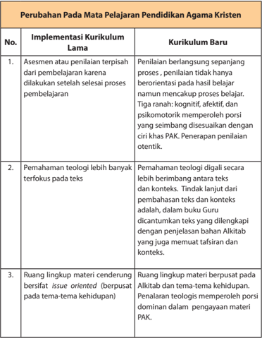

Tabel ini menunjukkan perubahan pada mata pelajaran Pendidikan Agama Kristen (PAK) dalam kurikulum baru. Topik utamanya adalah implementasi kurikulum yang lebih berfokus pada proses belajar dan penilaian, pemahaman teologi yang lebih terfokus pada konteks teks, dan ruang lingkup materi yang lebih bersifat issue-oriented. Kolom-kolomnya meliputi implementasi kurikulum lama dan kurikulum baru, dengan detail tentang asesmen penilaian, pemahaman teologi, dan ruang lingkup materi. Data penting yang terlihat adalah bahwa penilaian sekarang berlangsung selama proses belajar, tidak hanya setelah proses belajar selesai, dan bahwa pemahaman teologi lebih banyak terfokus pada konteks teks dan konteks. Selain itu, ruang lingkup materi sekarang lebih bersifat issue-oriented dan dominan dalam pengayaan materi PAK.

 

---
## 📄 Halaman 17

### Hakikat dan Tujuan Pendidikan Agama Kristen (PAK)

Pendidikan Agama Kristen merupakan wahana pembelajaran yang memfasilitasi  peserta  didik  untuk  mengenal  Allah  melalui  karya-Nya  serta mewujudkan  pengenalannya  akan  Allah  Tritunggal  melalui  sikap  hidup  yang mengacu pada nilai-nilai kristiani.  Dengan  demikian,  melalui  PAK  peserta  didik mengalami  perjumpaan  dengan  Tuhan  Allah  yang  dikenal,  dipercaya,  dan diimaninya.  Perjumpaan  itu  diharapkan  mampu  mempengaruhi  peserta  didik untuk bertumbuh menjadi garam dan terang kehidupan.

Secara  khusus  buku  PAK  aras  SMA/SMK  atau  Kelas  X,  XI  dan  XII  mengajak peserta didik untuk memahami hidup sebagai pengikut Kristus. Untuk itu, topik tentang hidup beriman dan berpengharapan menjadi wadah untuk membahas secara lebih rinci bagaimana seharusnya menjalani hidup sebagai pengikut Kristus. Peserta  didik  juga  diajak  untuk  mewujudkan  nilai-nilai  iman  dalam  berbagai bentuk tanggung jawab sosial pada lingkup keluarga, gereja, dan masyarakat.

Pendidikan  Agama  Kristen  merupakan  mata  pelajaran  yang  bersumber  dari Alkitab  yang  dapat  mengembangkan  berbagai  kemampuan  dan  kecerdasan peserta didik. Antara lain dalam memperteguh iman kepada Tuhan Allah, memiliki budi pekerti luhur, menghormati serta menghargai semua manusia dengan segala persamaan dan perbedaannya (termasuk agree in disagreement/ setuju untuk tidak setuju).

### A.  Hakikat Pendidikan Agama Kristen

Hakikat  Pendidikan  Agama  Kristen  seperti  yang  tercantum  dalam  hasil Lokakarya Strategi  PAK  di  Indonesia  tahun  1999  adalah:  Usaha  yang  dilakukan secara terencana dan berkelanjutan dalam rangka mengembangkan kemampuan peserta  didik  agar  dengan  pertolongan  Roh  Kudus  dapat  memahami  dan menghayati  kasih  Tuhan  Allah  di  dalam  Yesus  Kristus  yang  dinyatakan  dalam kehidupan  sehari-hari,  terhadap  sesama  dan  lingkungan  hidupnya.  Dengan demikian,  setiap  orang  yang  terlibat  dalam  proses  pembelajaran  PAK  memiliki keterpanggilan untuk mewujudkan tanda-tanda Kerajaan Allah dalam kehidupan pribadi maupun sebagai bagian dari komunitas.

 

---
## 📄 Halaman 18

### B.  Fungsi dan Tujuan Pendidikan Agama Kristen

Menurut  Peraturan  Pemerintah    Nomor  55 Tahun  2007  tentang  pendidikan agama  dan  pendidikan  keagamaan,  disebutkan  bahwa:  pendidikan  agama berfungsi  membentuk manusia Indonesia yang beriman dan bertakwa kepada Tuhan Yang Maha Esa serta berakhlak mulia dan mampu menjaga kedamaian dan kerukunan hubungan inter dan antarumat beragama (Pasal 2 ayat 1). Selanjutnya disebutkan bahwa pendidikan agama bertujuan mengembangkan kemampuan peserta didik dalam memahami, menghayati, dan mengamalkan nilai-nilai agama yang menyerasikan penguasaannya dalam ilmu pengetahuan, teknologi, dan seni (Pasal 2 ayat 2).

Mata pelajaran PAK berfungsi  untuk:

- memperkenalkan  Allah  dan  karya-karya-Nya  agar  peserta  didik  bertumbuh iman percayanya dan meneladani Allah dalam hidupnya; dan
- menanamkan pemahaman tentang Allah dan karya-Nya kepada peserta didik, sehingga mampu memahami, menghayati, dan mengamalkannya.
Tujuan PAK:

- menghasilkan  manusia  yang  dapat  memahami  kasih  Allah  didalam  Yesus Kristus dan mengasihi Allah dan sesama; dan
- menghasilkan manusia Indonesia yang mampu menghayati imannya secara bertanggung jawab serta berakhlak mulia dalam masyarakat majemuk.
Pendidikan Agama Kristen di sekolah  disajikan dalam dua aspek, yaitu aspek Allah Tritunggal dan karya-Nya , dan aspek nilai-nilai kristiani . Secara holistik, pengembangan  Kompetensi  Inti  dan  Kompetensi  Dasar  PAK  pada  Pendidikan Dasar  dan  Menengah  mengacu  pada  dogma  tentang  Allah  dan  karya-Nya. Pemahaman terhadap Allah dan karya-Nya harus tampak dalam nilai-nilai kristiani yang dapat dilihat dalam kehidupan keseharian peserta didik. Inilah dua aspek yang ada dalam seluruh materi pembelajaran PAK dari SD sampai SMA/SMK.

### C.  Landasan Teologis

Pendidikan  Agama  Kristen  telah  ada  sejak  pembentukan  umat  Allah  yang dimulai dengan panggilan terhadap Abraham. Hal ini berlanjut dalam lingkungan dua belas suku Israel sampai dengan zaman Perjanjian Baru. Sinagoge atau rumah ibadah  orang Yahudi  bukan  hanya  menjadi  tempat  ibadah  melainkan  menjadi pusat kegiatan pendidikan bagi anak-anak dan keluarga orang Yahudi. Beberapa nats di bawah ini dipilih untuk mendukungnya.

 

---
## 📄 Halaman 19

### 1.  Kitab Ulangan 6: 4-9.

Allah  memerintahkan  umat-Nya  untuk  mengajarkan  tentang  kasih  Allah kepada anak-anak dan kaum muda. Perintah ini kemudian menjadi kewajiban normatif  bagi  umat  Kristen  dan  lembaga  gereja  untuk  mengajarkan  kasih Allah. Dalam kaitannya dengan Pendidikan Agama Kristen bagian Alkitab ini telah  menjadi dasar dalam menyusun dan mengembangkan Kurikulum dan Pembelajaran Pendidikan Agama Kristen.

### 2.  Amsal 22: 6

Didiklah  orang  muda  menurut  jalan  yang  patut  baginya  maka  pada  masa tuanya pun  ia tidak akan menyimpang dari pada jalan itu. Betapa pentingnya penanaman nilai-nilai iman yang bersumber dari Alkitab bagi generasi muda, seperti  tumbuhan yang sejak awal pertumbuhannya harus diberikan pupuk dan air, demikian pula kehidupan iman orang percaya harus dimulai sejak dini. Bahkan ada pakar PAK yang mengatakan pendidikan agama harus diberikan sejak dalam kandungan Ibu sampai akhir hidup seseorang.

### 3.  Matius 28:19-20

Tuhan Yesus  Kristus  memberikan  amanat  kepada  tiap  orang  percaya  untuk pergi ke seluruh penjuru dunia dan mengajarkan tentang kasih Allah. Perintah ini telah menjadi dasar bagi tiap orang percaya untuk turut bertanggung jawab terhadap Pendidikan Agama Kristen.

Sejarah  perjalanan  agama  Kristen  turut  dipengaruhi  oleh  peran  Pendidikan Agama  Kristen  sebagai  pembentuk  sikap,  karakter,  dan  iman  orang  Kristen dalam  keluarga,  gereja,  dan  lembaga  pendidikan.  Oleh  karena  itu,  Lembaga gereja, lembaga keluarga dan sekolah secara bersama-sama bertanggung jawab dalam tugas mengajar dan mendidik anak-anak, remaja, dan kaum muda untuk mengenal  Allah  Pencipta,  Penyelamat,  Pembaru,  dan  mewujudkan  ajaran  itu dalam kehidupan sehari-hari.

Sejarah perkembangan Pendidikan Agama  Kristen juga diwarnai oleh dua pemetaan pemikiran yang mana  masing-masing pemikiran memiliki pembenarannya dalam sejarah. Yaitu pemikiran bahwa ruang lingkup pembahasan PAK seharusnya mengacu pada kronologi Alkitab sedangkan pemikiran lainnya adalah pembahasan PAK seharusnya mengacu pada tema-tema tertentu menyangkut problematika kehidupan. Dua pemikiran ini dikenal dengan ' bible oriented '  dan ' issue oriented ' .  Jika  ditelusuri  sejak zaman PL, PB, sampai dengan sebelum reformasi,  pengajaran iman Kristen umumnya mengacu pada kronologi Alkitab namun sejak reformasi  berbagai tema kehidupan telah menjadi lingkup pembahasan PAK.  Artinya terjadi pergeseran dari Bible Oriented ke issue oriented . Hal  ini  berkaitan  dengan  pemahaman  bahwa  Iman    harus  mewujud  didalam tindakan    atau  praksis  kehidupan.  Menurut  Groome  praksis  bukan  sekedar tindakan atau aksi melainkan  praktek kehidupan yang melibatkan ranah kognitif,

 

---
## 📄 Halaman 20

afektif, maupun psikomotorik secara menyeluruh. Berkaitan dengan dua pemikiran tersebut, ruang lingkup pembahasan PAK di SD-SMA  dipetakan dalam dua bagian, yaitu Allah Tri Tunggal dan karya-karya-Nya, serta nilai-nilai kristiani. Dua bagian ini  mengakomodir  ruang  lingkup  pembahasan  PAK  yang  bersifat  pendekatan yang berpusat pada Alkitab dan tema-tema penting dalam kehidupan. Melalui pembahasan  inilah  diharapkan  peserta  didik  dapat  mengalami  'perjumpaan dengan Allah' . Hasil dari perjumpaan itu adalah terjadinya transformasi kehidupan.

Pemetaan ruang lingkup PAK yang mengacu pada tema-tema kehidupan ini tidak  mudah  untuk  dilakukan  karena  amat  sulit  merubah  mindset  kebanyakan teolog, pakar PAK, maupun guru-guru PAK. Umumnya mereka masih merasa asing dengan berbagai pembahasan materi yang  mengacu pada tema-tema kehidupan, misalnya:  demokrasi,  hak  asasi  manusia,  keadilan,  gender,  dan  ekologi.  Seolaholah pembahasan mengenai tema-tema tersebut bukanlah menjadi ciri khas PAK. Padahal, teologi yang menjadi dasar bagi bangunan PAK  baru  berfungsi ketika bertemu dengan realitas  kehidupan.  Jadi,  pemetaan  lingkup  pembahasan  PAK tidak dapat mengabaikan salah satu dari dua pemetaan tersebut diatas; baik issue oriented maupun bible oriented.

Mengacu pada hasil Lokakarya Strategi PAK di Indonesia yang diadakan oleh Departemen BINDIK PGI bersama dengan Bimas Kristen Depag RI bahwa isi PAK di sekolah membahas mengenai nilai-nilai iman tanpa mengabaikan dogma atau ajaran.  Namun, pembahasan mengenai tradisi dan ajaran (dogma) secara lebih spesifik diserahkan pada gereja (menjadi bagian dari pembahasan PAK di Gereja). Keputusan tersebut muncul berdasarkan pertimbangan:

- Gereja Kristen terdiri dari berbagai denominasi dengan berbagai tradisi dan ajaran  karena  itu  menyangkut  doktrin  yang  lebih  spesifik  tidak  diajarkan  di sekolah.
- Menghindari tumpang tindih ( overlapping ) materi PAK di sekolah dan di gereja.

 

---
## 📄 Halaman 21

### Pelaksanaan Pembelajaran dan Penilaian Pendidikan Agama Kristen (PAK)

### A.  Pendidikan Agama Pada Pembelajaran

Pemerintah  menetapkan  beberapa  mata  pelajaran  sebagai  mata  pelajaran yang  ditetapkan  secara  nasional,  artinya  melalui  mata  pelajaran  tersebut,  jiwa nasionalisme  dan  rasa  cinta  terhadap  tanah  air  dipupuk  dan  dibangun.  Hal  ini penting mengingat globalisasi yang mempengaruhi berbagai bidang kehidupan cenderung melunturkan rasa nasionalisme. Anak-anak, remaja, dan kaum muda lebih  tertarik  untuk  mencintai  segala  produk  yang  berasal  dari  luar,  baik  itu mencakup seni budaya, pemikiran, dan atau gaya hidup ( life style ). Memang diakui bahwa semua yang dihasilkan oleh globalisasi tidaklah buruk namun harus ada kekuatan pengimbang yang mampu menetralisir pengaruh globalisasi bagi anakanak, remaja, dan kaum muda Indonesia.

### B.  Pelaksanaan Kurikulum PAK

Tiap  ruang  lingkup  PAK,  yaitu  PAK  di  gereja,  PAK  dalam  keluarga,  dan  PAK di  sekolah  dan  Perguruan  Tinggi  memiliki  ciri  khas  masing-masing.  Adapun PAK  di  sekolah  lebih  terfokus  pada  pemahaman  akan  nilai-nilai  kristiani  dan perwujudannya  dalam  kehidupan  sehari-hari  di  tengah  masyarakat  Indonesia yang majemuk. Hal ini penting mengingat PAK merupakan bagian integral sistem pendidikan  Indonesia dengan sendirinya membawa sejumlah konsekuensi antara lain harus bersinggungan dengan pergumulan bangsa dan negara. Oleh karena itu, melalui pendekatan nilai-nilai iman diharapkan anak-anak Kristen bertumbuh sebagai anak Kristen Indonesia yang sadar akan tugas dan kewajibannya sebagai warga gereja dan warga negara yang bertanggung jawab. Berdasarkan kerangka berpikir  tersebut,  maka  pembelajaran  PAK  di  sekolah  diharapkan  mampu menghasilkan sebuah proses transformasi pengetahuan, nilai, dan sikap. Hal itu memperkuat nilai-nilai kehidupan yang dianut oleh peserta didik terutama dengan

 

---
## 📄 Halaman 22

dipandu oleh ajaran Iman Kristen, sehingga peserta didik mampu menunjukkan kesetiaannya kepada Allah, menjunjung tinggi nasionalisme dengan taat kepada Pancasila dan UUD 1945.

Pembahasan isi kurikulum selalu dimulai dari lingkup yang paling kecil, yaitu diri  peserta didik sebagai ciptaan Allah, kemudian keluarga, teman, lingkungan di sekitar peserta didik , masyarakat di lingkungan sekitar, dan bangsa Indonesia serta dunia secara keseluruhan dengan berbagai dinamika persoalan (pendekatan induktif).  Pola  pendekatan  ini  secara  konsisten  nampak  pada  jenjang  SD-SMA/ SMK.

Materi dan metodologi pengajaran PAK serta disiplin ilmu psikologi membantu perkembangan  psikologis  peserta  didik  dengan  baik.  PAK  disusun  sedemikian rupa dengan tidak melupakan karakteristik kebutuhan psikologis peserta didik. Materi  PAK  disesuaikan  dengan  kebutuhan  psikologis  peserta  didik,  sehingga tujuan  materi  dapat  dicapai  secara  maksimal.  Metodologi  pun  hendaknya memperhatikan    karakteristik  peserta  didik,  sehingga  tumbuh  kembang  anak secara kognitif, afektif, psikomotorik, dan spiritual anak terjadi dengan baik. Dalam istilah lain disebut Cipta, Rasa, dan Karsa.

Melalui Pendidikan Agama Kristen diharapkan terjadi perubahan dan pembaruan  baik  pemahaman  maupun  sikap  dan  perilaku.  Dengan  demikian, sekolah, gereja, dan keluarga Kristen dapat menjalankan perannya masing-masing di  bidang  pendidikan  iman.  Terutama  keluarga  merupakan  lembaga  pertama dan  utama  yang  bertanggung  jawab  atas  pebentukan  nilai-nilai  agama  dan moral. Sekolah  menjalankan perannya dalam membantu keluarga mengajar dan mendidik  anak-anak dan remaja. Pemerintah melalui sekolah turut menjalankan perannya di bidang Pendidikan Agama pada umumnya dan Pendidikan Agama Kristen secara khusus karena amanat UU.

### C.  Pembelajaran PAK

Ada  dua  model  pendekatan  pembelajaran,  yaitu  model  pendekatan  yang berpusat  pada  guru  ( teacher  centered )  dan  pendekatan  yang  berpusat  pada peserta didik atau peserta didik ( student centered )

Kedua model pendekatan pembelajaran tersebut di atas adalah pendekatan yang  dapat  dipelajari  oleh  guru  PAK,  khususnya  model  pembelajaran  yang berpusat  pada  peserta  didik  ( student  centered )  untuk  diterapkan  dalam  proses pembelajaran  di  sekolah.  Sebagaimana  kita  ketahui  bahwa  kekhasan  PAK membuat PAK berbeda  dengan  mata  pelajaran  lain,  yaitu  PAK  menjadi  sarana atau media dalam membantu peserta didik berjumpa dengan Allah di mana pertemuan itu bersifat personal, sekaligus nampak dalam sikap hidup sehari-hari yang dapat disaksikan serta dapat dirasakan oleh orang lain, baik guru, teman, keluarga,

 

---
## 📄 Halaman 23

maupun masyarakat. Dengan demikian, pendekatan pembelajaran PAK bersifat student  centered (berpusat  pada  peserta  didik),  yang  memanusiakan  manusia, demokratis,  menghargai  peserta  didik  sebagai  subyek  dalam  pembelajaran, menghargai keanekaragaman peserta didik, dan memberi tempat bagi peranan Roh Kudus. Dalam proses seperti ini, maka kebutuhan peserta didik merupakan kebutuhan utama yang harus terakomodir dalam proses pembelajaran.

Proses  Pembelajaran  PAK    adalah  proses  di  mana  peserta  didik  mengalami pembelajaran melalui aktivitas-aktivitas kreatif yang difasilitasi oleh Guru. Penjabaran  kompetensi  dalam  pembelajaran  PAK  dirancang  sedemikian  rupa sehingga  proses dan hasil pembelajaran  memiliki bentuk-bentuk karya, unjuk kerja, dan perilaku/sikap yang merupakan bentuk-bentuk kegiatan belajar yang dapat diukur  melalui penilaian ( assessment ) sesuai  kriteria pencapaian.

### Pembelajaran PAK di buku guru

Urutan  pembahasan  di  buku  guru  dimulai  dengan  pengantar  di  mana pada bagian pengantar peserta didik  diarahkan  untuk  masuk  ke  dalam  materi pembahasan,  kemudian  uraian  materi,  penjelasan  bahan  Alkitab,  kegiatan pembelajaran, dan penilaian atau assessment .

### 1.  Pengantar

Pengantar merupakan pintu masuk bagi uraian pembelajaran secara lengkap, bagian pengantar bisa berupa naratif tapi juga aktivitas yang dipadukan dengan materi.

### 2.  Uraian Materi

Penjelasan bahan pelajaran secara utuh yang disampaikan oleh Guru. Materi yang ada dalam buku Guru lebih lengkap dibandingkan dengan yang ada dalam buku peserta didik. Guru perlu mengetahui lebih banyak mengenai materi yang dibahas sehingga dapat memilih mana materi yang paling penting untuk diberikan pada peserta didik. Guru harus teliti menggabungkan materi yang ada dalam buku peserta didik dengan yang ada dalam buku guru. Hendaknya diingat bahwa yang menjadi target capaian adalah Kompetensi dan bukan materi, jadi guru tidak perlu menjejali peserta didik dengan materi ajar yang terlalu banyak. Jika dilihat model yang ada dalam buku peserta didik, maka nampak jelas proses pembelajaran dan penilaian berlangsung secara bersama-sama. Hal ini menguntungkan guru karena guru tidak harus menunggu selesai proses pembelajaran baru diadakan penilaian, tetapi dalam setiap langkah kegiatan ada penalaran materi dan ada juga penilaian. Sejak  bertahun-tahun kita  terjebak  dalam  bentuk  penilaian  kognitif  yang  tidak menguntungkan peserta didik terutama melalui model ujian pilihan ganda dan model evaluasi yang kurang membantu peserta didik mencapai transformasi atau

 

---
## 📄 Halaman 24

perubahan perilaku. Karena itu, sudah saatnya guru berubah, dalam pembelajaran ini akan lebih banyak fokus pada diri peserta didik, selalu dimulai dari peserta didik dan berakhir pada peserta didik, demikian pula bentuk penilaian lebih banyak bersifat  penilaian  diri  sendiri  sehingga  peserta  didik  dapat  melihat  apakah  ada perubahan dalam hidupnya.

### 3.  Penjelasan bahan Alkitab

Penjelasan bahan Alkitab diperlukan untuk membantu guru-guru memahami referensi Alkitab yang dipakai. Melalui penjelasan bahan Alkitab guru memperoleh pengetahuan mengenai latar belakang nats Alkitab yang diambil kemudian dapat menarik relevansinya dengan topik yang dibahas. Penjelasan bahan Alkitab hanya untuk guru dan tidak untuk diajarkan pada peserta didik. Semua bahan penjelasan Alkitab dalam buku ini diadaptasi dari situs internet www.sabda.or.id.

### 4.  Kegiatan Pembelajaran

Dalam  buku  guru  dibahas  langkah-langkah  kegiatan  pembelajaran  peserta didik, untuk  kegiatan yang  sudah  jelas tidak perlu dijelaskan. Penjelasan hanya  diberikan  pada  kegiatan  yang  membutuhkan  perhatian  khusus  atau jika  ada  beberapa  penekanan  penting  yang  harus  diberikan  sehingga  guru memperhatikannya ketika mengajar. Mengenai langkah-langkah kegiatan, guru juga dapat mengganti urutan langkah-langkah kegiatan jika dirasa perlu tetapi harus dipertimbangkan dengan baik. Ketika menyusun langkah-langkah kegiatan, penulis  sudah  mempertimbangkan sequence atau  urutan  pembelajaran  secara matang apalagi penilaian berlangsung sepanjang proses pembelajaran dan ada kalanya penilaian dan pembelajaran berjalan bersama-sama dalam satu kegiatan.

### 5.  Penilaian

Penilaian membahas  ketercapaian Kompetensi Dasar melalui sejumlah Indikator. Dalam penjelasan pokok materi pembelajaran, dapat dibaca perubahan cara penilaian yang ada dalam kurikulum 2013, yaitu proses pembelajaran dan penilaian berlangsung  secara bersama-sama.  Jadi, proses penilaian  bukan dilakukan  setelah  selesai  pembelajaran,  tetapi  sejak  pembelajaran  dimulai  dan bentuk penilaian cukup variatif mengenai skala sikap, penilaian diri, tes tertulis, penilaian  produk,  proyek,  observasi,  dan  lain-lain.  Guru  harus  berani  membuat perubahan dalam bentuk penilaian. Memang, biasanya otoritas akan membuat soal bersama untuk ujian, tetapi praktik ini bertentangan dengan jiwa kurikulum 2013, khususnya kurikulum PAK yang memang terfokus pada perubahan perilaku peserta  didik.  Pendidikan  agama  yang  mengajarkan  nilai-nilai  iman  barulah

 

---
## 📄 Halaman 25

berguna ketika apa yang diajarkan itu membawa transformasi atau perubahan dalam diri anak karena iman baru nyata di dalam perbuatan, sebab iman tanpa pebuatan pada hakikatnya adalah mati (Yakobus 2:26). Untuk itu berbagai bentuk soal  seperti  pilihan  ganda  dan  soal-soal  yang  bersifat  kognitif  tidak  banyak membantu peserta didik untuk mengalami transformasi.

### D.  Penilaian PAK

Penilaian merupakan suatu kegiatan pendidik yang terkait dengan pengambilan  keputusan  tentang  pencapaian  kompetensi  atau  hasil  belajar peserta didik yang mengikuti proses pembelajaran tertentu. Keputusan tersebut berhubungan dengan tingkat keberhasilan peserta didik dalam mencapai suatu kompetensi. Penilaian merupakan suatu proses yang dilakukan melalui langkahlangkah perencanaan, penyusunan  alat penilaian, pengumpulan  informasi melalui  sejumlah  bukti  yang  menunjukkan  pencapaian  hasil  belajar  peserta didik, pengolahan, dan penggunaan informasi tentang hasil belajar peserta didik. Penilaian kelas dilaksanakan melalui berbagai cara, seperti penilaian unjuk kerja ( performance ), penilaian sikap, penilaian tertulis ( paper and pencil test ), penilaian proyek, penilaian produk, penilaian melalui kumpulan hasil kerja/karya peserta didik  ( portfolio ),  dan  penilaian  diri.  Untuk  mengamati  unjuk  kerja  peserta  didik dapat menggunakan alat atau instrumen berikut:

### 1.  Penilaian Sikap

Penilaian aspek sikap dilakukan melalui observasu/pengamatan, penilaian diri, dan penilaian antarteman. Sikap terdiri dari tiga komponen, yakni: afektif, kognitif, dan konatif. Komponen afektif adalah perasaan yang dimiliki oleh seseorang atau penilaiannya  terhadap  sesuatu  objek.  Komponen  kognitif  adalah  kepercayaan atau  keyakinan  seseorang  mengenai  objek.  Adapun  komponen  konatif  adalah kecenderungan  untuk  berperilaku  atau  berbuat  dengan  cara-cara  tertentu berkenaan dengan kehadiran objek sikap.

Secara umum, objek sikap yang perlu dinilai dalam proses pembelajaran adalah sebagai berikut.

- Sikap terhadap materi pelajaran
- Sikap terhadap pendidik/pengajar
- Sikap terhadap proses pembelajaran
- Sikap  berkaitan  dengan  nilai  atau  norma  yang  berhubungan  dengan  suatu materi pelajaran.

 

---
## 📄 Halaman 26

- Sikap berhubungan dengan kompetensi afektif lintas kurikulum yang relevan dengan mata pelajaran.
Penilaian sikap dapat dilakukan dengan beberapa cara atau teknik yang antara lain: observasi perilaku, pertanyaan langsung, dan laporan pribadi. Teknik-teknik tersebut secara ringkas dapat diuraikan sebagai berikut.

### a.  Observasi Perilaku

Pendidik dapat melakukan observasi terhadap peserta didik yang dibinanya. Hasil  pengamatan  dapat  dijadikan  sebagai  umpan  balik  dalam  pembinaan. Observasi  perilaku  di  sekolah  dapat  dilakukan  dengan  menggunakan  buku catatan  khusus  tentang  kejadian-kejadian  berkaitan  dengan  peserta  didik selama di sekolah.

Berikut contoh format buku catatan harian.

Buku Catatan Harian Tentang Peserta Didik

Nama sekolah

: ___________________

Mata Pelajaran

: ___________________

Kelas

: ___________________

Tahun Pelajaran

: ___________________

Nama Pendidik

: ___________________

Contoh isi Buku Catatan Harian

Hari :

Tanggal :

Nama peserta didik  :

Kejadian :

Kolom kejadian diisi dengan kejadian positif maupun negatif. Catatan dalam lembaran  buku  tersebut,  selain  bermanfaat  untuk  merekam  dan  menilai perilaku  peserta  didik  sangat  bermanfaat  pula  untuk  menilai  sikap  peserta didik serta dapat menjadi bahan dalam penilaian perkembangan peserta didik secara keseluruhan. Selain itu, dalam observasi perilaku dapat juga digunakan daftar cek yang memuat perilaku-perilaku tertentu yang diharapkan muncul dari peserta didik pada umumnya atau dalam keadaan tertentu.

### b.  Pertanyaan Langsung

Apakah kamu setia berdoa dan membaca Alkitab?

- Ya
- Tidak
- Apa alasanmu?

 

---
## 📄 Halaman 27

### c.   Laporan Pribadi

Melalui laporan pribadi, peserta didik diminta membuat ulasan yang berisi pandangan atau tanggapannya tentang suatu masalah, keadaan, atau hal yang menjadi objek sikap/minat. Misalnya, peserta didik diminta menulis pandangan tentang buah roh dan aspek yang mana dari buah yang dapat dan belum dapat kamu terapkan dalam sikap hidup. Jelaskan alasan, mengapa?

### d.  Penilaian Diri (Self Assessment)

Penilaian diri adalah suatu teknik penilaian di mana  peserta didik dimintauntuk  menilai  dirinya  sendiri  berkaitan  dengan  status,  proses  dan tingkatpencapaian  kompetensi  yang  dipelajarinya  dalam  mata  pelajaran tertentu didasarkan atas kreteria atau acuan yang telah disiapkan. Penilaian diri dilakukanberdasarkan kriteria yang jelas dan objektif. Oleh karena itu, penilaian diri oleh peserta didik di kelas perlu dilakukan melalui langkah-langkah sebagai berikut.

- Menentukan kompetensi atau aspek kemampuan yang akan dinilai.
- Menentukan kriteria penilaian yang akan digunakan.
- Merumuskan format penilaian, dapat berupa pedoman penskoran, daftar tanda cek, atau skala penilaian.
- Meminta peserta didik untuk melakukan penilaian diri.
- Guru  mengkaji  sampel  hasil  penilaian  secara  acak,  untuk  mendorong peserta didik supaya senantiasa melakukan penilaian diri secara cermat dan objektif.
- Menyampaikan umpan balik kepada peserta didik berdasarkan hasil kajian terhadap sampel hasil penilaian yang diambil secara acak.

### Contoh Format Penilaian Diri:

Berdasarkan buah Roh yang tertulis dalam Kitab Galatia 5:22-23, nilailah dirimu sendiri.  Apakah  kamu  telah  mengalami  pembaharuan  hidup  sebagai  hasil pekerjaan Roh Kudus sebagaimana tertulis dalam Kitab Galatia 5:22-23? Tuliskan secara jujur.

 

---
## 📄 Halaman 28

### 2.  Penilaian Pengetahuan

Penilaian  aspek  pengetahuan  dilakukan  melalui  tes  tertulis,  tes  lisan,  dan penugasan  sesuai  dengan  kompetensi  yang  dinilai.  Penilaian  secara  tertulis dilakukan dengan tes tertulis. Tes Tertulis merupakan tes di mana soal dan jawaban yang diberikan kepada peserta didik dalam bentuk tulisan. Dalam menjawab soal peserta didik tidak selalu merespons dalam bentuk menulis jawaban tetapi dapat juga dalam bentuk yang lain seperti memberi tanda, mewarnai, menggambar dan lain sebagainya. Ada dua bentuk soal tes tertulis, yaitu:

### a.  Memilih jawaban, yang dibedakan menjadi:

- Pilihan ganda
- Dua pilihan (benar-salah, ya-tidak)
- Menjodohkan
- Sebab-akibat

### b.  Mensuplai jawaban, dibedakan menjadi:

- Isian atau melengkapi
- Jawaban singkat atau pendek
- Uraian
Dalam menyusun instrumen penilaian tertulis perlu dipertimbangkan hal-hal berikut. Karakteristik mata pelajaran dan keluasan ruang lingkup materi yang akan diuji:

- Materi,  misalnya  kesesuaian  soal  dengan  kompetensi  dasar  dan  indikator pencapaian pada kurikulum.
- Konstruksi, misalnya rumusan soal atau pertanyaan harus jelas dan tegas.
- Bahasa, misalnya rumusan  soal tidak menggunakan  kata/kalimat yang menimbulkan penafsiran ganda.

### Contoh Penilaian Tertulis

Mata Pelajaran

: Pendidikan Agama Kristen

Kelas/Semester

: XI/1

Mensuplai jawaban singkat atau pendek:

- Sebutkan maksud yang terkandung dalam teks Alkitab!
2. ..................................

### Cara Penskoran:

Skor diberikan kepada peserta didik tergantung dari ketepatan dan kelengkapan jawaban yang diberikan/ditetapkan guru. Semakin lengkap dan tepat jawaban, semakin tinggi perolehan skor.

### 3.  Penilaian Keterampilan

Penilaian keterampilan dilakukan melalui praktik/unjuk kerja produk, proyek, portofolio.

 

---
## 📄 Halaman 29

### a.  Penilaian Unjuk Kerja

### 1) Daftar Cek (Check-list)

Penilaian  unjuk  kerja  dapat  dilakukan  dengan  menggunakan  daftar  cek (baik -tidak baik). Dengan daftar cek, peserta didik mendapat nilai bila kriteria penguasaan kompetensi tertentu dapat diamati oleh penilai. Jika tidak dapat diamati,  peserta  didik  tidak  memperoleh  nilai.  Kelemahan  cara  ini  adalah penilai  hanya  mempunyai  dua  pilihan  mutlak,  misalnya  benar-salah,  dapat diamati-tidak dapat diamati, baik-tidak baik. Dengan demikian tidak terdapat nilai  tengah,  namun  daftar  cek  lebih  praktis  digunakan  mengamati  subjek dalam jumlah besar.

### Contoh

### Format Penilaian Praktik Doa

Nama peserta didik  : ________________

Kelas

: ________________

---
**📊 Tabel**

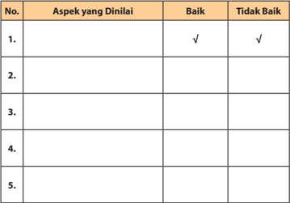

Tabel ini menunjukkan evaluasi beberapa aspek yang dinilai, dengan dua opsi: baik dan tidak baik. Topik utama tabel adalah evaluasi kualitas atau keberhasilan dalam beberapa aspek tertentu. Kolom "Baik" menunjukkan aspek yang dinyatakan baik, sedangkan kolom "Tidak Baik" menunjukkan aspek yang dinyatakan tidak baik. Data atau pola penting yang terlihat adalah bahwa ada beberapa aspek yang dinilai baik, sementara beberapa aspek lainnya dinilai tidak baik. Ini menunjukkan bahwa evaluasi ini mencakup berbagai aspek yang perlu diperbaiki atau ditingkatkan.

### 2) Skala Penilaian ( Rating Scale )

Penilaian unjuk kerja yang menggunakan skala penilaian memungkinkan penilai  memberi  nilai  tengah  terhadap  penguasaan  kompetensi  tertentu, karena pemberian nilai secara kontinu di mana pilihan kategori nilai lebih dari dua. Skala penilaian terentang dari tidak sempurna sampai sangat sempurna.

 

---
## 📄 Halaman 30

Misalnya: 1 = tidak kompeten, 2 = cukup kompeten, 3 = kompeten dan 4 = sangat  kompeten.  Untuk  memperkecil  faktor  subjektivitas,  perlu  dilakukan penilaian oleh lebih dari satu orang, agar hasil penilaian lebih akurat. Contoh Rating Scale:

- 5 = Jika peserta didik dapat ditetapkan sangat baik
- 4 = Jika peserta didik dapat ditetapkan baik
- 3 = Jika peserta didik dapat ditetapkan cukup
- 2 = Jika peserta didik dapat ditetapkan kurang
- 1 = Jika peserta didik dapat ditetapkan sangat kurang

### b.  Penilaian Produk

Penilaian produk adalah penilaian terhadap proses pembuatan dan kualitas suatu produk. Penilaian produk meliputi penilaian kemampuan peserta didik membuat produk-produk, teknologi, dan seni, seperti: makanan, pakaian, hasil karya seni (patung, lukisan, gambar), barang-barang terbuat dari kayu, keramik, plastik, dan logam. Pengembangan produk meliputi 3 (tiga) tahap dan setiap tahap perlu diadakan penilaian, yaitu:

- Tahap persiapan, meliputi: penilaian kemampuan  peserta  didik  dan merencanakan, menggali, dan mengembangkan gagasan, dan mendesain produk.
- Tahap pembuatan produk (proses), meliputi: penilaian kemampuan peserta didik dalam menyeleksi dan menggunakan bahan, alat, dan teknik.
- Tahap penilaian produk  ( appraisal ), meliputi: penilaian  produk  yang dihasilkan peserta didik sesuai kriteria yang ditetapkan.
- Penilaian produk biasanya menggunakan cara holistik atau analitik.
- Cara analitik, yaitu berdasarkan aspek-aspek produk, biasanya dilakukan terhadap  semua  kriteria  yang  terdapat  pada  semua  tahap  proses pengembangan.
- Cara holistik, yaitu berdasarkan kesan keseluruhan dari produk, biasanya dilakukan pada tahap appraisal .

### c.  Penilaian Proyek

Penilaian proyek merupakan kegiatan penilaian terhadap suatu tugas yang harus diselesaikan dalam periode/waktu tertentu. Tugas tersebut berupa suatu investigasi  sejak  dari  perencanaan,  pengumpulan  data,  pengorganisasian, pengolahan, dan penyajian data.

Penilaian proyek dapat digunakan untuk mengetahui pemahaman, kemampuan  mengaplikasikan,  kemampuan  penyelidikan  dan  kemampuan menginformasikan  peserta  didik  pada  mata  pelajaran  tertentu  secara  jelas.

 

---
## 📄 Halaman 31

Dalam penilaian proyek setidaknya ada 3 (tiga) hal yang perlu dipertimbangkan yaitu:

- Kemampuan pengelolaan
Kemampuan  peserta  didik  dalam  memilih  topik,  mencari  informasi  dan mengelola waktu pengumpulan data serta penulisan laporan.

- Relevansi
Kesesuaian  dengan  mata  pelajaran,  dengan  mempertimbangkan  tahap pengetahuan, pemahaman, dan keterampilan dalam pembelajaran.

- Keaslian
Proyek  yang  dilakukan  peserta  didik  harus  merupakan  hasil  karyanya, dengan  mempertimbangkan  kontribusi  pendidik  berupa  petunjuk  dan dukungan terhadap proyek peserta didik. Penilaian proyek dilakukan mulai dari perencanaan, proses pengerjaan, sampai hasil akhir proyek. Untuk itu, pendidik perlu menetapkan hal-hal atau tahapan yang perlu dinilai, seperti penyusunan  desain,  pengumpulan  data,  analisis  data,  dan  menyiapkan laporan  tertulis.  Laporan  tugas  atau  hasil  penelitian  juga  dapat  disajikan dalam  bentuk  poster.  Pelaksanaan  penilaian  dapat  menggunakan  alat/ instrumen  penilaian  berupa  daftar  cek  ataupun  skala  penilaian.  Contoh kegiatan  peserta  didik  dalam  penilaian  proyek:  Penelitian  sederhana tentang perilaku terpuji keluarga di rumah terhadap hewan atau binatang peliharaan

### d.  Penilaian Portofolio

Penilaian  portofolio  merupakan  penilaian  berkelanjutan  yang  didasarkan pada  kumpulan  informasi  yang  menunjukkan  perkembangan  kemampuan peserta  didik  dalam  satu  periode  tertentu.  Informasi  tersebut  dapat  berupa karya  peserta  didik  dari  proses  pembelajaran  yang  dianggap  terbaik  oleh peserta  didik,  hasil  tes  (bukan  nilai)  atau  bentuk  informasi  lain  yang  terkait dengan kompetensi tertentu dalam satu mata pelajaran. Penilaian portofolio pada  dasarnya  menilai  karya-karya  peserta  didik  secara  individu  pada  satu periode untuk suatu mata pelajaran. Akhir suatu periode hasil karya tersebut dikumpulkan dan dinilai oleh pendidik dan peserta didik sendiri. Berdasarkan informasi perkembangan tersebut, pendidik dan peserta didik sendiri dapat menilai  perkembangan  kemampuan  peserta  didik  dan  terus  melakukan perbaikan. Dengan demikian, portofolio dapat memperlihatkan perkembangan kemajuan belajar peserta didik melalui karyanya, antara lain: karangan, puisi, surat, komposisi musik, gambar, foto, lukisan, resensi buku/ literatur, laporan penelitian, dan sinopsis.

 

---
## 📄 Halaman 32

---
**📊 Tabel**

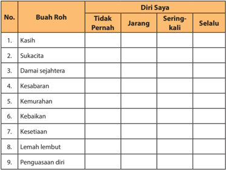

Tabel ini menunjukkan perasaan atau emosi yang dialami oleh seseorang terhadap berbagai buah roh dalam kehidupan sehari-hari. Kolom "Diri Saya" memuat empat tingkat perasaan: tidak pernah, jarang, sering-sering, dan selalu. Topik utama tabel ini adalah perasaan atau emosi terhadap buah roh dalam kehidupan sehari-hari. Data penting yang terlihat adalah bahwa buah roh seperti kasih, sukacita, damai sejahtera, kesabaran, kemurahan, kebaikan, kesetiaan, lemah lembut, dan penguasaan diri seringkali atau selalu dialami oleh individu dalam kehidupan mereka. Ini menunjukkan bahwa emosi positif dan spiritual sering kali menjadi bagian penting dari pengalaman hidup manusia.

### E.  Lingkup Kompetensi

Untuk buku kelas XI Pendidikan Agama Kristen dan Budi Pekerti, secara garis besar mencakup peran Allah dalam kehidupan keluarga, nilai-nilai kristiani dalam kehidupan keluarga, dan sikap remaja dalam menghadapi era modernisasi.

Topik-topik yang dikembangkan berkaitan dengan kompetensi yang diharapkan  bertujuan  untuk  mengembangkan  remaja  menuju  kedewasaan,  terutama dalam  lingkup  keluarga,  sekolah,  dan  masyarakat  yang  sedang  menghadapi perubahan  sosial.  Berkaitan  dengan  hal  itu,  topik-topik  pembelajaran  kelas  XI dikaitkan  dengan  kompetensi  untuk  menyiapan  remaja  menghadapi  masa depannya dengan menekankan kepada dasar-dasar nilai kristiani. Dalam kurun waktu satu tahun ke depan (kelas XII) remaja sudah harus memilih jurusan atau fakultas ke mana dia akan melanjutkan studinya, juga ada sebagian yang langsung terjun ke dunia kerja. Bahkan sebagian lagi mungkin harus menempuh hidup baru, membina keluarga. Berkaitan dengan itu semua, remaja melalui buku yang ditulis disiapkan agar secara sengaja melibatkan Tuhan untuk menghadapi masa depan yang  cukup  kompleks,  namun  tidak  kehilangan  identitas  kristianinya.  Keluarga dan  sekolah  bagi  remaja  merupakan  lembaga  utama  yang  melaluinya  mereka

 

---
## 📄 Halaman 33

dapat mengembangkan baik ranah kognitif, afektif, maupun psikomotorik. Peran pengembangan iman menjadi sangat penting sebagai dasar sekaligus inspirasi bagi  remaja  untuk  memperdalam identitas kristianinya. Di samping itu, remaja juga perlu disiapkan untuk memahami proses modernisasi, perkembangan ilmu pengetahuan  dan  teknologi  berdasar  pada  imannya.  Dampak  perkembangan sosial memang bisa bersifat positif, namun juga negatif. Untuk itu, remaja perlu mengkritisi dampak-dampak yang terjadi dikaitkan dengan iman yang dimiliki, sekaligus  memanfaatkan  perkembangan  yang  ada  untuk  mengembangkan imannya.

Agar  buku  PAK  dan  Budi  Pekerti  dapat  dilaksanakan  secara  maksimal, perlu  adanya  kerja  sama  antara  guru  dan  peserta  didik,  bahkan  melibatkan orang  tuanya.  Meskipun  sudah  ada  pedoman  tertulis  bagi  guru,  namun  peran guru  harus  dimaksimalkan  dengan  menerapkan  bahan  yang  sudah  ada  dan mengembangkan hal-hal yang perlu ditekankan sesuai dengan kondisi daerah. Kegiatan  untuk  siswa  juga  perlu  dipelajari  oleh  guru  agar  dapat  dilaksanakan secara maksimal. Di samping itu, guru masih tetap diharapkan dapat menambah berbagai kegiatan lain untuk mengembangkan Pendidikan Agama Kristen secara utuh (fisik, psikologis, sosial, spiritual).

 

---
## 📄 Halaman 34

### F.  Program Pembelajaran Semester

### Alokasi Materi Pembelajaran Pendidikan Agama Kristen SMA/SMK Kelas XI Semester 1

### Kompetensi Inti

- KI 1 : Menghayati dan mengamalkan ajaran agama yang dianutnya.
- KI 2 : Menunjukkan  perilaku  jujur,  disiplin,  bertanggung  jawab,  peduli (gotong royong, kerja sama, toleran, damai), santun, responsif, dan pro-aktif  sebagai  bagian  dari  solusi  atas  berbagai  permasalahan dalam berinteraksi secara efektif dengan lingkungan sosial dan alam serta menempatkan diri sebagai cerminan bangsa dalam pergaulan dunia.
- KI 3 : Memahami, menerapkan, dan menganalisis pengetahuan faktual, konseptual,  prosedural,  dan  metakognitif  berdasarkan  rasa  ingin tahunya tentang ilmu pengetahuan, teknologi, seni, budaya, dan humaniora dengan wawasan kemanusiaan, kebangsaan, kenegaraan, dan peradaban  terkait  penyebab  fenomena  dan kejadian, serta menerapkan pengetahuan prosedural pada bidang kajian  yang  spesifik  sesuai  dengan  bakat  dan  minatnya  untuk memecahkan masalah.
- KI 4 : Mengolah, menalar, dan menyaji dalam ranah kongkret dan ranah abstrak  terkait  dengan  pengembangan  dari  yang  dipelajarinya  di sekolah  secara  mandiri,  bertindak  secara  efektif  dan  kreatif,  serta mampu menggunakan metode sesuai kaidah keilmuan.

### Kompetensi Dasar 1

- 1.1 Mengakui peran Allah dalam kehidupan keluarga
- 2.1 Mengembangkan  perilaku  tanggung  jawab  sebagai  wujud  pengakuan terhadap peran Allah dalam kehidupan keluarga
- 3.1 Memahami peran Allah dalam kehidupan keluarga
- 4.1 Bersaksi tentang peran Allah dalam keluarganya

 

---
## 📄 Halaman 35

---
**📊 Tabel**

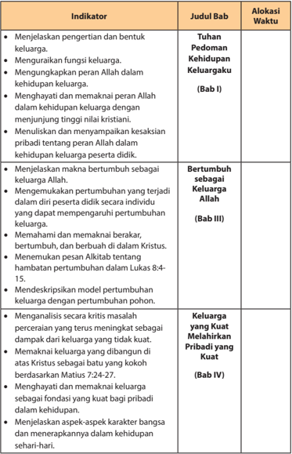

Tabel ini berisi informasi tentang bab-bab dalam sebuah buku pelajaran yang membahas tema kehidupan keluarga dan peran Allah dalam kehidupan. Topik utama tabel adalah pengembangan karakter dan pertumbuhan keluarga melalui pemahaman tentang kehidupan keluarga, peran Allah, dan karakteristik pribadi. Kolom-kolom yang ada adalah Indikator (yang menunjukkan tujuan pembelajaran), Judul Bab (yang menunjukkan judul setiap bab), dan Alokasi Waktu (yang menunjukkan waktu yang diberikan untuk mengerjakan setiap indikator). Data penting yang terlihat adalah bahwa setiap bab memiliki tujuan pembelajaran yang spesifik dan waktu yang ditentukan untuk mengerjakannya, yang menunjukkan bahwa pembelajaran ini dilakukan secara teratur dan terstruktur.

 

---
## 📄 Halaman 36

### Kompetensi Dasar 2

- 1.2 Menghayati nilai-nilai Kristiani dalam kehidupan keluarga dan pernikahan.
- 2.2   Mewujudkan nilai-nilai Kristiani dalam kehidupan keluarga dan pernikahan.
- 3.2 Menganalisis pentingnya nilai-nilai Kristiani dalam kehidupan keluarga dan pernikahan.
- 4.2 Membuat karya yang berkaitan dengan nilai-nilai Kristiani dalam kehidupan keluarga dan pernikahan.

---
**📊 Tabel**

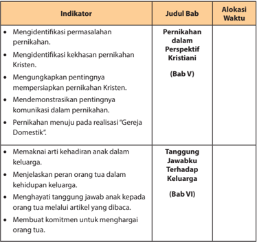

Tabel ini berisi indikator-indikator yang harus dipenuhi oleh siswa dalam mempelajari materi tentang pernikahan dan tanggung jawab dalam keluarga. Topik utama tabel adalah "Pernikahan dalam Perspektif Kristen" dan "Tanggung Jawabku Terhadap Keluarga". Kolom pertama berisi judul bab yang akan dipelajari, sedangkan kolom kedua berisi alokasi waktu untuk mengerjakan indikator tersebut. Data penting yang terlihat adalah bahwa siswa harus mengidentifikasi masalah pernikahan, keharusan persiapan pernikahan Kristen, pentingnya komunikasi dalam pernikahan, dan tujuan pernikahan menuju "Gereja Domestik". Selain itu, mereka juga harus memahami arti kehadiran anak dalam keluarga, menjalankan peran orang tua dalam kehidupan keluarga, menghargai tanggung jawab anak kepada orang tua melalui artikel yang dibaca, dan membuat komitmen untuk menghargai orang tua.

 

---
## 📄 Halaman 37

### Alokasi Materi Pembelajaran Pendidikan Agama Kristen SMA/SMK Kelas XI Semester 2

Satuan Pendidikan

:   SMA/SMK

Kelas

:   XI

Kompetensi Inti :

KI 1 :

Menghayati dan mengamalkan ajaran agama yang dianutnya.

KI 2 :

Menunjukkan  perilaku  jujur,  disiplin,  bertanggung  jawab,  peduli (gotong royong, kerja sama, toleran, damai), santun, responsif, dan pro-aktif  sebagai  bagian  dari  solusi  atas  berbagai  permasalahan dalam berinteraksi secara efektif dengan lingkungan sosial dan alam serta  dalam  menempatkan  diri  sebagai  cerminan  bangsa  dalam pergaulan dunia.

- KI 3 : Memahami, menerapkan, dan menganalisis pengetahuan faktual, konseptual,  prosedural,  dan  metakognitif  berdasarkan  rasa  ingin tahunya tentang ilmu pengetahuan, teknologi, seni, budaya, dan humaniora dengan wawasan kemanusiaan, kebangsaan, kenegaraan, dan peradaban  terkait  penyebab  fenomena  dan kejadian, serta menerapkan pengetahuan prosedural pada bidang kajian  yang  spesifik  sesuai  dengan  bakat  dan  minatnya  untuk memecahkan masalah.
- KI 4 : Mengolah, menalar, dan menyaji dalam ranah kongkret dan ranah abstrak  terkait  dengan  pengembangan  dari  yang  dipelajarinya  di sekolah secara mandiri, bertindak secara mandiri, bertindak secara efektif  dan  kreatif,  serta  mampu  menggunakan  metode  sesuai kaidah keilmuan.

### Kompetensi Dasar 3

- 1.3   Menghayati nilai-nilai iman Kristen dalam menghadapi gaya hidup masa kini
- 2.3   Menjadikan nilai-nilai kristiani sebagai filter dalam menghadapi gaya hidup masa kini
- 3.3   Menganalisis nilai-nilai kristiani dalam mengahadapi gaya hidup masa kini
- 4.3   Mempresentasikan berbagai aktivitas yang menggambarkan  nilai-nilai kristiani dalam menghadapi gaya hidup masa kini

 

---
## 📄 Halaman 38

---
**📊 Tabel**

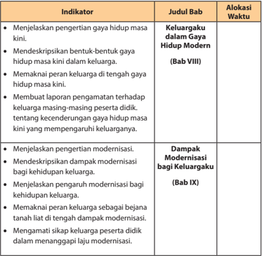

Tabel ini memuat informasi tentang indikator-indikator yang harus dicapai oleh siswa dalam mengerjakan tugas-tugas yang berkaitan dengan gaya hidup modern dan dampak modernisasi bagi keluarga. Topik utama tabel adalah pengertian gaya hidup modern dan dampak modernisasi bagi keluarga. Kolom-kolom yang ada meliputi judul bab, alokasi waktu, dan indikator. Data penting yang terlihat adalah bahwa siswa harus menjelaskan pengertian gaya hidup modern, mendeskripsikan bentuk-bentuk gaya hidup modern dalam keluarga, menunjukkan peran keluarga dalam gaya hidup modern, membuat laporan pengamatan terhadap keluarga masing-masing peserta didik tentang kecenderungan gaya hidup modern yang mempengaruhi keluarganya, menjelaskan pengertian modernisasi, mendeskripsikan dampak modernisasi bagi kehidupan keluarga, menjelaskan pengaruh modernisasi bagi kehidupan keluarga, menunjukkan peran keluarga sebagai bebanan tanah liat di tengah dampak modernisasi, dan mengamati sikap keluarga peserta didik dalam menanggapi laju modernisasi.

 

---
## 📄 Halaman 39

### Kompetensi Dasar 4

- 1.4 Mengakui peran keluarga dan sekolah sebagai lembaga pendidikan utama dalam kehidupan masa kini.
- 2.4 Bersikap kritis dalam menyikapi peran keluarga dan sekolah sebagai lembaga pendidikan utama dalam kehidupan masa kini.
- 3.4 Memahami peran keluarga dan sekolah sebagai lembaga pendidikan utama dalam kehidupan masa kini.
- 4.4 Membuat proyek yang berkaitan dengan peran keluarga dan sekolah sebagai lembaga pendidikan utama dalam kehidupan masa kini.

---
**📊 Tabel**

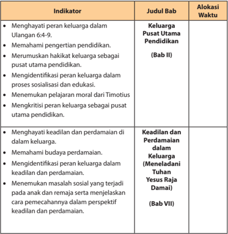

Tabel ini menunjukkan indikator-indikator yang harus dicapai oleh siswa dalam proses pembelajaran di kelas. Topik utama tabel adalah pengembangan karakter dan perilaku sosial siswa, dengan fokus pada peran keluarga dalam kehidupan sehari-hari, pemahaman tentang pendidikan, serta keadilan dan perdamaian dalam masyarakat. Kolom "Indikator" menyajikan berbagai aspek yang harus dikuasai siswa, seperti menghargai peran keluarga dalam Ulangan 6:4-9, memahami pengertian pendidikan, merumuskan hakikat keluarga sebagai pusat utama pendidikan, dan menemukan pelajaran moral dari Timotius. Kolom "Judul Bab" menunjukkan bagaimana topik-topik tersebut akan diajarkan dalam bab tertentu, seperti Bab II tentang Keluarga Pusat Utama Pendidikan dan Bab VII tentang Keadilan dan Perdamaian dalam Keluarga. Alokasi waktu dalam tabel menunjukkan bahwa beberapa aspek ini akan dibahas lebih lanjut dalam bab-bab yang berbeda, seperti Bab II yang membahas peran keluarga dalam pendidikan dan Bab VII yang membahas keadilan dan perdamaian dalam keluarga.

 

---
## 📄 Halaman 40

---
**📊 Tabel**

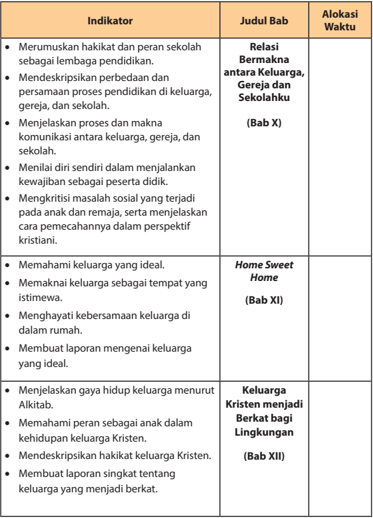

Tabel ini berisi informasi tentang indikator-indikator yang harus diuji dalam proses pendidikan, ditampilkan dalam bentuk bab-bab yang berbeda. Topik utama tabel adalah pengembangan karakter dan perilaku siswa dalam konteks keluarga, gereja, dan sekolah. Kolom-kolomnya meliputi Indikator (indikasi yang harus dicapai), Judul Bab (nama bab yang akan mengeksplorasi indikator tersebut), dan Alokasi Waktu (waktu yang diberikan untuk mengevaluasi indikator tersebut). Data penting yang terlihat adalah bahwa setiap bab memiliki tujuan spesifik untuk menguji karakteristik tertentu, seperti relasi antara keluarga, gereja, dan sekolah, pemahaman tentang keluarga ideal, dan bagaimana keluarga Kristen menjadi berkat bagi lingkungan.

 

---
## 📄 Halaman 41

### Kompetensi Dasar 5

- 1.5 Mengakui bahwa perkembangan kebudayaan, ilmu pengetahuan, seni, dan teknologi adalah anugerah Allah
- 2.5 Bersikap kritis dalam menyikapi perkembangan kebudayaan, ilmu pengetahuan, seni, dan teknologi dengan mengacu pada Alkitab
- 3.5 Menilai perkembangan kebudayaan, ilmu pengetahuan, seni, dan teknologi dengan mengacu pada Alkitab
- 4.5 Membuat karya yang mengkritisi perkembangan kebudayaan, ilmu pengetahuan, seni, dan teknologi dengan mengacu pada Alkitab

---
**📊 Tabel**

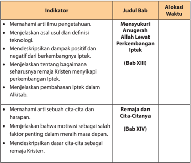

Tabel ini berisi informasi tentang indikator-indikator pembelajaran yang harus dicapai oleh remaja Kristen dalam konteks pengetahuan dan motivasi mereka. Topik utama tabel adalah "Mensyukuri Anugerah Allah Lewat Perkembangan Iptek" dan "Remaja dan Cita-Citanya". Kolom-kolomnya meliputi Indikator, Judul Bab, dan Alokasi Waktu. Data penting yang terlihat adalah bahwa pembelajaran ini mencakup pemahaman tentang iptek, dampak positif dan negatif dari perkembangannya, serta bagaimana remaja Kristen menyeimbangkan perkembangan iptek dengan cita-cita dan harapan mereka.

 

---
## 📄 Halaman 42

---
**🖼️ Gambar/Diagram**

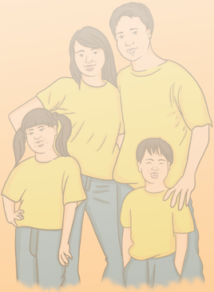

> **Deskripsi Visual:** Gambar ini adalah ilustrasi yang menampilkan keluarga berdiri bersama-sama. Keluarga terdiri dari dua orang dewasa (orangtua) dan dua anak (saudara). Semua anggota keluarga mengenakan kaos kuning dan celana biru. Orangtua berdiri di belakang anak-anak mereka, tampaknya memeluk atau menahan mereka. Anak perempuan berdiri di sebelah kiri, sedangkan anak laki-laki berdiri di sebelah kanan. Semua anggota keluarga tampak bahagia dan rileks. Ilustrasi ini mungkin digunakan untuk membantu pembaca memahami konsep tentang hubungan keluarga atau kebersamaan dalam keluarga.

 

---
## 📄 Halaman 43

### Penjelasan Tiap Bab Buku Siswa

### Penjelasan Bab I Tuhan Pedoman Kehidupan Keluargaku

Bahan Alkitab: Kejadian 2:24, 1 Korintus 11:3, Yohanes 2:1-11

### Kompetensi Dasar:

- 1.1  Mengakui peran Allah dalam kehidupan keluarga
- 2.1  Mengembangkan perilaku tanggung jawab sebagai wujud dari pengakuan terhadap peran Allah dalam kehidupan keluarga
- 3.1   Memahami peran Allah dalam kehidupan keluarga
- 4.1   Bersaksi tentang peran Allah dalam keluarganya

### Indikator:

- Menjelaskan pengertian dan bentuk keluarga
- Menguraikan fungsi keluarga
- Mengungkapkan peran Allah dalam kehidupan keluarga
- Menghayati  dan  memaknai  peran  Allah  dalam  kehidupan  keluarga  dengan menjunjung tinggi nilai kristiani
- Menuliskan dan menyampaikan kesaksian pribadi tentang peran Allah dalam kehidupan keluarga peserta didik

 

---
## 📄 Halaman 44

### A. Pengantar

Sinetron Keluarga Cemara menceritakan kisah keluarga Abah dan Emak beserta ketiga anaknya, Euis, Agis dan Ara. A bah dan Emak juga  merupakan panggilan untuk pengganti ayah dan ibu. Sinetron ini mengajarkan nilai-nilai tentang prinsip kehidupan yang sangat terpuji.  Meski  hidup  sederhana, Abah dan Emak selalu menanamkan  pentingnya  nilai  kejujuran  dalam  keluarga. Abah digambarkan sebagai kepala keluarga yang bekerja sebagai penarik becak yang hangat, sabar, dan penuh keteladanan bagi keluarganya. Meskipun dia sering diperlakukan jahat oleh orang lain, abah selalu sabar dan tabah. Sikap emak yang adalah seorang ibu rumah tangga, namun penuh pengertian dan pengabdian kepada abah dan anak-anaknya. Juga Euis, Agil, dan Cemara yang saling mengayomi sebagai adik dan kakak. Pendeknya, Keluarga Cemara merupakan replika keluarga ideal yang penuh kasih sayang meski hidup serba pas-pasan.

### B. Uraian Materi

### 1. Pengertian Keluarga

Menurut Kamus Besar Bahasa Indonesia , keluarga berarti ibu dan bapak beserta anak-anaknya atau seisi rumah. Pengertian ini mengacu pada aspek antropologis yaitu manusia dalam lingkungan keluarga. Istilah keluarga berbeda dengan istilah rumah  tangga.  Rumah  tangga  lebih  bersifat  material  ekonomis,  yaitu  sesuatu yang berhubungan dengan urusan kehidupan dalam rumah, seperti belanja dan sebagainya.  Definisi  keluarga  yang  lain  (Hendi  Suhendi,  2001:80)  adalah  suatu kelompok yang terdiri dari dua orang atau lebih yang direkat oleh ikatan darah, perkawinan, atau adopsi serta tinggal bersama. Meskipun keluarga didefinisikan secara  berbeda,  namun  terdapat  kesamaan  dalam  rumusan  yang  berbeda. Kesamaan itu mencakup ciri-ciri pokok, yakni:

- Keluarga merupakan kelompok atau persekutuan sosial yang paling kecil.
- Keluarga terbentuk apabila ada ikatan darah, perkawinan, atau adopsi.
- Keluarga  merupakan  suatu  persekutuan  yang  berawal  dari  dua  orang  yang berbeda jenis kelamin yang diikat dalam ikatan pernikahan.
Terdapat  dua  bentuk  keluarga  dalam  masyarakat,  yaitu  keluarga  inti  dan keluarga besar.

- Keluarga inti ( nuclear family, conjugal family, basic family ), yaitu kelompok yang terdiri dari ayah, ibu, dan anak-anak; atau keluarga yang terdiri dari pasangan suami-istri dan anak-anaknya.

 

---
## 📄 Halaman 45

- Keluarga  besar  ( extended  family,  consanguine  family ),  yaitu  kelompok  yang terdiri dari semua orang yang berketurunan dari kakek dan nenek yang sama, termasuk  keturunan  masing-masing  istri  dan  suami.  Atau  dengan  kata  lain, keluarga  besar  adalah  keluarga  batih  ditambah  kerabat  lain  yang  memiliki hubungan  erat  (hubungan  darah)  dan  senantiasa  dipertahankan,  misalnya kakek, nenek, paman, bibi, sepupu, kemenakan, dan sebagainya.

### 2. Fungsi Keluarga

Setelah sebuah keluarga terbentuk, anggota keluarga memiliki tugas masingmasing. Suatu pekerjaan yang harus dilakukan dalam kehidupan keluarga inilah yang  disebut  sebagai  fungsi.  Adapun  fungsi  keluarga  adalah  sebagai  berikut. (Suhendi, 2001:44-52)

### a.  Fungsi biologis

Berkaitan  dengan  pemenuhan  kebutuhan  biologis  dan  seks  suami  istri untuk  menghasilkan  keturunan,  memenuhi  kebutuhan  gizi  keluarga,  serta memelihara dan merawat  anggota keluarga secara fisik.

### b.  Fungsi sosialisasi anak

Berhubungan dengan pembentukan kepribadian anak, serta memperkenalkan pola tingkah laku, sikap, keyakinan, cita-cita, dan nilai-nilai yang dianut oleh kelompok sosial/masyarakat.

### c.  Fungsi afeksi

Berhubungan  dengan  rasa  (afeksi),  misalnya  rasa  kasih  sayang,  keintiman, perhatian, dan rasa aman yang tercipta dalam keluarga.

### d.  Fungsi edukatif

Berkaitan dengan pendidikan untuk anak sesuai dengan tingkat perkembangannya, serta menyekolahkan anak untuk memberikan pengetahuan, keterampilan yang sesuai dengan bakat dan minat anak.

### e.  Fungsi religius

Fungsi  ini  mendorong  dikembangkannya  seluruh  anggota  menjadi  insaninsan  agama  yang  penuh  ketakwaan  kepada  Tuhan  Yang  Maha  Esa,  serta menunjukkan penghayatan dan perilaku nilai-nilai agama.

### f. Fungsi protektif

Fungsi  ini  bertujuan  agar  memberikan  tempat  yang  nyaman  bagi  anggota keluarga  dan  memberikan  perlindungan  secara  fisik,  ekonomis  maupun psikologis bagi seluruh anggotanya.

### g.  Fungsi rekreatif

Fungsi ini bertujuan untuk mencari hiburan, memberikan suasana yang segar dan gembira dalam lingkungan keluarga.

 

---
## 📄 Halaman 46

### h.  Fungsi ekonomis

Berkaitan dengan orang tua yang mencari sumber-sumber penghasilan untuk memenuhi  kebutuhan  keluarga,  dan  pengaturan  penggunaan  penghasilan keluarga untuk memenuhi kebutuhan keluarga.

### i. Fungsi status sosial

Keluarga  akan  mewariskan  kedudukannya  kepada  anak-anaknya,  karena kelahiran anggota keluarga biasanya dihubungkan dengan sistem status ini. Selain itu status individu juga dapat berubah melalui perkawinan dan usahausaha yang dilakukan seseorang.

Selain fungsi keluarga yang sudah diuraikan di atas, secara khusus menurut iman  Kristen  fungsi  keluarga  seperti  yang  dipaparkan  dalam  kitab  suci  orang Kristen.

- Sebagai teman sekerja Allah dalam mengelola alam semesta dan segala isinya (Kej. 1:28). Manusia diciptakan sesuai dengan gambar dan rupa Allah ( imago dei ). Artinya manusia merupakan perpanjangan tangan Tuhan di bumi untuk menjaga  seluruh  ciptaan  Tuhan,  termasuk  dalam  hubungan  antara  sesama dan juga alam. Setiap manusia, termasuk keluarga bertanggung jawab untuk menciptakan relasi yang baik dengan sesama, dan menjaga kelestarian alam, misalnya  dengan  memanfaatkan  hasil  alam  secara  bijak  untuk  memenuhi kebutuhan  sehari-hari,  menjaga  kebersihan  dan  keindahan  alam,  ramah terhadap lingkungan, dan sebagainya.
- Sebagai lembaga pendidik utama dan pertama (Ul. 6:4-9). Yang pertama berarti belum ada lembaga lain yang dapat mendahului peran keluarga dalam  pendidikan  kepada  anak.  Yang  utama  berarti  belum  ada  lembaga lain yang mengungguli perannya dalam pendidikan. Dengan kata lain, keluarga menjadi lingkungan dasar penerapan dan pembentukan nilai-nilai kehidupan sesuai dengan ajaran Kristiani.
- Sebagai  wadah  semua  anggota  keluarga  dalam  mengekspresikan  kasih, kesetiaan,  dan  sikap  saling  menghormati  (Ef.  5:22-23;  6:1-3).  Setiap  anggota keluarga  berkewajiban  menciptakan  lingkungan  keluarga  yang  harmonis dengan menghayati dan melakukan ajaran-ajaran Kristiani sehingga dampaknya dapat terpancar dalam lingkungan masyarakat yang lebih luas.

### 3. Peran Allah dalam Kehidupan Keluarga

Tuhan adalah Pribadi yang membentuk sebuah keluarga. Tuhan menciptakan manusia sepasang yakni laki-laki dan perempuan  (Kej. 2:21-25). Manusia diciptakan berbeda tetapi satu kesatuan. Artinya, manusia diciptakan dalam dua jenis kelamin. Manusia sama dan sehakikat, namun diciptakan dengan fungsi yang

 

---
## 📄 Halaman 47

berbeda agar saling mengasihi dan melengkapi. Dalam perbedaan itu manusia menjadi satu persekutuan yang luar biasa karena saling membutuhkan dan saling mendukung. Tuhan memberikan daya tarik yang luar  biasa  dalam  diri  sebagai laki-laki dan perempuan sehingga mempunyai rasa suka yang membuat mereka bertemu dan mengikat diri. Itulah cikal bakal manusia membangun keluarga.

Keluarga Kristen merupakan keluarga yang mencerminkan kehidupan dengan dilandasi  oleh  kasih  dan  sikap  takut  akan  Tuhan,  serta  meneladani  kehidupan Tuhan Yesus sehingga menciptakan suasana kristiani yang sejati dalam lingkungan keluarga maupun masyarakat. Keluarga Kristen beribadah kepada Tuhan sebagai bagian pokok dari keberadaan keluarga Kristen. Beribadah kepada Tuhan berarti semua anggota keluarga berdoa dan melayani Tuhan setiap hari, sehingga semakin bertumbuh dalam cinta akan Kristus yang semakin mendalam. Ketekunan dalam doa dan usaha untuk mempertautkan diri dengan Kristus diperlihatkan dengan sangat  jelas  oleh  keluarga-keluarga  Kristiani  jemaat  perdana.  Diungkap  dalam Kisah Para Rasul 2:46-47 bahwa mereka selalu berkumpul bersama untuk berdoa dan merayakan perjamuan secara bergilir dari rumah ke rumah. Melalui doa dan perjamuan  bersama  ini  mereka  sungguh-sungguh  dikuatkan  dan  diteguhkan oleh Tuhan untuk berani 'tampil beda' di antara kelompok-kelompok jemaat lain pada saat itu dan siap menjadi saksi Kristus di tengah masyarakat dimana mereka hidup.

Kehidupan  keluarga  yang  sangat  kompleks  dengan  berbagai  kesibukan maupun masalah pada saat ini, penting dan tetap harus menyempatkan waktu untuk bertumbuh dalam Tuhan bersama. Jika Tuhan diutamakan, maka sukacita, kekuatan,  kemenangan,  dan  penghiburan  akan  tinggal  diam  dalam  keluarga. Keterpautan  secara  sadar  dengan  Kristus  dalam  keluarga  akan  menggerakkan semua anggota keluarga untuk membangun relasi yang semakin akrab dan intim dengan berpola pada relasi  antara Tuhan Yesus  dengan  Allah  Bapa  dan Tuhan Yesus dengan manusia yang mengasihi dengan kasih agape ,  yakni  kasih  tanpa pamrih, kasih yang melayani, mengampuni, dan memberi seperti yang diajarkanNya.  Berbeda  dengan  kasih eros ,  yakni  kasih  yang  mengingini  dan  mencari kesenangan diri sendiri.

Rasul  Paulus  menyebutkan  bahwa  keluarga  Kristen  harus  hidup  dengan menjadikan  Kristus  sebagai  kepala  keluarga  (1  Kor.  11:3),  karena  Tuhan  Yesus secara pribadi sangat mengasihi dan memimpin keluarga. Hal ini nampak ketika Ia mulai menyatakan diri sebagai Juru selamat pada pernikahan di Kana (Yoh. 2:1-11). Tampak ketidakmampuan kedua mempelai karena kekurangan anggur, namun ketika  Tuhan  Yesus  turut  campur  tangan  dan  memberi  pertolongan,  mukjizat besar terjadi:  air  berubah  menjadi  anggur.  Demikianlah Tuhan Yesus  juga  akan menolong keluarga Kristen pada masa kini di dalam segala kesukaran, masalah,

 

---
## 📄 Halaman 48

kekurangan, dan dosa-dosa. Hal ini merupakan rahasia ajaib dan mukjizat bagi keluarga Kristen, yaitu bahwa kehidupan keluarga Kristen akan selalu tertolong oleh suatu kesetiaan yang luar biasa, dan oleh suatu anugerah yang tidak dapat kita pahami, yang tidak lain adalah kesetiaan dan anugerah Tuhan Yesus Kristus.

Menjadikan Kristus sebagai pedoman, pemimpin, dan sebagai kepala keluarga artinya  seluruh  anggota  keluarga  bertanggung  jawab  menjadikan  seluruh ajaran Tuhan Yesus  sebagai  acuan  hidup  berkeluarga.  Setiap  anggota  keluarga Kristen  perlu  menyadari  penyertaan  Tuhan  dalam  kehidupan  mereka  dengan perilaku yang menjunjung tinggi nilai-nilai kekristenan dalam tindakan konkret. Mengandalkan  Tuhan  dalam  setiap  aspek  kehidupan  keluarga  merupakan fondasi  penting  dalam  mendapatkan  sumber  kebahagiaan  yang  sejati,  karena Kristus merupakan satu-satunya sumber kebahagiaan keluarga Kristen. Apapun masalah  dalam  keluarga  maupun  pribadi,  pergaulan  dengan  Tuhan  akan memberi kebebasan dari persoalan, dan anggota keluarga dapat menjadi saksi kepada dunia. Dari kesaksian-kesaksian tersebut, dapat membawa manusia pada kesadaran nilai yang hakiki dari kekristenan.

### 4. Allah dan Keluargaku

Seorang  anak  yang  berkembang  menjadi  remaja  mempunyai  dua  dimensi kehidupan yang sedang dan akan dijalani. Di satu sisi, anak berada dalam posisi sebagai salah satu anggota keluarga. Di sisi yang lain ia akan membentuk keluarga baru pada masa yang akan datang. Oleh karena itu, seorang anak perlu disiapkan sejak dini, melalui berbagai pengalaman yang diturunkan dalam keluarganya.

Keadaan keluarga pada masa kini di lingkungan tempat kita berada terdapat banyak masalah dan pergumulan  yang  dihadapi. Angka  perceraian yang meningkat, banyaknya kasus perselingkuhan, keluarga yang tidak memiliki anak, banyak  anak  yang  hidup  dengan  orang  tua  tunggal  ( single  parent ),  banyaknya anak dan remaja yang terjerumus dalam jebakan narkoba dan minuman keras karena sendi-sendi keluarga kristiani yang hancur, dan sebagainya.

Berkaitan dengan hal tersebut, keluarga Kristen pada masa kini perlu menyadari peranannya  dengan  cara  memberlakukan  nilai-nilai  kehidupan,  baik  secara Alkitab maupun teologis sehingga menjadi perpanjangan peranan Allah dalam kehidupan keluarga Kristen secara utuh.

- Keluarga sebagai pusat pembentukan kehidupan rohani. Dari keluarga kita mempelajari pola-pola hubungan akrab dengan orang lain, nilai-nilai, ide dan perilaku yang berproses hari demi hari, tahun demi tahun. Di samping keluarga juga ada terdapat sekolah, gereja, kelompok masyarakat yang juga berperan membentuk jati diri dan kehidupan rohani.

 

---
## 📄 Halaman 49

- Keluarga  sebagai  tempat  bernaung  kudus. Maksudnya  adalah  keluarga merupakan tempat penerimaan, pembinaan, pertumbuhan yang memberdayakan  anggota-anggota  keluarga  untuk  berperan  serta  dalam tindakan  kasih  dan  penyelamatan  Allah  yang  terus  berlanjut.  Bukan  berarti kita  mencintai  dan  memuja dan mengisolir diri terhadap masyarakat, tetapi sebaliknya menjadi tempat bernaung kepada anggota keluarga untuk memberikan bimbingan, pertolongan, dan penyelamatan untuk lingkungan.
- Keluarga yang mencerminkan kasih Allah secara holistik. Di sini kehidupan keluarga  perlu  ditata  untuk  mencerminkan  atau  merefleksikan  kasih  Allah yang memberikan pengasuhan secara fisik, mental/emosional, sosial, spiritual/ rohani kepada para anggotanya. Hal ini juga dikenal sebagai kasih Allah yang bersifat  holistik.  Hubungan-hubungan  di  dalam  keluarga  yang  memberi tempat  kepada  ciri  khas,  sifat,  dan  tujuan  masing-masing  anggota  secara alamiah adalah hal yang penting. Dari cara pandang iman, maka cara kita saling berhubungan seharusnya menjadi perwujudan kasih Allah terhadap sesama sebagai anggota keluarga.
- Keluarga sebagai pencerita. Keluarga adalah pencerita yang alamiah dimana orang yang lebih tua (kakek, nenek, ayah, ibu) adalah pencerita utama untuk menceritakan  karya-karya  Allah  di  dalam  keluarga  sebagai  kabar  kesukaan. Orang tua yang bercerita adalah bagian dalam kebudayaan kita yang seringkali kita abaikan.

### 5. Melibatkan Tuhan dalam Kehidupan Keluarga

Dalam keluarga Kristen, ada hal yang khas berkaitan dengan peran Tuhan dalam keluarga.  Peran  Tuhan  melingkupi  seluruh  aspek  kehidupan  keluarga  maupun pribadi  yang  meliputi  kebutuhan  keluarga  akan  berkat  Tuhan,  pengampunan, serta pembaharuan oleh Tuhan.

### a.  Berkat Tuhan

Pengertian berkat Tuhan cakupannya sangat luas, bukan hanya sekedar uang atau  hal  material  lainnya.  Berkat  Tuhan  juga  meliputi  kesehatan,  sukacita, damai sejahtera, kemenangan, umur panjang, kebahagiaan, dan sebagainya. Berkat  Tuhan  dibutuhkan  keluarga  sebagai  bagian  dari  penyertaan  Tuhan seperti  yang  dijanjikan  dalam  Alkitab  kepada  orang-orang  yang  berkenan kepada-Nya, misalnya Abraham yang diberkati Tuhan dalam segala hal (Kej. 24:1),  Obed-Edom  beserta  keluarganya  diberkati Tuhan  karena  membiarkan tabut Tuhan tinggal dalam rumah mereka (2 Sam. 6:11). Berkat Tuhan juga akan

 

---
## 📄 Halaman 50

diterima oleh keluarga Kristen pada masa kini yang tetap setia berpedoman dan  berpegang  kepada  Tuhan,  seperti  ucapan  berkat  yang  ditulis  dalam Bilangan 6:24-26.

### b.  Pengampunan Tuhan

Tidak seorangpun yang hidupnya sempurna di dunia ini, termasuk anda dan saya.  Kita  berbuat  dosa  di  dalam  pikiran,  perkataan,  maupun  perbuatan. Kematian Tuhan Yesus merupakan tanda kasih yang sangat besar kepada umat manusia sebagai Tuhan Yang Maha Pengampun (Ef. 1:7). Seperti Tuhan yang mengampuni, kita sebagai orang Kristen harus bisa mengampuni orang yang bersalah kepada kita. Pengampunan adalah sesuatu yang sangat indah, karena selalu membawa kedamaian, keharmonisan, menumbuhkan persekutuan dan hubungan  yang  baik  dengan  sesama,  sehingga  pengampunan  ini  menjadi salah satu kekhasan keluarga Kristen yang menjadikan Tuhan sebagai pedoman kehidupan keluarga. Bisa dibayangkan jika dalam kehidupan keluarga Kristen, baik antara orang tua dengan anak, maupun antara anak-anak tidak bisa saling mengampuni dan memaafkan, maka yang tumbuh dalam kehidupan keluarga adalah rasa kepahitan, ketidakharmonisan, kebencian yang sama sekali tidak menunjukkan kehadiran Tuhan.

### c.  Pembaruan oleh Tuhan

Pembaruan oleh Tuhan sering disebut juga dalam kekristenan sebagai 'hidup baru' . Artinya, manusia memulai kehidupan yang lebih baik dan berarti di dalam Kristus. Kristus masuk dan berdiam dalam kehidupan manusia yang baru, yang tidak sama dengan kehidupannya yang lama. Pembaruan oleh Tuhan dalam keluarga kita akan dirasakan dalam arah dan tujuan kehidupan keluarga yang sesuai  dengan  apa  yang  dikehendaki  oleh Tuhan.  Orientasi  keluarga  bukan hanya  kepada  kehidupan  keluarga  sendiri,  tetapi  berpusat  hanya  kepada Kristus. Seperti dalam Efesus 4:17-20, kehidupan yang diperbaharui oleh Tuhan bukan lagi kehidupan dengan pikiran yang sia-sia, hidup dalam persekutuan yang jauh dari Allah, hidup dalam kedegilan hati, melainkan kehidupan yang mengerti  siapa  Allah  dan  apa  yang  menjadi  kehendak-Nya  dalam  hidup keluarga kita.

Oleh  karena  itu,  dalam  kerendahan  hati  datanglah  kepada  Tuhan  bersama dengan keluarga kita, mohon Tuhan berkenan hadir dan membaharui kehidupan pribadi dan keluarga setiap hari. Dengan demikian, Tuhan yang menjadi pedoman kehidupan  keluarga  akan  memberi  sukacita  dan  damai  sejahtera,  sehingga keluarga kita menjadi berkat dan kesaksian bagi sesama kita.

 

---
## 📄 Halaman 51

### C. Penjelasan Bahan Alkitab

### 1.  Kejadian 2:24

Dalam teks ini terdapat tiga landasan dalam membangun keluarga Kristen.

- Meninggalkan ayah dan ibunya (tanggung jawab) Sejak  dilahirkan  anak  menjadi  tanggung  jawab  orang  tua,  tetapi  setelah memasuki  rumah  tangganya  sendiri,  seorang  anak  akan  meninggalkan statusnya  sebagai  anak  yang  berada  di  bawah  tanggung  jawab  orang tuanya,  lalu  menjadi  seorang  suami  atau  istri,  dan  bertanggung  jawab
penuh atas keluarganya sendiri.

- Bersatu dengan suami atau istrinya (tidak mengenal perceraian)
Bersatu  berarti  tidak  bisa  dipisahkan,  ibarat  dua  lembar  kertas  yang direkatkan menjadi satu. Kalaupun dipisahkan akan menjadi rusak. Hal ini berarti dalam keluarga Kristen tidak mengenal perceraian.

- Keduanya menjadi satu daging (tidak ada orang ketiga) Satu daging merupakan aspek hubungan seksual dalam pernikahan. Seks adalah anugerah Allah yang kudus, yang ditempatkan oleh Tuhan hanya dalam  kerangka  pernikahan  resmi,  jadi  di  luar  pernikahan  adalah  dosa. Karena telah menjadi satu daging, maka dalam keluarga Kristen tidak ada pihak ketiga.

### 2.  Yohanes 2:1-11

Injil Yohanes dalam tulisannya berbeda dengan ketiga injil yang lain (Matius, Markus,  Lukas)  yang  diikutinya  dalam  Perjanjian  Baru.  Dalam  injil  Yohanes, keilahian Yesus sebagai Anak Allah ditekankan.

Yohanes 2:1-11 merupakan pemaparan mujizat pertama yang dilakukan oleh Tuhan Yesus. Kisah ini menceritakan saat-saat ketika Tuhan Yesus dan muridmurid-Nya hadir pada pesta perkawinan di Kana, ibu Tuhan Yesus juga berada di tempat itu. Sementara acara berlangsung, anggur yang disiapkan telah habis. Hal  ini  menunjukkan  ketidakmampuan  atau  kekurangan  tuan  rumah  dan kedua  mempelai  yang  mengganggu  acara  perkawinan  mereka.  Kehabisan anggur juga merupakan hal yang sangat memalukan bagi tuan rumah apabila gagal  menyediakan  anggur  yang  cukup  bagi  tamunya. Tetapi  ketika  Tuhan Yesus campur tangan dengan meminta pelayan menyediakan tempayan berisi air yang kemudian berubah menjadi anggur yang ternyata dapat memuaskan tamu-tamu  yang  hadir,  masalah  terselesaikan.  Air  yang  berubah  menjadi anggur memiliki kualitas yang lebih bagus dibandingkan dengan anggur yang disiapkan oleh tuan rumah.

 

---
## 📄 Halaman 52

Teks  ini  menunjukkan  cinta  dan  perhatian  Tuhan  yang  begitu  besar  bagi keluarga.  Ketika  manusia  menjadikan  Tuhan  sebagai  pedoman  dan  dasar dalam hidup keluarga maupun pribadi, mujizat yang besar akan banyak terjadi di tengah keterbatasan dan kekurangan manusia.

### D. Kegiatan Pembelajaran

### Pengantar

Peserta didik diminta untuk memaknai lagu dan kisah 'Keluarga Cemara' . Meskipun ini  merupakan  kisah  yang  lama,  namun  nilai  moralnya  sampai  sekarang  masih relevan untuk diterapkan.

### Kegiatan 1: Curah Pendapat

Guru menuntun peserta didik untuk memberikan jawaban atas pertanyaan yang terdapat dalam buku siswa, kemudian memberikan penjelasan.

### Kegiatan 2: Mendalami Alkitab

Guru memberikan waktu kepada peserta didik untuk berdiskusi dengan teman di sampingnya mengenai landasan dalam membangun keluarga Kristen. Jika peserta didik mengalami kesulitan, guru dapat menuntun dengan memberikan penjelasan yang dibutuhkan. Setelah diskusi selesai, peserta didik diminta mempresentasikan hasil diskusinya. Setelah itu, guru memberikan penjelasan secara lebih mendetail.

### Kegiatan 3: Membuat Komitmen

Guru  meminta  peserta  didik  membuat  komitmen  hidup  yang  dapat  dijadikan acuan penilaian sikap peserta didik.

### Kegiatan 4: Berbagi Pengalaman

Peserta  didik  diminta  menuliskan  pengalaman  tentang  peran  Tuhan  dalam kehidupan  bersama  keluarga  yang  pernah  dirasakan  dan  akan  dibahas  pada pertemuan  berikut.  Misalnya,  pengalaman  selamat  dari  kecelakaan  lalu  lintas bersama keluarga.

### E.  Penilaian

Penilaian dalam rangka mengukur tercapainya kompetensi dilakukan dengan mengukur tercapainya indikator. Bentuk penilaian berupa tes lisan, tulisan, dan penugasan. Perlu ditegaskan bahwa penilaian berlangsung dalam seluruh proses pembelajaran.

 

---
## 📄 Halaman 53

### F.  Penutup

Bagian penutup ini berisikan:

- Rangkuman
- Ayat Emas (untuk dihafalkan)
- Bernyanyi dan berdoa yang dipimpin oleh salah satu peserta didik.

 

---
## 📄 Halaman 54

---
**🖼️ Gambar/Diagram**

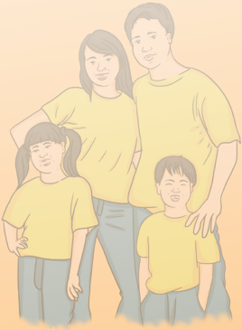

> **Deskripsi Visual:** Gambar ini adalah ilustrasi yang menampilkan keluarga berdiri bersama-sama. Keluarga terdiri dari dua orang dewasa (orangtua) dan dua anak (saudara). Semua anggota keluarga mengenakan kaos kuning dan celana biru. Orangtua berdiri di belakang anak-anak mereka, tampaknya memeluk atau menahan mereka. Anak perempuan berdiri di sebelah kiri, sedangkan anak laki-laki berdiri di sebelah kanan. Semua anggota keluarga tampak bahagia dan rileks. Ilustrasi ini mungkin digunakan untuk membantu pembaca memahami konsep tentang hubungan keluarga atau kebersamaan dalam keluarga.

 

---
## 📄 Halaman 55

### Penjelasan Bab II

### Keluarga Pusat Utama Pendidikan

Bacaan Alkitab: Ulangan 6:4-9, 2 Timotius 1:3-10

### Kompetensi Dasar:

- 1.4  Mengakui peran keluarga dan sekolah sebagai lembaga pendidikan utama dalam kehidupan masa kini.
- 2.4  Bersikap kritis dalam menyikapi peran keluarga dan sekolah sebagai lembaga pendidikan utama dalam kehidupan masa kini.
- 3.4  Memahami peran keluarga dan sekolah sebagai lembaga pendidikan utama dalam kehidupan masa kini.
- 4.4  Membuat  proyek  yang  berkaitan  dengan  tentang  peran  keluarga  dan sekolah sebagai lembaga pendidikan utama dalam kehidupan masa kini.

### Indikator:

- Menghayati peran keluarga dalam Ulangan 6:4-9.
- Memahami pengertian pendidikan.
- Merumuskan hakikat keluarga sebagai pusat utama pendidikan.
- Mengidentifikasi peran keluarga dalam proses sosialisasi dan edukasi.
- Menemukan pelajaran moral dari Timotius.
- Mengkritisi peran keluarga sebagai pusat utama pendidikan.

### A. Pengantar

Dalam pengantar ini, peserta didik diharapkan mampu menemukan pesan dari kitab Ulangan 6:7 yang menjadi landasan teologis bagi lingkungan pendidikan, baik keluarga, sekolah, maupun gereja dalam mengajarkan nilai-nilai kehidupan yang meningkatkan iman kristiani serta sesuai dengan ajaran Kristen.

Melalui  pendidikan,  manusia  dapat  menggali  dan  mengoptimalkan  segala potensi yang ada pada dirinya. Melalui pendidikan pula manusia dapat mengembangkan ide-ide yang ada dalam pikirannya dan menerapkannya dalam

 

---
## 📄 Halaman 56

kehidupannya sehari-hari yang dapat meningkatkan kualitas hidup manusia itu sendiri.  Guna  meningkatkan  kualitas  hidup,  manusia  memerlukan  pendidikan, baik pendidikan yang formal, informal, maupun nonformal.

### B. Uraian Materi

### 1. Pengertian Pendidikan

Kata  pendidikan  berasal  dari  kata  latin educare dan educere yang  berarti merawat, memperlengkapi dengan gizi agar sehat, dan juga berarti membimbing keluar dari. Berdasarkan arti kata ini, pendidikan dapat berarti suatu upaya yang dilakukan  dengan  sadar  untuk  memperlengkapi  seseorang  atau  sekelompok orang dengan cara membimbingnya keluar dari satu keadaan ke keadaan hidup lainnya yang lebih baik. Dalam Kamus Besar Bahasa Indonesia , pendidikan berarti proses pengubahan sikap dan tata laku seseorang atau kelompok orang dalam usaha mendewasakan manusia melalui upaya pengajaran dan pelatihan; proses, cara, perbuatan mendidik. Dalam Ensiklopedi Pendidikan , secara umum pendidikan diartikan sebagai semua perbuatan dan usaha dari generasi tua untuk mengalihkan pengetahuannya, pengalamannya, kecakapannya, serta ketrampilannya kepada generasi  muda  sebagai  usaha  menyiapkannya  untuk  dapat  memenuhi  fungsi hidupnya baik jasmaniah maupun rohaniah.

Dari  berbagai  pengertian  di  atas,  dapat  disimpulkan  bahwa  pendidikan mengarah kepada pembentukan satu pribadi secara utuh atau holistik (mencakup aspek  rohani  atau  spiritual,  psikis  atau  mental,  fisik,  serta  sosial)  yang  dapat diperoleh dari pengalaman hidup sehari-hari. Pendidikan berbeda dengan sekolah yang lebih bersifat formal dan dikelola oleh institusi atau lembaga dan mencakup kegiatan latihan keterampilan dan penalaran yang dapat diuji, dilakukan secara bertahap (ada tingkatan pendidikan), terdapat penekanan terhadap ruang kelas, peraturan bahan pengajaran, jurusan, dan sebagainya.

### 2. Pendidikan Kristiani dalam Keluarga

Manusia lahir dan diterima dalam keluarga masing-masing, sehingga keluarga menjadi  konteks  utama  kehidupan  dan  hubungan  sehari-hari  selama  masa pertumbuhannya. Hal ini menjadi alasan untuk menyimpulkan bahwa keluarga adalah tempat pertama dan utama bagi pembentukan kehidupan manusia dalam berbagai aspek. Lingkungan rumah merupakan kelas pertama bagi seorang anak untuk  belajar  tentang  sesama  dan  dunia,  mempelajari  pola  hubungan  secara intim dengan orang lain, nilai-nilai, ide dan perilaku, yang kemudian merefleksikan perasaan, nilai dan pola tersebut dalam kehidupan sehari-hari.

 

---
## 📄 Halaman 57

Peranan  keluarga  (orang  tua)  tidak  hanya  sebatas  melahirkan,  memenuhi kebutuhan  sandang,  pangan,  dan  papan,  tetapi  juga  memberikan  pendidikan yang baik bagi anak-anak. Hal ini merupakan peranan yang sangat penting yang tidak dapat diwakilkan kepada pihak lain, sebab orang tua adalah pendidik utama dan pertama bagi anak-anaknya yang terjalin dengan keistimewaan hubungan cinta kasih yang terjalin. Tugas orang tua sebagai pendidik berakar dari panggilan sebagai suami-istri  untuk  berpartisipasi  dalam  tugas  penciptaan Tuhan.  Karena itu  sangat  penting  bagi  orang  tua  untuk  menciptakan  lingkungan  keluarga yang dipenuhi oleh sukacita dan kasih sayang terhadap sesama dan Tuhan Allah sehingga  menunjang  perkembangan  pribadi  anak  sesuai  dengan  nilai-nilai Kristen.

Keluarga Kristen tentu harus memberikan pendidikan Kristen kepada anggota keluarga,  yakni  pendidikan  yang  bercorak,  berdasar  dan  berorientasi  pada nilai-nilai  kristiani  sebagai  usaha  yang  ditopang  secara  rohani  dan  manusiawi untuk  meneruskan  pengetahuan,  sikap,  keterampilan,  dan  tingkah  laku  yang bersesuaian  dengan  iman  Kristen.  Nilai  kristiani  yang  menonjol  adalah  kasih, keadilan,  kesetaraan,  pengampunan,  penebusan,  penyelamatan  oleh  Allah, pertobatan,  mengasihi  Tuhan  dengan  segenap  hati,  serta  mengasihi  sesama seperti mengasihi diri sendiri. Selain itu  juga  mengupayakan  perubahan, pembaruan anggota keluarga secara pribadi, maupun bersama oleh kuasa Roh Kudus sehingga keluarga hidup sesuai dengan kehendak Allah sebagaimana yang dinyatakan oleh Alkitab, terutama dalam Tuhan Yesus.  Pendidikan secara kristiani memanggil setiap anggota keluarga untuk meneladani Yesus sebagai Guru Agung yang menjadi teladan bagi pengikut-Nya, agar memiliki pemahaman serta relasi yang benar, mendalam dan pribadi dengan Tuhan Yesus Kristus.

### 3. Peran Keluarga dalam Proses Sosialisasi

Seorang bayi yang lahir ke dunia merupakan satu makhluk hidup kecil yang penuh  dengan  kebutuhan  fisik  dan  masih  sangat  bergantung  kepada  orang tuanya. Ia lahir ke dunia dalam keadaan tidak mengetahui apa-apa. Seiring dengan pertumbuhannya,  ia  akan  belajar  berbicara,  berjalan,  dan  mulai  melakukan aktivitasnya secara mandiri, misalnya makan sendiri, mandi sendiri, dan lain-lain. Selanjutnya dia perlu banyak belajar tentang segala sesuatu agar kehidupannya menjadi lebih maju, misalnya mempelajari sikap, nilai, norma yang berlaku dalam komunitas dimana ia berada. Proses inilah yang disebut sosialisasi.

Sosialisasi dapat didefinisikan sebagai suatu proses sosial yang dilakukan oleh seseorang dalam menghayati nilai dan norma kelompok tempat ia hidup sehingga ia  menjadi  bagian  dari  kelompoknya.  Secara  sederhana,  sosialisasi  merupakan proses  belajar  seseorang,  di  mana  orang  tua,  persekutuan,  atau  masyarakat

 

---
## 📄 Halaman 58

meneruskan pengetahuan, kebiasaan, maupun nilai-nilai dalam lingkungannya, biasanya  secara  tidak  sengaja  atau  melalui  keteladanan.  Proses  sosialisasi  ini mempunyai  peranan  yang  sangat  penting  karena  sangat  membantu  dalam pembentukan  kepribadian  seseorang,  termasuk  dalam  membentuk  identitas manusia Kristen.

Di dalam keluarga, sosialisasi mengambil tempat yang cukup penting, misalnya mengajak anak setiap minggu ke gereja atau sekolah minggu. Sekolah Minggu, mencontoh  bapak  dan  ibu  bagaimana  cara  berdoa,  mencontoh  mengunjugi dan mendoakan orang sakit, mencontoh mengikuti persekutuan Kristen. Hal ini dipelajari melalui pengajaran yang diberikan dengan tidak di sengaja, yaitu melalui jalan memberi contoh dan menirukan, maupun melalui pemberian model bagi anak. Oleh karena itu, setiap anak memerlukan kehadiran orang tuanya sebagai role model atau peran percontohan yang melaluinya anak belajar. Melalui contoh dan teladan yang konkret dari orang tua inilah, anak-anak lebih mudah menerima dan menghayatinya daripada sederet nasihat dan petuah.

Peran keluarga Kristen dalam proses sosialisasi merupakan hal yang unik, karena memiliki dasar Alkitab atau landasan teologis. Oleh karena itu, penghayatan akan iman Kristen pertama-tama harus dilakukan oleh orang tua, kemudian diteruskan kepada  anak-anak.  Sejak  dini  orang  tua  harus  memperkenalkan Tuhan  kepada anak-anak  dengan  menanamkan  nilai  religius,  misalnya  rasa  sayang  kepada makhluk ciptaan Tuhan, menumbuh-kembangkan kebiasaan berdoa, kebiasaan berbakti setiap hari dengan keluarga, bahkan menaati aturan dalam gereja yang mengharuskan  setiap  anak  untuk  dibaptis.  Penanaman  nilai  iman  ini  menjadi penting agar anak-anak tidak hanya bertumbuh menjadi orang yang beragama, tetapi  menjadi  orang  yang  beriman  kepada Tuhan.  Artinya  seluruh  hidup  dan perbuatannya berdasarkan ajaran kristiani sehingga mampu menjadi garam dan terang dalam kehidupan keluarga maupun masyarakat luas.

Dalam Alkitab, keluarga Timotius merupakan salah satu contoh keluarga saleh karena memiliki iman secara turun-temurun (2 Tim. 1:5). Ini merupakan contoh keluarga Kristen yang dapat diterapkan dalam kehidupan keluarga Kristen modern pada masa ini.

### 4. Peran Keluarga dalam Proses Edukasi

Dalam proses edukasi, keluarga merupakan agen pendidik yang terutama. Hal ini tampak dalam proses pertumbuhan anak mulai dari bayi, belajar jalan, hingga mampu berjalan. Fungsi ini juga berkaitan dengan menyekolahkan anak untuk memberikan pengetahuan, keterampilan yang sesuai dengan bakat dan minat anak,  mendidik  anak  sesuai  dengan  tingkat-tingkat  perkembangannya,  serta

 

---
## 📄 Halaman 59

mempersiapkan anak untuk kehidupan dewasa yang akan datang. Proses edukasi atau pendidikan adalah suatu proses penyampaian iman yang dilakukan secara sengaja, sistematis dan terencana.

### Contoh proses edukasi dapat diungkapkan sebagai berikut

### a.  Pentingnya Proses Sosialisasi dan Edukasi

Dalam proses pendewasaan seseorang secara holistik, proses sosialisasi saja tidak  cukup.  Dibutuhkan  proses  edukasi  agar  tercipta  individu  yang  kritis dalam  menyikapi  dampak  sosialisasi  yang  ada,  termasuk  dalam  membawa anak kepada kedewasaan iman. Dewasa ini tanggung jawab keluarga untuk mendidik anak sebagian besar atau bahkan mungkin seluruhnya telah diambil alih  oleh  lembaga  pendidikan  lain,  misalnya  sekolah  dan  gereja.  Keluarga cenderung  sibuk  dengan  tanggung  jawab  yang  lain,  sehingga  melupakan peranan  utamanya  sebagai  pendidik  pertama  bagi  anak-anak,  dan  merasa cukup dengan memberikan tanggung jawab pendidikan anak-anaknya kepada pihak lain.

### b.  Pentingnya Pengawasan Orang Tua

Pengawasan dari orang tua terhadap anak juga mulai melemah, padahal peran orang tua menjadi sangat penting terutama dalam proses pengawasan dan pengendalian.  Dalam  tahap  ini  orang  tua  berperan  sebagai agent  of  social control (agen  kontrol  sosial)  terhadap  anak-anaknya,  sehingga  nilai-nilai kehidupan yang dijalani tidak bertentangan dengan nilai-nilai kristiani yang ditanamkan sejak kecil. Menjadi orang tua yang baik bukan berarti menyetujui atau  membenarkan  dan  mengiyakan  semua  yang  dikehendaki  oleh  anak. Orang tua harus bisa memilah mana hal yang diperbolehkan dan mana yang tidak diperbolehkan untuk dilakukan oleh anak-anak.

### c.  Pentingnya Menangkal Ajaran yang Tidak Kristiani

Dalam proses perkembangan manusia secara holistik, peran keluarga dalam proses edukasi  berperan  sebagai  koreksi  atau  kritik  terhadap  berbagai perubahan  yang  terjadi  berkaitan  dengan  perkembangan  manusia.  Dalam proses  sosialisasi,  terdapat  ajaran  yang  diperoleh  anak  dari  lingkungannya yang kadang bertentangan dengan nilai-nilai kristiani. Di sinilah peran keluarga dalam proses edukasi nampak untuk menentukan mana yang baik dan tidak baik untuk dihayati dalam kehidupan sesuai dengan iman kepada Tuhan Yesus.

### d.  Pentingnya Dukungan Orang Tua

Proses perkembangan dan pertumbuhan seorang anak dalam keluarga dapat terlaksana  dengan  baik  apabila  kedua  orang  tua  saling  mendukung  dan mengusahakan  kerukunan  serta  persatuan  dalam  keluarga  sesuai  dengan panggilannya  sebagai  teman  sekerja  Allah  yang  bertanggung  jawab  dalam

 

---
## 📄 Halaman 60

setiap aspek kehidupan. Karena melalui kesaksian hidup kristiani yang diilhami oleh  nilai-nilai  Kristen  akan  mengantar  anak  secara  efektif  untuk  semakin mengenal dan mencintai Kristus.

### C. Penjelasan Bahan Alkitab

### 1.  Ulangan 6:4-9

Teks ini merupakan ketetapan atau peraturan yang dipaparkan Musa kepada orang Israel dalam perjalanan keluar dari tanah Mesir. Ada beberapa ketetapan yang ditekankan Musa.

- Kasihilah Tuhan. Mengasihi Tuhan dengan segenap hati, dengan segenap jiwa  dan  dengan  segenap  kekuatan  merupakan  sikap  yang  dilakukan dengan  utuh  dan  sungguh-sungguh.  Tuhan  menuntut  umat  Israel  agar memiliki  integritas  diri,  artinya  ada  kesesuaian  antara  perkataan  dan perbuatan. Mengasihi Tuhan bukan saja hanya memperkatakan kebenaran dan  kasih,  tapi  juga  melakukan  kasih  bagi  sesama.  Dengan  kata  lain, mengasihi Tuhan bukan saja secara vertikal antara manusia dan Tuhan, tapi juga secara horizontal antara manusia dengan manusia.
- Hal  mengajar  kepada  anak-anak.  Ini  merupakan  perintah  yang  harus dilakukan oleh orang tua kepada anak-anak sebagai wujud kasih kepada Tuhan. Hal mengajar kepada anak dapat dilakukan kapan saja dan di mana saja,  dengan  sadar  atau  tidak  disadari.  Anak-anak  sering  memperhatikan tingkah laku orang tua yang kemudian dijadikan teladan. Oleh karena itu, peran orang tua sebagai pendidik sangat berperan penting dalam proses pertumbuhan dan perkembangan anak secara holistik. Mengajar kepada anak akan lebih dimaknai dan dihayati jika ditunjukkan melalui keteladanan dalam perbuatan, bukan sekedar kata-kata.

### 2.  2 Timotius 1:3-10

Teks ini berisi surat rasul Paulus kepada Timotius. Timotius merupakan teman sepelayanan Paulus yang berasal dari Listra. Karena usianya yang masih muda (tidak diketahui secara pasti), Paulus menyebut Timotius sebagai  'anakku' dalam surat-suratnya. Timotius lahir dari perkawinan campuran. Ibunya, Eunike adalah wanita  Yahudi  yang  mengajarkan  kepadanya  mengenai  Kitab  Suci,  sedang ayahnya adalah seorang Yunani. Lois, ibu Eunike, nenek Timotius, merupakan orang yang beriman sehingga ia mengajarkan imannya kepada keturunannya. Timotius  penuh  dengan  kasih  sayang,  tapi  ia  sangat  penakut  sehingga

 

---
## 📄 Halaman 61

memerlukan banyak nasihat pribadi. Karena itu, dalam surat ini ia dinasihati oleh Paulus supaya jangan takut dan gentar, karena Allah mengaruniakan roh yang  membangkitkan  kekuatan,  kasih  dan  ketertiban.  Timotius  merupakan teman sepalayanan Paulus yang amat dipuji-puji karena ketaatannya. Ini semua karena iman yang diajarkan turun-temurun dari neneknya, Lois.

### D. Kegiatan Pembelajaran

### Pengantar

Guru  memberikan  kesempatan  kepada  peserta  didik  untuk  memahami  dan menemukan sendiri pesan yang terkandung dalam kitab Ulangan 6:7. Pesan yang didapat dan dipahami peserta didik kemudian dibacakan di depan kelas, dan guru merangkum semua pendapat peserta didik. Untuk lebih memahami maksud yang terkandung dalam bacaan ini, peserta didik dapat membaca ayat sebelum atau sesudahnya. Guru dapat menuntun peserta didik apabila menemui kesulitan.

### Kegiatan 1: Curah Pendapat

Guru menuntun peserta didik dalam memahami pengertian pendidikan melalui curah  pendapat  dan  membedakannya  dengan  istilah  lain  yang  terkait.  Setiap peserta didik bebas mengemukakan pendapatnya dan guru memberi kesimpulan terhadap pernyataan yang diberikan.

### Kegiatan 2: Menjawab Pertanyaan

Guru memandu diskusi kelompok dengan pertanyaan mengenai peran orang tua dalam pendidikan  keluarga.

### Kegiatan 3: Penugasan

Kegiatan 3 adalah evaluasi terhadap materi. Setelah menjelaskan peran keluarga dalam proses sosialisasi dan edukasi, peserta didik diminta memberikan contoh yang konkret dari peran keluarga dalam kedua proses tersebut.

### Kegiatan 4: Belajar dari Timotius

Kegiatan 4 memberikan kesempatan bagi peserta didik untuk menemukan sendiri pelajaran apa yang bisa diambil dari kisah Timotius. Yang perlu ditekankan dari tugas ini adalah bagaimana peran keluarga Timotius sehingga ia menjadi teman sepelayanan Paulus.

 

---
## 📄 Halaman 62

### Kegiatan 5: Penugasan

Tugas ini diselesaikan di rumah dengan berdiskusi bersama orang tua. Peserta didik dituntut  untuk  memberikan  penilaian  yang  kristis  terhadap  peran  keluarganya dalam proses sosialisasi dan edukasi sehingga menjadi bahan pelajaran baginya dalam  mempersiapkan  diri  untuk  membentuk  rumah  tangga  pada  masa  yang akan datang.

### E.  Penilaian

Penilaian dalam rangka mengukur tercapainya kompetensi dilakukan dengan mengukur  tercapainya  semua  indikator.  Bentuk  penilaian  berupa  tes  lisan, penugasan, serta tugas yang diselesaikan di rumah. Guru dapat menilai analisis kritis dari peserta didik dalam mengamati keluarganya sebagai pusat pendidikan. Penilaian juga berlangsung dalam seluruh proses pembelajaran.

### F.  Penutup

Bagian penutup berisikan kesimpulan, ayat emas yang harus dihafalkan oleh peserta didik, serta bernyanyi, dan berdoa yang dipimpin oleh peserta didik.

 

---
## 📄 Halaman 63

### Penjelasan Bab III Bertumbuh Sebagai Keluarga Allah

Bacaan Alkitab: Yohanes 15:1-8; Lukas 8:4-15, Mazmur 1:1-6

### Kompetensi Dasar:

- 1.1  Mengakui peran Allah dalam kehidupan keluarga.
- 2.1  Mengembangkan perilaku tanggung jawab sebagai wujud dari pengakuan terhadap peran Allah dalam kehidupan keluarga.
- 3.1  Memahami peran Allah dalam kehidupan keluarga.
- 4.1  Bersaksi tentang peran Allah dalam Keluarganya.

### Indikator:

- Menjelaskan makna bertumbuh sebagai keluarga Allah.
- Mengemukakan  pertumbuhan  yang  terjadi  dalam  diri  peserta  didik  secara individu yang dapat mempengaruhi pertumbuhan keluarga.
- Memahami dan memaknai berakar, bertumbuh, dan berbuah di dalam Kristus
- Menemukan  pesan  Alkitab  tentang  hambatan  pertumbuhan  dalam  Lukas 8:4-15.
- Mendeskripsikan model pertumbuhan keluarga dengan pertumbuhan pohon.

### A. Pengantar

Setiap  manusia  mempunyai  definisi  masing-masing  tentang  keluarga  yang berbahagia. Mungkin ada yang berpikir bahwa keluarga yang berbahagia adalah keluarga yang berkecukupan secara ekonomi, bisa makan makanan yang enakenak, bisa berlibur ke luar negeri, bisa membeli apapun yang diinginkan. Mungkin ada juga yang berpikir bahwa keluarga yang berbahagia adalah keluarga yang terpandang.  Sang  ayah  adalah  orang  yang  mempunyai  jabatan  tinggi  dan dihormati oleh banyak orang, anak-anaknya berpendidikan tinggi dan kemudian bekerja  di  perusahaan  besar  dengan  gaji  yang  tinggi.  Masyarakat  sekarang cenderung untuk mengukur dan menilai sebuah kebahagiaan dengan apa yang bisa dilihat oleh mata atau materi.

 

---
## 📄 Halaman 64

Tidak heran jika banyak orang yang bekerja sangat keras, membanting tulang demi menyejahterakan keluarganya. Mereka berusaha memberikan yang terbaik bagi keluarganya. Ini bukanlah hal yang salah, namun tidak jarang karena terdesak oleh  kebutuhan  untuk  dipandang  sebagai  keluarga  yang  berhasil  di  mata masyarakat,  banyak  orang  mengambil  jalan  pintas  untuk  memperoleh  status sosial yang tinggi. Banyak berita di media masa dan elektronik, hampir tiap hari terdapat berita tentang para koruptor. Hal tercela itu dilakukan karena terdesak untuk mengejar kenikmatan duniawi. Semakin banyak uang yang dikumpulkan, semakin  mewah  rumah  yang  ditempati,  semakin  banyak  keinginan yang terpenuhi, semakin tinggi pula status sosial yang didapatkan.

Dalam  ajaran  Kristen,  yang  menjadi  dasar  kebahagiaan  keluarga  bukanlah materi, tetapi takut akan Tuhan. Sia-sialah usaha manusia yang mengumpulkan banyak  harta  duniawi  siang  dan  malam,  tapi  tidak  menempatkan  Tuhan dalam  hidupnya  sebagai  prioritas  utama  dengan  bersandar  pada  kebenaran firman Tuhan,  serta  bertumbuh  makin  menyerupai  Kristus  dalam  setiap  aspek kehidupannya.

### B. Uraian Materi

### 1. Keluarga yang Bertumbuh

Bertumbuh  berasal  dari  kata  dasar  tumbuh,  dalam Kamus  Besar  Bahasa Indonesia berarti  timbul  (hidup)  dan  bertambah  besar  atau  sempurna,  atau sedang  berkembang  (menjadi  besar). Bertumbuh  juga  bukan  hanya  soal bertambah banyak, tetapi berkembang dan berbuah. Setiap individu mengalami pertumbuhan yang berbeda, baik secara fisik, intelektual, emosi, sosial, maupun spiritual.  Perbedaan  inilah  yang  membuat  satu  individu  dengan  individu  yang lain unik. Keluarga sebagai sekumpulan individu yang terbentuk dari pernikahan juga mengalami pertumbuhan, misalnya bertambahnya jumlah anggota keluarga (anak), berkembangnya hubungan sosial dalam komunikasi antara individu yang satu dengan yang lainnya, yakni dalam relasi antara suami-istri, mertua-menantu, maupun orang tua dan anak.

Setiap individu akan mengalami pertumbuhan secara terus-menerus. Dalam kehidupan  keluarga  Kristen,  setiap  anggota  keluarga  yang  mau  bertumbuh bersama syarat utamanya adalah harus berada dalam ajaran Tuhan Yesus Kristus. Paling tidak, ada dua hal yang harus dilakukan supaya keluarga menjadi keluarga yang  bertumbuh.  Pertama,  hidup  saling  mengasihi  dan  menghormati.  Dalam keluarga, kasih merupakan dasar dan fondasi. Oleh karena itu, mengasihi bukan hanya tugas salah satu anggota keluarga, tetapi semua anggota keluarga agar

 

---
## 📄 Halaman 65

dapat  menciptakan  iklim  keluarga  yang  penuh  damai.  Kedua,  percaya  pada pemeliharan Tuhan. Tidak dapat dipungkiri bahwa kecintaan akan materi secara berlebihan telah menjadi budaya dalam masyarakat sekarang ini. Mendewakan harta duniawi atau menjadikan materi sebagai fokus dan dasar kehidupan, pada dasarnya adalah pengingkaran manusia akan Allah, artinya manusia mengingkari bahkan meragukan Allah bahwa Ia sanggup oleh kuasa-Nya untuk memelihara hidup ini.

### 2. Ciri-Ciri Pertumbuhan Keluarga Allah

Bertumbuh sebagai keluarga Allah berarti bertumbuh di dalam Kristus, dalam pengenalan akan Allah. Bertumbuh dalam hubungan dengan Kristus mempunyai makna lebih mengenali Dia, lebih mengasihi dan menaati-Nya, dan menjadikanNya  sebagai  pemimpin  dan  kepala  keluarga.  Apabila  kasih  terhadap  Tuhan bertumbuh,  kita  akan  mentaati  perintah-perintah-Nya.  Bertumbuh  di  dalam Kristus secara sederhana dapat dikatakan sebagai sebuah perubahan paradigma hidup ke arah Kristus, bertumbuh berarti berubah dan jika tidak ada perubahan, berarti tidak bertumbuh.

Beberapa  perubahan  bisa  terjadi  secara  otomatis  dalam  diri  orang  Kristen, misalnya ketika ia  menerima Kristus sebagai Tuhan dan Juru Selamatnya, yaitu perubahan  status  sebagai  anak  Allah  dan  penerimaan  warisan  rohani  yang dikaruniakan  Allah  (keselamatan  oleh  pengorbanan  Tuhan  Yesus  di  atas  kayu salib). Akan tetapi, pengalaman perubahan hidup dalam kualitas karakter, tingkah laku, perkataan sepenuhnya seringkali hanya sekedar wacana, hanya mengalami sedikit perubahan, bahkan tidak sama sekali.

Keluarga  Kristen  merupakan  pusat  dan  tujuan  dari  perjanjian  Allah,  yakni untuk menjadi saksi bagi dunia. Karena itu di dalam anugerah Allah kita harus melakukan yang terbaik dalam membangun keluarga yang berkenan kepada-Nya. Keluarga yang berkenan kepada-Nya adalah keluarga yang berakar, bertumbuh dan berbuah di dalam Dia. Seperti pengajaran Tuhan Yesus yang menggambarkan bahwa  Tuhan  memiliki  tujuan  yang  jelas  bagi  setiap  manusia  ciptaan-Nya termasuk keluarga, yaitu agar umat manusia bertumbuh, lalu menghasilkan buah (Yoh. 15:1-8, tentang pokok anggur yang benar). Ciri-ciri untuk bertumbuh dan menghasilkan buah yang berkualitas, diperlukan akar yang kokoh yang mampu memberikan asupan yang baik bagi pertumbuhan.

### a.  Berakar

Berakar menunjuk pada pohon dan tanaman lain yang akarnya tertancap jauh di dalam tanah. Akar merupakan bagian dari tumbuhan yang memungkinkan dia untuk bertahan hidup, karena melalui akarlah tanaman menyerap air dan

 

---
## 📄 Halaman 66

zat-zat makanan yang terlarut di dalam air dari dalam tanah yang dibutuhkan untuk bertumbuh. Akar juga berfungsi untuk memperkuat atau memperkokoh berdirinya satu tanaman. Semakin berakar satu pohon, semakin kuat pohon tersebut, sehingga walaupun angin badai menerpa pohon tidak akan tumbang. Juga,  meskipun  musim  kemarau  panjang  pohon  tidak  akan  layu  dan  mati karena akarnya yang tertancap jauh ke dalam tanah tetap dapat menyerap air dan nutrisi yang dibutuhkan oleh pohon dalam pertumbuhannya. Sama halnya dengan keluarga yang berakar dalam Kristus, sumber kehidupan, keluarga akan mampu  menghadapi  setiap  persoalan  hidup  yang  menerpanya.  Persoalan hidup yang dialami keluarga merupakan proses pembentukan iman dari Tuhan dalam  hidup  manusia  agar  manusia  menjadi  semakin  kokoh.  Dengan  akar yang kuat di dalam Kristus dan dengan menjadikan Kristus dasar kehidupan kita, maka iman kita akan semakin teguh karena setiap manusia yang percaya kepada Tuhan tidak bisa terlepas dari proses menuju kedewasaaan dalam iman. Keluarga yang berakar dalam Kristus berarti:

- menjadikan firman Allah sebagai tempat tinggal keluarga. Keluarga perlu terbiasa  dengan  isi  Alkitab,  pola-pola,  ritual-ritual  yang  khas  dari  firman Allah. Berada dalam 'rumah' firman Allah berarti keluarga memahami cara pandang kepada dunia dari perspektif iman atau dari sudut pandang kasih Allah; dan
- Keluarga menyampaikan pengalaman iman para leluhur kepada anggota keluarganya.  Penekanan  bukanlah  ikatan  biologis,  melainkan  nilai-nilai kristiani,  impian-impian,  motif-motif  kristiani  dari  generasi  sebelumnya. Hal ini sangat penting dalam proses orang dewasa membentuk kehidupan rohani generasi selanjutnya.

### b.  Bertumbuh

Bertumbuh berkaitan dengan masalah perubahan.  Tanaman dikatakan bertumbuh apabila ia menampakkan perubahan semakin berkembang, yakni bertambah tinggi dan bertambah besar. Beberapa aspek pertumbuhan dalam keluarga adalah berikut ini.

- Keluarga  sebagai  tempat  bernaung  kudus,  artinya  keluarga  memberi perlindungan terhadap nilai-nilai yang merusak budaya keluarga, misalnya kekerasan, perselisihan, pertengkaran, dan sebagainya.
- Keluarga yang menyambut kehadiran Allah dalam kehidupan sehari-hari, misalnya  menghadirkan  simbol  atau  objek  yang  dapat  mengingatkan kehadiran Allah (salib, gambar Kristen, lagu rohani, dan lain-lain).
- Keluarga yang mencari tuntunan Allah yang dilakukan dalam pertemuan keluarga secara rutin setiap hari.

 

---
## 📄 Halaman 67

- Keluarga yang menopang kehidupan religius/rohani masing-masing anggota  keluarga,  misalnya  melalui sharing bersama,  bincang-bincang, nasihat, kemauan untuk saling mendengarkan, dan sebagainya.
Sebagaimana  akar  yang  sehat  akan  menghasilkan  pertumbuhan,  demikian juga kehidupan orang percaya seharusnya bertumbuh dalam pengenalan akan Kristus, bertumbuh dalam pengenalan dan pemahaman akan firman Allah, dan bertumbuh  dalam  pelayanan  menyaksikan  kasih  dan  kebaikan  Allah.  Kunci untuk  bertumbuh  adalah  mempelajari  firman Tuhan  dan  melakukan  firman Tuhan  dalam  hidup  sehari-hari  sehingga  hidupnya  akan  ditandai  dengan integritas. Artinya, apa yang ada di bibirnya akan sama dengan apa yang ada di dalam hati dan perbuatannya.

Hambatan yang menyebabkan orang tidak bertumbuh adalah banyak orang Kristen  datang  beribadah  dan  sangat  senang  mendengar  khotbah  hanya sekedar  untuk  kepuasan  dan  kenikmatan  intelektual  saja,  tanpa  memiliki sukacita dan kerinduan yang besar untuk mempraktikkannya dalam kehidupan. Tentu saja lebih mudah untuk belajar memahami konsep-konsep kebenaran firman Tuhan daripada mempraktikkan kebenaran itu. Hambatan lain adalah responnya terhadap firman Tuhan, seperti dalam Lukas 8:4-15.

### c.  Berbuah

Pertumbuhan tanpa buah adalah tiada guna. Demikianlah Allah menghendaki agar  manusia  menghasilkan  buah.  Buah  yang  dikehendaki  Allah  dihasilkan oleh  manusia  adalah  melakukan  kehendak-Nya  sehingga  manusia  menjadi kesaksian bagi sesama di dunia ini yang mencerminkan kasih Allah. Buah yang dihasilkan dalam keluarga berikut ini.

- Pencerminan  kasih  Allah  dalam  kehidupan  sebagai  perwujudan  nyata realisasi  keluarga  Allah.  Dari  titik  tolak  iman  keluarga  perlu  menata pengasuhan  fisik,    emosi/mental,  sosial  dan  rohani/spiritualitas  untuk menyatu dengan Allah. Keluarga mempunyai berbagai kesempatan alamiah yang  sangat  melimpah  untuk  mencerminkan  kasih  Allah  sebagai  displin rohani.
- Penerimaan dan komitmen yang merupakan suatu kemauan untuk saling menerima tanpa syarat setiap anggota keluarga/pribadi dalam kasih agape . Hal ini sebagai komitmen bersama yang sejati.
- Pengukuhan  dan  dorongan  antara  anggota  keluarga  untuk  menemukan kelebihan dan bakat masing-masing agar dikembangkan sebagai karunia Tuhan. Keluarga perlu menerima dan menghargai keunikan masing-masing.

 

---
## 📄 Halaman 68

Kata growth yang berarti pertumbuhan memiliki makna yang dapat diterapkan dalam kehidupan keluarga Kristen.

---
**📊 Tabel**

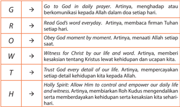

Tabel ini menunjukkan 7 prinsip utama dalam kehidupan seorang Muslim yang berfokus pada hubungan dengan Allah. Topik utamanya adalah "G" (Go to God in daily prayer), "R" (Read God's word everyday), "O" (Obey God moment by moment), "W" (Witness for Christ by our life and word), "T" (Trust every detail of our life), "H" (Holy Spirit: Allow Him to control and empower our daily life and witness), dan "A" (Artinya, membaca firman Tuhan setiap hari). Setiap kolom menggambarkan bagaimana prinsip tersebut diimplementasikan dalam kehidupan sehari-hari. Misalnya, "G" melibatkan berdoa setiap hari, "R" melibatkan membaca Al-Quran setiap hari, "O" melibatkan mengikuti perintah Allah setiap saat, "W" melibatkan memberikan kesaksian tentang Kristus melalui kehidupan dan ucapan, "T" melibatkan mempercayai setiap detail kehidupan kita kepada Allah, "H" melibatkan mempercayai Roh Kudus untuk mengendalikan dan memberdayakan kehidupan kita, dan "A" melibatkan membaca firman Tuhan setiap hari. Pola penting yang terlihat adalah bahwa semua prinsip ini saling terkait dan saling mendukung dalam mencapai tujuan spiritual yang lebih tinggi.

### C. Penjelasan Bahan Alkitab

### 1.  Yohanes 15:1-8

Pengajaran  Yesus tentang  pokok  anggur  yang  benar  menggambarkan kehidupan umat Allah yang diinginkan oleh Tuhan, yakni berakar, bertumbuh, dan  berbuah  di  dalam  Dia.  Yesus  menggambarkan  diri-Nya  sebagai  pokok anggur yang benar, dan pemilik yang mengurus pohon anggur ini adalah Allah. Tujuan dari setiap pokok anggur ialah untuk berbuah, oleh karena itu pokok anggur  tidak  dapat  dipandang  terpisah  dari  ranting-ranting  yang  berbuah itu. Pengusaha pokok anggur akan melihat kebergunaan setiap ranting. Satu ranting yang sama sekali tidak berbuah tidak pantas mendapat tempat pada pokok  anggur  itu,  sehingga  harus  dibersihkan.  Dengan  demikian,  dapat memperbaiki ranting-ranting yang berbuah sedikit.

Melalui ajaran ini, kita  dapat  memahami  bahwa  manusia  tidak  dapat bertumbuh dan berbuah kalau tidak berakar di dalam Kristus (ayat 4). Tuhan Yesus mengajarkan perkara yang sama ketika Dia berkata, 'Tinggallah di dalam Aku dan Aku di dalam kamu. Sama seperti ranting tidak dapat berbuah dari dirinya sendiri, kalau ia tidak tinggal pada pokok anggur, demikian juga kamu tidak  berbuah,  jikalau  kamu  tidak  tinggal  di  dalam  Aku...  sebab  di  luar  Aku

 

---
## 📄 Halaman 69

kamu  tidak  dapat  berbuat  apa-apa'  (Yoh.  15:4,5).  Demikian  juga  kita  wajib untuk bergantung dan bersandar kepada Kristus supaya dapat menghidupkan satu kehidupan yang suci, sama seperti cabang bergantung atas batangnya supaya dapat bertumbuh dan berbuah. Kalau terpisah daripada-Nya maka kita tidak dapat hidup. Dengan tinggal di dalam Dia kita dapat tumbuh dengan subur. Dengan menerima hidup dari Dia saja, maka kita tidak akan layu dan akan menghasilkan buah, yakni menjadi kesaksian bagi sesama.

### 2.  Lukas 8:4-15

Dalam Lukas 8:4-15 serta Matius 13, Tuhan Yesus memberikan perumpamaan tentang  penabur  yang  menaburkan  benih  pada  empat  jenis  tanah  yang digambarkan sebagai penerima Firman Tuhan.

- Jenis  pertama  menggambarkan  benih  yang  jatuh  di  pinggir  jalan.  Benih yang jatuh di pinggir jalan melambangkan orang Kristen yang mendengar firman  Tuhan  tetapi  tidak  memiliki  tempat  dalam  hati  dan  pikirannya, sehingga  tidak  memperoleh  apa-apa.  Orang  ini  hanya  datang  ke  gereja untuk  memenuhi  kewajiban  saja  dan  tidak  memiliki  komitmen  apa-apa untuk bertumbuh.
- Jenis  kedua  menggambarkan  benih  jatuh  di  tanah  berbatuan  yang hanya  sedikit  tanahnya.  Hal  ini  melambangkan  seorang  Kristen  yang hanya memberikan sedikit saja perhatian terhadap Firman Tuhan, ia tidak menyimpan  Firman  itu  dalam  hatinya  dan  tidak  mau  merenungkannya terus-menerus sehingga tidak bertumbuh dan akhirnya mati. Sedikit saja masalah dan tekanan dalam hidupnya ia akan mundur karena tidak memiliki komitmen dan kesetiaan untuk mengikuti perintah Tuhan, malahan akan marah dan kecewa kepada Tuhan kalau doanya tidak terkabul.
- Jenis ketiga adalah seperti benih yang jatuh di tanah yang penuh semak duri. Hal ini melambangkan orang yang memiliki keinginan untuk bertumbuh, ia sangat senang mendengar Firman dan bahkan sering melayani, tetapi di dalam  hatinya  juga  masih  banyak  keinginan  yang  bertentangan  dengan Firman  Tuhan, mencintai kebenaran  dan  mencintai dosa pada  saat bersamaan.  Imannya  bertumbuh  bersama-sama  dengan  kekhawatiran dunia, selain itu pesona kekayaan juga sering menghimpitnya hingga tidak bertumbuh atau mati.
- Jenis  keempat  adalah  benih  yang  jatuh  di  tanah  yang  baik.  Hal  ini menggambarkan orang Kristen yang serius dan sungguh-sungguh terhadap kebenaran Firman Tuhan. Orang seperti ini memberi hati dan pikirannya secara  utuh  untuk  menerima  kebenaran  serta  mempraktikkannya  secara

 

---
## 📄 Halaman 70

serius  dan  setia,  sehingga  ia  bertumbuh  dan  berbuah.  Berbuah  adalah tanda  perubahan  dan  pertumbuhan,  buah  yang  lahir  dari  pertumbuhan adalah perubahan pada kualitas total hidup seorang Kristen yang setia pada Allah dan firman-Nya.

### 3.  Mazmur 1:1-6

Mazmur ini membandingkan dua jenis orang yang diakui Allah, masing-masing dengan sekumpulan prinsip hidup tertentu

- Orang saleh, yang  berciri  kebenaran,  kasih,  ketaatan  kepada  firman Allah  dan  pemisahan  dari  persekutuan  dengan  dunia  (ayat  1-3).  Orang yang  diberkati  Allah  bukan  hanya  berbalik  dari  kejahatan,  tetapi  juga membangun hidup mereka di sekitar firman Tuhan. Mereka berusaha untuk menaati kehendak Allah dari hati yang sungguh-sungguh dan senang akan jalan dan perintah Allah. Mereka yang berusaha untuk hidup dengan berkat Allah  merenungkan  Taurat  Allah  yaitu  firman-Nya  supaya  membentuk pikiran,  sikap,  dan  tindakan  mereka.  Mereka  membaca  kata-kata  Alkitab, merenungkannya dan membandingkannya dengan ayat lain.
- Orang fasik, yang mewakili jalan dan nasihat dunia, yang tidak tinggal dalam firman Allah, dan karena demikian tidak ada bagian dalam perkumpulan umat  Allah  (ayat  4-6).  Akibatnya,  jalan  yang  ditempuh  berujung  kepada kebinasaan.

### D. Kegiatan Pembelajaran

### Pengantar

Dalam bagian pengantar ini, guru menjelaskan konsep keluarga yang berbahagia menurut  pandangan  kristiani,  sebagai  pengantar  dalam  materi  bertumbuh sebagai  keluarga  Allah.  Berikan  tanggapan  yang  positif  kepada  peserta  didik berkaitan dengan pendapat mereka masing-masing mengenai defenisi keluarga yang berbahagia.

### Kegiatan 1: Mengenal Diri Sendiri

Kegiatan ini dilakukan oleh peserta didik untuk lebih mengenal dirinya sendiri. Pertumbuhan yang dialami oleh peserta didik misalnya dalam aspek intelektual: wawasan dan pengetahuannya semakin luas, aspek spiritual: relasi dengan Tuhan lebih dekat (misalnya melalui saat teduh pribadi maupun ibadah keluarga yang dilaksanakan secara teratur), aspek fisik: tubuh menjadi semakin tinggi, gemuk, langsing, dan sebagainya.

 

---
## 📄 Halaman 71

Kegiatan  ini  bertujuan  untuk  memberikan  pemahaman  kepada  peserta  didik mengenai  pertumbuhan  yang  dialami  oleh  keluarga  dapat  dipengaruhi  oleh pertumbuhan  yang  dialami  oleh  setiap  individu  keluarga.  Peserta  didik  harus mampu  memberikan  kontribusi  yang  positif  berkaitan  dengan  pertumbuhan yang  dialami  secara  individual  dalam  kehidupan  keluarga  yang  bertumbuh  ke arah Kristus.

### Kegiatan 2: Diskusi dan Sharing

Peserta didik diminta mengidentifikasikan perbedaan antara ranting anggur yang tinggal pada pokoknya yang menghasilkan buah, dengan ranting anggur yang terlepas  dari  pokok  anggur  sehingga  menjadi  layu,  kering  dan  tidak  berguna. Kegiatan ini merupakan pengantar sebelum masuk pada materi.

### Kegiatan 3: Mendalami Alkitab

Peserta  didik  mendalami  bagian  Alkitab  berupa  perumpamaan  yang  diajarkan oleh Tuhan Yesus. Perumpamaan ini bertujuan untuk mengajarkan para pengikut Yesus  tentang  sikap  hati  dalam  mendengarkan  firman  Tuhan.  Kegiatan  ini bertujuan  agar  peserta  didik  dapat  menemukan  hambatan-hambatan  dalam proses  pertumbuhan,  sehingga  individu  atau  keluarga  tidak  dapat  bertumbuh dengan baik. Melalui perumpamaan ini, guru menyadarkan peserta didik bahwa sikap  hati  seperti  tanah  yang  baiklah  yang  sangat  diperlukan  dalam  proses pertumbuhan sebagai keluarga Allah. Peserta didik juga diminta untuk menilai secara kritis kehidupan keluarganya.

### Kegiatan 4: Berpikir Kreatif

Kegiatan ini bertujuan untuk meningkatan kreatifitas dan daya pikir peserta didik. Model yang dipakai adalah model sinektik, di mana peserta didik membandingkan dua hal yang berbeda. Keluarga yang berakar, bertumbuh, dan berbuah dalam Kristus  dapat  diumpamakan  dengan  pohon  yang  memiliki  akar,  mengalami proses  pertumbuhan,  dan  menghasilkan  buah.  Guru  menuntun  peserta  didik dalam membandingkan dua hal yang berbeda tersebut dalam bentuk gambar.

### E.  Penilaian

Penilaian  dalam  rangka  mengukur  tercapainya  kompetensi  yang  dilakukan dengan mengukur ketercapaian  seluruh  indikator.  Bentuk  penilaian  adalah  tes lisan,  tulisan,  dan  penugasan  melalui  model  sinektik.  Perlu  ditekankan  bahwa penilaian berlangsung selama proses pembelajaran.

 

---
## 📄 Halaman 72

### F.  Penutup

- yy Rangkuman
- yy Ayat  Emas  yang  harus  dihafalkan.  Sebagai  bentuk  evaluasi,  peserta  didik diminta untuk menghafalkannya pada pertemuan yang akan datang.
- yy Bernyanyi dan berdoa yang dipimpin oleh salah satu peserta didik.

 

---
## 📄 Halaman 73

### Penjelasan Bab IV Keluarga yang Kuat, Melahirkan Pribadi yang Kuat

Bahan Alkitab: Matius 7:24-27, Kisah Para Rasul 2:42

### Kompetensi Dasar:

- 1.1  Mengakui peran Allah dalam kehidupan keluarga.
- 2.1  Mengembangkan perilaku tanggung jawab sebagai wujud dari pengakuan terhadap peran Allah dalam kehidupan keluarga.
- 3.1  Memahami peran Allah dalam kehidupan keluarga.
- 4.1  Bersaksi tentang peran Allah dalam keluarganya.

### Indikator:

- Menganalisis secara kritis masalah perceraian yang terus meningkat sebagai dampak dari keluarga yang tidak kuat.
- Memaknai keluarga yang dibangun di atas Kristus sebagai batu yang kokoh berdasarkan Matius 7:24-27.
- Menghayati dan memaknai keluarga sebagai fondasi yang kuat bagi pribadi dalam kehidupan.
- Menjelaskan aspek-aspek karakter bangsa dan menerapkannya dalam kehidupan sehari-hari.

### A. Pengantar

Kasus perceraian terus marak dan meningkat dalam kehidupan bermasyarakat. Secara sederhana, perceraian dipahami sebagai berakhirnya suatu pernikahan. Saat kedua pasangan (suami-istri) tidak ingin melanjutkan kehidupan pernikahannya, mereka meminta pemerintah untuk memisahkan atau memutuskan hubungan tersebut. Terdapat dua jenis perceraian, yakni cerai hidup dan cerai mati (salah satu  pasangan  meninggal).  Banyak  faktor  yang  menjadi  penyebab  perceraian, misalnya,  ketidakharmonisan  dalam  rumah  tangga  karena  masalah  ekonomi,

 

---
## 📄 Halaman 74

adanya orang ketiga atau perselingkuhan bahkan perzinahan, krisis moral yaitu tanggung  jawab  suami  atau  istri  yang  dilalaikan,  dan  kekerasan  dalam  rumah tangga (KDRT).

Masalah  keluarga  ini  tidak  dapat  didiamkan  begitu  saja,  sebagai  generasi penerus  bangsa  remaja  Kristen  perlu  dibekali  dengan  norma-norma  dalam masyarakat dan nilai-nilai kristiani sehingga kelak keluarga yang dibangun adalah keluarga yang kuat dalam landasan moral sehingga masalah ini dapat dikurangi.

### B. Uraian Materi

### 1. Keluarga yang Kuat

Banyak sekali berita di media masa maupun elektronik, ketika bencana datang rumah-rumah rubuh serta hancur karena memiliki fondasi yang tidak kuat. Tanpa fondasi yang kuat, tidak ada rumah yang tetap berdiri tegak melawan bencana tersebut.  Sama  halnya  dengan  keluarga,  kekuatan  berdirinya  keluarga  adalah memiliki fondasi yang kuat. Di dalam Alkitab telah difirmankan apa landasan yang kuat di mana sebuah keluarga harus berdiri.

Seperti  perumpamaan  Tuhan  Yesus  dalam  Matius  7:24-27  tentang  orang yang  bijaksana  dan  orang  yang  bodoh.  Membangun  rumah  diartikan  sebagai membangun kehidupan, termasuk kehidupan keluarga. Setiap orang percaya yang mengalami lahir baru maka ia mulai membangun kehidupan yang baru. Supaya kehidupan ini kuat maka harus dibangun di atas dasar yang kokoh. Tuhan Yesus menyebut dasar ini adalah batu karang. Yang diwakili oleh batu karang adalah Kristus sendiri. Jika kehidupan keluarga dibangun di atas Kristus, maka keluarga akan memiliki kehidupan yang kokoh, dan akan aman serta selamat, meski harus mengalami berbagai tekanan sulit.

Membangun di atas Kristus artinya, seluruh kehidupan keluarga bergantung sepenuhnya  kepada  Kristus.  Seluruh  bangunan  kehidupan  keluarga  bertumpu sepenuhnya  kepada  Kristus  sebagai  landasan  hidup  keluarga.  Kristus  akan sepenuhnya menopang kehidupan keluarga Kristen dalam menghadapi berbagai persoalan kehidupan dan memampukan keluarga melewati ujian sehingga tetap kokoh dan kuat berdiri, serta memperoleh keselamatan kekal.

Kehidupan  keluarga  setiap  hari  juga  harus  bergerak  ke  arah  Kristus.  Jika keluarga telah membangun hubungan yang kokoh dengan Tuhan, 'rumah' bukan sekedar  berdiri  di  atas  batu,  tetapi  tertanam  di  batu  itu.  Tuhan  menginginkan keluarga  memiliki  hubungan  yang  kuat  terikat  dengan  Kristus.  Tuhan  ingin keluarga  bertambah  teguh  di  dalam  iman  kepada  Kristus  dan  hati  berlimpah dengan ucapan syukur. Keluarga Kristen harus menjadi kelompok Kristen yang memandang jauh ke depan, bahwa hidup bukan hanya untuk sesaat di dunia ini

 

---
## 📄 Halaman 75

saja, tetapi sampai kepada kehidupan kekal. Menjadi orang Kristen tidak cukup hanya mendengarkan firman-Nya saja tetapi harus menjadikan firman itu hidup dalam diri dengan mempraktikkannya dalam kehidupan sehari-hari. Contohnya, di  tengah  situasi  ekonomi  yang  tidak  menentu,  keluarga  Kristen  perlu  terus bertumbuh di dalam kejujuran, tidak korupsi, tidak mencuri, terus berpegang pada nilai kejujuran, hidup apa adanya sesuai ajaran Kristiani. Di tengah maraknya arus teknologi dan informasi, keluarga Kristen tetap berpegang pada ajaran Kristiani, tidak  menggunakan  media  untuk  menyampaikan  informasi  bohong,  menipu, menjatuhkan orang lain. Kesemuanya mempunyai nilai kekekalan.

Berbeda dengan orang yang bijaksana, orang yang bodoh mendirikan rumah di atas pasir melambangkan orang yang membangun kehidupannya dengan tujuan jangka pendek dan di atas 'dunia' , misalnya harta, kekuasaan, dan kehormatan. Semua hal dunia ini sifatnya tidak tetap, seperti pasir, yang mudah bergeser. Jika persoalan datang, hasilnya adalah kehancuran. Jika keluarga mengandalkan  'dunia' ini sebagai landasan kehidupan, maka yang akan didapat adalah kehidupan yang lemah, mudah terseret arus yang jahat, dan pada akhirnya hidup menjadi hancur. Kehidupan keluarga yang hancur hanya akan mendatangan penyesalan.

Perbedaan kedua rumah itu terletak pada dasarnya. Dilihat dari luar mungkin tampak sama baik dan indah namun berbeda dalam hal dasar, yakni kekuatan dan kualitasnya. Ini hanya bisa dilihat jika kita menyelidiki dengan membongkar lantainya,  atau  setelah  rumah  itu  roboh.  Keluarga  Kristen  sering  menghadapi berbagai masalah yang berat, yang datang dari luar. Masalah keluarga, ekonomi, tekanan-tekanan dari masyarakat non Kristen, godaan iblis, dan lain sebagainya yang dapat menyebabkan kehancuran. Masalah kadang-kadang datang secara tiba-tiba,  bahkan di luar kemampuan. Keluarga Kristen harus selalu siap menghadapi berbagai masalah yang datang.

Realita yang terjadi dalam kehidupan orang Kristen adalah sangat sulit untuk mempraktikkan firman Tuhan dalam kehidupan sehari-hari. Namun jika keluarga Kristen  benar-benar  mengandalkan  Kristus  sebagai  landasan  hidup  dan  setiap hari  mau  berusaha  keras  membangun  hubungan  yang  dalam  dengan  Kristus, serta menjadikan kasih sebagai pengikat, maka Kristus akan menolong umat-Nya untuk  dapat  melakukan  kehendak-Nya.  Niscaya  keluarga  Kristen  akan  mampu menahan badai kehidupan yang menerpa dan menerima upah yang indah karena berhasil melewati ujian.

### 2. Kepribadian yang Kuat

Keluarga Kristen memiliki peluang yang besar untuk membangun karakter yang kuat dalam diri anak dalam keluarga. Tentunya dalam hal ini hanya keluarga yang harmonis, yang di dalamnya terdapat sejuta cinta, kasih sayang, serta integritaslah

 

---
## 📄 Halaman 76

yang kemudian mampu membuat model pendidikan yang terbaik untuk anak. Maka dari itu, keluarga Kristen harus mampu menjadi model pendidikan terbaik bagi anak.

Keluarga  sebagai  model  pendidikan  harus  menjalin  komunikasi  yang  lebih efektif dengan anggota keluarga. Komunikasi merupakan sarana pengungkapan dan penyampaian sesuatu dalam membangun relasi antara anggota keluarga.  Komunikasi  yang  sehat  sangat  menentukan  dalam  mempengaruhi dan memberikan  dukungan  serta  motivasi bagi anggota  keluarga  dalam perkembangan kehidupannya. Kemampuan mengomunikasikan ide dan perasaan berguna untuk memahami satu dengan yang lain secara tepat, sehingga orang lain dapat memperhatikan dan mengasihi, serta dapat belajar menyelesaikan masalah dan konflik sehingga dapat saling mendekatkan, mendorong pertumbuhan dan perkembangan hubungan antar anggota keluarga.

Apabila keluarga memiliki fondasi yang kuat dan kokoh dalam kelangsungan hidupnya,  maka  hal  tersebut  juga  akan  memberikan  dampak  bagi  anggota keluarganya, termasuk anak dan remaja. Anak dan remaja akan tumbuh dalam terang  kasih  dan  firman  Tuhan  yang  menuntunnya  dalam  mengarungi  masa depan yang cerah dan sesuai dengan nilai-nilai kristiani.

Untuk menjadi pribadi Kristen yang kuat, setiap anggota keluarga termasuk anak-anak  perlu  selalu  membiasakan  hidup  dalam  pola  hidup  kristiani  setiap hari.  Pembiasaan  hidup  adalah  hal  yang  paling  penting  sekaligus  merupakan suatu kebutuhan. Dalam hal ini kita perlu membiasakan berelasi secara sengaja dengan Tuhan sehingga pengembangan kehidupan dengan Tuhan menjadi suatu kebutuhan, sebagaimana setiap hari kita membutuhkan makan dan minum untuk kebutuhan  jasmani.  Kebutuhan  rohani  juga  perlu  dijadikan  kebiasaan  setiap hari.  Apakah  kita  tahu  bahwa  pribadi  Kristen  dalam  jemaat  awal  mempunyai kebiasaan untuk mengembangkan kehidupan rohani dengan Tuhan dan sesama sebagaimana yang tertulis di dalam Kisah Para Rasul 2:42, berikut ini.

### 'Mereka bertekun dalam pengajaran rasul-rasul dan dalam persekutuan.  Dan  mereka  selalu  berkumpul  untuk  memecahkan roti dan berdoa.'

Dalam ayat ini mengandung beberapa hal yang menarik dalam mengembangkan kebiasaan hidup rohani setiap hari.

- Pribadi  dan  keluarga  Kristen  setiap  hari  bertekun  dalam  pengajaran  rasulrasul. Artinya, setiap hari kita harus bertekun dan setia untuk membaca dan memahami Alkitab sebagai pengajaran rasul-rasul.
- Persekutuan bersama.
- Berkumpul memecahkan roti atau melakukan perjamuan kudus.
- Berdoa bersama untuk kepentingan pribadi, sesama, dan gereja.

 

---
## 📄 Halaman 77

Untuk  membiasakan  kehidupan  rohani,  minimal  tiga  hal  berikut  dapat diterapkan dalam kehidupan keluarga maupun secara pribadi.

- Di  pagi  hari,  beribadahlah  secara  singkat  kurang  lebih  10  menit  bersama keluarga  (bapak,  ibu,  anak-anak,  dan  orang  yang  tinggal  dalam  keluarga). Yang dilakukan adalah berdoa untuk mendengarkan firman Tuhan, membaca Alkitab, membaca renungan harian atau penjelasan singkat dari salah seorang anggota keluarga tentang ayat yang dibaca. Diakhiri dengan doa syukur atas firman Tuhan, mendoakan kegiatan sepanjang hari ini, mendoakan orang lain, serta gereja.
- Siang  hari,  secara  pribadi.  Sekitar  jam  12  siang  atau  sesudah  makan  siang, dalam  sikap  berdoa  hayati  dan  hafalkan  doa  Bapa  kami  dan  hukum  kasih sebagaimana yang tertera dalam Matius 22:37-39.
- Pada malam hari sebelum atau sesudah belajar, membaca Alkitab dan refleksi terhadap apa yang terjadi pada hari itu. Hal ini dapat dilakukan dengan metode PPA, kemudian refleksikan apa yang Allah telah lakukan terhadap pribadi dalam kegiatan-kegiatan yang telah terjadi sepanjang hari. Hal ini bisa direnungkan maupun  dituliskan.  Dalam  membaca  dan  memahami  Alkitab,  pertanyaan berikut dapat dijadikan penuntun.
- Siapa yang disebut dalam bagian ini?
- Allah Bapa, Tuhan Yesus dan Roh Kudus
- Tokoh lain
- Apa yang diungkapkan dalam teks Alkitab tersebut?
- Adakah janji, perintah atau larangan, dan sebagainya?
- Sikap atau kebiasaan apa yang harus saya ubah?
- Lakukanlah janji, perintah atau larangan tersebut!
- Apa yang saya pelajari dari firman Tuhan yang dibaca?
- Pilihlah  ayat  yang  menarik  atau  berkesan  dari  teks  Alkitab  yang  dibaca. Jelaskan mengapa!
- Berdoalah sekali lagi untuk bersyukur atas firman Tuhan yang dibaca dan mohon tuntunan Roh Kudus untuk dapat menerapkannya dalam kehidupan sehari-hari.
Kalau dalam keluarga remaja belum memiliki kebiasaan ini, remaja bertugas untuk mengajak keluarga beribadah secara rutin.

### 3. Karakter Bangsa yang Mendukung Karakter Kristen

Pribadi Kristen yang kuat harus juga harus mempunyai aspek-aspek karakter bangsa.  Berkaitan  dengan  hal  tersebut,  pendidikan  karakter  bangsa  adalah suatu  sistem  penanaman  nilai-nilai  karakter  kepada  anak  dan  remaja  yang meliputi komponen pengetahuan, kesadaran atau kemauan, dan tindakan untuk

 

---
## 📄 Halaman 78

melaksanakan  nilai-nilai  tersebut,  baik  terhadap  Tuhan,  diri  sendiri,  sesama, lingkungan,  maupun  kebangsaan  sehingga  menjadi  manusia  yang  berakhlak mulia. Aspek karakter bangsa yang akan mendukung pribadi yang kuat adalah sebagai berikut.

- Religius,  yaitu  sikap  yang  patuh  dalam  melaksanakan  ajaran  agama  yang dianutnya, dan hidup rukun dengan pemeluk agama lain.
- Jujur, yaitu perilaku yang didasarkan pada upaya menjadikan dirinya sebagai orang yang selalu dapat dipercaya dalam perkataan, tindakan, dan pekerjaan.
- Toleransi,  yaitu  tindakan  yang  menghargai  perbedaan  agama,  suku,  etnis, pendapat, sikap, dan tindakan orang lain yang berbeda dari dirinya.
- Disiplin,  yaitu  tindakan  yang  menunjukkan  perilaku  tertib  dan  patuh  pada berbagai ketentuan dan peraturan.
- Kerja keras, yaitu tindakan yang menunjukkan perilaku tertib dan patuh pada berbagai ketentuan dan peraturan.
- Kreatif, yaitu berpikir dan melakukan sesuatu untuk menghasilkan cara atau hasil baru dari sesuatu yang telah dimiliki.
- Mandiri,  yaitu  sikap  yang  tidak  mudah  tergantung  pada  orang  lain  dalam menyelesaikan tugas-tugas.
- Demokratis, yaitu cara berfikir, bersikap, dan bertindak yang menilai sama hak dan kewajiban dirinya dan orang lain.
- Rasa  ingin  tahu,  yaitu  sikap  dan  tindakan  yang  selalu  berupaya  untuk mengetahui  lebih  mendalam  dan  meluas  dari  sesuatu  yang  dipelajarinya, dilihat, dan didengar.
- Semangat kebangsaan, yaitu cara berpikir, bertindak, dan berwawasan yang menempatkan kepentingan bangsa di atas kepentingan diri dan kelompoknya.
- Cinta tanah air, yaitu cara berpikir, bersikap, dan berbuat yang menunjukan rasa  kesetiaan,  kepedulian,  dan  penghargaan  yang  tinggi  terhadap  bahasa, lingkungan fisik, sosial, budaya, ekonomi, dan politik bangsa.
- Menghargai prestasi, yaitu sikap yang mendorong dirinya untuk menghasilkan sesuatu  yang  berguna  bagi  masyarakat,  mengakui,  serta  menghormati keberhasilan orang lain.
- Bersahabat/komunikatif,  yaitu  tindakan  yang  mampu  menjalin  relasi  positif dengan orang lain sebagai saudara dan sahabat.
- Cinta damai, yaitu sikap yang suka damai, menghargai orang lain yang tumbuh dari hati yang bersih juga dengan sadar menghindari konflik yang distruktif dan tidak membangun.
- Gemar  membaca,  yaitu  kebiasaan  menyediakan  waktu  untuk  membaca berbagai bacaan yang memberikan kebajikan bagi dirinya.

 

---
## 📄 Halaman 79

- Peduli lingkungan, yaitu tindakan yang mencintai lingkungan, selalu berupaya mencegah kerusakan pada lingkungan alam di sekitarnya.
- Peduli sosial, yaitu tindakan yang selalu ingin memberi bantuan pada orang lain dan masyarakat yang membutuhkan.
- Tanggung  jawab,  yaitu  perilaku  seseorang  untuk  melaksanakan  tugas  dan kewajibannya yang seharusnya dia lakukan terhadap diri sendiri, masyarakat, lingkungan (alam, sosial dan budaya), negara, dan Tuhan.
Bagi orang Kristen, memiliki karakter bangsa memang sangat penting dan hal itu dapat mendukung karakter Kristen yang dibangun dalam Perjanjian Lama dan Perjanjian Baru. Tuhan Yesus meringkaskan karakter Kristen itu adalah melakukan hukum  kasih,  yaitu  mengasihi Tuhan  Allah,  mengasihi  orang  lain  seperti    mengasihi diri sendiri.

### C. Penjelasan Bahan Alkitab

### 1.  Matius 7:24-27

Pada zaman Tuhan Yesus, rumah-rumah di pedesaan biasanya dibangun dari lumpur yang mengeras. Pencuri bisa melubangi tembok rumah semacam itu karena terbuat dari bahan yang rapuh. Di Israel cuaca dapat berubah dengan cepat.  Selama  musim  panas  yang  sering  terjadi  sangat  lama,  sungai-sungai banyak yang kering. Di musim dingin, hujan lebat membuat sungai kering bisa berubah menjadi aliran air yang sangat deras dan kadang-kadang merubah daratan secara drastis. Di padang gurunpun bisa terjadi banjir yang menyapu bersih perkemahan, menghilangkan nyawa manusia dan ternak. Saat musim kering, orang-orang yang berdiam di lembah mengambil kesempatan bercocok tanam di tepi-tepi sungai, bahkan mendirikan pondok-pondok di situ, di atas tanah pasir. Mereka hanya memikirkan hasil yang akan mereka peroleh, tanpa memikirkan bahaya yang akan mereka alami jika sewaktu-waktu datang hujan.

Teks ini menuliskan tentang hujan yang turun, aliran air yang naik, dan angin yang  bertiup.  Teks  ini  juga  membandingkan  antara  orang  bijaksana  yang membangun rumah di atas batu dan orang bodoh yang membangun rumah di atas pasir. Ini merupakan teguran Tuhan Yesus mengenai orang-orang yang pandai berseru 'Tuhan' tetapi tidak melakukan perkataan-Nya.

Musibah banjir yang sering terjadi di Palestina, bisa menyebabkan kerusakan hebat pada bangunan rumah, bahkan meruntuhkannya. Namun jika fondasi rumah itu kokoh (fondasinya adalah batu) maka rumah itu tidak akan goyah, rusak atau runtuh. Musibah alam ini menggambarkan berbagai masalah yang sering dihadapi manusia. Ketika dihadapkan dengan berbagai masalah hidup

 

---
## 📄 Halaman 80

yang berat, orang Kristen tidak akan goyah imannya jika dia mempunyai dasar yang  kokoh  pada  saat  membangun  kehidupannya.  Dasar  yang  kokoh  agar tahan menghadapi berbagai masalah dalam kehidupan adalah datang kepada Tuhan Yesus,  mendengar  perkataan-Nya  serta  melakukannya.  Masalah  yang dihadapi dapat merupakan cobaan dari iblis; atau karena kesalahan yang kita buat;  atau  karena  Tuhan  mau  menguji  iman  kita  dengan  membiarkan  kita menghadapi berbagai masalah.

### a.  Pembangun yang bijaksana

Batu adalah fondasi yang keras dan kuat. Rumah yang dibangun di atasnya tidak  mudah  goyah  pada  saat  datang  banjir  atau  angin.  Pembangun rumah  ini  memikirkan  tujuan  jangka  panjang.  Dia  memperhitungkan bahwa  sewaktu-waktu  akan  datang  hujan,  angin  dan  banjir  yang  dapat merobohkan rumah jika rumah tidak kokoh, maka ia harus membangun rumah di atas batu supaya rumah itu kokoh. Meskipun memerlukan waktu yang  lama,  tetap  akan  ditempuhnya  karena  ia  mau  memakai  rumah  itu untuk jangka waktu yang lama. Apa yang telah dikorbankannya tidak akan sia-sia.

Disebut  sebagai  orang  yang  bijaksana,  karena  ia  mendengar  perkataan Tuhan Yesus dan melakukannya. Orang yang melakukan perkataan Tuhan Yesus  sama  dengan  melakukan  kehendak  Allah  Bapa,  dan  dialah  yang akan masuk ke dalam Kerajaan Sorga. Dasar yang kuat untuk membangun kehidupan adalah datang kepada Tuhan Yesus, mendengarkan firman-Nya dan melakukannya. Kehidupan akan menjadi kuat, tidak akan mudah goyah imannya, dan siap setiap saat menghadapi berbagai persoalan yang berat. Hasilnya adalah keselamatan.

### b.  Pembangun yang bodoh

Sifat pasir adalah mudah digali, mudah tergerus air, dan mudah bergeser karena  angin.  Karena  sifat-sifatnya  ini,  maka  jika  membangun  rumah  di atas  pasir  rumah  tersebut  tidak  akan  kokoh,  tetapi  mudah  rusak  bahkan runtuh saat dilanda banjir atau diterpa angin yang kuat. Demikian pula jika membangun di atas tanah tanpa dasar. Sifat tanah juga mudah tergerus air, sehingga jika rumah dibangun tanpa fondasi batu, rumah itu akan runtuh di saat banjir.

Membangun rumah di atas pasir menunjukkan pekerjaan yang sembarangan, tidak  mau  repot  mencari  lokasi  yang  aman.  Membangun  rumah  tanpa dasar menunjukkan tidak mau melakukan pekerjaan yang berat dan sukar. Pembangun rumah ini tidak memikirkan tujuan jangka panjang. Dia hanya berpikir pendek, menginginkan rumah segera jadi, segera bisa ditempati, menggunakan cara yang mudah, tidak mau bekerja keras dan tidak mau

 

---
## 📄 Halaman 81

melakukan hal-hal yang sukar. Dia tidak memperhitungkan adanya musibah yang akan datang. Pada saat datang hujan dan banjir, rumah itupun akan roboh karena fondasinya tidak kokoh.

Orang  ini  adalah  orang  yang  berseru  kepada  Tuhan  Yesus,  mendengar perkataan Tuhan Yesus tapi tidak melakukannya. Orang yang datang kepada Tuhan  Yesus  tetapi  tidak  mau  mendengarkan  perkataan-Nya,  apalagi melakukannya, akan menghasilkan kehidupan yang lemah, tidak siap jika tiba-tiba datang persoalan berat, dan tidak mampu mengatasinya. Hasilnya adalah kehancuran.

### D. Kegiatan Pembelajaran

### Pengantar

Dalam pengantar, peserta didik harus mampu menanggapi secara kritis masalah keluarga yang marak terjadi, yakni kasus perceraian. Dengan tanggapan tersebut, diharapkan  dapat  memahami  realita  yang  terjadi  dalam  kehidupan  sosial, sehingga sejak dini peserta didik dapat mempersiapkan diri secara utuh sebelum mengambil keputusan untuk berumah tangga pada masa yang akan datang.

### Kegiatan 1: Menanggapi Berita

Peserta didik diminta untuk membaca artikel selanjutnya menjawab pertanyaan tentang perceraian.

### Kegiatan 2: Belajar dari Alkitab

Peserta  didik  diharapkan  dapat  mengidentifikasi  dua  macam  dasar  dalam pembacaan Alkitab, serta dapat memberikan tanggapan atas pertanyaan yang diajukan.

### Kegiatan 3: Refleksi

Refleksi ini dilakukan oleh peserta didik untuk menilai dan mengetahui sejauh mana kehidupan keluarga menjadikan Kristus sebagai dasar atau fondasi keluarganya, serta sikap apa yang harus dilakukan oleh peserta didik untuk mendukung dan mendorong keluarganya agar tetap bertumpu kepada Kristus.

### Kegiatan 4: Penilaian Diri

Dalam  kegiatan  ini  peserta  didik  harus  mengidentifikasikan  kekuatan  dan kelemahan  dalam  dirinya  sendiri.  Setelah  itu, ajaklah peserta  didik  untuk mengubah kelemahan yang ada pada dirinya sehingga dapat membawa manfaat yang lebih baik dalam kehidupannya, baik dalam keluarga, sekolah, gereja maupun masyarakat.

 

---
## 📄 Halaman 82

### Kegiatan 5: Penugasan

Dalam  kegiatan  ini  peserta  didik  diharapkan  dapat  menerapkan  hal-hal  yang dipelajari mengenai kebiasaan berdoa bersama keluarga maupun secara individu sehingga dapat membentuk kepribadiannya menjadi lebih baik.

### Kegiatan 6: Tugas Mandiri

Kegiatan ini menuntut peserta didik untuk dapat menemukan masalah-masalah yang  terjadi  di  keluarga  peserta  didik  berkaitan  dengan  aspek-aspek  karakter bangsa.

### E.  Penilaian

Penilaian  terhadap  peserta  didik  dilakukan  selama  proses  pembelajaran, melalui beberapa kegiatan penugasan serta melalui tercapainya semua indikator kompetensi.

### F.  Penutup

- yy Rangkuman
- yy Ayat  Emas  yang  harus  dihafalkan.  Sebagai  bentuk  evaluasi,  peserta  didik diminta untuk menghafalkannya pada pertemuan yang akan datang.
- yy Bernyanyi  dan  berdoa  yang  dipimpin  oleh  peserta  didik  untuk  mengakhiri kelas.

 

---
## 📄 Halaman 83

### Penjelasan Bab V Pernikahan dalam Perspektif Kristiani

Bahan Alkitab: Kejadian. 2:24, Yohanes. 15:9-17, Efesus. 5:22-33

### Kompetensi Dasar:

- 1.2  Menghayati nilai-nilai Kristiani dalam kehidupan keluarga dan pernikahan.
- 2.2  Mewujudkan nilai-nilai Kristiani dalam kehidupan keluarga dan pernikahan.
- 3.2  Menganalis  pentingnya  nilai-nilai  Kristiani  dalam  kehidupan  keluarga  dan pernikahan.
- 4.2  Membuat karya yang berkaitan dengan nilai-nilai Kristiani dalam kehidupan keluarga dan pernikahan.

### Indikator:

- Mengidentifikasi permasalahan pernikahan.
- Mengidentifikasi kekhasan pernikahan Kristen.
- Mengungkapkan pentingnya mempersiapkan pernikahan Kristen.
- Mendemonstrasikan pentingnya komunikasi dalam pernikahan.
- Pernikahan menuju pada realisasi 'Gereja Domestik' .

### A. Pengantar

Tidak dapat dipungkiri, pesatnya perkembangan sosial dan perubahan nilainilai di sekitar kita,  dapat mempengaruhi kehidupan pernikahan dan keluarga. Memang  ada  beberapa  perubahan  yang  positif,  misalnya:  kesadaran  akan hak-hak  asasi  manusia,  martabat  manusia,  kesadaran  etis,  kesadaran  terhadap ketidaksetaraan dan ketidakadilan gender, dan lain-lain. Tetapi dalam kenyataan juga kita jumpai adanya nilai-nilai yang merendahkan martabat hidup perkawinan, misalnya:  maraknya  hubungan  seksual  sebelum  pernikahan,  perselingkuhan, poligami,  perceraian,  dan  kekerasan  yang  terjadi  di  dalam  rumah  tangga

 

---
## 📄 Halaman 84

(KDRT).  Oleh  karena  itu,  kita  perlu  menyadari  adanya  perubahan-perubahan, mengantisipasi  hal-hal yang akan terjadi dan berusaha untuk mencegah berbagai permasalahan kehidupan pernikahan. Untuk itu, maka perlu pemahaman yang jelas tentang pernikahan maupun kehidupan berkeluarga secara kristiani.

### B. Uraian Materi

### 1. Pentingnya Persiapan Pernikahan

Selaku  orang  muda  kita  pun  perlu  memikirkan  dan  mempersiapkan  suatu pernikahan yang baik dan memiliki kehidupan keluarga yang berkenan kepada Tuhan.

Hidup menikah dan berkeluarga adalah salah satu pilihan bagi orang Kristen. Meskipun demikian ada juga  pilihan  lain  yang  dapat  dipertanggungjawabkan, yaitu hidup tidak menikah karena bermaksud untuk dapat lebih melayani Tuhan dan  sesama. Tentunya  kamu  pernah  melihat  orang-orang  yang  memilih  hidup seperti  ini.  Dalam  Alkitab  kita  juga  dapat  melihat  kehidupan Tuhan Yesus  dan Rasul Paulus, yang hidupnya diabdikan untuk kepentingan kemuliaan Allah dan sesamanya. Dalam konteks seperti ini, hidup tidak menikah sesungguhnya juga suatu pilihan yang perlu kita hargai.

Mengapa mempersiapkan suatu pernikahan kristiani  itu  dianggap  penting? Hal  itu  sangat  penting  terutama  bagi  pasangan  yang  akan  melangsungkan pernikahan. Di samping  itu juga penting bagi gereja supaya citra gereja sebagai keluarga Allah, di mana para warganya terdiri dari keluarga-keluarga Kristen dapat dijaga,  dan  kehendak  Allah  dapat    diterapkan.  Banyak  tantangan  baik  dalam kehidupan pernikahan maupun di dalam gereja yang harus dihadapi, dan sendisendi pernikahan Kristen perlu dipertahankan.

Beberapa hal yang perlu dipahami dalam persiapan pernikahan Kristen, antara lain sebagai berikut.

- Pentingnya  suatu  pemahaman  yang  benar  tentang  pernikahan  Kristen. Pemuda dan pemudi Kristen perlu sungguh-sungguh mengerti hakikat suatu pernikahan Kristen sebagai lembaga yang dikuduskan Tuhan.
- Perlunya persiapan yang memadai. Persiapan suatu pernikahan Kristen adalah hal yang dibutuhkan oleh calon pasangan yang akan menikah, agar mereka dapat mengalami suatu pernikahan yang bahagia dan tercapainya keselamatan di dalam Tuhan.
- Secara  teknis,  persiapan  pernikahan  Kristen  dapat  dibagi  menjadi  dua  (2) bagian,  yaitu  persiapan  jangka  panjang  dan  dan  persiapan  jangka  pendek. Yang pertama,  persiapan jangka panjang, mencakup pemberian pemahaman

 

---
## 📄 Halaman 85

sekaligus  bekal  bagi  kehidupan  keluarga  Kristen.  Biasanya  hal  ini  kita  sebut sebagai 'Katekisasi Pernikahan' , dimana calon pasangan suami dan istri perlu mengenal dasar-dasar teologi pernikahan dan keluarga Krisen, etika, ekonomi keluarga, memahami pasangan, peran seksualitas, dinamika relasi keluarga dan ha;l-hal lain yang dianggap penting. Waktu yang dialokasikan biasanya sekitar enam (6) bulan. Yang kedua, persiapan jangka pendek, mencakup persiapan teknis upacara dan perhelatan pernikahan.

### 2. Hakikat Pernikahan Kristen

Pada  dasarnya  tujuan  hidup  kita  sebagai  manusia  adalah  untuk  mencapai suatu  kebahagiaan  dan    kesejahteraan.    Pernikahan  pada  hakikatnya  adalah suatu persekutuan hidup antara laki-laki dan perempuan karena mereka saling mencintai, dan ingin membentuk suatu kehidupan bersama secara tetap, memiliki tujuan yang sama yakni ingin saling membahagiakan dan kalau diperkenankan Tuhan memiliki keturunan. Pada setiap budaya di Indonesia, perkawinan dianggap sesuatu  yang  sangat  penting  di  dalam  masyarakat.  Sesungguhnya  pernikahan bukanlah masalah dua orang saja yang menikah, namun juga menjadi masalah agama dan keluarga besar.

Tujuan dan dasar suatu pernikahan Kristen antara lain:

- Suatu pernikahan merupakan peraturan yang ditetapkan oleh Tuhan. Pernikahan merupakan tata tertib yang suci yang ditetapkan oleh Allah sejak penciptaan manusia. Sebagaimana yang tertera dalam Kejadian 2:24 : '. . . Sebab itu  seorang  laki-laki  akan  meninggalkan  ayahnya  dan  ibunya  dan  bersatu dengan istrinya, sehingga keduanya menjadi satu daging' .
- Cinta kasih Tuhan Yesus Kristus menjadi dasar pernikahan Kristen (band: Yoh. 15:9-17 dan Ef. 5:22-33). Yang menjadi dasar dari kehidupan pernikahan dan keluarga  adalah  cinta  kasih  Tuhan  Yesus  Kristus  kepada  gereja-Nya.  Suami dan istri dipanggil untuk saling mencintai secara timbal balik, secara total dan menyeluruh, kemauan untuk saling memberi dan menerima.
- Untuk saling membahagiakan dan mencapai kesejahteraan hidup. Oleh karena itu, kedua belah pihak baik istri maupun suami mempunyai tanggung jawab dan memberi sumbangan yang bermakna untuk mewujudkan kesejahteraan dan kebahagiaan suami istri.
- Dalam pernikahan dengan perspektif Kristen, nikah dipandang sebagai suatu peraturan monogami. Karena monogami merupakan suatu refleksi dari kasih agape, yaitu kasih yang saling melayani,  tanpa pamrih dan eksklusif. Realita dwi tunggal, suatu kebahagiaan duniawi yang terbesar yang diberikan Tuhan kepada kita.

 

---
## 📄 Halaman 86

### 3. Kasih dalam Keluarga adalah Gambaran Cinta Kasih Tuhan

Pernahkah  kita  memperhatikan  pasangan  suami-istri  di  jemaat?  Bagaimana pendapat kita tentang pasangan suami-istri tersebut? Seringkali kita menemukan di  jemaat  kita  beberapa  pasangan  yang  meskipun  usia  pernikahannya  sudah cukup lama, namun relasi mereka sangat akrab dan mesra. Meskipun usia meraka sudah tua, namun mereka masih tetap menunjukkan  teladan pernikahan Kristen yang  baik.  Mereka  menunjukkan  bagaimana  mereka  dapat  saling  membantu, sabar menunggu, peduli satu terhadap yang lain, bergembira bersama, dan saling mendukung  dalam  pelayanan.  Pasangan-pasangan  tersebut,  ternyata  dalam realita mempunyai dampak yang besar di jemaat. Banyak pasangan dan keluarga yang menghargai kehadiran mereka, sekaligus mereka menjadi contoh pasangan suami-istri yang diberkati dan menjadi berkat di jemaat. Demikian pula pernikahan dan keluarga yang dijiwai dan dihidupi oleh cinta kasih akan memancar keluar menjadi kesaksian yang menarik dan sebagai pewartaan hidup kepada orang lain.

Tuhan menciptakan manusia menurut citra-Nya, Ia memanggil manusia untuk saling  mengasihi  sekaligus  untuk  mengasihi  Allah.  Itulah  hakikat  cinta  kasih. Tuhan  memberikan  kodrat  manusiawi  kepada  laki-laki  dan  perempuan,  dan memanggilnya  untuk  saling  mengasihi  dan  bertanggung  jawab  dalam  hidup dan  persekutuan.  Satu-satunya 'lingkungan'  yang  memungkinkan  penyerahan diri dalam arti sepenuhnya ialah pernikahan, dimana disitu ada perjanjian cinta kasih antara suami istri yang dipilih secara sadar. Pernikahan Kristen merupakan pernikahan yang eksklusif dan unik, untuk hidup dalam kesetiaan sepenuhnya antara laki-laki dan perempuan sesuai dengan rencana Allah Sang Pencipta.

Keluarga Kristen  sesungguhnya  menerima  dan  menjadi  pewarta  kabar gembira.  Hal  itu  dapat  dimulai  sejak  saat  persiapan  pernikahan,  sebagai  suatu perjalanan iman, suatu kesempatan dan peluang dimana para calon pengantin semakin memperdalam imannya dan dengan bebas menerima panggilan Kristus untuk mengikuti-Nya dalam hidup berkeluarga.

Melalui  peristiwa  hidup  sehari-hari,  baik  suka  maupun  duka,  baik  untung maupun malang, sehat dan sakit, Allah mendatangi mereka untuk menyatakan dan menyampaikan suatu tawaran dan undangan agar mengambil bagian dalam cinta kasih Kristus. Oleh karena itu, keluarga Kristen dipanggil untuk menjadi suatu komunitas yang mewartakan kabar baik atau Injil. Keluarga Kristen, seharusnya menjadi  tempat  dimana  Injil  ditaburkan  dan  selanjutnya  diwartakan  keluar. Dengan  demikian,  setiap  anggota  keluarga  Kristen,  baik  bapak,  ibu  maupun anak-anak menjadi penerima sekaligus menjadi pewarta Injil. Dengan demikian, para orang tua tidak hanya mewartakan Injil kepada anak-anak-Nya, namun juga seharusnya terbuka untuk menerima Injil dari mereka.

 

---
## 📄 Halaman 87

### 4. Pentingnya Komunikasi dalam Pernikahan dan Keluarga

Sesungguhnya setiap orang yang akan memasuki suatu kehidupan pernikahan tentu  mempunyai  keinginan  untuk  hidup  berbahagia  dan  saling  mencintai. Mereka  dapat  memiliki  relasi  yang  dekat  dan  akrab  dengan  pasangannya. Keinginan  tersebut  sesungguhnya  memang  indah;  namun  untuk  mencapainya tidaklah  mudah.  Dalam  kenyataannya,  banyak  keluarga  mengalami  kegagalan dan  kekecewaan  untuk  mewujudkan  keinginan  tersebut.  Di  sekitar  kita,  dapat dijumpai  banyak  pernikahan  mengalami  masalah  serius  dan  berakhir  dengan perceraian.  Mengapa  hal  itu  dapat  terjadi?  Salah  satu  alasan  utamanya  adalah karena suami-istri  tidak  berkomunikasi  dengan  baik.  Oleh  karena  itu,  siapapun yang akan memasuki pernikahan kristiani seharusnya mendapat pembekalan dan dipersiapkan berkaitan dengan komunikasi.

Memang  pada awal suatu pernikahan semuanya terasa mudah, baik suami  maupun  istri  saling  mendahului  dalam  usaha  membahagiakan  dan menomorsatukan  pasangannya.  Dalam  keadaan  demikian,  tentu  saja  proses penyesuaian diri dapat berjalan dengan bagus dan berhasil. Hal-hal yang kurang menyenangkan, maupun sifat dan sikap pasangannya yang kurang disukai tidak terlalu diperhatikan. Relasi dan komunikasi antar mereka masih dekat dan akrab karena ada komunikasi dari hati ke hati yang disertai oleh cinta kasih yang hangat.

Meskipun demikian, keadaan tersebut ternyata sering kali tidak berlangsung lama.  Pada  beberapa  kasus  dalam  rumah  tangga,  begitu  mereka  dianugerahi seorang anak dari Tuhan, maka perhatian kepada pasangan mulai terbagi. Sang Ibu  sibuk  merawat  anak  dan  rumah  tangga,  sedangkan  sang  Bapak  tanggung jawabnya mulai bertambah, ia harus bekerja keras untuk memenuhi kebutuhan keluarga.  Tidak  disadari  lama-kelamaan  relasi  mereka  mulai  renggang  dan komunikasi mulai ada masalah. Mereka hidup dalam dunia masing-masing, baik tenaga,  perhatian,  maupun  waktu,  tersita  oleh  kesibukan,  oleh  anak,  maupun tugas sehari-hari. Bicara dari hati ke hati mulai kurang dilakukan. Selisih paham dan  salah  tafsir  sering  meningkat  menjadi  suatu  pertengkaran.  Sifat  dan  sikap pasangannya  yang  dahulu  dikagumi  lambat  laun  menjadi  masalah  tersendiri, bahkan menjadi penghambat untuk mengembangkan komunikasi.

Salah  satu  alternatif  untuk  memecahkan  masalah  relasi  tersebut  adalah dikembangkannya suatu komunikasi. Melalui komunikasi segala masalah sesungguhnya  dapat  dihadapi,  bahkan  dapat  diatasi  secara  bersama.  Relasi pernikahan yang mengalami permasalahan karena kekecewaan seringkali dapat diselamatkan dan dipulihkan.

Komunikasi adalah suatu proses antara dua orang atau lebih untuk memberi informasi dan menerima informasi, sehingga terjadi kesatuan pemahaman. Agar komunikasi bisa berjalan, perlu diusahakan.

 

---
## 📄 Halaman 88

### Beberapa aspek pendukung komunikasi, antara lain adalah:

Hubungan  suami-istri  dinomorsatukan  diatas  segalanya.  Hal  yang  penting menyangkut soal sikap, kepedulian, mementingkan pasangan, mau menyediakan waktu, mau menerima, dan mendengarkan. Dalam konteks ini, hubungan lebih penting daripada prestasi.

- Hal-hal  yang  menyangkut  masalah  keluarga  perlu  dibicarakan  bersama. Diharapkan pada akhirnya akan  tecapai suatu kemufakatan, atau paling tidak saling pengertian. Hal-hal yang perlu dibicarakan misalnya, masalah hubungan dengan orang tua dan sanak saudara, masalah ekonomi keluarga, pekerjaan, pendidikan anak, kegiatan dalam masyarakat, penghayatan tentang agama, hobi, dan lain-lain.
- Cinta  kasih  melebihi  sekedar  perasaan.  Karena  perasaan  dapat  berubahubah,  sedang  cinta  kristiani  adalah  tetap  setia  'dalam  suka  maupun  duka, dalam sehat dan sakit' . Meskipun  kehangatan mulai menurun, namun tetap saling menerima apa adanya, saling mau membantu untuk berkembang, dan menemukan pribadi pasangan yang   sejati, tanpa memaksa yang lain menjadi seperti yang diinginkan.
- Seharusnya  kedua  belah  pihak,  minimal  setiap  hari  saling  mengucapkan atau  mengungkapkan  kata  yang  baik  atau  kata  pujian.  Sebaliknya  kritik, ejekan, tuduhan, celaan, maupun sindiran sebaiknya dihindari. Apabila timbul perasaan negatif, sebaiknya jangan dipendam atau didiamkan saja, jauh lebih baik apabila dibicarakan secara terbuka.

### 5. Keluarga sebagai 'Gereja Domestik'

Sejak  suatu  pernikahan  dibangun  secara  kristiani,  seharusnya  pasangan baru tersebut  menyadari  bahwa  pada  akhirnya  keluarga  yang  dihadirkan merupakan  suatu 'gereja  keluarga'  atau 'gereja  domestik'  ( ecclesia  domestica ). Pada  hakekatnya,  gereja  merupakan  kumpulan  dari  para  keluarga  dan  pribadi Kristen. Bila keluarga-keluarga Kristen cukup kuat dalam kehidupan kristiani yang mereka usahakan, maka tentu gereja juga akan kuat keberadaannya. Sebaliknya, bila keluarga Kristen tidak melakukan fungsi-fungsi gereja dengan baik, bahkan melupakan identitasnya  sebagai  keluarga  Kristen,  maka  tentu  saja  gereja  akan menjadi lemah.

### Terdapat persamaan antara gereja dan keluarga

- Keluarga dan gereja merupakan suatu institusi atau lembaga yang bertumbuh
- Semua fungsi dan panggilan gereja, juga menjadi fungsi dan panggilan keluarga Kristen, yaitu panggilan untuk melayani ( diakonia ),  bersekutu ( koinonia ),  dan bersaksi ( marturia )

 

---
## 📄 Halaman 89

Beberapa fungsi dan tugas panggilan gereja di dalam keluarga sebagai 'gereja keluarga'  atau 'gereja  domestik' ,  adalah  sama  dengan  tugas  panggilan  gereja, brikut ini.

### a.  Panggilan untuk Melayani

Komunitas keluarga sebagai gereja domestik terpanggil untuk saling melayani dan  berkorban  antaranggota  keluarga,  yang  akhirnya  berdampak  kepada masyarakat.  Semangat  melayani  ini  menuntut  adanya  keterbukaan,  saling menerima, saling pengertian, kesabaran, dan pengampunan. Keluarga merupakan  sekolah  pertama  untuk  mengajarkan  nilai-nilai  pelayanan  yang menjadi  prinsip  keberadaan,  serta  perkembangan  gereja  dan  masyarakat. Keluarga  menjadi  tempat  yag  paling  efektif  untuk  memanusiakan  manusia, secara  khusus  menjaga  dan  mewariskan  nilai-nilai  etis.  Salah  satu  contoh praktis  dapat  dibaca  dalam  1  Petrus  4  ayat  9-10,  yang  berisi  ajakan  untuk melayani satu sama lain berdasar karunia yang dimiliki.

### b.  Panggilan untuk Bersekutu

Keluarga  Kristen  pada  dasarnya  merupakan  persekutuan  antarpribadi.  Oleh karena  itu,  keluarga  adalah  sekolah  hidup  bersama  dan  utama.  Keluarga Kristen seharusnya menjadi contoh dan stimulus bagi pengembangan relasi, bahkan persekutuan yang lebih luas. Hal ini ditandai dengan adanya dialog, penghargaan,  persekutuan  bersama,  kebaktian  bersama,  dan  doa  bersama. Dalam 1 Timotius 4: 7b-8 berisi  nasihat  untuk  melatih  diri  dalam  beribadah yang  akan  berguna  dan  menyentuh  berbagai  aspek  kehidupan.  Keluarga Kristen seharusnya menjadi sekolah persekutuan dan doa bersama yang sejati untuk berjumpa dengan Yesus Kristus, bukan hanya sekedar untuk memohon dan mengadu, tapi terutama untuk mendengarkan dan merenungkan Firman Tuhan,  memuji,  menyembah,  serta  bersyukur.  Para  orang  tua  bertanggung jawab untuk mengajarkan hal berbakti dan berdoa dengan sungguh-sungguh kepada  anak-anak  sesuai  dengan  iman  yang  telah  dinyatakan  di  dalam pembaptisan maupun pengakuan percaya, agar dapat menyembah Tuhan dan mengasihi sesamanya.

### c.  Panggilan untuk Bersaksi

Tugas pokok keluarga Kristen adalah dipanggil untuk membangun Kerajaan Allah  di  bumi,  dengan  ikut  serta  dalam  hidup  dan  misi  gereja.  Oleh  karena itu,  keluarga  harus  menampilkan  jati  diri  maupun  misinya  sebagai  suatu persekutuan hidup di dalam kasih. Keluarga sebagai pusat untuk menghadirkan kabar baik atau injil bagi lingkungannya, sebagai usaha untuk menghadirkan Kristus  yang  memberikan  dirinya  bagi  dunia.  Keluarga  perlu  solider  dan setia  kepada  kebutuhan  lingkungannya.  Dengan  demikian,  keluarga  sudah menampilkan dan melaksanakan panggilan bagi lingkungannya.

 

---
## 📄 Halaman 90

### C. Penjelasan Bahan Alkitab

### 1.  Kejadian 2:24

Dalam  firman  ini  diungkapkan  bahwa  'sebab  itu  seorang  laki-laki  akan meninggalkan  ayahnya  dan  ibunya  dan  bersatu  dengan  istrinya  ...' .  Ayat ini  mengungkapkan  bahwa  pernikahan  sesungguhnya  adalah  kehendak dan inisiatif dari Allah yang mempunyai dampak cukup luas. Jika Allah yang berinisiatif untuk membangun  lembaga  pernikahan, tentulah lembaga pernikahan mempunyai tujuan yang agung, tidak hanya sekedar manifestasi dari  hukum  alam  saja,  seperti  pandangan  kebanyakan  orang.  Dengan  kita mengakui bahwa pernikahan adalah inisiatif  dari Allah untuk perempuan dan laki-laki, maka pada saat laki-laki meninggalkan ayah dan ibunya, dan bersatu dengan istrinya, disitu Allah mempunyai tujuan dan rencana yang indah bagi pernikahan. Rencana dan kehendak Allah tersebut perlu di tempatkan dalam konteks keselamatan, yang secara khusus disempurnakan di dalam diri Tuhan Yesus Kristus.

### 2.  I Korintus 13

Dalam  perikop  (ayat-ayat  ini),  Rasul  Paulus  mengungkapkan  tentang  kasih ( agape ) sebagai berikut 'kasih itu sabar, kasih itu murah hati, ia tidak cemburu. Ia tidak memegahkan diri dan tidak sombong. Ia tidak melakukan yang tidak sopan dan tidak mencari keuntungan diri sendiri.' Kasih yang demikian itulah kasih yang juga dikehendaki dalam suatu pernikahan. Memang kita mengenal adanya 'kasih birahi' atau eros dan kasih agape yaitu kasih yang tulus, kasih yang tanpa pamrih. Dalam suatu pernikahan  kasih birahi, seharusnya dipimpin oleh kasih ' agape ' yakni kasih yang tanpa pamrih, yang punya kaitan dengan melayani,  melindungi,  mendukung,  yang  menolong  dan  menyangkal  diri sendiri. Oleh karena itu, dalam suatu pernikahan kristiani, tidak ada tempat bagi 'orang ketiga' , karena pernikahan kristiani adalah pernikahan yang ekslusif dan bersifat monogami, dimana suami-istri menjadi satu, dan memiliki kasih agape.

### D. Kegiatan Pembelajaran

### Kegiatan 1: Curah Pendapat

Guru  memimpin  peserta  didik  untuk  memberikan  jawaban  atas  pertanyaan panduan  yang  terdapat  di  dalam  buku  peserta  didik.  Selanjutnya  guru  akan memberikan  komentar  berkaitan dengan  pengamatan  para  peserta didik mengenai persiapan pernikahan Kristen yang memadai.

 

---
## 📄 Halaman 91

### Kegiatan 2 : Diskusi kelompok

Guru memberikan waktu kepada peserta didik untuk berdiskusi dalam kelompok kecil  tentang  jawaban  Herman  berkaitan  dengan  pemikirannya  mengenai keluarga Kristen. Jika peserta didik mengalami masalah, karena hal itu mungkin belum  pernah  mereka  pikirkan,  guru  dapat  memberikan  penjelasan  yang dibutuhkan peserta didik.  Sesudah  diskusi  selesai,  peserta  didik  diminta  untuk mempresentasikan hasil diskusinya, dan teman-teman yang lain diminta menanggapi laporan presentasi kelompok.

### Kegiatan 3 : Mengasosiasi

Guru  memberikan  tanggapan  terhadap sharing para  peserta  didik  berkaitan dengan  keberadaan  keluarga  Kristen  sebagai  gereja  keluarga/gereja  domestik. Selanjutnya  memberikan  saran  konkret  bagaimana  keluarga  Kristen  dapat meningkatkan perannya secara sungguh-sungguh menjadi 'gereja keluarga' .

### E.  Penilaian

Penilaian  dalam  rangka  mengukur  tercapainya  kompetensi,  dilakukan  dengan mengukur  dan mengamati tercapainya indikator. Bentuk penilaian dapat berupa tes lisan, tes tertulis, unjuk kerja, dan memberikan penugasan. Penilaian berlangsung dalam seluruh proses pembelajaran.

### F.  Penutup

Bagian penutup berisi :

- Ayat emas
- Bernyanyi
- Berdoa

 

---
## 📄 Halaman 92

---
**🖼️ Gambar/Diagram**

> **Deskripsi Visual:** Gambar ini adalah ilustrasi yang menampilkan keluarga berdiri bersama-sama. Keluarga terdiri dari dua orang dewasa (orangtua) dan dua anak (saudara). Semua anggota keluarga mengenakan kaos kuning dan celana biru. Orangtua berdiri di belakang anak-anak mereka, tampaknya memeluk atau menahan mereka. Anak perempuan berdiri di sebelah kiri, sedangkan anak laki-laki berdiri di sebelah kanan. Semua anggota keluarga tampak bahagia dan rileks. Ilustrasi ini mungkin digunakan untuk membantu pembaca memahami konsep tentang hubungan keluarga atau kebersamaan dalam keluarga.

 

---
## 📄 Halaman 93

### Penjelasan Bab VI Tanggung Jawabku Terhadap Keluarga

Bahan Alkitab: Lukas 2:41-52, Keluaran 20:12, Kejadian 4:1-16

### Kompetensi Dasar:

- 1.2 Menghayati nilai-nilai Kristiani dalam kehidupan keluarga dan pernikahan.
- 2.2   Mewujudkan nilai-nilai Kristiani dalam kehidupan keluarga dan pernikahan.
- 3.2 Menganalisis pentingnya nilai-nilai Kristiani dalam kehidupan keluarga dan pernikahan.
- 4.2 Membuat karya yang berkaitan dengan nilai-nilai Kristiani dalam kehidupan keluarga dan pernikahan.

### Indikator:

- Memaknai arti kehadiran anak dalam keluarga.
- Menjelaskan peran orang tua dalam kehidupan keluarga.
- Menghayati  tanggung  jawab  anak  kepada  orang  tua  melalui  artikel  yang dibaca.
- Membuat komitmen untuk menghargai orang tua.

### A. Pengantar

Dalam  pelajaran-pelajaran  sebelumnya  sudah  membahas  peran  keluarga, sekolah, dan gereja dalam proses pembentukan dan pertumbuhan anak. Lembaga dalam masyarakat ini memberikan pengaruh dan dorongan yang positif dalam kehidupan remaja sesuai dengan nilai kristiani dan juga norma-norma sosial yang berlaku  dalam  masyarakat.  Pelajaran  ini  akan  membahas  mengenai  tanggung jawab  dari  anak  terhadap  keluarga  sebagai  bentuk  ungkapan  syukur  kepada Tuhan.

 

---
## 📄 Halaman 94

### B.  Uraian Materi

### 1. Anak dalam Keluarga

Dalam pernikahan, anak merupakan tanda utama dari cinta kasih yang saling berbalas dari suami-istri. Anak merupakan anugerah utama bagi keluarga Kristen. Hal ini merupakan penyempurnaan dari Trinitas Segitiga Cinta yang ada dalam lingkaran keluarga yang intim. Trinitas segitiga cinta adalah adanya kaitan erat tiga elemen dalam keluarga yang diikat karena cinta kasih, yaitu bapak, ibu, dan anak. Anak-anak akan dirawat dan dipenuhi kebutuhannya agar dapat tumbuh dan berkembang menjadi anak yang dewasa dalam iman kepada Tuhan.

Orang tua melaksanakan tugas dan kewajibannya sebagai ayah dan ibu sejak dalam kandungan sampai anaknya menikah. Hal ini membutuhkan kesabaran, kerja keras dan rasa tanggung jawab yang besar, karena kompleksitas kebutuhan anak yang harus dipenuhi. Tanggung jawab dalam keluarga tidak hanya berasal dari orang tua kepada anak-anak, namun juga harus ada hubungan timbal balik tanggung  jawab  anak  kepada  orang  tua  yang  harus  dilakukan  dengan  penuh cinta kasih.

---
**🖼️ Gambar/Diagram**

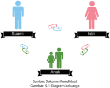

> **Deskripsi Visual:** Gambar ini adalah diagram yang menunjukkan hubungan antara suami, istri, dan anak dalam keluarga. Diagram ini menggunakan warna dan simbol untuk menggambarkan peran dan hubungan antara individu dalam keluarga. Suami dinyatakan dengan ikon pria biru, istri dengan ikon wanita merah, dan anak dengan ikon dua orang dewasa berwarna hijau. Simbol panah menunjukkan arah hubungan dan interaksi antara individu tersebut. Informasi kunci yang dapat diambil pembaca adalah bahwa dalam keluarga, suami dan istri memiliki peran yang saling bergantung dan saling mendukung, sementara anak memiliki peran sebagai penghormatan dan pengembangan diri.

Meskipun  demikian,  jangan  menganggap  suami-istri  Kristen  yang  tidak memiliki  anak  adalah  orang  yang  berdosa  dan  tidak  diberkati.  Ingatlah, Tuhan Yesus dan rasul Paulus juga tidak menikah atau berkeluarga. Tetapi hidup mereka justru  diberikan  untuk  kemuliaan  Tuhan  dan  melayani  sesama.  Hidup  tanpa pasangan dan tidak mempunyai anak secara kristiani bisa menjadi hidup yang indah, keberkatan, dan berguna bagi sesama.

 

---
## 📄 Halaman 95

### 2. Tanggung Jawab Anak

Sikap hormat kepada orang tua merupakan salah satu tugas moral yang harus dilakukan  oleh  anak  sepanjang  hidupnya.  Sejak  masa  Perjanjian  Lama  sampai Perjanjian Baru, sikap ini ditekankan dalam Alkitab sebagai perintah yang harus dilakukan. Hubungan orang tua dan anak yang paling ideal dapat kita lihat pelajari dari kehidupan keluarga Tuhan Yesus (Luk. 2:41-52).

Yang terjadi dalam kehidupan sekarang adalah banyak anak yang membangkang  kepada  orang  tua,  karena  anak  menganggap  sikap  orang  tua yang ketinggalan zaman, tidak banyak tahu apa-apa. Biasanya cuma melarang, menyuruh, menasihati sehingga banyak anak yang cenderung menjauhkan diri, seolah-olah membuat tembok pemisah antara mereka. Anak merasa ingin bebas, ingin  mempunyai  pandangan  sendiri,  sehingga  kurang  senang  pada  otoritas atau  kekuasaan  orang  tua  yang  mengatur.  Keinginan  untuk  bebas  ini  dapat menimbulkan kejengkelan dan salah paham apabila antara orang tua dan anak tidak  bisa  memahami jalan pikiran masing-masing. Memang masa yang paling sulit seringkali adalah masa remaja. Di satu sisi, remaja mengalami perkembangan yang  seringkali  tidak  bersesuaian  dengan  pendapat  dan  harapan  orang  tua dan  lingkungan.  Oleh  karena  itu,  rupanya  perlu  ada  pemahaman  tentang perkembangan masa remaja sehingga dapat menghindari konflik yang seharusnya tidak terjadi. Terdapat empat aspek yang perlu dipahami, yaitu: perkembangan kognitif, moral-etika, ego, dan iman.

### a.  Perkembangan kognitif

Pada usia ini remaja memasuki tahapan kematangan intelek. Remaja mampu berpikir  jauh  melebihi  dunia  nyata  dan  keyakinan  sendiri,  yaitu  memasuki dunia ide-ide. Remaja bisa memecahkan masalah secara sistematis, tidak hanya meniru  orang  lain.  Remaja  bisa  berpikir  reflektif,  mengevaluasi  pemikiran, melakukan imajinasi ideal, dan berpikir abstrak.

### b.  Perkembangan moral-etika

Pada usia ini, penekanannya adalah siapa yang memegang kekuasaan, mereka perlu  dihormati.  Remaja  mulai  senang  menegakkan  hukum  dan  disiplin, gemar memperhatikan kewajiban yang harus dilakukan dan memperhatikan tata kehidupan sosial serta kepentingan keamanan diri. Remaja menghormati orang yang memelihara aturan masyarakat.

### c.  Perkembangan ego

Remaja berada dalam situasi di mana di satu sisi ingin memiliki identitas pribadi, namun di  sisi  lain  ingin  menyisikan  rasa  kekaburan  identitas.  Remaja  mulai belajar memberikan loyalitas terhadap suatu kelompok yang menjadi bagian identitas (kelompok teman, ideologi, dan kekristenan yang dianut). Adakalanya

 

---
## 📄 Halaman 96

remaja juga mengevaluasi identitas yang dianggap kuno untuk dipikir ulang. Identitas  meliputi  tiga  konsep  diri,  yaitu  seksual,  pekerjaan/panggilan  dan sosial. Remaja ingin tahu siapa dirinya dan ke mana hidup diarahkan, sehingga mereka menyenangi identitas diri yang unik. Remaja sering mengalami konflik identitas,  karena  ada  jarak  antara  siapa  diri  yang  sebenarnya  dan  keinginan menjadi pribadi ideal.

### d.  Perkembangan iman

Pada  usia  ini,  remaja  membentuk  sikap  terhadap  hidup  melalui  apa  yang dipercayai oleh keluarga sendiri menuju pandangan di luar diri dan keluarga. Seringkali  bagi  remaja,  Allah  adalah  pribadi  yang  paling  berperan  dalam hidupnya. Allah menjadi sahabat yang paling karib dan memahami kehidupan remaja. Remaja memiliki komitmen dan loyalitas yang sangat dalam terhadap Allah  sebagai  tempat  menimba  seluruh  kepercayaan.  Seringkali  Allah  juga dipandang sebagai  'Allah kelompok'  atau  'Allah kolektif' .

Dengan pemahaman ini, orang tua memahami bahwa keinginan untuk bebas dan  berdiri  sendiri  merupakan  bagian  dari  pertumbuhan.  Seorang  anak  tidak akan menjadi dewasa selama ia masih bergantung pada pikiran orang tuanya. Tetapi  di  pihak  lain,  anak  juga  harus  memaklumi  bahwa  pikirannya  keluar  dari kepala yang belum banyak pengalaman. Memang seorang anak (remaja) sudah bisa  menganalisis  suatu  masalah  secara  logis,  tetapi  dengan  tingkat  kognitif yang belum matang, seorang anak belum bisa memperhitungkan dampak dan konsekuensinya. Oleh karenanya, pikiran seorang anak perlu diimbangi dengan pikiran orang tua.

Ketegangan antara anak dengan orang tua juga bisa dihindari kalau hubungan antara keduanya bersifat terbuka. Terkadang seorang anak berpikir untuk lebih mudah  bercakap-cakap  dengan  kawan  sebaya,  ketimbang  dengan  orang  tua. Padahal, orang tua sebetulnya ingin mengobrol dengan anak mereka yang remaja secara  intim.  Alkitab  mengajarkan  bahwa  seorang  anak  harus  menghormati orang tua. Hal ini bukan berarti bahwa seorang anak tidak berani bersanda gurau dengan orang tua. Menghormati bukan berarti manggut-manggut, padahal muka cemberut dan hati tidak ikhlas.

### 3. Taat Pada Perintah Tuhan: Menghormati Orang Tua

Salah  satu  dari  Sepuluh  Hukum Tuhan  dalam  kitab  Keluaran  20:1-17  adalah 'Hormatilah ayahmu dan ibumu, supaya lanjut umurmu di tanah yang diberikan Tuhan, Allahmu, kepadamu.' (Kel. 20:12). Yang dimaksud dengan 'hormat' adalah

 

---
## 📄 Halaman 97

- Hormat  berarti  bersikap  santun  dan  patuh  terhadap  orang  tua.  Di  dalam hukum  Taurat  tertera  perintah  yang  mengharuskan  orang  Israel  untuk menjatuhkan sanksi berat, yaitu kematian kepada anak yang mengutuki orang tuanya, 'Apabila ada seseorang yang mengutuki ayahnya atau ibunya, pastilah ia  dihukum  mati;  ia  telah  mengutuki  ayahnya  atau  ibunya,  maka  darahnya tertimpa kepadanya sendiri' (Im. 20:9).
- Hormat  berarti  bertanggung  jawab  memelihara  kelangsungan  hidup  orang tua. Tuhan Yesus menegur orang Yahudi yang menyelewengkan perintah Tuhan akan persembahan atas dasar ketidakrelaan memenuhi kebutuhan orang tua (Mat. 15:3-6). Juga, sebelum Tuhan Yesus mati di kayu salib, Ia meminta Yohanes untuk memelihara Maria, ibu-Nya (Yoh. 19:26-27). Semua ini memperlihatkan bahwa  Tuhan  menginginkan  anak  untuk  bertanggung  jawab  memelihara kelangsungan hidup orang tua masing-masing.
- Hormat  berarti  menghargai  dan  mengakui  kewibawaan  orang  tua,  yaitu dengan  mengakui  bahwa  orang  tua  ditugaskan  oleh Tuhan  untuk  menjadi pendidik  anak.  Memahami  aspirasi  orang  tua,  melihat  motivasi  positif  di belakang nasihat dan larangan mereka, memaklumi kelemahan mereka, serta mengakui keunggulan mereka. Singkatnya, menghargai usaha orang tua untuk mengantar anak ke gerbang kedewasaan, sampai orang tua melepas anaknya untuk berjalan sendiri seutuhnya.
Sikap hormat dan pengertian kepada orang tua dengan landasan cinta kasih dari Kristus, akan membangun sebuah keluarga yang harmonis dan bahagia. Tidak ada orang tua yang mau mencelakakan anaknya sendiri, setiap orang tua pasti ingin melihat anaknya berhasil, sukses dan hidup bahagia, serta bertumbuh besar menjadi anak-anak yang takut akan Tuhan dan berhasil dalam hidupnya.

### C.  Penjelasan Bahan Alkitab

### 1.  Kejadian 4:1-16

Kain dan Habel adalah anak-anak Adam dan Hawa. Kain bekerja sebagai petani, dan Habel menjadi gembala. Pada waktu mereka memberikan persembahan kepada Tuhan, Kain memberikan hasil buminya, sedangkan Habel memberikan ternaknya. Persembahan Kain ditolak, sedangkan persembahan Habel  diterima.  Hal  ini  disebabkan  karena  Habel  memberikan  yang  terbaik, sedangkan Kain tidak. Akibatnya, Kain marah, ia mengabaikan teguran Tuhan, serta  membunuh  Habel,  adiknya.  Kain  seharusnya  melakukan  intropeksi diri  kemudian  memperbaiki  hal-hal  dalam  hidup  dan  persembahannya,

 

---
## 📄 Halaman 98

namun  tidak  demikian.  Ia  marah  karena  iri  hati,  sehingga  mengorbankan nyawa adiknya. Dosa iri hati adalah dosa yang kelihatan remeh, tetapi sangat berbahaya karena dapat mengakibatkan dosa-dosa yang lain. Akibatnya, Kain dihukum Tuhan dengan kutukan.

Hubungan bersaudara antara Kain dan Habel yang awalnya baik dan penuh kasih, hilang karena sikap iri hati yang membawa akibat yang buruk. Hal ini perlu dihindari dalam hubungan antara saudara yang memiliki kontak intim karena berasal dari ayah dan ibu yang sama.

### 2.  Keluaran 20:12

Ayah, ibu, nenek, dan kakek, mereka adalah orang tua yang harusnya dikasihi dan dihormati terlepas dari kekurangan-kekurangan mereka. Di atas segalanya, kasih merupakan inti dasar kekristenan yang harus berlaku unconditional atau tanpa  syarat.  Hukum  dalam  Keluaran  20:12  ini  mencakup  semua  tindakan baik dukungan material, hormat, dan ketaatan kepada orang tua. Perintah ini mencegah kata-kata kasar dan dapat menyakiti hati orang tua. Sikap seorang anak yang menaruh hormat kepada orang tuanya, dampaknya bukan hanya diterima dari orang tua, melainkan dari Tuhan sendiri yang akan memberkati anak-anak. Setiap anak yang sungguh-sungguh menghormati orang tuanya akan hidup diberkati Tuhan secara jasmani dan rohani. Anak-anak sebaiknya jangan berlaku kurang ajar, jangan pernah hitung-hitungan ketika memberi sesuatu  kepada  orang  tua,  karena  Tuhan  sendiri  yang  akan  membalas  dan memberi berkat  kembali  dengan  limpahnya.  Anak-anak  yang  menghormati orang  tuanya  akan  mengalami  penggenapan  akan  janji  Tuhan,  yaitu  umur panjang dan pemeliharaan Tuhan yang tak berkesudahan.

### 3.  Lukas 2:41-52

Teks  dalam  Lukas  ini  mengisahkan  keluarga  Tuhan  Yesus  yang  pergi  ke Yerusalem  dalam  rangka  merayakan  hari  raya  di  bait  Allah.  Tuhan  Yesus menghormati  kedua  orang  tuanya  dengan  cara  mengikuti  perintah  orang tua untuk hadir dalam perayaan di bait Allah. Walaupun masih belia (berumur 12  tahun),  Ia  telah  ditanamkan  sikap  takut  akan  Allah  yang  berbuah  dalam perilakuNya  sejak  dini.  Akibatnya,  Tuhan  Yesus  bertumbuh  dan  semakin bertambah hikmatNya, sehingga semakin dikasihi oleh Allah maupun manusia.

 

---
## 📄 Halaman 99

### D. Kegiatan Pembelajaran

### Pengantar

Peserta  didik  menyanyikan  lagu 'Di  doa  ibuku'  yang  dipopulerkan  oleh  Nikita. Lagu  ini  mempunyai  lirik  yang  sarat  makna,  sehingga  peserta  didik  diminta untuk memaknai dan menghayatinya sehingga mampu menangkap pesan yang disampaikan melalui lagu ini, dan dapat mengubah paradigma dalam hidupnya mengenai kasih orang tua, khususnya ibu.

### Kegiatan 1: Menanggapi Lagu dan Artikel

Dalam  kegiatan  ini,  peserta  didik  disuguhkan  sebuah  artikel  menarik  tentang ayah, anak, dan burung pipit. Artikel ini diharapkan dapat menggugah hati serta membaharui perilaku peserta didik dalam hubungannya dengan orang tua. Guru dapat  memberikan  arahan  dan  penjelasan  lebih  dalam  apabila  peserta  didik mengalami kesulitan.

### Kegiatan 2: Tugas Mandiri

Peserta didik diminta untuk menganalisis perubahan yang terjadi dalam kehidupannya seiring dengan pertumbuhan yang dialami.

### Kegiatan 3: Belajar dari Alkitab

Setelah pendalaman materi tentang sikap anak terhadap orang tua, peserta didik diberi kesempatan untuk menemukan sendiri bagaimana seharusnya sikap yang baik  dalam  hubungan  bersaudara  dalam  keluarga.  Guru  berkesempatan  untuk mengarahkan peserta didik jika mengalami hambatan.

### Kegiatan 4: Janjiku

Kegiatan merupakan penghayatan dari pelajaran ini bagi peserta didik. Di akhir pelajaran  ini,  peserta  didik  diharapkan  memiliki  sikap  dan  perilaku  yang  baru dalam  menjalani  kehidupan  sebagai  seorang  anak  yang  merupakan  anugerah serta titipan dari Tuhan bagi keluarganya, sebagai janji dan komitmen kepada diri sendiri maupun kepada Tuhan.

### Kegiatan 5: Tugas/Proyek

Tugas ini merupakan pekerjaan rumah yang harus diselesaikan oleh peserta didik dan dikumpulkan pada pertemuan berikutnya, sehingga dapat menjadi penilaian.

 

---
## 📄 Halaman 100

### E.  Penilaian

Penilaian dalam rangka mengukur tercapainya kompetensi dilakukan dengan mengukur tercapainya semua indikator. Bentuk penilaian berupa tes lisan, tulisan, dan  penugasan.  Perlu  ditegaskan  bahwa  penilaian  berlangsung  dalam  seluruh proses pembelajaran.

### F.  Penutup

- yy Rangkuman
- yy Ayat Emas yang harus dihafalkan sebagai bentuk evaluasi
Salah satu peserta didik diminta sebagai pemimpin untuk mengakhiri kegiatan

- yy Bernyanyi dan berdoa pembelajaran.

 

---
## 📄 Halaman 101

### Penjelasan Bab VII

### Keadilan dan Perdamaian dalam Keluarga

Bahan Alkitab : Yesaya 57:21; Matius 5:9

### Kompetensi Dasar:

- 1.4 Mengakui peran keluarga dan sekolah sebagai lembaga pendidikan utama dalam kehidupan masa kini.
- 2.4 Bersikap kritis dalam menyikapi peran keluarga dan sekolah sebagai lembaga pendidikan utama dalam kehidupan masa kini.
- 3.4 Memahami peran keluarga dan sekolah sebagai lembaga pendidikan utama dalam kehidupan masa kini.
- 4.4 Membuat proyek yang berkaitan dengan peran keluarga dan sekolah sebagai lembaga pendidikan utama dalam kehidupan masa kini.

### Indikator:

- Menghayati keadilan dan perdamaian di dalam keluarga.
- Memahami budaya perdamaian.
- Mengidentifikasi peran keluarga dalam keadilan dan perdamaian.
- Menemukan  masalah  sosial  yang  terjadi pada anak dan remaja serta menjelaskan cara pemecahannya dalam perspektif keadilan dan perdamaian.

### A. Pengantar

Keadilan  dan  perdamaian  sangat  dibutuhkan  bagi  banyak  bangsa  di  dunia. Selain  untuk  membentuk  suatu  tatanan  dunia  yang  harmonis,  UNESCO  telah mewajibkan  pada  banyak  negara  anggota  PBB  untuk  melakukan  pendidikan perdamaian bagi lembaga pendidikan. Oleh karena itu, budaya damai ini harus diwujudkan melalui lembaga pendidikan, tidak terkecuali juga pendidikan dalam keluarga.

Dalam konteks berbangsa dan bernegara, kita sering menjumpai terjadinya sikap ketidakadilan sehingga banyak menimbulkan konflik, perkelahian, perselisihan  antarsuku,  agama,  ras  dan  antargolongan  (SARA),  sehingga  telah

 

---
## 📄 Halaman 102

menimbulkan  banyak  korban.  Dalam  konteks  komunitas  juga  ketidakadilan dan  sikap  pilih  kasih  banyak  menimbulkan  sikap  iri  hati  dan  konflik  yang  sulit didamaikan.

Dalam konteks keluarga sering sikap yang egois, mau menang sendiri, tidak bertanggung jawab dan kurangnya kasih menyebabkan timbulnya perselisihan dan konflik antara suami-isteri, ataupun orang tua dengan anaknya yang berujung pada  perceraian  dan  timbulnya  kekerasan  dalam  keluarga.  Dalam  keluarga juga  sering  kita  jumpai  adanya  relasi  yang  tidak  harmonis,  saling  membenci, dan  tidak  mau  bertolong-tolongan.  Sebetulnya  dalam  skala  kecil  konflik  juga dapat  menimbulkan  dampak  positif.  Misalnya  karena  konflik  kita  menjadi lebih  memahami  orang  lain,  berusaha  mengelola  konflik  yang  ada,  menjadi lebih  jelas  terhadap  permasalahan  yang  sedang  dihadapi.  Namun  konflik  yang berkepanjangan dan dalam skala yang berat, konflik bisa menimbulkan dampak yang  destruktif  atau  menghancurkan,  karena  tidak  pernah  diupayakan  adanya usaha perdamaian.

### B. Uraian Materi

### 1. Kebutuhan Terhadap Keadilan dan Perdamaian

Dalam bahasa Yunani (bahasa asli Alkitab Perjanjian Baru), istilah yang dipakai untuk keadilan adalah dikaiosune (Newman, 2002:4). Istilah ini meliputi beberapa arti,  yakni  adil,  tulus,  benar,  dan  tidak  salah.  Sementara,  dalam  bahasa  Ibrani (bahasa  asli  Alkitab  Perjanjian  Lama),  istilah  yang  dipakai  adalah misypat yang berarti hukum atau keputusan dan tsedaqa yang berarti kebenaran (Beaker dan Sitompul, 1997:40, 51). Secara hakiki, adil pada diri sendiri adalah sesuatu yang harus dipenuhi sebagai kewajiban yang telah menjadi haknya dalam hubungannya dengan  hidup.  Itu  berarti,  adil  adalah:  sesuai  dengan  haknya,  tidak  lebih  dan tidak  kurang.  Keadilan  harus  dihubungkan  dengan  kemanusiaan,  yakni  wajib memenuhi kepentingan sendiri sekaligus kepentingan orang lain sebagai sesama. Oleh sebab itu, keadilan harus selalu memerhatikan kepentingan dari dua pihak yang  berlainan,  tidak  hanya  satu  pihak.  Apabila  keadilan  hanya  memerhatikan kepentingan  sepihak,  kehidupan  bersama  dapat  dipastikan  tidak  akan  damai, bahkan semakin rapuh. Keadilan sesungguhnya mempunyai perspektif mengatur dan menertibkan kehidupan seseorang (2 Sam. 15:4; Maz. 82:3). Dalam keadilan termaktub kewajiban untuk peduli bagi kepentingan pihak lain secara individual ataupun kolektif (Hak. 5:11), agar komunitas menjadi damai.

Keadilan yang dihubungkan dengan keluarga memiliki potensi pengembangan yang sangat besar. Karena di dalam keluarga seseorang menjadi apa yang telah diajarkan  dan  dibentuk  dalam  keluarganya.  Jika  seseorang  diajarkan  tentang keadilan  dalam  keluarga,  maka  orang  tersebut  akan  membawa  pribadi  adil  ke

 

---
## 📄 Halaman 103

luar di masyarakat. Sikap atau tindakan yang dianggap adil adalah penyerahan diri  secara  total  kepada Tuhan Allah. Dalam hal ini, keadilan selalu berimplikasi pada beberapa prinsip, yakni: kesejahteraan, kecukupan, kesetaraan, personalitas dan  persaudaraan.  Untuk  melaksanakan  prinsip-prinsip  tersebut,  keadilan  juga memerlukan  kasih.  Seringkali  keadilan  berkaitan  erat,  bahkan  dapat  menjadi realita  sebab-akibat  terhadap  timbulnya  perdamaian.  Bila  dalam  persekutuan terdapat ketidakadilan, maka akibatnya seringkali sulit diadakan perdamaian.

### 2. Meneladani Tuhan Yesus

Apakah  kita  sudah  menjadi  pembawa  damai,  sahabat  bagi  dunia,  memiliki sikap kehidupan sebagai orang Kristen, yang identik dengan kasih dan damai? Tentu seharusnya demikian kehidupan kita sebagai orang Kristen.

Sebelum  kita  berdamai  dengan  keluarga  dan  lingkungan,  seharusnya  lebih dulu  kita  harus  berdamai  dengan Tuhan  dan  kehendaknya.  Inilah  dasar  utama kehidupan Kristiani. Usahakan dan upayakanlah pola hidup anda adil dan damai dengan  meneladani  keadilan  dan  perdamaian  Tuhan.  Bagaimana  caranya? Dengan  cara  membuat  pola  hidup  berkomunikasi  dengan  Tuhan  setiap  hari melalui pembacaan firman dan doa.

Dalam kitab Nabi Mikha 5:4 dikatakan bahwa 'Dia menjadi damai sejahtera' . Pada umumnya para penafsir mengungkapkan bahwa ayat itu menunjuk kepada Tuhan Yesus Kristus sebagai 'Raja Damai' . Dia adalah damai sejahtera itu sendiri, yang menjadi pedoman kehidupan kita. Kehadiran Kristus dalam kelahiran dan kematian  dan  kebangkitannya  adalah  cara  Allah  yang  merendahkan  diri  dan menjadi  manusia  untuk  berdamai  dengan  kita  manusia  yang  berdosa.  Kristus adalah  Allah  Sang  Kasih  yang  mendamaikan  kita  dengan  Allah,  serta  menjadi contoh perdamaian antara kita dan sesama, bahkan dengan lingkungan.

Salah  satu  contoh  tentang  perdamaian  yang  dilakukan  oleh  Tuhan  Yesus Kristus adalah percakapan Tuhan Yesus dengan seorang perempuan Samaria, di sumur Yakub (Yoh. 4:9-18). Pada ayat tersebut kita menemukan bagaimana Tuhan Yesus,  sebagai  seorang  Yahudi,  sedang  menjadi 'jembatan'  pendamai  dengan orang  Samaria,  di  mana  sebelumnya  kedua  bangsa  ini,  bermusuhan  dan  tidak berkomunikasi satu dengan yang lainnya.

Sebenarnya, apa yang  diperlihatkan  Tuhan  Yesus dalam  kisah di atas, merupakan sebuah teladan yang harus dilakukan dalam kehidupan orang Kristen. Terutama kaum remaja yang sering sensitif, gampang tersinggung, dan mudah terlibat  konflik. Tuhan Yesus memberikan teladan bahwa sebagai orang Kristen harus menjadi pembawa damai bagi dunia. Salah satu tes yang bisa kita lakukan misalnya adalah ketika kita hadir di suatu tempat. Pada saat kita hadir, apakah

 

---
## 📄 Halaman 104

kehadiran  kita  disukai  oleh  orang-orang  di  sekitar  kita?  Adakah  kehadiran  kita sudah  ditunggu-tunggu  dan  sangat  diharapkan?  Jika  kehadiran  kita  diterima atau ditunggu-tunggu, mungkin kita sudah membawa dampak yang positif  bagi lingkungan itu, atau setidaknya membawa damai di lingkungan.

Tahukah  kamu,  bahwa  lingkungan  membutuhkan  damai?  Sudahkah  kita menjadi pembawa damai bagi lingkungan kita? Sudahkah kita sungguh-sungguh berdamai dengan Allah dan berdamai dengan sesama? Hal ini pernah dibuktikan oleh salah seorang peneliti tentang dampak suasana damai. Suatu ketika, ada dua kelompok ayam betina. Kelompok pertama selalu diperdengarkan musik rohani setiap hari. Kelompok kedua, selalu diperdengarkan musik rock yang keras. Satu bulan  kemudian,  ketika  tiba  masa  bertelur,  ditemukan  bahwa  kelompok  ayam pertama bertelur jauh lebih banyak dari kelompok kedua. Hal ini membuktikan bahwa ayam saja, membutuhkan kedamaian, apalagi manusia.

### 3. Perdamaian dalam Keluarga

Kata perdamaian berasal dari kata 'damai' yang bisa berubah konsepsi sesuai waktu  dan  budaya.  Dalam  masyarakat  luas,  orang-orang  memahami  istilah 'damai' dan implikasi-implikasinya melalui berbagai pandangan. Banyak orang, dan  mungkin  juga  diri  kita  sendiri,  memahami  perdamaian  secara  sederhana sebagai suatu situasi/keadaan di mana tidak ada konflik atau tidak ada perang. Namun  kenyataannya  tidak  sesederhana  itu,  konsep  damai  ini  sebenarnya memiliki dua pemahaman yaitu negative dan positive .  Pemahaman damai yang negatif  ini  kita  menilai  apakah  sebuah  situasi/keadaan  bisa  disebut  sebagai situasi/keadaan damai atau tidak, dengan cara melihat ada atau tidaknya hal yang biasanya mengancam dan menghancurkan perdamaian, yaitu ketidakadilan dan konflik atau, dalam skala yang lebih luas adalah perang. Sedangkan pemahaman damai yang positif, kita bisa menilainya lewat situasi/keadaan, tidak sekedar hanya dengan melihat ada perang atau konflik terbuka atau tidak, melainkan dengan melihat adakah hal-hal yang mendukung terciptanya perdamaian atau tidak.

Dalam  pemahaman  semacam  ini,  yang  kita  cermati  adalah  apakah  orangorang dalam keluarga tersebut sudah berusaha menghapuskan berbagai bentuk kekerasan dan ketidakadilan, baik individual maupun dalam struktural keluarga. Dengan demikian juga sebaliknya, apakah orang-orang tersebut sudah dengan sengaja menciptakan hal-hal yang bisa menjamin kelanggengan perdamaian dan keadilan terhadap masing-masing anggota keluarga, antara bapak dan ibu serta antara orang tua dan anak-anak di dalam satu rumah.

 

---
## 📄 Halaman 105

### 4. Masalah yang Dihadapi Kaum Muda

Philip Tangdilingtin (dalam Sugiyo, 2001) mengungkapkan ada empat masalah pokok yang dihadapi kaum muda pada umumnya, yaitu masalah dalam keluarga, masyarakat,  gereja,  dan  diri  kaum  muda  sendiri.  Mengidentifikasi  masalah merupakan langkah yang bijak untuk dapat mengatasi dan menanggulanginya. Yang perlu  diketahui dan dilakukan bahwa setiap masalah kaum muda merupakan tanggung jawab kaum muda itu sendiri untuk mengatasinya. Orang lain hanya dapat memberikan bantuan atau pendampingan. Dengan kata lain kaum muda harus  melatih/mendidik  diri  sendiri  untuk  mengatasi  masalah  secara  mandiri. Jika memang tidak mampu, barulah minta tolong kepada orang lain khususnya pada  orang  tua.  Terutama  hal-hal  yang  berkaitan  dengan  masalah-masalah ketidakadilan, sehingga menimbulkan keadaan yang tidak damai.

Dalam  hubungan  dengan  keluarga  ada  kesenjangan  atau  jarak  antara  nilai dan norma yang berakibat membawa pada konflik antara kaum muda dan orang tua.  Kurangnya  perhatian  dan  pengertian  dari  orang  tua,  menurunnya  wibawa orang  tua  karena  pengaruh  teknologi  komunikasi,  posisi  anak  dalam  keluarga (bungsu, sulung); semua itu dapat membawa akibat bahwa kaum muda kurang merasa damai, aman, dan terlindungi. Lalu mereka tidak nyaman tinggal di rumah, dan sering  berada  di  luar  rumah,  serta  kehilangan  kesempatan  dan  tantangan untuk berkembang secara utuh. Kaum muda sering terjalin dalam struktur sosial tanpa mereka sadari, yang sering menguasai dan memanipulasi hidup mereka. Akibatnya terjadilah sikap apatis, frustrasi, dan tidak aman, lebih-lebih saat remaja berada dalam masa transisi menuju kepada kedewasaan hidup.

Permasalahan  dalam  diri  kaum  muda  sendiri  umumnya  berpangkal  pada penampilan  psikis  dan  fisik  mereka  yang  masih  labil  dan  terbuka  terhadap pengaruh dari luar, yang diserap lewat media komunikasi, atau pergaulan seperti misalnya  kenaifan  seksualitas,  upaya  aktualisasi  diri  yang  kurang  mendapat tanggapan dan pengakuan; adalah konflik sekitar kebebasan mereka. Ada banyak hal dapat menjadi penyebab bagi terhambatnya perkembangan seorang remaja, di  antaranya:  kurang  menyadari  potensi  yang  dimiliki,  pendidikan  yang  tidak tuntas  (misalnya:  remaja  di  daerah  pedesaan),  perasaan 'tidak  berpunya'  atau minder, perngaruh pernikahan dini, dan kurangnya kesadaran serta upaya untuk mengubah tradisi. Banyak pula yang mengalami masalah lingkungan misalnya: kesulitan  sekitar  perumahan,  lingkungan  belajar,  dan  pergaulan  bagi  mereka yang datang dari desa ke kota besar. Semuanya itu mengakibatkan kaum muda menjadi:  gelisah,  bingung,  tidak  pasti,  dan  masa  depan  suram  (Sugiyo,  2001). Jelas  dari  permasalahan  yang  diungkap  di  atas,  dapat  menimbulkan  masalah

 

---
## 📄 Halaman 106

ketidakadilan  di  antara  kaum  muda,  yang  dapat  menyebabkan  timbulnya keresahan, kebingungan, dan ketidakadilan yang perlu diatasi dalam perspektif Kristiani.

### 5. Peran Keluarga

Bagaimana mengatasi masalah remaja yang terpapar di atas?

Keluarga adalah lembaga/unit kemasyarakatan yang terkecil dan yang terpenting  di  dunia.  Disebut  demikian  karena  keluarga  menentukan  tinggi rendahnya mutu kehidupan masyarakat dan negara termasuk gereja. Kekuatan gereja  bahkan  suatu  bangsa  sangat  ditentukan  oleh  unit-unit  keluarga  yang menjadi warganya. Kalau unit-unit keluarga itu terdiri dari keluarga-keluarga yang sehat (jasmani dan rohani) dan bertanggung-jawab, maka bisa dipastikan bahwa gereja bahkan negara akan menjadi lembaga yang sehat dan kuat pula. Sebaliknya, jikalau  keluarga-keluarga  yang  menjadi  warga  gereja  itu  lemah,  jorok,  penuh dengan ketidakadilan  dan  jauh  dari  hidup  yang  damai  maka  dapat  dipastikan bahwa gereja maupun negara itu akan lemah, jorok, dan kacau (Krisetya, 1999).

Dari ungkapan di atas dapat diringkaskan bahwa pribadi dan keluarga yang kuat adalah keluarga yang bersedia berdamai dengan Allah sumber perdamaian, dan berdamai dengan sesama terutama dengan para anggota keluarga.

### C. Penjelasan Bahan Alkitab

### 1.  Yesaya 57:21

Bagian Alkitab ini berisi tentang kata-kata penghiburan dari Nabi Yesaya untuk umat Tuhan. Dia mengungkapkan bahwa tidak akan ada damai apabila umat Tuhan tetap melakukan ketidakadilan atau kefasikan. 'Tiada damai bagi orangorang  fasik  itu' .  Jelas  dari  ayat  ini  bahwa  realita  damai  sejahtera  bukanlah hal  yang  tanpa  syarat.  Keadilan  rupanya  merupakan  langkah  awal  untuk memasuki suasana damai sejahtera. Dengan demikian masalah kefasikan atau ketidakadilan  perlu  dipecahkan  lebih  dahulu  sebelum  damai  sejahtera  itu dapat dialami. Ketidakadilan memang pada hakikatnya sangat mengganggu, meresahkan dan mengelisahkan. Hal ini dialami oleh Nabi Yesaya di tengahtengah  bangsa  yang  dikasihinya.  Oleh  karena  itu,  Nabi Yesaya  menyerukan dan mengusahakan agar masalah ketidakadilan lebih dulu digarap dan diatasi sehingga damai sejahtera itu pada akhirnya menjadi realita komunitas.

 

---
## 📄 Halaman 107

Dari  teks  ini  kita  mendapat  pengajaran  bahwa  untuk  mengalami  suasana damai  sejahtera  baik  dalam  keluarga,  dalam  komunitas  bahkan  di  tengahtengah bangsa, maka lebih dahulu perlu diusahakan lebih dahulu pemecahan ketidakadilan. Hasil dari usaha tersebut maka akan tercipta suasana yang adil dan damai yang menjadi dambaan dari setiap insan dimanapun dia berada.

### 2.  Matius 5:9

Teks  ini  adalah  khotbah  Tuhan  Yesus  di  bukit  : 'Berbahagialah  orang  yang membawa  damai . ' Orang yang membawa  damai adalah orang yang menciptakan  perdamaian  atau  yang  menyalurkan  damai  yang  berasal  dari Tuhan Sang Pendamai Agung kepada semua orang. Jadi, orang tersebut lebih dahulu menerima damai dan selanjutnya menyampaikan kepada semua orang sebagai kesaksiannya. Mereka inilah yang akan disebut anak-anak Allah, yaitu keluarga besar Kerajaan Allah. Itulah sebabnya mereka juga disebut sebagai orang  yang  berbahagia  karena  mereka  hidup  secara  adil,  tanpa  masalah, permusuhan,  dan  tanpa  konflik.  Jadi  dalam  ajaran  Tuhan  Yesus  tentang Kerajaan  Allah,  damai  merupakan  suatu  kondisi  yang  tidak  boleh  tidak  ada dalam  Kerajaan  Allah. Tanpa  keadilan  dan  perdamaian,  Kerajaan  Allah  tidak dapat dihadirkan dan tanda-tanda Kerajaan Allah tidak dapat dirasakan.

### D. Kegiatan Pembelajaran

### Pengantar

Peserta didik diminta untuk berdoa dan menyanyikan lagu dari PKJ 36 Yesus Raja Damai.

### Kegiatan 1: Curah Pendapat

Guru  memberikan  waktu  kepada  peserta  didik  untuk  mendiskusikan  dengan teman sebangkunya mengenai pemahaman mereka berkaitan dengan keadilan dan perdamaian dalam keluarga.

### Kegiatan 2: Mengamati Gambar

Peserta didik  diminta  untuk  mengamati  dan  memberi  komentar  gambar pertengkaran antara kakak dan adik.

Kegiatan 3: Diskusi

 

---
## 📄 Halaman 108

### Kegiatan 4: Mendalami Alkitab dan Presentasi Kelompok

Guru  memberikan  waktu  kepada  peserta  didik  dalam  kelompok  kecil  (kurang lebih 3  -4 orang) untuk berdiskusi mengenai landasan Alkitab tentang perdamaian dalam keluarga. Jika peserta didik mengalami kesulitan, guru dapat menuntun dengan memberikan penjelasan yang dibutuhkan. Setelah diskusi selesai, peserta didik diminta mempresentasikan hasil diskusinya. Setelah itu, guru memberikan penjelasan secara lebih mendetail.

### Alternatif Lain : Model Bermain Peran dalam Menerapkan Panggilan Pelayanan Keluarga

Model  ini  bertujuan  untuk  memecahkan  masalah  komunitas.  Misalnya:  konflik antar saudara, perselisihan antara bapak dan ibu, atau konflik antara orang tua dengan anaknya.

### Langkah-langkah yang diperlukan:

- Pilih 3-5 orang dalam kelas yang dapat berperan sebagai bapak, ibu, dan anak. Salah seorang dari mereka membutuhkan kepedulian dan pelayanan.
- Deskripsikan  peran  yang  akan  mereka  lakukan  misalnya:  masalah,  sikap, perasaan, atau emosi para tokoh. Selanjutnya buat skenario.
- Bermain peran sesungguhnya sesuai dengan skenario (perlu dilakukan dengan sungguh-sungguh supaya dapat dianalisis).
- Membandingkan  masalah  sesungguhnya  yang  sedang  dihadapi  dengan permainan peran yang dilakukan (persamaan dan perbedaan).
- Memecahkan  dan  mendiskusikan  masalah-masalah  aktual  yang  dihadapi keluarga, terutama untuk orang yang membutuhkan pelayanan.

### Kegiatan 5: Memberikan Komentar pada Teks yang Ada

### Kegiatan 6: Penilaian Diri

Peserta didik menuliskan sejauh mana mereka mengenali diri sendiri.

### E.  Penilaian

Penilaian dalam rangka mengukur tercapainya kompetensi. Dilakukan dengan mengukur tercapainya indikator kompetensi. Bentuk penilaian dapat berupa tes lisan, penugasan, penilaian laporan pendek, dan penilaian produk.

 

---
## 📄 Halaman 109

### F.  Penutup

Bagian penutup ini berisikan:

- Rangkuman
- Ayat Emas
- Bernyanyi dan Berdoa

 

---
## 📄 Halaman 110

---
**🖼️ Gambar/Diagram**

> **Deskripsi Visual:** Gambar ini adalah ilustrasi yang menampilkan keluarga berdiri bersama-sama. Keluarga terdiri dari dua orang dewasa (orangtua) dan dua anak (saudara). Semua anggota keluarga mengenakan kaos kuning dan celana biru. Orangtua berdiri di belakang anak-anak mereka, tampaknya memeluk atau menahan mereka. Anak perempuan berdiri di sebelah kiri, sedangkan anak laki-laki berdiri di sebelah kanan. Semua anggota keluarga tampak bahagia dan rileks. Ilustrasi ini mungkin digunakan untuk membantu pembaca memahami konsep tentang hubungan keluarga atau kebersamaan dalam keluarga.

 

---
## 📄 Halaman 111

### Penjelasan Bab VIII Keluargaku dalam Gaya Hidup Modern

Bahan Alkitab: Kejadian 35: 22b-29,

Matius 19: 16-26

### Kompetensi Dasar:

- 1.3 Menghayati  nilai-nilai  Iman  kristen  dalam  kehidupan  keluarga  agar  siap menghadapi gaya hidup masa kini.
- 2.3 Menjadikan nilai-nilai Kristiani sebagai filter dalam menghadapi gaya hidup masa kini.
- 3.3 Menganalisis  nilai-nilai  Kristiani  dalam  kehidupan  keluarga  untuk  menghadapi gaya hidup masa kini.
- 4.3 Mempresentasikan  berbagai  aktivitas  yang  menggambarkan  menghadapi gaya hidup masa kini.

### Indikator:

- Menjelaskan pengertian gaya hidup masa kini.
- Mendeskripsikan bentuk-bentuk gaya hidup masa kini dalam keluarga.
- Memaknai peran keluarga di tengah gaya hidup masa kini.
- Membuat  laporan  pengamatan  terhadap  keluarga  masing-masing  peserta didik  tentang  kecenderungan  gaya  hidup  masa  kini  yang  memengaruhi keluarganya.

### A. Pengantar

Pernahkah  kamu  memperhatikan  lingkungan  di  tengah  perubahan  zaman, terutama yang berkaitan dengan modernisasi? Di lingkungan keluarga Indonesia gaya hidup modern sering dimengerti sebagai bentuk pemakaian produk-produk dari  peradaban  modern  seperti  sepeda  motor,  mobil,  telepon  seluler,  pergi  ke mall ,  menggunakan pakaian bermerk, atau bergaya ala masyarakat Barat tanpa mengerti semangat dan esensi yang diusung oleh peradaban modern itu sendiri.

 

---
## 📄 Halaman 112

Sehingga  seseorang  terutama  anak  muda  sering  keliru  dalam  memaknai  gaya hidup modern dan menjadikan mereka sebagai pribadi yang 'Kebarat-baratan' . Berdasarkan  latar  belakang  tersebut  maka  pembelajaran  ini  disusun  dengan tujuan untuk mengenalkan kepada remaja tentang apa itu pengertian gaya hidup modern, bagaimana bentuk-bentuk kehidupan modern, serta bagaimana peran keluarga  di  tengah  gaya  hidup  modern  yang  sedang  menjangkiti  masyarakat pada era ini.

### B. Uraian Materi

### 1. Pengertian Gaya Hidup Modern

Di  kalangan  para  ahli,  berkembang  berbagai  macam  pendapat  mengenai pengertian gaya hidup. Kotler (2002) mendefinisikan gaya hidup sebagai sebuah pola  hidup  seseorang  di  dunia  yang  diekspresikan  dalam  aktivitas,  minat  dan opini. Gaya hidup menggambarkan keseluruhan diri seseorang dalam berinteraksi dengan  lingkungannya.  Assael  (1984)  mengungkapkan  bahwa  gaya  hidup merupakan sebuah pola kehidupan yang dapat diidentifikasi melalui bagaimana seseorang menghabiskan waktunya, apa yang mereka anggap penting di dalam lingkungan masyarakatnya, dan apa yang mereka pikirkan tentang dirinya sendiri di dunia yang mengitari mereka. Minor dan Mowen (2002), mengungkapkan bahwa gaya hidup menunjukkan bagaimana orang hidup, bagaimana membelanjakan uangnya, dan bagaimana mengalokasikan waktunya. Sedang Suratno dan Rismiati (2001) mengatakan bahwa gaya hidup merupakan pola hidup seseorang dalam dunia kehidupan sehari-hari yang dinyatakan dalam kegiatan, minat, dan bakat yang bersangkutan.

Kata  modern  dalam Kamus Besar Bahasa Indonesia (KBBI)  dipahami  sebagai sebuah  sikap  dan  cara  berpikir  serta  cara  bertindak  sesuai  dengan  tuntutan zaman. Dalam Merriam-Webster (1998), kata modern berasal dari bahasa Latin yaitu modernus yang berarti saat ini, atau sesuatu yang menunjuk pada sifat kekinian.  Di  dalamnya  tercermin  suatu  nilai  yang  mengarahkan  seseorang  untuk bersikap  efektif,  efisien,  praktis,  sederhana  dan  menghargai  waktu.  Meskipun demikian bila kata modern dihubungkan dengan modernisasi, maka modernisasi lebih menunjuk kepada perubahan sosial atau  perubahan masyarakat, walaupun tentu saja perubahan sosial tersebut tidak menafikan bahwa yang berubah lebih dulu adalah pribadi-pribadi anggota masyarakat.

Dengan demikian maka dapat diperoleh pengertian bahwa gaya hidup modern merupakan  sebuah  pola  hidup  holistik  yang  menyangkut  cara  bersikap  dan

 

---
## 📄 Halaman 113

berpikir dalam bidang fisik, mental dan spiritual, sesuai dengan tuntutan zaman modern, di dalamnya mencerminkan semangat efektif, efisien, praktis, sederhana, menghargai kehidupan dan menghargai waktu.

### 2. Bentuk Gaya Hidup Modern

A.B  Susanto  (1996),  mengatakan  bahwa  bentuk  gaya  hidup  modern  yang sedang menjangkiti keluarga di Indonesia di antaranya adalah adalah pola pikir yang  menganggap status sebagai sesuatu yang sangat penting. Setiap individu memiliki mobilitas yang tinggi, memiliki kebiasaan untuk bercengkrama di tempattempat tertentu, memiliki kebiasaan untuk melakukan olahraga mahal (misalnya golf), melaksanakan pernikahan agung, merayakan wisuda, memiliki gaya hidup serba instant , memanfaatkan segala macam jenis-jenis teknologi komunikasi.

Sedangkan dalam sumber lain dikatakan bahwa gaya hidup modern seperti  yang  disebutkan  sebelumnya  membentuk  manusia  untuk  memiliki kecenderungan bersikap konsumerisme, materialisme, dan hedonisme. Konsumerisme  adalah  gaya  hidup  yang  menganggap  barang-barang  mewah sebagai ukuran kebahagiaan dan kesenangan. Materialisme adalah pandangan hidup yang mencari dasar segala sesuatu (termasuk kehidupan manusia) di dalam alam kebendaan semata-mata dengan mengesampingkan segala sesuatu yang mengatasi alam indera. Hedonisme adalah paham atau pandangan hidup yang menganggap  bahwa  kesenangan  dan  kenikmatan  materi  merupakan  tujuan utama dalam kehidupan di dunia.

Dapat kita  identifikasi  beberapa  contoh  gaya  hidup  modern  yang  terjadi  di lingkungan kita, sebagai berikut :

- Memanfaatkan  berbagai  jenis  teknologi  komunikasi,  misalnya  pemakaian internet, telepon selular, dan tv kabel.
- Gaya hidup dengan cara instant: menekankan gaya hidup yang praktis, efektif, cepat, misalnya makanan siap saji, fastfood , serta makanan impor.
- Berkomunikasi di tempat-tempat tertentu, misalnya untuk melepaskan kelelahan dan bosan di kafe, atau mall.
- Status  kehidupan  (keberadaan  yang  melekat  pada  diri  seseorang)  dianggap penting,  misalnya  ditandai  dengan  penampilan  dan  semua  yang  dipakai. Contohnya: peralatan rumah tangga mewah, pemakaian mobil, dan pakaian tertentu.
Dari  paparan  tersebut  maka  dapat  disimpulkan  bahwa  pada  dasarnya  gaya hidup modern dapat mengarahkan individu untuk memiliki pola perilaku negatif maupun positif. Pemahaman yang keliru terhadap esensi dari gaya hidup modern cenderung membentuk seseorang untuk berperilaku menyimpang. Pemahaman

 

---
## 📄 Halaman 114

yang benar terhadap gaya hidup modern justru dapat mengarahkan seseorang untuk  memiliki  perilaku  benar  sesuai  dengan  prinsip-prinsip  yang  tercermin dalam semangat gaya hidup modern seperti yang sudah disebutkan di atas.

### 3. Peran Keluarga di Tengah Gaya Hidup Modern

Dalam  perspektif  Kristiani,  peran  keluarga  di  tengah  gaya  hidup  modern sangatlah  penting  dan  perlu  dicermati.  Keluarga  Kristiani  perlu  membangun persekutuan  antarpribadi  dan  melayani  kehidupan.  Keluarga  Kristiani  juga dituntut untuk turut serta mengembangkan kehidupan perutusan gereja.

Membangun persekutuan antarpribadi dapat dilakukan dengan meletakkan cinta  kasih  sebagai  asas  dan  kekuatan  yang  mempersatukan  masing  masing anggotanya.  Keluarga  Kristen perlu  menjaga  persatuan  yang  utuh  antara suami-istri  dan  membangun  sebuah  bentuk  persatuan  yang  tidak  terceraikan. Keluarga Kristen yang modern dalam perkembangan keadaan, perlu memberikan penghargaan  yang  tinggi  terhadap  hak-hak  dan  peranan  perempuan.  Hal  ini sebetulnya juga menjadi perhatian negara maupun pada ras dunia. Di samping itu keluarga juga perlu menjunjung tinggi hak-hak anak dan menganggap mereka memiliki pemikiran yang patut dihargai. Kehadiran  orang lanjut usia yang menjadi anggota dalam keluarga juga perlu diperhatikan kebutuhannya dan mendapat penghargaan yang selayaknya.

Dalam kaitan dengan perkembangan masyarakat, keluarga dipanggil untuk turut  serta  dalam  mengembangkan masyarakat karena pada hakikatnya keluarga merupakan sel masyarakat yang pertama dan amat penting. Kehidupan berkeluarga pada hakikatnya merupakan pengalaman hidup bersatu dan berbagi rasa, sadar akan peranan sosial bagi lingkungan. Oleh karena itu, keluarga Kristen perlu menyadari akan rahmat dan tanggung jawabnya bagi masyarakat.

Di tengah perubahan besar dalam masyarakat keluarga perlu terlibat dalam hidup  dan  perutusan  gereja.  Hal  itu  dapat  dilakukan  dengan  cara  sungguhsungguh membangun  persekutuan keluarga yang beriman secara kokoh. Justru di  tengah  perubahan  yang  ada,  keluarga  Kristen  harus  mampu  membangun persekutuan  antaranggotanya  untuk  terus-menerus  berdialog  dengan  Tuhan melalui  berbagai  cara.  Melalui  keluarga  kita  bisa  membangun  persekutuan dengan  orang  lain  dan  kebutuhan  sesama.  Oleh  karena  itu,  keluarga  Kristen diharapkan dapat melakukan filtrasi atau menyaring pengaruh negatif dari gaya hidup  modern.  Dengan  demikian  di  tengah-tengah  arus  modernisasi  keluarga Kristen mampu menjadi agen penanaman semangat positif yang tercermin dalam gaya hidup modern.

 

---
## 📄 Halaman 115

### C. Penjelasan Bahan Alkitab

### 1.  Kejadian 35: 22b-29

Teks ini mengungkap tentang keluarga Yakub yang memiliki tiga belas orang anak Yakub, yakni yang bernama Yusuf. Yusuf pun tumbuh dengan sangat baik dan  menjadi  anak  yang  baik  pula.  Namun  oleh  karena  sikap  dari  Yakub  yang sangat pilih kasih terhadap anak-anaknya, maka saudara-saudara Yusuf yang lain merasa iri hati. Rasa iri hati ini mengakibatkan mereka membuat rencana jahat untuk si Yusuf yaitu dengan menjualnya sebagai budak. Niat tersebut kemudian direalisasikan dalam bentuk tindakan, pada akhirnya Yusuf dijual dan ia menjadi budak di negeri Mesir. Di tanah Mesir Yusuf menjaga hidupnya tetap berkenan kepada Tuhan maka Tuhan menyertai Yusuf. Ia mengalami keberhasilan atas segala usaha yang dilakukannya di negeri asing. Bahkan karena penyertaan Tuhan, Yusuf dapat menjadi pemimpin di tanah Mesir. Dalam hal ini Yusuf dipakai Tuhan untuk menjadi  pemelihara  hidup  bagi  suatu  bangsa  yaitu  bangsa  Mesir.  Selain  itu  ia juga menjadi pemelihara hidup bagi keluarganya. Dalam ketaatan tersebut Yusuf tumbuh menjadi seseorang yang takut akan Tuhan.

Teks ini memberikan pelajaran positif kepada kita semua mengenai ketaatan seseorang kepada Tuhan sebagai pemelihara kehidupan. Yusuf sebagai pemimpin muda di tanah Mesir memiliki gaya hidup modern dan penuh kecukupan bahkan bisa  dibilang  hidupnya  penuh  kelimpahan  berkat.  Meskipun  demikian  ia  tetap memiliki  keteguhan  hati  untuk  memelihara  kehidupannya  dan  kehidupan keluarganya. Walaupun  keluarganya  pernah  membuangnya,  namun  ia  mampu mengubah  keluarganya  menjadi  lebih  baik,  hidup  berkecukupan,  dan  seturut dengan kehendak Tuhan.

### 2.  Matius 19: 16-26

Teks ini berbicara mengenai orang muda yang kaya dan tentu saja memiliki gaya hidup modern (pada zaman itu). Akan tetapi, hidupnya yang bergelimangan harta dan gaya hidup yang up to date, menjadikannya puas dengan hidupnya itu. Ia  mengalami  kekosongan  dan  kebimbangan  hidup  yang  membuatnya  harus mencari jawaban kepada Tuhan Yesus. Ketika Tuhan Yesus memberi jawaban atas pertanyaan hidupnya, orang muda itu menjadi sedih akibat dari sangat banyaknya harta benda yang dia miliki. Ia mengalami kebingungan atas pilihan hidup yang ingin ia jalani. Namun di tengah kebimbangan tersebut ia lebih memilih untuk hidup  dengan  harta-harta  duniawinya,  sehingga  ia  terjebak  dalam  pengaruh buruk  dari  gaya  hidup  yang  ia  pilih.  Anak  muda  tersebut  lebih  mengasihi kehidupan duniawi yang menjadi gaya hidupnya, dibanding sumber kehidupan itu sendiri. Sehingga ia harus rela kehilangan Kristus Tuhan sebagai sumber dari segala kehidupan yang ia miliki di dunia.

 

---
## 📄 Halaman 116

Teks di atas adalah suatu contoh negatif dari sikap seseorang yang tidak mampu menguasai kehidupannya dan tidak mampu menghindari dampak negatif dari gaya hidup modern yang ia miliki, akibatnya ia kehilangan sumber dari segala kehidupan sejati, yaitu Kristus yang adalah Tuhan dan Juru Selamat. Melalui teks ini kita diperingatkan untuk tidak bersikap seperti anak muda tersebut.

### D. Kegiatan Pembelajaran

### Pengantar

Guru meminta peserta didik untuk mendengarkan atau membaca cerita Alkitab dalam Matius 19: 16-26 yang bercerita mengenai kehidupan anak muda yang kaya.

### Kegiatan 1: Curah Pendapat

Guru  meminta  peserta  didik  untuk  menjawab  beberapa  pertanyaan  yang berkaitan dengan gaya hidup modern.

### Kegiatan 2: Diskusi Kelompok

Guru membimbing peserta didik dalam kelompok atau individu untuk menggali informasi mengenai bentuk-bentuk gaya hidup modern yang dapat mereka lihat baik secara pribadi, keluarga, maupun lingkungan sosial mereka masing-masing.

### Kegiatan 3: Membuat Tulisan (Proyek)

Guru  meminta  peserta  didik  dalam  kelompok  atau  individu  untuk  membuat tulisan mengenai apa yang mereka temukan ketika melakukan proses menggali informasi tentang bentuk-bentuk gaya hidup modern yang mereka lakukan dan alami di lingkungan keluarga masing-masing.

### Kegiatan 4: Presentasi

Peserta didik baik secara individu maupun kelompok diminta untuk mempresentasikan  hasil  yang  mereka  peroleh  dari  proses  menggali  informasi yang telah dikerjakan dengan subjek diri mereka sendiri dan keluarga mengenai bentuk-bentuk gaya hidup modern.

 

---
## 📄 Halaman 117

### E.  Penilaian

Penilaian  yang  akan  diberikan,  bukan  hanya  hasil,  namun  juga  sepanjang proses pembelajaran berlangsung. Meskipun demikian tes tetap dapat dilakukan oleh guru untuk mengukur pencapaian indikator kompetensi. Bentuk penilaian juga dapat dilakukan berupa tes lisan, penugasan, penilaian laporan pendek, dan penilaian produk.

### F.  Penutup

Bagian penutup ini berisi:

- Rangkuman
- Ayat Emas
- Bernyanyi dan Berdoa

 

---
## 📄 Halaman 118

---
**🖼️ Gambar/Diagram**

> **Deskripsi Visual:** Gambar ini adalah ilustrasi yang menampilkan keluarga berdiri bersama-sama. Keluarga terdiri dari dua orang dewasa (orangtua) dan dua anak (saudara). Semua anggota keluarga mengenakan kaos kuning dan celana biru. Orangtua berdiri di belakang anak-anak mereka, tampaknya memeluk atau menahan mereka. Anak laki-laki berdiri di sebelah kanan, sedangkan anak perempuan berdiri di sebelah kiri. Semua anggota keluarga tampak bahagia dan rileks. Ilustrasi ini mungkin digunakan untuk membantu pembaca memahami konsep tentang hubungan keluarga atau kebersamaan dalam keluarga.

 

---
## 📄 Halaman 119

### Penjelasan Bab IX Dampak Modernisasi Bagi Keluargaku

Bahan Alkitab: 1 Samuel 16:1-12, Efesus 5: 22-33

### Kompetensi Dasar:

- 1.3 Menghayati  nilai-nilai  Iman  Kristen  dalam  kehidupan  keluarga  agar  siap menghadapi gaya hidup masa kini.
- 2.3 Menjadikan nilai-nilai kristiani sebagai filter dalam menghadapi gaya hidup masa kini.
- 3.3 Menganalisis  nilai-nilai  kristiani  dalam  kehidupan  keluarga  untuk  menghadapi gaya hidup masa kini.
- 4.3 Mempresentasikan  berbagai  aktivitas  yang  menggambarkan  menghadapi gaya hidup masa kini.

### Indikator:

- Menjelaskan pengertian modernisasi.
- Mendeskripsikan dampak modernisasi bagi kehidupan keluarga.
- Menjelaskan pengaruh modernisasi bagi kehidupan keluarga.
- Memaknai  peran  keluarga  sebagai  bejana  tanah  liat  ditengah  dampak modernisasi.
- Mengamati sikap keluarga peserta didik dalam menanggapi laju modernisasi.

### A.  Pengantar

Modernisasi  merupakan  produk  peradaban  abad  20  dari  dunia  Barat  yang dampaknya  masih  dirasakan  sampai  pada  abad  21.  Indonesia  sebagai  negara dunia ketiga mengenal modernisasi dari penjajahan yang dilakukan oleh bangsabangsa Barat, baik secara kultural, sosial, politik, dan ekonomi. Proses modernisasi yang berlangsung di Indonesia membuat bangsa ini termasuk keluarga-keluarga Kristen memiliki kecenderungan untuk terjebak dalam dampak negatif dari proses yang terus berlangsung. Berdasarkan latar belakang tersebut maka pembelajaran

 

---
## 📄 Halaman 120

pada  bagian ini bertujuan  untuk  memperkenalkan  remaja  dengan  istilah modernisasi,  apa  dampaknya  bagi  kehidupan  keluarga  Kristen  dan  bagaimana keluarga  pada  kurun  waktu  dewasa  ini  harus  menghayati  dan  memaknai peran  mereka  di  tengah  arus  modernisasi  yang  sedang  berlangsung.  Melalui pembelajaran  tersebut  selanjutnya  peserta  didik  diharapkan  dapat  mencapai beberapa indikator yang telah diuraikan di atas.

### B. Uraian Materi

### 1. Pengertian Modernisasi

Di  kalangan  para  ahli  berkembang  berbagai  macam  pengertian  mengenai modernisasi.  Dalam Kamus  Besar  Bahasa  Indonesia modernisasi  dimengerti sebagai sebuah proses pergeseran sikap dan mentalitas sebagai warga masyarakat untuk  dapat  hidup  sesuai  dengan  tuntutan  masa  kini.  J.W  Schrool  (1998) mengungkapkan bahwa modernisasi merupakan penerapan pengetahuan ilmiah pada semua kegiatan, bidang kehidupan, dan aspek kemasyarakatan. Aspek yang paling  menonjol  dari  proses  modernisasi  adalah  perubahan  Ilmu  Pengetahuan dan Teknologi (Iptek) yang tinggi.

William  E.  More  (2003)  mengungkapkan bahwa modernisasi adalah transformasi total  kehidupan  bersama  dalam  bidang  teknologi,  organisasi  sosial,  dari  yang tradisional ke arah pola-pola ekonomis dan politis yang didahului oleh negaranegara Barat yang telah stabil. Koentjaraningrat (1996) mengungkapkan bahwa modernisasi adalah usaha untuk hidup sesuai dengan zaman dan keadaan dunia sekarang. Sedangkan Soerjono Soekanto (1998) mengatakan bahwa modernisasi adalah suatu bentuk dari perubahan sosial yang biasanya terarah dan didasarkan pada suatu perencanaan.

Berdasarkan beberapa pengertian di atas maka dapat disimpulkan bahwa pada dasarnya modernisasi adalah sebuah proses pergeseran yang terjadi pada individu maupun masyarakat secara holistik sesuai dengan tuntutan zaman modern yang di  dalamnya  mengungkapkan semangat untuk hidup, bersikap, berpikir secara efektif, efisien, praktis, sederhana, menghargai kehidupan, dan menghargai waktu.

### 2. Berubahnya Berbagai Fungsi Keluarga

Dampak  yang  paling  mendasar  dari  modernisasi  bagi  keluarga  adalah perubahan fungsi dalam keluarga, mulai dari fungsi pendidikan, fungsi sosialisasi anak,  fungsi  perlindungan,  fungsi  perasaan,  fungsi  agama,  fungsi  ekonomi, fungsi rekreatif, fungsi biologis, sampai pada fungsi memberikan status sosial. Hal tersebut dapat diidentifikasi di lingkungan kita, akan dijelaskan sebagai berikut.

 

---
## 📄 Halaman 121

Pertama adalah perubahan fungsi dalam bidang pendidikan. Keluarga yang dahulu  bertanggungjawab  dalam  melatih  anak  pada  usia  dini  dalam  hal  fisik, mental, dan spiritual. Pada zaman modern fungsinya sudah mulai digeser oleh lembaga-lembaga  pendidikan  anak  usia  dini.  Keluarga  yang  dahulu  berfungsi memberikan  pengetahuan  tambahan  dalam  hal  kognitif,  tentang  pelajaranpelajaran  yang  ada  di  sekolah  kini  fungsinya  mulai  digeser  oleh  lembagalembaga bimbingan belajar. Namun seiring dengan perkembangan yang terus berjalan fungsi keluarga dalam bidang pendidikan mulai terlihat kembali dengan munculnya model home-schooling .

Kedua adalah fungsi sosialisasi anak. Keluarga yang dahulunya bertugas untuk membentuk kepribadian anak, serta memperkenalkan pola tingkah laku, sikap, keyakinan, cita-cita, dan nilai-nilai yang dianut oleh kelompok sosial-masyarakat. Pada  zaman  modern  perannya  mulai  digeser  oleh  lembaga-lembaga training yang menawarkan jasa pembentukan kepribadian, lembaga-lembaga konseling psikologis yang menawarkan jasa untuk mengetahui bakat dan minat melalui tes psikologi.

Ketiga adalah fungsi perlindungan. Keluarga yang dahulunya bertugas untuk memberikan  tempat  yang  nyaman  bagi  anggota  keluarga  dan  memberikan perlindungan secara fisik, ekonomi, maupun psikologi bagi seluruh anggotanya. Pada  zaman  modern  fungsinya  mulai  digeser  oleh  lembaga-lembaga  yang menawarkan jasa-jasa asuransi.

Keempat adalah fungsi perasaan, keluarga yang dahulunya bertugas memberikan rasa seperti keintiman, perhatian, dan rasa aman yang tercipta dalam keluarga. Pada zaman modern perannya sudah mulai digeser oleh baby-sitter, day care, dan lain sebagainya .

Kelima adalah fungsi agama, keluarga yang dahulunya mendorong perkembangan seluruh anggota menjadi insan beragama yang penuh ketakwaan kepada Tuhan Yang Maha Esa, serta menunjukkan penghayatan dan perilaku nilainilai agama. Pada zaman modern perannya sudah mulai digeser oleh guru-guru spiritual yang menawarkan jasa serupa.

Keenam adalah  fungsi  ekonomi.  Keluarga  yang  dahulunya  bertugas  untuk mencari  sumber-sumber  penghasilan  untuk  memenuhi  kebutuhan  keluarga, dan pengaturan penggunaan penghasilan keluarga untuk memenuhi kebutuhan keluarga.  Pada  zaman  modern  perannya  sudah  mulai  diganti  oleh  perencana keuangan.

Ketujuh adalah  fungsi  rekreatif.  Keluarga  yang  dahulunya  berfungsi  untuk mencari hiburan, memberikan suasana yang segar dan gembira dalam lingkungan keluarga. Pada zaman modern perannya sudah mulai digeser oleh media cetak, elektronik, media social, timezone, dan game online .

 

---
## 📄 Halaman 122

Kedelapan adalah fungsi biologis. Keluarga yang dahulunya bertugas untuk pemenuhan  kebutuhan  biologis  dan  seks suami-istri untuk  menghasilkan keturunan, memenuhi kebutuhan gizi keluarga, serta memelihara dan merawat anggota keluarga secara fisik. Pada zaman modern fungsinya sudah mulai digeser oleh tempat-tempat prostitusi, dokter keluarga, bayi tabung, kloning.

Kesembilan adalah fungsi memberikan status sosial. Keluarga yang dahulunya bertanggung jawab mewariskan kedudukan kepada anak-anaknya. Pada zaman modern fungsinya sudah mulai digeser oleh lembaga-lembaga pendidikan tinggi.

### 3. Dampak Modernisasi bagi Kehidupan Keluarga

Pada dasarnya dampak dari modernisasi seperti yang telah dijelaskan di atas dapat memberikan pengaruh positif maupun negatif dalam keluarga termasuk keluarga Kristen. Pengaruh positif dari dampak modernisasi menurut Alex Inkeles (1999)  adalah  membentuk  anggota  keluarga  menjadi  pribadi  yang  menerima dan terbuka pada hal-hal baru, berani menyatakan pendapat, menghargai waktu, memiliki  orientasi  pada  masa  depan  bukan  masa  lalu,  memiliki  perencanaan dan pengorganisasian. Banyak produk dari keluarga modern yang memiliki rasa percaya diri, perhitungan, menghargai harkat hidup manusia lain, percaya pada ilmu pengetahuan dan teknologi, menjunjung sikap imbalan harus sama dengan prestasi kerja.

Di samping pengaruh positif, juga ditemukan pengaruh negatif yang dihasilkan sebagai dampak modernisasi di atas, di antaranya adalah membentuk seseorang untuk memiliki kecenderungan berpikir dan bersikap pragmatis. Sikapnya terhadap alat-alat  modern, terlalu menggantungkan diri pada alat-alat tersebut.  Bahkan ada sebagian orang yang menganggap modernisasi sebagai allah dan dijadikan sebagai Tuhan, dan menghilangkan fungsi-fungsi vital keluarga. Modernisasi juga menyebabkan meningkatnya arus urbanisasi, meningkatnya kesenjangan sosial antara keluarga berkemampuan tinggi dan rendah. Pada saat yang sama tingkat pencemaran lingkungan yang diakibatkan limbah-limbah rumah tangga semakin tinggi. Dalam lingkup keluarga muncul kriminalitas dan kenakalan remaja. Juga meningkatnya perilaku menyimpang pada remaja dan orang tua.

### 4. Keluarga  Kristen  sebagai 'Bejana Tanah  Liat'  di Tengah Dampak Modernisasi

Berdasarkan  pemahaman  yang  menyatakan  bahwa  modernisasi  adalah sebuah proses yang terus berubah atau bergeser menuju pada semangat yang terkandung di dalamnya dan beberapa aspek penting yakni efektivitas, efisien, praktis, sederhana, menghargai kehidupan, dan menghargai waktu. Oleh karena itu,  maka  keluarga  Kristen  perlu  mengembangkan  sikap  yang  memadai  yakni

 

---
## 📄 Halaman 123

terbuka dan mau menerima dari semua pihak termasuk keluarga terhadap setiap proses perubahan yang diusung oleh zaman modern. Oleh karena itu sepertinya model  keluarga  sebagai  'bejana  tanah  liat'  yang  dicetuskan  oleh  Marjorie Thomson (2000) dapat menjadi rujukan pembelajaran bagi keluarga peserta didik.

Pada  dasarnya  keluarga  sebagai  tanah  liat  ini,  esensinya  adalah  keluarga memiliki  sikap  dan  pemikiran  yang  tidak  kaku,  cenderung  terbuka,  dan  dapat menerima perubahan. Keluarga dapat dan bisa dibentuk ulang untuk menerapkan model tersebut. Pada intinya masing-masing anggota keluarga harus menyadari bahwa mereka adalah insan-insan yang tidak sempurna, sehingga menyediakan diri untuk dibentuk oleh Allah dalam setiap tantangan. Dengan keterbukaan yang dimiliki tersebut, keluarga diharapkan dapat lebih menyerap semangat-semangat positif yang ingin dicapai oleh zaman modern. Melalui modernisasi keluarga juga dapat memanfaatkan aspek-aspeknya untuk sarana pengembang iman.

### C. Penjelasan Bahan Alkitab

### 1.  1 Samuel 16: 1-12

Teks  ini  bercerita  mengenai  keluarga  Isai  yang  dapat  mengantarkan  Daud menjadi raja atas Israel. Namun pencapaian keluarga ini tidak dapat sematamata dianggap sebagai sebuah keberhasilan. Karena Daud memperoleh tahta sebagai  raja  dengan  jalan  merebut  kedudukan  tersebut  secara  paksa  dari tangan penguasa sebelumnya (16:1). Kegagalan keluarga ini dalam mendidik Daud untuk dapat menjalani hidupnya juga nampak dari berbagai kebijakan yang diambil oleh Daud ketika ia menjadi raja, yaitu dengan mengupayakan perang,  melaksanakan  kelicikan,  dan  memaksakan  keadaan  damai  melalui ancaman yang ia lancarkan ke seluruh daerah yang menjadi kekuasaannya. Oleh karena itu dalam hal ini keluarga Isai dapat dinilai tidaklah secara penuh menjalankan fungsinya untuk membentuk Daud menjadi sosok yang memiliki kepribadian yang teguh dan baik sesuai dengan kehendak Allah.

Teks ini memberikan  teladan yang kurang baik mengenai kehidupan keluarga kepada kita. Cermin kekeliruan tersebut dapat dilihat melalui kurang berhasilnya keluarga Isai untuk mengarahkan Daud menjadi pribadi yang baik sesuai dengan kehendak Allah. Teladan ini menjadi peringatan bagi kita agar tidak melakukan hal yang sama dengan kisah di atas.

### 2.  Efesus 5: 22-33

Surat Efesus dialamatkan pada orang-orang Kristen yang hidup disituasi kota metropolis,  yang  penuh  dengan peradaban modern. Di tempat ini terdapat kuil-kuil  penyembahan  untuk  dewa-dewi  Romawi.  Kota  ini  juga  merupakan

 

---
## 📄 Halaman 124

pusat perdagangan terpenting yang menjadi pintu gerbang kerajaan Romawi di Asia Kecil. Permasalahan yang ada di dalamnya adalah kemunculan berbagai dampak negatif dari peradaban modern, seperti sikap egois, kesenjangan sosial, pemikiran  pragmatis,  mentuhankan  modernisasi,  kurangnya  penghargaan terhadap  kemanusiaan,  dan  dalam  keluarga  banyak  terjadi  penyimpangan. Melalui  teks  Efesus  5:22-33  penulis  secara  sederhana  berbicara  mengenai aturan  yang  pantas  dalam  membina  hubungan  antara  satu  orang  dengan yang lain dalam sebuah kelompok yang dinamakan dengan 'keluarga Kristen' (5:32)  di  tengah  situasi  yang  dikuasai  oleh  dampak  negatif  dari  peradaban modern. Jalan yang ditawarkan oleh penulis bagi pembacanya adalah dengan meletakkan  fondasi  kehidupan  keluarganya  kepada  Kristus  sebagai  kepala keluarga  (5:23,  22,  24).  Hubungan  yang  terjalin  di  dalamnya  mencerminkan nilai-nilai keadilan (5:28), kesetaraan (5:33), serta anjuran bahwa semua orang yang  menjadi  anggota  keluarga  tersebut  harus  memiliki  kesadaran  untuk melakukan  fungsinya  masing-masing  dalam  lingkungan  keluarga  sesuai dengan kedudukan yang disandangnya.

Teks ini memberikan teladan yang baik kepada kita. Teladan tersebut berbicara mengenai bagaimana keluarga Kristen  harus  menjalankan  kehidupannya  di tengah gerusan pengaruh negatif peradaban modern yang semakin merusak fungsi-fungsi  penting  dari  keluarga.  Keteladanan  tersebut  dapat  diperoleh hanya di dalam Kristus.

### D. Kegiatan Pembelajaran

Ada berbagai kegiatan bagi peserta didik yang sekaligus bisa dievaluasi oleh guru melalui proses yang berlangsung.

### Pengantar

Peserta didik diminta oleh guru untuk memperhatikan gambar yang mengisahkan tentang  dampak  modernisasi  dalam  kehidupan  remaja.  Gambar  tersebut  di dalamnya mengisahkan tentang dampak dari modernisasi bagi remaja.

### Kegiatan 1: Curah Pendapat

Guru meminta peserta didik untuk memberikan jawaban terhadap pertanyaan yang terdapat dalam buku murid disertai penjelasan.

 

---
## 📄 Halaman 125

### Kegiatan 2: Dialog dan Tanya Jawab

Melalui  kegiatan  ke-2  guru  membimbing  peserta  didik    untuk  dapat  lebih memahami  materi  tentang  dampak  modernisasi  bagi  keluarga.  Agar  tidak membosankan  materi  dapat  disampaikan  melalui  metode  pengajaran  inkuiri ( discovery ).  Peran  guru  di  sini  adalah  memberikan  tanggapan  secara  positif terhadap pertanyaan-pertanyaan yang dilontarkan oleh peserta didik.

### Kegiatan 3: Diskusi

Guru membimbing peserta didik untuk mendiskusikan materi seputar dampak dari  modernisasi  bagi  keluarga.  Diskusi  dapat  dilakukan  dalam  kelompok  kecil. Berdasarkan pertanyaan yang ada dalam buku peserta didik.

### Kegiatan 4: Berbagi Pengalaman

Guru meminta peserta didik untuk mempresentasikan hasil diskusi kelompok di depan kelas.

### Kegiatan 5: Penugasan

Peserta didik diminta untuk melakukan pengamatan terhadap keluarga masingmasing seputar dampak  dari modernisasi bagi keluarganya. Pengamatan dilaksanakan berdasarkan pertanyaan yang sudah disiapkan di dalam kelas ketika proses membuat dan hasil penelitian berlangsung.

### E.  Penilaian

Penilaian dapat dilakukan dengan menyesuaikan pada kegiatan-kegiatan yang telah diusulkan di atas. Namun guru tetap dapat mengembangkan penilaian secara kreatif  untuk mengukur pencapaian indikator kompetensi. Bentuk penilaian dapat berupa tes lisan, penugasan, penilaian laporan pendek, dan penilaian produk.

### F.  Penutup

Bagian penutup ini berisi:

- Rangkuman
- Ayat Emas
- Bernyanyi dan Berdoa

 

---
## 📄 Halaman 126

---
**🖼️ Gambar/Diagram**

> **Deskripsi Visual:** Gambar ini adalah ilustrasi yang menampilkan keluarga berdiri bersama-sama. Keluarga terdiri dari dua orang dewasa (orangtua) dan dua anak (saudara). Semua anggota keluarga mengenakan pakaian serba kuning, menciptakan suasana yang harmonis dan positif. Orangtua berdiri di belakang anak-anak mereka, menunjukkan hubungan emosional dan dukungan yang kuat. Anak-anak tampak bahagia dan percaya diri, dengan posisi tubuh yang menunjukkan kepercayaan dan kegembiraan. Ilustrasi ini mungkin digunakan untuk membantu pembaca memahami konsep tentang hubungan keluarga, keharmonisan, dan nilai-nilai positif dalam keluarga.

 

---
## 📄 Halaman 127

### Penjelasan Bab X Relasi Bermakna Antara Keluarga, Gereja, dan Sekolahku

Bacaan Alkitab: Ulangan 6:7-9, Efesus 4:11-15

### Kompetensi Dasar:

- 1.4 Mengakui peran keluarga dan sekolah sebagai lembaga pendidikan utama dalam kehidupan masa kini.
- 2.4 Bersikap kritis dalam menyikapi peran keluarga dan sekolah sebagai lembaga pendidikan utama dalam kehidupan masa kini.
- 3.4 Memahami peran keluarga dan sekolah sebagai lembaga pendidikan utama dalam kehidupan masa kini.
- 4.4 Membuat proyek yang berkaitan dengan peran keluarga dan sekolah sebagai lembaga pendidikan utama dalam kehidupan masa kini.

### Indikator:

- Merumuskan hakikat dan peran sekolah sebagai lembaga pendidikan.
- Mendeskripsikan perbedaan dan persamaan proses pendidikan di keluarga, gereja, dan sekolah.
- Menjelaskan proses dan makna komunikasi antara keluarga, gereja, dan sekolah.
- Menilai diri sendiri dalam menjalankan kewajiban sebagai peserta didik.
- Mengkritisi masalah sosial yang terjadi pada anak dan remaja, serta menjelaskan cara pemecahannya dalam perspektif kristiani.

### A. Pengantar

Manusia  adalah  makhluk  ciptaan  Allah  yang  dianugerahi  akal  pikiran  dan memiliki  potensi  untuk  beriman  kepada  Allah  dan  dengan  akalnya  mampu memahami gejala-gejala alam, memiliki rasa tanggung jawab atas segala tingkah lakunya dan memiliki akhlak. Dengan anugerah itulah manusia menjadimakhluk mulia, dimana makhluk lain tidak memiliki keistimewaan tersebut. Perkembangan manusia  secara  perorangan  pun  melalui  tahap-tahap  yang  memakan  waktu belasan atau bahkan puluhan tahun untuk menjadi dewasa.

 

---
## 📄 Halaman 128

Upaya  pendidikan  menjadikan  manusia  semakin  berkembang. Tugas  untuk memberikan  pendidikan  ini  berakar  dalam  panggilan  utama  keluarga  yang mengambil  bagian  dalam  karya  penciptaan  dan  pemeliharaan  Allah.  Dengan memiliki anak, keluarga terutama orang tua mengemban tugas untuk membantu agar  anak  tersebut  betul-betul  berkembang  dan  hidup  sepenuhnya  sebagai manusia  sehingga  ia  dapat  mengembangkan  setiap  potensi  yang  ada  pada dirinya secara optimal. Melalui pendidikan pula, manusia dapat mengembangkan berbagai ide dan menerapkannya dalam kehidupan sehari-hari, sehingga dapat meningkatkan kualitas hidup manusia itu sendiri.

### B. Uraian Materi

### 1. Anak dan Pendidikan

Anak  merupakan  anugerah  sekaligus  titipan  dari  Tuhan  yang  memiliki potensi-potensi  luar  biasa,  sehingga  anak-anak  memerlukan  didikan  untuk mengembangkan potensinya dengan sungguh-sungguh. Potensi-potensi itu  terdiri  dari  potensi  kognitif  (intelektual),  potensi  afektif  (moral),  potensi spiritual,  dan  potensi  psikomotorik  (keterampilan).  Salah  satu  sarana  untuk mengembangkan potensi-potensi yang ada dalam diri manusia adalah melalui sekolah.

Sekolah sering juga dipandang sebagai lingkungan pendidikan kedua bagi anak setelah lingkungan keluarga. Sekolah diberi sebagian tanggung jawab pendidikan yang diemban orang tua. Hal ini terjadi karena orang tua memiliki kemungkinan yang kecil untuk dapat mendidik anaknya agar menguasai berbagai kemampuan yang diperlukan dalam kehidupannya. Pesatnya perkembangan ilmu pengetahuan dan teknologi mengakibatkan orang tua tidak mampu mendidik anaknya sendiri tentang  berbagi  pengetahuan  dan  kemampuan  tersebut,  sehingga  kemudian menyerahkan sebagian tugas dan tanggung jawabnya kepada guru yang menjadi pendidik di sekolah.

Anak sebagai objek pendidikan, diharapkan mendapatkan pendidikan yang  tepat  dan  layak.  Orang  tua  tentu  berharap  agar  tidak  meninggalkan keturunan  (anak-anak)  mereka  yang  lemah  ( powerless  generation ).  Orang  tua juga tidak berharap anak-anak mereka berkembang dengan optimal dalam hal intelektual, sehingga ia tumbuh menjadi anak yang cerdas dan beriman kepada Tuhan, berperasaan dan kuat fisiknya. Oleh karena itu, orang tua sering memilih sekolah yang berkualitas yang diharapkan dapat membantu anak-anak mereka bertumbuh dengan memiliki karakter yang kuat ( strong character ) sesuai dengan nilai keagamaan, cerdas ( intelligent ), fisik yang kuat ( strong physical ) , serta memiliki integritas dan semangat sebagai modal untuk membangun bangsa dan menjadi berkat bagi sesama.

 

---
## 📄 Halaman 129

### 2. Tri Pusat Pendidikan

Seluruh pendidikan manusia dapat berlangsung dalam tri pusat pendidikan, yaitu di dalam keluarga atau di rumah, di sekolah, dan di gereja sebagai lembaga masyarakat.

### a.  Pendidikan dalam konteks keluarga

Dalam  konteks  ini  anak  berinteraksi  dengan  orang  tuanya  dan  anggota keluarga  yang  lain.  Ia  memperoleh  pendidikan  informal  terutama  melalui proses sosialisasi dan edukasi berupa pembiasaan atau habbit formations (telah dibahas di pelajaran sebelumnya).

### b.  Pendidikan dalam konteks gereja

Di sini anak berinteraksi dengan seluruh anggota gereja yang berbeda secara umur, tingkat sosial, maupun budaya. Ia memperoleh pendidikan non formal atau pendidikan di luar sekolah yang berupa berbagai pengalaman hidup. Agar gereja dapat melakukan eksistensinya, maka seharusnya generasi muda (anak, remaja, dan pemuda) perlu mendapat warisan atau penerusan baik nilai-nilai, sikap,  pengetahuan,  keterampilan,  maupun  bentuk  kelakuan  lainnya  sesuai dengan  dasar-dasar  kristiani.  Dalam  konteks  gereja,  pribadi  Kristen  dapat tumbuh  dan  berkembang  sesuai  dengan  situasi  dan  kondisi  jemaat  yang dilandasi oleh sikap yang berdasarkan rasio, nilai kristiani, dan tujuan hidupnya. Oleh karena itu anak perlu didorong untuk terlibat dan menjadi aktivis gereja agar dapat mengembangkan kepribadiannya secara sehat secara kristiani.

### c.  Pendidikan dalam konteks sekolah

Dalam konteks sekolah, anak memperoleh  pendidikan formal. Artinya terprogram  dan  terjabarkan  dengan  tetap  baik  berupa  pengetahuan,  nilainilai, keterampilan, maupun sikap terhadap mata pelajaran. Anak berinteraksi dengan lingkungan yang lebih luas bersama teman sebayanya. Aspek-aspek penting yang mempengaruhi perkembangan anak di sekolah dapat berupa bahan-bahan pengajaran, teman dan sahabat peserta didik, guru serta para pegawai.

Sekolah adalah sebuah lembaga yang dirancang untuk pembelajaran peserta didik di bawah pengawasan guru. Secara etimologi, kata sekolah berasal dari bahasa   Latin skhole , scola , scolae atau skhola yang berarti waktu luang atau waktu senggang, dimana pada masa lampau sekolah adalah kegiatan di waktu luang bagi anak-anak di tengah-tengah kegiatan utama mereka, yaitu bermain dan  menghabiskan  waktu  untuk  menikmati  masa  anak-anak  dan  remaja. Kegiatan  dalam  waktu  luang  itu  adalah  mempelajari  cara  berhitung,  cara membaca huruf dan mengenal tentang moral atau budi pekerti dan estetika atau seni. Untuk mendampingi dalam kegiatan scola anak-anak didampingi oleh

 

---
## 📄 Halaman 130

orang yang ahli dan mengerti tentang psikologi anak, sehingga memberikan kesempatan yang sebesar-besarnya kepada anak untuk menciptakan sendiri dunianya melalui berbagai pelajaran. Saat ini, sekolah mengalami pergeseran makna menjadi  bangunan  atau  lembaga  untuk  belajar  dan  mengajar  serta tempat menerima dan memberi pelajaran.

Sekolah berfungsi untuk mengembangkan kemampuan dan membentuk watak serta peradaban anak bangsa yang bermartabat dalam rangka mencerdaskan kehidupan bangsa. Sekolah juga bertujuan untuk mengembangkan potensi peserta  didik  agar  menjadi  manusia  yang  beriman  dan  bertaqwa  kepada Tuhan Yang Maha Esa, berakhlak mulia, sehat, berilmu, cakap, kreatif, mandiri, dan menjadi warga negara yang bertanggung jawab.

Dalam  pengajaran  iman  kristiani,  sekolah  dalam  pendidikan  agama  Kristen (PAK)  menuntut  pemikiran  atau  pengelolaan  yang  bersungguh-sungguh dari  para  pengelolahnya.  PAK  harus  dilaksanakan  secara  efektif,  baik  untuk para pendidik maupun peserta didiknya, agar dapat memberi kontribusi bagi peningkatan  kualitas  manusia  Indonesia.  Landasan  maupun  cara  kerjanya tentu harus berakar pada nilai-nilai iman Kristen, sesuai dengan ajaran Alkitab dan tradisi  gereja.  Oleh  karena  itu,  baik  para  guru  maupun  murid  di  dalam kehidupannya  harus  tetap  berakar  dan  berpusat  pada  pribadi Tuhan Yesus, yang digerakkan oleh dinamika Roh Kudus. Tuhan Yesus di dalam PAK dikenal sebagai Tuhan, Juru Selamat, dan Guru yang Agung. Sebagai Guru yang Agung, Kristus tidak hanya memperkenalkan siapa Allah yang sesungguhnya, tetapi juga  memberikan  teladan  kehidupan  bagi  para  murid-murid-Nya,  termasuk kita pada saat ini.

### 3. Relasi Antara Sekolah dan Keluarga

Sekolah  merupakan  pihak  sekunder  dalam  pendidikan  anak,  sebab  pihak primer tetap berada di tangan orang tua, terutama ayah dan ibu yang telah dipilih dan ditetapkan oleh Tuhan. Jadi, sekolah hadir sebagai mitra atau rekan sekerja yang  berkolaborasi  dengan  orang  tua  dalam  mendidik  generasi  berikutnya sebagai penerus pelaksana misi Tuhan secara turun-temurun.

Sekolah  memiliki  tugas  ganda  yang  harus  dipikul.  Sekolah  menjalankan pendidikan kepada anak-anak yang dipercayakan orang tua kepada guru untuk mengambil bagian atau berpartisipasi dalam membentuk kepribadian, karakter, dan  kehidupan  rohani  yang  bertumbuh  di  mana  guru  memiliki  peran  sebagai fasilitator, motivator, mentor yang merancang proses pembelajaran secara formal. Sekolah tidak hanya sekedar sebagai wadah untuk menambah ilmu pengetahuan umum kepada peserta didik, tetapi juga untuk memuridkan peserta didik dengan

 

---
## 📄 Halaman 131

cara  melatih  dan  mengembangkan  pola  pikir  di  dalam  perspektif  kebenaran nilai-nilai kristiani. Dengan demikian, peserta didik dapat memecahkan berbagai permasalahan hidup yang dihadapi di sekolah, rumah, maupun masyarakat luas di  mana mereka berada secara bijaksana dan sesuai dengan kebenaran firman Tuhan.

Sebagai  pihak  penopang,  sekolah  perlu  menjalin  komunikasi,  berdialog dengan keluarga terutama orang tua. Sebaliknya, keluarga dituntut untuk bersedia memberikan dukungan bagi kelangsungan dan pekerjaan Tuhan melalui sekolah. Keluarga dipanggil untuk memberi waktu lebih banyak berdiskusi, baik dengan guru di sekolah maupun dengan anak mereka yang mengikuti pendidikan. Sekolah dan orang tua juga perlu terbuka dan mengusahakan agar lebih mengenal satu sama lain,  sehingga  dapat  memahami dalam segi apa dorongan atau motivasi dapat diberikan dalam perkembangan anak secara utuh. Pendidikan di sekolah tidak akan optimal jika tidak ada dukungan dari orang tua secara holistik dalam pertumbuhan anak-anak.

Sekolah  perlu  mendorong  orang  tua  untuk  melaksanakan  tugas  mereka terhadap anak-anaknya. Sekolah menjadi fasilitator bagi orang tua agar mereka semakin mengetahui hal-hal apa yang perlu bagi peningkatan kualitas pendidikan anak-anaknya.  Jalinan  kerja  yang  harmonis  perlu  dikembangkan  di  antara sekolah dan orang tua, sehingga orang tua dapat melihat bahwa sekolah hanya merupakan kelanjutan dan kesinambungan pendidikan yang sedang dilakukan dalam keluarga.

Pendidikan anak merupakan tantangan yang berat bagi orang tua namun hal tersebut merupakan tugas mulia, dan kehadiran sekolah membantu meringankan tantangan tersebut. Alkitab menegaskan bahwa menjadi orang tua adalah tugas mulia dan merupakan bagian dari rancangan Allah untuk keluarga. Pendidikan anak dianggap Allah sangat penting, oleh karena itu dimintakan supaya dilaksanakan berulang-ulang sampai mendarah daging dan menjadi bekal dalam segala aspek kehidupan.  Pendidikan  anak  harus  jelas  tujuannya  supaya  anak  bertumbuh menjadi pribadi yang takut kepada Tuhan. Mendidik anak sangat membutuhkan keteladanan. Oleh karena itu, pendidikan yang benar harus berawal, berasal, dan berakar dari keluarga.

### 4. Masalah Sosial dalam Kehidupan Remaja

Tidak semua anak-anak memiliki kesempatan untuk melanjutkan pendidikan. Terdapat berbagai alasan yang menyebabkan hal tersebut, di antaranya masalah ekonomi.  Keluarga  yang  tidak  mampu  membayar  biaya  pendidikan  sehingga menyebabkan  banyak  anak  putus  sekolah  dan  membantu  orang  tua  mencari

 

---
## 📄 Halaman 132

uang. Walaupun sekolah gratis sudah disediakan pemerintah untuk memajukan pendidikan bagi anak-anak, akan tetapi hal tersebut masih sering diacuhkan oleh anak-anak karena motivasi belajar yang masih rendah. Pengaruh lingkungan yang buruk juga menjadi salah satu penyebab anak-anak menomorduakan pendidikan. Hal ini merupakan tantangan terbesar bagi orang tua dan sekolah.

Terdapat  berbagai  masalah  remaja  yang  perlu  dipecahkan  secara  bersama antara  keluarga,  sekolah,  dan  gereja,  misalnya  meningkatnya  tawuran  antarsekolah, kenakalan remaja, kriminalitas remaja, hamil di luar nikah dan pernikahan dini,  pemakaian  narkoba  dan  obat  terlarang,  dan  masih  banyak  lagi.  Berkaitan dengan masalah tersebut, rupanya perlu ada kerja sama antara keluarga, sekolah, dan  gereja  untuk  mengembangkan  nilai-nilai  kristiani  yang  dampaknya  dapat secara  langsung  dirasakan  oleh  lingkungan.  Misalnya,  meskipun  konteksnya berbeda, namun perlu kerja sama untuk menciptakan lingkungan yang lebih adil, lebih manusiawi, mengembangkan kesetaraan dalam perspektif kristiani.

### C. Penjelasan Bahan Alkitab

### 1.  Efesus 4:11-15

Teks Alkitab ini merupakan bagian dari surat Paulus kepada jemaat di Efesus berkaitan dengan kesatuan jemaat dan karunia yang berbeda-beda.

Tuhanlah  yang  memberikan  karunia  kepada  setiap  manusia.  Karunia  yang diberikan Tuhan tidak sama satu terhadap yang lain dalam jabatannya (rasul, nabi, pemberita injil, gembala, pengajar). Meskipun memiliki berbeda jabatan, tetapi  memiliki  tujuan  yang  mulia,  yaitu  untuk  memperlengkapi umat Allah dalam  pelayanan  dan  pembangunan  tubuh  Kristus  (gereja),  sampai  semua umat Allah  mencapai  kedewasaan  yang  penuh  dalam  iman  dan  takut  akan Allah.

Sama  halnya  dengan  sekolah  dan  keluarga.  Masing-masing  mempunyai kapasitas yang berbeda dalam dunia pendidikan. Individu (anak atau remaja)  lebih  banyak  menghabiskan  waktunya  di  rumah  bersama  dengan keluarga,  dibandingkan  dengan  guru  di  sekolah  (sekitar  8-9  jam  perhari). Sekolah  menjadi  pendukung  dan  pelengkap  bagi  individu  dalam  proses pertumbuhannya  menuju  ke  kedewasaan  yang  penuh  baik  dalam  ranah kognitif (intelektual), afektif (moral), spiritual, dan psikomotorik (keterampilan).

Rasul Paulus menekankan bahwa dengan kedewasaan yang penuh tersebut, manusia  tidak  akan  mudah  diombang-ambingkan  oleh  berbagai  godaan dunia yang menyesatkan. Manusia yang dikaruniai hikmat dari Tuhan dapat membedakan hal yang positif dari yang negatif, hak yang baik dari yang jahat

 

---
## 📄 Halaman 133

sehingga menjadi pribadi yang utuh. Demikian pula dengan pendidikan yang diperoleh  di  sekolah  maupun  dalam  keluarga  dan  gereja,  akan  membantu anak-anak bertumbuh secara utuh dalam seluruh aspek kehidupannya.

### 2.  Ulangan 6:7-9

Ayat  ini  berisi  panggilan  untuk  mengajarkan  iman  pada  setiap  situasi.  Oleh karena  itu,  berbagai  kesempatan  dapat  dipakai  sebagai  kesempatan  untuk mengajarkan  iman  ( teachable  moment ),  misalnya  saat  berbicara,  berjalan, berdiri, dan makan. Pengajaran iman perlu dilakukan secara tulus dan alami.

Hal mendidik dan mengajar anak-anak adalah perintah Tuhan yang harus dilakukan oleh orang tua. Apabila orang tua tidak mendidik anak-anaknya maka ia tidak menaati perintah Tuhan. Anak-anak membutuhkan pendidikan yang layak untuk kehidupan di masa depan. Jika pendidikan ini tidak diperolehnya, maka orang tua memberikan masa depan yang suram bagi anaknya sendiri.

### D. Kegiatan Pembelajaran

### Kegiatan 1: Curah Pendapat

Dalam  kegiatan  ini  guru  memberikan  kebebasan  kepada  peserta  didik  untuk mengemukakan  pendapatnya  sendiri.  Tentu  cukup  beragam,  dan  terkadang ada peserta didik yang malu untuk mengemukkan pendapat mereka, guru perlu memotivasi  peserta  didik.  Melalui  kegiatan  ini  guru  dapat  menemukan  model ideal  peserta  didik  mengenai  pendidikan  yang  dapat  dijadikan  acuan  dalam proses belajar mengajar.

### Kegiatan 2: Dialog

Kegiatan 2 merupakan kesempatan bagi guru untuk memperdalam materi dengan memberikan pemahaman mengenai hakikat dan peran sekolah sebagai salah satu lembaga pendidikan untuk mengembangkan manusia secara utuh. Pendalaman materi  ini  diawali  dengan  pendapat  peserta  didik  yang  dikemukakan  sesuai dengan pemahamannya. Guru harus teliti dan jeli dalam mengaitkan pelajaran ini dengan pelajaran sebelumnya. Dialog dalam kelas perlu dikembangkan, sehingga peserta didik tidak merasa jenuh. Dalam dialog ini, guru dan peserta didik dipandu dengan beberapa pertanyaan yang harus lebih dulu dijawab peserta didik.

### Kegiatan 3: Identifikasi

Kegiatan  3  merupakan  kesinambungan dari kegiatan 2.  Setelah  memperdalam materi,  peserta  didik  diharapkan  mampu  mengidentifikasi  perbedaan  proses pendidikan di keluarga dan sekolah.

 

---
## 📄 Halaman 134

### Kegiatan 4: Diskusi Kelompok

Dalam kegiatan 4 ini, peserta didik diminta untuk mengidentifikasi hal yang perlu dikembangkan dan hal yang perlu dihindari oleh remaja Kristen dalam kehidupan mereka. Setelah mengidentifikasi, peserta didik diharapkan dapat menerapkannya dalam kehidupan sehari-hari.

### Kegiatan 5: Menilai Diri Sendiri

Kegiatan 5 merupakan salah satu aspek karakter bangsa yang perlu dikembangkan oleh  peserta  didik  di  sekolah.  Melalui  penilaian  diri  sendiri  ini,  peserta  didik dapat mengenal dirinya secara lebih baik sehingga diharapkan dapat membawa perubahan dalam pribadinya ke arah yang lebih baik. Setelah  tugas  ini  selesai dikerjakan, guru menekankan pentingnya sikap tanggung jawab sebagai suatu bentuk ungkapan syukur atas karunia Tuhan yang diperoleh oleh peserta didik melalui pendidikan di sekolah yang diperolehnya.

### Kegiatan 6: Penelitian (Metode Proyek) dan Role Play

Kegiatan  6  dilakukan  dengan  tujuan  untuk  melibatkan  peserta  didik  secara langsung dalam lingkungan sosial di mana mereka berada. Dengan melakukan observasi dan wawancara langsung diharapkan peserta didik dapat merefleksikan nilai kehidupan dan teologis dalam kehidupannya. Hasil penelitian bisa dipresentasikan dalam bentuk tulisan, drama atau role play sehingga menuntut peserta didik untuk lebih kreatif.

### E.  Penilaian

Penilaian dilakukan melalui ketercapaian kompetensi yang dijabarkan dalam tiap  kegiatan.  Bentuk  penilaian  adalah  keterlibatan  dalam  curah  pendapat,  tes tertulis, penilaian terhadap diri sendiri, serta melalui hasil penelitian dan role play .

### F.  Penutup

- yy Rangkuman
- yy Ayat  Emas  yang  harus  dihafalkan.  Sebagai  bentuk  evaluasi,  peserta  didik diminta untuk menghafalkannya pada pertemuan yang akan datang.
- yy Bernyanyi  dan  berdoa  yang  dipimpin  oleh  seorang  peserta  didik  untuk mengakhiri pembelajaran.

 

---
## 📄 Halaman 135

### Penjelasan Bab XI Home Sweet Home

Bahan Alkitab : Kejadian 30:1-24 ; 2 Timotius 1:5

### Kompetensi Dasar:

- 1.4 Mengakui peran keluarga dan sekolah sebagai lembaga pendidikan utama dalam kehidupan masa kini.
- 2.4 Bersikap kritis dalam menyikapi peran keluarga dan sekolah sebagai lembaga pendidikan utama dalam kehidupan masa kini.
- 3.4 Memahami peran keluarga dan sekolah sebagai lembaga pendidikan utama dalam kehidupan masa kini.
- 4.4 Membuat proyek yang berkaitan dengan peran keluarga dan sekolah sebagai lembaga pendidikan utama dalam kehidupan masa kini.

### Indikator:

- Memahami keluarga yang ideal.
- Memaknai keluarga sebagai tempat yang istimewa.
- Menghayati kebersamaan keluarga di dalam rumah.
- Membuat laporan mengenai keluarga yang ideal.

### A. Pengantar

Setiap manusia mempunyai pandangan masing-masing tentang keluarga  yang  ideal.  Mungkin  ada  yang berpikir  bahwa  keluarga  ideal  itu  segala perabotan  mewah  dalam  rumah  atau sering ada pesta yang mewah, dan sering berlibur ke luar negeri atau ke luar kota. Mungkin  juga  keluarga  ideal  itu  adalah kesederhanaan  dalam  rumah  itu  sendiri dan  dapat  saling  membantu  satu  sama lain dalam pekerjaan rumah.

 

---
## 📄 Halaman 136

### B. Uraian Materi

### 1. Keluarga Ideal

Rumah  bukan  sekadar  tempat  untuk  bernaung  dari  hujan  dan  panas  terik. Namun, umumnya sebagian orang yang terlalu sibuk, secara tidak langsung dapat membentuk rumah menjadi warung makan saja atau seperti penginapan saja. Karena  terlalu  sibuk  dengan  pekerjaan  dan  aktivitasnya,  kebersamaan  dengan keluarga  malah  terbengkalai.  Akhirnya  setiap  penghuni  rumah  menjadi  sibuk dengan kebutuhannya sendiri tanpa ada kedekatan antara orang tua dengan anak dan juga antara kakak-adik. Rumah seharusnya menjadi tempat yang paling indah bagi  penghuninya ' Home Sweet Home' ,  juga  yang  selalu  dirindukan  dan  selalu diingat.    Sesungguhnya  para  remaja  memandang  rumah  sebagai  tempat  yang penuh  dengan  kenangan  sejak  kanak-kanak,  kenangan  tentang  suka  maupun duka. Rumah yang sederhana, nyaman, tenang, penuh kasih sayang dan damai adalah  tempat  tinggal  yang  ideal.  Sebagai  contoh  gambaran  paling  ideal  bagi keluarga Kristen adalah Keluarga Kudus dari Maria dan Yusuf di Nazaret. Maria, Yusuf, dan Tuhan Yesus selalu merayakan hari-hari besar di bait Allah (Misalnya hari raya pondok daun). Dalam Lukas 2:41-52 dijelaskan bahwa Tuhan Yesus pada masa remaja taat pada orang tua duniawinya dan menikmati hidup bersama keluarga. Dia  berkembang secara sehat dan utuh. Keluarga tersebut merupakan teladan bagi setiap pasangan kristiani dalam membina keluarga. Dalam kehidupan seharihari,  hendaknya  masing-masing  keluarga  Kristen  dapat  menghadirkan  Kristus dalam  kehidupannya.  Dengan  demikian,  keluarga  Kristen  dapat  berkembang menuju kesempurnaan seperti yang dikehendaki Tuhan.

### 2. Rumah Sebagai Tempat yang Nyaman

Manusia sebagai makhluk sosial memiliki kebutuhan pokok akan kasih sayang. Bagi kebanyakan orang kebutuhan ini dapat dipenuhi di dalam keluarga. Apabila kasih sayang dapat dirasakan oleh semua anggota keluarga maka akan merasakan kepuasan dan ketenteraman sehingga timbul perasaan nyaman tinggal di rumah. Tetapi apabila sebaliknya rasa cinta kasih tidak ada dalam keluarga maka anggota keluarga  akan  mencari  kasih  sayang  di  luar  rumah,  sehingga  tinggal  di  rumah bagaikan tinggal di dalam penjara. Setiap keluarga harus mampu memberikan dan membuat suasana keluarga yang aman tenteram dan damai sehingga terjalin hubungan persaudaraan dan ikatan yang akrab atas dasar kasih sayang. Dengan demikian,  keluarga  juga  merupakan  tempat  rekreasi  sekaligus  sebagai  tempat bernaung,  atau  tempat  perteduhan  dari  sibuknya  kegiatan  di  luar  rumah  bagi anggota-anggotanya.  Namun  perkembangan  zaman  begitu  pesat  sehingga

 

---
## 📄 Halaman 137

pusat-pusat  rekreasi  di  luar  keluarga  lebih  menarik,  misalnya  gedung  bioskop, kebun binatang, taman rekreasi dan sebagainya. Adanya pusat-pusat rekreasi di luar keluarga yang lebih menarik tersebut di atas akan menimbulkan adanya 2 macam perubahan seperti yang dikemukakan Vembriarto (1978):

- Jenis-jenis rekreasi yang dialami oleh anggota-anggota keluarga menjadi lebih bervariasi.
- Anggota-anggota keluarga lebih cenderung mencari hiburan di luar keluarga.
Melihat  akibat  perubahan  tersebut  maka  keluarga  mempunyai  tugas  dan tanggung-jawab  untuk  mengawasi  para  anggota  keluarga  di  dalam  memilih dan  menentukan  jenis  hiburan  yang  disukai  sehingga  tidak  berakibat  buruk atau negatif bagi diri sendiri maupun bagi semua anggota keluarga. Meskipun demikian kita masih tetap dapat bercengkerama, mengembangkan hidup penuh canda tawa, saling mendukung, dan berbagi cerita dalam kehidupan Kristen yang indah.

### 3. Rumah Tempat Bersemainya Iman

Di dalam rumah, prioritas menjadi keluarga yang utuh itu sangatlah penting. Banyak  keluarga  para  remaja  yang  saat  ini  mengalami  masalah,  dimana  orang tua  tidak  saling  mengasihi,  banyak  timbul  kekerasan  dalam  keluarga,  akhirnya menimbulkan banyak perceraian. Karena itu, perlu diingatkan bahwa pendidikan iman penting sekali, krisis  terbesar  adalah  ketika  cinta  meninggalkan  keluarga. Tuhan  memberikan  mandat  kepada  orang  tua  untuk  mendidik  anak,  tetapi kadang-kadang orang tua sibuk dengan memenuhi kebutuhan anak secara materi, bukan rohani. Akibatnya anak sering berada di luar rumah untuk menghindari permasalahan keluarga. Seharusnya keluarga merupakan tempat anak bertumbuh secara mental dan spiritual juga. Oleh karena itu setiap keluarga perlu menyadari, betapa  pentingnya  menanamkan  iman  tentang  Allah  sedini  mungkin  kepada anak, baik melalui proses pendidikan maupun sosialisasi.

Anak-anak  bertumbuh  imannya  berkat  pengaruh  suasana  kristiani  yang meresapi kehidupan keluarga. Ada doa dan kebaktian harian bersama setiap hari, (bisa  mencari  waktu  khusus  malam hari atau pagi hari kurang lebih 10 menit). Merayakan secara sederhana keadaan tertentu, misalnya ada yang ulang tahun, lulus ujian, naik kelas, dan saling berbagi dalam suka maupun duka. Dalam segala peristiwa  yang  penting  di  dalam  keluarga  diusahakan  ada  kaitannya  dengan iman. Anak-anak juga akan tumbuh rohaninya bila orang tua dan kakak dalam kehidupan sehari-hari memberi tekanan maupun contoh tentang kehidupan di dalam  iman . Misalnya  dengan  bersikap  adil  terhadap  pembantu,  menyatakan kepeduliannya terhadap korban penindasan, diskriminasi, dan penyalahgunaan

 

---
## 📄 Halaman 138

kekuasaan.  Kita  semuanya  sebagai  anggota  keluarga  baik  ibu  maupun  bapak, anak-anak,  nenek  atau  kakek,  dan  semua  yang  tinggal  di  rumah,  mempunyai tanggungjawab bersama membuat rumah ' Home Sweet Home ' .

### C. Penjelasan Bahan Alkitab

### 1.  Kejadian 30:1-24

Teks  ini  mengisahkan  tentang  kehidupan  keluarga  Yakub,  yang  mengalami banyak  sekali  ketidakwajaran.  Awal  cerita, Yakub  menyukai  Rahel  dan  ingin menikahinya,  tetapi  pada  waktu  pesta  pernikahan  Laban  mertuanya  tidak memberikan Rahel untuk menjadi istrinya tetapi Lea kakaknya, Yakub marah akhirnya  Laban  berjanji  akan  memberikan  Rahel  apabila Yakub  bekerja  lagi padanya selama 7 tahun, dan Yakub menyetujuinya. Singkat cerita (dalam era Perjanjian  Lama) Yakub  memiliki  2  istri,  dalam  pernikahan  itu  mulai  timbul masalah, sebab Lea memiliki anak sedangkan Rahel tidak, lalu Rahel dan Lea masing-masing memberikan budaknya untuk mendapatkan anak-anak. Namun pada akhirnya Rahel pun mendapatkan anak dari rahimnya sendiri. Keluarga seperti  ini  jelas  tidak  menjadi  teladan,  tetapi  inilah  realita  hidup  manusia berdosa yang penuh kelemahan dan kekurangan. Pada zaman Perjanjian Lama (PL) memang wajar bila terjadi hal demikian, karena waktu itu tidak ada aturan yang jelas ditambah masih diberlakukannya budaya poligami. Jika istri tidak punya anak, ia bisa memberikan budaknya untuk menikah dengan suaminya (ingat:  dalam  Perjanjian  Baru  Tuhan  Yesus  mengubah  poligami  menjadi monogami).

Bila  melihat  latar  belakang  Yakub,  dapat  diketahui  bahwa  dia  juga  adalah seorang yang terkenal sebagai penipu. Ia menipu ayahnya dan Esau saudaranya untuk mendapatkan hak kesulungan.

Dari nats tersebut kita bisa belajar memahami bahwa adanya penipuan, usahausaha yang tidak sehat untuk memuaskan keinginan diri dan mendapatkan hak-hak  yang  bukan  bagiannya.  Hal  ini  dapat  menimbulkan  suasana  yang buruk dalam keluarga dan memengaruhi relasi-relasi yang dibangun dengan orang  lain.  Akibatnya  suasana  keluarga  menjadi  tidak  menyenangkan  atau tidak indah.

### 2.  2 Timotius 1:5

Teks ini  mengisahkan tentang kehidupan Timotius yang telah dididik sesuai dasar-dasar  Alkitab  sejak  masa  anak-anak.  Berbicara  tentang  Timotius,  kita tidak bisa terlepas dari didikan yang diterimanya. Timotius yang masih muda bisa dapat menjadi pemimpin bahkan menjadi perintis pekabaran Injil serta pemikir Kristen, itu karena didikan yang diterimanya. Paulus, rasul yang besar

 

---
## 📄 Halaman 139

dan terkenal, bahkan menyebutnya sebagai satu-satunya orang 'yang sehati dan  sepikir'  dan  yang  tidak  mencari  kepentingannya  sendiri  melainkan kepentingan Kristus (Flp. 2:20). Nama Timotius berasal dari kata Yunani yakni Timotheo artinya menghargai Allah, takut akan Tuhan. Timotius adalah putra seorang perempuan Yahudi beragama Kristen bernama Eunike yang bersuami seorang Yunani  (lih.  Kis.  16:1).  Timotius  dididik  secara  kristiani  oleh  ibunya. Selain  itu  dia  juga  menerima  didikan  secara  kristiani  dari  neneknya  yang bernama Lois (lih. 2 Tim. 1:5). Alkitab menjelaskan bahwa pengaruh pertama yang dialami Timotius adalah pengaruh asuhan orang tuanya, terutama ibu dan neneknya yang mengajarnya Alkitab sejak ia masih kecil. Nama Lois dan Eunike  muncul  sekali  dalam  Alkitab,  nama  mereka  tercatat  dalam  sejarah karena mereka meninggalkan kesan yang tidak terhapuskan pada Rasul Paulus. Perkenalan Paulus dengan Timotius dicatat di Kis. 16:1-3. Di situ, Timotius muda dipercaya Paulus untuk ikut dalam pelayanan misinya yang kedua (Kis. 15:3618:22). Melalui pelayanan inilah, Timotius bertumbuh menjadi murid dan anak rohani Paulus. Satu contoh kehidupan keluarga Kristiani yang sungguh penting untuk diteladani oleh kita semua.

### D. Kegiatan Pembelajaran

### Pengantar

Guru memberikan 'brain stroming' kepada murid seperti apa pandangan mereka mengenai rumah yang manis itu ( Home Sweet Home ).

### Kegiatan 1: Diskusi/Kelompok

Guru  memberikan  waktu  kepada  peserta  didik  untuk  mendiskusikan  dalam kelompok mengenai pemahaman mereka tentang keluarga Kristen yang ideal. Sebagai  referensi  dalam  diskusi  ini,  guru  dapat  meminta  peserta  didik  untuk menghubungkan dari kesimpulan curah pendapat.

### Kegiatan 2: Presentasi Kelompok

Guru membagi  kelas dalam kelompok. Masing-masing  kelompok  diminta memahami teks Alkitab dan menganalisis sesuai pertanyaan yang telah disediakan. Setelah didiskusikan dalam kelompok, hasilnya  dipresentasikan di depan kelas.

### Kegiatan 3: Model Pelatihan

Melalui 3 tahap untuk melatih dalam melaksanakan kebaktian keluarga

Tahap 1: Guru mendemonstrasikan kebaktian keluarga. Guru meminta 2 orang peserta  didik  dengan  keterlibatan  guru  menjadi  tiga  orang.  Mereka  berperan sebagai  ayah,  ibu,  atau  anak.  Kelompok  tiga  orang  tersebut  akan  melakukan

 

---
## 📄 Halaman 140

kebaktian keluarga secara singkat dengan tata cara sebagai berikut: (a) membaca Alkitab, (b) membaca renungan harian/saat teduh/penjelasan nats oleh salah satu anggota keluarga, (c) sharing anggota keluarga, (d) doa.

Alternatif lain juga bisa dipakai tambahan nyanyian atau pujian yang menarik.

Tahap  2:  Tiga  orang  peserta  didik  yang  lain  mendemonstrasikan  kebaktian keluarga sesuai yang dicontohkan oleh guru.

Tahap  3:  Pekerjaan  rumah  di  mana  peserta  didik  melakukan  tugas  mengajak kebaktian keluarga (bagi yang belum melakukan kebaktian keluarga) di keluarga masing-masing. Selanjutnya peserta didik diminta membuat laporan kebaktian keluarga yang sudah dilakukan.

### Kegiatan 4: Membuat Tulisan

Berdasarkan pengalaman,  pengamatan,  dan  refleksi peserta didik Setelah menyelesaikan pembelajaran hari ini, peserta didik diminta membuatkan laporan pendek  sesuai  dengan  pertanyaan  penuntun  yang  telah  disediakan.  Tugas  ini dapat diselesaikan di rumah secara individual, berdasarkan hasil pengamatan dan refleksi peserta didik.

### Kegiatan 5: Penilaian berdasar Produk: Membuat Karya

Peserta didik diminta untuk membuat bingkai foto. Kemudian menempelkan foto keluarga yang dianggap berkesan  di dalam bingkai yang sudah dibuat. Misalnya: foto keluarga saat merayakan tahun baru,  foto keluarga saat merayakan Natal, saat ada yang lulus atau naik kelas.

### E.  Penilaian

Penilaian dalam rangka mengukur tercapainya kompetensi dilakukan dengan mengukur tercapainya indikator kompetensi. Bentuk penilaian dapat ditambahkan misalnya: berupa tes lisan, unjuk kerja, penilaian laporan pendek, dan penilaian produk.

### F. Penutup

Bagian penutup ini berisikan:

- Rangkuman
- Bernyanyi dan Berdoa

 

---
## 📄 Halaman 141

### Penjelasan Bab XII Keluarga Kristen Menjadi Berkat Bagi Lingkungan

Bahan Alkitab: Efesus 5:21-6:9; Kolose 3:18-22;

1 Timotius 2:8-11; Titus 2:1-10; Amsal 31:10-31

### Kompetensi Dasar:

- 1.4 Mengakui peran keluarga dan sekolah sebagai lembaga pendidikan utama dalam kehidupan masa kini.
- 2.4 Bersikap kritis dalam menyikapi peran keluarga dan sekolah sebagai lembaga pendidikan utama dalam kehidupan masa kini.
- 3.4 Memahami peran keluarga dan sekolah sebagai lembaga pendidikan utama dalam kehidupan masa kini.
- 4.4 Membuat proyek yang berkaitan dengan peran keluarga dan sekolah sebagai lembaga pendidikan utama dalam kehidupan masa kini.

### Indikator:

- Menjelaskan gaya hidup keluarga menurut Alkitab.
- Memahami peran sebagai anak dalam kehidupan keluarga Kristen.
- Mendeskripsikan hakikat keluarga Kristen.
- Membuat laporan singkat tentang keluarga yang menjadi berkat.

### A. Pengantar

Tuhan  Allah  adalah  pembentuk  sebuah  keluarga.  Tentu  Dia  memberikan pemahaman kepada kita tentang bagaimana seharusnya fungsi sebuah keluarga dan sekaligus mengingatkan kita akan bahaya-bahaya yang dapat menghancurkan keutuhan  sebuah  keluarga.  Memang, Tuhan  telah  memberikan  banyak  prinsip dalam firman-Nya mengenai struktur keluarga dan peranan yang harus dipikul oleh  setiap  anggota  keluarga.  Ketika  perintah-perintah  dalam  Alkitab  ditaati, maka keluarga-keluarga akan menikmati semua berkat dan akan menjadi berkat bagi orang lain. Ketika perintah dilanggar, muncullah kekacauan dan sakit hati.

 

---
## 📄 Halaman 142

### B. Uraian Materi

### Keluarga Menurut Alkitab

### 1. Perjanjian Lama

Tidak ada kata untuk  'keluarga'  di Perjanjian Lama Bahasa Ibrani yang dapat disamakan secara tepat dengan kata modern, 'keluarga inti' . Beberapa kelompok sosial digambarkan sebagai 'suku' , dan menggambarkan asal etnik. Kata umumnya   ( beth ab =  rumah ayah) dapat berarti keluarga inti yang tinggal di rumah yang sama (Kej. 50:7-8); kelompok sanak yang lebih besar atau luas termasuk dua atau lebih generasi (Kej. 7:1; 14:14); dan juga sanak dengan berarti lebih luas (Kej. 24:38).  Kata  lain  menunjuk ke kelompok sanak yang besar dan kadang-kadang diterjemahkan sebagai 'kaum' (Bil. 27:8-11).

Pada kenyataannya, keluarga-keluarga yang digambarkan di Perjanjian Lama adalah rumah tangga yang mempunyai seorang laki-laki pada pusat kehidupan keluarga.  Rumah  tangga  terdiri  atas  semua  orang,  anak-anak,  kerabat  lain, pelayan-pelayan,  dan  orang  lain  yang  tinggal  di  rumah.  Sebelum  masa  Daud, hidup keluarga difokuskan pada keperluan umum yaitu pekerjaan, makanan, dan perlindungan. Rumah tangga adalah tempat di mana pendidikan, sosialisasi, dan pendidikan agama terjadi.

Walaupun ada kekuatan-kekuatan di pola hidup ini, ada banyak penyalahgunaan,  dan  banyak  contoh  keluarga  yang  fungsinya  terganggu  di  Perjanjian Lama (misalnya keluarga Ishak, Yakub, dan Daud).

Sentralisasi  negara di  Yerusalem di bawah Daud dan Salomo menjadi perubahan serupa dengan yang terjadi di peradaban lain.  Ada pemindahan kekuasaan dari kepala keluarga ke penguasa di pusat. Keluarga harus menyumbang ke keperluan umum  (seperti  Samuel  mengatakan  bahwa  mereka  harus  melakukannya  -  1 Sam. 8:10-18).  Kemudian,  selama  negara  berjalan  dari  satu  krisis  ke  lain,  utang meningkat dan orang kaya membeli tanah orang miskin, dan lebih dari itu mereka membeli orang miskin itu sendiri (Yes. 5:8-10; Am. 2:6-8).

### Orang tua dan anak-anak

Keinginan suami-istri yang paling besar ialah mempunyai banyak anak (Maz. 127:3-5),  terutama  laki-laki.  Hal  itu  jelas  kelihatan  dalam  sejarah  Abraham  dan caranya menghadap Allah, sumber datangnya anak itu. Anak sulung mempunyai kedudukan  yang  istimewa.  Bila  bapaknya  meninggal,  dia  mendapat  warisan dua  kali  lipat  dan  menjadi  kepala  keluarga.  Tetapi  kadang-kadang  orang  tua ingin menunjukkan belas kasihan khusus kepada anak bungsunya. Seperti yang

 

---
## 📄 Halaman 143

dilakukan Yakub terhadap Yusuf dan Benyamin. Anak perempuan tidak mendapat warisan dari bapaknya, kecuali sang bapak tidak mempunyai anak laki-laki (band. Ayb. 42:13-15).

Di  Mesopotamia kuno, khususnya seperti yang digambarkan dalam naskahnaskah  asal  Nuzi,  terbukti  praktik  mengadopsi  anak  oleh  keluarga  mandul, untuk menggantikan kedudukan anak kandung. Maka pertimbangan Abraham mengangkat seorang  hambanya  menjadi  ahli  warisnya,  adalah  selaras  dengan praktik tersebut. Tapi tidak ada undang-undang khusus mengenai adopsi dalam Perjanjian Lama.

Peristiwa-peristiwa adopsi yang  diceritakan terkait  dengan  unsur  asing (misalnya Musa diangkat oleh putri Firaun [Kel. 2:10] dan Ester oleh Mordekhai [Est.  2:7,  15])  atau  tidak  merupakan  adopsi  murni  karena  anak  yang  diangkat adalah  dari  garis  keturunan  kandung,  seperti  dalam  hal Yakub  terhadap  anakanak Yusuf (Kej. 48:5, 12), dan Naomi terhadap anak Rut (Rut 4:16-17). Pada usia kecil  anak-anak  diasuh  oleh  ibunya,  tetapi  sesudah  lebih  besar,  anak  laki-laki dilibatkan dalam pekerjaan bapaknya, sehingga pada umumnya para bapaklah yang  menentukan  pendidikan  putranya  dan  para  ibu  menentukan  pendidikan putrinya. Bahwa penghormatan terhadap ibu patut sama seperti terhadap bapak dari pihak anak-anak, terbukti dari firman ke-5 (Keluaran 20:12).

### Solidaritas Keluarga

Ada  dua  unsur  utama  yang  menimbulkan  solidaritas  keluarga  pada  zaman Bapak  leluhur,  yaitu  (1)  perasaan  sedarah  atau  turunan;  (2)  kesatuan  tempat tinggal  dan  kesamaan kewajiban-kewajiban sesuai adat kebiasaan dan hukum. Sesudah tanah Kanaan diduduki, kecenderungan rumah-rumah tangga terpisah dan berdiri  sendiri  melemahkan  semangat  solidaritas  itu,  namun  semangat  itu tetap penting selama zaman Perjanjian Lama. Salah satu ciri nyata dari kesatuan ini, ialah hak setiap anggota kelompok untuk dilindungi oleh kelompoknya, dan memang  adalah  kewajiban  kelompok  itu  untuk  memberi  pelayanan  tertentu kepada anggotanya.

### 2. Perjanjian Baru

Kata  Yunani Patria (keluarga)  muncul  hanya  3  kali  dalam  Perjanjian  Baru. Tapi  kata  Yunani oikos,  oikia yang  searti  (rumah  tangga)  muncul  lebih  sering. Patria menekankan asal usul keluarga dan lebih menunjukkan Bapak leluhurnya ketimbang  pimpinannya  sekarang.  Patria  biasanya  menunjukkan  satu  suku, bahkan  satu  bangsa.  Dalam  Kisah  Para  Rasul  3:25  'oleh  keturunanmu  semua bangsa di muka bumi akan diberkati' , kata Patria diterjemahkan bangsa.

 

---
## 📄 Halaman 144

Yusuf, bapak Tuhan Yesus, berasal dari 'keluarga dan keturunan ( patria ) Daud' (Luk.  2:4),  di  sini  pendiri  marga  itu  merupakan  pokok  utama.  Seperti  kelihatan dalam ayat ini, oikos dapat dipakai dalam arti yang sama (Luk. 1:27; juga 'umat ( oikos ) Israel' , Mat. 10:6; 15:24; Kis.2:36; 7:42; dan Luk. 1:33 'keturunan Yakub').

Kata oikos dan kata-kata serumpun banyak terdapat di masyarakat Yunani dan Romawi, juga di masyarakat Yahudi pada adab 1 M. Keluarga atau rumah tangga tidak hanya terdiri dari kepalanya ( kurios atau despote) , istri, anak-anak dan hambahamba, tetapi juga beberapa orang tanggungan seperti para pelayan, pekerja dan bahkan budak-budak tebusan atau teman-teman, yang sukarela menggabungkan dirinya kepada keluarga ini demi keuntungan timbal balik.

Keluarga dalam Perjanjian Baru tersusun seperti rumah tangga dalam Perjanjian Lama. Ada tekanan pada asal etnik dan jabatan ayah. Keluarga Greco-Roman juga rumah tangga besar,  yaitu  rumah  tangga  termasuk  semua  orang  yang  tinggal di  rumah. Tidak ada kata di bahasa Yunani yang dapat disamakan secara tepat dengan ide modern, 'keluarga inti' .  Rumah tangga besar ini adalah satuan dasar masyarakat. Kata umum adalah 'rumah' ( oikos ), atau frasa 'kepunyaan sendiri' .

Di  Perjanjian  Baru  ada  beberapa  yang  dinamakan  'pedoman-pedoman kehidupan keluarga'  (Kol. 3:18 - 4:1; Ef. 5:21 - 6:9; 1 Ptr. 2:18 - 3:7;  1 Tim. 2:8-15; 6:1-2; Tit. 2:1-10).  Pedoman ini mungkin dimaksudkan untuk membantu anggota rumah tangga Kristen untuk hidup sesuai dengan kebudayaannya. Di pihak lain kenyataan bahwa pedoman itu tertuju kepada para suami, istri, orang tua, anak, dan pelayan, menunjukkan bahwa ajaran Kristen khusus diterapkan ke kehidupan rumah tangga. Kita seharusnya memperhatikan bahwa bagian-bagian ini  tidak menunjukkan keluarga sebagai satuan, tetapi menunjukkan hubungan-hubungan yang beragam di dalam keluarga itu sendiri.

### 3. Peran Anak yang Menjadi Berkat

Sebagaimana anda ketahui bahwa keluarga tidak hanya terdiri dari ayah dan ibu,  tetapi  juga  termasuk  di  dalamnya  anak-anak  baik  anak  laki-laki  maupun perempuan. Hal itu bukan hanya berkaitan dengan status melainkan lebih kepada peran mereka masing-masing guna menjadi keluarga Kristen yang menjadi berkat bagi lingkungan.

Dalam  keluarga  khususnya  keluarga  Kristen,  orang  tua  wajib  mendidik  dan mengajarkan kepada anak-anaknya untuk tunduk dan taat pada orang tua. Jika anak-anak tunduk dan taat kepada orang tua, Alkitab menegaskan bahwa ada janji umur panjang dan berkat-berkat lain bagi mereka.

 

---
## 📄 Halaman 145

'Hai anak-anak, taatilah orang tuamu di dalam Tuhan, karena haruslah demikian. 'Hormatilah ayahmu dan ibumu' - (ini adalah suatu perintah yang penting, seperti yang nyata dari janji ini), selanjutnya diungkapkan 'supaya kamu berbahagia dan panjang umurmu di bumi' (Ef. 6:1-3).

Melalui penjelasan di atas kita diajarkan bahwa sebagai bagian dari anggota keluarga  Kristen  tanggung  jawab  sebagai  anak  juga  memainkan  peran  yang penting demi terciptanya keluarga Kristen yang menjadi berkat bagi lingkungan.

Dengan demikian, jika keluarga Kristen tetap menjaga keharmonisan dalam rumah  tangga  sesuai  ajaran-ajaran  firman  Tuhan,  maka  keluarga  Kristen  akan menjadi berkat bagi semua orang yang menyaksikannya.

### 4. Keluarga Kristen yang Menjadi Berkat

Menurut  Alkitab  keluarga  adalah  tempat  anak-anak  diajarkan  takut  kepada Tuhan, dan belajar tentang karya-karya Tuhan (Ul. 6:4-10).

Keluarga Kristen adalah suami-istri yang kedua-duanya telah menerima Tuhan Yesus  sebagai  Tuhan  dan  Juru  Selamatnya.  Ini  juga  berarti  bahwa  keduanya menaati  Dia,  mereka  hidup  dengan  kuasa  Tuhan  Yesus  dalam  kehidupannya. Sebagai  seorang  Kristen,  gaya  hidupnya  harus  menjadi  mengikuti  teladan Kristus. Sebagian orang berpandangan bahwa jika seorang laki-laki dan seorang perempuan menikah di dalam gereja, maka pernikahan mereka adalah pernikahan Kristen. Bagi mereka, menikah di dalam gereja adalah suatu jaminan bahwa mereka sedang membangun keluarga Kristen. Tahukah anda, cara berpikir demikian tidak dapat dibenarkan. Untuk dapat disebut keluarga Kristen adalah ketika suami isteri percaya kepada Kristus dan menampilkan gaya hidup seperti Kristus. Jadi yang dimaksud keluarga Kristen adalah keluarga yang dibentuk oleh Allah  dan  dalam  hidupnya  selalu  bersandar  pada  Kristus,  serta  hidup  menurut kehendak-Nya setiap hari.

Di bawah ini merupakan hakikat keluarga Kristen:

- Persekutuan  hidup  antara  seorang  laki-laki  dan  seorang  perempuan  dalam perjanjian, kasih setia membentuk satu keluarga yang diberkati dan dikuduskan Allah.  Keluarga  Kristen  adalah  sebuah  persekutuan  yang  menjadi  lambang persekutuan hidup antara Allah dengan umat-Nya. Orang yang hidup dalam pernikahan dipanggil untuk memelihara kekudusan hidup pernikahan yang dikaruniakan Allah kepadanya (1 Tes. 4:3-8; Ibr. 13:4).

 

---
## 📄 Halaman 146

- Persekutuan hidup yang bersifat eksklusif, artinya hanya terdiri dari dua orang saja,  yaitu  seorang  laki-laki  tertentu  dengan  seorang  perempuan  tertentu. Dengan demikian pernikahan dalam keluarga Kristen berpola monogami (Kej. 2:22, 24-25; 1 Kor. 7:2; 1 Tim. 3:2, 12). Oleh karena itu menolak praktik poligami dan poliandri.
- Persekutuan  hidup  yang  bersifat  total,  artinya  menyangkut  seluruh  segi kehidupan suami-istri  baik  yang  jasmani  maupun  yang  rohani,  ' …keduanya menjadi  satu  daging'  (Kej.  2:24).  Kesatuan  ini  adalah  suatu  proses  yang berlangsung  seumur  hidup.  Aspek  inilah  yang  membedakan  secara  hakiki hubungan antara suami-isteri dengan orang lain.
Keluarga Kristen mempunyai peran yang sangat penting karena hubungan di rumah tangga juga menggambarkan hubungan dalam keluarga jemaat sebagai suatu keluarga. Oleh karena itu dalam rumah tangga itulah beberapa segi dari kehidupan Allah harus diperlihatkan.

Membesarkan anak-anak adalah tugas bagi rumah tangga. Mengajarkan anakanak akan iman Kristen adalah tugas orang tua sebelum anak-anak mendapatkan pengajaran dari lembaga lain termasuk gereja.

Kita hidup di tengah masyarakat. Sebagai keluarga Kristen kita diberi mandat oleh Tuhan agar menjadi berkat di tengah masyarakat. Menjadi berkat dimulai dari masing-masing anggota keluarga, kemudian menjadi berkat bagi jemaat di gereja dan sekolah, serta menjadi berkat di lingkungan RT, RW, dan masyarakat luas. Contoh sederhana yang bisa dilakukan oleh keluarga Kristen dalam rangka menjadi  berkat  seperti  ikut  gotong  royong  dalam  membersihkan  lingkungan tempat tinggal dan aktif dalam kegiatan-kegiatan masyarakat. Bagaimana Alkitab mengajarkan agar keluarga Kristen bisa menjadi berkat di tengah masyarakat?

### Berikut beberapa hal yang diajarkan firman Tuhan.

### a.  Hidup dengan penuh hikmat

Agar menjadi berkat di tengah masyarakat, maka orang Kristen harus hidup dengan bijaksana. Dalam Titus 2:1-6 ada keterangan tentang bagaimana hidup orang  Kristen  yang  berhikmat/bijaksana  di  tengah  masyarakat.  Kaum  laki-laki dianjurkan  untuk  hidup  sederhana,  terhormat,  bijaksana,  sehat  dalam  iman, kasih dan dalam ketekunan. Kaum perempuan dianjurkan untuk hidup sebagai orang-orang  beribadah,  tidak  memfitnah,  tidak  menjadi  hamba  anggur,  cakap mengajarkan hal-hal yang baik, hidup bijaksana dan suci, rajin mengatur rumah tangganya dan  baik hati. Sedangkan kaum muda dianjurkan untuk menguasai diri dalam segala hal. Baik laki-laki maupun perempuan dalam keluarga mempunyai kedudukan dan martabat yang setara dan sederajat.

 

---
## 📄 Halaman 147

Selanjutnya  dalam Titus  2:2  menjelaskan  bahwa  laki-laki  yang  tua  itu  harus menjadi teladan bagi semua orang percaya dalam hal mempersembahkan diri kepada  Allah  sebagai  persembahan  yang  hidup  tanpa  minum  anggur  yang memabukkan (lihat 1 Tim. 3:2, 11, di mana istilah ini dipakai untuk gembala dan wanita). Kenyataan ini didukung oleh berbagai fakta berikut:

Kata  'Sederhana'  (Yunani: nephalios )  didefinisikan  dalam  bahasa  Yunani dengan arti utama 'berpantang anggur' . Secara harfiah, tidak minum anggur sama sekali' ( Brown, Dictionary of New Testament Theology, Vol. 1 ). Brown menambahkan: ' Nephalios dipakai  hanya  dalam  Surat-Surat  Penggembalaan  dan  menunjuk kepada gaya hidup berpantang yang dituntut  dari  para  penilik  (1 Tim.  3:2).'  R. Laird Harris menyatakan bahwa 'istilah ini dipakai umumnya dalam pengertian klasiknya, yaitu bebas dari semua anggur' ( The Bible Today, halaman 139).

Tuhan Allah mempunyai rencana yang besar dalam kehidupan keluarga dan rumah tangga. Keinginan Tuhan Allah bagi kehidupan keluarga adalah sikap yang saling perhatian, menghormati, mengasihi dan mengabdi, baik suami terhadap istri, orang tua terhadap anak dan sebaliknya. Hal ini merupakan ketetapan ilahi untuk  menghormati  firman  Allah.  Orang  tua  harus  memelihara  dan  mendidik anak-anak  yang  dipercayakan  Tuhan  Allah,  serta  menjadi  sang  penolong  satu terhadap yang lain.

### b.  Menggunakan setiap kesempatan

Apa arti menggunakan setiap kesempatan? Kata 'kesempatan' dalam bahasa aslinya (Yunani) adalah: kairos . Dalam terjemahan bahasa Inggris: ' make the most of  every  opportunity '  (pergunakan  sebaik-baiknya  setiap  kesempatan).  Setiap kesempatan datang hanya satu kali dalam hidup kita dan tidak akan datang untuk kedua kalinya. Oleh karena itu kesempatan yang datang dalam hidup kita (baik berkaitan dengan belajar, bergaul, bermain, dan pekerjaan maupun pelayanan) harus  kita  pakai  dengan  sebaik-baiknya.  Sehingga  setiap  orang  dapat  melihat bahwa kita adalah orang-orang Kristen yang selalu menghargai waktu yang Tuhan berikan.

### C. Penjelasan Bahan Alkitab

### 1.  Efesus 5:16

Dalam bahasa Yunani (bahasa perjanjian baru), kata  'waktu' terdiri dari beberapa kata yang berbeda maknanya sesuai dengan penekanannya masing-masing. Kata-kata tersebut yakni:

- -Kronos .  Penekanannya  kepada  jarak  atau  durasi  waktu  tertentu,  entah

 

---
## 📄 Halaman 148

- pendek atau panjang. Misalnya, 2 jam, 1 tahun, dan sebagainya.
- -Hora .  Artinya  satu  waktu  tertentu  saat  suatu  peristiwa  terjadi.  Menunjuk pada jam, saat, tanggal.
- -Kairos . Artinya kesempatan, yaitu suatu jangka waktu tertentu, bisa panjang dan  pendek  atau  singkat,  dengan  penekanan  bahwa  waktu  itu  begitu penting dan tidak akan terulang lagi.
Kata waktu dalam ayat ini menggunakan kata ' kairos ' yang berarti kesempatan, yaitu  suatu  jangka  waktu  tertentu,  bisa  panjang  dan  bisa  pendek/singkat, tetapi waktu itu begitu penting dan tidak akan terulang lagi.

Kata  'Pergunakanlah'  memiliki  arti  yang  sama  dengan  'tebuslah' .  Paulus menasehatkan bahwa orang Kristen harus berlaku arif dengan menggunakan kesempatan yang ada, karena :

- Mereka  telah  menyia-nyiakan  banyak  waktu  pada  masa  lampau  dengan hidup di dalam kegelapan (latar belakang hidup mereka sebagai penyembah berhala  sebelum  mereka  percaya  kepada  Tuhan  Yesus),  bnd.  Ayat-ayat sebelumnya di mana Paulus banyak berbicara tentang meninggalkan cara hidup dalam kegelapan. Misalnya :
- Efesus	4:17-20,	22-24:	Menanggalkan	manusia	lama.
- Efesus	5:8:	Hidup	sebagai	anak	terang.
- Hari-hari ini adalah jahat. Kita sebagai orang Kristen hidup di tengah-tengah lingkungan yang menganggap dosa itu sebagai sesuatu yang biasa.
Waktu menjadi anugerah bagi orang yang memanfaatkannya secara bijaksana, sebaliknya menjadi kutuk bagi mereka yang tidak bijaksana.

### 2.  Efesus 4:29

Dikatakan: Janganlah ada perkataan kotor keluar dari mulutmu, tetapi pakailah perkataan yang baik untuk membangun, di mana perlu, supaya mereka yang mendengarnya,  beroleh  kasih  karunia.  Kata-kata  kita  mempunyai  kekuatan yang luar biasa, yang bisa mempunyai efek besar dalam hidup orang lain, baik bersifat negatif maupun positif. Dengan kata-kata kita, kita bisa membangun, menguatkan dan memberi semangat kepada orang lain. Sebaliknya dengan kata-kata pula, kita bisa menimbulkan kepahitan, kepedihan, dan meruntuhkan semangat hidup orang lain. Karena itu pakailah kata-kata kita untuk memberkati orang lain.

Sebagai pengikut Kristus, sudah seharusnya kita memberkati kehidupan orang lain. Lewat perkataan dan perbuatan yang sederhana, kita dapat menyentuh

 

---
## 📄 Halaman 149

hati  dan  membawa  mereka  mengenal  Tuhan.  Lewat  perkataan,  kita  dapat membuat  kehidupan  satu  hari  seseorang  menjadi  kacau,  namun  lewat perkataan juga kita dapat membuat kehidupan satu hari seseorang menjadi indah.

### D. Kegiatan Pembelajaran

### Kegiatan 1: Curah pendapat

Sebelum  membahas  lebih  jauh  pelajaran  ke-12,  guru  menugaskan  peserta didik untuk menuliskan dalam buku catatan mereka dengan kalimatnya sendiri tentang bagaimana seharusnya gaya hidup keluarga Kristen agar menjadi berkat bagi  masyarakat.  Dan  meminta  peserta  didik  untuk  menyebutkan  ayat-ayat pendukungnya dalam Alkitab.

### Kegiatan 2: Mendalami Alkitab

Guru  meminta  peserta  didik  untuk  membaca  Amsal  31:10-31  dan  menjawab beberapa pertanyaan yang disediakan.

### Kegiatan 3: Asosiasi

Guru  meminta  kepada  peserta  didik  untuk  menyampaikan  pengalamannya  di depan kelas mengenai hal apa saja yang sudah dilakukan sehingga ia menjadi berkat bagi keluarga, gereja dan lingkungan.

### Kegiatan 4: Penugasan

Peserta  didik  diminta  mengamati  keluarganya  berkaitan  dengan  keterlibatan keluarga siswa sebagai berkat bagi lingkungan sekitar, kemudian membagikan pengalaman tersebut kepada teman-temannya.

### E.  Penilaian

Penilaian dalam rangka mengukur tercapainya kompetensi dilakukan dengan mengukur  tercapainya  indikator  kompetensi.  Bentuk  penilaian  dapat  berupa tes lisan, penugasan, serta penilaian laporan singkat yang berintegerasi dengan pembelajaran.

 

---
## 📄 Halaman 150

### F.  Penutup

Bagian penutup ini berisikan:

- Rangkuman
- Ayat	Emas	(peserta	didik	diminta	menghafalkan	ayat	Alkitab	tersebut)
- Bernyanyi	dan	Berdoa

 

---
## 📄 Halaman 151

### Penjelasan Bab XIII Mensyukuri Anugerah Allah Lewat Perkembangan Iptek

Bahan Alkitab: Kejadian 1:28; 6:14-15; Amsal 1:7

### Kompetensi Dasar

- 1.5 Mengakui bahwa perkembangan kebudayaan, ilmu pengetahuan, seni dan teknologi adalah anugerah Allah.
- 2.5 Bersikap kritis dalam menyikapi perkembangan kebudayaan, ilmu pengetahuan, seni, dan teknologi dengan mengacu pada Alkitab.
- 3.5 Menilai perkembangan kebudayaan, ilmu pengetahuan, seni, dan teknologi dengan mengacu pada Alkitab.
- 4.5 Membuat karya yang mengkritisi perkembangan kebudayaan, ilmu pengetahuan, seni, dan teknologi dengan mengacu pada Alkitab.

### Indikator

- Memahami arti ilmu pengetahuan.
- Menjelaskan asal usul dan definisi teknologi.
- Mendeskripsikan dampak positif dan negatif dari berkembangnya Iptek
- Menjelaskan tentang bagaimana  seharusnya remaja Kristen menyikapi perkembangan Iptek.
- Menjelaskan pembahasan Iptek dalam Alkitab

### A. Pengantar

Dahulu jika berpergian dari satu tempat ke tempat lain orang melakukannya dengan  jalan  kaki,  sekarang  orang  berpergian  dengan  menggunakan  mobil, kereta, kapal laut, pesawat udara, dan lain-lainnya.

Dalam  telekomunikasi  juga  ada  perkembangan  teknologi.  Dahulu  orang berkomunikasi jarak jauh dengan menggunakan surat. Lalu berkembang dengan menggunakan  telepon, handphone ,  bahkan  sekarang  menggunakan  internet untuk berkomunikasi dengan menggunakan chatting pada social network dan video call.

 

---
## 📄 Halaman 152

Pada  era globalisasi  ini  manusia  sungguh  menikmati  berkat  dari  Ilmu Pengetahuan dan Teknologi (Iptek). Teknologi selalu disangkutpautkan dengan alat-alat  canggih dan modern yang mempermudah kehidupan kita, sedangkan ilmu  pengetahuan  disangkutpautkan  dengan  teori-teori  tentang  hal-hal  yang berkaitan dengan kehidupan kita seperti pelajaran yang kita terima di sekolah.

Akan  tetapi  kemajuan  Iptek  tidak  selalu  menjadi  berkat.  Dengan  kemajuan Iptek  orang-orang  cenderung  bergantung  pada  Iptek  dan  mulai  menggeser posisi utama Tuhan di hati seseorang. Lalu bagaimana dengan iman Kristen dalam menghadapi dan menyikapi kemajuan dunia dalam era  globalisasi  yang  serba Iptek ini?

### B. Uraian Materi

### 1.  Kemajuan Ilmu Pengetahuan dan Teknologi

Kamus Besar Bahasa Indonesia menyatakan bahwa ilmu pengetahuan adalah pengetahuan  tentang  suatu  bidang  yang  disusun  secara  bersistem  menurut metode  tertentu,  yang  dapat  digunakan  untuk  menerangkan  gejala-gejala tertentu.

Ilmu pengetahuan menurut Horton P. B. dan Chester L. H. (1993)  merupakan upaya pencarian pengetahuan yang dapat diuji dan diandalkan, yang dilakukan secara  sistematis  menurut  tahap-tahap  yang  teratur  dan  berdasarkan  prinsipprinsip serta prosedur tertentu sedangkan teknologi adalah penerapan penemuan-penemuan ilmiah untuk memecahkan masalah-masalah praktis.

Secara  etimologis,  teknologi  berasal  dari  kata  ' techne '  yang  berarti  suatu rangkaian  yang  berkaitan  dengan  pembuatan  suatu  objek  atau  prinsip-prinsip atau  metode  dan  seni.  Menurut Kamus  Besar  Bahasa  Indonesia (1990:1158), definisi  dari  teknologi  adalah  1)  Metode  ilmiah  untuk  mencapai  tujuan  praktis ilmu pengetahuan terapan, 2) Keseluruhan sarana untuk menyediakan barangbarang yang diperlukan bagi kelangsungan dan kenyamanan hidup manusia. Berikut ini definisi teknologi menurut para ahli.

- Teknologi adalah seluruh perangkat ide, metode, teknik benda-benda material yang digunakan dalam waktu dan tempat tertentu maupun untuk memenuhi kebutuhan manusia.
- Teknologi  adalah  suatu  perilaku  produk,  informasi,  dan  praktik-praktik  baru yang  belum  banyak  diketahui,  diterima,  dan  digunakan  atau  diterapkan oleh  sebagian  warga  masyarakat  dalam  suatu  lokasi  tertentu  dalam  rangka mendorong terjadinya perubahan individu dan atau seluruh warga masyarakat yang bersangkutan.

 

---
## 📄 Halaman 153

- Teknologi merupakan perkembangan suatu media/alat yang dapat digunakan dengan lebih efisien guna memproses serta mengendalikan suatu masalah.
Dengan demikian, teknologi adalah keseluruhan sarana untuk menyediakan barang-barang yang diperlukan bagi kelangsungan dan kenyamanan hidup manusia.

Penggunaan teknologi oleh manusia diawali dengan pengubahan sumber daya alam menjadi alat-alat sederhana. Perkembangan teknologi terbaru, termasuk di antaranya mesin cetak, telepon, dan Internet, telah memperkecil hambatan fisik terhadap  komunikasi  dan  memungkinkan  manusia  untuk  berinteraksi  secara bebas dalam skala global. Tetapi, tidak semua teknologi digunakan untuk tujuan damai,  pengembangan  senjata  penghancur  yang  semakin  hebat  telah  berlangsung sepanjang sejarah, dari pentungan sampai senjata nuklir.

Kata  'teknologi'  juga  digunakan  untuk  merujuk  sekumpulan  teknik-teknik. Dalam  konteks  ini,  ia  adalah  keadaan  pengetahuan  manusia  saat  ini  tentang bagaimana cara untuk memadukan sumber-sumber, guna menghasilkan produkproduk yang dikehendaki, menyelesaikan masalah, memenuhi kebutuhan, atau memuaskan keinginan, ia meliputi metode teknis, keterampilan, proses, teknik, perangkat, dan bahan mentah.

Jadi, yang dimaksud dengan teknologi adalah suatu benda atau objek yang diciptakan oleh manusia yang bisa bermanfaat bagi kelangsungan hidup manusia. Teknologi  yang  diciptakan  oleh  manusia  pada  mulanya  hanya  sebuah  alat-alat sederhana namun besar manfaatnya. Dengan inovasi yang berkelanjutan, manusia membuat teknologi sangat cepat berkembang.

### 2. Dampak Positif dan Negatif dari Perkembangan Iptek

Di era globalisasi ini, Iptek menjadi faktor yang sangat memengaruhi kehidupan. Iptek menjadi faktor penentu keberadaan dan kemajuan masyarakat. Saat ini Iptek terus dikembangkan sesuai dengan kebutuhan dan semakin terasa dampaknya bagi kehidupan kita. Hampir seluruh aspek kehidupan kita berkaitan erat dengan teknologi,  kita  jadi  semakin  dipermudah  dan  lebih  menghemat  waktu  dalam segala hal.

Dalam bidang ekonomi misalnya, dahulu untuk menjual barang atau jasa kita harus  mencari  tempat  untuk  berjualan,  harus  mengeluarkan  uang  yang  lebih banyak, dan belum bisa menjangkau orang di bagian tempat lainnya yang jauh, tetapi sekarang barang atau jasa itu bisa kita jual melalui internet. Melalui internet tidak  butuh  tempat  yang  luas,  lebih  mudah  dalam  memasarkannya,  lebih  bisa menjangkau orang banyak, dan lebih hemat waktu, konsumen pun tidak perlu berdesak-desakkan di pasar atau berjalan keliling mall . Hanya dengan mentransfer sejumlah uang barang yang kita inginkan sudah bisa kita miliki. Tapi kita harus hati-hati dalam membeli barang melalui internet, karena tidak sedikit orang yang

 

---
## 📄 Halaman 154

tertipu.  Kadang  barang  tidak  sesuai  dengan  gambar  yang  dipromosikan,  atau bahkan ketika kita sudah menstransfer uangnya barang tidak sampai ke kita. Jadi ada hal positif dan negatifnya dalam kemajuan teknologi ini.

Dalam aspek sosial budaya dan kehidupan sehari-hari teknologi juga memberikan dampak positif yang tidak sedikit, misalnya saja:

- Informasi  yang  diperoleh  dapat  langsung  dipublikasikan  dan  diterima  oleh banyak orang dengan cepat melalui media-media yang ada, setiap orang jadi dapat saling bertukar informasi.
- Memudahkan  kita  dalam  belajar  karena  sudah  banyak  teknologi  yang mendukung misalnya dengan adanya proyektor, LCD, mikroskop, dan lain-lain.
- Hubungan sosial antarmasyarakat bisa berlangsung dimana saja dan kapan saja walaupun berjauhan dan berada dalam zona waktu yang berbeda tetap bisa berinteraksi.
- Sosialisasi  kebijakan  pemerintah  dapat  lebih  cepat  sampai  ke  masyarakat, dengan  adanya pemberitaan di radio, televisi, dan internet  membuat masyarakat dengan mudah dan cepat mengetahui peraturan dan kebijakan pemerintah yang sudah atau baru di keluarkan
- Masyarakat dapat mempublikasikan kebudayaan yang dimiliki ke masyarakat luas untuk dipelajari dan dilestarikan, tidak hanya dalam satu negara, tetapi dapat juga antar negara.
Selain dampak positif di atas, teknologi juga memiliki dampak negatif yang tidak sedikit bagi manusia, misalnya

- Muncul kejahatan baru seperti penipuan, penculikan, pencurian nomor kartu kredit,  pornografi,  pengiriman  virus  dan  spam,  penyadapan  saluran  telepon dan masih banyak kejahatan yang dilakukan dengan menggunakan fasilitas teknologi.
- Banyak  perilaku  menyimpang  yang  terjadi,  khususnya  pada  remaja  karena tidak bisa memilih mana yang harus diterima dan mana yang harus ditolak.
- Tingkat kepercayaan kepada lingkungan sekitar menurun, karena lebih percaya dengan  internet  untuk  mencari  informasi  dibandingkan  bertanya  langsung kepada orang yang mengetahuinya. Ketergantungan  kepada internet semakin meningkat.
- Privasi bukan lagi menjadi sesuatu yang mahal, dengan adanya situs jejaring sosial memberikan penggunanya kebebasan untuk membuka diri dan melihat info serta privasi orang lain. Contohnya: facebook, twitter, dan lain-lain.
- Budaya asli yang terkikis karena masuknya budaya asing. Masyarakat jauh lebih mengerti dan mempelajari tentang budaya luar dibandingkan dengan budaya asli yang kita miliki.
- Terkadang membuat kita menjadi malas dan tidak kreatif, karena kecanggihan teknologi,  kita  bisa  dengan  mudah  menggandakan  tugas  teman  kita  atau melakukan download dari internet.

 

---
## 📄 Halaman 155

- Meningkatnya  angka  pengangguran  karena  teknologi  dapat  menggantikan manusia dalam segala bidang.
Iptek diibaratkan seperti pisau, jika digunakan oleh chef (pemasak profesional) pisau itu akan sangat bermanfaat, tapi jika digunakan oleh pembunuh pisau itu akan merugikan banyak orang. Artinya Iptek bisa membantu serta memudahkan kita dalam segala aktivitas, tapi juga bisa menjadi bumerang untuk kita jika kita tidak mampu memilih mana yang harus diterima, mana yang harus ditolak, mana yang benar dan mana yang salah. Kita harus bisa menanggulangi dan mencegah dampak negatif tersebut agar tidak terjadi.

Jika  dikaitkan  dengan  hidup  kekristenan,  Iptek  juga  mempunyai  dampak positif dan negatifnya.

### 1)  Dampak Positif.

- Jika kita ingin mengabarkan Injil semakin mudah berkat alat telekomunikasi dan transportasi yang semakin canggih.
- Jika kita ingin memperdalam iman kita semakin mudah dengan perkembangan internet yang semakin luas.
- Pembuatan peralatan yang berhubungan dengan kebaktian gereja semakin mudah mendapatkan.
- Pembuatan Alkitab semakin mudah.
- Kebaktian-kebaktian gereja semakin menyenangkan.
- Dampak Negatif.
- Tuhan tidak lagi jadi prioritas utama.
- Mengakibatkan timbulnya sikap tinggi hati.
- Mengakibatkan timbulnya kesenjangan sosial dalam beragama.
- Dapat menimbulkan sikap egois.
- Menimbulkan godaan dunia semakin memikat hati manusia untuk mendapatkanya.

### 3. Sikap dalam Menghadapi Perkembangan Iptek

Bagaimana seharusnya orang Kristen menyikapi perkembangan Iptek? Apakah kita harus menerima Iptek dengan tangan terbuka? Ataukah kita harus menolak Iptek demi pemeliharaan iman kita akan Yesus Kristus? Menerima atau menolak. Amsal 1:5 menjelaskan: 'Baiklah orang bijak mendengar dan menambah ilmu dan baiklah orang yang berpengertian memperoleh bahan pertimbangan.'

Dari ayat di atas, jelas bahwa Tuhan memerintahkan kepada manusia untuk senantiasa  mengembangkan  ilmu  pengetahuan  yang  ada  dalam  dirinya  dan terus  mencari  suatu  bahan  pertimbangan,  agar  manusia  menjadi  bijak  dan berpengertian.  Ilmu  dan  pengertian  yang  kita  dapat  haruslah  dimanfaatkan

 

---
## 📄 Halaman 156

sebagai  sarana  bagi  kemuliaan  nama  Tuhan  dan  bagi  kesejahteraan  sesama umat manusia, sebagai wujud ucap syukur atas karunia Tuhan berupa akal budi, kepandaian, kecerdasan, dan talenta yang dianugerahkan-Nya bagi kita. Artinya, Allah  tidak  pernah  melarang  penggunaan  Iptek,  dan  menolak  Iptek  berarti melanggar firman Tuhan. Tetapi yang terpenting dalam hal ini ialah bagaimana kita memanfaatkan Iptek itu dalam terang Firman Tuhan.

Dalam  Kejadian  1:27-28,  Allah  memberikan  manusia  suatu  amanat  illahi (Mandat Budaya) yaitu untuk menaklukkan alam semesta. Untuk dapat menaklukkan  alam  semesta,  manusia  membutuhkan  pengetahuan.  Manusia harus mampu untuk memeriksa alam serta mengambil suatu tindakan yang tepat bagi  kesejahteraan  alam  semesta.  Untuk  itu,  manusia  perlu  ilmu  pengetahuan. Jadi ilmu pengetahuan, bukanlah musuh bagi orang Kristen, melainkan sebagai jalan untuk lebih mengenal dan mendekatkan diri kepada Tuhan, apabila manusia dapat memanfaatkan ilmu pengetahuan sebagai saluran beribadah untuk memuji dan memuliakan nama Tuhan.

Berikut ini perwujudan Iptek dalam sejarah manusia di Alkitab.

- Dalam  sejarah  air  bah,  Allah  memerintahkan  Nuh  membuat    kapal  untuk menyelamatkan ia dan keluarganya dari kebinasaan akibat air bah. Dimensi ruang,  cara  pembuatan,  kapal,  ataupun  bahan  telah  ditentukan  oleh  Allah (Kejadian 6:14-15).
- Ketika Musa diperintahkan untuk membuat Kemah Suci (Keluaran 25:9), Allah sendiri  telah  menjadi  arsitek  yang  merencanakan  ruang-ruang,  dimensi  dan bahan untuk Kemah Suci tersebut (Keluaran 25:1-27:21).  Kemudian kemuliaan Allah memenuhi Kemah Suci tersebut (Keluaran 40:35).
- Tentang Bait Suci dan istana yang dibangun oleh Salomo (1 Raja-raja 7-8).
Iptek bukanlah tujuan tetapi alat. Oleh karena itu, manusia tidaklah dikuasai oleh Iptek, tetapi manusia harus menguasainya agar tujuan Iptek dapat tercapai sesuai yang dikehendaki Tuhan, yaitu sebagai pengabdi kepada Tuhan dan sesama manusia (1 Korintus 6:12).

### C. Penjelasan Bahan Alkitab

### 1.  Kejadian 1:28

Pengaruh  kekristenan  yang  mendorong  lahirnya  Iptek  merupakan  cermin sikap kristiani yang bertanggung jawab terhadap tugas yang diberikan Allah kepada manusia sebagaimana tertulis dalam kitab Kej. 1:28:

'Allah memberkati mereka, lalu Allah berfirman kepada mereka: 'Beranakcuculah dan bertambah banyak: penuhilah bumi dan taklukanlah itu, berkuasalah atas ikan-ikan di laut dan burung-burung di udara dan atas segala binatang yang merayap di bumi.'

 

---
## 📄 Halaman 157

Dari Kejadian 1:28 yang mendasari lahirnya ilmu pengetahuan dan teknologi. Mandat  Allah  yang  pertama  kepada  manusia  untuk  beranakcuculah  dan bertambah  banyak  di  bumi,  dan  berkuasa  atas  ikan-ikan,  burung-burung, dan segala binatang. Dari ayat tersebut yang melahirkan di pikiran manusia bagaimana mereka dapat menguasai bumi sesuai dengan kehendak Allah.

### 2.  Amsal 1:7a

Ayat tersebut memberikan dasar bagi kita bagaimana harus bersikap terhadap perkembangan Iptek. Takut akan Tuhan merupakan dasar pengertian yang  benar  tentang  ilmu  pengetahuan  dan  hikmat  dari  Tuhan  merupakan pegangan  supaya  kita  tidak  jatuh  dalam  pencobaan  karena  Iptek.  Sering kali  Iblis  memakai  Iptek  untuk  memperdaya  kita  melalui  tipu  muslihatnya. Internet, ponsel, televisi, mobil, bahkan apapun bisa membuat kita jatuh dalam pencobaan. Apapun bentuk pencobaannya, sadar atau tidak sadar Iptek sering kali  membuat  kita  terlena.  Efesus  6:10-17  membekali  kita  untuk  berperang melawan tipu muslihat iblis.

Perisai  iman  dan  ketopong keselamatan. Dengan  keyakinan  iman  bahwa kita telah ditebus dari dosa dan diselamatkan maka kita telah menjadi milik Kristus seutuhnya. Iman kita menjadi perisai yang melindungi kita sehingga si jahat tidak akan dapat mengambil kita dari pada-Nya. Ketika kita berada dalam posisi sulit dalam pencobaan, kita tahu dan yakin Tuhan akan menyelamatkan kita karena kita adalah milik-Nya.

### 3.  Mazmur 119:105

Pedang Roh Firman Allah. Firman Allah menjadi pelita saat berjalan dalam dunia yang semakin gelap (Mazmur 119:105). Membaca firman Tuhan setiap hari  membuat  kita  semakin  mengerti  kehendak Tuhan.  Firman Tuhan  yang tertanam dalam hati menjadi senjata bagi kita untuk melawan godaan-godaan dari si jahat. Bahkan orang yang merenungkan firman Tuhan siang dan malam akan bertumbuh dan berbuah seperti pohon yang ditanam di tepi aliran air (Mazmur 1: 1-3). Orang yang sungguh-sungguh merenungkan dan melakukan firman  Tuhan  bukan  hanya  menjaga  dirinya  dari  dosa  tetapi  juga  menjadi saluran berkat bagi orang lain.

Berdoa merupakan cara berkomunikasi secara pribadi dengan Tuhan. Dengan berdoa kita mengundang campur tangan Tuhan dalam kehidupan kita. Doa seperti peperangan roh, Roh Tuhan bekerja melawan si jahat, sementara kita diberi kekuatan untuk tetap bertahan dalam pencobaan dengan tetap memiliki damai sejahtera dari Tuhan.

 

---
## 📄 Halaman 158

### D. Kegiatan Pembelajaran

### Kegiatan 1: Curah Pendapat

Peserta  didik  dibagi  dalam  beberapa  kelompok,  lalu  masing-masing  kelompok mendiskusikan pertanyaan mengenai ilmu pengetahuan dan teknologi.

### Kegiatan 2: Evaluasi Diri

Guru memberi waktu kepada peserta didik untuk merenungkan tentang dampak positif  dan  negatif  dari  perkembangan  Iptek  bagi  manusia  pada  umumnya, dan  bagi  remaja  Kristen  khususnya,  serta  bagaimana  sikap  mereka  terhadap perkembangan Iptek. Hasil perenungan dan evaluasi dikumpulkan sebagai bahan penilaian.

### Kegiatan 3: Melakukan Wawancara

Peserta didik melakukan wawancara kepada orang Kristen mengenai bagaimana seharusnya  orang  Kristen  menyikapi  perkembangan  Iptek.  Hasil  wawancara dikumpulkan pada pertemuan berikutnya.

### Kegiatan 4: Penugasan

Guru  meminta  peserta  didik  untuk  menyampaikan  pendapat  mereka  tentang pandangan Alkitab terhadap Iptek.

### E.  Penilaian

Penilaian terhadap peserta didik dilakukan selama proses pembelajaran serta melalui  tercapainya  seluruh  indikator.  Bentuk  penilaian  dapat  berupa  tes  lisan, penilaian diri, penugasan, dan penilaian produk.

### F.  Penutup

Bagian penutup ini berisikan:

- Rangkuman
- Ayat Emas (peserta didik diminta melengkapi ayat Alkitab kemudian menghafalkannya)
- Bernyanyi dan Berdoa
Kelas  diakhiri  dengan  menyanyikan  lagu  dan  doa  bersama.  Guru  meminta salah satu untuk memimpin lagu dan membacakan doa yang terdapat dalam buku. Peserta didik juga dapat memimpin doa dengan menggunakan kalimat sendiri.

 

---
## 📄 Halaman 159

### Penjelasan Bab XIV Remaja dan Cita-Citanya

Bahan Alkitab: Mazmur 1:1-3; Amsal 23:18; Amsal 19:21; Yakobus 4:13-17; Yeremia 29;11

### Kompetensi Dasar

- 1.5 Mengakui bahwa perkembangan kebudayaan, ilmu pengetahuan, seni, dan teknologi adalah anugerah Allah.
- 2.5 Bersikap kritis dalam menyikapi perkembangan kebudayaan, ilmu pengetahuan, seni, dan teknologi dengan mengacu pada Alkitab.
- 3.5 Menilai perkembangan kebudayaan, ilmu pengetahuan, seni, dan teknologi dengan mengacu pada Alkitab.
- 4.5 Membuat karya untuk mengkritisi perkembangan kebudayaan, ilmu pengetahuan, seni, dan teknologi dengan mengacu pada Alkitab.

### Indikator

- Memahami arti sebuah cita-cita dan harapan.
- Menjelaskan bahwa motivasi sebagai salah faktor penting dalam meraih masa depan.
- Mendeskripsikan dasar cita-cita sebagai remaja Kristen.

### A. Pengantar

Setiap orang menginginkan masa depan yang lebih baik, kesuksesan dalam pekerjaan,  mendapatkan  apa  yang  diinginkan,  tetapi  seringkali  kita  terbentur oleh berbagai kendala. Kendala terbesar justru ada pada diri kita sendiri. Seperti halnya  kita  menginginkan  sesuatu  tanpa  ada  usaha  sehingga  mustahil  untuk mendapatkannya, namun ketika kita  mau  berusaha  tetapi  tidak  ada  semangat dalam diri, hal ini pun sulit untuk mencapai sesuatu yang kita inginkan.

 

---
## 📄 Halaman 160

### B. Uraian Materi

### 1. Arti Sebuah Cita-Cita

Cita-cita  adalah  suatu  impian  dan  harapan  seseorang  akan  masa  depannya, bagi sebagian orang cita-cita itu adalah tujuan hidup dan bagi sebagian yang lain cita-cita  itu  hanyalah  mimpi  belaka.  Bagi  orang  yang  menganggapnya  sebagai tujuan  hidupnya  maka  cita-cita  adalah  sebuah  impian  yang  dapat  membakar semangat  untuk  terus  melangkah  maju  dengan  langkah  yang  jelas  dan  pasti dalam kehidupannya. Bagi yang menganggap cita-cita sebagai mimpi maka ia adalah  sebuah  impian  belaka  tanpa  api  yang  dapat  membakar  motivasi  untuk melangkah maju. Manusia tanpa cita-cita dan harapan ibarat air yang mengalir dari  pegunungan  menuju  dataran  rendah,  mengikuti  kemana  saja  alur  sungai membawanya.  Manusia  tanpa  cita-cita  dan  harapan  bagaikan  seseorang  yang sedang tersesat yang berjalan tanpa tujuan yang jelas sehingga ia bahkan dapat lebih  jauh  tersesat.  Ya,  cita-cita  adalah  sebuah  rancang  bangun  kehidupan seseorang.

Fenomena seseorang tanpa cita-cita bisa dengan mudah kita temui. Cobalah tanya kepada beberapa orang siswa SMA/SMK yang baru lulus. Ke manakah mereka akan melanjutkan studi, atau apa yang akan mereka lakukan setelah mereka lulus. Mungkin sebagian  dari  mereka  akan  menjawab  tidak  tahu,  menjawab  dengan rasa  ragu,  atau  mereka  menjawab  mereka  akan  memilih  suatu  jurusan  favorit di  Perguruan Tinggi  Negeri  (PTN)  atau  Swasta  tertentu.  Apakah  jurusan  favorit tersebut mereka pilih karena memang mereka tahu potensi mereka, tahu seperti apa gambaran umum perkuliahan di jurusan tersebut dan peluang-peluang yang dapat mereka raih kedepannya karena berkuliah di jurusan tersebut, atau sekedar ikut-ikutan  teman,  gengsi  belaka, trend ,  karena  mengikuti 'anjuran'  orang  tua, atau bahkan asal pilih? Yang terjadi selanjutnya adalah di saat perkuliahan sudah berlangsung, beberapa dari mereka merasa jurusan yang dipilihnya tidak sesuai dengan apa yang dia bayangkan atau tidak sesuai dengan kemampuannya. Boleh jadi setelah itu ia akan mengikuti ujian lagi di tahun depan atau malas-malasan belajar  dengan  Indeks  Prestasi  Kumulatif  (IPK)  sekadarnya.  Sungguh  suatu pemborosan terhadap waktu, biaya, dan tenaga.

### 2. Motivasi Sebagai Faktor Meraih Masa Depan

Seringkali seseorang menghadapi berbagai kendala dalam menjalani perjuangannya  untuk  meraih  masa  depan  yang  lebih  baik.  Untuk  mengatasi kendala dalam diri kita dan mudah mencapai sesuatu yang kita inginkan caranya kita harus memiliki motivasi. Seseorang yang mau bertindak dan mau berusaha

 

---
## 📄 Halaman 161

untuk  mencapai  yang  ia  inginkan  atau  ia  cita-citakan  adalah  orang  memiliki motivasi, dan begitu sebaliknya orang yang tidak mau berusaha dan bertindak berarti orang tersebut tidak memiliki motivasi dalam hidupnya.

Sebuah cita-cita atau meraih masa depan hanya bisa diraih jika kita memiliki motivasi  yang  kuat  dalam  diri.  Tanpa  adanya  motivasi,  kita  akan  mengalami kesulitan  dalam  menggapai  apa  yang  kita  cita-citakan.  Dalam  kehidupan  ini, motivasi memiliki peran yang sangat penting. Karena, motivasi adalah hal yang membuat,  menyalurkan,  mendorong,  dan  mendukung  perilaku  kita,  sehingga mau belajar, giat bekerja, dan antusias mencapai hasil yang sesuai dengan yang kita inginkan. Dengan motivasi, orang bisa gemilang dan berhasil dalam menjalani hidup dan kehidupannya. Akan tetapi tak dapat dipungkiri, memang cukup sulit membangun motivasi di dalam diri sendiri. Bahkan mungkin kita tidak tahu pasti bagaimana cara membangun motivasi di dalam diri sendiri. Namun, kita tak boleh merasa ketidakberdayaan, hilangnya harapan, selalu mengeluh saja tanpa berbuat apa-apa.

### a.  Pengertian Motivasi

Kata 'motif' , diartikan sebagai daya upaya yang mendorong seseorang untuk melakukan sesuatu. Berawal dari kata 'motif' itu, maka motivasi dapat diartikan sebagai daya penggerak yang telah menjadi aktif. Motif menjadi aktif pada saat tertentu,  terutama  bila  kebutuhan  untuk  mencapai  tujuan  sangat  dirasakan/ mendesak.

Menurut Mc.Donald, motivasi adalah perubahan energi dalam diri seseorang yang ditandai dengan munculnya ' feeling ' dan didahului dengan tanggapan terhadap adanya tujuan. Dari pengertian itu mengandung tiga elemen penting.

- Bahwa motivasi itu mengawali terjadinya perubahan energi pada diri setiap individu manusia.
- Motivasi ditandai dengan munculnya, rasa/ feeling , afeksi seseorang.
- Motivasi akan dirangsang karena adanya tujuan.
Motivasi  akan  menyebabkan  terjadinya  suatu  perubahan  energi  yang  ada pada diri manusia. Semuanya ini didorong karena adanya tujuan, kebutuhan atau kenginan.

Motivasi  merupakan  keinginan  atau  kebutuhan  dalam  diri  seseorang  yang menggerakkannya untuk melakukan sesuatu untuk memenuhi keinginan tersebut. Faktor luar dapat turut berperan dalam peningkatan motivasi, dengan menciptakan  suasana  yang  kondusif  tentunya.  Misalkan  saja  beasiswa  yang kita  peroleh  karena  prestasi  akademik,  keberhasilan para alumni di dunia kerja atau  bahkan  dorongan  dari  orang  tua  untuk  berprestasi.  Namun,  motivasi sesungguhnya hanya bisa timbul dari diri sendiri.

 

---
## 📄 Halaman 162

Motivasi dapat juga dikatakan  serangkaian usaha untuk menyediakan kondisikondisi tertentu, sehingga seseorang mau dan ingin melakukan sesuatu, dan bila ia tidak suka, maka akan berusaha untuk meniadakan atau mengelakkan perasaan tidak suka itu.

### b.  Cara Menumbuhkan Motivasi

Langkah  pertama  adalah  dengan  memiliki  sasaran  yang  jelas. Sasaran merupakan rencana yang terdefinisi dengan baik ditujukan untuk mencapai suatu hasil tertentu. Seseorang yang telah menetapkan sasaran akan lebih bermotivasi untuk  mencapainya.  Penelitian  dalam  bidang  psikologi  menunjukkan  orangorang  yang  secara  teratur  menetapkan  sasaran  yang  ingin  dicapai,  umumnya lebih percaya diri, dapat berkonsentrasi lebih baik dan berprestasi lebih baik.

Sasaran yang kita tentukan juga penting untuk menjaga motivasi. Menetapkan sasaran  yang  tidak  mungkin  dicapai  akan  melunturkan  motivasi.  Sasaran  yang terlalu mudah dicapai juga tidak akan membuahkan kepuasan. Jadi sasaran yang dibuat harus pada tingkat yang tepat, mungkin sedikit di atas batas yang dapat kita capai, tapi jangan terlalu jauh di atasnya karena tidak mungkin dicapai.

### c.  Jenis-jenis Motivasi

Motivasi ada dua, yaitu motivasi  intrinsik dan ektrinsik.

- Motivasi Intrinsik.
Jenis  motivasi  ini  timbul  dari  dalam  diri  individu  sendiri  tanpa  ada  paksaan dorongan  orang  lain,  tetapi  atas  dasar  kemauan  sendiri.  Motivasi  intrinsik sifatnya lebih permanen daripada motivasi ekstrinsik.

- Motivasi Ekstrinsik.
Jenis motivasi ini timbul sebagai akibat pengaruh dari luar individu, apakah karena adanya ajakan, suruhan, atau paksaan dari orang lain sehingga dengan keadaan demikian siswa mau melakukan sesuatu atau belajar.

### 3. Dasar Cita-Cita Remaja Kristen

Setiap  remaja  pasti  punya  cita-cita,  dengan  harapan  kelak  akan  menjadi kenyataan. Apakah rahasia sederhananya agar cita-cita kita menjadi kenyataan? Apakah itu usaha? Apakah itu belajar? Semua jawaban itu benar.  Remaja Kristen perlu melandaskan cita-cita dan harapan pada kebenaran firman Tuhan.

Tuhan  adalah  landasan  iman  percayanya.  Selanjuntya,  ada  satu  syarat  agar semua cita-cita remaja Kristen dapat berhasil kelak 10 atau 20 tahun yang akan datang. Syarat itu tertulis dalam Mazmur 1:2a ' … yang kesukaannya adalah Taurat Tuhan  dan  merenungkannya  siang  dan  malam' .  Ayat  ini  mengajarkan  bahwa agar cita-cita  remaja Kristen tercapai suatu hari kelak, maka ia harus mencintai

 

---
## 📄 Halaman 163

firman Tuhan. Dengan mencintai firman Tuhan maka, remaja Kristen akan dibekali dengan mutiara-mutiara kehidupan sebagai landasan utama dalam mengambil keputusan.  Cintailah  firman  Tuhan  maka  Anda  akan  mencapai  cita-cita  dan harapan, tentunya cita-cita dan harapan yang berkenan bagi Tuhan.

Melibatkan dan mengandalkan Tuhan Yesus dalam setiap cita-cita dan harapan adalah suatu keharusan jika ingin cita-cita dan harapan kita terwujud.

Baca ilustrasi singkat dibawah ini:

Waktu kecil, sebagian anak ingin memiliki sepeda, lalu menabung sedikit demi  sedikit.  Sambil  menabung,  si  anak  memberitahukan  keinginannya tersebut pada orang tua.  Tidak dalam waktu lama orang tua akan membelikan sepeda  dengan  uang  tabungannya.  Mungkin  tabungannya  tidak  cukup, namun dengan tambahan dari orang tua akan cukup. Berbeda jika si anak menabung dan tidak menceritakan keinginannya itu kepada orang tua.

Ilustrasi  di  atas  memberi  pesan  bahwa,  libatkanlah  Tuhan  dalam  setiap keinginan,  harapan,  dan  cita-cita.  Bagaimana  cara  melibatkan  Tuhan?  Teruslah berusaha  dan  berjuang  menggapai  keinginan  itu  dengan  memberitahukan, meminta, dan berdoa kepada Tuhan Yesus terhadap keinginan kita. Apabila cara ini dilakukan dan berjalan bersama Tuhan dalam meraih masa depan, maka citacita dapat terwujud.

Tidak mengikutsertakan Tuhan dalam setiap rencana adalah awal kejatuhan seseorang karena hal itu menunjukkan bahwa dia merasa tidak memerlukan Tuhan. Sebaliknya,  bagi  orang  yang  mempunyai  motivasi  dan  selalu  mengandalkan Tuhan,  'Ia akan seperti pohon yang ditanam di tepi air, yang merambatkan akarakarnya ke tepi batang air, dan yang tidak mengalami datangnya panas terik, yang daunnya tetap hijau,  yang  tidak  kuatir  dalam  tahun  kering,  dan  tidak  berhenti menghasilkan buah.'  (Yer. 17:8).

### C. Penjelasan Bahan Alkitab

### 1.  Mazmur 1:1-3

Firman  Tuhan  yang  melandasi  semua  cita-cita  remaja  Kristen  diambil  dari Mazmur 1:1-3. Dalam kitab Mazmur 1:3b dikatakan bahwa '… apapun yang dikerjakan berhasil ' . Hasil untuk mereka yang dengan setia mencari Allah dan

 

---
## 📄 Halaman 164

Firman-Nya ialah hidup di dalam Roh. Karena air sering kali melambangkan Roh Allah (misalnya Yoh. 7:38-39), maka mereka yang diajar oleh Allah dan tinggal di dalam firman-Nya akan menerima sumber hidup yang tidak habis-habisnya dari Roh. Frasa, 'apa saja yang diperbuatnya berhasil' tidak berarti bahwa tidak pernah akan terjadi masalah atau kegagalan, tetapi bahwa orang benar akan mengetahui kehendak dan berkat Allah. Artinya, cita-cita kita sebagai remaja Kristen akan berhasil jika berdasarkan firman Tuhan atau bersumber dari Tuhan sendiri.  Remaja  Kristen  hendaknya  mengimpikan  cita-citanya  berdasarkan firman Tuhan tersebut. Kemudian imani dan yakini bahwa cita-cita dan harapan akan berhasil sesuai dengan janji Tuhan.

### 2.  Amsal 19:21

Amsal  19:21 mengatakan:  Banyaklah  rancangan  di  hati  manusia,  tetapi keputusan Tuhanlah  yang  terlaksana . Tuhan  memberikan  manusia  akal  dan pikiran  untuk  digunakan  memecahkan  masalah  dan  mengantisipasi  segala masalah  yang  akan  timbul.  Kita  dapat  merencanakan  segala  hal  yang  akan jalani ke depan. Dan seringkali kita berharap bahwa apa yang kita rencanakan dapat berjalan dengan sempurna.

Manusia  boleh  merancang  segala  sesuatu  menurut  keinginannya,  namun manusia  harus  selalu  melibatkan  Tuhan  dalam  setiap  rencana,  karena  apa yang  direncanakan  belum  tentu  sesuai  dengan  keinginan  Tuhan.  Bisa  jadi justru  bertolak  belakang  dengan  apa  yang Tuhan  kehendaki,  sebab  firmanNya berkata, '...rancangan-Ku bukanlah rancanganmu, dan jalanmu bukanalah jalan-Ku,...'  (Yes. 55:8). Remaja Kristen harus menyadari juga bahwa Tuhan turut bekerja dalam segala sesuatu untuk mendatangkan kebaikan (Rm. 8:28). Oleh karena itu apapun yang terjadi, patut disyukuri.

### 3.  Yakobus 4:13-17

Di bagian ini menjelaskan tentang 'Jangan melupakan Tuhan dalam perencanaan';  rupanya  manusia  bisa  membuat  program/rancangan  tanpa melibatkan  Tuhan,  tetapi  sebagai  orang  Kristen  kita  diberi  nasihat  jangan melupakan  Tuhan saat kita merancangkan  segala sesuatu. Ketika kita melibatkan Tuhan dalam perencanaan masa depan, Tuhan mampu promosikan kita, masa depan kita sudah dikemas oleh Tuhan. Ketika kita menghormati Dia sebagai pembuat peraturan atau hukum dan mau menaati peraturan-Nya, apa yang belum pernah kita pikirkan Tuhan sudah sediakan.

 

---
## 📄 Halaman 165

### D. Kegiatan Pembelajaran

### Kegiatan 1: Sharing

Guru  memberi  waktu  kepada  peserta  didik  untuk  menuliskan  cita-cita  dan harapan mereka sejak kecil. Apakah cita-cita dan harapan tersebut masih terus diperjuangkan hingga saat ini atau sudah berubah, lalu guru meminta agar siswa menceritakan kepada teman di sampingnya!

### Kegiatan 2: Menjawab beberapa pertanyaan tentang motivasi meraih masa depan.

Guru menugaskan peserta didik untuk menjawab pertanyaan-pertanyaan mengenai motivasi manusia.

### Kegiatan 3: Penugasan

Di  akhir  pembelajaran,  guru  dapat  membuat  kelompok  kecil  (jumlah  anggota disesuaikan)  dan  menugaskan  kepada  setiap  kelompok  untuk  mendiskusikan tentang  apa  yang  seharusnya  menjadi  dasar  dari  remaja  Kristen  untuk  meraih impian  dan  harapan.  Setelah  selesai  diskusi,  beri  kesempatan  setiap  kelompok untuk  memaparkan  hasil  diskusi  mereka  di  depan  kelompok  lainnya  dan dipersilahkan kelompok lainnya untuk memberikan komentarnya.

### Kegiatan 4: Diskusi Berpasangan

Di akhir pembelajaran, peserta didik mendiskusikan berbagai pertanyaan mengenai perkembangan Iptek dan globalisasi secara berpasangan dan dikumpulkan dalam bentuk laporan.

### E.  Penilaian

Penilaian dalam rangka mengukur tercapainya kompetensi dilakukan dengan mengukur tercapainya indikator kompetensi. Bentuk penilaian dapat berupa tes lisan,  unjuk  kerja,  penilaian  portofolio,  dan  penilaian  produk  sepanjang  proses pembelajaran.

 

---
## 📄 Halaman 166

### F.  Penutup

Bagian penutup ini berisikan:

- Rangkuman
- Ayat Emas (peserta didik diminta untuk menghafal ayat Alkitab)
- •
- Bernyanyi dan Berdoa Kelas diakhiri dengan menyanyikan lagu dan doa bersama. Guru meminta salah satu peserta didik untuk memimpin lagu dan membacakan doa yang terdapat dalam buku. Peserta didik juga dapat memimpin doa dengan menggunakan kalimat sendiri.

 

---
## 📄 Halaman 167

### Daftar Pustaka

- Barr, James. 1979. Alkitab di Dunia Modern . Jakarta: BPK Gunung Mulia.
- Christenson, Larry. 1994. Keluarga Kristen . Semarang: Yayasan Persekutuan Betania.
- Departemen  Pendidikan  dan  Kebudayaan.  1994. Kamus  Besar  Bahasa  Indonesia . Jakarta: Balai Pustaka.
- Duan, Yeremias Bala Pito. 2007. Keluarga Kristen: Kabar Gembira bagi Milenium Ketiga. Yogyakarta: Kanisius
- Eminyan, Maurice. 2008. Teologi Keluarga. Yogyakarta: Penerbit Kanisius.
- GFresh edisi Mei 2003 No. 36, Temuan Ilmiah di Alkitab .
- Goode, William J. 1983. Sosiologi Keluarga . Jakarta: Bina Aksara.
- Hadinoto,  Atmaja.  1993. Dialog  dan  Edukasi:  Keluarga  Kristen  dalam  Masyarakat Indonesia. Jakarta: BPK Gunung Mulia.
- Hadiwijono, Harun. 1991. Iman Kristen . Jakarta: BPK Gunung Mulia.
- Hardana, Timottius I Ketut Adi. 2013. 12 Tema Misa: Rekoleksi Keluarga. Jakarta: Obor.
- Hasudungan. 2011. Takut Akan Tuhan Pendidikan Agama Kristen Untuk SMA Kelas XI . Medan: Mitra.
- Ihromi,  T.O.  (ed.).  1999. Bunga  Rampai  Sosiologi  Keluarga .  Jakarta:  Yayasan  Obor Indonesia.
- Indra, Ichwe G. Ilmu Pengetahuan dan Teknologi dan Iman Kristen .
- Ismail, Andar. 2012. Selamat Ribut Rukun: 33 Renungan tentang keluarga . Jakarta: BPK Gunung Mulia.
- Kristo M. Thomas. 2010. Andalah Para Orang Tua Terbaik bagi Remaja .  Jakarta: Gramedia.
- McIntyre, Jennie. The Structure-Functional Approach to Family Study .
- Nuhamara, Daniel. 2008. PAK (Pendidikan Agama Kristen) Remaja. Bandung: Jurnal Info Media.
- PB. Horton dan LH, Chester. 1993. Sosiologi, Jilid 1 Edisi Keenam ,  (Alih Bahasa: Aminuddin Ram, Tita Sobari). Jakarta: Erlangga.
- Roucek, Joseph S. & Roland L. Warren. 1984. Pengantar Sosiologi . Jakarta: Bina Aksara.
- Sajogyo, Pudjiwati. 1985. Sosiologi Pembangunan . Jakarta: Fakultas Pasca Sarjana.
- Sandy,  Halim.  2004. Iman  Kristen  dan  Ilmu  Pengetahuan,  Teknologi,  Seni .  Jakarta: Universitas Tarumanegara.

 

---
## 📄 Halaman 168

- Schoorl,  J.W.  1980. Modernisasi  Pengantar  Sosiologi  Pembangunan  Negara-negara Sedang Berkembang . Jakarta: Gramedia.
- Sidjabat, B. Samuel. 1999. Strategi Pendidikan Kristen: Suatu Tinjauan Teologis-Filosofis . Yogyakarta: Andi Offset.
- Sosipater, Karel. 2010. Etika Perjanjian Lama: Law & Obedience . Jakarta: Suara Harapan Bangsa.
- Suhendi, hendi, dkk. 2001. Pengantar Studi Sosiologi Keluarga. Bandung: Pustaka Setia.
- Sumiyatiningsih, Dien. 2012. Mengajar dengan Kreatif & Menarik. Yogyakarta: Andi.
- Thompson, Marjorie J. 2001. Keluarga sebagai Pusat Pembentukan: Sebuah Visi tentang Peranan Keluarga dalam Pembentukan Rohani . Jakarta: BPK Gunung Mulia.
- Tim Penulis. 2008. Tafsiran Alkitab Masa Kini 3: Matius - Wahyu: Berdasarkan fakta-fakta Sejarah Ilmiah dan Alkitabiah. Jakarta: Yayasan Komunikasi Bina Kasih.
- Tim penulis. 2008. Ensiklopedi Alkitab Masa Kini: Jilid I A-L . Jakarta: Yayasan Komunikasi Bina Kasih.
- Tim penulis. 2008. Ensiklopedi Alkitab Masa Kini: Jilid II M-Z . Jakarta: Yayasan Komunikasi Bina Kasih.
- Tim  Penulis.  2012. Growing  Together:  Seni  Memperkaya  &  Memperindah  Pernikahan. Jakarta: Literatur Perkantas.
- Tjandrarin,  Kristiana.  2004. Bimbingan Konseling keluarga (Terapi Keluarga). Salatiga: Tisara Grafika.
- Tomatala, Jacob. 1993. Manusia Ilmu Teknologi: Pergumulan Abadi dalam Perang dan Damai. Yogyakarta: Tiara Wacana.
- Verkuyl, J. 1957. Etika Seksuil . Jakarta: BPK Gunung Mulia.
- Verkuyl, J. 1960. Etika Kristen dan Kebudayaan . Jakarta: BPK Gunung Mulia.
- Widyamartaya, A. 2011. Keluarga Kristiani dalam Dunia Modern. Yogyakarta: Kanisius.
- http://alamtekno.blogspot.com/2013/05/pengertian-teknologi.html#ixzz2nQnoVCXz
- http://gkimciumbuleuit.org
- http://nikennababan.blogspot.com/2010/12/perumpamaan-tentang-dua-dasarbangunan.html
- http://thetksfamily.blogspot.co.id/2006/06/lari-pagi.html

 

---
## 📄 Halaman 169

### Profil Penulis

Nama Lengkap  :  Dr. Dien Sumiyatiningsih G. D. Th., M.A.

Telp. Kantor/HP :   (021) 5465-888 / +62 852-0180-2070

E-mail

:   diensum@gmail.com

Akun Facebook :  diensum@gmail.com

Alamat Kantor

:   STT Sangkakala. Jl. Raya Kopeng. KM 7. Salatiga. 50711.

STT Moriah. Jl. Kelapa Puan Raya.

Vorones, Blok CA 24. No. 30-41.

Gading Serpong. Tangerang. 15810

Bidang Keahlian:  Pendidikan Warga Gereja (PWG), Pendidikan Agama Kristen (PAK), Teologi Feminis, Studi Jender.

### Riwayat pekerjaan/profesi dalam 10 tahun terakhir:

- Pengajar di Fakultas Teologi dan beberapa fakultas lain. Univ. Kristen Satya Wacana. Salatiga
- Pengajar di STT Sangkakala. Salatiga
- Pengajar di STT Moriah. Gading Serpong, Tangerang.

### Riwayat Pendidikan Tinggi dan Tahun Belajar:

- S3:   Prodi Manajemen Pendidikan. Univ. Negeri Semarang. 2011
- S1: (1) Ridley Theological College, University of Melbourne. Australia 1983. (2) Union Theological Seminary (UTS) & Presbyterian School of Christian Education (PSCE), Richmond Virginia, USA 1998.
- S1: Fakultas Teologi. Univ. Kristen Satya Wacana Salatiga. 1979.

### Judul Buku dan Tahun Terbit (10 Tahun Terakhir):

- Mengajar dengan Kreatif dan Menarik, 2006.
- Teman Sekerja Allah, 2011.
- Tuhan Sahabat Sejati, 2014.
- Pendidikan Agama Kristen dan Budi Pekerti untuk Tunadaksa, 2015.

### Judul Penelitian dan Tahun Terbit (10 Tahun Terakhir):

- Kepemimpin Pendidikan Dalam Perspektif Jender (Studi Kasus Tentang Kepemimpinan Pendidikan di Kota Salatiga), 2011.
Menikah dengan Dr. Daniel Nuhamara, M.Th. dikaruniai dua anak: Diane Elizabeth Nuhamara dan Debora Wirasari Nuhamara.

 

---
## 📄 Halaman 170

### Profil Penulis

Nama Lengkap  :  Stepanus, M.Th

Telp. Kantor/HP :   08159910538

E-mail

:   Stepanus_daniel@yahoo.com

Akun Facebook :  stepanusdaniel@gmail.com

Alamat Kantor :   Jl. Mayjen Sutoyo No.2 Cawang Jakarta Timur

Bidang Keahlian:  Pendidikan Agama Kristen

### Riwayat pekerjaan/profesi dalam 10 tahun terakhir:

- 2006 - sekarang: Dosen di Program Studi Pendidikan Agama Kristen (S1) FKIP UKI Jakarta.

### Riwayat Pendidikan Tinggi dan Tahun Belajar:

- S2: Program Studi: Pendidikan Agama Kristen/Universitas Kristen Indonesia / Tahun masuk: 2002 / tahun lulus: 2005.
- S1: Fakultas: Teologi/Institut Theologia dan Keguruan Indonesia (ITKI) Jakarta / Tahun masuk: 1996 / Tahun lulus: 2001.
- Judul Buku dan Tahun Terbit (10 Tahun Terakhir):
-

### Judul Penelitian dan Tahun Terbit (10 Tahun Terakhir):

Tidak ada.

Lahir di Balikpapan, 25 Agustus 1976. Menikah dengan Novie Margaretha dan dikarunia 2 anak. Saat ini aktif sebagai dosen tetap di Program Studi Pendidikan Agama Kristen FKIP UKI Jakarta.

 

---
## 📄 Halaman 171

### Profil Penelaah

Nama Lengkap  :  Pdt. Binsar Jonathan Pakpahan, Ph.D

Telp. Kantor/HP :   081281577079

E-mail

:   b.pakpahan@sttjakarta.ac.id

Akun Facebook :  Binsar Jonathan Pakpahan,

Alamat Kantor

:   STFT Jakarta, Jl. Proklamasi No. 27, Jakarta 10320

Bidang Keahlian:  Teologi Sistematika, Etika, Filsafat, Teologi Sosial

### Riwayat pekerjaan/profesi dalam 10 tahun terakhir:

- 2015 - 2019: Pembantu Ketua (Wakil Ketua) 3 Bidang Kemahasiswaan STFT Jakarta
- 2012 - sekarang: Dosen tetap STFT Jakarta untuk matakuliah Filsafat, Etika Kristen, Teologi Sosial
- 2010 - 2011: Pendeta Jemaat Gereja Kristen Indonesia Nederland (GKIN), untuk kota Tilburg, Arnhem, Nijmegen, Belanda.
- 2007 - 2011: Peneliti PhD, Vrije Universiteit, Amsterdam, Belanda.

### Riwayat Pendidikan Tinggi dan Tahun Belajar:

- S3: Doctor Habilitation (Dr. Habil) - Teologi Sistematika. Faculty of Theology, Münster Universität, Jerman. (2016 - Sekarang)
- S3:   Doctor of Philosophy (Ph.D.) - Teologi Sistematika. Faculty of Theology, Vrije Universiteit, Amsterdam, Belanda. (2007 - 2011)
- S2: Master of Arts in Theology (MA.Th.) - Faculty of Theology, Teologi Sistematika. Vrije Universiteit, Amsterdam, Belanda. (2004 - 2005)
- S1: Sarjana Sains Teologi (S.Si. (Teol)) Sekolah Tinggi Filsafat Teologi Jakarta. (1998 - 2003)

### Judul Buku yang Pernah Ditelaah (10 Tahun Terakhir):

- Buku Pendidikan Agama Kristen Kelas 10 Kurikulum 2013, 2014.
- Buku Pendidikan Agama Kristen Kelas 2 Kurikulum 2013, 2014.

### Judul Penelitian dan Tahun Terbit (10 Tahun Terakhir):

- New Form, New Chance? An Analysis of the Impact of Postmodernism in Indonesian Churches and Its Effect on the Ecumenical Movement' (submitted to be published in Journal of Ecumenical Studies, 2016)
- 'To Remember Peacefully: A Christian Perspective of Theology of Remembrance as a Basis of Peaceful Remembrance of Negative Memories' (submitted to be published, Journal of Public Theology).
- 'Shameless and Guiltless: The Role of Two Emotions in the Context of the Absence of God in Public Practice in the Indonesian Context' in Journal Exchange 45.1, 2016: pp. 1-20.
- 'The Role of Memory in the Formation of Early Christian Identity' in Simone Sinn (Author, Editor), Michael Reid Trice (Editor), Religious Identity and Renewal in the Twenty-first Century: Jewish, Christian and Muslim Explorations. Geneva & Seattle: The Lutheran World Federation and Seattle University, 2015.
- 'Etika (tidak) Mengingat Bangsa Pelupa' dalam Simposium Internasional Filsafat Indonesia, Jakarta September 2014 (to be published 2016).

 

---
## 📄 Halaman 172

- 'Perintah Mencintai Sesama: Memahami Filosofi Cinta dalam Konteks Keberagaman Dunia Postmodern' dalam Octafred Yosi Roripandei et. al. (eds.) Lihatlah Sekelilingmu! Jakarta: Jusuf Roni Center, 2015. pp: 125-146.
- 'Menuju Model (-model) Ibadah yang Membangun: Sebuah Telaah Relasi Pertumbuhan Spiritualitas dan Ibadah dalam Dunia Postmodern' dalam Robinson Butarbutar, Benny Sinaga, Julius Simaremare (eds.),Spiritualitas Ekologis. Jakarta: Institut Darma Mahardika, 2014. pp: 127-147.
- 'Analisis Kritis Liturgi Perjamuan Kudus HKBP .' Indonesian Journal of Theology, Vol. 2 No. 1, 2014. pp. 42-64.
- 'Kok Semua Benar? Panduan Memilih dalam Dunia Postmodern.' in Binsar J. Pakpahan (ed.) Perjalanan: Semua Mendayung. Jakarta: UPI STT Jakarta, 2014. pp. 340-353.
- 'Teologi Ingatan sebagai Dasar Rekonsiliasi dalam Konflik.' Jurnal Diskursus, Vol. 12 No. 1, Oktober 2013. pp. 253-277.
- 'Ekaristi dan Rekonsiliasi' Jurnal Gema Teologi, Vol. 37 No. 1, April 2013. pp. 47-60.
- God Remembers: Towards a Theology of Remembrance as a Basis of Reconciliation in Communal Conflict.Amsterdam: VU University Press: 2012. ISBN: 978-90-8659-603-4
- Merenungi Cinta: Renungan, Tips dan Taktik tentang Cinta. Jakarta: PT BIS, 2012.
- 'Holiness and Reconciliation' in Hans-Peter Grosshans and Martin L. Sinaga (editors), Live Living Stones: Lutheran Reflections on the One Holy, Catholic and Apostolic Church. Minnesota: Lutheran University Press, 2010. pp. 103-111.
- 'How Remembrance is Used in Communal Atrocities' in Abraham S. Wilar & Alpius Pasulu (editor), Dari Kejadian Hingga Budaya Populer: Pemikiran Kontemporer Teolog Muda Protestan. Yogyakarta: PMU Books, 2009.
- Book Editor. Seberkas Bunga Puspawarna: Book of Friends, 75 tahun Pdt. H.A. van Dop. Jakarta: Yamuger, 2010.
- 'Identity and Remembrance' in Eduardus Van der Borght (ed.), Christian Identity. Leiden: Brill, 2008. pp. 105-118.
- 'Sharing a Common Story for and Indonesian Context' in Journal of Reformed Theology, Volume 2, Number 1, 2008. pp. 63-74.
Binsar Jonathan Pakpahan (1980) adalah Pendeta Huria Kristen Batak Protestan dan dosen tetap utusan HKBP di STT Jakarta. Menjabat sebagai Pembantu Ketua III Bidang Kemahasiswaan, pengampu bidang Filsafat, Etika, Teologi Sistematika. Memperoleh gelar Doctor of Philosophy dari Vrije Universiteit, Amsterdam (2011). Anggota Balitbang dan Komisi Teologi HKBP. Karya utama yang pernah terbit adalah God Remembers: Towards a Theology of Remembrance as a Basis for Reconciliation in Communal Conflict (Amsterdam: VU University Press, 2012).

 

---
## 📄 Halaman 173

### Profil Penelaah

Nama Lengkap  :  Dr. Daniel Stefanus

Telp. Kantor/HP :   (0263) 512916/08179007767

E-mail

:   danielstefanus71@gmail.com

Akun Facebook :  -

Alamat Kantor

:   Jalan Gadog I/36 Sindanglaya-Cipanas-Cianjur

Bidang Keahlian:  Pendidikan Agama Kristen

- Riwayat pekerjaan/profesi dalam 10 tahun terakhir:
- 2007 - 2016: Dosen di Sekolah Tinggi Teologi Cipanas
- Riwayat Pendidikan Tinggi dan Tahun Belajar:
- Judul Buku yang Pernah Ditelaah (10 Tahun Terakhir):
- Buku Teks pelajaran Pendidikan Agama kristen kelas I, II,III,V,VIII,X,XI, dan XII Kurikulum 2013.
- Judul Penelitian dan Tahun Terbit (10 Tahun Terakhir):
- S3: Teologi/Pendidikan Agama Kristen/ STT Jakarta   (2003 - 2006)
- S2: Teologi/Pendidikan Agama Kristen/STT Jakarta  (1997-2000)
- S1: Teologi/Pendidikan Agama Kristen/ITKI Bethel Petamburan  (1991-1995)
Tidak Ada.

Lahir di Tegal, 15 Januari 1945. Menikah dan dikaruniai 2 anak. Saat ini menetap di Jakarta. Aktif di organisasi profesi Guru. Terlibat di berbagai kegiatan di bidang pendidikan dan bela Negara, beberapa kali menjadi narasumber di berbagai seminar tentang kedaulatan Negara dan pancasila dan menjadi pembicara pada konferensi internasional di Uruguay, Amerika Serikat, dan Tiongkok.

Nama Lengkap  :  Isak Roedi, M.Th.

Telp. Kantor/HP :   0263512916/081311119110

E-mail

:   isak_roedi@yahoo.com

Akun Facebook :  Isak Roedi

Alamat Kantor

:   Jl. Gadog 1/36 Cipanas-Cianjur

Bidang Keahlian:  Teologi Sistematika

- Riwayat pekerjaan/profesi dalam 10 tahun terakhir:
- 2010 - 2016: Dosen di STT Cipanas
- Riwayat Pendidikan Tinggi dan Tahun Belajar:
- S2: Fakultas Theologi/jurusan Perjanjian Lama (1980-- 1983)
- Judul Buku yang Pernah Ditelaah (10 Tahun Terakhir):
-

- Judul Penelitian dan Tahun Terbit (10 Tahun Terakhir): Tidak Ada.

 

---
## 📄 Halaman 174

Lahir di Kalijati, 7 Agustus 1952. Menikah dan dikaruniai 2 anak. Saat ini menetap di Jakarta. Terlibat di berbagai kegiatan di bidang pendidikan dan  beberapa kali menjadi narasumber di berbagai seminar tentang  Dogmatika.

Nama Lengkap  :  Robert Patannang Borrong, Ph.D.

Telp. Kantor/HP :   08128547064

E-mail

:   rborrong@yahoo.com

Akun Facebook :  rborrong@yahoo.com

Alamat Kantor

:   Jalan Proklamasai No. 27 Jakarta Pusat

Bidang Keahlian:  Teologi Kristen, spesialisasi pendidikan moral/etika

- Riwayat pekerjaan/profesi dalam 10 tahun terakhir:
- Dosen Sekolah Tinggi Filsafat dan Teologi Jakarta. Bidang studi yang diajarkan filsafat dasar, etika umum dan etika kristen, teologi kontekstual dan teologi konstruksi  serta eko teologi.

### Riwayat Pendidikan Tinggi dan Tahun Belajar:

- S3: Faculty of Theology Free University, Amsterdam, The Netherlands. Belajar dg sistem Sandwich sejak 1998 dan lulus 2005
- S2: South East Asia Graduate School Of Theology, Singaporen lulus 1983
- S1: STT Jakarta lulus 1980
- Judul Buku yang Pernah Ditelaah (10 Tahun Terakhir):
-

- Judul Penelitian dan Tahun Terbit (10 Tahun Terakhir): Tidak Ada.

 

---
## 📄 Halaman 175

### Profil Editor

### Nama Lengkap  :  Dra. Mariati Purba, M.Pd

Telp. Kantor/HP :   021-3804248/ 085216177766

E-mail

:   mariati.prb@gmail.com

Akun Facebook :  Mariati Purba

Alamat Kantor

:   Jl Gunung Sahari Raya no 4 Jakarta Pusat

### Bidang Keahlian:  Pengembang Kurikulum dan Penelitian Bidang Pendidikan

### Riwayat pekerjaan/profesi dalam 10 tahun terakhir:

- 2000 - 2014: Staf bidang Kurikulum Pendidikan Menengah di Pusat Kurikulum dan Perbukuan, Balitbang, Kemdikbud.
- 2014 - 2016: Staf bidang Kurikuum di Pusat Kurikulum dan Perbukuan, Balitbang, Kemdikbud.

### Riwayat Pendidikan Tinggi dan Tahun Belajar:

- S2: Magister Pendidikan / program studi Penelitian dan Evaluasis Pendidikan Universitas Negeri Jakarta (tahun masuk th. 2002 - tahun lulus th. 2005)
- S1: FMIPA/ Fisika - Universitas Sumatera Utara-Medan (tahun masuk th. 1981 tahun lulus, th. 1986)

### Judul Buku dan Tahun Terbit (10 Tahun Terakhir):

- Pendidikan Agama Kristen dan Budi Pekerti kelas X
- Pendidikan Agama Kristen dan Budi Pekerti kelas IX
- Pendidikan Agama Kristen dan Budi Pekerti kelas XI
- Pendidikan Agama Hinda dan Budi Pekerti kelas X
- Pendidikan Agama Katolik dan Budi Pekerti kelas XI

### Judul Penelitian dan Tahun Terbit (10 Tahun Terakhir):

- 'Pengembangan Kreativitas Siswa Melalui Pertanyaan Divergen Pada Mata Pelajaran Ilmu Pengetahuan Alam (IPA) di SMPN 49 Jakarta' Mariati: Jurnal Balitbang, Ed. November 2006 Tahun ke -12, No. 063:
- 'Profil Sekolah Bertaraf Internasional di 8 Provinsi' Mariati: Jurnal Balitbang, Edisi Juli 2007 Tahun ke -13, No. 067: '
- 'Penyelenggaraan sistem SKS di Sekolah Menengah di NTB' Mariati:Jurnal Balitbang, Edisi Maret 2008 Tahun ke-14 N0. 071
- 'Integrasi HIV dan AIDS di Papua' Mariati: Proseeding dan Presentasi Ilmiah Balitbang Edisi Maret 2010:
- 'KTSP dari Negeri Gurindam di SMAN2 Tanjungpinang' Mariati: Proseeding dan Presentasi Ilmiah Balitbang, Edisi April 2010
- 'Pelaksanaan Pembelajaran IPA Terpadu di SMP di 4 Provinsi' , Mariati: Edisi Juli 2011 Proseeding dan Presentasi Ilmiah Balitbang
- 'Iptek Nuklir dalam Kurikulum SMA di 6 Provinsi' Mariati: Jurnal Balitbang Edisi Maret 2013 Tahun ke-19 N0. 089

 

---
## 📄 Halaman 176

### Profil Ilustrator

Nama Lengkap  :  Frisna Yulinda Nathasia Harahap, S. Des

Telp. Kantor/HP :   085210000415

E-mail

:   frisna.yn@gmail.com

Akun Facebook :  Frisna Yulinda Nathasia

Alamat Kantor

:   Jl. HR Rasuna Said kav B. 32-33, Jakarta 12910

Bidang Keahlian:  Desain Komunikasi Visual.

### Riwayat Pekerjaan/Profesi dalam 10 Tahun Terakhir:

- 2008 :   Desainer PT. Kasih Karunia Grafika.
- 2009
:   Desainer PT. Yamada Grafika.

- 2010-2012 :   Freelance Radio Republik Indonesia.
- 2012
:   Internship Program WBC Mediakom Trisakti.

- 2012
:   Internship Program Majalah GADIS

- 2012-2016 :   Desain dan Ilustrator Majalah Cahaya Trisakti.
- 2013 :   Freelance PT. Unilever Indonesia
- 2013-sampai sekarang: Artistik Majalah GADIS.
- 2016 :   Desainer Georgian Furniture.

### Riwayat Pendidikan Tinggi dan Tahun Belajar:

- S1: Desain Komunikasi Visual (2009-2013)

### Karya/Pameran/Eksibisi dan Tahun Pelaksanaan (10 Tahun Terakhir):

Pameran Tugas Akhir, Sekolah Tinggi Media Komunikasi Trisakti (2013).

### Judul Penelitian dan Tahun Terbit (10 Tahun Terakhir):

- Ilustrasi '10 Cerita Rakyat Indonesia' Departemen Kebudayaan (2012)
- Perancangan Buku Ilustrasi Sebagai Media Pengenalan Penyandang Tunagrahita (2013).
- Ilustrasi Buku Kurikulum 2013 Mata Pelajaran Agama Katolik Kelas 2, 3, 7 dan 11.
- Ilustrasi Buku Kurikulum 2013 Mata Pelajaran Agama Kristen Kelas 2, 3, 6, 8, 9, 10  dan 11.
- Ilustrasi Buku Kurikulum 2013 Mata Pelajaran Agama Budha Kelas 1, 3, 5 dan 12.
- Ilustrasi Buku Kurikulum 2013 Mata Pelajaran Agama Hindu Kelas 2.
- Ilustrasi Buku Kurikulum 2013 Mata Pelajaran Agama Konghucu Kelas 3.
Lahir di Medan, 27 Juli 1990. Saat ini bekerja di sebuah perusahaan yang bergerak di bidang publishing . Portofolio dapat dilihat di:

https://www.behance.net/Frisna https://id.linkedin.com/in/frisna-y-n-669039a5

---

*📊 Statistik: 18 visual berhasil, 3 dilewati, 0 gagal | Durasi: 3m 5s*