# Salinan Kelas 11 Kristen BS press

*Diekstrak: 17 May 2026, 15:28*

---

---
## 📄 Halaman 1

### Pendidikan Agama Kristen dan Budi Pekerti

 

---
## 📄 Halaman 2

### Hak Cipta © 2017 pada Kementerian Pendidikan dan Kebudayaan Dilindungi Undang-Undang

Disklaimer: Buku ini merupakan buku siswa yang dipersiapkan Pemerintah dalam rangka implementasi Kurikulum 2013. Buku siswa ini disusun dan ditelaah oleh berbagai pihak di bawah koordinasi Kementerian Pendidikan dan Kebudayaan, dan dipergunakan dalam tahap awal penerapan Kurikulum 2013. Buku ini merupakan 'dokumen hidup' yang senantiasa diperbaiki,  diperbaharui,  dan  dimutakhirkan  sesuai  dengan  dinamika  kebutuhan  dan perubahan zaman. Masukan dari berbagai kalangan yang dialamatkan kepada penulis dan laman http://buku.kemdikbud.go.id atau melalui email buku@kemdikbud.go.id diharapkan dapat meningkatkan kualitas buku ini.

### Katalog Dalam Terbitan (KDT)

Indonesia. Kementerian Pendidikan dan Kebudayaan.

Pendidikan Agama Kristen dan Budi Pekerti/ Kementerian Pendidikan dan Kebudayaan.-- . Edisi Revisi Jakarta: Kementerian Pendidikan dan Kebudayaan, 2017. vi, 154 hlm. : ilus. ; 25 cm.

Untuk SMA/SMK Kelas XI ISBN  978-602-427-050-6 (jilid lengkap) ISBN  978-602-427-052-0 (jilid 2)

- Kristen -- Studi dan Pengajaran
I. Judul

- Kementerian Pendidikan dan Kebudayaan
230

Penulis

:  Dien Sumiyatiningsih dan Stephanus.

Penelaah

:  Robert P . Borrong, Binsar J. Pakpahan, Daniel Stefanus, dan Isak Roedi.

Pereview

: John Paulus Abineno

Penyelia Penerbitan : Pusat Kurikulum dan Perbukuan, Balitbang, Kem

en dikbud.

Cetakan Ke-1, 2014 ISBN 978-602-282-411-4 (jilid 2) Cetakan Ke-2, 2017 (Edisi Revisi) Disusun dengan huruf Myriad Pro, 11 pt.

 

---
## 📄 Halaman 3

### Kata Pengantar

Puji  dan syukur  ingin diungkapkan  kepada Tuhan Yesus Kristus, Sang Guru Agung, yang  hanya  karena penyertaan dan anugerah-Nya, maka buku Pendidikan Agama Kristen (PAK) dan Budi Pekerti edisi revisi untuk kelas XI ini bisa diselesaikan.

Pendidikan Agama Kristen sejak awal sesungguhnya sudah memiliki tempat yang penting dalam dinamika perkembangan  komunitas Kristen. Melalui Pendidikan  Agama Kristen Tuhan berkenan untuk mengajar, memelihara, serta mengembangkan komunitas Kristen.  Dalam buku PAK kelas XI ini secara khusus para siswa  akan dipandu untuk menjadi pribadi yang dewasa dan menghayati peran  Allah  dalam  kehidupan  keluarga.  Para  pemuda  juga  disiapkan  untuk memahami makna suatu penikahan dan keluarga Kristen. Di tengah perubahan sosial  yang  seringkali  mengancam  eksistensi  keluarga  Kristen,  para  pemuda Kristen dipanggil untuk berpegang teguh pada imannya dalam menghadapi gaya hidup modern, sekaligus dapat memanfaatkan perkembangan ilmu pengetahuan, budaya, seni, dan teknologi.

Buku Pendidikan Agama Kristen dan Budi Pekerti Kelas XI ini ditulis dengan mendasarkan pembelajaran pada rumusan kompetensi yang mencakup ranah  sikap,  keterampilan,  dan  pengetahuan.  Untuk  mencapai  tujuan  tersebut ditegaskan, ranah pengetahuan digunakan untuk mengembangkan  sikap spiritual agar menjadi remaja yang beriman, dan  sikap sosial agar menjadi remaja dengan akhlak mulia. Kompetensi Dasar yang digunakan sebagai acuan dalam pengembangan/revisi buku PAK ini sesuai dengan tuntutan kurikulum 2013, di mana siswa didorong untuk mencari sumber belajar lain yang lebih variatif dan kaya yang tersedia secara luas disekitarnya.

Hasil secara maksimal pelaksanaan kurikulum 2013 ini sesungguhnya sangat ter  gantung  dari  kerja  sama  berbagai  pihak.  Dalam  konteks  ini,  guru  PAK  yang kreatif memiliki peran sentral  untuk meningkatkan dan menyesuaikan daya serap siswa dengan ketersediaan kegiatan-kegiatan yang didesain secara relevan pada buku ini. Meskipun demikian, dukungan nyata dari para stakeholder (pemangku kepentingan) yaitu kepala sekolah dan para pengawas PAK sangat dibutuhkan. Orang tua juga perlu terlibat  dalam pemakaian buku ini, karena banyak waktu siswa dialokasikan di rumah. Dalam perspektif Alkitab, orang tua menjadi pendidik yang pertama dan utama bagi anak-anaknya

Akhir  kata,  diucapkan  banyak  terimakasih  atas  prakarsa  dan  dukungan pemerintah,  khususnya    Kementerian  Pendidikan  dan  Kebudayaan,  sehingga buku ini dapat hadir pada khasanah pendidikan menengah. Kami mengundang para pembaca kiranya berkenan memberikan kritik dan saran  untuk perbaikan buku di masa mendatang.

Penulis.

 

---
## 📄 Halaman 4

### Daftar Isi

 

---
## 📄 Halaman 5

107

 

---
## 📄 Halaman 7

I

### A. Pengantar

###  Berdoa

Tuhan Yesus, kepala keluarga Engkau pedoman kehidupan setiap keluarga Dalam Diri dan firmanMu kutemukan pedoman keluarga Tolonglah kelas kami menemukan pedoman keluarga Roh Kudus tolonglah kami melakukannya Agar kami menjadi berkat bagi sesama terutama keluarga kami Puji syukur dan hormat untuk Allah pencipta semesta

Amin.

###  Bernyanyi

### Belajar dari lagu

Lagu berikut merupakan salah satu lagu yang populer di tahun 2004 dalam sinetron 'Keluarga Cemara' yang ditayangkan di salah satu stasiun televisi.

Pernahkah kamu menonton sinetron ini?

Jika belum pernah menonton bahkan belum mendengarkan kisahnya, tanyakan pada guru kamu bagaimana cerita dalam sinetron tersebut.

### Tuhan Pedoman Kehidupan Keluargaku

Bahan Alkitab:

Kejadian 2:24,

1 Korintus 11:3, Yohanes 2:1-11

 

---
## 📄 Halaman 8

### 'Harta Berharga'

Harta yang paling berharga adalah keluarga

Istana yang paling indah adalah keluarga

Puisi yang paling bermakna adalah keluarga

Mutiara tiada tara adalah keluarga

Selamat pagi Emak, selamat pagi Abah

---
**🖼️ Gambar/Diagram**

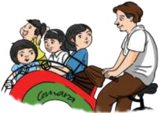

> **Deskripsi Visual:** Gambar ini adalah ilustrasi yang menunjukkan kelompok orang sedang bermain permainan balapan dengan menggunakan sepeda. Gambar ini menggambarkan aktivitas sosial dan olahraga yang seru. Elemen utama dalam gambar ini meliputi kelompok orang yang terdiri dari beberapa orang dewasa dan anak-anak, sepeda yang digunakan untuk bermain, dan latar belakang yang menunjukkan lingkungan alam seperti tanah dan pohon. Teks, angka, atau label penting tidak ada dalam gambar ini karena ia hanya menggambarkan situasi tanpa teks atau angka tambahan. Informasi kunci yang dapat diambil pembaca adalah bahwa aktivitas ini merupakan bentuk olahraga yang menyenangkan dan mempromosikan kebersamaan antar individu dalam kelompok.

Mentari hari ini berseri indah

Terima kasih emak, terima kasih abah Sumpah sakti perkasa dari kami putera-puteri yang siap berbakti

Setelah  mendengarkan  kisah  sinetron  'Keluarga  Cemara'  dan  menyanyikan lagu bersama guru dan teman-temanmu, berikan komentar.

Pesan yang saya dapat adalah:

…………………………………………………………………………………

…………………………………………………………………………………

…………………………………………………………………………………

…………………………………………………………………………………

…………………………………………………………………………………

### B. Uraian Materi

### 1. Pengertian Keluarga

### Kegiatan 1 Curah Pendapat

Kata 'keluarga' bukan lagi istilah asing di telinga kita, bukan? Karena kita hidup dan berkembang dalam keluarga serta bersama-sama dengan keluarga.

 

---
## 📄 Halaman 9

### Berikan pendapatmu atas pertanyaan-pertanyaan berikut!

- Apa yang dimaksud dengan keluarga?
…………………………………………………………………………………

…………………………………………………………………………………

…………………………………………………………………………………

…………………………………………………………………………………

- Apakah keluarga mempunyai arti yang sama dengan rumah tangga?
…………………………………………………………………………………

…………………………………………………………………………………

…………………………………………………………………………………

…………………………………………………………………………………

- Siapa sajakah anggota keluarga?
…………………………………………………………………………………

…………………………………………………………………………………

…………………………………………………………………………………

…………………………………………………………………………………

Banyak  definisi  yang  berbeda  tentang  keluarga.  Meskipun  demikian,  terdapat kesamaan dalam rumusan yang berbeda tersebut dan merupakan ciriciri pokok, yakni:

- Keluarga merupakan kelompok atau persekutuan sosial yang paling kecil.
- Keluarga terbentuk apabila ada ikatan darah, perkawinan, atau adopsi.
- Keluarga merupakan suatu persekutuan yang berawal dari dua orang yang berbeda jenis kelamin  yang  diikat  dalam  ikatan pernikahan.
Dalam  masyarakat  dapat  ditemukan bahwa keluarga terdiri atas dua bentuk, yaitu keluarga inti dan keluarga besar.

---
**🖼️ Gambar/Diagram**

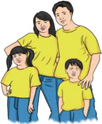

> **Deskripsi Visual:** Gambar ini adalah ilustrasi yang menampilkan keluarga berdiri bersama-sama. Keluarga ini terdiri dari dua orang dewasa (ayah dan ibu) dan dua anak muda (putri dan putra). Semua anggota keluarga tersebut mengenakan pakaian serba kuning, menciptakan suasana yang harmonis dan positif. Ayah dan ibu tampak memeluk anak-anak mereka, menunjukkan hubungan emosional yang kuat dan cinta yang mendalam. Anak-anak tampak senang dan bahagia, dengan posisi tubuh yang relaks dan rileks. Gambar ini menunjukkan hubungan keluarga yang harmonis dan menyatukan, serta menekankan nilai-nilai positif seperti cinta, kasih sayang, dan kebersamaan.

Sumber : Dokumen Kemdikbud

Gambar 1.2 Keluarga inti: terdiri dari bapak, ibu dan anak-anak.

 

---
## 📄 Halaman 10

- Keluarga inti ( nuclear family, conjugal family, basic family ), yaitu kelompok yang terdiri dari ayah, ibu, dan anak-anak.
- Keluarga  besar  ( extended  family,  consanguine  family ),  yaitu  keluarga  batih ditambah kerabat lain yang memiliki hubungan erat (hubungan darah) dan senantiasa  dipertahankan,  misalnya  kakek,  nenek,  paman,  bibi,  sepupu, kemenakan, dan sebagainya.

### Kegiatan 2 Mendalami Alkitab

- Identifikasikan  keluargamu.  Apakah  termasuk  keluarga  inti  atau  keluarga besar?
- Apa keuntungan mempunyai keluarga batih?
- Apa kerugian mempunyai keluarga besar?

### 2. Fungsi Keluarga

Setiap anggota keluarga mempunyai tugas yang harus dilakukan baik sebagai seorang anak maupun sebagai orang tuamu.

Setelah sebuah keluarga terbentuk, anggota keluarga memiliki tugas masingmasing. Suatu pekerjaan yang harus dilakukan dalam kehidupan keluarga inilah yang disebut sebagai fungsi.

---
**🖼️ Gambar/Diagram**

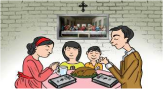

> **Deskripsi Visual:** Gambar ini adalah ilustrasi yang menunjukkan keluarga sedang makan bersama di ruangan yang sederhana. Di sebelah kiri, seorang ibu sedang memegang mangkuk makanan, sedangkan di tengah, anak-anak sedang makan dengan senyum senang. Di sebelah kanan, orang tua sedang memberikan makanan kepada anak-anak mereka. Dinding di latar belakang berwarna putih dengan beberapa piring kecil dan sebuah televisi yang menampilkan gambar-gambar. Gambar ini menunjukkan hubungan harmonis antara anggota keluarga dan suasana makan yang menyenangkan.

Gambar 1.3 Kebaktian keluarga: sangat penting dan mengembangkan berbagai aspek kehidupan Kristiani.

 

---
## 📄 Halaman 11

Adapun fungsi keluarga menurut para sosiolog adalah sebagai berikut.

- Fungsi  biologis  yang  berkaitan  dengan  pemenuhan  yang  bersifat  biologis, misalnya, makan untuk memenuhi kebutuhan gizi keluarga serta memelihara dan merawat  anggota keluarga secara fisik.
- Fungsi sosialisasi yang berhubungan dengan pembentukan kepribadian anak.
- Fungsi afeksi yang berhubungan dengan kasih sayang, keintiman, perhatian, dan rasa aman yang tercipta dalam keluarga.
- Fungsi  edukatif  yang  berkaitan  dengan  mendidik  anak  dan  menyekolahkan anak.
- Fungsi religius yang mendorong dikembangkannya anggota keluarga menjadi insan-insan agama yang penuh ketakwaan kepada Tuhan Yang Maha Esa.
- Fungsi protektif yang memberikan tempat yang nyaman bagi anggota keluarga dan memberikan perlindungan secara fisik, ekonomis, maupun psikologis.
- Fungsi rekreatif dengan tujuan untuk mencari hiburan, memberikan suasana yang segar dan gembira dalam lingkungan keluarga.
- Fungsi  ekonomis  yang  berkaitan  dengan  orang  tua  yang  mencari  sumbersumber penghasilan untuk memenuhi kebutuhan keluarga, dan pengaturan penggunaan penghasilan keluarga untuk memenuhi kebutuhan keluarga.
- Fungsi status sosial yakni kedudukan atau status yang diwariskan kepada anakanaknya.
Selain fungsi keluarga yang sudah diuraikan di atas, ada juga fungsi keluarga sebagai berikut. Menurut iman Kristen keluarga yang dipaparkan dalam Alkitab adalah:

- Sebagai teman sekerja Allah dalam mengelola alam semesta dan segala isinya (Kej.  1:28).  Setiap  manusia,  termasuk  keluarga  bertanggung  jawab  untuk menjaga kelestarian alam, misalnya dengan memanfaatkan hasil alam untuk memenuhi kebutuhan manusia dengan secukupnya, menjaga kebersihan dan keindahan alam, ramah terhadap lingkungan, dan sebagainya.
- Sebagai lembaga pendidik utama dan pertama (Ul. 6:4-9). Yang pertama berarti belum  ada  lembaga  lain  yang  dapat  mendahului  peran  keluarga  dalam pendidikan. Yang utama berarti belum ada lembaga lain yang mengungguli perannya dalam pendidikan. Dengan kata lain, keluarga menjadi lingkungan dasar penerapan nilai-nilai kehidupan sesuai dengan ajaran Kritiani.
- Sebagai  wadah  kepada  semua  anggota  keluarga  dalam  mengekspresikan kasih,  kesetiaan  dan  sikap  saling  menghormati  (Ef.  5:22-23;  6:1-3).  Setiap anggota  keluarga  menciptakan  lingkungan  dalam  keluarga  yang  harmonis dengan  menghayati  dan  melakukan  ajaran-ajaran  Kristiani  sehingga  dapat terpancar dalam lingkungan masyarakat yang lebih luas.

 

---
## 📄 Halaman 12

### 3. Peran Allah dalam Kehidupan Keluarga

### Kegiatan 3 Mendalami Alkitab

Tuhan merencanakan terbentuknya sebuah keluarga  karena  Tuhan  menciptakan  manusia sepasang  yakni  laki-laki  dan  perempuan  (Kej. 2:21-25).  Manusia  diciptakan  berbeda  tetapi satu kesatuan. Artinya, manusia diciptakan dalam  dua  jenis  kelamin.  Dalam  perbedaan itu  manusia  menjadi  satu  persekutuan  yang luar biasa karena saling membutuhkan, saling  mendukung,  saling  melengkapi.  Tuhan memberikan daya tarik yang luar biasa dalam diri sebagai laki-laki dan perempuan sehingga mempunyai rasa suka yang membuat mereka bertemu  dan  mengikat  diri.  Itulah  cikal  bakal manusia membangun keluarga.

Terdapat tiga landasan dalam membangun keluarga Kristen atau pernikahan Kristen

sangat perduli kepada keluarga baru.

menurut firman Allah yang terdapat dalam Kejadian 2:24.

'Sebab  itu  seorang  laki-laki  akan  meninggalkan  ayahnya  dan  ibunya  dan bersatu dengan istrinya, sehingga keduanya menjadi satu daging'

Diskusikan  dengan  teman  di  samping  kamu  dan  berikan  pendapat  kalian mengenai tiga dasar keluarga Kristen berdasarkan teks Alkitab di atas!

- Jelaskan arti dari kalimat seorang laki-laki akan meninggalkan ayah dan ibunya!
...........................................................................................................................................................

...........................................................................................................................................................

...........................................................................................................................................................

...........................................................................................................................................................

- Apakah yang dimaksud bersatu dengan istrinya?
...........................................................................................................................................................

...........................................................................................................................................................

 

---
## 📄 Halaman 13

...........................................................................................................................................................

...........................................................................................................................................................

- Jelaskan pengertian satu daging dalam bagian ayat ini!
...........................................................................................................................................................

...........................................................................................................................................................

...........................................................................................................................................................

...........................................................................................................................................................

### Kegiatan 4 Pernikahan di Kana

Keluarga  sangat  membutuhkan  Tuhan  dalam  kehidupan  mereka.  Tuhan Yesus  secara  pribadi  sangat  mengasihi  keluarga  dan  menyatakan  diri  sebagai Juruselamat  pada  pernikahan  di  Kana  (Yoh.  2:1-11).  Tuhan  Yesus  juga  akan menolong  keluarga  Kristen  pada  masa  kini  termasuk  keluarga  kamu  di  dalam segala kesukaran, masalah, kekurangan, dan dosa-dosa. Hal ini merupakan rahasia ajaib bagi keluarga Kristen, yaitu bahwa kehidupan keluarga Kristen akan selalu tertolong  oleh  suatu  kesetiaan  yang  luar  biasa  dan  oleh  suatu  anugerah  yang tidak dapat kita pahami.

Rasul  Paulus  menyebutkan  bahwa  keluarga  Kristen  harus  hidup  dengan menjadikan Kristus sebagai kepala keluarga (1 Kor. 11:3). Apa artinya? Menjadikan Kristus  sebagai  kepala  keluarga  artinya  menjadikan  Kristus  sebagai  pedoman kehidupan dan menjadikan seluruh ajaran Tuhan Yesus sebagai acuan dan teladan hidup berkeluarga.

Berikan contoh ajaran Tuhan Yesus sebagai acuan dan teladan hidup dalam keluargamu!

...........................................................................................................................................................

...........................................................................................................................................................

...........................................................................................................................................................

...........................................................................................................................................................

Jika Tuhan diutamakan, maka sukacita, kekuatan, kemenangan, dan penghiburan akan tinggal diam dalam keluarga. Kita perlu belajar dari kehidupan keluarga Kristiani jemaat perdana yang setiap hari sangat tekun dalam doa dan

 

---
## 📄 Halaman 14

usaha untuk menjalin hubungan dengan Tuhan Yesus dalam Kisah Para Rasul 2:4647. Mereka selalu berkumpul bersama untuk berdoa dan merayakan perjamuan.

Nilai  dan  ajaran  kristiani  yang  ditanam  dalam  kehidupan  keluarga  akan terpancar keluar sehingga merangkul keluarga yang lain untuk tumbuh bersama, dikuatkan  serta  diteguhkan  oleh  Tuhan  untuk  berani  'tampil  beda'  dan  siap menjadi saksi Kristus di tengah masyarakat di mana Tuhan menempatkan kita.

### 4. Allah dan Keluargaku

Seorang  anak  mempunyai  dua  dimensi  kehidupan  yang  sedang  dan  akan dijalani.  Di  satu  sisi,  anak  yang  berkembang  menjadi  remaja  berada  dalam posisi sebagai salah satu anggota keluarga. Di sisi yang lain, kelak ia juga akan membentuk keluarga baru pada masa yang akan datang. Oleh karena itu, seorang anak perlu disiapkan sejak dini melalui berbagai pengalaman yang diturunkan dalam keluarga.

Sadarkah kamu bahwa keadaan keluarga pada masa kini di lingkungan tempat kita  berada  terdapat  banyak  masalah  dan  pergumulan  yang  dihadapi?  Angka perceraian yang terus meningkat, banyaknya kasus perselingkuhan, banyaknya anak dan remaja yang terjerumus dalam jebakan narkoba dan minuman keras karena sendi-sendi keluarga kristiani yang hancur, dan sebagainya.

Berkaitan dengan hal tersebut, keluarga Kristen pada masa kini perlu menyadari peranannya dengan cara merefleksikan nilai-nilai kehidupan, berdasarkan Alkitab atau  pemahaman  iman  kristen  sehingga  menjadi  perpanjangan  tangan  Allah dalam kehidupan keluarga Kristen secara utuh.

Pentingnya peranan keluarga Kristen antara lain:

- Keluarga  sebagai  pusat  pembentukan  kehidupan  rohani.  Dari  keluarga  kita mempelajari pola-pola hubungan akrab dengan orang lain, nilai-nilai, ide dan perilaku yang juga didukung oleh sekolah, gereja, dan kelompok masyarakat lain yang berperan membentuk jati diri dan kehidupan rohani.
- Keluarga  sebagai  tempat  bernaung  kudus.  Maksudnya  adalah  keluarga merupakan  tempat  penerimaan,  pembinaan,  pertumbuhan  yang  mem  berdayakan  anggota-anggota  keluarga  untuk  berperan  serta  dalam  tindakan kasih dan penyelamatan Allah yang terus berlanjut.
- Keluarga  yang  mencerminkan  kasih  Allah  secara  holistik  baik  fisik,  mental/ emosional, sosial, spiritual/rohani kepada para anggotanya.
- Keluarga  sebagai  pencerita  yang  menceritakan  karya-karya  Allah  di  dalam keluarga sebagai kabar kesukaan.

 

---
## 📄 Halaman 15

### Kegiatan 5 Membuat Komitmen

Tuliskan  sebuah  komitmenmu  untuk  menjunjung  tinggi  nilai  kristiani  dalam keluarga dan setelah selesai bacakanlah di depan kelas agar diketahui oleh guru dan teman-temanmu!

### 5. Melibatkan Tuhan dalam Kehidupan Keluarga

Dalam  keluarga  Kristen,  ada  hal  khas  yang  berkaitan  dengan  peran  Tuhan dalam keluarga. Peran Tuhan itu melingkupi seluruh aspek kehidupan keluarga maupun pribadi seperti kebutuhan keluarga akan berkat Tuhan, pengampunan, serta pembaharuan hidup oleh Tuhan.

### a.  Berkat Tuhan

Pengertian berkat Tuhan cakupannya sangat luas, bukan hanya sekedar uang atau hal material lainnya. Berkat Tuhan juga meliputi kesehatan, sukacita, damai sejahtera, kemenangan, umur panjang, kebahagiaan, dan sebagainya. Berkat Tuhan adalah bentuk penyertaan Tuhan seperti yang dijanjikan dalam Alkitab kepada  orang-orang  yang  berkenan  kepada-Nya,  misalnya  Abraham  yang diberkati Tuhan dalam segala hal (Kej. 24:1), Obed-Edom beserta keluarganya diberkati Tuhan karena membiarkan tabut Tuhan tinggal dalam rumah mereka (2  Sam.  6:11).  Berkat  Tuhan  juga  akan  diterima  oleh  keluarga  Kristen  pada masa kini, yang tetap setia berpedoman dan berpegang kepada Tuhan, seperti ucapan berkat yang ditulis dalam Bilangan 6:24-26.

### b.  Pengampunan Tuhan

Tak seorang pun yang hidupnya sempurna di dunia ini. Kita berbuat dosa di dalam  pikiran,  perkataan,  maupun  perbuatan. Tahukah  kamu,  karena  dosadosa kita itu Tuhan Yesus dihukum sampai mati di atas kayu salib? KematianNya merupakan tanda kasih yang sangat besar kepada umat manusia sebagai Tuhan Yang Maha Pengampun (Ef. 1:7). Seperti Tuhan yang mengampuni, kita sebagai orang Kristen harus bisa mengampuni orang yang bersalah kepada kita. Pengampunan adalah sesuatu yang sangat indah, karena selalu membawa kedamaian, keharmonisan, menumbuhkan persekutuan dan hubungan yang baik dengan sesama, sehingga pengampunan ini menjadi salah satu kekhasan keluarga  Kristen  yang  menjadikan  Tuhan  sebagai  pedoman  kehidupan keluarga.  Bisa  dibayangkan  jika  dalam  kehidupan  keluarga  Kristen,  baik antara  orang  tua  dengan  anak,  maupun  antara  anak-anak  tidak  bisa  saling

 

---
## 📄 Halaman 16

mengampuni dan memaafkan, maka yang tumbuh dalam kehidupan keluarga adalah rasa kepahitan, ketidakharmonisan, kebencian yang sama sekali tidak menunjukkan kehadiran Tuhan.

### c.  Pembaharuan oleh Tuhan

Pembaharuan oleh Tuhan sering disebut juga dalam kekristenan sebagai 'hidup baru' . Artinya, manusia memulai kehidupan yang lebih baik dan berarti di dalam Kristus. Kristus masuk dan berdiam dalam kehidupan manusia yang baru, yang tidak sama dengan kehidupannya yang lama. Pembaharuan oleh Tuhan dalam keluarga kita akan dirasakan dalam arah dan tujuan kehidupan keluarga yang sesuai  dengan  apa  yang  dikehendaki  oleh Tuhan.  Orientasi  keluarga  bukan hanya  kepada  kehidupan  keluarga  sendiri,  tetapi  berpusat  hanya  kepada Kristus. Seperti dalam Efesus 4:17-20, kehidupan yang diperbaharui oleh Tuhan bukan lagi kehidupan dengan pikiran yang sia-sia, hidup dalam persekutuan yang jauh dari Allah, hidup dalam kedegilan hati, melainkan kehidupan yang mengerti  siapa  Allah  dan  apa  yang  menjadi  kehendak-Nya  dalam  hidup keluarga kita.

Oleh  karena  itu,  dalam  kerendahan  hati    kita  perlu  datang  kepada  Tuhan bersama dengan keluarga kamu, mohon Tuhan berkenan hadir dan membaharui kehidupan pribadi dan keluarga setiap hari. Dengan demikian, Tuhan yang menjadi pedoman  kehidupan  keluarga  akan  memberi  sukacita  dan  damai  sejahtera, sehingga keluarga Kristen dapat menjadi berkat dan kesaksian bagi sesama kita.

### Kegiatan 6 Penugasan: Berbagi pengalaman

Tugas ini diselesaikan di rumah dan bisa ditanyakan pada kedua orang tuamu. Tuliskan pengalaman tentang peran Tuhan dalam kehidupan bersama keluarga yang pernah kamu rasakan!

### C. Penutup

### Rangkuman

- Keluarga  Kristen  merupakan  keluarga  yang  mencerminkan  kehidupan  yang dilandasi oleh kasih dan sikap takut akan Tuhan.

 

---
## 📄 Halaman 17

- Keluarga berperan sebagai pusat pembentukan kepribadian anggota keluarga secara holistik (fisik, mental/psikis, spiritual dan sosial), serta menjadi perpanjangan tangan Tuhan dalam menjaga alam semesta.
- Keluarga  Kristen  yang  menjadikan  Kristus  sebagai  pedoman  dan  sebagai Kepala keluarga berarti menjadikan seluruh ajaran Tuhan Yesus sebagai acuan hidup berkeluarga yang akan membawa kesaksian bagi masyarakat.

### Ayat Emas Yosua 24:15b

- Lengkapilah bagian yang kosong di bawah ini! 'Tetapi ____________ dan seisi rumahku,  ____________ akan ____________ kepada TUHAN!'
- Secara bergantian dengan teman di samping kamu, hafalkanlah ayat tersebut!
- Pahami dan refleksikanlah makna ayat tersebut bagi kamu!

### Bernyanyi

KJ 451 - Bila Yesus Berada di Tengah Keluarga'

Bila Yesus berada di tengah keluarga, Bahagialah kita, bahagialah kita! Bila Yesus berkuasa di tengah keluarga, Pasti kita bahagia, pasti kita bahagia.

### Doa

Terima kasih Tuhan Yesus atas pelajaran hari ini Keluargaku adalah berkat ilahi Engkau telah menjaga keluargaku sampai kini Firman dan anugerah-Mu kiranya dapat kami hayati Isilah hidup remaja kami, melakukan kehendak Ilahi Ajarilah keluarga kami dapat saling mendukung dan mengasihi Sebagaimana Engkau kehendaki Amin.

 

---
## 📄 Halaman 18

---
**🖼️ Gambar/Diagram**

> **Deskripsi Visual:** Gambar ini adalah ilustrasi yang menampilkan keluarga berdiri bersama-sama. Keluarga ini terdiri dari dua orang dewasa (orangtua) dan dua anak muda (anak-anak). Semua anggota keluarga tersebut mengenakan kaos kuning dan celana biru. Orangtua berdiri di belakang anak-anak mereka, tampaknya memeluk atau menahan mereka dengan tangan. Anak-anak tampak senang dan bahagia, dengan wajah tersenyum lebar. Gambar ini menunjukkan hubungan harmonis dan cinta antara anggota keluarga.

Elemen-elemen utama dalam gambar ini adalah anggota keluarga, busana mereka, dan posisi mereka. Kaos kuning dan celana biru menjadi warna dominan dalam gambar ini, menunjukkan kesamaan dalam gaya dan kebersamaan keluarga. Posisi mereka yang saling melengkapi menunjukkan hubungan yang erat dan harmonis.

Teks, angka, atau label penting tidak ada dalam gambar ini karena ia hanya berupa ilustrasi. Namun, informasi kunci yang dapat diambil pembaca adalah tentang hubungan keluarga yang harmonis dan cinta antara anggota keluarga.

 

---
## 📄 Halaman 19

II

### A. Pengantar

###  Berdoa

Perempuan  : Tuhan terima kasih untuk keluarga yang Tuhan berikan karena Melaluinya aku hadir dan dipelihara

Laki-laki

: Tuhan terima kasih untuk keluarga yang Tuhan berikan karena

Melaluinya Engkau mendidik dan memimpin kami

Perempuan  : Bapak, ibu adalah karunia tak terhingga

Melalui mereka aku belajar bersikap baik di tengah masyarakat

Laki-laki

: Kakak dan adikku adalah karunia yang tak terhingga

Melalui mereka aku belajar mengasihi dan menerima orang lain

Semua

: Berkatilah keluargaku dalam keberadaan kami di tengah dunia  ini. Amin.

###  Bernyanyi

### PKJ288 288.INILAH RUMAH KAMI

do=d4ketuk

---
**📊 Tabel**

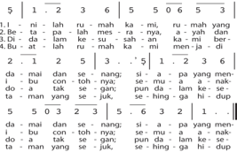

Tabel ini menunjukkan data statistik tentang berbagai jenis makanan dan jumlahnya dalam setiap kategori. Topik utama tabel adalah jenis makanan dan jumlahnya. Kolom pertama menunjukkan jenis makanan, sementara kolom kedua menunjukkan jumlah makanan tersebut. Data penting yang terlihat adalah bahwa makanan seperti nasi, telur, dan sayuran memiliki jumlah yang lebih banyak dibandingkan dengan makanan lainnya. Selain itu, tabel juga menunjukkan bahwa jumlah makanan tertentu seperti ayam dan ikan lebih sedikit dibandingkan dengan makanan lainnya. Ini menunjukkan bahwa makanan yang lebih sehat dan bergizi tinggi seperti sayuran dan telur memiliki jumlah yang lebih banyak dibandingkan dengan makanan yang kurang sehat seperti ayam dan ikan.

### Keluarga Pusat Utama Pendidikan

Bacaan Alkitab:

Ulangan 6:4-9,

2 Timotius 1:3-10

 

---
## 📄 Halaman 20

``

Syair:ArnoldusIsaakApituley1999 Lagu:EstiKristofera

Pada  pelajaran  sebelumnya,  kamu  telah  belajar  tentang  Tuhan  pedoman kehidupan keluargaku. Ketika Tuhan menjadi pedoman keluarga, berarti anggota keluarga  harus  melakukan  peran  dan  tanggung  jawab  masing-masing  sesuai dengan kehendak Tuhan.

### Bacalah dan pahamilah ayat Alkitab berikut!

Ulangan 6:7:

'Haruslah engkau mengajarkannya berulang-ulang pada kepada anak-anakmu dan  membicarakannya  apabila  engkau  duduk  di  rumahmu,  apabila  engkau sedang dalam perjalanan, apabila engkau berbaring dan apabila engkau bangun.'

Kemukakan menurut pendapat kamu, apa pesan yang terdapat dalam ayat Alkitab ini.

……………………………………………………………………………………

……………………………………………………………………………………

……………………………………………………………………………………

……………………………………………………………………………………

### B. Uraian Materi

### 1. Pengertian Pendidikan

### Kegiatan 1 Curah Pendapat

Tahukah  kamu  apa  pengertian  pendidikan?  Apakah  pendidikan  sama  dengan sekolah?

……………………………………………………………………………………

……………………………………………………………………………………

……………………………………………………………………………………

……………………………………………………………………………………

 

---
## 📄 Halaman 21

### 2. Pendidikan Kristen dalam Keluarga

Setujukah  kamu  dengan  pernyataan  bahwa  keluarga  sebagai  pusat  utama pendidikan? Kemukakan alasan atas jawaban yang kamu berikan!

……………………………………………………………………………………

……………………………………………………………………………………

……………………………………………………………………………………

……………………………………………………………………………………

---
**🖼️ Gambar/Diagram**

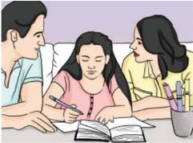

> **Deskripsi Visual:** Gambar ini adalah ilustrasi yang menunjukkan tiga orang yang sedang berbicara dan menulis di atas sebuah buku. Ilustrasi ini mungkin digunakan untuk menggambarkan konsep pembelajaran, diskusi, atau seminar. Elemen utama dalam gambar ini adalah tiga orang yang sedang berbicara dan menulis, serta buku yang menjadi objek utama. Relasi antara elemen-elemen ini adalah bahwa semua orang sedang terlibat dalam aktivitas belajar atau diskusi, dan buku menjadi media utama untuk penulisan atau pembelajaran. Teks, angka, atau label penting tidak terlihat dalam gambar ini. Informasi kunci yang dapat diambil pembaca adalah bahwa ada diskusi atau pembelajaran yang sedang berlangsung, dan buku merupakan alat utama dalam proses tersebut.

Peranan  keluarga  (orang  tua)  tidak  hanya  sebatas  melahirkan,  memenuhi kebutuhan  sandang,  pangan,  dan  papan,  tetapi  juga  memberikan  pendidikan yang  baik  bagi  anak-anak.  Tugas  orang  tua  sebagai  pendidik  berakar  dari panggilan sebagai suami-istri untuk berpartisipasi dalam tugas penciptaan Tuhan. Karena itu sangat penting bagi orang tua untuk menciptakan lingkungan keluarga yang  dipenuhi  oleh  kasih  sayang  terhadap  sesama  dan  Tuhan  Allah  sehingga menunjang perkembangan pribadi anak sesuai dengan nilai-nilai Kristen.

Keluarga Kristen tentu harus memberikan pendidikan Kristen kepada anggota keluarga, yakni pendidikan yang bercorak, berdasar, dan berorientasi pada nilainilai kristiani. Selain itu juga mengupayakan perubahan, pembaharuan anggota keluarga  secara  pribadi,  maupun  bersama  oleh  kuasa  Roh  Kudus  sehingga keluarga  hidup  sesuai  dengan  kehendak  Allah  sebagaimana  yang  dinyatakan dalam  Alkitab.  Pendidikan  secara  kristiani  memanggil  setiap  anggota  keluarga untuk meneladani Yesus sebagai Guru Agung yang menjadi teladan bagi pengikutNya, agar memiliki pemahaman serta relasi yang benar, mendalam, dan pribadi dengan Tuhan Yesus Kristus.

 

---
## 📄 Halaman 22

### Kegiatan 2 Menjawab Pertanyaan

- Mengapa orang tua berperan sangat penting dalam keluarga?
- Bagaimana pendapatmu kalau karena kesibukan atau keterbatasan tertentu orang  tuamu  tidak  mampu  melakukan  pendidikan  kristiani  kepada  anakanaknya?
- Apa yang dapat kamu lakukan supaya keluargamu dapat menerima pendidikan Kristiani?

### 3. Peran Keluarga dalam Proses Sosialisasi

Seorang  bayi  yang  lahir  ke  dunia merupakan satu makhluk hidup  kecil  yang  penuh  dengan  kebutuh  an fisik dan masih sangat ber  gantung kepada orang tuanya. Ia lahir ke dunia dalam keadaan tidak mengetahui apa-apa, tetapi seiring  dengan  pertumbuhannya,  ia akan  belajar  berbicara,  berjalan,  dan mulai  melakukan  aktivitasnya  secara mandiri, misalnya makan sendiri dan mandi  sendiri.  Selanjutnya  dia  perlu banyak belajar tentang segala sesuatu

---
**🖼️ Gambar/Diagram**

> **Deskripsi Visual:** Gambar ini adalah foto yang menunjukkan seorang ibu sedang menyusui bayi. Gambar ini menampilkan beberapa elemen penting:

1. **Apa yang Ditampilkan Secara Keseluruhan**: Gambar ini menunjukkan sebuah situasi kehidupan sehari-hari di mana ibu sedang berperan sebagai orang tua dan menyusui bayi.

2. **Elemen Utama dan Relasinya**: 
   - **Ibu**: Ibu tampak memegang bayi dengan tangan dan menggenggam pipi bayi untuk menyusui.
   - **Bayi**: Bayi tampak nyenyak dan tenang, menunjukkan bahwa ia merasa nyaman saat disusui.
   - **Latar Belakang**: Latar belakang menunjukkan ruangan yang bersih dan nyaman, mungkin di rumah, yang menunjukkan lingkungan yang aman dan nyaman bagi bayi.

3. **Teks, Angka, atau Label Penting yang Terlihat**: Dalam gambar ini, tidak ada teks, angka, atau label yang jelas. Namun, elemen-elemen seperti tubuh ibu, bayi, dan lingkungan sekitar dapat memberikan informasi tentang konteks dan situasi.

4. **Informasi Kunci yang Bisa Diambil Pembaca**: Gambar ini menggambarkan hubungan emosional antara ibu dan bayi, serta menunjukkan bagaimana ibu melakukan peran penting dalam menyusui bayi. Ini juga menunjukkan lingkungan yang nyaman dan aman untuk bayi, yang penting dalam perkembangan bayi.

Dengan demikian, gambar ini menunjukkan hubungan emosional antara ibu dan bayi, serta lingkungan yang nyaman dan aman untuk perkembangan bayi.

agar kehidupannya menjadi lebih maju, misalnya mempelajari sikap, nilai, norma yang  berlaku  dalam  komunitas  dimana  ia  berada.  Proses  inilah  yang  disebut sosialisasi.

Sosialisasi  merupakan  proses  belajar  seseorang,  di  mana  orang  tua,  persekutuan, atau masyarakat meneruskan pengetahuan, kebiasaan, maupun nilainilai dalam lingkungannya. Proses sosialisasi ini mempunyai peranan yang sangat penting karena sangat membantu dalam pembentukan kepribadian seseorang, termasuk dalam membentuk identitas iman Kristen.

Di dalam keluarga, proses sosialisasi dilakukan dengan memberikan pengajaran melalui  memberi  contoh  dan  menirukan  serta  melalui  pemberian  model  bagi anak. Oleh karena itu, setiap anak memerlukan kehadiran orang tuanya sebagai role  model atau  model  percontohan  yang  melaluinya  anak  bisa  belajar.  Dalam keluarga Kristen, proses sosialisasi memiliki dasar Alkitab atau landasan teologis. Penghayatan akan iman Kristen pertama-tama harus dilakukan secara sungguhsungguh oleh orang tua, sehingga anak-anak dapat bertumbuh menjadi orang yang beriman kepada Tuhan.

 

---
## 📄 Halaman 23

Dalam Alkitab, keluarga Timotius merupakan salah satu contoh keluarga saleh karena orang tuanya telah menurunkan iman kepada Tuhan Yesus secara turun temurun (2 Tim. 1:5). Ini merupakan contoh keluarga Kristen yang dapat diterapkan dalam kehidupan keluarga Kristen modern pada masa ini.

### 4. Peran Keluarga dalam Proses Edukasi

Dalam proses pendewasaan seorang anak secara holistik, proses sosialisasi saja tidak cukup, namun juga dibutuhkan proses edukasi. Proses sosialisasi berbeda dengan proses edukasi dalam keluarga. Proses edukasi artinya pendidikan yang diberikan secara sengaja, terencana, dan terstruktur agar tercipta individu yang kritis dalam menyikapi dampak sosialisasi yang ada, termasuk dalam membawa orang  kepada  kedewasaan  iman.  Dewasa  ini  tanggung  jawab  keluarga  untuk mendidik anak sebagian besar atau bahkan mungkin seluruhnya telah diambil alih  oleh  lembaga  pendidikan  lain,  misalnya  sekolah  dan  gereja.  Keluarga cenderung  sibuk  dengan  tanggung  jawab  lain,  sehingga  melupakan  peran utamanya sebagai pendidik pertama bagi anak-anak dan merasa cukup dengan memberikan tanggung jawab pendidikan anak-anak kepada pihak lain (sekolah, pembantu, lembaga tertentu). Apakah benar demikian?

---
**🖼️ Gambar/Diagram**

> **Deskripsi Visual:** Gambar ini adalah foto yang menunjukkan dua orang, seorang ibu dan anak perempuan, sedang belajar bersama di ruangan yang terlihat seperti rumah. Ibu sedang membimbing anaknya dengan senyum bahagia, sementara anaknya tampak sangat antusias dan senang. Mereka berdua sedang menulis di buku pelajaran yang terbuka di meja belajar. Dalam konteks ini, gambar ini mungkin digunakan untuk menggambarkan bagaimana orang tua dapat membantu anak mereka belajar dan merasa antusias tentang proses belajar tersebut.

Elemen utama dalam gambar ini adalah dua orang (ibu dan anak), buku pelajaran yang terbuka, dan lingkungan belajar yang nyaman. Ibu dan anak berada di dekat satu sama lain, menunjukkan hubungan positif dan dukungan. Buku pelajaran yang terbuka menunjukkan bahwa mereka sedang belajar atau belajar bersama. Lingkungan belajar yang nyaman menunjukkan bahwa mereka merasa nyaman dan tenang saat belajar.

Teks, angka, atau label penting yang terlihat dalam gambar ini tidak ada, karena gambar hanya berisi foto tanpa teks atau angka tambahan. Namun, informasi kunci yang dapat diambil pembaca adalah bahwa orang tua dapat membantu anak mereka belajar dan merasa antusias tentang proses belajar tersebut.

Gambar 2.3 Alangkah indahnya apabila orang tua memiliki waktu untuk belajar bersama anak.

Pengawasan dari orang tua terhadap anak mulai melemah, padahal peran orang tua menjadi sangat penting terutama dalam proses pengawasan dan pengendalian tersebut. Dalam tahap ini orang tua mulai berperan sebagai agent of social control (agen  kontrol  sosial)  terhadap  anak-anaknya,  sehingga  nilai-nilai  kehidupan yang  dijalani  tidak  bertentangan  dengan  nilai-nilai  kristiani  yang  ditanamkan

 

---
## 📄 Halaman 24

sejak kecil. Nilai-nilai kristiani yang menonjol adalah kasih, keadilan, kesetaraan, pengampunan,  penebusan,  penyelamatan  oleh  Allah,  pertobatan,  mengasihi Tuhan dengan segenap hati, serta mengasihi sesama seperti mengasihi diri sendiri. Menjadi orang tua yang baik bukan berarti menyetujui atau membenarkan dan mengiyakan semua yang dikehendaki oleh anak. Orang tua harus bisa memilah mana  hal  yang  diperbolehkan  dan  mana  yang  tidak  diperbolehkan.  Melalui kesaksian  hidup  kristiani  yang  diilhami  oleh  nilai-nilai  Kristen  akan  mengantar anak secara efektif untuk semakin mengenal dan mencintai Kristus.

### Kegiatan 3

Isilah tabel berikut dengan contoh-contoh konkret peran keluarga dalam proses sosialisasi dan edukasi!

---
**📊 Tabel**

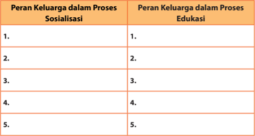

Tabel ini menunjukkan peran keluarga dalam proses sosialisasi dan pendidikan anak-anak. Kolom pertama berisi 5 baris yang masing-masing menunjukkan peran keluarga dalam proses sosialisasi, sedangkan kolom kedua menunjukkan peran keluarga dalam proses pendidikan. Data penting yang terlihat adalah bahwa keluarga memiliki peran yang sangat signifikan dalam membentuk karakter dan pengetahuan anak-anak mereka. Peran ini mencakup aspek sosial seperti pengenalan nilai-nilai dan norma masyarakat, serta aspek pendidikan seperti pembelajaran teori dan praktik.

### Kegiatan 4 Belajar dari Timotius

Baca dan pahamilah 2 Timotius 1:3-10, kemudian bersama teman kamu berikan jawaban atas pertanyaan berikut!

- Siapakah Timotius itu?
...........................................................................................................................................................

...........................................................................................................................................................

...........................................................................................................................................................

...........................................................................................................................................................

 

---
## 📄 Halaman 25

- Bagaimana latar belakang kehidupan keluarga Timotius yang mempengaruhi imannya kepada Tuhan Yesus Kristus?
...........................................................................................................................................................

...........................................................................................................................................................

...........................................................................................................................................................

...........................................................................................................................................................

- Apa pesan Paulus kepada Timotius?
...........................................................................................................................................................

...........................................................................................................................................................

...........................................................................................................................................................

...........................................................................................................................................................

- Pelajaran apa yang dapat diambil dari kehidupan Timotius dan keluarganya?
...........................................................................................................................................................

...........................................................................................................................................................

...........................................................................................................................................................

...........................................................................................................................................................

### Kegiatan 5 Penugasan

Diskusikan dengan kedua orang tuamu di rumah dan jawaban akan dibahas pada pertemuan yang akan datang!

- Apakah keluargamu telah menjalankan perannya dalam proses sosialisasi dan edukasi secara efektif?
- Apa yang dapat dilakukan keluarga untuk memperdalam pembentukan nilainilai kristiani bagi anggota keluarga, misalnya nilai keadilan, perdamaian, kasih, dan persekutuan?
- Bagaimana sikap keluarga ketika diperhadapkan dengan kenyataan semakin maraknya  tawuran  antara  pelajar, free  sex ,  peredaran  dan  pemakaian  obat terlarang, serta kejahatan dan kriminalitas remaja berkaitan dengan penanaman nilai-nilai kristiani yang mengancam kehidupan anak-anak?

 

---
## 📄 Halaman 26

### C. Penutup

### Rangkuman

- Keluarga  sebagai  pusat  pendidikan  mengarah  kepada  pembentukan  satu pribadi secara utuh atau holistik (mencakup aspek rohani atau spiritual, psikis atau mental, fisik serta sosial), dan orang tua merupakan guru dan pendidik pertama dan utama bagi anak-anak.
- Keluarga  Kristen  harus  memberikan  pendidikan  Kristen  kepada  anggota keluarga, berupa pendidikan yang bercorak, berdasar, dan berorientasi pada nilai-nilai kristiani sebagai usaha yang ditopang secara rohani dan manusiawi untuk meneruskan pengetahuan, sikap, keterampilan, dan tingkah laku yang bersesuaian dengan iman Kristen.
- Pendidikan secara kristiani memanggil setiap anggota keluarga untuk meneladani  Tuhan  Yesus  sebagai  Guru  Agung  yang  menjadi  teladan  bagi pengikut-Nya, agar memiliki pemahaman serta relasi yang benar, mendalam dan sangat pribadi dengan Tuhan Yesus Kristus.

### Ayat Emas

Lengkapilah ayat Alkitab berikut dan hafalkanlah!

Amsal 29:17:

'_______________ anakmu, maka ia _______________ memberikan _______________ kepadamu, dan mendatangkan _______________

kepadamu'

### Bernyanyi

Pilihlah lagu yang berkaitan dengan keluarga untuk dinyanyikan bersama! Kalau bisa, sesuaikan dengan bahasa daerah kamu.

### Berdoa

Dipimpin oleh seorang teman di kelas untuk menaikkan doa syukur atas keluarga yang dimiliki sebagai anugerah Tuhan.

 

---
## 📄 Halaman 27

III

### A. Pengantar

###  Berdoa

Terima kasih Tuhan untuk pelajaran hari ini

Kami belajar menjadi keluarga Allah

Bukan karena hubungan darah, juga bukan karena kekerabatan

Namun karena kasih-Mu dan karena baptisan dalam nama-Mu Kami diikat menjadi keluarga Allah Keluarga surgawi yang Tuhan kehendaki Engkau sebagai pusat pertumbuhan dan perubahan Menuju pada kesempurnaan ragawi dan rohani Tolonglah kami agar selalu bertumbuh sebagai keluarga Allah Amin.

###  Bernyanyi

### PKJ 286

### Bertumbuh Sebagai Keluarga Allah

Bacaan Alkitab:

Yohanes 15:1-8;

Lukas 8:4-15, Mazmur 1:1-6

### 286. KELUARGA YANG DAMAI

do=bes4ketuk

``

``

 

---
## 📄 Halaman 28

``

Syairdanlagu:Ad.Djalimun

Sebelum membahas lebih jauh mengenai pelajaran ini, berilah tanggapan kamu atas pertanyaan berikut.

Menurut kamu, apa yang dimaksud dengan keluarga yang berbahagia?

...........................................................................................................................................................

...........................................................................................................................................................

...........................................................................................................................................................

...........................................................................................................................................................

---
**🖼️ Gambar/Diagram**

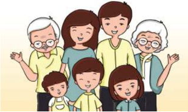

> **Deskripsi Visual:** Gambar ini adalah ilustrasi yang menampilkan keluarga besar. Keluarga ini terdiri dari sepuluh orang, termasuk dua orang nenek, dua orang nenek, dua orang ibu, dua orang ayah, dan dua orang anak-anak. Semua anggota keluarga tampak bahagia dan senang, dengan wajah mereka tertawa dan berteriak. Mereka tampak saling berinteraksi dan berkomunikasi dengan baik. Ilustrasi ini menunjukkan hubungan harmonis dan cinta antara anggota keluarga.

Elemen-elemen utama dalam gambar ini adalah anggota keluarga, wajah mereka, dan ekspresi emosi mereka. Relasi antara elemen-elemen ini adalah bahwa semua anggota keluarga bersatu dan saling mendukung satu sama lain. Wajah-wajah mereka menunjukkan rasa kebahagiaan dan kebersamaan.

Teks, angka, atau label penting tidak ada dalam gambar ini karena ia hanya menggambarkan wajah dan ekspresi anggota keluarga tanpa teks atau angka tambahan.

Informasi kunci yang dapat diambil pembaca adalah bahwa gambar ini menunjukkan hubungan harmonis dan cinta antara anggota keluarga, serta kebahagiaan dan kebersamaan dalam keluarga.

Setiap  orang  mempunyai  definisi  masing-masing  tentang  keluarga  yang berbahagia. Mungkin ada yang berpikir bahwa keluarga yang berbahagia adalah keluarga yang berkecukupan secara ekonomi. Mungkin ada juga yang berpikir bahwa keluarga yang berbahagia adalah keluarga yang terpandang. Banyak orang sekarang ini cenderung untuk mengukur dan menilai sebuah kebahagiaan dengan apa  yang  bisa  dilihat  oleh  mata  atau  materi,  sehingga  tidak  heran  jika  banyak orang  yang  bekerja  sangat  keras,  membanting  tulang  demi  menyejahterakan keluarganya. Hal ini tidak salah, namun menjadi salah jika mereka menghalalkan

 

---
## 📄 Halaman 29

segala cara untuk memenuhi keinginannya. Banyak orang yang mengambil jalan pintas untuk memperoleh banyak harta kekayaan dan status sosial yang tinggi misalnya, dengan cara korupsi. Hal yang tidak benar, bukan?

### B. Uraian Materi

### 1. Keluarga yang  Bertumbuh

Kegiatan 1 Mengenal Diri Sendiri

Amatilah  dan  kenalilah  diri  kamu  sendiri  secara  mendalam!  Apakah  ada perkembangan yang terjadi dalam setiap aspek kehidupan kamu baik secara fisik, intelektual, emosi, sosial, dan spiritual?

Perkembangan Fisik:  ......................................................................................................................

.................................................................................................................................................................

.................................................................................................................................................................

Perkembangan Intelektual:  .........................................................................................................

.................................................................................................................................................................

.................................................................................................................................................................

Perkembangan Emosi:   ...................................................................................................................

.................................................................................................................................................................

.................................................................................................................................................................

Perkembangan Sosial:  ...................................................................................................................

.................................................................................................................................................................

.................................................................................................................................................................

Perkembangan Spiritual:  ..............................................................................................................

.................................................................................................................................................................

.................................................................................................................................................................

Setiap  individu  mengalami  pertumbuhan  yang  berbeda  dan  secara  terus menerus dalam seluruh aspek, karena pertumbuhan bersifat individual. Perbedaan inilah yang membuat satu individu dengan individu yang lain menjadi unik. Karena itu cintailah diri kamu sebagaimana kamu adanya. Apabila kamu sudah memaknai diri kamu secara objektif, maka dengan mudah kamu dapat memahami orang lain.

Keluarga sebagai sekumpulan individu yang terbentuk dari pernikahan juga mengalami  pertumbuhan.  Dalam  kehidupan  keluarga  Kristen,  setiap  anggota keluarga yang mau bertumbuh bersama memiliki syarat utama. Apakah itu? Syarat utamanya adalah harus berada dalam ajaran Tuhan Yesus Kristus.

 

---
## 📄 Halaman 30

Paling tidak, ada dua hal yang harus dilakukan supaya keluarga menjadi keluarga Kristen yang bertumbuh. Pertama, hidup saling mengasihi dan menghormati agar dapat menciptakan iklim keluarga yang penuh damai. Kedua, tetap berpegang kepada Tuhan dan percaya pada pemeliharaan Tuhan.

Tahukah kamu, apa dasar kebahagiaan keluarga dalam ajaran Kristen?

Dalam  ajaran  Kristen,  yang  menjadi  dasar  kebahagiaan  keluarga  bukanlah materi, tetapi sikap takut akan Tuhan. Sia-sialah usaha manusia yang mengumpulkan  banyak  harta  duniawi  siang  dan  malam,  tetapi  tidak  menempatkan Tuhan dalam  hidupnya  sebagai  prioritas  utama  dengan  bersandar  pada  kebenaran firman Tuhan sehingga bertumbuh makin menyerupai Kristus dalam setiap aspek kehidupannya.

### 2. Ciri-Ciri Pertumbuhan Keluarga Allah

Apa yang kamu pahami dengan bertumbuh sebagai keluarga Allah?

Bertumbuh sebagai keluarga Allah berarti keluarga bertumbuh di dalam Kristus yang mempunyai makna lebih mengenali Dia, lebih mengasihi, dan menaati-Nya. Keluarga Kristen merupakan pusat dan tujuan dari perjanjian Allah, yakni untuk menjadi saksi bagi dunia. Karena itu di dalam anugerah Allah, kita sebagai anggota keluarga Kristen harus melakukan yang terbaik dalam membangun keluarga yang berkenan  kepada  Allah.  Keluarga  yang  berkenan  kepada-Nya  adalah  keluarga yang berakar, bertumbuh, dan berbuah di dalam Kristus. Seperti pengajaran Tuhan Yesus yang menggambarkan bahwa Allah memiliki tujuan yang jelas bagi setiap manusia ciptaan-Nya termasuk keluarga, yaitu agar umat manusia bertumbuh, lalu menghasilkan buah (Yoh. 15:1-8).

### Kegiatan 2 Diskusi dan Sharing

Perhatikan gambar di bawah ini!

### Gambar A

### Gambar B

 

---
## 📄 Halaman 31

### Diskusikan dengan teman sebangkumu!

Bandingkan  dua  gambar  di  atas  dan  analisis  mengapa  ranting  anggur  pada gambar A lebih subur dibandingkan dengan ranting anggur pada gambar B!

...........................................................................................................................................................

...........................................................................................................................................................

...........................................................................................................................................................

...........................................................................................................................................................

Diskusi kelompok, antara 3-4 siswa dengan pertanyaan:

- Menurut kalian, mengapa keluarga Kristen disebut sebagai keluarga Allah?
- Sebutkan ciri-ciri Keluarga Allah?
- Bagaimana  peran  serta  remaja  untuk  meningkatkan  keluarga  agar  dapat menjadi 'Keluarga Allah'?
Untuk bertumbuh dan menghasilkan buah yang berkualitas, diperlukan akar yang kokoh yang mampu memberikan asupan yang baik bagi pertumbuhan. Mari kita pahami penjelasannya satu per satu.

### a.  Berakar

Berakar menunjuk pada pohon dan tanaman lain yang akarnya tertancap jauh di dalam tanah. Akar berfungsi untuk memungkinkan tanaman bertahan hidup dan untuk memperkuat atau memperkokoh berdirinya satu tanaman.

Sama halnya dengan keluarga yang berakar dalam Kristus, sumber kehidupan. Keluarga  yang  mendasarkan dan menjadikan Kristus sebagai fondasi dalam kehidupan keluarga serta membiarkan Kristus menjadi Kepala keluarga yang memimpin  kehidupan  keluarga.  Dengan  demikian,  keluarga  akan  mampu menghadapi setiap persoalan hidup yang menerpanya.

Keluarga yang berakar dalam Kritus juga berarti:

- menjadikan firman Allah sebagai tempat tinggal keluarga, dan
- menyampaikan  pengalaman  atau  kesaksian  iman  para  leluhur  kepada anggota keluarganya.

### b.  Bertumbuh

Tanaman dikatakan  bertumbuh  apabila  ia  menampakkan  perubahan.  Kunci untuk  bertumbuh  bagi  keluarga  Kristen  adalah  mempelajari  firman  Tuhan, memperkatakan  firman  Tuhan,  dan  melakukan  firman  Tuhan  dalam  hidup sehari-hari.

Beberapa aspek pertumbuhan dalam keluarga:

- Keluarga sebagai tempat bernaung kudus, artinya keluarga harus bersikap kritis dan menolak terhadap nilai-nilai yang merusak budaya keluarga.

 

---
## 📄 Halaman 32

- Keluarga yang menyambut kehadiran Allah dalam kehidupan sehari-hari, misalnya,  menghadirkan  simbol  atau  objek  yang  dapat  mengingatkan kehadiran Allah (salib, gambar Kristen, lagu rohani, dan lain-lain).
- Keluarga  yang  mencari  tuntunan  Allah  yang  dilakukan  dalam  berbagai pertemuan dan kebaktian keluarga.
- Keluarga yang menopang kehidupan religius/rohani masing-masing anggota keluarga.
Terdapat hambatan yang menyebabkan orang tidak bertumbuh, yaitu banyak orang  Kristen  datang  beribadah  dan  sangat  senang  mendengar  khotbah, namun hanya sekadar untuk kepuasan intelektual, tanpa memiliki sukacita dan kerinduan yang besar untuk mempraktikkannya dalam kehidupan. Hambatan lain adalah responsnya terhadap firman Tuhan.

### Kegiatan 3 Mendalami Alkitab

Baca dan pahamilah Lukas 8:4-15, kemudian diskusikan pertanyaan berikut!

- Siapakah dan apakah yang diumpamakan Tuhan Yesus sebagai benih, tanah dan penabur dalam perumpamaan tentang seorang penabur?
...........................................................................................................................................................

...........................................................................................................................................................

...........................................................................................................................................................

...........................................................................................................................................................

- Jelaskan makna masing-masing benih yang jatuh di tanah yang berbeda dalam kaitan dengan hambatan yang menyebabkan seseorang atau keluarga tidak bertumbuh!
- Benih yang jatuh di pinggir jalan
.....................................................................................................................................................

.....................................................................................................................................................

.....................................................................................................................................................

.....................................................................................................................................................

- Benih yang jatuh di tanah yang berbatu-batu
.....................................................................................................................................................

.....................................................................................................................................................

.....................................................................................................................................................

.....................................................................................................................................................

 

---
## 📄 Halaman 33

- Benih yang jatuh di tengah semak duri
.....................................................................................................................................................

.....................................................................................................................................................

.....................................................................................................................................................

.....................................................................................................................................................

- Benih yang jatuh di tanah yang baik
.....................................................................................................................................................

.....................................................................................................................................................

.....................................................................................................................................................

.....................................................................................................................................................

- Amatilah keluargamu  secara kritis.  Termasuk  pada  kelompok  manakah keluargamu  berada  dalam  proses  pertumbuhan  sebagai  keluarga  Allah? Kemukakan alasan kamu!
...........................................................................................................................................................

...........................................................................................................................................................

...........................................................................................................................................................

...........................................................................................................................................................

- Apa  yang  dapat  kamu  lakukan  bagi  keluargamu  untuk  mendukung pertumbuhan  keluarga  kamu  sebagai  keluarga  Allah  berdasarkan  Lukas 8:4-15?
...........................................................................................................................................................

...........................................................................................................................................................

...........................................................................................................................................................

...........................................................................................................................................................

### c.  Berbuah

Seperti pohon yang menghasilkan buah, kehidupan keluarga kita pun harus menghasilkan buah kalau kita sudah berakar dan bertumbuh sebagai keluarga Allah.  Buah  yang  dikehendaki  Allah  untuk  dihasilkan  oleh  keluarga  adalah melakukan kehendak-Nya sehingga keluarga menjadi kesaksian bagi sesama di dunia ini. Buah yang dihasilkan dalam keluarga dapat berupa:

- Pencerminan  kasih  kepada  Allah  dalam  kehidupan  keluarga,  sebagai perwujudan nyata realisasi keluarga Allah;
- penerimaan dan komitmen dalam keluarga untuk saling mengasihi tanpa syarat; serta
- pengukuhan  dan  dorongan  antaranggota  keluarga  untuk  menemukan kelebihan dan bakat masing-masing sebagai karunia Tuhan.

 

---
## 📄 Halaman 34

Kata growth yang berarti pertumbuhan memiliki makna yang dapat diterapkan dalam kehidupan keluarga Kristen.

---
**📊 Tabel**

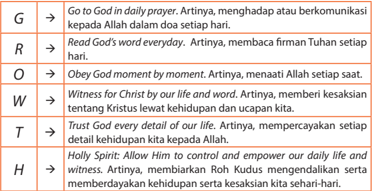

Tabel ini menunjukkan berbagai aspek dari kepercayaan dan komunikasi dengan Tuhan dalam kehidupan sehari-hari. Topik utamanya adalah bagaimana menjalankan prinsip-prinsip kepercayaan dalam kehidupan sehari-hari. Kolom-kolomnya meliputi: G (Go to God in daily prayer), R (Read God's word every day), O (Obey God moment by moment), W (Witness for Christ by our life and word), T (Trust God every detail of our life), dan H (Holly Spirit). Data penting yang terlihat adalah bahwa semua aspek ini saling berkaitan dan harus dijalankan secara bersama-sama untuk mencapai tujuan utama yaitu menjalin hubungan yang kuat dengan Tuhan.

### Kegiatan 4 Berpikir Kreatif

---
**🖼️ Gambar/Diagram**

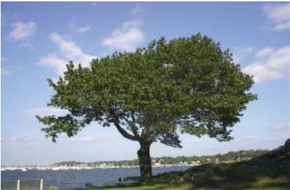

> **Deskripsi Visual:** Gambar ini adalah foto yang menunjukkan pemandangan alam dengan sebuah pohon besar berada di tepi pantai. Pohon tersebut memiliki daun hijau segar dan tumbuh tegak di atas tanah berpasir putih. Di sekitarnya, terdapat beberapa batu kecil yang tampak seperti kerikil. Di latar belakang, kita bisa melihat laut yang tenang dengan ombak halus, serta beberapa pulau kecil yang terlihat jelas. Langit cerah dengan sedikit awan putih juga tampak jelas di atas pohon. 

Elemen utama dalam gambar ini adalah pohon besar yang menjadi fokus utama, dengan daun hijau yang segar dan batu kecil di sekitarnya. Latar belakangnya adalah laut yang tenang dan langit cerah dengan sedikit awan. 

Teks, angka, atau label penting tidak ada dalam gambar ini. Namun, informasi kunci yang dapat diambil pembaca adalah bahwa gambar ini menunjukkan pemandangan alam yang tenang dan indah, dengan pohon sebagai elemen yang menonjol.

Gambar 3.4 Orang benar diumpamakan seperti pohon yang ditanam di dekat aliran air yang berdaun lebat, berbunga, dan berbuah pada musimnya.

Bentuklah kelompok yang terdiri dari 3-4 orang. Diskusikan mengenai hal-hal apa saja dalam pertumbuhan keluarga yang termasuk dalam akar, batang, serta buah pada sebuah pohon? (Kaitkan dengan bacaan Mazmur 1:1-6)

Jelaskan dengan menarik dan kreatif, kemudian presentasikan!

 

---
## 📄 Halaman 35

### C. Penutup

### Rangkuman

- Berakar,  bertumbuh,  dan  berbuah  di  dalam  Kristus  adalah  suatu  hal  yang diinginkan Tuhan terjadi pada setiap manusia ciptaan-Nya, termasuk keluarga. Individu dan keluarga tidak dapat bertumbuh dan berbuah kalau tidak berakar di  dalam  Kristus.  Bertumbuh  dalam  hubungan  dengan  Kristus  mempunyai makna lebih mengenali Dia, lebih mengasihi, dan menaati-Nya.
- Bertumbuh sebagai keluarga Allah berarti bertumbuh dalam pengenalan akan Allah  melalui  karya-Nya,  firman-Nya,  dan  pengorbanan  Anak-Nya  sebagai korban tebusan keselamatan bagi umat manusia.

### Ayat Emas

Lengkapi dan hafalkanlah!

Efesus 4:15

'Tetapi dengan ______________ berpegang kepada ______________ di dalam ______________ kita ______________ di dalam segala hal ke arah ______________, Kristus, yang adalah ______________.'

### Bernyanyi

(Lagu pop rohani)

### Keluarga Allah

Kami datang dihadirat-Mu Menikmati kasih-Mu Membawa seisi rumahku Sujud menyembah-Mu

Ini keluargaku Tuhan Berkati dan lindungi semua Jagai ku dan seisi rumahku Sampai akhir hidupku Tuhan Kumau setia melayani-Mu Kubahagia jadi keluarga Allah

### Berdoa

Doa dipimpin oleh guru atau peserta didik untuk mendoakan agar peserta didik dapat terus bertumbuh sebagai keluarga Allah.

 

---
## 📄 Halaman 36

---
**🖼️ Gambar/Diagram**

> **Deskripsi Visual:** Gambar ini adalah ilustrasi yang menampilkan keluarga berdiri bersama-sama. Keluarga ini terdiri dari dua orang dewasa (orangtua) dan dua anak muda (anak-anak). Semua anggota keluarga tersebut mengenakan kaos kuning dan celana biru. Orangtua berdiri di belakang anak-anak mereka, tampaknya memeluk atau menahan mereka dengan tangan. Anak-anak tampak senang dan bahagia, dengan wajah tersenyum lebar. Gambar ini menunjukkan hubungan harmonis dan cinta antara anggota keluarga.

Elemen-elemen utama dalam gambar ini adalah anggota keluarga, busana mereka, dan posisi mereka. Kaos kuning dan celana biru menjadi warna dominan dalam gambar ini, menunjukkan kesamaan dalam gaya dan kebersamaan keluarga. Posisi mereka yang saling melengkapi menunjukkan hubungan yang erat dan harmonis.

Teks, angka, atau label penting tidak ada dalam gambar ini karena ia hanya berupa ilustrasi. Namun, informasi kunci yang dapat diambil pembaca adalah tentang hubungan keluarga yang harmonis dan cinta antara anggota keluarga.

 

---
## 📄 Halaman 37

### Bab IV

### A. Pengantar

###  Berdoa

Dipimpin oleh salah seorang peserta didik.

###  Bernyanyi

(Lagu Pop Rohani)

### Ku Cinta K'luarga Tuhan

Ku cinta k'luarga Tuhan Terjalin mesra sekali Semua saling mengasihi

Betapa s'nang 'ku menjadi k'luarganya Tuhan

### Kegiatan 1

Bacalah berita berikut!

### Angka Perceraian di Indonesia, Terus Meningkat

Sabtu, 14 September 2013 - 19:36

Terasp os Angka perceraian di Indonesia tiap tahunnya terus meningkat. Setiap tahunnya bisa mencapai 212.000 kasus.

'Angka tersebut jauh meningkat dari 10 tahun yang lalu, yang mana jumlah angka perceraian hanya sekitar 50.000 per tahun,' ujar Wakil Menteri Agama Nasaruddin Umar di Jakarta, Sabtu (14/9).

Pihaknya pun merasa prihatin dengan tingginya angka perceraian tersebut. Apalagi, lanjut dia, hampir 80 persen yang bercerai adalah rumah tangga yang usianya terbilang muda.

'Usia rumah tangga relatif masih muda dengan anak yang masih kecil. Hal ini akan menimbulkan dampak sosial.'

Selain  itu,  hampir  70  persen  perceraian  yang  terjadi  adalah  cerai  gugat. Dengan  kata lain, Nasaruddin menilai lebih  banyak  perempuan  yang mengajukan gugatan perceraian.

### Keluarga yang Kuat, Melahirkan Pribadi yang Kuat

Bacaan Alkitab:

Matius 7:24-27,

Kisah Para Rasul 2:42

 

---
## 📄 Halaman 38

'Dengan adanya perceraian setidaknya memunculkan masalah baru, yakni kemiskinan,' tambah dia.

Dari  berbagai  macam  alasaan  perceraian,  ada  satu  yang  mungkin  tidak masuk akal. Alasan perbedaan pandangan politik saat ini tren. 'Ini sungguh tidak masuk akal, namun itu terjadi,' katanya.

Diambil dari http://nasional.teraspos.com/read/2013/09/14/60412/angka-perceraian-diindonesiaterus-meningkat

Berikan tanggapan kamu berkaitan dengan berita di atas!

- Berikan tanggapan kamu terhadap berita yang kamu baca berdasarkan nilai- nilai kasih dan kesetiaan!
...........................................................................................................................................................

...........................................................................................................................................................

...........................................................................................................................................................

...........................................................................................................................................................

- Menurut kamu, mengapa kasus perceraian terus meningkat?
...........................................................................................................................................................

...........................................................................................................................................................

...........................................................................................................................................................

...........................................................................................................................................................

- Menurut  pendapat  kamu,  bagaimana  seharusnya  tindakan  keluarga  Kristen terkait perceraian dalam keluarga?
...........................................................................................................................................................

...........................................................................................................................................................

...........................................................................................................................................................

...........................................................................................................................................................

### B. Uraian Materi

### 1. Cara Membentuk Keluarga yang Kuat

Kegiatan 2 Belajar dari Alkitab

Kamu tentu sudah pernah mendengar tentang kisah orang yang bijaksana dan orang yang bodoh, bukan? Sekarang, baca dan pahamilah kisah tersebut dalam Matius 7:24-27, kemudian bersama teman kelompok yang terdiri dari 4-5 orang diskusikan pertanyaan berikut!

 

---
## 📄 Halaman 39

- Siapakah orang yang bijaksana dan siapakah orang bodoh?
............................................................................................................................................................

............................................................................................................................................................

...........................................................................................................................................................

...........................................................................................................................................................

- Mengapa disebut orang bijaksana dan orang bodoh?
...........................................................................................................................................................

...........................................................................................................................................................

...........................................................................................................................................................

...........................................................................................................................................................

- Hubungkanlah orang yang bijaksana dan orang yang bodoh dalam kehidupan keluarga!
...........................................................................................................................................................

...........................................................................................................................................................

...........................................................................................................................................................

...........................................................................................................................................................

- Apakah yang harus dilakukan agar kehidupan keluarga menjadi  kokoh dan kuat?
...........................................................................................................................................................

...........................................................................................................................................................

...........................................................................................................................................................

...........................................................................................................................................................

Membangun  rumah diartikan sebagai membangun kehidupan, termasuk kehidupan keluarga. Supaya kehidupan ini kuat  maka  harus  dibangun  di  atas  dasar yang kokoh. Tuhan Yesus menyebut dasar ini adalah batu karang, yaitu Kristus sendiri. Jika kehidupan keluarga dibangun di atas Kristus, maka  keluarga akan memiliki  kehidupan yang kokoh, aman, dan selamat.

Membangun di atas Kristus artinya, seluruh kehidupan keluarga bergantung sepenuhnya kepada Kristus. Seluruh bangunan kehidupan  keluarga  bertumpu  sepenuhnya kepada Kristus sebagai landasan hidup

---
**🖼️ Gambar/Diagram**

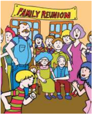

> **Deskripsi Visual:** Gambar ini adalah ilustrasi yang menunjukkan keluarga yang sedang berkumpul untuk acara pernikahan. Gambar ini menggambarkan berbagai anggota keluarga yang berdiri di sekeliling meja tamu, tampaknya sedang menyaksikan acara tersebut. Di tengah-tengah, ada dua orang yang sedang berjalan menuju meja tamu, tampaknya sebagai pengantin baru. Di sebelah kiri, ada seorang anak kecil yang sedang berjalan menuju pengantin baru, sementara di sebelah kanan ada beberapa orang yang tampaknya sedang berbicara atau menatap pengantin baru.

Elemen-elemen utama dalam gambar ini meliputi keluarga, pengantin baru, anak kecil, dan acara pernikahan. Keluarga terdiri dari berbagai anggota yang tampaknya saling mengenal dan berinteraksi. Pengantin baru tampaknya menjadi fokus utama dalam gambar ini, dengan anak kecil yang sedang berjalan menuju mereka menunjukkan rasa antusiasme dan harapan. Acara pernikahan tampaknya merupakan momen penting bagi keluarga ini, dengan semua anggota keluarga hadir untuk merayakannya.

Teks, angka, atau label penting yang terlihat dalam gambar ini tidak ada, karena gambar ini hanya menggambarkan situasi tanpa teks atau angka tambahan. Informasi kunci yang dapat diambil pembaca dari gambar ini adalah bahwa keluarga ini sedang merayakan pernikahan, dan anak kecil tampaknya sangat antusias tentang acara tersebut.

 

---
## 📄 Halaman 40

keluarga. Kristus akan sepenuhnya menopang kehidupan keluarga Kristen dalam menghadapi berbagai persoalan kehidupan dan memampukan keluarga melewati ujian sehingga tetap kokoh dan kuat berdiri, serta memperoleh keselamatan kekal.

Kehidupan  keluarga  setiap  hari  juga  harus  bergerak  ke  arah  Kristus.  Jika keluarga telah membangun hubungan yang kokoh dengan Tuhan, rumah bukan sekedar  berdiri  di  atas  batu,  tetapi  tertanam  di  batu  itu.  Tuhan  menginginkan keluarga  memiliki  hubungan  yang  kuat  terikat  dengan  Kristus.  Tuhan  ingin keluarga  bertambah  teguh  di  dalam  iman  kepada  Kristus  dan  hati  berlimpah dengan ucapan syukur. Menjadi orang Kristen tidak cukup hanya mendengarkan firman-Nya  saja  tetapi  harus  menjadikan  firman  itu  hidup  dalam  diri  dengan mempraktikkannya dalam kehidupan sehari-hari.

Realita yang terjadi dalam kehidupan orang Kristen adalah sangat sulit untuk mempraktikkan firman Tuhan dalam kehidupan sehari-hari. Namun jika keluarga Kristen  benar-benar  mengandalkan  Kristus  sebagai  landasan  hidup  dan  setiap hari  mau  berusaha  keras  membangun  hubungan  yang  dalam  dengan  Kristus, serta menjadikan kasih sebagai pengikat, maka Kristus akan menolong umat-Nya untuk  dapat  melakukan  kehendak-Nya.  Niscaya  keluarga  Kristen  akan  mampu menahan badai kehidupan yang menerpa dan menerima upah yang indah karena berhasil melewati ujian.

### Kegiatan 3 Refleksi

- Berapa banyak waktu yang keluargamu gunakan untuk merenungkan firman Allah?
- Berapa banyak waktu yang keluargamu gunakan untuk mengenal Allah dalam komunikasi bersama?
- Bagaimanakah  keluargamu melakukan kehendak Allah secara konkret?
- Apa yang harus dilakukan agar keluarga kamu benar-benar hidup di dalam Kristus?
- Bagaimana  keluarga  mengandalkan  Kristus  sepenuhnya  untuk  menopang kehidupan keluarga?
- Sikap apa yang harus kamu lakukan untuk mendukung keluargamu agar tetap bertumpu kepada Kristus sebagai fondasi keluarga?

 

---
## 📄 Halaman 41

### 2. Kepribadian yang Kuat

### Kegiatan 4 Penilaian Diri

Kenalilah  dirimu  dengan  mengidentifikasi  apa  yang  menjadi  kelebihan  dan kelemahan kamu!

---
**📊 Tabel**

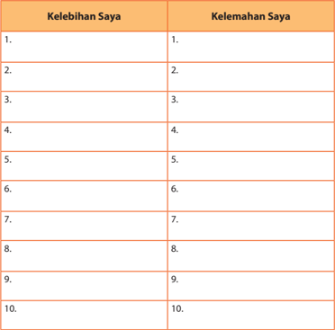

Tabel ini berisi dua kolom: "Kelebihan Saya" dan "Kelemahan Saya". Kolom pertama mencakup 10 baris yang masing-masing menunjukkan kelebihan saya, sedangkan kolom kedua mencakup 10 baris yang masing-masing menunjukkan kelemahan saya. Topik utama tabel ini adalah identifikasi kelebihan dan kelemahan diri sendiri. Data penting yang terlihat adalah bahwa setiap baris memiliki satu kelebihan dan satu kelemahan, menunjukkan bahwa tabel ini dirancang untuk membantu individu dalam membandingkan kelebihan dan kelemahan mereka.

Keluarga memiliki peluang yang besar untuk membangun karakter yang kuat dalam diri anak. Tentunya dalam hal ini hanya keluarga yang harmonis, yang di dalamnya terdapat cinta, kasih sayang, serta integritaslah yang kemudian mampu membuat model pendidikan  yang  terbaik  untuk  anak.  Maka  dari  itu,  keluarga harus mampu menjadi model pendidikan terbaik bagi anak.

 

---
## 📄 Halaman 42

Apabila keluarga memiliki fondasi yang kuat dan kokoh dalam kelangsungan hidupnya,  maka  hal  tersebut  juga  akan  memberikan  dampak  bagi  anggota keluarganya,  termasuk  anak.  Anak-anak  akan  tumbuh  dalam  terang  kasih  dan firman Tuhan yang menuntunnya dalam mengarungi masa depan yang cerah dan sesuai dengan nilai-nilai kristiani.

### 1.  Membiasakan Pola Hidup Kristiani

Untuk menjadi pribadi Kristen yang kuat, setiap anggota keluarga termasuk kamu perlu selalu membiasakan hidup dalam pola hidup kristiani setiap hari. Dalam hal ini kita perlu membiasakan berelasi dengan Tuhan sehingga pengembangan kehidupan dengan Tuhan menjadi suatu kebutuhan.

Bacalah dan pahamilah Kisah Para Rasul 2:42. Apa yang dapat dipelajari dari ayat tersebut?  Ada  beberapa  hal  yang  menarik  untuk  mengembangkan  kebiasaan rohani kamu setiap hari.

- Pribadi  dan  keluarga  Kristen  setiap  hari  bertekun  dalam  pengajaran  rasulrasul. Artinya, setiap hari kita harus bertekun dan setia untuk membaca dan memahami Alkitab sebagai pengajaran rasul-rasul.
- Persekutuan bersama.
- Berkumpul memecahkan roti atau melakukan perjamuan kudus.
- Berdoa bersama untuk kepentingan pribadi, sesama, dan gereja.

### 2.  Langkah-Langkah Disiplin Rohani Dalam Keluarga

Untuk membiasakan kehidupan rohani, minimal kamu bisa melakukan tiga hal berbeda bersama keluarga maupun secara pribadi.

- Di  pagi  hari,  kurang  lebih  10  menit  beribadahlah  bersama  keluarga  kamu. Berdoalah untuk mendengarkan firman Tuhan, bacalah Alkitab dan renungan harian atau penjelasan singkat dari salah seorang anggota keluarga tentang ayat yang dibaca, kemudian berdoalah untuk mengucap syukur atas firman Tuhan yang dibaca, mendoakan kegiatan sepanjang hari ini, mendoakan orang lain, dan juga gereja.
- Di siang hari sesudah makan siang, kamu secara pribadi dalam sikap berdoa hayati dan hafalkan doa Bapa kami dan hukum kasih sebagaimana yang tertera dalam Matius 22:37-39.
- Pada malam hari sebelum atau sesudah belajar, lakukanlah pembacaan Alkitab dan  r efleksi  terhadap  apa  yang  terjadi  pada  hari  itu.  Dalam  membaca  dan memahami Alkitab, pertanyaan-pertanyaan berikut dapat dijadikan penuntun. · Siapa yang disebut dalam bagian ini?
- Allah Bapa, Yesus, dan Roh Kudus.
- Tokoh lain. · Apa yang diungkapkan dalam teks Alkitab tersebut?
- Adakah janji, perintah atau larangan, dan sebagainya?

 

---
## 📄 Halaman 43

- Sikap atau kebiasaan apa yang harus saya ubah?
- Lakukanlah janji, perintah, atau larangan tersebut! · Apa yang saya pelajari dari firman Tuhan yang dibaca?
- Berdoalah  untuk  mensyukuri  firman  Tuhan  yang  dibaca  dan  mohon tuntunan Roh Kudus untuk dapat menerapkannya dalam kehidupan seharihari.
- Pilihlah  ayat  yang  menarik  atau  berkesan  dari  teks  Alkitab  yang  dibaca. Jelaskan mengapa!

### Kegiatan 5 Penugasan (Membuat Jurnal)

Terapkanlah  hal-hal  yang  dipelajari  di  atas  dalam  keluargamu!  Tulislah  dalam bentuk jurnal atau laporan tentang kegiatan yang berlangsung dalam 1 minggu! Setelah itu, kumpulkan kepada guru kamu untuk dinilai. Diharapkan hal ini dapat menjadi kebiasaan dalam kehidupan kamu maupun keluarga kamu!

### 3. Karakter Bangsa yang Mendukung Karakter Kristen

Pribadi Kristen yang kuat harus juga mempunyai aspek-aspek karakter bangsa. Berkaitan dengan hal tersebut, pendidikan karakter bangsa adalah suatu sistem penanaman nilai-nilai karakter kepada anak dan remaja yang meliputi komponen pengetahuan, kesadaran atau kemauan, dan tindakan untuk melaksanakan nilainilai  tersebut,  baik  terhadap  Tuhan,  diri  sendiri,  sesama,  lingkungan,  maupun kebangsaan  sehingga  menjadi  manusia  yang  berakhlak  mulia.  Aspek  karakter bangsa yang akan mendukung pribadi yang kuat adalah sebagai berikut.

- Religius,  yaitu  sikap  yang  patuh  dalam  melaksanakan  ajaran  agama  yang dianutnya  dan  hidup  rukun  dengan  pemeluk  agama  lain.  Dalam  konteks kekristenan dapat dilakukan dengan meneladani cara berpikir dan tindakan Kristus.
- Jujur, yaitu perilaku yang didasarkan pada upaya menjadikan dirinya sebagai orang yang selalu dapat dipercaya dalam perkataan, tindakan, dan pekerjaan.
- Toleransi,  yaitu  tindakan  yang  menghargai  perbedaan  agama,  suku,  etnis, pendapat, sikap, dan tindakan orang lain yang berbeda dari dirinya.
- Disiplin,  yaitu  tindakan  yang  menunjukkan  perilaku  tertib  dan  patuh  pada berbagai ketentuan dan peraturan.
- Kerja keras, yaitu tindakan yang menunjukkan perilaku tertib dan patuh pada berbagai ketentuan dan peraturan.

 

---
## 📄 Halaman 44

- Kreatif,  yaitu  berpikir  dan melakukan sesuatu untuk menghasilkan cara atau hasil baru dari sesuatu yang telah dimiliki.
- Mandiri,  yaitu  sikap  yang  tidak  mudah  tergantung  pada  orang  lain  dalam menyelesaikan tugas-tugas.
- Demokratis, yaitu cara berpikir, bersikap,  dan  bertindak  yang  menilai sama  hak  dan  kewajiban  dirinya dan orang lain.
- Rasa  ingin  tahu,  yaitu  sikap  dan tindakan yang selalu berupaya untuk mengetahui lebih mendalam dan  meluas  dari  sesuatu  yang  dipelajarinya, dilihat, dan didengar.
- Semangat  kebangsaan,  yaitu  cara berpikir, bertindak, dan ber  wawasan yang  menempatkan  ke  pentingan bangsa di atas ke  pentingan diri dan kelompoknya.
- Cinta tanah air, yaitu cara berpikir, bersikap,  dan  berbuat  yang  me-
- nunjukkan rasa kesetiaan, kepedulian, dan penghargaan yang tinggi terhadap bahasa, lingkungan fisik, sosial, budaya, ekonomi, dan politik bangsa.
- Menghargai prestasi, yaitu sikap yang mendorong dirinya untuk menghasilkan sesuatu  yang  berguna  bagi  masyarakat,  mengakui,  serta  menghormati  keberhasilan orang lain.
- Bersahabat/komunikatif,  yaitu  tindakan  yang  mampu  menjalin  relasi  positif dengan orang lain sebagai saudara dan sahabat.
- Cinta damai, yaitu sikap yang suka damai, menghargai orang lain yang tumbuh dari hati yang bersih juga dengan sadar menghindar i konflik yang destruktif dan tidak membangun.
- Gemar membaca, yaitu kebiasaan menyediakan waktu untuk membaca berbagai bacaan yang memberikan kebaikan bagi dirinya.
- Peduli  lingkungan,  yaitu  tindakan  yang  mencintai  lingkungan,  selalu  berupaya mencegah kerusakan pada lingkungan alam di sekitarnya.
- Peduli sosial, yaitu tindakan yang selalu ingin memberi bantuan pada orang lain dan masyarakat yang membutuhkan.
- Tanggung  jawab,  yaitu  perilaku  seseorang  untuk  melaksanakan  tugas  dan kewajibannya  yang  seharusnya  dia  lakukan  terhadap  diri  sendiri,  masyarakat, lingkungan (alam, sosial dan budaya), negara, dan Tuhan.

---
**🖼️ Gambar/Diagram**

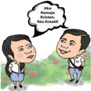

> **Deskripsi Visual:** Gambar ini adalah ilustrasi yang menunjukkan dua orang yang berbicara. Pada gambar tersebut, seorang pria dan seorang wanita sedang berbicara di depan sebuah taman bunga. Pria tersebut mengenakan jaket biru dan celana hitam, sedangkan wanita tersebut mengenakan blouse putih dan rok hitam. Keduanya tampak senang dan bahagia saat berbicara. Gambar ini menunjukkan hubungan antara dua orang tersebut, mungkin teman atau pasangan, dan suasana yang positif dan harmonis.

 

---
## 📄 Halaman 45

Dengan penjelasan di atas, kita dapat menyimpulkan, bahwa kamu sebagai orang Kristen wajib mengembangkan kebiasaan dan karakter Kristen dalam hidup sehari-hari, baik sebagai pribadi, maupun keluarga. Namun, sebagai warga negara Indonesia,  kita  juga  dipanggil  untuk  mengembangkan  aspek-aspek  karakter bangsa,  untuk  mendukung  karakter  Kristen.  Pasti  kamu  dapat  melakukannya, berusahalah dengan sungguh-sungguh, sehingga kamu dapat lebih mengasihi dirimu sendiri, disenangi orang, dan hidupmu berkenan kepada Allah.

### Kegiatan 6 Tugas Mandiri

Temukan  masalah-masalah  yang  terjadi  di  keluargamu  (kamu  dengan  orang  tua, maupun kamu dengan saudara) yang berkaitan dengan 5 nilai dari 18 karakter bangsa di atas! Selanjutnya, pikirkan tindakan konkret untuk mengatasi dan mengembangkan karakter bangsa di keluarga kamu sehingga keluargamu menjadi keluarga yang kuat di dalam Tuhan!

### C. Penutup

### Rangkuman

- Keluarga yang kuat adalah keluarga yang dibangun dan bertumpu seutuhnya di atas  Kristus,  sehingga  setiap  persoalan  yang  datang  dapat  diselesaikan  seturut dengan kehendak Tuhan dan firman-Nya.
- Keluarga  yang  kuat  akan  memberikan  dampak  positif  bagi  anak  dalam  proses pertumbuhannya,  sehingga  anak  akan  memiliki  karakter  yang  kokoh  berakar dalam Kristus.

### Ayat Emas: Penugasan

Hafalkanlah ayat berikut! Kemudian gambarkanlah dua rumah yang dibangun di atas batu dan di atas pasir! Analisis arti kedua gambar kamu dan identifikasikanlah diri kamu!

Apakah kamu lebih cocok diumpamakan sebagai rumah yang dibangun di atas batu atau di atas pasir? Jelaskan mengapa!

Berbagilah penemuan yang kamu lakukan dengan teman sebangkumu.

Matius 7:24

'Setiap orang yang mendengar perkataan-Ku ini dan melakukannya, ia sama dengan orang yang bijaksana, yang mendirikan rumahnya di atas batu.'

 

---
## 📄 Halaman 46

### Matius 7:26

'Tetapi setiap orang yang mendengar perkataan-Ku ini dan tidak melakukannya, ia sama dengan orang yang bodoh yang mendirikan rumahnya di atas pasir'

### Bernyanyi

Pilihlah lagu yang kamu sukai yang sesuai dengan tema pelajaran hari ini.

### Berdoa

Tuhanku, Engkau Allah yang berkuasa atas hidupku Aku ingin berkembang sebagai remaja yang meneladani-Mu Pribadi yang kuat, tangguh, sederhana seperti hidup Tuhanku Selalu memuliakan Tuhan, menjadi berkat dalam keluargaku Aku ingin berkorban bagi keluargaku Sebagai tanda kasihku bagi keluarga dan Tuhanku Arahkan masa depanku berkembang dan tumbuh bersama-Mu Ingin aku persembahkan masa depan bagi-Mu, Tuhanku

Amin.

 

---
## 📄 Halaman 47

Bab V

### A. Pengantar

###  Berdoa

Diucapkan bersama.

Bapa sorgawi, segala sesuatu yang baik yang kami alami adalah berasal dari Tuhan. Suatu pernikahan di dalam Tuhan, adalah karunia-Mu, agar pernikahan Kristen  menjadi  tanda  keselamatan  dan  karya  Tuhan  di  tengah-tengah lingkungan kami. Berkatilah setiap pernikahan dan keluarga Kristen, agar karena kuasa kasih-Mu, suami-isteri dapat selalu berjalan bersama dengan penuh cinta, dapat  saling  mengampuni,  saling  mengasihi,  dan  saling  menguatkan  pada saat mereka mengalami permasalahan. Kiranya Engkau berkenan menyiapkan hati dan hidup kami agar kami menjalani hidup kami dengan bimbingan kasih Tuhan yang tidak terbatas pada masa muda kami. Amin.

###  Menyanyi

### Bahasa Cinta

Andaikata kuberikan seluruh hartaku. Tapi tanpa kasih cinta, hampa tak berguna.

R eff:

Ajarilah kami bahasa cinta-Mu, Agar kami dekat pada-Mu, ya Tuhanku. Ajarilah kami bahasa cinta-Mu, Agar kami dekat pada-Mu.

Cinta itu lemah lembut, sabar sederhana. Cinta itu murah hati, tahan menderita.  (Reff)

### Pernikahan dalam Perspektif Kristiani

Bacaan Alkitab:

Kejadian. 2:24,

Yohanes. 15:9-17, Efesus. 5:22-33

 

---
## 📄 Halaman 48

Tidak dapat dipungkiri, pesatnya  perkembangan sosial dan perubahan nilainilai  di  sekitar  kita  dapat  mempengaruhi  kehidupan  pernikahan  dan  keluarga. Memang  ada  beberapa  perubahan  yang  positif,  misalnya:  kesadaran  akan hak-hak  asasi  manusia,  martabat  manusia,  kesadaran  etis,  kesadaran  terhadap ketidaksetaraan, ketidakadilan kedudukan serta peran laki-laki dan perempuan, dan  lain-lain.  Tetapi  dalam  kenyataan  juga  kita  jumpai  adanya  nilai-nilai  yang merendahkan  martabat  hidup  perkawinan, misalnya:  maraknya  hubungan seksual sebelum pernikahan, perselingkuhan, poligami, perceraian, dan kekerasan yang terjadi di dalam rumah tangga (KDRT). Oleh karena itu, kita perlu menyadari adanya  perubahan-perubahan,  mengantisipasi  hal-hal  yang  akan  terjadi,  dan berusaha untuk mencegah berbagai permasalahan kehidupan pernikahan. Untuk itu, maka perlu pemahaman yang jelas tentang pernikahan maupun kehidupan berkeluarga secara kristiani.

### Kegiatan 1 Diskusi Kelompok

Diskusikanlah pernikahan para artis di media cetak dan elektronik. Menurutmu apakah  mereka  sudah  sungguh-sungguh  siap  memasuki  suatu  pernikahan? Menurutmu  hal-hal  apa  yang  perlu  dipersiapkan  oleh  calon  pasangan  agar pernikahan mereka dapat lestari atau langgeng.

### B. Uraian Materi

### 1. Pentingnya Persiapan Pernikahan

Selaku  orang  muda  kita  pun  perlu  memikirkan  dan  mempersiapkan  suatu pernikahan yang baik dan memiliki kehidupan keluarga yang berkenan kepada Tuhan. Meskipun pada saat ini kamu baru dalam tahapan mencari atau sedang berpacaran secara sehat.

Hidup menikah dan berkeluarga adalah salah satu pilihan bagi orang Kristen. Meskipun demikian ada juga pilihan lain yang juga dapat dipertanggungjawabkan, yaitu hidup tidak menikah karena bermaksud untuk dapat lebih melayani Tuhan dan  sesama. Tentunya  kamu  pernah  melihat  orang-orang  yang  memilih  hidup seperti  ini.  Dalam  Alkitab  kita  juga  dapat  melihat  kehidupan Tuhan Yesus  dan Rasul Paulus, yang hidupnya  diabdikan untuk kepentingan kemuliaan Allah dan sesamanya. Dalam konteks seperti ini, hidup tidak menikah sesungguhnya juga suatu pilihan yang perlu kita hargai.

 

---
## 📄 Halaman 49

Mengapa mempersiapkan suatu pernikahan kristiani  itu  dianggap  penting? Hal  itu  penting  diketahui  terutama  bagi  pasangan  yang  akan  melangsungkan pernikahan. Di samping  itu juga penting bagi gereja supaya citra gereja sebagai keluarga Allah, di mana para warganya terdiri dari keluarga-keluarga Kristen dapat dijaga, sekaligus kehendak Allah dapat diterapkan. Banyak tantangan baik dalam kehidupan  pernikahan  maupun  gereja  yang  harus  dihadapi  dan  sendi-sendi pernikahan Kristen perlu dipertahankan.

### Beberapa  hal  yang  perlu  dipahami  dalam  persiapan  pernikahan Kristen.

- Pentingnya  suatu  pemahaman  yang  benar  tentang  pernikahan  Kristen. Pemuda  dan  pemudi  Kristen  perlu  sungguh-sungguh  mengerti  hakikat suatu pernikahan Kristen yang disiapkan gereja. Hal ini untuk mengatasi dan sekaligus  sebagai  solusi  terhadap  realita  di  masyarakat  yang  mengaburkan dan memandang pernikahan bukan sebagai lembaga yang dikuduskan Tuhan.
- Perlunya  persiapan  yang  memadai.  Pembinaan  persiapan  suatu  pernikahan Kristen adalah hal yang dibutuhkan oleh calon pasangan yang akan menikah, agar mereka dapat mengalami suatu pernikahan yang bahagia dan tercapainya keselamatan di dalam Tuhan.
- Secara  teknis,  persiapan  pernikahan  Kristen  dapat  dibagi  menjadi  dua  (2) bagian,  yaitu  persiapan  jangka  panjang  dan  dan  persiapan  jangka  pendek. Yang pertama,  persiapan jangka panjang, mencakup pemberian pemahaman sekaligus  bekal  bagi  kehidupan  keluarga  Kristen.  Biasanya  hal  ini  kita  sebut sebagai 'Katekisasi Pernikahan' , dimana calon pasangan suami dan istri perlu mengenal dasar-dasar teologi pernikahan dan keluarga Kristen, etika, ekonomi keluarga, memahami pasangan, peran seksualitas, dinamika relasi keluarga, dan hal-hal lain yang dianggap penting. Waktu yang dialokasikan biasanya sekitar enam (6) bulan. Yang kedua, persiapan jangka pendek, mencakup persiapan teknis upacara dan perhelatan pernikahan. Seringkali juga dibicarakan upacara secara adat.

### 2. Hakikat Pernikahan Kristen

Pada dasarnya tujuan hidup kita sebagai manusia adalah untuk mencapai suatu kebahagiaan dan  kesejahteraan.  Pada umumnya hal itu dicapai dengan memilih hidup berkeluarga, yang tentu saja didahului oleh suatu pernikahan. Pernikahan pada hakikatnya adalah suatu persekutuan hidup antara laki-laki dan perempuan karena mereka saling mencintai dan ingin membentuk suatu kehidupan bersama secara tetap, memiliki tujuan yang sama yakni ingin saling membahagiakan dan

 

---
## 📄 Halaman 50

kalau diperkenankan Tuhan memiliki keturunan. Pada setiap budaya perkawinan dianggap  sesuatu  yang  sangat  penting  di  dalam  masyarakat.  Sesungguhnya pernikahan bukanlah masalah dua orang saja yang menikah, namun juga menjadi masalah agama dan keluarga besar.

### Tujuan dan dasar suatu pernikahan Kristen antara lain:

- Suatu pernikahan merupakan peraturan yang ditetapkan oleh Tuhan. Pernikahan merupakan tata tertib yang suci yang ditetapkan oleh Allah sejak penciptaan manusia. Sebagaimana yang tertera dalam Kejadian 2:24 : '...  Sebab itu,  seorang  laki-laki  akan  meninggalkan  ayahnya  dan  ibunya  dan  bersatu dengan istrinya, sehingga keduanya menjadi satu daging' .
- Cinta kasih Tuhan Yesus Kristus menjadi dasar pernikahan Kristen (band: Yoh. 15:9-17 dan Ef. 5:22-33). Yang menjadi dasar dari kehidupan pernikahan dan keluarga  adalah  cinta  kasih  Tuhan  Yesus  Kristus  kepada  Gereja-Nya.  Suami dan istri dipanggil untuk saling mencintai secara timbal balik, secara total dan menyeluruh, serta kemauan untuk saling memberi dan menerima.
- Untuk saling membahagiakan dan mencapai kesejahteraan hidup. Oleh karena itu, kedua belah pihak baik istri maupun suami mempunyai tanggung jawab dan memberi sumbangan yang bermakna untuk mewujudkan kesejahteraan dan kebahagiaan suami istri.
- Dalam pernikahan dengan perspektif  Kristen, nikah dipandang sebagai suatu peraturan monogami. Karena monogami merupakan suatu r efleksi dari kasih agape ,  yaitu  kasih yang saling melayani, tanpa pamrih, dan eksklusif. Realita dwi tunggal, suatu kebahagiaan duniawi yang terbesar yang diberikan Tuhan kepada kita.
Herman adalah seorang pemuda Kristen yang akan menikah dengan pacarnya yang sangat mengasihi  Tuhan. Dalam  Katekisasi pernikahan/persiapan pernikahan, Pendetanya bertanya : 'Herman, keluarga seperti apakah yang ingin  kamu  bentuk  ?.'  Jawab  Herman  :  'Ya  tentu  keluarga  yang  bahagia.' Tanggapan  Pendeta  :  'Apa  maksudnya?.'  Jawab  Herman  :  'Keluarga  yang rukun, tidak ribut, kebutuhannya tercukupi, dan punya anak yang baik.' Tanya Pendeta selanjutnya : 'Hanya itu?.' Jawab Herman : 'Saya kira begitulah tujuan pernikahan. Tapi  disamping  itu  tentunya  kami  akan  selalu  pergi  ke  gereja, mendukung program gereja, anak-anak nanti ke Sekolah Minggu. Saya ingin anak-anak menjadi orang Kristen yang baik.' (disadur dari Susabda, 2011: 23)

 

---
## 📄 Halaman 51

### Kegiatan 2 Diskusi Kelompok

Buatlah kelompok kecil 3-5 orang. Simaklah kejadian yang diungkapkan, kemudian diskusikan dengan panduan pertanyaan sebagai berikut.

### Pokok diskusi :

- Apakah  maksud  Herman  pernikahan  Kristen  berbeda  dari  pernikahan  yang lain?
...........................................................................................................................................................

...........................................................................................................................................................

...........................................................................................................................................................

...........................................................................................................................................................

- Apakah  kamu  berpikir  bahwa  Herman  mengerti  betul  tujuan  pernikahan Kristen?
...........................................................................................................................................................

...........................................................................................................................................................

...........................................................................................................................................................

...........................................................................................................................................................

- Menurut  pendapatmu  apakah  berpacaran  sebelum  pernikahan  dan  mem- bentuk kelurga baru itu penting? Jelaskan alasanmu!
...........................................................................................................................................................

...........................................................................................................................................................

...........................................................................................................................................................

...........................................................................................................................................................

### 3. Kasih dalam Keluarga Adalah Gambaran Cinta Kasih Tuhan

Pernahkah kamu memperhatikan pasangan suami isteri di jemaat? Bagaimana pendapat kamu tentang pasangan-pasangan suami-istri tersebut? Seringkali kita menemukan di jemaat kita beberapa pasangan yang meskipun usia pernikahannya sudah cukup lama, namun relasi mereka sangat akrab dan mesra. Meskipun usia meraka sudah tua, namun mereka masih tetap menunjukkan  teladan pernikahan Kristen  yang  baik.  Mereka  menunjukkan  bagaimana  mereka  dapat  saling membantu, sabar menunggu, peduli satu terhadap yang lain, bergembira bersama, dan saling mendukung dalam pelayanan. Pasangan-pasangan tersebut, ternyata dalam realita mempunyai dampak yang besar di jemaat. Banyak pasangan dan

 

---
## 📄 Halaman 52

keluarga yang menghargai kehadiran mereka, sekaligus mereka menjadi contoh pasangan  suami-istri  yang  diberkati  dan  menjadi  berkat  di  jemaat.  Demikian pula  pernikahan  dan  keluarga  yang  dijiwai  dan  dihidupi  oleh  cinta  kasih  akan memancar keluar menjadi kesaksian yang menarik dan sebagai suatu pewartaan hidup kepada orang lain.

Tuhan menciptakan manusia menurut citra-Nya. Ia memanggil manusia untuk saling  mengasihi  sekaligus  untuk  mengasihi  Allah.  Itulah  hakikat  cinta  kasih. Tuhan  memberikan  kodrat  manusiawi  kepada  laki-laki  dan  perempuan,  dan memanggilnya  untuk  saling  mengasihi  dan  bertanggung  jawab  dalam  hidup dan  persekutuan.  Satu-satunya 'lingkungan'  yang  memungkinkan  penyerahan diri dalam arti sepenuhnya ialah pernikahan, dimana disitu ada perjanjian cinta kasih antara suami-istri yang dipilih secara sadar. Pernikahan Kristen merupakan pernikahan yang eksklusif dan unik, untuk hidup dalam kesetiaan sepenuhnya antara laki-laki dan perempuan sesuai dengan rencana Allah Sang Pencipta.

Keluarga Kristen  sesungguhnya  menerima  dan  menjadi  pewarta  kabar gembira.  Hal  itu  dapat  dimulai  sejak  saat  persiapan  pernikahan,  sebagai  suatu perjalanan iman, suatu kesempatan dan peluang dimana para calon pengantin semakin memperdalam imannya dan dengan bebas menerima panggilan Kristus untuk mengikuti-Nya dalam hidup berkeluarga.

Melalui  peristiwa  hidup  sehari-hari,  baik  suka  maupun  duka,  baik  untung maupun malang, sehat dan sakit, Allah mendatangi mereka untuk menyatakan dan menyampaikan suatu tawaran dan undangan agar mengambil bagian dalam cinta kasih Kristus. Oleh karena itu, keluarga Kristen dipanggil untuk menjadi suatu komunitas yang mewartakan kabar baik atau Injil. Keluarga Kristen, seharusnya menjadi  tempat  dimana  Injil  ditaburkan  dan  selanjutnya  diwartakan  keluar. Dengan  demikian,  setiap  anggota  keluarga  Kristen,  baik  bapak,  ibu,  maupun anak-anak menjadi penerima sekaligus menjadi pewarta Injil. Dengan demikian, para orang tua tidak hanya mewartakan Injil kepada anak-anak-Nya, namun juga seharusnya terbuka untuk menerima Injil dari mereka.

### 4. Pentingnya Komunikasi dalam Pernikahan dan Keluarga

Sesungguhnya setiap orang yang akan memasuki suatu kehidupan pernikahan tentu  mempunyai  keinginan  untuk  hidup  berbahagia  dan  saling  mencintai. Mereka  dapat  memiliki  relasi  yang  dekat  dan  akrab  dengan  pasangannya. Keinginan  tersebut  sesungguhnya  memang  indah;  namun  untuk  mencapainya tidaklah  mudah.  Dalam  kenyataannya,  banyak  keluarga  mengalami  kegagalan dan  kekecewaan  untuk  mewujudkan  keinginan  tersebut.  Di  sekitar  kita,  dapat dijumpai  banyak  pernikahan  mengalami  masalah  serius  dan  berakhir  dengan

 

---
## 📄 Halaman 53

perceraian.  Mengapa  hal  itu  dapat  terjadi?  Salah  satu  alasan  utamanya  adalah karena suami-istri tidak berkomunikasi dengan baik. Oleh karena itu, siapa pun yang akan memasuki pernikahan kristiani seharusnya mendapat pembekalan dan dipersiapkan berkaitan dengan komunikasi.

Memang  pada awal suatu pernikahan semuanya terasa mudah, baik suami  maupun  istri  saling  mendahului  dalam  usaha  membahagiakan  dan menomorsatukan  pasangannya.  Dalam  keadaan  demikian,  tentu  saja  proses penyesuaian diri dapat  berjalan dengan bagus dan berhasil. Hal-hal yang kurang menyenangkan, maupun sifat dan sikap pasangannya yang kurang disukai tidak terlalu diperhatikan. Relasi dan komunikasi antarmereka masih dekat dan akrab karena ada komunikasi dari hati ke hati yang disertai oleh cinta kasih yang hangat.

Meskipun demikian, keadaan tersebut ternyata sering kali tidak berlangsung lama.  Pada  beberapa  kasus  dalam  rumah  tangga,  begitu  mereka  dianugerahi seorang  anak  dari  Tuhan,  perhatian  kepada  pasangan  mulai  terbagi.  Sang  Ibu sibuk  merawat  anak  dan  rumah  tangga,  sedangkan  sang  Bapak  tanggung jawabnya mulai bertambah, ia harus bekerja keras untuk memenuhi kebutuhan keluarga.  Tidak  disadari  lama-kelamaan  relasi  mereka  mulai  renggang  dan komunikasi mulai ada masalah. Mereka hidup dalam dunia masing-masing, baik tenaga,  perhatian,  maupun  waktu,  tersita  oleh  kesibukan,  oleh  anak,  maupun tugas sehari-hari. Bicara dari hati ke hati mulai kurang dilakukan. Selisih paham dan  salah  tafsir  sering  meningkat  menjadi  suatu  pertengkaran.  Sifat  dan  sikap pasangannya    yang  dahulu  dikagumi  lambat  laun  menjadi  masalah  tersendiri, bahkan  menjadi  penghambat  untuk  mengembangkan  komunikasi,  sehingga menimbulkan kekecewaan dan perasaan negatif. Keadaan ini sering ditambah lagi dengan tantangan dari luar. Misalnya, adanya gangguan dari luar, dari keluarga, lingkungan,  dan  lain-lain.  Seringkali  kekecewaan  tersebut  dipendam  di  dalam hati. Tetapi pada suatu saat, kekecewaan itu dapat meledak. Ada masalah dalam berkomunikasi, relasi yang hangat diganti ketegangan dan saling mendiamkan. Bila tidak menemukan jalan untuk menyelamatkan keluarga mereka akan jatuh kepada 'kepedihan' pernikahan.

Salah satu solusi untuk memecahkan masalah relasi tersebut adalah dikembangkannya suatu komunikasi. Melalui komunikasi segala masalah sesungguhnya  dapat  dihadapi,  bahkan  dapat  diatasi  secara  bersama.  Relasi pernikahan yang mengalami permasalahan karena kekecewaan seringkali dapat diselamatkan dan dipulihkan.

Komunikasi adalah suatu proses antara dua orang atau lebih untuk memberi informasi dan menerima informasi, sehingga terjadi kesatuan pemahaman. Hal tersebut perlu diusahakan, agar komunikasi bisa berjalan.

 

---
## 📄 Halaman 54

### Beberapa aspek pendukung komunikasi, antara lain:

- Hubungan  suami-istri  dinomorsatukan  di  atas  segalanya.  Hal  yang  penting menyangkut  soal  sikap,  kepedulian,  mementingkan  pasangan,  mau  menyediakan  waktu,  mau  menerima,  dan  mendengarkan.  Dalam  konteks  ini, hubungan lebih penting daripada prestasi.
- Hal-hal  yang  menyangkut  masalah  keluarga  perlu  dibicarakan  bersama. Diharapkan pada akhirnya akan  tecapai suatu kemufakatan, atau paling tidak saling pengertian. Hal-hal yang perlu dibicarakan misalnya, masalah hubungan dengan orang tua dan sanak saudara, masalah ekonomi keluarga, pekerjaan, pendidikan anak, kegiatan dalam masyarakat, penghayatan tentang agama, hobi, dan lain-lain.
- Cinta  kasih  melebihi  sekadar  perasaan.  Karena  perasaan  dapat  berubahubah,  sedang  cinta  kristiani  adalah  tetap  setia  'dalam  suka  maupun  duka, dalam sehat dan sakit' . Meskipun  kehangatan mulai menurun, namun tetap saling menerima apa adanya, saling mau membantu untuk berkembang, dan menemukan pribadi pasangan yang   sejati, tanpa memaksa yang lain menjadi seperti yang diinginkan.
- Seharusnya  kedua  belah  pihak,  minimal  setiap  hari  saling  mengucapkan atau  mengungkapkan  kata  yang  baik  atau  kata  pujian.  Sebaliknya  kritik, ejekan, tuduhan, celaan, maupun sindiran sebaiknya dihindari. Apabila timbul perasaan negatif, sebaiknya jangan dipendam atau didiamkan saja, jauh lebih baik apabila dibicarakan secara terbuka.

### 5. Pernikahan Menuju Pada Realisasi 'Gereja Keluarga'

Sejak suatu pernikahan dibangun secara kristiani, seharusnya pasangan baru tersebut menyadari bahwa pada akhirnya keluarga yang dihadirkan merupakan suatu  'gereja keluarga' atau  'gereja domestik' ( ecclesia domestica ).  Pada hakikatnya, gereja merupakan kumpulan dari para keluarga dan pribadi Kristen. Bila keluargakeluarga Kristen cukup kuat dalam kehidupan kristiani yang mereka usahakan, maka  tentu  gereja  juga  akan  kuat  keberadaannya.  Sebaliknya,  bila  keluarga Kristen  tidak  melakukan  fungsi-fungsi  gereja  dengan  baik,  bahkan  melupakan identitasnya sebagai keluarga Kristen, tentu saja gereja akan menjadi lemah.

Pasangan yang baru saja menikah secara kristiani, perlu menyadari pentingnya kedudukan keluarga sebagai gereja rumah tangga, di mana keluarga juga dapat menjadi  tempat  ibadah  para  anggotanya  dengan  relasi  yang  sangat  akrab. Apalagi jika di daerah tersebut tidak ada gereja atau gereja yang ada terlalu jauh untuk dijangkau. Bahkan di Rusia dan China, pada saat kekristenan ditindas oleh

 

---
## 📄 Halaman 55

rezim komunis, maka banyak kebaktian gereja yang dilakukan secara sembunyisembunyi. Pada saat itu, keluarga yang berfungsi sebagai gereja domestik sangat berperan dan efektif, bahkan menjadi berkat bagi lingkungannya.

### Terdapat persamaan antara gereja dan keluarga, yaitu:

- Keluarga dan gereja merupakan suatu institusi atau lembaga yang bertumbuh.
- Semua fungsi dan panggilan gereja, juga menjadi fungsi dan panggilan keluarga Kristen, yaitu panggilan untuk melayani (diakonia), bersekutu (koinonia), dan bersaksi (marturia).
Beberapa fungsi dan tugas panggilan gereja di dalam keluarga sebagai 'gereja keluarga'  atau 'gereja  domestik' ,  adalah  sama  dengan  tugas  panggilan  gereja, antara lain:

### a.  Panggilan untuk Melayani

Komunitas keluarga sebagai gereja domestik terpanggil untuk saling melayani dan  berkorban  antaranggota  keluarga  yang  akhirnya  berdampak  kepada masyarakat.  Semangat  melayani  ini  menuntut  adanya  keterbukaan,  saling menerima, saling pengertian, kesabaran, dan pengampunan. Keluarga merupakan  sekolah  pertama  untuk  mengajarkan  nilai-nilai  pelayanan  yang menjadi  prinsip  keberadaan  serta  perkembangan  gereja  dan  masyarakat. Keluarga  menjadi  tempat  yag  paling  efektif  untuk  memanusiakan  manusia secara  khusus  menjaga  dan  mewariskan  nilai-nilai  etis.  Salah  satu  contoh praktis  dapat  dibaca  dalam  1  Petrus  4  ayat  9-10,  yang  berisi  ajakan  untuk melayani satu sama lain berdasar karunia yang dimiliki.

### b.  Panggilan untuk Bersekutu

Keluarga  Kristen  pada  dasarnya  merupakan  pesekutuan  antarpribadi.  Oleh karena  itu,  keluarga  adalah  sekolah  hidup  bersama  dan  utama.  Keluarga Kristen seharusnya menjadi contoh dan stimulus bagi pengembangan relasi, bahkan persekutuan yang lebih luas. Hal ini ditandai dengan adanya dialog, penghargaan,  persekutuan  bersama,  kebaktian  bersama,  dan  doa  bersama. Dalam 1 Timotius 4: 7b-8 berisi  nasihat  untuk  melatih  diri  dalam  beribadah yang  akan  berguna  dan  menyentuh  berbagai  aspek  kehidupan.  Keluarga Kristen seharusnya menjadi sekolah persekutuan dan doa bersama yang sejati untuk berjumpa dengan Yesus Kristus, bukan hanya sekedar untuk memohon dan mengadu, tapi terutama untuk mendengarkan dan merenungkan Firman Tuhan, memuji, menyembah, serta bersyukur. Orang tua bertanggung jawab untuk mengajarkan hal berbakti dan berdoa kepada anak-anak sesuai dengan iman  yang  telah  dinyatakan  di  dalam  pembaptisan  maupun  pengakuan percaya, agar dapat menyembah Tuhan dan mengasihi sesamanya.

 

---
## 📄 Halaman 56

### c.  Panggilan untuk Bersaksi

Tugas pokok keluarga Kristen adalah dipanggil untuk membangun Kerajaan Allah  di  bumi,  dengan  ikut  serta  dalam  hidup  dan  misi  gereja.  Oleh  karena itu,  keluarga  harus  menampilkan  jati  diri  maupun  misinya  sebagai  suatu persekutuan hidup di dalam kasih. Keluarga sebagai pusat untuk menghadirkan kabar baik atau injil bagi lingkungannya, sebagai usaha untuk menghadirkan Kristus  yang  memberikan  dirinya  bagi  dunia.  Keluarga  perlu  solider  dan setia  kepada  kebutuhan  lingkungannya.  Dengan  demikian,  keluarga  sudah menampilkan dan melaksanakan panggilan bagi lingkungannya.

---
**🖼️ Gambar/Diagram**

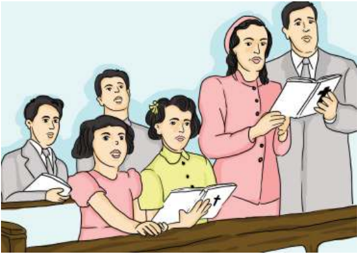

> **Deskripsi Visual:** Gambar ini adalah ilustrasi yang menunjukkan sebuah pertemuan atau seminar. Dalam gambar tersebut, ada beberapa orang yang sedang berbicara dan mendengarkan. Orang yang berbicara tampaknya adalah seorang guru atau pembicara, karena ia sedang membacakan dokumen atau buku. Orang-orang lain tampaknya adalah murid atau peserta seminar. Mereka semua tampak tertarik pada apa yang dibicarakan oleh pembicara. Gambar ini menunjukkan interaksi antara pembicara dan peserta seminar, serta fokus pada materi yang dibahas.

Gambar 3.1 Keluarga Kristen adalah Gereja Domestik atau Gereja

Keluarga. Semua tugas panggilan Gereja menjadi panggilan keluarga Kristen.

### Kegiatan 3 Mengasosiasi

Bagikan dengan teman di sampingmu, jawablah beberapa pertanyaan pemandu berikut ini.

- Mengapa keluarga disebut sebagai gereja keluarga?
- Lihatlah  lingkungan  di  sekitarmu,  apakah  keluarga-keluarga  Kristen  sudah melakukan 3 panggilan gereja?
- Menurutmu bagaimana cara yang baik agar keluarga Kristen dapat meningkatkan identitasnya sebagai 'gereja keluarga'?

 

---
## 📄 Halaman 57

### C. Penutup

### Ayat Emas

Bacalah ayat ini, selanjutnya bagikan pendapatmu kepada teman di sampingmu. Kemudian simpulkan penemuanmu berdua.

Kej.  2:24 ' ...  Sebab  itu,  seorang  laki-laki  meninggalkan  ayahnya  dan  ibunya  dan bersatu dengan isterinya, sehingga keduanya menjadi satu daging' .

### Menyanyi : KJ 317:1,4 'Hari Ini Tuhan Berkati'

Hari ini Tuhan berkati, mempelai mengikat janji Moga-moga rumah tangganya Kau beri tent'ram bahagia

R eff :

Puji Tuhan, puji Dia Sang Pencipta manusia Ia suka memberkati, yang bersatu dalam kasih

Dalam Dikau Sumber kurnia, mempelai tetap setia. Dalam Dikau ya Juruselamat, umat-Mu beroleh rahmat.

### Doa

Doa akan dipimpin oleh salah seorang peserta didik di kelas.

 

---
## 📄 Halaman 58

---
**🖼️ Gambar/Diagram**

> **Deskripsi Visual:** Gambar ini adalah ilustrasi yang menampilkan keluarga berdiri bersama-sama. Keluarga ini terdiri dari dua orang dewasa (orangtua) dan dua anak muda (anak-anak). Semua anggota keluarga tersebut mengenakan kaos kuning dan celana biru. Orangtua berdiri di belakang anak-anak mereka, tampaknya memeluk atau menahan mereka dengan tangan. Anak-anak tampak senang dan bahagia, dengan wajah tersenyum lebar. Gambar ini menunjukkan hubungan harmonis dan cinta antara anggota keluarga.

Elemen-elemen utama dalam gambar ini adalah anggota keluarga, busana mereka, dan posisi mereka. Kaos kuning dan celana biru menjadi warna dominan dalam gambar ini, menunjukkan kesamaan dalam gaya dan kebersamaan keluarga. Posisi mereka yang saling melengkapi menunjukkan hubungan yang erat dan harmonis.

Teks, angka, atau label penting tidak ada dalam gambar ini karena ia hanya berupa ilustrasi. Namun, informasi kunci yang dapat diambil pembaca adalah tentang hubungan keluarga yang harmonis dan cinta antara anggota keluarga.

 

---
## 📄 Halaman 59

### Bab VI

### A. Pengantar

###  Berdoa

Dipimpin oleh salah seorang peserta didik.

###  Bernyanyi

(Lagu Pop Rohani)

### 'Di Doa Ibuku'

Di waktu ku masih kecil, gembira dan senang

Tiada duka kukenal, tak kunjung mengerang

Di sore hari nan sepi, ibuku bertelut

Sujud berdoa ku dengar namaku disebut

Di doa ibuku, namaku disebut

Di doa ibuku ku dengar, ada namaku disebut

Seringlah ini kukenang, di masa yang berat

Di kala hidup mendesak dan nyaris ku sesat

Melintas gambar ibuku, sewaktu bertelut

Kembali sayup kudengar, namaku disebut

Di sore hari nan sepi... ibuku bertelut

Sujud berdoa ku dengar namaku disebut Di doa ibuku, namaku disebut Di doa ibuku dengar ada namaku disebut.... Ada namaku disebut

### Tanggung Jawabku Terhadap Keluarga

Bacaan Alkitab:

Lukas 2:41-52,

Keluaran 20:12, Kejadian 4:1-16

 

---
## 📄 Halaman 60

### Kegiatan 1

Tanggapan terhadap lagu:

- Nyanyikan lagu di atas dan hayatilah maknanya!
- Pesan apa yang kamu dapat dari lagu di atas?
…………………………………………………………………………………

…………………………………………………………………………………

…………………………………………………………………………………

- Bagaimana tanggapan kamu terhadap kasih dari ayah dan ibu yang sudah kamu terima?
…………………………………………………………………………………

…………………………………………………………………………………

…………………………………………………………………………………

### B. Uraian Materi

### 1. Anak dalam Keluarga

Seorang  anak  adalah  anugerah  terindah  dalam  keluarga.  Ya,  kamu  adalah berkat terindah dari Tuhan. Mungkin tidak kamu sadari bahwa dalam setiap doa orang tua, nama kamu selalu disebut. Demikianlah kita sebagai anak, harus juga mendoakan orang tua kita.

---
**🖼️ Gambar/Diagram**

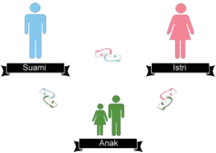

> **Deskripsi Visual:** Gambar ini adalah ilustrasi yang menunjukkan tiga jenis manusia berdasarkan orientasi seksual: Suhu, Siti, dan Arisak. Ilustrasi ini menggunakan warna-warna yang berbeda untuk menggambarkan ketiga jenis tersebut. Suhu dinyatakan dengan warna biru, Siti dengan merah muda, dan Arisak dengan hijau. Setiap jenis memiliki ikon yang menunjukkan orientasi seksual mereka. Suhu memiliki ikon pria, Siti memiliki ikon wanita, dan Arisak memiliki ikon pria dan wanita bersama-sama. Ini menunjukkan bahwa setiap jenis memiliki orientasi seksual sendiri-sendiri, tetapi juga bisa memiliki orientasi seksual yang sama. Gambar ini memberikan gambaran umum tentang tiga jenis manusia berdasarkan orientasi seksual mereka.

Anak  menjadi  sosok  penting  yang  didambakan  orang  tua  dalam  trinitas segitiga cinta yang ada dalam keluarga. Trinitas segitiga cinta, artinya relasi antara Bapa,  Ibu  dan  Anak-anak  didasarkan  kepada  cinta  kasih  yang  tulus.  Orang  tua kamu melaksanakan tugas dan kewajibannya sebagai ayah dan ibu sejak dalam

 

---
## 📄 Halaman 61

kandungan sampai kamu menikah. Hal ini tidak mudah, membutuhkan kesabaran, kerja keras, dan rasa tanggung jawab yang besar, karena kompleksitas kebutuhan kamu yang harus dipenuhi. Sampai kapan pun budi baik mereka tidak pernah terbalaskan.

Meskipun  demikian,  jangan  menganggap  suami-istri  Kristen  yang  tidak memiliki  anak  adalah  orang  yang  berdosa  dan  tidak  diberkati.  Ingatlah, Tuhan Yesus  dan  Rasul  Paulus  juga  tidak  menikah  atau  berkeluarga.  Tetapi  hidup mereka  justru  diberikan  untuk  kemuliaan  Tuhan  dan  melayani  sesama.  Hidup tanpa pasangan dan tidak mempunyai anak secara kristiani bisa menjadi hidup yang indah, keberkatan, dan berguna bagi sesama. Bagaimana pandangan kamu terhadap orang yang tidak menikah atau orang yang tidak memiliki anak?

### 2. Tanggung Jawab Anak

Bacalah artikel di bawah ini! Lalu jawablah pertanyaan di bawahnya.

### Kisah Ayah, Remaja, dan Burung Pipit

Suatu sore saat langit cerah namun teduh, dengan angin bertiup semilir, di halaman sebuah rumah berpagar tinggi, seorang ayah yang telah lanjut usia dan anak lelakinya yang masih muda tampak sedang duduk di bangku taman. Bersantai sambil menikmati suasana sore hari yang nyaman.

Sang anak asyik membaca koran, sedang sang ayah tampak hanya diam terpekur memandangi tanaman. Ketika tiba-tiba

---
**🖼️ Gambar/Diagram**

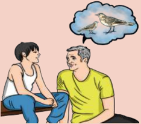

> **Deskripsi Visual:** Gambar ini adalah ilustrasi yang menunjukkan dua orang dewasa sedang berbicara di sebuah tempat luas, mungkin di taman atau halaman rumah. Pria tua berdiri di sebelah kiri, sedangkan wanita muda duduk di sebelah kanan. Keduanya tampak serius dan berkomunikasi dengan penuh perhatian. Di atas kepala mereka, terdapat gambaran burung yang sedang terbang, yang tampaknya menjadi subjek utama dari percakapan mereka. Gambar ini mungkin digunakan untuk menggambarkan konsep tentang hubungan antara manusia dan alam, atau mungkin sebagai contoh tentang komunikasi dan interaksi sosial.

seekor burung pipit hinggap di dedaunan tanaman yang berada di dekat sang ayah, ia bertanya kepada anaknya yang sudah beranjak remaja.,

'Nak, apakah itu?'

 

---
## 📄 Halaman 62

Setelah melihat sejenak  ke arah tanaman sang anak menjawab ringan,

'Itu burung pipit yah' , kemudian ia melanjutkan membaca koran.

Sang ayah memandang ke arah burung itu lagi, kemudian bertanya kembali, 'Apakah itu?'

'Sudah aku katakan burung pipit 'yah' , jawab si anak dengan nada sedikit kesal. Sang ayah masih memandangi burung pipit tersebut, yang tak lama kemudian terbang dan hinggap kembali di tanah di sisi lain dari halaman tersebut.

Dengan  pandangan  yang  masih  lekat  pada  burung  itu  kembali  sang  ayah bertanya,

'Apakah itu?' .

'Burung pipit ayah . . burung pipit . .' jawab sang anak yang kesal.

'P … I … P … I … T … !' lanjut sang anak sambil mengeja dengan marah.

Sang ayah yang masih ragu dengan penglihatannya yang mulai kurang baik, bertanya kembali,

'Apakah itu?'

Kali ini sang anak benar-benar marah dengan nada keras ia menjawab,

'Mengapa ayah menanyakan ini terus-menerus? Bukankah sudah berulang kali kukatakan bahwa itu burung pipit! Tidak bisakah engkau mengerti!!'

Mendengar  hardikan  anaknya,  sang  ayah  yang  merasa  sakit  hati  kemudian bangkit dari duduknya untuk masuk ke dalam rumah.

'Mau kemana?!' tanya sang anak.

Sang  ayah  tidak  menjawab  hanya  memberikan  isyarat  tangan  yang  berarti 'sudahlah' dan melanjutkan langkahnya ke dalam rumah dengan langkah gontai dan hati yang sedih.

Sang anak meskipun kesal menyadari bahwa ia tidak sepantasnya membentak ayahnya yang telah lanjut usia. Tapi peristiwa tadi memang sungguh membuatnya kesal dan menghilangkan selera untuk meneruskan membaca koran.

Saat sang anak masih termangu, sang ayah kembali sambil membawa sebuah buku yang ternyata adalah buku hariannya. Sang ayah duduk kembali di sebelah anaknya, sambil membolak-balik halaman buku seperti mencari sesuatu. Setelah ketemu  halaman  yang  dicarinya  ia  sodorkan  buku  harian  tersebut  ke  tangan anaknya, sambil menunjuk bagian yang ia ingin agar anaknya membacanya.

Sang anak menerima buku harian tersebut dan melihat bagian yang ditunjukkan oleh ayahnya. Sebelum ia mulai membaca ayahnya berkata,

'Yang  keras  ya…'  Ia  ingin  agar  anaknya  membaca  buku  hariannya  dengan suara yang dapat terdengar jelas.

'Hari ini putraku yang paling bungsu, beberapa hari yang lalu genap berusia 3 tahun,' Sang anak mulai membaca,

 

---
## 📄 Halaman 63

'Sedang duduk bersamaku di bangku sebuah taman, ketika tak lama kemudian ada seekor burung pipit yang hinggap di hadapan kami. Putraku bertanya hingga 21 kali padaku. 'Apakah itu?' Aku jawab sebanyak 21 kali sebanyak ia bertanya, bahwa itu adalah burung pipit. Aku selalu memeluknya dengan bahagia setiap kali ia bertanya dan mengulangi pertanyaannya. Sekali lagi dan lagi. Tanpa sedikit pun aku merasa kesal, karena ia adalah putra kecilku dengan wajah tanpa dosa dan dengan rasa ingin tahunya yang besar, aku malah merasa bahagia dan senang.'

Sampai  di  situ  sang  anak  berhenti  membaca,  apa  yang  barusan  dibacanya bukan hanya membuatnya menyadari kesalahannya, tapi membuatnya sungguh menyesal  telah  memperlakukan  ayahnya  seperti  tadi.  Sang  anak  terdiam, memandang  ayahnya  sejenak,  dengan  mata  berkaca-kaca  menahan  tangis  ia memeluk dan mencium kening ayahnya.

Meskipun tidak ada kata-kata apa pun yang terlontar dari mulut anaknya, sang ayah  tahu  bahwa  putra  kesayangannya  telah  menyadari  kesalahannya,  ciuman dan  pelukan  eratnya  adalah  tanda  permintaan  maaf  darinya.  Sang  ayah  pun tersenyum bahagia. Suasana sore yang indah menjadi terasa semakin indah.

(Dikutip dari http://www.astrodigi.com/2011/05/kisah-ayah-anak-dan-burung-pipit.html)

### Jawablah pertanyan berikut!

- Menurut kamu, bagaimana sikap sang anak terhadap ayahnya?
...........................................................................................................................................................

...........................................................................................................................................................

...........................................................................................................................................................

...........................................................................................................................................................

- Apa pesan yang kamu dapat dari bacaan di atas?
...........................................................................................................................................................

...........................................................................................................................................................

...........................................................................................................................................................

...........................................................................................................................................................

- Apa yang akan kamu lakukan mulai sekarang kepada orang tua kamu?
...........................................................................................................................................................

...........................................................................................................................................................

...........................................................................................................................................................

...........................................................................................................................................................

 

---
## 📄 Halaman 64

### Taat Kepada Perintah Tuhan

Sikap hormat kepada orang tua merupakan salah satu tugas moral yang harus dilakukan  oleh  anak  sepanjang  hidupnya.  Sejak  masa  Perjanjian  Lama  sampai Perjanjian Baru, sikap ini ditekankan dalam Alkitab sebagai perintah yang harus dilakukan. Hubungan orang tua dan anak yang paling ideal dapat kita lihat pelajari dari kehidupan keluarga Tuhan Yesus (Luk. 2:41-52).

Sering  terjadi  dalam  kehidupan  saat  ini  sikap  orang  tua  yang  ketinggalan zaman dan tidak banyak tahu. Benarkah demikian? Biasanya orang tua melarang, menyuruh, serta menasihati sehingga banyak anak yang cenderung menjauhkan diri  seolah-olah  membuat  tembok  pemisah  antara  mereka.  Anak  merasa  ingin bebas, serta ingin mempunyai pandangan sendiri, sehingga kurang senang pada otoritas  atau  kekuasaan  orang  tua  yang  mengatur.  Keinginan  untuk  bebas  ini dapat menimbulkan kejengkelan dan salah paham apabila antara orang tua dan anak tidak memahami jalan pikiran masing-masing. Memang masa yang paling sulit seringkali adalah masa remaja. Di satu sisi, remaja mengalami perkembangan yang seringkali tidak bersesuaian dengan pendapat dan harapan orang tua serta lingkungan. Oleh karena itu, kamu perlu memahami perkembangan masa remaja sehingga kamu bisa menghindar i  konflik-konflik  yang  seharusnya  tidak  terjadi. Ada empat aspek yang perlu kamu pahami.

### 1.  Perkembangan Kognitif

Pada  usia  ini  kamu  memasuki  tahapan  kematangan  intelek.  Kamu  mampu berpikir  jauh  melebihi  dunia  nyata  dan  keyakinan  sendiri,  yaitu  memasuki dunia ide-ide. Kamu bisa memecahkan masalah secara sistematis, tidak hanya meniru  orang  lain.  Kamu  bisa  berpikir  reflektif,  mengevaluasi  pemikiran, melakukan imajinasi ideal, dan berpikir abstrak.

### 2.  Perkembangan Moral-Etika

Pada usia ini, penekanannya adalah siapa yang memegang kekuasaan, mereka perlu dihormati. Kamu mulai senang menegakkan hukum dan disiplin, gemar memperhatikan  kewajiban  yang  harus  dilakukan  dan  memperhatikan  tata kehidupan sosial serta kepentingan keamanan diri. Kamu menghormati orang yang memelihara aturan masyarakat.

### 3.  Perkembangan Ego

Kamu berada dalam situasi di mana di satu sisi ingin memiliki identitas pribadi, namun di  sisi  lain  ingin  menyisihkan  rasa  kekaburan  identitas.  Kamu  mulai belajar memberikan loyalitas terhadap suatu kelompok yang menjadi bagian identitas (kelompok teman, ideologi, kekristenan yang kamu anut). Adakalanya kamu juga mengevaluasi identitas yang dianggap kuno untuk dipikir ulang. Identitas meliputi tiga konsep diri, yaitu seksual, pekerjaan/panggilan, dan sosial.  Kamu  ingin  tahu  siapa  diri  kamu  dan  ke  mana  hidup  diarahkan,

 

---
## 📄 Halaman 65

menyenangi identitas diri yang unik. Kamu sering mengalami konflik identitas karena  ada  jarak  antara  siapa  diri  yang  sebenarnya  dan  keinginan  menjadi pribadi ideal.

### 4.  Perkembangan Iman

Pada  usia  ini,  kamu  membentuk  sikap  terhadap  hidup  melalui  apa  yang dipercayai oleh keluarga sendiri menuju pandangan di luar diri dan keluarga. Seringkali  bagi  remaja,  Allah  adalah  pribadi  yang  paling  berperan  dalam hidupnya. Allah menjadi sahabat yang paling karib dan memahami kehidupan remaja. Kamu mempunyai komitmen dan loyalitas yang sangat dalam terhadap Allah  sebagai  tempat menimba seluruh kepercayaan. Bagi remaja seringkali juga Allah juga dipandang sebagai  'Allah kelompok'  atau  'Allah kolektif' .

Dengan pemahaman ini, orang tua memahami bahwa keinginan untuk bebas dan berdiri sendiri merupakan bagian dari pertumbuhan remaja. Seorang anak tidak akan bertumbuh menjadi dewasa selama ia masih bergantung pada pikiran orang tuanya. Tetapi di pihak lain, anak juga harus memaklumi bahwa pikirannya keluar  dari  kepala  yang  belum  banyak  pengalaman.  Memang  seorang  remaja sudah  mampu menganalisis suatu masalah secara logis, tetapi dengan tingkat kognitif  yang  belum  matang,  seorang  anak  belum  mampu  memperhitungkan dampak  dan  konsekuensinya.  Oleh  karenanya,  pikiran  seorang  remaja  perlu diimbangi dengan pikiran orang tua, karena orang tua sudah banyak mengecap 'asam-manis' kehidupan. Ketegangan antara remaja dengan orang tua juga dapat dihindari kalau hubungan antara keduanya bersifat terbuka. Orang tua sebetulnya ingin mengobrol dengan anak mereka yang remaja secara intim.

### Kegiatan 2 Tugas Mandiri

Berikanlah  contoh  konkret  bahwa  kamu  sudah  berkembang  secara  kognitif, moral-etika, ego, dan iman! Perkembangan saya secara kognitif:

...........................................................................................................................................................

...........................................................................................................................................................

...........................................................................................................................................................

Perkembangan saya secara moral-etika:

...........................................................................................................................................................

...........................................................................................................................................................

...........................................................................................................................................................

 

---
## 📄 Halaman 66

Perkembangan saya secara ego:

...........................................................................................................................................................

...........................................................................................................................................................

...........................................................................................................................................................

Perkembangan saya secara iman:

...........................................................................................................................................................

...........................................................................................................................................................

...........................................................................................................................................................

### 3. Taat Kepada Perintah Tuhan: Menghormati Orang Tua

Salah  satu  dari  Sepuluh  Hukum Tuhan  dalam  kitab  Keluaran  20:1-17  adalah 'Hormatilah ayahmu dan ibumu, supaya lanjut umurmu di tanah yang diberikan Tuhan, Allahmu, kepadamu.' (Kel. 20:12). Hormat berarti:

- bersikap santun dan patuh terhadap orang tua. Di dalam Hukum Taurat tertera perintah  yang  mengharuskan  orang  Israel  untuk  menjatuhkan  sanksi  berat, yaitu  kematian  kepada  anak  yang  mengutuki  orang  tuanya,  'Apabila  ada seseorang  yang  mengutuki  ayahnya  atau  ibunya,  pastilah  ia  dihukum  mati; ia telah mengutuki ayahnya atau ibunya, maka darahnya tertimpa kepadanya sendiri' (Im. 20:9);
- bertanggung  jawab  memelihara  kelangsungan  hidup  orang  tua.  Tuhan Yesus  menegur  orang  Yahudi  yang  menyelewengkan  perintah  Tuhan  akan persembahan atas dasar ketidakrelaan memenuhi kebutuhan orang tua (Matius 15:3-6).  Juga,  sebelum Tuhan Yesus  mati  di  kayu  salib,  Ia  meminta Yohanes untuk memelihara Maria, ibu-Nya (Yoh. 19:26-27). Semua ini memperlihatkan bahwa  Tuhan  menginginkan  anak  untuk  bertanggung  jawab  memelihara kelangsungan hidup orang tua masing-masing; dan
- menghargai dan mengakui kewibawaan orang tua, yaitu dengan mengakui bahwa  orang  tua  ditugaskan  oleh  Tuhan  untuk  menjadi  pendidik  anak. Memahami aspirasi orang tua, melihat motivasi positif di belakang nasihat dan larangan mereka, memaklumi kelemahan mereka, dan mengakui keunggulan mereka.  Singkatnya,  menghargai  usaha  orang  tua  untuk  menghantar  anak ke gerbang kedewasaan sampai orang tua melepas anaknya untuk berjalan sendiri seutuhnya.
Sikap hormat dan pengertian kepada orang tua dengan landasan cinta kasih dari  Kristus,  akan  membangun  sebuah  keluarga  yang  harmonis  dan  bahagia. Bukan  hanya  sikap  anak  kepada  orang  tua,  namun  juga  sikap  anak  terhadap saudaranya satu dengan yang lain.

 

---
## 📄 Halaman 67

### Kegiatan 3 Belajar dari Alkitab

Bacalah Keluaran 20:12, kemudian diskusikan dan jawablah pertanyaan berikut bersama dengan teman sebangkumu.

- Apa kehendak Tuhan dalam ayat tersebut?
...........................................................................................................................................................

...........................................................................................................................................................

...........................................................................................................................................................

...........................................................................................................................................................

- Mengapa anak-anak dalam keluarga harus menghormati orang tuannya?
...........................................................................................................................................................

...........................................................................................................................................................

...........................................................................................................................................................

...........................................................................................................................................................

- Apa yang kamu pelajari setelah membaca ayat ini?
...........................................................................................................................................................

...........................................................................................................................................................

...........................................................................................................................................................

...........................................................................................................................................................

- Bagaimana realita yang kamu jumpai di sekitarmu bila dihubungkan dengan ayat ini?
...........................................................................................................................................................

............................................................................................................................................................

............................................................................................................................................................

...............................................................................................................................................

### Kegiatan 4 Janjiku

Buatlah komitmen/janji kepada diri kamu sendiri untuk menghormati orang tua kamu sesuai dengan firman Tuhan! Kumpulkan kepada guru untuk dinilai, sesudah itu simpan di tempat yang dapat kamu lihat setiap hari agar komitmen/janji kamu semakin dimaknai!

 

---
## 📄 Halaman 68

---
**📊 Tabel**

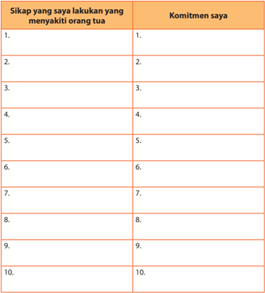

Tabel ini berisi informasi tentang sikap dan komitmen seseorang dalam menyayangi dan mendukung orang tua mereka. Topik utamanya adalah tentang bagaimana seseorang dapat menunjukkan rasa sayang dan dukungan kepada orang tua mereka. Kolom pertama berisi daftar 10 sikap yang dapat dilakukan untuk menyayangi orang tua, seperti membantu dengan tugas rumah, memberikan perhatian emosional, dan menjaga kesehatan orang tua. Kolom kedua berisi komitmen atau tindakan yang harus diambil oleh individu tersebut untuk mewujudkan sikap-sikap tersebut. Misalnya, jika seseorang memilih untuk membantu orang tua dengan tugas rumah, maka komitmen tersebut bisa adalah "membantu orang tua dengan tugas rumah setiap hari". Tabel ini membantu individu untuk merencanakan dan mengukur upaya mereka dalam menyayangi dan mendukung orang tua mereka.

### Kegiatan 5 Tugas/Proyek

- Carilah  lagu  rakyat  dari  Minangkabau,  Sumatra  Barat  yang  berjudul  'Malin Kundang Anak Durhaka'!
- Analisis lirik lagu tersebut dan berikan komentar kamu!
- Simpulkan apa yang seharusnya kamu lakukan kepada orang tua, khususnya kepada ibu!

 

---
## 📄 Halaman 69

### C. Penutup

### Rangkuman

- Anak adalah anugerah terindah dalam kehidupan rumah tangga.
- Tanggung  jawab  orang  tua  untuk  mendidik  dan  membesarkan  anak-anak yang diberikan Tuhan harus dilaksanakan dengan penuh sukacita dan sikap takut akan Tuhan, sehingga anak-anak dapat bertumbuh menjadi pribadi yang beriman dan berakhlak mulia.
- Anak-anak  (remaja)  juga  mempunyai  tanggung  jawab  untuk  menghormati orang  tua  seumur  hidup  mereka,  sehingga  berkat-berkat  Tuhan  melimpah dalam kehidupan anak-anak.

### Ayat Emas

Hafalkanlah ayat ini, selanjutnya berikan contoh penerapannya.

Amsal 23:22

'Dengarkanlah ayahmu yang memperanakkan engkau, dan janganlah menghina ibumu kalau ia sudah tua.'

### Bernyanyi

Pilihlah lagu yang sesuai dengan pujian di gerejamu. Carilah yang sesuai dengan tema pelajaran hari ini.

### Berdoa

Doa dipimpin oleh guru atau peserta didik untuk mendoakan agar peserta didik dapat menjadi pribadi yang bertanggung jawab.

 

---
## 📄 Halaman 70

---
**🖼️ Gambar/Diagram**

> **Deskripsi Visual:** Gambar ini adalah ilustrasi yang menampilkan keluarga berdiri bersama-sama. Keluarga ini terdiri dari dua orang dewasa (orangtua) dan dua anak muda (anak-anak). Semua anggota keluarga tersebut mengenakan kaos kuning dan celana biru. Orangtua berdiri di belakang anak-anak mereka, tampaknya memeluk atau menahan mereka dengan tangan. Anak-anak tampak senang dan bahagia, dengan wajah tersenyum lebar. Gambar ini menunjukkan hubungan harmonis dan cinta antara anggota keluarga.

Elemen-elemen utama dalam gambar ini adalah anggota keluarga, busana mereka, dan posisi mereka. Kaos kuning dan celana biru menjadi warna dominan dalam gambar ini, menunjukkan kesamaan dalam gaya dan kebersamaan keluarga. Posisi mereka yang saling melengkapi menunjukkan hubungan yang erat dan harmonis.

Teks, angka, atau label penting tidak ada dalam gambar ini karena ia hanya berupa ilustrasi. Namun, informasi kunci yang dapat diambil pembaca adalah tentang hubungan keluarga yang harmonis dan cinta antara anggota keluarga.

 

---
## 📄 Halaman 71

Bab VII

### B. Pengantar

### Pendahuluan

###  Doa

Ya Tuhan, kami bersyukur atas penyertaanmu Hingga saat ini kami boleh mempelajari pengetahuan berdasark an firman-Mu Ajarlah kami untuk hidup lebih adil dan damai Ajarlah kami untuk menjadi seperti-Mu Tuhan Amin.

###  Menyanyi

### PKJ 36 Yesus Raja Damai

do = g

4 ketuk

- Yesus, Raja Damai, Tuhan Mahakasih, sambut kami ini dalam rahmat-Mu.
- Buanglah, ya Tuhan, dosa-dosa kami, rantai kuasa jahat Kau putuskanlah!
- Tumpaslah, ya Tuhan, kuasa kegelapan, hingga tak tersisa dampak dayanya.
- Penebus tersalib, tuntunlah umat-Mu, untuk mengasihi Dikau s`lamanya.
- Dikau kami ikut trobos kegelapan, sampai kami masuk sukacita-Mu.

### Keadilan dan Perdamaian dalam Keluarga

Bahan Alkitab:

Yesaya 57:2;

Matius 5:9

 

---
## 📄 Halaman 72

Tahukah  kamu  bahwa  keadilan  dan  perdamaian  sangat  dibutuhkan  bagi banyak  bangsa  di  dunia.  Berkaitan  dengan  hal  itu,  UNESCO  telah  mewajibkan pada  banyak  negara  anggota  PBB  untuk  melakukan  pendidikan  perdamaian bagi  lembaga  pendidikan  termasuk  keluarga.  Dalam  realitas  saat  ini  banyak dijumpai fenomena ketidakadilan yang menyebabkan tidak adanya perdamaian di  berbagai  aras  dan  institusi/lembaga.  Tiap  hari  kita  mendengar  dan  melihat adanya konflik antarindividu, dalam keluarga, kelompok, bahkan dalam tingkat bangsa dan negara. Akibatnya timbul adanya rasa kebencian, konflik, dan banyak pertumpahan darah. Oleh karena itu, kita harus mengembangkan budaya damai mulai dari relasi antarindividu dan keluarga, bahkan untuk komunitas kita.

### B. Uraian Materi

### 1. Kebutuhan Terhadap Keadilan dan Perdamaian

Pada umumnya keadilan berkaitan erat dengan perdamaian. Keadilan ternyata memiliki beberapa arti, yakni:  adil,  tulus,  benar,  tidak  salah.    Secara  hakiki,  adil pada  diri  sendiri  adalah  sesuatu  yang  harus  dipenuhi  sebagai  kewajiban  yang telah menjadi haknya dalam hubungannya dengan hidup. Itu berarti, adil adalah: sesuai dengan haknya, tidak lebih dan tidak kurang. Keadilan yang dihubungkan dengan keluarga memiliki potensi yang sangat besar. Karena di dalam keluarga, seseorang menjadi apa yang telah diajarkan dalam keluarganya. Jika seseorang diajarkan dengan keadilan dalam keluarga maka orang tersebut akan membawa pribadi adil ke luar, di masyarakat. Sikap atau tindakan yang dianggap adil adalah penyerahan diri secara total kepada Tuhan Allah. Dalam hal ini, keadilan selalu berimplikasi pada beberapa prinsip, yakni: kesejahteraan, kecukupan, kesetaraan, personalitas,  dan  persaudaraan.  Untuk  melaksanakan  prinsip-prinsip  tersebut, keadilan juga memerlukan kasih.

Sedangkan perdamaian berasal dari kata ' damai' yang bisa berubah konsepsi sesuai waktu dan budaya. Dalam masyarakat luas, orang-orang memahami istilah 'damai' dan implikasi-implikasinya melalui berbagai pandangan. Banyak orang, dan  mungkin  juga  diri  kita  sendiri,  memahami  perdamaian  secara  sederhana sebagai suatu situasi/keadaan di mana tidak ada konflik atau tidak ada perang. Namun kenyataannya tidak sesederhana itu, konsep damai ini sebenarnya memiliki dua pemahaman, yaitu negatif dan positif. Pemahaman damai yang negatif ini kita menilai apakah sebuah situasi/keadaan bisa disebut sebagai situasi/keadaan damai  atau  tidak,  dengan  cara  melihat  ada  atau  tidaknya  hal  yang  biasanya mengancam dan menghancurkan  perdamaian,  yaitu  ketidakadilan  dan  konflik

 

---
## 📄 Halaman 73

atau dalam skala yang lebih luas adalah perang. Contohnya dalam keluarga tidak ada konflik, pertengkaran, saling curiga, saling menuduh, kekerasan, dan lain-lain. Sedangkan  pemahaman  damai  yang  positif,  dapat  menilainya  melalui  situasi/ keadaan, tidak sekadar hanya dengan melihat ada perang atau konflik terbuka atau tidak,  melainkan  dengan  melihat  adakah  hal-hal  yang  mendukung  terciptanya perdamaian  atau  tidak.  Dalam  pemahaman  semacam  ini,  yang  kita  cermati adalah  apakah  orang-orang  dalam  keluarga  tersebut  sudah  dengan  sengaja berusaha  menghapuskan  berbagai  bentuk  kekerasan  dan  ketidakadilan,  baik individual maupun dalam struktural keluarga. Juga apakah orang-orang tersebut sudah dengan sengaja menciptakan hal-hal yang bisa menjamin kelanggengan perdamaian dan keadilan terhadap masing-masing anggota keluarga, misalnya antara bapak serta ibu dan antara orang tua dan anak-anak di dalam satu rumah.

Sebelum  kita  berdamai  dengan  keluarga  dan  lingkungan,  seharusnya  lebih dulu kita berdamai dengan Tuhan dan kehendaknya. Inilah dasar utama kehidupan kristiani.  Usahakan  dan  upayakanlah  pola  hidup  kamu  adil  dan  damai  dengan meneladani keadilan dan perdamaian Tuhan. Bagaimana caranya? Caranya adalah membuat pola hidup berkomunikasi dengan Tuhan setiap hari melalui pembacaan firman dan doa.

### Kegiatan 1 Curah Pendapat

Berikan pendapat kamu mengenai keadilan dan perdamaian dengan pertanyaan berikut.

- Apa yang kamu pahami dengan perdamaian dan keadilan dalam keluarga?
.........................................................................................................................................................

.........................................................................................................................................................

.........................................................................................................................................................

.........................................................................................................................................................

- Apakah arti perdamaian dan keadilan?
..................................................................................................................................................

..................................................................................................................................................

..................................................................................................................................................

..................................................................................................................................................

 

---
## 📄 Halaman 74

- Apakah dampak dari keadilan dan perdamaian?
..................................................................................................................................................

..................................................................................................................................................

..................................................................................................................................................

..................................................................................................................................................

- Apakah yang dimaksud dengan perdamaian yang positif? berikan contoh dari lingkunganmu!
..................................................................................................................................................

..................................................................................................................................................

..................................................................................................................................................

..................................................................................................................................................

- Hal-hal apa saja yang dapat menimbulkan keluarga tidak damai dan tidak adil?
.........................................................................................................................................................

.........................................................................................................................................................

.........................................................................................................................................................

.........................................................................................................................................................

- Apakah yang dimaksud pemahaman damai yang positif?
.........................................................................................................................................................

.........................................................................................................................................................

.........................................................................................................................................................

.........................................................................................................................................................

Guru akan membantu menyimpulkan curah pendapat yang baru saja terjadi.

### 2. Meneladani Tuhan Yesus

Orang kristen adalah pembawa damai dan sahabat bagi dunia, memiliki sikap kehidupan sebagai orang Kristen, yang identik dengan kasih dan damai. Tentu seharusnya demikian kehidupan kita sebagai orang Kristen.

Sebelum  kita  berdamai  dengan  keluarga  dan  lingkungan,  seharusnya  lebih dulu  kita  harus  berdamai  dengan Tuhan  dan  kehendaknya.  Inilah  dasar  utama kehidupan Kristiani. Usahakan dan upayakanlah pola hidup kamu adil dan damai

 

---
## 📄 Halaman 75

dengan  meneladani  keadilan  dan  perdamaian  Tuhan.  Bagaimana  caranya? Dengan  cara  membuat  pola  hidup  berkomunikasi  dengan  Tuhan  setiap  hari melalui pembacaan firman dan doa.

Dalam kitab Nabi Mikha 5:4 dikatakan bahwa 'Dia menjadi damai sejahtera' . Pada umumnya para penafsir mengungkapkan bahwa ayat itu menunjuk kepada Tuhan Yesus Kristus sebagai 'Raja Damai' . Dia adalah damai sejahtera itu sendiri, yang  menjadi  pedoman  kehidupan  kita.  Kehadiran  Kristus  dalam  kelahiran, kematian,  dan  kebangkitannya  adalah  cara  Allah  yang  merendahkan  diri  dan menjadi  manusia  untuk  berdamai  dengan  kita  manusia  yang  berdosa.  Kristus adalah  Allah  Sang  Kasih  yang  mendamaikan  kita  dengan  Allah,  serta  menjadi contoh perdamaian antara kita dan sesama, bahkan dengan lingkungan.

Salah  satu  contoh  tentang  perdamaian  yang  dilakukan  oleh  Tuhan  Yesus Kristus adalah percakapan Tuhan Yesus dengan seorang perempuan Samaria, di sumur Yakub (Yoh. 4:9-18). Pada ayat tersebut kita menemukan bagaimana Tuhan Yesus,  sebagai  seorang  Yahudi,  sedang  menjadi 'jembatan'  pendamai  dengan orang  Samaria,  di  mana  sebelumnya  kedua  bangsa  ini  bermusuhan  dan  tidak berkomunikasi satu dengan yang lainnya.

Sebenarnya, apa yang diperlihatkan Tuhan Yesus dalam kisah di atas merupakan sebuah teladan yang harus dilakukan dalam kehidupan orang Kristen. Terutama kaum remaja yang sering sensitif, mudah tersinggung, dan mudah terliba t konflik. Tuhan Yesus  memberikan  teladan  bahwa  sebagai  orang  Kristen  harus  menjadi pembawa damai bagi dunia. Salah satu tes yang bisa kita lakukan misalnya adalah ketika  kita  hadir  di  suatu  tempat.  Pada  saat  kita  hadir,  apakah  kehadiran  kita disukai oleh orang-orang di sekitar kita? Adakah kehadiran kita sudah ditunggutunggu  dan  sangat  diharapkan?  Jika  kehadiran  kita  diterima  atau  ditunggutunggu, mungkin kita sudah membawa dampak yang positif bagi lingkungan itu, atau setidaknya membawa damai di lingkungan.

Tahukah  kamu,  bahwa  lingkungan  membutuhkan  damai?  Sudahkah  kita menjadi pembawa damai bagi lingkungan kita? Sudahkah kita sungguh-sungguh berdamai dengan Allah dan berdamai dengan sesama? Hal ini pernah dibuktikan oleh salah seorang peneliti tentang dampak suasana damai. Suatu ketika, ada dua kelompok ayam betina. Kelompok pertama selalu diperdengarkan musik rohani setiap hari. Kelompok kedua, selalu diperdengarkan musik rock yang keras. Satu bulan  kemudian,  ketika  tiba  masa  bertelur,  ditemukan  bahwa  kelompok  ayam pertama bertelur jauh lebih banyak dari kelompok kedua. Hal ini membuktikan bahwa ayam saja membutuhkan kedamaian, apalagi manusia.

 

---
## 📄 Halaman 76

Sumber: Dokumen Kemdikbud

---
**🖼️ Gambar/Diagram**

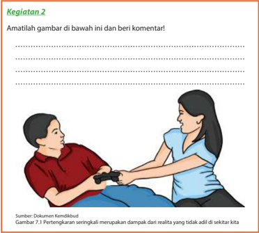

> **Deskripsi Visual:** Gambar ini adalah ilustrasi yang menunjukkan dua orang yang sedang berbicara. Orang pertama duduk di sebelah kiri dengan rambut pendek dan pakaian merah, sedangkan orang kedua duduk di sebelah kanan dengan rambut panjang dan pakaian biru. Kedua orang tersebut sedang berbicara dan tampak saling berinteraksi. Gambar ini mungkin digunakan untuk membahas tentang komunikasi atau interaksi sosial antara dua individu.

### 3. Perdamaian dalam Keluarga

Kata perdamaian berasal dari kata 'damai' yang bisa berubah konsepsi sesuai waktu  dan  budaya.  Dalam  masyarakat  luas,  orang-orang  memahami  istilah 'damai' dan implikasinya melalui berbagai pandangan. Banyak orang, memahami perdamaian  secara  sederhana  sebagai  suatu  situasi/keadaan  di  mana  tidak ada konflik atau tidak ada perang. Namun kenyataannya tidak sesederhana itu, konsep damai ini sebenarnya memiliki dua pemahaman, yaitu negatif dan positif. Pemahaman  damai  yang  negatif  sebuah  situasi/keadaan  bisa  disebut  sebagai situasi/keadaan damai atau tidak, dengan cara melihat ada atau tidaknya hal yang biasanya mengancam dan menghancurkan perdamaian, yaitu ketidakadilan dan konflik atau dalam skala yang lebih luas adalah perang. Sedangkan pemahaman damai yang positif, kita bisa menilainya lewat situasi/keadaan, tidak sekedar hanya dengan melihat ada perang atau konflik terbuka atau tidak, melainkan dengan melihat adakah hal-hal yang mendukung terciptanya perdamaian atau tidak.

 

---
## 📄 Halaman 77

Dalam  pemahaman  semacam  ini,  yang  kita  cermati  adalah  apakah  orangorang dalam keluarga tersebut sudah berusaha menghapuskan  berbagai bentuk  kekerasan  dan  ketidakadilan,  baik  individual  maupun  dalam  struktural keluarga. Dengan demikian juga sebaliknya, apakah orang-orang tersebut sudah menciptakan hal-hal yang bisa menjamin kelanggengan perdamaian dan keadilan terhadap  masing-masing  anggota  keluarga,  antara  bapak  dan  ibu  serta  antara orang tua dan anak-anak di dalam satu rumah.

### Kegiatan 3 Diskusi

Potongan  teks  ilustrasi  berikut  diambil  dari  sebuah  wawancara  awal  antara pendeta dengan keluarga yang menggambarkan struktur keluarga bermasalah. Alan, Mary, Mike, dan Nancy merupakan sebuah keluarga.

Pendeta :  'Alan,  kamu  mengatakan  bahwa  istrimu,  Mary  tidak  bersedia menyiapkan makanan karena…'

Alan :  'Karena ia terlalu malas. Ia bukan seorang istri.'

Mary

:  'Bukan karena saya malas. Saya hanya terlalu lelah…, terlalu lelah. Tidak seorang pun mau melakukan segala sesuatunya, tak seorang pun …'

Alan :  'Tidak seorang pun mau melakukan sesuatu karena kamu tidak mau  melakukannya. Yang  kamu  lakukan  hanya  mengkritik  dan bertengkar.'

Mary :  'Kamu tidak akan dan tidak mau mengerti! Nancy tidak pernah mengerjakan apapun yang saya katakan bahkan yang saya minta. Ia  tidak  mau  merapikan  tempat  tidurnya  ataupun  membantu menyiapkan makan malam ataupun mencuci piring.'

Nancy :  'Oh,  Ibu!  Ayah  benar,  ibu  hanyalah  tukang  kritik.  Aku  tidak mengerti kenapa saya harus merapikan tempat tidur setiap hari. Itu tempat tidurku. Ibu mengkritikku karena hal itu.'

Alan

:  'Iya.  Untuk  apa  kamu  juga  mengeluhkan  hal  itu?  Demi  Tuhan, Mary. Kamu bahkan tidak merapikan tempat tidur kita!'

Mary :  'Kamu juga tidak mau mengerti. Aku hanya butuh pertolongan. Ternyata di keluarga ini tidak ada yang mau menolong.'

Mike :  'Bagaimana denganku? Aku …'

Mary :  'Kamu!  Kami  bahkan  tidak  pernah  melihatmu.  Kamu  makan  di

rumah tapi tidak pernah bersama kami. Kamu tidur di rumah, tapi cuma itu saja. Kamu seperti 'anak kos' saja dan bukan anakku.'

 

---
## 📄 Halaman 78

Diskusikan dengan temanmu dan presentasikan di depan teman dan gurumu:

- Apa yang menjadi penyebab timbulnya situasi tidak damai pada keluarga di atas?
...........................................................................................................................................................

...........................................................................................................................................................

...........................................................................................................................................................

...........................................................................................................................................................

- Apa yang kamu tangkap dari peran Alan, Mary, Nancy, dan Mike? Bagaimana seharusnya peran mereka masing-masing dalam keluarga?
...........................................................................................................................................................

...........................................................................................................................................................

...........................................................................................................................................................

...........................................................................................................................................................

- Menurut kamu, apa yang harus mereka lakukan untuk menciptakan keadilan dan perdamaian dalam keluarga?
...........................................................................................................................................................

...........................................................................................................................................................

...........................................................................................................................................................

...........................................................................................................................................................

- Mengapa orang-orang yang membawa damai disebut orang yang berbahagia menurut Kristus? Jelaskan pendapatmu!
...........................................................................................................................................................

...........................................................................................................................................................

...........................................................................................................................................................

...........................................................................................................................................................

- Apa sumbangan yang dapat kamu berikan untuk keadilan dan perdamaian dalam keluargamu?
...........................................................................................................................................................

...........................................................................................................................................................

...........................................................................................................................................................

...........................................................................................................................................................

 

---
## 📄 Halaman 79

### 4. Masalah yang Dihadapi Kaum Muda

Philip Tangdilingtin (dalam Sugiyo, 2001) mengungkapkan ada empat masalah pokok yang dihadapi kaum muda pada umumnya, yaitu masalah dalam: keluarga, masyarakat,  gereja,  dan  diri  kaum  muda  sendiri.  Mengiden tifikasi  masalah merupakan langkah yang bijak untuk dapat mengatasi dan menanggulanginya. Yang perlu  diketahui dan dilakukan bahwa setiap masalah kaum muda merupakan tanggung jawab kaum muda itu sendiri untuk mengatasinya. Orang lain hanya dapat memberikan bantuan atau pendampingan. Dengan kata lain kaum muda harus melatih/mendidik diri sendiri untuk mengatasi masalah secara mandiri. Jika memang tidak mampu, barulah minta tolong kepada orang lain khususnya pada orang tua.

Dalam hubungan dengan keluarga ada kesenjangan atau jarak antara nilai dan norma yang berakibat membaw a pada konflik antara kaum muda dan orang tua. Kurangnya perhatian dan pengertian dari orang tua, menurunnya wibawa orang tua karena pengaruh teknologi komunikasi, posisi anak dalam keluarga (bungsu, sulung);  semua  itu  dapat  membawa  akibat  bahwa  kaum  muda  kurang  merasa damai, aman, dan terlindungi. Lalu mereka tidak nyaman tinggal di rumah, dan sering berada di luar rumah, serta kehilangan kesempatan dan tantangan untuk berkembang  secara  utuh.  Kaum  muda  sering  terjalin  dalam  lingkungan  sosial tanpa mereka sadari, yang sering menguasai dan memanipulasi hidup mereka. Akibatnya terjadilah sikap apatis, frustrasi, dan tidak aman, terlebih saat remaja berada dalam masa transisi menuju kepada kedewasaan hidup.

Permasalahan  dalam  diri  kaum  muda  sendiri  umumnya  berpangkal  pada penampilan  psikis  dan fisik  mereka  yang  masih  labil  dan  terbuka  terhadap pengaruh dari luar, yang diserap lewat media komunikasi atau pergaulan seperti ketidaktahuan  seksualitas  serta  upaya  aktualisasi  diri  yang  kurang  mendapat tanggapan  dan  pengakuan  merupak an  konflik  sekitar  kebebasan  mereka.  Ada banyak hal dapat menjadi penyebab bagi terhambatnya perkembangan seorang remaja, di  antaranya  kurang menyadari potensi yang dimiliki, pendidikan yang tidak tuntas, perasaan 'tidak berpunya' atau minder, perngaruh pernikahan dini, dan  kurangnya  kesadaran  serta  upaya  untuk  mengubah  tradisi.  Banyak  pula yang  mengalami  masalah  lingkungan  misalnya  kesulitan  sekitar  perumahan, lingkungan belajar, dan pergaulan bagi mereka yang datang dari desa ke kota besar. Semuanya itu mengakibatkan kaum muda menjadi gelisah, bingung, tidak pasti, dan masa depan suram (Sugiyo, 2001).

 

---
## 📄 Halaman 80

### Kegiatan 4 Presentasi Kelompok

Bagilah  kelas  menjadi  beberapa  kelompok. Masing-masing  kelompok  membaca  dan memahami  teks Alkitab dan menjawab beberapa  pertanyaan  berikut  serta  menghubungkan dengan keadilan dan perdamaian. Selanjutnya presentasikan di depan kelas.

### Kelompok 1 : Yesaya 57:21

Bagian Alkitab ini berisi tentang kata-kata penghiburan  dari  Nabi  Yesaya  untuk  umat Tuhan.  Dia  mengungkapkan  bahwa  tidak akan  ada  damai  apabila  umat Tuhan  tetap melakukan ketidakadilan atau kefasikan. 'Tiada  damai  bagi  orang-orang  fasik  itu' . Jelas  dari  ayat  ini  bahwa  realitas  damai sejahtera  bukanlah  hal  yang  tanpa  syarat. Keadilan rupanya merupakan langkah awal untuk memasuki suasana damai sejahtera. Dengan demikian pemecahan masalah kefasikan atau ketidakadilan perlu dipecahkan  lebih  dahulu  sebelum  damai

---
**🖼️ Gambar/Diagram**

> **Deskripsi Visual:** Gambar ini adalah ilustrasi yang menunjukkan seorang wanita sedang membersihkan rumah. Ia memegang broom dan menggerakkan tangannya ke arah tempat yang akan dibersihkan. Di depannya ada sepotong kertas yang jatuh dan beberapa botol bekas yang terletak di tanah. Di sebelah kanan, terdapat sebuah ember berisi air bersih. Gambar ini menunjukkan proses membersihkan rumah dengan menggunakan alat-alat seperti broom dan ember. Ini juga menunjukkan bahwa setelah membersihkan, semua sampah harus dibuang ke tempat yang sesuai.

Gambar  7.2  Tahukah  kamu  bahwa  seringkali sosok seorang ibu dalam  keluarga adalah korban dari ketidakadilan gender. Dia memiliki  3  peran  sekaligus.  Sebagai  ibu  dan istri,  juga  bisa  sebagai  penanggung  jawab rumah tangga. Namun, sekaligus juga sebagai perempuan pencari nafkah. Akibatnya dia sering mengalami stres, sakit, merasa diskriminasi.  Juga  sering  mengalamai  hidup yang tidak damai dan diperlakukan tidak adil.

sejahtera  itu  dapat  dialami.  Ketidakadilan  memang  pada  hakikatnya  sangat menganggu, meresahkan dan mengelisahkan. Hal ini dialami oleh Nabi Yesaya di tengah-tengah bangsa yang dikasihinya. Oleh karena itu, Nabi Yesaya menyerukan dan mengusahakan, agar masalah ketidakadilan lebih dulu digarap dan diatasi sehingga damai sejahtera itu pada akhirnya menjadi realita komunitas.

Dari  teks  ini  kita  mendapat  pengajaran  bahwa  untuk  mengalami  suasana damai sejahtera baik dalam keluarga, dalam komunitas bahkan di tengah-tengah bangsa, maka perlu diusahakan lebih dahulu pemecahan ketidakadilan. Hasil dari usaha tersebut maka akan tercipta suasana yang adil dan damai yang menjadi dambaan dari setiap insan dimanapun dia berada.

### Kelompok 2 : Matius 5:9

Teks  ini  adalah  khotbah  Tuhan  Yesus  di  bukit  : 'Berbahagialah  orang  yang membawa  damai'.  Orang  yang  membawa  damai  itu  adalah  orang yang menciptakan  perdamaian  atau  yang  menyalurkan  damai  yang  berasal  dari Tuhan  Sang  Pendamai  Agung  kepada  semua  orang.  Jadi,  orang  tersebut  lebih

 

---
## 📄 Halaman 81

dahulu menerima damai itu dan menyampaikan kepada semua orang sebagai kesaksiannya.  Mereka  inilah  yang  akan  disebut  anak-anak  Allah,  yaitu  keluarga besar  Kerajaan  Allah.  Itulah  sebabnya  mereka  disebut  sebagai  orang  yang berbahagia karena mereka hidup secara adil, tanpa masalah, tanpa permusuhan, dan tanpa konflik. Jadi dalam ajaran Tuhan Yesus tentang Kerajaan Allah, damai merupakan  kondisi  yang  harus  ada  dalam  Kerajaan  Allah.  Tanpa  keadilan  dan perdamaian,  Kerajaan  Allah  tidak  dapat  dihadirkan  dan  tanda-tanda  Kerajaan Allah tidak dapat dirasakan.

### Pertanyaan untuk didiskusikan dalam kelompok.

Bagaimana makna perdamaian dan keadilan dalam teks Alkitab tersebut?

...........................................................................................................................................................

...........................................................................................................................................................

...........................................................................................................................................................

...........................................................................................................................................................

Pelajaran apa saja yang dapat kamu petik dari teks Alkitab yang dibaca?

...........................................................................................................................................................

...........................................................................................................................................................

...........................................................................................................................................................

...........................................................................................................................................................

### 5. Peran Keluarga

Keluarga adalah unit terkecil dalam masyarakat. Keluarga adalah lembaga/unit kemasyarakatan yang terkecil dan yang terpenting di dunia. Disebut demikian, karena keluarga menentukan tinggi rendahnya mutu kehidupan masyarakat dan negara termasuk gereja. Kekuatan gereja bahkan suatu bangsa sangat ditentukan oleh  unit-unit  keluarga  yang  menjadi  warganya.  Apabila  unit-unit  keluarga  itu terdiri dari keluarga-keluarga yang sehat (jasmani dan rohani) dan bertanggungjawab, maka bisa dipastikan bahwa gereja bahkan negara akan menjadi lembaga yang sehat dan kuat pula. Sebaliknya, jika keluarga-keluarga yang menjadi warga gereja itu lemah, rapuh, penuh dengan ketidakadilan, dan jauh dari hidup yang damai  maka  dapat  dipastikan  bahwa  gereja  maupun  negara  itu  akan  lemah, rapuh, dan kacau (Krisetya, 1999).

Dari ungkapan di atas dapat diringkaskan bahwa pribadi dan keluarga yang kuat adalah keluarga yang bersedia berdamai dengan Allah sumber perdamaian, dan berdamai dengan sesama terutama dengan para anggota keluarga.

 

---
## 📄 Halaman 82

### Kegiatan 5

### Bacalah teks di bawah ini dan berilah komentar!

'Tahukah kamu, bahwa lingkungan kita membutuhkan keadilan dan perdamaian? Sudahkah kita menjadi pembawa keadilan dan per  damai  an bagi keluarga dan lingkungan kita? Sudahkah kita sungguh-sungguh berdamai dengan  Allah  dan  berdamai  dengan  sesama?  Hal  ini  pernah  dibuktikan oleh salah seorang peneliti tentang dampak suasana damai. Suatu ketika, ada dua kelompok ayam betina. Kelompok pertama selalu diperdengarkan musik  rohani  setiap  hari.  Kelompok  kedua,  selalu  diperdengarkan  musik rock yang keras. Satu bulan kemudian, ketika tiba masa bertelur, ditemukan bahwa kelompok ayam pertama bertelur jauh lebih banyak dari kelompok kedua. Hal ini membuktikan bahwa ayam saja, membutuhkan kedamaian, apalagi manusia.'

Komentarku:

....................................................................................................................................

..................................................................................................................................................................

..................................................................................................................................................................

..................................................................................................................................................................

..................................................................................................................................................................

### Kegiatan 6 Penilaian Diri

Kenalilah diri kamu dengan mengiden tifikasi sejauh mana kamu sudah menjadi alat keadilan dan perdamaian Allah untuk keluarga dan lingkunganmu.

---
**📊 Tabel**

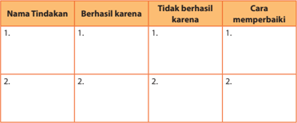

Tabel ini berisi informasi tentang tindakan yang telah dilakukan oleh seseorang, dengan penjelasan mengapa tindakan tersebut berhasil atau tidak berhasil. Kolom pertama menunjukkan nama tindakan yang telah dilakukan, kolom kedua menjelaskan alasan tindakan tersebut berhasil, kolom ketiga memberikan alasan jika tindakan tersebut tidak berhasil, dan kolom keempat menyediakan cara untuk memperbaiki masalah yang mungkin terjadi. Topik utama tabel ini adalah analisis tindakan dan pemahaman tentang hasilnya. Data penting yang terlihat adalah bahwa ada beberapa tindakan yang berhasil karena adanya faktor tertentu, sedangkan beberapa tindakan tidak berhasil karena adanya masalah tertentu. Selain itu, tabel juga memberikan panduan tentang bagaimana cara memperbaiki masalah yang mungkin terjadi.

 

---
## 📄 Halaman 83

---
**📊 Tabel**

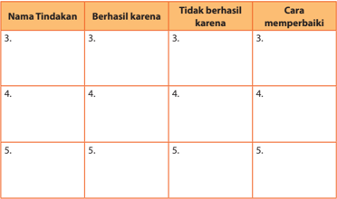

Tabel ini berisi informasi tentang tindakan-tindakan yang telah dilakukan, dengan penjelasan mengapa tindakan tersebut berhasil atau tidak berhasil. Kolom "Nama Tindakan" menyajikan daftar tindakan yang diambil, sedangkan kolom "Berhasil karena" dan "Tidak berhasil karena" memberikan alasan mengapa tindakan tersebut berhasil atau gagal. Kolom "Cara memperbaiki" menunjukkan langkah-langkah yang dapat diambil untuk mencegah kegagalan pada masa depan. Topik utama tabel ini adalah analisis dan pemahaman tentang tindakan yang telah dilakukan, serta cara memperbaiki kegagalan jika terjadi. Data penting yang terlihat adalah bahwa beberapa tindakan berhasil karena adanya faktor tertentu, sementara beberapa gagal karena adanya masalah tertentu. Selain itu, tabel juga menunjukkan bahwa ada beberapa tindakan yang dapat diubah atau diperbaiki untuk meningkatkan hasilnya.

### C. Penutup

### Rangkuman

Remaja membutuhkan dan perlu belajar tentang keadilan dan perdamaian. Hal tersebut perlu menjadi bagian dari kehidupan Kristen yang meneladani kehidupan Tuhan  Yesus  Kristus.  Fenomena  perdamaian  seringkali  berkaitan  erat  dengan keadilan. Keadaan yang tidak adil dapat menimbulk an konflik antarindividu dalam keluarga dan komunitas. Pribadi Kristen dipanggil oleh Tuhan untuk membawa keadilan dan perdamaian dimanapun dia berada.

Dalam keluarga Kristen realita keadilan dan perdamaian sangat erat kaitannya. Bahkan  bisa  menjadi  fenomena  kausalitas  (fenomena  sebab  akibat).  Realita keadilan  dan  perdamaian  sangat  dibutuhkan  dalam  lingkup  keluarga,  bahkan juga  dalam  lingkup  komunitas  dan  negara.  Keluarga  Kristen  perlu  meneladani sikap Tuhan Yesus  Kristus  dalam 'Sang  Raja  Adil,  Sang  Raja  Damai'  yang  telah memberikan diri-Nya bagi kita. Kaum muda perlu berperan dalam keluarganya secara  aktif  untuk  mengupayakan  adanya  keadilan,  sehingga  tercipta  suasana damai dalam keluarga. Pada gilirannya remaja Kristen perlu menjadi berkat bagi lingkungannya karena keadilan dan perdamaian yang dihadirkannya.

 

---
## 📄 Halaman 84

### Ayat hafalan dan sharing :

Baca  dan  hafalkan  Yakobus  3:17,  tentang  ciri-ciri  pendamai  adalah  peramah, penurut, penuh belas k asihan, tidak munafik, dan tidak memihak. Sejauh mana kamu  sudah  melakukan  ciri-ciri  sebagai  Kristen?  Diskusikan  dengan  teman sebangkumu.

### Bernyanyi

### Berdoa

Ya Tuhan, kami bersyukur atas anugerah yang begitu besar dalam hidup kami. Kami beryukur  atas  kehidupan  kami  saat  ini.  Biarlah  kami  memiliki  sikap  yang adil dan damai. Tuhan, kami ingin memulai dari kami masing-masing. Sehingga kami juga mampu untuk membawa sikap hidup damai dan adil di tengah-tengah keluarga dan lingkungan kami. Amin.

``

 

---
## 📄 Halaman 85

VIII

### A. Pengantar

###  Berdoa

Tuhan, kami mengucap syukur

Untuk penyertaan-Mu bagi kehidupan keluarga kami

Pada saat ini kami hendak menggali nilai-nilai kekristenan bagi keluarga kami di tengah gaya hidup modern.

Tolonglah kami agar keluarga kami tidak goyah, dalam arus perubahan zaman.

Engkau Tuhan, tetap menjadi pedoman kehidupan keluarga.

Amin.

###  Bernyanyi PKJ 286

### PKJ 286 286. KELUARGA YANG DAMAI

do = bes 4 ketuk

``

``

### Keluargaku dalam Gaya Hidup Modern

Bahan Alkitab:

Kejadian 35: 22b-29,

Matius 19: 16-26

 

---
## 📄 Halaman 86

``

### B. Uraian Materi

### 1. Pengertian Gaya Hidup Modern

### Kegiatan 1 Curah Pendapat

Istilah 'gaya hidup modern' dalam kehidupan sehari-hari sangat lazim kita dengar. Berikan pendapat kamu atas pertanyaan berikut!

- Apa yang dimaksud dengan gaya hidup modern?
...........................................................................................................................................................

...........................................................................................................................................................

...........................................................................................................................................................

...........................................................................................................................................................

- Apakah menggunakan handphone ,  mobil,  motor,  laptop,  dan ipad termasuk dalam gaya hidup modern?
...........................................................................................................................................................

...........................................................................................................................................................

...........................................................................................................................................................

...........................................................................................................................................................

- Sebutkan contoh sikap gaya hidup modern di sekitar kita atau melalui media TV bagi yang memiliki!
...........................................................................................................................................................

...........................................................................................................................................................

...........................................................................................................................................................

...........................................................................................................................................................

 

---
## 📄 Halaman 87

Hingga saa t ini belum ada definisi yang pasti mengenai gaya hidup modern. Oleh  karena  itu  mari  kita  selidiki  pengertian  gaya  hidup  modern  dengan memulainya dari definisi gaya hidup.

-  Assael (1984) mengungkapkan  bahwa  gaya  hidup merupakan  sebuah pola  kehidupan  yang  dapat  diidentifikasi  melalui  bagaimana  seseorang menghabiskan  waktunya,  apa  yang  mereka  anggap  penting  di  dalam lingkungan  masyarakatnya,  dan  apa  yang  mereka  pikirkan  tentang  dirinya sendiri di dunia yang mengitari mereka.
-  Kotler (2002), gaya hidup sebagai sebuah pola hidup seseorang di dunia yang diekspresikan dalam aktivitas, minat dan opini. Gaya hidup menggambarkan keseluruhan diri seseorang dalam berinteraksi dengan lingkungannya.
-  Minor  dan  Mowen  (2002)  mengungkapkan  bahwa  gaya  hidup  adalah menunjukkan bagaimana orang hidup, bagaimana membelanjakan uangnya, dan bagaimana mengalokasikan waktunya.
-  Suratno dan Rismiati (2001) mengatakan bahwa gaya hidup merupakan pola hidup seseorang dalam dunia kehidupan sehari-hari yang dinyatakan dalam kegiatan, minat, dan bakat yang bersangkutan.
Sekarang kita mulai dengan pengertian modern.

---
**🖼️ Gambar/Diagram**

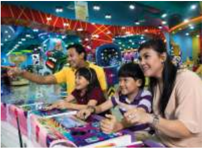

> **Deskripsi Visual:** Gambar ini adalah ilustrasi yang menunjukkan keluarga sedang bermain di sebuah taman bermain. Ilustrasi ini menggambarkan suasana yang ceria dan menyenangkan, dengan beberapa elemen penting:

1. **Apa yang Ditampilkan Secara Keseluruhan**: Gambar ini menampilkan keluarga yang terdiri dari dua orang dewasa (orang tua) dan dua anak-anak. Mereka sedang bermain di taman bermain, tampaknya sedang menikmati waktu bersama.

2. **Elemen-Elemen Utama dan Relasinya**: 
   - **Keluarga**: Terdiri dari dua orang dewasa (orang tua) dan dua anak-anak.
   - **Taman Bermain**: Tempat bermain yang penuh dengan wahana dan permainan.
   - **Permainan**: Anak-anak sedang bermain, sementara orang tua mereka berada di sekitar mereka, tampaknya memantau dan memberikan dukungan.
   - **Latar Belakang**: Taman bermain yang luas dengan berbagai wahana dan permainan, serta lampu neon yang menambah keindahan tempat tersebut.

3. **Teks, Angka, atau Label Penting yang Terlihat**: 
   - **Teks**: Tidak ada teks yang jelas dalam gambar ini, sehingga tidak ada informasi tertulis yang dapat dilihat.
   - **Angka**: Tidak ada angka yang jelas dalam gambar ini.
   - **Label**: Tidak ada label yang menunjukkan nama tempat atau jenis wahana.

4. **Informasi Kunci yang Dapat Diambil Pembaca**: 
   - **Keseruan dan Kebersamaan**: Gambar ini menunjukkan bahwa keluarga merasa senang dan bersama-sama saat bermain di taman bermain.
   - **Tempat Rekreasi**: Taman bermain menjadi tempat yang ideal untuk aktivitas keluarga dan rekreasi bersama.
   - **Keindahan Tempat**: Lampu neon dan wahana-wahana di taman bermain menambah keindahan dan keceriaan tempat tersebut.

Dengan demikian, gambar ini menggambarkan suasana yang ceria dan menyenangkan, menunjukkan bahwa taman bermain adalah

-  Menurut Kamus  Besar  Bahasa Indonesia (KBBI), modern diartikan  sebagai  sebuah  sikap dan  cara berpikir serta cara bertindak sesuai dengan tuntutan  zaman.  Kata modern berasal dari bahasa Latin yaitu modernus yang berarti saat ini, atau  sesuatu  yang  menunjuk pada  sifat  kekinian.  Di  dalamnya tercermin suatu nilai yang meng  arahkan seseorang untuk bersikap efektif, efisien, praktis, sederhana, dan meng  hargai waktu.
Dengan demikian maka dapat diperoleh pengertian bahwa gaya hidup modern merupakan sebuah pola hidup yang menyangkut cara bersikap dan berpikir yang berkaitan dengan aspek fisik, mental, serta spiritual sesuai dengan tuntutan zaman modern. Di dalamnya mencerminkan adanya semangat dan nilai-nilai efektivitas, efisien, praktis, sederhana, menghargai kehidupan, serta menghargai waktu.

 

---
## 📄 Halaman 88

### 2. Bentuk Gaya Hidup Modern

Ada  beberapa  macam  bentuk  gaya  hidup  modern,  A.B  Susanto  (1996) mengatakan  bahwa  bentuk  gaya  hidup  modern  yang  sedang  menjangkiti keluarga di Indonesia dapat diiden tifikasi, sebaai berikut.

- Pola pikir yang  menganggap status sebagai sesuatu yang penting.
- Setiap individu memiliki mobilitas yang tinggi.
- Memiliki kebiasaan untuk bercengkrama di tempat-tempat tertentu.
- Memiliki kebiasaan untuk melakukan makan siang atau makan malam bersama di tempat tertentu.
- Melakukan olahraga mahal seperti golf.
- Melaksanakan pernikahan agung.
- Merayakan wisuda.
- Memiliki gaya hidup serba instant .
- Memanfaatkan segala macam jenis teknologi komunikasi.
Sedangkan dalam sumber lain dikatakan bahwa gaya hidup modern seperti  yang  disebutkan  sebelumnya,  membentuk  manusia  untuk  memiliki kecenderungan bersikap konsumerisme, materialisme, dan hedonisme.

- Konsumerisme adalah gaya hidup yang menganggap barang-barang mewah sebagai ukuran kebahagiaan, atau kesenangan sehingga membentuk seseorang untuk bersikap tidak hemat.
- Materialisme adalah pandangan hidup yang mencari dasar segala sesuatu yang termasuk kehidupan manusia di dalam alam kebendaan semata-mata dengan mengesampingkan segala sesuatu yang mengatasi alam indera.
- Hedonisme adalah pandangan hidup yang menganggap bahwa kesenangan dan kenikmatan materi merupakan tujuan utama dalam kehidupan di dunia.
Dari  paparan  tersebut  maka  dapat  disimpulkan  bahwa  pada  dasarnya  gaya hidup modern dapat mengarahkan individu untuk memiliki pola perilaku negatif maupun positif. Pemahaman yang keliru terhadap esensi dari gaya hidup modern cenderung membentuk seseorang untuk berperilaku menyimpang. Sedangkan pemahaman yang benar terhadap gaya hidup modern justru dapat mengarahkan seseorang  untuk  memiliki  perilaku  benar  sesuai  dengan  prinsip-prinsip  yang tercermin  dalam  semangat  gaya  hidup  modern  seperti  efektif,  efisien,  praktis, sederhana, menghargai kehidupan, dan menghargai waktu.

 

---
## 📄 Halaman 89

### Kegiatan 2 Diskusi Kelompok

Apa jawaban atau pendapatmu tentang pertanyaan-pertanyaan di bawah ini?

- Apakah kamu termasuk orang yang memiliki gaya hidup modern? Jelaskan!
...........................................................................................................................................................

...........................................................................................................................................................

...........................................................................................................................................................

...........................................................................................................................................................

- Apakah keluargamu termasuk keluarga  yang  memiliki  gaya  hidup  modern? Jelaskan!
...........................................................................................................................................................

...........................................................................................................................................................

...........................................................................................................................................................

...........................................................................................................................................................

- Bentuk gaya hidup modern seperti apa yang ada dalam dirimu? Jelaskan!
...........................................................................................................................................................

...........................................................................................................................................................

...........................................................................................................................................................

...........................................................................................................................................................

- Bentuk gaya hidup modern seperti apa yang ada dalam keluargamu? Jelaskan!
...........................................................................................................................................................

...........................................................................................................................................................

...........................................................................................................................................................

...........................................................................................................................................................

### 3. Peran Keluarga di Tengah Gaya Hidup Modern

Sebagai seorang remaja yang terlibat dalam proses kehidupan modern, kamu perlu memahami kehadiran dan peran keluarga, selanjutnya melakukan analisis agar dapat mengambil sikap yang tepat. Dalam perspektif kristiani dapat diungkap bahwa peran keluarga di tengah gaya hidup modern sangatlah penting dan perlu dicermati.

 

---
## 📄 Halaman 90

Beberapa aspek dapat  diiden tifikasi sebagai berikut.

- Keluarga kristiani perlu membangun persekutuan pribadi-pribadi dan melayani kehidupan. Keluarga kristiani juga dituntut untuk turut serta mengembangkan kehidupan perutusan gereja.
- Dalam  kehidupan  keluarga  Kristen,  perlu  dibangun  persekutuan  pribadipribadi  yang  dapat  dilakukan  dengan  meletakkan  cinta  kasih  sebagai  asas
- dan kekuatan yang mempersatukan masingmasing anggotanya. Keluarga Kristen perlu  menjaga  persatuan  yang  utuh  antara suami-istri  dan  membangun  sebuah  bentuk persatuan  yang  tidak  terceraikan.  Keluarga Kristen  yang  modern  dalam  perkembangan keadaan, perlu memberikan  penghargaan yang  tinggi  terhadap  hak-hak  dan  peranan perempuan, hal ini  sebetulnya  juga  menjadi perhatian negara maupun pada aras dunia. Di samping itu keluarga juga perlu menjunjung tinggi hak-hak anak dan menganggap mereka memiliki pemikiran yang patut dihargai.  Kehadiran    orang  lanjut  usia  yang menjadi  anggota  dalam  keluarga  juga  perlu diperhatikan kebutuhannya dan dihargai yang selayaknya.
- Dalam kaitan dengan perkembangan masyarakat,  keluarga  dipanggil  untuk  turut
- serta dalam mengembangkan masyarakat, karena pada hakikatnya keluarga merupakan  sel  masyarakat  yang  pertama  dan  amat  penting.  Ke  hidupan berkeluarga  pada  hakikatnya  merupakan  pengalaman  hidup  bersatu  dan berbagi  rasa,  sadar  akan  peranan  sosial  bagi  lingkungan.  Oleh  karena  itu, keluarga  Kristen  perlu  menyadari  terhadap  rahmat  dan  tanggungjawabnya bagi masyarakat.
- Di tengah perubahan keadaan dan masyarakat, keluarga perlu terlibat dalam hidup dan perutusan gereja. Hal itu dapat dilakukan dengan cara bersungguhsungguh  dalam  membangun  persekutuan  keluarga  yang  beriman  secara kokoh. Justru di tengah perubahan yang ada, keluarga Kristen harus mampu membangun persekutuan antaranggota keluarga untuk terus-menerus berdialog  dengan  Tuhan  dengan  berbagai  cara.  Melalui  keluarga  kita  bisa mem  bangun  persekutuan  dengan  orang  lain  dan  melayani  kebutuhan  sesama. Oleh karena itu,  keluarga  Kristen  diharapkan  dapat  melakukan  filtrasi

---
**🖼️ Gambar/Diagram**

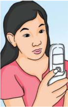

> **Deskripsi Visual:** Gambar ini adalah ilustrasi yang menunjukkan seorang wanita sedang menggunakan ponsel pintar. Gambar ini menggambarkan tindakan seseorang yang biasanya dilakukan saat ini, yaitu menggunakan perangkat digital untuk berkomunikasi atau mencari informasi. 

Elemen utama dalam gambar ini adalah wanita, ponsel pintarnya, dan lingkungan sekitarnya. Wanita tersebut tampak senang dan fokus pada ponselnya, menunjukkan bahwa perangkat ini memiliki peran penting dalam kehidupan modern. Ponsel pintar tersebut tampak modern dan multifungsi, menunjukkan kemajuan teknologi dalam dunia komunikasi.

Teks, angka, atau label penting tidak ada dalam gambar ini karena ia hanya menggambarkan tindakan manusia tanpa teks atau angka tambahan. Namun, gambar ini dapat memberikan informasi tentang bagaimana teknologi telah mempengaruhi cara kita berinteraksi dengan dunia sekitar kita.

Informasi kunci yang dapat diambil pembaca adalah bahwa teknologi telah menjadi bagian integral dari kehidupan sehari-hari manusia, terutama dalam hal komunikasi dan pencarian informasi. Gambar ini juga menunjukkan bahwa perangkat digital seperti ponsel pintar telah menjadi alat yang sangat penting dalam kehidupan modern.

 

---
## 📄 Halaman 91

atau menyaring pengaruh negatif dari gaya hidup modern. Dengan demikian di  tengah-tengah  arus  modernisasi,  keluarga  Kristen  mampu  menjadi  agen penanaman semangat positif yang tercermin dalam gaya hidup modern.

Tahukah kamu bahwa sesungguhnya Alkitab memberikan contoh baik yang positif dan negatif berkaitan dengan gaya hidup modern pada waktu itu. Tentu kita  bisa  belajar  dari  contoh-contoh  tersebut.  Contoh  yang  positif  kita  bisa melihatnya dari Kejadian 35:22b-29. Sedangkan contoh yang negatif terambil dari Matius 19:16-26.

Dalam Kejadian 35:22b-29 mengisahkan tentang kehidupan keluarga Yakub yang memiliki 13 orang anak. Dari 13 anak tersebut Yusuf yang sudah menginjak remaja dikasihi oleh Yakub. Tentu saja hal ini menyebabkan para saudaranya iri hati. Lalu mereka menjual Yusuf menjadi budak di tanah Mesir. Namun pengaruh keluarga Yusuf yang dekat dengan Tuhan masih sangat mewarnai kehidupan Yusuf di tanah Mesir. Yusuf di tanah Mesir akhirnya dapat menjadi pemimpin muda di tengah lingkungan yang maju, bisa dikatakan modern pada saat itu, Yusuf tetap taat  dan  menjadi  pemimpin  muda  yang  takut  kepada  Tuhan.  Akhirnya,  Yusuf mampu menolong bapak dan saudara-saudaranya lepas dari bahaya kelaparan, hidup  dalam 'gaya  hidup  modern'  di  tanah  Mesir,  tetap  memelihara  kasihnya kepada Tuhan dan keluarganya. Walaupun saudara-saudaranya pernah membenci dan membuang dia, namun ia mampu mengatasi luka batin dan mengampuni para saudaranya sehingga dia dapat mentransformasi keluarganya, hidup berkecukupan dan tetap berjalan seturut dengan kehendak Tuhan.

Contoh yang negatif dapat kita lihat dari kehidupan orang muda yang kaya, yang memiliki 'gaya hidup modern' pada waktu itu, dapat kita pelajari dari Matius 19:16-26. Meskipun orang muda pada ayat itu hidup bergelimang harta dan gaya hidup yang up to date tetapi ia mengalami kekosongan dan kebimbangan hidup, serta mencari jawaban kepada Tuhan Yesus. Pada saat Tuhan Yesus memberikan pilihan  untuk  hidup  di  jalan  Tuhan  atau 'jalan  dunia' ,  sayangnya  orang  muda tersebut  memilih  hidup  dalam  harta  dunia  yang  dimiliki,  terkungkung  dalam pengaruh gaya hidup buruk yang ia pilih. Akibatnya dia kehilangan Kristus sebagai sumber kehidupan dan berkat.

### Kegiatan 3 Membuat Tulisan

Guru akan membimbing kamu dalam kelompok atau individu untuk membuat tulisan  mengenai  apa  yang  kamu  temukan  ketika  melakukan  proses  menggali informasi mengenai bentuk-bentuk gaya hidup modern yang kamu lakukan dan alami di lingkungan keluarga masing-masing.

 

---
## 📄 Halaman 92

### Kegiatan 4 Presentasi

Guru akan meminta kamu untuk mempresentasikan hasil yang kamu peroleh dari proses menggali informasi yang kamu lakukan dengan subjek diri kamu sendiri dan keluarga kamu mengenai bentuk-bentuk gaya hidup modern.

### C. Penutup

### Rangkuman

- Gaya  hidup  modern  merupakan  sebuah  pola  hidup  yang  menyangkut  cara bersikap dan berpikir berk aitan dengan aspek fisik, mental, dan spiritual, sesuai dengan tuntutan zaman modern, di dalamnya mencerminkan semangat efektif, efisien, praktis, sederhana, menghargai kehidupan, dan menghargai waktu.
- Dalam  perubahan  keadaan,  keluarga  Kristen  perlu  tetap  berpegang  teguh pada kehendak Kristus dan berperan sebagai berkat bagi lingkungannya.
- Remaja Kristen perlu membangun persekutuan, melayani hidup, turut serta mengembangkan masyarakat, turut serta dalam hidup dan perutusan gereja, baik bagi gereja maupun lingkungannya.

### Ayat  Emas  hari  ini:  Lengkapilah  1  Timotius  3:15,  menghafal,  dan mer efleksikan isinya.

- Lengkapilah bagian yang kosong di bawah ini! Jadi  jika  aku______,  sudahlah  engkau  tahu  bagaimana  orang  harus  hidup sebagai  ________,  yakni  jemaat  dari  Allah  yang  hidup,  tiang  penopang dan__________.
- Secara bergantian dengan teman sebangkumu, hafalkanlah ayat tersebut!
- Pahami dan r efleksikanlah makna ayat tersebut bagi kamu!

 

---
## 📄 Halaman 93

### Bernyanyi

---
**🖼️ Gambar/Diagram**

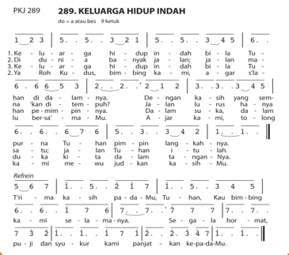

> **Deskripsi Visual:** Gambar ini adalah diagram yang menunjukkan struktur keluarga hidup indah dalam bentuk tabel. Diagram ini terdiri dari beberapa baris dan kolom yang menggambarkan hubungan antara anggota keluarga. Setiap baris mewakili satu orang anggota keluarga, sementara setiap kolom menunjukkan posisi atau peran mereka dalam keluarga. 

Elemen utama yang terlihat adalah angka dan huruf yang menunjukkan posisi anggota keluarga dalam keluarga hidup indah. Angka 1 sampai 6 menunjukkan posisi dari ayah, ibu, anak laki-laki pertama, anak perempuan pertama, anak laki-laki kedua, dan anak perempuan kedua. Huruf a, b, c, d, e, f, g, h, i, j, k, l, m, n, o, p, q, r, s, t, u, v, w, x, y, z, dan aa, bb, cc, dd, ee, ff, gg, hh, ii, jj, kk, ll, mm, nn, oo, pp, qq, rr, ss, tt, uu, vv, ww, xx, yy, zz, aa, bb, cc, dd, ee, ff, gg, hh, ii, jj, kk, ll, mm, nn, oo, pp, qq, rr, ss, tt, uu, vv, ww, xx, yy, zz, aa, bb, cc, dd, ee, ff, gg, hh, ii, jj, kk, ll, mm, nn, oo, pp, qq, rr, ss, tt, uu, vv, ww, xx, yy, zz, aa, bb, cc, dd, ee, ff, gg, hh, ii, jj, kk, ll, mm, nn, oo, pp, qq, rr, ss, tt, uu, vv, ww, xx, yy, zz, aa, bb, cc, dd, ee, ff, gg, hh, ii, jj, kk, ll, mm, nn, oo, pp, qq, rr, ss, tt, uu, vv, ww, xx, yy, zz, aa, bb, cc, dd, ee, ff, gg, hh, ii, jj, kk, ll,

### Doa

Kami mengucap syukur Tuhan Untuk penyertaan-mu pada pembelajaran ini Semoga pengetahuan yang kami peroleh mengenai modernisasi Dapat menjadi pedoman hidup dalam keseharian kami Dalam keadaan apapun diri dan keluarga kami Engkau Tuhan selalu jadi pengharapan sejati Terimakasih Tuhan Yesus, Allah surgawi yang beserta kami Amin.

 

---
## 📄 Halaman 94

---
**🖼️ Gambar/Diagram**

> **Deskripsi Visual:** Gambar ini adalah ilustrasi yang menampilkan keluarga berdiri bersama-sama. Keluarga ini terdiri dari dua orang dewasa (orangtua) dan dua anak muda (anak-anak). Semua anggota keluarga tersebut mengenakan kaos kuning dan celana biru. Orangtua berdiri di belakang anak-anak mereka, tampaknya memeluk atau menahan mereka dengan tangan. Anak-anak tampak senang dan bahagia, dengan wajah tersenyum lebar. Gambar ini menunjukkan hubungan harmonis dan cinta antara anggota keluarga.

Elemen-elemen utama dalam gambar ini adalah anggota keluarga, busana mereka, dan posisi mereka. Kaos kuning dan celana biru menjadi warna dominan dalam gambar ini, menunjukkan kesamaan dalam gaya dan kebersamaan keluarga. Posisi mereka yang saling melengkapi menunjukkan hubungan yang erat dan harmonis.

Teks, angka, atau label penting tidak ada dalam gambar ini karena ia hanya berupa ilustrasi. Namun, informasi kunci yang dapat diambil pembaca adalah tentang hubungan keluarga yang harmonis dan cinta antara anggota keluarga.

 

---
## 📄 Halaman 95

### Bab IX

### A. Pengantar

###  Berdoa

Kami mengucap syukur pada-Mu Tuhan sumber ilmu pengetahuan dan berkat

Untuk memahami nilai-nilai Kristiani dalam kehidupan keluarga.

Untuk segala penyertaan-Mu dalam keluarga kami Pada kesempatan kali ini tolonglah kami, Agar kami semua siap menghadapi modernisasi Terima kasih Tuhan Yesus, Amin.

###  Bernyanyi

KJ 447 - Dalam Rumah yang Gembira

### KJ447 DALAMRUMAHYANGGEMBIRA 1 do=g4ketuk

- 6.7121344313.2131217.1 Da-lam ru-mah yg gembi-ra bu-nga In-jil ber-se-ri;
6.7121344312.2311176 da-lam ka-sih yg se-ti-a ku ber-bak-ti tak hen-ti.

2.223143212313.454314.33. Rut,De-bo-rah dan Ma-ri-a ja-di con-toh ba-gi-ku.

1.2331655413.21217.66. 'Ku ber-jan-ji dan se-di-a, ma-ra da-pat ku-tem-puh.

### Dampak Modernisasi Bagi Keluargaku

Bahan Alkitab: 1 Samuel 16: 1-12, Efesus 5: 22-33

 

---
## 📄 Halaman 96

### B. Uraian Materi

### 1. Pengertian Modernisasi

### Kegiatan 1 Curah Pendapat

Kita  sering  mendengar  istilah  modernisasi dalam  kehidupan  sehari-hari,  baik melalui media sosial, elektronik, maupun media cetak. Berikan pendapat kamu atas pertanyaan berikut!

- Apa yang dimaksud dengan modernisasi?
……………………………………………………………………………………

……………………………………………………………………………………

……………………………………………………………………………………

……………………………………………………………………………………

- Apakah dampak modernisasi bagi keluarga?
……………………………………………………………………………………

……………………………………………………………………………………

……………………………………………………………………………………

……………………………………………………………………………………

- Bagaimana sikap keluarga-keluarga kristen dalam menghadapi modernisasi?
……………………………………………………………………………………

……………………………………………………………………………………

……………………………………………………………………………………

……………………………………………………………………………………

Bany ak definisi mengenai modernisasi,

-  J.W  Schrool  (1998)  mengungkapkan  modernisasi  merupakan  penerapan pengetahuan  ilmiah  pada  semua  kegiatan,  bidang  kehidupan,  dan  aspek kemasyarakatan.  Aspek  yang  paling  menonjol  proses  modernisasi  adalah perubahan Iptek yang tinggi.
-  Kamus Besar Bahasa Indonesia mengungkapkan bahwa modernisasi sebagai sebuah  proses  pergeseran  sikap  dan  mentalitas  sebagai  warga  masyarakat untuk dapat hidup sesuai dengan tuntutan masa kini.

 

---
## 📄 Halaman 97

-  William E. More (2003) mengungkapkan modernisasi adalah trans  formasi total kehidupan bersama dalam bidang teknologi dan organisasi sosial dari yang tradisional ke arah pola-pola ekonomis dan politis yang didahului oleh negaranegara Barat yang telah stabil.
-  Soerjono Soekanto (1998), mengatakan bahwa modernisasi adalah suatu bentuk dari perubahan sosial yang biasanya terarah dan didasarkan pada suatu perencanaan.
Dari sekian banyak pengertian yang disebutkan oleh para ahli di atas dapat diperoleh kesimpulan bahwa modernisasi adalah sebuah proses pergeseran yang terjadi kepada individu maupun masyarakat secara holistik sesuai dengan tuntutan zaman  modern  yang  di  dalamnya  mengungkapkan  semangat  untuk  hidup, bersikap,  berpikir  secara  efektif, efisien,  praktis,  sederhana,  serta  menghargai kehidupan, dan menghargai waktu.

### Kegiatan 2 Dialog dan Tanya Jawab

Kamu dapat berdialog dengan gurumu, tentang dampak modernisasi kemudian tanyakan  hal-hal  yang  kamu  anggap  belum  jelas,  dan  sampaikan  hal-hal  yang sudah kamu ketahui.

### 2. Berubahnya Berbagai Fungsi Keluarga

Dampak  yang  paling  mendasar  dari  modernisasi  bagi  keluarga  adalah perubahan fungsi dalam keluarga.

-  Pertama adalah perubahan fungsi dalam bidang pendidikan. Keluarga yang dahulu bertanggung jawab dalam melatih anak pada usia dini dalam hal fisik, mental,  dan  spiritual,  pada  zaman  modern  fungsinya  sudah  mulai  digeser oleh  lembaga-lembaga  pendidikan  anak  usia  dini.  Keluarga  yang  dahulu berfungsi  memberikan  pengetahuan  tambahan  dalam  hal  kognitif,  tentang pelajaran-pelajaran  yang  ada  di  sekolah  kini  fungsinya  mulai  digeser  oleh
-  Koentjaraningrat (1996) mengungkapkan bahwa modernisasi adalah usaha untuk hidup sesuai dengan zaman dan keadaan dunia sekarang.

 

---
## 📄 Halaman 98

- lembaga-lembaga bimbingan belajar.  Namun  seiring  dengan perkembangan  yang  terus  berjalan fungsi keluarga dalam bidang pendidikan mulai terlihat kembali dengan munculnya model home-schooling .
-  Kedua adalah fungsi sosialisasi anak. Keluarga yang dahulu bertugas untuk membentuk kepribadian anak, memperkenalkan pola tingkah laku, sikap, keyakinan, cita-cita, dan nilai-nilai yang dianut oleh

---
**🖼️ Gambar/Diagram**

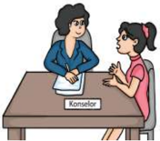

> **Deskripsi Visual:** Gambar ini adalah ilustrasi yang menunjukkan dua orang wanita sedang berbicara di meja kerja. Meja tersebut memiliki label "Kontainer" di sisi kiri. Pada gambar ini, elemen utama adalah dua orang wanita yang sedang berbicara, meja kerja dengan label "Kontainer", dan lingkungan kerja yang formal. Informasi kunci yang dapat diambil dari gambar ini adalah bahwa ada diskusi atau konferensi antara dua orang wanita di meja kerja, mungkin dalam konteks pekerjaan atau bisnis. Label "Kontainer" menunjukkan bahwa mereka mungkin berada dalam lingkungan yang lebih formal atau profesional.

kelompok sosial masyarakat, pada zaman modern perannya mulai digeser. Peran keluarga tersebut sekarang diambil alih oleh lembaga-lembaga training yang menawarkan jasa pembentukan kepribadian, serta lembaga-lembaga konseling psikologis yang menawarkan jasa untuk mengetahui bakat dan minat melalui tes psikologi.

-  Keempat adalah fungsi perasaan. Keluarga yang dahulunya bertugas memberikan rasa keintiman,  perhatian,  dan  rasa  aman  yang  tercipta  dalam keluarga, pada zaman modern perannya sudah mulai digeser oleh baby sitter, dan day care.
-  Ketiga adalah fungsi perlindungan. Keluarga yang dahulunya bertugas untuk memberikan tempat yang nyaman bagi anggota keluarga dan memberikan perlindungan secar a fisik, ekonomi, maupun psikologis bagi seluruh anggotanya,  pada  zaman  modern  fungsinya  mulai  digeser  oleh  lembagalembaga yang menawarkan jasa-jasa asuransi.
-  Kelima adalah  fungsi  rekreatif.  Keluarga  yang  dahulunya  berfungsi  untuk mencari hiburan, serta memberikan suasana yang segar dan gembira dalam lingkungan keluarga, pada zaman modern perannya sudah mulai digeser oleh media cetak, elektronik,  dan media sosial.

### 3. Dampak Modernisasi bagi Keluarga

Ternyata  modernisasi  yang  terus  berjalan  di  tengah-tengah  masyarakat memiliki  dampak  yang  cukup  signifikan.  Dampak  modernisasi  tersebut  dapat berbentuk  pengaruh  positif  maupun  negatif  baik  dalam  kehidupan  pribadi maupun keluarga.

 

---
## 📄 Halaman 99

-  Pengaruh positif modernisasi misalnya dapat membentuk anggota keluarga menjadi pribadi yang menerima dan terbuka pada hal-hal baru. Pada umumnya mereka berani menyatakan pendapat, menghargai waktu, memiliki orientasi pada masa depan. Pada umumnya mereka menghargai adanya perencanaan dan pengorganisasian. Mereka juga memiliki rasa percaya diri, perhitungan, menghargai  harkat  hidup  manusia  lain,  percaya  pada  ilmu  pengetahuan dan teknologi, serta menjunjung sikap imbalan harus sama dengan prestasi kerja.  Cara  mengembangkan  iman  generasi  modern  bisa  dilakukan  dengan memanfaatkan teknologi informasi, terutama banyak diakses oleh remaja dan pemuda.
-  Pengaruh  negatif  dari  dampak  modernisasi  adalah  membentuk  seseorang untuk  memiliki  kecenderungan  berpikir  dan  bersikap  pragmatis.  Terlalu menggantungkan diri pada alat-alat modern, bahkan modernisasi dianggap sebagai Allah. Modernisasi juga dapat menghilangkan fungsi-fungsi vital dari keluarga.  Juga  berpotensi  meningkatnya  arus  urbanisasi.  Dalam  kehidupan remaja  dapat  terlihat  meningkatnya  kenakalan  remaja,  dan  meningkatnya perilaku menyimpang pada remaja dan orang tua.

### Kegiatan 3 Diskusi dalam kelompok kecil

- Apa saja dampak modernisasi yang muncul dalam keluargamu?
...........................................................................................................................................................

...........................................................................................................................................................

...........................................................................................................................................................

...........................................................................................................................................................

...........................................................................................................................................................

- Dampak modernisasi  dalam  keluargamu  cenderung  mengarah  pada  proses seperti apa?
...........................................................................................................................................................

...........................................................................................................................................................

...........................................................................................................................................................

...........................................................................................................................................................

...........................................................................................................................................................

 

---
## 📄 Halaman 100

- Apakah  dalam  keluargamu  ada  perubahan  peran  laki-laki  dan  perempuan yang diakibatkan oleh modernisasi, kalau ada seperti apa bentuknya? Kalau tidak ada berikan alasannya!
...........................................................................................................................................................

...........................................................................................................................................................

...........................................................................................................................................................

...........................................................................................................................................................

...........................................................................................................................................................

- Bagaimana  keluargamu  mengarahkan  anggotanya  untuk  dapat  terhindar dari  dampak  negatif  modernisasi?  Selanjutnya  lebih  mengarahkan  keluarga sebagai 'berkat bagi lingkungan'?
...........................................................................................................................................................

...........................................................................................................................................................

...........................................................................................................................................................

...........................................................................................................................................................

...........................................................................................................................................................

### 4. Keluarga sebagai 'Bejana Tanah Liat' di Tengah Dampak Modernisasi

Berdasarkan pemahaman yang menyatakan bahwa  modernisasi  adalah  sebuah  proses  dengan aspek  penting, yakni efektivitas,  e fisien, praktis, sederhana, menghargai kehidupan, dan menghargai waktu. Oleh  karena  itu, keluarga Kristen perlu mengembangkan  sikap  yang  terbuka  dan  mau menerima  masukan  dari  semua  pihak  termasuk setiap proses perubahan yang diusung oleh zaman modern. Oleh karena  itu  agaknya  model  keluarga sebagai  'bejana  tanah  liat'  yang  dicetuskan  oleh Marjorie  Thomson  (2000)  dapat  menjadi  rujukan pembelajaran bagi keluarga.

Pada dasarnya 'keluarga  sebagai  tanah  liat'  ini, memiliki esensi bahwa keluarga memiliki sikap dan pemikiran  yang  tidak  kaku,  cenderung  terbuka,

---
**🖼️ Gambar/Diagram**

> **Deskripsi Visual:** Gambar ini adalah ilustrasi yang menunjukkan keluarga berdiri depan gereja. Ilustrasi ini menggambarkan tiga orang dewasa dan dua anak kecil. Orang dewasa tampak seperti seorang ayah dan ibu, sedangkan anak-anak tampak seperti putra dan putri mereka. Gereja yang dilihat tampak seperti bangunan kecil dengan atap berbentuk hati dan pintu berwarna putih.

Elemen-elemen utama dalam gambar ini adalah keluarga, gereja, dan atap berbentuk hati. Keluarga tampak seperti ikon yang menunjukkan hubungan emosional dan kebersamaan. Gereja tampak sebagai tempat ibadah dan simbol keagamaan. Atap berbentuk hati tampak sebagai simbol kebahagiaan dan keberkahan.

Teks, angka, atau label penting tidak ada dalam gambar ini. Namun, informasi kunci yang dapat diambil pembaca adalah bahwa gambar ini mungkin digunakan untuk membahas tentang hubungan antara keluarga, agama, dan kebahagiaan.

 

---
## 📄 Halaman 101

dan dapat menerima perubahan. Keluarga dapat dan bisa dibentuk ulang oleh Tuhan  untuk  dapat  menerapkan  model  tersebut.  Pada  intinya  masing-masing anggota keluarga harus menyadari bahwa mereka adalah insan-insan yang tidak sempurna  sehingga  menyediakan  diri  untuk  dibentuk  oleh  Allah  dalam  setiap tantangan.  Dengan  keterbukaan  yang  dimiliki  tersebut,  keluarga  diharapkan dapat lebih menyerap semangat-semangat positif yang ingin dicapai oleh zaman modern. Melalui modernisasi keluarga juga dapat memanfaatkannya untuk sarana pengembang iman.

Belajar  dari  Alkitab,  kita  bisa  menemukan  contoh  dampak  modernisasi  atau perubahan zaman yang positif maupun negatif bila dikaitkan dengan keluarga. Dampak  negatif  dapat  kita  lihat  dari  kisah  kehidupan  keluarga  Isai  yang memengaruhi  kehidupan  Daud  anaknya,  dalam  1Samuel  16:1-12.  Pada  nats tersebut  dijelaskan  bahwa  karena  didikan  Isai  di  dalam  rumah  memengaruhi cara hidup Daud selanjutnya, terutama ketika dia sudah menjadi raja. Berbagai kebijakan, berinisiatif untuk melakukan perang, dan memaksakan keadaan damai lewat ancaman merupakan hal yang kiranya tidak perlu kita teladani. Sedangkan contoh  yang  positif  dapat  kita  lihat  dalam  surat    Efesus  5:22-33.  Teks  tersebut merupakan nasehat kepada orang Kristen yang hidup di kota metropolis pusat perdagangan modern  di kerajaan Romawi. Di tengah masyarakat modern banyak orang  yang  bersikap  egois,  pemikiran  pragmatis,  mentuhankan  modernisasi, kurangnya penghargaan terhadap kemanusiaan dan banyak terjadi penyim  pangan  dalam  keluarga.  Dalam  konteks  seperti  ini  penulis  kitab  memberikan  saran sederhana  mengenai  aturan  yang  pantas  dalam  membina  hubungan  sesama anggota 'keluarga Kristen' . Meletakkan fondasi kehidupan keluarga kepada Kristus sebagai  kepala  keluarga  (Ef.  5:22,  24).  Hubungan  yang  terjalin  dalam  keluarga Kristen  mencerminkan  nilai-nilai  keadilan  (ayat  28),  kesetaraan  (ayat  33),  serta anjuran  agar  semua  anggota  keluarga  mempunyai  kesadaran  dan  melakukan fungsi  masing-masing  sesuai  perannya.  Nats  ini  memberikan  teladan  bagi  kita semua mengenai bagaimana menjalankan kehidupan di tengah pengaruh negatif peradaban modern yang makin merusak fungsi-fungsi keluarga Kristen. Contoh keteladanan tersebut dapat diperoleh melalui Tuhan Yesus Kristus.

### Kegiatan 4 Berbagi Pengalaman

Guru akan membimbing kamu untuk melakukan presentasi hasil diskusi kelompok di depan kelas.

 

---
## 📄 Halaman 102

### Studi Kasus:

Di dalam pertemuan keluarga di meja makan, (bapak, ibu, dan anak) ternyata masing-masing  orang  sangat  sibuk  dengan handphone di  tangannya. Meskipun  kelihatannya  berdekatan,  namun  sesungguhnya  mereka 'saling berjauhan' . Bagaimana me  ngatasi hal yang sering terjadi ini?

### Kegiatan 5 Penugasan: Berbagi Pengalaman

Tuliskan pengalaman tentang dampak modernisasi bagi keluargamu! Tugas ini diselesaikan di rumah dan bisa ditanyakan pada orang tuamu.

### C. Penutup

### Rangkuman

-  Modernisasi dapat memberikan dampak positif dan negatif:
-  Modernisasi  adalah  sebuah  proses  perubahan  yang  terjadi  pada  individu, keluarga, maupun masyarakat. Perubahan itu bersifat holistik sesuai dengan tuntutan  zaman  modern  yang  di  dalamnya  mengungkapkan  semangat untuk hidup, bersikap, berpikir secara efektif, efisien, praktis, sederhana, serta menghargai kehidupan dan waktu.
- Dampak  positif  menjadi  pribadi  yang  terbuka  pada  hal-hal  baru,  berani menyatakan pendapat, menghargai waktu, memiliki orientasi pada masa depan  bukan  masa  lalu,  memiliki  perencanaan  dan  pengorganisasian, memiliki rasa percaya diri, perhitungan, menghargai harkat hidup manusia lain,  percaya  pada  ilmu  pengetahuan  dan  teknologi,  serta  menjunjung sikap imbalan harus sama dengan prestasi kerja.
- Dampak  negatif  membentuk  seseorang  untuk  memiliki  kecenderungan berpikir dan bersikap pragmatis, terlalu menggantungkan diri pada alat-alat modern, serta modernisasi dianggap sebagai Allah. Menghilangkan fungsifungsi  vital  dari  keluarga,  meningkatnya  arus  urbanisasi,  meningkatnya kesenjangan  sosial  antara  keluarga  berkemampuan  tinggi  dan  rendah, meningkatnya  pencemaran  lingkungan  yang  diakibatkan  limbah-limbah rumah tangga. Selain itu juga muncul kriminalitas dalam lingkup keluarga, munculnya kenakalan remaja, serta meningkatnya perilaku menyimpang dan tidak kristiani pada remaja dan orang tua.

 

---
## 📄 Halaman 103

-  Dalam menghadapi modernisasi keluarga harus bersikap seperti 'bejana tanah liat' yang penuh dengan keterbukaan, bersedia, dan dapat dibentuk oleh Allah.

### Ayat Emas hari ini Efesus 2:19

- Lengkapilah bagian yang kosong di bawah ini! Demikianlah kamu bukan lagi _______ dan pendatang, melainkan ________ dari orang-orang kudus dan anggota-anggota keluarga Allah
- Secara bergantian dengan teman sebangkumu, hafalkanlah ayat tersebut!
- Pahami dan r efleksikanlah makna ayat tersebut bagi kamu!

### Bernyanyi KJ 451Bila Yesus di tengah Keluarga

### KJ 451 BILA YESUS DITENGAH KELUARGA

``

``

``

### Doa (diucapkan secara bersama-sama)

Kami Mengucap syukur Tuhan, untuk penyertaan-Mu pada pembelajaran hari ini. Semoga pengetahuan yang kami terima mengenai dampak modernisasi dalam keluarga, dapat menjadi bekal dalam kehidupan selanjutnya. Dalam proses perubahan yang berlangsung, bimbinglah dan tuntunlah kami

Roh Tuhan, sentuhlah kami, arahkan kami sesuai dengan kehendak-Mu. semua agar dapat melihat tangan dan penyertaan Tuhan. Amin.

 

---
## 📄 Halaman 104

---
**🖼️ Gambar/Diagram**

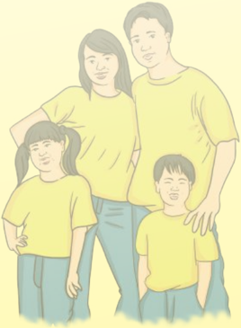

> **Deskripsi Visual:** Gambar ini adalah ilustrasi yang menampilkan keluarga berdiri bersama-sama. Keluarga ini terdiri dari dua orang dewasa (orangtua) dan dua anak muda (anak-anak). Semua anggota keluarga tersebut mengenakan kaos kuning dan celana biru. Orangtua berdiri di belakang anak-anak mereka, tampaknya memeluk atau menahan mereka dengan tangan. Anak-anak tampak senang dan bahagia, dengan wajah tersenyum lebar. Gambar ini menunjukkan hubungan harmonis dan cinta antara anggota keluarga.

Elemen-elemen utama dalam gambar ini adalah anggota keluarga, busana mereka, dan posisi mereka. Kaos kuning dan celana biru menjadi warna dominan dalam gambar ini, menunjukkan kesamaan dalam gaya dan kebersamaan keluarga. Posisi mereka yang saling melengkapi menunjukkan hubungan yang erat dan harmonis.

Teks, angka, atau label penting tidak ada dalam gambar ini karena ia hanya berupa ilustrasi. Namun, informasi kunci yang dapat diambil pembaca adalah tentang hubungan keluarga yang harmonis dan cinta antara anggota keluarga.

 

---
## 📄 Halaman 105

### Bab X

### Relasi Bermakna Antara Keluarga, Gereja, dan Sekolahku

Bacaan Alkitab:

Ulangan 6:7-9,

Efesus 4:11-15

### A. Pengantar

###  Berdoa: Diucapkan bersama

Untuk keluarga yang Tuhan berikan, aku syukuri Tuhan.

Meskipun keluarga tidak sempurna, syukur padamu selalu kupanjatkan.

Untuk sekolah tempat belajar bersama

Syukur pada-Mu mohon diterima

Allahku dan Tuhanku, mohon selalu kusadari

Keluarga dan sekolahku adalah karunia ilahi yang Tuhan beri.

Amin.

###  Bernyanyi

Nyanyikan  lagu  yang  kamu  sukai  sebagai  ucapan  syukur  karena  keluarga  atau sekolah yang merupakan berkat Tuhan bagi kamu.

Pada  bahan  Bab  II  telah  membahas  mengenai  keluarga  sebagai  pusat  pembentukan.  Pelajaran  kali  ini  akan  membahas  mengenai  sekolah  sebagai  lembaga yang mendukung pembentukan dan pertumbuhan anak secara utuh.

### B. Uraian Materi

### Kegiatan 1 Curah Pendapat

Kemukakan menurut pendapat kamu, bagaimana seharusnya pendidikan yang baik bagi anak dan remaja di rumah dan sekolah? Apa saja yang harus dipenuhi oleh keluarga  maupun  sekolahmu  dalam  dunia  pendidikan?  Bagaimana  tanggapan kamu tentang pendidikan pada masa sekarang ini?

 

---
## 📄 Halaman 106

### 1. Anak dan Pendidikan

Alkitab  memberi  kesaksian  bahwa  tugas  orang  tua  untuk  mendidik  anak-anak sejak  kecil  sehingga  tumbuh  menjadi  pribadi  yang  kuat  baik  secara  intelektual maupun  kepribadian,  terlebih  dalam  nilai  ketaatan  terhadap  Tuhan.  Anak-anak juga  membutuhkan sekolah untuk mengembangkan dan mengoptimalkan segala potensi yang ada dalam diri anak-anak, yang mendukung proses pembentukan dan pertumbuhan anak dalam segala aspek kehidupan.

Tahukah  kamu  bahwa  kamu  masing-masing  sebagai  pribadi  merupakan ciptaan Allah yang istimewa?

Kamu merupakan anugerah sekaligus titipan dari Tuhan yang memiliki potensi yang  luar  biasa,  sehingga  kamu  sebagai  remaja  memerlukan  didikan  untuk mengembangkan potensi dengan sungguh-sungguh untuk mencapai keutuhan. Potensi-potensi  itu  terdiri  dari  potensi  kognitif  (intelektual),  afektif  (moral), spiritual, dan psikomotorik (keterampilan).

### 2. Tri Pusat Pendidikan

### Kegiatan 2 Diskusi dalam Kelompok Kecil

Buatlah kelompok kecil, 2-3 siswa dalam satu kelompok. Diskusikan pertanyaan panduan ini :

- Menurutmu  siapa  yang  banyak  melakukan  pendidikan  Kristen  bagimu? Mengapa?
- Menurut kamu bagaimana supaya baik keluarga, gereja,  dan  sekolah  dapat memaksimalkan pendidikan Kristen bagi kamu?
- Apa yang dapat kamu lakukan untuk menolong keluarga, gereja dan sekolah supaya  lembaga  itu  dapat  melakukan  relasi  yang  bermakna  dan  saling mendukung?
- Tahukan kamu bahwa seluruh pendidikan manusia dapat berlangsung dalam tri pusat pendidikan? Apa sajakah itu?

### a.  Pendidikan dalam konteks keluarga

Dalam konteks ini kamu berinteraksi dengan orang tua dan anggota keluarga yang lain, sehingga memperoleh pendidikan informal terutama melalui proses sosialisasi dan edukasi berupa pembiasaan atau habit formations .

 

---
## 📄 Halaman 107

### b.  Pendidikan dalam konteks gereja

Di  sini  kamu  berinteraksi  dengan  seluruh  anggota  gereja  yang  berbeda secara umur, tingkat sosial, maupun budaya. Kamu memperoleh pendidikan nonformal atau pendidikan di luar sekolah yang berupa berbagai pengalaman hidup. Agar gereja dapat melakukan eksistensinya, maka seharusnya generasi muda (anak, remaja, dan pemuda) perlu mendapat warisan atau penerusan baik nilai-nilai, sikap, pengetahuan, keterampilan, dan bentuk kelakuan lainnya sesuai dengan dasar-dasar kristiani. Oleh karena itu, kamu perlu terlibat dan menjadi aktifis gereja agar dapat mengembangkan kepribadian kamu dengan sehat secara kristiani.

### c.  Pendidikan dalam konteks sekolah

Dalam  konteks  sekolah,  kamu memperoleh  pendidikan  formal.  Artinya  terprogram  dan ter  jabarkan dengan tetap yang berupa pengetahuan, nilainilai, keterampilan, maupun sikap terhadap mata pelajaran. Disini kamu dapat berinteraksi dengan ling  kungan yang lebih luas ber  sama teman sebayanya. Aspek-aspek penting yang memengaruhi  perkembangan

kamu di sekolah dapat berupa bahan-bahan pengajaran, teman dan sahabat peserta didik, guru, serta para pegawai.

Sekolah adalah sebuah lembaga yang dirancang untuk pembelajaran peserta didik di bawah pengawasan guru. Sekolah berfungsi untuk mengembangkan kemampuan  dan  membentuk  watak  serta  peradaban  anak  bangsa  yang bermartabat dalam rangka mencerdaskan kehidupan bangsa. Sekolah juga  bertujuan  untuk  mengembangkan  potensi  peserta  didik  agar  menjadi manusia yang beriman dan bertaqwa kepada Tuhan Yang Maha Esa, berakhlak mulia,  sehat,  berilmu,  cakap,  kreatif,  mandiri,  dan  menjadi  warga  negara yang  bertanggung  jawab.  Untuk  mencapai  tujuan-tujuan  tersebut,  peserta didik di dalam kehidupannya harus tetap berakar dan berpusat pada pribadi Tuhan  Yesus,  yang  digerakkan  oleh  Roh  Kudus.  Tuhan  Yesus  di  dalam  PAK dikenal  sebagai  Tuhan,  Juru  Selamat,  dan  Guru  Agung  yang  tidak  hanya memperkenalkan  siapa  Allah  yang  sesungguhnya,  tetapi  juga  memberikan teladan kehidupan bagi para murid-murid-Nya, termasuk kita pada saat ini.

 

---
## 📄 Halaman 108

### 3. Relasi antara Sekolah dan Keluarga

Sekolah merupakan pihak sekunder dalam pendidikan anak dan remaja, sebab pihak primer tetap berada di tangan orang tua, terutama ayah dan ibu yang telah dipilih dan ditetapkan oleh Tuhan. Pendidikan anak merupakan tantangan yang berat bagi orang tua, namun hal tersebut merupakan tugas mulia karena orang tua adalah pendidik utama dan pertama. Kehadiran sekolah membantu meringankan tantangan  tersebut.  Sekolah  hadir  sebagai  mitra  yang  berkolaborasi  dengan orang tua dalam mendidik generasi berikutnya sebagai penerus pelaksana misi Tuhan secara turun-temurun.

Sebagai pihak penopang, sekolah perlu menjalin komunikasi dengan keluarga. Sebaliknya,  keluarga  dituntut  untuk  bersedia  memberikan  dukungan  bagi kelangsungan  dan  pekerjaan Tuhan  melalui  sekolah.  Keluarga  dipanggil  untuk memberi waktu lebih banyak berdiskusi, baik dengan guru di sekolah maupun dengan anak mereka yang mengikuti pendidikan. Sekolah dan orang tua juga perlu terbuka dan mengusahakan agar lebih mengenal satu sama lain, sehingga dapat memahami dalam segi apa dorongan atau motivasi dapat diberikan dalam perkembangan anak secara utuh. Pendidikan di sekolah tidak akan optimal jika tidak ada dukungan dari orang tua secara holistik dalam pertumbuhan anak-anak.

Surat Paulus dalam Efesus 4:11-15 memberikan kesaksian tentang karunia yang diberikan Tuhan berbeda satu terhadap yang lain. Meskipun demikian, perbedaan karunia  dalam  jabatan  ini  memiliki  tujuan  mulia  yaitu  untuk  melengkapi  umat Allah dalam pelayanan dan pembangunan tubuh Kristus (gereja), sampai semua umat Allah mencapai kedewasaan yang penuh dalam iman dan takut akan Allah. Kamu adalah umat Allah yang diperlengkapi oleh orang tua di rumah dan guru di sekolah agar kamu bertumbuh secara utuh dalam segala aspek kehidupan. Gereja sebagai persekutuan orang percaya, mendukung kamu dalam aspek spiritual.

---
**🖼️ Gambar/Diagram**

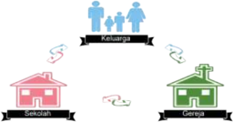

> **Deskripsi Visual:** Gambar ini adalah ilustrasi yang menunjukkan hubungan antara keluarga dan sektor ekonomi. Ilustrasi ini terdiri dari beberapa elemen utama:

1. **Keluarga**: Dibuat dengan warna biru dan merah muda, menunjukkan dua orang dewasa dan anak-anak mereka. Ini menunjukkan bahwa keluarga adalah unit dasar dalam struktur sosial.

2. **Sektor Ekonomi**: Dibuat dengan warna hijau dan merah muda, menunjukkan dua bangunan yang mungkin berhubungan dengan industri atau bisnis. Ini menunjukkan bahwa sektor ekonomi berperan penting dalam kehidupan keluarga.

3. **Relasi**: Terdapat tiga garis putih yang menghubungkan elemen-elemen tersebut, menunjukkan hubungan antara keluarga dan sektor ekonomi. Garis putih ini menggambarkan bahwa keluarga membutuhkan sumber daya dari sektor ekonomi untuk memenuhi kebutuhan hidup mereka.

4. **Teks**: Ada teks yang menyebutkan "Keluarga" dan "Sektor Ekonomi", yang menunjukkan bahwa kedua hal ini saling berkaitan dan penting dalam kehidupan manusia.

5. **Informasi Kunci**: Gambar ini mengajarkan bahwa keluarga tidak bisa hidup tanpa sumber daya dari sektor ekonomi, dan sebaliknya, sektor ekonomi juga membutuhkan dukungan dari keluarga untuk beroperasi dengan baik.

 

---
## 📄 Halaman 109

Dengan  demikian  dapat  disimpulkan  bahwa  dalam  konteks  negara  dan berbangsa pendidikan memegang  peranan  penting, termasuk pendidikan agama  Kristen.  Hal  itu  bertujuan  untuk  mengembangkan  cita-cita  pendidikan nasional, yakni terbentuknya insan serta ekosistem pendidikan dan kebudayaan yang  berkarakter  dengan  berlandaskan  gotong  royong.  Meskipun  demikian, dalam  memainkan  perannya  selaku  pribadi  maupun  komunitas  Kristen,  kita harus  tetap  melihat  identitas  kita  dari  segi  iman  Kristen.  Dalam  pembelajaran PAK kita harus tetap berdiri di atas keyakinan iman bahwa Allah adalah sumber pengetahuan, hikmat, realitas, dan nilai kehidupan. Panggilan kita pada saat ini adalah  bagaimana  mewujudkan  keyakinan  kita  dalam  mengemban  tugas  kita masing-masing. Dengan demikian, kita juga dapat memberikan sumbangan bagi peningkatan kualitas manusia seutuhnya di Indonesia. Pendidikan dalam konteks keluarga, sekolah, dan gereja seharusnya dapat memimpin peserta didik (remaja) untuk mengenal dan memuliakan Tuhan dalam segala aspek kehidupan.

### Kegiatan 3 Identifikasi

Sebutkan persamaan dan perbedaan antara pendidikan di sekolah dan pendidikan dalam keluarga!

###  Persamaan

---
**📊 Tabel**

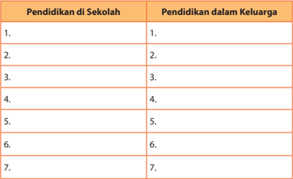

Tabel ini menunjukkan dua jenis pendidikan: pendidikan di sekolah dan pendidikan dalam keluarga. Kolom pertama berisi 7 baris yang masing-masing menunjukkan aspek pendidikan di sekolah, sementara kolom kedua berisi 7 baris yang masing-masing menunjukkan aspek pendidikan dalam keluarga. Data atau pola penting yang terlihat adalah bahwa setiap aspek pendidikan di sekolah memiliki sesuai aspek pendidikan dalam keluarga, menunjukkan hubungan antara pendidikan di sekolah dan pendidikan dalam keluarga.

 

---
## 📄 Halaman 110

###  Perbedaan

---
**📊 Tabel**

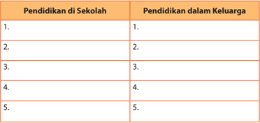

Tabel ini menunjukkan dua jenis pendidikan: pendidikan di sekolah dan pendidikan dalam keluarga. Kolom pertama berisi 5 baris yang masing-masing menunjukkan topik tentang pendidikan di sekolah, sedangkan kolom kedua berisi 5 baris yang masing-masing menunjukkan topik tentang pendidikan dalam keluarga. Data atau pola penting yang terlihat adalah bahwa setiap baris pada kolom pertama memiliki satu atau lebih topik tentang pendidikan di sekolah, sedangkan setiap baris pada kolom kedua memiliki satu atau lebih topik tentang pendidikan dalam keluarga. Ini menunjukkan bahwa tabel ini digunakan untuk membandingkan dan membandingkan dua jenis pendidikan tersebut.

### 4. Masalah Sosial dalam Kehidupan Remaja

Pernahkan  kamu  bersyukur kepada Tuhan karena kamu dapat bersekolah? Pernahkah kamu  bersyukur  karena  kamu tidak  terjerumus  dalam  dunia narkoba,  seks  bebas,  maupun tindakan kriminal remaja?

Lihatlah  di  sekeliling  kamu, banyak  masalah  remaja  yang terjadi. Misalnya, meningkatnya tawuran  antarsekolah,  kenakalan  remaja,  kriminalitas  remaja, hamil  di  luar  nikah  dan  pernikahan  dini,  pemakaian  obat

---
**🖼️ Gambar/Diagram**

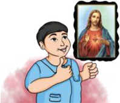

> **Deskripsi Visual:** Gambar ini adalah ilustrasi yang menunjukkan seorang anak berdiri dengan tangan menggenggam sebuah foto. Di samping anak tersebut, terdapat gambar Kristus yang tampak penuh cinta dan keberkahan. Anak tersebut tampak sangat senang dan bersemangat, menunjukkan rasa percaya dan kepercayaan pada Tuhan. Ilustrasi ini mungkin digunakan untuk membantu pembaca memahami konsep tentang kepercayaan dan doa kepada Tuhan.

terlarang,  serta  masih  banyak  lagi.  Meskipun  demikian  sesungguhnya  banyak kesempatan  yang  dapat  dilakukan  remaja  untuk  mengembangkan  nilai-nilai kristiani  yang  bertujuan  untuk  pengembangan  diri,  untuk  sekolah  dan  untuk gerejanya.  Berkaitan  dengan  masalah  tersebut,  rupanya  perlu  ada  kerja  sama untuk  mencapai  tujuan  bersama  antara  keluarga,  sekolah,  dan  gereja  untuk mengembangkan  nilai-nilai  kristiani  yang  dampaknya  dapat  secara  langsung dirasakan  oleh  lingkungan.  Misalnya,  menciptakan  lingkungan  yang  lebih  adil, lebih manusiawi, dan mengembangkan kesetaraan dalam perspektif kristiani.

 

---
## 📄 Halaman 111

### Kegiatan 4 Diskusi Kelompok

Diskusikanlah  dengan  kelompok  kamu  untuk  mengiden tifikasi  hal  yang  perlu dikembangkan dan hal yang perlu dihindari oleh remaja Kristen!

---
**📊 Tabel**

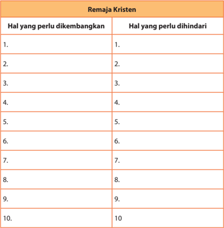

Tabel ini berisi daftar hal-hal yang perlu dikembangkan dan dihindari oleh remaja Kristen. Topik utamanya adalah pengembangan karakter dan perilaku yang sesuai dengan nilai-nilai Kristen. Kolom pertama menunjukkan hal-hal yang perlu dikembangkan, sementara kolom kedua menunjukkan hal-hal yang perlu dihindari. Data penting yang terlihat adalah bahwa banyak hal yang perlu dikembangkan, seperti kepercayaan, kejujuran, dan kerendahan hati, sementara beberapa hal harus dihindari, seperti kecanduan, kekerasan, dan penyalahgunaan media sosial. Ini menunjukkan bahwa remaja Kristen memerlukan pendidikan dan dukungan untuk mengembangkan karakter yang kuat dan bertanggung jawab.

### Kegiatan 5 Menilai Diri Sendiri

Nilailah diri kamu sendiri dalam menghayati peran kamu di sekolah maupun di gereja dengan rasa syukur dan bertanggung jawab! Ber ilah tanda √ pada kolom yang tersedia!

 

---
## 📄 Halaman 112

### Refleksi diri tentang disiplin dan tanggung jawab.

---
**📊 Tabel**

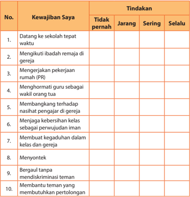

Tabel ini menunjukkan kewajiban saya dalam berbagai aspek kehidupan sekolah dan gereja, serta tindakan saya terhadap setiap kewajiban tersebut. Topik utama tabel adalah tentang kewajiban dan tindakan saya dalam menjaga integritas dan integritas moral di sekolah dan gereja. Kolom-kolomnya meliputi "Tidak pernah", "Jarang", "Sering", dan "Selalu". Data penting yang terlihat adalah bahwa saya sering datang ke sekolah tepat waktu, mengikuti ibadah remaja di gereja, mengerjakan pekerjaan rumah (PR), menghormati guru sebagai wakil orang tua, membangangkan terhadap nasihat pengajar di gereja, menjaga kebersihan kelas sebagai perwujudan iman, membuat kegaduhan dalam kelas dan gereja, menyontek, bergaul tanpa mendiskriminasi teman, dan membantu teman yang membutuhkan pertolongan. Pola yang jelas adalah bahwa saya sering melakukan tindakan positif terhadap kewajiban tersebut, sementara tindakan negatif seperti menyontek dan mendiskriminasi teman lebih jarang dilakukan.

### Kegiatan 6 Penelitian (Metode Proyek) dan Role Play

Lakukanlah penelitian sederhana dengan teman kelompokmu yang terdiri dari 4-5 orang selama dua (2) minggu. Masing-masing kelompok mempunyai tugas untuk melakukan penelitian terhadap satu masalah sosial yang berkaitan dengan kehidupan  remaja.  Misalnya  tawuran  antarsekolah,  hamil  di  luar  nikah  atau pernikahan  dini,  penggunaan  narkoba  dan  obat  terlarang,  penggunaan  miras, serta kriminalitas remaja.

 

---
## 📄 Halaman 113

Buatlah laporan dengan sistematika berikut.

- Deskripsi masalah
- Pengumpulan data (data pribadi)
- Analisis (bisa memakai analisis personal, sosial, mental/psikis, agama, dan lainlain)
- Tindak lanjut (teori dan praktik)
- Kesimpulan
Presentasikan hasil  penelitian  kelompok  kamu,  bisa  dalam  bentuk  tertulis  atau role play !

### C. Penutup

### Rangkuman

- Sekolah  merupakan  pihak  sekunder  dalam  pendidikan  anak,  sebab  pihak primer tetap berada di tangan orang tua yang telah dipilih dan ditetapkan oleh Tuhan.
- Sekolah  hadir  sebagai  mitra  yang  berkolaborasi  dengan  orang  tua  dalam mendidik generasi berikutnya sebagai penerus pelaksana misi Tuhan secara turun-temurun.
- Komunikasi antara sekolah dan keluarga perlu terjalin. Keluarga dituntut untuk bersedia  memberikan  dukungan  bagi  kelangsungan  dan  pekerjaan  Tuhan melalui sekolah, karena pendidikan di sekolah tidak akan optimal jika tidak ada dukungan dari orang tua secara holistik dalam pertumbuhan anak-anak.

### Ayat Emas

Lengkapilah ayat di bawah ini. Selanjutnya, bagikan maknanya bersama temanteman di dalam kelas!

Amsal 22:6 '_______________ orang muda menurut _______________ yang patut baginya, maka pada masa _______________ pun ia tidak akan _______________ dari pada _______________ itu.'

 

---
## 📄 Halaman 114

### Bernyanyi

``

``

### Berdoa

Doa dipimpin oleh guru atau peserta didik untuk mendoakan agar peserta didik dapat terus bertumbuh sebagai keluarga Allah.

 

---
## 📄 Halaman 115

XI

### A. Pengantar

###  Berdoa

Tuhan Yesus, Allah kami yang hidup.

Penjaga kehidupan dan keluarga kami.

Kami menyerahkan segenap kehidupan kami.

Kami mengundang Engkau masuk ke rumah kami.

Agar kami menjadi berkat bagi sesama terutama keluarga.

Puji syukur dan hormat untuk Allah pencipta semesta.

Amin.

###  Bernyanyi

PKJ 165 Janji  yang Manis

Janji yang manis: Kau tak kulupakan, tak terombang-ambing lagi jiwaku. Walau lembah hidupku penuh awan, nanti 'kan cerahlah langit di atasku. R eff:

Kau tidak 'kan Aku lupakan,

Aku memimpinmu, Aku membimbingmu; Kau tidak 'kan Aku lupakan, Aku Penolongmu, yakinlah teguh.

### B. Uraian Materi

### 1. Keluarga Ideal

Tentu  kita  masing-masing  mendambakan  memiliki  rumah  yang  nyaman bukan? Rumah bukan sekedar tempat untuk bernaung dari hujan dan panas terik. Namun umumnya sebagian orang yang terlalu sibuk, secara tidak langsung dapat

### Home Sweet Home

Bahan Alkitab:

Kejadian 30:1-24;

2 Timotius 1:5

 

---
## 📄 Halaman 116

membentuk rumah menjadi warung makan saja atau seperti penginapan saja. Karena  terlalu  sibuk  dengan  pekerjaan  dan  aktivitasnya,  kebersamaan  dengan keluarga  malah  terbengkalai.  Akhirnya  setiap  penghuni  rumah  menjadi  sibuk dengan  kebutuhannya  sendiri  tanpa  ada  kedekatan  antara  orang  tua  dengan anak dan juga antara kakak-adik. Rumah seharusnya menjadi tempat yang paling indah bagi penghuninya ' Home Sweet Home' .  Akibatnya dimana saja dan kapan saja rumah selalu dirindukan dan selalu diingat.

Sesungguhnya  para  remaja memandang rumah sebagai tempat yang penuh dengan kenangan sejak kanak-kanak, kenangan tentang suka maupun duka.  Rumah  yang  sederhana, nyaman,  tenang,  penuh  kasih sayang dan damai adalah tempat tingal yang ideal. Sebagai contoh gambaran paling ideal bagi keluarga Kristen adalah Keluarga Kudus  dari  Maria  dan  Yusuf  di Nazaret. Maria, Yusuf, dan Tuhan Yesus selalu merayakan hari-

---
**🖼️ Gambar/Diagram**

> **Deskripsi Visual:** Gambar ini adalah foto yang menunjukkan keluarga sedang makan bersama di dapur. Keluarga terdiri dari empat orang: dua orang dewasa (seorang ayah dan seorang ibu) dan dua anak (seorang putri dan seorang putra). Mereka duduk di meja makan yang berwarna biru, di depan mereka ada beberapa piring makanan dan minuman. Dinding dapur terlihat bersih dengan jendela yang memberikan cahaya alami masuk ke dalam ruangan. Semua anggota keluarga tampak senang dan terlibat dalam aktivitas makan bersama.

hari  besar  di  bait  Allah  (Misalnya  hari  raya  Pondok  Daun).  Dalam  (Luk.  2:41-52) dijelaskan bahwa Tuhan Yesus pada masa remaja taat pada orang tua duniawinya dan menikmati hidup bersama keluarga. Dia berkembang secara sehat dan utuh. Dia dikasihi oleh Allah dan sesama. Keluarga tersebut merupakan teladan bagi setiap pasangan kristiani dalam membina keluarga. Dalam kehidupan sehari-hari, hendaknya masing-masing keluarga Kristen dapat menghadirkan Kristus dalam kehidupannya.  Dengan  demikian,  keluarga  Kristen  dapat  berkembang  menuju kesempurnaan seperti yang dikehendaki Tuhan.

### 2. Rumah Sebagai Tempat yang Nyaman

Di samping kebutuhan materi dan spiritual, tentu saja kita juga membutuhkan suasana rumah yang nyaman, menyenangkan, dan hangat. Ini semua bukanlah hanya pekerjaan seorang ibu namun, menjadi tanggungjawab semua anggota keluarga  baik  laki-laki  maupun  perempuan.  Saat  ini  telah  terjadi  perubahan sosial yang pesat. Banyak perempuan dan ibu yang memiliki peran ganda, yakni mengurusi  masalah  rumah  tangga  (domestik)  maupun  bekerja  untuk  mencari nafkah  di  luar  rumah  (ruang  publik).  Kalau  perempuan  sudah  melakukan terobosan ke dunia publik maka sudah saatnya para anak laki-laki dan suami juga harus mampu melakukan tugas-tugas di bidang domestik. Dengan demikian akan dicapai keseimbangan, tidak ada yang mempunyai 'beban ganda' , tidak ada lagi

 

---
## 📄 Halaman 117

pekerjaan yang diberi label 'pekerjaan laki-laki  dan  pekerjaan  perempuan. Kita semua perlu berubah, karena adanya perkembangan pesat di bidang sosial dan budaya. Masing-masing orang dalam keluarga dapat menciptakan suasana rumah menjadi suasana yang nyaman dan menyenangkan.

### Kegiatan 1 Diskusi Kelompok

Diskusi: Bagilah kelas dalam kelompok-kelompok kecil

Setiap manusia mempunyai pandangan yang berbeda-beda tentang keluarga yang  ideal.  Mungkin  ada  yang  berpikir  bahwa  keluarga  yang  ideal  itu  apabila memiliki segala perabotan mewah dalam rumah atau sering mengadakan pesta yang mewah, dan sering berlibur ke luar negeri atau ke luar kota. Namun, mungkin ada yang berpendapat bahwa  keluarga ideal itu adalah keluarga yang sederhana, memiliki relasi yang intim satu dengan yang lain, dan masing-masing orang dapat saling membantu.

### Jawablah beberapa pertanyaan di bawah ini dalam kelompok kecil!

- Apa makna atau arti keluarga bagi kamu?
...........................................................................................................................................................

...........................................................................................................................................................

...........................................................................................................................................................

...........................................................................................................................................................

- Seperti apakah keluarga yang ideal menurut kamu?
...........................................................................................................................................................

...........................................................................................................................................................

...........................................................................................................................................................

...........................................................................................................................................................

- Bagaimana peran laki-laki dan perempuan di keluarga kamu?
...........................................................................................................................................................

...........................................................................................................................................................

...........................................................................................................................................................

...........................................................................................................................................................

- Apakah dalam keluargamu perempuan (ibu dan saudara perempuan) sudah diperlakukan dengan adil dan tidak menjadi korban? Karena seringkali mereka memiliki tiga peran (sebagai ibu dan istri, sebagai pengelola rumah tangga, sebagai perempuan pencari nafkah). Namun, kedudukannya kurang dihormati dan tidak setara dengan laki-laki?

 

---
## 📄 Halaman 118

...........................................................................................................................................................

...........................................................................................................................................................

...........................................................................................................................................................

...........................................................................................................................................................

### 3. Rumah Tempat Bersemainya Iman

Di  dalam  rumah,  prioritas  menjadi  keluarga  yang  utuh  itu  penting.  Banyak keluarga para remaja yang saat ini mengalami masalah, dimana orang tua tidak saling  mengasihi,  banyak  timbul  kekerasan  dalam  keluarga,  sehingga  akhirnya menimbulkan banyak perceraian. Oleh karena itu, perlu diingat bahwa pendidikan iman mempunyai kedudukan yang penting. Banyak krisis keluarga karena mereka sudah meninggalkan Kristus dan tidak ada lagi cinta dalam keluarga.

Tuhan  memberikan  mandat  kepada  orang  tua  untuk  mendidik  anak,  tetapi kadang-kadang orang tua sibuk hanya untuk memenuhi kebutuhan anak secara materi, dan mengabaikan kebutuhan mental dan rohani. Akibatnya anak sering berada  di  luar  rumah  untuk  menghindari  permasalahan  keluarga.  Seharusnya keluarga  merupakan  tempat  masing-masing  orang  termasuk  anak-anak  dapat bertumbuh secara fisik, mental, dan spiritual. Oleh karena itu setiap keluarga perlu menyadari, betapa pentingnya menanamkan iman tentang Allah dan karya-Nya sedini mungkin kepada anak, baik melalui proses pendidikan maupun sosialisasi.

Anak-anak  dapat  bertumbuh  imannya  berkat  pengaruh  suasana  kristiani yang dialami dan meresapi kehidupan keluarga. Ada doa dan kebaktian harian bersama setiap hari (bisa mencari waktu khusus malam hari atau pagi hari kurang lebih  10  menit).  Merayakan  secara  sederhana  keadaan  tertentu,  misalnya  ada yang ulang tahun, lulus ujian, naik kelas, dan saling berbagi dalam suka maupun duka. Anak-anak juga akan bertumbuh kehidupan rohaninya bila orang tua dan masing-masing  orang  dalam  kehidupan  sehari-hari  memberi  tekanan  kepada penghayatan  iman . Misalnya  dengan  bersikap  adil  terhadap  asisten  rumah tangga,  menyatakan  pendiriannya  terhadap  korban  penindasan,  diskriminasi, penyalahgunaan  kekuasaan,  dan  menunjukkan  pengertian  terhadap  kelemahan manusia tanpa merendahkannya. Kita semuanya sebagai anggota keluarga baik ibu maupun bapak, anak-anak, nenek atau kakek, dan semua yang tinggal di rumah mempunyai tanggung jawab bersama membuat rumah ' Home Sweet Home ' .

### Kegiatan 2 Diskusi dalam Kelompok Kecil dan Presentasi Kelompok

Bagilah  kelas  menjadi  kelompok-kelompok  kecil  (4-5  orang).  Masing-masing kelompok  membaca  dan  memahami  teks  Alkitab  dan  menjawab  beberapa pertanyaan berikut.

 

---
## 📄 Halaman 119

### Kelompok 1 : Kejadian 30:1-24

Teks  ini  mengisahkan  tentang  kehidupan  keluarga  Yakub,  yang  mengalami banyak  sekali  ketidakwajaran.  Awal  cerita,  Yakub  menyukai  Rahel  dan  ingin menikahinya,  tetapi  pada  waktu  pesta  pernikahan  Laban  mertuanya  tidak memberikan  Rahel  untuk  menjadi  istrinya  tetapi  Lea  kakaknya,  Yakub  marah akhirnya  Laban  berjanji  akan  memberikan  Rahel  apabila  Yakub  bekerja  lagi padanya  selama  7  tahun,  dan Yakub  menyetujuinya.  Singkat  cerita  (dalam  era Perjanjian  Lama)  Yakub  memiliki  2  istri,  dalam  pernikahan  itu  mulai  timbul masalah,  sebab  Lea  memiliki  anak  sedangkan  Rahel  tidak,  lalu  Rahel  dan  Lea masing masing memberikan budaknya untuk mendapatkan anak-anak. Namun pada akhirnya Rahel mendapatkan anak dari rahimnya sendiri. Keluarga seperti ini jelas tidak menjadi teladan tapi inilah realita hidup manusia berdosa yang penuh kelemahan dan kekurangan. Pada zaman Perjanjian Lama (PL) memang wajar bila terjadi hal demikian, karena waktu itu tidak ada aturan yang jelas ditambah masih diberlakukannya budaya poligami. Jika istri tidak punya anak, ia bisa memberikan budaknya untuk menikah dengan suaminya (ingat: dalam Perjanjian Baru Tuhan Yesus mengubah poligami menjadi monogami).

Bila  melihat  latar  belakang  Yakub,  dapat  diketahui  juga  bahwa  dia  adalah seorang yang terkenal sebagai penipu. Ia menipu ayahnya dan Esau saudaranya untuk mendapatkan hak kesulungan.

Dari nats tersebut kita bisa belajar memahami bahwa adanya penipuan, usahausaha  yang  tidak  sehat  untuk  memuaskan  keinginan  diri,  dan  mendapatkan hak-hak yang bukan bagiannya. Hal ini dapat menimbulkan suasana yang buruk dalam keluarga dan memengaruhi relasi-relasi yang dibangun dengan orang lain. Akibatnya suasana keluarga menjadi tidak menyenangkan atau tidak indah.

### Kelompok 2 : 2 Timotius 1:5

---
**🖼️ Gambar/Diagram**

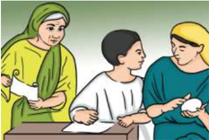

> **Deskripsi Visual:** Gambar ini adalah ilustrasi yang menunjukkan tiga orang yang sedang berbicara di sebuah ruangan. Pada bagian kiri, seorang wanita dengan rambut panjang berwarna gelap sedang berbicara kepada dua pria yang berdiri di depannya. Pria di sebelah kiri mengenakan baju biru dengan topi putih, sedangkan pria di sebelah kanan mengenakan baju kuning dengan topi putih. Mereka semua tampak serius dan berkomunikasi dengan baik. Di belakang mereka, terlihat seorang pria tua dengan topi hitam sedang membaca dokumen. Ruangan ini tampak sederhana dengan meja dan kursi yang terlihat jelas. Gambar ini mungkin digunakan untuk menjelaskan konsep komunikasi atau interaksi sosial dalam konteks pendidikan.

Teks ini mengisahkan tentang kehidupan pemimpin muda  Timotius yang telah  dididik  sesuai  dasardasar alkitabiah sejak masa kanak-kanak. Timotius yang masih muda bisa dapat menjadi pemimpin bahkan menjadi perintis pekabaran Injil  serta  pemikir  Kristen, karena didikan yang diterimanya dari keluarganya. Paulus,  sebagai  rasul  yang besar dan terkenal, bahkan menyebutnya sebagai satu-

 

---
## 📄 Halaman 120

satunya orang 'yang sehati dan sepikir' serta yang tidak mencari kepentingannya sendiri, melainkan kepentingan Kristus (Flp. 2:20). Nama Timotius berasal dari kata Yunani yakni Timotheo artinya menghargai Allah, atau takut akan Tuhan. Timotius adalah putra seorang perempuan Yahudi beragama Kristen bernama Eunike yang bersuami  seorang Yunani  (lihat  Kis.  16:1). Timotius  dididik  secara  kristiani  oleh ibunya. Selain itu dia juga menerima didikan secara kristiani dari neneknya yang bernama  Lois  (lihat  2  Tim.1:5).  Alkitab  menjelaskan  bahwa  pengaruh  pertama yang  dialami  Timotius  adalah  pengaruh  asuhan  orang  tuanya,  terutama  ibu dan neneknya yang mengajarkan kepadanya tentang isi Alkitab. Nama Lois dan Eunike muncul sekali dalam Alkitab, meskipun demikian nama mereka tercatat dalam sejarah karena mereka meninggalkan kesan yang tidak terhapuskan dalam kehidupan  Rasul  Paulus.  Perkenalan  Rasul  Paulus  dengan  Timotius  dicatat  di dalam Kisah Rasul 16:1-3. Dalam ayat tersebut, Timotius muda dipercaya Rasul Paulus untuk ikut dalam pelayanan misinya yang kedua (Kis. 15:36-18:22). Melalui pelayanan  inilah,  Timotius  bertumbuh  menjadi  murid  dan  anak  rohani  Paulus akhirnya menjadi pemimpin muda yang memiliki kualitas kristiani yang bagus. Kehidupan  keluarga Timotius  menjadi  satu  contoh  yang  patut  diteladani  oleh setiap keluarga Kristen.

- Bagaimana kehidupan keluarga dalam kedua teks Alkitab tersebut?
...........................................................................................................................................................

...........................................................................................................................................................

...........................................................................................................................................................

...........................................................................................................................................................

- Pelajaran apa saja yang dapat kamu petik dari teks Alkitab yang dibaca?
...........................................................................................................................................................

...........................................................................................................................................................

...........................................................................................................................................................

...........................................................................................................................................................

- Hal-hal apa yang dianggap negatif dan positif dari teks tersebut, bagaimana jika dihubungkan dengan keluarga masa kini?
...........................................................................................................................................................

...........................................................................................................................................................

...........................................................................................................................................................

...........................................................................................................................................................

 

---
## 📄 Halaman 121

### Kegiatan 3 Penugasan: membuat kebaktian keluarga

Tahap 1 : Gurumu akan mendemonstrasikan kebaktian keluarga. Guru meminta 2 orang peserta didik agar berperan sebagai ayah, ibu, atau anak, guru sebagai ayah atau ibu. Melakukan kebaktian singkat dengan tata acara: (a) membaca Alkitab, (b) membaca renungan harian/saat teduh/penjelasan nats oleh salah satu anggota keluarga, (c) sharing anggota keluarga, (d) doa, (e) bernyanyi (opsional).

Tahap  2 :  3  peserta  didik  mendemonstrasikan  kebaktian  keluarga  sesuai  yang dicontohkan oleh guru. Masing-masing orang berperan sebagai ayah, ibu, dan anak.

Tahap  3 :  Lakukanlah  kebaktian  keluarga  di  rumahmu  masing-masing  sesuai contoh. Lalu buatlah laporan berkaitan dengan ibadah keluarga tersebut. Laporan akan dibawa dalam pengajaran PAK minggu berikutnya. Juga buatlah saran untuk memperbaiki kebaktian keluarga yang telah dilakukan di keluarga peserta didik masing-masing.

### Kegiatan 4 Membuat Tulisan

Buatlah laporan pendek berisi laporan penelitian. Pertanyaan wawancara menyesuaikan dengan pertanyaan penuntun berikut. Tuliskan penelitian kamu:

- Carilah pemahaman mengenai keluarga yang ideal melalui wawancara dengan pendeta.
- Amatilah keluargamu, hal-hal apa saja yang berpotensi untuk menjadi keluarga ideal  dan  hal-hal  apa  saja  yang  menjadi  penghalang  terealisasinya  keluarga Kristen ideal. Buatlah rencana untuk pemecahan masalah.
- Simpulkanlah hasil no 1 dan 2 !

### Kegiatan 5 Penilaian Produk: Membuat Karya

Pilihlah kertas berwarna ukuran A4, dan tempelkan gambar keluargamu sendiri yang  ideal.  Berikan  komentar  tentang  foto  tersebut  dalam  sepuluh  kalimat! Kumpulkan tugas pada gurumu lalu dipajang di dalam ruang kelas!

 

---
## 📄 Halaman 122

### C. Penutup

### Rangkuman

Rumah yang nyaman atau home sweet home , merupakan dambaan setiap orang. Hal itu juga dapat dikatakan sebagai rumah yang ideal dimana setiap orang dapat mengalami  suasana  rumah  atau  keluarga  yang  menyenangkan,  nyaman  dan terlindungi di tengah-tengah kesibukan yang dialami. Rumah juga menjadi tempat untuk pengembangan iman dan tempat perteduhan. Dalam suasana rumah yang nyaman perlu dibangun relasi yang harmonis diantara anggota keluarga. Home Sweet Home perlu diupayakan oleh masing-masing keluarga agar dalam keluarga terjadi  pengembangan  relasi  dengan  Tuhan  dan  relasi  dengan  sesama  secara berkesinambungan.

### Bernyanyi

### PKJ289 KELUARGA HIDUPINDAH

Isprianto 1999 do = a/bes 9ketuk

``

``

``

### Berdoa

Tuhan Yesus yang penuh kasih.

Engkau menjadikan keluarga untuk membimbingku hingga saat ini.

Terima kasih untuk keluarga yang selalu mendukungku, dalam berbagai aspek kehidupanku.

Tolong Tuhanku agar keluarga yang manis itu dapat hadir dalam keluargaku.

Kami rindu memuliakan nama-Mu selalu.

Amin.

 

---
## 📄 Halaman 123

XII

### A. Pengantar

###  Bernyanyi

### Kucinta Keluarga Tuhan

Kucinta k'luarga Tuhan, terjalin mesra sekali semua saling mengasihi betapa s'nang kumenjadi k'luarganya Tuhan

###  Berdoa

Allah Bapa yang baik.

Terima kasih karena Engkau terus menjaga keluargaku hingga hari ini.

Terima kasih untuk kedua orang tuaku yang selalu mengasihiku.

Terima kasih untuk kakak, adik yang bukan saja menjadi saudara tetapi juga menjadi sahabat bagiku.

Terima kasih untuk kebahagiaan yang ku rasakan dalam keluargaku. Kiranya keluargaku dapat menjadi berkat bagi orang lain. Amin.

### Kegiatan 1 Curah pendapat

Sebelum membahas lebih jauh pelajaran ke-12, tuliskan dengan kalimatmu sendiri tentang bagaimana seharusnya gaya hidup keluarga Kristen agar menjadi berkat bagi masyarakat. Sebutkan juga ayat-ayat Alkitab yang menyebutkan tentang hal tersebut!

……………………………………………………………………………………

……………………………………………………………………………………

……………………………………………………………………………………

……………………………………………………………………………………

……………………………………………………………………………………

### Keluarga Kristen Menjadi Berkat Bagi Lingkungan

Bahan Alkitab:

Efesus 5:21-6:9; Kolose

3:18-22; 1 Timotius 2:8-11; Titus 2:1-10;

Amsal 31:10-31

 

---
## 📄 Halaman 124

### B. Uraian Materi

### 1. Perjanjian Lama

Tidak ada kata untuk 'keluarga' dalam Perjanjian Lama (Bahasa Ibrani) yang dapat  disamakan  secara  tepat  dengan  kata  modern, 'keluarga  inti' .  Beberapa kelompok  sosial  digambarkan  sebagai 'suku' ,  dan  menggambarkan  asal  etnik. Kata umumnya  ( beth ab = rumah ayah) dapat berarti keluarga inti yang tinggal di  rumah  yang  sama  (Kej.  50:7-8);  kelompok  sanak  yang  lebih  besar  atau  luas termasuk dua atau lebih generasi (Kej. 7:1; 14:14); dan juga sanak dengan berarti lebih  luas  (Kej.  24:38).  Kata  lain  menunjuk  ke  kelompok  sanak  yang  besar  dan kadang-kadang diterjemahkan sebagai 'kaum' (Bil. 27:8-11).

Pada  kenyataannya,  keluarga-keluarga  yang  digambarkan  dalam  Perjanjian Lama adalah rumah tangga yang terdiri atas semua orang, baik ayah, ibu, anakanak, kerabat lain, pelayan-pelayan, dan orang lain yang tinggal di rumah (band. Kel.  20:10;  Ul.  5:14).  Sebelum  masa  Daud,  hidup  keluarga  difokuskan  pada keperluan  umum yaitu pekerjaan,  makanan,  dan  perlindungan.  Rumah  tangga adalah tempat dimana pendidikan, sosialisasi, dan pendidikan agama terjadi.

### Kegiatan 2 Mendalami Alkitab

Bacalah Amsal 31:10-31!

- Bagaimana pendapat kamu tentang figur seorang ibu?
...........................................................................................................................................................

...........................................................................................................................................................

...........................................................................................................................................................

...........................................................................................................................................................

- Deskripsikan secara singkat isi Amsal tersebut?
...........................................................................................................................................................

...........................................................................................................................................................

...........................................................................................................................................................

...........................................................................................................................................................

- Apa yang kamu pelajari dari pesan teks?
...........................................................................................................................................................

...........................................................................................................................................................

...........................................................................................................................................................

...........................................................................................................................................................

 

---
## 📄 Halaman 125

- Bagaimana pendapat kamu terhadap remaja kristen yang tidak menghargai ibunya?
...........................................................................................................................................................

...........................................................................................................................................................

...........................................................................................................................................................

...........................................................................................................................................................

- Apa yang dapat kamu teladani dari bacaan tadi?
...........................................................................................................................................................

...........................................................................................................................................................

...........................................................................................................................................................

...........................................................................................................................................................

### 2. Perjanjian Baru

Keluarga di Perjanjian Baru tersusun seperti rumah tangga dalam Perjanjian Lama. Ada tekanan pada asal etnik dan jabatan atau peran orang tua. Keluarga Greco-Roman  juga  rumah  tangga  besar,  yaitu  rumah  tangga  termasuk  semua orang  yang  tinggal  di  rumah.  Tidak  ada  kata  di  bahasa  Yunani  yang  dapat disamakan secara tepat dengan ide modern, 'keluarga inti' .  Rumah tangga besar ini adalah satuan dasar masyarakat. Kata umum adalah 'rumah' ( oikos ), atau frasa 'kepunyaan sendiri' .

Dalam  Perjanjian  Baru  ada  beberapa  yang  dinamakan 'pedoman-pedoman kehidupan keluarga'  (Kol. 3:18 - 4:1; Ef. 5:21 - 6:9; 1 Ptr. 2:18 - 3:7;  1 Tim. 2:8-15; 6:1-2; Tit. 2:1-10). Pedoman ini mungkin dimaksudkan untuk membantu anggota rumah tangga Kristen agar hidup sesuai dengan kebudayaannya. Di pihak lain kenyataan bahwa pedoman itu tertuju kepada para suami, istri, orang tua, anak, dan pelayan, menunjukkan bahwa ajaran Kristen khusus diterapkan ke kehidupan rumah tangga. Kita seharusnya memperhatikan bahwa bagian-bagian ini  tidak menunjukkan keluarga sebagai satuan, tetapi menunjukkan hubungan-hubungan yang beragam di dalam keluarga itu sendiri yang bertujuan untuk kebahagiaan bersama.

### 3. Peran Anak yang Menjadi Berkat

Sebagaimana kamu ketahui bahwa keluarga tidak hanya terdiri dari ayah dan ibu,  tetapi  juga  termasuk  di  dalamnya  anak-anak  baik  anak  laki-laki  maupun perempuan. Hal itu bukan hanya berkaitan dengan status melainkan lebih kepada

 

---
## 📄 Halaman 126

peran mereka masing-masing guna menjadi keluarga Kristen yang menjadi berkat bagi lingkungan.

Dalam keluarga khususnya keluarga Kristen,  orang  tua  wajib  mengajarkan kepada  anak-anaknya untuk tunduk dan taat pada orang tua. Jika anak-anak tunduk  dan  taat  kepada  orang  tua, Alkitab  menegaskan  bahwa  ada  janji umur  panjang  dan  berkat-berkat  lain bagi mereka:

'Hai anak-anak, taatilah orang tuamu di dalam Tuhan, karena haruslah demikian. 'Hormatilah ayahmu dan ibumu' - (ini adalah suatu perintah yang penting,  seperti  yang  nyata  dari  janji ini),  selanjutnya  diungkapkan  'supaya kamu berbahagia dan panjang umurmu di bumi' . (Ef. 6:1-3).

---
**🖼️ Gambar/Diagram**

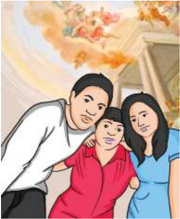

> **Deskripsi Visual:** Gambar ini adalah ilustrasi yang menunjukkan tiga orang yang sedang berjalan di sebuah jalan. Mereka tampak senang dan bahagia, dengan wajah mereka tertawa dan berteriak. Pemandangan sekitar mereka tampak cerah dan indah, dengan pohon-pohon hijau dan bunga-bunga merah muda yang berbunga di sepanjang jalan. Ilustrasi ini menunjukkan suasana yang positif dan menyenangkan, dengan elemen-elemen seperti wajah yang tertawa, warna-warna cerah, dan lingkungan yang indah.

Elemen-elemen utama dalam gambar ini adalah tiga orang yang sedang berjalan, pemandangan sekitar yang indah, dan suasana yang positif. Relasi antara elemen-elemen ini adalah bahwa tiga orang tersebut adalah subjek utama gambar, sedangkan pemandangan sekitar dan suasana adalah elemen-elemen yang mendukung dan memberikan konteks tentang situasi yang ditampilkan.

Teks, angka, atau label penting yang terlihat dalam gambar ini tidak ada, karena gambar ini hanya menggambarkan visual tanpa teks atau angka tambahan.

Informasi kunci yang dapat diambil pembaca dari gambar ini adalah bahwa tiga orang tersebut sedang berjalan dan merasa bahagia, dengan lingkungan yang indah dan cerah. Ini menunjukkan bahwa suasana hidup dan positif dapat membuat seseorang merasa bahagia dan senang.

Melalui penjelasan di atas kita diajarkan bahwa sebagai bagian dari anggota keluarga  Kristen  tanggung  jawab  sebagai  anak  juga  memainkan  peran  yang penting demi terciptanya keluarga Kristen yang menjadi berkat bagi lingkungan.

Dengan demikian, jika keluarga Kristen tetap menjaga keharmonisan dalam rumah  tangga  sesuai  ajaran-ajaran  firman  Tuhan,  maka  keluarga  Kristen  akan menjadi berkat bagi semua orang yang menyaksikannya.

### Kegiatan 3 Asosiasi

Hal  apa  saja  yang  sudah  kamu  lakukan  sehingga  kamu  menjadi  berkat  bagi keluarga, gereja, dan lingkungan kamu? Sampaikan pengalaman kamu di dalam kelas!

...........................................................................................................................................................

...........................................................................................................................................................

...........................................................................................................................................................

...........................................................................................................................................................

...........................................................................................................................................................

...........................................................................................................................................................

...........................................................................................................................................................

...........................................................................................................................................................

 

---
## 📄 Halaman 127

### 4. Keluarga Kristen yang Menjadi Berkat

Menurut Alkitab,  keluarga  adalah  tempat  anak-anak  diajarkan  takut  kepada Tuhan dan belajar tentang karya-karya Tuhan (Ul. 6:4-10).

Keluarga Kristen adalah suami-istri yang kedua-duanya telah menerima Tuhan Yesus  sebagai    Tuhan  dan  Juruselamatnya.  Ini  juga  berarti  bahwa  keduanya menaati  Dia,  mereka  hidup  dengan  kuasa  Tuhan  Yesus  dalam  kehidupannya. Sebagai seorang Kristen, gaya hidupnya harus menjadi mengikuti teladan Kristus. Sebagian orang  ber  pandangan  bahwa  jika  seorang  laki-laki  dan  seorang  perempuan menikah di dalam gereja, maka per  nikahan mereka adalah pernikahan Kristen. Bagi mereka, menikah di dalam gereja adalah suatu jaminan bahwa mereka sedang membangun keluarga Kristen. Cara berpikir demikian  tidak  dapat  dibenarkan.  Keluarga  dapat disebut  keluarga  Kristen apabila suami-istri percaya  kepada  Kristus  dan menampilkan gaya hidup seperti  Kristus.  Jadi  yang dimaksud keluarga Kristen adalah  keluarga  yang  dibentuk oleh Allah dan dalam hidupnya selalu bersandar pada Kristus, serta hidup menurut kehendak-Nya.

---
**🖼️ Gambar/Diagram**

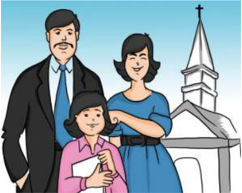

> **Deskripsi Visual:** Gambar ini adalah ilustrasi yang menunjukkan keluarga berdiri dekat gereja. Ilustrasi ini menggambarkan tiga orang dewasa dan seorang anak kecil. Orang tua dewasa tampak senang dan bahagia, sementara anak kecil tampak tertawa dengan senang hati. Gereja yang indah tampak di latar belakang, menunjukkan bahwa keluarga tersebut mungkin sedang beribadah atau berkumpul untuk acara religius. Ilustrasi ini menunjukkan hubungan positif antara anggota keluarga dan juga menekankan pentingnya kepercayaan dan kebersamaan dalam masyarakat.

### Di bawah ini merupakan hakikat keluarga Kristen:

- Persekutuan hidup antara seorang laki-laki dan seorang perempuan dalam  perjanjian,  kasih  setia  membentuk  suatu  keluarga  yang  diberkati dan  dikuduskan  Allah,  serta  sebuah  persekutuan  yang  menjadi  lambang persekutuan hidup antara Allah dengan umat-Nya. Orang yang hidup dalam pernikahan dipanggil untuk memelihara kekudusan hidup pernikahan yang dikaruniakan Allah kepadanya (1 Tes. 4:3-8; Ibr. 13:4).
- Persekutuan hidup yang bersifat eksklusif, artinya hanya terdiri dari dua orang saja,  yaitu  seorang  laki-laki  tertentu  dengan  seorang  perempuan  tertentu. Dengan demikian pernikahan dalam keluarga Kristen berpola monogami (Kej. 2:22, 24-25; 1 Kor. 7:2; 1 Tim. 3:2, 12). Oleh karena itu menolak praktek poligami maupun poliandri.

 

---
## 📄 Halaman 128

- Persekutuan  hidup  yang  bersifat  total,  artinya  menyangkut  seluruh  segi kehidupan suami-istri  baik  yang  jasmani  maupun  yang  rohani,  ' …keduanya menjadi  satu  daging'  (Kej.  2:24).  Kesatuan  ini  adalah  suatu  proses  yang berlangsung  seumur  hidup.  Aspek  inilah  yang  membedakan  secara  hakiki hubungan antara suami-istri dengan orang lain.
Keluarga Kristen mempunyai peran yang sangat penting, karena hubungan di rumah tangga juga menggambarkan hubungan dalam keluarga jemaat. Dalam rumah  tangga  itulah  beberapa  segi  dari  kehidupan  Allah  harus  diperlihatkan. Membesarkan anak-anak adalah tugas bagi rumah tangga. Mengajarkan anakanak akan iman Kristen adalah tugas orang tua sebelum anak-anak mendapatkan pengajaran dari gereja.

Kita hidup di tengah masyarakat. Sebagai keluarga Kristen kita diberi mandat oleh Tuhan agar menjadi berkat di tengah masyarakat. Menjadi berkat dimulai dari masing-masing anggota keluarga, kemudian menjadi berkat bagi jemaat di gereja, serta menjadi berkat di lingkungan RT, RW, dan masyarakat luas. Contoh sederhana yang bisa dilakukan oleh keluarga Kristen dalam rangka menjadi berkat seperti ikut gotong royong dalam membersihkan lingkungan tempat tinggal, dan aktif  dalam  kegiatan  masyarakat  lainnya.  Bagaimana  Alkitab  mengajarkan  agar keluarga Kristen bisa menjadi berkat di tengah masyarakat?

Berikut beberapa hal yang diajarkan Firman Tuhan.

- Hidup dengan Penuh Hikmat
Agar menjadi berkat di tengah masyarakat, maka orang Kristen harus hidup dengan bijaksana. Dalam Titus 2:1-6 ada keterangan tentang bagaimana hidup orang  Kristen  yang  berhikmat  atau  bijaksana  di  tengah  masyarakat.  Kaum laki-laki dianjurkan untuk hidup sederhana, terhormat, bijaksana, sehat dalam iman, kasih, dan ketekunan. Kaum perempuan dianjurkan untuk hidup sebagai orang-orang beribadah, tidak memfitnah, tidak menjadi hamba anggur, cakap mengajarkan  hal-hal  yang  baik,  hidup  bijaksana  dan  suci,  rajin  mengatur rumah tangganya, serta baik hati. Sedangkan kaum muda dianjurkan untuk menguasai  diri  dalam  segala  hal.  Laki-laki  dan  perempuan  dalam  keluarga mempunyai kedudukan yang sama dan sederajat.

- Pergunakan Waktu yang Ada
Apa  arti  pergunakan  waktu  yang  ada?  Kata  ' waktu '  dalam  bahasa  aslinya (Yunani)  adalah kairos .  Dalam  bahasa  Inggris  berarti 'make  the  most  of every  opportunity' (pergunakan  sebaik-baiknya  setiap  kesempatan).  Setiap kesempatan datang hanya satu kali dalam hidup kita dan tidak akan datang untuk kedua kalinya. Oleh karena itu, kesempatan yang datang dalam hidup kita  (baik  berkaitan  dengan  belajar,  bergaul,  bermain,  pekerjaan  maupun pelayanan)  harus  kita  pakai  dengan  sebaik-baiknya.  Sehingga  setiap  orang dapat melihat bahwa kita adalah orang-orang Kristen yang selalu menghargai waktu yang Tuhan berikan.

 

---
## 📄 Halaman 129

- Mengucapkan Kata-Kata yang Membangun
Dalam  Efesus  4:29  dikatakan:  Janganlah  ada  perkataan  kotor  keluar  dari mulutmu, tetapi pakailah perkataan yang baik untuk membangun, di mana perlu,  supaya  mereka yang mendengarnya, beroleh kasih karunia . Kata-kata kita mempunyai kekuatan yang luar biasa, yang bisa mempunyai efek besar dalam hidup orang lain, baik bersifat negatif maupun positif. Dengan kata-kata kita, kita bisa membangun, menguatkan dan memberi semangat kepada orang lain.  Sebaliknya  dengan  kata-kata  pula,  kita  bisa  menimbulkan  kepahitan, kepedihan dan meruntuhkan semangat hidup orang lain. Karena itu pakailah kata-kata kita untuk memberkati orang lain.

Sebagai pengikut Kristus, sudah seharusnya kita memberkati kehidupan orang lain. Lewat perkataan dan perbuatan yang sederhana, kita dapat menyentuh hati dan membawa mereka mengenal Tuhan. Lewat perkataan, kita dapat membuat kehidupan satu hari seseorang menjadi tidak baik, namun lewat perkataan juga kita dapat membuat kehidupan satu hari seseorang menjadi indah.

Marilah  kita  hidup  dengan  bijaksana,  mempergunakan  setiap  kesempatan dengan baik, dan mengucapkan kata-kata yang membangun dan menebarkan berkat kepada orang-orang di sekitar kita.

### Kegiatan 4 Peran Keluarga dalam Masyarakat

- Amatilah keluargamu! Apakah  keluargamu sudah menjadi berkat bagi lingkungan  sekitar?  Misalnya,  membantu  tetangga  atau  orang  lain  yang sedang  terkena  musibah. Tuliskan  hasil  pengamatanmu  di  buku  tugas,  dan kumpulkan!
...........................................................................................................................................................

...........................................................................................................................................................

...........................................................................................................................................................

...........................................................................................................................................................

...........................................................................................................................................................

- Bagaimana kamu menggunakan setiap kesempatan?
...........................................................................................................................................................

...........................................................................................................................................................

...........................................................................................................................................................

...........................................................................................................................................................

...........................................................................................................................................................

 

---
## 📄 Halaman 130

- Sudahkah kamu mengucapkan kata-kata yang memberkati atau memberikan pujian pada orang-orang sekitar kamu hari ini? Jika ya, berikan apa contohnya! Ceritakan di depan teman-teman kelasmu!
...........................................................................................................................................................

...........................................................................................................................................................

...........................................................................................................................................................

...........................................................................................................................................................

...........................................................................................................................................................

### C. Penutup

### Rangkuman

Keluarga adalah kelompok yang terdiri dari bapak, ibu, dan anak-anak. Mereka disebut keluarga inti atau dikenal dengan istilah keluarga batih.

Keluarga-keluarga  yang  digambarkan  dalam  Perjanjian  Lama  adalah  rumah tangga  yang  terdiri  atas  semua  orang,  baik  ayah,  ibu,  anak-anak,  kerabat  lain, pelayan-pelayan,  dan  orang  lain  yang  tinggal  di  rumah.  Demikian  pula  dalam Perjanjian Baru, keluarga tersusun seperti rumah tangga dalam Perjanjian Lama.

Keluarga Kristen adalah suami-istri yang kedua-duanya telah menerima Tuhan Yesus  sebagai  Tuhan  dan  Juru  Selamatnya.  Ini  juga  berarti  bahwa  keduanya menaati Dia, mereka hidup dengan kuasa Tuhan Yesus dalam kehidupannya.

Sebagai keluarga Kristen kita diberi mandat oleh Tuhan agar menjadi berkat di  tengah  masyarakat.  Menjadi  berkat  dimulai  dari  masing-masing  anggota keluarga, kemudian menjadi berkat bagi jemaat di gereja, serta menjadi berkat di lingkungan RT, RW, dan masyarakat luas.

### Ayat Emas

Galatia 3:8b

'Olehmu segala bangsa akan diberkati.'

- Hafalkan ayat tersebut!
- Bahaslah dengan teman sebangkumu. Bagaimana cara remaja Kristen menjadi berkat sesuai dengan ayat tersebut?

### Bernyanyi dan berdoa

- Pilihlah satu lagu yang berkaitan dengan tema untuk dinyanyikan bersama!
- Salah seorang teman atau guru akan memimpin doa penutup.

 

---
## 📄 Halaman 131

XIII

### Mensyukuri Anugerah Allah Lewat Perkembangan IPTEK

Bahan Alkitab:

Kejadian 1:27-28;

6:14-15; Amsal 1:7

### A. Pengantar

###  Bernyanyi dan berdoa

Pilihlah dua orang, seorang akan memimpin untuk menyanyikan sebuah lagu yang sesuai dengan pembelajaran hari ini, dan seorang lagi memimpin doa.

Dahulu jika bepergian dari satu tempat ke tempat lain orang melakukannya dengan  jalan  kaki.  Sekarang  orang  berpergian  dengan  menggunakan  mobil, kereta, kapal laut, pesawat udara, dan lain-lain.

Dalam telekomunikasi juga mengalami perkembangan. Dahulu orang berkomunikasi jarak jauh dengan menggunakan surat. Lalu berkembang dengan menggunakan  telepon,  telepon  genggam  atau handphone ,  bahkan  sekarang menggunakan  internet  untuk  berkomunikasi  dengan  menggunakan chatting pada social network dan video call.

Pada era globalisasi ini manusia menikmati berkat dari ilmu pengetahuan dan teknologi  (Iptek). Teknologi  selalu  disangkut-pautkan  dengan  alat-alat  canggih dan modern yang mempermudah kehidupan kita, sedangkan ilmu pengetahuan disangkut-pautkan  dengan  teori-teori  tentang  hal-hal  yang  berkaitan  dengan kehidupan kita seperti pelajaran yang diterima di sekolah.

Akan  tetapi  kemajuan  Iptek  tidak  selalu  menjadi  berkat.  Dengan  kemajuan Iptek orang cenderung bergantung pada Iptek dan mulai menggeser posisi utama Tuhan di dalam hati. Lalu bagaimana dengan iman Kristen dalam menghadapi dan menyikapi kemajuan dunia dalam era globalisasi yang serba Iptek ini?

 

---
## 📄 Halaman 132

### B. Uraian Materi

### 1. Kemajuan Ilmu Pengetahuan dan Teknologi *Ilmu Pengetahuan

### Kegiatan 1

Curah pendapat

- Berikan  pendapatmu  tentang  apa  arti  ilmu  pengetahuan  dan  kegunaannya bagi manusia!
...........................................................................................................................................................

...........................................................................................................................................................

...........................................................................................................................................................

...........................................................................................................................................................

- Apa saja yang termasuk ilmu pengetahuan?
...........................................................................................................................................................

...........................................................................................................................................................

...........................................................................................................................................................

...........................................................................................................................................................

Kamus Besar Bahasa Indonesia menyatakan bahwa ilmu pengetahuan adalah pengetahuan  tentang  suatu  bidang  yang  disusun  secara  bersistem  menurut metode  tertentu,  yang  dapat  digunakan  untuk  menerangkan  gejala-gejala tertentu.

Ilmu pengetahuan menurut Horton P. B. dan Chester L. H. (1993)  merupakan upaya pencarian pengetahuan yang dapat diuji dan diandalkan, yang dilakukan secara  sistematis  menurut  tahap-tahap  yang  teratur  dan  berdasarkan  prinsipprinsip serta prosedur tertentu sedangkan teknologi adalah penerapan penemuan-penemuan ilmiah untuk memecahkan masalah-masalah praktis.

### *Teknologi

Secara  etimologis,  teknologi  berasal  dari  kata  ' techne '  yang  berarti  suatu rangkaian  yang  berkaitan  dengan  pembuatan  suatu  objek  atau  prinsip  atau metode  dan  seni.  Dalam Kamus Besar Bahasa Indonesia ,  definisi  dari  teknologi adalah 1) Metode ilmiah untuk mencapai tujuan praktis; ilmu pengetahuan terapan, 2) Keseluruhan sarana untuk menyediakan barang-barang yang diperlukan bagi kelangsungan dan kenyamanan hidup manusia.

 

---
## 📄 Halaman 133

Berikut ini definisi teknologi menurut para ahli.

- Teknologi adalah seluruh perangkat ide, metode, teknik benda-benda material yang digunakan dalam waktu dan tempat tertentu maupun untuk memenuhi kebutuhan manusia
- Teknologi  adalah  suatu  perilaku  produk,  informasi,  dan  praktik-praktik  baru yang  belum  banyak  diketahui,  diterima,  dan  digunakan  atau  diterapkan oleh  sebagian  warga  masyarakat  dalam  suatu  lokasi  tertentu  dalam  rangka mendorong terjadinya perubahan individu dan atau seluruh warga masyarakat yang bersangkutan.
- Teknologi merupakan perkembangan suatu media/alat yang dapat digunakan dengan lebih efisien guna memproses serta mengendalikan suatu masalah.
Kata  ' teknologi '  juga  digunakan  untuk  merujuk  sekumpulan  teknik-teknik. Dalam  konteks  ini,  teknologi  adalah  keadaan  pengetahuan  manusia  tentang bagaimana cara untuk memadukan sumber-sumber, guna menghasilkan produkproduk yang dikehendaki, menyelesaikan masalah, memenuhi kebutuhan, atau memuaskan  keinginan  yang  meliputi  cara  atau  metode,  keterampilan,  proses, teknik, perangkat, dan bahan mentah.

Jadi, yang dimaksud dengan teknologi adalah suatu benda atau objek yang diciptakan oleh manusia yang bisa bermanfaat bagi kelangsungan hidup manusia. Teknologi  yang  diciptakan  oleh  manusia  pada  mulanya  hanya  sebuah  alat-alat sederhana, namun memberikan dampak yang sangat besar bagi manusia. Dengan inovasi berkelanjutan yang dilakukan oleh manusia, membuat teknologi sangat cepat berkembang.

### 2. Dampak Positif dan Nega tif dari Berkembangnya Iptek

### Kegiatan 2 Evaluasi diri

---
**📊 Tabel**

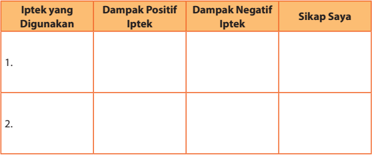

Tabel ini berisi informasi tentang dampak positif dan negatif dari penggunaan teknologi informasi dan komunikasi (Iptek) serta sikap saya terhadap hal tersebut. Topik utamanya adalah penggunaan iptek dan dampaknya. Kolom-kolom yang ada adalah: 1. Iptek yang Digunakan, 2. Dampak Positif Iptek, 3. Dampak Negatif Iptek, dan 4. Sikap Saya. Data atau pola penting yang terlihat adalah bahwa penggunaan iptek memiliki dampak positif dan negatif yang berbeda-beda, dan sikap saya terhadap iptek juga berbeda-beda tergantung pada jenis iptek yang digunakan.

 

---
## 📄 Halaman 134

---
**📊 Tabel**

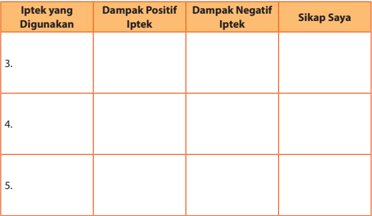

Tabel ini berisi informasi tentang dampak positif dan negatif dari penggunaan teknologi informasi dan komunikasi (Iptek) serta sikap saya terhadap hal tersebut. Topik utamanya adalah penggunaan iptek dan dampaknya. Kolom-kolom yang ada adalah "Iptek yang Digunakan", "Dampak Positif Iptek", "Dampak Negatif Iptek", dan "Sikap Saya". Data atau pola penting yang terlihat adalah bahwa penggunaan iptek memiliki dampak positif dan negatif yang berbeda-beda, dan sikap saya terhadap iptek juga berbeda-beda tergantung pada jenis iptek yang digunakan.

Di era globalisasi ini, Iptek menjadi faktor yang sangat memengaruhi kehidupan. Iptek menjadi faktor penentu keberadaan dan kemajuan masyarakat. Saat ini Iptek terus dikembangkan sesuai dengan kebutuhan dan semakin terasa dampaknya bagi kehidupan kita. Hampir seluruh aspek kehidupan kita berkaitan erat dengan teknologi,  kita  jadi  semakin  dipermudah  dan  lebih  menghemat  waktu  dalam segala hal.

Dalam bidang ekonomi misalnya, dahulu untuk menjual barang atau jasa kita harus  mencari  tempat  untuk  berjualan,  harus  mengeluarkan  uang  yang  lebih banyak, dan belum bisa menjangkau orang di bagian tempat lainnya yang jauh, tetapi sekarang barang atau jasa itu bisa kita jual melalui internet. Melalui internet tidak  butuh  tempat  yang  luas,  lebih  mudah  dalam  memasarkannya,  lebih  bisa menjangkau orang banyak dan lebih hemat waktu, konsumen pun tidak perlu berdesak-desakkan di pasar atau berjalan keliling mall . Hanya dengan mentransfer sejumlah uang, barang yang kita inginkan sudah bisa kita miliki. Tetapi kita harus hati-hati dalam membeli barang melalui internet, karena tidak sedikit orang yang tertipu.  Kadang  barang  tidak  sesuai  dengan  gambar  yang  dipromosikan,  atau bahkan ketika kita sudah mentransfer uang barang tidak sampai kepada kita. Jadi ada hal positif dan negatifnya dalam kemajuan teknologi ini.

Dalam aspek sosial budaya dan kehidupan sehari-hari teknologi juga memberikan dampak positif yang tidak sedikit.

- Informasi  yang  diperoleh  dapat  langsung  dipublikasikan  dan  diterima  oleh banyak orang dengan cepat melalui media-media yang ada, setiap orang jadi dapat saling bertukar informasi.

 

---
## 📄 Halaman 135

- Memudahkan  kita  dalam  belajar  karena  sudah  banyak  teknologi  yang mendukung, misalnya dengan adanya proyektor, LCD, mikroskop, dan lain-lain.
- Sosialisasi  kebijakan  pemerintah  dapat  lebih  cepat  sampai  ke  masyarakat, dengan adanya pemberitaan di radio, televisi, dan internet, sehingga masyarakat dengan mudah dan cepat mengetahui peraturan dan kebijakan pemerintah yang sudah atau baru dikeluarkan.
- Hubungan sosial antarmasyarakat bisa berlangsung di mana saja dan kapan saja walaupun berjauhan dan berada dalam zona waktu yang berbeda, tetapi dapat berinteraksi.
- Masyarakat dapat mempublikasikan kebudayaan yang dimiliki ke masyarakat luas untuk dipelajari dan dilestarikan, tidak hanya dalam satu negara, tetapi dapat juga antarnegara.
Selain  dampak  positif  di  atas,  teknologi  juga  memiliki  dampak  negatif  bagi manusia.

- Banyak  perilaku  menyimpang  yang  terjadi,  khususnya  pada  remaja  karena tidak bisa memilih mana yang harus diterima dan mana yang harus ditolak.
- Muncul kejahatan baru seperti penipuan, penculikan, pencurian nomor kartu kredit,  pornografi,  pengiriman  virus  dan  spam,  penyadapan  saluran  telepon dan masih banyak kejahatan yang dilakukan dengan menggunakan fasilitas teknologi.
- Tingkat kepercayaan kepada lingkungan sekitar menurun, karena lebih percaya dengan  internet  untuk  mencari  informasi  dibandingkan  bertanya  langsung kepada orang yang mengetahuinya. Ketergantungan  kepada internet semakin meningkat.
- Budaya asli yang terkikis karena masuknya budaya asing. Masyarakat jauh lebih mengerti dan mempelajari tentang budaya luar dibandingkan dengan budaya asli yang kita miliki.
- Privasi bukan lagi menjadi sesuatu yang mahal, dengan adanya situs jejaring sosial memberikan penggunanya kebebasan untuk membuka diri dan melihat info serta privasi orang lain. Contohnya: facebook , twiter , dan lain-lain.
- Terkadang membuat kita menjadi malas dan tidak kreatif. Karena kecanggihan teknologi,  seseorang bisa dengan mudah menggandakan tugas teman atau mengunduhnya di internet.
- Meningkatnya  angka  pengangguran  karena  teknologi  dapat  menggantikan manusia dalam segala bidang.
Iptek diibaratkan seperti pisau, jika digunakan oleh cheff (pemasak profesional) pisau itu akan sangat bermanfaat, tetapi jika digunakan oleh pembunuh, maka pisau  itu  akan  merugikan  banyak  orang.  Artinya  Iptek  bisa  membantu  serta memudahkan  kita  dalam  segala  aktivitas,  tetapi  juga  bisa  menjadi  bumerang

 

---
## 📄 Halaman 136

untuk kita jika kita tidak mampu memilih mana yang harus diterima, mana yang harus ditolak, mana yang benar, dan yang salah. Kita harus bisa menanggulangi dan mencegah dampak negatif tersebut agar tidak terjadi.

### 3. Sikap dalam Menghadapi Perkembangan Iptek

Bagaimana seharusnya orang Kristen menyikapi perkembangan Iptek? Apakah orang  Kristen  harus  menerima  Iptek  dengan  tangan  terbuka?  Ataukah  harus menolak  Iptek  demi  pemeliharaan  iman  kepada Yesus  Kristus?  Menerima  atau menolak? Amsal 1:5 menjelaskan: 'Baiklah orang bijak mendengar dan menambah ilmu dan baiklah orang yang berpengertian memperoleh bahan pertimbangan.'

Dari  ayat  di  atas,  jelas  bahwa  Tuhan  memerintahkan  bagi  manusia  untuk senantiasa  mengembangkan  ilmu  pengetahuan  yang  ada  dalam  dirinya  dan terus  mencari  suatu  bahan  pertimbangan,  agar  manusia  menjadi  bijak  dan berpengertian.  Ilmu  dan  pengertian  yang  kita  dapat  haruslah  dimanfaatkan sebagai  sarana  bagi  kemuliaan  nama  Tuhan  dan  bagi  kesejahteraan  sesama umat manusia, sebagai wujud ucap syukur atas karunia Tuhan berupa akal budi, kepandaian, kecerdasan, dan talenta yang dianugerahkan-Nya bagi kita. Artinya, Allah  tidak  pernah  melarang  penggunaan  Iptek,  dan  menolak  Iptek  berarti melanggar firman Tuhan. Tetapi yang terpenting dalam hal ini ialah bagaimana kita memanfaatkan Iptek itu dalam terang firman Tuhan.

Dalam  Kejadian  1:27-28,  Allah  memberikan  manusia  suatu  amanat  Illahi (Mandat Budaya) yaitu untuk menaklukkan alam semesta. Untuk dapat menaklukkan  alam  semesta,  manusia  membutuhkan  pengetahuan.  Manusia harus mampu untuk memeriksa alam serta mengambil suatu tindakan yang tepat bagi  kesejahteraan  alam  semesta.  Untuk  itu,  manusia  perlu  ilmu  pengetahuan. Jadi ilmu pengetahuan, bukanlah musuh bagi orang Kristen, melainkan sebagai jalan untuk lebih mengenal dan mendekatkan diri kepada Tuhan, apabila manusia dapat memanfaatkan ilmu pengetahuan sebagai saluran beribadah untuk memuji dan memuliakan nama Tuhan.

### Kegiatan 3 Wawancara

Lakukan wawancara kepada orang Kristen yang kamu jumpai! Tanyakan pendapat mereka mengenai bagaimana seharusnya orang Kristen menyikapi perkembangan Iptek.  Hasil  wawancara  tersebut  dibuat  dalam  tulisan  dan  dikumpulkan  pada pertemuan berikutnya!

 

---
## 📄 Halaman 137

---
**🖼️ Gambar/Diagram**

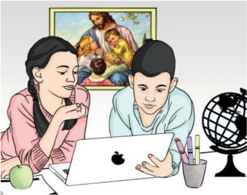

> **Deskripsi Visual:** Gambar ini adalah ilustrasi yang menunjukkan dua orang siswa sedang belajar di depan laptop. Di sebelah kiri, seorang siswi dengan rambut panjang memegang tangan di depan wajahnya, sementara di sebelah kanan, seorang siswa pria sedang mengetik pada laptop. Di atas mereka, terdapat lukisan yang menampilkan keluarga yang sedang bersama-sama. Di sebelah kanan, terdapat sebuah bola dunia yang menunjukkan hubungan internasional atau globalisasi. 

Elemen-elemen utama dalam gambar ini adalah dua siswa, laptop, lukisan keluarga, dan bola dunia. Siswa-siswa tersebut tampak aktif dalam proses belajar, menunjukkan interaksi antara individu dan teknologi. Lukisan keluarga menunjukkan hubungan sosial dan emosional, sementara bola dunia menekankan aspek globalisasi atau interaksi internasional.

Teks, angka, atau label penting tidak terlihat dalam gambar ini. Namun, informasi kunci yang dapat diambil pembaca adalah bahwa gambar ini mungkin menggambarkan konsep belajar online atau interaksi antar budaya melalui teknologi.

Sumber : Dokumen Kemdikbud

Gambar 13.1 Baik remaja di kota, di desa, dan di pedalaman dia harus banyak belajar dan menguasai teknologi. Iptek adalah berkat yang harus dikembangkan.

### Kegiatan 4 Penugasan

Menurut kamu, apakah di Alkitab banyak menyinggung tentang Iptek?

Ya / Tidak :

...........................................................................................................................................................

...........................................................................................................................................................

...........................................................................................................................................................

...........................................................................................................................................................

Jika ada, berikan contohnya!

...........................................................................................................................................................

...........................................................................................................................................................

...........................................................................................................................................................

...........................................................................................................................................................

 

---
## 📄 Halaman 138

### C. Penutup

### Rangkuman

Kemajuan  ilmu  pengetahuan  dan  teknologi  adalah  sesuatu  yang  tidak  bisa kita hindari dalam kehidupan ini karena kemajuan teknologi akan berjalan sesuai dengan  kemajuan  ilmu  pengetahuan.  Ini  semua  merupakan  karunia  Tuhan. Perkembangan teknologi memang sangat diperlukan. Setiap inovasi diciptakan untuk  memberikan  manfaat  positif  bagi  kehidupan  manusia.  Memberikan banyak kemudahan, serta sebagai cara baru dalam melakukan aktivitas manusia. Semuanya harus kita syukuri.

Sebagai seorang remaja Kristen hendaknya menyikapi Iptek tersebut dengan baik, termasuk dalam menggunakannya, mengembangkannya dan lain sebagainya. Karena ilmu pengetahuan merupakan anugerah pemberian Tuhan.

Kita  hendaknya  mengembangkan  ilmu  pengetahuan  dan  teknologi  itu berdasarkan sikap yang 'Takut akan Tuhan' yang berdasarkan Alkitab. Iptek yang kita  dapat  haruslah  dimanfaatkan  sebagai  sarana  bagi  kemuliaan  nama Tuhan dan bagi kesejahteraan sesama umat manusia, sebagai wujud ucap syukur atas karunia  Tuhan  berupa  akal  budi,  kepandaian,  kecerdasan,  dan  talenta  yang dianugerahkan-Nya bagi kita.

### Ayat Emas

I Tawarikh 16:34

- '__________  kepada  Tuhan,  sebab  Ia  __________!  Bahwasanya  untuk  selama- lamanya __________ setia-Nya.'
- Lengkapilah ayat di atas!
- Hafalkanlah secara bergantian dengan teman sebangkumu.

### Bernyanyi

Pilihlah lagu bersama teman-temanmu yang sesuai dengan tema pelajaran hari ini, dan nyanyikanlah bersama-sama.'

### Berdoa

Terima kasih Tuhan atas pengetahuan yang berikan kepada kami.

Biarlah  pengetahuan  yang  kami  miliki  dapat  kami  kembangkan  terus  untuk kemuliaan nama-Mu.

Amin.

 

---
## 📄 Halaman 139

### Remaja dan Cita-Citanya

Bahan Alkitab: Mazmur 1:1-3; Amsal 23:18; Amsal 19:21; Yakobus 4:13-17; Yeremia 29;11

Sumber: Dokumen Kemdikbud

Gambar 14.1

Going to change

### A. Pengantar

###  Menyanyi

PKJ 241 - Tak 'Ku Tahu; Kan Hari Esok (ayat 1) Tak 'ku tahu 'kan hari esok, namun langkahku tegap Bukan surya kuharapkan, kar'na surya 'kan lenyap. O tiada 'ku gelisah, akan masa menjelang; 'ku berjalan serta Yesus. Maka hatiku tenang.

 

---
## 📄 Halaman 140

R eff: Banyak hal tak kupahami dalam masa menjelang. Tapi t'rang bagiku ini:

Tangan Tuhan yang pegang.

###  Berdoa

Pilihlah salah seorang untuk memimpin doa

Setiap orang menginginkan masa depan yang lebih baik, kesuksesan dalam dunia  pendidikan  dan  pekerjaan,  mendapatkan  apa  yang  diinginkan,  tetapi seringkali kita terbentur oleh berbagai kendala. Kendala terbesar justru ada pada diri kita sendiri. Sulit untuk mencapai sesuatu yang kita inginkan ketika kita mau berusaha tetapi tidak ada semangat dalam diri, seperti halnya kita menginginkan sesuatu tanpa ada usaha akan mustahil untuk mendapatkannya. Bagaimana kita mengatasinya? Dan bagaimana kita mewujudkan impian atau cita-cita tertentu?

Sebagai remaja, kamu berupaya meraih cita-cita dan harapan. Di mana kamu bisa  memperoleh  bantuan  dan  anjuran  untuk  melakukannya?  Masih  ingatkah kamu sewaktu  guru,  orang  tua,  kakak,  dan  teman  bertanya  tentang  apa  yang menjadi cita-cita dan harapan atau impian kamu? Mungkin sebagian kalian ada yang  sudah  lupa,  tetapi  sebagian  lagi  masih  ingat  dan  bahkan  hingga  sampai sekarang masih terus diperjuangkan dengan harapan dapat terwujud.

### B. Uraian Materi

### 1. Arti Sebuah Cita-Cita

---
**🖼️ Gambar/Diagram**

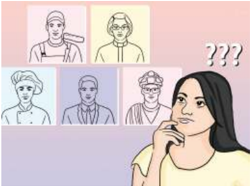

> **Deskripsi Visual:** Gambar ini adalah ilustrasi yang menunjukkan berbagai jenis orang dengan wajah yang berbeda-beda. Gambar tersebut terdiri dari lima orang yang diperlihatkan secara berurutan dari kiri ke kanan atas ke bawah. Setiap orang memiliki penampilan yang unik, mulai dari rambut pendek hingga panjang, pakaian formal hingga casual, dan posisi tubuh yang berbeda. Di atas mereka, terdapat tiga orang yang tampak seperti orang tua, masing-masing dengan penampilan yang berbeda. Di sebelah kanan, terdapat seorang wanita dengan rambut panjang yang sedang berpikir, tampak seperti sedang mempertimbangkan sesuatu. Teks "???" di atas mereka menunjukkan kebingungan atau pertanyaan. Ini mungkin digunakan untuk menggambarkan variasi dalam penampilan dan perilaku manusia.

 

---
## 📄 Halaman 141

Yeremia  29:11  : Sebab  Aku  ini  mengetahui  rancangan-ranc angan  apa  yang  ada pada-Ku  mengenai  kamu,  demikianlah  firman  TUHAN,  yaitu  rancangan  damai sejahtera  dan  bukan  rancangan  kecelakaan,  untuk  memberikan  kepadamu  hari depan yang penuh harapan.

### Kegiatan 1 Sharing

Tuliskan cita-cita dan harapan kamu sejak kecil! Apakah sudah berubah atau masih terus diperjuangkan hingga kini? Siapa saja yang berperan kuat (dominan) dalam mencapai cita-citamu? Ceritakanlah kepada teman sebangkumu!

...........................................................................................................................................................

...........................................................................................................................................................

...........................................................................................................................................................

...........................................................................................................................................................

Masih ingatkah kamu dengan salah satu kalimat dari syair lagu Ria Enes yang dinyanyikan bersama Susan yang berkata:  'Cita-citaku ingin jadi profesor, citacitaku ingin jadi presiden….'

Cita-cita  adalah  suatu  impian  dan  harapan  seseorang  akan  masa  depannya, bagi sebagian orang cita-cita itu adalah tujuan hidup dan bagi sebagian yang lain cita-cita  itu  hanyalah  mimpi  belaka.  Bagi  orang  yang  menganggapnya  sebagai tujuan  hidupnya  maka  cita-cita  adalah  sebuah  impian  yang  dapat  membakar semangat  untuk  terus  melangkah  maju  dengan  langkah  yang  jelas  dan  pasti dalam kehidupannya. Bagi yang menganggap cita-cita sebagai mimpi maka ia adalah sebuah impian belaka tanpa api yang dapat membakar motivasi untuk melangkah maju. Manusia tanpa cita-cita dan harapan ibarat air yang mengalir dari  pegunungan  menuju  dataran  rendah,  mengikuti  kemana  saja  alur  sungai membawanya.  Manusia  tanpa  cita-cita  dan  harapan  bagaikan  seseorang  yang sedang tersesat yang berjalan tanpa tujuan yang jelas sehingga ia bahkan dapat lebih  jauh  tersesat.  Ya,  cita-cita  adalah  sebuah  rancang  bangun  kehidupan seseorang.

Fenomena seseorang tanpa cita-cita bisa dengan mudah kita temui. Cobalah tanyakan kepada beberapa orang siswa SMA/SMK yang baru lulus. Di manakah mereka  akan  melanjutkan  studi  mereka?  Atau  apa  yang  akan  mereka  lakukan setelah mereka lulus? Mungkin sebagian dari mereka akan menjawab tidak tahu, menjawab dengan rasa ragu, atau menjawab mereka akan memilih suatu jurusan favorit  di  Perguruan Tinggi  Negeri  (PTN)  atau  Swasta  tertentu.  Apakah  jurusan favorit tersebut mereka pilih karena memang sesuai dengan potensi dan minat mereka? Apakah mereka mengetahui gambaran umum perkuliahan di jurusan tersebut?  Apakah  peluang-peluang  yang  dapat  mereka  raih  karena  berkuliah

 

---
## 📄 Halaman 142

di  jurusan  tersebut?  Ataukah  hanya  sekadar  ikut-ikutan  teman,  gengsi  belaka, trend , karena mengikuti 'anjuran' orang tua, atau bahkan asal pilih? Jika demikian, maka  yang  terjadi  selanjutnya  adalah  di  saat  perkuliahan  sudah  berlangsung, beberapa dari mereka merasa jurusan yang dipilihnya tidak sesuai dengan apa yang dibayangkan atau tidak sesuai dengan kemampuannya. Boleh jadi setelah itu ia akan mengikuti ujian lagi di tahun depan atau malas-malasan kuliah. Hal ini sungguh suatu pemborosan terhadap waktu, biaya dan tenaga.

---
**🖼️ Gambar/Diagram**

> **Deskripsi Visual:** Gambar ini adalah sebuah kata-kata berbentuk huruf besar yang membentuk kata "Motivation". Kata-kata tersebut terdiri dari berbagai kata yang berkaitan dengan motivasi, seperti "really", "things", "work", "know", "develop", "psychology", "goals", "dreams", "goals", "goals", "goals", "goals", "goals", "goals", "goals", "goals", "goals", "goals", "goals", "goals", "goals", "goals", "goals", "goals", "goals", "goals", "goals", "goals", "goals", "goals", "goals", "goals", "goals", "goals", "goals", "goals", "goals", "goals", "goals", "goals", "goals", "goals", "goals", "goals", "goals", "goals", "goals", "goals", "goals", "goals", "goals", "goals", "goals", "goals", "goals", "goals", "goals", "goals", "goals", "goals", "goals", "goals", "goals", "goals", "goals", "goals", "goals", "goals", "goals", "goals", "goals", "goals", "goals", "goals", "goals", "goals", "goals", "goals", "goals", "goals", "goals", "goals", "goals", "goals", "goals", "goals", "goals", "goals", "goals", "goals", "goals", "goals", "goals", "goals", "goals", "goals", "goals", "goals", "goals", "goals", "goals", "goals", "goals", "goals", "goals", "goals", "goals", "goals", "goals", "goals", "goals", "goals", "goals", "goals", "goals", "goals", "goals", "goals", "goals", "goals", "goals", "goals", "goals", "goals", "goals", "goals", "goals", "goals", "goals", "goals", "goals", "goals", "goals", "goals", "goals", "goals", "goals", "goals", "goals", "goals", "goals", "goals", "goals", "goals", "goals", "goals", "goals", "goals", "goals", "goals", "goals", "goals", "goals", "goals", "goals", "

### 2. Motivasi Sebagai Faktor Meraih Masa Depan

### Kegiatan 2

Menjawab Pertanyaan Tentang Motivasi

- Tuliskan pendapat Kamu tentang arti motivasi!
...........................................................................................................................................................

...........................................................................................................................................................

...........................................................................................................................................................

...........................................................................................................................................................

- Faktor-faktor  apa  saja  yang  dapat  memengaruhi  motivasi  seseorang  dalam meraih masa depan?
...........................................................................................................................................................

...........................................................................................................................................................

...........................................................................................................................................................

...........................................................................................................................................................

- Ceritakan hasil pemikiranmu kepada teman-teman kamu!
...........................................................................................................................................................

...........................................................................................................................................................

...........................................................................................................................................................

...........................................................................................................................................................

 

---
## 📄 Halaman 143

Seringkali seseorang menghadapi berbagai kendala dalam menjalani perjuangannya  untuk  meraih  masa  depan  yang  lebih  baik.  Untuk  mengatasi kendala  dalam  diri  kita  dan  dapat  mudah  mencapai  sesuatu  yang  diinginkan caranya kita  harus  memiliki  motivasi.  Seseorang  yang  mau  bertindak  dan  mau berusaha  untuk  mencapai  yang  ia  inginkan  atau  ia  cita-citakan  adalah  orang memiliki  motivasi  dan  begitu  sebaliknya  orang  yang  tidak  mau  berusaha  dan bertindak berarti orang tersebut tidak memiliki motivasi dalam hidupnya.

Sebuah cita-cita atau masa depan yang cerah hanya bisa diraih jika kita memiliki motivasi  yang  kuat  dalam  diri.  Tanpa  adanya  motivasi,  kita  akan  mengalami kesulitan  dalam  menggapai  apa  yang  kita  cita-citakan.  Dalam  kehidupan  ini, motivasi memiliki peran yang sangat penting. Karena, motivasi adalah hal yang membuat, menyalurkan, mendorong, dan mendukung perilaku manusia, sehingga mau belajar, giat bekerja, dan antusias mencapai hasil yang sesuai dengan yang kita inginkan. Dengan motivasi, orang bisa gemilang dan berhasil dalam menjalani hidup dan kehidupannya. Akan tetapi tak dapat dipungkiri, memang cukup sulit membangun motivasi di dalam diri sendiri. Bahkan mungkin kita tidak tahu pasti bagaimana cara membangun motivasi di dalam diri sendiri. Namun, kita tak boleh merasa tidak  berdaya,  hilangnya  harapan,  selalu  mengeluh  saja  tanpa  berbuat apa-apa.

### 3. Dasar Cita-Cita Remaja Kristen

---
**🖼️ Gambar/Diagram**

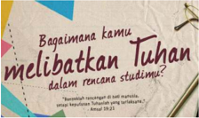

> **Deskripsi Visual:** Gambar ini adalah ilustrasi yang menampilkan sebuah tulisan dalam bahasa Indonesia. Gambar tersebut menggambarkan dua orang yang sedang berbicara di depan sebuah papan tulis. Papan tulis tersebut memiliki beberapa teks yang ditulis pada bagian atasnya. Di sebelah kiri, ada seorang pria dengan rambut pendek dan seragam sekolah, sedangkan di sebelah kanan ada seorang wanita dengan rambut panjang dan seragam sekolah. Kedua orang tersebut tampaknya sedang berbicara tentang sesuatu yang tertulis di papan tulis tersebut.

Sumber: goo.gl/Miix4X

Gambar 14.4 Bagaimana kamu melibatkan Tuhan

### Kegiatan 3 Penugasan

Menurut  kamu,  apa  yang  seharusnya  menjadi  dasar  dari  remaja  Kristen  untuk meraih impian dan harapan?

...........................................................................................................................................................

...........................................................................................................................................................

...........................................................................................................................................................

...........................................................................................................................................................

 

---
## 📄 Halaman 144

Setiap  remaja  pasti  punya  cita-cita,  bukan?  Mereka  mau  cita-citanya  kelak akan  menjadi  kenyataan.  Apakah  rahasia  sederhananya  agar  cita-cita  kita menjadi kenyataan?  Apakah itu usaha? Apakah itu belajar? Ya, semua jawaban itu  benar.  Nah,  sebagai  remaja  Kristen,  kamu  perlu  melandaskan  cita-cita  dan harapan pada kebenaran firman Tuhan.

Sebagai remaja Kristen, Tuhan adalah landasan iman percayanya. Selanjutnya, ada  satu  syarat  agar  semua  cita-cita  remaja  Kristen  dapat  berhasil  kelak  10 atau 20 tahun yang akan datang. Syarat itu tertulis dalam Mazmur 1:2a '…yang kesukaannya  adalah  Taurat  Tuhan  dan  merenungkannya  siang  dan  malam' . Ayat  ini  mengajarkan  bahwa  agar  cita-cita  remaja  tercapai  pada  suatu  hari nanti, maka remaja perlu mencintai firman Tuhan. Remaja Kristen harus dibekali dengan mutiara-mutiara kehidupan sebagai landasan utama dalam mengambil keputusan.  Cintailah  firman  Tuhan  maka  kamu  akan  mencapai  cita-cita  dan harapan, tentunya cita-cita dan harapan yang berkenan bagi Tuhan.

Firman  Tuhan  yang  melandasi  semua  cita-cita  anak  remaja  Kristen  diambil dari Mazmur 1:1-3. Dalam kitab Mazmur 1:3b dikatakan bahwa '…apa saja yang diperbuatnya berhasil' .  Artinya, cita-cita kita sebagai remaja Kristen akan berhasil jika  berdasarkan  firman  Tuhan  atau  bersumber  dari  Tuhan  sendiri.  Yang  harus dilakukan remaja sekarang untuk menggapai masa depan yang lebih baik adalah dengan  menentukan  cita-citanya  yang  sesuai  dengan  firman  dan  kehendak Tuhan. Kemudian, imani dan yakini berlandaskan firman Tuhan tersebut bahwa cita-cita dan harapannya akan berhasil sesuai dengan janji Tuhan.

Tuhan  memberikan  manusia  akal  dan  pikiran  yang  dipergunakan  untuk memecahkan  masalah  dan  mengantisipasi  segala  masalah  yang  akan  timbul. Manusia dapat merencanakan segala hal yang akan dijalani ke depan. Rencana tersebut seringkali diharapkan bahwa apa yang kita rencanakan dapat berjalan dengan sempurna.

Sebagai  remaja  Kristen,  kamu  harus  sadari  juga  bahwa Tuhan  turut  bekerja dalam segala sesuatu untuk mendatangkan kebaikan (Rm. 8:28). Oleh karena itu apapun yang terjadi setelah kita merencanakan segala sesuatu, patut kita syukuri. Tidak  jarang  juga  apa  yang  kita  rencanakan  tidak  berjalan  seperti  yang  kita kehendaki. Bahkan bisa juga semuanya berubah menjadi kebalikannya. Hal-hal yang tidak kita inginkan bisa terjadi. Dan tentunya hal ini sangat mengecewakan bagi kita. Intinya adalah manusia boleh berusaha, namun Tuhan yang memberi hasil.

Demikan juga dalam Surat Yakobus 4:13-17. Di bagian ini menjelaskan tentang 'Jangan melupakan Tuhan dalam perencanaan'; rupanya manusia bisa membuat program/rancangan tanpa melibatkan Tuhan, tetapi  sebagai  orang  Kristen  kita diberi nasihat jangan melupakan Tuhan saat kita merancangkan segala sesuatu. Ketika  kita  melibatkan  Tuhan  dalam  perencanaan  masa  depan, Tuhan  mampu mempromosikan  kita,  masa  depan  kita  sudah  dikemas  oleh  Tuhan.  Ketika kita  menghormati  Dia  sebagai  pembuat  peraturan/hukum  dan  mau  menaati peraturan-Nya, apa yang belum pernah kita pikirkan, Tuhan sudah sediakan.

 

---
## 📄 Halaman 145

### Kegiatan 4 Diskusi Kelompok

Secara berpasangan, diskusikanlah dan buatlah laporan tentang:

- Apa  yang  harus  kamu  persiapkan  untuk  menghadapi  studi  lanjut  atau memasuki dunia kerja, sesuai dengan talenta yang kamu miliki?
- Apa yang menjadi motivasimu dalam usaha meneruskan studi atau memasuki dunia kerja?
- Bagaimana peran Tuhan dalam menggapai cita-cita dan harapan bagi masa depan kamu?

### C. Penutup

### Rangkuman

Cita-cita  adalah  suatu  impian  dan  harapan  seseorang  akan  masa  depannya. Manusia tanpa cita-cita dan harapan bagaikan seseorang yang sedang tersesat yang berjalan tanpa tujuan yang jelas sehingga ia bahkan dapat lebih jauh tersesat.

Seringkali seseorang menghadapi berbagai kendala dalam menjalani perjuangannya  untuk  meraih  masa  depan  yang  lebih  baik.  Untuk  mengatasi kendala dalam diri kita dan mudah mencapai sesuatu yang kita inginkan caranya kita harus memiliki motivasi.

Sebagai remaja Kristen, Alkitab adalah landasan iman percayanya. Melibatkan dan mengandalkan Tuhan Yesus dalam setiap cita-cita dan harapan remaja Kristen adalah suatu keharusan jika ingin cita-cita harapannya terwujud.

### Ayat Emas

### Amsal 23:18

'Karena masa depan sungguh ada, dan harapanmu tidak akan hilang.'

- Hafalkanlah secara bergantian dengan teman sebangkumu.
- Berikan komentar kamu tentang ayat tersebut dalam kelas! Pembahasan ini merupakan rangkuman dari seluruh pelajaran Pendidikan Agama Kristen dan Budi Pekerti semester 2.

### Bernyanyi

### S'mua Baik

Dari semula t'lah Kau tetapkan Hidupku dalam tangan-Mu Dalam rencana-Mu Tuhan

 

---
## 📄 Halaman 146

Rencana indah t'lah Kau siapkan Bagi masa depanku Yang penuh harapan

R eff :

S'mua baik, s'mua baik

Apa yang t'lah Kau perbuat di dalam hidupku

S'mua baik, sungguh teramat baik

Kau jadikan hidupku berarti

### Berdoa

Allah Bapa yang penuh kasih, kami mengucap terima kasih atas rencana-Mu yang indah untuk kami. Segala yang baik telah Engkau tetapkan bagi kami dan rencana indah Kau pun siapkan bagi kami. Kami mengakui bahwa hanya di dalam dan bersama-Mulah kami bisa meraih masa depan yang cemerlang. Amin

---
**🖼️ Gambar/Diagram**

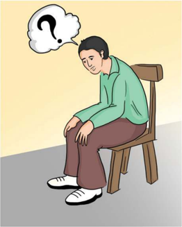

> **Deskripsi Visual:** Gambar ini adalah ilustrasi yang menunjukkan seorang pria sedang duduk di kursi. Pria tersebut sedang berpikir dengan tanda bertanya (? ) di atas kepala. Kursi yang digunakan oleh pria tersebut memiliki bantalan yang lembut dan dudukan yang nyaman. Latar belakang gambar adalah warna kuning yang cerah, yang memberikan kesan tenang dan tenang. Gambar ini mungkin digunakan untuk menggambarkan situasi di mana seseorang sedang merenung atau mempertimbangkan sesuatu.

Elemen utama dalam gambar ini adalah pria yang sedang duduk dan berpikir. Relasi antara elemen-elemen ini adalah bahwa pria tersebut adalah subjek utama dari gambar ini, sedangkan kursi dan latar belakang hanya membantu menambah konteks dan suasana.

Teks, angka, atau label penting yang terlihat dalam gambar ini adalah tanda bertanya (? ) di atas kepala pria. Informasi kunci yang dapat diambil pembaca dari gambar ini adalah bahwa pria tersebut sedang merenung atau mempertimbangkan sesuatu, yang dapat menjadi tema pembicaraan atau konsep yang ingin disampaikan dalam buku pelajaran ini.

Gambar 14.5 Di tengah keadaan yang tidak menentu, masa depan yang tak pernah ku tahu, tapi ku yakin Allahku berjalan kedepan bersamaku

 

---
## 📄 Halaman 147

### Daftar Pustaka

- Barr, James. 1979. Alkitab di Dunia Modern . Jakarta: BPK Gunung Mulia.
- Christenson, Larry. 1994. Keluarga Kristen . Semarang: Yayasan Persekutuan Betania.
- Departemen Pendidikan dan Kebudayaan. 1994. Kamus Besar Bahasa Indonesia . Jakarta: Balai Pustaka.
- Duan,  Yeremias  Bala  Pito.  2007. Keluarga  Kristen:  Kabar  Gembira  bagi  Milenium Ketiga. Yogyakarta: Kanisius
- Eminyan, Maurice. 2008. Teologi Keluarga. Yogyakarta: Penerbit Kanisius.
- GFresh edisi Mei 2003 No. 36, Temuan Ilmiah di Alkitab .
- Goode, William J. 1983. Sosiologi Keluarga . Jakarta: Bina Aksara.
- Hadinoto,  Atmaja.  1993. Dialog dan Edukasi: Keluarga Kristen dalam Masyarakat Indonesia. Jakarta: BPK Gunung Mulia.
- Hadiwijono, Harun. 1991. Iman Kristen . Jakarta: BPK Gunung Mulia.
- Hardana, Timottius  I  Ketut  Adi.  2013. 12  Tema Misa: Rekoleksi Keluarga. Jakarta: Obor.
- Hasudungan. 2011. Takut Akan T uhan Pendidikan Agama Kristen Untuk SMA Kelas XI . Medan: Mitra.
- Ihromi, T.O.  (ed.).  1999. Bunga Rampai Sosiologi Keluarga .  Jakarta: Yayasan  Obor Indonesia.
- Indra, Ichwe G. Ilmu Pengetahuan dan Teknologi dan Iman Kristen .
- Ismail, Andar. 2012. Selamat Ribut Rukun: 33 Renungan tentang keluarga .  Jakarta: BPK Gunung Mulia.
- Kristo  M.  Thomas.  2010. Andalah  Para  Orang  Tua  Terbaik  bagi  Remaja .  Jakarta: Gramedia.
- McIntyre, Jennie. The Structure-Functional Approach to Family Study .
- Nuhamara, Daniel. 2008. PAK (Pendidikan Agama Kristen) Remaja. Bandung: Jurnal Info Media.
- PB.  Horton  dan  LH,  Chester.  1993. Sosiologi,  Jilid  1  Edisi  Keenam ,  (Alih  Bahasa: Aminuddin Ram, Tita Sobari). Jakarta: Erlangga.

 

---
## 📄 Halaman 148

- Roucek,  Joseph  S.  &  Roland  L.  Warren.  1984. Pengantar  Sosiologi .  Jakarta:  Bina Aksara.
- Sajogyo, Pudjiwati. 1985. Sosiologi Pembangunan . Jakarta: Fakultas Pasca Sarjana.
- Sandy, Halim. 2004. Iman Kristen dan Ilmu Pengetahuan, Teknologi, Seni .  Jakarta: Universitas Tarumanegara.
- Schoorl, J.W. 1980. Modernisasi Pengantar Sosiologi Pembangunan Negara-negara Sedang Berkembang . Jakarta: Gramedia.
- Sidjabat,  B.  Samuel.  1999. Strategi  Pendidikan  Kristen:  Suatu  Tinjauan  TeologisFilosofis . Yogyakarta: Andi O ffset.
- Sosipater,  Karel.  2010. Etika  Perjanjian  Lama:  Law  &  Obedience .  Jakarta:  Suara Harapan Bangsa.
- Suhendi, hendi, dkk. 2001. Pengantar Studi Sosiologi Keluarga. Bandung: Pustaka Setia.
- Sumiyatiningsih, Dien. 2012. Mengajar dengan Kreatif & Menarik. Yogyakarta: Andi.
- Thompson,  Marjorie  J.  2001. Keluarga  sebagai  Pusat  Pembentukan:  Sebuah  Visi tentang  Peranan  Keluarga  dalam  Pembentukan  Rohani . Jakarta: BPK Gunung Mulia.
- Tim Penulis. 2008. Tafsiran Alkitab Masa Kini 3: Matius - Wahyu: Berdasarkan faktafakta Sejarah Ilmiah dan Alkitabiah. Jakarta: Yayasan Komunikasi Bina Kasih.
- Tim  penulis.  2008. Ensiklopedi  Alkitab  Masa  Kini:  Jilid  I  A-L .  Jakarta:  Yayasan Komunikasi Bina Kasih.
- Tim  penulis.  2008. Ensiklopedi  Alkitab  Masa  Kini:  Jilid  II  M-Z .  Jakarta:  Yayasan Komunikasi Bina Kasih.
- Tim Penulis. 2012. Growing Together: Seni Memperkaya & Memperindah Pernikahan. Jakarta: Literatur Perkantas.
- Tjandrarin, Kristiana. 2004. Bimbingan Konseling keluarga (Terapi Keluarga). Salatiga: Tisara Grafika.
- Tomatala, Jacob. 1993. Manusia Ilmu Teknologi: Pergumulan Abadi dalam Perang dan Damai. Yogyakarta: Tiara Wacana.
- Verkuyl, J. 1957. Etika Seksuil . Jakarta: BPK Gunung Mulia.
- Verkuyl, J. 1960. Etika Kristen dan Kebudayaan . Jakarta: BPK Gunung Mulia.
- Widyamartaya,  A.  2011. Keluarga  Kristiani  dalam  Dunia  Modern. Yogyakarta: Kanisius.

 

---
## 📄 Halaman 149

http://alamtekno.blogspot.com/2013/05/pengertian-teknologi. html#ixzz2nQnoVCXz http://gkimciumbuleuit.org

http://nikennababan.blogspot.com/2010/12/perumpamaan-tentang-dua-dasarbangunan.html http://www.yoedha.com/2015/11/pentingnya-menjaga-kesehatan-ibu-dan.html

https://id.pinterest.com/suzibren/parent-engagement-and-involvement-in-schoolclassr/

http://batarakarya.blogspot.co.id/p/lowongan-kerja-di-pt-batara-karya-jaya.html https://id.wikipedia.org/wiki/SMA_Negeri_10_Padang http://www.warungsatekamu.org/2013/05/sharing-bagaimana-kamu-melibatkantuhan-dalam-rencana-studimu/

https://beya.io/2016/03/why-start-a-consulting-business/

 

---
## 📄 Halaman 150

### Profil Penulis

Nama Lengkap  :  Dr. Dien Sumiyatiningsih G. D. Th., M.A.

Telp. Kantor/HP :   (021) 5465-888 / +62 852-0180-2070

E-mail

:   diensum@gmail.com

Akun Facebook :  diensum@gmail.com

Alamat Kantor

:   STT Sangkakala. Jl. Raya Kopeng. KM 7. Salatiga. 50711.

STT Moriah. Jl. Kelapa Puan Raya. Vorones, Blok CA 24. No. 30-41.

Gading Serpong. Tangerang. 15810

Bidang Keahlian:  Pendidikan Warga Gereja (PWG), Pendidikan Agama Kristen (PAK), Teologi Feminis, Studi Jender.

### Riwayat pekerjaan/profesi dalam 10 tahun terakhir:

- Pengajar di Fakultas Teologi dan beberapa fakultas lain. Univ. Kristen Satya Wacana. Salatiga
- Pengajar di STT Sangkakala. Salatiga
- Pengajar di STT Moriah. Gading Serpong, Tangerang.

### Riwayat Pendidikan Tinggi dan Tahun Belajar:

- 1.
S3:   Prodi Manajemen Pendidikan. Univ. Negeri Semarang. 2011

- S1: (1) Ridley Theological College, University of Melbourne. Australia 1983.
- Union Theological Seminary (UTS) & Presbyterian School of Christian Education (PSCE), Richmond Virginia, USA 1998.
- S1: Fakultas Teologi. Univ. Kristen Satya Wacana Salatiga. 1979.

### Judul Buku dan Tahun Terbit (10 Tahun Terakhir):

- Mengajar dengan Kreatif dan Menarik, 2006.
- Teman Sekerja Allah, 2011.
- Tuhan Sahabat Sejati, 2014.
- Pendidikan Agama Kristen dan Budi Pekerti untuk Tunadaksa, 2015.

### Judul Penelitian dan Tahun Terbit (10 Tahun Terakhir):

- Kepemimpin Pendidikan dalam Perspektif Gender (Studi Kasus Tentang Kepemimpinan Pendidikan di Kota Salatiga), 2011.
Menikah dengan Dr. Daniel Nuhamara, M.Th. dikaruniai dua anak, Diane Elizabeth Nuhamara dan Debora Wirasari Nuhamara.

 

---
## 📄 Halaman 151

### Profil Penulis

Nama Lengkap  :  Stepanus, M.Th

Telp. Kantor/HP :   08159910538

E-mail

:   Stepanus_daniel@yahoo.com

Akun Facebook :  stepanusdaniel@gmail.com

Alamat Kantor :   Jl. Mayjen Sutoyo No.2 Cawang Jakarta Timur

Bidang Keahlian:  Pendidikan Agama Kristen

- Riwayat pekerjaan/profesi dalam 10 tahun terakhir:
- 2006 - sekarang: Dosen di Program Studi Pendidikan Agama Kristen (S1) FKIP UKI Jakarta.
- Riwayat Pendidikan Tinggi dan Tahun Belajar:
- S2: Program Studi: Pendidikan Agama Kristen/Universitas Kristen Indonesia / Tahun masuk: 2002 / tahun lulus: 2005.
- S1: Fakultas: Teologi/Institut Theologia dan Keguruan Indonesia (ITKI) Jakarta / Tahun masuk: 1996 / Tahun lulus: 2001.
- Judul Buku dan Tahun Terbit (10 Tahun Terakhir):
- Tidak ada
- Judul Penelitian dan Tahun Terbit (10 Tahun Terakhir):
Tidak ada.

Lahir di Balikpapan, 25 Agustus 1976. Menikah dengan Novie Margaretha dan dikarunia 2 anak. Saat ini aktif sebagai dosen tetap di Program Studi Pendidikan Agama Kristen FKIP UKI Jakarta.

 

---
## 📄 Halaman 152

### Profil Penelaah

Nama Lengkap  :  Pdt. Binsar Jonathan Pakpahan, Ph.D

Telp. Kantor/HP :   081281577079

E-mail

:   b.pakpahan@sttjakarta.ac.id

Akun Facebook :  Binsar Jonathan Pakpahan,

Alamat Kantor

:   STFT Jakarta, Jl. Proklamasi No. 27, Jakarta 10320

Bidang Keahlian:  Teologi Sistematika, Etika, Filsafat, Teologi Sosial

### Riwayat pekerjaan/profesi dalam 10 tahun terakhir:

- 2015 - 2019: Pembantu Ketua (Wakil Ketua) 3 Bidang Kemahasiswaan STFT Jakarta
- 2012 - sekarang: Dosen tetap STFT Jakarta untuk matakuliah Filsafat, Etika Kristen, Teologi Sosial
- 2010 - 2011: Pendeta Jemaat Gereja Kristen Indonesia Nederland (GKIN), untuk kota Tilburg, Arnhem, Nijmegen, Belanda.
- 2007 - 2011: Peneliti PhD, Vrije Universiteit, Amsterdam, Belanda.

### Riwayat Pendidikan Tinggi dan Tahun Belajar:

- S3: Doctor Habilitation (Dr. Habil) - Teologi Sistematika. Faculty of Theology, Münster Universität, Jerman. (2016 - Sekarang)
- S3:   Doctor of Philosophy (Ph.D.) - Teologi Sistematika. Faculty of Theology, Vrije Universiteit, Amsterdam, Belanda. (2007 - 2011)
- S2: Master of Arts in Theology (MA.Th.) - Faculty of Theology, Teologi Sistematika. Vrije Universiteit, Amsterdam, Belanda. (2004 - 2005)
- S1: Sarjana Sains Teologi (S.Si. (Teol)) Sekolah Tinggi Filsafat Teologi Jakarta. (1998 - 2003)

### Judul Buku yang Pernah Ditelaah (10 Tahun Terakhir):

- Buku Pendidikan Agama Kristen Kelas 10 Kurikulum 2013, 2014.
- Buku Pendidikan Agama Kristen Kelas 2 Kurikulum 2013, 2014.

### Judul Penelitian dan Tahun Terbit (10 Tahun Terakhir):

- New Form, New Chance? An Analysis of the Impact of Postmodernism in Indonesian Churches and I ts Effect on the Ecumenical Movement' (submitted to be published in Journal of Ecumenical Studies, 2016)
- 'To Remember Peacefully: A Christian Perspective of Theology of Remembrance as a Basis of Peaceful Remembrance of Negative Memories' (submitted to be published, Journal of Public Theology).
- 'Shameless and Guiltless: The Role of Two Emotions in the Context of the Absence of God in Public Practice in the Indonesian Context' in Journal Exchange 45.1, 2016: pp. 1-20.
- 'The Role of Memory in the Formation of Early Christian Identity' in Simone Sinn (Author, Editor), Michael Reid Trice (Editor), Religious Identity and Renewal in the Twenty-first Century: Jewish, Christian and Muslim Explorations. Geneva & Seattle: The Lutheran World Federation and Seattle University, 2015.
- 'Etika (tidak) Mengingat Bangsa Pelupa' dalam Simposium Internasional Filsafat Indonesia, Jakarta September 2014 (to be published 2016).

 

---
## 📄 Halaman 153

- 'Perintah Mencintai Sesama: Memahami Filosofi Cinta dalam Konteks Keberagaman Dunia Postmodern' dalam Octafred Yosi Roripandei et. al. (eds.) Lihatlah Sekelilingmu! Jakarta: Jusuf Roni Center, 2015. pp: 125-146.
- 'Menuju Model (-model) Ibadah yang Membangun: Sebuah Telaah Relasi Pertumbuhan Spiritualitas dan Ibadah dalam Dunia Postmodern' dalam Robinson Butarbutar, Benny Sinaga, Julius Simaremare (eds.),Spiritualitas Ekologis. Jakarta: Institut Darma Mahardika, 2014. pp: 127-147.
- 'Analisis Kritis Liturgi Perjamuan Kudus HKBP .' Indonesian Journal of Theology, Vol. 2 No. 1, 2014. pp. 42-64.
- 'Kok Semua Benar? Panduan Memilih dalam Dunia Postmodern.' in Binsar J. Pakpahan (ed.) Perjalanan: Semua Mendayung. Jakarta: UPI STT Jakarta, 2014. pp. 340-353.
- 'Teologi Ingatan sebagai Dasar Rekonsiliasi dalam Konflik.' Jurnal Diskursus, Vol. 12 No. 1, Oktober 2013. pp. 253-277.
- 'Ekaristi dan Rekonsiliasi' Jurnal Gema Teologi, Vol. 37 No. 1, April 2013. pp. 47-60.
- God Remembers: Towards a Theology of Remembrance as a Basis of Reconciliation in Communal Conflict.Amsterdam: VU University Press: 2012. ISBN: 978-90-8659-603-4
- Merenungi Cinta: Renungan, Tips dan Taktik tentang Cinta. Jakarta: PT BIS, 2012.
- 'Holiness and Reconciliation' in Hans-Peter Grosshans and Martin L. Sinaga (editors), Live Living Stones: Lutheran Reflections on the One Holy, Catholic and Apostolic Church. Minnesota: Lutheran University Press, 2010. pp. 103-111.
- 'How Remembrance is Used in Communal Atrocities' in Abraham S. Wilar & Alpius Pasulu (editor), Dari Kejadian Hingga Budaya Populer: Pemikiran Kontemporer Teolog Muda Protestan. Yogyakarta: PMU Books, 2009.
- Book Editor. Seberkas Bunga Puspawarna: Book of Friends, 75 tahun Pdt. H.A. van Dop. Jakarta: Yamuger, 2010.
- 'Identity and Remembrance' in Eduardus Van der Borght (ed.), Christian Identity. Leiden: Brill, 2008. pp. 105-118.
- 'Sharing a Common Story for and Indonesian Context' in Journal of Reformed Theology, Volume 2, Number 1, 2008. pp. 63-74.
Binsar Jonathan Pakpahan (1980) adalah Pendeta Huria Kristen Batak Protestan dan dosen tetap utusan HKBP di STT Jakarta. Menjabat sebagai Pembantu Ketua III Bidang Kemahasiswaan, pengampu bidang Filsafat, Etika, Teologi Sistematika. Memperoleh gelar Doctor of Philosophy dari Vrije Universiteit, Amsterdam (2011). Anggota Balitbang dan Komisi Teologi HKBP. Karya utama yang pernah terbit adalah God Remembers: Towards a Theology of Remembrance as a Basis for Reconciliation in Communal Conflict (Amsterdam: VU University Press, 2012).

 

---
## 📄 Halaman 154

### Profil Penelaah

Nama Lengkap  :  Dr. Daniel Stefanus

Telp. Kantor/HP :   (0263) 512916/08179007767

E-mail

:   danielstefanus71@gmail.com

Akun Facebook :  -

Alamat Kantor

:   Jalan Gadog I/36 Sindanglaya-Cipanas-Cianjur

Bidang Keahlian:  Pendidikan Agama Kristen

- Riwayat pekerjaan/profesi dalam 10 tahun terakhir:
- 2007 - 2016: Dosen di Sekolah Tinggi Teologi Cipanas
- Riwayat Pendidikan Tinggi dan Tahun Belajar:
- Judul Buku yang Pernah Ditelaah (10 Tahun Terakhir):
- Buku Teks pelajaran Pendidikan Agama kristen kelas I, II,III,V,VIII,X,XI, dan XII Kurikulum 2013.
- Judul Penelitian dan Tahun Terbit (10 Tahun Terakhir):
- S3: Teologi/Pendidikan Agama Kristen/ STT Jakarta   (2003 - 2006)
- S2: Teologi/Pendidikan Agama Kristen/STT Jakarta  (1997-2000)
- S1: Teologi/Pendidikan Agama Kristen/ITKI Bethel Petamburan  (1991-1995)
Tidak Ada.

Lahir di Tegal, 15 Januari 1945. Menikah dan dikaruniai 2 anak. Saat ini menetap di Jakarta. Aktif di organisasi profesi Guru. Terlibat di berbagai kegiatan di bidang pendidikan dan bela Negara, beberapa kali menjadi narasumber di berbagai seminar tentang kedaulatan Negara dan pancasila dan menjadi pembicara pada konferensi internasional di Uruguay, Amerika Serikat, dan Tiongkok.

Nama Lengkap  :  Isak Roedi, M.Th.

Telp. Kantor/HP :   0263512916/081311119110

E-mail

:   isak_roedi@yahoo.com

Akun Facebook :  Isak Roedi

Alamat Kantor

:   Jl. Gadog 1/36 Cipanas-Cianjur

Bidang Keahlian:  Teologi Sistematika

- Riwayat pekerjaan/profesi dalam 10 tahun terakhir:
- 2010 - 2016: Dosen di STT Cipanas
- Riwayat Pendidikan Tinggi dan Tahun Belajar:
- Judul Buku yang Pernah Ditelaah (10 Tahun Terakhir):
- S2: Fakultas Theologi/jurusan Perjanjian Lama (1980-- 1983)
- S1: Sekolah Tinggi Teologi Jakarta (1975-1977)
-

- Judul Penelitian dan Tahun Terbit (10 Tahun Terakhir): Tidak Ada.

 

---
## 📄 Halaman 155

Lahir di Kalijati, 7 Agustus 1952. Menikah dan dikaruniai 2 anak. Saat ini menetap di Jakarta. Terlibat di berbagai kegiatan di bidang pendidikan dan  beberapa kali menjadi narasumber di berbagai seminar tentang  Dogmatika.

Nama Lengkap  :  Robert Patannang Borrong, Ph.D.

Telp. Kantor/HP :   08128547064

E-mail

:   rborrong@yahoo.com

Akun Facebook :  rborrong@yahoo.com

Alamat Kantor

:   Jalan Proklamasai No. 27 Jakarta Pusat

Bidang Keahlian:  Teologi Kristen, spesialisasi pendidikan moral/etika

### Riwayat pekerjaan/profesi dalam 10 tahun terakhir:

- Dosen Sekolah Tinggi Filsafat dan Teologi Jakarta. Bidang studi yang diajarkan filsafat dasar, etika umum dan etika kristen, teologi kontekstual dan teologi konstruksi  serta eko teologi.
- Riwayat Pendidikan Tinggi dan Tahun Belajar:
- S3: Faculty of Theology Free University, Amsterdam, The Netherlands. Belajar dg sistem Sandwich sejak 1998 dan lulus 2005
- S2: South East Asia Graduate School Of Theology, Singaporen lulus 1983
- S1: STT Jakarta lulus 1980
- Judul Buku yang Pernah Ditelaah (10 Tahun Terakhir):
-

- Judul Penelitian dan Tahun Terbit (10 Tahun Terakhir): Tidak Ada.

 

---
## 📄 Halaman 156

### Profil Editor

### Nama Lengkap  :  Dra. Mariati Purba, M.Pd

Telp. Kantor/HP :   021-3804248/ 085216177766

E-mail

:   mariati.prb@gmail.com

Akun Facebook :  Mariati Purba

Alamat Kantor

:   Jl Gunung Sahari Raya no 4 Jakarta Pusat

### Bidang Keahlian:  Pengembang Kurikulum dan Penelitian Bidang Pendidikan

### Riwayat pekerjaan/profesi dalam 10 tahun terakhir:

- 2000 - 2014: Staf bidang Kurikulum Pendidikan Menengah di Pusat Kurikulum dan Perbukuan, Balitbang, Kemdikbud.
- 2014 - 2016: Staf bidang Kurikuum di Pusat Kurikulum dan Perbukuan, Balitbang, Kemdikbud.

### Riwayat Pendidikan Tinggi dan Tahun Belajar:

- S2: Magister Pendidikan / program studi Penelitian dan Evaluasis Pendidikan Universitas Negeri Jakarta (tahun masuk th. 2002 - tahun lulus th. 2005)
- S1: FMIPA/ Fisika - Universitas Sumatera Utara-Medan (tahun masuk th. 1981 tahun lulus, th. 1986)

### Judul Buku dan Tahun Terbit (10 Tahun Terakhir):

- Pendidikan Agama Kristen dan Budi Pekerti kelas X
- Pendidikan Agama Kristen dan Budi Pekerti kelas IX
- Pendidikan Agama Kristen dan Budi Pekerti kelas XI
- Pendidikan Agama Hinda dan Budi Pekerti kelas X
- Pendidikan Agama Katolik dan Budi Pekerti kelas XI

### Judul Penelitian dan Tahun Terbit (10 Tahun Terakhir):

- 'Pengembangan Kreativitas Siswa Melalui Pertanyaan Divergen Pada Mata Pelajaran Ilmu Pengetahuan Alam (IPA) di SMPN 49 Jakarta' Mariati: Jurnal Balitbang, Ed. November 2006 Tahun ke -12, No. 063:
- 'Profil Sekolah Bertaraf Internasional di 8 Provinsi' Mariati: Jurnal Balitbang, Edisi Juli 2007 Tahun ke -13, No. 067: '
- 'Penyelenggaraan sistem SKS di Sekolah Menengah di NTB' Mariati:Jurnal Balitbang, Edisi Maret 2008 Tahun ke-14 N0. 071
- 'Integrasi HIV dan AIDS di Papua' Mariati: Proseeding dan Presentasi Ilmiah Balitbang Edisi Maret 2010:
- 'KTSP dari Negeri Gurindam di SMAN2 Tanjungpinang' Mariati: Proseeding dan Presentasi Ilmiah Balitbang, Edisi April 2010
- 'Pelaksanaan Pembelajaran IPA Terpadu di SMP di 4 Provinsi' , Mariati: Edisi Juli 2011 Proseeding dan Presentasi Ilmiah Balitbang
- 'Iptek Nuklir dalam Kurikulum SMA di 6 Provinsi' Mariati: Jurnal Balitbang Edisi Maret 2013 Tahun ke-19 N0. 089

 

---
## 📄 Halaman 157

### Profil Ilustrator

Nama Lengkap  :  Frisna Yulinda Nathasia Harahap, S. Des

Telp. Kantor/HP :   085210000415

E-mail

:   frisna.yn@gmail.com

Akun Facebook :  Frisna Yulinda Nathasia

Alamat Kantor

:   Jl. HR Rasuna Said kav B. 32-33, Jakarta 12910

Bidang Keahlian:  Desain Komunikasi Visual.

### Riwayat Pekerjaan/Profesi dalam 10 Tahun Terakhir:

- 2008 :   Desainer PT. Kasih Karunia Grafika.
- 2009
:   Desainer PT. Yamada Grafika.

- 2010-2012 :   Freelance Radio Republik Indonesia.
- 2012
:   Internship Program WBC Mediakom Trisakti.

- 2012
:   Internship Program Majalah GADIS

- 2012-2016
:   Desain dan Ilustrator Majalah Cahaya Trisakti.

- 2013 :   Freelance PT. Unilever Indonesia
- 2013-sampai sekarang: Artistik Majalah GADIS.
- 2016 :   Desainer Georgian Furniture.

### Riwayat Pendidikan Tinggi dan Tahun Belajar:

- S1: Desain Komunikasi Visual (2009-2013)

### Karya/Pameran/Eksibisi dan Tahun Pelaksanaan (10 Tahun Terakhir):

Pameran Tugas Akhir, Sekolah Tinggi Media Komunikasi Trisakti (2013).

### Judul Penelitian dan Tahun Terbit (10 Tahun Terakhir):

- Ilustrasi '10 Cerita Rakyat Indonesia' Departemen Kebudayaan (2012)
- Perancangan Buku Ilustrasi Sebagai Media Pengenalan Penyandang Tunagrahita (2013).
- Ilustrasi Buku Kurikulum 2013 Mata Pelajaran Agama Katolik Kelas 2, 3, 7 dan 11.
- Ilustrasi Buku Kurikulum 2013 Mata Pelajaran Agama Kristen Kelas 2, 3, 6, 8, 9, 10  dan 11.
- Ilustrasi Buku Kurikulum 2013 Mata Pelajaran Agama Budha Kelas 1, 3, 5 dan 12.
- Ilustrasi Buku Kurikulum 2013 Mata Pelajaran Agama Hindu Kelas 2.
- Ilustrasi Buku Kurikulum 2013 Mata Pelajaran Agama Konghucu Kelas 3.
Lahir di Medan, 27 Juli 1990. Saat ini bekerja di sebuah perusahaan yang bergerak di bidang publishing . Portofolio dapat dilihat di:

https://www.behance.net/Frisna https://id.linkedin.com/in/frisna-y-n-669039a5

 

---
## 📄 Halaman 158

### Catatan

...................................................................................................................................

...................................................................................................................................

...................................................................................................................................

...................................................................................................................................

...................................................................................................................................

...................................................................................................................................

...................................................................................................................................

...................................................................................................................................

...................................................................................................................................

...................................................................................................................................

...................................................................................................................................

...................................................................................................................................

...................................................................................................................................

...................................................................................................................................

...................................................................................................................................

...................................................................................................................................

...................................................................................................................................

...................................................................................................................................

...................................................................................................................................

...................................................................................................................................

...................................................................................................................................

...................................................................................................................................

...................................................................................................................................

...................................................................................................................................

...................................................................................................................................

...................................................................................................................................

...................................................................................................................................

...................................................................................................................................

...................................................................................................................................

 

---
## 📄 Halaman 159

### Catatan

...................................................................................................................................

...................................................................................................................................

...................................................................................................................................

...................................................................................................................................

...................................................................................................................................

...................................................................................................................................

...................................................................................................................................

...................................................................................................................................

...................................................................................................................................

...................................................................................................................................

...................................................................................................................................

...................................................................................................................................

...................................................................................................................................

...................................................................................................................................

...................................................................................................................................

...................................................................................................................................

...................................................................................................................................

...................................................................................................................................

...................................................................................................................................

...................................................................................................................................

...................................................................................................................................

...................................................................................................................................

...................................................................................................................................

...................................................................................................................................

...................................................................................................................................

...................................................................................................................................

...................................................................................................................................

...................................................................................................................................

...................................................................................................................................

 

---
## 📄 Halaman 160

---
**🖼️ Gambar/Diagram**

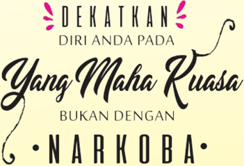

> **Deskripsi Visual:** Gambar ini adalah sebuah desain grafis yang menampilkan teks dalam bahasa Melayu dengan elemen estetika yang elegan. Gambar ini tidak termasuk dalam jenis diagram, foto, ilustrasi, atau rumus. 

1. **Apa yang Ditampilkan Secara Keseluruhan**: Gambar ini menampilkan sebuah desain grafis yang mencakup teks berwarna putih dengan latar belakang biru muda. Desain ini memiliki elemen estetika yang elegan dengan penggunaan huruf yang menarik dan warna yang kontras.

2. **Elemen-Elemen Utama dan Relasinya**: 
   - **Teks**: Teks utama dalam gambar ini adalah "DEKATKAN DIRI ANDA PADA Yang Maha Kuasa BUKAN DENGAN NARKOBA". Teks ini terdiri dari beberapa kalimat yang disusun dengan cara yang menarik dan efektif untuk membangkitkan perhatian pembaca.
   - **Warna**: Warna putih digunakan untuk teks yang membuatnya terlihat jelas dan menonjol di latar belakang biru muda. Warna biru muda digunakan sebagai latar belakang yang memberikan kesan tenang dan profesional.
   - **Elemen Grafis**: Terdapat tanda bintang merah muda yang menambahkan aspek estetika dan menarik perhatian pembaca.

3. **Teks, Angka, atau Label Penting yang Terlihat**: 
   - **Teks Utama**: "DEKATKAN DIRI ANDA PADA Yang Maha Kuasa BUKAN DENGAN NARKOBA"
   - **Angka**: Ada tanda bintang merah muda yang tampak di awal dan akhir teks.

4. **Informasi Kunci yang Dapat Diambil Pembaca**: Gambar ini mengajarkan tentang pentingnya menjaga kesehatan mental dan emosional dengan menghindari narkoba. Ini menekankan bahwa pentingnya menjaga hubungan dengan orang-orang yang memiliki kekuatan dan kebaikan dalam hidup, bukan dengan narkoba.

---

*📊 Statistik: 51 visual berhasil, 8 dilewati, 0 gagal | Durasi: 10m 18s*