# Salinan Kelas 12 Hindu BG press

*Diekstrak: 18 May 2026, 04:48*

---

---
## 📄 Halaman 1

### BUKU GURU

### Pendidikan Agama Hindu dan Budi Pekerti

---
**🖼️ Gambar/Diagram**

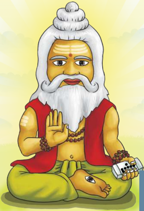

> **Deskripsi Visual:** Gambar ini adalah ilustrasi yang menampilkan seorang dewasa tua dengan rambut berwarna putih yang panjang dan rapi, serta mulut yang sedang membuka. Ia memiliki tatua pada bibir atas dan tenggorokan. Dewasa tersebut mengenakan pakaian tradisional India yang terdiri dari baju berwarna kuning dan celana berwarna hijau. Ia juga memegang beberapa buah kelapa dalam tangannya. Di depannya, terdapat beberapa buah kelapa yang tampak seperti makanan. Ilustrasi ini menunjukkan seseorang yang mungkin merupakan tokoh dalam budaya Hindu atau Buddha, karena penampilannya yang khas dan posisinya yang menunjukkan kebijaksanaan atau keagamaan.

 

---
## 📄 Halaman 2

### Hak Cipta © 2018 pada Kementerian Pendidikan dan Kebudayaan Dilindungi Undang-Undang

Disklaimer: Buku ini merupakan buku guru yang dipersiapkan Pemerintah dalam rangka implementasi Kurikulum 2013. Buku guru ini disusun dan ditelaah oleh berbagai pihak di bawah koordinasi Kementerian Pendidikan dan Kebudayaan, dan dipergunakan dalam tahap awal penerapan Kurikulum 2013. Buku ini merupakan 'dokumen hidup' yang senantiasa diperbaiki, diperbarui, dan dimutakhirkan sesuai dengan dinamika kebutuhan dan perubahan zaman. Masukan dari berbagai kalangan diharapkan dapat meningkatkan kualitas buku ini.

### Katalog Dalam Terbitan (KDT)

Indonesia. Kementerian Pendidikan dan Kebudayaan.

Pendidikan Agama Hindu dan Budi Pekerti: Buku Guru/ Kementerian Pendidikan dan Kebudayaan.-- Edisi Revisi Jakarta: Kementerian Pendidikan dan Kebudayaan, 2018. vi, 138 hlm. : ilus. ; 25 cm.

Untuk SMA/SMK Kelas XII ISBN  978-602-427-070-4 (jilid lengkap) ISBN  978-602-427-073-5 (jilid 3)

- Hindu -- Studi dan Pengajaran
I. Judul

- Kementerian Pendidikan dan Kebudayaan
294.5

Kontributor Naskah  : I Gusti Ngurah Dwaja dan I Nengah Mudana

Penelaah

: AA. Oka Puspa, I Wayan Budi Utama, dan I Wayan Paramartha

Pe- review

: I Gusti Ngurah Rai

Penyelia Penerbitan : Pusat Kurikulum dan Perbukuan, Balitbang, Kemendikbud.

Cetakan Ke-1, 2015 (ISBN 978-602-282-432-9) Cetakan Ke-2, 2018 (Edisi Revisi)

Disusun dengan huruf  Times New Roman, 11 pt.

 

---
## 📄 Halaman 3

### Kata Pengantar

Kurikulum 2013 dirancang agar peserta didik tidak hanya bertambah pengetahuannya, tetapi juga  meningkat  keterampilannya  dan  semakin  mulia  kepribadiannya.  Dengan  demikian, ada  kesatuan  utuh  antara  kompetensi  pengetahuan,  keterampilan,  dan  sikap.  Keutuhan  ini dicerminkan  dalam  pendidikan  agama  dan  budi  pekerti.  Melalui  pembelajaran  agama diharapkan akan terbentuk keterampilan beragama dan terwujud sikap beragama peserta didik yang berimbang, mencakup hubungan manusia dengan Penciptanya, sesama manusia, dan hubungan manusia dengan alam sekitarnya.

Pengetahuan agama yang dipelajari para peserta didik menjadi sumber nilai dan penggerak perilaku mereka. Sekadar contoh, di antara nilai budi pekerti dalam agama Hindu dikenal dengan Tri Marga ( bakti kepada Tuhan, orang tua, dan guru; karma , bekerja sebaik-baiknya untuk  dipersembahkan  kepada  orang  lain  dan  Tuhan; Jnana ,  menuntut  ilmu  sebanyak banyaknya  untuk  bekal  hidup  dan  penuntun  hidup),  dan Tri  Warga ( dharma ,  berbuat berdasarkan  atas  kebenaran; artha ,  memenuhi  harta  benda  kebutuhan  hidup  berdasarkan kebenaran,  dan kama ,  memenuhi  keinginan  sesuai  dengan  norma-norma  yang  berlaku). Dalam  pembentukan  budi  pekerti,  proses  pembelajarannya  mesti  mengantar  mereka  dari pengetahuan tentang kebaikan, lalu menimbulkan komitmen terhadap kebaikan, dan akhirnya benar-benar melakukan kebaikan.

Buku Pendidikan  Agama  Hindu  dan  Budi  Pekerti ini ditulis  dengan  semangat  itu. Pembelajarannya dibagi ke dalam beberapa kegiatan keagamaan yang harus dilakukan peserta didik  dalam  usaha  memahami  pengetahuan  agamanya  dan  mengaktualisasikannya  dalam tindakan nyata dan sikap keseharian, baik dalam bentuk ibadah ritual maupun ibadah sosial.

Peran guru sangat penting untuk meningkatkan dan menyesuaikan daya serap peserta didik dengan ketersediaan kegiatan yang ada pada buku ini. Guru dapat memperkayanya secara kreatif dengan kegiatan-kegiatan lain yang bersumber dari lingkungan sosial dan alam sekitar.

Sebagai  edisi  pertama,  buku  ini  sangat  terbuka  untuk  terus  dilakukan  perbaikan  dan penyempurnaan. Oleh karena itu, kami mengundang para pembaca memberikan kritik, saran, dan masukan untuk perbaikan dan penyempurnaan pada edisi berikutnya. Atas kontribusi itu, kami mengucapkan terima kasih. Mudah-mudahan kita dapat memberikan yang terbaik bagi kemajuan dunia pendidikan dalam rangka mempersiapkan generasi seratus tahun Indonesia Merdeka (2045).

Penulis

 

---
## 📄 Halaman 4

### Daftar Isi

Semester 1

 

---
## 📄 Halaman 5

### Daftar Tabel

 

---
## 📄 Halaman 6

 

---
## 📄 Halaman 7

### Pendahuluan

### A. Latar Belakang

Dalam  kehidupan  suatu  bangsa  pendidikan  memiliki  peran  yang  sangat  penting dan strategis untuk menjamin perkembangan dan kelangsungan kehidupan bangsa. Atas  dasar  itu,  Undang-undang  dasar  1945  mengamanatkan  agar  pemerintah mengusahakan dan menyelenggarakan satu sistem pengajaran nasional yang diatur dengan undang-undang, dan setiap warga Negara berhak mendapatkan pendidikan/ pengajaran. Pendidikan nasional yang berakar pada kebudayaan bangsa Indonesia yang  berdasarkan  Pancasila  dan  Undang-undang  Dasar  1945  diarahkan  untuk meningkatkan  kecerdasan  serta  hakekat  dan  martabat  bangsa  untuk  mewujudkan insan-insan dan masyarakat Indonesia yang memiliki Sradha dan Bakti kehadapan Sang Hyang Widhi (Tuhan Yang Maha Esa).

Pendidikan nasional perlu ditata dan dikembangkan serta dimantapkan secara terus menerus  melalui upaya melengkapi berbagai perangkat-perangkat pendidikan baik  perangkat  keras  dan  perangkat  lunak  termasuk  mengembangkan  sistem kurikulumnya sesuai dengan perkembangan zaman, ilmu pengetahuan dan teknologi. Dalam pelaksanaan kurikulum, tenaga kependidikan merupakan ujung tombak dalam mengoperasionalkan  isi  kurikulum  untuk  tercapainya  tujuan  pendidikan  nasional. Kurikulum 2013 menekankan pada proses berbasis kreativitas yaitu peserta  didik diberikan lebih banyak tugas-tugas seperti mengobservasi, menganalisis, membuat projek, untuk menumbuhkan penalaran agar siswa dapat menggali dan menumukan jawaban yang aotentik. Kurikulum 2013 mengupayakan pembentukan kerakter yang

### Bab 1

 

---
## 📄 Halaman 8

meliputi kerakter Religius (KI 1) dan kerakter sosial (KI 2) meningkatkan pemahaman pengetahuan  (K3)  dan  mempraktikkan  materi  yang  diajarkan  (KI  4).  Kurikulum 2013  mempersiapkan  generasi  penerus  bangsa  Indonesia  menghadapi  persaingan perdangangan bebas dan menyambut Indonesia emas tahun 2045. Para guru dalam menjalankan fungsi dan tugasnya mengajar agama Hindu dan budi pekerti dibantu dengan buku panduan guru untuk memudahkan memahami karakter kurikulum 2013 sehingga tujuan pembelajaran agama Hindu dan tujuan pendidikan nasional dapat terwujud. Para guru agama Hindu melalui kurikulum 2013 mempunyai tugas yang sangat berat untuk selalu menanamkan sikap / perilaku yang baik dan benar sesuai dengan ajaran Tri Kaya Parisudha yang bersumberkan dari Sruti dan Smrti. Karena pendidikan agama Hindu dituntut agar peserta didiknya memiliki budi pekerti yang luhur, memiliki pengetahuan dan memperbanyak praktik-praktik keagamaannya.

### B. Dasar Hukum

- Undang-Undang  Nomor  20 Tahun  2003  tentang  Sistem  Pendidikan  Nasional (SNP).
- Peraturan Pemerintah Nomor 32 Tahun 2013 tentang Perubahan Atas Peraturan Pemerintah Nomor 19 Tahun 2005 tentang Standar Nasional Pendidikan
- Undang-Undang Nomor 14 Tahun 2005 tentang Guru dan Dosen
- Peraturan  Pemerintah  Nomor  55 Tahun  2007  tentang  Pendidikan Agama  dan Pendidikan Keagamaan.
- Peraturan  Menteri  Agama  Nomor  4  tahun  2012  tentang  penyelenggaraan Pendidikan dan Pelatihan Teknis di Lingkungan Kementerian Agama
- Peraturan Menteri Pendidikan dan Kebudayaan Nomor 54 Tahun 2013 tentang Standar Kompetensi Lulusan Pendidikan Dasar dan Menengah.
- Peraturan Menteri Pendidikan dan Kebudayaan Nomor 64 Tahun 2013 tentang Standar Isi Pendidikan Dasar dan Menengah.
- Peraturan Menteri Pendidikan dan Kebudayaan Nomor 65 Tahun 2013 tentang Standar Proses Pendidikan Dasar dan Menengah.
- Peraturan Menteri Pendidikan dan Kebudayaan Nomor 66 Tahun 2013 tentang Standar Penilaian Pendidikan.
- Peraturan Menteri Pendidikan dan Kebudayaan Nomor 69 Tahun 2013 tentang Kerangka  Dasar  dan  Struktur  Kurikulum  Sekolah  Menengah  Atas/Madrasah Aliyah.
- Peraturan Menteri Pendidikan dan Kebudayaan Nomor 70 Tahun 2013 tentang Kerangka Dasar dan Struktur Kurikulum Sekolah Menengah Kejuruan/Madrasah Aliyah Kejuruan.
Semester 1

 

---
## 📄 Halaman 9

- Peraturan Menteri Pendidikan dan Kebudayaan Nomor 71 Tahun 2013 tentang Buku  Teks  Pelajaran  dan  Buku  Panduan  Guru  Untuk  Pendidikan  Dasar  dan Menengah.
- Peraturan Menteri Pendidikan dan Kebudayaan Nomor 103 Tahun 2014 tentang Pembelajaran Pada Pendidikan Dasar Dan Pendidikan Mengengah
- Peraturan Menteri Pendidikan dan Kebudayaan Nomor 104 Tahun 2014 tentang Penilaian Hasil Belajar Oleh Pendidik Pada Pendidikan Dasar Dan Pendidikan Menengah.

### C. Tujuan

Buku Guru Pendidikan Agama Hindu dan Budi Pekerti SMA/SMK Kelas XII ini disusun dengan tujuan:

- Membantu para pendidik dalam melaksanakan proses pembelajaran di sekolah sesuai dengan tuntutan Kurikulum 2013.
- Membantu para pendidik memahami komponen, tujuan dan materi agama Hindu dan budi Pekerti dalam Kurikulum 2013.
- Memberikan panduan kepada para pendidik dalam menumbuhkan budaya belajar peserta didik yang kreatif, aktif, positif untuk meningkatkan pemahaman peserta didik terhadap pengetahuan Agama Hindu.
- Membantu para pendidik dalam merencanakan, mengorganisasikan, melaksanakan  dan menilai kegiatan belajar mengajar  sesuai dengan tuntutan Kurikulum 2013.
- Membantu  para  pendidik  dalam  menjelaskan  kualiikasi  bahan  atau  materi pelajaran,  pola  pengajaran  dan  evaluasi  yang  harus  dilakukan  sesuai  dengan model kurikulum 2013
- Memberikan  arah  yang  tepat  bagi  para  pendidik  dalam  mencapai  target  atau sasaran yang ingin dicapai sesuai dengan tujuan kurikulum 2013
- Memberikan inspirasi kepada pendidik dalam menanamkan dan mengembangkan bahan  atau  materi  pembelajaran  sesuai  dengan  tingkat  perkembangan  peserta didiknya.
- Memberikan semangat kepada para pendidik untuk menugaskan peserta didiknya mengerjakan  tugas-tugas  yang  bersifat  projek  disetiap  bab,  analisis,  mencari tahu/menemukan, mengobservasi, mengumpulkan fortofolio.
- Mengajak  para  pendidik  lebih  aktif  memberikan  pembelajaran  agama  Hindu berbasis aktivitas atau kegiatan praktik atau pengalaman langsung.
- Para  pendidik  dapat  mengembangkan  budaya  belajar  yang  lebih  menantang, menyenangkan, sesuai dengan kebutuhan dan budaya kreativitas daerah setempat.

 

---
## 📄 Halaman 10

### D. Sasaran

Sasaran yang ingin dicapai dalam Buku Guru Pendidikan Agama Hindu dan Budi Pekerti SMA/SMK Kelas XII ini, antara lain:

- Pendidik memudahkan memberikan tugas-tugas kepada peserta didiknya
- Pendidik mampu memahami dan menerapkan kurikulum 2013 dengan benar.
- Pendidik  memiliki  pemahaman  yang  mendalam  tentang  kurikulum  2013  dan komponen-komponennya.
- Pendidik mampu menyusun rencana kegiatan pembelajaran dengan baik.
- Pendidik mampu memiliki wawasan yang luas dan mendalam mengenai modelmodel pembelajaran yang dapat digunakan dalam proses pembelajaran.
- Pendidik  diharapkan menanamkan budaya belajar kreatif, inovatif, mandiri, dan berbasis kreativitas, kepada peserta didiknya.
- Para Pendidik diharapkan dapat mengembangkan buku panduan guru ini sesuai dengan budaya dan kebutuhan di daerah setempat.
- Para Pendidik dapat mengenal berbagai macam bentuk penilaian untuk mengukur kopotensi yang dimiliki peserta didik
- Para Pendidik memudahkan menggunakan silabus yang sudah disiapkan dalam lampiran buku guru ini
- Para Pendidik dapat membuat dan mengembangkan RPP yang dijadikan panduan, pedoman mengajar di kelas sesuai dengan topik materi yang akan diajarkan

### E. Ruang Lingkup  Panduan Buku Guru

Adapun sebagai ruang lingkup dari penyusunan dan penulisan Buku Panduan Guru ini adalah:

Bab I

: Pendahuluan

Bab II

: Petunjuk Umum

Bab III  : Petunjuk Khusus Proses Pembelajaran

Bab IV : Penutup.

Semester 1

 

---
## 📄 Halaman 11

### Petunjuk Umum

### A. Petunjuk Umum Tentang Buku Panduan Guru

Secara  umum,  bedasarkan  ruang  lingkupnya,  Buku  Panduan  Guru  ini  terdiri  dari empat Bab, yakni:

- Pendahuluan.  Dalam  bab  ini  diuraikan  latar  belakang,  dasar  hukum,  tujuan, sasaran dan ruang lingkup
- Petunjuk Umum. Pada bab ini berisi Gambaran Umum Tentang Panduan Buku Guru, Ruang lingkup Aspek-aspek dan standar Pengamalan Pendidikan agama Hindu,  Kerangka  Dasar  Kurikulum,  Standar  Kelulusan  (SKL)  yang  ingin dicapai,  Kompetensi Inti  (KI)  yang  ingin  dicapai,  Penilaian,  yaitu:    Penilaian Sikap, Pengetahuan dan Keterampilan, Kompenen Penilaian, Pemanfaatan dan tindak lanjut hasil penilaian, Strategi, Metode dan Teknik Pembelajaran
- Petunjuk Khusus Proses Pembelajaran meliputi:

### BAB I  Weda SEBAGAI SUMBER HUKUM HINDU

- Kompetensi Inti (KI) dan Kompetensi Dasar (KD)
- Tujuan Pembelajaran.
- Peta Konsep
- Proses Pembelajaran
- Evaluasi

### Bab 2

 

---
## 📄 Halaman 12

- Pengayaan
- Remedial
- Interaksi dengan orang tua

### BAB II  SEJARAH PERKEMBANGAN KEBUDAYAAN HINDU DI DUNIA

- Kompetensi Inti (KI) dan Kompetensi Dasar (KD)
- Tujuan Pembelajaran.
- Peta Konsep
- Proses Pembelajaran
- Evaluasi
- Pengayaan
- Remedial
- Interaksi dengan orang tua

### BAB III  YANTRA, TANTRA DAN MANTRA

- Kompetensi Inti (KI) dan Kompetensi Dasar (KD)
- Tujuan Pembelajaran.
- Peta Konsep
- Proses Pembelajaran
- Evaluasi
- Pengayaan
- Remedial
- Interaksi dengan orang tua

### BAB.  IV ASHTANGGA YOGA DAN Moksa

- Kompetensi Inti (KI) dan Kompetensi Dasar (KD)
- Tujuan Pembelajaran.
- Peta Konsep
- Proses Pembelajaran
- Evaluasi
- Pengayaan
- Remedial
- Interaksi dengan orang tua
Semester 1

 

---
## 📄 Halaman 13

### BAB V  DASA YAMA BRATHA DAN NYAMA BRATHA

- Kompetensi Inti (KI) dan Kompetensi Dasar (KD)
- Tujuan Pembelajaran.
- Peta Konsep
- Proses Pembelajaran
- Evaluasi
- Pengayaan
- Remedial
- Interaksi dengan orang tua
- Penutup meliputi Kesimpulan dan Saran-saran

### B. Ruang Lingkup, Aspek-Aspek dan Standar Pengamalan Pendidikan Agama Hindu

Ruang lingkup Pendidikan Agama Hindu dan Budi Pekerti menekankan pada Tri Kerangka Dasar Agama Hindu seperti Tattwa , Susila , dan Acara , yang diwujudkan melalui konsep Tri Hita Karana yaitu:

- Hubungan manusia dengan Ida Sang Hyang Widhi.
- Hubungan manusia dengan manusia.
- Hubungan manusia dengan alam lingkungan (Bhuana Agung).
Aspek-aspek Pendidikan Agama Hindu dan Budi Pekerti pada Sekolah Menengah Atas  dan  Sekolah  Menengah  Kejuruan  sebagaimana  tertuang  dalam  Kurikulum 2013, meliputi:

- Kitab Suci Weda yang menekankan kepada pemahaman Weda sebagai Kitab suci, melalui pengenalan pada kitab-kitab: Bhagavadgita, Ramayana, Mahabharata, Weda Sruti, Weda Smrti dan untuk menumbuhkan pemimpin yang berkarakter sesuai kitab suci Weda.
- Tattwa merupakan pemahaman tentang alam semesta dengan mengenal namanama planet dalam tata surya, pokok-pokok keyakinan yaitu Panca Sraddha yang meliputi Brahman, Atman, Karmaphala, Punarbhava, dan  Moksa.
- Susila  pembiasaaan  berperilaku  jujur,saling  menghargai  yang  penekanannya pada penguasaan tentang ajaran Subha Asubha Karma, Tat Twam Asi,  Tri Kaya Parisudha, Tri Parartha, Catur Guru, dan upaya menghindari perilaku Tri Mala, Dasa Mala, Catur Pataka, dan Sad Ripu, Sad Atatayi, Sapta Ttimira, sehingga memiliki etika dan budi pekerti yang sadhu atau luhur.

 

---
## 📄 Halaman 14

- Acara yaitu melakukan pembiasaan dengan pengucapan DainikaUpasana (doa sehari-hari) dan  pengenalan serta pemahaman tentang Dharmagita, antara Tari Profan dengan Tari Sakral, Orang Suci, Hari Suci, Tempat Suci, serta penekanan pada sikap dan praktik ber-Yajña dalam kehidupan sehari-hari seperti melakukan Panca Yajña sehingga kehidupan menjadi harmonis, dan seimbang.
- Sejarah Agama Hindu yang menekankan kepada sejarah perkembangan Agama Hindu di Indonesia dan dunia

### Standar Pengamalan Pendidikan Agama Hindu dan Budi Pekerti:

- Hubungan manusia dengan Ida Sang Hyang  Widhi (Brahman) melalui Parahiyangan dapat dilaksanakan dengan cara:
- Melaksanakan kewajiban dengan melakukan persembahyangan Tri Sandhya tiga kali setiap hari dan Panca Sembah
- Membiasakan  melakukan  japa  mantra  dan  namasmaranam  setiap  selesai sembahyang
- Membiasakan membaca doa terlebih dahulu sebelum beraktivitas dan belajar
- Rajin  dan  aktif  dalam  kegiatan  keagamaan  baik  dilingkungan  keluarga maupun dimasyarakat
- Bersembahyang pada  hari  Purnama, Tilem  dan  hari-hari  suci  /  hari  Raya seperti Galungan, Kuningan Saraswati, Siwaratri, Nyepi dan kegiatan hari keagamaan lainnya
- Hubungan Manusia dengan Manusia melalui Pawongan dapat dilakukan dengan cara:
- Membiasakan diri bersikap jujur dan sopan, santun terhadap sesama manusia
- Membiasakan diri disiplin dan bertanggung jawab dalam ucapan, perbuatan/ prilaku dan pikiran dalam kehidupan sehari-hari
- Membiasakan diri untuk berpakian yang bersih dan rapi
- Membiasakan  diri  peduli  dan  saling  menolong,  saling  menyayangi  serta mengasihi antar sesama manusia
- Selalu peduli terhadap orang-orang yang sedang dilanda musibah, kesusahan dalam kehidupannya
- Hubungan  Manusia  dengan  alam  Lingkungan  sekitarnya  melalui  Palemahan dapat dilakukan dengan cara:
- Menanamkan cara-cara menjaga kebersihan lingkungan sekitarnya
- Membiasakan  diri  untuk  peduli  terhadap  hewan-hewan  disekitarnya  dan tidak menyakiti binatang-binatang serta mahluk hidup lainnya.
Semester 1

 

---
## 📄 Halaman 15

- Membiasakan  diri  untuk  peduli  terhadap  tumbuh-tumbuhan  dengan  cara merawat dan menyiram serta memeliharanya.
- Membudayakan  diri  untuk  melestarikan  warisan-warisan  leluhur  (tempat suci, Pura, Candi, seni, buku-buku / sastra-sastra Hindu, Lontar dan lain-lain)

### C. Kerangka  Dasar  Kurikulum  Sekolah  Menengah Atas dan Kejuruan (SMA/SMK)

### 1. Landasan ilosois

Landasan  ilosois  dalam  pengembangan  kurikulum,  sumber  dan  isi  dari kurikulum,  proses  pembelajaran,  posisi  peserta  didik,  penilaian  hasil  belajar, hubungan peserta didik dengan masyarakat dan lingkungan alam di sekitarnya. Kurikulum 2013 dikembangkan dengan landasan ilosois yang memberikan dasar bagi  pengembangan  seluruh  potensi  peserta  didik  menjadi  manusia  Indonesia berkualitas  yang  tercantum  dalam  tujuan  pendidikan  nasional.  pada  dasarnya tidak  ada  satupun  ilosoi  pendidikan  yang  dapat  digunakan  secara  spesiik  untuk pengembangan kurikulum yang dapat menghasilkan manusia yang berkualitas. Berdasarkan hal tersebut, kurikulum 2013 menggunakan ilosoi sebagai berikut:

- Pendidikan  berakar  pada  budaya  bangsa  untuk  membangun  kehidupan bangsa masa kini dan masa mendatang. Pandangan ini menjadikan Kurikulum 2013 dikembangkan berdasarkan budaya bangsa Indonesaia yang beragam, diarahkan untuk membangun kehidupan masa kini, dan untuk membangun dasar bagi kehidupan bangsa yang lebih baik dimasa depan. Mempersiapkan peserta  didik  untuk  kehidupan  masa  depan  selalu  menjadi  kepedulian kurikulum, hal ini mengandung makna bahwa kurikulum adalah rancangan pendidikan untuk mempersiapkan kehidupan generasi muda bangsa. dengan demikian, tugas mempersiapkan generasi muda bangsa menjadi tugas utama suatu  kurikulum.  Untuk  mempersiapkan  kehidupan  masa  kini  dan  masa depan peserta didik, Kurikulum 2013 mengembangkan pengalaman belajar yang  memberikan  kesempatan  luas  bagi  peserta  didik  untuk  menguasai kompetensi yang diperlukan bagi kehidupan dimasa kin dan masa depan, dan pada waktu bersamaan tetap mengembangkan kemampuan mereka sebagai pewaris  budaya  bangsa  dan  orang  yang  peduli  terhadap  permasalahan masyarakat dan bangsa masa kini.
kehidupan

- Peserta didik adalah pewaris budaya bangsa yang kreatif. Menurut pandangan ilosoi ini, prestasi bangsa diberbagai bidang dimasa  lampau  adalah  sesuatu  yang  harus  termuat  dalam  isi  kurikulum untuk dipelajari peserta didik. Proses pendidikan adalah setiup proses yang memberi kesempatan kepada peserta didik untuk mengembangkan potensi dirinya menjadi kemampuan berpikir rasional dan kecemerlangan akademik

 

---
## 📄 Halaman 16

dengan  memberikan  makna  terhadap  apa  yang  yang  dilihat,  didengar, dibaca, dipelajari  dari warisan budaya berdasarkan makna yang ditentukan oleh lensa budayanya dan sesuai dngan tingkat kematangan isikologis serta kematangan isik peserta didik. Selain pengembangan kemampuan berpikir rasional  dan  cemerlang  dalam  akademik,  kurikulum  2013  memposisikan keunggulan  budaya  tersebut  dipelajari  untuk  menimbulkan  rasa  bangga, diaplikasikan  dan  dan  dimanifestasikan  dalam  kehidupan  pribadi,  dalam interaksi sosial di masyarakat sekitarnya, dan dalam kehidupan berbangsa masa kini.

ini

- Pendidikan  ditujukan  untuk  mengembangkan  kecerdasan  intelektual  dan kecemerlangan akademik melalui pendidikan disiplin ilmu. Filosoi menentukan  bahwa  isi  kurikulum  adalah  disiplin  ilmu  dan  pembelajaran adalah  pembelajaran  disiplin  ilmu (essentialism) .  Filosoi  ini  mewajibkan kurikulum memiliki nama mata pelajaran yang sama dengan nama disiplin ilmu,  selalu  betujuan  untuk  mengembangkan  kemampuan  intelektual  dan kecemerlangan akademik.
- Pendidikan untuk membangun kehidupan masa kini dan masa depan yang lebih baik dari masa lalu dengan berbagai kemapuan intelektual, kemampuan berkomunikasi, sikap sosial, kepedulian, dan berpartisipasi untuk membangun kehidupan  masyarakat  dan  bangsa  yang  lebih  baik (experimentalism  and sosial  reconstructivism) .  Dengan  ilosoi  ini,  Kurikulum  2013  bermaksud untuk  mengembangkan  potensi  peserta  didik  menjadi  kemampuan  dalam berpikir  relektif  bagi  penyelesaian  masalah  soaial  dimasyarakat,  dan  untuk membangun  kehidupan  masyarakat  demokratis  yang  lebih  baik.  Dengan demikian,  kurikulum  2013  menggunakan  ilosoi  sebagai  mana  diatas  dalam mengembangkan kehidupan individu peserta  didik  dalam  beragama,  seni, kreativitas,  berkomunikasi,  nilai  dan  berbagai  dimensi  intelegensi  yang sesuai dengan diri seorang peserta didik dan diperlukan masyarakat, bangsa, dan umat manusia.

### 2. Landasan Teoritis

Kurikulum  2013  dikembangkan  atas  teori  'pendidikan  berdasarkan  standar' (standard-based education) dan teori kurikulum berbasis kompetensi (competency-based  curriculum) .  Pendidikan  berdasarkan  standar  menetapkan adanya  standar  nasional  sebagai  kualitas  minimal  warga  Negara  yang  dirinci menjadi  standar  isi, standar proses, standar  Kompetensi  lulusan,  standar pendidik  dan  tenaga  kependidikan,  standar  sarana  dan  prasarana,  standar pengelolaan, standar pembiayaaan dan standar penilaian pendidikan. Kurikulum berbasis  kompetensi  dirancang  untuk  memberikan  pengalaman  belajar  seluas luasnya bagi peserta didik dalam mengembangkan kemampuan untuk bersikap, berpengetahuan,  berketerampilan,  dan  bertindak.  Kurikulum  2013  menganut: (1)  pembelajaran  yang  dilakukan  pendidik (taught  curriculum) dalam  bentuk proses  yang  dikembangkan  berupa  kegiatan  pembelajaran  di  sekolah,  kelas,

Semester 1

 

---
## 📄 Halaman 17

dan masyarakat, dan (2) pengalaman belajar langsung peserta didik (learnedcurriculum) sesuai dengan latar belakang, karakteristik, dan kemampuan awal peseta didik. Pengalaman belajar langsung individual peserta didik menjadi hasil belajar bagi dirinya, sedangkan hasil belajar seluruh peserta didik menjadi hasil kurikulum.

### 3. Landasan Yuridis

Landasan Yuridis Kurikulum 2013 adalah:

- Undang-undang Dasar Negara Republik Indonesia tahun 1945
- Undang-undang No. 20 tahun 2003 tentang sistem pendidikan Nasional
- Undang-undang No. 17 tahun 2005 tentang rencana Pembangunan jangka panjang Nasional, beserta segala ketentuan yang  dituangkan rencana pembangunan jangka menengah Nasional
- Perturan Pemerintah No, 19 tahun 2005 tentang standar nasional pendidikan sebagai mana telah diubah dengan peraturan pemerintah No. 32 tahun 2013 tentang  perubahan  atas  peraturan  pemerintah  No.19  tahun  2005  tentang standar nasional pendidik .

### D. Standar Kelulusan (SKL) yang Ingin Dicapai

Standar Kompetensi Lulusan (SKL)  pada jenjang Pendidikan Dasar dan Menengah sejalan  dengan  Peraturan  Menteri  Pendidikan  dan  Kebudayaan  Nomor  54  Tahun 2013  di  mana  disetiap  dimensi  memiliki  kualiikasi  kemampuan  sebagaimana tertera dalam tabel berikut:

---
**📊 Tabel**

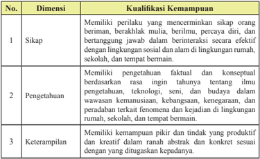

Tabel ini membahas tentang kualifikasi kemampuan yang diperlukan untuk mencapai tujuan pendidikan. Topik utamanya adalah dimensi-dimensi kualifikasi kemampuan, yaitu sikap, pengetahuan, dan keterampilan. Kolom pertama menunjukkan nomor urut dari setiap dimensi, sedangkan kolom kedua berisi deskripsi singkat dari masing-masing dimensi tersebut. Data penting yang terlihat adalah bahwa semua dimensi ini memerlukan sifat-sifat tertentu seperti memiliki sikap yang baik, memiliki pengetahuan yang mendalam, dan memiliki keterampilan yang efektif. Ini menunjukkan bahwa pembelajaran tidak hanya tentang pengetahuan, tetapi juga tentang bagaimana seseorang menggunakan dan mengaplikasikan pengetahuan tersebut dalam situasi nyata.

 

---
## 📄 Halaman 18

### E. Kompetensi Inti (KI) yang Ingin Dicapai

### Kompetensi Inti (KI) Tingkat SMA/SMK kelas XII yang ingin dicapai:

Berdasarkan Peraturan Pemerintah Nomor 32 Tahun 2013 tentang Standar Nasional Pendidikan (SNP) disebutkan bahwa:

- Kompetensi  adalah  seperangkat  sikap,  pengetahuan,  dan  keterampilan  yang harus  dimiliki,  dihayati,  dan  dikuasai  oleh  peserta  didik  setelah  mempelajari suatu  muatan  pembelajaran,  menamatkan  suatu  program,  atau  menyelesaikan Satuan Pendidikan tertentu.
- Kompetensi Inti adalah tingkat kemampuan untuk mencapai Standar Kompetensi Lulusan yang harus dimiliki seorang peserta didik pada setiap tingkat kelas atau program.
- Kompetensi Inti sebagaimana dimaksud pada ayat (1) mencakup: sikap spiritual, sikap sosial, pengetahuan, dan keterampilan yang berfungsi sebagai pengintegrasi muatan  pembelajaran,  mata  pelajaran  atau  program  dalam  mencapai  Standar Kompetensi  Lulusan.  Kompetensi  Inti  sebagaimana  dimaksud  pada  ayat  (1) merupakan tingkat kemampuan untuk mencapai Standar Kompetensi Lulusan yang harus dimiliki seorang peserta didik pada setiap tingkat kelas atau program yang menjadi landasan pengembangan Kompetensi Dasar (KD).
Lebih lanjut dalam pasal 77 H ayat (1) penjelasan dari Kompetenisi Inti (KI) sebagai berikut:

- Yang  dimaksud  dengan  'Pengembangan  Kompetensi  spiritual  keagamaan' mencakup  perwujudan  suasana  belajar  untuk  meletakkan  dasar  perilaku  baik yang  bersumber  dari  nilai-nilai  agama  dan  moral  dalam  konteks  belajar  dan berinteraksi sosial.
- Yang dimaksud dengan 'Pengembangan sikap personal dan sosial' mencakup perwujudan  suasana  untuk  meletakkan  dasar  kematangan  sikap  personal  dan sosial dalam konteks belajar dan berinteraksi sosial.
- Yang dimaksud dengan 'Pengembangan pengetahuan' mencakup perwujudan suasana  untuk  meletakkan  dasar  kematangan  proses  berpikir  dalam  konteks belajar dan berinteraksi sosial.
- Yang dimaksud dengan 'Pengembangan keterampilan' mencakup perwujudan suasana  untuk  meletakkan  dasar  keterampilan  dalam  konteks  belajar  dan berinteraksi sosial.
Semester 1

 

---
## 📄 Halaman 19

### Berikut adalah Kompetensi Inti (KI) Tingkat SMA/SMK

Satuan Pendidikan

:   SMA/SMK…

Kelas/Program

:   XII /…

Kompetensi Inti :

KI 1

:  Menghayati dan mengamalkan ajaran agama yang dianutnya

KI 2 :  Menghayati  dan  mengamalkan  perilaku  jujur,  disiplin,  tanggungjawab, peduli (gotong royong, kerjasama, toleran, damai), santun, responsif dan pro-aktif dan menunjukkan sikap sebagai bagian dari solusi atas berbagai permasalahan dalam berinteraksi secara efektif dengan lingkungan sosial dan alam serta dalam menempatkan diri sebagai cerminan bangsa dalam pergaulan dunia.

- KI 3 :  Memahami,  menerapkan,  menganalisis  pengetahuan  faktual,  konseptual, prosedural  berdasarkan  rasa  ingintahunya  tentang  ilmu  pengetahuan, teknologi,  seni,  budaya,  dan  humaniora  dengan  wawasan  kemanusiaan, kebangsaan,  kenegaraan,  dan  peradaban  terkait  penyebab  fenomena  dan kejadian,  serta  menerapkan  pengetahuan  prosedural  pada  bidang  kajian yang spesiik sesuai dengan bakat dan minatnya untuk memecahkan masalah.
- KI 4 :  Mengolah, menalar, dan menyaji dalam ranah konkret dan ranah abstrak terkait  dengan  pengembangan  dari  yang  dipelajarinya  di  sekolah  secara mandiri, dan mampu menggunakan metoda sesuai kaidah keilmuan.

### F.  Penilaian

### 1. Penilaian Sikap, Pengetahuan dan Keterampilan

### a. Penilaian Sikap

Pengertian Penilaian sikap adalah penilaian terhadap kecenderungan perilaku peserta didik sebagai hasil pendidikan, baik di dalam kelas maupun di luar kelas. Penilaian sikap memiliki karakteristik yang berbeda dengan penilaian pengetahuan dan keterampilan, sehingga teknik penilaian yang digunakan juga  berbeda.  Dalam  hal  ini,  penilaian  sikap  ditujukan  untuk  mengetahui capaian dan membina perilaku serta budi pekerti peserta didik sesuai butirbutir sikap dalam Kompetensi dasar (KD) pada kompetensi inti sikap spiritual (KI-1) dan Kompetensi sikap sosial ( KI-2).

- 1). Pada  mata  pelajaran  Pendidikan Agama  dan  Budi  Pekerti,  dan  mata pelajaran  Pendidikan  Pancasila  dan  Kewarganegaraan  (PPKn),  KD pada KI-1 dan KD pada KI-2 disusun secara koheren dan linier dengan KD pada KI-3 dan  KD  pada  KI-4.  Sedangkan  untuk  mata  pelajaran lain, KD pada KI-1 dan KD pada KI-2 dirumuskan secara umum dan terakumulasi menjadi satu KD pada KI-1 dan satu KD pada KI-2.

 

---
## 📄 Halaman 20

- 2). Penilaian sikap  spiritual dan sikap sosial dilakukan secara berkelanjutan oleh  pendidik  mata  pelajaran,  guru  bimbingan  konseling  (BK),  dan wali  kelas  dengan  menggunakan  observasi  dan  informasi  lain  yang valid  dan  relevan  dari  berbagai  sumber.  Penilaian  sikap  merupakan bagian dari pembinaan dan penanaman / pembentukan sikap spiritual dan sikap sosial peserta didik yang menjadi tugas dari setiap pendidik. Penanaman sikap diintegrasikan  pada setiap pembelajaran KD dari KI3  dan KI-4. Selain itu, dapat dilakukan penilaian diri ( self assessment ) dan penilaian antarteman ( peer assessment ) dalam rangka pembinaan dan pembentukan karakter  peserta didik  yang hasilnya dapat dijadikan sebagai  salah  satu  data  untuk  konirmasi  hasil  penilaian  sikap  oleh pendidik.  Hasil  penilaian  sikap  selama  periode  satu  semester  ditulis dalam bentuk deskripsi yang menggambarkan perilaku peserta didik.

### Teknik Penilaian Sikap

Penilaian sikap dilakukan oleh guru mata pelajaran, guru bimbingan konseling (BK), dan wali kelas, melalui observasi yang dicatat dalam jurnal. Teknik penilaian sikap dijelaskan pada skema berikut

---
**🖼️ Gambar/Diagram**

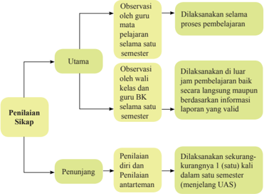

> **Deskripsi Visual:** Gambar ini adalah diagram yang menunjukkan struktur penilaian sikap dalam proses pembelajaran. Diagram ini terdiri dari tiga bagian utama: Penilaian Utama, Penilaian Sikap, dan Penunjang.

1. **Apa yang Ditampilkan Secara Keseluruhan**: Gambar ini menggambarkan struktur dan proses penilaian sikap dalam kurikulum belajar. Ini mencakup tiga bagian utama penilaian: Penilaian Utama, Penilaian Sikap, dan Penunjang.

2. **Elemen-Elemen Utama dan Relasinya**: 
   - **Penilaian Utama** adalah bagian utama dari penilaian sikap. Ini dilakukan oleh guru mata pelajaran selama satu semester.
   - **Penilaian Sikap** melibatkan observasi oleh wali kelas dan guru BK selama satu semester.
   - **Penunjang** melibatkan penilaian diri dan penilaian antartematik, yang dilakukan secara kurangnya 1 kali dalam setiap semester.

3. **Teks, Angka, atau Label Penting yang Terlihat**: 
   - "Utama" menunjukkan bahwa penilaian ini merupakan bagian utama dari penilaian sikap.
   - "Sikap" menunjukkan subjek penilaian.
   - "Penunjang" menunjukkan bagian tambahan dari penilaian sikap.

4. **Informasi Kunci yang Dapat Diambil Pembaca**: 
   - Gambar ini memberikan pemahaman tentang struktur dan proses penilaian sikap dalam kurikulum belajar, yang melibatkan berbagai pihak dan metode penilaian.

Dengan demikian, gambar ini membantu pembaca memahami struktur dan proses penilaian sikap dalam kurikulum belajar, yang melibatkan observasi oleh guru, wali kelas, dan guru BK, serta penilaian diri dan antartematik.

Semester 1

 

---
## 📄 Halaman 21

Berikut ini adalah penjelasan Gambar 2.1 di atas.

### a.  Observasi

Observasi  dalam  penilaian  sikap  peserta  didik  merupakan  teknik  yang dilakukan secara  berkesinambungan melalui  pengamatan  perilaku.  Asumsinya setiap  peserta  didik  pada  dasarnya  berperilaku  baik  sehingga  yang  perlu dicatat hanya perilaku yang sangat baik (positif) atau kurang baik (negatif) yang  berkaitan  dengan  indikator  sikap  spiritual  dan  sikap  sosial.  Catatan hal-hal  yang  positif  dan  menonjol  digunakan  untuk  menguatkan  perilaku positif, sedangkan perilaku negatife digunakan untuk pembinaan. Instrumen yang digunakan dalam observasi adalah lembar observasi atau jurnal. Hasil observasi dicatat dalam jurnal yang dibuat selama satu semester oleh guru mata pelajaran, guru BK, dan wali kelas. Jurnal memuat catatan sikap atau perilaku peserta didik yang sangat baik atau kurang baik, dilengkapi dengan waktu terjadinya perilaku tersebut, dan butir-butir sikap. Berdasarkan catatan tersebut  pendidik  membuat deskripsi penilaian sikap peserta didik selama satu semester.

Beberapa hal yang perlu diperhatikan dalam melaksanakan penilaian sikap dengan teknik observasi:

- 1). Jurnal digunakan oleh guru mata pelajaran, guru BK, dan wali kelas selama periode satu semester.
- 2). Jurnal oleh guru mata pelajaran dibuat untuk seluruh peserta didik yang mengikuti mata pelajarannya. Jurnal oleh guru BK dibuat untuk semua peserta didik yang menjadi tanggung jawab bimbingannya, dan jurnal oleh wali kelas digunakan untuk 1 (satu) kelas yang menjadi tanggung jawabnya.
- 3). Hasil observasi guru mata pelajaran dan guru BK diserahkan kepada wali kelas untuk diolah lebih lanjut.
- 4). Perilaku sangat baik atau kurang baik yang dicatat dalam jurnal tidak terbatas pada  butir-butir  sikap  (perilaku)  yang  hendak  ditumbuhkan melalui  pembelajaran  yang  saat  itu  sedang  berlangsung  sebagaimana dirancang dalam RPP, tetapi dapat mencakup butir-butir sikap lainnya yang  ditanamkan  dalam  semester  itu  jika  butir-butir  sikap  tersebut muncul/ditunjukkan oleh siswa melalui perilakunya.
- 5). Catatan  dalam  jurnal  dilakukan  selama  satu  semester  sehingga  ada kemungkinan dalam satu hari perilaku yang sangat baik dan/atau kurang baik muncul lebih dari satu kali atau tidak muncul sama sekali.
- 6). perilaku peserta didik yang tidak menonjol (sangat baik atau kurang baik) tidak  perlu  dicatat  dan  dianggap  peserta  didik  tersebut  menunjukkan perilaku baik atau sesuai dengan norma yang diharapkan.

 

---
## 📄 Halaman 22

Nama Satuan pendidikan  : SMA / SMK ……………………

Tahun pelajaran

: 2014/2015

Kelas/Semester

: XII / Semester …………………

Mata Pelajaran

: Pendidikan Agama Hindu dan Budi Pekerti

---
**📊 Tabel**

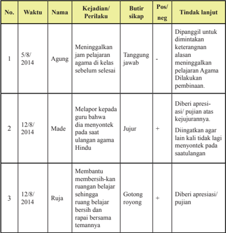

Tabel ini menunjukkan catatan pelanggaran dan tindakan yang diambil terhadap beberapa siswa di sebuah sekolah. Topik utama tabel adalah pelanggaran pelajaran Agama dan perilaku yang tidak sopan. Kolom-kolom yang ada meliputi nomor urut, tanggal, nama siswa, kejadian atau perilaku yang dilakukan, butir sikap, posisi (positif atau negatif), dan tindakan lanjut yang diambil. Data penting yang terlihat adalah bahwa Agung meninggalkan jam pelajaran Agama sebelum selesai, Made melapor kepada guru karena dia menyontek pada saat ulangan Agama Hindu, dan Rujia membantu membersihkan ruang belajar bersama temannya. Tindakan yang diambil untuk Agung adalah ditangguhkan jawab, untuk Made diberi apresiasi/pujian atas kejujurnya, dan untuk Rujia diberi apresiasi/pujian.

Semester 1

 

---
## 📄 Halaman 23

---
**📊 Tabel**

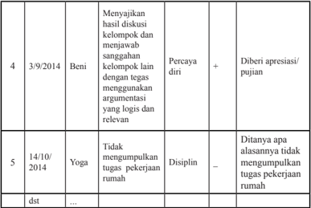

Tabel ini menunjukkan data evaluasi dua orang siswa, Beni dan Yoga, pada tahun 2014. Topik utama tabel adalah penilaian kinerja siswa dalam berbagai aspek seperti keterampilan presentasi, kepercayaan diri, dan disiplin. Kolom-kolomnya meliputi tanggal evaluasi, deskripsi tugas atau tindakan yang dilakukan oleh siswa, indikator kinerja yang diperiksa, dan hasil evaluasi (percaya diri, disiplin, atau tidak). Data penting yang terlihat adalah bahwa Beni menunjukkan pengetahuan dan kemampuan presentasi yang baik dengan menggunakan argumentasi yang logis dan relevan, sementara Yoga kurang memenuhi tugas pekerjaan rumah dan memiliki masalah disiplin.

Jika seorang peserta didik menunjukkan  perilaku  yang  kurang  baik, pendidik  harus  segera  menindaklanjutinya  dengan  melakukan  pendekatan dan pembinaan, secara bertahap peserta didik tersebut dapat menyadari dan memperbaiki sendiri perilakunya sehingga menjadi lebih baik.

Tabel 2.2 dan Tabel 2.3 berturut-turut menyajikan contoh jurnal penilaian sikap spiritual dan sikap sosial yang dibuat oleh wali kelas dan/atau guru BK. Satu jurnal digunakan untuk satu kelas jangka waktu satu semester.

Nama Satuan Pendidikan

: SMA / SMK ……………………

Kelas/Semester

: XII/Semester ……………………

Tahun pelajaran

: 2014/2015

 

---
## 📄 Halaman 24

Semester 1

 

---
## 📄 Halaman 25

Nama Satuan Pendidikan

: SMA/ SMK ....................

Kelas/Semester

: XII/Semester  I

Tahun pelajaran

: 2014/2015

---
**📊 Tabel**

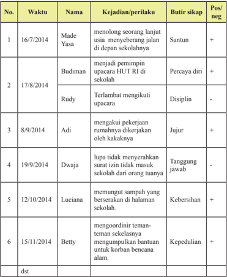

Tabel ini berisi catatan tentang perilaku dan sikap siswa-siswa di sekolah pada beberapa waktu tertentu. Topik utamanya adalah penilaian positif dan negatif terhadap perilaku dan sikap mereka. Kolom-kolomnya meliputi nomor urut, waktu, nama siswa, kejadian/perilaku, butir sikap, dan pos/negatif. Data penting yang terlihat adalah bahwa banyak siswa mendapatkan nilai positif karena sikap mereka yang baik seperti disiplin, keberanian, dan kepedulian. Sementara itu, ada juga beberapa siswa yang diberi nilai negatif karena perilaku mereka yang kurang baik seperti tidak menyerahkan surat izin atau tidak mengikuti upacara dengan tepat.

 

---
## 📄 Halaman 26

### b.  Penilaian Diri

Penilaian diri dilakukan dengan cara meminta peserta didik untuk mengemukakan kelebihan dan kekurangan dirinya dalam berperilaku. selain itu penilaian diri juga dapat digunakan untuk membentuk sikap peserta didik terhadap mata pelajaran. hasil penilaian diri peserta didik dapat digunakan sebagai  data  konirmasi.  Penilaian  diri  dapat  memberikan  dampak  positif terhadap perkembangan kepribadian peserta didik, antara lain:

- 1). dapat  menumbuhkan  rasa  percaya  diri,  karena    diberi  kepercayaan untuk menilai diri sendiri
- 2). peserta  didik  menyadari  kekuatan  dan  kelemahan  diri,  karena  ketika melakukan penilaian, harus melakukan introspeksi terhadap kekuatan dan kelemahan yang dimiliki.
- 3). dapat  mendorong,  membiasakan,  dan  melatih  peserta  didik  untuk berbuat jujur, karena dituntut untuk jujur dan objektif dalam melakukan penilaian. dan
- 4). membentuk sikap terhadap mata pelajaran / pengetahuan
Instrumen yang digunakan untuk penilaian diri berupa lembar penilaian diri yang dirumuskan secara sederhana, namun jelas dan tidak bermakna ganda, dengan bahasa lugas yang dapat dipahami peserta didik, dan menggunakan format sederhana yang mudah diisi peserta didik. Lembar penilaian diri dibuat sedemikian  rupa  sehingga  dapat  menunjukkan  sikap  peserta  didik  dalam situasi  yang  nyata/sebenarnya,  bermakna,  dan  mengarahkan  peserta  didik mengidentiikasi kekuatan atau kelemahannya. Hal ini untuk menghilangkan kecenderungan peserta didik menilai dirinya secara  subjektif. Penilaian diri oleh pesert didik dilakukan melalui langkah-langkah sebagai berikut.

- 1). Menjelaskan kepada peserta didik tujuan penilaian diri.
- 2). Menentukan indikator yang akan dinilai.
- 3). Menentukan kriteria penilaian yang akan digunakan.
- 4). Merumuskan format penilaian, dapat berupa daftar cek ( checklist ) atau skala penilaian ( rating scale ).
Contoh : lembar penilaian diri menggunakan daftar cek ( checklist ) pada waktu kegiatan kelompok:

Nama

: ...............................................

Kelas/Semester

: ..................../..........................

Semester 1

 

---
## 📄 Halaman 27

### Petunjuk:

- Bacalah baik-baik setiap pernyataan dan berilah tanda a pada kolom yang sesuai dengan keadaan dirimu yang sebenarnya!
- Serahkan kembali format yang sudah kamu isi kepada bapak/ibu guru!
Penilaian diri tidak hanya digunakan untuk menilai sikap, tetapi juga dapat digunakan untuk menilai sikap terhadap pengetahuan dan keterampilan serta kesulitan belajar peserta didik.

### c. Penilaian antarsiswa/antarteman

Penilaian  antarteman  adalah  penilaian  dengan  cara  peserta  didik  saling saling menilai perilaku temannya. Penilaian antarteman dapat mendorong: 1).  Obyektiitas  peserta  didik,  2).  empati,  3).  mengapresiasi  keragaman  / perbedaan,  dan  4).  releksi  diri.  Sebagaimana  penilaian  diri,  hasil  penilaian antarteman dapat digunakan sebagai data konirmasi. Instrumen yang digunakan berupa lembar penilaian antarteman. Kriteria instrumen penilaian antarteman sebagai  berikut.

- 1). Sesuai dengan indikator yang akan diukur
- 2). Indikator dapat diukur melalui pengamatan peserta didik
- 3). Kriteria penilaian dirumuskan secara sederhana, namun jelas dan tidak berpotensi munculnya penafsiran makna ganda/berbeda
- 4). Menggunakan bahasa lugas yang dapat dipahami peserta didik.
- 5). Menggunakan  format  sederhana  dan  mudah  digunakan  oleh  peserta didik

 

---
## 📄 Halaman 28

- 6). Indikator menunjukkan sikap/perilaku peserta didik dalam situasi yang nyata atau sebenarnya dan dapat diukur.
Penilaian  antarteman  paling  cocok  dilakukan  pada  saat  peserta  didik melakukan  kegiatan  kelompok,  Misalnya  setiap  peserta  didik  diminta mengamati  menilai  dua  orang  temannya,  dan  dia  juga  akan  dinilai  oleh dua orang teman lainnya dalam kelompoknya, sebagaimana diagram pada gambar berikut.

---
**🖼️ Gambar/Diagram**

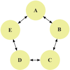

> **Deskripsi Visual:** Gambar ini adalah diagram yang menunjukkan hubungan antara empat objek atau konsep yang disebut A, B, C, dan D. Diagram ini menggunakan lingkaran untuk menggambarkan hubungan antar objek tersebut. Lingkaran A, B, C, dan D saling berhubungan melalui garis lurus yang menghubungkan mereka, menunjukkan bahwa setiap objek memiliki hubungan dengan objek lainnya. Objek A, B, C, dan D masing-masing memiliki tiga garis yang menghubungkan mereka ke objek lainnya, menunjukkan bahwa setiap objek memiliki hubungan dengan tiga objek lainnya. Ini menunjukkan bahwa setiap objek memiliki hubungan dengan tiga objek lainnya.

Diagram di atas menggambarkan saling menilai sikap/perilaku antarteman.

- Siswa A mengamati dan menilai B dan E; A juga dinilai oleh B dan E
- Siswa B mengamati dan menilai A dan C; B juga dinilai oleh A dan C
- Siswa C mengamati dan menilai B dan D; C juga dinilai oleh B dan D
- Siswa D mengamati dan menilai C dan E; D juga dinilai oleh C dan E
- Siswa E mengamati dan menilai D dan A; E juga dinilai oleh D dan A
Contoh instrumen penilaian (lembar pengamatan) antarteman ( peer assessment ) menggunakan  daftar  cek ( checklist) pada waktu  bekerja kelompok.

### Petunjuk:

- Amatilah perilaku 2 orang temanmu selama mengikuti kegiatan kelompok!
- Isilah kolom yang tersedia dengan tanda cek ( a ) jika temanmu menunjukkan perilaku yang sesuai dengan pernyataan untuk indikator yang kamu amati atau tanda strip (-) jika temanmu tidak menunjukkan perilaku tersebut!
- Serahkan hasil pengamatan kepada bapak/ibu pendidik !
Semester 1

 

---
## 📄 Halaman 29

Nama Teman

: 1………………… 2 …………………

Nama Penilai

: ………………………………………..

Kelas/Semester

: ………………………………………..

---
**📊 Tabel**

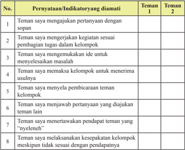

Tabel ini menunjukkan pernyataan-indikator yang diamati pada dua teman dalam sebuah kegiatan kerja kelompok. Topik utamanya adalah perilaku dan komunikasi antar teman dalam proses kerja kelompok. Kolom pertama berisi pernyataan yang diamati, sedangkan kolom kedua berisi keterangan tentang apakah teman tersebut memenuhi pernyataan tersebut atau tidak. Data penting yang terlihat adalah bahwa teman 1 lebih sering memenuhi pernyataan-pernyataan yang positif seperti "teman saya mengajukan pertanyaan dengan sopan" dan "teman saya mengerjakan kegiatan sesuai pembagian tugas dalam kelompok", sementara teman 2 lebih sering memenuhi pernyataan yang negatif seperti "teman saya menyebarkan ide untuk menyelesaikan masalah" dan "teman saya memaksa kelompok untuk menerima usulnya". Ini menunjukkan perbedaan dalam cara berkomunikasi dan bekerja dalam kelompok antara kedua teman tersebut.

Pernyataan-pernyataan  untuk  Indikator  yang  diamati  pada  format  di  atas merupakan contoh. Pernyataan tersebut ada yang bersifat positif (nomor 1, 2, 3, 6, 8) dan ada yang bersifat negatif (nomor 4, 5, dan 7).

Pendidik dapat berkreasi membuat sendiri pernyataan atau pertanyaan yang dengan  memperhatikan  kriteria  instrumen  penilaian  antarteman.  Lembar penilaian  diri  dan  penilaian  antarteman  yang  telah  diisi  dikumpulkan kepada  pendidik,  selanjutnya  dipilah  dan  direkapitulasi  sebagai  bahan tindaklanjut.  Pendidik  dapat  menganalisis  jurnal  atau  data/informasi  hasil observasi  penilaian  sikap  dengan  data/informasi  hasil  penilaian  diri  dan penilaian antarteman ( triangulasi ) sebagai bahan pembinaan. Hasil analisis dinyatakan dalam deskripsi sikap spiritual dan sikap sosial yang perlu segera ditindaklanjuti.  Peserta  didik  yang  menunjukkan  banyak  perilaku  positif diberi apresiasi/pujian dan peserta didik yang menunjukkan banyak perilaku negatif  diberi  motivasi  sehingga  selanjutnya  peserta  didik  tersebut  dapat membiasakan diri berperilaku baik (positif).

 

---
## 📄 Halaman 30

### b.  Penilaian Pengetahuan

### 1). Pengertian Penilaian Pengetahuan

Pengertian Penilaian pengetahuan merupakan penilaian untuk mengukur kemampuan  peserta  didik  berupa    pengetahuan  faktual,  konseptual, prosedural,  dan  metakognitif  serta  kecakapan  berpikir  tingkat  rendah hingga tinggi. Penilaian ini berkaitan dengan ketercapaian Kompetensi Dasar pada KI-3 yang dilakukan oleh guru mata pelajaran. Penilaian pengetahuan  dilakukan  dengan  berbagai  teknik  penilaian.  Pendidik menetapkan teknik penilaian yang sesuai dengan karakteristik kompetensi yang akan dinilai. Penilaian dimulai dengan perencanaan pada saat menyusun Rencana pelaksanaan Pembelajaran (RPP) dengan mengacu pada silabus. Penilaian pengetahuan, selain untuk mengetahui apakah  peserta  didik  telah  mencapai  ketuntasan  belajar  ( mastery learning ), juga untuk mengidentiikasi kelemahan dan kekuatan penguasaan  pengetahuan  peserta  didik  dalam  proses  pembelajaran ( diagnostic ).  Oleh  karena  itu,  pemberian  umpan  balik  ( feedback ) kepada peserta didik oleh pendidik merupakan hal yang sangat penting, sehingga hasil penilaian dapat segera digunakan untuk perbaikan mutu pembelajaran.  Ketuntasan  belajar  untuk  pengetahuan  ditentukan  oleh satuan  pendidikan  dengan  mempertimbangkan batas standar minimal nilai ujian Nasional yang ditetapkan oleh pemerintah.  secara bertahap satuan pendidikan  terus meningkatkan  kriteria ketuntasan belajar dengan  mempertimbangkan  potensi  dan  karakteristik  masing-masing satuan pendidikan sebagai bentuk peningkatan kualitas hasil belajar.

### 2). Teknik Penilaian Pengetahuan

Berbagai teknik penilaian pengetahuan dapat digunakan sesuai dengan karakteristik masing-masing KD. Teknik yang biasa digunakan adalah tes tertulis, tes lisan, dan penugasan. Namun tidak menutup kemungkinan digunakan teknik lain yang sesuai, misalnya portofolio dan observasi. Skema penilaian pengetahuan dapat dilihat pada gambar berikut.

Semester 1

 

---
## 📄 Halaman 31

---
**🖼️ Gambar/Diagram**

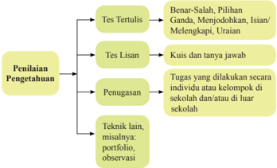

> **Deskripsi Visual:** Gambar ini adalah diagram yang menunjukkan berbagai metode penilaian pengetahuan. Diagram ini dibagi menjadi empat bagian utama:

1. **Tes Tertulis**:
   - Ditampilkan sebagai pilihan pertama.
   - Dibagi menjadi tiga sub-kategori: Benar-Salah, Pilihan Ganda, Menjodohkan, Isian, Melenkapi, Uraianan.

2. **Tes Lisan**:
   - Ditampilkan sebagai pilihan kedua.
   - Ditunjukkan dengan dua metode: Kuis dan Tanya Jawab.

3. **Penugasan**:
   - Ditampilkan sebagai pilihan ketiga.
   - Menyebutkan tugas yang dilakukan secara individu atau kelompok di sekolah dan/atau di luar sekolah.

4. **Teknik lain**:
   - Ditampilkan sebagai pilihan keempat.
   - Menyebutkan teknik seperti portfolio, observasi.

Elemen-elemen utama dalam diagram ini adalah metode penilaian pengetahuan tersebut, yang disajikan secara jelas dan terorganisir. Teks penting dalam diagram ini meliputi nama-nama metode penilaian tersebut, seperti "Tes Tertulis", "Tes Lisan", "Penugasan", dan "Teknik lain". Angka dan label penting mencakup jumlah sub-kategori dalam setiap metode penilaian, seperti "Benar-Salah" memiliki tiga sub-kategori.

Informasi kunci yang dapat diambil pembaca adalah bahwa ada berbagai metode penilaian pengetahuan yang digunakan dalam pendidikan, mulai dari tes tertulis hingga penugasan dan teknik lainnya.

Berikut ini adalah penjelasan dari skema pada gambar di atas.

### a). Tes Tertulis

Tes tertulis adalah tes dengan soal dan jawaban disajikan secara tertulis  untuk  mengukur  atau  memperoleh  informasi  tentang kemampuan  peserta  tes.  Tes  tertulis  menuntut  adanya  respons dari  peserta  tes  yang  dapat  dijadikan  sebagai  representasi  dari kemampuan yang dimiliki.

Instrumen tes tertulis dapat berupa soal pilihan ganda, isian, jawaban singkat,  benar-salah,  menjodohkan,  dan  uraian.Pengembangan instrumen tes tertulis mengikuti langkah-langkah berikut.

- Menetapkan  tujuan  tes,  apakah  tujuan  tes  untuk  seleksi, penempatan, diagnostik, formatif, atau sumatif.
- Menyusun kisi-kisi. yaitu spesiikasi yang digunakan sebagai acuan menulis soal. Kisi-kisi membuat rambu-rambu tentang kriteria soal yang akan ditulis, meliputi KD yang akan diukur, materi, indikator soal, bentuk soal, dan nomor soal. Dengan adanya  kisi-kisi,  penulisan  soal  lebih  terarah  sesuai  dengan tujuan tes dan proporsi soal per KD atau materi yang hendak diukur lebih tepat.
- Menulis soal berdasarkan kisi-kisi dan kaidah penulisan soal.

 

---
## 📄 Halaman 32

### Contoh Kisi-Kisi

Nama Satuan Pendidikan  : SMA / SMK .............

Kelas/Semester

: XII /Semester I

Tahun pelajaran

: 2014/2015

Mata Pelajaran

: Pendidikan agama Hindu dan Budi Pekerti

---
**📊 Tabel**

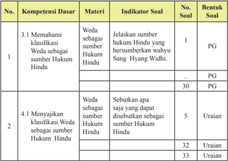

Tabel ini menunjukkan detail tentang kompetensi dasar yang harus dipelajari dalam materi "Weda sebagai sumber hukum Hindu". Topik utama adalah klasifikasi Weda sebagai sumber hukum Hindu. Tabel dibagi menjadi dua kolom utama: "Kompetensi Dasar" dan "Materi". Kolom "Kompetensi Dasar" mencakup dua subtopik utama: 3.1 Memahami klasifikasi Weda sebagai sumber hukum Hindu dan 4.1 Menyajikan klasifikasi Weda sebagai sumber hukum Hindu. Setiap subtopik tersebut memiliki indikator soal yang berbeda-beda, mulai dari penjelasan teks (PG) hingga uraian. Data penting lainnya termasuk nomor soal yang disertakan untuk setiap indikator soal, yang membantu dalam evaluasi pemahaman siswa terhadap materi tersebut.

Setelah  menyusun  kisi-kisi,  selanjutnya  dalam  mengembangkan butir  soal  dengan  memperhatikan  kaidah  penulisan  butir  soal meliputi substansi/materi, konstruksi, dan bahasa.

Semester 1

- Menyusun pedoman penskoran sesuai dengan bentuk soal yang digunakan. Pada soal pilihan ganda, isian, menjodohkan, dan jawaban singkat disediakan kunci jawaban karena jawabannya dapat  diskor  dengan  obyektif.  Sedangkan  untuk  soal  uraian disediakan pedoman penskoran yang berisi alternatif jawaban dan rubrik dengan rentang skor.
- Melakukan  analisis kualitatif (telaah soal) sebelum  soal diujikan.

 

---
## 📄 Halaman 33

### 1. Tes Tulis Bentuk Pilihan Ganda

Butir soal pilihan ganda terdiri atas pokok soal ( stem ) dan pilihan jawaban ( option ). Untuk tingkat SMA/SMK biasanya digunakan 5 (lima) pilihan jawaban. Dari kelima pilihan jawaban tersebut, salah satu adalah kunci ( key ) yaitu jawaban yang benar atau paling tepat, dan lainnya disebut pengecoh ( distractor ).

Kaidah penulisan soal bentuk pilihan ganda sebagai berikut.

### a. Substansi/Materi

- 1). Soal sesuai dengan indikator (menuntut tes bentuk PG).
- 2). Materi yang diukur sesuai dengan kompetensi (UKRK: Urgensi, Keberlanjutan, Relevansi, dan Keterpakaian).
- 3). Pilihan jawaban homogen dan logis.
- 4). Hanya ada satu kunci jawaban yang tepat.

### b. Konstruksi

- 1). Pokok soal dirumuskan dengan singkat, jelas, dan tegas.
- 2). Rumusan  pokok  soal  dan  pilihan  jawaban  merupakan pernyataan yang diperlukan saja.
- 3). Pokok soal tidak memberi petunjuk kunci jawaban.
- 4). Pokok soal tidak menggunakan pernyataan negatif ganda.
- 5). Gambar/graik/tabel/diagram  dan  sebagainya  jelas  dan berfungsi.
- 6). Panjang rumusan pilihan jawaban relatif sama.
- 7). Pilihan jawaban tidak menggunakan pernyataan 'semua jawaban benar' atau 'semua jawaban salah'.
- 8). Pilihan jawaban yang berbentuk angka atau waktu disusun berdasarkan besar kecilnya angka atau kronologis kejadian.
- 9). Butir  soal  tidak  bergantung  pada  jawaban  soal  sebelumnya.

### c. Bahasa

- 1). Menggunakan bahasa yang sesuai dengan kaidah Bahasa Indonesia.
- 2). Menggunakan bahasa yang komunikatif.
- 3). Pilihan  jawaban  tidak  mengulang  kata/kelompok  kata yang sama, kecuali merupakan satu kesatuan pengertian.
- 4). Tidak menggunakan bahasa yang berlaku setempat/tabu.

 

---
## 📄 Halaman 34

Contoh butir soal pilihan ganda mata pelajaran Pendidikan Agama Hindu dan Budi pekerti  berdasarkan contoh kisi-kisi di atas

Rumusan butir soal:

Sumber Hukum Hindu yang bersumberkan wahyu Ida Sang  Hyang Widhi adalah....

- Weda Sruti
- Weda Smrti
- Acara
- Atmanastuti
- Itihasa

### 2. Tes Tulis Bentuk Uraian

Tes  tulis  bentuk  uraian  atau  esai  menuntut  peserta  didik  untuk mengorganisasikan  dan  menuliskan  jawaban  dengan  kalimatnya sendiri.

Kaidah penulisan soal bentuk uraian sebagai berikut.

### a. Substansi / Materi

- 1). Soal sesuai dengan indikator (menuntut tes bentuk uraian)
- 2). Batasan pertanyaan dan jawaban yang diharapkan sesuai
- 3). Materi yang diukur sesuai dengan kompetensi (UKRK)
- 4). Isi  materi yang ditanyakan sesuai dengan jenjang, jenis sekolah, dan tingkat kelas

### b. Konstruksi

- 1). Ada petunjuk yang jelas mengenai cara mengerjakan soal
- 2). Rumusan  kalimat  soal/pertanyaan  menggunakan  kata tanya atau perintah yang menuntut jawaban terurai
- 3). Gambar/graik/tabel/diagram  dan  sejenisnya  harus  jelas dan berfungsi
- 4). Ada pedoman penskoran
Kunci Jawaban:  A

Semester 1

 

---
## 📄 Halaman 35

### c. Bahasa

- 1). Rumusan kalimat soal/pertanyaan komunikatif
- 2). Butir soal menggunakan bahasa Indonesia yang baku
- 3). Tidak mengandung kata-kata/kalimat yang menimbulkan penafsiran ganda atau salah pengertian
- 4). Tidak mengandung kata yang menyinggung perasaan
- 5). Tidak menggunakan bahasa yang berlaku setempat/tabu

### Contoh Rumusan butir soal uraian berdasarkan contoh kisikisi di atas:

Perhatikan informasi berikut untuk menjawab pertanyaan nomor 31.

Sebutkan apa saja yang dapat disebutkan sebagai sumber Hukum Hindu!

### Jawaban:

- Sruti yaitu kitab weda yang bersumberkan dari Sabda / wahyu Sang Hyang Widhi Wasa
- Smrti yaitu kitab suci yang bersumberkan penjelasan dari kitab Weda sruti
- Acara bersumberkan pada adat isti adat daerah setempat yang berlaku
- Sila yaitu mencontoh sikap dan perilaku orang -orang suci dan orang yang bijaksana
- Atmanastuti yaitu jiwa yang tulus dan suci yang selalu jujur dalam setiap nafas kehidupan

### b). Tes lisan

Tes  lisan  merupakan  pemberian  soal/pertanyaan  yang  menuntut peserta  didik    menjawabnya  secara  lisan,  dan  dapat  diberikan secara klasikal pada waktu pembelajaran. Jawaban peserta didik dapat  berupa  kata,  frase,  kalimat  maupun  paragraf.  Tes  lisan menumbuhkan sikap peserta didik  untuk berani berpendapat.

### Rambu-rambu pelaksanaan tes lisan:

- Tes lisan dapat digunakan untuk mengambil nilai ( assessment of learning )  dan  dapat  juga  digunakan sebagai fungsi diagnostik untuk mengetahui pemahaman siswa terhadap kompetensi dan materi pembelajaran ( assessment for learning ).

 

---
## 📄 Halaman 36

- Pertanyaan  harus  sesuai  dengan  tingkat  kompetensi  dan lingkup materi pada kompetensi dasar yang dinilai
- Pertanyaan diharapkan dapat mendorong peserta didik  dalam mengonstruksi jawabannya sendiri.
- Pertanyaan disusun dari yang sederhana ke yang lebih komplek.

### Contoh pertanyaan untuk tes lisan dalam pembelajaran.

Mata Pelajaran

: Pendidikan agama Hindu dan Budi Pekerti

Kelas/Semester

: XII / 1

Kompetensi Dasar

: 4.4 Menyajikan  Ashtangga Yoga untuk mencapai Moksa

Indikator :

- 1). Siswa  dapat  menyebutkan  tahapan-tahapan Ashtangga Yoga
- 2). Siswa dapat menjelaskan bagian-bagian ajaran Yama dan manfaatnya
Pertanyaan

- : 1). Sebutkan tahapan-tahapan Ashtangga Yoga
- 2). Jelaskan bagian-bagian ajaran Yama dan manfaatnya

### c). Penugasan

Penugasan  adalah  pemberian  tugas  kepada  peserta  didik    untuk mengukur dan/atau meningkatkan pengetahuan. Penugasan yang digunakan untuk mengukur pengetahuan (assessment of learning) dapat dilakukan setelah proses pembelajaran sedangkan penugasan yang digunakan untuk meningkatkan pengetahuan (assessment for learning) diberikan sebelum dan/atau selama proses pembelajaran . Penugasan dapat berupa pekerjaan rumah dan/atau proyek yang  dikerjakan  secara  individu  atau  kelompok  sesuai  dengan karakteristik tugas. Penugasan lebih ditekankan pada pemecahan masalah dan tugas produktif  lainnya.

### Rambu-rambu penugasan:

- Tugas mengarah pada pencapaian indikator hasil belajar.
- Tugas  dapat  dikerjakan  oleh  peserta  didik,  selama  proses pembelajaran atau merupakan bagian dari pembelajaran mandiri.
- Pemberian  tugas  disesuaikan  dengan  taraf  perkembangan peserta didik
Semester 1

 

---
## 📄 Halaman 37

- Materi penugasan harus sesuai dengan cakupan kurikulum.
- Penugasan  ditujukan  untuk  memberikan  kesempatan  kepada peserta didik menunjukkan kompetensi individualnya meskipun tugas diberikan secara kelompok.
- Untuk tugas kelompok, perlu dijelaskan rincian  tugas  setiap anggota kelompok.
- Tampilan  kualitas  hasil  tugas  yang  diharapkan  disampaikan secara jelas.
- Penugasan  harus  mencantumkan  rentang  waktu  pengerjaan tugas.

### Contoh penugasan

Mata Pelajaran

: Pendidikan Agama Hindu dan Budi Pekerti

Kelas/Semester

: XII / I

Tahun Pelajaran

: 2014/2015

Kompetensi Dasar

: 3.2 Memahami sejarah perkembangan kebudayaan Hindu di dunia.

Indikator

:  Menganalisis  sejarah  perkembangan  kebudayaan  Hindu  di Dunia.

### Rincian tugas:

- Amatilah bagaimana perkembangan kebudayaan Hindu yang anda ketahui baik melalui  buku  maupun  dari  internet  dan  pengamatan  secara  langsung,  baik  di Indonesia maupun di Negara-negara lainnya.
- Perhatikan  ciri-ciri  karakter  kebudayan  Hindu  di  setiap  daerah  atau  Negara tersebut.
- Buatlah  laporan  hasil  pengamatanmu  dengan  tampilan  yang  menarik  dan menggunakan bahasa Indonesia yang benar sehingga mudah dipahami. Laporan meliputi  pendahuluan  (tujuan  penyusunan  laporan,  nama  sejarah  kebudayaan Hindu  di  Negara  tersebut,  tempat,  waktu  dan  pelaksanaan  (hasil  pengamatan kebudayaan Hindu).
Contoh rubrik penilaian laporan tugas Pendidikan agama Hindu dan Budi Pekerti

 

---
## 📄 Halaman 38

---
**📊 Tabel**

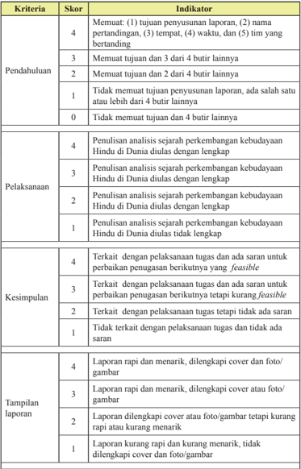

Tabel ini menunjukkan skor dan indikator untuk evaluasi laporan, dengan topik utama pendahuluan, pelaksanaan, kesimpulan, dan tampilan laporan. Kolom "Skor" menunjukkan nilai yang diberikan berdasarkan kriteria tertentu, sementara kolom "Indikator" memberikan deskripsi detail tentang apa yang harus dicapai untuk mendapatkan skor tertentu. Pola penting yang terlihat adalah bahwa skor 4 biasanya diberikan ketika laporan memenuhi semua kriteria, sedangkan skor 0 diberikan jika laporan tidak memenuhi satu atau lebih kriteria. Indikator untuk kesimpulan mencakup aspek seperti terkait dengan pelaksanaan tugas,可行性, dan tampilan laporan yang menarik.

Semester 1

 

---
## 📄 Halaman 39

---
**📊 Tabel**

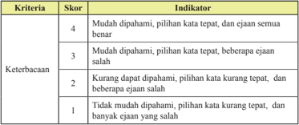

Tabel ini menunjukkan skor dan indikator untuk kriteria keterbacaan dalam sebuah evaluasi. Topik utamanya adalah tingkat keterbacaan yang diberikan kepada peserta didik berdasarkan kemampuan mereka dalam memahami teks. Kolom pertama menunjukkan skor yang diberikan, sementara kolom kedua menunjukkan indikator yang sesuai dengan skor tersebut. Data penting yang terlihat adalah bahwa skor 4 diberikan jika peserta didik dapat memilih kata-kata yang tepat dan ejaan yang benar, sedangkan skor 1 diberikan jika mereka tidak dapat memahami teks dan pilihan kata kurang tepat, serta beberapa ejaan salah. Ini menunjukkan bahwa skor yang lebih tinggi menandakan kemampuan keterbacaan yang lebih baik.

### Contoh pengisian hasil penilaian tugas

---
**📊 Tabel**

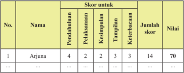

Tabel ini menunjukkan skor siswa Arjuna untuk berbagai aspek pembelajaran, seperti pendahuluan, pelaksanaan, kesimpulan, tampilan, dan keterbacaan. Topik utama tabel adalah evaluasi pembelajaran siswa. Kolom-kolomnya mencakup nama siswa, skor untuk setiap aspek pembelajaran, jumlah skor, dan nilai akhir. Data penting yang terlihat adalah bahwa Arjuna mendapatkan skor tertinggi pada aspek keterbacaan dengan 14 poin, sementara skor terendahnya adalah pada aspek pelaksanaan dengan 2 poin. Nilai akhir Arjuna adalah 70, menunjukkan bahwa ia telah memperoleh penilaian yang baik dalam beberapa aspek pembelajaran, tetapi masih perlu meningkatkan pada aspek lainnya.

### Keterangan:

- Skor maksimal = banyaknya kriteria x skor tertinggi setiap kriteria.
Pada contoh di atas, skor maksimal  = 5 x 4= 20.

- Nilai tugas = (Jumlah skor perolehan: skor maks) x 100.
- Pada contoh di atas nilai tugas Adi = (14 : 20) x 100 = 70.

### d).  Observasi

Observasi  selama  proses  pembelajaran  selain  dilakukan  untuk penilaian sikap, juga dapat dilakukan untuk penilaian pengetahuan, misalnya pada waktu diskusi atau kegiatan kelompok. Teknik ini merupakan cerminan dari penilaian autentik.

Contoh format observasi terhadap diskusi  kelompok

 

---
## 📄 Halaman 40

---
**📊 Tabel**

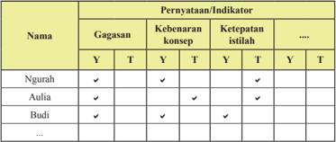

Tabel ini menunjukkan hasil evaluasi pengetahuan dan pemahaman siswa tentang konsep tertentu dalam mata pelajaran. Kolom "Nama" menyajikan nama-nama siswa yang telah menjawab pertanyaan. Kolom "Gagasan", "Kebenaran konsep", "Ketepatan istilah", dan lainnya menunjukkan tingkat keakuratan jawaban masing-masing siswa terhadap setiap indikator atau persyaratan yang diberikan dalam tes. Dari tabel ini, dapat dilihat bahwa banyak siswa memiliki pengetahuan yang baik terkait konsep tersebut, dengan beberapa siswa mendapatkan nilai "Y" (Ya) untuk semua indikator, sementara siswa lainnya memiliki beberapa jawaban yang tidak tepat. Ini menunjukkan bahwa pembelajaran yang dilakukan mungkin cukup efektif, namun masih ada ruang untuk peningkatan keterampilan dan pemahaman siswa.

### Keterangan:

Diisi tanda cek ( a ): Y = ya/benar/tepat; T = tidak tepat

Hasil yang diperoleh dari observasi digunakan untuk  mendeteksi kelemahan/kekuatan  penguasaan  kompetensi  pengetahuan  dan memperbaiki proses pembelajaran khususnya pada indikator yang belum muncul.

### c) Penilaian Keterampilan

### 1. Pengertian Penilaian Keterampilan

Penilaian  keterampilan  adalah  penilaian  untuk  mengukur  pencapaian kompetensi peserta didik terhadap kompetensi dasar pada KI-4. Penilaian keterampilan menuntut peserta didik mendemonstrasikan suatu kompetensi tertentu. Penilaian ini dimaksudkan untuk mengetahui apakah pengetahuan yang sudah dikuasai peserta didik  dapat digunakan untuk mengenal dan menyelesaikan masalah dalam kehidupan sesungguhnya ( real life ).

Ketuntasan belajar untuk keterampilan ditentukan oleh satuan pendidikan, secara bertahap satuan pendidikan terus meningkatkan kriteria ketuntasan belajar  dengan  mempertimbangkan  potensi  dan  karakteristik  masingmasing  satuan  pendidikan  sebagai  bentuk  peningkatan  kualitas  hasil belajar.

### 2. Teknik Penilaian Keterampilan

Penilaian  keterampilan  dapat  dilakukan  dengan  berbagai  teknik  antara lain penilaian praktik/kerja, proyek, dan portofolio. Teknik penilaian lain dapat digunakan sesuai dengan karakteristik KD pada KI-4 pada mata pelajaran yang akan diukur. Instrumen yang digunakan berupa daftar cek atau skala penilaian (Rating Scale) yang dilengkapi rubrik.

Semester 1

 

---
## 📄 Halaman 41

Skema penilaian keterampilan dapat dilihat pada gambar berikut.

### Skema Penilaian Keterampilan

---
**🖼️ Gambar/Diagram**

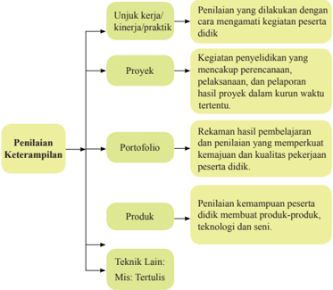

> **Deskripsi Visual:** Gambar ini adalah diagram yang menunjukkan berbagai metode penilaian keterampilan dalam konteks pendidikan. Diagram ini terdiri dari empat baris vertikal yang masing-masing menunjukkan metode penilaian keterampilan yang berbeda. Setiap baris memiliki beberapa elemen yang terkait dengan metode tersebut.

Pertama, baris pertama menunjukkan "Penilaian Keterampilan" sebagai titik awal. Dari sini, ada tiga poin utama yang disebutkan:

1. Unjuk kerja/kinerja/praktik: Ini melibatkan penilaian yang dilakukan dengan cara mengamati kegiatan peserta didik.
2. Proyek: Kegiatan penyelidikan yang mencakup perencanaan, pelaksanaan, dan pelaporan hasil proyek dalam kurun waktu tertentu.
3. Portofolio: Rekaman hasil pembelajaran dan penilaian yang mempertahankan kemajuan dan kualitas pekerjaan peserta didik.

Baris kedua menunjukkan "Teknik Lain", yang meliputi mis. Tertulis. 

Setiap elemen ini memiliki relasi dengan metode penilaian keterampilan yang disebutkan di atas. Misalnya, unjuk kerja/kinerja/praktik melibatkan penilaian langsung oleh pengawas, sedangkan portofolio menyimpan semua hasil belajar dan penilaian sepanjang waktu.

Teks, angka, atau label penting yang terlihat dalam diagram ini adalah nama-nama metode penilaian keterampilan yang disebutkan, seperti "Unjuk kerja/kinerja/praktik", "Proyek", "Portofolio", dan "Teknik Lain". Label ini membantu pembaca untuk memahami apa yang ditunjukkan oleh setiap bagian diagram.

Informasi kunci yang dapat diambil pembaca dari gambar ini adalah bahwa penilaian keterampilan dalam pendidikan dapat dilakukan melalui berbagai metode, termasuk unjuk kerja/kinerja/praktik, proyek, portofolio, dan teknik lain seperti mis. tertulis.

Penjelasan gambar di atas sebagai berikut.

### 1. Penilaian Unjuk kerja / Kinerja / Praktik

Penilaian  unjuk  kerja  /  kinerja  atau  praktik  dilakukan  dengan cara mengamati kegiatan peserta didik dalam melakukan sesuatu. Penilaian ini cocok digunakan untuk menilai ketercapaian kompetensi yang menuntut peserta didik melakukan tugas tertentu seperti: Praktikum dilaboratorium, praktik ibadah, praktik olahraga, presentasi, bermain peran, memainkan musik, bernyanyi, dan  membaca  puisi  /  deklamasi.  Penilaian  unjuk  kerja/  kinerja/ praktik perlu mempertimbangkan hal-hal berikut.

 

---
## 📄 Halaman 42

- Langkah-langkah kinerja yang dilakukan peserta didik untuk menunjukan kinerja dari suatu kompetensi.
- Kelengkapan  dan  ketepatan  aspek  yang  akan  dinilai  dalam kinerja tersebut.
- Kemampuan-kemampuan khusus yang diperlukan untuk menyelesaikan tugas.
- Kemampuan yang akan dinilai tidak terlalu banyak, sehingga dapat diamati.
- Kemampuan yang akan dinilai selanjutnya diurutkan berdasarkan langkah-langkah pekerjaan yang akan diamati.
Pengamatan unjuk kerja / kerja / praktik  perlu  dilakukan  dalam berbagai  konteks  untuk  menetapkan  tingkat  pencapaian  kemampuan tertentu.  Misalnya  untuk  menilai  kemampuan  berbicara  yang beragam dilakukan pengamatan terhadap kegiatan-kegiatan seperti:  Diskusi  dalam  kelompok kecil, berpidato, bercerita, dan wawancara. dengan demikian gambaran kemampuan peserta didik akan lebih utuh. Contoh untuk menilai unjuk kerja / kinerja/ praktik dilaboratorium  dilakukan  pengamatan  terhadap  penggunaan  alat dan  alat  bahan  praktikum.  Untuk  penilaian  praktik  olahraga, seni  dan  budaya,  dilakukan  pengamatan  gerak  dan  penggunaan olahraga,  seni  dan  budaya.  dalam  pelaksanaan  penilaian  kinerja perlu  disiapkan  format  observasi  dan  rubrik  penilaian  untuk mengamati perilaku peserta didik dalam melakukan praktik atau produk yang dihasilkan.

### Contoh penilaian kinerja/praktik

Mata Pelajaran

: Pendidikan Agama Hindu dan Budi Pekerti

Kelas/Semester

: XII / I

Tahun Pelajaran

: 2014/2015

Kompetensi Dasar    : 4.4 Menyajikan Ashtangga Yoga untuk mencapai Moksa

Indikator

: Siswa dapat mempraktikkan tahapan-tahapan Ashtangga Yoga

Rubrik penilaian kinerja/praktik Yoga

---
**📊 Tabel**

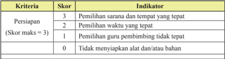

Tabel ini menunjukkan skor dan indikator untuk persiapan dalam sebuah kegiatan belajar. Topik utamanya adalah persiapan dalam proses pembelajaran. Kolom pertama berisi kriteria yang harus dipenuhi, sedangkan kolom kedua berisi skor yang diberikan untuk setiap kriteria tersebut. Skor maksimal adalah 3, yang berarti semua kriteria harus dipenuhi untuk mendapatkan skor tertinggi. Indikator yang digunakan untuk menilai persiapan meliputi pemilihan sarana dan tempat yang tepat, pemilihan waktu yang tepat, pemilihan guru pembimbing yang tepat, dan tidak mempersiapkan alat dan bahan. Data penting yang terlihat adalah bahwa skor tertinggi adalah 3, yang berarti semua kriteria harus dipenuhi untuk mendapatkan skor tertinggi. Skor 2 diberikan jika hanya dua kriteria dipenuhi, skor 1 diberikan jika hanya satu kriteria dipenuhi, dan skor 0 diberikan jika tidak ada kriteria yang dipenuhi.

Semester 1

 

---
## 📄 Halaman 43

---
**📊 Tabel**

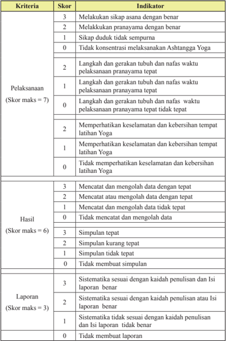

Tabel ini menunjukkan kriteria evaluasi untuk aspek-aspek pelaksanaan, hasil, dan laporan dalam praktik Ashtanga Yoga. Topik utama tabel adalah kualifikasi dan keterampilan dalam melakukan pranayama dan latihan yoga, termasuk konsentrasi, keselamatan, kebersihan tempat, pencatatan data, simpulan, dan sistematisasi laporan. Kolom-kolomnya mencakup skor maksimal masing-masing kriteria, indikator yang harus dicapai, dan skor yang diberikan berdasarkan penilaian. Data penting yang terlihat adalah bahwa skor maksimal untuk pelaksanaan adalah 7, hasil adalah 6, dan laporan adalah 3. Ini menunjukkan bahwa keterampilan dan kualifikasi dalam melakukan pranayama dan latihan yoga memerlukan penilaian yang lebih mendalam dan detail.

 

---
## 📄 Halaman 44

---
**📊 Tabel**

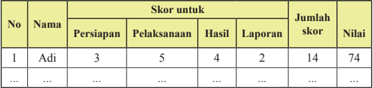

Tabel ini menunjukkan data evaluasi untuk seorang siswa bernama Adi. Topik utama tabel adalah persiapan, pelaksanaan, hasil, laporan, jumlah skor, dan nilai akhir. Kolom-kolomnya mencakup nomor urut (No.), nama siswa (Nama), skor untuk persiapan (Persiapan), skor untuk pelaksanaan (Pelaksanaan), skor untuk hasil (Hasil), skor untuk laporan (Laporan), jumlah skor (Jumlah skor), dan nilai akhir (Nilai). Data penting yang terlihat adalah bahwa Adi mendapatkan skor tertinggi pada persiapan dengan 3 poin, sedangkan skor terendahnya pada laporan dengan 2 poin. Nilai akhir Adi adalah 74, yang menunjukkan bahwa ia telah memperoleh skor yang cukup baik dalam semua aspek evaluasi tersebut.

### Keterangan:

- Skor maksimal = jumlah skor tertinggi setiap kriteria. Pada contoh di atas, skor maksimal  = 3 + 7 + 6 + 3= 19.
- Nilai praktik = (Jumlah skor perolehan: skor maks) x 100.
- Pada contoh di atas nilai praktik Adi = (14 : 19) x 100 = 73,68 dibulatkan menjadi 74.
Dalam penilaian kinerja dapat juga dibuat pembobotan pada aspek yang dinilai, misalnya persiapan 20%, Pelaksanaan dan Hasil 50%, serta Pelaporan 30%.

### b. Penilaian Proyek

Penilaian  proyek  merupakan  kegiatan  penilaian  terhadap  suatu  tugas  yang meliputi  kegiatan  perancangan,  pelaksanaan,  dan  pelaporan,  yang  harus diselesaikan  dalam  periode/waktu  tertentu.  Tugas  tersebut  berupa  suatu investigasi  sejak  dari  perencanaan,  pengumpulan  data,  pengorganisasian, pengolahan  dan  penyajian  data.  Penilaian  proyek  dapat  digunakan  untuk mengetahui pemahaman, kemampuan mengaplikasikan, inovasi dan kreativitas, kemampuan penyelidikan dan kemampuan peserta didik menginformasikan mata pelajaran tertentu secara jelas.

Penilaian  proyek  dapat  dilakukan  dalam  satu  atau  lebih  KD,  satu  mata pelajaran, beberapa mata pelajaran serumpun atau lintas mata pelajaran yang bukan serumpun.

Penilaian proyek umumnya menggunakan metode belajar pemecahan masalah sebagai langkah awal dalam pengumpulan dan mengintegrasikan pengetahuan baru  berdasarkan  pengalamannya  dalam  beraktivitas  secara  nyata.  Pada penilaian proyek setidaknya ada 4 (empat) hal yang perlu dipertimbangkan yaitu pengelolaan, relevansi, keaslian, dan inovasi dan kreativitas.

- Pengelolaan  yaitu  kemampuan  peserta  didik    dalam  memilih  topik, mencari informasi dan mengelola waktu pengumpulan  data serta penulisan laporan.
Semester 1

 

---
## 📄 Halaman 45

- Relevansi  yaitu  kesesuaian  topik,  data,  dan  hasilnya  dengan  KD  atau mata pelajaran.
- Keaslian.  Proyek  yang  dilakukan  peserta  didik  harus  merupakan  hasil karyanya sendiri dengan mempertimbangkan kontribusi pendidik dan pihak lain berupa bimbingan dan dukungan terhadap proyek yang dilakukan peserta didik.
- Inovasi  dan  kreativitas.  Proyek  yang  dilakukan  peserta  didik  terdapat unsur-unsur baru (kekinian) dan sesuatu yang unik, berbeda dari biasanya.

### Contoh Penilaian Proyek

Mata Pelajaran

: Pendidikan Agama Hindu dan Budi Pekerti

Kelas/Semester

: XII / I

Kompetensi Dasar

: 4.4 Menyajikan Ashtangga Yoga untuk mencapai   Moksa.

Indikator

: Siswa dapat melakukan penelitian mengenai permasalahan sosial yang terjadi pada masyarakat terhadap praktik Yoga dilingkungan sekitarnya.

### Rumusan tugas proyek  :

- 1). Lakukan  penelitian  mengenai  permasalahan  sosial  yang  berkembang  pada masyarakat di lingkungan sekitar tempat tinggalmu, misalnya  pengaruh keberadaan latihan atau praktik Yoga bagi  masyarakat  sekitarnya  (kamu  bisa memilih masalah lain yang sedang berkembang di lingkunganmu).
- 2). Tugas  dikumpulkan  sebulan  setelah  hari  ini.  Tuliskan  rencana  penelitianmu, lakukan,  dan  buatlah  laporannya.  Dalam  membuat  laporan  perhatikan  latar belakang,  perumusan  masalah,  kebenaran  informasi/data,  kelengkapan  data, sistematika laporan, penggunaan bahasa, dan tampilan laporan!

### Rubrik penilaian proyek:

---
**📊 Tabel**

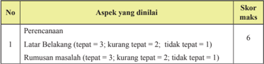

Tabel ini menunjukkan skor perencanaan dan aspek yang dinilai dalam sebuah proses penyelesaian masalah. Topik utama tabel adalah perencanaan dan aspek-aspek yang dinilai, seperti latar belakang dan rumusan masalah. Kolom pertama berisi nomor urut (No.), kolom kedua berisi aspek yang dinilai, kolom ketiga berisi skor maksimal untuk setiap aspek, dan kolom keempat berisi skor yang diberikan untuk setiap aspek. Data penting yang terlihat adalah bahwa skor maksimal untuk latar belakang adalah 3, sedangkan untuk rumusan masalah adalah 2. Skor yang diberikan untuk latar belakang adalah 6, sementara untuk rumusan masalah adalah 1. Ini menunjukkan bahwa skor yang diberikan lebih tinggi untuk latar belakang dibandingkan dengan rumusan masalah.

 

---
## 📄 Halaman 46

---
**📊 Tabel**

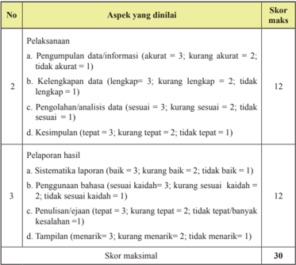

Tabel ini menunjukkan skor maksimal untuk aspek-aspek penilaian dalam sebuah proyek atau tugas akhir. Topik utamanya adalah pelaksanaan dan pelaporan hasil. Kolom pertama berisi nomor urut aspek yang harus dinyatakan, sedangkan kolom kedua berisi deskripsi aspek tersebut. Skor maksimal untuk setiap aspek ditentukan berdasarkan tingkat keakuratan, lengkapan, sesuaiannya, dan kesimpulannya. Misalnya, pengumpulan data harus akurat dengan skor maksimal 12, sementara penulisan laporan harus menarik dengan skor maksimal 30. Pola penting yang terlihat adalah bahwa skor maksimal untuk setiap aspek dapat mencapai 30, yang menunjukkan bahwa setiap aspek memiliki nilai yang signifikan dalam penilaian keseluruhan.

Nilai proyek = (skor perolehan : skor maksimal) x 100.

Dapat juga dibuat pembobotan pada aspek yang dinilai, misalnya perencanaan 20%, pelaksanaan 40%, dan pelaporan 40%.

### c. Penilaian Portofolio

Portofolio merupakan penilaian berkelanjutan yang didasarkan pada kumpulan informasi yang bersifat relektif-integratif yang menunjukkan perkembangan kemampuan peserta didik  dalam satu periode tertentu. Ada beberapa  tipe  portofolio  yaitu  portofolio  dokumentasi,  portofolio  proses, dan portofolio pameran. Pendidik dapat memilih tipe portofolio yang sesuai dengan  karakteristik  kompetensi  dasar  dan/atau  konteks  mata  pelajaran. Pada akhir suatu periode hasil karya tersebut dikumpulkan dan dinilai oleh pendidik bersama  peserta didik. Berdasarkan  informasi  perkembangan tersebut, pendidik dan peserta didik  dapat menilai perkembangan kemampuan peserta didik  dan terus melakukan perbaikan. Dengan demikian, portofolio dapat memperlihatkan perkembangan kemajuan belajar peserta didik  melalui karyanya.  Portofolio  peserta  didik  disimpan  dalam  suatu  folder  dan  diberi

Semester 1

 

---
## 📄 Halaman 47

tanggal  pembuatan  sehingga  dapat  dilihat  perkembangan  kualitasnya  dari waktu ke waktu. Dalam kurikulum 2013, portofolio digunakan sebagai salah satu bahan penilaian. Hasil penilaian portofolio bersama dengan penilaian yang lain  dipertimbangkan  untuk  pengisian  rapor/laporan  penilaian  kompetensi peserta  didik.  Portofolio  merupakan  bagian  dari  penilaian  autentik,  yang langsung  dapat  merepresentasikan  sikap,  pengetahuan,  dan  keterampilan peserta  didik  Penilaian  portofolio  dilakukan  untuk  menilai  karya-karya peserta  didik  secara  bertahap  dan  pada  akhir  suatu  periode  hasil  karya tersebut dikumpulkan dan dipilih bersama oleh pendidik dan peserta didik. Karya-karya terpilih yang menurut pendidik dan peserta didik  adalah karyakarya terbaik disimpan dalam buku besar/album/stofmap sebagai dokumen portofolio.  Pendidik  dan  peserta  didik  harus  sama-sama  memahami  alasan mengapa karya-karya tersebut disimpan di dalam koleksi portofolio. Setiap karya pada dokumen portofolio harus memiliki makna atau kegunaan bagi peserta didik, pendidik dan orang lain yang mengamati. Selain itu, diperlukan komentar dan releksi dari pendidik, orangtua peserta didik, atau pengamat pendidikan yang memiliki keterkaitan dengan karya-karya yang dikoleksi.

Karya peserta didik yang dapat disimpan sebagi dokumen portofolio antara lain:  karangan,  puisi,  gambar/lukisan,  surat  penghargaan/piagam,  foto-foto prestasi,  dsb.  Dokumen  portofolio  dapat  menumbuhkan  rasa  bangga  yang mendorong peserta didik mencapai hasil belajar yang lebih baik. Pendidik dapat  memanfaatkan  portofolio  untuk  mendorong  peserta  didik  mencapai sukses  dan  membangun  kebanggaan  diri.  Secara  tidak  langsung,  hal  ini berdampak  pada  peningkatan  upaya  peserta  didik  untuk  mencapai  tujuan individualnya. Di samping itu pendidik pun akan merasa lebih mantap dalam mengambil keputusan penilaian  karena  didukung  oleh  bukti-bukti  autentik yang telah dicapai dan dikumpulkan peserta didik.

Agar penilaian portofolio menjadi efektif, pendidik dan peserta didik perlu menentukan ruang lingkup penggunaan portofolio antara lain sebagai berikut:

- Setiap  peserta  didik  memiliki  dokumen  portofolio  sendiri  yang  di dalamnya memuat hasil belajar  pada setiap mata pelajaran atau setiap kompetensi.
- Menentukan hasil kerja/karya apa yang perlu dikumpulkan/disimpan.
- Pendidik memberi catatan berisi komentar dan masukan untuk ditindaklanjuti peserta didik.
- Peserta  didik    harus  membaca  catatan  pendidik  dan  dengan  kesadaran sendiri  dan  menindaklanjuti  masukan  yang  diberikan  pendidik  dalam rangka memperbaiki  hasil karyanya.
- Catatan pendidik dan perbaikan hasil kerja yang dilakukan peserta didik perlu  diberi  tanggal,  sehingga  dapat  dilihat  perkembangan  kemajuan belajar peserta didik.

 

---
## 📄 Halaman 48

Rambu-rambu penyusunan dokumen portofolio.

- Dokumen  portofolio  berupa  karya/tugas  peserta  didik  dalam  periode tertentu dikumpulkan dan digunakan oleh pendidik untuk mendeskripsikan capaian kompetensi keterampilan.
- Dokumen  portofolio  disertakan  pada  waktu  penerimaan  rapor  kepada orangtua/wali peserta didik sehingga orangtua/wali mengetahui perkembangan belajar putra/putrinya. Orangtua/wali peserta didik diharapkan  dapat  memberi  komentar/catatan  pada  dokumen  portofolio sebelum dikembalikan ke satuan pendidkan.
- Pendidik pada kelas berikutnya menggunakan portofolio sebagai informasi awal peserta didik yang bersangkutan.

### d. Pengolahan Hasil Penilaian

### 1. Nilai Sikap Spiritual dan Sikap Sosial

Langkah-langkah  menyusun  rekapitulasi  penilaian  sikap  untuk  satu semester.

- Wali  kelas,  guru  mata  pelajaran,  dan  guru  BK  mengelompokkan (menandai) catatan-catatan jurnal ke dalam sikap spiritual dan sikap sosial.
- Wali  kelas,  guru  mata  pelajaran,  dan  guru  BK  membuat  rumusan deskripsi  singkat  sikap  spiritual  dan  sosial  sesuai  dengan  catatancatatan jurnal untuk setiap peserta didik yang ditulis dengan kalimat positif.  Deskripsi  tersebut  menyebutkan  sikap/perilaku  yang  sangat baik dan/atau kurang baik dan yang perlu bimbingan.
- Wali kelas mengumpulkan deskripsi singkat (rekap) sikap dari guru mata pelajaran dan guru BK. Wali kelas menyimpulkan (merumuskan deskripsi)  capaian  sikap  spiritual  dan  sosial  setiap  peserta  didik berdasarkan deskripsi singkat sikap spiritual dan sosial dari guru mata pelajaran, guru BK, dan wali kelas yang bersangkutan.
- Deskripsi  yang  ditulis  pada  sikap  spiritual  dan  sikap  sosial  adalah perilaku yang menonjol, sedangkan sikap spiritual dan sikap sosial yang  belum  mencapai  kriteria  (indikator)  dideskripsikan  sebagai perilaku yang perlu bimbingan.
- Dalam hal peserta didik tidak ada catatan apapun dalam jurnal, sikap peserta didik tersebut diasumsikan  berperilaku  sesuai indikator kompetensi.
- Rekap hasil observasi sikap spiritual dan sikap sosial yang dilakukan oleh  wali  kelas  sebagai  deskripsi  untuk  mengisi  buku  rapor  pada kolom hasil belajar sikap.
Semester 1

 

---
## 📄 Halaman 49

Rambu-rambu deskripsi pencapaian sikap:

- Sikap yang ditulis adalah sikap spiritual dan sikap sosial.
- Deskripsi sikap terdiri atas keberhasilan dan/atau ketercapaian sikap yang  diinginkan  dan  belum  tercapai  yang  memerlukan  pembinaan dan pembimbingan.
- Substansi  sikap  spiritual  adalah  hal-hal  yang  berkaitan  dengan menghayati dan mengamalkan ajaran agama yang dianutnya.
- Substansi sikap sosial adalah hal-hal yang berkaitan dengan menghayati  dan  mengamalkan  perilaku  jujur,  disiplin,  tanggung jawab,  peduli,  santun,  responsif  dan  pro-aktif  dan  menunjukkan sikap  sebagai  bagian  dari  solusi  atas  berbagai  permasalahan  dalam berinteraksi secara efektif dengan lingkungan sosial dan alam serta dalam menempatkan diri sebagai cerminan bangsa dalam pergaulan dunia.
- Hasil penilaian pencapaian sikap dalam bentuk predikat dan deskripsi.
- Predikat untuk sikap spiritual dan sikap sosial dinyatakan dengan A= sangat baik, B= baik, C=cukup, dan D= kurang. Deskripsi dalam bentuk kalimat positif, memotivasi dan bahan releksi .
Berikut contoh kesimpulan hasil deskripsi sikap spiritual oleh wali kelas.

### Nengah Mudana :

Selalu bersyukur dan berdoa sebelum melakukan kegiatan serta memiliki toleran pada agama yang berbeda ; ketaatan beribadah mulai berkembang.

Contoh kesimpulan hasil deskripsi sikap sosial oleh wali kelas :

### Nengah Mudana :

Memiliki sikap santun, disiplin, dan tanggung jawab yang baik, responsif dalam pergaulan; sikap kepedulian mulai meningkat.

### 2. Nilai Pengetahuan

Nilai  pengetahuan  diperoleh  dari  hasil  penilaian  harian  selama  satu semester  untuk  mengetahui  pencapaian  kompetensi  pada  setiap  KD

 

---
## 📄 Halaman 50

pada  KI-3.  Penilaian  harian  dapat  dilakukan  melalui  tes  tertulis  dan/ atau penugasan, maupun lisan, dan lain-lain sesuai dengan karakteristik masing-masing KD. Pelaksanaan penilaian harian dapat dilakukan lebih dari satu kali untuk KD dengan cakupan materi luas dan komplek sehingga penilaian harian tidak perlu menunggu pembelajaran KD tersebut selesai.

Berikut contoh pengolahan nilai KD pada KI-3.

Hasil  penilaian  pengetahuan  yang  dilakukan  oleh  pendidik  dengan  berbagai teknik  penilaian  dalam  satu  semester  direkap  dan  didokumentasikan pada tabel pengolahan nilai sesuai dengan KD yang dinilai. Jika dalam satu  KD  dilakukan  penilaian  lebih  dari  satu  kali  maka  nilai  akhir  KD tersebut merupakan nilai rerata. Nilai akhir pencapaian pengetahuan mata pelajaran tersebut diperoleh dengan cara merata-ratakan hasil pencapaian kompetensi setiap  KD  selama  satu  semester. Nilai  akhir  selama  satu semester pada rapor ditulis dalam bentuk angka pada skala 0-100 dan predikat serta dilengkapi dengan deskripsi singkat kompetensi yang menonjol berdasarkan pencapaian KD selama satu semester.

Contoh pengolahan nilai pengetahuan mata pelajaran Pendidikan agama Hindu dan Budi Pekerti kelas XII semester I.

---
**📊 Tabel**

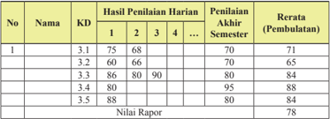

Tabel ini menunjukkan hasil penilaian harian, penilaian akhir semester, dan rerata (pembulatan) untuk lima siswa dalam satu mata pelajaran. Topik utama tabel adalah penilaian akademik siswa. Kolom-kolomnya meliputi nomor urut siswa, nama siswa, kode mata pelajaran (KD), nilai rata-rata harian, penilaian akhir semester, dan rerata pembulatan. Data penting yang terlihat adalah bahwa nilai rata-rata harian untuk setiap siswa bervariasi, dengan nilai tertinggi 89 dan terendah 66. Selain itu, penilaian akhir semester juga berbeda-beda, dengan nilai tertinggi 95 dan terendah 70. Rerata pembulatan untuk setiap siswa juga berbeda, dengan nilai tertinggi 88 dan terendah 71. Nilai raper untuk setiap siswa sebesar 78.

### Keterangan :

- Penilaian harian dilakukan oleh pendidik dengan cakupan meliputi seluruh indikator dari satu kompetensi dasar.
- Penilaian akhir semester merupakan kegiatan yang dilakukan oleh satuan pendidikan untuk mengukur pencapaian kompetensi peserta didik pada akhir semester. Cakupan penilaian seluruh indikator yang mempresentasikan semua KD pada semester tersebut.
- KD 3.1 dilakukan tagihan penilaian sebanyak 3 kali, maka nilai pengetahuan pada KD 3.1

``

Semester 1

 

---
## 📄 Halaman 51

``

- Deskripsi berisi kompetensi yang sangat baik dikuasai oleh peserta didik dan/atau kompetensi yang masih perlu ditingkatkan. Pada nilai diatas  yang  dikuasai  peserta  didik  adalah  KD  3.4  dan  yang  perlu ditingkatkan pada KD 3.2.
- Contoh deskripsi: 'Memiliki kemampuan mendeskripsikan Asatangga Yoga '

### 3. Nilai Keterampilan

Nilai  keterampilan  diperoleh  dari  hasil  penilaian  unjuk  kerja/kinerja/ praktik, proyek, produk, portofolio, dan bentuk lain sesuai karakteristik KD mata pelajaran.  Hasil  penilaian  pada  setiap  KD  pada  KI-4  adalah nilai optimal jika penilaian dilakukan dengan teknik yang sama dan objek KD yang sama. Penilaian KD yang sama dilakukan dengan proyek dan produk atau praktik dan produk, maka hasil akhir penilaian KD tersebut dirata-ratakan.  Untuk  memperoleh nilai akhir krterampilan pada setiap mata  pelajaran  adalah  rerata  dari  semua  nilai  KD  pada  KI-4  dalam satu  semester.  Selanjutnya,  penulisan  capaian  keterampilan  pada  rapor menggunakan  angka  pada  skala  0-100  dan  predikat  serta  dilengkapi deskripsi singkat capaian kompetensi.

Contoh 1:

Berikut  cara  pengolahan  nilai  keterampilan  mata  pelajaran  Pendidikan Agama Hindu dan Budi Pekerti kelas XII yang dilakukan melalui praktik pada KD 4.1 sebanyak 1 kali dan KD 4.2 sebanyak 2 kali. KD 4.3 dan KD 4.4 dinilai melalui satu proyek. Selain itu KD 4.4 juga dinilai melalui satu kali Portofolio.

---
**📊 Tabel**

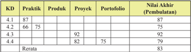

Tabel ini menunjukkan data akhir (pembulatan) dari berbagai kategori praktik, produk, proyek, dan portofolio untuk empat kandidat (KD 4.1 hingga KD 4.4). Topik utama tabel adalah evaluasi kinerja atau penilaian akhir dari kandidat tersebut. Kolom-kolomnya mencakup berbagai aspek kerja, seperti praktik, produk, proyek, dan portofolio. Data penting yang terlihat adalah bahwa KD 4.3 memiliki nilai akhir tertinggi dengan 92, sedangkan KD 4.4 memiliki nilai akhir terendah dengan 79. Rata-rata nilai akhir semua kandidat adalah 83. Ini menunjukkan bahwa KD 4.3 mungkin memiliki kinerja terbaik dibandingkan dengan kandidat lainnya dalam hal penilaian akhir.

### Keterangan :

- Pada  KD  4.1,  4.2  dan  4.3  Nilai Akhir  diperoleh  berdasarkan  nilai optimum,  sedangkan  untuk  4.4  diperoleh  berdasarkan  rata-rata karena menggunakan proyek dan Portofolio.

 

---
## 📄 Halaman 52

- Nilai akhir semester didapat dengan cara merata-ratakan nilai akhir pada setiap KD.
- = 83,13 ~ 83 (pembulatan). Nilai Rapor = 92 + 75 + 87 + 78,50 4
- Nilai  rapor  keterampilan  dilengkapi  deskripsi  singkat  kompetensi yang menonjol berdasarkan pencapaian KD pada KI-4 selama satu semester.
- Deskripsi nilai keterampilan diatas adalah : 'Memiliki keterampilan memperagakan tahapan-tahapan Ashtangga Yoga sesuai dengan tuntunan guru Yoga '

### 2. Komponen Penilaian

Adapun  prinsip-prinsip  yang  harus  diperhatikan  oleh  pendidik  pada  saat melaksanakan  penilaian  untuk  implementasi  Kurikulum  2013  baik  pada jenjang pendidikan menengah Atas (SMA dan SMK) adalah:

- 1). Sahih yaitu Penilaian yang dilakukan haruslah sahih, maksudnya penilaian didasarkan  pada  data  yang  memang  mencerminkan  kemampuan  yang ingin diukur.
- 2). Objektif yaitu Penilaian yang objektif adalah penilaian yang didasarkan pada prosedur dan kriteria yang jelas dan tidak boleh dipengaruhi oleh subjektivitas penilai (pendidik).
- 3). Adil adalah Penilaian yang adil maksudnya adalah suatu penilaian yang tidak menguntungkan atau merugikan peserta didik hanya karena mereka (bisa jadi) berkebutuhan khusus serta memiliki perbedaan latar belakang agama, suku, budaya, adat istiadat, status sosial ekonomi, dan gender.
- 4). Terpadu  yaitu  Penilaian  dikatakan  memenuhi  prinsip  terpadu  apabila pendidik  yang  merupakan  salah  satu  komponen  tidak  terpisahkan  dari kegiatan pembelajaran.
- 5). Terbuka adalah Penilaian harus memenuhi prinsip keterbukaan di mana kriteria  penilaian,  dan  dasar  pengambilan  keputusan  yang  digunakan dapat diketahui oleh semua pihak yang berkepentingan.
- 6). Menyeluruh  dan  berkesinambungan  yaitu  Penilaian  harus  dilakukan secara  menyeluruh  dan  berkesinambungan  oleh  pendidik  dan  mesti mencakup  segala  aspek  kompetensi  dengan  menggunakan  berbagai teknik  penilaian  yang  sesuai.  Dengan  demikian  akan  dapat  memantau perkembangan kemampuan peserta didik.
- 7). Sistematis yaitu Penilaian yang dilakukan oleh pendidik harus terencana dan dilakukan secara bertahap dengan mengikuti langkah-langkah yang baku.
Semester 1

 

---
## 📄 Halaman 53

- 8). Beracuan  kriteria  adalah  Penilaian  dikatakan  beracuan  kriteria  apabila penilaian yang dilakukan didasarkan pada ukuran pencapaian kompetensi yang ditetapkan.
- 9). Akuntabel yaitu Penilaian yang akuntabel adalah penilaian yang proses dan  hasilnya  dapat  dipertanggung    jawabkan,  baik  dari  segi  teknik, prosedur, maupun hasilnya.
- 10).  Edukatif  adalah  penilaian  disebut  memenuhi  prinsip  edukatif  apabila penilaian tersebut dilakukan untuk kepentingan dan kemajuan pendidikan peserta didik.

### 3. Pemanfaatan dan tindak lanjut hasil penilaian

Konsekuensi  dari  pembelajaran  tuntas  adalah  tuntas  atau  belum  tuntas. Bagi peserta didik yang belum mencapai ketuntasan belajar maka dilakukan tindakan  remedial  dan  bagi  peserta  didik  yang  sudah  mencapai    atau melampaui ketuntasan belajar dilakukan pengayaan. Pembelajaran remedial dan pengayaan dilaksanakan untuk kompetensi pengetahuan dan keterampilan, sedangkan  kompetensi  sikap  tidak  ada  remedial  atau  pengayaan  namun menumbuhkembangkan sikap, perilaku dan pembinaan karakter setiap peserta didik.

### a. Bentuk Pelaksanaan Remedial

Setelah diketahui kesulitan belajar yang dihadapi peserta didik, langkah berikutnya adalah memberikan perlakuan berupa pembelajaran remedial. Bentuk-bentuk pelaksanaan pembelajaran remedial antara lain:

- 1). Pemberian  pembelajaran  ulang  dengan  metode  dan  media  yang berbeda. Pembelajaran ulang dapat disampaikan dengan cara penyederhanaan materi, variasi cara penyajian, penyederhanaan tes/ pertanyaan. Pembelajaran ulang dilakukan bilamana sebagian besar atau  semua  peserta  didik  belum  mencapai  ketuntasan  belajar  atau mengalami kesulitan belajar. Pendidik perlu memberikan penjelasan kembali  dengan  menggunakan  metode  dan/atau  media  yang  lebih tepat.
- 2). Pemberian  bimbingan  secara  khusus,  misalnya  bimbingan  perorangan. Dalam hal pembelajaran klasikal peserta didik mengalami kesulitan, perlu  dipilih  alternatif  tindak  lanjut  berupa  pemberian  bimbingan secara  individual.  Pemberian  bimbingan  perorangan  merupakan implikasi peran pendidik sebagai tutor. Sistem tutorial dilaksanakan bilamana  terdapat  satu  atau  beberapa  peserta  didik  yang  belum berhasil mencapai ketuntasan.

 

---
## 📄 Halaman 54

- 3). Pemberian tugas-tugas latihan secara khusus. Dalam rangka menerapkan prinsip pengulangan, tugas-tugas latihan perlu diperbanyak  agar  peserta  didik  tidak  mengalami  kesulitan  dalam mengerjakan tes akhir. Peserta didik perlu diberi pelatihan intensif untuk membantu menguasai kompetensi yang ditetapkan.
- 4). Pemanfaatan tutor sebaya. Tutor sebaya adalah teman sekelas yang memiliki kecepatan belajar lebih. Mereka perlu dimanfaatkan untuk memberikan  tutorial  kepada  rekannya  yang  mengalami  kesulitan belajar. Dengan  teman  sebaya  diharapkan  peserta didik yang mengalami kesulitan belajar akan lebih terbuka dan akrab.

### b. Bentuk Pelaksanaan Pengayaan

Bentuk-bentuk  pelaksanaan  pembelajaran  pengayaan  dapat  dilakukan antara lain melalui:

- 1). Belajar  kelompok,  yaitu  sekelompok  peserta  didik  yang  memiliki minat tertentu diberikan pembelajaran bersama pada jam-jam pelajaran  sekolah  biasa,  sambil  menunggu  teman-temannya  yang mengikuti pembelajaran remedial karena belum mencapai ketuntasan.
- 2). Belajar mandiri, yaitu secara mandiri peserta didik belajar mengenai sesuatu yang diminati.
- 3). Pembelajaran berbasis tema, yaitu memadukan kurikulum di bawah tema  besar  sehingga  peserta  didik  dapat  mempelajari  hubungan antara berbagai disiplin ilmu.
- 4). Pemadatan kurikulum, yaitu pemberian pembelajaran hanya untuk kompetensi/materi  yang  belum  diketahui  peserta  didik.  Dengan demikian tersedia waktu bagi siswa untuk memperoleh kompetensi/ materi baru, atau bekerja dalam proyek secara mandiri sesuai dengan kapasitas maupun kapabilitas masing-masing.

### c. Hasil Penilaian

- 1). Nilai remedial yang diperoleh diolah menjadi nilai akhir.
- 2). Nilai  akhir  setelah  remedial  untuk  ranah  pengetahuan  dihitung dengan  mengganti  nilai  indikator  yang  belum  tuntas  dengan  nilai indikator hasil remedial, yang selanjutnya diolah berdasarkan rerata nilai seluruh KD.
- 3). Nilai akhir setelah remedial untuk ranah keterampilan diambil dari nilai optimal KD
Semester 1

 

---
## 📄 Halaman 55

- 4). Penilaian  hasil  belajar  kegiatan  pengayaan  tidak  sama  dengan kegiatan pembelajaran  biasa,  tetapi  cukup  dalam  bentuk  portofolio, dan  harus  dihargai sebagai nilai tambah (lebih) dari peserta didik yang normal.

### G. Strategi, Metode dan Teknik Pembelajaran

Buku  Guru  Pendidikan  Agama  Hindu  dan  Budi  Pekerti  pada  jenjang  Sekolah Menengah  Atas  dan  Kejuruan  disusun  sebagai  penjabaran  atau  operasionalisasi Kompetensi Inti (KI) dan Kompetensi Dasar (KD) Mata Pelajaran Agama Hindu dan Budi Pekerti. Pendidikan agama Hindu dan Budi Pekerti yang paling penting adalah menjunjung  tinggi  Dharma,  diantaranya  nilai  Sraddha.  Sraddha  adalah  keyakinan akan  Brahman  atau  Sang  Hyang  Widhi,  keyakinan  akan Atman,  keyakinan  akan Karmaphala, keyakinan akan Punarbhava, dan keyakinan akan Moksa. Pendidikan agama Hindu dan Budi Pekerti menekankan pada dua aspek, yaitu; aspek Para Vidya dan Apara Vidya sehingga dapat melahirkan insan Hindu yang Sadhu Gunawan. Oleh karena itu dalam kegiatan pembelajaran perlu mendesain dan menerapkan strategi pembelajaran sehingga tujuan pembelajaran dapat tercapai melalui:

### 1. Strategi Pembelajaran

Sebelum masuk ke strategi pembelajaran Pendidikan Agama Hindu dan Budi Pekerti perlu dimulai dengan memahami makna dari apa yang dimaksud dengan strategi pembelajaran. Strategi adalah usaha untuk memperoleh kesuksesan dan keberhasilan  dalam  mencapai  tujuan.  Strategi  pembelajaran  dapat  diartikan sebagai perencanaan yang berisi tentang rangkaian kegiatan yang didesain untuk mencapai tujuan pendidikan tersebut. Strategi pembelajaran merupakan rencana tindakan (rangkaian kegiatan) termasuk penggunaan metode dan pemanfaatan berbagai sumber daya atau kekuatan dalam pembelajaran yang disusun untuk mencapai tujuan tertentu, dalam hal ini adalah tujuan pembelajaran agama Hindu dan Budi Pekerti.

Pada mulanya istilah strategi banyak digunakan dalam dunia militer yang diartikan sebagai  cara  penggunaan  seluruh  kekuatan  militer  untuk  memenang-kan  suatu peperangan. Sekarang, istilah strategi banyak digunakan dalam berbagai bidang kegiatan  yang  bertujuan  memperoleh  kesuksesan  atau  keberhasilan  dalam mencapai tujuan. Begitu juga seorang Pendidik yang mengharapkan hasil baik dalam proses pembelajaran juga akan menerapkan suatu strategi agar hasil belajar peserta didik mendapat prestasi yang terbaik baik secara akademik maupun sikap dan perilaku yang sesuai dengan ajaran agama Hindu dan norma-norma, adat istiadat yang berlaku sesuai dengan budaya yang luhur.

Strategi pembelajaran adalah suatu kegiatan pembelajaran yang harus dikerjakan seorang pendidik dan peserta didik agar tujuan pembelajaran dapat dicapai secara efektif  dan  eisien.  Dengan  demikian,  strategi  pembelajaran  adalah  suatu  s et materi dan prosedur pembelajaran yang digunakan secara bersama-sama untuk menghasilkan prestasi belajar peserta didik.

 

---
## 📄 Halaman 56

Strategi  pembelajaran  merupakan  hal  yang  perlu  diperhatikan  oleh  seorang pendidik  dalam proses pembelajaran. Paling tidak ada tiga jenis strategi yang berkaitan dengan pembelajaran, yakni:

- Strategi Pengorganisasian Pembelajaran:
Strategi mengorganisasi isi pelajaran disebut juga sebagai struktural strategi, yang mengacu pada cara untuk  membuat  urutan  dan  mensintesis  fakta,  konsep, prosedur dan prinsip yang berkaitan. Lebih lanjut, strategi pengorganisasian dibedakan menjadi dua jenis, yaitu strategi mikro dan strategi makro. Strategi mikro  mengacu  kepada  metode  untuk  pengorganisasian  isi  pembelajaran yang berkisar pada satu konsep, atau prosedur atau prinsip. Strategi makro mengacu  kepada  metode  untuk  mengorganisasi  isi  pembelajaran  yang melibatkan lebih dari satu konsep atau prosedur atau prinsip.

Strategi  makro  berurusan  dengan  bagaimana  memilih,  menata  urusan, membuat sintesis dan rangkuman isi pembelajaran yang saling berkaitan. Pemilihan isi berdasarkan tujuan pembelajaran yang ingin dicapai, mengacu pada  penetapan  konsep  apa  yang  diperlukan  untuk  mencapai  tujuan pembelajaran.

- Strategi Penyampaian Pembelajaran:
Strategi  penyampaian  isi  pembelajaran  merupakan  komponen  variabel, metode untuk melaksanakan proses pembelajaran. Fungsi strategi penyampaian pembelajaran adalah:

- 1). Menyampaikan isi pembelajaran kepada peserta didik, dan
- 2). Menyediakan  informasi  atau  bahan-bahan  yang  diperlukan  peserta didik untuk menampilkan unjuk kerja.
- Strategi Pengelolaan Pembelajaran:
Strategi pengelolaan pembelajaran merupakan komponen variabel metode yang  berurusan  dengan  bagaimana  menata  interaksi  antara  peserta  didik dengan  variabel metode  pembelajaran  lainnya.  Strategi ini berkaitan dengan  pengambilan  keputusan  tentang  strategi  pengorganisasian  dan strategi  penyampaian  mana yang digunakan selama proses pembelajaran. Paling tidak, ada tiga klasiikasi penting variabel strategi pengelolaan, yaitu penjadwalan, pembuatan catatan kemajuan belajar peserta didik, dan motivasi.

Berikut ada beberapa strategi yang dapat dipraktikkan para pendidik dalam menunjang hasil proses belajar mengajar antara lain:

- 1). Strategi Student  Centered  Learning (SCL)  yaitu  pembelajaran  yang berpusat  pada  peserta  didik,  dalam  menerapkan  konsep StudentCentered  Leaning ,  peserta  didik  diharapkan  sebagai  peserta  aktif
Semester 1

 

---
## 📄 Halaman 57

dan  mandiri  dalam  proses  belajarnya,  yang  bertanggung  jawab  dan berinisiatif untuk mengenali kebutuhan belajarnya, menemukan sumber-sumber informasi untuk dapat menjawab kebutuhannya, membangun  serta  mempresentasikan  pengetahuannya  berdasarkan kebutuhan  serta  sumber-sumber  yang  ditemukannya.  Dalam  batasbatas  tertentu  peserta  didik  dapat  memilih  sendiri  apa  yang  akan dipelajarinya . pembelajar memiliki tanggung jawab penuh atas kegiatan belajarnya,  terutama  dalam  bentuk  keterlibatan  aktif  dan  partisipasi peserta didik. Hubungan antara peserta didik yang satu dengan yang lainnya adalah setara, yang tercermin dalam bentuk kerja sama dalam kelompok  untuk  menyelesaikan  suatu  tugas  belajar.  Pendidik  lebih berperan  sebagai  fasilitator  yang  mendorong  perkembangan  peserta didik,  dan  bukan  merupakan  satu-satunya  sumber  belajar.  Keaktifan siswa  telah  dilibatkan  sejak  awal  dalam  bentuk  disain  belajar  yang memperhitungkan pengetahuan, keterampilan, dan pengalaman belajar peserta  didik  yang  telah  didapatkan  sebelumnya.  Dari  pengalaman praktik yang ada, diharapkan setelah mengalami pembelajaran dengan pendekatan  SCL  pembelajar  akan  melihat  dirinya  secara  berbeda, dalam arti lebih memahami manfaat belajar, lebih dapat menerapkan pengetahuan dan keterampilan yang dipelajari, dan lebih percaya diri (O'Neill & McMahon, 2005)

- 2). Strategi Problem Based Learning (PBL)  atau  pembelajaran  berbasis masalah  merupakan  sebuah  model  pembelajaran  yang  menyajikan masalah kontekstual sehingga merangsang peserta didik untuk belajar. Dalam kelas yang menerapkan pembelajaran berbasis masalah, peserta didik bekerja dalam tim untuk memecahkan masalah dunia nyata ( real world).
Kelebihan Problem Based Learning (PBL) antara lain:

- a).  Dengan Problem Based Learning (PBL) akan terjadi pembelajaran bermakna.  Peserta  didik/mahasiswa  yang  belajar  memecahkan suatu masalah maka mereka akan menerapkan pengetahuan yang  dimilikinya  atau  berusaha  mengetahui  pengetahuan  yang diperlukan.  Belajar  dapat  semakin  bermakna  dan  dapat  diperluas ketika peserta didik/mahapeserta didik berhadapan dengan situasi di mana konsep diterapkan.
- b).  Dalam  situasi Problem  Based  Learning (PBL),  peserta  didik mengintegrasikan  pengetahuan  dan  ketrampilan  secara  simultan dan mengaplikasikannya dalam konteks yang relevan.
- c).  Problem Based Learning (PBL)  dapat meningkatkan kemampuan berpikir  kritis,  menumbuhkan  inisiatif  peserta  didik/mahapeserta didik  dalam  bekerja,  motivasi  internal  untuk  belajar,  dan  dapat mengembangkan hubungan interpersonal dalam bekerja kelompok.

 

---
## 📄 Halaman 58

Penilaian  dilakukan  dengan  memadukan  tiga  aspek  pengetahuan ( knowledge ),  kecakapan  ( skill ),  dan  sikap  ( attitude ).  Penilaian terhadap penguasaan pengetahuan yang mencakup seluruh kegiatan pembelajaran yang dilakukan dengan ujian akhir semester (UAS), ujian  tengah  semester  (UTS),  kuis,  PR,  dokumen,  dan  laporan. Penilaian  terhadap  kecakapan  dapat  diukur  dari  penguasaan  alat bantu pembelajaran, baik software , hardware , maupun kemampuan perancangan  dan  pengujian.  Sedangkan  penilaian  terhadap  sikap dititikberatkan  pada  penguasaan soft  skill ,  yaitu  keaktifan  dan partisipasi dalam diskusi, kemampuan bekerjasama dalam tim, dan kehadiran dalam pembelajaran. Bobot penilaian untuk ketiga aspek tersebut ditentukan oleh pendidik mata pelajaran yang bersangkutan.

- 3). Strategi inkuiri adalah suatu rangkaian kegiatan belajar yang melibatkan secara maksimal seluruh kemampuan peserta didik untuk mencari dan menyelidiki secara sistematis, kritis, logis, analitis, sehingga mereka dapat merumuskan sendiri penemuannya dengan penuh percaya diri. Sasaran utama kegiatan pembelajaran pada strategi ini adalah:
- a).  Keterlibatan peserta didik secara maksimal dalam proses kegiatan belajar. Kegiatan belajar di sini adalah kegiatan mental intelektual dan sosial emosional.
- b).  Keterarahan  kegiatan  secara  logis  dan  sistematis  pada  tujuan pembelajaran.
- c).  Mengembangkan sikap percaya pada diri sendiri pada diri peserta didik tentang apa yang ditemukan dalam proses inkuiri.
Untuk  menyusun  strategi  yang  terarah  pada  sasaran  tersebut,  perlu diperhatikan kondisi-kondisi yang memungkinkan peserta didik dapat berinkuiri  secara  maksimal.  Joyce  mengemukakan  kondisi-kondisi umum yang merupakan  syarat  bagi  timbulnya  kegiatan  inkuiri  bagi peserta didik. Kondisi tersebut adalah:

- a).  Aspek sosial di dalam kelas dan suasana terbuka yang mengundang peserta  didik  berdiskusi.  Hal  ini  menuntut  adanya  suasana  bebas (permisif)  di  dalam  kelas,  di  mana  setiap  peserta  didik  tidak merasakan  adanya  tekanan  atau  hambatan  untuk  mengemukakan pendapatnya. Adanya rasa takut, atau rasa rendah diri, rasa malu dan sebagainya, baik terhadap teman peserta didik maupun terhadap pendidik adalah faktor yang menghambat terciptanya suasana bebas di kelas. Kebebasan berbicara dan penghargaan terhadap pendapat yang berbeda sekalipun pendapat itu tidak relevan, perlu dipelihara dalam batas-batas disiplin yang ada.
Semester 1

 

---
## 📄 Halaman 59

- b).  Inkuiri berfokus  pada  hipotesis.  Peserta  didik  perlu  menyadari bahwa  pada  dasarnya  semua  pengetahuan  bersifat  tentatif,  tidak ada  kebenaran  mutlak.  Kebenarannya  selalu  bersifat  sementara. Sikap terhadap pengetahuan yang demikian perlu dikembangkan. Dengan demikian, maka penyelesaian hipotesis merupakan fokus strategi inkuiri . Apabila pengetahuan dipandang sebagai hipotesis, maka kegiatan  belajar  berkisar  pada  pengujian  hipotesis,  dengan pengajuan  berbagai  informasi  yang  relevan.  Sehubungan  adanya berbagai sudut pandang yang berbeda di antara peserta didik, maka sedapat mungkin diadakan variasi penyelesaian masalah sehingga inkuiri  bersifat open  ended .  Inkuiri  bersifat open  ended jika  ada berbagai  kesimpulan  yang  berbeda  dari  peserta  didik  dengan argumen masing-masing yang benar. Selain inkuiri terbuka, dikenal pula inkuiri tertutup,  yaitu  jika  hanya  ada  satu  kesimpulan  yang benar sebagai hasil proses inkuiri .
- c).  Penggunaan  fakta  sebagai  evidensi.  Di  dalam  kelas  dibicarakan validitas dan reliabilitas tentang fakta sebagaimana dituntut dalam pengujian hipotesis pada umumnya.
Untuk menciptakan kondisi seperti itu, maka peranan pendidik  sangat menentukan. Pendidik tidak lagi berperan sebagai pemberi informasi dan peserta didik sebagai penerima informasi, sekalipun hal itu sangat diperlukan. Peranan utama pendidik dalam menciptakan kondisi inkuiri adalah sebagai berikut:

- a).  Motivator, yang memberi rangsangan agar peserta didik aktif dan gairah berikir.
- b).  Fasilitator,  yang  menunjukkan  jalan  keluar  jika  ada  hambatan dalam proses berpikir peserta didik.
- c).  Penanya,  untuk  menyadarkan  peserta  didik  dari  kekeliruan  yang mereka perbuat dan memberi keyakinan pada diri sendiri.
- d).  Administrator, yang bertanggung jawab terhadap seluruh kegiatan di dalam kelas.
- e).  Pengarah,  yang  memimpin  arus  kegiatan  berpikir  peserta  didik pada tujuan yang diharapkan.
- f).  Manajer,  yang  mengelola  sumber  belajar,  waktu,  dan  organisasi kelas.
- g).  Rewarder, yang memberi penghargaan pada prestasi yang dicapai dalam rangka peningkatan semangat heuristik pada peserta didik. Supaya pendidik dapat melakukan perananya secara efektif, maka pengenalan kemampuan peserta didik sangat diperlukan, terutama cara berpikirnya, cara mereka menanggapi, dan sebagainya.

 

---
## 📄 Halaman 60

- 4). Strategi  pembelajaran  berbasis  proyek  ( Project  Based  Learning ) dalam kaitannya dengan pendekatan saintiik ( scientiic approach ) dan implementasi  Kurikulum  2013,  adalah  model  pembelajaran  berbasis proyek  ( project  based  learning )  adalah  sebuah  model  pembelajaran yang  menggunakan  proyek  (kegiatan)  sebagai  inti  pembelajaran. Dalam  kegiatan  ini,  peserta  didik  melakukan  eksplorasi,  penilaian, interpretasi,  dan  sintesis  informasi  untuk  memperoleh  berbagai  hasil belajar (pengetahuan, keterampilan, dan sikap). Saat ini pembelajaran di sekolah-sekolah kita masih lebih terfokus pada hasil belajar berupa pengetahuan  (knowledge)  semata. Itupun sangat dangkal,  hanya sampai pada tingkatan ingatan (C1) dan pemahaman (C2) dan belum banyak menyentuh aspek aplikasi (C3), analisis (C4), sintesis (C5), dan evaluasi (C6). Ini berarti pada umumnya, pembelajaran di sekolah belum mengajak  peserta  didik  untuk  menerapkan,  mengolah  setiap  unsurunsur konsep yang dipelajari untuk membuat (sintesis) generaliasi, dan belum mengajak peserta didik mengevaluasi (berpikir kritis) terhadap konsep-konsep dan prinsip-prinsip yang telah dipelajarinya. Sementara itu, aspek keterampilan (psikomotor) dan sikap ( attitude ) juga banyak terabaikan.  Di  dalam  pelaksanaannya,  model  pembelajaran  berbasis proyek memiliki langkah-langkah (sintaks) yang menjadi ciri khasnya dan membedakannya dari model pembelajaran lain. Adapun langkahlangkah  yang  harus  dilakukan  dalam  pembelajaran  berbasis  proyek adalah; (1) menentukan pertanyaan dasar; (2) membuat desain proyek; (3)  menyusun  penjadwalan;  (4)  memonitor  kemajuan  proyek;  (5) penilaian hasil; (6) evaluasi pengalaman. Model pembelajaran berbasis proyek selalu dimulai dengan menemukan apa sebenarnya pertanyaan mendasar, yang nantinya akan menjadi dasar untuk memberikan tugas proyek bagi peserta didik (melakukan aktivitas). Tentu saja topik yang dipakai  harus  pula  berhubungan  dengan  dunia  nyata.  Selanjutnya dengan  dibantu  pendidik,  kelompok-kelompok  peserta  didik  akan merancang aktivitas yang akan dilakukan pada proyek mereka masingmasing. Semakin besar keterlibatan dan ide-ide peserta didik  (kelompok peserta didik) yang digunakan dalam proyek itu, akan semakin besar pula  rasa  memiliki  mereka  terhadap  proyek  tersebut.  Selanjutnya, pendidik dan peserta didik menentukan batasan waktu yang diberikan dalam penyelesaian tugas (aktivitas) proyek mereka. Dalam berjalannya waktu, peserta didik  melaksanakan seluruh aktivitas  mulai  dari  persiapan pelaksanaan proyek mereka hingga melaporkannya sementara pendidik memonitor dan memantau perkembangan proyek kelompok-kelompok peserta didik dan memberikan pembimbingan yang dibutuhkan. Pada tahap  berikutnya,  setelah  peserta  didik  melaporkan  hasil  proyek yang  mereka  lakukan,  pendidik  menilai  pencapaian  yang  peserta didik  peroleh  baik  dari  segi  pengetahuan  (knowledge  terkait  konsep yang  relevan  dengan  topik),  hingga  keterampilan  dan  sikap  yang
Semester 1

 

---
## 📄 Halaman 61

- mengiringinya. Terakhir, pendidik kemudian memberikan kesempatan kepada peserta didik untuk mereleksi semua kegiatan (aktivitas) dalam pembelajaran berbasis proyek yang telah mereka lakukan agar di lain kesempatan pembelajaran dan aktivitas penyelesaian proyek menjadi lebih baik lagi.
- 5). Strategi pembelajaran discovery (penemuan) adalah metode mengajar yang mengatur pengajaran sedemikian rupa sehingga anak memperoleh pengetahuan yang sebelumnya belum diketahuinya itu tidak melalui pemberitahuan,  sebagian  atau  seluruhnya  ditemukan  sendiri.  Dalam pembelajaran discovery (penemuan) kegiatan atau pembelajaran yang dirancang sedemikian rupa sehingga peserta didik dapat menemukan konsep-konsep dan prinsip-prinsip melalui proses mentalnya sendiri. Dalam  menemukan  konsep,  peserta  didik  melakukan  pengamatan, menggolongkan, membuat dugaan, menjelaskan, menarik kesimpulan dan  sebagainya  untuk  menemukan  beberapa  konsep  atau  prinsip. Pengertian discovery learning cms-formulasi pada lampiran iv Peraturan  Menteri  Pendidikan  dan  Kebudayaan  Republik  Indonesia Nomor 81A Tahun 2013, untuk mencapai kualitas yang telah dirancang dalam dokumen kurikulum, kegiatan pembelajaran perlu menggunakan prinsip  yang:  (1)  berpusat  pada  peserta  didik,  (2)  mengembangkan kreativitas  peserta  didik,  (3)  menciptakan  kondisi  menyenangkan dan  menantang,  (4)  bermuatan  nilai,  etika,  estetika,  logika,  dan kinestetika,  dan  (5)  menyediakan  pengalaman  belajar  yang  beragam melalui  penerapan  berbagai  strategi  dan  metode  pembelajaran  yang menyenangkan,  kontekstual,  efektif,  eisien,  dan  bermakna.

### 2. Metode Pembelajaran

Metode  pembelajaran  adalah  cara  atau  jalan  yang  ditempuh  oleh  seorang pendidik  dalam  menyampaikan  materi  Pendidikan  Agama  Hindu  dan  Budi Pekerti di SMA/SMK Kelas XII.

Dalam  Pembelajaran  Pendidikan  Agama  Hindu  dan  Budi  Pekerti dapat menggunakan beberapa Metode di antaranya, metode tradisional yaitu:

- Metode Dharmawacana adalah pelaksanaan mengajar dengan ceramah secara oral, lisan, dan tulisan diperkuat dengan menggunakan media visual. Dalam hal ini peran pendidik sebagai sumber pengetahuan sangat dominan. Belajar agama  dengan  strategi Dharmawacana dapat  memperoleh  ilmu  agama dengan  mendengarkan  wejangan  dari  pendidik.  Strategi Dharmawacana termasuk dalam ranah pengetahuan dalam dimensi Kompetensi Inti
- Metode Dharmagītā adalah pelaksanaan mengajar dengan pola melantunkan sloka, palawakya, dan tembang. Pendidik dalam proses pembelajaran dengan pola Dharmagītā ,  melibatkan  rasa  seni  yang  dimiliki  setiap  peserta  didik, terutama  seni  suara  atau  menyanyi,  sehingga  dapat  menghaluskan  budi pekertinya.

 

---
## 📄 Halaman 62

- Metode Dharmatula adalah pelaksanaan mengajar dengan cara mengadakan diskusi di dalam kelas. Strategi Dharmatula digunakan karena tiap peserta didik memiliki kecerdasan yang berbeda-beda. Dengan menggunakan strategi Dharmatula peserta didik dapat memberikan kontribusi dalam pembelajaran.
- Metode Dharmayatra adalah pelaksanaan pembelajaran dengan cara mengunjungi  tempat-tempat  suci.  Strategi Dharmayatra baik  digunakan pada  saat  menjelaskan  materi  tempat  suci,  hari  suci,  budaya  dan  sejarah perkembangan Agama Hindu.
- Metode Dharmashanti adalah pelaksanaan pembelajaran untuk menanamkan sikap  saling  asah,  saling  asih,  dan  saling  asuh  yang  penuh  dengan  rasa toleransi. Strategi Dharmashanti dalam pembelajaran memberikan kesempatan kepada peserta didik, untuk saling mengenali teman kelasnya, sehingga menumbuhkan rasa saling menyayangi.
- Metode Dharma Sadhana adalah pelaksanaan pembelajaran untuk menumbuhkan  kepekaan  sosial  peserta  didik  melalui  pemberian  atau pertolongan  yang  tulus  ikhlas  dan  mengembangkan  sikap  berbagi  kepada sesamanya,  sesuai  dengan  ajaran  ilsafat  Hindu  yaitu Tat Twam Asi .
Di samping itu, pendidik harus menerapkan metode pembelajaran yang sesuai dengan  karakteristik peserta didiknya.  Tiap-tiap  kelas  bisa  kemungkinan menggunakan metode pembelajaran yang berbeda-beda dengan kelas lainnya. Untuk  itu  seorang  pendidik  harus  mampu  menguasai  dan  mempraktikkan berbagai  metode  pembelajaran.  Berikut  dijelaskan  beberapa  macam  metode modern yang dapat dipergunakan oleh seorang Pendidik, antara lain:

- Metode Ceramah atau Dharma Wacana yaitu penerangan secara lisan atas bahan pembelajaran kepada sekelompok pendengar untuk mencapai tujuan pembelajaran  tertentu  dalam  jumlah  yang  relatif  besar.  Dengan  metode ceramah, pendidik dapat mendorong timbulnya inspirasi bagi pendengarnya. Ceramah cocok untuk penyampaian bahan belajar yang berupa informasi dan jika bahan belajar tersebut sukar didapatkan.
- Metode Diskusi atau Dharma Tula , yaitu proses pelibatan dua orang peserta didik  atau  lebih  untuk  berinteraksi  dengan  saling  bertukar  pendapat,  dan atau saling mempertahankan pendapat dalam pemecahan masalah sehingga didapatkan kesepakatan diantara mereka. Pembelajaran yang menggunakan metode  diskusi  merupakan  pembelajaran  yang  bersifat  interaktif.  Metode diskusi  dapat  meningkatkan  peserta  didik  dalam  memahami  konsep  dan keterampilan memecahkan masalah. Tetapi dalam transformasi pengetahuan, penggunaan metode diskusi hasilnya lambat dibanding penggunaan ceramah. Sehingga  metode  ceramah  lebih  efektif  untuk  meningkatkan  kuantitas pengetahuan anak dari pada metode diskusi.
Semester 1

 

---
## 📄 Halaman 63

- Metode Demonstrasi, yaitu metode pembelajaran yang sangat efektif untuk menolong peserta didik mencari jawaban atas pertanyaan-pertanyaan peserta didik. Demonstrasi sebagai metode pembelajaran adalah bilamana seorang pendidik atau seorang demonstrator (orang luar yang sengaja diminta) atau seorang peserta didik memperlihatkan kepada seluruh kelas sesuatu proses. Misalnya bekerjanya suatu alat pencuci otomatis, cara membuat kue, dan sebagainya. Kelebihan metode Demonstrasi:
- 1). Perhatian peserta didik dapat lebih dipusatkan.
- 2). Proses belajar peserta  didik  lebih  terarah  pada  materi  yang  sedang dipelajari.
- 3). Pengalaman dan kesan sebagai hasil pembelajaran lebih melekat dalam diri peserta didik.

### Kelemahan metode Demonstrasi:

- 1). Peserta  didik  kadang  kala  sukar  melihat  dengan  jelas  benda  yang diperagakan
- 2). Tidak semua benda dapat didemonstrasikan
- 3). Sukar  dimengerti  jika  didemonstrasikan  oleh  pengajar  yang  kurang menguasai apa yang didemonstrasikan
- Metode Ceramah Plus, yaitu metode pengajaran yang menggunakan lebih dari  satu  metode,  yakni  metode  ceramah  yang  dikombinasikan  dengan metode lainnya. Ada tiga macam metode ceramah plus, di antaranya yaitu:
- 1). Metode ceramah plus tanya jawab dan tugas
- 2). Metode ceramah plus diskusi dan tugas
- 3). Metode ceramah plus demonstrasi dan latihan (CPDL)
- Metode  Resitasi,  yaitu  suatu  metode  pengajaran  dengan  mengharuskan peserta didik membuat resume dengan kalimat sendiri.

### Kelebihan Metode Resitasi adalah:

- 1). Pengetahuan yang diperoleh peserta didik dari hasil belajar sendiri akan dapat diingat lebih lama.
- 2). Peserta didik memiliki peluang untuk meningkatkan keberanian, inisiatif, bertanggung jawab dan mandiri.

### Kelemahan Metode Resitasi adalah:

- 1). Kadang  kala  peserta  didik  melakukan  penipuan  yakni  peserta  didik hanya  meniru  hasil  pekerjaan  orang  lain  tanpa  mau  bersusah  payah mengerjakan sendiri.
- 2). Kadang kala tugas dikerjakan oleh orang lain tanpa pengawasan.
- 3). Sukar memberikan tugas yang memenuhi perbedaan individual.

 

---
## 📄 Halaman 64

- Metode  Eksperimental,  yaitu  suatu  cara  pengelolaan  pembelajaran  di mana peserta didik melakukan aktivitas percobaan dengan mengalami dan membuktikan sendiri suatu yang dipelajarinya. Dalam metode ini peserta didik diberi kesempatan untuk mengalami sendiri atau melakukan sendiri dengan mengikuti suatu proses, mengamati suatu obyek, menganalisis, membuktikan dan menarik kesimpulan sendiri tentang obyek yang dipelajarinya.
- Metode Study  Tour atau Dharma  Yatra (Karya  wisata),  yaitu  metode mengajar  dengan  mengajak  peserta  didik  mengunjungi  suatu  objek  guna memperluas  pengetahuan  dan  selanjutnya  peserta  didik  membuat  laporan dan  mendiskusikan  serta  membukukan  hasil  kunjungan  tersebut  dengan didampingi oleh pendidik.
- Metode Latihan Keterampilan ( drill method ), yaitu suatu metode mengajar dengan memberikan pelatihan keterampilan secara berulang kepada peserta didik,  dan  mengajaknya  langsung  ketempat  latihan  keterampilan  untuk melihat  proses  tujuan,  fungsi,  kegunaan  dan  manfaat.  Metode  latihan keterampilan ini bertujuan membentuk kebiasaan atau pola yang otomatis pada peserta didik.
- Metode Pengajaran Beregu, yaitu suatu metode mengajar di mana pendidiknya lebih dari satu orang yang masing-masing mempunyai tugas. Biasanya salah seorang  pendidik  ditunjuk  sebagai  kordinator.  Cara  pengujiannya,  setiap pendidik membuat soal, kemudian digabung. Jika ujian lisan maka setiap peserta didik yang diuji harus langsung berhadapan dengan team pendidik tersebut.
- Peer  Theaching  Method ,  yaitu  suatu  metode  mengajar  yang  dibantu  oleh temannya sendiri.
- Metode Pemecahan Masalah ( problem solving method ), yaitu bukan hanya sekadar  metode  mengajar,  tetapi  juga  merupakan  suatu  metode  berpikir, sebab dalam problem solving dapat  menggunakan metode-metode lainnya yang  dimulai  dengan  mencari  data  sampai  pada  menarik  kesimpulan. Metode problem solving merupakan metode yang merangsang berpikir dan menggunakan wawasan tanpa melihat kualitas pendapat yang disampaikan oleh  peserta  didik.  Seorang  pendidik  harus  pandai-pandai  merangsang peserta didiknya untuk mencoba mengeluarkan pendapatnya.
- Project Method ,  yaitu  metode perancangan adalah suatu metode mengajar dengan meminta peserta didik merancang suatu proyek yang akan diteliti sebagai obyek kajian.
- Taileren  Method ,  yaitu  suatu  metode  mengajar  dengan  menggunakan sebagian-sebagian, misalnya ayat per ayat kemudian disambung lagi dengan ayat lainnya yang tentu saja berkaitan dengan masalahnya.
Semester 1

 

---
## 📄 Halaman 65

- Metode  Global  ( ganze  method ),  yaitu  suatu  metode  mengajar  di  mana peserta didik disuruh membaca keseluruhan materi, kemudian peserta didik meresume  apa  yang  dapat  mereka  serap  atau  ambil  intisari  dari  materi tersebut.
- Metode Contextual  Teaching  Learning (CTL) Pembelajaran  Konstektual adalah konsep belajar yang membantu pendidik mengaitkan antara materi yang diajarkannya dengan situasi dunia nyata peserta didik dan mendorong peserta didik  membuat hubungan antara pengetahuan yang dimilikinya dengan penerapannya  dalam  kehidupan  mereka  sehari-hari,  dengan  melibatkan tujuh komponen utama pembelajaran efektif, yakni: kontruktivisme ( contructivism ),  bertanya  ( questioning ),  menemukan ( inquiry ),  masyarakat belajar ( learning community ), pemodelan ( modeling ),  releksi dan penelitian sebenarnya  ( authentic  assessment ).  Sedangkan  menurut  Jhonson  (2006: 67)  yang  mendeinisikan  pembelajaran  kontekstual  (CTL)  sebagai  berikut: Sistem  CTL  adalah  sebuah  proses  pendidikan  yang  bertujuan  menolong peserta didik melihat makna di dalam materi akademik yang mereka pelajari dengan  cara  menghubungkan  subjek-subjek  akademik  dengan  konteks dalam kehidupan keseharian mereka, yaitu dengan konteks pribadi, sosial dan budaya mereka.

### 3. Teknik Pembelajaran

Dunia pendidikan merupakan dunia yang dinamis. Hal ini sejalan dengan tujuan pembelajaran di mana peserta didik diharapkan mampu menguasai hasil proses belajar  mengajar.  Dunia  pendidikan  akan  selalu  menyelaraskan  hasil  belajar peserta  didik  sesuai  dengan  perkembangan  teknologi  dan  informasi.  Untuk mencapai hasil belajar yang optimal ini, digunakanlah beragam pendekatan dan teknik pembelajaran.

Teknik adalah metode atau sistem mengerjakan sesuatu, cara membuat atau seni melakukan sesuatu atau  dapat  dikatakan  sebagai  jalan,  alat,  atau  media  yang digunakan  oleh  pendidik  untuk  mengarahkan  kegiatan  peserta  didik  kearah tujuan  yang  ingin  dicapai.  Teknik  secara  hariah  juga  diartikan  sebagai  cara  yang dilakukan seseorang dalam mengaplikasikan dan mempraktikkan suatu metode. Khusus untuk pengertian teknik pembelajaran dapat diartikan sebagai cara yang dilakukan pengajar dalam menerapkan metode pembelajaran tertentu.

Agar  metode  pembelajaran  yang  telah  diuraikan  di  atas  dapat  diterapkan dan  mendorong  pendidik  mencapai  tujuan  pembelajaran,  dibutuhkan  teknik pembelajaran yang menyenangkan, baik antara pendidik dan terutama peserta didik,  serta  dengan  memanfaatkan  beragam  media  pembelajaran,  misalnya gambar,  video,  musik,  skema,  diagram,  dan  media  lainnya.  Dalam  dunia pendidikan ada dikenal beberapa teknik pembelajaran komunikatif yang menyenangkan, beberapa di antaranya:

 

---
## 📄 Halaman 66

- Role play , yaitu kegiatan pembelajaran dengan cara bermain peran. Pendidik menjadikan suasana kelas seperti seolah dunia yang nyata, misalnya dengan topik penjual dan pembeli dalam dagang.
- Surveys ,  yaitu  peserta  didik  membuat  tim  survey  di  kelas.  Teknik  survey ini harus disesuaikan dengan tingkat pembelajar, misalnya membuat angket pertanyaan kepada 30 peserta didik di kelas
- Games, yaitu  teknik  bermain  yang  paling  disukai  anak-anak  dan  para pembelajar.
- Interview ,  yaitu  teknik  bertanya  kepada  teman  sekelas  maupun  teman  di luar atau bahkan dengan orang yang tidak dikenal di luar sekolah dan jalan. Pertanyaan  harus  disusun  oleh  pendidik  dan  prosesnya  di  bawah  kontrol pendidik
- Pair work/group work ,  yaitu  teknik  dengan  meminta peserta didik belajar berkelompok dan bekerjasama dalam tim.
- Storytelling
g.

Storytelling adalah  sebuah  teknik  pembelajaran  melalui  sebuah  cerita dengan  cara  mendongeng. Storytelling menggunakan  kemampuan penyaji untuk  menyampaikan sebuah cerita dengan gaya, intonasi,  dan  alat  bantu yang  menarik  minat  pendengar.  Menggunakan  teknik Storytelling harus mempunyai  kemampuan public  speaking yang  baik,  memahami  karakter pendengar,  meniru  suara-suara,  pintar  mengatur  nada  dan  intonasi  serta keterampilan memakai alat bantu. Dikatakan berhasil menggunakan teknik storytelling,  jika  pendengar  mampu  menangkap  jalan  cerita  serta  merasa terhibur. Selain itu, pesan moral dalam cerita juga diperoleh.

Semester 1

 

---
## 📄 Halaman 67

### Bab 3

### Petunjuk Khusus Proses Pembelajaran

Pendidik  sebelum  memulai  proses  pembelajaran  agar  selalu  mengajak  peserta didiknya  untuk  mengawali  dengan  mengucapkan  Penganjali  Agama  Hindu  dan melakukan Puja  Tri  Sandya /  doa Puja  Saraswati ,  atau  mantra-mantra  serta  doa lainnya sesuai dengan situasi dan kondisi pada saat tersebut, serta pendidik mengamati dan memberikan penilaian sikap religius dan sikap sosial yaitu seperti menyayangi ciptaan Sang  Hyang  Widhi ( Ahimsa ),  berperilaku  jujur  ( Satya ),  menghargai  dan menghormati  antar sesama ( Tat Tvam Asi ). Pendidik diharapkan dapat membentuk sikap dan karakter peserta didiknya  seperti yang tercermin dan tuntutan dari setiap KD 1, KD 2, dari materi KD 3, dan KD 4, dalam kegiatan belajar mengajar yang berkaitan dengan  materi  ' Weda sebagai  sumber  hukum  Hindu,  Sejarah  Perkembangan Kebudayaan Hindu di dunia, Tantra, Yantra dan Mantra , Ashtangga Yoga dan Moksa, Dasa Yama Bratha dan Dasa Nyama Btarha' . Dalam setiap Bab materi tersebut  peserta  didik  dapat  menjelaskan,  menyebutkan,  mempraktikkan  atau mengamalkan dalam kehidupan sehari-hari  sehingga dapat memberikan perubahan sikap dan pengetahuan yang lebih baik membentuk sikap, karater serta kepribadian yang sesuai dengan budaya Hindu, adat istiadat daerah setempat. Pendidik pada saat mengakhiri pembelajaran agar peserta didik diajak mereleksikan diri nya, serta ditutup dengan doa dan Parama Santhi .

 

---
## 📄 Halaman 68

### Informasi untuk Pendidik

Pendidik  dapat  menjelaskan  kepada  peserta  didik  tentang  materi  pembelajaran yang  akan  diberikan  sesuai  dengan  Bab  atau  topik  materi  yang  akan  diajarkan, serta  pendidik  juga  dapat  menjelaskan  tujuan  pembelajaran  sehingga  pesrta  didik mengetahui kompetensi apa yang akan dicapai dan dikuasai.  Pendidik berdasarkan alur  pembelajaran  dapat  menginformasikan  kepada  peserta  didiknya  tentang  alat, metode,  strategi  dan  media  yang  dibutuhkan  sebagai  pengantar  pembelajaran sehingga dapat dipersiapkan secara baik dan benar.

### A. Bab. I  Weda Sebagai Sumber Hukum Hindu

- Kompetensi Inti (KI) dan Kompetensi Dasar (KD)

---
**📊 Tabel**

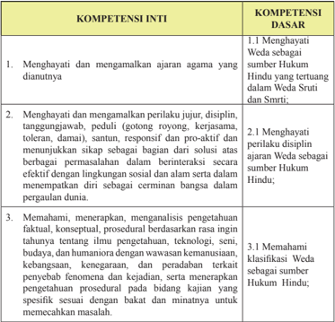

Tabel ini berisi informasi tentang kompetensi inti dan kompetensi dasar yang berkaitan dengan ajaran agama Hindu. Topik utama tabel adalah menghargai dan mempraktikkan nilai-nilai agama Hindu, seperti Weda, dalam kehidupan sehari-hari. Kolom-kolomnya mencakup tiga kompetensi inti: menghargai dan mengamalkan ajaran agama yang dianutnya, menghargai perilaku jujur, disiplin, tanggung jawab, dan sumber-sumber Hukum Hindu, serta memahami, menerapkan, dan menganalisis pengetahuan faktil, konseptual, dan prosedural berdasarkan wawasan kemanusiaan. Data penting yang terlihat adalah bahwa semua kompetensi inti memiliki kompetensi dasar yang relevan, seperti menghargai Weda sebagai sumber Hukum Hindu, memahami klasifikasi Weda, dan memahami perilaku disiplin sebagai bagian dari ajaran Weda. Ini menunjukkan bahwa setiap kompetensi inti memiliki dasar yang kuat dalam prinsip-prinsip agama Hindu.

Semester 1

 

---
## 📄 Halaman 69

- Mengolah, menalar, dan menyaji dalam ranah konkret dan ranah abstrak  terkait dengan pengembangan dari yang  dipelajarinya  di  sekolah  secara  mandiri,  dan mampu menggunakan metode sesuai kaidah keilmuan.

### 2. Tujuan Pembelajaran.

Setelah  mempelajari  materi Weda Sebagai  Sumber  Hukum  Hindu  peserta didik dapat:

- Menjelaskan makna dan hakekat Weda Sebagai Sumber Hukum Hindu
- Menjelaskan perkembangan Hukum Hindu
- Menjelaskan Weda sebagai sumber Hukum Hindu yang tertuang dalam Weda Sruti dan Smrti
- Menjelaskan  yang  termasuk  sebagai  sumber-sumber  Hukum  Hindu dalam agama Hindu
- Menjelaskan  persamaan  dan  perbedaan  peran  hukum  Hindu  dengan hukum Nasional
- Menjelaskan Hubungan Hukum Hindu dengan budaya, adat istiadat dan keraipan daerah setempat
- Mematuhi dan melaksanakan hukum Hindu sebagai suatu kebiasaan baik dan benar agar tercapainya Moksartham Jagadhita ya ca Iti Dharma

### 3. Peta Konsep

### BAB I  Weda Sebagai Sumber Hukum Hindu

Alur Pembelajaran

---
**🖼️ Gambar/Diagram**

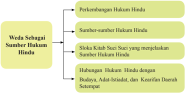

> **Deskripsi Visual:** Gambar ini adalah diagram yang menunjukkan struktur dan konten materi tentang Weda sebagai sumber hukum Hindu. Diagram ini terdiri dari empat bagian utama:

1. Perkembangan Hukum Hindu: Ini mungkin menjelaskan sejarah dan evolusi hukum Hindu.

2. Sumber-sumber Hukum Hindu: Ini mungkin mencakup berbagai aspek hukum Hindu seperti adat, tradisi, dan praktek.

3. Sloka Kriah Suci Suci yang menjelaskan Sumber Hukum Hindu: Ini mungkin menggambarkan bagaimana sloka-sloka suci dalam agama Hindu digunakan untuk menjelaskan prinsip-prinsip hukum.

4. Hubungan Hukum Hindu dengan Budaya, Adat-Isiadat, dan Kearifan Daerah Setempat: Ini mungkin membahas bagaimana hukum Hindu berinteraksi dengan budaya lokal, adat, dan kearifan daerah.

Teks, angka, atau label penting yang terlihat dalam diagram ini meliputi:
- "Weda Sebagai Sumber Hukum Hindu"
- "Perkembangan Hukum Hindu"
- "Sumber-sumber Hukum Hindu"
- "Sloka Kriah Suci Suci yang menjelaskan Sumber Hukum Hindu"
- "Hubungan Hukum Hindu dengan Budaya, Adat-Isiadat, dan Kearifan Daerah Setempat"

Informasi kunci yang dapat diambil pembaca meliputi:
- Struktur materi tentang Weda sebagai sumber hukum Hindu
- Penjelasan perkembangan hukum Hindu
- Penggunaan sloka suci dalam menjelaskan prinsip-prinsip hukum
- Hubungan antara hukum Hindu dengan budaya lokal, adat, dan kearifan daerah setempat

- 4.1 Menyajikan klasiikasi Weda sebagai sumber Hukum  Hindu;

 

---
## 📄 Halaman 70

Pada Pelajaran Bab I para siswa diharapkan dapat mengapreasiasi Weda sebagai sumber Hukum Hindu.

- Menghayati Perkembangan Hukum Hindu
- Mempedomani Sumber Hukum Hindu
- Membaca sloka suci yang menjelaskan Weda sebagai sumber  Hukum Hindu
- Mengetahui  hubungan  hukum  Hindu  dengan  Budaya, Adat-Istiadat, dan kearifan daerah setempat
- Proses Pembelajaran
Diharapkan  para  pendidik  mampu  menyampaikan  materi  Weda  sebagai Sumber  Hukum  Hindu,  sesuai  dengan  buku  siswa  secara  lengkap,  maka pendidik  harus  memahami  dan  menguasai  pokok-pokok  materi  Weda sebagai Sumber Hukum Hindu yang akan diterima oleh peserta didik dan menguasai batasan materi tersebut. Selain dari materi buku siswa, pendidik agar menugaskan peserta didiknya mencari dan menemukan materi-materi lain yang berkaitan dan berhubungan dengan materi pokok untuk menambah wawasan  dan  pengetahuannya melalui membaca  kitab suci, internet, mengamati yang terjadi dimasyarakat sesuai dengan budaya Hindu setempat. Adapun materi Weda sebagai Sumber Hukum Hindu dapat diajarkan kepada peserta didik dengan metode Saintiik antara lain:

### Mengamati:

Pendidik mengajak peserta didik untuk:

- Melakukan kegiatan mencari informasi, melihat, mendengar, membaca, dan atau menyimak materi Weda sebagai sumber Hukum Hindu
- Mengamati  pembacaan  materi Weda sebagai  sumber  Hukum  Hindu secara bergantian
- ......... dan seterusnya.

### Menanya:

Pendidik mengajak peserta didik untuk:

- Melakukan kegiatan diskusi, kerja kelompok, dan diskusi kelas membahas Weda sebagai sumber Hukum Hindu
Semester 1

 

---
## 📄 Halaman 71

- Memberikan  kesempatan  kepada  peserta  didik  untuk  menunjukkan contoh Weda sebagai sumber Hukum Hindu
- ......... dan seterusnya.

### Mengeksplorasi:

Pendidik mengajak peserta didik untuk:

- Mengumpulkan informasi, atau mencoba untuk meningkatkan keingintahuan  peserta  didik  dalam  mengembangkan  penerapan  Weda sebagai sumber Hukum Hindu
- Menyajikan  hasilnya  dalam  bentuk  tulisan  penerapan  Weda  sebagai sumber Hukum Hindu
- ......... dan seterusnya.

### Mengasosiasi:

Pendidik mengajak peserta didik untuk:

- Melakukan  kegiatan  menganalisis  data  Weda  sebagai  sumber  Hukum Hindu
- Menyimpulkan  dari  hasil  analisis  berbagai  macam  hal  yang  dihadapi dalam penerapan Weda sebagai sumber Hukum Hindu
- ......... dan seterusnya.

### Mengomunikasikan:

Pendidik mengajak peserta didik untuk:

- Menyampaikan  hasil konseptualisasi dalam bentuk lisan, tulisan, gambar/ sketsa, Weda sebagai sumber Hukum Hindu
- Membuat laporan, dan/ atau unjuk kerja berkaitan dengan hasil belajar Weda sebagai sumber hokum Hindu
- ......... dan seterusnya.
Metode Pembelajaran yang dapat dipergunakan oleh  pendidik dalam kegiatan pembelajaran Weda sebagai sumber hukum Hindu antara lain:

- Inquiry Based Learning
- Discovery Based Learning
- Project Based Learning
- Problem Based Learning
- Ceramah (dharma wacana)

 

---
## 📄 Halaman 72

- Diskusi
- Tanya Jawab (dharmatula)
- Bercerita
- Penugasan (meringkas  materi Weda sebagai sumber Hukum Hindu dari internet)

### 5. Evaluasi

Pendidik  dapat  mengembangkan  evaluasi  pembelajaran  sesuai  dengan topik  dan  pokok  bahasan Weda sebagai  sumber  Hukum  Hindu.  Evaluasi pembelajaran yang dikembangkan dapat berupa tes dan nontes. Tes dapat berupa uraian, isian, atau pilihan ganda. Non-test dapat berupa lembar kerja, kuesioner,  proyek,  dan  sejenisnya.  Pendidik  juga  harus  mengembangkan rubrik penilaian sesuai dengan materi Weda sebagai sumber Hukum Hindu. Pendidik  atau  fasilitator  selalu  mengecek  setiap  tahapan  yang  dilakukan peserta  didik,  serta  membimbing  peserta  didik  agar  menjalankan  setiap proses dengan baik dan mendapat hasil yang maksimal sesuai potensi yang dimiliki masing-masing peserta didik.

### Rubrik Pendidik

Pendidik dapat mengembangkan indikator penilaian untuk setiap aspek yang diujikan. Indikator-ini merupakan skoring terhadap apa yang akan dinilai dan dicapai oleh peserta didik berdasarkan uji kompetensi yang dikembangkan pada bab I Weda sebagai sumber Hukum Hindu. Pendidik dapat membuat dan  mengembangkan  Rubrik  ini  sesuai  dengan  pengembangan  materi pembelajarannya seperti contoh tertera dibawah ini.

### Pengetahuan

- Jelaskan  apa  yang  anda  ketahui  tentang Weda sebagai  sumber  Hukum Hindu baik berdasarkan sastra maupun bersarkan pemahaman diri anda !
- Mengapa Weda sebagai sumber Hukum Hindu tersebut sulit diterapkan dalam era zaman Globalisai? dan bagaimana sebaiknya!
- Sebutkan dan jelaskan contoh penerapan Weda sebagai sumber Hukum Hindu dalam menyikapi sikap hidup pada masa kini!
Semester 1

 

---
## 📄 Halaman 73

### Keterampilan

- Praktikkan bagaimana perbuatan kita dalam kehidupan sehari-hari jika Weda sebagai sumber Hukum Hindu !
- Praktikkan perbuatan cerminan orang yang berbudi pekerti luhur tarhadap Weda sebagai sumber Hukum Hindu dan memberikan pendidikan hukum seperti sekarang dan masa depan kita !
- Praktikkan bagaimana perbuatan yang diharapkan Weda sebagai sumber Hukum Hindu, yang dapat diteladani dalam kehidupan sekarang ini !

### Sikap

Melalui  ajaran Weda sebagai  sumber  Hukum  Hindu  peserta  didik  dapat meyakini, menghayati, mempraktikkan, mencintai, dan menghargai, menghormati Weda sebagai sumber Hukum Hindu. Sehingga menjadi insaninsan Hindu yang memiliki sikap patuh, taat serta menghormati hukum selalu menjunjung nilai-nilai Dharma atau kebajikan.

- Cobalah releksi diri kita sejauh mana dapat memberikan perubahan sikap sesudah dan sebelum mempelajari ajaran Weda sebagai sumber Hukum Hindu!
- Bagaimanakah cara kita  untuk  selalu  dapat  menerapkan Weda sebagai sumber Hukum Hindu secara konsisten sehingga menjadi manusia yang berbudi pekerti yang santun dalam kehidupan ini sehingga nanti dapat tercapainya tujuan ajaran Agama Hindu?

### 6. Pengayaan dari materi Weda sebagai sumber Hukum Hindu

### Pendidik agar dapat mengembangkan materi Weda sebagai sumber Hukum Hindu kepada peserta didiknya!

Pengertian  Hukum  Hindu  adalah  sebuah  tata  aturan  yang  membahas  aspek kehidupan  manusia  secara  menyeluruh  yang  menyangkut  tata  keagamaan, mengatur hak dan kewajiban manusia baik sebagai individu maupun sebagai mahluk  sosial,  dan  aturan  manusia  sebagai  warga  negara  (tata  negara) bersumberkan pada kitab Weda

Hukum  Hindu  juga  berarti  perundang-undangan  yang  merupakan  bagian terpenting  dari  kehidupan  beragama  dan  bermasyarakat,  ada  kode  etik  yang harus  dihayati  dan  diamalkan  sehingga  menjadi  kebiasaan-kebiasaan  yang hidup dalam masyarakat. Dengan demikian pemerintah dapat mempergunakan hukum ini  sebagai  kewenangan  mengatur  tata  pemerintahan  dan  pengadilan dapat mempergunakan sebagai hukuman bagi masyarakat yang melanggarnya.

 

---
## 📄 Halaman 74

### Sejarah Hukum Hindu

Sejarah Hukum Hindu berawal dari sebuah perdebatan diantara para tokoh agama pada  saat  itu,  berbagai  tulisan  yang  menyangkut  Hukum  Hindu  merupakan perhatian  khusus  para  Maharsi  terhadap  pembinaan  umat  manusia,  adapaun nama-nama penulis Hukum Hindu diantaranya; Gautama, Baudhayana, Shankalikhita,  Wisnu,  Aphastamba,  Harita,  Wikana,  Paitinasi,  Usanama,  Kasyapa, Brhraspati dan Manu .  Dengan adanya penulisan atas Hukum Hindu tampak jelas kepada kita bahwa referensi Hukum Hindu telah lama dimulai juga dengan berbagai perdebatan dan kritik masing-masing sehingga melahirkan beberapa aliran Hukum Hindu diantaranya :

- Aliran Yajnyawalkya oleh Yajnyawalkya
- Aliran Mithaksara oleh Wijnaneswara
- Aliran Dayabhaga oleh Jimutawahana
Dari  ketiga  aliran  tersebut  akhirnya  dapat  berkembang  pesat  khususnya  di wilayah  India  dan  sekitarnya,  dua  aliran  yang  yang  terakhir  yang  mendapat perhatian khusus dan penyebarannya sangat luas yaitu aliran Yajnyawalkya dan aliran Wijnaneswara .

Pelembagaan aliran yang diatas sebagai sumber Hukum Hindu pada Dharmasastra adalah tidak diragukan lagi karena adanya ulasan-ulasan yang diketengahkan  oleh  penulis-penulis  Dharmasastra  sesudah  Maharsi  Manu yaitu  Medhati  (900  SM),  Kullukabhata  (120  SM),  setidak-tidaknya  telah membuat kemungkinan pertumbuhan sejarah Hukum Hindu dengan mengalami perubahan  prinsip  sesuai  dengan  perkembangan  zaman  saat  itu  dan  wilayah penyebarannya seperti Burma, Muangthai sampai ke Indonesia.

### Sumber-Sumber Hukum Hindu

Menurut tradisi yang lazim telah diterima oleh para Maharsi penyusunan atau pengelompokan  materi  yang  lebih  sistematis  maka  sumber  Hukum  Hindu berasal  dari Weda Sruti dan Weda Smrti ,  dalam  pengertian Sruti disini  tidak tercatat  melainkan  sudah  menjadi  wacana  wajib  untuk  melaksanakannya, namun dapat kita lihat yang tercatat pada Weda Smrti karena merupakan sumber dari suatu ingatan dari para Maharshi, untuk itu sumber-sumber Hukum Hindu dari Weda Smrti dapat kita kelompokkan menjadi dua kelompok yaitu :

- Kelompok Upaweda/Weda tambahan ( Itihasa, Purana, Arthasastra, Ayur Weda dan Gandharwa Weda ).
- Kelompok  Wedangga/Batang  tubuh Weda ( Siksa,  Wyakarana,  Chanda, Nirukta, Jyotisa dan Kalpa )
Semester 1

 

---
## 📄 Halaman 75

Bagian terpenting dari kelompok Wedangga adalah Kalpa yang padat dengan isi  Hukum  Hindu,  yaitu  Dharmasastra,  sumber  hukum  ini  membahas  aspek kehidupan manusia yang disebut dharma.

Kitab-kitab yang lain yang juga menjadi sumber Hukum Hindu adalah dapat dilihat  dari  berbagai  kitab-kitab  lain  yang  telah  ditulis  yang  bersumber  pada Weda diantaranya:

- Kitab Sarasamuscaya
- Kitab Suara Jambu
- Kitab Siwasesana
- Kitab Purwadigama
- Kitab Purwagama
- Kitab Dewagama ( Kerthopati)
- Kitab Kutara Manuwa
- Kitab Adigama
- Kitab Kerthasima
- Kitab Kerthasima Subak
- Kitab Paswara
Dari  jenis  kitab  diatas  memang  tidak  ada  gambaran  yang  jelas  atas  saling berhubungan satu dengan yang lainnya juga dari semua kitab tersebut memuat berbagai peraturan yang tidak sama satu dengan yang lainya karena masingmasing kitab tersebut bersumber pada inti pokok peraturan yang ditekankan.

### Bidang-Bidang Hukum Hindu

Bidang-bidang  Hukum  Hindu  sesuai  dengan  sumber  Hukum  Hindu  yang paling terkenal adalah Manawa Dharmasastra yang mengambil sumber ajaran Dharmasastra yang paling tua, adapun pembagian terdiri dari:

- Bidang Hukum Keagamaan, bidang ini banyak memuat ajaran-ajaran yang mengatur  tentang  tata  cara  keagamaan  yaitu  menyangkut  tentang  antara lain;
- Bahwa semua alam semesta ini diciptakan dan dipelihara oleh suatu hukum yang disebut Rta atau dharma.
- Ajaran-ajaran  yang  diturunkan  bersifat  anjuran  dan  larangan  yang semuanya mengandung konskuensi atau akibat (sanksi).

 

---
## 📄 Halaman 76

- Tiap-tiap  ajaran  mengandung  sifat  relatif  yaitu  dapat  disesuaikan dengan zaman atau waktu dan dimana tempat dan kedudukan hukum itu  dilaksanakan,  dan  absolut  berarti  mengikat  dan  wajib  hukumnya dilaksankan.
- Pengertian warna dharma berdasarkan pengertian golongan fungsional.
- Bidang Hukum Kemasyarakatan, bidang ini banyak memuat tentang aturan atau tata cara hidup bermasyarakat satu dengan yang lainnya, atau sosial. Dalam bidang ini banyak diatur tentang konskuensi atau akibat dari sebuah pelanggaran,  kalau  kita  telusuri  lebih  jauh  saat  ini  lebih  dikenal  dengan perdata dan pidana.
Lembaga yang memegang peranan penting yang mengurusi tata kemasyarakatan  adalah  Badan  Legislatif  menurut  Hukum  Hindu  adalah Parisadha. Lembaga ini dapat membantu menyelesaikan masalah dengan cara pendekatan perdamaian sebelum nantinya kalau tidak memungkinkan masuk ke pengadilan.

- Bidang  Hukum  Tata  Kenegaraan,  bidang  ini  banyak  memuat  tentang tata  cara  bernegara,  dimana  terjalinnya  hubungan  warga  masyarakat dengan negara sebagai pengatur tata pemerintahan yang juga menyangkut hubungan  dengan  bidang keagamaan.  Disamping  sistem  pembagian wilayah administrasi dalam suatu negara, Hukum Hindu ini juga mengatur sistem  masyarakat  menjadi  kelompok-kelompok  hukum  yang  disebut; Warna, Kula,Gotra,Ghana,Puga, dan Sreni ,  pembagian ini tidak bersifat kaku karena dapat disesuaikan dengan perkembnagan zaman. Kekuasaan Yudikatif  diletakan  pada  tangan  seorang  raja  atau  kepala  negara,  beliau bertugas memutuskan semua perkara yang timbul pada masyarakat, Raja dibantu oleh Dewan Brahmana yang merupakan Majelis HakimAhli, baik sebagai lembaga yang berdiri sendiri maupun sebagai pembantu pemerintah didalam memutuskan perkara dalam sidang pengadilan ( dharma sabha ), pengadilan biasa ( dharmaastha ), pengadilan tinggi ( pradiwaka ) dan pengadilan istimewa.
Pengayaan  adalah  kegiatan  yang  diberikan  kepada  peserta  didik  atau kelompok yang lebih cepat dalam mencapai kompetensi dibandingkan dengan peserta didik lain agar mereka dapat memperdalam kecakapannya atau dapat mengembangkan potensinya secara  optimal.  Tugas  yang  diberikan  guru  kepada peserta didik dapat berupa tutor sebaya, mengembangkn latihan secara lebih mendalam, membuat karya baru ataupun melakukan suatu proyek. Kegiatan pengayaan  hendaknya  menyenangkan  dan  mengembangkan  kemampuan kognitif tinggi sehingga mendorong peserta didik untuk mengerjakan tugas yang diberikan. Bentuk-bentuk pelaksanaan pembelajaran pengayaan dapat dilakukan antara lain melalui:

Semester 1

 

---
## 📄 Halaman 77

- Belajar kelompok, yaitu sekelompok siswa yang memiliki minat tertentu diberikan pembelajaran bersama pada jam-jam pelajaran sekolah biasa, sambil menunggu teman-temannya yang mengikuti pembelajaran remedial karena belum mencapai ketuntasan.
- Belajar  mandiri,  yaitu  secara  mandiri  siswa  belajar  mengenai  sesuatu yang diminati.
- Pembelajaran berbasis tema, yaitu memadukan kurikulum di bawah tema besar sehingga peserta didik dapat mempelajari hubungan antara berbagai disiplin ilmu.
- Pemadatan  kurikulum,  yaitu  pemberian  pembelajaran  hanya  untuk kompetensi/materi yang belum diketahui peserta didik. Dengan demikian tersedia waktu bagi peserta didik untuk memperoleh kompetensi/materi baru, atau bekerja dalam proyek secara mandiri sesuai dengan kapasitas maupun kapabilitas masing-masing.

### 7. Remedial dari materi Weda sebagai sumber Hukum Hindu

Pembelajaran remedial adalah pembelajaran yang diberikan kepada peserta didik yang belum mencapai ketuntasan kompetensi. Remedial menggunakan berbagai metode yang diakhiri dengan penilaian untuk mengukur kembali tingkat  ketuntasan  belajar  peserta  didik.  Pembelajaran  remedial  diberikan kepada peserta didik bersifat terpadu, artinya pendidik memberikan pengulangan materi dan mengenali potensi setiap individu ataupun kesulitan belajar yang dialami oleh peserta didik. Bentuk Pelaksanaan Remedial

Setelah  diketahui  kesulitan  belajar  yang  dihadapi  peserta  didik,  langkah berikutnya  adalah  memberikan  perlakuan  berupa  pembelajaran  remedial. Bentuk-bentuk pelaksanaan pembelajaran remedial antara lain:

- Pemberian pembelajaran ulang dengan metode dan media yang berbeda. Pembelajaran  ulang  dapat  disampaikan  dengan  cara  penyederhanaan materi, variasi cara penyajian, penyederhanaan tes/pertanyaan. Pembelajaran  ulang  dilakukan  bilamana  sebagian  besar  atau  semua peserta didik belum  mencapai  ketuntasan  belajar  atau  mengalami kesulitan belajar. Pendidik perlu memberikan penjelasan kembali dengan menggunakan metode dan/atau media yang lebih tepat.
- Pemberian  bimbingan  secara  khusus,  misalnya  bimbingan  perorangan. Dalam  hal  pembelajaran  klasikal  peserta  didik  mengalami  kesulitan, perlu dipilih alternatif tindak lanjut berupa pemberian bimbingan secara individual. Pemberian bimbingan perorangan merupakan implikasi peran pendidik sebagai tutor. Sistem tutorial dilaksanakan bilamana terdapat satu atau beberapa peserta didik yang belum berhasil mencapai ketuntasan.

 

---
## 📄 Halaman 78

- Pemberian tugas-tugas latihan secara khusus. Dalam rangka menerapkan prinsip pengulangan, tugas-tugas latihan perlu diperbanyak agar peserta didik  tidak  mengalami  kesulitan  dalam  mengerjakan  tes  akhir.  Siswa perlu  diberi  pelatihan  intensif  untuk  membantu  menguasai  kompetensi yang ditetapkan.
- Pemanfaatan  tutor  sebaya.  Tutor  sebaya  adalah  teman  sekelas  yang memiliki  kecepatan  belajar  lebih.  Mereka  perlu  dimanfaatkan  untuk memberikan tutorial kepada rekannya yang mengalami kesulitan belajar. Dengan teman sebaya diharapkan peserta didik yang mengalami kesulitan belajar akan lebih terbuka dan akrab.

### 8. Interaksi dengan orang tua

Pembelajaran  disekolah  merupakan  tanggung  jawab  bersama  antar  warga sekolah,  yaitu  kepala  sekolah,  pendidik,  dan  tenaga  kependidikan  serta orang tua. Oleh karena itu, pihak sekolah perlu mengkomunikasikan kegiatan pembelajaran  peserta  didik  dengan  orang  tua.  Orang  tua  dapat  berperan sebagai partner sekolah dalam menunjang keberhasilan pembelajaran peserta didik. Pendidik dapat melakukan interaksi dengan orang tua. Interaksi dapat dilakukan  melalui  komunikasi  melalui  telepon,  kunjungan  ke  rumah,  atau media sosial lainnya. Pendidik juga dapat melakukan interaksi melalui lembar kerja  peserta  didik  yang  harus  ditanda  tangani  oleh  orang  tua  murid  baik aspek pengetahuan, sikap, maupun keterampilan. Melalui ineteraksi ini orang tua  dapat  mengetahui  perkembangan  baik  mental,  sosial,  dan  intelektual putra putrinya. Orang tua selalu memantau perkembangan pembelajaranya, mengingatkan akan tugas-tugas apa saja yang diberikan oleh pendidik, sering mengontrol  hasil  ulangan  harian,  tugas-tugas/PR,  orang  tua  menanamkan nilai-nilai  budi  pekerti  dirumah  menjauhkan  diri  dari  tindakan  kekerasan  isik maupun perbal.  Pendidik agama Hindu bekerjasama menugaskan orang tua di rumah antara lain:

- Membimbing putra/putrinya untuk rajin bersembahyang Puja Trisandya dan Panca sembah
- Rajin bersembahyang ke Pura atau ke tempat-tempat suci pada hari-hari suci. (Tirta Yatra)
- Rajin beryadnya
- Menghormati dan menghargai budaya Hindu
- Bersikap saling asah, asih dan asuh dengan sesama makhluk hidup.
- Menanyakan  baik  kepada  pendidik  maupun  putra/putrinya  tentang perkembangan pembelajaran Weda sebagai sumber Hukum Hindu, tugas, hasil ulangan maupun perkembangan sikap dan perbuatan putra/putrinya
Semester 1

 

---
## 📄 Halaman 79

### B. Bab II  Sejarah Perkembangan Kebudayaan Hindu Di Dunia

- Kompetensi Inti (KI) dan Kompetensi Dasar (KD)

---
**📊 Tabel**

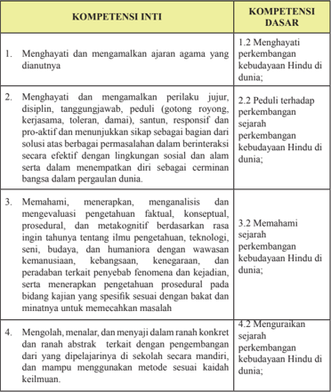

Tabel ini berisi informasi tentang kompetensi inti dan kompetensi dasar yang berkaitan dengan perkembangan kebudayaan Hindu di dunia. Topik utama tabel adalah pengembangan kebudayaan Hindu di dunia melalui berbagai aspek seperti ajaran agama, perilaku sosial, pemahaman dan pengetahuan, serta penggunaan metode kaidah kaidah dalam pembelajaran. Kolom-kolomnya mencakup dua bagian utama: Kompetensi Inti dan Kompetensi Dasar. Kompetensi Inti mencakup empat poin utama yang melibatkan menghormati dan mengamalkan ajaran agama, menjaga integritas dan disiplin, memahami dan menerapkan pengetahuan faktil, konseptual, prosedural, dan metakognitif, serta mengolah, menalar, dan menyajikan informasi secara konkret dan abstrak. Kompetensi Dasar mencakup perubahan perkembangan kebudayaan Hindu di dunia, peduli terhadap sejarah perkembangan kebudayaan Hindu, memahami sejarah perkembangan kebudayaan Hindu, dan menguasai sejarah perkembangan kebudayaan Hindu. Data penting yang terlihat adalah bahwa setiap kompetensi inti memiliki satu atau lebih kompetensi dasar yang relevan, menunjukkan hubungan antara kompetensi inti dan dasar dalam pembelajaran dan pengembangan kebudayaan Hindu di dunia.

### 2. Tujuan Pembelajaran.

Setelah  mempelajari  materi  Sejarah  Perkembangan  Kebudayaan  Hindu  di dunia peserta didik dapat:

 

---
## 📄 Halaman 80

- Menjelaskan pengertian kebudayaan
- Menjelaskan Sejarah Perkembangan Kebudayaan Hindu
- Menyebutkan bukti-bukti Perkembangan Kebudayaan Hindu di Indonesia, di dunia yang menjadi warisan Dunia
- Menyebutkan peninggalan agama Hindu yang bersifat monumental yang ada di dunia
- Menyebutkan  peninggalan  sastra-sastra  Hindu  yang  pernah  ada  dan dipakai dalam peradaban manusia
- Menjelaskan upaya-upaya yang dapat dilakukan dalam rangka pelestarian peninggalan-peninggalan agama Hindu baik oleh Negara maupun oleh umat Hindu itu sendiri.
- Menyaji bukti-bukti sejarah agama Hindu dalam bentuk gambar, karya tulis, tembang/lagu, seni ukir, drama dan tari.
- Menjelaskan kontribusi kebudayaaan Hindu dalam pembangunan pariwisata Nasional dan dunia
- Menjelaskan kebudayaan Hindu dikenal di tingkat Internasional

### 3. Peta Konsep

### BAB II Sejarah Perkembangan Kebudayaan Hindu di Dunia

Alur Pembelajaran

---
**🖼️ Gambar/Diagram**

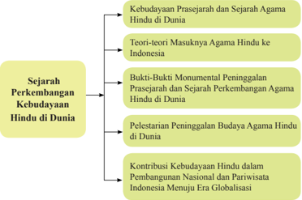

> **Deskripsi Visual:** Gambar ini adalah diagram yang menunjukkan struktur topik sejarah perkembangan kebudayaan Hindu di dunia. Diagram ini terdiri dari empat bagian utama:

1. Kebudayaan Prasejarah dan Sejarah Agama Hindu di Dunia
2. Teori-teori Masuknya Agama Hindu ke Indonesia
3. Buktibuktii Monumental Peninggalan Prasejarah dan Sejarah Perkembangan Agama Hindu di Dunia
4. Pelestarian Peninggalan Budaya Agama Hindu di Dunia

Elemen-elemen utama dalam diagram ini adalah topik-topik tersebut, yang saling terhubung melalui garis bintang. Setiap topik memiliki subtopik yang lebih spesifik.

Teks, angka, atau label penting yang terlihat dalam diagram ini adalah nama-nama topik dan subtopik yang disebutkan dalam setiap bagian. Topik utama adalah "Sejarah Perkembangan Kebudayaan Hindu di Dunia," yang memuat empat subtopik yang lebih spesifik.

Informasi kunci yang dapat diambil pembaca dari gambar ini adalah bahwa buku pelajaran ini membahas berbagai aspek sejarah dan perkembangan kebudayaan Hindu di dunia, mulai dari prasejarah hingga kontribusi kebudayaan Hindu dalam pembangunan nasional dan pariwisata Indonesia.

Semester 1

 

---
## 📄 Halaman 81

### Pada  Pelajaran  Bab  II  peserta  didik  diharapkan  dapat  mengapreasiasi Sejarah Perkembangan Kebudayaan Hindu di Dunia

### 4. Proses Pembelajaran

Pendidik diharapkan mampu menyampaikan materi Sejarah Perkembangan Kebudayaan Hindu di Dunia sesuai dengan buku siswa secara lengkap, maka pendidik  harus  memahami  dan  menguasai  pokok-pokok  materi  Sejarah Perkembangan Kebudayaan Hindu di Dunia yang akan diterima oleh peserta didik dan menguasai batasan materi tersebut. Selain dari materi buku siswa, pendidik  agar  menugaskan  peserta  didiknya  mencari  dan  menemukan materi-materi  lain  yang  berkaitan  dan  berhubungan  dengan  materi  pokok untuk menambah wawasan dan pengetahuannya melalui kitab suci, internet, peta  dunia,  mengamati  yang  terjadi  di  masyarakat  sesuai  dengan  budaya Hindu setempat. Adapun materi Sejarah Perkembangan Kebudayaan Hindu di Dunia disampaikan kepada peserta didik dengan metode Saintiik antara lain:

### Mengamati:

Pendidik mengajak peserta didik untuk:

- Melakukan kegiatan mencari informasi, melihat, mendengar, membaca dan menyimak dari materi  Sejarah Perkembangan Kebudayaan Hindu di Dunia.
- Mengamati dengan saksama peninggalan sejarah perkembangan kebudayaan Hindu di dunia melalui gambar atau sumber internet.
- ......... dan seterusnya.

### Menanya:

Pendidik mengajak peserta didik untuk:

- Membangun pengetahuan  secara  faktual,    konseptual,  dan  prosedural dapat dialakukan melalui kegiatan diskusi, kerja kelompok dari materi Sejarah Perkembangan Kebudayaan Hindu di dunia.
- Memberikan  kesempatan  kepada  peserta  didik  untuk  menunjukkan contoh-contoh bukti sejarah perkembangan kebudayaan Hindu di dunia
- ......... dan seterusnya.

 

---
## 📄 Halaman 82

### Mengeksplorasi:

Pendidik mengajak peserta didik untuk:

- Mengumpulkan informasi untuk mendapatkan pengetahuan dan mengembangkan kreativitasnya melalui membaca, mengamati aktivitas, untuk  memperoleh  informasi  dan  menyajikan  hasilnya  dalam  bentuk tulisan tentang sejarah perkembangan kebudayaan Hindu di dunia
- Mengumpulkan data-data untuk mendukung sebagai bukti adanya sejarah perkembangan kebudayaan Hindu di dunia
- ......... dan seterusnya.

### Mengasosiasi:

Pendidik mengajak peserta didik untuk:

- Menganalisis data, mengelompokan, membuat kategori, menyimpulkan sejarah perkembangan kebudayaan Hindu di dunia
- Menyimpulkan hasil analisis berbagai macam hal yang dihadapi dalam mendapatkan  bukti-bukti  sejarah  perkembangan  kebudayaan  Hindu  di dunia
- ......... dan seterusnya.

### Mengomunikasikan:

Pendidik mengajak peserta didik untuk:

- Menyampaikan hasil belajar  dalam bentuk tulisan sejarah perkembangan kebudayaan Hindu di dunia
- Membuat dalam bentuk gambar-gambar/ foto bukti peninggalan sejarah perkembangan kebudayaan Hindu di dunia
- ......... dan seterusnya.
Metode  Pembelajaran  yang  dapat dipergunakan oleh pendidik  dalam pembelajaran  Sejarah  Perkembangan  Kebudayaan  Hindu  di  Dunia  antara lain:

- Inquiry Based Learning
- Discovery Based Learning
- Project Based Learning
- Problem Based Learning
- Ceramah (dharmawacana)
- Diskusi
Semester 1

 

---
## 📄 Halaman 83

- Tanya Jawab (dharmatula)
- Latihan soal-soal
- Penugasan membuat Peta dari sejarah perkembangan kebudayaan Hindu di dunia dan sejarah agama Hindu
- Presentasi.
- Membuat kliping, gambar,foto-foto sejarah kebudayaan Hindu.

### 5. Evaluasi

Pendidik dapat mengembangkan evaluasi pembelajaran sesuai dengan topik dan  pokok  nahasan  Sejarah  perkembangan  Kebudayaan  Hindu  di  Dunia. Evaluasi pembelajaran yang dikembangkan dapat berupa tes dan nontes. Tes dapat berupa uraian, isian, atau pilihan ganda. Nontes dapat berupa lembar kerja,  kuesioner,  proyek,  dan  sejenisnya.  Pendidik  juga  harus  mengembangkan rubrik  penilaian  sesuai  dengan  materi  Sejarah  Perkembangan Kebudayaan Hindu  di  Dunia.  Pendidik  atau  fasilitator  selalu  mengecek  setiap  tahapan yang  dilakukan  siswa,  serta  membimbing  peserta  didik  agar  menjalankan setiap proses dengan baik dan mendapat hasil yang maksimal sesuai potensi yang dimiliki masing-masing peserta didik.

### Rubrik Pendidik

Pendidik dapat mengembangkan indikator penilaian untuk setiap aspek yang diujikan. Indikator-ini merupakan skoring terhadap apa yang akan dinilai dan dicapai  oleh  peserta  didik  berdasarka  uji  kompetensi  yang  dikembangkan pada Bab II Sejarah perkembangan Kebudayaan Hindu di Dunia. Pendidik dapat membuat dan mengembangkan Rubrik ini sesuai dengan pengembangan materi pembelajarannya seperti contoh tertera dibawah ini.

### Pengetahuan

- Jelaskan apa yang Anda ketahui tentang sejarah perkembangan kebudayaan Hindu di dunia baik berdasarkan sastra maupun berdasarkan pemahaman diri Anda!
- Dimana saja sejarah perkembangan kebudayaan Hindu di dunia tersebut masih dilestariakan!
- Sebutkan dan jelaskan contoh sejarah perkembangan kebudayaan Hindu di dunia yang masih dijadikan sebagai warisan budaya dunia pada masa kini!

 

---
## 📄 Halaman 84

### Keterampilan

- Praktikkan  bagaimana  perbuatan  yang  baik  untuk  menjaga  Sejarah perkembangan Kebudayaan Hindu!
- Praktikkan  perbuatan-perbuatan  cerminan  orang  yang  berbudi  pekerti luhur terhadap Sejarah perkembangan Kebudayaan Hindu dan memberikan informasi pendidikan moral seperti sekarang dan masa depan bangsa!
- Praktikkan perbuatan yang bagaimana diharapkan Sejarah perkembangan Kebudayaan Hindu, yang dapat diteladani dalam kehidupan sekarang ini dan yang akan datang!

### Sikap

Melalui  Sejarah  perkembangan  Kebudayaan  Hindu  di  Dunia  peserta  didik dapat meyakini, menghayati, memahami, mencintai, dan menghargai Sejarah perkembangan Kebudayaan Hindu di Dunia. Sehingga menjadi insan-insan Hindu yang memiliki pengetahuan dan dapat belajar dari sejarah untuk lebih baik dikemudian hari. Peserta didik diharapkan dapat menghargai hasil karya para leluhur yang menjadi inspirasi dan spirit menjunjung nilai-nilai Dharma atau kebajikan.

- Cobalah releksi diri kita sejauhmana dapat memberikan perubahan sikap sesudah dan sebelum mempelajari atau mengetahui sejarah perkembangan kebudayaan Hindu di Dunia!
- Bagaimanakah  cara  kita  untuk  selalu  dapat  menghargai,  melestarikan dan memberikan pendidikan terhadap generasi penerus bangsa ini untuk mencintai  warisan  budaya  dunia,  khususnya  kebudayaan  Hindu  secara konsisten  sehingga  menjadi  manusia  yang  berbudi  pekerti  yang  santun dalam mencintai budaya leluhur?
- Pengayaan dari materi Sejarah perkembangan Kebudayaan Hindu di Dunia.

### Agama Hindu Di India

Perkembangan agama Hindu di India, pada hakekatnya dapat dibagi menjadi 4  fase,  yakni  Zaman Weda, Zaman Brahmana, Zaman Upanisad dan Zaman Buddha. Dari peninggalan benda-benda purbakala di Mohenjodaro dan Harappa, menunjukkan bahwa orang-orang yang tinggal di India pada zaman dahulu telah mempunyai peradaban yang tinggi. Salah satu peninggalan yang menarik, ialah sebuah patung yang menunjukkan perwujudan Siwa. Peninggalan tersebut erat hubungannya dengan ajaran Weda, karena pada zaman ini telah dikenal adanya pemujaan terhadap Dewa-dewa.

Semester 1

 

---
## 📄 Halaman 85

Zaman Weda dimulai pada waktu bangsa Arya berada di Punjab di Lembah Sungai Sindhu, sekitar 2500 s.d 1500 tahun sebelum Masehi, setelah mendesak bangsa Dravida kesebelah Selatan sampai ke dataran tinggi Dekkan. bangsa Arya telah memiliki peradaban tinggi, mereka memuja antara lain Dewa-dewa seperti Agni, Varuna, Vayu, Indra, Siwa dan sebagainya. Walaupun Dewa-dewa itu banyak, namun semuanya adalah manifestasi dan perwujudan  Sang Hyang Widhi atau Tuhan Yang Maha Tunggal. Sang Hyang Widhi /Tuhan yang Tunggal dan Maha Kuasa dipandang sebagai pengatur tertib alam semesta, yang disebut 'Rta'. Pada zaman ini, masyarakat dibagi atas golongan atau sifat dan bakat berdasarkan kelahirannya yaitu: Brahmana, Ksatriya, Vaisya dan Sudra.

Pada zaman Brahmana, kekuasaan kaum Brahmana amat besar pada kehidupan keagamaan, kaum brahmanalah yang mengantarkan persembahan orang kepada para Dewa pada waktu itu. zaman Brahmana ini ditandai pula mulai tersusunnya 'Tata  Cara  Upacara'  beragama  yang  teratur.  Kitab  Brahmana,  adalah  kitab yang  menguraikan  tentang  sesaji  dan  upacaranya.  Penyusunan  tentang  Tata Cara Upacara agama berdasarkan wahyu-wahyu Tuhan yang termuat di dalam sloka-sloka Kitab Suci Weda.

Sedangkan pada zaman Upanisad, yang dipentingkan tidak hanya terbatas pada Upacara dan Saji saja, akan tetapi lebih meningkat pada pengetahuan batin yang lebih  tinggi,  yang  dapat  membuka tabir rahasia alam gaib. Zaman Upanisad ini adalah zaman pengembangan dan penyusunan falsafah agama Hindu, yaitu zaman  orang  berilsafat  atas  dasar  Weda.  Pada  zaman  ini  muncullah  ajaran ilsafat  yang  tinggi-tinggi,  yang  kemudian  dikembangkan  pula  pada  ajaran Darsana, Itihasa dan Purana. Sejak zaman Purana, pemujaan Tuhan sebagai Tri Murti menjadi umum.

Agama  Hindu  dari  India  Selatan  menyebar  sampai  keluar  India  melalui beberapa cara. Dari sekian arah penyebaran ajaran agama Hindu sampai juga di Nusantara. Dalam bukunya yang berjudul 'Hindu Javanesche Geschiedenis', menyebutkan bahwa masuknya pengaruh Hindu ke Indonesia adalah melalui penyusupan  dengan  jalan  damai  yang  dilakukan  oleh  golongan  pedagang (Waisya) India.

Krom (ahli-Belanda), dengan teori Waisya.

Dalam bukunya yang berjudul 'Hindu Javanesche Geschiedenis', menyebutkan bahwa  masuknya  pengaruh  Hindu  ke  Indonesia  adalah  melalui  penyusupan dengan jalan damai yang dilakukan oleh golongan pedagang (Waisya) India.

 

---
## 📄 Halaman 86

### Mookerjee (ahli - India tahun 1912).

Menyatakan bahwa masuknya pengaruh Hindu dari India ke Indonesia dibawa oleh para pedagang India dengan armada yang besar. Setelah sampai di Pulau Jawa  (Indonesia)  mereka  mendirikan  koloni  dan  membangun  kota-kota sebagai tempat untuk memajukan usahanya. Dari tempat inilah mereka sering mengadakan hubungan dengan India. Kontak yang berlangsung sangat lama ini, maka terjadi penyebaran agama Hindu di Indonesia.

Moens dan Bosch (ahli - Belanda) Menyatakan bahwa peranan kaum Ksatrya sangat  besar  pengaruhnya  terhadap  penyebaran  agama  Hindu  dari  India  ke Indonesia.  Demikian  pula  pengaruh  kebudayaan  Hindu  yang  dibawa  oleh para para rohaniwan Hindu India ke Indonesia. Data Peninggalan Sejarah di Indonesia.  Data  peninggalan  sejarah  disebutkan  Rsi  Agastya  menyebarkan agama  Hindu  dari  India  ke  Indonesia.  Data  ini  ditemukan  pada  beberapa prasasti di Jawa dan lontar-lontar di Bali, yang menyatakan bahwa Sri Agastya menyebarkan agama Hindu dari India ke Indonesia, melalui sungai Gangga, Yamuna, India Selatan dan India Belakang. Oleh karena begitu besar jasa Rsi Agastya  dalam  penyebaran  agama  Hindu,  maka  namanya  disucikan  dalam prasasti-prasasti seperti:

### Prasasti Dinoyo (Jawa Timur):

Prasasti ini bertahun Caka 628, dimana seorang raja yang bernama Gajah Mada membuat pura suci untuk Rsi Agastya, dengan maksud memohon kekuatan suci dari Beliau.

### Prasasti Porong (Jawa Tengah)

Prasasti yang bertahun Caka 785, juga menyebutkan keagungan dan kemuliaan Rsi  Agastya.  Mengingat  kemuliaan  Rsi  Agastya,  maka  banyak  istilah  yang diberikan kepada beliau, diantaranya adalah: Agastya Yatra, artinya perjalanan suci  Rsi Agastya  yang  tidak  mengenal  kembali  dalam  pengabdiannya  untuk Dharma.  Pita  Segara,  artinya  bapak  dari  lautan,  karena  mengarungi  lautanlautan luas demi untuk Dharma.

Pengayaan  adalah  kegiatan  yang  diberikan  kepada  peserta  didik  atau kelompok yang lebih cepat dalam mencapai kompetensi dibandingkan dengan peserta didik lain agar mereka dapat memperdalam kecakapannya atau dapat mengembangkan potensinya secara  optimal.  Tugas  yang  diberikan  guru  kepada

Semester 1

 

---
## 📄 Halaman 87

peserta didik dapat berupa tutor sebaya, mengembangkan latihan secara lebih mendalam, membuat karya baru ataupun melakukan suatu proyek. Kegiatan pengayaan  hendaknya  menyenangkan  dan  mengembangkan  kemampuan kognitif tinggi sehingga mendorong peserta didik untuk mengerjakan tugas yang diberikan. Bentuk-bentuk pelaksanaan pembelajaran pengayaan dapat dilakukan antara lain melalui:

- Belajar kelompok, yaitu sekelompok siswa yang memiliki minat tertentu diberikan pembelajaran bersama pada jam-jam pelajaran sekolah biasa, sambil menunggu teman-temannya yang mengikuti pembelajaran remedial karena belum mencapai ketuntasan.
- Belajar  mandiri,  yaitu  secara  mandiri  siswa  belajar  mengenai  sesuatu yang diminati.
- Pembelajaran  berbasis  tema,  yaitu  memadukan  kurikulum  di  bawah tema besar sehingga siswa dapat mempelajari hubungan antara berbagai disiplin ilmu.
- Pemadatan  kurikulum,  yaitu  pemberian  pembelajaran  hanya  untuk kompetensi/materi yang belum  diketahui siswa.  Dengan  demikian tersedia  waktu  bagi  siswa  untuk  memperoleh  kompetensi/materi  baru, atau  bekerja  dalam  proyek  secara  mandiri  sesuai  dengan  kapasitas maupun kapabilitas masing-masing.
- Remedial dari materi Sejarah perkembangan Kebudayaan Hindu di Dunia.
Pembelajaran remedial adalah pembelajaran yang diberikan kepada peserta didik yang belum mencapai ketuntasan kompetensi. Remedial menggunakan berbagai metode yang diakhiri dengan penilaian untuk mengukur kembali tingkat  ketuntasan  belajar  peserta  didik.  Pembelajaran  remedial  diberikan kepada peserta didik bersifat terpadu, artinya pendidik memberikan pengulangan materi dan mengenali potensi setiap individu ataupun kesulitan belajar yang dialami oleh peserta didik. Bentuk Pelaksanaan Remedial

Setelah  diketahui  kesulitan  belajar  yang  dihadapi  peserta  didik,  langkah berikutnya  adalah  memberikan  perlakuan  berupa  pembelajaran  remedial. Bentuk-bentuk pelaksanaan pembelajaran remedial antara lain:

- Pemberian pembelajaran ulang dengan metode dan media yang berbeda. Pembelajaran  ulang  dapat  disampaikan  dengan  cara  penyederhanaan materi, variasi cara penyajian, penyederhanaan tes/pertanyaan. Pembelajaran  ulang  dilakukan  bilamana  sebagian  besar  atau  semua peserta  didik  belum  mencapai  ketuntasan  belajar  atau  mengalami kesulitan belajar. Pendidik perlu memberikan penjelasan kembali dengan menggunakan metode dan/atau media yang lebih tepat.

 

---
## 📄 Halaman 88

- Pemberian bimbingan secara khusus, misalnya bimbingan perorangan. Dalam  hal  pembelajaran  klasikal  peserta  didik  mengalami  kesulitan, perlu dipilih alternatif tindak lanjut berupa pemberian bimbingan secara individual. Pemberian  bimbingan  perorangan merupakan  implikasi peran  pendidik  sebagai  tutor.  Sistem  tutorial  dilaksanakan  bilamana terdapat satu atau beberapa peserta didik yang belum berhasil mencapai ketuntasan.
- Pemberian tugas-tugas latihan secara khusus. Dalam rangka menerapkan prinsip pengulangan, tugas-tugas latihan perlu diperbanyak agar peserta didik  tidak  mengalami  kesulitan  dalam  mengerjakan  tes  akhir.  Peserta didik perlu diberi pelatihan intensif untuk membantu  menguasai kompetensi yang ditetapkan.
- Pemanfaatan  tutor  sebaya.  Tutor  sebaya  adalah  teman  sekelas  yang memiliki  kecepatan  belajar  lebih.  Mereka  perlu  dimanfaatkan  untuk memberikan tutorial kepada rekannya yang mengalami kesulitan belajar. Dengan teman sebaya diharapkan peserta didik yang mengalami kesulitan belajar akan lebih terbuka dan akrab.

### 8. Interaksi dengan orang tua

Pembelajaran  disekolah  merupakan  tanggung  jawab  bersama  antar  warga sekolah,  yaitu  kepala  sekolah,  Pendidik,  dan  tenaga  kependidikan  serta orang tua. Oleh karena itu, pihak sekolah perlu mengkomunikasikan kegiatan pembelajaran  peserta  didik  dengan  orang  tua.  Orang  tua  dapat  berperan sebagai partner sekolah dalam menunjang keberhasilan pembelajaran peserta didik. Pendidik dapat melakukan interaksi dengan orang tua. Interaksi dapat dilakukan  melalui  komunikasi  melalui  telepon,  kunjungan  ke  rumah,  atau media sosial lainnya. Pendidik juga dapat melakukan interaksi melalui lembar kerja  peserta  didik  yang  harus  ditanda  tangani  oleh  orang  tua  murid  baik aspek pengetahuan, sikap, maupun keterampilan.  Melalui interaksi ini orang tua  dapat  mengetahui  perkembangan  baik  mental,  sosial,  dan  intelektual putra putrinya. Orang tua selalu memantau perkembangan pembelajaranya, mengingatkan akan tugas-tugas apa saja yang diberikan oleh pendidik, sering mengontrol  hasil  ulangan  harian,  tugas-tugas/PR,  orang  tua  menanamkan nilai-nilai  budi  pekerti  dirumah  menjauhkan  diri  dari  tindakan  kekerasan  isik maupun verbal.  Pendidik agama Hindu bekerjasama menugaskan orang tua di rumah antara lain:

- Membimbing putra/putrinya untuk rajin bersembahyang Puja Trisandya dan Panca sembah
- Rajin bersembahyang ke Pura atau ke tempat-tempat suci pada hari-hari suci.
- Rajin beryadnya
Semester 1

 

---
## 📄 Halaman 89

- Menghormati dan menghargai budaya Hindu
- Bersikap saling asah, asih dan asuh dengan sesama mahkluk hidup.
- Menanyakan  baik  kepada  pendidik  maupun  putra/putrinya  tentang perkembangan pembelajaran Sejarah Perkembangan Kebudayaan Hindu, tugas, hasil ulangan maupun perkembangan sikap dan perbuatan putra/ putrinya

### C. Bab III  Yantra, Tantra Dan Mantra

- Kompetensi Inti (KI) dan Kompetensi Dasar (KD)

---
**📊 Tabel**

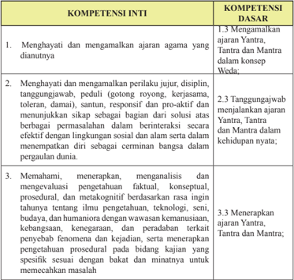

Tabel ini berisi informasi tentang kompetensi inti dan dasar yang harus dipenuhi oleh individu dalam konteks agama dan kehidupan sosial. Topik utama tabel adalah tentang bagaimana menghentikan dan mematuhi ajaran agama, menjaga integritas dan integritas diri, serta memahami dan menerapkan pengetahuan yang diperoleh dari ajaran tersebut. Kolom-kolomnya mencakup dua bagian utama: Kompetensi Inti dan Kompetensi Dasar. Kompetensi Inti meliputi tiga poin utama, yaitu menghentikan dan mematuhi ajaran agama, menjaga integritas dan integritas diri, serta memahami dan menerapkan pengetahuan yang diperoleh. Kompetensi Dasar mencakup tiga poin, yaitu menghentikan dan mematuhi ajaran Yatra, Tantra, dan Mantra; menjaga integritas dan integritas diri; serta menerapkan pengetahuan yang diperoleh. Data penting yang terlihat adalah bahwa semua kompetensi inti dan dasar memiliki hubungan dengan ajaran agama, integritas diri, dan pengetahuan yang diperoleh.

 

---
## 📄 Halaman 90

---
**📊 Tabel**

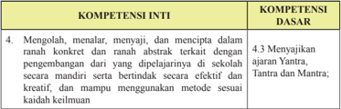

Tabel ini berisi informasi tentang kompetensi inti dan kompetensi dasar yang berkaitan dengan pengembangan diri di sekolah. Topik utamanya adalah tentang mengolah, menalar, menyajikan, dan menciptakan dalam ranah konkrit dan ranah abstrak terkait dengan pengembangan diri. Dalam kolom kompetensi inti, ada satu baris yang menunjukkan bahwa peserta didik harus mampu menjalankan ajaran Yatra, Tantra, dan Mantra secara mandiri, berbeda-beda secara efektif dan kreatif, serta menggunakan metode sesuai keilmuan. Sementara itu, dalam kolom kompetensi dasar, ada satu baris yang menunjukkan bahwa peserta didik harus mampu menjalankan ajaran Yatra, Tantra, dan Mantra. Pola penting yang terlihat adalah bahwa peserta didik harus mampu menjalankan ajaran Yatra, Tantra, dan Mantra secara mandiri, berbeda-beda secara efektif dan kreatif, serta menggunakan metode sesuai keilmuan.

### 2. Tujuan Pembelajaran.

Setelah mempelajari materi Tantra, Yantra dan Mantra peserta didik dapat:

- Menjelaskan ajaran Tantra, Yantra dan Mantra
- Menjelaskan  fungsi,  dan  manfaat Tantra,  Yantra dan Mantra dalam kehidupan dan penerapannya dalam  ajaran Hindu
- Meningkatkan  keyakinannya  terhadap  kekuatan  yang  terdapat  dalam Tantra, Yantra dan Mantra
- Menunjukkan bentuk-bentuk Tantra, Yantra dan Mantra
- Mempraktikkan membuat bentuk Tantra, Yantra dan Mantra
- Melestarikan ajaran dan praktik Tantra, Yantra dan Mantra

### 3. Peta Konsep

### BAB III  Tantra, Yantra, Dan Mantra

Alur Pembelajaran

---
**🖼️ Gambar/Diagram**

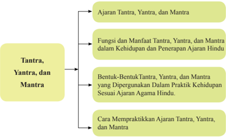

> **Deskripsi Visual:** Gambar ini adalah diagram yang menunjukkan struktur dan konten dari topik "Tantra, Yantra, dan Mantra" dalam buku pelajaran. Diagram ini terdiri dari empat cabang utama yang masing-masing menjelaskan aspek berbeda dari topik tersebut:

1. **Ajaran Tantra, Yantra, dan Mantra** - Ini menjelaskan tentang prinsip-prinsip dasar dari ajaran tersebut.

2. **Fungsi dan Manfaat Tantra, Yantra, dan Mantra dalam Kehidupan dan Penerapan Ajaran Hindu** - Ini membahas bagaimana Tantra, Yantra, dan Mantra digunakan dalam kehidupan sehari-hari dan praktik agama Hindu.

3. **Bentuk-Bentuk Tantra, Yantra, dan Mantra yang Digunakan Dalam Praktik Kehidupan Sesuai Ajaran Agama Hindu** - Ini memberikan contoh-contoh bentuk-bentuk yang ada dalam praktik kehidupan.

4. **Cara Mempraktekkan Ajaran Tantra, Yantra, dan Mantra** - Ini menguraikan langkah-langkah yang harus dilakukan untuk mempraktekkan ajaran tersebut.

Elemen-elemen utama dalam diagram ini adalah cabang-cabang yang menjelaskan aspek-aspek dari topik tersebut. Relasi antara elemen-elemen ini adalah hubungan hierarkis, dengan cabang yang lebih tinggi menjelaskan konsep umum dan cabang yang lebih rendah menjelaskan detail spesifik.

Teks, angka, atau label penting yang terlihat dalam diagram ini meliputi:
- "Tantra, Yantra, dan Mantra"
- "Ajaran Tantra, Yantra, dan Mantra"
- "Fungsi dan Manfaat Tantra, Yantra, dan Mantra dalam Kehidupan dan Penerapan Ajaran Hindu"
- "Bentuk-Bentuk Tantra, Yantra, dan Mantra yang Digunakan Dalam Praktik Kehidupan Sesuai Ajaran Agama Hindu"
- "Cara Mempraktekkan Ajaran Tantra, Yantra, dan Mantra"

Informasi kunci yang dapat diambil pembaca meliputi:
- Topik utama adalah Tantra, Yantra, dan Mantra

Semester 1

 

---
## 📄 Halaman 91

Pada  Pelajaran Bab III para siswa diharapkan dapat mengapresiasi Ajaran Tantra, Yantra, dan Mantra.

### 4. Proses Pembelajaran

Pendidik diharapkan dapat menyampaikan materi ajaran Tantra, Yantra dan Mantra sesuai  dengan  buku  siswa  secara  lengkap,  maka  Pendidik  harus memahami  dan  menguasi  pokok-pokok  materi  ajaran Tantra,  Yantra dan Mantra yang akan diterima oleh peserta didik dan menguasai batasan materi tersebut. Selain dari materi buku siswa, pendidik agar menugaskan peserta didiknya  mencari  dan  menemukan  materi-materi  lain  yang  berkaitan  dan berhubungan dengan materi Tantra,  Yantra dan Mantra untuk  menambah wawasan  dan  pengetahuannya  malalui membaca  kitab  suci, internet, mengamati yang terjadi dimasyarakat sesuai dengan budaya Hindu setempat. Adapun materi Tantra, Yantra dan Mantra dapat diajarkan kepada peserta didik dengan metode Saintiik antara lain:

### Mengamati:

Pendidik mengajak peserta didik untuk:

- Menyimak penjelasan Pendidik tentang Tantra, Yantra dan Mantra
- Mengamati berbagai macam bentuk gambar-gambar Tantra, Yantra dan mantra-mantra dalam kaitannya dengan Tantra dan Y antra
- ......... dan seterusnya.

### Menanya:

Pendidik mengajak peserta didik untuk:

- Menanyakan manfaat Yantra, Tantra dan Mantra dalam kehidupan baik dalam kaitan dengan upacara keagamaan dan kehidupan sosial
- Membimbing peserta didik membuat bentuk-bentuk Tantra dan Yantra manfaat, tujuan mantra
- ......... dan seterusnya.

### Mengeksplorasi:

Pendidik mengajak peserta didik untuk:

- Dapat mengumpulkan informasi untuk mendapatkan pengetahuan dan mengembangkan kreativitasnya melalui membaca, mengamati aktivitas, untuk  memperoleh  informasi  dan  menyajikan  hasilnya  dalam  bentuk tulisan tentang Tantra, Yantra dan Mantra

 

---
## 📄 Halaman 92

- Mengumpulkan sumber data untuk mendukung  terwujudnya pengamalan Tantra dan Yantra, Mantra dalam kehidupan
- ......... dan seterusnya.

### Mengasosiasi:

Pendidik mengajak peserta didik untuk:

- Melakukan  kegiatan  menganalisis  data,  mengelompokan,  membuat kategori, menyimpulkan, hubungan Tantra, Yantra dan Mantra
- Menganalisis  berbagai  macam  hal  yang  dihadapi  dalam  pemahaman ajaran Tantra, Yantra dan Mantra
- ......... dan seterusnya.

### Mengomunikasikan:

Pendidik mengajak peserta didik untuk:

- Menyampaikan hasil belajar  dalam bentuk tulisan manfaat mempelajari Tantra, Yantra dan Mantra dalam keidupan
- Membuat Gambar-gambar Tantra,  Yantra dan Mantra sebagai  sarana mendekatkan diri kepada Sang Hyang Widhi
- 3.   ......... dan seterusnya.
Metode  Pembelajaran  yang  dapat  dipergunakan  oleh  pendidik  dalam pembelajaran Tantra, Yantra dan Mantra adalah :

- Inquiry Based Learning
- Discovery Based Learning
- Project Based Learning
- Problem Based Learning
- Ceramah
- Diskusi
- Tanya Jawab (dharmatula)
- Penugasan membuat ringkasan yang berhubungan dengan ajaran Tantra, Yantra dan Mantra.
- Presentasi
Semester 1

 

---
## 📄 Halaman 93

### 5. Evaluasi

Pendidik dapat mengembangkan evaluasi pembelajaran sesuai dengan topik dan pokok bahasan Tantra, Yantra dan Mantra . Evaluasi pembelajaran yang dikembangkan dapat berupa tes dan non-test. Tes dapat berupa uraian, isian, atau pilihan ganda. Non-test dapat berupa lembar kerja, kuesioner, proyek, dan sejenisnya. Pendidik juga harus mengembangkan rubrik penilaian sesuai dengan  materi Tantra,  Yantra dan Mantra Pendidik  atau  fasilitator  selalu mengecek setiap tahapan yang dilakukan peserta didik, serta membimbing peserta didik agar menjalankan setiap proses dengan baik dan mendapat hasil yang maksimal sesua potensi yang dimiliki masing-masing peserta didik.

### Rubrik Pendidik

Pendidik  dapat  mengembangkan  indikator  penilaian  untuk  setiap  aspek yang  diujikan.  Indikator-ini  merupakan  skoring  terhadap  apa  yang  akan dinilai  dan  dicapai  oleh  peserta  didik  berdasarkan  uji  kompetensi  yang dikembangkan  pada  bab  III Tantra,  Yantra dan Mantra .  Pendidik  dapat membuat  dan  mengembangkan  Rubrik  ini  sesuai  dengan  pengembangan materi pembelajarannya seperti contoh tertera dibawah ini.

### Pengetahuan:

- Jelaskan apa yang anda ketahui tentang Tantra, Yantra dan Mantra baik berdasarkan sastra maupun bersarkan pemehaman diri anda !
- Dimana saja penerapan Tantra, Yantra dan Mantra tersebut dilaksanakan!
- Sebutkan dan jelaskan contoh Tantra, Yantra dan Mantra pada praktik keagamaan maupun dalam kehidupan sehari-hari !

### Keterampilan:

- Praktikkan bagaimana membuat bentuk-bentuk Yantra maupun Tantra !
- Praktikkan mengucapkan mantra-mantra sebagai bentuk mohon perlindungan Ida Sang Hyang Widhi!
- Praktikkan  bagaimana  perbuatan  yang  diharapkan Tantra,  Yantra dan Mantra , yang dapat diteladani dalam kehidupan sekarang ini dan yang akan datang!

### Sikap

Melalui  ajaran Tantra,  Yantra dan Mantra peserta  didik  dapat  meyakini, menghayati,  memahami,  mencintai,  dan  menghargai Tantra,  Yantra dan Mantra .  Sehingga menjadi insan-insan Hindu yang memiliki pengetahuan dan dapat memetik hasil pembelajaran dari Tantra, Yantra dan Mantra untuk

 

---
## 📄 Halaman 94

lebih baik dikemudian hari. Peserta didik diharapkan dapat menghargai hasil karya para leluhur yang menjadi inspirasi dan spirit menjunjung nilai-nilai Dharma atau kebajikan.

- Cobalah releksi diri kita sejauh mana dapat memberikan perubahan sikap sesudah dan sebelum mempelajari ajaran Tantra, Yantra dan Mantra !
- Bagaimanakah cara kita untuk selalu dapat menerapkan Tantra, Yantra dan Mantra secara konsisten sehingga menjadi manusia yang religius, berbudi pekerti yang santun dalam kehidupan ini sehingga nanti dapat tercapainya tujuan ajaran Yantra, Tantra dan Mantra ?

### 6. Pengayaan dari materi Tantra

### TANTRA

Secara  umum  tantra  dapat  diartikan  yaitu  kekuatan  suci  dalam  diri  yang dibangkitkan dengan cara-cara yang ditetapkan dalam kitab suci. Tantra adalah konsep pemujaan Ida Sang Hyang Widhi Wasa di mana manusia kagum pada sifat-sifat  kemahakuasaan-Nya,  sehingga  ada  keinginan  untuk  mendapatkan sedikit kesaktian.

Tantra adalah  ilmu  pengetahuan  kerohanian  yang  untuk  pertama  kalinya diajarkan di India 7000 tahun silam. Tan berasal dari akar kata Sansekerta yang berarti 'perluasan', dan Tra berarti 'pembebasan'. Dengan demikian Tantra merupakan latihan rohani yang mengangkat manusia ke dalam suatu proses yang memperluas pikirannya. Tantra menghantar manusia dari suatu keadaan tidak  sempurna  menjadi  sempurna,  dari  keadaan  kasar  menjadi  halus,  dari kemelekatan menjadi terbebaskan.

Perkembangan Tantra berjalin dengan perkembangan peradaban di India kuno.

### Guru dan Murid

Dalam berbagai ulasan mengenai Tantra Shastra dan dalam bukunya mengenai kehidupan dan ajaran Shiva, Shrii Shrii Anandmurti mengemukakan beberapa pemikiran dasar bersumber dari ajaran-ajaran kuno itu. Salah satu unsur utama dalam Tantra adalah hubungan antara Guru dan murid. Guru berarti 'seseorang yang  dapat  menyingkirkan  kegelapan'  dan  Shiva  menjelaskan  bahwa  agar diperolehnya keberhasilan rohani harus ada seorang guru yang baik dan seorang murid yang baik.

Semester 1

 

---
## 📄 Halaman 95

Shiva menjelaskan  bahwa  ada  tiga  jenis  Guru.  Golongan  pertama  adalah guru  yang  memberikan  sedikit  pengetahuan  namun  tidak  menindaklanjuti pengajarannya. Jadi mereka pergi dan meninggalkan murid tanpa pengarahan. Kelompok kedua  atau  tingkat  menengah  adalah  mereka  yang  mengajar  dan mengarahkan para muridnya sebentar namun tidak selama masa yang diperlukan murid untuk mencapai tujuan akhirnya. Jenis guru yang paling baik menurut Tantra adalah  yang  memberikan  pengajaran  dan  kemudian  mengupayakan terus menerus agar muridnya mengikuti semua petunjuk dan sampai menyadari tujuan akhir kesempurnaan manusia.

Ciri guru yang istimewa ini lebih jauh diperinci dalam Tantra Shastra .  Guru adalah yang  tenang, dapat mengendalikan  pikirannya,  rendah  hati,  dan berpakaian  sederhana.  Dia  memperoleh  penghidupannya  secara  layak,  dan berkeluarga.  Dia  fasih  dalam  ilsafat  metaisik  dan  matang  dalam  seni m d tasi. Dia juga tahu teori dan praktik pengajaran meditasi. Dia mencintai dan menuntun para muridnya. Guru yang demikian disebut Mahakoala .

Namun meskipun ada seorang guru yang hebat, tetap saja harus ada sesorang yang dapat menyerap pelajarannya. Tantra Shastra menguraikan tiga kelompok murid. Jenis pertama dapat dibandingkan dengan sebuah gelas yang dibenamkan ke air dengan mulut kebawah. Meskipun berada di dalam air dan tampak penuh, namun bila dikeluarkan dari air akan tetap kosong. Ini seolah seorang murid yang berlaku baik di depan gurunya, namun begitu gurunya pergi, murid itu tidak melanjutkan latihannya dan tidak dapat menerapkan pelajarannya dalam keseharian.

Kelompok murid kedua adalah seperti gelas yang dicelupkan miring ke dalam air.  Tampaknya  memang  penuh  saat  terbenam  namun  ketika  diangkat  akan kehilangan  banyak  air.  Murid  seperti  ini  adalah  yang  tekun  saat  kehadiran gurunya namun perlahan-lahan akan berkurang bahkan meninggalkan latihannya sama sekali.

Kelompok murid yang terbaik dilambangkan dengan gelas yang dibenamkan dalam air dengan posisi tegak. Saat dalam air gelas itu penuh dan saat diangkat keluar air tetap penuh. Murid seperti ini tekun berlatih di hadirat gurunya dan terus bertekun biarpun secara isik terpisah jauh dari gurunya.

Hubungan guru murid sangat penting dan merupakan ciri kunci dalam Tantra. Jalan  rohani  sering  disamakan  dengan  sisi  tajam  pisau  cukur.  Mudah  sekali keluar dari jalur dan dengan demikian memang sulit memperoleh pembebasan. Sang  guru  selalu  hadir  untuk  mencintai  dan  menuntun  si  murid  pada  setiap tahap upayanya.

 

---
## 📄 Halaman 96

Pengayaan  adalah  kegiatan  yang  diberikan  kepada  peserta  didik  atau kelompok  yang  lebih  cepat  dalam  mencapai  kompetensi  dibandingkan dengan peserta didik lain agar mereka dapat memperdalam kecakapannya atau dapat mengembangkan potensinya secara optimal. Tugas yang diberikan pendidik kepada peserta didik dapat berupa tutor sebaya, mengembangkan latihan  secara  lebih  mendalam,  membuat  karya  baru  ataupun  melakukan suatu proyek. Kegiatan pengayaan hendaknya menyenangkan dan mengembangkan kemampuan kognitif tinggi sehingga mendorong peserta didik untuk mengerjakan tugas yang diberikan. Bentuk-bentuk pelaksanaan pembelajaran pengayaan dapat dilakukan antara lain melalui:

- Belajar kelompok, yaitu sekelompok peserta didik yang memiliki minat tertentu diberikan pembelajaran bersama pada jam-jam pelajaran sekolah biasa, sambil menunggu teman-temannya yang mengikuti pembelajaran remedial karena belum mencapai ketuntasan.
- Belajar  mandiri,  yaitu  secara  mandiri  peserta  didik  belajar  mengenai sesuatu yang diminati.
- Pembelajaran  berbasis  tema,  yaitu  memadukan  kurikulum  di  bawah tema besar sehingga peserta didik dapat mempelajari hubungan antara berbagai disiplin ilmu.
- Pemadatan  kurikulum,  yaitu  pemberian  pembelajaran  hanya  untuk kompetensi/materi yang belum diketahui peserta didik. Dengan demikian tersedia  waktu  bagi  siswa  untuk  memperoleh  kompetensi/materi  baru, atau  bekerja  dalam  proyek  secara  mandiri  sesuai  dengan  kapasitas maupun kapabilitas masing-masing.

### 7. Remedial dari materi Tantra, Yantra dan Mantra

Pembelajaran remedial adalah pembelajaran yang diberikan kepada peserta didik yang belum mencapai ketuntasan kompetensi. Remedial menggunakan berbagai metode yang diakhiri dengan penilaian untuk mengukur kembali tingkat  ketuntasan  belajar  peserta  didik.  Pembelajaran  remedial  diberikan kepada peserta didik bersifat terpadu, artinya pendidik memberikan pengulangan materi dan mengenali potensi setiap individu ataupun kesulitan belajar yang dialami oleh peserta didik.

Setelah  diketahui  kesulitan  belajar  yang  dihadapi  peserta  didik,  langkah berikutnya  adalah  memberikan  perlakuan  berupa  pembelajaran  remedial. Bentuk-bentuk pelaksanaan pembelajaran remedial antara lain:

- Pemberian pembelajaran ulang dengan metode dan media yang berbeda. Pembelajaran  ulang  dapat  disampaikan  dengan  cara  penyederhanaan materi, variasi cara penyajian, penyederhanaan tes/pertanyaan. Pembelajaran  ulang  dilakukan  bilamana  sebagian  besar  atau  semua
Semester 1

 

---
## 📄 Halaman 97

peserta  didik  belum  mencapai  ketuntasan  belajar  atau  mengalami kesulitan belajar. Pendidik perlu memberikan penjelasan kembali dengan menggunakan metode dan/atau media yang lebih tepat.

- Pemberian bimbingan secara khusus, misalnya bimbingan perorangan. Dalam hal pembelajaran klasikal  peserta  didik  mengalami  kesulitan, perlu dipilih alternatif tindak lanjut berupa pemberian bimbingan secara individual.  Pemberian  bimbingan  perorangan  merupakan  implikasi peran  pendidik  sebagai  tutor.  Sistem  tutorial  dilaksanakan  bilamana terdapat satu atau beberapa peserta didik yang belum berhasil mencapai ketuntasan.
- Pemberian tugas-tugas latihan secara khusus. Dalam rangka menerapkan prinsip pengulangan, tugas-tugas latihan perlu diperbanyak agar siswa tidak mengalami kesulitan dalam mengerjakan tes akhir. Peserta didik perlu diberi pelatihan intensif untuk membantu menguasai kompetensi yang ditetapkan.
- Pemanfaatan  tutor  sebaya.  Tutor  sebaya  adalah  teman  sekelas  yang memiliki  kecepatan  belajar  lebih.  Mereka  perlu  dimanfaatkan  untuk memberikan tutorial kepada rekannya yang mengalami kesulitan belajar. Dengan  teman  sebaya  diharapkan  peserta  didik  yang  mengalami kesulitan belajar akan lebih terbuka dan akrab.

### 8. Interaksi dengan orang tua

Pembelajaran  disekolah  merupakan  tanggung  jawab  bersama  antar  warga sekolah,  yaitu  kepala  sekolah,  pendidik,  dan  tenaga  kependidikan  serta orang tua. Oleh karena itu, pihak sekolah perlu mengomunikasikan kegiatan pembelajaran  peserta  didik  dengan  orang  tua.  Orang  tua  dapat  berperan sebagai partner sekolah dalam menunjang keberhasilan pembelajaran peserta didik. Pendidik dapat melakukan interaksi dengan orang tua. Interaksi dapat dilakukan melalui komunikasi melalui telepon, kunjungan ke rumah, atau media  sosial  lainnya.  Pendidik  juga  dapat  melakukan  interaksi  melalui lembar kerja peserta didik yang harus ditanda tangani oleh orang tua murid baik aspek pengetahuan, sikap, maupun keterampilan. Melalui ineteraksi ini orang tua dapat mengetahui perkembangan baik mental, sosial, dan intelektual putra putrinya. Orang tua selalu memantau perkembangan pembelajaranya, mengingatkan akan tugas-tugas apa saja yang diberikan oleh pendidik, sering mengontrol  hasil  ulangan  harian,  tugas-tugas/PR,  orang  tua  menanamkan nilai-nilai  budi  pekerti  dirumah  menjauhkan  diri  dari  tindakan  kekerasan isik  maupun  verbal.  Pendidik  agama  Hindu  bekerjasama  menugaskan  orang tua di rumah antara lain:

 

---
## 📄 Halaman 98

- Membimbing putra/putrinya untuk rajin bersembahyang Puja Trisandya dan Panca sembah.
- Rajin bersembahyang ke Pura atau ke tempat-tempat suci pada hari-hari suci ( Tirta Yatra ).
- Rajin beryadnya
- Menghormati dan menghargai budaya Hindu.
- Bersikap saling asah, asih dan asuh dengan sesama mahkluk hidup.
- Menanyakan  baik  kepada  pendidik  maupun  putra/putrinya  tentang perkembangan  pembelajaran Tantra,  Yantra  dan  Mantra ,  tugas,  hasil ulangan maupun perkembangan sikap dan perbuatan putra / putrinya.

### D. Bab IV Ashtangga Yoga dan Moksa

- Kompetensi Inti (KI) dan Kompetensi Dasar (KD)

---
**📊 Tabel**

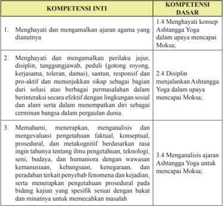

Tabel ini berisi informasi tentang kompetensi inti dan dasar yang berkaitan dengan Ashtanga Yoga. Topik utamanya adalah tentang bagaimana menghargai dan mempraktikkan prinsip-prinsip yoga, seperti kejujuran, disiplin, dan responsifnya terhadap masalah. Kolom-kolomnya mencakup tiga kompetensi inti: menghargai dan mengamalkan ajaran agama yang dianutnya, menghargai dan mengamalkan perilaku jujur, disiplin, tanggungjawab, peduli, dan menunjukkan sikap pro-aktif; serta menahan, memperkaya, menganalisis, dan mengevaluasi pengetahuan faktil, konseptual, prosedural, dan metakognitif tentang yoga. Kompetensi dasar meliputi menghargai konsep Ashtanga Yoga dalam upaya mencapai Moksa, menjalankan prinsip-prinsip Ashtanga Yoga secara efektif dalam lingkungan sosial dan alam, serta menerapkan diri sebagai pemimpin bangsa dalam penguasaan dunia. Data penting yang terlihat adalah bahwa semua kompetensi inti dan dasar berkaitan erat dengan praktik dan pemahaman Ashtanga Yoga, serta bagaimana mengaplikasikannya dalam berbagai situasi dan konteks.

Semester 1

 

---
## 📄 Halaman 99

### 2. Tujuan Pembelajaran.

Setelah mempelajari materi Ashtangga Yoga dan Moksa peserta didik dapat:

- Menjelaskan Ashtangga Yoga dalam upaya mencapai Moksa
- Menyebutkan tahapan-tahapan Ashtangga Yoga dalam upaya mencapai Moksa
- Menjelaskan manfaat melaksanakan Ashtangga Yoga dalam  kehidupan dan penerapannya dalam ajaran Hindu
- Menunjukkan bentuk-bentuk mempraktikkan Ashtangga Yoga
- Menumbuh kembangkan sikap Sradha dan baktinya terhadap Ashtangga Yoga untuk mencapai Moksa

### 3. Peta Konsep

### BAB IV Ashtangga Yoga dan Moksa

Alur Pembelajaran

---
**🖼️ Gambar/Diagram**

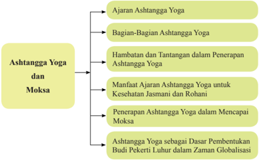

> **Deskripsi Visual:** Gambar ini adalah diagram yang menunjukkan struktur topik dalam Ashtanga Yoga dan Moksa. Diagram ini dibagi menjadi beberapa bagian utama:

1. Ajaran Ashtanga Yoga
2. Bagian-Bagian Ashtanga Yoga
3. Hambatan dan Tantangan dalam Penerapan Ashtanga Yoga
4. Manfaat Ajaran Ashtanga Yoga untuk Kesehatan Jasmani dan Rohani
5. Penerapan Ashtanga Yoga dalam Mencapai Moksa
6. Ashtanga Yoga sebagai Dasar Pembentukan Budi Pekerti Luhur dalam Zaman Globalisasi

Elemen-elemen utama dalam diagram ini adalah topik-topik tersebut, yang saling terkait dan membentuk struktur pembelajaran tentang Ashtanga Yoga dan Moksa. Teks, angka, atau label penting yang terlihat meliputi judul topik-titik, seperti "Ajaran Ashtanga Yoga", "Hambatan dan Tantangan dalam Penerapan Ashtanga Yoga", dan lain-lain.

Informasi kunci yang dapat diambil pembaca meliputi struktur pembelajaran yang terorganisir dengan baik, menjelaskan berbagai aspek dari Ashtanga Yoga dan Moksa, serta bagaimana aspek-aspek ini saling berkaitan dalam konteks globalisasi.

 

---
## 📄 Halaman 100

### 4. Proses Pembelajaran

Agar Pendidik mampu menyampaikan materi Ashtangga Yoga dan Moksa sesuai dengan buku siswa secara lengkap, maka Pendidik harus memahami dan menguasi pokok-pokok materi Ashtangga Yoga dan Moksa yang akan diterima oleh peserta didik dan menguasai batasan materi tersebut. Selain dari materi buku siswa, pendidik agar menugaskan peserta didiknya mencari dan menemukan materi-materi lain yang berkaitan dan berhubungan dengan materi pokok untuk menambah wawasan dan pengetahuannya malalui kitab suci, internet, mengamati yang terjadi dimasyarakat sesuai dengan budaya Hindu setempat. Adapun materi Ashtangga Yoga dan Moksa dapat diajarkan kepada peserta didik dengan metode Saintiik antara lain:

### Mengamati:

Pendidik mengajak peserta didik untuk:

- Melakukan kegiatan mencari informasi, melihat, mendengar, membaca dan menyimak dari materi Ashtangga Yoga dalam mencapai Moksa
- Mengamati  dengan  saksama  tahapan-tahapan Ashtangga  Yoga dalam mencapai Moksa melalui gambar atau sumber internet.
- ......... dan seterusnya.

### Menanya:

Pendidik mengajak peserta didik untuk:

- Membangun  pengetahuan  secara  factual  konseptual,  dan  prosedural dapat dialakukan melalui kegiatan diskusi, kerja kelompok dari materi tahapan-tahapan Ashtangga Yoga dalam mencapai Moksa
- Memberikan  kesempatan  kepada  peserta  didik  untuk  menunjukkan contoh-contoh sikap atau perbuatan dalam tahapan-tahapan Ashtangga Yoga dalam mencapai Moksa
- ......... dan seterusnya.

### Mengeksplorasi:

Pendidik mengajak peserta didik untuk:

- Mengumpulkan informasi untuk mendapatkan pengetahuan dan mengembangkan kreativitasnya melalui membaca, mengamati aktivitas, untuk  memperoleh  informasi  dan  menyajikan  hasilnya  dalam  bentuk tulisan tentang Ashtangga Yoga dalam mencapai Moksa
- Mengumpulkan  data-data  untuk  mendukung Ashtangga  Yoga dalam mencapai Moksa
- ......... dan seterusnya.
Semester 1

 

---
## 📄 Halaman 101

### Mengasosiasi:

Pendidik mengajak peserta didik untuk:

- Menganalisis data, mengelompokkan, membuat katagori, menyimpulkan Ashtangga Yoga dalam mencapai Moksa
- Menyimpulkan hasil analisis berbagai macam hal yang dihadapi dalam mendapatkan bukti-bukti Ashtangga Yoga dalam mencapai Moksa
- ......... dan seterusnya.

### Mengomunikasikan:

Pendidik mengajak peserta didik untuk:

- Menyampaikan  hasil  belajar  dalam  bentuk  tulisan Ashtangga Yoga dalam mencapai Moksa
- Membuat dalam bentuk gambar-gambar/ foto mempraktikkan Ashtangga Yoga dalam mencapai Moksa
- ......... dan seterusnya.
Metode  Pembelajaran  yang  dapat  dipilih  oleh  pendidik  dalam  kegiatan pembelajaran Ashtangga Yoga :

- Inquiry Based Learning
- Discovery Based Learning
- Project Based Learning
- Problem Based Learning
- Ceramah ( dharmawacana)
- Diskusi
- Tanya Jawab (dharmatula)
- latihan soal-soal
- Penugasan  membuat  ringkasan  dari Ashtangga  Yoga dalam  upaya mencapai Moksa
- Presentasi.
- Membuat  kliping,  gambar,  foto-foto Ashtangga  Yoga dalam  upaya mencapai Moksa

 

---
## 📄 Halaman 102

### 5. Evaluasi

Pendidik dapat mengembangkan evaluasi pembelajaran sesuai dengan topik dan pokok bahasan Ashtangga Yoga dan Moksa . Evaluasi pembelajaran yang dikembangkan dapat berupa tes dan nontes. Tes dapat berupa uraian, isian, atau  pilihan  ganda.  Nontes  dapat  berupa  lembar  kerja,  kuesioner,  proyek, dan  sejenisnya.  Pendidik  juga  harus  mengembangkan  rubric  penilaian sesuai  dengan  materi Ashtangga Yoga untuk  mencapai Moksa .  Pendidik atau fasilitator selalu mengecek setiap tahapan yang dilakukan peserta didik, serta  membimbing siswa agar menjalankan setiap proses dengan baik dan mendapat hasil yang maksimal sesua potensi yang dimiliki masing-masing peserta didik.

### Rubrik Pendidik

Pendidik  dapat  mengembangkan  indikator  penilaian  untuk  setiap  aspek yang  diujikan.  Indikator-ini  merupakan  scoring  terhadap  apa  yang  akan dinilai  dan  dicapai  oleh  peserta  didik  berdasarka  uji  kompetensi  yang dikembangkan  pada  bab  IV Ashtangga  Yoga dan Moksa. Pendidik  dapat membuat  dan  mengembangkan  Rubrik  ini  sesuai  dengan  pengembangan materi  pembelajarannya seperti contoh tertera dibawah ini.

### Pengetahuan

- Jelaskan apa yang anda ketahui tentang Ashtangga Yoga dan Moksa baik berdasarkan sastra maupun bersarkan pemahaman diri anda!
- Sebutkan  dan  jelaskan  bagian-bagian Ashtangga  Yoga dan Moksa tersebut!
- Sebutkan  dan  jelaskan  contoh Ashtangga  Yoga dan Moksa pada  masa kini!

### Keterampilan

- Praktikkan bagaimana cara pengamalan Ashtangga Yoga untuk mencapai Moksa yang paripurna!
- Praktikkan perbuatan cerminan orang yang berbudi pekerti luhur terhadap pengamalan Ashtangga  Yoga untuk  mencapai Moksa dan  memberikan informasi pendidikan moral seperti sekarang dan masa depan!
- Praktikkan bagaimana perbuatan yang diharapkan Ashtangga Yoga untuk mencapai Moksa ,  yang  dapat  diteladani  dalam  kehidupan  sekarang  ini dan yang akan datang!
Semester 1

 

---
## 📄 Halaman 103

### Sikap

Melalui  ajaran Ashtangga Yoga dan Moksa peserta  didik  dapat  meyakini, menghayati,  memahami,  mencintai,  dan  menghargai Ashtangga Yoga dan Moksa .  Sehingga  menjadi  insan-insan  Hindu  memiliki  pengetahuan  dan dapat  memetik hasil pembelajaran dari Ashtangga Yoga dan Moksa untuk lebih  baik  dikemudian  hari.  Peserta  didik  diharapkan  dapat  melaksanakan tahapan-tahapan Ashtangga Yoga untuk  memudahkan  terwujudnya Moksa sebagai tujuan hidup manusia yang tertinggi dan terakhir.

- Cobalah  releksi  diri  kita  sejauh  mana  dapat  memberikan  perubahan sesudah  dan  sebelum  mempelajari  ajaran Ashtangga Yoga untuk mencapai Moksa !
- Bagaimanakah cara kita untuk selalu dapat menerapkan Ashtangga Yoga secara konsisten sehingga menjadi manusia yang berbudi pekerti yang santun  dalam  kehidupan  ini  sehingga  nanti  dapat  tercapainya  tujuan ajaran Agama Hindu ?
- Pengayaan  dari materi Ashtangga Yoga dan Moksa

### Pendidik dapat mengembangkan materi Pengayaan ini!

Sejak  lebih  dari  5000  tahun  yang  lalu, Yoga telah  diketahui  sebagai  salah satu  alternatif  pengobatan  melalui  pernafasan.  Awal  mula  munculnya yoga diprakarsai  oleh  Maha  Rsi  Patanji,  dan  menjadi  ajaran  yang  diikuti  banyak kalangan  umat  Hindu. Cittavrttinirodha adalah  kata  yang  dianggap  dapat mengartikan  Yoga  yang  sesungguhnya.  Artinya  sendiri  adalah  penghentian gerak pikiran. Ajaran yoga ini ditulis Maha Rsi lewat sastra Yoga sutra, yang terbagi  menjadi  empat  dan  memuat  194  sutra.  Bagian-bagian  pada  sastra, yaitu Samadhipada (bagian pertama), Sadhapada (bagian kedua), Vidhutipada (bagian ketiga), dan Kailvalyapada (bagian keempat). Ajaran Yoga ternyata juga termuat dalam sastra Hindu. Beberapa sastra Hindu tersebut adalah Upanisad, Bhagavad Gita, Yogasutra , dan Hatta Yoga . Kemudian, ajaran Yoga mengalami pengklasiikasian, yang terdapat pada sastra Hindu, Bhagavad gita. Klasiikasi tersebut adalah, (Ariasa. 2006: 57)

- Hatha Yoga , yaitu Yoga yang dilakukan dengan pose isik (Asana), teknik pernafasan ( Pranayana ) disertai dengan meditasi. Ketiga poin ini dilakukan untuk membuat pikiran menjadi tenang dan tubuh sehat penuh vitalitas.
- Bakti  Yoga ,  yaitu Yoga  yang  memfokuskan diri untuk menuju hati. Jika seorang  yogi  berhasil  menerapkannya,  maka  dia  akan  dapat  melihat kelebihan  orang  lain  dan  cara  untuk  menghadapi  sesuatu.  Keberhasilan yoga ini juga membuat yogi menjadi lebih welas asih dan menerima segala

 

---
## 📄 Halaman 104

yang ada di sekitarnya, karena dalam Yoga ini diajarkan untuk mencintai alam dan beriman kepada Tuhan.

- Raja  Yoga ,  yaitu  yoga  yang  menitikberatkan  pada  teknik  meditasi  dan kontemplasi. Yoga ini nantinya akan mengarah pada cara penguasaan diri sekaligus  menghargai  diri  sendiri  dan  sekitarnya.  Raja Yoga  merupakan dasar dari yoga sutra.
- Jnana  Yoga ,  yaitu  yoga  yang  menerapkan  metode  untuk  meraih  kebijaksanaan dan  pengetahuan.  Teknik  ini  cenderung  untuk  menggabungkan  antara kepandaian  dan  kebijaksanaan,  sehingga  nantinya  mendapatkan  hidup yang  dapat  menerima  semua  ilosoi  dan  agama.
- Karma Yoga , yaitu Yoga ini mempercayai adanya reinkarnasi. Di sini Anda akan dibuat untuk menjadi tidak egois, karena yakin bahwa perilaku Anda saat ini akan berpengaruh pada kehidupan yang akan datang.
- Tantra Yoga . Untuk Yoga ini sedikit berbeda dengan yoga yang lain, bahkan ada yang menganggapnya mirip dengan ilmu sihir. Teknik pada Yoga ini terdiri atas kebenaran (kebenaran) dan hal-hal yang mistik (mantra). Tujuan dari teknik ini supaya dapat menghargai pelajaran dan pengalaman hidup.
Pengayaan  adalah  kegiatan  yang  diberikan  kepada  peserta  didik  atau kelompok  yang  lebih  cepat  dalam  mencapai  kompetensi  dibandingkan dengan peserta didik lain  agar  mereka  dapat  memperdalam kecakapannya atau dapat mengembangkan potensinya secara optimal. Tugas yang diberikan Pendidik  kepada  peserta  didik  dapat  berupa  tutor  sebaya,  mengembangkn latihan  secara  lebih  mendalam,  membuat  karya  baru  ataupun  melakukan suatu proyek. Kegiatan pengayaan hendaknya menyenangkan dan mengembangkan kemampuan kognitif tinggi sehingga  mendorong  peserta didik untuk mengerjakan tugas yang diberikan. Bentuk-bentuk pelaksanaan pembelajaran pengayaan dapat dilakukan antara lain melalui:

- Belajar kelompok, yaitu sekelompok peserta didik yang memiliki minat tertentu diberikan pembelajaran bersama pada jam-jam pelajaran sekolah biasa, sambil menunggu teman-temannya yang mengikuti pembelajaran remedial karena belum mencapai ketuntasan.
- Belajar  mandiri,  yaitu  secara  mandiri  peserta  didik  belajar  mengenai sesuatu yang diminati.
- Pembelajaran berbasis tema, yaitu memadukan kurikulum di bawah tema besar sehingga peserta didik dapat mempelajari hubungan antara berbagai disiplin ilmu.
Semester 1

 

---
## 📄 Halaman 105

- Pemadatan  kurikulum, yaitu pemberian pembelajaran hanya untuk kompetensi/materi yang belum diketahui peserta didik. Dengan demikian tersedia waktu bagi peserta didik untuk memperoleh kompetensi/materi baru, atau bekerja dalam proyek secara mandiri sesuai dengan kapasitas maupun kapabilitas masing-masing.

### 7. Remedial dari materi Ashtangga Yoga dan Moksa

Pembelajaran remedial adalah pembelajaran yang diberikan kepada peserta didik yang belum mencapai ketuntasan kompetensi. Remedial menggunakan berbagai metode yang diakhiri dengan penilaian untuk mengukur kembali tingkat  ketuntasan  belajar  peserta  didik.  Pembelajaran  remedial  diberikan kepada peserta didik bersifat terpadu, artinya pendidik memberikan pengulangan materi Ashtangga Yoga dan Moksa dan mengenali potensi setiap individu ataupun kesulitan belajar yang dialami oleh peserta didik. Bentuk Pelaksanaan  Remedial  Setelah  diketahui  kesulitan  belajar  yang  dihadapi peserta  didik,  langkah  berikutnya  adalah  memberikan  perlakuan  berupa pembelajaran remedial. Bentuk-bentuk pelaksanaan pembelajaran remedial antara lain:

- Pemberian pembelajaran ulang dengan metode dan media yang berbeda. Pembelajaran  ulang  dapat  disampaikan  dengan  cara  penyederhanaan materi,  variasi  cara  penyajian,  penyederhanaan  tes/pertanyaan.  Pem  belajaran ulang dilakukan bilamana sebagian besar atau semua siswa belum mencapai ketuntasan belajar atau mengalami kesulitan belajar. Pendidik perlu memberikan penjelasan kembali dengan menggunakan metode dan/ atau media yang lebih tepat.
- Pemberian  bimbingan  secara  khusus,  misalnya  bimbingan  perorangan. Dalam hal pembelajaran klasikal siswa mengalami kesulitan, perlu dipilih alternatif  tindak  lanjut  berupa  pemberian  bimbingan  secara  individual. Pemberian bimbingan perorangan merupakan implikasi peran pendidik sebagai tutor.  Sistem  tutorial  dilaksanakan  bilamana  terdapat  satu  atau beberapa siswa yang belum berhasil mencapai ketuntasan.
- Pemberian tugas-tugas latihan secara khusus. Dalam rangka menerapkan prinsip pengulangan, tugas-tugas latihan perlu diperbanyak agar peserta didik  tidak  mengalami  kesulitan  dalam  mengerjakan  tes  akhir.  Peserta didik perlu diberi pelatihan intensif untuk membantu menguasai kompetensi yang ditetapkan.
- Pemanfaatan  tutor  sebaya.  Tutor  sebaya  adalah  teman  sekelas  yang memiliki  kecepatan  belajar  lebih.  Mereka  perlu  dimanfaatkan  untuk memberikan tutorial kepada rekannya yang mengalami kesulitan belajar. Dengan teman sebaya diharapkan peserta didik yang mengalami kesulitan belajar akan lebih terbuka dan akrab.

 

---
## 📄 Halaman 106

### 8. Interaksi dengan Orang Tua

Pembelajaran  disekolah  merupakan  tanggung  jawab  bersama  antar  warga sekolah,  yaitu  kepala  sekolah,  pendidik,  dan  tenaga  kependidikan  serta orang tua. Oleh karena itu, pihak sekolah perlu mengkomunikasikan kegiatan pembelajaran  peserta  didik  dengan  orang  tua.  Orang  tua  dapat  berperan sebagai partner sekolah dalam menunjang keberhasilan pembelajaran peserta didik. Pendidik dapat melakukan interaksi dengan orang tua. Interaksi dapat dilakukan  melalui  komunikasi  melalui  telepon,  kunjungan  ke  rumah,  atau media sosial lainnya. Pendidik juga dapat melakukan interaksi melalui lembar kerja  peserta  didik  yang  harus  ditanda  tangani  oleh  orang  tua  murid  baik aspek pengetahuan, sikap, maupun keterampilan. Melalui ineteraksi ini orang tua  dapat  mengetahui  perkembangan  baik  mental,  sosial,  dan  intelektual putra putrinya. Orang tua selalu memantau perkembangan pembelajaranya, mengingatkan akan tugas-tugas apa saja yang diberikan oleh pendidik, sering mengontrol  hasil  ulangan  harian,  tugas-tugas/PR,  orang  tua  menanamkan nilai-nilai  budi  pekerti  dirumah  menjauhkan  diri  dari  tindakan  kekerasan  isik maupun verbal.  Pendidik agama Hindu bekerjasama menugaskan orang tua di rumah antara lain:

- Membimbing putra/putrinya untuk rajin bersembahyang Puja Trisandya dan Panca sembah
- Rajin bersembahyang ke Pura atau ke tempat-tempat suci pada hari-hari suci ( Tirta Yatra ).
- Rajin beryadnya
- Menghormati dan menghargai budaya Hindu
- Bersikap saling asah, asih dan asuh dengan sesama mahkluk hidup ciptaan Ida Sang Hyang Widhi
- Menanyakan  baik  kepada  pendidik  maupun  putra/putrinya  tentang perkembangan pembelajaran Ashtangga dan Moksa , tugas, hasil ulangan maupun perkembangan sikap dan perbuatan putra/putrinya.

### E. Bab V  Dasa Yama Bratha dan Dasa Nyama Bratha

- Kompetensi Inti (KI) dan Kompetensi Dasar (KD)

---
**📊 Tabel**

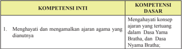

Tabel ini memperlihatkan dua kompetensi: Kompetensi Inti dan Kompetensi Dasar. Topik utama tabel adalah tentang menghayati dan mengamalkan ajaran agama yang dianutnya. Dalam kolom Kompetensi Inti, terdapat satu item yang disebutkan sebagai "Menghayati dan mengamalkan ajaran agama yang dianutnya". Sementara itu, dalam kolom Kompetensi Dasar, terdapat dua item yang disebutkan sebagai "Menghayati konsep ajaran yang tertuang dalam Dasa Yama Bratha" dan "Menghayati konsep ajaran yang tertuang dalam Dasa Nyama Bratha". Pola penting yang terlihat adalah bahwa kedua kompetensi dasar tersebut merupakan bagian dari kompetensi inti yang disebutkan di atas.

Semester 1

 

---
## 📄 Halaman 107

---
**📊 Tabel**

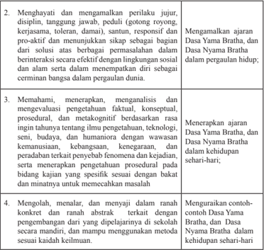

Tabel ini berisi instruksi untuk mengimplementasikan prinsip-prinsip Dasa Yama Bratha dan Dasa Nyama Bratha dalam kehidupan sehari-hari. Topik utamanya adalah tentang menghargai dan mengamalkan perilaku jujur, disiplin, tanggung jawab, peduli, dan responsif. Kolom pertama menjelaskan tugas-tugas yang harus dilakukan, sementara kolom kedua memberikan contoh atau penjelasan lebih lanjut tentang bagaimana mengimplementasikan prinsip-prinsip tersebut dalam kehidupan sehari-hari. Data penting yang terlihat adalah bahwa tabel ini mencakup empat langkah-langkah yang harus diikuti, yaitu menghargai dan mengamalkan perilaku jujur, memahami, menerapkan, dan mengolah, menalar, dan menyajikan dengan konkrit dan rata-rata abstrak.

### 2. Tujuan Pembelajaran.

Setelah  mempelajari  materi Dasa Yama Bratha dan Dasa Nyama Bratha , peserta didik dapat:

- Menjelaskan ajaran Dasa Yama Bratha dan Dasa Nyama Bratha
- Menyebutkan bagian-bagian Dasa Yama Bratha dan Dasa Nyama Bratha
- Menjelaskan  masing-masing  bagian Dasa  Nyama  Bratha  dan  Dasa Nyama Bratha
- Menjelaskan tujuan yang  ingin dicapai ajaran Dasa Yama Bratha dan Dasa Nyama Bratha terhadap umat manusia
- Menyebutkan  dengan  contoh-contoh  dalam  bentuk perbuatan dari masing-masing bagian Dasa Yama Bratha dan Dasa Nyama Bratha

 

---
## 📄 Halaman 108

- Menerapkan sikap disiplin, peduli dan bertanggung jawab sesuai dengan ajaran Dasa Yama Bratha dan Dasa Nyama Bratha
- Memberikan  perubahan  sikap  mental  yang  lebih  baik,  percaya  akan hukum Karma Phala dan terwujudnya kehidupan yang santhi

### 3. Peta Konsep

### BAB V  Dasa Yama Bratha dan Dasa Nyama Bratha

Alur Pembelajaran

---
**🖼️ Gambar/Diagram**

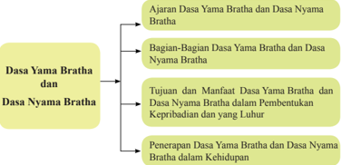

> **Deskripsi Visual:** Gambar ini adalah diagram yang menunjukkan struktur dan konten dari dua topik utama dalam materi pelajaran, yaitu "Dasar Yama Bratha" dan "Dasar Nyama Bratha". Diagram ini dibagi menjadi empat bagian utama:

1. **Ajaran Dasar Yama Bratha dan Dasar Nyama Bratha**: Ini merupakan bagian awal yang menjelaskan dasar-dasar yang akan dipelajari tentang kedua konsep tersebut.

2. **Bagian-Bagian Dasar Yama Bratha dan Dasar Nyama Bratha**: Bagian ini mungkin membahas lebih lanjut tentang struktur dan komponen dasar dari kedua konsep tersebut.

3. **Tujuan dan Manfaat Dasar Yama Bratha dalam Pembentukan Kepribadian dan yang Luhur**: Ini menekankan pentingnya dasar-dasar dalam membangun karakter dan kehidupan yang baik.

4. **Penerapan Dasar Yama Bratha dan Dasar Nyama Bratha dalam Kehidupan**: Bagian terakhir ini mungkin mengajarkan cara aplikasi dasar-dasar tersebut dalam kehidupan sehari-hari.

Elemen-elemen utama dalam diagram ini meliputi:
- Nama-nama topik utama (Dasar Yama Bratha dan Dasar Nyama Bratha)
- Subtopik yang lebih spesifik seperti tujuan dan manfaat

Teks, angka, atau label penting yang terlihat dalam diagram ini adalah nama-nama topik dan subtopik yang disebutkan di atas. Informasi kunci yang dapat diambil pembaca adalah bahwa materi ini berfokus pada pengembangan karakter dan kehidupan yang baik melalui pemahaman dasar-dasar yang diberikan.

Pada Pelajaran Bab V peserta didik diharapkan dapat mengapresiasi Ajaran Dasa Yama Bratha dan  Dasa Nyama Bratha.

### 4. Proses Pembelajaran

Agar Pendidik berhasil menyampaikan materi Dasa Yama Bratha dan Dasa Nyama Bratha sesuai  dengan  buku  siswa  secara  lengkap,  maka  pendidik harus memahami dan menguasi pokok-pokok materi Dasa Yama Bratha dan Dasa Nyama Bratha yang akan diterima oleh peserta didik dan menguasai batasan  materi  tersebut.  Selain  dari  materi  buku  siswa,  pendidik  agar menugaskan peserta didiknya mencari dan menemukan sendiri materi-materi lain yang berkaitan dan berhubungan dengan materi pokok untuk menambah wawasan dan pengetahuannya melalui kitab suci, internet, mengamati yang

Semester 1

 

---
## 📄 Halaman 109

terjadi dimasyarakat sesuai dengan budaya Hindu setempat. Adapun materi Dasa Yama Bratha dan Dasa Nyama Bratha dapat diajarkan kepada peserta didik dengan metode Saintiik antara lain:

### Mengamati:

Pendidik mengajak peserta didik untuk:

- Menyimak paparan ajaran Dasa Yama Bratha dan Dasa Nyama Bratha.
- Mengamati  sikap  perilaku  temannya  yang  sesuai  dengan Dasa  Yama Bratha dan Dasa Nyama Bratha.
- Mencermati akibat dari perbuatan yang bertentangan dengan ajaran Dasa Yama Bratha dan Dasa Nyama Bratha.
- ......... dan seterusnya

### Menanya:

Pendidik mengajak peserta didik untuk:

- Menanyakan  keutamaan  menjalankan  yang  diajarkan  dalam  bagianbagian Dasa Yama Bratha dan Dasa Nyama Bratha
- Memberikan  kesempatan  kepada  peserta  didik  untuk  menunjukkan contoh-contoh sikap atau perbuatan nyata Dasa Yama Bratha dan Dasa Nyama Bratha dalam kehidupan sehari-hari.
- ......... dan seterusnya.

### Mengeksplorasi:

Pendidik mengajak peserta didik untuk:

- Mengumpulkan informasi untuk mendapatkan pengetahuan dan mengembangkan kreativitasnya melalui membaca, mengamati aktivitas, untuk  memperoleh  informasi  dan  menyajikan  hasilnya  dalam  bentuk tulisan tentang Dasa Yama Bratha dan dasa Nyama Bratha yang masih dijunjung tinggi oleh masyarakat.
- Mengumpulkan data bentuk penerapan terwujudnya Dasa Yama Bratha dan dasa Nyama Bratha.
- Memberikan contoh atau teladan dalam sikap dan berperilaku yang benar sesuai dengan ajaran Dasa Yama Bratha dan dasa Nyama Bratha.
- ........ dan seterusnya.

 

---
## 📄 Halaman 110

### Mengasosiasi:

Pendidik mengajak peserta didik untuk:

- Menyimpulkan manfaat mempraktikkan ajaran Dasa Yama Bratha dan Dasa Nyama Bratha
- Menganalisis berbagai macam hal yang dihadapi dalam mempraktikkan Dasa Yama Bratha dan Dasa Nyama Bratha di kehidupan sehari-hari
- Mengkondisikan diri selalu melaksanakan Dasa Yama Bratha dan Dasa Nyama Bratha setiap langkah kehidupan
- ......... dan seterusnya.

### Mengomunikasikan:

Pendidik mengajak peserta didik untuk:

- Menyampaikan hasil belajar  dalam bentuk tulisan tujuan masing-masing bagian Dasa Yama Bratha dan Dasa Nyama Bratha
- Membuat  karikatur  pengamalan  ajaran Dasa  Yama  Bratha  dan  Dasa Nyama Bratha
- Melihat contoh penerapan Dasa Yama Bratha dan Dasa Nyama Bratha dari teman sebayanya
- ......... dan seterusnya.
Metode  Pembelajaran  yang  dapat  dipergunakan  oleh pendidik  dalam pembelajaran Dasa Yama Bratha dan Dasa Nyama Bratha adalah :

- Inquiry Based Learning
- Discovery Based Learning
- Project Based Learning
- Problem Based Learning
- Ceramah (dharmawacana)
- Diskusi
- Tanya Jawab (dharmatula)
- Latihan soal-soal
- Penugasan membuat ringkasan dari Dasa Yama Bratha dan Dasa Nyama Bratha
- Presentasi.
Semester 1

 

---
## 📄 Halaman 111

### 5. Evaluasi

Pendidik dapat mengembangkan evaluasi pembelajaran sesuai dengan topik dan pokok bahasan Dasa Yama Bratha dan Dasa Nyama Bratha.

Evaluasi  pembelajaran  yang  dikembangkan  dapat  berupa  tes  dan  nontes. Tes  dapat  berupa  uraian,  isian,  atau  pilihan  ganda.  Nontes  dapat  berupa lembar  kerja,  kuesioner,  proyek,  dan  sejenisnya.  Pendidik  juga  harus mengembangkan rubrik penilaian sesuai dengan materi Dasa Yama Bratha dan Dasa Nyama Bratha .  Pendidik atau fasilitator selalu mengecek setiap tahapan yang dilakukan peserta didik, serta membimbing peserta didik agar menjalankan setiap proses dengan baik dan mendapat hasil yang maksimal sesuai potensi yang dimiliki masing-masing peserta didik.

### Rubrik Pendidik

Pendidik dapat mengembangkan indikator penilaian untuk setiap aspek yang diujikan. Indikator-ini merupakan skoring terhadap apa yang akan dinilai dan dicapai  oleh  peserta  didik  berdasarka  uji  kompetensi  yang  dikembangkan pada bab V Dasa Yama Bratha dan Dasa Nyama Bratha .  Pendidik  dapat membuat  dan  mengembangkan  Rubrik  ini  sesuai  dengan  pengembangan materi  pembelajarannya seperti contoh tertera dibawah ini.

### Pengetahuan

- Jelaskan  apa  yang  anda  ketahui  tentang Dasa Yama Bratha dan Dasa Nyama Bratha baik  berdasarkan  sastra  maupun  bersarkan  pemahaman diri anda!
- Sebutkan  dan  jelaskan  bagian-bagian Dasa  Yama  Bratha dan Dasa Nyama Bratha tersebut!
- Sebutkan dan jelaskan dengan contoh sikap maupun perbuatan seharihari yang ingin dicapai dalam ajaran Dasa Yama Bratha dan Dasa Nyama Bratha !

### Keterampilan

- Praktikkan  bagaimana  cara  menerapkan Dasa  Yama  Bratha dan Dasa Nyama Bratha di sekolah ini!
- Praktikkan  ajaran Dasa  Yama  Bratha dan Dasa  Nyama  Bratha di lingkungan keluarga, masyarakat dan memberikan informasi pendidikan moral seperti sekarang dan untuk masa yang akan datang!

 

---
## 📄 Halaman 112

- Praktikkan bagaimana perbuatan yang diharapkan Dasa Yama Bratha dan Dasa Nyama Bratha , yang dapat diteladani dalam kehidupan sekarang ini dan yang akan datang!

### Sikap

Melalui ajaran Dasa Yama Bratha dan Dasa Nyama Bratha peserta  didik dapat meyakini, menghayati, memahami, mencintai, dan menghargai Dasa Yama Bratha dan Dasa Nyama Bratha . Sehingga menjadi insan-insan Hindu memiliki  pengetahuan  dan  dapat  memetik  hasil  pembelajaran  dari Dasa Yama Bratha dan Dasa Nyama Bratha untuk lebih baik dikemudian hari.

- Cobalah  releksi  diri  kita  sejauh  mana  dapat  memberikan  perubahan sikap sesudah dan sebelum mempelajari ajaran Dasa Yama Bratha dan Dasa Nyama Bratha !
- Bagaimanakah  cara  kita  untuk  selalu  dapat  menerapkan Dasa  Yama Bratha dan Dasa  Nyama  Bratha secara  konsisten  sehingga  menjadi manusia yang berbudi pekerti yang santun dalam kehidupan ini sehingga nanti dapat tercapainya tujuan ajaran Agama Hindu?
- Pengayaan dari materi Dasa Yama Bratha dan Dasa Nyama Brath a.
Pendidik dapat mengembangkan materi pengayaan yang berkaitan dengan ajaran etika / moralitas kepada peserta didiknya.

### Dasa Dharma menurut Wreti Sasana , terdiri dari:

- Sauca artinya murni rohani dan jasmani.
- Indriyanigraha artinya mengekang indriya atau nafsu.
- Hrih artinya tahu dengan rasa malu.
- Widya artinya bersifat bijaksana.
- Satya artinya jujur dan setia terhadap kebenaran.
- Akrodha artinya sabar atau mengekang kemarahan.
- Drti artinya murni dalam batin.
- Ksama artinya suka mengampuni.
- Dama artinya kuat mengendalikan pikiran.
- Asteya artinya tidak melakukan kecurangan.
Semester 1

 

---
## 📄 Halaman 113

Dasa Paramartha ialah sepuluh macam ajaran kerohanian yang dapat dipakai penuntun dalam tingkah laku yang baik serta  untuk mencapai  tujuan hidup yang tertinggi ( Moksa ). Dasa Paramartha ini terdiri dari:

- Tapa artinya pengendalian diri lahir batin.
- Bratha artinya mengekang hawa nafsu.
- Samadhi artinya konsentrasi pikiran kepada Tuhan.
- Santa artinya selalu tenang dan jujur.
- Sanmata artinya tetap bercita-cita dan bertujuan terhadap kebaikan.
- Karuna artinya cinta kasih sayang terhadap sesama makhluk hidup.
- Karuni artinya  belas  kasihan  terhadap  tumbuh-tumbuhan,  barang  dan sebagainya.
- Upeksa artinya dapat membedakan benar dan salah, baik dan buruk
- Muditha artinya  selalu  berusaha  untuk  dapat  menyenangkan  hati  orang lain.
- Maitri artinya suka mencari  persahabatan  atas dasar saling  hormat menghormati.
TriMala Trimala merupakan tiga jenis kekotoran dan kebatilan jiwa manusia akibat pengaruh negatif dan nafsu yang sering tidak dapat terkendalikan dan sangat  bertentangan  dengan  etika  kesusilaan.  Trimala  patut  diwaspadai  dan diredam, karena ia akan menghancurkan hidup, meliputi:

- Mithya hrdya : berperasaan dan berpikiran buruk
- Mithya wacana : berkata sombong, angkuh, tidak menepati janji
- Mithya laksana : berbuat yang curang / culas / licik (merugikan orang lain)
Pengayaan  adalah  kegiatan  yang  diberikan  kepada  peserta  didik  atau kelompok  yang  lebih  cepat  dalam  mencapai  kompetensi  dibandingkan dengan peserta didik lain agar mereka dapat memperdalam kecakapannya atau dapat mengembangkan potensinya secara optimal. Tugas yang diberikan Pendidik kepada peserta didik dapat berupa tutor sebaya, mengembangkan latihan  secara  lebih  mendalam,  membuat  karya  baru  ataupun  melakukan suatu proyek. Kegiatan pengayaan hendaknya menyenangkan dan mengembangkan kemampuan kognitif tinggi sehingga mendorong peserta didik untuk mengerjakan tugas yang diberikan. Bentuk-bentuk pelaksanaan pembelajaran pengayaan dapat dilakukan antara lain melalui:

 

---
## 📄 Halaman 114

- Belajar kelompok, yaitu sekelompok peserta didik yang memiliki minat tertentu diberikan pembelajaran bersama pada jam-jam pelajaran sekolah biasa, sambil menunggu teman-temannya yang mengikuti pembelajaran remedial karena belum mencapai ketuntasan.
- Belajar  mandiri,  yaitu  secara  mandiri  peserta  didik  belajar  mengenai sesuatu yang diminati.
- Pembelajaran  berbasis  tema,  yaitu  memadukan  kurikulum  di  bawah tema besar sehingga peserta didik dapat mempelajari hubungan antara berbagai disiplin ilmu.
- Pemadatan  kurikulum,  yaitu  pemberian  pembelajaran  hanya  untuk kompetensi/materi yang belum diketahui peserta didik. Dengan demikian tersedia  waktu  bagi  siswa  untuk  memperoleh  kompetensi/materi  baru, atau  bekerja  dalam  proyek  secara  mandiri  sesuai  dengan  kapasitas maupun kapabilitas masing-masing.
- Remedial  dari materi Dasa  Yama  Bratha dan Dasa  Nyama  Bratha. Pembelajaran remedial adalah pembelajaran yang diberikan kepada peserta didik yang belum mencapai ketuntasan kompetensi.Remedial menggunakan berbagai metode yang diakhiri dengan penilaian untuk mengukur kembali tingkat  ketuntasan  belajar  peserta  didik.Pembelajaran  remedial  diberikan kepada peserta didik bersifat terpadu, artinya pendidik memberikan pengulangan materi dari materi Dasa Yama Bratha dan Dasa Nyama Bratha. dan mengenali potensi setiap individu ataupun kesulitan belajar yang dialami oleh peserta didik. Bentuk Pelaksanaan Remedial Setelah diketahui kesulitan belajar  yang  dihadapi  siswa,  langkah  berikutnya  adalah  memberikan  perlakuan berupa pembelajaran remedial. Bentuk-bentuk pelaksanaan pem  belajaran remedial antara lain:
- Pemberian pembelajaran ulang dengan metode dan media yang berbeda. Pembelajaran  ulang  dapat  disampaikan  dengan  cara  penyederhanaan materi,  variasi  cara  penyajian,  penyederhanaan  tes/pertanyaan.  Pem  belajaran ulang dilakukan bilamana sebagian besar atau semua siswa belum mencapai ketuntasan belajar atau mengalami kesulitan belajar. Pendidik perlu memberikan penjelasan kembali dengan menggunakan metode dan/ atau media yang lebih tepat.
- Pemberian  bimbingan  secara  khusus,  misalnya  bimbingan  perorangan. Dalam  hal  pembelajaran  klasikal  peserta  didik  mengalami  kesulitan, perlu dipilih alternatif tindak lanjut berupa pemberian bimbingan secara individual. Pemberian bimbingan perorangan merupakan implikasi peran pendidik sebagai tutor. Sistem tutorial dilaksanakan bilamana terdapat satu atau beberapa peserta didik yang belum berhasil mencapai ketuntasan.
Semester 1

 

---
## 📄 Halaman 115

- Pemberian tugas-tugas latihan secara khusus. Dalam rangka menerapkan prinsip  pengulangan,  tugas-tugas  latihan  perlu  diperbanyak  agar  siswa tidak mengalami kesulitan dalam mengerjakan tes akhir. Peserta didik perlu  diberi  pelatihan  intensif  untuk  membantu  menguasai  kompetensi yang ditetapkan.
- Pemanfaatan  tutor  sebaya.  Tutor  sebaya  adalah  teman  sekelas  yang memiliki  kecepatan  belajar  lebih.  Mereka  perlu  dimanfaatkan  untuk memberikan tutorial kepada rekannya yang mengalami kesulitan belajar. Dengan  teman  sebaya  diharapkan  peserta didik  yang  mengalami kesulitan belajar akan lebih terbuka dan akrab.

### 8. Interaksi dengan orang tua

Pembelajaran  disekolah  merupakan  tanggung  jawab  bersama  antar  warga sekolah,  yaitu  kepala  sekolah,  pendidik,  dan  tenaga  kependidikan  serta  orang tua. Oleh karena itu, pihak sekolah perlu  mengkomunikasikan  kegiatan pembelajaran peserta didik dengan orang tua. Orang tua dapat berperan sebagai partner  sekolah  dalam  menunjang  keberhasilan  pembelajaran  peserta  didik. Pendidik dapat melakukan interaksi dengan orang tua. Interaksi dapat dilakukan melalui  komunikasi  melalui  telepon,  kunjungan  ke  rumah,  atau  media  sosial lainnya. Pendidik juga dapat melakukan interaksi melalui lembar kerja peserta didik yang harus ditanda tangani oleh orang tua murid baik aspek pengetahuan, sikap, maupun keterampilan. Melalui ineteraksi ini orang tua dapat mengetahui perkembangan  baik  mental,  sosial,  dan  intelektual  putra  putrinya.  Orang  tua selalu  memantau  perkembangan  pembelajaranya,  mengingatkan  akan  tugastugas apa saja yang diberikan oleh pendidik, sering mengontrol hasil ulangan harian, tugas-tugas/PR, orang tua menanamkan nilai-nilai budi pekerti dirumah menjauhkan diri dari tindakan kekerasan isik maupun verbal. Pendidik agama Hindu bekerjasama menugaskan orang tua di rumah antara lain:

- Membimbing putra/putrinya untuk rajin bersembahyang Puja Trisandya dan Panca sembah
- Rajin bersembahyang ke Pura atau ke tempat-tempat suci pada hari-hari suci ( Tirta Yatra ).
- Rajin beryadnya
- Menghormati dan menghargai budaya Hindu
- Bersikap saling asah, asih dan asuh dengan sesama mahkluk hidup.
- Menanyakan baik kepada pendidik maupun putra/putrinya tentang perkembangan pembelajaran Dasa Yama Bratha dan dasa Nyama Bratha , tugas,  hasil  ulangan  maupun  perkembangan  sikap  dan  perbuatan  putra/ putrinya

 

---
## 📄 Halaman 116

Semester 1

 

---
## 📄 Halaman 117

### Penutup

### A. Kesimpulan

Buku  Panduan  Guru  kelas  XII  ini  masih  merupakan  pedoman  umum  bagi  para pendidik  sehingga  diharapkan  para  pendidik  dapat  mengembangkan  lagi  sesuai dengan situasi dan kondisi Sekolah dan peserta didiknya.

Buku  Panduan  Guru  ini  harus  juga  menjadi  satu  pegangan  umum  sehingga  para guru  dapat  merujuknya  sesuai  dengan  kebutuhan  dan  tuntutan  Kurikulum  2013. Namun bagaimana petunjuk umum dalam buku ini diterapan diserahkan sepenuhnya kepada para pendidik. Hanya dengan cara seperti ini, buku ini akan menjadi berguna terutama dalam mencapai tujuan pembelajaran Agama Hindu dan Budi Pekerti serta tercapainya tujuan pendidikan Nasional.

### B. Saran-Saran

Agar  buku  panduan  guru  ini  dapat  digunakan,  ada  beberapa  saran  yang  dapat disampaikan, antara lain:

- Buku  ini  harus  diberikan  rincian  agar  menjadi  buku  pegangan  teknis  sesuai dengan materi yang akan diajarkan.

### Bab 4

 

---
## 📄 Halaman 118

- Pendidik  harus  mempersiapkan  diri  dengan  cara  belajar  terus  menerus  untuk meningkatkan kompetensinya sehingga dapat mengaplikasikan petunjuk umum dalam buku panduan ini menjadi lebih bersifat operasional lagi, terutama dalam mengembangkan strategi, metode teknik dan media pembelajarannya dan untuk mencapai kompetensi.
- Pendidik dapat mengembangkan sendiri secara kreatif dari beberapa contoh yang diberikan  dalam  Buku  Panduan ini,  sehingga  benar-benar  terimplementasikan dalam proses belajar mengajar di kelas (Sekolah). Dengan demikian, pendidik memiliki  kesempatan  untuk  mengaktualisasikan  kreativitasnya  berdasarkan karakter  daerah,  peserta  didik  dan  situasi  yang  dihadapi  para  Pendidik  di lapangan.
Demikianlah Buku Guru Kurikulum 2013 ini dapat disusun, untuk dapat dipergunakan sebagaimana mestinya.

OM Santhi Santhi Santhi OM

Semester 1

 

---
## 📄 Halaman 119

### Daftar Pustaka

- Adiputra, I Gede, Rudia, dkk.1990. Tattwa Darsana . Jakarta: Yayasan Dharma Sharati.
- Agustina, Rahmi. 2008. Mensiasati Injury time Dengan Pembelajaran PAIKEM . Diakses tanggal 13 September 2014
- Agus S. Mantik.  2007. Bhagavad Gītā . Surabaya: Pāramita.
- Agung Oka, I Gusti. 1978. Sad Darsana . PGAHN Denpasar.
- Ali, Matius. 2010. Filsafat India . Tangerang: Sanggar Luxor.
- Ananda Kusuma, Sri Rsi. 1984. Dharma Sastra . Klungkung-Bali: Pusat Satya Dharma Indonesia.
- Bambang Q-Anees dan Radea Juli A. Hambali. 2003. Filsafat  Untuk Umum .  Jakarta: Fajar Interpratama;
- Bhāsya of Sāyanācārya. 2005. Atharvaweda Samhitā I . Surabaya: Pāramita.
- Bhāsya of Sāyanācārya. 2005. Atharvaweda Samhitā II . Surabaya: Pāramita.
- Bhāsya of Sāyanācārya. 2005. Rgweda Samhitā VIII IX X . Surabaya: Pāramita.
- Dirjen  Bimas  Hindu  dan  Budha.  1979. Sang  Hyang  Kamayanikan .  Jakarta:  Proyek Pengadaan Kitab Suci Buddha Dirjen Bimas Hindu dan Buddha Departemen Agama RI.
- Dinas Pendidikan Prop. Bali. 1989. Bharata Yuddha Kakawin Miwah Tegesipun .
- Dinas Pendidikan Prop. Bali. 1988. Arjuna Wiwaha Kakawin Miwah Tegesipun .
- Departemen Agama  Direktorat    Jendral  Bimbingan  Masyarakat  Hindu.  2010. DasarDasar Agama Hindu Jakarta: Kementerian Agama Republik Indonesia.
- Departemen Agama Direktorat Jendral Bimbingan Masyarakat Hindu dan Budha. 2003. Intisari Ajaran Hindu . Surabaya: Paramita.
- Direktorat  Jenderal  Pendidikan  dasar  dan  Menengah  Kementerian  Pendidikan  dan Kebudayaan. 2015. Panduan Penilaian untuk Sekolah Menengah Atas.
- Djamarah,Syaiful Bahri. 2002. Strategi Belajar Mengajar . Jakarta: Rineka Cipta.
- Gulo,  W.  2008. Strategi  Belajar-Mengajar .  Jakarta:  PT  Grasindo,  Internet  (dikses  2 desember 2015)
- Gelebet, Ir. I Nyoman.  ---Arsitektur Tradisional .  Departemen  Pendidikan  dan Kebudayaaan.
- http://belajarpsikologi.com/macam-macam-metode-pembelajaran/ (diakses 25 Oktober 2013)
- http://www.m-edukasi.web.id/2014/06/pengertian-discovery-learning.html
- http://yogabudibakti.wordpress.com/2012/03/14/remedial-dan-pengayaan/ (Diakses 25 Oktober 2013)
- http://ayatussyifa260391.wordpres.com/2012/03/28/komponen-pembelajaran (Diakses 25 oktober 2013)
- http://www.academia.edu/4394403/hubungan_ kerjasama_antara guru dan orang tua (Diakses 25 0ktober 2013)

 

---
## 📄 Halaman 120

- http://www.m-edukasi.web.id/2011/12/pengertian-pembelajaran-kontekstual-ctl.html
- http://www.triyosupriyatno.com/2009/11/model-model-belajar-dan-pembelajaran.html
- http://www.sekolahoke.com/2013/02/apa-yang-dimaksud-dengan-storytelling.html
- http://dewin221106.blogspot.com/2010/01/model-model-pengembangan-pembelajaran. html
- http://neozonk.blogspot.com/2007/11/model-bela-hbanathy.html
- http://smk3ae.wordpress.com/ metodologi-pakem/. Diakses tanggal 13 September 2014
- Kadjeng,  dkk.  I  Nyoman.  2001. Sarasamuscaya dengan  terjemahan  dalam  bahasa Indonesia. --- : Dharma Nusantara.
- Kajeng, I Nyoman Dkk. 2009. Sarasamuccaya , Surabaya: Pāramita.
- Kandepag. Kota Denpasar. 2000. Caru Pancasatha.
- Kalam; Drs. A.A.Rai. 1980. Bangunan Rumah Tinggal Tradisional Bali. Denpasar.
- Kamala  Subramaniam.  2001. Ramayana (Diterjemahkan  oleh  Sanjaya  I  Gde  Oka). Surabaya: Paramita.
- Kosasih R.A. 2006. Mahabharata . Surabaya : Paramita.
- Mantra,  Prof.  Dr  Ida  Bagus.  1975. Kumpulan  Kuliah  Sejarah  Kebudayaan  India . Denpasar : Untuk Keperluan sendiri, IHD - Denpasar).
- Maswinarta I Wayan. 2008. Reg Weda Samhitā Mandala I II III. Surabaya:  Paramita.
- Maswinarta I Wayan. 2004. Reg Weda Samhitā Mandala IV V VI VII. Surabaya: Paramita.
- Maswinara, I Wayan. 1998. Sarva Darsana Samgraha , Sistem Filsafat India . Surabaya: Paramita
- Maswinara, I Wayan. 2000. Panggilan Weda . Surabaya: Pāramita.
- Mas Putra, Nyonya I G A. 1982. Upakara Manusa Yajna . Denpasar: IHD Denpasar.
- Milik Pemerintah Daerah Tingkat 1 Bali. 1995. Panca Yajna, Dewa Yajna, Bhuta Yajna, Rsi Yajna, Pitra Yajna dan Manusa Yajna . Bali.
- Supardjana, BA dan I Gusti Ngurah Supartha, SSt. 1982. Pengetahuan-Pengetahuan Tari I . Departemen Pendidikan dan Kebudayaan.
- Punyatmaja, Drs. IB. Oka. 1984. Panca Sraddha .  Denpasar : Parisada Hindu Dharma Pusat.
- Pudja, MA. Gde dan Sudharta , MA.Tjok Rai. 2004. Manawa Dharmasastra . Surabaya : Paramita.
- Pudja, MA., SH. Gde. 1971. Weda Parikrama .  Jakarta : Proyek Pengadaan Kitab Suci Agama Hindu Departemen Agama R.I.
- Pudja, MA., SH. Gde. 1977. Theologi Hindu . Jakarta : Mayasari.
- Pudja, MA., SH. Gde. 1977. Hukum Waris Hindu . Jakarta : CV. Junasco.
- Poedjawitna, Prof. Ir. 1982. Etika Filsafat Tingkah Laku . Jakarta : PT. Bina Aksara.
- Pendit, S. Nyoman. 1978. Bhagawad Gita . Denpasar : Dharma Bakti.
- Parisada Hindu Dharma. 1968. Upadesa . Denpasar : Parisada Hindu Dharma Pusat.
- PGAHN. 6 Tahun Singaraja. 1997. Nitisastra .  Denpasar : Pemerintah Daerah Propinsi Bali.
Semester 1

 

---
## 📄 Halaman 121

Puja, Gde. 2004. Bhagawad Gìtā (Pañcamo Weda) . Surabaya: Pāramita.

Parisada Hindu Dharma Pusat,. 1968. Upadesa tentang ajaran agama Hindu . Denpasar :  Proyek  Pengadaan  Prasarana  dan  Sarana  Kehidupan  Beragama  tersebar  di  8

- Kabupaten Dati II.
- Pandit, Bansi. 2005. Pemikiran  Hindu Pokok-pokok  Pikiran  Agama  Hindu  dan Filsafatnya . Surabaya : Paramita.
Sugiarto, R dan G. Puja. 1982. Sweta Swatara Upanisad , Cetakan I . Jakarta: Mayasari.

Radhakrisnan S. 1989. Indian Philosophy 2 . New Delhi : Oxford University Press.

Ranganathananda, Swami. 1993. Suara Vivekananda. Jakarta : Hanuman Sakti.

Rai Sudarta,MA., Prof.Dr.Tjok. 1994. Siwaratri ; Upada Sastra. Denpasar.

- ---------- 2004.  Kidung Panca Yajna. Surabaya : Paramita.
- Swami Satya Prakas Saraswati. 2005. Patanjali Raja Yoga . (dilengkapi dengan naskah asli - alih bahasa oleh Drs. J.B.A.F. Mayor Polak, Surabaya. Paramita.
- Suamba I.B.P. 2003. Dasar- Dasar Filsafat India . Denpasar : Program Megister Unhi dan Widya Dharma.
- Sumawa I Wayan dan Raka Krisnu T Raka. 1992. Materi Pokok Darsana . Jakarta : Dirjen Bimas Hindu Buddha dan UT.
- S  Pendit,  Nyoman.  2007. Filsafat  Hindu  Dharma,  Sad  Darsana , Enam Aliran Astika (Ortodoks) . Denpasar : Pustaka Bali Post.
- Sura, Drs. I Gede. 1985. Pengendalian diri dan etika ; Departemen Agama RI.
- Sura, Drs. I Gede : Sekitar Tata Susila Seri I . Yayasan Guna Werddhi, Denpasar.
- Suryani, Prof. Luh Ketut. 2003. Perempuan Bali Kini. Denpasar: PT. Offset BP.
- Soekmono, R. Drs. 1973. Pengantar Sejarah Kebudayaan Indonesia II . Jakarta : Yayasan Kanisius.
- Sugiarto, Drs. R. Dkk. 1982. Sweta Swatara Upanisad .  Departemen Agama Republik Indonesia.
- Sri Arwati, Dra. Ni Made. 1992. Caru . Denpasar: Upada Sastra.
- Sandhi, BA. Gde. Dkk. 1979. Brahmanda Purana . Jakarta : Departemen Agama Republik Indonesia.
- Slametmulyana, Prof. Dr. 1967.  Perundang-undangan Majapahit. Jakarta : Bhratara.
- Sudarsana. Drs. IB.Pt. MBA.MM. 2004. Himpunan dan etika Penataan Banten . Denpasar :  Yayasan Dharma Acarya.
Sunetra. I Made, SE. BE. MM. 2004. Laya Yoga . Surabaya : Paramita

- Surpha, SH. I Wayan. 1986.  Pengantar Hukum Hindu.
- ------- 2003. Intisari Ajaran Hindu. Surabaya : Paramita
- ------- 2006. Yoga Asanas. Denpasar : Widya Werddhi Sabha.
- Swabodhi, Pandita, D.D. Harsa. 1980. Upamana-Pramana Buddha Dharma dan Hindu Dharma. Medan : Yayasan Perguruan Budaya.
Tim Penyusun. 2002. Panca Yajna . Denpasar:  Pemerintah Tingkat I Bali.

 

---
## 📄 Halaman 122

- Tim  Penyusun.  1982/1983. Kamus  Kecil  Sansekerta-Indonesia .  Denpasar:  Proyek Peningkatan Mutu Pendidikan Pemda Tk. I Bali.
- Tim Penyusun. 1978. Kamus Besar Bahasa Indonesia . Jakarta :  Balai Pustaka.
- Tim Penerjemah. 1994. Bhuwanakosa . Denpasar :  Penerbit Upada Sastra.
- Titib, DR. I Made. 2003. Teologi dan Simbol-Simbol Agama Hindu .
- Titib, I Made. 1996. Weda Sabda Suci Pedoman Praktis Kehidupan . Surabaya : Paramita.
- Titib,  I  Made.  2008. Itihasa  Ramayana  dan  Mahabharata  (Viracarita)  Kajian  Kritis Sumber Ajaran Hindu . Surabaya: Paramita.
- Uno, Hamzah B. 2009. Model Pembelajaran . Jakarta: Bumi Aksara
- Udin S. Winataputra, dkk. 2003. Strategi Belajar Mengajar .  Jakarta: Pusat Penerbitan Universitas Terbuka
- Wiratmaja, Drs. I Gst. Agama Hindu Sejarah dan Sraddha .
- Widyatranta, Siman. Adiparwa Jilid I dan II . Yogyakarta:  U.P. Spring.
- Wursanto, Drs. I G. 1986. Dasar-Dasar Manajemen Umum . Jakarta: Pustaka Dian.
- Wiana, Drs I Ketut. 2002. Memelihara Tradisi Weda . Denpasar: PT. Bali Post.
- Wiana,  Drs.  Ketut  dan  Raka  Santreri.  1993. Kasta  Dalam  Hindu  Kesalah  Pahaman Berabad-abad . Denpasar :  Penerbit. Yayasan Dharma Naradha.
- Gulo. 2005. Strategi Belajar Mengajar . Jakarta:. Grasindo.
- Winata Putra  Udin,  1994,  Strategi  Belajar  Mengajar,  Jakarta  :  Universitas  Terbuka.... Baca  Selengkapnya  di  :  http://www.m-edukasi.web.id/2012/04/metode-mengajaryang-tepat.html
- www.m-edukasi.web.id Media Pendidikan Indonesia Copyright
- Zoetmulder, P.J. 2005. Ădiparva . Surabaya: Pāramita.
- -----------Himpunan  Kesatuan  Tafsir  Terhadap  Aspek-Aspek  Agama  Hindu ;  Parisada Hindu Dharma Indonesia.
- ----------- 1992. Sundarigama . Denpasar:  Departemen Agama Kota Denpasar.
- _____. 1990. Kamus Besar Bahasa Indonesia . Jakarata: Balai Pustaka.
- ______ . 2008. Itihasa Ramayana dan Mahabharata Kajian Kritis Sumber Agama Hindu . Surabaya:, Paramitha
Semester 1

 

---
## 📄 Halaman 123

### Glosarium

- Ahimsa adalah  memiliki  sifat  saling mengasihi dan menyayangi sesama makluk hidup / dilarang membunuh dan menyakiti
- Dang Hyang Asthapaka adalah seorang pendeta Buddha Mahayana yang datang ke Bali dari Majapahit.
- Asana adalah sikap duduk pada waktu melaksanakan yoga / sembahyang
- Ashtangga Yoga yaitu delapan tahapan Yoga
- Arjawa artinya: tulus hati dan berterus terang
- Arcanam artinya  Bakti  kepada  Hyang widhi melalui symbol
- Aparigraha artinya pantang akan kemewahan harus hidup sederhana
- Bakti Marga artinya sujud bakti kepada Sang  Hyang  widhi  melalui  cinta kasih
- Berata artinya Taat akan sumpah / setia janji
- Catur artinya Empat
- Catur Parusàrtha artinya empat tujuan hidup manusia yang harus dicapai
- Dharana artinya Pemusatan  pikiran terhadap obyek
- Dahsyam artinya:  Menjadi  pelayan  / memberikan pelayanan yang baik
- Dama artinya: sabar dan dapat menasehati diri sendiri
- Dharana artinya mengendalikan pikiran agar terpusat pada suatu objek konsentrasi
- Dhyana adalah  suatu  keadaan  dimana arus pikiran tertuju tanpa putusputus pada objek
- Empu  Tantular adalah  seorang  Rsi yang  tinggi  pribadinya,  dan  juga sebagai seorang Pujangga besar hasil  karyanya  berupa  syair  atau kekawin (wirama) Suta Soma.
- Homo  Sapiens adalah  manusia  purba yang sudah mirip manusia sekarang
- Homo  Erectus atau Pithecanthropus : manusia yang sudah berjalan tegak
- Ijya artinya Pemujaan terhadap Ida Sang Hyang Widhi/tekun sembahyang
- Jnana marga mengamalkan ilmu pengetahuan  yang  dimiliki untuk orang banyak
- Jiwamukti adalah tingkatan Moksa atau kebahagiaan/kebebasan yang dapat dicapai oleh seseorang semasa hidupnya
- artinya  bekerja  dengan
- Karma Marga tulus iklas tanpa pamrih
- Kirthanam artinya Melantunkan Tembang  tembang  suci /  kidung, wirama
- Ksama artinya: suka mengampuni dan tahan uji dalam kehidupan
- Mantra adalah  kumpulan  dari  pada kata-kata yang mempunyai arti mistik, serta umumnya berasal dari  bahasa  sanskerta  dan  dinamai Bijaksara
- Moksa adalah Bersatunya kembali Atman kepada Brahman (Sang  Hyang Widhi) atau tercapainya Sat Cit Ananda

 

---
## 📄 Halaman 124

- yaitu tercapainya kebahagian dan kesepurnaan yang abadi.
- Marga artinya Jalan atau cara
- Mona artinya  Menahan kata-kata, hatihati dalam berbicara
- Mardawa artinya  rendah hati dan tidak sombong
- Madhurya artinya manis tutur dan panangannya
- Meganthropus palaeojavanicus manusia yang paling purba
- Nyama artinya Pengendalian diri dalam tahapan rohani
- Purnamukti adalah  tingkat  kebebasan yang paling sempurna
- Pranayama adalah  pengaturan  nafas keluar masuk paru-paru melalui lubang hidung dengan tujuan menyebarkan prana (energi) keseluruh tubuh
- Puja Tri Sandya artinya melaksanakan persembahyangan tiga kali sehari
- Pratyahara artinya Penarikan indra dari obyek-obyeknya
- Padasewanam artinya:  Sujud Bakti di kaki Nabe
- Prasada artinya  berikir  dan  berhati suci
- Priti artinya cinta kasih sayang
- Raja Marga Yoga artinya mengamalkan ajaran Agama Hindu dengan melakukan Yoga, bersemadi.
- Rinadana yaitu ketentuan tentang tidak membayar hutang.
- Rsi Wyasa adalah Maharsi yang mengumpulkan  wahyu-wahyu  suci menjadi kitab suci Weda
- Rsi  Markandeya adalah  orang  suci yang pertama datang ke Bali untuk menyebarkan Agama Hindu
- Sakyanam artinya Menjalin persahabatan
- Sang Hyang Widhi  Wasa adalah Tuhan yang maha Esa
- Satya artinya kesetiaan, taat, jujur menepati janji
- Sauca artinya  suci  /kebersihan  lahir batin
- Santosa artinya kepuasan
- Sradha artinya kepercayaan / keyakinan
- Samipya adalah suatu kebebasan yang dapat dicapai oleh seseorang semasa hidupnya di dunia ini
- Sarupya (Sadharmya) adalah suatu kebebasan yang didapat oleh seseorang di dunia ini, karena kelahirannya
- Salokya adalah  suatu  kebebasan  yang dapat dicapai oleh Atman, di mana Atman itu sendiri telah berada dalam  posisi  dan  kesadaran  yang sama dengan Tuhan
- Sayujya adalah suatu tingkat kebebasan yang tertinggi di mana Atman telah dapat  bersatu  dengan  Tuhan  Yang Esa
- Semaranam artinya bakti dengan jalan mengingat Tuhan
- Srawanam yaitu Mendengarkan piteket/ pitutur sane rahajeng / baik
- Svadhyaya artinya mempelajari kitab-kitab suci, melakukan japa (pengulangan pengucapan namanama suci Tuhan)
Semester 1

 

---
## 📄 Halaman 125

- Sevanam artinya Memberikan pelayanan
- Snana artinya Membersihkan  hati dengan  jalan  bersembahyang  dan berdoa
- Swamipalawiwada artinya perselisihan antara buruh dengan majikan
- Tat Tvam Asi artinya saling menghormati saling mengasihi, saling tolong menolong
- Tapa artinya pengendalian diri
- Tantra merupakan salah satu dari sekian banyak konsep pemujaan kehadapan Ida  Sanghyang  Widhi  Wasa/Tuhan Yang Maha Esa
- Upawasa artinya  Membatasi diri dalam hal  makan  dan  minum  (kahrtaning pangan kinum)
- Upasthaningraha artinya    Menahan nafsu hubungan kelamin (khrtaning upaska)
- Weda  Sruti adalah  kitab  suci  Hindu yang  berasal  dari  wahyu  Ida  Sang Hyang Widhi Wasa/Tuhan Yang Maha  Esa  yang  didengar  langsung oleh para Maharsi,
- Wetanadana yaitu  hukum  mengenai tidak membayar upah.
- Wibhaga adalah hukum pembagian waris.
- Wandanam artinya Membaca kitab kitab  suci  agama  Hindu  yang  kita yakini
- Yoga yaitu ilmu yang mengajarkan tentang pengendalian  pikiran dan badan untuk mencapai tujuan terakhir yang disebut dengan Samadhi
- Yadnya (yajna artinya korban suci, yaitu  korban  yang  didasarkan  atas pengabdian dan cinta kasih.
- Yantra umumnya  berarti  alat untuk melakukan  sesuatu  guna  mencapai tujuan
- Yama yaitu  Pengendalian  diri  dalam tahap  perbuatan  secara  isik

 

---
## 📄 Halaman 126

### Lampiran-Lampiran

### Kompetensi Inti (KI) dan Kompetensi Dasar (KD)

### Mata Pelajaran Pendidikan Agama Hindu dan Budi Pekerti SMA/SMK KELAS XII

---
**📊 Tabel**

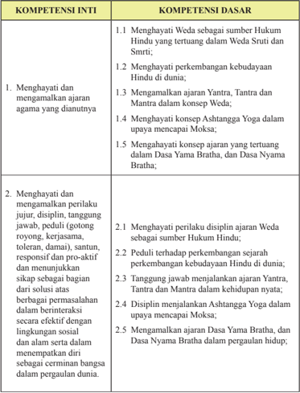

Tabel ini berisi informasi tentang kompetensi inti dan dasar dalam konteks agama Hindu. Topik utamanya adalah menghargai dan mempraktikkan prinsip-prinsip agama, termasuk menghormati peribahasa, disiplin, tanggung jawab, toleransi, dan kebijaksanaan. Kolom-kolomnya mencakup dua bagian: kompetensi inti yang meliputi empat poin utama, dan kompetensi dasar yang terdiri dari sepuluh poin lebih spesifik. Data penting yang terlihat adalah bahwa setiap kompetensi inti dijelaskan dengan detail melalui kompetensi dasar yang lebih spesifik, menunjukkan hubungan antara prinsip-prinsip agama dan praktik yang dianut dalam kehidupan sehari-hari.

Semester 1

 

---
## 📄 Halaman 127

---
**📊 Tabel**

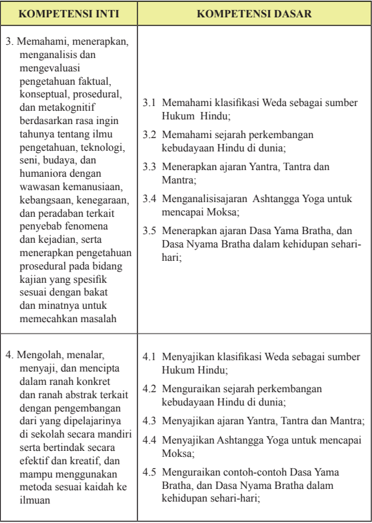

Tabel ini berisi informasi tentang kompetensi inti dan kompetensi dasar dalam konteks studi keagamaan dan budaya Hindu. Topik utama tabel adalah pembelajaran tentang klasifikasi Weda sebagai sumber Hukum Hindu, perkembangan kebudayaan Hindu di dunia, ajaran-ajaran seperti Yatra, Tantra, Mantra, Ashtanga Yoga, Dasa Yama Brahma, dan Dasa Nyama Brahma. Kolom-kolomnya mencakup dua bagian utama: Kompetensi Inti dan Kompetensi Dasar. Kompetensi Inti meliputi pemahaman, analisis, dan evaluasi pengetahuan faktil, konseptual, prosedural, dan metakognitif tentang topik-topik tersebut. Kompetensi Dasar mencakup pemahaman klasifikasi Weda, sejarah perkembangan kebudayaan Hindu, menerapkan ajaran-ajaran, menganalisis Ashtanga Yoga, dan menerapkan ajaran Dasa Yama Brahma dan Dasa Nyama Brahma dalam kehidupan sehari-hari. Data penting yang terlihat adalah bahwa setiap kompetensi inti memiliki satu atau lebih kompetensi dasar yang relevan untuk memenuhi tujuan pembelajaran tersebut.

 

---
## 📄 Halaman 128

### SILABUS MATA PELAJARAN: PENDIDIKAN AGAMA HINDU DAN BUDI PEKERTI SMA/SMK

Satuan Pendidikan

:  SMA / SMK......................

Kelas

:  XII

Kompetensi Inti :

KI 1

: Menghayati dan mengamalkan ajaran agama yang dianutnya

KI 2

:  Menghayati  dan  mengamalkan  perilaku  jujur,  disiplin,  tanggungjawab, peduli (gotong royong, kerjasama, toleran, damai), santun, responsif dan pro-aktif dan menunjukkan sikap sebagai bagian dari solusi atas berbagai permasalahan dalam berinteraksi secara efektif dengan lingkungan sosial dan alam serta dalam menempatkan diri sebagai cerminan bangsa dalam pergaulan dunia

- KI 3 :  Memahami,  menerapkan,  menganalisis  dan  mengevaluasi  pengetahuan faktual, konseptual, prosedural, dan metakognitif berdasarkan rasa ingin  tahunya    tentang  ilmu  pengetahuan,  teknologi,  seni,  budaya,  dan humaniora dengan wawasan kemanusiaan,  kebangsaan, kenegaraan, dan peradaban  terkait  penyebab  fenomena  dan  kejadian,  serta  menerapkan pengetahuan  prosedural  pada  bidang  kajian  yang  spesiik  sesuai  dengan bakat dan minatnya untuk memecahkan masalah
- KI 4 :  Mengolah, menalar, menyaji, dan mencipta dalam ranah konkret dan ranah abstrak terkait dengan pengembangan dari yang dipelajarinya di sekolah secara  mandiri  serta  bertindak  secara  efektif  dan  kreatif,  dan  mampu menggunakan metode sesuai kaidah keilmuan.
Semester 1

 

---
## 📄 Halaman 129

---
**📊 Tabel**

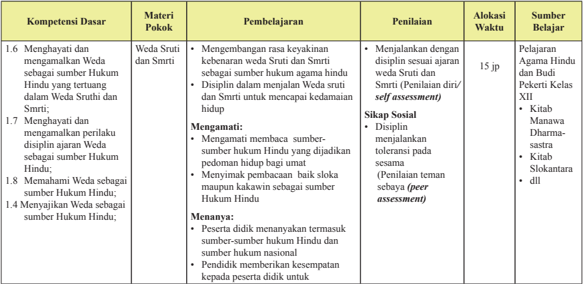

Tabel ini berisi informasi tentang kompetensi dasar yang harus dipelajari oleh siswa dalam materi "Weda Struti dan Smrti" di kelas XII. Topik utama adalah menghargai dan memahami peran Weda sebagai sumber hukum Hindu. Tabel ini terdiri dari enam kolom: Materi Pokok, Pembelajaran, Penilaian, Alokasi Waktu, Sumber Belajar, dan Kompetensi Dasar. Dalam kolom Materi Pokok, disebutkan bahwa materi ini meliputi menghargai dan memahami Weda sebagai sumber hukum Hindu, termasuk mengetahui struktur dan prinsip-prinsipnya. Kolom Pembelajaran mencakup berbagai aspek seperti menghargai rasa keyakinan pada Weda, disiplin dalam menjalankan Weda, memahami perilaku disiplin, memahami sumber-sumber hukum, dan menyanjung Weda. Penilaian dilakukan melalui berbagai metode seperti self-assessment, peer assessment, dan penilaian tematik. Alokasi waktu untuk materi ini adalah 15 jam. Sumber belajar yang disarankan antara lain kitab Manawa Dharmastra dan kitab Siklantara. Kompetensi dasar yang harus dipelajari termasuk menghargai dan memahami Weda sebagai sumber hukum Hindu, menghargai rasa keyakinan pada Weda, disiplin dalam menjalankan Weda, memahami perilaku disiplin, memahami sumber-sumber hukum, dan menyanjung Weda.

 

---
## 📄 Halaman 130

Semester 1

---
**📊 Tabel**

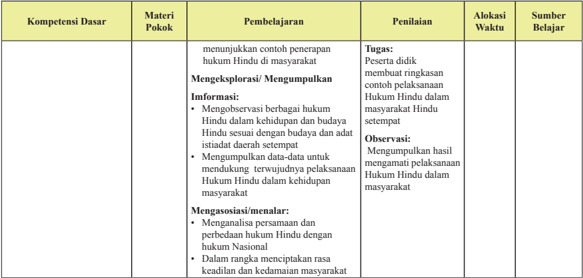

Tabel ini berisi informasi tentang pembelajaran dan penilaian untuk materi pokok Hukum Hindu di masyarakat. Topik utama adalah menunjukkan contoh penerapan hukum Hindu di masyarakat, melibatkan eksplorasi dan pengumpulan data. Pembelajaran meliputi menggambarkan berbagai hukum Hindu dalam kehidupan budaya, mendukung terwujudnya pelaksanaan hukum Hindu dalam masyarakat, dan mengasosiasikan perbedaan hukum Hindu dengan hukum nasional. Penilaian dilakukan melalui tugas dan observasi, dengan waktu penilaian sebelumnya dan setelahnya. Sumber belajar mencakup pelaksanaan hukum Hindu dalam masyarakat.

 

---
## 📄 Halaman 131

---
**📊 Tabel**

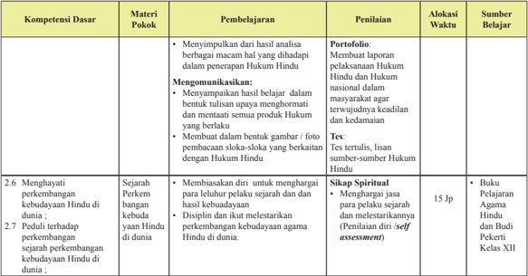

Tabel ini berisi informasi tentang kompetensi dasar, materi pokok, pembelajaran, penilaian, alokasi waktu, dan sumber belajar untuk mengembangkan keterampilan dan pengetahuan tentang Hukum Hindu di Indonesia. Topik utama adalah pengembangan kebudayaan Hindu di dunia, termasuk perubahan dan perkembangan dalam budaya tersebut. Kolom-kolomnya mencakup materi pokok seperti menyampaikan hasil analisis, mengonfirmasi, memperlihatkan dukungan, dan sejarah perkembangan kebudayaan Hindu. Penilaian dilakukan melalui portofolio, tes tertulis, lisan, dan self-assessment. Alokasi waktu untuk topik ini adalah 15 jam. Sumber belajar termasuk buku pelajaran Agama Hindu dan Budi Pekerti Kelas XII.

 

---
## 📄 Halaman 132

Semester 1

---
**📊 Tabel**

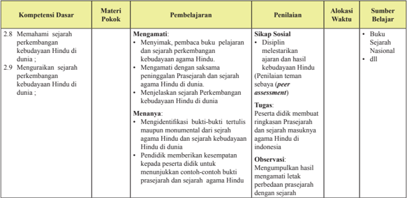

Tabel ini berisi informasi tentang kompetensi dasar dan materi pokok yang harus dipelajari oleh siswa dalam pembelajaran sejarah perkembangan kebudayaan Hindu di dunia. Topik utama adalah memahami dan mengurai sejarah perkembangan kebudayaan Hindu di dunia. Kolom-kolom yang ada meliputi Materi Pokok, Pembelajaran, Penilaian, Alokasi Waktu, dan Sumber Belajar. Data penting yang terlihat adalah bahwa siswa harus mengetahui tentang disiplin, metode, dan hasil penelitian sejarah agama Hindu, serta mampu membuat rangkuman teks tertulis maupun monumental dari sejarah agama Hindu dan sejarah kebudayaan Hindu di dunia. Selain itu, mereka juga harus mampu menunjukkan contoh-contoh bukti prasejarah dan sejarah agama Hindu dengan baik.

 

---
## 📄 Halaman 133

---
**📊 Tabel**

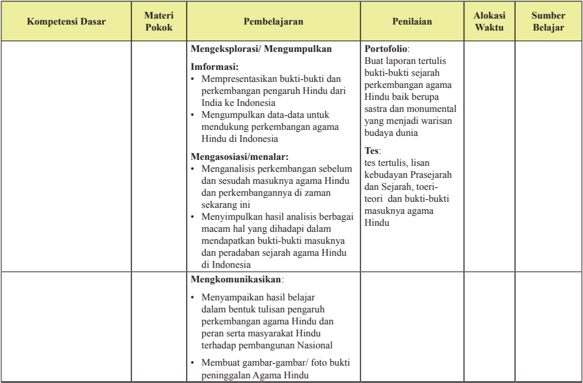

Tabel ini berisi informasi tentang kompetensi dasar materi pokok pengembangan agama Hindu di Indonesia. Topik utamanya adalah pengetahuan dan pemahaman tentang perkembangan agama Hindu dari India ke Indonesia, termasuk analisis sejarah, teori, dan praktiknya. Tabel ini mencakup beberapa aspek pembelajaran seperti menggali informasi, menggambarkan perkembangan agama, menggabungkan pengetahuan, dan mengkomunikasikan hasil belajar. Penilaian dilakukan melalui portofolio, tes tertulis, dan membuat gambar-gambar/foto bukti. Alokasi waktu untuk pembelajaran bervariasi, mulai dari 1-2 minggu hingga 3-4 minggu. Sumber belajar dapat berupa buku, teks, dan laporan tertulis.

 

---
## 📄 Halaman 134

Semester 1

---
**📊 Tabel**

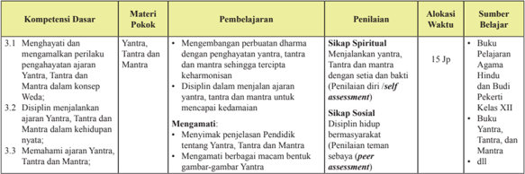

Tabel ini menunjukkan struktur pembelajaran dan penilaian untuk materi pokok Yatra, Tantra, dan Mantra dalam konteks Vyaas. Topik utama adalah kompetensi dasar yang meliputi: menghafal dan mengamalkan perilaku ajaran Yatra, Tantra, dan Mantra; disiplin menjalankan ajaran tersebut; dan memahami ajaran tersebut. Pembelajaran dilakukan melalui berbagai metode seperti mengembangkan perbuatan dharma, menjalankan yatra, tantra, dan mantra, serta mengamati dan memahami pendidikan tentang yatra, tantra, dan mantra. Penilaian dilakukan melalui sifat spiritual, sikap sosial, dan peer assessment. Alokasi waktu belajar mencakup 15 jam untuk pembelajaran self-expressive, dengan bahan ajar yang termasuk buku pelajaran Agama Hindu dan Budi Pekerti Kelas XII.

 

---
## 📄 Halaman 135

---
**📊 Tabel**

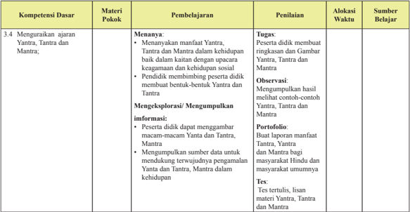

Tabel ini berisi informasi tentang kompetensi dasar yang harus dipelajari oleh peserta didik dalam materi Yanta, Tantra, dan Mantra. Topik utama adalah menguraikan ajaran Yanta, Tantra, dan Mantra. Tabel ini terdiri dari kolom-kolom seperti Materi Pokok, Pembelajaran, Penilaian, Alokasi Waktu, dan Sumber Belajar. Data penting yang terlihat antara lain bahwa pembelajaran melibatkan menanyakan manfaat Yanta, Tantra, dan Mantra dalam kehidupan, menggambarkan macam-macam Yanta dan Tantra, serta menggali informasi tentang manfaat Yanta, Tantra, dan Mantra bagi masyarakat Hindu dan masyarakat umumnya.

 

---
## 📄 Halaman 136

Semester 1

---
**📊 Tabel**

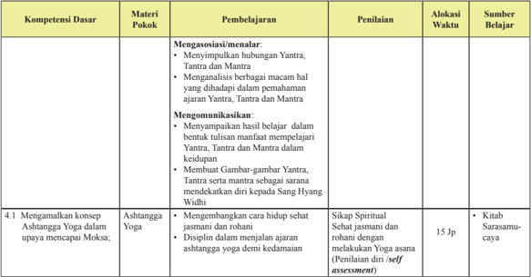

Tabel ini berisi informasi tentang pembelajaran dan penilaian untuk kompetensi dasar Ashtanga Yoga, dengan fokus pada pengembangan keterampilan dan pengetahuan dalam upaya mencapai kebijaksanaan spiritual. Topik utama adalah mengamalkan konsep Ashtanga Yoga dalam upaya mencapai kebijaksanaan spiritual. Tabel ini terdiri dari kolom-kolom seperti Materi Pokok, Pembelajaran, Penilaian, Alokasi Waktu, dan Sumber Belajar. Data penting yang terlihat antara lain bahwa materi pokok meliputi aspek-aspek seperti Yantara, Tantra, dan Mantra, serta aspek-aspek spiritual seperti spiritualitas dan self-assessment. Alokasi waktu untuk pembelajaran berkisar antara 15 jam hingga 20 jam, dan sumber belajar utama adalah buku Sarasamu-caya.

 

---
## 📄 Halaman 137

---
**📊 Tabel**

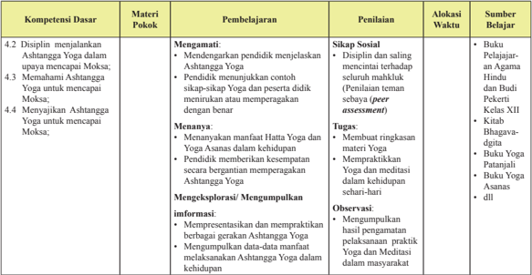

Tabel ini berisi informasi tentang kompetensi dasar, materi pokok, pembelajaran, penilaian, abkasi waktu, dan sumber belajar untuk ashtanga yoga. Topik utama adalah ashtanga yoga, yang meliputi disiplin menjelaskan ashtanga yoga, memahami ashtanga yoga, dan menyanjung ashtanga yoga. Pembelajaran melibatkan mendengarkan dan menunjukkan contoh sikap-sikap yoga, menanyakan manfaat yoga, dan menggali informasi tentang ashtanga yoga. Penilaian dilakukan melalui sikap sosial, tugas, observasi, dan beberapa bahan ajar seperti buku pelajaran agama hindu dan budi pekerti, kitab bhagavada digita, buku yoga patanjali, dan buku yoga ananda. Abkasi waktu mencakup sikap sosial, tugas, dan observasi, sedangkan sumber belajar meliputi buku pelajaran agama hindu dan budi pekerti, kitab bhagavada digita, buku yoga patanjali, dan buku yoga ananda.

 

---
## 📄 Halaman 138

Semester 1

---
**📊 Tabel**

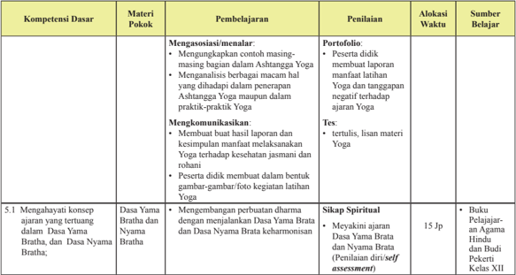

Tabel ini berisi informasi tentang pembelajaran dan penilaian untuk kompetensi dasar asisten yoga, dengan fokus pada materi pokok "Menghayati konsep ajaran yang tertuang dalam Dasa Yama Brata dan Dasa Nyama Brata". Tabel ini terdiri dari kolom-kolom seperti Materi Pokok, Pembelajaran, Penilaian, Alokasi Waktu, dan Sumber Belajar. Topik utama adalah tentang menghayati konsep ajaran yang tertuang dalam dua dasa tersebut. Data penting yang terlihat meliputi bahwa pembelajaran dilakukan melalui portofolio dan tes tertulis, dengan alokasi waktu sebanyak 15 jam. Sumber belajar termasuk buku pelajaran tentang agama Hindu dan Budi Pekerti Kelas XII.

 

---
## 📄 Halaman 139

---
**📊 Tabel**

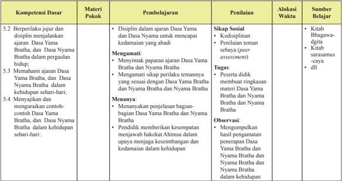

Tabel ini berisi informasi tentang kompetensi dasar yang harus dipelajari oleh siswa dalam materi Dasa Yama Brahma dan Dasa Nyama Brahma. Topik utama adalah bagaimana siswa dapat berperilaku jujur dan disiplin dalam menjalankan ajaran tersebut. Tabel ini terdiri dari kolom-kolom seperti Materi Pokok, Pembelajaran, Penilaian, Alokasi Waktu, dan Sumber Belajar. Data penting yang terlihat antara lain bahwa siswa harus menunjukkan sikap sosial yang baik, seperti kedisiplinan dan penilaian feminim, serta harus mampu menyampaikan ajaran Dasa Yama Brahma dan Dasa Nyama Brahma dalam kehidupan sehari-hari. Selain itu, mereka juga diharapkan untuk mampu menunjukkan tindakan yang sesuai dengan ajaran tersebut, seperti memberikan kesempatan untuk menjawab haktak Ahimsa dalam upaya menjaga kesimbangan dan kedamaian dalam kehidupan.

 

---
## 📄 Halaman 140

Semester 1

---
**📊 Tabel**

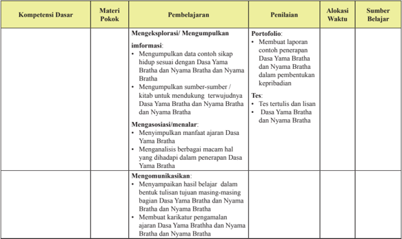

Tabel ini berisi informasi tentang kompetensi dasar yang harus dipelajari oleh siswa dalam materi pokok Dasa Yama Brahma dan Nyama Brahma. Topik utama tabel adalah pembelajaran dan penilaian tentang menggali informasi, menggabungkan informasi, mengkombinasikan informasi, dan mengkomunikasikan hasil belajar. Kolom-kolom yang ada meliputi Materi Pokok, Pembelajaran, Penilaian, Alokasi Waktu, dan Sumber Belajar. Data penting yang terlihat adalah bahwa siswa harus mampu membuat laporan, menjawab tes tertulis dan lisan, dan menyampaikan hasil belajar dalam bentuk tulisan. Selain itu, tabel juga menunjukkan bahwa penilaian dilakukan melalui portofolio, tes, dan laporan.

 

---
## 📄 Halaman 141

### Profil Penulis

Nama Lengkap  :  Drs. I Nengah Mudana, M.Pd.H.

Telp Kantor/HP  :   08123676522

E-mail

:   mademudana1059@gmail.com okaprthiwi@gmail.com

Akun Facebook :  Made Mudana

Alamat Kantor

:   SMA Negeri 6 Denpasar, Bali

Bidang Keahlian :  Guru Pendidikan Agama Hindu dan Budi Pekerti

### Riwayat pekerjaan/profesi dalam 10 tahun terakhir:

- 1986-sekarang: Guru di Sekolah Menengah Atas (SMA) Negeri 6 Depasar
- Sekarang: Penulis di media cetak Bali Post, majalah Candralekha SMA Negeri 6 Denpasar.

### Riwayat Pendidikan Tinggi dan Tahun Belajar:

- S1:  Institut Hindu Dharma (IHD) Fakultas Agama dan Pengetahuan. Kemasyarakatan Denpasar, Program Sarjana Muda sejak 17 Juli 1980 dan lulus pada 21 Mei 1985.
- S2:  Universitas Hindu Indonesia (UNHI) Denpasar Fakultas Ilmu Agama, Program Studi Pendidikan Agama Hindu mulai 15 Juni 2012 dan lulus pada 25 April 2015.

### Judul Buku dan Tahun Terbit (10 Tahun Terakhir):

1. -

Nama Lengkap  :  Drs. I Gusti Ngurah Dwaja

Telp Kantor/HP  :   021 8093926/081519510722

E-mail

:   ngurah17@ymail.com

dwajangurah@gmail.com

Akun Facebook :  ngurahdwaja

Alamat Kantor

:   Jl. Rajawali Halim Perdanakusuma, Jakarta Timur, Kode Post 13610.

Bidang Keahlian :  Guru Agama Hindu

### Riwayat pekerjaan/profesi dalam 10 tahun terakhir:

- 2009 - 2016: Guru Pendidkan agama Hindu di SMAN 42 Jakarta.
- 2005 - 2009: Guru Pendidkan agama Hindu di SMAN 38 Jakarta.
- 2012 - 2016: Ketua MGMP Agama Hindu DKI Jakarta.
- 2010 - 2014: Ketua PGRI Ranting SMAN 42 Jakarta.

### Riwayat Pendidikan Tinggi dan Tahun Belajar:

- S1: Fakultas  Ilmu Agama Jurusan  Hukum Agama, Program Studi  Hukum  Agama Hindu - Universitas Hindu Indonesia (UNHI), Denpasar (tahun masuk 1992 - tahun lulus 1995)
- Sarjana Muda: Fakultas Agama dan Pengetahuan  Kemasyarakatan - Institut Hindu Dharma (IHD) Denpasar, Bali (tahun masuk 1982-tahun lulus 1986)

### Judul Buku dan Tahun Terbit (10 Tahun Terakhir):

1. -

 

---
## 📄 Halaman 142

### Profil Penelaah

Nama Lengkap  : Dr. I Wayan Budi Utama, M.Si.

Telp Kantor/HP  : 081558177777

E-mail

: budi_utama2001@yahoo.com

Akun Facebook : budi.utama42@yahoo.com

Alamat Kantor

: Jl. Sangalangit, Tembau, Penatih, Denpasar

Bidang Keahlian: Agama dan Budaya Hindu

### Riwayat pekerjaan/profesi dalam 10 tahun terakhir:

- Dosen Universitas Hindu Indonesia Denpasar sejak 1987- sekarang
- Ketua Program Studi Program Magister (S2) Ilmu Agama dan Kebudayaan 20112014
- Asisten Direktur I Program Pascasarjana Universitas Hindu Indonesia Denpasar 2014 - sekarang

### Riwayat Pendidikan Tinggi dan Tahun Belajar:

- S3: Fakultas : Sastra, jurusan : Kajian Budaya, program studi : Kajian Budaya, bagian dan nama lembaga : Universitas Udayan Denpasar  (tahun masuk : 2005 tahun lulus : 2011)
- S2: Fakultas : Ilmu Agama dan Kebudayaan,  jurusan/program studi : Ilmu Agama dan Kebudayaan, bagian dan nama lembaga Universitas Hindu Indonesia Denpasar (tahun masuk : 2003 - tahun lulus : 2005)
- S1: Fakultas : Ilmu Agama dan Kebudayaan, jurusan/program studi : Ilmu Agama dan Kebudayaan, bagian dan nama lembaga : Universitas Hindu Indonesia Denpasar  (tahun masuk : 1976 - tahun lulus : 1985)

### Judul Buku yang pernah ditelaah (10 Tahun Terakhir):

- Agama dalam Praksis Budaya tahun 2013. Penerbit Pascasarjana Universitas Hindu Indonesia Denpasar
- Pendidikan Anti Korupsi Perspektif Agama-Agama tahun 2014. Penerbit: Pascasarjana Univ. Hindu Indonesia Denpasar
- Air,Tradisi dan Industri tahun 2015, Penerbit Pustaka Ekspresi

### Judul Penelitian dan Tahun Terbit (10 Tahun Terakhir):

- Identity Weakening of Bali Aga in Cempaga Village: tahun 2015 dalam International Journals of multidisciplinary research academy (IJMRA).
- Brayut dalam Religi Masyarakat Hindu di Bali tahun 2015
- Brayut dan Lokalisasi Tantrayana di Bali tahun 2015.
Nama Lengkap  : Dr. Wayan Paramartha, SH., M. Pd.

Telp Kantor/HP  : (0361) 464700, 464800

E-mail

: wayan_paramartha@yahoo.com

Akun Facebook : Wayan Paramartha

Alamat Kantor

: Jl. Sangalangit, Tembau Penatih Denpasar

Bidang Keahlian: Manajemen Pendidikan

Semester 1

 

---
## 📄 Halaman 143

### Riwayat pekerjaan/profesi dalam 10 tahun terakhir:

- Sebagai Asdir II Pascasarjana Universitas Hindu Indonesia 2004-2008
- Sebagai Wakil Rektor III -2008
- Sebagai Kaprodi Magister (S2) Pendidikan Agama dan Evaluasi Pendidikan Agama Pascasarjana Universitas Hindu Indonesia 2011-Semarang.
- Sebagai Editor Modul Metodologi Penelitian, Modul Evaluasi Pendidikan - 2008.
- Menyusul Modul Manajemen Pendidikan-Dirjen Bimas Hindu Kemenag RI - 2008
- Instruktur PLPG Guru Agama Hindu-Dirjen Bimas Hindu Kemenag RI-2008, 2011.
- Sebagai Penelaah Buku Pendidikan Agama Hindu dan Budi Pekerti (BG, BS) Tk. Dasar dan Menengah tahun 2013, 2014, 2015, 2016.

### Riwayat Pendidikan Tinggi dan Tahun Belajar:

- S1 : Universitas Udayana Denpasar, FKIP , jurusan/program studi Pendidikan Ilmu Pengetahuan Sosial/Sejarah/Anthropologi, tahun masuk 1980, tahun lulus 1985.
- S1 : Universitas Mahendradata, Fakultas Hukum, jurusan/program studi, Hukum Keperdataan tahun masuk 1991, tahun lulus 1994.
- S2 : IKIP Negeri Singaraja, Program Pascasarjana (S2) jurusan/Program Studi Penelitian dan Evaluasi Pendidikan tahun masuk 2001, tahun lulus 2003.
- S3 : Universitas Negeri Malang, Program Pascasarjana, Program Studi Manajemen Pendidikan, tahun masuk 2008, tahun lulus 2011.

### Judul Buku yang pernah ditelaah (10 Tahun Terakhir):

- Modul Metodologi Penelitian th. 2007, Kemenag.
- Modul Evaluasi Pendidikan th. 2007, Kemenag.
- Manajemen Pendidikan. 2012, Kemenag
- Buku Guru dan Buku Siswa Pendidikan Agama Hindu Dan Budi Pekerti, th. 2013, 2014, dan 2015,  Kemendikbud.

### Judul Penelitian dan Tahun Terbit (10 Tahun Terakhir):

- Menggungkap Model Pendidikan Hindu Bali Tradisional Aguron-guron th.2014, Kemenristek Dikti.
- Menggungkap Model Pendidikan Hindu Bali Tradsional Aguron-guron th. 2015, Kemenristek Dikti.

 

---
## 📄 Halaman 144

### Profil Editor

Nama Lengkap

: Mastiur Hasibuan, SH

Telp Kantor/HP

: 021-3804249

E-mail

: mastiur _puskurbuk@yahoo.co.id

Akun Facebook : -

Alamat Kantor

: Puskurbuk, Jalan Gunung Sahari Raya No.4, Jakarta Pusat

Bidang Keahlian

: Copy Editor

### Riwayat pekerjaan/profesi dalam 10 tahun terakhir:

- 1989 - 2011 Pusat Perbukuan.
- 2011 - sekarang Pusat Kurikulum dan Perbukuan
- Riwayat Pendidikan Tinggi dan Tahun Belajar:
- Judul Buku yang pernah diedit (10 Tahun Terakhir):
- Buku Teks Pelajaran Pendidikan Agama Katolik dan Budi Pekerja Kelas II tahun 2016
- Buku Teks Pelajaran Pendidikan Agama Katolik dan Budi Pekerja Kelas V tahun 2016
- Buku Teks Pelajaran Pendidikan Agama Khonghucu dan Budi Pekerja Kelas VIII tahun 2016
- Judul Penelitian dan Tahun Terbit (10 Tahun Terakhir):
- S1: Fakultas Hukum, Univ. Jayabaya (Masuk tahun 1981 - lulus tahun 1986)
1. -

Semester 1

---

*📊 Statistik: 48 visual berhasil, 6 dilewati, 0 gagal | Durasi: 7m 30s*