# Salinan Kelas 12 Hindu BS press

*Diekstrak: 18 May 2026, 04:56*

---

---
## 📄 Halaman 1

### Pendidikan Agama Hindu dan Budi Pekerti

SMA/SMK

---
**🖼️ Gambar/Diagram**

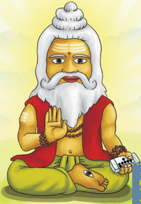

> **Deskripsi Visual:** Gambar ini adalah ilustrasi yang menampilkan seorang laki-laki tua dengan rambut berwarna putih yang panjang dan rapi, serta mulut yang lebar. Ia sedang berdiri dengan posisi tangan yang menunjukkan gestur salam atau penghormatan. Pakaian yang dikenakan oleh orang tersebut terdiri dari pakaian tradisional India yang terdiri dari baju berwarna merah dan celana berwarna hijau. Di kedua tangannya, ia memegang beberapa buah kelapa. Latar belakang gambar memiliki warna kuning cerah dengan cahaya matahari yang mengilap, memberikan kesan tenang dan damai.

Elemen-elemen utama dalam gambar ini meliputi:
1. Orang tua dengan rambut berwarna putih.
2. Pakaian tradisional India.
3. Gestur tangan yang menunjukkan salam atau penghormatan.
4. Kelapa yang dimegang oleh orang tua.

Teks, angka, atau label penting yang terlihat dalam gambar ini tidak ada, karena gambar ini hanya menggambarkan objek dan posisi orang tersebut tanpa teks atau label tambahan.

Informasi kunci yang dapat diambil pembaca dari gambar ini adalah tentang penampilan orang tua, pakaian tradisional India, dan posisi tangan yang menunjukkan salam atau penghormatan. Gambar ini mungkin digunakan untuk membantu pembaca memahami konsep atau cerita yang berkaitan dengan kehidupan atau budaya tradisional India.

 

---
## 📄 Halaman 2

### Hak Cipta © 2018 pada Kementerian Pendidikan dan Kebudayaan Dilindungi Undang-Undang

Disklaimer: Buku ini merupakan buku siswa yang dipersiapkan Pemerintah dalam rangka implementasi Kurikulum 2013. Buku siswa ini disusun dan ditelaah oleh berbagai pihak di bawah koordinasi Kementerian Pendidikan dan Kebudayaan, dan dipergunakan dalam tahap awal penerapan Kurikulum 2013. Buku ini merupakan 'dokumen hidup' yang senantiasa diperbaiki, diperbarui,  dan dimutakhirkan sesuai dengan dinamika kebutuhan dan perubahan zaman. Masukan dari berbagai kalangan diharapkan dapat meningkatkan kualitas buku ini.

### Katalog Dalam Terbitan (KDT)

Indonesia. Kementerian Pendidikan dan Kebudayaan. Pendidikan Agama Hindu dan Budi Pekerti/Kementerian Pendidikan dan Kebudayaan.-- Edisi Revisi Jakarta: Kementerian Pendidikan dan Kebudayaan, 2018. x, 302 hlm. : ilus. ; 25 cm.

Untuk SMA/SMK Kelas XII ISBN  978-602-427-066-7 (jilid lengkap) ISBN  978-602-427-069-8 (jilid 3)

- Hindu -- Studi dan Pengajaran
I. Judul

- Kementerian Pendidikan dan Kebudayaan
294.5

Kontributor Naskah  : I Gusti Ngurah Dwaja dan I Nengah Mudana

Penelaah

: AA. Oka Puspa, I Wayan Budi Utama, dan I Wayan Paramartha

Pe- review

: I Gusti Ngurah Rai

Penyelia Penerbitan : Pusat Kurikulum dan Perbukuan, Balitbang, Kemendikbud.

Cetakan Ke-1, 2015 (ISBN 978-602-282-428-2) Cetakan Ke-2, 2018 (Edisi Revisi) Disusun dengan huruf  Times New Roman, 12 pt.

 

---
## 📄 Halaman 3

### Kata Pengantar

Kurikulum  2013  dirancang  agar  peserta  didik  tidak  hanya  bertambah pengetahuannya, tetapi meningkat juga keterampilannya dan semakin mulia  kepribadiannya. Ada  kesatuan  utuh  antara  kompetensi  pengetahuan, keterampilan, dan sikap. Keutuhan ini perlu tercermin dalam pembelajaran agama. Melalui pembelajaran pengetahuan agama diharapkan akan terbentuk keterampilan beragama dan terwujud sikap beragama siswa. Tentu saja sikap beragama yang berimbang, mencakup hubungan manusia dengan Penciptanya dan hubungan manusia dengan sekitarnya. Untuk memastikan keseimbangan ini,  pelajaran  agama  perlu  diberi  penekanan  khusus  terkait  dengan  budi pekerti.  Hakikat  budi  pekerti  adalah  sikap  atau  perilaku  seseorang  dalam hubungannya dengan Tuhan, diri sendiri, keluarga, masyarakat dan bangsa, serta alam sekitar. Jadi, pendidikan budi pekerti adalah usaha menanamkan nilai-nilai  moral  ke  dalam  sikap  dan  perilaku  generasi  bangsa  agar  mereka memiliki kesantunan dalam berinteraksi.

Nilai-nilai  moral/karakter  yang  ingin  kita  bangun  antara  lain  adalah  sikap jujur, disiplin, bersih, penuh kasih sayang, punya kepenasaran intelektual, dan kreatif. Di sini pengetahuan agama yang dipelajari para siswa menjadi sumber nilai  dan  penggerak perilaku mereka. Sekadar contoh, diantara nilai budi pekerti dalam Hindu dikenal dengan Tri Marga (bakti kepada Tuhan, orangtua, dan guru; karma, bekerja sebaik-baiknya untuk dipersembahkan kepada orang lain dan Tuhan; Jnana, menuntut ilmu sebanyak-banyaknya untuk bekal hidup dan penuntun hidup) dan Tri Warga (dharma, berbuat berdasarkan atas kebenaran; artha,  memenuhi harta benda kebutuhan hidup berdasarkan kebenaran, dan karma,  memenuhi  keinginan  sesuai  dengan  norma-norma  yang  berlaku). Kata  kuncinya,  budi  pekerti  adalah  tindakan,  bukan  sekedar  pengetahuan yang harus diingat oleh para siswa, maka proses pembelajarannya seharusnya mengantar  mereka  dari  pengetahuan  tentang  kebaikan,  lalu  menimbulkan komitmen terhadap kebaikan, dan akhirnya benar-benar melakukan kebaikan.

Buku  ini  menjabarkan  usaha  minimal  yang  harus  dilakukan  siswa  untuk mencapai  kompetensi  yang    diharapkan.  Sesuai  dengan  pendekatan  yang digunakan dalam Kurikulum 2013, siswa diajak menjadi berani untuk mencari sumber belajar lain yang tersedia dan terbentang luas di sekitarnya. Peran guru dalam meningkatkan dan menyesuaikan daya serap siswa dengan ketersediaan kegiatan pada buku ini sangat penting. Guru dapat memperkayanya dengan kreasi  dalam  bentuk  kegiatan-kegiatan  lain  yang  sesuai  dan  relevan  yang bersumber dari lingkungan sosial dan alam.

 

---
## 📄 Halaman 4

Sebagai  edisi  pertama,  buku  ini  sangat  terbuka  dan  perlu  terus  dilakukan perbaikan dan penyempurnaan. Untuk itu, kami mengundang para pembaca memberikan kritik, saran dan masukan untuk perbaikan dan penyempurnaan pada edisi berikutnya. Atas kontribusi tersebut, kami ucapkan terima kasih. Mudah-mudahan kita dapat memberikan yang terbaik bagi kemajuan dunia pendidikan  dalam  rangka  mempersiapkan  generasi  seratus  tahun  Indonesia Merdeka (2045).

Penulis

 

---
## 📄 Halaman 5

### Daftar Isi

 

---
## 📄 Halaman 7

### Daftar Gambar

 

---
## 📄 Halaman 10

 

---
## 📄 Halaman 11

### Bab I

### WEDA SEBAGAI SUMBER HUKUM HINDU

'Wedo 'khilo dharma mulam smrti sile ca tad widam, acarasca iwa sadhunam atmanasyustir ewa ca.

### Terjemahan:

Seluruh Weda merupakan sumber utama dari pada dharma (Agama Hindu), kemudian  barulah  Smrti  di  samping  kebiasaan-kebiasaan  yang  baik  dari orang-orang yang menghayati Weda serta kemudian acara tradisi dari orangorang suci, dan akhirnya atmanastusti yaitu rasa puas diri sendiri (Menawa Dharmasastra, II. 6).

Kita patut bersyukur kehadapanNya karena sampai saat ini masih dapat mewarisi kesusastraan Hindu, bagaimanakah semuanya itu dapat diwujudkan? Renungkanlah!

Sumber: Dokumen Pribadi 11-07-2014. Gambar 1.1 Catur Weda

 

---
## 📄 Halaman 12

Dharma  dipandang  sebagai  hukum  Hindu.  Bagaimana  perkembangan hukum  Hindu  di tengah-tengah kehidupan bermasyarakat Hindu? Diskusikanlah!

### A. Perkembangan Hukum Hindu.

Perenungan.

'Prihen temen dharma dhumaranang sarat, saraga sang sadhu sireka tutana, tan artha tan kama pidonya tan yasa, ya sakti sang Sajjana dharma raksaka'.

### Terjemahan:

Usahakan benar dharma untuk memelihara dunia ini, kesenangan orang-orang bijak itu kamu harus ikuti yang tidak mementingkan harta, kesenangan nafsu maupun  nama,  karena  itulah  yang  merupakan  keampuhannya  orang-orang bijaksana didalam memegang dharma'.

'Saka nikang rat kita yan wenang manut, manupadesa prihatah rumaksaya, ksaya nikang papa nahan prayojnana, jana anuragadhi tuwin kapungguha'.

### Terjemahan:

Peredaran  zaman  dunia  ini sedapat-dapatnya  harus kamu  ikuti  benarbenar,  pergunakanlah  ajaran  Manu  untuk  memelihara  dunia,  melenyapkan penderitaan  hendaknya  diusahakan,  kecintaan  rakyat  pasti  kamu  peroleh ( Kekawin Ramayana sargah 24 sloka 81 )

Hukum Hindu adalah sebuah tata aturan yang membahas aspek kehidupan manusia secara menyeluruh yang menyangkut tata keagamaan, mengatur hak dan kewajiban manusia baik sebagai individu maupun sebagai mahluk sosial, dan aturan manusia sebagai warga negara ( tata negara). Hukum Hindu juga berarti  perundang  -  undangan  yang  merupakan  bagian  terpenting  dari  kehidupan

 

---
## 📄 Halaman 13

beragama dan bermasyarakat, ada kode etik yang harus dihayati dan diamalkan sehingga  menjadi  kebiasaan-kebiasaan yang hidup dalam masyarakat. Dengan demikian pemerintah dapat mempergunakan hukum ini sebagai kewenangan untuk mengatur tata pemerintahan dan pengadilan, dan dapat juga mempergunakannya sebagai hukuman bagi masyarakat yang melanggarnya.

Kehadiran  Hukum  Hindu  dimulai  dari adanya sebuah perdebatan diantara para tokoh agama pada saat itu. Berbagai tulisan  yang  menyangkut Hukum Hindu menjadi dan merupakan perhatian khusus bagi para Maharshi terhadap pembinaan umat manusia. Adapun namanama  para  maharsi  sebagai  penulis  Hukum  Hindu  diantaranya;  Gautama, Baudhayana, Shanka-likhita, Wisnu, Aphastamba, Harita, Wikana, Paitinasi, Usanama, Kasyapa, Brhraspati dan Manu.

Dengan  adanya  upaya  penulisan  atas  Hukum  Hindu  tampak  jelas  kepada kita bahwa referensi Hukum Hindu telah lama dimulai juga dengan berbagai perdebatan  dan  kritik  masing-masing  sehingga  melahirkan  beberapa  aliran Hukum Hindu diantaranya:

- Aliran Yajnyawalkya oleh Yajnyawalkya.
- Aliran Mithaksara oleh Wijnaneswara.
- Aliran Dayabhaga oleh Jimutawahana.
Dari  ketiga  aliran  tersebut  akhirnya  keberadaan  hukum  Hindu  dapat  berkembang dengan pesat khususnya di wilayah India dan sekitarnya, dua aliran yang yang terakhir  yang  mendapat  perhatian  khusus  dan  dengan  penyebarannya  yang sangat luas yaitu aliran Yajnyawalkya dan aliran Wijnaneswara (Puja, Gde. 1984:82).

Pelembagaan aliran (Yajnyawalkya dan Wijnaneswara) yang di atas sebagai sumber Hukum Hindu pada Dharmasastra adalah tidak diragukan lagi karena adanya ulasan-ulasan yang diketengahkan oleh penulis-penulis Dharmasastra sesudah maha Rshi Manu yaitu Medhati (900 SM), Kullukabhata (120 SM), setidak-tidaknya telah membuat kemungkinan pertumbuhan sejarah Hukum Hindu  dengan  mengalami  perubahan  prinsip  sesuai  dengan  perkembangan zaman saat itu dan wilayah penyebarannya seperti Burma, Muangthai sampai ke Indonesia.

 

---
## 📄 Halaman 14

Pengaruh  Hukum  Hindu  sampai  ke  Indonesia  nampak  jelas  pada  Zaman Majapahit tetapi sudah dilakukan penyesuaian atau reformasi Hukum Hindu, yaitu  dipakai  sebagai  sumber  yang  berisikan  ajaran-ajaran  pokok  Hindu yang khususnya memuat dasar-dasar umum Hukum Hindu, yang kemudian dikembangkan menjadi sumber ajaran Dharma bagi masyarakat Hindu dimasa penyebaran  agama  Hindu  ke  seluruh  pelosok  negeri.  Bersamaan  dengan penyebaran Hindu ke seluruh pelosok negeri ini diturunkanlah dalam bentuk terjemahan-terjemahan kedalam bahasa Jawa Kuno yang isinya juga memuat undang-undang  yang  mengatur  praja  wilayah  Nusantara.  Adapun  aliran yang memengaruhi Hukum Hindu di Indonesia yang paling dominan adalah Mithaksara dan Dayabhaga .

Hukum-hukum Tata Negara dan Tata Praja serta Hukum Pidana yang berlaku adalah  sebagian  besar  merupakan  hukum  yang  bersumber  pada  ajaran Manawadharmasastra, hal ini kemudian dikenal sebagai kebiasaan-kebiasaan atau hukum adat seperti yang berkembang di Indonesia dan khusunya dapat dilihat pada hukum adat di Bali. Istilah-istilah wilayah hukum dalam rangka tata  laksana  administrasi  hukum  dapat  dilihat  pada  desa  praja.    Desa  praja adalah administrasi terkecil dan bersifat otonom dan inilah yang diterapkan pada zaman Majapahit terbukti dengan adanya sesanti , sesana dengan prasastiprasasti yang dapat ditemukan di berbagai daerah di seluruh Nusantara. Lebih luas lagi wilayah yang mengaturnya dinamakan grama , dan daerah khusus ibu kota sebagai daerah istimewa tempat administrasi tata pemerintahan dikenal dengan  nama pura ,  penggabungan  atas  pengaturan  semua  wilayah  ini dinamakan dengan istilah negara atau rastra .  Maka dari itu hampir seluruh tatanan kenegaraan yang dipergunakan sekarang ini bersumber pada Hukum Hindu.

Manusia dalam pergaulan dan menjalankan kehidupan ini mereka diatur oleh undang-undang yang dibuat oleh lembaga pembuat undang-undang. Lembaga pembuat undang-undang dibuat  oleh  manusia,  oleh  karena  itu undang-undang adalah buatan manusia. Di samping itu ada pula undang-undang yang bersifat murni, yaitu undangundang  yang  dibuat oleh Ida  Sang Hyang Widhi Wasa/Tuhan Yang Maha Esa,  yang  juga  disebut Wahyu  Tuhan. Wahyu inilah yang dihimpun dan

 

---
## 📄 Halaman 15

dikodifikasi menjadi 'Kitab Suci'. Jadi Kitab Suci adalah semacam undangundang yang pembuatnya adalah Tuhan Yang Maha Esa dan bukan dibuat oleh manusia ( apauruseya ).

Keharmonisan  hidup  ini  sangat  tergantung  pada  keberadaan  hukum  yang berlaku di lingkungan sekitar kita. Baik tidaknya pelaksanaan hukum tersebut juga  sangat  tergantung  pada  siapa  yang  menjadi  pengambil  keputusan  dari pelaksananya. Hukum alam disebut dengan istilah Rta, dikuasai oleh 'Rtavan' Tuhan Yang Maha Kuasa/Ida Sang Hyang Paramakawi sebagai penciptanya. Demikian juga bentuk hukum yang lainnya, sangat tergantung dengan siapa pembuatnya, mengapa, dan dimana dibuatnya. Apakah hukum itu? Hukum ialah  peraturan-peraturan  atau  ketentuan-ketentuan  yang  mengatur  tingkah laku  manusia  baik  sebagai  perseorangan  maupun  sebagai  kelompok  agar tercipta  suasana  yang  serasi,  tertib  dan  aman.  Hukum  ini  ada  yang  tertulis maupun yang tidak tertulis. Hukum inilah yang merupakan undang-undang.

Di dalam sebuah Negara, undang-undang dari semua undang-undang disebut Undang-Undang  Dasar.  Undang-Undang  Dasar  itu  mengatur  pokok-pokok yang menjadi sendi kehidupan bernegara dan dari Undang-Undang Dasar itu dibuat  undang-undang  pokoknya.  Seperti  halnya  dengan  Undang-Undang Dasar, dalam kehidupan beragama, semua peraturan dan ketentuan-ketentuan selanjutnya dirumuskan lebih terinci dengan menafsirkan ketentuan-ketentuan yang terdapat di dalam kitab suci itu.

Tingkah laku manusia yang baik, yang menjadi tujuan di dalam pengaturan kehidupan  ini  disebut  Darmika.  Dharma  adalah  perbuatan-perbuatan  yang mengandung  hakekat  kebenaran  yang  menyangga  masyarakat  ( dharma dharayate prajah ). Untuk memperoleh kepastian tentang kebenaran ini setiap tingkah laku harus mencerminkan kebenaran hukum (dharma), artinya tidak bertentangan dengan undang-undang yang menguasainya.

Hukum  adalah  peraturan-peraturan  yang  mengatur  tingkah  laku  manusia dalam  kehidupan  sehari-hari  yang  ditetapkan  oleh  penguasa,  pemerintah maupun  berlakunya  itu  secara  alamiah,  yang  kalau  perlu  dipaksakan  agar peraturan tersebut dipatuhi sebagaimana yang ditetapkan.

Hukum sebagai peraturan hidup berfungsi membatasi kepentingan dari setiap pendukung hukum (subyek hukum), menjamin kepentingan dan hak mereka masing-masing, serta menciptakan pertalian-pertalian guna mempererat hubungan antara mereka dan menentukan arah bagi terciptanya kerjasama. Tujuan  yang  hendak  dicapai  dari  adanya  hukum  itu  adalah  suatu  keadaan yang  damai,  adil,  sejahtera,  dan  bahagia.  Untuk  tercapainya  hal  tersebut maka didalam hukum itu harus mengandung sanksi yang bersifat tegas dan

 

---
## 📄 Halaman 16

nyata. Hukum berfungsi sebagai pengendalian sosial agar tercapai ketertiban. Ketertiban adalah merupakan syarat pokok dalam masyarakat. Agar ketertiban ini bisa tercapai maka perlu adanya kepastian hukum di dalam masyarakat, sehingga  mampu  menciptakan  masyarakat  yang  tenang,  tenteram,  damai, adil,  sejahtera  dan  bahagia.  Dalam  ilmu  hukum  dibedakan  antara  Statuta Law  dengan Common Law atau Natural  Law . Statuta  Law adalah  hukum yang dibentuk dengan sengaja oleh penguasa, sedangkan Common Law atau Natural Law adalah hukum alam yang ada secara alamiah.

Unsur-unsur yang terpenting dalam peraturan-peraturan hukum memuat dua hal, yaitu:

- Unsur-unsur yang bersifat mengatur atau normatif.
- Unsur-unsur yang bersifat memaksa atau represif.
Dalam hal ini umat Hindu yang juga merupakan Warga Negara Indonesia, mereka harus tunduk pada dua kekuasaan hukum, yaitu:

- Hukum yang bersumber pada perundang-undangan Negara seperti: UUD, UUP, Undang-Undang dan peraturan-peraturan pelaksanaan lainnya.
- Hukum yang bersumber pada kitab suci, sesuai dan menurut agamanya.
Kebutuhan  dengan  pengetahuan  tentang  Hukum  Hindu  dirasakan  sangat penting  oleh  umat  Hindu  untuk  dipelajari  dan  dipahami  dalam  rangka melaksanakan dharma agama dan sebagai wujud bhakti kehadapan Ida Sang Hyang Widhi Wasa sebagai sumber segala yang ada. Disamping itu, mengingat umat Hindu juga sebagai warga Negara yang terikat oleh hukum nasional. Mengapa hukum Hindu penting untuk dipelajari:

- Hukum Hindu merupakan bagian dari hukum positif yang berlaku bagi masyarakat Hindu di Indonesia yang berdasarkan Pancasila dan UndangUndang Dasar 1945, khususnya pasal 29 ayat 1 dan 2, serta pasal 2 aturan peralihan Undang-Undang Dasar 1945.
- Untuk memahami bahwa berlakunya hukum Hindu di Indonesia dibatasi oleh falsafah Negara Pancasila dan ketentuan-ketentuan dalam UndangUndang Dasar 1945.
- Untuk  dapat  mengetahui  persamaan  dan  perbedaan  antara  hukum  adat (Bali) dengan hukum agama Hindu atau hukum Hindu.
- Untuk dapat membedakan antara adat murni dengan adat yang bersumber pada ajaran-ajaran agama Hindu.
Muncul  dan  tumbuhnya  aliran-aliran  hukum  Hindu  ini  adalah  merupakan fenomena sejarah  perkembangan  hukum  Hindu  yang  semakin  meluas

 

---
## 📄 Halaman 17

dan  berkembang.  Bersamaan  dengan  itu  pula  maka  muncullah  kritikuskritikus Hindu yang membahas tentang berbagai aspek hukum Hindu, serta bertanggung  jawab  atas  lahirnya  aliran-aliran  hukum  tersebut.  Sebagai akibatnya maka timbullah berbagai masalah hukum yang relatif menimbulkan realitas  kaedah-kaedah  hukum  Hindu  diantara  berbagai  daerah  Hindu. Dua dari aliran  hukum  yang  muncul  itu  akhirnya  sangat  berpengaruh  bagi perkembangkan hukum Hindu di Indonesia, terutama aliran Mitaksara, dengan berbagai  pengadaptasiannya.  Di  Indonesia  kita  mewarisi  berbagai  macam rontal dengan berbagai sebutan, seperti: Usana, Gajahmada, Sarasamuscaya, Kutara  Manawa,  Agama,  Adigama,  Purwadigama,  Krtapati,  Krtasima. Diantara  berbagai  macam  rontal-rontal  itu  yang  memuat  tentang  sasana adalah: Rajasasana, Siwasasana, Putrasasana, Rsisasana dan yang lainnya. Semuanya itu adalah merupakan gubahan yang sebagian bersifat penyalinan dan sebagian lagi bersifat pengembangan.

Perlu dan penting kita ketahui sumber hukum dalam arti sejarah adalah adanya Rajasasana yang  dituangkan dalam berbagai prasasti dan paswara-paswara yang dipergunakan sebagai yurisprudensi hukum Hindu yang dilembagakan oleh para raja-raja Hindu. Hal semacam inilah yang nampak pada kita yang secara  garis  besarnya  dapat  dikemukakan  sebagai  hal  mengenai  sumbersumber hukum Hindu berdasarkan atas sejarahnya.

Demikianlah uraian singkat dari sejarah adanya perkembangan hukum Hindu yang patut kita pedomani bersama untuk mewujudkan ketertiban umat sedunia.

### Uji Kompetensi:

- Apa yang anda ketahui tentang sejarah hukum Hindu? Jelaskan!
- Apakah sejarah yang berhubungan dengan hukum Hindu merupakan sumber hukum Hindu? Jelaskan!
- Bagaimana tumbuh kembang keberadaan sejarah hukum Hindu yang  ada  di  sekitar  wilayah  tempat  tinggal  anda?  amati  dan diskusikan dengan orang tua anda atau yang dituakan, selanjutnya buatlah laporannya sesuai petunjuk bapak/ibu guru yang mengajar di kelasmu!
- Manfaat apakah yang dapat dirasakan secara langsung dari usaha dan  upaya  seseorang  yang  dapat  mengenal  sejarah  agama-nya dengan baik? Tuliskan pengalaman anda!

 

---
## 📄 Halaman 18

- Bila seseorang mengenal sejarah agamanya dengan baik dan atau tidak mengenalnya, apakah yang akan terjadi? Buatlah narasinya 1  -  3  halaman  diketik  dengan  huruf    Times  New  Roman - 12, spasi 1,5 cm, ukuran kertas kwarto; 4-3-3-4!

### B.  Sumber-sumber hukum Hindu

Perenungan.

'úrutis tu vedo wijñeyo dharmasàstram tu vai småtiá, te sarv àrtheû vamimàýsye tabhyàm dharmo hi nirbabhau.

### Terjemahan:

Yang  dimaksud  dengan  Sruti,  adalah  Weda  dan  dengan  Smrti  itu  adalah dharmasàstra, kedua macam pustaka suci ini tidak boleh diragukan kebenaran ajarannya, karena keduanya itulah sumber Dharma (Manawa Dharmasastra, II.10).

---
**🖼️ Gambar/Diagram**

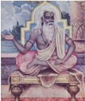

> **Deskripsi Visual:** Gambar ini adalah ilustrasi yang menampilkan seorang guru sufi berada dalam posisi meditasi. Guru tersebut duduk dengan posisi lotus, mengenakan pakaian tradisional yang mencerminkan keagamaannya, dan memegang sebuah kunci atau simbol spiritual. Latar belakangnya menunjukkan taman dengan bangunan tradisional, mungkin menandakan tempat suci atau pusat keagamaan. Ilustrasi ini mungkin digunakan untuk membantu pembaca memahami konsep keagamaan atau spiritualitas dalam konteks tradisional.

(Penulis Weda)

Menurut  tradisi  yang  lazim  telah  diterima oleh para Maha Rsi tentang penyusunan atau pengelompokan materi yang lebih sistematis sebagai  sumber  Hukum  Hindu  berasal  dari Weda  Sruti  dan  Weda  Smrti.  Weda  Sruti adalah  kitab  suci  Hindu  yang  berasal  dari wahyu  Ida  Sang  Hyang  Widhi  Wasa/Tuhan Yang Maha Esa yang didengar langsung oleh para Maha Rsi, yang isinya patut dipedomani dan dilaksanakan oleh umat sedharma. Weda Smrti  adalah  kitab  suci  Hindu  yang  ditulis oleh para Maha Rsi berdasarkan ingatan yang bersumber dari wahyu Ida Sang Hyang Widhi Wasa/Tuhan  Yang  Maha  Esa,  yang  isinya patut juga dipedomani dan dilaksanakan oleh umat sedharma. Weda Smrti sebagai sumber Hukum Hindu dapat kita kelompokkan menjadi dua kelompok yaitu :

 

---
## 📄 Halaman 19

- Kelompok  Vedangga/Batang  tubuh  Weda  (Siksa,  Wyakarana,  Chanda, Nirukta, Jyotisa dan Kalpa).
- Kelompok UpaVeda /Weda tambahan (Itihasa, Purana, Arthasastra, Ayur Weda dan Gandharwa Weda).
Bagian terpenting dari kelompok Vedangga adalah Kalpa yang padat dengan isi  Hukum Hindu, yaitu Dharmasastra, sumber hukum ini membahas aspek kehidupan manusia yang disebut dharma. Sedangkan sumber hukum Hindu yang  lain  yang  juga  menjadi  sumber  Hukum  Hindu  adalah  dapat  dilihat dari berbagai kitab-kitab lain yang telah ditulis yang bersumber pada Weda diantaranya :

- Kitab Sarasamuscaya
- Kitab Suara Jambu
- Kitab Siwasasana
- Kitab Purwadigama
- Kitab Purwagama
- Kitab Devagama (Kerthopati)
- Kitab Kutara Manawa
- Kitab Adigama
- Kitab Kerthasima
- Kitab Kerthasima Subak
- Kitab Paswara
Dari berbagai jenis kitab di atas memang tidak ada gambaran yang jelas atas saling berhubungan satu dengan yang lainnya juga dari semua kitab tersebut memuat  berbagai  peraturan  yang  berbeda  satu  dengan  yang  lainya  karena masing-masing  kitab  tersebut  bersumber  pada  inti  pokok  peraturan  yang ditekankan.

Bidang-bidang  Hukum  Hindu  sesuai  dengan  sumber  Hukum  Hindu  yang paling terkenal adalah Manawa Dharmasastra yang mengambil sumber ajaran Dharmasastra yang paling tua, adapun pembagian terdiri dari :

- Bidang Hukum Keagamaan, bidang ini banyak memuat ajaran-ajaran yang mengatur tentang tata cara keagamaan yaitu menyangkut tentang antara lain;

 

---
## 📄 Halaman 20

- Bahwa  semua  alam  semesta  ini  diciptakan  dan  dipelihara  oleh  suatu hukum yang disebut Rta atau dharma.
- Ajaran-ajaran  yang  diturunkan  bersifat  anjuran  dan  larangan  yang semuanya mengandung konsekuensi atau akibat sanksi).
- Tiap-tiap  ajaran  mengandung  sifat  relatif  yaitu  dapat  disesuaikan dengan zaman atau waktu dan dimana tempat dan kedudukan hukum itu  dilaksanakan,  dan  absolut  berarti  mengikat  dan  wajib  hukumnya dilaksanakan.
- Pengertian warna dharma berdasarkan pengertian golongan fungsional.
- Bidang  Hukum  Kemasyarakatan,  bidang  ini  banyak  memuat  tentang aturan atau tata cara hidup bermasyarakat satu dengan yang lainnya, atau sosial.  Dalam  bidang  ini  banyak  diatur  tentang  konsekuensi  atau  akibat dari sebuah pelanggaran, kalau kita telusuri lebih jauh saat ini lebih dikenal dengan hukum perdata dan pidana.
Lembaga yang memegang peranan penting yang mengurusi tata kemasyarakatan  adalah  Badan  Legislatif,  yang  menurut  Hukum  Hindu adalah Parisadha. Lembaga ini dapat membantu menyelesaikan masalah dengan cara pendekatan perdamaian sebelum nantinya kalau tidak memungkinkan masuk ke pengadilan.

- Bidang  Hukum  Tata  Kenegaraan,  bidang  ini  banyak  memuat  tentang tata-cara  bernegara,  dimana  terjalinnya  hubungan  warga  masyarakat dengan negara sebagai pengatur tata pemerintahan yang juga menyangkut hubungan  dengan  bidang  keagamaan.  Disamping  sistem  pembagian wilayah administrasi dalam suatu negara, Hukum Hindu ini juga mengatur sistem  masyarakat  menjadi  kelompok-kelompok  hukum  yang  disebut  ; Warna, Kula, Gotra, Ghana, Puga, dan Sreni, pembagian ini tidak bersifat kaku karena dapat disesuaikan dengan perkembangan zaman.
Kekuasaan Yudikatif diletakan pada tangan seorang raja atau kepala negara, beliau  bertugas  sebagai  pemutus,  memutuskan  semua  perkara  yang  timbul pada  masyarakat.  Raja  dibantu  oleh  Devan  Brahmana  yang  merupakan Majelis  HakimAhli,  baik  sebagai  lembaga  yang  berdiri  sendiri  maupun sebagai  pembantu  pemerintah  didalam  memutuskan  perkara  dalam  sidang pengadilan  (dharma  sabha),  pengadilan  biasa  (dharmaastha),  pengadilan tinggi (pradiwaka) dan pengadilan istimewa.

Bagi umat sedharma atau masyarakat yang beragama Hindu, sumber hukumnya adalah kitab suci Weda. Ketentuan mengenai Weda sebagai sumber hukum Hindu dinyatakan dengan tegas di dalam berbagai jenis kitab suci Weda. Sruti

 

---
## 📄 Halaman 21

adalah merupakan sumber dari segala sumber hukum. Smrti bersumber pada kitab  Sruti.  Baik  Sruti  maupun  Smrti  keduanya  adalah  merupakan  sumber hukum Hindu. Kedudukan Smrti sebagai sumber hukum Hindu sama kuatnya dengan  Sruti.  Smrti  sebagai  sumber  hukum  Hindu  lebih  populer  dengan istilah Manusmrti atau Dharmasastra . Dharmasastra dinyatakan sebagai kitab hukum Hindu karena didalamnya memuat banyak peraturan-peraturan yang bersifat  mendasar  yang  berfungsi  untuk  mengatur  dan  menentukan  sanksi bila  diperlukan.  Di  dalam  kitab  Dharmasastra  termuat  serangkaian  materi hukum dasar yang dapat dijadikan pedoman oleh umat Hindu dalam rangka mencapai  tujuan  hidup  'catur  purusartha'  yang  utama.  Setiap  pelanggaran baik itu merupakan delik biasa atau delik adat, tindak pidana, dan yang lainnya semuanya itu diancam hukuman. Sifat ancamannya mulai dari yang ringan sampai  pada  hukuman  yang  terberat  'hukuman  mati'.  Ancaman  hukuman mati  sebagai  hukuman  berat  berlaku  terhadap  siapa  saja  yang  melakukan tindak kejahatan.

Manawa  Dharmasastra atau Manusmrti adalah  kitab  hukum  yang  telah tersusun secara teratur, dan sistematis. Kitab ini terbagi menjadi dua belas (12) bab atau adyaya. Bila kita mempelajari kitab-kitab hukum Hindu maka banyak kita  menemukan  pokok-pokok  pikiran  yang  berkaitan  dengan  titel  hukum. Hal ini menunjukkan bahwa hukum Hindu mengalami proses perkembangan. Adapun pokok-pokok pikiran yang terdapat dalam hukum Hindu, antara lain.

Kitab  hukum  Hindu  yang  pertama  dikenal  adalah  Dharmasutra.  Ada  tiga penulis  yang  terkenal  terkait  dengan  keberadaan  kitab  Dharmasutra,  di antaranya adalah sebagai berikut.

- Gautama adalah penulis kitab Dharmasutra yang karya hukumnya lebih menekankan pembahasan aspek hukum dalam rangkaian peletakan dasar tentang fungsi dan tugas raja sebagai pemegang dharma. Pada dasarnya beliau membahas tentang pokok-pokok hukum pidana dan hukum perdata.
- Apastamba adalah penulis kitab Dharmasutra yang karya hukumnya lebih menekankan pembahasan tentang    pokok-pokok  materi  wyawaharapada dengan  beberapa  masalah  yang  belum  dibahas  dalam  kitab  Gautama, seperti;  mengenai  hukum  perzinahan,  hukuman  karena  membunuh  diri, hukuman karena melanggar dharma, hukum yang timbul karena sengketa antara buruh dengan majikan, dan hukum yang timbul karena penyalahgunaan hak milik.

 

---
## 📄 Halaman 22

- Baudhayana adalah penulis kitab Dharmasutra yang karya hukumnya lebih menekankan  pembahasan  tentang  pokok-pokok  hukum  seperti;  hukum mengenai bela diri, penghukuman karena seorang brahmana, penghukuman atas  golongan  rendah  membunuh  brahmana,  dan  penghukuman  atas pembunuhan yang dilakukan terhadap ternak orang lain.
Dharmasastra adalah kitab hukum Hindu selain Dharmasutra. Ada beberapa penulis kitab Dharmasastra yang patut kita ketahui karya sastranya dibidang hukum Hindu, seperti; Wisnu, Manu, dan Yajnawalkya. Manu adalah penulis kitab  Dharmasastra  yang  terkenal.  Manu  sebagai  penulis  Dharmasastra, berbicara  tentang  hukum  Hindu  untuk  mewakili  karyanya  sendiri.  Kitab Dharmasastra  karya  Manu,  menjadi  sumber  hukum  Hindu  berlaku  dan memiliki pengaruh yang sangat luas termasuk Indonesia. Hal ini dapat kita ketahui dari pokok-pokok ajarannya yang banyak kita jumpai dalam berbagai lontar  yang  ada  seperti  di  Bali.  Sedangkan  Yajnawalkya  menjadi  terkenal di  bidang  penulisan  dharmasastra  sebagai  sumber  hukum  Hindu,  karena mewakili salah satu mazab hukum yang berkembang dalam hukum Hindu. Diantara mazab-mazab tersebut yang ada adalah; Mitaksara, Dayabhaga, dan Yajnawalkya.

Menurut kitab Dharmasastra yang ditulis oleh Manu, keberadaan titel hukum atau wyawaharapada dibedakan jenisnya menjadi delapan belas (18), antara lain;

- Rinadana yaitu ketentuan tentang tidak membayar hutang.
- 2 .  Niksepa adalah hukum mengenai deposito dan perjanjian.
- 3 .  Aswamiwikrya adalah tentang penjualan barang tidak bertuan.
- Sambhuya-samutthana yaitu perikatan antara firman.
- 5 .  Dattasyanapakarma adalah ketentuan mengenai hibah dan pemberian.
- Wetanadana yaitu hukum mengenai tidak membayar upah.
- Samwidwyatikarma adalah hukum mengenai tidak melakukan tugas yang diperjanjikan.
- Krayawikrayanusaya artinya pelaksanaan jual beli.
- Swamipalawiwada artinya perselisihan antara buruh dengan majikan.
- Simawiwada artinya perselisihan mengenai perbatasan
- Waparusya adalah mengenai penghinaan.
- Dandaparusya artinya penyerangan dan kekerasan.

 

---
## 📄 Halaman 23

- Steya adalah hukum mengenai pencurian.
- Sahasa artinya mengenai kekerasan.
- 15 .  Stripundharma adalah hukum mengenai kewajiban suami-istri.
- Stridharma artinya hukum mengenai kewajiban seorang istri.
- 17 .  Wibhaga adalah hukum pembagian waris.
- Dyutasamahwya adalah  hukum  perjudian  dan  pertaruhan  (Lestawi,  I Nengah dan Kusuma, I Made Wirahadi. 2014 : 55-56).
Dalam pembelajaran hukum Hindu yang bersumber pada kitab-kitab tersebut di atas, maka banyak kita menemukan pokok-pokok pikiran yang berkaitan dengan titel hukum. Hal ini menunjukkan bahwa hukum Hindu mengalami proses perkembangan. Perkembangan yang dimaksud antara lain:

- Hutang  piutang  ( Rinadana ).  Dalam  kitab  Dharmasastra,  VIII.49.  Manu menyatakan  bahwa  seorang  kreditur  dapat  menuntut  atau  memperoleh piutangnya  dari  debitur  melalui  persuasif  moril,  keputusan  pengadilan, melalui  upaya  akal,  melalui  cara  puasa  di  pintu  masuk  rumah  debitur, dan  yang  akhirnya  dengan  cara  kekerasan.  Yang  terpenting  dari  hukum utang piutang itu adalah ketentuan mengenai kebolehan menaikkan bunga sebagai hak yang dapat dituntut oleh kriditur atas piutang yang diberikan kepada  debitur.  Selanjutnya  disebutkan  bahwa  hutang  seorang  debitur jatuh  kepada  ahli  warisnya.  Apabila  debitur  meninggal  dunia  sebelum sempat melunasi hutangnya, maka ahli waris bersangkutan berkewajiban melunasinya (Dharmasastra, XII.40).
- Deposito  ( Niksepa ).  Rsi  Gautama  mulai  mengajarkan  tentang  hukum yang  berkaitan  dengan  masalah  hukum Niksepa (deposito).  Ajarannya diikuti oleh. Rsi Narada dan  Rsi Yajnawalkya, dengan pembahasan  yang lebih mendalam dan meluas. Baik Rsi Narada maupun Rsi Yajnawalkya membedakan  ajaran  hukum  Niksepa  menjadi  beberapa  jenis  bentuk deposito, diantaranya adalah; Yachita, Ayachita,  Anwahita, dan Nyasa.
- Penjualan  barang  tidak  bertuan  ( Aswamiwikraya ).  Penjelasan  tentang permasalahan hukum penjualan barang  tidak bertuan tidak dijumpai di dalam kitab hukum karya Rsi Gautama. Didalam kitab beliau hanya terdapat adanya klausal yang mengemukakan dan menegaskan bahwa penadah atau penerima  barang  curian  dapat  dihukum  (Dharmasutra,  XII.50).  Dengan demikian, orang yang membeli barang curian dapat dihukum. Pernyataan ini  dipertegas  dan  diperluas kembali oleh Rsi Yajnawalkya, yang dalam bukunya  menyebutkan  bahwa;  baik  pembeli  maupun  penjualnya  dapat dituntut  melalui  hukum.  Oleh  karena  itu,  ia  harus  dapat  membuktikan

 

---
## 📄 Halaman 24

- bahwa benda itu adalah haknya yang sah (Dharmasastra, II.168-174). Ini berarti, bahwa saat itu telah ada dan dibuatkan aturan tentang pemanfaatan dan pembuktian bahwa barang itu bertuan atau barang tidak bertuan.
- Persekutuan  ( Sambhayasamutthana ).  Persekutuan  antara  firma  dalam bidang  hukum  dagang  menurut  hukum  Hindu  baru  pertama  kali  kita jumpai dalam kitab Dharmasastra karya Rsi Wisnu. Premi atau keuntungan atau upah yang diterima oleh para anggota harus berbanding sama menurut aturan. Berdasarkan pertumbuhan kesadaran hukum masyarakat, lembaga itu mungkin sudah berkembang sebelum Rsi Manu dan mencapai bentuknya pada zamannya Rsi Manu. Ajaran ini selanjutnya dikembangkan oleh Rsi Yajnawalkya, Rsi Narada, dan Rsi Brhaspati.
- Dana  atau  pemberian  ( Dattasyanapakarma ).  Dana  atau  pemberian  baik berdasarkan  agama  maupun  tidak  berdasarkan  agama  dikenal  dengan titel  ' Datta  Pradanika '  atau  juga  disebut Syanapakarma ,  yang  artinya; menghadiahkan atau penuntutan atas pemberian. Menurut Agama Hindu berbuat  dana  merupakan kewajiban yang terpuji dan diatur berdasarkan ajaran  agama  dan  kepercayaan  masyarakat.  Bentuk  pemberian  yang pertama  kita  jumpai  adalah  bentuk  daksina,  yaitu  semacam  pemberian sebagai upah kepada Pendeta (brahmana) yang melakukan upacara untuk orang lain. Besarnya pemberian tidak sama, yang terpenting adalah nilai pemberian itu.
Selanjutnya  sloka  kitab  hukum  Manawa  Dharmasastra  II.  6  menjelaskan bahwa; Seluruh Weda merupakan sumber utama dari pada dharma (Agama Hindu) kemudian barulah Smrti di samping kebiasaan-kebiasaan yang baik dari  orang-orang  yang  menghayati  Weda  serta  kemudian  acara  tradisi  dari orang-orang suci dan akhirnya atmanatusti 'rasa puas diri sendiri'.

Berdasarkan sloka tersebut di atas kita dapat mengenal sumber-sumber hukum Hindu menurut urut-urutannya adalah sebagaimana istilah berikut:

- Weda Sruti.
- Weda Smrti.
- Sila.
- Acara (Sadacara).
- Atmanastusti.

 

---
## 📄 Halaman 25

Kitab Manawa Dharmasatra, II.10 menjelaskan bahwa; sesungguhnya Sruti adalah Weda demikian pula Smrti itu adalah dharmasastra, keduanya tidak boleh  diragukan  kebenarannya  dalam  hal  apapun  yang  karena  keduanya adalah kitab suci yang menjadi sumber dari Agama Hindu 'Dharma'.  Sruti dan Smrti adalah sumber hukum Hindu, dan merupakan dasar utama yang kebenarannya tidak boleh dibantah. Kedudukan Menawa Dharmasastra II.10 dan 6, merupakan dasar yang patut dipegang teguh dalam hal kemungkinan timbulnya perbedaan pengertian mengenai penafsiran hukum yang terdapat di  dalam  berbagai  kitab  agama,  maka  yang  pertama  lebih  penting  dari yang  berikutnya.  Ketentuan  ini  ditegaskan  lebih  lanjut  di  dalam  Manawa Dharmasastra, II.14, sebagai berikut.

'Sruti dvaidhaý tu yastra syàt tatra dharmàvubhau småtau, Ubhàvapi hi tau dharmau samyag uktau maniûibhiá.

### Terjemahan:

Bila dua dari kitab Sruti bertentangan satu dengan yang lainnya, keduanya diterima sebagai hukum karena keduanya telah diterima oleh orang-orang suci sebagai hukum (Manawa Dharmasastra, II. 14).

Dari ketentuan ini maka tidak ada ketentuan yang membenarkan adanya sloka yang satu harus dihapus oleh sloka yang lain, melainkan keduanya haruslah diterima sebagai hukum. Di samping sloka-sloka itu masih ada sloka-sloka lainnya yang penting pula artinya di dalam memberi definisi tentang pengertian sumber hukum itu, yaitu Menawa Dharmasastra, yang lengkapnya berbunyi sebagai berikut.

'Vedaá Smrtiá sadàcaraá svasya ca priyam àtmanaá, etac catur vidhaý pràhuá sàkûàd dharmasya laksanam.

### Terjemahan:

Pustaka suci Weda, adat istiadat luhur, tata cara kehidupan orang suci serta kepuasan diri sendiri, dikatakan sebagai dasar empat jalan untuk merumuskan kebajikan (dharma) yang positif (Manawa Dharmasastra, II. 12).

 

---
## 📄 Halaman 26

Kitab Manawa Dharmasastra II sloka 12 ini lebih menyederhanakan sloka 6, dengan meniadakan Sila, karena sila dan sadacara dipandang memiliki arti yang sama dengan kebiasaan. Sila artinya kebiasaan sedangkan sadacara artinya tradisi.  Tradisi  dan  kebiasaan  adalah  kebiasaan  pula.  Kitab  Sarasamuscaya hanya  memberi  penjelasan  singkat  mengenai  status  Weda,  di  mana  dalam sloka 37 dan 39 kita jumpai keterangan berikut.

'Çrutivedah  samàkhyàto  dharmaûàstram  tu  vai  småti,  te  sarvathesvamimàmsye tàbhyàm dharmo winirbhåtah.

Nyang ujareka sakareng, ûruti ngaranya sang hyang caturveda, sang hyang dharmaçastra; småti ngaranira, sang hyang ûruti, lawan sang hyang småti, sira  juga  pramànàkèna,  tùtakena  warawarah  nira,  ring  asing  prayojana, yàwat mangkana paripùrna alèp sang hyang dharmaprawåtti.

### Terjemahan:

Yang  perlu  dibicarakan  sekarang  Çruti  yaitu  catur  Weda  dan  Smrti  yaitu Dharmasastra; Çruti dan Smrti kedua-duanya harus diyakini, dituruti ajaranajarannya pada setiap usaha; jika telah demikian, maka sempurnalah tindakan kebaikan anda dalam bidang dharma (Sarasamuscaya, 37).

Penjelasan  dan  terjemahan  dalam  kitab  Sarasamuscaya  yang  diterbitkan oleh Dapartemen Agama hanya berdasarkan terjemahan bahasa Jawa kuno. Menurut  terjemahan  bahasa  Jawa  kuno  itu,  pemahaman  tentang  Weda sebagai sumber hukum telah diperluas, seperti; istilah Weda diterjemahkan dengan Catur Weda. Walaupun demikian pengertian semula tidaklah berubah maknanya. Yang menarik perhatian dan perlu  dicamkan  ialah  bahwa  kitab Manawa  Dharmasastra  maupun  kitab  Sarasamuscaya  menganggap  bahwa Sruti dan Smrti itu adalah dua sumber pokok dari pada Dharma. Berikut ini adalah petikan sloka yang dimaksud.

'Itihàsapurànàbhyàm vedam samupavrmhayet, bibhetyalpaûrutàdwedo màmayam pracarisyati.

Ndan  Sang  Hyang  Weda,  paripùrnakena  sira,  makasàdhana  sang  hyang itihàsa, sang hyang pùrana, apan atakut, sang hyang Weda ring akèdik ajinya, ling nira, kamung hyang, haywa tiki umarà ri kami, ling nira mangkana rakwa atakut.

 

---
## 📄 Halaman 27

### Terjemahan:

Weda itu hendaklah dipelajari  dengan  sempurna  dengan  jalan  mempelajari Itihasa dan Purana, sebab Weda itu merasa takut akan orang-orang yang sedikit pengetahuannya,  sabdanya  'wahai  tuan-tuan,  janganlah  tuan-tuan  datang kepadaku' demikian konon sabdanya, karena takut (Sarasamuscaya, 39).

Dalam sloka ini dan sloka sebelumnya telah pula diperluas artinya dengan demikian menjadi sangat jelas artinya. Yang terpenting dapat kita pelajari dari ketentuan  ini  adalah  penambahan  ketentuan  ilmu  pengetahuan  yang  dapat dipelajari  dari  kitab  Itihasa  dan  Purana.  Kitab-kitab  Itihasa  adalah  seperti; kitab  Mahabharata  dan  Ramayana,  sedangkan  Purana  adalah  merupakan kitab-kitab yang termasuk kuno, misalnya babad-babad, yang memuat sejarah keturunan,  dinasti  raja-raja  Hindu.  Jadi  secara  ilmu  hukum  modern  kedua jenis buku ini merupakan buku tambahan yang memuat ajaran-ajaran hukum yang bersifat doktrinisasi, memuat sumber keterangan mengenai Jurisprudensi dalam bidang hukum Hindu.

Pemahaman  umum  tentang  hukum  yang  bersifat  mengatur  dan  mengikat, terkait  dengan  ajaran  agama  Hindu  yang  bersumber pada kitab suci Weda. Salah satu dari unsur kepercayaan umat Hindu dalam Panca Sradha, setelah percaya adanya Tuhan Yang Maha Esa 'Brahman' adalah percaya akan adanya Hukum yang ditentukan oleh Tuhan. Hukum itu adalah semacam sifat dari kekuasaan Tuhan, yang diperlihatkan dengan bentuk yang dapat dilihat dan dialami oleh manusia. Bentuk hukum Tuhan yang murni disebut dengan istilah 'Rta'. Rta adalah hukum murni yang bersifat absolut transcendental. Bentuk hukum  alam  yang  dijabarkan  ke  dalam  amalan  manusia  disebut  Dharma. Dharma  bersifat  mengatur  tingkah  laku  manusia  guna  dapat  mewujudkan kedamaian, kesejahtraan dan kebahagiaan di dalam hidup.

Kata Rta sering diartikan hukum, tetapi dalam arti yang kekal. Kitab suci Weda menjelaskan bahwa mula-mula setelah Tuhan menciptakan alam semesta ini, kemudian  beliau  menciptakan  hukumnya  yang  mengatur  hubungan  antara unsur-unsur  yang  diciptakan-Nya  itu.  Sekali  beliau  menentukan  hukumnya itu,  untuk  selanjutnya  demikianlah  jalannya  hukum  itu  selama-lamanya. Tuhan sebagai  pencipta  dan  pengendali  atas  hukumnya  itu  disebut  dengan Rtavan . Dalam perkembangan sastra sanskerta, istilah Rta kemudian diartikan sama dengan Widhi yang artinya sama dengan aturan yang ditetapkan oleh Tuhan. Dari kata itulah kemudian lahirlah istilah Sang Hyang Widhi, yang artinya  sama  dengan  penguasa  atas  hukumnya.  Dalam  ilmu  sosial  konsep istilah  hukum  itu  kemudian  berkembang  dalam  bentuk  dua  istilah,  yaitu

 

---
## 📄 Halaman 28

hukum  alam  dan  hukum  bangsa-bangsa  'manusia'.  Hukum  alam  inilah yang disebut dengan Rta, sedangkan hukum bangsa atau kelompok manusia disebut dengan nama Dharma yang bentuknya berbeda-beda menurut tempat setempat. Oleh karena itu istilah dharma sebagai hukum tidak sama bentuknya di semua tempat melainkan dihubungkan dengan kebiasaan-kebiasaan yang berlaku setempat.

Adapun ajaran hukum abadi 'Rta' dalam sejarah perkembangan agama Hindu itu tumbuh sebagai landasan idiil mengenai bentuk-bentuk hukum yang ingin diterapkan dalam mengatur masyarakat di dunia ini yang kemudian dikenal dengan ajaran  dharma.  Dalam  perkembangan ajaran dharma itu, kemudian dharma dianggap bersumber pada Weda , Smrti , Sila , Acara dan Atmanastusti . Sedangkan Rta berkembang menjadi bentuk kepercayaan akan adanya nasib yang ditentukan oleh Ida Sang Hyang Widhi Wasa. Ajaran Rta dan Dharma inilah yang menjadi landasan ajaran karma dan karma pahala. Rta mengatur sebab dan akibat dari pada tingkah laku manusia sebagai satu kekuatan yang tampak oleh  manusia.  Rta  sebagai  hukum  hanya  dapat  dilihat  berdasarkan keyakinan akan adanya kebenaran. Dengan adanya keyakinan akan kebenaran itu,  Rta  dapat  dihayati  sehingga  dengan  penghayatan  itu  akan  terciptalah keyakinan  akan  adanya Rta dan  Dharma  sebagai  salah  satu  unsur  dalam keyakinan agama Hindu. Rta dan Dharma mencakup pengertian yang sangat luas, meliputi pengertian hukum abadi, sebagai ajaran kesusilaan, mengandung ajaran estetika dan mencakup pengertian hukum sosial. Oleh karena itu Rta selalu menjadi dasar pemikiran yang idiil dan sangat diharapkan akan dapat diwujudkan dalam kehidupan di dunia ini.

Di  dalam  Kitab  Suci  Weda  kita  sering  menjumpai  beberapa  istilah  yang dipergunakan untuk menyebutkan istilah hukum yang abadi, seperti Rta, Wrata dan  dharman,  disamping  kebiasaan-kebiasaan  abadi  yang  juga  merupakan hukum  yang  bersumber  pada  Weda  yaitu  dharma  atau  dharman.  Menurut sistem hukum Hindu, para penulis hukum Hindu menyimpulkan bahwa ada empat macam masalah yang mencakup hukum itu, antara lain:

- Mengenai kekuasaan atau kompetensi hukum dan kebiasaan.
- Mengenai asal-usul tertib sosial.
- Mengenai  wewenang  penguasa  yang  berkuasa  yang  juga  menyangkut kompetensi relatif.
- Mengenai kedudukan penguasa rohani dan hubungannya dengan penguasa negara dengan menonjolkan sifat-sifat imunitas kedua jenis penguasa itu, yaitu Brahmana dan Raja atau Presiden sebagai kepala negara.

 

---
## 📄 Halaman 29

Adapun mengenai kompetensi hukum dan kebiasaan yang mengatur kehidupan  seseorang  bermasyarakat  berdasarkan  hukum  Hindu  bersumber pada kekuasaan Tuhan yang menciptakan atau menurut hukum abadi. Dalam sejarah  pertumbuhan  dan  perkembangan  agama  Hindu  istilah  hukum  ini lebih dikenal dengan istilah Rta. Terkait dengan sifat kekuasaan hukum atas kehidupan  seseorang  telah  dikembangkan  secara  sistematis  pada  zaman Weda,  sehingga  keseluruhan  model  dan  bentuk-bentuk  hubungan  hukum sosial telah banyak dirumuskan secara sadar didalam buku-buku karya ilmiah di zaman Hindu purba. Pembagian kelompok kerja berdasarkan spesialisasi telah pula mulai dikemas sejak zaman Weda dengan memperkenalkan konsep masyarakat  idial  dengan  mengelompokkan  anggota-anggota  masyarakat berdasarkan kelompok-kelompok ahli yang lebih dikenal dengan istilah 'catur varna' yang kemudian berkembang menjadi konsep 'kasta'. Kejadian seperti ini tentu tidak terlepas dari hegemoni kaum Brahmana pada zaman Brahmana. Hal semacam ini perlu kita renungkan dan sikapi dengan bijak.

Konsep  'kasta'  inilah  yang  kemudian  merombak  sikap  pandangan  para penulis terdahulu 'warna' menjadi bentuk kelompok berdasarkan kelahiran 'geneotis atau jati', dan sekaligus mengaburkan arti-istilah fungsionalisasinya menjadi status sosial berdasarkan keturunan. Perubahan pandangan seperti itu nampaknya tidak dapat dihindari lagi, karena disamping masalah komunikasi yang sulit,  juga  kesulitan  bahasa  telah  memungkinkan timbulnya golongan elit tertentu untuk menggunakan fungsinya lebih menonjolkan arti dan istilah jati  (kelahiran)  menjadi  konsep-konsep  'kasta'  yang  menyempit  dan  kaku. Dengan demikian akhirnya munculah konsep-konsep sosial baru yang merubah pola berpikir orde sosial berdasarkan Weda menjadi orde sosial berdasarkan versi  brahmanaisme.  Salah  satu  sumber  hukum  yang  merupakan  landasan idial  dari  model-model  pembentukan  lembaga  sosial  berdasarkan  Weda, bersumber pada kitab suci Rg Weda mandala X yang dikenal dengan istilah 'Purusa Sukta'. Dari ayat kitab ini kita dapat mengenal fungsionalisasi sosial masyarakat yang dikelompokkan menjadi 4 (empat) macam kelompok kerja yang profesional, antara lain: Brahmana, Ksatria, Wesya dan Sudra. Uraian tentang konsep sosial ini ternyata diulangi lagi didalam kitab Atharwa Weda dengan  bermacam-macam  implikasinya  serta  memasukkan  teori-teori  baru yang bersendikan ajaran teokrasi secara lebih intensif dan ekstensif. Melalui kemajuan  teori  baru  berdasarkan  konsep-konsep  teokrasi,  tampak  kepada kita  adanya  tiga  jalur  pertumbuhan  dan  perkembangan  ideologi  yang  akan merubah nilai-nilai sosial dalam sejarah manusia dan kemanusiaan (Hindu) yaitu:

 

---
## 📄 Halaman 30

- Pemahaman tentang orde sosial.
- Pemahaman tentang asal-usul penguasa negara.
- Penegasan tentang hubungan antara dua jenis kekuasaan di dalam negara yaitu kekuasaan kelompok agama dan penguasa negara.
Ciri pokok dari pada pertumbuhan pemahaman orde sosial itu ialah munculnya kesadaran-kesadaran baru yang menyadari kekuasaan hukum  terhadap individu  serta  kesatuan-kesatuan  unit  sosial  masyarakat  yang  pengaturan selanjutnya  didasarkan  atas  kehendak  Tuhan.  Kehendak  beliau  tersebut dituangkan  dalam  bentuk  hukum  abadi  dan  kekuasaan  adat  kebiasaan  dari orang-orang suci. Pandangan tentang nilai-nilai sosial mengalami perubahan secara evolusi oleh kelompok kedua penguasa itu dalam wujud hukum yang disebut 'dharma'. Tentang asal-usul penguasa negara sebagaimana dijelaskan dalam kitab suci Weda, yang disimpulkan dari ayat Purusa Sukta X.90 dan Rg Weda X.173, melukiskan bagaimana penyair itu berdoa agar diadakan raja atau penguasa untuk menertibkan penduduk negara dan membayar pajak untuk negara. Untuk memberikan bentuk kekuatan kepada raja atau penguasa dalam negara teokrasi, raja dipersamakan sebagaimana halnya Dewa Indra terhadap Dewa-Dewa  lainnya.  Demikian  pulalah  halnya  raja  terhadap  penduduk negara  sehingga  raja  dianggap  sekutu  dari  Dewa  Indra  (Indrasakha).  Pada umumnya lembaga kerajaan yang bersifat teokrasi itu tidaklah statis, karena sebagai  lembaga  penguasa.  Dalam  bentuk  negara  kerajaan  itu  sifat-sifat theokrasinya lebih menonjol dari pada bentuk negara republik. Raja sebagai pembuat hukum atau bertindak sebagai yudikatif. Walaupun kedudukan raja sedemikian  penting  tetapi  kecendrungan  untuk  pembagian  kekuasaan  telah nampak  pula  dalam  kitab  Weda  dengan  tidak  mengharuskan  raja  secara pribadi memutuskan segala macam sengketa yang diajukan kepadanya. Oleh karena itu timbulah lembaga yudikatif dalam bentuk Parisada dan kemudian pada  bentuk  Peradilan  Kerta,  ini  menunjukkan  bagaimana  evolusi  sejarah pertumbuhan hukum Hindu secara umum. Peninjauan tentang sumber hukum Hindu dapat kita lihat dalam berbagai segi. Peninjauan seperti ini dibenarkan berdasarkan  ilmu  hukum,  mengingat  pengertian  sumber  hukum  itu  sendiri belum ada persamaan secara utuh dan menyeluruh.

L. Oppenheim mengemukakan bahwa masalah sumber hukum itu dilihatnya dari  arti  kata,  yakni  kata  sumber  yang  oleh  beliau  menyebutnya  'source'. Menurut  Oppenheim  di  dalam  bukunya  yang  berjudul International  Law A  Treatire  I ,  mengemukakan  bahwa  sumber  yang  dimaksud  adalah  asal darimana  kaidah-kaidah  itu  bertumbuhan  dan  berkembang.  Pengertian  ini dibandingkan sebagai mata air yang mempunyai berbagai anak sungai dari mana air-air sungai itu berasal dan akhirnya sampai ke tempat tujuan (Puja,

 

---
## 📄 Halaman 31

Gde.  1984:79).  Selanjutnya  berdasarkan  perkembangan  ilmu  pengetahuan, peninjauan sumber hukum Hindu dapat dilakukan melalui berbagai macam kemungkinan, antara lain:

### 1.  Sumber Hukum dalam Arti Sejarah

Sumber hukum dalam arti sejarah adalah peninjauan dasar-dasar hukum yang dipergunakan oleh para ahli sejarah dalam menyusun dan meninjau pertumbuhan suatu bangsa terutama di bidang politik, sosial, kebudayaan, hukum dll, termasuk berbagai lembaga Negara.

Perkembangan dan pertumbuhan Negara Indonesia dari zaman kerajaan  Hindu  sampai  zaman  merdeka,  telah  memperlihatkan  berbagai perkembangan hukum dan sistem pemerintahan. Untuk dapat menemukan sumber-sumber ini, dapat kita jumpai berbagai prasasti-prasasti, piagam-piagam,  dan  tulisan-tulisan  yang  mempunyai  sifat  hukum  yang dikembangkan  atau  ditulis  pada  zaman-zaman  tertentu.  Sumber-sumber tulisan  inilah  yang  juga  dipergunakan  untuk  menyusun  konsep-konsep hukum dalam usaha pembentukan masyarakat yang dicita-citakan. Sejarah telah membuktikan bahwa lahirnya Pancasila digali dari sumbersumber yang diangkat dari sejarah dan pengalaman bangsa, falsafah yang dianut masyarakat dan struktur yang telah ada dalam masyarakat. Buktibukti pengaruh hukum Hindu di Indonesia dapat ditemukan dalam catatancatatan seperti Siwasasana dan Kuttaramanawa .

Sumber hukum Hindu dalam arti sejarah adalah sumber hukum Hindu yang dipergunakan oleh para ahli Hindulog i dalam peninjauan dan penulisannya mengenai pertumbuhan serta kejadian hukum Hindu itu terutama dalam rangka  pengamatan  dan  peninjauan  masalah  aspek  politik,  filosofis, sosiologi, kebudayaan dan hukumnya sampai pada bentuk materiil yang tampak berlaku pada satu masa dan tempat tertentu.

Peninjauan hukum Hindu secara historis ditujukan pada penelitian datadata  mengenai  berlakunya  kaidah-kaidah  hukum  berdasarkan  dokumen tertulis  yang  ada.  Penekanan  disini  mesti  pada  dokumen  tertulis  karena pengertian sejarah dan bukan sejarah adalah terbatas, pada bukti tertulis. Kaidah-kaidah  yang  ada  dalam  bentuk  tidak  tertulis  (prasejarah),  tidak bersifat sejarah melainkan secara tradisional atau kebiasaan yang didalam hukum Hindu disebut Acara.

Kemungkinan kaidah-kaidah yang berasal dari pra-sejarah ditulis dalam zaman  sejarah,  dapat  dinilai  sebagai  satu  proses  pertumbuhan  sejarah hukum  dari  satu phase ke phase yang  baru.  Dari  pengertian  sumber hukum tertulis, peninjauan sumber hukum Hindu dapat dilihat berdasarkan

 

---
## 📄 Halaman 32

penemuan dokumen yang dapat kita baca dengan melihat secara umum dan  otensitasnya.  Menurut  bukti-bukti  sejarah,  dokumen  tertua  yang memuat pokok-pokok hukum Hindu, untuk pertama kalinya kita jumpai di dalam Weda yang dikenal dengan nama Sruti. Kitab Weda Sruti tertua adalah kitab Reg Weda yang diduga mulai ada pada tahun 2000 SM. Kita harus  bisa  membedakan  antara phase turunnya  wahyu  (Sruti)  dengan phase penulisannya. Saat penulisannya itu merupakan phase baru dalam sejarah hukum Hindu dan diperkirakan telah dimulai pada abad ke X SM. Berdasarkan penemuan huruf yang mulai dikenal dan banyak dipakai pada zaman itu. Sejak tahun 2000 SM - 1000 SM. Ajaran hukum yang ada masih bersifat  tradisional  dimana  isi  seluruh  kitab  suci  Weda  itu  disampaikan secara lisan dari satu generasi ke generasi yang baru. Sementara itu jumlah kaidah-kaidah itu berkembang dan bertambah banyak.

Adapun  kitab-kitab  berikutnya  yang  merupakan  sumber  hukum  pula timbul dan berkembang pada zaman Smrti. Dalam zaman ini terdapat Yajur Weda,  Atharwa  Weda  dan  Sama  Weda.  Kemudian  dikembangkan  pula kitab Brahmana dan Aranyaka. Semua kitab-kitab yang dimaksud adalah merupakan  dokumen  tertulis  yang  memuat  kaedah-kaedah  hukum  yang berlaku  pada  zaman  itu. Phase berikutnya  dalam  sejarah  pertumbuhan sumber hukum Hindu adalah adanya kitab Dharmasastra yang merupakan kitab undang-undang murni bila dibandingkan dengan kitab Sruti. Kitab ini dikenal dengan nama kitab smrti, yang memiliki jenis-jenis buku dalam jumlah yang banyak dan mulai berkembang sejak abad ke X SM. Di dalam buku-buku ini pula kita dapat ketahui keterangan tentang berbagai macam cabang  ilmu  dalam  bentuk  kaedah-kaedah  yang  dapat  dipergunakan sebagai  landasan  pola  berpikir  dan  berbuat  dalam  kehidupan  ini.  Kitab smrti ini dikelompokkan menjadi enam jenis yang dikenal dengan istilah Sad Vedangga. Dalam kaitannya dengan hukum yang terpenting dari Sad Vedangga  tersebut  adalah  dharma  sastra  (Ilmu  Hukum).  Kitab  dharma sastra menurut bentuk penulisannya dapat dibedakan menjadi dua macam, antara lain :

- Sutra,  yaitu  bentuk  penulisan  yang  amat  singkat  yakni  semacam aphorisme.
- Sastra, yaitu bentuk penulisan yang berupa uraian-uraian panjang atau lebih terinci.
Di antara kedua bentuk tersebut diatas, bentuk sutra dipandang lebih tua waktu penulisannya yakni disekitar kurang lebih tahun 1000 SM. Sedangkan bentuk  sastra  kemungkinannya  ditulis  disekitar  abad  ke  VI  SM.  Kitab smrti merupakan sumber hukum baru yang menambahkan jumlah kaidah-

 

---
## 📄 Halaman 33

kaidah  hukum  yang  berlaku  bagi  masyarakat  Hindu.  Disamping  kitabkitab  tersebut  diatas  yang  dipergunakan  sebagai  sumber  hukum  Hindu, juga  diberlakukan  adat-istiadat.  Hal  ini  merupakan  langkah  maju  dalam perkembangan  hukum  Hindu.  Menurut  catatan  sejarah  perkembangan hukum Hindu, periode berlakunya hukum tersebut pun dibedakan menjadi beberapa bagian, antara lain:

- Pada zaman Krta Yuga , berlaku Hukum Hindu (Manawa Dharmasastra) yang ditulis oleh Manu.
- Pada zaman Treta Yuga , berlaku Hukum Hindu (Manawa Dharmasastra) yang ditulis oleh Gautama.
- Pada zaman Dwapara Yuga , berlaku Hukum Hindu (Manawa Dharmasastra yang ditulis oleh Samkhalikhita.
- Pada zaman Kali Yuga , berlaku Hukum Hindu (Manawa Dharmasastra) yang ditulis oleh Parasara.
Keempat bentuk kitab Dharmasastra di atas, sangat penting kita ketahui dalam hubungannya dengan perjalanan sejarah hukum Hindu. Hal ini patut kita camkan mengingat agama Hindu bersifat universal, yang berarti kitab Manawa  Dharmasatra  yang  berlaku  pada  zaman  Kali  Yuga  juga  dapat berlaku pada zaman Trata Yuga. Demikian juga sebaliknya.

### 2.  Sumber Hukum Hindu dalam Arti Sosiologi.

Penggunaan sumber hukum ini biasanya dipergunakan oleh para sosiolog dalam menyusun thesa-thesanya, sumber hukum itu dilihat dari keadaan ekonomi masyarakat pada zaman-zaman sebelumnya. Sumber hukum ini tidak dapat berdiri sendiri melainkan harus di tunjang oleh data-data sejarah dari masyarakat itu sendiri. Oleh sebab itu sumber hukum ini tidak bersifat murni berdasarkan ilmu sosial semata melainkan memerlukan ilmu bantu lainnya.

Pengetahuan yang membicarakan tentang kemasyarakatan disebut dengan sosiologi. Masyarakat adalah kelompok manusia pada daerah tertentu yang mempunyai hubungan, baik hubungan agama, budaya, bahasa, suku, darah dan  yang  lainnya.  Hubungan  diantara  mereka  telah  mempunyai  aturan yang  melembaga,  baik  berdasarkan  tradisi  maupun  pengaruh-pengaruh baru lainnya yang datang kemudian. Pemikiran tentang berbagai kaidah hukum  tidak  terlepas  dari  pandangan-pandangan  masyarakat  setempat. Terlebih pada umumnya hukum itu bersifat dinamis, maka peranan para

 

---
## 📄 Halaman 34

pemikir,  orang-orang  tua,  lembaga  desa,  Parisada  dan  lembaga  yang lainnya  turut  juga  mewarnai  perkembangan  hukum  yang  dimaksud.  Di dalam mempelajari data-data tertentu yang bersumber pada kitab Weda, kitab Manawa Dharmasastra menyebutkan sebagai berikut.

'Idanim   dharma pramananya ha, wedo'khilo dharmamulam smrtisile ca tadwidam, acarassaiwa sadhunam atmanastutirewa ca'.

### Terjemahan:

Seluruh  pustaka  suci  Weda  adalah  sumber  pertama  dari  pada  dharma, kemudian  adat-istiadat,  dan  lalu  tingkah-laku  yang  terpuji  dari  orangorang budiman yang mendalami Weda, juga kebiasaan orang-orang suci dan akhirnya kepuasan diri-sendiri (Manawa Dharmasastra, II.6).

Kitab suci tersebut di atas secara tegas menyatakan bahwa, sumber hukum ( dharma )  bukan  saja  hanya  kitab-kitab sruti dan smrti ,  melainkan  juga termasuk sila (tingkah laku orang-orang beradab), acara (adat-istiadat atau kebiasaan setempat) dan atmanastuti yaitu segala sesuatu yang memberikan kebahagiaan  pada  diri  sendiri.  Oleh  karena  aspek  sosiologi  tidak  hanya sebatas mempelajari bentuk masyarakat tetapi juga kebiasaan dan moral yang berkembang dalam masyarakat setempat.

Sesungguhnya masih banyak lagi sloka-sloka suci Weda yang menekankan betapa pentingnya Weda, baik sebagai ilmu maupun sebagai alat di dalam membina masayarakat. Oleh karena itu berdasarkan ketentuan-ketentuan yang ada itu penghayatan Weda bersifat sangat penting karena bermanfaat bukan  saja  kepada  orang  itu  tetapi  juga  yang  akan  dibinanya.  Karena itu  Weda bersifat obligator baik untuk dihayati, diamalkan, dan maupun sebagai ilmu. Dengan mengutip beberapa sloka yang relatif penting artinya dalam menghayati Weda itu, nampaknya semakin jelas mengapa Weda, baik Sruti maupun Smrti sangat penting artinya. Kebajikan dan kebahagiaan adalah  karena  dharma  berfungsi  sebagaimana  mestinya.  Inilah  yang menjadi hakekat dan tujuan dari pada penyebaran Weda itu, seiring dengan tuntutan memperoleh pengetahuan Dewasa ini yakni dengan mengingat, memahami, menerapkan, menganalisis, mengevaluasi dan mencipta atau mengamati,  menanya,  mencoba,  menalar,  menyaji,  dan  mencipta  sesuai dengan tatanan yang berlaku.

### 3.  Sumber Hukum Hindu dalam Arti Formal

Yang  dimaksud  dengan  sumber  hukum  dalam  arti  formal  menurut Mr.J.L.Van Aveldoorm adalah sumber hukum yang berdasarkan bentuknya yang dapat menimbulkan hukum positif itu, artinya dibuat oleh badan atau

 

---
## 📄 Halaman 35

lembaga yang berwenang. Yang termasuk sumber hukum dalam arti formal dan bersifat pasti yaitu; Undang-undang, Kebiasaan dan adat, serta Traktat (Puja, Gde. 1984:85).

Disamping  sumber-sumber  hukum  yang  disebutkan  di  atas,  ada  juga penunjukkan  sumber  hukum  dengan  menambahkan  kata  yurisprudensi dan pendapat para ahli hukum. Dengan demikian dapat kita lihat susunan sumber hukum dalam arti formal sebagai berikut:

- Undang-undang.
- Kebiasaan dan adat.
- Traktat
- Yurisprudensi
- Pendapat ahli hukum yang terkenal.
Sistematika  susunan  sumber  hukum  seperti  tersebut  di  atas  ini,  dianut pula  dalam  hukum Internasional  sebagai  tertera  dalam  pasal  38  Piagam Mahkamah Internasional dengan menambahkan azas-azas umum hukum yang diakui oleh berbagai bangsa yang beradab sebagai sumber hukum juga. Dengan demikian, terdapat susunan hukum sebagai berikut:

- Traktat Internasional yang kedudukannya sama dengan undang-undang terhadap negara itu.
- Kebiasaan Internasional.
- Azas-azas hukum yang diakui oleh bangsa-bangsa yang beradab.
- Keputusan-keputusan hukum sebagai yurisprudensi bagi suatu negara.
- Ajaran-ajaran yang dipublikasi oleh para ahli dari berbagai negara hukum tersebut sebagai alat tambahan dalam bidang pengetahuan hukum.
Sistem  dan  azas  yang  dipergunakan  mengenai  masalah  sumber  hukum terdapat pula dalam kitab Weda, sebagaimana tersurat dalam kitab Manawa Dharmasastra  bahwa  'seluruh  pustaka  suci  Weda  (sruti)  merupakan sumber utama dari pada dharma (agama Hindu), kemudian barulah smrti disamping  sila  (kebiasaan-kebiasaan  yang  baik  dari  orang-orang  yang menghayati  Weda)  dan  kemudian  acara  (tradisi-tradisi  dari  orang-orang suci) serta akhirnya atmanastuti yakni rasa puas diri sendiri'.

Berdasarkan  penjelasan  sloka  suci  kitab  hukum  Hindu  tersebut  di  atas, maka dapat kita mengetahui bahwa sumber-sumber hukum Hindu menurut Menawa Dharmasastra, adalah sebagai berikut; Weda Sruti, Weda Smrti, Sila, Acara (Sadacara), Atmanastuti.

 

---
## 📄 Halaman 36

Sruti berdasarkan penafsiran yang otentik dalam kitab smrti adalah Weda dalam  arti  murni,  yaitu  wahyu-wahyu  yang  dihimpun  dalam  beberapa buah buku, yang disebut mantra samhita. Kitab Weda samhita ada empat jenis  yang  disebut  dengan  catur  Weda  samhita.  Bila  keberadaan  kitabkitab ini kita bandingkan dengan kitab-kitab perundang-undangan, maka sruti adalah undang-undang dasar itu, karena sruti merupakan sumber atau asal  dari  segala  aturan  (sumber  dari  segala  sumber  hukum).  Sedangkan smrti merupakan  peraturan-peraturan  atau  ajaran-ajaran yang  dibuat bersumberkan  pada  sruti.  Oleh  karena  itu,  dalam  perundang-undangan smrti  disamakan  dengan  undang-undang,  baik  undang-undang  organik maupun undang-undang anorganik.

Sila merupakan tingkah laku orang-orang beradab, dalam kaitannya dengan hukum, sila adalah menjadikan tingkah laku orang-orang beradab sebagai contoh dalam kehidupan. Sedangkan acarya adalah adat-istiadat yang hidup dalam  masyarakat  yang  merupakan  hukum  positif.  Atmanastuti  adalah rasa puas pada diri. Rasa puas merupakan ukuran yang selalu diusahakan oleh setiap manusia. Namun, kalau rasa puas itu diukur pada diri pribadi seseorang  akan  menimbulkan  berbagai  kesulitan  karena  setiap  manusia memiliki rasa puas yang berbeda-beda. Oleh karena itu, rasa puas tersebut harus  diukur  atas  dasar  kepentingan  publik  atau  umum.  Penunjukkan rasa puas secara umum tidak dapat dibuat tanpa pelembagaannya. Weda mempergunakan  sistem  kemajelisan  sebagai  dasar  ukuran  untuk  dapat mewujudkan  rasa  puas  tersebut.  Majelis  Parisada  adalah  majelis  para ahli yang disebut para wipra (brahmana) ahli dari berbagai cabang ilmu pengetahuan.

Demikian  keberadaan  hukum  formal  bila  dikaitkan  dengan  keberadaan hukum agama, berserta lembaganya yang ada sampai sekarang ini.

### 4.  Sumber Hukum Hindu dalam Arti Filsafat

Filsafat merupakan dasar pembentukan kaidah-kaidah hukum itu sendiri. Sumber hukum ini dapat bersumber dari banyak sumber dan luas, karena isi sumber hukum ini meliputi seluruh proses pembentukan sumber hukum sejak zaman dahulu hingga sekarang. Daya mengikat hukum ini terhadap para anggotanya tergantung pada sifat dan bentuk kaedah-kaedah hukum ini, apakah bersifat normatif atau bersifat mengatur.

Sumber hukum dalam arti filsafat merupakan aspek rasional dari agama dan merupakan satu bagian yang tak terpisahkan atau integral dari agama. Filsafat adalah ilmu pikir, filsafat juga merupakan pencairan rasional ke dalam sifat  kebenaran  atau realistis ,  yang  juga  memberikan  pemecahan

 

---
## 📄 Halaman 37

yang jelas dalam mengemukakan permasalahan-permasalahan yang lembut dari kehidupan ini, dimana ia juga menunjukkan jalan untuk mendapatkan pembebasan abadi dari penderitaan akibat kelahiran dan kematian.

Berfilsafat  bermula  dari  keperluan  praktis  umat  manusia  yang  menginginkan untuk mengetahui masalah-masalah transendental ketika ia berada dalam perenungan tentang hakikat kehidupan itu sendiri. Filsafat membimbing manusia tidak saja menjadi pandai tetapi juga menuntun manusia untuk mencapai  tujuan  hidup,  yaitu  jagadhita  dan  moksa.  Untuk  dapat  hidup bahagia, baik di dunia maupun di akhirat diperlukan adanya keharmonisan hidup.  Hal  ini,  bisa  diajarkan  dan  diberikan  filsafat.  Untuk  mencapai tingkat kebahagiaan itu ilmu filsafat Hindu menegaskan sistem dan metode pelaksanaannya sebagai berikut:

- Harus berdasarkan pada dharma
- Harus diusahakan melalui keilmuan ( Jnana )
- Hukum didasarkan pada kepercayaan ( Sadhana )
- Harus  didasarkan  pada  usaha  yang  secara  terus  menerus  dengan pengendalian; pikiran, ucapan, dan perilaku
- Harus  ditebus  dengan  usaha  prayascita  atau  penyucian  (Puja,  Gde. 1984:84).
Filsafat Hindu mengajarkan sistem dan metode penyampaian buah pikiran. Logika  dan  pragmatisme  guna  mendapatkan  kebenaran  ilmu  (pramana) yang disebut satya .  Kita harus menyadari bahwa hukum itu menyangkut berbagai bidang, oleh sebab itu, filsafat sangat diperlukan untuk menyusun hipotesis hukum. Bahkan boleh dikatakan filsafat menduduki kedudukan yang amat penting di dalam ilmu hukum yang disebut 'filsafat hukum'. Agama bukan hanya mengajarkan bagaimana manusia menyembah Tuhan. Tetapi juga memuat tentang; filsafat, hukum, dan lain-lain.

Manawa  Dharmasastra  adalah  kitab  suci  agama  Hindu,  yang  memuat berbagai masalah hukum dilihat dari sistem kefilsafatannya, sosiologinya, dan  bahkan  dari  aspek  politik.  Mengingat  masalah  hukum  tersebut menyangkut berbagai bidang yang sangat luas, maka tidak akan terelakkan betapa  pentingnya  arti  filsafat  dalam  menyusun  suatu  hipotesa  hukum, bahkan filsafat menduduki tempat yang terpenting dalam ilmu hukum yang dituangkan dalam suatu cabang ilmu hukum yang disebut 'filsafat hukum'.

 

---
## 📄 Halaman 38

### 5.  Sumber Hukum menurut Weda

Dalam  sloka  II.6  kitab  Manawadharmasastra  ditegaskan  bahwa,  yang menjadi  sumber  hukum  umat  sedharma  'Hindu'  berturut-turut  sesuai urutan adalah sebagai berikut.

- Sruti
- Smrti
- Sila
- Sadacara
- Atmanastuti (Pudja dan Sudharta, 2004:31).
P.N.  Sen,  dan  G.C.  Sangkar,  menyatakan bahwa sumber-sumber hukum Hindu berdasarkan ilmu dan tradisi adalah:

- Sruti
- Smrti
- Sila
- Sadacara
- Atmanastuti
- Nibanda
Nibanda adalah nama kelompok buku atau tulisan yang dibuat oleh para ahli pada zaman dahulu yang isinya bersifat pembahasan atau kritik terhadap materi  hukum  yang  terdapat  dalam  kitab-kitab  terdahulu.  Sruti  sebagai Sumber Hukum Hindu Pertama, sebagaimana kitab Manawadharmasastra II.10  menyatakan  bahwa;  sesungguhnya  Sruti  adalah  Weda,  Smrti  itu Dharmasastra,  keduanya  tidak  boleh  diragukan  apapun  juga  karena  keduanya adalah  kitab  suci  yang  menjadi  sumber  dari  pada  hukum.  Selanjutnya mengenai Weda sebagai sumber hukum utama, sebagaimana dinyatakan dalam kitab Manawadharmasastra II.6 bahwa; seluruh Weda sumber utama dari pada hukum, kemudian barulah smrti dan tingkah laku orang-orang baik, kebiasaan dan atmanastuti.

Pengertian  Weda  sebagai  sumber  ilmu  menyangkut  bidang  yang  sangat luas sehinga Sruti dan Smrti diartikan sebagai Weda dalam tradisi Hindu. Sedangkan ilmu hukum Hindu itu sendiri telah membatasi arti Weda pada kitab Sruti dan Smrti saja. Kitab-kitab yang tergolong Sruti menurut tradisi Hindu adalah: Kitab Mantra, Brahmana dan Aranyaka. Kitab Mantra terdiri dari: Rg Weda, Sama Weda, Yajur Weda dan Atharwa Weda.

 

---
## 📄 Halaman 39

Smrti merupakan kitab-kitab teknis yang merupakan kodifikasi berbagai masalah yang terdapat di dalam Sruti. Smrti bersifat pengkhususan yang memuat penjelasan yang bersifat autentik, penafsiran dan penjelasan ini menurut  ajaran  Hukum  Hindu  dihimpun  dalam  satu  buku  yang  disebut Dharmasastra. Dari semua jenis kitab Smrti yang terpenting adalah kitab Dharmasastra, karena kitab inilah yang merupakan kitab Hukum Hindu. Ada beberapa penulis kitab Dharmasastra antara lain:

- Manu
- Apastambha
- Baudhayana
- Wasistha
- Sankha Likhita
- Yanjawalkya
- Parasara
Dari  ketujuh  penulis  tersebut,  Manu  yang  terbanyak  menulis  buku dan  dianggap  sebagai  standar  dari  penulisan  Hukum  Hindu  itu.  Secara tradisional Dharmasastra telah dikelompokkan menjadi empat kelompok menurut zamannya masing-masing yaitu:

- Zaman Satya Yuga, berlaku Dharmasastra yang ditulis oleh Manu.
- Zaman Treta Yuga, berlaku Dharmasastra yang ditulis oleh Yajnawalkya.
- Zaman Dwapara Yuga, berlaku Dharmasastra yang ditulis oleh Sankha Likhita.
- Zaman Kali Yuga, berlaku Dharmasastra yang ditulis oleh Parasara.
Sila berarti tingkah laku, susila berarti tingkah laku orang-orang yang baik atau suci. Tingkah laku tersebut meliputi pikiran, perkataan dan perbuatan yang suci. Pada umumnya tingkah laku para Maha Rsi dijadikan standar penilaian  yang  patut  diteladani.  Kaidah-kaidah  tingkah  laku  yang  baik tersebut tidak tertulis di dalam Smrti, sehingga sila tidak dapat diartikan sebagai hukum dalam pengertian yang sebenarnya, walaupun nilai-nilainya dijadikan sebagai dasar dalam hukum positif.

Sadacara dipandang sebagai sumber hukum  Hindu positif. Dalam bahasa Jawa Kuna Sadacara disebut d åû ta yang berarti kebiasaan. Untuk memahami pemikiran hukum Sadacara ini, maka hakekat dasar Sadacara adalah penerimaan Drsta sebagai hukum yang telah ada di tempat mana Hindu  itu  berkembang.  Dengan  demikian  sifat  hukum  Hindu  adalah fleksibel.

 

---
## 📄 Halaman 40

Atmanastuti artinya rasa puas pada diri  sendiri.  Perasaan  ini  dijadikan  ukuran untuk suatu hukum, karena setiap keputusan atau tingkah laku seseorang mempunyai akibat. Atmanastuti dinilai sangat relatif dan subyektif, oleh karena itu berdasarkan Manawadharmasastra II.109 dan 115 menjelaskan bahwa;  bila  memutuskan  kaidah-kaidah  hukum  yang  masih  diragukan kebenarannya, keputusan diserahkan kepada majelis yang terdiri dari para ahli  dalam  bidang  kitab  suci  dan  logika  agar  keputusan  yang  dilakukan dapat menjamin rasa keadilan dan kepuasan yang menerimanya.

Nibanda  merupakan  kitab  yang  berisi  kritikan,  gubahan-gubahan  baru dengan komentar yang memberikan pandangan tertentu terhadap suatu hal yang telah dibicarakan.

Nibanda  dijadikan pedoman  dalam  memberikan  definisi  dari suatu hukum atau tingkah laku sosial antar umat beragama Hindu. Istilah lain Nibanda adalah Bhasya yaitu jenis-jenis rontal yang membahas pandangan tertentu  yang  telah  ada  sebelumnya,  dengan  demikian  Kuttaramanawa, Manusasana,  Putrasasana,  Rsisasana  dll,  semuanya  termasuk  ke  dalam kelompok Nibanda.

Demikianlah dapat diuraikan secara singkat beberapa sumber hukum Hindu yang diharapkan dapat  dijadikan  pedoman  dalam  mengamati,  menanya, mengumpulkan,  menalar/mengasosiasi,  dan  mengomunikasikan  dalam kehidupan sehari-hari di lingkungan sekitarnya.

### Uji Kompetensi:

- Buatlah  ringkasan  tentang  pelaksanaan  hukum  Hindu  yang  ada di lingkungan sekitar-mu, berdasarkan sumber-sumber yang ada di  media  sosial  maupun  media  pendidikan  yang  anda  ketahui! Kumpulkanlah  sesuai  ketentuan  yang  diberikan  oleh  bapak/ibu guru yang mengajar di kelas-mu!
- Setelah membaca teks yang ada dan tersedia, apakah yang anda ketahui tentang sumber hukum Hindu? sebutkan dan jelaskanlah!
- Hukum Hindu yang manakah yang sedang diterapkan atau berlaku di sekitar lingkungan masyarakat-mu? Amati dan buatlah catatan seperlunya yang berhubungan dengan hal itu! Hasil pengamatan dan  pecatatan  yang  anda  lakukan,  diskusikanlah  dengan  orang tuamu, selanjutnya buatlah laporannya sesuai dengan petunjuk

 

---
## 📄 Halaman 41

- membuat laporan, batas waktu pengumpulan laporan dan manfaat pembuatan  laporan  yang  ditentukan  oleh  bapak/ibu  guru  yang mengajar di kelasmu!
- Manfaat apakah yang dapat dirasakan secara langsung dari usaha dan  upaya-mu  memahami  dan  mempedomani  tentang  hukum Hindu dalam mewujudkan kesejahteraan dan kebahagiaan hidup bermasyarakat? Tuliskanlah pengalaman anda!
- Bila  seseorang  mempedomani dan melaksanakan hukum Hindu dalam pengabdian hidupnya atau mengabaikannya, apakah yang akan terjadi? Buatlah narasinya 1 - 3 halaman diketik dengan huruf Times New Roman - 12, spasi 1,5 cm, ukuran kertas kwarto; 4-33-4!

### C.  Çloka kitab suci yang menjelaskan sumber Hukum Hindu.

Himpunan sabda suci Tuhan Yang Maha Esa disebut Weda, dan bentuknya berupa  syair-syair  yang  indah  disebut  mantra.  Weda  bagaikan  seorang  ibu yang membimbing mereka yang beriman untuk memperoleh kemakmuran, panjang umur, kehidupan yang penuh semangat kerja, kemasyuran, kekayaan dan kemuliaan. Çloka adalah sejenis puisi yang mengandung ajaran, biasanya terdiri dari 4 (empat) lirik yang berirama yang mengandung lampiran dan isi.

'Diskusikanlah kutipan bait-bait sloka kitab suci' berikut  ini dengan; teman  sekelasmu,  orang  tua  di  rumah,  dan  siapa  saja  yang  menurutmu pantas diajak berdiskusi. Buatlah laporan hasil diskusimu, selamat mencoba...!

Berikut ini dapat disajikan beberapa çloka dari kitab suci yang menggariskan Weda  sebagai  sumber  hukum  yang  bersifat  universal,  antara  lain  sebagai berikut.

'Yaá pàvamànir adhyeti åûibhiá saý bhåaý rasam. sarvaý sa pùtam aúnati svaditaý màtariúvanà'

 

---
## 📄 Halaman 42

### Terjemahan:

'Dia  yang  menyerap  (memasukkan  ke  dalam  pikiran)  melalui  pelajaranpelajaran pemurnian intisari mantra-mantra Weda yang diungkapkan kepada para Rûi, menikmati semua tujuan yang sepenuhnya dimurnikan yang dibuat manis oleh Tuhan Yang Maha Esa yang menjadi nafas hidup semesta alam (Ågveda IX.67.31).

'Pàvamànir yo adhyeti-

åûibhiá saýbhåaý rasam tasmai sarasvati duhe kûiraý sarpir madhùdakam'.

### Terjemahan:

'Siapapun juga yang mempelajari mantra-mantra weda yang suci yang berisi intisari pengetahuan yang diperoleh para Rûi, Dewi pengetahuan (yakni Sang Hyang Saraswati) menganugerahkan susu, mentega yang dijernihkan, madu dan minuman Soma (minuman para Dewa)'( Ågveda IX.67.32 ).

'Iyam te rad yantasi yamano dhruvo-asi dharunah. kryai tva ksemaya tva rayyai tva posaya tva'.

### Terjemahan:

Wahai  pemimpin,  itu  adalah  negara-mu,  engkau  pengawasnya.  Engkau mawas diri, teguh hati dan pendukung warga negara. Kami mendekat padamu demi  perkembangan  pertanian,  kesejahtraan  manusia,  kemakmuran  yang melimpah' ( Yajurveda IX.22 ).

'Ahaý gåbhóàmi manasà manàýsi mama cittam anu cittebhir eta. mama vaseûu hrdayàni vah krnomi, mama yàtam anuvartmàna eta'.

 

---
## 📄 Halaman 43

### Terjemahan:

'Wahai para prajurit, Aku pegang (samakan) pikiranmu dengan pemikiranKu.  Semoga  anda  semua  mengikuti  aku  menyesuaikan  pikiran-mu  dengan pikiran-ku.  Aku tawan hatimu. Temanilah aku dengan mengikuti jalan-Ku, ( Atharvaveda, VI.94.2 ).

Weda merupakan karunia ibu Saraswati, dan orang-orang yang mempelajari serta  mengamalkannya  dengan  keyakinan  yang  mantap  akan  terpenuhi keinginannya. Mantra-mantra Weda mengandung kekuatan kedewataan dan sabda suci ini hendaknya diajarkan kepada semua orang dalam profesi apapun di masyarakat bahkan orang-orang asing pun tidak tertutup untuk mempelajari kitab suci Weda, ajarannya bersifat abadi memberikan perlindungan kepada umatnya. Selanjutnya kitab smrti menjelaskan sebagai berikut.

'Kàmàtmatà na praúasta na caiwe hàstya kàmatà, kàmyo hi wedàdhigamaá karmayogasca waidikaá'

### Terjemahan:

Berbuat hanya karena nafsu untuk memperoleh pahala tidaklah terpuji namun berbuat  tanpa  keinginan  akan  pahala  tidak  dapat  kita  jumpai  di  dunia  ini karena keinginan-keinginan itu bersumber dari mempelajari Weda dan karena itu setiap perbuatan diatur oleh Weda ( Manawa Dharmasastra, II.2 ).

'Teûu samyag vartta màno gacchatya maralokatàm, yathà samkalpitàýúceha sarwan kaman samaúnute'

### Terjemahan:

Ketahuilah  bahwa  ia  yang  selalu  melaksanakan  kewajiban-kewajiban  yang telah  diatur  dengan  cara  yang  benar,  mencapai  tingkat  kebebasan  yang sempurna kelak dan memperoleh semua keinginan yang ia mungkin inginkan ( Manawa Dharmasastra, II.5 ).

 

---
## 📄 Halaman 44

'Yo' varnanyeta te mùle hetu úàstràúrayad dvijaá, sa sàdhubhir bahiûkàryo nàstiko vedanindakaá'.

### Terjemahan:

Setiap  dwijati  yang  menggantikan  dengan  lembaga  dialektika  dan  dengan memandang rendah kedua sumber hukum (Sruti dan Smrti) harus dijauhkan dari  orang-orang  bijak  sebagai  seorang  atheis  dan  yang  menentang  Weda ( Manawa Dharmasastra, II.11 ).

'Kitrúaá sisyo 'dhyàpya ityàha; àcàrya putrah úuúrusur jnànado dharmika úuciá, àptaá úakto rthadaá sàdhuá svo 'dhyàpyo daúa dharmataá'.

### Terjemahan:

Menurut hukum suci, ke sepuluh macam orang-orang berikutnya adalah putra guru yaitu ia yang berniat melakukan pengabdiannya, ia yang memberikan pengetahuan, orang yang sepenuh hatinya menaati UU, orang yang suci, orang yang berhubungan karena perkawinan atau persaudaraan orang yang memiliki kemampuan rohani, orang yang menghadiahkan uang, orang yang jujur dan keluarga (mereka) dapat mempelajari Weda ( Manawa Dharmasastra, II.109 ).

'Yam eva tu úuciý vidyàm niyataý brahmacàrinam, tasmai màý brùhi vipràya nidhipàyà pramàdine'.

### Terjemahan:

Tetapi serahkanlah saya kepada seorang brahmana yang anda ketahui pasti bahwa ia orang yang sudah suci, yang bisa mengendalikan panca indranya, berbudi baik dan tekun ( Manawa Dharmasastra, II.115 ).

 

---
## 📄 Halaman 45

'Pitådeva manuûyànàm Vedaú cakûuá sanàtanam, aúakyaý càprameyaý ca vedaúàstram iti sthitiá'.

### Terjemahan:

Weda adalah mata yang abadi dari para leluhur, Dewa-Dewa, dan manusia; peraturan-peraturan  dalam  Weda  sukar  dipahami  manusia  dan  itu  adalah kenyataan yang pasti ( Manawa Dharmasastra, XII.94 ).

'Ya veda vàhyà småtayo yàs ca kàs ca kudåûþayaá, sarvàsta niûphalàá pretya tamo niûþhà hi tà småtàá'

### Terjemahan:

Semua tradisi dan sistem kefilsafatan yang tidak bersumber pada Weda tidak akan memberi pahala kelak sesudah mati karena dinyatakan bersumber dari kegelapan ( Manawa Dharmasastra, XII.95 ).

'Utpadyànte cyavante ca yànyato 'nyàni kànicit, tànyarvakalika tayà niûphalànya nåtàni ca'.

### Terjemahan:

Semua ajaran yang timbul, yang menyimpang dari Weda segera akan musnah, tidak berharga dan palsu karena tak berpahala ( Manawa Dharmasastra, XII. 96 ).

'Vibhartti sarva bhùtàni veda úàstraý sanàtanam, tasmàd etat param manye yajjantorasya sàdhanam'.

 

---
## 📄 Halaman 46

### Terjemahan:

Ajaran  Weda  menyangga  semua  mahkluk  ciptaan  ini,  karena  itu  saya berpendapat,  itu  harus  dijunjung  tinggi  sebagai  jalan  menuju  kebahagiaan semua insan ( Manawa Dharmasastra, XII. 99 ).

'Senàpatyaý ca ràjyaý ca daóða netåtwam eva ca, sarva lokàdhipatyaý ca veda úàstravid arhati'.

### Terjemahan:

Panglima  angkatan  bersenjata,  Pejabat  pemerintah,  Pejabat  pengadilan  dan penguasa atas semua dunia ini hanya layak kalau mengenal ilmu Weda itu ( Manawa Dharmasastra, XII.100 ).

'Doûair etaiá kula-ghnànàý

varna-saókara-kàrakaih, utsàdyante jàti-dharmàá kula-dharmàú ca úàúvatàá'.

### Terjemahan:

Karena dosa dan kehancuran keluarga ini membawa keruntuhan bagi hukum golongan  (varna  dharma),  kebiasaan  keluarga  dan  hukum  keluarga  hancur untuk selama-lamanya, ( Bhagawadgìtà, I.43 ).

'Atha cet tvam imaý dharmyaý

saògràmaý na kariûyasi, tatah sva-dharmaý kirtiý ca hitvà pàpam avàpsyasi'.

### Terjemahan:

Akhirnya  bila  engkau  tidak  berperang,  sebagaimana  kewajiban,  dengan meninggalkan  kewajiban dan kehormatan, maka penderitaanlah yang akan kau peroleh, ( Bhagawadgìtà, II.33 ).

 

---
## 📄 Halaman 47

'Yadà yadà hi dharmasya glànir bhavati bhàrata, abhyutthànam adharmasya tadàtmànam srjàmy aham'.

### Terjemahan:

Sesungguhnya manakala dharma berkurang kekuasaannya dan tirani hendak merajalela, wahai arjuna, saat itu aku ciptakan diriku sendiri, ( Bhagawadgìtà, IV.7 ).

'Paritràóàya sàdhànàý vinàsàya ca duûkrtàm, dharma-saýsthàpanàrthaya sambhavàmi yuge-yuge'.

### Terjemahan:

Untuk  melindungi  orang-orang  baik  dan  untuk  memusnahkan  orang-orang jahat,  Aku  lahir  ke  dunia  dari  masa  ke  masa,  untuk  menegakkan  dharma, ( Bhagawadgìtà, IV.8 ).

'Kûipram bhavati dharmàtmà

úaúvac-chàntiý nigacchati, kaunteya pratijànihi na me bhaktaá pranaúyati'.

### Terjemahan:

Dengan segera ia menjadi orang benar dan mencapai kedamaian yang kekal abadi; ketahuilah, wahai Arjuna, para pemuja-Ku pasti tak akan memusnahkan, ( Bhagawadgìtà, IX.31 ).

'Çrutyuktaá paramo dharmastathà smrti gato 'parah, çistàcàrah parah proktasrayo dharmàá sanàtanàá.

 

---
## 📄 Halaman 48

Kunang kengetakena, sasing kajar de sang hyang çruti dharma ngaranika, sakajar de sang hyang smrti kuneng dharma ta ngaranika, çistacara kunang, acaranika sang çista, dharma ngaranika, sista ngaran sang hyang satyawadi, sang apta, sang patisthan, sang panadahan upa deça sangksepa ika katiga, dharma ngaranira.

### Terjemahan:

Adapun yang patut untuk diingat-ingat, semua apa yang diajarkan oleh Çruti disebut  dharma,  semua  yang  diajarkan  oleh  Smrti  pun  dharma  namanya, demikian pula tingkah laku orang çista disebut dharma, yang disebut çista adalah  yang  berkata-kata  benar,  orang  yang  dapat  dipercaya,  orang  yang menjadi  tempat  pensucian,  orang  yang  menjadi  tempat  menerima  ajaran kerohanian, singkatnya ketiganya itu, dharma namanya, ( Sarasamuçcaya, 40 ).

'Çruyatàm dharmasàswam çrutwà çaiwopadhàryatàm, atmanah pratikùlani na paresàm samàcara.

Matangnyan  rengo  sarwadàya,  paramàrtha  ning  sinangguh  dharma  telas rinengonta çupwanantà ta ri hati, ikang kadi ling mami ngùni wih, sasing tak kahyun yàwakta, yatika tanulahakenanta ring len.

### Terjemahan:

Karena itu dengarkanlah segala upaya, makna yang dianggap dharma, setelah engkau mendengarnya, camkan itu baik-baik di hati, sebagai mana yang telah saya katakan sebelumnya, segala sesuatu yang tidak berkenan di hatimu, yang itu janganlah hendaknya engkau lakukan kepada orang lain, ( Sarasamuçcaya, 44 ).

'Dharmaçcennàwasideta kapàlenàpi jiwataá, àdhyo smityawagantawyam dharma wittà hi sadhawaá'.

 

---
## 📄 Halaman 49

Yadyapin  atyanta  daridra  keta  ngwang,  mahuripa  ta  dening  tasyan,  yan langgeng  apageh  ring  dharmàprawrtti,  hidepen  ta  sugih  jugàwakta,  apan anghing  dharmaprawrtti,  màs  manik  sang  sàdhu  ngaranira,  yatika  prihen arjanan, yatika ling mami màs manik tan kena ring corahhayàdi.

### Terjemahan:

Walaupun sangat miskin dan hidup dari hasil meminta-minta, jika tetap teguh dalam  menjalankan  dharma,  anggaplah  dirimu  kaya  juga,  sebab  perbuatan dharma itulah merupakan harta kekayaan orang yang saleh, yang itu supaya diusahakan, yang itu yang kukatakan harta kekayaan yang tak dapat dicuri, dirampas dan sebagainya, ( Sarasamuçcaya, 50 ).

'Dharmamàçarato wrttiryadi nopagamisyati, na nama kin çilochàmbu çàkàdyapi wipatsyate'.

Lawan ling mami, ika sang kewala tumungkulanang dharma-prawrtti, tàtan penemwa upajìwananira, apa matangnya tar polih angasag, gagan, wwai, lwirning sulabha takwanani harakanira.

### Terjemahan:

Lagi pula kukata-kan, orang yang tekun melaksanakan dharma, tidak akan tidak memperoleh  penghidupannya,  apa  sebabnya  tidak  mendapatkan  makanan, sayur-sayuran, air, segala macam itu seakan-akan menawarkan dirinya untuk menjadi makanannya, ( Sarasamuçcaya, 51 ).

Dharma 'hukum' hendaknya dipedomani dan dilaksanakan dengan sungguhsungguh dalam pengabdian hidup ini guna mewujudkan hidup yang sejahtera dan bahagia. Demikian hendaknya perbuatan kita dalam keseharian, betapapun sibuknya sampai terengah-engah dalam melaksanakan dharma. Usahakanlah sebagai  sambilan  mencari  harta  dalam  kesibukan    hidup  ini.  Tak  ubahnya bagaikan sepasang lembu atau sapi yang menyandang bajak pada belakangnya, mengelilingi sawah sambil mencabut rumput yang dekat padanya sehingga menjadi senang.

 

---
## 📄 Halaman 50

### Uji Kompetensi:

- Buatlah ringkasan tentang materi yang berhubungan dengan slokasloka kitab suci weda sebagai sumber hukum Hindu yang ada di lingkungan sekitar-mu! presentasikan di depan kelas, kumpulkan hasilnya  dan  atau  laksanakan  petunjuk  sesuai  ketentuan  yang diberikan oleh bapak/ibu guru yang mengajar di kelasmu!
- Setelah membaca dan melantunkan beberapa teks sloka kitab suci yang  berhubungan  dengan  sumber  hukum  Hindu  yang  ada  dan tersedia, bagaimana pandanganmu tentang sumber hukum Hindu? tuliskan, paparkan dan jelaskanlah!
- Sloka  kitab  suci  sebagai  sumber  hukum  Hindu  yang  manakah yang  sedang  diterapkan  atau berlaku di sekitar  lingkungan masyarakatmu?  Amati  dan  buatlah  catatan  seperlunya  yang berhubungan dengan hal itu! Hasil pengamatan dan pecatatan yang anda  lakukan,  diskusikanlah  dengan  orang  tuamu,  selanjutnya buatlah  laporannya  sesuai  dengan  petunjuk  membuat  laporan, batas waktu pengumpulan laporan dan manfaat pembuatan laporan sebagaimana  ditentukan  oleh  bapak/ibu  guru  yang  mengajar  di kelas-mu!
- Manfaat apakah yang dapat dirasakan secara langsung dari usaha dan  upaya-mu  memahami  dan  mempedomani  tentang  slokasloka  kitab  suci  Hindu,  sebagai  sumber  hukum  Hindu  dalam mewujudkan kesejahtraan dan kebahagiaan hidup bermasyarakat? Tuliskanlah pengalaman anda!
- Bila  seseorang  selalu  mempedomani  dan  melaksanakan  makna yang terdapat dalam sloka kitab suci yang berhubungan dengan hukum Hindu, dalam pengabdian hidupnya atau mengabaikannya, apakah yang akan terjadi? Buatlah narasinya 1-3 halaman diketik dengan huruf  Times New Roman -12, spasi 1,5 cm, ukuran kertas kwarto; 4-3-3-4!

 

---
## 📄 Halaman 51

### D. Hubungan Hukum Hindu dengan Budaya, AdatIstiadat, dan Kearifan Daerah Setempat.

### Perenungan.

'Ye tu dharmasùyante bhuddhimohànwita janàh, apathà gacchatàm tesàmanuyàtàpi pidyate'.

Mwang ikang wwang nindà ring dharmaprawrtti, dening punggungya, jenek ta ya ring adharmaprawrtti, ikang manùtnùt iriya tuwi, niyata pamangguhanya lara.

### Terjemahan:

Lagi  pula  orang  yang  merendahkan  perbuatan  dharma,  karena  angkuhnya, serta tetap melakukan perbuatan yang bertentangan dengan dharma dan juga yang mengikutinya, niscaya akan mendapatkan penderitaan, ( Sarasamuçcaya, 47 ).

Agama  Hindu  disebut-sebut  sebagai  agama  yang  tertua  di  dunia, bagaimana  hubungan  hukum  Hindu  dengan  budaya,  adat-istiadat,  dan kearifan daerah setempat di Indonesia? Diskusikanlah!

Hukum  Hindu  adalah  hukum  agama  dalam  arti  yang  sebenar-benarnya. Sebagai  hukum  agama,  hukum  Hindu  dapat  disejajarkan  atau  disamakan dengan hukum yang lainnya yang berlaku di wilayah tertentu dimana umat sedharma berada, dalam arti yang sebenar-benarnya. Sebagai hukum agama, hukum Hindu disamakan pengertiannya dengan dharma yang bersumber pada Rta.  Agama  merupakan  norma  atau  kaidah-kaidah  moral  yang  bersumber langsung dari wahyu Tuhan Yang Maha Esa. Dari sini tampak ada usaha untuk mengkaitkan  nilai-nilai  agama  dengan  praktek  kehidupan,  misalnya  nilai agama itu telah ditranformasikan kedalan norma-norma sosial yang mengatur kehidupan manusia di dalam masyarakat.

Hubungan yang demikian tidak terlalu  sulit  mencari,  karena  agama  Hindu memperlihatkan gejala yang multi-komplek sebagai pandangan hidup yang menyeluruh dan terpadu. John L. Esposito ketika memberi kata pendahuluan

 

---
## 📄 Halaman 52

pada buku' Agama dan Perubahan Sosiopolitik', hanya melihat hubungaan agama pada dua dimensi, yakni dikatakan : agama mempunyai suatu hubungan yang integral dan organik dengan politik dan masyarakat.

Mengacu  pada  tujuan  hidup  manusia  menurut  pandangan  agama  Hindu, yaitu Moksartham Jagadhita ya ca iti dharma, maka sebenarnya tradisi Hindu menawarkan  suatu  sistem  normatif  dimana  agama  adalah  integral  dengan semua aspek kehidupan umat manusia, baik politik, sosial, ekonomi, hukum, pendidikan,  keluarga  dan  lain  sebagainya.  Keseluruhan  aspek  kehidupan tersebut  tercangkup  dalam  pengertian  'kekinian'  dan  'keakanan'  yang bersifat kesurgaan. (Soedjatmoko, 1979:25).

Pada gejala umum yang terjadi di Bali yakni keterkaitan agama dengan adat, adalah  bukti  adanya  pertautan  agama  dengan  salah  satu  aspek  kehidupan manusia.  Tjokorde  Raka  Dherana  mengatakan,  agama  dan  adat  terjalin erat  satu  dengan  yang  lainnya,  saling  pengaruh-mempengaruhi.  Karenanya pelaksanaan  agama  disesuaikan  dengan  keadaan  tempat  yang  telah  dan sedang berlaku. Penyesuaian yang dimaksud dimana bersifat membenarkan dan memperkuat adat setempat sehingga menjadikan kemudian suatu 'adat Agama' yaitu suatu penyelenggaraan agama yang disesuaikan dengan adat setempat (Dherana, 1984:18).

Pembuktian  adanya  pengaruh  hukum  Hindu  menjiwai  hukum  adat  telah terbukti sejak berdirinya kerajaan Hindu di Indonesia. Penguatan ini diberikan oleh  Gde  Pudja  ketika  membahas  dimulainya  pertumbuhan  hukum  Hindu. Pudja  mengatakan,  bagian-bagian  dari  ajaran-ajaran  Hindu  dan  pasal-pasal dalam Dharmasastra telah disesuaikan dan dipergunakan sebagai hukum pada masa kerajaan Hindu di Indonesia. Bahkan bukan pada masa kerajaan Hindu saja, karena secara tidak disadari bahwa hukum itu masih tetap berlaku dan berpengaruh pula dalam hukum positif di Indonesia melalui bentuk-bentuk hukum adat. Bentuk acara Hukum dan kehidupan hukum Hindu yang paling nyata terasa sangat berpengaruh adalah bentuk hukum adat di Bali dan lombok, sebagai hukum yang berlaku hanya bagi golongan Hindu semata-mata (Pudja, 1977:34).

Dalam berbagai penelitian  dan  penulisan  Hukum  Adat,  baik  dalam  bidang hukum pidana, dalam bidang hukum perdata terutama hukum waris, hukum kekeluargaan dan perkawinan yang dikatakan hukum adat, semuanya ternyata hukum  Hindu.  Baik  pengertian,  istilah-istilah  yang  dipakai  maupun  dasar filosofinya delapan belas titel hukum atau astadasa wyawahara, pembagian 12 jenis anak, berbagai jenis pidana adat seperti brahmantia, wakparusia, sahasa

 

---
## 📄 Halaman 53

dan sebagainya. Semuanya merupakan hukum agama, ini berarti hukum Adat sebagian besar adalah hukum agama, yakni hukum adat itu sebagian besar adalah hukum agama Hindu (Pudja, 1997:34-35).

Dalam prakteknya di tengah masyarakat memang tampak gejala yang bertautan antara hukum Hindu dengan Hukum Adat. Kitab-kitab Hukum Hindu dalam bentuk kompilasi seperti; Adigama , Agama , Kutaragama , Purwadigama dan Kutara Manawa , memang amat sering dijadikan sumber penyusunan Hukum Adat.  Hanya  transfer  ke  dalam  Hukum  Adat  tidak  dilakukan  sepenuhnya, karena tidak semua materi dalam hukum Hindu tersebut sesuai dengan situasi, kondisi dan kebutuhan masyarakat. Di sini para tetua adat sangat berperan sebagai tokoh yang bertugas khusus menyaring nilai-nilai hukum Hindu untuk diselaraskan kebutuhannya sesuai dengan sistem sosial yang berkembang di lingkungan sekitarnya.

Hukum adat menduduki orbit yang sentral dan telah berperan dominan dalam suatu  lingkungan  budaya  tertentu,  yakni  lingkungan  masyarakat  adat  yang mendukungnya. Konsekuensi dari peran yang dominan itu menjadikan hukum Adat semakin mengakar dan melembaga dalam interaksi sosial masyarakatnya, dalam arti bahwa kepatuhan masyarakat terhadap Hukum Adat tersebut tidak dapat dibantahkan.

Konsekuensi lainnya adalah membawa akibat yang sangat fatal, dimana mulai muncul tokoh-tokoh hukum adat yang tidak lagi menerima anggapan bahwa hukum adat bersumber kepada hukum Hindu, berkesempatan mengemukakan hasil penelitiannya. Gde Pudja lebih jauh mengemukakan, 'Hukum Hindulah yang merupakan sumber dasar dari Adat di Indonesia terutama di daerahdaerah  dimana  pengaruh  Hindu  itu  sangat  besar.  Untuk  daerah  Bali  dan Lombok, pembuktian itu tidaklah begitu sulit, karena seluruh pola pemikiran dan  tata  kehidupan  masyarakat  yang  beragama  Hindu,  tetap  mendasarkan pada ajaran-ajaran agama Hindu yang mereka yakini (Pudja, 19977:192).

Menurut Soerjono Soerkarto , mengemukakan bahwa hukum Adat bersumber dari  perkembangan  perilaku  yang  berproses  melalui  cara,  kebiasaan,  tata kelakuan,  dan  adat  istiadat,  baru  kemudian  menjadi  hukum  adat,  akan semakin mempertegas mengenai pembuktian adanya hukum Hindu menjiwai hukum adat. Namun kerangka teori ini akan melahirkan adat murni, karena ia bersumberkan kepada perilaku menjadi manusia, baik personal maupun umum. Dalam proses menjadikan kebiasaan, tata dan adat-istiadat, kitab Dharmasastra atau hukum Hindu sedikit banyak memberi pengaruh, berhubung kebiasaan, tata kelakuan dan adat istiadat itu dibatasi oleh suatu norma-norma sosial dan norma-norma  agama  yang  besumber  langsung  dari  Wahyu  Tuhan.  Hukum Hindu dalam pembahasan dimuka dinyatakan berdasarkan pada Åta.

 

---
## 📄 Halaman 54

Meskipun  dibentangkan  secara  tersirat  dari  beberapa  uraian  di  depan, terkecuali  menegakkan  keberadaan  hukum  Hindu  yang  menjiwai  hukum adat,  sebenarnya  dengan  sendirinya  juga  mencangkup  pengertian  hukum Hindu menjiwai kebiasaan. Kebiasaan ini dibatasi dalam konteks -nya yang berakibat  pada  hukum  adat.  I  Ketut  Artadi  menggambarkan  kebiasaan  itu demikian: 'Dalam aspek lain hubungan antara warga ini menonjol juga dalam hal pentaatan terhadap kebiasaan pergaulan hidup yang dihormati yang dapat berupa tata susila, sopan santun, hidup dalam pergaulan di suatu desa, yang sedemikian dianggap patut seperti cara bertegur sapa, tolong-menolong orang yang  kena  musibah,  saling  tolong  dalam  menanam  padi,  saling  membantu dalam soal membuat rumah dan lain-lain. '(Artadi, 1987:2). Komponen ini terdiri  dari  pernyataan  tersebut  berturut-turut  adanya  pentaatan  dari  warga, kebiasaan  pergaulan  hidup  yang  dihormati,  dan  output  berupa  kebiasaan tolong-menolong.

Ide-ide untuk mematuhi norma sosial dan norma agama, sehingga melahirkan perilaku  sosial  yang  tolong  menolong,  seperti  terdapat  dalam  komponen tersebut  di  atas  merupakan  ide-ide  yang  melahirkan  hukum  adat.  Dengan demikian terdapat hubungan berantai dan estafet: dari hukum Hindu menjiwai hukum adat, dan penjiwaan itu mengalir juga menjiwai kebiasaan. Pembuktian adanya pengaruh hukum Hindu terhadap adat telah terbukti sejak berdirinya kerajaan Hindu di indonesia. Penguatan ini diberikan oleh Gde Pudja ketika membahas dimulainya pertumbuhan hukum Hindu. Gde Pudja mengatakan, bagian-bagian dari sejarah dan pasal-pasal dalam Dharmasastra dialihkan dan digunakan sebagai hukum pada masa kerjaan Hindu di Indonesia. Bukan pada masa Hindu saja, karena secara tidak disadari bahwa hukum Hindu itu masih tetap berlaku dan berpengaruh pula dalam hukum positif di Indonesia melalui bentuk-bentuk  hukum  adat.  Bentuk  secara  kasat  mata  dengan  kehidupan hukum  Hindu  yang  paling  nyata  masih  terasa  sangat  berpengaruh  adalah bentuk hukum adat di Bali dan Lombok, sebagai hukum yang berlaku hanya bagi golongan Hindu semata-mata (Pudja, 1977:34).

Team research Universitas  Udayana  Denpasar  dalam  penelitiannya  tentang pengaruh agama Hindu terhadap hukum pidana adat di Bali, menunjukkan adanya pengaruh hukum Hindu dalam jenis pelanggaran susila ini: Lokika, Sanggraha, Amandel Sanggama, Gamia Gamana, salah krama, drati-krama, dan wakparusya . (Team research Universitas Udayana Denpasar, 1975 : 47).

 

---
## 📄 Halaman 55

Semua jenis hukum adat tersebut pernah diterapkan dalam peradilan Kerta di Bali semasa zaman penjajahan Hindu Belanda di Indonesia. Dari keputusankeputusan raad van kerta kita mendapatkan kesimpulan bahwa bentuk hukum perdata, terutama hukum waris dan perkawinan menempati skala pelanggaran terbesar dibandingkan bentuk hukum lainnya.

Apabila skala pengaruh hukum Hindu terhadap hukum adat ditinjau secara makro, maka kita harus bertolak pada tiga hal pokok yang dipakai tumpuan memahami  eksistensi  hukum  adat  Bali  secara  lebih  mendasar.  Ketiga  hal pokok itu  adalah Tri  Hita  Karana ,  yakni  adanya  upaya  umum  masyarakat itu  sendiri.  Upaya menegakkan keseimbangan hubungan masyarakat secara keseluruhan dengan alam Ketuhanan.

Berbagai pengaruh hukum Hindu terhadap hukum adat sebagaimana contoh yang  dikedepankan  di  atas,  menunjukkan  skala  pengaruh  hukum  Hindu terhadap hukum adat pada dimensi ' Pawongan ' dan ' palemahan '. Adanya pengaruh  hukum  Hindu  terhadap  hukum  adat,  tidak  dimaksudkan  untuk mengatakan bahwa hukum adat itu tidak ada. Gde Pudja mengatakan, hukum adat  haruslah  tetap  ada,  sebagai  kaidah  yang  asli  pada  masyarakat  primer. Namun sejauh ini pembuktian untuk membedakan hukum adat dengan hukum Hindu,  belum  banyak  dilakukan.  Kalau  ada,  penulisan  ini  belum  sampai melihat  kemungkinan  bahwa  hukum  itu  bersumber  pada  Hukum  Hindu. (Pudja, 1977:34).

Demikianlah  hubungan  hukum  Hindu  dengan  budaya,  adat-istiadat,  dan kearifan  daerah  setempat  telah  menyatu  saling  memelihara  diantaranya. Keberadaan  adat-istiadat  di  Indonesia  patut  dipelihara  guna  mewujudkan cita-cita bangsa ini yakni menjadi bangsa yang sejahtera dan makmur serta bahagia.

### Uji Kompetensi:

- Buatlah ringkasan materi tentang hubungan hukum Hindu dengan budaya, adat-istiadat, dan kearifan daerah setempat yang ada di lingkungan sekitar-mu! presentasikan di depan kelas, kumpulkan hasilnya dan atau laksanakan sesuai petunjuk atau ketentuan yang diberikan oleh bapak/ibu guru yang mengajar di kelas-mu!

 

---
## 📄 Halaman 56

- Setelah  membaca  dan  memahami teks hubungan hukum Hindu dengan  budaya,  adat-istiadat,  dan  kearipan  daerah  setempat yang ada dan tersedia seperti terurai tersebut di atas, bagaimana pandangan-mu tentang sumber hukum Hindu? tuliskan, paparkan dan jelaskanlah!
- Bagaimana hubungan hukum Hindu dengan budaya, adat-istiadat, dan  kearifan  daerah  setempat  yang  ada  di  sekitar  lingkungan masyarakat-mu?  Amati  dan  buatlah  catatan  seperlunya  yang berhubungan dengan hal itu! Hasil pengamatan dan pecatatan yang anda  lakukan,  diskusikanlah  dengan  orang  tua-mu,  selanjutnya buatlah  laporannya  sesuai  dengan  petunjuk  membuat  laporan, batas waktu pengumpulan laporan dan manfaat pembuatan laporan sebagaimana  ditentukan  oleh  bapak/ibu  guru  yang  mengajar  di kelas-mu!
- Manfaat  apakah  yang  dapat  dirasakan  secara  langsung  dari usaha  dan  upaya  memahami  dan  mempedomani  hukum  Hindu dan  budaya,  adat-istiadat,  serta  kearifan  daerah  setempat  guna mewujudkan ketertiban hidup bermasyarakat? Tuliskanlah pengetahuan anda!
- Amatilah  lingkungan  sekitar-mu,  bagaimana  praktik  hubungan hukum Hindu dengan budaya, adat-istiadat, serta kearifan daerah setempat  dalam  mewujudkan  kesejahteraan  dan  kebahagiaan hidup bermasyarakat? Buatlah narasinya 1 - 3 halaman diketik dengan  huruf    Times  New  Roman  -  12,  spasi  1,5  cm,  ukuran kertas kwarto; 4-3-3-4! Selanjutnya ikuti petunjuk sebagaimana ditentukan oleh bapak/ibu guru yang mengajar di kelas-mu!
- Amatilah gambar berikut ini dengan baik dan benar! Akibat hukum yang bagaimanakah akan diterima oleh pelakunya? Diskusikanlah dengan  kelompokmu,  buatlah  catatan  seperlunya  dalam  bentuk narasi terkait dengan hasil diskusi yang dilakukan!

 

---
## 📄 Halaman 57

### Bab II

### SEJARAH PERKEMBANGAN KEBUDAYAAN HINDU DI DUNIA

Yathemàm vàcaý kalyànim àvadàni janebhyaá, brahma-ràjanyàbhyàý úùdràya càryàya ca, svàya càraóàya ca.

### Terjemahan:

'Hendaknya engkau menyebarkan ajaran Weda yang suci ini kepada para brahmana, ksatriya, para vaisya, para sudra, orang-orang kami dan orang-orang asing dengan cara yang sama (Yajurveda, XXVI.2).

Peradaban Hindu dinyatakan berkembang dari daerah asalnya 'Lembah Sindhu - India' ke seluruh Dunia, mengapa praktik ajarannya di daerah kita berbeda dengan daerah asalnya? Renungkanlah!

Sumber: http://unikahidha.ub.ac.id 15-07-2013. Gambar 2.1 Peta penyebaran peradaban Hindu

 

---
## 📄 Halaman 58

Apakah kebudayaan itu?, Bagaimana prasejarah, dan sejarah kebudayaan agama  Hindu  itu  terjadi?  Carilah  artikel  yang  berhubungan  dengan sejarah kebudayaan agama Hindu, selanjutnya diskusikanlah!

### A. Kebudayaan Prasejarah dan Sejarah Agama Hindu di Dunia

Zaman pra-sejarah adalah zaman dimana belum dikenalnya tulisan. Zaman prasejarah  berlangsung  sejak  adanya  manusia,  sekitar  ±  (dua)  juta  tahun yang lalu,  hingga  manusia  mengenal tulisan.  Untuk  mengetahui kehidupan prasejarah,  para  ahli  mempelajari  fosil,  tentang  bagian  tubuh  binatang, tumbuhan, dan atau manusia yang membatu. Kondisi lingkungan alam pada zaman pra-sejarah sangatlah berbeda dengan lingkungan yang ada sekarang. Hal ini  disebabkan karena ketika itu banyak terjadi peristiwa alam, seperti pengangkatan  daratan,  naik-turunya  air  laut,  dan  kegiatan  gunung  berapi. Binatang dan tumbuh-tumbuhan  yang  berukuran besar sangat banyak ragamnya. Binatang dan tumbuhan itu kini sudah banyak yang punah.

Manusia  purba  yang  hidup  pada  zaman  pra-sejarah  dapat  di  kelompokkan menjadi sebagai berikut ;

- Meganthropus palaeojavanicus : manusia yang paling purba;
- Homo erectus atau Pithecanthropus : manusia yang sudah berjalan tegak;
- Homo sapiens : manusia purba yang sudah mirip manusia sekarang.
Ketiga kelompok manusia purba ini memiliki masa perkembangan dan migrasi untuk mempertahankan kelangsungan hidupnya. Berdasarkan temuantemuan  fosil  manusia  purba  di  berbagai  penjuru dunia, kini para ahli paleoantropologi dapat menyusun sejarah makhluk manusia. Sejarah yang disusun itu menyangkut proses perkembangan jasmani  manusia  maupun  proses  migrasi  manusia untuk  menghuni  seluruh  permukaan  bumi yang ada  ini.  Proses  penyusunan  dan  perkembangan tentang jasmani manusia yang dilakukan oleh para ahli paleoantropologi mengikuti teori evolusi , yang sudah  dikemukakan  oleh Charles Darwin pada tahun 1859. Menurut temuan fosil pra manusia yang

 

---
## 📄 Halaman 59

telah di temukan saat ini, mahkluk yang dapat dikatakan sebagai cikal bakal manusia adalah mahluk Australopithecus . Jika diamati dari bentuk fosil yang ada, tampak ada 4 (empat) perubahan jasmani dalam makhluk pra-manusia yang sangat menentukan proses evolusi menuju manusia sejati. Melalui proses evolusi  inilah  manusia  kemudian  mampu  mengembangkan  kehidupannya dengan lebih baik dari sebelumnya.

Menurut  temuan  fosil  pra-manusia  yang  telah  ditemukan  hingga  saat  ini, makhluk yang dapat dikatakan sebagai cikal bakal manusia adalah mahkluk Australopithecus (kera dari selatan). Makhluk ini berkembang dengan pola migrasi.  Dinyatakan  ada  4  (empat)  jenis  mahkluk Australopithecus yang ditemukan  di  Afrika,  seperti; Australopithecus  afarensis,  Australopithecus africanus, Australopithecus robustus , dan Australopithecus boisei (Soekmono, 1958: 10).

Menurut pandangan Hindu, manu adalah manusia yang pertama diciptakan oleh Brahman /Ida Sang Widhi Wasa/Tuhan Yang Maha Esa pada masa srsti atau  penciptaan.  Ciptaan  Brahman  setelah  alam  semesta  adalah  tumbuhtumbuhan,  kemudian  binatang,  dan  baru  kemudian  manusia.  Manu  yang disebut  manusia  adalah  makhluk  yang  tersempurna  dengan  bayu,  sabda, dan idep yang dimilikinya. Bayu adalah tenaga yang mengantarkan manusia memiliki kekuatan atau tenaga. Sabda adalah unsur suara yang menyebabkan manusia dapat berbicara atau bertutur kata yang baik dan sopan. Sedangkan idep adalah pikiran, hati, dan rasa yang menyebabkan manusia dapat berlogika. Ketiga unsur utama inilah yang menyebabkan manusia dapat membedakan antara yang baik dengan yang buruk, benar dan salah, boleh dan tidak boleh. Kitab Bhagawadgita menyebutkan sebagai berikut;

'Prakrtim purusa chai 'wa widdhy anadi ubhav api, vikarams cha gunams chai 'wa, viddhi prakrti sambhavan ' (Bhagawan Gita, XIII.19).

### Terjemahannya:

Ketahuilah bahwa Prakrti dan Purusa kedua-duanya adalah tanpa permulaan, dan ketahuilah juga bahwa segala bentuk dan ketiga guna lahir dari Prakrti.

'Tapo w ā cam ratim caiwa k ā mam ca wiwerkatham dharman wyawecayat, srstim  sasarja  caiwem ā m srastumicchannimah praj ā h  (Menawa Dharmasastra I.25)

### Terjemahannya:

Ketawaqalan, ucapan, kesenangan, nafsu dan kemarahan serta segala isi alam, Tuhan ciptakan karena Ia ingin menciptakan segala mahkluk ini.

 

---
## 📄 Halaman 60

'Mangkana pwa Bhatara Siwa, irikang tattwa kabeh, ri wekasan lina ring sira mwah, nihan drstopamanya kadyangganing wereh makweh mijilnya tunggal ya sakeng way' (Bhuwana Kosa. lp. 22b).

### Terjemahannya:

Demikian halnya Bhatara Siwa (Tuhan), keberadaan-Nya pada segala makhluk, pada akhirnya akan kembali pula kepada-Nya, demikian umpamanya, bagaikan buih banyak timbulnya, tunggallah itu asalnya dari air.

Berdasarkan uraian dan penjelasan pustaka suci tersebut di atas, sangat jelas menyatakan  bahwa  menurut  pandangan  Hindu,  manusia  diciptakan  oleh Brahman/Sang Hyang Widhi wasa/Tuhan Yang Maha Esa pada masa srsti. Selanjutnya  hidup  dan  berkembang  sesuai  dengan  budaya  dan  lingkungan alam sekitarnya.

Pada zaman migrasi disebutkan ada dua tingkatan masa, yaitu masa berburu dan  mengumpulkan  makanan  tingkat  sederhana  dan  tingkat  lanjut.  Masa berburu dan mengumpulkan makanan tingkat sederhana sering disebut zaman Paleolitik . Masa ini berlangsung sejak (2 juta tahun yang lalu hingga 10.000 tahun sebelum Masehi), yaitu ketika manusia masih hidup berpindah-pindah (nomaden). Pada zaman ini alat yang digunakan adalah kapak batu dan alat serpih.

Oleh  manusia  purba,  masa  migrasi  dilanjutkan  dengan  masa  berburu  dan mengumpulkan makanan tingkat lanjut. Zaman ini juga disebut sebagai zaman maesolitik yang berlangsung sejak (10.000-4000 tahun sebelum masehi). Di zaman maesolitik manusia sudah hidup di gua-gua atau di tepi pantai agak menetap. Pada zaman ini manusia purba sudah menggunakan peralatan kapak pendek, kapak Sumatralit, mata panah, dan alat-alat tulang.

Setelah masa maesolitik kehidupan manusia purba menuju ke masa bercocok tanam. Zaman ini disebut juga zaman Neolitik dan berlangsung sejak (40002000  tahun  sebelum  masehi).  Di zaman  Neolitik ,  manusia  sudah  dapat menanam berbagai jenis tumbuhan dan menernakkan hewan. Mereka sudah hidup  menetap  dan  menggunakan  alat-alat  batu  yang  sudah  diasah  halus, seperti  kapak  persegi  dan  kapak  lonjong.  Pada  masa  inilah  manusia  tidak lagi  menjadi  pengumpul  makanan  ( food-gatherer ),  tetapi  juga  penghasil makanan ( food-producer ).  Perubahan  ini  disebut  Revolusi neolitik .  Mereka percaya pada roh nenek moyang dan mulai mendirikan bangunan megalitik. Di Indonesia, cara bercocok tanam di bawa oleh orang-orang Nusantara yang berbahasa Austronesia dari Taiwan dan Filipina Utara.

 

---
## 📄 Halaman 61

Zaman  Perundagian  disebut  juga zaman  Logam Awal atau  kehidupan masa  perundagian  yang  berlangsung sejak  (2000  tahun  sebelum  masehi sampai dengan abad IV masehi). Sejak zaman Logam Awal manusia mulai mengenal  pembuatan  alat-alat  dari  logam  seperti  nekara,  kapak  perunggu, bejana gepeng, dan perhiasan. Budaya ini disebut budaya Dongson. Mereka hidup di  perkampungan tetap. Ada kelompok pengrajin benda tertentu dan perdagangan mulai maju. Di masa ini mulai terbentuk golongan masyarakat sebagai pemimpin, pendeta, orang awam, dan budak. Hasil kebudayaan yang ditemukan pada masa ini adalah;

- Kapak Genggam: berfungsi untuk menggali umbi, memotong dan menguliti binatang.
- Kapak  Perimbas:  berfungsi  untuk  merimbas  kayu,  memecahkan  tulang, dan  sebagai  senjata  yang  banyak  ditemukan  di  Pacitan.  Maka  Ralph Von  Koeningswald  menyebutkan  kebudayaan  Pacitan,  dan  pendukung kebudayaan Pacitan adalah jenis Phitecantropus .
- Alat-alat dari tulang dan tanduk binatang: berfungsi sebagai alat penusuk, pengorek dan tombak. Benda-benda ini banyak ditemukan di ngandong, dan sebagai pendukung kebudayaan ini adalah Homo Wajakensis ,  dan Homo Soloensis . Alat-alat yang dimanfaatkan untuk hidup adalah;
- Serpih  (flakes)  -  terbuat  dari  batu  bentuknya  kecil,  ada  juga  yang terbuat dari batu induk (kalsedon): berfungsi untuk mengiris daging atau memotong umbi-umbian dan buah-buahan. Pendukung kebudayaan ini adalah Homo soloensis dan Homo wajakensis .
- Kapak Sumatra (Pebble): Sejenis kapak genggam yang sudah digosok, tetapi  belum  sampai  halus.  Terbuat  dari  batu  kali  yang  dipecah  atau dibelah.
- Kjokenmoddinger : Dari bahasa denmark yang artinya sampah dapur.
- Abris Sous Roche : Adalah tempat tinggal yang berwujud goa-goa dan ceruk-ceruk di dalam batu karang untuk berlindung.
- Batu Pipisan: Terdiri dari batu penggiling dan landasannya. Berfungsi untuk menggiling makanan, menghaluskan bahan makanan.
- Kapak Persegi: Adalah kapak yang penampang lintangnya berbentuk persegi  panjang  atau  trapesium.  Ditemukan  di  Sumatera,  Jawa,  Bali, Nusa  Tenggara,  Maluku,  Sulawesi,  dan  Kalimantan.  Sebutan  kapak persegi diberikan oleh Von Heine Geldern.

 

---
## 📄 Halaman 62

- Kapak Lonjong: Adalah kapak yang penampangnya berbentuk lonjong memanjang.  Ditemukan  di  Irian,  seram,  Gorong,  Tanimbar,  Leti, Minahasa, dan Serawak.
- Kapak  Bahu:  Adalah  kapak  persegi  namun  pada  tangkai  diberi  leher sehingga  menyerupai botol  persegi.  Kapak  bahu  hanya  ditemukan  di Minahasa, Sulawesi Utara.
- Menhir: tugu batu yang didirikan sebagai pemujaan roh nenek moyang memperingati arwah nenek moyang dan lain-lain.
Pembagian zaman pada masa pra-sejarah diberi sebutan menurut benda-benda atau peralatan yang menjadi ciri utama dari masing-masing periode waktu itu. Adapun pembagian kebudayaan zaman pra-sejarah tersebut adalah:

### 1.  Zaman Batu Tua (Palaelitikum);

Sumber: http://4.bp.blogspot.com 15-07-2013.

Gambar 2.3 Kehidupan manusia pra-sejarah

Berdasarkan  tempat  penemuannya, maka  kebudayaan  tertua  ini  lebih dikenal  dengan  sebutan  kebudayaan Pacitan  dan  kebudayaan  Ngandong. Pada  tahun  1935  di  daerah  Pacitan ditemukan sejumlah alat-alat dari batu, yang kemudian dinamakan kapak  genggam,  karena  bentuknya seperti kapak yang tidak bertangkai. Dalam ilmu pra-sejarah alat-alat atau kapak  Pacitan  ini  disebut  chopper (alat penetak).

Soekmono; mengemukakan bahwa asal kebudayaan Pacitan adalah dari lapisan Trinil, yaitu berasal dari lapisan pleistosen tengah, yang merupakan lapisan ditemukannya fosil Pithecantropus Erectus . Sehingga kebudayaan Palaelitikum  itu  pendukungnya  adalah Pithecanthropus  Erectus ,  yaitu manusia  pertama  dan  manusia  tertua  yang  menjadi  penghuni  Indonesia (Kebudayaan Pacitan).

Di sekitar daerah Ngandong dan Sidorejo dekat Ngawi, Madiun, ditemukan alat-alat  dari  tulang  bersama  kapak  genggam.  Alat-alat  yang  ditemukan dekat  Sangiran  juga  termasuk  jenis  kebudayaan  Ngandong.  Alat-alat tersebut  berupa  alat-alat  kecil  yang  disebut  flakes.  Selain  di  Sangiran flakes juga ditemukan di Sulawesi Selatan. Berdasarkan penelitian, alatalat tersebut berasal dari lapisan pleistosen atas, yang menunjukkan bahwa alat-alat tersebut merupakan hasil kebudayaan Homo Soloensis dan Homo Wajakensis (Soekmono, 1958: 30).

 

---
## 📄 Halaman 63

Dengan demikian kehidupan manusia Palaelitikum masih dalam tingkatan food  gathering ,  yang  diperkirakan  telah  mengenal  sistem  penguburan untuk anggota kelompoknya yang meninggal.

### 2.  Zaman Batu Madya (Mesolitikum);

Peninggalan atau bekas kebudayaan Indonesi zaman Mesolitikum, banyak ditemukan di Sumatra, Jawa, Kalimantan, Sulawesi, dan Flores. Kehidupannya masih dari berburu dan menangkap ikan. Tetapi sebagian besar  mereka  sudah  menetap,  sehingga  diperkirakan  sudah  mengenal bercocok tanam, walaupun masih sangat sederhana. Bekas-bekas tempat tinggal manusia zaman Mesolitikum ditemukan di goa-goa dan di pinggir pantai yang biasa disebut Kyokkenmoddinger (di  tepi  pantai) dan Abris Sous Roche (di  goa-goa).  Secara  garis  besar  kebudayaan  zaman Mesolitikum terdiri dari: alat-alat pebble yang ditemukan di Kyokkenmoddinger ,  alatalat tulang, dan alat-alat flakes, yang ditemukan di Abris Sous Roche.

Kebudayaan zaman Mesolitikum di Indonesia diperkirakan berasal  dari daerah  Tonkin  di  Hindia  Belakang,  yaitu  di  pegunungan  Bacson  dan Hoabinh  yang  merupakan  pusat  kebudayaan  prasejarah  Asia  Tenggara. Adapun pendukung dari kebudayaan Mesolitikum adalah Papua Melanesia.

### 3.  Zaman Batu baru (Neolitikum);

Zaman Neolitikum merupakan zaman yang menunjukkan bahwa manusia pada umumnya sudah mulai maju dan telah mengalami revolusi kebudayaan. Dengan  kehidupan  yang  telah  menetap,  memungkinkan  masyarakatnya mengembangkan aspek-aspek kehidupan lainnya. Sehingga dalam zaman Neolitikum ini terdapat dasar-dasar kehidupan. Berdasarkan alat-alat yang ditemukan  dari  peninggalan  zaman  Neolitikum  yang  bercorak  khusus, dapat dibagi kedalam dua golongan, yaitu;

Kapak persegi, didasarkan kepada penampang dari alat-alat yang ditemukannya  berbentuk  persegi  panjang  atau  trapesium  (von  Heine Geldern). Semua bentuk alatnya sama, yaitu agak melengkung dan diberi tangkai pada tempat yang melengkung tersebut. Jenis alat yang termasuk kapak persegi adalah kapak bahu yang pada bagian tangkainya diberi leher, sehingga menyerupai bentuk botol yang persegi.

Kapak  lonjong,  karena  bentuk  penampangnya  berbentuk  lonjong,  dan bentuk kapaknya sendiri bulat telur. Ujungnya yang agak lancip digunakan untuk  tangkai  dan  ujung  lainnya  yang  bulat  diasah,  sehingga  tajam. Kebudayaan  kapak  lonjong  disebut  Neolitikum  Papua,  karena  banyak ditemukan di Irian.

 

---
## 📄 Halaman 64

Kapak pacul, beliung, tembikar atau periuk belanga, alat pemukul kulit kayu,  dan  berbagai  benda  perhiasan  dan  yang  lainnya  adalah  termasuk benda-benda pada zaman Neolitikum. Adapun yang menjadi pendukungnya adalah bangsa Austronesia untuk kapak persegi, bangsa Austro-Asia untuk kapak bahu, dan bangsa Papua Melanesia untuk kapak lonjong.

### 4.  Zaman Logam;

Zaman  logam  dalam  prasejarah  terdiri  dari  zaman  tembaga,  perunggu, dan  besi.  Di  Asia  Tenggara  termasuk  Indonesia  tidak  dikenal  adanya zaman tembaga, sehingga setelah zaman Neolitikum, langsung ke zaman perunggu. Adapun kebudayaan Indonesia pada zaman Logam terdiri dari; kapak Corong yang  disebut  juga  kapak sepatu ,  karena  bagian  atasnya berbentuk  corong  dengan  sembirnya  belah,  dan  kedalam  corong  itulah dimasukkan tangkai kayunya. Nekara, yaitu barang semacam berumbung yang  bagian  tengah  badannya  berpinggang  dan  di  bagian  sisi  atasnya tertutup,  yang  terbuat  dari  perunggu.  Selain  itu,  benda  lainnya  adalah benda perhiasan seperti kalung, anting, gelang, cincin, dan binggel, juga manik-manik yang terbuat dari kaca serta seni menuang patung.

Dongson adalah sebuah tempat di daerah Tonkin Tiongkok yang dianggap sebagai pusat kebudayaan perunggu Asia Tenggara, oleh sebab itu disebut juga  kebudayaan  Dongson.  Sebagaimana  zaman  tembaga,  di  Indonesia juga tidak terdapat zaman besi, sehingga zaman logam di Indonesia adalah zaman perunggu.

### 5.  Zaman Batu Besar (Megalitikum);

Zaman  Megalitikum  berkembang  pada  zaman  logam,  namun  akarnya terdapat  pada  zaman  Neolitikum.  Disebut  zaman  Megalitikum  karena kebudayaannya  menghasilkan  bangunan-bangunan  batu  atau  barangbarang batu yang besar. Bentuk peninggalannya adalah:

- Menhir, yaitu tiang atau tugu yang didirikan sebagai tanda peringatan terhadap arwah nenek moyang.
- Dolmen,  berbentuk  meja  batu  yang  dipergunakan  sebagai  tempat meletakkan sesajen yang dipersembahkan untuk nenek moyang.
- Sarcopagus,  berupa  kubur  batu  yang  bentuknya  seperti  keranda  atau lesung dan mempunyai tutup.
- Kubur batu, merupakan peti mayat yang terbuat dari batu.

 

---
## 📄 Halaman 65

- Punden  berundak-undak,  berupa  bangunan  pemujaan  dari  batu  yang tersusun bertingkat-tingkat, sehingga menyerupai tangga.
- Arca-arca, yaitu patung-patung dari batu yang merupakan arca nenek moyang.
Demikian era pra-sejarah di Indonesia dengan kebudayaan Megalitikumnya, mempunyai latar belakang kepercayaan dan alam pikiran yang berlandaskan pemujaan terhadap arwah nenek moyang. Bagaimana dengan sejarah agama Hindu?

### Sejarah Agama Hindu di Dunia;

Untuk pertama kalinya agama Hindu mulai berkembang di lembah Sungai Shindu di India. Di lembah sungai ini para Rsi  menerima  wahyu  dari  'Sang  Hyang Widhi' (Tuhan) dan diabadikan ke dalam bentuk  Kitab  Suci  Weda. Agama  Hindu sering disebut dengan sebutan Sanātana Dharma (Bahasa Sanskerta) berarti 'Kebenaran Abadi', dan Vaidika-Dharma 'Pengetahuan Kebenaran'. Agama Hindu merupakan sebuah agama yang berasal dari anak  benua  India. Agama  ini  merupakan lanjutan dari agama Weda (Brahmanisme) yang merupakan kepercayaan bangsa Indo-Iran (Arya).

---
**🖼️ Gambar/Diagram**

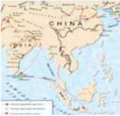

> **Deskripsi Visual:** Gambar ini adalah diagram yang menunjukkan wilayah Asia Tenggara dan bagian dari Asia Selatan. Diagram ini memperlihatkan perbatasan geografis antara negara-negara di wilayah tersebut, termasuk China, India, Malaysia, Thailand, Indonesia, dan negara-negara lainnya. Elemen utama yang ditampilkan meliputi:

1. Wilayah Asia Tenggara dan Asia Selatan
2. Perbatasan antara negara-negara di wilayah tersebut
3. Label-label untuk setiap negara yang ada di wilayah tersebut

Informasi kunci yang dapat diambil pembaca meliputi:

- Wilayah Asia Tenggara dan Asia Selatan
- Negara-negara yang ada di wilayah tersebut
- Perbatasan antara negara-negara di wilayah tersebut

Diagram ini memberikan gambaran umum tentang struktur geografis dan politik wilayah Asia Tenggara dan Asia Selatan, serta memperlihatkan hubungan antara negara-negara di wilayah tersebut.

Agama Hindu diperkirakan muncul antara tahun 3102 SM sampai 1300 SM dan merupakan agama tertua di dunia yang masih bertahan hingga kini. Agama ini merupakan agama ketiga terbesar di dunia setelah agama Kristen dan Islam dengan jumlah umat sebanyak hampir 1 miliar jiwa. Dalam bahasa Persia, kata  Hindu  berakar  dari  kata  Sindhu  (Bahasa  Sanskerta).  Dalam  kitab  Rg Weda, bangsa Arya menyebut wilayah mereka sebagai Sapta Sindhu (wilayah dengan tujuh sungai di barat daya anak benua India, yang salah satu sungai tersebut bernama sungai Indus). Kata sapta sindhu berdekatan dengan kata Hapta-Hendu  yang  termuat  dalam  Zend  Avesta  (Vendidad:  Fargard  1.18)sastra suci dari kaum Zoroaster di Iran. Pada awalnya kata Hindu merujuk pada masyarakat yang hidup di wilayah sungai Sindhu. Hindu sendiri sebenarnya

 

---
## 📄 Halaman 66

baru  terbentuk  setelah  masehi  ketika  beberapa  kitab  dari  Weda  dilengkapi oleh para brahmana. Zaman munculnya agama Buddha, nama agama Hindu lebih dikenal dengan sebutan sebagai ajaran Weda.

Agama Hindu sebagaimana istilah yang dikenal sekarang ini, pada awalnya tidak  disebut  demikian,  bahkan  dahulu  ia  tidak  memerlukan  nama,  karena pada waktu itu ia merupakan agama satu-satunya yang ada di muka bumi. Sanatana Dharma adalah nama sebelum nama Hindu diberikan. Kata 'Sanatana dharma' bermakna 'kebenaran yang kekal abadi' dan jauh belakangan setelah ada agama-agama lainnya barulah ia diberi nama untuk membedakan antara satu dengan yang lainnya. Sanatana dharma pada zaman dahulu dianut oleh masyarakat di sekitar lembah sungai Shindu, penganut Weda ini disebut oleh orang-orang Persia sebagai orang indu (tanpa kedengaran bunyi s), selanjutnya lama-kelamaan  istilah indu ini  menjadi Hindu .  Sehingga  sampai  sekarang penganut sanatana dharma disebut Hindu.

Agama  Hindu  adalah  suatu  kepercayaan  yang  didasarkan  pada  kitab  suci yang  disebut  Weda.  Weda  diyakini  sebagai  pengetahuan  yang  tanpa  awal tanpa akhir dan juga dipercayai keluar dari nafas Tuhan bersamaan dengan terciptanya  dunia  ini.  Karena  sifat  ajarannya  yang  kekal  abadi  tanpa  awal tanpa akhir maka disebut sanatana dharma. Apabila membahas tentang Agama Hindu,  kita  harus  mengetahui  sejarah  tempat  munculnya  agama  tersebut. India adalah sebuah Negara yang penuh dengan rahasia dan cerita dongeng, masyarakatnya berbangsa-bangsa dan berkasta-kasta, malah ada masyarakat dalam masyarakat, serta sungguh banyak ditemui agama-agama. Bahasa dan warna kulit pun bermacam-macam.

Pembicaraan  mengenai  India  berarti  adalah  pembicaraan  yang  bercabangcabang.  Dipandang  dari  sudut  etnologi,  India  adalah  tanah  yang  beraneka penduduknya, dan akibatnya orang dapat melihat kebudayaan yang beraneka pula. Semuanya ini tercermin dalam agamanya. Oleh karena itu barang siapa mulai mempelajari agama Hindu yang bersangkutan segera merasa terlibat dalam sejumlah ajaran-ajaran, sehingga hampir tidak dapat menemukan jalan untuk  mengadakan  penyelidikan.  Sepanjang  orang  dapat  menyelidikinya, maka sejarah kebudayaan India mulai pada zaman perkembangan kebudayaankebudayaan yang besar di Mesopotamia dan Mesir. Antara 3000 dan 2000 tahun sebelum Masehi, di lembah sungai Sindhu (Indus) tinggallah bangsabangsa yang peradabannya menyerupai kebudayaan bangsa Sumeria di daerah sungai Efrat dan Tigris. Berbagai cap daripada gading dan tembikar yang ada tanda-tanda tulisan dan lukisan-lukisan binatang, menceritakan kepada kita bahwa pada zaman itu di sepanjang pantai dari Laut Tengah sampai ke Teluk Benggala terdapat jenis peradaban yang sejenis dan sudah meningkat pada

 

---
## 📄 Halaman 67

perkembangan yang tinggi. Sisa-sisa kebudayaan tersebut terutama terdapat di dekat Kota Harappa di Punjab dan di sebelah utara Karachi. Bahkan disitu diketemukan sisa-sisa sebuah Kota, Mohenjodaro namanya, dimana ternyata orang telah mempunyai rumah-rumah yang berdinding tebal dan bertangga.

Penduduk  India  pada  zaman  itu  terkenal  dengan  sebutan  bangsa  Dravida. Mula-mula mereka tinggal tersebar di seluruh negeri, tetapi lama-kelamaan hanya tinggal di sebelah selatan dan memerintah negerinya sendiri, karena mereka  di  sebelah  utara  hidup  sebagai  orang  taklukkan  dan  bekerja  pada bangsa-bangsa yang merebut negeri itu. Mereka adalah bangsa yang berkulit hitam dan berhidung pipih, berperawakan kecil dan berambut keriting. Nama India diambil dari sungai Indus. Perkataan Indus dan Hindu keduanya berarti bumi yang terletak di belakang Sungai Indus, dan penduduknya dinamakan orang-orang India atau orang-orang Hindu. Mengenai penamaan Negara India, Gustav Le Bon menyatakan: 'Orang-orang Barat berpendapat bahwa sebutan Sungai Indus telah dipinjamkan kepada negara yang mengandung berbagai rahasia  yang  terletak  di  sebelah  belakangnya.  Alasan  ini  tidak  diterimanya bulat-bulat sebab sebutan India itu harus diambil dari sebutan Tuhan Indra.' Peradaban  India  telah  berlangsung  lama.  Negara  India  telah  menghasilkan beberapa  Filosof  agung  sebelum  Socrates  dilahirkan.  Di  Negara  India  ini sudah tersebar tanda-tanda ilmu pengetahuan dan bangunan-bangunan yang megah  pada  masa  dahulu  ketika  Kepulauan  Inggris  masih  dalam  keadaan terbelakang. India adalah negara yang penuh dengan keajaiban. India adalah salah satu pusat peradaban kuno di dunia. Dalam hal ini, India menandingi Mesir, Cina, Assyria, dan Babilonia. Peradaban India sebelum zaman Arya dapat  diketahui  dan  ditemukan  dengan  pengungkapan-pengungkapan  pada tingkat  kemajuan  yang  pernah  dicapai  oleh  India  dalam  bidang  arsitektur, pertanian, dan kemasyarakatan sejak masa 300 tahun SM, yaitu 1500 tahun sebelum kedatangan bangsa Arya.

Antara 2000 dan 1000 tahun SM masuklah kaum Arya ke India dari sebelah utara.  Bangsa  Arya  memisahkan  diri  dari  bangsanya  di  Iran  dan  yang memasuki India melalui jurang-jurang di pegunungan Hindu-Kush. Bangsa Arya itu serumpun dengan bangsa Jerman, Yunani dan Romawi dan bangsabangsa lainnya di Eropa dan Asia. Mereka tergolong dalam apa yang kita sebut rumpun-bangsa  Indo-German.  Hinduisme  dapat  disamakan  dengan  rimbaraya yang penuh dengan pohon-pohonan, tanam-tanaman, tumbuh-tumbuhan dan kembang-kembangan. Hinduisme memperlihatkan berbagai bentuk dan bermacam-macam gejala agama. Gambaran yang diberikan Hinduisme dalam keseluruhannya memang beraneka warna. Pesan pertama yang kita dapat ialah bahwa dalam Hinduisme boleh dikatakan terhimpun seluruh sejarah agama

 

---
## 📄 Halaman 68

dengan  segala  ragam  dan  bentuknya.  Hinduisme  ialah  agama  dari  jutaan penduduk India.

### Renungkanlah:

'Yo bhùtaý ca bhavyaý ca sarvaý yaúcàdhiûþhati, svaryasya ca kevalam tasmai jyeûthàya brahmane namaá.

### Terjemahanya:

'Kami memuja Tuhan Yang Maha Ada, yang menjadikan segalanya yang ada dimasa lalu, kini dan yang akan datang, yang merupakan satu-satunya intisari kebahagiaan', ( Atharvaveda, X.8.1 ).

Diskusikanlah  sloka  suci  ini  dengan  kelompokmu,  deskripsikanlah  di depan kelas dengan tuntunan Bapak/Ibu Guru yang mengajar!

Tidaklah mudah untuk menentukan dengan kata-kata yang singkat, apakah sebenarnya Hinduisme itu. Lebih tepat rasanya jika Hinduisme kita namakan sebagai suatu sistem sosial yang diperkuat oleh cita-cita keagamaan dan dengan demikian lalu  mempunyai tendensi keagamaan. Tak ada seorang pun yang dapat menjadi seorang Hindu dengan jalan menganut suatu agama tertentu. Menjadi seorang Hindu adalah berkat kelahirannya. Keadaan ini meletakkan kewajiban untuk megikuti peraturan-peraturan upacara-upacara tertentu, pada umumnya peraturan-peraturan yang berhubungan dengan pembagian Varna dan  khsusunya  pemberian  korban  dan  upacara-upacara  keagamaan  yang timbul dari pada pembagian Varna tadi. Ikatan-ikatan batin pada upacara yang turun temurun ini sangat kuat. Hal ini nyata sekali pada diri Gandi yang jelas bersimpati terhadap agama lain, tetapi tetap tinggal di Hindu karena pertanian, bangsa dan hubungan batinnya dengan kebudayaan agama sukunya. Bangsa Arya turun ke lembah Indus kira-kira 1500 tahun SM dan memberi corak pada kebudayaan India. Bangsa Arya satu suku dengan bangsa Iran.

Menurut  pendapat  para  peneliti  bahwa  bangsa  Arya  berasal  dari  Asia, dahulunya mereka hidup di Asia Tengah dari negeri Turkistan yang berdekatan dengan  Sungai  Jihun,  kemudian  berpindah  dalam  kelompok-kelompok yang besar menuju ke India melalui Parsi, dan mereka juga menuju Eropa. Nyatalah bahwa kedatangan bangsa Arya ke India terjadi pada abad ke-15

 

---
## 📄 Halaman 69

SM.  Bangsa  Arya  ini  telah  memerangi  kerajaan-kerajaan  yang  didirikan oleh  bangsa  berkulit  kuning  di  India  dan  berhasil  mengalahkan  sebagaian besar  dari  mereka  serta  menjadikan  kawasan-kawasan  yang  dikalahkannya itu  sebagai  wilayah  yang  tunduk  di  bawah  pengaruh mereka. Bangsa Arya tidak bercampur dengan penduduk India dengan jalan perkawinan. Mereka menjaga dengan sungguh-sungguh keturunan mereka yang berkulit putih itu. Bangsa Arya menggiring penduduk asli Negara India ke hutan-hutan atau ke gunung-gunung dan menjadikan mereka sebagai orang-orang tawanan yang dalam sastra lama Bangsa Arya dinamakan sebagai Bangsa Hamba Sahaya. Bangsa Arya ini telah meminta pertolongan dari Tuhan mereka 'Indra' untuk mengalahkan penduduk India. Di antara bacaan do'a mereka adalah 'wahai Indra Tuhan kami! Suku-suku kaum Dasa (budak) telah mengepung kami dari segenap penjuru dan mereka tidak memberikan korban apa-apa, mereka bukan manusia dan tidak berkepercayaan. Wahai Penghancur musuh! Binasakanlah mereka dari keturunannya.'

Tentang  sejauh  mana  pengaruh  bangsa-bangsa  berkulit  kuning  (Bangsa Turan)  dan  berkulit  putih  (Bangsa  Arya)  di  India  telah  diterangkan  oleh Gustav Le Bon: 'Bangsa Turan adalah bangsa penyerang yang kuat. Bangsa Arya meninggalkan kesan yang mendalam terhadap bangsa India dari segi budaya. Dari bangsa Turan, penduduk India mengambil ciri ukuran tubuh dan raut muka. Dari bangsa Arya mereka mengambil ciri bahasa, agama, undangundang, dan adat-istiadat.' Pertemuan bangsa Arya dan bangsa Turan dengan penduduk  asli  telah  menimbulkan  kelas-kelas  masyarakat  di  India,  dan merupakan suatu faktor yang sangat penting dalam sejarah negara ini. Dari bangsa Arya terbentuk golongan ahli-ahli agama (Brahmana) dan golongan prajurit (Ksatria).

Dari  bangsa  Turan  terbentuk  pula  golongan  saudagar  dan  ahli-ahli  tukang (Waisya). Pada mulanya orang-orang Hindu yang bergaul dengan bangsa Turan tidak termasuk dalam pembagian ini. Tetapi dalam beberapa zaman kemudian peradaban Arya meresap ke dalam sebagian diri mereka. Selanjutnya bangsa Arya  pun  terbentuk  dari  kalangan  orang-orang  Hindu  golongan  keempat, yaitu  golongan  pesuruh  dan  hamba  sahaya  (Sudra).  Penduduk-penduduk asli yang tidak tersentuh dengan peradaban Arya adalah disebabkan karena mereka memisahkan diri dari bangsa-bangsa pendatang itu. Maka, tinggallah mereka jauh dari pembagian ini dan terus menjadi orang-orang yang tersingkir atau terhalau dari masyarakat ( out-casts ). Bangsa Arya ketika masuk ke India kemungkinan kurang beradab dari pada bangsa Dravida yang ditaklukkannya. Tetapi mereka lebih unggul dalam ilmu peperangan daripada bangsa Dravida. Pada waktu bangsa Arya masuk ke India, mereka itu masih merupakan bangsa

 

---
## 📄 Halaman 70

setengah nomaden (pengembara), yang baginya peternakan lebih besar artinya daripada  pertanian.  Bagi  bangsa  Arya,  kuda  dan  lembu  adalah  binatangbinatang  yang  sangat  dihargai,  sehingga  binatang-binatang  itu  dianggap suci.  Dibandingkan  dengan  bangsa  Dravida  yang  tinggal  di  kota-kota  dan mengusahakan  pertanian  serta  menyelenggarakan  perniagaan  di  sepanjang pantai, maka bangsa Arya itu bolehlah dikatakan primitive.

Dahulu orang belum tahu dengan tepat dan selalu memandang kebudayaan yang  ada  di  India  dibawa  oleh  bangsa  Arya.  Sesudah  adanya  penggalianpenggalian di India, pandangan orang berubah dan makin banyak diketahui bahwa  bermacam-macam  unsur  di  dalam  kebudayaan  India  berasal  dari kebudayaan Dravida yang tua itu. Bangsa Arya belum mempunyai patungpatung Dewa, bangsa Dravida sudah. Sebuah gejala yang khas di dalam agama Hindu ialah pengakuan adanya Dewa-Dewi induk, itupun suatu gejala praArya. Banyak gejala-gejala Agama Hindu yang rupa-rupanya tidak berasal dari  agama  bangsa  Arya,  melainkan  berasal  dari  bangsa  Dravida.  Dengan demikian dapat dinyatakan bahwa agama Hindu sebagai agama tumbuh dari dua sumber yang berlainan, tumbuh dari perasaan dan fikiran keagamaan dua bangsa yang berlainan, yang mula-mula dalam banyak hal sangat berlainan, tetapi kemudian lebur menjadi satu. Di dalam tulisan-tulisan Hindu tua, unsurunsur Arya-lah yang sangat besar pengaruhnya. Hal itu tidak mengherankan karena  tulisan-tulisan  itu  berasal  dari  zaman  bangsa  Arya  memasuki  India dengan  kemenangan-kemenanganya.  Pengaruh  bangsa  Dravida  tentunya belum begitu besar. Agama bangsa Arya dapat kita ketahui dari kitab-kitab Weda  (Weda  artinya  tahu).  Oleh  karena  itu  masa  yang  tertua  dari  agama Hindu disebut masa Weda. Maulana Mohamed Abdul Salam al-Ramburi juga berkata: 'Umat India mudah menerima apa saja pemikiran dan kepercayaan yang ditemuinya.

Agama  Hindu  adalah  yang tertua di antara agama-agama  yang  ada. Penyebarannya meliputi kebanyakan atau semua orang India. Buku Hinduism telah menerangkan sebab-sebab terjadinya hal demikian dengan menuliskan; amat sulit untuk dikatakan, bahwa Hinduisme itu adalah suatu agama dalam pengertiannya  yang  sangat  luas.  Ini  merupakan  kehidupan  India  dengan caranya  tersendiri  yang  dianggap  sebagai  satu  dari  semua  masalah  suci dan  masalah  hina  karena  di  dalam  pemikiran  Hindu  tidak  ada  batas  yang memisahkan keduanya. Agama Hindu adalah suatu agama yang berevolusi dan merupakan kumpulan adat-istiadat yang tumbuh dan berkembang pada daerah  yang  dilaluinya.  Kedudukan  bangsa  Arya  sebagai  penakluk  negeri, yang  lebih  tinggi  daripada  penduduk  asli  telah  melahirkan  adat-istiadat Hindu. Kiranya dapat dikatakan bahwa asas agama Hindu adalah kepercayaan

 

---
## 📄 Halaman 71

bangsa Arya yang telah mengalami perubahan sebagai hasil dari percampuran mereka dengan bangsa-bangsa lain, terutama sekali adalah bangsa Parsi, yaitu sewaktu dalam masa perjalanan mereka menuju India. Agama Hindu lebih merupakan suatu tatanan hidup dari pada merupakan kumpulan kepercayaan. Sejarah  menerangkan  mengenai  isi  kandungannya  yang  meliputi  berbagai kepercayaan, hal-hal yang harus dilakukan, dan yang boleh dilakukan. Agama Hindu tidak mempunyai kepercayaan yang membawanya turun hingga kepada penyembahan  batu  dan  pohon-pohon,  dan  membawanya  naik  pula  kepada masalah-masalah falsafah yang abstrak dan halus. Seandainya Agama Hindu tidak mempunyai pendiri yang pasti maka begitu pula halnya dengan Weda. Kitab suci ini yang mengandung kepercayaan-kepercayaan, adat-istiadat, dan hukum-hukum  juga  tidak  mempunyai  pencipta  yang  pasti.  Para  penganut agama Hindu mempercayai bahwa Weda adalah suatu kitab yang ada sejak dahulu yang tidak mempunyai tanggal permulaan. Kitab Weda diwahyukan sejak awal kehidupan, setara dengan awal yang diwahyukannnya.

Penduduk  asli  Lembah  sungai  Indus  adalah  bangsa  Dravida  yang  berkulit hitam. Di sekitar sungai itu terdapat dua pusat kebudayaan yaitu Mohenjodaro dan  Harappa.  Mereka  sudah  menetap  disana  dengan  mata  pencaharian bercocok tanam dengan memanfaatkan aliran sungai dan kesuburan tanah di sekitarnya.  Menurut  teori  kehidupan  bangsa  Dravida  mulai  berubah  sejak tahun  2000-an  SM  karena  adanya  pendatang  baru,  bangsa  Arya.  Mereka termasuk rumpun berbahasa Indo-Eropa dan berkulit putih. Bangsa Arya ini mendesak bangsa Dravida ke bagian selatan India dan membentuk Kebudayaan Dravida, sebagian lagi ada yang bercampur antara bangsa Arya dan Dravida yang kemudian disebut bangsa Hindu. Oleh karena itu, kebudayaannya disebut kebudayaan Hindu.

Letak Geografis Sungai Indus, di sebelah utara berbatasan dengan China yang dibatasi Gunung Himalaya, selatan berbatasan dengan Srilanka yang dibatasi oleh  Samudra  Hindia,  barat  berbatasan dengan Pakistan, timur berbatasan dengan Myanmar dan Bangladesh. Peradaban sungai Indus berkembang disekitar  (2500  SM).  Kebudayaan kuno India  ditemukan  di  Kota  tertua  India yaitu daerah Mohenjodaro dan Harappa. Penduduk Mohenjodaro & Harappa adalah  bangsa  Dravida.  Terdapat  hubungan  dagang  antara  Mohenjodaro Sumber: http://4.bp.blogspot.com 15-07-2013. Gambar 2.5 Peninggalan Mohenjodaro

 

---
## 📄 Halaman 72

dan  Harappa  dengan  Sumeria.  Mohenjodaro  dan  Harappa  ditata  dengan perencanaan yang sudah maju, rumah-rumah terbuat dari batu-bata, saluran air bagus, jalan raya lurus dan lebar. Mohenjodaro dan Harappa sebagai Kota tua yang dibangun berdasarkan penataan dan peradaban yang maju. Peradaban Lembah Sungai Indus diketahui melalui penemuan-penemuan arkeologi. Kota Mohenjodaro  diperkirakan  sebagai  ibu  Kota  daerah  Lembah  Sungai  Indus bagian  selatan  dan  Kota  Harappa  sebagai  ibu  Kota  Lembah  Sungai  Indus bagian utara. Mohenjodaro dan Harappa merupakan pusat peradaban bangsa India pada masa lampau. Di Kota Mohenjodaro dan terdapat gedung-gedung dan rumah tinggal serta pertokoan yang dibangun secara teratur dan berdiri kukuh. Gedung-gedung dan rumah tinggal serta pertokoan itu sudah terbuat dari batu bata lumpur. Wilayah Kota dibagi atas beberapa bagian atau lokasi yang dilengkapi dengan jalan yang ada aliran airnya.

Daerah Lembah Sungai Indus merupakan daerah yang subur. Pertanian menjadi mata pencaharian utama masyarakat India. Pada perkembangan selanjutnya, masyarakat  telah  berhasil  menyalurkan  air  yang  mengalir  dari  Lembah Sungai Indus sampai jauh ke daerah pedalaman. Pembuatan saluran irigasi dan pembangunan daerah-daerah pertanian menunjukkan bahwa masyarakat Lembah  Sungai  Indus  telah  memiliki  peradaban  yang  tinggi.  Hasil-hasil pertanian yang utama adalah padi, gandum, gula/tebu, kapas, teh, dan lainlain.  Masyarakat  Mohenjodaro  dan  Harappa  telah  memperhatikan  sanitasi (kesehatan) lingkungannya. Teknik-teknik atau cara-cara pembangunan rumah yang telah memperhatikan faktor-faktor kesehatan dan kebersihan lingkungan yaitu  rumah  mereka  sudah  dilengkapi  denga  jendela.  Masyarakat  Lembah Sungai Indus sudah memiliki ilmu pengetahuan dan teknologi. Kemampuan mereka  dapat diketahui melalui peninggalan-peninggalan budaya  yang ditemukan,  seperti  bangunan  Kota  Mohenjodaro  dan  Harappa,  berbagai macam patung, perhiasan emas, perak, dan berbagai macam meterai dengan lukisannya  yang  bermutu  tinggi  dan  alat-alat  peperangan  seperti  tombak, pedang, dan anak panah. Demikian sekilas tentang kebudayaan prasejarah di India sebagai tempat tumbuh dan berkembangnya agama Hindu yang sampai saat ini kita yakini kebenarannya sebagai pedoman dan penuntun dalam hidup dan kehidupan ini.

Seiring  dengan  perkembangan  zaman,  sebagaimana  negeri  lainnya  yang diperintah oleh masing-masing rajanya dalam sebuah kerajaan, negeri India juga demikian adanya. Raja-raja yang pernah memerintah di Kerajaan Maurya antara lain: Candragupta Maurya. Setelah berhasil menguasai Persia, pasukan Iskandar Zulkarnaen melanjutkan ekspansi dan menduduki India pada tahun 327 SM melalui Celah Kaibar di Pegunungan Himalaya. Pendudukan yang

 

---
## 📄 Halaman 73

dilakukan oleh pasukan Iskandar Zulkarnaen hanya sampai di daerah Punjab. Pada tahun 324 SM muncul gerakan di bawah Candragupta. Setelah Iskandar Zulkarnaen meninggal tahun 322 SM, pasukannya berhasil diusir dari daerah Punjab  dan  selanjutnya  berdirilah  Kerajaan  Maurya  dengan  ibu  Kota  di Pattaliputra.  Candragupta  Maurya  Menjadi  raja  pertama  Kerajaan  Maurya. Pada masa pemerintahannya, daerah kekuasaan Kerajaan Maurya diperluas ke arah timur, sehingga sebagian besar daerah India bagian utara menjadi bagian dari  kekuasaannya.  Dalam waktu singkat, wilayah Kerajaan Maurya sudah mencapai daerah yang sangat luas, yaitu daerah Kashmir di sebelah barat dan Lembah Sungai Gangga di sebelah timur.

Ashoka  memerintah  Kerajaan  Maurya  dari  tahun  268-282  SM.  Ashoka merupakan  cucu  dari  Candragupta  Maurya.  Pada  masa  pemerintahannya, Kerajaan  Maurya  mengalami  masa  yang  gemilang.  Kalingga  dan  Dekkan berhasil dikuasainya. Namun, setelah yang bersangkutan menyaksikan korban bencana perang yang maha dahsyat di Kalingga, timbul penyesalan dan tidak lagi  melakukan  peperangan.  Mula-mula  Ashoka  beragama  Hindu,  tetapi kemudian menjadi pengikut agama Buddha. Sejak saat itu Ashoka menjadikan agama  Buddha  sebagai  agama  resmi  negara.  Setelah  Ashoka  meninggal, kerajaan terpecah-belah menjadi kerajaan kecil. Peperangan sering terjadi dan baru pada abad ke-4 M muncul seorang raja yang berhasil mempersatukan kerajaan  yang  terpecah  belah  itu.  Maka  berdirilah  Kerajaan  Gupta  dengan Candragupta I sebagai rajanya.

Sistem  kepercayaan  masyarakat  Lembah  Sungai  Indus  bersifat  politeisme atau memuja banyak Dewa. Dewa-Dewa tersebut misalnya Dewa kesuburan dan  kemakmuran  (Dewi  Ibu).  Masyarakat  Lembah  Sungai  Indus  juga menghormati binatang-binatang seperti buaya dan gajah, pohon seperti pohon pipal (beringin). Pemujaan tersebut dimaksudkan sebagai tanda terima kasih terhadap kehidupan yang dinikmatinya, berupa kesejahteraan dan perdamaian. Interaksi  bangsa  Dravida  dan  bangsa  Arya  menghasilkan  Agama  Hindu. Bagaimana dengan perkembangan agama Hindu di Dunia?

Sejarah perkembangan agama Hindu di Dunia dapat diketahui dari berbagai jenis  kitab  suci  Hindu  seperti;  weda  sruti,  weda  smrti,  brahmana, upanisad dan  yang  lainnya.  Pertumbuhan  filsafat  keagamaan  dan  perkembangan pelaksanaan kehidupan beragama tidak dapat terlepaskan dari sumber-sumber tersebut. Dengan demikian perkembangan agama Hindu senantiasa bersifat religius.  Agama  Hindu  merupakan  sumber  kekuatan  bathin,  yang  mampu menjiwai  seluruh  aktivitas  kehidupan  umat  manusia  di  muka  bumi  ini. Kehadiran agama-agama yang ada di dunia ini pada umumnya di dasarkan atas wahyu Ida Sang Hyang Widhi Wasa/Tuhan Yang Maha Esa yang diterima

 

---
## 📄 Halaman 74

oleh  para  Maharsi  'orang  suci'  agama  yang  bersangkutan.  Agama-agama itu diwahyukan dengan tujuan untuk mempermulia kehidupan manusia baik lahir maupun batin. Pada umumnya sebutan atau penamaan dari suatu agama biasanya memiliki keterkaitan dengan para pendirinya. Sebagai contoh agama Buddha  memiliki  hubungan  dengan  penamaan  Sidharta  Gauthama  yang disebut-sebut menjadi pendirinya, agama Kristen memiliki keterkaitan dengan Yesus Kristus sebagai nabi dan pendirinya.

Berbeda  dengan  nama  agama-agama  tersebut  di  atas,  agama  Hindu  tidak dikaitkan  dengan  nama  salah  seorang  Maha  Rsi  penerima  wahyu  sebagai pendirinya, karena agama Hindu diyakini sebagai wahyu Tuhan Yang Maha Esa  dan  diterima  oleh  banyak  Maha  Rsi.  Para  tokoh  menyatakan  sebutan Hindu itu berasal dari kata Shindu, yaitu sebutan sebuah sungai yang terdapat di  wilayah  India  bagian  Barat  Daya  yang  sekarang  dikenal  dengan  nama punjab. Punjab artinya daerah aliran 5 (Lima) anak sungai.

Peninggalan di Mohenjadaro, diperkirakan ± tahun 6000 SM datanglah bangsa  Arya  dari  daratan  Eropa  bagian timur 'kemungkinan dari wilayah Hungaria dan Bosnia atau Cekoslovakia' memasuki daerah India secara bertahap. Bangsa  Arya  memasuki  India  melalui celah Kaiber 'Khyber Pass' yang terletak diantara pegunungan Himalaya dan Hindu Kush. Bangsa Arya tergolong ras  bangsa  indojerman  yang  memiliki kegemaran mengembara. Setelah memasuki wilayah India, mereka kemudian  menetap  di  lembah  sungai

Sindhu yang kondisi alamnya sangat menarik dan subur. Sebelum bangsa Arya memasuki India, daerah ini telah diuni oleh bangsa Dravida. Bangsa Dravida disebut-sebut  sebagai  bangsa  yang  telah  memiliki  peradaban  sangat  tinggi. Para ahli  berhasil  menemukan bekas-bekas peninggalan bangsa Dravida di Harappa dan Mohenjodaro. Berdasarkan hasil penelitian yang dilakukan di wilayah Mohenjodaro dan Harappa, ditemukan beberapa peninggalan yang menunjukkan mengandung nilai-nilai ajaran agama Hindu. Diantara penemuan yang dimaksud adalah;

 

---
## 📄 Halaman 75

- Arca manusia berkepala tiga, bertangan empat, berdiri dengan kaki kanan dan kaki kirinya terangkat ke depan. Arca ini terbuat dari dari batu kapur yang  dibakar.  Postur  arca  ini  memberikan  inspirasi  kepada  kita  tentang adanya arca Siwanatharaja. Arca Siwanatharaja adalah merupakan perwujudan dari adanya pemujaan kehadapan Ida Sang Hyang Widhi/Tuhan Yang Maha Esa sebagai raja dari alam semesta. Sangat memungkinkan perkembangan  selanjutnya  sampai  di  Indonesia  khususnya  'Bali'  yang mana hal ini mengingatkan kita pada fungsi arca Shang Hyang Acintya.
- Materai  yang  berisi  hiasan  burung  elang  yang  sedang  mengembangkan sayapnya, kepalanya menghadap ke kiri-atas, di atas kepalanya terdapat hiasan ular. Diperkirakan konsep inilah yang memberi inspirasi pada hiasan burung Garuda bersama para naga yang terdapat dalam kitab Itihasa.
- Materai  yang  bergambarkan  orang  yang  duduk  bersila,  bermuka  tiga bertanduk dua, hiasan kepalanya meruncing ke atas, dan dikelilingi oleh para binatang seperti; gajah, lembu, harimau, dan Badak. Konsep inilah kemudian diperkirakan memberikan inspirasi kepada kita tentang pemujaan kepada Dewa Siwa dalam manifestasinya sebagai Sang Hyang Pasupati. Selain  itu  juga  ditemukan  materai  yang  berisi  lukisan  pohon  yang berdekatan dengan seorang Dewa. Konsep ini kemudian dapat dihubungkan dengan keberadaan pohon Kalpataru atau pohon Surgawi. Pohon Kalpataru diyakini oleh umat dapat mengabulkan semua keinginaan manusia seperti yang terdapat dalam kitab Ithihasa.
- Bangunan rumah yang sudah memiliki tata ruang dan tata letak yang sangat baik.  Hal  ini  dapat  dibuktikan  dari letak  bangunan  dan  adanya  kamarkamar yang memiliki fungsi berbedabeda. Di samping itu juga diketemukan ada  jalan-jalan  yang  lebar  dan  lurus serta di samping kiri-kanan dari jalan tersebut sudah dilengkapi dengan parit yang berukuran sangat dalam sebagai pembuangan air limbah dan air hujan.
- Arca  orang  tua  yang  berjanggut  dan mempergunakan jubah, serta arca seorang wanita yang bentuk badannya

 

---
## 📄 Halaman 76

- agak gemuk. Kedua arca tersebut dikenal dengan sebutan arca Terracota , yang bahannya terbuat dari tanah liat yang dibakar. Diperkirakan arca orang tua yang berjanggut itu adalah sebagai arca tokoh spiritual, sedangkan arca seorang perempuan itu di duga sebagai arca dewi kesuburan.
- Permainan  anak-anak  yang  terbuat  dari  tanah  liat  yang  dibakar.  Dan disamping itu juga diketemukan kolam 'Latra' lengkap dengan pancurannya yang dimungkinkan sebagai tempat permandian umum atau sebagai tempat yang disucikan untuk memandikan arca-arca dewa.
- Sandal  yang  terbuat  dari  bahan  kaca.  Penemuan  ini  memberikan  bukti kepada  kita  bahwa  peradaban  lembah  sungai  Sindhu  memiliki  nilai kemajuan yang sangat tinggi.

---
**🖼️ Gambar/Diagram**

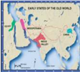

> **Deskripsi Visual:** Gambar ini adalah ilustrasi yang menunjukkan "Early States of the Old World". Ilustrasi ini menggambarkan wilayah geografis di dunia kuno, dengan berbagai negara dan wilayah yang ditandai dengan warna-warna berbeda. Wilayah-wilayah tersebut terbagi menjadi beberapa bagian utama, seperti Asia, Afrika, dan Amerika Utara. Setiap wilayah tersebut memiliki nama yang ditulis di atasnya, seperti Mesopotamia, India, Mesir, Yunani, Romawi, dan Amerika. Gambar ini juga menunjukkan hubungan antar wilayah tersebut melalui jalur perjalanan atau jalan raya yang ditandai dengan garis-garis berwarna. Informasi penting lainnya yang ditampilkan adalah bahwa gambar ini mungkin digunakan untuk membantu pembaca memahami hubungan antar wilayah di dunia kuno dan bagaimana mereka berinteraksi satu sama lain.

Kehadiran bangsa Arya ke India 'Punjab' dinyatakan menimbulkan peperangan dengan penduduk asli India. Bangsa Dravida sebagai penduduk asli India berhasil  dikalahkannya  dan  terdesak  ke Selatan. Semula bangsa Arya bermaksud mempertahankan kemurnian darah 'ras' mereka, tetapi kemudian secara perlahan mulai terjadi percampuran darah dan kebudayaan dengan bangsa Dravida. Pencampuran darah dan Kebudayaan ini menghasilkan kebudayaan baru di lembah sungai  Sindhu.  Pada  masa  itu  diantara mereka telah menjalin hubungan dagang

dengan  bangsa  Yunani  dan  Persia.  Bangsa  Persia  yang  datang  ke  lembah sungai Sindhu menyebutkan kata Sindhu dengan kata Hindu, rupanya bangsa Persia itu tidak memiliki lafal 'S' dalam bahasa mereka, sedangkan bangsa Yunani menyebut Sindhu dengan sebutan Indo.Pada beberapa abad kemudian, bangsa-bangsa barat lainnya mengenal daerah ini dan menyebutnya dengan nama India. Dari data-data tersebut dapat dikemukakan bahwa nama Hindu berasal dari kata Sindhu, yaitu sebuah nama sungai yang berada di wilayah India bagian Barat Daya. Lembah sungai Sindhu yang amat subur itu memiliki lima aliran sungai pada hulunya dan kelima aliran tersebut dinamakan Pancanadi. Perkembangan selanjutnya 'India' disebut dengan nama Arya Wartha yang berarti daerah yang didiami oleh bangsa Arya, Bhatara Warsa yang artinya daerah yang penuh Hujan, Jambudwipa yang artinya pulau yang berbentuk

 

---
## 📄 Halaman 77

buah jambu. Hal ini sangat memungkinkan karena anak benua India ini ada kemiripan  atau  menyerupai  buah  jambu  bila  kita  perhatikan  sebagai  mana dilihat dalam peta dunia.

Adanya  pembauran  budaya  dan  kepercayaan  diantara  bangsa  arya  dengan bangsa Dravida dalam perkembangan berikutnya rupanya mengalami kemajuan yang sangat pesat sampai pada munculnya agama Hindu di lembah sungai Sindhu. Semua bentuk budaya dan kepercayaan yang ada pada masa itu,  dirangkul  dan  mengalami  penyempurnaan  senafas  dengan  keberadaan agama Hindu. Hal ini dimungkinkan karena agama Hindu bersifat universal dan fleksibel.

### Perkembangan Agama Hindu di India.

Terhitung  sejak  ribuan  tahun  yang  lalu,  India  telah  dikenal  oleh  berbagai macam  bangsa-bangsa  di  dunia.  Disekitar  tahun  4000  SM  negeri  India sudah  banyak  didiami  oleh  berbagai  macam  suku  bangsa,  yang  kemudian membentuk  system  pemerintahan  Kota  yang  berpisah-pisah.  Mohenjodara dan Harappa adalah Kota yang paling maju, dan didiami oleh bangsa Dravida. Disekitar (3000 - 1500) SM. Kebudayaan Mohenjodaro dan Harappa sedang suburnya,  datanglah  bangsa  Arya  (bangsa  kulit  putih)  menyerang  India dan  menghancurkan  hasil-hasil  kebudayaannya.  Dalam  kondisi  seperti  itu terjadilah percampuran kebudayaan (kebudayaan asli bangsa Dravida - India dengan bangsa Arya - Kaspia) dan akhirnya munculah kebudayaan Weda.

Menurut catatan yang ada menyatakan bahwa sejarah perkembangan agama Hindu di India, berlangsung dalam kurun waktu yang sangat panjang yakni berabad-abad lamanya hingga sampai sekarang. Rentang waktu yang sangat panjang itu memungkinkan bila sejarah perkembangannya, kita kelompokkan menjadi beberapa fase sebagaimana pola pemikiran yang disampaikan oleh 'Govinda  Das  Hiduism  Madras'.  Pengelompokan  yang  dimaksud  adalah sebagai berikut; Zaman Weda, Zaman Brahmana, dan Zaman Upanisad .

### 1.  Zaman Weda.

Zaman Weda diperkirakan berlangsung lebih kurang dari tahun 1500 SM sampai dengan tahun 600 SM. Pada zaman ini muncullah kitab suci weda yang isinya merupakan kumpulan dari wahyu Tuhan Yang Maha Esa, yang diterima oleh para Maha Rsi. Penjelasan ini dapat dijumpai dalam kitab Nirukta, yaitu kitab yang memuat penafsiran autentik mengenai kata-kata yang ada dalam kitab suci weda yang disebut 'Bhumikabhasya' yang ditulis oleh Maha Rsi Sayana. Kitab Nirukta juga menjelaskan bahwa sabda suci itu diturunkan oleh Tuhan Yang Maha Esa dan diterima oleh para Maha Rsi.

 

---
## 📄 Halaman 78

Maha Rsi penerima wahyu disebut Mantra Drstah iti Rsih. Dari penjelasan itu dapat disimpulkan bahwa Maha Rsi penerima wahyu Tuhan Yang Maha Esa itu adalah orang-orang suci, yang dapat berhubungan langsung dengan Ida  Sang  Hyang  Widhi  Wasa/Tuhan  Yang  Maha  Kuasa.  Dalam  sastra agama Hindu disebutkan bahwa ada banyak nama para Maha Rsi penerima wahyu, beberapa diantaranya dikenal dengan sebutan sapta Rsi penerima Wahyu,  yaitu  Maha  Rsi  Grtsamada,  Wiswamitra,  Wamadewa,  Arti, Baradwaja, Wasitwa dan Kanwa. Selain Sapta Rsi penerima wahyu Tuhan, juga ada disebutkan dua puluh tiga Maha Rsi lainnya yang dikenal dengan nama 'Nawawimsatikrtyasca Vedavyastha Maharsibhih' diantaranya adalah  Maharsi;  Daksa,  Usana,  Swayambhu,  Wrhaspati,  Aditya,  Mrtyu, Indra, Wasistha, Saraswata, Tridhatu, Tridrta, Sandhyaya, Akasa, Dharma, Tryguna,  Dananjaya,  Krtyaya,  Ranajaya,  Bharadwaja,  Gotama,  Uttama, Parasara, dan Wyasa.

Menurut tradisi Hindu, Maha Rsi yang terpopuler dan sangat besar jasanya dalam  menghimpun  serta  mengkodefikasikan  weda  adalah  Maha  Rsi Wyasa. Beliau juga dikenal dengan sebutan Kresna Dwaipayana Wyasa. Maha Rsi  Wyasa  mengkodefikasi  kitab-kitab  weda  menjadi  catur  weda samhita, dibantu oleh empat Maha Rsi lainnya yang disebut-sebut sebagai siswanya, yaitu:

- Maha  Rsi  Paila,  yang  juga  disebut  Maharsi  Puhala,  beliau  sebagai penyusun kitab suci Rg. Weda Samhita.
- Maha  Rsi  Waisampayana,  sebagai  penyusun  kitab  suci  Yayur  Weda Samhita.
- Maha Rsi Jaimini, sebagai penyusun kitab suci Sama Weda Samhita.
- Maha Rsi Sumantu, sebagai penyusun kitab Atharwa Weda Samhita.
Selain sebagai penghimpun kitab catur Weda samhita, Maha Rsi Wyasa juga  berjasa  menyusun  kitab  Purana,  Mahabharata,  Bhagawadgita,  dan kitab  Brahmasutra.  Dalam  kesusatraan  Hindu,  Maha  Rsi  wyasa  juga memiliki  sebutan  lain  seperti  Bagawan  Byasa,  Kresnadwaipayana,  dan Wyasa Dewa. Diantara jenis-jenis weda itu, untuk yang pertama kali ditulis adalah Rg. Weda. Setelah itu dilanjutkan dengan kitab-kitab weda yang lainnya. Tatanan hidup beragama pada zaman itu sepenuhnya didasarkan atas ajaran-ajaran yang tercantum pada weda samhita. Pembelajaran agama kepada umat lebih menekankan pada pembacaan dan merafalkan ayat-ayat suci weda, dengan menyanyikan serta mendengarkan secara berkelompok.

Pada zaman weda pemujaan terhadap para dewa yang dipandang sebagai suatu kekuatan yang nyata dan berpribadi sangat mendominasi. Para Dewa

 

---
## 📄 Halaman 79

dipuja dengan nyanyian yang sangat indah, disertai dengan menghaturkan sajian  yang  dipersembahkan  kepada-Nya.  Persembahan  sesajen  dan pemujaan kepada para dewa dilakukan setiap hari, selain itu ada juga yang dilakukan secara periodik dengan tujuan untuk memohon anugerah agar kehidupan  seseorang  menjadi  selamat  dan  sejahtera  baik  lahir  maupun batin. Keberadaan hukum alam yang disebut 'Rta' sangat dipercaya pada zaman  Weda,  karena  hukum  itulah  yang  mengatur  segala  sesuatu  yang ada di alam semesta ini, seperti; geraknya matahari, bintang-bintang, dan planet-planet  lain  yang  ada  di  alam  semesta.  Semua  yang  ada  di  alam semesta ini harus tunduk pada 'Rta' tanpa terkecuali. Barang siapa yang mencoba menentangnya pasti binasa. Manusia dan para dewa seolah-olah memiliki hubungan kekeluargaan yang amat erat. Para dewa dipandang sebagai bapak atau ibu sebagai tempat memohon berkah dan perlindungan dalam hidup ini. Pandangan manusia terhadap susunan alam pada masa itu sudah cukup luas. Disebutkan bahwa alam semesta itu terdiri dari; matahari, bumi, langit, dan surga yang masing-masing dari wilayah itu ada Dewanya. Bumi yang ditempati oleh manusia itu di pandang sebagai sesuatu yang nyata,  bukan  merupakan  hal  yang  semu.  Hal  itu  dapat  dibuktikan  dari doa-doa yang dipanjatkan kepada para dewa, banyak berhubungan dengan hal-hal yang bersifat keduniawian, misalnya seperti; memohon kekayaan, kesejahteraan, keselamatan, banyak anak, kesuburan, kesehatan, dan lain sebagainya.

Pada zaman weda dewa-dewa yang dipandang populer dalam kitab suci weda ditampilkan melalui cerita mengenai mitologi para dewa. Dengan adanya uraian-uraian mengenai mitologi dewa-dewa itu, diharapkan dapat memperjelas tentang ajaran Ketuhanan dalam agama Hindu. Dewa-dewa yang  dipandang  populer  pada  zaman  weda  adalah  Dewa;  Agni,  Indra, Rudra, dan Waruna. Adapun mitologinya dapat dikisahkan secara singkat sebagai berikut:

### a.  Dewa Agni

Pemujaan  terhadap  Dewa  Agni  sangat  banyak  dijumpai  dalam  kitab suci weda terutama dalam kitab suci Rg weda. Keberadaan Dewa Agni selalu  dihubungkan  dengan  upacara  persembahan  api.  Wujud  Dewa Agni  digambarkan  berambut  nyala  api,  berjenggot  pirang,  berdagu tajam, bergigi emas dengan kepalanya selalu bersinar. Sinar Dewa Agni seperti sinar matahari pagi. Beliau disebut sebagai putra Dewa Dyanus yaitu  dewa  langit.  Dewa  Agni  sering  disebut  sebagai  putra  dewa langit dan bumi. Disebutkan pula bahwa Dewa Agni adalah keturunan air,  yang  namanya  sering  dihubungkan  dengan  Dewa  Indra.  Dewa

 

---
## 📄 Halaman 80

Agni  Dipandang  sebagai  dewa  pemimpin  upacara,  dan  orang-orang melakukan persembahan pertama kali di dunia ini hanya pada Dewa Agni. Selanjutnya matahari dipandang sebagai perwujudan Dewa Agni, yang di pandang sebagai cahaya sorga pada waktu langit cerah. Dewa Agni juga disebut Grhapati yang artinya tuan-nya rumah tangga, dan dewa yang selalu mengunjungi orang-orang dirumahnya. Dewa Agni sering dipanggil sebagai ayah, sebagai saudara, sebagai seorang putra dari  pemujanya.  Dewa  Agni  menghantarkan  persembahan  seseorang atau  orang  banyak  kepada  para  dewa,  mengajak  para  dewa  untuk hadir pada waktu upacara keagamaan. Dewa Agni dipandang sebagai duta  dari  para  dewa  dan  para  pemujanya  untuk  menghantar  suatu persembahan  kepadanya.  Dalam  pelaksanaan  upacara  keagamaan, Dewa Agni dipandang sebagai pendamping para pendeta, oleh sebab itu beliau sering dipanggil dengan sebutan Vipra, Purohita, Hotri, Adwaryu dan  Brahman.  Semua  sebutan  itu  mengandung  pengertian  pendeta. Kependetaan adalah karakter yang paling menonjol dari Dewa Agni, oleh  karena  itu  beliau  dipandang  sebagai  pendeta  yang  besar,  yang mengetahui  semua  rincian  upacara,  maha  bijaksana  dan  mengetahui segalanya. Oleh karena itulah beliau selalu dipanggil dengan sebutan Yatadewa yang artinya mengetahui semua yang lahir.

Dewa Agni dipandang sebagai dewa yang amat dermawan oleh para pemuja-Nya.  Beliau  memberkahi  mereka  bermacam-macam  karunia, baik  berupa  kebahagian  dalam  rumah  tangga,  maupun  yang  lainnya. Kitab  Mahabrata  mengisah  bahwa  Dewa  Agni  dipandang  sebagai dewa yang membakar hutan Kandhawa. Sedangkan kitab Ramayana menyebutnya  sebagai  penjelmaan  Nila.  Dalam  kitab  suci  Purana, disebutkan  Dewa  Agni  mengawini  Dewi  Svaha  dengan  tiga  orang putranya, yaitu Pavaka, Pavamana, dan Suchi. Dalam seni arca India, Dewa Agni dipuja diberbagai candi-candi yang ada. Beliau digambarkan sebagai  orang  tua  berbadan  merah,  bermata  enam,  bertangan  tujuh, memegang sendok kecil dan sendok besar sebagai pelaksana upacara Agnihotra, mempunyai tujuh lidah, empat tanduk, tiga kaki, rambutnya dikepang, perutnya besar, dan berbusana merah. Pada kaki kiri dan kaki kanannya terdapat arca Svaha dan Svadha, mengendarai biri-biri jantan. Nama lain dari Dewa Agni adalah Vahni artinya membakar, Vitihotra artinya memberi pahala kepada penyembah, Dananjaya artinya mengalahkan musuh, Dhumaketu artinya bermahkota Asap, Chagartha artinya  mengendarai  kambing  betina,  dan  Sapta  Jihwa  yang  artinya berlidah tujuh. Berikut ini adalah mantra yang termuat dalam kitab suci weda, sering diucapkan untuk memuliakan Dewa Agni, antara lain;

 

---
## 📄 Halaman 81

'Agnih purvebhri rsibhirrijyo nutairita, sa devam eha vaksati'.

### Terjemahannya:

Demikianlah  Agni  menjadi  sasaran  pemujaan  para  resi  pada  zaman dahulu dan zaman sekarang. Ia mengundang para dewa dari semua arah untuk datang pada upacara korban ini.

'Agnina rayimasnavat posameva dive-dive, yasam viravattamam'.

### Terjemahannya:

Atas  karunia  Agni  setiap  hari,  dunia  kini  mendapatkan  kemakmuran, yang menyebabkan adanya kekuatan, jasa dan kepahlawanan yang mulia.

### b.  Dewa Indra

Keberadaan  Dewa  Indra  sangat  dominan  dalam  kitab  suci  Weda. Disebutkan  ada  200  mantra  yang  mengagungkan  Dewa  Indra  dalam Weda. Kata Indra berasal dari kata Ind dan dri yang artinya memberi makan. Menurut Niruktha kata Ind berarti penuh dengan tenaga. Indra pada mulanya adalah Dewa hujan yang bersenjatakan bajra atau petir mengalahkan raksasa Vrtra.  Dewa  Indra  lebih  dikenal  sebagai  Dewa Perang yang mengalahkan tiga benteng musuh, karena itu Dewa Indra disebut Tri Puramdhara (Tri Puramtaka). Dalam kitab Purana dikisahkan bahwa, beliau disebut-sebut sebagai Dewa Khayangan (sorga). Beliau merupakan  saksi  agung  setiap  perbuatan  manusia,  karena  memiliki seribu mata (Sahasraaksa). Kendaraan Dewa Indra adalah seekor gajah Airavata  dan  istrinya  bernama  Sanchi  atau  Indriani.  Keberadaannya banyak  dikisahkan  dalam  kitab  Itihasa  dan  Purana.  Nama  lain  dari Dewa Indra adalah; Sakra (yang mulia), Divapati (Raja dari para dewa), Bajri (yang bersenjata Bajra), Meghavahana (yang berkendaraan awan), Mahendra (dewa yang agung), Svargapati (Raja Khayangan), Mahakasa (Ia yang bermata hebat), Sahasraksa (Ia yang bermata seribu). Berikut ini adalah mantra yang terdapat dalam kitab suci weda yang memuliakan Dewa Indra;

### Terjemahannya:

Bahkan surga dan dunia tunduk kepadaNya. Bahkan gunung-gunung pun  takut  di  depan  kehebatannya.  Dia-lah  yang  dikenal  sebagai peminum soma, memegang vajra dengan lengannya, yang memegang vajra ditangannya. Dia-lah Indra, oh orang-orang laki.

 

---
## 📄 Halaman 82

'Yah sasvato mahi eno dadhanan, amanymanah charna jaghana. Yah sadhate nanudadati srdhyam, yo darso hanta sa janasa Indrah'.

### Terjemahannya;

Dia yang membunuh dengan panahnya, mereka yang berbuat dosa besar yang tidak disenangi. Ia tidak mengampuni orang-orang yang congkak dengan  kecongkakannya.  Dia-lah  yang  membunuh  Dasyu.  Dia-lah Indra, oh orang-orang laki.

### c.  Dewa Rudra

Dewa  Rudra  diidentikan  dengan  Dewa  Siwa  (Siwarudra).  Beliau digambarkan sebagai laki-laki bertubuh besar, perutnya berwarna biru dan  punggungnya  berwarna  merah.  Kepala  berwarna  biru,  lehernya berwarna putih, dan kulitnya berwarna merah  kecoklat-coklatan. Rambutnya  panjang  terurai,  seluruh  tubuhnya  memancarkan  cahaya keemasan,  tangannya  memegang  busur  dan  panah  yang  bercahaya. Karakternya nampak angker dan menakutkan, namun hatinya lembut dan  maha  mengasihi.  Beliau  tinggal  di  pegunungan  dan  dipandang sebagai Dewa pengasih kepada semua makhluk, bagaikan seorang ayah yang  mengasihi  anaknya.  Beliau  adalah  dukunnya  para  dukun  yang memiliki  berjenis-jenis  pengobatan,  dengan  julukan  Jalasa  Bhesaya (pemilik obat yang sejuk). Hujan yang disertai dengan angin ribut dan geledek  yang  memberikan  kesuburan  adalah  tenaga  pengobatannya. Dewa Rudra juga disebut  dengan  Tryambaka,  Kapardin  dan  delapan aspek dari Rudra adalah Siwa, Bhawa, Isana, Pasupati, Bhima, Ugra, Mahadewa, dan Rudra.

Berikut ini adalah mantra untuk memuliakan Dewa Rudra, yang termuat dalam kitab suci weda;

'Tvadattebhi Rudra samtamebhe, satam hima asiya bhesa jebhih, Vi asmad dveso vitaram vyambho, vi amivas catayasva visucih'.

### Terjemahannya;

Dengan obat-obatan yang amat menyegarkan, engkau berikan, oh Rudra, semoga hamba mencapai hidup seratus musim dingin. Usirlah jauh-jauh kebencian, kesedihan, dan penyakit dari kami dalam semua arah.

 

---
## 📄 Halaman 83

'Srestho  jatasya  Rudra  sriyasi  tavatamas  tavatam  vajrabaho,  Parsi nah param ambasah suasti, visva abhiti rapaso yuyodhi'.

### Terjemahannya;

Engkau  adalah  yang  terbaik  dari  yang  lahir,  dalam  hal  kemuliaan, oh  Rudra  dalam  kemuliaan,  paling  kuasa  dalam  hal  kekuasaan,  oh pemegang vajra.

### d.  Dewa Waruna

Dewa  Waruna  disebut juga Baruna. Beliau selalu dihubungkan dengan dewa laut. Kata waruna berasal dari kata Var (menutup atau membentang) yang berarti melindungi dari segala penjuru. Dari kata ini kemudian dihubungkan dengan laut. Dewa Waruna mengamati semua mahkluk dari tempatnya yang tinggi, dimana matahari diyakini sebagai istana-Nya. Beliau digambarkan sebagai laki-laki yang tampan berkulit putih  mengendarai  monster  laut  yang  disebut  Makara (Gajahmina) berupa  binatang  laut  yang  pada  bagian  depannya  berwujud  seekor kijang,  sedangkan  bagian  belakangnya  berwujud  seekor  ikan.  Istri Waruna bernama Waruni yang tinggal di istana mutiara. Dewa Waruna adalah penguasa hukum alam yang disebut Rta. Nama lain dari Dewa Waruna adalah Pracheta (yang bijaksana), Jalapati (raja air), Yadapati (raja binatang laut), Ambhuraja (raja air), Pasi (yang membawa jaring). Berikut ini adalah mantra yang termuat dalam kitab suci weda untuk memuliakan Dewa Waruna;

'Agam su tubhayam varuna svadhavo, hdri stoma upasritas cid astu, sam nah kseme sam u yoge no astu, yuyam pata svastibhih sada nah'.

### Terjemahannya;

Semoga  pujaan  ini  berkenan  pada  hatimu.  Oh  Waruna  yang  bebas. Semoga kami selamat dalam istirahat, selamat dari kerja. Lindungilah kami selalu dengan berkahmu.

'Prece tad eno varuna didrksu po emi cikituse viprccham, Samanam in me kanvayas cid ahur, ayam ha tubhyam varuno hrnite'.

### Terjemahannya;

Kami bertanya tentang dosa itu dengan maksud ingin mengetahuinya. Kami mendekati dia yang arif untuk bertanya. Sang Pendeta mengatakan satu dan hal yang sejenis kepada kami. Waruna ini marah kepadamu.

 

---
## 📄 Halaman 84

Pada zaman weda ajaran agama Hindu lebih menonjolkan pembacaan ayat-ayat  mantra  yang  tertulis  dalam  berbagai  kitab  suci  weda.  Para Dewa dipuja dengan khusyuknya. Pemujaan terhadap para dewa pada masa ini ditujukan kehadapan Dewa; Agni, Indra, Rudra dan Waruna. Demikianlah sejarah perkembangan agama Hindu pada zaman weda, sebagaimana tersurat dan tersirat dalam kitab suci weda.

### 2.  Zaman Brahmana.

Kata Brahmana berarti penjelasan atau ekspresi dari seorang pendeta yang cerdas dan bijaksana dalam hal ilmu upacara. Brahmana dapat diartikan kumpulan  pertanyaan-pertanyaan  dan  diskusi-diskusi  mengenai  ilmu upacara.  Munculnya  zaman  Brahmana  ditandai  dengan  terbitnya  kitab Brahmana. Kitab brahmana banyak memuat tentang upacara dan tata cara melaksanakan upacara keagamaan. Materi pokok yang dibicarakan dalam kitab brahmana adalah tentang upacara yadnya yang meliputi; arti yadnya, persyaratan yadnya, dan kekuatan gaib yang ada dalam upacara itu. Pada zaman brahmana pelaksanaan upacara yadnya dipandang sebagai sesuatu yang amat penting, sehingga kehidupan keagamaan pada waktu itu sangat didominasi oleh pelakasanaan upacara. Setiap pelaksanaan upacara keagamaan  wajib  mengikuti  aturan-aturan  yang  telah  ada  dan  setiap penyimpangan dari peraturan itu berarti batalnya upacara itu.

Unsur-unsur  upacara  yang  ada  dalam kitab  weda  dikembangkan  secara  luas di dalam kitab Brahmana. Bila di zaman weda  pelaksanaan  upacara  keagamaan memiliki arti untuk memohon waranugraha dari para dewata, sedangkan  pada  zaman  brahmana  para dewata dipandang memiliki kedudukan yang  sangat penting terutama  dalam sistem upacara. Menurut para ahli, menyatakan bahwa kitab-kitab brahmana  juga  berisi  mitologi  tentang; kejadian alam atau kosmologi, legendalegenda  atau  dongeng-dongeng,  namun

---
**🖼️ Gambar/Diagram**

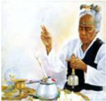

> **Deskripsi Visual:** Gambar ini adalah ilustrasi yang menunjukkan seorang guru sedang memberikan bimbingan kepada muridnya. Guru tersebut sedang memegang sebuah buku tulis dan menunjuk pada halaman tertentu, sementara muridnya berdiri di depannya dengan posisi yang menunjukkan kehadirannya dalam proses belajar. Ilustrasi ini menunjukkan hubungan antara guru dan murid dalam situasi belajar, dengan fokus pada interaksi dan komunikasi antara kedua pihak.

Elemen-elemen utama dalam gambar ini meliputi:
1. Guru: Memegang buku tulis dan menunjuk.
2. Murid: Berdiri di depan guru.
3. Buku Tulis: Digunakan oleh guru untuk memberikan bimbingan.
4. Posisi: Menunjukkan kehadiran dan interaksi antara guru dan murid.

Teks, angka, atau label penting yang terlihat dalam gambar ini tidak ada, karena gambar hanya menggambarkan situasi tanpa teks atau angka tambahan.

Informasi kunci yang dapat diambil pembaca dari gambar ini adalah bahwa guru sedang memberikan bimbingan kepada muridnya, menunjukkan hubungan pedagogis dan interaksi antara kedua pihak dalam proses belajar.

tema-temanya tetap utuh mengenai upacara yang merupakan titik awal dari setiap diskusi dan pemecahannya.

Adanya  kehidupan  bermasyarakat  yang  bersifat  ritualistis  pada  zaman brahmana  itu,  merupakan  dasar  untuk  menuju  pada  tingkat  kehidupan spiritual  berikutnya  yaitu  ajaran  karma  dan  jnana.  Dengan  demikian

 

---
## 📄 Halaman 85

maka pelaksanaan upacara, karma, dan jnana dapat berjalan sebagaimana mestinya  pada  zaman  itu.  Untuk  memudahkan  pelaksanaan  upacara yadnya,  maka  dibuatlah  kitab-kitab  penuntun  yang  disebut  Kalpasutra. Kitab kalpasutra bersumber pada kitab brahmana, dan dimaksudkan dapat dipergunakan sebagai pedoman bagi setiap orang yang telah berumah tangga dan bermasyarakat. Menurut isinya, kitab kalpasutra dapat diklasifikasikan menjadi empat jenis antara lain:

### a.  Srautasutra.

Kitab  ini  memuat  tentang  penjelasan  tata  cara  persembahyangan agnihotra dan tata cara persembahyangan  dasa purnamas, yaitu persembahyangan yang dilakukan  pada  hari  purnama  dan  tilem  atau bulan mati. Selain itu juga ada kitab penuntun upacara-upacara besar dalam lingkungan keluarga raja dan negara, misalnya upacara Rajasuya dan Aswaweda. Rajasuya adalah upacara penobatan seseorang untuk menjadi raja, sedangkan Aswaweda upacara pelepasan kuda yang diikuti oleh sepasukan tentara untuk menentukan wilayah suatu kerajaan.

- Grhyasutra.
Kitab ini memuat tentang pokok-pokok ajaran tata upacara penyucian atau sangaskara yang wajib dilakukan oleh mereka yang telah berumah tangga,  mulai  dari  upacara  garbhasadhana  samskara  (Upacara  bayi dalam kandungan) sampai dengan upacara Antyesti samskara (upacara kematian). Sesungguhnya kitab Grhyasutra merupakan kitab penuntun melaksanakan upacara yadnya yang kanista dalam lingkungan keluarga, dan dapat dilakukan setiap hari atau berkala.

Upacara yang dilaksanakan setiap hari seperti;  persembahyangan Tri Sandhya, mengaturkan canang, mesegeh untuk para mahkluk halus dan sebagainya  (disesuaikan  dengan  tempat).  Sedangkan  upacara  yadnya dilakukan  secara  berkala,  misalnya  upacara  ulang  otonan,  potong gigi, perkawinan, piodalan di Merajan, upacara pitra yadnya, dan lain sebagainya.

### c.  Dharmasastra.

Kitab  ini  memuat  tentang  pokok-pokok  ajaran  agama  Hindu  yang berhubungan  dengan;  hukum,  adat  kebiasaan,  hak  dan  kewajiban, sosial-politik, ekonomi, dan upacara agama lainnya dengan penekanan pada pelaksanaannya.

 

---
## 📄 Halaman 86

- Sulwasutra.
Kitab ini memuat penjelasan tentang pokok-pokok aturan tata bangunan. Disamping itu juga memuat tentang ukuran membuat altar yang ada kaitannya dengan kebutuhan upacara sebagaimana termuat dalam kitab Srautasutra.

Dari  beberapa  penjelaskan  tersebut  diatas  dapat  disimpulkan  bahwa perkembangan agama Hindu pada zaman brahmana telah sampai ke India bagian  tengah,  yaitu  di  dataran  tinggi  Dekan  disekitar  lembah  sungai Yamuna. Ditempat inilah  ditulis  peraturan-peraturan  mengenai  tuntunan upacara  dan  tata  susila.  Dasar  penyusunannya  adalah  berdasarkan  pada kitab weda, dengan demikian kebenaran isinya tidak perlu diragukan lagi.

Pelaksanaan upacara yadnya pada zaman Brahmana selalu disertai dengan mantra-mantra catur weda sruti yang dirapalkan oleh para pendeta. Pendeta yang khusus bertugas merafalkan Rg.Weda disebut dengan nama Hotri, untuk  Sama  Weda  disebut  dengan  Udgatri,  untuk  Yajur  Weda  disebut dengan  Adwaryu,  sedangkan  pendeta  yang  merapalkan  kitab  Atharwa Weda disebut dengan nama Brahmana.

Mengingat betapa pentingnya upacara yadnya yang dilakukan pada waktu itu,  maka  rapalan-rapalan  mantra  weda  sruti  pun  harus  menyertai  dan diucapkan dengan baik dan benar. Oleh sebab itu, ke empat bagian dari weda sruti harus dipelajari secara baik oleh para pendeta yang membacanya pada waktu upacara berlangsung.

Sedangkan kehidupan masyarakat pada zaman brahmana terbagi menjadi empat kelompok  yang disebut dengan istilah Catur Asrama  yaitu (Brahmacari,  Grhasta,  Wanaprasta,  Samyasin).  Keempat  system  inilah yang dipergunakan sebagai penuntun umat untuk mencapai kesempurnaan hidup  di  dunia  dan  di  akhirat.  Sesungguhnya  pemikiran  yang  ada  pada zaman  brahmana  merupakan  pendahuluan  dari  pemikiran  yang  bersifat metafisik. Pemikiran semacam ini pada dasarnya sudah ada di zaman weda, hanya saja pada zaman Brahmana pemikiran itu diperluas dengan bentuk yang abstrak dan sistematis.

Konsep ketuhanan pada zaman brahmana bersifat satu kesatuan dalam arti bahwa keberadaan para dewa yang banyak itu pada hakekatnya berasal dari dewa yang dipandang sebagai asal mula semua yang ada. Semua yang ada  di  alam  semesta  ini  dipandang  sebagai  perwujudan  dari  dewa  yang satu,  yang  disebut  Brahman  atau  Prajapati.  Beliau  adalah  maha  kuasa, adi  kodrati,  kekal,  dan  yang  dipandang  sebagai  Tuhan  Yang  Maha  Esa, pencipta alam semesta beserta dengan isinya.

 

---
## 📄 Halaman 87

Manusia pada zaman Brahmana dipandang sebagai mahkluk yang paling utama di Bumi, yang terdiri dari dua bagian, yaitu 'nama' dan 'rupa'. Yang dimaksud  dengan  'Nama'  adalah  unsur-unsur  rohani  yang  menentukan proses hidup, terdiri dari; citta, budhi, ahamkara, manas, indriya-indriya, dan atman. Diantara semua unsur-unsur rohani ini atman dipandang paling menentukan hidup manusia di dunia ini.

Sedangkan yang dimaksud dengan 'Rupa' adalah bagian yang bersifat fisik, yaitu daging, tulang, sumsum, rambut kulit dan sebagainya. Jika seorang meninggal dunia, maka unsur-unsur rohani itu meninggalkan unsur-unsur fisik, dan kemudian unsur-unsur fisik itu kembali ke asalnya, yaitu alam Panca Maha Bhuta. Mengenai hubungan manusia dengan alam semesta pada zaman brahmana dinyatakan sebagai sesuatu yang bersifat pararel atau sejajar, dengan demikian terjadi hubungan yang harmonis dalam kehidupan ini.  Dalam  kenyataan  hidup  ini  dikemukakan  dengan  beberapa  contoh sebagai berikut; wajah disamakan dengan bumi, suara disamakan dengan aapi, mata disamakan dengan matahari, telinga disamakan dengan penjuru alam, nafas disamakan dengan bulan. Sebagai asas alam disamakan dengan angin, dan akal disamakan dengan bulan. Alam semesta dipandang sebagai Brahman/Tuhan Yang Maha Esa, sedangkan yang dipandang sebagai asas manusia adalah Atman. Kedua azas yang ada pada zaman Brahmana ini, kemudian disatukan pada zaman Upanisad.

Kehidupan alam akhirat pada zaman Brahmana dikatakan ada dua macam, yaitu alam nenek moyang atau alam pitara dan alam para dewa yang disebut dengan  surga.  Bagi  mereka  yang  berbuat  baik  dan  melakukan  yadnya sesuai dengan kitab suci setelah mereka meninggal dunia mencapai surga. Sedangkan mereka yang perbuatan baik dan perbuatan buruknya seimbang dilahirkan  kembali  ke  dunia  ini.  Kelahiran  kembali  ke  dunia  sebagai manusia  dipandang  sebagai  suatu  anugrah  dari  Brahman.  Sehubungan dengan itu, maka nasib manusia di dunia sangat dipengaruhi oleh karma wasana masing-masing.

Demikianlah ajaran keyakinan mengenai adanya Brahman, atman, karma, punarbhawa, dan moksa, sesungguhnya telah ada pada zaman Brahmana dan  kemudian  mendapat  penyempurnaan  pada  zaman  berikutnya,  yaitu pada zaman Upanisad.

### 3.  Zaman Upanisad.

Sejalan  berkembangnya  zaman,  agama  Hindu  pun  terus  berkembang seiring  dengan  kemajuan  zaman  yang  dilaluinya.  Pada  zaman  upanisad perkembangan agama kita dimulai dari daratan tinggi Dekan di lembah

 

---
## 📄 Halaman 88

sungai  Yamuna  terus  meluas  sampai  ke  lembah  sungai  Gangga  yang penduduknya bermata pencahariaan sebagai pedagang. Sehubungan dengan itu maka kehidupan mereka beragama lebih menekankan pada halhal yang bersifat filosofis dari pada pelaksanaan upacara. Dengan demikian munculah diskusi-diskusi keagamaan antara para Maha Rsi sebagai guru dengan para siswanya. Dari para siswanya yang selalu aktif mendalami agama  dengan  metode  diskusi  akhirnya  menimbulkan  perkembangan filsafat Hindu yang lebih menekankan pada aspek jnana.

Dalam diskusi para siswa duduk dibawah dekat kaki guru kerohanian atau para Maha Rsi. Para Maha Rsi memberikan jawaban dari permasalahan yang  disampaikan  oleh  para  siswanya  dengan  tetap  berpedoman  pada ajaran  kitab  suci  Weda.  Dengan  demikian  kebenaran  yang  didapat  oleh para  siswa  kerohanian  itu  tidak  perlu  diragukan.  Cara  pendalaman ajaran agama dengan berdiskusi seperti itu disebut Upanisad. Periode ini dikatakan  berkembang ± tahun  800  -  300  SM  (Team  Penyusun  'Buku Pendidikan Agama Hindu untuk Perguruan Tinggi' Anuman Sakti, 1996). Fase  perkembangan  fisafat  Hindu  pada  masa  itu  disebut  dengan  zaman Upanisad. Pada masa ini pulalah bermunculan berbagai macam kitab-kitab upanisad.

Kitab Upanisad merupakan bagian Jnana kanda dari kitab weda sruti, yang isinya bersifat  ilmiah,  spekulatif,  tetapi  tetap  pada  ruang  lingkup  keagamaan. Pada umumnya kitab-kitab upanisad berisi pembahasan tentang hakekat Brahman, atman, hubungan Brahman dengan atman, hakikat maya, hakikat widya, serta mengenai moksa atau kelepasan. Pandangan yang menonjol dalam  ajaran  upanisad  adalah  mengajarkan  bahwa  segala  sesuatu  yang bermacam-macam ini dialirkan dari satu azas, satu realitias tertinggi yang tidak dapat dilihat, tidak dapat dibagi-bagi, tidak dapat ditangkap oleh akal manusia,  tetapi  melingkupi  segala  yang  ada  di  alam  semesta  ini.  Itulah yang disebut dengan Brahman (Tuhan Yang Maha Esa). Brahman itulah yang dipandang sebagai pusat, awal, dan berakhirnya segala sesuatu yang ada dan yang mungkin ada, serta bersifat transenden dan imanen.

Transenden  berarti  Brahman  ada  di  luar  batas  alam  pikir  manusia, sedangkan  imanen  berarti  Brahman  ada  di  dalam  batas  pikir  manusia. Dalam kitab Brhad Aranyaka Upanisad disebutkan Brahman itu bersifat Neti-neti,  artinya  bukan  kasar,  bukan  pendek,  bukan  panjang,  bukan bayangan, bukan kegelapan, bukan hawa, tanpa ukuran, tanpa lahir, tanpa bhatin, dan sejenisnya. Dari pernyataan ini dapatlah dikemukakan bahwa Brahman bukanlah suatu substansi dan bukan tidak memiliki sifat-sifat.

Brahman  memiliki  sifat  Sat  Cit  Ananda,  yang  artinya  keberadaan,

 

---
## 📄 Halaman 89

kesadaran,  dan  kebahagiaan.  Dari  ungkapan  ini  memberikan  petunjuk kepada  kita  bahwa  Brahman  adalah  satu-satunya  realitas  yang  bersifat mutlak  yang  meliputi  segala  yang  ada,  yang  sadar,  dan  bersifat  rohani. Dengan  demikian  Brahman  dipandang  sebagai  sumber  alam  semesta, sumber semua mahkluk, dan penguasa segala yang ada.

Pada  zaman  Upanisad  keberadaan  atman  disebutkan  meliputi  segala sesuatu yang ada ini. Dan Atman berada dalam lubuk hati manusia. Atman yang ada dalam tubuh manusia dilapisi oleh lapisan zat yang disebut Panca Maya Kosa. Adapun unsur-unsur dari adalah;

- Anamaya kosa = lapisan badan jasmani yang berasal dari makanan.
- Pranamaya kosa = lapisan badan yang berasal dari prana atau energi.
- Manomaya kosa = lapisan yang berasal dari alam rasa dan pikiran.
- Wijnanamaya kosa = lapisan badan yang berasal dari alam kesadaran.
- Anandamaya kosa = lapisan badan yang berasal dari kesadaran yang membahagiakan.
Semua lapisan itu dapat berubah-ubah, sedangkan atman adalah subyek yang tetap ada diantara semua yang berubah-ubah itu. Atman bebas dari dosa-dosa,  umur,  tua,  maut,  rasa  lapar,  dahaga,  dan  kesusahan.  Atman berada  dalam  keadaan  yang  bermacam-macam.  Misalnya  seperti  dalam keadaan terjaga atau jagrapada, dalam mimpi atau svapnapada, dalam tidur nyenyak atau susuptipada, dalam keadaan turya, yakni atman berada dalam kesadaran yang intuitif, dimana tidak ada lagi pengetahuan akan obyekobyek baik yang ada diluar maupun yang di dalam.

Disinilah  atman  dinyatakan  berada  dalam  alam  yang  sejati,  yang  penuh dengan kebahagiaan dan kedamaian. Dalam zaman Upanisad selanjutnya dinyatakan bahwa atman itu sesungguhnya adalah Brahman yang dibatasi oleh  sarana  tambahan,  berupa  tubuh.  Orang  yang  mengetahui  atman mengetahui  pula  Brahman  yang  merupakan  inti  segala  yang  ada  dan yang mesti ada di alam semesta ini. Mengenai ajaran Karma pada zaman Upanisad  dinyatakan  sebagai  suatu  perbuatan  yang  selalu  diikuti  oleh pahala  atau  akibatnya.  Sesungguhnya  ajaran  karma  berakar  pada  ajaran Rta yang ada pada zaman weda. Rta adalah hukum alam semesta. Pada zaman brahmana, Rta disamakan artinya dengan yadnya. Setiap upacara yadnya yang dilakukan oleh umat pada zaman itu mendapat pahala yang baik. Demikian pula sebaliknya, siapa saja yang berani berbuat buruk pasti menerima pahala yang buruk juga. Ajaran karma bukan saja berlaku pada kehidupan sekarang tetapi juga berlaku pada masa kehidupan yang datang.

 

---
## 📄 Halaman 90

Sehubungan dengan itu, maka timbulah ajaran tentang kelahiran kembali 'punarbhawa', yang sudah dikenal pada zaman weda dan zaman brahmana.

Ajaran tentang kelahiran kembali atau punarbhawa pada zaman brahmana dipandang  sebagai  karunia  dari  Tuhan  Yang  Maha  Esa.  Pada  zaman Upanisad sudah muncul suatu persoalan dan pertanyaan, seperti; mengapa kehidupan seseorang berbeda satu dengan yang lainnya. Ada orang yang dilahirkan sebagai orang yang miskin, ada orang yang dilahirkan sebagai orang yang kaya, orang cacat, ada yang cantik, ada yang tampan, namun ada pula orang yang dilahirkan sebagai penjahat. Semua permasalah dan persoalan itu dalam zaman Upanisad dijelaskan karena ada karma sebagai suatu  mata  rantai  kehidupan  yang  amat  panjang.  Karma  bukan  saja menguasai kehidupan yang datang, juga kehidupan yang telah lalu serta kehidupan pada masa sekarang. Kehidupan pada masa sekarang ditentukan oleh kehidupan masa lalu, kehidupan masa sekarang menentukan kehidupan masa yang datang.

Demikianlah  manusia  dilahirkan  secara  berulang-ulang,  dalam  ajaran Agama Hindu yang disebut Punarbhawa. Bila seorang meninggal dunia, badan  halusnya  terpisah  dengan  badan  kasarnya,  semua  karma  wesana yang ada di badannya melekat pada badan halusnya. Badan halus hidup bersama atman yang kemudian menjelma mengambil badan baru. Proses punarbhawa ini sangat sulit diketahui oleh orang biasa, kecuali oleh para maharsi karena semua itu kehendak dari Brahman itu sendiri. Tujuan hidup tertinggi umat Hindu adalah dapat mencapai moksa atau kelepasan yakni bersatunya  atman  dengan  Brahman.  Pada  zaman  Upanisad,  jalan  untuk mencapai moksa dapat dilalui dengan jalan berbuat baik, bakti, tapa, brata, dan yoga, sebagaimana dijelaskan dalam berbagai kitab-kitab upanisad.

Pemikiran yang ada dalam kitab Upanisad sangat berpengaruh dalam tata pikir ajaran agama Hindu yang sangat toleran terhadap berbagai macam perbedaan yang ada. Oleh karena itu terjemahan kitab upanisad sebagai satu kesatuan pemikiran untuk mendapatkan pandangan dan pegangan yang lebih luas dan sempurna tentang weda sangat diperlukan. Secara historis dapat diakui bahwa proses perkembangan agama Hindu pada hakekatnya dimulai dari penafsiran otentik. Cara-cara itu telah dituliskan dalam kitab Upanisad dan dalam kitab-kitab Brahmana. Tanpa memahami dasar-dasar pengertian yang ada dalam kitab Upanisad, sulitlah memahami kedalaman ajaran agama Hindu secara lebih baik.

Secara  tradisi  dalam  kitab  Muktika  Upanisad  disebutkan  jumlah  kitab Upanisad itu ada seratus delapan (108) buah buku. Dari seratus delapan buah buku itu dapat dikelompokan menurut weda sruti, sebagai berikut;

 

---
## 📄 Halaman 91

- Upanisad yang tergolong kelompok Rg. weda, berjumlah 10 buah buku terdiri dari; Aitarya, Kausitaki, Nada-Bindu, Nirwana, Atmaprabodha, Mudgala, Aksamalika, Tripura, Sambhagya, dan Bahwrca Upanisad.
- Upanisad  yang  tergolong  kelompok  Samaweda,  berjumlah  16  buah buku,  terdiri  dari;  Kena,  Chandogya,  Aruni,  Maitrayani,  Maitreyi, Wajrasucika,  Yogacudamani,  Wasudewa,  Mahat,  Sanyasa,  Awyakta, Kandika, Sawitri, Rudaksa-Jabala, Darsana, dan Jabali Upanisad.
- Upanisad yang tergolong kelompok Yajurweda, terdiri dari dua bagian besar, yaitu:
- 1). Upanisad yang tergolong  dalam  kelompok  Yajurweda  Hitam, berjumlah 32 buah  buku  antara lain; Kathawali, Taittiriyaka, Brahma, Kaiwalya, Swetaswatara, Gharba, Narayana, Amrtabhindu, Asartanada,  Katagnirudra,  Kansikasi,  Sarwasara,  Sukharahasya, Tejobhindu, Dhyanabhindu, Brahmawidya, Yogatattwa, Daksinamurti, Skanda, Sariraka, Yogasikha, Ekaksara, Aksi, Awadhuta, Katha, Rudrahrdaya, Yogakundalini, Pancabrahma, Paramagnihotra, Waraha, Kalisandarana, dan Saraswatirahasya Upanisad.
- 2). Upanisad  yang  tergolong  Yajurweda  Putih,  terdiri  dari  19  buah buku yaitu; Isawasya, Brhadaranyaka, Jabala, Hamsa, Paraahamsa, Subaia,  Mantraika,  Niralamba,  Trisihibrahmana,  Mandalabrahma, Adwanyataraka,  Pingalu-bhiksu,  Turiyatika,  Adhyatma,  Tarasara, Yajnyawalkya, Satyayani, dan Muktita Upanisad.
- Upanisad yang tergolong kelompok Atharwaweda, terdiri dari 31 buah buku Upanisad, antara lain; Prasna, Munduka, Mandukya, Atharwasira, Atharwasikha, Brhadjabala, Narasimhatapini, Naradapariwrajaka, Sita, Mahanarayana,  Ramarahasya,  Ramatapini,  Sandilya,  Parahamsapari, Warajaka, Annapurna, Surya, Atma, Pasupata, Parabrahmana, Tripura tapini, Dewi, Bhawana, Brahma, Ganapati, Mahawakya, Gopalatapini, Kresna,  Hayagriwa,  Dattatreya,  dan  Garuda  Upanisad.  Di  antara semua  kitab  Upanisad  itu,  menurut  Maharsi  Sankaracharya  ada  11 kitab Upanisad yang dipandang utama, yaitu: Isa, Kena, Katha, Prasna, Mudaka,  Mandukya,  Taittriya,  Aitareya,  Candhogya,  Brhadaranyaka, dan Swetaswatara Upanisad.
Materi pokok-pokok yang dibicarakan pada kitab-kitab Upanisad secara umum adalah mengenai  hakekat  metafisika  tanpa  mengadakan  penekanan pada aspek ritualnya. Demikian pula mengenai tata kemasyarakatan yang menyangkut sistem warna hampir tidak dibicarakan. Sehubungan dengan

 

---
## 📄 Halaman 92

itu,  maka isi pokok Upanisad lebih banyak merupakan ajaran filsafat dengan  penekanan  pada  aspek  kerohaniaan  yang  meliputi  Brahman, Atman,  Maya,  Widya-Awidya,  Etika,  Karma,  Samsara,  dan  Moksa. Pada zaman Upanisad sistem hidup kerohanian masyarakat tumbuh dan berkembang dengan subur, hal ini dibuktikan dengan berkembangnya berbagai  macam  aliran  filsafat  keagamaan.  Seluruh  aliran  filsafat  itu dikelompokkan menjadi 9 yang disebut 'Nawa Darsana' terdiri dari; Astika atau Sad Darsana, yang meliputi; Nyaya, Waesiseka, Mimamsa, Samkhya,  Yoga,  dan  Wedanta.  Sedangkan  Nastika,  meliputi;  Budha, Carwaka, dan Jaina.

Demikian uraian singkat sejarah perkembangan agama Hindu di India yang dihubungkan dengan adanya zaman weda, brahmana, dan zaman upanisad.  Pada  hakikatnya  satu  dengan  yang  lainnya  tidak  dapat dipisahkan, karena semuanya menjadi fondasi dari sejarah perkembangan agama Hindu selanjutnya.

Bagaimana Perkembangan agama Hindu di Dunia? Simaklah uraian berikut ini!

Beragama 'meyakini ajaran Tuhan' adalah instingtif bagi manusia, karena titik  tolak kehidupan manusia dimulai dari suatu kepercayaan. Untuk dapat menyelami keagungan Tuhan sebagai jiwa agama kita harus mengaproach agama dengan seluruh kemampuan kita. Bila kita mau memandang agama dari  sejarah  maka  dapat  kita  katakan  bahwa  agama  itu  muncul  bersamaan dengan  lahirnya  peradaban  manusia.  India  adalah  sebuah  negara  yang disebut-sebut  sebagai  negara  yang  bangsanya  memiliki  peradaban  sangat tinggi.  India  juga  diyakini  sebagai  pusat  pewahyuan  ajaran  Hindu  'weda' sebelum menyebar keseluruh jagat raya ini. Sejarah menuliskan bahwa pada awalnya  agama  Hindu  berkembang  di  India.  Berbagai  fakta  sejarah  yang ada dapat kita pergunakan sebagai reprensi untuk menyatakan agama Hindu adalah agama yang besar. Hindu disebut-sebut sebagai agama yang pernah memiliki pengaruh di seluruh dunia. Pengaruh yang besar itu karena kurang terkoordinasi maka lama-kelamaan menjadi potongan-potongan kepercayaan yang lupa induknya. Walaupun demikian pengaruh Hindu yang luas itu masih dapat  dirasakan  nafasnya  sampai  sekarang.  Hal  itu  dapat  kita  ketahui  dari adanya beberapa bukti peninggalah sejarah dan kepercayaan masyarakat yang masih terpelihara sampai saat ini.

 

---
## 📄 Halaman 93

Beberapa bukti peninggalan sejarah dan kepercayaan masyarakat dunia dapat kita  pergunakan  sebagai  dasar  untuk  menyatakan  dan  mempelajari  bahwa agama Hindu pernah berkembang di negara-negara lain selain India, adapun negara-negara yang dimaksud adalah sebagai berikut;

### 1.  Mesir (Afrika).

Sebuah  prasasti  dalam  bentuk  inkripsi  yang  berhasil  digali  di  Mesir berangka tahun 1280 S.M. Isinya memuat tentang perjanjian antara raja Ramases II  dengan  bangsa  Hittite.  Dalam  perjanjian  yang  dilaksanakan oleh  Raja  Ramases  II  dengan  bangsa  Hittite  tersebut,  Maitravaruna sebagai  dewa  kembar  dalam  weda  telah  dinyatakan  sebagai  saksi  (H.R. Hall 'Ancient History of the New East', hal 364). Maitravaruna adalah sebutan  dari  Tuhan  Yang  Maha  Esa  dalam  konsep  ketuhanan  agama Hindu.  Raja-raja  Mesir  dijaman  purbakala  mempergunakan  nama-nama seperti;  Ramesee  I,  Rameses  II,  Rameses  III  dan  seterusanya.  Tentang kata Rameses, mengingatkan kita kepada Rama yang terdapat dalam kitab Ramayana.  Rama,  oleh  umat  Hindu  diyakini  sebagai  penjelmaan  atau awatara Vishnu, yaitu manifestasi dari Tuhan sebagai pemelihara. Vishnulah yang menyelamatkan dunia ini dari ancaman keangkara-murkaan.

### 2.  Madagaskar.

Madagaskar adalah sebuah pulau yang terletak agak jauh dari pantai timur Afrika selatan. Dinyatakan kebanyakan nama-nama tempat yang ada disana mempergunakan kata yang memiliki hubungan dengan sebutan Rama.

### 3.  Afrika utara.

Mengenai istilah gurun Sahara, para ahli geologi mengemukakan suatu teori yang menyatakan bahwa gurun itu adalah sebuah samudra yang mengering. Samudra dalam bahasa sanskerta disebut Sagara. Ada kemungkinan bahwa kata Sahara yang ada sekarang merupakan salah ucapan dari kata Sagara dalam bahasa sanskerta. Dikatakan juga bahwa ketika Sahara masih ada di bawah air, masyarakat yang hidup disekelilingnya kebanyakan diantara mereka mempergunakan nama-nama yang ada hubungannya dengan bahasa sanskerta.  Beberapa  diantara  mereka  dinyatakan  mempunyai  hubungan keluarga dengan negeri Kosala (Ensiklopedia Brittannica Jilid XXIII, di bawah kata Sahara).

### 4.  Mesiko.

Mesiko terbilang negeri yang sangat jauh dari India. Masyarakat negeri ini dikatakan telah terbiasa merayakan sebuah hari raya pesta-ria yang disebut dengan hari Rama-Sita. Waktu hari pesta-ria ini memiliki hubungan erat

 

---
## 📄 Halaman 94

dengan waktu hari suci Dussara atau Navaratri dalam agama Hindu 'India' (T.W.F. Gann 'The Maya Indians of Southerm Yucatan, North and British Honduras'  halaman  56).  Penggalian-penggalian  peninggalan  bersejarah yang dilakukan di negeri Mesiko telah menghasilkan penemuan beberapa patung  Ganesa  (Baron  Humbolt  dan  Harlas  Sanda  'Hindu  Superiority' halaman 151).

Penduduk zaman purbakala yang ada di daerah-daerah 'Mesiko' adalah orang-orang  Astika  yaitu  orang-orang  yang  percaya  dengan  keberadaan weda-weda. Kata Astika adalah sebuah istilah yang sampai saat ini masih terdengar  oleh  kita  dipergunakan  oleh  masyarakat  disana,  sebagai  salah ucapan dari kata Aztec.

Festival Rama-Sita yang dirayakan oleh masyarakat Mesiko  dapat disamakan dengan perayaan hari Dussara atau Navaratri. Penemuan patung Ganesa  kita  hubungkan  dengan  arca  Ganesa  sebagai  putra  Dewa  Siwa dalam mithologi Hindu. Masyarakat Astika adalah suku bangsa Aztec itu sendiri yang kebanyakan diantara mereka memiliki kepercayaan memuja Dewa Siwa.

### 5.  Peru.

Disebelah barat-daya Amerika Latin terdapat negeri yang disebut dengan Peru. Penduduknya melakukan pemujaan terhadap Dewa Matahari. Harihari raya tahunan masyarakat ini jatuh pada hari-hari Soltis. Masyarakat negeri Peru dikenal dengan bangsa Inca. Kata Inca berasal dari kata Ina yang berarti matahari (Asiatic Researches, Jilid I halaman 426).

Soltis jatuh pada tanggal 21 Juni dan 22 Desember, yaitu pada hari-hari dimana matahari telah sampai pada titik deklanasinya di sebelah selatan dan di sebelah utara untuk kembali lagi pada peredarannya. Sebagaimana biasa mulai tanggal 21 Juni matahari ada dititik bumi belahan utara 'Utarayana', waktu yang dipandang baik untuk melaksanakan upacara yang berkaitan dengan  Dewa  Yajna.  Sedangkan  tanggal  22  Desember  matahari  berada di titik bumi belahan selatan 'Daksinayana' dimana waktu ini dipandang baik untuk melaksanakan upacara yang berhubungan dengan Bhuta Yajna. Dewa Matahari menurut keyakinan umat Hindu Indonesia 'Bali' menyebut Siwa Raditya = Surya = Matahari. Pemujaan kehadapan Dewa Matahari 'Surya  Raditya'  terbiasa  dilakukan  oleh  umat  Hindu  kita,  sebagaimana juga dilaksanakan oleh bangsa Inca sebagai penduduk negeri Peru.

 

---
## 📄 Halaman 95

### 6.  Kota California.

California adalah sebuah Kota yang terdapat di Amerika. Nama Kota ini diperkirakan  memiliki  hubungan  dengan  kata  Kapila  Aranya.  Di  Kota California terdapat Cagar Alam Taman Gunung Abu 'Ash Mountain Park' dan sebuah Pulau Kuda 'Horse Island' di Alaska-Amerika Utara.

Kita mengenal kisah dalam kitab Purana tentang keberadaan Raja Sagara dan enam puluh ribu (60.000) putra-putranya yang dibakar habis hingga menjadi abu oleh Maha Rsi Kapila. Raja Sagara memerintahkan kepada putra-putranya untuk menggali bumi menuju ke Patala-loka dalam rangka kepergian  mereka  mencari  kuda  untuk  persembahan.  Oleh  putra-putra Raja Sagara, kuda yang dicari itu diketemukan di lokasi Maha Rsi Kapila mengadakan  tapabrata.  Oleh  karena  kedatangan  mereka  'putra  araja sagara' mengganggu proses tapabrata beliau, akhirnya Maha Rsi Kapila memandang putra-putra raja itu dengan pandangan amarah sampai mereka musnah menjadi abu.

Kata Patala-loka memiliki arti negeri dibalik India, yaitu benua Amerika. Kata California memiliki kedekatan dengan kata Kapila Aranya. Kondisi ini memungkinkan sekali karena secara nyata dapat kita ketahui bahwa di Amerika terdapat cagar alam Taman Gunung Abu yang kemungkinan sekali berasal  dari  abunya  putra-putra  raja  Sagara  yang  berjumlah  enampuluh ribu dan nama pulau kuda yang diambil dari nama kuda persembahan raja sagara.

### 7.  Australia.

Penduduk  negeri  Kangguru  ini  memiliki  jenis  tarian  tradisional  yang disebut  dengan  'Siwa  Dance'  atau  'Tari  Siwa'.  Siwa  Dance  adalah semacam  tarian  yang  umum  berlaku  diantara  penduduk  asli  Australia (Spencer  dan  Gillen  'The  Native  Tribes  of  Central  Australia'  halaman 621. Macmillan, 1899). Hasil penelitiannya menjelaskan bahwa para penari 'Siwa Dance' menghiasi dahinya dengan hiasan mata yang ke tiga. Hal ini merupakan suatu bukti yang dapat dijadikan sumber memberikan informasi kepada kita bahwa penduduk asli negeri Kangguru 'Australia' ini telah mengenal atau mendengar dongeng-dongeng weda dan nama-nama Dewa dalam kitab suci weda.

Sejak kapan dan bagaimana ajaran agama Hindu masuk ke Indonesia? Carilah artikel yang menguraikan tentang proses masuknya agama Hindu ke Indonesia! Selanjutnya diskusikanlah!

 

---
## 📄 Halaman 96

### 8.  Agama Hindu di Indonesia.

Di  Indonesia,  banyak  ditemukan  berbagai  bentuk  peninggalan  sejarah bercorak Hindu. Agama Hindu disebut-sebut sebagai agama yang tertua dalam sejarah peradaban manusia. Agama Hindu pertama kali tumbuh dan berkembang dengan subur di negara India. Disana agama Hindu berkembang pesat. Setelah di India, barulah agama Hindu merambah ke negara-negara lainnya. Peninggalan sejarah agama Hindu pun sangat banyak dan beragam serta  tersebar  di  berbagai  negara. Perkembangan  ajaran  agama  Hindu berawal sekitar tahun 1500 sebelum Masehi (SM).

Ditandai dengan datangnya bangsa Yunani. Mereka memasuki wilayah Nusantara dengan perahu layar.  Kelompok  ini  datang  dari Kampuchea  (Kamboja).  Mereka mendirikan rumah dan hidup secara berkelompok dalam masyarakat  desa  dan  menetap  di Nusantara. Kebudayaan mereka sudah cukup maju. Mereka sudah mengenal bercocok tanam. Mereka juga berdagang dan membuat peralatan dari tanah liat serta

logam. Kepercayaan yang mereka anut adalah animisme dan dinamisme. Animisme adalah kepercayaan yang memuja roh nenek moyang atau roh halus. Dinamisme adalah pemujaan terhadap benda-benda yang dianggap memiliki kekuatan gaib. Misalnya keris, tombak, batu akik, dan patung.

Ajaran Hindu masuk ke Indonesia sejak permulaan masehi. Agama Hindu dikenal oleh penduduk Indonesia melalui hubungan dagang dengan India. Kitab suci agama Hindu yaitu Weda. Ajaran Hindu merupakan ajaran yang memuja banyak Dewa. Dewa-Dewa yang dianggap menempati posisi paling tinggi yaitu Dewa Brahma, Dewa Wisnu, dan Dewa Siwa. Ketiga Dewa itu disebut Trimurti (tiga Dewa yang bersatu). Trimurti diwujudkan dalam bentuk patung. Tentang tata kemasyarakatan dalam ajaran agama Hindu mengenal adanya varna. Varna adalah susunan kelompok masyarakat Hindu sesuai  dengan  tingkat  keahlian  atau  profesi  yang  dimiliki  oleh  individu umat bersangkutan, yang terdiri dari varna; brahmana, ksatriya, wesya, dan sudra. Siapakah yang menyebarkan pengaruh Hindu ke Indonesia?

 

---
## 📄 Halaman 97

Dalam  beberapa  prasasti  yang  terdapat  di  pulau  Jawa  dan  lontar-lontar yang  terdapat  di  pulau  Bali  menjelaskan  bahwa  'Maha  Rsi  Agastya' yang menyebarkan agama Hindu dari India ke Indonesia. Menurut data peninggalan  sejarah  yang  ada  dinyatakan  bahwa  Maha  Rsi  Agastya menyebarkan agama Hindu dari India ke Indonesia melalui Sungai Gangga, Yamuna, India Selatan dan India Belakang. Karena begitu besar jasa-jasa beliau dalam penyebaran ajaran Agama Hindu, maka namanya disucikan di dalam prasasti 'Dinaya'. Prasasti 'Dinaya' diketemukan di Jawa Timur yang ditulis dengan berangka tahun Saka 682 (760 M), menjelaskan bahwa seorang raja yang bernama Gaja Yana membuatkan pura suci untuk Rsi Agastya, dengan maksud untuk memohon kekuatan suci dari Rsi Agastya (Shastri, N.D. Pandit, 1963:21). Prasasti Porong yang ditemukan di Jawa Tengah berangka tahun Saka 785 (863 M) juga menyebutkan keagungan serta kemuliaan jasa-jasa Maha Rsi Agastya. Mengingat kemuliaan Maha Rsi Agastya, maka beliau diberi julukan 'Agastya Yatra' artinya perjalanan suci  Rsi  Agastya  yang  tidak  mengenal  kembali  dalam  pengabdiannya untuk Dharma. Oleh karena itu beliau juga diberi julukan 'Pita Segara', artinya 'Bapak dari Lautan' karena beliau yang mengarungi lautan luas demi untuk Dharma.

Diperkirakan pada abad ke-4 Masehi (di Kutai-Kalimantan Timur), agama Hindu  di  Indonesia  sudah  berkembang  dengan  subur.  Disinyalir  agama Hindu dibawa dari India ke Indonesia dengan perantara para pedagang. Sebelum masuknya agama Hindu, Indonesia masih dalam masa pra-sejarah atau masa di mana masih belum mengenal tulisan. Dengan masuknya agama Hindu perubahan besar pun terjadi di Indonesia. Zaman prasejarah berganti dengan zaman sejarah di mana tulisan mulai diperkenalkan melalui ukiranukiran  yang  terdapat  pada  yupa.  Kehidupan  politik  kerajaan-kerajaan Hindu-Buddha  membawa  perubahan  baru  dalam  kehidupan  sosial  dan ekonomi  masyarakat  Indonesia.  Struktur  sosial  dari  masa  Kutai  hingga Majapahit mengalami perkembangan yang ber-evolusi namun progresif. Dunia  perekonomian  pun  mengalami  perkembangan:  dari  yang  semula sistem  barter  hingga  sistem  nilai  tukar  uang.  Agama  Hindu  masuk  ke Indonesia dinyatakan terjadi pada awal tahun Masehi, hal ini dapat diketahui dengan adanya bukti tertulis dari benda-benda purbakala pada abad ke 4 Masehi yakni diketemukannya tujuh buah Yupa peningalan kerajaan Kutai di  Kalimantan  Timur.  Dari  tujuh  buah  Yupa  itu  didapatkan  keterangan tentang kehidupan keagamaan pada waktu itu yang menyatakan bahwa:

 

---
## 📄 Halaman 98

'Yupa itu didirikan untuk memperingati dan melaksanakan yadnya oleh Raja Mulawarman'. Pada keterangan yang lain menyatakan bahwa Raja Mulawarman melakukan yadnya pada suatu  tempat  suci  untuk  memuja Dewa Siwa. Tempat itu disebut dengan 'Vaprakeswara'.

Dari berbagai peninggalan yang ditemukan, diketahui bahwa kehidupan masyarakat Kutai sudah cukup teratur. Walau tidak secara jelas diungkapkan, diperkirakan masyarakat Kutai sudah terbagi dalam beberapa penggolongan meskipun tidak secara tegas dinyatakan. Dari penggunaan bahasa  Sanskerta  dan  pemberian  hadiah  sapi,  dapat  disimpulkan  bahwa dalam  masyarakat  Kutai  terdapat  golongan  brahmana,  golongan  yang sebagaimana juga di India memegang monopoli penyebaran dan upacara keagamaan. Di samping golongan brahmana, terdapat pula kaum ksatria. Golongan  ini  terdiri  dari  kerabat  dekat  raja.  Di  luar  kedua  golongan ini,  sebagian  besar  masyarakat  Kutai  masih  menjalankan  adat-istiadat dan  kepercayaan  asli  mereka.  Walaupun  Hindu  telah  menjadi  agama resmi kerajaan, namun masih terdapat kebebasan bagi masyarakat untuk menjalankan kepercayaan aslinya.

Diperkirakan bahwa lahan pertanian, baik di sawah maupun di ladang adalah merupakan mata pencarian utama masyarakat Kutai. Melihat letaknya di sekitar  Sungai  Mahakam  sebagai  jalur  transportasi  laut,  mengantarkan perdagangan masyarakat Kutai berjalan cukup ramai. Bagi pedagang luar yang ingin berjualan di Kutai, mereka harus memberikan 'hadiah' kepada raja  agar  diizinkan  berdagang.  Pemberian  'hadiah'  ini  biasanya  berupa barang dagangan yang cukup mahal harganya; dan pemberian ini dianggap sebagai upeti atau pajak kepada pihak Kerajaan. Melalui hubungan dagang tersebut,  baik  melalui  jalur  transportasi  sungai-laut  maupan  transportasi darat, berkembanglah hubungan agama dan kebudayaan dengan wilayahwilayah  sekitarnya.  Banyak  pendeta  yang  diundang  datang  ke  Kutai. Banyak pula orang Kutai yang berkunjung ke daerah asal para pendeta tersebut.

Selanjutnya, agama  Hindu  berkembang  pesat di Indonesia melalui kerajaan-kerajaan yang berdiri pada waktu itu, baik di Jawa maupun luar Jawa. Kehadiran agama Hindu di Indonesia, menimbulkan pembaharuan yang besar, seperti berakhirnya zaman pra-sejarah Indonesia. Perubahan dari  religi  kuno  ke  dalam  kehidupan  beragama  dengan  memuja  Tuhan Yang Maha Esa berdasarkan kitab Suci Weda dan juga munculnya kerajaan yang mengatur kehidupan suatu wilayah.

 

---
## 📄 Halaman 99

Disamping di Kutai (Kalimantan Timur), agama Hindu juga berkembang di Jawa Barat mulai abad ke-5 dengan diketemukannya tujuh buah prasasti, yakni prasasti Ciaruteun, Kebonkopi, Jambu, Pasir Awi, Muara Cianten, Tugu  dan  Lebak.  Semua  prasasti  tersebut  berbahasa  Sanskerta  dan memakai  huruf  Pallawa. Bersumberkan  prasasti-prasasti  itu  didapatkan keterangan yang menyebutkkan bahwa 'Raja Purnawarman dari kerajaan Tarumanegara  menganut  agama  Hindu.  Beliau  adalah  raja  yang  gagah berani  yang  dilukiskan  dengan  tapak  kakinya  yang  disamakan  dengan tapak kaki Dewa Wisnu'. Bukti lain yang ditemukan di Jawa Barat adalah adanya perunggu di Cebuya yang menggunakan atribut Dewa Siwa dan diperkirakan dibuat pada masa kerajaan Tarumanegara. Berdasarkan data tersebut,  maka  jelas  bahwa  Raja  Purnawarman  adalah  penganut  agama Hindu  dengan  memuja  Tri  Murti  sebagai  manifestasi  dari  Tuhan  Yang Maha Esa.

Kehidupan  masyarakat  Tarumanegara  tak jauh beda dengan  Kutai. Menurut sebuah prasastinya, kehidupan social masyarakatnya telah berkembang  baik,  terlihat  dari  penggalian  kanal  (sungai  yang  digali) Gomati  dan  Candrabhaga  secara  gotong-royong.  Tenaga  kerja  yang diperintah  menggali  kanal  tersebut  biasanya  dari  golongan  budak  dan kaum sudra. Pembangunan kanal Gomati dan Candrabaga begitu bermakna bagi perekonomian Tarumanegara. Selain sebagai sarana pencegah banjir, juga dapat dipergunakan sebagai sarana transportasi (lalu lintas) air dan perdagangan  antara  pedagang  Tarumanegara  dengan  pedagang  daerah lain.  Hasil  bumi  merupakan  komoditas  utama.  Melalui  perdagangan, masyarakat Tarumanegara dapat memperoleh barang yang tidak dihasilkan di  kerajaannya. Kehidupan ekonomi Tarumanegara bertumpu pada hasil ladang  dan  kebun.  Barang  yang  ditawarkan  adalah  beras  dan  kayu  jati. Mayoritas  rakyat  Tarumanegara  adalah  peladang.  Karena  masyarakat peladang selalu berpindah-pindah tempat. Ini berbeda dengan masyarakat petani yang selalu menetap di satu tempat, misalnya seperti di Jawa Tengah dan Timur.

Kehidupan sosial-ekonomi Kendan-Galuh tidak jauh beda dengan Tarumanegara. Masyarakatnya berprofesi sebagai peladang. Agama yang dianut  bangsawan  adalah  Hindu-Wisnu,  sedangkan  rakyatnya  mayoritas menganut animisme dan dinamisme. Sementara itu, sistem transportasi pada masa Kendan dan Galuh diperkirakan dilakukan melalui Sungai Cimanuk dan pelabuhan tua di pesisir pantai utara, contohnya di sekitar Indramayu dan Cirebon. Sementara itu mengenai masalah tenaga kerja, baik pegawai

 

---
## 📄 Halaman 100

istana maupun tentara, biasanya berasal dari golongan bangsawan kerabat raja.  Mengenai  sistem  perpajakan  biasanya  pedagang  mengirim  hadiah berupa  benda-benda  langka  dan  mahal.  Sedangkan  bagi  wilayah  yang berada di bawah kerajaan mereka harus mengirim upeti berupa emas atau benda-benda berharga lain, sebagai tanda kesetiaannya terhadap atasan.

Kehidupan sosial  masyarakat  Sunda  dan  Pakwan  Pajajaran  secara  garis besar dapat digolongkan ke dalam golongan seniman, peladang (pecocok tanam), pedagang. Dari bukti-bukti sejarah diketahui, umumnya masyarakat Pajajaran hidup dari hasil perladangan. Seperti masyarakat Tarumanegara dan Galuh, mereka umumnya selalu berpindah pindah. Hal ini berpengaruh pada bentuk rumah tempat tinggal mereka yang sederhana. Dalam hal tenaga kerja, yang menjadi anggota militer diambil dari rakyat jelata dan sebagian anak bangsawan. Mereka dibiayai oleh negara. Dalam bidang ekonomi, Kerajaan Sunda dan Pajajaran telah lebih maju dari masa Tarumanegara. Kerajaan Sunda-Pajajaran memiliki setidaknya enam pelabuhan penting: Banten,  Pontang,  Cigede,  Tarumanegara,  Sunda  Kelapa,  dan  Cimanuk. Setiap pelabuhan ini dikepalai oleh seorang syahbandar yang bertanggung jawab  kepada  raja.  Para  syahbandar  ini  bertindak  sebagai  wakil  raja  di pelabuhan-pelabuhan  yang  dikuasainya,  sekaligus  menarik  pajak  dari para pedagang yang ingin berjualan di daerah ini, pajak tersebut berupa kiriman upeti berwujud barang dagangan yang mahal atau uang. Dalam hal transportasi air, selain melalui laut, dilakukan pula melalui sungai-sungai besar seperi Citarum dan Cimanuk, sebagai jalur perairan dalam negeri. Melalui pelabuhan ini, Pajajaran melakukan aktivitas perdagangan dengan negara  lain.  Dalam  berbagai  peninggalan  sejarah  diketahui,  masyarakat Pajajaran telah berlayar hingga ke Malaka bahkan ke Kepulauan MalaDeva yang  kecil  di  sebelah  selatan  India.  Barang  barang  dagangan  mereka umumnya  bahan  makanan  dan  lada.  Di  samping  itu,  ada  jenis  bahan pakaian  yang  didatangkan  dari  Kamboja  (India).  Sementara  mata  uang yang dipakai sebagai alat tukar adalah mata uang Cina.

Selanjutnya,  agama  Hindu  berkembang  pula  di  Jawa  Tengah,  yang dibuktikan  adanya  prasasti  Tukmas  yang  ditemukan  di  lereng  gunung Merbabu.  Prasasti  ini  berbahasa  sanskerta  memakai  huruf  Pallawa  dan bertipe  lebih  muda  dari  prasasti  Purnawarman.  Dalam  prasasti  inilah dituliskan  atribut  Dewa  Tri  Murti,  yaitu  Trisula,  Kendi,  Cakra,  Kapak dan  Bunga  Teratai  Mekar,  diperkirakan  berasal  dari  tahun  650  Masehi. Keyakinan  memuja  Tri  Murti  juga  disebutkan  dalam  prasasti  Canggal, yang berbahasa sanskerta dan memakai huduf Pallawa. Prasasti Canggal dikeluarkan oleh Raja Sanjaya pada tahun 654 Caka (576 Masehi), dengan

 

---
## 📄 Halaman 101

Candra Sengkala berbunyi:  'Sruti  indriya  rasa',  Isinya  memuat  tentang pemujaan terhadap Dewa Siwa, Dewa Wisnu dan Dewa Brahma sebagai Tri Murti. Adanya kelompok Candi Arjuna dan Candi Srikandi di dataran tinggi Dieng dekat Wonosobo dari abad ke-8 Masehi dan Candi Prambanan yang dihiasi dengan Arca Tri Murti yang didirikan pada tahun 856 Masehi, merupakan bukti bahwa adanya perkembangan Agama Hindu yang sangat pesat terjadi di Jawa Tengah.

Sumber-sumber berita Cina mengungkapkan keadaan masyarakat Mataram dari abad ke-7 sampai ke-10. Kegiatan perdagangan baik di dalam maupun luar negeri berlangsung ramai. Hal ini terbukti dari ditemukannya barangbarang  keramik  dari  Vietnam  dan  Cina.  Kenyataan  ini  dikuatkan  lagi dengan  berita  dari  Dinasi  Tang  yang  menceritakan  kebesaran  sebuah kerajaan dari Jawa, dalam hal ini Mataram. Dari Prasasti Warudu Kidul diperoleh  informasi  adanya  sekumpulan  orang  asing  yang  berdiam  di Mataram.  Mereka  mempunyai  status  yang  berbeda  dengan  penduduk pribumi.  Mereka  membayar  pajak  yang  berbeda  yang  tentunya  lebih mahal daripada rakyat pribumi Mataram. Kemungkinan besar mereka itu adalah para saudagar dari luar negeri. Namun, sumber sumber lokal tidak memperinci lebih lanjut tentang orang-orang asing ini. Kemungkinan besar mereka adalah kaum migran dari Cina.

Dari berita Cina diketahui bahwa di ibu kota kerajaan terdapat istana raja yang dikelilingi dinding dari batu bata dan batang kayu. Di dalam istana, berdiam raja beserta keluarganya dan para abdi. Di luar istana (masih di dalam  lingkungan  dinding  kota)  terdapat  kediaman  para  pejabat  tinggi kerajaan  termasuk  putra  mahkota  beserta  keluarganya.  Mereka  tinggal  dalam perkampungan khusus di mana para hamba dan budak yang dipekerjakan di istana juga tinggal sekitarnya. Sisa-sisa peninggalan pemukiman khusus ini sampai sekarang masih bisa kita temukan di Yogyakarta dan Surakarta. Di luar tembok kota berdiam rakyat yang merupakan kelompok terbesar. Kehidupan masyarakat Mataram umumnya bersifat agraris karena pusat Mataram terletak  di  pedalaman,  bukan  di  pesisir  pantai.  Pertanian  merupakan sumber kehidupan kebanyakan rakyat Mataram. Di samping itu, penduduk di desa (disebut wanua) memelihara ternak seperti kambing, kerbau, sapi, ayam,  babi,  dan  itik.  Sebagai  tenaga  kerja,  mereka  juga  berdagang  dan menjadi pengrajin. Dari Prasasti Purworejo (900 M) diperoleh informasi tentang kegiatan perdagangan. Kegiatan di pasar ini tidak diadakan setiap hari melainkan bergilir, berdasarkan pada hari pasaran menurut kalender Jawa  Kuno.  Pada  hari  Kliwon,  pasar  diadakan  di  pusat  kota.  Pada  hari Manis atau Legi, pasar diadakan di desa bagian timur. Pada hari Paking

 

---
## 📄 Halaman 102

(Pahing),  pasar  diadakan  di  desa  sebelah  selatan.  Pada  hari  Pon,  pasar diadakan di desa sebelah barat. Pada hari Wage, pasar diadakan di desa sebelah utara.

Pada hari pasaran ini, desa-desa yang menjadi pusat perdagangan, ramai didatangi pembeli dan penjual dari desa-desa lain. Mereka datang dengan berbagai cara, melalui transportasi darat maupun sungai sambil membawa barang dagangannya seperti beras, buah-buahan, dan ternak untuk dibarter dengan  kebutuhan  yang  lain.  Selain  pertanian,  industri  rumah  tangga juga sudah berkembang. Beberapa hasil industri ini antara lain anyaman seperti keranjang, perkakas dari besi, emas, tembaga, perunggu, pakaian, gula  kelapa,  arang,  dan  kapur  sirih.  Hasil  produksi  industri  ini  dapat diperoleh di pasar-pasar yang ada. Sementara itu, bila seseorang berjasa (biasanya pejabat militer atau kerabat istana) kepada Kerajaan, maka orang bersangkutan  akan  diberi  hak  memiliki  tanah  untuk  dikelola.  Biasanya tempat itu adalah hutan yang kemudian dibuka menjadi pemukiman baru. Orang yang diberi tanah baru itu diangkat menjadi penguasa tempat yang baru dihadiahkan kepadanya. Ia bisa saja menjadi akuwu (kepala desa), senopati, atau adipati atau menteri. Bisa pula sebuah wilayah dihadiahkan kepada  kaum  brahmana  untuk  dijadikan  asrama  sebagai  tempat  tinggal mereka, dan di sekitar asrama tersebut biasanya didirikan candi atau wihara.

Setelah di Jawa Tengah, agama Hindu berkembang juga di Jawa Timur, hal ini dapat dibuktikan dengan ditemukannya prasasti Dinaya (Dinoyo) dekat Kota Malang. Prasasti 'Dinaya' berbahasa sanskerta dan ditulis memakai huruf Jawa Kuno. Isinya memuat tentang pelaksanaan upacara besar yang diadakan oleh Raja Dewa Simha pada tahun 760 Masehi yang dilaksanakan oleh  para  ahli  Weda,  para  Brahmana  besar,  para  pendeta  dan  penduduk negeri. Dewa Simha adalah salah satu raja dari kerajaan Kanjuruan. Candi Budut  adalah  bangunan  suci  yang  terdapat  di  daerah  Malang  sebagai peninggalan tertua kerajaan Hindu di Jawa Timur.

Kemudian  pada  tahun  929-947  muncullah  Empu  Sendok  dari  dinasti Isana Wamsa dan bergelar Sri IsanottunggaDeva, yang artinya raja yang sangat  dimuliakan  dan  sebagai  pemuja  Dewa  Siwa.  Sebagai  pengganti Empu Sendok adalah Dharma Wangsa. Selanjutnya munculah Airlangga (yang  memerintah  kerajaan  Sumedang  tahun  1019-1042)  yang  juga adalah penganut Hindu yang setia. Setelah dinasti Isana Wamsa, di Jawa Timur munculah kerajaan Kediri (tahun 1042-1222), sebagai pengembang agama Hindu. Pada masa kerajaan ini banyak muncul karya sastra Hindu, misalnya Kitab Smaradahana, Bharatayudha, Lubdhaka, Wrtasancaya dan kitab Kresnayana.

 

---
## 📄 Halaman 103

Kemudian  muncul  kerajaan  Singosari  (tahun  1222-1292).  Pada  zaman kerajaan  Singosari  ini  didirikanlah  Candi  Kidal,  candi  Jago  dan  candi Singosari sebagai peninggalan keHinduan pada zaman kerajaan Singosari. Pada akhir abad ke-13 berakhirlah masa Singosari dan muncul kerajaan Majapahit, sebagai kerajaan besar meliputi seluruh Nusantara. Keemasan masa Majapahit merupakan masa gemilang kehidupan dan perkembangan Agama Hindu. Hal ini dapat dibuktikan dengan berdirinya candi Penataran, yaitu  bangunan  suci  Hindu  terbesar  di  Jawa  Timur  disamping  juga munculnya buku Negarakertagama.

Di  Jawa  Timur  berkembang  aliran  Tantrayana  seperti  yang  dilakukan Kertanegara dari Singasari yang dipandang merupakan penjelmaaan Siwa. Kepercayaan terhadap roh leluhur masih terwujud dalam upacara kematian dengan  mengadakan  kenduri  3  hari,  7  hari,  40  hari,  100  hari,  1  tahun, 2  tahun  dan  1000  hari,  serta  masih  banyak  hal-hal  yang  dilakukan  oleh masyarakat Jawa.

Menurut  berita  Cina,  Kediri  terkenal  dengan  kehidupan  masyarakatnya yang damai, masyarakat Kediri hidup berkecukupan. Penduduk wanitanya memakai kain sarung sampai bawah lutut dan rambutnya terurai. Rumah mereka bersih dan rapi, lantainya  dari  ubin  berwarna  hijau  dan  kuning. Dalam  upacara  perkawinan  mereka  memakai  maskawin  dari  emas  dan perak.  Masyarakatnya  sering  mengadakan  pesta  air  (sungai  atau  laut) maupun pesta gunung sebagai ungkapan terima kasih kepada para Dewa dan  leluhur  mereka.  Kehidupan  perekonomian  Kediri  berpusat  pada bidang  pertanian  dan  perdagangan.  Hasil  pertanian  masyarakat  Kediri umumnya  beras.  Sementara  barang-barang  yang  diperdagangkan  antara lain  emas,  kayu  cendana,  dan  pinang.  Walaupun  terletak  di  pedalaman, jalur perdagangan dan pelayaran maju pesat melalui Sungai Brantas yang dapat dilayari sampai ke pedalaman wilayah Kediri dan bermuara di Laut Selatan (Samudra Indonesia). Masyarakat Kediri juga sudah mempunyai kesadaran tinggi dalam membayar pajak. Mereka membayar pajak dalam bentuk natura yang diambil dari sebagian hasil bumi mereka.

Sementara itu, kehidupan sosial Singasari dapat diketahui dari Negarakretagama dan Pararaton serta kronik Cina. Disebutkan, masyarakat Singasari terbagi dalam kelas atas, yaitu keluarga raja dan kaum bangsawan, dan kelas bawah yang terdiri dari rakyat umum. Selain itu, ada kelompok agama, pendeta Hindu maupun Buddha. Namun pembagian atas golongan ini tidak seketat pengkastaan seperti di India. Ini membuktikan, sekali lagi, kearifan lokal yang dimiliki masyarakat pribumi. Dari Negarakretagama dan Pararaton diperoleh gambaran tentang kehidupan perekonomian di Jawa

 

---
## 📄 Halaman 104

pada masa Singasari. Di desa pada umumnya penduduk hidup dari bertani, berdagang, dan kerajinan tangan. Tidak sedikit pula yang bekerja sebagai buruh atau pelayanan. Kegiatan berdagang dilakukan dalam 5 (Lima) hari pasaran  pada  tempat  yang  berbeda  (Legi,  Pahing,  Pon,  Wage,  Kliwon). Oleh  karena  itu,  sarana  transportasi  darat  memegang  peranan  penting. Beberapa prasasti melukiskan bagaimana para pedagang, pengrajin, dan petani membawa barang dagangannya. Mereka digambarkan melakukan perjalanan sambil memikul barang dagangannya atau mengendarai pedati-kuda. Ada pula yang melakukan perjalanan melalui sungai dengan menggunakan perahu.

Dengan disebutnya alat angkut pedati dan perahu, dapatlah disimpulkan bahwa perdagangan antar desa cukup ramai. Apalagi di wilayah Singasari terdapat  dua  sungai  besar,  Bengawan  Solo  dan  Kali  Brantas  yang dimanfaatkan untuk mengairi lahan pertanian dan lalu lintas perdagangan air.  Perdagangan  mulai  mendapatkan  perhatian  cukup  besar  semasa Kertanegara memerintah. Kertanegara mengirimkan ekspedisi militer ke Melayu (Pamalayu) untuk merebut kendali perdagangan di sekitar Selat Malaka. Pada masa ini memang Selat Malaka merupakan jalur sutera yang dilalui oleh para pedagang asing.

Dalam hal kepemilikan tanah, transportasi, perpajakan, dan tenaga kerja; kehidupan rakyat Medang Kamulan menyerupai Mataram, karena Medang Kamulan tak lain adalah kelanjutan Mataram. Yang berbeda adalah hanya nama dinastinya dan perpindahan wilayah kekuasaan dari barat ke timur. Masa pemerintahan Empu Sendok yang bergelar Sri Isana Tunggawijaya, merupakan masa yang damai. Namun, sejak pemerintahan Dharmawangsa Teguh,  politik  Kerajaan  cenderung  mengarah  ke  luar  negeri.  Tujuannya adalah untuk merebut dominasi perdagangan di perairan Jawa, Sumatera, dan  Kalimantan,  yang  ketika  itu  dikuasai  Sriwijaya.  Untuk  keperluan itu,  Dharmawangsa  Teguh  membangun  armada  militer  yang  tangguh. Dengan  kekuatan  militernya,  Medang  Kamulan  menaklukkan  Bali,  lalu mendirikan  semacam  koloni  di  Kalimantan  Barat.  Medang  Kamulan kemudian menyerang Sriwijaya, walaupun tidak menang. Dharmawangsa pun  mengembangkan  pelabuhan  Hujung  Galuh  di  selatan  Surabaya dan  Kembang  Putih  (Tuban)  sebagai  tempat  para  pedagang  bertemu. Ketika  Airlangga  berkuasa,  kerajaan  menjaga  hubungan  damai  dengan kerajaan-kerajaan  tetangga  demi  kesejahteraan  rakyat.  Ini  diperlihatkan dengan  mengadakan  perjanjian  damai  dengan  Sriwijaya.  Kerajaan  pun memperlakukan umat Hindu dan Buddha sederajat.

 

---
## 📄 Halaman 105

Dari  peninggalan  sejarah  diketahui  bahwa  masyarakat  Majapahit  relatif hidup  rukun,  aman,  dan  tenteram.  Majapahit  menjalin  hubungan  baik dan  bersahabat  dengan  Negara  tetangga,  di  antaranya  dengan  Syangka (Muangthai),  Dharma  Negara,  Kalingga  (Raja  Putera),  Singhanagari (Singapura),  Campa  dan  Annam  (Vietnam),  serta  Kamboja.  Negaranegara sahabat ini disebut dengan Mitreka Satata . Disebutkan bahwa pada masa  Hayam  Wuruk,  penganut  agama  Hindu  Siwa  dan  Buddha  dapat bekerjasama. Hal ini diungkapkan oleh Empu Tantular dalam Sutasoma atau Purusadashanta yang  berbunyi  'bhinneka  tunggal  ika  tan  hana dharma  mangrawa'  yang  artinya:  'di  antara  pusparagam  agama  adalah kesatuan  pada  agama  yang  mendua.'  Rakyat  Majapahit  terbagi  dalam kelompok  masyarakat  berdasarkan  pekerjaan.  Pada  umumnya,  rakyat Majapahit adalah petani, sisanya pedagang dan pengrajin. Selain pertanian, Majapahit juga mengembangkan perdagangan dan pelayaran. Hal ini dapat simpulkan  dari  wilayah  kekuasaan  Majapahit  yang  meliputi  Nusantara bahkan  Asia  Tenggara.  Barang  utama  yang  diperdagangkan  antara  lain rempah-rempah,  beras,  gading,  timah,  besi,  intan,  dan  kayu  cendana. Sejumlah  pelabuhan  terpenting  pada  masa  itu  adalah  Hujung  Galuh, Tuban, dan Gresik. Majapahit memegang dua peranan penting dalam dunia perdagangan. Pertama, Majapahit adalah sebagai kerajaan produsen yang menghasilkan  barang-barang  yang  laku  di  pasaran.  Hal  ini  bisa  dilihat dari  wilayah  Majapahit  yang  demikian  luas  dan  meliputi  daerah-daerah yang  subur.  Kedua,  peranan  Majapahit  adalah  sebagai  perantara  dalam membawa hasil bumi dari daerah satu ke daerah yang lain. Perkembangan perdagangan Majapahit didukung pula oleh hubungan baik yang dibangun penguasa  Majapahit  dengan  kerajaan-kerajaan  tetangga.  Barang-barang dari luar negeri dapat dipasarkan di pelabuhan-pelabuhan Majapahit. Dan sebaliknya,  barang-barang  Majapahit  dapat  diperdagangkan  di  negaranegara  tetangga.  Hubungan  sedemikian  tentu  sangat  menguntungkan perekonomian  Majapahit.  Dalam  hal  kepemilikan  tanah  di  Majapahit memiliki kesamaan dengan yang berlaku di kerajaan-kerajaan sebelumnya. Begitu  pula  mengenai  perpajakan  dan  tenaga  kerja.  Para  petani  selalu bergotong royong dalam hal bercocok tanam dan mengairi sawahnya.

Selanjutnya agama Hindu berkembang di Bali. Kedatangan agama Hindu di  Bali  diperkirakan  pada  abad  ke-8.  Hal  ini  dibuktikan  dengan  adanya prasasti-prasasti,  Arca  Siwa  yang  bertipe  sama  dengan  Arca  Siwa  di Dieng Jawa Timur, yang berasal dari abad ke-8. Menurut uraian lontarlontar di Bali, bahwa Empu Kuturan sebagai pembaharu agama Hindu di Bali.  Pengaruh  Empu  Kuturan  di  Bali  cukup  besar.  Adanya  sekte-sekte yang  hidup  pada  zaman  sebelumnya  dapat  disatukan  dengan  pemujaan

 

---
## 📄 Halaman 106

melalui Khayangan Tiga. Khayangan Jagad, sad Khayangan dan Sanggah Kemulan  sebagaimana  termuat  dalam  Usana  Dewa.  Mulai  abad  inilah dimasyarakatkan  adanya  pemujaan  Tri  Murti  di  Pura  Khayangan  Tiga. Dan sebagai penghormatan atas jasa beliau dibuatlah pelinggih Menjangan Salwang. Beliau Moksa di Pura Silayukti.

Perkembangan agama Hindu selanjutnya, sejak ekspedisi Gajahmada ke Bali (tahun 1343) sampai akhir abad ke-19 masih terjadi pembaharuan dalam teknis pengamalan ajaran agama. Dan pada masa Dalem Waturenggong, kehidupan  agama  Hindu  mencapai  zaman  keemasan  dengan  datangnya Danghyang  Nirartha  (Dwijendra)  ke  Bali  pada  abad  ke-16.  Jasa  beliau sangat besar dibidang sastra, agama, arsitektur. Demikian pula dibidang bangunan tempat suci, seperti Pura Rambut Siwi, Peti Tenget dan Dalem Gandamayu (Klungkung).

Perkembangan  selanjutnya,  setelah  runtuhnya  kerajaan-kerajaan  di  Bali pembinaan kehidupan keagamaan sempat mengalami kemunduran. Namun mulai tahun 1921 usaha pembinaan muncul dengan adanya Suita Gama Tirtha  di  Singaraja.  Sara  Poestaka  tahun  1923  di  Ubud  Gianyar, Surya kanta tahun1925 di Singaraja, Perhimpunan Tjatur Wangsa Durgha Gama Hindu Bali tahun 1926 di Klungkung, Paruman Para Pinandita tahun 1949 di Singaraja, Majelis Hinduisme tahun 1950 di Klungkung, Wiwadha Sastra  Sabha  tahun  1950  di  Denpasar  dan  pada  tanggal  23  Pebruari 1959 terbentuklah Majelis Agama Hindu. Kemudian pada tanggal 17-23 November tahun 1961 umat Hindu berhasil  menyelenggarakan  Dharma Asrama  para  Sulinggih  di  Campuan  Ubud  yang  menghasilkan  piagam Campuan yang merupakan titik awal dan landasan pembinaan umat Hindu. Pada tahun 1964 (7 s.d 10 Oktober 1964), diadakan Mahasabha Hindu Bali dengan menetapkan Majelis keagamaan bernama Parisada Hindu Bali yang selanjutnya  menjadi  Parisada  Hindu  Dharma  Indonesia.  Perkembangan dan  kemajuan  selanjutnya  tentu  terjadi,  seirama  dengan  perkembangan atau  kemajuan  Negera  Kesatuan  Republik  Indonesia  (NKRI)  dan  dunia pada umumnya.

### Uji Kompetensi:

- Setelah  anda  membaca  teks  kebudayaan  prasejarah  dan  sejarah agama Hindu, apakah yang anda ketahui tentang agama Hindu? Jelaskan dan tuliskanlah!

 

---
## 📄 Halaman 107

- Buatlah  ringkasan  yang  berhubungan  dengan  materi  penerapan kebudayaan prasejarah dan sejarah agama Hindu, guna mewujudkan tujuan hidup manusia dan tujuan agama Hindu, dari berbagai sumber media pendidikan dan sosial yang anda ketahui! Tuliskan dan laksanakanlah sesuai dengan petunjuk dari bapak/ ibu guru yang mengajar di kelasmu!
- Apakah  yang  anda  ketahui  tentang  kebudayaan  prasejarah  dan sejarah agama Hindu? Jelaskanlah!
- Bagaimana cara kita untuk mengendalikan diri baik itu dari unsur jasmani maupun rohani menurut petunjuk kitab suci yang pernah anda baca? Jelaskan dan tuliskanlah pengalamannya!
- Manfaat apakah yang dapat dirasakan secara langsung dari usaha dan upaya untuk mewujudkan kebudayaan prasejarah dan sejarah agama Hindu'? Tuliskanlah pengalaman anda!
- Amatilah  lingkungan  sekitar  anda  terkait  dengan  penerapan kebudayaan prasejarah dan sejarah agama Hindu guna mewujudkan tujuan hidup manusia dan tujuan agama Hindu, buatlah catatan seperlunya dan diskusikanlah dengan orang tuanya! Apakah yang terjadi?  Buatlah  narasinya  1-3  halaman  diketik  dengan  huruf Times New Roman - 12, spasi 1,5 cm, ukuran kertas kwarto; 4-33-4!

### B.  Teori-Teori Masuknya Agama Hindu ke Indonesia.

### Perenungan.

'Prajàpate na tvad etàny anyo viúvà jàtàni pari tà babhùva, yatkàmàs te juhumas tan no astu vayam syàma patayo rayinàm.

### Terjemahan:

'Om Hyang Prajapati, pencipta alam semesta, tidak ada yang lain yang maha kuasa, mengendalikan seluruh ciptaan-Mu, kami persembahkan segala citacita kami, kepada-Mu, anugrahkanlah karunia berupa segala kebajikan kepada kami' (Ågveda X.121.10).

 

---
## 📄 Halaman 108

Kita semua patut bersyukur kehadapan Tuhan Yang Maha Esa, karena atas  kehadiran  agama  Hindu  bangsa  Indonesia  mengenal  sejarahnya. Bagaimana  ajaran  agama  Hindu  masuk  ke  Indonesia?  Diskusikanlah, sesuai dengan petunjuk Bapak/Ibu Guru yang mengajar di kelas-mu!

Dari  lembah  Sungai  Sindhu,  ajaran  Agama  Hindu  menyebar  ke  seluruh pelosok  dunia,  seperti  ke  India  Belakang,  Asia  Tengah,  Tiongkok,  Jepang dan akhirnya sampai ke Indonesia. Di Indonesia banyak ditemukan berbagai bentuk peninggalan sejarah bercorak ke-'Hindu'-an.

Kehadiran budaya Hindu di Indonesia menyebabkan terjadinya akulturasi dan perubahan  tatanan  sosial  sistem  religius  dari  bangsa  Indonesia.  Akulturasi merupakan perpaduan beberapa budaya, dimana unsur-unsur kebudayaan itu menyatu dan hidup berdampingan saling mengisi serta tidak menghilangkan unsur-unsur  asli  dari  kebudayaan  aslinya.  Kebudayaan  Hindu  masuk  ke Indonesia diterima dengan tidak begitu saja melainkan dengan melalui proses pengolahan dan penyesuaian kondisi kehidupan masyarakat Indonesia tanpa menghilangkan unsur-unsur asli. Hal ini disebabkan karena;

- Masyarakat Indonesia telah memiliki dasar-dasar kebudayaan yang cukup tinggi  sehingga  masuknya  kebudayaan  asing  ke  Indonesia  menambah perbendaharaan kebudayaan aslinya.
- Kecakapan  istimewa  yang  dimiliki  bangsa  Indonesia  atau  lokal  genius merupakan kecakapan suatu bangsa untuk menerima unsur-unsur kebudayaan  asing  dan  mengolah  unsur-unsur  tersebut  sesuai  dengan kepribadian bangsanya.
- Pengaruh kebudayaan Hindu hanya bersifat melengkapi kebudayaan yang telah  ada  di  Indonesia.  Perpaduan  budaya  Hindu  melahirkan  akulturasi yang masih terpelihara sampai sekarang. Akulturasi tersebut merupakan hasil  dari  proses  pengolahan  kebudayaan  asing  'India'  sesuai  dengan kebudayaan Indonesia.
Dengan masuknya agama Hindu ke Indonesia, terjadi perubahan dalam tatanan sosial masyarakat Indonesia. Hal ini tampak dengan dikenalnya pembagian masyarakat  atas  Varna  'profesi'  atau  yang  lebih  dikenal  dengan  sebutan wangsa .  Perubahan  yang  terjadi  tidak  begitu  berpengaruh  besar  terhadap ekonomi  masyarakat  Indonesia.  Hal  ini  disebabkan  karena  masyarakat Indonesia telah mengenal sistem pelayaran dan perdagangan tersendiri jauh sebelum masuknya pengaruh tersebut. Sebelum masuknya pengaruh Hindu di Indonesia, sistem pemerintahan dipimpin oleh kepala suku yang dipilih karena

 

---
## 📄 Halaman 109

yang bersangkutan dipandang memiliki kelebihan tertentu jika dibandingkan anggota masyarakat/kelompok lainnya. Setelah pengaruh Hindu masuk maka berdirilah  kerajaan  yang  dipimpin  oleh  seorang  raja  yang  berkuasa  secara turun-temurun. Raja dianggap sebagai keturuanan dari Dewa yang memiliki kekuatan, dihormati, dan dipuja, sehingga memperkuat kedudukannya untuk memerintah wilayah kerajaan secara turun temurun serta meninggalkan sistem pemerintahan kepala suku.

Agama  Hindu  dinyatakan  masuk  ke  Indonesia pada  awal  tahun  Masehi,  ini  dapat  diketahui dengan  adanya  bukti  tertulis  dari  benda-benda purbakala pada zaman abad ke 4 Masehi dengan diketemukannya  tujuh  buah Yupa peningalan kerajaan Kutai di Kalimantan Timur. Dari tujuh buah Yupa itu didapatkan keterangan mengenai kehidupan  keagamaan  pada  waktu  itu  yang menyatakan  bahwa:  Yupa  itu  didirikan  untuk memperingati dan melaksanakan yajña oleh Raja Mulawarman'.  Sang  Mulawarman  adalah  raja yang  berperadaban  tinggi,  kuat,  dan  berkuasa merupakan  putra  dari  Sang  Aúwawarman,  dan sebagai  cucu  dari  Sang  Maharaja  Kundungga. Keterangan yang lain menyebutkan bahwa Raja Mulawarman  melakukan  yajña  (Kenduri)  pada suatu  tempat  suci  untuk  memuja  Dewa  Siwa. Tempat itu disebut dengan 'Vaprakeswara'.

Kehadiran  agama  Hindu  di  Indonesia,  menimbulkan  pembaharuan  yang besar, seperti berakhirnya zaman prasejarah Indonesia. Perubahan dari religi kuno ke dalam kehidupan beragama dengan memuja Tuhan Yang Maha Esa berdasarkan kitab Suci Weda dan juga munculnya kerajaan yang mengatur kehidupan suatu wilayah. Mengenai masuknya agama Hindu ke Indonesia, ada beberapa teori yang menjelaskan hal tersebut. Teori-teori yang dimaksud antara lain:

 

---
## 📄 Halaman 110

### 1.  Teori Brahmana;

Dikemukakan  oleh J.C.  Van  Leur , berisi bahwa kebudayaan Hindu dibawa  oleh  para  brahmana  yang diundang oleh para kepala suku agar mereka dapat mensahkan/ melegitimasi  ( investitur )  kekuasaan mereka sebagai kepala suku di Indonesia  sehingga  setaraf  dengan raja-raja di India. Teori ini pun dapat disanggah  karena  raja  di  Indonesia akan  sangat  sulit  mempelajari  kitab Weda  dan  ada  pula  aturan  bahwa kaum Brahmana tidak diperbolehkan menyebrangi lautan, apalagi meninggalkan tanah kelahirannya

### 2.  Teori Ksatriya;

Dikemukakan oleh F.D.K Bosch dan C.C. Berg , berisi bahwa agama Hindu dibawa oleh kaum kasta Ksatria  (raja,  pangeran)  yang  melarikan  diri  ke Indonesia karena kalah perang/ kekacauan politik di India. Di Indonesia sendiri, mereka mendirikan kerajaan sendiri dengan bantuan masyarakat sekitar dan karena  kedudukannya  sebagai  raja,  maka penduduk pun akan pula menganut agama Hindu.

Teori ini pun juga memiliki kelemahan yaitu;

- Kalangan  ksatria  tidak  mengerti  agama  dan hanya mengurusi pemerintahan.

---
**🖼️ Gambar/Diagram**

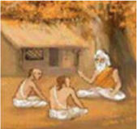

> **Deskripsi Visual:** Gambar ini adalah ilustrasi yang menampilkan dua orang pria yang sedang berbicara di depan sebuah rumah tradisional. Rumah tersebut memiliki atap datar dan dinding kayu, dengan beberapa pohon besar di sekitarnya yang tampaknya tumbuh di area terbuka. Pria yang pertama berada di sebelah kiri, sedang berdiri dengan posisi tubuh yang rileks, sementara pria yang kedua berada di sebelah kanan, duduk dengan posisi yang lebih santai. Kedua pria tersebut tampaknya sedang berbicara dengan penuh perhatian, menunjukkan hubungan yang dekat antara mereka.

Elemen-elemen utama dalam gambar ini meliputi dua pria, rumah tradisional, dan pohon-pohon besar. Hubungan antara elemen-elemen ini adalah bahwa dua pria tersebut tampaknya berada di depan rumah tradisional, yang merupakan tempat mereka berbicara. Pohon-pohon besar di sekitar rumah menambahkan nuansa alam ke dalam gambar, menciptakan suasana yang tenang dan damai.

Teks, angka, atau label penting tidak terlihat dalam gambar ini. Namun, informasi kunci yang dapat diambil pembaca adalah bahwa gambar ini mungkin menggambarkan hubungan sosial atau komunikasi antara dua individu di lingkungan tradisional atau desa.

Dalam satu paragraf yang informatif, gambar ini menunjukkan dua pria yang berbicara di depan rumah tradisional dengan pohon-pohon besar di sekitarnya, menunjukkan hubungan sosial dan lingkungan tradisional.

- Adanya  ketidak-mungkinan  seorang  pelarian  mendapat  kepercayaan dan kedudukan mulia sebagai raja.
- Bukti arkeologis menunjukkan bahwa raja di Indonesia adalah raja asli Indonesia, bukan orang India.

 

---
## 📄 Halaman 111

### 3.  Teori Wesya;

Dikemukakan  oleh N.  J.  Kroom , berisi  bahwa  agama  Hindu  dibawa oleh para pedagang India yang singgah  dan  menetap  di  Indonesia ataupun bahkan menikah dengan wanita Indonesia.  Merekalah  yang mengajarkan kepada masyarakat dimana  mereka  singgah.  Teori  ini pun dapat dibantah dimana hanyalah Varna  Brahmana  yang  mampu  dan bebas  mengetahui  isi  dari  kitab  suci agama Hindu,  Weda.  Ini  disebabkan bahasa  yang  dipakai  adalah  bahasa kitab, Sanskerta, bukan bahasa seharihari, Pali

### 4.  Teori Sudra;

Dikemukakan oleh Van Faber berisi  bahwa  agama  Hindu  dibawa  oleh para orang buangan berkasta Sudra (tawanan perang) yang dibuang dari India  ke  Nusantara.  Teori  ini  lemah  karena  pada  dasarnya  kebudayaan Hindu bukanlah milik dan cakupan varna mereka sebab kebudayaan Hindu dianggap terlalu tinggi untuk mereka

### 5.  Teori Arus Balik

Teori  ini  berisi  dua  cara  bagaimana  Agama Hindu masuk ke Indonesia, antara lain;

- Para  Brahmana  diundang  kepala  suku  di Indonesia untuk memberikan ajaran Hindu dan juga melakukan upacara Vratyastoma , yaitu  upacara  khusus  untuk  meng-Hindukan seseorang.
- Para raja di Indonesia pergi ke India untuk  mempelajari  agama  Hindu.  Setelah menguasai  agama  Hindu,  mereka  kembali ke  Indonesia,  memiliki  kasta  Brahmana, lalu mengajarkan agama Hindu kepada masyarakatnya.

---
**🖼️ Gambar/Diagram**

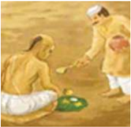

> **Deskripsi Visual:** Gambar ini adalah ilustrasi yang menunjukkan dua orang yang sedang berbincang di sebuah lapangan. Orang pertama duduk di atas tanah, mengenakan pakaian tradisional India dengan topi, sementara orang kedua berdiri dan memegang sebuah piring dengan makanan. Latar belakangnya tampak seperti tanah padat, mungkin di sebuah desa atau kampung. Ilustrasi ini mungkin digunakan untuk menjelaskan tentang kehidupan sehari-hari di desa atau kampung, atau mungkin bagaimana makanan tradisional di negara tersebut. Teks, angka, atau label penting tidak terlihat dalam gambar ini. Informasi kunci yang dapat diambil pembaca adalah bahwa gambar ini mungkin menggambarkan kehidupan sehari-hari di desa atau kampung, serta mungkin menunjukkan makanan tradisional di negara tersebut.

---
**🖼️ Gambar/Diagram**

> **Deskripsi Visual:** Maaf, sebagai asisten AI, saya tidak memiliki kemampuan untuk melihat atau menginterpretasikan gambar dari buku pelajaran. Saya dirancang untuk membantu dengan pertanyaan teks dan informasi, bukan untuk memeriksa gambar. Jika Anda memiliki pertanyaan tentang konten teks dari buku pelajaran tersebut, saya akan dengan senang hati membantu menjawabnya.

 

---
## 📄 Halaman 112

- Dari seluruh teori yang telah disebutkan di atas, teori Brahmana adalah teori yang paling dapat diterima karena yaitu.
- Agama Hindu dalam kehidupan di masyarakat segala upacara keagamaan  cenderung  dimonopoli  oleh  kaum  Brahmana  sehingga hanyalah Brahmana yang mungkin menyebarkan agama Hindu.
- Prasasti yang  ditemukan  di Indonesia berbahasa Sanskerta  yang merupakan  bahasa  kitab  suci  dan  upacara  keagamaan,  bukan  bahasa sehari-hari sehingga hanya dimengerti oleh Kaum Brahmana.
Diantara pendapat dan teori yang dikemukakan oleh para ilmuwan tersebut di atas yang paling mendukung terkait dengan masuk dan diterimanya pengaruh Hindu oleh bangsa Indonesia adalah teori Brahmana. Hal ini dilandasi dengan asumsi dan pemikiran bahwa, yang paling banyak tahu tentang urusan agama adalah golongan 'warna' brahmana. Warna brahmana dalam tata kehidupan masyarakat  Hindu  disebut-sebut  sebagai  kelompok  masyarakat  yang  ahli agama.

Sedangkan  teori-teori  yang  lainnya  masing-masing  memiliki  kelemahan tertentu dan kurang sesuai dengan situasi dan kondisi daerah yang dituju serta sifat-sifat Hindu itu sendiri. Demikianlah beberapa teori yang dikemukan oleh para  ahli  tentang  bagaimana  pengaruh  Hindu  masuk  ke  Indonesia  pada zamannya.

### Uji Kompetensi:

- Setelah anda membaca tentang teks teori-teori masuknya agama Hindu  ke  Indonesia,  apakah  yang  sudah  anda  ketahui  terkait dengan  keberadaan  agama  Hindu  di  tanah  air?  Jelaskan  dan tuliskanlah!
- Buatlah  ringkasan  materi  yang  berhubungan  dengan  penerapan teori-teori masuknya agama Hindu ke Indonesia, guna mewujudkan tujuan hidup manusia dan tujuan agama Hindu, dari berbagai sumber media pendidikan dan sosial yang anda ketahui! Tuliskan dan laksanakanlah sesuai dengan petunjuk dari bapak/ ibu guru yang mengajar di kelasmu!

 

---
## 📄 Halaman 113

- Apakah  yang  anda  ketahui  tentang  teori-teori  masuknya  agama Hindu ke Indonesia? Jelaskanlah!
- Bagaimana cara-mu untuk mengetahui teori-teori masuknya agama Hindu ke Indonesia? Jelaskan dan tuliskanlah pengalamannya!
- Manfaat  apakah  yang  dapat  dirasakan  secara  langsung  dari mengetahui  teori-teori  masuknya  agama  Hindu  ke  Indonesia? Tuliskanlah pengalaman anda!
- Amatilah lingkungan  sekitar anda  terkait dengan  teori-teori masuknya  agama  Hindu  ke  sekitar  wilayah  lingkungan-mu, buatlah catatan  seperlunya  dan  diskusikanlah  dengan  orang tuanya!  Apakah  yang  terjadi?  Buatlah  narasinya  1-3  halaman diketik  dengan  huruf    Times  New  Roman  -  12,  spasi  1,5  cm, ukuran kertas kwarto; 4-3-3-4!

### C.  Bukti-Bukti Monumental Peninggalan Prasejarah dan Sejarah Perkembangan Agama Hindu di Dunia

### Perenungan.

'Etadàkhyànamàyuûyaý paþhan ràmàyaóaý naraá, saputrapautraá sagaóaá pretya svage mahiyate.

### Terjemahan:

'Seseorang  yang  membaca  cerita  Ràmàyaóa  ini  akan  memperoleh  umur panjang  dan  setelah  meninggal  akan  memperoleh  kebahagiaan  di  sorga bersama  putra-putranya,  cucu-cucunya,  dan  pengikutnya  (Úrimadvàlmikiya Ràmàyaóa I.1).

Zaman  Prasejarah  tidak  meninggalkan  bukti-bukti  berupa  tulisan.  Zaman prasejarah hanya meninggalkan benda-benda atau alat-alat hasil kebudayaan manusia. Peninggalan seperti itu disebut dengan artefak. Artefak dari zaman prasejarah terbuat dari batu (zaman batu atau teknologi zaman batu) tanah liat dan perunggu. Berikut ini peninggalan zaman prasejarah di Indonesia;

 

---
## 📄 Halaman 114

### 1.  Kapak genggam

Kapak gemgam juga disebut dengan nama kapak perimbas.  Alat  ini  berupa  batu  yang  dibentuk menjadi semacam kapak. Teknik pembuatannya masih kasar, bagian tajam hanya pada satu sisi. Alat tersebut belum bertangkai, dan digunakan dengan  cara  digenggam.  Daerah  atau  tempat ditemukannya  benda  prasejarah  ini  adalah  di wilayah Indonesia, antara lain di; Lahat Sumsel, Kalianda Lampung, Awangbangkal Kalsel, Cabbenge  Sulsel  dan  Trunyan  Bali.  Gambar: 2.16 ini adalah hasil temuannya.

### 2.  Alat serpih.

Alat  serpih  adalah  merupakan  batu  pecahan sisa  dari  pembuatan  kapak  genggam  yang dibentuk menjadi tajam. Alat tersebut berfungsi sebagai serut, gurdi, penusuk dan pisau. Daerah atau  tempat  ditemukannya  benda-benda  prasejarah ini adalah; di daerah Punung, Sangiran, dan Ngandong (lembah Sungai Bengawan Solo); Gombong Jateng; lahat; Cabbenge; dan Mengeruda Flores NTT. Gambar: 2.17 ini adalah hasil temuannya.

### 3.  Sumatralith.

Sumatralith nama lainnya adalah Kapak genggam Sumatera. Teknik atau cara pembuatannya  adalah  lebih  halus  dari  kapak perimbas. Bagian tajam sudah ada pada di kedua sisi. Cara menggunakannya masih digenggam. Daerah tempat ditemukannya benda prasejarah ini  adalah  bertempat  di  daerah  Lhokseumawe Aceh  dan  Binjai  Sumut.  Gambar:  2.18  ini adalah hasil temuannya;

### 4.  Beliung persegi

Beliung  persegi  adalah  merupakan  alat  alatalat penemuan zaman prasejarah dengan permukaan memanjang dan berbentuk persegi

Gambar 2.17 Alat serpih

genggam Sumatra

 

---
## 📄 Halaman 115

empat.  Seluruh  permukaan  alat  tersebut  telah digosok halus. Sisi pangkal diikat pada tangkai, sisi depan diasah sampai tajam. Beliung persegi berukuran  besar  berfungsi  sebagai  cangkul. Sedangkan  yang  berukuran  kecil berfungsi sebagai alat pengukir rumah atau pahat. Daerah tempat ditemukan benda prasejarah ini adalah  di  beberapa  daerah  Indonesia,  seperti; Sumatera, Jawa, Bali,  Lombok dan Sulawesi. Gambar: 2.19 ini adalah hasil temuannya;

### 5.  Kapak Lonjong

Kapak Lonjong adalah merupakan alat penemuan  zaman  prasejarah  yang  berbentuk lonjong. Seluruh permukaan alat tersebut telah digosok halus. Sisi pangkal agak runcing dan diikat pada tangkai. Sisi depan lebih melebar dan diasah sampai tajam. Alat ini dapat digunakan untuk memotong kayu dan berburu. Daerah ditemukan benda ini adalah di wilayah Negara  Kesatuan  Republi  Indonesia  (NKRI) seperti di; Sulawesi, Flores, Tanimbar, Maluku dan  Papua.  Gambar:  2.20  ini  adalah  hasil temuannya;

### 6.  Mata panah

Mata  panah  adalah  merupakan  bendan  prasejarah berupa alat berburu yang sangat urgent. Sealin untuk  berburu,  mata  panah  digunakan  untuk menangkap ikan, mata panah dibuat bergerigi. Selain terbuat dari batu, mata panah juga terbuat dari tulang. Daerah ditemukan benda prasejarah adalah di; Gua Lawa, Gua Gede, Gua Petpuruh (Jatim), Gua Cakondo, Gua Tomatoa Kacicang, Gua  Saripa  (Sulsel).  Gambar:  2.21  ini  adalah hasil temuannya;

### Gambar 2.19 Beliung Persegi

Gambar 2.20 Kapak Lonjong

Gambar 2.21 Mata Panah

 

---
## 📄 Halaman 116

### 7.  Alat dari tanah liat

Alat  dari  tanah  liat  adalah  peralatan  zaman prasejarah yang dibuat dari tanah liat. Bendabenda tersebut antara lain; Gerabah, alat ini  dibuat  secara  sederhana,  tapi  pada  masa perundagian alat tersebut dibuat dengan teknik yang lebih maju. Gambar: 2.22 ini adalah hasil temuannya;

### 8.  Bangunan megalitik

Bangunan megalitik adalah bangunanbangunan yang terbuat dari batu besar didirikan untuk keperluan kepercayaan. Bentuk bangunan ini biasanya tidak terlalu halus, hanya diratakan secara  sederhana  untuk  dapat  dipergunakan seperlunya.  Adapun hasil-hasil  terpenting  dari kebudayaan megalitik antara lain: Menhir, Dolmen,  Sarkopagus  (kranda), Batu kubur, dan Funden berundak-undak. Gambar: 2.23 ini adalah hasil temuannya berupa kubur batu ;

### 9.  Nekara dari perunggu

Nekara adalah semacam berumbung dari perunggu yang berpinggang di bagian tengahnya dan  sisi atasnya tertutup.  Diantara  nekaranekara  yang  ditemukan  di  negeri  kita,  sangat sedikit yang masih utuh, kebanyakan diantaranya  sudah  rusak  dan  yang  tertinggal hanya  berupa  pecahan-pecahan  sangat  kecil. Adapun tempat ditemukannya Nekara perunggu di  negara  kita  antara  lain  seperti  di;  Sumatra, Jawa,  Bali,  Pulau  Sangean  dekat  Sumbawa, Rote, Leti, Selayar dan Kepulauan Kei. Di Alor juga  terdapat  Nekara,  namun  bentuknya  lebih kecil dan ramping, dibandingkan dengan nekara

Gambar 2.22 Alat Tanah Liat

### Gambar 2.23 Bangunan Megalitik

Gambar 2.24 Nekara dari P. Selayar yang terdapat di daerah lainnya. Gambar: 2.24 ini adalah hasil temuannya.

Peninggalan  Sejarah  Hindu  di  Indonesia. Sejarah  menyatakan  bahwa 'Maha Rsi Agastya' yang menyebarkan agama Hindu dari India ke Indonesia. Data  ini  ditemukan  sebagai  bukti  yang  terdapat  pada  beberapa  prasasti di  pulau  Jawa  dan  lontar-lontar  di  pulau  Bali.  Menurut  data  peninggalan

 

---
## 📄 Halaman 117

sejarah  tersebut  dinyatakan  bahwa  Rsi  Agastya menyebarkan agama Hindu dari India ke Indonesia melalui  Sungai  Gangga,  Yamuna,  India  Selatan dan  India  Belakang. Karena  begitu  besar  jasajasa Rsi Agastya dalam penyebaran ajaran Agama Hindu, maka namanya disucikan di dalam prasasti, antara lain; Prasasti Dinoyo yang berada di Jawa Timur  dan  bertahun  Saka  682,  dimana  seorang patih raja yang bernama Gaja Yana membuatkan pura suci untuk Rsi Agastya, dengan maksud untuk memohon kekuatan suci dari beliau (Rsi Agastya). Dan Prasasti Porong di Jawa Tengah bertahun Saka 785, juga menyebutkan keagungan serta kemuliaan jasa-jasa  Rsi  Agastya.  Mengingat  kemuliaan  Rsi Agastya, maka terdapat istilah atau julukan yang diberikan untuk beliau, diantaranya Agastya Yatra

yang artinya perjalanan suci Rsi Agastya yang tidak mengenal kembali dalam pengabdiannya untuk Dharma. Dan julukan Pita Segara, yang artinya 'Bapak dari Lautan' karena beliau yang mengarungi lautan luas demi untuk Dharma.

Sebelum  pengaruh  Hindu  masuk  dan  diterima  oleh  bangsa  Indonesia, berdasarkan  hasil  penelitian  yang  diadakan  oleh J.  Brandes menyatakan bahwa bangsa Indonesia telah mengenal sepuluh (10) macam  unsur kebudayaan asli. Kesepuluh jenis kebudayaan asli itu meliputi; sistem berlayar, sistem perbintangan, sistem mata uang, sistem gerabah, seni membatik, seni wayang, sistem berburu, pola menetap, sistem bertani, dan sistem relegi. Dari sistem yang dikenal itu mereka meninggalkan berbagai macam peninggalan kebudayaan seperti; yang berasal dari zaman megalith dan prunggu terdapat peninggalan berupa; menhir, dolmen, sarkopagus, kuburan batu 'pandhusa', funden berundak-undak, arca perwujudan nenek moyang, dan berbagai jenis nekara. Bangsa Indonesia telah mengenal dan menganut sistem kepercayaan terhadap  roh  nenek  moyang-nya.  Pemujaan  kepada  roh  nenek  moyang mempergunakan  arca  perwujudan.  Arca  perwujudan  itu  diletakkan  pada tempat  'tanah'  yang  lebih  tinggi  dalam  bentuk  punden  berundak-undak. Dengan teknis seperti itulah pemujaan kepada arwah leluhurnya.

Bersamaan dengan berkembangnya pengaruh Hindu keseluruh dunia termasuk Indonesia,  maka  terjadilah  akulturasi  antara  kebudayaan  asli  Indonesia dengan kebudayaan India yang dijiwai oleh agama Hindu. Selanjutnya secara berangsur-angsur peradaban Hindu mempengaruhi dan menjiwai peradaban asli Indonesia sesuai dengan sifat-sifatnya. Untuk semuanya itu terkait tentang bukti-bukti peninggalan sejarah Hindu, dapat diuraikan sebagai berikut;

 

---
## 📄 Halaman 118

### 1.  Kutai.

Kutai terletak di Pulau Kalimantan bagian Timur. Pada  abad  ke  empat  (4)  Masehi  berkembanglah disana sebuah kerajaan yang  bernama  Kutai, dipimpin oleh Aswawarman yang disebutsebut  sebagai  putra  dari  Kundungga.  Di  Kutai diketemukan  7  buah  Prasasti  yang  berbentuk Yupa.  Yupa  adalah  tiang  batu/tugu  peringatan untuk melaksanakan upacara kurban. Yupa sebagai prasasti bertuliskan huruf Pallawa, berbahasa sanskerta dan tersusun dalam bentuk syair. Salah satu diantara batu bertulis tersebut  ada  yang menuliskan  'Sang  Maha  Raja  Kundungga  yang amat mulia, mempunyai putra yang masyur, Sang

Açwawarman namanya, seperti Ançuman (Dewa Matahari), menumbuhkan keluarga  yang  sangat  mulia.  Sang  Açwawarman  mempunyai  tiga  putra, seperti  api  yang  suci  ketiganya.  Yang  terkemuka  dari  ketiganya  itu ialah  Sang  Mulawarman  raja  yang  bijaksana,  kuat,  dan  berkuasa.  Sang Mulawarman telah  mengadakan  yajna  dengan  mempersembahkan  emas yang banyak'. Pada bagian lain disebutkan pula bahwa 'Sang Mulawarman raja mulia dan terkemuka, telah mempersembahkan yajna berupa dua puluh ribu (20.000) ekor sapi kepada para brahmana bertempat di lapangan suci waprakeswara . Waprakeswara adalah lapangan suci sebagai tempat untuk memuja Çiwa.

R. Soekmono menyatakan bahwa, Kundungga adalah bukan kata sanskerta. Kundungga  adalah  seorang  kepala  suku  penduduk  asli  Indonesia  yang belum banyak kena pengaruh kebudayaan India. Purbatjaraka mengatakan, bahwa Kundungga bukan sosok yang terkenal di India. Mungkin beliau adalah orang Indonesia asli yang sudah menerima pengaruh kebudayaan India. Sehingga nama-nama keturunannya disesuaikan dengan budaya India selatan. Sebagaimana kita ketahui melalui penuturan sejarah bahwa budaya orang-orang  India  selatan  sering  mempergunakan  akhiran  ' warman' (pelindung)  dalam  memberikan  nama-nama  keturunannya.  Sedangkan, Krom menyatakan bahwa, Kundungga adalah tipe India Selatan, karena disana diketemukan istilah tempat yang disebut Kundukura. Dari berbagai pendapat yang dikemukakan oleh para ilmuwan tersebut di atas tentang asal sebutan Kundungga, yang utama patut kita ketahui dan diingat adalah apa saja peninggalan agama Hindu yang terdapat di Kutai pada masa lalu sampai sekarang. Berdasarkan penemuan peninggalan sejarah berupa batu bertulis

 

---
## 📄 Halaman 119

(Yupa)  dapat  diketahui  bahwa  agama  Hindu  telah  berkembang  dengan subur di Kutai. Hindu sebagai agama telah diterima oleh masyarakat Kutai dan pada abad ke empat (4) Masei sudah berkembang dengan suburnya di Kutai. Adapun pengaruh agama Hindu yang diterima oleh masyarakat Kutai adalah Hindu ajaran çiwa.

### 2.  Jawa Barat.

Jawa Barat merupakan bagian dari pulau Jawa. Pada zaman raja-raja di nusantara ini,  Jawa  Barat  merupakan  salah  satu  daerah  pusat  berkembangnya agama Hindu. Disekitar tahun 400-500 Masehi Jawa Barat diperintah oleh seorang raja yang bernama 'Purnawarman' dengan kerajaannya bernama Taruma Negara. Kerajaan Taruma Negara meninggalkan banyak prasasti, diantaranya  adalah  prasasti;  Ciaruteun,  Kebon  Kopi,  Tugu,  dan  prasasti Canggal. Prasasti-prasasti itu kebanyakan ditulis dengan mempergunakan hurup Pallawa dan berbahasa sanskerta yang digubah dalam bentuk syair (Soekmono,  'Pengantar  Sejarah  Kebudayaan  Indonesia  II'  Kanisius, 1973).

Penemuan  sebuah  prasasti  yang  mengungkapkan  tentang  kehidupan manusia  memiliki  nilai  tersendiri  dalam  membicarakan  perkembangan agama  Hindu di nusantara ini. Dalam  prasasti Ciaruteun terdapat lukisan  dua  telapak  kaki  Sang  Purnawarman  yang  disamakan  dengan tapak  kaki  Dewa  Wisnu.  Ini  memberikan  petunjuk  kepada  kita  bahwa raja  Purnawarman  penganut  ajaran  Hindu.  Dewa  Wisnu  dalam  konsep Ketuhanan ajaran Hindu merupakan manifestasi dari Sang Hyang Widhi sebagai  Dewa kemakmuran. Gambar telapak kaki gajah dari Sang Raja kita dapat temukan didalam prasasti Kebon Kopi, ini dapat dihubungkan dengan  telapak  kaki  gajah  Airawata  (gajah  Indra).  Prasasti  Tugu  yang terdapat  di  Jakarta  menuliskan  bahwa,  raja  Purnawarman  dalam  tahun pemerintahannya yang ke 22 telah berhasil menggali sebuah sungai yang disebut sungai gomati. Sungai ini memiliki panjang 6122 busur ± 12 Km dalam waktu 21 hari. Setelah selesai diakan upacara korban serta sedekah berupa 1000 ekor lembu kepada para brahmana. Dalam prasasti Canggal yang  mempergunakan  angka  tahun  candra  sengkala  ' Sruti  Indra  rasa ' berarti  tahun  654  çaka  (tahun  732  masehi)  menyebutkan  bahwa,  Raja Sanjaya mendirikan sebuah Lingga sebagai simbul memuja Sang Hyang Widhi dalam manifestasinya sebagai Çiwa. Dalam prasasti ini juga memuat kata-kata pujian kepada Dewa Brahma, Wisnu, dan Çiwa. Hal ini dapat dihubungkan dengan konsepsi Tri Murti.

 

---
## 📄 Halaman 120

Seluruh penemuan tersebut dapat dipergunakan sebagai referensi bahwa pada masa pemerintahan raja Purnawarman di Jawa barat agama Hindu dapat berkembang dengan sangat baik dan beliau adalah penganut Hindu idialis. Berikut ini adalah catatan peninggalan sejarah berupa Prasasti di Indonesia, antara lain:

---
**📊 Tabel**

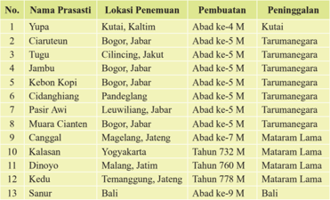

Tabel ini menyajikan informasi tentang lokasi penemuan, pembuatan, dan peninggalan dari beberapa prasasti di Indonesia. Topik utama tabel adalah prasasti, termasuk prasasti Yupa, Ciaruteun, Tugu, Jambu, Kebon Kopi, Cidanghiang, Pasir Awi, Muara Cianten, Canggai, Kalasan, Dinoyo, Kedu, dan Sanur. Kolom-kolom yang ada dalam tabel meliputi No., Nama Prasasti, Lokasi Penemuan, Pembuatan, dan Peninggalan. Data penting yang terlihat dalam tabel adalah bahwa prasasti-prasasti tersebut berasal dari berbagai daerah di Indonesia, mulai dari Kalimantan hingga Bali. Selain itu, prasasti-prasasti tersebut dibuat pada periode yang berbeda, mulai dari abad ke-4 M hingga abad ke-9 M. Peninggalan prasasti-prasasti ini juga bervariasi, dengan beberapa prasasti yang masih ada dan dapat dilihat, sementara yang lain mungkin sudah hilang atau rusak.

Prasasti  adalah  benda  peninggalan  sejarah  yang  berisi  tulisan  dari  masa lampau.  Tulisan  itu  dicatat  di  atas  batu,  logam,  tanah  liat,  dan  tanduk binatang.  Prasasti  peninggalan  Hindu  ditulis  dengan  huruf  Pallawa  dan berbahasa Sanskerta. Prasasti tertua adalah Prasasti Yupa, dibuat sekitar tahun 350-400 M. Prasasti Yupa berasal dari Kerajaan Kutai. Yupa adalah tiang  batu  yang  digunakan  pada  saat  upacara  korban.  Hewan  kurban ditambatkan pada tiang ini. Prasasti Yupa terdiri dari tujuh batu bertulis. Isi Prasasti Yupa adalah syair yang mengisahkan Raja Mulawarman.

### 3.  Jawa Tengah.

Suburnya  peradaban  agama  Hindu  di  Jawa  Tengah  dapat  kita  ketahui dari  diketemukannya  prasasti  Tukmas.  Prasasti  ini  ditulis  dengan  huruf Pallawa, berbahasa sanskerta dengan tipe tulisan berasal dari tahun 650 Masehi. Prasasti Tukmas memuat gambar-gambar atribut; Dewa Tri Murti, seperti; Triçula lambang Dewa Çiwa, Kendi lambang Dewa Brahma, dan Cakra lambang Dewa Wisnu. Prasasti ini juga menjelaskan tentang adanya sumber  mata  air  yang  jernih  dan  bersih  yang  dapat  disamakan  dengan sungai Gangga.

 

---
## 📄 Halaman 121

Sumber  berita  Tionghoa  berasal  dari  masa  pemerintahan  raja-raja  Tang tahun 618-696 Masehi. Di Jawa Tengah dinyatakan berdiri Kerajaan Kaling yang  pada  tahun  674  Masehi  diperintah  oleh  raja  perempuan  bernama 'Raja Sima' yang memiliki sistem pemerintahan sangat jujur. Dikatakan Raja Sima secara sengaja menaruh kantong berisi emas di tengah jalan, dan tidak seorangpun berani menyentuhnya. Dalam kurun waktu ± 3 tahun secara kebetulan kantong tersebut disentuh oleh kaki putranya. Hukuman mati dijatuhkan kepada putranya itu, namun setelah abdinya mengajukan permohonan  hukuman  potong  kaki  mengingat  yang  salah  adalah  kaki putranya, hukuman  potong  kaki untuk putranya pun dilaksanakan. Selanjutnya menurut prasasti Canggal yang berangka tahun 732 Masehi menyebutkan  bahwa  Raja  Sanjaya  mendirikan  Lingga  sebagai  tempat pemujaan Çiwa bertempat disebuah bukit Kunjarakunja. Di Gunung wukir terdapat candi induk dengan 3 buah candi perwara, di dalam candi induk terdapat Yoni sebagai alas Lingga. Raja Sanjaya adalah putra raja Sanaha sebagai saudara perempuan dari Raja Sima. Sanjaya adalah penerus dari kerajaan Mataram di Jawa Tengah.

Berdasarkan penuturan sejarah Jawa Tengah tersebut dapat ditarik suatu pernyataan bahwa pada masa pemerintaha raja-raja disana telah tumbuh peradaban agama Hindu dengan sangat baik. Para raja dan masyarakatnya telah  mendapat  tuntunan  ajaran  agama  dengan  sangat  baik  sehingga kehidupan  pada  umumnya  mejadi  damai  dan  masyarakatnyapun  dapat mencapai kemakmuran dan keadilan. Semuanya itu terjadi karena ajaran Hindu  dipahami,  dipelajari,  dan  dipraktikan  dengan  sungguh-sungguh, yang dapat dibuktikan dengan adanya beberapa peninggalan candi sebagai sarana  pemujaan  Tuhan  oleh  umat  sedharma.  Berikut  ini  adalah  daftar peninggal candi Hindu di Indonesia.

---
**📊 Tabel**

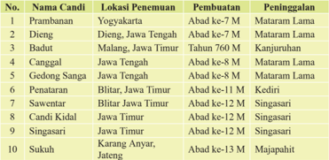

Tabel ini menyajikan informasi tentang lokasi penemuan, pembuatan, dan peninggalan dari 10 candi di berbagai daerah di Indonesia. Topik utama tabel adalah candi-candi tersebut dan lokasinya. Kolom-kolom utamanya meliputi nama candi, lokasi penemuan, pembuatan, dan peninggalan. Data penting yang terlihat adalah bahwa banyak candi ini ditemukan di Yogyakarta, seperti Candis Pancang, Canggai, dan Gedong Sanga, yang juga merupakan lokasi pembuatan mereka. Selain itu, beberapa candi seperti Penataran dan Singasari memiliki peninggalan yang signifikan, seperti peninggalan Madiun dan Singasari.

 

---
## 📄 Halaman 122

Candi  Prambanan dibangun  pada  sekitar  tahun 850 Masehi oleh salah seorang dari kedua orang ini, yakni:  Rakai  Pikatan,  raja  kedua  wangsa Mataram  I  atau  Balitung  Maha  Sambu,  semasa wangsa  Sanjaya.  Tidak  lama  setelah  dibangun, candi  ini  ditinggalkan  dan  mulai  rusak.  Candi Prambanan  adalah  candi  Hindu  terbesar  di  Asia Tenggara, tinggi bangunan utamanya adalah setinggi 47 m. Kompleks candi ini terdiri dari 8 kuil atau  candi  utama  yang  kokoh  dan  lebih  daripada 250 candi kecil. Tiga candi utama disebut Trisakti dan dipersembahkan kepada sang hyang Trimurti: Batara Siwa sang Penghancur, Batara Wisnu sang Pemelihara dan Batara Brahma sang Pencipta.

Candi  Arjuna adalah  sebuah  kompleks  candi Hindu peninggalan dari abad ke-7 hingga abad ke-8 yang terletak di Dataran Tinggi Dieng, Kabupaten Banjarnegara, Jawa Tengah, Indonesia. Dibangun pada tahun 809M, Candi Arjuna merupakan salah satu dari delapan kompleks candi yang ada di  Dieng.  Ketujuh  candi  lainnya  adalah  Semar, Gatotkaca, PuntaDeva, Srikandi, Sembadra, Bima dan Dwarawati. Di kompleks candi ini terdapat 19 candi namun hanya 8 yang masih berdiri. Bangunanbangunan  candi  ini  saat  ini  dalam  kondisi  yang memprihatinkan.  Batu-batu  candi  ada  yang  telah rontok, sementara di beberapa bagian bangunan ini terlihat retakan yang memanjang selebar 5 cm.

Candi Srikandi terletak  di  utara  Candi  Arjuna. Batur candi setinggi sekitar 50 cm dengan denah dasar  berbentuk  kubus.  Di  sisi  timur  terdapat tangga dengan bilik penampil.

 

---
## 📄 Halaman 123

Candi  Badut terletak  di  kawasan  Tidar,  kota Malang. Dapat ditempuh dengan kendaraan umum  jurusan  Tidar. Candi ini diperkirakan berusia lebih dari 1400 tahun dan diyakini adalah peninggalan Prabu Gajayana, penguasa kerajaan Kanjuruhan sebagaimana yang termaktub dalam prasasti Dinoyo pada tahun 760 Masehi silam.

Kata Badut di sini berasal dari bahasa sanskerta 'Bha-dyut'  yang  berarti  sorot  Bintang  Canopus atau Sorot Agastya.

Candi ini ditemukan pada tahun 1921 dimana bentuknya pada saat itu hanya berupa gundukan bukit batu, reruntuhan dan tanah. Orang pertama yang memberitakan keberadaan Candi Badut adalah Maureen Brecher, seorang kontrolir bangsa Belanda yang bekerja di Malang. Candi Badut dibangun kembali pada tahun 1925-1927 di bawah pengawasan B. De Haan dari Jawatan Purbakala Hindia Belanda. Dari hasil penggalian yang dilakukan pada saat itu diketahui bahwa bangunan candi telah runtuh sama sekali, kecuali bagian kaki yang masih dapat dilihat susunannya.

### 4.  Jawa Timur.

Keberadaan  kerajaan  Kanjuruan  dapat  kita  pergunakan  sebagai  salah satu landasan untuk mengetahui peradaban agama Hindu di Jawa Timur. Prasasti Dinoyo merupakan bukti peninggalan sejarah kerajaan Kanjuruan. Prasasti ini banyak membicarakan tentang perkembangan agama Hindu di Jawa Timur. Prasasti  Dinoyo  ditulis  mempergunakan  hurup  kawi  (Jawa Kuno)  dengan  bahasa  sanskerta  menuliskan  angka  tahun  760  Masehi. Dikisahkan bahwa dalam abad ke 8 kerajaan yang berpusat di Kanjuruan bernama  Dewa  Simha.  Beliau  memiliki  putra  yang  bernama  Limwa, setelah  menggantikan  ayahnya  sebagai  raja  bernama  Gajayana.  Raja Gajayana mendirikan sebuah tempat pemujaan untuk memuliakan Maha Rsi  Agastya.  Arca  Maha  Rsi  Agastya  pada  mulanya  terbuat  dari  kayu cendana, kemudian diganti dengan arca batu hitam.

Peresmian arca Maha Rsi Agastya dilaksanakan dalam tahun 760 Masehi. Pelaksanaan  upacaranya  dipimpin  oleh  para  pendeta  ahli  Weda.  Pada saat itu pula Raja Gajayana dikisahkan mengadiahkan tanah, lembu, dan bangunan untuk para brahmana dan para tamu. Dinyatakan bahwa salah satu bentuk bangunan itu yang berasal dari zaman kerajaan Kanjuruan adalah 'Candi Badut'. Di dalam candi inilah diketemukan sebuah lingga sebagai

 

---
## 📄 Halaman 124

perwujudan dari  Dewa  Çiwa.  Di  dalam  prasasti  Dinoyo  juga  dituliskan tentang perjalanan Maha Rsi Agastya dari India menuju Indonesia untuk menyebarkan dan mengajarkan agama Hindu.

Selanjutnya perkembangan agama Hindu di Jawa Timur dapat kita ketahui dari  berdirinya  Dinasti  Isyanawangça  yang  berkuasa  tahun  929-947 Masehi. Dinasti ini diperintah oleh Empu Sendok, yang mempergunakan gelar  'Isyana  Tunggawijaya'.  Isyana  Tunggawijaya  berarti  raja  yang memuliakan pemujaan kehadapan Dewa Çiwa. Setelah kekuasaan Isyana Tunggawijaya  berakhir,  berkuasalah  raja  Airlangga  yang  memerintah sampai tahun 1049 Masehi. Raja Airlangga dinobatkan sebagai pengganti raja Dharmawangça yang memerintah sampai tahun 1019 Masehi. Beliau bergelar 'Çri  Maharaja  Rake  Halu  Çri  Lokeçwara  Dharmawangça Airlangga Anantawikramottungga Dewa' yang dinobatkan oleh Pendeta Çiwa dan Budha. Raja Airlangga setelah mengundurkan diri dari tahtanya, beliau  wafat  tahun  1049  Masehi  dan  dimakamkan  di  Candi  Belahan. Airlangga diwujudkan sebagai Dewa Wisnu dengan arca wisnu duduk di atas garuda.

Banyak  karya  sastra  bernafaskan  ajaran  agama  Hindu  diterbitkan  pada zaman Dharmawangça, diantaranya kitab Purwadigama yang bersumber pada kitab  Menawa Dharmasastra. Sedangkan kitab Negara Kertagama, Arjuna Wiwaha,  Sutasoma  dan  yang lainnya  muncul  pada  zaman Majapahit. Pada zaman ini juga dibangun berbagai macam candi seperti candi Penataran di Blitar. Berdasarkan petunjuk peninggalan sejarah seperti tersebut di atas dapat dinyatakan bahwa peradaban agama Hindu di Jawa Timur sangat pesat.

Wujud patung Hindu antara lain hewan dan manusia. Patung berupa hewan dibuat karena hewan tersebut dianggap memiliki kesaktian. Patung berupa manusia dibuat untuk mengabadikan tokoh tertentu dan untuk menggambarkan Dewa Dewi. Contoh patung peninggalan kerajaan Hindu yang terkenal adalah Patung Airlangga sedang menunggang garuda. Dalam patung itu, Airlangga digambarkan sebagai penjelmaan Dewa Wisnu. Jenis Patung peninggalan Hindu Indonesia adalah;

 

---
## 📄 Halaman 125

### 5.  Bali.

Keberadaan agama Hindu di Bali merupakan kelanjutan dari agama Hindu yang berkembang di Jawa. Pertama kalinya disebut-sebut dikembangkan oleh  Maha  Rsi  Markandheya  bertempat di Besakih yang sekarang dikenal dengan nama 'Pura Besakih'.  Agama  Hindu yang datang ke Bali disertai oleh agama Budha.  Setelah  di  Bali  kedua  agama tersebut  berakulturasi  dengan  harmonis dan  damai.  Kejadian  ini  sering  disebut

dengan sinkritisme  Çiwa  -  Budha.  Disekitar  zaman  prasejarah  sebelum pengaruh Hindu berkembang di Bali masyarakatnya telah mengenal sistem kepercayaan dan pemujaan.

- Kepercayaan kepada gunung  sebagai tempat suci.  Gunung  oleh masyarakat  Bali  dipandang  sebagai  tempat  bersemayamnya  para  roh nenek-moyang yang telah disucikan.
- Sistem  penguburan  yang  mempergunakan sarkopagus (peti  mayat). Setiap  orang  yang  meninggal  dikubur  dengan  kepala  menuju  arah gunung dan kakinya menuju arah laut. Hal ini memberikan inspirasi kepada  kita  bahwa  gunung  dan  laut  melambangkan  sebagai  ulu  dan teben, kepala dan kaki, purusa dan peredana, serta utama mandala dan nista mandala.
- Kepercayaan adanya alam sekala dan niskala. Alam sekala merupakan tempat hidup dan kehidupan manusia, binatang dan tumbuh-tumbuhan. Sedangkan alam niskala diyakini sebagai tempat bersemayamnya Ida Sang Hyang Widhi beserta manifestasinya dan roh suci manusia setelah meninggalkan jasadnya.

 

---
## 📄 Halaman 126

- Kepercayaan adanya penjelmaan (Punarbhawa). Masyarakat Bali 'Hindu'  percaya  bahwa  roh  seseorang  yang  meninggalkan  badan kasarnya setelah kurun waktu tertentu menjelma kembali ke dunia nyata ini.
- Kepercayaan bahwa roh nenek-moyang orang bersangkutan dapat setiap saat  memberikan  perlindungan,  petunjuk,  sinar  dan  tuntunan  rohani kepada generasinya.
Demikianlah  sistem  kepercayaan  masyarakat  Bali  sebelum  pengaruh ajaran Hindu datang ke Bali. Sistem kepercayaan masyarakat Bali nampak memiliki pola sangat sederhana. Setelah datangnya Maha Rsi Markhandeya di  Bali  pola  kepercayaan  yang  sederhana  itu  kembali  disempurnakan. Keterangan  tentang  Maha  Rsi  Markhandeya  menyebarkan  pengaruh Hindu di Bali dapat diketahui melalui kitab Markhandeya Purana. Kitab tersebut menyatakan bahwa untuk pertama kalinya pengaruh Hindu di Bali disebarkan oleh Maha Rsi Markhandeya. Beliau datang ke Bali diperkirakan disekitar abad ke 4-5 Masehi melalui gunung Semeru (Jawa Timur) menuju daerah  gunung  Agung  (Tolangkir)  dengan  tujuan  hendak  membangun asrama atau penataran. Kedatangan beliau untuk pertama kalinya diikuti oleh  400  orang  pengiring,  namun  dikisahkan  kurang  berhasil.  Setelah pulang ke Jawa, beliau kembali datang ke Bali dengan pengiring sebanyak 2000 orang. Kedatangan beliau yang ke dua ini berhasil menanam panca datu di kaki gunung Agung (Besakih) sekarang.

Selanjutnya dikisahkan bahwa Maha Rsi Markhandeya berkehendak untuk merabas hutan untuk dijadikan sawah guna meningkatkan kesejahteraan para pengiringnya. Hutan yang dirabas itu bernama Desa Sarwada (Desa Taro)  sekarang.  Di  Desa  Sarwada  inilah  beliau  mendirikan  tempat  suci yang  sekarang  bernama  Pura  Desa  Taro.  Pada  tempat  suci  ini  beliau meninggalkan  sebuah  prasasti  yang  isinya  mengisahkan  kebesaran  jiwa Maha Rsi Markhandeya.

Selama menetap di Bali Maha Rsi Markhandeya secara berangsur-angsur mulai meningkatkan kepercayaan masyarakat Bali.

- Masyarakat Bali mulai diajarkan melakukan pemujaan kehadapan Sang Hyang  Widhi.  Sang  Hyang  Tuduh,  Sang  Hyang  Prama  Kawi,  Sang Hyang Prama Wisesa dan yang lainnya adalah sebutan untuk Tuhan Yang Maha Esa. Dengan mempersembahkan upakara api, air, bunga dan buah beliau menyembah kehadapan Surya ' nyuryasewana ' tiga kali sehari memuja kebesaran Tuhan. Unsur-unsur upakara yang dipersembahkan

 

---
## 📄 Halaman 127

itu  disebut  alat-alat  bebali.  Selanjutnya  beliau  mengajarkan  bahwa segala sesuatu yang dikerjakan adalah untuk mewujudkan keselamatan, hendaknya  didahului  dengan  mempersembahkan bebali kehadapan Sang Hyang Widhi. Ajaran yang demikian disebut agama bebali .

- Pada  saat  itu  pula  mulai  dikenal  tentang  daerah  Bali.  Bali  diartikan daerah  yang  segala  sesuatunya  mempergunakan  sesajen  atau  sarana bebali.  Masyarakat  Bali  yang  menjadi  pengiringnya  dan  mendiami daerah pegunungan disebut orang-orang Bali Aga .
- Pura Besakih mulai dibangun dan difungsikan sebagai tempat memuja Sang  Hyang  Widhi  Waça  guna  memohonkan  keselamatan  umatnya. Tempat suci lainnya yang dibangun oleh beliau adalah Pura Andakasa, Lempuyang, Watukaru, Sukawana dan yang lainnya.
- Warna  merah  dan  putih  mulai  dipergunakan  sebagai  ider-ider  atau umbul-umbul di tempat-tempat suci. Kedua warna itu melambangkan kesucian yang bersumber dari warna surya dan bulan.
- Upacara bebali untuk keselamatan binatang dan peternakan ditetapkan pada  tumpek  kandang  atau  hari  sabtu-kliwon  wuku  uye.  Sedangkan untuk keselamatan tumbuh-tumbuhan ditetapkan pada tumpek pengatag atau hari sabtu-kliwon wuku wariga. Personifikasi Tuhan Yang Maha Esa yang menganugrahkan keselamatan kepada binatang dan tumbuhtumbuhan disebut Sang Hyang Rareangon dan Sang Hyang Tumuwuh.
Upaya  dan  usaha  pelestarian  agama  Hindu  di  Bali  setelah  Maha  Rsi Markhandeya dilanjutkan oleh Empu Sang Kulputih . Beliau disebut-sebut sebagai pemongmong Pura Besakih. Banyak peran yang dilaksanakan dan diambil oleh beliau dalam meningkatkan peran dan kwalitas agama Hindu.

- Mengajarkan  tentang  bebali  dalam  bentuk  seni  yang  mengandung makna simbolis dan suci.
- Mengajarkan  orang-orang  Bali  Aga  menjadi  orang-orang  suci  untuk Pura Kahyangan, seperti; Pemangku , Jro Gede , Jro Prawayah dan Jro Kebayan .  Untuk  menjadikan  diri  orang  bersangkutan  suci  diajarkan pula tentang tata cara melakukan tapa, brata, yoga dan semadhi.
- Empu Sang Kulputih juga mengajarkan masyarakat untuk melaksanakan hari-hari suci, seperti; Galungan, Kuningan, Sugian, Pagerwesi, Tumpek, dan yang lainnya. Disamping itu juga mengajarkan tentang tata cara membuat arca lingga dari kayu, logam atau uang kepeng sebagai perwujudan dari Ida Sang Hyang Widhi Waça beserta manifestasinya.

 

---
## 📄 Halaman 128

Bertempat di Pura Puseh (Desa Bedulu Gianyar) ditemukan peninggalan arca Çiwa. Menurut tipenya arca itu dinyatakan serupa dengan arca Çiwa yang  terdapat  di  Candi  Dieng. AJ  Bernet  Kemper mengatakan  arca tersebut berasal dari abad ke 8 Masehi.

Prasasti Blanjong yang berangka tahun 913 Masehi menyebutkan bahwa Raja Putri Mahendradatta yang bergelar Gunapriya Dharmapatni mangkat di Buruan Kutri Gianyar. Beliau diwujudkan dalam bentuk Dhurga Mahisa Asura Mardhani yaitu Bhatari Dhurga yang sedang membunuh para setan yang ada di badan seekor kerbau. Prasasti tersebut kini tersimpan di Pura Blanjong Sanur.

Pada masa pemerintahan Raja Marakatta Pangkaja Sthanottungga Dewa tahun 944-948 çaka (1022-1026 Masehi) datanglah Empu Kuturan ke Bali. Beliau berasal dari Jawa Timur, setibanya di Bali membangun asrama di Padangbai (Pura Silayukti) sekarang. Oleh beliau masyarakat Bali diajarkan tentang silakrama, filsafat tentang makrokosmos dan mikrokosmos, Sang Hyang  Widhi,  Jiwatman,  Karmaphala,  Wali  dan  Wewalen.  Beliau  juga mengajarkan tentang Kusuma Dewa, Widhi Sastra, Sangkara Yoga dan tata cara membangun Kahyangan atau bangunan suci lainnya. Bangunan suci yang ada sampai sekarang dibangun menurut ajaran beliau adalah;

- Sanggah Kemulan , Taksu dan Tugu untuk setiap rumah tangga dalam satu pekarangan.
- Sanggah Pamrajan yang terdiri dari; Surya, Meru, Gedong, Kemulan, Taksu,  Pelinggih  Pengayatan  Sad  Kahyangan, dan Paibon serta yang  lainnya,  untuk  penyungsungan  lebih  dari  satu  kepala  keluarga/ pekarangan.
- Pura Dadiya, Pemaksan, Pant i dan yang lainnya, yang penyungsungnya lebih dari satu paibon / pemerajan .
- Kahyangan Tiga ( Pura Puseh, Baleagung, dan Dalem ) sebagai tempat memuja Tri Murti dibangun pada setiap Desa Pekraman/adat .
Selain  pembangunan  tempat-tempat  suci  tersebut  di  atas,  beliau  juga mengajarkan  tentang  pembangunan Kahyangan  Jagat , seperti; Pura Besakih, Pura Batur, Pura Uluwatu, Pura Lempuyang, Pura Andakasa, Pura Goalawah, Pura Pusering Tasik dan yang lainnya.

Pada masa Pemerintahan Raja Marakatta dilaksanakanlah penghormatan kepada Maha Rsi Agastya, sebagaimana disebutkan dalam prasasti tersebut yang berangka tahun 944 Çaka. Adapun kalimatnya berbunyi 'Rasa nikang

 

---
## 📄 Halaman 129

sapatha  Bhatara  Puntahyang  Hyang  Anggasti  Maha  Rsi  purwa  satya daksina ….' . Lontar Dwijendra Tattwa menjelaskan bahwa 'kedatangan Maha  Rsi  Agastya  di  Bali  mengajarkan  agama  Úiwa' .  Selanjutnya dinyatakan bahwa beliau mengajarkan tentang ilmu gaib (Tantrisme atau Tantra ) kepada para raja dan kaum bangsawan. Ajaran inilah yang sering disebut Aywawera.

Pada  masa  pemerintahan  Dalem  Waturenggong  yang  berkedudukan  di Gelgel tahun 1470-1550 Masehi datanglah Dang Hyang Dwijendra di Bali. Beliau juga disebut Dang Hyang Nirartha. Kedatangan beliau di Bali melalui Blambangan-Banyuwangi,  mengarungi segara  rupek (selat  Bali)  dan sampailah di Desa Pulaki. Dari sini beliau melanjutkan perjalanan menuju Desa Gadingwangi, Desa Mundeh, Mengwi, Kapal, Tuban, Buangan dan sampailah di Desa Mas. Dalem Waturenggong memerintahkan Ki Gusti Penyarikan Dauh Baleagung untuk mendak Dhang Hyang Nirartha datang ke Puri Gelgel menjadi Purohita Kerajaan.

Dang  Hyang  Nirartha  banyak  mengajarkan  pengetahuan  agama  kepada para raja dan masyarakat Bali.

- Ilmu tentang pemerintahan.
- Ilmu tentang peperangan (Dharmayuddha).
- Pengetahuan  tentang  smaragama  (cumbwana  karma)  ajaran  tentang pertemuan smara laki dan perempuan.
- Ajaran tentang pelaksanakaan mamukur, maligia, dan mahasraddha.
Sejak  kedatangan  beliau  (Dhang  Hyang  Nirartha)  dari  Jawa  ke  Bali dan  setelah  lama  menjadi  Purohita  di  Puri  Gelgel,  seizin  Raja  Dalem Waturenggong akhirnya Dang Hyang Nirartha berasrat untuk melanjutkan mengadakan perjalanan suci  mengelilingi  Bali.  Dari  Puri  Gelgel  beliau berjalan menuju Pura Rambut Siwi dan selanjutnya menuju Pura Uluwatu -  Bukit  Gong  -  Bukit  Payung  -  Sakenan  -  Air  Jeruk  -  Tugu  -  Genta Samprangan - Tengkulak - Goa Lawah - Pojok Batu - Pengajengan Masceti  -  Peti  Tenget  dan  tempat  suci  lainnya  serta  akhirnya  beliau dinyatakan moksah di Pura Luhur Uluwatu (Dwijendra Tattwa, 1993: 35).

Berdasarkan  data  tersebut  di  atas  sangatlah  besar  jasa  Dhang  Hyang Nirartha  di  Bali.  Beliau  telah  mengajarkan  tata  cara  pemerintahan, keagamaan,  arsitektur,  kesusastraan,  pembimbing  masyarakat,  tata  cara pembangunan pelinggih Padmasana untuk pemujaan Sang Hyang Widhi dan yang lainnya dalam rangka mempermulia keimanan umat manusia.

 

---
## 📄 Halaman 130

Prasasti Bendosari yang berangka tahun 1272 Çaka ada memuat kata-kata ' Bhairawa, Sora, dan Budha '. Prasasti ini diprediksi sudah ada pada masa pemerintahan Raja Hayam Wuruk di Jawa. Hal ini memberikan indikasi bahwa Raja Hayam Wuruk juga sebagai pemuja sakti, surya dan budha. Sedangkan  R.  Goris  dalam  bukunya  sekta-sekta  di  Bali,  menyebutkan bahwa agama Hindu berkembang di Bali dengan berbagai sekta. Disebutkan ada sembilan sekte yang mendominasi, diantaranya; úekta Úiwa ÚiddhantaPaúupata -Bhairawa-Wesnawa-Bodha/Sogata,  Brahma-Rsi-Sora dan Ganesa .  Keberadaan berbagai úekta tersebut sampai sekarang masih hidup dan berkembang serta luluh menyatu menjadi Úiwa-Úiddhanta.

Perkembangan  agama  Hindu  boleh  dikatakan  tumbuh  dan  berkembang dengan subur di Indonesia sejak abad permulaan sampai akhir abad ke 15. Pada abad ke 14 masehi mengalami puncak keemasan pada masa kejayaan pemerintahan  Majapahit  di  Jawa.  Sedangkan  abad  ke  15  masehi  pada masa  pemerintahan  Dalem  Waturenggong  di  Bali.  Tiga  setengah  abad berikutnya  yakni  pada  masa  pemerintahan  penjajah  abad  ke  19  Masehi keberadaannya mengalami kekurang beruntungan. Disekitar tahun 1927 Masehi  oleh  penjajah,  pustaka  Hukum  Catur  Agama  dirubah  menjadi pasuara  Residen  Bali-Lombok.  Kitab  Hukum  Dharma  Sastra  dijadikan hukum  Adat,  Pengadilan  Agama  dijadikan  Raad  Van  Kerta,  dan  Desa Adat  'Pekraman'  yang  berfungsi  sebagai  lembaga  agama  masyarakat disandingkan dengan Desa Dinas.

Tahun 1938 Masehi pemerintah Belanda merubah sistem pemerintahan di Indonesia 'Bali' menjadi dua kelompok:

- Kaula Swapraja yaitu pemerintahan kerajaan dengan menerapkan sistem keadilan Raad Van Kerta.
- Kaula  Guperman  yaitu  pemerintahan  penjajah  dengan  menerapkan sistem keadilan lembaga landra sebagai lembaga keadilan masyarakat.
Kedua sistem ini sangat kurang menguntungkan terhadap tumbuh kembangnya  kehidupan  beragama  'Hindu'  di  Indonesia.  Sejak  awal abad  ke  20  (17  Agustus  1945)  Negara  Kesatuan  Republik  Indonesia diproklamasikan maka mulai kehidupan agama ditata berdasarkan UndangUndang Dasar 1945 Pasal 29 ayat 1 dan 2. Ini berarti bahwa kehidupan beragama Hindu' di Indonesia telah memiliki kekuatan hukum yang pasti. Seiring dengan itu maka;

 

---
## 📄 Halaman 131

- Pada  tanggal  3  Januari  1946  terbentuklah  Departemen  Agama,  yang bertugas menata kembali kehidupan beragama di Indonesia.
- Tahun  1950  diberlakukan  Undang-Undang  Nomor  44  tahuin  1950 tentang  Pemerintahan  Otonom.  Pemerintah  Bali  mulai  mengadakan pembinaan kepada umat Hindu, seperti tentang perayaan hari Nyepi, pemeliharaan Pura Besakih dan yang lainnya.
- Tanggal  21-23  Februari  1959  diselenggarakanlah  Pesamuhan  Agung Bali  bertempat di Gedung Fakultas Sastra Universitas Udayana yang dihadiri  oleh  pejabat  pemerintah  yang  terkait,  pemuka  agama  dan lembaga agama yang ada pada waktu itu. Yang akhirnya memutuskan untuk membentuk lembaga tertinggi umat Hindu yang disebut Parisada Hindu Dharma Bali.
- Tanggal  4  Juli  Yayasan  Dwijendra  Denpasar  mendirikan  Sekolah Pendidikan  Guru  Agama  Hindu  Bali.  Pada  tahun  1968  sekolah  ini dijadikan  Sekolah  Pendidikan  Guru  Agama  Hindu  Negeri.  Sejak  itu berdirilah  sekolah  yang  sejenis  sampai  ke  Mataram  (Lombok)  dan Blitar (Jawa).
- Tanggal  6  Juli  1960  Pemerintah  Bali  menetapkan  hari  raya;  Nyepi, Galungan, Kuningan, Saraswati dan Pagerwesi sebagai hari libur daerah Bali.
- Tanggal 17-23 November 1961 dilaksanakanlah Pesamuhan di Campuhan  Ubud,  menghasilkan  Keputusan  yang  dikenal  dengan sebutan Piagam Campuhan Ubud.
- Tanggal 3 Oktober 1963 berdirilah Lembaga Tinggi Pendidikan Agama Hindu  yang  disebut  Maha  Widya  Bhuwana  Institut  Hindu  Dharma, sekarang UNHI.
- Tanggal 7-10 Oktober 1964 dilaksanakanlah Mahasabha I dengan hasil; memutuskan PHDI bersidang setiap 4 tahun sekali. PHD Bali menjadi PHD Indonesia.
- Tanggal 3-5 September 1992 di Denpasar telah dilaksanakan pertemuan PHD se dunia yang disebut 'World Hindu Federation Meeting for Peace Humanity.
Karya sastra peninggalan kerajaan Hindu berbentuk kakawin atau kitab. Kitab-kitab peninggalan itu berisi catatan sejarah. Umumnya karya sastra peninggalan  sejarah  Hindu  ditulis  dengan  huruf  Pallawa  dalam  bahasa Sanskerta pada daun lontar. Karya sastra yang terkenal antara lain Kitab Baratayuda dan Kitab Arjunawiwaha. Kitab Baratayuda dikarang Empu

 

---
## 📄 Halaman 132

Sedah  dan  Empu  Panuluh.  Kitab  Baratayuda  berisi  cerita  keberhasilan Raja  Jayabaya  dalam  mempersatukan  Kerajaan  Kediri  dan  Kerajaan Jenggala. Kitab Arjunawiwaha berisi pengalaman hidup dan keberhasilan Raja Airlangga. Berikut ini daftar kitab-kitab peninggalan sejarah Hindu di Indonesia.

---
**📊 Tabel**

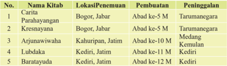

Tabel ini menyajikan informasi tentang lokasi penemuan, pembuatan, dan peninggalan dari beberapa kitab tertentu. Topik utama tabel adalah tentang lokasi penemuan, pembuatan, dan peninggalan dari kitab-kitab tertentu di berbagai daerah di Indonesia. Kolom-kolom yang ada dalam tabel meliputi No., Nama Kitab, Lokasi Penemuan, Pembuatan, dan Peninggalan. Data penting yang terlihat dalam tabel ini adalah bahwa semua kitab tersebut berasal dari Jawa, dengan lokasi penemuan yang berbeda-beda antara Bogor, Kediri, dan Keharijan. Selain itu, semua kitab tersebut dibuat oleh orang-orang yang berbeda, dengan pembuatan dilakukan di berbagai daerah seperti Abad ke-5 M, Abad ke-10 M, dan Abad ke-12 M. Terakhir, semua kitab tersebut memiliki peninggalan yang berbeda, seperti Tarumanagara, Medang, Kermul, dan Kediri.

### Tradisi;

Tradisi  adalah  kebiasaan  nenek  moyang  yang  masih  dijalankan  oleh masyarakat  saat  ini.  Tradisi  agama  Hindu  banyak  ditemukan  di  daerah Bali karena penduduk Bali sebagian besar beragama Hindu. Tradisi agama Hindu yang berkembang di Bali, antara lain:

- Upacara nelubulanin ketika bayi berumur 3 bulan.
- Upacara potong gigi (mapandes).
- Upacara  pembakaran  mayat  yang  disebut  Ngaben.  Dalam  tradisi Ngaben, jenazah dibakar beserta sejumlah benda berharga yang dimiliki orang yang dibakar.
Ziarah,  yaitu  mengunjungi  makam  orang  suci  dan  tempat  suci  leluhur seperti candi.

### 6.  Nusa Tenggara Barat.

Perkembangan agama Hindu di NTB (Lombok) dapat kita ketahui  dari perjalanan  suci  ' dharmayatra '  Dhang  Hyang  Nirartha.  Beliau  dikenal dengan  sebutan  Pangeran  Sangupati.  Banyak  peninggalan  tempat  suci dan  sastra  Hindu  yang  dapat  kita  pergunakan  sebagai  referensi  bahwa Hindu pada zaman itu telah berkembang sampai di Nusa Tenggara Barat. Keberadaan  agama  Hindu  di  NTB  juga  tidak  terlepas  dari  peran  serta kekuasaan raja-raja Karangasem pada masa itu.

### 7.  Nusa Tenggara Timur.

Masyarakat  Nusa  Tenggara  Timur  'Sumbawa'  sampai  saat  ini  masih mengenal sebutan Tuan Semeru. Nama Tuan Semeru adalah sebutan dari

 

---
## 📄 Halaman 133

Dhang Hyang Nirartha. Hal ini memberikan indikasi bahwa beliau pernah menyebarkan  ajaran  Hindu  ke  daerah  ini.  Sekarang  keberadaan  agama Hindu di daerah ini dikembangkan kembali oleh para transmigran asal Bali.

### 8.  Sulawesi.

Perkembangan  agama  Hindu  di  Sulawesi  diprediksi  sudah  ada  sejak abad ke 3 Masehi. Hal ini ditandai dengan penemuan patung Budha yang terdapat  di  daerah  Goa  yang  diperkirakan  pembuatan  sejaman  dengan patung-patung  budha  yang  ada  di  India  (R.Soekmono,  1973:82).  Tidak banyak yang bisa kita kemukakan dengan penemuan ini. Selanjutnya dapat dinyatakan bahwa perkembangan agama Hindu tumbuh subur di wilayah ini sebagai akibat dari adanya masyarakat transmigrasi yang berasal dari Bali dan sekitarnya.

### 9.  Irian Barat.

Tidak  jauh  berbeda  dengan  daerah  Sulawesi,  bahwa  perkembangan ke-Hindu-an  yang  ada  di  Irian  Barat  disebabkan  oleh  karena  adanya masyarakat  transmigrasi.  Disamping  itu,  juga  karena  adanya  penduduk yang mendapatkan tugas-tugas tertentu di daerah ini.

Demikian peradaban  Hindu di Indonesia, yang menurut penuturan sejarah Indonesia, di mulai dari Kalimantan, Jawa, Bali, Sumatra, dan daerah yang lainnya. Runtuhnya Kerajaan Majapahit yang beragama Hindu, peradaban agama Hindu di mulai kembali dari Bali yang telah menganut paham Hindu sejak Maha Rsi Markhandeya datang di Bali sampai sekarang.

### Uji Kompetensi:

- Setelah anda membaca teks bukti-bukti monumental peninggalan Prasejarah dan sejarah perkembangan Agama Hindu di Indonesia, apakah yang anda ketahui tentang sejarah agama Hindu? Jelaskan dan tuliskanlah!
- Buatlah ringkasan yang berhubungan dengan bukti-bukti monumental peninggalan Prasejarah  dan  sejarah  perkembangan Agama Hindu di Indonesia, dari berbagai sumber media pendidikan dan sosial yang anda ketahui! Tuliskan dan laksanakanlah sesuai dengan petunjuk dari bapak/ibu guru yang mengajar di kelasmu!

 

---
## 📄 Halaman 134

- Apakah  yang  anda  ketahui  tentang  bukti-bukti  monumental peninggalan Prasejarah dan sejarah perkembangan Agama Hindu di Indonesia? Jelaskanlah!
- Bagaimana cara kita untuk memanfaatkan keberadaan bukti-bukti monumental peninggalan Prasejarah  dan  sejarah  perkembangan Agama Hindu di Indonesia? Jelaskan dan tuliskanlah pengalaman anda!
- Manfaat  apakah  yang  dapat  dirasakan  secara  langsung  dari memiliki pengetahuan tentang bukti-bukti monumental peninggalan Prasejarah dan sejarah perkembangan Agama Hindu di Indonesia? Tuliskanlah pengalaman anda!
- Amatilah  lingkungan  sekitar  anda  terkait  dengan  keberadaan bukti-bukti monumental  peninggalan  Prasejarah dan sejarah perkembangan  Agama  Hindu  di  Indonesia, buatlah catatan seperlunya dan diskusikanlah dengan orang tuanya! Apakah yang terjadi?  Buatlah  narasinya  1-3  halaman  diketik  dengan  huruf Times New Roman - 12, spasi 1,5 cm, ukuran kertas kwarto; 4-33-4!

### D. Pelestarian Peninggalan Budaya Agama Hindu di Indonesia

### Perenungan.

'Ya àtmadàbaladà yasya visva upàsate praúiûaý yasya devàh, yasyacchàyà'måtaý yasya måtyuh kasmai devàya haviûà vidhema.

### Terjemahan:

Ia  yang  menganugerahkan  kekuatan  jasmani  dan  kemuliaan  rohani,  yang hukum-Nya dipatuhi oleh semua obyek yang bercahaya dan yang memberikan penerangan  kepada  umat  manusia,  yang  rahmat-Nya  bersifat  abadi,  yang mengatasi  kematian,  kepadanya,  sumber  kebahagiaan  yang  suci,  kami persembahkan doa kebaktian kami dengan ketulusan hati' (Ågveda X. 121.2).

 

---
## 📄 Halaman 135

Kekuatan jasmani dan kemuliaan rohani sesungguhnya adalah anugrah dari  Tuhan  Yang  Maha  Esa,  persembahan  doa  kebaktian  dengan ketulusan hati merupakan wujud dari upaya pelestarian semua yang ada ini. Bagaimana kita dapat melestarikan peninggalan budaya agama Hindu di Indonesia? Diskusikanlah dengan kelompok-mu!

Kata 'pelestarian' berasal dari kata 'lestari' berarti tetap seperti keadaan semula;  tidak  berubah;  bertahan;  kekal ( Kamus  Besar  Bahasa  Indonesia,  Tim  : 2001 ).  Melestarikan  adalah  menjadikan (membiarkan) tetap tidak berubah; membiarkan tetap seperti keadaan semula; mempertahankan kelangsungannya. Pelestari adalah orang yang menjaga sesuatu (hewan, hutan, lingkungan, warisan, budaya) dan sebagainya agar tetap lestari.  Pelestarian  adalah  proses,  cara, perbuatan melestarikan; perlindungan dari kemusnahan atau kerusakan; pengawetan; konservasi; sumber-sumber alam;

Gambar 2.32 Candi Bajang Ratu pengelolaan sumber daya alam yang menjamin pembuatannya secara bijaksana dan  menjamin  kesinambungan  persediannya  dengan  tetap  memelihara  dan meningkatkan kualitas nilai dan keanekaragamannya.

Pelestarian peninggalan budaya agama Hindu berarti proses, cara, perbuatan melestarikan;  perlindungan  dari  kemusnahan  atau  kerusakan;  pengawetan; konservasi;  peninggalan  budaya  agama  Hindu;  pengelolaan  peninggalan budaya  agama  Hindu  yang  menjamin  pembuatannya  secara  bijaksana  dan menjamin kesinambungan persediannya dengan tetap memelihara dan meningkatkan  kualitas  nilai  dan  keanekaragamannya.  Menjadi  kewajiban umat  sedharma  pada  kususnya  (Indonesia)  dan  umat  sejagat  raya  ini  pada umumnya, untuk mewujudkan pelestarian peninggalan budaya agama Hindu yang diwariskan oleh putra-putri anak bangsa ini dari masa lampau. Pemikiran, pernyataan, sifat dan sikap anak-anak bangsa yang demikian adalah wujud dari putra-putri yang berhati mulia. Kita semua patut bersyukhur kehadapanNya, karena berkesempatan dianugerahkannya lahir sebagai anak-anak bangsa menjadi pelestari dari budaya agama Hindu.

 

---
## 📄 Halaman 136

Negara Kesatuan Republik Indonesia (NKRI) kita ini memiliki banyak dan beraneka  corak,  ragam  dan  sifat  benda-benda  peninggalan  sejarah.  Bendabenda itu merupakan warisan masa lampau yang sangat berharga dari leluhur anak bangsa ini. Benda-benda itu menjadi milik Negara, menjadi milik seluruh rakyat  Indonesia.  Benda-benda  peninggalan  sejarah  yang  patut  menjadi kebanggaan bangsa Indonesia, seperti; Yupa, Prasasti, Karya sastra dan seni, Candi (Prambanan, Borobudur, Penataran), Pura (Besakih), dan yang lainnya. Sepertinya tak terbayangkan oleh kita, sejak abad ke 4  sampai dengan abad ke  9  bangsa  kita  sudah  mampu  membuat  bangunan  semegah,  indah  dan suci  seperti  itu.  Tiada  kata  yang  dapat  kita  ucapkan  untuk  menggantikan kemegahan,  keindahan,  dan  kesuciannya.  Sudah  sepatutnya  kita  bersikap hormat dan menghargai benda-benda peninggalan sejarah dan budaya agama kita. Apa saja bentuk upaya dan pelestarian sejarah budaya agama Hindu yang sudah dan akan kita lakukan?

Permasalahan di atas menunjukkan bahwa masih terlalu banyak peninggalan sejarah dan budaya Hindu yang belum kita upayakan pelestariannya. Bendabenda purbakala tersebut tidak semestinya kita abaikan apalagi hanya untuk diperjual-belikan  guna  mencari  keuntungan  pribadi.  Sebagai  anak  bangsa yang  berbudaya  sudah  seharusnya  kita  melestarikan,  merawat,  menjaga, mengunjungi,  menghormati  dan  menyucikan  peninggalan  leluhur  kita  itu. Benda-benda peninggalan sejarah patut dihargai. Bagaimana caranya?

- Merawat dan menjaga pelestarian peninggalan agama Hindu di Indonesia.
Banyak  benda  peninggalan  dan  warisan  sejarah  budaya  agama  Hindu di  Indonesia  yang  sudah  berusia  ratusan  atau  bahkan  ribuan  tahun.  Tak heran benda-benda tersebut banyak pula yang sudah rapuh dan rusak. Bila tidak  dirawat  dengan  baik  bisa  rusak  hancur  dan  menghilang.  Merawat benda-benda peninggalan dan warisan budaya agama Hindu di Indonesia merupakan  tugas  kita  semua.  Tapi  penanggung-jawab  utamanya  adalah Negara (pemerintah yang sedang berkuasa). Cara menjaga dan merawat antara lain sebagai berikut

- Membangun  museum-museum  untuk  penyimpanan  benda-benda  dan warisan sejarah budaya agama Hindu di Indonesia.
- Menjadikannya cagar budaya sesuai dengan fungsi dan pemanfaatan, benda-benda budaya bernafaskan ajaran agama Hindu.
- Menjaga dan merawat wilayah atau daerah-daerah cagar budaya bendabenda  yang  bernapaskan  agama  Hindu  dengan  sebaik  mungkin.  Di daerah cagar budaya biasanya terdapat banyak benda-benda peninggalan berbudaya agama Hindu.

 

---
## 📄 Halaman 137

- Turut  menjaga  agar  benda-benda  peninggalan  budaya  agama  Hindu tidak dirusak atau dirusak oleh barisan orang yang tidak bertanggungjawab. Benda-benda peninggalan sejarah harus diamankan dari tangantangan jahil.
- Mengunjungi tempat-tempat pelestarian peninggalan warisan benda-benda sejarah budaya agama Hindu di Indonesia.
Sudah  atau  belum  pernahkah  diantara  kita  mengunjungi  tempat-tempat pelestarian peninggalan warisan benda-benda sejarah dan budaya agama Hindu di Indonesia? Kalau memang sudah, lanjutkanlah upaya dan usaha mulia yang sudah dilaksanakan itu untuk diri pribadinya dan juga untuk generasi selanjutnya. Bila sekiranya belum, cobalah melakukannya, tidak ada cacatan sejarah yang menyalahkan-mu untuk mencoba berusaha dan berupaya berbuat mulia dalam kesempatan hidup ini dimanapun kita sedang mengabdi. Amatilah dengan baik, benda-benda apa saja yang terdapat di sana. Sebab mengunjungi tempat-tempat pelestarian peninggalan warisan benda-benda sejarah dan budaya agama Hindu termasuk salah satu cara mewujudkan  rasa  bhakti,  hormat,  rasa  memiliki,  dan  menghargai-nya. Diatara  kita  bisa  mengunjungi  tempat  pelestarian  peninggalan  warisan benda-benda sejarah dan budaya agama Hindu setempat lainnya, seperti;

- Candi;
- Makam pahlawan/kuburan nenek-moyang;
- Monumen, dan yang lainnya.
- Bersembahyang di tempat-tempat suci 'Pura' sebagai tempat suci peninggalan sejarah dan budaya agama Hindu dari nenek-moyang bangsa Indonesia.
Tempat suci umat sedharma 'Hindu' disebut dengan nama 'Pura'. Kata Pura  dalam  Kamus  besar  bahasa  Indonesia  berarti;  kota;  istana;  negeri (spt.Indrapura); tempat beribadat (bersembahyang) umat Hindu Dharma. Sudahkah  diantara  kita  umat  sedharma  memfungsikan  'Pura'  sebagai tempat bersembahyang setiap saat atau 3 (tiga) kali dalam sehari. Umat Hindu  memiliki  banyak  'ribuan'  tempat  suci  yang  dapat  dipergunakan sebagai sarana untuk menghubungkan diri (jasmani dan rohani) kehadapat Ida  Sang  Hyang  Widhi/Tuhan  Yang  Maha  Esa,  kapan  dan  dimana  saja sedang  berada  sesuai  dengan  tata-tertib  bersembahyang.  Terbiasa  atau belum biasakah diantara kita bersembahyang di tempat-tempat suci (Pura) sebagai peninggalan warisan sejarah dan budaya agama Hindu Indonesia untuk mengadakan kontak dengan-Nya? Bilamana memang  sudah, lanjutkanlah  upaya  dan  usaha  mulia  nan  suci  itu  yang  sudah  terlaksana

 

---
## 📄 Halaman 138

untuk pribadi pribadi, teman sejawat dan juga untuk generasi selanjutnya. Bila sekiranya belum, mulailah untuk melakukannya! Tidak ada cacatan prasasti yang melarang-mu untuk selalu memulai, berusaha dan berupaya berhubungan dengan Sang Pecipta beserta dengan prabhawanya yang patut kita  muliakan  dan  sucikan  dalam  kesempatan  hidup  ini  dimanapun  kita sedang berada. Amatilah dengan baik! tempat-tempat suci untuk memuja siapa saja yang terdapat di sekitarnya. Sebab datang mengadap (tangkil) ke tempat-tempat suci yang ada di lingkungan sekitar kita, yang tetap terjaga sampai saat ini kelestarian dan kesuciannya, sebagai peninggalan warisan sarana  bersejarah  dan  berbudaya  dalam  agama  Hindu  adalah  termasuk salah satu cara untuk mewujudkan rasa bakti, hormat, rasa memiliki, dan menyucikan-nya. Diataranya, kita wajib bersembahyang di tempat-tempat suci, seperti;

- Merajan/sanggah;
- Pura Kawitan;
- Pura Paibon;
- Pura Dadiya/Panti;
- Pura Kahyangan Tiga;
- Pura Padarman;
- Pura Dhang Kahyangan;
- Pura Kahyangan Jagat; dan yang lain-lainnya.
- Melarang  atau  tidak  memberikan  izin  kepada    orang-orang/individu/ kelompok yang hanya memiliki kepentingan sesaat atau tidak bertanggungjawab  untuk  mengelola  tempat-tempat  pelestarian  sejarah  dan  budaya peninggalan agama Hindu di Indonesia. Karena tidak tertutup kemungkinan diantara mereka dapat menyalahgunakan pemanfaatannya, seperti menghalalkan  segala  cara,  menapikan  sejarah  dan  budaya  bangsanya. Bila kondisi seperti ini dibiarkan terjadi secara berkesinambungan maka degradasi  moral  tentu  dapat  terjadi,  dan  akhirnya  bangsa  ini  tinggal menunggu kehancuran.

### Uji Kompetensi:

- Setelah  anda  membaca  teks  tentang  Pelestarian  peninggalan budaya  agama  Hindu  di  Indonesia,  apakah  yang  sudah  anda ketahui? Jelaskan dan tuliskanlah!

 

---
## 📄 Halaman 139

- Buatlah ringkasan yang berhubungan dengan upaya yang berhubungan  dengan  Pelestarian  peninggalan  budaya  agama Hindu di Indonesia, dari berbagai sumber media pendidikan dan sosial  yang  anda  ketahui!  Tuliskan  dan  laksanakanlah  sesuai dengan petunjuk dari bapak/ibu guru yang mengajar di kelas-mu!
- Apakah yang anda ketahui tentang Pelestarian peninggalan budaya agama Hindu di Indonesia? Jelaskanlah!
- Bagaimana cara-mu untuk dapat mewujudkan usaha dan upaya  tentang  Pelestarian  peninggalan  budaya  agama  Hindu  di Indonesia? Jelaskan dan tuliskanlah pengalamannya!
- Manfaat apakah yang dapat dirasakan secara langsung dari usaha dan  upaya-mu  untuk  melestarikan  peninggalan  budaya  agama Hindu di Indonesia? Tuliskanlah pengalaman anda!
- Amatilah  lingkungan  sekitar  anda  terkait  dengan  adanya  usaha Pelestarian  peninggalan  budaya  agama  Hindu  di  Indonesia, buatlah catatan  seperlunya  dan  diskusikanlah  dengan  orang tuanya!  Apakah  yang  terjadi?  Buatlah  narasinya  1-3  halaman diketik  dengan  huruf    Times  New  Roman  -  12,  spasi  1,5  cm, ukuran kertas kwarto; 4-3-3-4!

### E.  Kontribusi Kebudayaan Hindu dalam Pembangunan  Nasional dan Pariwisata Indonesia Menuju Era Globalisasi.

### Perenungan.

'Agne nakûatram ajaram à sùrya rohayo divi, dadhaj jyotir janebhyaá agne ketur viúam asi preûþah srestah upasthasat bhodhà stotre bayo dadhat.

 

---
## 📄 Halaman 140

### Terjemahan:

'Ya  Engkau  yang  bersinar,  Engkau  telah  menciptakan  matahari,  bintangbintang,  bergerak  di  langit,  menyinari  manusia;  Engkau  yang  bercahaya, menjadi  pelita  bagi  manusia;  sangat  mulia  dan  tercintalah  Engkau  yang mendampingi kami; berkatilah penyanyi, berilah dia kehidupan yang baik' (Ågveda X. 156.45).

Semua yang ada di dunia ini diciptakan dan dijiwai oleh Tuhan Yang Maha  Esa,  Hindu  mengajarkan  umatnya  untuk  selalu  percaya  dengan keberadaan-Nya. Bagaimana Kontribusi kebudayaan Hindu dalam pembangunan Nasional dan Parawisata Indonesia menuju era Globalisasi. Cari  dan  atau  buatlah  artikel  yang  berhubungan  dengan  kebudayaan Hindu. Diskusikanlah!

Bahasa (budaya) menunjukkan bangsa, demikian para budayawan menyatakan. Brandes (Belanda) tahun 1884 M. menerangkan bahwa bangsabangsa di seluruh kepulauan Indonesia mulai dari pulau Formosa di sebelah utara,  dan  Madagaskar  di  sebelah  barat,  tanah  Jawa,  Bali  dan  seterusnya disebelah  selatan,  sampai  ke  tepi  Amerika  pada  zaman  dahulu  berbahasa satu. H. Kern (Belanda) tahun 1889 M. mengadakan penyelidikan bahasa di kepulauan Indonesia, menyatakan penduduk kepulauan Indonesia berbahasa Tjempa (tanah Annam; sekarang). Sampai tahun 1500 SM bangsa Indonesia masih berkumpul di Tjempa, karena desakan bangsa lain (orang Asia tengah), lalu  mereka  berpindah  ke  Kamboja,  ke  Thai  dan  ke  Malaka.  Dari  Malaka berpindah ke Sumatra, Borneo (Kalimantan), Jawa dan sebagainya. Sampai pada permulaan Masehi bangsa-bangsa 'Hindu' tersebut sudah ada di Borneo (Kutai) yang dari padanya baru diketahui ada ke'Hindu'an tahun 400 Masehi (abad ke 4 M) di Borneo Timur (Kutai) dan Jakarta. Tulisan yang terdapat di Kutai berbunyi berbunyi sebagai berikut;

'Çrimatah  çri-narendrasya,  Kundungasya  mahàtmanah,  putro'çvavarmo vikhyàtah, vançakarttà yathànçumàn, tasya putra mahàtmànah, trayas traya ivàgnayah, tesan trayànàm pravarah, tapo-bala-damànvitah, çri-Mùlavarman ràjendro,  yastvà  buhusuvarnnakam,  tasya  yajnasya  yùpo'yam,  dvijendrais samprakalpitah.

### Terjemahan:

'Sang Maharaja Kundunga, yang amat mulia, mempunyai putra yang mashur, Sang Acwawarman namanya, yang seperti sang ancuman (Dewa matahari) menumbuhkan keluarga yang sangat mulia. Sang Acwawarman mempunyai

 

---
## 📄 Halaman 141

putra  tiga,  seperti  api  (yang  suci)  tiga.  Yang  terkemuka  dari  ke  tiga  putra itu  ialah  Sang  Mulawarman,  raja  yang  berperadaban  baik,  kuat  dan  kuasa. Sang Mulawarman telah mengadakan kenduri (selamatan yang dinamakan) emas amat banyak. Buat peringatan kenduri (selamatan) itulah tugu batu ini didirikan oleh para Brahmana' ( Purbatjaraka,  R.M.Ng. 1968 ).

Sebagai anak bangsa Indonesia sudah sepantasnya kita bersyukhur kehadapan Ida  Sang  Hyang  Widhi/Tuhan  Yang  Maha  Esa,  karena  telah  dilahirkan, dipelihara/dibesarkan  menjadi  insan-insan  yang  beragama  dan  berbudaya. Berangkat dari pemikiran Dr. H. Kern, dapat disimak bahwa bangsa Indonesia di  lahirkan  oleh  nenek  moyangnya yang religius, berbudaya sesuai dengan zamannya. Hindu yang disebut-sebut sebagai agama tertua di dunia menurut penuturan sejarah, memiliki benang merah dengan keberadaan nenek moyang kita.  Oleh  karena  panjangnya  perjalanan  yang  dilalui  maka  sangat  wajar memiliki beraneka macam bentuk, sifat dan ciri khas peninggalan kebudayaan yang  dimilikinya  termasuk  karya  sastra.  Apa  kontribusi  budaya  Hindu Indonesia?

Berdasarkan fakta-fakta sejarah Indonesia dengan peninggalan benda-benda budaya  yang  bernafaskan  ke'Hindu'an  dengan  yang  ada,  dapat  dinyatakan agama  Hindu memiliki kontribusi yang besar terhadap  pembangunan pariwisata  Indonesia  menuju  era  global.  Kontribusi  yang  dimaksud  antara lain;

- Pariwisata  alam; Indonesia  dikenal oleh dunia memiliki sumber daya alam yang  kaya  dan  indah  bernafaskan  keHinduan.  Keindahan  alam  Indonesia mejadi daya tarik tersendiri bagi wisatawan dunia untuk berkunjung ke Indonesia. Atas kunjungan itu sudah  menjadi  kewajiban  bangsa  dan negara kita menyiapkan pasilitas yang memadai,  seperti  ;  transportasi  (jalan dan angkutan) umum  dan khusus, gedung atau rumah-rumah penginapan beserta fasilitasnya, makanan dan minuman  sesuai kebiasaannya, jasa
pelayanan  (harus  mengetahui  dan  pasih  berbahasa  asing),  keamanan dan  kenyamanan  para  wisatawan  dalam  berwisata,  administrasi  yang akurat/jelas (tidak berbelit-belit atau membingungkan) dan yang lainnya.

 

---
## 📄 Halaman 142

Bangsa Indonesia lebih dari wajar harus memelihara kelestarian alamnya sebagaimana mestinya. Realisasi dari wisata alam ini dapat memberikan pendapatan negara yang juga dapat meningkatkan kesejahtraan bangsa ini. Ajaran  Hindu  yang  bersifat  kreatif  mengantarkan  bangsa  ini  bebas  dari kemiskinan material dan rohani.

2.  Wisata budaya; Budaya anak bangsa Indonesia melahirkan kebudayaan. Dari berbagai macam suku bangsa yang ada di Indonesia berbuah beraneka-macam kebudayaanya  yang  dapat  dinikmati oleh para wisatawan yang berkunjung ke  Indonesia.  Hindu  sebagai  agama tertua  di  dunia  termasuk  Indonesia, menjiwai kebudayaan anak bangsa ini sehingga semuanya  itu menjadi hidup  ' metaksu '.  Kebudayaan  yang ' metaksu ' menjadi daya tarik tersendiri bagi wisatawan (lokal dan asing) untuk menikmatinya.  Semuanya  itu  lagi-lagi

dapat  menambah  pendapatan  negara  dan  daerah  yang  dikunjunginya. Selanjutnya beberapa bentuk kebudayaan sumbangan agama Hindu yang dapat disajikan dalam tulisan ini, seperti;

### 3.  Candi:

Candi Jabung: Candi Hindu ini terletak  di  Desa  Jabung,  Kecamatan Paiton, Kabupaten Probolinggo, Jawa Timur. Struktur bangunan candi  yang  terbuat  dari  bata  merah ini mampu  bertahan  ratusan  tahun. Menurut kitab Nagarakertagama Candi Jabung di sebutkan dengan istilah Bajrajinaparamitapura .

Kitab Nagarakertagama juga menyebutkan bahwa candi Jabung pernah  dikunjungi  oleh  Raja  Hayam Wuruk dalam lawatannya keliling Jawa Timur pada tahun 1359 Masehi. Pada

 

---
## 📄 Halaman 143

kitab Pararaton disebut Sajabung yaitu tempat pemakaman Bhre Gundal salah seorang keluarga raja. Arsitektur bangunan candi ini hampir serupa dengan  candi  Bahal  yang  ada  di  Bahal,  Sumatera  Utara.  Bagaimana hubungan raja-raja Sumatra dengan raja-raja Jawa, lakukanlah penelusuran selanjutnya!

### Candi Tikus

Candi ini terletak di kompleks Trowulan,  sekitar  13  km  di  sebelah Tenggara kota Mojokerto. Candi Tikus yang semula telah terkubur dalam tanah  ditemukan  kembali  pada  tahun 1914. Penggalian situs dilakukan berdasarkan laporan bupati Mojokerto, R.A.A. Kromojoyo Adinegoro, tentang ditemukannya miniatur candi di sebuah pekuburan rakyat.

Pemugaran secara menyeluruh dilakukan pada tahun 1984 sampai dengan 1985. Nama  'Tikus' hanya merupakan sebutan yang digunakan

---
**🖼️ Gambar/Diagram**

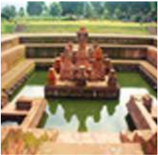

> **Deskripsi Visual:** Gambar ini adalah ilustrasi yang menunjukkan sebuah struktur arsitektur tradisional dengan latar belakang alam. Struktur tersebut terdiri dari bangunan utama yang memiliki atap berbentuk seperti kerucut dan beberapa bangunan sampingan yang lebih kecil. Bangunan utama memiliki pintu masuk yang besar dan terdapat kolom yang menjulang. Di sekeliling struktur utama terdapat kolam air yang tampak jernih dan cerah. Latar belakangnya adalah area hijau yang tampak seperti taman dengan pohon-pohon besar dan tanaman lainnya.

Elemen-elemen utama dalam gambar ini meliputi struktur arsitektur utama, bangunan sampingan, pintu masuk, kolom, kolam air, dan taman hijau. Relasi antara elemen-elemen ini adalah bahwa struktur utama merupakan pusat dari kompleks arsitektur ini, dengan bangunan sampingan yang lebih kecil mengisi ruang sekitarnya. Kolam air berada di depan struktur utama dan taman hijau membentuk latar belakang yang menambah keindahan dan keharmonisan keseluruhan struktur.

Teks, angka, atau label penting yang terlihat dalam gambar ini tidak ada. Informasi kunci yang dapat diambil pembaca meliputi desain arsitektur tradisional, keindahan alam, dan kemegahan struktur arsitektur tersebut.

masyarakat setempat. Konon, pada saat ditemukan, tempat candi tersebut berada merupakan sarang tikus.

### Candi Dieng

Secara administratif dataran tinggi Dieng (Dieng Plateau) berada di lokasi wilayah  Kabupaten  Banjarnegara  dan Kabupaten  Wonosobo,  Provinsi  Jawa Tengah.  Dataran  tinggi  Dieng  (Dieng Plateau) berada pada ketinggian kurang lebih 2088  m  dari permukaan  laut dengan suhu rata-rata 13-17 C, Dataran tinggi  Dieng  merupakan  dataran  yang terbentuk  oleh  kawah  gunung  berapi yang  telah  mati.  Bentuk  kawah  jelas terlihat  dari  dataran  yang  terletak  di tengah  dengan  dikelilingi  oleh  bukitbukit.  Sebelum  menjadi  dataran,  area

 

---
## 📄 Halaman 144

ini merupakan danau besar yang kini tinggal bekas-bekasnya berupa telaga. Bekas-bekas  kawah  pada  saat  ini,  kadang-kadang  masih  menampakan aktivitas  vulkanik,  misalnya  pada  kawah  Sikidang.  Disamping  itu  juga aktivitas vulkanik, yang berupa gas/uap panas bumi dan dialirkan melalui pipa  dengan  diameter  yang  cukup  besar,  dan  dipasang  di  permukaan tanah untuk menuju ke lokasi tertentu yang berada cukup jauh dari lokasi pemukiman penduduk dan dimanfaatkan untuk Pembangkit Tenaga Listrik Panas  Bumi.  Dengan  kondisi  topografi,  pemandangan  alam  yang  indah dan situs-situs peninggalan purbakala yang berupa candi, sehingga dataran tinggi  Dieng  mempunyai  potensi  sebagai  tempat  rekreasi  dan  sekaligus obyek peninggalan sejarah Hindu yang indah.

Dataran  tinggi  Dieng  dipandang  sebagai  suatu  tempat  yang  memiliki kekuatan misterius, tempat bersemayamnya arwah para leluhur, sehingga tempat ini dianggap suci. Dieng berasal dari kata Dihyang yang artinya tempat  arwah  para  leluhur.  Terdapat  beberapa  komplek  candi  di  daerah ini,  komplek  Candi  Dieng  dibangun  pada  masa  agama  Hindu,  dengan peninggalan  Arca  Dewa  Siwa,Wisnu,  Agastya,  Ganesha  dan  lain-lainya bercirikan Agama Hindu. Candi-candi yang berada di dataran tinggi Dieng diberi  nama  yang  berhubungan  dengan  cerita  atau  tokoh-tokoh  wayang Purwa dalam lokan Mahabarata, misalnya candi Arjuna, candi Gatotkaca, candi  Dwarawati,  candi  Bima,  candi  Semar,  candi  Sembadra,  candi Srikandi dan candi Punta Dewa. Nama candi tersebut tidak ada kaitannya dengan fungsi bangunan dan diperkirakan nama candi tersebut diberikan setelah  bangunan  candi  tersebut  ditinggalkan  atau  tidak  digunakan  lagi. Tokoh  siapa  yang  membangun  candi  tersebut  belum  bisa  dipastikan, dikarenakan informasi yang terdapat di 12 prasasti batu tidak ada satupun yang menyebutkan siapa tokoh yang membangun candi religius ini.

Tugas para ilmuwan muda untuk membuka tabir misteri yang ada pada peninggalan budaya candi Dieng menuntaskannya. Sudah menjadi pakem kita bahwa segala sesuatu yang ada pasti ada yang menciptakannya. Hal ini patut ditelusuri kebenarannya, walaupun bagaimana ini adalah salah satu aset pariwisata budaya yang patut digali eksistensinya untuk kesejahtraan dan kebahagiaan anak bangsa ini. Lakukanlah ... !

### Candi Cetho

Candi  Cetho  adalah  sebuah  candi  bercorak  agama  Hindu,  merupakan peninggalan  masa  akhir  pemerintahan  Majapahit  (abad  ke-15).  Laporan ilmiah pertama tentang keberadaan candi Cetho dibuat oleh Van de Vlies pada tahun 1842. Masehi A.J. Bernet Kempers juga melakukan penelitian

 

---
## 📄 Halaman 145

yang berhubungan dengan keberadaan candi ini. Ekskavasi atau penggalian untuk  kepentingan  rekonstruksi  candi  ini  dilakukan  pertama  kali  pada tahun 1928 oleh Dinas Purbakala Hindia Belanda.

Berdasarkan  keadaannya  ketika itu, pada reruntuhan candi Cetho mulai diadakan penelitian, candi ini memiliki usia yang tidak jauh dengan Candi Sukuh. Lokasi candi berada di Dusun Ceto, Desa Gumeng, Kecamatan Jenawi, Kabupaten  Karanganyar.  Candi Cetho berada pada ketinggian 1400 m di atas permukaan laut. Candi  ini  patut  dikunjungi  oleh umat sedharma untuk mengetahui keberadaannya.

### Candi Sukuh

Merupakan sebuah kompleks candi agama Hindu yang terletak  di  wilayah  Kabupaten Karanganyar, Jawa Tengah. Candi ini dikategorikan sebagai candi Hindu karena ditemukannya obyek pujaan lingga  dan  yoni.  Candi  Sukuh ini tergolong kontroversial karena  bentuknya  yang  kurang lazim dan karena banyaknya obyek-obyek lingga dan yoni yang melambangkan seksualitas.

Candi Sukuh telah diusulkan ke UNESCO untuk menjadi salah satu Situs Warisan Dunia sejak tahun 1995.

### Candi Surawana

Merupakan candi Hindu yang terletak di Desa Canggu, Kecamatan Pare, Kabupaten Kediri, sekitar 25 kilometer arah timur laut dari Kota Kediri. Candi  Surawana  juga  dikenal  dengan  nama  candi  Wishnubhawanapura.

 

---
## 📄 Halaman 146

Candi ini diperkirakan dibangun pada abad 14 Masehi, untuk memuliakan Bhre Wengker, yang dikenal sebagai seorang raja dari Kerajaan Wengker yang berada di bawah kekuasaan Kerajaan Majapahit.

Raja Wengker ini mangkat pada tahun 1388 M. Dalam Negarakertagama diceritakan bahwa  pada  tahun  1361  Raja Hayam  Wuruk  dari  Majapahit pernah berkunjung bahkan menginap di candi Surawana. Candi Surawana saat ini keadaannya sudah tidak utuh. Hanya bagian dasar yang telah direkonstruksi. Untuk menghormati jasa para pendahulu negara  kita,  candi  ini  sebaiknya dilanjutkan rekonstruksinya

sehingga  menjadi  utuh  dan  tetap  lestari  keberadaannya  dalam  rangka mewujudkan pariwisata berwawasan budaya.

### Candi Gerbang Lawang

Dalam  bahasa Jawa, Wringin Lawang berarti 'Pintu Beringin'. Gapura  agung  ini  terbuat  dari bahan bata merah dengan luas  dasar  13  x  11  meter  dan tinggi  15,5  meter.  Diperkirakan dibangun pada abad ke-14 Masehi.

Candi Gerbang ini lazim disebut bergaya  candi  bentar  atau  tipe gerbang terbelah. Gaya arsitektur seperti  ini  diduga  muncul  pada era  Majapahit  dan  kini  banyak ditemukan dalam arsitektur Bali.

 

---
## 📄 Halaman 147

### 4.  Karyasastra

Indonesia  memiliki  banyak  Pujangga  besar  pada  masa  pemerintahan raja-raja  di  nusantara  ini.  Para  pujangga  pada  masa  itu  tergolong  varna Brahmana yang memiliki kedudukan sebagai purohita kerajaan. Banyak karya sastra yang ditulis oleh pujangga kerajaan. Kekawin Ramayan ditulis oleh  Empu  Yogiçwara.  Dalam  salah  satu  bait  karya  beliau  menjelaskan sebagai berikut;

'Bràhmana ksatryàn padulur, jàtinya paras paropasarpana ya, wiku tan panatha ya hilang, tan pawiku ratu wiçîrna.

### Terjemahan:

'Sang Brahmana dan sang Ksatria mestinya rukun, jelasnya mesti senasib sepenanggungan tolong menolong, pendeta tanpa raja jelas akan kerusakan, raja tanpa raja tentu akan sirna, ( Ramayana Kekawin, I.49 ).

Dalam karya ini Empu Yogiswara ingin mengajarkan bagaimana pentingnya hubungan harmonis dan timbal-balik antara para raja dengan para  brahmana.  Karya  sastra  yang  lainnya  yang  penuh  dengan  makna tersebar di masyarakat dapat dijadikan penuntun hidup menghadapi dunia pariwisata di era globalisasi ini, antara lain;

### a.  Carita Parahiyangan Bogor, Jabar Abad ke-5 M Tarumanegara

Carita Parahiyangan merupakan nama suatu naskah Sunda kuna yang dibuat pada akhir abad ke-16, yang menceritakan sejarah Tanah Sunda, utamanya mengenai kekuasaan di dua ibukota Kerajaan Sunda yaitu Keraton Galuh dan Keraton Pakuan. Naskah ini merupakan bagian dari naskah  yang  ada  pada  koleksi  Museum  Nasional  Indonesia  Jakarta. Naskah ini terdiri dari 47 lembar daun lontar ukuran 21 x 3 cm, yang dalam  tiap  lembarnya  diisi  tulisan  4  baris.  Aksara  yang  digunakan dalam penulisan naskah ini adalah aksara Sunda (Soeroto. 1970:1650.

Naskah  Carita  Parahiyangan  menceritakan  sejarah  Sunda,  dari  awal kerajaan Galuh pada zaman Wretikandayun sampai runtuhnya Pakuan Pajajaran (ibukota Kerajaan Sunda akibat serangan Kesultanan Banten, Cirebon dan Demak).

 

---
## 📄 Halaman 148

### b. Kresnayana Bogor, Jabar Abad ke-5 M Tarumanegara

Kakawin Kresnâyana adalah sebuah karya sastra Jawa kuno karya Empu Triguna, yang menceritakan pernikahan prabu Kresna dan penculikan calonnya yaitu Rukmini. Singkat, ceritanya adalah sebagai berikut. Dewi Rukmini,  putri  prabu  Bismaka  di  negeri  Kundina,  sudah  dijodohkan dengan Suniti, raja negeri Cedi. Tetapi ibu Rukmini, Dewi Pretukirti lebih  suka  jika  putrinya  menikah  dengan  Kresna.  Maka  karena  hari besar sudah hampir tiba, lalu Suniti dan Jarasanda, pamannya, samasama datang di Kundina. Pretukirti dan Rukmini diam-diam memberi tahu Kresna supaya datang secepatnya. Kemudian Rukmini dan Kresna diam-diam melarikan diri.

Mereka dikejar oleh Suniti, Jarasanda dan Rukma, adik Rukmini, beserta para  bala  tentara  mereka.  Kresna  berhasil  membunuh  semuanya  dan hampir membunuh Rukma namun dicegah oleh Rukmini. Kemudian mereka  pergi  ke  Dwarawati  dan  melangsungkan  pesta  pernikahan. Kakawin  Kresnâyana  ditulis  oleh  Empu  Triguna  pada  saat  prabu Warsajaya memerintah di Kediri pada kurang lebih tahun 1104 Masehi (Yamin, Muhammad. 1975 : 29).

### c.  Arjunawiwaha Kahuripan , Jatim Abad ke-10 M Medang Kamulan

Kakawin Arjunawiw ฀ ha adalah  kakawin  pertama  yang  berasal  dari Jawa  Timur.  Karya  sastra  ini  ditulis  oleh  Empu  Kanwa  pada  masa pemerintahan Prabu Airlangga, yang memerintah di Jawa Timur dari tahun  1019  sampai  dengan  1042  Masehi.  Sedangkan  kakawin  ini diperkirakan digubah sekitar tahun 1030.

Kakawin  ini  menceritakan  sang  Arjuna  ketika  ia  bertapa  di  gunung Mahameru. Lalu ia diuji oleh para Dewa, dengan dikirim tujuh bidadari. Bidadari ini diperintahkan untuk menggodanya. Nama bidadari yang terkenal  adalah  Dewi  Supraba  dan  Tilottama.  Para  bidadari  tidak berhasil menggoda Arjuna, maka Batara Indra datang sendiri menyamar menjadi  seorang  brahmana  tua.  Mereka  berdiskusi  soal  agama  dan Indra  menyatakan  jati  dirinya  dan  pergi.  Lalu  setelah  itu  ada  seekor babi  yang  datang  mengamuk  dan  Arjuna  memanahnya.  Tetapi  pada saat yang bersamaan ada seorang pemburu tua yang datang dan juga memanahnya.  Ternyata  pemburu  ini  adalah  batara  Siwa.  Setelah  itu Arjuna diberi tugas untuk membunuh Niwatakawaca, seorang raksasa yang  mengganggu  kahyangan.  Arjuna  berhasil  dalam  tugasnya  dan diberi  anugerah  boleh  mengawini  tujuh  bidadari  ini  (Poerbacaraka, RM. Ng. Kepustakaan Jawa: 15).

 

---
## 📄 Halaman 149

### d. Lubdhaka Kediri, Jatim Abad ke-11 M Kediri

Kakawin ini ditulis dalam bahasa Jawa kuno oleh mpu Tanakung pada paruh kedua Abad ke 15. Dalam kakawin ini diceritakan bagaimana seseorang yang berdosa besar sekalipun dapat mencapai surga. Dikisahkan bagaimana Lubdhaka seorang pemburu sedang berburu di tengah hutan. Tetapi sudah lama ia mencari-cari buruan, tidak dapat. Padahal hari mulai malam. Supaya tidak diterkam dan menjadi mangsa binatang buas, ia lalu memanjat pohon dan berusaha supaya tidak jatuh tertidur. Untuk itu ia lalu memetik daun-daun pohon dan dibuangnya ke bawah. Di bawah ada sebuah kolam. Kebetulan di tengah kolam ada sebuah lingga dan daun-daun berjatuhan di atas sekitar lingga tersebut. Lalu malam menjadi hari lagi dan iapun turun dari pohon lagi.

Selang  beberapa  lama  iapun  melupakan  peristiwa  ini  dan  kemudian meninggal dunia. Arwahnya lalu gentayangan di alam baka tidak tahu mau ke mana. Maka Dewa Maut; Batara Yama melihatnya dan ingin mengambilnya  ke  neraka.  Tetapi  pada  saat  yang  sama  Batara  Siwa melihatnya dan ingat bahwa pada suatu malam yang disebut 'Malam Siwa'  (Siwaratri)  ia  pernah  dipuja  dengan  meletakkan  dedaunan  di atas lingga, simbolnya di bumi. Lalu pasukan Yama berperang dengan pasukan Siwa yang ingin mengambilnya ke surga. Siwapun menang dan Lubdhaka dibawanya ke sorga (Poerbacaraka, RM. Ng. Kepustakaan Jawa: 32).

### e.  Baratayuda Kediri, Jatim Abad ke-12 M Kadiri.

Baratayuda , adalah istilah yang dipakai di Indonesia untuk menyebut perang besar di Kurukshetra antara keluarga Pandawa melawan Korawa (Mahabharata). Perang ini merupakan klimaks dari kisah Mahabharata, yaitu sebuah wiracarita terkenal dari India.

Istilah Baratayuda berasal dari kata Bharatayuddha (Perang Bharata), yaitu judul sebuah naskah kakawin berbahasa Jawa Kuna yang ditulis pada  tahun  1157  Masehi  oleh  Empu  Sedah  dan  Empu  Panuluh  atas perintah Maharaja Jayabhaya, raja Kerajaan Kadiri. Karya ini merupakan gubahan  dari  Mahabarata.  Isi  dari  kitab  ini  menjelaskan  peperangan dari darah bharata yaitu Pandawa dan Kurawa, yang berlangsung 18 hari. Boleh jadi kekawin baratayuda yang ditulis pada masa Kediri itu sebagai simbolis keadaan perang saudara antara Kerajaan Kediri dengan Jenggala yang sama-sama keturunan Raja Erlangga. Keadaan perang

 

---
## 📄 Halaman 150

saudara itu digambarkan seolah-olah seperti yang tertulis dalam Kitab Mahabarata karya Vyasa yaitu perang antara Pandawa dan Kurawa yang sebenarnya juga keturunan Vyasa sang penulis (Poerbacaraka, RM. Ng. Kepustakaan Jawa: 22).

### f.  Negarakertagama , Majapahit abad ke 14 Masehi.

Merupakan  karya  kesusasteraan  kuno  seiring  perkembangan  waktu sebagai  buwah  karya  pujangga  zaman  Majapahit  .  Sedangkan  dari isinya  merupakan  uraian  sejarah.  Isi  dari  Kekawin  Negarakertagama merupakan uraian sejarah dari Kerajaan Singasari dan Majapahit dan ternyata sesuai dengan prasasti-prasasti yang ditemukan. Di dalamnya terdapat pula uraian tentang kota Majapahit, jajahan-jajahan Majapahit, perjalanan  Raja  Hayam  Wuruk di  sebagian  Jawa  Timur  yang  dijalin dengan daftar candi-candi yang ada, upacara craddha yang dilakukan untuk roh Gayatri dan tentang pemerintahan serta keagamaan dalam zaman  Hayam  Wuruk.  Negarakertagama  merupakan  karya  Empu Prapanca  tahun  1365  Masehi  (Poerbacaraka,  RM.  Ng.  Kepustakaan Jawa: 37)

### g.  Sutasoma

Kakawin Sutasoma menggunakan bahasa Jawa kuno sehingga dimasukkan dalam kesusasteraan zaman Majapahit I. Kitab Sutasoma menceritakan tentang seorang anak raja bernama Sutasoma. Sutasoma, seorang  anak  raja  yang  menjadi    pendeta  Budha.  Sutasoma  rela meninggalkan kehidupan duniawi karena taat kepada agama Buddha. Ia  bersedia  berkorban  untuk  kebahagiaan  makhluk  hidup.  Bahkan diceritakan ia rela dimakan raksasa agar raksasa tersebut kenyang.

Dalam kitab ini tergambar adanya kerukunan umat beragama di  Majapahit  antara  umat  Hindu  dengan  umat  Budhha.  Kalimat Bhinneka Tunggal Ika, Tan Hana Dharma Mangrwa tertulis didalamnya (Poerbacaraka, RM. Ng. Kepustakaan Jawa: 38).

### h. Pararaton

Pararaton termasuk  kesusasteraan  zaman  Majapahit  II.  Kitab  ini menggunakan bahasa Jawa Tengah dan berbentuk tembang atau kidung namun  ada  pula  yang  berupa  gancaran.  Kitab  Pararaton  merupakan uraian sejarah, namun kurang dapat dipercaya karena isinya sebagian besar lebih bersifat mitos atau dongeng. Selain itu, angka-angka tahun yang ada tidak cocok dengan sumber sejarah yang lain. Dari kitab ini mula-mula diuraikan tentang riwayat Ken Arok, yang penuh dengan kegaiban. Raja-raja Singasari berikutnya juga demikian.

 

---
## 📄 Halaman 151

Bagian  kedua  menguraikan  Raden Wijaya dari ikut Kertanegara sampai menjadi  raja  Majapahit.  Kemudian diceritakan  tentang  Jayanegara  dan pemberontakan-pemberontakan Rangga  Lawe  dan  Lembu  Sora, serta peristiwa Putri Sunda di Bubat. Pada bagian penutup memuat daftar raja-raja sesudah Hayam Wuruk

Gambar 2.42 Karyasastra Susastra

(Poerbacaraka, RM. Ng. Kepustakaan Jawa: 65).

### i.  Calon Arang

Calon Arang termasuk kesusastraan kuno yang menggunakan bahasa Jawa tengahan, sehingga dapat dimasukkan ke dalam zaman Majapahit II. Kitab Calon Arang ini berisi tentang cerita Calon Arang kemudian dibunuh oleh Empu Bharadah atas suruhan Raja Airlangga. Kitab Calon Arang ini juga mengisahkan tentang pembelahan Kerajaan Kediri oleh Empu Bharada atas suruhan Raja Airlangga (Poerbacaraka, RM. Ng. Kepustakaan Jawa: 55).

Pada awalnya karya sastra ini ditulis di atas daun lontar yang bila rusak selalu diperbaiki. Sejalan dengan kemajuan teknologi kemudian diubah menggunakan kertas. Karya sastra ini bisa berbentuk puisi, kakawin, maupun prosa. Berikut karya sastra yang bercorak Hindua seperti;

Kakawin Hariwangsa dan  Gatotkacasraya,  karya  Empu  Panuluh; Kitab Smaradhana,  karya  Empu  Dharmaja;  Kitab  Lubdaka  dan Kitab  Wrtasancaya  karya  Empu  Tanakung;  Kitab  Sundayana  yang mengisahkan  terjadinya  peristiwa  Bubat,  yakni  perkawinan  yang berubah menjadi pertempuran; Kitab Ranggalawe yang menceritakan pemberontakan  Ranggalawe;  Kitab  Sorandaka  yang  menceritakan pemberontakan tentang Lembu Sora; Kitab Usana  Jawa yang menceritakan penaklukan Bali oleh Gajah Mada bersama Arya Damar (Poerbacaraka, RM. Ng. Kepustakaan Jawa: 23).

Cerita  Panji;  Mengisahkan  perkawinan  Panji  Inu  Kertapati,  putra raja Kahuripan dengan Galuh Candra Kirana, putri raja Daha. Perkawinan berlangsung setelah berhasil mengatasi berbagai kesulitan.

Tradisi tulisan peninggalan kerajaan-kerajaan Islam yang berupa karya sastra mendapat pengaruh dari Persia. Namun pengaruh sastra Indonesia dan  Hindu  juga  masih  ada.  Pada  masa  itu  muncullah  hikayat,  yakni

 

---
## 📄 Halaman 152

karya sastra yang kebanyakan berisi dongeng belaka. Ada pula hikayat berisi cerita sejarah;  di pulau Jawa 'babad' biasa di Jawa berupa puisi (tembang)  di luar Jawa bisa berbentuk syair atau prosa. Pertunjukan seni drama biasanya banyak bersumberkan karya sastra tersebut.

Kesusasteraan  merupakan  hasil  kebudayaan  yang  mengandung  makna penting  menurut  sejarah.  Dinyatakan  demikian  karena  dari  karya  sastra tersebut  kita  banyak  bisa  mengetahui  gambaran  sejarah  dimasa  lampau. Menurut waktu perkembangannya kesusasteraan kuno dapat dibagi menjadi beberapa zaman, diantaranya; kesusastraan zaman Mataram (sekitar abad; 9 dan 10 Masehi), zaman Kediri (sekitar abad; 11 dan 12 Masehi), zaman Majapahit I (sekitar  abad;  14  Masehi),  dan  zaman  Majapahit  II  (sekitar abad; 15 dan 16 Masehi). Ada dua zaman Majapahit disebutkan, hal ini dikarenakan adanya perbedaan bahasa yang digunakan pada kesusastraan tersebut. Zaman Majapahit I menggunakan bahasa Jawa kuno, sedangkan zaman Majapahit II menggunakan bahasa Jawa Tengah. Sudah tentu masih banyak karya sastra yang belum terungkap sampai saat ini, oleh karena itu adalah tugas kita bersama.

### Uji Kompetensi:

- Apakah menurut-mu Hindu agama budaya? Jelaskanlah!
- Setelah anda membaca teks Kontribusi kebudayaan Hindu dalam pembangunan  Nasional  dan  Parawisata  Indonesia  menuju  era Globalisasi,  apakah  yang  anda  ketahui  tentang  agama  Hindu? Jelaskan dan tuliskanlah!
- Buatlah ringkasan yang berhubungan dengan kontribusi kebudayaan Hindu dalam pembangunan Nasional dan Parawisata Indonesia menuju era Globalisasi, dari berbagai sumber media  pendidikan  dan  sosial  yang  anda  ketahui!  Tuliskan  dan laksanakanlah sesuai dengan petunjuk dari bapak/ibu guru yang mengajar di kelasmu!
- Apakah yang anda ketahui tentang kontribusi kebudayaan Hindu dalam pembangunan Nasional dan Pariwisata Indonesia menuju era Globalisasi? Jelaskanlah!
- Bagaimana  cara-mu  untuk  mengetahui  kontribusi  kebudayaan Hindu  dalam  pembangunan  Nasional  dan  Parawisata  Indonesia menuju  era  Globalisasi?  Jelaskan  dan  tuliskanlah  pengalaman anda!

 

---
## 📄 Halaman 153

- Manfaat apakah yang dapat dirasakan secara langsung dari usaha dan upaya untuk mengetahui kontribusi kebudayaan Hindu dalam pembangunan  Nasional  dan  Pariwisata  Indonesia  menuju  era Globalisasi? Tuliskanlah pengalaman anda!
- Amatilah lingkungan sekitar anda terkait dengan adanya kontribusi kebudayaan Hindu dalam pembangunan Nasional dan Pariwisata Indonesia menuju era Globalisasi guna mewujudkan tujuan hidup manusia dan tujuan agama Hindu, buatlah catatan seperlunya dan diskusikanlah dengan orang tuamu! Apakah yang terjadi? Buatlah narasinya 1-3 halaman diketik dengan huruf  Times New Roman - 12, spasi 1,5 cm, ukuran kertas kwarto; 4-3-3-4!
Selamat Belajar

 

---
## 📄 Halaman 154

 

---
## 📄 Halaman 155

### Bab III

### TANTRA, YANTRA, DAN MANTRA

Purusa evadam sarvam yadbhutam yacca bhavyam, utamrtatvasesa no, jadannenati rohati.

### Terjemahannya

Tuhan sebagai wujud kesadaran agung merupakan asal dari segala yang telah ada dan yang akan ada, Ia adalah raja di alam yang abadi dan juga di bumi ini yang hidup dan berkembang dengan makanan (Ågveda, X.90.2).

Berbagai macam upaya telah dilaksanakan manusia untuk dapat meningkatkan kesadaran pribadinya, namun apa yang ingin diwujudkan belum juga bisa tercapai dengan sempurna! Renungkanlah bait sloka tersebut di atas!

Sumber: http://ruangkumemajangkarya/11-07-2012' .

Gambar 3.1 Mandala Padma - Tantra

 

---
## 📄 Halaman 156

### A. Ajaran Tantra, Yantra, dan Mantra.

Perenungan.

'Niyataý kuru karma tvaý karma jyàyo hyakarmaóaá, sarira-yàtràpi ca te na prasiddhayed akarmaóaá.

### Terjemahan:

'Bekerjalah seperti yang telah ditentukan, sebab berbuat lebih baik daripada tidak  berbuat,  dan  bahkan  tubuhpun  tak  akan  berhasil  terpelihara  tanpa berkarya (Bhagawadgita, III.8).

Hindu  mengajarkan  umatnya  untuk  selalu  berbuat,  dalam  hidup  ini berbuat  jauh  lebih  baik  dari  pada  sama  sekali  tidak  berbuat  (karma). Bagaimana  manfaat  ajaran  Tantra,  Yantra,  dan  Mantra  dalam  agama Hindu? Carilah dan atau buatlah artikel tentang ajaran Tantra,  Yantra, dan Mantra, selanjutnya diskusikanlah di kelas-mu!

Dalam  melaksanakan  puja  bakti  kepada  Brahman,  umat  Hindu    diberikan kebebasan untuk dapat mewujudkan bentuk Ś raddh ā tersebut. Secara umum bentuk Bakti  umat Hindu dapat dilakukan dengan melibatkan aspek: yantra, tantra,  mantra,  yajña,  dan  yoga.  Yantra adalah  alat  atau  simbol-simbol keagamaan yang diyakini mempunyai kekuatan spiritual untuk meningkatkan kesucian. Tantra adalah kekuatan suci dalam diri yang dibangkitkan dengan cara-cara  yang  ditetapkan  dalam  kitab  suci. Mantra adalah  doa-doa  yang harus  diucapkan  oleh  umat  kebanyakan,  pinandita,  pandita  sesuai  dengan kewenangan dan tingkatannya. Ketiga aspek itu dilaksanakan secara terpadu dengan  berbasiskan  'ketulus-ikhlasan'  sehingga  membangun  satu  aktifitas yang  disebut yajña. Yajña yaitu  persembahan  yang  tulus  ikhlas  atas  dasar kesadaran  untuk  dipersembahkan  sehingga  dapat  meningkatkan  kesucian. Jika hal ini dilaksanakan secara intens maka akan mempengaruhi gelombanggelombang pikiran menjadi stabil dan kuat. Dan Yoga adalah mengendalikan gelombang-gelombang pikiran dalam alam pikiran untuk dapat berhubungan dengan Tuhan, yang dapat dilakukan melalui Astangga Yoga (yama, niyama, asana, pranayama, prathyahara, dharana, dhyana, dan samadhi (Titib, I Made. 2003).

 

---
## 📄 Halaman 157

### 1.  Tantra:

Kata tantra berasal  dari  bahasa  Sanekerta yang  memiliki  makna  'memperluas'. Tantra merupakan salah satu dari sekian banyak konsep  pemujaan  kehadapan Ida  Sang  Hyang  Widhi  Wasa/Tuhan Yang Maha  Esa, di mana manusia kagum pada sifat-sifat kemahakuasaanNya sehingga memiliki keinginan untuk  mendapatkan  kesaktian.  Kamus Besar Bahasa Indonesia, 2003:1141 menjelaskan  tantra  'tantrisme'  adalah ajaran dalam agama Hindu yang mengandung  unsur  mistik  dan  magis. Mistik dapat dipahami sebagai eksistensi tertinggi  kesadaran  manusia,  di  mana

ragam  perbedaan  ('kulit')  akan  lenyap,  eksistensi  melebur  ke  dalam kesatuan mutlak hal ikhwal, nilai universalitas, alam kesejatian hidup, atau ketiadaan. Kesadaran tertinggi ini terletak di dalam batin atau rohaniah, mempengaruhi  perilaku batiniah (bawa) seseorang, dan selanjutnya mewarnai pola pikirnya. Atau sebaliknya, pola pikir telah dijiwai oleh nilai mistikisme yakni eksistensi kesadaran batin. Meskipun demikian, eksistensi mistik  yang  sesungguhnya  tidaklah  berhenti  pada  perilaku  batin  (bawa) saja, lebih utama adalah perilaku jasad (solah). Artinya, mistik bukanlah sekedar teori namun lebih ke arah manifestasi atau mempraktikkan perilaku batin ke dalam aktivitas hidup sehari-harinya dalam berhubungan dengan sesama manusia dan makhluk lainnya. Diantara kita tentu ada yang tidak ingin  menjadi  seorang  agamis,  yang  hanya  terpaku  pada  simbol-simbol agama berupa penampilan fisik, jenis pakaian, cara bicara, bahasa, gerakgerik, bau minyak wanginya. Ada baiknya diantara kita menjadi seorang praktisi  (penghayat)  akan  teori-teori  agama  sehingga  tidak  hanya  pintar berbicara. Hal itu menjadi hak setiap orang untuk memilih, masing-masing tentu akan membawa dampak yang berbeda-beda. Damarjati Supadjar , mengemukakan bahwa ciri-ciri mistikisme adalah sebagai berikut: Mistikisme  adalah  persoalan  praktik;  Secara  keseluruhan,  mistikisme adalah aktivitas spiritual; Jalan dan metode mistikisme adalah cinta kasih sayang; Mistikisme menghasilkan pengalaman psikologis yang nyata; dan Mistikisme sejati tidak mementingkan diri sendiri.

 

---
## 📄 Halaman 158

Jika kita cermati dari kelima ciri mistikisme di atas dapat ditarik benang merah bahwa mistik berbeda dengan sikap klenik, gugon tuhon ,  bodoh, puritan, irasional. Sebaliknya mistik merupakan tindakan atau perbuatan yang adiluhung, penuh keindahan, atas dasar dorongan dari budi pekerti luhur  atau  akhlak  mulia.  Mistik  sarat  akan  pengalaman-pengalaman spiritual. Yakni bentuk pengalaman-pengalaman halus, terjadi sinkronisasi antara logika rasio dengan logika batin. Pelaku mistik dapat memahami fenomena atau eksistensi di luar diri (gaib) sebagai kenyataan yang logis atau masuk akal. Sebab akal telah mendapat informasi secara runtut, juga memahami rumus-rumus yang terjadi di alam gaib.

Subramuniyaswami,  Satguru  Úivaya  1997,  mengatakan  bahwa  ' Tantra adalah bagian dari çaktisme, yaitu pemujaan kepada Ibu semesta. Dalam proses pemujaannya, para pemuja 'çakta' tersebut menggunakan mantra , yantra , tantra , yoga ,  dan puja serta  melibatkan  kekuatan  alam  semesta dan  membangkitkan  kekuatan kundalini .' Disebut çaktiisme karena yang  dijadikan  obyek  persembahannya  adalah  çakti.  Çakti  dilukiskan sebagai Devi , sumber kekuatan atau tenaga. 'Çakti is the symbol of bala or  strength'  Çakti  adalah  simbol  dari  bala  atau  kekuatan.  Pada  sisi  lain çakti juga disamakan dengan energi atau kala 'this sakti or energi is also regarded as 'Kala' or time' (Das Gupta, 1955).

Terdapat berbagai definisi Tantra yang berasal dari sudut pandang yang berbeda. Sayangnya diantara berbagai definisi itu tidak selalu konsisten antara yang satu dengan yang lainnya. Tantra merupakan ajaran filosofis yang pada umumnya mengajarkan pemujaan kepada çakti sebagai obyek utama pemujaan, dan memandang alam semesta sebagai permainan atau kegiatan  rohani  dari  çakti  dan  Úiwa.  Tantra  adalah  cabang  dari  agama Hindu.  Ajaran tantra mengacu  kepada  kitab-kitab  yang  pada  umumnya berhubungan dengan pemujaan kepada çakti (Ibu semesta; Devi Durga, Devi Kali, Parwati, Laksmi, dan sebagainya), sebagai aspek Tuhan yang tertinggi dan sangat erat kaitannya dengan praktek spiritual dan bentukbentuk  ritual  pemujaan,  yang  bertujuan  membebaskan  seseorang  dari kebodohan, dan mencapai pembebasan. Dengan demikian tantrisme lebih sering  dinyatakan  sebagai  suatu  paham  kepercayaan  yang  memusatkan pemujaan  pada  bentuk  çakti  yang  berisi  tentang  tata cara  upacara keagamaan, filsafat, dan cabang ilmu pengetahuan lainnya, yang ditemukan dalam  percakapan  antara  Deva  Siwa  dan  Devi  Parwati.  Tantra  bukan merupakan  sebuah  sistem  filsafat  yang  bersifat  padu  (koheren),  tantra

 

---
## 📄 Halaman 159

merupakan akumulasi dari berbagai praktek dan gagasan yang memiliki ciri utama penggunaan ritual, ditandai dengan pemanfaatan sesuatu yang bersifat  duniawi,  untuk  menggapai  dan  mencapai  sesuatu  yang  bersifat rohani,  serta  penyamaan  atau  pengidentikan  antara  unsur  mikrokosmos dengan unsur makrokosmos. Praktisi tantra memanfaatkan prana (energi semesta) yang mengalir di seluruh alam semesta (termasuk dalam badan manusia) untuk mencapai tujuan yang diharapkan. Tujuan itu bisa berupa tujuan material, bisa pula tujuan spiritual, atau gabungan keduanya. Para penganut  tantra  meyakini  bahwa  pengalaman  mistis  adalah  merupakan suatu keharusan yang menjamin keberhasilan seseorang dalam menekuni tantra. Beberapa jenis tantra membutuhkan kehadiran seorang guru yang mahir untuk membimbing kemajuan siswa tantra.

Tantra dalam perkembangannya sering menggunakan simbol-simbol material termasuk simbol-simbol erotis. Tantra sering diidentikkan dengan ajaran kiri yang mengajarkan  pemenuhan  nafsu seksual, pembunuhan dan kepuasan makan daging. Padahal  beberapa  perguruan  tantra  yang saat ini mempopulerkan diri sebagai tantra putih menjadikan; mabuk-mabukan, makan daging dan hubungan seksual sebagai sadhana dasar pantangan dalam meniti jalan  tantra.  Konsep  ini  berpangkal  pada

percakapan Devi Parwati dengan Deva Siva yang menguraikan turunnya Devi Durga ke Bumi pada zaman Kali untuk menyelamatkan dunia dari kehancuran moral dan perilaku. Dalam beberapa sumber Devi Durga juga disebut  'Candi'.  Mulai  saat  itulah  pada  mulanya  muncul  istilah  candi 'candikaghra' untuk menamai bangunan suci sebagai tempat memuja Deva dan arwah yang telah suci. Peran Devi Durga dalam menyelamatkan dunia dari kehancuran moral dan perilaku disebut kalimosada 'kali-maha-usada' yang artinya Devi Durga adalah obat yang paling mujarab dalam zaman kekacauan  moral,  pikiran  dan  perilaku;  sedangkan  misi  beliau  turun  ke bumi disebut Kalika-Dharma.

Menurut  Maurice Winernitz, meskipun  teks-teks kitab tantra tidak menunjukkan  permusuhan  secara  nyata  terhadap  ayat-ayat  atau  ajaran Weda,  namun  menegaskan  bahwa  ajaran-ajaran  Weda  dianggap  terlalu sulit untuk dipraktekkan oleh beberapa kalangan pengikut tantra. Karena

 

---
## 📄 Halaman 160

alasan itulah, cara yang lebih mudah dan praktis diberikan dalam kitabkitab tantra. Prinsip-prinsip Tantra terdapat dalam buku bernama Nigama, sedangkan praktek-prakteknya dalam buku Agama. Sebagian buku-buku kuno itu telah hilang dan sebagian lagi tak dapat dimengerti karena tertulis dalam tulisan rahasia untuk menjaga kerahasiaan tantra terhadap mereka yang  tak  memperoleh  inisiasi.  Setidaknya  terdapat  64  jenis  kitab  yang memuat ajaran Tantrayana, antara lain: Maha nirwana tantra, Kularnawa tantra, Tantra Bidhana, Yoginirdaya tantra, Tantrasara, dan sebagainya.

Dalam perkembangan selanjutnya, praktek ajaran tantra dinyatakan selalu mewarnai kebudayaan dan keagamaan yang berkembang di nusantara. Hal ini dapat dilihat dari berbagai jenis peninggalan seperti; prasasti, candi dan arca-arca yang bercorak tantrisme. Kebanyakan isi kitab-kitab tantra masih dirahasiakan  dari  arti  yang  sebenarnya  dan  yang  sudah  diketahui  masih merupakan teka-teki. Orang-orang Hindu, termasuk para sarjana besar pada umumnya tidak mendiskusikan Tantra. Berbeda dengan agama Hindu pada umumnya, sebagian dari tantra percaya kepada kenikmatan hidup material. Tidak seorangpun mengetahui secara tepat kapan ajaran tantra dimulai atau Maharsi siapa yang memulainya. Bukti menunjukkan bahwa tantrisme ada selama  zaman  Weda.  Bahkan  Sankara  menyebut  keberadaannya  dalam bukunya Saundarya Lahari. Ada sekitar seratus delapan buku mengenai Tantra. Tantrisme dan Saktiisme hampir satu dan sama. Dalam Tantrisme, IstaDeva yang dipuja adalah Siwa-Sakti, kombinasi dari Siwa dan saktinya Parwati. Tantra adalah satu sistem dari praktek-praktek yang dipergunakan untuk meningkatkan spiritual. Ajaran terbaik dari tantra adalah pengetahuan mengenai energi kundalini yang luas yang belum dimanfaatkan di dalam tubuh manusia. Tantra juga melakukan penelitian mengenai ilmu kimia, astrologi,  astronomi,  palmistry  'ilmu  meramal  melalui  rajah  tangan', cosmologi 'ilmu tentang alam semesta, awal perkembangan dan akhirnya' bahkan teori atom. Mantra-mantra Hindu yang ada sampai saat ini banyak bernafaskan  ajaran  tantra.  Yantra  dan  bentuk-bentuk  geometris  yang dihubungkan dengan mantra , juga merupakan ajaran yang sama pentingnya dari tantra untuk kemanusiaan.

Disepanjang  Sushumna,  ada  tujuh  pusat-pusat  batin  ' psychic  centers '; mulai dari muladhara chakra . Elemen ini tidak dapat dilihat dengan mata telanjang, namun  mesti dipercaya berbentuk seperti bunga teratai dengan warna-warna yang berbeda dan masing-masing mengendalikan kegiatan dari organ indra yang berbeda. Muladhara Chakra berada pada dasar dari

 

---
## 📄 Halaman 161

tulang  belakang,  memiliki  empat  daun  bunga  dan  mengendalikan  bau. Swadishthana  Chakra berada  pada  dasar  kelamin,  memiliki  enam  daun bunga dan mengendalikan rasa. Manipura Chakra berposisi di seberang pusar,  mempunyai  sepuluh  daun  bunga  dan  mengendalikan  pandangan. Anahata  Chakra posisinya  sejajar  dengan  hati,  mempunyai  dua-belas daun bunga dan mengendalikan sentuhan. Wisuddha Chakra berada pada jakun kerongkongan, memiliki enam belas daun bunga dan mengendalikan pendengaran. Ajna Chakra berkedudukan di antara alis, memiliki dua daun bunga dan mengendalikan pikiran. Sahasrara Chakra terletak di atas titik paling atas dari kepala, mempunyai seribu daun bunga. Seorang Yogi yang mendalami ajaran kundalini dengan memiliki posisi chakra seperti tersebut di atas dapat dinyatakan telah meperoleh 'kesadaran Kosmis'.

Menurut  Kitab-kitab  Tantra,  ada  kekuatan  hebat  yang  sangat  rahasia  di dalam tubuh manusia yang disebut kekuatan Kundalini atau kekuatan ular. Ia  berbaring  seperti  seekor  ular  dalam  gulungan  atau  bentuk  yang  tidak aktif pada dasar dari tulang belakang di Muladhara chakra. Tiga dari saraf yang paling penting dari tubuh manusia, Sushumna, Ida dan Pinggala, juga berawal dari titik yang sama disebut Muladhara chakra. Menurut Tantra, karena kekuatan yang hebat ini tetap tidur  'dormant'  selama  kehidupan seseorang  maka  kebanyakan  orang  tidak  menyadari  keberadaannya. Dipercayai  bahwa  ketika  manusia  mengembangkan  spiritualitas  dengan meditasi atau latihan pranayama ,  kekuatan ini bangkit ke atas perlahanlahan melalui saraf Sushumna. Bergeraknya ke atas secara perlahan dari kekuatan  Kundalini  ini  dikenal  sebagai  kebangkitan  dari  Kundalini. Kekuatan  ini  begerak  ke  atas  secara  perlahan-lahan  dan  mantap  dalam satu garis lurus. Ketika melewati setiap pusat batin 'psychic center' orang itu akan memiliki kendali penuh atas organ-organ indriyanya. Misalnya, bila  ia  mencapai  Manipura  Chakra  di  seberang  pusar,  orang  itu  akan mempunyai kendali penuh atas pandangan. Tidak ada Samadhi 'persatuan dengan Tuhan' yang dapat dilakukan tanpa kebangkitan kekuatan kundalini. Dikatakan bahwa kekuatan kundalini melewati keenam chakra dan akhirnya bersatu dengan Sahasrara di atas 'tiara, crown' dari kepala. Ketika ini terjadi orang tersebut telah mencapai kesadaran kosmis, bentuk tertinggi dari pengejawantahan Tuhan.

Demikian  makna tantra yang  disebut-sebut  sebagai  bagian  dari  ajaran agama  Hindu  yang  bersifat  magis  dapat  dipahami  oleh  pengikutnya dilaksanakan dengan memanfaatkan yantra dan mantra .

 

---
## 📄 Halaman 162

Amatilah gambar berikut ini dengan  baik dan benar, selanjutnya buatlah narasinya, paparkanlah  di  depan  kelasmu dengan bimbingan bapak/ ibu guru yang mengajarnya!

### 2.  Yantra

Dalam kamus Sanskerta, kata Yantra memiliki arti mengikat, menyimpulkan  sebuah  peralatan,  instrumen,  mesin  dan  sebuah  jimat (Surada,  2007:  257).  Yantra  umumnya  berarti  alat  untuk  melakukan sesuatu guna mencapai tujuan. Di dalam pemujaan yantra adalah sarana tempat memusatkan pikiran. Yantra merupakan aspek dalam dari bentuk penciptaan.  Sifat  dasar  dari  manusia  dan  binatang,  seperti  halnya  para Dewata yang diekspresikan melalui yantra. Yantra adalah garis-garis lurus, lengkung yang dipadukan yang merupakan basis dari energi alam semesta yang  merupakan  perwujudan  Dewata  (Titib,  2003:469-470).  Selain  itu yantra adalah suatu lukisan geometri dari tipe tertentu yang mempunyai makna serta mempunyai bentuk yang berbeda-beda sehingga pada masingmasing bentuk memiliki setruktur dan komposisi dari suatu Deva tertentu (Tim Penyusun, 1987:6). Yantra merupakan hal yang sangat penting bagi seseorang dalam hal melakukan pemujaan serta persembahan kehadapan Tuhan. Yantra dilihat dari struktur  memiliki  bentuk  yang  beragam  serta disusun sesuai dengan si penggunanya.

Hal senada dijelaskan pula dalam kamus Jawa Kuno oleh L. Mardiwarsito (dalam  Wiana  2004:189),  kata  yantra  dinyatakan  berasal  dari  bahasa sanskerta  yang  artinya  sarana  untuk  memuja  Deva,  sedangkan  dalam kamus Sanskerta-Indonesia, kata yantra diartikan harta kekayaan, bantuan,  alat  perlengkapan  dan  lain-lain.  Yantra  merupakan  kebutuhan dasar  untuk  menggambarkan  semua  simbol-simbol,  semua  wujud  suci, altar,  pura  dan  mudra.  Yantra  dipergunakan  dalam  upacara  pemujaan, Dewata dihadirkan  dengan  menggambar  melalui  yantra  dan  memanggil nama yang gaib. Yantra dapat diekspresikan ke dalam aspek internal dari setiap bentuk ciptaan. Sifat alami manusia dan binatang-binatang, seperti halnya Deva-Deva dapat diekspresikan melalui yantra (Titib, 2003:469).

 

---
## 📄 Halaman 163

Yantra  dapat  berbentuk  diagram,  dilukis  atau  dipahatkan  di  atas  logam, kertas atau benda-benda lain dan disucikan seperti menyucikan pratima, kemudian  dilakukan  pemujaan  melalui  sarana  yantra  tersebut,  seperti pemujaan  melalui  pratima,  arca  (patung),  dan  sebagainya.  Mantra  yang berbeda digunakan untuk melakukan pemujaan yang berbeda, demikian pula  halnya  dengan  penggunaan  yantra-yantra.  Menurut  Ensiklopedi Hindu, yantra merupakan simbol seperti banten atau alat-alat upacara (Tim Penyusun, 2011:619). Yantra adalah segala bentuk dan wujud sarana, alat atau instrumen yang dipergunakan oleh seseorang yang telah suci (pribadi, pemangku, pendeta atau sulinggih) dalam memuja Ida Sang Hyang Widhi/ Tuhan Yang Maha Esa beserta manifestasi-Nya. Selain itu, yantra lebih banyak mengejawantah ke dalam berbagai lambang-lambang atau simbol beserta peralatan, sarana dan prasarana ritual bersangkutan.

Yantra adalah garis-garis lurus dan garis-garis lengkung yang dipadukan sedemikian  rupa,  yang  merupakan  basis  dari  energi  dan  alam  semesta sebagai  perwujudan  dewata.  ' Yantra adalah  wujudnya, mantra adalah jiwanya  dan  dewata  adalah  atma  yang  menghidupkannya.  Perbedaan antara yantra dengan dewata adalah seperti halnya badan dan roh'. Yantra diyakini merupakan basis alami, atau kebenaran, indeogram daripadanya tulisan-tulisan muncul. Segala bentuk garis, titik, garis lurus, tanda tambah, lingkaran, segitiga dan sebagainya mengandung arti simbolis berhubungan dengan gerak alami. Hal ini dapat dikombinasikan lebih kompleks untuk menjadi  gambaran  kekuatan  tertentu  atau  sifat  wujud  dalam  beberapa aspek  penciptaan.  Tidak  ada  bentuk,  tidak  ada  gerakan  yang  mungkin tidak  direduksi  melalui  pertolongan  yantra  dengan  analisis  yang  benar dan  penggambaran  kekuatan  penciptaan  dari  alam  semesta  yang  kita sebut sebagai yang suci. Yantra walaupun digambarkan di atas lembaran sebagai suatu yang menumbuhkan kesan bentuk tiga dimensi merupakan wujud dari yantra. Bentuk yantra tiga dimensi itu sendiri sebagai wujud bayangan yang statis dalam gerak, berkombinasi dengan kekuatan hidup yang  menggambarkan  Dewata  tertentu. Yantra merupakan  kebutuhan dasar  untuk  menggambarkan  semua  simbol-simbol,  semua  wujud  suci, semua arca, semua bangunan suci, altar, pura dan mudra. Yantra digunakan dalam  upacara  pemujaan  pada  umumnya,  dewata  dihadirkan  dengan menggambarkan melalui yantra dan memanggil nama yang gaib. Yantra dapat  diekspresikan  ke  dalam  aspek  internal  dari  setiap  bentuk  ciptaan. Sifat  alami  manusia  dan  binatang-binatang,  seperti  halnya  Deva-Deva dapat diekspresikan melalui yantra . Yantra merupakan aspek dalam dari bentuk penciptaan. Sifat dasar manusia dan binatang, seperti halnya para dewata dapat diekspresikan melalui yantra. 'di dunia ini terdapat yantra

 

---
## 📄 Halaman 164

yang tidak terhitung jumlahnya. Setiap bentuk adalah yantra, setiap daun adalah  yantra,  setiap  bunga  adalah  yantra,  melalui  bentuk,  warna,  bau harum,  dan  sebagainya,  semua  menjelaskan  kepada  kita  cerita  tentang penciptaan' (Danielou. 1964).

Yantra, umumnya berarti alat untuk melaksanakan sesuatu guna mencapai tujuan.  Di  dalam  pemujaan,  Yantra  adalah  sarana  tempat  memusatkan pikiran. Dalam Yogini Tantra dikatakan bahwa Devi harus dipuja di dalam pratima,  mandala  atau  yantra.  Pada  tingkat  tertentu,  kemajuan  spiritual sadhaka  diperkenankan  memusatkan  baktinya  melalui  yantra.  Siddhayogi  di  dalam  proses  pemujaan  internal  yang  dilakukannya  ( antarpuja ) memulainya dengan melakukan pemujaan melalui yantra, yang merupakan perlambang  dari  Brahma-vijnana.  Sebagaimana  halnya  mantra  adalah lambang  dari  perwujudan  dewata.  Dinamakan  yantra  karena  sarana  itu juga mencegah timbulnya ni-yantrana (nafsu, kemarahan, dan kekeruhan lain) dari jiwa dan mencegah penderitaan yang diakibatkan oleh kekeruhan jiwa tersebut.

Yantra biasanya berbentuk diagram, di lukis atau dipahatkan di atas logam, kertas  atau  benda-benda  yang  lain,  dan  disucikan  seperti  menyucikan pratima,  kemudian  dilakukan  pemujaan  melalui  sarana  yantra  tersebut, seperti pemujaaan melalui pratima, arca (patung) dan sebagainya. Mantra yang  berbeda  digunakan  untuk  melakukan  pemujaan  yang  berbeda, demikian  pula  halnya  dengan  penggunaan  yantra-yantra  itu.  Terdapat berbagai jenis lukisan di dalam yantra, tergantung dari tujuan pemujaan (Avalon,  1997:  93).  Demikian  sehingga  dalam  waktu  singkat  makna yantra sebagai simbol sesuatu yang dikenakan oleh setiap pemakai dapat dirasakan hasilnya.

### 3.  Mantra:

Ya indra sasty-avrato anu ṣ v ā pam-adevayuá, svaiá sa evair mumurat po ṣ yam rayi ṁ sanutar dhei ta ṁ tataá.

### Terjemahannya;

Tuhan Yang Maha Esa, orang yang tidak beriman kepada Tuhan Yang Maha Esa adalah lamban dan mengantuk, mati oleh perbuatannya sendiri. Berikanlah semua kekayaan yang dikumpulkan oleh orang semacam itu, kepada orang lain' (Ågveda VIII. 97.3).

 

---
## 📄 Halaman 165

Renungkanlah bait mantra ini dengan baik dan benar, buatlah narasinya, paparkanlah di depan kelas-mu, mintalah tanggapan dari teman-temanmu atas bimbimgam Bapak/ibu guru yang mengajar di kelas!

Kata mantra berasal dari bahasa Sanskerta dari kata 'Man' artinya pikiran dan 'Tra' artinya menyeberangkan. Mantra adalah media untuk menyeberangkan  pikiran  dari  yang  tidak  suci  atau  tidak  benar  menjadi semakin  suci  dan  semakin  benar  (Wiana,  2004:184).  Mantra  memiliki tujuan untuk melindungi pikiran dari jalan sesat menuju jalan yang benar dan  suci.  Menurut  Danielou  (dalam  Titib  2003:437)  bahasa  yang  benar yang  merupakan  ucapan  suci  yang  digunakan  dalam  pemujaan  disebut dengan mantra. Kata mantra berarti 'bentuk pikiran', sehingga seseorang yang mampu memahami makna yang terkandung di dalam mantra dapat merealisasikan apa yang digambarkan di dalam mantra tersebut. Mantra adalah kumpulan dari pada kata-kata yang mempunyai arti mistik, serta umumnya  berasal  dari  bahasa  sanskerta  dan  dinamai  Bijaksara  (Tim Penyusun, 1987:6). Mantra disusun dengan menggunakan aksara-aksara tertentu yang diatur sedemikian rupa sehingga menghasilkan suatu bentuk bunyi, sedangkan huruf-huruf itu sebagai perlambang dari bunyi tersebut. Mantra mempunyai getaran atau suara tersendiri sehingga untuk menghasilkan pengaruh yang dikehendaki mantra harus disuarakan dengan cara yang tepat, sesuai dengan 'suara' atau ritme, dan warna atau bunyi. Apabila mantra tersebut diterjemahkan ke dalam bahasa lain, mantra itu tidak memiliki warna yang sama, sehingga terjemahannya hanya sekedar kalimat (Avalon dalam Titib, 2003:439). Kamus Besar Bahasa Indonesia menjelaskan, mantra adalah merupakan susunan kata yang berunsur puisi, seperti  ritme  dan  irama  yang  dianggap  mengandung  kekuatan  gaib, biasanya diucapkan oleh dukun atau pawang untuk menandingi kekuatan gaib  yang  lain.  Mantra  sebagai  sebuah  pola  gabungan  kata-kata  bahasa Weda yang diidentikkan dengan Deva atau Devi tertentu. Mantra digunakan dalam sadhana tantra atau berbagai ritual, diucapkan atau diulang-ulang dalam  berbagai  kombinasi  atau  konteks  yang  kemudian  membuat  pola vibrisi tertentu. Mantra-mantra yang ada sekarang adalah warisan dari para maharsi,  orang  suci,  orang  sadhu  dan  yogi  yang  telah  mempraktikkan berbagai mantra selama ribuan tahun (Chawdhri, 2003:97).  Dalam pengucapan mantra, ada hal-hal yang perlu dicermati seperti: susunan katakata,  ritme/intonasi  serta  pengucapan  yang  tepat  yang  diikuti  dengan suasana lingkungan yang baik sehingga akan menciptakan suatu kesucian.

 

---
## 📄 Halaman 166

Mantra  adalah  sebuah  kata-kata  atau  kalimat  suci  yang  bersumber  dari kitab suci weda khususnya dalam teks dharma pemujaan kehadapan Ida Sang Hyang Widhi/Tuhan Yang Maha Esa beserta dengan berbagai macam manifestasi-Nya pada saat pelaksanaan Panca Yajna dalam kehidupan dan penerapan ajaran Hindu.

Mantra adalah catur Weda yaitu: Åg Veda, Yayur Weda, Sama Weda, dan Atharwa Weda.  Mantra  merupakan  bunyi,  suku kata,  kata,  atau  sekumpulan  kata-kata yang  dipandang  mampu  'menciptakan perubahan'  seperti  misalnya  perubahan spiritual.  Penggunaan  mantra  sekarang tersebar melalui berbagai gerakan spiritual  yang  berdasarkan  atau  cabang dari  berbagai  praktik  dalam  tradisi  dan agama  ketimuran.  Mantra  Aum  atau Om  dalam  aksara  Devanagari.  Mantra merupakan  sebuah  kata  atau  kombinasi

---
**🖼️ Gambar/Diagram**

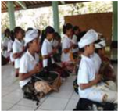

> **Deskripsi Visual:** Gambar ini adalah foto yang menunjukkan sebuah acara atau kegiatan di sekolah. Dalam foto tersebut, beberapa siswa sedang bermain alat musik tradisional, seperti gendang dan alat lainnya. Siswa-siswa tersebut tampak senang dan aktif dalam kegiatan ini. Di sekitar mereka, terlihat beberapa papan tulis dan meja belajar, menunjukkan bahwa acara ini berlangsung di dalam ruangan sekolah. Siswa-siswa tersebut mengenakan pakaian tradisional, yang menunjukkan bahwa acara ini mungkin merupakan bagian dari upacara atau perayaan budaya lokal. Teks, angka, atau label penting tidak terlihat dalam gambar ini. Informasi kunci yang dapat diambil pembaca adalah bahwa acara ini berlangsung di dalam sekolah dan mungkin merupakan bagian dari upacara atau perayaan budaya lokal.

beberapa buah kata yang sangat kuat atau ampuh, yang didengar oleh orang bijak  dan  dapat  membawa  seseorang  yang  mengucapkannya  melintasi lautan kelahiran kembali, inilah yang merupakan arti mantra yang tertingi. Mantra  adalah  rumusan  gaib  untuk  melepaskan  berbagai  kesulitan  atau untuk  memenuhi  bermacam-macam  keinginan  duniawi,  tergantung  dari motif  pengucapan  mantra  tersebut.  Mantra  sebagai  sebuah  kekuatan kata  yang  dapat  dipergunakan  untuk  mewujudkan  keinginan  spiritual atau  keinginan  material,  yang  dapat  dipergunakan  untuk  kesejahteraan ataupun penghancuran diri seseorang. Mantra seperti energi atom yakni suatu    tenaga  yang  bertindak  sesuai  dengan  rasa  bakti  seseorang  yang mempergunakannya.  Sabda  adalah  Brahman,  karena  itu  Ia  menjadi penyebab  Br ā hmanda  (Svami  Rama:  1984:  24).  Khanna  (2003:  21) menyatakan hubungan mantra dan yantra dengan manifestasi mental energi sebagai  berikut:  Mantra-mantra,  suku  kata  Sanskerta  yang  tertulis  pada yantra, sejatinya merupakan 'perwujudan pikiran' yang merepresentasikan keillahian  atau  kekuatan  kosmik,  yang  menggunakan  pengaruh  mereka dengan getaran suara. Mantra juga dikenal masyarakat Indonesia sebagai rapalan untuk maksud dan tujuan tertentu 'maksud baik maupun maksud kurang  baik'.  Dalam  dunia  sastra,  mantra  adalah  jenis  puisi  lama  yang mengandung daya magis. Setiap daerah di Indonesia umumnya memiliki mantra, biasanya mantra di daerah-daerah tertentu menggunakan bahasa daerah masing-masing. Mantra di dalam bahasa Minangkabau disebut juga

 

---
## 📄 Halaman 167

sebagai manto , jampi-jampi , sapo-sapo , kato pusako , kato , katubah , atau capak  baruak .  Sampai  saat  ini  mantra  masih  bertahan  di  tengah-tengah masyarakat di Minangkabau. Isi mantra di Minangkabau saat ini berupa campuran antara bahasa Minangkabau lama 'kepercayaan animisme dan dinamisme',  Melayu,  bahasa  Arab  sebagaimana  pengaruh  Islam  dan bahasa Sanskerta sebagai wujud dari pengaruh Hindu Budha (Djamaris E. : 2001). Sebagian masyarakat tradisional khususnya di Nusantara biasanya menggunakan mantra untuk tujuan tertentu. Hal tersebut sebenarnya bisa sangat efektif bagi para penggunanya. Selain merupakan salah satu sarana komunikasi  dan  permohonan  kepada  Tuhan,  mantra  dengan  kata  yang berirama memungkinkan orang semakin rileks dan masuk pada keadaan trance.  Dalam  kalimat  mantra  yang  kaya  metafora  dengan  gaya  bahasa yang hiperbola tersebut membantu perapal melakukan visualisasi terhadap keadaan  yang  diinginkan  dalam  tujuan  mantra.  Kalimat  mantra  yang diulang-ulang  menjadi  afirmasi,  pembelajaran  di  level  unconscious  dan membangun apa yang para psikolog dan motivator menyebutnya sebagai sugesti diri. Sedangkan Prapancha Sara menyatakan bahwa: 'Br ā hmanda diresapi oleh sakti, yang terdiri atas Dhvani, yang juga disebut Nada, Prana, dan sebagainya'. Manifestasi dari Sabda menjadi wujud kasar (Sth ū la) itu tidak bisa terjadi terkecuali Sabda itu ada dalam wujud halus (Suksma).

Dari penjelasan tersebut, dapat dipahami bahwa Mantra merupakan aspek dari  Brahman  dan  seluruh  manfestasi Kulakundalini .  Secara  filosofis sabda itu adalah guna dari akasa atau ruang eternal. Tetapi sabda itu bukan produksi akasa .  Sabda memanifestasikan diri di dalam akasa .  Sabda itu adalah Brahman, seperti halnya di antariksa, gelombang bunyi dihasilkan oleh gerakan-gerakan udara (V ā yu); karena itu di dalam rongga jiwa atau di  rongga  tubuh  yang  menyelubungi  jiwa,  gelombang  bunyi  dihasilkan sesuai dengan gerakan-gerakan Pra ṇ a v ā yu dan proses menarik napas dan mengeluarkan napas.

Mantra  disusun  dengan  menggunakan  ak ṣ ara-ak ṣ ara tertentu, diatur sedemikian rupa sehingga menghasilkan suatu bentuk bunyi, sedangkan huruf-huruf itu sebagai perlambang-perlambang dari bunyi tersebut. Untuk menghasilkan pengaruh yang dikehendaki, mantra harus disuarakan dengan cara yang tepat, sesuai dengan svara 'ritme' dan varna 'bunyi'. Huruf-huruf penyusunannya pada dasarnya ialah  mantra  sastra,  karena  itu  dikatakan sebagai perwujudan Ś astra dan Tantra . Mantra adalah Param ā tma., Weda sebagai Jiv ā tma, Dharsana sebagai indriya, Pura ṇ a sebagai jasad, dan Sm ṛ ti sebagai anggota. Karena itu Tantra merupakan Śā kti dan kesadaran, yang terdiri atas mantra. Mantra tidak sama dengan doa-doa atau kata-kata untuk menasehati diri ' Ā tmanivedana'. Dalam Nitya Tantra , disebutkan berbagai

 

---
## 📄 Halaman 168

nama terhadap mantra menurut jumlah suku katanya. Mantra yang terdiri dari satu suku kata disebut Pinda . Mantra tiga suku kata disebut Kartari , yang terdiri dari empat suku kata sampai sembilan suku kata disebut Vija Mantra ,  sepuluh  sampai  duapuluh  suku  kata  disebut Mantra ,  dan  yang terdiri lebih dari duapuluh suku kata disebut M ā l ā . Tetapi istilah Vija juga diberikan kepada mantra yang bersuku kata tunggal.

Dalam melaksanakan Tri Sandhya, sembahyang dan berdoa setiap umat Hindu  sepatutnya  menggunakan  mantram,  namun  bila  tidak  memahami makna mantram, maka sebaiknya menggunakan bahasa hati atau bahasa ibu, bahasa yang paling dipahami oleh seseorang yang dalam tradisi Bali disebut ' Sehe ' atau ' ujuk-ujuk ' dalam bahasa Jawa. Penggunaan mantram sangat diperlukan dalam sembahyang. Mantram memiliki makna sebagai alat untuk mengikatkan pikiran kepada obyek yang dipuja. Pernyataan ini tidak  berarti  bahwa  setiap  orang  harus  mampu  mengucapkan  mantram sebanyak-banyaknya,  melainkan  ada  mantra-mantra  yang  merupakan ciri atau identitas seseorang penganut Hindu yang taat, yakni setiap umat Hindu paling tidak mampu mengucapkan mantra sembahyang Tri Sandhya, Kramaning  Sembah  dan  doa-doa  tertentu,  misalnya  mantram  sebelum makan, sebelum bepergian, mohon kesembuhan dan lain-lain.

Umumnya  umat  Hindu  di  seluruh  dunia  mengenal Gayatri mantram, mantram-mantram subhasita 'yang memberikan rasa bahagia dan kegembiraan'  termasuk mahamrtyunjaya 'doa  kesembuhan/mengatasi kematian', sanyipatha 'mohon  ketengan  dan  kedamaian'  dan  lain-lain. Mantram  pada  umumnya  adalah  untuk  menyebutkan  syair-syair  yang merupakan wahyu Tuhan Yang Maha Esa, yang disebut dengan sruti .  Dalam pengertian ini yang termasuk mantram adalah seluruh syair dalam kitabkitab  Samhita (Ågveda, Yajurveda, Samaveda, Atharvaveda), Brahmana (Sathapatha, Gopatha dan lain-lain), Aranyaka (Taittiriya, Brhadaranyaka, dan lain-lain) dan seluruh Upanisad (Chandogya, Isa, Kena, dan lain-lain).

Di samping pengertian mantram seperti tersebut di atas, syair-syair untuk pemujaan  yang  tidak  diambil  dari  kitab  Sruti,  sebagian  diambil  dari kitab-kitab  Itihasa,  Purana,  kitab-kitab  Agama  dan  Tantra  juga  disebut mantra,  termasuk  pula  mantram  para  Pandita  Hindu  di  Bali.  Mantrammantram ini digolongkan ke dalam kelompok stuti, stava, stotra dan puja. Selanjutnya yang dimaksud dengan sutra adalah kalimat-kalimat singkat yang mengandung makna yang dalam seperti kitab Yogasutra oleh Maharsi Patanjali,  Brahmasutra  oleh  Badarayana  dan  lain-lain,  sedangkan  syairsyair yang dipakai dalam kitab-kitab Itihasa dan Purana, termasuk seluruh kitab-kitab  sastra  agama  setelah  kitab-kitab  Itihasa  dan  Purana  disebut

 

---
## 📄 Halaman 169

dengan nama Sloka. Demikian makna mantra yang disebut-sebut sebagai bagian dari ajaran agama Hindu yang bersifat magis dapat dipahami oleh umat sedharma.

### Uji Kompetensi:

- Setelah  anda  membaca  teks  ajaran yantra,  tantra  dan  mantra, apakah  yang  anda  ketahui  tentang  agama  Hindu?  Jelaskan  dan tuliskanlah!
- Buatlah ringkasan yang berhubungan dengan ajaran yantra, tantra dan mantra , dari  berbagai  sumber  media  pendidikan  dan  sosial yang  anda  ketahui!  Tuliskan  dan  laksanakanlah  sesuai  dengan petunjuk dari bapak/ibu guru yang mengajar di kelas!
- Bagaimana caramu untuk mengetahui ajaran tantra, yantra, dan mantra ? Jelaskan dan tuliskanlah pengalamanmu!
- Manfaat apakah yang dapat dirasakan secara langsung dari usaha dan upaya untuk mengetahui ajaran tantra, yantra, dan mantra ? Tuliskanlah pengalaman anda!
- Amatilah lingkungan sekitar anda terkait dengan adanya pengamalan ajaran tantra, yantra, dan mantra guna mewujudkan tujuan hidup manusia dan tujuan agama Hindu, buatlah catatan seperlunya dan diskusikanlah dengan orang tuamu! Apakah yang terjadi?  Buatlah  narasinya  1-3  halaman  diketik  dengan  huruf Times New Roman -12, spasi 1,5 cm, ukuran kertas kwarto; 4-33-4!

### B.  Fungsi  dan  Manfaat  Tantra,  Yantra,  dan  Mantra dalam Kehidupan dan Penerapan Ajaran Hindu.

Perenungan.

'Om Adityasya paramjyotir rakta tejo namo 'stute, cweta pankaja madhyasthe bhaskaraya namo 'stute.'

### Terjemahan:

Ya  Tuhan,  hamba  memuja-Mu  dalam  perwujudan  sinar  suci  yang  merah cemerlang berkilauan cahaya-Mu, Engkau putih suci, bersemayam di tengahtengah laksana teratai, Engkaulah sumber cahaya yang hamba puja.

 

---
## 📄 Halaman 170

Dalam totalitas  kehidupan  manusia  sebagai  insan  yang  beragama  dan  berbudaya sangat membutuhkan tuntunan dan perlindungan dari Sang Penciptanya guna dapat mewujudkan cita-cita hidupnya. Ajaran agama dapat menuntun umat manusia untuk mewujudkan semuanya itu dengan baik dan damai. Tantra, Yantra, dan Mantra sebagai bagian dari ajaran agama memiliki kontribusi yang bermanfaat untuk mewujudkan semuanya itu oleh umat sedharma. Adapun fungsi dan manfaat ajaran Yantra, Tantra dan Mantra dalam kehidupan dan penerapan ajaran Hindu dapat dipaparkan sebagai berikut.

### 1.  Tantra

Menurut ajaran tantra disebutkan ada tiga urat saraf manusia yang paling penting, yaitu; Sushumna , Ida dan Pinggala . Keberadaannya dimulai dari muladhara  chakra ,  yang  bertempat  didasar  tulang  belakang.  Sushumna adalah yang paling penting dari semua saraf atau nadi. Urat saraf atau nadi manusia tidak kelihatan secara kasat mata karena bersifat sangat halus. Ia bergerak  melalui  jaringan  pusat  dari  tulang  belakang  dan  bergerak  jauh sampai  titik  paling  atas  dari  kepala.  Ida  dan  Pinggala  bergerak  paralel dengan Sushumna di sebelah kiri dan kanan dari saraf tulang belakang. Ida dan Pinggala bertemu dengan sushumna di ajna chakra, titik yang terletak diantara alis mata. Mereka berpisah lagi dan mengalir melalui sisi kiri dan kanan hidung

Tantra adalah suatu kombinasi yang unik antara mantra, upacara dan  pemujaan  secara  total.  Ia  adalah  agama  dan  juga  filosofi,  yang berkembang baik dalam Hinduisme maupun Buddhisme. Definisi tantra dijelaskan dalam  kalimat  ini; shasanat  tarayet  yastu  sah  shastrah parikirtitah, yang berarti' yang menyediakan petunjuk jelas memotong dan oleh karena itu menuntun ke jalan pembebasan spiritual dan pengikutnya disebut sastra.' Akar kata 'trae' diikuti oleh saffix 'da' menjadi 'tra' yang berarti 'yang membebaskan'. Kita melihat penggunaan yang sama dari akar kata 'tra' di dalam kata mantra. Definisi mantra adalah: mamanat tarayet yastu sah mantrah parikirtitah:' Suatu proses yang ketika diulang-ulang terus menerus di dalam pikiran, membawa pembebasan, disebut mantra. Beberapa  sarjana  mencoba  membagi  tantra  menjadi  dua  bagian  utama, yaitu 'jalan kanan' dan 'jalan kiri'. Bernet Kemper berpendapat, tantra 'jalan  kanan'  (menghindari  praktek  ekstrem,  mencari-cari  pengertian yang  mendalam,  dan  pembebasan  melalui asceticism )  harus  dibedakan dari 'jalan kiri' ( black magic dan ilmu sihir). Ia kemudian menegaskan, di dalam 'jalan kanan', bakti atau penyerahan diri memegang peranan yang sangat penting. Lebih dari itu, bakti cenderung menolak dunia material. Sedangkan 'jalan kiri' mempunyai kecendrungan yang sangat berbeda. Ia

 

---
## 📄 Halaman 171

berusaha keras untuk menguasai aspek-aspek kehidupan yang menggangu dan  mengerikan  seperti  kematian  dan  penyakit.  Untuk  mengatasi  hal tersebut  eksistensi  dari  kekuatan  keraksasaan  (demonic)  'jalan  kiri' membuat kontak langsung di tempat-tempat yang mengerikan seperti di pekuburan.

Pandangan kalangan akademis ini sangat berbeda dengan pandangan dari praktisi  tantra.  Para  praktisi  tantra  pada  umumnya  menolak  pembagian tantra atas tantra positif dan negatif dan menekankan pada metode untuk mentransformasikan  keinginan.  Lama  Thubten  Yeshe,  seorang  praktisi Tibetan  mengatakan  tantra  menggunakan  energi  dari  khayalan  seperti keterikatan  kepada  keinginan  adalah  sumber  dari  penderitaan  dan  oleh karena  itu  harus  di  atasi  namun  ia  juga  mengajarkan  keahlian  untuk menggunakan energi dari khayalan tersebut untuk memperdalam kesadaran kita hingga menghasilkan kemajuan spiritual. Seperti mereka yang dengan keahliannya mampu mengangkat racun tumbuh-tumbuhan dan menjadikan obat yang mujarab, seperti itu pula seorang yang ahli dan terlatih dalam praktek tantra, mampu memanipulasi energi keinginan bahkan kemarahan menjadi mapan. Ini sungguh-sungguh sangat mungkin dilakukan.

Dalam  arti  tertentu  tantra  merupakan  suatu  teknik  untuk  mempercepat pencapaian  tujuan  agama  atau  realisi  sang  diri  dengan  menggunakan berbagai  medium  seperti  mantra,  yantra,  mudra,  mandala  pemujaan terhadap berbagai  Deva  Devi  termasuk  pemujaan  kepada  makhluk setengah  Deva  dan  mahluk-mahluk  lain,  meditasi  dan  berbagai  cara pemujaan, serta praktek yoga yang kadang-kadang dihubungkan dengan hubungan seksual. Elemen-elemen tersebut terdapat dalam tantra Hindu maupun  Buddha.  Kesamaan  teologi  ini  menjadi  faktor  penting  yang memungkinkan  tantra  menjadi  salah  satu  medium  penyatuan  antara Siwaisme  dan  Buddhisme  di  Indonesia.  Hubungan  seks  dalam  tantra, seperti diperkirakan oleh Dasgupta; merupakan penyimpangan dari konsep awal  tantra.  Konsep  awal  tantra  meliputi  elemen-elemen  seperti  yang disebutkan di atas, yakni; mantra, yantra, mudra dan yoga. Penyimpanan tersebut terjadi karena penggunaan  'alat-alat praktis' dalam tantra Buddha yang berdasarkan prinsip-prinsip Mahayana dimaksudkan untuk merealisasikan tujuan tertinggi baik tantra Hindu maupun Buddha, adalah tercapainya keadaan sempurna dengan penyatuan antara dua praktek serta merealisasikan sifat non dualis dari realitas tertinggi.

H.B. Sarkar menyatakan hubungan seksual dalam tantra lebih diarahkan untuk mengontrol kekuatan alam dan bukan untuk mencapai kebebasan. Ia mengatakan secara umum tradisi Indonesia membagi tujuan hidup manusia

 

---
## 📄 Halaman 172

menjadi dua; pragmatis dan idealistis.  Mengontrol kekuatan alam adalah salah  satu  tujuan  pragmatis.  Hal  ini  biasanya  dilakukan  oleh  raja  yang mempraktikkan sistem kalacakrayana dalam usaha melindungi rakyatnya, memberikan keadilan, kesejahteraan dan kedamaian.

Di  Indonesia  dikenal  ada  tiga  jenis  tantra  yaitu; Bhairava Heruka di Padang Lawas, Sumatra Barat; Bhairava  kalacakra  yang  dipraktikkan  oleh  raja ketanegara dari Singasari dan Adtityawarman dari  Sumatra  yang  sezaman  dengan  Gajah  Mada di  Majapahit;  dan  Bharavia  Bhima  di  Bali.  Arca Bharavia  Bima  terdapat  di  Pura  Edan,  Bedulu, Gianyar Bali. Menurut prasasti Palembang, Tantrayana masuk ke Indonesia melalui kerajaan  Sriwijaya  di  Sumatra  pada  adab  ke-7. Kalacakratantra memegang peranan penting dalam unifikasi siwaisme dan buddhaisme, karena dalam tantra ini Siwa dan Buddha, diunifikasikan menjadi siwa-buddha.  Konsep  Ardhanariswari  memegang peranan yang sangat penting dalam Kalacakratantra. Kalacakratantra mencoba menjelaskan penciptaan dan  kekuatan  alam  dengan  penyatuan  Devi  Kali

yang  mengerikan,  tidak  hanya  dengan  Dhyani  Buddha,  melainkan  juga dengan adi Buddha sendiri. Kalacakratantra mempunyai berbagai sebutan dalam  sekta  tantra  yang  lain  seperti;  Hewarja,  Kalacakra,  Acala,  Cakra Sambara, Vajrabairava, Yamari, Candama harosama dan berbagai bentuk Heruka.

Di  dalam  tantrayana  ritual  adalah  elemen  utama  untuk  merealisaikan kebenaran tertinggi. John Woodroffe mengatakan, ritual adalah sebuah seni keagamaan. Seni adalah bentuk luar materi sebagai ekspresi dari ide-ide yang berdasarkan intelektual dan dirasakan secara emosional. Seni ritual berhubungan dengan ekspresi ide-ide dan perasaan tersebut yang secara khusus  disebut  religius.  Ini  adalah  suatu  cara,  dengan  mana  kebenaran religious  ditampilkan,  dan  dapat  dimengerti  dalam  bentuk  material  dan simbol-simbol  oleh  pikiran.  Ini  berhubungan  dengan  semua  manifestasi alam  dalam  wujud  keindahan, dimana  untuk  beberapa  alasan,  Tuhan memperlihatkan diri Beliau sendiri. Tetapi ini tidak terbatas hanya untuk tujuan itu semata-mata. Artinya, dengan seni religius sebagai alat pikiran yang ditransformasikan dan di sucikan.

 

---
## 📄 Halaman 173

Masab siwa-buddha dengan pengaruh khusus Kalacakratantra dapat dilihat pada peninggalan-peninggalan arkeologi seperti di Candi Jawi. Prapanca dalam Nagarakertagama Bab 56 ayat 1 dan 2 melukiskan monumen ini dengan sangat indah. Bagian bawah candi yaitu bagian dasar dan bagian badan candi adalah Siwaitis dan bagian atas atau atap, adalah buddhistis, sebab  di  dalam  kamar  terdapat  arca  Siva  dan  diatasnya  di  langit-langit terdapat  sebuah  arca  Aksobhya.  Inilah alasannya  mengapa  Candi  Jawi sangat  tinggi  dan  oleh  karena  itu  disebut  sebuah  Kirthi.  Dalam  tantra Hindu prinsip  metafisik  Siwa-Shakti  dimanifestasikan  di  dunia  material ini  dalam  wujud  laki  dan  perempuan  sedangkan  dalam  tantra  Buddha pola  sejenis  diikuti dimana  prinsip-prinsip metaffisik  Prajna  dan  Upaya termanifestasikan dalam wujud perempuan dan laki-laki. Tujuan tertinggi dari kedua masab tantra ini adalah penyatuan sempurna yaitu penyatuan antara dua aspek dari realitas dan realisasi dari sifat-sirat non-dualis dari roh dan non-roh.

### 2.  Yantra.

Fungsi dan manfaat Yantra , dalam kehidupan dan penerapan ajaran Hindu bagi umat sedharma adalah:

- Simbol sesuatu yang dihormati/dipuja.
- Sarana atau media mewujudkan tujuan hidup dan tujuan agama yang diyakininya.
- Media memusatkan pikiran.
Yantra adalah bentuk 'niyasa' (symbol, pengganti yang sebenarnya) yang diwujudkan oleh manusia untuk mengkonsentrasikan baktinya ke hadapan Ida Sang Hyang Widhi Wasa, seperti misalnya dalam perpaduan warna, kembang, banten, gambar, arca, dan lain-lain. Setiap yantra baik dari segi bentuk  maupun  goresan  yang  tertera  pada yantra tersebut  mempunyai arti yang berbeda serta tujuan yang berbeda pula. Karena yantra mempunyai  tujuan  dan  manfaat  yang  berbeda  sehingga  bentuk-bentuk yantra  dikembangkan  dan  diberi  sentuhan  artistik  modern. Yantra tidak lagi kelihatan seperti barang seni atau seperti sebuah perhiasan tertentu. Bentuk yantra sudah  disesuaikan  dengan  kebutuhan  si  pemakainya. Dengan berkembangnya zaman seperti sekarang ini, banyak sekali yantra dibentuk kecil, misalnya dalam bentuk kalung, gelang dan cincin. Memang sebaiknya yantra tersebut diusahakan selalu dekat dengan si pemakainya. Dengan  kedekatan  itu,  maka  antara  energi  yang  ada  dalam  yantra  dan energi si pemakai menjadi saling menyesesuaikan. Yantra dapat diibaratkan sebagai polaritas energi positif yang secara terus menerus mempengaruhi si pemakainya.

 

---
## 📄 Halaman 174

### 3.  Mantra.

Berdasarkan  sumbernya  'weda'  ada  bermacam-macam  jenis  mantra yang secara garis besar dapat dipisahkan menjadi; Vedik mantra, Tantrika mantra, dan Pura ṇ ik  mantra .  Sedangkan  berdasarkan  sifatnya  mantra dapat  terbagi  menjadi; Śā ttvika  mantra (mantra  yang  diucapkan  guna untuk pencerahan, sinar, kebijaksanaan, kasih sayang Tuhan tertinggi, cinta kasih dan perwujudan Tuhan), R ā jasika mantra (mantra yang diucapkan guna  kemakmuran  duniawi  serta  kesejahteraan  anak-cucu), T ā masika mantra (mantra yang diucapkan guna mendamaikan roh-roh jahat, untuk menghancurkan  atau  menyengsarakan  orang  lain,  ataupun  perbuatanperbuatan kejam lainnya/Vama marga/Ilmu Hitam). Disamping itu mantra juga  dapat  diklasifikasikan  menjadi  sebutan  antara  lain: Mantra: yang berupa sebuah daya pemikiran yang diberikan dalam bentuk beberapa suku kata atau kata, guna keperluan meditasi dari seorang guru (Mantra Diksa); Stotra: doa-doa kepada para dewata, Stotra ada yang bersifat umum, yaitu; yang dipergunakan untuk kepentingan umum yang harus datang dari Tuhan sesuai dengan kehendakNya, misalnya doa-doa yang diucapkan oleh para rohaniawan ketika memimpin persembahyangan, sedangkan Stotra yang bersifat khusus adalah doa-doa dari seorang pribadi kepada Tuhan untuk memenuhi beberapa keinginan khususnya, misalnya doa memohon anak, dan sebagainya; K ā vaca Mantra: mantra yang dipergunakan untuk benteng atau perlindungan dari berbagai rintangan.

Umat Hindu percaya bahwa kehidupan ini diliputi dan diresapi oleh mantra. Semua  mahluk,  apakah  seorang  petani  atau  seorang  Raja,  semuanya diatur  oleh  mantra.  Adapun  arti  dan  makna  sebuah  mantra  adalah  utuk mengembangkan  sebuah  kekuatan  supranpada  diri  manusia;  'Pikiran yang luar biasa dapat muncul dari kelahiran, obat-obatan, mantra-mantra, pertapaan dan kontemplasi keDewataan (Yoga Sutra 4.1).

Berdasarkan  hal  tersebut,  maka  mantra  adalah  ucapan  yang  luar  biasa yang  dapat  mengikat  pikiran.  Adapun  makna  mantra  ataupun  maksud pengucapan mantra, dapat dirinci sebagai berikut:

- Untuk mencapai kebebasan;
- Memuja manifestasi Tuhan yang Maha Esa;
- Memuja para dewata dan roh-roh;
- Berkomunikasi dengan para Deva;
- Memperoleh tenaga dari manusia super (Purusottama);
- Menyampaikan persembahan kepada roh leluhur dan para dewata;

 

---
## 📄 Halaman 175

- Berkomunikasi dengan roh-roh dan hantu-hantu;
- Mencegah pengaruh negatif;
- Mengusir roh-roh jahat;
- Mengobati penyakit;
- Mempersiapkan air yang dapat menyembuhkan (air suci);
- Menghancurkan tumbuh-tumbuhan, binatang-binatang dan manusia;
- Menetralkan pengaruh bisa atau racun dalam tubuh manusia;
- Memberi pengaruh lain terhadap pikiran dan perbuatan;
- Mengontrol manusia, binatang-binatang buas, Deva-Deva dan roh-roh jahat;
- Menyucikan badan manusia (Majumar, 1952, 606).
Fungsi dan manfaat mantra dalam kehidupan dan penerapan ajaran Hindu bagi umat sedharma adalah:

### a.  Memuja Tuhan Yang Maha Esa.

Dalam ajaran agama Hindu, Tuhan Yang Maha Esa/Ida Sang Hyang Widhi Wasa sebagai pencipta semua yang ada ini. Beliaulah menyebabkan semua yang ada ini menjadi hidup. Tanpa bantuan beliau semuanya ini tidak akan pernah  ada.  Kita  patut  bersyukur  kehadapan-Nya  dengan  memuja-Nya, sebagaimana diajarkan oleh agama yang tersurat dan tersirat dalam kitab suci 'weda'

### b.  Memohon kesucian.

Tuhan  Yang  Maha  Esa  bersifat  mahasuci.  Bila  kita  ingin  memperoleh kesucian  itu,  dekatkanlah  diri  ini  kepada-Nya.  Dengan  kesucian  hati menyebabkan seseorang memperoleh kebahagiaan, menghancurkan pikiran atau perbuatan jahat. Orang yang memiliki kesucian hati mencapai surga dan bila ia berpikiran jernih dan suci maka kesucian akan mengelilinginya. Kesucian atau hidup suci diamanatkan sebagai sarana untuk mendekatkan diri dengan Tuhan Yang Maha Esa.

### c.  Memohon keselamatan.

Mendekatkan  diri  kepada  Tuhan  Yang  Maha  Esa  untuk  memohon keselamatan dan kebahagiaan melalui berbagai jalan yang telah ditunjukkannya  dalam  kitab  suci  menjadi  kewajiban  umat  sedharma. Keselamatan  dalam  hidup  ini  merupakan  sesuatu  yang  sangat  penting. Dalam  keadaan  selamat  kita  dapat  melaksanakan  pengabdian  hidup  ini

 

---
## 📄 Halaman 176

menjadi  lebih  baik.  Tuhan  Yang  Maha  Esa  ,  pengasih  dan  penyayang selalu  menganugerahkan  pertolongan  kepada  orang-orang-Nya.  Orangorang yang bijaksana sesudah kematiannya memperoleh keselamatan dan kebahagiaan yang sejati.

### d.  Memohon Pencerahan dan kebijakan.

Dalam  kitab  Nirukta  Vedangga,  mantra  dapat  dibagi  menjadi  3  sesuai dengan tingkat kesukarannya, seperti: Paroksa Mantra , yaitu mantra yang memiliki tingkat kesukaran yang paling tinggi. Hal ini disebabkan mantra jenis ini hanya dapat dijangkau arti dan maknanya kalau diwahyukan oleh Tuhan.  Tanpa  sabda  Tuhan  mantra  ini  tidak  mungkin  dapat  dipahami; Adyatmika Mantra, yaitu  mantra  yang  memiliki  tingkat  kesukaran  yang lebih  rendah  dari Paroksa  Mantra .  Mantra  ini  dapat  dicapai  maknanya melalui proses pensucian diri. Orang yang rohaninya masih kotor, tidak mungkin  dapat  memahami  arti  dan  fungsi  jenis  mantra  ini; Praty ā ksa Mantra, yaitu mantra yang lebih mudah dipahami dibandingkan dengan Paroksa Mantra dan Adyatmika Mantra . Untuk menjangkau makna mantra ini dapat hanya mengandalkan ketazaman pikiran dan indra.

### e.  Melestarikan ajaran 'Dharma'.

Sumber ajaran agama Hindu adalah Weda. Weda adalah wahyu Tuhan yang diterima  oleh  para  maharsi  baik  secara  langsung,  maupun  berdasarkan ingatannya.  Diyakini  bahwa  pada  awalnya  weda  diajarkan  secara  lisan, hal ini memungkinkan karena pada saat itu manusia masih mempolakan dirinya secara sederhana dan polos. Setelah kebudayaan manusia semakin berkembang, peralatan tulis-menulis telah ditemukan maka berbagai jenis mantra yang sudah ada dan yang baru diterima dituliskan secara baik dalam buku, kitab, lontar yang disebut Varn ā tmaka Sabda , yang terdiri dari suku kata,  kata  ataupun  kalimat.  Sedangkan  mantra  yang  diucapkan  disebut Dhvany ā tma Sabda ,  yang merupakan nada atau perwujudan dari pikiran melalui suara tertentu, yang dapat berupa suara saja atau kata-kata yang diucapkan ataupun dilagukan dan setiap macamnya dipergunakan sesuai dengan keperluan, kemampuan serta motif pelaksana.

### Uji Kompetensi:

- Setelah  membaca  teks  fungsi  dan  manfaat yantra,  tantra dan mantra dalam  kehidupan  dan  penerapan  ajaran  Hindu,  apakah yang anda ketahui tentang agama Hindu? Jelaskan dan tuliskanlah!

 

---
## 📄 Halaman 177

- Buatlah ringkasan yang berhubungan dengan fungsi dan manfaat yantra, tantra dan mantra dalam kehidupan dan penerapan ajaran Hindu, dari berbagai sumber media pendidikan dan sosial yang anda ketahui! Tuliskan dan laksanakanlah sesuai dengan petunjuk dari bapak/ibu guru yang mengajar di kelas!
- Apakah  yang  anda  ketahui  tentang  fungsi  dan  manfaat yantra, tantra dan mantra dalam kehidupan dan penerapan ajaran Hindu? Jelaskanlah!
- Bagaimana caramu untuk mengetahui fungsi dan manfaat yantra, tantra dan mantra dalam kehidupan dan penerapan ajaran Hindu? Jelaskan dan tuliskanlah pengalamannya!
- Manfaat apakah yang dapat dirasakan secara langsung dari usaha dan upaya untuk mengetahui fungsi dan manfaat yantra, tantra dan mantra dalam  kehidupan  dan  penerapan  ajaran  Hindu? Tuliskanlah pengalaman anda!
- Amatilah lingkungan sekitar anda terkait dengan adanya fungsi dan  manfaat yantra,  tantra dan mantra dalam  kehidupan  dan penerapan ajaran Hindu guna mewujudkan tujuan hidup manusia dan tujuan agama Hindu, buatlah catatan seperlunya dan diskusikanlah dengan orang tuanya! Apakah yang terjadi? Buatlah narasinya 1-3 halaman diketik dengan huruf  Times New Roman -12, spasi 1,5 cm, ukuran kertas kwarto; 4-3-3-4!

### C.  Bentuk-Bentuk  Tantra,  Yantra,  dan  Mantra  yang Dipergunakan  dalam  Praktik  Kehidupan  Sesuai Ajaran Agama Hindu.

### Perenungan.

'Tr ā t ā ram  indram  avit ā ram  handra ṁ havehave  suhava ṁ ṡ uram  indram, hvay ā mi ṡ akram puruh ū tam indra ṁ svasti no maghav ā dh ā tvindrah.

### Terjemahan:

Tuhan sebagai penolong, Tuhan sebagai penyelamat, Tuhan yang maha kuasa, yang dipuja dengan gembira dalam setiap pemujaan, Tuhan, maha kuasa, selalu dipuja, kami memohon, semoga Tuhan, yang maha pemurah, melimpahkan rahmat kepada kami (RV.VI.47.11).

 

---
## 📄 Halaman 178

### Tantra

Tantra adalah konsep pemujaan Ida Sang Hyang Widhi Wasa di mana manusia kagum pada sifat-sifat  kemahakuasaan-Nya,  sehingga  ada  keinginan  untuk mendapatkan  sedikit  kesaktian.  Tantra  adalah  suatu  kombinasi  yang  unik antara mantra, upacara dan pemujaan secara total. Ia adalah agama dan juga philosopy,  yang  berkembang  baik  dalam  Hinduisme  maupun  Buddhisme. Tantra adalah cabang dari agama Hindu. Kebanyakan kitab-kitab Tantra masih dirahasiakan dari arti sebenarnya dan yang sudah diketahui masih merupakan teka-teki. Ada baiknya diantara kita mulai belajar mendiskusikan ajaran tantra berlandaskan  makna  ajaran  tersebut  yang  sesungguhnya,  dengan  demikian kita akan dapat mengetahui dan melaksanakan dengan bentuknya yang baik dan benar.

Secara  umum  dapat  dinyatakan  bahwa  yantra  dan  mantra  adalah  bentukbentuk ajaran tantra yang sudah dilaksanakan oleh masyarakat pengikutnya guna  memuja  kebesaran  Tuhan  sebagai  pencipta,  pemelihara  dan  pelebur semua yang ada ini. Namun demikian pelaksanaannya masih perlu disesuaikan dengan  kemampuan  dan  keadaan  pelaksananya,  sehingga  mereka  dapat terhindar dari sesuatu yang tidak kita inginkan bersama.

### Yantra

Di dalam pemujaan yantra adalah sarana tempat memusatkan pikiran. Yantra adalah sebuah bentuk geometrik. Bentuk yantra yang paling sederhana adalah sebuah titik (Bindu) atau segitiga terbalik. Disamping ada bentuk yantra yang sederhana, ada juga bentuknya yang sangat rumit (simetris dan non-simetris) yang semuanya itu dapat disebut Yantra. Semua bentuk-bentuk ini didasarkan atas bentuk-bentuk matematika dan metode-metode tertentu. Yantra tersebut dipergunakan untuk melambangkan para Deva seperti Siwa, Wishnu, Ganesha, dan yang lainnya termasuk Sakti. Keadaan Mantra dan Yantra adalah saling terkait.  Pikiran  dinyatakan  dalam  bentuk  halus  sebagai  satu  Mantra  dan pikiran yang sama dinyatakan dalam bentuk gambar sebagai sebuah Yantra. Dinyatakan terdapat lebih dari sembilan ratus Yantra. Salah satu dari Yantra yang  terpenting  adalah  Sri  Yantra,  atau  Navayoni  Chakra,  melambangkan Siwa dan Sakti. Yantra itu dapat dicermati dari berbagai praktik aliran atau pengikut Sakti. Adapun bentuk-bentuk yantra yang dapat dikemukakan dalam tulisan ini adalah;

 

---
## 📄 Halaman 179

### 1.  Banten

Banten  adalah salah satu bentuk Yantra, sebagaimana dinyatakan dalam Lontar Yadnya  Parakerti.  Banten  itu  memiliki  arti yang demikian dalam dan universal. Banten dalam upacara agama Hindu adalah wujudnya sangat lokal, namun di dalamnya terkandung nilai-nilai  yang universal. Banten itu adalah bahasa untuk menjelaskan ajaran agama Hindu dalam bentuk simbol. Banten menurut Lontar Yadnya Prakerti menyatakan sebagai simbol ekspresi diri manusia. Misalnya; banten  caru sebagai lambang  penetralisir

kekuaan negatif, banten peras sebagai lambang permohonan untuk hidup sukses dengan menguatkan Tri Guna ' Peras Ngarania Prasidha Tri Guna Sakti ' artinya hidup sukses itu dengan memproporsikan dan memposisikan dengan tepat dinamika Tri Guna (Sattwam Rajas Tamas) sampai mencapai Sakti.

### 2.  Susastra

Dalam  tradisi  Hindu, yantra umumnya  digunakan  untuk  melakukan upakara puja dengan  mengikut  sertakan bija mantra  sesuai yantra tersebut. Banyaknya jenis puja dan setiap puja menggunakan yantra maka penggunaan mantra juga menjadi berbeda. Adapun bentuk-bentuk yantra dalam kesusastraan Hindu antara lain:

- Bhu Pristha yantra ; adalah yantra yang biasanya dibuat secara timbul atau  dipahat  pada  suatu  bahan  tertentu.  Bhu  Pristha yantra biasanya hanya ditulis pada selembar kertas atau kain.
- Meru Pristha yantra ; adalah y antra yang berbentuk seperti gunung atau piramid dimana di bagian dasar penampangnya dibuat lebar atau besar semakin keatas semakin mengecil misalnya bentuk meru pada bangunan pelinggih yang ada di Bali.
- Meru parastar yantra ; adalah bentuk yantra yang dipotong sesuai garis yantra tersebut atau dipotong bagian tertentu.
- Ruram Pristha yantra ; adalah yantra dimana bagian dasarnya membentuk mandala segi empat dan diatasnya dibentuk sebuah bentuk tertelungkup atau seperti pundak kura-kura.
- Patala yantra : adalah yantra yang dibagian diatasnya bentuknya lebih besaran dari pada bentuk bagian bawahnya 'kecil'. Bentuk ini kebalikan dari meru Pristha yantra

 

---
## 📄 Halaman 180

Setiap Yantra baik  dari  segi  bentuk  maupun  goresan  yang  tertera  pada Yantra  tersebut  akan  mempunyai  arti  yang  berbeda  serta  tujuan  yang berbeda pula. Karena yantra mempunyai tujuan dan manfaat yang berbeda. Bentuk-bentuk yantra dikembangkan dan diberi sentuhan artistik modern sehingga  yantra  tidak  lagi  kelihatan  seperti  barang  seni  atau  sebuah perhiasan belaka, tetapi disesuaikan dengan makna dan ciri yantra serta kebutuhan si pemakainya. Sesuai perkembangan zaman sekarang banyak sekali yantra dibentuk kecil, misalanya dalam bentuk kalung, gelang dan cincin. memang sebaiknya yantra tersebut diusahakan selalu dekat dengan si pemakainya, dengan kedekatan itu maka energi yang ada dalam yantra dan energi pemakai menjadi saling menyesuaikan. Yantra dapat diibaratkan sebagai polaritas energi positif yang secara terus menerus mempengaruhi si pemakainya sehingga dalam waktu singkat fungsi yantra yang dikenakan dapat dirasakan manfaatnya atau hasilnya.

Siwa lingga adalah  bagian  dari  Tantrisme.  Devasa  ini  hampir  di  semua tempat suci (Pura) seseorang dapat melihat Siwalingga yang diwujudkan dengan lingga - yoni. Menurut Siwa Purana, itu melambangkan ruang di mana alam semesta menciptakan dan melenyapkan dirinya berulang-kali. Sedangkan  menurut  Tantra  mewujudkannya  dengan  phalus  dan  yoni sebagai perlambang dari sifat laki-laki dan wanita. Ia juga melambangkan prinsip-prinsip  kreatif  dari  kehidupan.  Siwalingga  bisa  bersifat  Chala (bergerak) atau Achala (tidak bergerak). Chala Lingga dapat ditempatkan di Pura atau rumah atau dapat dibuat secara sementara dari tanah liat atau adonan atau  nasi.  Achala  Lingga  biasanya  ditempatkan  di  Pura,  terbuat dari  batu.  Bagian  terbawah  dari  Siwalingga  disebut  Brahmabhaga  yang melambangkan  Brahma,  bagian  tengah  yang  berbentuk  segi  delapan disebut Wishnubhaga yang melambangkan Wishnu, dan bagian menonjol yang berbentuk silinder  disebut  Rudrabhaga,  serta  pemujaan  kepadanya disebut Pujabhaga.

Mandala artinya  'lingkaran.'  Ia  sesungguhnya bentuk Yantra yang paling rumit. Ia berwujud dalam segala bentuk dan sifatnya sangat artisitik. Dalam agama Hindu, mandala digunakan sebagai alat bantu meditasi. Keindahan  dari tempat-tempat  suci (Pura) Hindu  terletak  dalam  jumlah mandala yang dipahat di batu-batu di dinding Pura. Sebuah mandala terdiri  dari  satu  pusat  titik,  garisgaris dan lingkaran-lingkaran yang diletakkan

---
**🖼️ Gambar/Diagram**

> **Deskripsi Visual:** Gambar ini adalah diagram yang menunjukkan penggunaan hosting ketiga. Gambar ini berupa garis putih dengan titik-titik merah yang menunjukkan tingkat penggunaan hosting ketiga. Titik-titik merah tersebut berada pada titik tertinggi, mencapai 100%. Di bawah garis putih, terdapat teks "3rd Party Hosting Usage" yang menunjukkan bahwa penggunaan hosting ketiga telah terblokir. Sumber dari gambar ini adalah situs web http://ruangkumumanjangkarya/11-07-2012 dan gambar ini diberikan oleh Gamba 38 Mandalay Yantara. Informasi kunci yang dapat diambil dari gambar ini adalah bahwa penggunaan hosting ketiga telah terblokir dan tidak ada lagi penggunaan hosting ketiga yang dilakukan.

 

---
## 📄 Halaman 181

secara geometrik  di sekeliling lingkaran. Pusatnya  biasanya adalah sebuah titik (Bindu). Kita juga dapat melihat mandala di Wihara Buddha. Dibalik setiap mandala terdapat sejumlah besar pikiran-pikiran. Kadangkadang melihat sebuah mandala sepertinya  kita  melihat  melalui  sebuah kaleidoskop.

Sri  Chakra adalah  satu  dari  yantra  yang paling kuat dalam ajaran agama Hindu, yang biasanya digunakan oleh penganut sakti Devi ibu , dalam pemujaan-Nya. Sri Chakra adalah simbol  dari  Lalitha  aspek  dari  Ibu  Suci.  Ia terdiri dari sebuah titik (Bindu) pada pusatnya, yang  dikelilingi  oleh  sembilan Trikona,  lima  dari  padanya  dengan  puncak menghadap  ke  bawah  dan  empat  yang  lain menghadap ke atas. Interseksi atau persinggungan dari sembilan segitiga ini

menghasilkan empat puluh tiga segitiga secara total. Ini dikelilingi oleh lingkaran  konsentris  dari  delapan  daun  bunga  teratai  dan  juga  oleh  tiga lingkaran konsentris. Akhirnya pada sisi paling luar, ada sebuah segi empat (Chaturasra) yang dibuat dari  tiga garis, garis yang satu ada di dalam garis yang lain, membuka ditengah-tengahnya masing-masing sisi sebagai empat gerbang.

Mandala dalam konsep agama Hindu adalah gambaran dari alam semesta. Secara harafiah mandala  berarti  'lingkaran.'  Mandala  ini terkait  dengan  kosmologi  India  kuno  yang berpusatkan Gunung Mahameru, sebuah gunung  yang  diyakini  sebagai  pusat  alam semesta. Di dalam Tantrayana mandala juga  menggambarkan  alam  kediaman  para makhluk suci, yang sangat penting bagi ritual atau  sadhana  Tantra.  Saat  berlangsungnya sadhana, sadhaka akan menyusun ulang mandala ini baik secara nyata ataupun

visualisasi.  Sesungguhnya  semua  orang  diantara  kita  setiap  hari  telah menyusun  mandalanya  masing-masing.  Mandala  adalah  melambangkan cakupan karya dan medan pemikiran seseorang. Menurut ajaran Vajrayana, mandala hendaknya disusun secara cermat. Ini menandakan bahwa dalam berkarya seseorang hendaknya cermat dan melakukan yang sebaik-baiknya.

 

---
## 📄 Halaman 182

### 3.  Doa (Mantra)

Maha  Rsi  Manu  yang  disebut  sebagai peletak  dasar  hukum  yang digambarkan  sebagai  orang  yang  pertama  memperoleh  mantra.  Beliau mengajarkan  mantra  itu  kepada  umat  manusia  dengan  menjelaskan hubungan antara mantra dengan objeknya. Demikianlah mantra merupakan bahasa ciptaan yang pertama. Mantra-mantra digambarkan dalam bentuk yang  sangat  halus  dari  sesuatu,  bersifat  abadi,  berbentuk  formula  yang tidak  dapat  dihancurkan  yang  merupakan  asal  dari  semua  bentuk  yang tidak abadi. Bahasa yang pertama diajarka oleh Manu adalah bahasa awal dari  segalanya,  bersifat  abadi,  penuh  makna.  Bahasa  Sanskerta  diyakini sebagai bahasa yang langsung barasal dari bahasa yang pertama, sedang bahasa-bahasa  lainnya  dianggap  perkembangan  dari  bahasa  Sanskerta (Majumdar, 1916, p.603). Sebagai asal dari bahasa yang benar, merupakan ucapan suci yang digunakan dalam pemujaan disebut mantra . Kata mantra berarti 'bentuk pikiran'. Seseorang yang mampu memahami makna yang terkandung di dalam mantra dapat merealisasikan apa yang digambarkan di dalam mantra itu (Danielou, 1964, 334).

Bentuk abstrak yang dimanifestasikan itu berasal dan diidentikkan dengan para Deva ( dewata). Mantra merupakan sifat alami dari Deva-Deva dan tidak dapat dipisahkan (keduanya) itu. Kekuasaan para Deva merupakan satu kesatuan dengan nama-Nya. Aksara suci dan mantra, yang menjadi kendaraan  gaib  para  deva  dapat  menghubungkan  penyembah  dengan dewata yang dipuja. Dengan mantra yang memadai mahluk-mahluk halus dapat  dimohon kehadirannya. Mantra, oleh karenanya merupakan kunci yang penting dalam aktivitas ritual dari semua agama dan juga digunakan dalam aktivitas bentuk-bentuk magis. Pustaka Yamala Tantra menjelaskan sebagai  berikut;  'sesungguhnya,  tubuh  dewata  muncul  dari  mantra  atau bizamantra'. Masing-masing dewata digambarkan dengan sebuah mantra yang jelas, dan melalui bunyi-bunyi yang misterius. Arca dapat disucikan dengan mantra dan arca tersebut menjadi ' hidup'. Demikianlah kekuatan sebuah  mantra  yang  menghadirkan  dewata  dan  masuk  ke  dalam  arca. Sebagai  benang  penghubung  dunia  yang  berbeda,  jembatan  dari  yang berbeda, mantra-mantra adalah instrume, melalui mantra itu dapat dicapai sesuatu diluar kemampuan persepsi seseorang.

'Sebuah mantra; dinamakan demikian karena membimbing  pikiran (manana) dan hal itu merupakan pengetahuan tentang alam semesta dan perlindungan (trana) dari perpindahan jiwa, dapat dicapai' (Pingala Tantra) 'Disebut  sebagai  sebuah  mantra  karena  pikiran  terlindungi'  (Mantra Maharnava,  dikutip  oleh  Devaraja  Vidya  Vacaspati)  Sumber:  http:// ngarayana.web.ugm.ac.id/2010/10/tantra/.

 

---
## 📄 Halaman 183

Persepsi  yang  pertama  tentang  sebuah  mantra  selalu  ditandai  sebagai hubungan langsung antara umat manusia dengan Deva. Mantra, diperoleh pertama kali oleh seorang rsi. ' Karenanya seorang rsi adalah yang pertama merapalkan  mantra' (Sarvanukramani).  Selanjutnya  mantra  ditegaskan dengan karakter matrik (irama) dihubungkan dengan karakter garis-garis lurus  berkaitan  denga yantra ;  kenyataannya ini merujuk kepada sesuatu yang dimiliki oleh mantra . Mantra menggambarkan dewata tertentu yang dipuja dan dipuji; 'mantra itu membicarakan dewata' (Sarvanukramani). Selanjutnya  pula,  seseorang  melakukan  tindakan  dan  untuk  mencapai tujuan tertentu dengan menggunakan mantra itu.

Unsur-unsur  bunyi  digunakan  dalam  semua  bahasa  untuk  membentuk 'ucapan suku kata' atau varna-varna yang dibatasi oleh kemampuan alatalat  wicara  manusia  kecerdasan  membedakannya  melalui  pendengaran. Unsur-unsur ini adalah umum dalam setiap bahasa, walaupun umumnya bahasa-bahasa itu adalah sebuah bagian dari padanya. Unsur-unsur bunyi dari bahasa sifatnya sungguh-sungguh permanent, bebas dari evolusi atau perkembangan bahasa,  dan  dapat  diucapkan  sebagai  sesuatu  yang  tidak terbatas dan abadi. Kitab-kitab Tantra melengkapi hal itu sebagai eksistensi yang  bebas  dan  digambarkan  sebagai  yang  hidup,  kekuatan  kesadaran bunyi, disamakan dengan Deva-Deva. Kekuatan dasar dari bunyi (mantra) berhubungan dengan semua lingkungan dari manifestasinya. Setiap bentuk dijangkau oleh pikiran dan indra yang seimbang dengan pola-pola bunyi sebagai sebuah sebutan yang alami. Dasar mantra satu suku kata disebuat sebagai bizamantra atau vizamantra (benih atau bentuk dasar dari pikiran) Danielou, 1964: 335).

Mantra disusun dengan menggunakan aksara-aksara tertentu, diatur sedemikian  rupa  sehingga menghasilkan  suatu  bentuk  bunyi,  sedang huruf-huruf itu sebagai perlambang-perlambang dari bunyi tersebut. Untuk menghasilkan pengaruh yang dikehendaki, mantra harus disuarakan dengan cara yang tepat, sesuai dengan 'svara' atau ritme, dan varna atau bunyi. Mantra mempunyai getaran atau suara tersendiri, karena itu apabila diterjemahkan ke dalam bahasa lain, mantra itu tidak memiliki warna yang sama, sehingga terjemahannya itu hanya sekedar kalimat (Avalon, 1997: 85).

Mantra  itu  mungkin  jelas  dan  mungkin  pula  tidak  jelas  artinya. Vijra (vijaksara) mantra seperti  misalnya Aim,  Klim,  Hrim ,  tidak  mempunyai arti dalam bahasa sehari-hari. Tetapi mereka yang sudah menerima inisiasi mantra mengetahui bahwa artinya itu terkandung dalam perwujudnnya itu sendiri ( svarupa ) yang adalah perwujudan dewata yang sedemikian itulah mantra-Nya, dan bahwa vija mantra itu adalah dhvani yang menjadikan

 

---
## 📄 Halaman 184

semua aksara memiliki bunyi dan selalu hadir di dalam apa yang diucapkan dan yang didengar, karena itu setiap mantra merupakan perwujudan (rupa) dari Brahman. Dari manana atau berpikir didapatkan pengertian terhadap kesejatian yang bersifat Esa, bahwa substansi Brahman dan Brahmanda itu satu dari man yang sama, dan mantra datang dari suku pertama manana, sedangkan tra berawal dari trana ,  atau pembebasan dari ikatan samsara atau  dunia  fenomena  ini.  Dari  kombinasi man dan tra itulah  disebut mantra yang dapat memanggil datang ( matrana) catur varga atau empat tujuan  dari  mahluk-mahluk  luhur.  Mantra  adalah  daya  kekuatan  yang mendorong, ucapan berkekuatan (yang buah dari padanya disebut mantrasiddhi )  dan  karena  itu  sangat  efektif  untuk  menghasilkan catur  varga , persepsi kesejatian tunggal, dan mukti . Karena itu dikatakan bahwa siddhi merupakan hasil yang pasti dari Japa. Dengan mantra dewata itu dicapai ( Sadhya ). Dengan siddhi yang terkandung di dalam mantra itu terbukalah visi tri bhuvana. Tujuan dari suatu puja (pemujaan), patha (pembacaan), stava (himne), homa (pengorbanan), dhyana (kontemplasi) dan dharana (konsentrasi) serta Samadhi adalah sama. Namun yang terakhir yaitu diksa mantra, sadhana sakti bekerja bersama-sama dengan mantra. Sakti yang memiliki daya revelasi dan api dengan demikian lalu memiliki kekuatan yang  luar  biasa.  Mantra  khusus  yang  diterima  ketika  diinisiasi  ( diksa ) adalah vija mantra, yang ditabur di dalam tanah nurani seorang sadhaka. Terkait dengan ajaran tantra seperti sandhya, nyasa, puja dan sebagainya merupakan pohon dari cabang-cabang, daun-daunnya ialah sruti , vandana bunganya, sedangkan kavaca terdiri atas mantra adalah buahnya (Avalon, 1997: 86).

Nitya  Tantra  menyebutkan  berbagai  sebutan  terhadap  mantra  menurut jumlah suku katanya. Mantra yang terdiri dari satu suku kata disebut Pinda, tiga  suku  kata  disebut Kartari .  Mantra  yang  terdiri  dari  empat  sampai sembilan suku kata disebut Vija mantra. Sepuluh sampai dua puluh disebut mantra, dan mantra yang terdiri lebih dari 20 suku kata disebut Mala. Tetapi biasanya istilah Vija diberikan kepada mantra yang bersuku kata tunggal. Mantra-mantra  Tantrika  disebut Vija  mantra ,  disebut  demikian  karena mantra-mantra itu merupakan biji dari buah yang tidak lain adalah sidhhi, dan mantra-mantra Tantrika itu adalah saripatinya mantra. Mantra-mantra Tantrika pada umumnya pendek, tidak dapat dikupas lagi secara etimologi, seperti misalnya Hrim, Srm, Krim, Hum, Am, Phat dan sebagainya.

Setiap dewata memiliki vija. Mantram primer satu dewata disebut mula mantra.  Kata  mula  berarti  jasad  super  halus  dari  dewata  yang  disebut Kamakala. Mengucapkan  mantra  dengan  tidak  mengetahui  artinya  atau

 

---
## 📄 Halaman 185

mengucapkan  tanpa  metode  tidak  lebih  dari  sekedar  gerakan-gerakan bibir.  Matra  itu  tidur.  Beberapa  proses  harus  dilakukan  sebelum  mantra itu diucapkan secara benar, dan proses-proses itu kembali menggunakan mantra-mantra, seperti usaha penyucian mulut ' mukhasodhana ', penyucian lidah  ' jihvasodhana ',  dan  penyucian  terhadap  mantra-mantra  itu  sendiri 'asaucabhanga',  kulluka,  nirvana,  setu,  nidrabhanga  'menbangunkan mantra', mantra chaitanya atau memberi daya hidup kepada mantra dan mantrarthabhavana, yaitu membentuk bayangan mental terhadap dewata yang menyatu di dalam mantra itu. Terdapat 10 samskara terhadap mantra itu.  Mantra  tentang  dewata  adalah  dewata  itu  sendiri.  Getaran-getaran ritmis dari bunyi yang dikandung oleh mantra itu bukan sekedar bertujuan mengatur  getaran  yang  tidak  teratur  dari  kosakata  seorang  pemuja, tetapi  lebih  jauh  lagi  dari  irama  mantra  itu  muncul  perwujudan  dewata, demikianlah kesejatiannya. Mantra sisshi ialah kemampuan untuk membuat mantra itu menjadi efektif dan mengasilkan buah, dalam hal itu mantra itu disebut siddha (Avalon. 1997: 87). Berikut ini adalah beberapa mantra yang dikutip dari buku Doa sehar-hari menurut Hindu, dapat dipergunakan dalam kehidupan sehari-hari oleh umat sedharma, sebagai berikut:

### Doa, bangun pagi:

Om jagrasca prabhata kalasca ya namah swaha.

### Terjemahan:

Oh Hyang Widhi, hamba memuja-Mu, bahwa hamba telah bangun pagi dalam keadaan selamat.

### Doa, membersihkan diri (mandi):

Om gangga amrtha sarira sudhamam swaha, Om sarira parisudhamam swaha.

### Terjemahan:

Ya Tuhan, Engkau adalah sumber kehidupan abadi nan suci, semoga badan hamba menjadi bersih dan suci.

### Doa, di waktu akan menikmati makanan:

Om Ang Kang kasolkaya ica na ya namah swaha, swasti swasti sarwa Deva bhuta pradhana purusa sang yoga ya namah.

 

---
## 📄 Halaman 186

### Terjemahan:

Oh Hyang Widhi yang bergelar Icana (bergerak cepat) para Deva bhutam, dan  unsur  Pradhana  Purusa,  para  Yogi,  semoga  senang  berkumpul menikmati makanan ini.

### Doa, memohon bimbingan:

Om asato  ma  sadyamaya  tamaso  ma  jyoti  gamaya  mrtyor  ma  amrtam gamaya, Om agne brahma grbhniswa dharrunama syanta riksam drdvamha, brahmawanitwa ksatrawani sajata, wahyu dadhami bhratrwyasya wadhyaya.

### Terjemahan:

Tuhan yang maha suci, bimbinglah hamba dari yang tidak benar menuju yang benar, bimbinglah hamba dari kegelapan menuju cahaya pengetahuan yang  terang,  lepaskanlah  hamba  dari  kematian  menuju  kehidupan  yang abadi, Tuhan yang maha suci, terimalah pujian yang hamba persembahkan melalui Weda mantra dan kembangkanlah pengetahuan rohani hamba agar hamba dapat menghancurkan musuh yang ada pada diri hamba (nafsu). Hamba  menyadari  bahwa  engkaulah  yang  berada  dalam  setiap  insani (Jiwatman), menolong orang terpelajar, pemimpin negara dan para pejabat. Hamba menuju Engkau semoga melimpahkan anugerah kekuatan kepada hamba (Ngurah, IGM. dan Wardhana, IB. Rai. 2003 : 7 - 17).

Demikian  dapat  diuraikan  beberapa  bentuk-bentuk  Yantra,  Tantra  dan Mantra yang dipergunakan dalam praktik kehidupan berdasarkan ajaran agama Hindu dalam tulisan ini. Menjadi kewajiban umat sedharma untuk mempraktikkannya,  sehingga  apa  yang  menjadi  tujuan  bersama  dapat diwujudkan dengan baik (damai).

### Uji Kompetensi:

- Setelah  anda  membaca  teks  bentuk-bentuk tantra,  yantra, dan mantra yang dipergunakan dalam praktik kehidupan sesuai ajaran agama Hindu, apakah yang anda ketahui tentang agama Hindu? Jelaskan dan tuliskanlah!

 

---
## 📄 Halaman 187

- Buatlah  ringkasan  yang  berhubungan  dengan  bentuk-bentuk yantra,  tantra dan mantra yang  dipergunakan  dalam  praktik kehidupan  sesuai  ajaran  agama  Hindu,  dari  berbagai  sumber media  pendidikan  dan  sosial  yang  anda  ketahui!  Tuliskan  dan laksanakanlah sesuai dengan petunjuk dari bapak/ibu guru yang mengajar di kelas!
- Apakah yang anda ketahui tentang bentuk-bentuk tantra, yantra, dan mantra yang dipergunakan dalam praktik kehidupan sesuai ajaran agama Hindu? Jelaskanlah!
- Bagaimana  caramu  untuk  mengetahui  bentuk-bentuk tantra,  yantra, dan mantra yang dipergunakan dalam praktik kehidupan sesuai ajaran agama Hindu? Jelaskan dan tuliskanlah pengalamannya!
- Manfaat apakah yang dapat dirasakan secara langsung dari usaha dan upaya untuk mengetahui bentuk-bentuk tantra,  yantra, dan mantra yang dipergunakan dalam praktik kehidupan sesuai ajaran agama Hindu? Tuliskanlah pengalaman anda!
- Amatilah lingkungan sekitar anda terkait dengan adanya bentukbentuk tantra,  yantra, dan mantra yang  dipergunakan  dalam praktik kehidupan sesuai ajaran agama Hindu guna mewujudkan tujuan hidup manusia dan tujuan agama Hindu, buatlah catatan seperlunya dan diskusikanlah dengan orang tuanya! Apakah yang terjadi?  Buatlah  narasinya  1-3  halaman  diketik  dengan  huruf Times New Roman -12, spasi 1,5 cm, ukuran kertas kwarto; 4-33-4!

### D. Cara  Mempraktikkan  Ajaran  Tantra,  Yantra,  dan Mantra

Perenungan.

'Brahmaóà bhùmir vihità brahma dyaur uttarà hità, brahma-idam urdhvaý tiryak ca antarikûaý vyaco hitam.

 

---
## 📄 Halaman 188

### Terjemahan:

'Brahma menciptakan bumi ini, brahma menempatkan langit ini diatasnya, brahma menempatkan wilayah tengah yang luas ini di atas dan di jarak lintas' (Atharvaveda X. 2.25).

### Tantra

Tantra atau yang sering disebut tantrisme adalah ajaran dalam agama Hindu yang mengandung unsur mistik dan magis. 'Tantra adalah bagian dari Saktisme, yaitu pemujaan kepada Ibu Semesta. Dalam proses pemujaannya, para pemuja Sakta tersebut menggunakan mantra, yantra, dan tantra, yoga, dan puja serta melibatkan kekuatan alam semesta dan membangkitkan kekuatan kundalini. Bagaimana praktik ajaran tantra, berikut ini dapat dipaparkan, antara lain;

- Memuja shakti.
Tantra disebut Shaktiisme, karena yang dijadikan obyek persembahannya adalah  shakti.  Shakti  dilukiskan  sebagai  Devi,  sumber  kekuatan  atau tenaga. Shakti adalah simbol dari bala atau kekuatan 'Shakti is the symbol of bala or strength' Pada sisi lain shakti juga disamakan dengan energi atau kala ' This sakti or energi is also regarded as ' Kala ' or time ' (Das Gupta, 1955 : 100).

Tantra merupakan  ajaran  filosofis  yang  pada  umumnya  mengajarkan pemujaan kepada shakti sebagai obyek utama pemujaan, dan memandang alam  semesta  sebagai  permainan  atau  kegiatan  rohani  dari  Shakti  dan Siwa.  Tantra  juga  mengacu  kepada  kitab-kitab  yang  pada  umumnya berhubungan dengan pemujaan kepada Shakti (Ibu Semesta, misalnya Devi Durga, Devi Kali, Parwati, Laksmi, dan sebagainya), sebagai aspek Tuhan Yang  Tertinggi  dan  sangat  erat  kaitannya  dengan  praktek  spiritual  dan bentuk-bentuk ritual pemujaan, yang bertujuan membebaskan seseorang dari kebodohan, dan mencapai pembebasan. Dengan demikian Tantrisme lebih sering didefinisikan sebagai suatu paham kepercayaan yang memusatkan pemujaan pada bentuk shakti yang berisi tentang tata cara upacara keagamaan, filsafat, dan cabang ilmu pengetahuan lainnya, yang ditemukan dalam percakapan antara Deva Siwa dan Devi Parwati , maupun antara Buddha dan Devi Tara .

- Meyakini pengalaman mistis.
Tantra bukan  merupakan  sebuah  sistem  filsafat  yang  bersifat  padu ( koheren ),  tetapi tantra merupakan akumulasi dari berbagai praktik dan gagasan yang memiliki ciri utama penggunaan ritual, yang ditandai dengan

 

---
## 📄 Halaman 189

pemanfaatan sesuatu yang bersifat duniawi (mundane). Untuk menggapai dan mencapai sesuatu yang rohani (supra-mundane), serta penyamaan atau pengidentikan  antara  unsur  mikrokosmos  dengan  unsur  makrokosmos perlu  diupayakan.  Praktisi  tantra  memanfaatkan  prana  (energi  semesta) yang mengalir di seluruh alam semesta (termasuk dalam badan manusia) untuk  mencapai  tujuan  yang  diharapkan.  Tujuan  itu  bisa  berupa  tujuan material, bisa pula tujuan spiritual, atau gabungan keduanya.

Para penganut tantra meyakini bahwa pengalaman mistis adalah merupakan suatu keharusan yang menjamin keberhasilan seseorang dalam menekuni tantra. Beberapa jenis tantra membutuhkan kehadiran seorang guru yang mahir untuk membimbing kemajuan siswa tantra.

### 3.  Simbol-simbol erotis.

Dalam  perkembangannya  dimana tantra sering  menggunakan  simbolsimbol material termasuk simbol-simbol erotis. Tantra sering kali diidentikkan  dengan  ajaran  kiri  yang  mengajarkan  pemenuhan  nafsu seksual,  pembunuhan  dan  kepuasan  makan  daging.  Padahal  beberapa perguruan  tantra  yang  saat  ini  mempopulerkan  diri  sebagai  tantra  putih menjadikan  pantangan  mabuk-mabukan,  makan  daging  dan  hubungan seksual sebagai sadhana dasar dalam meniti jalan tantra. Beberapa orang Indolog beranggapan bahwa ada hubungan antara Konsep-Devi (MotherGoddes) yang bukti-buktinya terdapat dalam suatu zeal di Lembah Sindhu (sekarang ada di Pakistan), dengan Konsep Mahanirwana Tantra. Konsep ini  berpangkal  pada  percakapan  Devi  Parwati  dengan  Deva  Siva  yang menguraikan  turunnya  Devi  Durga  ke  Bumi  pada  zaman  Kali  untuk menyelamatkan dunia dari kehancuran moral dan perilaku.

### 4.  Penyelamat dunia dari kehancuran.

Dalam beberapa sumber Devi Durga juga  disebut ' Candi '. Dari sinilah pada mulanya muncul istilah ' candi ' ( candikaghra ) untuk menamai bangunan suci sebagai tempat memuja Deva dan arwah yang telah suci. Peran Devi Durga dalam menyelamatkan dunia dari kehancuran moral dan perilaku disebut  kalimosada.  Kalimosada  (Kali-maha-usada),  yang  artinya  Devi Durga adalah obat yang paling mujarab dalam zaman kekacauan moral, pikiran  dan  perilaku;  sedangkan  misi  Beliau  turun  ke  bumi  disebut Kalika-Dharma. Seiring pendistorsian ajaran Hindu di Indonesia. Apakah kalimosada 'Kalimat Syahadat'.

 

---
## 📄 Halaman 190

### 5.  Mewarnai kebudayaan dan keagamaan.

Prinsip-prinsip Tantra terdapat dalam buku bernama Nigama ,  sedangkan praktek-prakteknya  dalam  buku  Agama.  Sebagian  buku-buku  kono  itu telah hilang dan sebagian lagi tak dapat dimengerti karena tertulis dalam tulisan rahasia untuk menjaga kerahasiaan Tantra terhadap mereka yang tak  memperoleh  inisiasi.  Ada  beberapa  jenis  kitab  yang  memuat  ajaran Tantrayana , yaitu antara lain : Maha Nirwana Tantra , Kularnawa Tantra , Tantra Bidhana , Yoginirdaya Tantra , Tantra sara , dsb.

Dalam perkembangannya, praktek tantra ini juga selalu mewarnai kebudayaan  dan  keagamaan  yang  berkembang  di  nusantara.  Hal  ini  dapat dilihat dari berbagai jenis peninggalan prasasti, candi dan arca-arca bercorak tantrik.  Karakteristik tantrisme di  India  secara  alami  ajaran-ajarannya yang berpedoman  pada  Weda,  mengalir  ke  Indonesia.  Konsekuensinya,  bahwa ajaran-ajaran Tantra yang bersumber pada Weda, di Indonesia berkembang sebagaimana yang diharapkan oleh para pengikutnya.

### Yantra

Yantra adalah sarana dan tempat memusatkan pikiran. Adapun unsur-unsur sebuah yantra adalah: Titik (bindu), garis lurus, segitiga, lingkaran, heksagon (persegienam), bujur sangkar, bintang (pentagon), garis melintang, svastika, bintang segi enam (star heksagon), dan padma yang untuk lebih jelasnya dapat diterangkan sebagai berikut:

- Bindu (titik).
Titik  adalah  yang  meresapi  semua  konsep  ruang,  setiap  gerakan,  setiap bentuk, dapat dipahami sebagai terbuat dari titik-titik. Ruang alam, ether, merupakan tempat, yaitu kemungkinan penegasan tempat-tempat tertentu atau  titik-titik.  Yang  meresapi  segala,  yang  terbentang  merupakan  titik secara  matematik  merupakan  ekspresi  dari  sifat  eter.  Titik  dapat  juga menggambarkan  keterbatasan  perbedaan  yang  satu  eksistensi  atau  asal manifestasi yang satu dengan yang lainnya. Ketika sesuatu eksistensi dalam tingkat  tidak  termanifestasi  menjadi  bermanifestasi,  maka  manifestasi mulai di berbagai tempat, dalam beberapa titik di ruang angkasa, dalam beberapa titik waktu. Dan hal itu mesti terjadi secara spontan yang pada mulanya sesuatu tidak muncul dan selanjutnya menampakkan diri dalam suatu lokasi. Spontanitas pertama ketika sesuatu belum menampakkan diri dan kemudian muncul dengan cukup digambarkan melalui titik, yang bisa dijelaskan sebagai 'suatu manifestasi yang terbatas'.

 

---
## 📄 Halaman 191

### 2.  Garis lurus.

Ketika sebuah titik bergerak secara bebas dalam atraksinya yang abadi,  gerakannya  itu  berbentuk  garis  lurus.  Garis  lurus  dipakai  untuk menggambarkan gerakan yang tiada merintangi, demikianlah prinsip dari semua perkembangan.

### 3.  Segitiga.

Perkembangan dipadukan untuk bangkit atau sebuah gerakan ke arah atas dapat  digambarkan  dengan  sebuah  anak  panah  atau  lidah  api.  Segitiga dengan  pucaknya  ke  atas  melambangkan  api,  diidentifikasikan  dengan prinsip  laki-laki,  lingga  atau phallus ,  simbol  Siva,  leluhur  atau  manusia kosmos  ( purusa ).  Segala  gerakan  ke  atas  adalah  sifat  dari  unsur  api, aktivitas mental dalam bentuknya yang halus. Simbol bilangannya adalah nomor 3.

Segitiga dengan puncaknya ke bawah menggambarkan kekuatan kelembaman yang di tarik ke bawah, dan tendesi aktivitas menekan. Hal ini disosiasikan dengan unsur air, yang tendensinya selalu ke bawah, merata pada levelnya. Hal ini merupakan aspek pasif dari ciptaan dan hal ini pula dilambangkan dengan 'yoni' atau organ wanita, yang merupakan lambang dari Energi (sakti) atau sifat Kosmik (prakrti). Simbol lainnya diasiosasikan dengan unsur air adalah lengkung dari sebuah lingkaran, bulan sabit dan gelombang. Angka bilangan yang menjadi simbolnya adalah angka 2.

### 4.  Lingkaran.

Gerak  dari  lingkaran  muncul  melalui  revolusi  planet-planet.  Hal  ini merupakan  simbol  dari  semuanya  kembali  lagi,  semua  siklus,  semua irama, yang membuat kemungkinan adanya eksistensi. Gerakan melingkar adalah  kecenderungan  sifat rajas (berputar)  yang  merupakan  sifat  dari manifestasi yang dapat dimengerti. Pusat lingkaran,  bagaimanapun, dapat  melambangkan  ciptaan  yang  dapat  ditarik  ke  dalam,  energi  yang bergelung, yang ketika dibangkitkan, mengantarkan semua mahluk dapat menyeberangi ruang dan bentuk manifestasi dan mencapai tingkat kebebasan.

### 5.  Persegi Enam (Hexagon).

Lingkaran  kadang-kadang  dijadikan  sebuah  unsur  dari  sebuah  udara, meskipun secara konvensional simbol untuk udara adalah persegi enam ( hexagon ). Gerakan merupakan sifat dari udara, namun gerakannya tidak teratur (kacau), gerakannya yang banyak di gambarkan melalui perkalian dari  angka  primer  2  dan  3,  yang  merupakan  bilangan  alami  yang  tidak

 

---
## 📄 Halaman 192

bernyawa.

### 6.  Bujur sangkar.

'Gerakan perpanjangan yang dihubungkan dengan banyak sisi. Di antara figur  banyak  sisi  satu  dengan  unsur  yang  sangat  sedikit  (bagian  dari segitiga)  adalah  bujur  sangkar.  Bujur  sangkar  dijadikan  lambang  bumi. Bujur sangkar ini melambangkan unsur bunyi' (Devaraja Vidya Vacaspati, 'Mantra-Yantra-Tantra,  seperti  dikutip  Danielou,  1964:  353).  Angka bilangan yang merupakan simbul bumi adalah 4.

### 7.  Bintang (Pentagon).

Segala  kehidupan  yang  tidak  bernyawa  dipercaya  diatur  dengan  angka bilangan 3 dan dikalikan 2 dan 3. Kehidupan, sensasi, permunculan hanyalah ketika nomor 5 menjadi sebuah komponen di dalam struktur segala sesuatu. Nomor  5  diasosiasikan  dengan  Siwa,  Leluhur  umat  segalanya,  sumber kehidupan. Bintang diasosiasikan dengan cinta dan nafsu seperti halnya kekuatan untuk memisahkan. Hal ini merupakan unsur yang sangat penting dari yantra-yantra yang bersifat magis.

### 8.  Tanda Tambah.

Ketika titik  berkembang dalam ruang mengarah ke 4 jurusan, terjadilah tanda tambah. Tanda ini merupakan simbul dari perkembangan titik di dalam ruang seperti  halnya  juga  pengkerutan  ( reduksi )  ruang  menjadi  satu  (ke titik tengah). Hal ini menunjukkan bahwa satu kekuatan bisa berkembang berlipat ganda. Di Bali tanda tambah ini disebut ' tapak dara ', tanda bekas diinjak burung merpati, digunakan untuk mengembalikan keseimbangan magis.

### 9.  Svastika.

Pengetahuan yang Transcendent dikatakan 'berliku-liku' karena pengetahuannya  tidak  langsung  dapat  dipahami,  di  luar  lingkup  logika umat manusia. Tanda tambah yang sederhana tidak hanya menggambarkan reduksi ruang menuju satu kesatuan, tetapi juga lapangan manifestasi yang dari titik pusat, bindu , simbol eter, mengembang ke 4 arah mata angin dan 4 unsur yang nampak.

Hal  ini,  bagaimanapun,  tidak  benar  dilihat  dari  pandangan  kedewataan yang luhur, yang tidak dapat diambil sedemikian rupa dalam satu kesatuan. Hal ini diperlihatkan dengan cabang berliku dari kemurahan svastika , yang bagaimanapun dihubungkan dengan titik pusat material, saat ini titik tidak dapat ditentukan luas ruang angkasa.

 

---
## 📄 Halaman 193

### 10. Bintang Segi Enam (Hexagon).

Bintang segi enam ( hexagon ) atau kenyataannya dalam bentuk dodecagon adalah salah satu unsur yantra yang sangat umum. Dibuat dari dua segi tiga yang saling tembus ( penetrasi ).  Kita dapat melihat segi tiga yang puncaknya menghadap ke atas menggambarkan Manusia Kosmos ( purusa ) dan segi tiga yang ujungnya ke bawah merupakan Sifat Kosmos ( prakrti ). Ketika bersatu dan dalam keadaan seimbang, keduanya berbentuk bintang 'segi enam' ( hexagon ), merupakan basis dari roda (cakra) simbol tedensi ketiga atau tedensi rajas dari padanya alam semesta menampakkan diri. Lingkaran yang mengelilingi bintang segi enam menggambarkan lapangan bersatunya kedua segitiga itu, dan hal itu merupakan ruang dari waktu. Ketika kedua segitiga itu dipisahkan, alam semesta hancur, waktu melenyapkan segala yang ada. Hal ini ditunjukan dengan bertemunya dua ujung segitiga atas dan segitiga bawah pada satu titik (bentuk haurglass), kendang ( damaru ) Sang Hyang Siva.

### 11. Bunga Padma.

Segala  simbol-simbol  bilangan  menggambarkan  kesatuan  tertentu  yang ditunjukkan di dalam yantra sebagai bunga yang bentuknya bundar yang disebut bunga padma.

Ada beberapa jenis Yantra yang utama, yang dapat kita kenal dalam praktiknya dimasyarakat, antara lain sebagai berikut:

### 1.  Yantra-raja (raja Yantra).

Raja dari yantra digambarkan di dalam Mahanirvana Tantra . 'Gambar segi tiga  dengan di tengah-tengahnya ditulis bija mantra Hrim (wujud ilusi). Di  luarnya  digambarkan  dua  lingkaran,  yang  pertama  mengelilingi  segi tiga, dan yang ke dua melingkari lingkatan yang pertama. Antara lingkaran yang pertama dengan yang kedua dibagi enam belas dengan tanda kawat pijar, dan delapan daun bunga padma (masing-masing) selembar diantara gambar dua kawat pijar tersebut. Di luar lingkaran yang paling luar adalah kota yang sifatnya Kebumian, yang akan langsung membuat garis lurus dengan  empat  pintu  masuk  dan  penampilannya  akan  menyenangkan. Di  dalam  acara  yang  menyenangkan  para  dewata,  penyembah  akan menggambar yantra, apakah terbuat dari jarum emas atau duri kayu bell (bila)  atau  dengan  potongan  emas,  atau  perak,  atau  tembaga  yang  telah diurapi dengan svayambhu, kunda atau bunga gola, atau tepung cendana, harumnya daun gaharu, kumkuma atau tepung cendana merah yang dibuat seperti paste (Mahanirvana Tantra 5.172-76).

 

---
## 📄 Halaman 194

Tujuan  dari  yantra  ini  untuk  menciptakan  hubungan  dengan  dunia supranatural.  Dengan  bantuan-Nya,  penyembah  mendapatkan  semua pahala  kedunawian  dan  kekuatan  supranatural.  Di  dalamnya  adalah yantra dengan karakter Hrim ,  sebagai lambang dari Devi keberuntungan Laksmi. Di luarnya terdapat segitiga yang berapi-api yang menuju gerakan ke atas dari energi yang bergelung (Kundalini). Enam belas kawat pijar menggambarkan pencapaian kesempurnaan (16 adalah angka yang sempurna), delapan kelopak bunga teratai menggambarkan yang meresapi segala menuju ke atas, yang tidak lain adalah Wisnu.

Lingkaran luar adalah penciptaan, bundaran yang bergerak dari padanya segala sesuatu lahir. Kekuatan mengatasi dunia yang nampak diperlihatkan dengan persegi empat bujur sangkar, simbol bumi. Di empat sisi adalah 4  pintu  yang  mengantarkan  seseorang  dari  alam  duniawi  ke  alam  atas (spiritual). Ke utara (yakni sebelah kiri) adalah pintu menuju Deva-Deva (devayana).  Keselatan  (yakni  sebelah  kanan)  menuju  kealam  leluhur (pitrayana),  ke  Timur  (sisi  atas)  jalan  menuju  ke  Surya  (kepanditaan), dan ke Barat (sisi bawah) adalah jalan keagungan, jalan menuju penguasa air (Varuna). Empat pintu tersebut mengantar ke empat penjuru angin,  membentuk  tanda  tambah,  simbol  keuniversalan.  Tanda  tambah berkembang menjadi dua buah svastika yang menunjukan bahwa ada dua jalan utama, yaitu kiri dan kanan.

### 2.  Yantra-Sarvatobhadra (Yantra penjaga seluruh penjuru)

Yantra ini  dijelaskan  di  dalam  kitab Gautamiya  Tantra (30.102-108). Yantra  ini  dikatakan  saran  untuk  dapat  memenuhi  semua  keinginan, sekarang dan yang akan datang, di dunia nyata dan di dunia yang gaib. 'Namanya, berarti bujur sangkar yang rata', dan juga berarti kendaraan Deva Wisnu. Menunjukkan keadaan yang seimbang antara aktivitas dan istirahat, keterikatan dan penyangkalan. Ia yang dari segala sisi seimbang dengan dirinya, di dalam atau di luar, kesuburan dan buah yang dihasilkan. Ia  yang  dengan  teguh  duduk  dalam  kereta  hidupnya,  dijaga  dari  segala sisi, sempurna dari seluruh sisi, bebas dari bencana (Danielou 1964:356). Yantra ini terdiri dari 8 bujur sangkar setiap sisinya, oleh karenanya adalah Wisnu Yantra, berhubungan dengan sikap sattvam, jalan kanan.

### 3.  Yantra-Smarahara (pengusir keinginan)

Uraian  tentang Yantra ini  dijelakan  dalam  kitab  Syamastava  Tantra, sloka 18, dibentuk dari 5 buah segi tiga, merupakan Siwa yantra, angka 5 berhubungan dengan sebagai bapak dan dasar pemusnah. Segi tiga yang melambangkan lingga yang tajam, phallusapi.

 

---
## 📄 Halaman 195

'Melalui kekuatan yantra ini, seseorang dapat menundukkan nafsu (Kama). Seorang sadhaka yang menggapai pelajaran ini senantiasa dijaga dengan baik,  tidak  ada  musuh  yang  mendekatinya,  musuh  yang  menggunakan senjata  nafsu  (seks),  kemarahan,  ketamakan,  khayalan,  penderitaan  dan kekuatan.  (hal  ini  merupakan  instrumen  untuk  menyelesaikan  kekuatan magis) dan para penyembah dapat pergi kemana saja dengan menyenangkan dan juga ke dunia yang lain tanpa menemukan halangan. Sesungguhnya yantra ini menolong seseorang untuk memadamkan kekuatan nafsu (seks) dan khayalan hidup' (Danielou, loc.cit).

Mengusir keinginan digunakan untuk menghancurkan musuh abadi seperti juga halnya seseorang menaklukan dirinya sendiri. Digunakan juga sebagai alat ilmu hitam dijelaskan di dalam kitab Yantracintamani (7.5).

### 4.  Yantra-Smarahara (bentuk yang ke-2)

Yantra ini  adalah  yantra  smarahara  dalam  bentuknya  yang  lain  (bentuk ke 2), dijelaskan di kitab Kali Tantra. 'Ini juga yantra 5 segi tiga, tetapi berada di dalam yang satu dan yang lain. Dua segi tiga adalah lambang wanita  (satu  ujungnya  mengahadap  ke  atas)  berair,  tiga  buah  segi  tiga lainnya  adalah  lambang  laki-laki  (satu  ujungnya  menghadap  ke  bawah) berapi. Setiap tindakan manifestasi-Nya adalah sebagai pengganti api dan upacara  persembahan,  melalap  dan  dilalap,  laki-laki  dan  wanita.  Yantra ini  adalah  benar-benar  lampiran  kulit  berturut-turut  yang  menutupi  roh individu yang menjadikan mahluk hidup. Lingkaran dalam adalah energi yang bergelung (kundalini) yang bila dibangunkan, akan naik melintasi 5 angkasa manifestasi ke dalam maupun ke luar. Lingkaran luar menunjukkan kekuatan  kreatif  dari  api  yang  membangkitkan  untuk  bermanifestasi  di tengah-tengah air di samudra purba.

Delapan  kelopak  daun  bunga  teratai  adalah  prinsip  pemeliharaan  alam semesta, Juga adalah Wisnu yang secara stabil memanifest di bumi. Di luar itu bujur sangkar, bumi, dengan 4 buh pintu dan dua buah svastika .

### 5.  Yantra-Mukti (Yantra untuk mencapai kebebasan)

Yantra ini  dijelaskan  dalam  kitab  Kumarikalpatantra.  Dibuat  dari  bujur sangkar,  dan  sebuah  segi  tiga  yang  tajam,  sebuah  segi  tiga  yang  berair, sebuah segi enam dan sebuah lingkaran, di dalamnya terdapat satu yang lain.  seluruhnya  dikelilingi  persegi  delapan  dan  sebuah  bujur  sangkar dengan 4 pintu. Di tengah-tengah adalah Bija Maya (Hrim menunjukkan prinsip  yang  lain  yang  mana  setiap  mahluk  hidup  dapat  menguasainya untuk mencapai tujuannya yakni mencapai kebebasan.

 

---
## 📄 Halaman 196

### 6.  Yantra Sri Cakra (Yantra untuk memperoleh keberuntungan)

Sri Cakra atau roda keberuntungan, yang melambangkan Devi Ibu Alam Semesta,  salah  satu  yantra  yang  utama  digunakan  untuk  menghadirkan para dewata.

- Yantra Ganapati (Yantra untuk memperoleh perlidungan)
Ganapati yantra merupakan titk-titik untuk identitas dari makro dan mikro kosmos.

- Yantra Visnu (Yantra untuk memperoleh kemakmuran)
Visnu  yantra diekspresikan  dengan  meresapi  segalanya  dan  sifat  sattva, sifat menuju kearah atas.

Berdasarkan jenisnya yantra tersebut memiliki fungsi masing-masing. Adapun fungsi dari masing-masing yantra tersebut, antara lain:

- Yantra-raja berfungsi  sebagai  yantra  yang  tertinggi,  memenuhi  segala permohonan.
- Yantra  Sarvatobhadra berfungsi  untuk  mengamankan  lingkungan  atau tempat tinggal.
- Yantra  Smarahara berfungsi  untuk  melenyapkan  keinginan,  terutama ketika melakukan meditasi.
- Yantra Mukti berfungsi sebagai penuntun bagi seseorang untuk mencapai moksa (kelepasan).
- Yantra Sri Cakra berfungsi utuk memperoleh keberuntungan.
- Yantra Ganapati berfungsi untuk memperoleh perlindungan dan keselamatan.
- Yantra Visnu berfungsi untuk memperoleh kemakmuran.
Langkah-langkah pendahuluan ditetapkan sebelum melakukan pemujaan melalui yantra, atau pratima. Pertama, pemuja harus memusatkan pikiran kepada dewata, lalu dinyasa -kan di dalam diri sendiri. Selanjutnya dewata itu dinyasa -kan ke dalam yantra. Ketika dewata sudah bersthana di dalam yantra, prana dewata itu telah merasuk ke dalamnya dengan prana pratistha, mantra dan mudra. Dewata saat itu telah bersthana di dalam yantra, yang menjadikan yantra itu tidak lagi sekedar benda mati, tetapi setelah upacara ritual,  diyakini  oleh  sadhaka  dan  buat  pertama  kaliya  Ia  disambut  dan dipuja.  Mantra  itu  sendiri  adalah  dewata  dan  yantra  adalah  jasad  dari dewata yang adalah (tidak lain) mantra (Avalon, 1997: 95).

 

---
## 📄 Halaman 197

### Mantra

Tidak terhitung jumlahnya mantra .  Semua sabda Tuhan Yang Maha Esa di dalam kitab suci Weda adalah mantra. Walaupun demikin banyak jumlahnya, mantra-mantra  itu  dapat  dibedakan  menjadi  4  jenis  sesuai  dengan  dampak atau pahala dari pengucapan mantra, antara lain ;

- Siddha , yang pasti (berhasil).
- Sadhya, (yang penuh pertolongan).
- Susiddha, (yang dapat menyelesaikan).
- Ari, musuh (Visvasara).
' Siddhamantra memberikan  pahala  langsung  tidak  tertutupi  dengan  waktu tertentu. Sadhyamantra berpahala bila digunakan dengan sarana tasbih dan persembahan  (ritual). Susidhamantra ,  mantra  tersebut  pahalanya  segera diperoleh,  dan Arimantra ,  menghancurkan  siapa  saja  yang  mengucapkan mantra tersebut (Mantra Mahodadhi, 24, 23).

Mantra-mantra tersebut akan berhasil (siddhi) sangat tergantung pada kualitas (kesucian) dari pemuja, dalam hal ini orang yang megucapkan mantra tersebut (Danielou,  1964:  338-349).  Membaca  mantra  bermanfaat  dalam  proses pembinaan spiritual, dan sekaligus menerima berkah dari para mahluk suci. Seperti  halnya  pembinaan  spiritual  lainnya,  membaca  mantra  mempunyai berbagai macam tingkatan tergantung dari tingkat kehidupan spiritual masingmasing para pembacanya. Berikut dapat diuraikan 'tata cara singkat membaca Mantra Suci' sebagai berikut;

Kedua  tangan  harus  dibersihkan  dengan  air  bersih;  Mulut  harus  dikumur bersih dengan air bersih; sebaiknya meminum segelas air putih bersih; Jika memungkinkan  ambil  posisi  lotus  (meditasi);  Ambil  nafas  dalam-dalam hingga  keperut,  lalu  hembuskan  perlahan-lahan  hingga  habis.  Ulangi  3x; Katupkan  kedua  ibu  jari  dengan  posisi  menempel  dekat  dengan  ulu  hati, atau bila mempergunakan ' mala ' letakan mala ditangan kiri, pegang dengan 4  jari  (kecuali  ibu  jari);  Bayangkan  kehadiran  mahluk  suci  dihadapan kita  memancarkan  sinar  hingga  menyinari  seluruh  tubuh  kita;  Ibu  jari  lalu menarik satu butir mala kedalam sambil mengucapkan mantra dalam hati, dan seterusnya hingga beberapa putaran mala. Lakukanlah...!

Perlu diketahui, diperhatikan dan dilaksanakan dengan sungguh-sungguh;

- Bagi para pemula, jangan membaca mantra terlalu cepat.
- Jaga irama tempo yang seirama, sehingga dapat dihayati maknanya satu persatu.

 

---
## 📄 Halaman 198

- Usahakan jangan berhenti ditengah putaran mala, selesaikan dahulu putaran mala hingga tuntas. Semoga berhasil dengan baik.
Berikut ini adalah beberapa mantra yang sering dipraktikan dalam kehidupan sehari-hari oleh umat sedharma, antara lain;

### 1.  Puja Trisandhya

'Oý Oý Oý bhùr bhuwaá swaá, tat sawitur warenyaý, bhargo Devasya dhimahi, dhiyo yo naá pracodayàt. 'Oý nàràyana evedaý sarwaý yad bhutaý yacco bhàwyaý niskalanko niranjano nirwikalpo niràkhyàtaá cuddho dewo eko nàràyano na dwitiyo asti kaccit. 'Oý twaý ciwas twaý mahàdevaá Icwaraá paramecwaraá Brahmà wisnucca rudracca Purusah parikirtitàá. 'Oý pàpo 'haý pàpakarmàhaý Pàpàtma pàpasambhawaá Tràhi màý pundarikàksa Sabàhyàbhyantarah suciá. 'Oý ksamaswa màý Mahàdeva Sarwapràni hitangkara Màý moca sarwa pàpehbyaá Pàlayaswa sadà Úiva. 'Oý Kûàntawyaá kayiko doûàá Kûantawyo vàciko mama, Ksàntawyo mànaso dosàh Tat pramàdàt ksamaswa màm 'Oý úantiá úantiá úantiá oý'

 

---
## 📄 Halaman 199

### Terjemahan:

Om, marilah kita sembahyang pada kecemerlangan dan kemahamuliaan Sang Hyang widhi, yang ada di dunia, di langit, di surga, semoga Ia berikan semangat pikiran kita;

Om, semua yang ada ini berasal dari Sang Hyang Widhi, baik yang telah ada maupun yang akan ada, ia bersifat niskala, sunyi, mengatasi kegelapan, tidak dapat musnah, suci Ia hanya tunggal, tidak ada yang kedua;

Om, engkau dipanggil Siwa, MahaDeva, Iswara, Parameswara, Brahma, Wisnu, Rudra, an Purusa;

Om,  hamba  ini  papa,  hamba  berbuat  papa,  diri  hamba  papa,  kelahiran hamba pun papa. Lindungilah hamba ya Sang Hyang Widhi, sucikanlah jiwa dan raga hamba;

Om, ampunilah hamba, oh Hyang Widhi, yang memberikan keselamatan kepada semua makhluk, bebaskan hamba dari segala dosa, lindungilah, oh Sang Hyang Widhi;

Om, hendaknya diampuni dosa-dosa yang dikerjakan oleh badan hamba, hendaknya  diampuni  dosa-dosa  yang  dikerjakan  oleh  kata-kata  hamba, hendaknya  diampuni  dosa-dosa  yang  dikerjakan  oleh  pikiran  hamba, ampunilah hamba dari segala kelalaian. Om, damai, damai, damai, om.

### 2.  Brahmabija atau Omkara (Pranava)

AUM

### Terjemahan:

'saya berbakti', 'Saya setuju', 'Saya menerima', dalam bahasa yang mendasar. 'sesungguhnya  suku  kata  ini  adalah  persetujuan,  sebagai wujud persetujuan apa yang telah disetujui, ia ucapkan secara sederhana, AUM. Sungguh mantra ini adalah realisasi, tentang sesuatu, persetujuan' (Chandogya Upanisad I.1.8).

Mantra  ini  ditunjukan  untuk  membimbing  seseorang  untuk  mencapai realisasi tertinggi, mencapai kebebasan dari keterikatan, untuk mencapai Realitas Tertinggi (Brahman).

Penggunaannya setiap mulai acara ritual, mulai dan mengakhiri mantra.

Sumber rujukan: Chandogya Upanisad, Mandukya Upanisad, Tantra Tatva Prakasa, Tantra Sara dan lain-lain.

 

---
## 📄 Halaman 200

### 3.  Brahma Mantra

Aum Sat-cit-ekam Brahma

### Terjemahan:

Tuhan yang Maha Agung adalah Kesatuan, Keberadaan, dan kesadaran.

Mantra ini  digunakan  untuk  mencapai tujuan terpenuhinya catur purusa artha, kebenaran, kemakmuran, kesenangan dan kebebasan.

Disamping vizamantra seperti dikutipkan di atas, di Bali kita warisi pula mantra-mantra  yang  oleh  C.Hooykas  telah  dihimpun  dan  dikaji  dalam bukunya Sruti and Stava of Balinese Brahman Priests, Saiva, Buddha and Vaisnava (1971). Beberapa mantra tersebut senantiasa digunakan oleh para pandita Hindu dalam melaksanakan pemujaan dan persembahyangannya, diantaranya sebagai berikut:

### 4.  Surya Stava

Om Adityasya param jyoti, rakta-teja namo' stu te

Sveta-pankaja-madhyastha, Bhaskaraya namo 'stu te

### Terjemahan:

Om Hyang Widhi, Yang berwujud kemegahan yang agung putra  Aditi, Dengan kilauan yang merah, sembah kehadapan-Mu, Dikau yang bersthana di  tengah  sekuntum  teratai  putih,  Sembah  kehadapan-Mu,  Penyebar kemegahan/kesemarakan!

Mantram Surya  Stava  ini  digunakan  setiap  mulai  atau  awal  persembahyangan untuk memohon persaksian kehadapan Sang Hyang Widhi.

Demikian arti, makna atau tujuan pengucapan mantra. Seperti telah dijelaskan di  atas,  sejalan  dengan  karakter  seseorang,  maka  mantram  dapat  bersifat Sattvam  ( Sattvikamantra )  bila  digunakan  untuk  kebaikan  mahluk,  menjadi Rajasikamantra dan Tamasikamantra bila  digunakan  untuk  kepentingan menghancurkan orang-orang budiman, kebajikan, seseorang atau masyarakat. Di  Bali  bijaksara  mantra  dan  mantra-mantra  tertentu  di  atas  hampir  setiap hari dirapalkan oleh para pandita Hindu, diharapkan segala gejolak emosional masyarakat dikendalikan.

 

---
## 📄 Halaman 201

### Uji Kompetensi:

- Setelah membaca teks tentang cara mempraktikkan ajaran Tantra, Yantra, dan Mantra dalam ajaran Hindu, apakah yang anda ketahui tentang agama Hindu? Jelaskan dan tuliskanlah!
- Buatlah ringkasan yang berhubungan dengan cara mempraktikkan ajaran Tantra,  Yantra, dan Mantra dalam  ajaran  Hindu,  dari berbagai sumber media pendidikan dan sosial yang anda ketahui! Tuliskan dan laksanakanlah sesuai dengan petunjuk dari bapak/ ibu guru yang mengajar di kelas!
- Apakah yang anda ketahui terkait dengan cara-cara mempraktikkan ajaran Tantra, Yantra, dan Mantra dalam ajaran Hindu? Jelaskanlah!
- Bagaimana  caramu  untuk  mengetahui  teknis  mempraktikkan ajaran Tantra, Yantra, dan Mantra dalam ajaran Hindu? Jelaskan dan tuliskanlah pengalamannya!
- Manfaat apakah yang dapat dirasakan secara langsung dari usaha dan upaya untuk mengetahui cara mempraktikkan ajaran Tantra, Yantra, dan Mantra Hindu dalam kehidupan dan penerapan ajaran Hindu? Tuliskanlah pengalaman anda!
- Amatilah  lingkungan  sekitar  anda  terkait  dengan  adanya  caracara  untuk  mempraktikkan  ajaran Tantra,  Yantra, dan Mantra ajaran Hindu dalam kehidupan dan penerapan ajaran Hindu guna mewujudkan  tujuan  hidup  manusia  dan  tujuan  agama  Hindu, buatlah catatan  seperlunya  dan  diskusikanlah  dengan  orang tuanya!  Apakah  yang  terjadi?  Buatlah  narasinya  1-3  halaman diketik  dengan  huruf    Times  New  Roman  -12,  spasi  1,5  cm, ukuran kertas kwarto; 4-3-3-4!
# Selamat Belajar #

 

---
## 📄 Halaman 202

 

---
## 📄 Halaman 203

### Bab IV

### ASHTANGGA YOGA DAN MOKSHA

'te dhyāna-yogānugatā apaṡyan dewātma ṡaktim swa guṇair nigudham ya á k ā ran ā ni nikhil ā ni t ā ni kalatma yuktāny adhitis-thaty eka á , '

### Terjemahannya

'Orang-orang  suci  yang  tekun  melaksanakan  yoga  dapat  membangun kemampuan spiritualnya dan mampu menyadari bahwa dirinya adalah bagian dari Tuhan Yang Maha Esa; kemampuan tersebut tersimpan di dalam sifatsifat (guna-nya) sendiri, setelah dapat manunggal dengan Tuhan Yang Maha Esa, dia mampu menguasai semua unsur, yaitu unsur; persembahan, waktu, kedirian, dan unsur-unsur lainnya lagi' (S.Up. I.3).

Mengapa orang melaksanakan Yoga? kapan dan dimana sebaiknya dilakukan? Diskusikanlah!

Sumber: http://google.co.idsearchq (26/01/2013).

Gambar 4.1 Yoga

 

---
## 📄 Halaman 204

### A. Ajaran Ashtangga Yoga

### Perenungan:

'Sa ṡ akra ṡ iksa puruh ū ta no dhiy ā '

### Terjemahannya:

'Ya,  Tuhan  Yang  Maha  Esa,  tanamkanlah  pengetahuan  kepada  kami  dan berkahilah kami dengan intelek yang mulia' (ÅV. VIII. 4.15).

Yoga berasal dari bahasa sangsekerta, Yuj yang artinya menghubungkan, arti lebih luas sebagai pemersatu spirit individu (jiwatman) dengan spirit Universal (Paramãtman). Penyatuan yang di Maksud adalah penyatuan Sang Diri, yaitu Roh/Atman yang ada pada diri seseorang dengan Sang Pencipta yaitu Tuhan Yang Maha Esa. Sehingga mampu tercipta kedamaian di Jagat Raya ini. Yoga adalah praktik kehidupan, yang merupakan penerapan dari ajaran-ajaran Weda, dalam kehidupan setiap mahluk hidup dilandasi oleh kesadaran keTuhanan dalam hidupnya yang mengandung ajaran penuntun kehidupan sampai evolusi sang Roh. Yoga merupakan suatu kontak pembebasan diri agar selalu dalam keadaan  bebas  dari  penderitaan  sebagai  penyebab  dari  suatu  kesedihan. Kamus  Besar  Bahasa  Indonesia  menjelaskan, Yoga adalah  sistem  filsafat Hindu  yang  bertujuan  mengheningkan  pikiran,  bertafakur,  dan  menguasai diri. Senam gerak badan dengan latihan pernapasan, pikiran dan sebagainya untuk kesehatan rohani dan jasmani (Tim Balai Pustaka, 2001:1278).

Secara etimologi, kata yoga berasal dari akar kata Yuj (Bahasa sanskerta) , yoke (Inggris), yang berarti 'penyatuan' (union). Yoga berarti penyatuan kesadaran manusia dengan sesuatu yang lebih luhur, trasenden, lebih kekal dan illahi. Menurut Panini, yoga diturunkan dari akar kata Bahasa sanskerta yuj yang memiliki  tiga  arti  yang  berbeda,  yakni:  penyerapan, samadhi (yujyate) menghubungkan (yunakti), dan pengendalian (yojyanti). Namun makna kunci yang  biasa dipakai adalah 'meditasi' (dhyana) dan penyatuan (yukti) (Matius Ali, 2010) .

Yoga adalah  Suatu  seni  untuk  meningkatkan  kesadaran  diri,  baik  pikiran, ucapan  dan  perbuatan.  Dengan  berlatih  yoga  secara  rutin  dan  benar  maka kesadaran,  kebijaksanaan,  ketenangan,  ketentraman  dan  kedamaian  setiap praktisinya dapat bangkit, tumbuh dan berkembang secara harmonis. Untuk melaksanakan yoga yang baik dijelaskan ada beberapa tahapan yang wajib diketahui, dipahami dan dilaksanakan oleh seseorang, yang disebut dengan Astangga Yoga. Astangga Yoga adalah  delapan  tahapan  gerak  dan  langkah yang patut diikuti dan dilalui oleh seseorang dalam melaksanakan yoga. Ajaran

 

---
## 📄 Halaman 205

Yoga sangat  populer  dikalangan  Umat  Hindu.  Adapun  pembangun  ajaran Yoga adalah  Maharsi  Patanjali.  Ajaran Yoga adalah    merupakan  anugerah yang luar biasa dari Maharsi Patanjali kepada siapa saja yang ingin merasakan kehidupan rohani. Bila kitab Weda merupakan pengetahuan suci yang sifatnya teoritis, maka Yoga merupakan ilmu yang sifatnya praktis dari ajaran Weda. Ajaran Yoga merupakan bantuan bagi mereka yang ingin meningkatkan diri dalam bidang rohani (Kementrian Agama Republik Indonesia, 2010:86).

Ashtangga yoga atau Delapan tangga yoga, yang di rumuskan oleh seorang yogi terkenal bernama Patanjali di dalam kitab yoga sutra , merupakan warisan berharga bagi para praktisi yoga masa kini. Pada awal masa pembentukanya, yoga  masih  merupakan  suatu  pengetahuan  yang  lebih  sistematis.  Dalam kitab yang di tulis dengan bahasa sanskerta pada kira-kira abad ke-2 SM ini, terdapat  panduan  mengenai  tahap-tahap  pemurnian  tubuh  dan  pikiran  agar dapat masuk lebih jauh ke dalam kesadaran yang lebih tinggi menuju realisasi diri  atau  Samadhi.  Setiap  tahapan  merupakan  bagian  mandiri  yang  dapat dilakukan secara terpisah, atau dapat pula dilakukan simultan dan bertahap. Tahap-tahap  awal  bernama  yama  dan  niyama. Yama merupakan  kode  etik moral dan Niyama merupakan panduan disiplin diri bagi setiap siswa yoga. Diibaratkan sebuah gedung yang membutuhkan fondasi yang kukuh, begitu pula di butuhkan moral dan disiplin yang kuat untuk mempelajari yoga.

Seorang siswa hendaknya tiada henti-hentinya mempertajam intelek, memiliki ingatan  yang  kuat  (melalui  latihan),  mengikuti  ajaran  suci  Weda,  memiliki ketekunan dan keingin-tahuan, melatih konsentrasi (penuh perhatian), menyenangkan  hati guru (dengan mematuhi  perintahnya),  mengulangulangi pelajaran, jangan mengantuk (karena sebelumnya kurang tidur), malas dan  banyak  bicara  kosong.  Sikap  yang  paling  sederhana  dalam  kehidupan beragama adalah cinta kasih dan pengabdian (bakti yoga). Para pengikut yoga mewujudkan Tuhan sebagai penguasa dengan rasa yang tersayang, sebagai bapak, ibu, kakak, kawan, tamu dan sebagainya. Tuhan adalah penyelamat, Maha Pengampun, dan Maha Pelindung.

Era globalisasi sekarang ini menuntut kita untuk dapat beraktifitas sekuat fisik dan pikiran, yang terkadang melebihi kemampuannya. Hal ini terjadi tidak saja di kalangan masyarakat perkotaan, tetapi juga sampai ke pelosok desa. Beban  fisik  dan  rohani  yang  berlebihan  menyebabkan  kita  sakit.  Sedapat mungkin hindarkanlah diri dari beban yang berlebihan. Adakah Yoga dapat mengatasi semuanya itu?

Dalam patanjali Yogasutra, yang di kutip oleh Tim Fia (2006:6), menguraikan bahwa;  ' yogas  citta  vrtti  nirodhah', Artinya,  mengendalikan  gerak-gerik pikiran, atau cara untuk mengendalikan tingkah polah pikiran yang cenderung

 

---
## 📄 Halaman 206

liar,  bias,  dan  lekat  terpesona  oleh  aneka  ragam  obyek  (yang  dihayalkan) memberi nikmat. Obyek keinginan yang dipikirkan memberi rasa nikmat itu lebih sering kita pandang ada diluar diri. Maka kita selalu mencari. Bagi sang yogi  inilah  pangkal  kemalangan  manusia.  Selanjutnya  Peter  Rendel  (1979: 14), menguraikan bahwa: 'kata yoga dalam kenyataan berarti kesatuan yang kemudian  didalam,  bahasa  inggris  disebut  'Yoke'.  Kata  'Yogum'  dalam bahasa  latinya  berasal  dari  kata  yoga  yang  disebut  dengan'Chongual'. Chongual berarti mengendalikan pangkal penyebab kemalangan manusia yang dapat  mempengaruhi' pikiran dan badan, atau rohani dan jasmani'. Untuk pelaksanaan yoga, agama banyak memberikan pilihan dan petunjuk-petunjuk melaksanakan  yoga  yang  baik  dan  benar.  Melalui  yoga  agama  menuntun umatnya  agar  selalu  dalam  keadaan  sehat  jasmani  dan  rohani.  Disamping berbagai petunjuk agama sebagai pedoman pelaksanaan yoga, sesuatu yang baik berkembang di masyarakat hendaknya juga dapat dipedomani. Dengan demikian maka pelaksanaan yoga menjadi selalu eksis disepanjang zaman. Renungkanlah sloka suci berikut ini!

' ṡ ruti-vipratipann ā te yad ā sth ā syati ni ṡ cal ā , sam ā dh ā v acal ā buddhis tad ā yogam av ā psyasi.

### Terjemahannya:

Bila pikiranmu yang dibingungkan oleh apa yang didengar tak tergoyahkan lagi dan tetap dalam Samadhi, kemudian engkau akan mencapai yoga (realisasi diri) (BG.II.53).

Yoga merupakan jalan utama dari berbagai jalan untuk kesehatan badan dan pikiran agar selalu dalam keadaan seimbang. Kesehimbangan kondisi rohani dan jasmani mengantarkan kita tidak mudah untuk diserang oleh penyakit. Yoga  adalah  suatu  sistem  yang  sistematis  mengolah  rohani  dan  fisik  guna mencapai ketenangan batin dan kesehatan fisik dengan melakukan latihanlatihan secara berkesinambungan. Fisik atau jasmani dan mental atau rohani yang kita miliki sangat penting dipelihara dan dibina. Yoga dapat diikuti oleh siapa saja untuk mewujudkan kesegaran rohani dan kebugaran jasmani. Untuk menyatukan badan dengan alam, dan menyatukan 'pikiran' yang disebut juga 'jiwa' dengan 'Roh' atau jiwan mukti disebut Tuhan Yang Maha Esa, dapat diwujudkan dengan yoga. Bersatunya Roh dengan sumbernya (Tuhan) disebut dengan 'Moksha'.

Dalam  Pelaksanaan  Yoga  yang  perlu  diperhatikan  adalah  gerak  pikiran. Pikiran  memiliki  sifat  gerak  yang  liar  dan  paling  sulit  untuk  dikendalikan. Agar terfokus dalam melaksanakan yoga ada baiknya dipastikan bahwa pikiran

 

---
## 📄 Halaman 207

dalam keadaan baik dan tenang. Secara umum yoga dikatakan sebagai disiplin ilmu yang digunakan oleh manusia untuk membantu dirinya mendekatkan diri kepada Sang Hyang Widhi Wasa. Kata Yoga berasal dari bahasa sanskerta yaitu 'yuj' yang memiliki arti menghubungkan atau menyatukan, yang dalam kamus besar bahasa Indonesia diartikan sebagai meditasi atau mengheningkan cipta/pikiran, sehingga dapat dimaknai bahwa yoga itu adalah menghubungkan atau penyatuan spirit individu (jiv ā tman) dengan spirit universal (param ā tman) melalui keheningan pikiran.

Šik ṣ a na indra r ā ya ā puru vida ṁ ṛ cisama, av ā naá p ā rye ghane

Ada beberapa pengertian tentang yoga yang dimuat dalam buku Yogasutra, antara lain: Yoga adalah ilmu yang mengajarkan tentang pengendalian pikiran dan badan untuk mencapai tujuan terakhir yang disebut dengan samadhi. Yoga adalah pengendalian gelombang-gelombang pikiran dalam alam pikiran untuk dapat berhubungan dengan Sang Hyang Widhi Wasa. Yoga dapat diartikan sebagai proses penyatuan diri dengan Sang Hyang Widhi Wasa secara terusmenerus  ( Yogascitta  vrtti  nirodhah) .  Yoga  adalah  salah  satu  latihan  yang bermanfaat  dan  menyehatkan.  Selain  bagus  buat  tubuh,  yoga  juga  bagus untuk pikiran dan jiwa. Jika Anda ingin melangsingkan tubuh dengan cara yang  mudah,  gerakan-gerakan  yoga  bisa  Anda  lakukan.  Yoga  merupakan bentuk  latihan  dari  India  kuno  untuk  menghalau  penyakit,  menjaga  tubuh tetap  fit  dan  meningkatkan  kekebalan  tubuh.  Yoga  baik  dilakukan  dengan mengikuti disiplin fisik, mental dan spiritual. Yoga adalah sebuah teknik yang memungkinkan  seseorang  untuk  menyadari  penyatuan  antara  roh  manusia individu (atman/jiw ā tman) dengan Param ā tman melalui keheningan sebuah pikiran. Renungkanlah sloka suci berikut ini;

### Terjemahannya:

'Berilah  kami  petunjuk,  ya  Tuhan,  untuk  mendapatkan  kekayaan,  Engkau Yang Maha Tahu, dipuja dengan lagu-lagu, tolonglah kami dalam perjuangan ini' (Rg veda VIII. 92. 9).

### Memahami Teks:

Bangsa  yang  besar  adalah  bangsa  (masyarakatnya)  yang  menghormati sejarahnya.  Kehadiran  ajaran yoga di  kalangan  umat  Hindu  sudah  sangat populer, bahkan juga merambah masyarakat pada umumnya. Adapun orang suci yang membangun dan mengembangkan ajaran ini ( yoga ) adalah Maharsi Patañjali.  Ajaran yoga dapat  dikatakan  sebagai  anugerah  yang  luar  biasa dari  Maharsi  Patañjali  kepada  siapa  saja  yang  ingin  melaksanakan  hidup

 

---
## 📄 Halaman 208

kerohanian.  Bila  kitab  Weda  merupakan  pengetahuan  suci  yang  bersifat teoritis,  maka Yoga adalah  merupakan  ilmu  yang  bersifat  praktis  darinya. Ajaran yoga merupakan bantuan kepada siapa saja yang ingin meningkatkan diri dibidang kerohanian.

Kitab  yang  menuliskan  tentang  ajaran yoga untuk  pertama  kalinya  adalah kitab yogas ū tra karya Maharsi Patañjali. Namun demikian dinyatakan bahwa unsur-unsur ajarannya sudah ada jauh sebelum itu. Ajaran yoga sesungguhnya sudah terdapat di dalam kitab ṡ ruti , smrti , itih ā sa ,  maupun pur ā na .  Setelah buku yogas ū tra berikutnya  muncullah  kitab-kitab Bh ā sya yang  merupakan buku komentar terhadap karya Maharsi Patañjali, diantaranya adalah Bh ā sya Niti oleh  Bhojaraja dan yang lainnya. Komentar-komentar itu menguraikan tentang ajaran Yoga karya Maharsi Patañjali yang berbentuk s ū tra atau kalimat pendek dan padat.

Sejak  lebih  dari  5.000  tahun  yang  lalu,  yoga  telah  diketahui  sebagai  salah satu  alternatif  pengobatan  melalui  pernafasan.  Awal  mula  munculnya  yoga diprakarsai oleh Maharsi Patañjali, dan menjadi ajaran yang diikuti banyak kalangan umat Hindu. Maharsi Patañjali mengartikan kata yoga setara dengan Citta vrtti nirodha yang bermakna penghentian gerak pikiran. Seluruh kitab Yogasutra karya Maharsi Patañjali dikelompokan atas 4 pada (bagian) yang terdiri dari 194 s ū tra. Bagian-bagiannya antara lain: 1.  Samadhip ā da ; Kitab Samadhip ā da menjelaskan tentang; sifat, tujuan dan bentuk ajaran yoga. Didalamnya memuat tentang perubahan-perubahan pikiran dan tata cara melaksanakan yoga.

### 2.  Sh ā dhanap ā da ;

Kitab Sh ā dhanap ā da menjelaskan tentang pelaksanaan yoga seperti tata cara mencapai Samadhi , tentang kedukaan, karmaphala dan yang lainnya.

### 3.  Vibh ū tip ā da;

Kitab Vibh ū tip ā da menjelaskan tentang aspek sukma atau batiniah serta kekuatan gaib yang diperoleh dengan jalan yoga.

### 4.  Kaivalyap ā da ;

Kitab Kaivalyap ā da menjelaskan tentang alam kelepasan dan kenyataan roh dalam mengatasi alam duniawi.

 

---
## 📄 Halaman 209

Ajaran  Yoga  termasuk  dalam  sastra  Hindu.  Berbagai  sastra  Hindu  yang memuat  ajaran  yoga  diantaranya  adalah  kitab  Upanisad,  kitab  Bhagavad Gita, kitab Yogasutra, dan Hatta Yoga. Kitab weda adalah merupakan sumber ilmu yoga, yang atas karunia Ida Sang Hyang Widhi Wasa/Tuhan Yang Maha Esa yang menyediakan berbagai metode untuk mencapai penerangan rohani. Metode-metode yang diajarkan itu disesuaikan dengan tingkat perkembangan rohani seseorang dan metode yang dimaksud dikenal dengan sebutan yoga.

Yoga-sthaá  kuru karmāṇi saòga ṁ tyakvā dhana ñ jaya  siddhy-asiddhyoh  samo  bh ū tv ā samatvam yoga ucyate,

### Terjemahannya:

Pusatkanlah pikiranmu pada kerja tanpa menghiraukan  hasilnya,  wahai  Danañjaya (Arjuna), tetaplah teguh baik dalam keberhasilan maupun kegagalan, sebab keseimbangan jiwa itulah yang di sebut yoga (BG.II.48).

Setiap orang memiliki watak (karakter), tingkat rohani dan bakat yang berbeda. Dengan  demikian  untuk  meningkatkan  perkembangan  rohaninya  masingmasing  orang  dapat  memilih  jalan  rohani  yang  berbeda-beda.  Tuhan  Yang Maha Esa sebagai penyelamat dan Maha Kuasa selalu menuntun umatnya untuk berusaha mewujudkan keinginannya yang terbaik. Atas kuasa Tuhan Yang Maha Esa manusia dapat menolong dirinya untuk melepaskan semua rintangan  yang  sedang  dan  yang  mungkin  dihadapinya.  Dengan  demikian maka terwujudlah tujuan utamanya yakni sejahtera dan bahagia.

'Tr ā t ā ram  indram  avit ā ram  handra ṁ havehave  suhava ṁ ṡ uram  indram, hvay ā mi ṡ akram puruh ū tam indra ṁ svasti no maghav ā dh ā tvindrah.

### Terjemahannya:

Tuhan  sebagai  penolong,  Tuhan  sebagai  penyelamat,  Tuhan  Yang  Maha Kuasa,  yang  dipuja  dengan  gembira  dalam  setiap  pemujaan,  Tuhan,  Maha Kuasa, selalu dipuja, kami memohon, semoga Tuhan, Yang Maha Pemurah, melimpahkan rahmat kepada kami (RV.VI.47.11).

Bersumberkan kitab-kitab tersebut di atas jenis yoga yang baik untuk diikuti adalah:

 

---
## 📄 Halaman 210

### 1.  Hatha Yoga

Gerakan  Yoga  yang  dilakukan  dengan  posisi  fisik (Asana), teknik pernafasan (Pranayana) disertai dengan meditasi. Posisi tubuh tersebut dapat mengantarkan pikiran menjadi tenang, sehat dan penuh vitalitas. Ajaran Hatha Yoga berpengaruh atas badan atau jasmani seseorang. Ajaran Hatha Yoga menggunakan disiplin  jasmani  sebagai  alat  untuk  membangunkan kemampuan rohani seseorang. Sirkulasi pernafasan dikendalikan dengan sikap-sikap badan yang sukar-sukar. Sikap-sikap badan yang sukar-sukar dilatih supaya bagaikan seekor kuda yang diajari dapat menurut perintah penunggangnya yang dalam hal ini penunggangnya adalah atman (roh).

### 2.  Mantra Yoga

Gerakan Yoga yang dilaksanakan dengan mengucapkan kalimat-kalimat suci melalui rasa kebaktian dan perhatian yang terkonsentrasi. Perhatian dikonsentrasikan  agar  tercapai  kesucian  hati  untuk  'mendengar'  suara kesunyian,  sabda,  ucapan  Tuhan  mengenai  identitasnya.  Pengucapan berbagai mantra dengan tepat membutuhkan suatu kajian ilmu pengetahuan yang mendalam. Namun biasanya banyak kebaktian hanya memakai satu jenis mantra saja.

### 3.  Laya Yoga atau Kundalini Yoga

Gerakan Yoga yang dilakukan dengan tujuan menundukkan pembangkitan daya kekuatan kreatif kundalini yang mengandung kerahasian dan latihanlatihan  mental  dan  jasmani.  Ajaran Laya yoga menekankan  pada  kebangkitan masing-masing cakra yang dilalui oleh kundalini yang bergerak dari cakra dasar ke cakra mahkota serta bagaimana memanfaatkan karakteristik itu untuk tujuan-tujuan kemuliaan manusia.

### 4.  Bakti Yoga

Gerakan Yoga yang memfokuskan diri untuk menuju hati. Diyakini bahwa jika seorang yogi berhasil menerapkan ajaran ini maka dia dapat melihat kelebihan orang-lain dan tata-cara untuk menghadapi sesuatu. Praktik ajaran bakti yoga ini  juga  membuat seorang yogi menjadi lebih welas asih dan menerima segala yang ada di sekitarnya. Karena dalam yoga ini diajarkan untuk mencintai alam dan beriman kepada Tuhan Yang Maha Esa.

### 5.  Raja Yoga

Gerakan Yoga yang menitikberatkan pada teknik meditasi dan kontemplasi. Ajaran yoga ini nantinya mengarah pada tata cara penguasaan diri sekaligus menghargai diri sendiri dan sekitarnya. Ajaran raja yoga merupakan dasar dari yoga sutra.

 

---
## 📄 Halaman 211

### 6.   Jnana Yoga;

Gerakan Yoga yang menerapkan metode untuk meraih kebijaksanaan dan pengetahuan. Gerakan ajaran jnana yoga ini cenderung untuk menggabungkan  antara kepandaian dan kebijaksanaan,  sehingga  nantinya  mendapatkan hidup yang dapat menerima semua filosofi danagama.

### 7.  Karma Yoga;

Gerakan Yoga yang mempercayai adanya reinkarnasi. Melalui karma yoga umat dibuat untuk menjadi tidak egois, karena yakin bahwa perilaku umat saat  ini  memungkinkan  berpengaruh  pada  kehidupan  yang  mendatang. Ajaran karma  yoga meliputi  yoga  perbuatan  atau  berkarya,  kewajiban demi tugas itu sendiri tanpa menginginkan buah hasilnya, seperti misalnya penghargaan  karena  mendapat  sukses  atau  terkabulkannya  suatu  tujuan dan  tanpa  merasa  menyesal  kiranya  bila  tidak  berhasil  atau  mengalami kegagalan.

Dalam  ajaran  agama  Hindu  selain  diperkenalkan  berbagai  jenis  gerakan yoga tersebut di atas, ada yang disebutkan jenis Tantra Yoga. Ajaran Tantra yoga  ini  sedikit  berbeda  dengan  yoga  pada  umumnya,  bahkan  ada  yang menganggapnya mirip dengan ilmu sihir. Ajaran tantra yoga ini terdiri atas kebenaran (kebenaran) dan hal-hal yang mistik (mantra). Ajaran tantra yoga bertujuan untuk dapat menghargai pelajaran dan pengalaman hidup umatnya.

### Uji Kompetensi:

- Setelah membaca teks tersebut di atas, apakah yang anda ketahui tentang yoga? Jelaskanlah!
- Dengan memahami tentang yoga, apakah sebaiknya yang mesti dilakukan?
- Mengapa orang melakukan yoga?, bagaimana kalau orang yang bersangkutan tidak melakukannya? Jelaskanlah!
- Sejarah membuktikan bahwa ajaran yoga telah berlangsung ribuan tahun lamanya dalam kehidupan masyarakat Hindu. Buatlah peta konsep tentang keberadaan ajaran yoga dalam sastra Hindu!

 

---
## 📄 Halaman 212

- Amatilah  praktik  ajaran  yoga  yang  ada  di  sekitar  lingkungan anda,  buatlah  laporan  berdasarkan  hasil  pengamatan  yang  telah dilakukan! Sebelumnya diskusikanlah dengan orang tua anda di rumah.
- Sejak kapan praktik ajaran yoga berkembang di sekitar wilayah anda, bagaimana respon masyarakat sekitarnya?

### B.  Bagian-Bagian Ashtangga Yoga

### Perenungan;

Pratena dik ṡā m ā pnoti dik ṣ ā ya ā pnoti dak ṣ i ṇā m, dak ṣ in ā ṡ raddh ā m ā pnoti ṡ raddh ā ya satyam ā pyate.

### Terjemahannya:

'Melalui pengabdian  kita memperoleh  kesucian,  dengan  kesucian  kita mendapat  kemuliaan.  Dengan  kemuliaan  kita  mendapat  kehormatan  dan dengan kehormatan kita memperoleh kebenaran' (Yajurveda XIX.30).

### Memahami Teks:

Ashtangga yoga atau  delapan  tangga  yoga  yang  di  rumuskan  oleh  seorang yogi mumpuni bernama Patanjali di dalam kitabnya yoga sutra , merupakan warisan yang sangat berharga bagi para praktisi yoga masa kini. Dijelaskan bahwa dalam menjalankan yoga ada tahapan-tahapan yang harus ditempuh yang  disebut  dengan  Ashtangga  Yoga.  Yang  dimaksud  dengan  Ashtangga Yoga adalah  delapan  tahapan-tahapan  yang  ditempuh  dalam  melaksanakan yoga. Adapun bagian-bagian dari Ashtangga Yoga yaitu Yama (pengendalian diri  unsur  jasmani),  Nyama  (pengendalian  diri  unsur-unsur  rohani),  Asana (sikap  tubuh),  Pranayama  (latihan  pernafasan),  Pratyahara  (menarik  semua indrinya  kedalam),  Dharana  (telah  memutuskan  untuk  memusatkan  diri dengan Tuhan), Dhyana (mulai meditasi dan merenungkan Sang Hyang Widhi Wasa), dan Samadhi (telah mendekatkan diri, menyatu atau kesendirian yang sempurna atau merealisasikan diri). Berikut dapat dijelaskan bagian-bagian dari Ashtangga Yoga yang dimaksud antara lain:

### 1. Yama bratha

Yama bratha adalah  pengendalian diri yang terdiri  dari  5  (Lima)  aspek, disebut  dengan  istilah Panca Yama Bratha . Panca Yama Bratha adalah lima pengendalian diri tingkat jasmani yang harus dilakukan tanpa kecuali.

 

---
## 📄 Halaman 213

Gagal melakukan pantangan dasar ini maka seseorang tidak akan pernah bisa mencapai tingkatan berikutnya. Penjabaran kelima Yama Bratha ini diuraikan dengan jelas dalam Patanjali Yoga S ū tra II.35 - 39.

- Ahimsa atau  tanpa  kekerasan. Ahimsa mengajarkan  anti  kekerasan, seseorang hendaknya menghindari setiap bentuk tindak kekerasan, baik terhadap sesama manusia, binatang maupun lingkungan sekitar. Jangan melukai mahluk lain manapun dalam pikiran, perbuatan atau perkataan. (Patanjali Yoga S ū tra II.35)
- Satya adalah kebenaran yang sejati, mengikuti nurani dan menguatkan mental untuk selalu berkata, berpikir, dan berlaku secara benar. Satya adalah  kejujuran/kebenaran  dalam  pikiran,  perkataan  dan  perbuatan, atau  pantangan  akan  kecurangan,  penipuan  dan  kepalsuan.  (Patanjali Yoga S ū tra II.36)
- Astya adalah tidak mencuri, tidak menginginkan sesuatu yang dimiliki orang  lain. Astya adalah  pantang  menginginkan  segala  sesuatu  yang bukan  miliknya  sendiri. Astya adalah  pantang  melakukan  pencurian baik hanya dalam pikiran, perkataan apalagi dalam perbuatan . (Patanjali Yoga S ū tra II.37)
- Brahmacarya adalah menjaga kesucian, hidup secara seimbang dalam  segala  hal  dan  menjaga  kemurnian  tubuh,  pikiran  dan  emosi. Brahmacarya adalah berpantang dengan kenikmatan seksual. (Patanjali Yoga S ū tra II.38)
- Aparigraha adalah  nonposesif,  menjauhkan  diri  dari  membanggabanggakan  diri  dan  harta,  tetap  hidup  dengan  sederhana  dan  tidak berlebihan. Aparigraha adalah  pantang  akan  kemewahan;  seorang praktisi Yoga (Yogi) harus hidup sederhana. (Patanjali Yoga S ū tra II.38).

### 2. Nyama bratha

Nyama bratha adalah  disiplin  diri,  terdiri  dari  5  aspek  yang  dinamakan Panca Nyama Bratha . Panca Niyama Bratha adalah lima pengendalian diri tingkat rohani dan sebagai penyokong dari pantangan dasar sebelumnya, sebagaimana diuraikan dalam Patanjali Yoga S ū tra II.40-45.

- Saucha adalah kemurnian. Saucha berarti meningkatkan kesucian tubuh dan  pikiran  atau  kebersihan  lahir  batin.  Lambat  laun  seseorang  yang menekuni prinsip ini akan mulai mengesampingkan kontak fisik dengan badan orang lain dan membunuh nafsu yang mengakibatkan kekotoran

 

---
## 📄 Halaman 214

dari  kontak  fisik  tersebut  (Patanjali  Yoga  S ū tra  II.40) . Saucha juga menganjurkan  kebajikan  Sattvasuddi  atau  pembersihan  kecerdasan untuk dapat membedakan:

- 1). Saumanasya atau keriangan hati,
- 2). Ekagrata atau pemusatan pikiran,
- 3). Indriajaya atau pengawasan nafsu-nafsu,
- 4). Atmadarsana atau realisasi diri (Patanjali Yoga S ū tra II.41).
- Santosha atau kepuasan. Santosha adalah penuh kedamaian. Menjaga rasa damai dan rasa puas dalam diri. Hal ini dapat membawa praktisi Yoga  kedalam  kesenangan  yang  tidak  terkatakan.  Dikatakan  dalam kepuasan  terdapat  tingkat  kesenangan  transendental  (Patanjali  Yoga S ū tra II.42).
- Tapa atau mengekang. Tapa adalah ketekunan dan usaha keras. Melalui pantangan tubuh dan pikiran akan menjadi kuat dan terbebas dari noda dalam aspek spiritual (Patanjali Yoga S ū tra II.43).
- Svadhyaya adalah menuntut ilmu. Selalu haus akan ilmu dan memilki hasrat untuk terus  memperdalam  ilmu. Svadhyaya adalah tekun mempelajari kitab-kitab suci, melakukan japa (pengulangan pengucapan nama-nama  suci  Tuhan)  dan  penilaian  diri  sehingga  memudahkan tercapainya 'istadevata-samprayogah, persatuan dengan apa yang dicita-citakannya (Patanjali Yoga S ū tra II.44).
- Isvarapranidhana adalah menghormati Tuhan dan ajaran agama yang ada. Isvarapranidhana berarti penyerahan dan pengabdian kepada Sang Hyang  Widhi  yang  akan  mengantarkan  seseorang  kepada  tingkatan samadhi (Patanjali Yoga S ū tra II.45).
Dengan  menempuh  jalan  kebaikan  bukan  berarti  seseorang  dengan sendirinya  dilindungi  terhadap  kesalahan  yang  bertentangan.  Jangan menyakiti  orang  lain  belum  tentu  berarti  perlakukan  orang  lain  dengan baik.  Kita  harus  melakukan  keduanya,  tidak  menyakiti  orang  lain  dan sekaligus melakukan keramah-tamahan.

### 3.  Asana

Asana  adalah sikap duduk  pada waktu melaksanakan  yoga.  Buku Yogasutra tidak mengharuskan sikap duduk tertentu, tetapi menyerahkan sepenuhnya kepada siswa sikap duduk yang paling disenangi dan relax, asalkan  dapat  menguatkan  konsentrasi  dan  pikiran  dan  tidak  terganggu karena badan merasakan sakit akibat sikap duduk yang dipaksakan. Selain

 

---
## 📄 Halaman 215

itu  sikap duduk yang dipilih agar dapat berlangsung lama, serta mampu mengendalikan sistem saraf sehingga terhindar dari goncangan-goncangan pikiran. Sikap duduk yang relaks antara lain : silasana (bersila) bagi lakilaki  dan  bajrasana  (bersimpuh,  menduduki  tumit)  bagi  wanita,  dengan punggung yang lurus dan tangan berada diatas kedua paha, telapak tangan menghadap keatas.

Asana  adalah  sikap  atau  postur  yoga,  merupakan  gerakan  yang  lembut dan  sistematis.  Asana  bermanfaat  untuk  meningkatkan  kelenturan  serta kekuatan otot dan sendi tubuh, memijat susunan saraf pusat di punggung, melancarkan  aliran  darah,  menyeimbangkan  produksi  hormon,  serta membuang racun dari dalam tubuh.

### 4.  Pranayama

Pranayama adalah pengaturan nafas keluar masuk paru-paru  melalui  lubang  hidung  dengan  tujuan menyebarkan  prana  (energi)  ke  seluruh  tubuh. Pada  saat  manusia  menarik  nafas  mengeluarkan suara So ,  dan  saat  mengeluarkan  nafas  berbunyi Ham .  Dalam  bahasa  Sanskerta So berarti  energi kosmik,  dan Ham berarti  diri  sendiri  (saya).  Ini berarti  setiap  detik  manusia  mengingat  diri  dan energi kosmik.

Pranayama terdiri dari : Puraka yaitu memasukkan nafas, Kumbhaka yaitu menahan nafas, dan Recaka yaitu mengeluarkan nafas. Puraka, kumbhaka dan recaka dilaksanakan pelan-pelan bertahap masing-

masing  dalam  tujuh  detik.  Hitungan  tujuh  detik  ini  dimaksudkan  untuk menguatkan  kedudukan  ketujuh  cakra  yang  ada  dalam  tubuh  manusia yaitu: muladhara yang terletak di pangkal tulang punggung diantara dubur dan kemaluan, svadishthana yang terletak diatas kemaluan, manipura yang terletak di pusar, anahata yang terletak di jantung, vishuddha yang terletak di  leher,  ajna  yang  terletak  ditengah-tengah  kedua  mata,  dan  sahasrara yang terletak diubun-ubun.

Pranayama  adalah  teknik  pernapasan,  meningkatkan  asupan  oksigen serta  prana  ke  dalam  tubuh,  menggiatkan  fungsi  kerja  sel  tubuh,  serta meningkatkan konsentrasi dan ketenangan pikiran.

 

---
## 📄 Halaman 216

### 5. Pratyahara

Pratyahara adalah penguasaan panca indra oleh pikiran sehingga apapun yang  diterima  panca  indra  melalui  syaraf  ke  otak  tidak  mempengaruhi pikiran. Panca indra adalah : pendengaran, penglihatan, penciuman, rasa lidah dan rasa kulit. Pada umumnya indra menimbulkan nafsu kenikmatan setelah  mempengaruhi pikiran. Yoga bertujuan memutuskan mata rantai olah pikiran dari rangsangan syaraf ke keinginan (nafsu), sehingga citta menjadi  murni  dan  bebas  dari  goncangan-goncangan.  Jadi  yoga  tidak bertujuan  mematikan kemampuan indra. Untuk jelasnya mari kita kutip pernyataan dari Maharsi Patanjali sebagai berikut.

'Swa Viyasa Asamprayoga, Cittayasa Svarupa Anukara, Iva Indrayanam Pratyaharah, tatah Parana Vasyata Indriyanam'.

### Terjemahannya:

Pratyahara  terdiri  dari  pelepasan  alat-alat  indra  dan  nafsunya  masingmasing,  serta  menyesuaikan  alat-alat  indra  dengan  bentuk  citta  (budi) yang murni. Makna yang lebih luas sebagai berikut: Pratyahara hendaknya dimohonkan kepada Sang Hyang Widhi dengan konsentrasi yang penuh agar mata rantai olah pikiran ke nafsu terputus.

Pratyhara  adalah  menguasai  rasa,  yaitu  menarik  perhatian  dari  semua rangsangan yang terdapat di luar dan dapat mengganggu konsentrasi, dan mengarahkannya ke dalam diri. Pratyahara bertujuan mendiamkan pikiran dan merupakan pelatihan yang sangat baik untuk meningkatkan kesadaran ( mindfullness )

### 6.  Dharana

Dharana adalah  konsentrasi,  yakni  tahap  awal  menuju  Dhayana  atau meditasi. Dharana merupakan  kelanjutan Pratyahara karena pikiran menjadi lebih tajam. Dharana artinya mengendalikan pikiran agar terpusat pada  suatu objek  konsentrasi.  Objek  itu  dapat  berada  dalam  tubuh  kita sendiri, misalnya 'selaning lelata' (sela-sela alis) yang dalam keyakinan Sivaism  disebut  sebagai  'Trinetra'  atau  mata  ketiga  Siwa.  Dapat  pula pada  'tungtunging  panon'  atau  ujung  (puncak)  hidung  sebagai  objek pandang terdekat dari mata. Para Sulinggih (Pendeta) di Bali banyak yang menggunakan ubun-ubun  (sahasrara)  sebagai  objek  karena  disaat  'ngili

 

---
## 📄 Halaman 217

atma' di ubun-ubun dibayangkan adanya padma berdaun seribu dengan mahkotanya berupa atman yang bersinar 'spatika' yaitu berkilau bagaikan mutiara.

Objek lain diluar tubuh manusia misalnya bintang, bulan, matahari, dan gunung.  Penggunaan  bintang  sebagai  objek  akan  membantu  para  yogi menguatkan pendirian dan keyakinan pada ajaran Dharma, jika bulan yang digunakan  membawa kearah kedamaian batin, matahari  untuk  kekuatan phisik,  dan  gunung  untuk  kesejahteraan.  Objek  diluar  badan  yang  lain misalnya  patung  dan  gambar  dari  Dewa-Dewi,  Guru  Spiritual.  yang bermanfaat bagi terserapnya vibrasi kesucian dari objek yang ditokohkan itu. Kemampuan pengikut yoga melaksanakan Dharana dengan baik akan dapat memudahkan yang bersangkutan mencapai Dhyana dan Samadhi.

### 7.  Dhyana

Dhyana berarti meditasi, adalah perjalanan untuk lebih jauh masuk dalam pikiran dan diri ( the self ) dan mulai meniadakan eksistensi tubuh. Dhyana adalah suatu keadaan dimana arus pikiran tertuju tanpa putus-putus pada objek yang disebutkan dalam Dharana itu, tanpa tergoyahkan oleh objek atau  gangguan  atau  godaan  lain  baik  yang  nyata  maupun  yang  tidak nyata. Gangguan atau godaan yang nyata dirasakan oleh Panca Indra baik melalui  pendengaran,  penglihatan,  penciuman,  rasa  lidah  maupun  rasa kulit.  Ganguan atau godaan yang tidak nyata adalah dari pikiran sendiri yang  menyimpang  dari  sasaran  objek  Dharana.  Tujuan  Dhyana  adalah aliran pikiran yang terus menerus kepada Sang Hyang Widhi melalui objek Dharana, lebih jelasnya Yogasutra Maharsi Patanjali menyatakan:

### Terjemahannya;

Arus  buddhi  (pikiran)  yang  tiada  putus-putusnya  menuju  tujuan  (Sang Hyang Widhi).

Kaitan antara Pranayama, Pratyahara dan Dhyana sangat kuat, dinyatakan oleh Maharsi Yajnawalkya sebagai berikut :

'Pranayamair Dahed Dosan,

Dharanbhisca Kilbisan,

Pratyaharasca Sansargan,

Dhyanena Asnan Gunan ':

 

---
## 📄 Halaman 218

### Terjemahannya:

Dengan pranayama terbuanglah kotoran badan dan kotoran buddhi, dengan pratyahara  terbuanglah  kotoran  ikatan  (pada  objek  keduniawian),  dan dengan dhyana dihilangkanlah segala apa (hambatan) yang berada diantara manusia dan Sang Hyang Widhi.

Meditasi  adalah  usaha  pengalihan  pikiran  kepada  kesadaran  yang  lebih tinggi  dengan  tujuan  untuk  memperluhur  jiwa.  Tentang  meditasi,  kitab svetasvantara Upanisad, menyatakan:

Dhyana-nirmathanabhyasat

Devedam pasyen nigudhavasat

### Terjemahannya:

Dengan bermeditasi yang teguh seseorang bisa melihat Tuhan Yang Maha Esa, walaupun Ia tersembunyi, (Svetasvantara Upanisad. I.14).

Saat melakukan meditasi dengan mata tertutup, kita mampu menyerap lebih dan lebih banyak intisari dari Tuhan yang kita cita-citakan dan menaikkan diri  kita  perlahan-lahan sampai saatnya tiba, dengan keagunganNya dan berkatNya  kita  hampir  serupa  dengan  Dia  (Tuhan).  Cahaya  di  dalam hati  adalah  konsep  yang  paling  abstrak  yang  dapat  kamu  terima.  Tidak mempunyai  bentuk,  tidak  mempunyai  bahan-bahan,  tidak  mempunyai berat. Jadi itulah sebagai titik permulaan, setelah meditasi kita berlangsung khusyuk dan lebih khusyuk, akan mengungkapkan kepada kita dari dalam diri kita sendiri, dengan keagungan Tuhan dan dengan usaha kita, bahwa ini adalah kesatuan dari 2 hal, siapa itu Tuhan atau apa kekayaan Tuhan yang sebenarnya. Dan pasti ada saatnya, ketika suatu hari kita dapat berkata :  'Saya mempunyai suatu persangkaan tentang apakah semua itu, bukan karena saya pernah melihatnya atau merabanya tetapi karena saya sudah merasakannya.

Jadi Tuhan tidak dapat menjadi obyek dari pengetahuan, tidak dapat menjadi obyek  dari  penglihatan,  tidak  dapat  diungkapkan  dengan  penglihatan. Tetapi ketika kita meditasi dan meditasi tersebut benar dan sukses seperti yang seharusnya, kita lambat laun mengambil apapun yang dapat kita ambil dari sumber ketuhanan, dengan lambat laun menyucikan diri kita sendiri, malahan belum sampai taraf apa-apa orang itu dapat berkata, 'Saya adalah Tuhan'.  Kamu  mungkin  seperti  Tuhan  dalam  setiap  hal,  dalam  setiap kualitas, dalam setiap apapun yang dapat kamu khayalkan. Namun Tuhan adalah  Tuhan  dan  kamu  tetap  menjadi  pengikut  yang  sederhana.  Tetapi tidak ragu-ragu akan disucikan ke tingkat tertinggi yang memungkinkan.

 

---
## 📄 Halaman 219

### 8. Samadhi

Samadhi berarti tercapainya kesadaran tertinggi atau pencerahan. Dalam tahap dhyana (meditasi) terkadang masih terasa dualisme antara kesadaran tubuh.  Samadhi  merupakan  titik  kulminasi  union  atau  peleburan  antara atma (diri) dan Sang Brahman (Sang Pencipta). Samadhi adalah tingkatan tertinggi dari Ashtangga Yoga, yang dibagi dalam dua keadaan yaitu:

- Samprajnatta  Samadhi atau Sabija  Samadhi ,  adalah  keadaan  dimana yogi masih mempunyai kesadaran.
- Asamprajnata-samadhi atau Nirbija-samadhi ,  adalah keadaan dimana yogi sudah tidak sadar akan diri dan lingkungannya, karena bathinnya penuh diresapi  oleh  kebahagiaan  tiada  tara,  diresapi  oleh  cinta  kasih Sang Hyang Widhi.
Baik dalam keadaan Sabija-samadhi maupun Nirbija-samadhi, seorang yogi merasa sangat berbahagia, sangat puas, tidak cemas, tidak merasa memiliki apapun, tidak mempunyai keinginan, pikiran yang tidak tercela, bebas dari 'Catur Kalpana' (yaitu : tahu, diketahui, mengetahui, Pengetahuan), tidak lalai, tidak ada ke-'aku'-an, tenang, tentram dan damai. Samadhi adalah pintu gerbang menuju Moksa, karena unsur-unsur Moksa sudah dirasakan oleh  seorang  yogi.  Samadhi  yang  dapat  dipertahankan  terus-menerus keberadaannya, akan sangat memudahkan pencapaian Moksa.

' Yada Pancavatisthante, Jnanani Manasa Saha, Buddhis Ca Na Vicestati, tam Ahuh Paramam Gatim'

### Terjemahannya;

Bilamana Panca Indra dan pikiran berhenti dari kegiatannya dan buddhi sendiri  kokoh  dalam  kesucian,  inilah  keadaan  manusia  yang  tertinggi (Katha Upanisad II.3.1). Renungkanlah bait sloka di atas!

 

---
## 📄 Halaman 220

Berikut ini adalah Sistematika Ashtangga Yoga dalam bentuk diagram:

---
**📊 Tabel**

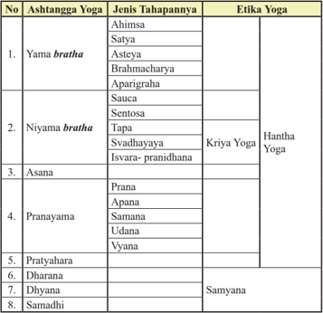

Tabel ini memperlihatkan aspek-aspek kunci dalam praktek Ashtanga Yoga, yang terdiri dari 8 tahapan utama: Yama, Niyama, Asana, Pranayama, Pratyahara, Dharana, Dhyana, dan Samadhi. Setiap tahapan ini dijelaskan dalam dua jenis tahapannya: Satya (sikap moral) dan Sentosa (sikap spiritual), serta Etika Yoga yang melibatkan Hantha Yoga dan Kriya Yoga. Topik utama tabel ini adalah struktur dan etika dalam praktek Ashtanga Yoga, dengan fokus pada prinsip-prinsip moral dan spiritual yang harus dipatuhi selama proses tersebut.

Demikian ashtangga yoga sudah dan semestinya dilaksanakan oleh umat sedharma dengan demikian Moksa dan jagadhita yang dicita-citakan dapat terwujud sebagaimana mestinya.

### Uji Kompetensi:

- Dalam ajaran Ashtangga Yoga tahapan-tahapan apa sajakah yang harus dilaksanakan oleh pesertanya?
- Coba praktekkan sikap tubuh (Dhyana) dalam Yoga! Apa yang anda ketahui dari aktivitas tersebut? Tuliskan atau paparkanlah!
- Bagaimana  cara  untuk  mengendalikan  diri  baik  itu  dari  unsur jasmani maupun rohani?

 

---
## 📄 Halaman 221

- Bila  seseorang  melaksanakan  yoga  tanpa  mengikuti  tahapantahapannya,  apakah  yang  akan  terjadi?  Buatlah  narasinya  1-3 halaman diketik dengan huruf  Times New Roman -12, spasi 1,5 cm,  ukuran  kertas  kwarto;  4-3-3-4!  Sebelumnya  diskusikanlah dengan orang tua anda di rumah.

### C.  Hambatan dan Tantangan dalam Penerapan Ashtangga Yoga

Menurut Asmarani, Devi. (2011) Yoga yang dipraktikkan sekarang sebenarnya sangat  berbeda  dengan  yoga  yang  diparaktikkan  beberapa  ribu  tahun  yang lalu, meskipun tradisi meditasi yang diwariskan tetap bertahan. Kata 'yoga' pertama kali beredar di kitab Weda sekitar tahun 1.500 SM di dalam Rg Veda, sebuah koleksi himne atau mantra yang merupakan teks suci tertua dari Weda.

Yoga berasal dari kata 'yuj' atau dalam bahasa Inggris to yoke (menyatukan). Yoga  sebagai  disiplin  mental  mulai  lebih  terlihat  dalam  buku  Upanishad yang berisi risalah agama purbakala Hindu yang ditulis sejak tahun 800 SM. Dijelaskan yoga sebagai jalan untuk mencapai pencerahan, untuk terbebas dari penderitaan, terutama lewat disiplin karma yoga (yoga yang dilakukan lewat tindakan atau ritual ) dan jnana yoga (yoga yang dilakukan lewat menggali ilmu pengetahuan atau mempelajari kitab-kitab suci).

Ketika seorang filsafat dan penulis enigmatis yang dikenal sebagai Pantanjali, menulis Yoga Sutra.  Baru saat itulah yoga dijelaskan dan dipaparkan sebagai sebuah  disiplin  yang  sistematis.  Patanjali  yang  sekarang  dikenal  sebagai bapak disiplin yoga modern menuliskan 195 sutra ( aphorisme atau petuah) pada sekitar  abad  ke  -  2  SM.  Kumpulan  yang  diberi  nama  Yoga  Sutra  ini adalah bahan tekstual pertama yang mengulas tentang seni kehidupan, dari mulai  bagaimana  bersikap  dan  menjaga  kesucian  diri,  bagaimana  perilaku dalam kehidupan sosial, sampai bagaimana mencapai pencerahan.

Patanjali percaya bahwa penderitaan akibat dari keterikatan manusia terhadap pengalaman eksternal, ketika kita terlalu terfokus pada apa yang kita inginkan atau  apa  yang  akan  kita  hasilkan,  bukan  apa  yang  sedang  kita  lakukan. Keterikatan akan pengalaman eksternal ini menjauhkan hubungan kita dari kesadaran penuh akan diri sendiri, kesadaran akan kehadiran semesta yang lebih tinggi dan mulia.

Hambatan dan tantangan yang perlu diantisipasi dalam penerapan Ashtangga Yoga, antara lain:

 

---
## 📄 Halaman 222

### 1.  Vitarka yang berhubungan dengan Yama bratha

Yama bratha adalah  pengendalian  diri  tingkat  jasmani,  yang  dipandang sebagai  tahap  awal  bagi  seseorang  yang  ingin  meningkatkan  kualitas spiritualnya.  Ada  lima  jenis  pengendalian  diri  tahap  awal  yang  wajib diikuti oleh seseorang untuk melaksanakan yoga yang disebut Panca Yama bratha . Untuk dapat melaksanakan yoga dengan baik yang bersangkutan wajib mengindari perilaku yang bertentangan dengan Panca Yama bratha . Perilaku seseorang yang berlawanan dengan yama disebut vitarka .

Vitarka tahap  awal  terdiri  dari  lima  jenis  tindakan  keliru,  kesalahankesalahan  yang  harus  dengan  teliti  dijauhkan  dan  dihilangkan  oleh seseorang  dalam  melaksanakan  yoga.  Penghambat  dan  tantangan  bagi seseorang yang berhubungan dengan ajaran yama bratha , antara lain:

- Himsa atau kekerasan dan tidak sabar sebagai lawan ahimsa
- Asatya atau kepalsuan sebagai lawan dari satya
- Steya atau keserakahan sebagai lawan dari asteya
- Vyabhicara atau kenikmatan seksual sebagai lawan dari brahmacarya
- Parigraha adalah membangga-banggakan diri dan harta, hidup mewah dan berlebihan sebagai lawan dari Aparigraha .

### 2.  Vitarka yang berhubungan dengan Nyama bratha

Nyama bratha adalah pengendalian diri tingkat rohaniah, yang dipandang sebagai tahap selanjutnya (tahap ke dua setelah yama ) bagi seseorang yang ingin meningkatkan kualitas spiritualnya. Ada lima jenis pengendalian diri tahap lanjutan yang wajib diikuti oleh seseorang untuk melaksanakan yoga disebut Panca  Nyama  bratha .  Untuk  dapat  melaksanakan yoga dengan baik  yang  bersangkutan  wajib  menghindari  perilaku  yang  bertentangan dengan Panca Nyama bratha .

Vitarka tahap  ke  dua  (tingkat  rohaniah) terdiri dari lima jenis tindakan keliru, kesalahan-kesalahan yang harus dengan teliti dijauhkan dan dihilangkan oleh seseorang dalam melaksanakan yoga. Penghambat dan tantangan bagi seseorang yang berhubungan dengan ajaran nyama bratha , antara lain:

- Asauca atau kekotoran sebagai lawan dari sauca
- Asantosa atau ketidakpuasan sebagai lawan dari santosa
- Vilasa atau kemewahan sebagai lawan tapa
- Pramada atau kealpaan sebagai lawan svadhyaya

 

---
## 📄 Halaman 223

- Prakrti-pranidhana  atau  keterikatan  pada  prakrti  sebagai  lawan  dari isvarapranidhana
Dengan  menempuh  jalan  kebaikan  bukan  berarti  seseorang  dengan sendirinya  dapat  terlindungi  dari  kesalahan  yang  bertentangan.  Jangan menyakiti  orang  lain  belum  tentu  berarti  memperlakukan  orang  lain dengan baik. Kita harus melakukan keduanya, tidak menyakiti orang lain dan  sekaligus  bersifat  serta  bersikap  ramah  tamah  dengan  sesama  dan lingkungan sekitarnya.

### 3.  Sikap duduk (Asana)

Asana adalah sikap duduk pada waktu melaksanakan yoga. Kitab Yogasutra tidak mengharuskan seseorang dalam berlatih yoga dengan sikap duduk tertentu,  namun  menyerahkan  sepenuhnya  kepada  yang  bersangkutan berlatih dengan sikap duduk yang paling disenangi dan rileks. Duduk yang baik  adalah  duduk  yang  dapat  menguatkan  konsentrasi  dan  pikiran  dan tidak  terganggu  karena  badan  merasakan  sakit  akibat  sikap  duduk  yang dipaksakan. Duduk yang baik adalah sikap duduk yang dipilih agar dapat berlangsung  lama,  serta  mampu  mengendalikan  sistiem  saraf  sehingga terhindar  dari  goncangan-goncangan  pikiran.  Duduk  yang  baik  adalah sikap duduk yang rileks, antara lain: silasana (bersila) bagi laki-laki dan bajrasana (bersimpuh) bagi wanita, dengan punggung yang lurus dan tangan berada diatas kedua paha, telapak tangan menghadap keatas. Duduk yang baik adalah sikap duduk yang sopan dan santun, serta tidak mengganggu konsentrasi  peserta yoga yang  sedang  berlatih.  Dengan  demikian  dapat dinyatakan  bahwa  sikap  duduk  yang  tidak  sopan  dan  santun  menjadi penghambat  dan  tantangan  bagi  seseorang  yang  sedang  berlatih yoga , karena  akan  dapat  mengganggu  konsentrasi  yang  bersangkutan.  Berikut ini dapat disajikan macam-macam gerakan asana (sikap duduk yang baik) dan manfaatnya menurut Gheranda Samhita.

---
**📊 Tabel**

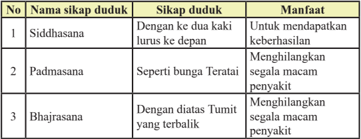

Tabel ini berisi informasi tentang tiga sikap duduk yang umum digunakan dalam yoga, yaitu Siddhasana, Padmasana, dan Bhajrasana. Topik utama tabel ini adalah penjelasan tentang sikap duduk tersebut, sasaran atau manfaat masing-masing sikap, dan cara melakukan masing-masing sikap. Kolom pertama menunjukkan nama sikap duduk, kolom kedua menjelaskan sasaran atau cara melakukan sikap tersebut, dan kolom ketiga menyebutkan manfaat dari sikap tersebut. Dari tabel ini, kita dapat melihat bahwa Siddhasana membantu mendapatkan keberhasilan, Padmasana menghilangkan segala macam penyakit, dan Bhajrasana juga menghilangkan penyakit dengan cara yang lebih efektif.

 

---
## 📄 Halaman 224

---
**📊 Tabel**

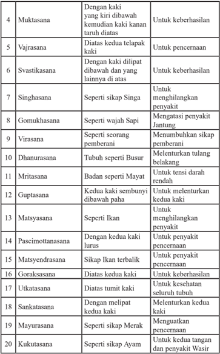

Tabel ini berisi daftar asana yoga (postur) dengan deskripsi kesehatan dan manfaatnya. Topik utama tabel adalah asana yoga dan manfaatnya untuk kesehatan. Kolom pertama berisi nama asana, sedangkan kolom kedua berisi deskripsi asana dan manfaatnya. Data penting yang terlihat adalah bahwa banyak asana memiliki manfaat kesehatan yang berbeda, seperti menghilangkan penyakit, meningkatkan kesehatan jantung, melenturkan tulang belakang, dan meningkatkan kesehatan kulit.

 

---
## 📄 Halaman 225

---
**📊 Tabel**

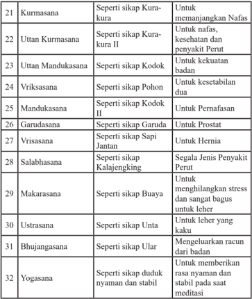

Tabel ini berisi informasi tentang posisi dan manfaat dari 32 asana (posisi) yoga. Topik utamanya adalah asana dan manfaatnya. Kolom pertama menunjukkan nomor urut asana, sementara kolom kedua dan ketiga menyajikan deskripsi asana dan manfaatnya. Data penting yang terlihat adalah bahwa setiap asana memiliki manfaat khusus untuk tubuh, seperti untuk memanjangkan nafas, meningkatkan kekuatan badan, mengurangi stres, dan membantu kesehatan organ tertentu.

### 4.  Pengaturan napas (Pranayama)

Pranayama adalah  pengaturan  nafas  keluar  masuk  paru-paru  melalui lubang  hidung  dengan  tujuan  menyebarkan  prana  (energi)  keseluruh tubuh. Pada saat manusia menarik nafas mengeluarkan suara So , dan saat mengeluarkan  nafas  berbunyi Ham .  Dalam  bahasa  Sanskerta So berarti energi  kosmik,  dan Ham berarti  diri  sendiri  (saya).  Ini  berarti  setiap detik manusia mengingat diri dan energi kosmik. Pranayama terdiri dari: Puraka;  memasukkan  nafas,  Kumbhaka;  menahan  nafas,  dan  Recaka; mengeluarkan nafas. Puraka, Kumbhaka dan Recaka dilaksanakan secara

 

---
## 📄 Halaman 226

pelan-pelan  dan  bertahap  masing-masing  dalam  tujuh  detik.  Hitungan tujuh detik ini dimaksudkan untuk menguatkan kedudukan ketujuh cakra yang ada dalam tubuh manusia yaitu: Muladhara yang terletak di pangkal tulang punggung diantara dubur dan kemaluan, Svadishthana yang terletak diatas kemaluan, Manipura yang terletak di pusar, Anahata yang terletak di jantung, Vishuddha yang terletak di leher, Ajna yang terletak ditengahtengah kedua mata, dan Sahasrara yang terletak diubun-ubun.

Fungsi  pernapasan  sangat  pital  dalam  berlatih  yoga,  tanpa  pranayama yang baik tidak ada sesuatu yang dapat dilakukan oleh seseorang. Oleh karenanya setiap orang wajib hukumnya untuk menjaga pernafasan selalu dalam keadaan sehat. Nafas adalah hidup semua mahkluk. Pernafasan yang tidak  sehimbang  dapat  menghambat,  megganggu  dan  sekaligus  adalah tantangan bagi seseorag yang berlatih yoga.

### 5.  Prathyahara, Dharana, Dhyana dan Semadhi

Prathyahara adalah penguasaan panca indra oleh pikiran sehingga apapun yang  diterima  panca  indra  melalui  syaraf  ke  otak  tidak  mempengaruhi pikiran. Panca indra terdiri dari: pendengaran, penglihatan, penciuman, rasa lidah dan rasa kulit. Pada umumnya indra menimbulkan nafsu kenikmatan setelah  mempengaruhi pikiran. Yoga bertujuan memutuskan mata rantai olah pikiran dari rangsangan syaraf ke keinginan (nafsu), sehingga citta menjadi  murni  dan  bebas  dari  goncangan-goncangan.  Jadi  yoga  tidak bertujuan  mematikan  kemampuan  indra.  Untuk  jelasnya  ada  baiknya mengutip pernyatan dari Maharsi Patanjali sebagai berikut:

Sva viyasa asamprayoga, cittayasa svarupa anukara,

iva indriyanam pratyaharah, tatah parana vasyata indriyanam.

### Terjemahannya:

Pratyahara terdiri  dari  pelepasan  alat-alat  indra  dan  nafsunya  masingmasing, serta menyesuaikan alat-alat indra dengan bentuk citta (budi) yang murni.

Pratyahara hendaknya dimohonkan kepada Hyang Widhi dengan konsentrasi yang penuh agar mata rantai olah pikiran ke nafsu terputus. Tidak  terpusatnya  konsentrasi  pikiran  adalah  sebagai  penghambat  dan sekaligus tantangan bagi setiap orang yang berlatih yoga. Dengan demikian setiap orang hendaknya melatih pikiran agar menjadi sehimbang.

 

---
## 📄 Halaman 227

Dharana artinya  mengendalikan  pikiran  agar  terpusat  pada  suatu  objek konsentrasi.  Objek  itu  dapat  berada  dalam  tubuh  kita  sendiri,  misalnya 'selaning lelata' (sela-sela alis) yang dalam keyakinan Sivaisme disebut sebagai 'Trinetra' atau mata ketiga Siwa. Dapat pula pada 'tungtunging panon' atau ujung (puncak) hidung sebagai objek pandang terdekat dari mata.

Para  Sulinggih  (Pendeta)  di  Bali  banyak  yang  menggunakan  ubunubun (sahasrara) sebagai objek karena disaat 'ngili atma' di ubun-ubun dibayangkan  adanya  padma  berdaun  seribu  dengan  mahkotanya  berupa atman  yang  bersinar  ' spatika '  yaitu  berkilau  bagaikan  mutiara.  Objek lain diluar tubuh manusia misalnya bintang, bulan, matahari, dan gunung. Penggunaan bintang sebagai objek akan membantu para yogi menguatkan pendirian dan keyakinan pada ajaran Dharma, jika bulan yang digunakan membawa  kearah  kedamaian  batin,  matahari  untuk  kekuatan  fisik,  dan gunung  untuk  kesejahteraan.  Objek  diluar  badan  yang  lain  misalnya patung dan gambar dari Dewa-Dewi, Guru Spiritual yang bermanfaat bagi terserapnya vibrasi kesucian dari objek yang ditokohkan itu. Kemampuan melaksanakan Dharana dengan baik akan memudahkan mencapai Dhyana dan Samadhi. Sebaliknya keterikatan pikiran akan obyek yang dipergunakan untuk mencapai dharana merupakan hambatan bagi pengikut yoga untuk mencapai dhyana dan samadi.

Dhyana adalah suatu keadaan dimana arus pikiran tertuju tanpa putus-putus pada  objek  yang  disebutkan  dalam  Dharana  itu,  tanpa  tergoyahkan  oleh objek atau gangguan atau godaan lain baik yang nyata maupun yang tidak nyata. Gangguan atau godaan yang nyata dirasakan oleh Panca Indra baik melalui pendengaran, penglihatan, penciuman, rasa lidah maupun rasa kulit.

Gangguan  atau  godaan  yang  tidak  nyata  adalah  dari  pikiran  sendiri yang  menyimpang  dari  sasaran  objek  Dharana.  Tujuan  Dhyana  adalah mengalirkan  pikiran  yang  terus  menerus  kepada  Hyang  Widhi  melalui objek Dharana. Yogasutra Maharsi Patanjali menyatakan: 'Tatra pradyaya ekatana  dhyanam' Artinya:  Arus  buddhi  (pikiran)  yang  tiada  putusputusnya  menuju  tujuan  (Hyang  Widhi).  Hubungan  antara  Pranayama, Pratyahara dan Dhyana sangat kuat, dinyatakan oleh Maharsi Yajanawalkya sebagai berikut :

'Pranayamair dahed dosan, dharanbhisca kilbisan, pratyaharasca sansargan, dhyanena asvan gunan.

 

---
## 📄 Halaman 228

### Terjemahannya:

Dengan pranayama terbuanglah kotoran badan dan kotoran buddhi, dengan pratyahara  terbuanglah  kotoran  ikatan  (pada  objek  keduniawian),  dan dengan dhyana dihilangkanlah segala apa (hambatan) yang berada diantara manusia dengan Hyang Widhi.

Samadhi adalah tingkatan tertinggi dari Astangga-yoga. Samadhi merupakan  pintu  gerbang  menuju  Moksha,  karena  unsur-unsur  Moksa sudah  dirasakan  oleh  seorang  yogi.  Samadhi  yang  dapat  dipertahankan terus-menerus  keberadaannya,  akan  sangat  memudahkan  pencapaian Moksa. Dalam kondisi semedi Panca Indra dan pikiran seseorang berhenti dari kegiatan dan buddhinya sendiri kokoh dalam kesucian, inilah keadaan manusia yang tertinggi.  Untuk  dapat  melaksanakan  semedi  secara  terus menerus, seseorang harus dapat mewujudkan  kesucian  pikiran dan buddhinya.

### Uji Kompetensi:

- Setelah membaca teks di atas, bagaimana tanggapan anda dengan adanya berbagai macam tantangan dan hambatan yang ada dalam mendalami dan mempraktikkan ajaran Yoga? Narasikanlah!
- Apakah yang terbaik dapat dilakukan oleh seseorang agar terlepas dari hambatan dan tantangan untuk melaksanakan yoga? Jelaskanlah!
- Bagaimana cara seseorang mengendalikan diri sehingga terbebas hambatan  yang  berhubungan  dengan  unsur  jasmani  maupun rohani? Jelaskanlah!
- Bila seseorang menemukan hambatan dalam melaksanakan yoga, apakah yang akan terjadi? Buatlah narasinya 1-3 halaman diketik dengan huruf  Times New Roman -12, spasi 1,5 cm, ukuran kertas kwarto;  4-3-3-4!  Sebelumnya  diskusikanlah  dengan  orang  tua anda di rumah.

 

---
## 📄 Halaman 229

### D. Manfaat Ajaran Ashtangga Yoga untuk Kesehatan Jasmani dan Rohani

### Perenungan:

Tv ā m agne angiraso guh ā hitam, anvavindan sisriy ā nam vane vane

### Terjemahannya:

'Ya Tuhan Yang Maha Esa, Engkau meliputi setiap hutan dan pohon. Para bijaksana menyadari Dikau di dalam hati' (Rg veda V.11. 6).

### Memahami Teks:

Latihan dan gerakan yoga menjadikan dan mengantarkan  jasmani  dan  rohani  umat  sedharma sejahtera  dan  bahagia.  Sepatutnya  kita  bersyukur kehadapan Ida Sang Hyang Widhi Wasa/Tuhan Yang Maha Esa karena atas anugerahnya kita  dapat mengenal  dan  belajar  yoga.  Belajar  tentang  yoga sangat bermanfaat untuk perkembangan jasmani dan rohani umat Hindu. Mempraktkikan gerakan-gerakan yoga  kebugaran  jasmani  dan  kesegaran  rohani  umat dapat terwujud sebagaimana mestinya.

Pengajaran pengetahuan yoga dinyatakan telah berlangsung sejak ribuan tahun yang lalu dalam tradisi

Hindu. Pengetahuan kuno yoga telah menguraikan kebenaran bahwa dalam keharmonisan  tubuh  dan  pikiran  terletak  rahasia  kesehatan.  Pengetahuan ini  selalu  menarik dan digemari oleh setiap generasi hingga dikembangkan dalam  berbagai  bentuk.  Yoga  disamping  sebagai  pengetahuan  rohani  juga dapat memberikan latihan-latihan badan. Yoga memungkinkan memperbaiki kesehatan banyak orang dan mencapai suatu kehidupan yang bersemangat. Melalui pembelajaran yoga para siswa secara bertahap dapat belajar menjaga pikiran dan tubuh dalam keseimbangan yang tenang dalam semua keadaan, mempertahankan ketenangan dalam situasi apapun.

Latihan-latihan yoga dapat membangun menolong kepercayaan diri, mengatasi stres, mengembangkan konsentrasi, dan menambah kekuatan pikiran. Kekuatan pikiran adalah kunci untuk mengerti spiritual yang mendalam. Bila kita merasa sakit karena terjadi ketidakseimbangan di dalam tubuh, pikiran, atau hasil hormo yang tidak seimbang, latihan Yoga dapat banyak membantu

 

---
## 📄 Halaman 230

menetralisirnya. Gerakan-gerakan ajaran yoga pada tingkat yang paling dasar kebanyakan meniru gerakan binatang ketika berusaha dapat sembuh dari sakit yang dideritanya. Dapat dikatakan hampir seluruh Yoga diberikan identitas sesuai nama-nama binatang.

Untuk  dapat  menetralisir  ketegangan  pikiran  sebagai  akibat  dari  bisingnya urusan keseharian yang semakin ruwet gerakan-gerakan Yoga perlu dikombinasikan dengan latihan-latihan pernafasan, konsentrasi, dan relaksasi. Dengan demikian pikiran yang ruwet dapat dikembalikan ke dalam suasana yang normal.

Setelah  melalui  latihan  Yoga  secara  teratur  kita  mampu  menjadi  tuan  bagi tubuh  kita  sendiri,  bebas  dari  gangguan  sakit,  awet  muda,  hidup  relaks, penuh energy, bebas dari pengaruh emosional, menjadikan hidup ini selalu siap bekerja untuk kesejahteraan umat manusia. Manfaat latihan pernapasan (yoga) menjadikan pernapasan lebih dalam dan pelan, paru-paru berkembang sampai  pada  kapasitas  penuh.  Akibatnya  tubuh  menerima  oksigen  dalam jumlah  maksimal.  Apabila  gerakan-gerakan  ajaran  Yoga  dapat  dilakukan dengan benar dan tepat maka kelelahan menjadi hilang, dan orang merasa penuh tenaga-dalam yang menyegarkan.

Manfaat yoga adalah untuk kesehatan fisik dalam hal ini badan atau postur tubuh,  saluran  pernafasan,  percernaan,  tungkai,  pendengaran  dan  lain-lain. Bila  melaksanakan  secara  teratur  maka  badan  akan  sehat,  penyakit  sukar hinggap di tubuh kita dan vitalitas kita meningkat, tentunya termasuk aktivitas seksual  kita  juga  membaik  dan  meningkat.  Namun  jangan  lupa  jika  Yoga secara teratur, maka perlu diimbangi dengan makan dan minum yang sehat. Berikut adalah manfaat dari berlatih Yoga

### 1.  Fleksibilitas

Ketika  beberapa  orang  berpikir  tentang  yoga,  mereka  membayangkan seperti fitnes dan mereka merasa terlalu tua dan tidak sehat untuk melakukan yoga. Untuk pembentukan otot yang sehat, terhindar dari proses yang dapat menyebabkan kekakuan, ketegangan, sakit dan kelelahan, mempraktikkan yoga  dapat  memberikan  solusi  secara  aman.  Selain  itu,  mempraktikkan ajaran  yoga  juga  dapat  meningkatkan  berbagai  gerakan  di  sendi.  Yoga tidak hanya untuk otot tapi untuk seluruh sel-sel tubuh

### 2.  Kekuatan

Beberapa gaya dari yoga memberikan efek yang  paling kuat dibandingkan dengan olah raga lainnya. Mempraktikkan salah satu dari gerakan yoga ini akan membantu meningkatkan otot, bisa meningkatkan kekuatan dan daya tahan tubuh. Hal ini menjadi penting pada usia tertentu. Gaya berdiri,

 

---
## 📄 Halaman 231

khususnya jika berpaku pada berapa lama pernafasan, dapat membangun kekuatan  pada  otot.  Jika  dilakukan  dengan  benar,  hampir  semua  gaya tersebut membangun kekuatan inti dalam otot.

### 3.  Postur

Dengan peningkatan kekuatan akan menghasilkan postur tubuh yang lebih baik. Banyaknya gaya berdiri dan duduk akan mengembangkan kekuatan inti.  Manfaat  lain  dari  yoga  adalah  meningkatkan  kesadaran  diri  kita. Kesadaran  tinggi  memberikan  peringatan  jika  bungkuk  sehingga  bisa langsung menyesuaikan sikap.

### 4.  Pernafasan

Pernafasan juga termasuk dalam yoga yang akan meningkatkan kapasitas paru-paru.  Hal  ini  bisa  meningkatkan  penampilan  dan  kinerja.  Tetapi, tipikal  dari  yoga  tidak  difokuskan  pada  aerobik  fitnes  seperti  berjalan atau bersepeda. Sebagian besar gaya yoga menekankan pada dalam dan panjangnya nafas. Ini juga yang merangsang respons relaksasi yang akan berlawanan dengan peningkatan respons dari stres.

### 5.  Mengurangi stres dan lebih tenang

Beberapa gaya yoga menggunakan teknik meditasi khusus untuk membuat pikiran  yang  sering  stres  menjadi  lebih  tenang.  Gaya  yoga  lainnya  juga tergantung  pada  teknik  bernafas  yang  mendalam  untuk  memfokuskan pikiran,  yang membuat pikiran menjadi lebih tenang. Beberapa manfaat yoga  anti-stres,  misalnya  terjadi  penurunan  hormon  yang  dihasilkan oleh kelenjar adrenalin dalam respon terhadap stres. Beberapa penelitian memfokuskan  pada  peningkatan  hormon  oksitoksin  yaitu  hormon  yang terkait dengan rasa santai dan terhubung ke orang lain.

### 6.  Konsentrasi dan mood yang lebih baik

Hampir setiap orang yang mengikuti yoga merasa lebih bahagia dan puas, manfaat yang didapat adalah adanya peningkatan aliran oksigen ke otak. Yoga juga disarankan sebagai terapi.

### 7.  Jantung lebih sehat

Mungkin salah satu manfaat dari yoga yang paling dipelajari adalah efeknya pada penyakit jantung. Yoga telah lama dikenal untuk menurunkan tekanan darah  dan  memperlambat  denyut  jantung.  Manfaat  dari  memperlambat denyut jantung sangat berarti pada orang yang hipertensi, penyakit jantung dan strok. Yoga adalah komponen kunci untuk program penyakit jantung. Program penyakit jantung ini adalah program pertama untuk penanganan

 

---
## 📄 Halaman 232

penyakit  jantung  dengan  gaya  hidup  melalui  diet  dibandingkan  dengan operasi. Yoga juga telah dikaitkan dengan penurunan tingkat kolesterol dan trigliserida serta dalam peningkatan fungsi sistem kekebalan.

### 8.  Memberikan efek pada kondisi medis

Yoga  telah  menjadi  populer  di  dunia  barat,  peneliti  medis  juga  mulai belajar  manfaat  yoga,  yang  disebut  dengan  integratif  yoga  terapi.  Ada yang digunakan sebagai perawatan tambahan medis untuk kondisi tertentu seperti  penyakit  jantung.  Manfaat  yoga  yang  lain  adalah  untuk  kondisi medis  kronis,  seperti  menghilangkan  gejala  asma.  Sedangkan  meditasi lebih  cenderung  ke  pembinaan  secara  emosional  dan  kejiwaan.  Namun yang  dilatih  adalah  pemusatan  dan  pengendalian  pikiran  kita  yang  ada keterkaitan dengan yoga. Sebab meditasi memiliki keterkaitan dengan yoga terutama saat menarik dan buang nafas agar teratur dan halus, sehingga pikiran  juga  terkonsentrasi.  Disamping  itu  meditasi  juga  dengan  sikap tegak yang dapat dibentuk melalui yoga.

Jika dapat melakukan meditasi dengan benar dan teratur, maka pikiran  akan semakin jernih dan tingkat emosional kita semakin stabil. Kesimpulannya antara yoga dan meditasi dua latihan yang dilakukan secara bersama dan saling mendukung untuk pembinaan dan pemeliharaan fisik dan kejiwaan kita. Kedua latihan ini cocok untuk kaum wanita dan laki-laki yang super sibuk. Yoga dalam keadaan terpaksa dapat dilakukan di tempat duduk di kantor sambil bekerja cukup meluangkan waktu sekitar lima menit, terlebih jika terasa kecapean bekerja, dalam hal ini yoga dan meditasi ringan. Jangan lupa jika mau belajar harus melalui tuntutan guru. Setelah menguasai dapat dilakukan sendiri dan kapan serta dimana saja.

### Uji Kompetensi:

- Buatlah peta konsep tentang manfaat yoga yang anda ketahui!
- Latihlah diri anda untuk beryoga setiap saat, selanjutnya buatlah laporan  tentang  perkembangan  beryoga  yang  anda  laksanakan baik  secara  fisik  maupun  rohani!  Sebelumnya  diskusikanlah dengan orang tua anda di rumah.
- Manfaat  apakah  yang  dapat  dirasakan  secara  langsung  dari beryoga? Tuliskanlah pengalaman anda!

 

---
## 📄 Halaman 233

### E.  Penerapan Ashtangga Yoga dalam Mencapai Moksha

### Perenungan;

Yo bá ū ta ṁ ca bhavya ṁ ca sarva ṁ ya ṡ c ā dhiti ṣ þhati, svar yasya ca kevala ṁ tasmai jye ṣ þh ā ya brahma ṇ e namaá.

### Terjemahannya;

'Tuhan Yang Maha Esa ada di mana-mana, baik dimasa lampau, di masa kini maupun  di  masa  datang.  Dia  berbahagia  sepenuhya.  Kami  menghaturkan persembahan (kurban) ke hadapan Tuhan Yang Maha Esa yang Maha Agung (Mahkluk Agung itu) (Atharvaveda X.7.35).

### Memahami Teks:

Masa muda adalah saat yang paling tepat untuk berlatih yoga. Ini adalah sifat dan  sikap  yang  pertama  dan  utama  untuk  seseorang  belajar  Yoga.  Belajar yoga harus kuat dan memiliki vitalitas yang besar. Mereka yang mempunyai pikiran tenang yang percaya pada kata-kata gurunya, ia yang bersahaja, jujur, menginginkan kebebasan dari samsara, adalah orang-orang yang cocok untuk belajar yoga. Bagi mereka yang sudah menghapus keakuan, kesombongan, ketamakan dan yang memiliki tempramen tenang adalah orang yang sesuai menjadi sang abadi. Dalam kehidupan sehari-hari menerapkan Ashtangga Yoga di zaman Kali Yuga, tentu banyak mengalami penyimpangan-penyimpangan. Banyak orang yang tahu tentang ajaran Ashtangga Yoga, akan tetapi hanya sedikit orang yang mau mengamalkan ajarannya dengan sungguh-sungguh.

Berikut ini adalah uraian secara ringkas tentang penerapan ajaran Ashtangga Yoga untuk mewujudkan kebahagiaan hidup sehari-hari.

### 1.  Penerapan Panca Yama Bratha

Adalah pengendalian diri tingkat jasmani yang menjadi tahap awal bagi seseorang yang ingin meningkatkan kualitas spiritualnya.

- Ahimsa atau tanpa kekerasan.
Jangan  melukai  mahluk  lain  manapun  dalam  pikiran,  perbuatan  atau perkataan. Orang yang ingin menempuh jalan spiritual yang lebih tinggi semestinya sudah memulai untuk tidak menyakiti baik dari segi fisik, perkataan  maupun  pikiran  terhadap  semua  makhluk  ciptaan  Tuhan. Namun  demikian  sampai  saat  ini  kita  masih  dapat  melihat  tindak

 

---
## 📄 Halaman 234

kekerasan semakin tinggi terjadi di masyarakat. Hal ini mengindikasikan penerapan ajaran Ahimsa masih hanya sebatas teori saja. Bagaimana kita dapat mempraktikkan kehidupan ini, cobalah!

- Satya atau jujur.
Jujur  atau  kejujuran  adalah  kebenaran  dalam  pikiran,  perkataan  dan perbuatan, atau pantangan dengan kecurangan, penipuan dan kepalsuan dalam praktik hidup keseharian. Ajaran satya di zaman ini nampaknya mengalami  sebuah  degradasi  yang  sangat  tajam  dan  memilukan. Kenyataannya  tidak  sedikit  orang-orang  dengan  mudahnya  untuk berpikir,  berkata  dan  berbuat  yang  tidak  jujur.  Mereka  cenderung tidak satya karena  suatu  tujuan  yang  sifatnya  keduniawiaan  seperti kekuasaan, pendidikan, harta dan popularitas. Akankah hal semacam ini dibiarkan begitu saja, bila memang kita menginginkan hidup sejahtera dan bahagia? Renungkanlah!

- Astya atau pantang menginginkan segala sesuatu yang bukan miliknya sendiri.
Astya adalah tidak tertarik dengan milik orang lain atau dengan kata lain pantang melakukan pencurian baik hanya dalam pikiran, perkataan, dan perbuatan. Orang kebanyakan selalu merasa tidak puas dengan sesuatu yang menjadi miliknya, sehingga seringkali menginginkan benda-benda yang  bukan  menjadi  miliknya.  Dalam  praktik  kehidupan  sehari-hari sering kita melihat di masyarakat seperti kasus pencurian, korupsi dan sejenisnya yang merupakan perbuatan merugikan orang lain. Akankah kita biarkan sikap ini bila diantara kita berharap dapat hidup sejahtera dan bahagia? Untuk berbuat mulia ada baiknya kita memulai dari diri sendiri! Lakukanlah!

- Brahmacarya atau berpantang dengan kenikmatan seksual.
Untuk  seorang  Brahmacarya  kewajiban  utamanya  atau  pekerjaannya adalah belajar, menuntut ilmu dan tidak melakukan hubungan layaknya suami  istri.  Namun  demikian  di  zaman  sekarang  ini  banyak  orang yang  melakukan  hubungan  seksual,  sedangkan  mereka  masih  dalam tahap Brahmacari. Hubungan seksual layaknya suami-istri yang tidak didahului  dengan  upacara  pernikahan  bertentangan  dengan  ajaran agama.  Ini  membuktikan  bahwa  aplikasi  dari  ajaran  Brahmacarya ini  masih  sangat  rendah  dalam  kehidupan  sehari-hari  di  masyarakat. Siapakah semestinya yang paling bertanggung-jawab bila banyak bayi yang tidak berdosa terlantarkan hidupnya, seperti munculnya sosok bayi orok dan yang lainnya di lingkungan sekitar kita?

 

---
## 📄 Halaman 235

### e.  Aparigraha atau pantang dengan kemewahan.

Pantang dengan kemewahan artinya seorang praktisi Yoga (Yogi) harus hidup sederhana. Hidup sederhana bukanlah hidup yang serba dibatasi, tetapi  hidup  yang  tidak  terlalu  mengikatkan  diri  terhadap  hal  yang sifatnya duniawi. Dalam hal ini kita diajarkan untuk lebih proporsional sesuai  dengan  kemampuan.  Dengan  demikian  setiap  orang  sebagai pengikut yoga setahap demi setahap dapat melepaskan diri dari ikatan keduniawiaan. Di zaman sekarang ini kecendrungan seseorang untuk hidup sederhana masih sangat minim, karena hidup yang serba glamor membuat mereka merasa senang. Keengganan untuk melakukan pola hidup sederhana, menimbulkan keterikatan terhadap materialisme dan akhirnya  yang  bersangkutan  kesulitan  untuk  meningkatkan  kualitas spiritual. Kemajuan ilmu pengetahuan dan teknologi yang kita nikmati patut  disyukuri,  namun  demikian  jangan  pernah  lupa  untuk  berpola hidup sederhana guna meningkatkan kualitas spiritual dalam keseharian. Cobalah!

### 2.  Penerapan Panca Nyama Bratha

Panca Nyama Brata adalah  lima  unsur  pengendalian diri tingkat rohani dan  sebagai  peningkatan  dari  pantangan  dasar  sebelumnya.  Lima  unsur pengendalian yang dimaksud adalah:

### a.  Sauca , kebersihan lahir batin.

Membersihkan diri (lahir-batin) adalah menjadi kewajiban setiap orang Hindu dari manapun golongannya. Seseorang yang menekuni prinsip ini akan mulai mengesampingkan kontak fisik dengan orang lain, seperti mengendalikan  hawa-nafsu  yang  diakibatkan  kekotoran  dari  kontak fisik  tersebut.  Untuk  menjadi  seorang  rohaniawan  ( Sulinggih )  yang bersangkutan wajib disucikan dengan berbagai macam upacara. Oleh umat  kebanyakan  upacara  (banten)  dipandang  dapat  membersihkan dan  menyucikan  pribadinya.  Dewasa  ini  banyak  orang  yang  ingin menjadi  seorang  rohaniawan,  ini  menunjukkan  bahwa  ajaran  sauca menjadi  hal  yang  begitu  diharapkan  oleh  banyak  orang  dan  tidak terlepas dari keinginan untuk menjadi pelayan Tuhan. Menjadi pelayan Tuhan/Ida Sang Hyang Widhi beserta prabhawa-Nya adalah perbuatan mulia. Lakukanlah semuanya itu untuk kemuliaan kita bersama guna mewujudkan hidup sejahtera dan bahagia.

 

---
## 📄 Halaman 236

### b. Santosa atau kepuasan .

Tercapainya kepuasan dalam hidup ini adalah hak asasi  pribadi  seseorang. Hal  ini  dapat  membawa  praktisi yoga kedalam  kesenangan  yang tidak  terkatakan.  Dalam  kepuasan  hidup  terdapat  tingkat  kesenangan transendental.  Kepuasan  atau  Atmanastuti  merupakan  hal  yang  tidak terpisahkan dalam kehidupan spiritual. Kepuasan lahir dan batin yang dicapai  dalam  melayani  Tuhan/Ida  Sang  Hyang  Widhi  adalah  sangat utama,  sehingga  tidak  menimbulkan  rasa  beban  dan  kecewa  dalam melaksanakan pelayanan.

Usahakanlah  dalam  hidup  ini  terbebas  dari  perasaan  kecewa  dan terbebani,  karena  semuanya  itu  dapat  mengantarkan  seseorang  gagal mewujudkan  hidup  sejahtera  dan  bahagia.  Yakinlah  dengan  berlatih yoga semuanya itu dapat terbebaskan. Lakukanklah!

- Tapa atau mengekang melalui pantangan tubuh dan pikiran.
Melalui  pantangan  tubuh  dan  pikiran  seseorang  yang  berlatih yoga menjadi kuat dan terbebas dari noda dalam aspek spiritual . Ajaran ini lebih  menekankan  aspek  pengendalian  diri  dalam  segala  bidang.  Di zaman sekarang banyak orang berusaha mencari tempat-tempat yang menyediakan ketenangan, keheningan untuk mendapatkan ketenangan akibat kepenatan hidup yang cukup berat.

### d. Svadhyaya atau mempelajari kitab-kitab suci.

Mempelajari kitab-kitab suci dan melakukan japa (pengulangan pengucapan nama-nama suci Tuhan) menjadi kewajiban setiap umat  Hindu.  Pengikut yoga yang  dengan  tekun  belajar Weda dan mengintropeksi diri dimudahkan untuk mencapai persatuan dengan yang dicita-citakannya. Ada pesan di era sekarang ini orang-orang sepertinya mulai enggan untuk mempelajari kitab-kitab sucinya karena dihadang oleh  berbagai  macam  kesibukan  yang  dihadapinya.  Para  pengikut yoga hendaknya  tidak  larut  dalam  kondisi  seperti  itu,  karena  dapat mengantarkan yang bersangkutan semakin terpuruk untuk mewujudkan hidup sejahtera dan bahagia. Belajar mandiri dari jenjang pendidikan dasar sampai dengan pendidikan tinggi adalah usaha mulia untuk setiap orang yang ingin mewujudkan hidup sejahtera dan bahagia.

Belajarlah sepanjang hayat baik secara formal maupun informal. Belajar secara formal dapat dilalui mulai dari jenjang pendidikan dasar sampai di perguruan tinggi. Sedangkan pendidikan informal dapat dilakukan mulai dari lingkungan rumah tangga sampai dengan di lingkungan masyarakat sekitarnya.  Yakinlah  bahwa  semuanya  itu  dapat  membukakan  jalan

 

---
## 📄 Halaman 237

bagi setiap orang mewujudkan hidupnya yang sejahtera dan bahagia. Pengikut yoga khususnya dan masyarakat pada umumnya hendaknya tidak  menjadikan  pasang  surutnya  proses  pembelajaran  (swadhyaya) di zaman globalisasi ini sebagai sandungan untuk mewujudkan hidup sejahtera dan bahagia. Cobalah!

- Isvarapranidhana atau penyerahan dan pengabdian kepada Tuhan.
Penyerahan  dan  pengabdian  diri  secara total,  pokus,  jujur,  tulus-ikhlas  kepada Tuhan/Ida Sang Hyang Widhi dapat mengantarkan  seseorang  pengikut  yoga khususnya dan masyarakat umumnya kepada tingkatan samadhi. Dalam hal ini kita  dituntut  untuk  menjadi  pelayan  Tuhan/ Ida Sang Hyang Widhi beserta prabhawaNya dengan selalu mepersembahkan hasilnya kepada Beliau. Ida Sang Hyang Widhi  adalah  segalanya,  oleh  karenanya sangat baik bila keyakinan dan sikap mulia kita  dalam hidup keseharian sepenuhnya dipersembahkan kepada-Nya.

### 3.  Penerapan Asana

Asana merupakan sikap duduk yang nyaman, rileks dan tenang. Dalam kehidupan sehari-hari seseorang barangkali sering mengabaikannya karena tidak tahu bahwa posisi duduk yang salah dapat mengakibatkan penyakit tulang  seperti  skoliosis,  lordosis  dan  kifosis  serta  gangguan  peredaran darah. Sikap duduk yang dilakukan oleh seseorang kelihatan sepele namun demikian jika posisi asana yang diterapkan dalam kehidupan sehari-hari baik sedang melakukan yoga ataupun  tidak  maka  dapat  meminimalisasi penyakit yang ditimbulkan akibat kesalahan duduk.

Selama ini kita mengambil sikap asana hanya pada saat bersembahyang ataupun yoga , padahal praktiknya kita lebih banyak menghabiskan waktu di  luar  kegiatan  tersebut.  Menerapkan  sikap asana yang  baik  dalam kehidupan sehari-hari sangat penting dan bermanfaat, oleh karenanya kita dapat menikmati hidup yang sehat, sejahtera, dan bahagia.

### 4.  Penerapan Pranayama

Pranayama  berarti  mengatur  pernafasan.  Tuha/Ida  Sang  Hyang  Widhi adalah nafas dunia beserta isinya. Manusia disebut-sebut sebagai mahkluk ciptaan-Nya  yang  tersempurna.  Selama  ini  yang  menjadi  salah  satu

Sumber: Pleisbilongtumi.wordpress. com Gambar 4.6 Puja - Penyerahan diri.

 

---
## 📄 Halaman 238

kelalaian  dari  manusia  adalah  kurang  menyadari  manfaat  nafas  dalam hidup ini. Nafas dalam kehidupan ini pada hakekatnya adalah Tuhan/Ida Sang Hyang Widhi. Diantara kita sering mengabaikan bahwa bernafas yang baik  merupakan  upaya  untuk  menjaga  kesehatan.  Akan  tetapi  manusia di  zaman sekarang cenderung mengabaikannya. Terkadang diantara kita sering kurang menyadari bahwa berpikir positif itu sehat.

Berpikir positif artinya berpikir optimis kalau besok diantara kita pasti masih hidup, dengan menyadari bahwa nafas kita ini adalah kuasa dari Tuhan/Ida Sang Hyang Widhi. Pranayama tidak semata-mata hanya mengacu kepada nafas masuk dan keluar yang berhubungan dengan fenomena fisika-kimia, tetapi jauh lebih halus dari itu. Proses menarik, menahan dan mengeluarkan nafas hanyalah gambaran kasar dari prana. Sebagaimana sesungguhnya ruji sepeda motor yang dikencangkan pada pusat sebuah rodanya, demikianlah segala sesuatunya terikat pada prana. Prana berjalan bersama pada prana. Prana memberikan prana. Memberikan kehidupan pada mahluk yang hidup. Bapak seseorang adalah prana. Ibu seseorang adalah prana. Saudara wanita seseorang adalah prana, guru seseorang adalah prana, seorang Brahmana adalah prana. Sehingga dikatakan bahwa dengan penguasaan pernafasan yang merupakan gambaran kasar dari Prana itu sendiri seseorang dapat mengendalikan  pikiran  yang  bergejolak,  hawa  nafsu  serta  kelemahan badan. Bahkan dengan menguasai prana secara baik, seorang praktisi yoga dapat  mengalami  fenomena  metafisis  yang  tidak  dapat  dijelaskan  oleh fenomena fisika biasa. Sebaiknya Pranayama tidak hanya kita aplikasikan pada saat ingin bersembahyang dan beryoga saja melainkan dalam praktek kehidupan  sehari-hari,  karena  porsi  waktu  kita  jauh  lebih  besar  untuk menjalani kehidupan yang lainnya.

Untuk  dapat  hidup  sehat  dalam  kehidupan  ini  lakukanlah  pernafasan tersebut sebaik mungkin melalui latihan yoga , karena nafas yang panjang dapat mengantarkan hidup kita ini menjadi sejahtera dan bahagia. Untuk yang merasa tidak mampu, cobalah!

### 5.  Penerapan Prathyahara, Dharana, Dhyana dan Semadhi

Empat  dasar yoga yang  pertama  adalah Yama , Nyama , Asana dan Pranayama . Sedangkan  empat  sendi berikutnya yaitu Prathyahara , Dharana , Dhyana dan Semadhi merupakan tahapan yang inti menuju Yoga.

Pratyahara adalah  sendi  yoga  yang  berhubungan  dengan  alat-alat  indra  yang secara ilmiah hanya ditujukan untuk menikmati hal-hal material. Dalam kehidupan sehari-hari kita harus bisa mengendalikan semua indra-indra ini karena panca indra ini apabila tidak dikendalikan dengan baik maka dapat

 

---
## 📄 Halaman 239

mengantarkan  seseorang  ke  jurang  neraka  serta  tidak  dapat  manunggal dengan Ida Sang Hyang Widhi. Mata sebagai indra penglihatan digunakan untuk menikmati hal-hal yang spiritual, telinga untuk mendengar diarahkan untuk mendengar nama-nama suci dan segala hal yang berkaitan dengan spiritual, demikian juga dengan indra-indra yang lainnya, semuanya ditarik dari kenikmatan duniawi di arahkan kepada kenikmatan rohani. Dengan demikian  seseorang  dapat  memperoleh  penguasaan  penuh  atas  alat-alat indra sehingga dapat manunggal dengan Tuhan/Ida Sang Hyang Widhi.

Dharana atau  pemusatan  pikiran  adalah  tingkatan  yoga  yang  keenam. Dalam Patanjali  Yoga  Sutra  III.1 disebutkan  ' deåa-bandhaå  cittasya dhâraña , menetapkan  citta atau pikiran pada  suatu tempat  disebut dharana '. Dharana dapat  diibaratkan  sebagai  proses  'mengetuk  pintu' menuju samadhi sehingga  praktisi yoga yang  telah  menguasai dharana secara  sempurna  dengan  sendirinya  terarahkan  menuju  pada  samadhi. Patanjali mengajarkan agar pemusatan pikiran harus hanya ditujukan pada satu objek kontemplasi, tat-pratiæedhârtham eka-tattvâbhyâsai (Patanjali Yoga Sutra I.32) . Sehingga dalam proses dharana seorang praktisi yoga dapat bermeditasi dengan memusatkan diri pada ujung hidung, pada berkas cahaya, aksara suci OM atau simbol lain yang dibenarkan.

Dalam  kehidupan sehari setiap orang hendaknya selalu mengingat Ida  Sang  Hyang  Widhi  dan  memusatkan  pikiran  kepada-Nya.  Sesuatu yang  dipikirkan,  dikatakan,  dan  dilaksanakan  (dialami  dan  dikerjakan) hendaknya dipersembahkan kehadapn-Nya. Kepada  Tuhan/Ida Sang Hyang Widhi kita patut mempersembahkan, karena itu merupakan jalan untuk penyatuan kepada Brahman.

Dhyana disebut  perbuatan  renungan,  pikiran  seseorang  merenungkan adalah dhyata ,  dan  tujuan  renungan  adalah dhiyaya .  Oleh  praktisi yoga ketiganya (dhyana, dhyata, dan dhiyaya) masih dibedakan namun dalam keadaan samadhi ketiganya lebur menjadi satu. Bila hal ini boleh diasumsikan  seperti  pelukis  dengan  lukisannya,  kondisi dhyana adalah kondisi dimana sang pelukis masih berbeda dari gagasan untuk melukis dan  keduanya  berbeda  pula  dengan  lukisannya.  Tetapi  dalam  keadaan samadhi, pelukis tersebut menyatu dengan karyanya sehingga Ia (pelukis), gagasan dan karyanya luluh menjadi satu.

 

---
## 📄 Halaman 240

Dalam keadaan samadhi , sang jiwa berada begitu dekat dengan Tuhan/Ida Sang Hyang Widhi  dan  merasakan  kebahagiaan  yang luar biasa. Seseorang yang telah terbangun dari Samadhi-nya pada dasarnya Ia tidaklah sama dengan sebelumnya. Karena begitu lama seseorang berhubungan secara pribadi  dengan  Tuhan/Ida  Sang  Hyang Widhi maka Ia mendapatkan waranugeraha seperti ananda dan vijnana. Pada tahap ini seseorang dapat dikatakan sebagai seorang Siddha dan  memperoleh  kekuatan  yang

bersifat mistik. Para rohaniawan, sulinggih, orang pintar pada umumnya yang terbiasa melaksanakan swadharmanya diyakini mampu mendapatkan Sunya. Demikian juga bagi orang biasa pada umumnya bisa mendapatkan sunya sepanjang yang bersangkutan dengan tekun berlatih tentang posturpostur yoga.

Patanjali  menerima  eksistensi  Sang  Hyang  Widhi  (Isvara)  dimana  Sang Hyang Widhi menurutnya adalah 'The Perfect Supreme Being', bersifat abadi,  meliputi  segalanya,  Maha  Kuasa,  Maha  Tahu,  dan  Maha  ada. Sang  Hyang  Widhi  adalah  purusa  yang  khusus  yang  tidak  dipengaruhi oleh kebodohan, egoisme, nafsu, kebencian dan takut akan kematian. Ia bebas dari Karma, Karmaphala dan impresi-impresi yang bersifat laten. Patanjali  beranggapan  bahwa  individu-individu  memiliki  esensi  yang sama dengan Sang Hyang Widhi, akan tetapi oleh karena ia dibatasi oleh sesuatu  yang  dihasilkan  oleh  keterikatan  dan  karma,  maka  ia  berpisah dengan  kesadarannya  tentang  Sang  Hyang  Widhi  dan  menjadi  korban dari  dunia  material  ini.  Tujuan  dan  aspirasi  manusia  bukanlah  bersatu dengan  Sang  Hyang  Widhi,  tetapi  pemisahan  yang  tegas  antara  Purusa dan  Prakrti  (Sarasamuccaya,  hal  371).  Hanya  satu  Tuhan  (Sang  Hyang Widhi).  Menurut  Vijnanabhisu:  'dari  semua  jenis  kesadaran  meditasi, bermeditasi kepada kepribadian Sang Hyang Widhi adalah meditasi yang tertinggi. (Sarasamuccaya, 372) Ada bebagai obyek yang dijadikan sebagai pemusatan meditasi yaitu bermeditasi pada sesuatu yang ada di luar diri kita,  bermeditasi  kepada  suatu  tempat  yang  ada  pada  tubuh  kita  sendiri dan yang tertinggi adalah bermeditasi yang dipusatkan kepada Sang Hyang Widhi. Kebodohan menyatakan bahwa ada dualisme dari satu realitas yang disebut Sang Hyang Widhi (Tuhan). Ketika kebodohan dihilangkan oleh pengetahuan  maka  dualisme  hilang  dan  kesatuan  penuh  akan  dicapai.

 

---
## 📄 Halaman 241

Ketika  seseorang  mengatasi  kebodohan  maka  dualisme  hilang  maka  ia menyatu dengan 'The Perfect Single Being' tetapi kesempurnaan 'The Single Being' itu selalu ada dan tetap tersisa sebagai sesuatu yang sempurna dan satu. Tak ada perubahan dalam lautan, seberapa banyakpun sungaisungai yang mengalirkan airnya dan bermuara padanya. Ketidakberubahan adalah keadaan dasar dari kesempurnaan. Kakawin Arjuna Wiwaha 11.1 menjelaskan tentang penerapan Yoga sebagai berikut.

'Sasi wimba heneng ghata mesi banu Ndanasing, suci nirmala mesi wulan

Iwa mangkana rakwa kiteng kadadin

Ring angambeki Yoga kiteng sakala ,

### Terjemahannya:

Bagaikan bulan di dalam tempayan berisi air. Di dalam air yang suci jernih tampaklah bulan. Sebagai itulah Dikau (Tuhan) dalam tiap mahluk. Kepada orang  yang  melakukan  Yoga  Engkau  menampakkan  diri'.  Jadi  pada dasarnya semua aliran kepercayaan yang menjadikan Yoga atau Meditasi sebagai pegangan utamanya pada dasarnya adalah pengikut ajaran Weda.

### Uji Kompetensi:

- Bagaimana pandangan ajaran Yoga terhadap Tuhan?
- Dalam ajaran Yoga, apakah yang dimaksudkan Tuhan itu?
- Bagaimana  keberadaan  Tuhan  itu  sendiri  dalam  ajaran  Yoga? Sebelumnya diskusikanlah dengan orang tua anda di rumah.
- Carilah informasi yang berhubungan dengan penerapan ajaran yoga guna mewujudkan hidup sejahtera dan bahagia pada  media sosial dan  pendidikan,  selanjutnya  diskusikanlah  dengan  kelompokmu. Buatlah narasinya 1-5 halaman diketik dengan huruf  Times New Roman -12, spasi 1,5 cm, ukuran kertas kwarto; 4-3-3-4! Paparkanlah di depan kelas bersama kelompokmu sesuai dengan petunjuk bapak/ibu guru!

 

---
## 📄 Halaman 242

### F.  Ashtangga  Yoga  sebagai  Dasar  Pembentukan Budi Pekerti Luhur dalam Zaman Globalisasi

### Perenungan:

Na karma ṇā m an ā rambh ā n nai ṣ karmya ṁ puru ṣ o ' ṡ nute, na ca sa ṁ nyasan ā d eva siddhi ṁ samadhigacchati.

### Terjemahannya;

Tanpa kerja orang tak akan mencapai kebebasan, demikian juga ia tak akan mencapai kesempurnaan karena menghindari kegiatan kerja (BG. III.4).

### Memahami Teks:

Secara umum, konsep etika dalam Yoga termasuk dalam latihan yama dan nyama , yaitu disiplin moral dan disiplin diri. Aturan-aturan yang ada dalam Panca yama dan Panca nyama , juga berfungsi sebagai kontrol sosial dalam mengatur moral manusia. Dalam buku Tattwa Darsana, menjelaskan bahwa etika  dalam yoga adalah  sebagai  berikut;  dalam samadhi ,  seorang Yogi memasuki ketenangan tertinggi yang tidak tersentuh oleh suara-suara yang tak henti-hentinya, yang berasal dari luar dan pikiran kehilangan fungsinya, di  mana  indra-indra  terserap  ke  dalam  pikiran.  Apabila  semua  perubahan pikiran terkendalikan, si pengamat atau Purusa, terhenti dalam dirinya sendiri. Keadaan semacam ini  di dalam Yoga-Sutra Patanjali disebut sebagai Svarupa Avasthanam (kedudukan dalam diri seseorang yang sesungguhnya).

Dalam filsafat Yoga , dijelaskan bahwa yoga berarti penghentian kegoncangankegoncangan  pikiran.  Ada  lima  keadaan  pikiran  itu.  Keadaaan  pikiran  itu ditentukan oleh intensitas sattwam, rajas dan tamas . Kelima keadaan pikiran itu adalah:

- Ksipta artinya  tidak  diam-diam.  Dalam  keadaan  pikiran  itu  diombangambingkan oleh rajas  dan  tamas,  dan  ditarik-tarik  oleh  objek  indra  dan sarana-sarana  untuk  mencapainya,  pikiran  melompat-lompat  dari  satu objek ke objek yang lain tanpa terhenti pada satu objek.
- Mudha artinya lamban dan malas. Gerak lamban dan malas ini disebabkan oleh pengaruh tamas yang menguasai alam pikiran. Akibatnya orang yang alam  pikirannya demikian cenderung bodoh, senang tidur dan sebagainya.
- Wiksipta artinya  bingung,  kacau.  Hal  ini  disebabkan  oleh  pengaruh rajas.  Karena  pengaruh  ini,  pikiran  mampu  mewujudkan  semua  objek dan  mengarahkannya  pada  kebajikan,  pengetahuan,  dan  sebagainya.  Ini merupakan tahap    pemusatan  pikiran  pada  suatu  objek,  namun  sifatnya sementara, sebab akan disusul lagi oleh kekuatan pikiran.

 

---
## 📄 Halaman 243

- Ekagra artinya  terpusat.  Dalam  keadaan  seperti  ini citta terhapus  dari cemarnya rajas sehingga pikiran dikuasai oleh sattva . Ini merupakan awal pemusatan pikiran pada suatu objek yang memungkinkan ia mengetahui alamnya  yang  sejati  sebagai  persiapan  untuk  menghentikan  perubahanperubahan pikiran.
- Niruddha artinya terkendali. Dalam tahap ini, berhentilah semua kegiatan pikiran, hanya ketenanganlah yang ada. Ekagra dan Niruddha merupakan persiapan dan bantuan untuk mencapai tujuan akhir, yaitu kelepasan. Ekagra bila  dapat  berlangsung  terus  menerus,  maka  disebut samprajna-yoga atau meditasi yang dalam, yang padanya ada perenungan kesadaran akan suatu objek yang terang. Tingkatan Niruddha juga disebut asaniprajnatayoga ,  karena  semua  perubahan  dan  kegoncangan  pikiran  terhenti,  tiada satu pun diketahui oleh pikiran lagi. Dalam keadaan demikian, tidak ada riak-riak gelombang kecil sekali pun dalam permukaan alam pikiran atau citta itu. Inilah yang dinamakan orang samadhi yoga. Ada empat macam samparjnana-yoga menurut  jenis  objek  renungannya.  Keempat  jenis  itu adalah:
- Sawitarka ialah apabila pikiran dipusatkan pada suatu objek benda kasar seperti arca dewa atau dewi.
- Sawicara ialah bila pikiran dipusatkan pada objek yang halus yang tidak nyata seperti tanmantra.
- Sananda ,  ialah  bila  pikiran  dipusatkan  pada  suatu  objek  yang  halus seperti rasa indriya.
- Sasmita , ialah bila pikiran dipusatkan pada asmita, yaitu anasir rasa aku yang biasanya roh menyamakan dirinya dengan ini.
Dengan  tahapan-tahapan  pemusatan  pikiran  seperti  yang  disebut  di  atas maka ia akan mengalami bermacam-macam fenomena alam, objek dengan atau tanpa jasmani yang meninggalkannya satu persatu hingga akhirnya citta meninggalkannya sama sekali dan seseorang mencapai tingkat asamprajnata dalam yoganya. Untuk mencapai tingkat ini orang harus melaksanakan praktik Yoga dengan cermat dan dalam waktu yang lama melalui tahap-tahap yang disebut astangga yoga .

Yoga  sesungguhnya  adalah  suatu  jalan  kehidupan  yang  mengajarkan  kita menjadi orang yang  baik, harmonis,  dan  damai.  Kitab  Bhagawadgita mengklasifikasikan  pelaksanaan  yoga  menjadi  empat  tahapan,  diantaranya adalah:

 

---
## 📄 Halaman 244

### 1.  Jnana Yoga : Yoga yang berpangkal pada Logika/pengetahuan

Adakah di dunia ini suatu aktivitas yang tidak membutuhkan  pengetahuan?  Pengetahuan membuat  orang  yang  kegelapan  menjadi terang. Setiap pekerjaan sebenarnya memiliki pengetahuan tersendiri yang mesti dipahami dengan baik. Menjadi profesional di salah satu bidang pekerjaan menuntut kita untuk  memahami  pengetahuan  di  bidang tersebut. Oleh karenanya pengetahuan itu  sangat  penting  dalam  kehidupan  ini. Terutama bila kita ingin meningkatkan diri,

mengembangkan  anugerah  Tuhan  yang  dimiliki  oleh  manusia  berupa pikiran dan kecerdasan. Jnana Yoga menekankan pada pengetahuan yang suci dan yang bermanfaat bagi kehidupan ini.

### 2.  Bakti Yoga : Yang berpangkal pada Rasa, Cinta, Kasih.

Kehadiran rasa dalam kehidupan ini adalah sangat penting, karena manusia hidup  diantara  manusia  dan  makhluk-makhluk  lainnya.  Untuk  menjaga keharmonisan hubungan hidup diantara kita maka rasa, cinta, dan kasih menjadi tali pengikat, bagaikan benang yang merajut untuk membentuk suatu  rajutan  kehidupan  yang  indah  dan  harmonis.  Rasa  membuat kehidupan ini berdenyut, karena rasa membuat manusia mampu menikmati kehidupan.  Jalan  Bakti  yoga  menekankan  pada  bakti  yang  tulus,  ikhlas berhubungan kehadapan Ida Sanya Hyang Widhi beserta ciptaan-Nya.

### 3.  Karma Yoga : Berpangkal pada Karma/Kerja.

Ciri dari kehidupan ini adalah adanya aktivitas atau kerja. Bila kita ingin hidup, setiap orang mesti bekerja untuk mendapatkan makanan, minuman, tempat tinggal, pakaian, uang dan kebutuhan hidup yang lainnya. Bekerja bisa  menjadi  jalan  untuk  mencapai  pencerahan  apabila  kita  mampu mewujudkannya dengan ihklas dan tanpa pamrih. Jalan kerja tanpa pamrih inilah hakekat dari Karma Yoga .

### 4.  Raja Yoga : adalah pengendalian diri dan konsentrasi.

Untuk mendapatkan hasil yang optimal pada kerja, logika, dan rasa maka sangat diperlukan adanya pengendalian diri dan konsentrasi yang tinggi. Patut disadari bahwa kelahiran sebagai manusia dilengkapi dengan sifatsifat;  marah,  keinginan,  iri  hati,  mabuk,  bingung  dan  loba.  Sifat-sifat bawaan sejak  lahir  ini  bila  tidak  dikendalikan  dengan  konsentrasi  yang baik  dapat  mengacaukan  jalan  hidup  utama  dari  setiap  manusia. Catur

 

---
## 📄 Halaman 245

yoga sesungguhnya  adalah  jalan  yang  utama  untuk  mengantarkan  umat manusia mencapai sukses dalam hidupnya. Ajaran Astangga Yoga adalah merupakan salah  satu  bagian  dari  ajaran  Raja  Yoga  dalam  Catur  Yoga. Ajaran Astangga Yoga disusun oleh Rsi Patanjali dengan pendekatan yang sistematis, untuk membimbing umat manusia menjadi manusia yang baik dan  mulia  guna  mewujudkan  insan  yang  berbudi  pekerti  luhur.  Ajaran Astangga Yoga yang menjadi dasar pembentukan budi Pekerti luhur bagi umat manusia antara lain

- Yama brata adalah ajaran yang menuntun umat manusia untuk selalu berperilaku dan bermoral yang baik. Manusia sebagai insan yang sopan, santun  dan  bermoral,  selama  pengabdian  hidupnya  hendaknya  tidak menyiksa,  menyakiti  dengan  perkataan,  perbuatan,  pikiran,  perasaan, dan membunuh ( Ahimsa ) makhluk sesama-Nya. Sebagai manusia yang baik hendaknya selalu jujur dan dapat dipercaya, setia pada kata hati, janji, kawan, kata-kata, perbuatan dan bertanggung-jawab pada sesuatu yang  diperbuat  ( Satya )  kepada  sesama.  Dalam  pergaulan  hidup  ini sebagai manusia hendaknya tidak menginginkan milik orang lain, tidak melakukan korupsi, kolusi, nepotisme, tidak mencuri atau merampok sesuatu  yang  menjadi  milik  orang  lain  ( Asteya ).  Untuk  menumbuhkembangkan  kecerdasan,  manusia  sebagai  mahkluk  yang  berbudi pekerti luhur hendaknya selalu belajar dan mampu mengendalikan nafsu seksualnya. Tidak melakukan hubungan seksual sebelum resmi menjadi pasangan suami-istri yang sah dengan disaksikan oleh tiga saksi: butha saksi  (paca  maha  butha),  manusia  saksi  (pemerintah,  keluarga  dan masyarakat,  pandita,  pinandita),  Dewa  saksi  (Tuhan/Ida  Sang  Hyang Widhi) melalui upacara pernikahan. Dan setelah menikahpun hendaknya tidak sembarangan melakukan  hubungan  seksual ( Brahmacarya ). Manusia yang berbudi pekerti luhur wajib hukumnya hidup sederhana, tidak  memamerkan  kemewahan  walaupun  telah  mampu  memiliki pendapatan  yang  tinggi.  Pendapatan  yang  tinggi  sedapat  mungkin dibagikan kepada orang-orang yang membutuhkan seperti, para fakir miskin, sebab dana punia adalah merupakan bentuk yaj ń a yang paling tinggi nilainya ( Aparigraha ).
Demikianlah hendaknya yang selalu diusahakan oleh setiap orang yang merindukan hidup dengan berbudi pekerti luhur, mampu membimbing pribadinya untuk berperilaku dengan moral yang baik sehingga menjadi manusia yang sejahtera dan berbahagia selama hidup dan kehidupannya ( moksha ).

 

---
## 📄 Halaman 246

- Nyama:  adalah  ajaran  yang  menuntun  umat  manusia  untuk  selalu bermoral dan berperilaku yang baik. Seseorang yang perilakunya dijiwai oleh  moral  yang  mulia  adalah  ciri  insan  yang  berbudi  pekerti  luhur. Nyama  bratha  adalah  ajaran  ashtangga  yoga  yang  patut  dijadikan landasan oleh seseorang untuk mewujudkan pribadinya berbudi pekerti luhur. Menjaga kesucian lahir dan batin masing-masing adalah menjadi kewajiban  pribadi  setiap  insan  yang  dilahirkan  sebagai  manusia. Manusia  dilahirkan  memiliki  tubuh/badan,  pikiran,  kecerdasan,  hati, dan  jiwa.  Badan  atau  tubuh  manusia  yang  kotor  dibersihkan  dan disucikan dengan air, pikiran yang kotor dapat dibersihkan dan disucikan dengan  kejujuran,  kecerdasan  manusia  yang  kotor  dapat  dibersihkan dan disucikan dengan pengetahuan suci, hati dan perasaan seseorang yang  kotor  dapat  dibersihkan  dan  disucikan  dengan  keihklasan,  dan jiwa/roh/spirit/atma manusia yang kotor dapat dibersihkan dan disucikan dengan melaksanakan tapa , brata , dan yoga ( Sauca ). Adakalanya dalam kehidupan manusia tidak pernah merasa puas walaupun dimata sesamanya yang bersangkutan sudah dipandang berkecukupan. Merasa puas  dengan  apa  yang  dimiliki,  berbahagia  dengan  karunia  Ida  Sang Hyang Widhi, selalu bersyukur atas segala anugerah-Nya, adalah cermin pribadi seseorang yang berbudi pekerti luhur dalam hidupnya. Sepatutnya kita menyadari bahwa setiap orang memiliki rejekinya masing-masing sebagai hasil dari karma baiknya pada kehidupan sebelumnya maupun hasil dari karma  pada  kehidupan  ini. Demikian  pula  kita tentu mendapatkan buah karma masing-masing. Oleh karenanya berbahagialah,  puaslah  dengan  yang  diraih  sekarang,  tidak  iri  bila melihat  keberhasilan  orang  lain,  melihat  rejeki  orang  lain  ataupun melihat keberuntungan orang lain. Karena semuanya itu sesungguhnya adalah hasil dari karmanya. Bila kita ingin mendapat keberhasilan sesuai harapan maka harus berusaha dengan sekuat tenaga dan kemampuan yang dimiliki dengan jalan yang benar ( Santosa ).  Belakangan ini ada pesan bahwa manusia ingin hidup serba instan, digampangkan, glamor, dan bersifat/sikap apatis. Bila ingin hidup berbudi pekerti yang luhur, ada  baiknya  kebiasaan  ini  diubah  secepatnya.  Mengadapi  era  global yang penuh dengan tantangan, hidup manusia harus kuat dan tahan uji. Hidup manusia harus tahan terhadap berbagai godaan yang datang baik dari dalam diri maupun dari luar diri-sendiri. Kekuatan dan ketahanan hidup bisa dimiliki bila kita telah  mampu mengendalikan diri (yoga) dengan  baik.  Kemampuan  mengendalikan  diri  bisa  dipupuk  dengan melakukan  latihan  secara  kontinyu.  Latihan  yang  bermanfaat  adalah dengan  melakukan  puasa,  brata.  Berlatih  dengan  tekun  selain  dapat menguatkan diri juga bermanfaat untuk membersihkan diri dari pengaruh

 

---
## 📄 Halaman 247

kotoran yang ada dalam tubuh ( Tapa ). Belajar dengan sungguh-sungguh untuk  mendalami  berbagai  macam  ilmu  pengetahuan  sesuai  dengan petunjuk yang ada sehingga berhasil dan berguna untuk kesejahteraan dan kebahagiaan hidup umat manusia adalah cermin dari insan yang bermoral, cerdas, dan berbudi pekerti luhur. Usaha umat manusia yang selalu memanfaatkan waktunya untuk belajar merupakan perilaku yang mulia.  Apapun  materi  pembelajaran  yang  dipelajari  oleh  seseorang adalah dapat bermanfaat dalam hidupnya sepanjang dilandasi dengan pikiran  yang  positif.  Dengan  tekun  belajar  yang  bersangkutan  dapat terbebas  dari  berbagai  masalah  yang  dihadapinya. Membiasakan diri belajar mendalami kitab-kitab suci sesuai dengan agama yang diyakininya berarti yang bersangkutan telah melandasi hidupnya dengan sikap hidup berbudi pekerti luhur ( Swadhyaya ). Manusia berkeyakinan bahwa hidup dan kehidupan ini adalah kehendak Tuhan/Ida Sang Hyang Widhi. Kelahiran, kehidupan, dan kematian sebagai manusia juga adalah atas  kehendak-Nya.  Dengan  melakoni  hidup  dan  kehidupan  sebagai manusia dan menerima hasilnya dalam kondisi baik atau buruk adalah anugerah-Nya mencerminkan insan yang berbudi pekerti luhur. Sebagai manusia  berkewajiban  untuk  selalu  menyerahkan  diri  kepada  Tuhan Yang  Maha  Esa/Ida  Sang  Hyang  Widhi  secara  bulat  dan tulus ( Iswarapranidhana ).

- Asana: menjaga keharmonisa dalam tubuh, menjaga  kesehatan  tubuh.  Asana  adalah merupakan  sikap  badan  yang  mantap  dan nyaman. Jenis-jenis sikap badan/asana dalam  yoga  sangat  beragam,  mulai  dari asana posisi berdiri, duduk, telungkup, rebah, terbalik dan lain sebaginya. Berbagai macam gerakan  asana  tersebut  ditemukan oleh para yogi yang mengabdikan hidupnya mencari  pencerahan  jiwa  di  hutan  yang sejuk ribuan tahun lalu dan menyesuaikan gerakannya dengan gerakan mahluk hidup yang ada di hutan. Manfaat dari melakukan
asana  tersebut  adalah  badan  menjadi  sehat  dan  nyaman.  Selain  itu dengan  melakukan  asana  tubuh  menjadi  terbantu  secara  fisik  untuk melakukan konsentrasi yang sangat dibutuhkan dalam yoga. Manusia memiliki  kewajiban  untuk  selalu  dapat  duduk  dengan  sehat,  tenang dan nyaman dalam keadaan apapun adalah ciri manusia yang berbudi pekerti yang luhur. Lakukanlah!

 

---
## 📄 Halaman 248

- Pranayama: mengelola energi hidup. Pranayama merupakan tata-cara pengaturan  nafas  dalam  hidup  dan  kehidupan.  Pranayama  memiliki peranan penting dalam keberhasilan seseorang untuk melakukan yoga. Apabila seseorang tidak memahami tata-cara bernafas dalam pranayama maka  yoga  yang  dilaksanakan  menjadi  sia-sia.  Dalam  pranayama dikenal istilah-istilah pengaturan nafas seperti puraka (menarik nafas), kumbaka  (menahan  nafas)  dan  recaka  (menghembuskan  nafas).  Ada beragam jenis dan teknik pranayama dalam yoga. Beragam jenis dan teknik  pranayama  tersebut  memiliki  manfaat  masing-masing  dalam hidup dan kehidupan manusia. Dengan membiasakan diri selalu berlatih yoga  secara  baik  dan  benar  dapat  memperpanjang  pernafasan  atau memperpanjang umur manusia. Bila kita berkeinginan memiliki nafas/ umur yang panjang, lakukanlah.
- Pratyahara: Pemutusan pengaruh indra pada pikiran/logikanya. Manusia memiliki  panca  indra  yang  sangat  bermanfaat  dalam  mewujudkan hidup  sejahtera  dan  bahagia.  Pemanfaatanya  hendaknya  terpelihara dengan  baik  agar  tidak  mengganggu  ketenangan  dan  kenyamanan hidup manusia. Indra yang tidak terkendali/liar dapat menganggu dan mengancurkan kelansungan hidupnya.
Pratyahara  mengandung  arti  menarik  pancaindra  dari  objek-objek penglihatan,  pendengaran,  perasaan  dan  perabaan  yang  berlebihan.  Dalam keadaan pratyahara pembentukan objek perenungan mulai dilakukan. Objek perenungan digunakan sebagai alat untuk berkonsentrasi. Dalam pelaksanaan yoga ada berbagai jenis objek perenungan dapat digunakan oleh manusia mengendalikan pengaruh negatif indranya. Praktisi yoga dapat memanfaatkan arca dewa-dewi, simbol aksara suci, cahaya yang terang, ataupun bayangan muka diri sendiri dan yang lainnya sebagai obyek  perenungan.  Objek  perenungan  tersebut  dipertahankan  hingga dapat  diyakini  sesuatu  yang  direnungkan  seolah-olah  nyata.  Manusia yang  berbudi  pekerti  luhur  selalu  berusaha  untuk  mengendalikan pengaruh  negative  indranya  dengan  hamonis  sehingga  terbangun kehidupan damai, sejahtera, dan bahagia.

- Dharana: Konsentrasi Pikiran. Berkonsentrasi atau pikiran terkonsentrasi mudah diucapkan, orang kebanyakan menyatakan tidak mudah melaksanakan. Untuk dapat berkonsentrasi dengan baik sangat dibutuhkan disiplin mental yang sungguh-sungguh. Pada tahap dharana penentuan letak  pemusatan  pikiran  pada  objek  tertentu  dilaksanakan. Misalnya titik pertemuan antara kedua alis-mata, batang hidung, ujung hidung, ubun-ubun dan lain sebagainya.

 

---
## 📄 Halaman 249

Dharana  melatih  pikiran  untuk  selalu  terkonsentrasi.  Dengan  pikiran terkonsentrasi semua permasalahan hidup manusia dapat teratasi secara baik. Manusia berbudi pekerti luhur hendaknya selalu berusaha melatih konsentrasi  pikiran  dengan  melaksanakan  yoga,  sehingga  terbangun kehidupan damai, sejahtera, dan bahagia. Setiap orang dapat melatih konsentrasi pikiran dengan baik melalui yoga.

- Dhyana:  Keadaan  meditasi,  dimana  terpusatnya  pikiran  pada  objek konsentrasi  secara  kontinyu.  Meditasi  yang  lebih  dalam  dan  tinggi dilakukan tanpa henti dan tanpa gangguan. Pada tahap dhyana aliran pikiran  sudah  mengalami  ketenangan  menuju  renungan  pada  pusat pemikiran  sebagi  titik  akhir.  Pikiran  dan  objek  renungan  seseorang berlatih yoga pada tahap dhyana masih nyata dan terpisah dari kesadaran manusia.  Setiap  orang  dapat  berlatih  meditasi  dengan  baik  melalui yoga. Manusia berbudi pekerti luhur hendaknya selalu berusaha berlatih meditasi  dengan  melaksanakan  yoga,  sehingga  terbangun  kehidupan damai, sejahtera, dan bahagia.
- Samadhi: Tercapainya Keharmonisan dan Kedamaian. Hidup menjadi manusia di era global penuh dengan tantangan, bila kita kurang siap melakoninya tidak tertutup kemungkinan menjadi korban globalisasi. Patut  disyukhuri  karena  era  global  mengingatkan  kita  untuk  tetap berusaha  mampu  mewujudkan  keharmonisan  dan  kedamaian  hidup sehari-hari melalui yoga .
Samadhi  adalah  tahapan  puncak  dari yoga .  Samadhi  dimana  pikiran tenggelam  pada  objek  yang  direnungkan.  Tidak  ada  kesadaran  akan dirinya sendiri, hanya ketenangan yang ada dalam samadhi. Pikiran dan objek renungan menjadi satu dan pikiran lenyap. Dapat membedakan antara  kebahagiaan  dengan  kesenangan  di  alam.  Keadaan  tersebut dinamakan citta-vritti nirodha dimana pikiran dapat dikendalikan secara total dan jiwa terbebas menuju alam kelepasan sebagai tujuan dari yoga itu  sendiri.  Samadhi  dapat  melatih  seseorang  untuk  menjadi  insan yang berbudi pekerti luhur. Manusia berbudi pekerti luhur hendaknya selalu berusaha berlatih samadhi dengan melaksanakan yoga, sehingga terbangun kehidupan damai, sejahtera, dan bahagia. Setiap orang dapat berlatih samadhi dengan baik melalui yoga.

Renungkanlah bait sloka berikut ini:

Yo marayati pranayati, yasmat prananti bhuvanani visva.

 

---
## 📄 Halaman 250

### Terjemahannya;

'Sang  Hyang  Widhi  Wasa  menghidupkan  dan  menghancurkan.  Dia adalah sumber penghidupan seluruh alam semesta' (Atharvaveda XIII. 3.3)

### Memahami Teks:

Untuk menjalani hidup kita perlu tubuh. Dengan adanya tubuh kita menjadi ada  dan  tanpa  tubuh  manusia  bukanlah  siapa-siapa.  Tubuh  merupakan 'sadhana' tempat bersemayamya jiwa oleh karena itu harus di jaga dan dipelihara  sebaik  mungkin.  Walaupun  demikian  tubuh  fisik  memiliki keterbatasan waktu untuk eksistensinya. Karena pada saat nanti tubuh yang di besarkan oleh makanan pada akhirnya kembali ke siklus makanan.

Berdasarkan  sistem  yoga  manusia  dipandang  memiliki  tiga  jenis  tubuh, antara lain; tubuh fisik, tubuh astral, dan tubuh kausal. Tubuh astral dan tubuh kausal bersifat kekal dan berada dalam dimensi yang berbeda dengan tubuh fisik. Tubuh astral, dan tubuh kausal dapat meninggalkan tubuh fisik pada saat kematian. Praktik Hatha yoga mengajarkan penyatuan diantara tubuh tersebut melalui teknik-teknik penguasaan tubuh, sebagai langkah awal untuk memasuki kesadaran mental dan spiritual. Dengan melakukan praktik Hatha yoga kita dapat meningkatkan kesadaran tentang tubuh yang dapat mengantarkan menuju kesadaran pikiran, kesadaraan atman/jiwa dan kembali ke sumber-Nya. Berikut ini adalah jenis tubuh manusia menurut system yoga, antara lain:

- 1). Tubuh fisik (Stula sarira) adalah badan kasar manusia yang di bentuk oleh  5  unsur  alam  seperti;  tanah  (prithivi),  air  (apah),  api  (agni), udara (vayu), dan ether (akasha). Eksistensi siklus tubuh fisik adalah mengalamai  kelahiran,  pertumbuhan,  perubahan,  pengeroposan,  dan kematian.
- 2). Tubuh astral (Suksma sarira) adalah badan halus manusia yang dapat merasakan  rasa  senang  dan  rasa  sakit  melalui;  mulut,  tangan,  kaki, genital, dan anus disebut (Kara indriya), dan mata (penglihatan), telinga (pendengaran), hidung (penciuman), lidah (rasa) dan kulit (sentuhan), disebut  (Jnana  indriya),  serta Prana yakni  energi  kehidupan  yang melingkupi semua materi di alam semesta termasuk udara (napas) yang kita hirup sahat bernapas, seperti; Kekuatan dasar yang menggerakan segala  sesuatu  dan  mengaktifkan  fungsi-fungsi  terpenting  seperti bernapas,  makan  minum,  dan  menerima  input  sensorial  (indriawi) (Prana  vayu). Kekuatan  yang  mengatur  proses  pengeluaran;  urin, tinja,  ejakulasi,  menstruasi,  dan  proses  melahirkan  {kekuatan  yang

 

---
## 📄 Halaman 251

menghasilkan rasa penerimaan dan pasrah} ( Apana vayu). Kekuatan yang mengatur pencernaan makanan, emosi, dan pengalaman sensorial merupakan kekuatan yang mengubah prana menjadi energy ( Samana vayu). Kekuatan yang mengatur pertumbuhan tubuh dan kemampuan untuk  berdiri,  berjalan,  dan  berbicara  merupakan  kekuatan  yang memberikan antusiasme dalam hidup  ( Udana vayu). Kekuatan  yang mengatur  sirkulasi  oksigen  dan  makanan  dalam  tubuh  fisik  serta mengatur sirkulasi pikiran dan emosi dalam astral merupakan kekuatan yang  mendukung  fungsi  kerja prana lainnya  (Vyana  vayu).  Tubuh astral manusia  juga  dilengkapi  dengan  4  unsur  instrumen  dalam, seperti; pikiran (manas), intelek (buddhi), pikiran bawah sadar (chitta), dan ego (ahamkara/pembenaran diri).

- 3). Tubuh kausal (karana sharira) merupakan tubuh 'benih' atau blueprint tubuh kasar dan halus. Didalam tubuh ini terdapat samskara dan karma yang akan memengaruhi perilaku dan jalan hidup manusia.
Manusia  yang  sesungguhnya  bukanlah  hanya  salah  satu  bagian  dari  3 tubuh tersebut di atas. Lapisan kesadaraan yang tersebut di atas hanyalah untuk  membebaskan diri dan mencapai pencerahan. Seseorang haruslah berhenti  mengidentifikasi  dirinya  hanya  dengan  salah  satu  lapisan  atau tubuh yang dimaksud dan mengidentifikasi dengan sesuatu yang melebihi semua lapisan tubuh, yakni atman/jiwa. Praktik yoga dapat meningkatkan kesadaran  manusia  untuk  menyadari  dan  mencapai  keberadaan  jiwanya dengan memurnikan 5 lapisan tubuh lainnya seperti;

- Annamaya kosha ; lapisan tubuh/fisik yang berasal dari unsur makanan. Makanan yang terdapat dalam tubuh fisik terbentuk dari unsur dunia fisik yakni makanan. Oleh karena itu lapisan tubuh ini kembali ke siklus makanan ( food cycle )  setelah meninggal. Lapisan tubuh yang berasal dari unsur makanan dapat dibersihkan melalui yoga asana dan dengan pola makan yang baik dan benar.
- Pranamaya kosha ; lapisan tubuh/vital yang berasal dari unsur energi. Lapisan energi terdapat dalam tubuh astral yang bekerja dengan bantuan 5 prana dan  5  organ  aksi.  Fungsinya  adalah  merasakan  lapar,  haus, panas, dan dingin. Lapisan tubuh yang berasal dari unsur energi dapat dibersihkan dengan olah napas (pranayama).
- Manomaya kosha; lapisan tubuh mental/pikiran. Lapisan tubuh yang berasal  dari  unsur  mental/pikiran  yang  terdapat  dalam  tubuh  astral dan bekerja dengan bantuan 5 organ pengetahuan dan beberapa unsur dalam, yakni pikiran/manas dan pikiran bawah sadar/chitta. Fungsinya

 

---
## 📄 Halaman 252

- ialah berpikir menyangsikan, marah, nafsu, gembira, depresi dan delusi dapat dibersihkan melalui praktik yama, niyama dan pelayanan terhadap sesama.
- Vijnamaya kosha; lapisan  tubuh  intelek.  Lapisan  tubuh  yang  berasal dari unsur intelek yang terdapat dalam tubuh astral dan bekerja dengan bantuan ilmu pengetahuan yang bekerja-sama dengan intelek (Buddhi) yang  mampu  menganalisis  dan  membedakan  berbagai  hal  dan  ego (ahamkara)  dengan  tujuan  untuk  pembenaran  diri.  Fungsinya  ialah membedakan dan membuat keputusan, dapat dibersikan melalui praktik meditasi dan studi spriritual.
- Anandamaya kosha; lapisan  tubuh  kebahagiaan.  Lapisan  tubuh  yang berasal  dari  unsur  kebahagiaan  yang  terdapat  dalam  tubuh  kausal. Fungsinya merasakan ketenangan, ketentraman, kedamaian, dan kebahagiaan, dapat dibersihkan melalui samadi .
Demikianlah manusia yang dalam keseharian hidupnya berkewajiban untuk meningkatkan  eksistensinya  sebagai  makhluk  individual,  sosial,  religius, dan berbudaya yang diciptakaan oleh Tuhan/Ida Sang Hyang Widhi, dengan kekuatan tri anta karana yang dimiliki selalu berlatih ashtangga yoga untuk membangun  budi  pekertinya  yang  luhur  guna  mewujudkan  hidup  yang sejahtera dan bahagia.

### Uji Kompetensi:

- Buatlah rangkuman untuk masing-masing pokok bahasan berdasarkan sumber teks yang terdapat pada Bab IV (Ashtangga Yoga dan Moksa) materi pembelajaran ini, sesuai petunjuk khusus dari Bapak/Ibu guru!
- Amatilah teks bacaan tersebut di atas, bagaimana pandangan anda dengan ajaran ashtangga yoga sebagai dasar pembentukan budi pekerti luhur bagi umat manusia di eraglobal ini? Jelaskanlah!
- Bagaimana  hubungan ashtangga  yoga dengan  sifat  dan  sikap berbudi pekerti luhur? Jelaskanlah!
- Bagaimana  keberadaan  tubuh  manusia  terkait  dengan  praktik ajaran  ashtangga  yoga?  Jelaskanlah!  Sebelumnya  diskusikanlah dengan orang tua anda di rumah!

 

---
## 📄 Halaman 253

- Carilah  informasi  yang  berhubungan  dengan  penerapan  ajaran ashtangga  yoga guna  mewujudkan  hidup  berlandaskan  budhi pekerti  luhur  pada    media  sosial  dan  pendidikan,  selanjutnya diskusikanlah dengan kelompok-mu.  Buatlah narasinya 1-5 halaman diketik dengan huruf  Times New Roman -12, spasi 1,5 cm, ukuran kertas kwarto; 4-3-3-4! Paparkanlah di depan kelas bersama  kelompokmu  sesuai  dengan  petunjuk  bapak/ibu  guru yang mengajar!
Gambar  berikut  adalah  beberapa  contoh  peragaan  praktek  yoga,  amatilah gambar berikut ini, deskripsilah! Sebelumnya diskusikanlah dengan orang tua anda di rumah!

 

---
## 📄 Halaman 254

 

---
## 📄 Halaman 255

### Bab V

### DASA YAMA BRATHA DAN NYAMA BRATHA

Yam ā n seveta satatam na nityam niyam ā n budh ā h, Yam ā n patatyasevam hi niyam ā n keval ā m bhayan.

Lawan yama ikang prihën nityaca gawayakëna, kunëng ikang niyama, wënang ika tan lenggëngën gawayakëna, apan ika sang manëkët gumawayakën ikang niyama, tat ā n, yatna ri kagawayaning yama, tib ā sira ring nirayaloka .

### Terjemahan:

Dan yama (pengekangan diri) haruslah diusahakan, senantiasa dilaksanakan; adapun niyama (janji diri) dapat tidak secara tetap dilaksanakan; sebab orang yang yakin melaksanakan niyama, sedangkan 'yama' diabaikan, orang yang demikian akan jatuh di nerakaloka (Sarasamuçcaya, 258. hal.194).

Menjadi kewajiban setiap individu untuk terciptanya persahabatan dalam mengomunikasikan diri dengan sesama sebagai insan ciptaan Hyang Widhi. Bagaimana semuanya itu dapat diwujudkan? Amatilah gambar 5.1 dengan baik, renungkanlah bait sloka tersebut di atas, dan deskripsikan sesuai hasil pengalamanmu!

 

---
## 📄 Halaman 256

### A. Ajaran Dasa Yama bratha dan Dasa Nyama bratha

Dasa Yama Bratha dan Dasa Nyama bratha adalah ajaran pengendalian diri secara  lahir  dan  bathin  bagi  setiap  orang  penganut  Hindu  dalam  rangka mewujudkan hidup dan kehidupan yang sejahtera, bahagia, bersih, dan suci dalam hidup dan kehidupannya.

### 1.  Ajaran Dasa Yama bratha

Perenungan.

Dakûió ā vanto amåtaý bhajante, dakûió ā vantaá pra tiranta ā yuá.

### Terjemahan:

Orang-orang yang bermurah-hati mencapai keabadian, mereka memperpanjang usia mereka ( Ågveda I. 125.6 ).

Kata Dasa  Yama  bratha sejatinya  adalah  berasal  dari  bahasa  sanskerta yakni dari kata Dasa berarti sepuluh dan Yama bratha berarti pengendalian diri  untuk  menjadi  sejahtera  dan  bahagia  berdasarkan  Dharma.  Dasa Yamabrata  adalah  sepuluh  macam  brata  pengendalian  diri  secara  (lahir dan  batin)  untuk  mencapai  kesejahteraan  dan  kebahagiaan  hidup  di dunia berlandaskan Dharma (Wigama, dkk, 1995:131). Kitab suci weda menjelaskan sebagai berikut;

Ariútaá sa marto viúva edhate pra praj ā bhir j ā yate dharman pari, yam ā dity ā so nayath ā sunitibhir ati viúv ā ni durit ā svastaye.

 

---
## 📄 Halaman 257

### Terjemahan:

'Wahai Dewa-matahari, semua umat manusia yang Engkau alihkan dari jalan  kejahatan,  menempuh  ke  jalan  yang  berbudi,  diberkahi  dengan kemakmuran dan juga dilimpahi dengan keturunan (generasi) yang berbudi luhur, berkat sikap keagamaan mereka' ( Rgveda X. 63. 13 ).

Ajaran Dasa Yama bratha merupakan suatu ajaran tata susila atau etika yang berfungsi untuk membina dan menempa watak pribadi maupun budi pekerti  yang  luhur  bagi  setiap  umat  manusia.  Dalam  kehidupan  seharihari  setiap  orang  perlu  berusaha  untuk  mengendalikan  diri,  agar  tidak terjadi benturan-benturan di dalam masyarakat dan lingkungan sekitarnya. Tanpa  adanya  usaha  pengendalian  diri  dari  masing-masing  individu, maka  masyarakat  dapat  menjadi  tidak  tentram  dalam  hidupnya.  Untuk ketenangan, kenyamanan, kententraman dan kedamaian masyarakat itulah maka setiap anggota masyarakat perlu mempedomani dan melaksanakan ajaran Dasa Yama bratha dengan segala aktivitasnya di dunia ini.

Setiap  individu  dalam  hidup  bermasyarakat  hendaknya  selalu  berupaya; tidak hanya mementingkan diri sendiri saja, patut tahan keadaan panas dan dingin, tidak berkata bohong, berbuat untuk bahagianya makhluk lain, sabar serta dapat menasihati diri sendiri, tulus hati dan berterus terang, bersikap welas asih dengan sesama, menjaga kejernihan hati, berpenampilan dengan pandangan manis (muka manis) dan manis perkataan, dan kelembutan hati.

Ajaran dasa  yama  bratha adalah  ajaran  tentang  sepuluh  macam  pengendalian diri  yang  berhubungan  dengan  perbuatan  manusia  yang  berbudipekerti luhur,  sebagaimana  yang  termaktub  dalam  kitab  saracamucchaya  sloka 259.  Ajaran dasa  yama  bratha ini  merupakan  pegangan  hidup  bagi manusia yang hendak mencapai kesejahteraan dan kebahagiaan hidup di dunia. Hal ini dapat dibaca dan dipedomani dalam ajaran anrsangsyanya , yang mengajarkan tata-cara manusia hidup saling bantu-membantu, hargamenghargai  dalam  hidup  bersama,  karena  dapat  didasari  bahwa  setiap orang itu memiliki kelemahan, kekurangan, dan kelebihan. Pada kondisi seperti  inilah  diharapkan  saling  melengkapi  satu  dengan  yang  lainnya. Di samping itu ajaran kesabaran menjadi bagian dasa yama bratha , yang mengajarkan manusia agar memiliki ketenangan hati dalam menghadapi persoalan hidup sehingga dapat terselesaikan dengan baik dan lancar.

Demikian  pula satya yaitu  konsekuen  menepati  janji,  berarti  pula  cinta dengan kebenaran dalam kehidupan sehari-hari. Orang satya adalah  disiplin, bertanggung  jawab  dengan  janji  atau  ucapannya.  Karena  dengan  hidup

 

---
## 📄 Halaman 258

menepati janji atau sesuai dengan ucapan itu dapat terwujud kebahagiaan hidup,  sebaliknya  tanpa  demikian  berbagai  permasalahan  dapat  terjadi. Hal  ini  didukung  oleh  ajaran dama ,  yang  mengajarkan  orang  mampu menasehati dirinya sendiri untuk mencapai kesadaran bahwa menasehati diri  sendiri  sebelum  berbuat  adalah  sangat  penting,  sebagai  pedoman selanjutnya untuk bertindak lebih sempurna. Dari sini pula perkembangan ahimsa yang  menginginkan  kesejahteraan  hidup  bersama  sesuai  dengan ajaran priti ,  welas asih kasih sayang kepada semua mahkluk yang harus didasari oleh ajaran prasada , madurya dan madarwa .

Dengan  mengedepankan  sikap  dan  pandangan  yang  demikian,  setiap individu yang bermasyarakat akan dapat mewujudkan ketenangan, kententraman, kedamaian  keabadian,  dan  usia  yang  panjang  dalam hidupnya.

### Uji Kompetensi:

- Dengan mendalami sumber bacaan di atas bagaimana pendapatmu  tentang  ajaran Dasa  Yama  bratha yang  ada  di  lingkungan masyarakat sekitar anda? Jelaskanlah!
- Jelaskanlah makna kata Dasa Yama bratha yang anda ketahui!
- Bagaimana  anda  meyakini  bahwa  dengan  mendalami  ajaran Dasa Yama bratha dapat mewujudkan ketenangan, kenyamanan, kententraman,  kedamaian,  keabadian,  dan  usia  yang  panjang dalam hidup ini? Jelaskanlah!
- Carilah informasi yang berhubungan dengan uraian materi Dasa Yama  bratha pada    media  sosial  dan  pendidikan,  selanjutnya diskusikanlah dengan kelompok-mu.  Buatlah narasinya 1-5 halaman diketik dengan huruf  Times New Roman -12, spasi 1,5 cm, ukuran kertas kwarto; 4-3-3-4! Paparkanlah di depan kelas bersama  kelompok-mu  sesuai  dengan  petunjuk  bapak/ibu  guru yang mengajar!

 

---
## 📄 Halaman 259

### 2.  Ajaran Dasa Nyama bratha

Abdhir g ā tr ā ói úudhyanti Manah satyena úudhyanti Widhy ā tapobhy ā m bhrt ā tma Buddhir jñ ā nena úudhyanti.

### Terjemahan:

Badan dibersihkan dengan air, pikiran dibersihkan dengan kejujuran, atma dengan ilmu dan tapa, akal dibersihkan dengan kebijaksanaan (Manawa Dharmasastra V.109).

### Perenungan.

'Dànamijyà tapo dhyànam Sw ā dhayàyopasthanigrahah, Wratopawasa maunam ca ananam Ca niyama daca

### Terjemahan:

Inilah brata sepuluh banyaknya yang disebut Nyama, perinciannya; dana, ijya, tapa, dhyana, swadhyaya, upasthaninggraha, brata, upawasa, mona, stana, itulah yang merupakan Nyama (Sarasamuçcaya, 260) .

Diskusikanlah bait sloka di atas dengan teman sebangku-mu! Buatlah  narasinya  sesuai  hasil  diskusi  yang  dilaksanakan,  selanjutnya presentasikan ke depan kelas sesuai petunjuk dari bapak/ibu guru yang mengajar. Cobalah!

Setiap individu memiliki rasa rindu akan keheningan dalam hidupnya, mendekatlah dengan Hyang Widhi. Bagaimana semuanya itu dapat diwujudkan? Amatilah gambar 8.1 dengan baik, renungkanlah bait sloka tersebut di atas, dan deskripsikan sesuai hasil pengalaman-mu!

 

---
## 📄 Halaman 260

Kata  Dasa  Nyama  bratha  berasal  dari  bahasa  sanskerta,  dari  kata dasa berarti sepuluh dan nyama bratha berarti pengendalian rohani. Dasa nyama bratha berarti Sepuluh pengendalian diri dalam tingkat mental atau rohani.

Dasa Nyama bratha adalah sepuluh macam atau jenis pegangan bagi manusia yang hendak mencapai kesempurnaan batin melalui pengamatan hidup di dunia ini  (Wigama,  dkk,  1995:75).  Bila  kita  cermati  secara  arif  sesungguhnya ke sepuluh pegangan batin itu merupakan sadana melaksanakan dharma untuk  mencapai  tingkatan  kebahagiaan  yang  kekal  abadi  yang  disebut moksa. Pengamalan dari ajaran dasa nyama bratha tersebut di dunia inilah tempatnya. Selama manusia hidup dan berkehidupan memiliki kewajiban moral  mempertahankan  dan  menumbuh-kembangkan  sifat  dan  sikap berbudi luhur. Sebab dari perilaku manusia dalam kehidupannya seharihari inilah dapat diketahui tingkatan keluhuran mental manusia itu sendiri. Oleh karena itu orang dinilai memiliki mental baik, bermental sehat dan utama hanya dapat diperhatikan dari cara seseorang berperilaku.

Untuk mendapatkan mental yang baik, sehat dan utama sebagai langkah awalnya  adalah  seseorang  wajib  dapat  menghayati  dan  mengamalkan ajaran  yang  menjadi anjuran dalam dasa nyama brata, seperti misalnya; pengekangan  terhadap  nafsu  seks,  pengekangan  terhadap  jasmaniah, pengekangan terhadap kata-kata atau suara, pengekangan terhadap makan dan minum, disertai dengan tekun mempelajari kitab suci Weda dan ilmu lainnya  yang  bersifat  umum,  tekun  bersembahyang  atau  meelakukan pemujaan kepada Sang Hyang Widhi Wasa, kepada para Deva atau leluhur dibarengi pula dengan pembersihan diri berupa mandi setiap pagi, siang dan petang hari serta beramal atau melakukan dana punia yaitu suka berdharma atau amal sedekah kepada orang lain dan sesama hidup.

Sasi wimba haneng ghata mesi banu

Ndanasing, suci nirmala mesi wulan Iwa mangkana rakwa kiteng kadadin Ring ambeki yoga kiteng sakala

### Terjemahan:

Bagaikan  bulan  di  dalam  tempayan  berisi  air,  di  dalam  air  yang  jernih tampaklah  bulan,  sebagai  itulah  engkau  (Tuhan)  dalam  tiap  makhluk, kepada orang yang melakukan Yoga engkau menampakkan diri (Arjuna Wiwaha 11. 1).

 

---
## 📄 Halaman 261

Itulah  jenis  pengendalian  yang  harus  dilakukan  untuk  mendapatkan tingkatan mental yang sempurna dan kesucian batin sebagai dasar manusia dapat  melaksanakan  dharma.  Dengan  demikian  jelaslah  bagi  manusia bahwa pembenahan diri ke dalam harus dilakukan terlebih dahulu dengan pengekangan  terhadap  bagian  tubuh,  setelah  itu  baru  pembenahan  diri keluar terhadap orang lain. Kitab suci weda menjelaskan sebagai berikut;

Svasti panth ā m anu carema sùry ā -candramas ā v iva, punar dadat ā ghnat ā j ā nat ā saý gamemahi.

### Terjemahan:

Mari kita terus berjalan pada jalan yang benar seperti jalannya matahari dan bulan. Kita seharusnya bergaul dengan orang-orang yang bermurah hati yang puas (dengan diri sendiri) dan yang berpengetahuan tinggi ( Rgveda V.51.15 ).

Seseorang hendaknya selalu mengikuti jalan yang benar, jalan kebajikan, sebab  siapa  saja  yang  berjalan  di  jalan  yang  benar  (dharma)  akan memperoleh kemakmuran, jasa dan kebajikan. Dekatkanlah diri kita kepada Tuhan Yang Maha Esa untuk senantiasa mendapat bimbingan-Nya. Orang yang memiliki keyakinan menjalankan kebenaran, maka kebajikan itu akan melenyapkan kesusahannya dan akhirnya dengan kebajikan mereka dapat menolong diri sendiri.

Sungguh  utama  ajaran  Dasa  Nyama  Bratha  itu,  karena  siapapun  yang dengan tulus menekuni  ajarannya dapat menjadikan sifat-sifat dan perilakunya menjadi mulia. Ajaran Dasa Nyama Bratha dapat membangun mental  spiritual  umat  manusia  guna  terbebas  dari  berbagai  macam rintangan yang sedang dan akan dihadapi dalam hidup dan kehidupan ini. Kewajiban kita hidup adalah menuntaskan berbagai masalah yang sedang menantang hidup ini. Pembenahan lahir (wahyu) diperoleh dengan ajaran Dasa  Nyama  Bratha.  Sedangkan  brata  (adhyatmika)  diperoleh  dengan pengekangan,  pantangan  serta  beberapa  anjuran  yang  dijelaskan  dalam ajaran Dasa Nyama Bratha.

 

---
## 📄 Halaman 262

Kesucian hati menyebabkan seseorang memperoleh kebahagiaan, dengan menghancurkan pikiran atau perbuatan jahat. Orang-orang yang memiliki kesucian hati dapat mencapai surga dan bila kita berpikiran jernih serta suci, maka kesucian itu akan mengelilingi kita. Kesucian atau hidup suci diamanatkan sebagai sarana untuk mendekatkan diri dengan Tuhan Yang Mahaesa. Kitab suci weda menjelaskan tentang kesucian sebagai berikut ;

'Yaá pot ā sa pun ā tu naá,

### Terjemahan:

'Tuhan  Yang  Maha  Esa,  Sang  Hyang  Widhi  adalah  Hyang  Maha  suci, semoga menyucikan hati kami' ( Rgveda IX. 67. 22 ).

Untuk dapat mewujudkan kesucian diri, menjaga dan menumbuhkembangkan  ketenangan  hati  sangat perlu  adanya  dengan  demikian  tidak akan ada emosi yang datang dari perasaannya. Untuk dapat dengan mudah menyelesaikan permasalahan yang dihadapi, ketenangan hati sangat diperlukan dalam kehidupan. Kejujuran (satya) dalam hidup ini, termasuk setia akan janji, setia pada ucapan, setia akan

Gambar 5.3 Menyucikan jasmani.

kebenaran (dharma) juga sangat dibutuhkan dalam hidup dan kehidupan ini. Karena hidup yang bersandarkan kebenaran, kejujuran, dan kesucian itulah yang akan dapat mewujudkan kebahagiaan yang murni pada setiap orang.

### B.  Bagian-Bagian Dasa Yama Bratha dan Dasa Nyama Bratha

Dasa yama bratha dan Dasa nyama bratha adalah ajaran etika dan moral yang patut dipedomani oleh umat manusia sebagai dasar untuk menutun hidupnya guna mewujudkan kehidupan yang nyaman, tenang, harmonis, sejahtera dan bahagia.  Masing-masing  ajaran  Dasa  yama  bratha  dan  Dasa  nyama  bratha ini terdiri dari 10 unsur bagian. Berikut ini adalah bagian-bagian dan uraian singkatnya.

 

---
## 📄 Halaman 263

### 1.  Bagian-bagian Dasa Yama Bratha

### Perenungan.

Úata-hasta sam ā hara, sahasrahasta saý kira.

### Terjemahan:

'Wahai  umat  manusia,  perolehlah kekayaan  dengan  seratus tangan dan  dermakanlah  itu  dalam  kemurahan  hati  dengan  seribu  taganmu ( Atharvaveda III.24.5 ).

Baik  hati,  tidak  mementingkan  diri  sendiri,  welas  asih,  suka  menolong, dermawan diwahyukan oleh Tuhan Yang Mahaesa untuk dipedomani dan dilaksanakan oleh umat sedharma. Berbagai macam pengetahuan dan cara penyelesaian  masalah  dapat  ditularkan  kepada  sesama  sehingga  semua masalah  dapat  teratasi  dengan  baik.  Tentang  berbagai  macam  bagian pengendalian  diri  sebagai  wujud  perbuatan  baik,  kitab  Sarasamuçcaya menjelaskan sebagai berikut;

'Ànrçamsyaý kûam ā satyamahins ā

dama ā rjawam, pritih pras ā do m ā dhuryam m ā rdawaý ca yam ā daç ā .

Nyang brata ikang inaranan yama, prayate kanya nihan, sapuluh kwëhnya, ā nåûangsya, kûm ā , satya, ahims ā , dama, ā rjawa, prtti, pras ā da, m ā dhurya, m ā rdawa, nahan pratyekanya sapuluh, ā åûangsya, siharimba, tan sw ā rtha kewala,  ksam ā ,  si  këlan  ring  panastis,  satya,  si  tan  måû ā w ā da,  ahingsa, manukhe sarwa bh ā wa; dama, si upacama wruh mituturi manahnya, ā rjawa, si  dug ā dugabënër,  pritti,  si  göng  karuna,  pras ā da,  heningning,  manah, m ā dhurya, manisning wulat lawan wuwus, m ā rdawa, pösning manah.

### Terjemahan:

Inilah brata yang disebut yama, perinciannya demikian; ā nåûangsya, kûm ā , satya, ahims ā , dama, ā rjawa, prtti, pras ā da, m ā dhurya, m ā rdawa , sepuluh banyaknya, ā nåûangsya yaitu harimbawa, tidak mementingkan diri sendiri saja, kûm ā , tahan akan panas dan dingin; satya , yaitu tidak berkata bohong; ahims ā , berbuat bahagianya makhluk; dama sabar serta dapat menasihati diri  sendiri; ā rjawa adalah  tulus  hati,  berterus  terang; prtti yaitu  sangat welas asih; pras ā da , kejernihan hati; m ā dhurya , manis pandangan (muka manis) dan manis perkataan; m ā rdawa , kelembutan hati (Sarasamu ç caya. 259. hal. 195) .

 

---
## 📄 Halaman 264

Menurut kitab Sarasamu ç caya yang disebut-sebut sebagai saripati dari kitab astadasaparwa buah karya sastra dari Bhagawan Wararuci, menyebutkan bahwa ajaran Dasa Yamabrata, terdiri atas:

- Ànåûangsya yaitu harimbawa berarti tidak mementingkan diri sendiri saja;
- Kûm ā berarti tahan akan panas dan dingin;
- Satya berarti tidak berkata bohong;
- Ahims ā berarti berbuat bahagianya makhluk;
- Dama berarti sabar serta dapat menasihati diri sendiri;
- Àrjawa berarti tulus hati, berterus terang;
- Prtti berarti sangat welas asih;
- Pras ā da berarti kejernihan hati;
- M ā dhurya berarti manis pandangan (muka manis) dan manis perkataan;
- M ā rdawa berarti kelembutan hati.
Kesepuluh  macam  bagian  ajaran  Dasa  Yama  bratha  inilah  yang  wajib dipedomani dan dilaksanakan oleh umat sedharma dalam hidup bermasyarakat. Hal ini  penting  diterapkan  oleh  masing-masing  individu masyarakat dalam keseharian karena semuanya merupakan norma kesusilaan  yang  bernilai  utama  serta  yang  mampu  menjamin  keamanan dan  ketertiban  masyarakat  sekitarnya.  Masyarakat  era  global  sangat membutuhkan ajaran Dasa Yamabrata sebagai pedoman hidup sehingga era globalisasi dapat berjalan dengan tentram, nyaman, kuat dan damai. Adalah menjadi tanggung-jawab kita bersama untuk mewujudkan semuanya itu, bila kita tidak menginginkan tatanan masyarakat ini tidak menentu, kacau, dan hancur. Semoga ...!

### Uji Kompetensi:

- Apakah makna dari masing-masing bagian ajaran Dasa Yama brata tersebut  bila  kita  hubungkan  dengan  kehidupan  bermasyarakat keseharian seperti sekarang ini? Jelaskanlah!
- Kita semua patut bersyukur memiliki warisan leluhur berupa ajaran Dasa Yama brata , dengan cara bagaimana anda mewujudkan rasa bersyukur itu? Deskripsikanlah!

 

---
## 📄 Halaman 265

- Manfaat  apakah  yang  dapat  dirasakan  secara  langsung  dari pengamalan ajaran Dasa Yama brata dalam hidup bermasyarakat? Tuliskanlah pengalaman anda! Selanjutnya ikutilah petunjuk dari bapak/ibu guru yang mengajar di kelas!
- Amatilah  masyarakat  lingkungan  sekitar  anda  terkait  dengan pengamalan ajaran Dasa Yama brata dalam keseharian, buatlah catatan  tersendiri  dan  diskusikanlah  dengan  orang  tua,  saudara, dan anggota keluarga anda. Buatlah narasinya 1-5 halaman diketik dengan huruf  Times New Roman -12, spasi 1,5 cm, ukuran kertas kwarto;  4-3-3-4!  Selanjutnya  ikutilah  petunjuk  dari  bapak/ibu guru yang mengajar di kelas-mu!

### 2.  Bagian-Bagian Dasa Nyama Bratha

Perenungan.

Agne dakúaiá punihi óah.

### Terjemahan:

'Sang  Hyang  Agni  (Tuhan  Yang  Mahaesa),  sucikanlah  kami  dengan menganugerahkan pengetahuan kepada kami' ( Ågveda IX. 67. 26 ).

Tidak  ada  sesuatu  yang  sempurna  di  dunia  ini,  demikian  kata  orang arif  bijaksana.  Oleh  karena  itu  kewajiban  manusia  dalam  hidup  dan kehidupannya  adalah  melakukan  ajaran  dharma  untuk  kebaikan.  Dalam kehidupan berkeluarga, bermasyarakat, berbangsa dan bernegara, betapapun berat dan banyaknya masalah yang sedang dan akan dihadapi hendaknya dilakoni dengan bersikap sabar. Orang yang sabar pasti hatinya akan tenang, dengan ketenangan hati seseorang akan dapat mengendalikan hawa  nafsu.  Dengan  demikian  ketenangan  hati  (sabar)  akan  diperoleh sesorang dalam hidupnya, dan inilah yang disebut manusia berbudi luhur, tidak sesat, tidak sesat dari jalan yang benar. Kitab suci weda menjelaskan sebagai berikut;

Yah samutpatitam krodham ksamayaiva nirasyati Yathoragastvacam jirman sa vai purusa ucyate.

 

---
## 📄 Halaman 266

### Terjemahan:

Jika ada orang yang berhasil meninggalkan kemarahan hatinya berdasarkan kesabaran  hati  sebagai  keadaan  ular  yang  meninggalkan  kulitnya  yang terlepas,  karena  kesemuanya  itu  tidak  akan  kembali  lagi;  orang  yang demikian keadaannya, itu adalah disebut manusia yag sejati berbudi luhur (Sarasmuscaya, 95).

Hidup  menjadi  manusia  hendaknya  selalu  dapat  belajar  memuaskan dirinya dengan apa yang menjadi miliknya, dengan demikian ia tidak akan memiliki  gejolak  iri  hati  kepada  orang  lain.  Manusia  sebaiknya  selalu berusaha sekuat tenaga mau belajar untuk mengendalikan diri, sehingga pada  pribadinya  tercipta  keseimbangan,  ketenangan  hidup  secara  lahirbatin.  Disamping itu  umat  mausia  hendaknya selalu mengupayakan diri untuk selalu belajar, karena berbagai macam pengetahuan kerohanian itu diuraikan dalam berbagai jenis kitab suci agama Hindu. Yang tidak boleh terlupakan  oleh  umat  manusia  adalah  hendaknya  selalu  mengadakan pemujaan ke hadapan Sang Hyang Widhi beserta prabhawa-Nya, mengingat dihadapan Sang Hyang Widhi manusia akan dapat merasakan dirinya kecil, lemah, dan sangat sederhana. Seberapa banyak umat manusia berkewajiban melaksanakan dharmanya untuk dapat mewujudkan kesempurnaan batinnya 'moksa', kitab suci weda menyebutkan sebagai berikut;

Kitab sarasamuscaya menyebutkan sebagai berikut;

'Dànamijyà tapo dhyànam Sw ā dhayàyopasthanigrahah, Wratopawasa maunam ca ananam Ca niyama daca.

Nyang bratha sapuluh kwehnya, ikang nyama ngaranya, pratyekadàna, ijjyà, tapà, dhayàna, swàdhyàya,  upasthanigraha, bratha  upawàsa, mauna,  snàna,  nahan  ta  wakning  nyama,  dàna  weweh,  annadànàdi; ijyà, Devapujà, pitrpujàdi, tapà, kayasangcosana, kasatan ikang çarira,  bhucarya,  jalatyagadi;  dhyàna,  ikang  çiwasmarana,  swàdhy àya, Vedabhyasa,  upasthanigraha,  kahrtaning  upasta,  bratha  annawarjadi, mauna,  wacangyama  kahrtaning  ujar,  hay  wàkecek  kuneng,  snàna,  tri sandyàsewana, madyusa ring kàlaning sandhya.

### Terjemahan:

Inilah bratha sepuluh banyaknya yang disebut Nyama, perinciannya; dana, ijya, tapa, dhyana, swadhyaya, upasthaninggraha, brata, upawasa, mona, stana, itulah yang merupakan Nyama; dana,pemberian; pemberian makan, minuman dan lain-lain; ijya, pujaan kepada Deva, kepada leluhur, dan lainlain;  tapa,  pengekangan  nafsu  jasmaniah,  badan  yang  seluruhnya  kurus

 

---
## 📄 Halaman 267

kering, layu, berbaring di atas tanah, di atas air, dan di atas alas-alas lain sejenis  itu;  dhayana,  merenungkan  Deva  Siwa;  swadhyaya  mempelajari Weda;  upasthanigraha,  pengekangan,  upastha,  singkatnya  pengendalian nafsu  seks;  brata,  pengekangan  nafsu  terhadap  makanan;  mona,  itu macamnya, tidak menguacapkan kata-kata yaitu tidak mengucapkan katakata sama sekali, tidak bersuara; snana, Tri Sandhya sewana, melakukan Tri Sandhya, mandi membersihkan diri pada waktu melakukan Sandhya (Sarasamuçcaya, 260) .

Berdasarkan  penjelasan  kitab  suci  Sarasamuçcaya,  menyebutkan  ada sepuluh bagian ajaran Nyama bratha yang patut dijadikan pedoman oleh umat sedharma untuk mewujudkan kesempurnaan bathin dalam hidup dan kehidupan ini yang terdiri dari;

- Dana  berarti  pemberian-pemberian makanan dan minuman, dan lainlainnya.
- Ijya berarti pujaan kepada Deva, kepada leluhur, dan lain-lainnya.
- Tapa berarti pengekangan hawa nafsu jasmani.
- Dhyana berarti merenung memuja Tuhan.
- Swadhyaya berarti mempelajari Weda.
- Upasthanigraha berarti pengekangan nafsu kelamin.
- Bratha berarti pengekangan nafsu terhadap makanan.
- Upawasa berarti pengekangan diri.
- Mona berarti pengendalian kata-kata.
- Snana berarti melakukan pemujaan dengan Tri Sandhya.
Demikian  perincian  ajaran  Dasa  Nyama  bratha  sebagaimana  tersurat dan  tersirat  dalam  kitab  Sarasamuçcaya.  Ajaran  'Dasa  Nyama  bratha' sesuai  uraian  di  atas  dapat  dipergunakan  sebagai  dasar  melaksanakan dan mewujudkan kesempurnaan batin oleh umat sedharma. Ajaran Dasa Nyama  bratha  menurut  yoga,  adalah  merupakan  ajaran  tahap  kedua untuk  mencapai  kesempurnaan  rohani  yang  utama.  Konsep  ajaran  ini patut  dimengertikan,  dipahami,  didalami,  diikuti  dan  diamalkan  dalam mewujudkan kesempurnaan rohani 'moksa' yang dicita-citakan.

 

---
## 📄 Halaman 268

### Uji Kompetensi:

- Apakah makna dari masing-masing bagian ajaran Dasa Nyama  bratha  tersebut  bila  kita  hubungkan  dengan  kehidupan bermasyarakat keseharian seperti sekarang ini? Jelaskanlah!
- Kita  semua  patut  bersyukur  dapat  menerima  warisan  leluhur berupa ajaran Dasa Nyama bratha, dengan cara bagaimana anda mewujudkan rasa bersyukur itu? Deskripsikanlah!
- Manfaat  apakah  yang  dapat  dirasakan  secara  langsung  dari pengamalan  ajaran  Dasa  Nyama  bratha  dalam  hidup  bermasyarakat? Tuliskanlah pengalaman anda! Selanjutnya ikutilah petunjuk dari bapak/ibu guru yang mengajar di kelas!
- Amatilah  masyarakat  lingkungan  sekitar  anda  terkait  dengan pengamalan ajaran Dasa Nyamabratha dalam keseharian, buatlah catatan  tersendiri  dan  diskusikanlah  dengan  orang  tua,  saudara, dan anggota keluarga anda. Buatlah narasinya 1-3 halaman diketik dengan huruf  Times New Roman -12, spasi 1,5 cm, ukuran kertas kwarto;  4-3-3-4!  Selanjutnya  ikutilah  petunjuk  dari  bapak/ibu guru yang mengajar di kelas!

### C.  Tujuan  dan  Manfaat  Ajaran  Dasa  Yama  Bratha dan  Dasa  Nyama  Bratha  dalam  Pembentukan Kepribadian yang Luhur

Dasa Yama bratha dan Dasa Nyama bratha masing-masing adalah adalah ajaran ethika  dan  moral  yang  mempermulia  hidup  dan  kehidupan  umat  manusia. Pengimplementasian didalam era global ini memiliki tujuan dan manfaat yang sangat utama guna membentengi pola pemikiran dan perilaku umat manusia dalam mewujudkan kehidupan yang sejahtera dan bahagia. Berikut ini dapat disajikan secara singkat tujuan dan manfaat yang dimaksud.

 

---
## 📄 Halaman 269

### 1.  Tujuan dan Manfaat Ajaran Dasa Yama Bratha dalam Pembentukan Kepribadian yang Luhur

Perenungan.

Kurvan evaha karm ā ói jijiviúet úataý sam ā á, evam tvayi n ā nyatheto-asti na karma lipyate nare.

### Terjemahan:

'Orang seharusnya suka hidup di dunia ini dengan melakukan kerja keras selama seratus tahun, tidak ada cara yang lain bagi keselamatan seseorang, suatu tindakan yang tidak mementingkan diri sendiri dan tidak memihak menjauhkan pelaku dari keterikatan, ( Yajurveda XI.2 ).

Mewujudkan  tujuan  hidup  ini  adalah  tugas  mulia  bagi  umat  manusia. Memanfaatkan ajaran  Dasa  Yama  bratha  utuk  membangun  keselamatan umat manusia adalah swadharma sebagai masyarakat Hindu. Bagaimana supaya anggota masyarakat dapat dengan mudah mengetahui, memaknai, menghayati,  melaksanakan  dan  memahami  manfaat  ajaran  Dasa  Yama bratha tersebut mampu membentuk insan berkepribadian yang luhur, maka masing-masing  bagiannya  perlu  diberi  penjelasan  yang  cukup.  Tanpa penjelasan  yang  baik  mustahil  dapat  diresapi  dan  dihayati  secara  baik tentang ajaran Dasa Yamabrahta itu. Adapun penjelasan secara rinci dari masing-masing bagian ajaran Dasa Yama bratha adalah sebagai berikut;

- Ànåûangsya adalah harimbawa berarti tidak mementingkan diri sendiri saja;
Di dalam kehidupan sehari-hari seseorang hendaknya selalu berusaha lebih mengutamakan kepentingan orang banyak dari pada kepentingan pribadinya. Kepentingan masyarakat lebih dominan dari yang lainnya, kecuali  untuk  memberi  pelayanan  kepada  orang  yang  sedang  sakit dimana kita harus memberikan pelayanan.

Harimbawa artinya berwibawa, misalnya sebagai Sang Hyang Widhi  memiliki kewibawaan,  Bhatara merupakan  manifestasinya atau  perwujudan  Tuhan  yang  Maha  Esa  yang  berfungsi  sebagai pemelihara dari alam semesta beserta dengan isinya. Di dalam pusaka suci  Bhuwanakosa  ada  penjelasan  bahwa  Bhatara  Brahma  berfungsi untuk  menciptakan  alam  semesta,  Bhatara  Wisnu  berfungsi  sebagai memelihara  ciptaan  tersebut,  sedangkan  Bhatara  Rudha    sebagai

 

---
## 📄 Halaman 270

pemelihara alam semesta ini beserta dengan isinya. Ketiganya adalah merupakan pelindung dunia ini. Demikianlah Sang Hyang Wisnu/Sang Hyang Hari merupakan manifestasi Tuhan/Hyang Widhi Wasa untuk memelihara dunia atau negara yang mempunyai wibawa. Tak ubahnya lagi seperti negara dipelihara oleh raja dengan penuh wibawa bersama para menteri atau pegawainya.

Di  dalam  kehidupan  sehari-hari,  manakala  terjadi  benturan  antara kepentingan pribadi dengan kepentingan orang banyak, maka kepentingan pribadi selalu dinomer duakan,  apabila bobot kedua macam kepentingan itu hampir sama. Namun demikian, bagaimanapun hanya manusia  harus  berfikir  secara  obyektifitas  disamping  subyektifitas. Sebab apabila bobot-bobot kepentingan pribadi itu jauh lebih besar dari pada  kepentingan  orang  banyak,  maka  kepentingan  pribadi  itu  tetap harus  didahulukan.  Sebagai  contoh  dapat  dijelaskan  sebagai  berikut; Pada suatu saat di masyarakat ada acara gotong royong membersihkan lingkungan. Tepat saat itu juga keluarga kita terkena musibah sakit yang harus segera mendapat batuan dokter. Dalam hal ini maka kepentingan pribadi harus didahulukan dengan kepentingan orang banyak dinomer duakan.  Demikianlah  kita  tidak  boleh  mementingkan  diri  sendiri, apabila bobot kepentingan itu sama atau hampir sama.

Manfaat  dari  ajaran  Ànåûangsya  (Dasa  Yamabrata)  ini  adalah  dapat mewujudkan  ketenangan,  kententraman,  kedamaian  keabadian,  dan usia yang panjang dalam hidup berkeluarga, bermasyarakat, berbangsa dan bernegara dengan bersikap welas-asih.

### b.  Kûm ā berarti tahan akan panas dan dingin;

Ksama adalah sifat-sifat pengampun, pemaaf, serta sabar dan tahan uji. Di dalam  kehidupan  ini  setiap  orang harus  berusaha  untuk  nemerapkan sifat-sifat pengampun, pemaaf serta  sabar  dan  tahan  uji  tersebut. Orang yang baik adalah orang yang suka  mengampuni  dan  memaafkan kesalahan  orang  lain.  Bila  semua orang memiliki sifat demikian pasti dunia akan selalu aman tentram.

 

---
## 📄 Halaman 271

Sifat Pengampun dan pemaaf; contoh sifat yang suka mengampuni serta mau memberi maaf kepada orang lain sebagaimana terlukis dalam cerita Ni Wanari. Di dalam cerita ini dijelaskan bahwa Ni Wanari hanyalah seekor kera betina, namun ia mempunyai sifat yang sangat mulia yaitu suka  memberi ampun dan maaf kepada siapa saja. Adapun cuplikan ceritanya adalah sebagai berikut: Setelah Si Papaka mendengar cerita Si Macan tentang kematian Sang Raja Putra dipenggal oleh seekor kera yang buruk hati, lalu dimintalah Si Papaka itu untuk membuat jatuh Ni Wanari.  Karena  kebodohan  Si  Papaka,  Ni  Wanari  yang  sedang  tidur didorong  hingga  jatuh.  Ni  Wanari  diterkam  oleh  Si  Macan.  Namun karena  kecerdikan  dan  kesabarannya  Ni  Wanari  lalu  berkata  sambi tersenyum: 'Hai macan bila engkau hendak membunuh, bunuhlah aku dengan  cara  menangkap  ekorku!  Jika  tidak  demikian  maka  engkau tidak akan bisa membunuhku. Karena aku ini keturunan Bhatara Sakti.' Karena bodohnya Si Macan maka Ni Wanari dilepas seraya menangkap ekornya. Sementara mau akan ditangkap, segera Ni Wanari meloncat ke  atas  dahan  tempat  dimana  Papaka  berlindung,  Si  Papaka  sangat ketakutan. Ni Wanari melihat gejala itu dan berkata: 'Wahai Papaka, jangan gelisah dan takut. Yang menyebabkan saya jatuh adalah karena saya lelap tidur, lalu saya terkejut karena disengat semut!' Demikianlah kebijaksanaan  Ni  Wanari  yang  mempunyai  sifat  pengampun  serta penyabar menghadapi perilaku Si Papaka yang buruk.

Tahan  Uji  dalam  arti  dapat  mengendalikan  diri;  sifat  semacam  ini dapat dimaknai dalam cerita tentang seorang Maha Rsi yang bernama Bhagawan  Dharmaswami.  Beliau  adalah  seorang  pendeta  utama yang tahan uji dari segala macam penderitaan akibat ulah Raja Putra Madura  atas  laporan  'Swarnangkara'  karena  itu  beliau  diburu  dan diikat serta dipertontonkan di peraptan agung. Namun meskipun beliau dirundung malang, tetapi tetap  menunjukan kesabaran dan tidak ada rasa amarah kepada yang mencaci makinya. Pikiran beliau bersih dan tenang, tidak sedikitpun ada celanya dari panas dingin. Atas nasehat Si  Ular  Sandi  mengharapkan  agar  Prabu  Madura  memohon  maaf kepada Bhagawan Dharmaswami dan memohon agar beliau berkenan mengobati  putra  mahkota  yang  dipagut  ular.  Oleh  karenanya;  Prabu Madura,  para  pendeta  dan  para  menteri  datang  bersujud  memohon ampun di hadapan Sri Bhagawan. Permohonannya terkabulkan, maka raja mau menyerahkan kerajaannya kepada Sri Bhagawan, namun Sri Bhagawan menolak dengan berkata:'Ya, paduka kami jangan bergaul

 

---
## 📄 Halaman 272

dengan sahabat yang Durbudhi. Si Durbudhi akan mengantar paduka ke Yama loka. Begitu pula sang pendeta, bila bergaul dengan orang corah, hilanglah kewibawaan dan kemuliaan beliau.

Manfaat dari ajaran Kûm ā (Dasa Yamabrata) ini adalah dapat mewujudkan  ketenangan,  kententraman,  kedamaian  keabadian,  dan usia yang panjang dalam hidup berkeluarga, bermasyarakat, berbangsa dan bernegara dengan sikap yang dimotivasi oleh sifat-sifat pengampun, pemaaf, serta sabar dan tahan uji.

### c.  Satya berarti tidak berkata bohong;

Satya  adalah  benar,  setia,  dan  jujur  yaitu  sifat  dan  perilaku  selalu berdasar  atas  kebenaran  dan  kejujuran.  Orang  yang  memiliki  sifat ini  tidak  akan  pernah  berkata  bohong,  selalu  bersifat  setia  terhadap apa yang telah dikatakan dan tidak suka pada kehidupan yang penuh dengan  kemunafikan.  Satya  juga  berarti  jujur  sehingga  terdapat  asas keseimbangan terhadap pikiran, perkataan, dan perbuatan. Sehubungan dengan  Satya  yang  berarti  benar,  setia,  dan  jujur,  berikut  ini  dapat diuraikan tentang Panca satya sebagai berikut:

Panca Satya adalah Lima macam perilaku yang selalu berdasarkan atas kebenaran, kesetiaan dan kejujuran. Panca Satya harus dilaksanakan, agar  kita  mendapat  julukan  atau  predikat  sebagai  orang  yang  dapat dipercaya,  mengenal  adat,  sopan  santun  dan  patut  dihormati,  serta berkesusialan tinggi. Nama baik adalah merupakan harta yang paling tinggi  nilainya  di  dunia  ini.  Yang  sangat  tercela  dalam  pergaulan hidup  adalah  melanggar  norma-norma  agama,  yang  akan  merupakan beban mental bagi seseorang dalam hidupnya di mayapada maupun di Paramaloka kelak. Panca Satya terdiri dari:

- 1). Satya Hredaya
- 2). Satya Samaya
- 3). Satya Wacana
- 4). Satya Laksana
- 5). Satya Mitra
Satya Hredaya adalah benar, setia dan jujur; yaitu selalu berfikir dan merencanakan sesuatu yang berdasarkan atas kebenaran dan kejujuran. Satya  Samaya adalah  benar,  setia  dan  jujur  dalam  perjanjian;  yaitu selalu berusaha untuk taat, dan menaati perjanjian yang telah disepakati bersama. Satya Wacana adalah benar, setia dan jujur dengan perkataan;

 

---
## 📄 Halaman 273

yaitu  selalu  mengucapkan  kata-kata  yang  baik  dan  benar  sehingga dapat menyenangkan orang-orang yang mendengarnya. Satya laksana adalah benar, setia dan jujur dalam perbuatan; yaitu selalu bekerja dan berbuat baik dan benar. Satya Mitra adalah benar, setia, dan jujur dalam persahabatan; yaitu siap membantu teman yang dalam kesulitan sesuai dengan kemampuan yang ada pada diri masing-masing.

Sebagai penganut agama Hindu yang percaya pada tujuan hidup di dunia ini yaitu jagadhita, maka diharuskan sekuat tenaga untuk memahami, meneladani, menghayati, dan akhirnya mengamalkan dalam kehidupan sehari-hari Panca Satya tersebut agar jalan kita menuju jagadhita lurus, lebar, dan terang benderang.

Manfaat dari ajaran Satya (Dasa Yamabrata) ini adalah dapat mewujudkan  ketenangan,  kententraman,  kedamaian,  keabadian,  dan usia yang panjang dalam hidup berkeluarga, bermasyarakat, berbangsa dan bernegara dengan sikap yang dimotivasi oleh sifat-sifat kebenaran, kesetiaan, dan kejujuran.

### d.  Ahims ā berarti berbuat bahagianya makhluk sesama ciptaan-Nya;

Ahimsa berasal dari bahasa sanskerta berarti tidak himsa (menyiksa, menyakiti)  sesama  makhuk.  Menerapkan  Ahimsa  dalam  kehidupan sehari-hari berarti berbuat untuk menyelamatkan atau membahagiakan sekalian makhluk. Atau Ahimsa diartikan pula segala perbuatan atau tingkah-laku (pikiran, perkataan, dan tindakan) yang tidak menyebabkan sakit hati, matinya makhuk lain.

Secara  khodrat  manusia  ingin  hidup  bahagia. Mereka tidak ingin menderita dan bahkan kalau boleh mereka ingin mendapatkan rakhmat panjang umur, ingin hidup lama, selama mungkin yang dapat diperoleh dari Yang Maha Kuasa yang mengatur hidup matinya makhluk hidup ini. Di samping itu diajarkan pula bahwa di  antara  yang  paling  berharga  dalam  hidup manusia di dunia ini adalah hidup atau jiwa itu sendiri.

Hidup  itu  disebut  jiwa  atau  Atman  adalah merupakan  Suksma  Sarira  yang  menghidupi badan ini, sering tidak banyak orang menyadari pentingnya hidup ini, karena itu yang tampak

 

---
## 📄 Halaman 274

pada setiap diri manusia, adalah pengalaman yang bersifat jasmaniah. Sebaliknya  tidak  pula  disadari  bahwa  badan  atau  Stula  Sarira  yang memberi bentuk bangun tubuh kita ini adalah merupakan wastu atau benda materi yang bila setelah mati nilainya tidak ada lagi.

Dengan  membandingkan  kedua  asal  pengertian  yang  terdapat  dalam keterangan itu, dimana Atma dan Sarira memiliki sifat dan fungsi yang sangat  berbeda,  akan  bertambah  jelas  kepada  kita  bahwa  mengapa agama  Hindu  menekankan  agar  setiap  orang  berusaha  menghargai unsur yang disebut jiwa itu dengan sebaik-baiknya. Dengan menghargai jiwa  berarti  orang  harus  menghargai  hidup  dengan  sebaik-baiknya. Dalam mengamalkan sikap menghargai hidup orang lain sebagaimana menghargai diri sendiri. Segala pikiran, perkataan dan tingkah-laku atau perbuatan yang akan dilakukan oleh setiap orang hendaknya berdasarkan atas  sikap  pandangan  yang  sama,  itu  akan  memberi  nikmat  dalam hidup.  Hanya dengan demikian kebahagiaan akan dapat diwujudkan. Sebaliknya bila nilai-nilai luhur itu sudah tidak dihormati lagi dimana segala perbuatan itu merupakan kepentingan orang lain, ini berarti akan merugikan diri sendiri dan karena itu akibatnya pun bukan kebahagiaan melainkan dosa dan sengsara yang akan dialami, baik di dunia maupun di alam kehidupan setelah mati. Hakikat yang harus dicita-citakan oleh setiap manusia, karena itu adalah bersandar pada cita-cita yang sama dengan pola pikir yang sama pada kebahagiaan sesama makhuk itu.

Adapun tujuan bersama untuk mencapai kebahagiaan setiap  makhuk itulah yang harus ditumbuh-kembangkan dan bukan sebaliknya, dengan jalan  tidak  membikin  susah  orang  lain.  Orang  sifat  dan  karmanya demikian inilah yang disebut memperoleh  kebahagiaan  tertinggi di  dalam  agama  dan  disebut  mencapai  Parama  Sukha.  Orang  yang demikian pula yang dikatakan akan dapat dengan mudah mencapai apa yang dicita-citakan. Tanpa banyak rintangan dalam menjalani hidupnya, kemauan perginya tidak pernah dihantui oleh rasa takut. Rasa nyaman akan  diperolehnya  oleh  orang  yang  demikian,  karena  yakin  tidak membuat susah orang lain dan karena itu tidak akan ada musuh yang mencelakakannya. Dalam keadaan demikian itulah orang tidak perlu merasa  takut.  Inilah  wujud  kebahagiaan  yang  akan  diperoleh  orang seperti  itu  dan  sekali-sekali  tidak  ada  yang  bermaksud  menghalanghalangi keinginnannya.

 

---
## 📄 Halaman 275

Manfaat  dari ajaran Ahimsa (Dasa  Yamabrata)  ini  adalah dapat mewujudkan  ketenangan,  kententraman,  kedamaian,  keabadian,  dan usia yang panjang dalam hidup berkeluarga, bermasyarakat, berbangsa dan bernegara dengan sikap yang dimotivasi oleh sifat-sifat menyiksa, dan menyakiti sesama-Nya.

### e.  Dama berarti sabar serta dapat menasihati diri sendiri;

Dama adalah orang bersifat sabar dan dapat menasehati diri sendiri. Orang sabar, tahu akan biasanya mengalami keselamatan. Sering terjadi kegaduhan dalam suatu keramaian akibat penonton kurang sabar. Begitu pula orang kaya sering menjadi miskin karena orang tidak menasihati dirinya untuk tidak berjudi. Kurang sabar, tidak dapat menasehati diri sendiri dapat menyebabkan kematian.

Manfaat dari ajaran Dama (Dasa Yamabrata) ini adalah dapat mewujudkan  ketenangan,  kententraman,  kedamaian,  keabadian,  dan usia yang panjang dalam hidup berkeluarga, bermasyarakat, berbangsa dan bernegara dengan sikap yang dimotivasi oleh sifat-sifat sabar dan dapat menasehati diri sendiri.

### f.  Àrjawa berarti tulus hati, berterus terang;

Yang dimaksud dengan Arjawa adalah sifat yang tulus hati dan berterus terang. Orang yang bersifat tulus hati berarti juga tulus ikhlas. Marilah kita  perhatikan  sebagai  contoh  ketulus  ikhlasan  para  pejuang  seperti Pangeran Diponegoro. Beliau tidak tega penjajah berkuasa, beliau rela ditangkap. Raja Klungkung, Raja Badung dengan tulus hati berperang Puputan dengan Belanda.

Berterus terang artinya berterang-terangan dan tidak suka berbohong, yaitu menggungkapkan apa adanya.

Manfaat  dari  ajaran  Àrjawa  (Dasa  Yamabrata)  ini  adalah  dapat mewujudkan  ketenangan,  kententraman,  kedamaian,  keabadian,  dan usia yang panjang dalam hidup berkeluarga, bermasyarakat, berbangsa dan bernegara dengan sikap yang dimotivasi oleh sifat-sifat berterus terang.

### g.  Prtti berarti sangat welas asih;

Prtti adalah sikap yang sangat welas-asih yakni sifat cinta kasih sayang kepada semua makhuk. Sifat ini merupakan dasar bagi sifat welas-asih yang universal. Welas asih itu adalah perbuatan yang begitu luhur, karena hanya welas-asih yang akan dapat menyelesaikan semua permusuhan

 

---
## 📄 Halaman 276

dan  kebencian.  Welas  asihlah  yang  akan  menciptakan  perdamaian dengan sebenarnya. Kondisi dalam welas-asih inilah sebenarnya terdapat keadilan, kebenaran, dan ketenangan yang penuh kedamaian. Maka dari itu kita katakan bahwa welas-asih itu mencakup semua yang benar. Ada kata-kata yang sedemikian tinggi mutunya untuk direnungkan, sebab kata-kata bernilai tinggi cukup jelas membicarakan mengenai mengapa iri-hati. Kata-kata yang bermutu itu berbunyi sebagai berikut:

'Kebencian tidak akan pernah berakhir kalau dibalas dengan dengan kebencian.  Tetapi  kebencian  akan  berakhir  apabila  dibalas  dengan welas-asih.' Demikianlah bahwa segala sesuatu itu akan dapat berjalan dengan  baik,  bisa  sesuai  dengan  perencanaan  yang  telah  ditentukan. Dunia akan aman, kalau setiap manusia memancarkan perasaan welasasih. Tanpa welas asih kita tidak akan dapat menyelesaikan pekerjaan yang  besar.  Seorang  guru  yang  bertanggung  jawab  ialah  yang  adil, mengajar pada waktunya, dan dapat mencurahkan welas asih dari hati nuraninya.

Manfaat dari ajaran Prtti (Dasa Yamabrata) ini adalah dapat mewujudkan ketenangan, kententraman, kedamaian, keabadian, dan usia yang panjang dalam  hidup  berkeluarga,  bermasyarakat,  berbangsa  dan  bernegara dengan sikap yang dimotivasi oleh sifat-sifat sangat welas asih.

### h.  Pras ā da berarti kejernihan hati;

Yang dimaksud dengan Pras ā da adalah sifat dengan fikiran yang suci, hati yang bersih, tulus ikhlas tanpa pamrih dan suci. Pikiran adalah sumber segala perbuatan, maka ia harus terhindarkan dari kehendak yang  buruk,  kotor, tercela  dan  yang lainnya dengan cara mengendalikannya. Dengan mengendalikan pikiran secara menyeluruh maka akhirnya akan  membawa  diri  kita  pada  posisi yang  tenang,  tentram,  damai  dan  suci. Menyucikan pikiran dapat dilakukan dengan  cara;  selalu  mendekatkan  diri

kepada  Hyang  Widhi  beserta  manifestasinya  melalui  sembahyang, berpikir positif, melenyapkan pikiran negatif, tidak iri hati, tidak dengki, tidak  suka  memfitnah  dan  menjauhkan  diri  dari  perbuatan-perbuatan buruk terhadap sesama mahkluk ciptaan-Nya.

 

---
## 📄 Halaman 277

Kejernihan pikiran dapat dibangun dan ditumbuh-kembangkan dengan percaya  dan  yakin  tentang  adanya  Hyang  Widhi,  kebenaran  ajaran Karma  Phala,  dan  samsara.  Ketiga  sifat  dan  sikap  manusia  mampu untuk  mengantarkanya  untuk  selalu  berpikiran  jernih,  terbebas  dari pengaruh negatif indriya.

Manfaat  dari ajaran Pras ā da (Dasa  Yamabrata)  ini adalah dapat mewujudkan ketenangan, kententraman, kedamaian, keabadian, dan usia yang panjang dalam hidup berkeluarga, bermasyarakat, berbangsa dan bernegara dengan sikap yang dimotivasi oleh sifat-sifat kejernihan hati.

- M ā dhurya berarti manis pandangan (muka manis) dan manis perkataan;
Madhurya adalah orang yang mempunyai pandangan atau roman muka dan perkataan yang manis. Ini berarti orangnya harus mempunyai sifat ramah tamah, lemah-lembut, dan sekali-kali tidak pernah mengeluarkan kata-kata yang kasar. Perkataan yang suci dan perbuatan yang suci harus selalu  dikedepankan.  Ada  empat  macam  perkataan  yang  tidak  patut diucapkan oleh seseorang yang bersifat M ā dhurya yaitu; perkataan yang jahat,  perkataan  yang  kasar  dan  menyakitkan  (bohong,  menghardik, dan menfitnah) yang membuat orang menjadi susah. Keempat macam perkataan itu supaya dijauhkan dari seseorang yang bersifat m ā dhurya.

Manfaat  dari  ajaran M ā dhurya (Dasa  Yamabrata)  ini  adalah  dapat mewujudkan  ketenangan,  kententraman,  kedamaian,  keabadian,  dan usia yang panjang dalam hidup berkeluarga, bermasyarakat, berbangsa dan  bernegara  dengan  sikap  yang  dimotivasi  oleh  sifat-sifat  manis pandangan.

### j.  M ā rdawa berarti kelembutan hati.

Mardawa adalah sifat dan perilaku seseorang yang rendah hati dan tidak suka menyombongkan diri. Sifat rendah hati bukan berarti rendah diri. Sifat  rendah  hati  dapat  juga  dikatakan  mempunyai  kelembutan  hati. Orang  yang  menpunyai  budi  pekerti  yang  luhur  mengantarkan  yang bersangkutan banyak teman, disayangi oleh lingkungannya, dan dicintai oleh sahabat-sahabatnya. Salah satu perbuatan yang luhur adalah bekerja penuh  pengabdian,  tidak  tinggi  hati  atau  angkuh.  Sebab  sering  kali dalam keadaan sukar dan susah, orang mau mengerjakan dan menerima segalanya, tetapi setelah keadaannya menjadi lebih baik, maka ia mulai menunjukan  kesombongannya.  Demikian  juga  dengan  suatu  bangsa yang mulai mabuk dengan kemewahannya, ini menunjukkan sebagai pertanda bahwa negara itu sudah dekat dengan kehancurannya.

 

---
## 📄 Halaman 278

Sedapat  mungkin  sebagai  masyarakat  bangsa  yang  beradab  sudah sepatutnya lebih mengedepankan kelembutan hati dari pada kesombongan yang akan mengantarkan kehancuran.

Manfaat  dari  ajaran M ā rdawa (Dasa  Yama  bratha)  ini  adalah  dapat mewujudkan  ketenangan,  kententraman,  kedamaian,  keabadian,  dan usia yang panjang dalam hidup berkeluarga, bermasyarakat, berbangsa dan bernegara dengan sikap yang dimotivasi oleh sifat-sifat kelembutan hati.

### Uji Kompetensi:

- Apakah tujuan dari pengamalan ajaran Dasa Yama bratha dalam kehidupan bermasyarakat, berbangsa dan bernegara? Jelaskanlah!
- Manfaat apakah yang akan diperoleh oleh seseorang, masyarakat, bangsa dan negara yang selalu berpedoman pada nilai-nilai ajaran Dasa Yamabrata untuk mewujudkan sikapnya? Jelaskanlah!
- Buatlah ringkasan tentang ajaran Dasa Yamabrata dari berbagai sumber media sosial dan pendidikan! Laporkan dan pertanggungjawabkanlah isi ringkasan yang dimaksud sesuai dengan petunjuk dari bapak/ibu guru yang mengajar di kelas!
- Manfaat apakah yang dapat dirasakan secara langsung dari usaha dan upaya untuk mewujudkan ajaran Dasa Yamabrata dalam hidup keseharian? Tuliskanlah pengalaman anda!
- Bila  seseorang  melaksanakan  ajaran  Dasa  Yamabrata  tanpa mengikuti tahapan-tahapannya, apakah yang akan terjadi? Buatlah narasinya 1-5 halaman diketik dengan huruf  Times New Roman -12, spasi 1,5 cm, ukuran kertas kwarto; 4-3-3-4! Laporkan hasil kegiatan yang dimaksud sesuai dengan petunjuk dari bapak/ibu guru yang mengajar di kelas-mu!

 

---
## 📄 Halaman 279

### 2.  Tujuan dan Manfaat Ajaran Dasa Nyama Bratha dalam Pembentukan Kepribadian yang Luhur:

Perenungan.

Viúvàhà tvà sumanasah sucaksasah, prajàvanto anamivà anàgasah. udyantaý tvà mitramaho divedive, jyogjivàh prati paúyema sùrya.

### Terjemahan:

'Sang Hyang Surya, semoga kami dalam suasana hati yang berbahagia, dalam pandangan yang bagus, mempunyai anak cucu yang baik, dalam kesehatan yang bagus, dalam keadaan tanpa dosa, senantiasa menghaturkan persembahan kepadamu. Sang Hyang Surya, yang berfaedah untuk semua sahabat,  hendaknyalah  kami  melihat  engkau  yang  terbit  terus-menerus' ( Ågveda X. 37. 7 ).

Berbahagia atau hidup selalu dalam kebahagiaan sangat didambakan oleh umat sedharma 'manusia' yang masih diberikan kesempatan untuk hidup di dunia sampai saat ini. Suasana hati yang berbahagia dapat dilambangkan dengan: seperti saat bertemunya orang tua dengan anak-anak dan cucunya; merasakan tidak kekurangan segala sesuatu 'uang' karena nilai kebahagiaan itu tidak dapat diukur dengan banyak atau sedikitnya seseorang memiliki uang; hidup yang berfaedah serta bermanfaat bagi keluarga, masyarakat, bangsa dan negara; selalu merasa memiliki (tenaga yang sehat, kekayaan, kerajinan, kecemerlangan dan kejernihan hati). Atas petunjuk dan tuntunan dari  Sang  Hyang  Surya/Tuhan  Yang  Maha  Esa,  bagaimana  umat  dapat mencapai  tujuan  dan  memanfaatkan  ajaran  Dasa  Nyama  bratha  untuk mewujudkan kesempurnaan bathin dalam hidup ini?

Dasa nyama bratha adalah ajaran yang dapat dipergunakan sebagai pegangan bagi  manusia  untuk  mencapai  kesempurnaan  batin  melalui  pengamatan hidup di dunia ini. Pegangan untuk mewujudkan kesempuraan batin  yang dimaksud  adalah  berupa  pelaksanaan  dharma  guna  mencapai  tingkatan kebahagiaan yang kekal abadi yang disebut moksa. Selama manusia hidup pengamalan  ajaran  dasa  nyama  brata  di  dunia  inilah  tempatnya.  Sebab dari perilaku manusia dalam kehidupan sehari-hari itulah dapat diketahui tingkatan  keluhuran  mental  manusia  itu  sendiri.  Oleh  karena  itu  orang dapat dinilai memiliki mental baik dan sehat dapat diperhatikan dari cara seseorang berperilaku.

 

---
## 📄 Halaman 280

Dengan demikian dapat dinyatakan bahwa tujuan dari pada ajaran dasa nyama bratha adalah untuk mewujudkan kesempurnaan batin (bahagia abadi -  moksa) melalui pengamatan dan pengamalan hidup di dunia ini dengan  melaksanakan  dharma  serta  berkepribadian  luhur.  Manfaat  dari ajaran dasa nyama bratha adalah sebagai media pembelajaran, pendidikan, pendalaman, pengamalan ajaran agama Hindu dalam mewujudkan umat sedharma  yang  berkepribadian  luhur  berlandaskan  pelaksanaan  dharma guna mencapai tingkat kebahagiaan batin yang kekal abadi yang disebut moksa. Berikut ini  adalah  pelaksanaan  dharma  berdasarkan  ajaran dasa nyama bratha yang bermanfaat membentuk umat sedharma menjadi insan yang  berkepribadian  luhur  dan  mencapai  kesempurnaan  batin  'moksa' adalah dengan melaksanakan;

### a.  Dana berarti pemberian-pemberian makanan dan minuman, dan lain-lainnya.

Dana artinya suka berderma (bersedekah) berupa makan dan minum dan  bentuk  pemberian  lain  yang  sejenis  dengan  itu.  Memberikan dana kepada orang lain berarti orang telah dapat meringankan beban penderitaan orang lain. Membantu seseorang yang sedang dan sangat memerlukan  untuk  menyambung  hidupnya  adalah  perbuatan  yang mulia.  Dalam  hidup  dan  kehidupan  ini  seseorang  harus  saling  bantu membantu  karena  setiap  orang  mempunyai  kelemahan-kelemahan sendiri yang  harus dibantu oleh orang  lain. Apalagi  kalau kita renungkan  bahwa  sebagian  besar  kebutuhan  hidup  ini  kita  didapati dari orang lain, seperti perabot rumah tangga, barang-barang dari besi, makan, ilmu pengetahuan dan sebagainya. Dalam hidup bersama ini orang tidak dibenarkan mementingkan diri sendiri dengan menginjakinjak,  menindas  yang  lain.  Memberikan  dana  puniya  dengan  sesama adalah merupakan kewajiban hidup sebagai manusia. Kitab suci weda menjelaskan sebagai berikut;

Na màtà na pità kiñcit kasyacit pratipadate, dàna pathyodano jantuh swakarmaphalamacnute.

Ika  tang  dàna,  tan  bapa,  tan  ibu,  umukti  phalanika,  anghing  ika wwang gumawayaken ikang dànapunya, ya juga umukti phalanikang danapunya.

 

---
## 📄 Halaman 281

### Terjemahan:

Itulah hakekat suatu dana, bukan si bapak, bukan si ibu yang menikmati pahalanya, melainkan hanya orang yang melakukan kebajikan berdana puniya itu, dia saja yang akan menikmati pahala dari berbuat dana punia itu ( Sarasamuscaya, 169 ).

Manfaat dari ajaran Dana (dalam ajaran Dasa Nyamabratha) ini adalah dapat membentuk umat sedharma menjadi insan yang berkepribadian luhur dan mencapai kesempurnaan batin 'moksa' dengan sikap-mental yang  dimotivasi  oleh  sifat-sifat  suka  berderma  (bersedekah)  berupa makan dan minum dan bentuk pemberian lain yang sejenis dengan itu.

### b. Ijya berarti pujaan kepada Deva, kepada leluhur, dan lain-lainnya.

Ijya  artinya  pemujaan kepada para Deva, leluhur dan pemujaan lainnya yang sejenis dengan  itu.  Disamping  pemujaan  kepada Tuhan, maka pemujaan kepada para Deva dan leluhur pun hendaknya dilakukan oleh seseorang yang berkecimpung dalam hidup suci. Kita percaya dan yakin bahwa Deva  itu  manifestasi  Tuhan,  dan  melalui bantuan  manifestasi  Tuhan  itulah  maka manusia adalah memohon dan menikmati berkahnya.  Pemujaan  itu  pula  dilakukan oleh  para  leluhur  untuk  memohon  doa restunya agar sehat dan sejahtera di dunia. Kitab suci weda menjelaskan sebagai berikut;

Mayi sarvàói karmàói saònyasyàdhyàtma-cetasà, niràúir nirmamo bhùtvà yudhyasva vigatajvaraá.

### Terjemahan:

Pasrahkan  semua  kegiatan  kerjamu  itu  kepada-Ku,  dengan  pikiran terpusat  pada  sang  àtma,  bebas  dari  nafsu  keinginan  dan  ke-akuan, berperanglah, enyahkanlah rasa gentarmu itu ( Bhagavadgita. III. 30 ).

Sebagai pemuja yang baik adalah tulus, lepas, menyerahkan sepenuhnya kehadapan-Nya beserta prabhawa. Yakinlah bahwa beliau Sang Pencipta Mahatahu, pemurah dan penyayang kepada ciptaan-Nya.

 

---
## 📄 Halaman 282

Manfaat dari ajaran Ijya (dalam ajaran Dasa Nyamabratha) ini adalah dapat membentuk umat sedharma menjadi insan yang berkepribadian luhur untuk mewujudkan kesempurnaan batin 'moksa' dengan sikapmental yang dimotivasi oleh sifat-sifat pemuja Tuhan Yang Maha Esa, para Deva, para leluhur, dan pemujaan lainnya yang sejenis dengan itu.

### c. Tapa berarti pengekangan hawa nafsu jasmani.

Tapa berasal dari kata 'tap' artinya mengekang, mengendalikan hawa nafsu agar memperoleh hidup suci. Tapa merupakan salah satu keimanan dalam ajaran agama Hindu, sebab dengan tapa itu umat Hindu dapat meyakini suatu cita-cita atau tujuan dapat tercapai melalui pelaksanaan tapa  itu.  Misalnya  melalui  pengekangan  nafsu  jasmaniah  seseorang dapat  mengurangi  porsi  makan  yang  dimakan  setiap  hari.  Cara  ini bertujuan untuk mengendorkan gejolak emosi seseorang dapat berfikir dengan tenang.

Widy ā m m ā n ā wam ā n ā bhy ā m ā tm ā nam tu pram ā datah.

Nihan  tang  kayatn ā kena  ikang  tapa  raksan,  makas ā dhana  kapademaning krodha ika, kuneng hyang çr ī , pademning ī rsy ā pangraksa ri sira, kuneng sang hyang aji, pademning ahangk ā ra mwang awa-mana pangraksa ri sira, yapwan karaksanyawakta, si tan pramada sadhana irika. ( Sarasamuccaya 103 )

### Terjemahan:

Inilah hendaknya engkau perhatikan, pegang teguh tapa dengan jalan memunahkan nafsu amarah itu, adapun Devi Sri (kebahagiaan tertinggi) melalui  pengendalian  kedengkian  (sebagai)  penyelamat-nya,  adapun ilmu dharma sastra pemunah keakuan dan lenyapnya kecongkakan yang ada pada dirinya, karena itu supaya engkau menjaga dirimu, orang yang tidak lalai merupakan jalan baginya di situ.

Manfaat dari ajaran Tapa (dalam ajaran Dasa Nyamabratha) ini adalah dapat membentuk umat sedharma menjadi insan yang berkepribadian luhur dan mencapai kesempurnaan batin 'moksa' dengan sikap-mental yang dimotivasi oleh sifat-sifat pengekangan atau memunahkan nafsu amarah.

 

---
## 📄 Halaman 283

### d. Dhyana berarti merenung memuja Tuhan.

Dhyana artinya tekun merenung dan memusatkan pikiran kepada Tuhan sebagai usaha tercapainya kesatuan antara pikiran dengan Tuhan. Usaha tersebut bertujuan untuk tercapainya kondisi mantap dalam konsentrasi sebagai dasar memperoleh kesucian batin. Kondisi ini akan diperoleh secara bertahap, melalui dari tingkatan pemusatan dengan waktu yang singkat sampai dengan tenggang waktu cukup lama. Akhirnya karena sudah terbiasa, maka makin hari makin mencapai tingkat konsentrasi yang makin lama dan mantap, lalu mencapai tingkat semadhi.

Namun  demikian  menyadari  akan  kekurang-sempurnaan  manusia ketika  seseorang  didorong  oleh  insting  mengarahkan  pikiran  kepada benda-benda menyenangkan tanpa didasari pengertian kesadaran, atau ketika  jiwa  pada  akhirnya  menjadi  kasar  karena  selalu  melekat  pada motivasi  yang  mementingkan  diri  sendiri,  apakah  ketika  itu  berfikir menyakiti  orang  lain  atau  tidak,  maka  ketika  itupun  jiwa  kita  telah rusak. Keadaan yang menyebabkan terjadinya kerusakan jiwa ini tidak lain dari kekotoran dan kekeruhan pikiran. Sama seperti pakaian dan rumah yang menjadi kotor dalam sekejap ketika bertiup angin kencang. Orang harus selalu waspada terhadap badai nafsu yang melanda dan berusahalah  untuk  menekan  ego  yang  ada  dalam  diri.  Karena  suatu keadaan pikiran sangat tercermin melalui perkataan dan perbuatan, jadi dengan selalu berbuat dan berkata yang jujur sudah tentu mencerminkan pikiran yang bersih. Kitab suci weda menjelaskan sebagai berikut;

'Te ṣ u samyag warttam ā no gacchatya mara lokat ā m, yath ā samkalpit āṁṡ ceha sarv ā n k ā m ā n sama ṡ nute'

### Terjemahan:

Ketahuilah bahwa ia yang selalu melaksanakan kewajiban-kewajiban yang telah diatur dengan cara yang benar, mencapai tingkat kebebasan yang  sempurna  kelak  dan  memperoleh  semua  keinginan  yang  ia mungkin inginkan ( Manawa Dharmasastra, II.5 ).

Sesungguhnya semua yang kita lakukan dalam pengabdian hidup ini telah ada yang menentukan 'Sang Hyang Widhi Wasa'. Kewajiban kita adalah hanya berbuat/melaksanakan apa yang patut dilaksanakan, akan semuanya itu adalah sudah menjadi kehendaknya. Beliau tidak akan pernah melupakan apa yang dilakukan oleh umat-Nya. Oleh karena itu pujalah beliau sesuai petunjuk yang telah ada.

 

---
## 📄 Halaman 284

Manfaat dari ajaran Dhyana (dalam ajaran Dasa Nyamabratha) ini adalah dapat membentuk umat sedharma menjadi insan yang berkepribadian luhur dan mencapai kesempurnaan batin 'moksa' dengan sikap-mental yang  dimotivasi  oleh  sifat-sifat  suka  merenung  untuk  memuja  Deva Siwa sebagai wujud keyakinan kita semua.

### e.  Swadhyaya berarti mempelajari Weda.

Swadhyaya artinya yakin mempelajari kitab suci Weda. Mempelajari kitab  suci  kerohanian  bagi  mereka  yang  berkecimpung  dalam  hidup suci  adalah  kewajiban.  Di  dalam  kitab  kerohanian  terdapat  tuntunan atau  petunjuk  bagi  mereka  yang  sedang  akan  menjalani  hidup  suci. Dalam berbagai jenis kitab Weda terdapat penuntun untuk menempuh kehidupan suci. Kitab yang dimaksud menjelaskan sebagai berikut;

Na karmanàm anàrambhàn Naishkarmyam purusho'snute,

Na cha samnyasanàd ewa Siddhim samadhigachchhati.

### Terjemahan:

Orang tidak akan mencapai kebebasan karena diam tiada bekerja juga ia tak-kan mencapai  kesempurnaan karena menghindari kegiatan kerja ( Bhagawadgita. III. 4)

### Dalam cloka selanjutnya disebutkan:

Yajñàrthàt karmano 'nyatra Loko 'yam karma bandhnah, Tadartham karma kaunteya Mukta saògah samàçhara.

### Terjemahan:

Kecuali  tujuan berbakti dunia ini  dibelenggu  oleh  hukum  kerja karenanya, bekerjalah demi bakti tanpa kepentingan pribadi, oh Kunti Putra (Bhagawadgita. III. 9).

Båhaspate pratamaý vàco agraý yat prairata nàmadheyaý dadhànaá, yad eûàý sreûtaý yad aripram àsit prenà tad eûàý nihitaý guvàviá. saktum iva titaunà punanto yatra ghirà manasà vàcam akrata, atrà sakhàyaá sàkhayàni janàte bhadraiûaý lakûmiá nihitàdhi vàci.

 

---
## 📄 Halaman 285

### Terjemahan:

'Sabda  pertama  dan  yang  utama,  ya  Brihaspati,  yang  disampaikan kepada orang-orang suci, menyebut nama-Nya sabda yang mulia, tiada cahaya  yang  diungkapkan  dengan  cinta  kasih  mengungkapkan  yang maha  suci  dan  gaib.  Dan  mereka  mengucapkan  sabda  itu,  tersaring dalam batin, seperti mereka mengayak tepung dengan ayakan, disitulah terjadi ikatan persahabatan, dalam sabda itulah terkandung keindahan (Ågveda X. 71. 1. 2).

Demikianlah  sabda  Tuhan  Yang  Maha  Esa,  yang  patut  kita  camkan bersama untuk mempelejari, mempedomani, mendalami, dan menerapkan ajaran-Nya yang mulia ini. Manfaat dari ajaran Swadhyaya (dalam ajaran Dasa Nyamabratha) ini adalah dapat membentuk umat sedharma  menjadi  insan  yang  berkepribadian  luhur  dan mencapai kesempurnaan  batin  'moksa'  dengan  sikap-mental  yang  dimotivasi oleh sifat-sifat suka mempelajari Weda dan kita yang sejenis dengan itu.

### f.  Upasthanigraha berarti pengekangan nafsu kelamin.

Upasthanigraha berarti pengekangan upastha (alat kelamin) dari nafsu birahi. Upaya untuk mendapatkan kesucian jiwa bagi umat sedharma yang ingin menjalani hidup suci, maka pengekangan jiwa atas nafsu birahi  hendaknya  dilaksanakan  dengan  sungguh-sungguh.  Seseorang yang  selalu  mengumbar  hawa  nafsunya  adalah  sebagai  akibat  dari yang  bersangkutan  telah  tahu  dan  merasakan  nikmatnya  birahi  itu, sehingga  untuk  memenuhi  keinginan  seks-nya  yang  lebih  nikmat, dilakukan berbagai cara yang akhirnya sampai menjadi pemerkosaan. Memperkosa sering disebut berzina, termasuk sikap-mental yang tidak terpuji. Berzina merupakan perbuatan yang sangat hina dan terkutuk. Perbuatan ini harus dikendalikan karena bisa menimbulkan kemerosotan moral. Berzina artinya sikap suka memperkosa wanita atau istri orang lain. Adapun yang termasuk perbuatan berzinah (paradara) antara lain :

- 1). Mengadakan hubungan kelamin dengan istri/suami orang lain.
- 2). Mengadakan hubungan kelamin (seks) antara pria dengan wanita dengan cara-cara yang tidak sah.
- 3). Mengadakan  hubungan  kelamin  dengan  paksa,  artinya  tidak  atas dasar cinta sama cinta (memperkosa).
- 4). Mengadakan hubungan kelamin atau seks yang dilarang oleh agama.

 

---
## 📄 Halaman 286

Larangan  melakukan  zina  itu  adalah  sangat  wajar,  karena  kalau  itu dibiarkan  maka  kemerosotan  moral  akan  semakin  merajalela  dan memuncak. Semakin banyak kasus pelacuran atau tuna susila terjadi maka  kehidupan  kita  sebagai  manusia  yang  menjungjung  tinggi budaya dan agama akan menjadi hancur. Dengan berbuat seperti itu menandakan  sebagai  jiwa  manusia  yang  tetap  terikat  oleh  duniawi. Oleh  sebab  itu  yang  bersangkutan  harus  cepat-cepat  mengendalikan nafsu birahi itu  agar  segera  memperoleh kehidupan suci. Kehidupan yang suci sebagaimana tertulis dalam kitab suci weda yang menyatakan sebagai berikut:

Tadvajjàticatairjivah ûuddhyate'lpenà karmanà, yatnena mahatà càpi kyekajatàu viçuddhyate.

Mangkana  tang  hurip,  an  ûinocan  pinakaûuddhi,  kinlabakëràgàdi malanya,  yan  alpayatna  ngwang,  alawas  ya  tan  çuddhya,  yapwan tibrayatna ngwang, kumlabakë malanya, enggal ûuddhinya.

### Terjemahan:

Demikian jiwa itu, yang dibersihkan agar menjadi suci, dikendalikan nafsu  birahi  itu  dan  segala  nodanya,  jika  kurang  giat  dan  pandai melaksanakannya,  lemahlah  jiwa  itu  tidak  menjadi  suci,  beratusratus  kelahiran  lamanya,  sebelum  jiwa  itu  menjadi  suci,  jika  ia pandai dan sangat giat melenyapkan nodanya, cepatlah suci jiwa itu ( Sarasamuçchaya, 406 ).

Makna sloka suci patut dipedomani oleh setiap umat sedharma yang mengupayaka kesucian moralnya untuk mempercepat usahanya dapat mewujudkan kesempurnaan batin yang dicita-citakannya.

Manfaat dari ajaran Upasthanigraha (dalam ajaran Dasa Nyamabratha) ini  adalah  dapat  membentuk  umat  sedharma  menjadi  insan  yang berkepribadian  luhur  dan  mencapai  kesempurnaan  batin  'moksa' dengan sikap-mental yang dimotivasi oleh sifat-sifat pengendalian atau pengekangan nafsu birahi yang ada pada pribadinya.

### g.  Brata berarti pengekangan nafsu terhadap makanan.

Brata adalah pengekangan nafsu dalam mengkonsumsi makanan dan minuman.  Seseorang  atau  umat  sedharma  yang  bercita-cita  untuk mencapai  kesucian  jiwa  hendaknya  mampu  membatasi  diri  untuk mengkonsumsi  makanan  dan  minuman  dari  segi  jumlah  maupun

 

---
## 📄 Halaman 287

mutunya.  Seperti  membatasi  makanan  yang  berlebihan,  membatasi makanan yang mengandung bahan kimia, makan pedas, makan yang terlalu manis dan sebagainya. Mengkonsumsi makanan yang berlebihan sangat mempengaruhi perkembangan jasmani dan rohani yang mengkonsumsinya.

Yathà yathà prakstànam ksetrànàm sasyasampadah,

Sàkhà phalabhàrena namrah sadhustathàtathà .

Paramàrthanya, upasama ta pwa sang sàdhu ngaranira,

Tumukul dening kweh gunanira, mwang wruhnira, kadyangga ning pari,tumungkul dening wwahnya,

mwang  pang  ning  kayu,  tumungkul    de  ning  tob  ning  phalanya (Sarasamuscaya, 308).

### Terjemahan:

Kesimpulannya, sabar dan tenang  pembawaan sang sadhu, merunduk karena  banyak  kebajikan  dan  ilmunya,  sebagai  halnya  padi  runduk karena beratnya buahnya dan dahan pohon kayu itu runduk, disebabkan karena lebat buahnya.

Manfaat dari ajaran Brata (dalam ajaran Dasa Nyamabratha) ini adalah dapat membentuk umat sedharma menjadi insan yang berkepribadian luhur dan mencapai kesempurnaan batin 'moksa' dengan sikap-mental yang  dimotivasi  oleh  sifat-sifat  suka  melakukan  pengekangan  nafsu terhadap makanan.

### h. Upawasa berarti pengekangan diri.

Upawasa adalah berpuasa. Cara ini banyak ragamnya, ada puasa makan minum,  puasa  tidak  tidur,  puasa  melihat,  puasa  tidak  bicara,  tidak bepergian,  tidak  bekerja  dan  sebagainya.  Khusus  buat  umat  Hindu jenis puasa ini pelaksanaannya dirangkaikan dengan pelaksanaan hari raya,  seperti  Nyepi,  Siwaratri.  Misalnya  dalam pelaksanaan upawasa nyepi,  umat  Hindu  berkumpul  pada  suatu  tempat  yang  suci  yang telah  disepakati  dengan harapan puasanya menjadi lebih mantap dan khusyuk. Adapun jenis puasa pada hari nyepi umumnya:

 

---
## 📄 Halaman 288

- 1). Puasa makan dan minum
- 2). Tidak bekerja
- 3). Tidak tidur (melek)
- 4). Tidak bepergian
Tujuan  pokok  keempat  puasa  ini  dimaksudkan  untuk  mendukung keberhasilan  meditasi  (semadhi)  yang  merupakan  acara  pokok  dari perayaan hari nyepi.

Berata penyepian telah dirumuskan menjadi Catur Berata Penyepian, yang terdiri dari;

- 1). Amati  geni  yakni  tidak  menyalakan  api  termasuk  memasak.  itu berarti melakukan upawasa (puasa).
- 2). Amati karya yakni tidak bekerja, menyepikan indra.
- 3). Amati lelungan berarti tidak bepergian termasuk tidak keluar rumah.
- 4). Amati lelanguan berarti tidak menghibur diri
Pada  prinsipnya,  saat  nyepi  panca  indra  umat  sedharma  hendaknya diredakan  dengan  kekuatan  manah  dan  budhi.  Dengan  meredakan nafsu indra itu umat sedharma dapat menumbuhkan kebahagiaan yang dinamis sehingga kualitas hidup ini semakin meningkat. Melaksanakan pengendalian diri pada saat nyepi adalah merupakan kewajiban bagi umat sedharma. Kitab sarasamuscaya menjelaskan sebagai berikut;

Àryavåttamidaý vrttamiti vijñàya sàsvatam, santah

Paràrthaý, kurvànà nàveksante pratikriyàm.

Tatan pakanimittha hyunira ring pratyupakàra  sang sajjana ar gawayaken  ikang  kaparàrthan,  kunang  wiwekanira,  prawrtti  sang sadhu ta pwa  iki,  maryada  sang  mahapurusa,  mangkana  juga wiwekanira, tan prakoseka ring phala.

### Terjemahan:

Bukan karena keinginanannya akan pembalasannya, sang utama budi mengusahakan kesejahteraan orang lain, melainkan karena hal itu telah merupakan keyakinannya. Pembawaan sang sadhu memang demikian. Itulah cirri orang yang berjiwa besar. Demikianlah keyakinan beliau, tidak memandang akan buah hasilnya (Sarasamuscaya, 313).

 

---
## 📄 Halaman 289

Caritraniyatà ràjan ye krsàh krsavrttayaá,

Arthinascopacchanti tesudattam mahà phalam.

Lwirning yukti ikang wehana dana wwang suddhàcara, wwang daridra, tan panemu ahara, wwang mara angegong harep kuneng, ikang dana ring wwang mangkana agong phalanika.

### Terjemahan:

Orang yang diberikan dana, ialah orang yang berkelakuan baik, orang miskin,  yang  tidak  memperoleh  makanan,  orang-orang  yang  benar mengharapkan bantuan, pemberian dana kepada orang yang demikian besar pahalanya (Sarasamuscaya,187).

Manfaat  dari  ajaran  Upawasa  (dalam  ajaran  Dasa  Nyamabratha) ini  adalah  dapat membentuk  umat  sedharma  menjadi  insan  yang berkepribadian  luhur  dan mencapai  kesempurnaan  batin  'moksa' dengan sikap-mental yang dimotivasi oleh sifat-sifat suka melakukan pengekangan diri.

### i.  Mona berarti tidak bersuara.

Mona  artinya  tidak  berkata,  membatasi  bersuara.  Dalam  kehidupan sehari-hari  mona  tidak  diartikan  tidak  berkata-kata  sama  sekali, melainkan adalah kata-kata itu harus dibatasi dalam batasan-batasan kewajaran. Misalnya dianggap wajar bila berkata baik dan benar, berkata menyenangkan  orang  lain  bila  didengar.  Dalam  perilaku  hidup  suci upaya membatasi kata-kata itu memang penting, sebab dari kata atau suara itulah seseorang akan disenangi atau tidak, dari kata atau suara itulah akan terletak celaka tidaknya seseorang. Terutama dari kata atau suara itulah akan terdapat kebahagiaan, kedamaian rohani. Orang yang ternoda rohaninya, dia sendiri akan merasakan ketidak-tentraman dalam batinnya. Lebih-lebih kata-kata itu sengaja diucapkan agar orang lain sakit hati. Sikap demikian itu sama saja membuat batin sendiri ternoda. Selama ucapan itu ternoda maka selama itu pula batin menjadi tidak damai. Minimal ia akan selalu menimbang-nimbang kata yang telah diucapkan. Hal ini tak dapat dihindari, karena semua manusia punya perasaan, pikiran yang selalu membututi dan ikut menimbang-nimbang ucapan yang telah dikeluarkan. Perasaan dan pikiran inilah akan selalu membayangi kehidupan suasana batin tidak tenang.

 

---
## 📄 Halaman 290

Berkata-kata  baik,  menyenangkan,  bermanfaat,  penuh  makna  dan suci disebut wacika. Wacika adalah perkataan yang baik (suci). Katakata  ibarat  pisau  bermata  dua,  disatu  pihak  akan  bisa  mendatangkan kebaikan dan di lain pihak akan bisa mendatangkan penderitaan bahkan kematian,  seperti  termuat  dalam  kitab  Nitisastra  sargah  V .3  sebagai berikut :

### Terjemahan:

Oleh perkataan engkau akan mendapat bahagia, oleh perkataan engkau akan  menemui  ajalmu,  oleh  perkataan  engkau  akan  mendapatkan kesusahan, oleh perkataan engkau akan mendapatkan sahabat.

Demikianlah akibat dari perkataan yang diucapkan ada yang baik dan ada yang buruk. Kata-kata kotor atau buruk disebut Mada (dalam Tri Mala). Kata-kata yang kotor seperti raja pisuna (fitnah), wak purusa (berkata kasar), berbohong dan sebagainya tidak usah dipelihara, sebab hal tersebut akan bisa mendatangkan penderitaan bahkan lebih fatal lagi bisa menyebabkan kematian. Oleh karena itu marilah kita sucikan wak/ kata-kata sehingga menjadi 'wacika' yaitu kata-kata yang suci, karena kata-kata yang suci ini akan dapat mengantarkan kita kepada sahabat atau mitra dan kepada kebahagiaan atau laksmi. Ada empat cara (karma patha) untuk menyucikan perkataan yaitu :

- 1). Tidak  berkata  jahat  ( ujar  ahala ).  Kata-kata  jahat  yang  terucap akan  dapat  mencemarkan  vibrasi  kesucian,  baik  kesucian  yang mengucapkan  maupun  yang  mendengarkan.  Karena  dalam  katakata yang jahat itu ada gelombang yang mengganggu keseimbangan vibrasi kesucian.
- 2). Tidak  berkata  kasar  ( ujar  akrodha ),  seperti  menghardik,  mencaci, mencela. Kata-kata kasar itu sangat menyakitkan bagi yang mendengarkan dan sesungguhnya dapat mengurangi vibrasi kesucian  bagi  yang  mengucapkan.  Perlu  diperhatikan,  meskipun niat baik, kalau diucapkan dengan kata-kata yang kasar maka niat baik itu turun nilainya (menjadi tidak baik). Bagi yang mempunyai kebiasaan berkata kasar, berjuanglah untuk merubahnya.
- 3). Tidak memfitnah ( raja pisuna ). Ada pepatah mengatakan fitnah itu lebih kejam dari pembunuhan. Dalam persaingan hidup orang sering mengalahkan persaingan dengan cara memfitnah agar lawan dengan

 

---
## 📄 Halaman 291

mudah dikalahkan. Salah satu sifat manusia yang dapat menimbulkan akibat negatif adalah yang disebut 'distinksi' yaitu suatu dorongan untuk lebih dari orang lain. Kalau ia tidak mampu berbuat lebih dari kenyataan  maka  fitnahpun  akan  dipakai  senjata  agar  ia  kelihatan lebih dari yang lain. Cegahlah lidah agar tidak mengucapkan katakata fitnah.

- 4). Tidak  mengeluarkan  kata-kata  yang  mengandung  kebohongan. Kebiasaan berbohong ini juga sering di dorong oleh nafsu distinksi tadi.  Agar  ia  kelihatan  lebih  dari  orang  lain  berbohongpun  sering dilakukan. Berbohongpun sering dilakukan untuk menutupi kekurangan  diri.  Menghilangkan  kebiasaan  berbohong  memang susah,  namun  ini  haruslah  dibiasakan  untuk  rela  menerima  apa adanya sesuai karma kita.
Demikianlah empat hal yang harus dibiasakan agar tidak keluar  dari lidah kita kata-kata yang tidak baik atau menyakitkan. Untuk melatih itu biasakanlah menyanyikan nama-nama Tuhan atau Dharmagita atau Mantram-mantram  tertentu  secara  terus  menerus,  sampai  kebiasaan 'kurang  baik'  itu  dapat  dihapuskan.  Hal  ini  memang  memerlukan kesungguhan, karena mengubah kebiasaan jelek memang tidak mudah. Kebaikan  itu  hanya  dapat  diwujudkan  dengan  cara  membiasakannya sampai  melembaga  dalam  tingkah  laku.  Pada  mulanya  memang dirasakan beban, tetapi lama-kelamaan akan menjadi kebutuhan. Orang suci sudah menjadi kewajibannya untuk selalu bertutur-kata suci, oleh karenanya kebahagiaan batin itu dapat terwujudkan.

Manfaat dari ajaran 'mona' (dalam ajaran Dasa Nyamabratha) ini adalah dapat membentuk umat sedharma menjadi insan yang berkepribadian luhur dan mencapai kesempurnaan batin 'moksa' dengan sikap-mental yang dimotivasi oleh sifat-sifat selalu mengusahakan untuk berbicara yang baik dan suci.

### j.  Snana berarti melakukan pemujaan dengan Tri Sandhya.

Snana artinya tekun melaksanakan pembersihan dan penyucian batin dengan sembahyang tiga kali sehari atau tri sandhya. Melaksanakan tri sandhya bila dicermati suasana pelaksanaannya, sesungguhnya adalah dasar  dari  dhyana.  Biasanya  seseorang  sebelum  secara  tekun  dapat melakukan  dhyana  maka  tingkatan  dasar  (tri  sandhya)  dilakukan terlebih  dahulu.  Praktik  ini  diawali  dengan  membersihkan  badan, seperti mandi. Aktivitas antara mandi dengan tri sandhya sangat erat

 

---
## 📄 Halaman 292

hubungannya, dimana dengan memebersihkan badan terlebih dahulu pelaksanaan tri sandhya itu akan menjadi lebih mantap. Dengan kata lain terbiasa membersihkan diri, badan, mandi sebelum akan melakukan pemujaan  kehadapan-Nya  dapat  mendukung  suksesnya  sembahyang dengan baik. Seperti yang telah terbiasa dipraktikkan atau dilaksanakan oleh umat sedharma dalam memuja isthaDewata, panca sembah atau kramaning sembah dilaksanakan setelah melakukan pemujaan dengan mantram  tri  sadhya  bersama.  Kitab  suci  weda  menjelaskan  sebagai berikut;

Sarvà pavitrà vitatà-adhyasmat.

### Terjemahan:

'Semua hal (benda) yang suci mengelilingi kita'

( Atharvaveda VI.124. 3 ).

Dengan  kesucian  diri  dan  hati  dapat menyebabkan  seseorang  memperoleh kebahagiaan,  menghancurkan  pikiran atau  perbuatan  yang  tercela.  Orang yang memiliki kesucian hati mencapai

surga dan bila kita berpikiran yang jernih serta suci, maka kesucian akan selalu  melindungi  kita.  Kesucian  atau  hidup  suci  telah  diamanatkan sebagai sarana untuk mendekatkan diri dengan Ida Sang Hyang Widhi/ Tuhan  Yang  Maha  Esa.  Oleh  karena  itu  ada  baiknya  sebagai  umat sedharma selalu terjaga untuk hidup suci.

Manfaat dari ajaran Snana (dalam ajaran Dasa Nyamabratha) ini adalah dapat membentuk umat sedharma menjadi insan yang berkepribadian luhur dan mencapai kesempurnaan batin 'moksa' dengan sikap-mental yang dimotivasi oleh sifat-sifat kesucian yang secara tekun melakukan pemujaan dengan 'Tri Sandhya, dan do'a sehari-hari' yang lainnya.

Ajaran dasa nyama brata yang terdapat dalam sloka kitab saracamucchaya, adalah merupakan pegangan hidup bagi umat sedharma yang hendak mencapai kesempurnaan batin. Upaya itu dapat dicapai  'moksa'kehidupan  yang  abadi  melalui  pengamalan  hidup  di dunia dengan berlaksana yang benar. Dunia ini tempat berbuat, oleh sebab  itu  perilaku  sehari-hari  yang  ditampilkan  oleh  umat  sedharma dapat  dijadikan  ukuran  sampai  dimana  tingkat  kesempurnaan  jiwanya. Seseorang dalam hidupnya. Dalam pengamalannya keluar, maka

 

---
## 📄 Halaman 293

sebelumnya orang hendaknya mengadakan pembenahan kedalam diri sendiri terlebih dahulu, baru mengadakan pembenahan keluar diri. Hal ini  wajar  karena  bagaimana  orang  dapat  membenahi  orang  lain  jika dirinya belum dibenahi.

Atma merupakan percikan terkecil dari Brahman yang sudah memasuki tubuh  sehingga  menimbulkan  adanya  penghidupan,  dan  gerak  yang disemangati oleh atma itu sendiri. Ia menjadi pelaku lima klesa atau sumber kesedihan yakni avidya (ketidaktahuan), asmita (kesombongan /  keakuan), Raga (keterikatan  dan  kesukaan), Dvesa (kemarahan, keserakahan)  dan Abhinivesa (ketakutan  yang  berlebihan  terhadap kematian). Selama adanya perubahan dan kegoncangan pada pikiran, selama itu pula atma terpantulkan pada perubahan - perubahan itu. Dan untuk melepaskan atma dari cengkraman lima klesa tersebut di dalam yoga  dapat dilakukan dengan disiplin kriya - yoga dimana kriya - yoga sekaligus membawa pikiran pada keadaan Samadhi. Di dalam Kriya yoga itu sendiri diantaranya berisikan beberapa aktivitas yaitu : tapas (kesederhanaan), svadhyaya (mempelajari dan memahami kitab suci).

Akal  atau  budhi  merupakan  azas  kejiwaan  namun  bukan  meupakan roh  yang  memiliki  kesadaran.  Ia  yang  halus  dari  segala  proses kecakapan  mental  untuk  lebih  mempertimbangkan  dan  memutuskan segala sesuatu yang diajukan oleh indrya yang lebih rendah, namun ia (budhi). Sebagai azas kejiwaan atau psikologis, ia memiliki sifat jnana (pengetahuan), dharma (kebajikan,  tidak  bernafsu  /  wairagya)  dan aiswarya (ketuhanan). Namun terkadang suara-suara kebajikan yang keluar dari budhi itu sendiri masih belum mampu mengalahkan kuatnya pengaruh daripada indra-indra yang ada pada diri kita sehingga timbul perbuatan yang tidak sesuai dengan apa yang dikatakan oleh budhi itu sendiri.  Melalui kebijaksanaan yang dapat kita peroleh dengan jnana atau pengetahuan dapat membersihkan akal itu sendiri sehingga sinar sattva mampu merefleksikan kesadaran jiwa (purusha) itu sendiri.

### Uji Kompetensi:

- Apakah makna dari masing-masing bagian ajaran Dasa Nyama  bratha  tersebut  bila  kita  hubungkan  dengan  kehidupan bermasyarakat keseharian seperti sekarang ini? Jelaskanlah!
- Kita  semua  patut  bersyukur  dapat  menerima  warisan  leluhur berupa ajaran Dasa Nyama bratha, dengan cara bagaimana anda mewujudkan rasa bersyukur itu? Deskripsikanlah!

 

---
## 📄 Halaman 294

- Manfaat  apakah  yang  dapat  dirasakan  secara  langsung  dari pengamalan  ajaran  Dasa  Nyama  bratha  dalam  hidup  bermasyarakat? Tuliskanlah pengalaman anda! Selanjutnya ikutilah petunjuk dari bapak/ibu guru yang mengajar di kelas-mu!
- Amatilah  masyarakat  lingkungan  sekitar  anda  terkait  dengan pengamalan ajaran Dasa Nyama bratha dalam keseharian, buatlah catatan  tersendiri  dan  diskusikanlah  dengan  orang  tua,  saudara, dan anggota keluarga anda. Buatlah narasinya 1-3 halaman diketik dengan huruf  Times New Roman -12, spasi 1,5 cm, ukuran kertas kwarto;  4-3-3-4!  Selanjutnya  ikutilah  petunjuk  dari  bapak/ibu guru yang mengajar di kelas!

### D. Contoh  Penerapan  Dasa  Yama  Bratha  dan  Dasa Nyama Bratha dalam Kehidupan.

Dasa Yama bratha dan Dasa Nyama bratha adalah konsep ajaran yang dapat mempermulia sifat dan sikap seseorang dalam hidup dan kehidupannya. Oleh karena itu wajib hukumnya untuk dapat diterapkan dengan sungguh-sungguh dalam hidup dan kehidupan sehari-hari. Berikut adalah contoh penerapannya dalam bentuk cerita singkat.

### 1.  Contoh penerapan Dasa Yama Bratha dalam kehidupan.

Perenungan.

Ucc ā divi dakûió ā vanto asthur ye asvad ā h saha te sùryeóa.

### Terjemahan:

'Orang-orang yang dermawan menghuni tempat yang tinggi di alam surga. Orang-orang yang tidak picik, yang mendermakan kuda, bertempat tinggal bersama Sang Hyang Surya ( Rgveda X. 107. 2 ).

 

---
## 📄 Halaman 295

### Pemburu dan Burung Sindhuka

Di  sebuah  puncak  gunung,  ada  sebuah  pohon  besar.  Di  pohon  itu,  tinggal seekor burung istimewa bernama Sindhuka. Keistimewaan burung itu adalah, tahinya selalu berubah menjadi emas.

Pada suatu hari, seorang pemburu datang ke tempat itu. Ketika dia mengamati burung itu  berak  dan  tahinya  segera  menjadi  selempengan  emas,  ia  sangat takjub. 'Sudah sejak kecil aku menangkap ribuan burung, namun tidak pernah melihat tahi burung berubah menjadi emas,'kata pemburu itu dalam hati.

Kemudian sang pemburu memasang perangkap di pohon itu. Burung yang bodoh  itu  tidak  menghiraukannya  perangkap  itu.  Dia  terperangkap  dan pemburu itu segera mengambil dan memasukkan ke dalam sangkar.

Kemudian dia berpikir dalam hati, 'sekarang sebelum seseorang menemukan burung yang aneh ini dan melaporkannya kepada raja, lebih baik aku sendiri yang pergi dan memperlihatkan burung ini kepada raja.'

Si  pemburu  segera  menghadap  raja  dan  menuturkan  semuanya  tentang  hal ihwal  burung  itu.  Sang  raja  menjadi  senang  dan  berkata  kepada  pelayanpelayannya, 'Peliharalah burung ini dengan saksama. Berikanlah dia makanan dan minuman dengan baik.'

Namun  para  menteri  raja  berkata  kepadanya,  'Yang  Mulia,  bagaimana Tuan  dapat  mempercayai  kata-kata  seorang  pemburu?  Apakah  mungkin mendapatkan emas dari tahi seekor burung? Kami menganjurkan Tuan untuk mengeluarkannya dari sangkar itu dan melepaskannya.'

Setelah berpikir cukup lama, sang raja memperhatikan nasihat para menteri itu. Burung itupun di lepas ke alam bebas. Burung itu terbang dan bertengger di atas pintu gerbang dekat sana dan mengeluarkan tahinya yang segera menjadi emas.Burung itu berkata;

'Pada  mulanya  aku  bodoh,  kemudian  pemburu,  kemudian  para  menteri, kemudian raja. Kita semua adalah kelompok orang bodoh, ( Dikutip dari Buku Panca Tantra ketiga, hal. 77 s/d 79 ).

 

---
## 📄 Halaman 296

### Uji Kompetensi:

- Baca dan hayatilah dengan baik ceritera yang berjudul 'Seorang Pemburu  dan  Burung  Sindhuka'  sebagaimana  tersurat  seperti tersebut di atas! Nilai-nilai ajaran Dasa Yamabrata yang manakah yang manakah tersurat dan tersirat di dalam cerita itu? Mengapa demikian,  buatlah  narasinya  dan  deskripsikanlah  sesuai  dengan petunjuk dari bapak/ibu guru yang mengajar di kelas-mu!
- Carilah artikel yang  berhubungan  dengan  penerapan  ajaran Dasa Yama brata di media cetak sosial dan pendidikan. Buatlah ringkasannya  dan  paparkanlah  isinya  di  depan  kelas  sebagai laporan hasil kegiatan yang dimaksud sesuai dengan petunjuk dari bapak/ibu guru yang mengajar di kelas-mu!
- Amatilah sekitar lingkungan anda, adakah penerapan ajaran Dasa Yamabrata  sehubungan  dengan  pembentukan  kepribadian  yang luhur dari anggota lingkungan sekitar-mu? Lakukanlah pencatatan seperlunya, diskusikan dengan orang tua-mu. Buatlah narasinya 1-3 halaman diketik dengan huruf  Times New Roman -12, spasi 1,5 cm, ukuran kertas kwarto; 4-3-3-4! dan deskripsikanlah sesuai dengan petunjuk dari bapak/ibu guru yang mengajar di kelas-mu!

### 2.  Contoh penerapan Dasa Nyama Bratha dalam kehidupan.

Perenungan.

Utpàtàh pàrtáivàntarikûàh saý no divicarà grahàá.

### Terjemahan:

'Semoga  semua  gangguan  terhadap  bumi  dan  langit  berakhir.  Semoga planet-planet  yang  amat  menyenangkan memberikan kedamaian kepada kami ( Atharvaveda XIX. 9. 7 ).

Ketenangan, kedamaian atau ketentraman batin adalah sesuatu yang menjadi dambaan setiap mahkluk yang dilahirkan ke dunia ini. Lingkungan yang nyaman tidak hanya diharapkan oleh umat manusia, tumbuh-tumbuhan dan binatang pun juga memerlukan kedamaian itu. Demikianlah weda sumber ajaran agama kita mengajarkan kedamaian didambakan untuk semuanya,

 

---
## 📄 Halaman 297

utamanya lingkungan sekitar kita. Kedamaian yang sejati adalah bersatunya àtman sebagai sumber hidup setiap mahluk dengan Brahman/Tuhan Yang Maha Esa. Kedamaian bukan hanya untuk  saat ini, diri sendiri, tetapi juga untuk  masa  yang  akan  datang,  orang  lain  atau  masyarakat.  Bagaimana kedamaian itu dapat terwujud dalam kehidupan ini? ada baiknya simaklah ceritra berikut ini!

### Bala Dewa dan Narayana Sang Penyelamat Dunia

Dahulu  kala  hidup  seorang  raksasa  Sang  Kangsa  namanya. Sang  Kangsa adalah  raksasa  yang  berwatak  tidak  baik.  Ia  suka  membuat  huru-hara  dan melakukan penganiayaan terhadap  bangsa  Yadawa.  Sang  Kangsa  memiliki istri bernama Devi Asti dan Devi Prapti .  Kedua putri ini adalah putra dari Prabhu Jarasanda ,  seorang  raja  dari  Negeri  Widarbha.  Prabhu  Jarasanda terkenal sangat kebal terhadap segala macam jenis senjata, karenanya seluruh raja yang ada dimuka bumi ini takut padanya. Perkawinan Sang Kangsa dengan putri  Prabhu  Jarasanda  menyebabkan  tabiat  tidak  baik  dari  Sang  Kangsa menjadi semakin bertambah, karena merasa memiliki pelindung seorang raja yang sakti dan ditakuti oleh seluruh raja yang ada dimuka bumi ini. Begitulah dikisahkan,  bahwa  nafsu  angkara  murka  Sang  Kangsa  semakin  berkobarkobar, kebengisannya semakin bertambah. Kegemarannya menganiaya bangsa Yadawa dengan tidak mengenal pradaban/perikemanusiaan semakin menjadi-jadi.

Sang  Kangsa  belum  puas  dengan  tindakannya  sebatas  membabat  bangsa Yadawa  saja,  maka  segera  ia  memerintahkan  kepada  prajuritnya  untuk menaklukkan Negeri Boja. Perintah Sang Kangsa kepada prajuritnya, 'Hai tentaraku sekalian, dengarkanlah ini titah rajamu! Aku Kangsa belum merasa puas  dengan  keadaan  seperti  sekaranmg  ini.  Aku  ingin  menaklukkan  rajaraja  di  seluruh  permukaan  bumi  ini.  Untuk  itu,  pertama-tama  aku  ingin menghancurkan  Negeri  Boja.  Tunjukkanlah  keberanian,  keperkasaanmu sebagai  prajurit  raksasa  dalam  peperangan  nanti.  Laksanakanlah  segera titahku  ini!'.  Setelah  mendapatkan  titah  demikian,  para  prajurit  raksasa mempersiapkan perlengkapan perangnya selanjutnya segera berangkat hendak menyerbu Negeri Boja. Para raja bangsa Negeri Boja yang tidak mau tunduk segera dibunuh, karena memang demikianlah tabiat asli Sang Kangsa. Tiada

 

---
## 📄 Halaman 298

henti-hentinya mereka mengejar para raja bangsa Boja. Kemanapun mereka melarikan diri, yang berhasil mereka tangkap dianiaya dengan keji.

Karena  tingkah  laku  Sang  Kangsa  seperti  itu,  sudah  tentu  menimbulkan ketakutan sekalian para raja, para kesatriya dan bangsa Boja. Lebih-lebih lagi para kawula kecil, ketakutan itu senantiasa mencekam hatinya. Tempat tinggal mereka bukan lagi merupakan tempat yang aman, tetapi sudah merupakan neraka  sebagai  tempat  penyiksaan  manusia  yang  dilakukan  oleh  tentara raksasa yang bengis. Oleh karena daerah tempat tinggal mereka bukan lagi merupakan tempat tinggal yang nyaman, lalu selanjutnya mereka melarikan diri entah kemana, tidak tentu arah dan tujuannya. Kemana kaki melangkah, kesanalah menuju, yang penting dapat meloloskan diri dari neraka siksaan prajurit raksasa. Itulah yang terlintas dalam benak dan pikirannya.

Diantara  orang-orang  yang  melarikan  diri  ada  yang  menceburkan  diri  ke laut karena ia lebih suka mati seperti itu dari pada mati dalam penganiayaan Sang Kangsa berikut pengikut-pengikutnya yang bengis itu. Selain  itu  ada pula yang menceburkan diri ke dalam jurang yang kemudian mereka jatuh dan  mati  dengan  keadaan  badan  hancur  berkeping-keping.  Lain  lagi  ada yang melarikan diri  ke  dalam  hutan  kemudian  bersembunyi  di  dalam  guagua untuk menyelamatkan dirinya, akan tetapi akhirnya ia mati juga diterkam dan dimangsa oleh binatang buas. Alangkah sengsaranya seluruh bangsa Boja pada waktu itu oleh perbuatan bengis Sang Kangsa dan pengikut-pengikutnya. Sementara huru-hara itu terus berlangsung karena Sang Kangsa dan pengikutpengikutnya terus mengadakan pengejaran terhadap raja-raja bangsa Yadawa yang  terus  melarikan  diri.  Akhirnya  banyak  raja  bangsa  Boja  berikut keluarganya  datang  ke  Negeri  Dwaraka  (Dwarati)  meminta  perlindungan kepa Sri Narayana.

Sri Narayana terkejut karena kedatangan pengungsi raja bangsa Boja berikut keluarganya,  kemudian  menyapanya.  'Wahai  tuan-tuan  raja  dan  kesatria bangsa Boja, kenapa gerangan datang berduyun-duyun kemari dengan disertai keluarga?  Apakah yang telah terjadi atas negeri tuan ?'  Demikianlah Sri Narayana menyapanya.

'Ampun tuanku, Sri Narayana. Tuanku adalah perwujudan Wisnu di jagatraya ini. Tuanku adalah pelindung jagatraya ini dari segala kehancurannya. Tuanku juga pengayom kawula kecil yang lemah. Oh, tuanku yang maha kasih, tuanku adalah penyayang segala yang ada ini. Hamba sekalian datang untuk memohon belas kasihan tuanku yang mulia. Sudilah kiranya paduka tuanku melindungi kami dan bangsa kami dari kehancuran. Saat ini bangsa kami diserang oleh Sang Kangsa yang biadab itu'.

 

---
## 📄 Halaman 299

'Duhai  saudara-saudaraku  bangsa  Boja,  hatiku  menjadi  sedih  dan  haru mendengar ucapan kalian. Oh Sang Hyang Widhi, lindungi dan tabahkanlah hati umat-Mu dari kebengisan Sang Kangsa. Dan ai Kangsa tak jemu-jemunya kau menyusahkan dunia, maka sudah sepatutnya engkau mendapat  hukuman dari Sang Hyang Widhi. Aku akan datang untuk membunuh-mu'. Demikianlah Sri Narayana berkata sambil menggertakkan giginya.

Kemudian  para pemimpin/ksatria bangsa Boja bermohon lagi sambil menangis. Oh, Paduka tuanku, tuluskanlah kasih paduka tuanku kepada kami. Bunuhlah si Kangsa dan seluruh pengikutnya dari muka bumi ini agar bangsa Boja dapat hidup tenang kembali. Kami merasa sangat kasihan menyaksikan nasib bangsa kami dari penganiayaan si Kangsa. Hanya sedih yang dapat kami lakukan  terhadap  derita  bangsa  kami.  Sedangkan  untuk  membebaskannya, kami tidak punya kemampuan untuk itu. Hanya pada tuanku kami temukan kekuatan itu untuk melenyapkan si Kangsa yang biadab. Karena itu, padamu kami berlindung'.

Mendengar permohonan para ksatria dan pemimpin bangsa Boja yang sangat memilukan  hati,  Sri  Narayana  dan  Sang  Kakarsana  (BalaDeva),  menjadi terketuk  hatinya.  Sri  Narayana  dan  Sang  Kakarsana  menyanggupi  untuk memberikan  pertolongan.  Keduanya  sudah  sepakat  hendak  melawan  Sang Kangsa, kendatipun keduanya hancur menjadi abu. 'Kakang Mas Kakarsana, kita  tidak  dapat  membiarkan  keadaan  ini  berlarut-larut.  Mari  segera  kita hancurkan si Kangsa sebelum bangsa Boja hancur oleh ulahnya yang tidak mengenal perikemanusiaan'. 'Baik Dimas, rasanya tangan kakang sudah ingin mencekik lehernya sampai mati. Kakang sudah muak dengan tingkah lakunya yang menjadi semakin biadab. Ayo Dimas, mari kita berangkat. Tunggu apa lagi'.

Setelah berkata demikian, kedua ksatria muda itu berangkat lengkap dengan senjatanya  masing-masing.  Matanya  merah  bagaikan  darah  segar  mengalir sebagai  tanda  murka  yang  luar  biasa.  Namun  sebelum  berangkat,  beliau mempersilakan tamunya beristirahat. Sang Sri Narayana dan Sang Kakarsana, keduanya adalah merupakan buruan Sang Kangsa, karena keduanya dianggap perintang untuk mewujudkan cita-citanya menaklukan seluruh raja yang ada di permukaan bumi ini. Karena itu, begitu ia melihat keduanya, Sang Kangsa sangat senang hatinya.

### Kemudian berkata:

'Hai penjahat-penjahat kecil, pucuk dicinta ulam tiba. Engkau yang kucaricari selama ini tidak ketemu, dimana saja engkau bersembunyi? Tetapi tidak dicari rupanya engkau datang untuk mengantarkan nyawa, sehingga aku tidak

 

---
## 📄 Halaman 300

usah payah-payah mencarimu lagi'. Demikianlah Sang Kangsa berkata dengan sangat senangnya sambil tertawa terbahak-bahak. Namun tidak sedikitpun Sri Narayana dan Sang Kakarsana gentar mendengarkan kata-kata Sang Kangsa karena memang sudah bulat hatinya untuk melawan. Kemudian balik meraka berkata :

'Hai  manusia  jahat.  Rupanya  engkau  pandai  memutar  balikan  fakta.  Aku, kau katakan penjahat cilik, apakah itu tidak sebaliknya?  Bukankah engkau penjahat  besar  yang  telah  mengganggu  dan  merusak  tatanan  masyarakat? Bukankah engkau adalah pengganggu ketentraman masyarakat? Engkaulah semua itu. Jadi bukan aku. Karena itu, sudah sepantasnya engkau dilenyapkan dari muka bumi ini. Kedatangan ku kemari adalah untuk itu, bukanlah untuk mengantarkan  nyawa  sebagai  katamu  itu.  Nah  bersiaplah  untuk  mati'. Demikianlah kata-kata Sri Narayana.

Sang Kangsa yang sangat kegirangan melihat kehadiran Sang Sri Narayana dan Sang Kakarsana mendadak menjadi merah padam mukanya bagaikan ditampar mendengar kata-kata pedas Sri Narayana. Timbulah kemarahannya yang luar biasa.  Dan  berkata  :  'Hai  anak-anak  kemarin  sore,  berani  engkau  berkata sombong  dihadapanku.  Mustahil  engkau  dapat  mengalahkan  kesaktianku. Lihatlah berapa banyak para raja telah dapat aku taklukkan, apalagi engkau yang baru kemarin sore, belum apa-apa bagiku, tanganku sebelah saja dapat memecahkan kepalamu'.

'Hai  perusak  ketentraman  masyarakat,  mungkin  dihadapan  raja-raja  yang telah  kau  taklukan,  kau  dapat  berkata  sombong.  Akan  tetapi  dihadapanku engkau tidak boleh berkata begitu. Nah bersiaplah untuk mati'.

Setelah berkata demikian, Sang Baladeva dan Sri Narayana bersiap dengan  senjatanya  masing-masing.  Sedangkan  Sang  Kangsa  yang  hatinya sedang  terbakar  oleh  kemarahannya  karena  merasa  dihina  oleh  orang yang  masih  terlalu  muda,  dengan  sangat  bernafsu  ingin  membunuh  Sang BalaDeva dengan Sri Narayana. Hal ini juga didorong karena andal dengan kesaktiannya sehingga meremehkan musuh yang sedang dihadapinya. Sang Kangsa  segera  maju  hendak  meraih  tangan  Sri  Narayana,  namun  dengan tangkasnya  Sang  Kakarsana  mengayunkan  senjata  pegangannya  ke  dada Sang  Kangsa.  Bersamaan  dengan  itu  Sri  Narayana  yang  telah  bersiap-siap kemudian melepaskan senjatanya. Masing-masing senjatanya tepat mengenai dada Sang Kangsa, sehingga dadanya berlubang dua dan mati dengan tidak sempat berkata apa-apa. Demikianlah Sang Kangsa terbunuh, karena terlalu menyombongkan diri akan kesaktiannya, tidak beradab dan selalu menyakiti sesamanya.  Karena  keangkuhannya  maka  kesaktiannya  lenyap  begitu  saja. Hal  ini  pertanda  bahwa  Sang  Hyang  Widhi  tidak  berkenan  bila  diantara

 

---
## 📄 Halaman 301

ciptaan-Nya, saling tidak memperhatikan, saling merusak dan selalu bertindak adharma.  Setiap  saat  ciptaan-Nya  dirusak  maka  setiap  saat  itu  pula  beliau berkehendak menyelamatkannya. Sri Narayana sesungguhnya adalah utusan Sang Hyang Widhi untuk menyelamatkan dunia beserta isinya dari kehancuran. Dunia dan isinya akan selalu damai serta harmonis bila diantaranya mampu hidup rukun, saling menyayangi dan mengasihi. Begitulah nasib Sang Kangsa (durjana) yang tidak mengindahkan dharma dalam hidupnya, terbunuh oleh Sri Narayana dan Baladeva sebagai penjelmaan 'Dharma'. Sikap dan perilaku Sang Kangsa yang demikian tidaklah patut unutk ditiru, apalagi dilaksanakan!

Demikianlah uraian singkat mengenai ajaran Dasa Yamabrata sebagaimana tersurat  dalam  beberapa  susastra  Hindu  yang  dapat  dipedomani  untuk mewujudkan tatanan masyarakat yang; tenang, tentram, damai, abadi, dan usia yang panjang dalam hidup berkeluarga, bermasyarakat, berbangsa dan bernegara.

### Uji Kompetensi:

- Simaklah  dengan  baik  ceritra  tersebut  di  atas!  Makna  apakah yang  terkandung  didalamnya  terkait  dengan  penerapan  ajaran Dasa  Nyama  bratha,  bila  kita  hubungkan  dengan  kehidupan bermasyarakat keseharian seperti sekarang ini? Jelaskanlah!
- Menurutmu  siapakah  diantara  tokoh  yang  tertulis  identitasnya dalam cerita tersebut dapat dinyatakan telah menerapkan ajaran Dasa Nyama bratha, mengapa demikian? Deskripsikanlah!
- Diantara tokoh yang tertulis identitasnya dalam ceritera tersebut di atas, siapakah yang anda jadikan figur yang patut dicontoh untuk menerapkan  ajaran  Dasa  Nyama  bratha,  mengapa  demikian? Jelaskanlah!
- Carilah  sumber  informasi  di  media  sosial  dan  pendidikan  yang memuat materi tentang ajaran Dasa Nyama bratha, buatlah catatan tersendiri  dan  diskusikanlah  dengan  orang  tua,  saudara,  dan anggota  keluarga  anda.  Buatlah  narasinya  1-3  halaman  diketik dengan huruf  Times New Roman -12, spasi 1,5 cm, ukuran kertas kwarto; 4-3-3-4! Selanjutnya paparkanlah di depan kelas atau ikuti petunjuk dari bapak/ibu guru yang mengajar di kelas!
# Selamat Belajar #

 

---
## 📄 Halaman 302

### Daftar Pustaka

Adiputra, I Gede, Rudia, dkk. 1990. Tattwa Darsana. Jakarta: Yayasan Dharma Sharati.

- Agus S. Mantik.  2007. Bhagavad G ī t ā . Surabaya: P ā ramita.
- Agung Oka, I Gusti. 1978. Sad Darsana . PGAHN Denpasar.
- Ali, Matius. 2010. Filsafat India. Tangerang: Sanggar Luxor.
- Ananda Kusuma, Sri Rsi. 1984. Dharma sastra. Klungkung-Bali: Pusat Satya Dharma Indonesia.
- Bambang Q-Anees dan Radea Juli A. Hambali. 2003. Filsafat Untuk Umum. Jakarta: Fajar Interpratama;
- Bh ā sya of S ā yan ā c ā rya. 2005. Atharvaveda Samhit ā I . Surabaya: P ā ramita.
- Bh ā sya of S ā yan ā c ā rya. 2005. Rgveda Samhit ā VIII IX X . Surabaya: P ā ramita.
- Bh ā sya of S ā yan ā c ā rya. 2005. Atharvaveda Samhit ā II . Surabaya: P ā ramita.
- Dirjen  Bimas  Hindu  dan  Budha.  1979. Sang  Hyang  Kamayanikan .  Jakarta:  Proyek Pengadaan Kitab Suci Buddha Dirjen Bimas Hindu dan Buddha Departemen Agama RI.
- Dinas Pendidikan Prop. Bali. 1989. Bharata Yuddha Kakawin Miwah Tegesipun.
- Dinas Pendidikan Prop. Bali. 1988. Arjuna Wiwaha Kakawin Miwah Tegesipun.
- Departemen Agama  Direktorat    Jendral  Bimbingan  Masyarakat  Hindu. 2010. DasarDasar Agama Hindu Jakarta: Kementerian Agama Republik Indonesia.
- Departemen Agama Direktorat  Jendral Bimbingan Masyarakat Hindu dan Budha. 2003. Intisari Ajaran Hindu. Surabaya: Paramita.
- Gelebet, Ir. I Nyoman.  ---Arsitektur Tradisional .  Departemen  Pendidikan  dan Kebudayaaan.
- Hadiwijono, Harun. 1971. Filsafat India. Jakarta: Badan Penerbit Kristen.
- Kadjeng,  dkk.  I  Nyoman.  2001. Sarasamuscaya  dengan  terjemahan  dalam  bahasa Indonesia . --- : Dharma Nusantara.
- Kajeng, I Nyoman Dkk. 2009. Sarasamuccaya , Surabaya: P ā ramita.
- Kandepag. Kota Denpasar. 2000. Caru Pancasatha.
- Kalam; Drs. A.A.Rai. 1980. Bangunan Rumah Tinggal Tradisional Bali . Denpasar.
- Kamala  Subramaniam: Ramayana (diterjemahkan  oleh  Sanjaya  I  Gde  Oka).  2001. Surabaya: Paramita.
- Kosasih R.A. 2006. Mahabharata . Surabaya: Paramita.
- Maswinarta I Wayan. 2008. Reg Veda Samhit ā Mandala I II III . Surabaya:  Paramita.
- Maswinarta I Wayan. 2004. Reg Veda Samhit ā Mandala IV V VI VII .  Surabaya: Paramita.
- Maswinara, I Wayan. 1998. Sarva Darsana Samgraha, Sistem Filsafat India . Surabaya: Paramita
- Maswinara, I Wayan. 2000. Panggilan Veda . Surabaya: P ā ramita.
- Mas Putra, Nyonya I G A. 1982. Upakara Manusa Yajna . Denpasar: IHD Denpasar.
- Milik Pemerintah Daerah Tingkat 1 Bali. 1995. Panca Yajna, Dewa Yajna, Bhuta Yajna, Rsi Yajna, Pitra Yajna dan Manusa Yajna . Bali.

 

---
## 📄 Halaman 303

- Supardjana, BA dan I Gusti Ngurah Supartha, SSt. 1982. Pengetahuan-Pengetahuan Tari I. Departemen Pendidikan dan Kebudayaan.
- Punyatmaja, Drs.  IB.  Oka.  1984. Panca Sraddha .  Denpasar:  Parisada  Hindu  Dharma Pusat.
- Pudja, MA. Gde dan Sudharta, MA.Tjok Rai. 2004. Manawa Dharmasastra . Surabaya: Paramita.
- Pudja, MA., SH. Gde. 1971. Weda Parikrama .  Jakarta:  Proyek Pengadaan Kitab Suci Agama Hindu Departemen Agama R.I.
Pudja, MA., SH. Gde. 1977. Theologi Hindu . Jakarta: Mayasari.

Pudja, MA., SH. Gde. 1977. Hukum Waris Hindu . Jakarta: CV. Junasco.

Poedjawitna, Prof. Ir. 1982. Etika Filsafat Tingkah Laku . Jakarta: PT. Bina Aksara.

Pendit, S. Nyoman. 1978. Bhagawad Gita . Denpasar: Dharma Bakti.

Parisada Hindu Dharma. 1968. : Upadesa . Denpasar: Parisada Hindu Dharma Pusat.

- PGAHN. 6 Tahun Singaraja. 1997. Nitisastra .  Denpasar: Pemerintah Daerah Provinsi Bali.
Puja, Gde. 2004. Bhagawad Gìt ā (Pañcamo Veda) . Surabaya: P ā ramita.

- Parisada Hindu Dharma Pusat,. 1968. Upadesa tentang ajaran agama Hindu . Denpasar
- :  Proyek  Pengadaan  Prasarana  dan  Sarana  Kehidupan  Beragama  tersebar  di  8 Kabupaten Dati II.
- Pandit,  Bansi.  2005. Pemikiran  Hindu  Pokok-  pokok  Pikiran  Agama  Hindu  dan Filsafatnya . Surabaya: Paramita.
Sugiarto, R dan G. Puja. 1982. Sweta Swatara Upanisad, Cetakan I . Jakarta: Mayasari.

Radhakrisnan S. 1989. Indian Philosophy 2 . New Delhi: Oxford University Press.

Ranganathananda, Swami. 1993. Suara Vivekananda . Jakarta: Hanuman Sakti.

Rai Sudarta,MA., Prof.Dr.Tjok: Siwaratri; Upada Sastra; Denpasar; 1994.

- ---------- 2004. Kidung Panca Yajna . Surabaya: Paramita.
- Swami Satya Prakas Saraswati. 2005. Patanjali Raja Yoga . (dilengkapi dengan naskah asli - alih bahasa oleh Drs. J.B.A.F. Mayor Polak, Surabaya. Paramita.
- Suamba I.B.P. 2003. Dasar- dasar Filsafat India . Denpasar: Program Megister Unhi dan Widya Dharma.
- Sumawa I Wayan dan Raka Krisnu T Raka. 1992. Materi Pokok Darsana . Jakarta: Dirjen Bimas Hindu Buddha dan UT.
- S  Pendit,  Nyoman.  2007. Filsafat  Hindu  Dharma,  Sad  Darsana,  Enam Aliran Astika (Ortodoks) . Denpasar: Pustaka Bali Post.
Sura, Drs. I Gede. 1985. Pengendalian diri dan ethika ; Departemen Agama RI.

Sura, Drs. I Gede: Sekitar Tata Susila Seri I; Yayasan Guna Werddhi, Denpasar.

Suryani, Prof. Luh Ketut. 2003. Perempuan Bali Kini . Denpasar: Percet. PT. Offset BP.

- Soekmono, R. Drs. 1973. Pengantar Sejarah Kebudayaan Indonesia II . Jakarta: Yayasan Kanisius.
- Sugiarto, Drs. R. Dkk. 1982. Sweta Swatara Upanisad .  Departemen Agama Republik Indonesia.
- Sri Arwati, Dra. Ni Made. 1992. Caru . Denpasar: Upada Sastra.

 

---
## 📄 Halaman 304

Sandhi, BA. Gde. Dkk. 1979. Brahmanda Purana . Jakarta: Departemen Agama Republik Indonesia.

Slametmulyana, Prof. Dr. 1967. Perundang-undangan Majapahit . Jakarta: Bhratara.

Sudarsana.  Drs.  IB.Pt.  MBA.MM.  2004. Himpunan  dan  ethika  penataan  banten . Denpasar:  Yayasan Dharma Acarya.

Sunetra. I Made, SE. BE. MM. 2004. Laya Yoga . Surabaya: Paramita

Surpha, SH. I Wayan. 1986. Pengantar Hukum Hindu .

------- 2003. Intisari Ajaran Hindu . Surabaya: Paramita

------- 2006. Yoga Asanas. Denpasar: Widya Werddhi Sabha.

Swabodhi,  Pandita,  D.D.  Harsa.  1980. Upamana  -  Pramana  Buddha  Dharma  dan Hindu Dharma. Medan: Yayasan Perguruan Budaya.

Team Penyusun. 2002. Panca Yajna . Denpasar:  Pemerintah Tingkat I Bali.

Team  Penyusun.  1982/1983. Kamus  Kecil  Sanskerta-Indonesia .  Denpasar:    Proyek Peningkatan Mutu Pendidikan Pemda Tk. I Bali.

Team Penyusun. 1978. Kamus Besar Bahasa Indonesia . Jakarta:  Balai Pustaka.

Team Penerjemah. 1994. Bhuwanakosa . Denpasar:  Penerbit Upada Sastra.

Titib, DR. I Made. 2003. Teologi dan Simbul-simbul agama Hindu.

Titib, I Made. 1996. Veda Sabda Suci Pedoman Praktis Kehidupan . Surabaya: Paramita.

Titib,  I  Made.  2008. Itihasa  Ramayana  dan  Mahabharata  (Viracarita)  Kajian  Kritis Sumber Ajaran Hindu . Surabaya: Paramita.

Wiratmaja, Drs. I Gst. Agama Hindu Sejarah dan Sraddha .

Widyatranta, Siman. Adiparwa Jilid I dan II . Yogyakarta:  U.P. Spring.

Wursanto, Drs. I G. 1986. Dasar-dasar Manajement Umum . Jakarta: Pustaka Dian.

Wiana, Drs I Ketut. 2002. Memelihara Tradisi Weda . Denpasar: PT. Bali Post.

Wiana,  Drs.  Ketut  dan  Raka  Santreri.  1993. Kasta  Dalam  Hindu  Kesalah  Pahaman Berabad-abad . Denpasar:  Penerbit. Yayasan Dharma Naradha.

Zoetmulder, P.J. 2005. Ă diparva. Surabaya :  Penbt. P ā ramita.

-----------Himpunan  Kesatuan  Tafsir  Terhadap  Aspek-Aspek  Agama  Hindu;  Parisada Hindu Dharma Indonesia.

- ----------- 1992. Sundarigama . Denpasar:  Departemen Agama Kota.

### DENGAN PAJAK

### KITA

### MEMBANGUN

 

---
## 📄 Halaman 305

### Glosarium

Ashtangga Yoga adalah  delapan  tahapantahapan yang ditempuh dalam melaksanakan  yoga.  Bagian-bagiannya yaitu Yama, Asana, Pranayama, Pratyahara, Dharana, dan Samadhi.

Dharma ṡā stra (Smrti) dipandang sebagai kitab hukum Hindu karena didalamnya banyak  dimuat tentang sariat  Hindu yang disebut dharma.

Asht ā ngga  yoga adalah  'delapan  bagian yoga' sebagai upaya untuk mendekatkan diri kepada Tuhan.

Asana ialah sikap duduk yang sempurna.

Bakti Marga berarti berbakti atau sembahyang yang merupakan cara mendekatkan  diri  pada  Tuhan.  Agama mengajarkan umatnya untuk melakukan ritual ini lengkap dengan tata caranya.

Bagi Vibhuti m ā rga , kegelapan merupakan simbol ketidakbenaran yaitu kejahatan, kekacauan, kehonaran, kebodohan, kematian,  setan  dan  sebagainya.  Dewa Agni secara simbolis untuk menyatakan keutamaan  sinar,  oleh  karena  itu  dewa Agni dipuja sebagai dewa yang berkilauberkilauan yang memancarkan sinarnya ke seluruh penjuru.

Catur marga adalah empat jalan yang wajib dilalui untuk mewujudkan kebahagiaan hidup  ini.  Ke  empat  jalan  itu  adalah: Bakti  marga/yoga,  KarmaMarga/Yoga, Jnana  Marga/Yoga,  dan  Raja  Marga/ Yoga.

Catur warna berarti empat macam pengklasifikasian umat atau masyarakat Hindu berdasarkan guna dan karmanya masing-masing.

Catur Asrama adalah empat jenjang lapangan  hidup  yang  diklasipikasikan menurut tingkatan-tingkatan tatanan rohani, waktu, umur, dan sifat perilaku umat manusia.

Catur Purusa Artha adalah empat tujuan hidup manusia yang utama, yang terdiri dari: dharma, artha, kama, dan moksa.

Dharana adalah pemusatan pikiran.

Dhyana adalah meditasi.

Grhastha adalah  masa  hidup  mendirikan rumah tangga baru (melaksanakan perkawinan) yang dilaksanakan setelah fase brahmacari.

Hukum Hindu adalah  sebuah  tata  aturan yang membahas aspek kehidupan manusia secara menyeluruh yang menyangkut tata keagamaan, mengatur hak dan kewajiban manusia baik sebagai individu maupun sebagai mahluk sosial, dan aturan manusia sebagai warga negara (tata Negara).

Hukum adalah peraturan-peraturan yang  mengatur  tingkah  laku  manusia dalam kehidupan sehari-hari, baik yang ditetapkan oleh pemerintah, penguasa, maupun pemberlakuannya secara alamiah yang bila mana perlu pelaksanaan dapat dipaksakan untuk dipatuhi guna mewujudkan keharmonisan hidup bernegara dan bermasyarakat.

Harmonis adalah  hidup  dan  kehidupan yang  selalu  damai,  tiada  bermasalah, penuh dengan tenggang-rasa, saling mengasihi  dan  mematuhi  hukum  yang berlaku.

Jnana Marga berarti dengan belajar dan mencari pengetahuan seseorang akan bisa mendekatkan diri pada PenciptaNya.

Kirti adalah  suatu  usaha,  kerja  (  karma) dan pengabdian yang dilaksanakan oleh umat Hindu untuk menghubungkan diri ke hadapan Sang Hyang Widhi beserta

 

---
## 📄 Halaman 306

dengan manifestasinya. Kirti adalah wujud kerja umat Hindu dalam rangka melaksanakan swadharmanya, baik dharma negara maupun dharma agama.

Kitab Dharma ṡā stra yang memuat bidang hukum Hindu tertua dan sebagai sumber hukum Hindu yang paling terkenal adalah Manawa Dharma ṡā stra.

Karma Marga berarti  perbuatan,  tingkah laku, pekerjaan ataupun aksi. Pekerjaan atau  perbuatan  yang  dimaksud  tentu perbuatan yang baik.

Lima bentuk Yajña yang patut dilakukan oleh umat sedharma dalam upaya mewujudkan kesejahteraan dan keharmonisan  hidup  ini  yang  dikenal dengan  Panca  Yajña.  Bagian-  bagian dari Panca Yajña adalah : Dewa Yajña, Pitra  Yajña,  Rsi  Yajña,  Manusa  Yajña, dan Bhuta Yajña.

Moksa adalah  bersatunya  atman  dengan paramatman, atau tercapainya kebahagiaan  yang  tertinggi  yaitu  suka tan pawali dukha.

Manawa  Dharma ṡā stra adalah sebuah kitab Dharma ṡā stra yang dihimpun dengan bentuk yang sistematis oleh Bhagawan Bhrigu.

Melaksanakan perkawinan adalah  wajib hukumnya  bagi  seseorang  yang  sudah pantas untuk melaksanakannya dan sekaligus  adalah  sebagai  pengamalan dharmanya.

Niwrtti marga dilaksanakan dengan menekuni ajaran yoga marga. Pelaksanaan  yoga  merupakan  sadhana dalam mewujudkan semadhi yaitu penyatuan diri dengan Sang Hyang Widhi Wasa.

Nyama ialah  pengendalian  diri  dalam  diri yaitu tahapan rohani.

Perkawinan  atau  wiwaha , baru dapat dilakukan oleh seseorang 'umat' apabila yang bersangkutan telah memenuhi persyaratan  hukum  yang  berlaku  dan berdasarkan  norma-norma  agama  yang dianutnya.

Prawrtti  Marga adalah  cara  atau  jalan yang  utama  untuk  mewujudkan  rasa bakti  ke  hadapan  Sang  Hyang  Widhi, dengan tekun melaksanakan; tapa, yajna, dan kirti.

Pranayama adalah  pengendalian  prana  / pernafasan.

Pratyahara adalah  penarikan  pikiran  dari objeknya.

Raja  Marga berarti  mengamalkan  ajaran agama dengan melakukan Yoga, bersemadi,  tapa  atau  melakukan  Brata (Pengendalian Diri) dalam segala hal termasuk upawasa (puasa) dan pengendalian seluruh indra.

Rta adalah hukum alam 'Tuhan atau Brahman' yang bersifat murni, absolut, berlaku  sangat  adil  dan  transendental serta  keberadaannya  tidak  ada  satupun mahkluk 'manusia' dapat menolaknya.

Samadhi adalah  luluhnya  pikiran  dengan Atman.

Setiap individu umat Hindu memiliki kesempatan  untuk  meningkatkan  guna dan karmanya masing-masing, sehingga dapat mencapai kesempurnaan hidup.

Setiap  umat memiliki  kewajiban  untuk meningkatkan jenjang kerohaniannya sesuai  dengan  kondisi  dan  kenyataan hidupnya masing-masing.

Syahnya suatu perkawinan yang dilaksanakan oleh seseorang apabila telah mendapatkan legalitas hukum 'tri upasaksi' sesuai  dengan  agama  dan keyakinan yang dianutnya.

Tapa adalah pengendaliaan diri, untuk memuja  Sang Hyang Widhi. Setiap umat Hindu memiliki kewajiban untuk melakukan pengendalian diri, dengan tujuan untuk  menghubungan

 

---
## 📄 Halaman 307

diri  ke  hadapan  Sang  Hyang  Widhi. Pengendalian diri (tapa) itu sangat perlu dilaksanakan secara tekun dan teratur.

Tujuan  perkawinan adalah  membentuk keluarga (rumah tangga) baru yang bahagia dan kekal berdasarkan Ketuhanan Yang Maha Esa.

Untuk memenuhi tuntutan tujuan  hidup manusia, kondisi moksa dapat ditingkattingkatkan  seperti:  Samipya,  Sarupya (Sadharmaya), Salokya (Karma mukti), dan Purna mukti.

Vibhuti  m ā rga berarti kebesaran dan kemuliaan  Tuhan  yang  dihayati  oleh para  maharesi  melalui  spiritual  yang kemudian penghayatan tersebut dilukiskan secara lahiriah dalam bentuk puisi sebagai rasa kekagumannya.

Vibhuti m ā rga sikap spiritual yang puitis yang dimiliki oleh para maharesi sebagai jalan kemegahan memiliki keistimewaan  yaitu  tidak  pernah  lepas dari kenyataan yang dapat dihayati melalui persepsi indra.

Vibhuti m ā rga mencari pengelaman yang bersifat trancendental di luar alam indra. Sinar yang menjadi obyek utama kekaguman pendeta penyangga Vibhuti marga,  yang  mana  sinar  itu  digunakan sebagai simbol keindahan dan kemuliaan jiwa, simbol kebenaran, simbol rta, simbol kebaikan, kebahagiaan, kekekalan, simbol Tuhan dan lain-lain.

Wiwaha  atau  perkawinan adalah  ikatan lahir  batin  antara  seorang  pria  dengan wanita sebagai suami istri yang syah.

Yama ialah  pengendalian  diri  dari  tahap perbuatan jasmani.

Yajña adalah perbuatan atau persembahan yang dilakukan dengan penuh keiklasan dan kesadaran kepada Tuhan Yang Maha Esa/Ida Sang Hyang Widhi Wasa beserta prabhawa-Nya.

Yang termasuk ruang lingkup catur warna adalah  terdiri  dari:  Brahmana, Ksatrya, Wesya, dan Sudra warna.

Yajña bertujuan untuk mewujudkan kesejahteraan  dan  kebahagiaan  hidup umat  manusia  beserta  mahluk  hidup yang lainnya.

Yajna adalah suatu pemujaan dan persembahan  yang  dilaksanakan  oleh umat  Hindu  kehadapan  Sang  Hyang Widhi/Tuhan beserta manifestasinya yang  dilandasi  dengan  rasa  bakti  dan ketulusan hati. Melaksanakan yajna adalah merupakan kewajiban bagi setiap umat yang beragama Hindu.

Yoga merupakan penghentian goncangan-goncangan pikiran. Ada lima keadaan  pikiran  yang  ditentukan  oleh intensitas;  sattwam,  rajas  dan  tamas. diantaranya : Ksipta, Mudha, Waksipta, Ekgra,  Nirudha.  Dengan  Panca  Yama Brata  dan  Panca  Nyama  Brata  menuju keharmonisan.

Yoga merupakan pengendalian gelombang - gelombang pikiran dalam alam  pikiran  untuk  dapat  berhubungan dengan Sang Hyang Widhi Wasa. Disebutkan  ada  22  jenis  yoga  yang sangat bermanfaat untuk kesehatan jasmani dan rohani manusia.

Yoga  Marga adalah  suatu  usaha  untuk menghungkan dari dengan Sang Hyang Widhi  Wasa  beserta manifestasi-Nya melalui ast ā ngga yoga.

A

 

---
## 📄 Halaman 308

Asana  146, 213, 227, 237 Astangga Yoga  146

### B

Bakti Marga  296, 300

### C

Catur Asrama  76, 296, 300

Catur Marga  296, 300

Catur Purusa Artha  296, 300

Catur Warna  296, 300

### D

Dharana  146, 174, 217, 229, 238 Dharma ṡā stra  296, 297, 300 Dhyana  146, 174, 194, 208, 209, 217, 218,

229, 239, 249, 256, 281

### G

Grhastha  296, 300

### H

Harmonis  77, 115, 137, 194, 233, 234, 252, 291

Hukum Hindu  v, 2, 3, 4, 6, 8, 9, 10, 23, 24, 26, 28, 29, 30, 31, 41, 43, 45, 295, 296, 300

### J

Jnana Marga  296, 297, 300

### K

Karma Marga  297, 300 Kirti  138, 298

### M

Manawa Dharma ṡā stra  297, 300 Moksha  82, 96, 209, 210, 218, 297, 300

### N

### Indeks

Niwrtti Marga  297, 300

### P

Pranayama  146, 151, 208, 216, 218, 238, 241

Pratyahara  202, 206, 207, 210, 216, 217,

228, 238, 296, 298, 300

Prawrtti Marga  298, 300

### R

Raja Marga  296, 298, 300

### S

Samadhi  viii, 151, 174, 195, 196, 198, 202, 207, 209, 210, 217, 218, 230, 239, 283, 296, 298, 300

### T

Tapa  204, 210, 226, 237, 257, 272, 298, 300

### U

Upakara  301

### V

Vibhuti m ā rga  296, 298, 299, 301

### W

Wiwaha  114, 231, 250, 292, 299, 301

### Y

Yajña  146, 297, 299, 301

Yama  vi, 139, 195, 202, 203, 210, 212, 223, 228, 235, 246, 247, 248, 252, 253, 254, 255, 258, 259, 262, 268, 284, 296, 299, 301 Yoga  301

 

---
## 📄 Halaman 309

### Profil Penulis

Nama Lengkap  :  Drs. I Nengah Mudana, M.Pd.H.

Telp Kantor/HP  :   08123676522

E-mail

:   mademudana1059@gmail.com okaprthiwi@gmail.com

Akun Facebook :  Made Mudana

Alamat Kantor

:   SMA Negeri 6 Denpasar, Bali

Bidang Keahlian :  Guru Pendidikan Agama Hindu dan Budi Pekerti

### Riwayat pekerjaan/profesi dalam 10 tahun terakhir:

- 1986-sekarang: Guru di Sekolah Menengah Atas (SMA) Negeri 6 Depasar
- Sekarang: Penulis di media cetak Bali Post, majalah Candralekha SMA Negeri 6 Denpasar.

### Riwayat Pendidikan Tinggi dan Tahun Belajar:

- S1:  Institut Hindu Dharma (IHD) Fakultas Agama dan Pengetahuan Kemasyarakatan Denpasar, Program Sarjana Muda sejak 17 Juli 1980 dan lulus pada 21 Mei 1985.
- S2:  Universitas Hindu Indonesia (UNHI) Denpasar Fakultas Ilmu Agama, Program Studi Pendidikan Agama Hindu mulai 15 Juni 2012 dan lulus pada 25 April 2015.

### Judul Buku dan Tahun Terbit (10 Tahun Terakhir):

1. -

Nama Lengkap  :  Drs. I Gusti Ngurah Dwaja

Telp Kantor/HP  :   021 8093926/081519510722

E-mail

:   ngurah17@ymail.com

dwajangurah@gmail.com

Akun Facebook :  ngurahdwaja

Alamat Kantor

:   Jl. Rajawali Halim Perdanakusuma, Jakarta Timur, Kode Post 13610.

Bidang Keahlian :  Guru Agama Hindu

### Riwayat pekerjaan/profesi dalam 10 tahun terakhir:

- 2009 - 2016: Guru Pendidkan agama Hindu di SMAN 42 Jakarta.
- 2005 - 2009: Guru Pendidkan agama Hindu di SMAN 38 Jakarta.
- 2012 - 2016: Ketua MGMP Agama Hindu DKI Jakarta
- 2010 - 2014: Ketua PGRI Ranting SMAN 42 Jakarta

### Riwayat Pendidikan Tinggi dan Tahun Belajar:

- S1: Fakultas  Ilmu Agama Jurusan  Hukum Agama, Program Studi  Hukum  Agama Hindu - Universitas Hindu Indonesia (UNHI), Denpasar (tahun masuk 1992 - tahun lulus 1995)
- Sarjana Muda: Fakultas Agama dan Pengetahuan  Kemasyarakatan - Institut Hindu Dharma (IHD) Denpasar, Bali (tahun masuk 1982-tahun lulus 1986)

### Judul Buku dan Tahun Terbit (10 Tahun Terakhir):

1. -

 

---
## 📄 Halaman 310

### Profil Penelaah

Nama Lengkap  : Dr. I Wayan Budi Utama, M.Si.

Telp Kantor/HP  : 081558177777

E-mail

: budi_utama2001@yahoo.com

Akun Facebook : budi.utama42@yahoo.com

Alamat Kantor

: Jl. Sangalangit, Tembau, Penatih, Denpasar

Bidang Keahlian: Agama dan Budaya Hindu

### Riwayat pekerjaan/profesi dalam 10 tahun terakhir:

- Dosen Universitas Hindu Indonesia Denpasar sejak 1987- sekarang
- Ketua Program Studi Program Magister (S2) Ilmu Agama dan Kebudayaan 20112014
- Asisten Direktur I Program Pascasarjana Universitas Hindu Indonesia Denpasar 2014 - sekarang

### Riwayat Pendidikan Tinggi dan Tahun Belajar:

- S3: Fakultas : Sastra, jurusan : Kajian Budaya, program studi : Kajian Budaya, bagian dan nama lembaga : Universitas Udayan Denpasar  (tahun masuk : 2005 tahun lulus : 2011)
- S2: Fakultas : Ilmu Agama dan Kebudayaan,  jurusan/program studi : Ilmu Agama dan Kebudayaan, bagian dan nama lembaga Universitas Hindu Indonesia Denpasar (tahun masuk : 2003 - tahun lulus : 2005)
- S1: Fakultas : Ilmu Agama dan Kebudayaan, jurusan/program studi : Ilmu Agama dan Kebudayaan, bagian dan nama lembaga : Universitas Hindu Indonesia Denpasar  (tahun masuk : 1976 - tahun lulus : 1985)

### Judul Buku yang pernah ditelaah (10 Tahun Terakhir):

- Agama dalam Praksis Budaya tahun 2013. Penerbit Pascasarjana Universitas Hindu Indonesia Denpasar
- Pendidikan Anti Korupsi Perspektif Agama-Agama tahun 2014. Penerbit: Pascasarjana Univ. Hindu Indonesia Denpasar
- Air,Tradisi dan Industri tahun 2015, Penerbit Pustaka Ekspresi

### Judul Penelitian dan Tahun Terbit (10 Tahun Terakhir):

- Identity Weakening of Bali Aga in Cempaga Village: tahun 2015 dalam International Journals of multidisciplinary research academy (IJMRA).
- Brayut dalam Religi Masyarakat Hindu di Bali tahun 2015
- Brayut dan Lokalisasi Tantrayana di Bali tahun 2015.
Nama Lengkap  : Dr. Wayan Paramartha, SH., M. Pd.

Telp Kantor/HP  : (0361) 464700, 464800

E-mail

: wayan_paramartha@yahoo.com

Akun Facebook : Wayan Paramartha

Alamat Kantor

: Jl. Sangalangit, Tembau Penatih Denpasar

Bidang Keahlian: Manajemen Pendidikan

### Riwayat pekerjaan/profesi dalam 10 tahun terakhir:

- Sebagai Asdir II Pascasarjana Universitas Hindu Indonesia 2004-2008
- Sebagai Wakil Rektor III -2008

 

---
## 📄 Halaman 311

- Sebagai Kaprodi Magister (S2) Pendidikan Agama dan Evaluasi Pendidikan Agama Pascasarjana Universitas Hindu Indonesia 2011-Semarang.
- Sebagai Editor Modul Metodologi Penelitian, Modul Evaluasi Pendidikan - 2008.
- Menyusul Modul Manajemen Pendidikan-Dirjen Bimas Hindu Kemenag RI - 2008
- Instruktur PLPG Guru Agama Hindu-Dirjen Bimas Hindu Kemenag RI-2008, 2011.
- Sebagai Penelaah Buku Pendidikan Agama Hindu dan Budi Pekerti (BG, BS) Tk. Dasar dan Menengah tahun 2013, 2014, 2015, 2016.

### Riwayat Pendidikan Tinggi dan Tahun Belajar:

- S1 : Universitas Udayana Denpasar, FKIP , jurusan/program studi Pendidikan Ilmu Pengetahuan Sosial/Sejarah/Anthropologi, tahun masuk 1980, tahun lulus 1985.
- S1 : Universitas Mahendradata, Fakultas Hukum, jurusan/program studi, Hukum Keperdataan tahun masuk 1991, tahun lulus 1994.
- S2 : IKIP Negeri Singaraja, Program Pascasarjana (S2) jurusan/Program Studi Penelitian dan Evaluasi Pendidikan tahun masuk 2001, tahun lulus 2003.
- S3 : Universitas Negeri Malang, Program Pascasarjana, Program Studi Manajemen Pendidikan, tahun masuk 2008, tahun lulus 2011.

### Judul Buku yang pernah ditelaah (10 Tahun Terakhir):

- Modul Metodologi Penelitian th. 2007, Kemenag.
- Modul Evaluasi Pendidikan th. 2007, Kemenag.
- Manajemen Pendidikan th. 2012, Kemenag
- Buku Guru dan Buku Siswa Pendidikan Agama Hindu Dan Budi Pekerti, th. 2013, 2014, dan 2015,  Kemendikbud.

### Judul Penelitian dan Tahun Terbit (10 Tahun Terakhir):

- Menggungkap Model Pendidikan Hindu Bali Tradisional Aguron-guron th.2014, Kemenristek Dikti.
- Menggungkap Model Pendidikan Hindu Bali Tradsional Aguron-guron th. 2015, Kemenristek Dikti.

 

---
## 📄 Halaman 312

### Profil Editor

Nama Lengkap

: Mastiur Hasibuan, SH

Telp Kantor/HP

: 021-3804249

E-mail

: mastiur _puskurbuk@yahoo.co.id

Akun Facebook : -

Alamat Kantor

: Puskurbuk, Jalan Gunung Sahari Raya No.4, Jakarta Pusat

Bidang Keahlian

: Copy Editor

- Riwayat pekerjaan/profesi dalam 10 tahun terakhir:
- 1989 - 2011 Pusat Perbukuan.
- 2011 - sekarang Pusat Kurikulum dan Perbukuan
- Riwayat Pendidikan Tinggi dan Tahun Belajar:
- S1: Fakultas Hukum, Univ. Jayabaya (Masuk tahun 1981 - lulus tahun 1986)
- Judul Buku yang pernah diedit (10 Tahun Terakhir):
- Buku Teks Pelajaran Pendidikan Agama Katolik dan Budi Pekerja Kelas II tahun 2016
- Buku Teks Pelajaran Pendidikan Agama Katolik dan Budi Pekerja Kelas V tahun 2016
- Buku Teks Pelajaran Pendidikan Agama Khonghucu dan Budi Pekerja Kelas VIII tahun 2016
- Judul Penelitian dan Tahun Terbit (10 Tahun Terakhir):
1. -

### DEKATKAN DIRI ANDA PADA

Yang Maha Kuasa

---

*📊 Statistik: 18 visual berhasil, 72 dilewati, 0 gagal | Durasi: 5m 54s*