# Salinan Kelas 12 Islam BG press

*Diekstrak: 18 May 2026, 05:02*

---

---
## 📄 Halaman 1

---
**🖼️ Gambar/Diagram**

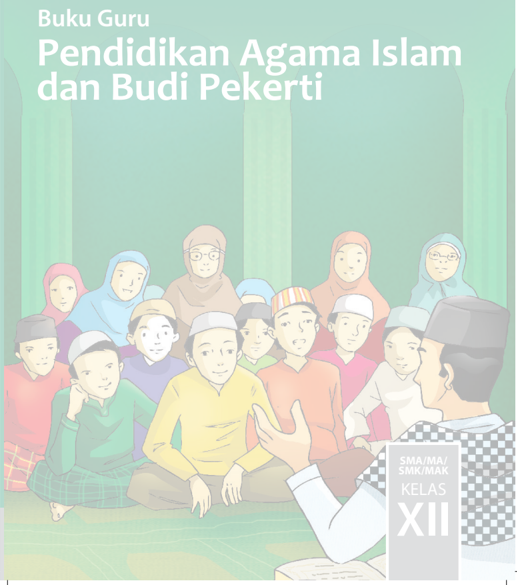

> **Deskripsi Visual:** Buku Guru Pendidikan Agama Islam dan Budi Pekerti untuk kelas XII SMA/MA/SMK/MI/MAK menampilkan gambar yang menggambarkan suasana belajar dan interaksi antara guru dan murid-murid. Gambar tersebut menggambarkan sekelompok siswa yang sedang berada di ruangan belajar, duduk bersama-sama dengan posisi yang rapi dan seragam. Guru, tampaknya sedang memberikan materi pembelajaran kepada murid-murid tersebut. Dalam gambar ini, elemen-elemen utama adalah guru yang sedang berbicara dan murid-murid yang mendengarkan dengan penuh minat.

Teks pada gambar tersebut mencantumkan judul "Buku Guru Pendidikan Agama Islam dan Budi Pekerti" yang menunjukkan bahwa buku ini dirancang untuk guru dan siswa kelas XII. Angka "XII" menunjukkan tingkat pendidikan yang dituju oleh buku ini. Label "SMA/MA/SMK/MI/MAK" menunjukkan bahwa buku ini cocok digunakan di berbagai jenis sekolah. 

Informasi kunci yang dapat diambil pembaca adalah bahwa buku ini dirancang untuk membantu guru dan siswa kelas XII dalam mengembangkan pemahaman tentang agama Islam dan budi pekerti. Gambar ini menunjukkan bahwa pembelajaran di kelas XII tidak hanya melibatkan materi teks, tetapi juga interaksi sosial dan aktivitas belajar yang aktif.

 

---
## 📄 Halaman 2

### Hak Cipta © 2018 pada Kementerian Pendidikan dan Kebudayaan Dilindungi Undang-Undang

Disklaimer: Buku ini merupakan buku guru yang dipersiapkan Pemerintah dalam rangka implementasi Kurikulum 2013. Buku guru ini disusun dan ditelaah oleh berbagai pihak di bawah koordinasi Kementerian Pendidikan dan Kebudayaan, dan dipergunakan dalam tahap awal penerapan Kurikulum 2013. Buku ini merupakan 'dokumen hidup' yang senantiasa diperbaiki, diperbarui, dan dimutakhirkan sesuai dengan dinamika kebutuhan dan perubahan zaman.  Masukan  dari  berbagai  kalangan  yang  dialamatkan  kepada  penulis  dan  laman http://buku.kemdikbud.go.id  atau  melalui  email  buku@kemdikbud.go.id  diharapkan  dapat meningkatkan kualitas buku ini.

### Katalog Dalam Terbitan (KDT)

Indonesia. Kementerian Pendidikan dan Kebudayaan.

Pendidikan Agama Islam dan Budi Pekerti : buku guru/ Kementerian Pendidikan dan Kebudayaan.-- . Edisi Revisi Jakarta : Kementerian Pendidikan dan Kebudayaan, 2018. viii, 352 hlm. : ilus. ; 25 cm. Untuk SMA/MA/SMK/MAK Kelas XII ISBN 978-602-427-046-9 (jilid lengkap) ISBN 978-602-427-049-0 (jilid 3) 1. Islam -- Studi dan Pengajaran I. Judul II. Kementerian Pendidikan dan Kebudayaan 600

Penulis

:  HA. Sholeh Dimyathi dan Feisal Ghozali.

Penelaah

:  Muh. Saerozi dan Bahrissalim.

Pe- review

:  Ali Wiyoto

Penyelia Penerbitan :  Pusat Kurikulum dan Perbukuan, Balitbang, Kemendikbud.

Cetakan Ke-1, 2015 (ISBN 978-602-282-408-4) Cetakan Ke-3, 2018 (Edisi Revisi)

Disusun dengan huruf Myriad Pro 11 pt.

 

---
## 📄 Halaman 3

### Kata Pengantar

Semata-mata ( Innama )  misi pengutusan Nabi Muhammad saw. adalah untuk menyempurnakan  keluhuran  akhlak.  Sejalan  dengan  itu,  dijelaskan  dalam alQurān bahwa  Beliau  diutus  hanyalah  untuk  menebarkan  kasih  sayang  kepada semesta alam. Dengan demikian, di dalam ayat al-Qurān ini  digunakan struktur gramatika yang menunjukkan sifat eksklusif misi pengutusan Nabi Muhammad saw.

Dalam  struktur  ajaran  Islam,  pendidikan  akhlak  adalah  yang  terpenting. Penguatan  akidah  adalah  dasar.  Sementara,  ibadah  adalah  sarana,  sedangkan tujuan akhirnya adalah pengembangan akhlak mulia. Sehubungan dengan itu, Nabi saw, bersabda, 'Mukmin yang paling sempurna imannya adalah yang paling baik akhlaknya' (H.R. Abu Daud dan Imam Ahmad) dan ' Orang yang paling baik Islamnya adalah yang paling baik akhlaknya. '  (H.R.  Imam  Ahmad).  Dengan  kata lain,  hanya  akhlak mulia yang dipenuhi dengan sifat kasih sayang sajalah yang bisa  menjadi  bukti  kekuatan  akidah  dan  kebaikan  ibadah.  Sejalan  dengan  itu, Pendidikan  Agama  Islam  dan  Budi  Pekerti  diorientasikan  pada  pembentukan akhlak yang mulia, penuh kasih sayang, kepada segenap unsur alam semesta.

Hal  tersebut  selaras  dengan  Kurikulum  2013  yang  dirancang  untuk  mengembang    kan  kompetensi  yang  utuh  antara  pengetahuan,  keterampilan,  dan sikap. Selain itu, peserta didik tidak hanya diharapkan bertambah pengetahuan dan  wawasannya,  tapi  juga  meningkat  kecakapan  dan  keterampilannya  serta semakin mulia karakter dan kepribadiannya atau yang berbudi pekerti luhur.

Buku Pendidikan  Agama Islam  dan  Budi  Pekerti ini,  ditulis  dengan  semangat tersebut. Pembelajarannya dibagi ke dalam beberapa kegiatan keagamaan yang harus dilakukan peserta didik dalam usaha memahami pengetahuan agamanya dan  mengaktualisasikannya  dalam  tindakan  nyata  dan  sikap  keseharian  yang sesuai  dengan  tuntunan  agamanya,  baik  dalam  bentuk  ibadah  ritual  maupun ibadah sosial.

Peran  guru  sangat  penting  untuk  meningkatkan  dan  menyesuaikan  daya serap peserta didik dengan ketersediaan kegiatan yang ada pada buku ini. Guru dapat memperkayanya dengan kreasi dalam bentuk kegiatan-kegiatan lain yang bersumber dari lingkungan alam, sosial, dan budaya sekitar.

 

---
## 📄 Halaman 4

Implementasi  terbatas  Kurikulum  2013  pada  tahun  ajaran  2015/2016  telah mendapatkan tanggapan yang sangat positif dan masukan yang sangat berharga. Pengalaman  tersebut  dipergunakan  semaksimal  mungkin  dalam  menyiapkan buku  untuk  implementasi  terbatas  berikutnya  pada  tahun  ajaran  2016/2017 dan  seterusnya.  Buku  ini  merupakan  edisi  revisi  sebagai  penyempurnaan  dari edisi  sbelumnya.  Buku  ini  sangat  terbuka  dan  terus  dilakukan  perbaikan  dan penyempurnaan. Oleh karena itu, kami mengundang para pembaca memberikan kritik,  saran  dan  masukan  untuk  perbaikan  dan  penyempurnaan  pada  edisi berikutnya.  Atas  kontribusi  tersebut,  kami  mengucapkan  terima  kasih.  Mudahmudahan kita dapat memberikan yang terbaik bagi kemajuan dunia pendidikan dalam rangka mempersiapkan generasi seratus tahun Indonesia Merdeka (2045).

Tim  Penulis

 

---
## 📄 Halaman 5

### Daftar Isi

 

---
## 📄 Halaman 6

### Bab 3

 

---
## 📄 Halaman 8

### Bab 10

viii

 

---
## 📄 Halaman 9

 

---
## 📄 Halaman 10

### Pendahuluan

Pendidikan Agama Islam dan Budi Pekerti Kelas XII Kurikulum 2013 disusun berdasarkan  hasil  penyempurnaan  kurikulum.  Buku  ini  dengan  pendekatan pembelajaran  aktif  berdasarkan  nilai-nilai  agama  Islam  dan  budaya  bangsa. Berkaitan  dengan  hal  ini,  Pemerintah  telah  melakukan  penyesuaian  beberapa nama mata pelajaran yang antara lain adalah mata pelajaran Pendidikan Agama Islam menjadi Pendidikan Agama Islam dan Budi Pekerti.

Kurikulum  2013  sudah  tidak  lagi  menggunakan  standar  kompetensi  (SK) sebagai acuan dalam mengembangkan kompetensi dasar (KD). Sebagai gantinya, Kurikulum  2013  telah  menyusun  kompetensi  inti  (KI).  Kompetensi  inti  adalah tingkat  kemampuan  untuk  mencapai  standar  kompetensi  lulusan  yang  harus dimiliki  seorang  peserta  didik  pada  setiap  kelas  atau  program  (Permendikbud Nomor 53 tahun 2015 tentang Penilaian Hasil Belajar oleh Pendidik dan Satuan Pendidikan pada Pendidikan Dasar dan Pendidikan Menengah, pasal 1, ayat 13).

Kompetensi Inti memuat kompetensi sikap spiritual, sikap sosial, pengetahuan, dan keterampilan yang dikembangkan ke dalam Kompetensi Dasar (KD). KD adalah tumpuan  untuk  mencapai  kompetensi  inti  yang  harus  diperoleh  peserta  didik melalui pembelajaran (Permendikbud Nomor 53 tentang Penilaian Hasil Belajar oleh  Pendidik  dan  Satuan  Pendidikan  pada  Pendidikan  Dasar  dan  Pendidikan Menengah, pasal 1, ayat 14).  Perubahan perilaku dalam pengamalan ajaran agama dan budi pekerti menjadi perhatian utama.

Tujuan penyusunan Buku Pegangan Guru adalah untuk memberikan panduan  bagi  Guru  Pendidikan  Agama  Islam  (Guru  PAI)  dan  Budi  Pekerti  (BP) dalam merencanakan, melaksanakan, dan melakukan penilaian terhadap proses pembelajaran Pendidikan Agama Islam dan Budi Pekerti. Dalam buku ini, terdapat lima hal penting yang perlu mendapat perhatian khusus, yaitu: proses pembelajaran, penilaian, pengayaan, remedial dan interaksi guru dengan orang tua peserta didik.

Untuk  mewujudkan  pembelajaran  PAI  dan  Budi  Pekerti  yang  efektif  dan budaya islami di sekolah, perlu adanya sinergi antara guru PAI dan BP dengan guru lainnya,  serta  perlu  adanya  dukungan  dari  kepala  sekolah.  Penciptaan  budaya Islami, dapat dilakukan melalui pembelajaran PAI dan Budi Pekerti baik di dalam kelas maupun di luar kelas seperti di musala, masjid, laboratorium atau lainnya yang berada di lingkungan sekolah.

Penambahan  jam  pembelajaran  PAI  dan  Budi  Pekerti  dimaksudkan  untuk mengoptimalkan pengamalan agama Islam bagi peserta didik dan membentuk budaya  islami  di  sekolah.  Oleh  karena  itu,  penyerapan  metoda  pembiasaan dan  keteladanan  mutlak  diperlukan  seperti: tad±rus al-Qurān ,  doa  sebelum pembelajaran  dimulai,  salat « u ¥± , salat ¨ uhur berjamaah,  PHBI,  zikir  bersama, outbound Islami dan lain-lain.

 

---
## 📄 Halaman 11

### Petunjuk Penggunaan Buku

Untuk mengoptimalkan penggunaan buku ini, tahapan berikut sangatlah penting diperhatikan oleh guru.

- Bacalah  bagian  pendahuluan  untuk  memahami  konsep  utuh  Pendidikan Agama  Islam  dan  Budi  Pekerti,  serta  memahami  Kompetensi  Inti  dan Kompetensi Dasar dalam kerangka Kurikulum 2013.
- Setiap pelajaran berisi kompetensi inti, kompetensi dasar, tujuan pembelajaran, proses pembelajaran, penilaian, pengayaan, remedial, interaksi guru dengan orang tua.
- Pada sub pelajaran tertentu, penomoran kompetensi inti dan kompetensi dasar tidak berurutan. Hal itu menyesuaikan dengan tahap pencapaian kompetensi dasar.
- Guru  perlu  mendorong  peserta  didik  untuk  memerhatikan  rubrik  yang terdapat dalam buku teks Pelajaran, sehingga perhatian peserta didik menjadi fokus. Rublik tersebut adalah sebagai berikut:
- Kegiatan, berisi aktivitas yang harus peserta didik lakukan untuk memahami materi.
- Tugas, adalah latihan bagi peserta didik berupa hafalan atau menyelesaikan soal.
- Insya Allah  Aku  Bisa, berisi tantangan agar peserta didik dapat melakukannya.
- Ayo Berlatih, untuk mengukur penguasaan peserta didik terhadap materi yang dibahas.
- Berdasarkan  Permendikbud  Nomor  53  tahun  2015  tentang  Penilaian  Hasil Belajar  oleh  Pendidik  dan  Satuan  Pendidikan  pada  Pendidikan  Dasar  dan Pendidikan  Menengah,  untuk  kompetensi  sikap,  kompetensi  pengetahuan, dan kompetensi keterampilan menggunakan skala penilaian sebagai berikut:
- Š Untuk kompetensi  sikap menggunakan rentang predikat Sangat Baik (A), Baik (B), Cukup (C), dan Kurang (D); dan
- Š Untuk kompetensi pengetahuan dan kompetensi keterampilan menggunakan rentang angka 100 (A) - 55 (D).

### 6. Skor dan Nilai

Penilaian kompetensi hasil belajar mencakup kompetensi sikap, pengetahuan, dan keterampilan yang dilakukan dapat secara terpisah tetapi dapat juga melalui suatu kegiatan atau peristiwa penilaian dengan instrumen penilaian yang sama.

 

---
## 📄 Halaman 12

Untuk  setiap  ranah  (sikap,  pengetahuan,  dan  keterampilan)  digunakan pensekoran  dan  pemberian  predikat  yang  berbeda  sebagaimana  tercantum dalam tabel berikut.

---
**📊 Tabel**

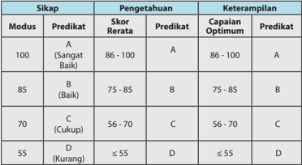

Tabel ini menunjukkan skor rerata, predikat, dan capaian optimal untuk modus berdasarkan pengetahuan dan keterampilan. Topik utama tabel adalah evaluasi kemampuan siswa dalam dua aspek: pengetahuan dan keterampilan. Kolom-kolomnya meliputi modus (100, 85, 70, 55), predikat (A, B, C, D), skor rerata, dan capaian optimal. Data penting yang terlihat adalah bahwa skor rerata berkisar antara 55 hingga 100, dengan predikat A untuk skor rerata di atas 86, B untuk skor 75-85, C untuk skor 56-70, dan D untuk skor di bawah 55. Capaian optimal juga ditentukan oleh skor rerata, dengan A untuk skor 86-100, B untuk skor 75-85, C untuk skor 56-70, dan D untuk skor di bawah 55.

Nilai akhir yang diperoleh untuk ranah sikap diambil dari nilai modus (nilai yang terbanyak muncul). Nilai akhir untuk ranah pengetahuan diambil dari nilai rerata. Nilai akhir untuk ranah keterampilan diambil dari nilai optimal (nilai tertinggi yang dicapai).

Perhitungan nilai akhir dalam buku ini adalah sebagai berikut.

``

Guru  perlu  membaca,  memahami  dan  mengembangkan pesan kunci  yang tertulis pada regulasi terkini seperti PP No.13 tahun 2015 tentang Standar Nasional Pendidikan; Permendikbud No. 53 Tahun 2015 tentang Penilaian Hasil Belajar oleh Pendidik dan Satuan Pendidik; serta lainnya yang terkait dengan Kurikulum 2013. Dalam  pelaksanaannya,  di  sekolah  sangat  mungkin  dilakukan  pengembangan yang  disesuaikan  dengan  potensi  peserta  didik,  guru,  sumber  belajar,  dan lingkungan.

 

---
## 📄 Halaman 13

### Kelas XII

---
**📊 Tabel**

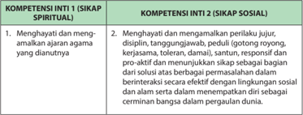

Tabel ini membahas dua kompetensi inti yang berfokus pada sikap: Spiritual dan Sosial. Topik utama tabel adalah tentang bagaimana seseorang dapat mengembangkan sikap spiritual dan sosial yang positif. Dalam kolom pertama, "Sikap Spiritual", terdapat dua poin utama: 1) Menghargai dan mengamalkan agama yang dianutnya, serta 2) Menghayati dan memanggil perluhatan jiwa, disiplin, tanggung jawab, peduli (gotong royong), kerjasama, toleransi, damai, santun, responsif, pro-aktif, dan menunjukkan sikap sebagai bagian dari solusi secara berbasis permasalan dalam berinteraksi secara berbagai permisalan dalam lingkungan sosial. Sedangkan dalam kolom kedua, "Sikap Sosial", terdapat dua poin utama: 1) Menghayati dan memanggil perluhatan jiwa, disiplin, tanggung jawab, peduli (gotong royong), kerjasama, toleransi, damai, santun, responsif, pro-aktif, dan menunjukkan sikap sebagai bagian dari solusi secara berbasis permisalan dalam berinteraksi secara berbagai permisalan dalam lingkungan sosial, serta 2) Dalam situasi ketika menemukan diri sendiri dalam lingkungan sosial, terdapat kemampuan untuk berperilaku baik dalam pergaulan dunia. Pola penting yang terlihat adalah bahwa kedua kolom memiliki poin-poin yang sama namun dengan penekanan yang sedikit berbeda.

---
**📊 Tabel**

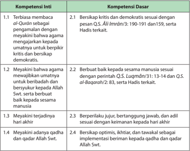

Tabel ini berisi informasi tentang kompetensi inti dan dasar yang relevan dengan agama Islam. Topik utamanya adalah pengembangan keterampilan berpikir kritis, demokratis, dan berbuat baik kepada sesama manusia. Kolom-kolomnya mencakup empat kompetensi inti: 1. Terbiasa membaca Al-Qur'an sebagai pengalaman dengan memahami bahwa agama menganjurkan kepada umatnya untuk berpikir kritis dan berdemokratis; 2. Meyakini bahwa agama mewujudkan umatannya untuk berdihabibah dan bersyukur kepada Allah Swt., serta berbuat baik kepada sesama manusia; 3. Meyakini terjaringnya hadir akhir; dan 4. Meyakini adanya qadha dan qadar Allah Swt. Kolom dasarnya mencakup empat kompetensi dasar: 2.1. Bersikap kritis dan demokratis sesuai dengan pesan QS. Ali Imran: 190-191 dan 159, serta Hadis terkait; 2.2. Berbuat baik kepada sesama manusia sesuai dengan perintah QS. Luqmân: 31:13-14 dan QS. al-Baqarah: 83, serta Hadis terkait; 2.3. Berperilaku riwayat, bertanggung jawab, dan adil sesuai dengan keamanan kepada hadir akhir; dan 2.4. Bersikap optimis, ikhtiar, dan tawakal sebagai implementasi beriman kepada qadha dan qadar Allah Swt. Pola penting yang terlihat adalah hubungan antara kompetensi inti dan dasar, serta bagaimana mereka saling berkaitan dalam pengembangan keterampilan berpikir kritis, demokratis, dan berbuat baik kepada sesama manusia.

### Kompetensi Inti dan Kompetensi Dasar

 

---
## 📄 Halaman 14

---
**📊 Tabel**

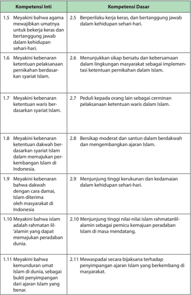

Tabel ini berisi informasi tentang kompetensi inti dan dasar yang berkaitan dengan keberagaman agama dan pernikahan dalam konteks Islam di Indonesia. Topik utama tabel adalah tentang keterampilan dan pengetahuan yang diperlukan untuk menjaga keberagaman agama dan memenuhi ketentuan pernikahan dalam masyarakat yang beragam. Kolom-kolomnya mencakup berbagai aspek seperti keberagaman agama, pernikahan, dan waris dalam Islam. Data penting yang terlihat adalah bahwa tabel ini mencakup berbagai aspek keberagaman agama dan pernikahan dalam konteks Islam, mulai dari keberagaman agama hingga pengetahuan tentang pernikahan dan waris dalam Islam.

 

---
## 📄 Halaman 15

---
**📊 Tabel**

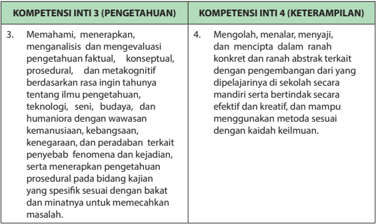

Tabel ini memperlihatkan dua kompetensi inti: Kompetensi Inti 3 (Pengetahuan) dan Kompetensi Inti 4 (Keterampilan). Topik utama tabel adalah pengetahuan dan keterampilan dalam bidang teknologi, seni, budaya, dan humaniora. Kolom pertama berisi topik tentang pengetahuan, seperti pemahaman, menerapkan, analisis, dan evaluasi pengetahuan faktil, konseptual, prosedural, dan metakognitif. Kolom kedua berisi topik tentang keterampilan, seperti mengolah, menalar, menyajikan, dan menciptakan dalam ranah konkrit dan abstrak terkait dengan pengembangan dari yang belum diketahui. Data penting yang terlihat adalah bahwa kompetensi inti 3 lebih fokus pada pengetahuan, sementara kompetensi inti 4 lebih fokus pada keterampilan.

---
**📊 Tabel**

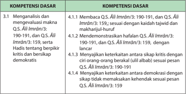

Tabel ini berisi informasi tentang kompetensi dasar yang harus dipenuhi oleh siswa dalam mempelajari Al-Qur'an dan Hadits. Topik utamanya adalah analisis dan pemahaman konteks Al-Qur'an dan Hadits, termasuk menganalisis makna ayat-ayat Al-Qur'an dan Hadits, mendemonstrasikan hafalan ayat-ayat tersebut, menjelaskan keterkaitan antara ayat-ayat dengan isu-isu modern seperti demokrasi, dan memahami kontras antara demokrasi dengan kehadiran Al-Qur'an dan Hadits. Tabel ini terdiri dari dua kolom: Kolom 1 berisi kompetensi dasar yang harus dipenuhi, sedangkan Kolom 2 berisi contoh ayat Al-Qur'an dan Hadits yang sesuai dengan kompetensi tersebut. Data penting yang terlihat adalah bahwa semua kompetensi dasar dijelaskan dengan menggunakan ayat Al-Qur'an dan Hadits, menunjukkan bahwa pembelajaran ini berfokus pada pemahaman konteks Al-Qur'an dan Hadits.

 

---
## 📄 Halaman 16

---
**📊 Tabel**

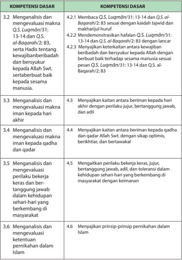

Tabel ini berisi analisis kompetensi dasar yang berkaitan dengan pemahaman tentang peribahasa dan kisah-kisah dalam Al-Qur'an dan Hadits. Topik utama tabel adalah analisis dan evaluasi makna peribahasa dan kisah-kisah tersebut. Kolom-kolomnya mencakup 3.2 hingga 3.6, yang masing-masing menunjukkan analisis dan evaluasi makna peribahasa dan kisah-kisah tertentu. Data penting yang terlihat adalah bahwa setiap kolom memiliki satu peribahasa atau kisah yang diuraikan, seperti "Membaca Baca Q.S. Luqman/31: 13-14 dan Q.S. al-Baqarah/2: 83" dan "Menyajikan prinsip-prinsip pernikahan dalam Islam". Pola yang jelas adalah bahwa setiap kolom memiliki satu peribahasa atau kisah yang diuraikan secara analitis dan evaluatif, membantu pembaca memahami maknanya lebih dalam.

 

---
## 📄 Halaman 17

---
**📊 Tabel**

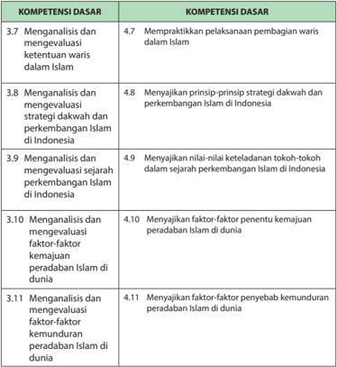

Tabel ini berisi informasi tentang kompetensi dasar yang harus dipenuhi oleh siswa dalam mempelajari Islam. Topik utamanya adalah analisis dan evaluasi berbagai aspek dari Islam, termasuk ketentuan waris, strategi dakwah, sejarah perkembangan Islam di Indonesia, faktor-faktor penentu kemajuan peradaban Islam di dunia, dan faktor-faktor penyebab kemunduran peradaban Islam di dunia. Tabel ini dibagi menjadi dua kolom: Kolom Pertama berisi topik-topik analisis dan evaluasi, sedangkan Kolom Kedua berisi kompetensi dasar yang harus dipenuhi untuk setiap topik tersebut. Data penting yang terlihat adalah bahwa semua topik memiliki satu atau lebih kompetensi dasar yang harus dipenuhi, menunjukkan bahwa analisis dan evaluasi berbagai aspek Islam adalah hal yang sangat penting dalam pembelajaran ini.

 

---
## 📄 Halaman 18

### Pemetaan Kompetensi Inti dan Kompetensi Dasar

Kompetensi Inti (KI) dan Kompetensi Dasar (KD) merupakan kemampuan yang harus dikembangkan dalam proses pembelajaran Pendidikan Agama Islam dan Budi Pekerti Kelas XII, pada Buku Guru ini terpetakan sebagaimana terdapat dalam tabel-tabel berikut:

### Kelas XII

---
**📊 Tabel**

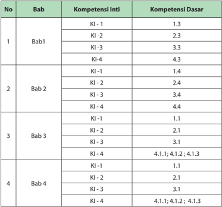

Tabel ini menunjukkan detail tentang kompetensi inti dan dasar dalam beberapa bab dari sebuah buku pelajaran. Topik utama adalah penilaian kompetensi dalam berbagai bab, dengan setiap bab diurutkan dari 1 hingga 4. Kolom "Bab" menyatakan nomor bab yang dianalisis, sedangkan kolom "Kompetensi Inti" dan "Kompetensi Dasar" masing-masing menunjukkan nilai-nilai yang diberikan untuk setiap kompetensi. Data penting yang terlihat adalah bahwa Bab 3 memiliki nilai tertinggi untuk KI-4 (4.1.1; 4.1.2; 4.1.3), sementara Bab 4 memiliki nilai tertinggi untuk KI-1 (4.1.1). Ini menunjukkan bahwa Bab 3 dan Bab 4 mempunyai kompetensi inti yang lebih tinggi dibandingkan dengan Bab 1 dan Bab 2.

 

---
## 📄 Halaman 19

---
**📊 Tabel**

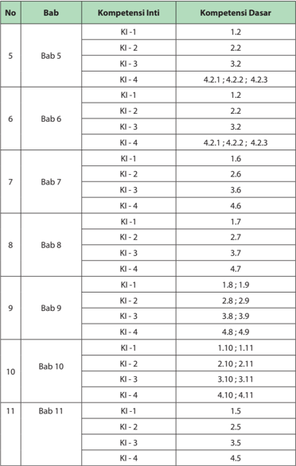

Tabel ini menunjukkan hubungan antara bab-bab dalam sebuah buku pelajaran dengan kompetensi inti dan kompetensi dasar yang relevan. Topik utama tabel adalah pembelajaran yang dilakukan dalam setiap bab, yang diwakili oleh kolom "Bab". Kolom "Kompetensi Inti" berisi nomor KI (Kompetensi Inti) yang berkaitan dengan bab tersebut, sementara kolom "Kompetensi Dasar" berisi nomor N (Nomor Kompetensi Dasar) yang juga berkaitan dengan bab tersebut. Data penting yang terlihat adalah bahwa setiap bab memiliki satu atau lebih KI yang relevan, dan beberapa KI memiliki lebih dari satu N. Misalnya, bab 5 memiliki KI-1, KI-2, KI-3, dan KI-4, sedangkan bab 6 hanya memiliki KI-1, KI-2, dan KI-3. Ini menunjukkan bahwa setiap bab memiliki keterkaitan dengan berbagai kompetensi inti dan dasar yang berbeda.

 

---
## 📄 Halaman 20

Bagian Dua Petunjuk Khusus Proses Pembelajaran

 

---
## 📄 Halaman 21

### Semangat Beribadah dengan Meyakini Hari Akhir

### 1. Kompetensi Inti (KI) 1. Kompetensi Inti (KI)

- KI-1. Menghayati dan mengamalkan ajaran agama yang dianutnya.
- KI-2. Menghayati  dan  mengamalkan  perilaku  jujur,  disiplin,  tanggung jawab,  peduli  (gotong  royong,  kerja  sama,  toleran,  damai),  santun, responsif  dan  proaktif  dan  menunjukkan  sikap  sebagai  bagian  dari solusi  atas  berbagai  permasalahan  dalam  berinteraksi  secara  efektif dengan  lingkungan  sosial  dan  alam  serta  dalam  menempatkan  diri sebagai cerminan bangsa dalam pergaulan dunia.
- KI-3. Memahami, menerapkan, menganalisis dan mengevaluasi pengetahuan faktual, konseptual, prosedural dan metakognitif berdasarkan rasa ingin tahunya tentang ilmu pengetahuan, teknologi, seni, budaya dan humaniora dengan wawasan kemanusiaan, kebangsaan, kenegaraan dan peradaban  terkait  penyebab  fenomena  dan  kejadian,  serta menerapkan pengetahuan prosedural pada bidang kajian yang spesifik sesuai dengan bakat dan minatnya untuk memecahkan masalah.
- KI-4. Mengolah, menalar, menyaji dan mencipta dalam ranah konkret dan ranah abstrak terkait dengan pengembangan dari yang dipelajarinya di sekolah secara mandiri serta bertindak secara efektif dan kreatif dan mampu menggunakan metoda sesuai kaidah keilmuan.

### 2. Kompetensi Dasar (KD) 2. Kompetensi Dasar (KD)

- 1.3 Meyakini terjadinya hari akhir.
- 2.3 Berperilaku  jujur,  tanggung  jawab,  dan  berbuat  adil  sesuai  dengan keimanan kepada hari akhir.
- 3.3 Menganalisis dan mengevaluasi makna iman kepada hari akhir.
- 4.3 Menyajikan kaitan antara beriman kepada hari akhir dengan perilaku jujur, tanggung jawab, dan berbuat adil.

### 3. Tujuan Pembelajaran 3. Tujuan Pembelajaran

Peserta didik mempunyai kemampuan berikut:

- Meyakini terjadinya hari akhir.
- Berperilaku  jujur,  tanggung  jawab,  dan  berbuat  adil  sesuai  dengan keimanan kepada hari akhir.

 

---
## 📄 Halaman 22

- Menganalisis dan mengevaluasi makna iman kepada hari akhir.
- Menyajikan  kaitan  antara  beriman  kepada  hari  akhir  dengan  perilaku jujur, tanggung jawab, dan berbuat adil.

### 4.  Pengembangan Materi 4.  Pengembangan Materi

Pengembangan  materi 'Semangat  Beribadah  dengan  Meyakini  Hari  Akhir' berdasarkan pemahaman  terhadap  'Beriman  kepada  Hari  Akhir' perlu dilakukan, agar upaya memfasilitasi peserta didik dalam menciptakan proses pembelajaran  seaktif  mungkin  dapat  terjadi,  sehingga  peserta  didik  dapat menikmati  pembelajarannya  dengan  kreatif  dan  inovatif.  Pengembangan materi tersebut antara lain dapat dilakukan melalui hal-hal berikut:

- Meneliti secara lebih mendalam pemahaman terhadap ayat-ayat al-Qur±n dan  hadis-hadis  terkait  tentang  'Beriman  kepada  Hari  Akhir",  dengan menggunakan IT.
- Menjelaskan kandungan  ayat-ayat al-Qur±n dan hadis-hadis terkait tentang 'Beriman kepada Hari Akhir", dengan menggunakan IT.
- Mengidentifikasi ayat-ayat al-Qur±n dan hadis-hadis terkait lainnya tentang 'Beriman kepada Hari Akhir".
- Meneliti  secara  lebih  mendalam  isi  ayat-ayat al-Qur±n dan  hadis-hadis terkait sebagai dasar dalam menerapkan nilai-nilai 'Beriman kepada Hari Akhir", dengan menggunakan IT.
- Menampilkan contoh perilaku berdasarkan ayat-ayat al-Qur±n dan hadishadis terkait sebagai dasar dalam menerapkan nilai-nilai 'Beriman kepada Hari Akhir", melalui presentasi, demonstrasi dan simulasi.

### 5. Proses Pembelajaran 5. Proses Pembelajaran

### a. Persiapan

- Pembelajaran  dimulai,  guru  mengucapkan  salam,  menyapa,  berdoa dan tad±rus : membaca al-Qur±n surat pendek pilihan atau ayat hafalan yang sudah dipelajari dengan lancar dan benar (atau surat yang sesuai dengan  program  pembiasaan  yang  ditentukan  sebelumnya);  Salat ¬uh±' (atau salat sunat lainnya, bila memungkinkan, sebagai modifikasi pembukaan  pembelajaran,  guna  pembentukan  sikap  dan  perilaku peserta didik) secara bersama-sama (berjama'ah).
- Memperhatikan kesiapan dan semangat peserta didik, dengan memeriksa kehadiran, kerapihan berpakaian dan mengatur kelas dan posisi  tempat  duduk  disesuaikan  dengan  model  atau  pendekatan pembelajaran yang akan diterapkan.

 

---
## 📄 Halaman 23

- Memahami  dan menyadari bahwa peran guru dalam peroses pembelajaran ini adalah sebagai fasilitator, pembimbing, narasumber dan evaluator yang harus mampu:
- Memfasilitasi  pesera  didik  dalam  merencanakan  dan  mempersiapkan  pembelajaran  dengan  segala  kebutuhannya,  mulai  dari materi pelajaran baik cetak maupun elektroniknya, sampai kepada penggunaan alat peraga manual (teks ayat al-Qur±n dan hadis di karton, guntingan karton, sketsa, dll) dan segala media ICT yang dibutuhkan (MP 3, video, LCD, dll);
- Membimbing  peserta  didik  dalam  proses  pembelajaran  dan upaya mencapai tujuan pembelajaran khususnya materi; 'Beriman kepada  Hari  Akhir",  berdasarkan  pemahaman  ayat-ayat al-Qur±n dan hadis-hadis terkait;
- Menambahkan, mengembangkan dan memperkuat materi pembelajaran; 'Beriman kepada Hari Akhir", berdasarkan pemahaman  ayat-ayat al-Qur±n dan  hadis-hadis  terkait  dengan logis, penuh hikmah, baik dan benar; dan
- Mempersiapkan  dan  mengembangkan  instrumen  evaluasi  yang objektif,  valid,  efektif  dan  terukur  pada  materi  pembelajaran; 'Beriman kepada Hari Akhir", berdasarkan pemahaman ayat-ayat al-Qur±n dan hadis-hadis terkait.
- Menyampaikan tujuan pembelajaran.
- Model  pembelajaran  yang  dapat  dipersiapkan  dan  digunakankan sebagai  alternatif  dalam  kompetensi  ini  antara  lain  adalah  bermain puzzle,  bermain  peran  ( role  playing ),  mengembangkan  kemampuan dan  keterampilan  ( skill )  peserta  didik  dalam  membaca al-Qur±n dengan menggunakan metode drill (latihan dengan mengulang-ulang bacaan).

### b. Pelaksanaan

Pada  kegiatan  ini,  pembelajaran  dikembangkan  dengan  menerapkan beragam model, metode, media dan sumber pembelajaran yang disesuaikan  dengan  karakteristik  materi  'Semangat  Beribadah  dengan Meyakini  Hari  Akhir'  berdasarkan  pemahaman  ayat-ayat al-Qur±n dan hadis-hadis terkait.

Pembelajaran  dimulai  dengan  pengamatan  terhadap  beberapa  ilustrasi yang  tertera  pada  buku  teks.  Peserta  didik  secara  klasikal/kelompok diminta untuk mencermati ilustrasi. Setelah dilakukan pencermatan, guru menunjuk beberapa peserta didik/wakil dari kelompok untuk memaparkan  hasil  pengamatannya,  sementara  peserta  didik/kelompok  lain  ikut mencermati dan memberikan tanggapan atas pemaparan tersebut.

 

---
## 📄 Halaman 24

Selanjutnya, guru memberikan penguatan dengan memaparkan kembali keterkaitan ilustrasi tersebut dengan topik 'Semangat Beribadah dengan Meyakini Hari Akhir' yang akan dipelajari bersama.

### Membuka Relung Kalbu

- Sebelum masuk pada inti pembelajaran, guru terlebih dahulu meminta peserta  didik  secara  klasikal/kelompok  mencermati  dan  merenungkan ulasan singkat tentang adanya Hari Akhir dan ilustrasi yang terdapat pada buku.
- Setiap kelompok mendiskusikan inti dari ulasan tersebut dan keterkaitan antara ilustrasi dengan topik pembelajaran.
- Setiap  kelompok  memaparkan  hasil  diskusinya.  Kelompok  lain  ikut mencermati dan memberikan respons terhadap hasil paparan tersebut.
- Guru memberikan penjelasan tambahan dan penguatan yang dikemukakan  setiap  kelompok  tentang  Hari  Akhir  berdasarkan  buku  teks  atau sumber lain yang relevan.

### Mengkritisi Sekitar Kita

Pada kegiatan ini, peserta didik secara berkelompok diminta untuk kembali mencermati  dan  mengritisi  karya  Amru  Khalid  tentang  ' Gempa  Menjadi Rahmat' dalam  buku  Revolusi  Diri.  Dialog  singkat  Anas  r.a.  dan 'Aisyah  r.a. tentang gempa merupakan bahan kajian yang perlu didiskusikan dan dikritisi oleh setiap kelompok.

Setelah  mencermati  dan  mendiskusikannya,  setiap  kelompok  memaparkan hasil  diskusi  dan  kritikannya  di  depan  kelompok  lain.  Kelompok  lain  ikut mencermati setiap paparan yang disampaikan dan memberikan tanggapan kritis atas paparan tersebut. Selanjutnya, guru memberikan penguatan dengan memaparkan kembali keterkaitan antara dialog singkat tersebut dengan topik 'Semangat Beribadah dengan Meyakini Hari Akhir".

### Aktivitas Siswa

Pada  rublik  'Aktivitas Siswa", guru  meminta  agar  peserta  didik secara kelompok  mencermati  dan  mendiskusikan  masalah-masalah  sosial  yang ada di sekitar mereka. Selanjutnya, peserta didik diminta untuk memberikan tanggapan kritis dari sudut pandang ajaran keimanan kepada Hari Akhir dan mempresentasikannya di depan kelas.

 

---
## 📄 Halaman 25

### Penilaian terhadap aktivitas ini dapat dilakukan melalui rubrik berikut:

### Rubrik Penilaian Diskusi

---
**📊 Tabel**

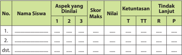

Tabel ini menunjukkan data evaluasi siswa berdasarkan aspek-aspek tertentu yang telah dinalin oleh mereka. Kolom pertama menyatakan nama-nama siswa, sedangkan kolom kedua sampai ke kolom kelima menunjukkan skor maksimal untuk setiap aspek. Kolom keempat menampilkan nilai yang diberikan oleh siswa, sementara kolom kelima dan keenam menunjukkan ketuntasan dan tindakan lanjut yang diberikan oleh guru. Data penting yang terlihat adalah bahwa beberapa siswa memiliki skor yang lebih tinggi dibandingkan dengan yang diharapkan, sementara beberapa siswa memiliki skor yang lebih rendah. Selain itu, banyak siswa yang meminta penyesuaian atau tindakan lanjut yang lebih lanjut.

### Aspek dan Rubrik Penilaian

---
**📊 Tabel**

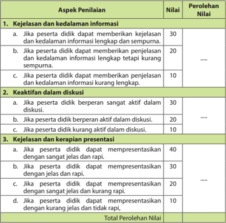

Tabel ini menunjukkan skor penilaian untuk tiga aspek penilaian: kejelasan dan kedalaman informasi, keaktifan dalam diskusi, dan kejelasan dan kerapian presentasi. Topik utama tabel adalah penilaian kinerja peserta didik dalam berbagai aspek presentasi. Kolom-kolomnya mencakup nilai yang diberikan dan perolehan nilai. Data penting yang terlihat adalah bahwa nilai tertinggi adalah 40 (kejelasan dan kerapian presentasi), sedangkan nilai terendah adalah 10 (kejelasan dan kerapian presentasi). Pola penilaian menunjukkan bahwa penilaian lebih banyak diberikan pada aspek kejelasan dan kerapian presentasi dibandingkan dengan aspek lainnya.

 

---
## 📄 Halaman 26

### Perhitungan Perolehan Nilai

Nilai akhir yang diperoleh peserta didik merupakan akumulasi perolehan nilai untuk setiap aspek yang dinilai.

### Contoh:

Jika peserta didik pada:

- aspek	pertama	memperoleh	nilai	30;
- aspek	kedua	memperoleh	nilai	20;	dan
- aspek	ketiga	memperoleh	nilai	30.
Maka total  perolehan  nilainya  adalah  80.  Perhitungan  perolehan  nilai  akhir dapat menggunakan rumus sebagai berikut:

``

``

Perolehan nilai tersebut menunjukkan bahwa peserta didik telah mencapai ketuntasan belajar sebagaimana ditetapkan dalam Permendikbud tersebut.

### Memperkaya Khazanah

Dalam kajian 'Memperkaya Khazanah", guru memfasilitasi, membimbing dan mengarahkan peserta didik untuk menemukan dan melahirkan analisis kajian:

Guru  dapat  menyajikan  pembelajaran  dengan  langkah-langkah  kegiatan sebagai berikut:

- Sebelum masuk pada inti pembelajaran, guru terlebih dahulu meminta agar peserta didik secara klasikal/kelompok mencermati ulasan tentang 'Makna Beriman kepada Hari Akhir", 'Hari Kiamat menurut al-Qur±n dan Ilmu Pengetahuan, 'Hakikat Hari Akhir", 'Periode Hari Akhir' dan "Hikmah Beriman  kepada  Hari  Akhir"  berdasarkan Dal ³ l  Naql ³ dan 'Aql ³ (termasuk di dalamnya ilmu pengetahuan dan teknologi) yang  memperkuat pemahaman tentang Hari Akhir, Tanda-Tanda Hari Akhir, Pengelompokan Hari  Akhir,  Hakikat  Hari  Akhir, Tahapan-Tahapan terjadinya (Periode Hari Akhir) dan Hikmah Beriman kepada Hari Akhir.
- Setiap kelompok mendiskusikan inti dari ulasan tersebut dan keterkaitan antara dalil-dalil dengan topik pembelajaran.
- Setiap  kelompok  memaparkan  hasil  diskusinya.  Kelompok  lain  ikut mencermati dan memberikan respon terhadap hasil paparan tersebut.

 

---
## 📄 Halaman 27

- Guru  memberikan  pengarahan,  penguatan  dan  penjelasan  jawaban dari  pertanyaan-pertanyaan  yang  berkembang,  agar  lebih  terinci  dan jelas terkait dengan pertanyaan-pertanyaan peserta didik, dalam upaya meningkatkan  pemahaman 'Makna  Beriman  Kepada  Hari  Akhir", 'Hari Akhir  menurut al-Qur±n dan  Ilmu  Pengetahuan", 'Periode  Hari  Akhir' dan  "Hikmah  Beriman  kepada  Hari  Akhir"  berdasarkan Dal ³ l Naql ³ dan 'Aql ³ (termasuk  di  dalamnya  ilmu  pengetahuan  dan  teknologi)  yang memperkuat  pemahaman  tentang  Hari  Akhir, Tanda-tanda  Hari  Akhir, Pengelompokkan  Hari Akhir, Hakikat Hari Akhir,  Tahapan-tahapan terjadinya (Periode Hari Akhir) dan Hikmah Beriman kepada Hari Akhir berdasarkan sumber-sumber yang relevan.

### Aktivitas Siswa

Pada rublik 'Aktivitas Siswa", peserta didik secara berkelompok diminta untuk:

- Mencari ayat-ayat al-Qur±n dan hadis lain yang menjelaskan peristiwa Hari Kiamat.
- Mengidentifikasi fenomena alam sebagai bukti adanya Hari Kiamat baik melalui video maupun gambar.
- Membuat renungan  singkat  dalam  bentuk  puisi  religius  atau  yang  lain yang memuat do'a agar Allah Swt. memudahkan kita semua dalam melalui tahapan Hari Akhir sehingga berakhir dengan surga;
- Mencari dan mengkaji ayat-ayat al-Qur±n dan  hadis  lain  yang  berkaitan dengan perintah beriman kepada Hari Akhir.
- Mencermati  dan  mendiskusikan  kandungan Q.S.  F±¯ir /35:57 dan H.R. Tirm³ż³ serta mengkaitkannya  dengan  manajemen  waktu  yang  mereka jalani selama 24 jam dalam keseharian.
Selanjutnya, setiap kelompok memaparkan hasil temuan dan kajian mereka. Kelompok lain ikut serta mencermati dan menanyakan hal-hal yang relevan. Guru  memberikan  penguatan  dengan  kembali  mengulas  hasil  temuan dan  kajian  setiap  kelompok  berdasarkan  berbagai  sumber  yang  relevan. Kemudian,  guru  memberikan  penilaian  sebagaimana  yang  dilakukan  pada bagian 'Mengkritisi  Sekitar  Kita",  atau  boleh  mengembangkan  lebih  lanjut instrumen penilaian sesuai kebutuhan.

### Menerapkan Perilaku Mulia

Pada  bagian  ini,  guru  dapat  melaksanakan  pembelajaran  melalui  langkahlangkah berikut:

- Meminta setiap peserta didik mencermati poin-poin penting yang terkait dengan beriman kepada Hari Akhir dan mengidentifikasi perilaku-perilaku yang mencerminkan beriman kepada Hari Akhir.
- Selanjutnya, secara berkelompok, peserta didik diminta untuk mendiskusikan  sikap-sikap  dan  perilaku  mulia  yang  harus  dikembangkan  sebagai implementasi dari pemahaman terhadap beriman kepada Hari Akhir.

 

---
## 📄 Halaman 28

- Meminta setiap kelompok untuk mempresentasikan hasil diskusi tersebut. Kelompok lain memperhatikan , menyimak dan memberikan tanggapan.
- Menilai semua aktivitas pembelajaran dalam diskusi.
- Meminta setiap kelompok menyimpulkan hasil diskusi dan hasil presentasi dengan lebih logis, objektif dan analitis.
- Memberikan penguatan dan penjelasan tambahan terhadap hasil penilaian berdasarkan proses yang berkembang ketika diskusi berlangsung.

### Tugas Kelompok

- Buatlah lima kelompok, 1 kelompok terdiri dari 6-7 orang.
- Diskusikan tentang buah iman kepada Hari Akhir!
- Presentasikan di depan kelas kalian!

### Penilaian

Guru dapat memberikan penilaian melalui rubrik berikut:

### Rubrik Penilaian

---
**📊 Tabel**

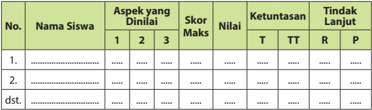

Tabel ini menunjukkan data tentang penilaian siswa dalam beberapa aspek yang dinilai di sekolah. Kolom-kolomnya meliputi nomor siswa, nama siswa, aspek-aspek yang dinilai (dalam tiga poin), skor maksimal, nilai yang diberikan, ketuntasan (T untuk terlampaui, TT untuk terlambat, R untuk rendah, P untuk pas), dan tindakan lanjutan yang diberikan. Topik utama tabel ini adalah penilaian siswa dalam berbagai aspek kegiatan belajar mereka. Data penting yang terlihat adalah bahwa banyak siswa memiliki nilai yang rendah atau terlambat dalam beberapa aspek, yang mungkin memerlukan tindakan lanjutan seperti bimbingan tambahan atau pengembangan keterampilan.

### Aspek dan Rubrik Penilaian

---
**📊 Tabel**

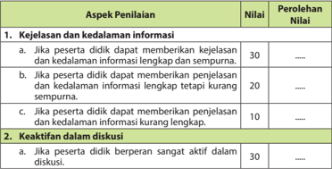

Tabel ini menunjukkan aspek-aspek penilaian dalam sebuah proses evaluasi, dengan nilai-nilai yang diberikan kepada peserta didik berdasarkan keterampilan mereka dalam memberikan kejelasan dan kedalaman informasi, serta keaktifan dalam diskusi. Topik utama tabel ini adalah penilaian keterampilan presentasi dan partisipasi peserta didik dalam diskusi. Kolom-kolomnya meliputi aspek penilaian, nilai, dan perolehan nilai. Data penting yang terlihat adalah bahwa nilai tertinggi adalah 30 untuk kejelasan dan kedalaman informasi, sedangkan nilai terendah adalah 10 untuk kejelasan dan kedalaman informasi kurang lengkap. Selain itu, nilai tertinggi juga diberikan untuk keaktifan dalam diskusi, yaitu 30. Ini menunjukkan bahwa penilaian ini sangat fokus pada keterampilan presentasi dan partisipasi peserta didik dalam diskusi.

 

---
## 📄 Halaman 29

---
**📊 Tabel**

Tabel ini menunjukkan skor untuk beberapa kriteria dalam sebuah presentasi akademis. Topik utamanya adalah kejelasan dan kerapian presentasi. Tabel dibagi menjadi dua bagian: B. Kriteria keterlibatan peserta dan C. Kriteria kejelasan dan kerapian presentasi. Untuk setiap kriteria, ada empat pilihan jawaban dengan skor tertentu. Misalnya, jika peserta didik mendapatkan nilai 20 untuk keterlibatan aktif, maka mereka mendapat 40 untuk kejelasan dan kerapian presentasi. Data penting lainnya termasuk bahwa skor maksimal untuk kejelasan dan kerapian presentasi adalah 40, sedangkan skor minimumnya adalah 10.

### Perhitungan Perolehan Nilai

Nilai akhir yang diperoleh peserta didik merupakan akumulasi perolehan nilai untuk setiap aspek yang dinilai.

### Contoh:

Jika peserta didik pada:

- aspek	pertama	memperoleh	nilai	30;
- aspek	kedua	memperoleh	nilai	20;	dan
- aspek	ketiga	memperoleh	nilai	30,
maka total  perolehan  nilainya  adalah  80.  Perhitungan  perolehan  nilai  akhir dapat menggunakan rumus sebagai berikut:

``

``

Perolehan nilai tersebut, menunjukkan bahwa peserta didik telah mencapai ketuntasan  belajar  sebagaimana  ditetapkan  dalam  Permendikbud  tentang Penilaian.

### Rangkuman

Pada bagian ini, peserta didik menyimpulkan intisari dari pembelajaran yang telah mereka alami dan guru memberikan penguatan dengan menyampaikan kembali  poin-poin  penting  sebagaimana  yang  terdapat  dalam  buku  siswa atau sumber lain yang relevan.

 

---
## 📄 Halaman 30

### 6. Penilaian 6. Penilaian

Penilaian  pada  kegiatan  ini  dapat  dilakukan  sebagaimana  yang  dilakukan pada  bagian  'Mengkritisi  Sekitar  Kita",  atau  boleh  mengembangkan  lebih lanjut instrumen penilaian sesuai kebutuhan.

- Berilah tanda silang (x) pada huruf a, b, c, d, atau e yang dianggap sebagai jawaban yang paling tepat!
Tugas ini terdiri dari 5 soal pilihan ganda. Setiap soal mempunyai bobot nilai yang sama yaitu 2 jika benar dan 1 jika salah. Jika peserta didik dapat menjawab semua soal  dengan  benar,  maka  akan  memperoleh  nilai  10. Perhitungan nilai dilakukan dengan menggunakan rumus sebagai berikut:

``

### Contoh:

Jika  peserta  didik  hanya  mendapat  nilai  7  dari  10,  maka  perhitungan nilainya adalah:

``

Perolehan nilai tersebut, menunjukkan bahwa peserta didik telah mencapai ketuntasan belajar sebagaimana ditetapkan dalam Permendikbud No.53 tentang Penilaian Hasil Belajar oleh Pendidik dan Satuan Pendidikan pada Pendidikan Dasar dan Pendidikan Menengah

- Isilah titik-titik di bawah ini dengan jawaban yang singkat dan benar!
Tugas ini  terdiri  atas  8  soal  isian  singkat.  Setiap  soal  mempunyai  bobot nilai yang sama yaitu 2 jika benar dan 1 jika salah. Jika peserta didik dapat menjawab semua soal  dengan  benar,  maka  akan  memperoleh  nilai  16. Perhitungan nilai dilakukan dengan rumus berikut:

``

### Contoh:

Jika  peserta  didik  hanya  mendapat  nilai  14  dari  16,  maka  perhitungan nilainya adalah:

``

Nilai maksimal

 

---
## 📄 Halaman 31

### c. Kerjakan soal-soal berikut dengan benar dan tepat!

Tugas ini terdiri dari 10 soal. Soal no. 4, 5, 7, 8, 9 dan 10 merupakan soal yang membutuhkan nalar, sehingga skornya harus lebih tinggi daripada soal no. 1, 2, 3 dan 6 yang tidak membutuhkan nalar. Jika keseluruhan skor untuk jawaban yang diberikan adalah 100, maka masing-masing soal no.4, 5, 7, 8, 9 dan 10 mendapatkan skor 12 sehingga totalnya adalah 72. Soal no 1, 2, 3 dan 6 masing-masing mendapatkan 7 sehingga totalnya adalah 28. Kemudian guru membuat rubrik dengan skor sebagai berikut:

### 1) Soal No.1

---
**📊 Tabel**

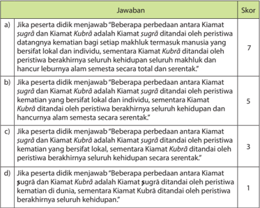

Tabel ini menunjukkan skor yang diberikan kepada peserta didik atas jawaban mereka tentang perbedaan antara Kiamat Sugra dan Kiamat Kubra dalam konteks peristiwa kematian manusia. Topik utama tabel adalah perbedaan antara dua konsep kehidupan setelah kematian manusia. Kolom-kolomnya mencakup skor yang diberikan untuk setiap jawaban, dengan skor tertinggi 7 dan skor terendah 1. Data penting yang terlihat adalah bahwa jawaban yang paling mendapatkan skor tertinggi adalah "Bebberapa perbedaan antara Kiamat Sugra dan Kiamat Kubra adalah Kiamat Sugra ditandai oleh peristiwa kematian manusia yang bersifat lokal dan individu, sementara Kiamat Kubra ditandai oleh peristiwa berakhirnya seluruh kehidupan dan hancurnya alam semesta secara total dan serentak." Ini menunjukkan bahwa jawaban ini paling sesuai dengan konsep Kiamat Sugra yang lebih spesifik dan lokal, sementara jawaban yang paling kurang tepat adalah "Bebberapa perbedaan antara Kiamat Sugra dan Kiamat Kubra adalah Kiamat Sugra ditandai oleh peristiwa kematian manusia yang bersifat berakhirnya seluruh kehidupan dan hancurnya alam semesta secara serentak."

### 2) Soal No.2

---
**📊 Tabel**

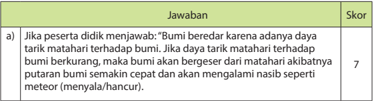

Tabel ini berisi informasi tentang skor yang diberikan untuk jawaban yang benar (berbunyi "Bumi bererat karena adanya daya tarik matahari terhadap bumi"). Topik utama tabel adalah tentang skor yang diberikan untuk jawaban yang benar. Kolom pertama berisi nomor soal, sedangkan kolom kedua berisi skor yang diberikan. Data penting yang terlihat adalah bahwa jawaban yang benar mendapatkan skor 7. Ini menunjukkan bahwa jawaban yang benar mendapat skor tertinggi di tabel tersebut.

 

---
## 📄 Halaman 32

---
**📊 Tabel**

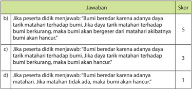

Tabel ini menunjukkan skor yang diberikan kepada peserta didik berdasarkan jawaban mereka tentang adanya daya tarik matahari terhadap Bumi. Topik utama tabel adalah tentang pengertian dan implikasi dari adanya daya tarik matahari terhadap Bumi. Kolom-kolomnya mencakup skor yang diberikan (1 hingga 5) dan beberapa pilihan jawaban yang diberikan kepada peserta didik. Data penting yang terlihat adalah bahwa jawaban yang benar (dengan skor 5) adalah "Bumi berderas karena adanya daya tarik matahari terhadap Bumi, jika daya tarik matahari terhadap Bumi berkurang, maka Bumi akan hancur." Sementara itu, jawaban yang salah (dengan skor 1) adalah "Jika peserta didik menjawab: 'Bumi berderas karena adanya matahari, jika matahari tidak ada, maka Bumi akan hancur.'".

### 3) Soal No.3

---
**📊 Tabel**

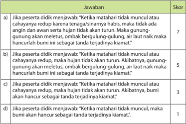

Tabel ini menunjukkan skor yang diberikan kepada peserta didik berdasarkan jawaban mereka tentang kematian matahari dan dampaknya pada bumi. Topik utama tabel adalah tentang kematian matahari dan konsekuensinya. Kolom pertama berisi tiga pilihan jawaban yang diberikan kepada peserta didik, sedangkan kolom kedua berisi skor yang diberikan untuk setiap jawaban. Data penting yang terlihat adalah bahwa jawaban yang paling tepat (jika matahari mati) mendapatkan skor tertinggi, yaitu 7, sementara jawaban yang paling salah mendapatkan skor terendah, yaitu 1. Ini menunjukkan bahwa jawaban yang benar memiliki skor yang lebih tinggi dibandingkan dengan jawaban yang salah.

 

---
## 📄 Halaman 33

### 4) Soal No.4

---
**📊 Tabel**

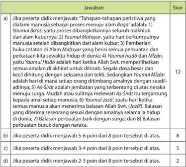

Tabel ini menunjukkan skor yang diberikan kepada peserta didik berdasarkan jawaban mereka tentang tahapan-tahapan peristiwa yang dilalui manusia sebagai proses menuju alam Baqar. Topik utama tabel adalah tentang tahapan-tahapan dalam proses menuju alam Baqar, yang diuraikan dalam 8 poin. Kolom-kolomnya mencakup skor yang diberikan untuk setiap jawaban, yaitu a), b), c), dan d). Data penting yang terlihat adalah bahwa skor tertinggi adalah 12 poin, yang diberikan jika peserta didik menjawab semua poin dengan tepat. Skor 5-6 poin diberikan jika peserta didik menjawab 5-6 poin dari 8 poin tersebut. Skor 3-4 poin diberikan jika peserta didik menjawab 3-4 poin dari 8 poin tersebut, dan skor 2-3 poin diberikan jika peserta didik menjawab 2-3 poin dari 8 poin tersebut.

### 5) Soal No.5

---
**📊 Tabel**

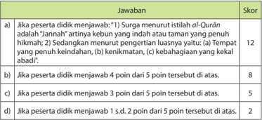

Tabel ini berisi informasi tentang skor yang diberikan kepada peserta didik atas jawaban mereka dalam dua pertanyaan yang berbeda. Pertanyaan pertama bertujuan untuk menilai pemahaman tentang istilah "Jannah" dalam Al-Quran, sementara pertanyaan kedua bertujuan untuk menilai pemahaman tentang pengertian luasnya tentang tempat penuh kehidupan. Dalam tabel ini, topik utama adalah penilaian kinerja peserta didik terhadap konsep-konsep agama Islam. Kolom-kolom yang ada mencakup skor yang diberikan kepada setiap jawaban, yaitu 12, 8, 5, dan 2. Data penting yang terlihat adalah bahwa skor tertinggi adalah 12, yang diberikan jika peserta didik menjawab pertanyaan pertama dengan tepat. Skor 8 diberikan jika peserta didik menjawab 4 dari 5 poin tersebut. Skor 5 diberikan jika peserta didik menjawab 3 dari 5 poin tersebut, dan skor 2 diberikan jika peserta didik menjawab 1 sampai 2 poin dari 5 poin tersebut.

 

---
## 📄 Halaman 34

### 6) Soal No.6

---
**📊 Tabel**

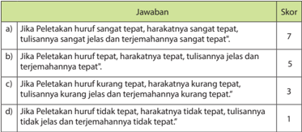

Tabel ini menunjukkan skor yang diberikan untuk setiap jenis peletakan huruf dalam sebuah tulisan. Topik utamanya adalah tentang kualitas penulisan huruf dalam bahasa Indonesia. Tabel ini memiliki dua kolom: "Jawaban" dan "Skor". Kolom "Jawaban" berisi empat pilihan jawaban yang berbeda, masing-masing dengan deskripsi huruf hurufnya. Skor yang diberikan untuk setiap pilihan jawaban berbeda-beda, mulai dari 7 hingga 1. Data penting yang terlihat dalam tabel ini adalah bahwa skor tertinggi diberikan untuk peletakan huruf yang sangat tepat, sedangkan skor terendah diberikan untuk peletakan huruf yang tidak tepat. Ini menunjukkan bahwa kualitas penulisan huruf sangat mempengaruhi skor yang diterima.

### 7) Soal No.7

---
**📊 Tabel**

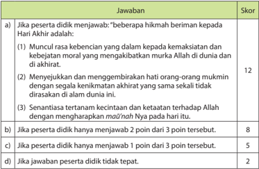

Tabel ini menunjukkan skor yang diberikan kepada peserta didik berdasarkan jawaban mereka tentang beberapa hikmah yang beriman kepada Hari Akhir. Topik utama tabel adalah tentang kepercayaan dan sikap terhadap Allah di akhirat. Kolom-kolomnya mencakup skor untuk setiap jenis jawaban yang diberikan oleh peserta didik. Data penting yang terlihat adalah bahwa jawaban yang paling mendapatkan skor tertinggi adalah "muncul rasa kebenaran yang dalam kepada kemakmisan dan kebejaatan moral yang mengakibatkan murka Allah di dunia dan di akhirat" dengan skor 12. Sementara itu, jawaban yang paling mendapatkan skor terendah adalah "jika peserta didik hanya menjawab 1 poin dari 3 poin tersebut" dengan skor 5. Tabel ini membantu guru untuk memantau kinerja peserta didik dalam menguasai materi yang diajar tentang kepercayaan dan sikap terhadap Allah di akhirat.

 

---
## 📄 Halaman 35

### 8) Soal No.8

---
**📊 Tabel**

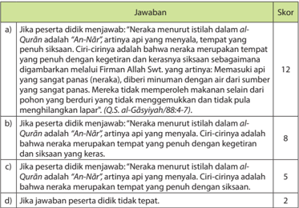

Tabel ini berisi pertanyaan tentang interpretasi ayat Al-Quran yang membahas tentang narka (tempat penuh dengan sika-sika). Topik utama tabel adalah interpretasi ayat Al-Quran tentang narka. Kolom-kolomnya meliputi skor, jawaban, dan penjelasan. Data penting yang terlihat adalah bahwa jawaban yang benar adalah "Neraka menurut istilah dalam al-Quran adalah 'An-Nur'". Skor tertinggi adalah 12, sedangkan jawaban yang tidak tepat mendapat skor 2.

### 9) Soal No.9

---
**📊 Tabel**

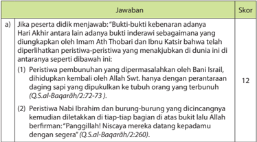

Tabel ini berisi jawaban untuk pertanyaan tentang peristiwa-peristiwa yang terjadi pada masa kiamat, seperti peristiwa bunuh-bunuh yang dilakukan oleh Bani Israil, peristiwa nabi Ibrahan dan burung-burung yang dicinanginya, serta peristiwa yang menunjukkan keutamaan Nabi Musa. Topik utama tabel adalah peristiwa-peristiwa yang terjadi pada masa kiamat dan keutamaan Nabi Musa. Kolom-kolomnya meliputi peristiwa-peristiwa tersebut dan skor yang diberikan. Data penting yang terlihat adalah bahwa peristiwa bunuh-bunuh yang dilakukan oleh Bani Israil mendapat skor 12, sedangkan peristiwa nabi Ibrahan dan burung-burung yang dicinanginya mendapat skor 7.

 

---
## 📄 Halaman 36

---
**📊 Tabel**

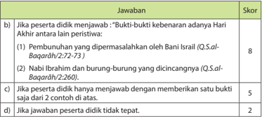

Tabel ini berisi skor untuk pernyataan yang diberikan kepada peserta didik tentang bukti-bukti keberanaran Hari Akhir. Topik utama tabel adalah tentang bukti-bukti keberanaran Hari Akhir. Kolom-kolomnya meliputi: (1) Penambahan yang dipermasalah oleh Bani Israel, (2) Nabi Ibrahim dan burung-burung yang dicincangnya, dan (3) Jika peserta hanya memberikan satu bukti saja dari dua contoh di atas. Data penting yang terlihat adalah bahwa skor tertinggi adalah 8 jika peserta menjawab dengan benar semua tiga bukti, sedangkan skor terendah adalah 2 jika jawaban tidak tepat sama sekali.

### 10) Soal No.10

---
**📊 Tabel**

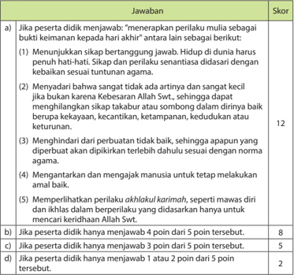

Tabel ini berisi skor untuk menjawab pertanyaan tentang perilaku mulia dalam Islam. Topik utamanya adalah perilaku mulia dan bagaimana menjawabnya dengan benar. Kolom-kolomnya meliputi skor yang diberikan untuk setiap jawaban yang diberikan oleh peserta didik. Data penting yang terlihat adalah bahwa skor tertinggi adalah 12 poin, yang diberikan jika peserta didik menjawab semua poin dengan benar. Skor 8 poin diberikan jika peserta didik menjawab 4 poin dari 5 poin tersebut. Skor 2 poin diberikan jika peserta didik hanya menjawab 1 atau 2 poin dari 5 poin tersebut. Ini menunjukkan bahwa skor yang lebih tinggi diberikan kepada peserta didik yang lebih baik dalam menjawab pertanyaan ini.

 

---
## 📄 Halaman 37

### Perhitungan Perolehan Nilai Pengetahuan

Nilai akhir yang diperoleh peserta didik merupakan akumulasi perolehan nilai untuk setiap soal yang dijawab.

### Contoh:

Jika peserta didik pada:

- soal	pertama	memperoleh	nilai	7;
- soal	kedua	memperoleh	nilai	5;
- soal	ketiga	memperoleh	nilai	7;
- soal	keempat	memperoleh	nilai	12;
- soal	kelima	memperoleh	nilai	8;
- soal	keenam	memperoleh	nilai	5;
- soal	ketujuh	memperoleh	nilai	12;
- soal	kedelapan	memperoleh	nilai	8;
- soal	kesembilan	memperoleh	nilai	8;	dan
- soal	kesepuluh	memperoleh	nilai	12.
Maka, total perolehan nilainya adalah: 7+5+7+12+8+5+12+8+8+12= 84. Perhitungan perolehan nilai akhir dapat menggunakan rumus sebagai berikut:

``

Nilai maksimal

``

Perolehan nilai tersebut, menunjukkan bahwa peserta didik telah mencapai ketuntasan  belajar  sebagaimana  ditetapkan  dalam  Permendikbud  No.53 tentang  Penilaian  Hasil  Belajar  oleh  Pendidik  dan  Satuan  Pendidikan  pada Pendidikan Dasar dan Pendidikan Menengah.

 

---
## 📄 Halaman 38

- Berilah tanda checklist (  ) pada kolom yang sesuai dengan pilihan sikap Anda!

---
**📊 Tabel**

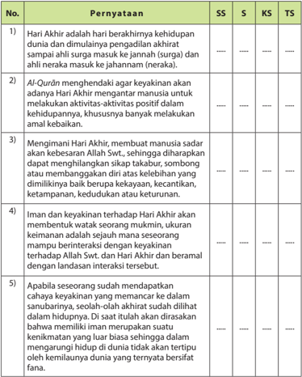

Tabel ini berisi poin-poin penting tentang Hari Akhir dalam agama Islam, dilihat dari perspektif Sufi (SS), Sufi (S), Khatib Syar'i (KS), dan Tafsir (TS). Topik utama adalah bagaimana para ulama dan teolog menginterpretasikan Hari Akhir dalam konteks kehidupan manusia. Kolom-kolomnya mencakup berbagai sudut pandang, mulai dari perspektif Sufi yang lebih fokus pada pengalaman spiritual dan iman, hingga perspektif Tafsir yang lebih fokus pada interpretasi Al-Quran. Data penting yang terlihat adalah bahwa semua sudut pandang secara umum sepakat bahwa Hari Akhir merupakan akhir dari dunia dan dimulai dengan pengadilan akhir, di mana para ahli surga dan neraka akan masuk ke jannah dan neraka masing-masing. Selain itu, semua sudut pandang juga sepakat bahwa Al-Quran memberikan informasi tentang Hari Akhir dan bagaimana manusia harus berbuat baik untuk memperoleh keberkahan di hari tersebut.

### Perhitungan Perolehan Nilai Akhir

Peserta didik diminta untuk memberikan pernyataan terhadap 5 pertanyaan. Penilaian terhadap pernyataan yang diberikan adalah sebagai berikut:

 

---
## 📄 Halaman 39

- 4	=	Jika	pernyataan	yang	diberikan	sangat	tepat
- 3	=	Jika	pernyataan	yang	diberikan	tepat
- 2	=	Jika	pernyataan	yang	diberikan	kurang	tepat
- 1	=	Jika	pernyataan	yang	diberikan	tidak	tepat
Jika nilai tertinggi untuk setiap pernyataan adalah 4 dan dalam rubrik penilaian terdapat 5 pernyataan, maka nilai maksimalnya adalah 4 x 5 = 20. Perhitungan nilai dilakukan dengan menggunakan rumus berikut:

``

### Contoh:

Jika peserta didik mendapat nilai 15 dari nilai maksimal 20, maka perhitungan nilainya adalah:

``

Ini  berarti bahwa sikap peserta didik berdasarkan penilaian tersebut adalah baik.

### Catatan:

- Guru dapat mengembangkan instrumen penilaian sesuai dengan kebutuhan.
- Guru  diharapkan  memiliki  catatan  sikap  atau  nilai-nilai  karakter  yang dimiliki peserta didik selama dalam proses pembelajaran. Terkait dengan sikap  atau  nilai-nilai  karakter  yang  dimiliki  oleh  peserta  didik  dapat dilakukan dengan Tabel berikut ini:

 

---
## 📄 Halaman 40

Aspek  sikap  dapat  disesuaikan  dengan  kebutuhan,  seperti:  disiplin,  jujur, sopan, santun, dll.

### Keterangan:

Sebelum  menetapkan  nilai  bagi  peserta  didik,  guru  terlebih  dahulu  harus menentukan  indikator  pencapaian  yang  diinginkan.  Berikut ini  contoh indikator untuk setiap sikap yang akan dinilai.

---
**📊 Tabel**

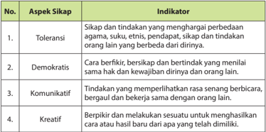

Tabel ini berisi aspek sikap yang diharapkan dalam konteks toleransi, demokrasi, komunikatif, dan kreatif. Topik utamanya adalah sikap yang mendukung toleransi antara berbagai kelompok masyarakat, termasuk agama, suku, etnis, pendidikan, dan sosial budaya. Kolom pertama menunjukkan aspek sikap tersebut, sedangkan kolom kedua menunjukkan indikator yang harus dicapai untuk mencapai sikap tersebut. Data penting yang terlihat adalah bahwa semua aspek sikap ini memerlukan tindakan dan perilaku yang positif, seperti berbicara dengan sopan, berkomunikasi dengan baik, dan berpikir kreatif. Ini menunjukkan bahwa sikap yang baik tidak hanya tentang pemahaman, tetapi juga tentang tindakan dan perilaku yang sesuai.

Sesuai dengan  indikator  yang  diperlihatkan peserta didik,  guru  dapat memberikan deskripsi sebagai berikut.

---
**📊 Tabel**

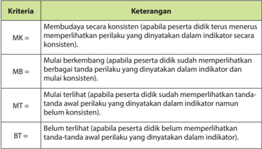

Tabel ini menunjukkan proses pembentukan perilaku (MK) pada peserta didik berdasarkan indikator konsistensi. Topik utamanya adalah tahap-tahap perkembangan perilaku peserta didik. Kolom pertama berisi tiga kata kunci: MK (Membudaya secara konsisten), MB (Mulai berkembang), dan MT (Mulai terlihat). Kolom kedua berisi deskripsi perilaku peserta didik pada setiap tahap tersebut. Data penting yang terlihat adalah bahwa proses pembentukan perilaku melibatkan perubahan dari tidak memperlihatkan perilaku yang diharapkan menjadi memperlihatkan perilaku tersebut secara konsisten.

 

---
## 📄 Halaman 41

### Perhitungan Penilaian Sikap

Contoh perhitungan akhir untuk penilaian sikap adalah sebagai berikut:

---
**📊 Tabel**

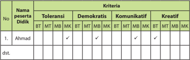

Tabel ini menunjukkan kinerja peserta didik dalam berbagai karakteristik sosial seperti toleransi, demokratis, komunikatif, dan kreatif. Topik utama tabel adalah kinerja peserta didik dalam berbagai karakteristik sosial. Kolom-kolom yang ada meliputi nama peserta didik, toleransi, demokratis, komunikatif, dan kreatif. Data atau pola penting yang terlihat adalah bahwa Ahmad memiliki nilai tertinggi dalam semua karakteristik tersebut, sementara peserta lainnya memiliki nilai yang lebih rendah. Ini menunjukkan bahwa Ahmad memiliki kinerja yang lebih baik dalam berbagai karakteristik sosial dibandingkan dengan peserta lainnya.

### Sikap secara umum:

Sikap secara umum dapat diperoleh dari keseluruhan nilai yang dicapai oleh Ahmad. Jika nilai yang dicapai oleh Ahmad adalah sebagai berikut:

- Š untuk toleransi, nilai yang diperoleh adalah MK = 4;
- Š untuk demokrasi, nilai yang diperoleh adalah MB = 3;
- Š untuk komunikasi, nilai yang diperoleh adalah MB = 3; dan
- Š untuk kreatifitas, nilai yang diperoleh adalah BT = 2
Maka, secara umum dalam hal sikap, Ahmad memperoleh nilai: 4+3+3+2=12. Mengingat sikap yang dinilai adalah empat sikap dan setiap sikap mempunyai nilai tertinggi adalah 4, nilai maksimal untuk keseluruhannya adalah: 4 x 4 = 16. Perhitungan umum perolehan nilai sikap adalah sebagai berikut:

Ini menunjukkan bahwa sikap Ahmad secara umum adalah baik. Selanjutnya, guru perlu memberikan penilaian secara deskriptif untuk mengetahui sikap mana yang sudah baik dan sikap mana yang memerlukan pembinaan lebih lanjut.

 

---
## 📄 Halaman 42

### 7. Pengayaan 7. Pengayaan

Dalam kegiatan pembelajaran, peserta didik yang sudah menguasai materi sebelum  waktu  yang  telah  ditentukan,  diminta  untuk  soal-soal  pengayaan berupa  pertanyaan-pertanyaan  yang  lebih  fenomenal  dan  inovatif  atau aktivitas lain yang relevan dengan topik pembelajaran 'Semangat Beribadah dengan Meyakini Hari Akhir' . Dalam kegiatan ini, guru dapat mencatat dan memberikan tambahan nilai bagi peserta didik yang berhasil dalam pengayaan.

### 8. Remedial

Peserta didik yang belum menguasai materi (belum mencapai ketuntasan belajar) guru  akan  menjelaskan  kembali  tentang  materi 'Semangat  Beribadah  dengan Meyakini  Hari  Akhir' .  Guru  melakukan  penilaian  kembali  dengan  soal  yang sejenis atau memberikan tugas individu terkait dengan topik yang telah dibahas. Remedial dilaksanakan pada waktu dan hari tertentu yang disesuaikan, contoh: pada saat jam belajar,  apabila  masih  ada  waktu,  atau  di  luar  jam  pelajaran  (30 menit setelah jam pelajaran selesai).

### 9. Interaksi Guru dengan Orang Tua

Guru  meminta  peserta  didik  memperlihatkan  rublik 'Evaluasi'  dalam  buku teks  kepada  orang  tuanya  dengan  memberikan  komentar  dan  paraf.  Cara lainnya dapat juga dengan menggunakan buku penghubung kepada orang tua yang berisi tentang perubahan perilaku siswa setelah mengikuti kegiatan pembelajaran atau berkomunikasi dengan orang tua untuk bertukar infomasi tentang  perkembangan  perilaku  anaknya.  Sebagai  contohnya,  orang  tua diminta  mengamati  perilaku  anaknya  untuk  mengetahui  apakah  perilaku anaknya  sudah  merefleksikan pemahaman  terhadap  nilai-nilai  beriman kepada Hari Akhir di lingkungan tempat tinggalnya.

 

---
## 📄 Halaman 43

### Meyakini Qad±' dan Qadar Melahirkan Semangat Bekerja

### 1. Kompetensi Inti (KI) 1. Kompetensi Inti (KI)

- KI-1. Menghayati dan mengamalkan ajaran agama yang dianutnya.
- KI-2. Menghayati dan mengamalkan perilaku jujur, disiplin, tanggung jawab, peduli (gotong royong, kerja sama, toleran, damai), santun, responsif dan proaktif dan menunjukkan sikap sebagai bagian dari solusi atas berbagai  permasalahan  dalam  berinteraksi  secara  efektif  dengan lingkungan  sosial  dan  alam  serta  dalam  menempatkan  diri  sebagai cerminan bangsa dalam pergaulan dunia.
- KI-3. Memahami,  menerapkan,  menganalisis  dan  mengevaluasi  pengetahuan faktual, konseptual, prosedural dan metakognitif berdasarkan rasa ingin tahunya tentang ilmu pengetahuan, teknologi, seni, budaya dan humaniora dengan wawasan kemanusiaan, kebangsaan, kenegaraan dan peradaban terkait penyebab fenomena dan kejadian, serta menerapkan pengetahuan prosedural pada bidang kajian yang spesifik  sesuai  dengan  bakat  dan  minatnya  untuk  memecahkan masalah.
- KI-4. Mengolah, menalar, menyaji dan mencipta dalam ranah konkret dan ranah abstrak terkait dengan pengembangan dari yang dipelajarinya di sekolah secara mandiri serta bertindak secara efektif dan kreatif dan mampu menggunakan metoda sesuai kaidah keilmuan.

### 2. Kompetensi Dasar (KD) 2. Kompetensi Dasar (KD)

- 1.4 Meyakini adanya qa«±' dan qadar Allah Swt.
- 2.4 Bersikap optimis, berikhtiar, dan bertawakal sebagai implementasi dari beriman kepada qada dan qadar Allah Swt.
- 3.4 Menganalisis dan mengevaluasi makna iman kepada qa«±' dan qadar .
- 4.4 Menyajikan kaitan antara beriman kepada qa«±' dan qadar Allah Swt. dengan sikap optimis, berikhtiar, dan bertawakal.

### 3. Tujuan Pembelajaran 3. Tujuan Pembelajaran

Peserta didik mampu:

- Bersikap  optimis,  berikhtiar,  dan  bertawakal  sebagai  implementasi  dari beriman kepada qa«±' dan qadar Allah Swt.

 

---
## 📄 Halaman 44

- Menganalisis dan mengevaluasi makna iman kepada qa«±' dan qadar .
- Menyajikan  kaitan  antara  beriman  kepada  qada  dan  qadar  Allah  Swt. dengan sikap optimis, berikhtiar, dan bertawakal.

### 4. 4.  Pengembangan Materi

Pengembangan  materi  'Meyakini Qa«±' dan Qadar Melahirkan  Semangat Bekerja'  berdasarkan  pemahaman  terhadap  'Beriman  kepada Qa«±'  dan Qadar " .  Hal ini perlu dilakukan, agar upaya memfasilitasi peserta didik dalam menciptakan  proses  pembelajaran  seaktif  mungkin  dapat  terjadi,  sehingga peserta didik dapat menikmati pembelajarannya dengan penuh kreatif dan inovatif. Pengembangan materi tersebut antara lain dapat dilakukan melalui hal-hal berikut.

- Meneliti  secara  lebih  mendalam  pemahaman  terhadap  ayat-ayat alQur±n dan hadis-hadis terkait tentang 'Beriman kepada Qa«±' dan Qadar ' , dengan menggunakan IT.
- Menjelaskan kandungan  ayat-ayat al-Qur±n dan hadis-hadis terkait tentang 'Beriman kepada Qa«±' dan Qadar ' , dengan menggunakan IT.
- Mengidentifikasi ayat-ayat al-Qur±n dan hadis-hadis terkait lainnya tentang 'Beriman kepada Qa «±' dan Qadar ' .
- Meneliti  secara  lebih  mendalam  isi  ayat-ayat al-Qur±n dan  hadis-hadis terkait sebagai dasar dalam menerapkan nilai-nilai 'Beriman kepada Qa«±' dan Qadar ' , dengan menggunakan IT.
- Menampilkan contoh perilaku berdasarkan ayat-ayat al-Qur±n dan hadishadis terkait sebagai dasar dalam menerapkan nilai-nilai "Beriman kepada Qa«±' dan Qadar ' , melalui presentasi, demonstrasi dan simulasi.

### 5. Proses Pembelajaran 5. Proses Pembelajaran

### a. Persiapan

- Pembelajaran  dimulai,  guru  mengucapkan  salam,  menyapa,  berdoa dan tad±rus : membaca al-Qur±n surat pendek pilihan atau ayat hafalan yang  sudah  dipelajari;  dengan  lancar  dan  benar  (atau  surat  yang sesuai  dengan  program  pembiasaan  yang  ditentukan  sebelumnya); salat ¬uh±' (atau  salat  sunat  lainnya,  bila  memungkinkan,  sebagai modifikasi pembukaan pembelajaran, guna pembentukan sikap dan perilaku peserta didik) secara bersama-sama (berjama'ah).
- Memperhatikan kesiapan dan semangat peserta didik, dengan memeriksa kehadiran, kerapihan berpakaian dan mengorganisasi kelas dan posisi tempat duduk disesuaikan dengan kegiatan pembelajaran yang akan diterapkan, berdasarkan metode dan model pembelajaran.

 

---
## 📄 Halaman 45

- Memahami  dan  menyadari bahwa, peran guru dalam peroses pembelajaran  ini  berfungsi  sebagai  fasilitator,  pembimbing,  nara sumber dan evaluator:
- Memfasilitasi pesera didik dalam merencanakan dan mempersiapkan pembelajaran dengan segala kebutuhannya, mulai  dari  materi  pelajaran  baik  cetak  maupun  elektroniknya, sampai  kepada  penggunaan  alat  peraga  manual  (teks  ayat alQur±n dan hadis di karton, guntingan karton, sketsa, dll) dan segala media ICT yang dibutuhkan (MP 3, video, LCD, dll)
- Membimbing peserta didik dalam proses pembelajaran dan upaya mencapai  tujuan  pembelajaran  khususnya  materi;  ' Qa«±' dan Qadar '  berdasarkan  pemahaman  ayat-ayat al-Qur±n dan  hadishadis terkait.
- Sebagai nara sumber, guru harus menambahkan, mengembangkan dan memperkuat materi pembelajaran; ' Qa«±' dan Qadar ' berdasarkan  pemahaman  ayat-ayat al-Qur±n dan  hadis-hadis terkait dengan logis, penuh hikmah, baik dan benar.
- Sebagai  evaluator,  guru  harus  mempersiapkan  dan  mengembangkan  instrumen  evaluasi  yang  objektif,  valid, efektif  dan terukur pada materi pembelajaran; ' Qa«±' dan Qadar ' berdasarkan pemahaman ayat-ayat al-Qur±n dan hadis-hadis terkait.
- Menyampaikan tujuan pembelajaran.
- Model pembelajaran yang dapat dipersiapkan dan digunakan sebagai alternatif  dalam  kompetensi  ini  antara  lain  adalah puzzle ,  bermain peran ( role playing ), mengembangkan kemampuan dan keterampilan ( skill ) peserta didik dalam membaca al-Qur±n menggunakan metode drill (latihan dengan mengulang-ulang bacaan).

### b. Pelaksanaan

Pada  kegiatan  ini,  pembelajaran  dikembangkan  dengan  menerapkan beragam model, metode, media dan sumber pembelajaran yang disesuaikan  dengan  karakteristik  materi ' Qa«±' dan Qadar '  berdasarkan pemahaman ayat-ayat al-Qur±n dan hadis-hadis terkait.

Pembelajaran  dimulai  dengan  pengamatan  terhadap  beberapa  ilustrasi yang  tertera  pada  buku  teks.  Peserta  didik  secara  klasikal/kelompok diminta  untuk  mencermati  ilustrasi.  Setelah  dilakukan  pencermatan, guru  menunjuk  beberapa  peserta  didik/wakil  dari  kelompok  untuk memaparkan  hasil  pengamatannya,  sementara  peserta  didik/kelompok lain  ikut  mencermati  dan  memberikan  tanggapan  atas  pemaparan tersebut. Selanjutnya, Guru memberikan penguatan dengan memaparkan kembali  keterkaitan  ilustrasi  tersebut  dengan  topik  ' Qa«±' dan Qadar ' yang akan dipelajari bersama.

 

---
## 📄 Halaman 46

### Membuka Relung Kalbu

- Sebelum masuk pada inti pembelajaran, guru terlebih dahulu meminta agar peserta didik secara klasikal/kelompok mencermati dan merenungkan ulasan singkat tentang hakikat ujian dan cobaan dari Allah Swt. dan ilustrasi yang terdapat pada buku.
- Setiap kelompok mendiskusikan inti dari ulasan tersebut dan keterkaitan antara ilustrasi dengan topik pembelajaran.
- Setiap  kelompok  memaparkan  hasil  diskusinya.  Kelompok  lain  ikut mencermati dan memberikan tanggapan terhadap hasil paparan tersebut.
- Guru memberikan penjelasan tambahan dan penguatan yang dikemukakan  setiap  kelompok  tentang  Hari  Akhir  berdasarkan  buku  teks  atau sumber lain yang relevan.

### Mengkritisi Sekitar Kita

Pada kegiatan ini, peserta didik secara berkelompok diminta untuk kembali mencermati  dan  mengkritisi 'Kapal  di  Padang  Pasir  Sahara'  kisah  tentang teguhnya keimanan Nabi Nuh a.s. dan para pengikutnya. Kisah singkat tersebut merupakan  bahan  kajian  yang  perlu  didiskusikan  dan  dikritisi  oleh  setiap kelompok.  Setelah  mencermati  dan  mendiskusikannya,  setiap  kelompok memaparkan hasil diskusi dan kritikannya di depan kelompok lain. Kelompok lain  ikut  mencermati  setiap  paparan  yang  disampaikan  dan  memberikan tanggapan  kritis  atas  paparan  tersebut.  Selanjutnya,  guru  memberikan penguatan  dengan  memaparkan  kembali  keterkaitan  antara  kisah  singkat tersebut dengan topik yang akan dipelajari, yaitu 'Meyakini Qa«±' dan Qadar Melahirkan Semangat Bekerja' .

Pada  rublik 'Bagaimana  Pendapatmu  tentang  Kisah-Kisah  di  atas?' , guru meminta  agar  peserta  didik  tidak  hanya  memberikan  tanggapan  terhadap kisah singkat tersebut, namun juga mengidentifikasi berbagai permasalahan sosial yang terjadi dan mengkritisinya sesuai dengan keimanan yang diyakini oleh  peserta  didik.  Selanjutnya,  peserta  didik  secara  kelompok  diminta untuk  menyampaikan  hasil  identifikasi  dan  kritikannya.  Kelompok  lain  ikut mencermati setiap paparan yang disampaikan dan memberikan tanggapan kritis atas paparan tersebut.

 

---
## 📄 Halaman 47

### Penilaian terhadap aktivitas ini dapat dilakukan melalui rubrik berikut:

### Rubrik Penilaian Diskusi

---
**📊 Tabel**

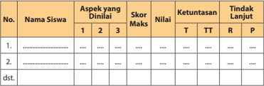

Tabel ini menunjukkan data evaluasi siswa berdasarkan aspek-aspek yang dinilai mereka. Kolom-kolomnya meliputi nomor siswa, nama siswa, aspek yang dinilai, skor maksimal, nilai, ketuntasan, dan tindakan lanjut. Topik utama tabel adalah evaluasi siswa dalam berbagai aspek. Data penting yang terlihat adalah bahwa beberapa siswa memiliki nilai yang lebih tinggi dibandingkan dengan skor maksimal, sementara beberapa siswa memiliki nilai yang lebih rendah. Selain itu, tabel juga menunjukkan bahwa beberapa siswa memiliki ketuntasan yang baik (T), sedangkan beberapa sisanya kurang baik (TT). Terakhir, tabel mencakup tindakan lanjut yang diberikan kepada siswa yang memerlukan perbaikan.

### Aspek dan Rubrik Penilaian

---
**📊 Tabel**

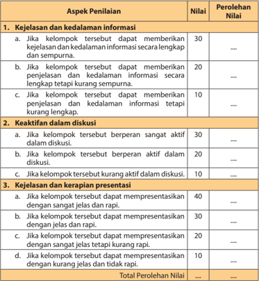

Tabel ini menunjukkan skor penilaian untuk tiga aspek utama: kejelasan dan kedalaman informasi, keaktifan dalam diskusi, dan kejelasan dan kerapihan presentasi. Topik utama adalah penilaian kualitas presentasi. Kolom-kolomnya mencakup nilai yang diberikan untuk setiap aspek, dengan skor tertinggi 40 dan skor terendah 10. Pola penting yang terlihat adalah bahwa aspek kejelasan dan kedalaman informasi memiliki skor tertinggi, sedangkan aspek kejelasan dan kerapihan presentasi memiliki skor tertinggi. Ini menunjukkan bahwa penilaian ini fokus pada kualitas informasi yang disampaikan dan presentasi yang dilakukan oleh kelompok.

 

---
## 📄 Halaman 48

### Perhitungan Perolehan Nilai

Nilai akhir yang diperoleh peserta didik merupakan akumulasi perolehan nilai untuk setiap aspek yang dinilai.

Contoh:

Jika peserta didik pada:

- aspek	pertama	memperoleh	nilai	30;
- aspek	kedua	memperoleh	nilai	20;	dan
- aspek	ketiga	memperoleh	nilai	30.
Maka total  perolehan  nilainya  adalah  80.  Perhitungan  perolehan  nilai  akhir dapat menggunakan rumus sebagai berikut:

``

``

``

Perolehan nilai tersebut menunjukkan bahwa peserta didik telah mencapai ketuntasan belajar sebagaimana ditetapkan dalam Permendikbud No. 53  Tahun  2015  tentang  Penilaian  Hasil  Belajar  oleh  pendidik  dan  satuan Pendidikan pada Pendidikan Dasar dan Menengah.

### Memperkaya Khazanah

Dalam kajian 'Memperkaya Khazanah', guru memfasilitasi, membimbing dan mengarahkan peserta didik untuk menemukan dan melahirkan analisis kajian berikut:

- Hakikat Qa «±' dan Qadar.
- Makna Beriman kepada Qa «±' dan Qadar .
- Hikmah Beriman kepada Qa «±' dan Qadar .
Guru dapat menyajikan pembelajaran dengan langkah-langkah berikut:

### 1. Hakikat Qa«±' dan Qadar

- Sebelum masuk pada inti pembelajaran, guru terlebih dahulu meminta agar peserta didik secara klasikal/kelompok mencermati ulasan tentang 'Hakikat Qa«±' dan Qadar ' serta Dal³l Naqlí dan 'Aqlí yang memperkuat pemahaman tentang 'Hakikat Qa«±' dan Qada ' .
- Setiap kelompok mendiskusikan inti dari ulasan tersebut dan keterkaitan antara dalil-dalil dengan topik pembelajaran.

 

---
## 📄 Halaman 49

- Setiap  kelompok  memaparkan  hasil  diskusinya.  Kelompok  lain  ikut mencermati dan memberikan respon terhadap hasil paparan tersebut.
- Guru  memberikan  pengarahan,  penguatan  dan  penjelasan  jawaban dari  pertanyaan-pertanyaan  yang  berkembang,  agar  lebih  terinci dan jelas terkait dengan pertanyaan-pertanyaan peserta didik, dalam upaya meningkatkan pemahaman 'Hakikat Qa«±' dan Qada ' serta dalil Naqli dan 'Aqli yang memperkuat pemahaman tentang 'Hakikat Qa«±' dan Qada ' berdasarkan sumber-sumber yang relevan.

### Aktivitas Siswa

Pada  rublik ' Aktivitas  Siswa ' ,  peserta  didik  secara  berkelompok  diminta melaksanakan tugas sebagai berikut:

- Mengidentifikasi, menemukan, mengkaji dan merangkum ayat-ayat alQur±n lainnya yang berkaitan dengan iman kepada Qa«±' dan Qada " .
- Memberikan tanggapan kritis terhadap seseorang yang ingin melakukan operasi ganti kelamin ditinjau dari sudut pandang keimanan kepada takdir Allah Swt.
Selanjutnya,  setiap  kelompok  diminta  memaparkan  hasil  kerja  mereka di  depan  kelompok  lain.  Kelompok  lain  ikut  serta  mencermati  dan memberikan tanggapan kritis terhadap paparan setiap kelompok. Guru memberikan penguatan dengan kembali menjelaskan berbagai masalah yang dikemukakan oleh setiap kelompok tersebut berdasarkan sumbersumber yang relevan.

Penilaian terhadap aktivitas peserta didik dapat dilakukan melalui rubrik berikut:

### Rubrik Penilaian Diskusi

---
**📊 Tabel**

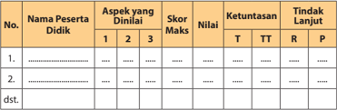

Tabel ini menunjukkan data tentang penilaian aspek-aspek dinilai oleh peserta didik dalam sebuah proses pembelajaran. Topik utama tabel adalah penilaian aspek-aspek dinilai peserta didik dalam proses pembelajaran. Kolom-kolom yang ada dalam tabel meliputi No., Nama Peserta Didik, Aspek yang Dinilai, Skor Maks, Nilai, Ketuntasan, dan Tindak Lanjut. Data penting yang terlihat dalam tabel ini adalah bahwa beberapa peserta didik memiliki skor yang lebih tinggi dibandingkan dengan skor maksimal, sementara beberapa lainnya memiliki nilai yang lebih rendah. Selain itu, tabel juga menunjukkan bahwa beberapa peserta didik memiliki ketuntasan yang lebih baik dibandingkan dengan peserta didik lainnya. Terakhir, tabel ini juga menunjukkan bahwa beberapa peserta didik memiliki tindak lanjut yang lebih baik dibandingkan dengan peserta didik lainnya.

 

---
## 📄 Halaman 50

### Aspek dan rubrik penilaian:

---
**📊 Tabel**

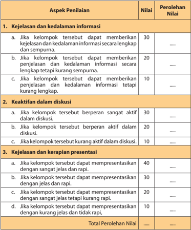

Tabel ini menunjukkan skor penilaian untuk tiga aspek utama: kejelasan dan kedalaman informasi, keaktifan dalam diskusi, dan kejelasan dan kerapihan presentasi. Topik utama adalah penilaian kualitas presentasi. Kolom-kolomnya mencakup nilai-nilai yang diberikan untuk setiap aspek, mulai dari 10 hingga 40. Data penting yang terlihat adalah bahwa aspek kejelasan dan kedalaman informasi memiliki skor tertinggi (30), sedangkan aspek kejelasan dan kerapihan presentasi memiliki skor tertinggi (40). Ini menunjukkan bahwa presentasi harus sangat jelas dan rapi untuk mendapatkan skor tertinggi.

### Perhitungan Perolehan Nilai

Nilai akhir yang diperoleh peserta didik merupakan akumulasi perolehan nilai untuk setiap aspek yang dinilai.

 

---
## 📄 Halaman 51

Contoh:

Jika peserta didik pada:

- aspek	pertama	memperoleh	nilai	30;
- aspek	kedua	memperoleh	nilai	20;	dan
- aspek	ketiga	memperoleh	nilai	30.
Maka total perolehan nilainya adalah 80. Perhitungan perolehan nilai akhir dapat menggunakan rumus sebagai berikut:

Hasil akhir penilaian

``

``

Perolehan nilai tersebut menunjukkan bahwa peserta didik telah mencapai ketuntasan  belajar  sebagaimana  ditetapkan  dalam  Permendikbud  No. 53 tahun 2015 tentang Penilaian Hasil Belajar oleh Pendidik dan Satuan Pendidikan pada Pendidikan Dasar dan Pendidikan Menengah.

### 2. Makna Beriman kepada Qa«±' dan Qadar

Pada bagian ini, guru dapat melaksanakan proses pembelajaran sebagai berikut:

- Guru memberikan pendampingan dan arahan agar peserta didik secara kelompok  kembali  mengidentifikasi,  mengkaji  dan  mendiskusikan makna beriman kepada Qa«±' dan Qada berikut dalil Naqlí dan 'Aqlí yang  memperkuat  pemahaman  tentang  'Makna  Beriman  kepada Qa«±' dan Qada ' .
- Selanjutnya, guru meminta agar setiap kelompok memaparkan hasil identifikasi,  kajian  dan  diskusinya.  Kelompok  lain  ikut  mencermati dan  memberikan  respons  serta  pertanyaan  terhadap  hasil  paparan tersebut.
- Guru  memberikan  pengarahan,  penguatan  dan  penjelasan  jawaban dari  pertanyaan-pertanyaan  yang  berkembang,  agar  lebih  terinci dan jelas terkait dengan pertanyaan-pertanyaan peserta didik, dalam upaya meningkatkan pemahaman terhadap makna beriman kepada Qa«±' dan Qada berdasarkan sumber-sumber yang relevan.

 

---
## 📄 Halaman 52

### Aktivitas Siswa

Pada rublik ' Aktivitas Siswa ' , guru meminta peserta didik secara berkelompok  membuat  video  pendek  dengan  tema: 'Menyikapi  Takdir dengan Ikhtiar  dan Tawakal".  Berkaitan  dengan  ini,  setiap  kelompok  diminta untuk membuat skenario yang menggambarkan adanya orang yang sukses karena keyakinannya kepada takdir, bekerja keras (ikhtiar), diiringi doa sebagai bentuk kepasrahan (tawakal). Di sisi lain, ada seorang yang lebih  banyak  berdoa,  sedangkan  ikhtiarnya  dilakukan  sambil  bermalasmalasan. Selanjutnya, setiap kelompok diminta untuk menayangkan hasil karya mereka di ruang studio/multi media/ruang lain yang memungkinkan. Kelompok  lain  memberikan  tanggapan  kritis  terhadap  setiap  tayangan yang ditampilkan.

---
**📊 Tabel**

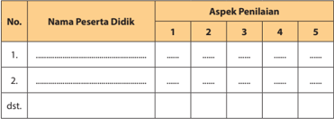

Tabel ini menunjukkan hasil penilaian berdasarkan 5 aspek penilaian untuk beberapa peserta didik. Topik utama tabel adalah penilaian akademik peserta didik. Kolom pertama berisi nama-nama peserta didik, sedangkan kolom kedua hingga kelima berisi skor atau nilai yang diberikan untuk masing-masing aspek penilaian. Data penting yang terlihat adalah bahwa setiap peserta didik memiliki skor yang berbeda-beda untuk setiap aspek penilaian, menunjukkan variasi dalam kualitas pembelajaran mereka.

### Aspek dan Rubrik Penilaian

---
**📊 Tabel**

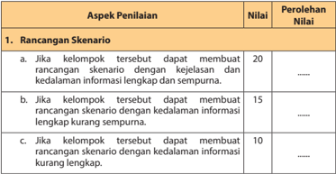

Tabel ini menunjukkan aspek penilaian dalam sebuah proyek atau tugas, dengan nilai yang diberikan untuk setiap aspek. Topik utama tabel adalah "Rancangan Skenario". Tabel dibagi menjadi 3 kolom: Aspek Penilaian, Nilai, dan Perolehan Nilai. Untuk aspek pertama, "Jika kelompok tersebut dapat membuat rancangan skenario dengan kejelasan dan kedalaman informasi lengkap dan sempurna", nilai yang diberikan adalah 20. Untuk aspek kedua, "Jika kelompok tersebut dapat membuat rancangan skenario dengan kedalaman informasi lengkap kurang sempurna", nilai diberikan adalah 15. Dan untuk aspek ketiga, "Jika kelompok tersebut dapat membuat rancangan skenario dengan kedalaman informasi kurang lengkap", nilai diberikan adalah 10. Pola penting yang terlihat adalah bahwa semakin tinggi kejelasan dan kedalaman informasi dalam rancangan skenario, semakin tinggi pula nilai yang diberikan.

 

---
## 📄 Halaman 53

---
**📊 Tabel**

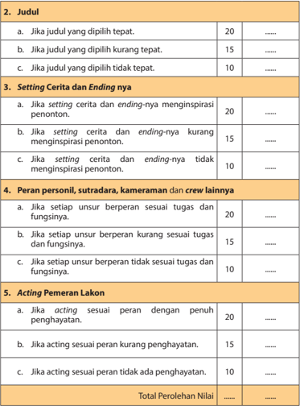

Tabel ini berisi kriteria penilaian untuk sebuah cerita pendek, dengan topik utama "Judul, Setting Cerita dan Ending, Peran Personil, Sutradara, Kameraman, dan Crew Lainnya, serta Acting Pemeran LAKON". Kolom-kolomnya mencakup berbagai aspek penilaian, seperti apakah judul tepat, setting dan ending inspiratif, peran personil sesuai tugas, dan acting sesuai peran. Data atau pola penting yang terlihat adalah skor yang diberikan untuk setiap kriteria, mulai dari 10 hingga 20 poin. Total perolehan nilai di bagian bawah tabel.

### Perhitungan Perolehan Nilai

Nilai akhir yang diperoleh peserta didik merupakan akumulasi perolehan nilai untuk setiap aspek yang dinilai.

 

---
## 📄 Halaman 54

### Contoh:

Jika peserta didik pada:

- aspek	pertama	memperoleh	nilai	20;
- aspek	kedua	memperoleh	nilai	15;
- aspek	ketiga	memperoleh	nilai	20;
- aspek	keempat	memperoleh	nilai	10;	dan
- aspek	kelima	memperoleh	nilai	15.
Maka total perolehan nilainya adalah 80. Perhitungan perolehan nilai akhir dapat menggunakan rumus sebagai berikut:

``

``

``

Perolehan nilai tersebut menunjukkan bahwa peserta didik telah mencapai ketuntasan  belajar  sebagaimana  ditetapkan  dalam  Permendikbud  No. 53   Tahun 2015 tentang Penilaian Hasil Belajar oleh Pendidik dan Satuan Pendidikan pada Pendidikan Dasar dan Pendidikan Menengah.

### 3. Hikmah Beriman kepada Qa«±' dan Qadar

Pada bagian ini, guru dapat melaksanakan proses pembelajaran sebagaimana berikut:

- Guru  memberikan  pendampingan  dan  arahan  peserta  didik  secara berkelompok mengidentifikasi, mengkaji dan mendiskusikan hikmah beriman  kepada Qa«±' dan Qadar berikut  Dalil  Naqlí  dan  'Aqlí  yang memperkuat pemahaman tentangnya.
- Selanjutnya,guru  meminta  agar  setiap  kelompok  memaparkan  hasil identifikasi, kajian dan diskusinya. Kelompok lain ikut mencermati dan memberikan respon dan pertanyaan terhadap hasil paparan tersebut.
- Guru  memberikan  pengarahan,  penguatan  dan  penjelasan  jawaban dari  pertanyaan-pertanyaan  yang  berkembang,  agar  lebih  terinci dan jelas terkait dengan pertanyaan-pertanyaan peserta didik, dalam upaya meningkatkan pemahaman terhadap hikmah beriman kepada Qa«±' dan Qadar berdasarkan sumber-sumber yang relevan.

 

---
## 📄 Halaman 55

### Aktivitas Siswa

Pada  rublik ' Aktivitas  Siswa " ,  peserta  didik  secara  berkelompok  diminta kembali  menemukan  hikmah-hikmah  lain  sebagai  implementasi  dari pemahaman  hikmah  beriman  kepada Qa «±' dan Qadar .  Selanjutnya, guru  meminta  agar  setiap  kelompok  memaparkan  hasil  temuannya  di depan kelompok lain. Kelompok lain ikut mencermati dan memberikan tanggapan  terhadap  pemaparan  setiap  kelompok  yang  tampil.  Guru memberikan  penguatan  dengan  mengulas  kembali  hikmah  beriman kepada Qa «±' dan Qadar berdasarkan sumber-sumber yang relevan.

Penilaian terhadap aktivitas peserta didik dapat dilakukan melalui rubrik berikut:

### Rubrik Penilaian Diskusi

---
**📊 Tabel**

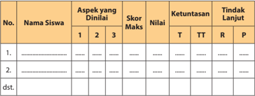

Tabel ini menunjukkan data evaluasi siswa berdasarkan aspek-aspek tertentu yang telah dilakukan oleh guru. Kolom-kolomnya meliputi nomor siswa, nama siswa, aspek yang dinilai, skor maksimal, nilai yang diberikan, ketuntasan (T untuk terlalu rendah, TT untuk terlalu tinggi, R untuk rendah, P untuk baik), dan tindakan lanjutan. Data penting yang terlihat adalah bahwa beberapa siswa memiliki nilai yang rendah di beberapa aspek, sementara beberapa siswa memiliki nilai yang baik. Ini menunjukkan perluannya untuk memberikan bantuan atau latihan tambahan kepada siswa yang memerlukan peningkatan.

### Aspek dan rubrik penilaian

---
**📊 Tabel**

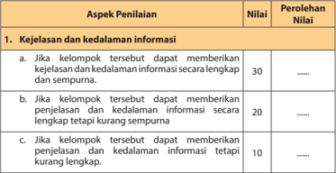

Tabel ini menunjukkan skor penilaian berdasarkan kejelasan dan kedalaman informasi yang diberikan oleh kelompok. Topik utama tabel adalah tentang kualitas penulisan informasi. Kolom "Nilai" menunjukkan skor yang diberikan kepada informasi tersebut, sedangkan kolom "Perolehan Nilai" menunjukkan jumlah poin yang diperoleh dari informasi tersebut. Data penting yang terlihat adalah bahwa informasi yang paling lengkap dan sempurna mendapatkan nilai tertinggi 30 poin, sedangkan informasi yang kurang lengkap tetapi masih cukup baik mendapatkan nilai 20 poin. Ini menunjukkan bahwa penilaian ini sangat fokus pada kualitas informasi yang diberikan, dengan skor yang lebih tinggi diberikan untuk informasi yang lebih lengkap dan detail.

 

---
## 📄 Halaman 56

---
**📊 Tabel**

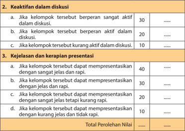

Tabel ini menunjukkan skor untuk dua aspek utama: keaktifan dalam diskusi dan kejelasan dan kerapihan presentasi. Topik utama adalah kinerja kelompok dalam proses belajar. Kolom pertama berisi deskripsi perilaku yang harus dicapai, sedangkan kolom kedua berisi skor yang diberikan. Skor tertinggi adalah 40, yang diberikan jika kelompok tersebut berperan sangat aktif dalam diskusi dan dapat mempresentasikan dengan sangat jelas dan rapi. Skor terendah adalah 10, yang diberikan jika kelompok tersebut kurang aktif dalam diskusi dan tidak dapat mempresentasikan dengan jelas dan rapi. Total perolehan nilai ditampilkan di bawah tabel.

### Perhitungan Perolehan Nilai

Nilai akhir yang diperoleh peserta didik merupakan akumulasi perolehan nilai untuk setiap aspek yang dinilai.

### Contoh:

Jika peserta didik pada:

- aspek	pertama	memperoleh	nilai	30;
- aspek	kedua	memperoleh	nilai	20;	dan
- aspek	ketiga	memperoleh	nilai	30.
Maka total perolehan nilainya adalah 80. Perhitungan perolehan nilai akhir dapat menggunakan rumus sebagai berikut:

``

``

 

---
## 📄 Halaman 57

Perolehan nilai tersebut menunjukkan bahwa peserta didik telah mencapai ketuntasan belajar sebagaimana ditetapkan dalam Permendikbud No.53 tentang Penilaian Hasil Belajar oleh Pendidik dan Satuan Pendidikan pada Pendidikan Dasar dan Pendidikan Menengah.

### Menerapkan Perilaku Mulia

Pada  bagian  ini,  guru  dapat  melaksanakan  pembelajaran  melalui  langkahlangkah berikut:

- Meminta setiap peserta didik kembali mencermati poin-poin penting yang terkait  dengan  beriman  kepada Qa «±' dan Qadar dan  mengidentifikasi perilaku-perilaku yang mencerminkan beriman kepada Qa «±' dan Qadar .
- Selanjutnya, secara berkelompok, peserta didik diminta untuk mendiskusikan sikap-sikap dan perilaku mulia yang harus dikembangkan sebagai implementasi dari pemahaman terhadap beriman kepada Qa «±' dan Qadar .
- Meminta setiap kelompok untuk mempresentasikan hasil diskusi tersebut. Kelompok lain memperhatikan , menyimak dan memberikan tanggapan.
- Menilai semua aktivitas pembelajaran dalam diskusi.
- Meminta setiap kelompok menyimpulkan hasil diskusi dan hasil presentasi dengan lebih logis, objektif dan analitis.
- Memberikan penguatan dan penjelasan tambahan terhadap hasil penilaian berdasarkan proses yang berkembang ketika diskusi berlangsung.

### Tugas Kelompok

- Buatlah lima kelompok, 1 kelompok terdiri dari 6-7 orang.
- Salinlah Q.S.  at-Taubah/9 : 105 dan Q.S. ² li  'Imr ± n/3 : 159 ,  lengkap  dengan terjemahannya dan jelaskan isi kandungannya!
- Cari ayat-ayat al-Qur ± n yang berkaitan dengan tema di atas!

 

---
## 📄 Halaman 58

### Penilaian

Guru dapat memberikan penilaian melalui rubrik berikut:

### Rubrik Penilaian

---
**📊 Tabel**

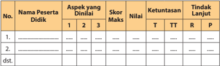

Tabel ini menunjukkan data tentang penilaian aspek-aspek tertentu pada dua peserta didik. Kolom-kolomnya mencakup nomor peserta, nama peserta, aspek yang diukur, skor maksimal, nilai yang diberikan, ketuntasan, dan tindakan lanjut. Topik utama tabel adalah penilaian aspek-aspek tertentu pada peserta didik. Data penting yang terlihat adalah bahwa kedua peserta didik memiliki skor yang sama untuk semua aspek yang diukur, yaitu 4.0. Namun, mereka memiliki ketuntasan yang berbeda, dengan satu peserta mendapatkan nilai T (Tinggi) dan satu peserta mendapatkan nilai TT (Tinggi-Tinggi). Tindakan lanjut juga berbeda, dengan satu peserta mendapatkan tindakan lanjut R (Rencana) dan satu peserta mendapatkan tindakan lanjut P (Pengembangan).

### Aspek dan rubrik penilaian

---
**📊 Tabel**

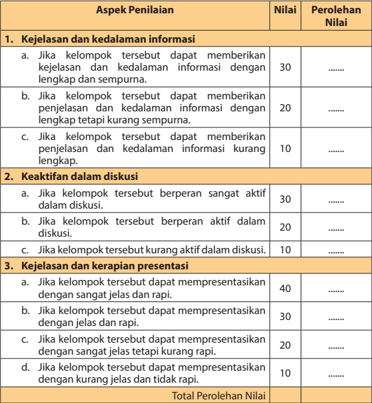

Tabel ini menunjukkan skor penilaian untuk tiga aspek utama: kejelasan dan kedalaman informasi, keaktifan dalam diskusi, dan kejelasan dan kerapihan presentasi. Setiap aspek dibagi menjadi tiga kategori dengan nilai yang berbeda-beda. Topik utama tabel adalah penilaian kinerja kelompok dalam sesi diskusi. Kolom-kolomnya mencakup nilai yang diberikan dan perolehan nilai. Data penting yang terlihat adalah bahwa nilai tertinggi adalah 40 untuk kejelasan dan kerapihan presentasi, sedangkan nilai terendah adalah 10 untuk kejelasan dan kerapihan presentasi. Pola ini menunjukkan bahwa presentasi adalah aspek yang paling penting dalam penilaian ini, sementara kejelasan dan kedalaman informasi serta keaktifan dalam diskusi juga memiliki peran penting.

 

---
## 📄 Halaman 59

### Perhitungan Perolehan Nilai

Nilai akhir yang diperoleh peserta didik merupakan akumulasi perolehan nilai untuk setiap aspek yang dinilai.

Contoh:

Jika peserta didik pada:

- aspek	pertama	memperoleh	nilai	30;
- aspek	kedua	memperoleh	nilai	20;	dan
- aspek	ketiga	memperoleh	nilai	30,
maka total  perolehan  nilainya  adalah  80.  Perhitungan  perolehan  nilai  akhir dapat menggunakan rumus sebagai berikut:

``

``

``

Perolehan nilai tersebut menunjukkan bahwa peserta didik telah mencapai ketuntasan belajar sebagaimana ditetapkan dalam Permendikbud No. 53  tahun  2015  tentang  Penilaian  Hasil  Belajar  oleh  Pendidik  dan  Satuan Pendidikan pada Pendidikan Dasar dan Pendidikan Menengah.

### Rangkuman

Pada bagian ini, peserta didik menyimpulkan intisari dari pembelajaran yang telah mereka alami dan guru memberikan penguatan dengan menyampaikan kembali  poin-poin  penting  sebagaimana  yang  terdapat  dalam  buku  siswa atau sumber lain yang relevan.

### 6. Penilaian 6. Penilaian

Guru melakukan penilaian terhadap peserta didik dalam kegiatan berikut:

- Berilah tanda silang (x) pada huruf a, b, c, d, atau e yang dianggap sebagai jawaban yang paling tepat!
Tugas ini terdiri dari lima soal pilihan ganda. Setiap soal mempunyai bobot nilai yang sama yaitu 2 jika benar dan 1 jika salah. Jika peserta didik dapat menjawab semua soal  dengan  benar,  maka  akan  memperoleh  nilai  10. Perhitungan nilai dilakukan dengan menggunakan rumus sebagai berikut:

 

---
## 📄 Halaman 60

``

### Contoh:

Jika  peserta  didik  hanya  mendapat  nilai  7  dari  10,  maka  perhitungan nilainya adalah:

``

Perolehan nilai tersebut menunjukkan bahwa peserta didik telah mencapai ketuntasan  belajar  sebagaimana  ditetapkan  dalam  Permendikbud  No. 53 Tahun 2015 tentang Penilaian Hasil Belajar oleh Pendidik dan Satuan Pendidikan pada Pendidikan Dasar dan Pendidikan Menengah.

- Isilah tititk-titik di bawah ini dengan jawaban yang singkat dan benar.
Tugas ini terdiri dari 8 soal. Setiap soal mempunyai bobot nilai yang sama yaitu  2  jika  benar  dan  1  jika  salah.  Jika  peserta  didik  dapat  menjawab semua soal dengan benar, maka akan memperoleh nilai 16. Perhitungan nilai dilakukan dengan menggunakan rumus berikut:

``

### Contoh:

Jika  peserta  didik  hanya  mendapat  nilai  14  dari  16,  maka  perhitungan nilainya adalah:

``

- Kerjakan soal berikut dengan benar dan tepat!
Tugas ini terdiri dari 10 soal. Soal no. 1, 3, 6, 7 dan 9 merupakan soal yang membutuhkan nalar, sehingga skornya harus lebih tinggi daripada soal no. 2, 4, 5, 8 dan 10 yang tidak membutuhkan nalar. Jika keseluruhan skor untuk jawaban yang diberikan adalah 100, maka masing-masing soal no. 1, 3, 6, 7 dan 9 mendapatkan skor 12 sehingga totalnya 60. Soal 2, 4, 5, 8 dan 10 masing-masing mendapatkan 8 sehingga totalnya adalah 40. Kemudian guru membuat rubrik dengan skor berikut:

 

---
## 📄 Halaman 61

### 1) Soal No.1

---
**📊 Tabel**

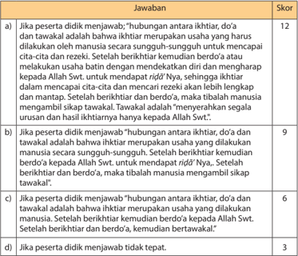

Tabel ini berisi skor untuk menjawab pertanyaan tentang hubungan antara ikhtiar, do'a, dan tawakal dalam Islam. Topik utama tabel adalah tentang kepercayaan dan praktek dalam Islam, khususnya tentang ikhtiar sebagai usaha manusia untuk mencapai tujuan Allah Swt. Kolom-kolom yang ada meliputi: a) Jika peserta didik menjawab "hubungan antara ikhtiar, do'a, dan tawakal adalah bahwa ikhtiar merupakan usaha yang dilakukan manusia secara sungguh-sungguh untuk mencapai cita dan rezeki", b) Jika peserta didik menjawab "hubungan antara ikhtiar, do'a, dan tawakal adalah bahwa ikhtiar merupakan usaha yang dilakukan manusia secara sungguh-sungguh untuk mencapai cita dan rezeki, setelah berkitarikat kemudian berdo'a kepada Allah Swt. Untuk mendapat rid' Nya, sehingga ikhtiar akan lebih lengkap dan mantoan", c) Jika peserta didik menjawab "hubungan antara ikhtiar, do'a, dan tawakal adalah bahwa ikhtiar merupakan usaha yang dilakukan manusia, setelah berkitarikat kemudian berdo'a kepada Allah Swt. Setelah berkitarikat dan berdo'a, maka tibalah manusia mengambil sikap tawakal", dan d) Jika peserta didik menjawab tidak tepat. Data atau pola penting yang terlihat adalah bahwa jawaban yang paling tepat adalah a), kemudian b), kemudian c), dan jawaban yang paling kurang tepat adalah d).

### 2) Soal No.2

---
**📊 Tabel**

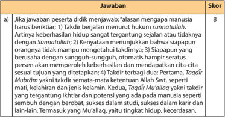

Tabel ini berisi jawaban untuk pertanyaan tentang alasan manusia harus beribadah. Topik utamanya adalah keharusan manusia beribadah karena beberapa alasan yang disebutkan dalam Sunnah. Kolom pertama berisi pertanyaan, sedangkan kolom kedua berisi jawaban yang diberikan. Skor ditampilkan di kolom ketiga. Data penting yang terlihat adalah bahwa semua jawaban mendapatkan skor 8, menunjukkan bahwa setiap jawaban memenuhi syarat atau kriteria yang ditentukan dalam pertanyaan tersebut.

 

---
## 📄 Halaman 62

---
**📊 Tabel**

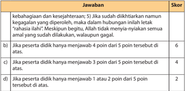

Tabel ini menunjukkan skor yang diberikan untuk setiap jawaban yang diberikan oleh peserta didik dalam sebuah ujian atau tes. Topik utama tabel adalah tentang kebahagiaan dan kesejahteraan, dengan 5 poin sebagai skor maksimal. Kolom "Jawaban" berisi berbagai pilihan jawaban yang diberikan oleh peserta didik, sementara kolom "Skor" menunjukkan skor yang diberikan untuk setiap jawaban tersebut. Data penting yang terlihat adalah bahwa skor tertinggi adalah 6 poin, yang diberikan jika peserta didik menjawab semua 5 poin dengan benar. Skor 4 poin diberikan jika peserta didik menjawab 4 poin dari 5 poin, sedangkan skor 2 poin diberikan jika peserta didik menjawab hanya 1 atau 2 poin dari 5 poin. Ini menunjukkan bahwa skor yang diberikan sangat bergantung pada jumlah jawaban yang benar yang diberikan oleh peserta didik.

### 3) Soal No.3

---
**📊 Tabel**

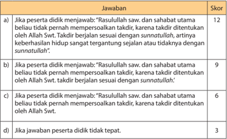

Tabel ini menunjukkan skor yang diberikan kepada peserta didik berdasarkan jawaban mereka tentang pernyataan "Rasulullah saw. dan sahabat utama beliau tidak pernah mempersoalkan taidir, karena taidir ditentukan oleh Allah Swt. taidir berjalan sesuai dengan sunnahtulat". Topik utama tabel adalah tentang persoalan taidir dalam Islam dan bagaimana taidir ditentukan oleh Allah Swt. Dalam tabel ini, ada empat kolom: a), b), c), dan d). Kolom a) memberikan skor 12 jika peserta didik menjawab dengan tepat, kolom b) memberikan skor 9 jika jawaban tidak tepat tetapi masih mendekati, kolom c) memberikan skor 6 jika jawaban tidak tepat dan kurang mendekati, dan kolom d) memberikan skor 3 jika jawaban tidak tepat sama sekali. Data penting yang terlihat adalah bahwa skor tertinggi adalah 12 dan skor terendah adalah 3, menunjukkan bahwa jawaban yang tepat mendapatkan skor tertinggi dan jawaban yang salah mendapatkan skor terendah.

### 4) Soal No.4

---
**📊 Tabel**

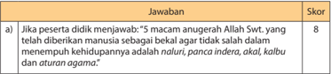

Tabel ini berisi skor untuk jawaban yang diberikan oleh peserta didik tentang anugerah Allah Swt. Topik utama tabel adalah tentang anugerah Allah Swt yang diberikan kepada manusia. Kolom pertama berisi jawaban yang diberikan oleh peserta didik, sedangkan kolom kedua berisi skor yang diberikan. Data penting yang terlihat adalah bahwa jawaban "5 macam anugerah Allah Swt, yang telah diberikan manusia sebagai bakaat agar tidak salah dalam memenuhi kehidupannya adalah nafsu, pancia indera, akal, kalbu dan aturan agama" mendapatkan skor 8. Ini menunjukkan bahwa jawaban tersebut dianggap benar oleh pembuat tabel.

 

---
## 📄 Halaman 63

---
**📊 Tabel**

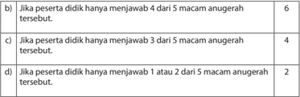

Tabel ini menunjukkan distribusi jumlah anugerah yang diterima oleh peserta didik dalam berbagai situasi. Topik utamanya adalah tentang jumlah anugerah yang diterima peserta didik dalam berbagai kondisi. Kolom pertama menunjukkan jumlah anugerah yang diterima, sedangkan kolom kedua menunjukkan jumlah peserta didik yang menerima jumlah tersebut. Data penting yang terlihat adalah bahwa sekitar 60% peserta didik mendapatkan 4 anugerah, 25% mendapatkan 3 anugerah, dan sekitar 15% mendapatkan 2 anugerah. Ini menunjukkan bahwa sebagian besar peserta didik mendapatkan jumlah anugerah yang lebih tinggi dibandingkan dengan yang diharapkan.

### 5) Soal No.5

---
**📊 Tabel**

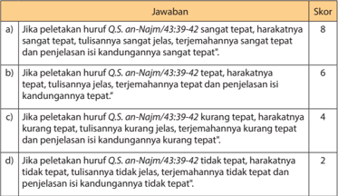

Tabel ini menunjukkan skor yang diberikan untuk peletakan huruf QS. an-Najm/43:43-42 dalam ayat tersebut. Topik utama tabel adalah tentang keakuratan peletakan huruf dalam ayat Al-Quran. Kolom-kolomnya meliputi skor yang diberikan, yaitu 8, 6, 4, dan 2. Data penting yang terlihat adalah bahwa skor tertinggi adalah 8 jika peletakan huruf sangat tepat, baik harakatnya, tulisannya, terjemahannya, dan penjelasan isi kandungan juga sangat tepat. Skor 6 diberikan jika peletakan huruf tepat, harakatnya tepat, tulisannya jelas, terjemahannya jelas, dan penjelasan isi kandungan juga jelas. Skor 4 diberikan jika peletakan huruf kurang tepat, sedangkan skor 2 diberikan jika peletakan huruf tidak tepat.

### 6) Soal No.6

---
**📊 Tabel**

Tabel ini menunjukkan skor yang diberikan kepada dua jawaban yang berbeda tentang pernyataan "manusia harus bertawakal karena manusia hanya diwajibkan untuk berusaha dan hasilnya diserahkan sepenuhnya hanya kepada Allah SWT." Topik utama tabel adalah tentang evaluasi kualitas jawaban dalam konteks ajaran Islam. Kolom pertama berisi deskripsi dari dua pilihan jawaban, sedangkan kolom kedua berisi skor yang diberikan. Data penting yang terlihat adalah bahwa jawaban yang lebih baik mendapatkan skor 12, sementara jawaban yang kurang tepat mendapatkan skor 9. Ini menunjukkan bahwa penilaian dalam konteks ajaran Islam memerlukan pemahaman yang baik tentang prinsip-prinsip agama tersebut.

 

---
## 📄 Halaman 64

---
**📊 Tabel**

Tabel ini menunjukkan skor yang diberikan kepada peserta didik berdasarkan jawaban mereka tentang pernyataan "manusia harus bertawakal karena manusia hanya berusaha dan Allah S.W.T. yang menentukan." Topik utama tabel adalah evaluasi keterampilan berpikir kritis peserta didik. Kolom-kolomnya mencakup skor yang diberikan (6 atau 3) dan jenis jawaban yang diberikan (c) atau tidak (d). Data penting yang terlihat adalah bahwa sebagian besar peserta didik mendapatkan skor 6, yang menunjukkan bahwa mereka mampu menjawab dengan tepat pernyataan tersebut. Sedangkan yang tidak tepat mendapatkan skor 3, menunjukkan bahwa mereka kurang memahami konsep tersebut.

### 7) Soal No.7

---
**📊 Tabel**

Tabel ini menunjukkan skor yang diberikan kepada peserta didik berdasarkan tingkat keakuratan jawaban mereka. Topik utama tabel adalah tentang skor yang diberikan berdasarkan tingkat keakuratan jawaban. Kolom pertama berisi kriteria penilaian, yaitu "Jika peserta didik menjawab sangat tepat", "Jika peserta didik menjawab tepat", "Jika peserta didik menjawab kurang tepat", dan "Jika jawaban peserta didik tidak tepat". Kolom kedua berisi skor yang diberikan untuk setiap kriteria tersebut. Data penting yang terlihat adalah bahwa skor tertinggi adalah 12 (jika peserta didik menjawab sangat tepat) dan skor terendah adalah 3 (jika jawaban peserta didik tidak tepat). Ini menunjukkan bahwa skor yang diberikan semakin tinggi semakin akurat jawaban peserta didik.

### 8) Soal No.8

---
**📊 Tabel**

Tabel ini berisi skor yang diberikan kepada peserta didik atas jawaban mereka dalam menjawab pertanyaan tentang keyakinan kepada manusia. Topik utama tabel adalah tentang keyakinan kepada manusia dalam konteks sunnahatul qadar. Kolom-kolomnya meliputi skor untuk setiap jenis jawaban yang diberikan oleh peserta didik. Data penting yang terlihat adalah bahwa skor tertinggi adalah 8 poin jika peserta didik memberikan semua poin yang diharapkan (keyakinan kepada manusia dalam semua aspek yang disebutkan), sedangkan skor terendah adalah 2 poin jika hanya memberikan satu atau dua poin dari total 5 poin yang ditentukan.

 

---
## 📄 Halaman 65

### 9) Soal No.9

---
**📊 Tabel**

Tabel ini menunjukkan skor yang diberikan kepada peserta didik berdasarkan jawaban mereka tentang keinginan manusia dalam hal dianutkan selalu dikabulkan Allah Swt. Topik utama tabel adalah tentang keinginan manusia dalam hal dianutkan selalu dikabulkan Allah Swt. Kolom-kolomnya meliputi: a) "Jika peserta didik menjawab: 'tidak semua do'a yang dianjatkan selalu dikabulkan Allah Swt. Karena bisa jadi keinginan manusia tidak cocok menurut pandangan Allah Swt.' (25. al-Baqarah: 2/76)", b) "Jika peserta didik menjawab: 'tidak semua do'a yang dianjatkan selalu dikabulkan Allah Swt. Karena Allah Swt. berkehendak untuk menentukan dikabulkan atau tidaknya do'a manusia'", c) "Jika peserta didik menjawab: 'tidak semua do'a yang dianjatkan selalu dikabulkan Allah Swt. Karena Allah Swt. berkehendak untuk menentukan dikabulkan atau tidaknya do'a manusia'", dan d) "Jika peserta didik menjawab: 'tidak semua do'a yang dianjatkan selalu dikabulkan Allah Swt. Karena belum sahnya'. Data atau pola penting yang terlihat adalah bahwa jawaban yang paling mendapatkan skor tertinggi adalah a), yaitu 12 skor, sementara jawaban yang paling rendah adalah d), yaitu 3 skor.

### 10) Soal No.10

---
**📊 Tabel**

Tabel ini menunjukkan skor yang diberikan kepada peserta didik berdasarkan respons mereka terhadap pertanyaan tertentu tentang sikap dan perilaku mereka dalam mencapai cita-cita dan mendapatkan rezeki halal. Topik utama tabel adalah tentang sikap dan perilaku dalam mencapai cita-cita dan mendapatkan rezeki halal. Kolom-kolomnya meliputi: a) Jika peserta tidak menjawab: "setelah berkhidmat atau berusaha dengan sungguh-sungguh untuk mencapai cita-cita dan mendapat rezeki halal", b) Jika peserta tidak menjawab: "setelah berkhidmat", c) Jika peserta dihargai menjawab: "setelah bekerja", dan d) Jika peserta tidak tepat. Data atau pola penting yang terlihat adalah bahwa skor tertinggi diberikan jika peserta menjawab pertanyaan dengan benar (a), sedangkan skor terendah diberikan jika peserta tidak menjawab sama sekali (d).

### Perhitungan Perolehan Nilai Pengetahuan

Nilai akhir yang diperoleh peserta didik merupakan akumulasi perolehan nilai untuk setiap soal yang dijawab.

### Contoh:

Jika peserta didik pada:

- soal	pertama	memperoleh	nilai	12;
- soal	kedua	memperoleh	nilai	6;
- soal	ketiga	memperoleh	nilai	9;
- soal	keempat	memperoleh	nilai	8;
- soal	kelima	memperoleh	nilai	8;

 

---
## 📄 Halaman 66

- soal	keenam	memperoleh	nilai	9;
- soal	ketujuh	memperoleh	nilai	12;
- soal	kedelapan	memperoleh	nilai	8;
- soal	kesembilan	memperoleh	nilai	8;	dan
- soal	kesepuluh	memperoleh	nilai	6.
Maka  total  perolehan  nilainya  adalah:  12+6+9+8+8+9+12+8+8+6=  86. Perhitungan  perolehan  nilai  akhir  dapat  menggunakan  rumus  sebagai berikut:

``

``

``

Perolehan nilai tersebut menunjukkan bahwa peserta didik telah mencapai ketuntasan belajar sebagaimana ditetapkan dalam Permendikbud No.53 Tahun  2015  tentang  Penilaian  Hasil  Belajar  oleh  Pendidik  dan  Satuan Pendidikan pada Pendidikan Dasar dan Pendidikan Menengah.

### d. Berilah tanda checklist (  ) pada kolom berikut dan berikan alasannya!

---
**📊 Tabel**

Tabel ini berisi pernyataan tentang keberhasilan manusia dalam meraih cita-cita mereka, dengan penilaian dalam empat kategori: SS (Sangat Sempurna), S (Sempurna), KS (Kurang Sempurna), dan TS (Tidak Sempurna). Topik utama tabel adalah tentang keberhasilan manusia dalam meraih cita-cita mereka, termasuk keberhasilan dalam menuntut kehidupan, keberhasilan dalam menuntut kehidupan secara sejati, dan keberhasilan dalam menuntut kehidupan secara sejati dan sejalan dengan keinginan Allah SWT. Kolom-kolom yang ada adalah No., Pernyataan, SS, S, KS, dan TS. Data atau pola penting yang terlihat adalah bahwa semua pernyataan memiliki penilaian TS, menunjukkan bahwa semua penerapan keberhasilan manusia dalam meraih cita-cita mereka dianggap tidak sempurna oleh penilai.

 

---
## 📄 Halaman 67

---
**📊 Tabel**

Tabel ini berisi pernyataan tentang prinsip-prinsip Islam yang penting, dengan topik utama adalah prinsip-prinsip kehidupan manusia dan kepercayaan dalam agama Islam. Kolom pertama menunjukkan nomor pernyataan, sementara kolom kedua menyajikan pernyataan tersebut secara lengkap. Data penting yang terlihat meliputi:

1. Prinsip bahwa berdoa merupakan satu-satunya cara untuk merubah takdir manusia.
2. Seorang Muslim yang selalu berbuat baik di dunia, belum tentu masuk surga.
3. Bertanya tentang masa depan kepada para normalis dibolehkan selama tidak berbatas syariat.
4. Hidayah sepenuhnya hak Allah Swt., sehingga ikhtiar apapun yang dilakukan untuk mendapatkannya, jika Allah Swt. tidak berkenan, maka tidak akan menerima.
5. Jika pada akhirnya yang terjadi merupakan ketentuan Allah Swt. untuk apa manusia beriktiraf.

Tabel ini membahas beberapa prinsip-prinsip yang penting dalam Islam, seperti pentingnya berdoa, kesadaran tentang keberadaan Allah, dan kepercayaan dalam kehidupan manusia.

### Keterangan:

SS  =

Sangat Setuju (4)

S =

Setuju (3)

KS  = Tidak Setuju (2)

TS  =

Sangat Tidak Setuju (1)

### Perhitungan Perolehan Nilai Akhir

Peserta didik diminta untuk memberikan  pernyataan terhadap 10 pertanyaan. Perhitungan nilai dapat dilakukan melalui ketentuan berikut:

- Jika	pernyataan	yang	diberikan	sangat	tepat,	maka	nilainya	4.
- Jika	pernyataan	yang	diberikan	tepat,	maka	nilainya	3.
- Jika	pernyataan	yang	diberikan	kurang	tepat,	maka	nilainya	2.
- Jika	pernyataan	yang	diberikan	tidak	tepat,	maka	nilainya	1.
Jika nilai tertinggi untuk setiap pernyataan yang diberikan adalah 4 dan nilai  terendahnya adalah 1, maka total nilai untuk semuanya adalah 4 × 10 = 40. Dengan demikian, perhitungan perolehan nilai yang didapat oleh peserta didik adalah:

``

``

Contoh perhitungan perolehan nilai untuk peserta didik:

``

 

---
## 📄 Halaman 68

### Catatan:

- Guru	 dapat	 mengembangkan	 instrumen	 penilaian	 sesuai	 dengan kebutuhan.
- Guru	diharapkan	memiliki	catatan	sikap	atau	nilai-nilai	karakter	yang dimiliki  peserta  didik  selama  dalam  proses  pembelajaran.  Terkait dengan sikap atau nilia-nilai karakter yang dimiliki oleh peserta didik dapat dilakukan dengan tabel berikut ini:

---
**📊 Tabel**

Tabel ini menunjukkan kinerja peserta didik dalam beberapa kriteria, yaitu toleransi, demokratis, komunikatif, dan kreatif. Kolom-kolomnya mencakup nama-nama peserta didik, sementara baris-barisnya menunjukkan kriteria-kriteria tersebut. Data dalam tabel menunjukkan skor yang diberikan kepada setiap peserta didik untuk setiap kriteria, dengan skor tertinggi diisi dengan "★★★★★" dan skor terendah dengan "★". Pola penting yang terlihat adalah bahwa sebagian besar peserta didik mendapatkan skor tinggi dalam semua kriteria, menunjukkan bahwa mereka memiliki kinerja yang baik dalam berbagai aspek.

Aspek sikap dapat disesuaikan dengan kebutuhan, seperti: disiplin, jujur, sopan, santun dll.

### Keterangan:

Sebelum  menetapkan  nilai  bagi  peserta  didik,  guru  terlebih  dahulu harus menentukan indikator pencapaian yang diingini. Berikut ini contoh indikator untuk setiap sikap yang akan dinilai.

---
**📊 Tabel**

Tabel ini berisi aspek-aspek sikap yang diharapkan dalam konteks toleransi, demokrasi, komunikatif, dan kreatif. Topik utamanya adalah sikap yang mendukung perbedaan dan harmonisasi antar individu. Kolom pertama menunjukkan aspek sikap tersebut, sedangkan kolom kedua berisi indikator yang menggambarkan perilaku yang sesuai dengan aspek sikap tersebut. Misalnya, untuk aspek toleransi, indikatornya adalah sikap dan tindakan yang menghargai perbedaan agama, suku, etnis, pendapat, sikap, dan tindakan orang lain yang berbeda dari dirinya. Ini menunjukkan bahwa tabel ini bertujuan untuk memberikan panduan tentang bagaimana seseorang dapat membangun hubungan yang harmonis dan beragam dalam masyarakat.

 

---
## 📄 Halaman 69

Sesuai dengan  indikator  yang  diperlihatkan peserta didik,  guru  dapat memberikan deskripsi sebagai berikut.

---
**📊 Tabel**

Tabel ini menunjukkan kriteria dan keterangannya dalam konteks pembelajaran atau pengembangan keterampilan. Topik utamanya adalah tentang proses pembelajaran dan perkembangan keterampilan, dengan kriteria yang meliputi Membudaya secara konsisten (MK), Mulai berkembang (MB), Mulai terlihat (MT), dan Belum terlihat (BT). Kolom-kolomnya mencakup kriteria tersebut dan keterangan yang menjelaskan tingkat perkembangan keterampilan. Data penting yang terlihat adalah bahwa MK berarti keterampilan sudah diterapkan secara konsisten, MB berarti keterampilan mulai berkembang setelah memperoleh tanda awal, MT berarti keterampilan mulai terlihat setelah memperoleh tanda awal, dan BT berarti keterampilan belum terlihat sama sekali.

### Perhitungan Penilaian Sikap

Contoh perhitungan akhir untuk penilaian sikap adalah sebagai berikut:

---
**📊 Tabel**

Tabel ini menunjukkan hasil evaluasi kinerja beberapa peserta didik dalam berbagai kriteria seperti toleransi, demokratis, komunikatif, dan kreatif. Topik utama tabel adalah penilaian kinerja peserta didik dalam berbagai aspek kecerdasan sosial. Kolom-kolom yang ada meliputi nama peserta didik, toleransi, demokratis, komunikatif, dan kreatif. Data penting yang terlihat adalah bahwa Ahmad memiliki nilai tertinggi dalam semua kriteria, sementara peserta lainnya hanya memiliki nilai tertinggi dalam satu kriteria saja. Ini menunjukkan bahwa Ahmad memiliki kinerja yang sangat baik dalam berbagai aspek kecerdasan sosial.

### Sikap secara umum:

Sikap secara umum dapat diperoleh dari keseluruhan nilai yang dicapai oleh Ahmad. Jika nilai yang dicapai oleh Ahmad adalah sebagai berikut:

- Š untuk toleransi, nilai yang diperoleh adalah MK = 4;
- Š untuk demokrasi, nilai yang diperoleh adalah MB = 3;

 

---
## 📄 Halaman 70

- Š untuk komunikasi, nilai yang diperoleh adalah MB = 3; dan
- Š untuk kreatifitas, nilai yang diperoleh adalah BT = 2
Maka, secara umum dalam hal sikap, Ahmad memperoleh nilai: 4+3+3+2=12. Mengingat sikap yang dinilai adalah empat sikap dan setiap sikap mempunyai nilai tertinggi adalah 4, nilai maksimal untuk keseluruhannya adalah: 4 x 4 = 16. Perhitungan umum perolehan nilai sikap adalah sebagai berikut:

Ini menunjukkan bahwa sikap Ahmad secara umum adalah baik. Selanjutnya, guru perlu memberikan penilaian secara deskriptif untuk mengetahui sikap mana yang sudah baik dan sikap mana yang memerlukan pembinaan lebih lanjut.

### 7. Pengayaan 7. Pengayaan

Dalam  kegiatan  pembelajaran,  bagi  peserta  didik  yang  sudah  menguasai materi  sebelum  waktu  yang  telah  ditentukan,  diminta  untuk  soal-soal pengayaan berupa pertanyaan-pertanyaan yang lebih fenomenal dan inovatif atau  aktivitas  lain  yang  relevan  dengan  topik  pembelajaran  ' Qa«±' dan Qadar Lahirkan Semangat Bekerja' . Dalam kegiatan ini, guru dapat mencatat dan  memberikan  tambahan  nilai  bagi  peserta  didik  yang  berhasil  dalam pengayaan.

### 8. Remedial 8. Remedial

Peserta  didik  yang  belum  menguasai  materi  (belum  mencapai  KKM),  guru akan  menjelaskan  kembali  materi  ' Qa«± ' dan Qadar Lahirkan  Semangat Bekerja' .  Guru  melakukan  penilaian  kembali  dengan  soal  yang  sejenis  atau memberikan tugas individu terkait dengan topik yang telah dibahas. Remedial dilaksanakan pada waktu dan hari tertentu yang disesuaikan, contoh: pada saat jam belajar, apabila masih ada waktu, atau di luar jam pelajaran (30 menit setelah jam pelajaran selesai).

 

---
## 📄 Halaman 71

### 9. Interaksi Guru dengan Orangtua 9. Interaksi Guru dengan Orang Tua

Guru  meminta  peserta  didik  memperlihatkan  rublik 'Evaluasi'  dalam  buku teks  kepada  orang  tuanya  dengan  memberikan  komentar  dan  paraf.  Cara lainnya dapat juga dengan menggunakan buku penghubung kepada orang tua yang berisi tentang perubahan perilaku siswa setelah mengikuti kegiatan pembelajaran atau berkomunikasi dengan orang tua untuk bertukar infomasi tentang  perkembangan  perilaku  anaknya.  Contohnya  orang  tua  diminta mengamati  perilaku  anaknya  untuk  mengetahui  apakah  perilaku  anaknya sudah merefleksikan pemahaman terhadap nilai-nilai beriman kepada ' Qa«± ' dan Qadar 'di lingkungan tempat tinggalnya.

 

---
## 📄 Halaman 72

### 1. Kompetensi Inti (KI) 1. Kompetensi Inti (KI)

- KI-1. Menghayati dan mengamalkan ajaran agama yang dianutnya.
- KI-2. Menghayati dan mengamalkan perilaku jujur, disiplin, tanggung jawab, peduli (gotong royong, kerja sama, toleran, damai), santun, responsif dan proaktif dan menunjukkan sikap sebagai bagian dari solusi atas berbagai  permasalahan  dalam  berinteraksi  secara  efektif  dengan lingkungan  sosial  dan  alam  serta  dalam  menempatkan  diri  sebagai cerminan bangsa dalam pergaulan dunia.
- KI-3. Memahami, menerapkan, menganalisis dan mengevaluasi pengetahuan faktual, konseptual, prosedural dan metakognitif berdasarkan rasa ingin tahunya tentang ilmu pengetahuan, teknologi, seni, budaya dan humaniora dengan wawasan kemanusiaan, kebangsaan, kenegaraan dan peradaban terkait penyebab fenomena dan kejadian, serta menerapkan  pengetahuan  prosedural pada bidang kajian yang spesifik sesuai dengan bakat dan minatnya untuk memecahkan masalah.
- KI-4. Mengolah, menalar, menyaji dan mencipta dalam ranah konkret dan ranah abstrak terkait dengan pengembangan dari yang dipelajarinya di sekolah secara mandiri serta bertindak secara efektif dan kreatif dan mampu menggunakan metoda sesuai kaidah keilmuan.

### 2. Kompetensi Dasar (KD) 2. Kompetensi Dasar (KD)

- 1.1 Meyakini bahwa agama mengajarkan kepada umatnya untuk berpikir kritis dan bersikap demokratis.
- 2.1 Bersikap kritis  dan  demokratis sesuai dengan pesan Q.S. Ā li  Imrān /3: 190-191 dan159, serta hadis terkait.
- 3.1 Menganalisis dan mengevaluasi makna Q.S. Ā li Imrān /3: 190-191, dan Q.S. Ā li  Imrān /3:  159,  serta hadis tentang, berpikir kritis dan bersikap demokratis.
- 4.1.1 Membaca Q.S. Ā li  Imrān /3:  190-191  dan Q.S. Ā li  Imrān /3:  159;  sesuai dengan kaidah tajwid dan makharijulhuruf.
- 4.1.2 Mendemonstrasikan  hafalan Q.S. Ā li  Imrān /3:  190-191  dan Q.S. Ā li Imrān /3: 159 dengan lancar.
- 4.1.3    Menyajikan  keterkaitan  antara  sikap  kritis  dengan  ciri  orang-orang berakal ( ulil albab ) sesuai pesan Q.S. ² li 'Imr ± n /3: 190-191.

### Menghidupkan Nurani dengan Berpikir Kritis

 

---
## 📄 Halaman 73

### 3. Tujuan Pembelajaran 3. Tujuan Pembelajaran

Peserta didik mampu:

- Meyakini  bahwa  agama  mengajarkan  kepada  umatnya  untuk  berpikir kritis.
- Bersikap  kritis  sesuai  dengan  pesan Q.S. Ā li  Imrān /3:  190-191  dan  hadis terkait.
- Menganalisis dan mengevaluasi makna Q.S. Ā li Imrān /3: 190-191, dan hadis tentang, berpikir kritis dan bersikap demokratis.
- Membaca Q.S. Ā li  Imrān /3:  190-191  sesuai  dengan  kaidah  tajwid  dan makharijulhuruf.

### 4.  Pengembangan Materi 4.  Pengembangan Materi

Pengembangan materi  'Menghidupkan Nurani dengan Berpikir Kritis' berdasarkan  pemahaman Q.S. ² li  'Imr ± n/3:190-191 dan  hadis  terkait  perlu dilakukan, agar upaya memfasilitasi peserta didik dalam menciptakan proses pembelajaran  seaktif  mungkin  dapat  terjadi,  sehingga  peserta  didik  dapat menikmati  pembelajarannya  dengan  penuh  kreatif  dan  inovatif,  dalam memahami Q.S. ² li 'Imr ± n/3:190-191 dan hadis terkait tersebut. Pengembangan materi tersebut antara lain dapat dilakukan melalui:

- Meneliti secara lebih mendalam pemahaman Q.S. ² li 'Imr ± n/3:190-191 dan hadis terkait dengan IT .
- Menyajikan  hukum  bacaan  dan  model-model  membaca  indah Q.S. ² li 'Imr ± n/3:190-191 .
- Menjelaskan  makna  isi  kandungan Q.S. ² li  'Imr ± n/3:190-191 dan  hadis terkait dengan IT
- Memberikan  tambahan  bacaan  ayat al-Qur±n dan  hadis-hadis  yang mendukung lainnya tentang berpikir kritis.

### 5. Proses Pembelajaran 5. Proses Pembelajaran

### a. Persiapan

- Pembelajaran  dimulai,  guru  mengucapkan  salam,  menyapa,  berdoa dan tad±rus : membaca al-Qur±n surat pendek pilihan atau ayat hafalan yang sudah dipelajari dengan lancar dan benar (atau surat yang sesuai dengan  program  pembiasaan  yang  ditentukan  sebelumnya);  Salat ¬uh±' (atau salat sunat lainnya, bila memungkinkan, sebagai modifikasi pembukaan  pembelajaran,  guna  pembentukan  sikap  dan  perilaku peserta didik) secara bersama-sama (berjama'ah).
- Memperhatikan kesiapan dan semangat peserta didik, dengan memeriksa  kehadiran,  kerapihan  berpakaian  dan  mengorganisasi kelas dan posisi tempat duduk disesuaikan dengan metode dan model pembelajaran yang akan diterapkan.

 

---
## 📄 Halaman 74

- Memahami dan menyadari bahwa, peran guru dalam proses pembelajaran  ini  berfungsi  sebagai  fasilitator,  pembimbing,  nara sumber dan evaluator sebagaimana berikut:
- Memfalisitasi pesera didik dalam merencanakan dan mempersiapkan pembelajaran dengan segala kebutuhannya, mulai  dari  materi  pelajaran  baik  cetak  maupun  elektroniknya, sampai  kepada  penggunaan  alat  peraga  manual  (teks  ayat alQur±n dan hadis di karton, guntingan karton, sketsa, dll) dan segala media ICT yang dibutuhkan (MP 3, video, LCD, dll)
- Membimbing peserta didik dalam proses pembelajaran dan upaya mencapai tujuan pembelajaran khususnya materi; 'Menghidupkan Nurani  dengan  Berpikir  Kritis'  berdasarkan  pemahaman Q.S. ² li 'Imr ± n/3:190-191 dan hadis terkait.
- Sebagai nara sumber, guru harus menambahkan, mengembangkan dan memperkuat materi pembelajaran; 'Menghidupkan Nurani  dengan  Berpikir  Kritis'  berdasarkan  pemahaman Q.S. ² li 'Imr ± n/3:190-191 dan  hadis  terkait  dengan  logis,  penuh  hikmah, baik dan benar.
- Sebagai evaluator, guru harus mempersiapkan dan mengembangkan instrumen evaluasi yang objektif, valid, efektif  dan  terukur  pada  materi  pembelajaran;  'Menghidupkan Nurani  dengan  Berpikir  Kritis'  berdasarkan  pemahaman Q.S. ² li 'Imr ± n/3:190-191 dan hadis terkait ini.
- Menyampaikan tujuan pembelajaran.
- Model pembelajaran yang dapat disiapkan dan digunakankan sebagai alternatif  dalam  kompetensi  ini  adalah, puzzle ,  bermain  peran  ( role playing ), mengembangkan  kemampuan  dan  keterampilan ( skill ) peserta didik  dalam  membaca al-Qur±n dengan  menggunakan metode drill (latihan dengan mengulang-ulang bacaan).

### b. Pelaksanaan

Pada  kegiatan  ini,  pembelajaran  dikembangkan  dengan  menerapkan beragam  model,  metode,  media dan sumber  pembelajaran  yang  disesuaikan  dengan  karakteristik  materi  'Menghidupkan  Nurani  dengan Berpikir Kritis' berdasarkan pemahaman Q.S. ² li 'Imr ± n/3:190-191 dan hadis terkait.

Pembelajaran dimulai dengan pengamatan terhadap beberapa ilustrasi yang  tertera  pada  buku  teks.  Peserta  didik  secara  klasikal/kelompok di  minta untuk mencermati ilustrasi. Setelah itu guru menunjuk beberapa  peserta  didik/wakil  dari  kelompok  untuk  memaparkan  hasil pengamatannya, sementara peserta didik/kelompok lain ikut mencermati dan memberikan tanggapan atas pemaparan tersebut. Selanjutnya, guru

 

---
## 📄 Halaman 75

memberikan penguatan dengan memaparkan kembali kerkaitan ilustrasi tersebut dengan topik 'Menghidupkan Nurani dengan Berpikir Kritis", yang akan dipelajari bersama.

### Membuka Relung Kalbu

- Sebelum masuk pada inti  pembelajaran,  guru  terlebih  dahulu  meminta agar  peserta  didik  secara  kelompok  mencermati  ilustrasi  dan  ulasan singkat tentang misteri dan kedahsyatan ciptaan Allah Swt.
- Setiap  kelompok memaparkan pesan-pesan moral yang terdapat dalam ulasan/ilustrasi. Kelompok lain ikut mencermati dan memberikan tanggapan terhadap hasil paparan tersebut.
- Guru memberikan penjelasan tambahan dan penguatan yang dikemukakan setiap kelompok tentang isi ulasan/ilustrasi tersebut dan keterkaitannya dengan materi yang akan dipelajari bersama.

### Aktivitas Peserta Didik

Pada  rublik  'Aktivitas  Peserta  Didik",  guru  meminta  peserta  didik  secara berkelompok melakukan tugas berikut:

- Melihat lebih banyak tentang misteri dan kedahsyatan ciptaan Allah Swt.
- Mencari  hasil-hasil  penelitian  ilmiah  terkait  dengan  unta  atau  binatang lainnya.
- Mempresentasikannya di depan kelas untuk mendapatkan tanggapan dari kelompok lain!

### Penilaian terhadap Aktivitas Peserta Didik

Guru  dapat  memberikan  penilaian  terhadap  aktivitas  peserta  didik  dalam kegiatan diskusi yang dilakukan melalui rubrik berikut:

### Rubrik Penilaian Diskusi

---
**📊 Tabel**

Tabel ini menunjukkan data tentang penilaian aspek-aspek tertentu pada peserta didik. Topik utamanya adalah penilaian aspek-aspek tertentu pada peserta didik. Kolom-kolomnya meliputi No., Nama Peserta Didik, Aspek yang Dinilai, Skor Maks, Nilai, Ketuntasan, dan Tindakan Lanjut. Data penting yang terlihat adalah bahwa beberapa aspek dinilai dengan skor maksimal, namun nilai yang diberikan tidak mencapai skor maksimal. Selain itu, ada beberapa aspek yang memiliki ketuntasan tinggi (T) dan tingkat ketuntasan tinggi (TT), sementara beberapa aspek lainnya memiliki ketuntasan rendah (R). Tindakan lanjut juga ditetapkan untuk beberapa aspek, menunjukkan bahwa ada langkah-langkah yang akan diambil untuk meningkatkan penilaian tersebut.

 

---
## 📄 Halaman 76

### Aspek dan Rubrik Penilaian

---
**📊 Tabel**

Tabel ini menunjukkan skor penilaian untuk tiga aspek penilaian: kejelasan dan kedalaman informasi, keaktifan dalam diskusi, dan kejelasan dan kerapihan presentasi. Topik utama tabel adalah penilaian kualitas presentasi. Kolom-kolomnya mencakup nilai yang diberikan dan perolehan nilai. Data penting yang terlihat adalah bahwa nilai tertinggi adalah 40 untuk kejelasan dan kerapihan presentasi, sedangkan nilai terendah adalah 10 untuk kejelasan dan kedalaman informasi yang kurang lengkap. Pola ini menunjukkan bahwa presentasi harus sangat jelas dan rapi untuk mendapatkan nilai tertinggi, sementara informasi yang diberikan harus cukup lengkap dan detail untuk mendapatkan nilai yang lebih rendah.

### Perhitungan Perolehan Nilai

Nilai akhir yang diperoleh peserta didik merupakan akumulasi perolehan nilai untuk setiap aspek yang dinilai.

### Contoh:

### Jika peserta didik pada:

- aspek	pertama	memperoleh	nilai	30;
- aspek	kedua	memperoleh	nilai	20;	dan
- aspek	ketiga	memperoleh	nilai	30,

 

---
## 📄 Halaman 77

Maka total perolehan nilainya adalah 80. Perhitungan perolehan nilai akhir dapat menggunakan rumus sebagai berikut:

``

``

``

Perolehan nilai tersebut menunjukkan bahwa peserta didik telah mencapai ketuntasan  belajar  ditetapkan  dalam  Permendikbud  No.53  Tahun  2015 tentang Penilaian Hasil Belajar oleh Pendidik dan Satuan Pendidik pada Pendidikan Dasar dan Menengah.

### Mengkritisi Sekitar Kita

Pada kegiatan ini, peserta didik secara berkelompok diminta untuk kembali mencermati  dinamika  dan  fenomena  kehidupan  di  alam  raya,  kemudian mendiskusikan keterkaitannya dengan berpikir kritis dan memberikan tanggapan kritis. Setelah mencermati dan mendiskusikannya, setiap kelompok memaparkan hasil diskusi dan kritikannya di depan kelompok lain. Kelompok lain  ikut  mencermati  setiap  paparan  yang  disampaikan  dan  memberikan tanggapan  kritis  atas  paparan  tersebut.  Selanjutnya,  guru  memberikan penguatan dengan memaparkan kembali berkaitan dinamika dan fenomena kehidupan  di  alam  raya  tersebut  dengan  topik  berpikir  kritis  yang  akan dipelajari bersama.

### Tugas Kelompok

Pada  kegiatan  ini,  guru  dapat  memberikan  penilaian  terhadap  aktivitas peserta didik dengan menggunakan instrumen penilaian sebagaimana yang dilakukan pada pembahasan 'Membuka Relung Kalbu".

### Memperkaya Khazanah

Dalam kajian 'Memperkaya Khazanah", guru memfasilitasi, membimbing dan mengarahkan peserta didik untuk menemukan dan melahirkan analisis kajian 'Menghidupkan Nurani dengan Berpikir Kritis' berdasarkan pemahaman Q.S. ² li  'Imr ± n/3:190-191 dan hadis terkait. Guru dapat menyajikan pembelajaran dengan langkah-langkah berikut:

### 1. Perintah Berpikir Kritis

- Guru  menyajikan  Q.S. ²li  'Imr±n/3:190-191 dan  beberapa  hadis,  baik melalui tayangan maupun media lain sesuai kebutuhan.
- Peserta  didik  secara  klasikal  diminta  untuk  mencermati  penyajian tersebut dengan memadu padankan apa yang tertera pada buku teks.

 

---
## 📄 Halaman 78

- Selanjutnya, secara kelompok peserta didik diminta untuk mendiskusikan pesan yang terkandung dalam Q.S. ² li 'Imr ± n/3:190-191 dan hadis-hadis tersebut secara singkat.
- Setiap kelompok memaparkan hasil diskusinya di depan kelompok lain dan kelompok lain ikut serta mencermati dan memberikan tanggapan terhadap setiap pemaparan.
- Guru memberikan penguatan dengan menyampaikan kembali kandungan Q.S. ² li  'Imr ± n/3:190-191 dan beberapa hadis yang antara lain  berisi  pesan-pesan  mulia  tentang  berpikir  kritis.  Anjuran  untuk berpikir kritis merupakan poin penting yang terkandung dalam Q.S. ² li 'Imr ± n/3:190-191 dan hadis-hadis terkait tersebut.

### Membaca, Menghafal dan Mengartikan Q.S. ² li 'Imr ± n/3:190-191

Sebelum  masuk  pada  inti  pembelajaran 'Membaca  dan  Menghafal Q.S. ² li  'Imr ± n/3:190-191 ,  guru terlebih dahulu menyampaikan secara singkat bagaimana  cara  membaca al-Qur±n yang  baik  dan  benar.  Selanjutnya, guru melakukan langkah-langkah pembelajaran sebagai berikut:

- Guru menunjuk beberapa peserta didik sebagai model untuk membaca Q.S. ² li 'Imr ± n/3:190-191 secara tart³l .
- Guru memberikan penguatan dengan memberikan contoh membaca Q.S. ² li 'Imr ± n/3:190-191 secara tart³l .
- Selanjutnya, guru membagi peserta didik ke dalam beberapa kelompok. Melalui  tutor  sebaya,  setiap  kelompok  diminta  melancarkan  bacaan secara  bergantian  dan  menghafalkannya  serta  menemukan  hukum bacaan yang terdapat pada Q.S. ² li 'Imr ± n/3:190-191 serta arti dari ayat tersebut.
- Setiap kelompok/wakil kelompok mendemonstrasikan bacaan dan hafalan Q.S. ² li 'Imr ± n/3:190-191 secara tart³l . Selanjutnya, menyampaikan hukum bacaan yang terdapat pada bacaan tersebut berikut arti dari ayatnya. Kelompok lain memberikan penilaian terhadap penampilan setiap kelompok/wakil kelompok dan menanyakan beberapa hal tentang hafalan dan hukum bacaan yang terdapat pada Q.S. ² li 'Imr ± n/3:190-191 tersebut berikut artinya.
- Guru  memberikan  pengarahan,  penguatan  dan  penjelasan  jawaban dari pertanyaan-pertanyaan yang berkembang, agar lebih terinci dan jelas terkait dengan pertanyaan-pertanyaan peserta didik, dalam upaya mencermati  bacaan,  hafalan  dan  pemahaman  hukum  bacaan  yang terdapat pada Q.S. ² li 'Imr ± n/3:190-191 serta arti dari ayat tersebut.

 

---
## 📄 Halaman 79

### Aktivitas Peserta Didik

Pada bagian ini, secara berkelompok peserta didik diminta:

- Menemukan lebih  banyak  lagi  lafal-lafal  yang  mengandung  hukum tajwid dalam Q.S. ²li 'Imr±n/3:190-191 .
- Menghafalkan Q.S. ²li 'Imr±n/3:190-191 berikut artinya.
Penilaian  terhadap  aktivitas  tersebut  dapat  dilakukan  melalui  rubrik berikut:

### Rubrik Penilaian

---
**📊 Tabel**

Tabel ini menunjukkan kriteria pengukuran untuk beberapa kelompok, dengan berbagai tingkat keakuratan yang ditentukan. Topik utama tabel adalah evaluasi atau penilaian berdasarkan tingkat keakuratan. Kolom-kolomnya meliputi "Nama Kelompok", "Sangat Tepat", "Tepat", "Cukup Tepat", dan "Kurang Tepat". Data atau pola penting yang terlihat adalah bahwa setiap kelompok memiliki kriteria evaluasi yang berbeda-beda, mulai dari sangat tepat hingga kurang tepat. Ini menunjukkan bahwa evaluasi dapat dilakukan dengan berbagai standar dan tingkat keakuratan yang berbeda, yang mungkin bergantung pada konteks atau tujuan spesifik evaluasi tersebut.

### Keterangan

---
**📊 Tabel**

Tabel ini menunjukkan skor penilaian berdasarkan kriteria pengetahuan hukum tentang lalat. Topik utamanya adalah tingkat keakuratan pengetahuan tentang lalat. Kolom-kolomnya meliputi kriteria (Sangat Tepat, Tepat, Cukup Tepat, Kurang Tepat), indikator (Penetapan hukum atas lalat yang disalin tepat dan alasannya tepat, Penetapan hukum atas lalat yang disalin tepat dan alasannya sedikit kurang tepat, Penetapan hukum atas lalat yang disalin kurang tepat, dan lain-lain), dan skor (4, 3, 2, 1). Data penting yang terlihat adalah bahwa skor tertinggi adalah 4 untuk kriteria Sangat Tepat, yang berarti pengetahuan hukum tentang lalat yang disalin tepat dan alasannya juga tepat. Skor terendah adalah 1 untuk kriteria Kurang Tepat, yang berarti pengetahuan hukum tentang lalat yang disalin kurang tepat.

### Rubrik Penilaian hafalan

---
**📊 Tabel**

Tabel ini menunjukkan hasil evaluasi beberapa kelompok dengan berbagai kriteria, termasuk "Sangat Tepat", "Tepat", "Cukup Tepat", dan "Kurang Tepat". Topik utama tabel adalah evaluasi kelompok berdasarkan kriteria tertentu. Kolom-kolomnya mencakup nomor kelompok (No.), nama kelompok, dan kriteria evaluasi. Data penting yang terlihat adalah bahwa setiap kelompok memiliki nilai evaluasi yang berbeda-beda tergantung pada kriteria yang digunakan. Misalnya, kelompok pertama mendapatkan nilai "Sangat Tepat" untuk satu kriteria dan "Tepat" untuk dua kriteria lainnya. Ini menunjukkan variasi dalam penilaian berdasarkan kriteria yang berbeda.

 

---
## 📄 Halaman 80

### Keterangan:

---
**📊 Tabel**

Tabel ini menunjukkan skor kriteria berdasarkan kualitas hafalan kata-kata dalam bahasa Melayu. Topik utamanya adalah kualitas hafalan kata-kata, yang diukur melalui indikator seperti lancer, makrjana baik, pelfalannya, dan artinya. Kolom-kolomnya mencakup kriteria sangat baik, baik, cukup baik, dan kurang baik. Data penting yang terlihat adalah bahwa skor tertinggi adalah 4 untuk kriteria sangat baik, sedangkan skor terendah adalah 1 untuk kriteria kurang baik. Pola yang jelas adalah skor meningkat dari sangat baik ke baik, kemudian ke cukup baik, dan akhirnya ke kurang baik. Ini menunjukkan bahwa kualitas hafalan kata-kata semakin baik dari sangat baik hingga kurang baik.

### Asb±bun Nuzµl dan Tafs³r

- Peserta didik secara berkelompok kembali mencermati Asb ± bun Nuz µ l dan Tafs ³ r berikut  ilustrasi  dan  ungkapan  (teori)  yang  memotivasi berpikir  kritis,  kemudian  mendiskusikan  relevansi  antara Asb ± bun Nuz µ l , Tafs ³ r , ilustrasi dan ungkapan tersebut.
- Guru memotivasi agar setiap kelompok bukan hanya mendiskusikan relevansi  antara Asb ± bun  Nuz µ l,  Tafs ³ r ilustrasi  dan  ungkapan  (teori) tersebut, namun juga membuat beberapa pertanyaan yang relevan.
- Setiap  kelompok/wakil  kelompok  memaparkan  hasil  pencermatan dan  diskusi  mereka.  Kelompok  lain  memberikan  penilaian  terhadap penampilan setiap kelompok/wakil kelompok dan menanyakan beberapa hal yang relevan.
- Guru  memberikan  pengarahan,  penguatan  dan  penjelasan  jawaban dari  pertanyaan-pertanyaan  yang  berkembang,  agar  lebih  terinci dan jelas terkait dengan pertanyaan-pertanyaan peserta didik, dalam upaya mencermati relevansi antara Asb ± bun Nuz µ l,  T afs ³ r ,ilustrasi dan ungkapan (teori) terkait baik berdasarkan buku teks maupun sumber bacaan lainnya.

### Aktivitas Peserta Didik

Pada bagian ini, guru meminta peserta didik secara berkelompok mencari:

- Hadis atau riwayat lain dari berbagai sumber, yang menjadi Asb±bun Nuzµl  Q.S.  ²li  'Imr±n/3:190-191 .  Kemudian  mempresentasikannya  di depan kelas

 

---
## 📄 Halaman 81

- Mencari  lebih  lanjut  teori-teori  tentang  penciptaan  bumi  menurut para ahli dari berbagai referensi. Kemudian membuat power point dan mempresentasikannya di depan kelas.
Penilaian pada aktivitas ini dapat dilakukan melalui rubrik berikut.

### Rubrik Penilaian Asb±bun Nuzµl

---
**📊 Tabel**

Tabel ini menunjukkan hasil evaluasi kinerja peserta didik dalam berbagai kriteria, seperti sangat baik, baik, cukup baik, dan kurang baik. Topik utama tabel adalah penilaian kinerja peserta didik dalam berbagai aspek. Kolom-kolomnya mencakup nama-nama peserta didik dan kriteria evaluasi mereka. Data penting yang terlihat adalah bahwa beberapa peserta didik mendapatkan nilai sangat baik dalam semua kriteria, sedangkan beberapa lainnya hanya mendapatkan nilai baik atau cukup baik. Ini menunjukkan variasi dalam kinerja peserta didik dalam setiap aspek yang diukur.

### Keterangan:

---
**📊 Tabel**

Tabel ini menunjukkan skor berdasarkan kriteria keakuratan atau kesesuaian antara hadis atau riwayat yang disampaikan dengan fakta sebenarnya. Topik utama tabel adalah evaluasi keakuratan informasi. Kolom-kolomnya meliputi kriteria (Sangat Tepat, Tepat, Cukup Tepat, Kurang Tepat), indikator (Jika hadis atau riwayat yang disampaikan benar dan tepat, Jika hadis atau riwayat yang disampaikan benar tetapi kurang tepat, Jika hadis atau riwayat yang disampaikan benar tetapi tidak tepat, Jika hadis atau riwayat yang disampaikan tidak benar dan tidak tepat), dan skor (4, 3, 2, 1). Data penting yang terlihat adalah bahwa skor tertinggi adalah 4 untuk kriteria Sangat Tepat, sedangkan skor terendah adalah 1 untuk kriteria Kurang Tepat. Ini menunjukkan bahwa semakin tepat informasi yang disampaikan, semakin tinggi skornya.

### Rubrik Penilaian

---
**📊 Tabel**

Tabel ini menunjukkan evaluasi kinerja peserta didik dalam berbagai kriteria, mulai dari sangat baik hingga kurang baik. Kolom "Nama Peserta Didik" menyajikan daftar nama-nama peserta didik yang telah dianalisis. Kolom "Sangat Baik", "Baik", "Cukup Baik", dan "Kurang Baik" masing-masing menunjukkan tingkat keberhasilan atau kinerja peserta didik dalam setiap kriteria. Dari data yang terlihat, dapat disimpulkan bahwa sebagian besar peserta didik memiliki kinerja yang cukup baik atau baik, namun masih ada beberapa peserta didik yang memerlukan peningkatan lebih lanjut dalam keterampilan atau pengetahuan mereka.

 

---
## 📄 Halaman 82

### Keterangan:

---
**📊 Tabel**

Tabel ini menunjukkan skor berdasarkan kriteria teori relevan, power point menarik, dan paparan baik. Topik utama tabel adalah evaluasi kinerja presentasi. Kolom-kolomnya meliputi kriteria (Sangat Baik, Baik, Cukup Baik, Kurang Baik) dan indikator yang digunakan untuk menentukan skor. Data penting yang terlihat adalah bahwa skor tertinggi adalah 4 (Sangat Baik), sedangkan skor terendah adalah 1 (Kurang Baik). Pola yang jelas adalah semakin tinggi kriteria, semakin tinggi skor yang diberikan.

### B. Hakikat Berpikir Kritis

Guru meminta peserta didik untuk membaca dan mencermati beberapa pendapat dan hadis terkait dengan berpikir kritis melalui langkah-langkah berikut:

- Peserta didik secara berkelompok membaca dan mencermati bebarapa pendapat tentang maksud dari berpikir kritis dan H.R.at-Tirm ³ żi yang terkait  dengan  berpikir  kritis  serta  mendiskusikan  arti  dari  hadis tersebut.
- Setiap  kelompok/wakil  kelompok  memaparkan  hasil  diskusinya  di depan kelompok lain. Kelompok lain memberikan tanggapan terhadap pemaparan tersebut.
- Guru  memberikan  pengarahan,  penguatan  dan  penjelasan  jawaban dari  pertanyaan-pertanyaan  yang  berkembang,  agar  lebih  terinci dan jelas terkait dengan pertanyaan-pertanyaan peserta didik, dalam upaya  mencermati  beberapa  pendapat  tentang  maksud  daripada berpikir kritis dan arti dari H.R.at-Tirm ³ żi tersebut.

### Aktivitas Peserta Didik

Pada kegiatan ini, peserta didik secara berkelompok diminta untuk:

- Mencari ayat-ayat al-Qur±n yang menantang manusia untuk merenung dan meneliti  dengan  ciri-ciri  di  antaranya  menggunakan  kata  (yang artinya) BERPIKIR, BERAKAL, BERTADABBUR, MELIHAT dan sejenisnya;
- mencari asb Æ bun nuzµl dan tafs í r ayat-ayat tersebut dalam kitab tafs í r modern baik langsung maupun melalui internet;
- mengamati  Gambar  3.9  yang  terdapat  pada  buku  teks  siswa  dan memberikan  tanggapan  terhadap  fakta  temuan  tentang  laut  dua warna; dan
- menemukan keajaiban lain dalam dunia laut.

 

---
## 📄 Halaman 83

Setiap kelompok diminta mendiskusikan bersama berbagai permasalahan di  atas.  Selanjutnya,  mereka  diminta  membuat  laporan  hasil  kegiatan tersebut dan mempresentasikannya di depan kelompok lain.

Penilaian pada aktivitas ini dapat dilakukan melalui rubrik berikut:

### Rubrik Penilaian

---
**📊 Tabel**

Tabel ini menunjukkan kinerja peserta didik dalam beberapa kriteria tertentu, seperti sangat baik, baik, cukup baik, dan kurang baik. Topik utama tabel ini adalah evaluasi kinerja peserta didik dalam berbagai aspek. Kolom-kolomnya mencakup nama-nama peserta didik dan kriteria evaluasi mereka. Data penting yang terlihat adalah bahwa beberapa peserta didik mendapatkan nilai sangat baik dalam semua kriteria, sedangkan beberapa lainnya hanya mendapatkan nilai baik atau cukup baik. Ini menunjukkan variasi dalam kinerja peserta didik dalam setiap kriteria.

### Keterangan:

---
**📊 Tabel**

Tabel ini menunjukkan skor berdasarkan kriteria ketepatan ayat-ayat dalam Asbabun Nuzul dan Tafsir Al-Qur'an. Topik utama tabel adalah kualitas ayat-ayat dalam konteks Asbabun Nuzul dan Tafsir Al-Qur'an. Kolom-kolomnya meliputi kriteria (Sangat Tepat, Tepat, Cukup Tepat, Kurang Tepat) dan indikator (Ayat-ayat relevan, Asbabun Nuzul dan Tafsirnya benar dan paparan baik, Ayat-ayat relevan, Asbabun Nuzul dan Tafsirnya benar dan paparan kurang baik, Ayat-ayat relevan, Asbabun Nuzul dan Tafsirnya kurang dan paparan baik, Ayat-ayat kurang relevan, Asbabun Nuzul dan Tafsirnya kurang dan paparan baik). Data penting yang terlihat adalah bahwa skor tertinggi adalah 4 untuk ayat-ayat yang sangat tepat, sedangkan skor terendah adalah 1 untuk ayat-ayat yang kurang tepat.

### 3. Manfaat Berpikir Kritis

Guru kembali membagi peserta didik ke dalam beberapa kelompok untuk mencermati ulasan singkat manfaat berpikir kritis. Kegiatan pembelajaran pada bagian ini dapat dilakukan melalui langkah-langkah berikut:

- Guru memberikan pendampingan dan arahan agar peserta didik secara berkelompok kembali mengidentifikasi, mengkaji dan mendiskusikan manfaat dari berpikir kritis.
- Selanjutnya, guru meminta agar setiap kelompok memaparkan hasil identifikasi, kajian dan diskusinya. Kelompok lain ikut mencermati dan memberikan tanggapan terhadap hasil paparan tersebut.
- Guru  memberikan  pengarahan,  penguatan  dan  penjelasan  jawaban dari  pertanyaan-pertanyaan  yang  berkembang,  agar  lebih  terinci dan jelas terkait dengan pertanyaan-pertanyaan peserta didik, dalam upaya  meningkatkan  pemahaman  terhadap  manfaat  berpikir  kritis berdasarkan sumber-sumber yang relevan.

 

---
## 📄 Halaman 84

### Menerapkan Perilaku Mulia

Pada bagian ini, guru meminta setiap peserta didik kembali mencermati poinpoin penting yang merupakan intisari nilai-nilai yang terkandung dalam Q.S. ² li 'Imr ± n/3 : 190-191 dan H.R. at- Tirm ³ żi . Selanjutnya, secara berkelompok, peserta didik diminta kembali untuk mengidentifikasi sikap-sikap dan perilaku mulia yang harus dikembangkan terkait dengan berpikir kritis berdasarkan Q.S. ² li 'Imr ± n/3 : 190-191 dan H.R. at- Tirm ³ żi .

### Tugas Kelompok

- Carilah  ayat  dan  hadis  lain  yang  mengandung  informasi  tentang  dunia kedokteran atau medis!
- Temukan  pesan-pesan  yang  terdapat  pada  ayat  dan  hadis  yang  kamu temukan itu dari berbagai sumber terpercaya (kitab tafsir)!
- Carilah hasil penelitian terkait dengan ayat-dan hadis tersebut!
- Lakukan analisis terhadap keduanya (tafsir ayat dan hasil penelitian) untuk mendapatkan titik temu antara informasi Ilahi yang terdapat dalam ayat dan hadis dengan hasil penelitian ilmiah!
- Presentasikan di depan kelas!

### Penilaian

Guru dapat memberikan penilaian melalui rubrik berikut:

### Rubrik Penilaian

---
**📊 Tabel**

Tabel ini menunjukkan data tentang penilaian aspek-aspek tertentu pada beberapa peserta didik. Topik utamanya adalah penilaian aspek-aspek tertentu pada peserta didik. Kolom-kolomnya meliputi No., Nama Peserta Didik, Aspek yang Dinilai, Skor Maks, Nilai, Ketuntasan (T), Tertinggi (TT), Tindak Lanjut (R), dan Penyempurnaan (P). Data penting yang terlihat adalah bahwa setiap peserta didik memiliki aspek-aspek yang berbeda untuk diukur, dengan skor maksimal yang berbeda pula. Selain itu, tabel juga menunjukkan tingkat ketuntasan, tertinggi, tindak lanjut, dan penyempurnaan setiap aspek yang dinilai.

### Aspek dan Rubrik Penilaian

---
**📊 Tabel**

Tabel ini menunjukkan skor penilaian berdasarkan ketepatan ayat Al-Qur'an dan hadis yang disajikan dalam sebuah ujian. Topik utama tabel adalah tentang skor penilaian berdasarkan ketepatan ayat Al-Qur'an dan hadis yang disajikan. Kolom-kolomnya meliputi: a) Jika ayat Al-Qur'an dan hadis yang disajikan tepat, b) Jika ayat Al-Qur'an dan hadis yang disajikan kurang tepat, dan c) Jika ayat Al-Qur'an dan hadis yang disajikan tidak tepat. Data atau pola penting yang terlihat adalah bahwa skor tertinggi adalah 25 poin jika ayat Al-Qur'an dan hadis yang disajikan tepat, sedangkan skor terendah hanya 10 poin jika ayat Al-Qur'an dan hadis yang disajikan tidak tepat.

 

---
## 📄 Halaman 85

---
**📊 Tabel**

Tabel ini menunjukkan skor untuk berbagai kriteria evaluasi dalam sebuah proses diskusi kelompok. Topik utamanya adalah kesesuaian konten dengan anjuran berpikir kritis, hubungan pesan-pesan dengan kondisi objektif, dan presentasi hasil diskusi kelompok. Kolom-kolomnya mencakup skor untuk setiap kriteria, mulai dari "Jika ayat al-Qur'an dan hadits mengandung pesan anjuran berpikir kritis" hingga "Jika pemaparan tidak jelas dan tidak rapai". Data penting yang terlihat adalah bahwa skor tertinggi adalah 25 poin untuk "Jika ayat al-Qur'an dan hadits mengandung pesan anjuran berpikir kritis", sedangkan skor terendah adalah 10 poin untuk "Jika pemaparan kurang jelas dan kurang rapai". Ini menunjukkan bahwa kesesuaian konten dengan anjuran berpikir kritis merupakan aspek yang paling penting dalam proses diskusi kelompok ini.

### Perhitungan Perolehan Nilai

Nilai akhir yang diperoleh peserta didik merupakan akumulasi perolehan nilai untuk setiap aspek yang dinilai.

### Contoh:

Jika peserta didik pada:

- aspek	pertama	memperoleh	nilai	25;
- aspek	kedua	memperoleh	nilai	17;
- aspek	ketiga	memperoleh	nilai	25;	dan
- aspek	keempat	memperoleh	nilai	17.
Maka total  perolehan  nilainya  adalah  84.  Perhitungan  perolehan  nilai  akhir dapat menggunakan rumus sebagai berikut:

``

``

 

---
## 📄 Halaman 86

Perolehan nilai tersebut menunjukkan bahwa peserta didik telah mencapai ketuntasan  belajar  sebagaimana  ditetapkan  dalam  Permendikbud  No.  53 tentang  Penilaian  Hasil  Belajar  oleh  Pendidik  dan  Satuan  Pendidikan  pada Pendidikan Dasar dan Pendidikan Menengah.

### Rangkuman

Pada bagian ini, peserta didik menyimpulkan intisari dari pembelajaran yang telah mereka alami dan guru memberikan penguatan dengan menyampaikan kembali  poin-poin  penting  sebagaimana  yang  terdapat  dalam  buku  siswa atau sumber lain yang relevan.

### 6. Penilaian 6. Penilaian

Guru melakukan penilaian terhadap peserta didik dalam kegiatan berikut:

- Berilah tanda silang (x) pada huruf a, b, c, d, atau e yang dianggap sebagai jawaban yang paling tepat!
Tugas ini terdiri dari 5 soal pilihan ganda. Setiap soal mempunyai bobot nilai yang sama yaitu 2 jika benar dan 1 jika salah. Jika peserta didik dapat menjawab semua soal  dengan  benar,  maka  akan  memperoleh  nilai  10. Perhitungan nilai menggunakan rumus sebagai berikut:

``

### Contoh:

Jika  peserta  didik  hanya  mendapat  nilai  7  dari  10,  maka  perhitungan nilainya adalah:

``

Perolehan nilai tersebut menunjukkan bahwa peserta didik telah mencapai ketuntasan  belajar  sebagaimana  ditetapkan  dalam  Permendikbud  No. 53 Tahun 2015 tentang Penilaian Hasil Belajar oleh Pendidik dan Satuan Pendidikan pada Pendidikan Dasar dan Pendidikan Menengah.

### b. Kerjakan soal-soal berikut dengan benar dan tepat!

Tugas ini terdiri dari 5 soal. Setiap soal mempunyai skor yang sama. Jika keseluruhan skor untuk jawaban yang diberikan adalah 100, maka masingmasing  soal  mendapatkan  skor  20.  Kemudian  guru  membuat  rubrik dengan skor sebagai berikut:

``

 

---
## 📄 Halaman 87

### 1) Soal No.1

---
**📊 Tabel**

Tabel ini menunjukkan skor yang diberikan kepada peserta didik berdasarkan respons mereka dalam menjawab pertanyaan tertentu tentang pemahaman mereka tentang Tuhan Pencipta. Topik utama tabel adalah pemahaman tentang Tuhan Pencipta dan bagaimana Tuhan Pencipta merangkum semua ciptaan Allah Swt. Kolom-kolomnya mencakup skor yang diberikan (20, 15, 10, dan 5) dan jawaban yang diberikan oleh peserta didik (memikirkan dan men-tadburi, memikirkan dan men-tadburi, memikirkan, dan tidak menjawab). Data penting yang terlihat adalah bahwa skor yang lebih tinggi diberikan kepada jawaban yang lebih mendalam dan kritis, sementara jawaban yang tidak menjawab atau hanya menyatakan kesadaran betapa Allah Swt. sebagai Tuhan Pencipta mendapat skor yang lebih rendah.

### 2) Soal No. 2 dan No. 3

---
**📊 Tabel**

Tabel ini menunjukkan skor yang diberikan kepada peserta didik berdasarkan kualitas jawaban mereka. Topik utama tabel adalah tentang evaluasi kualitas jawaban peserta didik dalam sebuah ujian atau tes. Kolom "Jawaban" menyatakan tingkat keakuratan jawaban, sementara kolom "Skor" menunjukkan skor yang diberikan berdasarkan tingkat keakuratan tersebut. Data penting yang terlihat adalah bahwa skor tertinggi adalah 20 jika jawaban sangat tepat, sedangkan skor terendah adalah 5 jika jawaban kurang tepat. Skor lainnya menunjukkan tingkat keakuratan yang lebih rendah, yaitu 15 jika jawaban didikit tepat, dan 10 jika jawaban cukup tepat. Ini menunjukkan bahwa skor yang diberikan berada pada rentang 5 hingga 20, dengan skor tertinggi 20 untuk jawaban sangat tepat dan skor terendah 5 untuk jawaban kurang tepat.

### 3) Soal No.4

---
**📊 Tabel**

Tabel ini berisi informasi tentang skor yang diberikan untuk jawaban tertentu dalam sebuah ujian atau tes. Topik utama tabel adalah tentang keterampilan atau pengetahuan yang diperlukan untuk menjawab pertanyaan dengan benar. Kolom-kolom yang ada mencakup skor yang diberikan, topik atau isu yang ditanyakan, dan jawaban yang diberikan. Data atau pola penting yang terlihat adalah bahwa skor tertinggi adalah 20 poin, dan topik utamanya berkaitan dengan kehidupan pasca kematian (akhirat) dan pemikiran tentang kehidupan di dunia ini.

 

---
## 📄 Halaman 88

---
**📊 Tabel**

Tabel ini menunjukkan hasil survei tentang cara penyebaran informasi tentang kehidupan setelah kematian di antara siswa. Topik utama adalah bagaimana siswa merespons pertanyaan tentang pengumpulan berita tentang kehidupan setelah kematian. Dalam tabel ini, ada tiga pilihan jawaban: "mengumpulkan berita secara langsung", "mengumpulkan berita melalui media sosial", dan "mengumpulkan berita melalui teman". Data yang diperoleh menunjukkan bahwa sekitar 15% siswa memilih untuk mengumpulkan berita secara langsung, sedangkan 10% memilih untuk mengumpulkan berita melalui media sosial dan 5% memilih untuk mengumpulkan berita melalui teman. Ini menunjukkan bahwa siswa cenderung lebih memilih untuk mendapatkan informasi melalui media sosial daripada melalui teman atau secara langsung.

### 4) Soal No.5

---
**📊 Tabel**

Tabel ini menunjukkan skor yang diberikan kepada peserta didik berdasarkan kriteria tertentu untuk menjawab pertanyaan-pertanyaan yang terdapat di buku pelajaran. Topik utama tabel adalah tentang keterampilan penalaran ilmiah dan pemahaman Al-Qur'an. Kolom-kolomnya mencakup skor yang diberikan kepada peserta didik yang menjawab dengan baik (20 poin), sedang (15 poin), kurang baik (10 poin), dan tidak menjawab (5 poin). Data penting yang terlihat adalah bahwa skor tertinggi diberikan kepada peserta didik yang menjawab dengan baik semua pertanyaan, sementara skor terendah diberikan kepada mereka yang tidak menjawab sama sekali atau hanya menjawab beberapa pertanyaan.

### Perhitungan Perolehan Nilai Pengetahuan

Nilai akhir yang diperoleh peserta didik merupakan akumulasi perolehan nilai untuk setiap soal yang dijawab.

 

---
## 📄 Halaman 89

### Contoh:

Jika peserta didik pada:

- soal	pertama	memperoleh	nilai	20;
- soal	kedua	memperoleh	nilai	15;
- soal	ketiga	memperoleh	nilai	20;
- soal	keempat	memperoleh	nilai	15;	dan
- soal	kelima	memperoleh	nilai	10;
Maka total perolehan nilainya adalah: 20+15+20+15+10= 80. Perhitungan perolehan nilai akhir dapat menggunakan rumus sebagai berikut:

``

Nilai maksimal

``

Perolehan nilai tersebut menunjukkan bahwa peserta didik telah mencapai ketuntasan  belajar  sebagaimana  ditetapkan  dalam  Permendikbud  No. 53 Tahun 2015 tentang Penilaian Hasil Belajar oleh Pendidik dan Satuan Pendidikan pada Pendidikan Dasar dan Pendidikan Menengah.

- Berilah tanda checklist (  ) pada kolom di bawah ini sesuai kemampuanmu dalam membaca ayat dan hadis berikut!

### Membaca

Guru melakukan penilaian terhadap peserta didik dalam kegiatan individu membaca melalui rubrik berikut:

Kemampuan membaca Q.S. ² li 'Imr ± n/3 : 190-191 .

### Rubrik Penilaian

---
**📊 Tabel**

Tabel ini menunjukkan kinerja peserta didik dalam berbagai kriteria, seperti sangat lancar, lancar, cukup, dan kurang lancar. Topik utama tabel adalah evaluasi kinerja peserta didik dalam berbagai kriteria. Kolom-kolomnya mencakup nama-nama peserta didik dan kriteria evaluasi. Data penting yang terlihat adalah bahwa beberapa peserta didik mendapatkan nilai sangat lancar, sedangkan sebagian besar mendapatkan nilai lancar. Ini menunjukkan bahwa mayoritas peserta didik memiliki kinerja yang baik dalam berbagai kriteria yang ditinjau.

 

---
## 📄 Halaman 90

### Keterangan:

---
**📊 Tabel**

Tabel ini menunjukkan skor berdasarkan kriteria penilaian bacaan, yang mencakup kategori "Sangat Lancar", "Lancar", "Cukup", dan "Kurang Lancar". Kriteria ini ditentukan berdasarkan lansaran, pengucapan hurufnya, panjang, dan pendek bacaannya. Skor tertinggi adalah 4 untuk "Sangat Lancar" dengan kriteria bacaannya lancar, pengucapan hurufnya tepat, panjang dan pendek bacaannya benar. Skor 3 diberikan untuk "Lancar" dengan kriteria bacaannya lancar, pengucapan hurufnya tepat, panjang dan pendek bacaannya benar, tetapi sedikit kurang tepat. Skor 2 diberikan untuk "Cukup" dengan kriteria bacaannya sebagian lancar, panjang dan pendek bacaannya benar, tetapi pengucapan hurufnya kurang sempurna. Skor 1 diberikan untuk "Kurang Lancar" dengan kriteria bacaannya terendah, sendat, panjang, dan pendek bacaannya kurang sempurna. Topik utama tabel ini adalah penilaian bacaan berdasarkan kriteria tertentu. Kolom-kolom yang ada meliputi kriteria penilaian (Sangat Lancar, Lancar, Cukup, Kurang Lancar), indikator penilaian (bacaannya lancar, pengucapan hurufnya tepat, panjang dan pendek bacaannya benar), dan skor penilaian (4, 3, 2, 1). Data atau pola penting yang terlihat adalah bahwa skor penilaian meningkat dari "Kurang Lancar" ke "Sangat Lancar" dan skor penilaian turun dari "Sangat Lancar" ke "Kurang Lancar".

Kemampuan membaca H.R. at- Tirm ³ żi .

### Rubrik Penilaian

---
**📊 Tabel**

Tabel ini menunjukkan evaluasi kemampuan berbicara (linguistik) peserta didik dalam berbagai kriteria, seperti sangat lancar, lancar, cukup, dan kurang lancar. Topik utama tabel adalah evaluasi kemampuan berbicara peserta didik. Kolom-kolomnya meliputi nama peserta didik, kriteria evaluasi, dan tingkat kemampuan berbicara mereka. Data penting yang terlihat adalah bahwa beberapa peserta didik ditempatkan di kategori sangat lancar, sedangkan sebagian besar ditempatkan di kategori lancar. Ini menunjukkan bahwa sebagian besar peserta didik memiliki kemampuan berbicara yang baik, namun masih ada yang memerlukan peningkatan.

### Keterangan:

---
**📊 Tabel**

Tabel ini menunjukkan skor berdasarkan kriteria kualitas bacaan yang diberikan dalam buku pelajaran. Topik utama tabel adalah kualitas bacaan, yang diukur melalui indikator seperti lancer, lancar, cukup, dan kurang lancar. Kolom-kolomnya mencakup kriteria (Sangat Lancar, Lancar, Cukup, Kurang Lancar) dan skor yang diberikan untuk setiap kriteria tersebut. Data penting yang terlihat adalah bahwa skor tertinggi adalah 4 untuk kriteria Sangat Lancar, sedangkan skor terendah adalah 1 untuk kriteria Kurang Lancar. Ini menunjukkan bahwa skor bacaan yang lebih baik akan mendapatkan skor yang lebih tinggi.

 

---
## 📄 Halaman 91

- Salinlah  kata-kata  pada Q.S.  ²li  'Imr±n/3:190-191 dan jelaskan  hukum bacaannya!
Guru melakukan penilaian terhadap peserta didik dalam kegiatan individu menulis melalui rubrik berikut:

### Rubrik Penilaian

---
**📊 Tabel**

Tabel ini menunjukkan kinerja peserta didik dalam beberapa kriteria tertentu, seperti "Sangat Baik", "Baik", "Cukup Baik", dan "Kurang Baik". Topik utama tabel ini adalah evaluasi kinerja peserta didik dalam berbagai aspek. Kolom-kolomnya mencakup nama-nama peserta didik dan kriteria evaluasi tersebut. Data penting yang terlihat adalah bahwa beberapa peserta didik mendapatkan nilai "Sangat Baik" dalam semua kriteria, sedangkan beberapa lainnya hanya mendapatkan nilai "Baik" atau "Cukup Baik". Ini menunjukkan variasi dalam kinerja peserta didik dalam hal ini.

### Keterangan:

---
**📊 Tabel**

Tabel ini menunjukkan skor untuk kriteria penilaian peletakan huruf dan harakat dalam tulisan. Topik utamanya adalah kualitas penulisan huruf dan harakat. Kolom "Indikator" berisi deskripsi tentang tingkat kejelasan dan akurasi penulisan, sementara kolom "Skor" menunjukkan skor yang diberikan berdasarkan tingkat kejelasan tersebut. Data penting yang terlihat adalah bahwa skor tertinggi adalah 4 (sangat baik) ketika peletakan huruf dan harakat tepat, tulisannya jelas, sedangkan skor terendah adalah 1 (kurang baik) ketika peletakan huruf dan harakat kurang tepat, tulisannya juga kurang jelas.

### Hukum Bacaan dan Alasannya

Guru melakukan penilaian terhadap peserta didik dalam kegiatan individu menentukan hukum bacaan dan alasannya melalui rubrik berikut:

### Rubrik Penilaian

---
**📊 Tabel**

Tabel ini menunjukkan hasil evaluasi kinerja peserta didik dalam sebuah ujian atau tes tertentu. Topik utamanya adalah kinerja peserta didik dalam menjawab pertanyaan atau soal yang diberikan. Tabel memiliki dua kolom utama: "Nama Peserta Didik" dan "Kriteria". Kolom "Nama Peserta Didik" berisi nama-nama peserta didik yang telah mengikuti ujian tersebut. Kolom "Kriteria" berisi empat kriteria penilaian, yaitu "Sangat Tetap", "Tetap", "Cukup Tetap", dan "Kurang Tetap". Data atau pola penting yang terlihat adalah bahwa setiap peserta didik memiliki satu atau lebih kriteria penilaian yang ditetapkan oleh pengawas atau pembimbing mereka. Ini menunjukkan bahwa evaluasi kinerja peserta didik dilakukan dengan ketat dan detail untuk memastikan mereka mendapatkan penilaian yang akurat dan bermanfaat.

 

---
## 📄 Halaman 92

### Keterangan:

---
**📊 Tabel**

Tabel ini menunjukkan skor penilaian berdasarkan kriteria pengetahuan hukum yang disesuaikan dengan alasan yang tepat atau kurang tepat. Topik utama tabel adalah penilaian kualitas pengetahuan hukum. Kolom pertama berisi kriteria penilaian, sedangkan kolom kedua berisi indikator yang digunakan untuk menilai setiap kriteria. Skor ditentukan berdasarkan seberapa tepat atau kurang tepat pengetahuan hukum yang disampaikan sesuai dengan alasan yang diberikan. Data penting yang terlihat adalah bahwa skor tertinggi adalah 4 (sangat tepat) dan skor terendah adalah 1 (kurang tepat). Ini menunjukkan bahwa penilaian ini sangat detail dan memperhatikan keakuratan pengetahuan hukum serta alasan yang diberikan.

### IV.  Berilah tanda checklist (  ) pada kolom yang sesuai dengan pilihan sikap Anda!

---
**📊 Tabel**

Tabel ini berisi pernyataan tentang pendidikan Islam yang disampaikan oleh seorang guru. Topik utamanya adalah tentang kebutuhan untuk mempelajari Al-Qur'an secara ilmiah dan mendapatkan makna dari ayat-ayatnya. Kolom-kolom yang ada adalah SS (Siswa), S (Sekolah), KS (Kepala Sekolah), dan TS (Tentu). Data penting yang terlihat adalah bahwa para siswa diharapkan untuk mempelajari Al-Qur'an secara rutin, dengan dukungan para guru dan kelas, dan memiliki pengetahuan yang mendalam tentang makna ayat-ayat Al-Qur'an. Selain itu, para siswa juga diharapkan untuk bersiap-siap menghadapi kematiannya dengan membangun kepercayaan diri dan keberanian.

### Keterangan:

SS =

Sangat Setuju (4)

S = Setuju (3)

KS =

Tidak Setuju (2)

TS =

Sangat Tidak Setuju (1)

### Konversi Nilai:

Jika  nilai  tertinggi  untuk  setiap  pernyataan  adalah  4  dan  dalam  rubrik penilaian terdapat 5 pernyataan, maka nilai maksimalnya adalah 4 x 5 = 20, maka perhitungan nilai dilakukan dengan menggunakan rumus sebagai berikut:

 

---
## 📄 Halaman 93

``

### Contoh:

Jika  peserta  didik  mendapat  nilai  15  dari  nilai  maksimal  20,  maka perhitungan nilainya adalah sebagai berikut:

``

Ini  berarti  bahwa  sikap  peserta  didik  berdasarkan  penilaian  tersebut adalah baik.

### Catatan:

- Guru	 dapat	 mengembangkan	 instrumen	 penilaian	 sesuai	 dengan kebutuhan.
- Guru	diharapkan	memiliki	catatan	sikap	atau	nilai-nilai	karakter	yang dimiliki  peserta  didik  selama  dalam  proses  pembelajaran.  Catatan terkait dengan sikap atau nilia-nilai karakter yang dimiliki oleh peserta didik dapat dilakukan dengan tabel berikut ini.

---
**📊 Tabel**

Tabel ini menunjukkan kinerja peserta didik dalam berbagai aspek kerjasama, keaktifan, partisipasi, dan inisiatif. Topik utamanya adalah evaluasi kinerja peserta didik dalam proses belajar. Kolom-kolomnya meliputi Nama Peserta Didik, Kerjasama, Keaktifan, Partisipasi, dan Inisiatif. Data penting yang terlihat adalah bahwa beberapa peserta didik memiliki nilai tertinggi di setiap aspek, sementara beberapa lainnya memiliki nilai rendah. Ini menunjukkan perbedaan dalam kinerja peserta didik dalam berbagai aspek yang diukur.

Aspek sikap dapat disesuaikan dengan kebutuhan, seperti: disiplin, jujur, sopan, santun, dll.

### Keterangan:

Sebelum menetapkan nilai bagi peserta didik, guru terlebih dahulu harus menentukan  indikator  pencapaian  yang  diinginkan.  Berikut  ini  contoh indikator untuk setiap sikap yang akan dinilai.

 

---
## 📄 Halaman 94

---
**📊 Tabel**

Tabel ini berisi aspek-aspek sikap yang diharapkan dalam konteks pembelajaran, dengan kolom "No." untuk nomor urutan, kolom "Aspek Sikap" untuk deskripsi aspek sikap tersebut, dan kolom "Indikator" untuk indikator atau kriteria yang harus dicapai untuk memenuhi aspek sikap tersebut. Topik utama tabel ini adalah sikap demokratis, komunikatif, kreatif, dan berpikir dan melakukan sesuatu untuk menghasilkan sesuatu atau hasil baru dari apa yang telah dimiliki. Indikator-indikator yang diberikan mencakup berbagai aspek sikap seperti berpikir, bersikap, bertindak, berkomunikasi, dan kreatif. Pola penting yang terlihat adalah bahwa setiap aspek sikap memiliki beberapa indikator yang harus dicapai untuk memenuhi standar tersebut.

Sesuai dengan  indikator  yang  diperlihatkan peserta didik,  guru  dapat memberikan deskripsi sebagai berikut.

---
**📊 Tabel**

Tabel ini menunjukkan kriteria dan keterangan yang digunakan untuk mengukur keberhasilan pembelajaran. Topik utamanya adalah tentang perilaku belajar peserta didik dalam berbagai situasi. Kolom-kolomnya meliputi MK (Membudayakan secara konsisten), MB (Mulai berkembang), MT (Mulai terlilih), dan BT (Belum terlilih). Data penting yang terlihat adalah bahwa jika peserta didik tidak memperhatikan tanda-tanda awal perilaku yang dinyatakan dalam indikator, mereka akan dianggap belum terlilih. Ini menunjukkan bahwa pembelajaran harus terus dilakukan hingga peserta didik mencapai tingkat konsistensi yang diharapkan.

### Perhitungan Penilaian Sikap

Contoh perhitungan akhir untuk penilaian sikap adalah sebagai berikut:

---
**📊 Tabel**

Tabel ini menunjukkan kinerja peserta didik dalam berbagai kriteria seperti toleransi, demokratis, komunikatif, dan kreatif. Topik utama tabel adalah kinerja peserta didik dalam berbagai kriteria tersebut. Kolom-kolom yang ada meliputi nama peserta didik, toleransi, demokratis, komunikatif, dan kreatif. Data atau pola penting yang terlihat adalah bahwa Ahmad memiliki nilai maksimal (MK) dalam semua kriteria, sementara peserta lainnya hanya memiliki nilai maksimal dalam beberapa kriteria saja. Ini menunjukkan bahwa Ahmad memiliki kinerja yang sangat baik dalam semua aspek yang diukur.

 

---
## 📄 Halaman 95

### Sikap secara umum:

Sikap secara umum dapat diperoleh dari keseluruhan nilai yang dicapai oleh Ahmad. Jika nilai yang dicapai oleh Ahmad adalah sebagai berikut:

- Š untuk toleransi, nilai yang diperoleh adalah MK = 4;
- Š untuk demokrasi, nilai yang diperoleh adalah MB = 3;
- Š untuk komunikasi, nilai yang diperoleh adalah MB = 3; dan
- Š untuk kreatifitas, nilai yang diperoleh adalah BT = 2
Maka, secara umum dalam hal sikap, Ahmad memperoleh nilai: 4+3+3+2=12. Mengingat sikap yang dinilai adalah empat sikap dan setiap sikap mempunyai nilai tertinggi adalah 4, nilai maksimal untuk keseluruhannya adalah: 4 x 4 = 16. Perhitungan umum perolehan nilai sikap adalah sebagai berikut:

``

Ini menunjukkan bahwa sikap Ahmad secara umum adalah baik. Selanjutnya, guru perlu memberikan penilaian secara deskriptif untuk mengetahui sikap mana yang sudah baik dan sikap mana yang memerlukan pembinaan lebih lanjut.

### 7.  Pengayaan 7.  Pengayaan

Dalam kegiatan pembelajaran, bagi peserta didik yang sudah menguasai materi, diminta  untuk  mendampingi temannya (tutor sebaya) melancarkan bacaan dan  hafalan  serta  memahami  kandungan Q.S. ² li  'Imr ± n/3:190-191 dan H.R. at-Tirm ³ żi . Selain itu, guru dapat juga mempersiapkan soal pengayaan berupa pertanyaan-pertanyaan yang lebih fenomenal dan inovatif dan kesesuaiannya dengan pesan-pesan yang terdapat dalam Q.S. ² li 'Imr ± n/3:190-191 dan H.R. atTirm ³ żi . Dalam kegiatan ini, guru dapat mencatat dan memberikan tambahan nilai bagi peserta didik yang berhasil dalam pengayaan.

### 8. Remedial 8.  Remedial

Peserta  didik  yang  belum  menguasai  materi  (belum  mencapai  ketuntasan belajar), guru akan menjelaskan kembali mengenai materi Q.S. ² li 'Imr ± n/3:190-191 dan H.R.  at-Tirm ³ żi tentang  berpikir  kritis.  Guru  melakukan penilaian kembali dengan soal yang sejenis atau memberikan tugas individu

 

---
## 📄 Halaman 96

terkait  dengan  topik  yang  telah  dibahas.  Misalnya  membuat  rangkuman makna dan pesan yang terkandung dalam Q.S. ² li 'Imr ± n/3:190-191 dan H.R. atTirm ³ żi . Remedial dilaksanakan pada waktu dan hari tertentu yang disesuaikan, contoh:  pada  saat  jam  belajar,  apabila  masih  ada  waktu,  atau  di  luar  jam pelajaran (30 menit setelah jam pelajaran selesai).

### 9. Interaksi Guru dengan Orangtua 9. Interaksi Guru dengan Orang Tua

Guru  meminta  peserta  didik  memperlihatkan  rublik 'Evaluasi'  dalam  buku teks  kepada  orang  tuanya  dengan  memberikan  komentar  dan  paraf.  Cara lainnya dapat juga dengan menggunakan buku penghubung kepada orang tua yang berisi tentang perubahan perilaku siswa setelah mengikuti kegiatan pembelajaran atau berkomunikasi dengan orang tua untuk bertukar infomasi tentang  perkembangan  perilaku  anaknya.  Contohnya  orang  tua  diminta mengamati  perilaku  anaknya  sesuai  tuntunan Q.S. ² li  'Imr ± n/3:190-191 dan H.R. at-Tirm³żi di lingkungan tempat tinggalnya.

 

---
## 📄 Halaman 97

### 1. Kompetensi Inti (KI) 1. Kompetensi Inti (KI)

- KI-1 Menghayati dan mengamalkan ajaran agama yang dianutnya
- KI-2. Menghayati dan mengamalkan perilaku jujur, disiplin, tanggung jawab, peduli (gotong royong, kerja sama, toleran, damai), santun, responsif dan proaktif dan menunjukkan sikap sebagai bagian dari solusi atas berbagai  permasalahan  dalam  berinteraksi  secara  efektif  dengan lingkungan  sosial  dan  alam  serta  dalam  menempatkan  diri  sebagai cerminan bangsa dalam pergaulan dunia.
- KI-3. Memahami,  menerapkan,  menganalisis  dan  mengevaluasi  pengetahuan faktual, konseptual, prosedural dan metakognitif ber  dasarkan rasa ingin tahunya tentang ilmu pengetahuan, teknologi, seni, budaya dan humaniora dengan wawasan kemanusiaan, kebangsaan, kenegaraan dan peradaban terkait penyebab fenomena dan kejadian, serta menerapkan pengetahuan prosedural pada bidang kajian yang spesifik  sesuai  dengan  bakat  dan  minatnya  untuk  memecahkan masalah.
- KI-4. Mengolah, menalar, menyaji dan mencipta dalam ranah konkret dan ranah abstrak terkait dengan pengembangan dari yang dipelajarinya di sekolah secara mandiri serta bertindak secara efektif dan kreatif dan mampu menggunakan metoda sesuai kaidah keilmuan.

### 2.  Kompetensi Dasar (KD) 2. Kompetensi Dasar (KD)

- 1.1 Meyakini bahwa agama mengajarkan kepada umatnya untuk berpikir kritis dan bersikap demokratis.
- 2.1 Bersikap kritis dan demokratis sesuai dengan pesan Q.S. Ā li  Imrān /3: 190-191 dan159, serta hadis terkait.
- 3.1 Menganalisis dan mengevaluasi makna Q.S. Ā li Imrān /3: 190-191, dan Q.S. Ā li  Imrān /3: 159, serta hadis tentang, berpikir kritis dan bersikap demokratis.
- 4.1.1 Membaca Q.S. Ā li  Imrān /3:  190-191  dan  Q.S. Ā li  Imrān /3:  159;  sesuai dengan kaidah tajwid dan makharijulhuruf.
- 4.1.2 Mendemonstrasikan  hafalan  Q.S. Ā li  Imrān /3:  190-191  dan  Q.S. Ā li Imrān /3: 159 dengan lancar.
- 4.1.3    Menyajikan  keterkaitan  antara  sikap  kritis  dengan  ciri  orang-orang berakal ( ulil albab ) sesuai pesan Q.S. Ā li Imrān /3: 190-191.

### Bersatu dalam Keragaman dan Demokrasi

 

---
## 📄 Halaman 98

### 3. Tujuan Pembelajaran

### Peserta didik mampu:

- Meyakini  bahwa  agama  mengajarkan  kepada  umatnya  untuk  berpikir kritis dan bersikap demokratis.
- Menganalisis Q.S. ² li  'Imr ± n/3:159 dan  hadits  tentang  berpikir  kritis  dan bersikap demokratis.
- Bersikap demokratis sesuai dengan pesan Q.S. Ā li Imrān /3:159, serta hadis terkait.
- Menganalisis dan mengevaluasi makna Q.S. Ā li  Imrān /3:  159,  serta  hadis tentang bersikap demokratis.
- Membaca  Q.S. Ā li  Imrān /3: 159; sesuai dengan  kaidah tajwid dan makharijulhuruf.
- Mendemonstrasikan hafalan Q.S. Ā li Imrān /3: 159 dengan lancar.
- Menyajikan keterkaitan antara sikap kritis dengan ciri orang-orang berakal (ulil albab) sesuai pesan  Q.S. Ā li Imrān /3: 190-191.

### 4.   Pengembangan Materi

Pengembangan  materi  'Bersatu  dalam  Keragaman  dan  Demokrasi'    berdasarkan pemahaman Q.S. ² li 'Imr ± n/3:159 dan hadis terkait perlu dilakukan, agar upaya memfasilitasi peserta didik dalam menciptakan proses pembelajaran  seaktif  mungkin  dapat  terjadi,  sehingga  peserta  didik  dapat menikmati  pembelajarannya  dengan  penuh  kreatif  dan  inovatif,  dalam memahami Q.S. ² li  'Imr ± n/3:159 dan  hadis  terkait  tersebut.  Pengembangan materi tersebut antara lain dapat dilakukan melalui hal-hal berikut:

- Meneliti  secara  lebih  mendalam  pemahaman Q.S. ² li  'Imr ± n/3:159 dan hadis terkait dengan menggunakan IT.
- Menyajikan  hukum  bacaan  dan  model-model  membaca  indah Q.S. ² li 'Imr ± n/3:159 .
- Menjelaskan makna isi kandungan Q.S. ² li  'Imr ± n/3:159 dan hadis terkait dengan menggunakan IT.
- Memberikan  tambahan  bacaan  ayat al-Qur±n dan  hadis-hadis  yang mendukung lainnya, tentang demokrasi.

 

---
## 📄 Halaman 99

### 5. Proses Pembelajaran 5. Proses Pembelajaran

### a. Persiapan

- Pembelajaran dimulai,  guru  mengucapkan  salam,  menyapa,  berdo'a dan tad±rus : membaca al-Qur±n surat pendek pilihan atau ayat hafalan yang sudah dipelajari dengan lancar dan benar (atau surat yang sesuai dengan  program  pembiasaan  yang  ditentukan  sebelumnya); Salat ¬uh±' (atau s alat sunat lainnya, bila memungkinkan, sebagai modifikasi pembukaan  pembelajaran,  guna  pembentukan  sikap  dan  perilaku peserta didik) secara bersama-sama (ber-jam ± 'ah).
- Memperhatikan kesiapan dan semangat peserta didik, dengan memeriksa  kehadiran,  kerapian  berpakaian dan mengorganisasi  kelas  dan posisi tempat duduk disesuaikan dengan kegiatan pembelajaran yang akan diterapkan, berdasarkan metode dan model pembelajaran
- Memahami dan menyadari  bahwa  peran  guru  dalam  peroses  pembelajaran ini adalah sebagai fasilitator, pembimbing, narasumber dan evaluator yang harus mampu:
- Memfasilitasi  pesera  didik  dalam  merencanakan  dan  mempersiapkan  pembelajaran  dengan  segala  kebutuhannya,  mulai  dari materi pelajaran baik cetak maupun elektroniknya, sampai kepada penggunaan alat peraga manual (teks ayat al-Qur±n dan hadis di karton, guntingan karton, sketsa, dll) dan segala media ICT yang dibutuhkan (MP 3, video, LCD, dll);
- Membimbing peserta didik dalam proses pembelajaran dan upaya mencapai tujuan pembelajaran khususnya materi; 'Bersatu dalam Keragaman  dan  Demokrasi",  berdasarkan  pemahaman Q.S. ² li 'Imr ± n/3:159 dan hadis terkait;
- Menambahkan, mengembangkan dan memperkuat materi pembelajaran; 'Bersatu dalam Keragaman dan Demokrasi", berdasarkan  pemahaman Q.S. ² li  'Imr ± n/3:159 dan  hadis  terkait dengan logis, penuh hikmah, baik dan benar; dan
- Mempersiapkan  dan  mengembangkan  instrumen  evaluasi  yang objektif,  valid,  efektif  dan  terukur  pada  materi  pembelajaran; 'Bersatu dalam Keragaman dan Demokrasi", berdasarkan pemahaman Q.S. ² li 'Imr ± n/3:159 dan hadis terkait.
- Menyampaikan tujuan pembelajaran.
- Model  pembelajaran  yang  dapat  disiapkan  dan  digunakan  sebagai alternatif  dalam  kompetensi  ini  adalah, puzzle ,  bermain  peran  ( role playing ), mengembangkan  kemampuan  dan  keterampilan ( skill ) peserta  didik  dalam  membaca al-Qur±n menggunakan  metode drill (latihan dengan mengulang-ulang bacaan).

 

---
## 📄 Halaman 100

### b. Pelaksanaan

Pada  kegiatan  ini,  pembelajaran  dikembangkan  dengan  menerapkan beragam model, metode, media dan sumber pembelajaran yang disesuaikan dengan karakteristik materi 'Bersatu dalam Keragaman dan Demokrasi' berdasarkan pemahaman Q.S. ² li 'Imr ± n/3:159 dan hadis terkait.

Pembelajaran  dimulai  dengan  pengamatan  terhadap  beberapa  ilustrasi yang  tertera  pada  buku  teks.  Peserta  didik  secara  klasikal/kelompok diminta  untuk  mencermati  ilustrasi.  Setelah  dilakukan  pencermatan, guru  menunjuk  beberapa  peserta  didik/wakil  dari  kelompok  untuk memaparkan  hasil  pengamatannya,  sementara  peserta  didik/kelompok lain  ikut  mencermati  dan  memberikan  tanggapan  atas  pemaparan tersebut. Selanjutnya, guru memberikan penguatan dengan memaparkan kembali keterkaitan ilustrasi tersebut dengan topik demokrasi yang akan dipelajari bersama.

### Membuka Relung Kalbu

- Sebelum masuk pada inti pembelajaran, guru terlebih dahulu meminta agar peserta didik secara klasikal/kelompok mencermati ulasan tentang sikap  demokratis  dalam  kehidupan  bermasyarakat  yang  terdapat  pada rublik  'Membuka Relung Kalbu' .
- Setiap kelompok mendiskusikan inti dari ulasan tersebut dan mengaitkannya dengan ilustrasi tentang demokrasi.
- Setiap kelompok memaparkan pesan-pesan moral yang terdapat dalam ulasan/ilustrasi. Kelompok lain ikut mencermati dan memberikan tanggapan terhadap hasil paparan tersebut.
- Guru memberikan penjelasan tambahan dan penguatan yang dikemuka  kan  setiap  kelompok  tentang  isi  ulasan/ilustrasi  tersebut  dan keterkaitannya dengan materi yang akan dipelajari bersama.

### Aktivitas Peserta Didik

Pada aktivitas ini, guru meminta peserta didik secara berkelompok:

- untuk mencari naskah Piagam Madinah dari internet atau literatur lainnya,
- mendiskusikan dan mempresentasikan hasil diskusi kelompok  lain. Kelompok lain ikut serta mencermati dan memberikan tanggapan kritis terhadap setiap paparan yang disampaikan.

 

---
## 📄 Halaman 101

### Penilaian terhadap aktivitas ini dapat dilakukan melalui rubrik berikut:

### Rubrik Penilaian Diskusi

---
**📊 Tabel**

Tabel ini menunjukkan data tentang penilaian siswa dalam beberapa aspek tertentu. Topik utamanya adalah penilaian siswa dalam aspek-aspek tertentu, seperti keterampilan berpikir kritis, kemampuan berkomunikasi, dan keterampilan berpikir kreatif. Tabel ini memiliki beberapa kolom, yaitu No., Nama Peserta Didik, Aspek yang Dinilai, Skor Maks, Nilai, Ketuntasan, dan Tindakan Lanjut. Data penting yang terlihat adalah bahwa banyak siswa memiliki nilai yang rendah di beberapa aspek, seperti keterampilan berpikir kritis dan keterampilan berkomunikasi. Selain itu, banyak siswa juga memiliki ketuntasan yang rendah di beberapa aspek tersebut. Tindakan lanjut yang diberikan untuk setiap siswa juga sangat bervariasi, mulai dari peningkatan waktu belajar hingga penggunaan teknologi untuk meningkatkan keterampilan berpikir kritis dan berkomunikasi.

### Aspek dan Rubrik Penilaian

---
**📊 Tabel**

Tabel ini menunjukkan skor penilaian untuk tiga aspek utama: kejelasan dan kedalaman informasi, keaktifan dalam diskusi, dan kejelasan dan kerapian presentasi. Topik utama adalah penilaian kinerja peserta dalam sesi diskusi. Kolom-kolomnya mencakup nilai yang diberikan untuk setiap aspek penilaian, mulai dari 30 hingga 10. Data penting yang terlihat adalah bahwa nilai tertinggi diberikan untuk kejelasan dan kerapian presentasi (40), sedangkan nilai terendah diberikan untuk kejelasan dan kedalaman informasi (10). Pola penilaian menunjukkan bahwa penilaian lebih fokus pada kualitas presentasi daripada detail informasi yang disampaikan.

 

---
## 📄 Halaman 102

### Perhitungan Perolehan Nilai

Nilai akhir yang diperoleh peserta didik merupakan akumulasi perolehan nilai untuk setiap aspek yang dinilai.

Contoh:

Jika peserta didik pada:

- aspek	pertama	memperoleh	nilai	30;
- aspek	kedua	memperoleh	nilai	20;	dan
- aspek	ketiga	memperoleh	nilai	30.
Maka total  perolehan  nilainya  adalah  80.  Perhitungan  perolehan  nilai  akhir dapat menggunakan rumus sebagai berikut:

``

``

``

Perolehan nilai tersebut menunjukkan bahwa peserta didik telah mencapai ketuntasan  belajar  sebagaimana  ditetapkan  dalam  Permendikbud  No. 53 Tahun 2015 tentang Penilaian Hasil Belajar oleh Pendidik dan Satuan Pendidikan pada Pendidikan Dasar dan Pendidikan Menengah.

### Mengkritisi Sekitar Kita

Pada  kegiatan  ini,  guru  dapat  melaksanakan  proses  pembelajaran  melalui langkah-langkah berikut:

- Peserta  didik  secara  berkelompok  diminta  untuk  kembali  mencermati pemikiran dan karya Mahmud Syaltut, kemudian mendiskusikan keterkaitannya dengan demokrasi dan memberikan tanggapan kritis.
- Setelah  mendiskusikan  dan  mengkritisi  keterkaitan  pemikiran  tersebut dengan  demokrasi,  setiap  kelompok  memaparkan  hasil  diskusi  dan kritikannya di depan kelompok lain.
- Kelompok  lain  ikut  mencermati  setiap  paparan  yang  disampaikan  dan memberikan tanggapan kritis atas paparan tersebut.
- Selanjutnya, guru memberikan penguatan dengan memaparkan kembali keterkaitan pemikiran dan karya Mahmud Syaltut tersebut dengan topik demokrasi yang akan dipelajari bersama.

 

---
## 📄 Halaman 103

### Tugas

Pada  aktivitas  ini,  guru  meminta  agar  peserta  didik  secara  berkelompok memberikan tanggapan terhadap pemikiran Mahmud Syaltut di atas terkait dengan nilai-nilai  demokrasi.  Selanjutnya,  setiap  kelompok  diminta  mencermati masalah-masalah sosial berikut kemudian memberikan tanggapan kritis dari sudut pandang ajaran Islam dan demokrasi.

- Sering terjadi di mana orang tua dengan profesi tertentu (misal:dokter), mengkader  anak-anak  mereka  agar  menjadi  seperti  diri  mereka,  tanpa peduli apakah anak-anak mereka berminat atau tidak. Bagaimana pandanganmu dalam masalah ini?
- Seorang  pimpinan  di  suatu  perusahaan  melarang  karyawannya  yang muslim menjalankan salat Jumat dan menutup aurat (bagi yang wanita). Bagaimana pendapatmu?
- Seorang dai muslim meyakinkan jamaahnya bahwa tata cara salat yang diajarkannya  itulah  yang  benar,  jika  ada  dai  lain  mengatakan  hal  yang berbeda, berarti dai tersebut tidak paham ajaran agama.
Setelah  memberikan tanggapan kritis terhadap pemikiran Mahmud Syaltut dan  masalah-masalah  sosial  tersebut.  setiap  kelompok  memaparkan  hasil tanggapannya di depan kelompok lain. Kelompok lain ikut serta mencermati dan  memberikan  respons  atas  tanggapan  yang  disampaikan.  Selanjutnya, guru  memberikan penguatan atas setiap tanggapan yang dipaparkan oleh setiap kelompok.

Pada  kegiatan  ini,  guru  dapat  memberikan  penilaian  terhadahap  aktivitas peserta didik menggunakan intrumen penilaian sebagaimana yang dilakukan pada pembahasan 'Membuka Relung Kalbu".

### Memperkaya Khazanah

Dalam kajian 'Memperkaya Khazanah", guru memfasilitasi, membimbing dan mengarahkan peserta didik untuk menemukan dan melahirkan analisis kajian 'Bersatu dalam Keragaman dan Demokrasi' berdasarkan pemahaman Q.S. ² li 'Imr ± n/3:159 dan hadis terkait. Guru dapat melaksanakan proses pembelajaran melalui langkah-langkah berikut:

### 1. Demokrasi dalam Islam

- Guru  menyajikan Q.S. ² li  'Imr ± n/3:159 dan  hadis  terkait  baik  melalui tayangan maupun media lain sesuai kebutuhan.
- Peserta  didik  secara  klasikal  diminta  mencermati  penyajian  tersebut dengan memadupadankan apa yang tertera pada buku teks.
- Selanjutnya, secara kelompok peserta didik diminta untuk mendiskusikan pesan yang terkandung dalam Q.S. ² li 'Imr ± n/3:159 dan hadis terkait tersebut secara singkat.

 

---
## 📄 Halaman 104

- Setiap kelompok memaparkan hasil diskusinya di depan kelompok lain dan kelompok lain ikut serta mencermati serta memberikan tanggapan terhadap setiap pemaparan.
- Guru memberikan penguatan dengan menyampaikan kembali kandungan Q.S. ² li  'Imr ± n/3:159 dan  hadis  terkait  yang  antara  lain berisi pesan-pesan mulia tentang demokrasi, musyawarah dan toleransi dalam perbedaan. Anjuran untuk musyawarah dan toleransi merupakan  bagian  penting  dalam  konsep  demokrasi  sebagaimana terdapat dalam Q.S. ² li 'Imr ± n/3:159 dan hadis terkait tersebut.

### Membaca, Menghafal dan Mengartikan Q.S. ² li 'Imr ± n/3:159

Guru menyampaikan secara singkat bagaimana cara membaca al-Qur±n yang baik dan benar. Pembelajaran dilanjutkan dengan langkah-berikut:

- Guru menunjuk beberapa peserta didik sebagai model untuk membaca Q.S. ² li 'Imr ± n/3:159 secara tart³l .
- Guru memberikan penguatan dengan memberikan contoh membaca Q.S. ² li 'Imr ± n/3:159 secara tart³l .
- Selanjutnya, guru membagi peserta didik ke dalam beberapa kelompok. Melalui tutor sebaya, setiap kelompok diminta melancarkan bacaan  secara  bergantian  dan  menghafalkannya  serta  menemukan hukum bacaan yang terdapat pada Q.S. ² li 'Imr ± n/3:159 serta arti dari ayat tersebut.
- Setiap  kelompok/wakil  kelompok  mendemonstrasikan  bacaan  dan hafalan Q.S. ² li  'Imr ± n/3:159 secara tart³l .  Selanjutnya, menyampaikan hukum  bacaan  yang  terdapat  pada  bacaan  tersebut  berikut  arti dari  ayat  tersebut.  Kelompok  lain  memberikan  penilaian  terhadap penampilan setiap kelompok/wakil kelompok dan menanyakan beberapa hal tentang hafalan dan hukum bacaan yang terdapat pada Q.S. ² li 'Imr ± n/3:159 tersebut berikut artinya.
- Guru  memberikan  pengarahan,  penguatan  dan  penjelasan  jawaban dari  pertanyaan-pertanyaan  yang  berkembang,  agar  lebih  terinci dan jelas terkait dengan pertanyaan-pertanyaan peserta didik, dalam upaya mencermati bacaan, hafalan dan pemahaman hukum bacaan yang terdapat pada Q.S. ² li 'Imr ± n/3:159 serta arti dari ayat tersebut.

### Aktivitas Peserta Didik

Pada aktivitas ini, guru meminta peserta didik secara berkelompok untuk melaksanakan tugas sebagai berikut:

- Mencari lebih banyak lagi lafal-lafal Q.S. ² li 'Imr ± n/3:159 yang mengandung hukum tajwid.
- Mendemonstrasikan hafalan Q.S. ² li  'Imr ± n/3:159 beserta artinya dan perbendaharaan  kosa  kata  baru  di  depan  kelompoknya  masingmasing.

 

---
## 📄 Halaman 105

Penilaian  terhadap  tugas  kelompok  tersebut  dapat  dilakukan  melalui rubrik berikut:

### Rubrik Penilaian Penetapan Hukum Bacaan

---
**📊 Tabel**

Tabel ini menunjukkan hasil evaluasi kinerja peserta didik dalam sebuah ujian atau tes tertentu. Topik utamanya adalah kriteria kinerja peserta didik dalam menjawab pertanyaan atau soal yang diberikan. Kolom-kolomnya meliputi nama-nama peserta didik, kriteria kinerja (sangat tepat, tepat, cukup tepat, kurang tepat), dan data yang disusun secara horizontal untuk setiap peserta didik. Data penting yang terlihat adalah bahwa beberapa peserta didik mendapatkan kriteria kinerja "sangat tepat" dan "tepak", sementara yang lain mendapatkan kriteria "cukup tepat" dan "kurang tepat". Ini menunjukkan variasi dalam kemampuan mereka dalam menjawab pertanyaan atau soal yang diberikan.

### Keterangan:

---
**📊 Tabel**

Tabel ini menunjukkan skor penilaian berdasarkan kriteria pengetahuan hukum yang disesuaikan dengan alasan yang diberikan. Topik utama tabel adalah penilaian kriteria pengetahuan hukum. Kolom-kolomnya meliputi "Sangat Tepat", "Tepat", "Cukup Tepat", dan "Kurang Tepat". Indikator untuk setiap kriteria ditentukan berdasarkan tingkat keakuratan pengetahuan hukum yang disampaikan. Skor tertinggi adalah 4 (Sangat Tepat) dan skor terendah adalah 1 (Kurang Tepat). Pola penting yang terlihat adalah bahwa skor meningkat seiring dengan peningkatan tingkat keakuratan pengetahuan hukum yang disampaikan.

### Rubrik Penilaian

---
**📊 Tabel**

Tabel ini menunjukkan kinerja peserta didik dalam beberapa kriteria, yaitu sangat baik, baik, cukup baik, dan kurang baik. Topik utama tabel ini adalah evaluasi kinerja peserta didik dalam berbagai aspek. Kolom-kolomnya mencakup nama-nama peserta didik dan kriteria evaluasi. Data penting yang terlihat adalah bahwa beberapa peserta didik mendapatkan nilai sangat baik, sedangkan sebagian besar mendapatkan nilai baik atau cukup baik. Ini menunjukkan bahwa keseluruhan kinerja peserta didik dalam aspek tersebut cukup baik, namun masih ada ruang untuk peningkatan.

 

---
## 📄 Halaman 106

### Keterangan:

---
**📊 Tabel**

Tabel ini menunjukkan skor untuk kriteria hafalan lanjut, makhrojin baik, pelifalanannya tartil, dan kosa kata yang sangat tepat. Topik utama tabel adalah kualitas hafalan dan pengetahuan bahasa. Kolom-kolomnya meliputi kriteria (sangat baik, baik, cukup baik, kurang baik) dan indikator (hafalan lanjut, makhrojin baik, pelifalanannya tartil, dan kosa kata yang sangat tepat). Data penting yang terlihat adalah bahwa skor tertinggi adalah 4 untuk kriteria sangat baik, sedangkan skor terendah adalah 1 untuk kriteria kurang baik. Pola yang jelas adalah semakin tinggi kriteria, semakin tinggi skor yang diberikan.

### Asb ± bun Nuz µ l dan Penjelasan/Tafs ³ r

Guru  membagi  peserta  didik  ke  dalam  beberapa  kelompok  untuk mendiskusikan Asb ± bun Nuz µ l dan Tafs ³ r (pesan yang terkandung di dalam Q.S. ² li  'Imr ± n/3:159 dan H.R.  at-Tirm ³ żi) berikut  ilustrasi  dan  ungkapan yang memotivasi untuk bersikap demokratis. Kegiatan pembelajaran pada bagian ini dapat dilakukan melalui langkah-langkah berikut:

- Mengingatkan tema diskusi,  yaitu  tentang Asb ± bun Nuz µ l dan Tafs ³ r (pesan  yang  terkandung  di  dalam Q.S. ² li  'Imr ± n/3:159 dan H.R.  atTirm ³ żi ).
- Mengarahkan dan mengendalikan diskusi dalam rangka menemukan penjelasan lebih rinci dalam memahami Asbbun Nuzµl dan pesan yang terkandung di dalam Q.S. ² li  'Imr ± n/3:159 dan H.R. at-Tirm ³ żi tentang demokrasi.
- Meminta setiap kelompok mengidentifikasi kandungan Q.S. ² li 'Imr ± n/3:159 dan H.R. at-Tirm ³ żi .
- Untuk memperluas khazanah, guru memotivasi agar setiap kelompok juga mengidentifikasi ayat-ayat al-Qur±n dan hadis-hadis lain terkait dengan nilai demokrasi.
- Meminta  setiap  kelompok  mempresentasikan  hasil  diskusi  tersebut. Kelompok  lain  memperhatikan,  menyimak  dan  memberikan  tanggapan.
- Menilai semua aktivitas pembelajaran dalam diskusi.

 

---
## 📄 Halaman 107

- Meminta  setiap  kelompok  menyimpulkan  hasil  diskusi  dan  hasil presentasi dengan lebih logis, objektif dan analitis dalam memahami Asb Ì bun  Nuzµl dan pesan yang terkandung  di  dalam Q.S. ² li 'Imr ± n/3:159 dan H.R.  at-Tirm ³ żi serta  ayat-ayat al-Qur±n dan  hadishadis lainnya tentang demokrasi.
- Memberikan  penguatan  dan  penjelasan  tambahan  terhadap  hasil penilaian berdasarkan proses yang berkembang ketika diskusi berlangsung.

### Aktivitas Peserta Didik

Pada  kegiatan  ini,  peserta  didik  secara  berkelompok  diminta  untuk mendiskusikan dan mengidentifikasi lebih lanjut sikap-sikap demokratis sebagai implementasi dari pemahaman Q.S. ² li  'Imr ± n/3:159 dan H.R. atTirm ³ żi .  Setelah  mendiskusikan  dan  mengidentifikasi  lebih  lanjut  sikapsikap demokratis tersebut, setiap kelompok memaparkan hasil diskusi dan identifikasinya di depan kelompok lain.

Kelompok  lain  ikut  mencermati  setiap  paparan  yang  disampaikan  dan memberikan  tanggapan  kritis  atas  paparan  tersebut.  Selanjutnya,  guru memberikan  penguatan  dengan  memaparkan  kembali  berbagai  sikap demokratis  sebagai  implementasi  dari  pemahaman Q.S. ² li  'Imr ± n/3:159 dan H.R. at-Tirm ³ żi dalam kehidupan sehari-hari.

### Rubrik Penilaian Diskusi

---
**📊 Tabel**

Tabel ini menunjukkan data tentang penilaian aspek-aspek dinilai oleh peserta didik dalam sebuah proses pembelajaran. Topik utama tabel adalah penilaian aspek-aspek dinilai peserta didik dalam proses pembelajaran. Kolom-kolom yang ada dalam tabel meliputi No., Nama Peserta Didik, Aspek yang Dinilai, Skor Maks, Nilai, Ketuntasan, dan Tindak Lanjut. Data penting yang terlihat dalam tabel ini adalah bahwa beberapa peserta didik memiliki skor yang lebih tinggi dibandingkan dengan skor maksimal, sementara beberapa lainnya memiliki skor yang lebih rendah. Selain itu, tabel juga menunjukkan bahwa beberapa peserta didik memiliki ketuntasan yang lebih baik dibandingkan dengan peserta didik lainnya. Tindak lanjut yang ditetapkan untuk setiap peserta didik juga dapat dilihat dalam tabel ini.

### Aspek dan Rubrik Penilaian

---
**📊 Tabel**

Tabel ini menunjukkan skor penilaian untuk dua aspek penilaian: kejelasan dan kedalaman informasi. Topik utama tabel adalah tentang kualitas informasi yang diberikan oleh kelompok. Kolom pertama berisi deskripsi aspek penilaian, sedangkan kolom kedua berisi nilai yang diberikan. Data penting yang terlihat adalah bahwa nilai tertinggi adalah 30 poin jika informasi lengkap dan sepenuhnya diberikan, sementara nilai terendah adalah 20 poin jika informasi hanya diberikan secara singkat dan tidak sepenuhnya. Ini menunjukkan bahwa penilaian ini fokus pada kualitas dan detail informasi yang diberikan, dengan skor yang lebih tinggi diberikan untuk informasi yang lebih lengkap dan spesifik.

 

---
## 📄 Halaman 108

---
**📊 Tabel**

Tabel ini menunjukkan skor untuk berbagai aspek dalam sebuah kegiatan diskusi, dengan total perolehan nilai 100. Topik utama tabel adalah "Perolehan Nilai" dan meliputi tiga aspek utama: Kekurangan Informasi, Keaktifan dalam Diskusi, dan Kejelasan dan Kerapian Presentasi. Kolom-kolomnya mencakup berbagai tingkat penilaian mulai dari sangat baik (10), baik (20), hingga kurang baik (30) dan sangat kurang baik (40). Data penting yang terlihat adalah bahwa presentasi dengan jelas dan rapi mendapatkan skor tertinggi, sedangkan kekurangan informasi dan kekurangan kerapian presentasi mendapatkan skor yang paling rendah.

### Perhitungan Perolehan Nilai

Nilai akhir yang diperoleh peserta didik merupakan akumulasi perolehan nilai untuk setiap aspek yang dinilai.

### Contoh:

Jika peserta didik pada:

- aspek	pertama	memperoleh	nilai	30;
- aspek	kedua	memperoleh	nilai	20;	dan
- aspek	ketiga	memperoleh	nilai	30.
Maka total perolehan nilainya adalah 80. Perhitungan perolehan nilai akhir dapat menggunakan rumus sebagai berikut:

``

``

 

---
## 📄 Halaman 109

Perolehan nilai tersebut menunjukkan bahwa peserta didik telah mencapai ketuntasan  belajar  sebagaimana  ditetapkan  dalam  Permendikbud  No. 53 Tahun 2015 tentang Penilaian Hasil Belajar oleh Pendidik dan Satuan Pendidikan pada Pendidikan Dasar dan Pendidikan Menengah.

### 2. Demokrasi dan Syµr±

- Guru meminta agar peserta didik secara klasikal/kelompok mencermati ulasan tentang makna demokrasi dan sy µ r ± serta titik temu di antara keduanya.
- Setiap kelompok mendiskusikan inti dari ulasan tersebut dan keterkaitan antara demokrasi dan sy µ r ± .
- Setiap  kelompok  memaparkan  hasil  diskusinya.  Kelompok  lain  ikut mencermati dan memberikan respon terhadap hasil paparan tersebut.
- Guru  memberikan  pengarahan,  penguatan  dan  penjelasan  jawaban dari  pertanyaan-pertanyaan  yang  berkembang,  agar  lebih  terinci dan jelas terkait dengan pertanyaan-pertanyaan peserta didik, dalam upaya  meningkatkan  pemahaman  terhadap  makna  demokrasi  dan syµr Æ serta  keterkaitan  di  antara  keduanya  berdasarkan  sumbersumber yang relevan.

### 3. Pandangan Ulama (intelektual muslim) tentang Demokrasi

- Peserta  didik  secara  kelompok  kembali  mencermati  dan  mengkaji pandangan ulama (intelektual muslim) tentang demokrasi.
- Selanjutnya, setiap kelompok mendiskusikan inti berbagai pandangan tersebut.
- Setiap  kelompok  memaparkan  hasil  diskusinya.  Kelompok  lain  ikut mencermati dan memberikan respon terhadap hasil paparan tersebut.
- Guru  memberikan  pengarahan,  penguatan  dan  penjelasan  jawaban dari  pertanyaan-pertanyaan  yang  berkembang,  agar  lebih  terinci dan jelas terkait dengan pertanyaan-pertanyaan peserta didik, dalam upaya  meningkatkan  pemahaman  terhadap  berbagai  pandangan ulama tentang demokrasi berdasarkan sumber-sumber yang relevan.
- Selanjutnya, secara singkat guru menyampaikan hasil kajian tentang pemimpin paling demokratis di mata dunia sebagaimana tertera pada buku teks.

### Aktivitas Peserta Didik

Pada aktivitas ini, guru meminta kepada setiap kelompok untuk:

- memilih satu pandangan tentang demokrasi yang paling disukai dan menjelaskan alasannya;

 

---
## 📄 Halaman 110

- menyimpulkan nilai-nilai demokratis yang terdapat dalam kepemimpinan Nabi Muhammad saw., berdasarkan pandangan para tokoh Barat; dan
- mempresentasikan  hasil  temuan  tersebut  di  depan  kelas  untuk ditanggapi.
Penilaian terhadap aktivitas ini dapat dilakukan melalui rubrik berikut:

### Rubrik Penilaian Diskusi

---
**📊 Tabel**

Tabel ini menunjukkan data evaluasi siswa berdasarkan aspek-aspek tertentu. Topik utama tabel adalah evaluasi siswa dalam berbagai aspek, seperti pengetahuan (T), pemahaman (TT), rasa ingin tahu (R), dan perilaku (P). Kolom-kolomnya meliputi nomor siswa, nama siswa, aspek yang dianalisis, skor maksimal, nilai, ketuntasan, dan tindakan lanjutan. Data penting yang terlihat adalah bahwa banyak siswa memiliki nilai yang rendah di beberapa aspek, terutama dalam aspek pemahaman dan perilaku. Ini menunjukkan bahwa masih ada ruang untuk peningkatan kualitas pendidikan dan motivasi belajar siswa.

### Aspek dan Rubrik Penilaian

---
**📊 Tabel**

Tabel ini menunjukkan skor penilaian untuk tiga aspek utama: kejelasan dan kedalaman informasi, keaktifan dalam diskusi, dan kejelasan dan kerapian presentasi. Topik utama adalah penilaian keterampilan berkomunikasi dan presentasi. Kolom-kolomnya mencakup nilai yang diberikan dan perolehan nilai. Data penting menunjukkan bahwa kejelasan dan kedalaman informasi mendapat nilai tertinggi 40, sedangkan keaktifan dalam diskusi mendapat nilai terendah 10. Ini menunjukkan bahwa penilaian lebih fokus pada kualitas informasi daripada partisipasi aktif dalam diskusi.

 

---
## 📄 Halaman 111

---
**📊 Tabel**

Tabel ini menunjukkan perolehan nilai berdasarkan kriteria presentasi kelompok dalam sebuah kegiatan belajar. Topik utama tabel adalah tentang tingkat keterampilan presentasi kelompok dalam menghadapi ujian. Kolom-kolomnya mencakup empat kriteria: a) Jika kelompok dapat mempresentasikan dengan sangat jelas dan kurang rapi, b) Jika kelompok dapat mempresentasikan dengan jelas tetapi kurang rapi, c) Jika kelompok dapat mempresentasikan dengan sangat jelas dan tidak rapi, dan d) Jika kelompok tidak dapat mempresentasikan dengan jelas dan tidak rapi. Data atau pola penting yang terlihat adalah bahwa kriteria a) memiliki nilai tertinggi 30 poin, sedangkan kriteria d) memiliki nilai terendah 10 poin. Ini menunjukkan bahwa presentasi yang sangat jelas dan rapi merupakan kualifikasi yang paling dihargai dalam konteks ini.

### Perhitungan Perolehan Nilai

Nilai akhir yang diperoleh peserta didik merupakan akumulasi perolehan nilai untuk setiap aspek yang dinilai.

### Contoh:

Jika peserta didik pada:

- aspek	pertama	memperoleh	nilai	30;
- aspek	kedua	memperoleh	nilai	20;	dan
- aspek	ketiga	memperoleh	nilai	30.
Maka total perolehan nilainya adalah 80. Perhitungan perolehan nilai akhir dapat menggunakan rumus sebagai berikut:

``

``

Perolehan nilai tersebut menunjukkan bahwa peserta didik telah mencapai ketuntasan  belajar  sebagaimana  ditetapkan  dalam  Permendikbud  No. 53 Tahun 2015 tentang Penilaian Hasil Belajar oleh Pendidik dan Satuan Pendidikan pada Pendidikan Dasar dan Pendidikan Menengah.

### Menerapkan Perilaku Mulia

Pada bagian ini, guru meminta setiap peserta didik kembali mencermati poinpoin  penting  yang  merupakan  intisari  nilai-nilai  demokratis  yang  terdapat pada Q.S. ² li  'Imr ± n/3:159 dan  Hadis  Riwayat Tirm ³ żi .  Selanjutnya,  secara berkelompok,  peserta  didik  diminta  kembali  untuk  mengidentifikasi  sikapsikap  demokratis  yang  telah  mereka  lakukan  sebagai  implementasi  dari pemahaman kandungan Q.S. ² li 'Imr ± n/3:159 dan H.R. at-Tirm ³ żi tersebut.

 

---
## 📄 Halaman 112

### Tugas Kelompok

- Carilah ayat dan hadis yang mengandung nilai-nilai demokrasi!
- Jelaskan  pesan-pesan  yang  terdapat  pada  ayat  dan  hadis  yang  kamu temukan itu!
- Hubungkan pesan-pesan ayat dan hadis tersebut dengan kondisi objekif di lapangan yang kamu temui!
- Presentasikan hasil temuanmu di depan kelas!

### Penilaian

Guru dapat memberikan penilaian melalui rubrik berikut:

### Rubrik Penilaian Diskusi

---
**📊 Tabel**

Tabel ini menunjukkan data tentang penilaian aspek-aspek dinilai oleh peserta didik dalam sebuah proses pembelajaran. Topik utama tabel adalah penilaian aspek-aspek dinilai peserta didik. Kolom-kolom yang ada meliputi No., Nama Peserta Didik, Aspek yang Dinilai, Skor Maks, Nilai, Ketuntasan, dan Tindak Lanjut. Data penting yang terlihat adalah bahwa setiap peserta didik memiliki aspek-aspek yang berbeda yang harus diukur dan dianalisis, dengan skor maksimal yang ditentukan untuk setiap aspek tersebut. Selain itu, tabel juga mencakup nilai yang diberikan kepada setiap aspek, ketuntasan yang dicapai, dan tindakan lanjut yang perlu dilakukan untuk meningkatkan pengetahuan dan keterampilan peserta didik.

### Aspek dan rubrik penilaian

---
**📊 Tabel**

Tabel ini menunjukkan skor dan penilaian berdasarkan kejelasan dan kedalaman informasi, serta keaktifan dalam diskusi. Topik utama adalah kualitas presentasi dan partisipasi tim dalam diskusi. Kolom-kolomnya meliputi: 1) Kejelasan dan kedalaman informasi dengan nilai 30 untuk kelompok yang memberikan informasi dengan lengkap dan sempurna, 20 untuk yang lengkap tetapi kurang sempurna, dan 10 untuk yang tidak lengkap; 2) Keaktifan dalam diskusi dengan nilai 30 untuk kelompok yang sangat aktif, 20 untuk aktif, dan 10 untuk kurang aktif. Pola penting yang terlihat adalah bahwa skor tertinggi diberikan pada kelompok yang memberikan informasi dengan lengkap dan sempurna, sementara skor terendah diberikan pada kelompok yang kurang aktif dalam diskusi.

 

---
## 📄 Halaman 113

---
**📊 Tabel**

Tabel ini menunjukkan perolehan nilai untuk kriteria kejelasan dan kerapihan presentasi dalam sebuah kegiatan belajar. Topik utama tabel adalah kualitas presentasi yang diberikan oleh kelompok-kelompok peserta didik. Tabel dibagi menjadi dua kolom: "Jika kelompok tersebut dapat mempresentasikan dengan sangat jelas dan rapi" dan "Jika kelompok tersebut dapat mempresentasikan dengan jelas tetapi kurang rapi". Untuk setiap kriteria, jumlah peserta didik yang mendapat nilai tertentu disajikan dalam bentuk angka. Misalnya, 40 peserta didik mendapatkan nilai tertinggi karena mempresentasikan dengan sangat jelas dan rapi. Selain itu, tabel juga memberikan total perolehan nilai untuk setiap kriteria, yang menunjukkan bahwa sebagian besar peserta didik mendapatkan nilai yang cukup baik dalam hal kejelasan dan kerapihan presentasi.

### Perhitungan Perolehan Nilai

Nilai akhir yang diperoleh peserta didik merupakan akumulasi perolehan nilai untuk setiap aspek yang dinilai.

### Contoh:

Jika peserta didik pada:

- aspek	pertama	memperoleh	nilai	30;
- aspek	kedua	memperoleh	nilai	20;	dan
- aspek	ketiga	memperoleh	nilai	30.
Maka total  perolehan  nilainya  adalah  80.  Perhitungan  perolehan  nilai  akhir dapat menggunakan rumus sebagai berikut:

``

``

``

Perolehan nilai tersebut menunjukkan bahwa peserta didik telah mencapai ketuntasan belajar sebagaimana ditetapkan dalam Permendikbud No.53 Tahun 2015  tentang  Penilaian  Hasil  Belajar  oleh  Pendidik  dan  Satuan  Pendidikan pada Pendidikan Dasar dan Pendidikan Menengah.

### Rangkuman

Pada bagian ini, peserta didik menyimpulkan intisari dari pembelajaran yang telah mereka alami dan guru memberikan penguatan dengan menyampaikan kembali  poin-poin  penting  sebagaimana  yang  terdapat  dalam  buku  siswa atau sumber lain yang relevan.

 

---
## 📄 Halaman 114

### 6. Penilaian 6. Penilaian

Guru melakukan penilaian terhadap peserta didik dalam kegiatan berikut:

- Berilah tanda silang (x) pada huruf a, b, c, d, atau e yang dianggap sebagai jawaban yang paling tepat!
Tugas ini terdiri dari 10 soal pilihan ganda. Setiap soal mempunyai bobot nilai yang sama yaitu 2 jika benar dan 1 jika salah. Jika peserta didik dapat menjawab semua soal  dengan  benar,  maka  akan  memperoleh  nilai  20. Perhitungan nilai dilakukan dengan menggunakan rumus sebagai berikut:

### Contoh:

Jika  peserta  didik  hanya  mendapat  nilai  7  dari  20,  maka  perhitungan nilainya adalah:

``

``

Perolehan nilai tersebut menunjukkan bahwa peserta didik telah mencapai ketuntasan belajar sebagaimana ditetapkan dalam Permendikbud No.53 Tahun  2015  tentang  Penilaian  Hasil  Belajar  oleh  Pendidik  dan  Satuan Pendidikan pada Pendidikan Dasar dan Pendidikan Menengah

### b. Kerjakan soal-soal berikut dengan benar dan tepat!

Tugas ini terdiri dari 5 soal. Setiap soal mempunyai skor yang sama. Jika keseluruhan skor untuk jawaban yang diberikan adalah 100, maka masingmasing  soal  mendapatkan  skor  20.  Kemudian  guru  membuat  rubrik dengan skor berikut:

### 1) Soal No.1

---
**📊 Tabel**

Tabel ini menunjukkan skor yang diberikan kepada peserta didik berdasarkan jawaban mereka tentang keadaan kulit. Topik utama tabel adalah tentang kesehatan kulit dan bagaimana peserta didik menjawabnya. Kolom pertama berisi tiga pilihan jawaban yang berbeda: "Jika peserta didik menjawab 'berlaku lemah lembut, tidak kasar dan tidak berhenti keras'", "Jika peserta didik menjawab dua poin saja yang benar.", dan "Jika peserta didik menjawab satu poin saja yang benar.". Kolom kedua berisi skor yang diberikan untuk setiap pilihan jawaban. Data penting yang terlihat adalah bahwa jawaban yang paling banyak mendapatkan skor adalah "Jika peserta didik menjawab dua poin saja yang benar." dengan skor 15, kemudian "Jika peserta didik menjawab satu poin saja yang benar." dengan skor 10, dan "Jika jawaban peserta didik salah sama-sama." dengan skor 5. Ini menunjukkan bahwa peserta didik yang menjawab dua poin yang benar mendapatkan skor tertinggi.

 

---
## 📄 Halaman 115

### 2) Soal No.2

---
**📊 Tabel**

Tabel ini menunjukkan skor yang diberikan kepada peserta didik berdasarkan jawaban mereka tentang perluasan musyawarah dalam kehidupan sehari-hari seorang Muslim. Topik utama tabel adalah tentang perluasan musyawarah dalam kehidupan seorang Muslim. Tabel memiliki dua kolom: "Jawaban" dan "Skor". Kolom "Jawaban" mencakup empat pilihan jawaban yang berbeda, yaitu a) "Jika peserta didik menjawab: 'karena musyawarah termasuk salah satu sifat orang yang beriman, hal itu perlu diterapkan dalam kehidupan sehari-hari seorang Muslim terutama dalam hal-hal yang memang perlu dimusyawarahkan'", b) "Jika peserta didik menjawab: 'karena musyawarah termasuk salah satu sifat orang yang beriman'", c) "Jika peserta didik menjawab: 'karena musyawarah perlu dalam kehidupan sehari-hari seorang Muslim terutama dalam hal-hal yang memang perlu dimusyawarahkan'", dan d) "Jika peserta didik menjawab: 'karena musyawarah perlu dalam kehidupan sehari-hari seorang Muslim'". Data atau pola penting yang terlihat adalah bahwa jawaban a) mendapatkan skor tertinggi 20, kemudian b) 15, c) 10, dan d) 5. Ini menunjukkan bahwa jawaban a) dianggap paling tepat atau sesuai dengan prinsip yang ditetapkan dalam tabel.

### 3) Soal No.3

---
**📊 Tabel**

Tabel ini menunjukkan skor yang diberikan kepada peserta didik berdasarkan jumlah jawaban yang diberikan. Topik utama tabel adalah tentang skor yang diberikan kepada peserta didik berdasarkan jumlah jawaban yang diberikan. Kolom-kolom yang ada dalam tabel adalah a) dan b), dengan skor yang diberikan untuk setiap kolom tersebut. Data atau pola penting yang terlihat dalam tabel adalah bahwa skor tertinggi adalah 20 poin, yang diberikan kepada peserta didik yang memberikan semua jawaban yang diperlukan. Skor 15 poin diberikan kepada peserta didik yang memberikan 6-7 poin, sedangkan skor 10 poin diberikan kepada peserta didik yang memberikan 4-5 poin. Skor 5 poin diberikan kepada peserta didik yang memberikan 1-3 poin.

### 4) Soal No.4

---
**📊 Tabel**

Tabel ini berisi informasi tentang skor yang diberikan untuk jawaban yang sesuai dengan deskripsi yang diberikan. Topik utama tabel adalah tentang demokrasi dan konsep Islam. Kolom-kolomnya mencakup skor yang diberikan (20), dan deskripsi jawaban yang diberikan. Data penting yang terlihat adalah bahwa jawaban yang benar menunjukkan bahwa demokrasi adalah konsep yang berdasarkan nilai-nilai Islam, dan bahwa Islam tidak membatasi diri hanya pada Barat dan Timur, tetapi juga diakomodasi oleh hal-hal baru yang muncul di seluruh dunia.

 

---
## 📄 Halaman 116

### 4) Soal No.5

---
**📊 Tabel**

Tabel ini menunjukkan skor yang diberikan kepada peserta didik berdasarkan jawaban mereka tentang demokrasi sejalan dengan Islam. Topik utama tabel adalah demokrasi sejalan dengan Islam, dengan kolom-kolom yang mencakup skor untuk setiap jenis jawaban. Data penting yang terlihat adalah bahwa jawaban yang paling mendekati prinsip-prinsip demokrasi sejalan dengan Islam mendapatkan skor tertinggi, yaitu 20 poin. Jika peserta didik hanya menjawab 4 poin, mereka mendapatkan skor 15 poin. Jika mereka menjawab 3 poin, mereka mendapatkan skor 10 poin. Dan jika mereka hanya menjawab 2 atau 1 poin, mereka mendapatkan skor 5 poin. Ini menunjukkan bahwa skor yang diberikan sangat bergantung pada kualitas jawaban peserta didik terhadap prinsip-prinsip demokrasi sejalan dengan Islam.

### Perhitungan Perolehan Nilai Pengetahuan

Nilai akhir yang diperoleh peserta didik merupakan akumulasi perolehan nilai untuk setiap soal yang dijawab.

 

---
## 📄 Halaman 117

### Contoh:

Jika peserta didik pada:

- soal	pertama	memperoleh	nilai	20;
- soal	kedua	memperoleh	nilai	15;
- soal	ketiga	memperoleh	nilai	20;
- soal	keempat	memperoleh	nilai	15;	dan
- soal	kelima	memperoleh	nilai	10;
Maka total perolehan nilainya adalah: 20+15+20+15+10= 80. Perhitungan perolehan nilai akhir menggunakan rumus sebagai berikut:

``

``

``

Perolehan nilai tersebut menunjukkan bahwa peserta didik telah mencapai ketuntasan belajar sebagaimana ditetapkan dalam Permendikbud No.53 Tahun  2015  tentang  Penilaian  Hasil  Belajar  oleh  Pendidik  dan  Satuan Pendidikan pada Pendidikan Dasar dan Pendidikan Menengah.

- Berilah tanda cheklist (  ) pada kolom di bawah ini sesuai kemampuanmu dalam membaca dan menghafal ayat dan hadist berikut!

### Membaca

Guru melakukan penilaian terhadap peserta didik dalam kegiatan individu membaca Q.S. ² li 'Imr ± n/3:159 melalui rubrik berikut:

### Rubrik Penilaian

---
**📊 Tabel**

Tabel ini menunjukkan kinerja peserta didik dalam berbagai kriteria, seperti sangat lancar, lancar, cukup, dan kurang lancar. Topik utama tabel adalah evaluasi kinerja peserta didik dalam berbagai kriteria. Kolom-kolomnya meliputi nomor, nama peserta didik, dan kriteria. Data penting yang terlihat adalah bahwa beberapa peserta didik memiliki kinerja sangat lancar, sedangkan sebagian besar memiliki kinerja lancar atau cukup. Ini menunjukkan bahwa banyak peserta didik dapat melakukan tugas dengan baik, namun masih ada yang memerlukan peningkatan untuk mencapai tingkat sangat lancar.

 

---
## 📄 Halaman 118

### Keterangan:

---
**📊 Tabel**

Tabel ini menunjukkan skor untuk kriteria bacaan yang sangat lancar, lancar, cukup lancar, dan kurang lancar. Kriteria ini melibatkan berbagai aspek seperti lansiran, pengucapan hurufnya, panjang, dan pendek bacaannya. Skor ditentukan berdasarkan tingkat keberhasilan dalam setiap aspek tersebut. Misalnya, bacaan yang sangat lancar mendapatkan skor 4, sedangkan bacaan yang kurang lancar mendapatkan skor 1. Pola penting yang terlihat adalah bahwa skor meningkat seiring dengan peningkatan kualitas bacaan, dari sangat lancar hingga kurang lancar.

- Salinlah kata-kata pada Q.S. ² li  'Imr ± n/3:159 dan jelaskan hukum bacaannya! Guru melakukan penilaian terhadap peserta didik dalam kegiatan individu menulis melalui rubrik berikut:

### Rubrik Penilaian

---
**📊 Tabel**

Tabel ini menunjukkan hasil evaluasi kinerja peserta didik dalam beberapa kriteria, yaitu "Sangat Baik", "Baik", "Cukup Baik", dan "Kurang Baik". Topik utama tabel ini adalah penilaian kinerja peserta didik dalam berbagai aspek. Kolom-kolomnya mencakup nama-nama peserta didik dan kriteria evaluasi. Data penting yang terlihat adalah bahwa beberapa peserta didik mendapatkan nilai "Sangat Baik" dalam semua kriteria, sedangkan beberapa lainnya hanya mendapatkan nilai "Baik" atau "Cukup Baik". Ini menunjukkan variasi dalam kinerja peserta didik dalam hal ini.

### Keterangan:

---
**📊 Tabel**

Tabel ini menunjukkan skor untuk kriteria "Sangat Baik", "Baik", "Cukup Baik", dan "Kurang Baik" dalam penilaian peletakan huruf dan harakatnya. Topik utama tabel adalah penilaian kualitas penulisan huruf dan harakat. Kolom-kolomnya meliputi kriteria (Sangat Baik, Baik, Cukup Baik, Kurang Baik) dan indikator (peletakan huruf tepat, harakatnya tepat, tulisannya jelas). Data penting yang terlihat adalah bahwa skor tertinggi adalah 4 untuk kriteria "Sangat Baik" dengan indikator "Peletakan huruf tepat, harakatnya tepat, tulisannya jelas". Skor terendah adalah 1 untuk kriteria "Kurang Baik" dengan indikator "Peletakan huruf dan harakatnya kurang tepat, tulisannya kurang jelas". Ini menunjukkan bahwa penilaian ini fokus pada kualitas penulisan huruf dan harakat, dengan skor yang lebih tinggi diberikan untuk penulisan yang lebih baik dan jelas.

 

---
## 📄 Halaman 119

### Hukum Bacaan dan Alasannya

Guru melakukan penilaian terhadap peserta didik dalam kegiatan individu menentukan hukum bacaan dan alasannya melalui rubrik berikut:

### Rubrik Penilaian

---
**📊 Tabel**

Tabel ini menunjukkan hasil evaluasi kinerja peserta didik dalam beberapa kriteria tertentu. Topik utama tabel adalah evaluasi kinerja peserta didik dalam berbagai kriteria, seperti sangat tepat, tepat, cukup tepat, dan kurang tepat. Kolom-kolomnya mencakup nama-nama peserta didik dan kriteria evaluasi tersebut. Data penting yang terlihat adalah bahwa banyak peserta didik mendapatkan nilai cukup tepat atau kurang tepat dalam beberapa kriteria, sementara hanya sedikit yang mendapatkan nilai sangat tepat. Ini menunjukkan bahwa masih ada ruang untuk peningkatan kinerja peserta didik dalam beberapa kriteria.

### Keterangan:

---
**📊 Tabel**

Tabel ini menunjukkan skor penilaian berdasarkan kriteria pengetahuan hukum. Topik utamanya adalah tingkat keakuratan pengetahuan hukum terhadap kalimat yang disalin. Kolom-kolomnya meliputi kriteria (Sangat Tepat, Tepat, Cukup Tepat, Kurang Tepat) dan indikator (Penetapan hukum atas kalimat yang disalin tepat dan alasannya tepat, Penetapan hukum atas kalimat yang disalin tepat dan alasannya sedikit kurang tepat, Penetapan hukum atas kalimat yang disalin kurang tepat dan alasannya tepat, Penetapan hukum atas kalimat yang disalin kurang tepat dan alasannya kurang tepat). Data penting yang terlihat adalah bahwa skor tertinggi adalah 4 untuk kriteria Sangat Tepat, sedangkan skor terendah adalah 1 untuk kriteria Kurang Tepat. Ini menunjukkan bahwa skor penilaian sangat bergantung pada tingkat keakuratan pengetahuan hukum terhadap kalimat yang disalin.

- Berilah tanda checklist (  ) pada kolom yang sesuai dengan pilihan sikap kalian!

---
**📊 Tabel**

Tabel ini berisi pernyataan tentang ketentuan dalam bermusyawarah, dengan 4 kolom: SS (Saya Suka), S (Saya), KS (Ketidaksetujuan), dan TS (Tidak Setuju). Topik utama tabel adalah tentang sikap dan keputusan dalam musyawarah. Data penting yang terlihat adalah bahwa setiap pernyataan memiliki pilihan antara "Saya Suka", "Saya", "Ketidaksetujuan", dan "Tidak Setuju". Ini menunjukkan bahwa tabel ini digunakan untuk mengukur tingkat kesepakatan atau ketidaksesuaian dalam musyawarah.

 

---
## 📄 Halaman 120

---
**📊 Tabel**

Tabel ini berisi dua pernyataan yang mungkin berkaitan dengan pendidikan dan pengembangan profesional. Kolom SS (Siswa), S (Sekolah), KS (Kepala Sekolah), dan TS (Tetap Siswa) menunjukkan posisi atau status individu dalam konteks ini. Pernyataan pertama mengenai orang tua yang memiliki potensi dan kecenderungan anak-anak sebelum mereka memilih profesi, sementara pernyataan kedua membahas tentang batasan jabatan yang mungkin tidak cenderung korup. Data atau pola penting yang terlihat adalah bahwa pilihan posisi atau status individu dianggap penting dalam konteks ini, baik itu sebagai siswa, sekolah, kepala sekolah, atau tetap siswa.

### Keterangan:

SS =

Sangat Setuju (4)

S = Setuju (3)

KS =

Kurang Setuju (2)

TS =

Tidak Setuju (1)

### Konversi Nilai

Jika nilai tertinggi untuk setiap pernyataan adalah 4 dan dalam rubrik penilaian terdapat  5  pernyataan,  maka  nilai  maksimalnya  adalah  4  x  5  =  20,  maka perhitungan nilai dilakukan dengan menggunakan rumus sebagai berikut:

``

### Contoh:

Jika peserta didik mendapat nilai 15 dari nilai maksimal 20, maka perhitungan nilainya adalah sebagai berikut:

``

Ini  berarti bahwa sikap peserta didik berdasarkan penilaian tersebut adalah baik.

### Catatan:

- Guru dapat mengembangkan instrumen penilaian sesuai dengan kebutuhan.
- Guru	 diharapkan	 memiliki	 catatan	 sikap	 atau	 nilai-nilai	 karakter	 yang dimiliki peserta didik selama dalam proses pembelajaran. Catatan terkait dengan sikap atau nilia-nilai karakter yang dimiliki oleh peserta didik dapat dilakukan dengan tabel berikut:
Nilai maksimal

 

---
## 📄 Halaman 121

---
**📊 Tabel**

Tabel ini menunjukkan kinerja peserta didik dalam berbagai karakteristik, seperti toleransi, demokratis, komunikatif, dan kreatif. Kolom "No" menunjukkan nomor peserta didik, sedangkan kolom "Nama Peserta Didik" menyediakan nama-nama peserta didik tersebut. Kolom "Toleransi", "Demokratis", "Komunikatif", dan "Kreatif" masing-masing menunjukkan skor atau kinerja peserta didik dalam karakteristik tersebut. Data penting yang terlihat adalah bahwa beberapa peserta didik memiliki skor yang lebih tinggi dibandingkan dengan yang lainnya dalam semua karakteristik tersebut. Ini menunjukkan bahwa tidak semua peserta didik memiliki kinerja yang sama baik dalam semua karakteristik tersebut.

Aspek  sikap  dapat  disesuaikan  dengan  kebutuhan,  seperti:  disiplin,  jujur, sopan, santun, dll.

### Keterangan:

Sebelum  menetapkan  nilai  bagi  peserta  didik,  guru  terlebih  dahulu  harus menentukan  indikator  pencapaian  yang  diinginkan.  Berikut ini  contoh indikator untuk setiap sikap yang akan dinilai.

---
**📊 Tabel**

Tabel ini berisi aspek sikap yang harus dimiliki oleh individu untuk menjadi lebih baik dalam berinteraksi dengan orang lain, yaitu toleransi, demokratis, komunikatif, dan kreatif. Kolom pertama menunjukkan aspek sikap tersebut, sedangkan kolom kedua menunjukkan indikator yang harus dicapai untuk mencapai sikap tersebut. Topik utama tabel ini adalah sikap yang harus dimiliki oleh individu untuk dapat berinteraksi dengan orang lain secara positif dan efektif. Indikator yang paling penting adalah kemampuan untuk berkomunikasi dengan baik, karena ini merupakan dasar dari interaksi sosial yang sukses.

Sesuai dengan  indikator  yang  diperlihatkan peserta didik,  guru  dapat memberikan deskripsi sebagai berikut.

---
**📊 Tabel**

Tabel ini berisi kriteria evaluasi yang digunakan untuk menilai kinerja peserta didik dalam memperlihatkan perilaku yang ditetapkan dalam indikator. Topik utama tabel adalah evaluasi perilaku peserta didik. Kolom-kolomnya meliputi MK (Membudaya secara konsisten), MB (Mulai berbengkam), MT (Mulai terlihat), BT (Begitu terlihat). Data atau pola penting yang terlihat adalah bahwa peserta didik harus memperlihatkan perilaku yang ditetapkan dalam indikator secara konsisten (MK), mulai berbengkam (MB), mulai terlihat (MT), dan begitu terlihat (BT) seiring waktu.

 

---
## 📄 Halaman 122

### Perhitungan Penilaian Sikap

Contoh perhitungan akhir untuk penilaian sikap adalah sebagai berikut:

---
**📊 Tabel**

Tabel ini menunjukkan hasil evaluasi kinerja para peserta didik dalam berbagai kriteria seperti toleransi, demokratis, komunikatif, dan kreatif. Topik utama tabel adalah penilaian kinerja peserta didik dalam berbagai aspek keberagaman dan keterampilan sosial. Kolom-kolom yang ada meliputi nama peserta didik, toleransi (BT = Berpengaruh, MT = Menyadari, MB = Membantu), demokratis (BT = Berpengaruh, MT = Menyadari, MK = Membantu), komunikatif (MT = Menyadari, MK = Membantu), dan kreatif (MK = Membantu). Data penting yang terlihat adalah bahwa sebagian besar peserta didik memiliki tingkat keterampilan yang baik dalam kriteria toleransi, demokratis, dan kreatif, namun masih perlu ditingkatkan dalam kriteria komunikatif.

### Sikap secara umum:

Sikap secara umum dapat diperoleh dari keseluruhan nilai yang dicapai oleh Ahmad. Jika nilai yang dicapai oleh Ahmad adalah sebagai berikut:

- Š untuk toleransi, nilai yang diperoleh adalah MK = 4;
- Š untuk demokrasi, nilai yang diperoleh adalah MB = 3;
- Š untuk komunikasi, nilai yang diperoleh adalah MB = 3; dan
- Š untuk kreatifitas, nilai yang diperoleh adalah BT = 2
Maka, secara umum dalam hal sikap, Ahmad memperoleh nilai: 4+3+3+2=12. Mengingat sikap yang dinilai adalah empat sikap dan setiap sikap mempunyai nilai tertinggi adalah 4, nilai maksimal untuk keseluruhannya adalah: 4 x 4 = 16. Perhitungan umum perolehan nilai sikap adalah sebagai berikut:

---
**🖼️ Gambar/Diagram**

> **Deskripsi Visual:** Gambar ini adalah diagram yang menunjukkan proses perhitungan nilai yang diperoleh dari nilai maksimal. Diagram ini terdiri dari tiga bagian utama:

1. Di bagian atas, terdapat tulisan "Nilai yang diperoleh" dan "Nilai maksimal", dengan "X 100 = ..." sebagai teks penting yang menggambarkan hubungan antara dua variabel tersebut.

2. Dibawahnya, terdapat contoh perhitungan: "12/16". Ini merupakan angka yang menunjukkan hasil perbandingan antara dua bilangan bulat.

3. Selanjutnya, ada simbol bagi yang mengindikasikan bahwa hasil perbandingan tersebut dibagi oleh 100. Ini juga merupakan angka yang penting dalam konteks perhitungan.

4. Terakhir, terdapat hasil perhitungan yang ditulis sebagai "75". Ini adalah angka yang menunjukkan hasil akhir dari perhitungan tersebut.

Dengan demikian, gambar ini menunjukkan proses perhitungan nilai yang diperoleh dari nilai maksimal melalui perbandingan dan pembagian, serta memberikan informasi tentang hasil akhir yang didapatkan.

---
**📊 Tabel**

Tabel ini menunjukkan hubungan antara nilai yang diperoleh (hasil pembagian) dengan nilai maksimal (angka pembagi). Dalam contoh yang diberikan, 12 dibagi oleh 16 memberikan hasil 0,75. Ini menunjukkan bahwa nilai yang diperoleh adalah 75% dari nilai maksimal. Topik utama tabel ini adalah hubungan antara hasil pembagian dan persentase dari nilai maksimal. Kolom-kolomnya mencakup nilai yang diperoleh dan nilai maksimal. Data penting yang terlihat adalah bahwa hasil pembagian 12/16 memberikan 75%, yang berarti bahwa 75% dari nilai maksimal 16 adalah 12.

Ini menunjukkan bahwa sikap Ahmad secara umum adalah baik. Selanjutnya, guru perlu memberikan penilaian secara deskriptif untuk mengetahui sikap mana yang sudah baik dan sikap mana yang memerlukan pembinaan lebih lanjut.

### Contoh pendeskripsian nilai:

Ahmad menunjukkan sikap yang sangat baik dalam toleransi dan menunjukkan sikap yang baik dalam hal demokrasi serta komunikasi, namun perlu usahausaha dan pembinaan lebih lanjut dalam hal kreativitas.

 

---
## 📄 Halaman 123

### 7.  Pengayaan 7.  Pengayaan

Dalam  kegiatan  pembelajaran,  bagi  peserta  didik  yang  sudah  menguasai materi,  diminta  untuk  mendampingi  temannya  (tutor  sebaya)  melancarkan bacaan  dan  hafalan  serta  memahami  kandungan Q.S. ² li  'Imr ± n/3:159 dan H.R. at-Tirm ³ żi . Selain itu, guru dapat juga menyiapkan soal pengayaan berupa pertanyaan-pertanyaan  yang  lebih  fenomenal  dan  inovatif  seperti  pola demokrasi yang diterapkan di Indonesia dan kesesuaiannya dengan pesanpesan  yang  terdapat  dalam Q.S. ² li  'Imr ± n/3:159 dan H.R.  at-Tirm ³ żi. Dalam kegiatan  ini,  guru  dapat  mencatat  dan  memberikan  tambahan  nilai  bagi peserta didik yang berhasil dalam pengayaan.

### 8. Remedial 8.  Remedial

Peserta  didik  yang  belum  menguasai  materi  (belum  mencapai  ketuntasan belajar), guru akan menjelaskan kembali mengenai materi Q.S. ² li 'Imr ± n/3:159 dan H.R.  at-Tirm ³ żi tentang  demokrasi.  Guru  melakukan  penilaian  kembali dengan  soal  yang  sejenis  atau  memberikan  tugas  individu  terkait  dengan topik yang telah dibahas, misalnya membuat rangkuman makna dan pesan yang  terkandung  dalam Q.S. ² li  'Imr ± n/3:159 dan H.R.  at-Tirm ³ żi .  Remedial dilaksanakan pada waktu dan hari tertentu yang disesuaikan, contoh: pada saat jam belajar, apabila masih ada waktu, atau di luar jam pelajaran (30 menit setelah jam pelajaran selesai).

### 9. 9.  Interaksi Guru Dengan Orang Tua

Guru  meminta  peserta  didik  memperlihatkan  rublik 'Evaluasi'  dalam  buku teks  kepada  orang  tuanya  dengan  memberikan  komentar  dan  paraf.  Cara lainnya dapat juga dengan menggunakan buku penghubung kepada orang tua yang berisi tentang perubahan perilaku siswa setelah mengikuti kegiatan pembelajaran atau berkomunikasi dengan orang tua untuk bertukar infomasi tentang  perkembangan  perilaku  anaknya.  Contohnya  orang  tua  diminta mengamati perilaku anaknya sesuai tuntunan Q.S. ² li 'Imr ± n/3:159 dan H.R. atTirm ³ żi di lingkungan tempat tinggalnya.

 

---
## 📄 Halaman 124

### Bab 5

### Menyembah Allah Swt. sebagai Ungkapan Rasa Syukur

### 1. Kompetensi Inti (KI) 1. Kompetensi Inti (KI)

- KI-1 Menghayati dan mengamalkan ajaran agama yang dianutnya.
- KI-2. Menghayati dan mengamalkan perilaku jujur, disiplin, tanggung jawab, peduli (gotong royong, kerja sama, toleran, damai), santun, responsif dan proaktif dan menunjukkan sikap sebagai bagian dari solusi atas berbagai  permasalahan  dalam  berinteraksi  secara  efektif  dengan lingkungan  sosial  dan  alam  serta  dalam  menempatkan  diri  sebagai cerminan bangsa dalam pergaulan dunia.
- KI-3. Memahami,  menerapkan,  menganalisis  dan  mengevaluasi  pengetahuan faktual, konseptual, prosedural dan metakognitif berdasarkan rasa ingin tahunya tentang ilmu pengetahuan, teknologi, seni, budaya dan humaniora dengan wawasan kemanusiaan, kebangsaan, kenegaraan dan peradaban terkait penyebab fenomena dan kejadian, serta menerapkan pengetahuan prosedural pada bidang kajian yang spesifik  sesuai  dengan  bakat  dan  minatnya  untuk  memecahkan masalah.
- KI-4. Mengolah, menalar, menyaji dan mencipta ranah konkret dan abstrak terkait  dengan  pengembangan  dari  yang  dipelajarinya  di  sekolah secara mandiri serta bertindak secara efektif dan kreatif dan mampu menggunakan metoda sesuai kaidah keilmuan.

### 2. Kompetensi Dasar (KD) 2. Kompetensi Dasar (KD)

- 1.2 Meyakini bahwa  agama  mewajibkan  umatnya  untuk  beribadah dan bersyukur kepada Allah Swt. serta berbuat baik kepada sesama manusia.
- 2.2 Berbuat  baik  kepada  sesama  manusia  sesuai  dengan  perintah Q.S. Luqm ± n /31: 13-14 dan Q.S. al-Baqarah /2: 83, serta hadis terkait.
- 3.2 Menganalisis  dan  mengevaluasi  makna Q.S.  Luqm ± n /31:  13-14  dan Q.S. al-Baqarah /2:  83,  serta  hadis  tentang  kewajiban  beribadah  dan bersyukur kepada Allah Swt. dan berbuat baik kepada sesama manusia.
- 4.2.1 Membaca Q.S.  Luqm ± n /31:  13-14  dan  Q.S. al-Baqarah /2:  83  sesuai dengan kaidah tajwid dan makharijulhuruf .
- 4.2.2 Mendemonstrasikan  hafalan Q.S.  Luqm ± n /31: 13-14  dan Q.S. alBaqarah /2: 83 dengan lancar.

 

---
## 📄 Halaman 125

- 4.2.3 Menyajikan  keterkaitan  antara  kewajiban  beribadah  dan  bersyukur kepada  Allah  Swt.  dengan  berbuat  baik  terhadap  sesama  manusia sesuai pesan Q.S. Luqm ± n /31: 13-14 dan Q.S. al-Baqarah /2: 83

### 3.  Tujuan Pembelajaran

Peserta didik mampu:

- Meyakini  bahwa  agama  mewajibkan  umatnya  untuk  beribadah  dan bersyukur kepada Allah Swt. serta berbuat baik kepada sesama manusia.
- Berbuat  baik  kepada  sesama  manusia  sesuai  dengan  perintah Q.S. Luqm ± n /31: 13-14 dan hadis terkait.
- Menganalisis dan mengevaluasi makna Q.S. Luqm ± n/ 31: 13-14 dan  hadis tentang  kewajiban  beribadah  dan  bersyukur  kepada  Allah  dan  berbuat baik kepada sesama manusia.
- Membaca Q.S.  Luqm ± n /31:  13-14    sesuai  dengan  kaidah  tajwid  dan makharijulhuruf.
- Mendemonstrasikan hafalan Q.S. Luqm ± n /31: 13-14 dengan lancar.
- Menyajikan keterkaitan antara kewajiban beribadah dan bersyukur kepada Allah dengan pesan Q.S. Luqm ± n /31: 13-14.

### 4.  Pengembangan Materi

Pengembangan materi 'Cerahkan Nurani dengan Saling Menasihati' berdasarkan pemahaman Q.S.  Luqm ± n/31 : 14 dan hadis terkait perlu dilakukan, agar upaya memfasilitasi peserta didik dalam menciptakan proses pembelajaran  seaktif  mungkin  dapat  terjadi,  sehingga  peserta  didik  dapat menikmati pembelajarannya dengan kreatif dan inovatif, dalam memahami Q.S. Luqm ± n/31 : 14 dan hadis terkait tersebut. Pengembangan materi tersebut antara lain dapat dilakukan melalui hal-hal berikut:

- Meneliti secara lebih mendalam pemahaman Q.S. Luqm ± n/31 : 14 dan hadis terkait dengan menggunakan IT.
- Menyajikan  hukum  bacaan  dan  model-model  membaca  indah Q.S. Luqm ± n/31 : 14 .
- Menjelaskan  makna  isi  kandungan Q.S.  Luqm ± n/31 : 14 dan  hadis  terkait dengan menggunakan IT.
- Memberikan  tambahan  bacaan  ayat al-Qur±n dan  hadis-hadis  yang mendukung lainnya tentang saling menasihati.

 

---
## 📄 Halaman 126

### 5. Proses Pembelajaran 5. Proses Pembelajaran

### a. Persiapan

- Pembelajaran  dimulai,  guru  mengucapkan  salam,  menyapa,  berdoa dan tad±rus : membaca al-Qur±n surat pendek pilihan atau ayat hafalan yang  sudah  dipelajari;  dengan  lancar  dan  benar  (atau  surat  yang sesuai  dengan  program  pembiasaan  yang  ditentukan  sebelumnya); Salat ¬uh±' (atau salat sunat  lainnya,  bila  memungkinkan,  sebagai modifikasi pembukaan pembelajaran, guna pembentukan sikap dan perilaku peserta didik) secara bersama-sama (berjama'ah).
- Memperhatikan kesiapan dan semangat peserta didik, dengan memeriksa kehadiran, kerapian berpakaian dan mengorganisir kelas dan posisi tempat duduk disesuaikan dengan kegiatan pembelajaran yang akan diterapkan, berdasarkan metode dan model pembelajaran.
- Memahami  dan menyadari bahwa peran guru dalam peroses pembelajaran ini adalah sebagai sebagai fasilitator, pembimbing, nara sumber dan evaluator yang harus mampu:
- Memfalisitasi pesera didik dalam merencanakan dan mempersiapkan pembelajaran dengan  segala kebutuhannya, mulai dari materi pelajaran baik cetak maupun elektroniknya, sampai penggunaan alat peraga manual (teks ayat al-Qur±n dan hadis di karton, guntingan karton, sketsa, dll) dan segala media ICT yang dibutuhkan (MP 3, video, LCD, dll);
- Membimbing peserta didik dalam proses pembelajaran dan upaya mencapai  tujuan pembelajaran khususnya materi:  'Cerahkan Nurani  dengan  Saling  Menasihati'  berdasarkan  pemahaman Q.S. Luqm ± n/31 : 14 dan hadis terkait;
- Menambahkan, mengembangkan dan memperkuat materi pembelajaran; 'Cerahkan Nurani dengan Saling Menasihati' berdasarkan  pemahaman Q.S.  Luqm ± n/31 : 14 dan  hadis  terkait dengan logis, penuh hikmah, baik dan benar; dan
- Menyiapkan dan mengembangkan  instrumen evaluasi yang objektif,  valid,  efektif  dan  terukur  pada  materi  pembelajaran; 'Cerahkan Nurani dengan Saling Menasihati' berdasarkan pemahaman Q.S. Luqm ± n/31 : 14 dan hadis terkait.
- Menyampaikan tujuan pembelajaran.
- Model pembelajaran yang dapat disiapkan dan digunakankan sebagai alternatif  dalam  kompetensi  ini  adalah, puzzle ,  bermain  peran  ( role playing ), mengembangkan  kemampuan  dan  keterampilan ( skill ) peserta  didik  dalam  membaca al-Qur±n menggunakan  metoda drill (latihan dengan mengulang-ulang bacaan).

 

---
## 📄 Halaman 127

### b. Pelaksanaan

Pada  kegiatan  ini,  pembelajaran  dikembangkan  dengan  menerapkan beragam model, metoda, media dan sumber pembelajaran yang disesuaikan  dengan  karakteristik  materi  'Mencerahkan  Nurani  dengan Saling Menasihati' berdasarkan pemahaman Q.S. Luqm ± n/31:14 dan hadis terkait.

Pembelajaran  dimulai  dengan  pengamatan  terhadap  beberapa  ilustrasi yang  tertera  pada  buku  teks.  Peserta  didik  secara  klasikal/kelompok diminta  untuk  mencermati  ilustrasi.  Setelah  dilakukan  pencermatan, guru  menunjuk  beberapa  peserta  didik/wakil  dari  kelompok  untuk memaparkan  hasil  pengamatannya,  sementara  peserta  didik/kelompok lain  ikut  mencermati  dan  memberikan  tanggapan  atas  pemaparan tersebut. Selanjutnya, guru memberikan penguatan dengan memaparkan kembali keterkaitan ilustrasi tersebut dengan topik demokrasi yang akan dipelajari bersama.

### Membuka Relung Kalbu

- 1 . Sebelum masuk pada inti pembelajaran, guru terlebih dahulu meminta agar  peserta  didik  secara  klasikal/kelompok  mencermati  ulasan  singkat tentang nafsu yang Allah Swt. anugerahkan kepada manusia dan illustrasi yang terdapat pada ulasan tersebut.
- 2 . Setiap  kelompok  mendiskusikan  inti  dari  ulasan  dan  mengkaitkannya dengan ilustrasi yang terdapat pada ulasan tersebut.
- 3 . Setiap kelompok memaparkan pesan-pesan moral yang terdapat dalam ulasan/ilustrasi. Kelompok lain ikut mencermati dan memberikan tanggapan terhadap hasil paparan tersebut.
- 4 . Guru memberikan penjelasan tambahan dan penguatan yang dikemukakan setiap kelompok tentang isi ulasan/ilustrasi dan kaitannya dengan materi yang akan dipelajari bersama.

### Mengkritisi Sekitar Kita

- 1 . Peserta  didik  secara  berkelompok  diminta  kembali  mencermati  dan mengkritisi berbagai dinamika yang terjadi, antara lain: 1) Station TV yang menyelenggarakan  lomba  menyampaikan tau£iyyah (ceramah  agama) yang pesertanya terdiri dari anak-anak usia SD sampai remaja; 2) Adanya dai yang biasa memberi nasihat dalam ceramahnya, tetapi perbuatannya tidak  sejalan  dengan  isi  ceramahnya;  3)  Adanya  beberapa  dai  kondang memasang  tarif  tinggi  untuk  setiap  kali  tampil  berceramah;  dan  4) Banyaknya kalangan masyarakat awam yang butuh siraman rohani tidak mampu membayar tarif yang tinggi.
- 2 . Setiap kelompok mengkaji berbagai fenomena tersebut, mendiskusikan dan memberikan tanggapan kritis.

 

---
## 📄 Halaman 128

- 3 . Setelah mencermati dan mendiskusikannya, setiap kelompok memaparkan hasil  diskusi  dan  kritikannya  di  depan  kelompok  lain.  Kelompok  lain ikut  mencermati  setiap  paparan  yang  disampaikan  dan  memberikan tanggapan kritis atas paparan tersebut.
- 4 . Guru  memberikan  penguatan  dengan  memaparkan  kembali  kaitan dinamika  dan  fenomena  tersebut  dengan  topik  saling  menasihati  yang akan dipelajari bersama.

### Memperkaya Khazanah

Dalam kajian 'Memperkaya Khazanah", guru memfasilitasi, membimbing dan mengarahkan peserta didik untuk menemukan dan melahirkan analisis kajian 'Cerahkan Nurani dengan Saling Menasihati' berdasarkan pemahaman Q.S. Luqm ± n/31:13-14 dan  hadis  terkait.  Guru  dapat  menyajikan  pembelajaran dengan hal-hal berikut:

### 1. Perintah Saling Menasihati

- Guru menyajikan Q.S. Luqm ± n/31:13-14 dan hadis terkait baik melalui tayangan maupun media lain sesuai kebutuhan.
- Peserta  didik  secara  klasikal  diminta  mencermati  penyajian  tersebut dengan memadupadankan apa yang tertera pada buku teks.
- Selanjutnya, secara berkelompok peserta didik diminta mendiskusikan pesan yang terkandung dalam Q.S. Luqm ± n/31:13-14 dan hadis terkait tersebut secara singkat.
- Setiap kelompok memaparkan hasil diskusinya di depan kelompok lain dan kelompok lain ikut serta mencermati dan memberikan tanggapan terhadap setiap pemaparan.
- Guru memberikan penguatan dengan menyampaikan kembali kandungan Q.S.  Luqm ± n/31:13-14 dan  hadis  terkait  yang  antara  lain berisi pesan-pesan mulia tentang anjuran untuk saling menasihati.

### Membaca, Menghafal dan Mengartikan Q.S. Luqm ± n/31:13-14

Sebelum  masuk  pada  inti  pembelajaran 'Membaca  dan  Menghafal Q.S. Luqm ± n/31:13-14 ,  guru  terlebih  dahulu  menyampaikan  secara  singkat bagaimana  cara  membaca al-Qur±n yang  baik  dan  benar.  Selanjutnya, guru melakukan langkah-langkah pembelajaran sebagai berikut:

- Guru menunjuk beberapa peserta didik sebagai model untuk membaca Q.S. Luqm ± n/31:13-14 secara tart³l .
- Guru memberikan penguatan dengan memberikan contoh membaca Q.S. Luqm ± n/31:13-14 secara tart³l .

 

---
## 📄 Halaman 129

- Selanjutnya, guru membagi peserta didik ke dalam beberapa kelompok. Melalui  tutor  sebaya,  setiap  kelompok  diminta  melancarkan  bacaan secara  bergantian  dan  menghafalkannya  serta  menemukan  hukum bacaan yang terdapat pada Q.S. Luqm ± n/31 : 13-14 serta  arti  dari  ayat tersebut.
- Setiap  kelompok/wakil  kelompok  mendemonstrasikan  bacaan  dan hafalan Q.S. Luqm ± n/31:13-14 secara tart³l . Selanjutnya, menyampaikan hukum bacaan yang terdapat pada bacaan berikut arti dari ayat tersebut. Kelompok  lain  memberikan  penilaian  terhadap  penampilan  setiap kelompok/wakil  kelompok  dan  menanyakan  beberapa  hal  tentang hafalan dan hukum bacaan yang terdapat pada Q.S. Luqm ± n/31:13-14 tersebut berikut artinya.
- Guru  memberikan  pengarahan,  penguatan  dan  penjelasan  jawaban dari  pertanyaan-pertanyaan  yang  berkembang,  agar  lebih  terinci dan jelas terkait dengan pertanyaan-pertanyaan peserta didik, dalam upaya mencermati bacaan, hafalan dan pemahaman hukum bacaan yang terdapat pada Q.S. Luqm ± n/31:13-14 serta arti dari ayat tersebut.

### Aktivitas Peserta Didik

Pada  bagian  ini,  peserta  didik  secara  individu  diminta  membaca Q.S. Luqm ± n/31:13-14 secara  berulang  dengan  fasih  sampai  lancar.  Setelah lancar bacaannya, peserta didik secara berpasangan diminta menghafal dan saling memperdengarkan hafalannya. Selanjutnya, setiap pasangan secara bergantian memperdengarkan hafalannya di depan pasangan yang lain.  Pasangan  lain  ikut  serta  menyimak  dan  mencermati  hafalan  yang didemonstrasikan  dan  dapat  memberikan  masukan  manakala  terdapat kesalahan.  Guru  memberikan  penguatan  dengan  kembali  memberikan contoh bacaan secara tart³l dan hafalan yang benar.

Pada aktivitas ini, guru dapat memberikan penilaian melalui rubrik berikut:

### Rubrik Penilaian

---
**📊 Tabel**

Tabel ini menunjukkan informasi tentang partisipan didik dan aspek-aspek yang dianalisis mereka. Kolom pertama berisi nomor partisipan, kolom kedua berisi nama-nama partisipan, kolom ketiga berisi aspek-aspek yang dianalisis, kolom keempat berisi skor maksimal untuk setiap aspek, kolom kelima berisi nilai partisipan, kolom keenam berisi ketuntasan (T), kolom ketujuh berisi tingkat kesulitan (TT), kolom kesembilan berisi tindakan lanjut (R), dan kolom kesepuluh berisi penilaian akhir (P). Data penting yang terlihat adalah bahwa semua partisipan memiliki nilai yang sama, yaitu 100%, dan semua partisipan memiliki ketuntasan (T) dan tingkat kesulitan (TT) yang sama, yaitu 100%. Tindakan lanjut (R) dan penilaian akhir (P) tidak disediakan dalam tabel ini.

 

---
## 📄 Halaman 130

### Keterangan:

### Bacaan/Pelafalan

- 4 = Sangat baik, jika  membaca/melafalkan tart³l (sesuai  dengan kaidah   tajwid).
- 3 = Baik, jika membaca/melafalkan kurang tart³l (kurang sesuai dengan kaidah tajwid).
- 2 = Cukup, jika membaca/melafalkan tidak tart³l (tidak sesuai dengan kaidah tajwid)
- 1 = Kurang, jika membaca/melafalkan tidak lancar.

### Hafalan

- 4 = Sangat baik,  jika  hafalan  lancar  dan tart³l (sesuai  dengan  kaidah tajwid).
- 3 = Baik,  jika  hafalan  lancar  akan  tetapi  kurang tart³l (kurang  sesuai dengan kaidah tajwid).
- 2 = Cukup,  jika  hafalan  lancar  akan  tetapi  tidak tart³l (tidak  sesuai dengan kaidah tajwid).
- 1 = Kurang, jika hafalan tidak lancar.

### Ketuntasan

- T = Tuntas, jika peserta didik telah mencapai KKM dalam waktu yang telah ditentukan.
- TT  = Tidak Tuntas, jika peserta didik tidak mencapai KKM dalam waktu yang telah ditentukan.

### Tindak Lanjut

- R = Remedial,  bagi  peserta  didik  yang  belum  mencapai  KKM  dalam waktu  yang telah ditentukan.
- P = Pengayaan, bagi peserta didik yang telah mencapai KKM sebelum waktu yang telah ditentukan.
Pada rublik 'Aktivitas Siswa", peserta didik secara berpasangan/ kelompok diminta untuk menelusuri  kembali Q.S.  Luqm ± n/31:13-14 dan mengidentifikasi lafal-lafal yang mengandung hukum tajwid. Selanjutnya, setiap pasangan/kelompok memaparkan hasil identifikasi mereka disertai  dengan  penjelasan  dan  alasan  yang  tepat.  Pasangan/kelompok lain  ikut  serta  mencermati  dan  menanyakan  hal-hal  yang  relevan.  Guru memberikan  penguatan  dengan  kembali  menyampaikan  berbagai  lafal Q.S. Luqm ± n/31:13-14 yang mengandung hukum tajwid berikut penjelasan dan alasannya berdasarkan berbagai sumber yang relevan.

 

---
## 📄 Halaman 131

### Rubrik Penilaian

---
**📊 Tabel**

Tabel ini menunjukkan informasi tentang peserta didik atau pasangan/kelompok yang diuji dalam sebuah penelitian atau ujian. Kolom "No." menyediakan nomor untuk setiap baris, sedangkan kolom "Peserta Didik/Pasangan/Kelompok" mencakup nama atau deskripsi peserta yang diuji. Kolom "Kriteria" berisi tiga kriteria yang mungkin digunakan dalam penilaian, yaitu 5B, B, C, dan K. Data atau pola penting yang terlihat adalah bahwa tabel ini mungkin digunakan untuk membandingkan hasil penilaian berdasarkan kriteria tertentu pada berbagai peserta didik atau pasangan/kelompok.

### Keterangan:

---
**📊 Tabel**

Tabel ini menunjukkan skor kompetensi berdasarkan kriteria pengetesan lalu bahasa (SB) dalam sebuah mata pelajaran. Topik utamanya adalah pengetesan lalu bahasa, yang melibatkan penentuan hukum bacaan dan alasan yang tepat. Tabel ini memiliki empat kolom: Kriteria, Kompetensi, dan Skor. Kriteria mencakup empat tingkat penilaian: Sangat Baik (SB), Baik (B), Cukup (C), dan Kurang (K). Setiap tingkat memiliki deskripsi singkat tentang apa yang dimaksud dengan penilaian tersebut. Skor ditentukan berdasarkan tingkat penilaian yang diberikan oleh instruktur. Misalnya, jika pengetesan lalu bahasa dilakukan dengan sangat baik, maka skor akan diisi dengan "Sangat Baik" (SB). Ini membantu siswa memahami bagaimana mereka dapat meningkatkan pengetahuan dan kemampuan mereka dalam bidang tersebut.

### Asb ± bun Nuz µ l dan Tafs ³ r/ Penjelasan

Guru  membagi  peserta  didik  ke  dalam  beberapa  kelompok  untuk mendiskusikan Asb ± bun Nuz µ l dan Tafs ³ r (pesan yang terkandung di dalam Q.S. Luqm ± n/31 : 13-14 dan H.R.Muslim ) berikut ilustrasi dan ungkapan yang memotivasi untuk saling menasihati. Kegiatan pembelajaran pada bagian ini dapat dilakukan melalui langkah-langkah sebagai berikut:

- Mengingatkan tema diskusi, yaitu tentang Asb ± bun  Nuz µ l dan Tafs ³ r (pesan  yang  terkandung  di  dalam Q.S.  Luqm ± n/31 : 13-14 dan H.R.Muslim ).
- Mengarahkan dan mengendalikan diskusi dalam rangka menemukan penjelasan  lebih  rinci  dalam  memahami Asb ± bun  Nuz µ l dan  pesan yang  terkandung  di  dalam Q.S.  Luqm ± n/31 : 13-14 dan H.R.Muslim tentang anjuran untuk saling menasihati.

 

---
## 📄 Halaman 132

- Meminta  setiap  kelompok  untuk  mengidentifikasi  kandungan Q.S. Luqm ± n/31 : 13-14 dan H.R.Muslim .
- Untuk memperluas khazanah, guru memotivasi agar setiap kelompok juga menemukan pesan mulia yang terdapat pada setiap ilustrasi dan keterkaitannya dengan topik yang sedang dibahas.
- Meminta  setiap  kelompok  untuk  mempresentasikan  hasil  diskusi tersebut. Kelompok lain memperhatikan , menyimak dan memberikan tanggapan.
- Meminta setiap kelompok menyimpulkan hasil diskusi dan hasil presentasi dengan  lebih  logis, objektif dan  analitis  dalam memahami  Asb Æ bun  Nuzµl  dan  pesan  yang  terkandung  di  dalam Q.S.  Luqm ± n/31 : 13-14 dan H.R.Muslim tentang  anjuran  untuk  saling menasihati.
- Memberikan  penguatan  dan  penjelasan  tambahan  terhadap  hasil diskusi berdasarkan sumber-sumber yang relevan.

### B. Adab dan Metoda Menyampaikan Nasihat (Dakwah)

- Peserta didik secara berkelompok kembali mengidentifikasi adab dan metode menyampaikan nasihat (dakwah) serta mencermati ilustrasi yang terdapat pada buku teks dan mendiskusikan keterkaitan antara ilustrasi dengan adab dan metoda penyampaian dakwah tersebut.
- Setiap kelompok/wakil kelompok mempresentasikan hasil identifikasinya. Kelompok lain memberikan penilaian terhadap penampilan setiap kelompok/wakil kelompok dan menanyakan beberapa hal yang relevan.
- Guru  memberikan  pengarahan,  penguatan  dan  penjelasan  jawaban dari pertanyaan-pertanyaan yang berkembang, agar lebih terinci dan jelas terkait dengan pertanyaan-pertanyaan peserta didik, dalam upaya memahami adab dan metoda menyampaikan nasihat (dakwah) serta keterkaitan  antara  ilustrasi  dengan  adab  dan  metoda  penyampaian dakwah tersebut baik berdasarkan buku teks maupun sumber lainnya yang relevan.

### Aktivitas Peserta Didik

Pada kegiatan ini, peserta didik secara berkelompok diminta mencari dan mengidentifikasi lebih lanjut adab dan metode lain dalam penyampaian dakwah  berikut dalil  naql ³ atau 'aql ³ yang  memperkuatnya.  Setelah mendiskusikan dan menemukan adab dan metoda penyampaian dakwah yang dimaksud, setiap kelompok memaparkan hasil kajian dan diskusinya di  depan kelompok lain. Kelompok lain ikut mencermati setiap paparan yang  disampaikan  dan  memberikan  tanggapan  kritis  atas  paparan

 

---
## 📄 Halaman 133

tersebut. Selanjutnya, guru memberikan penguatan dengan memaparkan kembali  berbagai  adab  dan  metoda  lain  dalam  penyampaian  dakwah berikut dalil naql ³ atau 'aql ³ yang memperkuatnya berdasar sumber bacaan yang relevan.

Penilaian pada aktivitas ini dapat dilakukan melalui rubrik berikut:

### Rubrik Penilaian

---
**📊 Tabel**

Tabel ini menunjukkan hasil evaluasi kinerja peserta didik dalam sebuah ujian atau tes tertentu. Topik utamanya adalah kriteria kinerja peserta didik dalam menjawab pertanyaan atau soal yang diberikan. Kolom-kolomnya meliputi nama peserta didik, kriteria kinerja (sangat tepat, tepat, cukup tepat, kurang tepat), dan beberapa baris data yang berisi nama-nama peserta didik tersebut. Data penting yang terlihat adalah bahwa setiap peserta didik memiliki kriteria kinerja yang berbeda-beda, menunjukkan variasi dalam pengetahuan atau pemahaman mereka terhadap materi yang diajarkan.

### Keterangan:

---
**📊 Tabel**

Tabel ini menunjukkan skor berdasarkan kriteria keakuratan metode penelitian. Topik utamanya adalah tingkat keakuratan metode penelitian dalam penelitian ilmiah. Kolom-kolomnya meliputi "Sangat Tepat", "Tepat", "Cukup Tepat", dan "Kurang Tepat". Indikator yang digunakan untuk mengukur keakuratan termasuk adab tepat, metoda tepat, dan dalil naqli atau 'aqil'i tepat. Skor tertinggi adalah 4 (sangat tepat) dan skor terendah adalah 1 (kurang tepat). Pola penting yang terlihat adalah bahwa skor meningkat seiring dengan peningkatan tingkat keakuratan metode penelitian.

### 3. Hikmah dan Manfaat Nasihat

Guru  kembali  membagi  peserta  didik  ke  dalam  beberapa  kelompok untuk  mencermati  ulasan  singkat  tentang ' al-Amru  bi  al-Ma'rµf  wa  anNahyu  'an  al-Munkari " ,  yaitu  saling  menasihati  untuk  berbuat  kebajikan dan mencegah kemungkaran dan hikmah yang terkandung di dalamnya. Kegiatan pembelajaran pada bagian ini dapat dilakukan melalui langkahlangkah berikut:

- Mengingatkan kegiatan yang akan dilakukan, yaitu mencermati ulasan singkat  tentang  ' al-Amru  bi  al-Ma'rµf  wa  an-Nahyu  'an  al-Munkari ' , yaitu  saling  menasihati  untuk  berbuat  kebajikan  dan  mencegah kemungkaran  dan  mengidentifikasi  hikmah  yang  terkandung  di dalamnya, serta mendiskusikannya secara kelompok".

 

---
## 📄 Halaman 134

- Mengarahkan dan mengendalikan diskusi dalam rangka menemukan penjelasan lebih rinci dalam memahami ' al-Amru bi al-Ma'rµf wa anNahyu 'an al-Munkari ' dan hikmah yang terkandung di dalamnya.
- Meminta setiap kelompok untuk mengidentifikasi maksud dari ulasan singkat tentang ' al-Amru bi al-Ma'rµf wa an-Nahyu 'an al-Munkari ' dan hikmah yang terkandung di dalamnya.
- Untuk memperluas khazanah, guru memotivasi agar setiap kelompok juga mencermati ulasan singkat tentang keteladanan Umar r.a. seorang pemimpin yang haus nasihat dan keterkaitannya dengan ' al-Amru bi al-Ma'rµf wa an-Nahyu 'an al-Munkari ' dan hikmah yang terkandung di dalamnya.
- Meminta  setiap  kelompok  untuk  mempresentasikan  hasil  diskusi tersebut. Kelompok lain memperhatikan , menyimak dan memberikan tanggapan.
- f ) Menilai semua aktivitas pembelajaran dalam diskusi.
- Meminta  setiap  kelompok  menyimpulkan  hasil  diskusi  dan  hasil presentasi dengan lebih logis, objektif dan analitis dalam memahami maksud ' al-Amru bi al-Ma'rµf wa an-Nahyu 'an al-Munkari ' , keteladanan Umar  r.a.  seorang  pemimpin  yang  haus  nasihat  dan  hikmah  yang terkandung di dalamnya.
- Memberikan  penguatan  dan  penjelasan  tambahan  terhadap  hasil penilaian berdasarkan proses yang berkembang ketika diskusi berlangsung.

### Aktivitas Peserta Didik

Pada aktivitas ini, peserta didik secara kelompok diminta:

- Meneliti kembali hakmah dan manfaat nasihat dan menemukan lebih banyak lagi hikmah dan manfaat dari saling menasihati.
- Mendeskripsikan  sifat  dan  keperibadian  Umar  bin  Khatab  terkait dengan tema saling menasehati.
- Menyampaikan hasil  kerja  kelompok  di  depan  kelompok  lain  untuk mendapatkan tanggapan kritis.

 

---
## 📄 Halaman 135

### Penilaian untuk aktivitas ini dapat dilakukan melalui rubrik berikut: Rubrik Penilaian

---
**📊 Tabel**

Tabel ini menunjukkan evaluasi kinerja peserta didik berdasarkan kriteria sangat baik, baik, cukup baik, kurang baik, dan dst. Topik utama tabel adalah evaluasi kinerja peserta didik. Kolom-kolomnya meliputi nama peserta didik, kriteria sangat baik, baik, cukup baik, dan kurang baik. Data penting yang terlihat adalah bahwa beberapa peserta didik mendapatkan nilai sangat baik, sedangkan beberapa lainnya mendapatkan nilai kurang baik. Ini menunjukkan variasi dalam kinerja peserta didik dalam hal ini.

### Keterangan:

---
**📊 Tabel**

Tabel ini menunjukkan skor berdasarkan kriteria kejelasan dan kedalaman informasi. Topik utamanya adalah evaluasi kejelasan dan kedalaman informasi. Kolom-kolomnya meliputi "Sangat Baik", "Baik", "Kurang Baik", dan "Kurang Baik". Indikator untuk setiap kriteria adalah "Kejelasan dan kedalaman informasi sangat lengkap dan sempurna", "Kejelasan dan kedalaman informasi kurang lengkap dan kurang sempurna", "Kejelasan dan kedalaman informasi tidak lengkap dan tidak sempurna". Skor yang diberikan untuk setiap indikator adalah 4, 3, 2, dan 1 masing-masing. Pola penting yang terlihat adalah bahwa skor semakin rendah dengan semakin kurangnya kejelasan dan kedalaman informasi.

### Menerapkan Perilaku Mulia

Pada  bagian  ini,  guru  dapat  melaksanakan  pembelajaran  melalui  langkahlangkah berikut:

- 1 . Meminta setiap peserta didik kembali mencermati poin-poin penting yang terkait dengan sikap dan perilaku mulia dengan tema 'Cerahkan Nurani dengan Saling Menasihati' .
- 2 . Selanjutnya, secara berkelompok, peserta didik diminta untuk mengidentifikasi  lebih  lanjut  sikap-sikap  dan  perilaku  mulia  yang  harus dikembangkan  sebagai  implementasi  dari  pemahaman  terhadap Q.S. Lukm ± n/31:13-14 dan hadis yang terkait.
- 3 . Meminta  setiap  kelompok  mempresentasikan  hasil  diskusi  tersebut. Kelompok lain memperhatikan , menyimak dan memberikan tanggapan.
- 4 . Menilai semua aktivitas pembelajaran dalam diskusi.
- 5 . Meminta setiap kelompok menyimpulkan hasil diskusi dan hasil presentasi dengan lebih logis, objektif dan analitis.
- 6 . Memberikan penguatan dan penjelasan tambahan terhadap hasil penilaian berdasarkan proses yang berkembang ketika diskusi berlangsung.

 

---
## 📄 Halaman 136

### Tugas Kelompok

- 1 . Carilah kisah teladan tentang seorang dai yang berdakwah dengan santun dan menghargai perbedaan!
- 2 . Lakukan  analisis  terhadap  kisah  tersebut  untuk  mendapatkan  nilai-nilai keteladanannya!
- 3 . Presentasikan hasil temuanmu di depan kelas!

### Penilaian

Guru dapat memberikan penilaian melalui rubrik berikut:

### Rubrik Penilaian

---
**📊 Tabel**

Tabel ini menunjukkan data tentang penilaian siswa dalam beberapa aspek tertentu. Topik utamanya adalah penilaian siswa dalam aspek-aspek tertentu, seperti ketuntasan (T), ketuntasan tingkat atas (TT), dan tindak lanjut (P). Kolom-kolomnya meliputi nomor peserta didik, nama peserta didik, aspek yang diajukan, skor maksimal, nilai, ketuntasan, dan tindak lanjut. Data penting yang terlihat adalah bahwa beberapa siswa memiliki nilai yang sama di semua aspek, sementara beberapa siswa memiliki nilai yang lebih tinggi di satu atau dua aspek dibandingkan dengan aspek lainnya. Tindak lanjut juga diperhatikan untuk setiap siswa, menunjukkan bahwa tidak semua siswa memperbaiki kekurangannya.

### Aspek dan Rubrik Penilaian

---
**📊 Tabel**

Tabel ini menunjukkan dua aspek penilaian: kejelasan dan kedalaman informasi, serta keaktifan dalam diskusi. Untuk aspek kejelasan dan kedalaman informasi, nilai tertinggi adalah 30 jika kelompok dapat memberikan informasi lengkap dan sempurna, sedangkan nilai terendah adalah 10 jika informasi kurang lengkap. Aspek keaktifan dalam diskusi memiliki nilai tertinggi 30 jika kelompok sangat aktif, sedangkan nilai terendah adalah 10 jika kelompok kurang aktif. Pola penting yang terlihat adalah bahwa nilai penilaian lebih tinggi diberikan kepada kelompok yang dapat memberikan informasi lengkap dan aktif dalam diskusi.

 

---
## 📄 Halaman 137

### 3. Kejelasan dan kerapian presentasi

---
**📊 Tabel**

Tabel ini menunjukkan hasil evaluasi presentasi oleh seorang perolehan nilai. Topik utamanya adalah kualitas presentasi kelompok. Tabel dibagi menjadi empat kolom: "Jika kelompok tersebut dapat mempresentasikan dengan sangat jelas dan rapi", "dengan jelas dan rapi", "dengan jelas tetapi kurang rapi", dan "dengan kurang jelas dan tidak rapi". Untuk setiap kriteria, jumlah kelompok yang memenuhi kriteria tersebut diberikan sebagai data. Total perolehan nilai untuk setiap kriteria ditampilkan di bawahnya. Dari tabel ini, dapat disimpulkan bahwa banyak kelompok yang dapat mempresentasikan dengan sangat jelas dan rapi (40), sedangkan yang paling sedikit adalah kelompok yang mempresentasikan dengan kurang jelas dan tidak rapi (10).

### Perhitungan Perolehan Nilai

Nilai akhir yang diperoleh peserta didik merupakan akumulasi perolehan nilai untuk setiap aspek yang dinilai.

### Contoh:

Jika peserta didik pada:

- aspek	pertama	memperoleh	nilai	30;
- aspek	kedua	memperoleh	nilai	20;	dan
- aspek	ketiga	memperoleh	nilai	30.
Maka total  perolehan  nilainya  adalah  80.  Perhitungan  perolehan  nilai  akhir dapat menggunakan rumus sebagai berikut:

``

``

``

Perolehan nilai tersebut menunjukkan bahwa peserta didik telah mencapai ketuntasan  belajar  sebagaimana  ditetapkan  dalam  Permendikbud  No.53 tentang  Penilaian  Hasil  Belajar  oleh  Pendidik  dan  Satuan  Pendidikan  pada Pendidikan Dasar dan Pendidikan Menenga.

### Rangkuman

Pada bagian ini,  peserta  didik  menyimpulkan  intisari  dari  pembelajaran yang  telah  mereka  alami  dan  guru  memberikan  penguatan  dengan menyampaikan kembali poin-poin  penting  sebagaimana  yang  terdapat dalam buku siswa atau sumber lain yang relevan.

 

---
## 📄 Halaman 138

### 6. Penilaian 6. Penilaian

Guru melakukan penilaian terhadap peserta didik dalam kegiatan berikut:

- Berilah tanda silang (x) pada huruf a, b, c, d, atau e yang dianggap sebagai jawaban yang paling tepat!
Tugas ini terdiri dari 5 soal pilihan ganda. Setiap soal mempunyai bobot nilai yang sama yaitu 2 jika benar dan 1 jika salah. Jika peserta didik dapat menjawab semua soal  dengan  benar,  maka  akan  memperoleh  nilai  10. Perhitungan nilai dilakukan dengan menggunakan rumus:

``

### Contoh:

Jika peserta didik mendapat nilai 7 dari nilai maksimal 10, maka perhitungan nilainya adalah:

``

- Kerjakan soal-soal berikut dengan benar dan tepat!
Tugas ini terdiri dari 5 soal. Setiap soal mempunyai skor yang sama. Jika keseluruhan skor untuk jawaban yang diberikan adalah 100, maka masingmasing  soal  mendapatkan  skor  20.  Kemudian  guru  membuat  rubrik dengan skor sebagai berikut:

- Soal No.1

---
**📊 Tabel**

Tabel ini menunjukkan skor yang diberikan kepada peserta didik berdasarkan jawaban mereka terhadap pertanyaan "QS. Luqman 31:13 mengandung perintah agaknya menyembah Allah Swt., Yang Maha Esa tanpa menekutukan-Nya dengan sesuatu apapun dan menegasakan bahwa perbuatan syirik adalah bentuk kezaliman yang besar". Topik utama tabel adalah tentang skor yang diberikan kepada jawaban yang tepat dan salah. Kolom-kolom yang ada adalah a) Jika peserta didik menjawab "QS. Luqman 31:13 mengandung perintah agaknya menyembah Allah Swt., Yang Maha Esa tanpa menekutukan-Nya dengan sesuatu apapun dan menegasakan bahwa perbuatan syirik adalah bentuk kezaliman yang besar", b) Jika peserta didik menjawab "QS. Luqman 31:13 mengandung perintah agaknya menyembah Allah Swt., Yang Maha Esa tanpa menekutukan-Nya dengan sesuatu apapun", c) Jika peserta didik menjawab "QS. Luqman 31:13 mengandung perintah agaknya menyembah Allah Swt., Yang Maha Esa tanpa menekutukan-Nya", dan d) Jika peserta didik menjawab "QS. Luqman 31:13 mengandung perintah agaknya menyembah Allah Swt.". Data atau pola penting yang terlihat adalah bahwa skor tertinggi adalah 20 poin untuk jawaban yang tepat, sedangkan skor terendah adalah 5 poin untuk jawaban yang salah.

``

 

---
## 📄 Halaman 139

### 2) Soal No.2

---
**📊 Tabel**

Tabel ini menunjukkan skor yang diberikan kepada peserta didik berdasarkan jawaban mereka tentang dua tugas: mengandung dan melahirkan anak, serta menyepihi selama dua tahun. Topik utama tabel adalah tentang skor yang diberikan berdasarkan jawaban tersebut. Kolom pertama berisi nomor urut dari 1 sampai 4, sedangkan kolom kedua berisi deskripsi dari tugas-tugas tersebut. Kolom ketiga berisi skor yang diberikan kepada peserta didik berdasarkan jawaban mereka. Data penting yang terlihat adalah bahwa skor tertinggi adalah 20 poin jika peserta didik menjawab semua tugas dengan benar, sedangkan skor terendah hanya 5 poin jika peserta didik menjawab salah satu tugas saja.

### 3) Soal No.3

---
**📊 Tabel**

Tabel ini berisi informasi tentang skor yang diberikan untuk setiap jawaban yang diberikan oleh peserta didik. Topik utama tabel adalah tentang pernyataan yang diberikan oleh Rasulullah saw., yaitu "Rasulullah saw. menyuruh agar kita berbicara sesuai dengan kadar intelektual lawan bicara kita, maknudnya, bahasa yang digunakan hendaknya yang dapat dipahami dan sesuai dengan tingkat intelektual objek dakwah." Tabel ini memiliki dua kolom: "Jika peserta tidak menjawab" dan "Jika peserta menjawab". Untuk setiap jawaban, tabel menunjukkan skor yang diberikan, mulai dari 5 hingga 20 poin. Pola penting yang terlihat adalah bahwa skor yang diberikan lebih tinggi jika peserta didik menjawab dengan tepat dan sesuai dengan pernyataan yang diberikan oleh Rasulullah saw.

 

---
## 📄 Halaman 140

### 4) Soal no.4

---
**📊 Tabel**

Tabel ini berisi empat pilihan jawaban yang berbeda tentang pentingnya penggunaan adil bagi tegaknya Al-Mu'adzib bi al-Mur'a'wa wa al-Nahyib bi al-Munkar. Setiap pilihan memiliki skor yang berbeda sesuai dengan keakuratan jawabannya. Topik utama tabel adalah pentingnya penggunaan adil dalam mencegah penyebaran kebencian dan ketegangan sosial. Kolom-kolom yang ada mencakup empat pilihan jawaban dengan skor yang berbeda. Data atau pola penting yang terlihat adalah bahwa jawaban yang benar (dengan skor tertinggi) adalah "Jika peserta didik menjawab: 'Pentingnya penggunaan adil bagi tegaknya Al-Mu'adzib bi al-Mur'a'wa wa al-Nahyib bi al-Munkar adalah agar dapat menjadikan kekuasaan sebagai alat untuk menegakkan Al-Mu'adzib bi al-Mur'a'wa wa al-Nahyib bi al-Munkar untuk semua golongan'. " Ini menunjukkan bahwa jawaban yang benar mempertimbangkan penggunaan adil sebagai alat untuk menegakkan kekuasaan secara merata dan tidak diskriminatif.

### 5) Soal No.5

---
**📊 Tabel**

Tabel ini menunjukkan skor yang diberikan kepada peserta didik berdasarkan tingkat keakuratan jawaban mereka. Topik utama tabel adalah tentang evaluasi kinerja peserta didik dalam menjawab pertanyaan atau soal. Kolom-kolomnya mencakup empat pilihan: "Jika peserta didik menjawab sangat tepat," "Jika peserta didik menjawab tepat," "Jika peserta didik menjawab kurang tepat," dan "Jika peserta didik menjawab tidak tepat." Data atau pola penting yang terlihat adalah bahwa skor tertinggi diberikan untuk jawaban yang sangat tepat (20 poin), sedangkan skor terendah diberikan untuk jawaban yang tidak tepat (5 poin). Skor lainnya diberikan berdasarkan tingkat keakuratan jawaban antara sangat tepat hingga kurang tepat.

### Perhitungan Perolehan Nilai Pengetahuan

Nilai akhir yang diperoleh peserta didik merupakan akumulasi perolehan nilai untuk setiap soal yang dijawab.

### Contoh:

Jika peserta didik pada:

- soal	pertama	memperoleh	nilai	20;
- soal	kedua	memperoleh	nilai	15;
- soal	ketiga	memperoleh	nilai	20;
- soal	keempat	memperoleh	nilai	15;	dan
- soal	kelima	memperoleh	nilai	10;

 

---
## 📄 Halaman 141

Maka total perolehan nilainya adalah: 20+15+20+15+10= 80. Perhitungan perolehan nilai akhir dapat menggunakan rumus sebagai berikut:

``

``

Perolehan nilai tersebut menunjukkan bahwa peserta didik telah mencapai ketuntasan belajar sebagaimana ditetapkan dalam Permendikbud No.53 Tahun  2015  tentang  Penilaian  Hasil  Belajar  oleh  Pendidik  dan  Satuan Pendidikan pada Pendidikan Dasar dan Pendidikan Menengah.

- Berilah tanda cehklist (  ) pada kolom di bawah ini sesuai kemampuanmu dalam membaca dan menghafal ayat dan hadis berikut!

### Skor penilaiannya:

### Membaca

Guru melakukan penilaian terhadap peserta didik dalam kegiatan individu membaca Q.S. ² li 'Imr ± n/3 : 190-191 melalui rubrik berikut:

### Rubrik Penilaian

---
**📊 Tabel**

Tabel ini menunjukkan kinerja peserta didik dalam berbagai kriteria, seperti sangat lancar, lancar, cukup, dan kurang lancar. Topik utama tabel ini adalah evaluasi kinerja peserta didik dalam berbagai aspek. Kolom-kolomnya meliputi nama peserta didik, kriteria, dan tingkat kinerjanya. Data penting yang terlihat adalah bahwa beberapa peserta didik memiliki kinerja sangat lancar, sedangkan sebagian besar memiliki kinerja lancar atau cukup. Ini menunjukkan bahwa masih ada ruang untuk peningkatan kinerja peserta didik dalam beberapa aspek.

### Keterangan:

---
**📊 Tabel**

Tabel ini menunjukkan skor untuk kriteria "Sangat Lancar" dan "Lancar" dalam proses bacaan. Topik utama tabel adalah evaluasi kualitas bacaan, dengan dua kriteria utama: "Sangat Lancar" dan "Lancar". Kolom-kolomnya meliputi Indikator (yang berisi deskripsi kriteria) dan Skor (yang menunjukkan skor yang diberikan). Data penting yang terlihat adalah bahwa skor "Sangat Lancar" adalah 4 jika semua indikator terpenuhi, sedangkan skor "Lancar" adalah 3 jika indikator terpenuhi kecuali satu. Ini menunjukkan bahwa skor lebih tinggi diberikan untuk kriteria yang lebih baik.

 

---
## 📄 Halaman 142

- Salinlah kata-kata pada Q.S. Luqm±n /31 : 13-14 dan jelaskan  hukum bacaannya!
Guru melakukan penilaian terhadap peserta didik dalam kegiatan individu menulis melalui rubrik berikut:

### Rubrik Penilaian

---
**📊 Tabel**

Tabel ini menunjukkan kinerja peserta didik dalam beberapa kriteria tertentu, seperti sangat baik, baik, cukup baik, dan kurang baik. Topik utama tabel adalah evaluasi kinerja peserta didik dalam berbagai aspek. Kolom-kolomnya mencakup nama-nama peserta didik dan kriteria evaluasi mereka. Data penting yang terlihat adalah bahwa beberapa peserta didik mendapatkan nilai sangat baik, sedangkan sebagian besar mendapatkan nilai baik atau cukup baik. Ini menunjukkan bahwa kesulitan dalam kinerja tersebut lebih banyak terdapat pada kriteria "kurang baik".

### Keterangan:

---
**📊 Tabel**

Tabel ini menunjukkan skor untuk kriteria penilaian berdasarkan peletakan huruf, harakatnya, dan tulisannya. Topik utamanya adalah penilaian kualitas tulisan. Kolom pertama berisi kriteria penilaian, sedangkan kolom kedua berisi indikator yang digunakan untuk menilai kualitas tulisan tersebut. Skor tertinggi adalah 4, yang berarti peletakan huruf, harakatnya, dan tulisannya sangat baik. Skor 3 diberikan jika peletakan huruf dan harakatnya tepat, namun tulisannya sedikit kurang jelas. Skor 2 diberikan jika peletakan huruf dan harakatnya tepat, namun tulisannya kurang jelas. Skor 1 diberikan jika peletakan huruf dan harakatnya tidak tepat, dan tulisannya juga kurang jelas. Pola penting yang terlihat adalah bahwa skor meningkat seiring dengan peningkatan kualitas tulisan, dari sangat baik hingga kurang baik.

### Hukum Bacaan dan Alasannya

Guru melakukan penilaian terhadap peserta didik dalam kegiatan individu menentukan hukum bacaan dan alasannya melalui rubrik berikut:

### Rubrik Penilaian

 

---
## 📄 Halaman 143

---
**📊 Tabel**

Tabel ini menunjukkan hasil evaluasi kinerja peserta didik dalam beberapa kriteria, seperti sangat tepat, tepat, cukup tepat, dan kurang tepat. Topik utama tabel ini adalah penilaian kinerja peserta didik dalam berbagai aspek. Kolom-kolomnya mencakup nama-nama peserta didik, kriteria evaluasi, dan tingkat keakuratan mereka dalam mengerjakan tugas atau ujian. Data penting yang terlihat adalah bahwa beberapa peserta didik mendapatkan nilai sangat tepat, sedangkan sebagian besar mendapatkan nilai tepat atau cukup tepat. Ini menunjukkan bahwa banyak peserta didik telah berhasil memahami materi dan mampu menjawab pertanyaan dengan benar, namun masih ada yang kurang tepat dalam pemahaman atau penggunaan konsep.

### Keterangan:

---
**📊 Tabel**

Tabel ini menunjukkan skor penilaian berdasarkan ketepatan penetapan hukum atas kalimat yang disalin. Topik utamanya adalah kualitas penulisan dan pemahaman konsep hukum. Kolom-kolomnya meliputi "Sangat Tepat", "Tepat", "Cukup Tepat", dan "Kurang Tepat". Indikator untuk setiap skor mencakup detail tentang ketepatan penulisan kalimat dan asalannya. Data penting yang terlihat adalah bahwa skor tertinggi adalah 4 (Sangat Tepat) dan skor terendah adalah 1 (Kurang Tepat), dengan skor 3 (Tepat) dan 2 (Cukup Tepat) berada di tengah-tengah. Ini menunjukkan bahwa penilaian ini fokus pada kualitas penulisan dan pemahaman konsep hukum, dengan skor yang lebih tinggi menunjukkan penilaian yang lebih baik.

- Berilah tanda checklist (  ) pada kolom yang sesuai dengan pilihan sikap Anda!

---
**📊 Tabel**

Tabel ini berisi pernyataan tentang tuntutan dawah (dakwah) kepada manusia, yang diuraikan dalam empat baris dengan berbagai skor (SS, S, KS, TS). Topik utama tabel adalah tuntutan-dakwah, yang melibatkan pemahaman tentang Allah Swt., kemusyrikan, kebijaksanaan, dan keberanian dalam menasihati orang. Kolom-kolomnya mencakup skor SS (Sangat Sederhana), S (Sederhana), KS (Kesulitan), dan TS (Terkarat). Data penting yang terlihat adalah bahwa semua pernyataan memiliki skor TS, menunjukkan bahwa mereka sangat terkait dengan tuntutan-dakwah.

 

---
## 📄 Halaman 144

---
**📊 Tabel**

Tabel ini berisi 10 pertanyaan yang mungkin digunakan dalam ujian atau tes untuk menilai kemampuan berkomunikasi dan keterampilan interaksi sosial. Topik utamanya berkisar pada aspek-aspek penting dalam komunikasi, seperti kebenaran, saling menghormati, berdakwah, bertukar argumen, dan keterampilan membangun ikatan. Kolom-kolomnya mencakup pertanyaan-pertanyaan tersebut, dengan setiap pertanyaan diisi dengan pilihan jawaban yang berbeda. Data atau pola penting yang terlihat adalah bahwa setiap pertanyaan memiliki pilihan jawaban yang berbeda-beda, menunjukkan bahwa setiap pertanyaan memiliki tujuan dan konteks yang berbeda dalam evaluasi keterampilan komunikasi.

### Keterangan:

SS  = Sangat Setuju (4)

S =

Setuju (3)

KS  = Kurang Setuju (2)

TS  =

Tidak Setuju (1)

### Perhitungan Perolehan Nilai Akhir

Peserta didik diminta untuk memberikan pernyataan terhadap 5 pertanyaan. Penilaian terhadap pernyataan yang diberikan adalah:

- 4	=	Jika	pernyataan	yang	diberikan	sangat	tepat
- 3	=	Jika	pernyataan	yang	diberikan	tepat
- 2	=	Jika	pernyataan	yang	diberikan	kurang	tepat
- 1	=	Jika	pernyataan	yang	diberikan	tidak	tepat
Jika  nilai  tertinggi  untuk  setiap  pernyataan  adalah  4  dan  dalam  rubrik penilaian terdapat 10 pernyataan, maka nilai maksimalnya adalah 4 x 10 = 40. Perhitungan nilai dilakukan dengan menggunakan rumus sebagai berikut:

Nilai yang diperoleh × 100

``

 

---
## 📄 Halaman 145

### Contoh:

Jika  peserta  didik  mendapat  nilai  35  dari  nilai  maksimal  40,  maka perhitungan nilainya adalah:

``

Ini  berarti  bahwa  sikap  peserta  didik  berdasarkan  penilaian  tersebut adalah baik.

### Catatan:

- Guru	 dapat	 mengembangkan	 instrumen	 penilaian	 sesuai	 dengan kebutuhan.
- Guru	diharapkan	memiliki	catatan	sikap	atau	nilai-nilai	karakter	yang dimiliki  peserta  didik  selama  dalam  proses  pembelajaran.  Catatan terkait dengan sikap atau nilia-nilai karakter yang dimiliki oleh peserta didik dapat dilakukan dengan tabel berikut:

---
**📊 Tabel**

Tabel ini menunjukkan kinerja peserta didik dalam berbagai kriteria seperti toleransi, demokratis, komunikatif, dan kreatif. Kolom-kolomnya mencakup nama-nama peserta didik, kriteria, dan tingkat kinerjanya (ST untuk sangat tinggi, MT untuk sedang tinggi, MK untuk sedang rendah). Data penting menunjukkan bahwa beberapa peserta didik memiliki kinerja yang sangat tinggi dalam semua kriteria, sementara beberapa lainnya memiliki kinerja yang lebih rendah. Tabel ini membantu dalam analisis kinerja peserta didik secara umum dan memungkinkan perbandingan antar mereka dalam berbagai aspek keterampilan.

Aspek sikap dapat disesuaikan dengan kebutuhan, seperti: disiplin, jujur, sopan, santun, dll.

### Keterangan:

Sebelum menetapkan nilai bagi peserta didik, guru terlebih dahulu harus menentukan  indikator  pencapaian  yang  diinginkan.  Berikut  ini  contoh indikator untuk setiap sikap yang akan dinilai.

 

---
## 📄 Halaman 146

---
**📊 Tabel**

Tabel ini berisi aspek sikap yang harus dimiliki oleh individu untuk masyarakat yang harmonis dan beradab. Topik utamanya adalah sikap dan tindakan yang menghargai perbedaan. Tabel ini terdiri dari empat kolom: Aspek Sikap, Indikator, dan Keterangan. Kolom Aspek Sikap mencakup empat aspek utama: Toleransi, Demokratis, Komunikatif, dan Kreatif. Indikator masing-masing aspek tersebut menunjukkan tindakan atau sikap yang diharapkan. Misalnya, dalam aspek Toleransi, indikatornya adalah sikap dan tindakan yang menghargai perbedaan agama, suku, etnis, pendapat, sikap, dan tindakan orang lain yang berbeda dari dirinya. Ini menunjukkan bahwa individu harus mampu menghormati dan mengakui perbedaan dengan penuh keberanian dan toleransi. Dalam aspek Demokratis, indikatornya adalah cara berbicara, bersikap, dan bertindak yang menilai sama hak dan kewajiban dirinya dan orang lain. Ini menunjukkan bahwa individu harus mampu berbicara dengan sopan, berpikir secara objektif, dan bertindak dengan adil dan adil bagi semua orang. Aspek Komunikatif memiliki indikator yang berkaitan dengan tindakan yang memperhatikan rasa senang berbicara, bergaul, dan bekerja sama dengan orang lain. Ini menunjukkan bahwa individu harus mampu berkomunikasi dengan baik dan saling menghargai dengan orang lain. Aspek Kreatif memiliki indikator yang berkaitan dengan berpikir dan melakukan sesuatu untuk mencapai hasil yang baik dan berbeda dari apa yang telah dimiliki. Ini menunjukkan bahwa individu harus mampu berpikir kreatif dan melakukan sesuatu yang unik dan inovatif. Tabel ini membantu individu untuk membangun sikap yang positif dan beradab dalam masyarakat.

Sesuai dengan  indikator  yang  diperlihatkan peserta didik,  guru  dapat memberikan deskripsi sebagai berikut.

---
**📊 Tabel**

Tabel ini menunjukkan berbagai kondisi keterlambatan dalam mematuhi perintah atau tuntutan (perilaku) yang ditetapkan dalam sebuah program atau kegiatan. Topik utamanya adalah tentang proses pembudayaan atau pembentukan perilaku yang diharapkan. Kolom-kolomnya meliputi:

1. MK (Membudayakan secara konsisten): Kondisi ketika peserta tidak lagi mematuhi perilaku yang dinyatakan dalam indikator.
2. MB (Mulai berkembang): Kondisi ketika peserta mulai mematuhi beberapa tanda-tanda perilaku yang dinyatakan dalam indikator namun belum konsisten.
3. MT (Mulai terlambat): Kondisi ketika peserta sudah mematuhi beberapa tanda-tanda awal perilaku yang dinyatakan dalam indikator namun belum konsisten.
4. BT (Belum terlambat): Kondisi ketika peserta belum mematuhi tanda-tanda awal perilaku yang dinyatakan dalam indikator.

Data atau pola penting yang terlihat adalah bahwa tabel ini mencakup berbagai tahap pembudayaan perilaku, mulai dari tidak lagi mematuhi perilaku (MK), hingga sampai pada tahap di mana peserta mulai mematuhi beberapa tanda-tanda awal perilaku namun belum konsisten (MT). Ini menunjukkan proses yang kompleks dalam pembentukan perilaku yang diharapkan.

### Perhitungan Penilaian Sikap

Contoh perhitungan akhir untuk penilaian sikap adalah sebagai berikut:

---
**📊 Tabel**

Tabel ini menunjukkan kinerja berbagai partisipan didik dalam beberapa kriteria, yaitu toleransi, demokratis, komunikatif, dan kreatif. Kolom pertama berisi nama-nama partisipan didik, sementara kolom kedua berisi deskripsi kriteria tersebut. Data dalam tabel menunjukkan bahwa Ahmad memiliki tingkat toleransi tertinggi (BT), sedangkan MK memiliki tingkat demokratis terendah (MT). Komunikatif dan kreatif juga dilihat dari tingkat MT hingga MK. Ini menunjukkan bahwa partisipan didik memiliki variasi dalam keterampilan mereka dalam berbagai kriteria tersebut.

 

---
## 📄 Halaman 147

### Sikap secara umum:

Sikap secara umum dapat diperoleh dari keseluruhan nilai yang dicapai oleh Ahmad. Jika nilai yang dicapai oleh Ahmad adalah sebagai berikut:

- Š untuk toleransi, nilai yang diperoleh adalah MK = 4;
- Š untuk demokrasi, nilai yang diperoleh adalah MB = 3;
- Š untuk komunikasi, nilai yang diperoleh adalah MB = 3; dan
- Š untuk kreatifitas, nilai yang diperoleh adalah BT = 2
Maka, secara umum dalam hal sikap, Ahmad memperoleh nilai: 4+3+3+2=12. Mengingat sikap yang dinilai adalah empat sikap dan setiap sikap mempunyai nilai tertinggi adalah 4, nilai maksimal untuk keseluruhannya adalah: 4 x 4 = 16. Perhitungan umum perolehan nilai sikap adalah sebagai berikut:

``

Ini menunjukkan  bahwa  sikap Ahmad  secara umum  adalah  baik. Selanjutnya,  guru  perlu  memberikan  penilaian  secara  deskriptif  untuk mengetahui sikap mana yang sudah baik dan sikap mana yang memerlukan pembinaan lebih lanjut.

### 7.  Pengayaan 7.  Pengayaan

Dalam  kegiatan  pembelajaran,  bagi  peserta  didik  yang  sudah  menguasai materi,  diminta  untuk  mendampingi  temannya  (tutor  sebaya)  melancarkan bacaan dan hafalan serta memahami kandungan Q.S. Luqm ± n/31 : 13-14 dan hadis terkait. Selain itu, guru dapat juga menyiapkan soal pengayaan berupa pertanyaan-pertanyaan yang lebih fenomenal dan inovatif atau aktivitas lain yang relevan dengan pesan-pesan yang terdapat dalam Q.S. Luqm ± n/31 : 13-14 dan hadis terkait. Dalam kegiatan ini, guru dapat mencatat dan memberikan tambahan nilai bagi peserta didik yang berhasil dalam pengayaan.

 

---
## 📄 Halaman 148

### 8. Remedial 8.  Remedial

Peserta  didik  yang  belum  menguasai  materi  (belum  mencapai  ketuntasan belajar),  guru  akan  menjelaskan kembali mengenai materi Q.S. Luqm ± n/31 : 13-14 dan hadis terkait. Guru melakukan penilaian kembali dengan soal yang sejenis atau  memberikan  tugas  individu  terkait  dengan  topik  yang  telah  dibahas, misalnya membuat rangkuman makna dan pesan yang terkandung dalam Q.S. Luqm ± n/31 : 13-14 dan  hadis  terkait.  Remedial  dilaksanakan  pada  waktu  dan hari tertentu yang disesuaikan, contoh: pada saat jam belajar, apabila masih ada waktu, atau di luar jam pelajaran (30 menit setelah jam pelajaran selesai).

### Interaksi Guru dengan Orangtua 9. Interaksi Guru dengan Orang Tua

Guru  meminta  peserta  didik  memperlihatkan  rublik 'Evaluasi'  dalam  buku teks  kepada  orang  tuanya  dengan  memberikan  komentar  dan  paraf.  Cara lainnya dapat juga dengan menggunakan buku penghubung kepada orang tua yang berisi tentang perubahan perilaku siswa setelah mengikuti kegiatan pembelajaran atau berkomunikasi dengan orang tua untuk bertukar infomasi tentang  perkembangan  perilaku  anaknya.  Contohnya  orang  tua  diminta mengamati perilaku anaknya sesuai tuntunan Q.S. Luqm ± n/31 : 13-14 dan hadis terkait di lingkungan tempat tinggalnya.

 

---
## 📄 Halaman 149

### 1. Kompetensi Inti (KI) 1. Kompetensi Inti (KI)

- KI-1 Menghayati dan mengamalkan ajaran agama yang dianutnya.
- KI-2. Menghayati dan mengamalkan perilaku jujur, disiplin, tanggung jawab, peduli (gotong royong, kerja sama, toleran, damai), santun, responsif dan proaktif dan menunjukkan sikap sebagai bagian dari solusi atas berbagai  permasalahan  dalam  berinteraksi  secara  efektif  dengan lingkungan  sosial  dan  alam  serta  dalam  menempatkan  diri  sebagai cerminan bangsa dalam pergaulan dunia.
- KI-3. Memahami, menerapkan, menganalisis dan mengevaluasi pengetahuan faktual, konseptual, prosedural dan metakognitif berdasarkan rasa ingin tahunya tentang ilmu pengetahuan, teknologi, seni, budaya dan humaniora dengan wawasan kemanusiaan, kebangsaan, kenegaraan dan peradaban terkait penyebab fenomena dan kejadian, serta menerapkan  pengetahuan  prosedural pada bidang kajian yang spesifik sesuai dengan bakat dan minatnya untuk memecahkan masalah.
- KI-4. Mengolah, menalar, menyaji dan mencipta dalam ranah konkret dan ranah abstrak terkait dengan pengembangan dari yang dipelajarinya di sekolah secara mandiri serta bertindak secara efektif dan kreatif dan mampu menggunakan metoda sesuai kaidah keilmuan.

### 2. Kompetensi Dasar (KD) 2. Kompetensi Dasar (KD)

- 1.2 Meyakini bahwa  agama  mewajibkan  umatnya  untuk  beribadah dan bersyukur kepada Allah Swt. serta berbuat baik kepada sesama manusia.
- 2.2 Berbuat  baik  kepada  sesama  manusia  sesuai  dengan  perintah Q.S. Luqm ± n /31: 13-14 dan Q.S. al-Baqarah /2: 83, serta hadis terkait.
- 3.2 Menganalisis  dan  mengevaluasi  makna Q.S.  Luqm ± n /31:  13-14  dan Q.S. al-Baqarah /2:  83,  serta  hadis  tentang  kewajiban  beribadah  dan bersyukur kepada Allah Swt. dan berbuat baik kepada sesama manusia.
- 4.2.1 Membaca Q.S.  Luqm ± n /31:  13-14  dan Q.S. al-Baqarah /2:  83  sesuai dengan kaidah tajwid dan makharijulhuruf .
- 4.2.2 Mendemonstrasikan  hafalan Q.S.  Luqm ± n /31: 13-14 dan Q.S. alBaqarah /2: 83 dengan lancar.
- 4.2.3 Menyajikan  keterkaitan  antara  kewajiban  beribadah  dan  bersyukur kepada  Allah  Swt.  dengan  berbuat  baik  terhadap  sesama  manusia sesuai pesan Q.S. Luqm ± n /31: 13-14 dan Q.S. al-Baqarah /2: 83.

### Meraih Kasih Allah Swt. dengan I ¥ s ± n

 

---
## 📄 Halaman 150

### 3. Tujuan Pembelajaran

Peserta didik mampu:

- Meyakini  bahwa  agama  mewajibkan  umatnya  untuk  beribadah  dan bersyukur kepada Allah serta berbuat baik kepada sesama manusia.
- Berbuat  baik  kepada  sesama  manusia  sesuai  dengan  perintah  Q.S. alBaqarah /2: 83 dan hadis terkait.
- Menganalisis dan mengevaluasi Q.S. al-Baqarah /2:  83 dan hadis tentang kewajiban beribadah dan bersyukur kepada Allah dan berbuat baik kepada sesama manusia.
- Membaca  Q.S. al-Baqarah /2: 83 sesuai dengan kaidah tajwid dan makharijulhuruf.
- Mendemonstrasikan hafalan Q.S. al-Baqarah /2: 83 dengan lancar.
- Menyajikan keterkaitan antara kewajiban beribadah dan bersyukur kepada Allah Swt. dengan berbuat baik terhadap sesama manusia sesuai pesan Q.S . al-Baqarah /2: 83.

### 4.  Pengembangan Materi

Pengembangan  materi  'Meraih  Kasih  Allah  dengan i¥s±n ' ,  berdasarkan pemahaman Q.S.  al-Baqar a h/2 : 83 dan  hadis  terkait  perlu  dilakukan,  agar upaya memfasilitasi peserta didik dalam menciptakan proses pembelajaran seaktif  mungkin  dapat  terjadi,  sehingga  peserta  didik  dapat  menikmati pembelajarannya dengan penuh kreatif dan inovatif, dalam memahami Q.S. al-Baqar a h/2 : 83 dan hadis terkait tersebut. Pengembangan materi antara lain dapat dilakukan melalui hal-hal berikut:

- Meneliti  secara  lebih  mendalam  pemahaman Q.S.  al-Baqar a h/2 : 83 dan hadis terkait dengan menggunakan IT.
- Menyajikan  hukum  bacaan  dan  model-model  membaca  indah Q.S.  alBaqar a h/2 : 83 .
- Menjelaskan makna isi kandungan Q.S. al-Baqar a h/2 : 83 dan hadis terkait dengan menggunakan IT.
- Memberikan  tambahan  bacaan  ayat al-Qur a n dan  hadis-hadis  yang mendukung lainnya tentang berbuat baik ( i¥s±n ).

### 5. Proses Pembelajaran 5. Proses Pembelajaran

### a. Persiapan

- 1 ) Pembelajaran  dimulai,  guru  mengucapkan  salam,  menyapa,  berdoa dan tad±rus : membaca al-Qur±n surat pendek pilihan atau ayat hafalan yang  sudah  dipelajari;  dengan  lancar  dan  benar  (atau  surat  yang

 

---
## 📄 Halaman 151

- sesuai  dengan  program  pembiasaan  yang  ditentukan  sebelumnya); Salat ¬uh±' (atau s alat  sunat  lainnya,  bila  memungkinkan,  sebagai modifikasi pembukaan pembelajaran, guna pembentukan sikap dan perilaku peserta didik) secara bersama-sama (berjama'ah).
- 2 ) Memperhatikan kesiapan dan semangat peserta didik, dengan memeriksa kehadiran, kerapian berpakaian dan mengorganisir kelas dan posisi tempat duduk disesuaikan dengan kegiatan pembelajaran yang akan diterapkan, berdasarkan metoda dan model pembelajaran
- 3 ) Memahami dan menyadari bahwa peran guru dalam proses pembelajaran ini adalah sebagai fasilitator, pembimbing, nara sumber dan evaluator yang harus mampu:
- Memfasilitasi pesera didik dalam merencanakan dan menyiapkan pembelajaran  dengan  segala  kebutuhannya,  mulai  dari  materi pelajaran baik cetak maupun  elektroniknya, sampai kepada penggunaan alat peraga manual (teks ayat al-Qur±n dan hadis di karton, guntingan karton, sketsa, dll) dan segala media ICT yang dibutuhkan (MP 3, video, LCD, dll);
- Membimbing peserta didik dalam proses pembelajaran dan upaya mencapai  tujuan  pembelajaran  khususnya  materi: 'Meraih  Kasih Allah dengan i¥s±n ' , berdasarkan pemahaman Q.S. al-Baqar ± h/2 : 83 dan hadis terkait;
- Menambahkan, mengembangkan dan memperkuat materi pembelajaran; 'Meraih Kasih Allah Swt. dengan I¥s±n ' , berdasarkan pemahaman Q.S.  al-Baqar ± h/2 : 83 -14 dan  hadis  terkait  dengan logis, penuh hikmah, baik dan benar; dan
- Menyiapkan dan mengembangkan  instrumen evaluasi yang objektif,  valid,  efektif  dan  terukur  pada  materi  pembelajaran; 'Meraih Kasih Allah Swt. dengan I¥s±n ' ,  berdasarkan pemahaman Q.S. al-Baqar ± h/2 : 83 : 14 dan hadis terkait.
- Menyampaikan tujuan pembelajaran.
- Model  pembelajaran  yang  dapat  disiapkan  dan  digunakan  sebagai alternatif  dalam  kompetensi  ini  adalah, puzzle ,  bermain  peran  ( role playing ), mengembangkan  kemampuan  dan  keterampilan ( skill ) peserta  didik  dalam  membaca al-Qur±n menggunakan  metoda drill (latihan dengan mengulang-ulang bacaan).

### b. Pelaksanaan

Pada  kegiatan  ini,  pembelajaran  dikembangkan  dengan  menerapkan beragam model, metoda, media dan sumber pembelajaran yang disesuaikan dengan karakteristik materi 'Meraih Kasih Allah Swt. dengan I¥s±n ' berdasarkan pemahaman Q.S. al-Baqar a h/2 : 83 dan hadis terkait.

 

---
## 📄 Halaman 152

Pembelajaran  dimulai  dengan  pengamatan  terhadap  beberapa  ilustrasi yang  tertera  pada  buku  teks.  Peserta  didik  secara  klasikal/kelompok diminta  untuk  mencermati  ilustrasi.  Setelah  dilakukan  pencermatan, guru  menunjuk  beberapa  peserta  didik/wakil  dari  kelompok  untuk memaparkan  hasil  pengamatannya,  sementara  peserta  didik/kelompok lain  ikut  mencermati  dan  memberikan  tanggapan  atas  pemaparan tersebut. Selanjutnya, guru memberikan penguatan dengan memaparkan kembali  keterkaitan  ilustrasi  tersebut  dengan  topik i¥s±n yang  akan dipelajari bersama.

### Membuka Relung Kalbu

- 1 . Sebelum masuk pada inti pembelajaran, guru terlebih dahulu meminta agar peserta didik secara klasikal/kelompok mencermati dan merenungkan ulasan singkat tentang i¥s±n Allah Swt. dan orang tua terhadap kita.
- 2 . Setiap kelompok mendiskusikan inti dari ulasan tersebut dan mengidentifikasi perbuatan i¥s±n apa sajakah yang telah diperbuat bagi Allah Swt. dan orang tua.
- 3 . Setiap kelompok memaparkan pesan-pesan moral yang terdapat dalam ulasan tersebut. Kelompok  lain ikut mencermati dan  memberikan tanggapan terhadap hasil paparan tersebut.
- 4 . Guru memberikan penjelasan tambahan dan penguatan yang dikemukakan setiap kelompok tentang i ¥ s ± n berdasarkan buku teks atau sumber lain yang relevan.

### Mengkritisi Sekitar Kita

- 1 . Peserta didik secara berkelompok diminta untuk kembali mencermati dan mengkritisi beberapa dinamika yang terjadi, antara lain: 1) kehidupan anak yatim yang membutuhkan perhatian; 2) aktivitas para penebang pohon di hutan yang bertanggung jawab; dan 3) kehidupan para nelayan yang mengandalkan hidupnya dari hasil tangkapan ikan di laut.
- 2 . Setiap kelompok mendiskusikan berbagai fenomena tersebut kemudian memberikan tanggapan kritis.
- 3 . Setelah mencermati dan mendiskusikannya, setiap kelompok memaparkan hasil diskusi dan kritikannya di depan kelompok lain.
- 4 . Kelompok  lain  ikut  mencermati  setiap  paparan  yang  disampaikan  dan memberikan tanggapan kritis atas paparan tersebut.
- 5 . Selanjutnya, guru memberikan penguatan dengan memaparkan kembali keterkaitan dinamika dan fenomena tersebut dengan topik 'Meraih Kasih Allah dengan I ¥ s ± n " .

 

---
## 📄 Halaman 153

### Memperkaya Khazanah

Dalam  kajian  'Memperkaya  Khazanah",  guru  memfasilitasi,  membimbing dan mengarahkan peserta didik untuk menemukan dan melahirkan analisis kajian 'Meraih  Kasih  Allah  dengan I¥s±n ' ,  berdasarkan  pemahaman Q.S.  alBaqar a h/2 : 83 dan hadis terkait. Guru dapat menyajikan pembelajaran dengan hal-hal berikut:

### 1. Perintah Berlaku I¥s±n

- Guru  menyajikan  hadis  dari H.R.Muslim yang  menjelaskan  makna "I¥s±n" baik melalui tayangan maupun media lain sesuai kebutuhan.
- Peserta  didik  secara  klasikal  diminta  untuk  mencermati  penyajian tersebut dengan memadu padankan apa yang tertera pada buku teks.
- Selanjutnya, secara berkelompok peserta didik diminta mendiskusikan pesan  yang  terkandung  dalam  hadis H.R.Muslim tersebut  secara singkat.
- Setiap kelompok memaparkan hasil diskusinya di depan kelompok lain dan kelompok lain ikut serta mencermati dan memberikan tanggapan terhadap setiap pemaparan.
- Guru memberikan penguatan dengan menyampaikan kembali pesan mulia yang terdapat pada hadis H.R.Muslim tersebut.

### Membaca, Menghafal dan Mengartikan Q.S. al-Baqar a h/2 : 83

Sebelum  masuk  pada  inti  pembelajaran 'Membaca  dan  Menghafal Q.S. al-Baqar a h/2:83 ,  guru  terlebih  dahulu  menyampaikan  secara  singkat bagaimana  cara  membaca al-Qur±n yang  baik  dan  benar.  Selanjutnya, guru melakukan langkah-langkah pembelajaran sebagai berikut:

- Guru menunjuk beberapa peserta didik sebagai model untuk membaca Q.S. al-Baqar a h/2 : 83 dengan tart³l .
- Guru memberikan penguatan dengan memberikan contoh membaca Q.S. al-Baqar a h/2 : 83 dengan tart³l .
- Selanjutnya, guru membagi peserta didik ke dalam beberapa kelompok. Melalui tutor sebaya, setiap kelompok diminta melancarkan bacaan  secara  bergantian  dan  menghafalkannya  serta  menemukan hukum bacaan yang terdapat pada Q.S. al-Baqar a h/2 : 83 serta arti dari ayat tersebut.
- Setiap  kelompok/wakil  kelompok  mendemonstrasikan  bacaan  dan hafalan Q.S. al-Baqar a h/2 : 83 dengan tart³l . Selanjutnya, menyampaikan hukum  bacaan berikut arti dari ayat tersebut. Kelompok lain memberikan  penilaian  terhadap  penampilan  setiap  kelompok/wakil kelompok dan menanyakan beberapa hal tentang hafalan dan hukum bacaan  yang  terdapat  pada Q.S.  al-Baqar a h/2:83 tersebut  berikut artinya.

 

---
## 📄 Halaman 154

- Guru  memberikan  pengarahan,  penguatan  dan  penjelasan  jawaban dari  pertanyaan-pertanyaan  yang  berkembang,  agar  lebih  terinci dan jelas terkait dengan pertanyaan-pertanyaan peserta didik, dalam upaya mencermati bacaan, hafalan dan pemahaman hukum bacaan yang terdapat pada Q.S. al-Baqar a h/2 : 83 serta arti dari ayat tersebut.

### Aktivitas Peserta Didik

Pada aktivitas ini peserta didik secara individu/kelompok diminta:

- Menelusuri  kembali Q.S.  al-Baqar a h/2:83 dan  menemukan  hukum tajw³d yang belum ada dalam tabel. Selanjutnya, menyampaikan hasil temuan tersebut di depan kelas.
- Menghafalkan Q.S. al-Baqar a h/2:83 berikut artinya. Kemudian mendemonstrasikan  hafalan  tersebut  di  depan  kelompok  masingmasing.
Penilaian pada aktivitas ini dapat dilakukan melalui rubrik berikut:

### Rubrik Penilaian Hukum Tajwid

---
**📊 Tabel**

Tabel ini menunjukkan hasil evaluasi kinerja peserta didik dalam sebuah mata pelajaran. Topik utamanya adalah kinerja peserta didik dalam menguasai materi pembelajaran. Tabel ini memiliki dua kolom utama: "Nama Peserta Didik" dan "Kriteria". Kolom "Nama Peserta Didik" berisi nama-nama peserta didik yang telah mengikuti ujian atau tes tersebut. Kolom "Kriteria" berisi empat kriteria penilaian, yaitu "Sangat Baik", "Baik", "Cukup Baik", dan "Kurang Baik". Data atau pola penting yang terlihat adalah bahwa beberapa peserta didik mendapatkan nilai "Sangat Baik" pada semua kriteria, sedangkan beberapa lainnya hanya mendapatkan nilai "Baik" atau "Cukup Baik" pada beberapa kriteria saja. Ini menunjukkan variasi dalam kemampuan belajar peserta didik dalam satu kelas atau program pendidikan tertentu.

### Keterangan:

---
**📊 Tabel**

Tabel ini menunjukkan skor penilaian berdasarkan kriteria keakuratan penulisan lafal dan penentuan hukum bacaan dalam sebuah bahasa. Topik utama tabel adalah evaluasi akurasi penulisan dan pemahaman teks. Kolom-kolomnya meliputi kriteria (Sangat Tepat, Tepat, Cukup Tepat, Kurang Tepat), indikator (Jika penetapan lafal benar, penentuan hukum bacaan tepat dan alasan yang diberikan tepat; Jika penetapan lafal benar, penentuan hukum bacaan tepat namun alasan yang diberikan kurang tepat; Jika penetapan lafal benar, namun penentuan hukum bacaan tidak tepat dan alasan yang diberikan juga tidak tepat; Jika penetapan lafal tidak benar) dan skor (4, 3, 2, 1). Data penting yang terlihat adalah bahwa skor tertinggi adalah 4 untuk kriteria Sangat Tepat, sedangkan skor terendah adalah 1 untuk kriteria Kurang Tepat. Ini menunjukkan bahwa penilaian ini sangat fokus pada keakuratan dan kesesuaian antara penulisan lafal, penentuan hukum bacaan, dan alasan yang diberikan.

 

---
## 📄 Halaman 155

### Rubrik Penilaian Hafalan

---
**📊 Tabel**

Tabel ini menunjukkan evaluasi kinerja peserta didik berdasarkan kriteria "Sangat Baik", "Baik", "Cukup Baik", dan "Kurang Baik". Topik utama tabel adalah penilaian kinerja peserta didik dalam sesi belajar tertentu. Kolom-kolomnya mencakup nama-nama peserta didik dan kriteria evaluasi. Data penting yang terlihat adalah bahwa beberapa peserta didik mendapatkan nilai "Sangat Baik" pada semua kriteria, sedangkan beberapa lainnya hanya mendapatkan nilai "Baik" atau "Cukup Baik". Ini menunjukkan variasi dalam kinerja peserta didik dalam sesi tersebut.

### Keterangan:

---
**📊 Tabel**

Tabel ini menunjukkan kriteria dan indikator untuk mengukur kemampuan hafalan dalam bahasa Arab. Topik utamanya adalah kualitas hafalan, mulai dari sangat baik hingga kurang baik. Kolom-kolomnya meliputi kriteria (sangat baik, baik, cukup baik, kurang baik), indikator (hafalan lancar, maknainya baik, pefalalannya tartil beriram/berlangi, dan arti serta kosa kataya sangat tepat), dan skor (4, 3, 2, 1). Data penting yang terlihat adalah bahwa skor 4 diberikan untuk hafalan lancar, maknainya baik, pefalalannya tartil beriram/berlangi, dan arti serta kosa kataya sangat tepat. Skor 3 diberikan untuk hafalan lancar, maknainya baik, pefalalannya sesuai dengan kaidah Tajwid dan arti serta kosa kataya tepat. Skor 2 diberikan untuk hafalan lancar, maknainya cukup baik, pefalalannya cukup sesuai dengan kaidah Tajwid dan arti serta kosa kataya tepat. Skor 1 diberikan untuk hafalan kurang lancar, maknainya kurang baik, pefalalannya kurang sesuai dengan kaidah Tajwid dan arti serta kosa kataya kurang tepat.

---
**📊 Tabel**

Tabel ini menunjukkan hasil penilaian dua peserta didik dalam aspek penilaian bacaan petafalan dan hafalan. Kolom-kolomnya mencakup nomor peserta didik, aspek penilaian, skor total, nilai, dan tindakan lanjutan. Data penting yang terlihat adalah bahwa peserta didik 1 mendapatkan skor 4 untuk bacaan petafalan dan 3 untuk hafalan, sementara peserta didik 2 mendapatkan skor 2 untuk bacaan petafalan dan 1 untuk hafalan. Nilai mereka masing-masing adalah T (Tentang), TT (Tentang-Tentang), dan R (Rendah). Tindakan lanjutan juga ditampilkan untuk kedua peserta didik tersebut.

 

---
## 📄 Halaman 156

### Keterangan:

### Bacaan/Pelafalan

- 4 = Sangat baik, jika membaca/melafalkan tart³l (sesuai dengan kaidah tajwid).
- 3 = Baik, jika membaca/melafalkan kurang tart³l (kurang sesuai dengan kaidah tajwid).
- 2 = Cukup, jika membaca/melafalkan tidak tart³l (tidak sesuai dengan kaidah tajwid)
- 1 = Kurang, jika membaca/melafalkan tidak lancar.

### Hafalan

- 4 = Sangat  baik,  jika  hafalan  lancar  dan tart³l (sesuai  dengan  kaidah tajwid).
- 3 = Baik, jika hafalan lancar tetapi kurang tart³l (kurang sesuai dengan kaidah tajwid).
- 2 = Cukup, jika hafalan lancar tetapi tidak tart³l (tidak  sesuai  dengan kaidah tajwid).
- 1 = Kurang, jika hafalan tidak lancar.

### Ketuntasan

- T = Tuntas, jika peserta didik telah mencapai ketuntasan belajar dalam waktu yang telah ditentukan
- TT  = Tidak tuntas, jika peserta didik tidak mencapai ketuntasan belajar dalam waktu yang telah ditentukan

### Tindak Lanjut

- R = Remedial,  bagi  peserta  didik  yang  belum  mencapai  ketuntasan belajar dalam waktu yang telah ditentukan
- P = Pengayaan,  bagi  peserta  didik  yang  telah  mencapai  ketuntasan sebelum waktu yang telah ditentukan.
Pada  rublik  'Aktivitas  Peserta  Didik'  berikutnya,  peserta  didik  secara berpasangan/kelompok diminta menelusuri kembali Q.S. al-Baqar a h/2:83 dan mengidentifikasi lafal-lafal yang mengandung hukum tajwid. Selanjutnya,  setiap  pasangan/kelompok  memaparkan  hasil  identifikasi mereka  disertai  dengan  penjelasan  dan  alasan  yang  tepat.  Pasangan/ kelompok  lain  ikut  mencermati  dan  menanyakan  hal-hal  yang  relevan. Guru memberikan penguatan dengan menyampaikan kembali berbagai lafal Q.S.  al-Baqar a h/2:83 yang  mengandung  hukum  tajwid  berikut penjelasan dan alasannya berdasarkan berbagai sumber yang relevan.

 

---
## 📄 Halaman 157

### Penilaian terhadap aktivitas dapat dilakukan melalui rubrik berikut:

### Rubrik Penilaian

---
**📊 Tabel**

Tabel ini menunjukkan informasi tentang peserta didik, pasangan, atau kelompok yang diuji dalam sebuah penelitian atau ujian. Kolom "No." memberikan nomor identifikasi untuk setiap baris. Kolom "Peserta Didik/Pasangan/Kelompok" menyajikan nama atau identitas individu atau kelompok yang diuji. Kolom "Kriteria" berisi tiga kriteria: SB (Sesuai), B (Berdasarkan), C (Cara), dan K (Kesimpulan). Data penting yang terlihat adalah bahwa setiap baris memiliki satu atau lebih peserta didik/pasangan/kelompok yang diuji, dengan kriteria yang berbeda-beda untuk setiap individu atau kelompok tersebut. Ini menunjukkan bahwa penelitian atau ujian ini mungkin melibatkan beberapa kriteria atau metode pengujian yang berbeda untuk setiap peserta didik/pasangan/kelompok.

### Keterangan:

---
**📊 Tabel**

Tabel ini menunjukkan skor kompetensi berdasarkan kriteria penilaian, yang melibatkan penentuan hukum batas dan alasan. Topik utama tabel adalah evaluasi kualitas penentuan hukum batas dan alasan dalam konteks penilaian. Kolom-kolomnya mencakup kriteria (Sangat Baik, Baik, Cukup, Kurang) dan skor yang diberikan untuk setiap kriteria. Data penting yang terlihat adalah bahwa skor tertinggi adalah "Sangat Baik" dengan skor tertinggi, sedangkan skor terendah adalah "Kurang" dengan skor terendah. Pola ini menunjukkan bahwa skor yang lebih tinggi menunjukkan penilaian yang lebih baik terhadap kualitas penentuan hukum batas dan alasan.

### Penjelasan/Tafsir Q.S. al-Baqar ± h/2:83 dan hadis terkait

- Peserta didik secara berkelompok kembali mencermati dan mengidentifikasi makna yang terkandung dalam Q.S. al-Baqar a h/2:83 kemudian mendiskusikannya.
- Guru memotivasi agar setiap kelompok bukan hanya mendiskusikan makna  yang  terkandung  dalam Q.S.  al-Baqar a h/2:83 ,  namun  juga mem  buat beberapa pertanyaan yang relevan.
- Setiap  kelompok/wakil  kelompok  mendemonstrasikan  hasil  pencermatan dan diskusi mereka. Kelompok lain memberikan penilaian terhadap penampilan setiap kelompok/wakil kelompok dan menanyakan beberapa hal yang relevan.
- Guru  memberikan  pengarahan,  penguatan  dan  penjelasan  jawaban dari  pertanyaan-pertanyaan  yang  berkembang,  agar  lebih  terinci dan jelas terkait dengan pertanyaan-pertanyaan peserta didik, dalam upaya mencermati makna yang terkandung dalam Q.S. al-Baqar a h/2:83 tersebut baik berdasarkan buku teks maupun sumber bacaan lainnya.

 

---
## 📄 Halaman 158

Selanjutnya, guru meminta peserta didik mencermati hadis-hadis tentang berbuat i¥s±n melalui langkah-langkah berikut:

- Peserta  didik  secara  berkelompok  membaca  dan  mengidentifikasi makna yang terkandung dalam hadis H.R. Muslim dan mendiskusikan keterkaitan hadis tersebut dengan perintah berbuat i¥s±n .
- Guru memotivasi agar setiap kelompok bukan hanya mendiskusikan makna  yang  terkandung  dalam  hadis H.R.  Muslim tentang  berbuat i¥s±n , namun juga membuat beberapa pertanyaan yang relevan.
- Setiap kelompok/wakil kelompok mendemonstrasikan hasil pencermatan dan diskusi mereka. Kelompok lain memberikan penilaian terhadap penampilan setiap kelompok/wakil kelompok dan menanyakan beberapa hal yang relevan.
- Guru  memberikan  pengarahan,  penguatan  dan  penjelasan  jawaban dari  pertanyaan-pertanyaan  yang  berkembang,  agar  lebih  terinci dan jelas terkait dengan pertanyaan-pertanyaan peserta didik, dalam upaya mencermati makna yang terkandung dalam hadis H.R. Muslim tersebut baik berdasarkan buku teks maupun sumber bacaan lainnya.

### Aktivitas Peserta Didik

Pada  kegiatan  ini,  peserta  didik  secara  berkelompok  diminta  untuk mencari dan mengidentifikasi ayat dan hadis lain terkait dengan perintah untuk  berbuat i¥s±n .  Selanjutnya,  setiap  kelompok  mendiskusikan  dan mencatat isi kandungan ayat dan hadis tersebut. Setelah mendiskusikan dan mencatatnya, setiap kelompok memaparkan diskusi dan catatannya di depan kelompok lain. Kelompok lain ikut mencermati setiap paparaan yang  disampaikan  dan  memberikan  tanggapan  kritis  atas  paparan tersebut. Selanjutnya, guru memberikan penguatan dengan memaparkan kembali berbagai ayat dan hadis terkait dengan perintah untuk berbuat i¥s±n berdasarkan sumber bacaan yang relevan.

Penilaian pada aktivitas ini dapat dilakukan melalui rubrik berikut:

### Rubrik Penilaian Diskusi

---
**📊 Tabel**

Tabel ini menunjukkan informasi tentang partisipan dalam sebuah kegiatan atau ujian, dengan fokus pada aspek-aspek tertentu yang dimasukkan oleh peserta. Kolom-kolomnya meliputi nama peserta, aspek yang dimasukkan, skor maksimal, nilai yang diberikan, ketuntasan, dan tindakan lanjut. Topik utama tabel ini adalah evaluasi partisipan berdasarkan aspek-aspek tertentu. Data penting yang terlihat adalah bahwa setiap peserta memiliki skor maksimal yang berbeda-beda, namun mereka semua telah menyelesaikan kegiatan dengan ketuntasan yang berbeda pula. Tindakan lanjut juga berbeda-beda untuk setiap peserta, menunjukkan bahwa setiap individu memiliki cara yang berbeda untuk memperbaiki atau meningkatkan pengetahuan mereka.

 

---
## 📄 Halaman 159

### Aspek dan Rubrik Penilaian:

---
**📊 Tabel**

Tabel ini menunjukkan skor penilaian untuk tiga aspek utama: kejelasan dan kedalaman informasi, keaktifan dalam diskusi, dan kejelasan dan kerapian presentasi. Topik utama adalah kualitas presentasi tim dalam sebuah acara atau kegiatan. Kolom-kolomnya mencakup nilai yang diberikan dan perolehan nilai. Data penting menunjukkan bahwa kejelasan dan kedalaman informasi mendapat nilai tertinggi 30, sedangkan kejelasan dan kerapian presentasi mendapat nilai tertinggi 40. Ini menunjukkan bahwa presentasi dengan informasi yang jelas dan rapi sangat dihargai dalam konteks ini.

### Perhitungan Perolehan Nilai

Nilai akhir yang diperoleh peserta didik merupakan akumulasi perolehan nilai untuk setiap aspek yang dinilai.

### Contoh:

### Jika peserta didik pada:

- aspek	pertama	memperoleh	nilai	30;
- aspek	kedua	memperoleh	nilai	20;	dan
- aspek	ketiga	memperoleh	nilai	30.

 

---
## 📄 Halaman 160

Maka total perolehan nilainya adalah 80. Perhitungan perolehan nilai akhir dapat menggunakan rumus sebagai berikut:

``

``

``

Perolehan nilai tersebut menunjukkan bahwa peserta didik telah mencapai ketuntasan  belajar  sebagaimana  ditetapkan  dalam  Permendikbud  No. 53 Tahun 2015 tentang Penilaian Hasil Belajar oleh Pendidik dan Satuan Pendidikan pada Pendidikan Dasar dan Pendidikan Menengah.

### B. Ruang lingkup I¥s±n

Pada  bagian  ini,  guru  dapat  melakukan  pembelajaran  melalui  langkahlangkah berikut:

- Peserta didik secara berkelompok kembali mencermati dan mengidentifikasi  ruang  lingkup i¥s±n berdasarkan  ayat  dan  hadis terkait lainnya serta ilustrasi sebagaimana tertera pada buku teks.
- Setiap kelompok mendiskusikan ruang lingkup i¥s±n dan keterkaitan antara ilustrasi dengan ruang lingkup i¥s±n yang dimaksud.
- Guru memotivasi agar setiap kelompok bukan hanya mendiskusikan ruang  lingkup i¥s±n dan  keterkaitan  antara  ilustrasi  dengan  ruang lingkup i¥s±n yang  dimaksud,  namun  juga  membuat  beberapa pertanyaan yang relevan.
- Setiap kelompok/wakil kelompok mendemonstrasikan hasil pencermatan dan diskusi mereka. Kelompok lain memberikan penilaian terhadap penampilan setiap kelompok/wakil kelompok dan menanyakan beberapa hal yang relevan.
- Guru  memberikan  pengarahan,  penguatan  dan  penjelasan  jawaban dari  pertanyaan-pertanyaan  yang  berkembang,  agar  lebih  terinci dan jelas terkait dengan pertanyaan-pertanyaan peserta didik, dalam upaya memahami ruang lingkup i¥s±n dan keterkaitan antara ilustrasi dengan ruang lingkup i¥s±n yang dimaksud tersebut baik berdasarkan buku teks maupun sumber bacaan lainnya.

### Aktivitas Peserta Didik

Pada  rublik 'Aktivitas  Peserta  Didik'  peserta  didik  secara  berpasangan/ kelompok diminta untuk mencari kisah inspiratif terkait dengan tema i¥s±n . Selanjutnya,  setiap  pasangan/kelompok  diminta  untuk  mengidentifikasi

 

---
## 📄 Halaman 161

dan mencatat pelajaran (hikmah) yang terdapat pada cerita yang mereka tetapkan. Kemudian, setiap pasangan/kelompok memaparkan hasil identifikasi  dan  catatan  mereka  disertai  dengan  penjelasan  dan  alasan yang tepat di depan  pasangan/kelompok  lain.  Pasangan/kelompok lain  ikut  serta  mencermati  dan  menanyakan  hal-hal  yang  relevan.  Guru memberikan penguatan dengan kembali menyampaikan pelajaran (hikmah)  yang  dapat  diambil  dari  setiap  cerita  yang  disampaikan  oleh semua pasangan/kelompok.

Penilaian pada aktivitas ini dapat dilakukan melalui rubrik berikut:

### Rubrik Penilaian

---
**📊 Tabel**

Tabel ini menunjukkan data tentang penilaian siswa dalam beberapa aspek tertentu. Topik utamanya adalah penilaian siswa dalam berbagai aspek yang dinyatakan dalam tabel. Kolom-kolom yang ada meliputi nomor peserta didik, aspek yang dinyatakan, skor maksimal, nilai, ketuntasan, dan tindakan lanjutan. Data penting yang terlihat adalah bahwa setiap siswa memiliki skor maksimal yang berbeda-beda untuk setiap aspek, dan mereka juga memiliki nilai yang berbeda-beda. Selain itu, tabel juga mencakup informasi tentang ketuntasan dan tindakan lanjutan yang diambil oleh guru terhadap siswa.

### Aspek dan Rubrik Penilaian

---
**📊 Tabel**

Tabel ini menunjukkan skor penilaian untuk dua aspek utama: kejelasan dan kedalaman informasi, serta keaktifan dalam diskusi. Topik utama tabel ini adalah evaluasi kinerja kelompok dalam sesi diskusi. Kolom-kolomnya mencakup nilai yang diberikan kepada setiap aspek penilaian, yaitu kejelasan dan kedalaman informasi, serta keaktifan dalam diskusi. Data penting yang terlihat adalah bahwa nilai tertinggi yang diberikan adalah 30, yang diberikan jika kelompok dapat memberikan informasi dengan lengkap dan sepenuhnya. Nilai terendah adalah 10, yang diberikan jika kelompok kurang aktif dalam diskusi. Pola penting lainnya adalah bahwa nilai penilaian meningkat seiring dengan peningkatan kualitas informasi yang diberikan oleh kelompok, baik itu dalam hal kejelasan dan kedalaman informasi, maupun dalam hal keaktifan dalam diskusi.

 

---
## 📄 Halaman 162

---
**📊 Tabel**

Tabel ini menunjukkan kejelasan dan kerapihan presentasi dalam sebuah kelas. Topik utamanya adalah tentang tingkat kejelasan dan kerapihan presentasi yang diberikan oleh kelompok-kelompok dalam sebuah kelas. Tabel dibagi menjadi empat kolom: a) Jika kelompok tersebut dapat mempresentasikan dengan sangat jelas dan rapi, b) Jika kelompok tersebut dapat mempresentasikan dengan jelas dan rapi, c) Jika kelompok tersebut dapat mempresentasikan dengan jelas tetapi kurang rapi, dan d) Jika kelompok tersebut dapat mempresentasikan dengan kurang jelas dan tidak rapi. Data yang diperoleh melalui penilaian ini mencakup 40, 30, 20, dan 10 nilai masing-masing untuk setiap kriteria. Total perolehan nilai adalah 100. Dari data ini, dapat disimpulkan bahwa sebagian besar kelompok dapat mempresentasikan dengan jelas dan rapi, sedangkan sebagian kecil kelompok hanya dapat mempresentasikan dengan kurang jelas dan tidak rapi.

### 3. Hikmah dan Manfaat I¥s±n

Guru kembali membagi peserta didik ke dalam beberapa kelompok untuk mencermati ulasan dan kisah singkat tentang kebajikan ( i¥s±n ). Kegiatan pembelajaran pada bagian ini dapat dilakukan melalui langkah-langkah sebagai berikut:

- Mengingatkan kegiatan yang akan dilakukan, yaitu mencermati ulasan dan  kisah  singkat  tentang  kebajikan  ( i¥s±n )  dan  mengidentifikasi hikmah yang terkandung di dalamnya, serta mendiskusikannya secara kelompok".
- Mengarahkan dan mengendalikan diskusi dalam rangka memahami makna kebajikan ( i¥s±n ) dan hikmah yang terkandung di dalamnya.
- Meminta setiap kelompok mengidentifikasi maksud dari ulasan dan kisah singkat tentang kebajikan ( i¥s±n ) dan hikmah yang terkandung di dalamnya.
- Untuk memperluas khazanah, guru memotivasi agar setiap kelompok juga mengidentifikasi dalil naql ³ atau 'aql ³ lainnya yang terkait dengan kebajikan ( i¥s±n ) dan hikmah yang terkandung di dalamnya.
- Meminta  setiap  kelompok  mempresentasikan  hasil  diskusi  tersebut. Kelompok lain memperhatikan, menyimak dan memberikan tanggapan.
- Menilai semua aktivitas pembelajaran dalam diskusi.
- Meminta  setiap  kelompok  menyimpulkan  hasil  diskusi  dan  hasil presentasi dengan lebih logis, objektif dan analitis dalam memahami kandungan  ulasan  dan  kisah  singkat  tentang  kebajikan  ( i¥s±n )  dan hikmah yang terkandung di dalamnya.
- Memberikan  penguatan  dan  penjelasan  tambahan  terhadap  hasil penilaian berdasarkan proses yang berkembang ketika diskusi berlangsung.

 

---
## 📄 Halaman 163

### Aktivitas Peserta Didik

Pada kegiatan ini, peserta didik secara berkelompok diminta mengidentifikasi lebih lanjut makna yang terkandung dalam cerita singkat tentang kebajikan ( i¥s±n ). Selanjutnya, setiap kelompok memaparkan hasil identifikasinya  di  depan  kelompok  lain.  Kelompok  lain  ikut  mencermati setiap paparan yang disampaikan dan memberikan tanggapan kritis atas paparan  tersebut.  Selanjutnya,  guru  memberikan  penguatan  dengan memaparkan  makna  yang  terkandung  dalam  kisah  singkat  tentang kebajikan ( i¥s±n ) berdasarkan sumber-sumber yang relevan.

Penilaian aktivitas ini dapat dilakukan melalui rubrik berikut:

### Rubrik Penilaian

---
**📊 Tabel**

Tabel ini menunjukkan kinerja peserta didik dalam beberapa kriteria, yaitu Sangat Baik, Baik, Cukup Baik, dan Kurang Baik. Topik utama tabel ini adalah evaluasi kinerja peserta didik dalam berbagai aspek. Kolom-kolomnya mencakup nama-nama peserta didik dan kriteria evaluasi. Data penting yang terlihat adalah bahwa beberapa peserta didik mendapatkan nilai Sangat Baik, sedangkan sebagian besar mendapatkan nilai Baik. Ini menunjukkan bahwa sebagian besar peserta didik memiliki kinerja yang baik, namun masih ada yang kurang baik.

### Keterangan:

---
**📊 Tabel**

Tabel ini menunjukkan skor berdasarkan kriteria kejelasan dan kedalaman informasi dalam sebuah proses atau tugas. Topik utama tabel adalah evaluasi kejelasan dan kedalaman informasi. Kolom-kolomnya meliputi Kriteria, Indikator, dan Skor. Indikator mencakup beberapa tingkat kejelasan dan kedalaman informasi, mulai dari sangat lengkap dan sempurna (4), baik (3), cukup baik (2), hingga kurang baik (1). Pola penting yang terlihat adalah bahwa skor meningkat seiring dengan peningkatan kejelasan dan kedalaman informasi, dengan skor tertinggi 4 untuk sangat lengkap dan sempurna, dan skor terendah 1 untuk tidak lengkap dan tidak sempurna.

### Menerapkan Perilaku Mulia

Pada bagian ini, guru dapat melaksanakan pembelajaran melalui langkahlangkah berikut:

- Meminta setiap peserta didik kembali mencermati poin-poin penting yang  terkait  dengan  berbuat  kebajikan  ( i¥s±n )  dan  kisah  singkat tentang kebajikan ( i¥s±n ).

 

---
## 📄 Halaman 164

- Selanjutnya, secara berkelompok, peserta didik diminta mendiskusikan relevansi antara ulasan dengan kisah singkat tersebut dan mengidentifikasi  lanjut  sikap-sikap  dan  perilaku  mulia  yang  harus dikembangkan sebagai implementasi dari pemahaman terhadap Q.S. al-Baqar ± h/2 : 83 dan hadis yang terkait.
- Meminta  setiap  kelompok  mempresentasikan  hasil  diskusi  tersebut. Kelompok lain memperhatikan, menyimak dan memberikan tanggapan.
- Menilai semua aktivitas pembelajaran dalam diskusi.
- Meminta  setiap  kelompok  menyimpulkan  hasil  diskusi  dan  hasil presentasi dengan lebih logis, objektif dan analitis.
- Memberikan  penguatan  dan  penjelasan  tambahan  terhadap  hasil penilaian berdasarkan proses yang berkembang ketika diskusi berlangsung.

### Aktivitas Peserta Didik

Pada  aktivitas  ini,  guru  meminta  agar  peserta  didik  melakukan  hal-hal sebagai berikut:

- Membuat  catatan penilaian diri untuk mengetahui  sikap i¥s±n mana saja yang belum dilakukan dalam satu minggu ke depan dan menjelaskan alasannya.
- Membacakan hasil catatan penilaian diri di depan kelompok lain untuk ditanggapi.
Penilaian pada aktivitas ini dapat dilakukan melalui rubrik berikut:

### Format Penilaian Diri

Mengisi Pernyataan dengan Jujur

Nama :

. . . . . . . . . . . . . . . . . . . . . . . . . . . . . . . .

Anggota Kelompok :

. . . . . . . . . . . . . . . . . . . . . . . . . . . . . . . .

Kegiatan :

. . . . . . . . . . . . . . . . . . . . . . . . . . . . . . . .

Isilah pernyataan berikut dengan jujur. Untuk No. 1 s.d. 6, tulislah huruf A, B, C atau D di depan setiap pernyataan disertai dengan alasannya:

A : selalu

B : sering

C : kadang-kadang

D : tidak pernah

 

---
## 📄 Halaman 165

---
**📊 Tabel**

Tabel ini berisi pernyataan tentang perilaku baik dan tidak baik dalam kehidupan sehari-hari, dengan topik utama "Perilaku Baik". Kolom pertama menunjukkan pernyataan, sementara kolom kedua menjelaskan apa yang diharapkan atau dilarang. Data penting yang terlihat meliputi: 1) Berbuat baik kepada orang tua; 2) Menjalani hubungan baik dengan kerabat; 3) Menyantuni anak yatim dan fakir miskin; 4) Berbuat baik kepada tetangga; 5) Berbuat baik kepada teman sejawat; 6) Berbuat baik kepada tamu dengan memberikan jamuan dan penginapan sebati kemampuan; 7) Berbuat baik kepada karyawan/pembantu dengan membayar upah sesuai perjanjian; 8) Membalas semua kebaikan dengan yang lebih baik; 9) Membalas kejahatan dengan kebaikan, bukan dengan kejahatan serupa; 10) Berlaku baik kepada binatang, dengan memelihara dan memperlakukanannya dengan baik; 11) Menjaga kelestarian lingkungan, baik daratan maupun lautan dan tidak melakukan tindakan yang merusak.

### Keterangan:

---
**📊 Tabel**

Tabel ini menunjukkan kriteria predikat nilai untuk keterampilan atau penilaian tertentu. Topik utamanya adalah predikat-nilai yang digunakan dalam evaluasi. Kolom "Kriteria" berisi empat kriteria: A (Selalu), B (Sering), C (Kadang-kadang), dan D (Tidak Pernah). Kolom "Predikat" menyatakan predikat-nilai yang sesuai dengan setiap kriteria. Kolom "Nilai" menunjukkan rentang nilai yang diberikan untuk setiap predikat. Misalnya, kriteria A (Selalu) mendapatkan predikat A (Sangat Baik) dengan nilai 86-100, sedangkan kriteria D (Tidak Pernah) mendapatkan predikat D (Kurang) dengan nilai 55 atau di bawah. Pola penting yang terlihat adalah bahwa predikat-nilai yang lebih baik memiliki nilai yang lebih tinggi, dan predikat-nilai yang lebih buruk memiliki nilai yang lebih rendah.

 

---
## 📄 Halaman 166

### Sikap secara umum:

Sikap  secara  umum  dapat  diperoleh  dari  keseluruhan  pernyataan  yang diberikan oleh peserta didik. Jika pernyataan yang diberikan oleh peserta didik adalah sebagai berikut:

- untuk	pernyataan	pertama	adalah	A	=	4;
- untuk	pernyataan	kedua	adalah	B	=	3;
- untuk	pernyataan	ketiga	adalah	A	=	4;
- untuk	pernyataan	keempat	adalah	A	=	4;
- untuk	pernyataan	kelima	adalah	A	=	4;
- untuk	pernyataan	keenam	adalah	B	=	3;
- untuk	pernyataan	ketujuh	adalah	B	=	3:
- untuk	pernyataan	kedelapan	adalah	A	=	4;
- untuk	pernyataan	kesembilan	adalah	B	=	3;
- untuk	pernyataan	kesepuluh	adalah	A	=	4;
- untuk	pernyataan	kesebelas	adalah	B	=	3;	dan
- untuk	pernyataan	keduabelas	adalah	A	=	4.
maka  secara  umum  dalam  hal  sikap,  peserta  didik  memperoleh  nilai: 4+3+4+4+4+3+3+4+3+4+3+4=43.  Mengingat  pernyataan  yang  harus ditentukan oleh peserta didik adalah 12 pernyataan dan setiap pernyataan mempunyai nilai tertinggi 4, maka nilai maksimal untuk keseluruhannya adalah: 4 x 12 = 48. Dengan demikian, perhitungan umum perolehan nilai sikap adalah:

``

``

``

Nilai 89.5 dalam sikap sama dengan B. Hal ini menunjukkan bahwa sikap peserta didik berdasarkan pernyataan yang diberikan secara umum adalah baik. Selanjutnya, guru perlu membimbing, mengarahkan dan memotivasi agar  peserta  didik  terus  meningkatkan  sikapnya  sehingga  mencapai predikat A (Sangat Baik).

 

---
## 📄 Halaman 167

### Tugas Kelompok

- Carilah  ayat  dan  hadis  yang  mengandung  perintah  berbuat i¥s±n kepada alam!
- Jelaskan pesan-pesan yang terdapat pada ayat dan hadis yang kamu temukan itu!
- Hubungkan  pesan-pesan  ayat  dan  hadis  tersebut  dengan  kondisi objekif di lapangan yang kamu temui!
- Presentasikan hasil temuanmu di depan kelas!

### Penilaian

Guru dapat memberikan penilaian melalui rubrik berikut:

### Rubrik Penilaian

---
**📊 Tabel**

Tabel ini menunjukkan data tentang partisipan didik dan aspek-aspek yang diajukan dalam diskusi. Kolom-kolomnya meliputi nomor partisipan, nama partisipan, aspek yang diajukan, skor maksimal, nilai, ketentuan, dan tindakan lanjut. Topik utama tabel adalah evaluasi partisipan didik dalam diskusi. Data penting yang terlihat adalah bahwa setiap partisipan memiliki aspek yang berbeda untuk dibahas, dengan skor maksimal 3 dan nilai yang diberikan. Ketentuan dan tindakan lanjut juga ditetapkan untuk setiap aspek.

### Aspek dan Rubrik Penilaian

---
**📊 Tabel**

Tabel ini berisi dua aspek penilaian: kejelasan dan kedalaman informasi, serta keaktifan dalam diskusi. Topik utama tabel ini adalah evaluasi kinerja kelompok dalam sesi diskusi. Kolom-kolomnya mencakup nilai yang diberikan untuk setiap aspek penilaian, yaitu 30, 20, dan 10. Data penting yang terlihat adalah bahwa nilai tertinggi diberikan untuk kejelasan dan kedalaman informasi dengan lengkap dan sempurna (30), sedangkan nilai terendah diberikan untuk keaktifan dalam diskusi dengan kurang aktif (10). Ini menunjukkan bahwa penilaian lebih memperhatikan detail dan komunikasi daripada partisipasi aktif dalam diskusi.

 

---
## 📄 Halaman 168

---
**📊 Tabel**

Tabel ini menunjukkan hasil evaluasi presentasi oleh seorang perolehan nilai. Topik utamanya adalah kejelasan dan kerapihan presentasi. Tabel dibagi menjadi empat kolom: a) Jika kelompok tersebut dapat mempresentasikan dengan sangat jelas dan rapi, b) Jika kelompok tersebut dapat mempresentasikan dengan jelas dan rapi, c) Jika kelompok tersebut dapat mempresentasikan dengan jelas tetapi kurang rapi, dan d) Jika kelompok tersebut dapat mempresentasikan dengan kurang jelas dan tidak rapi. Data yang terlihat menunjukkan bahwa 40% kelompok mempresentasikan dengan sangat jelas dan rapi, 30% dengan jelas dan rapi, 20% dengan jelas tetapi kurang rapi, dan 10% dengan kurang jelas dan tidak rapi. Total perolehan nilai adalah 100%.

### Perhitungan Perolehan Nilai

Nilai akhir yang diperoleh peserta didik merupakan akumulasi perolehan nilai untuk setiap aspek yang dinilai.

### Contoh:

Jika peserta didik pada:

- aspek	pertama	memperoleh	nilai	30;
- aspek	kedua	memperoleh	nilai	20;	dan
- aspek	ketiga	memperoleh	nilai	30.
Maka total perolehan nilainya adalah 80. Perhitungan perolehan nilai akhir dapat menggunakan rumus sebagai berikut:

``

``

Perolehan nilai tersebut menunjukkan bahwa peserta didik telah mencapai ketuntasan  belajar  sebagaimana  ditetapkan  dalam  Permendikbud  No. 53 Tahun 2015 tentang Penilaian Hasil Belajar oleh Pendidik dan Satuan Pendidikan pada Pendidikan Dasar dan Pendidikan Menengah..

### Rangkuman

Pada bagian ini, peserta didik menyimpulkan intisari dari pembelajaran yang telah mereka alami dan guru memberikan penguatan dengan menyampaikan kembali  poin-poin  penting  sebagaimana  yang  terdapat  dalam  buku  siswa atau sumber lain yang relevan.

 

---
## 📄 Halaman 169

### 6. Penilaian 6. Penilaian

Guru melakukan penilaian terhadap peserta didik dalam kegiatan berikut:

### I. Berilah tanda silang (x) pada huruf a, b, c, d, atau e yang dianggap sebagai jawaban yang paling tepat!

Tugas ini terdiri dari 5 soal pilihan ganda. Setiap soal mempunyai bobot nilai yang sama yaitu 2 jika benar dan 1 jika salah. Jika peserta didik dapat menjawab semua soal  dengan  benar,  maka  akan  memperoleh  nilai  10. Perhitungan nilai dilakukan dengan menggunakan rumus:

``

### Contoh:

Jika  peserta  didik  hanya  mendapat  nilai  7  dari  10,  maka  perhitungan nilainya adalah:

``

### b. Kerjakan soal-soal berikut dengan benar dan tepat!

Tugas  ini  terdiri  dari  5  soal.  Soal  no.  2,3  dan  5  merupakan  soal  yang membutuhkan nalar, sehingga skornya harus lebih tinggi daripada soal no. 1 dan 4 yang tidak membutuhkan nalar. Jika keseluruhan skor untuk jawaban  yang  diberikan  adalah  100,  maka  masing-masing  soal  no.2,3 dan 5 mendapatkan skor 22 sehingga totalnya adalah 66. Soal no 1 dan 4 masing-masing mendapatkan 17 sehingga totalnya adalah 34. Kemudian guru membuat rubrik dengan skor sebagai berikut:

### 1) Soal No.1

---
**📊 Tabel**

Tabel ini menunjukkan skor untuk empat pilihan jawaban yang berbeda tentang kebenaran ayat "Ihsan adalah menyembah Allah Swt." dengan cara melihat-Nya. Topik utama tabel adalah evaluasi kebenaran ayat tersebut. Kolom pertama berisi pilihan jawaban, sedangkan kolom kedua berisi skor yang diberikan untuk setiap pilihan. Data penting yang terlihat adalah bahwa pilihan yang benar (dengan skor tertinggi) adalah "Jika peserta dididik menjawab 'Ihsan adalah menyembah Allah Swt. seolah-olah melihat-Nya', maka berhak memperoleh skor 17". Ini menunjukkan bahwa ayat tersebut dianggap benar jika diinterpretasikan sebagai menyembah Allah dengan cara melihat-Nya.

 

---
## 📄 Halaman 170

### 2) Soal No.2

---
**📊 Tabel**

Tabel ini menunjukkan skor yang diberikan kepada peserta didik berdasarkan jawaban mereka tentang cara berlaku ihsan kepada Allah Swt. Topik utama tabel adalah tentang skor yang diberikan kepada jawaban yang berbeda-beda. Kolom-kolomnya mencakup skor untuk setiap jenis jawaban yang diberikan oleh peserta didik. Data penting yang terlihat adalah bahwa jawaban "beribadah kepada Allah Swt. dengan penuh keikhlasan" mendapatkan skor tertinggi, yaitu 22, sementara jawaban "beribadah kepada Allah Swt. dengan penuh ketakwaan" mendapatkan skor terendah, yaitu 7. Ini menunjukkan bahwa skor yang diberikan lebih tinggi pada jawaban yang lebih mendekati prinsip ihsan yang sebenarnya.

### 3) Soal No.3

---
**📊 Tabel**

Tabel ini menunjukkan skor yang diberikan kepada peserta didik berdasarkan jumlah jawaban mereka dalam menjawab pertanyaan tentang kebijaksanaan dalam berinteraksi dengan orang lain. Topik utama tabel adalah tentang kebijaksanaan dalam berinteraksi dengan orang lain, yaitu berbuat ihsan terhadap binatang yang boleh dimakan. Tabel memiliki dua kolom: "Jawaban" dan "Skor". Kolom "Jawaban" mencakup empat pilihan jawaban yang berbeda, sedangkan kolom "Skor" menunjukkan skor yang diberikan untuk setiap pilihan jawaban tersebut. Data penting yang terlihat adalah bahwa jawaban yang paling mendapatkan skor tertinggi adalah "Berbuat ihsan terhadap binatang yang boleh dimakan oleh manusia", dengan skor 22 poin. Sementara itu, jawaban yang paling rendah mendapatkan skor 7 poin adalah "Jika peserta didik hanya menjawab 1 poin saja dari 6 poin tersebut di atas". Pola penting yang terlihat adalah bahwa semakin banyak jawaban yang diberikan, semakin tinggi skor yang diterima.

### 4) Soal No.4

---
**📊 Tabel**

Tabel ini menunjukkan skor yang diberikan kepada peserta didik berdasarkan kualitas jawaban mereka. Topik utama tabel adalah tentang skor yang diberikan kepada peserta didik berdasarkan kualitas jawaban mereka. Kolom-kolom yang ada dalam tabel adalah "Jawaban" dan "Skor". Data atau pola penting yang terlihat dalam tabel adalah bahwa skor tertinggi adalah 17 jika jawaban peserta didik sangat tepat, sedangkan skor terendah adalah 5 jika jawaban peserta didik tidak tepat sama sekali. Skor lainnya adalah 14 jika jawaban peserta didik dikurang tepat dan 10 jika jawaban peserta didik dikurang tepat.

 

---
## 📄 Halaman 171

### 5) Soal No.5

---
**📊 Tabel**

Tabel ini berisi informasi tentang skor yang diberikan kepada peserta didik atas jawaban mereka tentang contoh-contoh ihsan yang terkandung dalam ayat 83 surah Al-Baqarah. Topik utama tabel adalah tentang ihsan dalam Islam, dengan kolom-kolom yang mencakup skor untuk setiap jenis jawaban. Data penting yang terlihat adalah bahwa jawaban yang paling baik mendapatkan skor tertinggi, yaitu 22 poin, sementara jawaban yang paling buruk mendapatkan skor terendah, yaitu 7 poin. Tabel ini membantu guru menilai kualitas pengetahuan dan pemahaman siswa tentang prinsip-prinsip ihsan dalam Islam.

### Perhitungan Perolehan Nilai Pengetahuan

Nilai akhir yang diperoleh peserta didik merupakan akumulasi perolehan nilai untuk setiap soal yang dijawab.

### Contoh:

Jika peserta didik pada:

- soal	pertama	memperoleh	nilai	17;
- soal	kedua	memperoleh	nilai	22;
- soal	ketiga	memperoleh	nilai	17;
- soal	keempat	memperoleh	nilai	17;	dan
- soal	kelima	memperoleh	nilai	17;
Maka total perolehan nilainya adalah: 17+22+17+17+17= 90. Perhitungan perolehan nilai akhir dapat menggunakan rumus sebagai berikut:

``

``

``

Perolehan nilai tersebut menunjukkan bahwa peserta didik telah mencapai ketuntasan  belajar  sebagaimana  ditetapkan  dalam  Permendikbud  No. 53 Tahun 2015 tentang Penilaian Hasil Belajar oleh Pendidik dan Satuan Pendidikan pada Pendidikan Dasar dan Pendidikan Menengah.

 

---
## 📄 Halaman 172

- Berilah tanda cheklist (  ) pada kolom di bawah ini sesuai kemampuanmu dalam membaca dan menghafal ayat dan hadis berikut!
Skor penilaian dapat dilakukan sebagai berikut:

### Membaca

Guru melakukan penilaian terhadap peserta didik dalam kegiatan individu membaca Q.S. al-Baqar a h/2:83 melalui rubrik berikut:

### Rubrik Penilaian

---
**📊 Tabel**

Tabel ini menunjukkan kinerja peserta didik dalam berbagai kriteria, seperti sangat lancar, lancar, cukup, dan kurang lancar. Topik utama tabel adalah evaluasi kinerja peserta didik dalam berbagai kriteria. Kolom-kolomnya meliputi nomor, nama peserta didik, dan kriteria. Data penting yang terlihat adalah bahwa beberapa peserta didik memiliki kinerja sangat lancar, sedangkan sebagian besar memiliki kinerja lancar. Ini menunjukkan bahwa sebagian besar peserta didik dapat mengikuti proses dengan baik, namun masih ada yang memerlukan peningkatan untuk mencapai tingkat sangat lancar.

### Keterangan:

---
**📊 Tabel**

Tabel ini menunjukkan skor berdasarkan kriteria bacaan yang diberikan dalam buku pelajaran. Topik utamanya adalah kualitas bacaan yang dilakukan oleh siswa. Kolom-kolomnya meliputi kriteria (Sangat Lancar, Lancar, Cukup, Kurang Lancar), indikator (Bacaannya lancar, pengucapan hurufnya tepat, panjang dan pendek bacaannya benar) dan skor (4, 3, 2, 1). Data penting yang terlihat adalah bahwa skor tertinggi adalah 4 untuk kriteria Sangat Lancar, sedangkan skor terendah adalah 1 untuk kriteria Kurang Lancar. Ini menunjukkan bahwa kualitas bacaan yang lebih baik memiliki skor yang lebih tinggi.

- Salinlah kata-kata pada Q.S. al-Baqarah/2:83 dan jelaskan hukum bacaannya!
Guru melakukan penilaian terhadap peserta didik dalam kegiatan individu menulis melalui rubrik berikut:

 

---
## 📄 Halaman 173

### Rubrik Penilaian

---
**📊 Tabel**

Tabel ini menunjukkan hasil evaluasi kinerja peserta didik dalam beberapa kriteria, seperti sangat baik, baik, cukup baik, dan kurang baik. Topik utama tabel adalah penilaian kinerja peserta didik dalam berbagai aspek. Kolom-kolomnya mencakup nama-nama peserta didik, kriteria evaluasi, dan tingkat kinerjanya. Data penting yang terlihat adalah bahwa beberapa peserta didik mendapatkan nilai sangat baik, sedangkan sebagian besar mendapatkan nilai baik atau cukup baik. Ini menunjukkan bahwa kesulitan dalam menilai kinerja peserta didik dapat ditemukan dalam beberapa aspek, dengan beberapa peserta didik yang lebih baik daripada yang lain.

### Keterangan:

---
**📊 Tabel**

Tabel ini menunjukkan skor untuk kriteria penilaian berdasarkan peletakan huruf, harakat, dan jelasnya tulisan. Topik utama tabel adalah penilaian kualitas tulisan. Kolom "Kriteria" memuat kriteria penilaian, "Indikator" menunjukkan indikator yang digunakan untuk menilai kriteria tersebut, dan "Skor" menampilkan skor yang diberikan berdasarkan indikator tersebut. Data penting yang terlihat adalah bahwa skor tertinggi adalah 4 (sangat baik) dan skor terendah adalah 1 (kurang baik). Skor 3 (baik) diberikan jika peletakan huruf dan harakat tepat, namun tulisannya sedikit kurang jelas. Skor 2 (cukup baik) diberikan jika peletakan huruf tepat, namun harakatnya kurang tepat, dan tulisannya kurang jelas. Skor 1 (kurang baik) diberikan jika peletakan huruf dan harakatnya kurang tepat, dan tulisannya juga kurang jelas.

### Hukum Bacaan dan Alasannya

Guru melakukan penilaian terhadap peserta didik dalam kegiatan individu menentukan hukum bacaan dan alasannya melalui rubrik berikut:

### Rubrik Penilaian

---
**📊 Tabel**

Tabel ini menunjukkan hasil evaluasi kinerja peserta didik dalam beberapa kriteria, seperti sangat tepat, tepat, cukup tepat, dan kurang tepat. Topik utama tabel ini adalah penilaian kinerja peserta didik dalam berbagai aspek. Kolom-kolomnya mencakup nama-nama peserta didik, kriteria evaluasi, dan tingkat keakuratan mereka dalam mengerjakan tugas atau ujian. Data penting yang terlihat adalah bahwa beberapa peserta didik mendapatkan nilai sangat tepat, sedangkan sebagian besar mendapatkan nilai tepat atau cukup tepat. Ini menunjukkan bahwa banyak peserta didik telah berhasil memahami materi dan mampu menjawab pertanyaan dengan benar, namun masih ada yang kurang tepat dalam pemahaman atau penggunaan konsep.

 

---
## 📄 Halaman 174

### Keterangan:

---
**📊 Tabel**

Tabel ini menunjukkan skor penilaian berdasarkan kriteria keakuratan pengetikan hukum. Topik utamanya adalah tingkat keakuratan dalam menyalin kalimat dengan asalannya. Kolom-kolomnya meliputi "Sangat Tepat", "Tepat", "Cukup Tepat", dan "Kurang Tepat". Indikator untuk setiap kriteria mencakup tingkat keakuratan dalam menyalin kalimat dan asalannya. Skor ditentukan berdasarkan tingkat keakuratan tersebut, dengan skor tertinggi 4 untuk "Sangat Tepat" dan skor terendah 1 untuk "Kurang Tepat". Pola penting yang terlihat adalah bahwa skor meningkat seiring peningkatan tingkat keakuratan dalam menyalin kalimat dan asalannya.

### e. Berilah tanda checklist (  ) pada kolom yang sesuai dengan pilihan sikap kalian!

---
**📊 Tabel**

Tabel ini berisi pernyataan yang diuji dengan skala SS (Sangat Suka), S (Suka), KS (Kecil Suka), dan TS (Tidak Suka). Topik utama tabel adalah tentang etika dan perilaku manusia dalam berinteraksi dengan orang lain, termasuk hal-hal seperti salat fardhu, perintah orang tua, hukum kewarganegaraan, dan ikatan luaran. Kolom-kolomnya mencakup pernyataan-pernyataan tersebut, dengan skor yang menunjukkan tingkat kepuasan atau kecenderungan terhadap setiap pernyataan. Data penting yang terlihat adalah bahwa sebagian besar pernyataan mendapat skor yang tinggi, menunjukkan bahwa responden umumnya menyukai atau sangat suka dengan prinsip-prinsip yang disebutkan dalam tabel ini.

### Keterangan:

SS  =

Sangat Setuju (4)

S =

Setuju (3)

KS  =

Tidak Setuju (2)

TS  =

Sangat Tidak Setuju (1)

Perhitungan Perolehan Nilai Akhir

Peserta  didik  diminta  memberikan  pernyataan  terhadap  5  pertanyaan. Penilaian terhadap pernyataan yang diberikan adalah sebagai berikut:

 

---
## 📄 Halaman 175

- 4	=	Jika	pernyataan	yang	diberikan	sangat	tepat
- 3	=	Jika	pernyataan	yang	diberikan	tepat
- 2	=	Jika	pernyataan	yang	diberikan	kurang	tepat
- 1	=	Jika	pernyataan	yang	diberikan	tidak	tepat
Jika  nilai  tertinggi  untuk  setiap  pernyataan  adalah  4  dan  dalam  rubrik penilaian terdapat 5 pernyataan, maka nilai maksimalnya adalah 4 x 5 = 20. Perhitungan nilai dilakukan dengan rumus berikut:

``

### Contoh:

Jika  peserta  didik  mendapat  nilai  15  dari  nilai  maksimal  20,  maka perhitungan nilainya adalah sebagai berikut:

``

Ini  berarti  bahwa  sikap  peserta  didik  berdasarkan  penilaian  tersebut adalah baik.

### Catatan:

- Guru	 dapat	 mengembangkan	 instrumen	 penilaian	 sesuai	 dengan kebutuhan.
- Guru	diharapkan	memiliki	catatan	sikap	atau	nilai-nilai	karakter	yang dimiliki  peserta  didik  selama  dalam  proses  pembelajaran.  Catatan terkait dengan sikap atau nilia-nilai karakter yang dimiliki oleh peserta didik dapat dilakukan dengan tabel berikut:

---
**📊 Tabel**

Tabel ini menunjukkan kriteria-kriteria yang digunakan untuk menilai partisipan didik dalam sebuah kegiatan belajar. Topik utama tabel adalah "Kriteria", yang mencakup empat kriteria utama: Toleransi, Demokratis, Komunikatif, dan Kreatif. Setiap kriteria tersebut diukur melalui tiga metode penilaian: BT (Berdasarkan Tindakan), MT (Menggunakan Teknik), dan MK (Menyatakan Kepuasan). Data dalam tabel menunjukkan bahwa semua partisipan didik memiliki nilai yang sama untuk semua kriteria dan metode penilaian, dengan nilai tertinggi yang diberikan adalah 5. Ini menunjukkan bahwa semua partisipan didik memiliki kualitas yang sama dalam semua aspek yang ditinjau.

Aspek sikap dapat disesuaikan dengan kebutuhan, seperti: disiplin, jujur, sopan, santun, dll.

 

---
## 📄 Halaman 176

### Keterangan:

Sebelum menetapkan nilai bagi peserta didik, guru terlebih dahulu harus menentukan  indikator  pencapaian  yang  diinginkan.  Berikut  ini  contoh indikator untuk setiap sikap yang akan dinilai.

---
**📊 Tabel**

Tabel ini berisi 4 aspek sikap yang penting dalam masyarakat, yaitu toleransi, demokratis, komunikatif, dan kreatif. Kolom pertama menunjukkan nomor urutan aspek sikap tersebut. Kolom kedua berisi deskripsi singkat tentang aspek sikap tersebut. Kolom ketiga berisi indikator yang digunakan untuk mengukur tingkat keberhasilan seseorang dalam mencapai aspek sikap tersebut. Topik utama tabel ini adalah sikap-sikap yang penting dalam masyarakat, seperti toleransi, demokratis, komunikatif, dan kreatif. Data atau pola penting yang terlihat adalah bahwa semua aspek sikap ini memiliki indikator yang dapat diukur dan dianalisis untuk mengetahui sejauh mana seseorang telah mencapai sikap tersebut.

Sesuai dengan  indikator  yang  diperlihatkan peserta didik,  guru  dapat memberikan deskripsi sebagai berikut.

---
**📊 Tabel**

Tabel ini menunjukkan empat kriteria (MK, MB, MT, BT) yang digunakan untuk menilai perilaku sesuai dengan indikator konsisten. Topik utama tabel ini adalah evaluasi konsistensi perilaku. Kolom pertama berisi nama kriteria, sedangkan kolom kedua berisi deskripsi atau penjelasan tentang setiap kriteria. Data penting yang terlihat adalah bahwa MK melibatkan pembuatan perilaku secara konsisten, MB mencakup perilaku mulai berkembang setelah perilaku dinyatakan dalam indikator, MT mengacu pada perilaku mulai terlihat setelah tidak memperhatikan tanda-tanda awal, dan BT mengacu pada perilaku belum terlihat sama sekali. Pola penting yang terlihat adalah bahwa setiap kriteria memiliki tahap-tahap yang berbeda dalam proses pembentukan perilaku, mulai dari pembuatan perilaku secara konsisten hingga perilaku belum terlihat sama sekali.

### Perhitungan Penilaian Sikap

Contoh perhitungan akhir untuk penilaian sikap adalah sebagai berikut:

 

---
## 📄 Halaman 177

---
**📊 Tabel**

Tabel ini menunjukkan kinerja berbagai partisipan didik dalam beberapa kriteria, yaitu toleransi, demokratis, komunikatif, dan kreatif. Partisipan didik yang dinyatakan dengan "BT" (Berdasarkan Tabel) adalah Ahmad. Dari tabel ini, kita dapat melihat bahwa Ahmad memiliki tingkat demokratis yang tinggi, namun kurang dalam kriteria toleransi dan komunikatif. Sementara itu, partisipan didik yang dinyatakan dengan "MT" (Menggunakan Tabel) memiliki tingkat toleransi yang tinggi, tetapi kurang dalam kriteria demokratis dan kreatif. Partisipan didik yang dinyatakan dengan "MB" (Menyebutkan Tabel) memiliki tingkat demokratis yang tinggi, tetapi kurang dalam kriteria toleransi dan komunikatif. Ini menunjukkan bahwa partisipan didik yang menggunakan tabel memiliki tingkat demokratis yang lebih tinggi dibandingkan dengan partisipan didik yang hanya berdasarkan tabel.

### Sikap secara umum:

Sikap secara umum dapat diperoleh dari keseluruhan nilai yang dicapai oleh Ahmad. Jika nilai yang dicapai oleh Ahmad adalah sebagai berikut:

- Š untuk toleransi, nilai yang diperoleh adalah MK = 4;
- Š untuk demokrasi, nilai yang diperoleh adalah MB = 3;
- Š untuk komunikasi, nilai yang diperoleh adalah MB = 3; dan
- Š untuk kreatifitas, nilai yang diperoleh adalah BT = 2
Maka, secara umum dalam hal sikap, Ahmad memperoleh nilai: 4+3+3+2=12. Mengingat sikap yang dinilai adalah empat sikap dan setiap sikap mempunyai nilai tertinggi adalah 4, nilai maksimal untuk keseluruhannya adalah: 4 x 4 = 16. Perhitungan umum perolehan nilai sikap adalah sebagai berikut:

Ini menunjukkan bahwa sikap Ahmad secara umum adalah baik. Selanjutnya, guru perlu memberikan penilaian secara deskriptif untuk mengetahui sikap mana yang sudah baik dan sikap mana yang memerlukan pembinaan lebih lanjut.

### Contoh pendeskripsian nilai:

Ahmad menunjukkan sikap yang sangat baik dalam toleransi dan dalam hal demokrasi serta komunikasi, namun perlu usaha-usaha serta pembinaan lebih lanjut dalam hal kreativitas.

 

---
## 📄 Halaman 178

### 7.  Pengayaan 7.  Pengayaan

Dalam  kegiatan  pembelajaran,  bagi  peserta  didik  yang  sudah  menguasai materi,  diminta  untuk  mendampingi  temannya  (tutor  sebaya)  melancarkan bacaan  dan  hafalan  serta  memahami  kandungan Q.S.  al-Baqar a h/2:83 dan hadis terkait. Selain itu, guru dapat juga menyiapkan soal pengayaan berupa pertanyaan-pertanyaan yang lebih fenomenal dan inovatif atau aktivitas lain yang relevan dengan pesan-pesan yang terdapat dalam Q.S. al-Baqar a h/2:83 dan hadis terkait. Dalam kegiatan ini, guru dapat mencatat dan memberikan tambahan nilai bagi peserta didik yang berhasil dalam pengayaan.

### 8. Remedial 8.  Remedial

Peserta  didik  yang  belum  menguasai  materi  (belum  mencapai  ketuntasan belajar), guru akan menjelaskan kembali mengenai materi Q.S. al-Baqar a h/2:83 dan hadis terkait. Guru melakukan penilaian kembali dengan soal yang sejenis atau  memberikan  tugas  individu  terkait  dengan  topik  yang  telah  dibahas. Misalnya membuat rangkuman makna dan pesan yang terkandung dalam Q.S. al-Baqar a h/2:83 dan hadis terkait. Remedial dilaksanakan pada waktu dan hari tertentu yang disesuaikan. Misalnya pada saat jam belajar, apabila masih ada waktu, atau di luar jam pelajaran (30 menit setelah jam pelajaran selesai).

### 9. Interaksi Guru dengan Orangtua 9. Interaksi Guru dengan Orang Tua

Guru meminta peserta didik memperlihatkan rublik 'Evaluasi' dalam buku teks kepada orang tuanya dengan memberikan komentar dan paraf. Cara lainnya dapat juga menggunakan buku penghubung kepada orang tua yang berisi tentang perubahan perilaku siswa setelah mengikuti kegiatan pembelajaran atau  berkomunikasi  dengan  orang  tua  untuk  bertukar  infomasi  tentang perkembangan perilaku anaknya. Contohnya orang tua diminta mengamati perilaku  anaknya  sesuai  tuntunan Q.S.  al-Baqarah/2:83 dan  hadis  terkait  di lingkungan tempat tinggalnya.

 

---
## 📄 Halaman 179

### 1. Kompetensi Inti (KI) 1. Kompetensi Inti (KI)

- KI-1 Menghayati dan mengamalkan ajaran agama yang dianutnya.
- K2 Menghayati  dan  mengamalkan  perilaku  jujur,  disiplin,  tanggung jawab,  peduli  (gotong  royong,  kerjasama,  toleran,  damai),  santun, responsif  dan  pro-aktif  dan  menunjukkan  sikap  sebagai  bagian  dari solusi  atas  berbagai  permasalahan  dalam  berinteraksi  secara  efektif dengan  lingkungan  sosial  dan  alam  serta  dalam  menempatkan  diri sebagai cerminan bangsa dalam pergaulan dunia
- KI-3 Memahami,  menerapkan,  menganalisis  dan  mengevaluasi  pengetahuan  faktual,  konseptual,  prosedural dan metakognitif  berdasarkan rasa ingin tahunya tentang ilmu pengetahuan, teknologi, seni, budaya dan humaniora dengan wawasan kemanusiaan, kebangsaan, kenegaraan dan peradaban terkait penyebab fenomena dan kejadian, serta menerapkan pengetahuan prosedural pada bidang kajian yang spesifik  sesuai  dengan  bakat  dan  minatnya  untuk  memecahkan masalah.
- KI-4 Mengolah, menalar, menyaji dan mencipta dalam ranah konkret dan ranah abstrak terkait dengan pengembangan dari yang dipelajarinya di sekolah secara mandiri serta bertindak secara efektif dan kreatif dan mampu menggunakan metoda sesuai kaidah keilmuan.

### 2. Kompetensi Dasar (KD) 2. Kompetensi Dasar (KD)

- 1.6 Menerima  dan  mengakui  ketentuan  pelaksanaan  pernikahan  berdasarkan syariat Islam.
- 2.6 Menunjukkan  sikap  bersatu  dan  kebersamaan  dalam  lingkungan masyarakat  sebagai  implementasi  dari  ketentuan  pernikahan  dalam Islam.
- 3.6 Menganalisis dan mengevaluasi ketentuan pernikahan dalam Islam.
- 4.6 Menyajikan prinsip-prinsip pernikahan dalam Islam.

### 3. Tujuan Pembelajaran 3. Tujuan Pembelajaran

Peserta didik mampu:

- Menerima	dan	mengakui	ketentuan	pelaksanaan	pernikahan	berdasarkan syariat Islam.

### Indahnya Membangun Mahligai Rumah Tangga

 

---
## 📄 Halaman 180

- . Menunjukkan sikap bersatu dan kebersamaan dalam lingkungan masyarakat sebagai implementasi dari ketentuan pernikahan dalam Islam.
- . Menganalisis dan mengevaluasi ketentuan pernikahan dalam Islam.
- . Menyajikan prinsip-prinsip pernikahan dalam Islam.

### 4.  Pengembangan Materi 4.  Pengembangan Materi

Pengembangan  materi  'Indahnya  Membangun  Mahligai  Rumah  Tangga' berdasarkan pemahaman ayat-ayat al-Qur±n dan hadis terkait perlu dilakukan, agar upaya memfasilitasi peserta didik dalam menciptakan proses pembelajaran  seaktif  mungkin  dapat  terjadi,  sehingga  peserta  didik  dapat menikmati  pembelajaran  dengan  penuh  kreativitas  dan  inovasi,  dalam memahami  ketentuan  syariat  Islam  tentang  pernikahan.  Pengembangan materi tersebut antara lain dapat dilakukan melalui:

- Meneliti secara lebih mendalam pemahaman ayat-ayat al-Qur±n dan hadis terkait tentang pernikahan dengan menggunakan IT.
- Menyajikan hukum bacaan dan model-model membaca indah ayat-ayat al-Qur±n tentang pernikahan.
- Menjelaskan  makna  isi  kandungan  ayat-ayat al-Qur±n dan  hadis  terkait pernikahan dengan menggunakan IT.
- Memberikan tambahan bacaan ayat-ayat al-Qur±n dan hadis-hadis yang mendukung lainnya tentang pernikahan.

### 5. Proses Pembelajaran 5. Proses Pembelajaran

### a. Persiapan

- Pembelajaran  dimulai,  guru  mengucapkan  salam,  menyapa,  berdoa dan tad±rus : membaca al-Qur±n surat pendek pilihan atau ayat hafalan yang sudah dipelajari dengan lancar dan benar (atau surat yang sesuai dengan  program  pembiasaan  yang  ditentukan  sebelumnya); Salat ¬uh±' (atau salat sunat lainnya, bila memungkinkan, sebagai modifikasi pembukaan  pembelajaran,  guna  pembentukan  sikap  dan  perilaku peserta didik) secara bersama-sama (berjama'ah).
- Memperhatikan kesiapan dan semangat peserta didik, dengan memeriksa kehadiran, kerapian berpakaian, serta mengorganisasikan kelas dan posisi tempat duduk disesuaikan dengan kegiatan pembelajaran yang akan diterapkan, berdasarkan metoda dan model pembelajaran.
- Memahami  dan  menyadari  bahwa  peran  guru  dalam  proses  pembelajaran ini adalah sebagai fasilitator, pembimbing, nara sumber dan evaluator yang harus mampu:

 

---
## 📄 Halaman 181

- Memfasilitasi pesera didik dalam merencanakan dan menyiapkan pembelajaran  dengan  segala  kebutuhannya,  mulai  dari  materi pelajaran baik cetak maupun  elektroniknya, sampai kepada penggunaan alat peraga manual (teks ayat al-Qur±n dan hadis di karton, guntingan karton, sketsa, dll) dan segala media ICT yang dibutuhkan (MP 3, video, LCD, dll);
- Membimbing peserta didik dalam proses pembelajaran dan upaya mencapai tujuan pembelajaran khususnya materi:  'Indahnya Membangun Mahligai Rumah Tangga' berdasarkan  pemahaman ayat-ayat al-Qur±n dan hadis terkait pernikahan;
- Menambahkan, mengembangkan dan memperkuat materi pembelajaran; 'Indahnya  Membangun  Mahligai  Rumah  Tangga' berdasarkan  pemahaman  ayat-ayat al-Qur±n dan  hadis  terkait pernikahan dengan logis, penuh hikmah, baik dan benar; serta
- Menyiapkan dan mengembangkan  instrumen evaluasi yang objektif,  valid,  efektif  dan  terukur  pada  materi  pembelajaran; 'Indahnya  Membangun  Mahligai  Rumah  Tangga'  berdasarkan pemahaman ayat-ayat al-Qur±n dan hadis terkait pernikahan.
- Menyampaikan tujuan pembelajaran.
- Model  pembelajaran  yang  dapat  disiapkan  dan  digunakan  sebagai alternatif  dalam  kompetensi  ini  adalah, puzzle ,  bermain  peran  ( role playing ), mengembangkan  kemampuan  dan  keterampilan ( skill ) peserta  didik  dalam  membaca al-Qur±n menggunakan  metoda drill (latihan dengan mengulang-ulang bacaan).

### b. Pelaksanaan

Pada  kegiatan  ini,  pembelajaran  dikembangkan  dengan  menerapkan beragam model, metoda, media dan sumber pembelajaran yang disesuaikan dengan karakteristik materi 'Indahnya Membangun Mahligai Rumah Tangga'  berdasarkan  pemahaman  ayat-ayat al-Qur±n dan  hadis terkait pernikahan.

Pembelajaran  dimulai  dengan  pengamatan  terhadap  beberapa  ilustrasi yang  tertera  pada  buku  teks.  Peserta  didik  secara  klasikal/kelompok diminta mencermati ilustrasi dan mendiskusikan pesan yang terkandung pada  ilustrasi  tersebut.  Selanjutnya,  guru  menunjuk  beberapa  peserta didik/wakil dari kelompok untuk memaparkan hasil pengamatannya dan diskusinya, sementara peserta didik/kelompok lain ikut mencermati dan memberikan  tanggapan  atas  pemaparan  tersebut.  Guru  memberikan penguatan  dengan  memaparkan  kembali  keterkaitan  ilustrasi  tersebut dengan topik 'Indahnya Membangun Mahligai Rumah Tangga' dan pesan yang terkandung dalam ilustrasi tersebut.

 

---
## 📄 Halaman 182

### Membuka Relung Kalbu

- Sebelum masuk pada inti pembelajaran, guru terlebih dahulu meminta agar peserta didik secara klasikal/kelompok mencermati dan merenungkan ulasan singkat tentang makna  sukses dalam menjalani kehidupan dan  beribadah  kepada  Allah  Swt.  terutama  sukses  dalam  pernikahan sebagaimana disebutkan dalam Q.S. ar-Rµm/30:21 .
- Setiap kelompok mendiskusikan inti dari ulasan tersebut.
- Setiap kelompok memaparkan pesan-pesan moral yang terdapat dalam ulasan tersebut. Kelompok  lain ikut mencermati dan  memberikan tanggapan terhadap hasil paparan tersebut.
- Guru memberikan penjelasan tambahan dan penguatan yang dikemukakan setiap kelompok tentang sukses dalam menjalani kehidupan dan  beribadah  kepada  Allah  Swt.  terutama  sukses  dalam  pernikahan sebagaimana  disebutkan  dalam Q.S.  ar-Rµm/30:21 berdasarkan  sumbersumber yang relevan.

### Mengkritisi Sekitar Kita

- Peserta  didik  secara  berkelompok  diminta  kembali  mencermati  dan mengkritisi beberapa fenomena negatif yang terjadi di dalam kehidupan sosial  termasuk  tentang  perbuatan  asusila  (a.l.  hamil  di  luar  nikah  dan dampak negatif yang ditimbulkannya).
- Setelah mencermati dan mendiskusikannya, setiap kelompok memaparkan hasil diskusi dan kritikannya di depan kelompok lain.
- Kelompok  lain  ikut  mencermati  setiap  paparan  yang  disampaikan  dan memberikan tanggapan kritis atas paparan tersebut.
- Selanjutnya, guru memberikan penguatan dengan memaparkan kembali keterkaitan  fenomena  tersebut  dengan  topik  'Indahnya  Membangun Mahligai Rumah Tangga".

### Aktivitas Peserta Didik

Pada kegiatan ini, peserta didik secara berkelompok diminta:

- memberikan tanggapan terhadap budaya seputar hubungan antara pria dan wanita seperti di luar pernikahan;
- menjelaskan  dampak  yang  ditimbulkan  dari  model  pergaulan  tersebut dan memberikan solusi untuk dapat memperbaiki kondisi tersebut; dan
- mempresentasikan hasil diskusi kelompok terkait fenomena tersebut.

 

---
## 📄 Halaman 183

### Penilaian pada aktivitas ini dapat dilakukan melalui rubrik berikut:

### Rubrik Penilaian Diskusi

---
**📊 Tabel**

Tabel ini menunjukkan data evaluasi siswa berdasarkan aspek-aspek tertentu. Kolom pertama berisi nama-nama siswa, kolom kedua berisi aspek-aspek yang dimasukkan, kolom ketiga berisi skor maksimal untuk setiap aspek, kolom keempat berisi nilai yang diberikan oleh siswa, kolom kelima berisi ketuntasan siswa, kolom keenam berisi tindakan lanjut yang diambil oleh siswa, dan kolom ketujuh berisi catatan atau detail tambahan. Topik utama tabel adalah evaluasi siswa berdasarkan aspek-aspek tertentu. Data penting yang terlihat adalah bahwa beberapa siswa memiliki nilai yang lebih tinggi dibandingkan dengan skor maksimal, sementara beberapa siswa memiliki nilai yang lebih rendah. Selain itu, banyak siswa telah melakukan tindakan lanjut untuk meningkatkan pengetahuan mereka tentang aspek-aspek tersebut.

### Aspek dan Rubrik Penilaian

---
**📊 Tabel**

Tabel ini menunjukkan skor penilaian untuk tiga aspek utama: kejelasan dan kedalaman informasi, keaktifan dalam diskusi, dan kejelasan dan kerapian presentasi. Topik utama adalah penilaian kualitas presentasi tim. Kolom-kolomnya mencakup nilai yang diberikan untuk setiap aspek, dengan skor tertinggi 40 dan skor terendah 10. Pola penting yang terlihat adalah bahwa kejelasan dan kedalaman informasi memiliki skor tertinggi, kemudian keaktifan dalam diskusi, dan akhirnya kejelasan dan kerapian presentasi. Ini menunjukkan bahwa penilaian ini berfokus pada kualitas informasi yang disampaikan, partisipasi dalam diskusi, dan keterampilan presentasi.

 

---
## 📄 Halaman 184

### Perhitungan Perolehan Nilai

Nilai akhir yang diperoleh peserta didik merupakan akumulasi perolehan nilai untuk setiap aspek yang dinilai.

Contoh:

Jika peserta didik pada:

- aspek	pertama	memperoleh	nilai	30;
- aspek	kedua	memperoleh	nilai	20;	dan
- aspek	ketiga	memperoleh	nilai	30.
Maka total  perolehan  nilainya  adalah  80.  Perhitungan  perolehan  nilai  akhir dapat menggunakan rumus sebagai berikut:

``

``

``

Perolehan nilai tersebut menunjukkan bahwa peserta didik telah mencapai ketuntasan  belajar  sebagaimana  ditetapkan  dalam  Permendikbud  No. 53 Tahun 2015 tentang Penilaian Hasil Belajar oleh Pendidik dan Satuan Pendidikan pada Pendidikan Dasar dan Pendidikan Menengah.

### Memperkaya Khazanah

Dalam kajian 'Memperkaya Khazanah", guru memfasilitasi, membimbing dan mengarahkan peserta didik untuk menemukan dan melahirkan analisis kajian 'Indahnya  Membangun  Mahligai  Rumah Tangga'  berdasarkan  pemahaman ayat-ayat al-Qur±n dan  hadis  terkait.  Guru  dapat  menyajikan  pembelajaran seperti langkah berikut:

### a. Anjuran Menikah

Sebelum masuk pada inti pembelajaran 'Anjuran Menikah' , guru terlebih dahulu menyampaikan secara singkat kandungan Q.S. a©-Ż±ri±t/51:49, Q.S. an-Nahl/16:72 dan Q.S.  an-Nµr/24:32 tentang  dasar  kajian,  sebagai  dasar dari  pemahaman  pernikahan.  Selanjutnya,  guru  mengembangkan  ke dalam langkah-langkah pembelajaran sebagai berikut:

- Guru menunjuk beberapa peserta didik sebagai model untuk membaca Q.S.  a©-Ż±ri±t/51:49,  Q.S.  an-Nahl/16:72 dan Q.S.  an-Nµr/24:32 secara tart³l .

 

---
## 📄 Halaman 185

- Guru memberikan penguatan dengan memberikan contoh membaca Q.S.  a©-Ż±ri±t/51:49,  Q.S.  an-Nahl/16:72 dan Q.S.  an-Nµr/24:32 secara tart³l .
- Meneliti lebih mendalam kajian 'Anjuran Menikah", berdasarkan Q.S. a©-Ż±ri±t/51:49,  Q.S.  an-Nahl/16:72 dan Q.S.  an-Nµr/24:32 , melalui sumber-sumber lainnya baik cetak maupun elektronik, atau dengan menggunakan IT.
- Agar peserta didik dapat lebih kreatif, guru membagi mereka ke dalam beberapa  kelompok  untuk  mendiskusikan  kajian  tentang  'Anjuran Menikah' berdasarkan Q.S. a©-Ż±ri±t/51:49, Q.S. an-Nahl/16:72 dan Q.S. an-Nµr/24:32 dengan:
- (a)  Mengingatkan  tema  diskusi,  yaitu  tentang  'Anjuran  Menikah' berdasarkan Q.S.  a © -Ż ± ri ± t/51:49, Q.S.  an-Nahl/16:72 dan Q.S. an-N µ r/24:32 ,  kemudian  guru  membagi  peserta  didik  ke  dalam beberapa kelompok.
- (b)  Mengarahkan  dan  mengendalikan  diskusi  dengan  menunjuk perwakilan dari setiap kelompok untuk mengatur, mengendalikan dan  menemukan  penjelasan  lebih  rinci  dan  memahami  makna 'Anjuran Menikah", sebagaimana  terkandung dalam Q.S.  a © -Ż ± ri ± t/51:49, Q.S. an-Nahl/16:72 dan Q.S. an-N µ r/24:32 .
- (c)  Guru  meminta  peserta  didik  menyampaikan,  mengemukakan dan mempresentasikan  hasil  diskusi  tentang 'Anjuran  Menikah' sebagaimana terdapat pada Q.S. a © -Ż ± ri ± t/51:49, Q.S. an-Nahl/16:72 dan Q.S. an-N µ r/24:32 .
- (d)  Memotivasi  kelompok  lainnya  untuk  memperhatikan,  menyimak dan memberikan tanggapan.
- (e)  Guru memberikan penilaian terhadap seluruh aktivitas pembelajaran dan diskusi peserta yang berlangsung.
- (f )  Guru membimbing peserta didik menyimpulkan hasil diskusi dan presentasi  sehingga  lebih  aplikatif  dalam  memahami  'Anjuran Menikah' yang juga merupakan tuntunan dan panutan dari Nabi Muhammad saw.
- (g)  Guru  memberikan  penguatan,  penjelasan  tambahan,  sekaligus menyampaikan hasil penilaian berdasarkan proses perkembangan diskusi yang dilakukan peserta didik.
- (h)  Guru  memfasilitasi  peserta  didik  untuk  menanggapi,  melakukan dan menyelesaikan tugas.

 

---
## 📄 Halaman 186

### Aktivitas Peserta Didik

Pada kegiatan ini, peserta didik secara berkelompok diminta:

- memberikan  tanggapan  terhadap  usia  pernikahan  dini  dan  mereka yang tetap membujang sampai pada usia layak nikah;
- memberikan alasan untuk setiap tanggapan yang diberikan terutama jika dikaitkan dengan kondisi pergaulan muda mudi saat ini; dan
- mempresentasikan  hasil  diskusi  kelompok  di  depan  kelompok  lain untuk mendapatkan tanggapan.
Penilaian pada aktivitas ini dapat dilakukan melalui rubrik berikut:

### Rubrik Penilaian Diskusi

---
**📊 Tabel**

Tabel ini menunjukkan data tentang penilaian aspek-aspek didik peserta didik. Topik utamanya adalah penilaian aspek didik peserta didik. Kolom-kolomnya meliputi No., Nama Peserta Didik, Aspek yang Dinilai, Skor Maks, Nilai, Ketuntasan, dan Tindakan Lanjut. Data penting yang terlihat adalah bahwa setiap peserta didik memiliki aspek didik yang berbeda-beda, dengan skor maksimal yang berbeda pula. Selain itu, nilai yang diberikan juga bervariasi, serta ketuntasan dan tindakan lanjut yang ditetapkan untuk setiap aspek didik tersebut.

### Aspek dan Rubrik Penilaian

---
**📊 Tabel**

Tabel ini menunjukkan skor penilaian untuk dua aspek utama: kejelasan dan kedalaman informasi, serta keaktifan dalam diskusi. Topik utama adalah penilaian kualitas presentasi. Kolom pertama berisi deskripsi tentang aspek penilaian, sedangkan kolom kedua berisi nilai yang diberikan. Data penting yang terlihat adalah bahwa nilai tertinggi adalah 30, yang diberikan jika kelompok dapat memberikan informasi secara lengkap dan sempurna. Nilai 20 diberikan jika informasi dikemukakan dengan baik tetapi masih kurang lengkap, dan nilai 10 diberikan jika informasi tidak lengkap sama sekali. Untuk aspek keaktifan dalam diskusi, nilai tertinggi juga adalah 30, yang diberikan jika kelompok sangat aktif dalam diskusi. Nilai 20 diberikan jika kelompok aktif tetapi kurang, dan nilai 10 diberikan jika kelompok tidak aktif sama sekali.

 

---
## 📄 Halaman 187

---
**📊 Tabel**

Tabel ini menunjukkan skor untuk berbagai aspek presentasi di sebuah diskusi. Topik utamanya adalah keikutsertaan dan kerapian dalam diskusi, dengan dua kriteria utama: "Jika kelompok tersebut berperan aktif dalam diskusi" dan "Jika kelompok tersebut kurang aktif dalam diskusi". Untuk setiap kriteria, ada empat pilihan skor yang ditentukan berdasarkan tingkat kejelasan dan kerapian presentasi. Skor tertinggi adalah 40, sedangkan skor terendah adalah 10. Dalam total perolehan nilai, skor tertinggi adalah 40, yang diberikan jika kelompok dapat mempresentasikan dengan sangat jelas dan rapi. Skor terendah adalah 10, yang diberikan jika kelompok tidak dapat mempresentasikan dengan jelas tetapi tidak ada.

### Perhitungan Perolehan Nilai

Nilai akhir yang diperoleh peserta didik merupakan akumulasi perolehan nilai untuk setiap aspek yang dinilai.

### Contoh:

Jika peserta didik pada:

- aspek	pertama	memperoleh	nilai	30;
- aspek	kedua	memperoleh	nilai	20;	dan
- aspek	ketiga	memperoleh	nilai	30.
Maka total perolehan nilainya adalah 80. Perhitungan perolehan nilai akhir dapat menggunakan rumus sebagai berikut:

``

``

``

Perolehan nilai tersebut menunjukkan bahwa peserta didik telah mencapai ketuntasan  belajar  sebagaimana  ditetapkan  dalam  Permendikbud  No. 53 Tahun 2015 tentang Penilaian Hasil Belajar oleh Pendidik dan Satuan Pendidikan pada Pendidikan Dasar dan Pendidikan Menengah.

 

---
## 📄 Halaman 188

### b. Ketentuan Pernikahan dalam Islam

### 1)  Pengertian Pernikahan

Pada bagian ini, guru terlebih dahulu menyampaikan secara singkat pengertian  pernikahan  berdasarkan  Kamus  Besar  Bahasa  Indonesia, Undang-Undang  Pernikahan  RI  (UUPRI)  Nomor  1  Tahun  1974  dan syari'ah  yang  berlandaskan  pada Q.S.  an-Nis ± '/4:3 .  Selanjutnya,  guru mengembangkan  ke  dalam  langkah-langkah  pembelajaran  sebagai berikut:

- (a)  Menunjuk beberapa peserta didik sebagai model untuk membaca Q.S. an-Nis ± '/4:3 secara tart³l .
- (b)  Memberikan  penguatan  dengan  memberikan  contoh  membaca Q.S. an-Nis ± '/4:3 secara tart³l .
- (c)  Meneliti lebih mendalam kajian 'Pengertian Pernikahan", berdasarkan  Kamus  Besar  Bahasa  Indonesia,  Undang-undang Pernikahan  RI  (UUPRI)  Nomor  1  Tahun  1974  dan  syari'at  yang berlandaskan pada Q.S. an-Nis±'/4:3 .
- (d)  Membagi  peserta  didik  ke  dalam  beberapa  kelompok  untuk mendiskusikan 'Pengertian Pernikahan' berdasarkan Kamus Besar Bahasa Indonesia, Undang-Undang Pernikahan RI (UUPRI) Nomor 1 Tahun 1974 dan syari'at yang berlandaskan pada Q.S. an-Nis ± '/4:3 .
- (e)  Mengarahkan  dan  mengendalikan  diskusi  dengan  menunjuk perwakilan dari setiap kelompok untuk mengatur, mengendalikan dan menemukan  penjelasan  lebih rinci tentang  'Pengertian Pernikahan", berdasarkan Kamus Besar Bahasa Indonesia, UndangUndang Pernikahan RI (UUPRI) Nomor 1 Tahun 1974 dan syari'at yang berlandaskan pada Q.S. an-Nis ± '/4:3 .
- (f )  Meminta perwakilan dari setiap kelompok untuk menyampaikan, mengemukakan dan mempresentasikan  hasil  diskusi  tentang 'Pengertian Pernikahan' berdasarkan Kamus Besar Bahasa Indonesia, Undang-Undang Pernikahan RI (UUPRI) Nomor 1 Tahun 1974 dan syari'ah yang berlandaskan pada Q.S. an-Nis ± '/4:3 .
- (g)  Memotivasi  kelompok  lainnya  untuk  memperhatikan,  menyimak dan memberikan tanggapan.
- (h)  Memberikan  penilaian  terhadap  seluruh  aktivitas  pembelajaran dan diskusi yang berlangsung.
- (i) Membimbing  peserta  didik  menyimpulkan  hasil diskusi dan presentasi sehingga lebih aplikatif dalam memahami 'Pengertian Pernikahan".

 

---
## 📄 Halaman 189

- (j)  Memberikan penguatan, penjelasan tambahan, sekaligus menyampaikan hasil penilaian berdasarkan proses perkembangan diskusi yang dilakukan peserta didik.
- (k)  Memfasilitasi  peserta  didik  untuk  menanggapi,  melakukan dan menyelesaikan tugas.

### 2)  Tujuan Pernikahan

Pembelajaran  dimulai  dengan  terlebih  dahulu  guru  menyampaikan secara  singkat  kandungan Q.S.  al-Baqar a h/2:229,  Q.S.  an-Nahl/16:72 , Hadis ¢ ah ³ h Riwayat Ahmad, Bukhari, Muslim, Tirmidzi, Nasa'i, Darimi, Ibnu  Jarud  dan  Baihaqi dan Hadis  Riwayat  Muslim,  tentang  tujuan pernikahan.  Selanjutnya,  guru  mengembangkan  ke  dalam  langkahlangkah pembelajaran sebagai berikut:

- (a)  Menunjuk beberapa peserta didik sebagai model untuk membaca Q.S. al-Baqar a h/2:229, Q.S. an-Nahl/16:72 secara tart³l .
- (b)  Memberikan  penguatan  dengan  memberikan  contoh  membaca Q.S. al-Baqar a h/2:229, Q.S. an-Nahl/16:72 secara tart³l .
- (c)  Menunjuk  beberapa  peserta  didik  untuk  membacakan  'Hadis ¢ ah ³ h Riwayat  Ahmad,  Bukhari,  Muslim,  Tirmidzi,  Nasa'i,  Darimi, Ibnu Jarud dan Baihaqi" dan 'Hadis Riwayat Muslim' tentang tujuan pernikahan.
- (d)  Meneliti lebih mendalam kajian 'Tujuan Pernikahan", berdasarkan Q.S.  al-Baqar ± h/2:229,  Q.S.  an-Nahl/16:72 ,  Hadis ¢ ah ³ h Riwayat Ahmad, Bukhari, Muslim, Tirmidzi, Nasa'i, Darimi, Ibnu Jarud dan Baihaqi dan Hadis Riwayat Muslim.
- (e)  Membagi  peserta  didik  ke  dalam  beberapa  kelompok  untuk mendiskusikan  kajian  tentang  Tujuan  Pernikahan",  berdasarkan Q.S.  al-Baqar a h/2:229,  Q.S.  an-Nahl/16:72 ,  Hadis ¢ ah ³ h Riwayat Ahmad, Bukhari, Muslim, Tirmidzi, Nasa'i, Darimi, Ibnu Jarud dan Baihaqi dan Hadis Riwayat Muslim.
- (f )  Mengarahkan  dan  mengendalikan  diskusi  dengan  menunjuk perwakilan dari setiap kelompok untuk mengatur, mengendalikan dan menemukan penjelasan lebih rinci tentang Tujuan Pernikahan", berdasarkan Q.S. al-Baqar a h/2:229, Q.S. an-Nahl/16:72 , Hadis ¢ ah ³ h Riwayat  Ahmad,  Bukhari,  Muslim,  Tirmidzi,  Nasa'i,  Darimi,  Ibnu Jarud dan Baihaqi dan Hadis Riwayat Muslim.
- (g)  Meminta perwakilan dari setiap kelompok untuk menyampaikan, mengemukakan dan mempresentasikan  hasil  diskusi  tentang Tujuan  Pernikahan",  berdasarkan Q.S.  al-Baqar a h/2:229,  Q.S.  anNahl/16:72 , Hadis ¢ ah ³ h Riwayat Ahmad, Bukhari, Muslim, Tirmidzi, Nasa'i, Darimi, Ibnu Jarud dan Baihaqi dan Hadis Riwayat Muslim.

 

---
## 📄 Halaman 190

- (h)  Memotivasi  kelompok  lainnya  untuk  memperhatikan,  menyimak dan memberikan tanggapan.
- (i) Memberikan  penilaian  terhadap  seluruh  aktivitas  pembelajaran dan diskusi peserta yang berlangsung.
- (j)   Membimbing  peserta  didik  untuk  menyimpulkan  hasil  diskusi dan presentasi sehingga lebih aplikatif dalam memahami 'Tujuan Pernikahan".
- (k)  Memberikan penguatan, penjelasan tambahan, sekaligus menyampaikan hasil penilaian berdasarkan proses perkembangan diskusi yang dilakukan peserta didik.
- (l)   Memfasilitasi  peserta  didik  untuk  menanggapi,  melakukan dan menyelesaikan tugas.

### Aktivitas Peserta Didik

Pada aktivitas ini, guru meminta peserta didik secara berkelompok:

- Memberikan analisis terhadap pernikahan yang dilakukan karena nafsu  dan  mereka  yang  melakukan  hubungan  dengan  lain  jenis tanpa status; dan
- mempresentasikan hasil analisisnya di depan kelompok lain untuk mendapatkan tanggapan.
Penilaian pada aktivitas ini dapat dilakukan melalui rubrik berikut:

### Rubrik Penilaian Diskusi

---
**📊 Tabel**

Tabel ini menunjukkan data evaluasi siswa berdasarkan aspek-aspek yang dinilai mereka. Kolom-kolomnya meliputi nomor siswa, nama siswa, aspek yang dinilai, skor maksimal, nilai, ketuntasan, dan tindakan lanjut. Topik utama tabel adalah evaluasi akademik siswa. Data penting yang terlihat adalah bahwa setiap siswa memiliki aspek-aspek yang berbeda yang dianalisis, dengan skor maksimal yang berbeda pula. Nilai yang diberikan menunjukkan tingkat ketuntasan siswa dalam aspek tersebut. Tindakan lanjut mungkin mencakup penyesuaian belajar, pengembangan keterampilan, atau perbaikan lainnya.

### Aspek dan Rubrik Penilaian

---
**📊 Tabel**

Tabel ini menunjukkan aspek penilaian kejelasan dan kedalaman informasi dalam sebuah proyek atau tugas. Topik utamanya adalah tentang bagaimana memberikan informasi yang lengkap dan spesifik. Tabel dibagi menjadi dua kolom: "Nilai" dan "Perolehan Nilai". Kolom "Nilai" berisi angka 30, sementara kolom "Perolehan Nilai" kosong. Ini menunjukkan bahwa nilai maksimal untuk aspek ini adalah 30 poin. Pola penting yang terlihat adalah bahwa setiap aspek penilaian harus mencapai minimal 30 poin untuk mendapatkan nilai tertinggi.

 

---
## 📄 Halaman 191

---
**📊 Tabel**

Tabel ini berisi informasi tentang kinerja dan keikutsertaan dalam diskusi dan presentasi oleh kelompok belajar. Topik utamanya adalah penilaian kinerja dan kerapian presentasi. Kolom-kolomnya meliputi: 1) Kekaitan dalam diskusi dengan skor 30 untuk sangat aktif, 20 untuk aktif, dan 10 untuk kurang aktif; 2) Kejelasan dan kerapian presentasi dengan skor 40 untuk sangat jelas dan rapi, 30 untuk jelas dan rapi, 20 untuk jelas tetapi kurang rapi, dan 10 untuk kurang jelas dan tidak rapi. Total perolehan nilai adalah 100. Pola penting yang terlihat adalah bahwa skor tertinggi diberikan pada kelompok yang sangat aktif dan memiliki presentasi yang sangat jelas dan rapi.

### Perhitungan Perolehan Nilai

Nilai akhir yang diperoleh peserta didik merupakan  akumulasi perolehan nilai untuk setiap aspek yang dinilai.

### Contoh:

### Jika peserta didik pada:

- aspek	pertama	memperoleh	nilai	30;
- aspek	kedua	memperoleh	nilai	20;	dan
- aspek	ketiga	memperoleh	nilai	30.
Maka total perolehan nilainya adalah 80. Perhitungan perolehan nilai akhir dapat menggunakan rumus sebagai berikut:

Hasil akhir penilaian

``

``

 

---
## 📄 Halaman 192

Perolehan  nilai  tersebut  menunjukkan  bahwa  peserta  didik  telah mencapai ketuntasan belajar sebagaimana ditetapkan dalam Permendikbud  No.  53  Tahun  2015  tentang  Penilaian  Hasil  Belajar oleh  Pendidik  dan  Satuan  Pendidikan  pada  Pendidikan  Dasar  dan Pendidikan Menengah.

### c. Hukum Pernikahan

Pada  bagian  ini,  guru  dapat  mengembangkan  proses  pembelajaran melalui diskusi kelompok dengan langkah-langkah sebagai berikut:

- (a)  Membagi  peserta  didik  ke  dalam  beberapa  kelompok  untuk mendiskusikan  kajian  tentang 'Hukum  Pernikahan",  berdasarkan buku teks yang tersedia atau sumber lain yang relevan.
- (b)  Mengarahkan  dan  mengendalikan  diskusi  dengan  menunjuk perwakilan dari setiap kelompok untuk mengatur, mengendalikan dan menemukan penjelasan lebih rinci tentang 'Hukum Pernikahan".
- (c)  Meminta perwakilan dari setiap kelompok untuk menyampaikan, mengemukakan dan mempresentasikan  hasil  diskusi  tentang 'Hukum Pernikahan'.
- (d)  Memotivasi  kelompok  lainnya  untuk  memperhatikan,  menyimak dan memberikan tanggapan.
- (e)  Memberikan  penilaian  terhadap  seluruh  aktivitas  pembelajaran dan diskusi yang berlangsung.
- (f )  Membimbing  peserta  didik  untuk  menyimpulkan  hasil  diskusi dan presentasi sehingga lebih aplikatif dalam memahami 'Tujuan Pernikahan".
- (g)  Memberikan penguatan, penjelasan tambahan, sekaligus menyampaikan hasil penilaian berdasarkan proses perkembangan diskusi yang dilakukan peserta didik.
- (h)  Memfasilitasi  peserta  didik  untuk  menanggapi,  melakukan dan menyelesaikan tugas.

### Aktivitas Peserta Didik

Pada aktivitas ini, guru meminta peserta didik secara berkelompok:

- menemukan dan mendiskusikan manfaat dari beragamnya hukum nikah  bagi  kehidupan  manusia  dengan  berbagai  latar  belakang; dan
- 2.
- mempresentasikan temuan kelompok di hadapan kelompok lain!
Penilaian Pada aktivitas ini dapat dilakukan melalui rubrik berikut.

 

---
## 📄 Halaman 193

### Rubrik Penilaian Diskusi

---
**📊 Tabel**

Tabel ini menunjukkan informasi tentang partisipan didik dalam sebuah proses evaluasi, masing-masing dengan detail aspek yang dinilai, skor maksimal, nilai yang diberikan, ketuntasan, dan tindakan lanjutan. Topik utama tabel adalah evaluasi partisipan didik dalam berbagai aspek. Kolom-kolom yang ada meliputi nomor partisipan, nama partisipan, aspek yang dinilai, skor maksimal, nilai yang diberikan, ketuntasan (T untuk terlampaui, TT untuk tidak terlampaui, R untuk rendah, P untuk paling rendah), dan tindakan lanjutan. Data penting yang terlihat adalah bahwa semua partisipan didik telah mencapai atau melebihi skor maksimal pada setiap aspek yang dinilai, dengan ketuntasan yang sama untuk semua partisipan didik. Tindakan lanjutan juga sama untuk semua partisipan didik, yaitu "T".

### Aspek dan Rubrik Penilaian

---
**📊 Tabel**

Tabel ini menunjukkan skor penilaian untuk tiga aspek penilaian: kejelasan dan kedalaman informasi, keaktifan dalam diskusi, dan kejelasan dan kerapian presentasi. Topik utama tabel adalah penilaian keterampilan berkomunikasi dan presentasi dalam sebuah kelompok. Kolom-kolomnya mencakup nilai-nilai yang diberikan kepada setiap aspek penilaian, mulai dari 30 hingga 10. Data penting yang terlihat adalah bahwa nilai tertinggi diberikan pada aspek kejelasan dan kerapian presentasi dengan 40 poin, sedangkan nilai terendah diberikan pada aspek kejelasan dan kedalaman informasi dengan 10 poin. Pola yang jelas adalah bahwa aspek kejelasan dan kerapian presentasi mendapatkan nilai yang lebih tinggi dibandingkan dengan aspek kejelasan dan kedalaman informasi.

 

---
## 📄 Halaman 194

### Perhitungan Perolehan Nilai

Nilai akhir yang diperoleh peserta didik merupakan  akumulasi perolehan nilai untuk setiap aspek yang dinilai.

Contoh:

Jika peserta didik pada:

- aspek	pertama	memperoleh	nilai	30;
- aspek	kedua	memperoleh	nilai	20;	dan
- aspek	ketiga	memperoleh	nilai	30.
Maka total perolehan nilainya adalah 80. Perhitungan perolehan nilai akhir dapat menggunakan rumus sebagai berikut:

``

``

Perolehan  nilai  tersebut  menunjukkan  bahwa  peserta  didik  telah mencapai ketuntasan belajar sebagaimana ditetapkan dalam Permendikbud  No.  53  Tahun  2015  tentang  Penilaian  Hasil  Belajar oleh  Pendidik  dan  Satuan  Pendidikan  pada  Pendidikan  Dasar  dan Pendidikan Menengah.

### 4) Orang-orang yang Tidak Boleh Dinikahi

Pembelajaran  dimulai  dengan  terlebih  dahulu  guru  menyampaikan secara singkat kandungan Q.S. an-Nis ± '/4:23-24 tentang siapa saja yang tidak  boleh  dinikahi.  Selanjutnya,  guru  meengembangkan  ke  dalam langkah-langkah pembelajaran sebagai berikut:

- (a)  Menunjuk beberapa peserta didik sebagai model untuk membaca Q.S. Q.S. an-Nis ± '/4:23-24 secara tart³l .
- (b)  Memberikan  penguatan  dengan  memberikan  contoh  membaca Q.S. an-Nis ± '/4:23-24 secara tart³l .
- (c)  Meneliti  lebih  mendalam  kajian 'Orang-orang  yang  Tidak  Boleh Dinikahi", berdasarkan Q.S. an-Nis ± '/4:23-24 .
- (d)  Membagi  peserta  didik  ke  dalam  beberapa  kelompok  untuk mendiskusikan  kajian  tentang  'Orang-orang  yang  Tidak  Boleh Dinikahi", berdasarkan Q.S. an-Nis ± '/4:23-24 .

 

---
## 📄 Halaman 195

- (e)  Mengarahkan  dan  mengendalikan  diskusi  dengan  menunjuk perwakilan dari setiap kelompok untuk mengatur, mengendalikan dan menemukan penjelasan lebih rinci tentang 'Orang-orang yang Tidak Boleh Dinikahi", berdasarkan Q.S. an-Nisā' /4:23-24.
- (f )  Meminta perwakilan dari setiap kelompok untuk menyampaikan, mengemukakan dan mempresentasikan  hasil  diskusi  tentang 'Orang-orang  yang  Tidak  Boleh  Dinikahi",  berdasarkan Q.S.  anNis ± '/4:23-24 .
- (g)  Memotivasi  kelompok  lainnya  untuk  memperhatikan,  menyimak dan memberikan tanggapan.
- (h)  Memberikan  penilaian  terhadap  seluruh  aktivitas  pembelajaran dan diskusi peserta yang berlangsung.
- (i) Membimbing peserta didik untuk menyimpulkan hasil diskusi dan presentasi  sehingga  lebih  aplikatif  dalam  memahami  ketentuan syariat tentang siapa saja yang tidak boleh dinikahi.
- (j) Memberikan penguatan, penjelasan tambahan, sekaligus menyampai  kan hasil penilaian berdasarkan proses perkembangan diskusi yang dilakukan peserta didik.
- (k)  Memfasilitasi  peserta  didik  untuk  menanggapi,  melakukan dan menyelesaikan tugas.

### Aktivitas Peserta Didik (individual)

Pada aktivitas ini, guru meminta peserta didik secara individual:

- Membuat  daftar  nama  keluarga  dan  kerabat  yang  tidak  boleh dinikahi  (mahram),  baik  karena  keturunan,  pernikahan,  ataupun susuan; dan
- menyerahkan hasil pekerjaan tersebut untuk mendapatkan konfirmasi dari guru.
Penilaian pada aktivitas ini dapat dilakukan melalui penilaian projek dengan rubrik sebagai berikut.

 

---
## 📄 Halaman 196

### Penilaian Projek

Nama/Kelompok

:   ..........................................

Kelas/Semester

:   ..........................................

Topik

:  Daftar nama keluarga dan kerabat yang tidak boleh dinikahi ( mahram )

---
**📊 Tabel**

Tabel ini menunjukkan skor penilaian untuk dua aspek utama: Perencanaan dan Pelaksanaan. Topik utama adalah kesesuaian dengan topik dan rencana. Dalam aspek Perencanaan, ada dua subtopik: Kesesuaian dengan topik dan Sumber data yang disiapkan. Untuk Kesesuaian dengan topik, skor diberikan berdasarkan tingkat kesesuaian dengan topik, mulai dari sangat sesuai (4) hingga kurang sesuai (1). Sementara itu, untuk Sumber data yang disiapkan, skor diberikan berdasarkan tingkat lengkapnya, mulai dari sangat lengkap (4) hingga kurang lengkap (1).

Dalam aspek Pelaksanaan, ada dua subtopik: Kesesuaian dengan rencana dan Ketelitian. Untuk Kesesuaian dengan rencana, skor diberikan berdasarkan tingkat kesesuaian dengan rencana, mulai dari sangat sesuai (4) hingga kurang sesuai (1). Sementara itu, untuk Ketelitian, skor diberikan berdasarkan tingkat kesalahan dalam pelaksanaannya, mulai dari tidak terdapat kesalahan (4) hingga terdapat beberapa kesalahan (2). Pola penting yang terlihat adalah bahwa skor penilaian dapat mencapai 4 jika semua aspek dinyatakan sangat sesuai, sementara skor minimum adalah 1 jika semua aspek dinyatakan kurang sesuai.

 

---
## 📄 Halaman 197

---
**📊 Tabel**

Tabel ini berisi kriteria penilaian untuk laporan, dengan topik utama "Pelaporan". Tabel dibagi menjadi tiga bagian: Estetika, Bahasa, dan Isi Laporan. Setiap bagian memiliki beberapa poin yang harus dipenuhi, dengan skor tertentu untuk setiap poin. Topik utama adalah kualitas laporan, termasuk estetika (menariknya penajannya), bahasa (jelas dan benar), dan isi laporan (kejelasan dan kedalaman informasi). Pola penting yang terlihat adalah bahwa skor tertinggi adalah 4, sedangkan skor terendah adalah 1.

### Perhitungan Perolehan Nilai

Nilai akhir yang diperoleh peserta didik merupakan  akumulasi perolehan nilai untuk setiap aspek yang dinilai.

 

---
## 📄 Halaman 198

### Contoh:

Jika peserta didik pada:

### Aspek Perencanaan;

- kesesuaian	dengan	topik	memperoleh	nilai	4 dan
- sumber	data	yang	disiapkan	memperoleh	nilai	3.

### Aspek Pelaksanaan;

- kesesuaian	dengan	rencana	memperoleh	nilai	3 dan
- ketelitian	memperoleh	nilai	3.

### Aspek Pelaporan;

- estetika	memperoleh	nilai	4,
- bahasa	memperoleh	nilai	3 dan
- isi	laporan	memperoleh	nilai	4.
Maka total perolehan nilainya adalah 4+3+3+3+4+3+4 = 24. Jika nilai tertinggi untuk setiap aspek adalah 4 dan nilai terendahnya adalah 1, maka total nilai keseluruhan adalah 4 x 7 (poin dari seluruh aspek = 28). Dengan demikian, perhitungan nilai keseluruhan yang diperoleh dapat dilakukan menggunakan rumus:

``

``

``

Perolehan  nilai  tersebut  menunjukkan  bahwa  peserta  didik  telah mencapai ketuntasan belajar sebagaimana ditetapkan dalam Permendikbud  No.  53  Tahun  2015  tentang  Penilaian  Hasil  Belajar oleh  Pendidik  dan  Satuan  Pendidikan  pada  Pendidikan  Dasar  dan Pendidikan Menengah.

### 5)  Rukun dan Syarat Pernikahan

Pembelajaran  dimulai  dengan  terlebih  dahulu  guru  menyampaikan secara  singkat  tentang  pandangan  Jumhur  ulama  sebagaimana juga Mażhab  Sy ± f' ³ terkait  dengan  'Rukun  dan  Syarat  Pernikahan". Selanjutnya,  guru  mengembangkan  proses  pembelajaran  melalui langkah-langkah berikut:

- (a)  Membagi  peserta  didik  ke  dalam  beberapa  kelompok  untuk mendiskusikan  kajian  tentang  'Rukun  dan  Syarat  Pernikahan", berdasarkan buku teks yang tersedia atau sumber lain yang relevan.

 

---
## 📄 Halaman 199

- (b)  Mengarahkan  dan  mengendalikan  diskusi  dengan  menunjuk perwakilan dari setiap kelompok untuk mengatur, mengendalikan dan menemukan penjelasan lebih rinci tentang 'Rukun dan Syarat Pernikahan".
- (c)  Meminta perwakilan dari setiap kelompok untuk menyampaikan, mengemukakan dan mempresentasikan  hasil  diskusi  tentang 'Rukun dan Syarat Pernikahan' .
- (d)  Memotivasi  kelompok  lainnya  untuk  memperhatikan,  menyimak dan memberikan tanggapan.
- (e)  Memberikan  penilaian  terhadap  seluruh  aktivitas  pembelajaran dan diskusi yang berlangsung.
- (f )  Membimbing peserta didik untuk menyimpulkan hasil diskusi dan presentasi sehingga lebih aplikatif dalam memahami 'Rukun dan Syarat Pernikahan".
- (g)  Memberikan penguatan, penjelasan tambahan, sekaligus menyampaikan hasil penilaian berdasarkan proses perkembangan diskusi yang dilakukan peserta didik.
- (h)  Memfasilitasi  peserta  didik  untuk  menanggapi,  melakukan dan menyelesaikan tugas.

### Aktivitas Peserta Didik (Memperagakan Prosesi Akad Nikah)

Pada aktivitas ini, guru meminta agar peserta didik secara berkelompok memperagakan prosesi pernikahan dengan ketentuan berikut:

- Memilih personil yang berperan sebagai mempelai pria, mempelai wanita, wali, saksi dan petugas pencatat nikah.
- Menyiapkan alat peraga sebagai mahar.
- Mempraktikkan prosesi pernikahan sesuai ketentuan syari'at.
Penilaian pada aktivitas ini dapat dilakukan melalui rubrik berikut:

### Rubrik Penilaian

---
**📊 Tabel**

Tabel ini menunjukkan hasil penilaian berdasarkan aspek tertentu untuk beberapa kelompok. Topik utama tabel adalah penilaian berdasarkan aspek tertentu, seperti Aspek Penilaian 1 hingga 5. Kolom-kolomnya mencakup Nama Kelompok dan Aspek Penilaian. Data penting yang terlihat adalah bahwa setiap kelompok memiliki penilaian yang berbeda-beda untuk setiap aspek, dengan beberapa kelompok mendapatkan nilai yang lebih tinggi dibandingkan dengan kelompok lain. Ini menunjukkan variasi dalam kinerja atau prestasi antara kelompok tersebut.

 

---
## 📄 Halaman 200

### Aspek dan Rubrik Penilaian

---
**📊 Tabel**

Tabel ini menunjukkan skor penilaian untuk berbagai aspek dalam sebuah proyek atau tugas, seperti rancangan skenario, judul, setting cerita dan ending, serta peran personil, sutradara, kamerawannya, dan crew lainnya. Topik utama tabel ini adalah penilaian kualitas dan keterampilan dalam membuat sebuah proyek atau tugas. Kolom-kolom yang ada meliputi nilai yang diberikan oleh panel penilaian, seperti nilai 20, 15, dan 10 untuk setiap aspek. Data penting yang terlihat adalah bahwa nilai tertinggi adalah 20, yang berarti bahwa panel penilaian sangat memperhitungkan kualitas dan keterampilan dalam membuat sebuah proyek atau tugas. Selain itu, tabel ini juga menunjukkan bahwa panel penilaian sangat memperhatikan detail dan detail dalam membuat sebuah proyek atau tugas, seperti rancangan skenario, judul, setting cerita dan ending, serta peran personil, sutradara, kamerawannya, dan crew lainnya.

 

---
## 📄 Halaman 201

### Perhitungan Perolehan Nilai

Nilai  akhir  yang  diperoleh  setiap  kelompok  merupakan  akumulasi perolehan nilai untuk setiap aspek yang dinilai.

### Contoh:

Jika peserta didik pada:

- aspek	pertama	memperoleh	nilai	20;
- aspek	kedua	memperoleh	nilai	15;
- aspek	ketiga	memperoleh	nilai	20;
- aspek	keempat	memperoleh	nilai	10;	dan
- aspek	kelima	memperoleh	nilai	15.
Maka total perolehan nilainya adalah 80. Perhitungan perolehan nilai akhir dapat menggunakan rumus sebagai berikut:

``

``

``

Perolehan  nilai  tersebut  menunjukkan  bahwa  peserta  didik  telah mencapai ketuntasan belajar sebagaimana ditetapkan dalam Permendikbud  No.  53  Tahun  2015  tentang  Penilaian  Hasil  Belajar oleh  Pendidik  dan  Satuan  Pendidikan  pada  Pendidikan  Dasar  dan Pendidikan Menengah.

 

---
## 📄 Halaman 202

### 6)  Pernikahan yang Tidak Sah

Guru memulai pembelajaran dengan terlebih dahulu menyampaikan secara singkat kandungan Q.S. al-Baqar a h/2:221 dan 235 , H.R.Muslim dan H.R.at-Tirm ³ ź ³ ,  tentang  pernikahan  yang  tidak  sah.  Selanjutnya, guru  mengembangkan  ke  dalam  langkah-langkah  pembelajaran sebagai berikut:

- (a)  Menunjuk beberapa peserta didik sebagai model untuk membaca Q.S. al-Baqar a h/2:221 dan 235 secara tart³l .
- (b)  Memberikan  penguatan  dengan  memberikan  contoh  membaca Q.S. al-Baqar a h/2:221 dan 235 secara tart³l .
- (c)  Menunjuk  beberapa  peserta  didik  untuk  membacakan  hadis ' H.R.Muslim dan H.R.at-Tirm ³ ź ³ ' tentang pernikahan yang tidak sah.
- (d)  Meneliti  lebih  mendalam  kajian  'Pernikahan  yang  Tidak  Sah", berdasarkan Q.S.  al-Baqar a h/2:221 dan 235 , serta hadis dari H.R.Muslim dan H.R.at-Tirm ³ ź ³ .
- (e)  Membagi peserta didik ke dalam beberapa kelompok untuk mendiskusikan kajian tentang  'Pernikahan yang Tidak Sah", berdasarkan Q.S.  al-Baqar a h/2:221 dan 235 ,  serta  hadis  dari H.R.Muslim dan H.R.at-Tirm ³ ź ³ .
- (f )  Mengarahkan  dan  mengendalikan  diskusi  dengan  menunjuk perwakilan dari setiap kelompok untuk mengatur, mengendalikan dan menemukan penjelasan lebih rinci tentang 'Pernikahan yang Tidak Sah", berdasarkan Q.S. al-Baqar a h/2:221 dan 235 , serta hadis dari H.R.Muslim dan H.R.at-Tirm ³ ź ³ .
- (g)  Meminta perwakilan dari setiap kelompok untuk menyampaikan, mengemukakan dan mempresentasikan  hasil  diskusi  tentang 'Pernikahan  yang  Tidak  Sah",  berdasarkan Q.S.  al-Baqar a h/2:221 dan 235 , serta hadis dari H.R.Muslim dan H.R.at-Tirm ³ ź ³ .
- (h)  Memotivasi  kelompok  lainnya  untuk  memperhatikan,  menyimak dan memberikan tanggapan.
- (i) Memberikan  penilaian  terhadap  seluruh  aktivitas  pembelajaran dan diskusi peserta yang berlangsung.
- (j) Membimbing peserta didik untuk menyimpulkan hasil diskusi dan presentasi sehingga lebih aplikatif dalam memahami apa saja yang membuat pernikahan tidak sah.
- (k)  Memberikan penguatan, penjelasan tambahan, sekaligus menyampai  kan hasil penilaian berdasarkan proses perkembangan diskusi yang dilakukan peserta didik.
- (l) Memfasilitasi  peserta  didik  untuk  menanggapi,  melakukan dan menyelesaikan tugas.

 

---
## 📄 Halaman 203

### c. Pernikahan Menurut UU Perkawinan Indonesia (UU No.1 Tahun 1974)

Guru  memulai  pembelajaran  dengan  terlebih  dahulu  menyampaikan secara singkat tentang 'Pernikahan Menurut UU Perkawinan Indonesia (UU No.1 Tahun 1974)". Selanjutnya, proses pembelajaran dapat dikembangkan melalui langkah-langkah berikut:

- Membagi peserta didik ke dalam beberapa kelompok untuk mendiskusikan  kajian  tentang 'Pernikahan  Menurut  UU  Perkawinan Indonesia (UU No.1 Tahun 1974)".
- Mengarahkan dan mengendalikan diskusi dengan menunjuk perwakilan dari setiap kelompok untuk mengatur, mengendalikan dan menemukan penjelasan lebih rinci tentang 'Pernikahan Menurut UU Perkawinan Indonesia (UU No.1 Tahun 1974)".
- Meminta  perwakilan  dari  setiap  kelompok  untuk  menyampaikan, mengemukakan dan mempresentasikan hasil diskusi tentang 'Pernikahan Menurut UU Perkawinan Indonesia (UU No.1 Tahun 1974)' .
- Memotivasi kelompok lainnya untuk memperhatikan, menyimak dan memberikan tanggapan.
- Memberikan penilaian  terhadap  seluruh  aktivitas  pembelajaran  dan diskusi peserta yang berlangsung.
- Membimbing  peserta  didik  untuk  menyimpulkan  hasil  diskusi  dan presentasi  sehingga  lebih  aplikatif  dalam  memahami  'Pernikahan Menurut UU Perkawinan Indonesia (UU No.1 Tahun 1974)".
- Memberikan penguatan, penjelasan tambahan, sekaligus menyampaikan  hasil  penilaian  berdasarkan  proses  perkembangan diskusi yang dilakukan peserta didik.
- Guru memfasilitasi peserta didik untuk menanggapi, melakukan dan menyelesaikan tugas.

### Aktivitas Peserta Didik

Pada aktivitas ini -dalam rangka memperluas wawasan peserta didik  tentang  fenomena  pernikahan  lintas  agama  yang  terjadi  dalam kehidupan- guru meminta peserta didik secara berkelompok:

- Membaca Undang-Undang Perkawinan No.1 tahun 1974.
- Melakukan diskusi dengan tema 'nikah beda agama' dengan format diskusi  panel.  Bagaimana  menurut  pandangan  Islam  dan  UndangUndang Perkawinan No.1 tahun 1974.
- Meminta guru untuk menjadi nara  sumber,  atau  mengundang  nara sumber lain jika perlu.

 

---
## 📄 Halaman 204

### Penilaian pada aktivitas ini dapat dilakukan melalui rubrik berikut:

### Rubrik Penilaian Diskusi

---
**📊 Tabel**

Tabel ini menunjukkan data evaluasi siswa berdasarkan aspek-aspek tertentu. Topik utamanya adalah penilaian siswa berdasarkan tiga aspek: 1, 2, dan 3. Kolom-kolomnya meliputi nama siswa, aspek yang dianalisis, skor maksimal, nilai yang diberikan, ketuntasan (T), tingkat keberhasilan (TT), reaksi (R), dan tindakan lanjutan (P). Data penting yang terlihat adalah bahwa beberapa siswa memiliki nilai yang sama untuk semua aspek, sementara yang lain memiliki skor maksimal yang berbeda. Ini menunjukkan variasi dalam penilaian siswa terhadap aspek-aspek tertentu.

### Aspek dan Rubrik Penilaian

---
**📊 Tabel**

Tabel ini menunjukkan skor penilaian untuk tiga aspek utama: kejelasan dan kedalaman informasi, keaktifan dalam diskusi, dan kejelasan dan kerapian presentasi. Topik utama adalah penilaian kualitas presentasi kelompok. Kolom-kolomnya mencakup nilai yang diberikan untuk setiap aspek penilaian, mulai dari 30 hingga 10. Data penting yang terlihat adalah bahwa aspek kejelasan dan kedalaman informasi mendapatkan nilai tertinggi sebesar 30, sedangkan aspek kejelasan dan kerapian presentasi mendapatkan nilai tertinggi sebesar 40. Pola ini menunjukkan bahwa presentasi yang lebih jelas dan rapi dianggap lebih baik daripada presentasi yang kurang jelas dan tidak rapi.

 

---
## 📄 Halaman 205

### Perhitungan Perolehan Nilai

Nilai akhir yang diperoleh peserta didik merupakan akumulasi perolehan nilai untuk setiap aspek yang dinilai.

### Contoh:

Jika peserta didik pada:

- aspek	pertama	memperoleh	nilai	30;
- aspek	kedua	memperoleh	nilai	20;	dan
- aspek	ketiga	memperoleh	nilai	30.
Maka total perolehan nilainya adalah 80. Perhitungan perolehan nilai akhir dapat menggunakan rumus sebagai berikut:

``

``

Perolehan nilai tersebut menunjukkan bahwa peserta didik telah mencapai ketuntasan  belajar  sebagaimana  ditetapkan  dalam  Permendikbud  No. 53 Tahun 2015 tentang Penilaian Hasil Belajar oleh Pendidik dan Satuan Pendidikan pada Pendidikan Dasar dan Pendidikan Menengah.

### d. Hak dan Kewajiban Suami-Istri

Guru  memulai  pembelajaran  dengan  terlebih  dahulu  menyampaikan secara singkat tentang 'Hak dan Kewajiban Suami-Istri' Selanjutnya, proses pembelajaran dapat dikembangkan melalui langkah-langkah berikut:

- 1).  Membagi peserta didik ke dalam beberapa kelompok untuk mendiskusikan kajian tentang 'Hak dan Kewajiban Suami-Istri".
- Mengarahkan dan mengendalikan diskusi dengan menunjuk perwakilan dari setiap kelompok untuk mengatur, mengendalikan dan menemukan penjelasan lebih rinci tentang 'Hak dan Kewajiban SuamiIstri' .
- Meminta  perwakilan  dari  setiap  kelompok  untuk  menyampaikan, mengemukakan dan mempresentasikan  hasil  diskusi  tentang  'Hak dan Kewajiban Suami-Istri".
- Memotivasi kelompok lainnya untuk memperhatikan, menyimak dan memberikan tanggapan.
- Memberikan penilaian  terhadap  seluruh  aktivitas  pembelajaran  dan diskusi yang berlangsung.

 

---
## 📄 Halaman 206

- Membimbing  peserta  didik  untuk  menyimpulkan  hasil  diskusi  dan presentasi sehingga lebih aplikatif  dalam  memahami  'Hak  dan Kewajiban Suami-Istri".
- Memberikan penguatan, penjelasan tambahan, sekaligus menyampaikan  hasil  penilaian  berdasarkan  proses  perkembangan diskusi yang dilakukan peserta didik.
- Memfasilitasi peserta didik untuk menanggapi,  melakukan dan menyelesaikan tugas.

### Aktivitas Peserta Didik

Pada aktivitas ini, guru meminta peserta didik secara berkelompok untuk mencari artikel tentang 'Hak dan Kewajiban Suami Istri' dengan ketentuan berikut:

- Satu kelompok satu artikel.
- Artikel tidak lebih dari satu halaman dan harus diedit.
- Dipresentasikan di depan kelas secara bergantian dengan kelompok lain untuk memperoleh tanggapan.
Penilaian pada aktivitas ini dapat dilakukan melalui rubrik berikut:

### Rubrik Penilaian Diskusi

---
**📊 Tabel**

Tabel ini menunjukkan data tentang penilaian aspek-aspek didik siswa. Topik utamanya adalah penilaian aspek didik siswa dalam beberapa aspek tertentu. Kolom-kolomnya meliputi nomor peserta didik, nama peserta didik, aspek yang dinilai, skor maksimal, nilai, ketuntasan, dan tindakan lanjut. Data penting yang terlihat adalah bahwa setiap aspek didik memiliki skor maksimal yang berbeda-beda, dan nilai yang diberikan oleh guru. Selain itu, tabel juga mencakup informasi tentang ketuntasan dan tindakan lanjut yang harus diambil jika nilai tidak mencapai standar.

### Aspek dan Rubrik Penilaian

---
**📊 Tabel**

Tabel ini berisi aspek penilaian untuk kejelasan dan kedalaman informasi dalam sebuah kelompok. Topik utamanya adalah tentang kualitas informasi yang diberikan oleh kelompok tersebut. Tabel dibagi menjadi dua kolom: "Nilai" dan "Perolehan Nilai". Dalam kolom "Nilai", ada dua poin utama yang harus diisi: jika kelompok dapat memberikan kejelasan dan kedalaman informasi secara lengkap dan sempurna, nilainya adalah 30; jika kelompok dapat memberikan penjelasan dan kedalaman informasi secara lengkap tetapi kurang sempurna, nilainya adalah 20. Pola penting yang terlihat adalah bahwa nilai tertinggi adalah 30, sedangkan nilai terendah adalah 20. Ini menunjukkan bahwa kejelasan dan kedalaman informasi sangat penting dalam evaluasi kelompok.

 

---
## 📄 Halaman 207

---
**📊 Tabel**

Tabel ini menunjukkan skor perolehan nilai untuk tiga kriteria utama dalam sebuah kegiatan diskusi: keaktifan dalam diskusi, kejelasan dan kerapian presentasi. Topik utama adalah kualitas partisipasi dan presentasi kelompok dalam diskusi. Kolom-kolomnya mencakup berbagai aspek seperti keaktifan, kejelasan, dan kerapian presentasi. Data penting yang terlihat adalah bahwa keaktifan dalam diskusi memegang posisi tertinggi dengan skor 30, sedangkan kejelasan dan kerapian presentasi memiliki skor yang lebih rendah, masing-masing 40 dan 30. Ini menunjukkan bahwa partisipasi aktif dalam diskusi merupakan faktor yang paling penting dalam penilaian ini.

### Perhitungan Perolehan Nilai

Nilai akhir yang diperoleh peserta didik merupakan akumulasi perolehan nilai untuk setiap aspek yang dinilai.

### Contoh:

Jika peserta didik pada:

- aspek	pertama	memperoleh	nilai	30;
- aspek	kedua	memperoleh	nilai	20;	dan
- aspek	ketiga	memperoleh	nilai	30.
Maka total perolehan nilainya adalah 80. Perhitungan perolehan nilai akhir dapat menggunakan rumus sebagai berikut:

``

``

``

Perolehan nilai tersebut menunjukkan bahwa peserta didik telah mencapai ketuntasan  belajar  sebagaimana  ditetapkan  dalam  Permendikbud  No. 53 Tahun 2015 tentang Penilaian Hasil Belajar oleh Pendidik dan Satuan Pendidikan pada Pendidikan Dasar dan Pendidikan Menengah.

 

---
## 📄 Halaman 208

### e. Hikmah Pernikahan

Guru  memulai  pembelajaran  dengan  terlebih  dahulu  menyampaikan secara singkat tentang 'Hikmah Pernikahan". Selanjutnya, proses pembelajaran dapat dikembangkan melalui langkah-langkah berikut:

- Membagi peserta didik ke dalam beberapa kelompok untuk mendiskusikan kajian tentang 'Hikmah Pernikahan".
- Mengarahkan  dan  mengendalikan  diskusi  dengan  menunjuk  perwakilan  dari  setiap  kelompok  untuk  mengatur,  mengendalikan  dan menemukan penjelasan lebih rinci tentang 'Hikmah Pernikahan".
- Meminta  perwakilan  dari  setiap  kelompok  untuk  menyampaikan, mengemukakan dan mempresentasikan hasil diskusi tentang 'Hikmah Pernikahan".
- Memotivasi kelompok lainnya untuk memperhatikan, menyimak dan memberikan tanggapan.
- Memberikan penilaian  terhadap  seluruh  aktivitas  pembelajaran  dan diskusi peserta yang berlangsung.
- Membimbing  peserta  didik  untuk  menyimpulkan  hasil  diskusi  dan presentasi sehingga lebih aplikatif dalam memahami  'Hikmah Pernikahan".
- Memberikan  penguatan,  penjelasan  tambahan,  sekaligus  menyampaikan hasil penilaian berdasarkan proses perkembangan diskusi yang dilakukan peserta didik.
- Memfasilitasi peserta didik untuk menanggapi,  melakukan dan menyelesaikan tugas.

### Aktivitas Peserta Didik

Pada  aktivitas  ini,  guru  meminta  peserta  didik  secara  berkelompok untuk menemukan lebih banyak lagi hikmah dari pernikahan kemudian mempresentasikan di depan kelas untuk mendapatkan tanggapan.

Penilaian Pada aktivitas ini dapat dilakukan melalui rubrik berikut:

### Rubrik Penilaian Diskusi

---
**📊 Tabel**

Tabel ini menunjukkan data evaluasi siswa berdasarkan aspek-aspek tertentu yang telah dilakukan penilaian. Kolom-kolomnya meliputi nomor siswa, nama siswa, aspek yang dinilai, skor maksimal, nilai yang diberikan, ketuntasan, dan tindakan lanjut. Topik utama tabel ini adalah evaluasi akademik siswa dengan fokus pada aspek-aspek tertentu. Data penting yang terlihat adalah bahwa setiap siswa memiliki skor maksimal yang berbeda-beda, namun mereka semua mendapatkan nilai yang sama. Selain itu, banyak siswa memiliki ketuntasan yang baik (T) dan sedikit siswa memiliki ketuntasan yang kurang baik (TT). Tindakan lanjut juga ditetapkan untuk setiap siswa, menunjukkan bahwa evaluasi ini tidak hanya untuk menilai, tetapi juga untuk memberikan saran dan bimbingan kepada siswa.

 

---
## 📄 Halaman 209

### Aspek dan Rubrik Penilaian

---
**📊 Tabel**

Tabel ini menunjukkan skor penilaian untuk tiga aspek utama: kejelasan dan kedalaman informasi, keakritifan dalam diskusi, dan kejelasan dan kerapian presentasi. Topik utama adalah penilaian kualitas presentasi tim. Kolom-kolomnya mencakup nilai yang diberikan dan perolehan nilai. Data penting menunjukkan bahwa nilai tertinggi diberikan untuk kejelasan dan kerapian presentasi (40), kemudian kejelasan dan kedalaman informasi (30), dan akhirnya keakritifan dalam diskusi (20). Ini menunjukkan bahwa presentasi harus jelas dan rapi, informasi harus disampaikan dengan baik, dan diskusi harus aktif dan berkontribusi.

### Perhitungan Perolehan Nilai

Nilai akhir yang diperoleh peserta didik merupakan akumulasi perolehan nilai untuk setiap aspek yang dinilai.

### Contoh:

Jika peserta didik pada:

- aspek	pertama	memperoleh	nilai	30;
- aspek	kedua	memperoleh	nilai	20;	dan
- aspek	ketiga	memperoleh	nilai	30.
Maka  total perolehan nilainya adalah 80. Selanjutnya, Perhitungan perolehan nilai akhir dapat menggunakan rumus sebagai berikut:

Hasil akhir penilaian

=

Nilai yang diperoleh × 100

Nilai maksimal

 

---
## 📄 Halaman 210

``

Perolehan nilai tersebut menunjukkan bahwa peserta didik telah mencapai ketuntasan  belajar  sebagaimana  ditetapkan  dalam  Permendikbud  No. 53 Tahun 2015 tentang Penilaian Hasil Belajar oleh Pendidik dan Satuan Pendidikan pada Pendidikan Dasar dan Pendidikan Menengah.

### Menerapkan Perilaku Mulia

Pembelajaran  dimulai  dengan  guru  meminta  peserta  didik  secara  individu mencermati keutamaan-keutamaan yang diperoleh dari sebuah pernikahan berdasarkan Q.S.  an-N µ r/24:32 dan Q.S.ar-R µ m/30:21 serta  Hadis  Riwayat Thabrani dan Baihaqi, Riwayat Abu Daud dan Riwayat  Bukhari  dan  Muslim. Selanjutnya,  guru  mengembangkan  proses  pembelajaran  melalui  langkahlangkah berikut:

- Membagi peserta didik ke dalam beberapa kelompok. Selanjutnya setiap kelompok mendiskusikan  keutamaan-keutamaan  yang  diperoleh  dalam membangun  rumah  tangga  sesuai  dengan  syariat  Islam  berdasarkan Q.S. an-N µ r/24:32 dan Q.S.ar-R µ m/30:21 serta Hadis Riwayat Thabrani dan Baihaqi, Riwayat Abu Daud dan Riwayat Bukhari dan Muslim.
- Meminta setiap kelompok untuk mempresentasikan hasil diskusi tersebut. Kelompok lain memperhatikan , menyimak dan memberikan tanggapan.
- Menilai semua aktivitas pembelajaran dalam diskusi.
- Meminta setiap kelompok menyimpulkan hasil diskusi dan hasil presentasi dengan lebih logis, objektif dan analitis.
- Memberikan penguatan dan penjelasan tambahan terhadap hasil penilaian berdasarkan proses yang berkembang ketika diskusi berlangsung.

### Aktivitas Peserta Didik

Pada aktivitas ini, guru meminta peserta didik secara individual:

- Melakukan wawancara dengan kedua orang tua mereka atau pasangan lain yang sudah menikah;
- Mencari  tahu  seputar  pengalaman  mereka  (suka  dan  duka)  dari  mulai mencari pasangan hingga setelah menjalani kehidupan berkeluarga dan bagaimana mereka mengatasi semua rintangan yang dihadapi;
- Mencatat pelajaran penting yang ditemukan sebagai bekal untuk menyiapkan rencana yang lebih baik dari sekarang; dan
- Melaporkan hasil wawacara dan rencana yang dibuat kepada guru.

 

---
## 📄 Halaman 211

### Rubrik Penilaian

---
**📊 Tabel**

Tabel ini menunjukkan hasil evaluasi peserta didik atau pasangan/kelompok berdasarkan beberapa kriteria: SB (Sesuai), B (Baik), C (Cukup), dan K (Kurang). Topik utama tabel adalah penilaian kinerja peserta didik atau pasangan/kelompok dalam berbagai aspek. Kolom-kolomnya mencakup nomor urut, nama peserta didik/pasangan/kelompok, dan kriteria penilaian. Data penting yang terlihat adalah bahwa setiap peserta didik/pasangan/kelompok diberikan nilai sesuai dengan kriteria yang ditentukan, yang menunjukkan tingkat keberhasilan mereka dalam berbagai aspek.

### Keterangan:

---
**📊 Tabel**

Tabel ini menunjukkan skor kompetensi berdasarkan kriteria kejelasan dan kedalaman informasi yang diberikan oleh peserta. Topik utama tabel adalah evaluasi kualitas informasi yang diberikan oleh peserta. Kolom-kolomnya meliputi kriteria (Sangat Baik, Baik, Cukup, Kurang), kompetensi (kejelasan dan kedalaman informasi), dan skor (4, 3, 2, 1). Data penting yang terlihat adalah bahwa skor tertinggi adalah 4 untuk kriteria Sangat Baik, sedangkan skor terendah adalah 1 untuk kriteria Kurang. Ini menunjukkan bahwa semakin baik informasi yang diberikan, semakin tinggi skor yang diterima.

### Tugas Kelompok

- Bentuklah sebuah kelompok yang terdiri atas empat atau lima siswa
- Salinlah Q.S. an-N µ r/24:6, 8 dan 9 lengkap dengan terjemahannya dan isi kandungannya
- Diskusikanlah dengan kelompokmu tentang bahaya seks bebas dan hidup bersama tanpa ikatan.
- Rumuskan hasil diskusi kelompok dan presentasikan di depan kelas
- Mintalah kelompok yang lain untuk menanggapinya.

### Penilaian

Guru dapat memberikan penilaian melalui rubrik berikut:

 

---
## 📄 Halaman 212

### Rubrik Penilaian

---
**📊 Tabel**

Tabel ini menunjukkan data tentang aspek-aspek yang dinilai oleh peserta didik dalam sebuah proses pembelajaran. Topik utama tabel adalah aspek-aspek yang dinilai, yaitu 1, 2, 3, dan 4. Kolom-kolom yang ada dalam tabel meliputi Nama Peserta Didik, Aspek yang Dinilai, Skor Maks, Nilai, Ketuntasan, dan Tindakan Lanjut. Data penting yang terlihat dalam tabel ini adalah bahwa setiap peserta didik memiliki skor maksimal yang berbeda-beda untuk setiap aspek yang dinilai, dan beberapa peserta didik memiliki nilai yang lebih tinggi dibandingkan dengan skor maksimal. Selain itu, tabel juga menunjukkan bahwa beberapa peserta didik memiliki ketuntasan yang lebih tinggi dibandingkan dengan skor maksimal, yang mungkin menunjukkan bahwa mereka telah memahami materi yang diberikan. Terakhir, tabel juga menunjukkan bahwa beberapa peserta didik memiliki tindakan lanjut yang lebih tinggi dibandingkan dengan skor maksimal, yang mungkin menunjukkan bahwa mereka memiliki kemampuan untuk mengaplikasikan pengetahuan yang telah diajarkan.

### Aspek dan Rubrik Penilaian

---
**📊 Tabel**

Tabel ini menunjukkan skor dan perolehan nilai untuk aspek-aspek penilaian dalam sebuah kegiatan belajar mengajar. Topik utamanya adalah kualitas presentasi dan diskusi kelompok. Tabel dibagi menjadi tiga bagian: kejelasan dan kedalaman informasi, keaktifan dalam diskusi, dan kejelasan dan kerapian presentasi. Setiap aspek diukur dengan skor tertentu dan diberikan nilai berdasarkan tingkat kejelasan dan kerapian informasi, keaktifan dalam diskusi, dan kejelasan dan kerapian presentasi. Skor tertinggi adalah 40, sedangkan skor terendah adalah 10. Total perolehan nilai untuk semua aspek adalah 100.

 

---
## 📄 Halaman 213

### Perhitungan Perolehan Nilai

Nilai akhir yang diperoleh peserta didik merupakan akumulasi perolehan nilai untuk setiap aspek yang dinilai.

Contoh:

Jika peserta didik pada:

- aspek	pertama	memperoleh	nilai	30;
- aspek	kedua	memperoleh	nilai	20;	dan
- aspek	ketiga	memperoleh	nilai	30,
maka total perolehan nilainya adalah 80. SPerhitungan perolehan nilai akhir dapat menggunakan rumus sebagai berik:

``

``

``

Perolehan nilai tersebut menunjukkan bahwa peserta didik telah mencapai ketuntasan  belajar  sebagaimana  ditetapkan  dalam  Permendikbud  No.53 tentang  Penilaian  Hasil  Belajar  oleh  Pendidik  dan  Satuan  Pendidikan  pada Pendidikan Dasar dan Pendidikan Menengah.

### Rangkuman

Pada bagian ini, peserta didik menyimpulkan intisari dari pembelajaran yang telah mereka alami dan guru memberikan penguatan dengan menyampaikan kembali  poin-poin  penting  sebagaimana  yang  terdapat  dalam  buku  siswa atau sumber lain yang relevan.

### 6. Penilaian 6. Penilaian

Guru melakukan penilaian terhadap peserta didik dalam kegiatan:

- Berilah tanda silang (  ) pada huruf a, b, c, d, atau e yang dianggap sebagai jawaban yang paling tepat!
Tugas ini terdiri dari 5 soal pilihan ganda. Setiap soal mempunyai bobot nilai yang sama yaitu 2 jika benar dan 1 jika salah. Jika peserta didik dapat menjawab semua soal  dengan  benar,  maka  akan  memperoleh  nilai  10. Perhitungan nilai dilakukan menggunakan rumus:

 

---
## 📄 Halaman 214

``

### Contoh:

Jika  peserta  didik  hanya  mendapat  nilai  8  dari  10,  maka  perhitungan nilainya adalah:

``

Perolehan nilai tersebut menunjukkan bahwa peserta didik telah mencapai ketuntasan  belajar  sebagaimana  ditetapkan  dalam  Permendikbud  No. 53 Tahun 2015 tentang Penilaian Hasil Belajar oleh Pendidik dan Satuan Pendidikan pada Pendidikan Dasar dan Pendidikan Menengah.

- Isilah titik-titik di bawah ini dengan jawaban yang singkat dan benar!
Tugas  ini  terdiri  dari  5  pertanyaan  terbuka  yang  harus  dijawab  dengan singkat dan benar. Setiap pertanyaan mempunyai bobot nilai yang sama yaitu  2  jika  benar  dan  1  jika  salah.  Jika  peserta  didik  dapat  menjawab semua soal dengan benar, maka akan memperoleh nilai 10. Perhitungan nilai dilakukan menggunakan rumus:

``

### Contoh:

Jika  peserta  didik  hanya  mendapat  nilai  8  dari  10,  maka  perhitungan nilainya adalah:

``

- Kerjakan soal-soal berikut dengan singkat dan benar!
Tugas ini terdiri dari 10 soal. Soal no. 1,4, 6, 8 dan 9 merupakan soal yang membutuhkan nalar dan kompleks, sehingga skornya harus lebih tinggi daripada  soal  no.  2,3,5,7  dan  10  yang  tidak  membutuhkan  nalar.  Jika keseluruhan skor untuk jawaban yang diberikan adalah 100, maka masingmasing soal no. 1,4, 6, 8 dan 9 mendapatkan skor 12 sehingga totalnya adalah 60. Sedangkan soal no. 2,3,5,7 dan 10 masing-masing mendapatkan skor  8  sehingga  totalnya  adalah  40.  Kemudian  guru  membuat  rubrik dengan skor sebagai berikut:

``

 

---
## 📄 Halaman 215

### 1) Soal No.1

---
**📊 Tabel**

Tabel ini menunjukkan skor yang diberikan kepada peserta didik berdasarkan jawaban mereka tentang syariat berarti akad yang menghalalkan pergaulan antara laki-laki dan perempuan. Topik utama tabel adalah tentang hak dan kewajiban dalam pergaulan antara laki-laki dan perempuan berdasarkan syariat Islam. Kolom-kolomnya meliputi: a) Jika peserta didik menjawab "nikah menurut syariat berarti akad yang menghalalkan pergaulan antara laki-laki dan perempuan yang bukan mahrummya", b) Jika peserta didik menjawab "nikah menurut syarat berarti akad yang menghalalkan pergaulan antara laki-laki dan perempuan", c) Jika peserta didik menjawab "nikah menurut syarat berarti akad yang menghalalkan pergaulan antara laki-laki dan perempuan yang bukan mahrummya", dan d) Jika jawaban peserta didik tidak benar. Data atau pola penting yang terlihat adalah bahwa skor tertinggi adalah 12 jika peserta didik menjawab dengan benar, sedangkan skor terendah adalah 2 jika jawaban tidak benar.

### 2) Soal No.2

---
**📊 Tabel**

Tabel ini menunjukkan skor yang diberikan kepada peserta didik berdasarkan jumlah poin yang mereka jawab dalam sebuah ujian. Topik utama tabel adalah tentang skor yang diberikan kepada peserta didik berdasarkan jumlah poin yang mereka jawab dalam ujian. Kolom-kolom yang ada dalam tabel meliputi: a) Jika peserta didik tidak menjawab; b) Jika peserta didik hanya menjawab 4 poin dari 5 poin tersebut; c) Jika peserta didik hanya menjawab 3 poin dari 5 poin tersebut; dan d) Jika peserta didik hanya menjawab 1 atau 2 poin dari 5 poin tersebut. Data atau pola penting yang terlihat dalam tabel ini adalah bahwa skor tertinggi adalah 8 poin jika peserta didik menjawab semua poin, sedangkan skor terendah adalah 1 poin jika peserta didik hanya menjawab satu atau dua poin saja.

### 3) Soal No.3

---
**📊 Tabel**

Tabel ini menunjukkan skor yang diberikan kepada peserta didik berdasarkan jumlah poin yang mereka dapatkan dalam menjawab pertanyaan tentang rukun nikah dalam Islam. Topik utama tabel adalah tentang rukun nikah, yang mencakup calon suami, calon istri, wali, dua orang saksi, dan sigitah (jabar-Kabul). Skor ditentukan berdasarkan jumlah poin yang dijawab oleh peserta didik, dengan skor tertinggi 8 jika semua poin tersebut dijawab, skor 5 jika hanya 4 poin dijawab, skor 3 jika hanya 3 poin dijawab, dan skor 1 jika hanya 1 atau 2 poin dijawab. Ini menunjukkan bahwa skor meningkat seiring peningkatan jumlah poin yang dijawab oleh peserta didik.

 

---
## 📄 Halaman 216

### 4) Soal No.4

---
**📊 Tabel**

Tabel ini menunjukkan skor yang diberikan kepada peserta didik berdasarkan jawaban mereka tentang cara memilih calon istri dalam Islam. Topik utama tabel adalah tentang pemilihan calon istri dalam konteks agama dan karakter. Kolom-kolomnya mencakup skor yang diberikan kepada setiap jawaban, dengan skor tertinggi 12 dan skor terendah 2. Data penting yang terlihat adalah bahwa jawaban "cara memilih calon istri dalam Islam adalah dengan mempertimbangkan empat hal: hartaan, kebudakannya, kecantikannya, dan karena agamanya" mendapatkan skor tertinggi 12, sementara jawaban "cara memilih calon istri dalam Islam adalah dengan mempertimbangkan empat hal: hartaan, kebudakannya, kecantikannya, dan karena agamanya. Sementara dalam memilih suami adalah karena agama dan sifat anamanya." mendapatkan skor terendah 2. Ini menunjukkan perbedaan pendapat antara peserta didik dalam memilih calon istri berdasarkan karakteristik fisik dan karakter moral.

### 5) Soal No.5

---
**📊 Tabel**

Tabel ini menunjukkan skor yang diberikan kepada peserta didik berdasarkan jawaban mereka tentang kewajiban seorang suami kepada istriannya. Topik utama tabel adalah tentang kewajiban suami terhadap istri. Kolom-kolomnya mencakup skor yang diberikan (dari 1 hingga 8), jumlah poin yang diberikan kepada peserta didik (2, 3, atau 5), dan kondisi ketika jawaban tidak benar (1). Data penting yang terlihat adalah bahwa jawaban yang paling mendapat skor tertinggi adalah "membiarkan mahar" dengan skor 8, sementara jawaban yang paling mendapat skor terendah adalah "jika jawaban peserta didik tidak benar" dengan skor 1.

### 6) Soal no.6

---
**📊 Tabel**

Tabel ini menunjukkan skor yang diberikan kepada peserta didik berdasarkan kualitas jawaban mereka. Topik utama tabel adalah tentang skor yang diberikan kepada peserta didik berdasarkan kualitas jawaban mereka. Kolom "Jawaban" menunjukkan kualitas jawaban peserta didik, sedangkan kolom "Skor" menunjukkan skor yang diberikan kepada peserta didik berdasarkan kualitas jawaban mereka. Data penting yang terlihat dalam tabel ini adalah bahwa skor tertinggi adalah 12 jika jawaban peserta didik sangat tepat, sedangkan skor terendah adalah 2 jika jawaban peserta didik tidak tepat.

 

---
## 📄 Halaman 217

### 7) Soal No.7

---
**📊 Tabel**

Tabel ini menunjukkan skor yang diberikan kepada peserta didik berdasarkan jawaban mereka tentang definisi "mahram" dalam konteks pernikahan. Topik utama tabel adalah definisi mahram dalam perspektif syariat Islam. Kolom-kolomnya mencakup empat pilihan jawaban yang diberikan kepada peserta didik: a) "mahram secara bahasa artinya tempat yang dilarang dan dimaksudkan dengan mahram dalam pernikahan adalah orang yang dilarang untuk dinikahi berdasarkan ketentuan syariat Islam", b) "yang dimaksud dengan mahram dalam pernikahan adalah orang yang dilarang untuk dinikahi berdasarkan ketentuan syarat Islam", c) "yang dimaksud dengan mahram adalah orang yang dilarang untuk dinikahi", dan d) "yang dimaksud dengan mahram adalah larangan untuk menikah". Data atau pola penting yang terlihat adalah bahwa jawaban yang paling tepat (dengan skor tertinggi) adalah a), sementara jawaban yang paling kurang tepat (dengan skor terendah) adalah d).

### 8) Soal No.8

---
**📊 Tabel**

Tabel ini berisi informasi tentang macam-macam hukum nikah dalam konteks pernikahan Islam. Topik utama tabel adalah definisi dan jenis-jenis hukum nikah. Kolom pertama menyajikan deskripsi singkat dari setiap jenis hukum, sedangkan kolom kedua menunjukkan skor yang diberikan untuk setiap jenis hukum tersebut. Data penting yang terlihat adalah bahwa hukum nikah dianggap sebagai bagian dari hukum Islam, dengan skor tertinggi diberikan pada hukum nikah yang paling serius dan berat, yaitu hukum nikah yang melibatkan keputusan yang sangat penting bagi pasangan.

 

---
## 📄 Halaman 218

---
**📊 Tabel**

Tabel ini menunjukkan skor untuk menjawab pertanyaan tentang makukuh, yaitu seseorang yang mampu menikah tetapi diai kawin atau menikahi wanita yang akan dikinahkan, atau menzilimi hak-hak istri atau buruknya perusahaan yang dia miliki dalam memenuhi hak-hak manusia, atau tidak minat terhadap wanita dan tidak menghargai keturunan. Topik utama tabel adalah tentang makukuh dan skor yang diberikan berdasarkan jumlah poin yang dijawab oleh peserta. Kolom-kolom yang ada adalah skor, yaitu 8, 5, dan 2. Data atau pola penting yang terlihat adalah bahwa skor tertinggi adalah 8 jika peserta menjawab semua poin, sedangkan skor terendah adalah 2 jika peserta hanya menjawab satu atau dua poin dari lima poin tersebut.

### 9) Soal No. 9

---
**📊 Tabel**

Tabel ini menunjukkan skor yang diberikan kepada peserta didik berdasarkan jawaban mereka terhadap ayat Al-Qur'an "QS.az-Ziyarat/51:49". Topik utama tabel adalah tentang pemahaman tentang pernikahan dalam Islam. Kolom-kolomnya mencakup skor yang diberikan untuk setiap jenis jawaban yang diberikan oleh peserta didik. Data penting yang terlihat adalah bahwa jawaban yang paling mendekati ayat tersebut mendapatkan skor tertinggi, yaitu 12 poin, sementara jawaban yang tidak tepat mendapatkan skor 2 poin. Ini menunjukkan bahwa pemahaman tentang pernikahan dalam Islam sangat penting dan harus diingat dengan baik oleh peserta didik.

### 10) Soal No.10

---
**📊 Tabel**

Tabel ini menunjukkan skor yang diberikan untuk berbagai jenis jawaban dalam sebuah ujian atau tes. Topik utama tabel adalah tentang tingkat keakuratan jawaban yang diberikan oleh peserta. Kolom pertama berisi deskripsi tentang jenis-jenis jawaban yang diberikan, sementara kolom kedua berisi skor yang diberikan untuk setiap jenis jawaban tersebut. Data penting yang terlihat adalah bahwa jawaban yang sangat lengkap dan benar mendapatkan skor tertinggi yaitu 8, sedangkan jawaban yang kurang lengkap dan benar mendapatkan skor paling rendah yaitu 1. Ini menunjukkan bahwa semakin lengkap dan tepat jawaban yang diberikan, semakin besar skornya.

 

---
## 📄 Halaman 219

### Perhitungan Perolehan Nilai Pengetahuan

Nilai akhir yang diperoleh peserta didik merupakan akumulasi perolehan nilai untuk setiap soal yang dijawab.

### Contoh:

Jika peserta didik pada:

- soal	pertama	memperoleh	nilai	12;
- soal	kedua	memperoleh	nilai	8;
- soal	ketiga	memperoleh	nilai	5;
- soal	keempat	memperoleh	nilai	12;
- soal	kelima	memperoleh	nilai	8;
- soal	keenam	memperoleh	nilai	8;
- soal	ketujuh	memperoleh	nilai	5;
- soal	kedelapan	memperoleh	nilai	12;
- soal	kesembilan	memperoleh	nilai	12;	dan
- soal	kesepuluh	memperoleh	nilai	5.
Maka total perolehan nilainya adalah: 12+8+5+12+8+8+5+12+12+5= 87. Perhitungan  perolehan  nilai  akhir  dapat  menggunakan  rumus  sebagai berikut:

``

``

``

Perolehan nilai tersebut menunjukkan bahwa peserta didik telah mencapai ketuntasan  belajar  sebagaimana  ditetapkan  dalam  Permendikbud  No. 53 Tahun 2015 tentang Penilaian Hasil Belajar oleh Pendidik dan Satuan Pendidikan pada Pendidikan Dasar dan Pendidikan Menengah.

- Berilah tanda ceklist (  ) pada kolom di bawah ini sesuai pemahamanmu!

---
**📊 Tabel**

Tabel ini berisi dua pernyataan yang diuji dengan metode tes skala (SS), skala standar (S), skala konsensus (KS), dan skala tes (TS). Topik utama tabel adalah tentang pemahaman tentang pernikahan dan kawin lari dalam konteks Islam. Kolom-kolomnya mencakup pernyataan pertama dan kedua, serta metode tes yang digunakan untuk mengukur pemahaman tersebut. Data penting yang terlihat adalah bahwa pernyataan pertama mendapatkan skor tertinggi pada metode SS, sedangkan pernyataan kedua mendapatkan skor tertinggi pada metode TS. Ini menunjukkan bahwa metode SS lebih efektif untuk mengukur pemahaman tentang pernikahan, sementara metode TS lebih efektif untuk mengukur pemahaman tentang kawin lari.

 

---
## 📄 Halaman 220

---
**📊 Tabel**

Tabel ini berisi pernyataan tentang prinsip-prinsip etika keluarga dan perkawinan, dikelompokkan menjadi empat kategori: SS (Sistem Sosial), S (Sosial), KS (Keluarga Sistemik), dan TS (Tingkat Sosial). Topik utama tabel adalah tentang prinsip-prinsip etika dalam perkawinan dan keluarga. Kolom-kolomnya mencakup berbagai aspek seperti hak-hak dan tanggung jawab dalam perkawinan, kebijaksanaan dalam memilih pasangan, dan konsekuensi dari tindakan tertentu. Data penting yang terlihat adalah bahwa prinsip-prinsip etika ini seringkali berbeda antara sistem sosial, sosial, keluarga sistemik, dan tingkat sosial. Misalnya, prinsip-prinsip yang lebih kuat dalam sistem sosial mungkin lebih lemah dalam tingkat sosial, menunjukkan bahwa prinsip-prinsip etika dapat berbeda di berbagai skala sosial.

### Keterangan:

SS  = Sangat Setuju (4)

S = Setuju (3)

KS  = Tidak Setuju (2)

TS  = Sangat Tidak Setuju (1)

### Perhitungan Perolehan Nilai Akhir

Peserta  didik  diminta  memberikan  pernyataan  terhadap  5  pertanyaan. Penilaian terhadap pernyataan yang diberikan adalah:

- 4	=	Jika	jawaban	yang	diberikan	sangat	tepat,
- 3	=	Jika	jawaban	yang	diberikan	tepat,
- 2	=	Jika	jawaban	yang	diberikan	kurang	tepat,
- 1	=	Jika	jawaban	yang	diberikan	tidak	tepat.
Jika nilai tertinggi untuk setiap jawaban adalah 4 dan dalam rubrik penilaian terdapat 10 soal, maka nilai maksimalnya adalah 4 x 10 = 40. Perhitungan nilai dilakukan dengan menggunakan rumus sebagai berikut:

``

 

---
## 📄 Halaman 221

### Contoh:

Jika  peserta  didik  mendapat  nilai  30  dari  nilai  maksimal  40,  maka perhitungan nilainya adalah:

``

Ini  berarti  bahwa  sikap  peserta  didik  berdasarkan  penilaian  tersebut adalah baik.

### Catatan:

- Guru	 dapat	 mengembangkan	 instrumen	 penilaian	 sesuai	 dengan kebutuhan.
- Guru	diharapkan	memiliki	catatan	sikap	atau	nilai-nilai	karakter	yang dimiliki  peserta  didik  selama  dalam  proses  pembelajaran.  Catatan terkait dengan sikap atau nilia-nilai karakter yang dimiliki oleh peserta didik dapat dilakukan dengan tabel berikut ini:

---
**📊 Tabel**

Tabel ini menunjukkan evaluasi kinerja peserta didik dalam beberapa kriteria, yaitu toleransi, demokratis, komunikatif, dan kreatif. Kolom-kolomnya mencakup nama peserta didik, toleransi, demokratis, komunikatif, dan kreatif. Data dalam tabel menunjukkan skor tertinggi (5) untuk beberapa kriteria seperti toleransi dan demokratis, sedangkan untuk kriteria komunikatif dan kreatif, skor tertinggi hanya mencapai 4. Dari data ini, dapat dilihat bahwa peserta didik memiliki kelebihan dalam kriteria toleransi dan demokratis, sementara mereka perlu meningkatkan keterampilan komunikasi dan kreativitas mereka.

Aspek sikap dapat disesuaikan dengan kebutuhan, seperti: disiplin, jujur, sopan, santun, dll.

### Keterangan:

Sebelum menetapkan nilai bagi peserta didik, guru terlebih dahulu harus menentukan  indikator  pencapaian  yang  diinginkan.  Berikut  ini  contoh indikator untuk setiap sikap yang akan dinilai.

 

---
## 📄 Halaman 222

---
**📊 Tabel**

Tabel ini berisi aspek Sikap yang harus dimiliki oleh individu, dengan setiap aspek dijelaskan melalui indikator yang relevan. Topik utama tabel adalah sikap demokratis, komunikatif, dan kreatif. Kolom pertama menunjukkan nomor urutan aspek sikap tersebut, sedangkan kolom kedua menyajikan deskripsi singkat tentang aspek sikap tersebut. Indikator-indikator yang diberikan untuk setiap aspek sikap tersebut mencakup cara berpikir, berbicara, bertindak, berkomunikasi, dan berperilaku sesuai dengan apa yang telah dimiliki. Pola penting yang terlihat adalah bahwa setiap aspek sikap memiliki indikator yang spesifik untuk memastikan bahwa individu dapat mempraktekkan sikap tersebut dengan benar dan efektif.

Sesuai dengan  indikator  yang  diperlihatkan peserta didik,  guru  dapat memberikan deskripsi sebagai berikut.

---
**📊 Tabel**

Tabel ini menunjukkan berbagai tahap perkembangan perilaku sesuai dengan indikator konsistensi. Topik utamanya adalah proses pembudayaan perilaku, yang diuraikan melalui empat kriteria: MK (Membudayakan secara konsisten), MB (Mulai berkembang), MT (Mulai terlihat), dan BT (Belum terlihat). Setiap kriteria memiliki keterangan yang menjelaskan tingkat perkembangan perilaku sesuai dengan indikator konsistensi. Misalnya, MK mengacu pada situasi di mana peserta tidak lagi memperlihatkan perilaku yang dinyatakan dalam indikator, sementara MT menggambarkan situasi di mana peserta mulai menunjukkan tanda-tanda perilaku yang dinyatakan dalam indikator namun belum konsisten. Pola penting yang terlihat adalah bahwa proses pembudayaan perilaku melibatkan perubahan dari tidak terlihat hingga konsisten, melalui tahap-tahap yang lebih rendah ke tingkat yang lebih tinggi.

### Perhitungan Penilaian Sikap

Contoh perhitungan akhir untuk penilaian sikap adalah sebagai berikut:

---
**📊 Tabel**

Tabel ini menunjukkan hasil evaluasi kinerja siswa dalam berbagai karakteristik sosial seperti toleransi, demokratis, komunikatif, dan kreatif. Kolom "Nama Peserta Didik" menyajikan nama-nama siswa yang telah diuji, sementara kolom "Kriteria" menunjukkan karakteristik sosial yang dianalisis. Data penting yang terlihat adalah bahwa semua siswa memiliki kemampuan dalam karakteristik toleransi, demokratis, dan kreatif, tetapi hanya beberapa siswa memiliki kemampuan dalam karakteristik komunikatif. Ini menunjukkan bahwa siswa-siswa tersebut memiliki potensi yang baik dalam berbagai aspek karakteristik sosial, namun masih perlu dikembangkan lebih lanjut dalam bidang komunikasi.

 

---
## 📄 Halaman 223

### Sikap secara umum:

Sikap secara umum dapat diperoleh dari keseluruhan nilai yang dicapai oleh Ahmad. Jika nilai yang dicapai oleh Ahmad adalah sebagai berikut:

- Š untuk toleransi, nilai yang diperoleh adalah MK = 4;
- Š untuk demokrasi, nilai yang diperoleh adalah MB = 3;
- Š untuk komunikasi, nilai yang diperoleh adalah MB = 3; dan
- Š untuk kreatifitas, nilai yang diperoleh adalah BT = 2
Maka, secara umum dalam hal sikap, Ahmad memperoleh nilai: 4+3+3+2=12. Mengingat sikap yang dinilai adalah empat sikap dan setiap sikap mempunyai nilai tertinggi adalah 4, nilai maksimal untuk keseluruhannya adalah: 4 x 4 = 16. Perhitungan umum perolehan nilai sikap adalah sebagai berikut:

``

Ini menunjukkan bahwa sikap Ahmad secara umum adalah baik. Selanjutnya, guru perlu memberikan penilaian secara deskriptif untuk mengetahui sikap mana yang sudah baik dan sikap mana yang memerlukan pembinaan lebih lanjut.

### Contoh pendeskripsian nilai

Ahmad menunjukkan sikap yang sangat baik dalam toleransi dan dalam hal demokrasi serta komunikasi, namun perlu usaha-usaha dan pembinaan lebih lanjut dalam hal kreativitas.

### 7.  Pengayaan 7.  Pengayaan

Dalam  kegiatan  pembelajaran,  bagi  peserta  didik  yang  sudah  menguasai materi  sebelum  waktu  yang  telah  ditentukan,  guru  dapat  memberikan soal  pengayaan  berupa  pertanyaan-pertanyaan  yang  lebih  fenomenal  dan inovatif atau aktivitas lain yang relevan dengan topik pembelajaran 'Indahnya Membangun  Mahligai  Rumah  Tangga".  Dalam  kegiatan  ini,  guru  dapat mencatat dan memberikan tambahan nilai bagi peserta didik yang berhasil dalam pengayaan.

 

---
## 📄 Halaman 224

### 8. Remedial 8.  Remedial

Peserta  didik  yang  belum  menguasai  materi  (belum  mencapai  ketuntasan belajar), guru akan menjelaskan kembali mengenai materi 'Indahnya Membangun  Mahligai  Rumah  Tangga".  Guru  melakukan  penilaian  kembali dengan  soal  yang  sejenis  atau  memberikan  tugas  individu  terkait  dengan topik yang telah dibahas. Remedial dilaksanakan pada waktu dan hari tertentu yang disesuaikan, contoh: pada saat jam belajar, apabila masih ada waktu, atau di luar jam pelajaran (30 menit setelah jam pelajaran selesai).

### 9.  Interaksi Guru dengan Orangtua 9. Interaksi Guru dengan Orang Tua

Guru meminta peserta didik memperlihatkan rublik 'Evaluasi' dalam buku teks kepada orang tuanya dengan memberikan komentar dan paraf. Cara lainnya dapat juga menggunakan buku penghubung kepada orang tua yang berisi tentang perubahan perilaku siswa setelah mengikuti kegiatan pembelajaran atau  berkomunikasi  dengan  orang  tua  untuk  bertukar  infomasi  tentang perkembangan perilaku anaknya dalam pergaulan sesuai dengan ketentuan syariat Islam sebagai refleksi dari pemahaman tentang nilai-nilai yang dapat diambil  dari  hikmah  adanya  pernikahan  dalam  Islam  di  lingkungan  tempat tinggalnya.

 

---
## 📄 Halaman 225

### 1.  Kompetensi Inti (KI) 1. Kompetensi Inti (KI)

- KI-1 Menghayati dan mengamalkan ajaran agama yang dianutnya.
- KI-2. Menghayati dan mengamalkan perilaku jujur, disiplin, tanggung jawab, peduli (gotong royong, kerja sama, toleran, damai), santun, responsif dan proaktif dan menunjukkan sikap sebagai bagian dari solusi atas berbagai  permasalahan  dalam  berinteraksi  secara  efektif  dengan lingkungan  sosial  dan  alam  serta  dalam  menempatkan  diri  sebagai cerminan bangsa dalam pergaulan dunia.
- KI-3 Memahami, menerapkan, menganalisis dan mengevaluasi pengetahuan faktual, konseptual, prosedural dan metakognitif berdasarkan rasa ingin tahunya tentang ilmu pengetahuan, teknologi, seni, budaya dan humaniora dengan wawasan kemanusiaan, kebangsaan, kenegaraan dan peradaban terkait penyebab fenomena dan kejadian, serta menerapkan  pengetahuan  prosedural pada bidang kajian yang spesifik sesuai dengan bakat dan minatnya untuk memecahkan masalah.
- KI-4 Mengolah, menalar, menyaji dan mencipta dalam ranah konkret dan ranah abstrak terkait dengan pengembangan dari yang dipelajarinya di sekolah secara mandiri serta bertindak secara efektif dan kreatif dan mampu menggunakan metoda sesuai kaidah keilmuan.

### 2. Kompetensi Dasar (KD) 2. Kompetensi Dasar (KD)

- 1.7 Menerima dan mengakui ketentuan waris berdasarkan syariat Islam.
- 2.7 Peduli  kepada  orang  lain  sebagai  cerminan  pelaksanaan  ketentuan waris dalam Islam.
- 3.7 Menganalisis dan mengevaluasi ketentuan waris dalam Islam.
- 4.7 Mempraktikkan pelaksanaan pembagian waris dalam Islam.

### 3. Tujuan Pembelajaran

Peserta didik mampu:

- Menerima dan mengakui ketentuan waris berdasarkan syariat Islam.
- Peduli  kepada  orang  lain  sebagai  cerminan  pelaksanaan  ketentuan waris dalam Islam.

### Meraih Berkah dengan Mawaris

 

---
## 📄 Halaman 226

- Menganalisis dan mengevaluasi ketentuan waris dalam Islam.
- Mempraktikkan pelaksanaan pembagian waris dalam Islam.

### 4.  Pengembangan Materi

Pe ngembangan  materi  'Meraih  Berkah  dengan Maw±ris '  berdasarkan pemahaman  ayat-ayat al-Qur±n dan hadis terkait perlu dilakukan, agar upaya memfasilitasi peserta didik dalam menciptakan  proses pembelajaran seaktif mungkin dapat terjadi, sehingga peserta didik dapat menikmati pembelajarannya dengan penuh kreativitas dan inovasi, d alam memahami ketentuan syariat Islam tentang pernikahan. Pengembangan materi tersebut antara lain dapat dilakukan melalui:

- Meneliti secara lebih mendalam pemahaman ayat-ayat al-Qur±n dan hadis terkait tentang maw±ris dengan menggunakan IT.
- Menyajikan hukum bacaan dan model-model membaca indah ayatayat al-Qur±n tentang maw±ris .
- Menjelaskan makna isi kandungan ayat-ayat al-Qur±n dan hadis terkait maw±ris dengan menggunakan IT.
- Memberikan  tambahan  bacaan  ayat-ayat al-Qur±n dan  hadis-hadis yang mendukung lainnya tentang maw±ris .

### 5. Proses Pembelajaran 5. Proses Pembelajaran

### a. Persiapan

- Pembelajaran  dimulai,  guru  mengucapkan  salam,  menyapa,  berdoa dan tad±rus : membaca al-Qur±n surat pendek pilihan atau ayat hafalan yang sudah dipelajari; dengan lancar dan benar (atau surat yang sesuai dengan  program  pembiasaan  yang  ditentukan  sebelumnya);  Salat ¬uh±' (atau salat sunat lainnya, bila memungkinkan, sebagai modifikasi pembukaan  pembelajaran,  guna  pembentukan  sikap  dan  perilaku peserta didik) secara bersama-sama (berjama'ah).
- Memperhatikan  kesiapan  dan  semangat  peserta  didik,  dengan  memerik  sa kehadiran, kerapian berpakaian dan mengorganisir kelas dan posisi tempat duduk disesuaikan dengan kegiatan pembelajaran yang akan diterapkan, berdasarkan metoda dan model pembelajaran.
- Memahami  dan  menyadari  bahwa  peran  guru  dalam  proses  pembelajaran ini adalah sebagai fasilitator, pembimbing, nara sumber dan evaluator yang harus mampu:

 

---
## 📄 Halaman 227

- memfasilitasi pesera didik dalam merencanakan dan menyiapkan pembelajaran  dengan  segala  kebutuhannya,  mulai  dari  materi pelajaran baik cetak maupun  elektroniknya, sampai kepada peng  gunaan alat peraga manual (teks ayat al-Qur±n dan hadis di karton, guntingan karton, sketsa, dll) dan segala media ICT yang dibutuhkan (MP 3, video, LCD, dll);
- membimbing peserta didik dalam proses pembelajaran dan upaya mencapai tujuan pembelajaran khususnya materi: 'Meraih Berkah dengan Maw±ris ' berdasarkan pemahaman ayat-ayat al-Qur±n dan hadis terkait maw±ris ;
- menambahkan, mengembangkan dan memperkuat materi pembelajaran;  'Meraih Berkah  dengan Maw±ris ' berdasarkan pemahaman ayat-ayat al-Qur±n dan hadis terkait maw±ris de ngan logis, penuh hikmah, baik dan benar; dan
- menyiapkan dan mengembangkan  instrumen evaluasi yang objektif,  valid,  efektif  dan  terukur  pada  materi  pembelajaran; 'Meraih Berkah dengan Maw±ris '  berdasarkan pemahaman ayatayat al-Qur±n dan hadis terkait maw±ris .
- Menyampaikan tujuan pembelajaran.
- Model  pembelajaran  yang  dapat  disiapkan  dan  digunakan  sebagai alternatif  dalam  kompetensi  ini  adalah, puzzle ,  bermain  peran  ( role playing ), mengembangkan  kemampuan  dan  keterampilan ( skill ) peserta  didik  dalam  membaca al-Qur±n menggunakan  metoda drill (latihan dengan mengulang-ulang bacaan).

### b. Pelaksanaan

Pada  kegiatan  ini,  pembelajaran  dikembangkan  dengan  menerapkan beragam model, metoda, media dan sumber pembelajaran yang disesuaikan dengan karakteristik materi 'Meraih Berkah dengan Maw±ris ' berdasarkan pemahaman ayat-ayat al-Qur±n dan hadis terkait maw±ris .

Pembelajaran  dimulai  dengan  pengamatan  terhadap  beberapa  ilustrasi yang tertera pada buku teks. Peserta didik secara klasikal/kelompok diminta untuk  mencermati  ilustrasi  dan  mendiskusikan  pesan  yang  terkandung pada  ilustrasi  tersebut.  Selanjutnya,  guru  menunjuk  beberapa  peserta didik/wakil dari kelompok untuk memaparkan hasil pengamatannya dan diskusinya, sementara peserta didik/kelompok lain ikut mencermati dan memberikan  tanggapan  atas  pemaparan  tersebut.  Guru  memberikan penguatan  dengan  memaparkan  kembali  keterkaitan  ilustrasi  tersebut dengan topik   'Meraih Berkah dengan Maw±ris '  dan pesan yang terkandung dalam ilustrasi tersebut.

 

---
## 📄 Halaman 228

### Membuka Relung Kalbu

- Sebelum masuk pada inti pembelajaran, guru terlebih dahulu meminta  agar  peserta  didik  secara  klasikal/kelompok  mencermati  dan merenungkan cerita singkat yang memuat dialog antara seorang ulama yang sedang menghadapi sakaratul maut dengan santrinya perihal harta dan peruntukkannya sebagaimana terdapat dalam Q.S. Hµd/11:15 .
- Selanjutnya,  setiap  kelompok  diminta  untuk  mencermati  ilustrasi  dan renungan kehidupan yang tertera pada buku teks.
- Setiap  kelompok  mendiskusikan  inti  dari  cerita  singkat  tersebut  dan keterkaitan antara ilustrasi dan renungan kehidupan dengan topik yang akan dipelajari bersama.
- Setiap  kelompok  memaparkan  hasil  diskusinya.  Kelompok  lain  ikut mencermati dan memberikan respon terhadap hasil paparan tersebut.
- Guru memberikan penjelasan tambahan dan penguatan yang dikemukakan setiap kelompok tentang keterkaitan antara cerita singkat, ilustrasi  dan  renungan  kehidupan  dengan  topik  pembelajaran 'Meraih Berkah  dengan Maw±ris " .  Selanjutnya,  menjelaskan  kembali  kandungan Q.S. Hµd/11:15 sebagai landasan bagaimana menyikapi harta benda dalam kehidupan ini berdasarkan sumber- sumber yang relevan.

### Mengkritisi Sekitar Kita

- Peserta  didik  secara  berkelompok  diminta  untuk  kembali  mencermati, mengkritisi  dan  mendiskusikan  fenomena  persoalan  kewarisan  yang terjadi di dalam kehidupan.
- Setelah mencermati dan mendiskusikannya, setiap kelompok memaparkan hasil diskusi dan kritikannya di depan kelompok lain.
- Kelompok  lain  ikut  mencermati  setiap  paparan  yang  disampaikan  dan memberikan tanggapan kritis atas paparan tersebut.
- Selanjutnya, guru memberikan penguatan dengan memaparkan kembali keterkaitan  fenomena  tersebut  dengan  topik  'Meraih  Berkah  dengan Maw±ris " .

### Aktivitas Peserta Didik

Pada  Kolom  'Aktivitas  Peserta  Didik",  guru  meminta  agar  peserta  didik secara berkelompok memberikan  pendapat  terkait fenomena  tersebut dan  mendiskusikannya  untuk  kemudian  menyampaikan  hasil  diskusinya  di depan kelompok lain. Kelompok lain ikut mencermati setiap pemaparan dan memberikan tanggapan kritis.

 

---
## 📄 Halaman 229

### Penilaian pada aktivitas ini dapat dilakukan melalui rubrik berikut:

### Rubrik Penilaian Diskusi

---
**📊 Tabel**

Tabel ini menunjukkan data tentang penilaian aspek-aspek dinilai oleh peserta didik dalam sebuah proses pembelajaran. Topik utama tabel adalah penilaian aspek-aspek dinilai peserta didik dalam proses pembelajaran. Kolom-kolom yang ada dalam tabel meliputi No., Nama Peserta Didik, Aspek yang Dinilai, Skor Maks, Nilai, Ketuntasan, dan Tindak Lanjut. Data penting yang terlihat dalam tabel ini adalah bahwa beberapa peserta didik memiliki skor yang lebih tinggi dibandingkan dengan skor maksimal, sementara beberapa lainnya memiliki skor yang lebih rendah. Selain itu, tabel juga menunjukkan bahwa beberapa peserta didik memiliki ketuntasan yang lebih tinggi dibandingkan dengan peserta didik lainnya. Tindak lanjut yang diberikan juga berbeda-beda untuk setiap peserta didik.

### Aspek dan Rubrik Penilaian

---
**📊 Tabel**

Tabel ini menunjukkan skor penilaian untuk tiga aspek utama: kejelasan dan kedalaman informasi, keaktifan dalam diskusi, dan kejelasan dan kerapian presentasi. Topik utama adalah penilaian kinerja peserta didik dalam sesi diskusi. Kolom-kolomnya mencakup nilai yang diberikan dan perolehan nilai. Data penting menunjukkan bahwa kejelasan dan kedalaman informasi mendapat nilai tertinggi 30, sedangkan kejelasan dan kerapian presentasi mendapat nilai tertinggi 40. Pola ini menunjukkan bahwa penilaian lebih berfokus pada kualitas informasi yang disampaikan dan presentasi yang dilakukan oleh peserta didik.

 

---
## 📄 Halaman 230

### Perhitungan Perolehan Nilai

Nilai akhir yang diperoleh peserta didik merupakan akumulasi perolehan nilai untuk setiap aspek yang dinilai.

Contoh:

Jika peserta didik pada:

- aspek	pertama	memperoleh	nilai	30;
- aspek	kedua	memperoleh	nilai	20;	dan
- aspek	ketiga	memperoleh	nilai	30.
Maka total  perolehan  nilainya  adalah  80.  Perhitungan  perolehan  nilai  akhir dapat menggunakan rumus sebagai berikut:

``

``

``

Perolehan nilai tersebut menunjukkan bahwa peserta didik telah mencapai ketuntasan belajar sebagaimana ditetapkan dalam Permendikbud No. 53  Tahun  2015  tentang  Penilaian  Hasil  Belajar  oleh  Pendidik  dan  Satuan Pendidikan pada Pendidikan Dasar dan Pendidikan Menengah.

### Memperkaya Khazanah

Dalam  kajian  'Memperkaya  Khazanah",  guru  memfasilitasi,  membimbing dan mengarahkan peserta didik untuk menemukan dan melahirkan analisis kajian 'Meraih Berkah dengan Maw±ris ' berdasarkan pemahaman ayat-ayat alQur±n dan hadis terkait. Guru dapat menyajikan pembelajaran dengan hal-hal berikut:

### a. Pengertian Maw±ris atau Kewarisan

Sebelum  masuk  pada inti pembelajaran  'Pengertian Maw±ris atau Kewarisan' ,  guru  terlebih  dahulu  menyampaikan secara singkat tentang ayat-ayat al-Qur±n dan  hadis-hadis  terkait  tentang  ketentuan  mawaris. Selanjutnya, guru mengembangkan ke dalam langkah-langkah pembelajaran sebagai berikut:

- Membagi peserta didik ke dalam beberapa kelompok untuk mendiskusikan  kajian  tentang 'Pengertian Maw±ris atau  Kewarisan' berdasarkan ayat-ayat al-Qur±n dan hadis-hadis terkait.
- Mengingatkan tema diskusi, yaitu tentang 'Pengertian Maw±ris atau Kewarisan' berdasarkan ayat-ayat al-Qur±n dan hadis-hadis terkait.

 

---
## 📄 Halaman 231

- Mengarahkan dan mengendalikan diskusi dengan menunjuk perwakilan  dari  setiap  kelompok  untuk  mengatur,  mengendalikan dan  menemukan penjelasan  lebih  rinci  dan  memahami 'Pengertian Maw±ris atau  Kewarisan'  berdasarkan  ayat-ayat al-Qur±n dan  hadishadis terkait.
- Meminta peserta didik menyampaikan, mengemukakan dan mempresentasikan  hasil  diskusi  tentang  'Pengertian Maw±ris atau Kewarisan' berdasarkan ayat-ayat al-Qur±n dan hadis-hadis terkait.
- Memotivasi kelompok lainnya untuk memperhatikan, menyimak dan memberikan tanggapan.
- Memberikan penilaian  terhadap  seluruh  aktivitas  pembelajaran  dan diskusi peserta yang berlangsung.
- Membimbing  peserta  didik  untuk  menyimpulkan  hasil  diskusi  dan presentasi  sehingga  lebih  aplikatif  dalam  memahami  'Pengertian Maw±ris atau  Kewarisan'  berdasarkan  ayat-ayat al-Qur±n dan  hadishadis terkait.
- Memberikan penguatan, penjelasan tambahan, sekaligus menyampaikan  hasil  penilaian  berdasarkan  proses  perkembangan diskusi yang dilakukan peserta didik.
- Memfasilitasi peserta didik untuk menanggapi,  melakukan dan menyelesaikan tugas.

### b. Dasar Hukum Waris

- Membagi peserta didik ke dalam beberapa kelompok untuk mendiskusikan kajian tentang 'Dasar Hukum Waris' berdasarkan ilmu faraid dengan berlandaskan pada ayat-ayat al-Qur±n dan hadis-hadis terkait.
- Mengarahkan dan mengendalikan diskusi dengan menunjuk perwakilan  dari  setiap  kelompok  untuk  mengatur,  mengendalikan dan menemukan penjelasan lebih rinci tentang 'Dasar Hukum Waris' berdasarkan ayat-ayat al-Qur±n dan hadis-hadis terkait.
- Meminta  perwakilan  dari  setiap  kelompok  untuk  menyampaikan, mengemukakan dan mempresentasikan hasil diskusi tentang 'Dasar Hukum Waris' berdasarkan ayat-ayat al-Qur±n dan hadis-hadis terkait.
- Memotivasi kelompok lainnya untuk memperhatikan, menyimak dan memberikan tanggapan.
- Memberikan penilaian  terhadap  seluruh  aktivitas  pembelajaran  dan diskusi peserta yang berlangsung.

 

---
## 📄 Halaman 232

- Membimbing  peserta  didik  untuk  menyimpulkan  hasil  diskusi  dan presentasi tentang 'Dasar Hukum Waris".
- Memberikan penguatan, penjelasan tambahan, sekaligus menyampaikan  hasil  penilaian  berdasarkan  proses  perkembangan diskusi yang dilakukan peserta didik.

### c. Ketentuan Maw±ris dalam Islam

### 1) Ahli Waris

- Guru meminta peserta didik secara individual untuk mencermati uraian singkat tentang siapa saja yang berhak disebut sebagai ahli waris sebagaimana tertera pada buku teks.
- Selanjutnya, setiap peserta didik diminta untuk membuka, membaca  dan  memahami Q.S.  an-Nis±'/4: 7  serta  mencermati bagan ahli waris sebagaimana terdapat pada buku teks.
- Setelah  memahami Q.S.  an-Nis±'/4:7 dan  mencermati  bagan  ahli waris tersebut, setiap peserta didik diminta untuk menyusun dan menjelaskan susunan ahli waris keluarga masing-masing.
- Masing-masing  peserta  didik  menjelaskan  susunan  ahli  waris keluarganya di depan kelas secara bergantian.
- Guru memberikan penguatan dengan menjelaskan kembali kandungan Q.S. an-Nis±'/4:7 dan prinsip dasar penentuan ahli waris berdasarkan sumber-sumber yang relevan.

### Penilaian terhadap aktivitas individu peserta didik

Pada aktivitas tersebut di atas, guru dapat memberikan penilaian melalui rubrik berikut:

### Rubrik Penilaian Diskusi

---
**📊 Tabel**

Tabel ini menunjukkan data evaluasi pelajar didasarkan pada aspek-aspek tertentu yang telah diajarkan. Topik utama tabel adalah evaluasi pelajar berdasarkan aspek-aspek tertentu. Kolom-kolom yang ada meliputi No., Nama Peserta Didik, Aspek yang Dianalisis, Skor Maks, Nilai, Ketuntasan, T, TT, R, dan P. Data penting yang terlihat adalah bahwa setiap peserta didik memiliki aspek-aspek yang berbeda untuk dianalisis, dengan skor maksimal yang sama untuk semua aspek. Nilai yang diberikan juga sama untuk semua aspek, menunjukkan bahwa evaluasi ini mungkin menggunakan metode yang sama untuk semua aspek. Selain itu, tabel ini juga menunjukkan bahwa setiap aspek memiliki ketuntasan yang berbeda, yang dapat menunjukkan kemajuan atau kelemahan individu dalam aspek tersebut. Tabel ini sangat berguna untuk memantau perkembangan pelajar dan memberikan saran untuk peningkatan.

 

---
## 📄 Halaman 233

### Aspek dan Rubrik Penilaian

---
**📊 Tabel**

Tabel ini menunjukkan skor penilaian untuk tiga aspek utama: kejelasan dan kedalaman informasi, keaktifan dalam diskusi, dan kejelasan dan kerapian presentasi. Topik utama adalah penilaian kinerja peserta didik dalam berbagai aspek pembelajaran. Kolom-kolomnya mencakup nilai yang diberikan untuk setiap aspek, dengan skor tertinggi 30 dan skor terendah 10. Data penting yang terlihat adalah bahwa kejelasan dan kedalaman informasi memiliki skor tertinggi 30, sedangkan kejelasan dan kerapian presentasi memiliki skor tertinggi 40. Pola ini menunjukkan bahwa presentasi lebih penting daripada kedalaman informasi dalam penilaian ini.

### Perhitungan Perolehan Nilai

Nilai akhir yang diperoleh peserta didik merupakan akumulasi perolehan nilai untuk setiap aspek yang dinilai.

### Contoh:

Jika peserta didik pada:

- aspek	pertama	memperoleh	nilai	30;
- aspek	kedua	memperoleh	nilai	20;	dan
- aspek	ketiga	memperoleh	nilai	30.

 

---
## 📄 Halaman 234

Maka total perolehan nilainya adalah 80. Perhitungan perolehan nilai akhir dapat menggunakan rumus sebagai berikut:

``

``

``

Perolehan nilai tersebut menunjukkan bahwa peserta didik telah mencapai ketuntasan  belajar  sebagaimana  ditetapkan  dalam  Permendikbud  No. 53 Tahun 2015 tentang Penilaian Hasil Belajar oleh Pendidik dan Satuan Pendidikan pada Pendidikan Dasar dan Pendidikan Menengah.

### 2)  Syarat-syarat Mendapatkan Warisan

- Peserta didik secara berkelompok mendiskusikan ulasan tentang 'Syarat-syarat Mendapatkan Warisan' .
- Mengarahkan  dan  mengendalikan  diskusi  dengan  menunjuk perwakilan dari setiap kelompok untuk mengatur, mengendalikan dan  menemukan  penjelasan  lebih  rinci  tentang  'Syarat-syarat Mendapatkan Warisan". berdasarkan ayat-ayat al-Qur±n dan hadishadis terkait.
- Meminta perwakilan dari setiap kelompok menyampaikan, mengemukakan dan mempresentasikan  hasil  diskusi  tentang 'Syarat-syarat  Mendapatkan  Warisan",  berdasarkan  ayat-ayat alQur±n dan hadis-hadis terkait.
- Memotivasi  kelompok  lainnya  untuk  memperhatikan,  menyimak dan memberikan tanggapan.
- Guru memberikan penilaian terhadap seluruh aktivitas pembelajaran dan diskusi peserta yang berlangsung.
- f ) Guru membimbing peserta didik untuk menyimpulkan hasil diskusi dan presentasi tentang 'Syarat-syarat Mendapatkan Warisan".
- Guru memberikan penguatan dan penjelasan tambahan tentang 'Syarat-syarat Mendapatkan Warisan", berdasarkan sumbersumber yang relevan.

### 3)  Sebab-sebab Menerima Harta Warisan

Sebelum masuk pada inti pembelajaran 'Sebab-sebab Menerima Harta Waris", guru terlebih dahulu menyampaikan secara singkat kandungan Q.S. an-Nis±'/4:12 dan 33 serta H.R. al-Bukh±r³ dan Muslim . Selanjutnya, guru  mengembangkan  ke  dalam  langkah-langkah  pembelajaran sebagai berikut:

 

---
## 📄 Halaman 235

- Membagi peserta didik ke dalam beberapa kelompok.
- Menunjuk  perwakilan  dari  setiap  kelompok  untuk  mengatur, mengendalikan  dan  menemukan  penjelasan  lebih rinci dan memahami 'Sebab-sebab Menerima Harta Warisan ", sebagaiman terkandung  dalam Q.S.  an-Nis±'/4:12 dan 33 serta H.R.  al-Bukh±r³ dan Muslim .
- Guru meminta peserta didik menyampaikan, mengemukakan dan mempresentasikan hasil diskusi tentang 'Sebab-sebab Menerima Harta Warisan",  sebagaiman  terkandung  dalam Q.S.  an-Nis±'/4:12 dan 33 serta H.R. al-Bukh±r³ dan Muslim .
- Memotivasi  kelompok  lainnya  untuk  memperhatikan,  menyimak dan memberikan tanggapan.
- Guru membimbing peserta didik untuk menyimpulkan hasil diskusi dan presentasi.
- f ) Guru memberikan penguatan dan penjelasan tambahan 'Sebabsebab Menerima Harta Warisan", sebagaimana terkandung dalam Q.S. an-Nis±'/4:12 dan 33 serta H.R. al-Bukh±r³ dan Muslim .

### 4)  Sebab-sebab Tidak Menerima Harta Warisan

Guru  menyampaikan  secara  singkat  kandungan H.R.  .al-Bukhār í dan Muslim ; H.R.  Ibnu  Abdil  Bar dan  hadis  lainnya  tentang 'Sebab-sebab Tidak  Menerima Harta Warisan". Selanjutnya, guru mengembangkan ke dalam langkah-langkah pembelajaran sebagai berikut:

- Membagi peserta didik ke dalam beberapa kelompok.
- Menunjuk  perwakilan  dari  setiap  kelompok  untuk  mengatur, mengendalikan  dan  menemukan  penjelasan  lebih rinci dan memahami 'Sebab-sebab Tidak Menerima Harta Warisan", sebagaimana dijelaskan dalam H.R. .al-Bukh±r³ dan Muslim ; H.R. Ibnu Abdil Bar dan hadis terkait lainya.
- Guru meminta peserta didik menyampaikan, mengemukakan dan mempresentasikan hasil diskusi tentang 'Sebab-sebab Menerima Harta  Warisan",  'Sebab-sebab  Tidak  Menerima  Harta  Warisan", sebagaimana  dijelaskan  dalam H.R.  .al-Bukh±r³ dan Muslim ; H.R. Ibnu Abdil Bar dan hadis terkait lainya.
- Memotivasi  kelompok  lainnya  untuk  memperhatikan,  menyimak dan memberikan tanggapan.
- Guru membimbing peserta didik untuk menyimpulkan hasil diskusi dan presentasi.

 

---
## 📄 Halaman 236

- f ) Guru memberikan penguatan dan penjelasan tambahan 'Sebabsebab  Tidak  Menerima  Harta  Warisan",  sebagaimana  dijelaskan dalam H.R.  .al-Bukh±r³ dan Muslim ; H.R.  Ibnu  Abdil  Bar dan  hadis terkait lainya.

### 5)   Ketentuan Pembagian Harta Warisan

Pada bagian ini, guru dapat melakukan proses pembelajaran melalui langlah-langkah sebagai berikut:

- Membagi peserta didik ke dalam beberapa kelompok.
- Menunjuk  perwakilan  dari  setiap  kelompok  untuk  mengatur, mengendalikan  dan  menemukan  penjelasan  lebih rinci dan memahami 'Ketentuan  Pembagian  Harta Warisan",  sebagaimana terkandung  dalam Q.S.  an-Nis±'/4:12 dan 33;  H.R.al-Bukh±r³ dan Muslim.
- Guru meminta peserta didik menyampaikan, mengemukakan dan mempresentasikan  hasil  diskusi  tentang  'Ketentuan  Pembagian Harta  Warisan",  sebagaimana  dijelaskan  dalam  ' Kitab  Far±id" , sebagai  penjabaran  dari Q.S.  an-Nis±'/4:11 dan 33;  H.R.al-Bukh±r³ dan Muslim serta hadis terkait lainnya.
- Memotivasi  kelompok  lainnya  untuk  memperhatikan,  menyimak dan memberikan tanggapan.
- Guru membimbing peserta didik untuk menyimpulkan hasil diskusi dan presentasi.
- f ) Guru memberikan penguatan dan penjelasan tambahan 'Ketentuan  Pembagian  Harta  Warisan",  sebagaimana  dijelaskan dalam ' Kitab Far±id " , sebagai penjabaran dari Q.S. an-Nis±'/4:11 dan 33; H.R.al-Bukh±r³ dan Muslim serta hadis terkait lainnya .

### Aktivitas Peserta Didik

Pada aktivitas ini, guru meminta peserta didik secara berkelompok untuk melakukan tugas sebagai berikut:

- Mendiskusikan dengan kelompok kalian tentang perbedaan 'așabah bil gair dan 'așabah ma'al gair , kemudian presentasikan di depan kelas.
- Mencari teks ayat-ayat dan hadis tentang maw±ris , kemudian menuliskan teks aslinya dan menjelaskan isi kandungannya, selanjutnya mempresentasikan di depan kelas.
Pada aktivitas tersebut di atas, guru dapat memberikan penilaian melalui rubrik berikut:

 

---
## 📄 Halaman 237

### Rubrik Penilaian Diskusi

---
**📊 Tabel**

Tabel ini menunjukkan data tentang penilaian aspek-aspek dinilai oleh peserta didik dalam sebuah proses pembelajaran. Topik utama tabel adalah penilaian aspek-aspek dinilai peserta didik dalam proses pembelajaran. Kolom-kolom yang ada dalam tabel meliputi No., Nama Peserta Didik, Aspek yang Dinilai, Skor Maks, Nilai, Ketuntasan, dan Tindak Lanjut. Data penting yang terlihat dalam tabel ini adalah bahwa setiap peserta didik memiliki aspek-aspek dinilai yang berbeda-beda, dengan skor maksimal yang berbeda pula. Selain itu, tabel juga menunjukkan ketuntasan dan tindak lanjut dari setiap aspek dinilai tersebut.

### Aspek dan Rubrik Penilaian:

---
**📊 Tabel**

Tabel ini menunjukkan skor penilaian untuk beberapa aspek keterampilan presentasi, termasuk kejelasan dan kedalaman informasi, keaktifan dalam diskusi, dan kejelasan dan kerapian presentasi. Topik utama tabel adalah penilaian keterampilan presentasi peserta. Kolom-kolomnya mencakup nilai yang diberikan dan perolehan nilai. Data penting yang terlihat adalah bahwa nilai tertinggi adalah 40 untuk kejelasan dan kerapian presentasi, sedangkan nilai terendah adalah 10 untuk kejelasan dan kerapian presentasi dengan kurang jelas dan tidak rapi.

 

---
## 📄 Halaman 238

### Perhitungan Perolehan Nilai

Nilai akhir yang diperoleh peserta didik merupakan akumulasi perolehan nilai untuk setiap aspek yang dinilai.

### Contoh:

Jika peserta didik pada:

- aspek	pertama	memperoleh	nilai	30;
- aspek	kedua	memperoleh	nilai	20;	dan
- aspek	ketiga	memperoleh	nilai	30.
Maka total perolehan nilainya adalah 80. Perhitungan perolehan nilai akhir dapat menggunakan rumus sebagai berikut:

``

``

Perolehan nilai tersebut menunjukkan bahwa peserta didik telah mencapai ketuntasan  belajar  sebagaimana  ditetapkan  dalam  Permendikbud  No. 53 Tahun 2015 tentang Penilaian Hasil Belajar oleh Pendidik dan Satuan Pendidikan pada Pendidikan Dasar dan Pendidikan Menengah.

### d. Menerapkan Syari'ah Islam dalam Pembagian Warisan

Pada  bagian  ini,  guru  terlebih  dahulu  menyampaikan  secara  singkat contoh-contoh penerapan hukum mawaris. Selanjutnya, guru mengembangkannya ke dalam langkah pembelajaran berikut:

- Guru menunjuk beberapa peserta didik sebagai model untuk menyelesaikan beberapa contoh penerapan hukum mawaris.
- Memberikan  penguatan  dengan  memberikan  contoh  penerapan hukum mawaris.
- Meneliti lebih mendalam kajian 'Penerapan Hukum Maw±ris " , berdasarkan  ilmu  far±id  berlandaskan  pada  ayat-ayat al-Qur±n dan hadis-hadis terkait.
- Membagi peserta didik ke dalam beberapa kelompok untuk mendiskusikan kajian tentang 'Penerapan Hukum Mawaris' berdasarkan  ilmu far±id berlandaskan  pada  ayat-ayat al-Qur±n dan hadis-hadis terkait.
- Mengarahkan dan mengendalikan diskusi dengan menunjuk perwakilan  dari  setiap  kelompok  untuk  mengatur,  mengendalikan

 

---
## 📄 Halaman 239

- dan  menemukan  penjelasan  lebih  rinci  tentang 'Penerapan  Hukum Maw±ris '  berdasarkan  ilmu  far±id  berlandaskan  pada  ayat-ayat alQur±n dan hadis-hadis terkait.
- Meminta  perwakilan  dari  setiap  kelompok  untuk  menyampaikan, mengemukakan dan mempresentasikan hasil diskusi tentang 'Penerapan Hukum Maw±ris ' berdasarkan ilmu faraid dengan berlandaskan pada ayat-ayat al-Qur±n dan hadis-hadis terkait.
- Memotivasi kelompok lainnya untuk memperhatikan, menyimak dan memberikan tanggapan.
- Memberikan penilaian  terhadap  seluruh  aktivitas  pembelajaran  dan diskusi peserta yang berlangsung.
- Membimbing  peserta  didik  untuk  menyimpulkan  hasil  diskusi  dan presentasi  sehingga  lebih  aplikatif  dalam  memahami  'Penerapan Hukum Maw±ris " .
- Memberikan penguatan, penjelasan tambahan, sekaligus menyampaikan  hasil  penilaian  berdasarkan  proses  perkembangan diskusi yang dilakukan peserta didik.
- Memfasilitasi peserta didik untuk menanggapi, melakukan dan menyelesaikan tugas.

### Aktivitas Peserta Didik

Pada  rublik  'Aktivitas  Peserta  Didik",  guru  meminta  agar  peserta  didik secara individu melaksanakan tugas sebagai berikut:

- Mencari  kasus  yang  terjadi  di  sekitar  tempat  tinggal,  keluarga  yang melaksanakan  pembagian  harta  warisan  berdasarkan  hukum  waris Islam.
- Melakukan wawancara dengan salah satu anggota keluarga tersebut terkait dengan kesulitan-kesulitan yang dialami.

### Penilaian

Penilaian untuk aktivitas tersebut dapat dilakukan oleh guru melalui rubrik berikut:

### Rubrik Penilaian

---
**📊 Tabel**

Tabel ini menunjukkan informasi tentang peserta didik atau pasangan/kelompok yang telah mengerjakan tugas atau ujian berdasarkan kriteria tertentu. Topik utama tabel adalah evaluasi kinerja peserta didik atau pasangan/kelompok berdasarkan skor atau kriteria tertentu. Kolom-kolom yang ada meliputi No., Peserta Didik/Pasangan/Kelompok, dan Kriteria. Data atau pola penting yang terlihat adalah bahwa setiap baris menunjukkan satu peserta didik atau pasangan/kelompok dengan skor atau kriteria tertentu. Misalnya, pada baris pertama, peserta didik/pasangan/kelompok tersebut mendapatkan skor B, sedangkan pada baris kedua, mereka mendapatkan skor C. Ini menunjukkan bahwa evaluasi kinerja peserta didik atau pasangan/kelompok dilakukan berdasarkan skor atau kriteria tertentu, yang dapat digunakan untuk membandingkan kinerja mereka.

 

---
## 📄 Halaman 240

### Keterangan:

---
**📊 Tabel**

Tabel ini menunjukkan kriteria dan skor untuk kompetensi berbasis informasi, dengan kriteria "Sangat Baik", "Baik", "Cukup", dan "Kurang". Kolom "SB" menunjukkan skor yang diberikan kepada peserta didik, sedangkan kolom "Kompetensi" menjelaskan kriteria yang digunakan untuk memberikan skor tersebut. Data penting yang terlihat adalah bahwa skor "Sangat Baik" diberikan jika peserta didik dapat memberikan kejelasan dan kedalaman informasi dengan sangat lengkap, sedangkan skor "Kurang" diberikan jika peserta didik tidak dapat memberikan informasi yang cukup lengkap. Topik utama tabel ini adalah evaluasi kompetensi berbasis informasi peserta didik.

### e. Manfaat Hukum Waris Islam

Pembelajaran  dimulai  dengan  terlebih  dahulu  guru  menyampaikan secara singkat manfaat menerapkan hukum waris Islam. Selanjutnya, guru mengembangkannya ke dalam langkah-langkah pembelajaran berikut:

- Membagi peserta didik ke dalam beberapa kelompok untuk mendiskusikan kajian tentang 'Manfaat Hukum Waris Islam".
- Mengarahkan dan mengendalikan diskusi dengan menunjuk perwakilan  dari  setiap  kelompok  untuk  mengatur,  mengendalikan dan menemukan penjelasan lebih rinci tentang 'Manfaat Hukum Waris Islam".
- Meminta  perwakilan  dari  setiap  kelompok  untuk  menyampaikan, mengemukakan dan mempresentasikan hasil diskusi tentang 'Manfaat Hukum Waris Islam".
- Memotivasi kelompok lainnya untuk memperhatikan, menyimak dan memberikan tanggapan.
- Memberikan penilaian  terhadap  seluruh  aktivitas  pembelajaran  dan diskusi peserta yang berlangsung.
- Membimbing  peserta  didik  untuk  menyimpulkan  hasil  diskusi  dan presentasi sehingga lebih aplikatif dalam memahami 'Manfaat Hukum Waris Islam".
- Memberikan penguatan, penjelasan tambahan, sekaligus menyampaikan  hasil  penilaian  berdasarkan  proses  perkembangan diskusi yang dilakukan peserta didik.
- Memfasilitasi peserta didik untuk menanggapi,  melakukan dan menyelesaikan tugas.

 

---
## 📄 Halaman 241

### Aktivitas Peserta Didik:

Pada  rublik  'Aktivitas  Peserta  Didik",  guru  meminta  agar  peserta  didik secara berkelompok melaksanakan tugas berikut:

- Menemukan hikmah dan manfaat lain dari pelaksanaan hukum waris Islam, dengan menganalisis materi yang sudah dipelajari.
- Mendiskusikan dan mempresentasikannya di depan kelompok lain.
Penilaian pada aktivitas ini dapat dilakukan melalui rubrik berikut:

### Rubrik Penilaian Diskusi

---
**📊 Tabel**

Tabel ini menunjukkan data tentang aspek-aspek dinilai oleh peserta didik dalam sebuah proses evaluasi. Topik utama tabel adalah aspek-aspek yang dinilai, yaitu Aspek 1, Aspek 2, dan Aspek 3. Kolom-kolom yang ada dalam tabel meliputi Nama Peserta Didik, Skor Maks, Nilai, Ketuntasan, dan Tindak Lanjut. Data penting yang terlihat dalam tabel adalah bahwa semua peserta didik memiliki skor maksimal untuk semua aspek yang dinilai, namun nilai mereka bervariasi. Selain itu, ketuntasan peserta didik juga berbeda-beda, dengan beberapa peserta didik memiliki nilai yang lebih tinggi dibandingkan dengan yang lainnya. Terakhir, tindak lanjut yang diberikan juga berbeda-beda, menunjukkan bahwa setiap peserta didik menerima tindakan lanjut yang berbeda sesuai dengan hasil evaluasinya.

### Aspek dan Rubrik Penilaian:

---
**📊 Tabel**

Tabel ini menunjukkan skor penilaian untuk dua aspek utama: kejelasan dan kedalaman informasi, serta keaktifan dalam diskusi. Topik utama tabel ini adalah evaluasi partisipan dalam sesi diskusi. Kolom pertama berisi deskripsi aspek penilaian, sedangkan kolom kedua berisi nilai yang diberikan kepada partisipan. Data penting yang terlihat adalah bahwa partisipan harus memberikan penjelasan dan kedalaman informasi secara lengkap dan sempurna untuk mendapatkan nilai tertinggi 30. Sementara itu, partisipan yang kurang aktif dalam diskusi akan mendapatkan nilai 10.

 

---
## 📄 Halaman 242

---
**📊 Tabel**

Tabel ini menunjukkan perolehan nilai untuk kriteria kejelasan dan kerapihan presentasi. Topik utamanya adalah kualitas presentasi yang diberikan kepada peserta didik. Tabel dibagi menjadi empat kolom: a) Jika peserta didik diberikan presentasi dengan sangat jelas dan rapi, b) Jika peserta didik diberikan presentasi dengan jelas dan rapi, c) Jika peserta didik diberikan presentasi dengan sangat jelas dan kurang rapi, dan d) Jika peserta didik diberikan presentasi dengan kurang jelas dan tidak rapi. Data yang terlihat menunjukkan bahwa peserta didik yang mendapat presentasi dengan sangat jelas dan rapi mendapatkan nilai tertinggi yaitu 40, sedangkan peserta didik yang mendapat presentasi dengan kurang jelas dan tidak rapi mendapatkan nilai terendah yaitu 10. Total perolehan nilai untuk semua kriteria adalah 100.

### Perhitungan Perolehan Nilai

Nilai akhir yang diperoleh peserta didik merupakan akumulasi perolehan nilai untuk setiap aspek yang dinilai.

### Contoh:

Jika peserta didik pada:

- aspek	pertama	memperoleh	nilai	30;
- aspek	kedua	memperoleh	nilai	20;	dan
- aspek	ketiga	memperoleh	nilai	30.
Maka total perolehan nilainya adalah 80. Perhitungan perolehan nilai akhir dapat menggunakan rumus sebagai berikut:

``

``

``

Perolehan nilai tersebut menunjukkan bahwa peserta didik telah mencapai ketuntasan  belajar  sebagaimana  ditetapkan  dalam  Permendikbud  No. 53 Tahun 2015 tentang Penilaian Hasil Belajar oleh Pendidik dan Satuan Pendidikan pada Pendidikan Dasar dan Pendidikan Menengah.

### Menerapkan Perilaku Mulia

Pada  bagian  ini,  guru  dapat  melaksanakan  pembelajaran  melalui  langkahlangkah berikut:

- Meminta setiap peserta didik kembali mencermati sikap dan perilaku mulia yang harus dikembangkan implementasi dari penerapan hukum maw±ris .

 

---
## 📄 Halaman 243

- Selanjutnya,  secara  berkelompok,  peserta  didik  diminta  untuk  mencari dan mendiskusikan sikap dan perilaku mulia lainnya sebagai implementasi dari penerapan hukum maw±ris .
- Meminta setiap kelompok untuk mempresentasikan hasil diskusi tersebut. Kelompok lain memperhatikan , menyimak dan memberikan tanggapan.
- Meminta setiap kelompok menyimpulkan hasil diskusi dan hasil presentasi dengan lebih logis, objektif dan analitis.
- Memberikan penguatan dan penjelasan tambahan terhadap hasil diskusi setiap kelompok dengan mengemukakan kembali sikap dan perilaku mulia lainnya yang perlu dikembangkan sebagai implementasi dari penerapan hukum maw±ris berdasarkan sumber-sumber yang relevan.

### Tugas Kelompok

### Penilaian

Guru dapat memberikan penilaian melalui rubrik berikut:

### Rubrik Penilaian

---
**📊 Tabel**

Tabel ini menunjukkan data tentang penilaian aspek-aspek dinilai oleh peserta didik dalam sebuah proses pembelajaran. Topik utama tabel adalah penilaian aspek-aspek dinilai peserta didik dalam proses pembelajaran. Kolom-kolom yang ada dalam tabel meliputi No., Nama Peserta Didik, Aspek yang Dinilai, Skor Maks, Nilai, Ketuntasan, dan Tindak Lanjut. Data penting yang terlihat dalam tabel ini adalah bahwa setiap peserta didik memiliki aspek-aspek dinilai yang berbeda-beda, dengan skor maksimal yang berbeda pula. Selain itu, tabel juga menunjukkan tingkat ketuntasan peserta didik dalam aspek-aspek tersebut, serta tindakan lanjut yang diberikan untuk setiap peserta didik.

### Aspek dan Rubrik Penilaian

---
**📊 Tabel**

Tabel ini menunjukkan skor penilaian untuk dua aspek utama: kejelasan dan kedalaman informasi, serta keaktifan dalam diskusi. Topik utama tabel ini adalah evaluasi partisipan dalam sesi diskusi. Kolom pertama berisi deskripsi tentang kriteria penilaian, sedangkan kolom kedua berisi nilai yang diberikan kepada partisipan. Data penting yang terlihat adalah bahwa partisipan harus memberikan penjelasan dan kedalaman informasi dengan lengkap dan sepenuhnya untuk mendapatkan nilai tertinggi 30. Sementara itu, partisipan yang tidak berperan sangat aktif dalam diskusi akan mendapatkan nilai 30 pula.

 

---
## 📄 Halaman 244

---
**📊 Tabel**

Tabel ini menunjukkan perolehan nilai untuk kejujuran dan kerapian presentasi dalam sebuah diskusi. Topik utamanya adalah kualitas partisipan dalam diskusi, dengan kolom-kolom yang mencakup tingkat kejujuran dan kerapian presentasi. Data penting yang terlihat adalah bahwa partisipan yang memberikan informasi yang jelas dan tepat waktu mendapatkan nilai tertinggi, sementara mereka yang tidak memberikan informasi yang jelas atau kurang tepat waktu mendapatkan nilai yang lebih rendah. Ini menunjukkan bahwa partisipan yang aktif dan berperan secara efektif dalam diskusi akan mendapatkan nilai yang lebih baik dibandingkan dengan mereka yang kurang aktif atau tidak memenuhi standar presentasi.

### Perhitungan Perolehan Nilai

Nilai akhir yang diperoleh peserta didik merupakan akumulasi perolehan nilai untuk setiap aspek yang dinilai.

### Contoh:

Jika peserta didik pada:

- aspek	pertama	memperoleh	nilai	30;
- aspek	kedua	memperoleh	nilai	20;	dan
- aspek	ketiga	memperoleh	nilai	30.
Maka total perolehan nilainya adalah 80. Perhitungan perolehan nilai akhir dapat menggunakan rumus sebagai berikut:

``

``

Perolehan nilai tersebut menunjukkan bahwa peserta didik telah mencapai ketuntasan  belajar  sebagaimana  ditetapkan  dalam  Permendikbud  No. 53 Tahun 2015 tentang Penilaian Hasil Belajar oleh Pendidik dan Satuan Pendidikan pada Pendidikan Dasar dan Pendidikan Menengah.

 

---
## 📄 Halaman 245

### Rangkuman

Pada bagian ini, peserta didik menyimpulkan intisari dari pembelajaran yang telah mereka alami dan guru memberikan penguatan dengan menyampaikan kembali  poin-poin  penting  sebagaimana  yang  terdapat  dalam  buku  siswa atau sumber lain yang relevan.

### Mutiara Hadis

Pada rublik  'Mutiara Hadis", guru meminta  agar peserta didik secara berkelompok  mencermati H.R.  Ahmad dan Tirm³©³ yang  diriwayatkan  oleh Ka'ab bin Malik dari Rasulullah saw. bahwa; 'Dua serigala lapar yang dilepas di tengah-tengah sekumpulan domba tidak lebih merusak daripada kerusakan pada agama seseorang karena ketamakannya terhadap harta dan kedudukan" . Selanjutnya,  setiap  kelompok  diminta  untuk  mendiskusikan  makna  yang terkandung  di  dalamnya  dan  mempresentasikan  hasil  diskusinya  di  depan kelompok lain. Kelompok lain ikut mencermati dan memberikan tanggapan kritis  terhadap  pemaparan  setiap  kelompok.  Guru  memberikan  penguatan dengan menjelaskan kembali makna yang terkandung dalam mutiara hadis tersebut.

### catatan:

Penilaian  pada  aktivitas  ini  sama  dengan  penilaian  pada  aktivitas 'Manfaat Hukum Waris Islam".

### 6. Penilaian 6. Penilaian

Guru melakukan penilaian terhadap peserta didik dalam kegiatan:

- Berilah tanda silang (x) pada huruf a, b, c, d, atau e yang dianggap sebagai jawaban yang paling tepat!
Tugas ini terdiri dari 10 soal pilihan ganda. Setiap soal mempunyai bobot nilai yang sama yaitu 2 jika benar dan 1 jika salah. Jika peserta didik dapat menjawab semua soal  dengan  benar,  maka  akan  memperoleh  nilai  20. Perhitungan nilai dilakukan dengan rumus:

``

### Contoh:

Jika  peserta  didik  hanya  mendapat  nilai  15  dari  20,  maka  perhitungan nilainya adalah:

``

``

 

---
## 📄 Halaman 246

Perolehan nilai tersebut menunjukkan bahwa peserta didik telah mencapai ketuntasan  belajar  sebagaimana  ditetapkan  dalam  Permendikbud  No. 53 Tahun 2015 tentang Penilaian Hasil Belajar oleh Pendidik dan Satuan Pendidikan pada Pendidikan Dasar dan Pendidikan Menengah.

### b. Isilah titik-titik di bawah ini dengan jawaban yang singkat dan benar!

Tugas  ini  terdiri  dari  5  pertanyaan  terbuka  yang  harus  dijawab  dengan singkat dan benar. Setiap pertanyaan mempunyai bobot nilai yang sama yaitu  2  jika  benar  dan  1  jika  salah.  Jika  peserta  didik  dapat  menjawab semua soal dengan benar, maka akan memperoleh nilai 10. Perhitungan nilai dilakukan menggunakan rumus:

``

### Contoh:

Jika  peserta  didik  hanya  mendapat  nilai  8  dari  10,  maka  perhitungan nilainya adalah:

``

Perolehan nilai tersebut menunjukkan bahwa peserta didik telah mencapai ketuntasan  belajar  sebagaimana  ditetapkan  dalam  Permendikbud  No. 53 Tahun 2015 tentang Penilaian Hasil Belajar oleh Pendidik dan Satuan Pendidikan pada Pendidikan Dasar dan Pendidikan Menengah.

### c. Kerjakan soal berikut dengan tepat dan benar!

Tugas  ini  terdiri  dari  5  soal.  Soal  no.  3  dan  5  merupakan  soal  yang membutuhkan nalar  sehingga  skornya  harus  lebih  tinggi  daripada  soal no. 1, 2,dan 4 yang tidak membutuhkan nalar. Jika keseluruhan skor untuk jawaban  yang  diberikan  adalah  100,  maka  masing-masing  soal  no.  3 dan 5 mendapatkan skor 23 sehingga totalnya adalah 46. Soal no.1,2,da 4  masing-masing  mendapatkan  skor  18  sehingga  totalnya  adalah  54. Kemudian guru membuat rubrik dengan skor sebagai berikut:

### 1) Soal No.1

``

 

---
## 📄 Halaman 247

### 2) Soal No.2

---
**📊 Tabel**

Tabel ini menunjukkan skor yang diberikan kepada peserta didik berdasarkan kualitas jawaban mereka dalam menjawab pertanyaan tentang harta warisan. Topik utama tabel adalah tentang bagaimana harta warisan dapat dibagi sesuai dengan ketentuan dalam Al-Qur'an. Tabel memiliki empat kolom: a) Skor, b) Jika jawaban peserta didik jawabannya, c) Jika peserta didik hanya menjawab 2 poin dari 3 poin tersebut, dan d) Jika jawaban peserta didik tidak benar. Data penting yang terlihat adalah bahwa skor tertinggi adalah 18 poin jika jawaban tepat, sedangkan skor terendah adalah 1 poin jika jawaban tidak benar.

### 3) Soal No.3

---
**📊 Tabel**

Tabel ini berisi dua baris jawaban yang diberikan oleh peserta didik tentang definisi 'ahshab bil gair'. Topik utama tabel adalah definisi 'ahshab bil gair' dalam konteks pernikahan antara saudara perempuan dan anak laki-laki. Kolom pertama berisi nomor urutan jawaban, sedangkan kolom kedua berisi skor yang diberikan untuk setiap jawaban. Data penting yang terlihat adalah bahwa jawaban pertama mendapatkan skor 23, sementara jawaban kedua mendapatkan skor 15. Ini menunjukkan bahwa jawaban pertama lebih tepat atau lebih sesuai dengan definisi yang diberikan dibandingkan dengan jawaban kedua.

 

---
## 📄 Halaman 248

---
**📊 Tabel**

Tabel ini berisi informasi tentang skor yang diberikan untuk jawaban yang diberikan oleh peserta didik dalam konteks etika dan perilaku sosial. Topik utama tabel adalah tentang etika pernikahan, khususnya tentang aspek-aspek yang berkaitan dengan adat istiadat dan norma-norma sosial. Kolom-kolom yang ada meliputi skor, topik, dan deskripsi dari jawaban yang diberikan. Data penting yang terlihat adalah bahwa jawaban yang benar mendapatkan skor 8, sedangkan jawaban yang tidak benar mendapatkan skor 2. Pola penting yang terlihat adalah bahwa jawaban yang benar lebih mendekati norma-norma sosial dan etika pernikahan, sementara jawaban yang tidak benar lebih menunjukkan ketidakmampuan untuk memahami dan menghormati adat istiadat dan norma sosial.

### 4) Soal No.4

---
**📊 Tabel**

Tabel ini menunjukkan skor yang diberikan kepada peserta didik berdasarkan kualitas jawaban mereka. Topik utama tabel adalah tentang skor yang diberikan untuk berbagai tingkat keakuratan jawaban. Kolom "Jawaban" mencakup empat pilihan: "sangat tepat", "tertutup", "kurang tepat", dan "tidak tepat". Skor yang diberikan untuk setiap pilihan jawaban adalah 18, 12, 6, dan 1 poin masing-masing. Ini menunjukkan bahwa skor tertinggi diberikan jika jawaban sangat tepat, sedangkan skor terendah diberikan jika jawaban tidak tepat sama sekali. Pola penting yang terlihat adalah bahwa skor meningkat seiring dengan peningkatan tingkat keakuratan jawaban, dengan skor tertinggi diberikan untuk jawaban sangat tepat dan skor terendah diberikan untuk jawaban tidak tepat sama sekali.

### 5) Soal No.5

---
**📊 Tabel**

Tabel ini berisi dua baris jawaban yang masing-masing memiliki skor tertentu. Topik utama tabel adalah tentang sistem hukum di Indonesia, khususnya hubungan antara Hukum Adat, KUHP (Civil Law), dan Hukum Islam. Kolom pertama menunjukkan jawaban yang diberikan oleh peserta, sedangkan kolom kedua menunjukkan skor yang diberikan. Data penting yang terlihat adalah bahwa jawaban yang mendapatkan skor tertinggi adalah "Indonesia memakai dua hukum dalam penyelesaian pembagian harta warisan, yaitu berdasarkan Hukum Adat atau KUHP (Civil Law) yang dapat dijalankan ke Pengadilan Negeri atau berdasar Hukum Islam yang dapat dijalankan ke Pengadilan Agama", dengan skor 23. Sementara itu, jawaban yang mendapatkan skor terendah adalah "Indonesia memakai dua hukum dalam penyelesaian pembagian harta warisan, yaitu berdasarkan Hukum Adat Atau KUHP (Civil Law) yang dapat dijalankan ke Pengadilan Negeri atau berdasar Hukum Islam yang dapat dijalankan ke Pengadilan Agama. Hal ini terkait Indonesia masih menggunakan sistem pluralisme hukum", dengan skor 15.

 

---
## 📄 Halaman 249

---
**📊 Tabel**

Tabel ini berisi informasi tentang pemahaman tentang hukum di Indonesia. Topik utamanya adalah tentang sistem hukum di Indonesia, termasuk perbedaan antara hukum adat, hukum sipil, dan hukum Islam. Kolom-kolomnya mencakup dua bagian: a) Jika peserta didik menjawab dengan benar, dan b) Jika jawaban peserta didik tidak benar. Data penting yang terlihat adalah bahwa Indonesia memiliki dua hakum, yaitu hukum adat atau hukum sipil (Civil Law) dan hukum Islam, yang merupakan sistem pluralisme hukum. Ini menunjukkan bahwa Indonesia memiliki sistem hukum yang kompleks dan beragam, yang mencerminkan keberagaman budaya dan tradisi masyarakatnya.

### Perhitungan Perolehan Nilai Pengetahuan

Nilai akhir yang diperoleh peserta didik merupakan akumulasi perolehan nilai untuk setiap soal yang dijawab.

### Contoh:

Jika peserta didik pada:

- soal	pertama	memperoleh	nilai	18;
- soal	kedua	memperoleh	nilai	12;
- soal	ketiga	memperoleh	nilai	23;
- soal	keempat	memperoleh	nilai	12;	dan
- soal	kelima	memperoleh	nilai	23;
Maka total perolehan nilainya adalah: 18+12+23+12+23 = 88. Perhitungan perolehan nilai akhir dapat menggunakan rumus sebagai berikut:

``

``

Perolehan nilai tersebut menunjukkan bahwa peserta didik telah mencapai ketuntasan  belajar  sebagaimana  ditetapkan  dalam  Permendikbud  No. 53 Tahun 2015 tentang Penilaian Hasil Belajar oleh Pendidik dan Satuan Pendidikan pada Pendidikan Dasar dan Pendidikan Menengah.

- Berilah tanda cheklist (  ) pada kolom di bawah ini sesuai pemahamanmu!

---
**📊 Tabel**

Tabel ini berisi dua pernyataan tentang konsep warisan dalam Islam, yang disajikan dengan berbagai skor (SS, S, KS, TS) untuk setiap pernyataan. Topik utama tabel adalah tentang bagaimana konsep warisan dalam Islam mempengaruhi kikiran dan tatakam seorang seorang Muslim, serta bagaimana ilmu Fard'ad sangat mempengaruhi pembagian warisan ketika seseorang meninggal. Kolom-kolom yang ada adalah No., Pernyataan, SS, S, KS, dan TS. Data penting yang terlihat adalah bahwa kedua pernyataan memiliki skor yang sama (S), menunjukkan bahwa kedua pernyataan memiliki nilai yang sama dalam konteks ini.

 

---
## 📄 Halaman 250

---
**📊 Tabel**

Tabel ini berisi pernyataan tentang hukum waris Islam, yang dibagi menjadi empat kolom: SS (Sistem Syariah), S (Syariah), KS (Kesepakatan), dan TS (Tentang Syarat). Topik utama tabel adalah tentang hak-hak dan tanggung jawab dalam urusan warisan. Kolom-kolomnya mencakup berbagai aspek hukum waris, mulai dari syarat untuk memperoleh harta waris, hak istri dalam mengurus warisan, hukum bagian harta waris kepada orang tua, hukum pembagian harta waris yang masih hidup, hukum bagian harta waris yang sudah meninggal, hukum bagian harta waris bagi anak-anak yatim, dan hukum mendapatkan wasiat dari orang yang meninggal. Data atau pola penting yang terlihat adalah bahwa banyak pernyataan mengandung syarat tertentu untuk memperoleh hak waris, seperti syarat untuk memperoleh harta waris, syarat untuk memperoleh hak istri, dan syarat untuk memperoleh hak bagi anak-anak yatim.

### Keterangan:

SS  =

Sangat Setuju (4)

S =

Setuju (3)

KS  =

Tidak Setuju (2)

TS  =

Sangat Tidak Setuju (1)

### Perhitungan Perolehan Nilai Akhir

Peserta  didik  diminta  memberikan  pernyataan  terhadap  5  pertanyaan. Penilaian terhadap pernyataan yang diberikan adalah sebagai berikut:

- 4	=	Jika	jawaban	yang	diberikan	sangat	tepat
- 3	=	Jika	jawaban	yang	diberikan	tepat
- 2	=	Jika	jawaban	yang	diberikan	kurang	tepat
- 1	=	Jika	jawaban	yang	diberikan	tidak	tepat

 

---
## 📄 Halaman 251

Jika nilai tertinggi untuk setiap jawaban adalah 4 dan dalam rubrik penilaian terdapat 10 soal, maka nilai maksimalnya adalah 4 x 10 = 40. Perhitungan nilai dilakukan rumus sebagai berikut:

``

### Contoh:

Jika  peserta  didik  mendapat  nilai  30  dari  nilai  maksimal  40,  maka perhitungan nilainya adalah:

``

Ini  berarti  bahwa  sikap  peserta  didik  berdasarkan  penilaian  tersebut adalah baik.

### Catatan:

- Guru	 dapat	 mengembangkan	 instrumen	 penilaian	 sesuai	 dengan kebutuhan.
- Guru	diharapkan	memiliki	catatan	sikap	atau	nilai-nilai	karakter	yang dimiliki  peserta  didik  selama  proses  pembelajaran.  Catatan  terkait dengan sikap atau nilia-nilai karakter yang dimiliki oleh peserta didik dapat dilakukan dengan tabel berikut:

---
**📊 Tabel**

Tabel ini menunjukkan kinerja berbagai partisipan dalam beberapa kriteria, yaitu toleransi, demokratis, komunikatif, dan kreatif. Kolom-kolomnya mencakup nama-nama partisipan, kriteria, dan tanda-tanda (BT, MT, MK). Data dalam tabel menunjukkan bahwa beberapa partisipan memiliki tingkat kinerja yang sama untuk semua kriteria, sementara beberapa lainnya memiliki tingkat kinerja yang lebih tinggi atau lebih rendah. Topik utama tabel ini adalah analisis kinerja partisipan dalam berbagai kriteria.

Aspek sikap dapat disesuaikan dengan kebutuhan, seperti: disiplin, jujur, sopan, santun, dll.

### Keterangan:

Sebelum menetapkan nilai bagi peserta didik, guru terlebih dahulu harus menentukan  indikator  pencapaian  yang  diinginkan.  Berikut  ini  contoh indikator untuk setiap sikap yang akan dinilai.

 

---
## 📄 Halaman 252

---
**📊 Tabel**

Tabel ini berisi aspek sikap yang diukur dalam sebuah kurikulum pendidikan, yaitu toleransi, demokratis, komunikatif, dan kreatif. Kolom pertama menunjukkan aspek sikap tersebut, sedangkan kolom kedua menunjukkan indikator yang digunakan untuk mengukur setiap aspek. Topik utama tabel ini adalah pengembangan sikap yang positif dan berfokus pada pembentukan karakter yang baik. Indikator yang penting adalah sikap dan tindakan yang menghargai perbedaan agama, suku, etnis, pendidikan, dan tindakan orang lain yang berbeda dari dirinya. Ini mencakup kemampuan untuk berbicara, bertindak, dan memahami hak dan kebijaksanaan orang lain. Selain itu, tabel juga mencakup aspek demokratis, komunikatif, dan kreatif, yang melibatkan berpikir dan melakukan sesuatu untuk menghasilkan cara baru dari apa yang telah dilakukan sebelumnya. Dengan demikian, tabel ini membantu dalam penilaian dan pengembangan sikap yang positif dan berfokus pada pembentukan karakter yang baik dalam konteks pendidikan.

Sesuai dengan  indikator  yang  diperlihatkan peserta didik,  guru  dapat memberikan deskripsi sebagai berikut.

---
**📊 Tabel**

Tabel ini menunjukkan kriteria dan keterangannya dalam konteks evaluasi perilaku peserta didik. Topik utamanya adalah tentang perkembangan perilaku peserta didik dalam berbagai indikator. Kolom-kolomnya meliputi MK (Membudaya secara konsisten), MB (Mulai berkembang), MT (Mulai terlihat), BT (Belum terlihat). Data penting yang terlihat adalah bahwa perilaku peserta didik mulai berkembang jika mereka sudah memperlihatkan tanda-tanda awal perilaku yang dinyatakan dalam indikator, tetapi belum konsisten. Sementara itu, perilaku yang belum terlihat atau belum konsisten diindikasikan oleh peserta didik yang belum memperlihatkan tanda-tanda awal perilaku yang dinyatakan dalam indikator.

### Perhitungan Penilaian Sikap

Contoh perhitungan akhir untuk penilaian sikap adalah sebagai berikut:

 

---
## 📄 Halaman 253

---
**📊 Tabel**

Tabel ini menunjukkan kinerja berbagai partisipan didik dalam beberapa kriteria, yaitu toleransi, demokratis, komunikatif, dan kreatif. Partisipan didik yang dinyatakan dengan "BT" (Berdasarkan Tabel) adalah Ahmad. Dari tabel ini, kita dapat melihat bahwa Ahmad memiliki tingkat demokratis yang tinggi, namun kurang dalam kriteria toleransi dan komunikatif. Sementara itu, partisipan didik yang dinyatakan dengan "MT" (Menggunakan Tabel) memiliki tingkat toleransi yang tinggi, tetapi kurang dalam kriteria demokratis dan kreatif. Partisipan didik yang dinyatakan dengan "MB" (Menyebutkan Tabel) memiliki tingkat demokratis yang tinggi, tetapi kurang dalam kriteria toleransi dan komunikatif. Ini menunjukkan bahwa partisipan didik yang menggunakan tabel memiliki tingkat demokratis yang lebih tinggi dibandingkan dengan partisipan didik yang hanya berdasarkan tabel.

### Sikap secara umum:

Sikap secara umum dapat diperoleh dari keseluruhan nilai yang dicapai oleh Ahmad. Jika nilai yang dicapai oleh Ahmad adalah sebagai berikut:

- Š untuk toleransi, nilai yang diperoleh adalah MK = 4;
- Š untuk demokrasi, nilai yang diperoleh adalah MB = 3;
- Š untuk komunikasi, nilai yang diperoleh adalah MB = 3; dan
- Š untuk kreatifitas, nilai yang diperoleh adalah BT = 2
Maka, secara umum dalam hal sikap, Ahmad memperoleh nilai: 4+3+3+2=12. Mengingat sikap yang dinilai adalah empat sikap dan setiap sikap mempunyai nilai tertinggi adalah 4, nilai maksimal untuk keseluruhannya adalah: 4 x 4 = 16. Perhitungan umum perolehan nilai sikap adalah sebagai berikut:

Ini menunjukkan bahwa sikap Ahmad secara umum adalah baik. Selanjutnya, guru perlu memberikan penilaian secara deskriptif untuk mengetahui sikap mana yang sudah baik dan sikap mana yang memerlukan pembinaan lebih lanjut.

### Contoh pendeskripsian nilai

Ahmad menunjukkan sikap yang sangat baik dalam toleransi serta menunjukkan sikap yang baik dalam hal demokrasi serta komunikasi, namun perlu usaha-usaha dan pembinaan lebih lanjut dalam hal kreativitas.

 

---
## 📄 Halaman 254

### 7.  Pengayaan 7.  Pengayaan

Dalam  kegiatan  pembelajaran,  bagi  peserta  didik  yang  sudah  menguasai materi sebelum waktu yang telah ditentukan, guru dapat memberikan soal pengayaan berupa pertanyaan-pertanyaan yang lebih fenomenal dan inovatif atau aktivitas  lain  yang  relevan  dengan  topik  pembelajaran 'Meraih Berkah dengan Maw±ris ' . Dalam kegiatan ini, guru dapat mencatat dan memberikan tambahan nilai bagi peserta didik yang berhasil dalam pengayaan.

### 8. Remedial 8.  Remedial

Peserta  didik  yang  belum  menguasai  materi  (belum  mencapai  ketuntasan belajar),  guru  akan  menjelaskan  kembali  mengenai  materi 'Meraih  Berkah dengan Maw±ris " . Guru melakukan penilaian kembali dengan soal yang sejenis atau  memberikan  tugas  individu  terkait  dengan  topik  yang  telah  dibahas. Remedial dilaksanakan pada waktu dan hari tertentu yang disesuaikan, contoh: pada saat jam belajar, apabila masih ada waktu, atau di luar jam pelajaran (30 menit setelah jam pelajaran selesai).

### 9. Interaksi Guru dengan Orangtua 9. Interaksi Guru dengan Orang Tua

Guru meminta peserta didik memperlihatkan rublik  'Evaluasi'  dalam  buku teks  kepada  orang  tuanya  dengan  memberikan  komentar  dan  paraf.  Cara lainnya dapat juga dengan menggunakan buku penghubung kepada orang tua yang berisi tentang perubahan perilaku siswa setelah mengikuti kegiatan pembelajaran atau berkomunikasi dengan orang tua untuk bertukar infomasi tentang sikap anaknya terhadap anggota keluarga seperti: a) memperlihatkan keharmonisan  dalam  keluarga,  b)  mampu  menciptakan  keadilan, dan c) mencegah konflik pertikaian berkaitan dengan harta warisan, sebagai refleksi dari pemahaman tentang ketentuan maw±ris dalam Islam.

 

---
## 📄 Halaman 255

### Rahmat Islam bagi Nusantara

### 1.  Kompetensi Inti (KI) 1. Kompetensi Inti (KI)

- KI-1 Menghayati dan mengamalkan ajaran agama yang dianutnya
- KI-2 Menghayati dan mengamalkan perilaku jujur, disiplin, tanggung jawab, peduli (gotong royong, kerjasama, toleran, damai), santun, responsif dan pro-aktif dan menunjukkan sikap sebagai bagian dari solusi atas berbagai  permasalahan  dalam  berinteraksi  secara  efektif  dengan lingkungan  sosial  dan  alam  serta  dalam  menempatkan  diri  sebagai cerminan bangsa dalam pergaulan dunia
- KI-3 Memahami, menerapkan, menganalisis dan mengevaluasi pengetahuan faktual, konseptual, prosedural dan metakognitif berdasarkan rasa ingin tahunya tentang ilmu pengetahuan, teknologi, seni, budaya dan humaniora dengan wawasan kemanusiaan, kebangsaan, kenegaraan dan peradaban terkait penyebab fenomena dan kejadian, serta menerapkan  pengetahuan  prosedural pada bidang kajian yang spesifik sesuai dengan bakat dan minatnya untuk memecahkan masalah.
- KI-4 Mengolah, menalar, menyaji dan mencipta dalam ranah konkret dan ranah abstrak terkait dengan pengembangan dari yang dipelajarinya di sekolah secara mandiri serta bertindak secara efektif dan kreatif dan mampu menggunakan metoda sesuai kaidah keilmuan.

### 2. Kompetensi Dasar (KD) 2. Kompetensi Dasar (KD)

- 1.8 Menerapkan  ketentuan  dakwah  berdasarkan  syariat  Islam  dalam memajukan perkembangan Islam di Indonesia.
- 2.8 Bersikap moderat dan santun dalam berdakwah dan mengembangkan ajaran Islam.
- 3.8 Menganalisis dan mengevaluasi strategi dakwah dan perkembangan Islam di Indonesia.
- 4.8 Menyajikan prinsip-prinsip strategi dakwah dan perkembangan Islam di Indonesia.
- 1.9      Meyakini  bahwa  dakwah  dengan  cara  damai,  Islam  diterima  oleh masyarakat di Indonesia.
- 2.9 Menjunjung  tinggi  kerukunan  dan  kedamaian  dalam  kehidupan sehari-hari.

 

---
## 📄 Halaman 256

- 3.9 Menganalisis  dan  mengevaluasi  sejarah  perkembangan  Islam  di Indonesia.
- 4.9 Menyajikan nilai-nilai keteladanan tokoh-tokoh dalam sejarah perkembangan Islam di Indonesia.

### 3. Tujuan Pembelajaran 3. Tujuan Pembelajaran

Peserta didik mampu:

- Menerapkan ketentuan dakwah berdasarkan syariat Islam dalam memajukan perkembangan Islam di Indonesia.
Meyakini bahwa  dakwah  dengan  cara  damai, Islam diterima oleh masyarakat di Indonesia.

- Bersikap  moderat  dan  santun  dalam  berdakwah  dan  mengembangkan ajaran Islam.
- Menjunjung tinggi kerukunan dan kedamaian dalam kehidupan seharihari.
- Menganalisis dan mengevaluasi strategi dakwah dan perkembangan Islam di Indonesia.
- Menganalisis dan mengevaluasi sejarah perkembangan Islam di Indonesia.
- Menyajikan prinsip-prinsip strategi dakwah dan perkembangan Islam di Indonesia.
- Menyajikan nilai-nilai keteladanan tokoh-tokoh dalam sejarah perkembangan Islam di Indonesia.

### 4.  Pengembangan Materi 4.  Pengembangan Materi

Pengembangan materi 'Rahmat Islam bagi Nusantara' perlu dilakukan, agar upaya memfasilitasi peserta didik dalam menciptakan proses pembelajaran seaktif  mungkin  dapat  terjadi,  sehingga  peserta  didik  dapat  menikmati pembelajarannya  dengan  penuh  kreativitas  dan  inovasi,  dalam  memahami ketentuan syariat Islam tentang pernikahan. Pengembangan materi tersebut antara lain dapat dilakukan melalui kegiatan berikut:

- Meneliti  secara  lebih  mendalam  pemahaman  tentang  perkembangan Islam di Nusantara dengan menggunakan IT.
- Memberikan  tambahan  referensi lainya yang relevan tentang perkembangan Islam di Nusantara, baik melalui perpustakaan maupun media ICT yang dibutuhkan (MP 3, video, LCD, dll.).

 

---
## 📄 Halaman 257

### 5. Proses Pembelajaran 5. Proses Pembelajaran

### a. Persiapan

- Pembelajaran  dimulai,  guru  mengucapkan  salam,  menyapa,  berdoa dan tad±rus : membaca al-Qur±n surat pendek pilihan atau ayat hafalan yang  sudah  dipelajari,  dengan  lancar  dan  benar  (atau  surat  yang sesuai  dengan  program  pembiasaan  yang  ditentukan  sebelumnya); Salat ¬uh±' (atau  salat  sunat  lainnya,  bila  memungkinkan,  sebagai modifikasi pembukaan pembelajaran, guna pembentukan sikap dan perilaku peserta didik) secara bersama-sama (berjama'ah).
- Memperhatikan kesiapan dan semangat peserta didik, dengan memeriksa kehadiran, kerapian berpakaian dan mengorganisasi kelas dan posisi tempat duduk disesuaikan dengan kegiatan pembelajaran yang akan diterapkan, berdasarkan metode dan model pembelajaran.
- Memahami dan menyadari bahwa peran guru dalam proses pembelajaran  ini  berfungsi  sebagai  fasilitator,  pembimbing,  nara sumber dan evaluator.
- Memfasilitasi pesera didik dalam merencanakan dan menyiapkan pembelajaran  dengan  segala  kebutuhannya,  mulai  dari  materi pelajaran baik cetak maupun  elektroniknya, sampai kepada penggunaan  alat  peraga  manual  (guntingan  karton,  sketsa,  dll) dan segala media ICT yang dibutuhkan (MP 3, video, LCD, dll.).
- Membimbing peserta didik dalam proses pembelajaran dan upaya mencapai tujuan pembelajaran khususnya materi: 'Rahmat Islam bagi Nusantara' .
- Sebagai nara sumber, guru harus menambahkan, mengembangkan dan memperkuat  materi pembelajaran berdasarkan  sumbersumber yang relevan dengan logis, penuh hikmah, baik dan benar.
- Sebagai evaluator, guru harus menyiapkan dan mengembangkan instrumen evaluasi yang objektif, valid, efektif dan measurable pada materi pembelajaran berdasarkan sumber-sumber yang relevan.
- Menyampaikan tujuan pembelajaran.
- Model  pembelajaran  yang  dapat  disiapkan  dan  digunakan  sebagai alternatif  dalam  kompetensi  ini  adalah, puzzle ,  bermain  peran  ( role playing ), mengembangkan  kemampuan  dan  keterampilan ( skill ) peserta didik dalam mengamati, menanya, mengumpulkan informasi, mengasosiasi dan mengomunikasikan perkembangan Islam di Nusantara .

 

---
## 📄 Halaman 258

### b. Pelaksanaan

Pada  kegiatan  ini,  pembelajaran  dikembangkan  dengan  menerapkan beragam model, metoda, media dan sumber pembelajaran yang disesuaikan  dengan  karakteristik  materi 'Rahmat  Islam  bagi  Nusantara' berdasarkan sumber-sumber yang relevan.

Pembelajaran  dimulai  dengan  pengamatan  terhadap  beberapa  ilustrasi yang  tertera  pada  buku  teks.  Peserta  didik  secara  klasikal/kelompok diminta mencermati ilustrasi dan mendiskusikan pesan yang terkandung pada  ilustrasi  tersebut.  Selanjutnya,  guru  menunjuk  beberapa  peserta didik/wakil dari kelompok untuk memaparkan hasil pengamatannya dan diskusinya, sementara peserta didik/kelompok lain ikut mencermati dan memberikan  tanggapan  atas  pemaparan  tersebut.  Guru  memberikan penguatan  dengan  memaparkan  kembali  keterkaitan  ilustrasi  tersebut dengan topik 'Rahmat Islam bagi Nusantara' dan pesan yang terkandung dalam ilustrasi tersebut.

### Membuka Relung Kalbu

- Sebelum masuk pada inti pembelajaran, guru terlebih dahulu meminta agar  peserta  didik  secara  klasikal/kelompok  mencermati  dan  mengkaji ulasan singkat tentang keberadaan Islam di Indonesia.
- Selanjutnya,  setiap  kelompok  diminta  mencermati  ilustrasi  yang  tertera pada buku teks.
- Setiap  kelompok  mendiskusikan  inti  dari  ulasan  singkat  tersebut  dan keterkaitan  antara  ulasan  singkat  dan  ilustrasi  dengan  topik  yang  akan dipelajari bersama.
- Setiap  kelompok  memaparkan  hasil  diskusinya.  Kelompok  lain  ikut mencermati dan memberikan respon terhadap hasil paparan tersebut.
- Guru memberikan penjelasan tambahan dan penguatan yang dikemukakan setiap  kelompok  tentang  keterkaitan  antara  ulasan  singkat  tentang keberadaan Islam di Indonesia dan ilustrasi dengan topik pembelajaran 'Rahmat Islam bagi Nusantara".

### Mengkritisi Sekitar Kita

- Peserta  didik  secara  berkelompok  diminta  kembali  untuk  mencermati, mengkritisi  dan  mendiskusikan  fenomena  kehidupan  terkait  dengan eksistensi seorang muslim, kepribadian seorang mubaligh dan beberapa kelompok dakwah yang dengan mudahnya menyalahkan kelompok lain.
- Setelah mencermati dan mendiskusikannya, setiap kelompok memaparkan hasil diskusi dan kritikannya di depan kelompok lain.
- Kelompok  lain  ikut  mencermati  setiap  paparan  yang  disampaikan  dan memberikan tanggapan kritis atas paparan tersebut.

 

---
## 📄 Halaman 259

- Selanjutnya, guru memberikan penguatan dengan memaparkan kembali keterkaitan fenomena tersebut dengan topik  'Rahmat Islam bagi Nusantara".

### Memperkaya Khazanah

Dalam kajian 'Memperkaya Khazanah", guru memfasilitasi, membimbing dan mengarahkan peserta didik untuk menemukan dan melahirkan analisis kajian 'Rahmat  Islam  bagi  Nusantara'  berdasarkan  sumber-sumber  yang  relevan. Guru dapat menyajikan pembelajaran dengan hal-hal berikut:

### a. Masuknya Islam ke Nusantara

Sebelum masuk pada inti pembelajaran 'Masuknya Islam ke Nusantara", guru  terlebih  dahulu  menyampaikan  secara  singkat  tentang  pendapat para  pakar  sejarah  mengenai  masuknya  Islam  ke  Nusantara  dengan mengetengahkan tiga teori besar yang dikembangkan oleh Ahmad Mansur Suryanegara, yang terkait dengan asal kedatangan, para pembawanya dan waktu kedatangannya, yaitu: 1) teori Gujarat, 2) teori Makkah dan 3) teori Persia. Selanjutnya, guru mengembangkannya ke dalam langkah-langkah pembelajaran berikut:

- Membagi peserta didik ke dalam beberapa kelompok untuk mendiskusikan kajian tentang 'Masuknya Islam ke Nusantara' berdasarkan  para  pakar  sejarah  dan  teori-teori  yang  dikemukakan terkait dengan masuknya Islam ke Nusantara.
- Mengingatkan  tema  diskusi, yaitu tentang  'Masuknya Islam ke Nusantara'  berdasarkan  para  pakar  sejarah  dan  teori-teori  yang dikemukakan terkait dengan masuknya Islam ke Nusantara.
- Mengarahkan dan mengendalikan diskusi dengan menunjuk perwakilan dari setiap kelompok untuk mengatur, mengendalikan dan menemukan penjelasan lebih rinci dan memahami 'Masuknya Islam ke  Nusantara'  berdasarkan  para  pakar  sejarah  dan  teori-teori  yang dikemukakan terkait dengan masuknya Islam ke Nusantara.
- Meminta peserta didik menyampaikan, mengemukakan dan mempresentasikan hasil diskusi tentang  'Masuknya Islam ke Nusantara' berdasarkan  para  pakar  sejarah  dan  teori-teori  yang  dikemukakan terkait dengan masuknya Islam ke Nusantara.
- Memotivasi kelompok lainnya untuk memperhatikan, menyimak dan memberikan tanggapan.
- Memberikan penilaian  terhadap  seluruh  aktivitas  pembelajaran  dan diskusi peserta yang berlangsung.
- Membimbing  peserta  didik  untuk  menyimpulkan  hasil  diskusi  dan presentasi sehingga lebih aplikatif dalam memahami 'Masuknya Islam

 

---
## 📄 Halaman 260

- ke  Nusantara'  berdasarkan  para  pakar  sejarah  dan  teori-teori  yang dikemukakan terkait dengan masuknya Islam ke Nusantara.
- Memberikan penguatan, penjelasan tambahan sekaligus menyampaikan  hasil  penilaian  berdasarkan  proses  perkembangan diskusi yang dilakukan peserta didik.
- Memfasilitasi peserta didik untuk menanggapi,  melakukan dan menyelesaikan tugas.

### Aktivitas Peserta Didik

Pada rublik 'Aktivitas Peserta Didik", guru meminta agar peserta didi secara berkelompok melakukan kegiatan berikut:

- Mencari  data-data  tentang  sejarah  awal  masuknya  agama  Islam ke  Nusantara  dari  berbagai  sumber,  baik  buku-buku  fisik  maupun electronic book .
- Mendiskusikan  bersama  dalam  kelompok  untuk  memilih  pendapat dengan bukti dan argumen yang terkuat.
- Mempresentasikan  secara  panel  di  depan  kelas  hasil  dari  diskusi masing-masing kelompok.
Penilaian aktivitas ini dapat dilakukan melalui rubrik berikut:

### Rubrik Penilaian Diskusi

---
**📊 Tabel**

Tabel ini menunjukkan data tentang aspek yang dinilai oleh peserta didik dalam sebuah ujian atau tes. Topik utama tabel adalah aspek-aspek yang dinilai, seperti keterampilan, ketekunan, dan perilaku. Kolom-kolomnya meliputi Nama Peserta Didik, Aspek yang Dinilai, Skor Maksimal, Nilai, Ketetusan, dan Tindak Lanjut. Data penting yang terlihat adalah bahwa setiap peserta didik memiliki aspek-aspek yang berbeda yang harus diukur, dan skor maksimal untuk setiap aspek tersebut juga berbeda-beda. Selain itu, tabel juga menunjukkan bahwa setiap peserta didik akan mendapatkan nilai sesuai dengan skor maksimal yang diberikan, dan akan diberikan ketetusan dan tindak lanjut sesuai dengan nilai yang diperoleh.

### Aspek dan Rubrik Penilaian

---
**📊 Tabel**

Tabel ini menunjukkan skor penilaian untuk dua aspek penilaian: kejelasan dan kedalaman informasi. Topik utama tabel ini adalah tentang kualitas pengetahuan peserta didik dalam memberikan informasi. Kolom-kolomnya mencakup nilai yang diberikan kepada setiap aspek penilaian, yaitu kejelasan dan kedalaman informasi. Untuk aspek kejelasan informasi, nilai tertinggi adalah 30 jika informasi diberikan secara lengkap dan sepenuhnya. Sedangkan untuk aspek kedalaman informasi, nilai tertinggi adalah 20 jika informasi diberikan secara lengkap tetapi kurang sepenuhnya. Pola penting yang terlihat adalah bahwa nilai yang lebih tinggi diberikan untuk informasi yang lebih lengkap dan sepenuhnya dibandingkan dengan informasi yang lebih lengkap tetapi kurang sepenuhnya.

 

---
## 📄 Halaman 261

---
**📊 Tabel**

Tabel ini menunjukkan skor nilai berdasarkan kriteria kerjasama dan partisipasi peserta didik dalam diskusi dan presentasi. Topik utama tabel adalah penilaian keterampilan diskusi dan presentasi. Kolom-kolomnya meliputi 1. Keterampilan berpikir kritis, 2. Keaktifan dalam diskusi, dan 3. Kojelasan dan kerapihan presentasi. Data penting yang terlihat adalah bahwa skor tertinggi untuk keterampilan berpikir kritis adalah 40, sedangkan untuk keaktifan dalam diskusi dan kojelasan presentasi, skor tertinggi adalah 30. Ini menunjukkan bahwa partisipasi dan keterampilan berpikir kritis lebih dihargai daripada keaktifan dalam diskusi dan kojelasan presentasi.

### Perhitungan Perolehan Nilai

Nilai akhir yang diperoleh peserta didik merupakan akumulasi perolehan nilai untuk setiap aspek yang dinilai.

### Contoh:

Jika peserta didik pada:

- aspek	pertama	memperoleh	nilai	30;
- aspek	kedua	memperoleh	nilai	20;	dan
- aspek	ketiga	memperoleh	nilai	30.
Maka total perolehan nilainya adalah 80. Perhitungan perolehan nilai akhir dapat menggunakan rumus sebagai berikut:

``

Nilai maksimal

``

Perolehan nilai tersebut menunjukkan bahwa peserta didik telah mencapai ketuntasan belajar sebagaimana ditetapkan dalam Permendikbud No.53 Tahun  2015  tentang  Penilaian  Hasil  Belajar  oleh  Pendidik  dan  Satuan Pendidikan pada Pendidikan Dasar dan Pendidikan Menengah.

 

---
## 📄 Halaman 262

### b. Strategi Dakwah Islam di Nusantara

Pada  bagian  ini,  guru  terlebih  dahulu  menyampaikan  secara  singkat beberapa strategi dakwah Islam Nusantara. Selanjutnya, guru mengembangkannya ke dalam langkah-langkah pembelajaran berikut:

- Membagi peserta didik ke dalam beberapa kelompok untuk mendiskusikan berbagai strategi  yang  dilakukan  oleh  para  da'i  atau mubaligh dalam menyebarkan syiar Islam di Nusantara.
- Mengarahkan dan mengendalikan diskusi dengan menunjuk perwakilan  dari  setiap  kelompok  untuk  mengatur,  mengendalikan dan menemukan penjelasan lebih rinci tentang berbagai strategi yang dilakukan oleh para da'i atau mubaligh dalam menyebarkan syiar Islam di Nusantara.
- Meminta  perwakilan  dari  setiap  kelompok  untuk  menyampaikan, mengemukakan dan mempresentasikan hasil diskusi tentang berbagai strategi yang dilakukan oleh para da'i atau mubaligh dalam menyebarkan syiar Islam di Nusantara.
- Memotivasi kelompok lainnya untuk memperhatikan, menyimak dan memberikan tanggapan.
- Memberikan penilaian  terhadap  seluruh  aktivitas  pembelajaran  dan diskusi peserta yang berlangsung.
- Membimbing  peserta  didik  untuk  menyimpulkan  hasil  diskusi  dan presentasi sehingga lebih aplikatif dalam memahami berbagai strategi yang dilakukan oleh para da'i atau mubaligh dalam menyebarkan syiar Islam di Nusantara.
- Memberikan penguatan, penjelasan tambahan sekaligus menyampaikan  hasil  penilaian  berdasarkan  proses  perkembangan diskusi yang dilakukan peserta didik.
- Memfasilitasi peserta didik untuk menanggapi, melakukan dan menyelesaikan tugas.

### Aktivitas Peserta Didik

Melalui  metode jigsaw ,  guru  meminta  peserta  didik  mendeskripsikan strategi dakwah Islam. Langkah-langkah yang harus dilakukan oleh peserta didik adalah sebagai berikut:

- Membuat  enam Tim  Ahli  dan  kelompok  asal  sesuai  jumlah  peserta didik.
- Masing-masing  Tim  Ahli  mendalami  satu  strategi  dakwah  Islam  di Nusantara, dari buku dan dari sumber-sumber lain seperti internet.

 

---
## 📄 Halaman 263

- Setelah  selesai  mendalami  materi  dalam  Tim  Ahli,  masing-masing utusan  kembali  ke  kelompok  asal  untuk  menjelaskan  bidang  yang telah didalami kepada teman satu kelompok.
- Hal  itu  dilakukan  secara  bergantian  dengan  anggota  kelompok  lain hingga semua tema tuntas dijelaskan oleh pakar masing-masing.
Penilaian aktivitas ini dapat dilakukan melalui rubrik berikut:

### Rubrik Penilaian Diskusi

---
**📊 Tabel**

Tabel ini menunjukkan informasi tentang partisipan didik dalam sebuah proses evaluasi atau penilaian. Topik utamanya adalah aspek-aspek yang dinilai oleh para peserta didik. Kolom-kolomnya meliputi nomor partisipan, nama partisipan, aspek-aspek yang dinilai, skor maksimal untuk setiap aspek, nilai yang diberikan, ketuntasan (T/T), dan tindakan lanjutan (R/P). Data penting yang terlihat adalah bahwa setiap partisipan memiliki beberapa aspek yang dinilai, dengan skor maksimal yang berbeda-beda untuk setiap aspek. Nilai yang diberikan juga bervariasi, menunjukkan perbedaan dalam pemahaman atau keterampilan setiap partisipan terhadap aspek-aspek tersebut. Selain itu, tabel ini juga mencakup tindakan lanjutan yang diambil sesuai dengan hasil penilaian, yang menunjukkan bahwa setiap partisipan diberikan kesempatan untuk meningkatkan diri atau memperbaiki kelemahan mereka.

### Aspek dan Rubrik Penilaian:

---
**📊 Tabel**

Tabel ini berisi penilaian atas aspek-aspek penilaian yang meliputi kejelasan dan kedalaman informasi, keaktifan dalam diskusi, dan kejelasan dan kerapian presentasi. Topik utama tabel ini adalah penilaian kinerja peserta didik dalam sesi belajar mengajar. Kolom-kolomnya mencakup nilai yang diberikan kepada setiap aspek penilaian, yaitu 30, 20, dan 10 untuk kejelasan dan kedalaman informasi; 30, 20, dan 10 untuk keaktifan dalam diskusi; serta 40 untuk kejelasan dan kerapian presentasi. Data penting yang terlihat adalah bahwa nilai tertinggi diberikan pada aspek kejelasan dan kerapian presentasi dengan 40 poin, sedangkan nilai terendah diberikan pada aspek kejelasan dan kedalaman informasi dengan 10 poin. Ini menunjukkan bahwa penilaian ini sangat fokus pada aspek-aspek yang mempengaruhi kualitas presentasi peserta didik.

 

---
## 📄 Halaman 264

---
**📊 Tabel**

Tabel ini menunjukkan skor berdasarkan kriteria presentasi peserta didik dalam sebuah kegiatan. Topik utamanya adalah kualitas presentasi peserta didik dalam mempresentasikan topik yang telah dipelajari. Tabel dibagi menjadi empat kolom: b. Jika peserta didik dapat mempresentasikan dengan jelas dan rapi, c. Jika peserta didik dapat mempresentasikan dengan sangat jelas tetapi kurang rapi, d. Jika peserta didik dapat mempresentasikan dengan kurang jelas dan tidak rapi. Setiap kolom memiliki skor tertentu yang menunjukkan tingkat keberhasilan peserta didik dalam presentasi tersebut. Skor tertinggi adalah 30 poin untuk kriteria b, sedangkan skor terendah adalah 10 poin untuk kriteria d. Total perolehan nilai dari semua kriteria tersebut akan ditampilkan di bagian bawah tabel.

### Perhitungan Perolehan Nilai

Nilai akhir yang diperoleh peserta didik merupakan akumulasi perolehan nilai untuk setiap aspek yang dinilai.

### Contoh:

Jika peserta didik pada:

- aspek	pertama	memperoleh	nilai	30;
- aspek	kedua	memperoleh	nilai	20;	dan
- aspek	ketiga	memperoleh	nilai	30.
Maka total perolehan nilainya adalah 80. Perhitungan perolehan nilai akhir dapat menggunakan rumus sebagai berikut:

``

``

``

Perolehan nilai tersebut menunjukkan bahwa peserta didik telah mencapai ketuntasan belajar sebagaimana ditetapkan dalam Permendikbud No.53 tentang Penilaian Hasil Belajar oleh Pendidik dan Satuan Pendidikan pada Pendidikan Dasar dan Pendidikan Menengah.

### c. Perkembangan Dakwah Islam di Nusantara

Pembelajaran  dimulai  dengan  terlebih  dahulu  guru  menyampaikan secara  singkat  perkembangan  dakwah  Islam  Nusantara.  Selanjutnya, guru mengembangkan ke dalam langkah-langkah pembelajaran sebagai berikut:

- Membagi peserta didik ke dalam beberapa kelompok untuk mendiskusikan berbagai perkembangan dakwah Islam di Nusantara.

 

---
## 📄 Halaman 265

- Mengarahkan dan mengendalikan diskusi dengan menunjuk perwakilan dari setiap kelompok untuk mengatur, mengendalikan dan menemukan penjelasan lebih rinci tentang berbagai perkembangan dakwah Islam di Nusantara.
- Meminta  perwakilan  dari  setiap  kelompok  untuk  menyampaikan, mengemukakan dan mempresentasikan hasil diskusi tentang berbagai perkembangan dakwah Islam di Nusantara.
- Memotivasi kelompok lainnya untuk memperhatikan, menyimak dan memberikan tanggapan.
- Memberikan penilaian  terhadap  seluruh  aktivitas  pembelajaran  dan diskusi peserta yang berlangsung.
- Membimbing  peserta  didik  untuk  menyimpulkan  hasil  diskusi  dan presentasi sehingga lebih aplikatif dalam memahami  berbagai perkembangan dakwah Islam di Nusantara.
- Memberikan penguatan, penjelasan tambahan sekaligus menyampaikan  hasil  penilaian  berdasarkan  proses  perkembangan diskusi yang dilakukan peserta didik.
- Memfasilitasi peserta didik untuk menanggapi, melakukan dan menyelesaikan tugas.

### Aktivitas Peserta Didik

Pada aktivitas ini, peserta didik diminta mendeskripsikan perkembangan Islam di Nusantara melalui langkah-langkah berikut:

- Membagi kelas ke dalam tujuh kelompok.
- Masing-masing kelompok melakukan pendalaman materi perkembangan  Islam  di  satu  daerah  dengan  berdiskusi  dan  tanya jawab.
- Setelah  dirasa  cukup,  setiap  kelompok  mengirimkan  juru  bicaranya untuk  mempresentasikan  materi  tentang  perkembangan  Islam  di daerah tertentu.
- Kelompok lain menyimak dan menanggapi.
Penilaian aktivitas ini dapat dilakukan melalui rubrik berikut.

 

---
## 📄 Halaman 266

### Rubrik Penilaian Diskusi

---
**📊 Tabel**

Tabel ini menunjukkan data tentang penilaian aspek-aspek yang dinilai oleh peserta didik. Topik utamanya adalah penilaian aspek-aspek yang dinilai oleh peserta didik. Kolom-kolomnya meliputi No., Nama Peserta Didik, Aspek yang Dinilai, Skor Maks, Nilai, Ketuntasan, dan Tindakan Lanjut. Data penting yang terlihat adalah bahwa beberapa aspek yang dinilai memiliki skor maksimal yang sama, yaitu 5, dan beberapa peserta didik memiliki nilai yang sama, seperti 4. Selain itu, beberapa aspek yang dinilai memiliki ketuntasan yang sama, seperti 3. Tindakan lanjut juga beragam, dengan beberapa peserta didik memilih T (Tindakan), TT (Tindakan Tidak Terlalu), R (Rencana), dan P (Pengembangan).

### Aspek dan Rubrik Penilaian

---
**📊 Tabel**

Tabel ini menunjukkan skor dan perolehan nilai untuk aspek-aspek penilaian dalam sebuah kegiatan belajar mengajar. Topik utamanya adalah kualitas presentasi peserta didik dalam diskusi. Tabel dibagi menjadi tiga kolom: Aspek Penilaian, Nilai, dan Perolehan Nilai. Kolom Aspek Penilaian mencakup kejelasan dan kedalaman informasi, keaktifan dalam diskusi, dan kejelasan dan kerapian presentasi. Nilai ditentukan berdasarkan tingkat kejelasan dan kedalaman informasi yang diberikan oleh peserta didik, keaktifan dalam diskusi, dan kejelasan dan kerapian presentasi. Perolehan nilai dihitung berdasarkan skor tertinggi yang diperoleh pada setiap aspek penilaian. Pola penting yang terlihat adalah bahwa kejelasan dan kerapian presentasi memiliki skor tertinggi, sedangkan kejelasan dan kedalaman informasi memiliki skor terendah.

 

---
## 📄 Halaman 267

### Perhitungan Perolehan Nilai

Nilai akhir yang diperoleh peserta didik merupakan akumulasi perolehan nilai untuk setiap aspek yang dinilai.

Contoh:

Jika peserta didik pada:

- aspek	pertama	memperoleh	nilai	30;
- aspek	kedua	memperoleh	nilai	20;	dan
- aspek	ketiga	memperoleh	nilai	30.
Maka total perolehan nilainya adalah 80. Perhitungan perolehan nilai akhir dapat menggunakan rumus sebagai berikut:

``

``

``

Perolehan nilai tersebut menunjukkan bahwa peserta didik telah mencapai ketuntasan belajar sebagaimana ditetapkan dalam Permendikbud No.53 Tahun  2015  tentang  Penilaian  Hasil  Belajar  oleh  Pendidik  dan  Satuan Pendidikan pada Pendidikan Dasar dan Pendidikan Menengah.

### d. Kerajaan Islam

Pembelajaran dimulai dengan terlebih dahulu guru menyampaikan secara singkat  tentang  keberadaan  Kerajaan  Jeumpa  yang  berdiri  sejak  abad ke-8 M, yang disusul oleh kerajaan Peurelak di abad ke-9, baru kemudian kerajaan  Samudera  Pasai.  Selanjutnya,  guru  mengembangkannya  ke dalam langkah-langkah pembelajaran berikut:

- Membagi peserta didik ke dalam beberapa kelompok untuk mendiskusikan kajian tentang 'Kerajaan Islam di Nusantara".
- Mengarahkan dan mengendalikan diskusi dengan menunjuk perwakilan  dari  setiap  kelompok  untuk  mengatur,  mengendalikan dan  menemukan  penjelasan  lebih  rinci  tentang  'Kerajaan  Islam  di Nusantara".
- Meminta  perwakilan  dari  setiap  kelompok  untuk  menyampaikan, mengemukakan dan mempresentasikan hasil diskusi tentang  'Kerajaan Islam di Nusantara".

 

---
## 📄 Halaman 268

- Memotivasi kelompok lainnya untuk memperhatikan, menyimak dan memberikan tanggapan.
- Memberikan penilaian  terhadap  seluruh  aktivitas  pembelajaran  dan diskusi peserta yang berlangsung.
- Membimbing peserta didik untuk menyimpulkan hasil diskusi dan  presentasi  sehingga  lebih  aplikatif  dalam  memahami  tentang keberadaan 'Kerajaan Islam di Nusantara".
- Memberikan penguatan, penjelasan tambahan, sekaligus menyampaikan  hasil  penilaian  berdasarkan  proses  perkembangan diskusi yang dilakukan peserta didik.
- Memfasilitasi peserta didik untuk menanggapi, melakukan dan menyelesaikan tugas.

### Aktivitas Peserta Didik

Pada  aktivitas  ini,  guru  meminta  peserta  didik  secara  berkelompok melaksanakan tugas berikut:

- Menelusuri keberadaan kerajaan Jeumpa dan Peureulak
- Menelusuri  keberadaan  kerajaan  Jeumpa  dan  Peureulak  yang disebut  dalam  beberapa  sumber  sebagai  kerajaan  tertua  yang muncul sebelum Samudera Pasai.
- Menemukan hubungan kedua kerajaan tersebut dengan kerajaan Samudera Pasai.
- Melakukan analisis dengan membandingkan bukti-bukti yang ada dari berbagai sumber.
- Mengambil  kesimpulan  dan  mempresentasikan  di  depan  kelas untuk dikritisi oleh kelompok lain.
- Mendeskripsikan kerajaan-kerajaan Islam
- Membuat  9  kelompok  dan  masing-masing  mendalami  serta melengkapi informasi tentang salah satu kerajaan di atas.
- Menyimpulkan dan menyampaikan hasil temuan di depan kelas secara bergantian.
- Kelompok lain menyimak dan menanggapi.
Penilaian aktivitas ini dapat dilakukan melalui rubrik berikut:

 

---
## 📄 Halaman 269

### Rubrik Penilaian Diskusi

---
**📊 Tabel**

Tabel ini menunjukkan data tentang penilaian aspek-aspek dinilai oleh peserta didik. Topik utamanya adalah penilaian aspek-aspek yang dinilai oleh peserta didik. Kolom-kolomnya meliputi No., Nama Peserta Didik, Aspek yang Dinilai, Skor Maks, Nilai, Ketuntasan, dan Tindak Lanjut. Data penting yang terlihat adalah bahwa setiap peserta didik memiliki aspek-aspek yang berbeda yang dinilai, dengan skor maksimal yang berbeda untuk setiap aspek tersebut. Selain itu, nilai yang diberikan kepada setiap aspek juga berbeda-beda, serta ketuntasan dan tindak lanjut yang ditetapkan untuk setiap aspek juga berbeda-beda.

### Aspek dan Rubrik Penilaian

---
**📊 Tabel**

Tabel ini menunjukkan perolehan nilai untuk aspek-aspek penilaian dalam sebuah ujian atau tes. Topik utamanya adalah kejelasan dan kedalaman informasi, keaktifan dalam diskusi, dan kejelasan dan kerapian presentasi. Kolom-kolomnya mencakup nilai yang diberikan dan perolehan nilai. Data penting yang terlihat adalah bahwa nilai tertinggi adalah 40 (kejelasan dan kerapian presentasi), sedangkan nilai terendah adalah 10 (kejelasan dan kerapian presentasi). Pola ini menunjukkan bahwa presentasi adalah aspek yang paling penting dalam penilaian ini, sementara kejelasan dan kedalaman informasi dan keaktifan dalam diskusi memiliki perolehan nilai yang lebih rendah.

 

---
## 📄 Halaman 270

### Perhitungan Perolehan Nilai

Nilai akhir yang diperoleh peserta didik merupakan akumulasi perolehan nilai untuk setiap aspek yang dinilai.

### Contoh:

Jika peserta didik pada:

- aspek	pertama	memperoleh	nilai	30;
- aspek	kedua	memperoleh	nilai	20;	dan
- aspek	ketiga	memperoleh	nilai	30.
Maka total perolehan nilainya adalah 80. Perhitungan perolehan nilai akhir dapat menggunakan rumus sebagai berikut:

``

``

``

Perolehan nilai tersebut menunjukkan bahwa peserta didik telah mencapai ketuntasan belajar sebagaimana ditetapkan dalam Permendikbud No.53 Tahun  2015  tentang  Penilaian  Hasil  Belajar  oleh  Pendidik  dan  Satuan Pendidikan pada Pendidikan Dasar dan Pendidikan Menengah.

### e. Gerakan Pembaharuan Islam di Indonesia

Pembelajaran dimulai dengan terlebih dahulu guru menyampaikan secara singkat  tentang  'Gerakan  Pembaruan  Islam  di  Indonesia".  Selanjutnya, guru  mengembangkannya  ke  dalam  langkah-langkah  pembelajaran sebagai berikut:

### 1)  Gerakan Pendidikan Sosial

- Membagi  peserta  didik  ke  dalam  beberapa  kelompok  untuk mendiskusikan kajian tentang  'Gerakan Pendidkan Sosial di Indonesia".
- Mengarahkan  dan  mengendalikan  diskusi  dengan  menunjuk perwakilan dari setiap kelompok untuk mengatur, mengendalikan dan menemukan penjelasan lebih rinci tentang 'Gerakan Pendidikan Sosial di Indonesia".
- Meminta perwakilan dari setiap kelompok untuk menyampaikan, mengemukakan  dan  mempresentasikan  hasil  diskusi  tentang 'Gerakan Pendidikan Sosial di Indonesia".
- Memotivasi  kelompok  lainnya  untuk  memperhatikan,  menyimak dan memberikan tanggapan.

 

---
## 📄 Halaman 271

- Memberikan  penilaian  terhadap  seluruh  aktivitas  pembelajaran dan diskusi peserta yang berlangsung.
- f ) Membimbing peserta didik untuk menyimpulkan hasil diskusi dan presentasi  sehingga  lebih  aplikatif  dalam  memahami  'Gerakan PendidikanSosial di Indonesia".
- Memberikan  penguatan,  penjelasan  tambahan  dan  sekaligus menyampaikan hasil penilaian berdasarkan proses perkembangan diskusi yang dilakukan peserta didik.
- Memfasilitasi  peserta  didik  untuk  menanggapi,  melakukan  dan menyelesaikan tugas.

### Aktivitas Peserta Didik

Pada  rublik  'Aktivitas  Peserta  Didik",  guru  meminta  agar  peserta  didik secara individu melaksanakan tugas sebagai berikut:

- Menelusuri lebih lanjut (di internet) untuk menemukan bukti-bukti fisik peran ormas dalam bidang pendidikan disertai dengan foto masingmasing ormas tersebut.
- Memberikan bingkai dan deskripsi pada setiap foto tersebut, kemudian memajangnya  di  tempat  yang  layak  (dinding,  majalah  dinding  dan lain-lain)!
Penilaian untuk aktivitas tersebut dapat dilakukan oleh guru melalui rubrik berikut:

### Rubrik Penilaian

---
**📊 Tabel**

Tabel ini menunjukkan hasil evaluasi peserta didik dalam berbagai kriteria, seperti SB (Sesuai), B (Baik), C (Cukup), dan K (Kurang). Topik utama tabel adalah penilaian kinerja peserta didik dalam berbagai aspek. Kolom-kolomnya meliputi No., Peserta Didik/Pasangan/Kelompok, dan berbagai kriteria penilaian. Data penting yang terlihat adalah bahwa beberapa peserta didik mendapatkan nilai "SB" (Sesuai) dalam semua kriteria, sementara beberapa lainnya mendapatkan nilai "B" (Baik) atau "C" (Cukup). Ini menunjukkan variasi dalam kinerja peserta didik dalam berbagai aspek.

### Keterangan:

---
**📊 Tabel**

Tabel ini menunjukkan skor kompetensi berdasarkan kriteria yang ditentukan. Topik utama tabel adalah evaluasi kinerja peserta didik dalam memberikan informasi. Kolom-kolom yang ada meliputi kriteria (A, B, C, D) dan skor yang diberikan. Data penting yang terlihat adalah bahwa skor tertinggi adalah 100 jika peserta didik dapat memberikan informasi sangat lengkap dengan kejelasan tinggi, sedangkan skor terendah adalah 55 jika informasi tidak lengkap atau kurang jelas. Pola yang terlihat adalah semakin tinggi kriteria, semakin tinggi skor yang diberikan, dan sebaliknya.

 

---
## 📄 Halaman 272

### 2) Gerakan Politik

- Membagi  peserta  didik  ke  dalam  beberapa  kelompok  untuk mendiskusikan kajian tentang 'Gerakan Politik di Indonesia".
- Mengarahkan  dan  mengendalikan  diskusi  dengan  menunjuk perwakilan dari setiap kelompok untuk mengatur, mengendalikan dan menemukan penjelasan lebih rinci tentang 'Gerakan Politik di Indonesia".
- Meminta perwakilan dari setiap kelompok untuk menyampaikan, mengemukakan dan mempresentasikan  hasil  diskusi  tentang 'Gerakan Politik di Indonesia".
- Memotivasi  kelompok  lainnya  untuk  memperhatikan,  menyimak dan memberikan tanggapan.
- Memberikan  penilaian  terhadap  seluruh  aktivitas  pembelajaran dan diskusi peserta yang berlangsung.
- f ) Membimbing peserta didik untuk menyimpulkan hasil diskusi dan presentasi  sehingga  lebih  aplikatif  dalam  memahami  'Gerakan Politik di Indonesia".
- Memberikan penguatan, penjelasan tambahan, sekaligus menyampaikan hasil penilaian berdasarkan proses perkembangan diskusi yang dilakukan peserta didik.
- Memfasilitasi  peserta  didik  untuk  menanggapi,  melakukan dan menyelesaikan tugas.

### Aktivitas Peserta Didik

Pada  rublik  'Aktivitas  Peserta  Didik",  guru  meminta  agar  peserta  didik secara individu menelusuri kembali partai-partai politik seperti Permi, SI/ PSII dan PII untuk melihat visi dan misi mereka, terutama terkait dengan perjuangan melawan penjajah.

Penilaian untuk aktivitas tersebut dapat dilakukan oleh guru melalui rubrik berikut:

### Rubrik Penilaian

---
**📊 Tabel**

Tabel ini berisi informasi tentang peserta didik atau pasangan yang tergabung dalam kelompok tertentu, dengan kriteria penilaian yang ditetapkan dalam 3 bagian: 5B, B, C, dan K. Topik utama tabel ini adalah evaluasi atau penilaian peserta didik berdasarkan kriteria tertentu. Kolom-kolomnya mencakup nama-nama peserta didik/pasangan/kelompok, serta kriteria penilaian yang diberikan. Data penting yang terlihat adalah bahwa setiap peserta didik/pasangan/kelompok harus memenuhi kriteria tertentu untuk mendapatkan nilai tertentu dalam setiap bagian penilaian.

 

---
## 📄 Halaman 273

### Keterangan:

---
**📊 Tabel**

Tabel ini menunjukkan skor kompetensi berdasarkan kriteria kejelasan deskripsi terhadap visi dan misi peserta didik. Topik utama tabel adalah tentang tingkat kejelasan deskripsi tersebut. Kolom-kolomnya meliputi kriteria (Sangat Baik, Baik, Cukup, Kurang) dan skor yang diberikan untuk setiap kriteria. Data penting yang terlihat adalah bahwa skor tertinggi adalah 4 (Sangat Baik) dan skor terendah adalah 1 (Kurang). Pola yang jelas adalah bahwa semakin tinggi kriteria, semakin tinggi skor yang diberikan.

### Menerapkan Perilaku Mulia

Pada  bagian  ini,  guru  dapat  melaksanakan  pembelajaran  melalui  langkahlangkah berikut:

- Meminta setiap peserta didik kembali mencermati poin-poin penting yang terkait dengan topik pembelajaran 'Rahmat Islam bagi Nusantara".
- Selanjutnya, secara berkelompok, peserta didik diminta untuk mengidentifikasi dan mendiskusikan sikap dan perilaku mulia yang harus kita  kembangkan  sebagai  implementasi  dari  pelajaran  tentang  Dakwah Islam di Nusantara.
- Selain  itu,  setiap  kelompok  diminta  mencermati  kisah  singkat  tentang Sunan Kalijaga dan mendiskusikan relevansi antara kisah singkat tersebut dengan poin-poin penting yang dapat diambil dari pembelajaran tentang Dakwah Islam Nusantara.
- Meminta setiap kelompok untuk mempresentasikan hasil diskusi tersebut. Kelompok lain memperhatikan , menyimak dan memberikan tanggapan.
- Menilai semua aktivitas pembelajaran dalam diskusi.
- Meminta setiap kelompok menyimpulkan hasil diskusi dan hasil presentasi dengan lebih logis, objektif dan analitis.
- Memberikan penguatan dan penjelasan tambahan terhadap hasil penilaian berdasarkan proses yang berkembang ketika diskusi berlangsung.

 

---
## 📄 Halaman 274

### Aktivitas Peserta Didik

Pada rublik 'Aktivitas Peserta Didik", guru meminta agar peserta didik secara berkelompok melakukan kegiatan berikut:

- Membaca secara cermat biografi Sunan Kalijaga yang tertera pada buku teks.
- Menjelaskan nilai-nilai luhur dari kepribadian Sunan Kalijaga yang dapat dipetik dari biografi tersebut.
- Mendiskusikan dan menyampaikannya kepada kelompok lain untuk saling melengkapi.
Penilaian pada aktivitas ini dapat dilakukan melalui rubrik berikut:

### Rubrik Penilaian Diskusi

---
**📊 Tabel**

Tabel ini menunjukkan data tentang penilaian aspek yang dinilai oleh peserta didik dalam sebuah proses pembelajaran. Topik utama tabel adalah penilaian aspek yang dinilai oleh peserta didik. Kolom-kolom yang ada meliputi No., Nama Peserta Didik, Aspek yang Dinilai, Skor Maks, Nilai, Ketuntasan, dan Tindakan Lanjut. Data penting yang terlihat adalah bahwa setiap peserta didik memiliki aspek yang dinilai dengan skor maksimal tertentu, namun nilai yang diberikan bervariasi. Selain itu, ketuntasan dan tindakan lanjut juga ditampilkan untuk setiap peserta didik.

### Aspek dan Rubrik Penilaian

---
**📊 Tabel**

Tabel ini menunjukkan skor penilaian untuk dua aspek utama: kejelasan dan kedalaman informasi, serta keaktifan dalam diskusi. Topik utama tabel ini adalah evaluasi partisipan dalam sesi diskusi atau presentasi. Kolom pertama berisi deskripsi tentang kriteria penilaian, sedangkan kolom kedua berisi nilai yang diberikan kepada setiap kriteria tersebut. Data penting yang terlihat adalah bahwa nilai tertinggi yang dapat diperoleh adalah 30, sementara nilai terendah adalah 10. Pola penilaian ini menunjukkan bahwa partisipan harus memberikan informasi yang lengkap dan detail, serta berpartisipasi aktif dalam diskusi untuk mendapatkan nilai yang tinggi.

 

---
## 📄 Halaman 275

### 3. Kejelasan dan kerapian presentasi

---
**📊 Tabel**

Tabel ini menunjukkan hasil penilaian keterampilan presentasi peserta didik dalam berbagai kondisi. Topik utamanya adalah keterampilan presentasi peserta didik, dengan kolom-kolom yang mencakup: "Jika peserta didik dapat mempresentasikan dengan sangat jelas dan rapi", "Jika peserta didik dapat mempresentasikan dengan jelas dan rapi", "Jika peserta didik dapat mempresentasikan dengan jelas tetapi kurang rapi", dan "Jika peserta didik dapat mempresentasikan dengan kurang jelas dan tidak rapi". Data penting yang terlihat adalah bahwa sebanyak 40 peserta didik mempresentasikan dengan sangat jelas dan rapi, sedangkan hanya 10 peserta didik mempresentasikan dengan kurang jelas dan tidak rapi. Total perolehan nilai untuk semua kondisi tersebut adalah 100.

### Perhitungan Perolehan Nilai

Nilai akhir yang diperoleh peserta didik merupakan akumulasi perolehan nilai untuk setiap aspek yang dinilai.

Contoh:

Jika peserta didik pada:

- aspek	pertama	memperoleh	nilai	30;
- aspek	kedua	memperoleh	nilai	20;	dan
- aspek	ketiga	memperoleh	nilai	30.
Maka, total perolehan nilainya adalah 80. Perhitungan perolehan nilai akhir dapat menggunakan rumus sebagai berikut:

``

``

``

Perolehan nilai tersebut menunjukkan bahwa peserta didik telah mencapai ketuntasan  belajar  sebagaimana  ditetapkan  dalam  Permendikbud  No.53 Tahun  2015  tentang  Penilaian  Hasil Belajar  oleh  Pendidik  dan  Satuan Pendidikan pada Pendidikan Dasar dan Pendidikan Menengah.

 

---
## 📄 Halaman 276

### Tugas Individu dan Kelompok

---
**📊 Tabel**

Tabel ini membandingkan dua jenis kegiatan: individu dan kelompok. Topik utamanya adalah strategi dakwah Islam dalam upaya menyiapkan generasi Qur'ani. Dalam kegiatan individu, peserta diberikan tugas untuk mencari biografi tokoh-tokoh penyeneru Islam, pembela ajaran Islam, dan pahlawan-pahlawannya di Indonesia. Sementara itu, dalam kegiatan kelompok, mereka dibuat untuk diskusikan materi strategi dakwah Islam dalam Kalangan Pelajar. Setiap kelompok dibagi menjadi 3-6 orang, masing-masing membuat laporan dan presentasi. Data penting yang terlihat adalah bahwa kegiatan individu melibatkan pencarian biografi, sementara kegiatan kelompok fokus pada diskusi dan presentasi tentang strategi dakwah.

Guru dapat memberikan penilaian melalui rubruk berikut:

### Rubrik Penilaian

---
**📊 Tabel**

Tabel ini menunjukkan data tentang penilaian siswa didik dalam beberapa aspek tertentu. Topik utama tabel adalah penilaian siswa didik dalam aspek-aspek tertentu. Kolom-kolom yang ada meliputi No., Nama Peserta Didik, Aspek yang Dinilai, Skor Maks, Nilai, Ketuntasan, dan Tindak Lanjut. Data penting yang terlihat adalah bahwa setiap siswa didik memiliki aspek-aspek yang berbeda untuk diukur dan dianalisis. Skor maksimun untuk setiap aspek dapat mencapai 5, dengan nilai yang ditentukan berdasarkan skor maksimum tersebut. Ketuntasan siswa didik dalam setiap aspek juga ditentukan, dengan T (Tidak Memenuhi), TT (Tidak Terlampaui), R (Relatif), dan P (Penuh). Tindak lanjut yang diberikan juga berbeda-beda untuk setiap siswa didik, menunjukkan bahwa setiap siswa didik memiliki kebutuhan dan tujuan pembelajaran yang berbeda.

### Aspek dan Rubrik Penilaian:

---
**📊 Tabel**

Tabel ini menunjukkan skor penilaian untuk dua aspek utama: kejelasan dan kedalaman informasi, serta keaktifan dalam diskusi. Topik utama tabel ini adalah evaluasi partisipan dalam sesi diskusi atau presentasi. Kolom-kolomnya mencakup nilai yang diberikan kepada partisipan berdasarkan kriteria tertentu. Misalnya, untuk aspek kejelasan dan kedalaman informasi, partisipan mendapatkan 30 poin jika memberikan informasi secara lengkap dan sepenuhnya, 20 poin jika memberikan informasi dengan penjelasan dan kedalaman yang cukup, dan 10 poin jika informasi tidak lengkap atau kurang spesifik. Sementara itu, untuk aspek keaktifan dalam diskusi, partisipan mendapatkan 30 poin jika sangat aktif, 20 poin jika berpartisipasi dengan aktivitas, dan 10 poin jika kurang aktif. Pola penting yang terlihat adalah bahwa partisipan yang memberikan informasi yang lengkap dan sepenuhnya mendapatkan skor tertinggi, sementara mereka yang kurang aktif dalam diskusi mendapatkan skor yang lebih rendah.

 

---
## 📄 Halaman 277

---
**📊 Tabel**

Tabel ini menunjukkan perolehan nilai untuk kriteria kerjasama dan presentasi dalam sebuah ujian. Topik utamanya adalah kualitas presentasi peserta didik. Tabel dibagi menjadi empat kolom: "Jika peserta didik dapat mempresentasikan dengan sangat jelas dan rapi", "dengan jelas dan rapi", "dengan jelas tetapi kurang rapi", dan "dengan kurang jelas dan tidak rapi". Data dihitung berdasarkan jumlah peserta didik yang memenuhi kriteria tersebut. Pola penting yang terlihat adalah bahwa sebagian besar peserta didik (40%) dapat mempresentasikan dengan sangat jelas dan rapi, sedangkan hanya 10% peserta didik dapat mempresentasikan dengan kurang jelas dan tidak rapi.

### Perhitungan Perolehan Nilai

Nilai akhir yang diperoleh peserta didik merupakan akumulasi perolehan nilai untuk setiap aspek yang dinilai.

### Contoh:

Jika peserta didik pada:

- aspek	pertama	memperoleh	nilai	30;
- aspek	kedua	memperoleh	nilai	20;	dan
- aspek	ketiga	memperoleh	nilai	30.
Maka total  perolehan  nilainya  adalah  80.  Perhitungan  perolehan  nilai  akhir dapat menggunakan rumus sebagai berikut:

``

``

Perolehan nilai tersebut menunjukkan bahwa peserta didik telah mencapai ketuntasan belajar sebagaimana ditetapkan dalam Permendikbud No.53 Tahun  2015  tentang  Penilaian  Hasil  Belajar  oleh  Pendidik  dan  Satuan Pendidikan pada Pendidikan Dasar dan Pendidikan Menengah

### Rangkuman

Pada bagian ini,  peserta  didik  menyimpulkan  intisari  dari  pembelajaran yang  telah  mereka  alami  dan  guru  memberikan  penguatan  dengan menyampaikan kembali poin-poin  penting  sebagaimana  yang  terdapat dalam buku siswa atau sumber lain yang relevan.

 

---
## 📄 Halaman 278

### 6. Penilaian 6. Penilaian

Guru melakukan penilaian terhadap peserta didik dalam kegiatan berikut:

- Berilah tanda silang (x) pada huruf a, b, c, d, atau e yang dianggap sebagai jawaban yang paling tepat!
Tugas ini terdiri dari 5 soal pilihan ganda. Setiap soal mempunyai bobot nilai yang sama yaitu 2 jika benar dan 1 jika salah. Jika peserta didik dapat menjawab semua soal  dengan  benar,  maka  akan  memperoleh  nilai  10. Perhitungan nilai dilakukan dengan rumus:

``

Contoh:

Jika  peserta  didik  hanya  mendapat  nilai  8  dari  10,  maka  perhitungan nilainya adalah sebagai berikut:

``

Perolehan nilai tersebut menunjukkan bahwa peserta didik telah mencapai ketuntasan belajar sebagaimana ditetapkan dalam Permendikbud No.53 tentang Penilaian Hasil Belajar oleh Pendidik dan Satuan Pendidikan pada Pendidikan Dasar dan Pendidikan Menengah.

- Isilah titik-titik di bawah ini dengan jawaban yang singkat dan benar!
Tugas  ini  terdiri  dari  5  pertanyaan  terbuka  yang  harus  dijawab  dengan singkat dan benar. Setiap pertanyaan mempunyai bobot nilai yang sama yaitu  2  jika  benar  dan  1  jika  salah.  Jika  peserta  didik  dapat  menjawab semua soal dengan benar, maka akan memperoleh nilai 10. Perhitungan nilai dilakukan menggunakan rumus:

``

Contoh:

Jika peserta didik hanya mendapat nilai 8 dari 10, maka perhitungan nilainya adalah:

``

``

 

---
## 📄 Halaman 279

Perolehan nilai tersebut menunjukkan bahwa peserta didik telah mencapai ketuntasan belajar sebagaimana ditetapkan dalam Permendikbud No.53 Tahun  2015  tentang  Penilaian  Hasil  Belajar  oleh  Pendidik  dan  Satuan Pendidikan pada Pendidikan Dasar dan Pendidikan Menengah.

### c. Jawablah pertanyaan berikut dengan tepat dan benar!

Tugas  ini  terdiri  dari  5  soal.  Soal  no.  1  dan  3  merupakan  soal  yang membutuhkan nalar  sehingga  skornya  harus  lebih  tinggi  daripada  soal no. 2, 4 dan 5 yang tidak membutuhkan nalar. Jika keseluruhan skor untuk jawaban yang diberikan adalah 100, maka masing-masing soal no. 3 dan 5 mendapatkan skor 23 sehingga totalnya adalah 46. Soal 1,2,da 4 masingmasing  mendapatkan  skor  18  sehingga  totalnya  adalah  54.  Kemudian guru membuat rubrik dengan skor sebagai sebagai berikut:

### 1) Soal No.1

---
**📊 Tabel**

Tabel ini berisi jawaban untuk pertanyaan tentang pendapat sejarah agama Islam di Nusantara. Topik utamanya adalah perbedaan pendapat antara teori-teori yang muncul di Indonesia. Tabel dibagi menjadi empat baris dengan kolom "Jawaban" dan "Skor". Data penting yang terlihat meliputi skor yang diberikan untuk setiap jawaban, mulai dari 18 hingga 1. Pola penilaian menunjukkan bahwa jawaban yang paling mendapatkan skor tertinggi adalah "jika peserta didik menjawab: 'terjadinya perbedaan pendapat tentang sejarah awal masuknya agama Islam ke Nusantara (Indonesia) karena terdapat tiga teori, yaitu: Pertama, teori Gujarat, teori Meakah, teori Persia. Masing-masing teori memiliki argumen ilmiah'". Ini menunjukkan bahwa jawaban yang paling tepat menunjukkan perbedaan pendapat antara tiga teori tersebut.

 

---
## 📄 Halaman 280

### 2) Soal No.2

---
**📊 Tabel**

Tabel ini berisi jawaban yang diberikan oleh peserta didik tentang kampung Barus di daerah pesisir Barat Pulau Sumatera. Topik utama tabel adalah tentang informasi tentang kampung Barus, termasuk lokasinya, sejarahnya, dan hubungannya dengan agama Islam. Tabel memiliki dua kolom: "Jawaban" dan "Skor". Data penting yang terlihat adalah bahwa sebagian besar peserta didik (18 orang) menyatakan bahwa kampung Barus adalah kampung Islam yang disebutkan dalam sejarah, sedangkan hanya 6 peserta didik yang menyatakan bahwa kampung Barus merupakan kampung kuno yang berada di antara kota Singkil dan Sibolga. Skor tertinggi adalah 18, yang menunjukkan bahwa sebagian besar peserta didik memiliki pemahaman yang baik tentang kampung Barus sebagai kampung Islam.

### 3) Soal No.3 dan No.5

---
**📊 Tabel**

Tabel ini menunjukkan skor yang diberikan kepada peserta didik berdasarkan kualitas jawaban mereka. Topik utama tabel adalah tentang evaluasi kinerja peserta didik dalam menjawab soal-soal. Kolom "Jawaban" mencakup empat pilihan jawaban: a) Jika jawaban peserta didik sangat tepat, b) Jika jawaban peserta didik tidak tepat, c) Jika jawaban peserta didik kurang tepat, dan d) Jika jawaban peserta didik tidak tepat. Skor yang diberikan untuk setiap pilihan jawaban adalah 23, 15, 8, dan 2 masing-masing. Pola penting yang terlihat adalah bahwa skor tertinggi diberikan ketika jawaban sangat tepat (23), sedangkan skor terendah diberikan ketika jawaban tidak tepat sama sekali (2). Ini menunjukkan bahwa kesalahan dalam menjawab soal dapat mempengaruhi skor yang diterima peserta didik.

 

---
## 📄 Halaman 281

### Perhitungan Perolehan Nilai Pengetahuan

Nilai akhir yang diperoleh peserta didik merupakan akumulasi perolehan nilai untuk setiap soal yang dijawab.

### Contoh:

Jika peserta didik pada:

- soal	pertama	memperoleh	nilai	23;
- soal	kedua	memperoleh	nilai	12;
- soal	ketiga	memperoleh	nilai	23;
- soal	keempat	memperoleh	nilai	15;	dan
- soal	kelima	memperoleh	nilai	23;
Maka total perolehan nilainya adalah: 23+12+23+15+23 = 96. Perhitungan perolehan nilai akhir dapat menggunakan rumus sebagai berikut:

``

``

Perolehan nilai tersebut menunjukkan bahwa peserta didik telah mencapai ketuntasan belajar sebagaimana ditetapkan dalam Permendikbud No.53 Tahun  2015  tentang  Penilaian  Hasil  Belajar  oleh  Pendidik  dan  Satuan Pendidikan pada Pendidikan Dasar dan Pendidikan Menengah.

### d. Berilah tanda cheklist (  ) pada kolom di bawah ini sesuai pemahamanmu!

---
**📊 Tabel**

Tabel ini berisi dua pernyataan yang disusun dalam format SS (Sumber Sumber), 5 (Sumber Sumber), KS (Ketentuan Sistem), dan TS (Tantangan Sistem). Topik utama tabel adalah tentang nilai-nilai nasional Indonesia, khususnya kemerdekaan dan pengorbanan. Kolom-kolomnya mencakup berbagai aspek seperti sumber-sumber yang mendukung pernyataan tersebut, ketentuan sistem yang mendasari pernyataan, dan tantangan-tantangan yang mungkin dihadapi dalam mempraktikkan nilai-nilai tersebut. Data penting yang terlihat adalah bahwa kedua pernyataan tersebut secara umum mendukung nilai-nilai nasional Indonesia, tetapi juga menunjukkan adanya tantangan dalam mempraktekkan keterampilan dan sikap yang diperlukan untuk menjadi bangsa yang cerdas, bertanggung jawab, dan berpengetahuan.

 

---
## 📄 Halaman 282

### Keterangan:

SS  = Sangat Setuju (4)

S =

Setuju (3)

KS  =

Tidak Setuju (2)

TS  =

Sangat Tidak Setuju (1)

### Perhitungan Perolehan Nilai Akhir

Peserta didik diminta untuk memberikan pernyataan terhadap 5 pertanyaan. Penilaian terhadap pernyataan yang diberikan adalah sebagai berikut:

- 4	=	Jika	jawaban	yang	diberikan	sangat	tepat
- 3	=	Jika	jawaban	yang	diberikan	tepat
- 2	=	Jika	jawaban	yang	diberikan	kurang	tepat

 

---
## 📄 Halaman 283

- 1	=	Jika	jawaban	yang	diberikan	tidak	tepat
Jika nilai tertinggi untuk setiap jawaban adalah 4 dan dalam rubrik penilaian terdapat 10 soal, maka nilai maksimalnya adalah 4 x 10 = 40. Perhitungan nilai dilakukan dengan rumus:

``

### Contoh:

Jika  peserta  didik  mendapat  nilai  30  dari  nilai  maksimal  40,  maka perhitungan nilainya adalah:

``

Ini  berarti  bahwa  sikap  peserta  didik  berdasarkan  penilaian  tersebut adalah baik.

### Catatan:

- Guru	 dapat	 mengembangkan	 instrumen	 penilaian	 sesuai	 dengan kebutuhan.
- Guru	diharapkan	memiliki	catatan	sikap	atau	nilai-nilai	karakter	yang dimiliki  peserta  didik  selama  dalam  proses  pembelajaran.  Catatan terkait dengan sikap atau nilia-nilai karakter yang dimiliki oleh peserta didik dapat dilakukan dengan tabel berikut ini:

---
**📊 Tabel**

Tabel ini menunjukkan kinerja peserta didik dalam berbagai karakteristik kepribadian, yaitu toleransi, demokratis, komunikatif, dan kreatif. Kolom pertama berisi nomor urut peserta didik, sedangkan kolom kedua berisi nama-nama peserta didik tersebut. Kolom ketiga sampai kolom kelima berisi kriteria evaluasi, yaitu toleransi, demokratis, komunikatif, dan kreatif. Data dalam tabel ini menunjukkan skor tertinggi (BT), median (MT), dan minimal (MK) untuk setiap karakteristik kepribadian pada setiap peserta didik. Pola penting yang terlihat adalah bahwa beberapa peserta didik memiliki skor yang sama baik dalam kriteria toleransi maupun demokratis, sementara itu, mereka memiliki skor yang berbeda dalam kriteria komunikatif dan kreatif.

Aspek sikap dapat disesuaikan dengan kebutuhan, seperti: disiplin, jujur, sopan, santun, dll.

### Keterangan:

Sebelum menetapkan nilai bagi peserta didik, guru terlebih dahulu harus menentukan  indikator  pencapaian  yang  diinginkan.  Berikut  ini  contoh indikator untuk setiap sikap yang akan dinilai.

### Nilai maksimal

 

---
## 📄 Halaman 284

---
**📊 Tabel**

Tabel ini berisi aspek sikap yang diukur melalui indikator-indikator tertentu. Topik utamanya adalah sikap dan tindakan yang menghargai perbedaan agama, etnis, pendapat, sikap, dan tindakan orang lain yang berbeda dari dirinya. Kolom pertama menunjukkan nomor urutan aspek sikap tersebut, sedangkan kolom kedua berisi deskripsi singkat aspek sikap tersebut. Indikator-indikator yang digunakan untuk mengukur aspek sikap tersebut terdapat di kolom ketiga. Pola penting yang terlihat adalah bahwa setiap aspek sikap memiliki satu atau dua indikator yang digunakan untuk mengukurnya. Misalnya, toleransi memiliki dua indikator, yaitu sikap dan tindakan yang menghargai perbedaan agama, etnis, pendapat, sikap, dan tindakan orang lain yang berbeda dari dirinya. Demokratis juga memiliki dua indikator, yaitu berfikir, bersikap, dan bertindak yang menilai sama hak dan kebijawaan dirinya dan orang lain. Komunikatif memiliki satu indikator, yaitu tindakan yang memperlihatkan rasa senang berbicara, bergaul, dan bekerja sama dengan orang lain. Kreatif memiliki satu indikator, yaitu berpikir dan melakukan sesuatu untuk menghasilkan cara atau hasil baru dari apa yang telah dimiliki.

Sesuai dengan  indikator  yang  diperlihatkan peserta didik,  guru  dapat memberikan deskripsi sebagai berikut.

---
**📊 Tabel**

Tabel ini menunjukkan berbagai kondisi keterlambatan dalam mematuhi perintah atau tuntutan (perilaku) yang ditetapkan dalam sebuah program atau kegiatan. Topik utamanya adalah tentang proses pembudayaan atau pembentukan perilaku yang diharapkan. Kolom-kolomnya meliputi:

1. MK (Membudayakan secara konsisten): Kondisi ketika peserta tidak lagi mematuhi perilaku yang dinyatakan dalam indikator.
2. MB (Mulai berkembang): Kondisi ketika peserta mulai mematuhi beberapa tanda-tanda perilaku yang dinyatakan dalam indikator namun belum konsisten.
3. MT (Mulai terlambat): Kondisi ketika peserta sudah mematuhi beberapa tanda-tanda awal perilaku yang dinyatakan dalam indikator namun belum konsisten.
4. BT (Belum terlambat): Kondisi ketika peserta belum mematuhi tanda-tanda awal perilaku yang dinyatakan dalam indikator.

Data atau pola penting yang terlihat adalah bahwa tabel ini mencakup berbagai tahap pembudayaan perilaku, mulai dari tidak lagi mematuhi perilaku (MK), hingga sampai pada tahap di mana peserta mulai mematuhi beberapa tanda-tanda awal perilaku namun belum konsisten (MT). Ini menunjukkan proses yang kompleks dalam pembentukan perilaku yang diharapkan.

### Perhitungan Penilaian Sikap

Contoh perhitungan akhir untuk penilaian sikap adalah sebagai berikut:

---
**📊 Tabel**

Tabel ini menunjukkan kinerja berbagai partisipan didik dalam beberapa kriteria, yaitu toleransi, demokratis, komunikatif, dan kreatif. Kolom pertama berisi nama-nama partisipan didik, sedangkan kolom kedua berisi deskripsi kriteria tersebut. Data dalam tabel menunjukkan bahwa Ahmad memiliki tingkat toleransi tertinggi (BT), demokratis (MT), komunikatif (MK), dan kreatif (BT). Sementara itu, partisipan lain seperti MT, MB, dan MK juga memiliki tingkat keterampilan yang berbeda dalam setiap kriteria. Pola penting yang terlihat adalah bahwa partisipan didik memiliki variasi tingkat keterampilan dalam setiap kriteria, dengan beberapa memiliki tingkat yang lebih tinggi dibandingkan dengan yang lain.

 

---
## 📄 Halaman 285

### Sikap secara umum:

Sikap secara umum dapat diperoleh dari keseluruhan nilai yang dicapai oleh Ahmad. Jika nilai yang dicapai oleh Ahmad adalah sebagai berikut:

- Š untuk toleransi, nilai yang diperoleh adalah MK = 4;
- Š untuk demokrasi, nilai yang diperoleh adalah MB = 3;
- Š untuk komunikasi, nilai yang diperoleh adalah MB = 3; dan
- Š untuk kreatifitas, nilai yang diperoleh adalah BT = 2
Maka, secara umum dalam hal sikap, Ahmad memperoleh nilai: 4+3+3+2=12. Mengingat sikap yang dinilai adalah empat sikap dan setiap sikap mempunyai nilai tertinggi adalah 4, nilai maksimal untuk keseluruhannya adalah: 4 x 4 = 16. Perhitungan umum perolehan nilai sikap adalah sebagai berikut:

``

Ini menunjukkan bahwa sikap Ahmad secara umum adalah baik. Selanjutnya, guru perlu memberikan penilaian secara deskriptif untuk mengetahui sikap mana yang sudah baik dan sikap mana yang memerlukan pembinaan lebih lanjut.

### Contoh pendeskripsian nilai:

Ahmad menunjukkan sikap yang sangat baik dalam toleransi serta dalam hal demokrasi dan komunikasi, namun perlu usaha-usaha serta pembinaan lebih lanjut dalam hal kreativitas.

### 7.  Pengayaan 7.  Pengayaan

Dalam  kegiatan  pembelajaran,  bagi  peserta  didik  yang  sudah  menguasai materi sebelum waktu yang telah ditentukan, guru dapat memberikan soal pengayaan berupa pertanyaan-pertanyaan yang lebih fenomenal dan inovatif atau  aktivitas  lain  yang  relevan  dengan  topik  pembelajaran 'Rahmat  Islam bagi Nusantara' . Dalam kegiatan ini, guru dapat mencatat dan memberikan tambahan nilai bagi peserta didik yang berhasil dalam pengayaan.

 

---
## 📄 Halaman 286

### 8. Remedial 8.  Remedial

Peserta  didik  yang  belum  menguasai  materi  (belum  mencapai  ketuntasan belajar), guru akan menjelaskan kembali mengenai materi 'Rahmat Islam bagi Nusantara". Guru melakukan penilaian kembali dengan soal yang sejenis atau memberikan tugas individu terkait dengan topik yang telah dibahas. Remedial dilaksanakan pada waktu dan hari tertentu yang disesuaikan, contoh: pada saat jam belajar, apabila masih ada waktu, atau di luar jam pelajaran (30 menit setelah jam pelajaran selesai).

### 9. Interaksi Guru dengan Orangtua 9. Interaksi Guru dengan Orang Tua

Guru  meminta  peserta  didik  memperlihatkan  rublik 'Evaluasi'  dalam  buku teks  kepada  orang  tuanya  dengan  memberikan  komentar  dan  paraf.  Cara lainnya dapat juga dengan menggunakan buku penghubung kepada orang tua yang berisi tentang perubahan perilaku siswa setelah mengikuti kegiatan pembelajaran atau berkomunikasi dengan orang tua untuk bertukar infomasi tentang sikap kepedulian anaknya terhadap nilai-nilai sejarah kejayaan Islam di Nusantara.

 

---
## 📄 Halaman 287

### 1.  Kompetensi Inti (KI) 1. Kompetensi Inti (KI)

- KI-1 Menghayati dan mengamalkan ajaran agama yang dianutnya.
- KI-2 Menghayati  dan  mengamalkan  perilaku  jujur,  disiplin,  tanggung jawab,  peduli  (gotong  royong,  kerja  sama,  toleran,  damai),  santun, responsif  dan  proaktif  dan  menunjukkan  sikap  sebagai  bagian  dari solusi  atas  berbagai  permasalahan  dalam  berinteraksi  secara  efektif dengan  lingkungan  sosial  dan  alam  serta  dalam  menempatkan  diri sebagai cerminan bangsa dalam pergaulan dunia.
- KI-3 Memahami, menerapkan, menganalisis dan mengevaluasi pengetahuan faktual, konseptual, prosedural dan metakognitif berdasarkan rasa ingin tahunya tentang ilmu pengetahuan, teknologi, seni,  budaya dan humaniora  dengan  wawasan  kemanusiaan,  kebangsaan,  kenegaraan dan peradaban  terkait  penyebab  fenomena dan kejadian, serta menerapkan pengetahuan prosedural pada bidang kajian yang spesifik sesuai dengan bakat dan minatnya untuk memecahkan masalah.
- KI-4 Mengolah, menalar, menyaji dan mencipta dalam ranah konkret dan ranah abstrak terkait dengan pengembangan dari yang dipelajarinya di sekolah secara mandiri serta bertindak secara efektif dan kreatif dan mampu menggunakan metoda sesuai kaidah keilmuan.

### 2.  Kompetensi Dasar (KD) 2. Kompetensi Dasar (KD)

- 1.10 Meyakini  bahwa  kemajuan  peradaban  Islam  di  dunia  sebagai  bukti islam adalah rahmatan lil-'alamin.
- 2.10 Menjunjung tinggi nilai-nilai islam rahmatan lil-alamin sebagai pemicu kemajuan peradaban Islam di masa mendatang.
- 3.10 Menganalisis  dan  mengevaluasi  faktor-faktor  kemajuan  peradaban Islam di dunia.
- 4.10 Menyajikan faktor-faktor penentu kemajuan peradaban Islam di dunia.
- 1.11 Meyakini  bahwa  kemunduran  umat  Islam  di  dunia,  sebagai  bukti penyimpangan dari ajaran Islam yang benar.
- 2.11 Mewaspadai  secara  bijaksana  terhadap  penyimpangan  ajaran  Islam yang berkembang di masyarakat.
- 3.11 Menganalisis dan mengevaluasi faktor-faktor kemunduran umat Islam di dunia.
- 4.11 Menyajikan  faktor-faktor penyebab kemunduran umat Islam di dunia.

### Rahmat Islam bagi Alam Semesta

 

---
## 📄 Halaman 288

### 3. Tujuan Pembelajaran 3. Tujuan Pembelajaran

Peserta didik mampu:

- Meyakini bahwa kemajuan peradaban Islam di dunia sebagai bukti islam adalah rahmatan lil-'alamin .
- Meyakini bahwa  kemunduran  umat  Islam di dunia, sebagai bukti penyimpangan dari ajaran Islam yang benar.
- Menjunjung  tinggi  nilai-nilai  islam rahmatan  lil-alamin sebagai  pemicu kemajuan peradaban Islam di masa mendatang.
- Mewaspadai secara bijaksana terhadap penyimpangan ajaran Islam yang berkembang di masyarakat.
- Menganalisis dan mengevaluasi faktor-faktor kemajuan peradaban Islam di dunia.
- Menganalisis dan mengevaluasi faktor-faktor kemunduran umat Islam di dunia.
- Menyajikan faktor-faktor penentu kemajuan peradaban Islam di dunia.
- Menyajikan  faktor-faktor penyebab kemunduran umat Islam di dunia.

### 4.  Pengembangan Materi 4.  Pengembangan Materi

Pengembangan materi  'Rahmat Islam bagi Alam Semesta' perlu dilakukan, agar upaya memfasilitasi peserta didik dalam menciptakan proses pembelajaran seaktif  mungkin  dapat  terjadi,  sehingga  peserta  didik  dapat  menikmati pembelajaran  dengan  penuh  kreativitas  dan  inovasi,  dalam  memahami ketentuan syariat Islam tentang pernikahan. Pengembangan materi tersebut antara lain dapat dilakukan melalu kegiatan berikut:

- Meneliti  secara  lebih  mendalam  pemahaman  tentang  perkembangan Islam di dunia dengan menggunakan IT.
- Memberikan tambahan referensi lainnya yang relevan tentang perkembangan Islam di dunia, baik melalui perpustakaan maupun media ICT yang dibutuhkan (MP 3, video, LCD, dll.)

### 5. Proses Pembelajaran 5. Proses Pembelajaran

### a. Persiapan

- Pembelajaran  dimulai,  guru  mengucapkan  salam,  menyapa,  berdoa dan tad±rus : membaca al-Qur±n surat pendek pilihan atau ayat hafalan yang  sudah  dipelajari;  dengan  lancar  dan  benar  (atau  surat  yang sesuai  dengan  program  pembiasaan  yang  ditentukan  sebelumnya); S alat ¬uh±' (atau s alat  sunat  lainnya,  bila  memungkinkan,  sebagai modifikasi pembukaan pembelajaran, guna pembentukan sikap dan perilaku peserta didik) secara bersama-sama (berjama'ah).

 

---
## 📄 Halaman 289

- Memperhatikan kesiapan dan semangat peserta didik, dengan memeriksa kehadiran, kerapian berpakaian dan mengorganisasi kelas dan posisi tempat duduk disesuaikan dengan kegiatan pembelajaran yang akan diterapkan, berdasarkan metoda dan model pembelajaran.
- Memahami dan menyadari bahwa peran guru dalam proses pembelajaran  ini  berfungsi  sebagai  fasilitator,  pembimbing,  nara sumber dan evaluator:
- Memfasilitasi pesera didik dalam merencanakan dan menyiapkan pembelajaran  dengan  segala  kebutuhannya,  mulai  dari  materi pelajaran baik cetak maupun  elektroniknya, sampai kepada penggunaan  alat  peraga  manual  (guntingan  karton,  sketsa,  dll) dan segala media ICT yang dibutuhkan (MP 3, video, LCD, dll.).
- Membimbing peserta didik dalam proses pembelajaran dan upaya mencapai tujuan pembelajaran khususnya materi: 'Rahmat Islam bagi Alam Semesta".
- Sebagai nara sumber, guru harus menambahkan, mengembangkan dan memperkuat  materi pembelajaran berdasarkan  sumbersumber yang relevan dengan logis, penuh hikmah, baik dan benar.
- Sebagai evaluator, guru harus menyiapkan dan mengembangkan instrumen  evaluasi  yang  objektif,  valid,  efektif  dan  terukur  pada materi pembelajaran berdasarkan sumber-sumber yang relevan.
- Menyampaikan tujuan pembelajaran.
- Model  pembelajaran  yang  dapat  disiapkan  dan  digunakan  sebagai alternatif  dalam  kompetensi  ini  adalah, puzzle ,  bermain  peran  ( role playing ), mengembangkan  kemampuan  dan  keterampilan ( skill ) peserta didik dalam mengamati, menanya, mengumpulkan informasi, mengasosiasi dan mengomunikasikan perkembangan Islam di dunia.

### b. Pelaksanaan

Pada  kegiatan  ini,  pembelajaran  dikembangkan  dengan  menerapkan beragam model, metode, media dan sumber pembelajaran yang disesuaikan dengan karakteristik materi 'Rahmat Islam bagi Alam Semesta' berdasarkan sumber-sumber yang relevan.

Pembelajaran  dimulai  dengan  pengamatan  terhadap  beberapa  ilustrasi yang tertera pada buku teks. Peserta didik secara klasikal/kelompok diminta untuk  mencermati  ilustrasi  dan  mendiskusikan  pesan  yang  terkandung pada  ilustrasi  tersebut.  Selanjutnya,  guru  menunjuk  beberapa  peserta didik/wakil dari kelompok untuk memaparkan hasil pengamatannya dan diskusinya, sementara peserta didik/kelompok lain ikut mencermati dan memberikan  tanggapan  atas  pemaparan  tersebut.  Guru  memberikan penguatan  dengan  memaparkan  kembali  keterkaitan  ilustrasi  tersebut dengan  topik  'Rahmat  Islam  bagi  Alam  Semesta'  dan  pesan  yang terkandung dalam ilustrasi tersebut.

 

---
## 📄 Halaman 290

### Membuka Relung Kalbu

- Sebelum masuk pada inti pembelajaran, guru terlebih dahulu meminta agar  peserta  didik  secara  klasikal/kelompok  mencermati  dan  mengkaji ulasan  singkat  pendapat  para  pakar  sejarah  tentang  kejayaan  Islam  di dunia mulai abad ke-8 hingga akhir abad ke-14 sebagaimana dikemukakan antara  lain  oleh  Toby  E.  Huff,  dalam  bukunya ' The  Rise  of  Early  Modern Science ' ,  Prof.  Mulyadhi  Kartanegara, dalam bukunya Tradisi Ilmah Islam, yang ditandai dengan lahirnya para ilmuwan muslim di berbagai bidang ilmu pengetahuan yang melahirkan karya-karya yang menakjubkan dan faktor-faktor penyebab terjadinya kemunduran peradaban Islam setelah abad tersebut.
- Setiap  kelompok  mendiskusikan  inti  dari  ulasan  singkat  tersebut  dan keterkaitan  antara  ulasan  singkat  dengan  topik  yang  akan  dipelajari bersama.
- Setiap  kelompok  memaparkan  hasil  diskusinya.  Kelompok  lain  ikut mencermati dan memberikan respons terhadap hasil paparan tersebut.
- Guru memberikan penjelasan tambahan dan penguatan yang dikemukakan setiap kelompok tentang keterkaitan antara ulasan singkat tersebut dengan topik pembelajaran 'Rahmat Islam bagi Alam Semesta".

### Aktivitas Peserta Didik

Pada rublik 'Aktivitas", guru meminta agar peserta didik mencari kisah-kisah inspiratif yang dapat memotivasi menghidupkan kembali semangat membaca dan menulis karya-karya ilmiah.

Penilaian  untuk  kegiatan  ini  dapat  dilakukan  dengan  menggunakan  rubrik berikut:

### Rubrik Penilaian

---
**📊 Tabel**

Tabel ini menunjukkan hasil evaluasi peserta didik atau pasangan/kelompok berdasarkan kriteria SB (Sesuai), B (Baik), C (Cukup), dan K (Kurang). Topik utama tabel adalah evaluasi kinerja peserta didik atau pasangan/kelompok berdasarkan kriteria tertentu. Kolom-kolom yang ada meliputi No., Peserta Didik/Pasangan/Kelompok, dan Kriteria. Data atau pola penting yang terlihat adalah bahwa beberapa peserta didik/pasangan/kelompok memiliki nilai yang sama pada kriteria SB, B, C, dan K, sementara beberapa lainnya memiliki nilai yang lebih tinggi atau lebih rendah.

 

---
## 📄 Halaman 291

### Keterangan:

---
**📊 Tabel**

Tabel ini menunjukkan skor kompetensi berdasarkan kriteria kejelasan dan kedalaman informasi yang diberikan oleh peserta didik. Topik utama tabel adalah tentang evaluasi kualitas informasi yang diberikan oleh peserta didik dalam konteks pembelajaran. Kolom-kolom yang ada meliputi A (Sangat Baik), B (Baik), C (Cukup), dan D (Kurang). Data atau pola penting yang terlihat adalah bahwa skor A (Sangat Baik) diberikan jika peserta didik dapat memberikan informasi dengan sangat lengkap, sedangkan skor D (Kurang) diberikan jika peserta didik tidak dapat memberikan informasi dengan cukup lengkap. Skor B (Baik) diberikan jika peserta didik dapat memberikan informasi dengan kedalaman dan kejelasan, sementara skor C (Cukup) diberikan jika peserta didik dapat memberikan informasi dengan kedalaman dan kejelasan yang kurang.

### Mengkritisi Sekitar Kita

- Peserta didik secara berkelompok diminta untuk kembali mencermati dan mengkritisi hasil studi yang dilakukan oleh Prof. Hossein Askari (guru besar politik dan bisnis internasional di Universitas George Washington), tentang negara-negara di dunia yang paling banyak menerapkan nilai-nilai Islam.
- Selanjutnya, setiap kelompok mencermati hadis dari H.R. al-Bukh ± r ³ dan mendiskusikan relevansi hadis tersebut dengan ulasan singkat hasil studi yang dilakukan oleh Prof. Hossein Askari.
- Setelah mencermati dan mendiskusikannya, setiap kelompok memaparkan hasil diskusi dan kritikannya di depan kelompok lain.
- Kelompok  lain  ikut  mencermati  setiap  paparan  yang  disampaikan  dan memberikan tanggapan kritis atas paparan tersebut.
- Selanjutnya, guru memberikan penguatan dengan memaparkan kembali keterkaitan hasil studi dan hadis tersebut dengan topik 'Rahmat Islam bagi Alam Semesta".

### Aktivitas Peserta Didik

Pada rublik 'Aktivitas Siswa", guru meminta peserta didik secara berkelompok untuk hal-hal berikut:

- Memberi tanggapan kritis atas temuan Askari dan menuliskan argumen yang diberikan secara objektif, dengan mempertimbangkan 'nilai Islami' yang menjadi acuan Askari.
- Menyampaikan pendapat setiap kelompok di depan kelompok lain untuk mendapatkan tanggapan.

 

---
## 📄 Halaman 292

### Penilaian aktivitas ini dapat dilakukan melalui rubrik berikut:

### Rubrik Penilaian Diskusi

---
**📊 Tabel**

Tabel ini menunjukkan data tentang penilaian siswa dalam sebuah mata pelajaran. Topik utamanya adalah aspek-aspek yang dinilai oleh guru, seperti skor maksimal, nilai yang diberikan, ketuntasan, dan tindakan lanjut yang diberikan kepada siswa. Kolom-kolomnya meliputi nomor peserta didik, nama peserta didik, aspek-aspek yang dinilai, skor maksimal, nilai yang diberikan, ketuntasan, dan tindakan lanjut. Data penting yang terlihat adalah bahwa beberapa siswa memiliki nilai yang rendah, sedangkan beberapa siswa memiliki nilai yang tinggi. Selain itu, banyak siswa mendapatkan tindakan lanjut yang berupa pembelajaran tambahan atau pengulangan ujian.

### Aspek dan Rubrik Penilaian:

---
**📊 Tabel**

Tabel ini menunjukkan skor penilaian untuk beberapa aspek keterampilan peserta didik dalam sesi diskusi dan presentasi. Topik utama tabel adalah kejelasan dan kedalaman informasi, keaktifan dalam diskusi, dan kejelasan dan kerapian presentasi. Kolom-kolomnya mencakup nilai yang diberikan dan perolehan nilai. Data penting yang terlihat adalah bahwa kejelasan dan kedalaman informasi mendapat nilai tertinggi 30, sedangkan kejelasan dan kerapian presentasi mendapat nilai tertinggi 40. Pola ini menunjukkan bahwa presentasi lebih penting daripada diskusi dalam hal penilaian ini.

 

---
## 📄 Halaman 293

### Perhitungan Perolehan Nilai

Nilai akhir yang diperoleh peserta didik merupakan akumulasi perolehan nilai untuk setiap aspek yang dinilai.

### Contoh:

Jika peserta didik pada:

- aspek pertama memperoleh nilai 30;
- aspek kedua memperoleh nilai 20; dan
- aspek ketiga memperoleh nilai 30.
Maka total  perolehan  nilainya  adalah  80.  Perhitungan  perolehan  nilai  akhir dapat menggunakan rumus sebagai berikut:

``

``

``

Perolehan nilai tersebut menunjukkan bahwa peserta didik telah mencapai ketuntasan belajar sebagaimana ditetapkan dalam Permendikbud No.53 Tahun 2015  tentang  Penilaian  Hasil  Belajar  oleh  Pendidik  dan  Satuan  Pendidikan pada Pendidikan Dasar dan Pendidikan Menengah.

### Memperkaya Khazanah

Dalam kajian 'Memperkaya Khazanah", guru memfasilitasi, membimbing dan mengarahkan peserta didik untuk menemukan dan melahirkan analisis kajian 'Rahmat Islam bagi Alam Semesta' berdasarkan sumber-sumber yang relevan. Guru dapat menyajikan pembelajaran dengan hal-hal berikut:

### a. Perkembangan Islam di Dunia

Sebelum masuk pada inti pembelajaran  'Perkembangan Islam di Dunia',  guru  terlebih  dahulu  menyampaikan  secara  singkat  tentang perkembangan Islam  di  lima  benua,  yaitu:  1)  Asia  2)  Afrika,  3)  Erofa,  4) Amerika dan 5)  Australia.  Selanjutnya,  guru  mengembangkan  ke  dalam langkah-langkah pembelajaran sebagai berikut:

### 1)  Perkembangan Islam di Benua Asia

- Membagi  peserta  didik  ke  dalam  beberapa  kelompok  untuk mendiskusikan kajian tentang 'Perkembangan Islam di Benua Asia".
- Mengingatkan tema diskusi, yaitu tentang 'Perkembangan Islam di Benua Asia".

 

---
## 📄 Halaman 294

- Mengarahkan  dan  mengendalikan  diskusi  dengan  menunjuk perwakilan dari setiap kelompok untuk mengatur, mengendalikan dan menemukan penjelasan lebih rinci dan memahami 'Perkembangan Islam di Benua Asia".
- Meminta  peserta didik  menyampaikan,  mengemukakan  dan mempresentasikan hasil diskusi tentang 'Perkembangan Islam di Benua Asia".
- Memotivasi  kelompok  lainnya  untuk  memperhatikan,  menyimak dan memberikan tanggapan.
- f ) Memberikan  penilaian  terhadap  seluruh  aktivitas  pembelajaran dan diskusi yang berlangsung.
- Membimbing  peserta  didik  untuk  menyimpulkan  hasil  diskusi dan presentasi sehingga lebih aplikatif dalam memahami 'Perkembangan Islam di Benua Asia".
- Memberikan penguatan, penjelasan tambahan, sekaligus menyampaikan hasil penilaian berdasarkan proses perkembangan diskusi yang dilakukan peserta didik.
- Memfasilitasi  peserta  didik  untuk  menanggapi,  melakukan dan menyelesaikan tugas.

### Aktivitas Peserta Didik

Pada rublik 'Aktivitas Peserta Didik", guru meminta agar peserta didik secara berkelompok melakukan kegiatan berikut:

- Mencari informasi tentang perkembangan Islam di negaranegara lain dari wilayah Benua Asia, seperti; Iran, Israel, Palestina, Bangladesh,  Timor  Leste,  Vietnam,  Kazakhstan,  Jepang,  Korea Selatan dan Mongolia.
- Menampilkan temuan tersebut di depan kelas dengan singkat.
Penilaian pada aktivitas ini dapat dilakukan melalui rubrik berikut:

### Rubrik Penilaian Diskusi

---
**📊 Tabel**

Tabel ini menunjukkan data tentang penilaian aspek-aspek dinilai oleh peserta didik dalam sebuah proses pembelajaran. Topik utama tabel adalah penilaian aspek-aspek dinilai peserta didik dalam proses pembelajaran. Kolom-kolom yang ada dalam tabel meliputi No., Nama Peserta Didik, Aspek yang Dinilai, Skor Maks, Nilai, Ketuntasan, dan Tindakan Lanjut. Data penting yang terlihat dalam tabel ini adalah bahwa beberapa peserta didik memiliki skor yang lebih tinggi dibandingkan dengan skor maksimal, sementara beberapa lainnya memiliki nilai yang lebih rendah. Selain itu, tabel juga menunjukkan bahwa beberapa peserta didik memiliki ketuntasan yang lebih tinggi dibandingkan dengan peserta didik lainnya. Terakhir, tabel ini juga menunjukkan bahwa beberapa peserta didik telah melakukan tindakan lanjut untuk meningkatkan pengetahuan dan keterampilan mereka.

 

---
## 📄 Halaman 295

### Aspek dan Rubrik Penilaian

---
**📊 Tabel**

Tabel ini menunjukkan skor penilaian untuk beberapa aspek keterampilan presentasi, termasuk kejelasan dan kedalaman informasi, keaktifan dalam diskusi, dan kejelasan dan kerapian presentasi. Topik utama tabel adalah penilaian keterampilan presentasi. Kolom-kolomnya mencakup nilai yang diberikan dan perolehan nilai. Data penting yang terlihat adalah bahwa kejelasan dan kedalaman informasi mendapat nilai tertinggi 30, sedangkan kejelasan dan kerapian presentasi mendapat nilai tertinggi 40. Pola penilaian menunjukkan bahwa presentasi yang baik harus mencakup semua aspek tersebut dengan baik.

### Perhitungan Perolehan Nilai

Nilai akhir yang diperoleh peserta didik merupakan  akumulasi perolehan nilai untuk setiap aspek yang dinilai.

### Contoh:

Jika peserta didik pada:

- aspek pertama memperoleh nilai 30;
- aspek kedua memperoleh nilai 20; dan
- aspek ketiga memperoleh nilai 30.

 

---
## 📄 Halaman 296

Maka total perolehan nilainya adalah 80. Perhitungan perolehan nilai akhir dapat menggunakan rumus sebagai berikut:

Hasil akhir penilaian

``

``

Perolehan  nilai  tersebut  menunjukkan  bahwa  peserta  didik  telah mencapai ketuntasan belajar sebagaimana ditetapkan dalam Permendikbud  No.53    Tahun  2015  tentang  Penilaian  Hasil  Belajar oleh  Pendidik  dan  Satuan  Pendidikan  pada  Pendidikan  Dasar  dan Pendidikan Menengah.

### 2)  Perkembangan Islam di Benua Afrika

- Membagi  peserta  didik  ke  dalam  beberapa  kelompok  untuk mendiskusikan  kajian  tentang  'Perkembangan  Islam  di  Benua Afrika".
- Mengingatkan tema diskusi, yaitu tentang 'Perkembangan Islam di Benua Afrika".
- Mengarahkan  dan  mengendalikan  diskusi  dengan  menunjuk perwakilan dari setiap kelompok untuk mengatur, mengendalikan dan menemukan penjelasan lebih rinci dan memahami 'Perkembangan Islam di Benua Afrika".
- Meminta  peserta didik  menyampaikan,  mengemukakan  dan mempresentasikan hasil diskusi tentang 'Perkembangan Islam di Benua Afrika".
- Memotivasi  kelompok  lainnya  untuk  memperhatikan,  menyimak dan memberikan tanggapan.
- f ) Memberikan  penilaian  terhadap  seluruh  aktivitas  pembelajaran dan diskusi peserta yang berlangsung.
- Membimbing  peserta  didik  untuk  menyimpulkan  hasil  diskusi dan presentasi sehingga lebih aplikatif dalam memahami 'Perkembangan Islam di Benua Afrika".
- Memberikan penguatan, penjelasan tambahan, sekaligus menyampaikan hasil penilaian berdasarkan proses perkembangan diskusi yang dilakukan peserta didik.
- Memfasilitasi  peserta  didik  untuk  menanggapi,  melakukan  dan menyelesaikan tugas.

 

---
## 📄 Halaman 297

### Aktivitas Peserta Didik

Pada rublik 'Aktivitas Peserta Didik", guru meminta peserta didik secara berkelompok melakukan kegiatan berikut:

- Mencari informasi tentang perkembangan Islam di negaranegara lain dari wilayah Benua Afrika, seperti; Liberia, Mauritania, Zimbabwe, Kenya, Mozambik, Somalia, Angola, Kamerun, Zambia dan Aljazair.
- Menampilkan temuan tersebut di depan kelas dengan singkat.
Penilaian aktivitas ini dapat dilakukan melalui rubrik berikut:

### Rubrik Penilaian Diskusi

---
**📊 Tabel**

Tabel ini menunjukkan data tentang penilaian siswa dalam beberapa aspek tertentu. Topik utamanya adalah penilaian siswa dalam aspek-aspek tertentu, seperti keterampilan berbicara (2), keterampilan menulis (3), dan nilai keseluruhan (1). Kolom-kolom yang ada meliputi nomor peserta didik, aspek yang dinilai, skor maksimal, nilai, ketuntasan, dan tindakan lanjut. Data penting yang terlihat adalah bahwa banyak siswa memiliki nilai yang baik di semua aspek, dengan skor maksimal yang ditempuh oleh sebagian besar siswa. Selain itu, ada beberapa siswa yang memiliki nilai yang lebih rendah di satu atau lebih aspek. Tindakan lanjut yang ditetapkan untuk setiap siswa juga dapat dilihat, yang menunjukkan bahwa guru telah memberikan saran atau tindakan tambahan kepada siswa yang memerlukan perbaikan.

### Aspek dan Rubrik Penilaian

---
**📊 Tabel**

Tabel ini menunjukkan skor penilaian untuk dua aspek utama: kejelasan dan kedalaman informasi, serta keaktifan dalam diskusi. Topik utama tabel ini adalah evaluasi partisipan dalam sesi diskusi. Kolom pertama berisi deskripsi tentang kriteria penilaian, sedangkan kolom kedua berisi nilai yang diberikan kepada partisipan berdasarkan kriteria tersebut. Data penting yang terlihat adalah bahwa partisipan harus memberikan informasi yang lengkap dan spesifik (30 poin), informasi yang detail tetapi tidak lengkap (20 poin), atau informasi yang tidak lengkap tetapi kurang lengkap (10 poin). Selain itu, partisipan harus berpartisipasi aktif dalam diskusi (30 poin), berpartisipasi dengan cara yang kurang aktif (20 poin), atau tidak berpartisipasi secara aktif (10 poin).

 

---
## 📄 Halaman 298

---
**📊 Tabel**

Tabel ini menunjukkan perolehan nilai untuk kejelasan dan kerapian presentasi di sebuah kelas. Topik utamanya adalah tentang tingkat kejelasan dan kerapian presentasi yang diberikan kepada peserta didik. Tabel dibagi menjadi empat kolom: "Jika peserta didik dapat mempresentasikan dengan sangat jelas dan rapi", "Jika peserta didik dapat mempresentasikan dengan jelas dan rapi", "Jika peserta didik dapat mempresentasikan dengan jelas tetapi kurang rapi", dan "Jika peserta didik dapat mempresentasikan dengan kurang jelas dan tidak rapi". Data yang terlihat menunjukkan bahwa sebanyak 40 peserta didik mendapatkan nilai tertinggi (jelas dan rapi), sedangkan 30 peserta didik mendapatkan nilai yang lebih rendah (jelas tetapi kurang rapi). Pola penting yang terlihat adalah bahwa banyak peserta didik yang memiliki presentasi yang cukup baik namun masih bisa ditingkatkan untuk menjadi lebih jelas dan rapi.

### Perhitungan Perolehan Nilai

Nilai akhir yang diperoleh peserta didik merupakan  akumulasi perolehan nilai untuk setiap aspek yang dinilai.

### Contoh:

Jika peserta didik pada:

- aspek pertama memperoleh nilai 30;
- aspek kedua memperoleh nilai 20; dan
- aspek ketiga memperoleh nilai 30.
Maka total perolehan nilainya adalah 80. Perhitungan perolehan nilai akhir dapat menggunakan rumus sebagai berikut:

``

``

``

Perolehan  nilai  tersebut  menunjukkan  bahwa  peserta  didik  telah mencapai ketuntasan belajar sebagaimana ditetapkan dalam Permendikbud  No.53    Tahun  2015  tentang  Penilaian  Hasil  Belajar oleh  Pendidik  dan  Satuan  Pendidikan  pada  Pendidikan  Dasar  dan Pendidikan Menengah.

### 3)  Perkembangan Islam di Benua Amerika

- Guru membagi peserta didik ke dalam beberapa kelompok untuk mendiskusikan  kajian  tentang  'Perkembangan  Islam  di  Benua Amerika".

 

---
## 📄 Halaman 299

- Mengingatkan tema diskusi, yaitu tentang 'Perkembangan Islam di Benua Amerika".
- Mengarahkan  dan  mengendalikan  diskusi  dengan  menunjuk perwakilan dari setiap kelompok untuk mengatur, mengendalikan dan menemukan penjelasan lebih rinci dan memahami 'Perkembangan Islam di Benua Amerika".
- Meminta  peserta didik  menyampaikan,  mengemukakan  dan mempresentasikan hasil diskusi tentang 'Perkembangan Islam di Benua Amerika".
- Memotivasi  kelompok  lainnya  untuk  memperhatikan,  menyimak dan memberikan tanggapan.
- f ) Memberikan  penilaian  terhadap  seluruh  aktivitas  pembelajaran dan diskusi yang berlangsung.
- Membimbing  peserta  didik  untuk  menyimpulkan  hasil  diskusi dan presentasi sehingga lebih aplikatif dalam memahami 'Perkembangan Islam di Benua Amerika".
- Memberikan penguatan, penjelasan tambahan, sekaligus menyampaikan hasil penilaian berdasarkan proses perkembangan diskusi yang dilakukan peserta didik.
- Memfasilitasi  peserta  didik  untuk  menanggapi,  melakukan  dan menyelesaikan tugas.

### Aktivitas Peserta Didik

Pada rublik 'Aktivitas Peserta Didik", guru meminta agar peserta didik secara berkelompok melakukan kegiatan berikut:

- Mencari informasi tentang perkembangan Islam di negara-negara lain  dari  wilayah  Benua  Amerika,  seperti;  Dominika,  El  Salvador, Guatemala, Haiti,  Honduras,  Kuba,  Meksiko,  Argentina,  Suriname dan Venezuela.
- Menampilkan temuan tersebut di depan kelas dengan singkat.
Penilaian aktivitas ini dapat dilakukan melalui rubrik berikut:

### Rubrik Penilaian Diskusi

---
**📊 Tabel**

Tabel ini menunjukkan data tentang penilaian aspek-aspek dinilai oleh peserta didik dalam sebuah proses pembelajaran. Topik utama tabel adalah penilaian aspek-aspek dinilai peserta didik. Kolom-kolom yang ada meliputi No., Nama Peserta Didik, Aspek yang Dinilai, Skor Maks, Nilai, Ketuntasan, dan Tindak Lanjut. Data penting yang terlihat adalah bahwa setiap peserta didik memiliki aspek-aspek yang berbeda yang harus diukur dan dianalisis, dengan skor maksimal yang ditentukan untuk setiap aspek tersebut. Selain itu, tabel juga menunjukkan tingkat ketuntasan peserta didik dalam masing-masing aspek dan tindakan lanjut yang perlu dilakukan jika mereka belum mencapai standar tertentu.

 

---
## 📄 Halaman 300

### Aspek dan Rubrik Penilaian

---
**📊 Tabel**

Tabel ini menunjukkan skor penilaian untuk tiga aspek penilaian: kejelasan dan kedalaman informasi, keaktifan dalam diskusi, dan kejelasan dan kerapian presentasi. Topik utama tabel adalah penilaian kinerja peserta didik dalam berbagai aspek. Kolom-kolomnya mencakup nilai yang diberikan dan perolehan nilai. Data penting yang terlihat adalah bahwa nilai tertinggi adalah 40 untuk kejelasan dan kerapian presentasi, sedangkan nilai terendah adalah 10 untuk kejelasan dan kedalaman informasi dengan kurang jelas dan tidak tepat. Pola ini menunjukkan bahwa presentasi adalah aspek yang paling penting dalam penilaian ini, sementara kedalaman informasi adalah aspek yang paling rendah.

### Perhitungan Perolehan Nilai

Nilai akhir yang diperoleh peserta didik merupakan  akumulasi perolehan nilai untuk setiap aspek yang dinilai.

### Contoh:

### Jika peserta didik pada:

- aspek pertama memperoleh nilai 30;
- aspek kedua memperoleh nilai 20; dan
- aspek ketiga memperoleh nilai 30.

 

---
## 📄 Halaman 301

Maka total perolehan nilainya adalah 80. Perhitungan perolehan nilai akhir dapat menggunakan rumus sebagai berikut:

Hasil akhir penilaian

``

``

Perolehan  nilai  tersebut  menunjukkan  bahwa  peserta  didik  telah mencapai ketuntasan belajar sebagaimana ditetapkan dalam Permendikbud  No.53  Tahun  2015  tentang  Penilaian  Hasil  Belajar oleh  Pendidik  dan  Satuan  Pendidikan  pada  Pendidikan  Dasar  dan Pendidikan Menengah.

### 4)  Perkembangan Islam di Benua Eropa

- Membagi  peserta  didik  ke  dalam  beberapa  kelompok  untuk mendiskusikan  kajian  tentang  'Perkembangan  Islam  di  Benua Eropa".
- Mengingatkan tema diskusi, yaitu tentang 'Perkembangan Islam di Benua Eropa".
- Mengarahkan  dan  mengendalikan  diskusi  dengan  menunjuk perwakilan dari setiap kelompok untuk mengatur, mengendalikan dan menemukan penjelasan lebih rinci dan memahami 'Perkembangan Islam di Benua Eropa".
- Meminta  peserta  didik  menyampaikan,  mengemukakan dan mempresentasikan hasil diskusi tentang 'Perkembangan Islam di Benua Eropa".
- Memotivasi  kelompok  lainnya  untuk  memperhatikan,  menyimak dan memberikan tanggapan.
- f ) Memberikan  penilaian  terhadap  seluruh  aktivitas  pembelajaran dan diskusi peserta yang berlangsung.
- Membimbing  peserta  didik  untuk  menyimpulkan  hasil  diskusi dan presentasi sehingga lebih aplikatif dalam memahami 'Perkembangan Islam di Benua Eropa".
- Memberikan penguatan, penjelasan tambahan, sekaligus menyampaikan hasil penilaian berdasarkan proses perkembangan diskusi yang dilakukan peserta didik.
- Memfasilitasi  peserta  didik  untuk  menanggapi,  melakukan dan menyelesaikan tugas.

 

---
## 📄 Halaman 302

### Aktivitas Peserta Didik

Pada rublik 'Aktivitas Peserta Didik", guru meminta agar peserta didik secara berkelompok melakukan kegiatan berikut:

- Mencari informasi tentang perkembangan Islam di negara-negara lain dari wilayah Benua Eropa, seperti; Belanda, Italia, Belgia, Austria, Jerman, Perancis, Polandia, Macedonia, Portugal dan Yunani.
- Menampilkan temuan tersebut di depan kelas dengan singkat.
Penilaian Pada aktivitas ini dapat dilakukan melalui rubrik berikut:

### Rubrik Penilaian Diskusi

---
**📊 Tabel**

Tabel ini menunjukkan data tentang penilaian siswa dalam beberapa aspek didik. Topik utamanya adalah penilaian siswa dalam aspek didik, dengan kolom-kolom yang mencakup nama peserta didik, aspek didik yang diajukan, skor maksimal, nilai yang diberikan, ketuntasan, dan tindakan lanjutan. Data penting yang terlihat adalah bahwa ada dua peserta didik yang telah dinyatakan sebagai "dst." (dalam standar), yang berarti mereka belum memenuhi standar yang ditetapkan. Selain itu, tabel ini juga menunjukkan bahwa ada beberapa aspek didik yang memiliki skor maksimal yang sama, seperti aspek didik pertama dan kedua, yang masing-masing memiliki skor maksimal 4.

### Aspek dan Rubrik Penilaian

---
**📊 Tabel**

Tabel ini menunjukkan skor penilaian untuk berbagai aspek penilaian dalam sebuah kegiatan belajar, seperti kejelasan dan kedalaman informasi, keaktifan dalam diskusi, dan kejelasan dan kerapian presentasi. Topik utama tabel ini adalah evaluasi partisipan dalam kegiatan belajar. Kolom-kolomnya mencakup nilai yang diberikan kepada setiap aspek penilaian, mulai dari kejelasan dan kedalaman informasi hingga kejelasan dan kerapian presentasi. Data penting yang terlihat adalah bahwa nilai tertinggi diberikan pada aspek kejelasan dan kerapian presentasi dengan 40 poin, sedangkan nilai terendah diberikan pada aspek kejelasan dan kedalaman informasi dengan 10 poin. Ini menunjukkan bahwa partisipan harus fokus pada kualitas presentasi mereka, sementara itu, mereka perlu memperbaiki pengetahuan dan pemahaman mereka tentang topik yang dibahas.

 

---
## 📄 Halaman 303

### Perhitungan Perolehan Nilai

Nilai akhir yang diperoleh peserta didik merupakan  akumulasi perolehan nilai untuk setiap aspek yang dinilai.

### Contoh:

Jika peserta didik pada:

- aspek pertama memperoleh nilai 30;
- aspek kedua memperoleh nilai 20; dan
- aspek ketiga memperoleh nilai 30.
Maka total perolehan nilainya adalah 80. Perhitungan perolehan nilai akhir dapat menggunakan rumus sebagai berikut:

``

``

``

Perolehan  nilai  tersebut  menunjukkan  bahwa  peserta  didik  telah mencapai ketuntasan belajar sebagaimana ditetapkan dalam Permendikbud No.53 tentang Penilaian Hasil Belajar oleh Pendidik dan Satuan Pendidikan pada Pendidikan Dasar dan Pendidikan Menengah.

### 5)  Perkembangan Islam di Benua Australia

- Membagi  peserta  didik  ke  dalam  beberapa  kelompok  untuk mendiskusikan  kajian  tentang  'Perkembangan  Islam  di  Benua Australia".
- Mengingatkan tema diskusi, yaitu tentang 'Perkembangan Islam di Benua Australia".
- Mengarahkan  dan  mengendalikan  diskusi  dengan  menunjuk perwakilan dari setiap kelompok untuk mengatur, mengendalikan dan menemukan penjelasan lebih rinci dan memahami 'Perkembangan Islam di Benua Australia".
- Meminta  peserta didik  menyampaikan,  mengemukakan  dan mempresentasikan hasil diskusi tentang 'Perkembangan Islam di Benua Australia".

 

---
## 📄 Halaman 304

- Memotivasi  kelompok  lainnya  untuk  memperhatikan,  menyimak dan memberikan tanggapan.
- f ) Memberikan  penilaian  terhadap  seluruh  aktivitas  pembelajaran dan diskusi yang berlangsung.
- Membimbing  peserta  didik  untuk  menyimpulkan  hasil  diskusi dan presentasi sehingga lebih aplikatif dalam memahami 'Perkembangan Islam di Benua Australia".
- Memberikan penguatan, penjelasan tambahan, sekaligus menyampaikan hasil penilaian berdasarkan proses perkembangan diskusi yang dilakukan peserta didik.
- Memfasilitasi  peserta  didik  untuk  menanggapi,  melakukan  dan menyelesaikan tugas.

### Aktivitas Peserta Didik

Pada rublik 'Aktivitas Peserta Didik", guru meminta agar peserta didik secara berkelompok melakukan kegiatan berikut:

- Mencari informasi tentang perkembangan Islam di negara-negara lain dari wilayah Benua Australia, seperti; New South Wales, Victoria, Queensland, Tasmania dan Australia Utara.
- Menampilkan temuan tersebut di depan kelas dengan singkat.
Penilaian pada aktivitas ini dapat dilakukan melalui rubrik berikut:

### Rubrik Penilaian Diskusi

---
**📊 Tabel**

Tabel ini menunjukkan data tentang penilaian aspek-aspek didik siswa. Topik utamanya adalah penilaian aspek-aspek didik siswa, seperti aspek yang dinilai, skor maksimal, nilai, ketuntasan, dan tindakan lanjutan. Kolom-kolomnya meliputi nomor peserta didik, nama peserta didik, aspek yang dinilai, skor maksimal, nilai, ketuntasan, dan tindakan lanjutan. Data penting yang terlihat adalah bahwa beberapa siswa memiliki nilai yang sama (misalnya 4), sedangkan beberapa siswa memiliki nilai yang berbeda-beda. Selain itu, beberapa siswa memiliki tindakan lanjutan yang sama (misalnya T).

### Aspek dan Rubrik Penilaian

---
**📊 Tabel**

Tabel ini menunjukkan aspek penilaian untuk kejelasan dan kedalaman informasi, dengan nilai dan perolehan nilai yang ditentukan. Topik utama tabel adalah tentang kualitas informasi yang diberikan oleh peserta didik. Kolom-kolomnya meliputi "Aspek Penilaian" yang berisi "kejelasan dan kedalaman informasi", "Nilai" yang berisi "30", dan "Perolehan Nilai". Data penting yang terlihat adalah bahwa nilai maksimal untuk aspek ini adalah 30 poin, dan ini merupakan salah satu aspek penting dalam penilaian informasi yang diberikan oleh peserta didik.

 

---
## 📄 Halaman 305

---
**📊 Tabel**

Tabel ini menunjukkan skor nilai berdasarkan kriteria kerjasama dan partisipasi peserta didik dalam proses pembelajaran. Topik utama tabel adalah "Perolehan Nilai" yang diukur melalui tiga aspek: 1) Kedekatan dalam diskusi, 2) Keefektifan dalam diskusi, dan 3) Kejelasan dan kerapihan presentasi. Kolom-kolomnya mencakup berbagai tingkat partisipasi dan presentasi, mulai dari sangat aktif (30 poin), aktif (20 poin), kurang aktif (10 poin), hingga tidak aktif (0 poin). Data penting yang terlihat adalah bahwa tingkat kejelasan dan kerapihan presentasi memiliki skor tertinggi (40 poin), sementara tingkat kejelasan dan kerapihan presentasi memiliki skor tertinggi (40 poin). Ini menunjukkan bahwa presentasi dengan jelas dan rapi merupakan faktor yang paling penting dalam penilaian ini.

### Perhitungan Perolehan Nilai

Nilai akhir yang diperoleh peserta didik merupakan  akumulasi perolehan nilai untuk setiap aspek yang dinilai.

### Contoh:

Jika peserta didik pada:

- aspek pertama memperoleh nilai 30;
- aspek kedua memperoleh nilai 20; dan
- aspek ketiga memperoleh nilai 30.
Maka, total perolehan nilainya adalah 80. Selanjutnya, nilai 80 tersebut dikonversikan ke skala 4 (sebagaimana ditetapkan berdasarkan Permendikbud  No.53  Tahun  2015  tentang  Penilaian),  yaitu  dengan menggunakan rumus:

``

``

``

 

---
## 📄 Halaman 306

Perolehan  nilai  tersebut  menunjukkan  bahwa  peserta  didik  telah mencapai ketuntasan belajar karena sudah di atas 2,67 yang merupakan nilai minimal untuk ketuntasan belajar sebagaimana ditetapkan dalam Permendikbud No.53 Tahun 2015 tentang Penilaian.

### b. Masa Kemajuan Peradaban Islam di Dunia

Pada  bagian  ini,  guru  terlebih  dahulu  menyampaikan  secara  singkat tentang perkembangan Islam pada Periode Klasik (650-1250 M), Periode Pertengahan  (1250-1800  M) dan Periode  Modern  (1800  M-Sekarang) sebagaimana dikemukakan oleh para ahli sejarah Islam antara lain Prof. Dr. Harun Nasution. Selanjutnya, guru mengembangkan ke dalam langkahlangkah pembelajaran sebagai berikut:

- Membagi peserta didik ke dalam beberapa kelompok untuk mendiskusikan berbagai kemajuan peradaban Islam di dunia.
- Mengarahkan dan mengendalikan diskusi dengan menunjuk perwakilan  dari  setiap  kelompok  untuk  mengatur,  mengendalikan dan  menemukan  penjelasan  lebih  rinci  tentang  berbagai  kemajuan peradaban Islam di dunia.
- Meminta  perwakilan  dari  setiap  kelompok  untuk  menyampaikan, mengemukakan dan mempresentasikan hasil diskusi tentang berbagai kemajuan peradaban Islam di dunia.
- Memotivasi kelompok lainnya untuk memperhatikan, menyimak dan memberikan tanggapan.
- Memberikan penilaian  terhadap  seluruh  aktivitas  pembelajaran  dan diskusi peserta yang berlangsung.
- Membimbing  peserta  didik  untuk  menyimpulkan  hasil  diskusi  dan presentasi sehingga lebih aplikatif dalam memahami  berbagai kemajuan peradaban Islam di dunia.
- Memberikan penguatan, penjelasan tambahan, sekaligus menyampaikan  hasil  penilaian  berdasarkan  proses  perkembangan diskusi yang dilakukan peserta didik.
- Memfasilitasi peserta didik untuk menanggapi, melakukan dan menyelesaikan tugas.

### Aktivitas Peserta Didik (kelompok)

Pada  rublik  'Aktivitas  Peserta  Didik",  guru  meminta  agar  peserta  didik secara berkelompok melakukan kegiatan berikut:

### Biografi Ilmuwan:

- Mencari  biografi  para  ilmuwan  muslim  dari  periode  klasik  sampai periode modern, kemudian membuat rangkuman yang meliputi nama ilmuan muslim, bidang keahlian dan karyanya.

 

---
## 📄 Halaman 307

- Mempresentasikan  hasil  rangkuman  masing-masing  kelompok  di depan kelompok lain untuk mendapatkan tanggapan kritis yang dapat digunakan sebagai bahan penyempurnaan.

### Faktor Pendukung Kemajuan:

- Mempelajari lebih lanjut informasi tentang kemajuan peradaban islam di dunia dari berbagai sumber.
- Menemukan  faktor-faktor  yang  mendukung  kemajuan  peradaban islam, baik dari pendapat para ahli maupun dari analisis kelompok.
- Mempresentasikan  hasil  rangkuman  masing-masing  kelompok  di depan kelompok lain untuk mendapatkan tanggapan kritis yang dapat digunakan sebagai bahan penyempurnaan.
Penilaian aktivitas ini dapat dilakukan melalui rubrik berikut:

### Rubrik Penilaian Diskusi

---
**📊 Tabel**

Tabel ini menunjukkan informasi tentang partisipan didik dalam sebuah proses evaluasi, dengan fokus pada aspek-aspek yang dinilai. Kolom-kolomnya meliputi nomor partisipan, nama partisipan, aspek-aspek yang dinilai, skor maksimal, nilai yang diberikan, ketuntasan (T untuk terima, TT untuk tidak terima, R untuk rekomendasi, P untuk penilaian), dan tindakan lanjut. Topik utama tabel ini adalah evaluasi partisipan didik dalam berbagai aspek. Data penting yang terlihat adalah bahwa semua partisipan mendapatkan nilai 100%, yang menunjukkan bahwa mereka telah memenuhi standar yang ditetapkan.

### Aspek dan Rubrik Penilaian

---
**📊 Tabel**

Tabel ini menunjukkan skor penilaian untuk dua aspek utama: kejelasan dan kedalaman informasi, serta keaktifan dalam diskusi. Topik utama tabel ini adalah evaluasi partisipan dalam sesi diskusi atau presentasi. Kolom-kolomnya mencakup nilai yang diberikan untuk setiap aspek penilaian, mulai dari 30 hingga 10. Data penting yang terlihat adalah bahwa partisipan harus memberikan informasi dengan kejelasan dan kedalaman yang lengkap dan sepenuhnya untuk mendapatkan nilai tertinggi. Selain itu, partisipan juga harus berpartisipasi aktif dalam diskusi dan memberikan kontribusi yang signifikan untuk mendapatkan nilai yang lebih tinggi.

 

---
## 📄 Halaman 308

---
**📊 Tabel**

Tabel ini menunjukkan perolehan nilai untuk kejelasan dan kerapihan presentasi. Topik utamanya adalah kualitas presentasi yang diberikan kepada peserta didik. Tabel dibagi menjadi empat kolom: a) Jika peserta didik dapat mempresentasikan dengan sangat jelas dan rapi, b) Jika peserta didik dapat mempresentasikan dengan jelas dan rapi, c) Jika peserta didik dapat mempresentasikan dengan jelas tetapi kurang rapi, dan d) Jika peserta didik dapat mempresentasikan dengan kurang jelas dan tidak rapi. Data yang diberikan menunjukkan bahwa 40 peserta didik mendapat nilai tertinggi (a), 30 peserta didik mendapat nilai 2 (b), 20 peserta didik mendapat nilai 1 (c), dan 10 peserta didik mendapat nilai terendah (d). Total perolehan nilai adalah 100.

### Perhitungan Perolehan Nilai

Nilai akhir yang diperoleh peserta didik merupakan akumulasi perolehan nilai untuk setiap aspek yang dinilai.

### Contoh:

Jika peserta didik pada:

- aspek pertama memperoleh nilai 30;
- aspek kedua memperoleh nilai 20; dan
- aspek ketiga memperoleh nilai 30.
Maka, total perolehan nilainya adalah 80. Perhitungan perolehan nilai akhir dapat menggunakan rumus sebagai berikut:

``

``

``

Perolehan nilai tersebut menunjukkan bahwa peserta didik telah mencapai ketuntasan belajar sebagaimana ditetapkan dalam Permendikbud No.53 Tahun  2015  tentang  Penilaian  Hasil  Belajar  oleh  Pendidik  dan  Satuan Pendidikan pada Pendidikan Dasar dan Pendidikan Menengah.

### c. Masa Kemunduran Peradaban Islam

Pembelajaran  dimulai  dengan  terlebih  dahulu  guru  menyampaikan secara  singkat  faktor-faktor  penyebab  kemunduran  peradaban  Islam yang mulai terlihat sejak Periode Klasik (650-1250 M). Selanjutnya, guru mengembangkan  ke  dalam langkah-langkah pembelajaran sebagai berikut.

 

---
## 📄 Halaman 309

- Membagi peserta didik ke dalam beberapa kelompok untuk mendiskusikan  berbagai  faktor  penyebab  kemunduran  peradaban Islam di dunia.
- Mengarahkan dan mengendalikan diskusi dengan menunjuk perwakilan dari setiap kelompok untuk mengatur, mengendalikan dan menemukan penjelasan lebih rinci tentang berbagai faktor penyebab kemunduran peradaban Islam di dunia.
- Meminta  perwakilan  dari  setiap  kelompok  untuk  menyampaikan, mengemukakan dan mempresentasikan hasil diskusi tentang berbagai faktor penyebab kemunduran peradaban Islam di dunia.
- Memotivasi kelompok lainnya untuk memperhatikan, menyimak dan memberikan tanggapan.
- Memberikan penilaian  terhadap  seluruh  aktivitas  pembelajaran  dan diskusi peserta yang berlangsung.
- Membimbing  peserta  didik  untuk  menyimpulkan  hasil  diskusi  dan presentasi sehingga lebih aplikatif dalam memahami  berbagai perkembangan dakwah Islam di Nusantara.
- Memberikan penguatan, penjelasan tambahan dan sekaligus menyampaikan  hasil  penilaian  berdasarkan  proses  perkembangan diskusi yang dilakukan peserta didik.
- Memfasilitasi peserta didik untuk menanggapi, melakukan dan menyelesaikan tugas.

### Aktivitas Peserta Didik

Pada  rublik  'Aktivitas  Peserta  Didik",  guru  meminta  agar  peserta  didik secara berkelompok melakukan kegiatan berikut:

- Menelusuri berbagai sumber untuk menemukan pendapat-pendapat lain tentang faktor-faktor penyebab kemunduran peradaban Islam di dunia.
- Menyimpulkan pelajaran ('ibrah) apa saja yang diambil dari pendapatpendapat tersebut.
- Mendiskusikan langkah-langkah antisipatif untuk menghindari faktor-faktor  penyebab  kemunduran  perdaban  Islam  tersebut  dan langkah-langkah apa untuk meraih kembali kebangkitan Islam di masa mendatang, seperti pendidikan dan lain sebagainya.
- Mempresentasikan  hasil  kajian  masing-masing  kelompok  di  depan kelompok  lain  untuk  mendapatkan  tanggapan  kritis  yang  dapat digunakan sebagai bahan penyempurnaan.

 

---
## 📄 Halaman 310

### Penilaian pada aktivitas ini dapat dilakukan melalui rubrik berikut:

### Rubrik Penilaian Diskusi

---
**📊 Tabel**

Tabel ini menunjukkan data tentang penilaian siswa dalam sebuah mata pelajaran. Topik utamanya adalah aspek-aspek yang dinilai oleh guru, seperti skor maksimal, nilai yang diberikan, ketuntasan, dan tindakan lanjut yang diberikan kepada siswa. Kolom-kolomnya meliputi nomor peserta didik, nama peserta didik, aspek-aspek yang dinilai, skor maksimal, nilai yang diberikan, ketuntasan, dan tindakan lanjut. Data penting yang terlihat adalah bahwa beberapa siswa memiliki nilai yang rendah, sedangkan beberapa siswa memiliki nilai yang tinggi. Selain itu, banyak siswa mendapatkan tindakan lanjut yang berupa pembelajaran tambahan atau pengulangan ujian.

### Aspek dan Rubrik Penilaian

---
**📊 Tabel**

Tabel ini menunjukkan skor penilaian untuk beberapa aspek keterampilan presentasi peserta didik. Topik utamanya adalah kejelasan dan kedalaman informasi, keaktifan dalam diskusi, dan kejelasan dan kerapian presentasi. Kolom-kolomnya mencakup nilai yang diberikan dan perolehan nilai. Data penting yang terlihat adalah bahwa kejelasan dan kedalaman informasi mendapat nilai tertinggi 30, sedangkan kejelasan dan kerapian presentasi mendapat nilai tertinggi 40. Pola ini menunjukkan bahwa presentasi dengan informasi yang jelas dan rapi memiliki skor yang lebih tinggi dibandingkan dengan presentasi yang kurang jelas dan tidak rapi.

 

---
## 📄 Halaman 311

### Perhitungan Perolehan Nilai

Nilai akhir yang diperoleh peserta didik merupakan akumulasi perolehan nilai untuk setiap aspek yang dinilai.

### Contoh:

Jika peserta didik pada:

- aspek pertama memperoleh nilai 30;
- aspek kedua memperoleh nilai 20; dan
- aspek ketiga memperoleh nilai 30.
Maka, total perolehan nilainya adalah 80. Perhitungan perolehan nilai akhir dapat menggunakan rumus sebagai berikut:

Hasil akhir penilaian

``

``

Perolehan nilai tersebut menunjukkan bahwa peserta didik telah mencapai ketuntasan belajar sebagaimana ditetapkan dalam Permendikbud No.53 tentang Penilaian Hasil Belajar oleh Pendidik dan Satuan Pendidikan pada Pendidikan Dasar dan Pendidikan Menengah.

### Menerapkan Perilaku Mulia

Pada  bagian  ini,  guru  dapat  melaksanakan  pembelajaran  melalui  langkahlangkah berikut:

- Meminta setiap peserta didik kembali mencermati poin-poin penting yang terkait dengan topik pembelajaran 'Rahmat Islam bagi Alam Semesta".
- Selanjutnya, secara berkelompok, peserta didik diminta mengidentifikasi dan mendiskusikan sikap dan perilaku mulia yang harus kita kembangkan sebagai implementasi dari pemahaman perkembangan Islam di dunia.
- Selain itu, setiap kelompok diminta untuk mencermati peradaban Islam di dunia khususnya di bidang ilmu pengetahuan.
- Meminta  setiap  kelompok  mempresentasikan  hasil  diskusi  tersebut. Kelompok lain memperhatikan , menyimak dan memberikan tanggapan.
- Meminta setiap kelompok menyimpulkan hasil diskusi dan hasil presentasi dengan lebih logis, objektif dan analitis.
- Memberikan penguatan dan penjelasan tambahan tentang faktor-faktor yang  menyebabkan  maju  dan  mundurnya  Peradaban  Islam  di  Dunia berdasarkan berbagai sumber yang relevan.

 

---
## 📄 Halaman 312

### Tugas Individu dan Kelompok

---
**📊 Tabel**

Tabel ini berisi informasi tentang dua jenis kegiatan: Kegiatan Individu dan Kegiatan Kelompok. Topik utama tabel adalah biografi salah satu imam ulama Muslim yang kalian anggap sebagai inspirasi besar. Dalam Kegiatan Individu, materi diskusikan adalah Perkembangan Dakwah Islam di Eropa, Pelaung, dan Tangantangana. Untuk Kegiatan Kelompok, setiap kelompok dibagi menjadi 6-7 orang, dan mereka harus membuat makalah dan presentasinya. Pola penting yang terlihat adalah bahwa setiap individu harus mengetahui biografi imam ulama tersebut sebelumnya, sementara kelompok harus bekerja sama untuk membuat makalah dan presentasi.

Guru dapat memberikan penilaian melalui rubrik berikut:

### Rubrik Penilaian

---
**📊 Tabel**

Tabel ini menunjukkan data tentang penilaian aspek-aspek didik peserta didik. Topik utamanya adalah penilaian aspek-aspek didik peserta didik. Kolom-kolomnya meliputi No., Nama Peserta Didik, Aspek yang Didinilai, Skor Maks, Nilai, Ketuntasan, dan Tindakan Lanjut. Data penting yang terlihat adalah bahwa beberapa aspek didik memiliki skor maksimal yang sama, seperti 5 untuk semua aspek didik. Selain itu, beberapa nilai tertinggi (5) diberikan pada beberapa aspek didik, menunjukkan bahwa mereka dianggap sangat baik. Tindakan lanjut juga ditentukan untuk setiap aspek didik, menunjukkan langkah-langkah yang akan diambil untuk meningkatkan penilaian tersebut.

### Aspek dan Rubrik Penilaian

---
**📊 Tabel**

Tabel ini menunjukkan skor penilaian untuk dua aspek utama: kejelasan dan kedalaman informasi, serta keaktifan dalam diskusi. Topik utama tabel ini adalah evaluasi partisipan dalam sesi diskusi atau presentasi. Kolom pertama berisi deskripsi skor, sedangkan kolom kedua berisi nilai yang diberikan kepada partisipan. Data penting yang terlihat adalah bahwa partisipan harus memberikan informasi dengan kejelasan dan kedalaman yang lengkap dan sempurna untuk mendapatkan nilai tertinggi 30. Sementara itu, partisipan harus berpartisipasi aktif dalam diskusi untuk mendapatkan nilai tertinggi 30.

 

---
## 📄 Halaman 313

---
**📊 Tabel**

Tabel ini menunjukkan hasil survei tentang kejelasan dan kerapian presentasi, dengan topik utama "Jika peserta didik dapat mempresentasikan dengan sangat jelas dan rapi." Tabel dibagi menjadi empat kolom: a, b, c, dan d, masing-masing menunjukkan tingkat kejelasan dan kerapian presentasi peserta didik. Data dalam tabel menunjukkan bahwa sebanyak 40 peserta didik dapat mempresentasikan dengan sangat jelas dan rapi (kolom a), 30 peserta didik dapat mempresentasikan dengan jelas dan rapi (kolom b), 20 peserta didik dapat mempresentasikan dengan sangat jelas tetapi kurang rapi (kolom c), dan 10 peserta didik dapat mempresentasikan dengan kurang jelas dan tidak rapi (kolom d). Total perolehan nilai untuk setiap kategori ditampilkan di bagian bawah tabel.

### Perhitungan Perolehan Nilai

Nilai akhir yang diperoleh peserta didik merupakan akumulasi perolehan nilai untuk setiap aspek yang dinilai.

### Contoh:

### Jika peserta didik pada:

- aspek	pertama	memperoleh	nilai	30;
- aspek	kedua	memperoleh	nilai	20;	dan
- aspek	ketiga	memperoleh	nilai	30.
Maka total  perolehan  nilainya  adalah  80.  Perhitungan  perolehan  nilai  akhir dapat menggunakan rumus sebagai berikut:

``

``

``

Perolehan nilai tersebut menunjukkan bahwa peserta didik telah mencapai ketuntasan  belajar  sebagaimana  ditetapkan  dalam  Permendikbud  No.53 tentang  Penilaian  Hasil  Belajar  oleh  Pendidik  dan  Satuan  Pendidikan  pada Pendidikan Dasar dan Pendidikan Menengah.

### Rangkuman

Pada bagian ini, peserta didik menyimpulkan intisari dari pembelajaran yang telah mereka alami dan guru memberikan penguatan dengan menyampaikan kembali  poin-poin  penting  sebagaimana  yang  terdapat  dalam  buku  siswa atau sumber lain yang relevan.

 

---
## 📄 Halaman 314

### 6. Penilaian 6. Penilaian

Guru melakukan penilaian terhadap peserta didik dalam kegiatan.

- Berilah tanda silang (x) pada huruf a, b, c, d, atau e yang dianggap sebagai jawaban yang paling tepat!
Tugas ini terdiri dari 5 soal pilihan ganda. Setiap soal mempunyai bobot nilai yang sama yaitu 2 jika benar dan 1 jika salah. Jika peserta didik dapat menjawab semua soal  dengan  benar,  maka  akan  memperoleh  nilai  10. Perhitungan nilai dilakukan dengan rumus:

``

Contoh:

Jika  peserta  didik  hanya  mendapat  nilai  8  dari  10,  maka  perhitungan nilainya adalah:

``

Perolehan nilai tersebut menunjukkan bahwa peserta didik telah mencapai ketuntasan belajar sebagaimana ditetapkan dalam Permendikbud No.53 Tahun  2015  tentang  Penilaian  Hasil  Belajar  oleh  Pendidik  dan  Satuan Pendidikan pada Pendidikan Dasar dan Pendidikan Menengah.

- Isilah titik-titik di bawah ini dengan jawaban yang singkat dan benar!
Tugas  ini  terdiri  dari  5  pertanyaan  terbuka  yang  harus  dijawab  dengan singkat dan benar. Setiap pertanyaan mempunyai bobot nilai yang sama yaitu  2  jika  benar  dan  1  jika  salah.  Jika  peserta  didik  dapat  menjawab semua soal dengan benar, maka akan memperoleh nilai 10. Perhitungan nilai dilakukan menggunakan rumus:

``

Contoh:

Jika peserta didik hanya mendapat nilai 8 dari 10, maka perhitungan nilainya adalah:

``

``

 

---
## 📄 Halaman 315

Perolehan nilai tersebut menunjukkan bahwa peserta didik telah mencapai ketuntasan belajar sebagaimana ditetapkan dalam Permendikbud No.53 tentang Penilaian Hasil Belajar oleh Pendidik dan Satuan Pendidikan pada Pendidikan Dasar dan Pendidikan Menengah.

### c.   Kerjakan soal-soal Berikut dengan tepat dan benar!

Tugas ini terdiri atas 10 soal. Soal no. 1,2,7,8 dan 9 merupakan soal yang membutuhkan nalar  sehingga  skornya  harus  lebih  tinggi  daripada  soal no. 3, 4,5, 6 dan 10 yang tidak membutuhkan nalar. Jika keseluruhan skor untuk jawaban yang diberikan adalah 100, maka masing-masing soal no. 1,2,7,8 dan 9 mendapatkan skor 12 sehingga totalnya adalah 60. Soal no. 3,  4,5,  6  dan  10  masing-masing  mendapatkan  skor  8  sehingga  totalnya adalah 40. Kemudian guru membuat rubrik dengan skor sebagai berikut:

### 1) Soal No.1

---
**📊 Tabel**

Tabel ini menunjukkan skor yang diberikan kepada peserta untuk menjawab pertanyaan tentang perkembangan Islam di Asia. Topik utama tabel adalah skor yang diberikan kepada jawaban yang diberikan oleh peserta. Kolom-kolom yang ada dalam tabel meliputi a) Jika penjelasan singkat peserta didukung tentang perkembangan Islam di Asia sangat tepat, b) Jika penjelasan singkat peserta didukung tentang perkembangan Islam di Asia tepat, c) Jika penjelasan singkat peserta didukung tentang perkembangan Islam di Asia kurang tepat, dan d) Jika penjelasan singkat peserta tidak didukung tentang perkembangan Islam di Asia tidak tepat. Data atau pola penting yang terlihat dalam tabel ini adalah bahwa skor tertinggi adalah 12 (jika penjelasan singkat peserta didukung tentang perkembangan Islam di Asia sangat tepat), kemudian 8 (jika penjelasan singkat peserta didukung tentang perkembangan Islam di Asia tepat), 4 (jika penjelasan singkat peserta didukung tentang perkembangan Islam di Asia kurang tepat), dan 2 (jika penjelasan singkat peserta tidak didukung tentang perkembangan Islam di Asia tidak tepat).

### 2) Soal No.2

---
**📊 Tabel**

Tabel ini menunjukkan skor yang diberikan untuk penjelasan singkat peserta tentang perkembangan Islam di Eropa dan Asia. Topik utama tabel adalah skor yang diberikan berdasarkan keakuratan penjelasan tersebut. Kolom pertama berisi tiga pilihan jawaban: "Jika penjelasan singkat peserta didik tentang perkembangan Islam di Eropa sangat tepat", "Jika penjelasan singkat peserta didik tentang perkembangan Islam di Eropa tepat", dan "Jika penjelasan singkat peserta didik tentang perkembangan Islam di Asia kurang tepat". Kolom kedua berisi skor yang diberikan untuk setiap pilihan jawaban. Data penting yang terlihat adalah bahwa skor tertinggi adalah 12 (jika penjelasan sangat tepat), kemudian 8 (jika penjelasan tepat), 4 (jika penjelasan kurang tepat), dan skor terendah adalah 2 (jika penjelasan tidak tepat).

 

---
## 📄 Halaman 316

### 3) Soal No.3

---
**📊 Tabel**

Tabel ini menunjukkan skor yang diberikan kepada peserta didik berdasarkan jawaban mereka tentang adanya bukti fisik kejayaan Islam di Turki. Topik utama tabel adalah tentang keberadaan masjid atau museum terkenal di Istanbul bernama Aya Sofya dan bagaimana hal tersebut dianggap sebagai bukti kejayaan Islam. Tabel memiliki dua kolom: "Jawaban" dan "Skor". Data penting yang terlihat adalah bahwa jawaban "sebuah bukti fisik kejayaan Islam di Turki lah adanya sebuah masjid/museum terkenal di Istanbul bernama Aya Sofya" mendapatkan skor tertinggi yaitu 10, sementara jawaban "sebuah bukti fisik kejayaan Islam di Turki lah adanya sebuah masjid/museum terkenal di Istanbul bernama Hagia Sophia" mendapatkan skor paling rendah yaitu 2. Ini menunjukkan bahwa jawaban yang lebih konsisten dengan fakta sejarah dan keberadaan masjid Aya Sofya di Istanbul mendapat skor yang lebih tinggi.

### 4) Soal No.4

---
**📊 Tabel**

Tabel ini berisi informasi tentang skor yang diberikan untuk jawaban yang tepat mengenai keberadaan umat Islam di Amerika. Topik utama tabel adalah tentang Black Muslim Movement, sebuah organisasi yang didirikan oleh Elijah Muhammad di Chicago pada tahun 1954. Kolom-kolomnya meliputi "Jawaban" dan "Skor". Data penting yang terlihat adalah bahwa jawaban yang benar mendapatkan skor 10, sementara jawaban yang salah mendapatkan skor 0. Ini menunjukkan bahwa jawaban yang tepat sangat penting dalam konteks ini.

 

---
## 📄 Halaman 317

---
**📊 Tabel**

Tabel ini menunjukkan hasil survei tentang pemahaman masyarakat tentang istilah "Black Muslim" di Amerika. Topik utamanya adalah kepercayaan bahwa istilah tersebut berasal dari kebencian terhadap orang kulit hitam. Dalam kolom pertama, peserta diberikan tiga pilihan jawaban: "ya", "tidak", dan "tidak tahu". Kolom kedua menunjukkan jumlah responden yang memilih setiap pilihan jawaban. Data penting yang terlihat adalah bahwa sekitar 80% peserta mengatakan mereka tidak tahu tentang asal-usul istilah tersebut, sedangkan sekitar 20% mengatakan mereka yakin istilah tersebut berasal dari kebencian terhadap orang kulit hitam. Ini menunjukkan bahwa banyak orang masih belum sepenuhnya memahami konotasi negatif yang terkait dengan istilah tersebut.

### 5) Soal No.5 dan No.6

---
**📊 Tabel**

Tabel ini menunjukkan skor yang diberikan untuk berbagai kondisi penjelasan singkat peserta didik dalam sebuah ujian. Topik utama tabel adalah tentang tingkat keakuratan penjelasan singkat peserta didik. Kolom pertama berisi deskripsi kondisi penjelasan singkat, sedangkan kolom kedua berisi skor yang diberikan. Data penting yang terlihat adalah bahwa skor tertinggi adalah 10 jika penjelasan sangat tepat, sedangkan skor terendah adalah 2 jika penjelasan tidak tepat sama sekali. Skor ini menunjukkan bahwa semakin tepat penjelasan singkat, semakin tinggi skor yang diterima.

### 6) Soal No. 7

 

---
## 📄 Halaman 318

---
**📊 Tabel**

Tabel ini menunjukkan skor yang diberikan untuk penjelasan singkat peserta didik tentang asal-usul suatu istilah atau konsep. Topik utama tabel adalah tentang kualitas penjelasan singkat tersebut. Kolom pertama berisi tiga pilihan jawaban: "Jika penjelasan singkat peserta didik jelas dan alasannya tepat," "Jika penjelasan singkat peserta didik kurang jelas dan alasannya tepat," dan "Jika penjelasan singkat peserta didik kurang jelas dan alasannya kurang tepat." Skor yang diberikan untuk setiap pilihan jawaban adalah 8, 4, dan 2 masing-masing. Pola penting yang terlihat adalah bahwa skor semakin rendah seiring dengan penurunan kualitas penjelasan dan alasan yang diberikan oleh peserta didik.

### 7) Soal No.8

---
**📊 Tabel**

Tabel ini menunjukkan skor yang diberikan kepada peserta didik berdasarkan jawaban mereka tentang faktor-faktor yang mempercepat berkembangnya dakwah Islam di Spanyol pada abad pertengahan. Topik utama tabel adalah perkembangan dakwah Islam di Spanyol. Kolom-kolomnya meliputi: a) Jika peserta didik menjawab tiga faktor yang mempercepat berkembangnya dakwah Islam di Spanyol; b) Jika peserta didik hanya menjawab dua poin dari tiga poin tersebut; c) Jika peserta didik hanya menjawab satu poin dari tiga poin tersebut; dan d) Jika jawaban peserta didik tidak tepat. Data penting yang terlihat adalah bahwa skor tertinggi adalah 12 untuk jawaban yang lengkap, sedangkan skor terendah adalah 2 untuk jawaban yang tidak tepat.

### 8) Soal No. 9

---
**📊 Tabel**

Tabel ini berisi jawaban untuk pertanyaan tentang faktor penyebab kemunduran Islam di dunia. Topik utamanya adalah hubungan antara kegemanan pengusaha dan masyarakat, sistem politik, dan pendidikan. Kolom-kolomnya mencakup skor, jawaban, dan penjelasan. Data penting menunjukkan bahwa skor tertinggi (12 poin) diberikan untuk jawaban yang mengaitkan kegemanan pengusaha dengan hilangnya keadilan sosial, kemudian dengan sistem politik yang tidak adil, dan akhirnya dengan kurangnya pemahaman ilmu pengetahuan di kalangan masyarakat. Ini menunjukkan bahwa pembelajaran ini fokus pada bagaimana situasi ekonomi dan sosial mempengaruhi kemajuan dan keterkendalaan Islam di dunia.

 

---
## 📄 Halaman 319

### 9) Soal No.10

---
**📊 Tabel**

Tabel ini menunjukkan skor yang diberikan untuk penjelasan singkat peserta didik tentang sesuatu. Topik utama tabel adalah tentang tingkat kejelasan dan akurasi penjelasan. Kolom pertama berisi deskripsi tentang tingkat kejelasan dan akurasi penjelasan, sedangkan kolom kedua berisi skor yang diberikan. Data penting yang terlihat adalah bahwa skor tertinggi adalah 10 jika penjelasan sangat jelas dan akurasi tinggi, sedangkan skor terendah adalah 2 jika penjelasan sangat tidak jelas dan akurasi sangat rendah.

### Perhitungan Perolehan Nilai Pengetahuan

Nilai akhir yang diperoleh peserta didik merupakan akumulasi perolehan nilai untuk setiap soal yang dijawab.

### Contoh:

### Jika peserta didik pada:

- soal	pertama	memperoleh	nilai	12;
- soal	kedua	memperoleh	nilai	8;
- soal	ketiga	memperoleh	nilai	8;
- soal	keempat	memperoleh	nilai	6;
- soal	kelima	memperoleh	nilai	8;
- soal	keenam	memperoleh	nilai	8;
- soal	ketujuh	memperoleh	nilai	8;
- soal	kedelapan	memperoleh	nilai	12;
- soal	kesembilan	memperoleh	nilai	8;	dan
- soal	kesepuluh	memperoleh	nilai	6;

 

---
## 📄 Halaman 320

Maka  total  perolehan  nilainya  adalah:  12+8+8+6+8+8+8+12+8+6  =  84. Perhitungan  perolehan  nilai  akhir  dapat  menggunakan  rumus  sebagai berikut:

``

Nilai maksimal

``

Perolehan nilai tersebut menunjukkan bahwa peserta didik telah mencapai ketuntasan belajar sebagaimana ditetapkan dalam Permendikbud No.53 Tahun  2015  tentang  Penilaian  Hasil  Belajar  oleh  Pendidik  dan  Satuan Pendidikan pada Pendidikan Dasar dan Pendidikan Menengah.

- Berilah tanda cheklist (  ) pada kolom di bawah ini sesuai pemahamanmu!

 

---
## 📄 Halaman 321

---
**📊 Tabel**

Tabel ini berisi beberapa poin penting tentang kehidupan dan perkembangan umat Islam di dunia. Topik utamanya adalah tentang peran dan kontribusi Islam dalam masyarakat dan dunia. Kolom pertama menunjukkan nomor urut dari poin-poin tersebut. Kolom kedua dan ketiga berisi deskripsi singkat dari setiap poin, sementara kolom keempat menunjukkan skor atau tingkat kesesuaian dengan poin tersebut. Dari data yang terlihat, tampak bahwa poin-poin ini mencakup berbagai aspek kehidupan Islam, seperti pengaruhnya dalam masyarakat, peran dalam membuka masalah penting, pengembangan kebijaksanaan, dan konsistensi dalam memeluk agama. Pola penting yang terlihat adalah bahwa semua poin ini memiliki hubungan erat dengan keberadaan dan pengaruh Islam di dunia.

### Keterangan:

SS  = Sangat Setuju (4)

S = Setuju (3)

KS  = Kurang Setuju (2)

TS  = Tidak Setuju (1)

### Perhitungan Perolehan Nilai Akhir

Peserta didik diminta untuk memberikan pernyataan terhadap 5 pertanyaan. Penilaian terhadap pernyataan yang diberikan adalah:

- 4	=	Jika	jawaban	yang	diberikan	sangat	tepat
- 3	=	Jika	jawaban	yang	diberikan	tepat
- 2	=	Jika	jawaban	yang	diberikan	kurang	tepat
- 1	=	Jika	jawaban	yang	diberikan	tidak	tepat
Jika nilai tertinggi untuk setiap jawaban adalah 4 dan dalam rubrik penilaian terdapat 10 soal, maka nilai maksimalnya adalah 4 x 10 = 40. Perhitungan nilai dilakukan dengan menggunakan rumus sebagai berikut:

``

### Contoh:

Jika  peserta  didik  mendapat  nilai  30  dari  nilai  maksimal  40,  maka perhitungan nilainya adalah:

``

 

---
## 📄 Halaman 322

Ini  berarti  bahwa  sikap  peserta  didik  berdasarkan  penilaian  tersebut adalah baik.

### Catatan:

- Guru	 dapat	 mengembangkan	 instrumen	 penilaian	 sesuai	 dengan kebutuhan.
- Guru	diharapkan	memiliki	catatan	sikap	atau	nilai-nilai	karakter	yang dimiliki  peserta  didik  selama  dalam  proses  pembelajaran.  Catatan terkait dengan sikap atau nilia-nilai karakter yang dimiliki oleh peserta didik dapat dilakukan dengan tabel berikut ini:

---
**📊 Tabel**

Tabel ini menunjukkan kinerja peserta didik dalam berbagai karakteristik, seperti toleransi, demokratis, komunikatif, dan kreatif. Kolom pertama berisi nama-nama peserta didik, sedangkan kolom kedua sampai kelima berisi kriteria evaluasi tersebut. Data dalam tabel menunjukkan bahwa beberapa peserta didik memiliki tingkat keterampilan yang sama dalam semua karakteristik, sementara beberapa lainnya memiliki tingkat yang lebih tinggi atau lebih rendah dalam satu atau lebih karakteristik tertentu. Ini menunjukkan bahwa evaluasi ini mencakup berbagai aspek keberhasilan peserta didik dalam berbagai karakteristik.

Aspek sikap dapat disesuaikan dengan kebutuhan, seperti: disiplin, jujur, sopan, santun, dll.

### Keterangan:

Sebelum menetapkan nilai bagi peserta didik, guru terlebih dahulu harus menentukan  indikator  pencapaian  yang  diinginkan.  Berikut  ini  contoh indikator untuk setiap sikap yang akan dinilai.

---
**📊 Tabel**

Tabel ini berisi aspek sikap yang penting dalam masyarakat, dengan kolom "No." untuk nomor urutan, "Aspek Sikap" untuk deskripsi aspek sikap tersebut, dan "Indikator" untuk indikator atau tanda-tanda yang menunjukkan adanya sikap tersebut. Topik utama tabel ini adalah sikap-sikap yang positif dan bermanfaat dalam masyarakat, seperti toleransi, demokratis, komunikatif, dan kreatif. Indikator-indikator yang diberikan mencakup sikap dan tindakan yang menghargai perbedaan agama, etnis, pendapat, sikap, dan tindakan orang lain yang berbeda dari dirinya; berfikir, bersikap, dan bertindak secara demokratis; tindakan yang memperlihatkan respek dan kebijaksanaan dalam berkomunikasi; dan berpikir dan melakukan sesuatu yang dapat meningkatkan kualitas hidup dan masyarakat secara keseluruhan. Pola penting yang terlihat adalah bahwa semua aspek sikap ini berkaitan erat dengan interaksi sosial dan pengembangan nilai-nilai positif dalam masyarakat.

Sesuai dengan  indikator  yang  diperlihatkan peserta didik,  guru  dapat memberikan deskripsi sebagai berikut.

 

---
## 📄 Halaman 323

---
**📊 Tabel**

Tabel ini menunjukkan kriteria pembuatan berdasarkan perilaku yang dinyatakan dalam indikator. Topik utamanya adalah tentang tahapan pembuatan berdasarkan perilaku yang dinyatakan dalam indikator. Kolom-kolomnya meliputi MK (Membudayakan secara konsisten), MB (Mulai berkembang), MT (Mulai terlihat), dan BT (Belum terlihat). Data penting yang terlihat adalah bahwa pembuatan berdasarkan perilaku yang dinyatakan dalam indikator memerlukan proses yang bertahap, dimulai dari pembudayaan secara konsisten hingga tidak terlihat lagi. Ini menunjukkan bahwa pembuatan berdasarkan perilaku memerlukan waktu dan upaya yang signifikan untuk mencapai hasil yang diinginkan.

### Perhitungan Penilaian Sikap

Contoh perhitungan akhir untuk penilaian sikap adalah sebagai berikut:

---
**📊 Tabel**

Tabel ini menunjukkan kinerja berbagai partisipan didik dalam beberapa kriteria, yaitu toleransi, demokratis, komunikatif, dan kreatif. Kolom pertama berisi nama-nama partisipan didik, sedangkan kolom kedua berisi kriteria yang diukur. Data dalam tabel menunjukkan bahwa Ahmad memiliki tingkat toleransi tertinggi (BT), demokratis (MT), komunikatif (MK), dan kreatif (MB). Sementara itu, partisipan lain seperti dst. memiliki tingkat kinerja yang lebih rendah dalam satu atau lebih kriteria tersebut. Topik utama tabel ini adalah analisis kinerja partisipan didik dalam berbagai kriteria, dengan fokus pada tingkat kinerja mereka dalam toleransi, demokratis, komunikatif, dan kreatif.

### Sikap secara umum:

Sikap secara umum dapat diperoleh dari keseluruhan nilai yang dicapai oleh Ahmad. Jika nilai yang dicapai oleh Ahmad adalah sebagai berikut:

- Š untuk toleransi, nilai yang diperoleh adalah MK = 4;
- Š untuk demokrasi, nilai yang diperoleh adalah MB = 3;
- Š untuk komunikasi, nilai yang diperoleh adalah MB = 3; dan
- Š untuk kreatifitas, nilai yang diperoleh adalah BT = 2
Maka, secara umum dalam hal sikap, Ahmad memperoleh nilai: 4+3+3+2=12. Mengingat sikap yang dinilai adalah empat sikap dan setiap sikap mempunyai nilai tertinggi adalah 4, nilai maksimal untuk keseluruhannya adalah: 4 x 4 = 16. Perhitungan umum perolehan nilai sikap adalah sebagai berikut:

 

---
## 📄 Halaman 324

---
**📊 Tabel**

Tabel ini menunjukkan hubungan antara nilai yang diperoleh dengan nilai maksimal dalam sebuah skor. Topik utama tabel ini adalah perbandingan antara dua nilai yang berbeda, yaitu 12 dan 16, serta hasil pembagian mereka dengan 100. Dalam tabel ini, kita dapat melihat bahwa jika nilai yang diperoleh adalah 75, maka nilai maksimalnya adalah 100. Ini menunjukkan bahwa 75% dari nilai maksimal adalah 75. Selain itu, tabel ini juga menunjukkan bahwa 12/16 = 75%, yang berarti bahwa 75% dari 16 adalah 12. Dari data ini, kita dapat mengambil kesimpulan bahwa setiap 100 unit nilai maksimal, akan ada 75 unit nilai yang diperoleh.

Ini menunjukkan bahwa sikap Ahmad secara umum adalah baik. Selanjutnya, guru perlu memberikan penilaian secara deskriptif untuk mengetahui sikap mana yang sudah baik dan sikap mana yang memerlukan pembinaan lebih lanjut.

### Contoh pendeskripsian nilai:

Ahmad menunjukkan sikap yang sangat baik dalam toleransi dan menunjukkan sikap yang baik dalam hal demokrasi serta komunikasi, namun perlu usahausaha dan pembinaan lebih lanjut dalam hal kreativitas.

### 7.  Pengayaan 7.  Pengayaan

Dalam  kegiatan  pembelajaran,  bagi  peserta  didik  yang  sudah  menguasai materi sebelum waktu yang telah ditentukan, guru dapat memberikan soal pengayaan berupa pertanyaan-pertanyaan yang lebih fenomenal dan inovatif atau aktivitas lain yang relevan dengan topik pembelajaran  'Rahmat Islam bagi Alam Semesta'.  Dalam  kegiatan  ini,  guru  dapat  mencatat  dan  memberikan tambahan nilai bagi peserta didik yang berhasil dalam pengayaan.

### 8. Remedial 8.  Remedial

Peserta  didik  yang  belum  menguasai  materi  (belum  mencapai  ketuntasan belajar), guru akan menjelaskan kembali mengenai materi 'Rahmat Islam Bagi Alam Semesta". Guru melakukan penilaian kembali dengan soal yang sejenis atau  memberikan  tugas  individu  terkait  dengan  topik  yang  telah  dibahas. Remedial dilaksanakan pada waktu dan hari tertentu yang disesuaikan, contoh: pada saat jam belajar, apabila masih ada waktu, atau di luar jam pelajaran (30 menit setelah jam pelajaran selesai).

### 9. Interaksi Guru dengan Orangtua 9. Interaksi Guru dengan Orang Tua

Guru  meminta  peserta  didik  memperlihatkan  rublik 'Evaluasi'  dalam  buku teks  kepada  orang  tuanya  dengan  memberikan  komentar  dan  paraf.  Cara lainnya dapat juga dengan menggunakan buku penghubung kepada orang tua yang berisi tentang perubahan perilaku siswa setelah mengikuti kegiatan pembelajaran atau berkomunikasi dengan orangt ua untuk bertukar infomasi tentang sikap kepedulian anaknya terhadap nilai-nilai sejarah kejayaan Islam di dunia.

 

---
## 📄 Halaman 325

### Memaksimalkan Potensi Diri untuk Menjadi yang Terbaik

### 1. Kompetensi Inti (KI)

- KI-1. Menghayati dan mengamalkan ajaran agama yang dianutnya.
- KI-2. Menghayati dan mengamalkan perilaku jujur, disiplin, tanggung jawab, peduli (gotong royong, kerja sama, toleran, damai), santun, responsif dan proaktif dan menunjukkan sikap sebagai bagian dari solusi atas berbagai  permasalahan  dalam  berinteraksi  secara  efektif  dengan lingkungan  sosial  dan  alam  serta  dalam  menempatkan  diri  sebagai cerminan bangsa dalam pergaulan dunia.
- KI-3. Memahami, menerapkan, menganalisis dan mengevaluasi pengetahuan faktual, konseptual, prosedural dan metakognitif berdasarkan rasa ingin tahunya tentang ilmu pengetahuan, teknologi, seni, budaya dan humaniora dengan wawasan kemanusiaan, kebangsaan, kenegaraan dan peradaban terkait penyebab fenomena dan kejadian, serta menerapkan  pengetahuan  prosedural pada bidang kajian yang spesifik sesuai dengan bakat dan minatnya untuk memecahkan masalah.
- KI-4. Mengolah, menalar, menyaji dan mencipta dalam ranah konkret dan ranah abstrak terkait dengan pengembangan dari yang dipelajarinya di sekolah secara mandiri serta bertindak secara efektif dan kreatif dan mampu menggunakan metoda sesuai kaidah keilmuan.

### 2. Kompetensi Dasar (KD)

- 1.5 Meyakini bahwa agama mewajibkan umatnya untuk bekerja keras dan tanggung jawab dalam kehidupan sehari-hari.
- 2.5 Berperilaku kerja keras, dan tanggung jawab dalam kehidupan seharihari.
- 3.5 Menganalisis dan mengevaluasi perilaku bekerja keras dan tanggung jawab dalam kehidupan sehari-hari yang berkembang di masyarakat
- 4.5 Mengaitkan  perilaku  bekerja  keras,  jujur,  tanggung  jawab,  adil,  dan toleransi dalam kehidupan sehari-hari yang berkembang di masyarakat dengan keimanan.

 

---
## 📄 Halaman 326

### 3. Tujuan Pembelajaran

Peserta didik mempunyai kemampuan berikut:

- Meyakini  bahwa  agama  mewajibkan  umatnya  untuk  bekerja  keras  dan tanggung jawab dalam kehidupan sehari-hari.
- Berperilaku kerja keras, dan tanggung jawab dalam kehidupan sehari-hari.
- Menganalisis  dan  mengevaluasi  perilaku  bekerja  keras  dan  tanggung jawab dalam kehidupan sehari-hari yang berkembang di masyarakat
- Mengaitkan perilaku bekerja keras dan tanggung jawab dalam kehidupan sehari-hari yang berkembang di masyarakat dengan keimanan.

### 4. Pengembangan Materi

Pengembangan  materi  'Memaksimalkan  Potensi  Diri  Untuk  Menjadi  Yang Terbaik'  berdasarkan  pemahaman  terhadap  'Bekerja  Keras  dan  Tanggung Jawab' perlu dilakukan, agar upaya  memfasilitasi peserta didik  dalam menciptakan  proses  pembelajaran  seaktif  mungkin  dapat  terjadi,  sehingga peserta didik dapat menikmati pembelajarannya dengan penuh kreatif dan inovatif. Pengembangan materi tersebut antara lain dapat dilakukan melalui hal-hal berikut:

- Meneliti secara lebih mendalam pemahaman terhadap ayat-ayat al-Qurān dan hadis-hadis  terkait  tentang 'Bekerja  Keras  dan Tanggung    Jawab, ' dengan menggunakan IT.
- Menjelaskan  kandungan  ayat-ayat al-Qurān dan  hadis-hadis terkait tentang 'Bekerja Keras dan Tanggung  Jawab ', dengan menggunakan IT.
- Mengidentifikasi ayat-ayat al-Qurān dan  hadis-hadis terkait lainnya tentang 'Bekerja Keras dan Tanggung  Jawab '.
- Meneliti  secara  lebih  mendalam  isi  ayat-ayat al-Qurān dan  hadis-hadis terkait  sebagai  dasar  dalam  menerapkan  nilai-nilai 'Bekerja  Keras  dan Tanggung  Jawab ', dengan menggunakan IT.
- Menampilkan contoh perilaku berdasarkan ayat-ayat al-Qurān dan hadishadis terkait  sebagai  dasar  dalam  menerapkan nilai-nilai 'Bekerja Keras dan Tanggung  Jawab, ' melalui presentasi, demonstrasi dan simulasi.

### 5. Proses Pembelajaran

### a.   Persiapan

- Pembelajaran dimulai, guru mengucapkan salam, menyapa, berdoa dan tadārus: membaca al-Qurān surat pendek pilihan atau ayat hafalan yang

 

---
## 📄 Halaman 327

sudah dipelajari dengan lancar dan benar (atau surat yang sesuai dengan program  pembiasaan  yang  ditentukan  sebelumnya);  Salat  Du ¥ ā'  (atau salat sunat lainnya, bila memungkinkan, sebagai modifikasi pembukaan pembelajaran,  guna  pembentukan  sikap  dan  perilaku  peserta  didik) secara bersama-sama (berjama'ah).

- Memperhatikan kesiapan dan semangat peserta didik, dengan memeriksa kehadiran, kerapihan berpakaian dan mengatur kelas dan posisi tempat duduk disesuaikan dengan model atau pendekatan pembelajaran yang akan diterapkan.
- Memahami dan menyadari bahwa peran guru dalam peroses pembelajaran ini  adalah  sebagai  fasilitator,  pembimbing,  nara  sumber  dan  evaluator yang harus mampu:
- memfalisitasi  pesera didik   dalam merencanakan dan mempersiapkan  pembelajaran  dengan  segala  kebutuhannya,  mulai  dari materi  pelajaran  baik  cetak  maupun  elektroniknya,  sampai  kepada penggunaan  alat  peraga  manual  (teks  ayat al-Qurān dan  hadis  di karton,  guntingan  karton,  sketsa,  dll)  dan  segala  media  ICT  yang dibutuhkan (MP 3, video, LCD, dll);
- membimbing peserta didik dalam proses pembelajaran dan upaya mencapai  tujuan  pembelajaran  khususnya  materi; 'kerja  keras  dan tanggung jawab', berdasarkan pemahaman ayat-ayat al-Qurān dan hadis-hadis terkait;
- menambahkan, mengembangkan dan memperkuat materi pembelajaran;  'kerja keras dan tanggung jawab,' berdasarkan pemahaman ayat-ayat al-Qurān dan hadis-hadis terkait dengan logis, penuh hikmah, baik dan benar; dan
- mempersiapkan  dan  mengembangkan  instrumen  evaluasi  yang objektif,  valid,  efektif  dan  terukur  pada  materi  pembelajaran; 'kerja keras  dan  tanggung  jawab,'  berdasarkan  pemahaman  ayat-ayat alQurān dan hadis-hadis terkait.
- Menyampaikan tujuan pembelajaran.
- f )    Model  pembelajaran  yang  dapat  dipersiapkan  dan  digunakankan sebagai alternatif dalam kompetensi ini antara lain adalah bermain puzzle, bermain peran (role playing), mengembangkan kemampuan dan  keterampilan  (skill)  peserta  didik  dalam  membaca al-Qurān dengan  menggunakan  metode  drill  (latihan  dengan  mengulangulang bacaan).

### b.   Pelaksanaan

Pada kegiatan ini, pembelajaran dikembangkan dengan menerapkan beragam model, metode, media dan sumber pembelajaran yang disesuaikan dengan karakteristik materi 'Memaksimalkan Potensi Diri untuk Meraih yang Terbaik,' berdasarkan pemahaman ayat-ayat al-Qurān dan hadis-hadis terkait.

 

---
## 📄 Halaman 328

Pembelajaran  dimulai  dengan  pengamatan  terhadap  beberapa  ilustrasi yang  tertera  pada  buku  teks  oleh  peserta  didik  secara  klasikal/kelompok. Selanjutnya,  guru  memberikan  penguatan  dengan  memaparkan  kembali keterkaitan ilustrasi tersebut dengan topik 'Memaksimalkan Potensi Diri untuk Meraih yang Terbaik,'  yang akan dipelajari bersama.

### Membuka Relung Kalbu

- Sebelum masuk pada inti pembelajaran, guru terlebih dahulu meminta peserta  didik  secara  klasikal/kelompok  mencermati  dan  merenungkan ulasan  singkat  tentang  adanya  Hadis  Rasulullah  saw.  Tentang  anjuran untuk melakukan amal kebajikan dan ilustrasi sebagimana terdapat pada buku.
- Setiap kelompok mendiskusikan inti dari ulasan tersebut dan keterkaitan antara ilustrasi dengan topik pembelajaran.
- Setiap  kelompok  memaparkan  hasil  diskusinya.  Kelompok  lain  ikut mencermati dan memberikan respons terhadap hasil paparan tersebut.
- Guru  memberikan  penjelasan  tambahan  dan  penguatan  yang  dikemukakan setiap  kelompok  tentang  amal  kebajikan  serta  keterkaitannya  dengan kerja keras dan tanggung jawan berdasarkan buku teks atau sumber lain yang relevan.

### Mengkritisi Sekitar Kita

Pada kegiatan ini, peserta didik secara berkelompok diminta untuk kembali mencermati  pesan  yang  terdapat  pada  ulasan  tentang 'Belajar  dari  semut,' yang merupakan bahan kajian yang perlu didiskusikan oleh setiap kelompok.

Setelah  mencermati  dan  mendiskusikannya,  setiap  kelompok  memaparkan hasil diskusinya di depan kelompok lain. Kelompok lain ikut mencermati setiap paparan yang disampaikan dan memberikan tanggapan kritis atas paparan tersebut.  Selanjutnya,  guru  memberikan  penguatan  dengan  memaparkan kembali  keterkaitan  antara  ulasan  tersebut  dengan  topik 'Memaksimalkan Potensi Diri untuk Meraih yang Terbaik.'

### Aktivitas Siswa

Pada rublik 'Aktivitas Siswa,' guru meminta peserta didik secara berkelompok untuk:

- mencari hasil-hasil penelitian ilmiah terkait dengan potensi diri manusia atau dalam kisah-kisah orang sukses; dan
- memaparkan hasilnya di depan kelompok lain.

 

---
## 📄 Halaman 329

### Penilaian Aktivitas Siswa

Penilaian terhadap aktivitas siswa dalam mencari hasil-hasil penelitian ilmiah terkait dengan potensi diri manusia atau dalam kisah-kisah orang sukses dan pemaparan hasilnya dapat dilakukan melalui rubrik berikut.

### Rubrik Penilaian Diskusi

---
**📊 Tabel**

Tabel ini menunjukkan data tentang aspek-aspek yang dinilai siswa dalam sebuah penilaian. Topik utamanya adalah aspek-aspek yang dinilai oleh guru, seperti keterampilan berpikir kritis (T), keterampilan berpikir kreatif (TT), dan pengetahuan dasar (P). Kolom-kolomnya meliputi nomor siswa, nama siswa, aspek yang dinilai, skor maksimal, nilai yang diberikan, dan ketuntasan. Data penting yang terlihat adalah bahwa beberapa siswa belum menyelesaikan penilaian, seperti siswa nomor 1 dan 2, yang masih memiliki kolom "T", "TT", dan "P" kosong. Ini menunjukkan bahwa penilaian tersebut masih dalam tahap awal atau belum selesai.

### Aspek dan Rubrik Penilaian

---
**📊 Tabel**

Tabel ini menunjukkan dua aspek penilaian: kejelasan dan kedalaman informasi, serta keaktifan dalam diskusi. Untuk aspek kejelasan dan kedalaman informasi, nilai tertinggi 30 diberikan jika peserta didik dapat memberikan penjelasan dan kedalaman informasi lengkap dan sempurna. Nilai 20 diberikan jika penjelasan dan kedalaman informasi lengkap tetapi kurang sempurna. Sementara itu, nilai 10 diberikan jika penjelasan dan kedalaman informasi kurang lengkap. Untuk aspek keaktifan dalam diskusi, nilai tertinggi 30 diberikan jika peserta didik berperan sangat aktif dalam diskusi. Nilai 20 diberikan jika peserta didik berperan aktif dalam diskusi, sedangkan nilai 10 diberikan jika peserta didik kurang aktif dalam diskusi. Pola penting yang terlihat adalah bahwa nilai penilaian meningkat seiring dengan tingkat kejelasan, kedalaman, dan keaktifan dalam diskusi.

 

---
## 📄 Halaman 330

---
**📊 Tabel**

Tabel ini menunjukkan perolehan nilai berdasarkan kriteria kejelasan dan kerapihan presentasi peserta didik. Topik utama tabel adalah tentang tingkat kejelasan dan kerapihan presentasi yang diberikan oleh guru. Kolom-kolomnya mencakup empat kriteria: a) Jika peserta didik dapat mempresentasikan dengan sangat jelas dan rapi, b) Jika peserta didik dapat mempresentasikan dengan jelas dan rapi, c) Jika peserta didik dapat mempresentasikan dengan sangat jelas dan kurang rapi, dan d) Jika peserta didik dapat mempresentasikan dengan kurang jelas dan tidak rapi. Data atau pola penting yang terlihat adalah bahwa peserta didik yang mendapat nilai tertinggi adalah mereka yang dapat mempresentasikan dengan sangat jelas dan rapi, sementara yang mendapat nilai terendah adalah mereka yang tidak mampu mempresentasikan dengan jelas dan rapi. Total perolehan nilai adalah 100, menunjukkan bahwa setiap kriteria memiliki nilai yang sama.

### Perhitungan Perolehan Nilai

Nilai akhir yang diperoleh peserta didik merupakan akumulasi perolehan nilai untuk setiap aspek yang dinilai.

### Contoh:

- Jika peserta didik pada:
- Aspek pertama memperoleh nilai 30 ;
- Aspek kedua memperoleh nilai 20; dan
- Aspek ketiga memperoleh nilai 30.
Maka total perolehan keseluruhan adalah 80. Perolehan nilai ini menunjukkan bahwa peserta didik telah mencapai ketuntasan belajar karena sudah di atas 75 sebagaimana ditetapkan dalam Permendikbud No.53 Tahun 2015 tentang Penilaian Hasil Belajar oleh Pendidik dan Satuan Pendidikan Dasar dan Mengah.

### Memperkaya Khazanah

Dalam kajian 'Memperkaya Khazanah', guru memfasilitasi, membimbing dan  mengarahkan  peserta  didik  untuk  mampu  menemukan  dan  melahirkan analisis  kajian  tentang  perilaku  bekerja  keras  dan  tanggung  jawab  sebagai cermin kepribadian. Oleh karena itu, pada proses pembelajaran materi ini, guru sangat  diharapkan  dapat  memberikan  kebebasan  kepada  peserta  didiknya dalam  mengakses  beragam  sumber  belajar  yang  mengantarkan  perserta  didik menemukan nilai-nilai  dan  kualitas  pemahaman  prinsip  perilaku  bekerja  keras dan  tanggung  jawab  yang  bermanfaat  sebagai  cermin  kepribadian,  di  rumah, di  sekolah,  dan  di  masyarakat.  Guru  menyajikan  pembelajaran  dengan  hal-hal berikut.

 

---
## 📄 Halaman 331

### a . Tadārus al-Qurān Sesuai Tema

Peserta didik secara berkelompok diminta untuk:

- melakukan tadarus al-Qur ā n secara tart ī l ayat-ayat al-Qur ā n tertentu sesuai tema selama 5-10 menit yang dipimpin oleh salah seorang ketua yang telah disepakati;
- mentadabburi ,  mengkaji  dan  mendiskusikan  makna  yang  terkandung dalam  setiap  ayat  yang  telah  dipilih  dan  keterkaitanya  dengan  tema 'Perilaku Kerja Keras dan Tanggung Jawab';
- mencari  dan  mengkaji al-Qur ā n ayat-ayat  pilihan  lain  yang  berkaitan dengan 'Perilaku Kerja Keras dan Tanggung Jawab';
- mencermati  dan  mendiskusikan  kandungan al-Qur ā n ayat-ayat  pilihan serta  mengkaitkannya  dengan  'Perilaku  Kerja  Keras  dan  Tanggung Jawab'.
Selanjutnya, setiap kelompok memaparkan hasil temuan dan kajian mereka. Kelompok lain ikut serta mencermati dan menanyakan hal-hal yang relevan. Guru  memberikan  penguatan  dengan  kembali  mengulas  hasil  temuan dan  kajian  setiap  kelompok  berdasarkan  berbagai  sumber  yang  relevan. Kemudian,  guru  memberikan  penilaian  sebagaimana  yang  dilakukan  pada bagian 'Mengkritisi  Sekitar  Kita' ,  atau  boleh  mengembangkan  lebih  lanjut instrumen penilaian sesuai kebutuhan.

### b. Menganalisis dan Mengevaluasi Perilaku Bekerja Keras dan Tanggung Jawab dalam Kehidupan Sehari-hari

- Menganalisis  dan  Mengevaluasi  Perilaku  Bekerja  Keras  dan  Tanggung Jawab dalam Kehidupan Sehari-hari
Guru  menyajikan  pembelajaran  dengan  langkah  pembelajaran  sebagai berikut.

- Memaparkan sekilas prinsip kerja keras dan tanggunggung jawab yang dikemukakan oleh Sayyid Sabiq dan Dr.Yusuf al-Qardhawy berikut dalīldalīl naqlī  yang menyertainya. Guru memfasilitasi peserta didik untuk menanggapi, mengkaji dan mendiskusikannya secara berkelompok., melakukan, dan melasanakan tugas yang terdapat pada buku peserta didik.
- Setiap kelompok mengkaji dan mendiskusikan inti dari ulasan tersebut dan keterkaitannya dengan dalīl-dalīl naqlī .
- Selanjutnya, setiap kelompok memaparkan hasil kajian dan diskusinya. Kelompok  lain  ikut  mencermati  dan  memberikan  respon  terhadap hasil paparan tersebut.
- Guru  memberikan  pengarahan,  penguatan  dan  penjelasan  jawaban dari  pertanyaan-pertanyaan  yang  berkembang,  agar  lebih  terinci dan  jelas  terkait  dengan  perilaku  kerja  keras  dan  tanggung  jawab berdasarkan dalīl naqlī dan 'aqlī dan sumber-sumber lain yang relevan.

 

---
## 📄 Halaman 332

### Aktivitas Siswa

Pada rublik 'Aktivitas Siswa' , peserta didik secara berkelompok diminta untuk:

- mendiskusikan kreteria kehidupan yang HAYATAN TAYYIBAH;
- memberikan  tanggapan  kalian    tentang  kenapa  Allah  memerintahkan manusia untuk bekerja keras dalam kehidupan ini; dan
- Mempresentasikan hasil tanggapan di depan kelompok lain.

### Penilaian Aktivitas Siswa

Penilaian  terhadap aktivitas  siswa  dalam  mendiskusikan kreteria  kehidupan yang HAYATAN TAYYIBAH dan tanggapan tentang kenapa Allah memerintahkan  manusia  untuk  bekerja  keras  dalam  kehidupan  ini  serta  presentasinya dapat dilakukan melalui rubrik berikut.

### Rubrik Penilaian Diskusi

---
**📊 Tabel**

Tabel ini menunjukkan data tentang aspek-aspek dinilai siswa dalam sebuah program pembelajaran. Topik utamanya adalah penilaian siswa berdasarkan skor yang diberikan oleh instruktur. Tabel ini terdiri dari kolom seperti Nama Siswa, Aspek yang Dinilai, Skor Maks, Nilai, Ketentuan, Tindak Lanjut, dan dst. Data penting yang terlihat adalah bahwa setiap siswa memiliki aspek-aspek yang berbeda untuk diuji, dengan skor maksimal yang berbeda pula. Selain itu, tabel juga mencakup tindakan-tindakan yang harus dilakukan jika siswa tidak memenuhi ketentuan.

### Aspek dan Rubrik Penilaian

---
**📊 Tabel**

Tabel ini menunjukkan skor penilaian berdasarkan kejelasan dan kedalaman informasi yang diberikan kepada peserta didik. Topik utama tabel adalah aspek penilaian tersebut. Kolom-kolomnya meliputi nilai penilaian dan perolehan nilai. Data penting yang terlihat adalah bahwa nilai tertinggi adalah 30, yang diberikan jika peserta didik dapat memberikan kejelasan dan kedalaman informasi lengkap dan sempurna. Nilai 20 diberikan jika peserta didik dapat memberikan kejelasan dan kedalaman informasi lengkap tetapi kurang sempurna. Nilai 10 diberikan jika peserta didik dapat memberikan kejelasan dan kedalaman informasi kurang lengkap. Pola penilaian ini menunjukkan bahwa semakin tinggi kejelasan dan kedalaman informasi yang diberikan, semakin tinggi pula nilai penilaian.

 

---
## 📄 Halaman 333

---
**📊 Tabel**

Tabel ini menunjukkan skor perolehan nilai untuk dua aspek utama: keaktifan dalam diskusi dan kejelasan dan kerapihan presentasi. Topik utama tabel ini adalah evaluasi partisipan dalam sesi diskusi dan presentasi. Kolom pertama menyatakan kriteria penilaian, sedangkan kolom kedua menunjukkan skor yang diberikan berdasarkan kriteria tersebut. Data penting yang terlihat adalah bahwa skor tertinggi adalah 40 (jika peserta didik dapat mempresentasikan dengan sangat jelas dan rapi), sedangkan skor terendah adalah 10 (jika peserta didik kurang aktif dalam diskusi). Skor total perolehan nilai untuk setiap aspek ditampilkan di bawah tabel.

### Perhitungan Perolehan Nilai

Nilai akhir yang diperoleh peserta didik merupakan akumulasi perolehan nilai untuk setiap aspek yang dinilai.

### Contoh:

Jika peserta didik pada:

- Aspek pertama memperoleh nilai 30 ;
- Aspek kedua memperoleh nilai 20; dan
- Aspek ketiga memperoleh nilai 30.
Maka total perolehan keseluruhan adalah 80. Perolehan nilai ini menunjukkan bahwa peserta didik telah mencapai ketuntasan belajar karena sudah di atas 75 sebagaimana ditetapkan dalam Permendikbud No.53 Tahun 2015 tentang Penilaian Hasil Belajar oleh Pendidik dan Satuan Pendidikan Dasar dan Mengah.

### 2) Pengertian Bekerja Keras dan Tanggung Jawab

Guru menyajikan pembelajaran dengan langkah-langkah berikut ini.

- Memahami  makna  bekerja  keras dan  tanggung  jawab  dengan menjelaskan pengertian kerja keras dan tanggunggung jawab,  ilustrasi terkait, dalīl-dalīl naqlī yang memperkuatnysa serta contoh keteladan Rasulullah saw. dan para sahabatnya.
- Mengembangkan  bahan  kajian  dalam  bentuk  tayangan  video,  film, gambar, cerita atau dengan memperlihatkan guntingan kertas yang sudah  dibuat  ( media  by  design )  yang  berisikan  pemahaman  dan penjelasan tentang kerja keras dan tanggung jawab yang setara, atau lebih kreatif dan inovatif

 

---
## 📄 Halaman 334

- Memfasilitasi peserta didik untuk  menanggapi,  melakukan,  dan melaksanakan tugas yang terdapat pada buku peserta didik.
- Membagi  peserta  didik  ke  dalam  beberapa  kelompok,  kemudian setiap  kelompok  diminta  untuk  mempersiapkan  pertanyaan  yang berkaitan dengan bahan kajian pengertian kerja keras dan tanggung jawab sebagaimana terdapat  pada kolom 'Memperkaya Khazanah' .
- Setiap  peserta  didik  atau  wakil  kelompok  mengajukan  pertanyaanpertanyaan yang telah dipersiapkan. Peserta didik atau kelompok lain menanggapi dan menjawab.
- f ) Guru  memberikan  pengarahan,  penguatan  dan  penjelasan  jawaban dari pertanyaan-pertanyaan  yang  berkembang,  agar  lebih  logis, terinci, dan sistematis terkait dengan pertanyaan-pertanyaan peserta didik, dalam upaya mencermati dan memahami nilai-nilai kerja keras dan tanggung jawab yang berkembang tengah di masyarakat.

### c. Korelasi antara Perilaku Kerja Keras, Jujur, Tanggung Jawab, Adil dan Toleransi dalam Kehidupan Sehari-hari

Proses pembelajaran pada bagian ini dapat dilakukan melalui langkah-langkah berikut ini.

- Guru membagi peserta didik ke dalam beberapa kelompok untuk mengkaji dan mendiskusikan materi pembelajaran yang sudah dipersiapkan.
- Mengingatkan tema kajian dan diskusi , yaitu korelasi antara perilaku kerja keras, jujur, tanggung jawab, adil dan toleransi dalam kehidupan seharihari.
- Mengarahkan dan mengendalikan diskusi dengan menunjuk perwakilan dari setiap kelompok untuk mengatur, mengendalikan dan menemukan penjelasan  lebih  rinci  dalam  memahami  korelasi  antara  perilaku  kerja keras, jujur, tanggung jawab, adil dan toleransi dalam kehidupan seharihari.
- Guru meminta peserta didik mempresentasikan hasil diskusi kelompoknya tentang korelasi antara perilaku kerja keras, jujur, tanggung jawab, adil dan toleransi dalam kehidupan sehari-hari.
- Guru memotivasi kelompok lainnya untuk memperhatikan,
- Menyimak dan memberikan tanggapan.
- Guru  menilai  semua  aktivitas  pembelajaran  dalam  diskusi  atau  simulasi peserta didik yang berlangsung.
- Guru  membimbing  peserta  didik  untuk  menyimpulkan  hasil  Diskusi dan  hasil  presentasi  sehingga  lebih  logis,  objektif  dan  analitis  dalam memahami korelasi antara perilaku kerja keras, jujur, tanggung jawab, adil dan toleransi dalam kehidupan sehari-hari.
- Guru memberikan  penguatan, penjelasan tambahan  dan sekaligus memberikan  hasil  penilaian  berdasarkan  proses  perkembangan  diskusi atau simulasi yang dilakukan peserta didik.
- Guru  memfasilitasi  peserta  didik  untuk  menanggapi,  melakukan,  dan melasanakan tugas yang terdapat pada buku peserta didik.

 

---
## 📄 Halaman 335

### Menerapkan Perilaku Mulia

Pada  bagian  ini,  guru  dapat  melaksanakan  pembelajaran  melalui  langkahlangkah berikut:

- Meminta  setiap  peserta  didik  kembali  mencermati  poin-poin  penting yang terkait dengan perilaku kerja keras dan tanggung jawab.
- Selanjutnya, secara berkelompok, peserta didik diminta untuk mendiskusikan sikap-sikap dan perilaku mulia yang harus dikembangkan sebagai  implementasi  dari  pemahaman  anjuran  untk  berperilaku  kerja keras dan tanggung jawab
- Meminta setiap kelompok untuk mempresentasikan hasil diskusi tersebut. Kelompok lain memperhatikan , menyimak dan memberikan tanggapan.
- Menilai semua aktivitas pembelajaran dalam diskusi.
- Meminta setiap kelompok menyimpulkan hasil diskusi dan hasil presentasi dengan lebih logis, objektif dan analitis.
- Memberikan penguatan dan penjelasan tambahan terhadap hasil penilaian berdasarkan proses yang berkembang ketika diskusi berlangsung.

### Penilaian Aktivitas Peserta Didik

Guru dapat memberikan penilaian terhadap aktivitas peserta didik melalui rubrik berikut:

### Rubrik Penilaian

### Rubrik Penilaian Diskusi

---
**📊 Tabel**

Tabel ini menunjukkan data tentang aspek-aspek yang dilinai siswa dalam sebuah penilaian. Topik utamanya adalah aspek-aspek yang dianalisis oleh guru untuk menilai kemajuan siswa. Kolom-kolom yang ada meliputi Nama Siswa, Aspek yang Dilinai, Skor Maks, Nilai, Ketuntasan (T), Tindak Lanjut (TT), dan Penyempurnaan (P). Data penting yang terlihat adalah bahwa setiap siswa memiliki aspek tertentu yang dianalisis, dengan skor maksimal yang ditetapkan, dan nilai yang diberikan. Selain itu, tabel juga mencakup tindakan lanjut yang perlu diambil oleh guru untuk meningkatkan kemajuan siswa.

### Aspek dan Rubrik Penilaian

---
**📊 Tabel**

Tabel ini menunjukkan skor penilaian untuk dua aspek penilaian: kejelasan dan kedalaman informasi. Topik utama tabel adalah tentang bagaimana nilai penilaian ditentukan berdasarkan keterkaitan antara kejelasan dan kedalaman informasi yang diberikan oleh peserta didik. Kolom "Nilai" menyajikan skor yang diberikan kepada peserta didik, sedangkan kolom "Perolehan Nilai" menunjukkan jumlah poin yang telah diperoleh peserta didik. Data penting yang terlihat adalah bahwa nilai tertinggi yang dapat diperoleh adalah 30 poin, yang diberikan jika peserta didik memberikan informasi yang lengkap dan sepenuhnya. Sementara itu, nilai terendah adalah 20 poin, yang diberikan jika peserta didik hanya memberikan informasi yang lengkap tetapi kurang sepenuhnya.

 

---
## 📄 Halaman 336

---
**📊 Tabel**

Tabel ini menunjukkan skor untuk berbagai aspek kegiatan belajar, termasuk keaktifan dalam diskusi, kejelasan dan kerapihan presentasi, serta total perolehan nilai. Topik utama tabel adalah evaluasi partisipan dalam proses pembelajaran. Kolom-kolomnya mencakup: 1) Keaktifan dalam diskusi dengan skor tertinggi 30 jika peserta didik sangat aktif, 20 jika aktif, dan 10 jika kurang aktif; 3) Kejelasan dan kerapihan presentasi dengan skor tertinggi 40 jika sangat jelas dan rapi, 30 jika jelas dan rapi, 20 jika jelas dan kurang rapi, dan 10 jika kurang jelas dan tidak rapi. Total perolehan nilai dihitung sebagai jumlah skor dari semua aspek tersebut.

### Perhitungan Perolehan Nilai

Nilai  akhir  yang  diperoleh  peserta  didik  merupakan  akumulasi  perolehan  nilai untuk setiap aspek yang dinilai.

### Contoh:

Jika peserta didik pada:

- Aspek pertama memperoleh nilai 30 ;
- Aspek kedua memperoleh nilai 20; dan
- Aspek ketiga memperoleh nilai 30.
Maka  total  perolehan  keseluruhan  adalah  80.  Perolehan  nilai  ini  menunjukkan bahwa  peserta  didik  telah  mencapai  ketuntasan  belajar  karena  sudah  di  atas 75  sebagaimana  ditetapkan  dalam  Permendikbud  No.53  Tahun  2015  tentang Penilaian Hasil Belajar oleh Pendidik dan Satuan Pendidikan Dasar dan Mengah.

### Rangkuman

Pada bagian ini, peserta didik menyimpulkan intisari dari pembelajaran yang telah mereka alami dan guru memberikan penguatan dengan menyampaikan kembali poin-poin penting sebagaimana yang terdapat dalam buku siswa atau sumber lain yang relevan.

 

---
## 📄 Halaman 337

### 6.  Penilaian

Pada bagian 'Evaluasi,' guru dapat memberikan penilaian sebagai berikut ini.

- Berilah tanda silang (x) pada huruf a, b, c, d, atau e yang dianggap sebagai jawaban yang paling tepat!
Tugas ini terdiri dari 5 soal pilihan ganda. Setiap soal mempunyai bobot nilai yang sama yaitu 2 jika benar dan 1 jika salah. Jika peserta didik dapat menjawab semua soal dengan benar, maka akan memperoleh nilai 10. Perhitungan nilai dilakukan dengan menggunakan rumus sebagai berikut:

``

Contoh:

Jika peserta didik hanya mendapat nilai 7 dari 10, maka perhitungan nilainya adalah:

``

Perolehan nilai ini  menunjukkan  bahwa  peserta  didik  telah  mencapai ketuntasan belajar sebagaimana ditetapkan dalam Permendikbud No.53 Tahun 2015  tentang  Penilaian  Hasil  Belajar  oleh  Pendidik  dan  Satuan  Pendidikan Dasar dan Mengah.

- Isilah pertanyaan-pertanyaan di bawah ini dengan jawaban yang singkat dan benar!
Tugas ini terdiri atas 5 soal isian singkat. Setiap soal mempunyai bobot nilai yang sama yaitu 2 jika benar dan 1 jika salah. Jika peserta didik dapat menjawab semua soal dengan benar, maka akan memperoleh nilai 10. Perhitungan nilai dilakukan dengan rumus berikut:

``

Contoh:

Jika peserta didik hanya mendapat nilai 7 dari 10, maka perhitungan nilainya adalah:

``

Perolehan nilai ini  menunjukkan  bahwa  peserta  didik  telah  mencapai ketuntasan belajar sebagaimana ditetapkan dalam Permendikbud No.53 Tahun 2015  tentang  Penilaian  Hasil  Belajar  oleh  Pendidik  dan  Satuan  Pendidikan Dasar dan Mengah.

 

---
## 📄 Halaman 338

### c. Berilah tanda checklist (  ) pada kolom yang sesuai dengan pilihan sikap Anda!

### Perhitungan Perolehan Nilai Akhir

Peserta didik diminta untuk memberikan pernyataan terhadap 5 pertanyaan.

Penilaian terhadap pernyataan yang diberikan adalah sebagai berikut:

- 4 = Jika pernyataan yang diberikan sangat tepat
- 3 = Jika pernyataan yang diberikan tepat
- 2 = Jika pernyataan yang diberikan kurang tepat
- 1 = Jika pernyataan  yang diberikan tidak tepat
Jika nilai tertinggi untuk setiap pernyataan adalah 4 dan dalam rubrik penilaian terdapat 5 pernyataan, maka nilai maksimalnya adalah 4 x 5 = 20. Perhitungan nilai dilakukan dengan menggunakan rumus berikut:

 

---
## 📄 Halaman 339

### Contoh:

Jika peserta didik mendapat nilai 15 dari nilai maksimal 20, maka perhitungan nilainya adalah:

``

Perolehan nilai ini menunjukkan bahwa peserta didik telah mencapai ketuntasan belajar sebagaimana ditetapkan dalam Permendikbud No.53 Tahun 2015 tentang Penilaian Hasil Belajar oleh Pendidik dan Satuan Pendidikan Dasar dan Mengah.

### d.   Tugas Kelompok

Guru dapat memberikan penilaian terhadap aktivitas peserta didik melalui rubrik berikut:

### Rubrik Penilaian Diskusi

---
**📊 Tabel**

Tabel ini menunjukkan data evaluasi siswa berdasarkan aspek-aspek tertentu yang telah dinilai oleh guru. Kolom-kolomnya meliputi nomor siswa, nama siswa, aspek-aspek yang dinilai, skor maksimal, nilai yang diberikan, ketuntasan (T untuk terlampaui, TT untuk tercapai, R untuk rendah), dan tindakan lanjut yang diambil. Topik utama tabel ini adalah evaluasi akademik siswa dengan fokus pada aspek-aspek tertentu. Data penting yang terlihat adalah bahwa beberapa siswa mencapai skor maksimal dalam beberapa aspek, sementara yang lain masih memerlukan peningkatan. Tindakan lanjut yang diambil juga dapat dilihat, seperti peningkatan waktu belajar, penggunaan teknologi pendukung, atau pembentukan tim belajar.

### Aspek dan Rubrik Penilaian

### Hasil akhir penilaian = Nilai yang diperoleh × 100 Nilai maksimal

 

---
## 📄 Halaman 340

---
**📊 Tabel**

Tabel ini menunjukkan perolehan nilai untuk kriteria kerjasama dan kerapihan presentasi dalam sebuah kegiatan diskusi. Topik utama tabel adalah kualitas presentasi peserta dalam diskusi. Tabel dibagi menjadi empat kolom: a) Jika peserta dapat mempresentasikan dengan sangat jelas dan rapi, b) Jika peserta dapat mempresentasikan dengan jelas dan rapi, c) Jika peserta tidak dapat mempresentasikan dengan sangat jelas dan kurang rapi, dan d) Jika peserta tidak dapat mempresentasikan dengan kurang jelas dan tidak rapi. Data yang terlihat menunjukkan bahwa peserta yang dapat mempresentasikan dengan sangat jelas dan rapi mendapatkan nilai tertinggi yaitu 40 poin, sedangkan peserta yang tidak dapat mempresentasikan dengan sangat jelas dan kurang rapi mendapatkan nilai terendah yaitu 10 poin.

### Perhitungan Perolehan Nilai

Nilai akhir yang diperoleh peserta didik merupakan akumulasi perolehan nilai untuk setiap aspek yang dinilai.

### Contoh:

Jika peserta didik pada:

- aspek pertama memperoleh nilai 30 ;
- aspek kedua memperoleh nilai  20; dan
- aspek ketiga memperoleh nilai 30.
Maka total perolehan keseluruhan adalah 80. Perolehan nilai ini menunjukkan bahwa  peserta didik telah mencapai ketuntasan belajar sebagaimana ditetapkan dalam Permendikbud No.53 Tahun 2015 tentang Penilaian Hasil Belajar oleh Pendidik dan Satuan Pendidikan Dasar dan Mengah.

### Catatan:

- Guru dapat mengembangkan instrumen penilaian sesuai dengan kebutuhan.
- Guru diharapkan memiliki catatan sikap atau nilai-nilai karakter yang dimiliki peserta didik selama dalam proses pembelajaran.
Terkait dengan sikap atau nilia-nilai karakter yang dimiliki oleh peserta didik dapat melakukannya melalui tabel berikut ini.

 

---
## 📄 Halaman 341

### Rubrik Penilaian Sikap

---
**📊 Tabel**

Tabel ini menunjukkan data tentang toleransi, demokrasi, komunikatif, dan kreatifitas dari beberapa peserta didik. Kolom "Nama Peserta Didik" menyediakan identifikasi untuk setiap individu. Kolom "Toleransi" mencakup skor yang diberikan oleh instruktur dalam skala 1-5, dengan 5 berarti paling tinggi. Kolom "Demokrasi" juga menggunakan skala 1-5. Kolom "Komunikatif" dan "Kreatif" memiliki skala yang sama, 1-5. Data penting yang terlihat adalah bahwa beberapa peserta didik memiliki skor yang lebih tinggi di beberapa aspek dibandingkan dengan yang lainnya. Misalnya, salah satu peserta didik memiliki skor tertinggi di semua aspek, sementara yang lain memiliki skor yang lebih rendah. Ini menunjukkan variasi dalam kemampuan mereka dalam berbagai aspek.

Aspek  sikap  dapat  disesuaikan  dengan  kebutuhan,  seperti:  disiplin,  jujur, sopan, santun, dll.

### Keterangan:

Sebelum menetapkan nilai bagi peserta didik, guru terlebih dahulu harus menentukan indikator pencapaian yang diinginkan. Berikut ini contoh indikator untuk setiap sikap yang akan dinilai.

---
**📊 Tabel**

Tabel ini berisi aspek sikap yang menghargai perbedaan, dengan indikator-indikator yang menunjukkan tingkat kemampuan seseorang dalam menerapkan sikap tersebut. Topik utama tabel ini adalah sikap-sikap yang menghargai perbedaan antara orang-orang, seperti toleransi, demokratis, komunikatif, dan kreatif. Kolom pertama menunjukkan nomor urutan aspek sikap, sedangkan kolom kedua menunjukkan aspek sikap tersebut. Kolom ketiga menunjukkan tindakan-tindakan yang menghargai perbedaan, seperti agama, suku, etnis, pendapat, sikap, dan tindakan yang membedakan orang lain. Data atau pola penting yang terlihat adalah bahwa semua aspek sikap memiliki indikator yang sama, yaitu tindakan-tindakan yang menghargai perbedaan. Ini menunjukkan bahwa semua aspek sikap memiliki tujuan yang sama, yaitu untuk menghargai perbedaan antara orang-orang.

---
**📊 Tabel**

Tabel ini menunjukkan dua kriteria utama: MK (Membudayakan secara konsisten) dan MB (Mulai berkembang). Kriteria MK memerlukan peserta untuk terus memperhatikan perilaku yang ditetapkan dalam indikator secara konsisten, sementara MB memerlukan peserta yang telah memperhatikan beberapa perilaku tersebut sebelumnya. Data penting yang terlihat adalah bahwa kriteria MK lebih membutuhkan konsistensi dalam pemenuhan perilaku, sedangkan MB memerlukan perubahan atau perkembangan dari perilaku yang sudah ada.

 

---
## 📄 Halaman 342

---
**📊 Tabel**

Tabel ini menunjukkan dua kriteria utama dalam proses pembelajaran: MT (Mulai Terlihat) dan BT (Belum Terlihat). MT mengacu pada situasi di mana peserta didik sudah memperlihatkan tanda-tanda awal perilaku yang dinyatakan dalam indikator namun belum mencapai konsistensi. Sementara itu, BT mengacu pada situasi di mana peserta didik belum memperlihatkan tanda-tanda awal perilaku yang dinyatakan dalam indikator. Dalam tabel ini, data atau pola penting yang terlihat adalah bahwa MT melibatkan situasi di mana peserta didik telah mulai memperlihatkan tanda-tanda awal perilaku yang diharapkan, sementara BT melibatkan situasi di mana peserta didik belum memperlihatkan tanda-tanda tersebut.

Sesuai dengan indikator yang diperlihatkan peserta didik, guru dapat memberikan deskripsi sebagai berikut:

### Perhitungan Penilaian Sikap

Berdasarkan prinsip penilaian Kurikulum 2013, Ketuntasan Belajar untuk sikap (KD pada KI-1 dan KI-2) ditetapkan dengan modus 3,00 atau predikat Baik (B). Contoh perhitungan akhir untuk penilaian sikap adalah sebagai berikut:

---
**🖼️ Gambar/Diagram**

> **Deskripsi Visual:** Gambar ini adalah diagram yang menunjukkan aspek sikap peserta didik dalam berbagai kriteria. Diagram ini terdiri dari kolom dan baris yang menggambarkan berbagai karakteristik sikap seperti toleransi, demokratis, komunikatif, dan kreatif. Setiap baris mewakili satu peserta didik, sementara setiap kolom menunjukkan kriteria sikap tersebut. Untuk setiap kriteria, ada beberapa pilihan jawaban yang ditentukan oleh penilaian tertulis (ST), penilaian oral (OT), dan penilaian keterampilan (KT). Jumlah pilihan jawaban untuk setiap kriteria berbeda-beda, dengan beberapa memiliki pilihan jawaban yang lebih banyak dibandingkan yang lain.

Dalam diagram ini, elemen-elemen utama adalah peserta didik, kriteria sikap, dan pilihan jawaban. Relasi antara elemen-elemen ini adalah bahwa setiap peserta didik memiliki satu atau lebih pilihan jawaban untuk setiap kriteria sikap. Teks, angka, atau label penting yang terlihat meliputi nama-nama peserta didik, kriteria sikap, dan pilihan jawaban. Informasi kunci yang dapat diambil pembaca meliputi tingkat keterampilan dan keterampilan yang dimiliki oleh peserta didik dalam berbagai kriteria sikap.

---
**📊 Tabel**

Tabel ini menunjukkan aspek sikap pelajar didik dalam berbagai kriteria, seperti toleransi, demokratis, komunikatif, dan kreatif. Topik utama tabel adalah aspek sikap pelajar didik dalam berbagai kriteria. Kolom-kolom yang ada meliputi No., Nama Pelajar Didik, Toleransi, Demokratis, Komunikatif, dan Kreatif. Data atau pola penting yang terlihat adalah bahwa Ahmad memiliki nilai tertinggi dalam aspek sikap komunikatif dengan skor 100 di semua kriteria, sementara pada aspek sikap toleransi, ia hanya mendapatkan nilai 60 di satu kriteria. Ini menunjukkan bahwa Ahmad memiliki kecenderungan untuk berkomunikasi dengan baik tetapi kurang memperhatikan toleransi terhadap berbagai pandangan.

### Sikap secara umum

Sikap secara umum dapat diperoleh dari keseluruhan nilai yang dicapai oleh Ahmad. Jika nilai yang dicapai oleh Ahmad adalah:

- untuk toleransi, nilai yang diperoleh adalah MK = 4 ;
- untuk demokrasi, nilai yang diperoleh adalah MB = 3 ;
- untuk komunikasi, nilai yang diperoleh adalah MB = 3; dan
- untuk kreativitas, nilai yang diperoleh adalah BT = 3
Maka  secara  umum  dalam  hal  sikap,  Ahmad  memperoleh  nilai:  4+3+3+3=13. Mengingat sikap yang dinilai adalah empat sikap dan setiap sikap mempunyai nilai tertinggi 4, maka nilai maksimal untuk keseluruhannya adalah: 4 x 4 = 16. Dengan demikian, perhitungan umum perolehan nilai sikap adalah sebagai berikut:

``

``

Ini menunjukkan bahwa sikap Ahmad secara umum adalah baik. Selanjutnya, guru perlu  memberikan  penilaian  secara  deskriptif  untuk  mengetahui  sikap  berikut salah satu contoh pendeskripsian nilai.

 

---
## 📄 Halaman 343

Ahmad menunjukkan sikap yang sangat baik dalam toleransi dan menunjukkan sikap yang baik dalam hal demokrasi dan komunikasi, namun perlu usaha-usaha dan pembinaan lebih lanjut dalam hal kreativitas.

### 7.  Pengayaan

Dalam  kegiatan  pembelajaran,  peserta  didik  yang  sudah  menguasai  materi sebelum waktu yang telah ditentukan, diminta untuk soal-soal pengayaan berupa pertanyaan-pertanyaan  yang  lebih  fenomenal  dan  inovatif  atau  aktivitas  lain yang  relevan  dengan  topik  pembelajaran 'Memaksimalkan  Potensi  Diri  untuk Menjadi Yang Terbaik ' . Dalam kegiatan ini, guru dapat mencatat dan memberikan tambahan nilai bagi peserta didik yang berhasil dalam pengayaan.

### 8.  Remedial

Peserta didik yang belum menguasai materi (belum mencapai ketuntasan belajar), guru akan menjelaskan kembali mengenai materi 'Memaksimalkan Potensi Diri untuk  Menjadi  Yang  Terbaik' .  Guru  melakukan  penilaian  kembali  dengan  soal yang  sejenis  atau  memberikan  tugas  individu  terkait  dengan  topik  yang  telah dibahas. Remedial dilaksanakan pada waktu dan hari tertentu yang disesuaikan, contoh: pada saat jam belajar, apabila masih ada waktu, atau di luar jam pelajaran (30 menit setelah jam pelajaran selesai).

### 9.  Interaksi Guru dengan Orang Tua

Guru meminta peserta didik memperlihatkan kolom 'Evaluasi' dalam buku teks kepada orang tuanya dengan memberikan komentar dan paraf. Cara lainnya dapat juga  dengan  menggunakan  buku  penghubung  kepada  orang  tua  yang  berisi tentang perubahan perilaku siswa setelah mengikuti kegiatan pembelajaran atau berkomunikasi dengan orang tua untuk bertukar infomasi tentang perkembangan perilaku  anaknya.  Sebagai  contohnya,  orangtua  diminta  mengamati  perilaku anaknya  untuk  mengetahui  apakah  perilaku  anaknya  sudah  merefleksikan pemahaman terhadap nilai-nilai berperilaku kerja keras dan tanggung jawab di lingkungan tempat tinggalnya.

 

---
## 📄 Halaman 344

Alhamdulillah , semoga buku ini dapat membantu memudahkan dan memberikan panduan bagi guru Pendidikan Agama Islam dan Budi Pekerti dalam merencanakan, melaksanakan, dan penilaian terhadap proses pembelajaran. Buku Panduan Guru ini terdiri atas sebelas Bab, yang meliputi: 1) Semangat Beribadah dengan Meyakini Hari  Akhir;  2)  Iman  kepada Qad ± ' dan Qad ± r Melahirkan  Semangat  Bekerja;  3) Menghidupkan Nurani dengan Berpikir Kritis; 4) Bersatu dalam Keragaman dan Demokrasi; 5) Cerahkan Nurani dengan Saling Menasihati; 6) Meraih Kasih Allah Swt. dengan I ¥ s ± n; 7) Indahnya Membangun Mahligai Rumah Tangga; 8) Meraih Berkah dengan Maw ± ris; 9) Rahmat Islam bagi Nusantara; 10) Rahmat Islam bagi Alam Semesta dan 11) Memaksimalkan Potensi Diri untuk Menjadi yang Terbaik.

Melalui penyajian praktis dan aplikatif, buku ini diharapkan dapat meningkatkan kreativitas  guru  dalam  proses  pembelajaran.  Kreativitas  guru  dapat  dilakukan melalui  pengembangkan  berbagai  pendekatan,  model,  metode,  strategi  dan teknik pembelajaran yang diperkaya dengan inovasi dalam menciptakan media pembelajaran sebagaimana yang tertera dalam buku panduan ini.

Dalam  penulisan  buku  ini,  penulis  menyadari  akan  keterbatasan,  kekurangan dan  kelemahan  yang  ada.  Oleh  karena  itu,  penulis  mengharapkan  saran  dan masukan  bagi  pengguna  buku  ini  untuk  penyempurnaan  lebih  lanjut.  Penulis mengharapkan buku ini menjadi acuan yang dapat menyajikan gambaran tentang proses  pembelajaran  yang  akan  memberikan  hasil  dan  dapat  mewujudkan perubahan  sikap  yang  lebih  baik  bagi  kemajuan  Bangsa  Indonesia  pada  masa yang mendatang.  Amin.

 

---
## 📄 Halaman 345

### Daftar Pustaka

- Abd  al-'Azhum  al  Mundziri,  Zaki  al-Hafizh,.  2008. Ringkasan  Shahih  Muslim. Terjemahan Bandung : PT. Mizan Pustaka.
- Abdul Baqi, Muhammad Fu'ad, 1979. Mutiara Hadist Shahih Bukhari Muslim , Jakarta: PT. Bina Ilmu.
- Abu al-A'la, Afifi.1946. Fushush al-Hikam wa al-Ta'1iqot alaih .  Beirut: Daru Ihya al -Kutub.
- Abu 'Athifah, Adika Mianoki. 2010. Majalah Al-Furqon , Edisi 01 Tahun ke-10.
- Abu Bakar, Jabir al-Jazairi. 2002. Minh ± jul Muslim . Terjemahan. Fadhli Bahri. Beirut: Darul Falah
- Abu  Khalil,  Syauqi.  2008. Atlas al-Qur±n ,  Membuktikan  Kebenaran  Fakta  Sejarah yang Disampaikan al-Qur±n secara Akurat disertai Peta dan Foto . Terjemahan. Jakarta : PT Raja Grafindo Persada.
- Al-Albani, M. Nashiruddin. 2008. Ringkasan Shahih Bukhari, Maktabah al-Ma'arif , Riyadh dan Jakarta: Gema Insani.
- Al Asyqar, Umar Sulaiman. 1415 H. Ar Rusul wa Ar Risalat . Yordan: Dar An Nafais.
- Al Bukhari, Muhammad bin Ismail. 1407 H. Al Jami' As Shahih Al Mukhtashar . Beirut: Dar Ibnu Katsir.
- Al Fauzan, Syaikh Abdullah. 2001. Husuulul Ma'muul bi Syarhi Tsalaatsatil Ushuul . Cetakan Pertama. Tahun 1422 H. Riyadh: Maktabah ar Rusyd.
- Al Fauzan, Syaikh Sholih. 2006. Al Irsyaad ilaa Shahiihil I'tiqaad . Cetakan Pertama. Riyadh: Maktabah Salsabiil.
- Al  Maghluts,  Ibnu  Abdullah  bin  Ahmad,  Sami.  2008. Atlas  Sejarah  Para  Nabi dan  Rasul,  Mendalami  Nilai-nilai  Kehidupan  yang  Dijalani  Para  Utusan  Allah . Terjemahan. Jakarta: Al Mahira.
- Al Utsaimin, Muhammad bin Shaleh.1419 H. Syarh Ushul Iman . Arab Saudi: Dar al Qasim.
- A.N.,  Firdaus.  1977. Detik-detik  Terakhir  Kehidupan  Rasulullah  saw .,  hal  75-79 Jakarta: Publicita.
- An Naisaburi, Muslim bin Hajjaj. Shahih Muslim . Beirut: Dar Ihya' At Turats.
- Ar-Rifa'i,  Muhammad  Nasir.  1999. Kemudahan  dari  Allah,  Ringkasan  Tafsir  Ibnu Katsir . Terjemahan. Jakarta: Gema Insani, Jakarta.
- Departemen Agama RI. 2007. Sy±mil al-Qur±n .  Terjemah Per-Kata .  Jakarta: Sy±mil International , Yayasan Penyelenggara Penerjemah/Penafsir al-Qur±n .

 

---
## 📄 Halaman 346

- Daradjat,  Zakiah.  1995. Metodik  Khusus  Pengajaran  Agama  Islam .  Jakarta:  Bumi Aksara.
- Glasse, Cyril. 1999. Ensilopedia Islam , Jakarta: Grafindo Persada.
- Ibnu Abd al-Qadir, Said. 2002. Al-Mughni Fi Fiqh al-Hajj wa al-Umrah . Libanon: Dar Ibn Hazm.
- Ibnu Hambal, Ahmad. Musnad Imam Ahmad. Kairo : Muassasah Qurthubah.
- Ibn  al-'Arabi,  Noer,  Azhari,  Kautsar,.  1995. al-Wujud  Dalam  Perdebafan ,  Jakarta: Paramadina.
- Pulungan,  J.  Sayuthi.1996. Prinsip-Prinsip  Pemerintahan  dalam  Piagam  Madinah . Jakarta: Raja Grafindo.
- Keputusan Menteri Agama RI (KMA) Nomor 211 Tahun 2011 tentang Pedoman Pengembangan Standar Nasional Pendidikan Agama Islam pada Sekolah.
- Mulya,  Andi.  2012. Pendidikan  Lingkungan  Kehidupan .  Jakarta:  CV  Akar  Aksara Indonesia.
- Nasution, Harun, 1973. Falsafat Dan Mistisisme Dalam Islam , Jakarta: Bulan Bintang.
- Nata, Abuddin, 1995. Ilmu kalam, Filsafat dan tasawuf ,  Jakarta:  PT  Raja  Grafindo Persada.
- Azra,  Azyumardi;  Abdillah  Azizy,  Qodri,  Ahmad,  Chaeruddin,  A.,  et  all.  2008. Ensiklopedi Tematis Dunia Islam .  Editor:  Prof.  Dr. Taufik  Abdullah,  Prof.  Dr.  M. Quraish Shihab, Prof. Dr. H. Ahmad Sukardja, MA. Jakarta: PT. Ichtiar Baru Van Hoeve.
- Shihab, Quraish,M. 1997. Wawasan Al-Quran, Tafsir Maudhu'i atas Pelbagai Persoalan Umat , Bandung: Mizan.
- Peraturan Presiden Nomor 5 Tahun 2010 tentang Rencana Pembangunan Jangka Menengah Nasional.
- Peraturan Pemerintah Nomor 32 Tahun 2013 tentang Standar Nasional Pendidikan.
- Peraturan  Pemerintah  Nomor  55  Tahun  2007  tentang  Pendidikan  Agama  dan Pendidikan Keagamaan.
- Peraturan Menteri Pendidikan dan Kebudayaan Nomor 54 Tahun 2013 tentang Standar Kompetensi Lulusan.
- Peraturan Menteri Pendidikan dan Kebudayaan Nomor 64 Tahun 2013 tentang Standar Isi.
- Peraturan Menteri Pendidikan dan Kebudayaan Nomor 65 Tahun 2013 tentang Standar Proses.
- Peraturan Menteri Pendidikan dan Kebudayaan Nomor 66 Tahun 2013 tentang Standar Penilaian.

 

---
## 📄 Halaman 347

Peraturan Menteri Agama R.I. No. 16 Tahun 2010 tentang Pengelolaan Pendidikan Agama.

Rozak, Abdul, dkk . 2006. Ilmu kalam . Bandung: CV. Pustaka Setia

-----------------. 2008. Al-Bayan. Shahih Bukhari Muslim . Bandung: Jabal.

Taimiyah, Ibnu, Syaikhul Islam. Syarhu al 'Aaqidah al Washitiyah . Beirut: Daaru Ibnil Jauzi.

Undang-undang Nomor 20 Tahun 2003 tentang Sistem Pendidikan Nasional.

 

---
## 📄 Halaman 348

### Glosarium

al-Qur±n firman Allah Swt. yang bersifat mukjizat yang disampaikan Malaikat Jibril kepada Nabi Muhammad saw.

berhala patung yang disembah dan dipuja-puja dan dianggap memiliki kekuatan.

akhirat alam kehidupan setelah kehidupan di dunia ini.

amal soleh semua perbuatan baik/sejalan dengan norma agama,didasarkan pada niat yang  ikhlas  semata-mata  untuk mengharapkan  ridho  Allah  Swt. seperti berbuat baik kepada orang lain.

amar ma'rµf wa nahyu munkar mengajak berbuat baik dan mencegah dari kemungkaran.

asb±bu  an  Nuzµl sebab-sebab/latar belakang turunnya ayat/surat dalam al-Qur±n .

'a£obah ahli waris yang bagiannya tidak ditetapkan dan akan memperoleh bagian setelah dikurangi hak ahli waris ©±wu al furµ« .

ayat  kauniyyah Alam  ciptaan  Allah Swt. yang terhampar luas di alam persada  ini  sebagai  bukti  adanya kekuasaan Allah Swt. dan biasa di sebut dengan sunnatullah .

ayat Qauliyyah ayat-ayat al-Qur±n yaitu kalam atau firman Allah Swt. yang tertulis sebagai petunjuk,pembeda  dan  penjelas dari apa-apa yang diperlukan oleh masusia dalam menata kehidupannya didunia ini.

dai orang  yang  berdakwah  atau  juru dakwah.

Ad  da'wah  bi  al  lis±n dakwah  secara lisan (ceramah) yang  dilakukan melalui  ceramah  agama,  kultum dan sejenisnya.

At  Taqd³r  goiru  al  l±zim takdir  yang selalu berubah sesuai dengan usaha manusia.

doa usaha  batin  berupa  permohonan kepada Allah Swt. setelah seseorang melakukan ikhtiar atau usaha secara maksimal dalam meraih apa yang dikehendakinya.

©±wu al furµ« ahli  waris  yang bagiannya sudah ditentukan secara rinci dalam al-Qur±n .

empirik ikhtiar: usaha, perjuangan yang dilakukan oleh manusia untuk merealisasikan cita-citanya.

fiqih hukum  islam  hasil  ijtihad  para ulama dalam mengisbatkan hukum/mengeluarkan hukum yang terkandung dalam al-Qur±n maupun hadis.

fiqih Kontemporer fiqih yang membicarakan masalah kekinian, historis bersifat  kesejarahan  atau  asal usul sesuatu.

i¥s±n berbuat baik kepada sesama.

 

---
## 📄 Halaman 349

ikhlas perbuatan yang dilakukan seseorang karena Allah Swt. semata. Perbuatan dikatakan ikhlas kalau dilakukan bukan karena manusia.

ilmu Tajwid ilmu  yang  mempelajari tentang  tata  cara  membaca alQur±n secara tart³l atau ilmu tentang  memperbaiki  bacaan alQur±n .

iman yakin,  percaya,  yaitu  keyakinan dalam hati yang diikrarkan atau diucapkan dengan lisan dan dibuktikan dengan amal perbuatan.

islamisasi proses  pengislaman  yang terjadi pada perkembangan sejarah dan peradaban.

jahiliyah kebodohan  karena  berbuat sesuatu yang bertentangan dengan akal, seperti menyembah berhala, atau mengingkari sesuatu yang pasti, seperti adanya akhirat.

J asad fisik  atau  badan  yaitu  seluruh fisik yang kita miliki.

kiamat hari kehancuran dunia, berakhirnya  kehidupan  makhluk Allah dialam semesta ini.

konversi perubahan  dari  satu  bentuk (rupa  dan  sebagainya)  ke  bentuk (rupa  dan  sebagainya)  yang  lain. Dalam hal ini, yang dimaksudkan adalah perubahan dari satu bentuk penilaian ke bentuk penilaian lain.

literatur buku/bacaan rujukan.

mau'i§ah nasehat, memberikan nasehat kebaikan kepada seseorang yang memerlukan.

maw±ris hukum warisan dalam islam, yaitu ketentuan hukum Islam dalam hal pembagian harta pusaka peninggalan.

muballig orang yang melakukan tablig.

musyrik orang  yang  menyekutukan Allah Swt., mempercayaai adanya Tuhan selain Allah Swt. dan merupakan dosa besar yang tidak diampuni oleh Allah Swt.

nabi orang yang menjadi pilihan Allah Swt. yang mendapat wahyu  untuk  dirinya  sendiri  dan tidak  wajib  menyampaikan  atau menyebarluaskan  kepada  orang lain.

pahala balasan kebaikan sebagai akibat dari perbuatan manusia selama  hidup  di  dunia  berbuat kebajikan.

partisipasi turut serta  memberikan sumbangan baik berupa material maupun nonmaterial.

pengayaan proses, cara, perbuatan mengayakan, memperkaya, memperbanyak (tentang pengetahuan dan sebagainya): murid yang cepat menyelesaikan paket pertama atau pembelajaran, memperoleh kegiatan atau pengetahuan tambahan.

periodisasi sejarah islam pembagian periode dalam sejarah islam.

 

---
## 📄 Halaman 350

pesantren lembaga  pendidikan  islam berasrama dengan kurikulum khusus.

qa«±' suatu keputusan atau ketetapkan terhadap  suatu  ketentuan  yang telah  ditetapkan  oleh  Allah  Swt. bagi makhluk-Nya.

qadar segala ketentuan Allah Swt. yang telah berlaku terhadap semua makhluk-Nya. Namun qadar dapat diubah  dengan  usaha  manusia atau ikhtiar.

qauliyyah yang bersifat perkataan, sabda, firman biasanya berupa teks dalam al-Qur±n maupun hadis Rasulullah.

rasul orang yang menjadi pilihan Allah Swt. yang mendapat wahyu untuk dirinya  dan  untuk  disampaikan atau disebarluaskan kepada orang lain.

remedial sebuah bentuk pembelajaran yang sifatnya memperbaiki kekeliruan-kekeliruan peserta didik  dalam  belajar  atau  untuk lebih  memberikan  pemahaman yang lebih bagi peserta didik yang mengalami kelambanan dalam belajar.

riya perbuatan yang dilakukan manusia karena ingin memperoleh sanjungan manusia bukan karena Allah Swt. semata.

roh jiwa,  nyawa  dalam al-Qur±n biasa disebut an-nafs yang memiliki sifat  kelestarian  meskipun  jazad manusia telah hancur.

rujuk kembali  kepada  isteri  setelah tal±q  raj'³ yaitu  talak  satu  atau talak dua karena pasangan suami isteri  masih  ingin  bersama dalam ikatan tali pernikahan.

sekularisme Pandangan/aliran yang memisahkan antara urusan agama dengan urusan negara/politik.

simpati rasa kasih, rasa setuju (kepada), atau keikutsertaan merasakan perasaan (senang, susah, dsb.) orang lain.

siksa balasan keburukan sebagai akibat dari perbuatan manusia selama hidup didunia berbuat keburukan.

sunnatullah hukum  Allah  Swt.  atas hamba-Nya sesuai dengan hubungan sebab-akibat seperti hukum-hukum alam yang teorinya ditemukan oleh para peneliti.

syµr± musyawarah,  permusyawaratan yang  dilakukan  oleh  dua  orang atau lebih untuk membahas suatu masalah dan mencari mufakat untuk kebaikan bersama.

tablig menyampaikan  nasehat  secara lisan (ceramah) di hadapan banyak jamaah.

tafsir penjelasan makna ayat al-Qur±n atau hadis untuk memberikan kejelasan  tentang  maksud  ayat atau hadis.

taqd³r  mu'allaq ketetapan  Allah  Swt. pada manusia berdasarkan usaha manusia.

 

---
## 📄 Halaman 351

taqd³r  mubr±m ketetapan  Allah  Swt. yang  tidak  ada  campur  tangan langsung  dari  manusia  dengan kata  lain  disebut  dengan  taqd³r l±zim yaitu takdir yang tetap tidak berubah seperti ajal/kematian.

taqd³r peristiwa yang menimpa makhluk  Allah  Swt.,  yang  terjadi sesuai dengan  ketetapan Allah atas makhluknya.

tal±q  raj'³ talak  yang  masih  memberi kesempatan bagi suami untuk kembali kepada  isterinya, yaitu talak satu dan talak dua.

tal±q kata  perceraian  yang diucapkan oleh seorang suami kepada isterinya yang bisa berakibat hukum berpisahnya pasangan suami isteri.

tart³l suatu  istilah  tentang  tata  cara membaca al-Qur±n yang  benar sesuai  dengan  huruf,  kata  dan tanda bacanya.

tau£iyyah nasihat atau sumbang saran yang memberikan pencerahan untuk sebuah kebaikan.

tawakkal pasrah setelah berusaha dengan  sungguh-sungguh,suatu sikap manusia setelah melakukan usaha dengan sungguhsungguh diiringi dengan do'a maka  berserah  diri  kepada  Allah Swt.  apapun  ketetapannya  dan hasilnya diterima dengan rasa ikhlas.

ta©kirah peringatan, bisa berupa teguran, bencana atau adzab agar seseorang  kembali  kepada  jalan kebenaran.

teladan patut  ditiru,  atau  baik  untuk dicontoh. Kata 'keteladanan' adalah  hal-hal  yang  dapat  ditiru atau dicontoh.

walisongo wali  sembilan,  yaitu  istilah untuk jamaah para wali yang berdakwah  di  pulau  Jawa  dalam penyebaran Islam.

 

---
## 📄 Halaman 352

### Profil Penulis

Nama Lengkap

:   H.Feisal Ghozaly, LL.B (Hons)., LL.M., Doc.(Can.)

Telp. Kantor/HP

:   (021)-3804248-3453440/081290360082

E-mail

:   fei_gho@yahoo.com

Akun Facebook

:   fei_gho

Alamat Kantor

:  Jalan Gunung Sahari Raya (Eks Kompleks Siliwangi) Pasar Baru, Jakarta Pusat 10002

Bidang Keahlian  :   Pendidikan Agama Islam, Syari'ah dan Perundang-undangan

### Riwayat Pekerjaan/Profesi dalam 10 Tahun Terakhir

- 2010-2016  :  1.
- Staf Fungsional Umum Pusat Kurikulum dan Perbukuan, Badan Penelitian dan Pengembangan, Kemendikbud.
- Koordinator Pendidikan Agama Pusat Kurikulum dan Perbukuan, Badan Penelitian dan Pengembangan, Kemendikbud.
- Pengembang Kurikulum Pendidikan Agama Islam Tahun 2006.
- Nara sumber Kurikulum 2006
- Koordinator Piloting Pendidikan Karakter Kota Bandung Jawa Barat
- Koordinator Piloting Pendidikan Karakter Kota Tidore Kepulauan, Maluku Utara.
- Pengembang Kurikulum 2013 untuk Pendidikan Agama Islam
- Nara Sumber Nasional Kurikulum 2013
- Instruktur Nasional Kurikulum 2013
- Dosen Universitas Az Zaitun Haur Gelies Indramayu Jawa Barat.
- 2007-2010  :  1. Staf Fungsional Umum Pusat Kurikulum dan Perbukuan, Badan Penelitian dan Pengembangan, Kemendikbud.
- Koordinator Pendidikan Agama Pusat Kurikulum dan Perbukuan, Badan Penelitian dan Pengembangan, Kemendikbud.
- Pengembang Kurikulum Pendidikan Agama Islam Tahun 2006.
- Nara sumber Kurikulum 2006
- Koordinator Piloting Pendidikan Karakter Kota bandung Jawa Barat
- Dosen UIN Syarief Hidayatullah Jakarta
3.  2005-2007  :  1.

Staf Fungsional Umum Pusat Kurikulum dan Perbukuan, Badan

Penelitian dan Pengembangan, Kemendikbud.

- Koordinator Pendidikan Agama Pusat Kurikulum dan Perbukuan, Badan Penelitian dan Pengembangan, Kemendikbud.
- Pengembang Kurikulum Pendidikan Agama Islam Tahun 2006.
- Nara sumber Kurikulum 2006
- Dosen UIN Syarief Hidayatullah Jakarta

 

---
## 📄 Halaman 353

### Riwayat Pendidikan Tinggi dan Tahun Belajar

- S3: Teknologi Pendidikan, Universitas Negeri Jakarta (2008 - ... )
- S2: Shari'ah and Law, International Islamic University Islamabad, Pakistan (1994 1997)
- S1: Shari'ah and Law, International Islamic University Islamabad, Pakistan (1990 1993)

### Judul Buku dan Tahun Terbit (10 Tahun Terakhir)

- Buku  Guru  Pendidikan  Agama  Islam  Kelas  XII  Kurikulum  2013.  2015.  Jakarta: Kemdikbud
- Buku  Guru  Pendidikan  Agama  Islam  Kelas  VI  Kurikulum  2013.  2015:    Jakarta: Kemdikbud
- Buku  Guru  Pendidikan  Agama  Islam  Kelas  V  Kurikulum  2013.  2014.  Jakarta: Kemdikbud
- Buku  Siswa  Pendidikan  Agama  Islam  Kelas  IV  Kurikulum  2013.  2013.  Jakarta: Kemdikbud
- Buku  Guru  Pendidikan  Agama  Islam  Kelas  IV  Kurikulum  2013.  2013.  Jakrta: Kemendikbud
- Pendidikan Agama Islam SD/MI. 2013. Panduan Pendidik. Bekasi: Penerbit Ganeca Exact.
- Buku Paket Pendidikan Agama Islam Kelas 1 SMA. 2007. Berdasarkan Permendiknas No.22 tahun 2006 tentang Standar Isi. Jakarta: Depdiknas
- Buku Paket Pendidikan Agama Islam Kelas 2 SMA. 2007. Berdasarkan Permendiknas No.22 tahun 2006 tentang Standar Isi. Jakarta: Depdiknas
- Buku Paket Pendidikan Agama Islam Kelas 3 SMA. 2007.  Berdasarkan Permendiknas No.22 tahun 2006 tentang Standar Isi. Jakarta: Depdiknas
- Modul  Pembelajaran  Pendidikan  Agama  Islam  Paket  C.  2007.  Berdasarkan Permendiknas No.22 tahun 2006 tentang Standar Isi. Jakarta: Depdiknas.

### Judul Penelitian dan Tahun Terbit (10 Tahun Terakhir)

Tidak ada.

 

---
## 📄 Halaman 354

Nama Lengkap

:   Drs.H.A.Sholeh Dimyathi,MM

Telp. Kantor/HP

:   0815 883 7354

E-mail

:   sholeh_imtaq@yahoo.co.id

Akun Facebook

:   A Sholeh Dimyathi

Alamat Kantor

:   Jalan Percetakan Negara No. D.232, Jakarta Pusat.

Bidang Keahlian  :   Pendidikan Agama Islam dan Manajemen SDM

### Riwayat Pekerjaan/Profesi dalam 10 Tahun Terakhir

- Direktur Pendidikan Yayasan Perguruan Ksatrya Lima Satu (SMP-SMA-SMK) tahun 2015 sampai sekarang
- Pengawas Sekolah SMK Sudin Pendidikan Menengah Kota Administrasi Jakarta Selatan tahun 2008 sampai 2014
- Kepala Sekolah SMK Negeri 56 Jakarta tahun 2004 sampai 2008
- Kepala Sekolah SMK Negeri 20 Jakarta tahun 2000 sampai 2004

### Riwayat Pendidikan Tinggi dan Tahun Belajar

- S2: Program studi Manajemen Sumber Daya Manusia STIM-LPM Jakarta (tahun masuk 2002 tahun lulus 2004)
- S1:Fakultas Tarbiyah, jurusan Pendidikan Agama Islam Institut Agama Islam 'Sunan Kalijaga' Yogyakarta (tahun masuk 1974 tahun keluar 1980)

### Judul Buku dan Tahun Terbit (10 Tahun Terakhir)

- Modul Bahan Ajar Pendidikan Agama Islam -SMK Kelas X,XI dan XII (2005),Penerbit PT.Kirana Cakra Buana,Jakarta;
- Tinjauan Al-Quran dan IPTEK Terhadap Manusia(2005),Penerbit PT. Internusa;
- Paradigma Baru dalam Pembelajaran PAI dengan Pendekatan Dakwah Sistem Langsung (DSL) (2005),Penerbit Dikmenti;
- Pedoman Penilaian Pendidikan Agama Islam dan Buku Praktikum Agama Islam (2006),Penerbit Dikmenti;
- Seri Manajemen Pengelolaan Sekolah (5 edisi)(2006),Penerbit SMKN 56 Jakarta;
- Pedoman Penghitungan Angka Kredit GPAI (2007),Penerbit Departemen Agama RI;
- Pedoman Pengembangan Profesi Guru Agama (2008),Penerbit Departemen Agama RI;
- Pedoman Penilaian Guru PAI Berprestasi dalam Pengembangan Alat Peraga(2008),Penerbit Direktorat PAI pada Sekolah, Dirjen Pendidikan Agama Islam, Depag
- Kurikulum Pendidikan Berbasis Talenta (2008),Penerbit ITI-INS Kayutanam Sumatera Barat;
- Bimbingan Penulisan Karya Tulis Ilmiah (2010),Penerbit PT.Kirana Cakra Buana
- Buku Kerja Kepala Sekolah(2010),Penerbit Kemendikbud;
- Buku Bahan Ajar PAI - SMA dan SMK Kurikulum Edisi 2006 (2012),Penerbit PT.Erlangga;
- Pendidikan Multi Kultur di Sekolah (2012),Penerbit Direktorat PAI pada Sekolah, Dirjen Pendidikan Agama Islam, Depag dan AGPAII
- Pendidikan Agama Islam dan Budi Pekerti Kurikulum 2013 untuk SMK Kelas X,XI dan XII (2013),Penerbit PT.Erlangga;
- Seri Pendalaman ,Materi Pendidikan Agama Islam Soal Mandiri untuk kelas X,XI dan XII SMA/SMK(2013),Penerbit PT.Erlangga;
- Buku Guru Mata Pelajaran Pendidikan Agama Islam dan Budi Pekerti Kelas XII SMA/SMK/MAK (2013),Penerbit Puskurbuk Kemendikbud;
- Buku Siswa Mata Pelajaran Pendidikan Agama Islam dan Budi Pekerti kelas XII SMA/SMK/MAK (2013),Penerbit Puskurbuk Kemendikbud;

 

---
## 📄 Halaman 355

- Pendidikan Agama Islam dan Budi Pekerti untuk SMA/ SMK/ MAK Kelas X,XI dan XII Kurikulum 2013 yang disempurnakan (2016), Penerbit Pena Media Nusantara;
- Pendidikan Agama Islam dan Budi Pekerti untuk SMP Kelas VII,VIII dan IX Kurikulum 2013 yang disempurnakan (2016),Penerbit Pena Media Nusantara;
- Panduan Menerapkan Pendidikan Karakter di Sekolah dengan Pendekatan Dakwah Sistem Langsung (DSL) dan Pembelajaran Berbasis Fithrah(PBF) (2016),Penerbit Pena Media Nusantara;

### Judul Penelitian dan Tahun Terbit (10 Tahun Terakhir)

- Pengembangan Budaya Organisasi Sekolah Sebagai Paradigma Baru Manajemen dalam Meningkatkan Mutu Tamatan di SMK Negeri 56 Jakarta (Best Pacticess Kepala Sekolah) (2008)
- Monograf Pendidikan Agama Islam Unggulan di 10 Provinsi (2010), Direktorat PAI pada Sekolah, Dirjen Pendidikan Agama Islam, Depag
- Strategi Manajemen Sumber Daya (Resources Input) Sekolah Binaan dalam Meningkatkan Mutu Layanan Pendidikan di SMK Jakarta Selatan (Best Pacticess Pengawas Sekolah)(2012).

 

---
## 📄 Halaman 356

### Profil Penelaah

Nama Lengkap

:   Dr. Muh Saerozi, M.Ag.

Telp. Kantor/HP

:   (0298) 323706/ 08122925420

E-mail

:   saerozi2010@yahoo.com

Akun Facebook :   -

Alamat Kantor

:   Jalan Tentara Pelajar 02, Salatiga

Bidang Keahlian  :   Ilmu Pendidikan Islam

### Riwayat Pekerjaan/Profesi dalam 10 Tahun Terakhir

- Sebagai Dosen tetap IAIN Salatiga, Fakultas Tarbiyah dan Ilmu Keguruan, sejak tahun 1991-sekarang.
- Sebagai dosen tetap IAIN Salatiga, Program Pasca sarjana, Pendidikan Agama Islam sejak tahun 2012-sekarang.
- Sebagai dosen tidak  tetap Program Pascasarjana (Pendidikan Islam) Universitas sultan Agung Semarang sejak tahun 2011-sekarang
- Sebagai wakil Ketua Bidang Akademik STAIN Salatiga sejak 2006-2010.
- Sebagai asesor Pengembangan Bahan Diklat di Pusdiklat Tenaga Teknis Keagamaan dan Pendidikan Kementerian Agama RI, sejak 2007-2013.
- Sebagai asesor di Badan Akreditasi Nasional Perguruan Tinggi (BAN-PT) Kemristek Dikti sejak 2014-sekarang.

### Riwayat Pendidikan Tinggi dan Tahun Belajar

- S3: IAIN Sunan Kalijaga Yogyakarta, Program Pascasarjana, Konsentrasi Pengembangan Pemikiran Islam, tahun masuk 1995, tahun lulus 2003.
- S2:  IAIN Sunan Kalijaga Yogyakarta, Program Pascasarjana, Konsentrasi Pendidikan Islam, tahun masuk 1992, tahun lulus 1994.
- S1: IAIN Walisongo Salatiga, Program Studi Pendidikan Agama Islam, Fakultas Tarbiyah, tahun masuk 1985, tahun lulus 1990.

### Judul Buku dan Tahun Terbit (10 Tahun Terakhir)

- Catatan Pinggir Seorang Guru diterbitkan oleh Mitra Cendekia Yogyakarta bekerja sama dengan STAINSalatiga Press, tahun 2007.
- Orang Indonesia Naik Haji (Tuntunan Perjalanan), diternbitkan oleh Tiara Wacana Yogyakarta, tahun 2009.
- Reduksi Pluralitas Agama (Studi terhadap Buku Ajar TK/ RA), diterbitkan dalam Jurnal Attarbiyah, No. 1 Tahun XVII, tahun 2006.
- Kebijakan Pendirian Masjid dan Gereja di Indonesia (1511-2007), diterbitkan dalam Jurnal Miqot, Vol. XXXI, No. 2, tahun 2007.
- Politik Pendidikan Anak Usia Dini di Indonesia, diterbitkan dalam jurnal Analytica Islamica, Vol.10. No.1, 2008.
- Pasang surut  komposisi  pluralitas pendidikan Agama  Di  Indonesia  (1945-2008), diterbitkan dalam jurnal  Mukaddimah, Vol. XIV, No. 25, tahun 2009.
- Khotbah Nikah Perspektif Teoretis, diterbitkan oleh Tiara Wacana Yogyakarta, tahun 2011.
- Jihadisme Salafi versus Pemikiran Mubaligh dan Guru Agama, diterbitkan dalam jurnal Jurnal ijtihad Vol. 12, No. 1, Juni 2012, ISSN 1411-9544. Terakreditasi  B oleh Dikti Kemdiknas RI No. 83/DIKTI/ 2009.

 

---
## 📄 Halaman 357

- Pergeseran Posisi Agama dalam Undang-Undang Pendidikan di Indonesia, diterbitkn dalam Jurnal MIQOT ( Ilmu-Ilmu Keislaman) Vol. XXXVII No. 1 JanuariJuni 2013. ISSN 0852-0720. Terakreditasi B oleh Dikti Kemdiknas, No. 64a/DIKTI/ Kep./2010.
- Pembaruan Pendidikan Islam : Studi Historis Indonesia dan Malaysia 1900 - 1942, diterbitkan oleh Tiara Wacana Yogyakarta tahun 2013.
- Teknik Pembelajaran Kolaboratif untuk Memandirikan Calon Jamaah Haji pada Kelompok Haji Masjid Istiqomah Ungaran, dterbitkan dalam Jurnal Inferensi Vol. 8 No, 1 Juni 2014 ISSN  1978-7332. Terakreditasi B oleh Dikti Kemdikbud, SK No. 56/ DIKTI/kep./2012.
- Historical Study on the Changes of Religious and Moral Education in Indonesia, diteritkan dalam Journal of Indonesia Islam, Vol. 8, number 01, Juni 2014. Terakreditasi A oleh dikti kemdiknas SK No. 58/DIKTI/Kep/2013.
- Model of Strategies in Developing Islamic Thoght  through Curriculum: a Study of Sumatra Thawalib 1900-1942, diterbitkan dalam Indonesian Journal of Islam and Muslim Societies, Vo. 4 Number 2 December 2014. E-ISNN 2406-825X. ISSN20891490.

### Judul Penelitian yang Pernah Ditelaah (10 Tahun Terakhir)

- Sebagai penelaah modul mata diklat Keislaman di Pusdiklat kementerian Agama RI, tahun 2007-2013.
- Sebagai penelaah buku non-teks Pendidikan Agama Islam SD, SMP, dan SMA di Pusbuk/ Puskurbuk kemdikbud RI. (Buku tentang salat Buku tentang zakat, Buku tentang Sodaqoh, Buku Cerita Islami, buku Bahasa Arab, Buku Riwayat Nabi, dan Rasul, buku Buku Ensiklopedi Islam, Buku tentang Haji, tahun 2010, 2012, 2014, 2015)
- Sebagai penelaah buku teks Pendidikan Agama Islam SD, SMP, dan SMA di Pusbuk/ Puskurbuk kemdikbud RI tahun 2013-2016.

### Judul Penelitian dan Tahun Terbit (10 Tahun Terakhir)

- Sebagai penelaah modul mata diklat Keislaman di Pusdiklat kementerian Agama RI, tahun 2007-2013.
- Sebagai penelaah buku non-teks Pendidikan Agama Islam SD, SMP, dan SMA di Pusbuk/ Puskurbuk kemdikbud RI. (Buku tentang salat Buku tentang zakat, Buku tentang Sodaqoh, Buku Cerita Islami, buku Bahasa Arab, Buku Riwayat Nabi, dan Rasul, buku Buku Ensiklopedi Islam, Buku tentang Haji, tahun 2010, 2012, 2014, 2015)
- Sebagai penelaah buku teks Pendidikan Agama Islam SD, SMP, dan SMA di Pusbuk/ Puskurbuk kemdikbud RI tahun 2013-2016.

 

---
## 📄 Halaman 358

Nama Lengkap

:   Bahrissalim, MA.

Telp. Kantor/HP

:   021-7443328/ 081380610633

E-mail

:   bahris68@gmail.com; bahrissalim@uinjkt.ac.id

Akun Facebook :   -

Alamat Kantor

:   Jl. Bambu Kuning No. 10 RT. 06/01 Pondok

Petir,  Tanggerang Selatan.

Bidang Keahlian  :   Ilmu Pendidikan Islam.

### Riwayat Pekerjaan/Profesi dalam 10 Tahun Terakhir

- 1998 - sekarang :
Dosen Fakultas Ilmu Tarbiyah dan Keguruan UIN Syarif Hidayatullah Jakarta.

- 2002 - 2005 :
Sekeretaris Program Non Reguler Fakultas Ilmu Tarbiyah dan Keguruan UIN Syarif Hidayatullah Jakarta .

- 2002 - 2005 :
Ketua Jurusan Tarbiyah Sekolah Tinggi Agama Islam Madinatul Ilmi Depok.

- 2010 - 2014 :
Ketua Jurusan PAI Fakultas Ilmu Tarbiyah dan Keguruan UIN Syarif Hidayatullah Jakarta.

- 2010 - Sekarang :
Sekretaris Umum Himpunan Sarjana PAI (HSPAI) Pusat.

- 2010 - sekarang :
Sekretaris Madrasah Development Center (MDC) DKI Jakarta.

- 2015 - Sekarang :
Direktur Labschool Fakultas Ilmu Tarbiyah dan Keguruan UIN Syarif Hidayatullah Jakarta.

- 2005 - 2009 :
Program Officer dan Koordinator Program DBE-3 (Decentralized Basic Education), The Asia Foundation Jakarta.

- 2009 :
Konsultan Bidang Pendidikan (BEC-TF) Depdiknas & Bank Dunia.

- 2012 - 2015 :
Team Leader Program Kemitraan Pendidikan Australia Indonesia DFAT Australia.

- 2013 - 2015 :
Short Term Consultant for SILE Project CIDA Canada

### Riwayat Pendidikan Tinggi dan Tahun Belajar

- S3: Program Studi Pengembangan Kurikulum Universitas Pendidikan Indonesia (UPI) Bandung (2012-sekarang dalam proses) .
- S2: Program Studi Islamic Studies IAIN Alauddin Makassar (1996 - 1998).
- S1: Jurusan Pendidikan Agama Islam (PAI) IAIN Sunan Ampel di Malang, (1991 1995).

### Judul Buku yang Pernah Ditelaah (10 Tahun Terakhir)

Pendidikan Agama Islam Tingkat Dasar dan Menengah tahun 2016.

### Judul Penelitian dan Tahun Terbit (10 Tahun Terakhir)

- 2015 : Implementasi Kurikulum 2013 di Madrasah Wilayah DKI Jakarta (Signifikansi dan Evaluasi).
- 2014 :
Peningkatan Profesionalisme Guru PAI Melalui Program Dual Mode System.

- 2014 :
Konsep Integrasi Keilmuan dalam Penyusunan dan Pengembangan

Kurikulum UIN se-Indonesia.

 

---
## 📄 Halaman 359

- 2013 : Pendidikan Karakter di Perguruan Tinggi Islam.
- 2011 : Tracer Study tentang Alumni Jurusan PAI FITK UIN Jakarta
- 2010 : Integrasi Keilmuan dalam Penyusunan dan Pengembangan Kurikulum UIN se-Indonesia
- 2010 : Studi Kompetensi Pedagogis Mahasiswa Fakultas Ilmu Tarbiyah dan Keguruan UIN Jakarta
- 2009 : Studi Kompetensi Mahasiswa Fakultas Ilmu Tarbiyah dan Keguruan UIN Jakarta
- 2007 : Evaluasi Program Civic  education di UIN, IAIN dan STAIN se-Indonesia

 

---
## 📄 Halaman 360

### Profil Editor

Nama Lengkap

:   Drs. Jarwoto P . Priyanto.

Telp. Kantor/HP

:   021-3804248/085883738173.

E-mail

:   jarwoto777@yahoo.com

Akun Facebook

:   Jarwoto Purwo Priyanto

Alamat Kantor

:   Jalan Gunung Sahari Raya No. 4 (Eks Kompleks Siliwangi) Pasar

Baru, Jakarta Pusat 10002

Bidang Keahlian  :   Bahasa Indonesia.

### Riwayat Pekerjaan/Profesi dalam 10 Tahun Terakhir

- 2010-sekarang   :
Staf di Pusat kurikulum dan Perbukuan, Kemdikbud

- 1993-2010 :
Staf di Pusat Perbukuan, Kemdikbud

- Riwayat Pendidikan Tinggi dan Tahun Belajar
S1: Fakultas Sastra Universitas Diponegoro, Semarang (1986-1991)

### Judul Buku yang Pernah di Edit (10 Tahun Terakhir)

- Buku Pendidikan Agama Khonhucu dan Budi Pekerti kelas X
- Buku Pendidikan Agama Buddha dan Budi Pekerti kelas VI
- Buku Pendidikan Agama Islam dan Budi Pekerti kelas XII

---
**🖼️ Gambar/Diagram**

> **Deskripsi Visual:** Gambar ini adalah ilustrasi yang menampilkan dua tanda tangan berbeda. Tanda tangan pertama terletak di bagian kiri dan memiliki bentuk seperti sebuah bunga dengan daun-daun yang runcing. Tanda tangan kedua terletak di bagian kanan dan memiliki bentuk seperti sebuah bunga dengan daun-daun yang lebih panjang dan runcing. Kedua tanda tangan ini tampak serasi dan menunjukkan hubungan yang kuat antara mereka.

---

*📊 Statistik: 348 visual berhasil, 8 dilewati, 0 gagal | Durasi: 45m 49s*