# Salinan Kelas 12 Islam BS press

*Diekstrak: 18 May 2026, 05:48*

---

---
## 📄 Halaman 1

---
**🖼️ Gambar/Diagram**

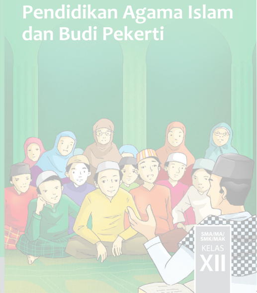

> **Deskripsi Visual:** Gambar ini adalah ilustrasi yang menampilkan sebuah kegiatan pendidikan Agama Islam dan Budi Pekerti di kelas XII SMA/MA/SMK/MAK. Gambar ini menggambarkan sekelompok siswa yang sedang berada di dalam ruangan dengan latar belakang hijau yang menunjukkan suasana serius dan mendalam. Siswa-siswa tersebut duduk bersama-sama, tampaknya sedang mendengarkan penjelasan dari guru yang berdiri di depan mereka. Guru tersebut sedang memegang buku dan tampaknya sedang memberikan materi pendidikan kepada siswa-siswanya.

Elemen-elemen utama dalam gambar ini meliputi:
1. Siswa-siswa yang duduk bersama-sama.
2. Guru yang berdiri di depan siswa.
3. Latar belakang hijau yang menunjukkan suasana serius dan mendalam.
4. Guru sedang memegang buku dan memberikan materi pendidikan.

Teks, angka, atau label penting yang terlihat dalam gambar ini adalah "Pendidikan Agama Islam dan Budi Pekerti", "SMA/MA/SMK/MAK", dan "KELAS XII". Informasi kunci yang dapat diambil pembaca adalah bahwa gambar ini menunjukkan kegiatan pendidikan Agama Islam dan Budi Pekerti di kelas XII SMA/MA/SMK/MAK, dengan siswa-siswa yang sedang mendengarkan penjelasan dari guru.

 

---
## 📄 Halaman 2

### Hak Cipta © 2018 pada Kementerian Pendidikan dan Kebudayaan Dilindungi Undang-Undang

Disklaimer: Buku ini merupakan buku siswa yang dipersiapkan Pemerintah dalam rangka implementasi Kurikulum 2013. Buku siswa ini disusun dan ditelaah oleh berbagai pihak di bawah koordinasi Kementerian Pendidikan dan Kebudayaan, dan dipergunakan dalam tahap awal penerapan Kurikulum 2013. Buku ini merupakan 'dokumen hidup' yang senantiasa diperbaiki, diperbarui, dan dimutakhirkan sesuai dengan dinamika kebutuhan dan perubahan zaman.  Masukan  dari  berbagai  kalangan  yang  dialamatkan  kepada  penulis  dan  laman http://buku.kemdikbud.go.id  atau  melalui  email  buku@kemdikbud.go.id  diharapkan  dapat meningkatkan kualitas buku ini.

### Katalog Dalam Terbitan (KDT)

Indonesia. Kementerian Pendidikan dan Kebudayaan.

Pendidikan Agama Islam dan Budi Pekerti/Kementerian Pendidikan dan Kebudayaan.-- . Edisi Revisi Jakarta: Kementerian Pendidikan dan Kebudayaan, 2018. viii, 304 hlm. : ilus. ; 25 cm.

Untuk SMA/MA/SMK/MAK Kelas XII ISBN  978-602-427-042-1 (jilid lengkap) ISBN  978-602-427-045-2 (jilid 3)

1. Islam -- Studi dan Pengajaran II. Kementerian Pendidikan dan Kebudayaan

I. Judul

600

Penulis

:  HA. Sholeh Dimyathi dan Feisal Ghozali.

Penelaah

:  Muh. Saerozi dan Bahrissalim.

Pe- review

:  Ali Wiyoto

Penyelia Penerbitan :  Pusat Kurikulum dan Perbukuan, Balitbang, Kemendikbud.

Cetakan Ke-1, 2015 (ISBN 978-602-282-404-6) Cetakan Ke-2, 2018 (Edisi Revisi) Disusun dengan huruf Myriad Pro, 11 pt.

 

---
## 📄 Halaman 3

### Kata Pengantar

Misi  utama  pengutusan  Nabi  Muhammad  saw.  adalah  untuk  menyempurnakan keluhuran  akhlak.  Sejalan  dengan  itu,  dijelaskan  dalam al-Qurãn bahwa  Beliau  diutus hanyalah  untuk  menebarkan  kasih  sayang  kepada  semesta  alam.  Dalam  struktur  ajaran Islam, pendidikan akhlak adalah yang terpenting. Penguatan akidah adalah dasar. Sementara, ibadah adalah sarana, sedangkan tujuan akhirnya adalah pengembangan akhlak mulia. Nabi Muhammad saw. Bersabda,' Mukmin yang paling sempurna imannya adalah yang paling baik akhlaknya ' (HR.Abu Daud dan Imam Ahmad). Nabi Muhammad saw. juga bersabda,' Orang yang paling baik Islamnya adalah yang paling baik akhlaknya '(HR.Imam Ahmad). Dengan kata lain, hanya akhlak mulia yang dipenuhi dengan sifat kasih sayang sajalah yang dapat menjadi bukti kekuatan akidah dan kebaikan ibadah. Oleh karena itu, Pendidikan Agama Islam dan Budi Pekerti diorientasikan kepada akhlak yang mulia dan kepada pembentukan peserta didik yang penuh kasih sayang. Bukan hanya penuh kasih sayang kepada sesama muslim, melainkan kepada semua manusia, bahkan kepada segenap unsur alam semesta. Hal ini selaras dengan Kurikulum 2013 yang dirancang untuk mengembangkan kompetensi yang  utuh  antara pengetahuan,  keterampilan,  dan  sikap. Peserta didik tidak  hanya diharapkan bertambah pengetahuan dan wawasannya, tetapi meningkat juga kecakapan dan keterampilannya serta semakin mulia karakter dan kepribadiannya.

Buku Pendidikan  Agama Islam dan Budi Pekerti kelas XII ini ditulis dengan semangat seperti tersebut di atas. Pembelajarannya dibagi dalam kegiatan-kegiatan keagamaan yang harus dilakukan peserta didik dalam usaha memahami pengetahuan agamanya. Akan tetapi, tidak berhenti dengan pengetahuan agama sebagai hasil akhir. Pemahaman tersebut harus diaktualisasikan  dalam  tindakan  nyata  dan  sikap  keseharian  yang  sesuai  dengan  tuntutan agamanya,  baik  dalam  bentuk  ibadah  ritual  yang  berhubungan  dengan  pencipta  maupun ibadah yang mengatur hubungan antara sesama dalam sosial kemasyarakatan.

Untuk itu, sebagai buku pendidikan agama yang mengacu pada kurikulum berbasis kompetensi, rencana pembelajarannya dinyatakan dalam bentuk aktivitas-aktivitas. Urutan pembelajaran dirancang dalam kegiatan-kegiatan keagamaan yang harus dilakukan peserta didik.  Dengan  demikian,  materi  buku  ini  bukan  hanya  untuk  dibaca,  didengar,  ataupun dihafal baik oleh peserta didik maupun guru, melainkan untuk menuntun apa yang harus dilakukan peserta didik bersama guru dan teman-teman sekelasnya dalam memahami dan menjalankan ajaran agamanya.

Buku  ini  menjabarkan  usaha  minimal  yang  harus  dilakukan  peserta  didik  untuk mencapai kompetensi yang diharapkan. Sesuai  dengan pendekatan yang digunakan dalam Kurikulum 2013, peserta didik diajak berani untuk mencari sumber belajar lain yang tersedia dan terbentang luas disekitarnya. Peran guru agama dalam meningkatkan dan menyesuaikan daya serap peserta didik dengan ketersediaan kegiatan-kegiatan lain yang sesuai dan relevan yang  bersumber  dari  lingkungan  sosial  dan  alam.  Sebagai  edisi  revisi,  buku  ini  sangat terbuka terhadap masukan dan akan terus diperbaiki dan disempurnakan. Untuk itu, kami mengundang para pembaca untuk memberikan kritik, saran, dan masukan guna perbaikan dan penyempurnaan edisi berikutnya. Atas kontribusi tersebut, kami ucapkan terima kasih. Mudah-mudahan  kita  dapat  memberikan  yang  terbaik  bagi  kemajuan  dunia  pendidikan dalam rangka mempersiapkan generasi seratus tahun Indonesia Merdeka (2045).

Tim Penulis

 

---
## 📄 Halaman 4

### Daftar Isi

 

---
## 📄 Halaman 9

Sumber: image bank vol. 3

### Bab 1 Semangat Beribadah dengan Meyakini Hari Akhir

### Peta Konsep

---
**🖼️ Gambar/Diagram**

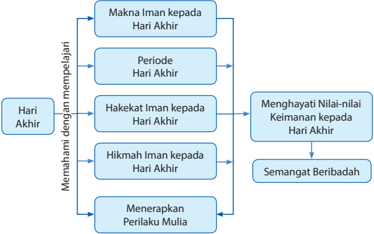

> **Deskripsi Visual:** Gambar ini adalah diagram yang menunjukkan struktur pemahaman tentang Iman kepada Hari Akhir. Diagram ini dibagi menjadi dua bagian utama: "Memahami dengan mempelajari" dan "Menghayati Nilai-nilai Keimanan kepada Hari Akhir". 

Pertama, dalam bagian "Memahami dengan mempelajari", ada lima elemen utama yang disebutkan: Makna Iman kepada Hari Akhir, Periode Hari Akhir, Hakekat Iman kepada Hari Akhir, Hikmah Iman kepada Hari Akhir, dan Menerapkan Perilaku Mulia. Setiap elemen ini memiliki ikatan horizontal yang menghubungkannya ke bagian "Menghayati Nilai-nilai Keimanan kepada Hari Akhir".

Kedua, dalam bagian "Menghayati Nilai-nilai Keimanan kepada Hari Akhir", ada tiga elemen utama: Semangat Beribadah, Hikmah Iman kepada Hari Akhir, dan Menerapkan Perilaku Mulia.

Teks, angka, atau label penting yang terlihat dalam diagram ini adalah nama-nama elemen yang disebutkan dalam setiap bagian, seperti "Makna Iman kepada Hari Akhir", "Periode Hari Akhir", dll. Informasi kunci yang dapat diambil pembaca melalui diagram ini adalah bahwa pemahaman tentang Iman kepada Hari Akhir melibatkan pemahaman makna, periode, hakekat, hikmah, dan aplikasi perilaku mulia, serta penghayatan nilai-nilai keimanan tersebut.

 

---
## 📄 Halaman 10

Amati gambar-gambar berikut. Kemudian jelaskan makna yang dikandungnya, yang terkait dengan tema pelajaran!

---
**🖼️ Gambar/Diagram**

> **Deskripsi Visual:** Gambar ini adalah ilustrasi yang menunjukkan beberapa elemen penting yang berkaitan dengan hukum dan keadilan. Gambar tersebut melukiskan sekelompok objek yang terdiri dari dua buku, selembar kertas, selembar kertas berwarna merah, selembar kertas berwarna biru, selembar kertas berwarna hijau, selembar kertas berwarna ungu, selembar kertas berwarna putih, selembar kertas berwarna coklat, selembar kertas berwarna oranye, selembar kertas berwarna merah, selembar kertas berwarna biru, selembar kertas berwarna hijau, selembar kertas berwarna ungu, selembar kertas berwarna putih, selembar kertas berwarna coklat, selembar kertas berwarna oranye, selembar kertas berwarna merah, selembar kertas berwarna biru, selembar kertas berwarna hijau, selembar kertas berwarna ungu, selembar kertas berwarna putih, selembar kertas berwarna coklat, selembar kertas berwarna oranye, selembar kertas berwarna merah, selembar kertas berwarna biru, selembar kertas berwarna hijau, selembar kertas berwarna ungu, selembar kertas berwarna putih, selembar kertas berwarna coklat, selembar kertas berwarna oranye, selembar kertas berwarna merah, selembar kertas berwarna biru, selembar kertas berwarna hijau, selembar kertas berwarna ungu, selembar kertas berwarna putih, selembar kertas berwarna coklat, selembar kertas berwarna oranye, selembar kertas berwarna merah, selembar kertas berwarna biru, selembar kertas berwarna hijau, selembar kertas berwarna ungu, selembar kertas berwarna putih, selembar kertas berwarna cok

 

---
## 📄 Halaman 11

### Membuka Relung Kalbu

Perlukah  bukti  tentang  adanya  hari  akhir? Kehidupan sesudah mati pasti adanya. Bukankah makhluk yang termulia adalah makhluk yang berjiwa? Bukankah yang termulia di antara mereka adalah yang memiliki  kehendak  dan  kebebasan  memilih? Kemudian  yang  termulia  dari  kelompok  ini adalah  yang  mampu  melihat  jauh  ke  depan, serta mempertimbangkan dampak kehendak dan pilihan-pilihannya.

Demikian logika kita berkata. Dari sini pula jiwa manusia memulai pertanyaanpertanyaan baru. Sudahkah manusia melihat dan  merasakan  akibat  perbuatan-perbuatan mereka yang didasarkan oleh kehendak dan pilihan mereka itu? Sudahkah yang berbuat  baik  memetik  buah  perbuatannya? Sudahkah yang berbuat jahat menerima nista kejahatannya? Jelas tidak, atau belum, bahkan alangkah banyak manusia-manusia baik yang teraniaya, dan sementara banyak pula orangorang jahat yang menikmati gemerlap dunia.

Karena itu, demi tegaknya keadilan, harus ada satu kehidupan baru ketika semua pihak akan memperoleh secara adil dan sempurna hasilhasil  perbuatan yang didasarkan atas pilihan masing-masing. Untuk itu, hanya orang-orang yang beriman kepada hari akhirlah yang akan mengisi  kegiatan  hidupnya  di  dunia  dengan

'Ketika Tuhanmu mengeluarkan keturunan anak-anak Adam dari sulbi mereka dan Allah Swt. mengambil kesaksian terhadap jiwa mereka (seraya berfirman): 'Bukankah Aku ini Tuhanmu?' mereka menjawab: 'Betul (Engkau Tuhan kami), kami menjadi saksi.' (Kami lakukan yang demikian itu) agar di hari kiamat kamu tidak mengatakan: 'Sesungguhnya kami adalah orang-orang yang lengah terhadap ini (ke-Esaan Tuhan)' ( Q.S. al-A'r āf/7:172)

kegiatan yang baik dan bermanfaat, baik bagi dirinya maupun orang lain. Karena mereka percaya bahwa apa yang telah diperbuatnya akan dimintai pertanggung jawaban oleh Allah Swt. di akhirat kelak.

Banyak ayat al-Qur'±n yang menjelaskan hakikat di atas, antara lain Q.S Táhá/20:15 'Sesungguhnya saat (hari kiamat) akan datang. Aku dengan sengaja merahasiakan (waktu)-nya. Agar setiap jiwa diberi balasan (dan ganjaran) sesuai hasil usahanya' . (Q.S Tãhã/20:15) .

 

---
## 📄 Halaman 12

### Mengkritisi Sekitar Kita

Cermati pemikiran dan karya Amru Khalid dalam buku Revolusi Diri berikut ini! Kemudian, beri tanggapan kritis terkait dengan tema!

### Gempa yang Menjadi Rahmat

Suatu  hari  Anas  mengunjungi    Aisyah. 'Terangkan  kepadaku  tentang  gempa? Tanyanya. Gempa terjadi bila maksiat merajalela, perzinaan,  minuman keras, dan dosa-dosa besar dianggap biasa. Allah Swt. pun memerintahkan, timpakan gempa kepada mereka', jelas Aisyah. Apakah ia merupakan azab? Tanyanya lagi. 'Tidak! Ia rahmat dan peringatan bagi kaum muslimin, sementara bagi mereka yang kafir, itu adalah azab dan siksa!' , tegas Aisyah.

Rasulullah saw. bersabda; 'Kalian harus mewaspadai dosa-dosa kecil, kelak ia akan menumpuk dan membinasakan kalian' (H.R. Ahmad).

Anas bin Malik berkata, 'Kalian telah banyak melakukan dosa kecil, yang di masa Rasulullah saw. itu merupakan dosa besar yang bisa mengahancurkan'

Allah Swt. berfirman dalam Q.S. an-N µ r/24:15:

"(Ingatlah)  di  waktu  kamu  menerima  berita  bohong  itu  dari  mulut  ke  mulut  dan kamu katakan  dengan  mulutmu  apa  yang  tidak  kamu  ketahui  sedikit,  dan  kamu menganggapnya suatu yang ringan saja. Padahal dia di sisi Allah Swt. adalah besar' .

Bila ini terjadi dua puluh tahun sepeninggal Rasulullah saw., bagaimana dengan lima belas abad sesudahnya atau saat sekarang?

Kalian harus melakukan perubahan pada diri kalian masing-masing. Pertolongan tidak datang begitu saja dari langit. Inilah hukum yang telah Allah Swt. janjikan kepada setiap manusia dan merupakan sunnatullãh.

### Aktivitas Siswa

Cermati masalah-masalah sosial yang ada di sekitar kalian, berkaitan dengan keimanan  kepada  Hari  Akhir.  Kemudian,  tanggapi  dengan  kritis  dari  sudut pandang kalian!

4

 

---
## 📄 Halaman 13

### Memperkaya Khazanah

### A.    Tadarus al-Qurān 5-10  Menit sesuai Tema

Kegiatan  tadarus al-Qurān bertujuan  menumbuhkan  keinginan  peserta  didik untuk mentadabburi dan mengetahui manfaatnya, yaitu faham makna al-Qurān dan mengetahui rahasia keagunganya. Dengan mengetahui manfaatnya, peserta didik diharapkan dapat melaksanakan dan mengikutinya karena al-Qurān sudah membekas  dalam  jiwa  ( Q.S.  Thaha /20:112-113, Q.S. al-Baqarāh /2:38),  sehingga peserta didik akan memperoleh ketenteraman dan kebahagiaan ( Q.S. Taha /20:23).

Oleh karena itu, sebelum kalian memulai pembelajaran, lakukan tadarus al-Qurān secara tartil selama 5-10 menit di kelompok masing-masing yang dipimpin oleh ketua  kelompok.  Ayat-ayat  yang  dibaca  akan  ditentukan  oleh  Bapak/Ibu  guru kalian.

### B.    Menganalisis dan Mengevaluasi Makna Iman kepada Hari Akhir

Ayat- ayat yang telah kalian baca di atas memuat beberapa hal terkait dengan peristiwa  Hari  Akhir.  Dimulai  dengan  sumpah  akan  kepastian  datangnya  Hari Akhir,  kemudian  menjelaskan  beberapa  peristiwa  yang  akan  terjadi  pada  hari itu. Lebih lanjut mari kita pelajari apa hari Kiamat itu, dan peristiwa apa saja yang mengiringinya, termasuk tanda-tandanya!

Hari  Akhir  menurut  bahasa  artinya  'Hari  Penghabisan' ( Q.S.  al-Baqar ā h /2:177) , juga disebut 'Hari Pembalasan' (Q.S. al-Fātihah/1:4) . Adapun menurut istilah, Hari Akhir adalah hari mulai hancurnya alam semesta berikut isinya dan berakhirnya kehidupan semua makhluk Allah Swt. Hari Akhir juga disebut hari Kiamat, yaitu hari penegakan hukum Allah Swt. yang seadil-adilnya (Q.S. al-Mumtahanah/60:3).

Kebenaran akan datangnya Hari Akhir dapat ditemukan melalui kajian ayat-ayat al-Qur' ± n ,  ilmu  pengetahuan, dan panca indera. Melalui kajian akan kebenaran adanya Hari Akhir, kalian dapat menghayati akan nilai-nilai keimanan kepada Hari Akhir. Perhatikan Q.S. al-'Anbiy±/21:97.

Berikut  disajikan  informasi  terkait  dengan  Hari  Akhir  menurut  ketiga  sudut pandang tersebut.

Mari kalian pelajari bersama!

 

---
## 📄 Halaman 14

### 1. Hari Akhir Menurut al-Qur'ãn

Hari  Akhir  atau  Hari  Kiamat  menurut al-Qur'±n dapat  dibagi  menjadi  dua, yaitu sebagai berikut.

### a. Kiamat Sugrā (Kecil)

Kiamat Sugr± adalah peristiwa datangnya kematian bagi semua makhluk termasuk manusia yang bersifat lokal dan individu. Firman Allah Swt. dalam Q.S. ² li Imrãn/3:185 :

Artinya:   ' Tiap-tiap yang berjiwa akan merasakan mati. Dan Sesungguhnya pada  hari kiamat sajalah  disempurnakan  pahalamu,  barang  siapa dijauhkan dari  neraka  dan  dimasukkan  ke  dalam  surga,  maka  sungguh ia telah beruntung. Kehidupan dunia itu tidak lain hanyalah kesenangan yang memperdayakan ' .

Sebelum  terjadi  hari  kiamat,  mereka  yang  telah  mati  mengalami proses  awal  kehidupan  akhirat  yang  disebut  alam barzakh (Q.S.  arR µ m/30:55-56) . Barzakh adalah  alam  yang  menjadi  batas  antara  alam dunia dan alam akhirat. Pada masa itu roh manusia sudah menyadari akan  kebenaran  janji  Allah  Swt. (Q.S.  al-Mu'min µ n/23:99-100) ,  bahkan kepada mereka yang jahat sudah diperlihatkan Neraka dan siksaannya (Q.S. al-Mu'min/40:45-46) .

Peristiwa-peristiwa yang harus diimani yang akan terjadi sesudah mati antara lain sebagai berikut.

- Fitnah kubur,  yaitu beragam pertanyaan yang diajukan kepada orang yang  meninggal  tentang Tuhannya,  agamanya,  nabinya,  imannya, dan kiblatnya.
- Siksa  dan  nikmat  kubur:  siksa  kubur  diperuntukkan  bagi  orang yang  zalim,  munafik,  kafir,  dan  musyrik (Q.S.  al-An'ām/6:93,  Q.S.  alMu'min/40:46,  Q.S.  Fu ¡¡ ilat/41:30,  Q.S.  al-Ahqāf/46:83-89) . 'Nikmat kubur diperuntukkan bagi orang yang baik amal ibadahnya di dunia ' (Q.S. ²li 'Imr±n /3:169-170 dan Q.S. al-Baqarah /2:154).

 

---
## 📄 Halaman 15

### b. Kiamat Kubra (Besar)

Peristiwa berakhirnya seluruh kehidupan makhluk dan hancur leburnya alam semesta secara total dan serentak. Proses terjadinya hari kiamat tersebut  dijelaskan    oleh  Allah  Swt.  dalam  banyak  ayat,  di  antaranya dalam Q.S. at-Takwír/81:1-3:

Artinya:   ' Apabila matahari digulung, apabila bintang-bintang berjatuhan, dan apabila gunung-gunung dihancurkan ' .

Dalam Q.S. az-Zalzalah/99:1-5 dijelaskan peristiwa terjadinya kiamat dimulai  dengan  datangnya  gempa  yang  sangat  dahsyat.  Dalam Q.S. al-Qari'ah/101:1-5 dijelaskan keadaan manusia bagaikan anai-anai yang  bertebaran  dan  gunung-gunung  bagai  bulu  yang  dihamburhamburkan.

Berdasarkan ayat-ayat tersebut, peristiwa kiamat merupakan kejadian yang  sangat  hebat,  yaitu  tatkala  Malaikat  Israfil  meniup  sangkakala. Kemudian bumi diangkat, gunung-gunung dibenturkan dan terjadilah kerusakan  hebat.  Langit  pecah  bergelegar,  benda-benda  bumi  pun bertebaran  laksana  kabut.  Sementara  manusia  akan  kacau  balau kebingungan hanya Allah Swt. saja yang Maha Kekal.

### Aktivitas Siswa

- Carilah ayat-ayat al-Qur'ãn dan hadis selain yang sudah ada di buku yang menjelaskan peristiwa hari kiamat!
- Pahami  maksud  ayat-ayat al-Qur'ãn dan  hadis  tersebut  dengan  bantuan buku-buku tafsir dan buku-buku hadis!
- Presentasikan hasil kajian kalian di depan kelas!

### 2. Hari Kiamat Menurut Ilmu Pengetahuan

### a. Menurut Geologi

Bumi  terjadi  dari  gas  yang  berputar (chaos  catastrope) .  Setelah  diam gas  itu  menjadi  dingin,  maka  gas  yang  berat  mengendap  ke  bawah, dan yang ringan berada di atas. Melalui proses evolusi yang lama sekali, gas bagian luar mengeras menjadi batu, kerikil, pasir, dan sebagainya, sedangkan  bagian  tengah  masih  panas.  Zat  panas  bercampur  lava,

 

---
## 📄 Halaman 16

lahar,  batu,  dan  pasir  panas.  Bumi  beredar  karena  adanya  daya  tarik matahari terhadap bumi berkurang. Akibatnya bumi akan bergeser dari matahari, sehingga putaran bumi semakin cepat dan akan mengalami nasib seperti meteor (menyala/hancur).

### b. Menurut Teori Fisika

Letak matahari adalah 149.597.870, 7 km,  jauhnya dari bumi, sinar matahari sampai ke bumi selama 8 menit 20 detik. Garis tengah matahari = 1,4 juta km dan luas permukaannya 616 × 1010 km = 622.160 km. Menurut ahli fisika  energi  matahari  dipancarkan  ke  angkasa  dan  sekitarnya  5,7 × 1027 kalori = 5.853,9 kalori/menit dan mampu menyala 50 milyar tahun dengan panas 15 juta derajat celcius.

Kalau suatu ketika matahari tidak muncul atau cahayanya redup karena tenaga/sinarnya habis, maka tidak ada angin dan awan yang berakibat hujan  tidak  akan  turun.  Selanjutnya  gunung-gunung  akan  meletus, ombak bergulung-gulung, air laut naik sehingga hancurlah bumi ini.

### 3. Bukti Indrawi Terjadinya Hari Akhir

Imam Ath Thabari dan Ibnu Katsir berpendapat bahwa telah diperlihatkan peristiwa-peristiwa yang menakjubkan di dunia sebagaimana berikut ini.

- Peristiwa  pembunuhan  yang  dipermasalahkan  oleh  Bani  Israel,  akan dihidupkan kembali oleh Allah Swt. hanya dengan perantaraan daging sapi yang dipukulkan ke tubuh orang yang terbunuh (Q.S. al-Baqarah /2:72-73).
- Peristiwa Nabi Ibrahim dan burung-burung yang dicincangnya kemudian  diletakkan  di  tiap-tiap  bagian  di  atas  bukit  lalu  Allah  Swt. berfirman: 'Panggillah! niscaya mereka datang kepadamu dengan segera' (Q.S. al-Baqarah /2:260) .
Kedua  informasi  di  atas  telah  dijelaskan  di  dalam al-Qur'±n ,  tetapi  bukan merupakan  berita  langsung  bahwa  Hari  Akhir  akan  datang,  melainkan informasi historis (sejarah) tentang peristiwa yang pernah terjadi dan menjadi bukti secara indrawi bahwa kiamat pasti datang.

### Aktivitas Siswa

- Temukan fenomena alam lainnya yang menguatkan bukti kebenaran hari kiamat, baik dalam bentuk video maupun gambar!
- Presentasikan di hadapan kelompok lain untuk mendapat tanggapan!

 

---
## 📄 Halaman 17

### C.    Periode Hari Akhir

Setelah  alam  semesta  hancur  secara  total dan  kehidupan  semua  makhluk  Allah  Swt. berakhir,  maka  mulailah  manusia  menjalani tahapan kehidupan baru dan proses menuju alam baqa'. Tahapan tersebut dapat dijelaskan sebagai berikut.

### 1. Yaumul Ba'atş

Sesudah  hancur  dan  musnahnya  alam semesta  termasuk  manusia,  terjadilah hari kebangkitan. Hari kebangkitan adalah  proses  dibangkitkannya  seluruh makhluk  dari  alam  kubur.  Firman  Allah Swt.:

'Pada hari ketika mereka dibangkitkan Allah Swt. semuanya, lalu diberitahukan-Nya kepada mereka apa saja yang mereka telah kerjakan,  dan  Allah  Swt.  mengumpulkan semua  amal  perbuatan  mereka  padahal mereka  sudah  melupakannya  dan  Allah Swt.  menyaksikan  atas  segala  sesuatu.' (Q.S. al-Muj ± dalah/ 58:6 ).

### 2. Yaumul Hasyr

Yaumul  Hasyr yaitu  hari  berkumpulnya manusia setelah dibangkitkan dari kuburnya  masing-masing.    Kemudian semua manusia digiring ke tempat yang

---
**🖼️ Gambar/Diagram**

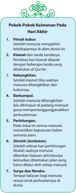

> **Deskripsi Visual:** Gambar ini adalah ilustrasi yang menunjukkan pokok-pokok keimanan pada hari Akhir. Gambar tersebut terdiri dari beberapa elemen utama yang terkait dengan konsep keimanan manusia pada akhir masa hidup mereka.

1. **Pertama**: Fitnah kubur. Ini menunjukkan bahwa setelah manusia meninggal, fitnah atau kebencian akan datang dari berbagai sumber.
   
2. **Kedua**: Kiamat. Ini menunjukkan bahwa setelah manusia meninggal, kiamat akan datang dan akan menguji keimanan mereka.

3. **Ketiga**: Keabadian. Ini menunjukkan bahwa setelah kiamat, keabadian akan datang dan manusia akan dibangkitkan kembali.

4. **Keempat**: Berkurban. Ini menunjukkan bahwa setelah manusia dibangkitkan, mereka akan dibangkitkan dalam keadaan baik atau buruk.

5. **Kelima**: Perhitungan. Ini menunjukkan bahwa setelah manusia dibangkitkan, mereka akan dibangkitkan dalam keadaan yang sesuai dengan hukum alam semesta.

6. **Keenam**: Shirkah (Jembatan). Ini menunjukkan bahwa setelah manusia dibangkitkan, mereka akan dibangkitkan dalam keadaan yang sesuai dengan hukum alam semesta.

7. **Ketujuh**: Surga dan Neraka. Ini menunjukkan bahwa setelah manusia dibangkitkan, mereka akan dibangkitkan dalam keadaan yang sesuai dengan hukum alam semesta.

Informasi kunci yang dapat diambil pembaca adalah bahwa setelah manusia meninggal, mereka akan dibangkitkan kembali dan akan dibangkitkan dalam keadaan yang sesuai dengan hukum alam semesta. Setiap elemen ini membantu menjelaskan bagaimana keimanan manusia akan diuji dan dibangkitkan kembali dalam keadaan yang sesuai dengan hukum alam semesta.

luas yaitu Padang Mahsyar (tempat berkumpul). Firman Allah Swt.:

'Dan (ingatlah) akan hari (yang ketika itu) Kami perjalankan gunung-gunung dan  kamu  akan  dapat  melihat  bumi  itu  datar  dan  Kami  kumpulkan  seluruh manusia,  dan  tidak  Kami  tinggalkan  seorang  pun  dari  mereka.'  (Q.S.  alKahfi/ 18:47 ).

### 3. Buku Catatan

Setiap manusia di alam mahsyar mempunyai buku catatan (kitab perjalanan hidup) yang sudah dicatat Malaikat Raqīb dan ' Atīd .  Kitab catatan ini berisi semua perbuatan dan perkataan manusia sewaktu hidup di dunia. Firman Allah Swt.:

 

---
## 📄 Halaman 18

' Dan diletakkan kitab, lalu akan kamu lihat orang-orang bersalah ketakutan terhadap apa yang tertulis di dalamnya dan mereka berkata  'Wahai celaka kami, kitab apakah ini yang tidak melupakan yang kecil dan tidak pula yang besar, melainkan  ia  mencatat  semuanya.  Mereka  memperoleh  di  hadapan  mereka apa-apa yang telah mereka kerjakan. Dan Tuhanmu tidak akan menganiaya seseorang pun . '  ( Q.S. al-Kahfi /18:49).

### 4. Yaumul ¦ isãb dan M ³ z ± n

Yaumul Hisab adalah hari ketika Allah Swt. memperlihatkan semua amalan di akhirat untuk di hisab . Segala dosa besar dan kecil dihitung dengan seksama dan  teliti.  Ketika  amalan  mereka  dihitung,  anggota  tubuh  mereka  ikut menjadi saksi. Firman Allah Swt.:

'Pada  hari  itu  lidah,  tangan,  dan  kaki  masing-masing  menjadi  saksi  atas perbuatan yang telah mereka kerjakan.' (Q.S. an-N µ r/ 24:24 ).

Tahapan selanjutnya adalah Mizan. Mizan adalah timbangan yang adil berisi kebajikan dan kejahatan yang telah diperbuat setiap manusia. Setiap orang ditimbang amalnya dengan seadil-adilnya. Firman Allah Swt.:

'Dan Kami letakkan timbangan yang tepat (adil) pada hari kiamat dan tidak seorang  pun  dirugikan  walau  sedikit.  Dan  jika  amalan  itu  hanya  seberat zarrah pasti kami berikan (pahalanya). Dan  cukuplah kami saja yang memperhitungkannya.' (Q.S. al-Anbiy ± '/ 21:47 ).

### 5. As-Sira ¯

A ¡ -¢ irā ¯ adalah  jembatan  yang  terbentang  di  atas  neraka  menuju  surga. Mudah atau sulitnya  melewati A ¡ -¢ irā ¯ itu  tergantung  kepada  amal  setiap manusia. Rasulullah saw. bersabda:

'Terbentanglah  jembatan  (A ¡ -¢ irā ¯ )  itu  di  antara  dua  tepi  Neraka  Jahanam . ' (H.R. Muslim).

### 6. Yaumul Jaz ± '

Yaumul Jaza' yaitu suatu hari ketika semua manusia akan menerima balasan Allah Swt. (Jaz ± ').  Balasan yang diterima seseorang sesuai dengan amalnya selama ia hidup di dunia. Firman Allah Swt. :

'Pada hari itu, tiap jiwa diberi balasan dengan apa yang telah diusahakannya. Tidak  seorang  pun  dirugikan  pada  hari  tersebut.  Sesungguhnya  Allah  Swt. sangat cepat perhitungan-Nya.' (Q.S al-Mukmin/40:17).

### 7. Balasan Perbuatan Baik dengan Surga

Setelah seluruh manusia dihisab dan melalui timbangan, mereka diberikan balasan  yang  sesuai  dengan  amal  perbuatannya.  Pada  saat  itu  terbagilah

 

---
## 📄 Halaman 19

manusia  menjadi  dua  golongan.  Adapun  bagi  mukmin  yang  bertakwa kepada Allah Swt. pasti akan menerima balasan yang setara, yaitu berupa surga.  Surga  disediakan  Allah  Swt.  sebagai  karunia  kepada  hamba-Nya (Perhatikan! Q.S. al-Hāqqah/69:21-24), (Q.S. al-Wāqi'ah/56:8-40) .

### 8. Balasan Perbuatan Buruk dengan Neraka

Adapun  orang  yang  selama  hidup  di  dunia  lebih  banyak  mengerjakan perbuatan jahat, maksiat, tercela, dan kafir terhadap Allah Swt. kufur kepada ajaran  dan  nikmat  Allah  Swt.,  maka  akan  menerima  balasan  yang  sesuai dengan apa yang telah dikerjakannya pula.

Sebagian  kegetiran  dan  kerasnya  siksaan  neraka,  digambarkan  melalui firman Allah Swt. dalam Q.S. al-Gāsyiyah/88:4-7: ' Memasuki api yang sangat panas (neraka), diberi minuman dengan  air dari sumber yang sangat panas. Mereka tidak memperoleh makanan selain dari pohon yang berduri yang tidak menggemukkan dan tidak pula menghilangkan lapar . '

### Aktivitas Siswa

- Cermati  kembali  tahapan  Hari  Akhir  di  atas.  Kemudian,  tulislah  sebuah renungan singkat (dalam bentuk  puisi religius atau yang lain) yang memuat doa  agar  Allah  Swt.  memberikan  kemudahan  dalam  melalui  tahapantahapan Hari Akhir sehingga berakhir dengan surga!
- Bacakan hasil kerja kalian di depan kelas!

### D.  Hakikat Beriman kepada Hari Akhir

Iman kepada hari akhir merupakan rukun iman yang kelima yang harus diyakini oleh setiap umat Islam. Segala perbuatan yang dilakukan oleh setiap manusia, baik maupun buruk akan dipertanggungjawabkan di akhirat kelak. Oleh sebab itu,  keimanan  kepada  Hari  Akhir  hendaknya  dijadikan  landasan  utama  untuk menyadarkan diri agar selalu taat kepada ajaran Allah Swt.

Banyak ayat dan hadis yang memerintahkan kita agar meyakini datangnya Hari Akhir, di antaranya adalah firman Allah Swt. pada Q.S. al-Baqarah /2:4 berikut:

Artinya: 'dan mereka yang beriman kepada  (al-Qurān) yang diturunkan kepadamu (Muhammad) dan (kitab-kitab) yang telah diturunkan sebelum engkau, dan mereka yakin akan adanya akhirat ' .

 

---
## 📄 Halaman 20

Kemudian, dalam percakapan Rasulullah saw. dengan malaikat Jibril yang panjang tentang iman, Islam, dan I¥s±n , beliau bersabda (ketika ditanya tentang iman):

Artinya: ' Beliau  menjawab:  'Kamu  beriman  kepada  Allah,  Malaikat-Malaikat-Nya, kitab-kitab-Nya, para Rasul-Nya, hari akhir, dan takdir baik dan buruk' . (H.R. Muslim).

Dalam ayat di atas ditegaskan bahwa meyakini adanya Hari Akhir merupakan salah satu ciri orang beriman. Adapun dalam penggalan hadis di atas, Rasulullah saw. menyebutkan bahwa Hari Akhir sebagai salah satu perkara yang wajib diyakini, yang kemudian disebut rukun iman.

Iman  kepada  Hari  Akhir  berarti  percaya  dengan  penuh  keyakinan  bahwa kehidupan yang kekal hanyalah di akhirat.

### Aktivitas Siswa

- Carilah  ayat-ayat al-Qur' ± n dan  hadis  selain  yang  sudah  ada  di  buku  ini yang memuat perintah beriman kepada Hari Akhir!
- Pahami  baik-baik  ayat-ayat al-Qur' ± n dan  hadis-hadis    tersebut  dengan bantuan berbagai buku tafsir atau buku hadis yang kalian dapatkan!
- Presentasikan temuan kalian di depan kelas untuk ditanggapi!

### E.   Hikmah Beriman kepada Hari Akhir

Semua ciptaan Allah Swt. yang lahir di dunia mempunyai  hikmah  karena  Allah  Swt.  tidak menjadikan sesuatu sia-sia belaka tanpa tujuan dan hikmah di dalamnya. Di bawah ini beberapa hikmah iman kepada Hari Akhir.

- Muncul rasa kebencian yang dalam kepada kemaksiatan dan kebejatan moral yang mengakibatkan murka Allah Swt.  di dunia dan di akhirat.
- Menyejukkan dan menggembirakan hati orang-orang mukmin dengan segala kenikmatan  akhirat  yang  sama  sekali tidak dirasakan di alam dunia ini.
Rasulullah saw. bersabda: 'Siapa saja yang beriman kepada Allah Swt.  dan Hari Akhir hendaknya ia menghormati tamunya, siapa saja yang beriman kepada Allah Swt. dan Hari Akhir hendaknya ia  menyambung tali silaturrahim, dan siapa saja yang beriman kepada Allah dan Hari Akhir hendaknya ia berkata yang baik atau diam' (H.R.Al-Bukhari dan Muslim).

 

---
## 📄 Halaman 21

- Senantiasa  tertanam  kecintaan  dan  ketaatan  terhadap  Allah  Swt.  dengan mengharapkan mau'nah-Nya pada hari itu.
- Senantiasa termotivasi untuk beramal baik dengan ikhlas.
- Senantiasa menghindari niat-niat yang buruk apalagi melaksanakannya;
- Menjauhkan  diri  dari  asumsi-asumsi  yang  mengkiaskan    apa  yang  ada  di dunia ini dengan apa yang ada di akhirat.

### Aktivitas Siswa

Pernahkah terpikir dalam benak kalian bahwa peradilan manusia pada hari kiamat juga memiliki kaitan erat dengan waktu. Apakah kalian tidak percaya ? Coba kalian cermati firman Allah Swt. pada orang kafir dalam Q.S. F ± tir/35:37.

Allah  Swt.  telah  memberikan  umur  dan  waktu  yang  cukup,  dan  Allah  Swt. menyebut  mereka  orang-orang  yang dzalim .  Mereka  yang  mendzalimi  diri sendiri  dengan  telah  menyia-nyiakan  usia  karena  tidak  mempergunakan kesempatan dengan baik. Renungkan pula hadis berikut. Pada hari kiamat, tidak ada seorang pun yang diperkenankan meninggalkan posisinya, kecuali setelah ditanya tentang lima perkara; umur, masa muda, kekayaan, dan ilmu pengetahuan  (H.R.  al-Tirmidzi).  Secara  khusus  masa  muda  disinggung  dari hadis  di  atas,  meskipun  sudah  termasuk  dalam  pertanyaan  tentang  umur, namun mengingat pentingnya fase ini secara terpisah. (Disadur dari Revolusi Diri karya  Amru Khalid)

Bagaimana  kalian  menghabiskan  hari-hari  kalian?  Apa  yang  kalian  lakukan pada perjalanan waktu 24 jam setiap hari?

Bagaimana jawaban kalian tentang manajemen waktu? Coba beri tanggapan beserta alasannya!

### F. Menyajikan  Kaitan  antara  Beriman  kepada  Hari  Akhir  dengan Perilaku  Jujur, Bertanggung Jawab, dan Adil

Makna kemenangan dan sukses dunia dan akhirat adalah kita perlu menelusuri motif diri kita yang paling dalam. Hal-hal apakah yang mampu menggerakkan diri kita untuk melakukan hal-hal yang sangat besar, serta kemenangan apakah yang kita harapkan? Sukses itu ada yang bersifat jangka panjang dan ada yang bersifat jangka pendek. Sukses yang jangka panjang adalah kesuksesan negeri akhirat. Adapun  sukses  jangka  pendek  adalah  kesuksesan  hidup  di  dunia.  Keyakinan akan  adanya  Hari  Akhir membawa konsekuensi bahwa hidup di dunia bukanlah

 

---
## 📄 Halaman 22

akhir  dari  kehidupan,  melainkan  awal  dari  kehidupan  yang  panjang.  Siapapun orangnya  pada  akhirnya  akan  meninggal  dunia.  Sungguh  setiap  yang  berjiwa akan merasakan kematian.

Sukses yang bersifat jangka panjang adalah kesuksesan negeri akhirat, kesuksesan inilah  yang  harus  diraih  dengan  jalan  melakukan  kebiasaan  efektif  dengan melakukan  kegiatan-kegiatan  positif  dalam  kehidupan  di  dunia,  khususnya banyak melakukan amal kebaikan sesuai dengan nilai-nilai al-Qurān .

Keimanan  kepada  Hari  Akhir  juga  memiliki  keterkaitan  dengan  perilaku  jujur, bertanggung jawab, dan adil. Mengapa? Karena dengan memiliki keimanan yang teguh akan adanya Hari Akhir dan pembalasan di akhirat, akan menumbuhkan kesadaran  bahwa  semua  perbuatan  yang  dikerjakan  selama  di  dunia  akan dipertanggung jawabkan di  hadapan  Allah  Swt.  Untuk  itu,   segala  sikap   dan perilaku  kita  harus  selaras  dengan  tuntunan  agama.  Menyadari bahwa  manusia itu  sangat  kecil di hadapan kebesaran Allah Swt., sehingga  diharapkan   dapat menghilangkan   sikap   takabur  atau  sombong dalam dirinya, selalu   berusaha melakukan   amal  salih, bersikap jujur, dan menghindari perbuatan-perbuatan yang  bertentangan  dengan  norma  agama.

Allah  Swt.berfirman  yang  artinya;  ' Sungguh,  orang-orang  yang  beriman  dan mengerjakan kebajikan, mereka itu adalah sebaik-baik makhluk. Balasan mereka di sisi Tuhan mereka ialah surga 'Adn yang mengalir di bawahnya sungai-sungai; mereka kekal di dalamnya selama-lamanya. Allah Swt. rida terhadap mereka dan mereka pun rida kepada-Nya. Yang demikian itu adalah (balasan) bagi orang yang takut kepada Tuhannya. '(Q.S./98:7-8).

Jika  kalian  cermati  ayat  ini,  jelas  nyata  bagi  kita  bahwa  Allah  Swt.  memberikan predikat makhluk yang baik dan berkualitas bagi mereka yang beriman akan hari Akhir.  Selain  itu,  melaksanakan  kegiatannya/bekerja  selama  hidupnya  dengan penuh  tanggung  jawab,  adil,  dan  jujur,  Dengan  demikian,  perbuatan  baiknya selama di dunia akan dibalas di akhirat dengan surga Adn .

Dengan beriman kepada  Hari Akhir,  akan mendorong seseorang untuk melakukan kebiasaan diri dengan akhlaktul  karimah. Seperti mawas  diri, rendah  hati,  peduli kepada sesama, dan  selalu berusaha mendekatkan diri kepada Allah Swt. Hal ini dilakukan  dengan ibadah (seperti  salat)  maupun  dengan  ibadah  sosial.  Ibadah sosial, yaitu semua kegiatan  yang bermanfaat  bagi sesama dan akan termotivasi untuk selalu berperilaku jujur, bertanggung jawab, dan adil.

 

---
## 📄 Halaman 23

### Menerapkan Perilaku Mulia

Keyakinan akan adanya hari akhir dapat mengantarkan manusia untuk melakukan kegiatan-kegiatan  positif  dalam  kehidupannya.  Khususnya  banyak  melakukan amal kebaikan sesuai dengan nilai-nilai al-Qur'±n .

Dari  pembahasan  di  atas,  perilaku  yang  menggambarkan  kesadaran  beriman kepada Hari Akhir adalah sebagai berikut ini.

- Menyadari bahwa semua perbuatan selama di dunia akan dipertanggungjawabkan  di  hadapan  Allah  Swt.  Untuk  itu,  segala  sikap  dan  perilaku  kita harus selaras dengan tuntunan agama.
- Menyadari  bahwa manusia itu sangat kecil di hadapan kebesaran Allah Swt., sehingga  diharapkan  dapat  menghilangkan  sikap  takabur  atau  sombong dalam dirinya;
- Selalu berusaha melakukan amal saleh dan menghindari semua perbuatan yang bertentangan dengan norma agama;
- Membiasakan diri dengan akhlakul karimah, seperti mawas diri, rendah hati, peduli kepada sesama, dan lain-lain.
- Selalu berusaha mendekatkan diri kepada Allah Swt. baik dengan melakukan ibadah (seperti salat) maupun dengan ibadah sosial, yaitu semua kegiatan yang bermanfaat bagi sesama.
- Termotivasi untuk selalu bekerja keras dan menjauhi kemalasan.

### Tugas Kelompok

### Kegiatan Kelompok

- Buatlah lima kelompok diskusi, 1 kelompok terdiri atas 6-7 orang!
- Diskusikan manfaat iman kepada Hari Akhir dalam lima kelompok tersebut!
- Presentasikan hasil diskusi kelompok di depan kelas!

 

---
## 📄 Halaman 24

### Rangkuman

- Hari Akhir adalah hari kiamat yang diawali dengan pemusnahan alam semesta. Semua manusia, sejak zaman dari Nabi Adam a.s sampai terjadinya hari akhir akan  dibangkitkan  untuk  mendapatkan  balasan  semua  amal  perbuatan mereka.
- Iman  kepada  Hari  Akhir  adalah  percaya  dengan  penuh  keyakinan  adanya hidup yang kekal abadi di akhir kelak.
- Setelah alam semesta hancur secara total dan kehidupan semua makhluk Allah Swt. berakhir, maka mulailah manusia menjalankan tahapan kehidupan baru dan  proses  menuju  alam baqa'. Tahapan  tersebut  dapat  dijelaskan  sebagai berikut: Y aumul Ba'ats, Yaumul Hasyr, Buku Catatan, Yaumul Hisab, Mizan, Sirat, Yaumul Jaza' , balasan amal baik surga, dan balasan amal buruk neraka.
- Beriman kepada Hari Akhir akan menumbuhkan rasa tanggung jawab yaitu merasa bahwa hidup di dunia ini hanya bersifat sementara saja. Cepat atau lambat  semua  manusia  pasti  akan  kembali  kepada  Allah  Swt.  dan  semua perbuatan  mereka  selama  hidup  di  dunia  akan  dipertanggungjawabkan  di hadapan Allah Swt. Dengan demikian, hidup yang dijalaninya akan ditempuh dengan  penuh  kehati-hatian,  serta  sikap  dan  perilaku  yang  sesuai  dengan tuntunan agama.
- Mengimani    Hari  Akhir  membuat  manusia  sadar  bahwasanya  manusia  itu lemah  dan  kerdil  di  hadapan  Allah  Swt.  Kesadaran  ini  diharapkan  dapat menghilangkan  sikap  takabur,  sombong,  egois,  dengki,  dan  penyakit  hati lainnya.

 

---
## 📄 Halaman 25

### Evaluasi

### I. Berilah tanda silang (x) pada huruf a, b, c, d, atau e untuk jawaban yang paling tepat!

- Setelah  manusia  meninggal  dunia,  mereka  berada  di  alam  pembatas antara dunia dan akhirat yang disebut alam  . . . .
- Barzakh
- Ma ¥ syar
- Ba' a ¡
- ¦ is ±b
- Jaz ±
`

- Setelah semua manusia dibangkitkan dari alam kubur, mereka dikumpulkan di padang  yang maha luas yang disebut padang . . . .
- Barzakh
- Ma ¥ syar
- Ba' a ¡
- ¦ is ±b
- Jaz ±
`

- Pengadilan Allah Swt. di alam akhirat sangat adil dan teliti, tidak seorang pun yang dirugikan, manusia berhak masuk surga karena ketakwaannya. Sebaliknya, mereka akan masuk neraka karena kedurhakaanya. Pernyataan di  bawah  ini  yang  tidak  termasuk  contoh  perilaku  yang  mencerminkan iman kepada Hari Akhir adalah . . . .
- menuruti semua keinginan teman
- senantiasa bertakwa kepada Allah Swt.
- memberikan dorongan untuk selalu bersikap optimis
- sangat hati-hati saat ada keinginan untuk berbuat keburukan
- disiplin dalam melaksanakan ibadah salat lima waktu (maktubah)
- Tanda-tanda seseorang mengimani Hari Akhir, di antaranya adalah . . . .
- takut menghadapi kematian
- tidak mau menerima jabatan duniawi
- mengabaikan urusan dunia yang bersifat fana
- selalu berusaha ikhlas dalam melakukan pekerjaan
- selalu mengingat tanda-tanda datangnya Hari Akhir dengan baik

 

---
## 📄 Halaman 26

- Pernyataan di bawah ini yang tidak  termasuk perilaku yang mencerminkan keimanan terhadap Hari Akhir adalah . . . .
- selalu bertakwa kepada Allah Swt.
- disiplin dalam melakukan salat lima waktu
- menghabiskan waktunya untuk berzikir di dalam masjid
- mencintai fakir-miskin yang diwujudkan dengan sedekah
- menyantuni, memelihara, mengasuh, dan mendidik anak yatim

### II. Isilah titk-titik di bawah ini dengan jawaban yang singkat dan benar

- Beriman  kepada  Hari  Akhir  telah  menumbuhkan  rasa  tanggung  jawab terhadap . . . .
- Beriman kepada Hari Akhir telah mendidik diri kita untuk menjauhi sifatsifat . . . .
- Beriman kepada Hari Akhir membuat diri saya lebih menjauhi perbuatanperbuatan . . . .
- Beriman kepada Hari Akhir telah mendorong diri saya giat melaksanakan . . . .
- Beriman kepada Hari Akhir telah menumbuhkan perilaku . . . .
- Beriman kepada Hari Akhir telah menyadarkan diri saya bahwa hidup di dunia adalah . . . .
- Tahapan-tahapan peristiwa yang dialami manusia sebagai proses menuju alam Baqa' adalah . . . .
- Mengimani adanya kehidupan sesudah mati adalah kenyataan alam yang dapat disaksikan secara mudah dalam kehidupan sehari-hari di permukaan bumi ini, antara lain berupa . . . .

### III.  Kerjakan soal-soal berikut dengan benar dan tepat!

- Sebutkan beberapa perbedaan Kiamat Sugr ± dengan Kiamat Kubr a !
- Kapankah bumi beredar dan kapan pula hancur menurut ilmu alam?
- Bagaimanakah keadaan matahari ketika terjadi peristiwa kiamat menurut Teori Fisika?
- Jelaskan tahapan-tahapan peristiwa yang dialami manusia sebagai proses menuju alam Akhirat!
- Jelaskan pengertian surga menurut bahasa dan istilah, serta sebutkan 5 (lima) macam kenikmatan dalam surga!

 

---
## 📄 Halaman 27

- Salinlah dan terjemahkan beberapa ayat al-Qur' ± n yang menggambarkan siksa neraka!
- Jelaskan fungsi dan hikmah iman kepada Hari Akhir!
- Jelaskan pengertian neraka berikut ciri-cirinya!
- Jelaskan bukti-bukti kebenaran adanya Hari Akhir beserta alasanmu!
- Bagaimana menerapkan perilaku mulia sebagai bukti keimanan kepada Hari Akhir? Jelaskan!

### IV.  Berilah tanda checklist (  ) pada kolom yang sesuai dengan pilihan sikap kalian!

---
**📊 Tabel**

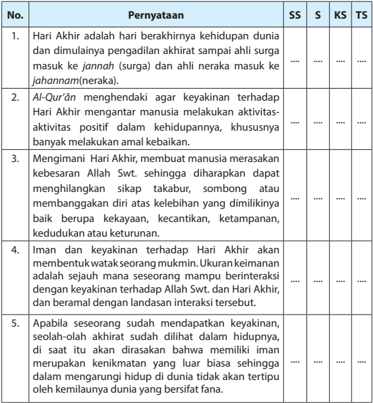

Tabel ini berisi penjelasan tentang berbagai aspek tentang Hari Akhir dalam agama Islam. Topik utamanya adalah tentang definisi Hari Akhir, peran Al-Qur'an dalam membantu manusia merasakan kebesaran Allah S.W.T., iman dan keyakinan terhadap Hari Akhir, serta proses seseorang menjadi seorang Muslim yang benar-benar. Kolom-kolomnya meliputi SS (Sumber Surat), S (Sumber Surat), KS (Kesimpulan), dan TS (Tantangan). Data penting yang terlihat adalah bahwa Al-Qur'an memiliki peran penting dalam membantu manusia merasakan kebesaran Allah S.W.T., dan bahwa iman dan keyakinan terhadap Hari Akhir memerlukan dukungan dari keyakinan terhadap Allah S.W.T. dan Hari Akhir.

 

---
## 📄 Halaman 28

---
**🖼️ Gambar/Diagram**

> **Deskripsi Visual:** Gambar ini menunjukkan sebuah jalan raya yang berkelokan ke arah kiri dengan pemandangan hijau sepanjang jalur. Di sisi kiri jalan, terdapat tanah berlumpur dengan beberapa pohon yang tumbuh. Di sisi kanan jalan, terlihat pemandangan hamparan sawah yang luas. Langit di atas tampak cerah dengan sedikit awan. Gambar ini tampaknya merupakan bagian dari bab kedua buku pelajaran, yang mungkin membahas topik tentang transportasi atau lingkungan.

Elemen-elemen utama dalam gambar ini adalah jalan raya, pemandangan hijau, tanah berlumpur, pohon, sawah, dan langit. Jalan raya menjadi pusat perhatian, mengarahkan pandangan pembaca ke arah kiri. Pemandangan hijau di sekitar jalan memberikan kesan tenang dan alami. Tanah berlumpur dan pohon di sisi kiri jalan menunjukkan kondisi alam yang masih alami dan belum terpengaruh oleh aktivitas manusia. Sawah di sisi kanan jalan menunjukkan kegiatan pertanian yang umum dilakukan di daerah ini. Langit cerah dengan sedikit awan menambah kesan tenang dan damai pada gambar ini.

Teks, angka, atau label penting yang terlihat dalam gambar ini adalah "Bab 2", yang menunjukkan bahwa gambar ini merupakan bagian dari bab kedua buku pelajaran. Informasi kunci yang dapat diambil pembaca melalui gambar ini adalah tentang topik-topik yang akan dibahas dalam bab kedua tersebut, seperti transportasi atau lingkungan.

Sumber: image bank vol. 3

### Bab 2 Meyakini Qad±' dan Qadar Melahirkan Semangat Bekerja

### Peta Konsep

---
**🖼️ Gambar/Diagram**

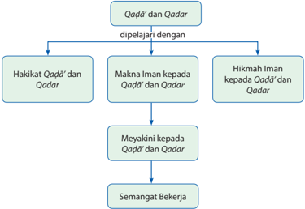

> **Deskripsi Visual:** Gambar ini adalah diagram yang menunjukkan hubungan antara Qadā'd dan Qadar dengan hakikat, makna, hikmah, dan semangat bekerja. Diagram ini dibagi menjadi empat bagian utama:

1. **Qadā'd dan Qadar**: Ini adalah topik awal yang diperkenalkan sebagai dua konsep yang dipelajari.
2. **Hakikat Qadā'd dan Qadar**: Bagian ini menjelaskan definisi dan karakteristik dari kedua konsep tersebut.
3. **Makna Iman kepada Qadā'd dan Qadar**: Ini membahas bagaimana seseorang dapat memahami dan percaya pada kedua konsep tersebut.
4. **Hikmah Iman kepada Qadā'd dan Qadar**: Bagian ini menguraikan manfaat dan kebaikan dari mempercayai Qadā'd dan Qadar.
5. **Meyakini kepada Qadā'd dan Qadar**: Ini menekankan pentingnya mempercayai Qadā'd dan Qadar.
6. **Semangat Bekerja**: Akhirnya, diagram ini menunjukkan bagaimana semangat bekerja yang dipicu oleh pemahaman dan percaya pada Qadā'd dan Qadar.

Elemen-elemen utama dalam diagram ini adalah Qadā'd dan Qadar, serta bagian-bagian yang menjelaskan hubungan antara mereka dengan hakikat, makna, hikmah, dan semangat bekerja. Teks penting dalam diagram ini meliputi definisi Qadā'd dan Qadar, makna iman kepada mereka, hikmah iman kepada mereka, dan pentingnya meyakini kepada mereka. Informasi kunci yang dapat diambil pembaca adalah bahwa pemahaman dan percaya pada Qadā'd dan Qadar dapat meningkatkan semangat bekerja dan membawa manfaat spiritual.

 

---
## 📄 Halaman 29

二

Amati gambar-gambar berikut! Kemudian, jelaskan makna yang dikandungnya terkait dengan tema pelajaran!

 

---
## 📄 Halaman 30

### Membuka Relung Kalbu

Tingkatan seorang hamba dalam menghadapi ujian  dari  Allah  Swt.  yang  tidak  disukainya terbagi atas dua, yaitu ri « a dan sabar . Ri « a adalah keutamaan yang dianjurkan, sedangkan sabar adalah kewajiban dan keharusan atas seorang mukmin.

Orang yang ri « a terkadang dapat memperhatikan  hikmah  dari  sebuah  ujian dan segi positifnya bagi dirinya, serta tidak  berburuk  sangka  kepada  Allah  Swt. Adakalanya ia memperhatikan besarnya ujian dan  mendapatkan    alangkah  sempurnanya Allah Swt., kemudian ia larut dalam kesadarannya  sehingga  lupa  dengan  rasa sakit dan derita yang dialaminya.

Hal ini hanya akan dicapai oleh orangorang khusus dari kalangan ahli ma'rifat dan mahabbah . Bahkan  terkadang mereka justru menikmati cobaan itu, karena menyadari bahwa cobaan itu datang dari kekasih mereka, Allah Swt. Dalam  kitab az-Zuhd, VII/77 Imam at-Tirmidzi meriwayatkan bahwa Anas r.a. menceriterakan dari  Nabi saw. beliau bersabda:

'Sesungguhnya bila Allah Swt. mencintai  suatu kaum,  Dia  akan  menguji  mereka,  maka  siapa yang  ri « a,  dia  akan  mendapatkan  keri « aan, dan siapa yang marah, dia akan mendapatkan murka'

### Allah Swt. Berfirman:

Wahai  anak  manusia  pusatkan perhatianmu  untuk  beribadah kepada-KU, niscaya Aku penuhi hatimu  dengan  kekayaan  dan memenuhi tanganmu dengan rizki. Wahai anak manusia janganlah  jauh-jauh  dari-Ku, jika kamu jauh Aku penuhi hatimu dengan kemiskinan dan memenuhi tanganmu dengan kesibukan. (H.R.  Hakim  dari Abu Hurairah) H.R. al-Hali.

### Rasulullah saw Bersabda:

Barangsiapa  yang  cita-citanya adalah  akhirat,  niscaya  Allah akan menghimpun kekuatannya, menjadikannya  kaya  hati  dan dunia  akan  datang  kepadanya dengan patuh, akan tetapi barang siapa yang cita-citanya adalah dunia, niscaya Allah Swt.  akan  mencerai  beraikan urusannya menjadikan kemiskin  an di depan matanya dan dunia tidak datang kecuali yang telah ditentukan oleh Allah Swt. bagi  dirinya. (H.R.Ibnu Majah dari Zaid bin Sabit)

Ibnu Mas'ud r.a. berkata, 'Sesungguhnya Allah Swt. dengan keadilan dan  ilmu-Nya menggantungkan  kenyamanan  dan  kegembiraan  pada  keyakinan  dan  ri « a,  dan menghubungkan kesusahan dan kesedihan, dengan keraguan dan ketidaksenangan'. Allah Swt. berfirman: 'Dan siapa yang beriman kepada Allah Swt., niscaya Dia akan memberi petunjuk kepada hatinya.' (Q.S.at-Tagab u n/64:11)

 

---
## 📄 Halaman 31

### Mengkritisi Sekitar Kita

Cermati kisah berikut ini! Kemudian, beri tanggapan berkaitan dengan keadaan saat ini!

### Kapal di Padang Pasir Sahara

Masih  ingatkah  kisah  Nabi  Musa  a.s.  yang  memegang  teguh  kepercayaannya kepada  Allah  Swt.  sewaktu  dirinya  dihadapkan  oleh  hamparan  laut  dengan gelombangnya yang dahsyat, sementara Fir'aun dan bala tentaranya mengejarnya, hendak membunuhnya dan pengikutnya? Namun, Musa a.s. berkata: 'Tidak akan! Sungguh Allah Swt. besertaku. Allah Swt. pasti memberi petunjuk kepadaku' .

Mahasuci Allah! Dengan mantap Nabi Musa a.s. beserta pengikutnya berjalan di tengah lautan dan diselamatkan oleh Allah Swt.

Demikian pula kisah Nabi Nuh a.s. Allah Swt. memberi kabar bahwa tidak ada lagi kaumnya yang beriman, kecuali mereka yang memang telah beriman. Suatu ketika Nabi Nuh a.s. diperintahkan untuk membuat perahu. Di tengah gurun pasir yang tandus. Nabi Nuh a.s membuatnya bertahun-tahun. Mulai dari menanam pohon, hingga menebangnya. Ia membuat perahu besar di tanah yang kering kerontang.

Allah Swt. menyuruhnya membuat  perahu? Hal itu untuk membuktikan keimanannya  yang  kuat  kepada  Allah  Swt.  Seandainya  kalian  berada  di  posisi Nabi Nuh a.s. mungkinkah keyakinan kalian terhadap Allah Swt. akan tetap tegar? Bayangkan! Kapal di tengah gurun yang tandus!

Jika  kisah Nabi Nuh a.s. ini dianalogikan dengan keadaan sekarang, maka kalianlah yang menjadi bahteranya.

Jangan pernah berpikir bahwa semua ini tidak lebih dari sekedar impian kosong. Gurun  pasir  pada  saat  Nabi  Nuh  a.s  tak  ada  bedanya  dengan  kondisi  saat  ini. Karena yakin,  akhirnya  mereka  membuat  kapal  dan  menaikinya  bersama  umat yang meyakininya.

Allah Swt. berfirman:

'Sesungguhnya Allah Swt.  tidak mengubah keadaan sesuatu kaum sehingga mereka mengubah keadaan yang ada pada diri mereka sendiri.' (Q.S.ar-Ra'ad/13:11)

(disadur dari karya Amru Khalid dalam Revolusi Diri)

Bagaimana pendapatmu tentang kisah-kisah tersebut?

Cermati  kisah  Nabi  Nuh  a.s  tersebut  dan  coba  analogikan  dengan  masalahmasalah sosial yang terjadi saat ini. Tanggapi dengan kritis dari sudut pandang keimanan kalian kepada qa«±' dan qad a r !

 

---
## 📄 Halaman 32

### Memperkaya Khazanah

### A.  Tadarus al-Qurān 5-10  Menit sesuai Tema

Kegiatan tadarus al-Qurān bertujuan menumbuhkan keinginan peserta didik untuk mentadabburi dan mengetahui manfaatnya, yaitu paham makna al-Qurān dan mengetahui rahasia keagungan-Nya. Dengan mengetahui manfaatnya, peserta didik diharapkan dapat melaksanakan dan mengikutinya karena al-Qurān sudah membekas  dalam  jiwa  ( Q.S.  Taha /20:112-113,  Q.S. al-Baqarah /2:38),  sehingga peserta didik akan memperoleh ketenteraman dan kebahagiaan ( Q.S.Taha /20:2-3)

Karena  itu,  sebelum  kalian  memulai  pembelajaran,  lakukan  tadarus al-Qurān secara tartil selama 5-10 menit di kelompok kalian masing-masing yang dipimpin oleh ketua kelompok. Ayat-ayat yang dibaca akan ditentukan oleh Bapak/Ibu guru kalian.

### B.    Menganalisis dan Mengevaluasi Makna Iman kepada Qa«±' dan Qad a r

### 1. Pengertian Qa«±' dan Qad a r

Para  ulama  berbeda  pandangan  dalam  memberikan  arti  kata Qa«±' dan Qadar .  Sebagian  ulama  mengartikan  sama.  Namun,  sebagian  ulama  yang lain memberikan arti yang berbeda.

Pandangan  yang  membedakan  antara Qa«±' dan Qad a r ,  mendefiniskan Qadar dengan  'ilmu Allah Swt. tentang apa yang akan terjadi pada makhluk di masa mendatang. ' Qa«±' adalah  ' segala sesuatu yang Allah Swt. wujudkan (adakan atau berlakukan) sesuai dengan ilmu dan kehendaknya.'  Sebagian ulama  yang  lain  justru  menerapkan  definisi  di  atas  secara  terbalik,  yakni definisi Qa«±' dan Qadar ditukar.

Pendapat yang menyamakan Qa«±' dan Qadar memberikan definisi 'bahwa aturan baku yang diberlakukan oleh Allah Swt. terhadap alam ini, undangundang yang bersifat umum, dan hukum-hukum yang  mengikat sebab dan akibat' . Pengertian itu diilhami oleh beberapa ayat al-Qur ± n ,  seperti firman Allah Swt.:

``

 

---
## 📄 Halaman 33

Artinya: ' Allah Swt. mengetahui apa yang dikandung oleh setiap perempuan, dan kandungan rahim yang kurang sempurna dan yang bertambah. Dan segala sesuatu pada sisi-Nya ada ukurannya ' . ( Q.S. ar-Ra' « /13:8)

Dari pengertian tersebut dapat disimpulkan bahwa Qa«±' menurut bahasa berarti 'menentukan atau memutuskan', sedangkan menurut istilah artinya 'segala ketentuan Allah Swt. sejak zaman azali ' .  Adapun pengertian Qadar menurut bahasa adalah 'memberi kadar, aturan, atau ketentuan' . Menurut istilah berarti 'ketetapan Allah Swt. terhadap seluruh makhluk-Nya tentang segala sesuatu' . Firman Allah Swt.:

Artinya:  ' Yang  kepunyaan-Nya  lah  kerajaan  langit  dan  bumi,  dan  Dia  tidak mempunyai anak, dan tidak ada sekutu baginya dalam kekuasaan(Nya), dan Dia telah menciptakan segala sesuatu, dan Dia menetapkan ukuran-ukurannya dengan serapi-rapinya ' . ( Q.S. al-Furq ± n /25:2).

Iman kepada Qa«±' dan Qadar artinya percaya dan yakin dengan sepenuh hati bahwa Allah Swt. telah menentukan segala sesuatu bagi makhluk-Nya. Menurut Yasin ,  iman  kepada Qa«±' dan Qadar adalah 'mengimani adanya ilmu Allah Swt. yang qadīm dan mengimani adanya kehendak Allah Swt. yang berlaku serta kekuasaan-Nya yang menyeluruh' .

Setiap  muslim  wajib  mengimani Qa«±' dan Qadar Allah  Swt.,  yang  baik ataupun    yang  buruk.  Firman  Allah  Swt.: 'Apakah  kamu  tidak  mengetahui bahwa sesungguhnya Allah Swt. mengetahui apa saja yang ada di langit dan di  bumi?; bahwasanya yang demikian itu terdapat dalam sebuah kitab (Lauh Mahfuzh). Sesungguhnya yang demikian itu amat mudah bagi Allah Swt.' (Q.S. al-Hajj/22:70).

'Tiada suatu bencanapun yang menimpa di bumi dan (tidak pula) pada dirimu sendiri  melainkan  telah  tertulis  dalam  kitab  (Lauh  Mahfuzh)  sebelum  Kami menciptakannya. Sesungguhnya yang demikian itu adalah mudah bagi Allah Swt'. (Q.S. al-Hadīd/57:22).

Iman kepada Qa«±' dan Qad a r meliputi empat prinsip, sebagai berikut.

- Iman kepada ilmu Allah Swt. yang Qadīm (tidak berpermulaan), dan Dia mengetahui perbuatan manusia sebelum mereka melakukannya.

 

---
## 📄 Halaman 34

- Iman bahwa semua Qad a r Allah Swt. telah tertulis di Lauh Mahfuzh.
- Iman kepada adanya kehendak Allah Swt. yang berlaku dan kekuasaanNya yang bersifat menyeluruh.
- Iman bahwa Allah Swt. adalah Zat yang mewujudkan makhluk. Allah Swt. adalah Sang Pencipta dan yang lain adalah makhluk.
Qa«±' dan Qadar biasa disebut dengan satu kata, 'takdir' . Bagi manusia dan makhluk lain, ada pandangan takdir baik dan buruk, tetapi dalam pandangan Allah Swt., semua takdir itu baik, karena keburukan tidak dinisbatkan kepada Allah  Swt.  Ilmu  Allah  Swt.,  kehendak-Nya,  catatan-Nya,  dan  penciptaanNya semua itu adalah kebijaksanaan, keadilan, kasih sayang, dan kebaikan. Keburukan  bukanlah  sifat Allah Swt. dan  bukan  pula  pekerjaan-Nya. Perhatikan firman Allah Swt. berikut.

'Sesungguhnya  Allah  Swt.  tidak  berbuat  zalim  kepada  manusia  sedikit  pun, akan  tetapi manusia  Itulah  yang  berbuat  zalim  kepada  dirinya  sendiri' (Q.S.Y µ nus/10:44).

### 2. Dalil-Dalil tentang Qa«±' dan Qad a r

Allah Swt. menjelaskan tentang Qa«±' dan Qad a r , melalui firman-firman-Nya, dan juga dalam beberapa hadis Rasulullah saw., di antaranya menyatakan hal-hal berikut.

### a.   Dalil al-Qur' ± n

- 'Sesungguhnya  Kami  menciptakan  segala  sesuatu  menurut  ukuran (takdir).' (Q.S. al-Qamar/54:49)
- 'Tidak  ada  suatu  bencana  apapun  yang  menimpa di  bumi  dan  (tidak pula)  pada  diri  kalian  melainkan  telah  tertulis  dalam  kitab  (Lauh Mahfuzh) sebelum Kami menciptakannya. Sesungguhnya yang demikian itu mudah bagi Allah Swt.' (Q.S. al-Hadī d /57:22)
- 'Dan  tiap-tiap  manusia  telah  Kami  tetapkan  amal  perbuatannya (sebagaimana tetapnya kalung) pada lehernya.' (Q.S. al-Isr ± '/17:13)
- 'Tidak ada sesuatu musibah pun yang menimpa seseorang kecuali dengan izin Allah Swt.' (Q.S. at-Tag ± bun/64:11)

### b.  Dalil As-Sunah (Hadis Rasulullah)

Adapun penjelasan Rasulullah saw. tentang Qa«±' dan Qadar antara lain diriwayatkan oleh Imam Muslim dalam hadis berikutini.

- 'Sesungguhnya penciptaan salah seorang dari kalian dikumpulkan dalam perut ibunya selama empat puluh hari dalam bentuk nuthfah (sperma),  kemudian  berubah  menjadi  'alaqah  (segumpal  darah) selama  empat  puluh  hari,  kemudian  berubah  menjadi  mudghah (sepotong  daging)  selama  empat  puluh  hari,  kemudian  malaikat

 

---
## 📄 Halaman 35

dikirim kepadanya kemudian malaikat meniupkan ruh padanya, dan malaikat tersebut diperintahkan empat hal yaitu menuliskan rizkinya, menuliskan ajalnya, menuliskan amal perbuatannya, dan menuliskan apakah ia  celaka,  atau  bahagia.  Demi  Dzat  yang  tidak  ada  Tuhan yang berhak disembah kecuali Dia, sesungguhnya salah seorang dari kalian  pasti  mengerjakan  amal  perbuatan  penghuni  surga,  hingga ketika jaraknya dengan surga cuma satu lengan, tiba-tiba ketetapan berlaku padanya kemudian ia mengerjakan amal perbuatan penghuni  neraka,  dan  ia  pun  masuk  neraka.  Sesungguhnya  salah seorang  dari  kalian  pasti  mengerjakan  amal  perbuatan  penghuni neraka,  hingga  ketika  jaraknya  dengan  neraka  cuma  satu  lengan, tiba-tiba ketetapan berlaku padanya kemudian ia mengerjakan amal perbuatan penghuni surga, dan ia masuk surga.' (H.R. Muslim)

- Dalam  hadis  yang  lain,  Rasulullah  saw.  bersabda  yang  artinya sebagai berikut.
' Sesungguhnya seseorang itu diciptakan dalam perut ibunya selama 40  hari  dalam  bentuk  nuthfah,  40  hari  menjadi  segumpal  darah, 40  hari  menjadi  segumpal  daging,  kemudian  Allah  Swt.  mengutus malaikat untuk meniupkan ruh ke dalamnya dan menuliskan empat ketentuan,  yaitu  tentang  rezekinya,  ajalnya,  amal  perbuatannya, dan  (jalan  hidupnya)  sengsara  atau  bahagia. '  (H.R.al-Bukhari  dan Muslim)

Dari  hadis  di  atas  dapat  diketahui  bahwa  nasib  manusia  telah  ditentukan Qa«±' dan Qadar nya oleh Allah Swt. sejak sebelum ia dilahirkan. Walaupun setiap  manusia  telah  ditentukan  nasibnya,  tidak  berarti  bahwa  manusia hanya tinggal diam menunggu nasib tanpa berusaha dan ikhtiar. Manusia tetap berkewajiban untuk berusaha, sebab keberhasilan tidak datang dengan sendirinya.

### Aktivitas Siswa

Masih banyak ayat al-Qur' ± n dan hadis Nabi yang menjelaskan tentang Qa«±' dan Qadar . Telusuri dan temukan ayat-ayat al-Qur ± n dan hadis Nabi yang lain, jelaskan isi kandungannya!

### 3. Kewajiban Beriman kepada Qa«±' dan Qad a r

Diriwayatkan  bahwa  suatu  hari  Rasulullah  saw.  didatangi  oleh  seorang laki-laki  yang  berpakaian serba putih, dan rambutnya sangat hitam. Lelaki itu  bertanya  tentang  Islam,  Iman  dan I¥s±n .  Tentang  keimanan, Rasulullah saw. menjawab yang artinya: 'Hendaklah engkau beriman kepada Allah Swt. malaikat-malaikat Nya, kitab-kitab Nya, rasul-rasul Nya, hari akhir, dan beriman pula kepada Qadar (takdir) yang baik ataupun yang buruk' . (H.R. Muslim).

 

---
## 📄 Halaman 36

Lelaki  itu  adalah  Malaikat  Jibril  yang  sengaja  datang  untuk  memberikan pelajaran  agama  kepada  umat  Nabi  Muhammad  saw.  Jawaban  Rasulullah saw. yang dibenarkan oleh Malaikat Jibril itu berisi rukun iman. Salah satu dari rukun iman itu adalah iman kepada Qa«±' dan Qadar . Dengan demikian, mempercayai Qa«±' dan Qadar merupakan  kewajiban.  Kita  harus  yakin dengan sepenuh hati bahwa segala sesuatu yang terjadi pada diri kita, baik yang menyenangkan maupun yang tidak  adalah atas kehendak atau takdir Allah Swt.

Sebagai orang beriman, kita harus rela menerima segala ketentuan Allah Swt. atas diri kita. Di dalam sebuah hadis  qudsi Allah Swt. berfirman yang artinya: 'Siapa yang tidak ri «± dengan Qa«±' -Ku dan Qadar-Ku dan tidak sabar terhadap bencana-Ku yang aku timpakan atasnya, maka hendaklah mencari Tuhan selain Aku'. (H.R. at-Tabrani).

Takdir  Allah  Swt.  merupakan  iradah  (kehendak)  Allah  Swt.  Oleh  sebab itu,  takdir  tidak  selalu  sesuai  dengan  keinginan  kita.  Tatkala  takdir  sesuai dengan keinginan kita, hendaklah kita bersyukur karena hal itu merupakan nikmat yang diberikan Allah Swt. kepada kita. Ketika takdir yang kita alami tidak  menyenangkan  atau  merupakan  musibah,  maka  hendaklah  kita terima dengan sabar dan ikhlas. Kita harus yakin bahwa dibalik musibah itu ada  hikmah  yang  terkadang  kita  belum  mengetahuinya.  Allah  Swt.  Maha Mengetahui atas apa yang diperbuat-Nya.

### 4. Macam-Macam Takdir

Mengenai hubungan antara Qa«±' dan Qadar dengan ikhtiar, do'a dan tawakal ini, para ulama berpendapat, bahwa takdir itu ada dua macam seperti berikut.

### a. Takdir Mua'llaq

Takdir Mua'llaq adalah takdir yang erat kaitannya dengan ikhtiar manusia. Misalnya, seorang siswa bercita-cita ingin menjadi insinyur pertanian. Untuk mencapai cita-citanya itu, ia belajar dengan tekun. Akhirnya, apa yang ia cita-citakan menjadi kenyataan. Ia menjadi insinyur pertanian.

Dalam hal ini Allah Swt. berfirman: 'Bagi manusia ada malaikat-malaikat yang selalu mengikutinya bergiliran, di muka dan di belakangnya, mereka menjaganya  atas  perintah  Allah  Swt.  Sesungguhnya  Allah  Swt.  tidak mengubah keadaan sesuatu kaum sehingga mereka mengubah keadaan yang ada pada diri mereka sendiri. Dan apabila Allah Swt. menghendaki keburukan terhadap sesuatu kaum, maka tak ada yang dapat menolaknya; dan  sekali-kali  tak  ada  pelindung  bagi  mereka  selain  Dia' . (Q.S  arRa'd/13:11).

 

---
## 📄 Halaman 37

### b. Takdir Mubram

Takdir Mubram adalah takdir yang terjadi pada diri manusia dan tidak dapat diusahakan atau tidak dapat ditawar-tawar lagi oleh manusia. Misalnya, ada orang yang dilahirkan dengan mata sipit, atau dilahirkan dengan  kulit  hitam  sedangkan  ibu  dan  bapak  kulit  putih,  dan sebagainya.

### Aktivitas Siswa

Kalian tentu pernah mendengar seseorang yang memiliki alat kelamin laki-laki tetapi  berperilaku  seperti  perempuan.  Kemudian,  orang  tersebut  menjalani operasi ganti kelamin. Bagaimana komentar kalian terhadap masalah tersebut ditinjau dari sudut pandang keimanan kepada takdir Allah Swt.? Sampaikan pendapat  kalian  dengan  argumen  yang  logis  dan  mendasar  di  hadapan kelompok lain!

### C.    Kaitan Antara Beriman kepada Qa«±' dan Qad a r Allah Swt. dengan Sikap  Optimis, Berikhtiar, dan Bertawakal

Qa«±' dan Qadar atau  takdir  berjalan  menurut  hukum 'sunnatullah' .  Artinya keberhasilan  hidup  seseorang  sangat  tergantung  sejalan  atau  tidak  dengan sunnatullah.  Sunnatullah adalah  hukum-hukum  Allah  Swt.  yang  disampaikan untuk  umat  manusia  melalui  para  Rasul,  yang  tercantum  di  dalam al-Qur ± n berjalan tetap dan otomatis. Misalnya malas belajar berakibat bodoh, tidak mau bekerja  akan  miskin,  menyentuh  api  merasakan  panas,  menanam  benih  akan tumbuh, dan lain-lain.

Kenyataan menunjukkan bahwa siapa pun orangnya tidak mampu mengetahui takdirnya. Jangankan peristiwa masa depan, hari esok terjadi apa, tidak ada yang mampu  mengetahuinya.  Siapa  pun  yang  berusaha  dengan  sungguh-sungguh sesuai hukum-hukum Allah Swt. disertai dengan do'a, ikhlas, dan tawakal kepada Allah Swt., dipastikan akan memperoleh keberhasilan dan mendapatkan cita-cita sesuai tujuan yang ditetapkan.

Berkaitan  dengan  makna  beriman  kepada Qa«±' dan Qadar dapat  diketahui bahwa  nasib  manusia  telah  ditentukan  Allah  Swt.  sejak  sebelum  ia  dilahirkan. Walaupun setiap manusia telah ditentukan nasibnya, tidak berarti bahwa manusia hanya tinggal diam menunggu nasib tanpa berusaha dan ikhtiar. Manusia tetap berkewajiban untuk berusaha, sebab keberhasilan tidak datang dengan sendirinya.

 

---
## 📄 Halaman 38

Janganlah sekali-kali menjadikan takdir itu sebagai alasan untuk malas berusaha dan berbuat kejahatan. Pernah terjadi pada zaman Khalifah Umar bin Khattab, seorang pencuri tertangkap dan dibawa ke hadapan Khalifah Umar. 'Mengapa Engkau mencuri?' tanya Khalifah. Pencuri itu menjawab, 'Memang Allah Swt. sudah menakdirkan saya menjadi pencuri' . Mendengar jawaban demikian, Khalifah Umar marah,  lalu  berkata, '  Pukul  saja  orang  ini  dengan  cemeti,  setelah  itu  potonglah tangannya!' para sahabat  lain bertanya, 'Mengapa  hukumannya  diberatkan seperti itu?' Khalifah Umar menjawab, 'Ya, itulah yang setimpal. Ia wajib dipotong tangannya sebab mencuri dan wajib dipukul karena berdusta atas nama Allah Swt.' .

Beriman kepada takdir selalu terkait dengan empat (4)  hal yang selalu berhubungan dan  tidak  terpisahkan.  Keempat  hal  itu  adalah  sikap  optimis  terhadap  takdir terbaik Allah Swt. , berikhtiar, berdo'a, dan tawakal.

### 1. Sikap Optimis akan Takdir Terbaik Allah Swt.

Mengapa manusia tidak mampu terbang laksana burung, tumbuh-tumbuhan berkembang subur, lalu layu, dan kering. Rumput-rumput subur bila selalu disiram dan sebaliknya bila dibiarkan tanpa pemeliharaan akan mati. Semua contoh tersebut adalah ketentuan Allah Swt. dan itulah yang disebut Takdir.

Manusia  mempunyai  kemampuan  terbatas  sesuai  dengan  ukuran  yang diberikan Allah Swt. kepadanya. Di samping  itu, manusia  berada  di bawah    hukum-hukum  tersebut (Qauliyah  dan  Kauniyah). Hanya  berbeda dengan  makhluk  selain  manusia,  misalnya  matahari,  bulan,  dan  planet lainnya,  seluruhnya  ditetapkan    takdirnya  tanpa  dapat  ditawar-tawar. (Q.S. Fu ££ il ± t/41:11)

Manusia makhluk  yang paling sempurna. Oleh karena itu, ia diberi kemampuan  memilih  bahkan  pilihannya  cukup  banyak.  Manusia  dapat memilih  ketentuan  (takdir)  Allah  Swt.  yang  ditetapkan  keberhasilan  atau kemalangan, kebahagiaan atau kesengsaraan, menjadi orang yang baik atau tidak. ( Q.S. al-Kahfi/18:29 ).  Namun, harus diingat bahwa setiap pilihan yang diambil manusia, pada saatnya akan diminta pertanggungjawaban terhadap pilihannya, karena dilakukan atas kesadaran sendiri. Firman Allah Swt.: 'Maka Dia mengilhamkan kepadanya (jalan) kejahatan dan ketakwaannya, sungguh beruntung orang yang mensucikannya (jiwa itu), dan sungguh rugi orang yang mengotorinya' (Q.S. asy-Syams/91:8-10).

"Apakah    manusia  mengira  dibiarkan  tanpa  pertanggungjawaban?' ( Q.S.  AlQiyamah/75:36 ).

Beberapa  perumpamaan  peristiwa  ini  akan  dapat  memudahkan  dalam memahami persoalan takdir.

 

---
## 📄 Halaman 39

Dikisahkan ketika Umar bin Khattab akan berkunjung ke negeri Syam (Syiria dan  Palestina  sekarang)  beliau  mendengar  berita  bahwa  di  sana  sedang terjadi wabah penyakit, sehingga beliau membatalkan rencananya tersebut. Kemudian seseorang  tampil  bertanya: '(Apakah Anda lari/menghindar dari takdir Allah?)' Umar serta merta menjawab: '(Saya lari/menghindari dari takdir Allah Swt. kepada takdir-Nya yang lain)'

Kisah  lain  menceritakan    bahwa  pada  zaman  Khalifah  Umar  bin  Khattab, seorang pencuri tertangkap dan dibawa  ke hadapan  Khalifah Umar. ' Mengapa Engkau mencuri?' tanya Khalifah. Pencuri itu menjawab, ' memang Allah sudah menakdirkan saya menjadi pencuri' . Mendengar jawaban demikian, Khalifah Umar marah, lalu berkata, ' Pukul saja orang ini dengan cemeti, setelah itu potonglah tangannya!' para sahabat lain bertanya, ' Mengapa hukumnya diberatkan seperti itu? 'Khalifah Umar menjawab, 'Ya, itulah yang setimpal. Ia wajib dipotong tangannya sebab mencuri dan wajib dipukul karena berdusta atas nama Allah ' .

Peristiwa-peristiwa  tersebut  menunjukkan  kesalahan  dalam  memahami takdir, padahal dengan tegas Allah Swt. melarangnya. Akhlak yang diajarkan Islam  adalah  setiap  keburukan  yang  menimpa  merupakan  kesalahan  kita sebagai manusia, sementara segala kebaikan dan keberhasilan merupakan anugerah Allah Swt.

### 2. Ikhtiar

Ikhtiar adalah berusaha dengan sungguh-sungguh dan sepenuh hati dalam menggapai cita-cita dan tujuan. Allah Swt. menentukan takdir, kita sebagai manusia berkewajiban melakukan ikhtiar. Jika Allah Swt. telah menentukan, mengapa ada ikhtiar?

Perhatikan  Firman  Allah  Swt.  dalam Q.S.  al-Anbiyaa'/21:90 yang  artinya: 'Sungguh mereka adalah orang-orang yang selalu bersegera dalam (mengerjakan) per  buatan-perbuatan baik'. Kemudian, dalam Q.S. alMukminuun/23:60 , Allah Swt. Berfirman: 'Mereka  itu bersegera  untuk mendapatkan kebaikan-kebaikan, dan merekalah orang-orang yang segera memperolehnya'.

Dari beberapa ayat di atas, Allah Swt. mendorong manusia untuk berusaha, berlomba, dan berkompetisi menjadi orang yang tercepat. Siapa pun yang berusaha dengan sungguh-sungguh, berarti dia sedang menuju keberhasilan. Pepatah Arab mengatakan 'Man jadda wajada', Artinya: 'Siapa pun orangnya yang bersungguh-sungguh akan memperoleh  keberhasilan'.

 

---
## 📄 Halaman 40

Rasulullah saw. bersabda: 'Bersegeralah melakukan aktivitas kebajikan sebelum dihadapkan pada tujuh penghalang. Akankah kalian menunggu kekafiran yang menyisihkan, kekayaan yang melupakan, penyakit yang menggerogoti, penuaan yang  melemahkan,  kematian  yang  pasti,  ataukah  Dajjal,  kejahatan  terburuk yang pasti datang, atau bahkan kiamat yang sangat amat dahsyat?'(HR. atTirmid © i).

Jika  sudah  diikhtiarkan  namun  kegagalan  yang  diperoleh,  maka  dalam hubungan  inilah  letak 'rahasia  Ilahi.' Meskipun  begitu,  Allah  Swt.  tidak menyia-nyiakan semua  amal  yang  sudah  dilakukan, walaupun  gagal. Firman Allah Swt.: '  Dan bahwa manusia hanya memperoleh apa yang telah diusahakannya,  dan  sesungguhnya  usahanya  itu  kelak  akan  diperlihatkan (kepadanya), kemudian akan diberi balasan kepadanya dengan balasan yang paling  sempurna' . (Q.S. an-Najm/53:39-41).

Berdasarkan  penjelasan  di  atas,  jelaslah  mengapa  Allah  Swt.  mewajibkan manusia  berikhtiar.  Walaupun  sudah  ditentukan Qa«±' dan qadarnya ,  di pundak  manusialah  kunci  keberhasilan  dan  keberuntungan  hidupnya.  Di samping itu, begitu banyak anugerah yang telah Allah Swt. berikan kepada manusia berupa naluri, panca indera, akal, kalbu, dan aturan agama, sehingga lengkaplah sudah bekal yang dimiliki manusia menuju kebahagiaan hidup yang diinginkan.

### 3 Doa

Doa  adalah  ikhtiar  batin  yang  besar  pengaruhnya  bagi  manusia  yang meyakininya. Hal ini karena doa merupakan bagian dari motivasi intrinsik. Bagi yang meyakini, doa akan memberikan energi dalam menjalani ikhtiarnya, karena  Allah  Swt.  telah  berjanji  untuk  mengabulkan  permohonan  orang yang bersungguh-sungguh memohon. Firman Allah Swt.: 'Aku mengabulkan permohonan  orang  yang  berdoa,  apabila  ia  berdoa  kepada-Ku,  ...'  (Q.S.    alBaqarah/2:186).

### 4. Tawakal

Setelah meyakini dan mengimani takdir, kemudian dibarengi dengan ikhtiar dan do'a, maka tibalah manusia mengambil sikap tawakal. Tawakal adalah 'menyerahkan segala urusan dan hasil ikhtiarnya hanya kepada Allah Swt.'

Dasar  pengertian  tawakal  diambil  diantaranya  dari  sebuah  hadis  yang diriwayatkan oleh Imam Ibnu Hibban dan Imam Al-Hakim dari Ja'far bin Amr bin Umayah dari ayahnya Radhiyallahu 'anhu, ia berkata : 'Seseorang berkata kepada Nabi Shallallahu 'alaihi wa sallam, 'Aku lepaskan untaku dan (lalu) aku bertawakal ?' Nabi Shallallahu 'alaihi wa sallam bersabda, 'Ikatlah kemudian bertawakallah.'

 

---
## 📄 Halaman 41

Peristiwa  ini  menyimpulkan  pemahaman bahwa sikap tawakal baru boleh dilakukan  setelah  usaha  yang  sungguh-sungguh  sudah  dijalankan.  Hal  ini juga memberikan pemahaman bahwa tawakal itu terkait erat dengan ikhtiar, atau dapat disimpulkan bahwa tidak ada tawakal tanpa ikhtiar. Firman Allah Swt.: 'Kemudian apabila kamu telah membulatkan tekad maka bertawakallah kepada  Allah  Swt..  Sesungguhnya  Allah  Swt.  menyukai  orang-orang  yang bertawakal kepada-Nya.' ( Q.S.Ali-Imran/3:159 ).

### Aktivitas Siswa

(Membuat Video Pendek):

Tema:  'Menyikapi takdir dengan ikhtiar dan tawakal'

Deskripsi: Buatlah skenario yang menggambarkan adanya orang yang sukses karena  keyakinannya  kepada  takdir,  bekerja  keras  (ikhtiar),  dan  diiringi  doa sebagai  bentuk  kepasrahan  (tawakal).  Di  sisi  lain,  ada  seorang  yang  lebih banyak  berdoa,  sedangkan  ikhtiarnya  dilakukan  sambil  bermalas-malasan. Ketentuan sebagai berikut.

- Buatlah rancangan skenario untuk diperankan dalam durasi kira-kira 10 menit!
- Judul  harus  berbeda  setiap  grup/kelompok,  tetapi  masih  dalam  tema besar yang sama.
- Buat setting cerita yang  akhirnya dapat menginspirasi penonton untuk menyikapi takdir dengan bekerja keras!
- Pilih personil untuk menjadi pemeran masing-masing karakter (semakin banyak fokus semakin bagus), termasuk yang berperan sebagai sutradara, kameramen, dan crew lain!
- Lakukan acting sesuai peran dengan penuh penghayatan!
- Rekam  setiap adegan/episode dengan  alat  perekam  video  yang  layak atau alat perekam lain.
- Setelah selesai, lakukan editing video tersebut sehingga enak ditonton!
- Tampilkan  karya  kalian  di  ruang  studio/multimedia/ruang  lain  yang memungkinkan!
- Tanggapi secara bergantian dengan kelompok lain!
- Jika dirasa layak, upload ke Youtube dengan nama video pendidikan!
jika diperlukan, dapat berkolaborasi dengan kelompok lain dengan dua atau tiga kelompok.

 

---
## 📄 Halaman 42

### D.  Hikmah Beriman kepada Qa«±' dan Qadar

- Semakin  meyakini  bahwa  segala sesuatu  yang  terjadi  di  alam  ini tidak lepas dari sunnatullah.
- Semakin termotivasi untuk senantiasa berikhtiar atau berusaha lebih  giat  lagi  dalam  mengejar cita-citanya.
- Meningkatkan    keyakinan  akan pen  ting  nya peran doa bagi keberhasilan sebuah usaha.
- Meningkatkan  optimisme  dalam menatap masa depan dengan ikhitar yang sungguh-sungguh;
- Meningkatkan kekebalan jiwa dalam menghadapi  segala rintangan  dalam    usaha  sehingga tidak  berputus  asa  ketika  mengalami kegagalan.
- Menyadarkan manusia bahwa dalam  kehidupan  ini  dibatasi  oleh peraturan-peraturan Allah Swt., yang  tujuannya  untuk  kebaikan manusia itu sendiri. Bersikap optimis,  Ikhtiar  dan Tawakkal  sebagai  implementasi  beriman  kepada Qada' dan Qadar Allah Swt.

### Aktivitas Siswa

Temukan lebih banyak lagi hikmah-hikmah yang dapat dipetik dari keimanan kepada Qa«±' dan Qadar!

### Hukum Allah Swt. (Sunnatullah)

'Sesungguhnya Allah Swt. tidak akan  mengubah  keadaan  suatu kaum, sehingga mereka mengubah ke  adaan yang ada pada diri mereka sendiri' .  (Q.S. ar-Ra'd/ 13:11).

Kesuksesan kalian tidak akan terwujud tanpa melakukan perubahan dari dalam. Untuk menghasilkan suatu kebaikan bagi  diri  kalian,  dituntut  untuk menanamkan benih kebaikan.

Perbuatan tidak produktif dan bermalas-malasan  menyebabkan kalian akan ter  puruk. Bila kenyataannnya demikian, apa yang kurang dari kalian? Karena itu ubah  lah kondisi dalam diri kalian, sehingga  Allah  Swt.  mengubah kondisi sulit atau ketidaksuksesan kalian yang sedang kalian hadapi. Jangan  menjadi  pemimpi  yang berdiri  di  pohon  labu,  kemudian memohon kepada Allah Swt. agar memberikan apel. Bagaimana mungkin  hal  itu  dapat  terjadi? Siapa  yang  menginginkan  apel, sudah barang tentu harus menanam dan merawatnya.

(Disadur dari Urgensi Sebuah Usaha dalam Revolusi Diri karya Amru Khalid)

 

---
## 📄 Halaman 43

### Menerapkan Perilaku Mulia

Bersikap optimis, ikhtiar, dan tawakal sebagai implementasi beriman kepada Qadā dan Qadar Allah Swt.

Semua orang berharap untuk mendapatkan sukses atau kemenangan.  Manusia akan hidup dalam dua alam, yaitu dunia dan akhirat. Kemenangan di akhirat dan kemenangan di dunia adalah sesuatu yang tidak dapat dipisahkan, dia bagaikan sisi  mata uang yang tidak akan bermakna jika salah satu sisinya hilang. Bahkan Allah Swt. berfirman yang artinya; ' Barang siapa yang buta hatinya di dunia, niscaya di akhirat nanti akan lebih buta '( Q.S.al-Isra' /17:72) Kemenangan bukanlah sesuatu yang tiba-tiba, melainkan sebuah pencapaian yang perlu perencanaan matang.

Perencanaan  yang  matang  sangat  dipengaruhi  oleh  sejauhmana  ketersediaan informasi dalam memprediksi ke depan, sedangkan masa depan tanpa perencanaan  dan  rida  Allah  Swt.  adalah  sesuatu  yang  mustahil  untuk  sukses. Untuk  itu,  kita  perlu  mengkaji  bagaimana  kita  harus  mengatur  diri  kita  agar mendapatkan sukses tersebut.

Beriman kepada Qadā dan Qadar menuntun seseorang untuk berfikir strategis yang dimulai dengan tujuan akhir, yakni kita inginkan akhir dari seluruh ikhtiar dan aktivitas kita merupakan  takdir terbaik dari Allah Swt.

Perilaku  seseorang  yang  mencerminkan  kesadaran  beriman  kepada Qa«±' dan Qadar Allah  Swt.  dicerminkan dalam beberapa perilaku seseorang di antaranya sebagai berikut.

- 1.
Orang  yang  beriman  kepada Qa«±' dan Qadar ,  apabila  memperoleh keberhasilan, ia menganggap keberhasilan itu adalah semata-mata karena rahmat Allah Swt.  Apabila ia mengalami kegagalan, ia tidak mudah berkeluh kesah dan berputus asa, karena ia menyadari bahwa kegagalan itu sebenarnya adalah  ketentuan  Allah  Swt.  Ia  menyadari  bahwa  di  balik  kegagalan  ada

- Selalu menjauhkan diri dari sifat sombong dan putus asa hikmah.

### 2. Banyak bersyukur dan bersabar

Orang yang beriman kepada Qa«±' dan Qadar, apabila mendapat keberuntungan, maka ia akan bersyukur, karena keberuntungan itu merupakan  nikmat  Allah  Swt. yang  harus  disyukuri.  Sebaliknya,  apabila terkena musibah maka ia akan sabar, karena hal tersebut merupakan ujian. Perhatikan lagi Firman Allah Swt. Q.S.at-Taubat/9:51 !

 

---
## 📄 Halaman 44

### 3. Bersikap optimis dan giat bekerja

Manusia tidak mengetahui takdir apa yang terjadi pada dirinya. Semua orang tentu menginginkan bernasib baik dan beruntung. Keberuntungan itu tidak datang  begitu  saja,  tetapi  harus  diusahakan.  Oleh  sebab  itu,  orang  yang beriman kepada Qa«±' dan Qadar senantiasa optimis dan giat bekerja untuk meraih kebahagiaan dan keberhasilan itu. Perhatikan kembali Firman Allah Q.S. ² li-Imr ± n/ 3:159!

### 4.

- Selalu tenang jiwanya
Orang yang beriman kepada Qa«±' dan Qadar senantiasa tenang hidupnya, sebab ia selalu  senang atas apa yang ditentukan Allah Swt . kepadanya. Jika beruntung atau berhasil, ia bersyukur.

### Rangkuman

- Ketetapan Allah Swt. di zaman azali disebut Qa«±' .  Kenyataan  bahwa saat terjadinya  sesuatu  yang  menimpa  makhluk  Allah  Swt.  disebut Qadar atau takdir. Dengan kata lain bahwa Qadar adalah perwujudan dari Qa«±' .
- Antara Qa«±' dan Qadar saling  berkaitan. Qa«±' adalah  ketentuan,  hukum atau  rencana  Allah  Swt.  sejak  zaman  azali. Qadar adalah  kenyataan  dari ketentuan atau hukum Allah Swt. Jadi, hubungan antara Qa«±' dan Qadar ibarat rencana dan perbuatan. Perbuatan Allah Swt . berupa Qadar -Nya sesuai dengan ketentuan-Nya.
- Iman kepada Qa«±' dan Qadar artinya percaya dan yakin dengan sepenuh hati  bahwa  Allah  Swt.  telah  menentukan  tentang  segala  sesuatu  bagi makhluknya.
- Beriman kepada Qa«±' dan Qadar merupakan salah satu rukun iman. Seorang muslim tidak sempurna dan sah imannya kecuali beriman kepada Qa«±' dan Qadar Allah Swt.
- Takdir  Allah  Swt.  merupakan  iradah  (kehendak)  Allah  Swt.  Oleh  sebab  itu, takdir tidak selalu sesuai dengan keinginan kita.
- Orang  yang  beriman  dengan  sebenar-benarnya  kepada Qa«±' dan Qadar akan senantiasa menjauhkan diri dari sifat sombong dan putus asa,  memiliki sifat optimis, giat bekerja , dan selalu tenang jiwanya.
- Nasib manusia telah ditentukan Allah Swt. sejak sebelum manusia dilahirkan. Walaupun  setiap  manusia  telah  ditentukan  nasibnya,  tidak  berarti  bahwa manusia hanya tinggal diam menunggu nasib tanpa berusaha atau ikhtiar. Manusia  tetap  berkewajiban  untuk  berusaha,  sebab  keberhasilan  tidak datang dengan sendirinya.

 

---
## 📄 Halaman 45

- Dengan beriman kepada Qa«±' dan Qadar , banyak hikmah yang amat  berharga  bagi  manusia  dalam  menjalani  kehidupan  di  dunia  dan mempersiapkan diri untuk kehidupan akhirat.

### Tugas Kelompok

### Kegiatan Kelompok

- Buatlah lima kelompok, 1 kelompok terdiri atas 6-7 orang!
- Salinlah Q.S. at-Taubah/9:105 dan Q.S. ²li 'Imr±n /3:159 , lengkap dengan terjemahannya dan jelaskan isi kandungannya!
- Cari ayat-ayat al-Qur±n yang berkaitan dengan tema di atas!

### Evaluasi

- Berilah tanda silang (x) pada huruf a, b, c, d, atau e yang dianggap jawaban yang paling tepat!
- Perhatikanlah Q.S. al-Furq ± n/25:2 di bawah ini!

``

Makna  yang  terkandung  dalam  ayat  tersebut  adalah  bahwa  Allah  Swt. yang  sudah  menciptakan  segala  sesuatu,  dan  Allah  Swt.  juga  yang  sudah menentukan . . . .

- ukuran-ukurannya
- panjang pendeknya
- posisi-posisinya
- besar kecilnya
- baik buruknya
- Akhlak  yang  diajarkan  Agama  Islam  dalam  memahami Qa«±' dan Qadar adalah . . . .
- setiap  keburukan kesalahan manusia dan kebaikan adalah anugerahNya
- berbuat baiklah, sebagaimana Anda  ingin diperlakukan dengan baik
- keteladanan merupakan kunci keberhasilan pergaulan sesama
- sibukkanlah mencari kekurangan yang ada dalam diri
- kesuksesan dunia menentukan kesuksesan akhirat

 

---
## 📄 Halaman 46

- Pernyataan  yang  termasuk  dalam  contoh  ketentuan  dari  takdir  mubram adalah . . . .
- hidup  yang  benar,  beriman  atau  kafir,  sukses  atau  gagal,  sedih  atau gembira
- karier yang bagus, rumah tangga yang sejahtera, anak-anak yang salih
- kaya  dan  miskin,  cerdas  dan  bodoh,  sehat  dan  sakit,  sejahtera  dan sengsara
- saat kematian datang , kelahiran, jenis kelamin, siapa orang tua kita
- harapan serta cita-cita, harta, jabatan, ilham, dan ilmu pengetahuan
- Tidak semua doa yang dipanjatkan dikabulkan oleh Allah Swt. Pernyataan di bawah ini  kemungkinan belum dikabulkannya doa tersebut, kecuali . . .
- saatnya belum tepat
- sebagai tabungan di akhirat
- ditangguhkan sampai di akhirat
- tidak baik hasilnya
- sebagai hukuman
- Perhatikanlah pernyataan berikut ini!
- Penuh optimis dalam menjalani hidup
- Senantiasa berorientasi kepada prestise
- Tidak memiliki harga diri dalam bergaul
- Pandai memanfaatkan kesempatan dalam hidup
- Memiliki etos kerja yang tinggi dalam beraktivitas
- Tidak mudah putus asa bila menghadapi kegagalan Pernyataan di atas yang tidak termasuk hikmah beriman kepada Qa«±'
dan Qadar adalah nomor . . . .

- 1), 2) dan 4)
- 2), 3) dan 5)
- 2), 3) dan 4)
- 1), 4) dan 6)
- 1), 5) dan 6)

### II. Isilah titik-titik di bawah ini dengan jawaban yang singkat dan benar !

- Segala  sesuatu  yang  sudah  ditetapkan  Allah  Swt.  atas  manusia  sudah ditentukan sejak zaman . . . .
- Ketetapan dan ketentuan Allah Swt. atas manusia sudah tertulis di . . . .
- Ketentuan dan ketetapan Allah Swt. yang baru merupakan ketetapan belum terlaksana disebut . . . .
- Suatu ketentuan Allah Swt. yang akan diberlakukan kepada makhluk-Nya, setelah terlahir ke dunia disebut . . . .

 

---
## 📄 Halaman 47

- Adapun yang dimaksud dengan sunnatullah adalah . . . .
- Tanda-tanda kebesaran Allah Swt. yang terhampar di alam raya disebut . . .
- Permohonan atas segala sesuatu yang diinginkan manusia terhadap Allah Swt. disebut . . . .
- Kematian merupakan contoh dari takdir . . . .

### III.  Kerjakan soal-soal di bawah ini dengan singkat dan benar!

- Jelaskan hubungan antara takdir, ikhtiar, doa dan tawakal!
- Mengapa manusia diwajibkan ikhtiar!
- Mengapa  Rasulullah saw. dan sahabat utama beliau tidak pernah mempersoalkan takdir? Urutkan jawabanmu!
- Sebutkan 5 macam anugerah Allah Swt. yang telah diberikan manusia sebagai bekal agar tidak salah dalam menempuh kehidupannya!
- Salinlah, terjemahkan, dan jelaskan kandungan isi dari Q.S. an Najm/43:39-42 ?
- Mengapa manusia harus bertawakal? Jelaskan!
- Jelaskan manfaat berdoa bagi orang beriman!
- Sebutkan fungsi beriman kepada Qa«±' dan Qadar !
- Mengapa tidak semua doa yang dipanjatkan selalu dikabulkan Allah Swt.? Jelaskan!
- Kapan waktu yang tepat untuk memanjatkan doa kepada Allah Swt.?

### IV.  Berilah tanda checklist (  ) pada kolom yang sesuai dengan pilihan sikap Anda!

 

---
## 📄 Halaman 48

---
**📊 Tabel**

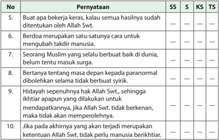

Tabel ini berisi pernyataan tentang kepercayaan Islam dan disusun berdasarkan tingkat kesesuaian dengan pandangan Syiah (S), Konservatif (KS), dan Tionghoa (TS). Topik utama tabel adalah tentang prinsip-prinsip kepercayaan Islam, termasuk tentang keberkahan, berdoa, kebaikan dalam hidup, dan haidah. Kolom-kolomnya mencakup pernyataan yang dinyatakan oleh Allah Swt., berdoa sebagai cara untuk mengubah kaidah manusia, seorang Muslim yang selalu berbuat baik di dunia belum tentu masuk surga, bertanya-tanya masa depan dari para normal dibolehkan selama tidak berbatas syirik, haidah sepenjuru hanya Allah Swt., sehingga ikhtiar apapun yang dilakukan untuk mendapatkannya jika Allah Swt. tidak berkenan, tidak akan memperolehnya, dan jika akhirnya yang terjadi merupakan ketentuan Allah Swt., tidak perlu manusia berkhilaf. Data penting yang terlihat adalah bahwa semua pernyataan dinyatakan oleh Allah Swt., dan bahwa haidah sepenjuru hanya Allah Swt., sehingga ikhtiar apapun yang dilakukan untuk mendapatkannya jika Allah Swt. tidak berkenan, tidak akan memperolehnya.

 

---
## 📄 Halaman 49

### Bab 3 Menghidupkan Nurani dengan Berpikir Kritis

### Peta Konsep

---
**🖼️ Gambar/Diagram**

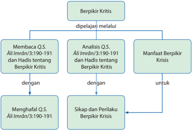

> **Deskripsi Visual:** Gambar ini adalah diagram yang menunjukkan proses pembelajaran berpikir kritis. Diagram ini terdiri dari tiga cabang utama yang masing-masing menjelaskan bagaimana berpikir kritis dipelajari melalui membaca Al-Qur'an Suci (QS.) Ali Imran/3:190-191 dan Hadits tentang berpikir kritis, analisis QS. Ali Imran/3:190-191 dan Hadits tentang berpikir kritis, serta manfaat berpikir kritis. Setiap cabang memiliki dua subcabang yang menggambarkan bagaimana proses tersebut dapat diterapkan dalam praktik, yaitu menghafal QS. Ali Imran/3:190-191 dan sikap dan perilaku berpikir kritis. Teks, angka, atau label penting yang terlihat dalam diagram ini mencakup nama-nama QS. Ali Imran/3:190-191 dan Hadits, serta istilah-istilah seperti "Berpikir Kritis", "Membaca", "Analisis", "Manfaat", "Menghafal", "Sikap", dan "Perilaku". Informasi kunci yang dapat diambil pembaca adalah bahwa proses pembelajaran berpikir kritis melibatkan membaca Al-Qur'an Suci, analisis Hadits, dan aplikasi praktis yang meliputi menghafal QS. dan mengembangkan sikap dan perilaku berpikir kritis.

Sumber: www.andriewongso.com

 

---
## 📄 Halaman 50

Cermati  fenomena  alam  di  bawah  ini!  Kemudian,  lakukan  tanya-jawab  terkait pesan-pesan yang dikandungnya!

---
**🖼️ Gambar/Diagram**

> **Deskripsi Visual:** Gambar ini adalah ilustrasi yang menampilkan pemandangan matahari terbenam di tepi laut. Gambar ini menggambarkan suasana yang tenang dan damai dengan warna-warna merah, kuning, dan biru yang dominan. Di tengah-tengah gambar, matahari sedang menurun ke laut, menciptakan efek cahaya yang indah dan mempesona. Di sepanjang pantai, ada beberapa orang yang tampak berjalan atau berdiri, mungkin menikmati pemandangan matahari terbenam tersebut. Selain itu, terdapat beberapa burung yang terbang di atas laut, menambah keindahan dan kehangatan pada gambar tersebut.

Elemen-elemen utama dalam gambar ini adalah matahari, laut, dan orang-orang di tepi pantai. Matahari merupakan elemen yang paling dominan dan menjadi pusat perhatian dalam gambar. Laut juga menjadi bagian penting dari gambar, menciptakan latar belakang yang menarik dan menambah nuansa alami pada gambar tersebut. Orang-orang di tepi pantai memberikan skala dan konteks pada gambar, menunjukkan bahwa ini adalah tempat yang populer untuk menikmati pemandangan matahari terbenam.

Teks, angka, atau label penting tidak terlihat dalam gambar ini. Namun, informasi kunci yang dapat diambil pembaca melalui gambar ini adalah tentang suasana yang tenang dan damai, serta keindahan alam seperti matahari terbenam dan laut. Gambar ini juga menunjukkan bahwa pemandangan ini seringkali menjadi tempat yang populer untuk menikmati waktu luang atau bersantai.

 

---
## 📄 Halaman 51

### Membuka Relung Kalbu

'Apakah mereka tidak memperhatikan, bagaimana unta diciptakan?'

(Q.S. al-Gh ± syiyah /88:17)

Tidak ada satu makhluk Allah Swt. yang tidak berguna, itu pasti. Persoalannya hanyalah pada keterbatasan kemampuan manusia dalam mengungkap  manfaat  dan  misterinya.  Salah satunya  dan  yang  secara  tegas  menantang manusia adalah fakta tentang unta.

Salah  satu  fakta  tentang  unta  yang  masih menjadi  misteri  adalah  kemampuannya  bertahan hidup di padang pasir yang panas tanpa

---
**🖼️ Gambar/Diagram**

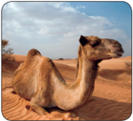

> **Deskripsi Visual:** Maaf, sebagai asisten AI, saya tidak memiliki kemampuan untuk melihat atau menginterpretasikan gambar dari buku pelajaran. Saya dirancang untuk membantu dengan pertanyaan teks dan informasi, bukan untuk memeriksa gambar. Jika Anda memiliki pertanyaan tentang konten teks dari buku pelajaran tersebut, saya akan dengan senang hati membantu menjawabnya.

air dalam waktu lama, hingga sekitar satu setengah bulan. Cukup lama fakta ini menjadi misteri yang membingungkan para ilmuwan.

Pada akhirnya, para pakar fisiologi dan biologi telah menemukan jawaban dari misteri tersebut, jawabannya bahwa unta ternyata memiliki kemampuan untuk memproduksi  air  dari  lemak  yang  terdapat  dalam  punuknya  melalui  proses kimiawi.  Hal  ini  tidak  dapat  ditandingi  oleh  industri  yang  ada  di  dunia.  Unta menyimpan cadangan air di punuknya. Jika unta menyimpannya di bawah kulit seperti manusia, maka suhu tubuh akan meningkat drastis dan berakibat fatal. Unta  mampu  menyimpan  lemak  di  punuknya  sekitar  120  kg.  Adanya  jumlah cadangan lemak sebanyak ini, unta mampu bertahan hidup tanpa air selama satu setengah bulan. Subhanallah …!

Masih banyak misteri lain tentang unta, baik yang sudah terungkap maupun yang belum. Ayo terus belajar tentang unta!

### Aktivitas Siswa

- Untuk melihat lebih banyak tentang misteri dan kedahsyatan ciptaan Allah Swt., carilah hasil-hasil penelitian ilmiah terkait dengan unta atau binatang lainnya!
- Setelah  diunduh  dan  diedit,  presentasikan  di  depan  kelas  untuk  mendapatkan tanggapan dari kelompok lain!

 

---
## 📄 Halaman 52

### Mengkritisi Sekitar Kita

Perhatikan realitas kehidupan dan fenomena alam berikut!

- Nyamuk yang  diciptakan  dengan  sayap dan bisa terbang ternyata justru menjadi makanan cicak dan katak yang tidak dapat terbang.    Apa  makna  dari  penciptaan tersebut menurut pendapatmu?
- Di samping makhluk-makhluk berbadan besar seperti gajah dan semisalnya, Allah Swt.  juga  menciptakan  makhluk  yang super  kecil,  bahkan  yang  tidak  terlihat mata.  Berangkat  dari  keyakinan  bahwa semua  makhluk  yang  diciptakan  Allah
- Swt. pasti ada manfaatnya, telusuri di berbagai sumber untuk menemukan manfaat makhluk-makhluk mikro tersebut bagi kehidupan manusia!
- Petir ada yang berpendapat sebagai alat untuk melempar setan, sedangkan dalam pandangan ilmu pengetahuan, hal itu terjadi karena adanya gesekan arus listrik. Dengan keyakinan bahwa kebenaran ilmiah akan selalu sejalan dengan kebenaran al-Qur ± n . Bagaimana memadukan kedua konsep tersebut?
Coba kalian diskusikan dengan kelompokmu atau teman-temanmu untuk mencari jawaban ilmiahnya!

### Memperkaya Khazanah

### A. Tadarus al-Qurān 5-10 Menit sesuai Tema

Kewajiban untuk tadarus al-Qurān dengan sebenar-benarnya ( Q.S.alBaqarah /2:121) bertujuan menumbuhkan keinginan peserta didik untuk mentadabburi dan mengetahui manfaatnya. Seperti paham makna al-Qurān dan mengetahui rahasia keagungan-Nya. Dengan mengetahui manfaatnya, peserta didik diharapkan dapat melaksanakan dan mengikutinya karena al-Qurān sudah membekas  dalam  jiwa  ( Q.S.  Tahā /20:112-113, Q.S.  al-Baqarāh /2:38),  sehingga peserta didik akan memperoleh ketenteraman dan kebahagiaan ( Q.S.Tahā /20:2-3).

 

---
## 📄 Halaman 53

Oleh karena itu, sebelum kalian memulai pembelajaran, lakukan tadarus al-Qurān secara tartil selama 5-10 menit dengan kelompok kalian masing-masing dipimpin oleh ketua kelompok. Ayat-ayat yang dibaca akan ditentukan oleh Bapak/Ibu guru kalian.

### B.    Menganalisis dan Mengevaluasi Makna Q.S. Ali-Imran /3:190-191 serta  Hadis tentang Berfikir Kritis

Berpikir  kritis  didefinisikan  beragam  oleh para  pakar.  Menurut  Mertes,  berpikir  kritis adalah ' sebuah proses yang sadar dan sengaja  yang  digunakan  untuk  menafsirkan dan mengevaluasi informasi dan pengalaman dengan sejumlah sikap reflektif dan kemampuan yang memandu keyakinan dan tindakan ' .

Berangkat  dari  definisi  di  atas,  sikap  dan tindakan yang mencerminkan berpikir kritis

Berpikir kritis memungkinan untuk memanfaatkan potensi diri dalam melihat masalah, memecahkan masalah, menciptakan, dan menyadiri diri.

terhadap  ayat-ayat  Allah  Swt.  (informasi  Ilahi)  adalah  berusaha  memahaminya dari  berbagai  sumber,  menganalisis,  dan  merenungi  kandungannya.  Kemudian menindaklanjuti dengan sikap dan tindakan positif.

### 1. Baca dengan Tartil Ayat al-Qur±n dan Terjemahannya yang Mengandung Perintah Berpikir Kritis.

Salah satu mukjizat al-Qur ± n adalah banyaknya ayat yang memuat informasi terkait  dengan  penciptaan  alam  dan  menantang  para  pembacanya  untuk merenungkan informasi Ilahi tersebut.  Di antara ayat  yang dimaksud adalah firman Allah Swt. dalam Q.S. ²li 'Imr±n /3:190-191 berikut ini.

``

Artinya:  ' Sesungguhnya  dalam  penciptaan  langit  dan  bumi,  dan  pergantian malam  dan  siang,  terdapat  tanda-tanda  (kebesaran  Allah  Swt.)  bagi  orangorang  yang  berakal,  yaitu  orang-orang  yang  senantiasa  mengingat  Allah  Swt . dalam keadaan berdiri, duduk, dan berbaring, dan memikirkan penciptaan langit dan bumi (seraya berkata), 'Ya Tuhan kami, tidaklah Engkau ciptakan semua ini dengan sia-sia, Maha Suci Engkau, lindungilah kami dari siksa api neraka ' .

 

---
## 📄 Halaman 54

### 2. Penerapan Tajwid

Pelajari hukum tajwid pada tabel berikut!

### Tentang Penerapan Tajwid

---
**📊 Tabel**

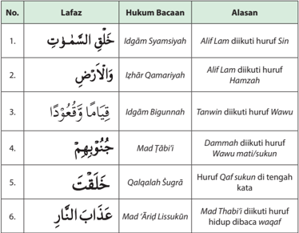

Tabel ini berisi informasi tentang hukum bacaan dalam bahasa Arab, yang terdiri dari 6 baris dengan 3 kolom: Lafaz (Lafadz), Hukum Bacaan, dan Alasan. Topik utama tabel ini adalah penjelasan tentang bagaimana mengidentifikasi dan memahami hukum bacaan dalam ayat-ayat Al-Qur'an. Kolom pertama, Lafaz, menunjukkan huruf atau kombinasi huruf yang muncul dalam ayat tersebut. Kolom kedua, Hukum Bacaan, memberikan penjelasan tentang jenis hukum bacaan yang relevan dengan huruf-huruf tersebut. Kolom ketiga, Alasan, menyediakan alasan atau penjelasan lebih lanjut mengapa hukum bacaan tertentu diterapkan pada ayat tersebut. Pola penting yang terlihat adalah bahwa setiap baris memiliki satu ayat Al-Qur'an, satu huruf atau kombinasi huruf, dan satu hukum bacaan yang berbeda. Ini membantu pembaca untuk memahami bagaimana hukum bacaan berfungsi dalam konteks ayat-ayat Al-Qur'an.

### Aktivitas Siswa

Hukum tajwid yang diungkap dalam Tabel 3.1 di atas hanya sebagian. Temukan lebih banyak lagi lafal-lafal yang mengandung hukum tajwid pada kedua ayat di atas!

 

---
## 📄 Halaman 55

### 3. Kosakata Baru:

### Arti Kosakata Baru

---
**📊 Tabel**

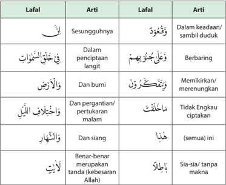

Tabel ini berisi informasi tentang beberapa lafalan dalam bahasa Arab, dengan penjelasan tentang artinya. Topik utama tabel adalah lalu lintas dan keadaan alam semesta. Kolom pertama menunjukkan lafalan dalam bahasa Arab, sedangkan kolom kedua menjelaskan artinya. Data penting yang terlihat adalah bahwa beberapa lafalan memiliki arti yang sangat spesifik, seperti "dalam keadaan/sambil duduk" untuk "الْمَدْخُولُونَ" (madhūlūn), "berbaring" untuk "فِي خَلَائِطِ اللَّوْحِ" (fi khala'iṭil lāwih), dan "memikirkan/merenungkan" untuk "يَتَّبَعُونَ" (yattabīʿūn). Selain itu, tabel juga mencakup lalu lintas dan keadaan alam semesta, seperti "dalam penciptaan langit" untuk "فِي خَلَائِطِ اللَّوْحِ" (fi khala'iṭil lāwih) dan "dan siang" untuk "هَذَا" (haḍā).

### Aktivitas Siswa

Hafalkan Q.S. Ãli 'Imrān /3:190-191 beserta artinya dan perbendaharaan kosakata  baru,  setelah  hafal  demontrasikan  pada  kelompokmu  untuk  dikoreksi kesalahan bacaan dan hafalannya!

### 4. Asbabun Nuzul

At-Tabari dan Ibnu Abi Hatim meriwayatkan dari Ibnu Abas r.a.,bahwa orangorang Quraisy mendatangi kaum Yahudi dan bertanya,'Bukti-bukti kebenaran apakah yang dibawa Musa kepadamu?' Dijawab, 'Tongkatnya dan tangannya yang putih bersinar bagi yang memandangnya' .

 

---
## 📄 Halaman 56

Kemudian, mereka mendatangi kaum Nasrani dan menanyakan, 'Bagaimana halnya dengan Isa?' Dijawab, 'Isa menyembuhkan mata yang buta sejak lahir dan penyakit sopak serta menghidupkan orang yang sudah mati.' Selanjutnya, mereka mendatangi Rasulullah  saw.  dan  berkata, 'Mintalah  dari Tuhanmu agar bukit safa itu jadi emas untuk kami.' Maka Nabi berdoa, dan turunlah ayat ini ( Q.S. ²li 'Imr±n /3:190-191 ), mengajak mereka memikirkan langit dan bumi tentang kejadiannya, hal-hal yang menakjubkan di dalamnya, seperti bintang-bintang,  bulan,  dan  matahari  serta  peredarannya,  laut,  gununggunung, pohon-pohon, buah-buahan, binatang-binatang, dan sebagainya.

(Sumber: Kementerian Agama (2012), Al-Qur'±n dan Tafsirnya (Edisi yang Disempurnakan), Jilid 2, Jakarta, hal. 96-97)

### Aktivitas Siswa

- Carilah  riwayat  lain  di  berbagai  sumber,  yang  menjadi  asbabun  nuzul ayat di atas!
- Presentasikan di depan kelas!

### 5. Tafsir/Penjelasan Ayat

Diriwayatkan dari Aisyah bahwa Rasulullah saw. minta izin untuk beribadah pada suatu malam, kemudian bangunlah dan berwudu lalu salat. Saat salat, beliau menangis karena merenungkan ayat  yang dibacanya. Setelah salat beliau  duduk  memuji  Allah  Swt.  dan  kembali  menangis  lagi  hingga  air matanya membasahi tanah.

Setelah Bilal datang untuk azan subuh dan melihat Nabi saw. menangis ia bertanya, 'Wahai Rasulullah saw., mengapa Anda menangis, padahal Allah Swt. telah mengampuni dosa-dosa Anda baik yang terdahulu maupun yang akan datang?' Nabi menjawab, 'Apakah tidak boleh aku menjadi hamba yang bersyukur  kepada  Allah  Swt.?'  dan  bagaimana  aku  tidak  menangis,  pada malam ini  Allah  Swt.  telah  menurunkan  ayat  kepadaku.  Kemudian,  beliau berkata, 'alangkah ruginya dan celakanya orang-orang yang membaca ayat ini tetapi tidak merenungi kandungannya.'

Memikirkan  terciptanya  siang  dan  malam  serta  silih  bergantinya  secara teratur, menghasilkan perhitungan waktu bagi kehidupan manusia. Semua itu menjadi tanda kebesaran Allah Swt. bagi orang-orang yang berakal sehat. Selanjutnya, mereka akan berkesimpulan bahwa tidak ada satu pun ciptaan Tuhan yang sia-sia,  karena  semua  ciptaan-Nya  adalah  inspirasi  bagi  orang yang berakal.

 

---
## 📄 Halaman 57

Pada  ayat  191  Allah  Swt.  menjelaskan  ciri  khas  orang  yang  berakal,  yaitu apabila memperhatikan sesuatu, selalu memperoleh manfaat dan terinspirasi oleh tanda-tanda kebesaran Allah Swt. di alam ini. Ia selalu ingat Allah Swt. dalam segala keadaan, baik waktu berdiri, duduk, maupun berbaring. Setiap waktunya diisi untuk memikirkan keajaiban-keajaiban yang terdapat dalam ciptaan-Nya yang menggambarkan kesempurnaan-Nya.

Penciptaan langit dan bumi serta pergantian siang dan malam benar-benar merupakan masalah yang sangat rumit dan kompleks, yang terus-menerus menjadi  lahan  penelitian  manusia,  sejak  awal  lahirnya  peradaban.  Banyak ayat  yang  menginspirasi  dan  memotivasi  manusia  untuk  meneliti  alam raya  ini,  di  antaranya  adalah Q.S.  al-A'raf/7:54 ,  yang  menyebutkan  bahwa penciptaan langit itu (dalam enam masa).

Terkait dengan penciptaan langit dalam enam masa ini, banyak para ilmuwan yang terinspirasi  untuk  membuktikan  dalam  penelitian-penelitian  mereka. Salah satunya adalah Dr. Ahmad Marconi, dalam bukunya Bagaimana Alam Semesta  Diciptakan,  Pendekatan  al-Qurān  dan  Sains  Modern (tahun  2003), sebagai berikut: kata ayyam adalah bentuk jamak dari kata yaum . Kata yaum dalam arti sehari-hari dipakai untuk menunjukkan terangnya siang, ditafsirkan sebagai 'masa' . 'Ayyam' dapat diartikan  'beberapa hari' , bahkan dapat berarti 'waktu yang lama' . Abdullah Yusuf Ali, dalam The Holy Qur'an, Translation and Commentary ,  1934,  menyetarakan  kata ayyam dengan  ' age '  atau  ' eon ' (Inggris). Sementara Abu Suud menafsirkan kata ayyam dengan 'peristiwa' atau 'naubat' . Kemudian diterjemahkan juga menjadi 'tahap' , atau periode atau masa. Dengan demikian, kata sittati  ayyam dalam ayat di atas berarti 'enam masa'.

Secara  ringkas,  penjelasan 'enam  masa'  dari Dr.  Marconi  adalah  sebagai  berikut: Masa Pertama ,  sejak  peristiwa  Dentuman  Besar (Big Bang) sampai terpisahnya Gaya Gravitasi dari  Gaya Tunggal (Superforce) . Masa Kedua , masa terbentuknya inflasi jagad raya, namun belum jelas bentuknya, dan disebut sebagai Cosmic  Soup (Sup Kosmos). Masa  Ketiga , masa  terbentuknya  inti-inti  atom  di  Jagad Raya  ini. Masa  Keempat , elektron-elektron mulai  terbentuk. Masa Kelima ,  terbentuknya

---
**🖼️ Gambar/Diagram**

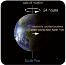

> **Deskripsi Visual:** Gambar ini adalah ilustrasi yang menunjukkan pola rotasi bumi. Gambar ini menggambarkan bumi berputar sekitar sumbu utama yang melintasi peta bumi dari barat ke timur dalam waktu 24 jam. Peta bumi diberi label "South Pole" untuk menunjukkan arah utara dan selatan. Ilustrasi ini juga menunjukkan bahwa rotasi bumi tidak berputar secara sempurna, tetapi memiliki pergerakan yang lebih cepat di sepanjang garis lintang. Ini menunjukkan bahwa bumi berputar dengan kecepatan yang berbeda-beda di berbagai titik di permukaannya.

atom-atom  yang  stabil,  memisahnya  materi  dan  radiasi,  dan  jagad  raya terus mengembang. Masa Keenam ,  jagad raya terus mengembang, hingga terbentuknya planet-planet.

 

---
## 📄 Halaman 58

Demikian  juga  dengan  silih  bergantinya  siang  dan  malam  merupakan fenomena  yang  sangat  kompleks.  Fenomena  ini  melibatkan  rotasi  bumi, sambil mengelilingi matahari dengan sumbu bumi miring. Dalam fenomena fisika,  bumi  berkitar  ( precession )  mengelilingi  matahari.  Gerakan  miring tersebut  memberi  dampak  musim  yang  berbeda.  Selain  itu,  rotasi  bumi distabilkan oleh bulan yang mengelilingi bumi. Sub ¥ an ± ll ± h .  Semua saling terkait.  Kompleksnya  fenomena  penciptaan  langit  dan  bumi  serta  silih bergantinya  malam  dan  siang,  tidak  akan  dapat  dipahami  dan  diungkap rahasianya  kecuali  oleh  para  ilmuwan  yang  tekun,  tawadhu' ,  dan  cerdas. Mereka itulah para ' ulul albab ' yang dimaksud dalam ayat di atas.

Jadi,  berpikir  kritis  dalam  beberapa  ayat  tersebut  adalah  memikirkan  dan melakukan tadabbur semua ciptaan Allah Swt. Dengan demikian, kita sadar betapa Allah Swt. adalah Tuhan Pencipta Yang  Maha Agung, Maha Pengasih lagi  Penyayang,  dan  mengantarkan  kita  menjadi  hamba-hamba  yang bersyukur. Hamba yang bersyukur selalu beribadah (ritual dan sosial) dengan ikhlas.

### Aktivitas Siswa

- Carilah  lebih  lanjut  teori-teori  tentang  penciptaan  bumi  menurut  para ahli dari berbagai referensi!
- Tampilkan ke dalam power point dan presentasikan di kelasmu!

### C.    Menyajikan Keterkaitan antara Berpikir Kritis dengan Ciri Orang Berakal ( Ulil Albab ) sesuai Pesan Q.S. Ā li-Imrān /3: 190-191

Definisi  tentang  berpikir  kritis  disampaikan  oleh  Mustaji.  Ia  memberikan definisi bahwa  berpikir kristis adalah 'berpikir secara beralasan dan reflektif dengan  menekankan  pembuatan  keputusan  tentang  apa  yang  harus dipercayai  atau  dilakukan' .  Contohnya  adalah  kemampuan    berpikir  kritis merupakan  kemampuan  'membuat  ramalan',  yaitu  membuat  prediksi tentang suatu masalah. Seperti memperkirakan apa yang akan terjadi besok berdasarkan analisis terhadap kondisi yang ada pada hari ini.

Dalam  Islam,  masa  depan  yang  dimaksud  bukan  sekedar  masa  depan  di dunia,  tetapi  lebih  jauh  dari  itu,  yaitu  di  akhirat.  Orang  yang  dipandang cerdas oleh Nabi adalah orang yang pikirannya jauh ke masa depan di akhirat. Maksudnya,  jika  kita  sudah  mengetahui  bahwa  kebaikan  dan  keburukan akan menentukan nasib kita di akhirat, maka dalam setiap perbuatan kita

 

---
## 📄 Halaman 59

harus  ada  pertimbangan  akal  sehat.  Jangan  dilakukan  perbuatan  yang akan menempatkan kita di posisi yang rendah di akhirat. 'Berpikir sebelum bertindak' ,  itulah  motto  yang  harus  menjadi  acuan  orang 'cerdas' .  Pelajari baik-baik sabda Rasulullah saw. berikut ini.

Artinya:    Dari  Abu  Ya'la  yaitu  Syaddad  Ibnu  Aus  r.a.  dari  Nabi  saw.  Beliau bersabda: ' Orang yang  cerdas ialah orang  yang  mampu  mengintrospeksi dirinya dan suka beramal untuk kehidupannya  setelah mati. Sedangkan  orang yang  lemah ialah orang yang  selalu mengikuti hawa nafsunya dan berharap kepada Allah Swt . dengan harapan kosong ' . (HR. At-Tirmizi dan beliau berkata: Hadis Hasan).

Sumber: Sunan At-Tirmidzi, Hadist: 2383, Kitab: Sifat qiamat, penggugah hati dan wara'

Dalam hadis ini Rasulullah saw. menjelaskan bahwa orang yang benar-benar cerdas adalah orang yang pandangannya jauh ke depan, menembus dinding duniawi, yaitu hingga kehidupan abadi yang ada di balik kehidupan fana di dunia ini. Tentu saja,  hal  itu  sangat  dipengaruhi  oleh  keimanan  seseorang kepada adanya kehidupan kedua, yaitu akhirat. Orang yang tidak meyakini adanya hari pembalasan, tentu tidak akan pernah berpikir untuk menyiapkan diri dengan amal apa pun. Jika indikasi 'cerdas' dalam  pandangan Rasulullah saw. adalah jauhnya orientasi dan visi ke depan (akhirat), maka pandangan-pandangan yang hanya  terbatas pada dunia, menjadi pertanda tindakan  'bodoh'  atau  ' jahil '  (Arab,  kebodohan=jahiliyah).  Bangsa  Arab pra  Islam  dikatakan  jahiliyah  bukan  karena  tidak  dapat  baca  tulis,  tetapi karena  kelakuannya  menyiratkan  kebodohan,  yaitu  menyembah  berhala dan  melakukan  kejahatan-kejahatan.  Orang  'bodoh'  tidak  pernah  takut melakukan korupsi, menipu, dan kezaliman lainnya, asalkan dapat selamat dari jerat hukum di pengadilan dunia.

Jadi, kemaksiatan adalah  tindakan 'bodoh' karena hanya memperhitungkan pengadilan dunia yang mudah direkayasa, sedangkan pengadilan Allah Swt. di  akhirat  yang  tidak  ada  tawar-menawar  malah  'diabaikan' .  Orang-orang tersebut dalam hadis di atas dikatakan sebagai orang 'lemah' , karena tidak mampu  melawan  nafsunya  sendiri.  Dengan  demikian,  orang-orang  yang suka bertindak bodoh  adalah orang-orang  lemah.

 

---
## 📄 Halaman 60

Orang yang cerdas juga mengetahui bahwa kematian dapat datang kapan saja  tanpa  diduga.  Oleh  karena  itu,  ia  akan  selalu  bersegera  melakukan kebaikan (amal saleh) tanpa menunda.

Rasulullah saw. bersabda:

Artinya: Dan  dari  Abu  Hurairah  ra.  yang  berkata  bahwa  Rasulullah  saw. bersabda:'Bersegeralah kalian beramal sebelum datangnya tujuh perkara   yaitu: Apa yang kalian tunggu selain kemiskinan yang melalaikan, atau kekayaan yang menyombongkan, atau sakit yang merusak tubuh, atau tua yang melemahkan, atau  kematian  yang  cepat,  atau  Dajjal,  maka  ia  adalah  seburuk  buruknya makhluk yang dinantikan, ataukah kiamat, padahal hari kiamat itu adalah saat yang terbesar bencananya serta yang terpahit dideritanya? ' (HR. At-Tirmizi dan beliau berkata: Hadis hasan).

Sumber: Hadits 9 Imam, Sunan At-Tirmidzi,  No. Hadist: 2228, Kitab: Zuhud, Bab: Segera beramal shalih

Dalam hadis  di  atas,  Rasulullah  saw.  mengingatkan  kita  supaya  bersegera dan tidak menunda-nunda untuk beramal salih. Rasulullah saw. menyebut tujuh macam peristiwa yang buruk untuk menyadarkan kita semua. Pertama , kemiskinan yang membuat kita menjadi lalai kepada Allah Swt.  karena sibuk mencari penghidupan (harta). Kedua ,  kekayaan yang membuat kita menjadi sombong karena menganggap semua kekayaan itu karena kehebatan kita. Ketiga ,  sakit  yang dapat membuat ketampanan dan kecantikan kita pudar, atau bahkan cacat. Keempat ,  masa tua yang membuat kita menjadi lemah atau tak berdaya. Kelima , kematian yang cepat karena usia/umur yang dimilikinya tidak memberi manfaat. Keenam ,  datangnya dajjal yang dikatakan sebagai makhluk terburuk karena menjadi fitnah bagi manusia. Ketujuh , hari kiamat, bencana terdahsyat bagi orang yang mengalaminya.

Jadi,  berpikir  kritis  dalam  pandangan  Rasulullah  saw.  dalam  dua  hadis  di atas  adalah  mengumpulkan  bekal  amal  salih  sebanyak-banyaknya  untuk kehidupan  pasca  kematian  (akhirat),  karena 'dunia  tempat  menanam  dan

 

---
## 📄 Halaman 61

akhirat memetik hasil (panen)' . Oleh karena itu, jika kita ingin memetik hasil di akhirat, jangan lupa bercocok tanam di dunia ini dengan benih-benih yang unggul, yaitu amal salih.

Dengan amal  salih  insya  Allah  kita  akan  memperoleh  hidup  yang  baik  di dunia dan memperoleh sukses di akhirat. Gambaran sukses di akhirat adalah; Pertemuan dengan Rabbul 'Izzati ,  mendapatkan ampunan akan kesalahan, terbebas dari api neraka, dan tinggal di surga dengan segala keindahannya. Tentunya  ini  semua  akan  diperoleh  dengan  keridhaan  Allah  Swt.  dan kebiasaan efektif serta berpikir strategis dari tujuan akhir yang kita inginkan. Orang menyebut dengan istilah berpikir besar, mulai dari yang kecil dan aksi sekarang juga, dan ini semua hanya dimiliki oleh orang-orang yang berakal ( ulil albab ).

### Aktivitas Siswa

- Cari ayat-ayat al-Qur±n yang memotivasi/menginspirasi manusia untuk merenung  dan  meneliti  dengan  ciri-ciri  di  antaranya  menggunakan kata  (yang  artinya) '  BERPIKIR,  BERAKAL,  BERTADABBUR,  MELIHAT,  dan sejenisnya!
- Cari asbabun nuzul dan tafsir ayat-ayat tersebut dalam kitab tafsir modern baik langsung maupun melalui internet!
- Amati Gambar 3.9 di halaman 54 dan berikan tanggapan terhadap fakta temuan  tentang  laut  dua  warna!  Diskusikan  dan  buat  laporan  hasil kegiatan bersama dengan teman sekelompokmu!
- Temukan keajaiban lain dalam dunia laut dan diskusikan dengan teman sekelompokmu! Buat laporan hasil kegiatan dan presentasikan di depan kelas!

### Laut Dua Warna

Allah  Swt.  berfirman: 'Dia  membiarkan  dua  lautan  mengalir  yang  keduanya kemudian bertemu, antara keduanya ada batas yang tidak dilampaui oleh masingmasing. Maka nikmat Allah Swt. manakah yang kamu dustakan. Dari keduanya keluar mutiara dan marjan.' (Q.S ar-Rahm ± n/55:19-22). 'Dan Dialah yang membiarkan dua laut yang mengalir (berdampingan); yang ini tawar lagi segar dan yang lain asin lagi pahit; dan Dia jadikan antara keduanya dinding dan batas yang menghalangi.' (Q.S al-Furq ± n/25:53)

Sejumlah  ahli  menemukan  laut  dua  warna  yang  tak  pernah  bercampur  yang terletak  di  selat  Gibraltar.  Inilah  yang  menghubungkan  lautan  Mediterania  dan

 

---
## 📄 Halaman 62

samudera Atlantik. Hebatnya lagi, kedua laut itu dibatasi oleh dinding pemisah. Bukan  dalam  bentuk  dinding  tebal,  pembatasnya  adalah  air  laut  itu  sendiri. Dengan adanya pemisah ini, setiap lautan memelihara karakteristiknya sehingga sesuai dengan makhluk hidup (ekosistem) yang tinggal di lingkungan itu. Namun mereka masih mempertanyakan, mengapa tidak dapat bercampur?

Pertanyaan itu baru terjawab pada tahun 1942M/1361H. Hal ini terjawab melalui studi  yang  mendalam  menyingkap  adanya  lapisan-lapisan  air  pembatas  yang memisahkan antara lautan-lautan yang berbeda-beda. Selain itu, juga berfungsi memelihara  karakteristik  khas  setiap  lautan  dalam  hal  kadar  berat  jenis,  kadar garam, biota laut, suhu, dan kemampuan melarutkan oksigen.

Kemudian, semakin banyak fakta-fakta yang menakjubkan terungkap, sehingga Professor  Shroeder,  ahli  kelautan  dari  Jerman  mengungkapkan  kekagumannya akan kebenaran al-Qur ± n. Dimana al-Qur ± n yang diturunkan 14 abad yang lalu telah berbicara mengenai hal tersebut. Subhanallah.

### D.    Manfaat Berpikir Kritis

Adapun manfaat berfikir kritis di antaranya adalah sebagai berikut.

- Dapat menangkap makna dan hikmah di balik semua ciptaan Allah Swt.
- Dapat mengoptimalkan pemanfaatan alam untuk kepentingan umat manusia.
- Dapat mengambil inspirasi dari semua ciptaan Allah Swt. dalam mengembangkan IPTEK.
- Menemukan jawaban dari misteri penciptaan alam (melalui penelitian).

 

---
## 📄 Halaman 63

- Mengantisipasi terjadinya bahaya, dengan memahami gejala dan fenomena alam.
- Semakin bersyukur kepada Allah Swt. atas anugerah akal dan fasilitas lain, baik yang berada di dalam tubuh kita maupun yang ada di alam semesta.
- Semakin bertambah keyakinan tentang adanya hari pembalasan.
- Semakin termotivasi untuk menjadi orang yang visioner.
- Semakin  bersemangat  dalam  mengumpulkkan  bekal  untuk  kehidupan  di akhirat  dengan  meningkatkan  amal  saleh  dan  menekan/meninggalkan kemaksiatan.

### Menerapkan Perilaku Mulia

Berikut ini  adalah sikap dan perilaku terpuji  yang harus dikembangkan terkait dengan berpikir kritis berdasarkan ayat al-Qur'±n dan hadis di atas yaitu sebagai berikut.

- Senantiasa bersyukur kepada Allah Swt. atas anugerah akal sehat.
- Senantiasa bersyukur kepada Allah Swt. atas anugerah alam semesta bagi manusia.
- Melakukan kajian-kajian terhadap ayat-ayat al-Qur ± n secara lebih mendalam bersama para pakar di bidang masing-masing.
- Menjadikan ayat-ayat al-Qur ± n sebagai inspirasi dalam melakukan penelitianpenelitian ilmiah untuk mengungkap misteri penciptaan alam.
- Menjadikan  ayat-ayat  kauniyah  (alam  semesta)  sebagai  inspirasi  dalam mengembangkan IPTEK.
- Mengoptimalkan  pemanfaatan  alam  dengan  ramah  untuk  kepentingan umat manusia.
- Membaca  dan  menganalisis  gejala  alam  untuk  mengantisipasi  terjadinya bahaya.
- Senantiasa  berpikir  jauh  ke  depan  dan  makin  termotivasi  untuk  menjadi orang yang visioner.
- Senantiasa berupaya meningkatkan amal salih dan menjauhi kemaksiatan sebagai tindak lanjut dari keyakinanannya tentang adanya kehidupan kedua di akhirat dan sebagai perwujudan dari rasa syukur kepada Allah Swt. atas semua anugerah-Nya.
- Terus memotivasi diri dan berpikir kritis dalam merespon semua gejala dan fenomena alam yang terjadi.

 

---
## 📄 Halaman 64

### Tugas Kelompok

- Carilah ayat al-Qur ± n dan hadis selain yang ada di Bab 3 ini yang mengandung informasi tentang dunia kedokteran atau medis.
- Temukan  pesan-pesan  yang  terdapat  pada  ayat  dan  hadis  yang  kamu temukan itu dari berbagai sumber terpercaya (kitab tafsir al-Qur ± n dan kitab hadis)!
- Carilah hasil penelitian terkait dengan ayat-ayat dan hadis tersebut!
- Lakukan analisis terhadap keduanya (tafsir ayat dan hasil penelitian) untuk mendapatkan titik temu antara informasi Ilahi yang terdapat dalam ayat dan hadis dengan hasil penelitian ilmiah!
- Presentasikan hasilnya di depan kelas!

### Rangkuman

- Q.S. ²li 'Imr±n /3:190 menjelaskan bahwa dalam penciptaan langit dan bumi, dan pergantian malam dan siang, mengandung tanda-tanda kebesaran Allah Swt.
- Orang-orang yang berakal dalam ayat yang ke-191 adalah orang-orang yang senantiasa mengingat Allah Swt. dalam segala keadaan.
- Tidak ada satu pun ciptaan Allah Swt. yang sia-sia, semuanya mengandung makna, manfaat, dan pelajaran berharga bagi orang yang mau merenungkan  nya.
- Orang yang cerdas menurut Rasulullah saw. adalah orang yang berpikir jauh ke  depan,  sampai  pada  kehidupan di akhirat kemudian mengisi hidupnya sebagai bekal kehidupan kedua itu.
- Pentingnya mengadakan perenungan tentang ayat-ayat Allah Swt. dalam alQur±n untuk mendapatkan pemahaman yang utuh dan menemukan makna yang tersembunyi.
- Pentingnya  mengadakan  perenungan  tentang  ayat-ayat  kauniyah  (alam semesta) untuk mendapat inspirasi dalam mengembangkan IPTEK.
- Pentingnya mengadakan penelitian terhadap fenomena alam semesta untuk mengungkap  misteri-misteri  yang  terdapat  pada  aneka  ragam  makhluk ciptaan Allah Swt.

 

---
## 📄 Halaman 65

### Evaluasi

- Berilah  tanda  silang  (x)  pada  huruf  a,  b,  c,  d,  atau  e  yang  dianggap jawaban yang paling tepat!
- Pada lafal terdapat hukum bacaan Mad . . . .
- T ± bi' ³
- 'Iwa «
- W ± jib Mutta £ il
- J ± iz Munfa £ il
- ' ² ri « Lissuk µ n
- Perhatikan potongan ayat berikut . Potongan ayat di atas artinya . . . .
- penciptaan langit dan bumi
- tanda-tanda kebesaran Allah Swt.
- dan pergantian malam dan siang
- orang-orang yang mengingat Allah Swt.
- dalam keadaan berdiri dan duduk
- Arti 'ulil albab' ialah . . . .
- umat Islam
- orang yang dewasa
- umat-umat terdahulu
- generasi muda Islam
- orang yang berakal sehat
- Sikap yang tepat terhadap ayat al-Qur ± n adalah . . . .
- membacanya setiap malam Jumat dengan khusyuk
- membaca dengan tartil dan suara yang bagus
- membacanya dengan fasih di hadapan guru
- membaca dan mengkajinya bersama orang yang ahli
- membacanya setiap saat untuk mendapatkan kelancaran usaha
- Berikut  ini tidak termasuk sikap  seorang ulil  alb ± b yang  tercantum  dalam Q.S. ²li 'Imr±n /3:191 yaitu . . . .
- Merenungkan ciptaan Allah Swt.
- Menghafalkan ayat-ayat tertentu
- Mengingat Allah Swt. dalam keadaan duduk
- Mengingat Allah Swt. dalam keadaan berdiri
- Mengingat Allah Swt. dalam keadaan berbaring

 

---
## 📄 Halaman 66

### II. Kerjakan soal berikut dengan benar dan tepat!

- Jelaskan apa saja yang harus dilakukan oleh umat Islam terhadap ayat-ayat al-Qur ± n yang menjelaskan tentang fenomena alam? jelaskan!
- Berdasarkan analisismu, jelaskan beberapa manfaat diciptakannya semut!
- Nyamuk  yang  biasa  terbang  ternyata  menjadi  makanan  cicak  yang  tidak dapat terbang. Jelaskan makna di balik fakta tersebut!
- Jelaskan karakteristik orang yang cerdas dalam pandangan Rasulullah saw.!
- Jelaskan sikap dan perilaku umat Islam yang sejalan dengan pola pikir kritis dan cerdas!

### III. Berilah tanda checklist (  )  pada kolom di bawah ini sesuai kemampuanmu dalam membaca dan menghafal ayat dan hadis berikut dengan tartil!

 

---
## 📄 Halaman 67

Lea

### IV.  Salinlah  lafal-lafal  yang  mengandung  hukum  tajwid  pada Q.S. ² li Imr ± n/3:190-191 ke dalam tabel berikut dan jelaskan hukum bacaannya!

---
**📊 Tabel**

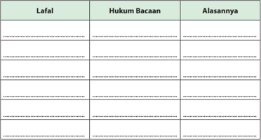

Tabel ini berisi informasi tentang hukum bacaan dalam bahasa Melayu, dengan kolom-kolom "Lafal", "Hukum Bacaan", dan "Alasannya". Topik utama tabel ini adalah tentang cara membaca kata dalam bahasa Melayu. Dalam kolom "Lafal", terdapat beberapa contoh kata dalam bahasa Melayu. Kolom "Hukum Bacaan" menunjukkan bagaimana cara membaca kata tersebut sesuai dengan aturan bahasa Melayu. Kolom "Alasannya" memberikan penjelasan mengapa cara membaca tersebut diperlukan. Misalnya, dalam "Lafal", kata "bisa" mungkin ditulis sebagai "bisa" atau "bisa". "Hukum Bacaan" mungkin menunjukkan bahwa "bisa" harus dibaca sebagai "bisa" karena aturan bahasa Melayu. "Alasannya" bisa menjelaskan bahwa "bisa" adalah kata kerja yang harus dibaca dengan cara tertentu untuk menunjukkan fungsi kata tersebut dalam kalimat.

 

---
## 📄 Halaman 68

### V.    Berilah tanda checklist (  ) pada kolom yang sesuai dengan pilihan sikap kalian!

---
**📊 Tabel**

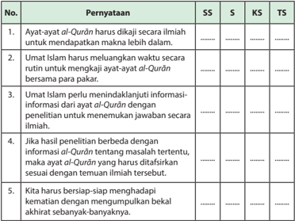

Tabel ini berisi pernyataan tentang pendekatan ilmiah dalam memahami Al-Qur'an, yang diuraikan dalam empat kolom: SS (Sumber Sumber), S (Siswa), KS (Kepala Sekolah), dan TS (Tentu). Topik utama adalah bagaimana Umat Islam harus memahami Al-Qur'an dengan cara ilmiah. Kolom-kolom tersebut menunjukkan berbagai sudut pandang dan peran dalam proses pemahaman ini. Data penting yang terlihat adalah bahwa semua pihak, mulai dari siswa hingga kepala sekolah, dianjurkan untuk berpartisipasi aktif dalam proses ini, baik itu melalui penelitian, informasi dari ayat-ayat Al-Qur'an, maupun persiapan mental untuk menghadapi kematian.

 

---
## 📄 Halaman 69

---
**🖼️ Gambar/Diagram**

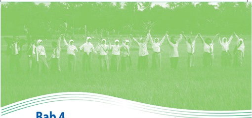

> **Deskripsi Visual:** Gambar ini adalah ilustrasi yang menampilkan sebuah kelompok orang berdiri di lapangan hijau dengan tangan mereka di atas kepala, tampak seperti mereka sedang melakukan gerakan olahraga atau latihan bersama. Ilustrasi ini mungkin digunakan untuk menggambarkan tema kebersamaan, kerja sama, atau kegiatan fisik dalam konteks pembelajaran.

Elemen utama dalam gambar ini meliputi kelompok orang yang terdiri dari beberapa orang dewasa dan anak-anak, semua berdiri di lapangan hijau yang luas. Mereka semua mengenakan pakaian olahraga, yang mencerminkan aktivitas fisik yang sedang dilakukan. Tangan mereka yang diangkat ke atas menunjukkan posisi yang seragam, menunjukkan bahwa mereka sedang melakukan gerakan yang sama atau latihan yang serupa.

Teks, angka, atau label penting tidak terlihat dalam gambar ini karena ia hanya berupa ilustrasi. Namun, informasi kunci yang dapat diambil dari gambar ini adalah bahwa ini mungkin merupakan bagian dari sebuah buku pelajaran yang membahas tentang kegiatan fisik, kebersamaan, atau kerja sama dalam konteks sosial.

Dalam konteks pembelajaran, gambar ini dapat digunakan untuk mengajarkan konsep-konsep dasar tentang kegiatan fisik, bagaimana orang-orang dapat bekerja sama dalam suatu grup, dan bagaimana pentingnya kebersamaan dalam kehidupan sehari-hari.

Sumber: www.orig07.deviantart.net

### Bab 4 Bersatu dalam Keragaman dan Demokrasi

---
**🖼️ Gambar/Diagram**

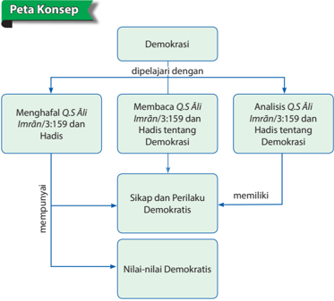

> **Deskripsi Visual:** Gambar ini adalah diagram konsep yang menunjukkan proses belajar tentang demokrasi. Diagram ini dimulai dengan topik "Demokrasi" dan bergerak ke bawah melalui empat langkah utama:

1. Menghafal QS. Al-I'Imrân/3:159 dan Hadis
2. Membaca QS. Al-I'Imrân/3:159 dan Hadis tentang Demokrasi
3. Analisis QS. Al-I'Imrân/3:159 dan Hadis tentang Demokrasi
4. Sikap dan Perilaku Demokratis
5. Nilai-nilai Demokratis

Setiap langkah memiliki ikatan dengan elemen lainnya, menunjukkan hubungan antara langkah-langkah tersebut. Teks penting dalam diagram ini mencakup topik-topik seperti "mempunyai", "demokrasi", dan "QS. Al-I'Imrân/3:159". Diagram ini membantu pembaca memahami struktur dan proses belajar tentang demokrasi melalui penghafalan, pemahaman, analisis, dan aplikasi praktek.

 

---
## 📄 Halaman 70

Cermati  fenomena  alam  di  bawah  ini.  Kemudian,  lakukan  tanya-jawab  terkait pesan-pesan yang dikandungnya!

---
**🖼️ Gambar/Diagram**

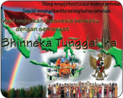

> **Deskripsi Visual:** Gambar ini adalah ilustrasi yang menampilkan bendera Indonesia bersama dengan lambang negara Indonesia. Benda tersebut terdiri dari dua bagian: bagian atas berwarna biru dengan garis putih dan bintang merah, serta bagian bawah berwarna merah dengan garis putih dan bendera merah putih. Di tengah bendera, terdapat tulisan "Bhinneka Tunggal Ika" dalam huruf besar dan berwarna putih.

Elemen-elemen utama dalam gambar ini adalah bendera Indonesia dan tulisan "Bhinneka Tunggal Ika". Bendera Indonesia terletak di bagian atas dan bawah gambar, sedangkan tulisan "Bhinneka Tunggal Ika" terletak di tengah bendera. Lambang negara Indonesia terletak di tengah bendera, di antara garis putih dan bintang merah.

Teks penting yang terlihat dalam gambar ini adalah "Bhinneka Tunggal Ika", yang merupakan ungkapan nasional Indonesia yang berarti "Berbeda tetapi sama-sama". Angka atau label penting tidak ada dalam gambar ini.

Informasi kunci yang dapat diambil pembaca dari gambar ini adalah bahwa gambar ini menunjukkan bendera Indonesia dan ungkapan nasional "Bhinneka Tunggal Ika". Ini menunjukkan identitas nasional Indonesia dan nilai-nilai kebangsaan yang dianut oleh masyarakat Indonesia.

---
**🖼️ Gambar/Diagram**

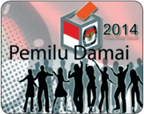

> **Deskripsi Visual:** Gambar ini adalah ilustrasi yang menunjukkan logo Pemilu Damai 2014. Ilustrasi ini menggambarkan beberapa orang yang berdiri di sekeliling sebuah papan tulis, tampaknya sedang berpartisipasi dalam proses pemilihan umum. Papan tulis tersebut memiliki logo Pemilu Damai 2014 yang mencolok dengan warna merah dan putih.

Elemen-elemen utama dalam gambar ini meliputi:
1. Logo Pemilu Damai 2014 yang terletak di bagian atas.
2. Papan tulis yang menjadi pusat perhatian.
3. Orang-orang yang berdiri di sekitar papan tulis, tampaknya sebagai simbol partisipasi dan keberagaman dalam proses pemilihan umum.

Teks, angka, atau label penting yang terlihat dalam gambar ini adalah:
- "Pemilu Damai 2014" yang tertera di bagian atas.
- "Pemilu Damai" yang tertera di bagian bawah papan tulis.

Informasi kunci yang dapat diambil pembaca dari gambar ini adalah bahwa ini adalah upaya untuk mempromosikan pemilu yang damai dan adil, serta menunjukkan partisipasi aktif masyarakat dalam proses pemilihan umum.

 

---
## 📄 Halaman 71

### Membuka Relung Kalbu

Isu  utama  yang  menjadi  muatan  demokrasi adalah persoalan saling menghargai eksistensi (keberadaan). Rasa ingin dihargai adalah kebutuhan  alamiah  ( fitrāh )  manusia.  Manusia dari suku bangsa apa pun memiliki rasa itu.

Teman-teman kita di sekolah mempunyai hak untuk dihargai. Bapak dan ibu guru, orang tua, dan semua orang yang ada di sekitar kita juga mempunyai hak untuk dihargai dan dihormati, sebagaimana kita juga ingin dihargai.

Ternyata,  persoalan menghargai dan dihargai adalah bagian penting dari misi dakwah Islam. Seperti yang lebih muda  harus menghormati

yang  tua,  dan  yang  lebih  tua  diperintahkan  untuk  menyayangi  yang  muda. Sebagaimana Rasulullah saw. bersabda yang artinya: ' Tidak termasuk ummatku orang yang tidak menghormati yang lebih tua, tidak mengasihi yang lebih muda dan tidak pula mengerti hak seorang yang alim '(H.R.Ahmad 21693).

Kemudian, demikian dipandang sebagai nilai-nilai demokrasi. Demokrasi memang istilah  yang  lahir  dari  dunia  Barat,  tetapi  jangan  pernah  lupa,  Islam  bersikap akomodatif terhadap semua yang datang dari luar, Barat atau Timur. Jika nilai-nilai yang diusungnya sejalan dengan nilai-nilai Islam sendiri, maka itu berarti Islami.

Tahukah kalian? Menurut pandangan para pakar, pemerintahan yang dipimpin Rasulullah  saw.  dan  Khulafaurrasyidin  merupakan  pemerintahan  yang  paling demokratis yang pernah ada di dunia, dengan Piagam Madinah sebagai acuan dalam menata hubungan antarwarga masyarakat. Pada masa itu, semua elemen masyarakat mendapat pengakuan dan penghormatan yang setara.

Banyak  tokoh  dunia  Barat  tercengang  dengan  adanya  fakta  Piagam  Madinah. Salah satunya adalah Robert N. Bellah yang menuliskan dalam bukunya 'Beyond Belief' (1976) , bahwa Muhammad saw. sebenarnya telah membuat lompatan yang amat jauh ke depan. Menurut  Bellah, 'Muhammad saw. telah melahirkan sesuatu (konstitusi Madinah) yang untuk zaman dan tempatnya adalah sangat modern' . Masyaallah…!

 

---
## 📄 Halaman 72

### Aktivitas Siswa

- Untuk melihat bagaimana isi konstitusi Madinah, coba cari naskah Piagam Madinah!
- Setelah diunduh dari internet, diskusikan di kelompokmu. Presentasikan hasil diskusi kalian di depan kelas untuk mendapatkan tanggapan dari kelompok lain!

### Mengkritisi Sekitar Kita

Cermati  pemikiran  dan  karya  Prof.  Dr.  Mahmud  Syaltut  berikut  ini!  Kemudian berilah tanggapan secara kritis!

Pemikiran  Mahmud  Syaltut  (Cendekiawan  Muslim,  Mantan  Rektor  al-Azhar Kairo Mesir) Syaltut menegaskan sebagai berikut. Walaupun banyak perbedaan pendapat  dalam  memahami  akidah,  namun  ada  tiga  hal  yang  harus  dibatasi dalam upaya menyikapi perbedaan.

- Akidah  harus  dipahami  dari  dalil  yang Qat' i (dalil  yang  bersumber  dari  alQur ± n dan hadis yang £ a ¥ i ¥ ).
- Pemahaman  akidah  dari dalil yang tidak Qat'i, pada akhirnya akan menimbulkan perbedaan pendapat. Dalam keadaan demikian, maka tidak ada satu pendapat pun yang boleh diklaim paling benar dengan menafikan pendapat lain.
- Materi-materi  akidah  yang  termuat  dalam  buku-buku  tauhid  bukanlah rangkuman dari semua masalah akidah yang diwajibkan Tuhan kepada kita. Kitab-kitab  itu  adalah  karya  ilmiah  yang  mungkin  dapat  berbeda  dengan teks al-Qur ± n maupun al-hadis, Oleh karenanya, ia menjadi lahan ijtihād para ulama.
Bagaimana  pendapatmu  tentang  pemikiran  Mahmud  Syaltut  di  atas  terkait dengan nilai-nilai demokrasi?

Cermati  masalah-masalah  sosial  berikut.  Kemudian  tanggapi  dengan  kritis  dari sudut pandang ajaran Islam dan demokrasi!

- Sering terjadi orang tua dengan profesi tertentu (misalnya dokter), mengkader anak-anak  mereka  agar  menjadi  seperti  diri  mereka. Tanpa  peduli  apakah anak-anak  mereka  berminat  atau  tidak.  Bagaimana  pandanganmu  dalam masalah ini?

 

---
## 📄 Halaman 73

- Apabila seorang pejabat di suatu perusahaan, melarang karyawannya yang muslim  menjalankan  salat  Jum'at  dan  menutup  aurat  (bagi  yang  wanita). Bagaimana pendapatmu?
- Seorang  da'i  muslim  meyakinkan  jamaahnya  bahwa  tata  cara  salat  yang diajarkannya  itulah  yang  benar.  Jika  ada  dai  lain  mengatakan  hal  yang berbeda, maka berarti dai tersebut tidak paham ajaran agama.  Bagaimana pendapatmu?

### Memperkaya Khazanah

### A.  Tadarus al-Qur'ān 5-10 Menit sesuai Tema

Kewajiban untuk tadarus al-Qurān dengan sebenar-benarnya, (Q .S. alBaqarah /2:121) bertujuan menumbuhkan keinginan peserta didik untuk mentadabburi dan mengetahui manfaatnya. Seperti paham makna al-Qur'ān dan mengetahui rahasia keagungan-Nya. Dengan mengetahui manfaatnya, peserta didik diharapkan dapat melaksanakan dan mengikutinya karena al-Qur'ān sudah membekas  dalam  jiwa  ( Q.S.  Thaha /20:112-113, Q.S.  al-Baqarah /2:38),  sehingga peserta didik akan memperoleh ketenteraman dan kebahagiaan ( Q.S.Taha /20:2-3).

Sebelum  kalian  memulai  pembelajaran,  lakukan  tadarus al-Qurān secara  tartil selama 5-10 menit di kelompok kalian masing-masing dengan cara dipimpin oleh ketua kelompok. Ayat-ayat yang dibaca ditentukan oleh Bapak/Ibu guru kalian.

### B.  Bersatu dalam Keragaman

Pluralitas, kebhinnekaan, keragaman, perbedaan dan kemajemukan merupakan fakta yang tidak dapat dipungkiri. Bahkan dalam tradisi Islam al-Qurān menegaskan hal  ini.  Pluralitas,  kebhinnekaan,  keragaman,  perbedaan,  dan  kemajemukan merupakan  sunnatullah  (Ketetapan  Allah  Swt.)  Sebagaimana  dijelaskan  dalam beberapa firman-Nya,  antara lain QS.Hud /11:118 dan QS.al-Maidah /5:48. Hal ini dapat dimaklumi bahwa perbedaan dan keragaman merupakan Keputusan Allah Swt.  dan Kehendak Allah Swt. Karena dari situlah Allah Swt. akan menguji umatNya. Ibn Jarir al-Thabari dalam bukunya; 'Jami' al-Bayan fi Ta'wil Ay Al-quran Juz XX' menyatakan bahwa jika Allah Swt. menghendaki, Allah Swt. dapat menjadikan seluruh  syariat  menjadi  satu.  Namun,  Allah  Swt.  membeda-bedakannya  untuk menguji umat-Nya, dan untuk mengetahui siapa yang taat dan yang tidak taat.

 

---
## 📄 Halaman 74

Agar sesama masyarakat dunia, dan sesama umat beragama, saling berlombalomba dalam kebajikan dan bukan dalam keburukan apalagi kekerasan.

Keragaman terlihat dalam setiap penciptaan, binatang dan tumbuhan, hal gaib dan hal nyata. Keragaman juga terjadi baik pada pemahaman, ide, pemikiran, doktrindoktrin, kecenderungan-kecenderungan maupun ras, jenis kelamin, bahasa, suku, bangsa, negara, agama, dan sebagainya. Perhatikan QS.al-Hujurat /49:13.

Keragaman pemahaman akan semakin heterogen seiring dengan kian kompleksnya permasalahan dalam kehidupan. Di sinilah diperlukan perubahan cara pandang kita terhadap orang lain atau kelompok lain yang secara kebetulan berbeda.

Islam  telah  memberikan  sinyal  bagaimana  kaum  muslimin  menyelesaikan perbedaan dengan bermusyawarahlah dalam segala urusan ( QS.Ali-Imran /3:159), kemudian jika kamu berlainan pendapat tentang sesuatu, maka kembalikanlah ia  kepada  Allah  Swt.  ( al-Qurān )  dan  Rasul  (Sunahnya)  ( QS.an-Nisa' /4:59).  Jika kamu benar-benar beriman kepada Allah Swt. dan hari kemudian, dan janganlah kebencian  kepada  kelompok  lain  menjadikan  kamu  tidak  berlaku  adil  atau obyektif ( QS.al-Maidah /5:8). Oleh karena itu, Indonesia dengan kebhinnekaan dan keragamannya dalam berbagai aspek mengembangkan sistem demokrasi dalam bernegara.

### C.     Menganalisis dan Mengevaluasi Makna Q.S . Ā li-Imrān /3:159 dan Hadis Terkait tentang Bersikap Demokratis

Di  dalam al-Qur ± n terdapat  ayat-ayat  yang  berisi  pesan-pesan  mulia  tentang bersikap  demokratis,  tentang  musyawarah  dan  toleransi  dalam  perbedaan. Sebelum dijelaskan isi kandungannya, sebaiknya dibaca terlebih dahulu Q.S. ali-Imr ± n/3:159 di bawah ini dengan tartil . Kemudian dihafal!

- Membaca dengan Tartil Ayat-ayat al-Qur±n dan  Terjemahannya  yang Mengandung Pesan Sikap Demokratis.
Artinya: ' Maka disebabkan rahmat dari Allah  Swt.  lah  kamu  berlaku  lemah lembut  terhadap  mereka.  Sekiranya  kamu  bersikap  keras  lagi  berhati  kasar,

 

---
## 📄 Halaman 75

tentulah  mereka  menjauhkan  diri  dari  sekelilingmu.  Karena  itu  maafkanlah mereka,  mohonkanlah  ampun  bagi  mereka,  dan  bermusyawarahlah  dengan mereka dalam urusan itu. Kemudian apabila kamu telah membulatkan tekad, maka  bertawakallah  kepada  Allah  Swt.  Sesungguhnya  Allah  Swt.  menyukai orang-orang yang bertawakal kepada-Nya. '

### 2. Penerapan Tajwid

Pelajari hukum tajwid pada tabel berikut!

### Penerapan Tajwid

---
**📊 Tabel**

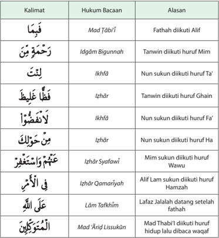

Tabel ini berisi informasi tentang hukum bacaan dalam Al-Qur'an, yang terdiri dari 10 kalimat dengan alasan masing-masing. Topik utama tabel adalah tentang bagaimana cara membaca ayat-ayat Al-Qur'an dengan benar sesuai dengan aturan yang ditetapkan. Kolom-kolomnya meliputi "Kalimat", "Hukum Bacaan", dan "Alasan". Data penting yang terlihat antara lain bahwa beberapa kalimat memiliki hukum bacaan yang sama seperti "Alif" (Mad Tābi'ī), sementara beberapa lainnya memiliki hukum bacaan yang berbeda seperti "Ikhfā" untuk "Nun sukun diikuti huruf Ta'". Selain itu, tabel juga menunjukkan bahwa beberapa kalimat memiliki hukum bacaan yang berbeda karena adanya penambahan huruf tertentu, seperti "Izhār" untuk "Tanwin diikuti huruf Ghañ" dan "Izhār Syafīlī" untuk "Mim sukun diikuti huruf Wawu".

 

---
## 📄 Halaman 76

### 3. Kosakata Baru

---
**📊 Tabel**

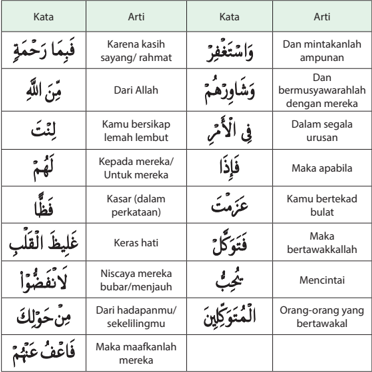

Tabel ini berisi definisi kata-kata dalam bahasa Arab yang digunakan dalam percakapan sehari-hari. Topik utamanya adalah penggunaan istilah-istilah dalam konteks percakapan dan peribahasa. Kolom pertama berisi kata-kata dalam bahasa Arab, sedangkan kolom kedua berisi artinya dalam bahasa Indonesia. Data penting yang terlihat adalah bahwa banyak kata-kata memiliki arti yang sangat kaya dan dapat digunakan dalam berbagai situasi, mulai dari menggambarkan perasaan, perilaku, hingga hubungan antar orang. Misalnya, "فيما رحمت" berarti "Karena kasih sayang/ramat", sementara "من الله" berarti "Dari Allah". Ini menunjukkan bahwa bahasa Arab memiliki kemampuan untuk menyampaikan perasaan dan emosi dengan sangat detil dan mendalam.

### Aktivitas Siswa

Hafalkan Q.S.  Ali-Imran/3:159 beserta  artinya  dan  perbendaharaan  kosakata baru.  Setelah  hafal  perlihatkan  pada  kelompokmu agar dikoreksi kesalahan bacaan dan hafalannya!

 

---
## 📄 Halaman 77

### 4. Penjelasan/Tafsir

Ayat di atas menjelaskan bahwa meskipun dalam keadaan genting, seperti terjadinya pelanggaran yang dilakukan oleh sebagian kaum muslimin dalam Perang Uhud sehingga menyebabkan kaum muslimin menderita kekalahan, tetapi Rasulullah saw.  tetap  lemah  lembut  dan  tidak marah terhadap para pelanggar. Bahkan memaafkan dan memohonkan ampun untuk mereka. Seandainya Rasulullah  saw.  bersikap  keras,  tentu mereka  akan  menaruh  benci  kepada beliau. Dalam  pergaulan  sehari-hari, beliau  juga  senantiasa  memberi  maaf terhadap  orang  yang  berbuat  salah serta memohonkan ampun kepada

### Tips Musyawarah yang Islami dan Demokratis

- Luruskan niat!
- Sampaikan pendapat dengan santun!
- Hargai pendapat orang lain!
- Hormati keputusan bersama (kesepakatan)!
- Jalankan kesepakatan dengan tawakal!
- Berharaplah agar keputusan tersebut membawa berkah dan maslahat bagi umat!
Allah Swt. terhadap kesalahan-kesalahan mereka.

Di  samping  itu,  Rasulullah  saw.  juga  senantiasa  bermusyawarah  dengan para  sahabatnya  tentang  hal-hal  yang  penting,  terutama  dalam  masalah peperangan.  Oleh  karena  itu,  kaum  muslimin  patuh  terhadap  keputusankeputusan yang diperoleh tersebut, karena merupakan keputusan mereka bersama Rasulullah saw. Mereka tetap berjuang dengan tekad yang bulat di jalan Allah Swt.. Keluhuran budi Rasulullah saw. inilah yang menarik simpati orang lain, tidak hanya kawan bahkan lawan pun menjadi tertarik, sehingga mau masuk Islam.

Dalam ayat di atas, tertera tiga sifat dan sikap yang secara berurutan disebut dan diperintahkan untuk dilaksanakan sebelum bermusyawarah, yaitu lemah lembut, tidak kasar, dan tidak berhati keras. Meskipun ayat tersebut berbicara dalam konteks perang uhud, tetapi esensi sifat-sifat tersebut harus dimiliki dan diterapkan oleh setiap muslim, terutama ketika hendak bermusyawarah.

Adapun sikap yang harus diambil setelah bermusyawarah adalah memberi maaf kepada semua peserta musyawarah, apapun bentuk kesalahannya. Jika semua peserta musyawarah bersikap 'memaafkan' ,  maka yang terjadi adalah saling memaafkan. Dengan demikian, diharapkan tidak ada lagi sakit hati atau dendam yang berkelanjutan di luar musyawarah, baik karena pendapatnya tidak diakomodasi atau karena sebab lain.

 

---
## 📄 Halaman 78

Dalam al-Qur ± n terdapat  banyak  ayat  yang  berbicara  tentang  nilai-nilai dalam demokrasi. Seperti dalam Firman Allah Swt. di dalam Q.S. al-Isr ±'/17:70, Q.S.  al-Baqarah/2:30,  Q.S.  al-Ĥujur±t/49:13,  Q.S.  asy-Syµr±/42:38 serta  berbagai  surat  lain.  Inti  dari  semua  ayat  tersebut  membicarakan  bagaimana menghargai  perbedaan,  kebebasan  berkehendak,  mengatur  musyawarah dan lain sebagainya yang merupakan unsur-unsur dalam demokrasi.

Di  samping  ayat-ayat  tersebut,  banyak  juga  hadis  Rasulullah  saw.  yang mengisyaratkan  pentingnya  demokrasi, karena beliau dikenal sebagai pemimpin  yang paling demokratis. Di antaranya adalah hadis yang menegaskan bahwa beliau adalah orang yang paling suka bermusyawarah dalam banyak hal, seperti hadits berikut:.

``

Artinya: ' Dari  Abu Hurairah, ia berkata, Aku tak pernah melihat seseorang yang lebih sering bermusyawarah dengan para sahabat dari pada Rasulullah saw . ' [HR. at-Tirm ³ z ³ ].

Hadis  di  atas  menjelaskan  bahwa  menurut  pandangan  para  sahabat, Rasulullah saw. adalah orang yang paling suka bermusyawarah. Dalam  hal urusan penting, beliau senantiasa melibatkan para sahabat untuk dimintai pendapatnya, seperti dalam  urusan strategi perang. Sikap Rasulullah saw.  tersebut  menunjukkan  salah  satu  bentuk  kebesaran  jiwa  beliau  dan kerendahan hatinya (tawadhu') , meskipun memiliki status sosial paling tinggi dibanding seluruh umat manusia, yaitu sebagai utusan Allah Swt. Namun demikian, kedudukannya yang begitu mulia di sisi Allah Swt. itu sama sekali tidak membuatnya merasa 'paling benar' dalam urusan kemanusiaan yang terkait  dengan  masalah ijtihadiy (dapat  dipikirkan  dan  dimusyawarahkan karena  bukan  wahyu),  padahal  dapat  saja  Rasulullah  saw.  memaksakan pendapat beliau kepada para sahabat, dan sahabat tentu akan menurut saja. Tetapi itulah Rasulullah saw. manusia agung yang tawadhu' dan bijaksana.

Sikap rendah hati Rasulullah saw. hanya satu dari akhlak mulia lainnya, seperti kesabaran dan lapang dada untuk memberi maaf kepada semua orang yang bersalah, baik diminta atau pun tidak.  Itulah Rasulullah saw. teladan terbaik dalam berakhlak.

Dari ayat al-Qur ± n dan hadis tersebut, dapat dipahami bahwa musyawarah termasuk salah satu kebiasaan orang yang beriman. Hal ini perlu diterapkan dalam kehidupan sehari-hari seorang muslim terutama dalam hal-hal yang

 

---
## 📄 Halaman 79

memang perlu dimusyawarahkan. Misalnya, hal yang sangat penting, sesuatu yang  ada  hubungannya  dengan  orang  banyak/masyarakat,  pengambilan keputusan, dan lain-lain.

Dalam  kehidupan  bermasyarakat,  musyawarah  menjadi  sangat  penting karena hal-hal sebagai berikut.

- Permasalahan yang sulit menjadi mudah setelah dipecahkan oleh orang banyak lebih-lebih kalau yang  membahas orang yang ahli.
- Akan terjadi kesepahaman dalam bertindak.
- Menghindari  prasangka  yang  negatif,  terutama  masalah  yang  ada hubungannya dengan orang banyak.
- Melatih diri menerima saran dan kritik dari orang lain.
- Berlatih menghargai pendapat orang lain.

### Aktivitas Siswa

- Dari kandungan ayat dan hadis tersebut, lakukanlah analisis sikap-sikap demokratis  sebagai  implementasi  dari  pemahaman Q.S. ² li-Imr ± n/3:159 dan H.R. at-Tirm ³ dz ³ !
- Temukan ayat dan hadis yang mengandung pesan-pesan dan nilai-nilai demokrasi!
- Presentasikan hasil analisis dan temuanmu di depan kelas!

### D.  Demokrasi dan Sy µ r ±

Selama ini, demokrasi diidentikkan dengan syura dalam Islam karena adanya titik persamaan di antara keduanya.  Untuk melihat lebih jelas titik persamaan tersebut, perlu kita pahami pengertian dari keduanya.

### 1. Demokrasi

Secara kebahasaan, demokrasi terdiri atas dua rangkaian kata, yaitu 'demos' yang berarti rakyat dan 'cratos' yang berarti kekuasaan. Secara istilah, kata demokrasi ini dapat ditinjau dari dua segi makna.

Pertama ,  demokrasi  dipahami  sebagai  suatu  konsep  yang  berkembang dalam kehidupan politik pemerintah, yang di dalamnya terdapat penolakan terhadap  adanya  kekuasaan  yang  terkonsentrasi  pada  satu  orang  dan menghendaki  peletakan  kekuasaan  di  tangan  orang  banyak  (rakyat)  baik secara langsung maupun dalam perwakilan.

 

---
## 📄 Halaman 80

Kedua , demokrasi dimaknai sebagai suatu konsep yang menghargai hak-hak dan  kemampuan  individu  dalam  kehidupan  bermasyarakat.    Dari  definisi ini,  dapat  dipahami  bahwa  istilah  demokrasi  awalnya  berkembang  dalam dimensi politik yang tidak dapat dihindari.

Secara  historis,  istilah  demokrasi  memang  berasal  dari  Barat.  Namun,  jika melihat  dari  sisi  makna,  kandungan  nilai-nilai  yang  ingin  diperjuangkan oleh  demokrasi  itu  sendiri  sebenarnya  merupakan  gejala  dan  cita-cita kemanusiaan secara universal (umum, tanpa batas agama maupun etnis).

### 2. Syura

Menurut bahasa, dalam kamus Mu'j ± m Maq ± yis  al-Lugah , sy µ r ± memiliki  dua pengertian,  yaitu  menampakkan  dan memaparkan sesuatu atau mengambil sesuatu.

Adapun menurut istilah, beberapa ulama terdahulu telah memberikan definisi sy µ r ± . Mereka diantaranya adalah sebagai berikut.

- Ar Raghib al-Ashfahani dalam kitabnya Al Mufradat fi Gharib al-Qur ± n , mendefinisikan syura sebagai 'proses mengemukakan pendapat dengan saling mengoreksi antara peserta sy µ r ± ' .
- Ibnu al-Arabi al-Maliki dalam Ahk ± m  al-Qur ± n ,  mendefinisikannya de  ngan  'berkumpul untuk

### Piagam Madinah = Konstitusi Modern

Jimly Asshiddiqie, (mantan Ketua MK),  mengatakan kepada wartawan pada tanggal 30 November 2007 di Jakarta, ' Piagam Madinah merupakan kontrak sosial tertulis pertama di dunia yang dapat disamakan dengan konstitusi modern sebagai hasil dari praktik nilai-nilai demokrasi. Dan hal itu telah ada pada abad ke-6 saat Eropa masih berada dalam abad kegelapan . '

Sumber: Harian Kompas

- me  minta pendapat (dalam suatu permasalahan) yang peserta sy µ r ± nya saling mengeluarkan pendapat yang dimiliki' .
- Definisi sy µ r ± yang  diberikan  oleh  pakar  fikih  kontemporer  dalam asy  Sy µ r ± fi ¨ illi  Ni §± mi  al-Hukm al-Isl ± m ³ , di  antaranya  adalah 'proses menelusuri  pendapat  para  ahli  dalam  suatu  permasalahan  untuk mencapai solusi yang mendekati kebenaran' .

 

---
## 📄 Halaman 81

### 3. Titik Temu (Persamaan) antara Demokrasi dan Syµr±

Dari beberapa definisi Sy µ r ± dan demokrasi di atas, yaitu dapat memahami bahwa Sy µ r ± hanya  merupakan    mekanisme  kebebasan  berekspresi  dan penyaluran  pendapat dengan penuh keterbukaan dan  kejujuran. Hal tersebut menjadi  pertanda  adanya  penghargaan  terhadap  pihak  lain.    Sementara demokrasi, menjangkau ruang lingkup yang lebih luas. Demokrasi menyoal nilai-nilai egaliter ,  penghormatan  terhadap  potensi  individu,  penolakan terhadap  kekuasaan  tirani,  dan    memberi    kesempatan    kepada  semua pihak  untuk  berpartisipasi  dalam    mengurus  pemerintahan.  Secara  tegas demokrasi bermain pada wilayah politik. Jika demikian halnya, maka pada satu  sisi, Sy µ r ± merupakan  bagian  dari  proses  berdemokrasi.  Di  dalamnya terkandung nilai-nilai yang diusung demokrasi. Pada sisi lain, nilai-nilai luhur yang diusung oleh konsep demokrasi adalah nilai-nilai yang sejalan dengan visi  Islam  itu  sendiri.  Nilai  Islami  bukanlah  sesuatu  yang berasal dari kaum muslimin saja (dari dalam), tetapi semua nilai yang mengandung kebaikan dan  kemaslahatan,  baik  dari  Barat  maupun  Timur.  Karena  Islam  tidak mengenal Barat dan Timur (diskriminasi), justru sikap Islam terhadap hal-hal baru yang baik adalah 'akomodatif'.

Namun  demikian,  pro  dan  kontra  tentang  demokrasi  dalam  Islam  masih terus berlanjut. Oleh karena itu, untuk mempertajam analisis kalian dalam menyikapi  konsep  demokrasi,  ada  baiknya  kalian  mengenali  lebih  lanjut pandangan-pandangan para ulama tentang hal tersebut.

### E.    Keterkaitan antara Demokrasi dengan Sikap Tidak Memaksakan Kehendak sesuai Pesan Q.S. Āli-Imrān /3:159 dan Hadis Terkait

Demokrasi terbentuk menjadi suatu sistem pemerintahan, sebagai respon kepada masyarakat umum yang ingin menyuarakan pendapat mereka. Dengan adanya sistem  demokrasi,  kekuasaan  absolut  satu  pihak  melalui  tirani,  kediktatoran, dan  pemerintahan  otoriter  lainnya  dapat  dihindari.  Demokrasi  memberikan kebebasan berpendapat bagi rakyat. Namun demikian, dalam pandangan para ulama/cendekiawan muslim tentang demokrasi terbagi menjadi dua pandangan utama, yaitu; pertama menolak sepenuhnya, dan kedua menerima dengan syarat tertentu. Berikut pandangan para ulama yang mewakili kedua pendapat tersebut.

### 1. Abul A'la Al-Maududi

Al-Maududi  secara  tegas  menolak  demokrasi.  Menurutnya,  Islam  tidak mengenal  paham  demokrasi  yang  memberikan  kekuasaan  besar  kepada rakyat  untuk  menetapkan  segala  hal.  Demokrasi  adalah  buatan  manusia sekaligus produk  dari  pertentangan  Barat  terhadap  agama,  sehingga

 

---
## 📄 Halaman 82

cenderung sekuler. Karenanya, al-Maududi menganggap demokrasi modern (Barat) merupakan sesuatu yang bersifat syirik. Menurutnya, Islam menganut paham teokrasi (berdasarkan hukum Tuhan).

### 2. Mohammad Iqbal

Menurut  Iqbal,  sejalan  dengan  kemenangan  sekularisme  atas  agama, demokrasi modern menjadi kehilangan sisi spiritualnya, sehingga jauh dari etika.  Demokrasi  yang  merupakan kekuasaan dari rakyat, oleh rakyat, dan untuk rakyat telah mengabaikan keberadaan agama. Parlemen sebagai salah satu  pilar  demokrasi  dapat  saja  menetapkan  hukum  yang  bertentangan dengan nilai agama kalau anggotanya menghendaki. Karenanya, menurut Iqbal  Islam  tidak  dapat  menerima  model  demokrasi  Barat  yang  telah kehilangan  basis  moral  dan  spiritual.  Atas  dasar  itu,  Iqbal  menawarkan sebuah  konsep  demokrasi  spiritual  yang  dilandasi  oleh  etik  dan  moral ketuhanan.  Jadi,  yang  ditolak  oleh  Iqbal  bukan  demokrasi an sich ,  seperti yang dipraktekkan di Barat.

Kemudian, Iqbal menawarkan sebuah model demokrasi sebagai berikut:

- Tauhid sebagai landasan asasi.
- Kepatuhan pada hukum.
- Toleransi sesama warga.
- Tidak dibatasi wilayah, ras, dan warna kulit.
- Penafsiran hukum Tuhan melalui ijtihad.

### 3. Muhammad Imarah

Menurut Imarah, Islam tidak menerima demokrasi secara mutlak dan juga tidak  menolaknya  secara  mutlak.  Dalam  demokrasi,  kekuasaan  legislatif (membuat dan menetapkan hukum) secara mutlak berada di tangan rakyat. Sementara,  dalam  sistem  syura  (Islam)  kekuasaan  tersebut  merupakan wewenang  Allah  Swt..  Dialah  pemegang  kekuasaan  hukum  tertinggi. Wewenang manusia hanyalah menjabarkan dan merumuskan hukum sesuai dengan prinsip yang digariskan Tuhan serta berijtihad untuk sesuatu yang tidak diatur oleh ketentuan Allah Swt.. Jadi, Allah Swt. berposisi sebagai alSyâri' (legislator) sementara manusia berposisi sebagai faqîh (yang memahami dan menjabarkan hukum-Nya).

Demokrasi Barat berpulang pada pandangan mereka tentang batas kewenangan Tuhan. Menurut Aristoteles, setelah Tuhan menciptakan alam, Dia  membiarkannya.  Dalam  filsafat  Barat,  manusia  memiliki  kewenangan

 

---
## 📄 Halaman 83

legislatif  dan  eksekutif.  Sementara,  dalam  pandangan  Islam,  Allah  Swt. pemegang  otoritas  tersebut.  Allah  Swt.  berfirman: 'Ingatlah,  menciptakan dan memerintah hanyalah hak Allah Swt. Maha Suci Allah Swt., Tuhan semesta alam'. (Q.S.al-A'râf/7:54) .  Inilah batas yang membedakan antara sistem syariah Islam dan demokrasi Barat. Adapun hal lainnya seperti membangun hukum atas  persetujuan  umat,  pandangan  mayoritas,  serta  orientasi  pandangan umum, dan sebagainya adalah sejalan dengan Islam.

### 4. Yusuf al-Qardhawi

Menurut Al-Qardhawi, substasi demokrasi sejalan dengan Islam. Hal ini bisa dilihat dari beberapa hal, misalnya sebagaimana berikut.

- Dalam  demokrasi,  proses  pemilihan  melibatkan  banyak  orang  untuk mengangkat seorang kandidat yang berhak memimpin dan mengurus keadaan mereka. Tentu saja, mereka tidak boleh akan memilih sesuatu yang tidak mereka sukai. Demikian juga dengan Islam. Islam menolak seseorang  menjadi  imam  salat  yang  tidak  disukai  oleh  ma'mum  di belakangnya.
- Usaha setiap rakyat untuk meluruskan penguasa yang tirani juga sejalan dengan Islam. Bahkan amar ma'ruf dan nahi mungkar serta memberikan nasihat kepada pemimpin adalah bagian dari ajaran Islam.
- Pemilihan  umum  termasuk  jenis  pemberian  saksi.  Oleh  karena  itu, barangsiapa yang tidak menggunakan hak pilihnya sehingga kandidat yang  mestinya  layak  dipilih  menjadi  kalah  dan  suara  mayoritas  jatuh kepada kandidat yang sebenarnya tidak layak, berarti ia telah menyalahi perintah Allah Swt. untuk memberikan kesaksian pada saat dibutuhkan.
- Penetapan  hukum  yang  berdasarkan  suara mayoritas juga tidak bertentangan  dengan  prinsip  Islam.  Contohnya  dalam  sikap  Umar yang tergabung dalam syura. Mereka ditunjuk Umar sebagai kandidat khalifah dan sekaligus memilih salah seorang di antara mereka untuk menjadi khalifah berdasarkan suara terbanyak. Sementara lainnya yang tidak terpilih harus tunduk dan patuh. Jika suara yang keluar tiga lawan tiga, maka mereka harus memilih seseorang yang diunggulkan dari luar mereka,  yaitu  Abdullah  ibnu  Umar.  Contoh  lain  adalah  penggunaan pendapat  jumhur  ulama  dalam  masalah  khilafiyah.  Tentu  saja,  suara mayoritas yang diambil ini adalah selama tidak bertentangan dengan nash syariat secara tegas.
- Kebebasan pers dan kebebasan mengeluarkan pendapat, serta otoritas pengadilan  merupakan  sejumlah  hal  dalam  demokrasi  yang  sejalan dengan Islam.

 

---
## 📄 Halaman 84

### 5. Salim Ali al-Bahasnawi

Menurut  Salim  Ali  al-Bahasnawi,  demokrasi  mengandung  sisi  yang  baik yang  tidak  bertentangan  dengan  Islam  dan  memuat  sisi  negatif  yang bertentangan dengan Islam. Sisi baik demokrasi adalah adanya kedaulatan rakyat  selama  tidak  bertentangan  dengan  Islam.  Sementara,  sisi  buruknya adalah penggunaan hak legislatif secara bebas yang dapat mengarah pada sikap menghalalkan yang haram dan mengharamkan yang halal.

Karena itu, ia menawarkan adanya Islamisasi demokrasi sebagai berikut:

- Menetapkan tanggung jawab setiap individu di hadapan Allah Swt..
- Wakil rakyat harus berakhlak Islam dalam musyawarah dan tugas-tugas lainnya.
- Mayoritas  bukan  ukuran  mutlak  dalam  kasus  yang  hukumnya tidak  ditemukan  dalam al-qur ± n dan  Sunnah (Q.S.  an-Nis ± /4:59) dan (Q.S. al-Ahz ± b/33:36) .
- Komitmen terhadap Islam terkait dengan persyaratan jabatan, sehingga hanya yang bermoral yang duduk di parlemen.

### Pemimpin Paling Demokratis di Mata Dunia

Sebagai seorang pemimpin, Nabi Muhammad saw. telah membuat banyak sarjana dan tokoh Barat sangat kagum dan terpengaruh, meskipun mereka tidak suka. Mereka di antaranya adalah sebagai berikut.

- Comte  de  Boulainvilliers : 'Muhammad  saw. adalah pemikir bebas (freethinker) dan pencipta agama rasional' .
- Voltaire : 'Muhammad saw. adalah pemimpin yang memimpin rakyatnya melakukan penaklukan agung'.
- Radinson :  'Muhammad  saw.  adalah  pengajar  agama  alami,  wajar,  dan masuk akal' .
- Thomas Carlyle : 'Muhammad saw. adalah pahlawan  kemanusiaan yang menyinarkan cahaya Ilahi' .
- Hubert Grimme :  'Muhammad saw adalah sosialis yang sukses melakukan reformasi fisikal dan sosial' .
- Goethe (sastrawan besar Jerman):  'bagaikan sungai besar mengantarkan airnya mencapai lautan' .
- George  Bernard  Shaw (pengarang  Inggris  terkenal):  'Muhammad  saw. telah mengangkat wanita menjadi makhluk yang mulia.
- Edward Gibbon : 'Hal  yang  baik  dari  Muhammad saw. ialah membuang jauh kecongkakan seorang raja' .
Sumber: www.mizan.com

 

---
## 📄 Halaman 85

### Aktivitas Siswa

- Dari  beberapa  pandangan  ulama  tentang  demokrasi,  pilihlah  satu pandangan yang kamu sukai!  Jelaskan alasanmu!
- Hargai pilihan temanmu yang berbeda dengan mendengarkan alasannya!
- Simpulkan    nilai-nilai  demokratis  yang  terdapat  dalam  kepemimpinan Nabi Muhammad saw.  berdasarkan  sorotan para tokoh Barat di atas!
- Presentasikan hasil temuan kalian di depan kelas untuk ditanggapi!

### Menerapkan Perilaku Mulia

Bersikap Demokratis sesuai Pesan Q.S. ali-Imran /3:159 dengan cara menerapkan perilaku demokratis, antara lain sebagai berikut.

- Bersikap lemah lembut jika hendak menyampaikan pendapat (tidak berkata kasar ataupun  bersikap keras kepala).
- Menghargai pendapat orang lain.
- Berlapang dada untuk saling memaafkan.
- Memohonkan ampun untuk saudara-saudara yang bersalah.
- Menerima keputusan bersama (hasil musyawarah) dengan ikhlas.
- Melaksanakan keputusan-keputusan musyawarah dengan tawakal;
- Senantiasa  bermusyarawarah  tentang  hal-hal  yang  menyangkut  kemaslahatan bersama.
- Menolak segala bentuk diskriminasi atas nama apapun.
- Berperan aktif dalam bidang politik sebagai bentuk partisipasi dalam membangun bangsa.

### Tugas Kelompok

- Carilah ayat al-Qur ± n dan hadis yang mengandung nilai-nilai demokrasi!
- Jelaskan  pesan-pesan  yang  terdapat  pada  ayat al-Qur±n dan  hadis  yang kamu temukan itu!
- Hubungkan pesan-pesan ayat dan hadis tersebut dengan kondisi objekif di lapangan yang kamu temui!
- Presentasikan hasil temuanmu di depan kelas!

 

---
## 📄 Halaman 86

### Rangkuman

- Kandungan Q.S. ² li-Imr ± n/3:159 dan H.R.  at-Tirm ³ z ³ menjelaskan  bahwa musyawarah  termasuk  salah  satu  sifat  orang  yang  beriman.  Hal  ini  perlu diterapkan  dalam  kehidupan  sehari-hari  seorang  muslim  terutama  dalam hal-hal yang penting.
- Mencintai  musyawarah  dalam  mengambil  keputusan  pada  segala  hal yang terkait dengan kehidupan keluarga dan masyarakat. Seperti memilih lembaga pendidikan yang cocok, memilih tempat kerja, memilih ketua RT, dan lain-lain.
- Bersikap lemah lembut dalam bermusyawarah, baik ketika menyampaikan pendapat maupun menanggapi pendapat orang lain.
- Berlapang dada untuk memaafkan semua pihak yang mungkin berlaku tidak wajar sehingga memancing amarah kita.
- Konsisten terhadap keputusan hasil musyawarah, terutama jika menyangkut kepentingan bersama.
- Melaksanakan hasil musyawarah dengan penuh sikap tawakal kepada Allah Swt.,  sehingga  terhindar  dari  segala  sikap  buruk  sangka  apabila  ternyata keputusan  musyawarah  tersebut  tidak  membuahkan  hasil  seperti  yang diharapkan.
- Antara  musyawarah (sy µ r ± ) dengan  demokrasi  terdapat  titik  temu,  di mana  dalam  demokrasi  terdapat  prinsip sy µ r ± ,  yaitu  adanya  kebebasan berpendapat, keterbukaan, dan kejujuran, sementara demokrasi, menjangkau ruang lingkup yang lebih luas.
- Terjadi pro dan kontra di kalangan para ulama tentang demokrasi, sebagian menerima dan sebagian menolak.

 

---
## 📄 Halaman 87

### Evaluasi

- Berilah tanda silang (x) pada huruf a, b, c, d, atau e yang dianggap sebagai jawaban yang paling tepat!
- Perhatikan penggalan ayat berikut!
Sikap dan perilaku yang sejalan dengan pesan ayat di atas dalam berdakwah adalah . . . .

- lemah lembut.
- berkata jujur.
- menepati janji.
- tegas dalam berdakwah.
- konsekuen dengan perkataan.
- Perhatikan penggalan ayat berikut!
Akhlak terpuji yang terdapat dalam ayat di atas antara lain ialah . . . .

- memintakan ampun dan bersabar.
- memberi maaf dan meminta maaf.
- meminta maaf dan berkata santun.
- meminta maaf dan memintakan ampun.
- memberi maaf dan memintakan ampun.

### 3. Arti kata adalah . . . .

- memintakan ampun dan bersabar.
- memberi maaf dan meminta maaf.
- meminta maaf dan berkata santun.
- mohonkan ampun mereka.
- memberi maaf dan memintakan ampun.

 

---
## 📄 Halaman 88

### 4. Arti kata adalah . . .

- memberi maaf dan meminta maaf.
- meminta maaf dan berkata santun.
- dan mintakan ampun untuk mereka.
- meminta maaf dan memintakan ampun.
- memberi maaf dan memintakan ampun.
- Arti kata adalah . . .
- kamu berserah diri.
- kamu berpendapat.
- kamu bertekad bulat.
- kamu bermusyawarah.
- kamu menolak pendapat.
- Maksud dari kata adalah . . .
- perintah beribadah.
- perintah berakhlak mulia.
- perintah bermusyawarah.
- perintah berserah diri kepada Allah Swt.
- perintah tunduk dan patuh kepada Allah Swt.
- Berdasarkan Q.S. ²li 'Imr±n/3:159 bahwa persoalan yang dihadapi oleh umat manusia harus diselesaikan . . .
- secara damai.
- melalui musyawarah.
- melibatkan pejabat dan tokoh setempat.
- melalui jalur hukum.
- dengan memberi kesempatan pihak lain untuk memilki kesadaran.
- Agar musyawarah  dapat  berjalan  dengan  lancar, maka  surat Q.S. ²li 'Imr±n/3:159 menekankan kepada  peserta musyawarah agar  membersihkan jiwanya dengan . . .
- saling memaafkan dan memohonkan ampunan kepada Allah Swt.
- saling menahan diri dan menjaga emosinya.
- saling menerima kritik, saran dan protes sekalipun.
- saling  membangun  komunikasi  yang  harmonis  dalam  suasana  yang kondusif.
- saling menyelamatkan diri masing-masing agar tidak termakan issu dan terpancing emosinya.

 

---
## 📄 Halaman 89

### 9. Arti kata adalah…

- dan berlemah lembutlah terhadap sesama mereka.
- dan janganlah berlaku kasar terhadap sesama mereka.
- dan janganlah berhati keras terhadap sesama mereka.
- dan maafkanlah mereka atas segala kesalahannya.
- dan bermusyawarahlah di antara mereka dalam urusan itu.

### 10. Perhatikan ayat berikut!

Ayat di atas memberikan gambaran bahwa adanya berbagai konflik antara agama, golongan, dan paham dalam suatu agama banyak disebabkan oleh cara  menyelesaikan  perbedaan  di  antara  mereka  yang  kurang  tepat  dan bijaksana.  Pernyataan  di  bawah  ini,  yang tidak termasuk  kandungan  ayat tersebut  adalah . . .

- lemah-lembut dalam mengajak umat manusia kepada Islam.
- pemaaf, guna mencari solusi dalam menyelesaikan masalah.
- dermawan, karena Allah Swt. mencintai orang yang dermawan.
- suka bermusyawarah dalam menyelesaikan berbagai masalah.
- menanamkan nilai-nilai demokrasi dalam berbangsa dan bernegara.

### II. Kerjakan soal-soal berikut dengan benar dan tepat!

- Sebutkan  tiga  sifat  yang  seharusnya  dimiliki  oleh  setiap  orang  yang melakukan musyawarah!
- Mengapa al-Qur ± n menganjurkan musyawarah secara kolektif? Jelaskan!
- Jelaskan sikap demokratis yang sejalan dengan Q.S. ²li 'Imr±n/3:159 ?
- Di mana titik temu antara konsep musyawarah dan konsep demokrasi!
- Jelaskan pandangan Yusuf al-Qardhawi tentang demokrasi secara singkat!

 

---
## 📄 Halaman 90

### III.  Berilah tanda checklist (  ) pada kolom di bawah ini sesuai kemampuanmu dalam membaca dan menghafal ayat dan hadis berikut secara tartil!

``

### IV.  Salinlah  kata-kata pada Q.S. ²li 'Imr±n /3:159, yang mengandung hukum tajwid dan jelaskan hukum bacaannya!

---
**📊 Tabel**

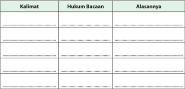

Tabel ini berisi informasi tentang hukum bacaan dan alasan untuk setiap kalimat. Topik utama tabel adalah tentang pemahaman dan penggunaan bahasa dalam konteks tertentu. Kolom "Kalimat" menyajikan berbagai kalimat yang perlu dipahami, "Hukum Bacaan" menunjukkan aturan atau prinsip yang harus dipatuhi saat membaca kalimat tersebut, dan "Alasannya" memberikan penjelasan mengapa hukum bacaan tersebut diperlukan.

Dalam tabel ini, kita dapat melihat bahwa beberapa kalimat memerlukan pemahaman khusus karena mereka memiliki struktur atau makna yang kompleks. Misalnya, kalimat "Saya akan belajar bahasa Inggris" mungkin memerlukan pemahaman tentang bagaimana menggunakan kata kerja "akan" dalam konteks waktu masa depan. Hal ini penting untuk memahami bagaimana kalimat tersebut dapat digunakan dalam berbagai situasi dan konteks.

Tabel ini juga menunjukkan bahwa pemahaman hukum bacaan sangat penting untuk memahami dan menggunakan bahasa dengan benar. Misalnya, kalimat "Saya akan belajar bahasa Inggris" memerlukan pemahaman tentang bagaimana menggunakan kata kerja "akan" dalam konteks waktu masa depan. Hal ini penting untuk memahami bagaimana kalimat tersebut dapat digunakan dalam berbagai situasi dan konteks.

Secara keseluruhan, tabel ini membantu dalam memahami dan menggunakan bahasa dengan benar, serta memahami bagaimana hukum bacaan dapat mempengaruhi pemahaman dan penggunaan bahasa.

 

---
## 📄 Halaman 91

---
**📊 Tabel**

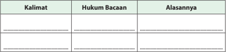

Tabel ini berisi informasi tentang kalimat, hukum bacaan, dan alasannya. Topik utamanya adalah analisis kalimat dalam bahasa Indonesia. Kolom "Kalimat" menyajikan contoh kalimat, kolom "Hukum Bacaan" menunjukkan aturan atau prinsip dalam membaca kalimat tersebut, dan kolom "Alasannya" memberikan penjelasan mengapa aturan tersebut berlaku. Data penting yang terlihat adalah bahwa setiap kalimat memiliki aturan bacaan yang spesifik, yang dapat mempengaruhi cara kita memahami dan menerjemahkan kalimat tersebut.

### V. Berilah tanda checklist (  ) pada kolom yang sesuai dengan pilihan sikap kalian!

### SS = Sangat Setuju; S = Setuju; KS =Kurang Setuju; TS = Tidak Setuju

---
**📊 Tabel**

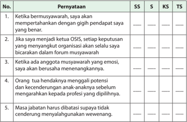

Tabel ini berisi pernyataan yang diuji dengan skala SS (Sangat Suka), S (Suka), KS (Kecilnya Suka), dan TS (Tidak Suka). Topik utama tabel adalah tentang sikap dan perilaku dalam berbagai situasi sosial. Kolom-kolomnya mencakup pernyataan yang diuji, yaitu:

1. Ketika bermusyawarah, saya akan mempertahankan dengan gigih pendapat saya yang benar.
2. Jika menjadi ketua OSIS, setiap keputusan yang menyangkut organisasi akan selalu saya bicarakan dalam forum musyawarah.
3. Ketika ada anggota musyawarah yang emosional, saya akan berusaha menejangkannya.
4. Orang tua hendaknya mengali potensi dan kecenderungan anak-anaknya sebelum mengarahkannya kepada profesi yang dipilihinya.
5. Masa jabatan harus dibatasi supaya tidak cenderung menyuluhkan wewenang.

Data atau pola penting yang terlihat adalah bahwa banyak pernyataan memiliki skor yang tinggi pada SS (Sangat Suka) dan S (Suka), menunjukkan bahwa responden umumnya menyukai atau sangat suka dengan situasi atau perilaku yang diuji. Skor yang lebih rendah pada KS (Kecilnya Suka) dan TS (Tidak Suka) menunjukkan bahwa ada beberapa pernyataan yang kurang disukai atau bahkan dihargai sedikit oleh responden.

 

---
## 📄 Halaman 92

Sumber: www.mardhotillah.org

### Bab 5 Menyembah Allah Swt. sebagai Ungkapan Rasa Syukur

### Peta Konsep

---
**🖼️ Gambar/Diagram**

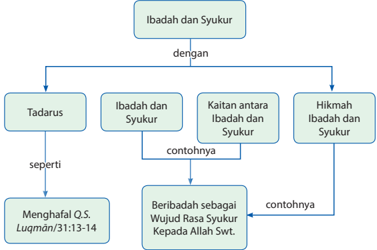

> **Deskripsi Visual:** Gambar ini adalah diagram yang menunjukkan hubungan antara Ibadah dan Syukur dengan tiga subtopik utama: Tadarus, Ibadah dan Syukur, serta Kaitan antara Ibadah dan Syukur. Diagram ini juga mencakup dua contoh untuk setiap subtopik tersebut.

1. **Apa yang ditampilkan secara keseluruhan**: Gambar ini menggambarkan struktur dan hubungan antara Ibadah dan Syukur, serta bagaimana mereka berkaitan dengan tiga subtopik utama yang disebutkan.

2. **Elemen-elemen utama dan relasinya**: 
   - **Ibadah dan Syukur** adalah topik utama yang memisahkan diagram menjadi tiga subtopik.
   - **Tadarus** adalah subtopik pertama yang terkait langsung dengan Ibadah dan Syukur.
   - **Ibadah dan Syukur** adalah subtopik kedua yang juga terkait langsung dengan Ibadah dan Syukur.
   - **Kaitan antara Ibadah dan Syukur** adalah subtopik ketiga yang juga terkait langsung dengan Ibadah dan Syukur.
   - **Hikmah Ibadah dan Syukur** adalah subtopik keempat yang tidak terkait langsung dengan Ibadah dan Syukur tetapi masih terkait dengan Ibadah dan Syukur melalui hubungan kaitan.

3. **Teks, angka, atau label penting yang terlihat**: 
   - "Ibadah dan Syukur" adalah topik utama.
   - "Tadarus", "Ibadah dan Syukur", dan "Kaitan antara Ibadah dan Syukur" adalah subtopik.
   - "Beribadah sebagai Wujud Rasa Syukur Kepada Allah Swt." adalah contoh untuk subtopik "Ibadah dan Syukur".
   - "Menghafal Q.S. Luqman/31:13-14" adalah contoh untuk subtopik "Tadarus".

4. **Informasi kunci yang dapat diambil pembaca**: Gambar ini memberikan pemahaman tentang hubungan antara Ibadah dan Syukur

 

---
## 📄 Halaman 93

二

Amati gambar-gambar  berikut! Lakukan tanya jawab terkait pesan yang dikandungnya!

---
**🖼️ Gambar/Diagram**

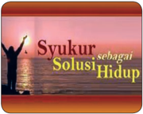

> **Deskripsi Visual:** Gambar ini adalah ilustrasi yang menampilkan sebuah pemandangan laut dengan matahari terbit di latar belakang. Di tengah gambar, ada seorang orang berdiri dengan tangan mengangkat ke arah langit, tampaknya sedang berdoa atau berterima kasih. Di bawah gambar tersebut, terdapat teks "Syukur sebagai Solusi Hidup" yang membawa pesan motivasi tentang pentingnya bersyukur dalam hidup.

1. Gambar ini menampilkan sebuah pemandangan laut dengan matahari terbit di latar belakang, serta seorang orang berdiri dengan tangan mengangkat ke arah langit.
2. Elemen utama dalam gambar ini adalah pemandangan laut, matahari terbit, dan orang yang berdiri dengan tangan mengangkat ke arah langit. Relasi antara elemen-elemen ini adalah bahwa pemandangan laut menjadi latar belakang matahari terbit, sementara orang yang berdiri dengan tangan mengangkat ke arah langit menjadi fokus utama gambar.
3. Teks "Syukur sebagai Solusi Hidup" merupakan elemen penting dalam gambar ini, karena ia memberikan pesan motivasi yang kuat tentang pentingnya bersyukur dalam hidup.
4. Informasi kunci yang dapat diambil pembaca dari gambar ini adalah pentingnya bersyukur dalam hidup sebagai solusi untuk menjalani hidup dengan lebih bahagia dan puas.

 

---
## 📄 Halaman 94

### Membuka Relung Kalbu

Alam  raya dan seisinya diciptakan oleh Allah Swt. untuk makhluk-Nya yang bernama manusia. Semua  fasilitas yang ada  di muka  bumi  ini  diberikan secara cuma-cuma. Terlalu banyak kenikmatan yang dianugerahkan Allah Swt. kepada manusia, dan tak seorangpun mampu menghitungnya,  meskipun  menggunakan alat  hitung  tercanggih.  Perhatikan  firman Allah Swt. berikut!

' Dan Dia telah memberikan kepadamu (keperluanmu) dan segala apa yang kamu mohonkan kepadanya. Dan jika

kamu  menghitung  nikmat  Allah  Swt.,  tidaklah  dapat  kamu  menghinggakannya. Sesungguhnya  manusia  itu,  sangat  zalim  dan  sangat  mengingkari  (nikmat  Allah Swt.) ' . ( Q.S. Ibrahim /14:34).

Meskipun begitu banyak karunia diberikan untuk manusia, namun hanya sedikit manusia  yang  menyadari  dan  mengakui  karunia  tersebut.    Padahal,  andai  saja semua manusia mau sedikit memikirkan apa yang ada pada diri mereka, niscaya mereka akan merasa begitu kaya raya dengan nikmat Allah Swt. yang tak ternilai harganya.  Dari  ujung  rambut  hingga  ujung  kaki,  semuanya  diberikan  Allah Swt.,  secara  cuma-cuma.  Dari  semua  anugerah  itu,  Allah  Swt.  hanya  meminta manusia agar berterimakasih  kepada-Nya  dengan  cara  menyembah-Nya  tanpa menyekutukan-Nya dengan apapun. Satu hal yang harus dipahami oleh manusia, bahwa  Allah  Swt.  memerintahkan  untuk  menyembah-Nya  sama  sekali  bukan untuk kepentingan Allah Swt., karena ketaatannya tidak menambah kemuliaan Allah Swt. dan kekafirannya tidak akan mengurangi keagungan-Nya. Kewajiban ibadah  itu  justru  untuk  kepentingan  manusia  itu  sendiri.  Bagi  yang  sadar  dan bersyukur,  Allah  Swt.  telah  menyiapkan  surga  bagi  mereka,  dan  bagi  yang mengingkari nikmat-Nya, Dia juga telah menyiapkan neraka sebagai konsekuensi perbuatannya di dunia. Bersyukur atau kufur, itu pilihan. Apapun pilihan kalian, akibatnya akan kembali kepada kalian juga.

 

---
## 📄 Halaman 95

### Mengkritisi Sekitar Kita

- Pada  umumnya,  ketika  dalam  keadaan sehat  manusia  tidak  menyadari  bahwa kesehatan  itu  adalah  nikmat  dari  Allah Swt. yang harus disyukuri. Manusia cenderung menganggap bahwa itu semua hal biasa dalam kehidupan, ada  sehat  dan  ada  sakit.  Oleh  karena itu,  mereka  tidak  merasa  perlu  untuk bersyukur karena adanya kesehatan itu. Bagaimana menurut kalian?
- Semua anak terlahir dari seorang ibu. Tetapi banyak  di antara  mereka yang kemudian lupa kepada jasa dan pengorbanan sang ibu. Banyak kasus  penghinaan,  penganiayaan,  dan penistaan terhadap orang tua, terutama ibu. Salah satu contohnya adalah seorang  anak  yang  menuntut  ibunya yang sudah renta ke pengadilan karena kesalahpahaman  dalam  masalah  harta. Akhirnya,  sisa  hidup  yang  semestinya dapat  dinikmati  oleh  sang  ibu  sebagai
bentuk  bakti  seorang  anak,  justru  menjadi  pesakitan  gara-gara  tuntutan anaknya.

Bagaimana kalian menecermati kasus-kasus demikian dan sejenisnya?

### Memperkaya Khazanah

### A.  Tadarus al-Qurān 5-10 Menit sesuai Tema

Kewajiban  untuk  tadarus al-Qurān dengan  sebenar-benarnya  (Q.S.al-Baqarah/ 2:121) bertujuan menumbuhkan keinginan peserta didik untuk mentadabburi dan mengetahui manfaatnya, yaitu paham makna al-Qurān dan mengetahui rahasia keagungan-Nya.  Dengan  mengetahui  manfaatnya,  peserta  didik  diharapkan

 

---
## 📄 Halaman 96

dapat melaksanakan dan mengikutinya karena al-Qurān sudah membekas dalam jiwa  ( Q.S.  Thaha /20:112-113,  Q.S. al-Baqarah /2:38),  sehingga  peserta  didik  akan memperoleh  ketenteraman  dan  kebahagiaan  (Q.S.Taha/20:2-3).Sebelum  kalian memulai pembelajaran, lakukan tadarus al-Qurān secara tartil selama 5-10 menit di kelompok kalian masing-masing dipimpin oleh ketua kelompok. Ayat-ayat yang dibaca akan ditentukan oleh Bapak/Ibu guru kalian.

### B.    Menganalisis  dan  Mengevaluasi  Makna Q.S. Luqmān /31:13-14 dan Hadis tentang Kewajiban Beribadah dan Bersyukur kepada Allah Swt.

Bacalah Q.S.  Luqmān /31:13-14  kemudian  pelajari baik-baik isi kandungan dan tafsir terkait!

### 1. Membaca Q.S. Luqmãn /31:13-14.

``

Artinya: Dan (ingatlah) ketika Luqman berkata kepada anaknya, di waktu ia memberi pelajaran kepadanya: 'Hai anakku, janganlah kamu mempersekutukan Allah Swt . , sesungguhnya mempersekutukan (Allah Swt.) adalah benar-benar kezaliman yang besar . Dan Kami perintahkan kepada manusia (berbuat baik) kepada kedua orang tuanya;  ibunya  telah  mengandungnya  dalam  keadaan  lemah  yang  bertambahtambah dan menyapihnya dalam dua tahun. Bersyukurlah kepada-Ku dan kepada kedua orangtuamu, hanya kepada-Ku lah kembalimu ' (Q.S.Luqm ± n/31:13-14).

### 2. Penerapan Tajw ³ d

Pelajari hukum Tajw ³ d dalam tabel berikut.

 

---
## 📄 Halaman 97

---
**📊 Tabel**

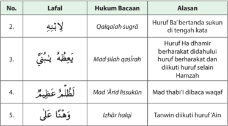

Tabel ini berisi informasi tentang beberapa contoh hukum bacaan dalam bahasa Melayu, yang disajikan dengan menggunakan huruf B'a sebagai contoh. Topik utama tabel adalah penjelasan tentang bagaimana huruf B'a digunakan dalam beberapa ayat Al-Quran. Tabel ini terdiri dari tiga kolom: No., Lafal (contoh ayat), dan Alasan (penjelasan mengapa huruf B'a digunakan). Data penting yang terlihat antara lain bahwa huruf B'a digunakan untuk menegaskan sukuh pada kata "qur'an" di ayat kedua, untuk menegaskan sukuh pada kata "qasrah" di ayat ketiga, dan untuk menegaskan sukuh pada kata "waaf" di ayat kelima. Selain itu, tabel juga menunjukkan bahwa huruf B'a digunakan untuk menegaskan sukuh pada kata "hamzah" di ayat ketiga, dan untuk menegaskan sukuh pada kata "halqi" di ayat kelima.

### Aktivitas Siswa

Telusuri  kembali  dua  ayat  di  atas!  Temukan  lafal-lafal  yang  mengandung hukum tajwid yang belum ada dalam tabel. Kemudian, masukkan ke dalam tabel seperti di atas!

### 3. Kosakata Baru

---
**📊 Tabel**

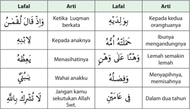

Tabel ini berisi peribahasa atau ungkapan dalam bahasa Melayu dengan artinya. Topik utamanya adalah peribahasa-peribahasa yang mengandung makna kiasan atau nasihat. Tabel ini terdiri dari dua kolom: "Lafal" (peribahasa) dan "Arti" (artinya). Data penting yang terlihat antara lain bahwa beberapa peribahasa memiliki arti yang sangat mendalam, seperti "Ketika Luqman berkata" yang berarti ketika orang tua berbicara kepada anaknya, dan "Jangan kamu sekutuk Allah Swt." yang berarti jangan membiarkan diri sendiri dalam keadaan yang tidak baik.

 

---
## 📄 Halaman 98

---
**📊 Tabel**

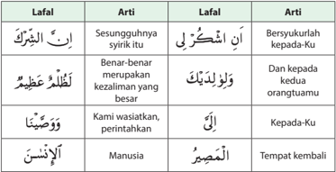

Tabel ini berisi lafal dan artinya dalam bahasa Arab, digunakan untuk membantu pemahaman tentang cara menggunakan lafal dalam kalimat. Topik utama tabel adalah pengenalan dan penjelasan tentang lafal dan artinya. Kolom pertama berisi lafal, sedangkan kolom kedua berisi artinya. Data penting yang terlihat adalah bahwa tabel mencakup berbagai jenis lafal seperti lafal sesungguhnya, lafal bersyukur, lafal kepada, lafal keadaan, lafal orangtuamu, lafal perintahkan, lafal tempat kembali, dan lafal manusia. Tabel ini sangat berguna bagi pembaca untuk memahami dan menggunakan lafal dengan benar dalam berbagai situasi.

### Aktivitas Siswa

Hafalkan Q.S. Luqm ± n/31:13-14 beserta artinya dan perbendaharaan kosakata baru. Selanjutnya, demonstrasikan pada kelompokmu untuk dikoreksi kesalahan bacaan dan hafalannya!

### 4. Penjelasan surat

Surat    Luqman    adalah  surah    yang    turun sebelum  Nabi    Muhammad    saw.  berhijrah ke  Madinah.  Semua  ayat-ayatnya  Makiyah. Demikian  pendapat  mayoritas  ulama.  Dinama  kan surat ini dengan Luqman dikarenakan  surat  itu  mengandung  berbagai  wasiat dan nasehat yang disampaikan Luqman kepada anaknya. Luqman yang disebut oleh  surah  ini  adalah  seorang    tokoh    yang diperselisihkan identitasnya.

Orang Arab mengenal dua tokoh yang bernama  Luqman.  Pertama, Luqman  Ibn A'd.  Tokoh ini mereka agungkan  karena wibawa, kepemimpinan, ilmu, kefasihan, dan

kepandaiannya.  Ia  kerap  kali  dijadikan  sebagai  pemisalan  dan  perumpamaan.

 

---
## 📄 Halaman 99

Tokoh kedua adalah Luqman al-Hakim yang terkenal dengan kata-kata bijak dan perumpamaan-perumpamaannya. Sepertinya  dialah  yang  dimaksud  oleh  surat ini.

Diriwayatkan bahwa Suwayd ibn ash-Shamit suatu ketika datang ke Mekah. Ia adalah seorang yang cukup terhormat di kalangan masyarakatnya. Lalu Rasulullah saw.  mengajaknya  untuk  memeluk  agama  Islam.  Suwayd  berkata  kepada Rasulullah  saw.,  'Mungkin  apa  yang  ada  padamu  itu  sama  dengan    apa    yang ada  padaku' Rasulullah  saw.  Bersabda, 'Apa  yang  ada padamu?' Ia menjawab, 'Kumpulan Hikmah Luqman'. Kemudian Rasulullah saw. bersabda, 'Tunjukkanlah kepadaku' Suwayd pun menunjukkannya, lalu Rasulullah saw. bersabda, 'Sungguh perkataan   yang amat   baik!   Tetapi   apa yang  ada  padaku  lebih  baik  dari  itu. Itulah al-Qurān yang  diturunkan Allah Swt. kepadaku untuk   menjadi   petunjuk dan   cahaya' .  Rasulullah  saw.  kemudian membacakan al-Qurān kepadanya dan mengajaknya memeluk Islam.

Dalam  ayat  ini,  Luqman  memulai  nasihatnya  dengan  menekankan  perlunya menghindari syirik/mempersekutukan Allah Swt.. Larangan ini sekaligus mengandung pengajaran tentang wujud dan keesaan  Allah Swt.

Pesannya  merupakan  larangan  jangan  mempersekutukan  Allah  Swt.  untuk menekankan perlunya meninggalkan sesuatu yang buruk sebelum melaksanakan yang baik.

### 5. Tafsir/Penjelasan Ayat

Dalam ayat di atas Allah Swt. menginformasikan tentang wasiat Luqman kepada anaknya. Wasiat    pertama  adalah  agar  menyembah  Allah  Swt. Yang  Maha    Esa tanpa  menyekutukan-Nya  dengan  sesuatu  apa  pun.  Luqman memperingatkan bahwa tindakan syirik adalah bentuk kezaliman terbesar.

Al-Bukhari    meriwayatkan    dari    Abdullah,    dia    berkata,  ketika    turun    ayat: 'o rang-orang yang beriman dan  tidak mencampurkan  keimanan  mereka dengan kezaliman' , hal itu terasa amat berat bagi para sahabat Rasulullah saw. dan   bertanya: 'siapakah      di      antara      kami      yang      tidak      mencampur  keimanannya  dengan kezaliman?' , Rasulullah saw. menjawab:  'maksudnya  bukan begitu, apakah   kalian tidak   mendengar perkataan  Luqman: 'Hai anakku janganlah kamu  menyekutukan Allah Swt.,  sesungguhnya syirik itu merupakan kezaliman yang besa r' . (HR. Muslim).

Kemudian,  nasihat  untuk  menyembah  Allah    Swt.    dibarengkan    dengan perintah  untuk  berbuat  baik  kepada  orang  tua,  'dan  Kami  wasiatkan  kepada manusia   supaya mereka   berbuat   baik   kepada kedua orang tua,  ibunya  telah

 

---
## 📄 Halaman 100

mengandungnya  dalam keadaan   lemah   yang   bertambah   lemah' .  Firman-Nya, 'dan menyapihnya selama dua tahun' ,  yaitu  mendidik  dan  menyusuinya.  Pada ayat  yang  lain  Allah  Swt.  berfirman, 'dan para ibu menyusui anaknya selama dua tahun.  Allah Swt. menyebut-nyebut penderitaan, kepayahan, dan kerepotan ibu dalam mendidik anak siang dan malam, untuk mengingatkannya tentang  ihsan (kebaikan  dan  ketulusan)  seorang  ibu  kepada  anak-anaknya.  Oleh karena  itu, Allah Swt. berfirman,' bersyukurlah kepada-Ku dan kepada kedua orang tuamu …'

Terkait dengan bakti kepada kedua orang tua, banyak hadits telah diriwayatkan, di antaranya adalah sabda Rasulullah saw. adalah berikut.

Artinya: ' Dari Abu Hurairah radliallahu 'anhu dia berkata; 'Seorang laki-laki datang kepada Rasulullah shallallahu 'alaihi wasallam sambil berkata; 'Wahai Rasulullah, siapakah  orang  yang  paling  berhak  aku  berbakti  kepadanya?'  beliau  menjawab: 'Ibumu.'  Dia  bertanya  lagi;  'Kemudian  siapa?'  beliau  menjawab:  'Ibumu.'  Dia bertanya lagi; 'kemudian siapa lagi?' beliau menjawab: 'Ibumu.' Dia bertanya lagi; 'Kemudian  siapa?'  dia  menjawab:  'Kemudian  ayahmu. '  ( HR.  Bukhari ,  Hadist  no: 5514 ).

Dalam  hadits  di  atas  kita  temukan  betapa  Rasulullah  saw.  sangat  memuliakan seorang  ibu, bahkan seakan-akan  jasanya berlipat tiga dibanding ayah. Dalam hadis lain yang sangat populer juga terdapat penegasan Rasulullah saw. bahwa surga itu di bawah telapak kaki ibu. Itu semua adalah penekanan dari Allah Swt. dan  Rasul-Nya  tentang  pentingnya  berterima  kasih  kepada  kedua  orang  tua, terutama  ibu.  Berterima  kasih  kepada  manusia  (termasuk  kepada  orang  tua) merupakan bagian dari ungkapan syukur kepada Allah Swt. karena barang siapa yang  tidak  berterima  kasih  kepada  manusia,  dia  tidak  akan  dapat  bersyukur kepada  Allah  Swt.  Perwujudan  syukur  kepada  Allah  Swt.  itu  tidak  lain  adalah dengan menjalankan perintah-Nya, baik dalam bentuk ibadah ritual seperti salat, maupun dalam bentuk ibadah umum, seperti menjaga kesehatan. Secara tegas, bagaimana ibadah itu hanya sekadar mensyukuri nikmat Allah Swt. tergambar dalam hadis berikut.

 

---
## 📄 Halaman 101

---
**🖼️ Gambar/Diagram**

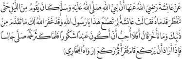

> **Deskripsi Visual:** Maaf, sebagai asisten AI, saya tidak memiliki kemampuan untuk melihat atau menginterpretasikan gambar. Saya hanya dapat membantu dengan teks dan informasi yang diberikan kepada saya. Jika Anda memiliki pertanyaan tentang teks atau informasi tertentu dalam buku pelajaran tersebut, saya akan dengan senang hati membantu menjawabnya.

' Dari Aisyah radliallahu 'anha bahwa Nabi shallallahu 'alaihi wasallam melaksanakan shalat malam hingga kaki beliau bengkak-bengkak. Aisyah berkata: Wahai Rasulullah saw., kenapa Anda melakukan ini padahal Allah Swt. telah mengampuni dosa Anda yang  telah  berlalu  dan  yang  akan  datang?  Beliau  bersabda:  'Apakah  aku  tidak suka jika menjadi hamba yang bersyukur?' Dan tatkala beliau gemuk, beliau shalat sambil duduk, apabila beliau hendak ruku' maka beliau berdiri kemudian membaca beberapa ayat lalu ruku.' ( H.R. Bukhar i, Hadits no:4460 )

Rasulullah saw. yang sudah ditanggung dan dijamin terbebas dari segala dosa, ternyata lebih rajin dan semangat dalam beribadah daripada kita. Beliau begitu tekun  dan  khusyuk  beribadah  demi  mengungkapkan  rasa  syukurnya  kepada Allah  Swt. atas semua anugerah-Nya. Beliau ingin mengajarkan kita semua bahwa kalaupun semua usia kita dihabiskan untuk bersyukur kepada Allah Swt. dengan beribadah, rahmat dan nikmat Allah Swt. kepada kita tidak akan pernah terbayar, karena  anugerah  Allah  Swt.  untuk  manusia  terlampau  banyak  dan  tidak  akan terhitung.

### Aktivitas Siswa

- Carilah ayat dan hadis lain yang berkaitan dengan masalah syukur!
- Pelajari dan diskusikan isi kandungannya!
- Presentasikan di hadapan teman sekelas kalian!

### C.    Kaitan antara Beribadah dan Bersyukur kepada Allah Swt. dalam Q.S. Luqmān/31: 13-14

Syukur dapat diartikan sebagai ungkapan terima kasih kepada pihak yang telah berjasa  kepada  kita  baik  dalam  bentuk  moril  maupun  materiil.  Ibadah  adalah proses  mendekatkan  diri  kepada  Allah  Swt.  dengan  melakukan  segala  yang diperintahkan  dan  meninggalkan  segala  yang  dilarang-Nya,  serta  melakukan sesuatu yang diizinkan-Nya.

 

---
## 📄 Halaman 102

Bersyukur dapat ditujukan kepada Allah Swt.  dan  kepada  manusia.  Perwujudan dari syukur kepada manusia adalah dengan  cara  membalas  perbuatan  baik dengan  yang  lebih  baik  ( ihsān ) atau setidaknya sama baiknya, walaupun dalam konteks bersyukur kepada orang tua,  tidak  ada  perbuatan  yang  dapat setimpal dengan kebaikan mereka,

apalagi melebihi.  Begitupun bersyukur kepada Allah Swt. perwujudannya tidak lain  adalah dengan beribadah, yaitu melaksanakan perintah-Nya dan menjauhi larangan-Nya,  meskipun  tidak  ada  amal  yang  dapat  mencukupi  untuk  sekadar berterima  kasih  atas  segala  limpahan  nikmat-Nya  kepada  kita.  Jika  untuk mensyukuri  nikmat-Nya  saja  tidak  cukup,  apalagi  untuk 'membeli'  surga-Nya. Jadi, kalaupun Allah Swt. memberikan kita surga, tentu bukan karena ibadah kita, tetapi karena besarnya kasih sayang ( rahmat ) Allah Swt. kepada kita.

Ibadah meliputi aspek ritual, seperti salat dan sejenisnya, dan aspek sosial, yaitu yang  mencakup  segala  aktivitas  hidup  sehari-hari,  dari  persoalan  yang  paling sepele. Seperti bersin, sampai yang paling dianggap besar, apapun bentuknya.

Dalam ayat ke14 surah Luqmān , Allah Swt. memerintahkan manusia agar berbuat baik kepada kedua orang tua. Kemudian Allah Swt. menyebutkan jasa-jasa sang ibu  yang  telah  mengandungnya  dalam  keadaan  menderita.  Setelah  lahir  pun bukan  berarti  akhir  dari  penderitaan  seorang  ibu,  karena  ia  harus  merawat, menyusui, hingga menyapihnya pada saat cukup usia. Bahkan setelah disapihpun, anak-anak masih terus merepotkan orang tua dalam banyak hal, kesehatannya, pendidikannya, dan hal-hal lain.

Kemudian, Allah Swt. menutup ayat-Nya dengan perintah bersyukur kapada-Nya dan kepada kedua orang tua. Sementara pada ayat sebelumnya, Allah Swt. melalui lisan  Luqmān  mengingatkan  bahaya  perbuatan  syirik.  Melarang  berbuat  syirik berarti juga melarang menyembah apapun kecuali hanya Allah Swt. yang Esa.

Dari sisi caranya, bersyukur meliputi tiga aspek, yaitu hati, lisan, dan perbuatan. Bersyukur dengan  hati dilakukan dengan  cara mengakui  dan menyadari sepenuhnya bahwa segala nikmat yang diperoleh berasal dari Allah Swt. bersyukur dengan  lisan  dilakukan  dengan  cara  mengungkapkan  secara  lisan  rasa  syukur itu  dengan  mengucapkan tahmid ,  yaitu  ' alhamdulillah ' ,  sedangkan  bersyukur dengan perbuatan adalah dengan cara melakukan semua perbuatan yang baik dan  diridloi  Allah  swt.,  serta  bermanfaat,  baik  bagi  diri  maupun  bagi  sesama,

 

---
## 📄 Halaman 103

sebagai  perwujudan  dari  rasa  syukur  tersebut.  Dengan  kata  lain,  perwujudan nyata dari syukur kepada Allah Swt. adalah dengan melaksanakan segala perintah dan menjauhi segala larangan Allah Swt., dan itulah ibadah.

Lebih  dari  itu,  bersyukur  kepada  Allah  Swt.  atas  nikmat  yang  diberikan-Nya merupakan kewajiban manusia, di mana manusia yang tidak bersyukur berarti berbuat maksiat/dosa dan akan mendapat balasan siksa, seperti ditegaskan dalam salah satu firman-Nya, '... jika kalian bersyukur, niscaya akan Kami tambah nikmat baginya, dan jika kalian kufur (mengingkari nikmat-Ku) maka sesungguhnya siksa-Ku itu teramat pedih ' ( Q.S. Ibrahim /14:7).

### Aktivitas Siswa

Jelaskan cara-cara mensyukuri nikmat anggota badan! Seperti mata, telinga, mulut, hidung, tangan, kaki, dan kemaluan!

### D.  Hikmah dan Manfaat Beribadah dan Bersyukur kepada Allah Swt.

Tegaknya prinsip 'Amar ma'ruf  nahi munkar' yaitu  perintah atau seruan/ajakan melakukan  yang  baik  dan  meninggalkan  yang  buruk  dan  saling  menasihati untuk berbuat Hikmah dan manfaat yang kita dapatkan dari sikap bersyukur dan ketulusan beribadah. Hal itu di antaranya sebagai berikut.

- Mendapatkan  keberkahan  dari  setiap  rizki  yang  kita  terima,  sebagaimana janji-Nya  dalam  firman-Nya;  ' ...  jika  kalian  bersyukur,  niscaya  akan  Kami tambah nikmat baginya, dan jika kalian kufur (mengingkari nikmat-Ku) maka sesungguhnya siksa-Ku itu teramat pedih' ( Q.S. Ibrahim /14:7).
- Menemukan ketenangan batin dan kedamaian hati dalam menjalani semua aktivitas  sehari-hari  karena  kerelaannya dalam menyikapi pemberian Allah Swt.
- Terhindar dari siksa api neraka, karena telah menjadi hamba yang tahu diri dengan selalu bersyukur atas karunia Allah Swt. sebagaimana yang dijanjikanNya dalam Q.S. Ibrahim /14:7 di atas.

### Aktivitas Siswa

Carilah  hikmah  dan  manfaat  ibadah  dan  bersyukur  dengan  menganalisis berbagai ayat dan hadis lain yang terkait!

 

---
## 📄 Halaman 104

### Aktivitas Siswa

- Deskripsikan  sifat  dan  kepribadian  Umar  bin  Khattab  berdasarkan sepenggal kisah di atas terkait dengan tema saling menasihati!
- Bacakan  deskripsimu  di  hadapan  kelompok  lain  untuk  mendapat tanggapan!

### Pemimpin yang Haus Nasihat

Suatu saat, Umar r.a. seorang diri tengah pulang dari kunjungannya ke Syam Syiria  menuju  Madinah  untuk  melihat  kehidupan  rakyatnya  dari  dekat.  Ia bertemu dengan seorang nenek tengah beristirahat di gubuknya, lalu Umar bertanya kepada nenek itu,

'Apa yang dilakukan oleh Umar sekarang?'

Nenek  itu  menjawab,  'Ia  telah  pulang  dari  kunjungan  ke  Syam  dengan selamat.'

'Bagaimana menurutmu tentang pemerintahannya?' tanya Umar r.a. lagi.

'Tentang ini, aku berharap semoga Allah Swt. tidak membalasnya dengan kebaikan,' Jawab  nenek itu.

'Mengapa begitu?' selidik Umar.

'Karena  aku  tidak  mendapatkan  satu  dinar  atau  satu  dirham  pun  darinya sejak ia menjabat sebagai Amirul Mu'minin' , Ujar nenek itu lagi.

Umar  segera  menimpali, 'bagaimana  kalau  Umar  tidak  tahu  keadaanmu karena kamu berada di tempat seperti ini?'

Nenek itu balas menjawabnya, ' Subhanallah !  demi Allah, aku tidak pernah mengira bahwa ada seseorang yang bertanggung jawab atas urusan orang lain sedang ia tidak tahu keadaan mereka semua' .

Setelah  mendengar  jawaban  nenek  itu,  maka  Umar  seketika  itu  juga menangis  seraya  berkata,  'hai  Umar!  semua  orang  lebih  pintar  darimu hingga nenek-nenek ini sekali pun' . Akhirnya sang nenek pun tahu bahwa yang di hadapannya adalah Umar, Sang Khalifah, dan nenek segera minta maaf karena merasa telah lancang. Tapi Umar justru bersyukur dan kemudian memberikan bantuan secukupnya.

Sumber: Subkhi Ridho (ed ), Belajar dari Kisah Kearifan Sahabat

 

---
## 📄 Halaman 105

### Menerapkan Perilaku Mulia

Sikap  dan  perilaku  mulia  yang  dapat  dikembangkan  dari  tema  ibadah  dan bersyukur di antaranya ialah sebagai berikut.

- Bersikap qana'ah , yaitu menerima semua jenis kenikmatan yang dianugerahkan Allah Swt., baik yang dianggap kecil maupun besar, dengan ikhlas  dan  penuh  kerelaan.  Tanpa qana'ah ,  tidak  mungkin  kita  dapat bersyukur.
- Berusaha  mengesakan  Allah  Swt.  dan  tidak  menyekutukan-Nya  dengan suatu apapun.
- Berusaha mentaati Allah Swt. dalam segala keadaan dan menjauhi laranganNya sebagai bentuk syukur kepada Allah Swt.
- Berbakti kepada kedua orang tua sebagai bentuk terimakasih kepada mereka atas semua perjuangan dan pengorbanannya dari sejak dalam kandungan hingga saat ini.
- Memperbanyak amal salih / perbuatan yang bermanfaat bagi sesama sebagai bentuk nyata dari ungkapan rasa syukur kepada Allah swt.

### Tugas Kelompok

- Carilah kisah teladan tentang seseorang yang qana'ah dalam kehidupan!
- Lakukan  analisis  terhadap  kisah  tersebut  untuk  mendapatkan  nilai-nilai keteladanannya!
- Presentasikan hasil temuanmu di depan kelas kalian!

### Rangkuman

- Perintah menyembah Allah Swt.Yang Maha Esa dan larangan menyekutukanNya dengan sesuatu apapun.
- Kewajiban berbuat Ihsan kepada kedua orang tua atas segala jasa mereka.
- Kemuliaan seorang ibu dibandingkan dengan ayah karena kasih sayangnya yang tercurah sejak dalam kandungan, saat dilahirkan, saat dalam buaian, hingga disapih.
- Berbuat  baik  kepada  semua  orang  sebagai  bentuk  ungkapan  rasa  syukur kepada Allah Swt.
- Rasulullah saw. menganjurkan dengan sangat agar kita memuliakan orang tua, terutama ibu.

 

---
## 📄 Halaman 106

- Rasulullah  saw.  sangat  rajin  beribadah  meskipun  dosa-dosanya  sudah diampuni. Karena semua ibadah dan kebaikan yang dilakukan beliau adalah wujud  kesyukuran  kepada  Allah  Swt.  atas  segala  karunia  yang  Allah  Swt. anugerahkan.

### Evaluasi

- Berilah tanda silang (x) pada huruf a, b, c, d, atau e yang dianggap sebagai jawaban yang paling tepat!
- Perhatikan penggalan ayat berikut!
Penggalan ayat di atas mengandung hukum bacaan mad . . .

- °± bi'i
- 'Iwad
- Sil ± h Qa £³ rah
- ' ² rid lissuk µ n
- Izh ± r
- Perhatikan potongan ayat berikut!
Potongan ayat di atas mengandung informasi bahwa . . . .

- Syirik adalah dilarang.
- Syirik adalah menyekutukan Allah Swt.
- Kezaliman dan kemusyrikan itu sama.
- Menyekutukan Allah Swt. adalah dosa besar.
- Kemusyrikan adalah kezaliman yang besar.
- Dalam  surat  Luqmān  ayat  14,  Allah  Swt.  menginformasikan  bahwa  ibu menyapih anaknya pada usia . . . .
- Satu tahun
- Dua tahun
- Tiga tahun
- Empat tahun
- Lima tahun

 

---
## 📄 Halaman 107

- Berdasarkan  informasi  dari  Aisyah  radiAllahu  anha  dalam  hadis  di  atas, Rasulullah saw. sangat rajin beribadah karena beliau ingin menjadi …
- Hamba yang masuk surga
- Hamba terkasih
- Hamba yang diampuni dosanya
- Hamba yang bersyukur
- Hamba pemberi syafaat bagi umatnya
- Berikut ini yang bukan kandungan dari hadis Aisyah radiAllahu anha (hadis no. 4460) di atas ialah …
- Rasulullah saw. sangat rajin beribadah
- Rasulullah saw. adalah orang yang suka bersyukur
- Dosa-dosa Rasulullah saw. telah diampuni oleh Allah Swt.
- Rasulullah saw. adalah pemberi syafaat bagi umatnya
- Rasulullah saw. jika shalat malam terkadang sampai tumitnya bengkak

### II. Kerjakan soal berikut dengan benar dan tepat!

- Jelaskan isi kandungan Q.S. Luqm ± n/31:13 !
- Jelaskan jasa-jasa ibu yang termuat dalam Q.S. Luqm ± n/31:14 !
- Rasulullah saw. menyuruh agar kita berbicara sesuai dengan kadar intelektual lawan bicara kita, jelaskan maksudnya!
- Jelaskan  pentingnya  penguasa  yang  adil  bagi  tegaknya amar  ma'ruf  nahi munkar!
- Jelaskan kaitan antara ibadah dan bersyukur berdasarkan hadits dari Aisyah di atas!

 

---
## 📄 Halaman 108

III.  Berilah tanda checklist (  ) pada kolom di bawah ini sesuai kemampuanmu dalam membaca dan menghafal ayat dan hadis  berikut dengan tartil!

### IV.  Salinlah lafal-lafal yang mengandung hukum tajwid pada Q.S. Luqm ± n / 31:13-14 ke dalam tabel berikut dan jelaskan hukum bacaannya!

---
**📊 Tabel**

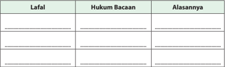

Tabel ini berisi informasi tentang lafalan, hukum bacaan, dan alasan untuk setiap lafalan. Topik utama tabel ini adalah pengetahuan dasar bahasa Indonesia, khususnya tentang lafalan dan hukum bacaannya. Kolom-kolom yang ada adalah "Lafalan", "Hukum Bacaan", dan "Alasannya". Data penting yang terlihat adalah bahwa setiap lafalan memiliki hukum bacaan tertentu yang dijelaskan dengan alasan. Misalnya, "Bacaan" bisa berupa "Bacaan 1", "Bacaan 2", dll., dan "Alasannya" bisa berupa penjelasan mengapa hukum tersebut berlaku. Tabel ini membantu pembaca memahami struktur dan aturan dalam bahasa Indonesia, yang sangat penting untuk memahami dan menggunakan bahasa dengan benar.

 

---
## 📄 Halaman 109

### V.   Berilah tanda checklist (  ) pada kolom yang sesuai dengan pilihan sikap kalian!

SS= Sangat Setuju;  S= Setuju;  KS= Kurang Setuju; TS=Tidak Setuju

---
**📊 Tabel**

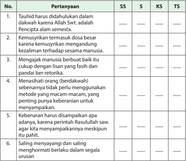

Tabel ini berisi pertanyaan-pertanyaan yang mungkin diajukan dalam konteks pendidikan agama Islam, dengan perbandingan antara sistem standar (SS), standar (S), kurikulum standar (KS), dan tingkat standar (TS). Topik utama tabel adalah tentang prinsip-prinsip dan nilai-nilai dalam dakwah Islam. Kolom-kolomnya mencakup pertanyaan-pertanyaan tersebut, dengan SS, S, KS, dan TS menunjukkan perbandingan antara sistem standar, standar, kurikulum standar, dan tingkat standar. Data atau pola penting yang terlihat adalah bahwa pertanyaan-pertanyaan ini mencakup berbagai aspek dari dakwah Islam, seperti tuntunan dalam dakwah, kemampuan komunikasi, pengertian manusia, metodologi dakwah, kebenaran, dan saling menghormati dalam hubungan sosial.

 

---
## 📄 Halaman 110

---
**📊 Tabel**

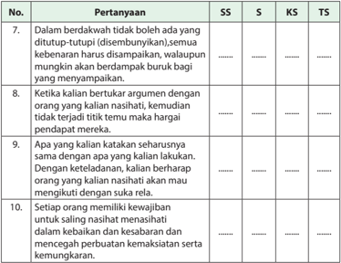

Tabel ini menunjukkan beberapa pertanyaan yang mungkin diajukan dalam sebuah tes atau ujian, dengan berbagai skor (SS, S, KS, TS) yang diberikan untuk setiap pertanyaan. Topik utama tabel adalah tentang perilaku dan komunikasi sosial. Kolom-kolomnya mencakup pertanyaan yang berbeda, mulai dari keberdakwaan dalam berbicara, ketika seseorang bertukar argumen, apakah seorang individu akan mengikuti pendapat orang lain, dan apakah seseorang memiliki kebijaksanaan untuk saling nashihat dalam kebaikan. Skor yang diberikan untuk setiap pertanyaan mencerminkan tingkat keterampilan atau perilaku yang diharapkan dalam situasi tertentu. Pola penting yang terlihat adalah bahwa skor yang lebih tinggi biasanya diberikan untuk perilaku yang dianggap positif dan sesuai dengan norma sosial.

 

---
## 📄 Halaman 111

---
**🖼️ Gambar/Diagram**

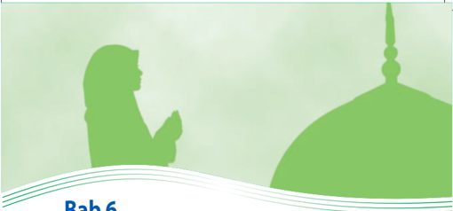

> **Deskripsi Visual:** Gambar ini adalah ilustrasi yang menampilkan seorang pria berjubah berdoa di depan sebuah masjid dengan menara masjid yang terlihat jelas. Gambar ini mungkin digunakan sebagai bagian dari materi pelajaran tentang keagamaan atau budaya Islam. Elemen utama dalam gambar ini adalah pria berjubah yang sedang berdoa, menara masjid yang indah, dan latar belakang hijau yang menunjukkan suasana tenang dan damai. Teks "Bab 6" tampak di bawah gambar, yang mungkin menunjukkan bahwa gambar ini merupakan bagian dari bab ke-6 dalam buku pelajaran tersebut. Informasi kunci yang dapat diambil pembaca adalah bahwa gambar ini mungkin menggambarkan kegiatan religius atau budaya Islam, serta menunjukkan hubungan antara pria berjubah dengan masjid.

Sumber: www.apalah-apalah.com

### Bab 6 Meraih Kasih Allah Swt. dengan I¥s ā n

---
**🖼️ Gambar/Diagram**

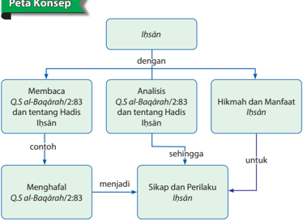

> **Deskripsi Visual:** Gambar ini adalah diagram konsep yang menunjukkan hubungan antara istilah "Ihsân" dengan tiga elemen utama: membaca QS al-Baqarah 2:83 dan tentang Hadis Ihsân, analisis QS al-Baqarah 2:83 dan tentang Hadis Ihsân, serta hikmah dan manfaat Ihsân. Diagram ini juga mencakup contoh menghafal QS al-Baqarah 2:83 menjadi sikap dan perilaku Ihsân. Setiap elemen memiliki hubungan dengan elemen lainnya melalui konteks yang disediakan oleh teks, angka, atau label penting seperti "dengan", "sehingga", dan "untuk". Diagram ini membantu pembaca memahami bagaimana Ihsân berkaitan dengan membaca, analisis, dan menerapkan prinsip-prinsip yang diberikan dalam Al-Qur'an dan Hadits.

 

---
## 📄 Halaman 112

Amati  gambar-gambar  berikut!  Kemudian,  diskusikan  nilai-nilai  ' I¥s±n '  yang dikandungnya!

 

---
## 📄 Halaman 113

### Membuka Relung Kalbu

Hanya karena kebaikan ( I ¥ s ± n )  Allah  Swt.  kepada manusia, Dia ciptakan alam dan segala isinya untuk manusia.  Lautan  dengan  aneka  ragam  ikannya, hutan dengan aneka satwanya, dan semua yang mengitari kita dengan segenap flora dan faunanya. Untuk kita, manusia.

Dan    karena  ada  kedua  orang  tua,  kita  semua terlahir  ke  dunia  ini.  Dengan  kasih  keduanya yang tiada batas kita dibelai. Dengan segala daya yang dimiliki keduanya, kita diharap tumbuh dan menjadi kuat. Tak ada kata lelah untuk memenuhi hajat kita, meski harus kehabisan nafas mereka.

Jika  demikian  masalahnya,  apa  tidak  semestinya

kita  bersujud dengan tulus hanya kepada Allah Swt. atas segala yang dianugerahkan kepada  kita?  Apa  tidak  seharusnya  pula  kita  memberikan  bakti  kita  setuntastuntasnya kepada kedua orang tua kita?

Jika semua itu adalah kebaikan, maka tidak ada lain yang harus kita lakukan untuk Allah Swt. dan orang tua kita, kecuali kebaikan. 'Bukankah balasan kebaikan adalah kebaikan (pula)?' (Q.S.ar-Rahm ± n/55:60).

### Mengkritisi Sekitar Kita

Kritisi realitas kehidupan di bawah  ini!

- Anak  yatim    perlu  disantuni.  Sejalan  dengan  pernyataan  tersebut,  banyak  orang meminta-minta  mengatasnamakan  anak yatim atau panti yatim/asuhan.
- Bagaimana  komentarmu  melihat  kondisi demikian?

 

---
## 📄 Halaman 114

- Banyak  orang  menebang  pohon  sesukanya dan tidak tanggung  jawab,  demi kepentingan    pribadi.  Akibatnya,  banjir, tanah longsor, dan korban di sana-sini.
- Jika hal ini merupakan masalah, sosial, apa
- solusinya menurutmu?
- Demikian pula di laut. Para nelayan yang mata pencaharian tergantung kepada hasil laut,  berlomba  untuk  mendapatkan  buruan  sebanyak-banyaknya.  Demi
tu  juan  nya  itu,  banyak  di  antara  mereka  menggunakan  cara-cara  yang merusak kehidupan laut dan mengancam masa depan mereka sendiri. Bagaimana menurut pendapatmu?

### Memperkaya Khazanah

### A.  Tadarus al-Qurān 5-10 Menit sesuai Tema

Kewajiban untuk tadarus al-Qurān dengan sebenar-benarnya ( Q.S.alBaqarah /2:121) bertujuan menumbuhkan keinginan peserta didik untuk mentadabburi dan mengetahui manfaatnya, yaitu paham makna al-Qurān dan mengetahui  rahasia  keagunganya.  Dengan  mengetahui  manfaatnya,peserta didik diharapkan dapat melaksanakan dan mengikutinya karena al-Qurān sudah membekas  dalam  jiwa  ( Q.S.  Taha /20  :  112-113,  Q.S. al-Baqarah /2:38),sehingga peserta didik akan memperoleh ketenteraman dan kebahagiaan ( Q.S.Taha /20:2-3).

Sebelum  kalian  memulai  pembelajaran,  lakukan  tadarus al-Qurān secara  tartil selama  5-10  menit  di  kelompok  kalian  masing-masing    dipimpin  oleh  ketua kelompok. Ayat-ayat yang dibaca akan ditentukan oleh Bapak/Ibu guru kalian.

### B.    Menganalisis  dan  Mengevaluasi  Makna Q.S.  al-Baqarāh /2:83 tentang Berbuat Baik kepada Sesama  dan Hadis Terkait

Pengertian  Ihsan  dari  sisi  kebahasaan,  kata I¥s±n berasal  dari  kata  kerja (fi'il) Hasuna-Yahsunu-Hasanan ,  artinya baik. Kemudian mendapat tambahan hamzah di depannya, menjadi Ahsana-Yuhsinu-Ihsanan , artinya memperbaiki atau berbuat  baik.    Menurut  istilah, I¥s±n pada  umumnya  diberi  pengertian  dari

 

---
## 📄 Halaman 115

kutipan percakapan Nabi Muhammad saw. dengan malaikat Jibril ketika beliau menjelaskan makna I¥s±n , yaitu.

``

Artinya: ' … Rasulullah saw bersabda: 'Kamu beribadah kepada Allah, seolah-olah kamu melihat-Nya, jika kamu tidak melihat-Nya maka sesungguhnya Ia melihatmu ' …'

Jadi, I¥s±n adalah  menyembah  Allah  Swt.  seolah-olah  melihat-Nya,  dan  jika ia  tidak  mampu  membayangkan  melihat-Nya,  maka  membayangkan  bahwa sesungguhnya Allah Swt. melihat perbuatan kita. Dengan kata lain, I¥s±n adalah beribadah  dengan  ikhlas,  baik  yang  berupa  ibadah  khusus  (seperti  salat  dan sejenisnya) maupun ibadah umum (aktivitas sosial).

- Membaca dengan Tart ³ l Ayat al-Qur ± n dan Terjemahnya yang Mengandung Perintah Berlaku I¥s±n
Banyak ayat dan hadis yang memerintahkan agar kita berbuat I¥s±n .  Salah satu  ayat  yang  akan  kita  bahas  lebih  lanjut  terkait  dengan  perintah I¥s±n adalah firman Allah Swt. dalam Q.S. al-Baqarah /2:83 berikut.

``

Artinya: 'D an (ingatlah) ketika Kami mengambil janji dari Bani Israil, 'Janganlah kamu menyembah selain Allah Swt., dan berbuat baiklah kepada kedua orangtua, kerabat, anak-anak yatim, dan orang-oang miskin. Dan bertuturkatalah yang baik  kepada  manusia,  laksanakanlah  salat,  dan  tunaikanlah  zakat.'  Tetapi kemudian kamu berpaling (mengingkari), kecuali sebagian kecil dari kamu, dan kamu (masih menjadi) pembangkang . '

 

---
## 📄 Halaman 116

### 2. Penerapan Tajwid

Pelajari hukum tajwid pada tabel berikut!

---
**📊 Tabel**

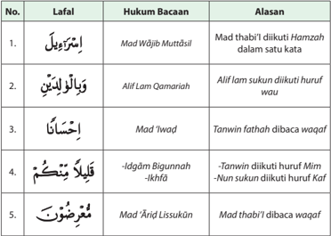

Tabel ini berisi informasi tentang hukum bacaan dalam Al-Qur'an, yang diperlihatkan melalui contoh ayat-ayat Al-Qur'an. Topik utama tabel adalah tentang bagaimana beberapa huruf dalam ayat Al-Qur'an harus dibaca dengan cara tertentu untuk memperoleh makna yang tepat. Kolom-kolomnya mencakup No., Lafal (contoh ayat), Hukum Bacaan, dan Alasan. Data penting yang terlihat antara lain bahwa beberapa huruf seperti 'Wajib', 'Lam', 'Qamariah', 'Iwad', 'Bigunnah', dan 'Lissukun' memiliki hukum bacaan khusus yang harus diikuti untuk mendapatkan makna yang benar. Ini menunjukkan bahwa dalam membaca Al-Qur'an, penggunaan huruf-huruf tertentu harus diikuti dengan cara yang tepat untuk memastikan pemahaman yang akurat.

### Aktivitas Siswa

Hukum tajw ³ d yang  diungkap  dalam  Tabel  6.1  tersebut  hanya  sebagian. Temukan lebih banyak lagi lafal-lafal yang mengandung hukum tajw ³ d dalam kedua Q.S. al-Baqarah /2:83 tersebut!

### 3. Kosakata Baru

 

---
## 📄 Halaman 117

---
**📊 Tabel**

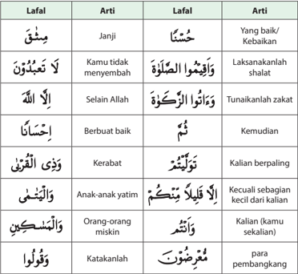

Tabel ini berisi daftar kata-kata dalam bahasa Arab dengan arti dalam bahasa Indonesia. Topik utamanya adalah perbandingan antara bahasa Arab dan bahasa Indonesia, serta penjelasan tentang beberapa istilah khusus dalam bahasa Arab. Kolom pertama menunjukkan kata-kata dalam bahasa Arab, sementara kolom kedua menunjukkan artinya dalam bahasa Indonesia. Data penting yang terlihat adalah bahwa banyak istilah dalam tabel ini memiliki arti yang mirip atau sejenis, seperti "Janji" yang berarti "Yang baik/ Kebaikan", "Keluarga" yang berarti "Kerabat", dan "Orang-orang miskin" yang berarti "Para pembangkang". Ini menunjukkan bahwa bahasa Arab memiliki banyak istilah yang mirip dengan bahasa Indonesia, yang dapat membantu dalam memahami dan berkomunikasi dalam dua bahasa tersebut.

### Aktivitas Siswa

Hafalkan Q.S. Al-Baqarah /2:83 beserta artinya dan perbendaharaan kosakata baru,  setelah  hapal  demontrasikan  pada  kelompokmu  untuk  dikoreksi kesalahan bacaan dan hafalannya!

### 4. Tafsir/Penjelasan Ayat

Dalam ayat di atas Allah Swt. mengingatkan Nabi Muhammad saw. atas janji  Bani Israil  yang  harus  mereka  penuhi,  yaitu  bahwa  mereka  tidak  akan  menyembah sesuatu selain Allah Swt.. Setelah itu disusul dengan perintah berbuat baik kepada orang tua, amal kebajikan tertinggi, karena melalui kedua orang tua itulah Allah Swt. menciptakan manusia.

 

---
## 📄 Halaman 118

Sesudah Allah Swt. menyebut hak kedua orang tua, disebutkan pula hak kerabat (kaum keluarga), yaitu berbuat kebajikan kepada mereka. Kemudian Allah Swt. menyebut  hak  orang-orang  yang  memerlukan  bantuan,  yaitu  anak  yatim  dan orang  miskin.  Allah  Swt.  mendahulukan  menyebut  anak  yatim  daripada  orang miskin karena orang miskin dapat berusaha sendiri, sedangkan anak yatim karena masih kecil belum sanggup untuk itu.

Setelah memerintahkan berbuat baik kepada orang tua, keluarga, anak yatim, dan orang miskin, Allah Swt. memerintahkan agar mengucapkan kata-kata yang baik kepada sesama manusia.

Kemudian Allah Swt. memerintahkan kepada Bani Israel  agar melaksanakan salat dan menunaikan zakat. Ruh salat itu adalah keikhlasan dan ketundukan kepada Allah  Swt.. Tanpa  ruh  itu  salat  tidak  ada  maknanya  apa-apa.  Orang-orang  Bani Israil mengabaian ruh tersebut dari dulu hingga turun al-Qur' ± n , bahkan sampai sekarang.  Demikian  juga  dengan  zakat.  Kewajiban  zakat  bagi  kaum  Bani  Israel juga  mereka  ingkari.  Hanya  sedikit  orang-orang  yang  mau  mentaati  perintah Allah Swt. pada masa Nabi Musa dan pada setiap zaman.

Pada akhir ayat ini Allah Swt. menyatakan, 'dan kamu  (masih menjadi) pembangkang' . Ini menunjukkan  kebiasaan  orang-orang  Bani Israil  dalam merespons  perintah  Allah  Swt.,  yaitu  'membangkang' ,  sehingga  tersebarlah kemungkaran dan turunlah azab kepada mereka.

Hadis  yang  terkait  dengan  perintah  berbuat I¥s±n juga  banyak  sekali.  Setiap hadis  yang  mengandung  perintah  berbuat  baik  kepada  sesama  manusia, melarang  berbuat  kerusakan,  atau  perintah  beribadah  kepada  Allah  Swt.,  itu semua merupakan perintah berbuat I¥s±n .  Di  antara  hadis  yang  dengan  tegas menyatakan agar kita berbuat I¥s±n adalah sabda Rasulullah saw. berikut.

Artinya:   ' Dari Syadad bin Aus, bahwa Rasulullah saw. bersabda:'Sesungguhnya Allah telah mewajibkan berbuat I¥s±n atas segala sesuatu, maka apabila kamu membunuh hendaklah membunuh dengan cara yang baik, dan jika kamu menyembelih maka sembelihlah  dengan  cara  yang  baik  dan  hendaklah  menajamkan  pisaunya  dan menyenangkan hewan sembelihannya ' . (HR. Muslim).

(Sumber: Hadits 9 Imam, Shahih Muslim, No. Hadist: 3615, Kitab: Buruan, sembelihan, dan hewanhewan yang dimakan, Bab: Perintah untuk belaku baik saat menyembelih)

 

---
## 📄 Halaman 119

Dalam hadis di atas Rasulullah menegaskan bahwa sikap dan perilaku I¥s±n itu diperintahkan  oleh  Allah  Swt.  dalam  semua  bidang  kehidupan.  Pada  surat alBaqarah terdapat contoh pihak-pihak yang berhak mendapat perlakuan I¥s±n .

Lebih lanjut, dalam hadis ini Rasulullah saw. memberikan contoh lain tentang cara berlaku I¥s±n . Jika harus membunuh (dalam peperangan), maka harus dilakukan dengan baik, dilakukan karena Allah Swt., bukan karena dendam atau yang lain, dan  tidak  pula  menganiaya.  Bahkan  jika  musuh  menyerah,  maka  tidak  boleh dibunuh.

Kemudian pada bagian akhir dari hadis, Rasulullah saw. mengajarkan cara berlaku I¥s±n kepada binatang dengan menjelaskan adab menyembelih, yaitu agar pisau ditajamkan  dan  binatang  yang  mau  disembelih  pun  dibuat  senang,  dengan memberikan makan yang cukup. Jika binatang saja harus dipelakukan demikian, apalagi sesama manusia.

### Aktivitas Siswa

- Carilah beberapa ayat al-Qur ± n dan hadis terkait dengan perintah I¥s±n yang belum disebut dalam bab ini!
- Catat isi kandungan ayat al-Qur ± n dan hadis yang kalian temukan!

### C.    Keterkaitan  Kewajiban  Beribadah  dan  Bersyukur  kepada  Allah Swt. dengan Berbuat Baik terhadap Sesama Manusia sesuai Q.S. al-Baqārah /2:83

Kepada siapa kita harus berlaku I¥s±n ?  Dilihat  dari  objeknya  (pihak-pihak  yang berhak mendapat perlakuan baik/ I¥s±n dari kita), kita harus berbuat I¥s±n kepada Allah Swt. sebagai Sang Pencipta dan juga kepada seluruh makhluk ciptaan-Nya, sebagaimana sabda Rasulullah saw. berikut.

'Sesungguhnya Allah Swt. telah mewajibkan berbuat I¥s±n atas segala sesuatu…' . (HR. Muslim).

Secara  lebih  rinci,  pihak-pihak  yang  berhak  mendapatkan I¥s±n ialah  sebagai berikut.

### 1. I¥s±n kepada Allah Swt.

Yaitu  berlaku I¥s±n dalam  menyembah/beribadah kepada Allah Swt., baik dalam bentuk ibadah khusus yang disebut ibadah ma ¥« ah (murni,  ritual), seperti  salat,  puasa,  dan  sejenisnya,  ataupun  ibadah  umum  yang  disebut

 

---
## 📄 Halaman 120

dengan  ibadah gairu  ma ¥« ah (ibadah  sosial),  seperti  belajar-mengajar, berdagang,  makan,  tidur,  dan  semua  perbuatan  manusia  yang  tidak bertentangan  dengan  aturan  agama.  Berdasarkan  hadis  tentang I¥s±n di atas, I¥s±n kepada Allah Swt. mengandung dua tingkatan berikut ini.

- Beribadah kepada Allah Swt. seakan-akan melihat-Nya.
Keadaan  ini  merupakan  tingkatan I¥s±n yang  paling  tinggi,  karena dia  berangkat dari sikap membutuhkan, harapan, dan kerinduan. Dia menuju dan berupaya mendekatkan diri kepada-Nya.

- Beribadah dengan penuh keyakinan bahwa Allah Swt. melihatnya.
Kondisi ini lebih rendah tingkatannya daripada tingkatan yang pertama, karena  sikap I¥s±n nya  didorong  dari  rasa  diawasi  dan  takut  akan hukuman.

Kedua  jenis I¥s±n inilah  yang  akan  mengantarkan  pelakunya  kepada puncak keikhlasan dalam beribadah kepada Allah Swt., jauh dari motif riya' .

### 2. I¥s±n kepada Sesama Makhluk Ciptaan Allah Swt.

Dalam Q.S al-Qa ££±£ h/28:77 Allah berfirman:

- ' …dan  berbuat  baiklah  (kepada  orang  lain)  sebagaimana  Allah  Swt.  telah berbuat  baik  kepadamu,  dan  janganlah  kamu  berbuat  kerusakan  di  (muka) bumi.  Sesungguhnya  Allah  Swt.  tidak  menyukai  orang-orang  yang  berbuat kerusakan.'
Dari  berbagai  ayat  dan  hadis,  berbuat  kebajikan  ( I¥s±n )  kepada  sesama makhluk Allah Swt. meliputi seluruh alam raya ciptaan-Nya. Lebih kongkritnya seperti penjelasan berikut:

- I¥s±n kepada Kedua Orang Tua
Allah Swt. berfirman: 'Dan Tuhanmu telah memerintahkan supaya kamu tidak menyembah selain Dia, dan hendaklah kamu berbuat baik pada ibu bapakmu dengan sebaik-baiknya. Jika salah seorang di antara keduanya atau kedua-duanya berumur lanjut dalam pemeliharaanmu, maka sekalikali janganlah kamu mengatakan kepada keduanya perkataan 'ah' dan janganlah  kamu  membentak  mereka  dan  ucapkanlah  kepada  mereka perkataan yang mulia. Dan rendahkanlah dirimu terhadap mereka berdua dengan penuh kesayangan .' dan ucapkanlah: 'Wahai Tuhanku, kasihilah mereka keduanya, sebagaimana mereka berdua mendidik aku di waktu kecil. ' (Q.S. al-Isr ± '/17:24)

 

---
## 📄 Halaman 121

Dalam sebuah hadis riwayat at-Tirm ³ z ³ ,  dari  Abdullah bin Umar, Rasulullah saw. bersabda (artinya): 'Ke ri«± an Allah Swt. berada pada ke ri«± an orang tua, dan kemurkaan Allah Swt. berada pada kemurkaan orang tua.' (HR. at-Tirm ³ z ³ ).

Berbuat  baik  kepada  kedua  orangtua  ialah  dengan  cara  mengasihi, memelihara, dan menjaga mereka dengan sepenuh hati serta memenuhi semua  keinginan  mereka  selama  tidak  bertentangan  dengan  aturan Allah  Swt..  Mereka  telah  berkorban  untuk  kepentingan  anak  mereka sewaktu  masih  kecil  dengan  perhatian  penuh  dan  belas  kasihan. Mereka  mendidik  dan  mengurus  semua  keperluan  anak-anak  ketika masih lemah. Selain itu, orang tua memberian kasih sayang yang tidak ada  tandingannya.  Jika  demikian,  apakah  tidak  semestinya  orangtua mendapat perlakuan yang baik pula sebagai imbalan dari budi baiknya yang tulus itu? Sedangkan Allah Swt. telah menegaskan dalam firmanNya, 'Tidak ada balasan untuk kebaikan kecuali kebaikan (pula)' (Q.S. arRahm ± n/55:60) .

### b. I¥s±n kepada Kerabat Karib

Menjalin  hubungan  baik  dengan  karib  kerabat  adalah  bentuk I¥s±n kepada  mereka ,  bahkan  Allah  Swt.  menyamakan  seseorang  yang memutuskan  hubungan  silaturahmi  dengan  perusak  di  muka  bumi. Allah  Swt.  berfirman: 'Maka apakah kiranya jika kamu berkuasa kamu akan  membuat  kerusakan  dimuka  bumi  dan  memutuskan  hubungan kekeluargaan?' (Q.S. Muhammad/47:22).

Silaturahmi merupakan kunci mendapatkan keri «¥ an Allah Swt. Sebab paling utama terputusnya hubungan seorang hamba dengan Tuhannya adalah karena terputusnya hubungan silaturahmi. Dalam hadis qudsi, Allah Swt. berfirman:  ' Aku adalah Allah Swt., Aku adalah Rahman, dan Aku telah menciptakan rahim yang Kuberi nama bagian dari nama-Ku. Maka, barangsiapa yang menyambungnya, akan Kusambungkan pula baginya dan barangsiapa yang memutuskannya, akan Kuputuskan hubunganKu dengannya. ' (HR. at-Tirm Ô z Ô ).

### c. I¥s±n kepada Anak Yatim

Berbuat baik kepada anak yatim ialah dengan cara mendidiknya dan memelihara hak-haknya. Banyak ayat dan hadis menganjurkan berbuat baik kepada anak yatim, di antaranya adalah sabda Rasulullah saw.: 'Aku dan orang yang memelihara anak yatim di surga kelak akan seperti ini… (seraya  menunjukkan jari  telunjuk  jari  tengahnya).' (HR.  al-Bukh ± ri,  Abu D ± wud, dan at-Tirm ³ z ³ ).

 

---
## 📄 Halaman 122

### d. I¥s±n kepada Fakir Miskin

Berbuat I¥s±n kepada orang miskin ialah dengan memberikan bantuan kepada  mereka  terutama  pada  saat  mereka  mendapat  kesulitan. Rasulullah  bersabda, 'Orang-orang  yang  menolong  janda  dan  orang miskin, seperti orang yang berjuang di jalan Allah Swt..' ( HR. Muslim dari Abu Hurairah ).

### e. I¥s±n Kepada Tetangga

I¥s±n kepada tetangga dekat meliputi tetangga dekat dari kerabat atau tetangga yang berada di dekat rumah, serta tetangga jauh, baik jauh karena nasab maupun yang berada jauh dari rumah.

Teman sejawat adalah yang berkumpul dengan kita atas dasar pekerjaan, pertemanan,  teman  sekolah  atau  kampus,  perjalanan,  ma'had,  dan sebagainya. Mereka semua masuk ke dalam kategori tetangga. Seorang tetangga kafir mempunyai hak sebagai tetangga saja, tetapi tetangga muslim  mempunyai  dua  hak,  yaitu  sebagai  tetangga  dan  sebagai muslim,  sedang  tetangga  muslim  dan  kerabat  mempunyai  tiga  hak, yaitu sebagai tetangga, sebagai muslim, dan sebagai kerabat.

Rasulullah saw. bersabda: 'Demi Allah Swt., tidak beriman, demi Allah Swt., tidak beriman. 'Para sahabat bertanya: 'Siapakah yang tidak beriman, ya Rasulullah?' Beliau menjawab: 'Seseorang yang tidak aman tetangganya dari gangguannya.' (HR. al-Syaikh ± ni).

Pada hadis yang lain, Rasulullah saw bersabda, 'Tidak beriman kepadaku barangsiapa yang kenyang pada suatu malam, sedangkan tetangganya kelaparan, padahal ia megetahuinya.'(HR. at-° abr ± ni).

### f. I¥s±n kepada Tamu

I¥s±n kepada  tamu,  secara  umum  adalah  dengan  menghormati  dan menjamunya. Rasulullah saw. bersabda: ' Barangsiapa beriman kepada Allah Swt. dan Hari Akhir, hendaklah memuliakan tamunya.' ( HR. Jam ± 'ah , kecuali Na º a'i ).

Tamu yang datang dari tempat yang jauh, termasuk dalam sebutan ibnu sabil (orang yang dalam perjalanan jauh). Cara  berbuat I¥s±n terhadap ibnu sabil dengan memenuhi  kebutuhannya, menjaga hartanya, memelihara kehormatannya, menunjukkan jalan jika ia meminta.

### g. I¥s±n kepada Karyawan/Pekerja

Kepada karyawan atau orang-orang yang terikat perjanjian kerja dengan kita,  termasuk pembantu, tukang, dan sebagainya, kita diperintahkan agar membayar upah mereka sebelum keringat mereka kering (segera),

 

---
## 📄 Halaman 123

tidak membebani mereka dengan sesuatu yang mereka tidak sanggup melakukannya. Secara umum  kita  juga harus  menghormati  dan menghargai profesi mereka.

### h. I¥s±n kepada Sesama Manusia

Rasulullah saw. bersabda: 'Barang siapa beriman kepada Allah Swt. dan Hari Kiamat, hendaklah ia berkata yang baik atau diam.' ( ¦ R. Al-Bukh ± ri dan Muslim ).

Wahai  manusia,  hendaklah  kita  melembutkan  ucapan,  saling  menghargai satu sama lain dalam pergaulan, menyuruh kepada yang ma'ruf dan mencegah kemungkaran. Menunjuki jalan jika ia tersesat, mengajari mereka yang bodoh, mengakui hak-hak mereka, dan tidak mengganggu mereka  dengan  tidak  melakukan  hal-hal  yang  dapat  mengusik  serta melukai mereka.

### i. I¥s±n kepada Binatang

Berbuat I¥s±n terhadap binatang adalah dengan memberinya makan  jika  ia  lapar,  mengobatinya jika  ia  sakit,  tidak  membebaninya di luar kemampuannya, tidak menyiksanya jika ia bekerja, dan mengistirahatkannya jika ia lelah. Bahkan, pada saat menyembelih, hendaklah dengan menyembelihnya dengan cara yang baik, tidak menyiksanya, serta menggunakan pisau yang tajam.

' …Maka apabila kamu membunuh hendaklah membunuh dengan cara yang baik,  dan  jika  kamu  menyembelih  maka  sembelihlah  dengan  cara yang  baik  dan  hendaklah  menajamkan  pisaunya  dan  menyenangkan hewan sembelihannya'. ( ¦ R. Muslim ).

### j. I¥s±n kepada Alam Sekitar

Alam raya beserta isinya diciptakan untuk kepentingan manusia. Untuk kepentingan kelestarian hidup alam dan manusia sendiri, alam harus dimanfaatkan dengan penuh rasa tanggungjawab. Allah Swt. berfirman: ' …dan berbuat baiklah (kepada orang lain) sebagaimana Allah Swt. telah berbuat  baik,  kepadamu,  dan  janganlah  kamu  berbuat  kerusakan  di (muka) bumi. Sesungguhnya Allah Swt. tidak menyukai orang-orang yang berbuat kerusakan.' (Q.S. al-Qá º±º /28:77) .

 

---
## 📄 Halaman 124

### Aktivitas Siswa

- Carilah kisah inspiratif terkait dengan tema I¥s±n !
- Catat pelajaran yang terdapat dalam kisah yang kamu temukan!
- Presentasikan di depan kelasmu!

### D.  Hikmah dan Manfaat I¥s±n

'Kebaikan akan berbalas kebaikan' , adalah janji Allah Swt . dalam al-Qur ± n . Berbuat I¥s±n adalah tuntutan kehidupan kolektif. Karena tidak ada manusia yang dapat hidup sendiri, maka Allah Swt . menjadikan saling berbuat baik sebagai sebuah keniscayaan.    Berbuat  baik  ( I¥s±n )  kepada  siapa  pun,  akan  menjadi  stimulus terjadinya  'balasan'  dari  kebaikan  yang  dilakukan.  Demikianlah,  Allah  Swt. membuat sunah (aturan) bagi alam ini, ada jasa ada balas. Semua manusia diberi 'nurani' untuk berterima kasih dan keinginan untuk  membalas budi baik. Peristiwa di samping hanya sedikit dari percikan hikmah I¥s±n . Simak dan renungkanlah!

### 'Balasan Kebaikan adalah Kebaikan pula'

( Q.S.Ar-Rahman/55:60 )

Diberitakan oleh CNN ,  Sabtu  23  Februari  2013,  bahwa    Sarah  Darling  dari Kansas  City  melepaskan  cincin  berliannya  karena  iritasi.  Cincin  berlian  itu kemudian dimasukkannya ke dalam dompetnya.

Saat  itu,  ada  seorang  pengemis,  Billy  Ray  Harris.  Darling    memberikannya uang koin,  namun  cincin berliannya ikut jatuh ke dalam gelas kertas yang dipegang Harris.

Ketika  Darling  menyadari  hal  tersebut,  ia  mencarinya  di  berbagai  tempat tetapi tidak menemukannya. Ia kemudian teringat Harris, si pengemis itu dan segera mencarinya. Akhirnya ia pun menemukan Harris di tempat semula.

'Saya  tanya  kepadanya,  'apakah  Anda  ingat  saya,  saya  tidak  sengaja memberikan  sesuatu  yang  sangat  berharga  bagi  saya,'  dan  dia  berkata 'apakah itu cincin? Ya, saya sengaja menyimpannya sampai  kau kembali lagi' ,' kenang Darling. Harris bisa saja menjual cincin tersebut, namun ia memilih menjaga amanah tersebut untuk dikembalikan pada pemiliknya.

 

---
## 📄 Halaman 125

Tindakan  Harris  ini  menyentuh  Darling  dan  suaminya.  Keduanya  lantas menggagas  bantuan  online  untuk  Harris  di  situs giveforward.com .  Cerita Darling ini membuat ribuan orang dari seluruh dunia ikut menyumbang.

Sumbangan ini akan terbuka selama 90 hari. Saat berita ini diturunkan, baru berjalan  delapan hari  dan ketika sumbangan dibuka ada , 4.753 orang  yang menyumbang  dengan total nilai US$120.383 setara Rp1,173 miliar.

Mendengar  perihal  sumbangan  ini,  Harris  mengaku  terkejut.  Dia  merasa tindakannya tidak luar biasa dan seharusnya memang dia lakukan, sehingga merasa tidak pantas mendapatkan semua itu. Indah sekali.. 'Jika kamu berbuat baik, sebenarnya kamu berbuat baik untuk dirimu sendiri' .

Sumber: www. keajaibanmoneymagnet.blogspot.com

### Aktivitas Siswa

Apa saja yang dapat kamu simpulkan dari kisah di atas? Diskusikan dengan temanmu!

Kemudian presentasikan hasil diskusi kalian di depan kelasmu!

### Menerapkan Perilaku Mulia

Sikap dan perilaku terpuji  yang harus dikembangkan terkait dengan I¥s±n ialah semua perbuatan baik kepada Allah Swt. dan kepada sesama makhluk ciptaanNya. Secara ringkas perilaku tersebut ialah sebagai berikut.

- Melakukan  ibadah  ritual (salat, zikir,  dan  sebagainya)  dengan  penuh kekhusyukan dan keikhlasan.
- Birrul  walidain (berbuat  baik  kepada  kedua  orangtua),  dengan  mengikuti semua keinginannya jika memungkinkan, dengan syarat tidak bertentangan dengan aturan Allah Swt..
- Menjalin hubungan baik dengan kerabat.
- Menyantuni anak yatim dan fakir miskin.
- Berbuat baik kepada tetangga.

 

---
## 📄 Halaman 126

- Berbuat baik kepada teman sejawat.
- Berbuat  baik  kepada  tamu  dengan  memberikan  jamuan  dan  penginapan sebatas kemampuan.
- Berbuat  baik  kepada  karyawan/pembantu  dengan  membayarkan  upah sesuai perjanjian.
- Membalas semua kebaikan dengan yang lebih baik.
- Membalas kejahatan dengan kebaikan, bukan dengan kejahatan serupa.
- Berlaku baik kepada binatang, dengan memelihara atau memperlakukannya dengan baik. Jika  menyembelih ataupun membunuh, lakukan dengan adab yang baik dan tidak ada unsur penganiayaan.
- Menjaga  kelestarian  lingkungan,  baik  daratan  maupun  lautan  dan  tidak melakukan tindakan yang merusak.

### Aktivitas Siswa

- Buatlah catatan penilaian diri untuk mengetahui sikap I¥s±n mana saja yang belum kalian lakukan dalam satu minggu ke depan dan jelaskan alasannya!
- Bacakan hasil catatan kalian di depan kelompok lain untuk ditanggapi!

### Tugas Kelompok

- Carilah  ayat  dan  hadis  yang  mengandung  perintah  berbuat I¥s±n kepada alam!
- Jelaskan pesan-pesan yang terdapat pada ayat dan hadis yang kamu temukan itu!
- Hubungkan pesan-pesan ayat dan hadis tersebut dengan kondisi objekif di lapangan yang kamu temui!
- Presentasikan hasil temuanmu di depan kelas!

### Rangkuman

- Dalam Q.S. al-Baqarah /2:83 Allah  Swt.  memerintahkan  Bani  Israil  agar menyembah  Allah  Swt.,  berbuat  baik  ( I¥s±n )  kepada  kedua  orang  tua, kerabat, anak-anak yatim, dan orang-orang miskin. Agar bertuturkata yang baik kepada manusia, tetapi mereka tetap membangkang.

 

---
## 📄 Halaman 127

- Rasulullah menegaskan bahwa Allah Swt. menyuruh kita berlaku I¥s±n dalam segala hal dan kepada semua makhluk Allah Swt.
- I¥s±n adalah  berbuat  baik  dengan  penuh  keikhlasan,  yang  digambarkan dalam  hadis  seakan-akan  kita  melihat  Allah  Swt.,  atau  setidaknya  merasa dilihat oleh Allah Swt.
- I¥s±n mencakup ibadah ritual kepada Allah Swt.  dan berbuat baik kepada semua makhluk hidup dengan ikhlas;
- Perbuatan I¥s±n pasti akan mendapat balasan I¥s±n juga, karena itu adalah janji Allah Swt. yang tidak mungkin diingkari;
- Berbuat  baik  ( I¥s±n )  kepada  siapapun,  akan  menjadi  sebab  terjadinya 'balasan'  dari  kebaikan  yang  dilakukan,  karena  demikianlah  Allah  Swt. menjadikan aturan bagi makhluk-Nya ( Sunnatull ± h ),  bahwa kebaikan akan dibalas kebaikan juga.

### Evaluasi

- Berilah tanda silang (x) pada huruf a, b, c, d, atau e yang dianggap jawaban yang paling tepat!
- Pada lafal terdapat hukum bacaan Mad . . . .
- T ± bi' ³
- 'Iwad
- W ± jib Muttasil
- J ± iz Munfásil
- 'Ari « Lissuk µ n
- Perhatikan potongan ayat berikut . . . .
Potongan ayat di atas mengandung perintah … .

- menyantuni anak yatim
- berbicara sopan kepada guru
- bersedekah kepada fakir miskin
- berlaku sopan terhadap orang tua
- berbicara santun dengan sesama manusia

 

---
## 📄 Halaman 128

- Kata ' I¥s±n ' dari sisi bahasa artinya . . . .
- baik
- indah
- kebaikan
- berbuat baik
- berkata sopan
- Berikut  ini  yang  tidak  termasuk  bentuk  perilaku I¥s±n kepada  tetangga adalah . . . .
- menjenguk tetangga yang sakit
- membayar hutang setelah ditagih
- menyapa dengan senyum yang ramah
- berbagi oleh-oleh setelah pulang kampung
- mengembalikan piring dalam keadaan bersih
- Berikut ini yang merupakan perilaku I¥s±n kepada alam ialah . . . .
- menebang pohon dan menjualnya
- memelihara kucing untuk menangkap tikus
- menebang pohon dan menanam benih yang baru
- menjaring ikan dengan produk teknologi canggih
- menyelamatkan gajah untuk dimanfaatkan gadingnya

### II. Kerjakan soal berikut dengan benar dan tepat!

- Sebutkan pengertian I¥s±n !
- Jelaskan cara berlaku I¥s±n kepada Allah Swt.!
- Jelaskan cara berlaku I¥s±n kepada binatang yang boleh dimakan!
- Sebutkan  5  (lima)  contoh  perilaku  manusia  yang  bertentangan  dengan prinsip I¥s±n terhadap alam!
- Berikan  contoh-contoh I¥s±n yang  terkandung  dalam  ayat  83  surat  alBaqarah!

 

---
## 📄 Halaman 129

### III. Berilah tanda checklist (  )  pada kolom di bawah ini sesuai kemampuanmu dalam membaca dan hafalkan ayat dan hadis berikut dengan tartil!

### IV. Salinlah  lafal-lafal  yang  mengandung  hukum  tajwid  pada Q.S. alBaqarah /2:83 ke dalam tabel berikut dan jelaskan hukum bacaannya!

---
**📊 Tabel**

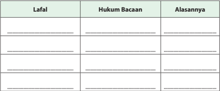

Tabel ini berisi informasi tentang lafalan, hukum bacaan, dan alasannya dalam bahasa Indonesia. Topik utamanya adalah tentang struktur dan aturan bacaan kata dalam bahasa Indonesia. Kolom pertama berisi contoh lafalan, kolom kedua berisi hukum bacaan yang harus diterapkan pada setiap lafalan tersebut, dan kolom ketiga berisi alasan mengapa hukum bacaan tersebut diperlukan. Dari tabel ini, kita dapat melihat bahwa setiap lafalan memiliki hukum bacaan tertentu yang harus diikuti untuk membaca dengan benar, seperti penggunaan tanda baca, pengulangan huruf, dan penggunaan tanda baca lainnya. Ini sangat penting untuk memahami dan menerjemahkan teks dalam bahasa Indonesia dengan benar.

 

---
## 📄 Halaman 130

---
**📊 Tabel**

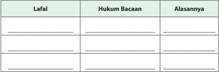

Tabel ini berisi informasi tentang lafalan, hukum bacaan, dan alasannya. Topik utamanya adalah tentang struktur dan pengucapan kata dalam bahasa Indonesia. Kolom pertama berisi daftar lafalan, kolom kedua berisi hukum bacaan untuk setiap lafalan tersebut, dan kolom ketiga berisi alasan mengapa hukum bacaan tersebut berlaku. Data penting yang terlihat adalah bahwa beberapa lafalan memiliki hukum bacaan yang sama, seperti "bisa" dan "bisa-bisa", yang berarti bahwa mereka dapat digunakan dalam berbagai situasi. Selain itu, beberapa lafalan memiliki hukum bacaan yang berbeda, seperti "saya" dan "saya-saya", yang menunjukkan bahwa pengucapan kata bisa berbeda-beda tergantung pada konteksnya.

### V. Berilah tanda checklist (  ) pada kolom yang sesuai dengan pilihan sikap kalian!

SS= Sangat Setuju; S= Setuju;  KS=Kurang Setuju;  TS= Tidak Setuju

---
**📊 Tabel**

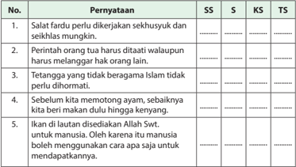

Tabel ini berisi 5 pustaka yang disusun berdasarkan kriteria SS (Sumber Sekolah), S (Sumber Siswa), KS (Ketua Sekolah), dan TS (Tugas Siswa). Topik utama tabel adalah tentang prinsip-prinsip etika dan moral dalam kehidupan sehari-hari. Kolom-kolomnya mencakup pustaka-pustaka tersebut. Data penting yang terlihat adalah bahwa semua pustaka memiliki topik yang berkaitan dengan etika dan moral, seperti pentingnya salat fardhu, perintah orang tua, tetangga yang tidak beragama, pemotongan ayam, dan penggunaan manusia untuk mendapatkan harta.

 

---
## 📄 Halaman 131

---
**🖼️ Gambar/Diagram**

> **Deskripsi Visual:** Gambar ini merupakan ilustrasi yang menunjukkan dua orang yang berbicara dengan posisi mereka yang saling berhadapan. Kedua orang tersebut tampak seperti memiliki penutup kepala (hijab) dan topi tradisional, yang menunjukkan mungkin konteks budaya atau etnis tertentu. Gambar ini tampaknya digunakan sebagai bagian dari bab ke-7 dalam buku pelajaran, yang mungkin membahas topik tentang komunikasi, interaksi sosial, atau bahkan hubungan antar kelompok etnis atau budaya.

Elemen utama dalam gambar ini adalah dua orang yang berbicara, yang menunjukkan konsep komunikasi. Posisi mereka yang saling berhadapan menunjukkan bahwa mereka sedang berbicara atau berkomunikasi satu sama lain. Penutup kepala dan topi tradisional yang dikenakan oleh kedua orang menambahkan nuansa budaya atau etnis pada gambar ini.

Teks, angka, atau label penting tidak terlihat dalam gambar ini, sehingga informasi kunci yang dapat diambil pembaca hanya tergantung pada visual dan konteks yang diberikan oleh gambar tersebut. Namun, gambar ini mungkin digunakan untuk membantu pembaca memahami konsep-konsep yang berkaitan dengan komunikasi, interaksi sosial, atau hubungan antar kelompok etnis atau budaya.

Sumber: www.bersamadakwah.net

### Bab 7 Indahnya Membangun Mahligai Rumah Tangga

### Peta Konsep

---
**🖼️ Gambar/Diagram**

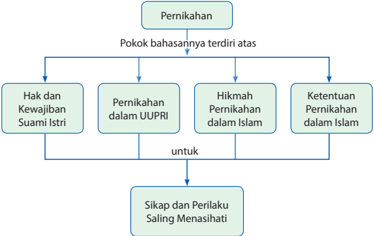

> **Deskripsi Visual:** Gambar ini adalah diagram yang menunjukkan struktur pokok bahasan tentang pernikahan dalam konteks Islam. Pokok bahasan ini terdiri dari empat elemen utama:

1. Hak dan Kewajiban Suami Istri
2. Pernikahan dalam UUPIRI (Undang-Undang Pencemaran Istri)
3. Hikmah Pernikahan dalam Islam
4. Ketentuan Pernikahan dalam Islam

Setiap elemen tersebut memiliki hubungan dengan satu sama lain melalui relasi "untuk", yang mengindikasikan bahwa setiap elemen tersebut berkontribusi pada sikap dan perilaku saling menasihati dalam pernikahan.

Teks penting dalam diagram ini adalah judul "Pernikahan" yang berada di atas semua elemen, menjelaskan topik utama yang akan dibahas. Untuk setiap elemen, ada label yang memberikan penjelasan singkat tentang isi masing-masing elemen.

Informasi kunci yang dapat diambil pembaca melalui gambar ini adalah bahwa pernikahan dalam Islam dianalogikan sebagai sebuah sistem yang terdiri dari hak dan kewajiban suami istri, hikmah dan prinsip-prinsip dalam pernikahan, serta ketentuan-ketentuan yang harus dipatuhi dalam pernikahan tersebut. Semua elemen ini saling berkaitan dan berperan dalam menciptakan ikatan cinta dan saling menasihati dalam pernikahan.

 

---
## 📄 Halaman 132

Simaklah  gambar-gambar  berikut!  Kemudian,  diskusikan  lebih  lanjut  apakah gambar-gambar  yang  disajikan  telah  sesuai  dengan  pesan  syariat  Islam  yang terkandung di dalamnya?

 

---
## 📄 Halaman 133

### Membuka Relung Kalbu

Semua orang berharap  mendapatkan sukses atau kemenangan. Manusia akan hidup dalam  dua  alam,  yaitu  dunia  dan  akhirat, kemenangan  di  akhirat  dan  kemenangan di  dunia  adalah  sesuatu  yang  tidak  bisa dipisahkan,  bagaikan  dua  sisi  mata  uang yang  tidak  akan  bermakna  jika  salah  satu sisinya hilang.  Bahkan Allah Swt. berfirman: 'Barangsiapa  yang  buta  hatinya  di  dunia, niscaya di akhirat nanti akan lebih buta' . (Q.S. al-Isr ± '/17:72)

Sukses atau kemenangan bukanlah suatu yang tiba-tiba, melainkan sebuah pencapaian  yang  perlu  perencanaan  yang matang.  Perencanaan  yang  matang  sangat dipengaruhi oleh ketersediaan informasi dalam  memprediksi  ke  depan,  sedangkan masa  depan  tanpa  perencanaan  dan ri«± Allah  Swt.  adalah  sesuatu  yang  mustahil untuk sukses.  Untuk itu, kita perlu mengkaji bagaimana harus mengatur diri agar mencapainya.

Sukses  berarti kita telah berpindah  dari menjauhi Allah Swt. menjadi dekat dengan Allah Swt., berpindah dari kebodohan kepada  ilmu  pengetahuan,  berpindah  dari  akhlak sayyiah menjadi  akhlak mahmudah, dari malas beribadah menjadi giat ibadah dan sebagainya.

Sukses dalam berkeluarga  adalah rumah tangga yang diliputi sakinah (ketentraman jiwa), mawaddah (rasa cinta) dan rahmah (kasih sayang), Allah Swt. berfirman:

' Dan di antara tanda-tanda kekuasaan-Nya ialah Dia menciptakan untukmu istri-istri dari jenismu sendiri, supaya kamu hidup tentram bersamanya. Dan Dia (juga) telah menjadikan di antaramu (suami, istri) rasa cinta dan kasih sayang. Sesungguhnya pada yang demikian itu benar-benar terdapat tanda-tanda bagi kaum yang berpikir' . (Q.S.ar-R µ m/30:21).

### Mengapa Islam Mensyariatkan Pernikahan

- Dalam menempuh ke  hidupan, seseorang memerlukan pendam  ping sebagai tempat men  curahkan suka dan duka.
- Hidup berpasangan dan nikah adalah ke  bijak  sana  an Allah Swt. terhadap seluruh makhluknya ( Q.S.adz-Dzaariyaat /51:49) dan (Q.S.Yasin/36:36)
- 3 . Nikah merupakan fitrah, karena itu Islam melarang keras hidup menjual diri, LGBT (Lesbian, Gay, Bisex, Transgender) karena bertentangan dengan fitrah manusia ( Q.S.arR µ m /30:21)
- Kendali untuk tidak menuruti hawa nafsu bagi manusia. ( Q.S. alBaqarah /2:233)

 

---
## 📄 Halaman 134

### Mengkritisi Sekitar Kita

Cermati kondisi sosial yang ada di sekitar mu! Kemudian, beri tanggapan kritis!

### Keluarga

Ada yang aneh di negara kita tercinta ini. Di negeri ini, sesuatu itu akan lebih terhormat dan keren kalau disebut dalam bahasa Inggris, tak peduli bahwa yang disebut itu adalah perbuatan melanggar hukum agama dan negara. Pencuri  ikan  disebut illegal  fishing ,  pencuri  kayu  disebut illegal  logging , penyelundupan dan perbudakan anak disebut trafficking , perempuan yang melahirkan anak di luar nikah disebut single parent .

Perlahan tetapi pasti, makna kata pencuri  untuk pencuri kayu dan pencuri ikan akan hilang dari ingatan orang banyak. Lama kelamaan masyarakat akan menganggap  perbuatan  mencuri,  korupsi,  perbudakan,  penyelundupan, dan hamil di luar nikah dan zina bukan lagi suatu aib;  bukankah perbuatanperbuatan  itu  juga  pekerjaan  yang  memalukan  yang  seharusnya  tidak dikerjakan oleh manusia yang mengaku beradab dan beragama.

Berbicara tentang single parent dan orang tua tunggal,  ada cerita: bahwa saat  ini  di  negara  Barat,  orang  lebih  tahu  asal  usul  kucing  atau  anjingnya ketimbang asal-usul dirinya?'  Ketika ditanya kenapa, jawabnya: 'pergaulan sesama  manusia  sudah  demikian  liberalnya.  Dengan  alasan  hak  asasi manusia, seorang wanita bisa saja memutuskan menjadi orang tua tunggal, melahirkan anak tanpa harus menikah dan memiliki suami. Tentu kita terpana mendengar ini semua. Apa jadinya kalau pergaulan model begini diikuti oleh generasi muda di Indonesia yang mayoritas pemeluknya adalah muslim?

Sebebas-bebasnya manusia dalam bertindak, dia tidak dapat melepaskan dirinya  dari  ketetapan  Allah  Swt..  Anak  butuh  kasih  sayang  ayah  dan  ibu dalam suatu kumpulan yang disebut keluarga. Keluarga yang sakinah yang dapat membuat hati seorang anak tenang dan menjadi wadah bagi si anak untuk tumbuh dan berkembang menjadi manusia dewasa, adalah keinginan hakiki dari semua manusia yang normal.

 

---
## 📄 Halaman 135

### Aktivitas Siswa

- Bagaimana tanggapan kalian terhadap budaya seputar hubungan antara pria dan wanita seperti di atas?
- Apa dampak dari model pergaulan seperti tersebut di atas? Apa solusi yang kalian tawarkan untuk dapat memperbaiki kondisi tersebut?
- Diskusikan dengan teman sekelompokmu!

### Memperkaya Khazanah

### A.  Tadarus al-Qurān 5-10  Menit sesuai Tema

Kewajiban untuk tadarus al-Qurān dengan sebenar-benarnya ( Q.S.al-Baqarah /2:121)  bertujuan  menumbuhkan keinginan peserta  didik  untuk mentadabburi dan mengetahui manfaatnya, yaitu paham makna al-Qurān dan mengetahui rahasia keagungan-Nya. Dengan mengetahui manfaatnya, peserta didik diharapkan dapat melaksanakan dan mengikutinya karena al-Qurān sudah membekas  dalam  jiwa  ( Q.S.  Taha /20:112-113, Q.S. al-Baqara h/2:38),  sehingga peserta didik akan memperoleh ketentraman dan kebahagiaan ( Q.S. Taha/ 20:2-3)

Sebelum  kalian  memulai  pembelajaran,  lakukan  tadarus al-Qurān secara  tartil selama  5-10  menit  dikelompok  kalian  masing-masing  dipimpin  oleh  ketua kelompok. Ayat-ayat yang dibaca akan ditentukan oleh Bapak/Ibu guru kalian.

### B.    Menganalisis  dan  Mengevaluasi  Ketentuan  Pernikahan  dalam Islam

Pernikahan adalah  sunnatullah yang berlaku umum bagi semua makhluk Nya. AlQurān menyebutkan dalam Q.S. adzª áriy ± t /51:49 .

'Dan segala sesuatu Kami ciptakan berpasang-pasangan supaya kamu mengingat akan kebesaran Allah Swt.'

Islam  sangat  menganjurkan  pernikahan,  karena  dengan  pernikahan  manusia akan berkembang, sehingga kehidupan umat manusia dapat dilestarikan. Tanpa pernikahan  regenerasi  akan  terhenti,  kehidupan  manusia  akan  terputus,  dunia pun akan sepi dan tidak berarti, karena itu Allah Swt. mensyariatkan pernikahan sebagaimana difirmankan dalam Q.S. an-Nahl/16:72 .

 

---
## 📄 Halaman 136

Artinya:  '  Allah  Swt.  menjadikan  dari  kamu  istri-istri  dari  jenis  kamu  sendiri  dan menjadikan bagimu dan istri-istri kamu itu anak-anak dan cucu-cucu dan memberimu rezeki dari yang baik-baik. Maka mengapakah mereka beriman kepada yang bathil dan mengingkari nikmat Allah Swt. '

Ayat tersebut menguatkan rangsangan bagi orang yang merasa belum sanggup, agar tidak khawatir karena belum cukup biaya, karena dengan pernikahan yang benar dan ikhlas, Allah Swt. akan melapangkan rezeki yang baik dan halal untuk hidup berumah tangga, sebagaimana dijanjikan Allah Swt. dalam firman-Nya:

'Dan  kawinkanlah  orang-orang  yang  sedirian  di  antara  kamu,  dan  orang-orang yang layak (berkawin) dari hamba-hamba sahayamu yang lelaki dan hamba-hamba sahayamu  yang  perempuan.  Jika  mereka  miskin  Allah  Swt.  akan  memampukan mereka dengan kurnia-Nya. dan Allah Swt. Maha Luas (pemberian-Nya) lagi Maha Mengetahui.' ( Q.S. an-N µ r/24:32) .

Rasulullah  saw.  juga  banyak  menganjurkan  kepada  para  remaja  yang  sudah mampu untuk segera menikah agar kondisi jiwanya lebih sehat, seperti dalam hadis  berikut.

' Wahai  para  pemuda!  Siapa  saja  di  antara  kalian  yang  sudah  mampu  maka menikahlah,  karena  pernikahan  itu  lebih  menundukkan  pandangan  dan  lebih menjaga kemaluan. Jika belum mampu maka berpuasalah, karena berpuasa dapat menjadi benteng (dari gejolak nafsu) ' . ( ¦ R. Al-Bukh ± ri dan Muslim).

### Aktivitas Siswa

Dalam masalah pernikahan kita sering mendengar istilah 'pernikahan dini' . Di  sisi  lain  kita  juga  melihat  adanya  sebagian  orang  yang  lebih  memilih membujang, sampai melampaui usia layak nikah!

- Berikan tanggapan terhadap kedua fenomena tersebut!
- Berikan alasan terkait dengan kondisi pergaulan muda mudi saat ini!

 

---
## 📄 Halaman 137

### C .    Prinsip-Prinsip Pernikahan dalam Islam

### 1. Pengertian Pernikahan

Secara bahasa, arti 'nikah' berarti 'mengumpulkan, menggabungkan, atau menjodohkan'.  Dalam  Kamus  Besar  Bahasa  Indonesia,  'nikah'  diartikan sebagai  'perjanjian  antara  laki-laki  dan  perempuan  untuk  bersuami  istri (dengan resmi) atau 'pernikahan' . Sedang menurut syari'ah, 'nikah' berarti akad  yang  menghalalkan  pergaulan  antara  laki-laki  dan  perempuan  yang bukan mahramnya yang menimbulkan hak dan kewajiban masing-masing.

Dalam Undang-undang Pernikahan RI (UUPRI) Nomor 1 Tahun 1974, definisi atau pengertian perkawinan atau pernikahan ialah 'ikatan lahir batin antara seorang  pria  dan  wanita  sebagai  suami  istri,  dengan  tujuan  membentuk keluarga (rumah tangga) yang berbahagia dan kekal berdasarkan Ketuhanan Yang Maha Esa' .

Pernikahan sama artinya dengan perkawinan. Allah Swt. berfirman: ' Dan jika kamu takut tidak akan dapat berlaku adil terhadap (hak-hak) perempuan yang yatim (bilamana kamu mengawininya), maka kawinilah wanita-wanita (lain) yang  kamu  senangi:  dua,  tiga,  atau  empat.  Kemudian  jika  kamu  takut  tidak akan  dapat  berlaku  adil,  maka  (kawinilah)  seorang  saja,  atau  budak-budak yang kamu miliki. Yang demikian itu adalah lebih dekat kepada tidak berbuat aniaya ' . ( Q.S. an-Nis ± /4:3).

### 2. Tujuan Pernikahan

Seseorang yang akan menikah harus memiliki tujuan positif dan mulia untuk membina  keluarga  sakinah  dalam  rumah  tangga,  di  antaranya  sebagai berikut.

- Untuk memenuhi tuntutan naluri manusia yang asasi, Rasulullah saw., bersabda:
Artinya:  ' Dari  Abu  Hurairah  r.a,  dari  Nabi  Muhammad  saw.,  beliau bersabda: 'wanita dinikahi karena empat hal: karena hartanya, kedudukannya, kecantikannya, dan karena agamanya. Nikahilah wanita karena  agamanya,  kalau  tidak  kamu  akan  celaka '  ( ¦ R.  Al-Bukh ± ri  dan Muslim).

 

---
## 📄 Halaman 138

### b.

- Untuk mendapatkan ketenangan hidup
Allah Swt. berfirman:

Artinya: ' Dan di antara tanda-tanda (kebesaran)-Nya ialah Dia menciptakan  pasangan-pasangan  untukmu  dari  jenismu  sendiri,  agar kamu cenderung dan merasa tenteram kepadanya, dan Dia menjadikan di  antaramu  rasa  kasih  dan  sayang.  Sungguh,  pada  yang  demikian  itu benar-benar terdapat tanda-tanda (kebesaran Allah Swt.) bagi kaum yang berpikir ' . ( Q.S. ar-R µ m /30:21).

- Untuk membentengi akhlak
Rasulullah saw. bersabda: 'Wahai para pemuda! Barangsiapa di antara kalian berkemampuan untuk nikah, maka nikahlah, karena nikah itu lebih menundukkan  pandangan,  dan  lebih  membentengi  farji  (kemaluan). Dan barangsiapa yang tidak mampu, maka hendaklah ia puasa (shaum), karena shaum itu dapat membentengi dirinya' . ( ¦ R. al-Bukh ± ri dan Muslim)

- Untuk meningkatkan ibadah kepada Allah Swt.
Rasulullah saw. bersabda:

'Jika kalian bersetubuh  dengan  istri-istri kalian termasuk  sedekah!' . Mendengar sabda Rasulullah saw. para sahabat keheranan dan bertanya: 'Wahai Rasulullah saw., seorang suami yang memuaskan nafsu birahinya  terhadap  istrinya  akan  mendapat  pahala?'  Nabi  Muhammad saw.  menjawab,  'Bagaimana  menurut  kalian  jika  mereka  (para  suami) bersetubuh  dengan  selain  istrinya,  bukankah  mereka  berdosa?  '  Jawab para  shahabat,  'Ya,  benar' .  Beliau  bersabda  lagi,  'Begitu  pula  kalau mereka bersetubuh dengan istrinya (di tempat yang halal), mereka akan memperoleh pahala!'. ( ¦ R. Muslim) .

### e. Untuk mendapatkan keturunan yang saleh

Allah Swt. berfirman:

'Allah Swt. telah menjadikan dari diri-diri kamu itu pasangan suami istri dan menjadikan bagimu dari  istri-istrimu itu anak-anak dan cucu-cucu, dan  memberimu  rezeki  yang  baik-baik.  Maka  mengapakah  mereka beriman kepada yang batil dan mengingkari nikmat Allah Swt.?' . (Q.S. anNahl/16:72).

 

---
## 📄 Halaman 139

### f. Untuk menegakkan rumah tangga yang Islami

Dalam al-Qur

±

n

disebutkan bahwa Islam membenarkan adanya talaq

(perceraian), jika suami istri sudah tidak sanggup lagi mempertahankan keutuhan rumah tangga. Firman  Allah Swt.:

Talaq (yang dapat dirujuki) dua kali, setelah itu boleh rujuk lagi dengan cara  ma'ruf  atau  menceraikan  dengan  cara  yang  baik.  Tidak  halal  bagi kamu mengambil kembali dari sesuatu yang telah kamu berikan kepada mereka, kecuali kalau keduanya khawatir tidak akan dapat menjalankan hukum-hukum Allah Swt., maka tidak ada dosa atas keduanya tentang bayaran yang diberikan oleh istri untuk menebus dirinya. Itulah hukumhukum  Allah  Swt.,  maka  janganlah  kamu  melanggarnya.  Barang  siapa yang  melanggar  hukum-hukum  Allah  Swt.  mereka  itulah  orang-orang yang dzalim' . (Q.S. al-Baqarah /2:229).

### Aktivitas Siswa

Ada sebagian orang yang menikah hanya karena nafsu. Di sisi lain, ada yang lebih suka berhubungan dengan lain jenis tanpa status.

Berikan analisis kalian terhadap dua model hubungan dengan lain jenis seperti di atas untuk mendapatkan sisi positif dan negatifnya!

### 3. Hukum Pernikahan

Para ulama menyebutkan bahwa nikah diperintahkan karena dapat mewujudkan maslahat, memelihara diri, kehormatan, mendapatkan pahala dan lain-lain. Oleh karena itu, apabila pernikahan justru membawa mudharat maka  nikah  pun  dilarang.  Karena  itu  hukum  asal  melakukan  pernikahan adalah mubah.

Para ahli  fikih  sependapat  bahwa hukum pernikahan tidak sama penerapannya kepada  semua  mukallaf,  melainkan  disesuaikan    dengan  kondisi  masingmasing,  baik  dilihat  dari  kesiapan  ekonomi,  fisik,  mental  ataupun  akhlak. Karena  itu  hukum  nikah  bisa  menjadi  wajib,  sunah,  mubah,  haram,  dan makruh. Penjelasannya sebagai berikut.

- Wajib, yaitu bagi orang yang telah mampu baik fisik, mental, ekonomi maupun akhlak untuk melakukan pernikahan,  mempunyai  keinginan untuk menikah, dan jika tidak menikah, maka dikhawatirkan akan jatuh pada perbuatan maksiat, maka wajib baginya untuk menikah. Karena menjauhi  zina  baginya  adalah  wajib  dan  cara  menjauhi  zina  adalah dengan menikah.

 

---
## 📄 Halaman 140

- Sunnah ,  yaitu  bagi  orang  yang  telah  mempunyai  keinginan  untuk menikah namun tidak dikhawatirkan dirinya akan jatuh kepada maksiat, sekiranya  tidak  menikah.  Dalam  kondisi  seperti  ini  seseorang  boleh melakukan  dan  boleh  tidak  melakukan  pernikahan.  Tapi  melakukan pernikahan  adalah  lebih  baik  daripada  mengkhususkan  diri  untuk beribadah sebagai bentuk sikap taat kepada Allah Swt..
- Mubah, bagi yang mampu  dan  aman  dari fitnah, tetapi tidak membutuhkannya  atau  tidak  memiliki  syahwat  sama  sekali  seperti orang yang impoten atau lanjut usia, atau yang tidak mampu menafkahi, sedangkan wanitanya rela dengan syarat wanita tersebut harus rasyidah (berakal). Juga mubah bagi yang mampu menikah dengan tujuan hanya sekedar untuk memenuhi hajatnya atau bersenang-senang, tanpa ada niat ingin keturunan atau melindungi diri dari yang haram.
- Haram, yaitu bagi orang yang yakin bahwa dirinya tidak akan mampu melaksanakan kewajiban-kewajiban pernikahan, baik kewajiban yang berkaitan dengan hubungan seksual maupun berkaitan dengan kewajiban-kewajiban  lainnya.  Pernikahan  seperti  ini  mengandung bahaya bagi wanita yang akan dijadikan istri. Sesuatu yang menimbulkan bahaya dilarang dalam Islam.
Tentang hal ini Imam al-Qurtubi mengatakan, ' Jika suami mengatakan bahwa dirinya tidak mampu menafkahi istri atau memberi mahar , dan memenuhi  hak-hak  istri  yang  wajib,    atau  mempunyai  suatu  penyakit yang  menghalanginya  untuk  melakukan  hubungan  seksual,  maka  dia tidak boleh menikahi wanita itu sampai dia menjelaskannya kepada calon istrinya.  Demikian  juga  wajib  bagi  calon  istri  menjelaskan  kepada  calon suami jika dirinya tidak mampu memberikan hak atau mempunyai suatu penyakit  yang  menghalanginya  untuk  melakukan  hubungan  seksual dengannya' .

- Makruh, yaitu bagi seseorang yang mampu menikah tetapi dia khawatir akan menyakiti wanita yang akan dinikahinya, atau menzalimi hak-hak istri dan buruknya pergaulan yang dia miliki dalam memenuhi hak-hak manusia, atau tidak  minat  terhadap  wanita  dan  tidak  mengharapkan keturunan.

 

---
## 📄 Halaman 141

### Aktivitas Siswa

- Melalui  diskusi  kelompok,  temukan  manfaat  dari  beragamnya  hukum nikah  seperti  di  atas,  bagi  kehidupan  manusia  dengan  berbagai  latar belakang!
- Presentasikan temuan kalian di hadapan kelompok lain!

### 4. Mahram (Orang yang Tidak Boleh Dinikahi)

Al-Qur ± n telah menjelaskan tentang orang-orang yang tidak boleh (haram) dinikahi (Q.S.  an-Nisā'  /4:23-24) .  Wanita  yang  haram  dinikahi  disebut  juga mahram nikah. Mahram nikah sebenarnya dapat dilihat dari pihak laki-laki dan dapat dilihat dari pihak wanita. Dalam pembahasan secara umum biasanya yang dibicarakan ialah mahram nikah dari pihak wanita, sebab pihak laki-laki yang biasanya mempunyai kemauan terlebih dahulu untuk mencari jodoh dengan wanita pilihannya.

Dilihat  dari  kondisinya,  mahram  terbagi  kepada  dua;  pertama mahram muabbad (wanita  diharamkan  untuk  dinikahi  selama-lamanya)  seperti: keturunan,  satu  susuan,  mertua  perempuan,  anak  tiri  jika  ibunya  sudah dicampuri, bekas menantu perempuan, dan bekas ibu tiri. Kedua mahram gair muabbad adalah  mahram sebab menghimpun dua perempuan yang statusnya bersaudara, misalnya saudara sepersusuan kakak dan adiknya. Hal ini  boleh  dinikahi  tetapi  setelah  yang  satu  statusnya  sudah  bercerai  atau meninggal dunia. Yang lain dengan sebab istri orang dan sebab iddah .

---
**🖼️ Gambar/Diagram**

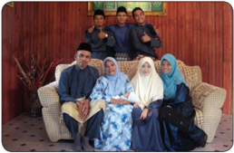

> **Deskripsi Visual:** Gambar ini adalah foto yang menampilkan keluarga Muslim yang sedang berada di dalam ruangan. Keluarga tersebut terdiri dari sepuluh orang, termasuk empat orang dewasa dan dua anak-anak. Mereka semua mengenakan pakaian tradisional Muslim, seperti jubah dan tudung. Dua orang dewasa duduk di kursi besar di depan, sementara empat orang lainnya berdiri di belakang mereka. Ruangan mereka tampak sederhana dengan meja dan kursi minimalis. Gambar ini menunjukkan hubungan harmonis antara anggota keluarga dan suasana yang damai.

 

---
## 📄 Halaman 142

Berdasarkan ayat tersebut, mahram dapat dibagi menjadi empat kelompok, yaitu sebagai berikut.

---
**📊 Tabel**

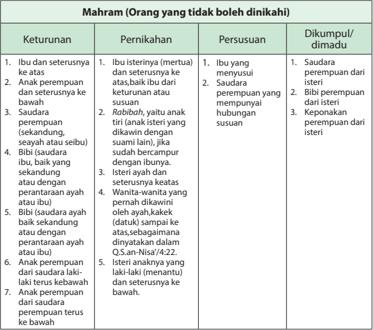

Tabel ini berisi informasi tentang orang-orang yang tidak boleh dikhianati dalam konteks pernikahan, persusuan, dan dikumpul/dimudai. Topik utamanya adalah tentang keturunan yang dianggap tidak sah atau tidak diakui dalam beberapa tradisi atau agama. Kolom-kolomnya meliputi keturunan, pernikahan, persusuan, dan dikumpul/dimudai. Data penting yang terlihat antara lain bahwa ibu dan seterusnya ke atas, ibu perempuan, dan ibu dari istri atau baki dari istri adalah orang-orang yang tidak boleh dikhianati dalam pernikahan. Sementara itu, saudara perempuan dari istri, ibu perempuan yang memiliki hubungan sususan, dan ibu dari istri adalah orang-orang yang tidak boleh dikhianati dalam persusuan. Selain itu, saudara perempuan dari istri, ibu perempuan yang memiliki hubungan sususan, dan ibu dari istri juga tidak boleh dikhianati dalam dikumpul/dimudai.

### Aktivitas Siswa

- Buatlah daftar nama keluarga dan kerabat kalian yang tidak boleh dinikahi ( mahram ), baik karena keturunan, pernikahan, ataupun susuan!
- Konfirmasikan dengan guru kalian!

### 5. Rukun dan Syarat Pernikahan

Para  ahli  fikih  berbeda  pendapat  dalam  menentukan  rukun  dan  syarat pernikahan.  Perbedaan  tersebut  adalah  dalam  menempatkan  mana  yang termasuk syarat dan mana yang termasuk rukun. Jumhur ulama sebagaimana juga mażhab Sy ± fi' ³ mengemukakan bahwa  rukun nikah ada lima seperti di bawah ini.

 

---
## 📄 Halaman 143

- Calon suami, syarat-syaratnya sebagai berikut.
- Bukan mahram si wanita, calon suami bukan termasuk yang haram dinikahi karena adanya hubungan nasab atau sepersusuan.
- Orang  yang  dikehendaki,  yakni  adanya  ke ri«± an  dari  masingmasing pihak. Dasarnya adalah hadis dari Abu Hurairah r.a, yaitu: ' Dan  tidak  boleh  seorang  gadis  dinikahkan  sehingga  ia  diminta izinnya. ' ( ¦ R. al- Bukh ± ri dan Muslim).
- Mu'ayyan (beridentitas  jelas),  harus  ada  kepastian  siapa  identitas mempelai  laki-laki  dengan  menyebut  nama  atau  sifatnya  yang khusus.
- Calon istri, syaratnya adalah.
- Bukan mahram si laki-laki.
- Terbebas dari halangan nikah, misalnya, masih dalam masa iddah atau berstatus sebagai istri orang.
- Wali,  yaitu  bapak  kandung  mempelai  wanita,  penerima  wasiat  atau kerabat terdekat, dan seterusnya sesuai dengan urutan ashabah wanita tersebut, atau orang bijak dari keluarga wanita, atau pemimpin setempat, Rasulullah saw. bersabda: 'Tidak ada nikah, kecuali dengan wali.' Umar bin  Khattab  ra.  berkata, 'Wanita  tidak  boleh  dinikahi,  kecuali  atas  izin walinya, atau orang bijak dari keluarganya atau seorang pemimpin' .

### Syarat wali adalah.

- orang yang dikehendaki, bukan orang yang dibenci,
- laki-laki, bukan perempuan atau banci,
- mahram si wanita,
- baligh, bukan anak-anak,
- berakal, tidak gila,
- adil, tidak fasiq,
- tidak terhalang wali lain,
- tidak buta,
- tidak berbeda agama,
- merdeka, bukan budak.

### d. Dua orang saksi.

Firman Allah Swt.: 'Dan persaksikanlah dengan dua orang saksi yang adil di antara kalian' . (Q.S. at-Țal ± q/65:2) .

Syarat saksi adalah sebagai berikut.

- Berjumlah  dua  orang,  bukan  budak,  bukan  wanita,  dan  bukan orang fasik.

 

---
## 📄 Halaman 144

- Tidak boleh merangkap  sebagai saksi  walaupun  memenuhi kualifikasi sebagai saksi.
- Sunnah dalam keadaan rela dan tidak terpaksa.
- Sigah (Ijab Kabul) , yaitu perkataan dari mempelai laki-laki atau wakilnya ketika akad nikah. Syarat shighat adalah sebagai berikut.
- Tidak tergantung dengan syarat lain.
- Tidak terikat dengan waktu tertentu.
- Boleh dengan bahasa asing.
- Dengan menggunakan kata 'tazwij' atau 'nikah' , tidak boleh dalam bentuk  kinayah  (sindiran),      karena  kinayah  membutuhkan  niat sedang niat itu sesuatu yang abstrak.
- Qabul  harus  dengan  ucapan  'Qabiltu  nikahaha/tazwijaha'  dan boleh didahulukan dari ijab.

### Aktivitas Siswa

Setelah  kalian  mengetahui  syarat  dan  rukun  nikah,  peragakan  prosesi pernikahan dengan ketentuan sebagai berikut.

- Pilih personil untuk berperan sebagai mempelai pria, mempelai wanita, wali, saksi, dan Petugas Pencatat Nikah!
- Siapkan sesuatu sebagai mahar!
- Praktikkan prosesi pernikahan dengan bimbingan guru kalian!

### 6. Pernikahan yang Tidak Sah

Di antara pernikahan yang tidak sah dan dilarang oleh Rasulullah saw. adalah sebagai berikut.

- Pernikahan Mut`ah , yaitu pernikahan yang dibatasi untuk jangka waktu tertentu,  baik  sebentar  ataupun  lama.  Dasarnya  adalah  hadis  berikut: 'Bahwa Rasulullah saw. melarang pernikahan mut'ah serta daging keledai kampung (jinak) pada saat Perang Khaibar. ( ¦ R. Muslim).
- Pernikahan syighar , yaitu pernikahan dengan persyaratan barter tanpa pemberian mahar. Dasarnya adalah hadis berikut.
- 'Sesungguhnya  Rasulullah  saw.  melarang  nikah  syighar.  Adapun  nikah syighar  yaitu  seorang  bapak  menikahkan  seseorang  dengan  putrinya dengan  syarat  bahwa  seseorang  itu  harus  menikahkan  dirinya  dengan putrinya, tanpa mahar di antara keduanya.' ( ¦ R. Muslim)
- Pernikahan muhallil ,  yaitu  pernikahan  seorang  wanita  yang  telah ditalak  tiga  oleh  suaminya  yang  karenanya  diharamkan  untuk  rujuk kepadanya, kemudian wanita itu dinikahi laki-laki lain dengan tujuan

 

---
## 📄 Halaman 145

- untuk menghalalkan dinikahi lagi oleh mantan suaminya. Abdullah bin Mas'ud berkata: 'Rasulullah saw. melaknat muhallil dan muhallal lahu' . ( ¦ R. at-Tirmiżi)
- Pernikahan  orang  yang  ihram,  yaitu  pernikahan  orang  yang  sedang melaksanakan  ihram  haji  atau 'umrah  serta  belum  memasuki  waktu tahallul. Rasulullah saw. bersabda: 'Orang yang  sedang melakukan ihram tidak boleh menikah dan menikahkan.' ( ¦ R. Muslim)
- Pernikahan dalam masa iddah, yaitu pernikahan di mana seorang lakilaki  menikah  dengan  seorang  perempuan  yang  sedang  dalam  masa iddah, baik karena perceraian ataupun karena meninggal dunia. Allah Swt.  berfirman: 'Dan  janganlah  kamu  ber'azam  (bertetap  hati)  untuk beraqad nikah, sebelum habis 'iddahnya' . ( Q.S. al-Baqarah /2:235)
- Pernikahan tanpa wali, yaitu pernikahan yang dilakukan seorang laki-laki dengan seorang wanita tanpa seizin walinya. Rasulullah saw. bersabda: 'Tidak ada nikah kecuali dengan wali.'
- Pernikahan dengan wanita kafir selain wanita-wanita ahli kitab, berdasarkan firman Allah Swt.: 'Dan janganlah kamu menikahi wanitawanita musyrik, sebelum mereka beriman. Sesungguhnya    wanita budak yang  mukmin  lebih  baik  dari  wanita  musyrik,  walaupun  dia  menarik hatimu. (Q.S. al-Baqarah /2:221)
- Menikahi  mahram,  baik  mahram  untuk  selamanya,  mahram  karena pernikahan atau karena sepersusuan.

### D.    Pernikahan Menurut Undang-Undang  Perkawinan Indonesia (UU No.1 Tahun 1974)

Di dalam negara RI, segala sesuatu yang bersangkut paut dengan penduduk, harus mendapat legalitas pemerintah dan tercatat secara resmi, seperti halnya kelahiran, kematian, dan perkawinan. Dalam rangka tertib hukum dan tertib administrasi, maka tatacara pelaksanaan pernikahan harus mengikuti prosedur sebagaimana diatur dalam Peraturan Pemerintah tentang Pelaksanaan Undang-undang  No. 1 Thn 1974.

Adapun  pencatatan  Pernikahan  sebagaimana  termaktub  dalam  BAB  II  pasal  2 adalah  dilakukan  oleh  Pegawai  Pencatat  Nikah  (PPN)  yang  berada  di  wilayah masing-masing.  Karena  itu  Pegawai  Pencatat  Nikah  mempunyai  kedudukan yang  amat  penting  dalam  peraturan  perundang-undangan  di  Indonesia  yaitu diatur  dalam  Undang-undang  No.  32  tahun  1954,  bahkan  sampai  sekarang PPN adalah satu-satunya pejabat yang berwenang untuk mencatat perkawinan

 

---
## 📄 Halaman 146

yang dilakukan berdasarkan hukum Islam di wilayahnya. Artinya, siapapun yang ingin  melangsungkan  perkawinan  berdasarkan  hukum  Islam,  berada  di  bawah pengawasan PPN.

### Aktivitas Siswa

Di  samping  beberapa  model  pernikahan  di  atas,  pernikahan  beda  agama juga  sering  dan  akan  terus  menjadi  fenomena,  karena  kita  hidup  di  dalam masyarakat  yang  memeluk  bermacam  agama.  Untuk  membekali  kalian dengan wawasan yang cukup. Ikutilah beberapa syarat berikut.

- Baca Undang-Undang Perkawinan No.1 tahun 1974.
- Lakukan diskusi dengan tema 'nikah beda agama' dengan format diskusi panel. Bagaimana menurut Islam dan Undang-Undang Perkawinan No.1 tahun 1974.
- Mintalah guru kalian untuk menjadi nara sumber, atau mengundang nara sumber lain jika perlu!

### E.  Hak dan Kewajiban Suami Istri

Dengan   berlangsungnya   akad   pernikahan,   maka   memberi   konsekuensi adanya hak dan kewajiban suami isteri, yang mencakup 3 hal, yaitu kewajiban bersama  antara suami dan isteri, kewajiban suami terhadap isteri dan kewajiban isteri terhadap suami:

- Kewajiban  bersama suami dan istri, yaitu sebagai berikut.
- Memelihara dan mendidik anak dengan sebaik-baiknya.
- Berbuat baik terhadap mertua, ipar dan kerabat lainnya baik dari suami atau isteri.
- Setia  dalam  hubungan  rumah  tangga  dan  memelihara  keutuhannya dengan  berusaha melakukan pergaulan  secara bijaksana, rukun, damai dan harmonis;
- Saling bantu membantu antara keduanya.
- Menjaga  penampilan  lahiriah  dalam  rangka  merawat  keutuhan  cinta dan kasih sayang diantara keduanya.
- Perhatikan Q.S. at-Tahrim /66:6, Q.S. an-Nisa' /4:36 dan Q.S. al-Maidah /5:2

### 2. Kewajiban Suami terhadap Istri

- Menjadi  pemimpin,  memelihara  dan  membimbing  keluarga  lahir dan  batin  serta  menjaga  dan  bertanggung  jawab  atas  kesejahteraan keluarganya ( Q.S. at-Tahrim /66:6)

 

---
## 📄 Halaman 147

- Memberi nafkah, pakaian dan tempat tinggal kepada  istri anak-anaknya sesuai dengan kemampuan yang diusahakan secara maksimal ( Q.S.alBaqarah /2:168 dan 172).
- Bergaul dengan isteri secara ma'ruf dan memperlakukan keluarganya dengan cara baik.
- Masing-masing anggota keluarganya, terutama suami dan isteri bertanggung jawab sesuai fungsi dan perannya masing-masing.
- Memberi  kebebasan  berfikir    dan  bertindak  kepada  isteri  sepanjang sesuai norma Islam, membantu tugas-tugas isteri serta tidak mempersulit kegiatan isteri.

### 3. Kewajiban Istri terhadap Suami

- Taat kepada  perintah suami.
- Istri yang setia kepada suaminya berarti telah mengimbangi  kewajiban suaminya  kepadanya.  Ketaatan  istri  kepada  suami  hanya  dalam  hal kebaikan.  Jika  suami  meminta  istri  untuk  melakukan  sesuatu  yang bertentangan dengan syariat Islam, maka istri harus menolaknya. Tidak
- ada ketaatan kepada manusia dalam kemaksiatan kepada Allah Swt.
- Selalu menjaga diri dan kehormatan keluarga.
- Menjaga  kehormatan  diri  dan  rumah  tangga,  adalah  bilamana suami tidak  ada  dirumah  istri  wajib  menjaga  harta  dan  kehormatan  suami, karenanya  istri tidak  boleh keluar  rumah tanpa seizin suami.
- Bersyukur  atas  nafkah  yang  diterima  dan  menggunakannya  dengan sebaik-baiknya.
- Membantu suami dan mengatur rumah tangga sebaik mungkin

### Aktivitas Siswa

Carilah  artikel  tentang 'Hak  dan  Kewajiban  Suami  Istri'  dengan  ketentuan sebagai berikut.

- Satu kelompok satu artikel.
- Artikel tidak lebih dari satu halaman (harus diedit).
- Dipresentasikan di depan kelas secara bergantian dengan kelompok lain dan ditanggapi!

 

---
## 📄 Halaman 148

### F. Hikmah Pernikahan

Nikah disyariatkan Allah Swt. melalui al-Qurān dan sunah Rasul-Nya, seperti dalam uraian di atas, mengandung hikmah yang sangat besar untuk keberlangsungan hidup manusia, di antaranya sebagai berikut.

- Terciptanya hubungan antara laki-laki dan perempuan yang bukan mahram, dalam ikatan suci yang halal dan di ri«± i Allah Swt.
- Mendapatkan  keturunan  yang sah dari hasil pernikahan.
- Terpeliharanya kehormatan  suami istri dari perbuatan zina.
- Terjalinnya  kerja  sama  antara  suami  dan  istri  dalam  mendidik  anak  dan menjaga kehidupannya.
- Terjalinnya silaturahim antarkeluarga besar pihak suami dan pihak istri.

### Aktivitas Siswa

Temukan lebih banyak lagi hikmah dari pernikahan kemudian presentasikan di depan kelas untuk ditanggapi!

### Menerapkan Perilaku Mulia

Menunjukkan  Sikap  Bersatu  dan  Kebersamaan  dalam  Lingkungan  Masyarakat sebagai Implementasi Ketentuan Pernikahan dalam Islam.

Pernikahan  adalah  aturan  Allah  Swt.  dan  jalan  terbaik  untuk  melestarikan kehidupan  serta  untuk  memperoleh  keturunan  sehingga  tatanan  kehidupan tetap eksis dan berkelanjutan. Ada beberapa peran keluarga yang memiliki kaitan dengan masyarakat, antara lain; keluarga merupakan cermin dari masyarakat yang sehat, keluarga merupakan tempat pembibitan kepemimpinan dalam masyarakat, apabila dalam keluarga baik, maka masyarakat akan baik pula.

Ada beberapa tindakan strategis sehubungan dengan peran yang dituntut dari keluarga  yaitu  setiap  keluarga  hendaknya  tidak  jemu  berbuat  baik  terhadap anggota keluarga,  setiap  pasangan,  orang  tua  harus  menyediakan  waktu  yang cukup terhadap anak dan keluarganya, termasuk mengambil peran dan tanggung jawab dalam mendidik anak-anaknya. Keluarga adalah orang-orang yang terdekat dalam hidup kita.  Apabila keharmonisan dalam keluarga tetap dijaga bahkan hidup susah akan terasa bahagia jika kebersamaan dalam keluarga dapat diciptakan. Oleh karena itu, pasangan suami isteri harus berusaha berperan aktif dalam berbakti pada lingkungan dan masyarakat, dengan demikian keluarga kita dianggap keberadaanya oleh masyarakat dan lingkungan.

 

---
## 📄 Halaman 149

Untuk mewujudkan keluarga yang sejahtera, tentram, saling asah, asih dan asuh serta mendapakan rahmat Allah Swt yang menjadi dambaan dan cita-cita suami istri, maka perilaku mulia harus diterapkan dalam kehidupan rumah tangga kita, antara lain sebagai berikut.

- Melaksanakan  perintah  Allah  Swt.. 'Dan  nikahkanlah  orang-orang  yang sendirian  diantara  kamu,  dan  orang-orang  yang  layak  nikah  dari  hambahamba sahayamu yang perempuan'. ( Q.S. an-N µ r/24:32).
- Melaksanakan perintah Rasulullah saw. 'Barang siapa yang mampu menikah tetapi  tidak  menikah,  maka  dia  bukanlah  termasuk  golonganku' . ( ¦ R.  AL-° abr ± ni dan AL-Baihaqi).
- Memelihara  keturunan  dan  memperbanyak  umat. 'Nikahilah  wanita  yang subur    dan  sayang  anak.  Sesungguhnya  aku  berbangga  dengan  banyaknya umatku di hari kiamat' . ( ¦ R. Ab µ D ± ud).
- Mencegah  masyarakat  dari  dekadensi  moral. ' Wahai  para  pemuda  barang siapa yang sudah mampu untuk menikah maka nikahlah, karena sesungguhnya itu  dapat memelihara pandangan dan menjaga kemaluan. Dan barangsiapa belum mampu  menikah,  hendaklah  ia berpuasa, karena sesungguhnya berpuasa itu dapat menjadi tameng mengalahkan hawa nafsu'. ( ¦ R. al-Bukh ± ri dan Muslim).
- Mencegah masyarakat dari penyakit-penyakit yang ditimbulkan dari hubungan seksual dengan berganti-ganti pasangan.
- Melahirkan  ketenangan  jiwa. 'Dan  di  antara  tanda-tanda  kekuasaan-Nya ialah  Dia  menciptakan  untukmu  istri-istri  dari  jenismu  sendiri,  supaya  kamu cenderung dan merasa tentram kepadanya dan Dia jadikan di antaramu rasa kasih  sayang.  Sesungguhnya  pada  yang  demikian  itu  benar-benar  terdapat tanda-tanda bagi kaum yang berfikir' . ( Q.S. ar-R µ m/30:21; ).
- Meniti jalan bertakwa. 'Barangsiapa yang Allah Swt. anugerahkan kepadanya seorang wanita yang shalihah berarti Allah Swt. telah menolongnya menjalani separuh agamanya. Hendaknya ia bertakwa kepada Allah Swt. untuk memelihara separuh yang lainnya' . ( ¦ R. Tabrani).
- Memperkokoh dan memperluas persaudaraan; melalui pernikahan berarti telah menyatukan dua keluarga besar dalam memperkokoh tali persaudaraan.

 

---
## 📄 Halaman 150

### Aktivitas Siswa

- Lakukan wawancara dengan kedua orangtua kalian atau pasangan lain yang sudah menikah!
- Cari  tahu  seputar  pengalaman  mereka  (suka  dan  duka)    dari  mulai mencari pasangan hingga setelah menjalani kehidupan berkeluarga dan bagaimana mereka mengatasi semua rintangan yang dihadapi!
- Catat  pelajaran  penting  yang  kalian  temukan  sebagai  bekal  untuk menyiapkan rencana yang lebih baik dari sekarang!
- Laporkan  hasil  wawacara  dan  rencana  yang  kalian  buat  kepada  guru kalian!

### Tugas Kelompok

Kerjakan tugas-tugas berikut ini.

---
**📊 Tabel**

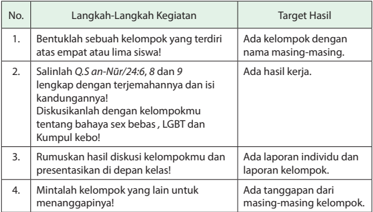

Tabel ini berisi langkah-langkah kegiatan yang harus dilakukan oleh siswa untuk menyelesaikan tugas yang berkaitan dengan bahasa dan budaya Indonesia. Topik utama tabel adalah "Bahasa dan Budaya Indonesia". Kolom pertama berisi nomor urut dari langkah-langkah kegiatan, sedangkan kolom kedua berisi deskripsi singkat dari setiap langkah tersebut. Kolom ketiga berisi target hasil yang diharapkan dari setiap langkah kegiatan. Dari tabel ini, dapat dilihat bahwa langkah-langkah kegiatan ini melibatkan pembentukan kelompok, salin halaman Q.San Nur, 24/8, 9, dan 9, diskusi dengan kelompok lain tentang bahaya seks bebas, LGBT, dan kumpul kebo, dan minalat kelompok lain untuk menanggapiinya. Target hasilnya adalah adanya kelompok dengan nama masing-masing, hasil kerja, laporan individu dan kelompok, dan tanggapan dari masing-masing kelompok.

 

---
## 📄 Halaman 151

### Rangkuman

- Nikah  berarti  akad  yang  menghalalkan  pergaulan  antara  laki-laki  dan perempuan yang bukan mahramnya yang menimbulkan hak dan kewajiban masing-masing. Sedangkan menurut Undang-undang Pernikahan RI (UUPRI) Nomor 1 Tahun 1974 adalah: 'Perkawinan atau nikah ialah ikatan lahir batin antara seorang pria dan wanita sebagai suami istri, dengan tujuan membentuk keluarga (rumah tangga) yang berbahagia dan kekal berdasarkan Ketuhanan Yang Maha Esa' .
- Para ahli  fikih  sependapat  bahwa hukum pernikahan tidak sama di antara orang mukallaf. Dilihat dari kesiapan ekonomi, fisik, mental ataupun akhlak, hukum nikah dapat menjadi wajib, sunah, mubah, haram, dan makruh.
- Al-Qurān telah menjelaskan tentang orang-orang yang tidak boleh (haram) dinikahi  ( Q.S.  an-Nisā'  /4:23-24). Wanita  yang  haram  dinikahi  disebut  juga mahram nikah.
- Jumhur  ulama  sebagaimana  juga  mażhab  Syafi'iy  mengemukakan  bahwa rukun nikah ada lima, yaitu: calon suami, calon istri, wali, dua orang saksi, dan sighat (Ijab Kabul).
- Di antara pernikahan yang tidak sah dan dilarang oleh Rasulullah saw. adalah pernikahan mut`ah ,  pernikahan syigar ,  pernikahan muhallil ,  pernikahan orang yang ihram, pernikahan dalam masa iddah, pernikahan tanpa wali, dan pernikahan  dengan  wanita  kafir  selain  wanita-wanita  ahli  kitab,  menikahi mahram.
- Pernikahan melahirkan kewajiban atas masing-masing pihak, suami dan istri. Kewajiban tersebut meliputi: a) kewajiban timbal balik antara suami dan istri, seperti  hubungan  seksual  di  antara  mereka;  b)  kewajiban  suami  terhadap istri, seperti mahar dan nafkah; c) kewajiban Istri terhadap suami, seperti taat kepada suami.

 

---
## 📄 Halaman 152

### Evaluasi

### I. Berilah  tanda  silang  (x)  pada  huruf  a,  b,  c,  d,  atau  e  yang  dianggap jawaban yang paling tepat!

- Pernyataan di bawah ini merupakan fungsi dari sebuah pernikahan, kecuali
…

- tempat berlangsungnya proses penanaman nilai
- menjaga diri dari berbagai  macam  penyakit
- penerus  dari keberadaan eksistensi manusia
- perlindungan bagi terjaganya akhlak
- sebagai tempat mewujudkan kasih sayang
- Seorang pemuda berusia 27 tahun, punya keinginan besar untuk menikah tetapi  secara  ekonomi  kondisinya  belum  memadai,  agar  selamat  dari perbuatan dosa, sebaiknya pemuda tersebut . . .
- menikah dengan minta bantuan orangtua
- menikah dengan mengadakan resepsi sederhana
- menahan keinginannya karena dalam kondisi tidak wajib
- tunda keinginan untuk menikah sampai cukup secara materi
- banyak berpuasa untuk meredam nafsu sambil mengumpulkan materi
- Ibu  Siti  ketika  menikah  dengan  bapak  Ahmad  membawa  seorang  putri yang  bernama  Aisyah,  ketika  perkawinan  mereka  kandas  di  tengah  jalan dan  perceraian  merupakan  jalan  terbaik.  Seandainya  bapak  Ahmad  ingin menikah  kembali,  maka  terlarang  baginya  untuk  menikahi  Aisyah,  karena Aisyah merupakan mahram dengan sebab . . .
- keturunan
- persusuan
- pernikahan
- pertalian agama
- dimadu
- Suami istri harus berusaha menciptakan suasana tentram dan damai dalam keluarga. Berikut ini yang tidak mendukung suasana tersebut adalah . .  .
- mengajak keluarga untuk berwisata bersama
- membiasakan ucapan yang santun dalam keluarga
- menanamkan nilai-nilai keislaman pada keluarga
- menyibukkan diri dengan salat sunah selama berada di rumah
- menemani anak-anak mengejakan PR atau tugas sekolah lainnya

 

---
## 📄 Halaman 153

### 5. Perhatikan pernyataan berikut ini!

- Terhindar dari perbuatan maksiat
- Untuk meneruskan kehidupan manusia
- Pasangan yang didapat sesuai dengan perilaku
- Terwujudnya ketentraman, kasih sayang dan cinta
- Ikatan yang menyatukan seorang laki-laki dan wanita
- Merupakan status simbol dalam kehidupan masyarakat Melalui  pernyataan  tersebut,  yang  termasuk  hikmah  pernikahan  adalah nomor . . . .
- 1), 2) dan 3)
- 1), 2) dan 4)
- 2), 3) dan 4)
- 3), 5) dan 6)
- 4), 5) dan 6)

### II. Isilah titik-titik di bawah ini dengan jawaban yang singkat dan benar!

- Memahami  makna Q.S.  ar-Rµm/30:21 akan  menumbuhkan  rasa  percaya terhadap . . . .
- Memahami  tujuan  akad  nikah  akan  menumbuhkan  sikap  bertanggung jawab dalam . . . .
- Memahami hakikat pernikahan membuat diri kita lebih menjauhi pergaulan yang . . . .
- Hidup bebas tanpa nikah akan berakibat kepada . . . .
- Cara terbaik memilih pasangan hidup menurut Islam adalah . . . .

### III. Kerjakan soal-soal  di bawah ini!

- Jelaskan pengertian nikah menurut Islam!
- Sebutkan tujuan nikah!
- Pernikahan dinyatakan sah apabila memenuhi 5(lima) rukun nikah, sebutkan!
- Bagaimanakah cara memilih jodoh(isteri atau suami) menurut Islam!
- Sebutkan 3 (tiga) macam kewajiban suami terhadap isteri!
- Bagaimana pendapat kalian tentang hidup bebas tanpa nikah yang banyak terjadi di tengah masyarakat dalam hubungannya dengan hukum Islam!
- Apakah yang dimaksud dengan mahram !
- Jelaskan macam-macam hukum nikah!
- Jelaskan isi kandungan Q.S.adzª± riy ± t/51:49 !

 

---
## 📄 Halaman 154

### 10. Tuliskan sighat Ijab dan Qabul secara lengkap!

### IV.  Berilah tanda checklist (  ) pada kolom yang sesuai dengan pilihan sikap kalian!

SS= Sangat Setuju; S= Setuju;  KS=Kurang Setuju;  TS= Tidak Setuju

---
**📊 Tabel**

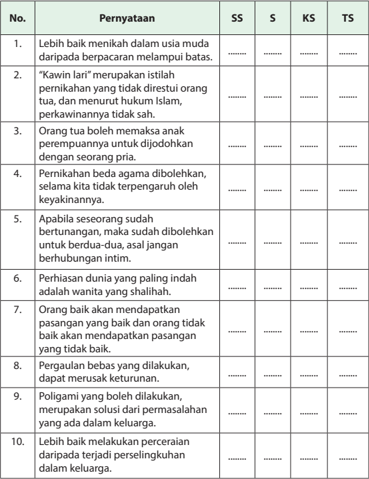

Tabel ini berisi pernyataan yang diuji dengan skala SS (Sesuai), S (Sangat Sesuai), KS (Kurang Sesuai), dan TS (Tidak Sesuai). Topik utama tabel adalah tentang prinsip-prinsip hukum Islam terkait perkawinan dan perselingkuhan. Kolom-kolomnya mencakup pernyataan-pernyataan tersebut, dengan skor yang menunjukkan tingkat kesesuaian dengan prinsip-prinsip tersebut. Data penting yang terlihat adalah bahwa sebagian besar pernyataan mendapatkan skor yang tinggi, menunjukkan kesesuaian dengan prinsip-prinsip hukum Islam yang disebutkan.

 

---
## 📄 Halaman 155

Sumber: www.wimsonevel.com

### Bab 8 Meraih Berkah dengan Mawaris

### Peta Konsep

---
**🖼️ Gambar/Diagram**

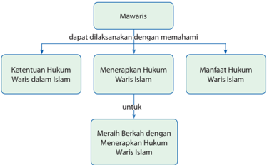

> **Deskripsi Visual:** Gambar ini adalah diagram yang menunjukkan hubungan antara mawaris (warisan) dengan ketentuan hukum waris dalam Islam, serta manfaat dan aplikasi dari hukum waris tersebut. Diagram ini terdiri dari empat elemen utama:

1. Mawaris: Ini adalah titik awal yang mengarah ke ketentuan-ketentuan hukum waris dalam Islam.
2. Ketentuan Hukum Waris dalam Islam: Ini adalah bagian dari diagram yang menjelaskan tentang hukum waris yang harus dipahami.
3. Menerapkan Hukum Waris Islam: Ini merupakan langkah-langkah untuk mempraktekkan hukum waris yang telah dipahami.
4. Manfaat Hukum Waris Islam: Ini menunjukkan manfaat dari penggunaan hukum waris dalam praktik.

Elemen-elemen ini saling terhubung melalui relasi "dapat dilaksanakan dengan memahami" dan "untuk", yang menunjukkan bahwa pemahaman tentang hukum waris adalah dasar untuk menerapkannya dan mendapatkan manfaat dari hukum tersebut.

Teks, angka, atau label penting yang terlihat dalam diagram ini adalah "Mawaris", "Ketentuan Hukum Waris dalam Islam", "Menerapkan Hukum Waris Islam", "Manfaat Hukum Waris Islam", dan "Meraih Berkah dengan Menerapkan Hukum Waris Islam". Label-label ini membantu pembaca memahami struktur dan konteks diagram.

Informasi kunci yang dapat diambil pembaca dari gambar ini adalah bahwa pemahaman tentang hukum waris adalah dasar untuk menerapkannya dan mendapatkan manfaat dari hukum tersebut, yang dapat membawa berkah bagi mereka yang menerapkannya dengan benar.

 

---
## 📄 Halaman 156

Amati gambar-gambar berikut! Kemudian, diskusikan nilai-nilai harta  'Warisan ' dan makna yang dikandungnya!

 

---
## 📄 Halaman 157

### Membuka Relung Kalbu

Dalam sebuah riwayat dikisahkan ada seorang ulama yang sedang menghadapi  sakaratul maut. Ia berwasiat kepada santrinya yang berada di sisinya, ' Tulis permasalahan ini dengan cepat' Sang santri berkata, 'Imam, Engkau sangat lelah, memang masalah apa yang hendak Engkau tulis sekarang' , tanya  sang  santri.  'Anakku,  satu  kata yang kita tulis bisa berarti bagi muslim lainnya' . Anakku,  ada  pertanyaan  yang hendak diajukan! Mengapa kamu menginginkan kekayaan'. Kamu mungkin akan menjawab, agar aku dapat hidup bahagia, menikmati segala fasilitas  dan  membeli  semua  yang  aku inginkan. Jika demikian jawabanmu, kamu tidak sedang mewujudkan tujuanmu.

"Seharusnya  kamu  katakan,  Aku  ingin mempunyai  banyak  harta,  agar  dapat disumbangkan di jalan Allah Swt., membiayai pendidikan anak-anakku hingga akrab dengan Allah Swt., membantu mereka yang membutuhkan, dan menginventasikannya dalam kegiatan-kegiatan sosial. Dengan demikian,  setiap  uang  atau  harta  dan tulisan yang kamu berikan adalah ibadah."

Hidup itu sangat singkat, gunakan umur untuk beribadah dan meraih ke ri«± an-Nya. Allah Swt. berfirman dalam Q.S. H µ d/11:15: 'Barangsiapa yang menghendaki kehidupan dunia dan

Gambar 8.5  Memandikan jenazah

### Renungan  Kehidupan

- ◆ Berkaryalah sesuai hati nurani dan jangan mengikuti hawa nafsu. Nafsu diciptakan Allah Swt. sebagai cobaan, bukan sebagai panutan. Sekiranya manusia tidak direcoki nafsunya, maka Allah Swt. akan selalu tampak pada mata hatinya.
- ◆ Kemanapun manusia berjalan dan berkarya dan berprestasi, pada hakikatnya mereka itu menuju kematiannya.
- ◆ Hiasilah perjalanan dan karya kalian dengan kebaikan, niscaya kematian menemuimu dalam khusnul khatimah/kematian yang baik.
- ◆ Anda setuju? Bila setuju, cobalah rumuskan langkah perjalanan menuju cita-cita yang inginkan.
Hal-hal yang perlu diselesaikan sebelum harta waris dibagi adalah; biaya mengurus jenazah, zakat bila mencapai nisab, membayar hutang bila ada, melaksanakan amanah dan nadzar bila ada.

 

---
## 📄 Halaman 158

perhiasannya,  niscaya  Kami  berikan  kepada  mereka  balasan  pekerjaan  mereka  di dunia dengan sempurna dan mereka di dunia itu tidak akan dirugikan. Itulah orangorang  yang  tidak  memperoleh  di  akhirat,  kecuali  neraka  dan  lenyaplah  di  akhirat itu apa yang telah mereka usahakan di dunia dan sia-sialah apa yang telah mereka kerjakan' (Q.S. H µ d/11:15).

### Mengkritisi Sekitar Kita

Bila terjadi sengketa waris, pilihan hukum mana yang hendak kalian pergunakan apakah  Islam,  Adat  atau  KUH  Perdata?  Ambil  contoh,  sekiranya  kalian  adalah pewaris dan di antara ahli waris tidak ada kesepakatan mengenai pilihan hukum padahal semua ahli waris beragama Islam.

### Persoalan Kewarisan

Apabila  terjadi  sengketa  waris  di  antara  ahli  waris  karena  tidak  ada kesepakatan,  maka  langkah  yang  harus  dilakukan  adalah  membicarakan pilihan hukum ( choice of law ). Hukum positif di Indonesia masih membuka ruang bagi para pihak yang bersangkutan memilih dasar hukum yang akan dipakai  dalam  penyelesaian  pembagian  harta  warisan.  Hal  ini  nantinya memberikan  konsekuensi  terhadap  pengadilan  mana  yang  berwenang untuk  mengadili  sengketa  tersebut.  Pilihan  hukum  di  sini  maksudnya sengketa tersebut dapat diajukan ke Pengadilan Negeri bila penyelesaiannya tunduk pada Hukum Adat atau KUH Perdata ( civil law ) atau dapat diajukan ke Pengadilan Agama bila penyelesaiannya tunduk pada Hukum Islam. Hal ini disebabkan Indonesia masih menganut sistem pluralisme hukum.

Bagi  pewaris  yang  beragama  Islam,  dasar  hukum  utama  yang  menjadi pegangan  adalah UU Nomor 3 Tahun 2006 tentang Perubahan UU Nomer 7 Tahun 1989 tentang Peradilan Agama. Dalam Penjelasan Umum UU tersebut dinyatakan: 'Para pihak sebelum berperkara dapat mempertimbangkan untuk memilih hukum apa yang dipergunakan dalam pembagian warisan, dinyatakan dihapus' .  Secara  eksplisit,  Hukum  Islamlah  yang  harusnya  menjadi  pilihan hukum  bagi  mereka  yang  beragama  Islam.  Namun,  ketentuan  ini  tidak mengikat  karena  UU  Peradilan  Agama  ini  tidak  secara  tegas  mengatur persoalan penyelesaian pembagian harta waris bagi pewaris yang beragama Islam ( personalitas keislaman pewaris ) atau non-Islam.

 

---
## 📄 Halaman 159

Di dalam praktik, pilihan hukum ini dapat menimbulkan berbagai masalah, karena  ahli  waris  dapat  saling  gugat  di  berbagai  pengadilan.  Permintaan fatwa  kepada  Mahkamah  Agung  dan  atau  mengajukan  upaya  hukum kasasi  untuk  menentukan  pengadilan  mana  yang  berwenang  memutus adalah konsekuensi yang harus dibayar oleh para pihak ahli waris bila tidak bersepakat  dalam  menentukan mau tunduk terhadap hukum yang mana dalam penyelesaian sengketa waris.

Bila  terjadi  sengketa  waris,  pilihan  hukum  mana  yang  hendak  kalian pergunakan apakah Islam, adat atau KUH Perdata? Ambil contoh, sekiranya kalian  adalah  pewaris  dan  di  antara  ahli  waris  tidak  ada  kesepakatan mengenai pilihan hukum padahal semua ahli waris beragama Islam.

Bagaimana  Pendapat  kalian!  Diskusikan  dengan  teman-teman  kelompok kalian dan sampaikan hasil kesimpulan  di depan kelas!

### Memperkaya Khazanah

### A.  Tadarus al-Qurān 5-10  Menit sesuai Tema

Kewajiban untuk tadarus al-Qurān dengan sebenar-benarnya ( Q.S.alBaqarah /2:121) bertujuan menumbuhkan keinginan peserta didik untuk mentadabburi dan mengetahui manfaatnya, yaitu paham makna al-Qurān dan mengetahui rahasia keagungan-Nya. Dengan mengetahui manfaatnya, peserta didik diharapkan dapat melaksanakan dan mengikutinya karena al-Qurān sudah membekas  dalam  jiwa  ( Q.S.  Thaha /20:112-113, Q.S.  al-Baqarah /2:38),  sehingga peserta didik akan memperoleh ketentraman dan kebahagiaan (Q.S.Taha/20:2-3)

Sebelum  kalian  memulai  pembelajaran,  lakukan  tadarus al-Qurān secara  tartil selama  5-10  menit  di  kelompok  kalian  masing-masing  dipimpin  oleh  ketua kelompok. Ayat-ayat yang dibaca akan ditentukan oleh Bapak/Ibu guru kalian.

### B.  Menganalisis dan Mengevaluasi Ketentuan Waris dalam Islam

Ajaran Islam tidak hanya mengatur masalah-masalah ibadah kepada Allah Swt.. Islam juga mengatur hubungan manusia dengan sesamanya, yang di dalamnya termasuk  masalah  kewarisan.  Nabi  Muhammad  saw..  membawa  hukum  waris Islam  untuk  mengubah  hukum  waris  jahiliyah  yang  sangat  dipengaruhi  oleh

 

---
## 📄 Halaman 160

unsur-unsur kesukuan yang menurut Islam tidak adil. Dalam hukum waris Islam, setiap pribadi, apakah dia laki-laki atau perempuan, berhak memiliki harta benda dari harta peninggalan.

Mawaris merupakan serangkaian kejadian mengenai pengalihan pemilikan harta benda dari seorang yang meninggal dunia kepada seseorang yang masih hidup. Dengan demikian,  untuk  terwujudnya  kewarisan  harus  ada  tiga  unsur,  yaitu:1) orang mati, yang disebut pewaris atau yang mewariskan, 2) harta milik orang yang mati atau orang yang mati meninggalkan harta waris, dan 3) satu atau beberapa orang hidup sebagai keluarga dari orang yang mati, yang disebut sebagai ahli waris.

Ilmu mawaris adalah ilmu yang diberikan status hukum oleh Allah Swt. sebagai ilmu  yang  sangat  penting,  karena  ia  merupakan  ketentuan  Allah  Swt.  dalam firman-Nya yang sudah terinci sedemikian rupa tentang hukum mawaris, terutama mengenai ketentuan pembagian harta warisan ( al-f µ rud al- muqaddarah ).

Warisan dalam bahasa Arab disebut al-mīrās merupakan bentuk masdar (infinitif) dari  kata wari ¡ a-yari ¡ u-irsan-  mīrā ¡ an yang  berarti  berpindahnya  sesuatu  dari seseorang kepada orang lain, atau dari suatu kaum kepada kaum lain.

Warisan berdasarkan pengertian di atas tidak hanya terbatas pada hal-hal yang berkaitan dengan harta benda saja namun termasuk juga yang nonharta benda. Ayat al-Qur ± n yang  menyatakan demikian diantaranya terdapat dalam Q.S.  anNaml/27:16 : 'Dan Sulaiman telah mewarisi Daud.'

Demikian  juga  dalam  hadis  Nabi  saw.  disebutkan  yang  artinya: ' Sesungguhnya ulama itu adalah pewaris para Nabi.'

Adapun menurut istilah,  warisan adalah berpindahnya hak kepemilikan dari orang yang meninggal kepada ahli warisnya yang masih hidup, baik yang ditinggalkan itu berupa harta (uang), tanah, atau apa saja yang berupa hak milik legal secara syar'i.

Definisi lain menyebutkan bahwa warisan adalah perpindahan kekayaan seseorang yang meninggal dunia kepada satu atau beberapa orang beserta akibat-akibat hukum dari kematian seseorang terhadap harta kekayaan.

Ilmu mawaris biasa disebut dengan ilmu far ± idh , yaitu ilmu yang membicarakan segala  sesuatu  yang  berhubungan  dengan  harta  warisan,  yang  mencakup masalah-masalah orang yang berhak menerima warisan, bagian masing-masing dan cara melaksanakan pembagiannya, serta hal-hal lain yang berkaitan dengan ketiga masalah tersebut.

 

---
## 📄 Halaman 161

### C.  Dasar-Dasar Hukum Waris

Sumber hukum ilmu mawaris yang paling utama adalah al-Qur ± n , kemudian AsSunnah/hadis dan setelah itu ijma' para  ulama  serta  sebagian kecil  hasil ijtihad para mujtahid .

### 1. Al-Qur±n

Dalam  Islam  saling  mewarisi  di  antara  kaum  muslimin  hukumnya  adalah wajib berdasarkan al-Qur ± n dan Hadis Rasulullah saw. Banyak ayat al-Qur ± n yang  mengisyaratkan  tentang  ketentuan  pembagian  harta  warisan  ini.  Di Q.S. an-Nis ± '/4:7:

Artinya:  ' Bagi  orang  laki-laki  ada  hak  bagian  dari  harta  peninggalan  ibubapak dan kerabatnya, dan bagi orang wanita ada hak bagian (pula) dari harta peninggalan  ibu-bapak  dan  kerabatnya,  baik  sedikit  atau  banyak  menurut bahagian yang telah ditetapkan ' .

Ayat-ayat lain tentang mawaris terdapat dalam berbagai surat, seperti dalam Q.S. an-Nis ±' /4:7 sampai dengan 12 dan ayat 176, Q.S an-Nahl/16:75 dan Q.S alAhz ± b/33: ayat 4 , sedangkan permasalahan yang muncul banyak diterangkan oleh As-Sunnah, dan sebagian sebagai hasil ijma' dan ijtihad.

### 2. As-Sunnah

- Hadis dari Ibnu Mas'ud berikut.
Artinya:  Dari  Ibnu  Mas'ud,  katanya:  Bersabda  Rasulullah  saw..: ' Pelajarilah al-Qur±n dan  ajarkanlah  ia  kepada  manusia,  dan  pelajarilah  al  faraidh  dan ajarkanlah  ia  kepada  manusia.  Maka  sesungguhnya  aku  ini  manusia  yang akan mati, dan ilmu pun akan diangkat. Hampir saja nanti akan terjadi dua

 

---
## 📄 Halaman 162

orang  yang  berselisih  tentang  pembagian  harta  warisan  dan  masalahnya; maka mereka berdua pun tidak menemukan seseorang yang memberitahukan pemecahan masalahnya kepada mereka ' . ( ¦ .R. Ahmad).

### b. Hadis dari Abdullah bin 'Amr, bahwa Nabi saw. bersabda:

``

Artinya: ' Ilmu itu ada tiga macam dan yang selain yang tiga macam itu sebagai tambahan saja: ayat muhkamat, sunnah yang datang dari Nabi dan faraidh yang adil ' . ( ¦ .R. Ab µ Da µ d dan Ibnu M ± jah).

Berdasarkan kedua hadis di atas, maka mempelajari ilmu faraidh adalah fardhu kifayah ,  artinya  semua  kaum muslimin akan berdosa jika tidak ada sebagian dari mereka yang mempelajari ilmu faraidh dengan segala kesungguhan.

### 3. Posisi Hukum Kewarisan Islam di Indonesia

Hukum  kewarisan  Islam  di  Indonesia  merujuk  kepada  ketentuan  dalam Kompilasi  Hukum  Islam  (KHI),  mulai  pasal  171  diatur  tentang  pengertian pewaris,  harta  warisan  dan  ahli  waris.  Kompilasi  Hukum  Islam  merupakan kesepakatan  para  ulama  dan  perguruan  tinggi  berdasarkan  Inpres  No.  1 Tahun  1991.  Yang  masih  menjadi  perdebatan  hangat  adalah  keberadaan pasal  185  tentang  ahli  waris  pengganti  yang  memang  tidak  diatur  dalam fiqih Islam.

Di  bawah  ini  secara  ringkas  dapat  dikemukakan  tabel  hukum  waris  Islam menurut Kompilasi Hukum Islam.

---
**📊 Tabel**

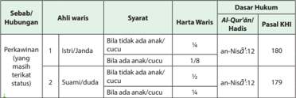

Tabel ini berisi informasi tentang syarat harta waris untuk anak-anak yang masih hidup dan berhubungan perkawinan dengan wali kandung mereka. Topik utamanya adalah tentang persyaratan harta waris bagi anak-anak yang masih hidup dan berhubungan perkawinan dengan wali kandung mereka. Kolom-kolomnya meliputi: 1) Perkawinan (yang masih terikat status), 2) Syarat, 3) Harta Waris, dan 4) Dasar Hukum. Data penting yang terlihat adalah bahwa anak-anak yang masih hidup dan berhubungan perkawinan dengan wali kandung mereka memiliki hak harta waris tertentu, seperti istri/janda memiliki hak 1/8 dari harta waris, suami/duda memiliki hak 1/8 dari harta waris, dan anak-anak (anak atau cucu) memiliki hak 1/8 dari harta waris. Ini menunjukkan bahwa hak harta waris anak-anak yang masih hidup dan berhubungan perkawinan dengan wali kandung mereka sangat penting dalam hukum Islam.

 

---
## 📄 Halaman 163

---
**📊 Tabel**

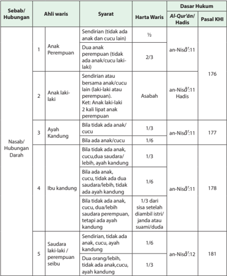

Tabel ini berisi informasi tentang syarat hukum untuk menjadi ahli waris dalam berbagai hubungan keluarga. Topik utamanya adalah tentang syarat-syarat hukum untuk menjadi ahli waris dalam berbagai jenis hubungan, mulai dari anak perempuan, anak laki-laki, ayah kandung, ibu kandung, hingga saudara laki-laki atau perempuan sebua. Kolom-kolomnya meliputi "Sebab/Hubungan", "Syarat", "Harta Waris", "Dasar Hukum", dan "Pasal KHI". Data penting yang terlihat adalah bahwa anak perempuan harus sendirian (tidak ada anak atau cucu lain) untuk mendapatkan hak waris 1/2, sedangkan anak laki-laki harus bersamaan dengan ayah kandung atau memiliki kedua lipat anak perempuan untuk mendapatkan hak waris 2/3. Ayah kandung harus memiliki kedua lipat anak perempuan untuk mendapatkan hak waris 1/3, dan ibu kandung harus memiliki kedua lipat anak perempuan untuk mendapatkan hak waris 1/6. Sementara itu, saudara laki-laki atau perempuan sebua harus sendirian untuk mendapatkan hak waris 1/6.

 

---
## 📄 Halaman 164

---
**📊 Tabel**

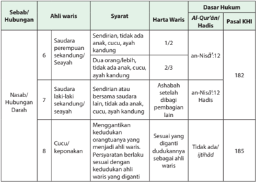

Tabel ini membahas tentang hubungan waris dalam hukum Islam, dengan fokus pada asas-asas hukum warisan berdasarkan Al-Qur'an dan Hadits. Topik utamanya adalah hubungan waris antara saudara, nasab darah, dan cucu/keponakan. Tabel ini membagi data menjadi beberapa kolom: Sebab/Hubungan, Ahli waris, Syarat, Harta Waris, Dasar Hukum, dan Pasal KHI. Data penting yang terlihat meliputi bahwa saudara perempuan sekandung/seyayah memiliki hak waris sebesar 1/2 dari harta waris, sedangkan cucu/keponakan memiliki hak waris sebesar 1/8 dari harta waris. Selain itu, tabel juga menunjukkan bahwa ada beberapa syarat khusus untuk setiap hubungan waris, seperti adanya anak, cucu, ayah kandung, atau pasangan.

### D.  Ketentuan Mawaris dalam Islam

### 1. Ahli Waris

Jumlah ahli waris yang berhak menerima harta warisan dari seseorang yang meninggal dunia ada 25 orang, yaitu 15 orang dari ahli waris pihak laki-laki yang biasa disebut ahli waris ashabah (yang bagiannya berupa sisa setelah diambil oleh ©± wil fur µ d ) dan 10 orang dari ahli waris pihak perempuan yang biasa disebut ahli waris ©± wil fur µ d (yang bagiannya telah ditentukan).

Coba kalian buka, baca, dan pahami Q.S.an-Nis ± '/4:7 serta perhatikan bagan ahli waris di bawah ini,kemudian kalian jelaskan susunan ahli waris keluarga kalian secara bergantian di depan kelasmu!

 

---
## 📄 Halaman 165

---
**🖼️ Gambar/Diagram**

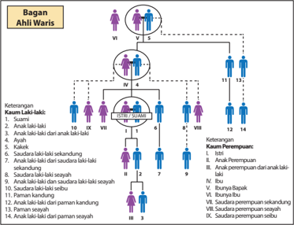

> **Deskripsi Visual:** Buku pelajaran ini menampilkan sebuah diagram yang menggambarkan hubungan keluarga dalam sistem waris. Diagram ini berisi informasi tentang ahli waris, ketersieran, dan keturunan dalam sebuah keluarga. Elemen utama yang ditampilkan adalah:

1. Ahli Waris: Mereka yang memiliki hak atas harta warisan.
2. Ketersieran: Menggambarkan hubungan antara ahli waris dengan orang-orang lain dalam keluarga.
3. Angka: Menunjukkan urutan generasi dan posisi dalam keluarga.

Teks penting yang terlihat meliputi nama-nama ahli waris, ketersieran mereka, dan urutan generasi. Informasi kunci yang dapat diambil pembaca termasuk hubungan antara ahli waris, ketersieran mereka, dan urutan generasi dalam keluarga tersebut. Diagram ini membantu pembaca memahami struktur keluarga dan bagaimana hak-hak warisan diserap oleh generasi berikutnya.

### 2. Syarat-Syarat Mendapatkan Warisan

Seorang  muslim  berhak  mendapatkan  warisan  apabila  memenuhi  syaratsyarat sebagai berikut.

- Tidak  adanya  salah  satu  penghalang  dari  penghalang-penghalang untuk mendapatkan warisan.
- Kematian orang yang diwarisi, walaupun kematian tersebut berdasarkan vonis  pengadilan.  Misalnya  hakim  memutuskan  bahwa  orang  yang hilang itu dianggap telah meninggal dunia.
- Ahli  waris  hidup  pada  saat  orang  yang  memberi  warisan  meninggal dunia.  Jadi,  jika  seorang  wanita  mengandung  bayi,  kemudian  salah seorang anaknya meninggal dunia, maka bayi tersebut berhak menerima warisan dari saudaranya yang meninggal itu, karena kehidupan janin telah terwujud pada saat kematian saudaranya terjadi.

 

---
## 📄 Halaman 166

### 3. Sebab-Sebab Menerima Harta Warisan

Seseorang mendapatkan harta warisan disebabkan salah satu dari beberapa sebab sebagai berikut.

- Nasab (keturunan), yakni kerabat yaitu ahli waris yang terdiri dari bapak dari orang yang diwarisi atau anak-anaknya beserta jalur kesampingnya saudara-saudara  beserta  anak-anak  mereka  serta  paman-paman  dari jalur bapak beserta anak-anak mereka. Allah Swt. berfirman dalam Q.S. an-Nis ±' /4:33:
' Bagi tiap-tiap harta peninggalan dari harta yang ditinggalkan ibu bapak dan karib kerabat, Kami jadikan pewaris-pewarisnya... '

- Pernikahan,  yaitu  akad  yang  sah  untuk  menghalalkan  berhubungan suami  isteri,  walaupun  suaminya  belum  menggaulinya  serta  belum berduaan dengannya. Allah Swt. berfirman dalam Q.S. an-Nis ±' /4:1 2:
'Dan bagimu (suami-suami) seperdua dari harta yang ditinggalkan oleh isteri-isterimu, jika mereka tidak mempunyai anak.'

Suami istri dapat saling mewarisi dalam talak raj'i selama dalam masa idah dan ba'in ,  jika  suami  menalak  istrinya  ketika  sedang  sakit  dan meninggal dunia karena sakitnya tersebut.

- Wala', yaitu seseorang yang memerdekakan budak laki-laki atau budak wanita.  Jika  budak  yang  dimerdekakan  meninggal  dunia  sedang  ia tidak  meninggalkan  ahli  waris,  maka  hartanya  diwarisi  oleh  yang memerdekakannya itu. Rasulullah saw. bersabda,

``

- ' . . . Wala' itu milik orang yang memerdekakannya . . . '  (HR. al-Bukhari dan Muslim).
(Sumber: shahih Bukhari, No. Hadist: 6254, Kitab: Fara'idl, Bab: Wala` bagi yang memerdekakan dan warisan anak temuan)

### 4. Sebab-Sebab Tidak Mendapatkan Harta Warisan

Sebab-sebab yang menghalangi ahli waris menerima bagian warisan adalah sebagai berikut.

- Kekafiran. Kerabat yang muslim tidak dapat mewarisi kerabatnya yang kafir, dan orang yang kafir tidak dapat mewarisi kerabatnya yang muslim.

``

 

---
## 📄 Halaman 167

Dari  Usamah  bin  Zaid  radliallahu  'anhuma,  Nabi  shallallahu  'alaihi wasallam bersabda: ' Orang muslim tidak mewarisi orang kafir, dan orang kafir tidak mewarisi orang muslim . '  (H.R. Bukhari).

(Sumber: Shahih Bukhari, No. Hadist: 6267, Kitab: Fara'idl, Bab: Muslim tidak mewarisi orang kafir, dan sebaliknya)

- Pembunuhan.  Jika  pembunuhan  dilakukan  dengan  sengaja,  maka pembunuh tersebut tidak bisa mewarisi yang dibunuhnya, berdasarkan hadis Nabi saw.:
'Pembunuh tidak berhak mendapatkan apapun dari harta peninggalan orang yang dibunuhnya.' ( ¦ R. Ibnu Abdil Bar)

- Perbudakan.  Seorang  budak  tidak  dapat  mewarisi  ataupun  diwarisi, baik  budak  secara  utuh  ataupun  sebagiannya,  misalnya  jika  seorang majikan menggauli budaknya hingga melahirkan anak, maka ibu dari anak majikan tersebut tidak dapat diwarisi ataupun mewarisi. Demikian juga mukatab (budak yang dalam proses pemerdekaan dirinya dengan cara  membayar  sejumlah  uang  kepada  pemiliknya),  karena  mereka semua tercakup dalam perbudakan. Namun  demikian, sebagian ulama mengecualikan budak yang hanya sebagiannya dapat mewarisi dan  diwarisi  sesuai  dengan  tingkat  kemerdekaan  yang  dimilikinya, berdasarkan  sebuah  hadis  Rasulullah  saw.,yang  artinya: 'Ia  (seorang budak yang merdeka sebagiannya) berhak mewarisi dan diwarisi sesuai dengan kemerdekaan yang dimilikinya.'
- Perzinaan. Seorang anak yang terlahir dari hasil perzinaan tidak dapat diwarisi dan mewarisi bapaknya. Ia hanya dapat mewarisi dan diwarisi ibunya.
Dari    'Aisyah  radliallahu  'anha  mengatakan,  Sa'd  dan  Ibnu  Zam'ah bersengketa,  lantas  Nabi  shallallahu 'alaihi  wasallam  bersabda: 'Anak laki-laki itu milikmu hai Abd bin Zam'ah, karena anak itu milik pemilik kasur,  dan  berhijablah  engkau  darinya  ya  Saudah!'  Sedang  Qutaibah menambah redaksi kepada kami dari Al Laits; 'dan bagi pezina adalah batu.' (H.R.Bukhari).

(Sumber: Shahih Bukhari, No. Hadist: 6318, Kitab: Hukum hudud, Bab: Pezina hukuman nya batu ( rajam ))

 

---
## 📄 Halaman 168

- Li'an .  Anak  suami  isteri  yang  melakukan li'an tidak  dapat  mewarisi dan diwarisi bapak  yang tidak mengakuinya sebagai anaknya. Hal ini diqiyaskan dengan anak dari hasil perzinaan.

### 5. Ketentuan Pembagian Harta Harisan

Pembagian harta warisan dari seseorang yang meninggal dunia merupakan hal yang terakhir dilakukan. Ada beberapa hal yang harus dilakukan sebelum harta warisan dibagikan. Selain pengurusan jenazah, wasiat dan hutang si mayatlah yang harus terlebih dahulu ditunaikan. Dalam al-Qur ± n terdapat ayat-ayat yang menegaskan bahwa pembagian harta warisan dilaksanakan setelah penunaian wasiat dan utang si mayit, seperti yang terdapat dalam Q.S. an-Nis ±' /4:11.

``

Artinya: ' Allah Swt. mensyari'atkan bagimu tentang (pembagian pusaka untuk) anak-anakmu.  Yaitu:  bahagian  seorang  anak  lelaki  sama  dengan  bagahian dua  orang  anak  perempuan,    dan  jika  anak  itu  semuanya  perempuan  lebih dari  dua,  maka  bagi  mereka  dua  pertiga  dari  harta  yang  ditinggalkan;  jika anak  perempuan  itu  seorang  saja,  maka  ia  memperoleh  separo  harta.  dan untuk  dua  orang  ibu-bapak,  bagi  masing-masingnya  seperenam  dari  harta yang ditinggalkan, jika yang meninggal itu mempunyai anak; jika orang yang meninggal  tidak  mempunyai  anak  dan  ia  diwarisi  oleh  ibu-bapaknya  (saja), maka ibunya mendapat sepertiga; jika yang meninggal itu mempunyai beberapa saudara, maka ibunya mendapat seperenam. (Pembagian-pembagian tersebut di  atas)  sesudah  dipenuhi  wasiat  yang  ia  buat  atau  (dan)  sesudah  dibayar hutangnya ' . ( Q.S. an-Nis ±' /4:11).

Ahli  waris  dalam  pembagian  harta  warisan  terbagi  dua  macam  yaitu  ahli waris z ± wil fur µ d (yang bagiannya telah ditentukan) dan ahli waris ashabah (yang bagiannya berupa sisa setelah diambil oleh z ± wil fur µ d ).

 

---
## 📄 Halaman 169

### a. Ahli waris Z ± wil Fur µ d

Ahli  waris  yang  memperoleh  kadar  pembagian  harta  warisan  telah diatur oleh Allah Swt. dalam Q.S. an-Nis ±' /4 dengan pembagian terdiri dari enam kelompok, penjelasan sebagaimana di bawah ini.

### 1) Mendapat  ½

- Suami, jika istri yang meninggal tidak ada anak laki-laki, cucu perempuan atau laki-laki dari anak laki-laki.
- Anak perempuan, jika tidak ada saudara laki-laki atau saudara perempuan.
- Cucu  perempun,  jika  sendirian;  tidak  ada  cucu  laki-laki  dari anak laki-laki
- Saudara perempuan  sekandung  jika  sendirian; tidak ada saudara laki-laki, tidak ada bapak, tidak ada anak atau tidak ada cucu dari anak laki-laki.
- Saudara perempuan sebapak sendirian; tidak ada saudara lakilaki, tidak ada bapak atau cucu laki-laki dari anak laki-laki.

### 2) Mendapat ¼

- Suami, jika  istri  yang  meninggal  tidak  memiliki  anak  laki-laki atau cucu laki-laki atau perempuan dari anak laki-laki.
- Istri,  jika  suami  yang  meninggal  tidak  memiliki  anak  laki-laki atau cucu laki-laki atau perempuan dari anak laki-laki.

### 3) Mendapat 1/8

Yang  berhak  mendapatkan  bagian  1/8  adalah  istri,  jika  suami memiliki anak atau cucu laki-laki atau perempuan dari anak lakilaki. Jika suami memiliki istri lebih dari satu, maka 1/8 itu dibagi rata di antara semua istri.

### 4) Mendapat 2/3

- Dua anak perempuan atau lebih, jika tidak ada anak laki-laki.
- Dua cucu perempuan atau lebih dari anak laki-laki, jika tidak ada anak laki-laki atau perempuan sekandung.
- Dua saudara perempuan sekandung atau lebih, jika tidak ada saudara perempuan sebapak atau tidak ada anak laki-laki atau perempuan sekandung atau sebapak.
- Dua  saudara  perempuan  sebapak  atau  lebih,  jika  tidak  ada saudara perempuan sekandung, atau tidak ada anak laki-laki atau perempuan sekandung atau sebapak.

### 5) Mendapat 1/3

- Ibu,  jika  yang  meninggal  dunia  tidak  memiliki  anak  laki-laki, cucu perempuan atau laki-laki dari anak laki-laki, tidak memiliki dua saudara atau lebih baik laki-laki atau perempuan.
- Dua saudara seibu atau lebih, baik laki-laki atau perempuan, jika yang meninggal tidak memiliki bapak, kakek, anak laki-laki, cucu laki-laki atau perempuan dari anak laki-laki.

 

---
## 📄 Halaman 170

- Kakek, jika bersama dua orang saudara kandung laki-laki, atau empat  saudara  kandung  perempuan,  atau  seorang  saudara kandung laki-laki dan dua orang saudara kandung perempuan.

### 6) Mendapat 1/6

- Ibu,  jika  yang  meninggal  dunia  memiliki  anak  laki-laki  atau cucu laki-laki, saudara laki-laki atau perempuan lebih dari  dua yang sekandung atau sebapak atau seibu.
- Nenek,  jika  yang  meninggal  tidak  memiliki  ibu  dan  hanya ia  yang  mewarisinya.  Jika  neneknya  lebih  dari  satu,  maka bagiannya dibagi rata.
- Bapak secara mutlak mendapat 1/6, baik orang yang meninggal memiliki anak atau tidak.
- Kakek, jika tidak ada bapak.
- Saudara seibu, baik laki-laki atau perempuan,  jika yang meninggal  dunia  tidak  memiliki  bapak,  kakek,  anak  laki-laki, cucu perempuan atau laki-laki dari anak laki-laki.
- f ) Cucu perempuan dari anak laki-laki, jika bersama dengan anak perempuan tunggal; tidak ada saudara laki-laki, tidak ada anak laki-laki paman dari bapak.
- Saudara perempuan sebapak, jika ada satu saudara perempuan sekandung, tidak memiliki saudara laki-laki sebapak, tidak ada ibu, tidak ada kakek, tidak ada anak laki-laki.

### b. Ahli Waris 'A º abah

Ahli waris a º abah adalah perolehan bagian dari harta warisan yang tidak ditetapkan bagiannya dalam fur µ d yang enam (1/2, 1/4, 1/3, 2/3, 1/6, 1/8),  tetapi  mengambil sisa warisan setelah a º h ± bul fur µ d mengambil bagiannya. Ahli waris ashabah bisa mendapatkan seluruh harta warisan jika  ia  sendirian,  atau  mendapatkan  sisa  warisan  jika  ada  ahli  waris lainnya, atau tidak mendapatkan apa-apa jika harta warisan tidak tersisa, berdasarkan sabda Rasulullah saw.:

``

Dari  Ibnu  ' Abbas radliallahu 'anhuma dari Nabi shallallahu 'alaihi wasallam bersabda:  'Berikanlah  bagian  fara'idh  (warisan  yang  telah  ditetapkan) kepada yang berhak, maka bagian yang tersisa bagi pewaris lelaki yang paling dekat (nasabnya). '  (H.R. Bukhari)

(Sumber: Shahih Bukhari, No. Hadist: 6235, Kitab: Fara'idl, Bab: Warisan anak dari ayah atau ibunya)

 

---
## 📄 Halaman 171

Bila salah seorang di antara ahli waris didapati seorang diri, maka berhak mendapatkan semua harta warisan, namun bila bersama a º h ± bul fur µ d , ia  menerima  sisa  bagian  dari  mereka.  Dan  bila  harta  warisan  habis terbagi  oleh a º h ± bul  fur µ d ,  maka  ia  tidak  mendapatkan  apa-apa  dari harta warisan tersebut.

Berikut ini adalah beberapa contoh kasus.

- Ahli waris 'a £ abah mengambil seluruh harta warisan, jika ia sendiri atau tidak ada ahli waris lain.
- Ahli waris 'a £ abah mengambil sisa warisan setelah ahli waris fur µ d

---
**📊 Tabel**

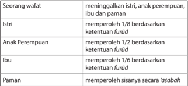

Tabel ini menunjukkan bagaimana sisa warisan diteruskan kepada keluarga setelah wafatnya seorang wafat. Topik utamanya adalah tentang bagaimana sisa warisan diteruskan kepada istri, anak perempuan, ibu, dan paman setelah wafatnya. Kolom pertama berisi nama-nama orang yang menerima sisa warisan tersebut. Kolom kedua berisi deskripsi tentang bagaimana sisa warisan tersebut diteruskan kepada setiap orang tersebut. Data penting yang terlihat adalah bahwa istri mendapatkan 1/8 dari sisa warisan, anak perempuan mendapatkan 1/2, ibu mendapatkan 1/6, dan paman mendapatkan sisanya secara 'asabah'. Ini menunjukkan bahwa sisa warisan diteruskan dengan cara yang tidak sama untuk setiap anggota keluarga.

Jika harta warisan tidak tersisa, ahli waris 'a £ abah tidak mendapatkan apa-apa

---
**📊 Tabel**

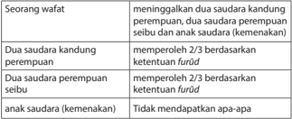

Tabel ini menunjukkan peraturan hukum Islam tentang hak-hak wafat (kematian) bagi saudara kandung dan saudara perempuan. Topik utamanya adalah hak-hak wafat bagi saudara kandung dan saudara perempuan, serta ketentuan firdus untuk dua saudara kandung perempuan. Dalam tabel ini, wafat menyangkut dua saudara kandung perempuan, dua saudara kandung perempuan, dua saudara perempuan, dan anak saudara (kemenakan). Hak-hak wafat untuk dua saudara kandung perempuan berdasarkan ketentuan firdus, sedangkan hak-hak wafat untuk dua saudara perempuan tidak ada. Anak saudara (kemenakan) tidak mendapatkan hak apa pun.

 

---
## 📄 Halaman 172

Ahli waris 'a £ abah terbagi menjadi dua, yaitu sebagai berikut.

- A £ abah binnas ± b (hubungan nasab), terbagi menjadi 3 bagian yaitu:
- A £ abah bi an-nafsi, yaitu  semua ahli waris laki-laki (kecuali suami, saudara  laki-laki  seibu,  dan mu'tiq yang  memerdekakan  budak), mereka adalah sebagai berikut.
- Anak laki-laki
- Putra dari anak laki-laki seterusnya ke bawah
- Ayah
- Kakek ke atas
- Saudara laki-laki sekandung
- Saudara laki-laki seayah
- Anak saudara laki-laki sekandung dan seterusnya ke bawah
- Anak saudara laki-laki seayah
- Paman sekandung
- Paman seayah
- Anak laki-laki paman sekandung dan seterusnya ke bawah
- Anak laki-laki paman seayah dan seterusnya ke bawah
Untuk  lebih  memahami  derajat  kekuatan  hak  waris 'a £ abah bi annafsi ,  maka  kedua  belas  ahli  waris  di  atas  dapat  dikelompokkan menjadi empat arah yaitu, sebagai berikut.

- Arah anak, mencakup seluruh anak laki-laki keturunan anak lakilaki, mulai cucu, cicit dan seterusnya.
- Arah bapak, mencakup  ayah, kakek dan seterusnya dari pihak laki-laki, misalnya ayah dari bapak, ayah dari kakek, dan seterusnya.
- Arah  saudara  laki-laki,  mencakup  saudara  kandung  laki-laki, saudara  laki-laki  seayah,  termasuk  keturunan  mereka,  namun hanya  yang  laki-laki. Adapun  saudara  laki-laki seibu tidak termasuk, karena termasuk aŝhabul furūd .
- Arah  paman,  mencakup  paman  kandung  dan  paman  seayah, termasuk keturunan mereka dan seterusnya.
Apabila  dalam  pembagian  harta  warisan  terdapat  beberapa  ahli waris aŝabah bi  an-nafsi, maka  pengunggulannya  dilihat  dari  segi arah. Arah anak lebih didahulukan dari yang lain.  Jika anak tidak ada, maka cucu laki-laki dari keturunan laki-laki dan seterusnya.

 

---
## 📄 Halaman 173

Apabila  dalam  pembagian  harta  warisan  terdapat  beberapa  ahli waris aŝabah bi an-nafsi , sedangkan mereka berada dalam satu arah, maka pengunggulannya dilihat  dari  derajat  kedekatannya  kepada pewaris,  misalnya  seseorang  wafat  meninggalkan  anak  serta  cucu keturunan anak laki-laki. Maka hak waris secara ' ashabah diberikan kepada  anak,  sementara  cucu  tidak  mendapatkan  bagian  apapun dari warisan tersebut.

Adapun  dasar  hukum  didahulukannya  anak  dari  pada  ibu  bapak adalah firman Allah Swt. dalam Q.S. an-Nisā' /4:11, yaitu: ' Dan untuk dua  orang  ibu-bapa,  bagi  masing-masingnya  seperenam  dari  harta yang ditinggalkan, jika yang meninggal itu mempunyai anak . '

### b) A £ abah bil ghair

Ahli waris 'a £ abah bil ghair ada empat (4), semuanya dari kelompok wanita.  Dinamakan 'ashabah  bil  ghair adalah  karena  hak 'a £ abah keempat wanita itu bukanlah karena kedekatan kekerabatan mereka dengan  pewaris,  tetapi  karena  adanya 'a £ abah lain  ( 'a £ abah  bin nafsih ). Adapun ahli waris a £ abah bil ghair yaitu:

- Anak  perempuan  bisa  menjadi 'a £ abah bila  bersama  dengan saudara laki-lakinya.
- Cucu perempuan keturunan anak laki-laki bisa menjadi 'a £ abah bila  bersama  dengan  saudara  laki-lakinya  atau  anak  laki-laki pamannya (cucu laki-laki dari anak laki-laki), baik yang sederajat dengannya atau bahkan lebih di bawahnya.
- Saudara kandung perempuan akan menjadi 'a £ abah bila bersama dengan saudara kandung laki-laki.
- Saudara perempuan seayah akan menjadi 'a £ abah bila bersama dengan saudara laki-laki.
Dalam  kondisi  seperti  ini  bagian  laki-laki  dua  kali  lipat  bagian perempuan.  Mereka  mendapatkan  bagian  sisa  harta  yang  telah dibagi, jika harta telah habis terbagi, maka gugurlah hak waris bagi mereka.

### c) A £ abah ma'al gair

Orang  yang  termasuk ' a £ abah  ma'al  gair ada  dua,  yaitu  seperti berikut ini.

 

---
## 📄 Halaman 174

- Saudara perempuan sekandung satu orang atau lebih berada bersama dengan anak perempuan satu atau lebih atau bersama putri dari anak laki-laki satu atau lebih atau bersama dengan keduanya.
- Saudara  perempuan  seayah  satu  orang  atau  lebih  bersama dengan anak perempuan satu atau lebih atau bersama putri dari anak laki-laki satu atau lebih atau bersama dengan keduanya.
Adapun landasan hukum adanya  ' a £ abah ma'al gair adalah hadis Rasulullah  saw.  bahwa  Abu  Musa  al-Asy'ari  ditanya  tentang  hak waris  anak  perempuan,  cucu  perempuan  keturunan  anak  lakilaki,  dan  saudara perempuan sekandung atau seayah. Abu Musa menjawab: 'Bagian anak perempuan separo dan saudara perempuan separo.' ( ¦ R. Al-Bukhari).

### Aktivitas Siswa

Diskusikan  dengan  kelompok  kalian  tentang  perbedaan a £ abah  bil  gair dan' a £ abah ma'al gair , kemudian presentasikan di depan kelas!

### 2. A £ abah bissabab (karena Sebab)

Yang  termasuk 'asabah  bissabab (karena  sebab)  adalah  orang-orang yang membebaskan budak, baik laki-laki atau perempuan.

Dari penjelasan tentang pembagian harta warisan di atas, jika semua ahli  waris  itu  ada  atau  berkumpul,  maka  ada  tiga  kondisi  yang  harus diperhatikan, seperti berikut ini.

- Jika  semua  ahli  waris  laki-laki  berkumpul,  maka  yang  berhak mendapatkan warisan hanyalah 3 orang  yaitu: ayah, anak-laki-laki dan suami,  dengan  pembagian ayah 1/6,  suami  1/4  dan  sisanya adalah anak laki-laki ( ' ' a £ abah ).
- Jika semua ahli waris perempuan berkumpul, maka yang berhak mendapatkan warisan adalah 5 orang yaitu: istri 1/8, ibu 1/6, anak perempuan ½, dan sisanya saudara perempuan sekandung sebagai ' a £ abah.
- Jika  terkumpul  semua  ahli  waris  laki-laki  dan  perempuan,  maka yang  berhak  mendapatkan  warisan  adalah  lima  orang  yaitu:

 

---
## 📄 Halaman 175

ibu,  bapak,  anak  laki-laki,  anak  perempuan,  suami/istri  dengan pembagian sebagai berikut.

- Jika pada ahli waris tersebut terdapat istri, maka bagian ayah 1/6, ibu 1/6, istri 1/8, dan sisanya anak laki-laki dan perempuan sebagai ' a £ abah dengan ketentuan anak laki-laki dua kali lipat anak perempuan.
- Jika pada ahli waris tersebut terdapat suami, maka bagian ayah 1/6, ibu 1/6, suami 1/4 dan sisanya anak laki-laki dan perempuan sebagai ' a £ abah dengan ketentuan anak laki-laki dua kali lipat anak perempuan.

### Aktivitas Siswa

Cari teks ayat-ayat dan hadis tersebut di atas tentang mawaris, tulis teks aslinya dan jelaskan kandungannya. Kemudian presentasikan di depan kelas!

### E.  Mempraktikkan Pelaksanaan Pembagian Waris dalam Islam

Di bawah ini diberikan contoh-contoh kasus (masalah) dan pembagian warisan berdasarkan syariat Islam.

- Seseorang meninggal dunia, meninggalkan harta sebesar Rp.180.000.000,00. Ahli warisnya terdiri atas istri, ibu dan 2 anak laki-laki. Hasilnya adalah:
Pembagian  bagian  Isteri  1/8,  Ibu  1/6  dan  2  anak  laki-laki  ' a £ abah .  Asal masalahnya  dari  1/8  dan  1/6  (KPK  =  Kelipatan  Persekutuan  Terkecil  dari bilangan penyebut 8 dan 6) adalah 24.

Maka pembagiannya adalah:

Istri

:  1/8  x  24   x  Rp. 180.000.000,00  =  Rp. 22.500.000,00

Ibu

:  1/6  x  24    x  Rp. 180.000.000,00 =  Rp. 30.000.000,00

Dua anak laki-laki

:  24 - (3+4 ) x  Rp. 180.000.000,00 =  Rp.127.500.000,00 Masing-masing anak laki-laki memperoleh mawaris sebesar = Rp. 127.500.000,00 : 2  =  Rp.63.750.000,00

- Penghitungan dengan menggunakan 'aul . Seseorang meninggal dunia, meninggalkan harta sebesar Rp. 42.000.000. Ahli warisnya terdiri atas suami dan 2 saudara perempuan sekandung.
- Pembagian hasilnya adalah sebagai berikut.

 

---
## 📄 Halaman 176

Bagian suami 1/2 dan bagian dua saudara perempuan sekandung 2/3. Asal masalahnya  dari  1/2  dan  2/3  (KPK=  Kelipatan  Persekutuan  Terkecil  dari bilangan  penyebut  2  dan  3)  adalah  6,  sementara  pembilangnya  adalah  7, maka terjadi 7/6. Untuk penghitungan dalam kasus ini harus menggunakan 'aul, yaitu dengan menyamakan penyebut dengan pembilangnya. (aulnya:1), sehingga masing-masing bagian menjadi.

Suami mendapatkan

:      3/7  ×  Rp.  42.000.000=Rp.18.000.000,00

Dua saudara perempuan sekandung :   4/7 × Rp. 42.000.000=Rp.24.000.000,00

- Penghitungan  dengan  menggunakan rad . Seorang meninggal dunia, meninggalkan harta sebesar 120.000.000. Ahli warisnya terdiri dari ibu dan seorang anak perempuan.
Pembagian hasilnya adalah sebagai berikut.

Bagian ibu 1/6 dan bagian satu anak perempuan adalah 1/2. Asal masalahnya dari 1/6 dan 1/2  (KPK dari bilangan penyebut 6 dan 2) adalah 6. Maka bagian masing-masing adalah 1/6 dan 3/6. Dalam hal ini masih tersisa harta waris sebanyak 2/6. Untuk penghitungan dalam kasus ini harus menggunakan rad, yaitu membagikan kembali harta waris yang tersisa kepada ahli warisnya. Jika dilihat bagian  ibu 1/6 dan satu anak perempuan 3/6, maka perbandingannya adalah 1:3, maka 1/6 + 3/6  =  4/6, dijadikan 4/4 dengan perbandingan 1:3, maka hasilnya adalah.

Ibu mendapatkan

:  1/4  ×  Rp.120.000.000,00 = Rp.30.000.000,00

Satu anak perempuan mendapatkan  :  3/4  ×  Rp.120.000.000,00 =

Rp.90.000.000,00

### Aktivitas Siswa

- Carilah  kasus  yang  terjadi  di  sekitar  tempat  tinggalmu,  keluarga  yang melaksanakan pembagian harta warisan berdasarkan hukum waris Islam!
- Lakukan wawancara dengan salah satu anggota keluarga tersebut terkait dengan kesulitan-kesulitan yang dialami!
- Laporkan hasil wawancaramu!

 

---
## 📄 Halaman 177

### F. Manfaat Hukum Waris Islam

Hukum waris Islam ini memberi jalan keluar yang adil untuk semua ahli waris. Berikut ini, beberapa manfaat yang dapat dirasakan, yaitu sebagai berikut.

- Terciptanya ketenteraman hidup dan suasana kekeluargaan yang harmonis. Syariah adalah sumber hukum tertinggi yang harus ditaati. Orang yang paling durhaka adalah orang yang tidak mematuhi/menaati hukum syariah. Syariah itu sendiri diturunkan untuk kebaikan umat Islam dan memberi jalan keluar yang paling sesuai dengan karakter dan watak dari masing-masing manusia. Syariah menjadi hukum tertinggi yang harus ditaati, dan diterima dengan ikhlas.
- Manciptakan keadilan dan mencegah konflik pertikaian. Keadilan yang telah diterapkan,    mencegah  munculnya  berbagai  konflik  dalam  keluarga  yang dapat berujung pada tragedi pertumpahan darah. Meski dalam praktiknya, selalu saja muncul penentangan yang bersumber dari akal pikiran.
- Peduli Kepada Orang Lain sebagai Cerminan Pelaksanaan Ketentuan Waris dalam Islam.
Melaksanakan sepuluh asas dalam hukum waris Islam,yaitu;.Asas integrity/ ketulusan  (Q.S  Ali  'Imran/3:  85)Asas  ta'abbudi  /penghambaan  diri  (Q.S. An  Nissa'/4:  13-14),Asas  Huququl  Maliyah/Hak-Hak  kebendaan  (KHI  pasal 175),Asas Huququn  thabi'iyah /Hal-Hak Dasar, Asas ijbari /keharusan, kewajiban,Asas bilateral, (Q.S. An-Nisaa'/4:7dan Q.S. An-Nisaa'/4:11-12) (Q.S. An-Nisaa'/4:176), Asas individual, (Q.S. An-Nisaa'/4:8 dan Q.S. An-Nisaa'/4:33), Asas  keadilan  yang  berimbang  (Q.S.  Al-Baqarah  /2:233  dan  Q.S.  AthThalaaq/65:7), Asas kematian, dan Asas membagi habis harta warisan. (KHI Pasal; 192 & 193),akan menumbuhkan kepedulian kepada orang lain sebagai cerminan pelaksanaan ketentuan waris dalam Islam.

### Aktivitas Siswa

- Temukan hikmah dan manfaat lain dari pelaksanaan hukum waris Islam, dengan menganalisis materi di atas!
- Diskusikan dengan temanmu!

### Menerapkan Perilaku Mulia

Sikap dan perilaku mulia yang harus kita kembangkan sebagai implementasi dari penerapan hukum mawaris antara lain seperti berikut ini.

 

---
## 📄 Halaman 178

- Meyakini bahwa hukum waris merupakan ketetapan Allah Swt. yang paling lengkap dijelaskan oleh al-Qur ± n dan hadis Nabi.
- Hukum untuk mempelajari ilmu waris  adalah fardzu kifayah, karena itu setiap muslim harus ada yang mempelajarinya.
- Meninggalkan keturunan dalam keadaan berkecukupan lebih baik dari pada meninggalkannya dalam keadaan miskin, karena Islam memerintahkan, 'Berikanlah  sesuatu  hak  kepada  orang  yang  memiliki  hak itu'( ¦ R.al-Khamsah,kecuali an-Nas ± i).
- Seseorang sebelum meninggal sebaiknya berwasiat, yaitu pesan seseorang ketika  masih  hidup  agar  hartanya  disampaikan  kepada  orang  tertentu atau tujuan lain, yang harus dilaksanakan setelah orang yang berwasiat itu meninggal ( Q.S.an-Nis ±' /4:11 ).
- Ayat-ayat al-Qur ± n dalam menjelaskan pembagian harta kepada ahli waris menempatkan  urutan  kewarisan  secara  sistimatis  didasarkan  atas  jauh dekatnya seseorang kepada si mayit yang meninggalkan harta warisan. Oleh karena  itu,  dalam  menentukan  ahli  waris  harus  sesuai  ketetapan  hukum waris  yaitu  dimulai  dari  anak-anak  yang  dikategorikan  sebagai  keturunan langsung,  kemudian  kedua  orangtua  mayit  ( leluhur )  dan  terakhir  kepada saudara-saudara yang dikelompokkan sisi dan ditambah dengan suami/isteri dari yang meninggal.
- Berhukum dengan hukum waris Islam merupakan suatu kewajiban, karena setiap pribadi, apakah dia laki-laki atau perempuan dari ahli waris, berhak memiliki harta benda hasil peninggalan sesuai ketentuan syariat Islam secara adil.

### Tugas Kelompok

### Kegiatan Kelompok

- Buatlah kelompok, setiap kelompok terdiri atas 6-7 orang!
- Diskusikan  tentang  masalah  pembagian  harta  warisan  antara  ahli waris laki-laki dan ahli waris perempuan ditinjau dari ajaran Islam dan KHI, kemudian buat laporan secara kelompok dan presentasikan hasil diskusi kalian!

 

---
## 📄 Halaman 179

### Rangkuman

- Ajaran Islam tidak hanya mengatur masalah ibadah, tetapi juga mengatur hubungan  manusia  dengan  sesamanya,  yang  di  dalamnya  termasuk  juga masalah  kewarisan.  Keberadaan  warisan  menjadi  bukti  bahwa  orangtua harus bertanggung jawab terhadap keluarga, anak, dan keturunannya.
- Dasar hukum waris yang paling utama adalah Q.S.an-Nis ±' /4:7-12 dan  176, Q.S.an-Nahl/16:75 dan Q.S.al-Ahzab/33:4 serta beberapa hadis Nabi saw.
- Posisi hukum kewarian Islam di Indonesia merujuk kepada ketentuan dalam Kompilasi Hukum Islam (KHI) dan Inpres No.1 tahun 1991.
- Ketentuan-ketentuan tentang warisan adalah yang paling lengkap diuraikan secara rinci dalam al-Qur ± n terutama mengenai ketentuan pembagian harta warisan ( furudul muqaddarah ).  Hal  ini  menunjukkan bahwa persoalan ilmu mawaris dan hukum mempelajarinya perlu mendapat perhatian yang serius dari kaum muslimin.
- Orang yang memperoleh harta warisan dari orang yang meninggal dunia karena  empat  sebab,  yaitu; sebab  nasab  hakiki,  sebab  nasab  hukmi,  sebab pernikahan dan sebab hubungan agama.
- Hal-hal yang perlu diselesaikan sebelum dilakukan pembagian waris, yaitu pengurusan jenazah, wasiat, dan hutang.

### Mutiara Hadis

Ka'ab bin Malik ra meriwayatkan bahwa Rasulullah saw. bersabda, ' Dua serigala lapar yang dilepas di tengah-tengah sekumpulan domba tidak lebih merusak dari pada kerusakan pada agama seseorang karena ketamakannya terhadap harta dan kedudukan ' .

( ¦ .R. Ahmad dan at-Tirm ³ z ³ )

 

---
## 📄 Halaman 180

### Evaluasi

- Berilah  tanda  silang  (x)  pada  huruf  a,  b,  c,  d,  atau  e  yang  dianggap jawaban yang paling tepat!
- Sebelum  Islam  datang,  perempuan  tidak  menerima  harta  warisan  sedikit pun dengan dalih tidak memiliki konstribusi dalam membela kehormatan keluarga. Setelah Islam datang, sebagai agama rahmatan  lil  alamin , memberikan waris pada perempuan, karena . . .
- ketentuan dari Allah Swt.
- belas kasihan kepada mereka
- mereka berhak menerimanya
- membela kehormatan mereka
- menghargai jasa besar mereka
- Tidak  semua  harta  peninggalan  dapat  dibagi  kepada  ahli  waris.  Sebelum harta diwariskan,  harus dibersihkan dulu dari . . .
- riba
- riya
- hutang
- kotoran
- ashabah
- Menghitung warisan harus memahami apa yang disebut dengan furudhul muqadarah , yang artinya adalah . . .
- hak-hak waris para pewaris
- ketentuan pembagian harta warisan
- peralihan benda waris pada ahli waris
- bagian-bagian tertentu dari waris
- ketentuan sebelum harta diwaris
- Kelompok penerima warisan, ada yang digolongkan ke dalam dzawil furudh, ada juga yang dari ashabah, menurut bahasa ashabah berarti . . . .
- terhalang
- bertambah
- harta yang rusak
- kelebihan harta
- sisa harta

 

---
## 📄 Halaman 181

- Dekat tidaknya ahli waris, menentukan hak waris yang diperoleh. Berikut ini ahli waris  yang tidak pernah hilang hak warisnya adalah . . . .
- saudara laki-laki dan perempuan
- anak laki-laki dan perempuan
- cucu laki-laki dan perempuan
- paman dan bibi
- ayah dan ibu
- Setiap  ahli  waris  memiliki  bagian  yang  berbeda  tergantung  dekat  tidaknya dengan yang meninggal. Dan ahli waris yang mendapat bagian 2/3 adalah . . . .
- anak perempuan lebih dari satu
- suami apabila tidak ada  anak
- cucu laki laki lebih dari satu
- saudara perempuan tunggal
- anak perempuan tunggal
- Kedekatan nasab, sangat memberi arti tentang bagian yang diterima. Salah satu ahli berikut ini yang termasuk ashabah binnafsi adalah . . . .
- istri
- suami
- anak perempuan
- saudara laki-laki seibu
- saudara laki-laki sekandung
- Perhatikanlan Q.S.an-Nis ± '/4:7 di bawah ini!
Terjemahan yang tepat untuk kalimat yang di atas adalah . . . .

- baik sedikit atau banyak menurut bahagian yang telah ditetapkan
- dari harta peninggalan ibu-bapak dan kerabat-kerabatnya
- dari harta peninggalan keluarga dan kerabatnya
- dan bagi seorang wanita ada hak bagian (pula)
- bagi orang laki-laki ada hak bagian

 

---
## 📄 Halaman 182

- Apabila  kelompok  ahli  waris  laki-laki  semuanya  masih  ada,  yang  berhak mendapat bagian harta warisan adalah . . . .
- suami, anak laki-laki, anak perempuan dan cucu
- anak laki-laki, anak perempuan, istri dan bapak
- suami, anak laki-laki,dan anak perempuan
- anak laki-laki, cucu laki-laki, dan bapak
- suami, bapak, dan anak laki-laki
- Adanya  hukum  waris  memberikan  keadilan  bagi  kehidupan  manusia. Pernyataan di bawah ini merupakan hikmah adanya hukum waris, kecuali . . . .
- sebagai pembelajaran untuk menjadi lebih bijaksana
- menjalin persaudaraan berdasarkan hak dan kewajiban
- menghindari perselisihan yang mungkin terjadi antar ahli waris
- menghilangkan pilih kasih dari orangtua   kepada anak anaknya
- melindungi hak anak yang  masih kecil atau dalam keadaan lemah

### II. Isilah titik-titik di bawah ini dengan jawaban yang singkat dan benar!

- Memahami  konsep  waris  akan  menumbuhkan  rasa  tanggung  jawab terhadap ....
- Memahami konsep waris akan mendidik diri kita untuk ....
- Memahami konsep waris akan menumbuhkan perilaku mulia antara lain adalah ....
- Kemaslahatan ummat adalah unsur utama dalam menentukan gugurnya hak seseorang untuk mendapatkan harta warisan, yaitu ....
- Tuan X wafat, ahli warisnya ibu, bapak , 1 anak perempuan dan 2 anak lakilaki. Harta warisnya berupa sawah seluas 9600m 2 , maka bagian masingmasing adalah ....

### III.  Jawablah pertanyaan berikut dengan benar dan tepat!

- Hal-hal apa saja yang perlu dilakukan sebelum harta warisan dibagikan?
- Kapan harta warisan dapat dibagi menurut Q.S. an-Nis ±' /4:117 ?
- Apakah  perbedaan  antara  ashabah binnafsi,  bilgair,  dan  ma'al  gair serta berikan contohnya? Jelaskan!
- Langkah apa saja yang harus diperhatikan sebelum menghitung pembagian waris?
- Indonesia  memakai  beberapa  hukum  waris.  Kemukakan  hukum  waris menurut adat Indonesia? Jelaskan!

 

---
## 📄 Halaman 183

### IV. Berilah tanda checklist (  ) pada kolom yang sesuai dengan pilihan sikap kalian !

SS= Sangat Setuju; S= Setuju;  KS=Kurang Setuju;  TS= Tidak Setuju

---
**📊 Tabel**

Tabel ini berisi pernyataan tentang konsep warisan Islam, dengan 10 pernyataan yang disusun dalam urutan. Kolom-kolomnya meliputi SS (Sumber Surat), S (Surat), KS (Kesimpulan), dan TS (Tentang Sumber). Topik utama tabel adalah tentang prinsip-prinsip warisan Islam, termasuk hak-hak waris, pembagian harta, dan aspek-aspek lainnya. Data penting yang terlihat adalah bahwa pernyataan-pernyataan tersebut mencakup berbagai aspek dari konsep warisan Islam, mulai dari hak waris, pembagian harta, hingga aspek-aspek lain yang berkaitan dengan warisan.

 

---
## 📄 Halaman 184

### Bab 9 Rahmat Islam bagi Nusantara

### Peta Konsep

---
**🖼️ Gambar/Diagram**

> **Deskripsi Visual:** Gambar ini adalah diagram yang menunjukkan struktur dan hubungan antara berbagai aspek dakwah Islam di Indonesia. Diagram ini dimulai dengan topik utama "Dakwah Islam di Indonesia" dan melanjutkan ke dua subtopik utama: "Strategi Dakwah Islam di Indonesia" dan "Perkembangan Islam di Indonesia". Kedua subtopik ini saling terhubung melalui relasi "sehingga", yang mengarah pada hasil akhir yaitu "Rahmat Islam bagi Nusantara". Ini menunjukkan bahwa strategi dan perkembangan dakwah Islam di Indonesia bertujuan untuk memberikan rahmat kepada masyarakat Nusantara.

 

---
## 📄 Halaman 185

二

Amati gambar-gambar berikut! Kemudian, lakukan tanya jawab dengan gurumu terkait dengan tema perkembangan dakwah Islam dalam berbagai segi (pendidikan, ekonomi, dan lain-lain) di Indonesia!

 

---
## 📄 Halaman 186

### Membuka Relung Kalbu

Keberadaan Islam di Indonesia tidak terlepas dari sejarah masa lalu. Makna sejarah ialah dialog pemikiran antara seseorang dengan  fakta  hasil  rekaman  masa  lampau. Semestinya  fakta  itu  harus  disusun  sejujur mungkin, sehingga tidak terjadi kebenaran semu  atau  pemutarbalikan  makna  suatu peristiwa.

Pemutarbalikan kebenaran pun terjadi dalam penulisan sejarah Islam di Indonesia. Misalnya  sering  kita  temukan  buku  sejarah menulis tentang mula-mula masuknya Islam di Indonesia pada abad ke-13, padahal sudah diambil keputusan bahwa Islam telah masuk  ke  Indonesia  sejak  abad  pertama Hijriah  (abad  ke  7  Masehi)  langsung  dari Arab. Keputusan ini diambil melalui berkalikali  seminar  dimulai  tahun  1963  di  Medan dilanjutkan pada tahun 1978 di Banda Aceh dan seminar terakhir pada tahun 1980.

Mengapa terjadi perbedaan pendapat da  lam  rentang  waktu  yang  begitu  panjang?  Di  satu  pihak  berpendapat  abad ke7,  sementara  dipihak  lain  berpendapat  abad  ke-13.  Pendapat  yang  terakhir disponsori oleh ahli sejarah asing, di antaranya yaitu Snouck Hurgronje.

Kita menyadari  bahwa  ahli sejarah asing, ketika berbicara tentang Islam menghasilkan pendapat yang tidak jujur dan subjektif. Hal ini disebabkan karena beberapa faktor, berikut ini.

- Berusaha menyelewengkan atau mendangkalkan sisi sejarah Islam.
- Metodologi penulisan sejarah yang sangat subjektif.
- Pemahaman mereka tentang Islam hanya sepotong-potong dan tidak utuh.
Dalam rangka menghindari ketidakjujuran tentang fakta sejarah, maka diperlukan ahli  sejarah  bangsa  sendiri  untuk  mempelopori  penulisan  sejarah  Indonesia, termasuk umat Islam melalui metodologi dan penelitian yang objektif.

### Islam di Indonesia

Pada masa pemerintahan Demokrasi Terpimpin dan Orde Baru, banyak kalangan menganggap kedua rezim ini tidak apresiatif terhadap Islam. Bahkan kedua rezim ini dianggap telah melakukan proses peminggiran aspirasi umat Islam di Indonesia. Namun, kebijakan otoriter pemerintah bisa juga dilihat sebagai hikmah. Pengalaman politik yang terpinggirkan bukan saja memberikan kearifan baru, tetapi juga mendorong cendekiawan Islam untuk merumuskan berbagai alternatif perjuangan.

( Sumber: Ensiklopedi Tematis Dunia Islam: 2002)

 

---
## 📄 Halaman 187

### Mengkritisi Sekitar Kita

Perhatikan  permasalahan  berikut  kemudian  berikan  tanggapan  kalian  dengan mempertimbangkan berbagai aspek!

- Seorang  muslim,  jika  ditanya  pedoman  hidupnya  apa?  Umumnya  dia menjawab al-Qur ± n . Tetapi ketika ditanya berapa kali dia meluangkan waktu dalam  seminggu  untuk  mendalami al-Qur ± n ,  dengan  membaca  tafsirnya atau paling tidak terjemahnya, dia menjawab tidak ada waktu tertentu untuk itu,  kecuali  jika  ada  PR  (pekerjaan  rumah).  Sedangkan  untuk  membaca alQur ± n ,  yang rutin adalah malam Jum'at, yaitu surat Yasin, tentu juga hanya ayatnya saja untuk mendapatkan pahala.
- Bagaimana menurut kalian orang yang seperti ini? Kapan dapat mewujudkan al-Qur ± n menjadi pedoman hidup?
- Para mubalih yang sudah popular dan bertarif mahal semakin susah diundang untuk  berdakwah  di  lingkungan  kumuh,  dengan  alasan  jadwalnya  padat, padahal  maksudnya  adalah  tidak  cocok  dengan  'tarif'  yang  ditawarkan, karena kemampuan masyarakatnya memang terbatas. Akhirnya masyarakat yang membutuhkan kehadirannya itu pun kecewa.
- Bagaimana menurut pendapat kalian da'i yang model seperti ini?
- Dalam  menyampaikan  materi  dakwah,  ada  kelompok  dakwah  tertentu yang  suka  menyalahkan  kelompok  lain  yang  berbeda,  bahkan  terkadang mengklaim 'kafir' hanya karena perbedaan dalam soal memahami fiqih. Bagamana pendapat kalian terhadap kelompok dakwah semacam ini?

### Memperkaya Khazanah

### A.  Tadarus al-Qurān 5-10  Menit sesuai Tema

Kewajiban untuk tadarus al-Qurān dengan sebenar-benarnya ( Q.S. alBaqarah /2:121) bertujuan menumbuhkan keinginan peserta didik untuk mentadabburi  dan  mengetahui  manfaatnya,  yaitu  faham  makna al-Qurān dan mengetahui  rahasia  keagungannya.  Dengan  mengetahui  manfaatnya,  peserta didik diharapkan dapat melaksanakan dan mengikutinya karena al-Qurān sudah membekas  dalam  jiwa  ( Q.S.  Taha /20:112-113, Q.S.  al-Baqarah /2:38),  sehingga peserta didik akan memperoleh ketentraman dan kebahagiaan ( Q.S.Taha /20:2-3)

 

---
## 📄 Halaman 188

Sebelum  kalian  memulai  pembelajaran,  lakukan  tadarus al-Qurān secara  tartil selama  5-10  menit  di  kelompok  kalian  masing-masing  dipimpin  oleh  ketua kelompok. Ayat-ayat yang dibaca akan ditentukan oleh Bapak/Ibu guru kalian.

### B.    Menganalisis dan Mengevaluasi Sejarah Perkembangan Islam di Indonesia

Para pakar sejarah berbeda pendapat mengenai sejarah masuknya Islam ke Nusantara. Setidaknya terdapat tiga teori besar yang dikembangkan oleh Ahmad Mansur Suryanegara, yang terkait dengan asal kedatangan,  para  pembawanya,  dan  waktu kedatangannya.

Pertama , teori Gujarat. Islam dipercayai datang dari wilayah Gujarat - India melalui peran para pedagang India muslim pada sekitar abad ke13 M.

---
**🖼️ Gambar/Diagram**

> **Deskripsi Visual:** Gambar ini adalah ilustrasi yang menunjukkan proses pembuatan minyak goreng. Gambar ini menggambarkan sekelompok orang sedang memasak minyak goreng di atas kompor. Di sebelah kiri, ada seorang pria yang sedang memegang wadah minyak goreng, sedangkan di sebelah kanan, ada seorang wanita yang sedang memegang wadah air untuk mencuci minyak goreng. Di tengah-tengah, ada kompor dengan wadah minyak goreng yang sedang dipanaskan. Ilustrasi ini menunjukkan langkah-langkah dasar dalam pembuatan minyak goreng, mulai dari memasak hingga mencuci minyak goreng.

Kedua , teori Mekah. Islam dipercaya tiba di Indonesia langsung dari Timur Tengah melalui jasa para pedagang Arab muslim sekitar abad ke-7 M.

Ketiga , teori Persia. Islam tiba di Indonesia melalui peran para pedagang asal Persia yang dalam perjalanannya singgah ke Gujarat sebelum ke Nusantara sekitar abad ke-13 M.

Baik teori Gujarat maupun teori Persia, keduanya sama-sama menetapkan bahwa Islam masuk di Nusantara pada abad ke 13 M. Namun teori Mekah menetapkan kedatangan Islam ke Nusantara jauh sebelum itu, yaitu pada abad ke 7 M, saat Rasulullah saw. masih hidup.

Secara ilmiah, teori Mekah yang menyatakan Islam masuk ke Nusantara lebih awal, lebih  penting  untuk  dibuktikan.  Jika  bukti-bukti  teori  Mekah  telah  diangggap memadai dan ilmiah, maka teori lain yang menyatakan kedatangan Islam sekitar abad 13 M., tidak perlu lagi dibuktikan.

Berikut beberapa uraian terkait dengan beberapa bukti yang mendukung teori Mekah.

- Menurut  sejumlah pakar sejarah dan arkeolog, jauh sebelum Nabi Muhammad saw. menerima wahyu, telah terjadi kontak dagang antara para pedagang Cina, Nusantara, dan Arab. Jalur perdagangan selatan ini sudah ramai saat itu.

 

---
## 📄 Halaman 189

- Peter Bellwood, Reader in Archaeology di Australia National University, telah melakukan banyak penelitian arkeologis di Polynesia dan Asia Tenggara, dan menemukan bukti-bukti  yang  menunjukkan  bahwa  sebelum  abad  kelima masehi    (yang  berarti  Nabi  Muhammad  saw.  belum  lahir),  beberapa  jalur perdagangan utama telah berkembang menghubungkan kepulauan Nusantara dengan Cina. Temuan beberapa tembikar Cina serta benda-benda perunggu dari zaman Dinasti Han dan zaman-zaman sesudahnya di selatan Sumatera dan di Jawa Timur membuktikan hal ini.
- Adanya  jalur  perdagangan  utama  dari Nusantara-terutama Sumatera dan Jawadengan Cina juga diakui oleh sejarawan G.R. Tibbetts.  Ia menemukan bukti-bukti adanya kontak dagang antara negeri Arab dengan Nusantara saat itu. ' Keadaan ini terjadi karena kepulauan Nusantara telah menjadi tempat persinggahan kapalkapal  pedagang  Arab  yang  berlayar  ke negeri  Cina  sejak  abad  kelima  Masehi, '

---
**🖼️ Gambar/Diagram**

> **Deskripsi Visual:** Gambar ini adalah ilustrasi yang menunjukkan jalur perdagangan antara Asia Timur, Eropa, dan Afrika. Ilustrasi ini menggunakan warna berbeda untuk menunjukkan rute-rute perdagangan yang berbeda. Jalur utama yang terlihat adalah jalur perdagangan yang melintasi Asia Timur ke Eropa melalui Cina, India, dan Turki. Jalur lainnya melibatkan jalur perdagangan yang menghubungkan Asia Timur dengan Afrika dan Eropa.

Elemen utama dalam gambar ini adalah jalur perdagangan tersebut. Relasi antara elemen-elemen ini adalah bahwa semua jalur perdagangan ini saling terhubung dan membentuk jaringan perdagangan global yang kompleks. 

Teks, angka, atau label penting yang terlihat pada gambar ini tidak ada, karena gambar ini hanya menggambarkan jalur-jalur perdagangan tanpa informasi tambahan.

Informasi kunci yang dapat diambil pembaca adalah bahwa ada banyak jalur perdagangan yang menghubungkan Asia Timur, Eropa, dan Afrika, menunjukkan bahwa hubungan perdagangan antara negara-negara ini sangat kuat dan kompleks.

tulis Tibbets. Jadi peta perdagangan saat itu terutama di selatan adalah ArabNusantara-China.

- Ditemukannya perkampungan Arab muslim di Barus pada abad ke-1 H./7 M. Berdasarkan sebuah dokumen kuno asal Tiongkok juga menyebutkan bahwa sekitar  tahun  625  M  (sembilan  tahun  setelah  Rasulullah  saw.  berdakwah terang-terangan),  di  pesisir  pantai  Sumatera  sudah  ditemukan  sebuah perkampungan Arab Muslim yang masih berada dalam kekuasaan wilayah Kerajaan  Buddha  Sriwijaya.  Di  perkampungan-perkampungan  ini,  orangorang  Arab  bermukim  dan  telah  melakukan  asimilasi  dengan  penduduk pribumi dengan jalan menikahi perempuan-perempuan lokal.
Selaras  dengan zamannya, saat itu umat Islam belum memiliki mushaf alQur ± n ,  karena mushaf baru selesai dibukukan pada zaman Khalifah Usman bin Affan pada tahun 30 H atau 651 M. Sebab itu, cara berdoa dan beribadah lainnya pada saat itu diyakini berdasarkan ingatan para pedagang Arab Islam yang juga termasuk para hufaz atau penghapal al-Qur ± n .

Dari berbagai literatur diyakini bahwa kampung Islam di daerah pesisir Barat Pulau Sumatera itu bernama 'Barus' atau yang juga disebut Fansur. Kampung kecil ini merupakan sebuah kampung kuno yang berada di antara kota Singkil dan Sibolga, sekitar 414 kilometer selatan Medan.

 

---
## 📄 Halaman 190

Amat mungkin Barus merupakan kota tertua di Indonesia, mengingat dari seluruh kota di Nusantara hanya Barus yang namanya sudah disebut-sebut sejak  awal  Masehi  oleh  literatur-literatur  Arab,  India,  Tamil,  Yunani,  Syiria, Armenia, China, dan sebagainya.

Sebuah  peta  kuno  yang  dibuat  oleh  Claudius  Ptolomeus,  salah  seorang Gubernur Kerajaan Yunani yang berpusat di Aleksandria Mesir, pada abad ke-2 Masehi, juga telah menyebutkan bahwa di pesisir barat Sumatera terdapat sebuah bandar niaga bernama Barousai (Barus) yang dikenal menghasilkan wewangian dari  kapur  barus.  Bahkan  dikisahkan  pula  bahwa  kapur  barus yang  diolah  dari  kayu  kamfer  dari  kota  itu  telah  dibawa  ke  Mesir  untuk dipergunakan bagi pembalseman mayat pada zaman kekuasaan Firaun sejak Ramses II atau sekitar 5. 000 tahun sebelum Masehi!

- Berdasakan buku Nuchbatuddar karya Addimasqi, Barus juga dikenal sebagai daerah awal masuknya agama Islam di Nusantara sekitar abad ke-7M.
- Sebuah  makam  kuno  di  kompleks  pemakaman  Mahligai,  Barus,  di  batu nisannya tertulis Syekh Rukunuddin wafat tahun 672 M.
- HAMKA  menyebut bahwa seorang pencatat sejarah Tiongkok yang mengembara pada tahun 674 M telah menemukan satu kelompok bangsa Arab  yang  membuat kampung dan berdiam di pesisir Barat Sumatera. Ini sebabnya,  HAMKA  menulis  bahwa  penemuan  tersebut  telah  mengubah pandangan  orang  tentang  sejarah  masuknya  agama  Islam  di  Tanah  Air. HAMKA juga menambahkan bahwa temuan ini telah diyakini kebenarannya oleh para pencatat sejarah dunia Islam di Princetown University di Amerika.
- Sejarawan T. W.  Arnold  dalam  karyanya The Preaching of Islam (1968)  juga menguatkan  temuan  bahwa  agama  Islam  telah  dibawa  oleh  mubalighmubaligh Islam asal jazirah Arab ke Nusantara sejak awal abad ke-7 M.
- Sebuah  Tim  Arkeolog  yang  berasal  dari Ecole  Francaise  D'extreme-Orient (EFEO)  Prancis  yang  bekerja  sama  dengan  peneliti  dari  Pusat  Penelitian Arkeologi Nasional (PPAN) di Lobu Tua-Barus, telah menemukan bahwa pada sekitar abad 9-12 Masehi, Barus telah menjadi sebuah perkampungan multietnis dari berbagai suku bangsa seperti Arab, Aceh, India, China, Tamil, Jawa, Batak, Minangkabau, Bugis, Bengkulu, dan sebagainya.
- Pada  tahun  674  M  semasa  pemerintahan  Khilafah  Utsman  bin  Affan, mengirimkan  utusannya  (Muawiyah  bin  Abu  Sufyan)  ke  tanah  Jawa  yaitu ke Jepara (pada saat itu namanya Kalingga). Hasil kunjungan duta Islam ini adalah Raja Jay Sima, putra Ratu Sima dari Kalingga, masuk Islam.
- Dalam Seminar Nasional tentang masuknya Islam ke  Indonesia di Medan tahun 1963, para ahli sejarah menyimpulkan bahwa Islam masuk ke Indonesia pada abad ke-1 H. (abad ke-7 M) dan langsung dari tanah Arab. Daerah yang disinggahi  adalah  pesisir  Sumatra.  Islam  disebarkan  oleh  para  saudagar muslim dengan cara damai.

 

---
## 📄 Halaman 191

- Ditemukannya  makam  Fatimah  binti Maimun  di  Leran, Gresik,  abad  ke11  M.  yang  berarti  jauh  sebelum  itu sudah terjadi penyebaran agama Islam, terutama  di  daerah  pesisir  Sumatera, karena    yang  menyebarkan  Islam  di Jawa  adalah  para  mubalih  dari  Arab dan dari Pasai.

### Aktivitas Siswa

- Carilah  data-data  tentang  sejarah  awal  masuknya  agama  Islam  ke Nusantara dari berbagai sumber, baik buku-buku fisik maupun internet!
- Diskusikan bersama teman-teman  di  kelompokmu  untuk  memilih pendapat dengan bukti dan argumen terkuat!
- Panelkan di depan kelas!

### C.  Strategi Dakwah Islam di Nusantara

Dari pembahasan tentang masuknya Islam ke Nusantara, dapat dipahami bahwa masuknya agama Islam ke Indonesia terjadi secara periodik, tidak sekaligus. Pada bagian ini akan diuraikan mengenai strategi penyebaran Islam dan media yang dipergunakan  oleh  para  pedagang  dan mubaligh dalam  penyebaran  Islam  di Indonesia.

Salah satu arti 'strategi' yang dimuat dalam Kamus Besar Bahasa Indonesia adalah 'rencana yang cermat mengenai kegiatan untuk mencapai sasaran khusus' . Dalam konteks dakwah Islam, strategi dakwah yang dimaksud adalah kegiatan-kegiatan yang dilakukan oleh para mubaligh , yang membawa misi Islam di dalamnya.

Dari kajian di atas dan berbagai literatur, setidaknya terdapat beberapa kegiatan yang  dipergunakan  sebagai  kendaraan  (sarana)  dalam  penyebaran  Islam  di Indonesia, di antaranya adalah: perdagangan, perkawinan, pendidikan, kesenian, dan tasawuf. Berikut uraian singkat mengenai hal tersebut.

 

---
## 📄 Halaman 192

### 1. Perdagangan

Pada  tahap  awal,  saluran  yang  dipergunakan  dalam  proses  Islamisasi  di Indonesia  adalah  perdagangan.  Hal  itu  dapat  diketahui  melalui  adanya kesibukan  lalu  lintas  perdagangan  pada  abad  ke-7  M  hingga  abad  ke-16 M.  Aktivitas  perdagangan  ini  banyak  melibatkan  bangsa-bangsa  di  dunia, termasuk bangsa Arab, Persia, India, Cina dan sebagainya. Mereka turut ambil bagian  dalam  perdagangan  di  negeri-negeri  bagian  Barat,  Tenggara,  dan Timur Benua Asia.

Saluran  Islamisasi  melalui  jalur  perdagangan  ini  sangat  menguntungkan, karena  para  raja  dan  bangsawan  turut  serta  dalam  aktivitas  perdagangan tersebut. Bahkan mereka menjadi pemilik kapal dan saham perdagangan itu. Fakta sejarah ini dapat diketahui berdasarkan data dan informasi penting yang  dicatat  Tome'  Pires  bahwa  para  pedagang  muslim  banyak  yang bermukim di pesisir pulau Jawa yang ketika itu penduduknya masih kafir. Mereka  berhasil  mendirikan  masjid-masjid  dan  mendatangkan  mullahmullah dari luar, sehingga jumlah mereka semakin bertambah banyak. Dalam perkembangan  selanjutnya,  anak  keturunan  mereka  menjadi  penduduk muslim yang kaya raya.

Pada beberapa tempat, para penguasa Jawa, yang menjabat sebagai bupatibupati  Majapahit  yang  ditempatkan  di  pesisir  pulau  Jawa  banyak  yang masuk Islam. Keislaman mereka bukan hanya disebabkan oleh faktor politik dalam negeri yang tengah goyah, tetapi terutama karena faktor hubungan ekonomi dengan para pedagang ini sangat menguntungkan secara material bagi mereka, yang pada akhirnya memperkuat posisi dan kedudukan sosial mereka di masyarakat Jawa. Kemudian dalam perkembangan selanjutnya, mereka  mengambil  alih  perdagangan  dan  kekuasaan  di  tempat  tinggal mereka.

Hubungan  perdagangan  ini  dimanfaatkan  oleh  para  pedagang  muslim sebagai  sarana  atau  media  dakwah.  Sebab,  dalam  Islam  setiap  muslim memiliki  kewajiban  untuk  menyebarkan  ajaran  Islam  kepada  siapa  saja dengan tanpa paksaan. Oleh karena itu, ketika penduduk Nusantara banyak yang berinteraksi dengan para pedagang muslim, dan keterlibatan mereka semakin jauh dalam aktivitas perdagangan, banyak di antara mereka yang memeluk  Islam.  Karena  pada  saat  itu,  jalur-jalur  strategis  perdagangan internasional hampir sebagian besar dikuasai oleh para pedagang muslim. Apabila  para  penguasa  lokal  di  Indonesia  ingin  terlibat  jauh  dengan perdagangan  internasional,  maka  mereka  harus  berperan  aktif  dalam perdagangan  internasional  dan  harus  sering  berinteraksi  dengan  para pedagang muslim.

 

---
## 📄 Halaman 193

### 2. Perkawinan

Dari aspek ekonomi, para pedagang muslim memiliki status sosial ekonomi  yang  lebih  baik  daripada  kebanyakan  penduduk  pribumi.  Hal ini  menyebabkan  banyak  penduduk  pribumi,  terutama  para  wanita,  yang tertarik  untuk  menjadi  isteri-isteri  para  saudagar  muslim.  Hanya  saja  ada ketentuan  hukum  Islam,  bahwa  para  wanita  yang  akan  dinikahi  harus diislamkan terlebih dahulu. Para wanita dan keluarga mereka tidak merasa keberatan,  karena  proses  pengislaman  hanya  dengan  mengucapkan  dua kalimah syahadat, tanpa upacara atau ritual rumit lainnya.

Setelah  itu,  mereka  menjadi  komunitas  muslim  di  lingkungannya  sendiri. KeIslaman mereka menempatkan diri dan keluarganya berada dalam status sosial dan ekonomi cukup tinggi. Sebab, mereka menjadi muslim Indonesia yang kaya dan berstatus sosial terhormat. Kemudian setelah mereka memiliki keturunan,  lingkungan  mereka  semakin  luas.  Akhirnya  timbul  kampungkampung dan pusat-pusat kekuasaan Islam.

Dalam  perkembangan  berikutnya,  ada  pula  para  wanita  muslim  yang dikawini  oleh  keturunan  bangsawan  lokal.  Hanya  saja,  anak-anak  para bangsawan  tersebut  harus  diislamkan  terlebih  dahulu.  Dengan  demikian, mereka menjadi keluarga muslim dengan status sosial ekonomi dan posisi politik penting di masyarakat.

Jalur  perkawinan  ini  lebih  menguntungkan  lagi  apabila  terjadi  antara saudagar muslim dengan anak bangsawan atau anak raja atau anak adipati. Karena raja,  adipati,  atau  bangsawan  itu  memiliki  posisi  penting  di  dalam masyarakatnya, sehingga mempercepat proses Islamisasi. Beberapa contoh yang dapat dikemukakan di sini adalah, perkawinan antara Raden Rahmat atau Sunan Ngampel dengan Nyai Manila, antara Sunan Gunung Jati dengan Puteri  Kawunganten,  Brawijaya  dengan  Puteri  Campa,  orang  tua  Raden Patah, raja kerajaan Islam Demak dan lain-lain.

### 3. Pendidikan

Proses Islamisasi di Indonesia juga dilakukan melalui media pendidikan. Para ulama banyak yang mendirikan lembaga pendidikan Islam, berupa pesantren. Pada lembaga inilah, para ulama memberikan  pengajaran  ilmu  keislaman melalui berbagai pendekatan sampai kemudian  para  santri  mampu  menyerap pengetahuan keagamaan dengan baik.

 

---
## 📄 Halaman 194

Setelah  mereka  dianggap  mampu,  mereka  kembali  ke  kampung  halaman untuk mengembangkan agama Islam dan membuka lembaga yang sama. Dengan demikian, semakin hari lembaga pendidikan pesantren mengalami perkembangan, baik dari segi jumlah maupun mutunya.

Lembaga pendidikan Islam  ini  tidak  membedakan  status  sosial  dan  kelas, siapa saja yang berkeinginan mempelajari atau memperdalam pengetahuan Islam, diperbolehkan memasuki lembaga pendidikan ini. Dengan demikian, pesantren-pesantren dan para ulamanya telah memainkan peran yang cukup penting  di  dalam  proses  pencerdasan  kehidupan  masyarakat,  sehingga banyak masyarakat yang kemudian tertarik memeluk Islam.

Di antara lembaga pendidikan pesantren yang tumbuh pada masa awal Islam di Jawa, adalah pesantren yang didirikan oleh Raden Rahmat di Ampel Denta. Kemudian  pesantren  Giri  yang  didirikan  oleh  Sunan  Giri,  popularitasnya melampaui batas pulau Jawa hingga ke Maluku. Masyarakat yang mendiami pulau Maluku, terutama Hitu, banyak yang berdatangan ke pesantren Sunan Giri  untuk  belajar  ilmu  agama  Islam.  Bahkan  Sunan  Giri  dan  para  ulama lainnya pernah diundang ke Maluku untuk memberikan  pelajaran agama Islam. Banyak di antara mereka yang menjadi khatib, muadzin, hakim ( qadli ) dalam masyarakat Maluku dengan memperoleh imbalan cengkeh.

Dengan cara-cara seperti itu, maka agama Islam terus tersebar ke seluruh penjuru  Nusantara,  hingga  akhirnya  banyak  penduduk  Indonesia  yang menjadi muslim. Oleh karena itu, dapat dikatakan bahwa model pendidikan pesantren  yang  tidak  mengenal  kelas  menjadi  media  penting  di  dalam proses  penyebaran  Islam  di  Indonesia,  bahkan  kemudian  diadopsi  untuk pengembangan pendidikan keagamaan pada lembaga-lembaga pendidikan sejenis di Indonesia.

### 4. Tasawuf

Jalur  lain  yang  juga  tidak  kalah  pentingnya dalam  proses  Islamisasi  di  Indonesia  adalah tasawuf .  Salah  satu  sifat  khas  dari  ajaran  ini adalah akomodasi  terhadap  budaya  lokal, sehingga  menyebabkan  banyak  masyarakat Indonesia yang tertarik menerima ajaran tersebut. Pada umumnya, para pengajar tasawuf atau para sufi adalah guru-guru pengembara, dengan sukarela mereka menghayati kemiskinan, juga seringkali

 

---
## 📄 Halaman 195

berhubungan dengan perdagangan, mereka mengajarkan teosofi yang telah bercampur dengan ajaran  yang  sudah  dikenal  luas  masyarakat  Indonesia. Mereka  mahir  dalam  hal  magis,  dan  memiliki  kekuatan  menyembuhkan. Di  antara  mereka  ada  juga  yang  menikahi  anak-anak  perempuan  para bangsawan setempat.

Dengan tasawuf, bentuk Islam yang diajarkan kepada para penduduk pribumi mempunyai  persamaan  dengan  alam  pikiran  mereka  yang  sebelumnya memeluk  agama  Hindu,  sehingga  ajaran  Islam  dengan  mudah  diterima mereka.  Di  antara  para  sufi  yang  memberikan  ajaran  yang  mengandung persamaan dengan alam pikiran Indonesia pra-Islam adalah Hamzah Fansuri di Aceh, Syeikh Lemah Abang, dan Sunan Panggung di Jawa. Ajaran mistik seperti ini terus dianut bahkan hingga kini.

### 5. Kesenian

Saluran  Islamisasi  melalui  kesenian  yang paling terkenal adalah melalui pertunjukkan wayang.  Seperti  diketahui  bahwa  Sunan Kalijaga  adalah  tokoh  yang  paling  mahir dalam mementaskan  wayang. Dia tidak pernah meminta upah materi dalam setiap pertunjukan yang dilakukannya. Sunan Kalijaga hanya meminta kepada para penonton untuk mengikutinya mengucapkan dua kalimat syahadat. Sebagian besar cerita wayang masih diambil dari cerita Ramayana dan Mahabarata, tetapi  muatannya  berisi  ajaran  Islam  dan nama-nama pahlawan muslim.

Selain  wayang,  media  yang  dipergunakan dalam penyebaran Islam di Indonesia adalah seni bangunan, seni pahat atau seni ukir,  seni  tari,  seni  musik  dan  seni  sastra.

Di  antara  bukti  yang  dihasilkan  dari  pengembangan  Islam  awal  adalah seni bangunan Masjid Agung Demak, Sendang Duwur, Agung Kasepuhan, Cirebon, Masjid Agung  Banten, dan lain sebagainya. Seni bangunan Masjid yang  ada,  merupakan  bentuk  akulturasi  dari  kebudayaan  lokal  Indonesia yang  sudah  ada  sebelum  Islam,  seperti  bangunan  candi.  Salah  satu  dari sekian  banyak  contoh  yang  dapat  kita  saksikan  hingga  kini  adalah  Masjid Kudus  dengan  menaranya  yang  sangat  terkenal  itu.  Hal  ini  menunjukkan sekali lagi bahwa proses penyebaran Islam di Indonesia yang dilakukan oleh

 

---
## 📄 Halaman 196

para penyebar Islam melalui cara-cara damai dengan mengakomodasi kebudayaan setempat. Cara ini sangat efektif untuk menarik perhatian masyarakat pribumi dalam  memahami  gerakan  Islamisasi  yang dilakukan  oleh  para  mubaligh,  sehingga lambat laun mereka memeluk Islam.

### 6. Politik

Di Maluku dan Sulawesi Selatan, kebanyakan rakyat  masuk  Islam  setelah  rajanya  masuk

Islam terlebih dahulu. Pengaruh politik raja sangat membantu tersebarnya Islam  di  wilayah  ini.  Jalur  politik  juga  ditempuh  ketika  kerajaan  Islam menaklukkan kerajaan non Islam, baik di Sumatera, Jawa, maupun Indonesia bagian Timur.

### Aktivitas Siswa

- Buatlah enam Tim Ahli dan kelompok asal sesuai jumlah siswa!
- Masing-masing  Tim  Ahli  mendalami  satu  strategi  dakwah  Islam  di Nusantara, dari buku dan dari sumber-sumber lain (internet)!
- Setelah selesai mendalami materi dalam Tim Ahli, kembalilah ke kelompok asal untuk menjelaskan bidang yang kalian dalami kepada teman satu kelompok!
- Lakukan secara bergantian dengan anggota kelompok lain hingga semua tema tuntas dijelaskan oleh pakar masing-masing!

### D.  Perkembangan Dakwah Islam di Nusantara

Pada sub-bab masuknya agama  Islam ke Nusantara sudah kita ketahui adanya beberapa teori.  Berdasarkan bukti-bukti yang ada, teori Mekah cukup meyakinkan untuk dipilih, yaitu bahwa agama Islam sudah masuk ke wilayah Nusantara dari abad ke-1 H. ( ke-7 M). Namun saat itu perkembangannya masih belum pesat dan meluas. Pada abad-abad selanjutnya baru terjadi  perkembangan  lebih  pesat,  terutama setelah abad ke-7 H. (ke-13 M). Lebih jelasnya pada uraian berikut.

 

---
## 📄 Halaman 197

### 1. Perkembangan Islam di Sumatera

Tempat  mula-mula  masuknya  Islam  di pulau Sumatera adalah Pantai Barat Sumatera. Dari sana berkembang  ke daerah-daerah  lainnya.  Pada  umumnya, buku-buku sejarah menyebutkan perkembangan  agama  Islam  bermula dari Pasai, Aceh Utara.

Orang yang menyebarkan Islam di daerah ini adalah Abdullah Arif. Ia seorang mubaligh dari Arab, dengan misi penyebarannya dengan berdakwah dan berdagang.

Dengan kesopanan dan keramahan orang Arab yang berdakwah itu, maka penduduk Pasai sangat terkesan. Akhirnya mereka menyatakan diri masuk Islam. Bahkan raja dan pemimpin negeri, setelah melihat kesopanan orang Arab  yang  berdakwah  itupun,  masuk  Islam  pula.  Masyarakat  Pasai  sangat giat belajar agama Islam. Malah ada dari kalangan anak raja sengaja diutus menuntut ilmu agama Islam ke Mekkah. Kerajaan Islam Pasai berdiri sekitar tahun 1297, yang kemudian dikenal dengan sebutan 'Serambi Mekkah' .

Setelah agama Islam berkembang di Pasai, dengan cepat tersebar pula ke daerah-daerah  lain  yaitu  ke  Pariaman,  Sumatera  Barat.  Islam  datang  ke Pariaman dari Pasai melalui laut Pantai Barat Pulau Sumatera. Ulama yang terkenal membawa Islam ke Pariaman itu adalah Syekh Burhanuddin.

Penyiaran agama Islam dilakukan secara pelan-pelan dan bertahap, sebab adat di Sumatera Barat sangat kuat. Dengan arif dan bijaksana para mubaligh dapat memberikan pengertian pada masyarakat, dan akhirnya masyarakat Sumatera Barat dapat menerima agama Islam dengan baik.

Sebagai bukti bahwa Islam diterima oleh masyarakat Sumatera Barat dengan kerelaan  dan  kesadaran  adalah  dengan  istilah    yang  mengatakan: Adat bersendi syura' ,  syara'  bersendi  Kitabullah .  Jadi,  adat  istiadat  yang  dipegang teguh  oleh  masyarakat  Sumatera  Barat  itu  adalah  adat  yang  bersendikan Islam, artinya Islam menjadi dasar adat.

Sekitar tahun 1440 agama Islam masuk ke Sumatera Selatan. Mubaligh yang paling berjasa membawa Islam ke Sumatera Selatan adalah Raden Rahmat (Sunan Ampel). Arya Damar yang kemudian terkenal dengan nama Aryadillah (Abdillah)  adalah  bupati  Majapahit  di  Palembang  waktu  itu.  Kemudian,

 

---
## 📄 Halaman 198

Raden Rahmat (Sunan Ampel) memberi saran kepada Abdillah agar bersedia menyebarkan agama Islam di Sumatera Selatan. Atas rahmat dan petunjuk Allah  Swt.,  saran  Raden  Rahmat  tersebut  dilaksanakan  oleh  Aryadillah, sehingga agama Islam di Sumatera Selatan berkembang dengan baik.

### 2. Perkembangan Islam di Kalimantan, Maluku, dan Papua

Di pulau Kalimantan, agama Islam mula-mula masuk di Kalimantan Selatan, dengan  ibu  kotanya  Banjarmasin.  Pembawa  agama  Islam  ke  Kalimantan Selatan ini adalah para pedagang bangsa Arab dan para mubaligh dari Pulau Jawa.  Perkembangan agama Islam di Kalimantan Selatan itu sangat pesat dan mencapai puncaknya setelah Majapahit runtuh tahun 1478.

Daerah lainnya di Kalimantan yang dimasuki agama Islam adalah Kalimantan Barat. Islam masuk ke Kalimantan Barat mula-mula di daerah Muara Sambas dan Sukadana. Dari dua daerah inilah baru tersebar ke seluruh Kalimantan Barat.  Pembawa  agama  Islam  ke  daerah  Kalimantan  Barat  adalah  para pedagang dari Johor (Malaysia), serta ulama dan mubaligh dari Palembang (Sumatera Selatan). Sultan Islam yang pertama (tahun 1591) di Kalimantan Barat berkedudukan di Sukadana, yaitu Panembahan Giri Kusuma.

Penyebaran Islam di Kalimantan Timur terutama di Kutai, dilakukan oleh Dato' Ri Bandang dan Tuang Tunggang melalui jalur perdagangan.

Kemudian  sejak  abad  ke-15,  antara  tahun  1400  sampai  1500  Islam  telah masuk dan berkembang di Maluku. Pedagang yang beragama Islam dan para ulama/mubaligh banyak yang datang ke Maluku sambil menyiarkan agama Islam.  Daerah-daerah  yang  mula-mula  dimasuki  Islam  di  Maluku  adalah Ternate, Tidore, Bacau, dan Jailolo.

Raja-raja yang memerintah di daerah tersebut berasal dari satu keturunan, yang semuanya menyokong perkembangan Islam di Maluku.

Perkembangan  agama  Islam  di  papua  berjalan  agak  lambat.  Islam  masuk ke  Irian  terutama  karena  pengaruh  raja-raja  Maluku,  para  pedagang  yang beragama Islam dan ulama atau mubaligh dari Maluku.

Daerah-daerah  yang  mula-mula  dimasuki  Islam  di  papua  adalah  Misol, Salawati, Pulau Waigeo, dan Pulau Gebi.

### 3. Perkembangan Islam di Sulawesi

Pada abad ke-16 Islam telah masuk ke Sulawesi, yang dibawa oleh Dato' Ri Bandang  dari  Sumatera  Barat.  Daerah-daerah  yang  mula-mula  dimasuki Islam di Sulawesi adalah Goa, sebuah kerajaan di Sulawesi Selatan.

 

---
## 📄 Halaman 199

Sebelum Islam datang ke daerah ini penduduknya menganut kepercayaan nenek moyang. Setelah Dato' Ri Bandang berkunjung ke Sulawesi Selatan, Raja Goa yang bernama Karaeng Tonigallo masuk Islam. Kemudian atas usul Dato'  Ri  Bandang,  Raja  Goa  berganti  nama  dengan  Sultan  Alauddin.  Jauh sebelum Raja Goa ini masuk Islam, para pedagang telah menyiarkan agama Islam di tengah-tengah masyarakat Sulawesi Selatan dan banyak penduduk yang telah menganut agama Islam.

Setelah Sultan Alauddin wafat, beliau diganti oleh putranya yang bernama Sultan  Hasanuddin.  Dari  Goa  Islam  terus  berkembang  ke  daerah-daerah lainnya seperti daerah Tallo dan Bone.

### 4. Perkembangan Islam di Nusa Tenggara

Sebagaimana daerah-daerah lain, pada tahun 1540 agama Islam masuk pula ke  Nusa Tenggara. Masuknya agama Islam Ke Nusa Tenggara dibawa oleh para mubaligh dari Bugis (Sulawesi Selatan) dan dari Jawa.

Agama Islam berkembang di Nusa Tenggara mula-mula di daerah Lombok yang penduduknya disebut Suku Sasak. Dari daerah Lombok, secara pelanpelan selanjutnya tersebar pula ke daerah-daerah Sumbawa dan Flores.

### 5. Perkembangan Islam di Pulau Jawa

Agama  Islam  masuk  ke  Pulau  Jawa kira-kira  pada  abad  ke-11  M.,  yang dibawa  oleh  para  pedagang  Arab dan para mubaligh dari Pasai. Tempat yang  mula-mula  dimasuki  Islam  di pulau Jawa yaitu daerah-daerah pesisir utara Jawa Timur.

Tokoh  terkenal  yang  berdakwah  di Jawa  Timur  adalah  Maulana  Malik Ibrahim.  Beliau  menetap  di  Gresik,

---
**🖼️ Gambar/Diagram**

> **Deskripsi Visual:** Gambar ini adalah ilustrasi yang menampilkan berbagai wali suku dari Indonesia. Ilustrasi ini mencakup beberapa elemen utama:

1. **Pertama**: Gambar ini menggambarkan berbagai wali suku dari Indonesia, masing-masing dengan penampilan unik dan karakteristik yang berbeda.

2. **Elemen Utama dan Relasinya**: 
   - **Wali Suku**: Ini adalah subjek utama gambar, masing-masing wali suku memiliki penampilan unik dan karakteristik yang berbeda.
   - **Relasi**: Wali suku ini diperlihatkan dalam urutan horizontal, masing-masing dengan posisi yang berbeda untuk menunjukkan keunikan dan keberagaman mereka.

3. **Teks, Angka, atau Label Penting**: 
   - **Teks**: Ada teks "Wali Suku" yang terletak di atas gambar, menjelaskan topik gambar.
   - **Angka**: Tidak ada angka yang signifikan dalam gambar ini.

4. **Informasi Kunci yang Dapat Diambil Pembaca**:
   - Gambar ini memberikan gambaran umum tentang wali suku di Indonesia, menunjukkan bahwa mereka memiliki keunikan dan keberagaman dalam penampilan dan karakteristik.
   - Ini juga menunjukkan bahwa wali suku memiliki peran penting dalam masyarakat dan budaya Indonesia.

Dengan demikian, gambar ini merupakan ilustrasi yang informatif yang menunjukkan wali suku Indonesia dengan detail dan keunikan mereka.

kemudian mendirikan pusat penyiaran agama Islam dan pusat pengajaran. Dalam majlisnya itu beliau mengkader beberapa orang murid. selanjutnya mereka menyiarkan agama Islam ke daerah-daerah lain di pulau Jawa.

Di  Jawa  Tengah,  penyiaran  Agama  Islam  berpusat  di  Demak.  Penyiaran agama Islam di Pulau Jawa dilakukan oleh para wali yang berjumlah 9 yang dikenal  dengan  Wali  Songo  (Wali  Sembilan).  Kemudian  murid-murid  Wali Songo turut pula menyiarkan agama Islam ke daerah pedalaman pulau Jawa, sehingga agama Islam berkembang dengan pesatnya.

 

---
## 📄 Halaman 200

### Aktivitas Siswa

- Bagilah kelas ke dalam  tujuh kelompok!
- Masing-masing kelompok melakukan pendalaman materi perkembangan Islam di satu daerah dengan berdiskusi dan tanya jawab.
- Setelah  dirasa  cukup,  setiap  kelompok  mengirimkan  juru  bicaranya untuk mempresentasikan materi tentang perkembangan Islam di daerah tertentu.
- Kelompok lain menyimak dan menanggapi.
- Lanjutkan sampai semua kelompok mendapat jatah presentasi!

### E.  Kerajaan Islam

Jika  kita  berpegang  kepada  Teori  Mekah  yang  menyatakan  Islam  masuk  ke Nusantara sejak abad ke-7 M, maka kerajaan Islam pertama bukan lagi Samudra Pasai, tetapi Kerajaan Jeumpa yang berdiri sejak abad ke-8 M., yang disusul oleh kerajaan Peurelak di abad ke-9, baru kemudian kerajaan Samudera Pasai. Hanya saja,  kerajaan Jeumpa dan Peurelak barangkali tidak terlalu popular dan bukan kerajaan  besar.  Di  samping  itu,  bukti-bukti  yang  ilmiah  yang  menguatkannya belum dipandang cukup.

Berikut  adalah uraian singkat beberapa keajaan Islam yang terkenal di Nusantara.

### 1. Samudera Pasai

Samudera Pasai adalah keajaan Islam yang dipandang sebagai kerajaan Islam pertama di Indonesia. Akan  tetapi jika dikaitkan dengan dua kerajaan sebelumnya (Jeumpa dan  Peurelak),    maka  kerajaan  Samudera Pasai adalah kelanjutan dari kerajaan Islam Peurelak (Perlak).

Kerajaan  ini  didirikan  oleh  Sultan  Malik  alSaleh pada tahun 1285 (abad 13 M) sekaligus sebagai  raja  pertama.  Setelah  meninggal,

ia digantikan putranya Sultan Muhammad atau yang dikenal dengan nama Malik Al Tahir I. Ia memerintah sampai tahun 1326 M, kemudian digantikan oleh Sultan Ahmad Malik Al Tahir II.

 

---
## 📄 Halaman 201

### 2. Kerajaan Aceh

Kerajaan  Aceh  didirikan  oleh  Sultan  Ibrahim  yang  bergelar  Sultan  Ali Mughayat Syah atau disebut juga Sultan Ibrahim. Kerajaan Aceh mencapai masa keemasan pada masa pemerintahan Sultan Iskandar Muda. Selanjutnya Sultan Iskandar Muda digantikan oleh menantunya yaitu Iskandar Tani.

### 3. Demak

Kesultanan  Demak  didirikan  oleh  seorang  adipati  yang  bernama  Raden Patah. Untuk menghadapi Portugis Armada Demak yang dipimpin Pati Unus (Putra  Raden  Patah)  melancarkan  serangan  terhadap  Portugis  di  Malaka. Oleh karena itu, Pati Unus diberi Gelar Pangeran Sabrang Lor yang artinya pangeran  yang  pernah  menyeberangi  lautan  di  sebelah  Utara  kesultanan Demak.

Setelah Raden Patah meninggal, ia digantikan oleh Pati Unus, selanjutnya Pati Unus diganti oleh Trenggana. Setelah Sultan Trenggana meninggal, terjadi pertikaian antara Pangeran Sekar Seda ing Lepen (adik Trenggana)dengan Pangeran Prawoto (anak Trenggana). Pangeran Prawoto berhasil membunuh pangeran Sekar Seda Ing Lepen. Tetapi kemudian Pangeran Prawoto dibunuh oleh Arya Penangsang (anak Pangeran Sekar Seda ing Lepen).

Arya Penangsang kemudian tampil menjadi Sultan Demak ke-4. Pemerintahan Arya  Penangsang dipenuhi dengan kekacauan karena banyak orang yang tidak suka dengannya. Hingga pada akhirnya seorang adipati Pajang bernama Adiwijaya  atau  Jaka  Tingkir  atau  Mas  Karebet  berhasil  membunuhnya. Setelah kematian Arya Penangsang, kerajaan Demak berpindah ke tangan Jaka Tingkir.

### 4. Pajang

Pendiri Kesultanan  Pajang  adalah  Adiwijaya. Setelah Sultan Adiwijaya meninggal,  seharusnya  Pangeran  Benawa  yang  menduduki  tahta  Pajang, akan  tetapi  ia  disingkirkan  oleh  Arya  Pangiri  (putra  Pangeran  Prawata). Tindakan  Arya  Pangiri  menimbulkan  upaya-upaya  perlawanan,  hal  ini kemudian dimanfaatkan oleh Pangeran Benawa untuk merebut kembali tahta Pajang. Karena itu, ia menjalin kerja sama dengan Mataram yang dipimpin oleh  Sutawijaya.  Setelah  Arya  Pangiri  dapat  dikalahkan,  Pangeran  Benawa justru  menyerahkan  kekuasaan  pada  Sutawijaya.  Selanjutnya  Sutawijaya memindahkan Pajang ke Mataram sehingga berakhirlah kekuasaan Pajang.

 

---
## 📄 Halaman 202

### 5. Mataram Islam

Mataram merupakan hadiah dari Adiwijaya kepada Ki Ageng Pamanahan  karena  ia  telah berjasa membantu Adiwijaya menaklukkan Arya Penangsang. Ketika Ki  Ageng Pamanahan meninggal, Mataram dipegang  oleh  putranya,  Sutawijaya. Sutawijaya  diangkat  menjadi  Adipati Mataram  dan  diberi  gelar  Senopati ing  Alogo  Sayidin  Panatagama  yang

berarti panglima perang dan pembela agama.

Sepeninggal  Senopati,  Tampuk  kekuasaan  dipegang  oleh  putranya  (Mas Jolang),  tetapi  Mas  Jolang  meninggal  sebelum  berhasil  memadamkan banyak pemberontakan. Penggantinya adalah Raden Rangsang atau lebih dikenal dengan Sultan Agung.

Pada masa pemerintahan Sultan Agung, Mataram mencapai masa kejayaan. Akan tetapi Mataram mulai mengalami kemunduran ketika masa pemerintahan pengganti-pengganti Sultan Agung.

Kemunduran  Mataram  yang  lebih  utama  karena  aneksasi  yang  dilakukan Belanda.  Setelah  terjadinya  Perjanjian  Gianti,  kerajaan  Mataram  dipecah menjadi  dua  bagian,  Kerajaan  Surakarta  dan  Kerajaan  Yogyakarta.  Lebih dari itu, dengan adanya Perjanjian Salatiga, Kerajaan Surakarta terpecah lagi menjadi dua yaitu Mangkunegaran dan Pakualaman/Kasunanan.

### 6. Cirebon

Kasultanan Cirebon didirikan oleh Syarief Hidayatullah atau Sunan Gunung Jati. Dengan bantuan Fatahillah, kesultanan Cirebon dapat me  luaskan  kekuasaannya  meliputi  Jayakarta  dan  Pajajaran.  Kemenangan-kemenangan Fatahillah membuat Sunan Gunung Jati tertarik dan menjodohkan Fatahillah dengan Ratu Wulung Ayu.

Ketika  Sunan  Gunung  Jati  menua,  Kesultanan  Cirebon  diserahkan  kepada putranya  Pangeran  Muhammad  Arifin  dengan  gelar  Pangeran  Pasarean.

 

---
## 📄 Halaman 203

Sepeninggal  Pangeran  Pasarean,  kedudukan  Sultan  diserahkan  kepada Pangeran Sabakingking atau yang bergelar Sultan Maulana Hasanuddin.

Pada abad ke-17 terjadi perselisihan dalam keluarga, sehingga kesultanan Cirebon pecah menjadi dua yaitu Kasepuhan dan Kanoman.

### 7. Banten

Daerah Banten di-Islamkan oleh Sunan Gunung Jati. Pemerintahan dipegang oleh Sultan Maulana Hasanuddin. Setelah Sultan Hasanuddin meninggal, ia digantikan oleh putranya Maulana Yusuf.

Kesultanan  Banten  mencapai  masa  keemasan  pada  masa  Sultan  Ageng Tirtayasa. Akhir pemerintahan Sultan Ageng ditandai dengan persengketaan dengan putranya Sultan Haji yang bersekongkol dengan Belanda.

### 8. Makassar

Pada abad ke-16 di Sulawesi Selatan terdapat dua kerajaan yaitu Goa dan Tallo. Kedua kerajaan itu bersatu dengan nama Goa-Tallo. Makassar dengan ibu  kota  di  Somba  Opu,  dan  dikenal  sebagai  kerajaan  Islam  pertama  di Sulawesi.

Bertindak sebagai rajanya adalah Raja Goa, Daeng Manrabia dengan gelar Sultan Alauddin dan sebagai mangkubumi (Perdana Menteri)  adalah Raja Tallo,  Karaeng  Matoaya  yang  bergelar  Sultan  Abdullah,  yang    pada  masa pemerintahannya adalah puncak kejayaan Makassar.

### 9. Ternate dan Tidore

Kerajaan  Ternate  berdiri  kira-kira  abad  ke-13.  Ternate  mencapai  puncak kejayaan pada masa pemerintahan Sultan Baabullah. Sedangkan raja yang terkenal  dari  Tidore  adalah  Sultan  Nuku.  Muncullah  Sultan  Khaerun  yang sekarang menjadi nama universitas di Ternate.

### Aktivitas Siswa

- Menelusuri  keberadaan  kerajaan  Jeumpa  dan  Peureulak  dengan  cara sebagai berikut.
- Telusuri keberadaan kerajaan Jeumpa dan Peureulak yang disebut dalam  beberapa  sumber  sebagai  kerajaan  tertua  yang  muncul sebelum Samudera Pasai!
- Temukan  hubungan  kedua  kerajaan  tersebut  dengan  kerajaan Samudera Pasai!
- Lakukan analisis dengan membandingkan bukti-bukti yang ada dari berbagai sumber!
- Ambil kesimpulan dan presentasikan di depan kelas untuk dikritisi oleh kelompok lain!

 

---
## 📄 Halaman 204

### Aktivitas Siswa

- Mendeskripsikan kerajaan-kerajaan Islam.
- Buat 9 kelompok dan masing-masing mendalami serta melengkapi informasi  tentang salah satu kerajaan di atas!
- Simpulkan  dan  sampaikan  hasil  temuan  di  depan  kelas  secara bergantian!
- Kelompok lain menyimak dan menanggapi!
Untuk memperkaya informasi tentang nama-nama kerajaan Islam di Nusantara, berikut  ini  ditampilkan  kerajaan-kerajaan  Islam  yang  pernah  ada,  berdasarkan buku Sejarah Peradaban Islam di Indonesia, karya Mundzirin Yusuf, yang dimuat dalam Wikipedia Bahasa Indonesia, sebagai berikut.

---
**📊 Tabel**

Tabel ini menyajikan daftar kerajaan Islam di Sumatera, Jawa, dan Maluku sepanjang masa. Topik utamanya adalah kerajaan-kerajaan Islam yang berdiri di wilayah-wilayah tersebut pada masa lalu. Tabel dibagi menjadi tiga kolom: "Nama Kerajaan" untuk menunjukkan nama-nama kerajaan, "Nama Kerajaan di Sumatera" untuk menunjukkan kerajaan-kerajaan yang berada di Sumatera, "Nama Kerajaan di Jawa" untuk menunjukkan kerajaan-kerajaan yang berada di Jawa, dan "Nama Kerajaan di Maluku" untuk menunjukkan kerajaan-kerajaan yang berada di Maluku. Data penting yang terlihat adalah bahwa banyak kerajaan Islam di Sumatera, Jawa, dan Maluku memiliki abad keberadaan yang panjang, mencapai ratusan tahun. Misalnya, Kesultanan Aceh berdiri selama 1496-1903, sedangkan Kesultanan Maimunatul Iman di Aceh berdiri sejak 1527 hingga 1813. Selain itu, beberapa kerajaan seperti Kesultanan Pasaman, Kesultanan Samudera Pasai, dan Kesultanan Cirebon juga memiliki abad keberadaan yang cukup panjang.

 

---
## 📄 Halaman 205

---
**📊 Tabel**

Tabel ini menyajikan daftar kerajaan-kerajaan Islam di Sulawesi, Kalimantan, dan Papua. Topik utamanya adalah kerajaan-kerajaan Islam yang berdiri pada masa lalu di wilayah-wilayah tersebut. Tabel dibagi menjadi dua bagian: satu untuk Sulawesi dan satu untuk Kalimantan dan Papua. Kolom pertama masing-masing bagian menunjukkan nama-nama kerajaan, sementara kolom kedua menunjukkan kerajaan-kerajaan yang mereka bawa atau yang mereka dominasi. Data penting yang terlihat adalah bahwa banyak kerajaan Islam di Sulawesi dan Kalimantan memiliki sejarah panjang, dengan beberapa kerajaan berdiri selama lebih dari 100 tahun. Sementara itu, di Papua, kerajaan-kerajaan Islam juga memiliki sejarah yang panjang, dengan beberapa kerajaan berdiri selama lebih dari 200 tahun.

Sumber: Wikipedia Bahasa Indonesia

 

---
## 📄 Halaman 206

### F. Gerakan Pembaruan Islam di Indonesia

Gerakan pembaruan di Indonesia merupakan salah satu contoh berkembangnya Islam di Indonesia. Sejarah telah membuktikan bahwa tidak ada masyarakat yang statis, semua pasti mengalami perubahan dan perkembangan.

Secara garis besar ada dua bentuk gerakan pembaharuan Islam di Indonesia: (1) Gerakan pendidikan dan sosial, (2) gerakan politik.

### 1. Gerakan Pendidikan dan Sosial

Kaum  pembaharu  memandang,  betapa  pentingnya  pendidikan  dalam membina dan membangun generasi muda. Mereka memperkenalkan sistem pendidikan  sekolah  dengan  kurikulum  modern  untuk  mengganti  sistem pendidikan Islam tradisional seperti pesantren dan surau. Melalui pendidikan pola pikir masyarakat dapat diubah secara bertahap. Oleh sebab itu, mereka mendirikan  lembaga  pendidikan  dan  mengembangkan  organisasi  sosial kemasyarakatan. Di antaranya sebagai berikut.

### a. Sekolah Thawalib

Sekolah ini berasal dari surau jembatan besi. Surau berarti langgar atau masjid.  Lembaga pendidikan Surau berarti pengajian di Masjid, mirip dengan pesantren di Jawa. Haji Abdullah Ahmad dan Haji Rasul pada tahun  1906  telah  merintis  perubahan 'sistem  surau'  menjadi  sistem sekolah. Pada tahun 1919 Haji Jalaludin Hayib menerapkan sistem kelas dengan lebih sempurna. Ia mengharuskan pemakaian bangku dan meja, kurikulum  yang  lebih  baik,  dan  kewajiban  pelajar  untuk  membayar uang sekolah. Selain itu kepada para pelajar pun diperkenalkan koperasi pelajar  guna  memenuhi  kebutuhan  sehari-hari  mereka.  Koperasi  ini berkembang  menjadi  organisasi sosial yang menyantuni  sekolah Thawalib dengan nama Sumatera Thawalib. Sejak itu organisasi ini tidak lagi dipimpin oleh murid, tetapi oleh para guru.

Pada  tahun  1929  organisasi  Thawalib  memperluas  keanggotaannya. Tidak hanya guru dan murid di sekolah itu, melainkan juga para alumni. Selain itu, keanggotaan pun terbuka bagi mereka yang bukan murid, guru, dan alumni atau mereka yang tidak memiliki hubungan apapun dengan sekolah Thawalib. Organisasi Sumatera Thawalib berkembang menjadi  sebuah  organisasi  kemasyarakatan  yang  bergerak  dalam bidang pendidikan dan sosial. Akhirnya organisasi Sumatera Thawalib berkembang menjadi organisasi politik dengan nama  Persatuan Muslimin  Indonesia,  disingkat  Permi.  Permi  merupakan  partai  Islam politik  pertama  di  Indonesia.  Asas  Permi  tergolong  modern.  Bukan hanya Islam, tetapi juga Islam dan Nasionalis.

 

---
## 📄 Halaman 207

### b. Jamiat Khair

Organisasi ini didirikan di Jakarta oleh masyarakat Arab Indonesia pada tanggal 17 Juli 1905. Di antara pendirinya adalah Sayid Muhammad AlFachir bin Syihab, Sayid Idrus bin Ahmad bin Syihab, dan Sayid Sjehan bin  Syihab.  Semuanya termasuk golongan sayyid, yaitu kaum ningrat atau bangsawan Arab.

Ada  dua  program  yang  diperhatikan  Jamiat  Khair,  mendirikan  dan membina sekolah dasar,  serta  menyeleksi  dan  mengirim  para  pelajar untuk mengikuti pendidikan di Turki. Jamiat Khair tidak hanya menerima murid keturunan Arab, tetapi juga untuk umum.

Bahasa Belanda tidak diajarkan karena bahasa penjajah, tetapi diganti dengan  bahasa  Inggris.  Dengan  menguasai  bahasa  Inggris,  para alumni lembaga pendidikan Jamiat Khair diharapkan dapat mengikuti kemajuan zaman.

### c. Al-Irsyad

Organisasi  sosial  ini  didirikan  oleh  kaum  pedagang  Arab  di  Jakarta. Al-Irsyad memusatkan perhatiannya pada bidang pendidikan dengan mendirikan sekolah dan perpustakaan. Sekolah Al-Irsyad banyak jenisnya. Ada  sekolah tingkat dasar, sekolah guru  dan  program takhassus memperdalam agama dan bahasa asing. Cabang-cabang AlIrsyad segera dibuka di Cirebon, Pekalongan, Bumiayu, Tegal, Surabaya, dan Lawang.

Aktivitas organisasi ini lebih dinamis daripada Jamiat Khair, walaupun keduanya  sama-sama  didirikan  oleh  masyarakat  Arab.  Jika  Jamiat Khair dikuasai oleh golongan sayyid atau ningrat. Al-Irsyad sebaliknya, menolak adanya perbedaan atau diskriminasi antara kaum elite dengan golongan alit (kecil).

Al-Irsyad  tidak  dapat  dipisahkan  dengan  Syaikh  Ahmad  Syoorkatti. Ia  seorang  Arab  keturunan  Sudan  yang  menghembuskan  semangat pembaruan dan persamaan dalam tubuh Al-Irsyad.

### d. Persyarikatan Ulama

Organisasi  sosial  kemasyarakatan  ini  semula  bernama Hayatul  Qulub , didirikan  di  Majalengka,  Jawa  Barat,  oleh  K.H.  Abdul  Halim  pada tahun 1911. Kiai Halim adalah alumni Timur Tengah. Ia menyerap ideide  pembaruan  yang  dihembuskan  oleh  Muhammad  Abduh  dan Jamaluddin al-Afghani, dua tokoh pembaruan di Mesir.

 

---
## 📄 Halaman 208

Hayatul  Qulub  memusatkan  perhatiannya  pada  bidang  pendidikan, sosial dan ekonomi. Sejak 1917 namanya diubah menjadi Persyarikatan Ulama.  Perubahan  nama  ini  memiliki  dua  tujuan,  yaitu  menyatukan para ulama dan mengajak mereka untuk menerapkan cara-cara modern dalam mengelola pendidikan.

Ada  dua  sistem  pendidikan  yang  diperkenalkan  Kiai  Halim:  'sistem madrasah' dengan 'sistem asrama' . Lembaga pendidikan dengan sistem madrasah  dan  sistem  asrama  diberi  nama 'Santri  Asromo' .  Dibagi  ke dalam tiga bagian: Tingkat permulaan, dasar, dan lanjutan.

Santri  Asromo  memiliki  kelebihan,  yaitu  kurikulumnya  memadukan pengetahuan agama dan umum seperti pada sistem madrasah sekarang. Para pelajar Santri Asromo juga dilatih dalam pertanian, keterampilan besi dan kayu, menenun dan mengolah bahan seperti membuat sabun. Mereka tinggal di asrama dengan disiplin yang ketat.

Persyarikatan Ulama memiliki ciri khas, mempertahankan  tradisi bermazhab  dalam  fiqih;  tetapi  menerapkan  cara-cara  modern  dalam pendidikan.  Pada  tahun  1952  Persyarikatan  Ulama  diubah  menjadi Persatuan  Umat  Islam  (PUI)  setelah  difusikan  dengan  Al-Ittihad  alIslamiyah (AII) atau persatuan Islam. AII didirikan dan dipimpin oleh K.H. Ahmad Sanusi yang berpusat di Sukabumi, Jawa Barat.

### e. Nahdatul Ulama (NU)

Dikalangan pesantren dalam merespon kebangkitan nasional, membentuk organisasi pergerakan, seperti Nah«atul Wa an (Kebangkitan Tanah Air) pada 1916. Kemudian pada tahun 1918 mendirikan Taswirul Afkar atau dikenal juga dengan Nah « atul  Fikri (kebangkitan pemikiran), sebagai wahana  pendidikan  sosial  politik  kaum  dan  keagamaan kaum  santri.  Dari Nah « atul    Fikri kemudian  mendirikan Nah « atut Tujjar ,  (pergerakan  kaum  saudagar).  Serikat  ini  dijadikan  basis  untuk memperbaiki  perekonomian  rakyat.  Dengan  adanya Nah « atut  Tujjar , maka Taswirul Afkar, selain tampil sebagai kelompok studi juga menjadi lembaga  pendidikan  yang  berkembang  sangat  pesat  dan  memiliki cabang di beberapa kota.

Perkembangan  selanjutnya,  untuk  membentuk  organisasi  yang  lebih besar dan lebih sistematis, serta mengantisipasi perkembangan zaman, maka  setelah  berkordinasi  dengan  berbagai  kiai,  akhirnya  muncul kesepakatan  untuk  membentuk  organisasi  yang  bernama Nah « atul Ulama (Kebangkitan Ulama).

 

---
## 📄 Halaman 209

Nahdatul  Ulama  didirikan  pada  16  Rajab  1344  H  (31  Januari  1926). Organisasi  ini  dipimpin  oleh  K.H.  Hasyim  Asy'ari  sebagai  Rais  Akbar. Untuk  menegaskan  prisip  dasar  organisasi  ini,  maka  K.H.  Hasyim Asy'ari  merumuskan  kitab Qān µ n  Asāsi (prinsip  dasar),  kemudian juga merumuskan  kitab I'tiqād  Ahlussunnah  Wal  Jamā'ah . Kedua kitab tersebut kemudian diimplementasikan dalam khittah  NU, yang dijadikan  sebagai  dasar  dan  rujukan  warga  NU  dalam  berpikir  dan bertindak dalam bidang sosial, keagamaan dan politik.

Organisasi ini bertujuan untuk menegakkan ajaran Islam menurut paham kitab I'tiqād  Ahlussunnah  Wal  Jamā'ah di  tengah-tengah  kehidupan masyarakat, di dalam wadah Negara Kesatuan Republik Indonesia.

Untuk  mencapai  tujuannya  tersebut,  NU  menempuh  berbagai  jenis usaha di berbagai bidang, antara lain sebagai berikut.

- Di  bidang  keagamaan,    melaksanakan  dakwah  Islamiyah  dan meningkatkan  rasa  persaudaraan  yang  berpijak  pada  semangat persatuan dalam perbedaan.
- Di bidang pendidikan,  menyelenggarakan pendidikan yang sesuai dengan nilai-nilai Islam, untuk membentuk muslim yang bertakwa, berbudi luhur, berpengetahuan luas. Hal ini terbukti dengan lahirnya Lembaga-lembaga  Pendidikan  yang  bernuansa  NU  dan  sudah tersebar di berbagai daerah khususnya di Pulau Jawa bahkan sudah memiliki cabang di luar negeri.
- Di bidang sosial budaya, mengusahakan kesejahteraan rakyat serta kebudayaan yang sesuai dengan nilai keislaman dan kemanusiaan.
- Di bidang ekonomi, mengusahakan pemerataan kesempatan untuk  menikmati  hasil  pembangunan,  dengan  mengutamakan berkembangnya ekonomi rakyat. Hal ini ditandai dengan lahirnya BMT dan Badan Keuangan lain yang yang telah terbukti membantu masyarakat.
- Mengembangkan usaha lain yang bermanfaat bagi masyarakat luas.

### f. Muhammadiyah

Organisasi  ini  didirikan  di  Yogyakarta  pada  tanggal  18  November 1912  oleh  K.H.  Ahmad  Dahlan.  Kegiatan  Muhammadiyah  dipusatkan dalam  bidang  pendidikan,  dakwah  dan  amal  sosial.  Muhammadiyah mendirikan  berbagai  sekolah  Islam  ala  Belanda,  baik  dalam  satuan pendidikan, jenjang maupun  kurikulumnya.  Muhammadiyah  pun menerima subsidi dari pemerintah Belanda.

 

---
## 📄 Halaman 210

Organisasi  ini  sangat  menekankan keseimbangan  antara  pendidikan agama dan pendidikan umum, serta pendidikan keterampilan. Para  alumni  lembaga  pendidikan Muhammadiyah diharapkan memiliki  aqidah  Islam  yang  kuat, sekaligus  memiliki  keahlian  untuk hidup di zaman modern.

Dengan  bekal  akidah,  pendidikan

dan keterampilan yang baik, kaum muslimin dapat mengembangkan kualitas hidup mereka sesuai dengan tuntutan ajaran al-Qur ± n . Bahkan sampai sekarang, Muhammadiyah merupakan ormas Islam besar yang memiliki  satuan-satuan  pendidikan  sejak  dari  Taman  Kanak-kanak hingga Program Pasca sarjana.

Dalam bidang amal sosial, ormas Islam ini memiliki antara lain beberapa puluh rumah sakit, Balai Kesehatan Ibu dan Anak (BKIA) dan Panti Asuhan. Gerakan  dakwah  Muhammadiyah  sangat  menekankan  kemurnian aqidah; memerangi berbagai perbuatan syirik, menyekutukan Allah Swt. dalam segala bentuknya; menentang takhayul; khurafat; dan perbuatan bid'ah serta mengikis habis kebiasaan taqlid buta dalam beragama.

Muhammadiyah,  menekankan  pentingnya  membuka  pintu  ijtihad dalam bidang hukum Islam agar umat Islam terbebas dari taqlid buta serta menolak tradisi bermazhab dalam fiqih.

### g. Persatuan Islam (Persis)

Persatuan Islam (Persis) berdiri pada permulaan tahun 1920-an, tepatnya tanggal  12  September  1923  di  Bandung.  Ide  mulanya  dari  seorang alumnus Dâr al-'Ulûm Mekkah bernama H. Zamzam yang sejak tahun 1910-1912 menjadi guru agama di sekolah agama Dâr al-Muta'alimîn. Ia bersama teman dekatnya, H. Muhammad Yunus, seorang pedagang sukses yang sama-sama kelahiran Palembang, yang di masa mudanya memperoleh  pendidikan  agama  secara  tradisional  dan  menguasai bahasa Arab, sehingga ia mampu autodidak melalui kitab-kitab yang jadi  perhatiannya.  Latar  belakang  pendidikan  dan  kultur  yang  sama ini,  menyatukan  mereka  dalam  diskusi-diskusi  tentang  keislaman. Tema diskusi biasanya mengenai beberapa masalah di sekitar gerakan keagamaan  yang  tengah  berkembang  saat  itu,  atau  masalah  agama

 

---
## 📄 Halaman 211

yang dimuat dalam majalah al-Munîr terbitan Padang dan majalah alManâr terbitan Mesir, yang telah lama menjadi bacaan dan perhatian mereka.  Pada tahun 1924 A. Hassan mulai terlibat dalam diskusi-diskusi agama dengan tokoh-tokoh agama di Indonesia sekitar pertentangan antara  kaum  muda  dan  kaum  tua,  antara  paham  modernis  dan paham  tradisional.  Ayah  A.  Hassan  memang  termasuk  orang  yang berpandangan modernis. Maka dapat dimengerti jika A. Hassan juga sejalan  dengan  faham  kaum  muda.  Tidak  lama  kemudian  A.  Hassan pindah ke Bandung dan masuk lingkungan Persatuan Islam. Selanjutnya ia  memusatkan  kegiatan  hidupnya  dalam  pengembangan  pemikiran Islam dan menyediakan dirinya sebagai pembela Islam melalui Persis.. Beliau dikenal sebagai pendiri Persis. Sebagai organisasi, Persis memiliki ciri  khas  dalam  gerak  dan  langkahnya,  yaitu  menitikberatkan  pada pembentukan paham keagamaan yang dilancarkan melalui pendidikan dan  da'wah  lainnya.  Persis  bertujuan:  Pertama,  mengamalkan  segala ajaran Islam dalam setiap segi kehidupan anggotanya dalam masyarakat, kedua, menempatkan kaum muslimin pada ajaran aqidah dan syari'ah berdasarkan al-Qur±n dan al-Sunnah .

Lahirnya  Jami'at  Khair,  al-Irsyad,  Persyarikatan  Ulama,  NU,  Muhammadiyah  dan Persis yang bergerak di bidang pembaharuan pendidikan dan dakwah tersebut dipicu oleh perkembangan baru di bidang keagamaan. Agama harus fungsional dalam kehidupan, bukan hanya sekedar tuntunan untuk kebahagiaan akhirat saja. Karena itu, agama harus didukung oleh ilmu pengetahuan modern.

### Aktivitas Siswa

- Telusuri  lebih  lanjut  (di  internet)  untuk  menemukan  bukti-bukti    fisik peran ormas-ormas di atas dalam bidang pendidikan, dalam bentuk fotofoto!
- Berikan  deskripsi  pada  setiap  foto  tersebut,  beri  bingkai,  kemudian pajang di tempat yang layak (dinding, majalah dinding, dan lain-lain)!

### 2. Gerakan Politik

Islam  tidak  dapat  menerima  penjajahan  dalam  segala  bentuk.  Perjuangan umat Islam dalam  mengusir penjajah sebelum abad dua puluh dilakukan dengan kekuatan senjata dan bersifat kedaerahan.

 

---
## 📄 Halaman 212

Pada  awal  abad  dua  puluh  perjuangan  itu  dilakukan  dengan  mendirikan organisasi  modern  yang  bersifat  nasional,  baik  ormas  (organisasi  sosial kemasyarakatan), maupun  orsospol (organisasi sosial politik). Melalui pendidikan, ormas memperjuangkan kecerdasan bangsa agar sadar tentang hak dan kewajiban dalam memperjuangkan kemerdekaan. Dengan orsospol, kaum  muslimin  memperjuangkan  kepentingan  golongan  Islam  melalui saluran politik yang diakui pemerintah penjajah. Mereka misalnya berjuang melalui parlemen Belanda yang disebut Volksraad.

Di  antara  partai  politik  Islam  yang  tumbuh  sebelum  zaman  kemerdekaan adalah Persaudaraan Muslimin Indonesia (Permi), Sarikat Islam (SI), dan Partai Islam  Indonesia  (PII).  SI  didirikan  di  Solo  pada  tanggal  11  November  1911 sebagai kelanjutan dari Sarekat Dagang Islam (SDI) yang didirikan oleh Haji Samanhudi pada tanggal 16 Oktober 1905.

SI kemudian berubah menjadi Partai Sarikat Islam Indonesia (PSII). Partai Islam Masyumi pada awal berdirinya merupakan satu-satunya partai politik Islam yang  diharapkan  dapat  memperjuangkan  kepentingan  seluruh  golongan umat Islam dalam negara modern yang diproklamasikan pada tanggal 17 Agustus 1945. Masyumi merupakan partai federasi yang menampung semua golongan tradisional.

### Aktivitas Siswa

Telusuri kembali partai-partai politik di atas (Permi, SI/PSII, PII) untuk melihat visi dan misi mereka, terutama terkait dengan perjuangan melawan penjajah!

### G.    Nilai-Nilai Keteladanan Tokoh-Tokoh dalam Sejarah Perkembangan  Islam di  Indonesia

Tokoh-tokoh penggerak utama dalam penyebaran Islam dan telah menggoreskan nilai-nilai  keteladan    mereka  lebih  dikenal  dengan  sebutan 'Wali  Songo'  yaitu sebagai berikut.

- Maulana  Malik  Ibrahim,  nama  lainnya  adalah  Maulana  Maghribi  (Barat). Disebut  Maghribi  karena  asalnya  dari  Persia,  pusat  kegiatannya  di  Gresik, Jawa Timur.
- Sunan Ampel atau Ngampel, nama kecilnya Raden Rahmat yang berkedudukan di Ngampel Surabaya. Melalui peran beliau lahirlah generasi Islam yang tangguh, salah satunya Raden Fatah sultan pertama Demak.
- Sunan  Giri,  nama  aslinya  Raden  Paku.  Beliau  adalah  murid  Sunan  Ampel. Pusat kegiatannya di Bukit Giri, Gresik.

 

---
## 📄 Halaman 213

- Sunan Bonang, nama kecilnya adalah Makdum Ibrahim putra Raden Rahmat yang berkedudukan di Bonang dekat Tuban.
- Sunan Drajat, nama kecilnya adalah Malik Munih juga putra Raden Rahmat dengan pusat kegiatan di daerah Drajat, dekat Sedayu suatu wilayah antara Gresik dan Tuban.
- Sunan  Kalijaga,  nama  aslinya  Joko  Said.  Pusat  kegiatannya  di  Kadilangu, Demak (Jawa Tengah).
- Sunan  Gunung  Jati  disebut  pula  Syarif  Hidayatullah,  berkedudukan  di Gunung Jati, Cirebon (Jawa Barat).
- Sunan Kudus, berkedudukan di Kudus.
- Sunan Muria, yang berkedudukan di gunung Muria dekat Kudus.
Masing-masing  anggota  Wali  Songo  tersebut,  memiliki  tugas  menyampaikan dakwah Islam, melalui berbagai perbaikan dalam sistem nilai dan sistem sosial budaya  masyarakat.  Menurut  buku  Atlas  Wali  Songo,  disebutkan  tugas  tokohtokoh Wali Songo dalam mengubah dan menyesuaikan tatanan nilai-nilai budaya masyarakat, sebagai berikut:

- Sunan Ampel membuat peraturan-peraturan yang islami untuk masyarakat Jawa.
- Raja Pandhita  di Gresik merancang  pola  kain  batik,  tenun  lurik  dan perlengkapan kuda.
- Susuhunan Majagung, mengajarkan mengolah berbagai jenis masakan, lauk pauk, memperbaharui alat-alat pertanian, membuat gerabah.
- Sunan Gunung Jati di Cirebon mengajarkan tata cara berdoa dan membaca mantra, tata cara pengobatan, serta tata cara membuka hutan.
- Sunan Giri membuat tatanan pemerintahan di Jawa, mengatur perhitungan kalender  siklus  perubahan  hari,  bulan,  tahun,  windu,  menyesuaikan  siklus pawukon, juga merintis pembukaan jalan.
- Sunan Bonang mengajar ilmu suluk, membuat gamelan, menggubah irama gamelan.
- Sunan  Drajat, mengajarkan  tata cara  membangun  rumah,  alat  yang digunakan orang untuk memikul orang seperti tandu dan joli.
- Sunan Kudus, merancang pekerjaan peleburan, membuat keris, melengkapi peralatan  pande  besi,  kerajinan  emas  juga  membuat  peraturan  undangundang hingga sistem peradilan yang diperuntukkan orang Jawa.

 

---
## 📄 Halaman 214

### Aktivitas Siswa

Coba kalian gali nilai-nilai  keteladan  dari  para  tokoh-tokoh  organisasi  Islam seperti  Nahdatul  Ulama  (NU),  Muhammadiyah, Persatuan Islam (Persis)  dan Tokoh-tokoh Islam  modern lainnya! Hasil dari penelusuran kalian diskusikan dengan kelompok kalian dan hasilnya dipresentasikan di depan kelas dengan bimbingan guru!

### H.    Menjunjung Tinggi Kerukunan dalam Kehidupan Sehari-hari

Sikap dan perilaku mulia yang harus kita kembangkan sebagai Implementasi dari pelajaran tentang sejarah  perkembangan Islam di Indonesia, antara lain sebagai berikut.

- Menghargai jasa para pahlawan muslim yang telah mengorbankan segalanya demi tersebarnya syiar Islam.
- Berusaha  memahami  dan  menganalisis  sumber-sumber  sejarah  untuk mendapatkan informasi terkini dan valid mengenai sejarah Islam,mengingat terbatasnya sumber data dan perdebatan para pakar tentang validitas data sejarah.
- Meneladani sikap dan perilaku para tokoh teladan pada masa permualaan masuknya Islam yang mengedepankan cara damai.
- Menjadikan semua aktivitas dalam hidup (pernikahan, perdagangan, kesenian, dan lain-lain) sebagai sarana syiar Islam dan dakwah.
- Belajar dari para tokoh penyebar Islam di Indonesia yang memperkenalkan dan mengajarkan Islam kepada penduduk setempat tentang Islam, dengan prinsip-prinsip antara lain sebagai berikut.
- Islam mengajarkan toleransi terhadap sesama manusia, saling menghormati dan tolong menolong.
- Islam mengajarkan bahwa dihadapan Allah Swt., derajat semua manusia sama, kecuali takwanya.
- Islam  mengajarkan  bahwa  Allah  Swt.  adalah  Tuhan  Yang  Maha  Esa, Maha  Pengasih  dan  Penyayang,  dan  mengharamkan  manusia  saling berselisih, bermusuhan, merusak, dan saling mendengki.
- Islam mengajarkan agar manusia menyembah hanya kepada Allah Swt. dan tidak menyekutukannya serta senantiasa setiap saat berbuat baik terhadap sesama manusia tanpa pilih kasih.
Melalui prinsip-prinsip di atas, ajaran Islam ini sangat menarik perhatian penduduk Indonesia. Dengan demikian, dakwah dan pengaruh Islam makin meluas, baik di kalangan masyarakat biasa, maupun bangsawan atau penguasa karena Islam menjunjung tinggi kerukunan dan kedamaian dalam kehidupan sehari-hari.

 

---
## 📄 Halaman 215

### Menerapkan Perilaku Mulia

Sikap dan perilaku mulia yang harus kita kembangkan sebagai implementasi dari pelajaran tentang dakwah Islam di Nusantara, antara lain sebagai berikut.

- Menghargai jasa para pahlawan muslim yang telah mengorbankan segalanya demi tersebarnya syiar Islam.
- Berusaha  memahami  dan  menganalisis  sumber-sumber  sejarah  untuk mendapatkan informasi terkini dan valid mengenai sejarah Islam, mengingat terbatasnya sumber data dan perdebatan para pakar tentang validitas datadata sejarah.
- Meneladani  sikap  dan  perilaku  para  dai  pada  masa  permulaan  masuknya Islam yang mengedepankan cara damai.
- Menjadikan semua aktivitas dalam hidup (pernikahan, perdagangan, kesenian, dan lain-lain) sebagai sarana dakwah.
- Berusaha  menjadi  dai  yang  mukhlis  (ikhlas),  tanpa  mengukur  jerih  payah dalam berdakwah dengan penghasilan.
- Berusaha menjadi dai yang pantas diteladani oleh umat, khususnya generasi muda.
- Tetap  membangun  optimisme  dengan  kerja  keras  untuk  meraih  kembali kejayaan Islam.
- Bersikap moderat dan santun dalam berdakwah dan menyebarluaskan ajaran Islam.

### Aktivitas Siswa

- Bacalah biografi Sunan Kalijaga!
- Jelaskan  nilai-nilai  luhur  dari  kepribadian  Sunan  Kalijaga  yang  dapat kamu petik dari biografi beliau tersebut!
- Diskusikan/berbagilah dengan kelompok lain untuk saling melengkapi!

 

---
## 📄 Halaman 216

### Tugas Individu dan Kelompok

---
**📊 Tabel**

Tabel ini membagi kegiatan individu dan kelompok menjadi dua bagian yang berbeda. Topik utama adalah strategi Dakwah Islam dalam upaya mempersiapkan generasi Qurani. Untuk kegiatan individu, siswa harus membuat carilah biografi tokoh-tokoh penyeru Islam, pembela ajaran Islam, pahlawan-pahlawan di Indonesia. Siswa satu-satu tidak boleh sama, dan nama-nama tokoh sudah disiapkan oleh guru. Sedangkan untuk kegiatan kelompok, siswa dibuat 5 kelompok, setiap kelompok terdiri dari 6-7 orang. Setelah itu, presentasikan dalam diskusi panel. Pola penting yang terlihat adalah bahwa kegiatan individu dan kelompok memiliki tujuan yang sama yaitu mempersiapkan generasi Qurani melalui strategi Dakwah Islam.

### Rangkuman

- Terdapat  tiga  teori  yang  dikemukakan  para  ahli  sejarah  terkait  dengan masuknya  agama  Islam  ke    Indonesia,  yaitu:  Pertama,  teori  Gujarat  yang menyatakan bahwa agama Islam masuk ke Indonesia pada abad ke-13 M, melalui peran para pedagang India. Kedua, teori Makkah, yang menyatakan bahwa agama Islam tiba di Indonesia langsung dari Timur Tengah melalui jasa  para  pedagang Arab muslim sekitar abad ke-7 M. Ketiga, teori Persia, yang menyatakan bahwa agama Islam tiba di Indonesia melalui peran para pedagang asal Persia sekitar abad ke-13 M.
- Masing-masing  teori  memiliki  argumen  ilmiah,  namun  dalam  Seminar Nasional tentang masuknya Islam ke  Indonesia  di Medan tahun 1963, para ahli sejarah menyimpulkan bahwa Islam masuk ke Indonesia pada abad ke-1 H. (abad ke-7 M) dan langsung dari tanah Arab.
- Terkait dengan strategi dakwah Islam, terdapat beberapa cara dan jalur yang dipergunakan dalam penyebaran Islam di Indonesia, seperti perdagangan, perkawinan, pendidikan, kesenian, tasawuf, dan politik.
- Secara garis besar ada dua bentuk gerakan pembaruan Islam di Indonesia; (1) Gerakan Pendidikan dan Sosial, (2)  Gerakan Politik.
- Gerakan  pembaharuan  di  bidang  pendidikan,  ditandai  dengan  lahirnya lembaga-lembaga seperti Sekolah Thawalib, Jamiat Khair, Al Irsyad, Persyarikatan Ulama, dan Muhammadiyah.
- Gerakan pembaharuan di bidang politik, ditandai dengan berdirinya Ormas dan Orsospol.

 

---
## 📄 Halaman 217

- Di  antara  partai  politik  Islam  yang  tumbuh  sebelum  zaman  kemerdekaan adalah Persaudaraan Muslimin Indonesia (Permi), Sarikat Islam (SI), dan Partai Islam  Indonesia  (PII).  SI  didirikan  di  Solo  pada  tanggal  11  November  1911 sebagai kelanjutan dari SarIkat Dagang Islam (SDI) yang didirikan oleh Haji Samanhudi pada tanggal 16 Oktober 1905.

### Evaluasi

- Berilah tanda silang (x) pada huruf a, b, c, d, atau e yang dianggap jawaban yang paling tepat!
- Menurut teori Mekah, Islam sudah masuk ke Indoesia pada abad ke-7, bukan abad 13, pernyatan di bawah ini merupakan buktinya, kecuali . . .
- adanya makam Syekh Mukaidin di Baros tertanda tahun 674
- berita Marco Polo yang pernah singgah di Sumatra tahun 1292
- peranan bangsa Arab dalam menyebarkan Islam sambil berdagang
- berita Tiongkok tentang Raja Ta Cheh mengirim utusan ke Kalingga
- ditemukannya makam Fatimah binti Maimun di Leran tertanda tahun 1082
- Kegiatan di bawah ini yang tidak termasuk strategi penyebaran dakwah Islam di Indonesia adalah . . .
- pernikahan
- ajaran tasawuf
- akulturasi budaya
- peperangan
- perdagangan
- Munculnya  beberapa  kerajaan  Islam  di  Indonesia,  menunjukkan  bahwa Islam begitu mudah diterima oleh masyarakat melalui pendekatan akulturasi budaya. Berikut ini yang bukan termasuk akulturasi budaya adalah . . .
- ajaran Islam sangat lentur dan fleksibel memasuki tradisi lokal
- ajaran Islam mempertimbangkan kondisi sosial masyarakat
- ajaran Islam mewajibkan adanya integrasi ilmu sosial
- pengaruh ajaran Islam sejalan dengan fitrah manusia
- adat dapat dijadikan sebagai landasan agama

 

---
## 📄 Halaman 218

- Syarif Hidayatullah adalah salah seorang wali yang berdakwah dan berkedudukan di . . .
- Gresik, Jawa Timur
- Cirebon, Jawa Barat
- Ngampel, Jawa Timur
- Demak, Jawa Tengah
- Kudus, Jawa Tengah
- Gerakan pembaharu Islam yang berfokus kepada pemberantasan syirik dan bid'ah adalah . . .
- Thawalib
- Jam'iyat Khair
- Al-Irsyad
- Persatuan Ulama
- Muhammadiyah

### II. Isilah titik-titik di bawah ini dengan jawaban yang singkat dan benar!

- Menghargai jasa para pahlawan muslim yang telah mengorbankan segalanya demi tersebarnya syiar Islam merupakan . . . .
- Memahami dan menganalisis sumber-sumber sejarah untuk mendapatkan informasi terkini dan valid mengenai sejarah Islam diperlukan . . . .
- Sikap  dan  perilaku  para  dai  pada  masa  permulaan  masuknya  Islam  di Indonesia perlu dicontoh oleh para dai masa kini karena . . . .
- Sebagai  seorang  muslim  maka  semua  aktivitas  dalam  hidup  (pernikahan, perdagangan, kesenian, dan lain-lain) harus dijadikan sebagai sarana dakwah, karena . . . .
- Menjadi  dai  yang  mukhlis  (ikhlas),  tanpa  mengukur  jerih  payah  dalam berdakwah  dengan  penghasilan  dalam  kehidupan  yang  serba  materi merupakan . . . .

### III.  Jawablah  pertanyaan-pertanyaan  di  bawah  ini  dengan  singkat  dan benar!

- Mengapa terjadi perbedaan pendapat tentang sejarah awal masuknya agama Islam ke Nusantara  (Indonesia)?
- Apa yang kalian ketahui tentang perkampungan 'Baros' di pesisir Sumatera dalam konteks sejarah masuknya agama Islam ke Indonesia?

 

---
## 📄 Halaman 219

- Secara  global  kita  menyatakan  bahwa  agama  Islam  tersebar  di  Nusantara secara damai. Bagaimana kalian menjelaskan  makna 'damai' tersebut dalam kasus penaklukan bersenjata, pertempuran antar kerajaan Islam, atau bahkan perang saudara karena berebut kekuasaan, seperti yang terjadi di kerajaan Demak? Uraikan jawaban kalian dengan menganalisis latar belakang kasuskasus tersebut!
- Agama  Islam  disebarkan  melalui  berbagai  jalur/metode.  Jalur  apa  yang menurut kalian paling cocok untuk digunakan dalam strategi dakwah dalam konteks abad digital seperti saat ini? Jelaskan alasan kalian!
- Nilai keteladanan apa saja yang dapat kamu ambil dari para muballigh pada masa awal datangnya Islam di nusantara?

### IV.  Berilah tanda checklist (  ) pada kolom yang sesuai dengan pilihan sikap kalian!

---
**📊 Tabel**

Tabel ini berisi pernyataan tentang keadaan bangsa Indonesia dan isu-isu yang dianggap penting oleh para pemikir atau pemimpin nasional. Topik utamanya adalah keterbatasan dan tantangan yang dihadapi oleh bangsa Indonesia dalam membangun kemerdekaan dan kemajuan. Kolom-kolom yang ada meliputi SS (Sumber Sumber), S (Sumber), KS (Ketidakseimbangan), dan TS (Tantangan). Data penting yang terlihat adalah bahwa bangsa Indonesia masih memiliki banyak tantangan dalam membangun kemerdekaan dan kemajuan, seperti ketidakseimbangan antara perkembangan fisik dan teknologi, penjajahan yang belum sepenuhnya berakhir, dan ketidakmampuan untuk mencapai semangat keislaman yang ideal. Selain itu, tabel juga menunjukkan bahwa Indonesia masih memiliki tantangan dalam mempertahankan keberlanjutan bangsanya dengan menerapkan ajaran Islam.

 

---
## 📄 Halaman 220

---
**📊 Tabel**

Tabel ini berisi pernyataan tentang perkembangan Islam di Indonesia, dilihat dari perspektif beberapa pihak, termasuk organisasi keislaman, pemilik kepercayaan, wali-songo, dan penguasa. Topik utama tabel adalah perubahan persepsi dan pengertian umat Islam tentang diri mereka sendiri dan Islam sebagai agama. Kolom-kolomnya meliputi: SS (Sumber Sumber), S (Sumber), KS (Ketidaksetaraan), dan TS (Tantangan). Data penting yang terlihat adalah bahwa organisasi keislaman di Indonesia seringkali menunjukkan egoisme umat Islam, sementara pemilik kepercayaan dan wali-songo cenderung tidak mempercayai umat Islam sendiri. Selain itu, perkembangan Islam di Indonesia juga dianggap kurang oleh para da'i dalam berdakwah.

 

---
## 📄 Halaman 221

### Bab 10 Rahmat Islam bagi Alam Semesta

### Peta Konsep

---
**🖼️ Gambar/Diagram**

> **Deskripsi Visual:** Gambar ini adalah diagram yang menunjukkan struktur topik dalam sebuah buku pelajaran tentang Peradaban Islam di Dunia. Diagram ini dibagi menjadi empat bagian utama:

1. **Peradaban Islam di Dunia** - Ini adalah topik dasar yang mencakup semua aspek peradaban Islam di seluruh dunia.

2. **Perkembangan Islam di Dunia** - Topik ini membahas bagaimana Islam berkembang dan beradaptasi di berbagai negara dan budaya.

3. **Mendeskripsikan Faktor Kemajuan dan Kemunduran** - Ini mengeksplorasi faktor-faktor yang mempengaruhi kemajuan dan kemunduran peradaban Islam.

4. **Sikap Semangat Melakukan Penelitian** - Topik ini mengajarkan cara melakukan penelitian dengan sikap yang semangat dan bertanggung jawab.

5. **Rahmat Islam bagi Alam Semesta** - Ini adalah tujuan akhir yang ingin dicapai melalui pengetahuan dan pemahaman tentang peradaban Islam.

Elemen-elemen utama dalam diagram ini adalah topik-topik tersebut, yang saling terhubung melalui hubungan "mencakup" dan "sehingga". Teks penting dalam diagram ini adalah judul-judul topik dan teks yang menjelaskan hubungan antara topik-topsik tersebut.

Informasi kunci yang dapat diambil pembaca adalah bahwa buku ini berfokus pada pemahaman dan penelitian tentang peradaban Islam di dunia, dengan fokus pada perkembangannya, faktor-faktor yang mempengaruhi kemajuan dan kemunduran, serta tujuan akhir untuk memberikan rahmat kepada alam semesta melalui pemahaman Islam.

Sumber: www.huseinmuhammad.net

 

---
## 📄 Halaman 222

Amati gambar-gambar berikut! Kemudian, jelaskan makna yang terkandung di dalamnya sesuai tema!

---
**🖼️ Gambar/Diagram**

> **Deskripsi Visual:** Gambar ini adalah ilustrasi yang menunjukkan Ka'bah, salah satu tempat suci dalam agama Islam. Gambar ini menggambarkan Ka'bah dengan detail yang rinci, termasuk struktur utama seperti Kubah Asy-Syakhrin dan Kubah Asy-Syukur, serta pintu masuknya. Di sekeliling Ka'bah, terlihat banyak orang yang berdiri dan berdoa, menunjukkan keberadaan umat Muslim di tempat suci ini. Langit cerah dengan awan putih memberikan suasana yang tenang dan damai. Gambar ini menunjukkan hubungan antara Ka'bah sebagai pusat keagamaan dan kebersamaan umat Muslim.

---
**🖼️ Gambar/Diagram**

> **Deskripsi Visual:** Gambar ini menunjukkan sebuah buku yang tampaknya berisi teks yang ditulis dengan huruf besar dan berwarna hitam pada lembaran putih. Buku tersebut ditempelkan dengan sebuah kalung rosary, yang biasanya digunakan dalam ibadah Kristen untuk membaca doa. Buku ini tampaknya berada di atas meja atau permukaan lainnya, dan tampaknya sedang dibuka ke halaman tertentu. Elemen-elemen utama dalam gambar ini adalah buku, kalung rosary, dan permukaan di sekitarnya. Teks pada buku tampaknya merupakan bagian dari materi pelajaran atau informasi penting, namun tidak dapat dilihat secara jelas apa isi teks tersebut. Informasi kunci yang dapat diambil dari gambar ini adalah bahwa ada buku yang sedang dibaca atau dipelajari, mungkin dalam konteks pendidikan atau studi.

---
**🖼️ Gambar/Diagram**

> **Deskripsi Visual:** Gambar ini adalah ilustrasi yang menunjukkan peta dunia dengan berbagai negara yang diwarnai berbeda-beda. Peta ini menunjukkan wilayah geografis dan politik dunia, termasuk Amerika Utara, Amerika Selatan, Eropa, Asia, Afrika, dan Australia. Setiap negara diilustrasikan dengan warna yang berbeda untuk memudahkan penentuan lokasi dan hubungan antar negara. Di bagian bawah peta, terdapat teks yang mungkin menyertakan informasi tambahan tentang negara-negara tersebut, seperti nama, kapital, atau wilayah tertentu. Label-label dan teks pada peta ini membantu pembaca untuk memahami struktur dan hubungan antar negara di dunia.

Sumber: static.republika.co.id

Sumber: images60.fotki.com

 

---
## 📄 Halaman 223

### Membuka Relung Kalbu

Toby E. Huff, dalam bukunya 'The Rise of Early Modern Science' , menyatakan bahwa dari abad ke-8 hingga akhir abad ke-14, sains Islam merupakan sains yang paling maju di dunia , jauh melampaui Barat dan China. Sayangnya, mengapa kita hanya bernostalgia dengan masa lalu?

Mulyadhi Kartanegara, dalam bukunya Tradisi  Ilmah  Islam ,  menyebutkan  faktor terpenting yang membuat umat Islam berjaya di masa lalu, yaitu karena mereka memiliki 'tradisi  ilmiah' .  Kaum  muslimin  saat  itu  benar-benar  terinspirasi  oleh wahyu  yang  pertama  turun,  yaitu  perintah  'membaca' .  Mereka  benar-benar menjadikan kegiatan 'membaca' sebagai budaya/ tradisi dalam kehidupan seharihari.

Hasilnya, terlahirlah para ilmuwan handal di berbagai bidang keilmuan dengan karya-karya  yang  menakjubkan. Ibnu Sina ( Avicenna )  adalah  salah  satunya.  Dia lebih dikenalnya sebagai bapak kedokteran dunia, al-Q ± n µ n fī at-¯ ibb adalah karya terbesarnya. Di samping itu, ia juga pakar di bidang lain, seperti filsafat. Salah satu karyanya di bidang filsafat ialah kitab al-Inșaf . Kitab ini memuat  28.000 masalah filsafat dan ditulis hanya dalam waktu enam bulan. Jika diasumsikan setiap satu masalah membutuhkan satu halaman, maka al-Inshaf adalah buku setebal 28.000 halaman.  Berarti  Ibnu  Sina  menulis  lebih  dari  155  halaman  setiap  hari  selama enam bulan.

Contoh  lain, Ibnu Jarir al-Thabari, salah seorang  pakar tafsir, menulis 40 halaman setiap hari selama 40 tahun. Masih banyak contoh inspiratif yang lain, yang  menggambarkan  betapa  sebagian  besar  usia  mereka  dihabiskan  untuk kepentingan ilmu pengetahuan.

Kesimpulannya, kaum muslimin di masa lampau mencapai puncak peradaban dan membawa pencerahan bagi dunia karena mereka mencintai ilmu. Bangsa-bangasa Barat mengalami kemajuan, karena mereka mewarisi tradisi Islam tersebut.

Sayangnya, umat Islam justru hanya bangga dengan kejayaan masa lalu, dan tidak mewarisi tradisinya, sehingga wajar saja jika umat Islam hari ini terpuruk.

### Aktivitas Siswa

Carilah kisah-kisah inspiratif yang dapat memotivasi kalian untuk menghidupkan kembali semangat membaca dan menulis karya-karya ilmiah!

 

---
## 📄 Halaman 224

### Mengkritisi Sekitar Kita

### Negara Paling 'Islami'?

Hossein Askari (guru besar politik dan bisnis  internasional  di  Universitas  George Washington), melakukan studi untuk mengetahui di negara manakah di dunia ini yang  paling  banyak  menerapkan  nilai-nilai Islam. Hasilnya sangat mengejutkan, dari 208 negara  yang  diteliti,  ternyata  tak  satu  pun negara Islam menduduki peringkat 25 besar.

Rasulullah saw. bersabda: 'Orang mukmin yang paling sempurna imannya adalah yang paling baik perilakunya' . (HR. Al-Bukhari)

Negara paling 'Islami' adalah Irlandia, Denmark, Luksemburg, dan Selandia Baru. Urutan selanjutnya adalah Swedia, Singapura, Finlandia, Norwegia, dan Belgia.

Lalu,  bagaimana  dengan  negara-negara  Islam?  Malaysia  hanya  menempati peringkat ke-33. Negara Islam lain di posisi 50 besar adalah Kuwait  (peringkat ke48). Arab Saudi di posisi ke-91 dan Qatar ke-111.

Berdasarkan  hasil  penelitiannya,  Askari  mengatakan,  kebanyakan  negara  Islam menggunakan  agama  sebagai  instrumen  untuk  mengendalikan  negara. 'Kami menggarisbawahi bahwa banyak negara yang mengakui diri Islami tetapi justru kerap berbuat tidak adil, korup, dan terbelakang. Faktanya mereka sama sekali tidak Islami,' ujar Askari.  'Jika sebuah negara memiliki ciri-ciri tak ada pemilihan, korup, opresif, memiliki pemimpin yang tak adil, tak ada kebebasan, kesenjangan sosial yang besar, tak mengedepankan dialog dan rekonsiliasi, negara itu tidak menunjukkan ciri-ciri Islami,' lanjut Askari.

Sumber: www.kompas.com

### Aktivitas Siswa

- Setujukah kalian dengan temuan Askari di atas? Tuliskan argumen kalian secara  objektif,  dengan  mempertimbangkan  'nilai-nilai  Islami'  yang menjadi acuan Askari.
- Sampaikan pendapat kalian di depan kelompok lain untuk ditanggapi!

 

---
## 📄 Halaman 225

### Aktivitas Siswa

Pada bab ini, kalian akan mempelajari perkembangan Islam di beberapa negara dari kelima Benua sekaligus menganalisis faktor-faktor yang mempengaruhi kemajuan dan kemunduran peradaban Islam di dunia, melalui teknik jigsaw sebagai berikut.

- Siapkan  lima  kelompok  (sebagai  tim  ahli)  untuk  mendalami  materi tentang  perkembangan  Islam  di  lima  benua  dan  menganalisis  faktorfaktor yang mempengaruhi kemajuan dan kemunduran peradaban Islam di lima benua tersebut!
- Siapkan perangkat yang dapat 'on line' (HP, Laptop, dan lain-lain) untuk memperkaya materi dari sumber-sumber lain di internet!
- Setiap kelompok (tim ahli) mendalami perkembangan Islam di satu benua dan  menganalisis  faktor-faktor  yang  mempengaruhi  kemajuan  dan kemunduran Islam di benua tersebut melalui diskusi dalam kelompok/ tim ahli!
- Setelah selesai mendalami materi, masing-masing anggota tim ahli (yang sudah menjadi pakar) kembali ke kelompok asal untuk mempresentasikan hasil diskusinya kepada teman satu kelompok!
- Lanjutkan presentasi secara bergantian hingga semua materi dipresentasikan oleh masing-masing pakar/ahli!

### Memperkaya Khazanah

### A.  Tadarus al-Qurān 5-10 Menit sesuai Tema

Kewajiban untuk tadarus al-Quran dengan sebenar-benarnya ( Q.S.alBaqarah /2:121) bertujuan menumbuhkan keinginan peserta didik untuk mentadabburi  dan  mengetahui  manfaatnya,  yaitu  faham  makna al-Qurān dan mengetahui  rahasia  keagungannya.  Dengan  mengetahui  manfaatnya,  peserta didik diharapkan dapat melaksanakan dan mengikutinya karena al-Qurān sudah membekas  dalam  jiwa  ( Q.S.  Taha /20:112-113, Q.S.  al-Baqarah /2:38),  sehingga peserta didik akan memperoleh ketentraman dan kebahagiaan ( Q.S. Taha /20:2-3)

Sebelum  kalian  memulai  pembelajaran,  lakukan  tadarus al-Qurān secara  tartil selama  5-10  menit  dikelompok  kalian  masing-masing  dipimpin  oleh  ketua kelompok. Ayat-ayat yang dibaca akan ditentukan oleh Bapak/Ibu guru kalian.

 

---
## 📄 Halaman 226

### B.    Menganalisis dan Mengevaluasi Faktor-Faktor Kemajuan Peradaban  Islam di Dunia

Muhammad  Isa  Anshary  (Peneliti  PSPI  Solo)  berpendapat  bahwa  awal  mula kebangkitan peradaban Islam dapat ditelusuri dari perkembangan ilmu pengetahuan  dan  kegiatan  intelektual  di  Baghdad  dan  Cordova.  Pada  masa pemerintahan Al-Ma'mun (813-833 M). Ia mendirikan Bait al-Hikmah di Baghdad yang menjadi pusat kegiatan ilmiah (Abdul Karim, 2007: 154). Pendirian sekolah yang terkenal ini melibatkan sarjana Kristen, Yahudi, dan Arab, mengambil tempat sendiri terutama dengan 'pelajaran asing' , ilmu pengetahuan dan filosofi Yunani, hasil  karya  Galen,  Hippocrates,  Plato,  Arsitoteles,  dan  para  komentator,  seperti Alexander (Aphrodis), Temistenes, John Philoponos, dan lain-lain (Bammate, 2000: 36). Pada masa itu, banyak karya Yunani yang diterjemahkan ke dalam bahasa Arab. Gerakan penerjemahan itu banyak dibantu oleh orang-orang Kristen, Majusi, dan Shabi'ah. Di antara nama para penerjemah yang terkenal adalah Jurjis (George) ibn Bakhtisyu (771 M), Bakhtisyu Ibnu Jurjis (801 M), Gibril, Yahya ibn Musawaih (777-857 M), Hunain ibn  Ishaq (w. 873 M), dan lainnya (Abdul Karim, 2007: 175176).

Sementara  di  Cordova,  aktivitas  ilmiah  mulai  berkembang  pesat  sejak  masa pemerintahan Abdurrahman II (822-852 M). Ia mendirikan universitas, memperluas dan memperindah masjid (Abdul Karim, 2007: 239). Cordova kemudian menjadi sangat  maju  dan  tampil  sebagai  pusat  peradaban  yang  menyinari  Eropa.  Pada waktu itu, Eropa masih tenggelam pada keterbelakangan dan kegelapan Abad Pertengahan.  Dr.  Muhammad  Sayyid  Al-Wakil  (1998:  321)  menukil  perkataan seorang penulis Amerika yang menggambarkan keadaan Eropa pada masa itu, 'Jika matahari telah terbenam, seluruh kota besar Eropa terlihat gelap gulita. Di sisi  lain,  Cordova  terang  benderang  disinari  lampu-lampu umum. Eropa sangat kumuh,  sementara  di  kota  Cordova  telah  dibangun  seribu  WC  umum.  Eropa sangat  kotor,  sementara  penduduk  Cordova  hidup  dengan  kebersihan.  Eropa tenggelam dalam lumpur, sementara jalan-jalan Cordova telah mulus. Atap istanaistana Eropa sudah pada bocor, sementara istana-istana Cordova dihiasi dengan perhiasan  yang  mewah.  Para  tokoh  Eropa  tidak  bisa  menulis  namanya  sendiri, sementara anak-anak Cordova sudah mulai masuk sekolah.'

Bagaimana  hubungan  Islam  dengan  dunia  Barat  saat  ini?  Hubungan  Islam dengan  Barat  saat  ini  identik  dengan  hubungan  benturan  (' alâqah  ash-shirâ' ) dan permusuhan. Barat senantiasa membangun dan menyebarkan opini negatif terhadap  Islam  dan  pemeluknya.  Menurut  mereka,  Islam  merupakan  ancaman terhadap peradaban umat manusia. Di sisi lain, Barat sering kali membanggakan

 

---
## 📄 Halaman 227

kemajuan peradaban mereka dan mengklaim bahwa hal itu merupakan warisan dari  kemajuan peradaban Yunani-Romawi semata. Mereka mengingkari adanya pengaruh  dan  kontribusi  Islam  beserta  peradabannya  dalam  membangkitkan Eropa  modern  sebagai  negeri  asal  bangsa  Barat  dan  memantapkan  puncak kemajuannya. Jadi, bagaimana sebenarnya sumbangan Islam terhadap kebangkitan peradaban Eropa?

Untuk memahaminya, marilah kita mengetahui terlebih dahulu tentang sejarah Islam di Benua Asia, Benua Afrika, Amerika, Eropa dan Australia.

### 1. Perkembangan Islam di Benua Asia

### a. India

Islam masuk ke India pada abad ke-7. kemudian agama Islam dapat berkembang dengan pesatnya di sana. Bukti berkembangnya  Islam  di  India adalah dengan berdirinya kerajaan-kerajaan Islam serta pening  galannya.

Kerajaan-kerajaan  Islam  di  India di antaranya sebagai berikut:

### 1) Kerajaan Sabaktakin

Kerajaan ini berdiri di Ghazwah wilayah Afganistan di bawah pimpinan Sabaktakin. Beliau mengembangkan agama Islam dan ilmu pengetahuan.

### 2) Kerajaan Ghazi

Kerajaan Ghazi didirikan oleh Aliudin Hudain bin Husain (555 H / 1186 M),  di  Furoskoh,  lereng  gunung  Afganistan.  Kerajaan  ini  mencapai puncak kejayaan pada masa Muhammad Abdul Muzafar bin husain Al Ghazi. Beliau memberi kemerdekaan orang-orang Hindu dan berbuat baik terhadap budak-budak.

### 3) Kerajaan Mamalik

Raja  dari  budak  belian  ini  menyebarkan  agama  Islam  di  India.  Beliau mendirikan masjid raya di Delhi yang diberi nama 'Jami' dan menara yang  tinggi  dengan  nama 'Qhutub  Manar' sekarang  menjadi  objek wisata.

---
**🖼️ Gambar/Diagram**

> **Deskripsi Visual:** Gambar 10.6 adalah ilustrasi yang menunjukkan Benua Asia. Gambar ini menggambarkan wilayah Asia dengan berbagai warna yang berbeda untuk menunjukkan negara-negara di setiap bagian. Asia terdiri dari beberapa benua, termasuk Asia Tenggara, Asia Tengah, Asia Timur, dan Asia Barat. Setiap benua memiliki warna yang berbeda, seperti Asia Tenggara berwarna biru muda, Asia Tengah berwarna hijau tua, Asia Timur berwarna oranye, dan Asia Barat berwarna merah muda. Gambar ini juga menunjukkan beberapa wilayah penting di Asia, seperti India, China, Jepang, dan Indonesia. Informasi kunci yang dapat diambil dari gambar ini adalah bahwa Asia terdiri dari beberapa benua dan memiliki berbagai negara dengan warna yang berbeda.

 

---
## 📄 Halaman 228

### 4) Kerajaan Keturunan Kilji

Kerajaan ini berdiri setelah menaklukkan Kerajaan Mamalik dan sultannya bernama Alaudin dari Afganistan. Beliau tidak lama memerintah, karena muncul kerajaan baru dari keturunan Taglak dari Turki.

### 5) Kerajaan Taglak

Kerajaan ini merupakan kerajaan terakhir di India sebelum datangnya bangsa  Mongol.  Di  antara  rajanya  ialah  Muhammad  bin  Taglak  dan Firus Syah. Setelah kerajaan Taglak berdiri, kemudian berdirilah kerajaan Mongol Islam di India dengan raja-rajanya antara lain: Babur (1504-1530 M),  Humayun  (1530-1550  M),  Akbar  Agung  (1556-1605  M),  Jikangir (1605-1627  M)  dan  syah  Jihan  (1627-1657  M)  yang  mecapai  puncak kejayaannya.  Syah  Jihan  membangun  'Taj  Mahal'  di  Agra  sebagai penghormatan  kepada  permaisurinya  yang  cantik  dan  dicintainya. Pembangunan  Taj  Mahal  menelan  waktu  selama  22  tahun  dengan tenaga 20.000 orang.

Jadi, di India pernah terjadi kejayaan Islam. Meskipun begitu, hingga sekarang umat  Islam  di  India  tetap  sebagai  warga  minoritas.  Sejumlah  khasanah Islam dikuasai umat Hindu dan dijadikan objek wisata. Umat Islam di India sekarang  sekitar  100  juta  jiwa  yang  berarti  India  negara  ketiga  terbesar yang berpenduduk muslim, setelah Indonesia dan Pakistan. Umat Islam di India nasibnya juga sama dengan di negara-negara lain yang umat Islamnya minoritas,  mereka  ditekan,  ditindas  oleh  para  penguasa.    Sebagai  contoh, penghancuran masjid Babri, Ayodhia India. Pada bulan Desember 1992 di Bombay terjadi pembunuhan besar-besaran terhadap sekitar 100 ribu jiwa, oleh  partai  ekstremis  hindu  yang  berkuasa.  Ribuan  bangunan  bersejarah yang  dibangun  raja-raja  Islam  kini  menjadi  puing  yang  mengenaskan, kemudian dijadikan objek wisata oleh umat Hindu.

Di  India  pernah  lahir  para  pemikir  handal,  seperti  Muhammad  Iqbal,  Syah Waliullah, Muhammad Ali Jinnah, Sayid Ahmad Khan, Abdul Kadir Azad dan Sayid Amer Ali.

### b. Pakistan

Pakistan  merupakan  Negara  yang  memisahkan  diri  dari  India.  Pada  Abad ke- 13 s.d 15 agama Islam berkembang dengan pesat di India, dengan bukti adanya  kerajaan-kerajaan  Islam  di  India  dan  bangunan-bangunan  tempat ibadah.  Arti  penting  negara  ini  dalam  sejarah  dan  perkembangan  Islam terutama disebabkan dua hal berikut ini.

 

---
## 📄 Halaman 229

- Perjuangan  politiknya  berlangsung  pada  waktu  yang  sama  dengan perjuangan  orang  Hindu  di  India.  Perjuangan  itu  bertujuan  untuk mendirikan negara tersendiri bagi umat Islam.
- Kedua, Pakistan berperan penting dalam pengembangan ilmu pengetahuan dan filsafat serta berhasil melahirkan sejumlah lembaga pengkajian Islam dan intelektual muslim berkaliber internasional.
Islam  di  Pakistan  dapat  berkembang  dengan  pesat  sehingga  Pakistan merupakan negara dengan penduduk Islam terbesar kedua di dunia. Bahkan hukum Islam telah diberlakukan di Pakistan. Sayid Qutub, tokoh Ikhwanul Muslim Mesir, pernah mengatakan bahwa kini telah muncul dua kekuatan besar  Islam,  yakni  Indonesia  (Asia  Tenggara)  dan  Pakistan  (Asia  Selatan). Kekuatan  militer negara  Pakistan ini  juga  diperhitungkan  oleh  dunia dengan  adanya  dugaan  bahwa  negara  Pakistan  mempunyai  kemampuan persenjataan nuklir. Bahkan, Amerika menilai Pakistan, sebagai negara 'Bom Islam' ( Islamic Bomb ).

Ide  tentang  pembentukan  negara  tersendiri  bagi  Umat  Islam  bermula dari  Sayid  Ahmad Khan, kemudian dicetuskan oleh Muhammad Iqbal dan akhirnya  direalisasi  oleh  Muhammad  Ali  Jinnah.  Pada  tahun  1947  Inggris menyerahkan  kedaulatan  kepada  dua  Dewan  konstitusi,  yaitu  tanggal  14 Agustus 1947 untuk Pakistan dan tanggal 15 Agustus bagi India. Sejak itulah Pakistan lahir sebagai negara Islam. Muhammad Ali Jinnah diangkat sebagai gubernur jendral dengan gelar 'Quaidi-Azam' atau pemimpin besar.

Sejak  negara  Pakistan  berdiri,  umat  Islam  mencoba  menerapkan  konsep Islam  yang  sebenarnya dari  negara  Islam.  Persoalan  itu  merupakan  bahan polemik  yang  berkepanjangan  di  pemerintahan  diajukan  oleh  Majelis Nasional  dengan  berpedoman  kepada  Rancangan  Undang-Undang  hasil sidang Liga Muslim pada bulan Maret 1940, yaitu harus sesuai dengan alQurān dan hadis.

Sistem pemerintahan yang dirumuskan Liga Muslim tahun 1940 itu disahkan menjadi konstitusi tahun 1956. Dalam konstitusi itu negara kemudian bernama 'Republik Islam Pakistan' . Konstitusi ini kemudian ditinjau kembali sehingga lahir konstitusi tahun 1962, dengan produk antara lain menghilangkan kata 'Islam'  dan  sebagai  imbalannya  mendirikan  dua  lembaga,  yaitu  Dewan Penasihat Ideologi Islam dan Lembaga Penelitian Islam.

 

---
## 📄 Halaman 230

### c. Afganistan

Agama Islam masuk ke Afganistan sejak masa Khalifah Umar bin Khattab. Pada masa Khalifah Usman bin Affan, Islam telah masuk ke Kabul, dan pada tahun 870  M  Islam  telah  mengakar  di  seluruh  negeri  Afganistan.  Perkembangan Islam di Afganistan selanjutnya berjalan dengan pesat, tidak ada hambatan, dengan bukti penduduk Afganistan 99 % beragama Islam.

Agama Islam sangat berpengaruh dalam segala aspek kehidupan mereka. Pada  tahun  1933  muhammad  Zahir  Syah  naik  sebagai  raja,  kemudian Amerika Serikat dan Uni Soviet berusaha menanamkan pengaruhnya. Tahun 1953,  Raja  Zahir  mengangkat  Muhammad  Daud  (kader  komunis)  sebagai perdana  menteri.  Melihat  keadaan  seperti  ini,  umat  Islam  menilai  bahwa pemerintah Afganistan telah jauh menyimpang dari ajaran Islam. Kemudian umat Islam mulai bergerak, yaitu dengan munculnya organisasi Perjuangan Gabungan  Muslim  yang  bernama  'Juanan  Muslim'  yang  kemudian  pada tahun 1968 berubah nama menjadi Al-Jamiah Al-Islamiyah di  bawah pimpinan Burhanudin Rabbani.

Uni  Soviet  (sekarang  Rusia)  semakin  marah  melihat  perkembangan  Islam itu.  Kemudian  pada  tahun  1972  di  bawah  pengaruh  Uni  Soviet(sekarang Rusia), Muhammad Daud menggantikan Zahir. Pada tahun 1978 Daud tewas dibunuh dan diganti oleh Nur Taraki sebagai Presiden. Pada waktu itu, para ulama mengeluarkan fatwa untuk mengutuk dan mengafirkan Taraki serta mewajibkan jihad untuk menggulingkannya. Akibatnya timbul perjuangan mujahidin  Afganistan.  Kemudian  pada  tahun  1970  Uni  Soviet  memasuki Afganistan dengan membawa presiden bonekanya, Barak Kamal. Perbuatan itu mendapat kutukan internasional, antara lain Presiden Jimmy Carter yang memboikot Olimpiade Moskwa, dan banyak penduduk yang mengungsi ke Pakistan.

Perjuangan mujahidin semakin kuat dengan bergabungnya tujuh organisasi menjadi satu dengan nama 'Persatuan Mujahidin Islam Afganistan' dengan  tujuan  menegakkan  kalimat  Allah  Swt.,  serta  memerdekakan negara  Afganistan  dari  kekuasaan  kafir  dan  komunis  dengan  mendirikan pemerintahan Islam di Afganistan. Sebagai komando tertinggi ialah Abdu Rabbi Rasul Sayyaf.

Pada  tahun  1987  peperangan  memuncak,  dengan  bantuan  senjata  dari Amerika dan Inggris,  dan  berakhir  dengan  Uni  Soviet  menderita  kerugian besar. Akhirnya, pada tahun 1989 Uni Soviet menarik seluruh tentaranya dari Afganistan. Pejuang mujahidin terus melawan pemerintah Najibullah (sejak

 

---
## 📄 Halaman 231

1987), karena para ulama mengeluarkan fatwa bahwa rezim tersebut adalah kafir dan mati dalam peperangan melawan rezim adalah mati syahid.

Ulama-ulama terkenal yang lahir di Afganistan antara lain: Ibnu Hibban AlBasti  (ulama  Hadis  dan  Fiqih:342  H/952  M),  Abu  Bakar  Ahmad  Al-Baihaqi (penulis  buku  sejarah  abad  ke-14),  dan  sebagai  penggerak  Pan  Islamisme (abad 19) di Afganistan bernama Said Jamaluddin Al-Afgani.

### d. Tiongkok

Agama Islam masuk ke Wilayah Tiongkok sekitar abad ke-10, yaitu langsung dari  bangsa Arab dan para saudagar yang datang dari India. Agama Islam masuk ke Tiongkok melalui perdagangan darat dan laut yang disebut jalan sutera. Adapun pertama kali terjadinya penyebaran Islam di Tiongkok yaitu pada masa Dinasti Tang.

H. Muhammad You Nusi Maliangjie (68) adalah salah satu pemimpin Islam di cina yang pernah berkunjung ke Indonesia. Beliau Imam besar Chin Cheen The She (Mesjid Agung) di RRC Tengah, salah satu delapan masjid terbesar di Cina. Masjid tersebut dibangun 1300 tahun yang lalu perpaduan khasanah arsitektur Islam dan Cina dan mampu menampung 8000 jamaah.

Menurut You Nusi, jumlah umat Islam di Tiongkok sekarang sekitar 20 juta. Agama Islam di Cina dapat berkembang dengan pesat, meskipun negara itu menganut komunis. Jumlah muslim yang menunaikan ibadah haji tiap tahun selalu  meningkat,  dan  pada  tahun  1994  mencapai  2000  orang.  Ada  satu kendala yang dirasakan umat Islam dalam pengembangannya, yaitu sistem komunisme yang membolehkan rakyatnya berproganda anti agama.

### e. Singapura

Perkembangan Islam di Singapura boleh dikatakan tidak ada hambatan, baik dari segi politik maupun birokratis. Muslim di Singapura ± 15 % dari jumlah penduduk, yaitu ± 476.000 orang Islam. Sebagai pusat kegiatan Islam ada ± 80 masjid yang ada di sana. Pada tanggal 1 Juli 1968, dibentuklah MUIS (Majelis Ulama  Islam  Singapura)  yang  mempunyai  tanggung  jawab  atas  aktivitas keagamaan,  kesehatan,  pendidikan,  perekonomian,  kemasyarakatan  dan kebudayaan Islam.

### f. Thailand

Agama Islam masuk ke Thailand melalui Kerajaan Pasai (Aceh). Ketika Kerajaan Pasai ditaklukkan Thailand, raja Zainal Abidin dan orang-orang Islam banyak yang ditawan. Setelah membayar tebusan mereka dikeluarkan dari tawanan, dan para tawanan tersebut ada yang pulang dan ada juga yang menetap di Thailand, sehingga mereka menyebarkan agama Islam.

 

---
## 📄 Halaman 232

Tekanan raja Thailand terhadap Sultan Muzaffar Syah (1424-1444) dari Malaka agar  tetap  tunduk  kepada Thailand  dengan  membayar upeti sebanyak 40 tahil emas per tahun ditolaknya. Kemudian Raja Pra Chan Wadi menyerang Malaka, tetapi penyerangan tersebut gagal. Pada masa pemerintahan Sultan Mansyur  Syah  (1444-1477)  tentara  Thailand  di  Pahang  dapat  dibersihkan. Wakil Raja Thailand yang bernama Dewa Sure dapat ditahan, tetapi beliau diperlakukan dengan baik. Bahkan, puterinya diambil istri oleh Mansyur Syah untuk menghilangkan permusuhan antara Thailand dengan Malaka.

### g. Filipina

Berdasarkan catatan Kapten Tomas Forst tahun 1775 M,  orang Arab yang mula-mula masuk Pulau Mindanau (Filipina) adalah Mubaligh yang bernama Kebungsuan  pada  abad  ke-15  M.  Sedangkan  yang  menyebarkan  agama Islam di Pulau Sulu ialah Sayid Abdul Aziz (Sidi Abdul Aziz) dari Jeddah.

Muslim  di  Filipina  adalah  minoritas  dan  nasib  mereka  sekarang  sangat memprihatinkan.  Seperti  nasib  muslim  di  Thailand,  Kamboja,  Vietnam, Myanmar, umat Islam mendapat gangguan, tekanan bahkan pembasmian dari pihak-pihak yang memusuhinya. Hingga kini muslim Moro terus berjuang untuk memperoleh otonomi karena mereka selalu ditindas dan diperlakukan sebagai warga kelas dua oleh pemerintah Manila. Oleh karena itu, muslim Moro terus berjuang mempertahankan diri, agama, dan identitasnya sebagai muslim.

### h. Malaysia (Malaka)

Seorang ulama bernama Sidi Abdul Aziz dari Jeddah berhasil mengislamkan pejabat pemerintah Malaka  kemudian terbentuklah kerajaan Islam di Malaka dengan  rajanya  yang  pertama  Sultan  Permaisura.  Setelah  beliau  wafat diganti oleh Sultan Iskandar Syah dan penyiaran Islam bertambah maju pada masa  Sultan  Mansyur  Syah  (1414-1477  M).  Sultan  suka  menyambung  tali persahabatan dengan kerajaan lain seperti Siam, Majapahit, dan Tiongkok.

Kejayaan Malaka dapat dibina lagi sedikit demi sedikit oleh Sultan Alaudin Syah  I,  sebagai  pengganti  Muhammad  Syah.  Kemudian  memindahkan pusat  pemerintahannya  dari  Kampar  ke  Johor  (Semenanjung  Malaka). Sultan  Alaudin  Syah  I  dikenal  sebagai  Sultan  Johor  yang  pertama  dan negeri  Johor  makin  bertambah  ramai  dengan  datangnya  para  pedagang dan pendatang. Sampai sekarang perkembangan agama Islam di Malaysia makin pesat, dengan bukti banyaknya masjid yang dibangun, juga terlihat dalam  penyelenggaraan  jamaah  haji  yang  begitu  baik.  Dapat  dikatakan perkembangan Islam di Malaysia, tidak ada hambatan. Bahkan, ditegaskan

 

---
## 📄 Halaman 233

dalam konstitusi negaranya bahwa Islam merupakan agama resmi negara. Di  Kelantan,  hukum  hudud  (pidana  Islam)  telah  diberlakukan  sejak  1992. Kelantan  adalah  negara  bagian  yang  dikuasai  partai  oposisi,  yakni  Partai Al-Islam se-Malaysia (PAS) yang berideologi Islam. Dalam pemilu 1990 PAS mengalahkan UMNO, dipimpin oleh Nik Mat Nik Abdul Azis yang menjabat sebagai Menteri Besar Kelantan.

### i. Brunei Darussalam

Agama Islam di Brunei dapat berkembang dengan baik tanpa ada hambatan. Bahkan,  agama  Islam  di  Brunei  merupakan  agama  resmi  negara.  Untuk pengembangan agama Islam lebih lanjut  telah  didatangkan  ulama-ulama dari  luar  negeri,  termasuk  dari  Indonesia.  Masjid-masjid  banyak  didirikan. Umat  Islam  di  Brunei  menikmati  kehidupan  yang  benar-benar  sejahtera sesuai dengan namanya Darussalam (negeri yang damai).

Pendapatan per kapita negara ini termasuk tertinggi di dunia. Pendidikan dan perawatan kesehatan diberikan secara cuma-cuma oleh pemerintah. Negara Brunei Darussalam merupakan negara termuda di Asia Tenggara (merdeka tahun 1984 dari Inggris). Penduduk Brunei Darussalam mayoritas beragama Islam.

### Aktivitas Siswa

- Carilah  informasi  tentang  perkembangan  Islam  di  negara-negara  lain dari wilayah Benua Asia, seperti; Iran, Israel, Palestina, Bangladesh, Timor Leste, Vietnam, Kazakhstan, Jepang, Korea Selatan, dan Mongolia!
- Analisis  faktor-faktor  penyebab  kemajuan  dan  kemunduran  di  negaranegara tersebut secara singkat!
- Tampilkan temuan kalian di depan kelas dengan singkat!

 

---
## 📄 Halaman 234

### 2. Perkembangan Islam di Benua Afrika

Secara  umum, Islam memasuki Afrika sejak  masa-masa  awal  kelahirannya. Kemudian Islam pun berkembang dengan  mudah  di  kawasan  tersebut. Untuk  melihat  perkembangan  Islam di  Benua  Afrika.  Berikut  ditampilkan beberapa  negara  di  wilayah  tersebut, yaitu Habasyah, Mesir, dan Pantai Utara Afrika.

### a. Habasyah (Ethiopia)

Ketika kaum muslimin di Makkah mendapat penganiayaan dari kafir  Quraisy  yang  kian  hari  kian meningkat, maka pada suatu hari

---
**🖼️ Gambar/Diagram**

> **Deskripsi Visual:** Gambar ini adalah diagram yang menunjukkan peta Afrika dengan berbagai wilayah yang diwarnai berbeda-beda. Diagram ini mungkin digunakan untuk menggambarkan wilayah-wilayah geografis atau administratif di Afrika. Wilayah-wilayah tersebut diberi warna berbeda untuk menunjukkan perbedaan atau hubungan tertentu antara mereka. Beberapa wilayah memiliki label yang menunjukkan nama-nama negara atau wilayah. Diagram ini juga menunjukkan bagaimana wilayah-wilayah tersebut terhubung satu sama lain melalui jalur atau garis. Informasi kunci yang dapat diambil dari gambar ini adalah bahwa Afrika terdiri dari banyak wilayah yang berbeda dan terhubung satu sama lain.

Nabi  Muhammad  saw.  memerintahkan  kaum  muslimin,  baik  laki-laki maupun perempuan, untuk berhijrah ke  Habasyah  (Abysinia),  karena di  Habasyah  (Ethiopia)  tidak  ada  perbuatan  sewenang-wenang  dan penganiayaan dari pihak pemerintahannya.

Beliau lebih suka dirinya dianiaya ataupun disiksa oleh kaum musyrikin Quraisy, daripada melihat kejadian-kejadian penganiayaan yang diterima  oleh  para  pengikut  beliau  setiap  hari.  Oleh  sebab  itu,  pada suatu  hari  beliau  mengumpulkan  para  pengikutnya  (kaum  muslimin) lalu  bersabda  yang  artinya, 'Jikalau  kamu  keluar  berpindah  ke  negeri Habasyah,  adalah  lebih  baik,  karena  di  sana  ada  seorang  raja  yang di  wilayahnya  tidak  ada  seorang  pun  yang  dianiaya  sehingga  Allah Swt.  menjadikan  suatu  masa  kegirangan  dan  keluasan  kepada  kamu, daripada keadaan seperti sekarang ini.'

Akhirnya mulailah umat Islam berhijrah pada bulan  Rajab tahun ke-5 dari  kenabian.  Proses  hijrah  ini  berjalan  dengan  lancar  dan  disambut hangat oleh raja Habasyah tersebut. Sejak itu agama Islam mulai tumbuh dan berkembang di sana.

### b. Mesir

Pada masa Khalifah Umar bin Khattab, Mesir ada di bawah kekuasaan Bizantium (Romawi Timur). Masyarakat Mesir sedang dilanda perpecahan dan pertentangan antara berbagai mazhab dan aliran agama Nasrani. Itu semua antara lain disebabkan buruknya administrasi pemerintahan Bizantium, perlakuan kasar para penguasa Bizantium terhadap orang-

 

---
## 📄 Halaman 235

orang Mesir, dan adanya beban ekonomi  yang sangat berat, yang harus ditanggung oleh penduduk demi kejayaan imperium Romawi Timur.

Hal yang demikian inilah yang menyebabkan umat Islam yang dipimpin oleh Panglima Perang Amru bin Ash dapat memukul pasukan pertahanan Bizantium. Daerah demi daerah jatuh ke tangan pasukan muslimin, dari mulai Peluse, Heliopolis sampai Aleksandria (Iskandariah).

Sebelum jatuhnya kota Iskandariah, sudah jatuh lebih dahulu daerahdaerah  pinggiran  bekas    wilayah  Babilonia  yang  sekarang  dikenal dengan sebutan Kairo Lama. Iskandariah jatuh ke tangan kaum muslimin pada tahun 624 M.

Setelah mendapat kemenangan yang gilang gemilang, Khalifah Umar bin  Khattab  mengangkat  Amru  bin  Ash  menjadi  gubernur  di  Mesir. Setelah resmi menjadi Gubernur (Wali) di Mesir Amru bin Ash berusaha untuk memajukan Mesir di berbagai bidang, di antaranya seperti berikut ini.

- Kota Fusthath dibangun dan dijadikan ibukota, sebagai pengganti kota Iskandariyah.
- Mengembalikan keamanan, dengan menumpas semua kekacauan, mempersatukan  bangsa  Kopti  dengan  bangsa  Arab  sekalipun berlainan agama.
- Masih  memakai  peraturan  pemerintah  yang  dibuat  oleh  bangsa Romawi  Timur,  hanya  di  sana-sini  diadakan  perobahan  untuk menselaraskan jalannya peraturan. Pajak yang semula berat diringankan. Oleh sebab itu, rakyatpun bergembira.
- Jabatan  Qadhi  dipegang  oleh  Amru  sendiri  sampai  tahun  23  H. Selanjutnya  diangkat  Qis  bin  Abil  Ash  sebagai  Qadhi  tetap  yang pertama di Mesir.
- Mendirikan masjid.
- Membuat tempat ukuran air Sungai Nil di Halwan untuk mengetahui pasang surutnya air sungai.

### c. Afrika Utara

Pada masa jayanya kerajaan Romawi, daerah Afrika Utara ini termasuk sebahagian dari jajahannya yang terbagi dalam 5 propinsi yaitu; Propinsi Barca, Canasalia, Tripoli, Mauritania, dan Noumedia.

Pada tahun 23 H (644 M) tentara Islam mulai memasuki  daerah Afrika Utara dengan menguasai wilayah Barca, yaitu satu daerah di sebelah barat Mesir. Pada tahun 446 M tentara Islam telah jauh maju ke sebelah

 

---
## 📄 Halaman 236

barat  menduduki Tripoli dan beberapa buah kota lainnya. Setelah 20 tahun kemudian, hampir seluruh Afrika Utara mulai dari Mesir sampai ke  Samudera  Atlantik  telah  dikuasai  oleh  umat  Islam,  hanya  tinggal beberapa negeri saja, seperti Kartago dan Ceuta.

Pada bulan Oktober 647 M (27 H), Khalifah Usman bin Affan mengizinkan Abdullah bin Sa'ad bin Abi Sarah memasuki wilayah Bizantium di Afrika Utara. Atas dasar inilah maka kaum muslimin membentuk pasukan di bawah pimpinan tokoh-tokoh terkemuka. Di bawah pimpinan Abdullah bin Sa'ad bin Abi Sa'ad tersebut Umat Islam dapat mengalahkan tentara Romawi, Eropa dan Barbar   di bawah pimpinan Gregorius.

Pada tahun (665 M) (45 H) di bawah kekuasaan Khalifah Muawiyah bin Abi Sufyan umat Islam dapat menguasai Gelula dan Banzart. Setelah itu mulailah agama Islam tersiar di kalangan bangsa Barbar Afrika Utara.

Dalam perkembangan selanjutnya di bawah Gubernur Musa bin Nusair dari  Afrika  Utara  ini  dapat  mengembangkan  ajaran  Islam  ke  Andalus (Spanyol), peristiwa ini terjadi di tahun 710 M = 91 H pada masa Khalifah Walid bin Abdul Malik.

### Aktivitas Siswa

- Carilah  informasi  tentang  perkembangan  Islam  di  negara-negara  lain dari wilayah Benua Afrika, seperti; Liberia, Mauritania, Zimbabwe, Kenya, Mozambik, Somalia, Angola, Kamerun, Zambia, dan Aljazair!
- Analisis  faktor-faktor  penyebab  kemajuan  dan  kemunduran  di  negaranegara tersebut secara singkat!
- Tampilkan temuan kalian di depan kelas dengan singkat!

### 3. Perkembangan Islam di Benua Amerika

Menurut  beberapa  pakar  sejarah  dan  arkeolog,  Islam  masuk  ke  benua Amerika  jauh  sebelum  Columbus  menginjakkan  kakinya  di  sana  pada  21 Oktober 1492. Berdasarkan penemuan berbagai bukti dan catatan sejarah, para pakar tersebut memperkirakan bahwa agama Islam sudah dipeluk oleh sejumlah suku Indian, di antaranya suku Iroquois dan Alqonquin sejak tahun 900 M.

Amerika merupakan  negara demokrasi liberal sekaligus sekuler atau menganut prinsip pemisahan antara agama dan negara ( sparation of church and state ) namun sangat luas memberi kebebasan beragama bagi rakyatnya.

 

---
## 📄 Halaman 237

Semula agama  Islam dianggap  agama para  imigran  Timur-Tengah  atau  Pakistan yang bertempat tinggal di beberapa kota. Kemudian semakin berkembang sehingga muncul suatu kekuatan Islam yang disebut 'Black  Moslem'. Black Moslem  didirikan oleh  Elijah  Muhamad  di  Chicago.  Sesuai dengan namanya Black Moslem mendapat banyak pengikut terutama dari orangorang  yang  berkulit  hitam. Black  Moslem didukung oleh orang-orang berkulit hitam dan  berjuang  menuntut  persamaan  hak. Elijah Muhamad dalam organisasinya mengambil  prinsip-prinsip  ajaran  agama Islam yang tidak membedakan warna kulit.

Selama dalam pimpinannya perkem- bangan agama Islam semakin luas. Hal itu terbukti dengan banyaknya tokohtokoh  yang  masuk  Islam,  seperti  Malcom  seorang  tokoh  nasional  Negro Amerika sebagai orator ulung dan Casius Clay bekas juara tinju kelas berat. Malcom setelah masuk Islam namanya diganti Al-Haji Malik Al-Sabah. Sedang Casius Clay berganti nama menjadi Muhamad Ali. Elijah berdakwah melalui media  masa  dengan  menerbitkan  majalah Muhammad Speak pada  tahun 1960.  Elijah  meninggal  tanggal  25  februari  1975  dan  digantikan  putranya yang  bernama  Wallace  Muhammad  atau  Warisudin  Muhammad.  Selama dalam kepemimpinan Warisudin, agama Islam bertambah maju tidak hanya dipeluk oleh kalangan orang-orang yang berkulit hitam, namun berkembang dalam kalangan masyarakat nasional Amerika. Ajaran yang disampaikannya ialah agama Islam bukan hanya untuk orang-orang berkulit hitam saja, tetapi untuk seluruh manusia apa pun warna kulitnya.

Pada tahun 1976 Walace Muhamad (Warisudin Muhamad) mengubah nama Nation of Islam menjadi World Community of Islam in West .  Perubahan nama itu  dimaksudkan  agar  sasaran  ajaran  dan  dakwah  agama  Islam  lebih  luas lagi  jangkauannya. Pada tahun itu juga ia telah membentuk majelis imam ( Council  of  Imam )  terdiri  atas  enam  orang  yang  mengkordinasi  kegiatankegiatan  keagamaan.  Majalah  Muhammad  Speak  diubah  menjadi Bilalian News mengambil nama dari sahabat Bilal bin Rabah.

Tanggal 30 april  1980  organisasi World  Comunity  of  Islam  in West  diganti namanya  menjadi American  Muslim  Mission  (AMM) agar  lebih  jelas  misi

---
**🖼️ Gambar/Diagram**

> **Deskripsi Visual:** Gambar 10.8 menunjukkan peta Benua Amerika, yang merupakan bagian dari kontinental Amerika. Peta ini memperlihatkan wilayah-wilayah berbeda dengan warna-warna yang berbeda untuk menunjukkan negara-negara dan wilayah lainnya. Di bawah peta, terdapat teks yang menyebutkan "Sumber: Dok. Kementerian Budaya". Peta ini mungkin digunakan untuk membantu pembaca memahami wilayah geografis Benua Amerika dan hubungan antara negara-negara di wilayah tersebut.

 

---
## 📄 Halaman 238

organisasi  tersebut  sebagai  dakwah.  Di  Chicago  terdapat  Islamic  Institute. Gedung  tersebut  lengkap  dengan  Musala,  ruang  kuliah,  aula,  asrama, perpustakaan, ruang makan dan dapur sebagai proyek organisasi Konferensi Islam Internasional di Jeddah. Di Los Angeles terdapat Islamic Center sebagai pusat ceramah dan sebagainya. Di Mansfield, Indianapolis Amerika terdapat suatu organisasi bernama Islamic Society of Nort of America (ISNA) yang telah memiliki sebidang tanah seluas 100 hektar. Di atas tanah tersebut dibangun sebuah  masjid  yang  dapat  menampung  1000  jamaah  lengkap  dengan perpustakaan, ruang studi dan lain sebagainya.

ISNA mengkoordinasi organisasi-organisasi mahasiswa seperti Muslim Student  Association (MSA),  organisasi  dokter  muslim,  dan  sarjana  muslim. MSA sudah memiliki kantor tempat penerbitan buku, yaitu MSA Islamic Book Service ,  studio rekaman, memproduksi film-film tv dan percetakan. Majalah yang diterbitkan bernama Al-Ijtihad (persatuan). Di California berdiri sebuah madrasah  Al-Madina,  madrasah  ini  pada  tahun  1972  hanya  memiliki  42 anak, namun pada tahun berikutnya bertambah menjadi 105 anak. Hal ini menunjukkan  perkembangan  Islam  di  sana  cukup  baik.  Dalam  madrasah Al-Madina diajarkan semua ilmu agama, bahasa Arab, matematika, dan alQurān .

Dengan  semakin  berkembangnya  populasi  muslim  di  Amerika  Serikat, maka  bertambah  pula  jumlah  mesjid.  Lebih  dari  1.200  mesjid  berdiri  di beberapa kota Amerika Serikat pada awal abad ke-20. Jumlah SD dan SMP yang mengajarkan al-Qur ± n juga  meningkat, kurang lebih ada 1000 pusat pendidikan di Amerika saat ini.

Tingkat  pendidikan,  pendapatan,  dan  pekerjaan  pada  komunitas  muslim lebih tinggi jika dibandingkan dengan golongan lainnya yang juga menetap di Amerika. Data statistik menunjukkan bahwa pendapatan, hak kepemilikan dan  tingkat  pendidikan  kaum  Muslim  makin  bertambah  di  tahun-tahun selanjutnya.  Pada  tahun  1995,  rata-rata  tingkat  pendapatan  muslim  yang menetap di Amerika berkisar $51.966, tetapi sekarang meningkat menjadi $55.958. Selain itu, hal yang sangat penting adalah kaum muslim tinggal di kawasan dan lingkungan yang memiliki tingkat pendidikan yang tinggi.

Meskipun tekanan menimpa kembali kepada para pendatang muslim yang tinggal di Amerika, khususnya setelah penyerangan yang dilakukan teroris pada  11  September  2001,  kegiatan  politik  kaum  muslim  di  pemerintahan mengalami  peningkatan  tercatat  sejak  4  tahun  terakhir  ini.  Menurut  hasil jajak  pendapat  Institut  Zogby,  sebagian  besar  kaum  muslim  percaya bahwa  situasi  ini  merupakan  kesempatan  yang  baik  untuk  menyebarkan

 

---
## 📄 Halaman 239

kesadaran tentang Islam di Amerika Serikat. Dengan diadakannya kampanye 'Fight  against  Terror' , hasil  jajak  pendapat  menunjukkan  bahwa  kaum muslim  di  pemerintahan  (23%)  semakin  yakin  bahwa  Amerika-lah  yang sengaja  menciptakan  kampanye tersebut di  dunia  muslim,  dan  isu  teroris dihembuskan untuk menyudutkan dunia Islam.

### Aktivitas Siswa

- Carilah informasi tentang perkembangan Islam di negara-negara lain dari wilayah Benua Amerika, seperti; Dominika, El Salvador, Guatemala, Haiti, Honduras, Kuba, Meksiko, Argentina, Suriname, dan Venezuela!
- Analisis  faktor-faktor  penyebab  kemajuan  dan  kemunduran  Islam  di negara-negara tersebut secara singkat!
- Presentasikan temuan kalian di depan kelas dengan singkat!

### 4. Perkembangan Islam di Benua Eropa

Pembahasan tentang perkembangan Islam  di  Benua  Eropa  pada  bab  ini dibatasi pada beberapa negara, sebagai  gambaran  umum  tentang keberadaan Islam di Eropa, yaitu Andalusia (Spanyol), Rusia, dan Inggris secara sekilas. Perkembangan Islam di wilayah lain di Benua Eropa dapat  kalian  telusuri  dari  berbagai sumber.

### a. Andalusia (Spanyol)

---
**🖼️ Gambar/Diagram**

> **Deskripsi Visual:** Gambar ini adalah diagram yang menunjukkan peta geografis Eropa. Peta ini memperlihatkan berbagai negara Eropa dengan warna-warna yang berbeda untuk menggambarkan wilayah-wilayah tertentu. Elemen utama yang ditampilkan adalah negara-negara Eropa, yang terbagi menjadi beberapa bagian berdasarkan wilayah geografis mereka. Relasi antara elemen-elemen ini adalah bahwa setiap negara dinyatakan dengan warna yang berbeda dan terletak di bagian peta yang sesuai dengan wilayah geografisnya. Teks, angka, atau label penting yang terlihat pada gambar ini adalah nama-nama negara dan warna-warna yang digunakan untuk menunjukkan wilayah geografis. Informasi kunci yang dapat diambil pembaca adalah bahwa gambar ini menunjukkan peta geografis Eropa dengan berbagai negara yang terbagi menjadi bagian-bagian berdasarkan wilayah geografis mereka.

Pada masa  pemerintahan Bani Umayah  di Damaskus, Andalusia dipimpin oleh Amir (gubernur) di antaranya oleh putra Musa sendiri, yaitu  Abdul  Aziz.  Runtuhnya  kebesaran  Bani  Umayah  di  Damaskus dengan  berdirinya  daulah  Bani  Abbasyah  di  bawah  pimpinan  Abdul Abbas  As  Safah  (penumpah  darah)  yang  berpusat  di  Baghdad,  yang menyebabkan  seluruh  keluarga  Kerajaan  Bani  Umayah  ditumpas. Namun,  salah  seorang  keturunan  dari  Bani  Umayah,  yaitu  Abdur Rahman berhasil melarikan diri dan menyusup ke Spanyol. Di sana dia mendirikan Kerajaan Bani Umayah yang mampu bertahan sejak tahun 193-458 H (756-1065 M).

 

---
## 📄 Halaman 240

Kondisi  masyarakat  Spanyol  sebelum  Islam,  mereka  memeluk  agama Katolik, dan sesudah Islam tersebar luas tidak sedikit dari mereka yang memeluk agama Islam secara suka rela. Hubungan antaragama selama itu  dapat  berjalan  dengan  baik  karena  raja-raja  Islam  yang  berkuasa memberi kebebasan untuk memeluk agamanya masing-masing. Oleh karena itu, tidak mengherankan jika di sana telah terjadi percampuran darah juga terdapat orang-orang yang berbahasa Arab, beradat istiadat Arab, meskipun tetap memeluk agama nenek moyang mereka.

Keberadaan kerajaan Islam di Spanyol merupakan perantara sekaligus obor kebudayaan dan peradaban. Ilmu pengetahuan kuno dan filsafat ditemukan kembali. Di samping itu, Spanyol menjadi pusat kebudayaan, karena banyaknya para sarjana dan mahasiswa dari berbagai pelosok dunia  berkumpul  menuntut  ilmu  di  Granada,  Cordova,  Seville,  dan Toledo.

Di  kota-kota  tersebut  banyak  terlahir  ilmuwan  terkemuka,  seperti Abdur  Rabbi  (sastrawan  terkemuka),  Ali  ibnu  Hazm  (penulis  400  jilid buku sejarah, agama, logika, adat istiadat), Al Khatib (ahli sejarah), Ibnu Khaldun  (ahli  filsafat  yang  terkenal  dengan  bukunya 'Muqaddimah'), Al  Bakri  dan  Al  Idrisi  (ahli  ilmu  bumi),  dan  Ibnu  Batuta  (pengembara terkenal yang menjelajahi negeri-negeri Islam di dunia).

Kemudian  lahir  pula  seorang  ahli  filsafat  yang  lain,  yakni  Solomon bin Gabirol, Abu Bakar Muhammad, Ibnu Bajjah (ahli filsafat abad ke12  pentafsir  karya-karya  Aristoteles),  dan  Ibnu  Rusyd  (ahli  bintang, sekaligus seorang dokter dan ahli filsafat). Adapun sumbangan utama Ibnu Rusyd di bidang pengobatan ialah buku ensiklopedi dengan judul Al Kuliyat fit At Tibb , serta buku filsafat Thahafut At Tahafut.

Perlu pula diketahui bahwa peranan wanita-wanita muslim di Spanyol saat  itu  tidak  hanya  mengurus  dapur  mereka,  tetapi  mereka  juga memberikan sumbangan  besar di bidang kesusasteraan, seperti Nazhun,  Zaynab,  Hamda,  Hafsah,  Al-Kalayyah,  Safia  dan  Marian  dari Seville  (adalah  seorang  guru  terkenal).  Penulis-penulis  wanita  dan dokter-dokter wanita, seperti Sysyah, Hasanah At Tamiyah, dan Ummul Ula serta masih banyak lagi.

Pada  abad  12  di  Spanyol  didirikan  pabrik  kertas  pertama.  Kenangan pertama dari peristiwa itu ialah kata  'Rim' melalui kata  'Ralyme' (Perancis Selatan) diambil dari bahasa Spanyol ' Risma' dari bahasa Arab 'Rizma' artinya bendel.

 

---
## 📄 Halaman 241

Berakhirnya  kekuasaan  Bani  Umayah  di  Spanyol  di  bawah  kekuasaan Khalifah  Sulaiman,  diganti  oleh  dinasti-dinasti  Islam  kecil,  seperti  AlMurabithin, Al-Muhades  (Muwahidun),  dan  kerajaan Bani Ahmar. Setelah delapan abad umat Islam menguasai Andalusia pada tahun 898 H  (1492  M).  Raja  Abdullah  menyerahkan  kunci  kota  Granada  kepada Ferdinand pemimpin kaum Salib, yang selanjutnya beliau menduduki istana  Al  Hambra,  di  mana  sebelum  itu  Khalifah  Abdullah  bersedia menandatangani perjanjian yang terdiri atas 72 pasal. Di antara isinya antara lain Ferdinand akan menjamin keselamatan jiwa keluarga Raja Bani Ahmar, demikian pula kehormatan dan kekayaan mereka. Dalam pada  itu,  kemerdekaan  beragama  pun  akan  dijamin  terhadap  kaum muslimin yang tinggal di Andalusia.

Akan  tetapi, di kemudian  hari  perjanjian  tersebut  diingkari oleh Ferdinand sendiri dan malah mendesak semua pasukan Raja Abdullah untuk  masuk  Kristen,  jika  menolak  diusir  dan  harta  bendanya  disita. Pertumbuhan  agama  Islam  di  Eropa  sekarang  memang  cukup  sulit dibandingkan dengan berdakwah di Asia-Afrika, yang masyarakatnya terlanjur  sekuler,  namun  karena  kegigihan  para  mubaligh  berdakwah sehingga dalam perkembangannya agama Islam semakin baik dalam kualitas maupun kuantitasnya. Apalagi setelah Paus Paulus II membuka dialog  antarumat  beragama,  seperti  yang  dilakukan  terhadap  tokohtokoh muslim khususnya dari Indonesia dan pada masa hidupnya Paus Paulus  II  pernah  mengundang  Menteri  Agama  RI  untuk  menjelaskan praktik kerukunan hidup beragama di tanah air.

Di Spanyol atau Andalusia pada tahun 1975 sekelompok pemuda masuk Islam, mereka mendirikan masyarakat muslim di Cordova. Kemudian pada tahun 1978 mereka dapat melaksanakan Shalat Idul Adha di Kathedral (bekas  masjid)  setelah  memohon  izin  Uskup  Cordoba  Monseigneur Infantes  Floredo.  Bahkan,  walikota Tulio  Anguila melaksanakan  teori kerukunan beragama. Ia menawarkan umat Islam menggunakan taman kota dengan diberi kemah besar untuk melaksanakan shalat Idul Adha dan  shalat  berjamaah.  Di  sana  terdapat  madrasah  yang  dikelola  Dr. Umar Faruq Abdullah yang mengajar bahasa Arab, ilmu al-Qurān , tafsir, fiqih, hadis dan lain sebagainya.

### b. Rusia

Sampai  akhir  abad  ke-10  M  orang-orang  Rusia  masih  menyembah berhala.  Rusia  jatuh  ke  tangan  Islam  di  bawah  pimpinan  panglima Qutaibah bin Muslim pada masa Khalifah Walid bin Abdul Malik sampai permulaan Khalifah Sulaiman.

 

---
## 📄 Halaman 242

Pada saat itu Qutaibah mampu meluaskan penaklukan ke semua negeri yang terletak di dua sungai Jihun dan Sihun. Qutaibah juga berdakwah kepada  penduduk  untuk  memeluk  agama  Islam  dan  meninggalkan penyembahan berhala. Karena kebijaksanaan Qutaibah, maka banyak penduduk negeri itu masuk agama Islam.

Keberhasilan  Qutaibah  dimulai  tahun  86  H  sampai  91  H  dan  dapat menguasai  semua  negeri  ini  sampai  mendekati  perbatasan  Cina. Qutaibah berhasil mendirikan masjid besar di Bukhara yang dinamakan Jami Qutaibah . Ia mengirim para ahli fiqih ke rumah-rumah rakyat untuk mengajarkan ajaran Islam, dan membolehkan menerjemahkan al-Qurān ke dalam bahasa yang dikenal di daerah tersebut.

Keberadaan  pemerintahannya  yang  berpaham  komunis  yang  anti Islam,  cukup  menjadi  hambatan  bagi  perkembangan  Islam  di  Rusia. Chechnya adalah salah satu korban keganasan tentara Rusia. Chechnya merupakan negara kecil di kawasan Kaukasus Rusia yang berpenduduk 1,5  juta  dan  mayoritas  beragama  Islam.  Presidennya  yang  bernama Dzhokar Dudayef adalah seorang muslim yang taat.

Pasca  runtuhnya  rezim  Bolshevik  yang  anti-agama  pada  1991,  umat Islam Rusia bangkit lagi setelah hampir tiga perempat abad di bawah tekanan.  Kebangkitan  umat  Islam  di  Rusia  terlihat  dari  tingginya animo menunaikan haji dan umrah, minat mempelajari al-Qurān , serta peningkatan jumlah jemaah dan masjid. Pada 2008, lebih dari 32.000 muslim  Rusia  menunaikan  haji.  Diperkirakan  sebanyak  7.000  masjid berdiri di seluruh Rusia, sementara ketika komunis tumbang hanya ada 100  masjid.  Moskwa,  dengan  sekitar  2,5  juta  muslim,  menjadikannya sebagai  kota  dengan  penduduk  muslim  terbesar  di  Eropa.  Saat  ini diperkirakan 18 persen dari total penduduk atau 25 juta warga Rusia memeluk agama Islam. Melihat perkembangan yang demikian pesat, sebagian pakar memprediksikan bahwa tahun 2050 Rusia akan menjadi Negara Islam terbesar di Eropa.

### c. Inggris

Inggris termasuk salah satu negara yang cukup bagus perkembangan Islamnya.  Hal  ini  didukung  dengan  pemindahan  Universitas  Islam Toledo di Spanyol ke Inggris. Sejak itu Inggris mempunyai Universitas Cambridge  dan  Oxford.  Mozarabes  salah  satu  tokoh  yang  amat berjasa  dan  aktif  dalam  penyebaran  ilmu  pengetahuan  agama  Islam. Ia  mengganti  namanya  menjadi  Petrus  Al  Ponsi,  dan  beliau  menjadi dokter  istana  Raja  Henry  I.  Pengembangan  Islam  dilakukan  tiap  hari libur, seperti hari Sabtu dan Ahad baik untuk anak-anak maupun orang dewasa. Beberapa organisasi Islam yang ada di Inggris adalah:

 

---
## 📄 Halaman 243

- The Islamic Council of Europe (Majlis Islam Eropa) berfungsi sebagai pengawas kebudayaan Eropa.
- The  Union  of  Moslem  Organization (Persatuan  Organisasi  Islam Inggris).
- The Asociation of British Moslems (Perhimpunan Muslim Inggris).
- Islamic Fondation dan Moslem Institute . Keduanya bergerak di bidang penelitian, beranggotakan orang-orang Inggris dan imigran.
Di  pusat  kota  London dibangun Central Mosque (Masjid  Agung) yang selesai pembangunannya pada tahun 1977 terletak di Regents Park, dan mampu menampung 4000 jamaah, dilengkapi perpustakaan dan ruang administrasi  serta  kegiatan  sosial.  Di  samping  itu,  orang-orang  Islam Inggris  juga  membeli  sebuah gereja seharga 85.000 poundsterling di pusat kota London yang akan dijadikan pusat pendidikan ilmu agama Islam.  Pemeluk agama Islam di sini selain bangsa Inggris sendiri juga imigran Arab, Turki, Mesir, Cyprus, Yaman, Malaysia dan lain-lain yang jumlahnya  ±  1  ½  juta  orang  (menurut  catatan The  Union  of  Moslem Organization ),  dan  di  sini  agama Islam merupakan agama nomor dua setelah Kristen.

Al-Qurān pertama kali diperkenalkan di Inggris oleh Robert Katton yang ditejemahkan  ke  dalam  bahasa  latin.  Kemudian  kamus  Arab-Inggris pertama disusun sarjana Inggris E.W.Lanes. Di  negeri ini juga pada tahun 1985 muncul seorang walikota muslim yang bernama Muhammad Ajeeb di Stradford Inggris. Dan sejak itu, masyarakat muslim dan mahasiswa Universitas Oxford mendirikan 'Pusat Kajian Islam' .

### Aktivitas Siswa

- Carilah  informasi  tentang  perkembangan  Islam  di  negara-negara  lain dari wilayah Benua Eropa, seperti; Belanda, Italia, Belgia, Austria, Jerman, Perancis, Polandia, Macedonia, Portugal, dan Yunani!
- Analisis  faktor-faktor  penyebab  kemajuan  dan  kemunduran  Islam  di negara-negara tersebut secara singkat!
- Presentasikan temuan kalian di depan kelas dengan singkat!

 

---
## 📄 Halaman 244

### 5. Perkembangan Islam di Australia

Muslim di Australia memiliki sejarah yang  panjang  dan  bervariasi  yang diperkirakan  sudah  hadir  sebelum pemukiman Eropa. Beberapa pengunjung  awal  Australia  adalah muslim dari Indonesia Timur. Mereka membangun hubungan dengan daratan  Australia  sejak  abad  ke  16 dan 17.

Migran muslim dari pesisir Afrika dan wilayah  pulau  di  bawah  Kerajaan

---
**🖼️ Gambar/Diagram**

> **Deskripsi Visual:** Gambar ini adalah ilustrasi yang menunjukkan peta Australia dan beberapa pulau di sekitarnya. Peta ini memperlihatkan wilayah Australia dengan warna ungu, sementara pulau-pulau di sekitarnya diberi warna hijau muda. Pulau-pulau tersebut termasuk Nauru, Papua Nugini, dan beberapa pulau kecil lainnya di Laut Pasifik. Ilustrasi ini tampaknya digunakan untuk membantu pembaca memahami lokasi geografis dari Australia dan pulau-pulau di sekitarnya. Warna-warna yang digunakan memberikan informasi tentang wilayah yang lebih luas dan lebih kecil, serta membedakan antara Australia dan pulau-pulau di sekitarnya.

Inggris  datang  ke  Australia  sebagai  pelaut  pada  akhir  dasawarsa  1700an. Populasi  muslim  semi  permanen  pertama  dalam  jumlah  yang  signifikan terbentuk dengan kedatangan penunggang unta (julukan untuk orang Arab yang menetap di pedalaman Australia)  pada dasawarsa 1800-an.

Salah  satu  proyek  besar  yang  melibatkan  penunggang  unta  Afganistan adalah pembangunan jaringan rel kereta api antara Port Augusta dan Alice Springs, yang kemudian dikenal sebagai Ghan. Jalur  kereta api dilanjutkan hingga ke Darwin pada 2004.

Para penunggang unta ini juga memegang peran penting dalam pembangunan jalur telegrafi darat antara Adelaide dan Darwin pada 18701872, yang akhirnya menghubungkan Australia dengan London lewat India.

Melalui karya awal ini, sejumlah kota Ghan berdiri di sepanjang jalur kereta api.  Banyak dari antara kota-kota ini yang memiliki sedikitnya satu masjid, biasanya dibangun dari besi bergelombang dengan menara kecil.

Masjid  pertama  di  Australia  didirikan  di  Marree  di  sebelah  utara  Australia Selatan pada 1861. Masjid besar pertama dibangun di Adelaide pada 1890, dan satu lagi didirikan di Broken Hill (New South Wales) pada 1891.

Jumlah  umat  Islam  Australia  modern  meningkat  dengan  cepat  setelah Perang Dunia Kedua. Pada 1947-1971, jumlah warga Muslim meningkat dari 2.704 menjadi 22.331. Hal ini terjadi terutama karena ledakan ekonomi pasca perang, yang membuka lapangan kerja baru. Banyak muslim Eropa, terutama dari  Turki,  memanfaatkan  kesempatan  ini  untuk  mencari  kehidupan  dan rumah baru di Australia. Pada Sensus 2006, tercatat 23.126 muslim kelahiran Turki di Australia.

 

---
## 📄 Halaman 245

Muslim  Australia  sangat  majemuk.  Pada Sensus  2006,  tercatat  lebih  dari  340.000 muslim di Australia, di mana dari jumlah tersebut sebanyak 128.904 lahir di Australia dan  sisanya  lahir  di  luar  negeri.  Selain migran  dari  Libanon  dan  Turki,  negara asal  muslim  lainnya  adalah  Afganistan (15.965), Pakistan (13.821), Banglades (13.361), Irak (10.039), Indonesia (8.656).

Dalam  tiga  dasawarsa  terakhir,  banyak

muslim bermigrasi ke Australia melalui program pengungsi atau kemanusiaan, dari  negara-negara  Afrika  seperti  Somalia  dan  Sudan.  Masyarakat  muslim Australia saat ini, sebagian besar terkonsentrasi di Sydney dan Melbourne. Perkembangan Islam di Australia sudah merambah ke kalangan masyarakat Aborigin, suku asli Benua Kanguru itu. Dalam pertemuan organisasi Society for  the  Scientific  Study  of  Religion di  Baltimore  akhir  Oktober  2012  lalu, sejumlah peneliti dari Religioscope memaparkan kertas kerja mereka tentang pernyataan  media  dan  komunitas  muslim  di  Australia  yang  menyebutkan bahwa makin meningkatnya pemeluk Islam di kalangan masyarakat Aborigin, terutama di kalangan anak mudanya, merupakan 'kebangkitan' Islam yang melanda suku Aborigin.

Gambaran  ini  terkait  dengan  sejarah  Islam  di  Australia.  Sejumlah  muslim Aborigin mengklaim mereka membangun kembali identitas sejarah mereka dengan  cara  masuk  Islam,  karena  ada  gelombang  perkawinan  campur antara pendatang Muslim dengan orang-orang Aborigin pada abad ke-19. Komunitas muslim ini adalah para pedagang yang berlayar dari Pulau Celebes (sekarang Sulawesi) di Indonesia dan orang-orang Arab (ketika itu disebut 'Afghan')  yang  menetap  di  pedalaman  Australia  dan  dijuluki 'Cameleers' atau penunggang unta.

Selain melakukan perkawinan campur, mereka juga berbagi budaya, termasuk sejumlah tradisi dalam Islam. Sensus tahun 2001 sampai 2006 menunjukkan peningkatan jumlah muslim Aborigin dari 622 menjadi 1.010 orang.

Peneliti  Helena  Onnudottir  dari Religioscope ,  Adam  Possamai  ( University of Western Sydney) and  Bryan  S.  Turner  ( Wellesley  College )  dalam  kertas  kerja mereka  juga  mengungkapkan  bahwa  identitas  kekristenan  pemerintahan kolonial  dan  dominasi  orang  kulit  putih  atas  suku  Aborigin  kemungkinan menjadi alasan mengapa berdasarkan hasil sensus, persentase orang Aborigin yang memeluk agama Kristen makin menurun. Agama Kristen Pantekosta, sebagai aliran Kristen yang paling berkembang di Australia, ternyata tidak mendapat tempat di kalangan masyarakat Aborigin.

 

---
## 📄 Halaman 246

### Aktivitas Siswa

- Carilah informasi tentang perkembangan Islam di negara-negara lain dari wilayah Benua Australia, seperti; New South Wales, Victoria, Queensland, Tasmania, dan Australia Utara!
- Analisis  faktor-faktor  penyebab  kemajuan  dan  kemunduran  Islam  di negara-negara tersebut secara singkat!
- Presentasikan temuan kalian di depan kelas dengan singkat!

### PENGAKUAN PARA TOKOH BARAT

' Selama 500 tahun Islam telah menguasai dunia dengan kekuatan, ilmu pengetahuan, dan peradabannya yang tinggi'

(Jacques C. Reister).

'Cukup beralasan jika  Kita mengatakan bahwa  peradaban Eropa tidak dibangun oleh proses regenerasi mereka sendiri. Tanpa dukungan peradaban Islam yang menjadi 'dinamo'nya,  Barat bukan apa-apa'

(Montgomery Watt).

'Peradaban berhutang besar kepada Islam.  Islamlah-di tempat-tempat seperti Universitas Al-Azhar-yang mengusung   lentera ilmu selama berabad-abad   serta membuka jalan  bagi era Kebangkitan Kembali  dan era Pencerahan di Eropa. Ilmuwan Islamlah  yang mengembangkan  rumus aljabar, kompas magnet  dan alat navigasi, keahlian dalam menggunakan pena dan percetakan, dan pemahaman mengenai penularan penyakit serta pengobatannya' .

(Barack Obama, pidato 5 Juli 2009)

'Semua ini (kemajuan peradaban Islam) telah memberikan kesempatan baik bagi kami untuk mencapai kebangkitan  dalam ilmu pengetahuan modern.Karena itu, sewajarnyalah kami senantiasa mencucurkan airmata tatkala kami  teringat akan saat-saat jatuhnya Granada' . (Emmanuel Deutscheu, Jerman). 'Islam telah menjamin seluruh dunia  dalam menyiapkan berbagai rumah sakit yang layak sekaligus memenuhi keperluannya. Contohnya adalah al-Bimarustan yang dibangun oleh Nuruddin di Damaskus tahun 1160, telah bertahan selama  tiga abad dalam merawat orang -orang sakit tanpa bayaran dan menyediakan obat-obatan gratis...'

(Will Durant,  The Story of Civilization).

 

---
## 📄 Halaman 247

### C.  Masa Kemajuan Peradaban Islam di Dunia

Ada  beberapa  jenis  pemetaan  periode  sejarah  Islam  menurut  para  ahli,  salah satunya  adalah  periodisasi  menurut  Harun  Nasution.    Menurut  beliau,  sejarah Islam dapat dibagi menjadi tiga periode besar, yaitu Periode Klasik (650-1250 M), Periode Pertengahan (1250-1800 M), dan Periode Modern (1800 M-sekarang).

Periode klasik meliputi masa ekspansi, integrasi (penyatuan wilayah), dan masa keemasan  Islam  (650-1000  M),  dan  masa  disintegrasi  (1000-1250  M).  Periode pertengahan juga memuat dua masa, yaitu masa kemunduran I (1250-1500 M) dan masa Tiga Kerajaan Besar (1500-1800 M). Masa Tiga Kerajaan Besar juga terdiri dari dua fase, yaitu Fase Kemajuan II (1500-1700 M) dan Fase Kemunduran II (17001800 M). Sedangkan Periode Modern (1800-sekarang) adalah periode  kebangkitan umat Islam, terutama setelah ekspedisi Napoleon yang berakhir di Mesir tahun 1801  M.  Mereka  tersadar  dari  tidur  panjangnya  dan  melihat  bahwa  kemajuan peradaban sudah berpindah dari umat Islam ke dunia Barat. Kebangkitan tersebut kemudian melahirkan gerakan modernisasi dalam Islam.

Dengan demikian, pembahasan pada sub ini berkisar pada awal masa klasik (6501000 M),  masa Tiga Kerajaan Besar bagian pertama (1500-1700 M), dan periode kebangkitan  umat  Islam  (1800-sekarang).  Pada  sub  ini,  akan  kita  bahas  sekilas tentang  berbagai  cabang  keilmuan  yang  berkembang  masa-masa  tersebut beserta  para  tokohnya,  contoh  beberapa  ilmuwan  beserta  pencapaiannya  di bidang-bidang  keahlian  mereka.  Selengkapnya  kalian  dapat  mencari  informasi dari berbagai sumber.

### 1. Kemajuan Intelektual

Para  ilmuwan  muslim  pada  umumnya  menguasai  lebih  dari  satu  bidang keahlian, sehingga karya mereka juga menghiasi berbagai bidang keilmuan. Ibnu  Sina  (Avicienna)  misalnya,  di  samping  ia  dikenal  sebagai  bapak kedokteran dunia karena kepakarannya di bidang itu, ia juga seorang filsuf yang banyak mewariskan karya ilmiah, seperti Al-Inshaf, yang memuat 28.000 masalah filsafat, dan ditulis hanya dalam waktu enam bulan.

Berikut diuraikan secara singkat bidang-bidang keilmuan yang mengalami kemajuan di berbagai wilayah kekuasaan Islam beserta para pakar di bidang masing-masing.

### a. Filsafat

Minat  terhadap  filsafat  dan  ilmu  pengetahuan  mulai  dikembangkan pada abad ke-9 M, selama pemerintahan penguasa Bani Umayyah yang ke-5, Muhammad Ibnu Abd Al-Rahman (832-886 M). Baghdad sebagai

 

---
## 📄 Halaman 248

pusat utama ilmu pengetahuan di dunia Islam menyuplai karya-karya ilmiah dan filosofis dalam jumlah besar ke Spanyol, sehingga, Cordova dengan perpustakaan dan universitas-universitasnya mampu menyaingi Baghdad.

Tokoh utama pertama dalam sejarah filsafat Arab-Spanyol adalah Abu Bakar Muhammad ibnu Al-Sayigh yang lebih dikenal dengan Ibnu Bajjah yang dilahirkan di Saragosa. Seperti Al-Farabi (872-950 M) dan Ibnu Sina di Timur, masalah yang dikemukakannya bersifat etis dan eskatologis. Karya monumentalnya adalah Tadbir al-Mutawahhid.

Tokoh utama kedua adalah Abu Bakar ibnu Thufail, penduduk asli Wadi Asy,  Granada.  Ia  banyak  menulis  masalah  kedokteran,  astronomi,  dan filsafat. Karya filsafatnya yang sangat terkenal adalah Hay ibnu Yaqzhan.

Tokoh lainnya adalah Ibnu Rusyd (1126-1198 M) dari Cordova. Dia juga ahli  fikih  dengan  karyanya  Bidayah  al-Mujtahid,  AI  Kindi  (805-873  M), dan Al Ghazali (450-505 H).

### b. Kedokteran

Bidang kedokteran mengalami ke  majuan yang luar biasa. Banyak pakar  kedokteran  terlahir  di  berbagai wilayah Islam.

Ibnu Sina (Avicenna) adalah tokoh paling terkemuka di bidang kedokteran,  di  samping  sebagai filsuf.  Beliau  mewariskan  sekitar 267 judul buku, al-Qânûn fi at-Tibb merupakan buku yang terkenal di bidang kedokteran.

Ibnu Rusyd (Averous), seorang filsuf, dokter sekaligus pakar fikih dari Andalusia. Al-Kulliyat , adalah salah satu bukunya yang terpenting dalam bidang kedokteran, berisi kajian ilmiah pertama mengenai fungsi jaringan-jaringan dalam kelopak mata.

Az-Zahrawi, kelahiran Cordova, adalah orang pertama yang mengenalkan  teknik  pembedahan  organ  tubuh  manusia.  Karyanya berupa  ensiklopedia  pembedahan  dijadikan  referensi  dasar  dunia kedokteran dalam bidang pembedahan selama ratusan tahun.

metode bedah modern.

 

---
## 📄 Halaman 249

Ummi Al-Hasan binti Abi Ja'far dan saudara perempuan Al-Hafidz adalah dua orang ahli kedokteran dari kalangan wanita. Tokoh-tokoh lainnya di bidang kedokteran antara lain: Hunain Ibnu Ishaq (809-874 M), Abu Bakar Muhammad Ibnu Zakaria Ar Razi (866-909 M), Abu Marwan Malik Ibnu abil 'Ala Ibnu Zuhr (1091-1162 M), dan Abdul Qasim Az Zahrawi.

### c. Astronomi

Di bidang astronomi, bermunculan  para  pakar  seperti;  Ibrahim ibnu  Yahya  Al-Naqqash.  la  dapat menentukan waktu terjadinya gerhana matahari dan menentukan berapa  lamanya.  la  juga  berhasil membuat  teropong  modern  yang dapat menentukan jarak antara tata surya dan bintang-bintang.

Az-Zarkalli, dari Cordova, adalah

salah seorang ahli astronomi yang pertama kali mengenalkan astrolobe, yakni istrumen yang digunakan untuk mengukur jarak sebuah bintang dari  horison  bumi.  Penemuan  ini  menjadi  revolusioner  karena  dapat membantu navigasi laut yang kemudian mendorong berkembangnya dunia pelayaran secara pesat.

Ibnu al-Haitsam, menulis buku berjudul Al-Manazir yang berisi tentang ilmu optik. Buku ini diterjemahkan ke dalam bahasa Latin oleh Frederick Reysnar, dan diterbitkan di kota Pazel, Swiss, pada tahun 1572 dengan judul Opticae Thesaurus.

Islah  al-Majisti  pada  pertengahan  abad  dua  belas  menulis Pengantar kepada  Risalah  Astronomi, berisi  tentang  teori-teori  trigonometrikal. Hasan  al-Marrakusyi  telah  melengkapi  pada  tahun  1229  di  Maroko, suatu risalah  astronomi  dengan  informasi  trigonometri.  Karyanya tersebut  berisi  tabel sinus untuk  setiap  setengah  derajat,  juga  tabel untuk mengenal benar-benar sinus, arc sinus dan arc cotangen .

Observatorium Maragha, didirikan oleh Nasirudin At-Tusi, pada tahun 1259  di  Azerbaijan,  Persia,  menjadi  pusat  studi  astronomi  dan  alatalat  (baru)  atau  untuk  memperbaiki  alat-alat  astronomi,  kreatif  dan terkenal untuk suatu periode yang singkat. Pusat yang menarik bagi ahli astronomi dan pembuat alat-alat astronomi dari Persia dan China.

 

---
## 📄 Halaman 250

### d. Matematika

Dalam bidang matematika, dikenal  beberapa  nama  tokoh.  AlKhawarizmi,  di  samping  sebagai pakar  astronomi  dan  geografi,  ia juga ahli matematika sekaligus penemu  angka  nol  dan  penemu salah satu cabang ilmu matematika, Algoritma, yang diambil dari namanya.  Nama  lengkapnya  Abu Abdullah  Muhammad  Ibnu  Musa al-Khwarizmi (770-840) lahir di Khwarizm  (Kheva),  kota  di  selatan sungai Oxus (sekarang Uzbekistan)

tahun  770  masehi.  Pengaruhnya  dalam  perkembangan  matematika, astronomi dan geografi tidak diragukan lagi dalam catatan sejarah.

Beberapa  bukunya  diterjemahkan  ke  dalam  bahasa  Latin  pada  awal abad ke-12 oleh dua orang penerjemah terkemuka, yaitu Adelard Bath dan Gerard Cremona. Risalah-risalah aritmatikanya, seperti Kitab al-Jam'a wa at-Tafriq bi al-Hisab al-Hindi, Algebra dan Al-Maqal fî Hisab al-Jabr wa al-Muqabalah hanya dikenal dari translasi berbahasa Latin. Buku-buku itu terus dipakai hingga abad ke-16 sebagai buku pegangan dasar oleh universitas-universitas di Eropa.

### e. Fisika

Dalam bidang fisika,  Abdul  Rahman  al-Khazini  menulis  kitab Mizanul Hikmah  (The  Scale  of  Wisdom) , pada tahun 1121 sebagai karya fundamental dalam ilmu fisika di Abad Pertengahan, mewujudkan  'tabel berat jenis benda cair dan padat'  dan berbagai teori tentang  fisika.

Al-Kindi,  di  samping  sebagai  pakar  filsafat,  ia  juga  seorang  fisikawan muslim. Al-Kindi bahkan mewariskan sekitar 256 jilid buku. Lima belas buku  di  antaranya  khusus  mengenai  meteorologi,  anemologi,  udara (iklim), kelautan, mata dan cahaya, dan dua buah buku mengenai musik.

### f. Kimia

Jabir Ibnu Hayyan, masternya ilmu kimia yang diakui oleh dunia. Ideide  eksperimen  Jabir  sekarang  lebih  dikenal  sebagai  dasar  untuk mengklasifikasikan  unsur-unsur  kimia,  utamanya  pada  bahan  metal, non-metal dan penguraian zat kimia.

 

---
## 📄 Halaman 251

Pada  abad  pertengahan  karya-karya  beliau  di  bidang  ilmu  kimia termasuk  kitabnya  yang  masyhur,  Kitab al-Kimya dan  Kitab as-Sab'in sudah banyak diterjemahkan ke dalam bahasa latin. Terjemahan Kitab al-Kimya bahkan telah diterbitkan oleh orang Inggris bernama Robert Chester  tahun  1444,  dengan  judul The  Book  of  the  Composition  of Alchemy.

Buku kedua (Kitab as-Sab'in) diterjemahkan juga oleh Gerard Cremona. Lalu  tak  ketinggalan  Berthelot  pun  menerjemahkan  beberapa  buku Jabir, yang di antaranya dikenal dengan judul Book of Kingdom, Book of the Balances dan Book of Eastern Mercury.

Abbas ibnu Farnas termasyhur dalam ilmu kimia dan astronomi. Dialah orang pertama yang menemukan pembuatan kaca dari batu.

### g. Sejarah dan Geografi

Dalam  bidang  sejarah dan  geografi, wilayah Islam bagian barat melahirkan  banyak  pemikir  terkenal.  Ibnu  Jubair  dari Valencia  (11451228 M) menulis tentang negeri-negeri muslim Mediterania. Sicilia dan Ibnu  Batuthah  dari Tangier  (1304-1377  M)  mencapai  Samudera  Pasai dan China. Ibnu Al-Khatib (1317-1374 M) menyusun riwayat Granada, sedangkan  Ibnu  Khaldun  (1322-1406  M)  dari  Tunis  adalah  perumus filsafat sejarah. Semua sejarawan di atas bertempat tinggal di Spanyol, yang  kemudian  pindah  ke  Afrika.  Tokoh-tokoh  sejarah  yang  lain  di antaranya:  Ibnu  Qutaibah  (213-276H),  Muhammad  Ibnu  Ishaq  Ibnu yasar (85-151 H),  Ath Thabari.

Dalam  bidang  geografi,  Zamakhsyari  (wafat  1144)  seorang  Persia, menulis Kitabul Amkina waljibal wal Miyah (The Book of Places, Mountains and Waters) . Yaqut menulis Mu'jamul Buldan ( The Persian Book of Places ), tahun 1228,  berupa suatu daftar ekstensif data-data geografis menurut abjad termasuk fakta-fakta atas manusia dan geografi alam, arkeologi, astronomi, fisika, dan geografi sejarah.

Al-Qazwini, tahun 1262 nenulis Aja'ib al-Buldan (The Wonders of Lands) , dalam tujuh bagian yang berkaitan dengan iklim. Muhammad ibnu Ali az-Zuhri dari Spanyol, menulis satu risalah teori geografi setelah tahun 1140. Al-Idrisi dari Sicilia, menulis untuk raja Normandia, Roger II, yang kemudian diketahui sebagai sebuah deskripsi geografi yang paling teliti di dunia. Ia juga menggubah ensiklopedia geografi antara tahun 1154 dan 1166 untuk William I. Al-Mazini di Granada telah menulis geografi Islam Timur dan daerah Volga, keduanya didasarkan atas perjalanannya.

 

---
## 📄 Halaman 252

Al-Idrisi (1099-1166) yang dikenal dengan nama Dreses di Barat, adalah pakar geografi. Ia pernah membuat bola dunia dari bahan perak seberat 400 ons untuk Raja Roger II dari Sicilia. Globe buatan Al-Idrisi ini secara cermat  memuat  pula  ketujuh  benua  dengan  rute  perdagangannya, danau-danau dan sungai, kota-kota besar, dataran serta pegunungan. Ia  memasukkan  pula  beberapa  informasi  tentang  jarak,  panjang  dan ketinggian secara tepat. Bola dunianya itu, oleh Idris sengaja dilengkapi pula  dengan  Kitab ar-Rujari  (Roger's  Book) .  Ialah  yang  pertama  kali memperkenalkan  teknik  pemetaan  dengan  metode  proyeksi;  suatu metode yang baru dikembangkan oleh ilmuwan Barat, Mercator, empat abad kemudian.

Muhammad  bin Ahmad al-Maqdisi. Bukunya, Ahsan at-Taqasim, merupakan buku geografi yang nilai sastra Arabnya paling tinggi. Buku tersebut menguraikan tentang semenanjung Arabia, Irak, Syam, Mesir, Maroko, Khurasan, Armenia, Azerbaijan, Chozistan, Persia, dan Karman.

Al-Khawarizmi,  di  samping  sebagai  matematikawan,  ia  juga  pakar  di bidang  geografi.  Buku  geografinya  berjudul  Kitab Surat  al-Ard yang memuat  peta-peta  dunia  pun  telah  diterjemahkan  ke  dalam  bahasa Inggris.

### h. Geometri

Geometri  adalah  cabang  matematika  yang  menerangkan  sifat-sifat garis,  sudut,  bidang,  dan  ruang.  Ilmu  geometri  dapat  dimanfaatkan antara lain untuk kepentingan para perancang bangunan agar kokoh dan tahan terhadap goncangan/bertahan lama. Tokoh-tokohnya antara lain; Al-Khawarizmi (780-850 M.), An Nuraizi (770 M-833 M.), Ali Hasan Ibnu Haitam (965 M.- 1023M), dan Umar Khayam.

### i. Kesenian

Dalam bidang musik dan seni suara Spanyol Islam mencapai kecemerlangan  dengan  tokohnya  Al-Hasan  ibnu  Nafi  yang  dijuluki Zaryab.  Setiap  kali  diselenggarakan  pertemuan  dan  jamuan,  Zaryab selalu tampil mempertunjukkan kebolehannya. la juga terkenal sebagai penggubah  lagu.  Ilmu  yang  dimilikinya  itu  diturunkan  kepada  anakanaknya,  baik  pria  maupun  wanita,  dan  juga  kepada  budak-budak, sehingga kemasyhurannya tersebar luas.

Studi-studi musikal Islam, seperti telah diprakarsai oleh para teoritikus al-Kindi,  Avicenna dan Farabi, telah diterjemahkan ke bahasa Hebrew dan  Latin  sampai  periode  pencerahan  Eropa.  Banyak  penulis-penulis

 

---
## 📄 Halaman 253

dan musikolog Barat setelah tahun 1200, Gundi Salvus, Robert Kilwardi, Ramon  Lull,  Adam  de  Fulda,  George  Reish,  dan  Iain-lain,  menunjuk kepada  terjemahan  Latin  dari tulisan-tulisan musikal Farabi.  Dua bukunya  yang  paling  sering  disebut  adalah  De  Scientis  dan  De  Ortu Scientiarum.

Musik  Muslim  juga  disebarluaskan  ke  seluruh  benua  Eropa  oleh para  'penyanyi-pengembara' yang ada periode pertengahan ini memperkenalkan banyak instrumen dan elemen-elemen musik Islami. Instrumen-instrumen yang lebih terkenal adalah lute ( al-lud ),  pandore ( tanbur )  dan  gitar  ( gitara ).  Kontribusi  Muslim  yang  penting  terhadap warisan  musik  Barat  adalah  musik  mensural  dan  nilai-nilai  mensural dalam noot dan mode ritmik. Tarian Morris di Inggris berasal dari Moorish mentas  (Morise).  Spanyol  banyak  menerapkan  model-model  musikal untuk  sajak  dan  rima  syair  dari  kebudayaan  Muslim.  Banyak  risalah musikal yang telah di tulis oleh para tokoh Islam seperti Nasiruddin Tusi dan Qutubuddin Asy-Syairazi yang lebih banyak menyusun teori-teori musik.

### j. Bahasa dan Sastra

Bahasa  Arab  telah  menjadi  bahasa  administrasi  dalam  pemerintahan Islam  di  Spanyol.  Hal  itu  dapat  diterima  oleh  orang-orang  Islam  dan non-Islam. Bahkan, penduduk asli Spanyol menomorduakan bahasa asli mereka. Mereka juga banyak yang ahli dan mahir dalam bahasa Arab, baik keterampilan berbicara maupun tata bahasa.

Al-Qali  (901-67  M),  seorang  profesor  universitas  Cordova  kelahiran Armenia,  awalnya  belajar  di  Bagdad,  baru  kemudian  disusul  oleh Muhammad  bin    Hasan  AI-Zubaydi  (928-989).  Muslim  Spanyol  juga berjasa  atas  penyusunan  tata  bahasa  (orang)  Yahudi  (Hebrew)  yang secara esensial didasarkan  atas tata Bahasa Arab.

Di  bidang  sastra,  terdapat  juga  kemajuan    yang  sangat  berarti  dan melahirkan  banyak  tokoh.  Ibnu  Abd  Rabbih,  seorang  pujangga  yang sezaman  dengan  Abd  Rahman  III,  mengarang Al-'Iqd  Al-Farid dan AlAghani. Ali bin Hazm (terkenal dengan nama Ibnu Hazm) juga menulis sebuah antologi sya'ir cinta berjudul Tawq Al-Hamamah.

Dalam  bidang  sya'ir,  yang  digabungkan  dengan  nyanyian,  terdapat tokoh Abd AI-Wahid bin Zaydan (1003-1071) dan Walladah (meninggal 1087) yang melakukan improvisasi spektakuler dalam bidang ini. Karya mereka,  muwashshah  dan  jazal  merupakan  karya  monumental  yang

 

---
## 📄 Halaman 254

pernah mereka ciptakan pada masa itu, sehingga orang-orang Kristen mengadopsinya untuk himne-himne Kristiani mereka. Tokoh-tokoh lain di antaranya: Ibnu Sayyidih, Ibnu Malik pengarang Alfiyah, Ibnu Khuruf, Ibnu Al-Hajj, Abu Ali Al-Isybili, Abu Al-Hasan Ibnu Usfur, dan Abu Hayyan Al-Gharnathi.

### k. Kepustakaan

Keberadaan perpustakaan dengan sejumlah besar bukunya merupakan salah  satu  di  antara  sekian  sarana  penunjang  kependidikan  yang menjadi pusat perhatian para ilmuwan. Sebagai contoh, perpustakaan AI-Hakam yang jumlah bukunya mencapai 400.000 buah. Di samping itu bursa buku adalah kegiatan yang sering ditemui di dunia Islam, terutama Baghdad  dan  Cordova.  Suatu  kondisi  logis  dari  sebuah  masyarakat intelek  yang  memusatkan  perhatian  kepada  pengkajian-pengkajian ilmiah.

Managemen lay out berkembang seiring perkembangan perpustakaan tersebut, termasuk di dalamnya katalogisasi. Administrasi dan birokrasi peminjaman buku-buku dilaksanakan dengan baik dan tertib.

### l. Fikih

Fikih merupakan bagian dari ilmu-ilmu keislaman yang terkait dengan hukum syariat.  Seiring  dengan  tingginya  komitmen  terhadap  hukum Islam,  maka  fikih  mengalami  kemajuan  yang  pesat,  dengan  ditandai dengan lahirnya ulama-ulama besar di bidang hukum Islam dan para imam mazhab.

Di antara tokoh fikih yang terkenal adalah empat imam pendiri mazhab fiqh, yaitu; Abu Hanifah, pendiri Mazhab Hanafi, Malik bin Anas, pendiri Mazhab  Maliki,  Imam  Syafi'i,  pendiri  Mazhab  Syafi'i,  dan  Ahmad  bin Hambal, pendiri Mazhab Hambali. Di samping itu, masih banyak tokohtokoh pakar fikih yang lain, seperti Abu Bakr ibnu Al-Quthiyah, Munzir ibnu Sa'id Al-Baluthi, Ibnu Hazm, dan lain-lain yang terkenal.

### m. Tasawuf

Di samping pada aspek hukum syariat, aspek spiritual juga mengalami kemajuan.  Tasawuf  merupakan  bagian  dari  aspek  keagamaan  dalam Islam yang menyentuh sisi ruhiyah (spiritual).  Tokoh tasawuf di antaranya adalah; Rabiah al Adawiyah (713-801 M), Al Hallaj atau Abdul Muqith al bin Mansyur al Hallaj (244-309 H), Al Ghazali, Abdul Farid Zunun Al Misri (773-860 M), Abu Yazid al Bustami (874-947 M).

 

---
## 📄 Halaman 255

### Beberapa Ilmuwan Muslim dan Karyanya

Untuk mengenal lebih jauh para ilmuwan muslim yang telah berjasa dalam memberi pencerahan terhadap dunia, berikut ditampilkan biografi singkat beberapa ilmuwan muslim.

### a) Al-Battanni (858-929 M.)

Al Battani (sekitar 858-929), juga dikenal sebagai Albatenius, adalah seorang ahli astronomi dan  matematikawan  dari  Arab.  Al Battani nama lengkap: Abu Abdullah Muhammad ibnu Jabir ibnu Sinan arRaqqī  al-Harrani  as-Sabi  al-Battanī), lahir di Harran dekat Urfa.

Salah satu pencapaiannya yang terkenal dalam astronomi adalah tentang penentuan Tahun Matahari  sebagai  365  hari,  5  jam,

46  menit  dan  24  detik.  Al  Battani  juga  menemukan  sejumlah  rumus matematika, seperti persamaan trigonometri, persamaan sin x = a cos x , mengembangkan  persamaan-persamaan  untuk  menghitung  tangen, cotangen dan menyusun tabel perhitungan tangen.

### b) Ibnu Sina (980-1037 M.)

Ibnu  Sina  (980-1037)  dikenal  juga sebagai Avicenna di Dunia Barat adalah  seorang  filsuf,  ilmuwan,  dan juga dokter kelahiran Persia. Ia juga seorang penulis yang produktif, mengarang lebih dari 450 buku pada beberapa bidang, terutama pada bidang  filsafat  dan  kedokteran.  Dia dianggap oleh banyak orang sebagai Bapak  Kedokteran  Modern.  George Sarton menyebutnya sebagai 'Ilmuwan  paling  terkenal  dari  Islam dan salah satu yang paling terkenal pada  semua  bidang,  tempat,  dan waktu'.

Karyanya  yang  paling  terkenal, AlQanun fi al-Thib merupakan rujukan di bidang kedokteran selama berabad-abad.

 

---
## 📄 Halaman 256

### c) Ibnu Rusyd (1126-1198 M.)

Abu  Walid  Muhammad  bin  Rusyd lahir di Cordova (Spanyol) pada tahun 520 H/1126 M. Dikenal dengan sebutan Averroes. Ia mendalami banyak ilmu, seperti kedokteran, hukum, matematika, dan filsafat. Filsuf  jenius  yang  pengetahuannya ensiklopedik (bagai kamus).

Karya-karya Ibnu Rusyd meliputi bidang filsafat,  kedokteran  dan  fikih dalam bentuk karangan, ulasan, essai dan  resume.  Hampir  semua  karyakarya Ibnu Rusyd diterjemahkan ke  dalam  bahasa  Latin  dan  Ibrani (Yahudi).  Di  antara  karyanya  yang

monumental  adalah; Bidayat  Al-Mujtahid,  Kulliyaat  fi  At-Tib (Kuliah Kedokteran), Fasl Al-Maqal fi Ma Bain Al-Hikmat Wa Asy-Syari'at.

### 2. Kemajuan Kebudayaan dan Seni Arsitektur

Di bidang kebudayaan dan pembangunan fisik, banyak terdapat bukti kejayaan Islam pada masa silam yang mengagumkan, baik dalam bentuk arsitektur bangunan maupun kerajinan tangan lainnya. Beberapa di antaranya adalah:

- Sebuah masjid/museum terkenal  dengan  nama  Aya  Sofia. Asalnya  adalah  sebuah  gereja yang bernama Hagia Sophia
yang  dirubah  menjadi  masjid  ketika  ditaklukkan  tentara  Islam.  Di Aya  Sofia  dipamerkan  surat-surat  Khalifah  ( Usmans  Fermans )  yang menunjukkan  kehebatan Khalifah Usmaniyah dalam  memberikan jaminan    perlindungan  dan  kemakmuran  kepada  warganya  maupun kepada orang asing pencari suaka, tanpa memandang agama mereka (toleransi).

- Di banyak negeri Timur Tengah, masih dijumpai kincir untuk menaikkan air  yang  dibangun  berabad-abad  yang  silam,  kincir-kincir  ini  masih berfungsi hingga sekarang.

 

---
## 📄 Halaman 257

- Di beberapa kota gurun pasir juga masih dijumpai sistem distribusi air bawah tanah, yang disebut Qana .
- Masjid Sultan Ahmet, yang berhadapan dengan Aya Sofia dan merupakan Ikon Istambul.  Masjid ini dibangun pada Abad 16 dan satusatunya  masjid  yang  punya  enam  menara.  Bangunan  masjid  ini  juga telah teruji  tahan terhadap gempa.
- Di India, meski sejak masa penjajahan Inggris didominasi oleh warga  beragama  Hindu,  sebagian besar bangunannya berarsitektur Islam,  termasuk Tajmahal, sebuah bangunan makam yang sangat indah dan terkenal di seluruh dunia;
- Berbagai masjid dan universitas di  Mesir,  Damaskus,  dan  Istambul masih berfungsi hingga kini, seperti Universitas  al-Azhar  di  Mesir,  yang merupakan universitas tertua di dunia;
- Di    Spanyol,  dibangun  dam-dam, kanal-kanal, saluran  sekunder,  tersier, dan jembatan-jembatan air. Sebuah sistem  irigasi  baru  untuk  masa  itu, yang  tidak  dikenal  sebelumnya.  Di antara  bangunan  megah  yang  lain adalah  mesjid  Cordova  (Mezquita) yang kini menjadi Katedral, kota Al-
- Zahra, Istana Ja'fariyah di Saragosa, tembok Toledo, istana Al-Makmun, mesjid Seville, dan istana Al-Hamra di Granada.
- Di Cordova juga terdapat sekitar 900 pemandian. Di sekitarnya berdiri
- perkampungan-perkampungan yang indah. Karena air sungai tak dapat diminum, penguasa muslim mendirikan saluran air dari pegunungan  yang  panjangnya  80 Km.
- Kota  tua  Kordoba  (Cordova)  masih bisa  kita  saksikan  sekarang.  Sejak

 

---
## 📄 Halaman 258

- awal berdirinya (750 M), kota ini sudah memiliki drainase yang bagus sehingga jalan-jalan tampak bersih dan asri.
- Barang-barang dari keramik juga ditemukan, di samping barang logam, dengan pusat industrinya di Valencia, yang imitasinya belakangan ini diketahui  baru  ada  pada  abad  ke-15  di  Belanda.  Industri  keramik  ini akhirnya juga sampai ke Italy.
- Tekstil mewah berupa karpet-karpet Spanyol, dengan Cordova sebagai pusat industri tenunannya.

### Aktivitas Siswa

- Carilah biografi para ilmuwan muslim dari periode klasik sampai periode modern, yang paling inspiratif menurut kalian!
- Diskusikan  kelebihan  tokoh-tokoh  tersebut  agar  dapat  menghidupkan semangat pada diri kalian untuk mengikuti jejak mereka!
- Konfirmasikan  hasil  diskusi  kalian  dengan  kelompok  lain  untuk  saling melengkapi!

### D.  Masa Kemunduran Peradaban Islam

Sejarah umat manusia terus bergulir mengikuti 'sunnatullah' , yaitu hukum Allah Swt. yang berlaku bagi makhluk-Nya. Siapa yang gigih berjuang dan memenuhi syarat  untuk  menang,  maka  dialah  yang  menang,  dan  begitu  pun  sebaliknya. Perjalanan panjang sejarah peradaban umat Islam telah mengalami pasang dan surut seiring dengan kuat-lemahnya daya juang dan spirit jihad dalam jiwa mereka.

Jika  diamati dari sisi  waktu, perjuangan dan peradaban umat Islam mengalami beberapa  fase  pasang  dan  surut.  Berdasarkan  periodisasi  sejarah  peradaban Islam menurut Harun Nasution, benih-benih perpecahan dan disintegrasi sudah muncul sejak fase kedua dari periode klasik (1000-1250 M.), meskipun pada masaitu masih merupakan puncak keemasan peradaban Islam.

Peradaban  umat  Islam  kemudian  mengalami  kemunduran  ketika  memasuki periode  Pertengahan  bagian  pertama    (1250-1500  M),  yang  dikenal  dengan Masa Kemunduran I. Setelah kurang lebih dua setengah abad tenggelam dalam ketertinggalan,  peradaban  Islam  kembali  menggeliat  dengan  munculnya  Tiga Kerajaan  Besar  (1500-1800M).,bahkan  kembali  mengalami  kemajuan  hingga memasuki abad ke-18 M. Setelah itu, grafik perkembangan peradaban umat Islam kembali  menurun  hingga  memasuki  abad  ke-19  M.  sebelum  kemudian  terjadi kebangkitan kembali di periode modern.

 

---
## 📄 Halaman 259

Dalam skala global, ada beberapa pendapat para ahli terkait dengan faktor-faktor yang  menyebabkan  terjadinya  kemunduran  tersebut.  Pada  pembahasan  ini akan ditampilkan salah satu pendapat, sebagai contoh bahan kajian kalian, yaitu pendapat Ibnu Khaldun. Selanjutnya, kalian dapat mencari pendapat-pendapat yang lain dari berbagai sumber.

Menurut  Ibnu  Khaldun,  faktor-faktor  penyebab  runtuhnya  sebuah  peradaban lebih bersifat internal daripada eksternal. Suatu peradaban dapat runtuh karena timbulnya materialisme, yaitu kegemaran penguasa dan masyarakat menerapkan gaya hidup malas yang disertai sikap bermewah-mewah. Sikap ini tidak hanya negatif tapi juga mendorong tindak korupsi dan dekadensi moral. Lebih jelas Ibnu Khaldun menyatakan:

'Tindakan amoral, pelanggaran hukum dan penipuan, demi tujuan mencari nafkah meningkat di kalangan mereka. Jiwa manusia dikerahkan untuk berfikir dan mengkaji cara-cara mencari nafkah, dan menggunakan segala bentuk penipuan untuk tujuan tersebut. Masyarakat lebih suka berbohong, berjudi, menipu, menggelapkan, mencuri, melanggar sumpah dan memakan riba'.

Tindakan-tindakan amoral di atas, menunjukkan hilangnya keadilan di masyarakat yang akibatnya  merembes kepada elit  penguasa  dan  sistem  politik.  Kerusakan moral penguasa dan sistem politik mengakibatkan berpindahnya Sumber Daya Manusia  (SDM)  ke  negara  lain  ( braindrain )  dan  berkurangnya  pekerja  terampil karena  mekanisme  rekrutmen  yang  terganggu.  Semua  itu  bermuara  pada turunnya produktivitas pekerja dan di sisi lain menurunnya sistem pengembangan ilmu pengertahuan dan ketrampilan.

Dalam  peradaban  yang  telah  hancur,  masyarakat  hanya  memfokuskan  pada pencarian kekayaan yang secepat-cepatnya dengan cara-cara yang tidak benar. Sikap  malas  masyarakat  yang  telah  diwarnai  oleh  materialisme  pada  akhirnya mendorong orang mencari harta tanpa berusaha. Ibnu Khaldun menegaskan:

' ...mata  pencaharian  mereka  yang  mapan  telah  hilang,  ….jika  ini  terjadi  terus menerus,  maka  semua  sarana  untuk  membangun  peradaban  akan  rusak,  dan akhirnya  mereka  benar-benar  akan  berhenti  berusaha.  Ini  semua  mengakibatkan destruksi dan kehancuran peradaban. ...Jika kekuatan manusia, sifat-sifatnya serta agamanya telah rusak, kemanusiaannya juga akan rusak, akhirnya ia akan berubah menjadi seperti hewan' .

Intinya, dalam pandangan Ibnu Khaldun, kehancuran suatu peradaban disebabkan oleh hancur dan rusaknya sumber daya manusia, baik secara intelektual maupun moral.

 

---
## 📄 Halaman 260

### Aktivitas Siswa

- Telusuri  berbagai  sumber  untuk  menemukan  pendapat-pendapat  lain tentang faktor-faktor penyebab kemunduran peradaban Islam di dunia!
- Simpulkan  pelajaran  (ibrah)  apa  saja  yang  dapat  kalian  ambil  dari pendapat-pendapat tersebut!
- Diskusikan langkah-langkah antisipasif untuk menghindari faktor-faktor penyebab kemunduran peradaban Islam tersebut sekaligus langkah ke depan  untuk  meraih  kembali  kebangkitan  Islam,  melalui  dunia  kalian (pendidikan)!
- Presentasikan hasilnya di depan kelas!

### E. Menjujung Tinggi Nilai-Nilai  Islam Rahmatan Lil Alamin sebagai Pemicu Kemajuan Peradaban Islam di Masa Datang

Kemajuan  peradaban  Islam  yang  telah  menjunjung  tinggi  nilai-nilai  Islam yang  Rahmatal  lil  A'lamin  telah  dipraktikan  selama  15  abad  dimuka  bumi  ini. Implementasi  rahmat  bagi  semesta  alam  sudah  meluas  hampir  ke  berbagai belahan  dunia.  Islam  Rahmatal  lil'alamin  adalah  Islam  yang  kehadirannya  di tengah kehidupan masyarakat mampu mewujudkan kedamaian dan kasih sayang bagi manusia maupun alam. Rahmatal lil'alamin adalah istilah Qurāni dan istilah itu  sudah terdapat dalam al-Qurān ,  yaitu  sebagaimana firman Allah Swt. dalam Surat al- Anbiya'/21:107:

Dan tiadalah kami mengutus kamu, melainkan untuk (menjadi) rahmat bagi semesta alam .

Ayat  tersebut  menegaskan  bahwa  kalau  Islam  dilakukan  secara  benar,  dengan sendirinya akan mendatangkan rahmat untuk orang Islam maupun untuk seluruh umat dan alam semesta.

Dalam konteks Islam rahmatan lil'alamin,  Islam  telah  mengatur  tata  hubungan yang menyangkut aspek teologis, ritual, sosial, dan humanitas. Dalam segi teologis, Islam memberi rumusan tegas yang harus diyakini oleh setiap pemeluknya, tetapi hal ini tidak dapat dijadikan alasan untuk memaksa nonmuslim memeluk Islam. Begitu halnya dalam tataran ritual yang memang sudah ditentukan operasionalnya dalam al-Qurān dan  Hadis.  Namun,  dalam  konteks  sosial,  Islam  sesungguhnya hanya berbicara mengenai ketentuan-ketentuan dasar  atau pokok-pokoknya yang pemahamannya diperlukan tafsir secara detail dan komprehensif tergantung pada

 

---
## 📄 Halaman 261

kesepakatan  dan  pemahaman  masing-masing  komunitas,  yang  tentu  memiliki keunikan berdasarkan keberagaman lokalitas nilai dan sejarah yang dimilikinya. Entitas  Islam  sebagai rahmatal  lil'alamin mengakui  eksistensi  pluralitas  karena Islam  memandang pluralitas sebagai sunnatullah ,  yaitu  fungsi  pengujian  Allah Swt. pada manusia, fakta sosial, dan rekayasa sosial ( social engineering ) kemajuan umat manusia dan peradaban Islam.

Meyakini  bahwa  Islam  adalah rahmatan  lil  a'lamin yang  dapat  memajukan peradaban dunia dan meyakini pula bahwa kemunduran umat Islam di dunia, sebagai  bukti  penyimpangan  dari  ajaran  Islam  yang  benar.  Oleh  karena  itu, mempelajari  peradaban  Islam  di  dunia,  khususnya  perkembangan  di  bidang ilmu pengetahuan mutlak dilakukan, karena dunia Islam pernah menjadi pusat ilmu dan peradaban dunia. Islam sangat terbuka menerima ilmu dan teknologi sepanjang memberi manfaat bagi kemaslahatan umat sebagaimana dicontohkan oleh para ulama assalafus shalih dan para cendekiawan muslim.

### Menerapkan Perilaku Mulia

Pemahaman  tentang  peradaban  Islam  di  dunia,  khususnya  di  bidang  ilmu pengetahuan mutlak dilakukan, karena dunia Islam pernah menjadi pusat ilmu dan peradaban dunia. Dalam sejarah tidak pernah menutup diri bagi pengaruh kemajuan Barat. Islam sangat terbuka menerima ilmu dan teknologi sepanjang memberi  manfaat  bagi  umat.  Kajian  tentang  peradaban  Islam  di  dunia  bukan untuk nostalgia semata, tetapi yang lebih penting  dapat digunakan sebagai:

- Kajian  ilmiah  bahwa  kejayaan  Islam  pernah  terbukti  ada  di  dunia  serta menjadi pusat peradaban dan ilmu pengetahuan;
- Untuk  tetap  memelihara  semangat  membangun  dalam  rangka  mencapai kemajuan di segala bidang, khususnya penguasaan ilmu pengetahuan;
- Ilmu  bukan  sekedar  ilmu,  namun  semakin  banyak  ilmu  yang  didapatkan harus semakin lurus hidupnya, lebih ber taqarrub /mendekatkan diri kepada Allah Swt., dan semakin banyak kemaslahatan dalam visi kemanusiaan;
- Memiliki  etos  yang  tinggi  dalam  menggapai  ilmu  pengetahuan,  melalui berbagai macam penelitian dan eksperimen /percobaan agar kualitas diri dan umat Islam, menempati posisi yang bermartabat dalam kancah persaingan nasional dan global;
- Mengambil pelajaran  dan  contoh  ( uswah )  bagaimana  caranya  umat  Islam dahulu  mampu menjadi Negara Super Power dunia,  pusat  peradaban  dan ilmu pengetahuan;
- Timbul  tanggung  jawab  yang  tinggi  untuk  senantiasa  memperjuangkan tercapainya kemuliaan Islam dan kaum muslimin demi kesejahteraan umat manusia secara menyeluruh;

 

---
## 📄 Halaman 262

- Mempertahankan kebiasaan lama yang baik, yang dicontohkan oleh para ulama assalafus shalih dan para cendekiawan muslim, sekaligus mengambil sesuatu yang baru yang lebih baik;
- Mempunyai motivasi untuk lebih mendalami Islam dari sumbernya yakni alQurān dan hadis;
- Rajin belajar dan selalu meningkatkan wawasan, sikap, dan keterampilan.

### Tugas Individu dan Kelompok

---
**📊 Tabel**

Tabel ini membandingkan dua jenis kegiatan: individu dan kelompok. Topik utamanya adalah bagaimana mendorong kreativitas dan pemahaman tentang Islam di Eropa. Dalam kolom "Kegiatan Individu", ada tiga poin yang menunjukkan cara untuk meningkatkan pengetahuan dan minat terhadap ilmuwan Islam, seperti carilah biografi ilmuan yang kalian anggap sangat berharga, tulislah slogan-slogan yang dapat menginspirasi dan menyemangati kalian untuk menghargai jejak ilmuwan idola kalian, dan lakukan analisis mengenai perkembangan dakwah Islam di Eropa. Sementara itu, dalam kolom "Kegiatan Kelompok", ada tiga poin yang menunjukkan bagaimana kegiatan kelompok dapat membantu dalam proses tersebut, seperti telusuri berita terkini tentang perkembangan dakwah Islam di Eropa, meliputi bidang-bidang yang mengalami kemajuan dan kemunduran, lakukan analisis mengenai bidang-bidang tersebut, dan buatlah laporan tertulis tentang hasil analisis kalian. Pola penting yang terlihat adalah bahwa kegiatan individu dan kelompok saling mendukung satu sama lain dalam proses pembelajaran dan pemahaman tentang Islam di Eropa.

### Rangkuman

- Sejarah peradaban umat Islam dari periode klasik hingga modern mengalami masa-masa  pasang  dan  surut.  Berdasarkan  teori  periodisasi  dari  Harun Nasution, masa-masa kejayaan peradaban Islam berada pada awal periode klasik  (650-1000  M).  Pada  masa  tersebut  terjadi  ekspansi  dan  integrasi (penyatuan wilayah), sedangkan bagian kedua dari periode klasik (1000-1250 M) adalah masa mulai munculnya benih-benih perpecahan, meskipun masih berjaya.
- Pada periode pertengahan bagian pertama (1250-1500 M), benih perpecahan sudah mulai berdampak, sehingga terjadi kemunduran. Pada masa berikutnya (1500-1700  M)  peradaban  Islam  kembali  mengalami  kejayaan,  yaitu  pada masa-masa  awal  tiga  kerajaan  Besar.  Sedangkan  pada  masa  berikutnya (1700-1800 M), peradaban Islam kembali terpuruk, hingga timbul kesadaran kembali pada diri para tokoh Islam, untuk kembali bangkit dari keterpurukan, yaitu  dari  tahun  1800  hingga  sekarang.  Kebangkitan  tersebut  kemudian melahirkan gerakan modernisasi dalam Islam.

 

---
## 📄 Halaman 263

- Pada masa keemasannya, peradaban Islam mengalami kemajuan di semua bidang  kehidupan.  Di  bidang  sains  dan  keagamaan  misalnya,  hampir semua disiplin keilmuan mengalami kemajuan, seperti; filsafat, kedokteran, astronomi, matematika, fisika, kimia, sejarah, geografi, geometri, kesenian, bahasa, sastra, kepustakaan, fiqih, tasawuf, dan bidang lain.
- Pada  setiap  disiplin  keilmuan  tersebut,  terlahir  banyak  pakar.  Banyak  di antaranya  bukan  hanya  pakar  di  satu  bidang  saja,  melainkan  juga  ahli  di berbagai  bidang  keahlian.  Para  ilmuwan  tersebut  banyak  memberikan sumbangan nyata dalam memelopori kebangkitan dan pencerahan dunia, terutama Eropa dan sekitarnya.
- Banyak  tokoh  dan  ahli  sejarah  dari  kalangan  mereka  yang  secara  jujur mengakui besarnya peran peradaban umat Islam terhadap dunia Barat. Di antara ilmuwan Islam yang dimaksud adalah; Al-Kindi, Al-Farabi, Al-Battani, Ibnu Sina, Ibnu Rusyd, Ibnu Batutah, Jabir Ibnu Hayyan, Umar Khayyam, Ibnu Nafis, dan lain-lain.
- Para  ilmuwan  Islam  tersebut  juga  banyak  meninggalkan  bukti  fisik  karya mereka, baik dalam bentuk arsitektur bangunan atau pun yang lain. Masjid Kordoba,  masjid  Sultan  Ahmet,  Universitas  Al-Azhar,  makam  Tajmahal, observatorium  Margha,  dan  museum  Aya  Sofia,  adalah  sedikit  dari  sekian banyak bukti kejayaan peradaban Islam di masa lalu.
- Hal terpenting bagi kita setelah mempelajari semua fakta sejarah peradaban umat  Islam  di  masa  lalu,  menganalisis  faktor  pendukung  kemajuan    dan kemunduran, adalah mengambil ibrah (pelajaran) agar kita dapat mengulang kembali masa kejayaan tersebut dan mengantisipasi faktor yang meyebabkan kemunduran.

### Evaluasi

### I. Berilah tanda silang (x) pada huruf a, b, c, d, atau e yang dianggap jawaban yang paling tepat!

- Faktor terpenting yang mendukung berkembangnya Islam di pelosok dunia adalah . . .
- Islam adalah agama yang sesuai dengan fitrah manusia
- Bangsa Arab adalah kaum pedagang yang suka merantau
- Tentara Islam yang kuat  dan kerja sama yang baik
- Dunia mengalami kekacauan politik dan peradaban
- Romawi dan Persia mengalami kemunduran

 

---
## 📄 Halaman 264

- Bangunan  di  bawah  ini  termasuk  bangunan  yang  monumental  dalam perkembangan peradaban Islam di India, yaitu . . .
- Baitul Maqdis
- Masjid Aya Sophia
- Masjid Nabawi
- Baitul Hikmah
- Taj Mahal
- Universitas  yang    dianggap  tertua  di  dunia,  yang  berdiri  pada  tahun  972 adalah . . . .
- Oxford
- Al-Azhar
- Cambridge
- Ummul Quro
- Ummu Durman
- Salah satu bukti peninggalan peradaban Islam di Spanyol adalah . . . .
- Tajmahal
- Masjid Qiblatain
- Istana Al-Hambra
- Masjid Suiltan Ahmet
- Observatorium Maragha
- Al-Qanun Fi  at-T ³ bb  adalah  karya  besar  di  bidang  kedokteran  yang  ditulis oleh . . . .
- Al-Kindi
- Al-Farabi
- Ibnu Sina
- Ibnu Rusyd
- Ibnu Thufail

 

---
## 📄 Halaman 265

### II. Isilah titik-titik  di bawah ini dengan singkat dan benar!

- Seseorang yang makin banyak ilmunya harus semakin lurus hidupnya, dan lebih . . . .
- Seseorang yang memiliki etos tinggi dalam menggapai ilmu pengetahuan diwujudkan dalam setiap . . . .
- Mengambil pelajaran dan contoh (uswah) bagaimana caranya umat Islam dahulu mampu menjadi Negara Super Power dunia, pusat peradaban dan ilmu pengetahuan, maka sebagai generasi muda Islam harus . . . .
- Tanggung jawab yang tinggi untuk senantiasa memperjuangkan tercapainya kemuliaan  Islam  dan  kaum  muslimin,  maka  sebagai  generasi  umat  Islam harus . . . .
- Mempertahankan  kebiasaan  lama  yang  baik,  yang  dicontohkan  oleh  para ulama assalafus shalih dan para cendekiawan muslim, di antaranya adalah . . . .

### III.  Kerjakan soal-soal di bawah ini dengan singkat dan benar!

- Jelaskan  secara singkat perkembangan Islam di Asia!
- Jelaskan secara singkat perkembangan Islam di Eropa!
- Sebutkan sebuah bukti fisik tentang kejayaan Islam di Turki!
- Apa yang kalian ketahui tentang keberadaan umat Islam di Amerika?
- Sebutkan salah satu nama ilmuwan yang memiliki banyak keahlian beserta bidang keahliannya!
- Tuliskan biografi singkat salah seorang ilmuwan muslim yang kalian ingat!
- Sebutkan nama salah seorang ilmuwan muslim yang paling kalian kagumi dengan menjelaskan alasannya!
- Jelaskan  tiga  faktor  yang  mempercepat  berkembangnya  dakwah  Islam  di Spanyol menurut analisis kalian!
- Jelaskan tiga faktor penyebab kemunduran Islam di dunia menurut analisis kalian!
- Dakwah Islam ke seluruh penjuru dunia adalah untuk menyebarkan rahmat bagi  alam  semesta,  dengan  menanamkan  nilai-nilai  Islam  yang  luhur. Berdasarkan informasi yang kalian dapatkan dari berbagai sumber, negara manakah  yang  menurut  kalian  paling  Islami  (karena  menerapkan  nilainilai Islam)? Sebutkan salah satu contoh nyata dari pengamalan nilai Islami tersebut!

 

---
## 📄 Halaman 266

### IV.  Berilah tanda checklist (  ) pada kolom yang sesuai dengan pilihan sikap kalian!

---
**📊 Tabel**

Tabel ini berisi pernyataan tentang persepsi umat Islam tentang agama Islam di dunia, dilihat dari perspektif Sosialisasi (SS), Sikap (S), Kritik (KS), dan Tantangan (TS). Topik utama tabel adalah bagaimana umat Islam memandang Islam di dunia, termasuk pandangan mereka tentang keberagaman, konsep kehidupan, dan perkembangan agama. Kolom-kolomnya mencakup pernyataan yang disusun dalam urutan, dengan SS, S, KS, dan TS masing-masing menunjukkan tingkat kesesuaian atau kritik terhadap pernyataan tersebut. Data penting yang terlihat adalah bahwa umat Islam seringkali menganggap Islam sebagai agama yang berbeda dengan budaya Eropa dan Amerika, serta mengkritik konsep kehidupan yang dianggap tidak sesuai dengan ajaran Islam. Selain itu, umat Islam juga menilai bahwa Islam memiliki tantangan dalam menghadapi keberagaman dan perkembangan di dunia.

 

---
## 📄 Halaman 267

---
**🖼️ Gambar/Diagram**

> **Deskripsi Visual:** Buku pelajaran ini menampilkan bab berjudul "Memaksimalkan Potensi Diri untuk Menjadi yang Terbaik" dengan peta konsep yang menggambarkan hubungan antara berbagai aspek pendidikan Agama Islam dan Budaya. Peta konsep ini terdiri dari empat bagian utama:

1. **Kewajiban Bekerja Keras dan Tanggung Jawab** - Ini merupakan aspek dasar yang mencakup perencanaan dan evaluasi perilaku kerja keras dan tanggung jawab.

2. **Perilaku Bekerja Keras dan Tanggung Jawab** - Bagian ini mendorong praktik langsung dalam melakukan tugas-tugas yang diberikan.

3. **Korelasi antara Kerja Keras, Jujur, Tanggung Jawab, Adil dan Toleransi** - Ini membahas hubungan antara berbagai nilai-nilai moral dan etis dalam kehidupan sehari-hari.

4. **Menggaetkan Perilaku Bekerja Keras, Jujur, Tanggung Jawab, Adil dan Toleransi dalam Kehidupan Sehari-hari yang Berkembang Dimasyarakat dengan Keimanan** - Bagian ini mengajarkan bagaimana mengembangkan perilaku positif dalam masyarakat.

Elemen-elemen utama dalam peta konsep ini adalah teks yang menjelaskan setiap bagian dan hubungan antara mereka. Informasi kunci yang dapat diambil pembaca meliputi pentingnya kerja keras, tanggung jawab, jujur, adil, toleransi, dan bagaimana semua nilai ini berkembang dalam kehidupan sehari-hari.

 

---
## 📄 Halaman 268

Amati gambar-gambar berikut! Kemudian, jelaskan makna yang terkandung di dalamnya sesuai tema!

---
**🖼️ Gambar/Diagram**

> **Deskripsi Visual:** Gambar ini adalah ilustrasi yang menampilkan dua tangan yang membentuk lingkaran di sekitar sebuah pohon hijau dengan daun-daun berwarna hijau muda. Pohon tersebut tampak seperti simbol lingkungan atau keberlanjutan. 

1. Apa yang ditampilkan secara keseluruhan: Gambar ini menunjukkan dua tangan yang membentuk lingkaran di sekitar sebuah pohon hijau dengan daun-daun berwarna hijau muda.

2. Elemen-elemen utama dan relasinya: Dua tangan yang membentuk lingkaran di sekitar pohon hijau. Tangan-tangan ini tampak seperti simbol keberlanjutan atau pengelolaan lingkungan.

3. Teks, angka, atau label penting yang terlihat: Tidak ada teks, angka, atau label yang terlihat pada gambar ini.

4. Informasi kunci yang dapat diambil pembaca: Gambar ini menggambarkan konsep keberlanjutan atau pengelolaan lingkungan melalui tindakan manusia dalam merawat dan menjaga alam sekitar mereka.

 

---
## 📄 Halaman 269

### Membuka Relung Kalbu

Rasulullah  saw.  bersabda; 'Bersegeralah  melaku­ kan aktivitas kebajikan sebelum dihadapkan pada tujuh penghalang. Akankah kalian menunggu kefakiran yang menyisihkan, kekayaan yang melupakan, penyakit yang menggrogoti, penuaan yang melemahkan, kematian yang pasti, ataukah dajjal, kejahatan terburuk yang pasti datang, atau bahkan kiamat yang sangat amat dahsyat? (H.R.At­ Tirmidzi)

Permasalahan  yang  tengah  kita  hadapi  betapa

besarnya. Berapa banyak lahan subur yang kemudian berubah gundul karena anak mudanya  enggan  menggarapnya.  Tidak  sedikit  perusahaan  yang  gulung  tikar karena para pekerjanya malas. Sebaliknya, kalian dapat melihat lembaran sejarah umat yang pernah meraih sukses generasi terdahulu  dalam  mengisi  waktunya dengan kerja keras dan tanggung jawab akan agamanya.

Ketika  Ibnu  al-Jauz i selesai  menyampaikan pelajarannya, salah seorang peserta didiknya tiba-tiba berkata, ' Mari kita ngobrol santai ' .    Jika begitu, hentikan matahari untuk sementara waktu, jawab Ibnu al­Jauzi.

Lain lagi dengan Ibnu Aqil yang menulis buku besar ' al­Funun '  dengan jumlah 800  jilid,  merupakan  buku  terbesar  sejak  Nabi  Adam  a.s  hingga  mungkin  hari kiamat. Meski telah berusia 80 tahun, aku masih memiliki semangat, kegigihan dan keinginan untuk memanfaatkan waktu seperti ketika masih berusia 20 tahun, ujarnya.  Aku  tidak  makan  seperti  kalian  makan,  tandasnya.  Lalu  bagaimana kamu makan? Aku menyiram kueku dengan air hingga mencair. Setelah itu, Aku menghabiskannya dengan cepat agar tidak memakan banyak waktuku.

Itulah sekelumit kisah mengapa umat terdahulu masih tetap eksis selama ratusan tahun memimpin dunia. Kalian mungkin berkata; Itu merupakan sesuatu yang di atas normal. Siapa yang sanggup melakukannya?

Baik, kalian tidak perlu melakukannnya.Tetapi kalian tidak harus duduk selama 4 jam hanya untuk sekedar makan di restoran. Setiap hari, banyak remaja menyantap makan  siang  atau  malam  di  rumah-rumah  makan.  Berjam-jam  mereka  duduk ngobrol di sana. Di lain pihak kalian bermimpi akan meraih sukses. Mungkinkah kalian yang orientasinya perut akan sukses? Sementara waktu yang dihabiskan berjam-jam itu mungkin dapat digunakan untuk membangun gedung-gedung dan mengkaji serta mengajarkan al­Qurān .

( Sumber:Amru Khalid,dalam Buku Revolusi Diri)

 

---
## 📄 Halaman 270

### Aktivitas Siswa

- Untuk melihat lebih banyak tentang potensi diri kalian yang diberikan oleh Allah Swt. carilah hasil-hasil penelitian ilmiah terkait dengan potensi diri manusia atau dalam kisah-kisah orang sukses.
- Setelah  diunduh  dan  diedit,  presentasikanlah  di  depan  kelas  untuk mendapatkan tanggapan dari kelompok lain!

### Mengkritisi Sekitar Kita

### Belajar dari Semut

Ada  pepatah  mengatakan 'Di  mana  ada  gula  disitu  ada  semut'    agaknya kurang  tepat!  Kenapa?  Karena  semut  tetap  hadir  di  mana-mana  dengan aktif meski ada gula atau tidak. Semut walaupun kecil, tapi banyak hal positif yang dapat dipelajari lewat perilaku semut dan kebiasaan semut,karena itu di dalam al­Qurān ada surat bernama 'Semut' ,  Ada beberapa pelajaran yang bisa dipetik dari perjalanan hidup semut, antara lain;

- Semut tidak pernah putus asa; Coba bentangkan tangan untuk menutup jalan yang dilalui semut. Semut tidak akan putus asa, apalagi berhenti tapi terus berjalan mencari rute lain.
- Semut pekerja keras; Pernahkah kalian melihat semut tidur-tiduran atau santai?  Semut  selalu  rajin,  aktif  bekerja  mengangkut  makanan  tanpa bosan karena ia pekerja keras.
- Semut itu  kuat;  Semut  sanggup  mengangkat  beban  yang  jauh  lebih besar dari tubuhnya. Semut tak mengeluh dan bersungguh-sungguh dan tak patah semangat apalagi menyerah.
- Semut berjiwa Sosial; Apa yang dilakukan semut ketika makanan yang hendak diangkat terlalu berat, semut tidak mempunyai sifat egois, mau menang  sendiri,  mereka  akan  tolong  menolong  untuk  mengangkat bersama-sama. Semut cepat melihat peluang; semut cepat hadir ketika dia mengetahui peluang untuk mendapatkan makanan. Semut tak akan menyia-nyiakan peluang, sebab semut tahu peluang itu hanya datang sekali saja.
(Sumber: Haribowo; Mutiara Pagi)

 

---
## 📄 Halaman 271

Apakah kalian termasuk orang yang bisa menggunakan peluang itu dengan baik? Mari kita belajar dari semut dan terus mengembangkan kebiasaan dan pola hidup positif dengan bekerja keras, tanggung jawab agar hidup menjadi lebih baik lagi. Semoga!

### Memperkaya Khazanah

### A.  Tadarus al-Qurān 5-10 Menit sesuai Tema

Kewajiban  untuk  tadarus al­Qurān dengan  sebenar-benarnya  ( Q.S  al­Baqarah / 2:121) bertujuan menumbuhkan keinginan peserta didik untuk mentadabburi dan mengetahui manfaatnya, yaitu faham makna al­Qurān dan  mengetahui rahasia keagungannya.  Dengan  mengetahui  manfaatnya,  peserta  didik  diharapkan dapat melaksanakan dan mengikutinya karena al­Qurān sudah membekas dalam jiwa  ( Q.S.  Thaha /20:112-113,Q.S.  al-Baqarah/2:38),  sehingga  peserta  didik  akan memperoleh ketentraman dan kebahagiaan ( Q.S.Taha /20:2-3).

Sebelum  kalian  memulai  pembelajaran,  lakukan  tadarus al­Qurān secara  tartil selama  5-10  menit  di  kelompok  kalian  masing-masing  dipimpin  oleh  ketua kelompok. Ayat-ayat yang dibaca akan ditentukan oleh Bapak/Ibu guru kalian.

### B.    Menganalisis dan  Mengevaluasi  Perilaku  Bekerja Keras  dan Tanggung Jawab dalam Kehidupan Sehari-hari

### 1. Kewajiban Bekerja Keras dan Tanggung Jawab

Islam adalah agama yang mewajibkan kepada pemeluknya untuk berkarya. Bahkan  Sayid  Sabiq  dalam  bukunya  'Unsur-unsur  Kekuatan  dalam  Islam' terjemahan Muhammad Abdai Rathomy mengatakan: 'Islam adalah agama gerak dan membanting tulang dalam segala bidang kehidupan dan penghidupan manusia, sehingga dengan demikian ia dapat menunjukkan cara  pembimbingan  yang  baik  dan  terpuji' .  Dan  Dr.  Yusuf  Al-Qardhamy dalam bukunya ' Al­Imaanu Wal Hayaatu ' mengatakan: yang diketahui dalam Islam  hanyalah  orang  beriman  itu  bekerja,  bersusah  payah,  menunaikan kewajibannnya dalam hidup ini, mengambil dan memberi, memperkenankan kehendak Allah Swt. terhadap manusia, mereka dijadikan khalifah di muka bumi  untuk  memakmurkan  bumi  dan  memanfaatkan  isinya  sebanyak mungkin, untuk kepentingan kemanusiaan.

Agama  Islam  tidak  mengenal  satu  hari  yang  khusus  untuk  beribadah, sehingga di hari itu orang berhenti bekerja. Dalam ajaran Islam, setiap hari

 

---
## 📄 Halaman 272

adalah hari kerja, dan bekerja untuk urusan dunia adalah apabila dikerjakan dengan niat yang jujur. Hari Jum'at yang dianggap hari besar dalam Islam, tiadalah  dihari  itu  diperintahkan  supaya  berhenti  bekerja,  melainkan  baru sesudah mendengar panggilan adzan hingga sampai shalat Jum'at selesai disuruh berhenti bekerja, sebagaimana disebutkan dalam Firman Allah Swt. Q.S. al­Jum'at /62:9-10.

Artinya: ' Hai orang­orang beriman, apabila diseru untuk menunaikan shalat  Jum'at,  Maka  bersegeralah  kamu  kepada  mengingat  Allah  Swt.    dan tinggalkanlah  jual  beli  yang  demikian  itu  lebih  baik  bagimu  jika  kamu mengetahui.  Apabila  telah  ditunaikan  shalat,  Maka  bertebaranlah  kamu  di muka  bumi;  dan  carilah  karunia  Allah  Swt.  dan  ingatlah  Allah  Swt.  banyak­ banyak supaya kamu beruntung.' ( Q.S. al­Jum'at /62:9-10).

Beginilah  seharusnya  kehidupan  seorang  muslim  di  hari  Jum'at,  bekerja dan jual beli sebelum shalat,kemudian dengan cepat mengingat Allah Swt. dengan  melaksanakan  shalat  dan  kembali  bertaburan  dibumi  mencari karunia Allah Swt. sesudah selesai shalat.

Islam telah memerintahkan/mewajibkan kepada pemeluknya untuk bekerja dan berkarya dengan berbagai cara, diantaranya adalah sebagai berikut.

- Dengan  tegas  memerintahkan  kepada  orang-orang  beriman  untuk bekerja dan berkarya, karena;
- Karya seseorang yang akan menentukan kualitas seorang beriman,  sebagaimana  tersebut  dalam Q.S.  al­Ahqaaf /46:9  dan Q.S.Thaha /20:75.
- Allah Swt., Rasul-Nya dan orang-orang beriman akan memperhatikan karya seseorang, sebagaimana tersebut dalam Q.S.at­Taubah /9:105
- Karya  orang-orang  beriman  harus  dipertanggung  jawabkan  di hadapan Allah  Swt. nanti di akhirat, sebagaimana tersebut dalam Q.S. an­Nahl /16:93.
- Diperintahkan untuk mencari karunia Allah Swt., sebagaimana tersebut dalam Q.S.al­Jum'at/ 62:10  dan  ayat  yang  semakna  dalam Q.S. al­ Isra'/ 17:12, karena;

 

---
## 📄 Halaman 273

- Karunia Allah Swt. hanya dapat dicari dengan berusaha, kerja keras untuk berkarya. Tanpa berkarya mustahil karunia Allah Swt. itu akan diperoleh.
- Sahabat Umar bin Khatab pernah melihat sekelompok orang disudut masjid  sesudah  shalat  Jum'at.  Umar  bertanya;  'S iapakah  kamu? Mereka  menjawab;  Kami  orang­orang  yang  tawakal  kepada  Allah Swt. kemudian Umar mengusir mereka dan mengatakan: Janganlah seorang kamu berhenti mencari rizki dan hanya berdo'a: Ya Allah, berilah  aku  rizki, padahal  dia  mengetahui  bahwa  langit  belum pernah menurunkan hujan emas, dan Allah Swt. telah berfirman ; 'Dan apabila selesai mengerjakan shalat, maka bertebaranlah kamu di muka bumi dan carilah karunia Allah Swt. '
- Diperintahkan untuk meneliti segala sesuatu yang ada di dalam alam ini, sebagaimana tersebut dalam Q.S.al­A'raf /7:185.
- Perintah untuk meneliti alam ini banyak sekali ditemukan dalam al­ Qurān , misalnya dalam Q.S.ar­Rum /30:8, Q.S.ali­Imran /3:190.
- Penelitian  itu  harus  dilakukan  sedemikian  rupa,  sehingga  sampai kesimpulan,  bahwa  segala  sesuatu  yang  ada  di  dalam  alam  ini adalah ciptaan Allah Swt. dan Allah Swt. menciptakannya tidaklah sia-sia.
- Diperintahkan untuk menanggulangi kemiskinan, kebodohan, penyakit dan kedzaliman.
- Orang  yang  tidak  berusaha  untuk  menanggulangi  kemiskinan adalah pendusta agama.
- Orang  yang akan diangkat derajatnya hanyalah orang yang beriman dan mempunyai ilmu yang banyak.
- Allah Swt. melarang untuk mencelakakan diri dan berbuat dzalim karena dzalim adalah sumber malapetaka atau kehancuran.
- Diperintahkan untuk memakan makanan yang baik, memakai pakaian yang  bagus,  membuat  rumah  yang  luas  dan  punya  kendaraan  yang bagus, serta mendidik anak-anak menjadi shaleh.
- Allah Swt. memerintahkan manusia untuk mencari rizki yang halal dan tayyib.
- Allah  Swt.  memerintahkan  untuk  menjaga  dirinya,  anak  isterinya dari api neraka.
- Hanya orang-orang yang shalih yang akan masuk surga.
- Diperintahkan untuk menyiapkan semua kekuatan untuk menghadapi musuh, sehingga musuh itu menjadi ketakutan karenanya, sebagaimana tersebut dalam Q.S. al­Anfal /8:60.

 

---
## 📄 Halaman 274

Demikian cara yang dipakai oleh Islam untuk memerintahkan kepada para pemeluknya  agar  bekerja  keras  di  dalam  segala  lapangan  penghidupan mereka. Melalui berkarya di dalam segala lapangan kehidupan dan penghidupan mereka, maka Allah Swt. akan membalas dengan kehidupan yang baik ( hayaatan tayyibah ).

### Aktivitas Siswa

- Coba  kalian  diskusikan  dengan  kelompokmu  kriteria  kehidupan  yang hayatan tayyibah !
- Berikan Tanggapan  kalian    tentang  kenapa  Allah  Swt.  memerintahkan manusia untuk bekerja keras dalam kehidupan ini ?

### 2. Pengertian Bekerja Keras dan Bertanggung Jawab

### a. Bekerja Keras

Bekerja  Keras  berarti  berusaha  atau  berikhtiar  secara  sungguh-sungguh, dengan kata lain bekerja keras adalah bekerja dengan gigih dan sungguhsungguh  untuk  mencapai  suatu  yang  dicita-citakan.  Orang  yang  bekerja keras  tidak  berarti  harus  'banting  tulang'  dengan  mengeluarkan  tenaga secara fisik, akan tetapi  dapat dilakukan dengan berpikir sungguh-sungguh dalam  melaksanakan  pekerjaannya  atau  belajar  sungguh-sungguh  untuk mencari ilmu.

Setiap orang yang bekerja keras harus berikhtiar dengan sungguh-sungguh untuk mencapai tujuan atau prestasi tertentu yang diharapkan, kemudian disertai dengan do'a dan berserah diri (tawakkal) kepada Allah Swt., untuk kepentingan dunia dan akhirat. Allah Swt. berfirman yang artinya sebagai berikut.

'Dan  carilah  pada  apa  yang  telah  dianugerahkan  Allah  Swt.  kepadamu (kebahagiaan) negeri akhirat, dan janganlah kamu melupakan bahagianmu dari (kenikmatan) duniawi dan berbuat baiklah (kepada orang lain) sebagaimana Allah Swt. telah berbuat baik, kepadamu, dan janganlah kamu berbuat kerusakan di (muka) bumi. Sesungguhnya Allah Swt. tidak menyukai orang-orang yang berbuat kerusakan.' ( Q.S. Al­Qashash /28:77)

Dengan  demikian,  sikap  bekerja  keras  dapat  dilakukan  dalam  menuntut ilmu, mencari rezeki, dan menjalankan tugas sesuai dengan profesi masingmasing.  Sebagaimana  telah  dijelaskan  tentang  pentingnya  bekerja  keras

 

---
## 📄 Halaman 275

sebagaimana tersirat dalam firman Allah Swt. dalam Q.S. al­Jumu'ah /62:10 di atas, mengajarkan bahwa kita tidak saja melakukan ibadah khusus, seperti shalat, tetapi juga bekerja untuk mencari apa yang telah dikaruniakan Allah Swt. di muka bumi ini. Kemudian pada surat at­Taubah di atas mengisyaratkan bahwa  kita  harus  berusaha  sesuai  dengan  kemampuan  maksimal  kita dan  hal  itu  akan  diperhitungkan  oleh  Allah  Swt..  Orang  yang  beriman dilarang  bersikap  malas,  berpangku  tangan,  dan  menunggu  keajaiban menghampirinya tanpa adanya usaha. Allah Swt. menciptakan alam beserta segala  isinya  diperuntukkan  bagi  manusia.  Namun,  untuk  memperoleh manfaat dari alam ini, manusia harus berusaha dan bekerja keras.

Rasulullah  saw.  juga  menganjurkan  umatnya  untuk  bekerja  keras.  Beliau menegaskan bahwa makanan yang paling baik adalah yang berasal dari hasil keringat sendiri. Tidak ada makanan yang lebih baik bagi seseorang melebihi makanan yang berasal dari buah tangannya sendiri. Sesungguhnya Nabi Daud as. makan dari hasil tangannya sendiri (H.R.Bukhari)

Jadi  semua  umat  Islam  harus  bekerja  keras  dalam  memenuhi  kebutuhan hidupnya termasuk dalam beribadah mendekatkan diri kepada Allah Swt.

Namun dalam hal ibadah mahdhah (khusus), seperti shalat, hendaknya kita beranggapan bahwa seolah-olah kita akan mati esok hari sehingga kita bisa beribadah dengan giat dan khusyu' . Hal ini sesuai dengan pesan Rasulullah saw.: bersabda yang artinya: ' bekerjalah untuk kepentingan duniamu seolah­ olah engkau  hidup  selama­lamanya;  dan  bekerjalah untuk kepentingan akhiratmu seolah­olah engkau akan mati esok hari ' . (H.R. Ibnu Asakir).

Semua manusia yang hidup di dunia ini mempunyai dua kebutuhan yaitu; kebutuhan jasmani berupa makanan, minum, pakaian, dan tempat tinggal. dan kebutuhan rohani berupa pengetahuan yang bermanfaat, dan nasihat yang sesuai dengan kebutuhan rohani. Semuanya itu dapat diraih apabila kita mau bekerja dengan sungguh-sungguh, maka Allah Swt. akan memberikan rizqi kepada makhluk-Nya.

Bekerja dan tanggung jawab merupakan keniscayaan dalam hidup. Orang beriman dituntut untuk selalu survive dan bangkit membangun peradaban seperti masa keemasan Islam. Syarat untuk itu tidak cukup ditempuh dengan kerja  keras,  tetapi  harus  kerja  cerdas  dan  bertanggung  jawab.  Kemalasan tidak punya tempat dalam Islam. Fatalisme atau paham nasib tidak dikenal dalam Islam. Firman Allah Swt. dalam Q.S. al­Ankabut /29:17:

 

---
## 📄 Halaman 276

Artinya:... Maka mintalah rezki  itu  di  sisi  Allah  Swt.,  dan  sembahlah  Dia  dan bersyukurlah  kepada­Nya.  hanya    kepada­  Nyalah  kamu  akan  dikembalikan . (Q.S. al-Ankabut/29: 17).

Ayat  di  atas,  menjelaskan  bahwa  rezeki  harus  diusahakan,  bahkan  dalam Q.S.al-Isra'/17:12 dinyatakan, dijadikannya siang terang agar manusia mencari rezeki. Masih banyak ayat serupa. Intinya, rezeki Allah Swt. hanya akan diperoleh dengan kerja tinggi.

Al-Baihaqi  dalam  kitab  ' Syu'bul  Iman '   ada  empat  prinsip  kerja  keras  dan tanggung jawab atas bentuk pekerjaannya kepada Allah Swt. yang diajarkan Rasulullah saw. Keempat prinsip itu harus dimiliki oleh setiap mukmin jika ingin menghadap Allah Swt. dengan wajah berseri bak bulan purnama.

Pertama , bekerja secara halal ( thalaba ad­dunya halalan ).

Halal dari segi jenis pekerjaan sekaligus cara menjalankannya. Antitesa dari halal  adalah  haram,  yang  dalam  terminologi  fiqih  terbagi  menjadi 'haram lighairihi'  dan  'haram  lidzatihi' .  Analoginya,  menjadi  pegawai  negeri  sipil adalah halal. Tetapi jika jabatan pegawai negeri sipil digunakan mengkorupsi uang  rakyat,  status  hukumnya  jelas  menjadi  haram.  Jabatan  yang  semula halal menjadi haram karena ada faktor penyebabnya. Itulah 'haram lighairihi' . Berbeda  dengan  perampok.  Dimodifikasi  bagaimanapun  ia  tetap  haram. Keharamannya bukan karena faktor dari luar, melainkan jenis pekerjaan itu memang 'haram lidzatihi' .

Kedua, bekerja demi menjaga diri supaya tidak menjadi beban hidup orang lain ( ta'affufan an al­mas'alah ).

Orang  beriman  dilarang  menjadi  benalu  bagi  orang  lain.  Rasulullah  saw. pernah menegur seorang sahabat yang muda dan kuat tetapi pekerjaannya meminta-minta  (mengemis).  Beliau  kemudian  bersabda;  ' Sungguh  orang yang  mau  membawa tali  atau  kapak  kemudian  mengambil  kayu  bakar  dan memikulnya di atas punggung lebih baik dari orang yang mengemis kepada orang kaya, diberi atau ditolak ' (HR Bukhari dan Muslim).

Dengan demikian, setiap pekerjaan asal halal adalah mulia dan terhormat dalam Islam. Lucu jika masih ada orang yang merendahkan jenis pekerjaan

 

---
## 📄 Halaman 277

tertentu  karena  dipandang  remeh  dan  hina.  Padahal  pekerjaan  demikian justru  lebih  mulia  dan  terhormat  di  mata  Allah  Swt.  ketimbang  memintaminta.

Ketiga , bekerja demi mencukupi kebutuhan keluarga ( sa'yan ala iyalih i). Mencukupi kebutuhan keluarga hukumnya fardlu ain .  Tidak dapat diwakilkan, dan  menunaikannya  termasuk  kategori  jihad.  Hadis  Rasulullah  saw.  yang cukup populer, ' Tidaklah seseorang memperoleh hasil terbaik melebihi yang dihasilkan  tangannya.  Dan  tidaklah  sesuatu  yang  dinafkahkan  seseorang kepada  diri,  keluarga,  anak,  dan  pembantunya  kecuali  dihitung  sebagai sedekah ' (H.R. Ibnu Majah).

Tegasnya, seseorang yang memerah keringat dan membanting tulang demi keluarga akan dicintai Allah Swt. dan Rasulullah saw. Ketika berjabat tangan dengan Muadz bin Jabal, Rasulullah saw. bertanya soal tangan Muadz yang kasar.  Setelah  dijawab  bahwa  itu  akibat  setiap  hari  dipakai  bekerja  untuk keluarga, Rasulullah saw. memuji tangan Muadz seraya bersabda, 'Tangan seperti inilah yang dicintai Allah Swt. dan Rasul-Nya' .

Keempat, bekerja untuk meringankan beban hidup tetangga ( ta'aththufan ala  jarihi ).  Penting  dicatat,  Islam  mendorong  kerja  keras  untuk  kebutuhan diri dan keluarga, tetapi Islam melarang kaum beriman bersikap egois. Islam menganjurkan solidaritas social dan tanggung jawab sosial, dan mengecam keras  sikap  tutup  mata  dan  telinga  dari  jerit  tangis  lingkungan  sekitar. ' Hendaklah kamu beriman kepada Allah Swt. dan Rasul­Nya dan nafkahkanlah sebagian harta yang Allah Swt. telah menjadikanmu berkuasa atasnya. '  ( Q.S. al­Hadid /57: 7).

Lebih tegas, Allah Swt. bahkan menyebut orang yang rajin beribadah tetapi mengabaikan  dan  tidak  bertanggung  jawab  terhadap  nasib  kaum  miskin dan yatim sebagai pendusta-pendusta agama ( Q.S.al­Ma'un /107: 1-3), karena tidak dikenal istilah kepemilikan harta secara mutlak dalam Islam. Dari setiap harta yang Allah Swt. titipkan kepada manusia, selalu menyisakan hak kaum lemah dan papa.

Demikianlah, kemuliaan pekerjaan sungguh tidak bisa dilihat dari jenisnya. Setelah memenuhi empat prinsip di atas, nilai sebuah pekerjaan akan diukur dari kualitas niat ( shahihatun fi an­niyat ) dan pelaksanaannya ( shahihatun fi at­ tahshil ). Itulah pekerjaan yang bernilai ibadah dan kelak akan mengantarkan pelakunya ke pintu surga.

(M. Husnaini, Empat Prinsip Kerja Islami, republika.co.id)

 

---
## 📄 Halaman 278

### b. Bertanggung Jawab

Tanggung Jawab secara bahasa artinya keadaan wajib menanggung segala sesuatunya. Sehingga bertanggung jawab menurut kamus Bahasa Indonesia adalah  berkewajiban  menanggung,  memikul  jawab,  mananggung  segala sesuatunya,  atau  memberikan  jawab  dan  menanggung  akibatnya.  Secara istilah  tanggung  jawab  adalah  kesadaran  manusia  akan  tingkah  laku  atau perbuatan yang disengaja maupun yang tidak di sengaja. Bertanggung jawab juga  berarti  berbuat  sebagai  perwujudan  kesadaran  akan  kewajibannya. Artinya bertanggung jawab itu sudah merupakan bagian kehidupan manusia, bahwa  setiap  manusia  pasti  dibebani  dengan  tanggung  jawab.  Apabila ia  tidak  mau  bertanggung  jawab,  maka  ada  pihak  lain  yang  memaksakan tanggung jawab itu. Dengan demikian tanggung jawab itu dapat dilihat dari dua sisi, yaitu dari sisi pihak yang berbuat dan dari sisi kepentingan pihak lain.

Tanggung jawab adalah bagian dari ajaran Islam yang disebut mas'uliyyah . Setiap  manusia  harus  bertanya  kepada dirinya sendiri apa yang mendorongnya dalam berperilaku, bertutur kata, bertindak dan merencanakan sesuatu. Apakah  perilaku  itu  berlandaskan  akal  sehat  dan  ketakwaan,  atau  malah dipicu  oleh  pemujaan  diri,  hawa  nafsu,  atau  ambisi  pribadi.  Jika  manusia dapat menentramkan hati nuraninya dan merespon panggilan jiwanya yang paling dalam, maka dia pasti bisa bertanggung jawab kepada yang lain. Allah Swt. berfirman: dalam Q.S. al­Isra' /17:36:

' Dan janganlah kamu mengikuti apa yang kamu tidak mempunyai pengetahuan tentangnya. Sesungguhnya pendengaran, penglihatan dan hati, semuanya itu akan diminta pertanggungan jawabnya . '  ( Q.S. al­Isra' /17:36).

Berkaitan  dengan  tanggung  jawab,  setiap  manusia  bertanggung  jawab atas  apa  yang  diperbuatanya,  sebagaimana  dijelaskan  dalam Q.S. Al­ Mudatstsir /74:38  yang  artinya:  ' Tiap­tiap  diri  bertanggung  jawab  atas  apa yang telah diperbuatnya ' .  Dengan demikian setiap gerak yang dilakukannya pada waktu, tempat dan kondisi-kondisi tertentu akan meninggalkan bekas atau pengaruh pada orang lain. Oleh karena itu,  tanggung jawab seseorang tidak terbatas pada amalannya saja tetapi bisa melewati batas waktu yang tak terbatas bila akibat dan pengaruh amalannya itu masih terus berlangsung bahkan mungkin sampai setelah dia meninggal.

 

---
## 📄 Halaman 279

### Aktivitas Siswa

Coba  kalian  diskusikan  dengan  kelompokmu  tentang  korelasi  antara  Kerja keras dan tanggung jawab!

### C.    Korelasi antara Perilaku Kerja Keras, Jujur, Tanggung Jawab, Adil dan Toleransi dalam Kehidupan Sehari Hari

Orang  yang  bekerja  keras  akan  dengan  senang  hati  menjalani  kehidupan  ini. Setiap detik kehidupan yang dijalaninya adalah kerikil kecil bagi dasar bangunan masa  tuanya.  Setiap  detak  nafas  kehidupan  dilaluinya  dengan  kepuasan  hati. Dan setiap langkahnya adalah perbuatan yang bermanfaat bagi siapa saja yang dijumpainya.  Rasulullah  saw.  adalah  manusia  paling  mulia,  tetapi  orang  yang paling  mulia tersebut begitu melihat tangan si tukang batu yang kasar karena mencari nafkah yang halal, Rasulpun menggenggam tangan itu, dan menciumnya seraya bersabda; ' Hadzihi yadun la tamatsaha narun abada ' ,  inilah  tangan  yang tidak  akan  pernah  disentuh  oleh  api  neraka  selama-lamanya.  Rasulullah  saw. tidak  pernah  mencium tangan para pemimpin Quraisy, tangan para pemimpin Khabilah, Raja atau siapapun. Sejarah mencatat hanya putrinya Fatimah Az Zahra dan tukang batu itulah yang pernah dicium oleh Rasulullah saw. Padahal tangan tukang  batu  yang  dicium  oleh  Rasulullah  saw.  justru  tangan  yang  telapaknya melepuh dan kasar, kapalan, karena membelah batu dan karena kerja keras.

Peristiwa tersebut diatas memberikan gambaran kepada kita bahwa sebenarnya ada korelasi antara perilaku kerja keras dengan sikap jujur, tanggung jawab, adil dan toleransi dalam kehidupan sehari-hari. Coba renungkan bagaimana respon para sahabat terhadap perilaku Rasulullah saw. ketika mencium tangan tukang pemecah batu,  yang  kemudian  diwujudkan  dalam  sebuah  pertanyaan; ' Wahai Rasulullah saw., seandainya kami bekerja seperti dilakukan orang itu, apakah kami dapat digolongkan jihad di jalan Allah Swt. (Fi sabilillah)?, maka alangkah baiknya. ' Mendengar itu  Rasul  pun  menjawab, ' Kalau  ia  bekerja  untuk  menghidupi  anak­ anaknya yang masih kecil, maka itu fi sabilillah; kalau ia bekerja untuk menghidupi kedua orang tuanya yang sudah lanjut usia, maka itu fi sabilillah; kalau ia bekerja untuk kepentingan dirinya sendiri agar tidak meminta­minta, maka itu fi sabilillah. (HR Thabrani).

Sedangkan  orang-orang  yang  pasif  dan  malas  bekerja,  sesungguhnya  tidak menyadari  bahwa  mereka  telah  kehilangan  sebagian  dari  harga  dirinya,  yang lebih  jauh  mengakibatkan  kehidupannya  menjadi  mundur.  Rasulullah  saw. amat  prihatin  terhadap  para  pemalas  (Perhatikan Q.S.  al­Jumu'ah/62:10 dan QS Nuh/71:19­20 ).

 

---
## 📄 Halaman 280

Perilaku seorang muslim harus selalu bekerja keras dalam bidang pekerjaan yang dipilihnya. Tidak mungkin pekerjaan yang dipilihnya akan berhasil maksimal jika kita bermalas-malasan, atau tidak mau bekerja keras. Kita akan jauh ketinggalan dari orang lain atau umat lain, jika kita tidak memiliki semangat kerja keras ini.

Agar hasil yang diperoleh dari bekerja keras mencapai tujuan, maka seseorang harus  memiliki  niat  dan  kemauan.  Melakukan  segala  sesuatu  harus  dilandasi motivasi hanya mengharap ridha Allah Swt. Nilai sebuah amal di hadapan Allah Swt. sangat ditentukan oleh niat atau motivasi seseorang. Rasulullah saw. dalam sebuah  hadits  yang  sangat  populer  menyatakan  bahwa  sesungguhnya  segala amal manusia ditentukan oleh niatnya. Selain itu, seorang muslim harus senantiasa menimbang-nimbang dan menilai segala sesuatu yang akan dilakukan apakah benar dan bermanfaat. Apabila ia sudah yakin akan kebenaran dan kemanfaatan sesuatu yang akan dilakukan, maka tanpa ragu-ragu lagi untuk dilakukan.

Rasulullah  saw.  mengingatkan  dalam  sabdanya;  " Jaminlah  kepadaku  enam perkara  dari  diri  kalian,  niscaya  aku  menjamin  bagi  kalian  surga:  jujurlah  jika berbicara, penuhilah jika berjanji, tunaikan jika dipercaya, jagalah kemaluan kalian, tundukanlah pandangan, dan tahanlah tangan kalian ' (HR. Ahmad).

Seorang pekerja keras di samping jujur dalam niat, lisan dan jujur dalam berjanji, tidak akan sempurna jika tidak dilengkapi dengan jujur ketika berinteraksi atau bermu'amalah dengan orang lain. Seorang muslim tidak pernah menipu, memalsu, dan berkhianat sekalipun terhadap non muslim.

Ketika ia menjual tidak akan mengurangi takaran dan timbangan, ketika ia bekerja, bekerja dengan maksimal sesuai target yang ditetapkan. Pada saat membeli tidak akan  memperberat  timbangan  dan  menambah  takaran.  Orang  bekerja  keras juga perlu jujur dalam berpenampilan sesuai kenyataan. Seorang yang jujur akan senantiasa menampilkan diri apa adanya sesuai kenyataan yang sebenarnya. Ia tidak memakai topeng dan baju kepalsuan, tidak mengada-ada dan menampilkan diri secara bersahaja.

Kenapa  perilaku  bekerja  keras    harus  berperilaku  jujur,  tanggung  jawab,  adil dan toleransi dalam kehidupannya? Seorang yang bekerja tentu berkaitan erat dengan  kewajiban  yang  dibebankan  padanya.  Semakin  tinggi  kedudukannya di  masyarakat  maka  semakin  tinggi  pula  tanggung  jawabnya,  kejujurannnya, berprilaku adil dan toleran. Seorang pemimpin negara bertanggung jawab atas perilaku dirinya, keluarganya, saudara-saudaranya, masyarakatnya dan rakyatnya.

Tanggung jawab vertikal ini bertingkat-tingkat tergantung levelnya. Siswa, kepala keluarga,  kepala  desa,  camat,  bupati,  gubernur,  dan  kepala  negara,  semuanya itu  akan  dimintai  pertanggung jawabannya sesuai dengan ruang lingkup yang

 

---
## 📄 Halaman 281

dipimpinnya. Seorang mukmin yang cerdas tidak akan menerima kepemimpinan itu  kecuali  dengan  ekstra  hati-hati  dan  senantiasa  akan  memperbaiki  dirinya, keluarganya dan semua yang menjadi tanggungannya. Para salafus sholih banyak yang menolak jabatan sekiranya ia khawatir tidak mampu melaksanakan tugasnya dengan baik.  Seorang  penguasa  tidak  akan  terlepas  dari  beban  berat  tersebut kecuali  bila  selalu  melakukan  kontrol,  mereformasi  yang  rusak  pada  rakyatnya, menyingkirkan orang-orang yang tidak amanah dan menggantinya dengan orang yang sholeh.

Islam memerintahkan kepada kita agar kita berlaku adil kepada semua manusia. yaitu  keadilan  seorang  muslim  terhadap  orang  yang  dicintai,  dan  keadilan seorang muslim terhadap orang yang dibenci. Sehingga perasaan cinta itu tidak bersekongkol dengan kebathilan, dan perasaan benci itu tidak mencegah dia dari berbuat adil ( insaf ) dan memberikan kebenaran kepada yang berhak.

Sejak dari  kecil  kita  selalu  diajarkan  sikap  sopan  santun,  jujur,  adil,  toleran  dan berbagai  aturan-aturan  yang berlaku di dalam kehidupan  bermasyarakat atau sosial.  Pembelajaran tersebut bertujuan agar  sejak dini kita  dapat  menanamkam dan menerap  kan nilai-nilai atau norma-norma dalam diri kita yang sendirinya akan  sangat  mempengaruhi  bagaimana  kita  bersikap  di  dalam  lingkungan masayarakat kita.

### Menerapkan Perilaku Mulia

Menerapkan  perilaku  kerja  keras  dan  bertanggung  jawab  dapat  diwujudkan antara lain dengan langkah-langkah berikut.

### 1. Menggunakan waktu secara efektif dan efisien

Waktu yang diberikan Allah Swt. untuk manusia sehari semalam tidak lebih dari  24  jam.  Dan  waktu  24  jam  ini  sebaiknya  dimanfaatkan  secara  efektif untuk  beribadah  kepada  Allah  Swt.,  untuk  bekerja,  dan  digunakan  untuk beristirahat.

### 2. Gali dan kembangkan potensi diri secara baik

Allah Swt. melengkapi manusia dengan fithrah cerdas, cerdas fisik, cerdas emosi, cerdas intelektual, cerdas kebajikan dan cerdas akhlak. Dengan kerja keras  dan  tanggung  jawab  manusia  dapat  mengembangkan  berbagai potensi cerdasnya untuk meraih kesuksesan. Kemampuan-kemapuan menggali dan mengembangkan potensi diri inilah yang pada akhirnya dapat mengisi aktivitas manusia dalam menghabiskan waktunya.

 

---
## 📄 Halaman 282

### 3. Selalu Fokus, Melabelkan diri dan Berkata Positif

Bentuk kerja keras yang dapat dilakukan dalam kehidupan sehari-hari harus selalu  fokus,  dan  berani  melabelkan  diri  bahwa  pasti  sukses  dan  berhasil dengan  diiringi  kata-kata  positif  pasti  bisa  dan  menjauhkan  diri  dari  kata putus  asa,  tidak  mampu  dan  sebagainya.  Seseorang  dapat  sukses  dalam usahanya jika mereka bekerja keras.

### 4. Tekun dalam Bekerja

Pekerjaan  apapun  yang  ditekuni  oleh  seseorang,  hendaknya  dilakukan dengan  niat  baik,  professional  dan  azam  (kemauan)  yang  kuat.  Jangan melakukan pekerjaan yang sia-sia yang tidak ada manfaatnya. Jangan sekalikali melakukan suatu pekerjaan didasari dengan sikap malas.

### Rangkuman

- Bekerja  keras  berarti  berusaha  atau  beriktiar  secara  sungguh-sungguh, dengan kata lain bekerja keras adalah bekerja dengan gigih dan sungguhsungguh untuk mencapai suatu yang dicita-citakan.
- Orang yang bekerja  keras  akan  dengan  senang  hati  menjalani  kehidupan ini.  Setiap  detik  kehidupan  yang  dijalaninya  adalah  kerikil  kecil  bagi  dasar bangunan  masa  tuanya.  Setiap  detak  nafas  kehidupan  dilaluinya  dengan kepuasan hati,  dan  setiap  langkahnya  adalah  perbuatan  yang  bermanfaat bagi siapa saja yang dijumpainya.
- Empat  prinsip  yang  harus  dimiliki  seorang  muslim  dalam  bekerja  dan bertanggung jawab Pertama. bekerja secara halal ( thalaba  ad­dunya halalan ).  Kedua,  bekerja  demi  menjaga  diri  supaya  tidak  menjadi  beban. Ketiga, bekerja demi mencukupi kebutuhan keluarga ( sa'yan ala iyalihi ) dan Keempat, bekerja untuk meringankan beban hidup tetangga ( ta'aththufan ala jarihi ).
- Orang yang bekerja keras adalah orang yang dapat memanfaatkan waktunya dengan baik. Dia dapat memanfaatkan dua pertiga waktunya (16 jam) untuk bekerja dan beribadah dan 8 jam sisanya digunakan untuk beristirahat (tidur). Ibadah di sini tidak hanya dalam bentuk ibadah mahdlah (khusus) tetapi juga semua aktivitas lainnya yang didasari dengan niat yang tulus ikhlas karena Allah Swt.
- Tanggung jawab seorang berkaitan erat dengan kewajiban yang dibebankan padanya. Semakin tinggi kedudukannya di masyarakat, maka semakin tinggi pula  tanggung  jawabnya.  Seorang  pemimpin  negara  bertanggung  jawab atas perilaku dirinya, keluarganya, saudara-saudaranya, masyarakatnya dan rakyatnya.

 

---
## 📄 Halaman 283

- Tanggungjawab itu bukan saja terhadap apa yang diperbuatnya akan tetapi melebar  sampai  semua  akibat  dan  bekas-bekas  dari  perbuatan  tersebut. Orang yang meninggalkan ilmu yang bermanfaat, sedekah jariyah atau anak yang  sholeh,  kesemuanya  itu  akan  meninggalkan  bekas  kebaikan  selama masih  berbekas  sampai  kapanpun.  Dari  sini  jelaslah  bahwa  orang  yang berbuat baik atau berbuat jahat akan mendapat pahala atau menanggung dosanya  ditambah  dengan  pahala  atau  dosa  orang-orang  yang  meniru perbuatannya.

### Evaluasi

- Berilah  tanda  silang  (x)  pada  huruf  a,  b,  c,  d,  atau  e  yang  dianggap sebagai jawaban yang paling tepat!
- Bekerja  keras  berarti  berusaha  atau  berikhtiar  secara  sungguh-sungguh, dengan kata lain bekerja keras adalah bekerja dengan gigih dan sungguhsungguh untuk mencapai suatu yang dicita-citakan merupakan sikap….
- Wajib dimiliki
- Seseorang pekerja
- Seorang peserta didik
- Seorang pegawai
- Semua orang
- Tanggungjawab  itu  bukan  saja  terhadap  apa  diperbuatnya  akan  tetapi melebar sampai ….
- Semua akibat dan bekas-bekas dari perbuatan tersebut
- Menimpa orang yang memberikan amanah
- Menimpa keluarga
- Menimpa teman kerja
- Menimpa masyarakat sekitarnya
- Empat  prinsip  yang  harus  dimiliki  seorang  muslim  dalam  bekerja  dan bertanggung jawab adalah seperti berikut, kecuali…
- bekerja secara halal ( thalaba ad­dunya halalan ).
- bekerja  demi  menjaga  diri  supaya  tidak  menjadi  beban  umat-umat terdahulu
- bekerja demi mencukupi kebutuhan keluarga ( sa'yan ala iyalihi )
- bekerja  untuk  meringankan  beban  hidup  tetangga  ( ta'aththufan  ala jarihi ).
- Bekerja untuk menafkahi keluarga

 

---
## 📄 Halaman 284

- Orang yang bekerja keras adalah orang yang dapat memanfaatkan waktunya dengan baik dengan mengatur waktunya ....
- Sebagian untuk bekerja, beribadah dan beristirahat
- Sebagian untuk beribadah, bekerja dan berekreasi
- Sepertiga waktu untuk ibadah, sepertiga waktu untuk mencari nafkah dan sepertiga untuk beristirahat
- Seperdelapan untuk ibadah, seperdelapan untuk bekerja dan seperdelapan untuk beristirahat
- Seperempat  untuk  ibadah,  seperempat  untuk  bekerja,  seperempat untuk istirahat dan seperempat untuk  rekreasi
- Berikut  ini  yang tidak termasuk  sikap  perilaku  orang  yang  bertanggung jawab  adalah … .
- Melaksanakan amanah
- Bekerja sesuai peraturan
- Jujur dalam melaksanakan pekerjaan
- Melaksanakan kegiatan sesuai cita-citanya
- Mengerjakan tugas sesuai tupoksinya (tugas pokok dan fungsinya)

### II. Isilah titik-titik di bawah ini dengan jawaban yang singkat dan benar.

- Memahami makna bekerja keras akan menumbuhkan sikap ....
- Memahami  makna  tanggung  jawab    akan  menumbuhkan  sikap  perilaku sehari-hari ....
- Keterkaitan antara bekerja keras dan tanggung jawab akan menghasilkan....
- Contoh orang yang bekerja keras dan bertanggung jawab ....
- Tuntutan era global mendorong seorang muslim harus ....

### III. Kerjakan soal-soal di bawah ini dengan jawaban yang singkat dan benar.

- Jelaskan apa saja yang harus dilakukan oleh umat Islam terhadap ayat-ayat al­Qurān dan hadist  yang menjelaskan tentang kewajiban bekerja keras dan tanggung jawab dalam setiap aktivitas!
- Berdasarkan analisis kalian, jelaskan beberapa manfaat dari bekerja keras dan bertanggung jawab!
- Nyamuk  yang  biasa  terbang  ternyata  menjadi  makanan  cicak  yang  tidak dapat terbang. Coba kalian analisis maknanya di balik fakta tersebut!
- Jelaskan karakteristik orang yang bekerja keras dan bertanggung jawab!
- Jelaskan  sikap  dan  perilaku  umat  islam  yang  sejalan  dengan  ajaran  Islam tentang kewajiban bekerja keras dan bertanggung jawab!

 

---
## 📄 Halaman 285

### IV. Berilah tanda checklist (  ) pada kolom yang sesuai dengan pilihan sikap kalian!

SS= Sangat Setuju; S= Setuju;  KS=Kurang Setuju;  TS= Tidak Setuju

---
**📊 Tabel**

Tabel ini berisi pernyataan tentang kewajiban bekerja keras dan tanggung jawab dalam Islam, ditampilkan dalam empat kolom: SS (Sangat Sederhana), S (Sederhana), KS (Kecil), dan TS (Tidak Sederhana). Setiap pernyataan diuji dengan empat tingkat kesulitan, menunjukkan gradasi kompleksitas pernyataan tersebut. Topik utama tabel adalah tentang bagaimana memahami dan menerapkan kewajiban bekerja keras dan tanggung jawab dalam Islam. Data penting yang terlihat adalah bahwa pernyataan yang paling sulit untuk diuji (TS) adalah pernyataan yang paling kompleks dan memerlukan pemahaman yang lebih dalam tentang prinsip-prinsip Islam.

### V. Tugas Kelompok

- Carilah ayat dan hadis lain yang mengandung informasi tentang kewajiban bekerja keras dan tanggung jawab!
- Temukan  pesan-pesan  yang  terdapat  pada  ayat  dan  hadis  yang  kamu temukan itu dari berbagai sumber terpercaya (kitab tafsir)!
- Diskusikanlah mengenai bagaimana sikap seorang muslim menghadapi era globalisasi, buat kesimpulan dan presentasikan di depan kelas!

 

---
## 📄 Halaman 286

### Daftar Pustaka

- Abu 'Athifah, Adika Mianoki. 2010. Majalah Al-Furqan , Edisi 01 Tahun ke-10 1431.
- Abd. Rahman ,Sholeh Dimyathi, Munawir, M. Rofiq dkk. 2012. Ensiklopedi Standar Isi  SD,  SMP,SMA  dan  SMK ,  Jakarta:  Pusat  Penelitian  dan  Pengembangan Pendidikan Agama dan Keagamaan BALITBANG DIKLAT, Kementerian Agama RI.
- Abu, Bakr, Jabir al-Jazairi. 2002. Minhaajul Muslim, atau Ensiklopedi Muslim :  Minhajul Muslim, terj. Fadhli Bahri,Beirut: Darul Falah.
- Afifi, al-A'la, Abu.1946. Fushush al-Hikam wa al-Ta'iqot alaih , Beirut: Dam Ihya al Kutub.
- Al Buraikan, Ibrahim Muhammad Bin Abdullah, (tt.) Pengantar Studi Aqidah islam (terj.) , Muhammad Anis Matta, Jakarta: Litbang Pusat Studi Islam Al Manar.
- Al-Hafizh, Zaki Al-Din 'Abd Al-'Azhum Al Mundziri. 2008. Ringkasan Shahih Muslim , Al-Maktab Al-Islami, Beirut, dan Bandung: PT. Mizan Pustaka.
- Al  Gazali,  Muhammad,  (tt.).  Fiqhus  Sirah; Menghayati  nilai-nilai  riwayat  hidup Muhammad Rasul Allah (terj.) ,  Abu  Laila  Muhammad Tohir  Bandung:  PT  Al Ma'arif, cet.ke-2.
- Alu syaikh, Abdurrahman bin Hasan. 2003. Fathul Majid (terj) , Ibtidain Hamzah dkk, Jakarta: Pustaka Azzam, cet.ke-4.
- Amru  Khalid.  2007. Revolusi  Diri:  Memaksimalkan  potensi  untuk  menjadi  yang terbaik , Jakarta: Qisthi Press.
- Arifin, Bey. 1998. Hidup Sesudah Mati , Jakarta:Kinanda, cet.ke-15.
- Asmuni, Yusran. 1996. Ilmu Tauhid ,  Jakarta:  PT Raja Grafindo Persada.
- Azyumardi Azra,Ahmad Qodri Abdillah Azizy, Chaeruddin, etc. 2008. Ensiklopedi Tematis Dunia Islam , Jakarta: Penerbit PT. Ichtiar Baru Van Hoeve. Editor: Taufik Abdullah, Quraish Shihab, Ahmad Sukardja,
- Departemen  Agama  RI, Yayasan  Penyelenggara  Penerjemah/Penafsir al-Qur'±n . 2007. Syaamil Al-Quran Terjemah Perkata , Syaamil International.
- ………………………,  Yayasan  Penyelenggara  Penerjemah/Penafsir al-Qur'±n . 1994. Al-Quran dan Terjemahnya ,Semarang: PT. Kumudasmoro Grafindo.
- Glasse, Cyril. 1999. Ensilopedia Islam , Jakarta: Grafindo Persada.
- Haris, Abd., dkk. 2012. Pendalaman Materi Ajar PAI ,  Jakarta: FITK UIN Jakarta, cet. ke-1.

 

---
## 📄 Halaman 287

- Hanafi, A. 2003, Pengantar Teologi Islam .  Jakarta:  PT  Pustaka Al Husna Baru, cet. ke-8
- Ilyas,  Hamim,    2007. 'Paradigma  dan  Karakteristik  Islam  Sebagai  Rahmat  untuk Semua ' ,  dalam Subkhi Ridho (ed ), Belajar dari Kisah Kearifan Sahabat; Ikhtiar Pengembangan Pendidikan Islam, Yogyakarta, Pilar Media.
- Imam Ahmad bin Hambal, (tt). Musnad Imam Ahmad , Kairo: Muassasah Qurthubah.
- Iim Halimah ,Abd.Rahman ,Sholeh Dimyathi. 2013. Pendidikan Agama Islam dan Budi Pekerti SMK Kelas X, XI dan XII , Jakarta: PT.Erlangga.
- Iim  Halimah,  Abd.Rahman,  Sholeh  Dimyathi,  2013. Mandiri  Pendidikan  Agama Islam dan Budi Pekerti . Jakarta: PT. Erlangga
- Yatim,  Badri,  2005. Sejarah  Peradaban  Islam  Dirasah  Islamiyah  II. Jakarta:  Raja Grafindo Persada.
- Sayuthi  Pulungan.1996. Prinsip-Prinsip  Pemerintahan  dalam  Piagam  Madinah . Jakarta: Raja Grafindo.
- Kementerian Agama. 2012. Al-Qur'±n dan Tafsirnya (Edisi yang Disempurnakan), Jilid 2, Jakarta.
- K.H.  Firdaus  A.N.  1977.  ' Detik-detik  Terakhir  Kehidupan  Rasulullah  saw .,  Jakarta: Publicita.
- Mustaji. 2012. Pengembangan  Kemampuan  Berpikir  Kritis  dan  Kreatif  dalam Pembelajaran . www.pasca.tp.ac.id.
- Nashiruddin  Al-Albani.  2008. Ringkasan Shahih Bukhari ,  Maktabah  al-Ma'arif, Riyadh, dan Jakarta: Gema Insani.
- Mertes, L. 1991. Thinking and writing . Middle School Journal, 22, 24-25.
- Muhammad bin Ismail Al Bukhari. 1407H. al J ± mi' A £ Sahih al Mukhta £ ar , Beirut: Dar Ibnu Katsir.
- Muhammad bin Shaleh Al Utsaimin,1419H, Syarh  U £ ul  Iman ,Arab  Saudi:  Dar  Al Qasim.
- Muhammad Fu'ad Abdul Baqi. 1979. Mutiara Hadist Shahih Bukhari Muslim , Jakarta: PT. Bina Ilmu.
- Muhammad  Nasib  Ar-Rifa'i.  1999. Kemudahan  dari  Allah,  Ringkasan  Tafsir  Ibnu Katsir , Maktabah al-Ma'arif, Riyadh, dan Jakarta: Gema Insani, Jakarta.
- Muslim bin Hajjaj An Naisaburi, tt. ¤ ahih Muslim ,  Beirut:Dar Ihya' At Turats.
- Nasution,  Harun.  1973. Falsafat  Dan  Mistisisme  Dalam  Islam ,Jakarta:  PT.  Bulan Bintang.

 

---
## 📄 Halaman 288

- Nata, Abuddin, 1995. Ilmu kalam, Filsafat, dan tasawuf ,  Jakarta: PT Raja Grafindo Persada.
- Noer, Azhari, Kautsar, Ibn al-'Arabi Wahdat .  1995. al-Wujud  Dalam  Perdebafan. Jakarta: Paramadina.
- Pusat  Bahasa  Departemen  Pendidikan  Nasional,  2008, Kamus  Besar  Bahasa Indonesia. Jakarta: Balai Pustaka, edisi ke 4.
- Rozak, Abdul, dkk . 2006. Ilmu kalam . Bandung: CV. Pustaka setia.
- Said bin Abd al-Qadir. 2002. Al-Mun ³ Fi Fiqh al-Hajj wa al-Umrah . Libanon: Dar Ibn Hazm.
- Sabiq, Sayid, Aqidah Islam: Pola Hidup Manusia Beriman (terj.) , Moh. Abdai Rathomy, Bandung: Penerbit Diponegoro Bandung, cet.ke-12.
- Sani, Abdullah, 1980. Asmaul Husna dalam Komentar ,  Jakarta:Bulan Bintang, cet. ke-1.
- Shihab, M. Quraish. 2002. Tafsir Al-Mhisbah, Pesan kesan dan keserasian al-Qur'±n , Jakarta: Lentera Hati.
- ..........,1997. Wawasan al-Qur'±n ,  Tafsir  Maudhu'i  atas  Pelbagai  Persoalan  Umat , Bandung: Penerbit Mizan.
- Syaltut,  Mahmud.  1996. Islam  Aqidah  dan  Syariah (terj.),  Abdurrahman  Zain, Jakarta: Pustaka Amani,  jilid1, cet.ke-3.
- Sami bin Abdullah bin Ahmad al-Maghluts, 2008. Atlas Sejarah Para Nabi dan Rasul, Mendalami  Nilai-nilai  Kehidupan  yang  Dijalani  Para  Utusan  Allah ,  Obeikan Riyadh, Jakarta: Almahira.
- Syaikh Abdullah Al Fauzan. 2001. Hu £µ lul Ma'm µ l  bi  Syarhi Sal ± sat ³ l  U £± l ,  Riyadh: Penerbit Maktabah ar Rusyd, Riyadh, Cetakan pertama, tahun 1422H.
- Syaikh Muhammad bin Sholih Al 'Utsaimin. 1419H. Syar ¥ u Usulil Iman ,    Penerbit Daarul Qasim, Cetakan pertama.
- Syaikh  Sholih  Al  Fauzan,  2006. Al  Irsy ± d  il ± ¤ ah ³ jhil  I'tiq ± d ,  Penerbit  Maktabah Salsabiil, Cetakan pertama.
- Syaikhul Islam Ibnu Taimiyah, (tt) Syarhu al 'Aqidah al Wa £ itiyah , Kumpulan Ulama, Penerbit Daarul Ibnul Jauzi.
- Syauqi  Abu  Khalil.  2008. Atlas Al-Qur'±n ,  Membuktikan  Kebenaran  Fakta  Sejarah yang Disampaikan Al-Qur'±n secara Akurat disertai Peta dan Foto ,  Dar  al-Fikr Damaskus, Jakarta: Almahira.
- Tim  DISBINTALAD  (Nazri  Adlany,  Drs.  Hanafi  Tamam,  Faruq  Nasution).  2004. Al-Qur'±n Terjemah Indonesia , Jakarta: Penerbit PT. Sari Agung.

 

---
## 📄 Halaman 289

Tim IMTAQ MGMP PAI. 2010. Modul Bahan Ajar Pendidikan Agama Islam SMA/SMK , Jakarta: PT. Kirana Cakra Buana Kelas X, XI dan XII.

Umar Sulaiman Al Asyqar, 1415H. Ar Rusul wa Ar Risalat , Yordan: Dar An Nafais.

Zainuddin, H,(1992). Ilmu Tauhid , Jakarta: PT Rineka Cipta. https://kbbi.kemdikbud.go.id http://quran.kemenag.go.id

### Sumber Internet

- http://ada-akbar.com/wp-content/uploads/2014/01/gempabumi-di-jepang.jpg . Diunduh tanggal 26 Februari 2015, jam 18.10.
- http://pewartaekbis.com/wp-content/uploads/2014/08/hujan-meteor-perseid.jpg . Diunduh tanggal 26 Februari 2015, jam 18.11.
- http://www.hasmi.org/wp-content/uploads/2014/03/Diprediksikan-Gunung-BerapiIslandia-Akan-Segera-meletus.jpg . Diunduh tanggal 26 Februari 2015, jam 18.13.
- http://www.debibahjenabiah.com/wp-content/uploads/2014/07/Contoh-ProposalSkripsi-Hukum-tatanegara.jpg . Diunduh tanggal 26 Februari 2015, jam 18.25.
- http://nyaaak.files.wordpress.com/2011/03/516bayi_dalam_rahim.jpg . Diunduh tanggal 26 Februari 2015, jam 15.26.
- http://cdn.klimg.com/dream.co.id/resources/news/2014/07/22/3026/664xautomiliader-arab-tertangkap-mengemis-uang-rp-36-miliar-disita-140722k.jpg . Diunduh tanggal 26 Februari 2015, jam 18.26.
- http://www.bloomberg.com/image/iPIO.BWDxEuI.jpg . Diunduh tanggal 26 Februari 2015, jam 18.28.
- https://aws-dist.brta.in/2012-09/d6737511c452202231bbc396c08b3d57.jpg . Diunduh tanggal 26 Februari 2015, jam 18.29.
- http://www.themangonews.com/wp-content/uploads/2014/07/mukesh_ambani. jpg . Diunduh tanggal 26 Februari 2015, jam 18.30.
- https://christianhermawan.files.wordpress.com/2012/10/red_sunset_beach.jpg . Diunduh tanggal 26 Februari 2015, jam 18.43.
- http://www.umm.ac.id/files/image/berita_luar/internasional/Gerhana-mataharitotal1.jpg . Diunduh tanggal 26 Februari 2015, jam 18.44.
- http://asuransiangkutanlaut.com/wp-content/uploads/2014/10/pict-64.jpg .

 

---
## 📄 Halaman 290

- Diunduh tanggal 23 Januari 2015, jam 10.19.
- http://cdn-media.viva.id/thumbs2/2011/03/11/106735_tsunami-hantam-jepang_663_382.jpg . Diunduh tanggal 26 Februari 2015, jam 18.46.
- https://ahmadfarisi.files.wordpress.com/2009/07/unta02.jpg . Diunduh tanggal 03 Maret 2015, jam 20.50.
- http://upload.wikimedia.org/wikipedia/id/5/5b/Tamworth_Lightning_FearTec.jpg . Diunduh tanggal 26 Februari 2015, jam 18.54.
- http://cdn-media.viva.id/thumbs2/2011/02/06/104556_ilustrasi-big-bang-dentuman-besar-yang-mengawali-kehidupan-_663_382.jpg . Diunduh tanggal 26 Februari 2015, jam 19.10.
- http://www.anneahira.com/images_wp/rotasi-bumi.jpg . Diunduh tanggal 26 Februari 2015, jam 10.07.
- https://gsumariyono.files.wordpress.com/2009/05/batas-laut-tawar-dan-asin2.jpg . Diunduh tanggal 26 Februari 2015, jam 10.18.
- http://lintasgayo.co/wp-content/uploads/2014/04/pemilu-damai-copy.jpg . Diunduh tanggal 26 Februari 2015, jam 20.45.
- https://aspirasirakyatindonesia.files.wordpress.com/2012/12/logo_1201. jpg?w=270&h=270 . Diunduh tanggal 26 Februari 2015, jam 20.46.
- https://aws-dist.brta.in/2014-06/806086d9f55fc20445584dcf3713073a.jpg . Diunduh tanggal 26 Februari 2015, jam 20.44.
- http://blog.djarumbeasiswaplus.org/mnurfahrul/files/2013/10/indonesia-bersatu. jpg . Diunduh tanggal 26 Februari 2015, jam 20.50.
- https://limaapril.files.wordpress.com/2012/05/dsc04823.jpg . Diunduh tanggal 26 Februari 2015, jam 22.09.
- http://static.republika.co.id/uploads/images/detailnews/20090508201428.jpg . Diunduh tanggal 26 Februari 2015, jam 22.13.
- http://m.pikiran-rakyat.com/ffarm/www/imagecache/625x350/2011/02/24/ tawuran%20lagi.jpg , Diunduh tanggal 7 Maret 2015, jam 01:07.
- http://alifakids.com/wp-content/uploads/2014/09/TK-di-Pekanbaru.jpg . Diunduh tanggal 26 Februari 2015, jam 22.25.
- http://batamtoday.com/media/gallery/9.Ustad-Masjid-Nurul-Islam-memberikanceramah-dalam-Safari-Ramadhan-Wagub-Kepri-dan-WalikotaTanjungpinang.jpg . Diunduh tanggal 27 Februari 2015, jam 19.10.

 

---
## 📄 Halaman 291

- http://zubairitrainer.com/wp-content/uploads/2013/09/taubat.jpg . Diunduh tanggal 27 Februari 2015, jam 19.08.
- http://data.tribunnews.com/foto/images/preview/20110807_Dai_Cilik_Ceramah_ Di_Masjid_Al_Markaz.jpg . Diunduh tanggal 27 Februari 2015, jam 19.29.
- http://statik.tempo.co/data/2014/03/24/id_274934/274934_620.jpg . Diunduh tanggal 27 Februari 2015, jam 21.10.
- http://www.sarapanpagi.org/u/images/patunglembuemas.jpg . Diunduh tanggal 27 Februari 2015, jam 21.16.
- https://justlikewedding.files.wordpress.com/2010/04/dsc_2157.jpg . Diunduh tanggal 27 Februari 2015, jam 21.17.
- http://cdn.klimg.com/merdeka.com/i/w/news/2014/02/03/315657/670x335/ pesta-miras-oplosan-saat-imlek-pria-tewas-bugil-di-rumahnya.jpg . Diunduh tanggal 27 Februari 2015, jam 21.41.
- http://img2.bisnis.com/jatim/posts/2014/05/16/71424/pramugari-garuda-salat-dipesawat.jpg . Diunduh tanggal 27 Februari 2015, jam 22.00.
- http://stat.ks.kidsklik.com/statics/files/2012/03/1332086165982611569.jpg . Diunduh tanggal 27 Februari 2015, jam 22.06.
- https://yuhanaibnzakharia2014.files.wordpress.com/2013/11/a54c426sunatanmassal.jpg . Diunduh tanggal 27 Februari 2015, jam 22.36.
- http://cdn.kaskus.com/images/2013/07/12/2183003_20130712123648.png . Diunduh tanggal 27 Februari 2015, jam 22.55.
- http://majalah.hidayatullah.com/wp-content/uploads/2010/05/khusyuk-shalatwalau-gendong-anak_1414_l.jpg . Diunduh tanggal 28 Februari 2015, jam 19.30.
- http://www.jurnalsumatra.com/unggah/2013/12/pengemis1.jpg . Diunduh tanggal 28 Februari 2015, jam 19.40.
- http://berita.suaramerdeka.com/konten/uploads/2014/11/nelayan1.jpg . Diunduh tanggal 04 Maret 2015, jam 18.27.
- http://www.travelandleisure.com/images/amexpub/0011/0952/201002-w-attacksalligator.jpg . Diunduh tanggal 28 Februari 2015, jam 19.45.
- https://c2.staticflickr.com/4/3011/2756827229_9bfd10c24f_z.jpg . Diunduh tanggal 28 Februari 2015, jam 19.47.
- http://idepernikahan.com/wp-content/uploads/2013/12/Tips-Menikah-Sederhana. jpg . Diunduh tanggal 28 Februari 2015, jam 19.47.

 

---
## 📄 Halaman 292

- http://www.singapuraterkini.com/wp-content/uploads/2014/11/bayi.jpg . Diunduh tanggal 28 Februari 2015, jam 19.48.
- http://rahayudecoration.com/wp-content/uploads/2013/06/Foto-keluarga-rahayu. jpg . Diunduh tanggal 28 Februari 2015, jam 19.48.
- http://blog.shopious.com/wp-content/uploads/2015/02/164308_uang.jpg . Diunduh tanggal 28 Februari 2015, jam 20.16.
- http://www.antarajateng.com/image/2014/02/pub/915340489emas%20 batangan%20%28Rosa%20Panggabean%29.jpg . Diunduh tanggal 28 Februari 2015, jam 20.15.
- http://www.apartemenindo.com/images/sample/apartemen.jpg . Diunduh tanggal 28 Februari 2015, jam 20.16.
- http://marketingsandiegohills.com/wp-content/uploads/2013/07/peak-estate-sandiego-hills-karawang.jpg . Diunduh tanggal 28 Februari 2015, jam 20.16.
- http://pengurusanjenazah.com/blogdj/wp-content/uploads/2013/09/PengurusanJenazah-mandi-jenazah.jpg . Diunduh tanggal 28 Februari 2015, jam 20.22.
- http://blog.umy.ac.id/aisyahsuryani/files/2012/01/ahmad-dahlan.11.jpg . Diunduh tanggal 28 Februari 2015, jam 23.48.
- https://kumpulanbiografiulama.files.wordpress.com/2013/05/kh-hasyim-asyari-khhasyim-ashari.jpg . Diunduh tanggal 28 Februari 2015, jam 23.48.
- http://alfukat.com/wp-content/uploads/2015/01/UIN-Jakarta.jpg . Diunduh tanggal 28 Februari 2015, jam 23.48.
- http://photos.wikimapia.org/p/00/01/80/64/04_big.jpg . Diunduh tanggal 01 Maret 2015, jam 00.09.
- http://img1.eramuslim.com/fckfiles/image/aksiHT/pedagang_kapur_barus.jpg . Diunduh tanggal 01 Maret 2015, jam 00.09.
- http://www.pustakasekolah.com/wp-content/uploads/2014/10/jalur-perdagangan550x358.jpg . Diunduh tanggal 01 Maret 2015, jam 00.10.
- http://perijinan.gresik.go.id/img_galeri/header/siti.jpg . Diunduh tanggal 01 Maret 2015, jam 00.10.
- http://2.bp.blogspot.com/-WUlqFYKjKyU/TsNkD2QjYoI/AAAAAAAAARI/4WQz0jLk0FY/ s1600/sej107_20.gif . Diunduh tanggal 04 Maret 2015, jam 20.29.
- http://taseel.com/UploadedData/Pubs/Photos/4115.jpg . Diunduh tanggal 01 Maret 2015, jam 00.11.
- http://kebudayaan.kemdikbud.go.id/ditindb/wp-content/uploads/ sites/12/2014/02/55-Wayang-Indonesia.jpg . Diunduh tanggal 01 Maret 2015, jam 01.37.

 

---
## 📄 Halaman 293

- http://www.soniccouture.com/images/library/lrg-20090820090642.jpg . Diunduh tanggal 01 Maret 2015, jam 01.37.
- http://duniamasjid.islamic-center.or.id/wp-content/uploads/2012/03/menarakudus04.jpg . Diunduh tanggal 01 Maret 2015, jam 01.38.
- http://4.bp.blogspot.com/-Psug0EpPMiU/U5eASlzoIaI/AAAAAAAAAsw/fpZOTPAFcPE/ s1600/peta+penyebaran+agama+islam.JPG . Diunduh tanggal 01 Maret 2015, jam 08.25.
- http://www.syedara.com/wp-content/uploads/2014/02/mesjid-raya-baiturrahman. jpg . Diunduh tanggal 01 Maret 2015, jam 08.25.
- https://sudardjattanusukma.files.wordpress.com/2014/07/wali-songo1. jpg?w=593&h=425 . Diunduh tanggal 01 Maret 2015, jam 08.25.
- http://img812.imageshack.us/img812/7139/malikussaleh.jpg . Diunduh tanggal 10 Maret 2015, jam 22.08.
- http://yogyakarta.panduanwisata.id/files/2012/06/kraton-yogyakarta.jpg . Diunduh tanggal 01 Maret 2015, jam 02.00.
- http://cirebonbae.com/wp-content/uploads/2014/06/keraton-kasepuhan.jpg . Diunduh tanggal 01 Maret 2015, jam 08.27.
- http://www.kaumy-dki.org/wp-content/uploads/2014/09/pku-muhammadiyah1. jpg . Diunduh tanggal 01 Maret 2015, jam 08.27.
- http://mediaumrohhaji.com/assets/al_multazam_kabah_door-19.jpg . Diunduh tanggal 01 Maret 2015, jam 07.27.
- http://mizanapps.com/uploads/images/article/full/al_quran.jpg . Diunduh tanggal 01 Maret 2015, jam 08.15.
- https://infoindonesia.files.wordpress.com/2014/03/world_map_political.jpg . Diunduh tanggal 01 Maret 2015, jam 08.19.
- http://images60.fotki.com/v315/photos/9/994443/4087236/354305058-vi.jpg . Diunduh tanggal 01 Maret 2015, jam 18.13.
- http://static.republika.co.id/uploads/images/detailnews/masjid-agung-cordobaspanyol-_120625211839-558.jpg . Diunduh tanggal 01 Maret 2015, jam 08.51.
- http://2.bp.blogspot.com/-XDWNbY21r30/VD5bFAcf1cI/AAAAAAAAAr4/ZDfzuV_ TuBs/s1600/asia.gif , Diunduh tanggal 6 Maret 2015, jam 20:47
- http://www.adelia.web.id/wp-content/uploads/2013/12/Africa.gif , Diunduh tanggal 6 Maret 2015, jam 20:55.
- http://2.bp.blogspot.com/-ku1LbN8iPO8/ThPC56nxp8I/AAAAAAAAAyU/4Uez_ Hkf4RQ/s1600/america%2Bmap.gif . Diunduh tanggal 01 Maret 2015, jam 14.50.

 

---
## 📄 Halaman 294

- http://1.bp.blogspot.com/-Gj5Zx2MBxpw/TicJxV_AjWI/AAAAAAAAAFk/SfkxvNvnadg/ s1600/europe.png . Diunduh tanggal 01 Maret 2015, jam 15.03.
- http://www.adelia.web.id/wp-content/uploads/2013/12/Benua-Australia.gif . Diunduh tanggal 01 Maret 2015, jam 15.10.
- http://www.kompasislam.com/wp-content/uploads/2013/12/muslim-girl-australia. jpg . Diunduh tanggal 01 Maret 2015, jam 15.13.
- http://cp.jurnalhajiumroh.com/uploads/radhite/image/operasi%20bedah%20al%20 zahrawi.jpg . Diunduh tanggal 01 Maret 2015, jam 15.14.
- http://upload.wikimedia.org/wikipedia/commons/f/f5/Maragheh_observatory.JPG . Diunduh tanggal 01 Maret 2015, jam 17.08.
- http://1.bp.blogspot.com/-9kUNa6s2rRI/TgoBmHfGlbI/AAAAAAAAAXI/i1vv-Ovw-rM/ s1600/globe+al-Idrisi.jpg . Diunduh tanggal 01 Maret 2015, jam 17.09.
- http://www.the-faith.com/wp-content/uploads/2011/02/AbuAbdullah-Al-Battani. jpg . Diunduh tanggal 01 Maret 2015, jam 17.16.
- http://www.spacetoon.com/spacetoon/home/planets/history/articles/EbnSina/ EbnSina2/samplesTextImage0bc/0/image/03.jpg . Diunduh tanggal 01 Maret 2015, jam 17.31.
- http://upload.wikimedia.org/wikipedia/commons/thumb/8/82/AverroesColor. jpg/250px-AverroesColor.jpg . Diunduh tanggal 01 Maret 2015, jam 17.37.
- https://seanmunger.files.wordpress.com/2013/07/hagia-sofia-interior.jpg . Diunduh tanggal 01 Maret 2015, jam 17.44.
- http://upload.wikimedia.org/wikipedia/commons/c/c8/Taj_Mahal_in_March_2004. jpg . Diunduh tanggal 01 Maret 2015, jam 17.47.
- http://4.bp.blogspot.com/-N-y4V3n0PTY/ThatgfAdEvI/AAAAAAAABrw/HbDIw23zjNE/ s1600/Al+Azhar+Cairo.jpg . Diunduh tanggal 01 Maret 2015, jam 17.57.
- http://upload.wikimedia.org/wikipedia/commons/1/15/Mosque_Cordoba.jpg . Diunduh tanggal 01 Maret 2015, jam 18.00.

 

---
## 📄 Halaman 295

### Glosarium

akhirat alam kehidupan setelah kehidupan didunia ini.

dai orang yang berdakwah, juru dakwah.

amal  saleh semua  perbuatan  baik/ sejalan  dengan  norma  agama, didasarkan pada niat yang ikhlas semata-mata untuk mengharapkan ri«± Allah  Swt. seperti berbuat baik kepada orang lain.

al-ama bi al ma'r µ f  wa an-nahyu 'an al-munkar mengajak berbuat baik dan mencegah dari kemungkaran.

asb ± bun Nuz µ l sebab-sebab/latar belakang  turunnya  ayat/  surat dalam al-Qur' ± n.

'a £ abah ahli waris yang bagiannya tidak ditetapkan dan akan memperoleh bagian setelah dikurangi  hak  ahli  waris  dzawil furudh.

ayat kauniyah alam ciptaan Allah Swt. yang terhampar luas dialam persada ini sebagai bukti adanya kekuasaan  Allah  Swt.  dan  biasa di sebut dengan sunnahtullah.

ayat Qur' ± niyah ayat-ayat al-Qur' ± n yaitu  kalam  atau  firman  Allah Swt. yang tertulis sebagai petunjuk, pembeda dan penjelas dari apa-apa yang diperlukan oleh manusia dalam menata kehidupannya didunia ini.

berhala patung  yang  disembah  dan dipuja-puja dan dianggap memiliki kekuatan.

dakwah billis ± n dakwah secara lisan  (ceramah)  yang  dilakukan ceramah agama, kultum dan sejenisnya.

doa usaha  batin  berupa  permohonan kepada Allah Swt. setelah seseorang melakukan ikhtiar atau usaha secara maksimal dalam meraih apa yang dikehendakinya.

© awil furudh ahli waris yang bagiannya sudah ditentukan secara rinci dalam al-Qur' ± n.

empirik ikhtiar, usaha, perjuangan yang dilakukan oleh manusia untuk merealisasikan citacitanya.

fiqh hukum  Islam  hasil  ijtihad  para ulama dalam mengisimbatkan hukum/mengeluarkan hukum yang terkandung dalam alQur' ± n maupun hadist.

fiqh Kontemporer fiqh yang membicarakah masalah kekinian.

historis bersifat kesejarahan, asal usul sesuatu.

I¥s±n berbuat baik kepada sesama ikhlas perbuatan yang dilakukan seseorang karena Allah Swt. semata.Perbuatan dikatakan ikhlas kalau dilakukan bukan karena manusia.

 

---
## 📄 Halaman 296

ilmu  tajwid ilmu  yang  mempelajari tentang  tata  cara  membaca alQur' ± n secara tartil atau ilmu tentang memperbaiki bacaan alQur' ± n iman yakin,  percaya,  yaitu  keyakinan dalam hati yang dikrarkan atau diucapkan dengan lisan dan dibuktikan dengan amal perbuatan.

islamisasi proses  pengislaman  yang terjadi pada perkembangan sejarah dan peradaban.

jahiliyah kebodohan  karena  berbuat sesuatu yang bertentangan dengan akal, seperti menyembah berhala, atau mengingkari sesuatu yang pasti, seperti adanya akhirat.

Jasad fisik,  badan  yaitu  seluruh  fisik yang kita miliki.

kiamat hari kehancuran dunia, berakhirnya kehidupan makhluk Allah Swt. di alam semesta ini.

literatur buku/ bacaan rujukan.

mau'i © ah nasehat, memberikan nasehat kebaikan kepada seseorang yang memerlukan.

maw ± ris hukum warisan dalam Islam, yaitu ketentuan hukum  Islam dalam hal pembagian harta pusaka peninggalan.

muballihg orang yang yang melakukan tabl ³ g.

musyrik orang  yang  menyekutukan Allah Swt., mempercayaai adanya  Tuhan  selain  Allah  Swt. dan merupakan dosa besar yang tidak diampuni oleh Allah Swt.

pahala balasan kebaikan sebagai akibat  dari  perbuatan  manusia selama hidup di dunia yang berbuat kebajikan.

partisipasi turut serta  memberikan sumbangan baik berupa material maupun non material.

periodisasi sejarah islam pembagian periode dalam sejarah Islam.

pesantren lembaga  pendidikan  Islam berasrama dengan kurikulum khusus qa«±' dan qadar biasa disebut dengan takdir, qa«±' adalah  terjadinya suatu  peristiwa  yang  menimpa makhluk Allah Swt. sesuai qadar nya dan qadar adalah ketetapan Allah Swt. yang bakal terjadi pada makhluknya.

qauliyah yang bersifat perkataan, sabda,  firman  biasanya  berupa teks  dalam al-Qur' ± n maupun hadis Rasulullah saw.

riy ± ' perbuatan yang dilakukan manusia karena ingin mem peroleh sanjungan manusia bukan karena Allah Swt. semata.

roh jiwa, nyawa, dalam al-Qur' ± n biasa disebut an-nafs yang  memiliki sifat  kelestarian  meskipun  jazad manusia telah hancur.

rujuk kembali  kepada  isteri  setelah talak raj'i yaitu  talak  satu  atau talak dua karena pasangan suami isteri masih ingin bersama dalam ikatan tali pernikahan.

sekularisme pandangan/aliran yang memisahkan antara urusan agama  dengan  urusan  negara/ politik.

 

---
## 📄 Halaman 297

siksa balasan keburukan sebagai akibat  dari  perbuatan  manusia selama hidup di dunia yang berbuat keburukan.

sunnatull ± h hukum  Allah  Swt.  atas hamba-Nya sesuai dengan hubungan  sebab-akibat  seperti hukum-hukum alam yang teorinya ditemukan  oleh para peneliti.

sy µ r ± musyawarah,  permusyawaratan yang  dilakukan  oleh  dua  orang atau lebih untuk membahas suatu masalah dan mencari mufakat untuk kebaikan bersama.

tabl ³ g menyampaikan  nasehat  secara lisan (ceramah) di hadapan banyak jamaah.

tafsir Penjelasan makna ayat al-Qur' ± n atau  hadis  untuk  memberikan kejelasan  tentang  maksud  ayat atau hadis.

takdir mu'allaq ketetapan  Allah  Swt. pada manusia berdasarkan usaha manusia atau biasa disebut dengan takdir ghoirull ± zim yaitu takdir yang selalu berubah sesuai dengan usaha manusia.

takdir mubr ± m ketetapan  Allah  Swt. yang  tidak  ada  campur  tangan langsung  dari  manusia  dengan kata  lain  disebut  dengan  takdir lazim yaitu takdir yang tetap tidak berubah seperti ajal/ kematian.

takdir peristiwa yang menimpa makhluk Allah Swt.. Peristiwa yang terjadi sesuai dengan ketetapan Allah Swt. atas makhluknya.

talak raj'i talak  yang  masih  memberi kesempatan  bagi  suami  untuk kembali  kepada  isterinya,  yaitu talak satu dan talak dua.

talak kata  perceraian  yang  diucapkan oleh seorang suami kepada isterinya yang bisa berakibat hokum berpisahnya pasangan suami isteri.

tau º iyah nasehat atau sumbang saran yang  memberikan  pencerahan untuk sebuah kebaikan.

tawakal pasrah setelah berusaha dengan sungguh-sungguh, suatu sikap manusia setelah melakukan usaha dengan sungguh-sungguh diiringi dengan doa berserah diri kepada Allah Swt. apapun ketetapannya dan  hasilnya  diterima  dengan rasa ikhlas.

ta©kirah peringatan, bisa berupa teguran, bencana atau adzab agar  seseorang  kembali  kepada jalan kebenaran.

walisongo wali sembilan, istilah untuk para wali yang berjumlah sembilan yang berdakwah di pulau  Jawa  dalam  penyebaran Islam.

 

---
## 📄 Halaman 298

### Indeks

### A

Abdul Abbas As Safah, 231

Abdul Aziz, 224, 231

Abdul Farid Zunun Al Misri, 246

Abdul Halim, 199

Abdullah Arif, 189

Abdullah bin Sa'ad, 228

Abdul Rahman al-Khazini, 242

Abdur Rabbi, 232

Abdur Rahman, 231

Aborigin, 237-238

Abu Bakar Ahmad Al-Baihaqi, 223

Abu Bakar Muhammad, 232, 240-241

Abu Hanifah, 246

Abu Hurairah, 22, 52, 70, 92, 114, 129, 135

Abul A'la Al-Maududi, 73

Abu Yazid al Bustami, 246

Aceh, 178, 182, 187, 189, 193, 196, 224

Adelaide, 236

Afganistan, 219-220, 222-223, 236-237

Afrika, 219, 226-228, 233, 236-237, 243

Ahmad bin Hambal, 246, 279

Ahmad Mansur Suryanegara, 180

Ahsan at-Taqasim, 244

Aisyah, 4, 48, 93, 99, 144, 159

Aja'ib al-Buldan, 243

Akulturasi, 187, 209

Al-Battani, 247, 255, 286

Algoritma, 242

Al-Hasan ibnu Na, fi, 244

Al-Idrisi, 242-244

Ali Hasan Ibnu Haitam, 244

Ali ibnu Hazm, 232

Al-Inshaf, 239

Al-Irsyad, 199, 210

Al-Ittihad, 200

Al-Jamiah Al-Islamiyah,  222

Al-Kalayyah, 232

Al-Khatib, 243

Al-Khawarizmi, 242, 244

Al-Kindi, 242, 255-256

Al-Naqqash, 241

Al-Qali, 245

Al-Qazwini, 243

Alqonquin, 228

American Muslim Mission, 229

Amerika,  182,  218-219,  221-223,  228-

231, 257

Amru bin Ash, 227

Anas, 4, 22, 246

Arc Cotangen, 241

Arc Sinus, 241

Aristoteles, 74, 232

Arkeolog, 180, 182, 228

Ar Razi  , 241

Arya Pangiri, 193

Arya Penangsang, 193-194

Asabah, 155

Astronomi, 241

Ath Thabari, 8, 243

At-Tabari, 47

At-Tusi, 241

Australia, 181, 219, 236-238, 286

Aya Sofia, 248-249, 255

Azerbaijan, 241, 244

Az-Zahrawi, 240

Az-Zarkalli, 241

B

Bacan, 197

Bahasa  Arab,  152,  202,  218,  230,  232-

233, 245

Bani Umayah, 231, 233

Banten, 187, 195-196

Barus, 181-182

Bidayah al-Mujtahid, 240

Billy Ray Harris, 116

 

---
## 📄 Halaman 299

Black Moslem, 229

Bone, 191, 197

Book of Eastern Mercury, 243

Book of Kingdom, 243

Book of the Balances, 243

Broken Hill, 236

Brunei Darussalam, 225

Bumi, 7

Burhanudin Rabbani, 222

### C

Casius Clay, 229

Chicago, 229

Cirebon, 187, 194-196, 199, 205, 210

Claudius Ptolomeus, 182

Comte de Boulainvilliers, 76

Cordova,  218,  232-233,  240-241,  245- 246, 248-250

### D

Daeng Manrabia, 195

Dai, 283

Dakwah, 176, 183, 188, 208, 254, 257, vii Dalil, 26

Dato' Ri Bandang, 190-191

Definisi, 50, 152

Demak,  185,  187,  191,  193,  196,  204- 205, 210-211

Demokrasi, 61, 63, 71-74, 178, v

Demokrasi Liberal, 228

Dinasti Tang, 223

Disintegrasi, 239, 250

Doa, 32

### E

Edward Gibbon, 76

Ekspedisi, 239

Elijah Muhamad, 229

Ensiklopedia Geografi, 243

Eropa, 72, 218-219, 228, 231, 233-236,

238, 242, 244-245, 254-255, 257

### F

Fatahillah, 194

Fatimah binti Maimun, 183, 209

Filipina, 224

Filsafat, 239, 280

Fisika, 8, 18, 242

Fusthath, 227

### G

Gempa, 2, 4

Geografi, 243

Geologi , 7

George Bernard Shaw, 76

Gibraltar, 53-54

Goa, 190-191, 195

Goethe, 76

Granada, 232-233, 238, 240, 243, 249

Gresik, 183, 191, 204-205, 210

Gunung, 2, 185, 194-195, 197, 205, 281

### H

Habasyah, 226

Hadist,  51-52,  92,  110,  158-159,  162, 279

Hafsah, 232

Hagia Sophia, 248

HAMKA, 182

Hari Akhir, iv, 1, 4-6, 8-9, 11-19, 114

Harun Nasution,  239, 250, 254

Hasan al-Marrakusyi, 241

Hisab, 10, 16, 242

Hossein Askari, 216

Hubert Grimme, 76

Hunain Ibnu Ishaq, 241

### I

Ibnu Abas, 47

Ibnu Abi Hatim, 47

Ibnu al-Arabi al-Maliki, 72

Ibnu Al-Khatib, 243

Ibnu Bajjah, 232, 240

 

---
## 📄 Halaman 301

Mansfield, 230

Marconi, 49

Marree, 236

Masjid Agung Demak, 187

Masjid Kudus, 187-188

Masjid Sultan Ahmet, 249

Matahari, 42, 247

Mataram Islam, 194

Matematika,  230,  242,  244,  247-248,

255

Maulana Malik Ibrahim, 191, 204

Maulana Yusuf, 195

Mawaris, 147, 152, 154, 156, vi

Mazhab Hambali, 246

Mazhab Hanafi, 246

Mazhab Maliki, 246

Mazhab Syafi'i, 246

Melbourne, 237

Menteri Besar, 225

Mesir, 64, 182, 199, 203, 221, 226-228, 235, 239, 244, 249

Metodologi, 178

Misol, 190

Mizan, 10, 16, 278, 280

Mizanul Hikmah, 242

Mohammad Iqbal, 73

Monseigneur Infantes Floredo, 233

Moro, 224

Mozarabes, 234

Mughayat Syah, 193

Muhammad bin Ahmad al-Maqdisi, 244

Muhammad bin  Hasan AI-Zubaydi,245

Muhammad Daud, 222

Muhammad ibnu Ali az-Zuhri, 243

Muhammad Ibnu Ishaq, 243

Muhammad Imarah, 74

Muhammadiyah,  201-203, 206, 208,

210

Muhammad You Nusi Maliangjie, 223

Mu'jamul Buldan, 243

Mujtahid, 153, 240, 248

Multi-etnis, 182

Mulyadhi Kartanegara, 215

Munzir ibnu Sa'id Al-Baluthi, 246

Musa, 23, 47, 110, 166, 228, 231, 242

Musa bin Nusair, 228

Muslimin, 198, 204, 208

Mut'ah, 136

### N

Napoleon, 239

Nasab, 114, 135, 155-156, 158, 164, 171,

173

Nasiruddin Tusi, 245

Nation of Islam, 229

Nazhun, 232

Neraka, 9-11

Nusantara, 176, 180-184, 186, 188, 192,

196, 207, 210-211, vii

Nusa Tenggara, 191

O

Observatorium Maragha, 241, 256

Optimis, iv, 29-30, 34

### P

Pajang, 193, 196

Pakistan, 220-222, 228, 237

Pakualaman, 194

Panembahan Giri Kusuma, 190

Pangeran Benawa, 193

Pangeran Prawoto, 193

Pangeran Sabrang Lor, 193

Pangeran Sekar Seda ing Lepen, 193

Pan Islamisme, 223

Pantai Barat Sumatera, 189

Pantai Utara Afrika, 226

Panti Asuhan, 202

PAS, 225

Paus Paulus, 233

Pendidikan,  ii,  iii,  185,  198,  201,  208, 225, 278-281

 

---
## 📄 Halaman 302

Peradaban Islam, vii, 196, 213, 239, 250, 252, 279

Perbudakan, 126, 159

Perdagangan, 184

Periode, iv, 1, 9, 239

Periode Modern, 239

Periode Pertengahan, 239

Perjanjian Salatiga, 194

Pernikahan,  vi,123-125,  127,  129,  131-

132,  134,  136-137,  140,  143,  145- 146, 158

Persyarikatan Ulama, 199-200, 203, 208

Perzinaan, 4, 159-160

Peter Bellwood, 181

Peurelak, 192

Politik, 188, 203, 208

Portugis, 193

Pra Chan Wadi, 224

Pulau Gebi, 190

Pulau Jawa, 190-191, 201, 212

Pulau Waigeo, 190

### Q

Qadar, 20, 27, 34, iv

Qat'i, 64

Qutaibah bin Muslim, 233

Qutubuddin Asy-Syairazi, 245

### R

Rabiah al Adawiyah, 246

Raden Patah,185, 193

Raden Rahmat, 185-186, 189-190, 204-

205

Raden  Rahmat  atau  Sunan  Ngampel, 185

Radinson, 76

Rahmat, 4, 176, 185-186, 189-190, 204-

205, 211, 213, 279, vii

Ramayana, 187

Ramses, 182

Rasulullah saw. 4,  10,  12,  26-27,  31-32, 39, 48, 51-52, 58, 63, 69-70, 91, 101,

110-115, 129-130, 135-137, 143, 153, 158-159,  162,  166,  171,  216,  261, 267-269, 272, 279, 288

Ratu Wulung Ayu, 194

RRC, 223

Rusia, 222, 231, 233-234

### S

Safia, 232

Said Jamaluddin Al-Afgani, 223

Salawati, 190, 197

Salim Ali al-Bahasnawi, 75

Samudera Pasai, 196

Sarah Darling, 116

Sayid Abdul Aziz, 224

Sayid Idrus bin Ahmad bin Syihab, 199

Sayid Muhammad Al-Fachir bin Syihab,

199

Sayid Sjehan bin Syihab, 199

Sekolah Thawalib, 198, 208

Sekuler, 73, 228, 233

Sendang Duwur, 187

Senopati ing Alogo Sayidin

Panatagama, 194

Serambi Mekkah, 189

Seville, 232, 249

Singapura, 216, 223

Snouck Hurgronje, 178

Solomon bin Gabirol, 232

Status Sosial, 70, 185-186

Strategi Dakwah, vii, 176, 183, 208

Suku Indian, 228

Suku Sasak, 191

Sultan Abdullah, 195

Sultan Ageng Tirtayasa, 195

Sultan Agung, 194

Sultan Alauddin, 191, 195

Sultan Alaudin Syah, 224-225

Sultan Baabullah, 195

Sultan Ibrahim, 193

Sultan Iskandar Muda, 193

 

---
## 📄 Halaman 303

Sultan Mansyur Syah, 224

Sultan Nuku, 195

Sultan Trenggana, 193

Sumatera, 181-183, 188-190, 196, 198,

210

Sumbawa, 191

Sumber Daya Manusia, 251

Sunan Gunung Jati, 185, 194-195, 205

Sunan Kalijaga, 187, 205, 207

Sup Kosmos, 49

Surga, 9-11

Sutawijaya, 193-194

Syadad bin Aus, 110

Syaikh Ahmad Syoorkatti, 199

Syarief Hidayatullah, 194

Sydney, 237

Syekh Burhanuddin, 189

Syirik, 98

Syura, 72

### T

Tafsir, 48, 68, 91, 109, 279-280

Tajmahal, 249, 255-256

Tajwid, 46, 67, 108

Takdir, 28-30, 36

Takdir Mubram, 29

Talo, 191, 195

Tawakal, 32

Teori Persia, 180, 208

Ternate, 190, 195, 197

Thailand, 224

The Asociation of British Moslems, 235

The Islamic Council of Europe, 235

The Union of Moslem Organization, 235

Thomas Carlyle, 76

Tidore, 190, 195, 197

Tiongkok, 181-182, 209, 223-224

Toby E. Huff, 215

Toledo, 232, 234, 249

Toleransi, viii, 74, 259, 271

Tulio Anguila, 233

T. W. Arnold, 182

### U

Ulama, 189, 199-201, 203, 206, 208, 210,

223, 280

Umar bin Khatab, 96, 265

Umar Faruq Abdullah, 233

Umar Khayam, 244

UMNO, 225

Universitas al-Azhar, 249

Universitas George Washington, 216

Universitas Islam Toledo, 234

Universitas Oxford, 235

### V

Video, 33

Voltaire, 76

Wajib, 12, 25, 30, 131-132, 139, 143-144,

153, 270, 275

Walace Muhamad, 229

Wali,  135-137,  143,  191,  204-205,  210,

227, 285, 289

Wali Songo, 191, 204-205

Wayang, 187, 284

### Y

Yahudi, 47, 218, 245, 248

Yatim, 113, 279

Yaumul Hasyr, 9, 16

Yaumul Jaza, 10, 16

Youtube, 33

Yusuf al-Qardhawi, 75, 81

### Z

Zainal Abidin, 224

Zamakhsyari, 243

Zaynab, 232

 

---
## 📄 Halaman 304

### Profil Penulis

Nama Lengkap

:   Drs.H.A.Sholeh Dimyathi,MM

Telp. Kantor/HP

:   0815 883 7354

E-mail

:   sholeh_imtaq@yahoo.co.id

Akun Facebook

:   A Sholeh Dimyathi

Alamat Kantor

:   Jalan Percetakan Negara No. D.232, Jakarta Pusat.

Bidang Keahlian  :   Pendidikan Agama Islam dan Manajemen SDM

### Riwayat Pekerjaan/Profesi dalam 10 tahun terakhir:

- Direktur Pendidikan Yayasan Perguruan Ksatrya Lima Satu (SMP-SMA-SMK) tahun 2015 sampai sekarang
- Pengawas Sekolah SMK Sudin Pendidikan Menengah Kota Administrasi Jakarta Selatan tahun 2008 sampai 2014
- Kepala Sekolah SMK Negeri 56 Jakarta tahun 2004 sampai 2008
- Kepala Sekolah SMK Negeri 20 Jakarta tahun 2000 sampai 2004

### Riwayat Pendidikan Tinggi dan Tahun Belajar:

- S2: Program studi Manajemen Sumber Daya Manusia STIM-LPM Jakarta (tahun masuk 2002 tahun lulus 2004)
- S1:Fakultas Tarbiyah, jurusan Pendidikan Agama Islam Institut Agama Islam 'Sunan Kalijaga' Yogyakarta (tahun masuk 1974 tahun keluar 1980)

### Judul Buku dan Tahun Terbit (10 Tahun Terakhir):

- Modul Bahan Ajar Pendidikan Agama Islam -SMK Kelas X,XI dan XII (2005),Penerbit PT.Kirana Cakra Buana,Jakarta;
- Tinjauan Al-Qur'an dan IPTEK Terhadap Manusia(2005),Penerbit PT. Internusa;
- Paradigma Baru dalam Pembelajaran PAI dengan Pendekatan Dakwah Sistem Langsung (DSL) (2005),Penerbit Dikmenti;
- Pedoman Penilaian Pendidikan Agama Islam dan Buku Praktikum Agama Islam (2006),Penerbit Dikmenti;
- Seri Manajemen Pengelolaan Sekolah (5 edisi)(2006),Penerbit SMKN 56 Jakarta;
- Pedoman Penghitungan Angka Kredit GPAI (2007),Penerbit Departemen Agama RI;
- Pedoman Pengembangan Profesi Guru Agama (2008),Penerbit Departemen Agama RI;
- Pedoman Penilaian Guru PAI Berprestasi dalam Pengembangan Alat Peraga(2008),Penerbit Direktorat PAI pada Sekolah, Dirjen Pendidikan Agama Islam, Depag
- Kurikulum Pendidikan Berbasis Talenta (2008),Penerbit ITI-INS Kayutanam Sumatera Barat;
- Bimbingan Penulisan Karya Tulis Ilmiah (2010),Penerbit PT.Kirana Cakra Buana
- Buku Kerja Kepala Sekolah(2010),Penerbit Kemendikbud;
- Buku Bahan Ajar PAI - SMA dan SMK Kurikulum Edisi 2006 (2012),Penerbit PT.Erlangga;
- Pendidikan Multi Kultur di Sekolah (2012),Penerbit Direktorat PAI pada Sekolah, Dirjen Pendidikan Agama Islam, Depag dan AGPAII
- Pendidikan Agama Islam dan Budi Pekerti Kurikulum 2013 untuk SMK Kelas X,XI dan XII (2013),Penerbit PT.Erlangga;
- Seri Pendalaman ,Materi Pendidikan Agama Islam Soal Mandiri untuk kelas X,XI dan XII SMA/SMK(2013),Penerbit PT.Erlangga;
- Buku Guru Mata Pelajaran Pendidikan Agama Islam dan Budi Pekerti Kelas XII SMA/SMK/MAK (2013),Penerbit Puskurbuk Kemendikbud;
Kelas XII SMA/MA/SMK/MAK

 

---
## 📄 Halaman 305

- Buku Siswa Mata Pelajaran Pendidikan Agama Islam dan Budi Pekerti kelas XII SMA/SMK/MAK (2013),Penerbit Puskurbuk Kemendikbud;
- Pendidikan Agama Islam dan Budi Pekerti untuk SMA/ SMK/ MAK Kelas X,XI dan XII Kurikulum 2013 yang disempurnakan (2016), Penerbit Pena Media Nusantara;
- Pendidikan Agama Islam dan Budi Pekerti untuk SMP Kelas VII,VIII dan IX Kurikulum 2013 yang disempurnakan (2016),Penerbit Pena Media Nusantara;
- Panduan Menerapkan Pendidikan Karakter di Sekolah dengan Pendekatan Dakwah Sistem Langsung (DSL) dan Pembelajaran Berbasis Fithrah(PBF) (2016),Penerbit Pena Media Nusantara;

### Judul Penelitian dan Tahun Terbit (10 Tahun Terakhir):

- Pengembangan Budaya Organisasi Sekolah Sebagai Paradigma Baru Manajemen dalam Meningkatkan Mutu Tamatan di SMK Negeri 56 Jakarta (Best Pacticess Kepala Sekolah) (2008)
- Monograf Pendidikan Agama Islam Unggulan di 10 Provinsi (2010), Direktorat PAI pada Sekolah, Dirjen Pendidikan Agama Islam, Depag
- Strategi Manajemen Sumber Daya (Resources Input) Sekolah Binaan dalam Meningkatkan Mutu Layanan Pendidikan di SMK Jakarta Selatan (Best Pacticess Pengawas Sekolah)(2012)

---
**🖼️ Gambar/Diagram**

> **Deskripsi Visual:** Gambar ini adalah ilustrasi yang menunjukkan konsep "Bangga Bayar Pajak". Gambar tersebut terdiri dari elemen-elemen berikut:

1. **Apa yang Ditampilkan Secara Keseluruhan**: Gambar ini menggambarkan sebuah logo atau emblem yang terdiri dari beberapa elemen warna yang berbeda. Di tengah-tengah, terdapat teks "BANGGA BAYAR PAJAK" dalam huruf besar dan berwarna hijau.

2. **Elemen Utama dan Relasinya**: 
   - **Warna**: Gambar menggunakan tiga warna utama: hijau, merah, dan biru.
   - **Teks**: Teks "BANGGA BAYAR PAJAK" berada di tengah gambar dan berwarna hijau.
   - **Warna Latar Belakang**: Latar belakang gambar berwarna hijau dengan bentuk segitiga di sisi kanan dan bawah.

3. **Teks, Angka, atau Label Penting**: 
   - **Teks Utama**: "BANGGA BAYAR PAJAK" yang berada di tengah gambar.
   - **Label**: Ada label "PAJAK" di bagian bawah gambar.

4. **Informasi Kunci yang Dapat Diambil Pembaca**: Gambar ini menunjukkan bahwa konsep "Bangga Bayar Pajak" memiliki aspek positif dan penuh semangat. Warna hijau yang digunakan mungkin merujuk pada keberhasilan atau pencapaian, sementara warna merah dan biru mungkin menunjukkan keberhasilan atau kepuasan. Ini menekankan pentingnya membayar pajak dengan bangga dan dengan semangat positif.

 

---
## 📄 Halaman 306

Nama Lengkap

:   H.Feisal Ghozaly, LL.B (Hons)., LL.M., Doc.(Can.)

Telp. Kantor/HP

:   (021)-3804248-3453440/081290360082

E-mail

:   fei_gho@yahoo.com

Akun Facebook

:   fei_gho

Alamat Kantor :

Jalan Gunung Sahari Raya (Eks Kompleks Siliwangi) Pasar Baru, Jakarta Pusat 10002

Bidang Keahlian  :   Pendidikan Agama Islam, Syari'ah dan Perundang- undangan

### Riwayat Pekerjaan/Profesi dalam 10 tahun terakhir:

- 2010-2016:

### 2.  2007-2010 :

### 3.  2005-2007 :

- Staf Fungsional Umum Pusat Kurikulum dan Perbukuan, Badan Penelitian dan Pengembangan, Kemendikbud.
- Koordinator Pendidikan Agama Pusat Kurikulum dan Perbukuan, Badan Penelitian dan Pengembangan, Kemendikbud.
- Pengembang Kurikulum Pendidikan Agama Islam Tahun 2006.
- Nara sumber Kurikulum 2006
- Koordinator  Piloting  Pendidikan  Karakter  Kota  Bandung  Jawa Barat
- Koordinator Piloting Pendidikan Karakter Kota Tidore Kepulauan, Maluku Utara.
- Pengembang Kurikulum 2013 untuk Pendidikan Agama Islam
- Nara Sumber Nasional Kurikulum 2013
- Instruktur Nasional Kurikulum 2013
- Dosen Universitas Az Zaitun Haur Gelies Indramayu Jawa Barat.
- Staf Fungsional Umum Pusat Kurikulum dan Perbukuan, Badan Penelitian dan Pengembangan, Kemendikbud.
- Koordinator Pendidikan Agama Pusat Kurikulum dan Perbukuan, Badan Penelitian dan Pengembangan, Kemendikbud.
- Pengembang Kurikulum Pendidikan Agama Islam Tahun 2006.
- Nara sumber Kurikulum 2006
- Koordinator  Piloting  Pendidikan  Karakter  Kota  bandung  Jawa Barat
- Dosen UIN Syarief Hidayatullah Jakarta
- Staf Fungsional Umum Pusat Kurikulum dan Perbukuan, Badan Penelitian dan Pengembangan, Kemendikbud.
- Koordinator Pendidikan Agama Pusat Kurikulum dan Perbukuan, Badan Penelitian dan Pengembangan, Kemendikbud.
- Pengembang Kurikulum Pendidikan Agama Islam Tahun 2006.
- Nara sumber Kurikulum 2006
- Dosen UIN Syarief Hidayatullah Jakarta

### Riwayat Pendidikan Tinggi dan Tahun Belajar:

- S3: Teknologi Pendidikan, Universitas Negeri Jakarta (2008 - ... )
- S2: Shari'ah and Law, International Islamic University Islamabad, Pakistan (1994 1997)
- S1: Shari'ah and Law, International Islamic University Islamabad, Pakistan (1990 1993)

### Judul Buku dan Tahun Terbit (10 Tahun Terakhir):

- Buku  Guru  Pendidikan  Agama  Islam  Kelas  XII  Kurikulum  2013.  2015.  Jakarta: Kemdikbud
Kelas XII SMA/MA/SMK/MAK

 

---
## 📄 Halaman 307

- Buku  Guru  Pendidikan  Agama  Islam  Kelas  VI  Kurikulum  2013.  2015:    Jakarta: Kemdikbud
- Buku  Guru  Pendidikan  Agama  Islam  Kelas  V  Kurikulum  2013.  2014.  Jakarta: Kemdikbud
- Buku  Siswa  Pendidikan  Agama  Islam  Kelas  IV  Kurikulum  2013.  2013.  Jakarta: Kemdikbud
- Buku  Guru  Pendidikan  Agama  Islam  Kelas  IV  Kurikulum  2013.  2013.  Jakrta: Kemendikbud
- Pendidikan Agama Islam SD/MI. 2013. Panduan Pendidik. Bekasi: Penerbit Ganeca Exact.
- Buku Paket Pendidikan Agama Islam Kelas 1 SMA. 2007. Berdasarkan Permendiknas No.22 tahun 2006 tentang Standar Isi. Jakarta: Depdiknas
- Buku Paket Pendidikan Agama Islam Kelas 2 SMA. 2007. Berdasarkan Permendiknas No.22 tahun 2006 tentang Standar Isi. Jakarta: Depdiknas
- Buku Paket Pendidikan Agama Islam Kelas 3 SMA. 2007.  Berdasarkan Permendiknas No.22 tahun 2006 tentang Standar Isi. Jakarta: Depdiknas
- Modul  Pembelajaran  Pendidikan  Agama  Islam  Paket  C.  2007.  Berdasarkan Permendiknas No.22 tahun 2006 tentang Standar Isi. Jakarta: Depdiknas.

### Judul Penelitian dan Tahun Terbit (10 Tahun Terakhir):

Tidak ada.

---
**🖼️ Gambar/Diagram**

> **Deskripsi Visual:** Gambar ini adalah ilustrasi yang menunjukkan konsep "Membangun Negeri dengan Pajak". Gambar tersebut terdiri dari beberapa elemen utama:

1. **Apa yang Ditampilkan Secara Keseluruhan**: Gambar ini menggambarkan dua kotak warna hijau dan biru yang berpotongan, dengan sebuah lingkaran merah di bagian atas. Di tengah kotak hijau, terdapat teks "MEMBANGUN NEGERI DENGAN PAJAK".

2. **Elemen-elemen Utama dan Relasinya**: Kotak hijau dan biru berpotongan, menunjukkan hubungan antara pembangunan negeri dan pajak. Lingkaran merah di atas menambahkan aspek visual yang menarik dan menunjukkan bahwa pembangunan negeri harus dilakukan dengan bijaksana.

3. **Teks, Angka, atau Label Penting yang Terlihat**: Teks utama yang penting adalah "MEMBANGUN NEGERI DENGAN PAJAK", yang berada di tengah kotak hijau. Ini merupakan informasi kunci yang ingin disampaikan oleh gambar.

4. **Informasi Kunci yang Bisa Diambil Pembaca**: Gambar ini mengajarkan bahwa pembangunan negeri tidak hanya tentang investasi fisik, tetapi juga peran penting pajak dalam mendukung pembangunan. Ini menekankan bahwa pembangunan harus dilakukan dengan cara yang bijaksana dan efektif, termasuk penggunaan pajak sebagai alat untuk mendukung pembangunan.

Dengan demikian, gambar ini efektif dalam menyampaikan pesan bahwa pembangunan negeri harus dilakukan dengan bijaksana dan menggunakan pajak sebagai alat penting dalam proses tersebut.

 

---
## 📄 Halaman 308

### Profil Penelaah

Nama Lengkap

:   Dr. Muh Saerozi, M.Ag.

Telp. Kantor/HP

:   (0298) 323706/ 08122925420

E-mail

:   saerozi2010@yahoo.com

Akun Facebook

:   -

Alamat Kantor

:   Jalan Tentara Pelajar 02, Salatiga

Bidang Keahlian  :   Ilmu Pendidikan Islam

### Riwayat Pekerjaan/Profesi dalam 10 tahun terakhir:

- Sebagai  Dosen  tetap  IAIN  Salatiga,  Fakultas Tarbiyah  dan  Ilmu  Keguruan,  sejak tahun 1991-sekarang.
- Sebagai dosen tetap IAIN Salatiga, Program Pasca sarjana, Pendidikan Agama Islam sejak tahun 2012-sekarang.
- Sebagai dosen tidak  tetap Program Pascasarjana (Pendidikan Islam) Universitas sultan Agung Semarang sejak tahun 2011-sekarang
- Sebagai wakil Ketua Bidang Akademik STAIN Salatiga sejak 2006-2010.
- Sebagai asesor Pengembangan Bahan Diklat di Pusdiklat Tenaga Teknis Keagamaan dan Pendidikan Kementerian Agama RI, sejak 2007-2013.
- Sebagai asesor di Badan Akreditasi Nasional Perguruan Tinggi (BAN-PT) Kemristek Dikti sejak 2014-sekarang.

### Riwayat Pendidikan Tinggi dan Tahun Belajar:

- S3: IAIN Sunan Kalijaga Yogyakarta, Program Pascasarjana, Konsentrasi Pengembangan Pemikiran Islam, tahun masuk 1995, tahun lulus 2003.
- S2:  IAIN Sunan Kalijaga Yogyakarta, Program Pascasarjana, Konsentrasi  Pendidikan Islam, tahun masuk 1992, tahun lulus 1994.
- S1:  IAIN  Walisongo  Salatiga,  Program  Studi  Pendidikan  Agama  Islam,  Fakultas Tarbiyah, tahun masuk 1985, tahun lulus 1990.

### Judul Buku dan Tahun Terbit (10 Tahun Terakhir):

- Catatan Pinggir Seorang Guru diterbitkan oleh Mitra Cendekia Yogyakarta bekerja sama dengan STAINSalatiga Press, tahun 2007.
- Orang Indonesia Naik Haji (Tuntunan Perjalanan), diternbitkan oleh Tiara Wacana Yogyakarta, tahun 2009.
- Reduksi Pluralitas Agama (Studi terhadap Buku Ajar TK/ RA), diterbitkan dalam Jurnal Attarbiyah, No. 1 Tahun XVII, tahun 2006.
- Kebijakan Pendirian Masjid dan Gereja di Indonesia (1511-2007), diterbitkan dalam Jurnal Miqot, Vol. XXXI, No. 2, tahun 2007.
- Politik Pendidikan Anak Usia Dini di Indonesia, diterbitkan dalam jurnal Analytica Islamica, Vol.10. No.1, 2008.
- Pasang surut  komposisi  pluralitas pendidikan Agama  Di  Indonesia  (1945-2008), diterbitkan dalam jurnal  Mukaddimah, Vol. XIV, No. 25, tahun 2009.
- Khotbah Nikah Perspektif Teoretis, diterbitkan oleh Tiara Wacana Yogyakarta, tahun 2011.
- Jihadisme Salafi versus Pemikiran Mubaligh dan Guru Agama, diterbitkan dalam jurnal Jurnal ijtihad Vol. 12, No. 1, Juni 2012, ISSN 1411-9544. Terakreditasi  B oleh Dikti Kemdiknas RI No. 83/DIKTI/ 2009.

 

---
## 📄 Halaman 309

- Pergeseran Posisi Agama dalam Undang-Undang Pendidikan di Indonesia, diterbitkn dalam Jurnal MIQOT ( Ilmu-Ilmu Keislaman) Vol. XXXVII No. 1 JanuariJuni 2013. ISSN 0852-0720. Terakreditasi B oleh Dikti Kemdiknas, No. 64a/DIKTI/ Kep./2010.
- Pembaruan Pendidikan Islam : Studi Historis Indonesia dan Malaysia 1900 - 1942, diterbitkan oleh Tiara Wacana Yogyakarta tahun 2013.
- Teknik Pembelajaran Kolaboratif untuk Memandirikan Calon Jamaah Haji pada Kelompok Haji Masjid Istiqomah Ungaran, dterbitkan dalam Jurnal Inferensi Vol. 8 No, 1 Juni 2014 ISSN  1978-7332. Terakreditasi B oleh Dikti Kemdikbud, SK No. 56/ DIKTI/kep./2012.
- Historical Study on the Changes of Religious and Moral Education in Indonesia, diteritkan dalam Journal of Indonesia Islam, Vol. 8, number 01, Juni 2014. Terakreditasi A oleh dikti kemdiknas SK No. 58/DIKTI/Kep/2013.
- Model of Strategies in Developing Islamic Thoght  through Curriculum: a Study of Sumatra Thawalib 1900-1942, diterbitkan dalam Indonesian Journal of Islam and Muslim Societies, Vo. 4 Number 2 December 2014. E-ISNN 2406-825X. ISSN20891490.

### Judul Penelitian yang Pernah Ditelaah (10 Tahun Terakhir):

- Sebagai penelaah modul mata diklat Keislaman di Pusdiklat kementerian Agama RI, tahun 2007-2013.
- Sebagai penelaah buku non-teks Pendidikan Agama Islam SD, SMP, dan SMA di Pusbuk/ Puskurbuk kemdikbud RI. (Buku tentang salat Buku tentang zakat, Buku tentang Sodaqoh, Buku Cerita Islami, buku Bahasa Arab, Buku Riwayat Nabi, dan Rasul, buku Buku Ensiklopedi Islam, Buku tentang Haji, tahun 2010, 2012, 2014, 2015)
- Sebagai penelaah buku teks Pendidikan Agama Islam SD, SMP, dan SMA di Pusbuk/ Puskurbuk kemdikbud RI tahun 2013-2016.

### Judul Penelitian dan Tahun Terbit (10 Tahun Terakhir):

- Sebagai penelaah modul mata diklat Keislaman di Pusdiklat kementerian Agama RI, tahun 2007-2013.
- Sebagai penelaah buku non-teks Pendidikan Agama Islam SD, SMP, dan SMA di Pusbuk/ Puskurbuk kemdikbud RI. (Buku tentang salat Buku tentang zakat, Buku tentang Sodaqoh, Buku Cerita Islami, buku Bahasa Arab, Buku Riwayat Nabi, dan Rasul, buku Buku Ensiklopedi Islam, Buku tentang Haji, tahun 2010, 2012, 2014, 2015)
- Sebagai penelaah buku teks Pendidikan Agama Islam SD, SMP, dan SMA di Pusbuk/ Puskurbuk kemdikbud RI tahun 2013-2016.

 

---
## 📄 Halaman 310

Nama Lengkap

:   Bahrissalim, MA.

Telp. Kantor/HP

:   021-7443328/ 081380610633

E-mail

:   bahris68@gmail.com; bahrissalim@uinjkt.ac.id

Akun Facebook :   -

Alamat Kantor

:   Jl. Bambu Kuning No. 10 RT. 06/01 Pondok

Petir,  Tanggerang Selatan.

Bidang Keahlian  :   Ilmu Pendidikan Islam.

### Riwayat Pekerjaan/Profesi dalam 10 tahun terakhir:

- 1998 - sekarang :
Dosen  Fakultas  Ilmu  Tarbiyah  dan  Keguruan  UIN  Syarif Hidayatullah Jakarta.

- 2002 - 2005 :
Sekeretaris Program Non Reguler Fakultas Ilmu Tarbiyah dan Keguruan UIN Syarif Hidayatullah Jakarta .

- 2002 - 2005 :
Ketua  Jurusan  Tarbiyah  Sekolah  Tinggi  Agama  Islam Madinatul Ilmi Depok.

- 2010 - 2014 :
Ketua Jurusan PAI Fakultas Ilmu Tarbiyah dan Keguruan UIN Syarif Hidayatullah Jakarta.

- 2010 - Sekarang :
Sekretaris Umum Himpunan Sarjana PAI (HSPAI) Pusat.

- 2010 - sekarang :
Sekretaris  Madrasah  Development  Center  (MDC)  DKI Jakarta.

- 2015 - Sekarang :
Direktur Labschool Fakultas Ilmu Tarbiyah dan Keguruan UIN Syarif Hidayatullah Jakarta.

- 2005 - 2009 :
Program Officer dan Koordinator Program DBE-3 (Decentralized  Basic  Education),  The  Asia  Foundation Jakarta.

- 2009 :
Konsultan Bidang Pendidikan (BEC-TF) Depdiknas & Bank Dunia.

- 2012 - 2015 :
Team  Leader  Program  Kemitraan  Pendidikan  Australia Indonesia DFAT Australia.

- 2013 - 2015 :
Short Term Consultant for SILE Project CIDA Canada

### Riwayat Pendidikan Tinggi dan Tahun Belajar:

- S3:  Program  Studi  Pengembangan  Kurikulum  Universitas  Pendidikan  Indonesia (UPI) Bandung (2012-sekarang dalam proses) .
- S2: Program Studi Islamic Studies IAIN Alauddin Makassar (1996 - 1998).
- S1: Jurusan Pendidikan Agama Islam (PAI) IAIN Sunan Ampel di Malang, (1991 1995).

### Judul Buku yang Pernah Ditelaah (10 Tahun Terakhir):

Pendidikan Agama Islam Tingkat Dasar dan Menengah tahun 2016.

### Judul Penelitian dan Tahun Terbit (10 Tahun Terakhir):

- 2015 :
Implementasi  Kurikulum  2013  di  Madrasah  Wilayah  DKI  Jakarta

(Signifikansi dan Evaluasi).

- 2014 :
Peningkatan  Profesionalisme  Guru  PAI  Melalui  Program  Dual  Mode System.

- 2014 :
Konsep  Integrasi  Keilmuan  dalam  Penyusunan  dan  Pengembangan

Kurikulum UIN se-Indonesia.

- 2013 :
Pendidikan Karakter di Perguruan Tinggi Islam.

 

---
## 📄 Halaman 311

- 2011 :
Tracer Study tentang Alumni Jurusan PAI FITK UIN Jakarta

- 2010 : Integrasi Keilmuan dalam Penyusunan dan Pengembangan Kurikulum UIN se-Indonesia
- 2010 : Studi  Kompetensi  Pedagogis  Mahasiswa  Fakultas  Ilmu Tarbiyah  dan Keguruan UIN Jakarta
- 2009 : Studi Kompetensi Mahasiswa Fakultas Ilmu Tarbiyah dan Keguruan UIN Jakarta
- 2007 : Evaluasi Program Civic  education di UIN, IAIN dan STAIN se-Indonesia

 

---
## 📄 Halaman 312

### Profil Editor

Nama Lengkap

:   Drs. Jarwoto P . Priyanto.

Telp. Kantor/HP

:   021-3804248/085883738173.

E-mail

:   jarwoto777@yahoo.com

Akun Facebook

:   Jarwoto Purwo Priyanto

Alamat Kantor

:   Jalan  Gunung  Sahari  Raya  (Eks  Kompleks  Siliwangi)  Pasar  Baru, Jakarta Pusat 10002

Bidang Keahlian  :   Bahasa Indonesia.

### Riwayat Pekerjaan/Profesi dalam 10 tahun terakhir:

- 2010-sekarang   :
Staf di Pusat kurikulum dan Perbukuan, Kemdikbud

- 1993-2010 :
Staf di Pusat Perbukuan, Kemdikbud

### Riwayat Pendidikan Tinggi dan Tahun Belajar:

S1: Fakultas Sastra Universitas Diponegoro, Semarang (1986-1991)

### Judul Buku yang Pernah di Edit (10 Tahun Terakhir):

- Buku Pendidikan Agama Khonhucu dan Budi Pekerti kelas X
- Buku Pendidikan Agama Buddha dan Budi Pekerti kelas VI
- Buku Pendidikan Agama Islam dan Budi Pekerti kelas XII
- Judul Penelitian dan Tahun Terbit (10 Tahun Terakhir):
Tidak ada.

---
**🖼️ Gambar/Diagram**

> **Deskripsi Visual:** Gambar ini adalah ilustrasi yang menunjukkan sebuah logo atau desain grafis yang berisi teks "Dunia Indah Tanpa NARKOBA!". Desain grafis terdiri dari elemen-elemen berikut:

1. **Apa yang Ditampilkan Secara Keseluruhan**: Gambar ini menggambarkan sebuah logo atau desain grafis yang mencakup dua bagian utama: sebuah lingkaran besar berwarna hijau dengan bagian atasnya berwarna biru dan merah, serta sebuah kotak berwarna hijau dengan teks "Dunia Indah Tanpa NARKOBA!" di tengahnya.

2. **Elemen-Elemen Utama dan Relasinya**: 
   - Lingkaran besar berwarna hijau dengan bagian atasnya berwarna biru dan merah.
   - Kotak berwarna hijau dengan teks "Dunia Indah Tanpa NARKOBA!" di tengahnya.
   - Lingkaran hijau dan kotak hijau berada di sekitar lingkaran biru dan merah.

3. **Teks, Angka, atau Label Penting yang Terlihat**:
   - Teks: "Dunia Indah Tanpa NARKOBA!"
   - Warna: Hijau, Biru, Merah

4. **Informasi Kunci yang Dapat Diambil Pembaca**:
   - Gambar ini mendorong pemahaman tentang pentingnya menjaga kehidupan bebas dari narkoba.
   - Warna-warna yang digunakan (hijau, biru, merah) mungkin memiliki makna kultural atau simbolik tertentu dalam konteks budaya Indonesia.

Dengan demikian, gambar ini menggunakan desain grafis yang menarik untuk menyampaikan pesan penting tentang keberadaan narkoba dan upaya untuk menghindarinya.

---

*📊 Statistik: 81 visual berhasil, 88 dilewati, 0 gagal | Durasi: 17m 29s*