# Salinan Kelas 12 Katolik BG press

*Diekstrak: 18 May 2026, 06:05*

---

---
## 📄 Halaman 1

### BUKU GURU Pendidikan Agama Katolik dan Budi Pekerti

---
**🖼️ Gambar/Diagram**

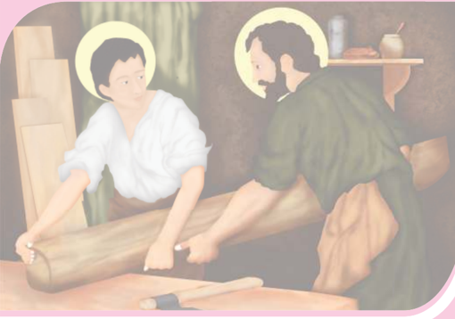

> **Deskripsi Visual:** Gambar ini adalah ilustrasi yang menunjukkan dua karakter yang sedang bekerja dengan kayu. Karakter pertama, seorang anak muda dengan rambut pendek dan pakaian putih, sedang memegang dan memotong kayu besar. Karakter kedua, seorang dewasa dengan rambut panjang dan pakaian hijau, sedang berdiri di belakang dan memandu anak tersebut. Mereka berada di dalam sebuah ruangan yang tampak seperti workshop atau laboratorium, dengan beberapa alat dan bahan lainnya di sekeliling mereka. Ilustrasi ini menunjukkan hubungan kerja antara dua karakter dan proses pembuatan atau perbaikan barang dari kayu.

 

---
## 📄 Halaman 2

### Hak Cipta © 2018 pada Kementerian Pendidikan dan Kebudayaan Dilindungi Undang-Undang

Disklaimer: Buku ini merupakan buku guru yang dipersiapkan Pemerintah dalam rangka implementasi Kurikulum 2013. Buku guru ini disusun dan ditelaah oleh berbagai pihak di bawah koordinasi Kementerian Pendidikan dan Kebudayaan, dan dipergunakan dalam tahap awal penerapan Kurikulum 2013. Buku ini merupakan 'dokumen hidup' yang senantiasa diperbaiki, diperbarui,  dan dimutakhirkan sesuai dengan dinamika kebutuhan dan perubahan zaman. Masukan dari berbagai kalangan diharapkan dapat meningkatkan kualitas buku ini.

Katalog Dalam Terbitan (KDT)

Indonesia. Kementerian Pendidikan dan Kebudayaan.

Pendidikan Agama Katolik dan Budi Pekerti : buku guru / Kementerian Pendidikan dan Kebudayaan.- Edisi Revisi Jakarta : Kementerian Pendidikan dan Kebudayaan, 2018.

vi, 290 hlm. : ilus. ; 25 cm.

Untuk S MA Kelas XII I S BN  978-602-427-062-9 (jilid lengkap)

I S BN  978-602-427-065-0 (jilid 3)

- Katolik -S tudi dan Pengajaran
- Kementerian Pendidikan dan Kebudayaan
Penulis

: Daniel Boli Kotan dan P . Leo S ugiono

Nihil Obstat

: FX. Adisusanto

14 Agustus 2014

Imprimatur

: Mgr. John Liku Ada

21 Agustus 2014

Penelaah

: Matias Endar S uhendar, Matheus Benny Mithe, dan S alman Habeahan

Pe- review

: Ludwig S itompul

Penyelia Penerbitan  : Pusat Kurikulum dan Perbukuan, Balitbang, Kemendikbud.

Cetakan Ke-1, 2015 (I S BN 192-602-282-424-4) Cetakan Ke-2, 2018 (Edisi Revisi) Disusun dengan huruf Times New Roman, 12 pt.

I. Judul

230

 

---
## 📄 Halaman 3

### Kata Pengantar

Pantaslah kita semua bersyukur kepada Allah yang Mahakuasa atas terbitnya buku Pendidikan Agama Katolik dan Budi Pekerti yang telah direvisi dan diselaraskan sesuai perkembangan Kurikulum 2013.

Agama terutama bukanlah soal mengetahui mana yang benar atau yang salah. Tidak ada gunanya mengetahui tetapi tidak melakukannya, seperti dikatakan oleh Santo Yakobus: 'Sebab seperti tubuh tanpa roh adalah mati, demikian jugalah iman tanpa perbuatan-perbuatan  adalah  mati'  (Yakobus  2:26).  Demikianlah,  belajar  bukan sekadar  untuk  tahu,  melainkan  dengan  belajar  seseorang  menjadi  tumbuh  dan berubah. Tidak sekadar belajar lalu berubah, tetapi juga mengubah keadaan. Begitulah Kurikulum  2013  dirancang  agar  tahapan  pembelajaran  memungkinkan  siswa berkembang dari proses menyerap pengetahuan dan mengembangkan keterampilan hingga memekarkan sikap serta nilai-nilai luhur kemanusiaan.

Pembelajaran agama diharapkan mampu menambah wawasan keagamaan, mengasah keterampilan beragama, dan mewujudkan sikap beragama peserta didik yang utuh dan  berimbang  yang  mencakup  hubungan  manusia  dengan  Penciptanya,  sesama manusia,  dan  manusia  dengan  lingkungannya.  Untuk  itu  pendidikan  agama  perlu diberi  penekanan  khusus  terkait  dengan  penanaman  karakter  dalam  pembentukan budi pekerti yang luhur. Karakter yang ingin kita tanamkan antara lain: kejujuran, kedisiplinan, cinta kebersihan, cinta kasih, semangat berbagi, optimisme, cinta tanah air, kepenasaran intelektual, dan kreativitas.

Nilai-nilai karakter itu digali dan diserap dari pengetahuan agama yang dipelajari para siswa itu dan menjadi penggerak dalam pembentukan, pengembangan, peningkatan, pemeliharaan, dan perbaikan perilaku anak didik agar mau dan mampu melaksanakan tugas-tugas hidup mereka secara selaras, serasi, seimbang antara lahir-batin, jasmanirohani, material-spiritual, dan individu-sosial. Selaras dengan itu, pendidikan agama Katolik secara khusus bertujuan membangun dan membimbing peserta didik agar tumbuh berkembang mencapai kepribadian utuh yang semakin mencerminkan diri mereka  sebagai  gambar  Allah,  sebab  demikianlah  'Allah  menciptakan  manusia itu  menurut  gambar-Nya,  menurut  gambar  Allah  diciptakan-Nya  dia'  (Kejadian 1:27).  Sebagai  makhluk  yang  diciptakan  seturut  gambar  Allah,  manusia  perlu mengembangkan  sifat  cinta  kasih  dan  takut  akan  Allah,  memiliki  kecerdasan, keterampilan, pekerti luhur, memelihara lingkungan, serta ikut bertanggung jawab dalam pembangunan masyarakat, bangsa, dan negara. [Sigit DK: 2013]

Buku  pelajaran  Pendidikan  Agama  Katolik  dan  Budi  Pekerti  ini  ditulis  dengan semangat  itu.  Pembelajarannya  dibagi-bagi  dalam  kegiatan-kegiatan  yang  harus dilakukan  siswa  dalam  usaha  memahami  pengetahuan  agamanya.  Akan  tetapi pengetahuan  agama  bukanlah  hasil  akhir  yang  dituju.  Pemahaman  tersebut  harus

 

---
## 📄 Halaman 4

diaktualisasikan  dalam  tindakan  nyata  dan  sikap  keseharian  yang  sesuai  dengan tuntunan agamanya, baik dalam bentuk ibadah ritual maupun ibadah sosial. Untuk itu,  sebagai  buku  agama  yang  mengacu  pada  kurikulum  berbasis  kompetensi, rencana pembelajarannya dinyatakan dalam bentuk aktivitas-aktivitas. Di dalamnya dirancang urutan pembelajaran yang dinyatakan dalam kegiatan-kegiatan keagamaan yang harus dilakukan siswa. Dengan demikian, buku ini menuntun apa yang harus dilakukan siswa bersama guru dan teman-teman sekelasnya untuk memahami dan menjalankan ajaran iman katolik.

Buku ini bukanlah satu-satunya sumber belajar bagi siswa. Sesuai dengan pendekatan yang  dipergunakan  dalam  Kurikulum  2013,  siswa  didorong  untuk  mempelajari agamanya melalui pengamatan terhadap sumber belajar yang tersedia dan terbentang luas di sekitarnya. Lebih-lebih untuk usia remaja perlu ditantang untuk kritis sekaligus peka dalam menyikapi fenomena alam, sosial, dan seni budaya.

Peran guru sangat penting untuk menyesuaikan daya serap siswa dengan ketersedian kegiatan  yang  ada  pada  buku  ini.  Penyesuaian  ini  antara  lain  dengan  membuka kesempatan  luas  bagi  kreativitas  guru  untuk  memperkayanya  dengan  kegiatankegiatan lain yang sesuai dan relevan dengan tempat di mana buku ini diajarkan, baik belajar melalui sumber tertulis maupun belajar langsung dari sumber lingkungan sosial dan alam sekitar.

Komisi Kateketik Konferensi Waligereja Indonesia sebagai lembaga yang bertanggungjawab  atas  ajaran  iman  Katolik  berterima  kasih  kepada  pemerintah, dalam hal ini Kementerian Pendidikan dan Kebudayaan atas kerja sama yang baik selama  ini  mulai  dari  proses  penyusunan  kurikulum  hingga  penulisan  buku  teks pelajaran ini.

Tim Penulis

 

---
## 📄 Halaman 5

### DAFTAR ISI

 

---
## 📄 Halaman 7

### PENDAHULUAN

### A. Latar Belakang

Dalam kehidupan anak, pendidikan memiliki tempat dan peran yang amat strategis.  Melalui  pendidikan,  anak  dibantu  dan  distimulasi  agar  dirinya berkembang menjadi pribadi yang dewasa secara utuh. Begitu juga dalam kehidupan beragama dan beriman, pendidikan iman mempunyai peran dan tempat  yang  utama.  Meskipun  perkembangan  hidup  beriman  merupakan karya Allah yang menyapa dan membimbing anak menuju kesempurnaan hidup  berimannya,  namun  manusia  bisa  membantu  perkembangan  hidup beriman anak dengan menciptakan situasi yang membuat semakin erat dan mesra hubungan anak dengan Allah. Dengan demikian, pendidikan iman tidak dimaksudkan untuk mencampuri secara langsung perkembangan hidup beriman anak yang merupakan suatu misteri, tetapi untuk menciptakan situasi dan  iklim  kehidupan  yang  membantu  serta  memudahkan  perkembangan hidup beriman anak.

Pendidikan  pada  umumnya  merupakan  hak  dan  kewajiban  utama  dan pertama orang tua. Demikian pula dengan pendidikan iman, orang tualah yang memiliki hak dan kewajiban pertama dan utama dalam memberikan pendidikan  iman  kepada  anak-anaknya.  Pendidikan  iman  dimulai  dan dilaksanakan di lingkungan keluarga, tempat dan lingkungan di mana anak mulai mengenal dan mengembangkan iman, kemudian berkembang lebih lanjut dalam kebersamaan dengan jemaat yang lain. Pengembangan iman dilakukan  pula  dengan  bantuan  pastor,  katekis,  dan  guru  agama.  Negara mempunyai kewajiban untuk menjaga dan memfasilitasi agar pendidikan iman bisa terlaksana dengan baik sesuai dengan iman masing-masing.

Salah satu bentuk pelaksanaan pendidikan iman adalah yang dilaksanakan secara  formal  dalam  konteks  sekolah  yang  disebut  pelajaran  agama. Dalam  konteks  Agama  Katolik,  pelajaran  agama  di  sekolah  dinamakan Pendidikan Agama Katolik dan Budi Pekerti yang salah satu realisasi tugas dan perutusannya untuk menjadi pewarta dan saksi Kabar Gembira Yesus Kristus.

Melalui Pendidikan Agama Katolik dan Budi Pekerti peserta didik dibantu dan dibimbing untuk semakin mampu memperteguh iman terhadap Tuhan sesuai ajaran agama Katolik dengan tetap memperhatikan dan mengusahakan penghormatan terhadap agama dan kepercayaan lain. Hal ini dimaksudkan untuk  menciptakan  hubungan  antarumat  beragama  yang  harmonis  dalam

 

---
## 📄 Halaman 8

masyarakat  Indonesia  yang  plural  demi  terwujudnya  persatuan  nasional. Dengan kata lain, Pendidikan Agama Katolik dan Budi Pekerti bertujuan untuk  membangun  kehidupan  beriman  kristiani  peserta  didik.  Artinya, membangun kesetiaan pada Injil Yesus Kristus yang memiliki keprihatinan tunggal  terwujudnya  Kerajaan  Allah  dalam  hidup  manusia.  Kerajaan Allah  merupakan  situasi  dan  peristiwa  penyelamatan,  yaitu  situasi  dan perjuangan untuk perdamaian dan keadilan, kebahagiaan dan kesejahteraan, persaudaraan dan kesatuan, kelestarian lingkungan hidup yang dirindukan oleh setiap orang dari berbagai agama dan kepercayaan.

### B. Hakikat Pendidikan Agama Katolik dan Budi Pekerti

Pendidikan Agama Katolik dan Budi Pekerti adalah usaha yang dilakukan secara  terencana  dan  berkesinambungan  dalam  rangka  mengembangkan kemampuan  peserta  didik  untuk  memperteguh  iman  dan  ketakwaan kepada  Tuhan  Yang  Maha  Esa  sesuai  dengan  agama  Katolik.  Hal  ini dilakukan  dengan  tetap  memperhatikan  penghormatan  terhadap  agama lain  dalam  hubungan  kerukunan  antarumat  beragama  dalam  masyarakat untuk mewujudkan persatuan nasional. Secara lebih tegas dapat dikatakan bahwa Pendidikan Agama Katolik dan Budi Pekerti di sekolah merupakan salah  satu  usaha  untuk  memampukan  peserta  didik  dalam  berinteraksi (berkomunikasi), memahami, menggumuli, dan menghayati iman. Dengan kemampuan berinteraksi antara pemahaman iman, pergumulan iman, dan penghayatan iman diharapkan iman peserta didik semakin diperteguh.

### C. Tujuan Pendidikan Agama Katolik dan Budi Pekerti

Pendidikan Agama Katolik dan Budi Pekrti pada dasarnya bertujuan agar peserta didik memiliki kemampuan untuk membangun hidup yang semakin beriman. Membangun hidup beriman Kristiani berarti membangun kesetiaan pada Injil Yesus Kristus, yang memiliki keprihatinan tunggal, yakni Kerajaan Allah.  Kerajaan  Allah  merupakan  situasi  dan  peristiwa  penyelamatan: situasi  dan  perjuangan  untuk  perdamaian  dan  keadilan,  kebahagiaan  dan kesejahteraan,  persaudaraan  dan  kesetiaan,  kelestarian  lingkungan  hidup, yang dirindukan oleh setiap orang dari pelbagai agama dan kepercayaan.

 

---
## 📄 Halaman 9

### D. Ruang Lingkup Pendidikan Agama Katolik dan Budi Pekerti

Ruang lingkup pembelajaran Pendidikan Agama Katolik dan Budi Pekerti mencakup  empat  aspek  yang  memiliki  keterkaitan  satu  dengan  yang lain.  Keempat  aspek  yang  dibahas  secara  lebih  mendalam  sesuai  tingkat kemampuan pemahaman peserta didik adalah sebagai berikut.

### 1. Pribadi Peserta Didik

Ruang lingkup ini membahas tentang pemahaman diri sebagai pria dan wanita  yang  memiliki  kemampuan  dan  keterbatasan,  kelebihan  dan kekurangan dalam berelasi dengan sesama serta lingkungan sekitarnya.

### 2. Yesus Kristus

Ruang lingkup ini membahas tentang bagaimana meneladani pribadi Yesus Kristus yang mewartakan Allah Bapa dan Kerajaan Allah, seperti yang terungkap dalam Kitab Suci Perjanjian Lama dan Perjanjian Baru.

### 3. Gereja

Ruang  lingkup  ini  membahas  tentang  makna  Gereja,  bagaimana mewujudkan kehidupan bergereja dalam realitas hidup sehari-hari.

### 4. Masyarakat

Ruang lingkup ini membahas secara mendalam tentang hidup bersama dalam masyarakat sesuai fi rman/sabda Tuhan, ajaran Yesus, dan ajaran Gereja.

### E. Pendekatan Pembelajaran Pendidikan Agama Katolik dan Budi Pekerti

Kurikulum  2013  menggunakan  pendekatan  sainti fi k  melalui  proses  5  M yaitu,  mengamati,  menanya,  mengeksplorasi/mengumpulkan  informasi, mengasosiasi/menalar  dan  mengomunikasikan.  Meski  menjadi  salah  satu ciri Kurikulum 2013, pendekatan ini bukanlah merupakan pendekatan satusatunya. Dalam kegiatan pembelajaran, guru dapat menggunakan berbagai pendekatan  dan pola pembelajaran  yang  lain sesuai dengan karakteristik mata pelajaran.

Selain  pendekatan  sainti fi k,  kegiatan  pembelajaran  Pendidikan  Agama Katolik dan Budi Pekerti menggunakan pendekatan kateketis sebagai ciri pembelajarannya. Pendekatan kateketis berorientasi pada pengetahuan yang tidak  lepas  dari  pengalaman,  yakni  pengetahuan  yang  menyentuh  pengalaman hidup  peserta  didik.  Pengetahuan  diproses  melalui  re fl eksi  pengalaman

 

---
## 📄 Halaman 10

hidup,  selanjutnya  diinternalisasikan  sebagai  pembentuk  karakter  peserta didik.  Pengetahuan  iman  tidak  akan  mengembangkan  diri  peserta  didik, jika ia tidak mengambil keputusan terhadap pengetahuan tersebut. Proses pengambilan keputusan itulah yang menjadi tahapan kritis sekaligus sentral dalam pembelajaran agama Katolik. Tahapan proses pendekatan kateketis adalah: 1) menampilkan fakta dan pengalaman manusiawi yang membuka pemikiran  atau  yang  dapat  menjadi  umpan,  2)  menggumuli  fakta  dan pengalaman manusiawi secara mendalam dan meluas dalam terang Kitab Suci, 3) merumuskan nilai-nilai baru yang ditemukan dalam proses re fl eksi sehingga terdorong untuk menerapkan dan mengintegrasikan dalam hidup.

### F. Kompetensi Inti dan Kompetensi Dasar

Kompetensi inti dan kompetensi dasar yang perlu dimiliki setiap peserta didik  setelah  menyelesaikan  kegiatan  pembelajaran  Pendidikan  Agama Katolik dan Budi Pekerti di kelas XII adalah sebagai berikut:

---
**📊 Tabel**

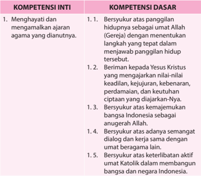

Tabel ini berisi informasi tentang kompetensi inti dan dasar yang relevan dengan agama Katolik. Topik utamanya adalah tentang persetujuan dan pengakuan terhadap nilai-nilai dan kebijaksanaan yang dianut oleh agama tersebut. Kolom-kolomnya mencakup dua bagian utama: Kompetensi Inti dan Kompetensi Dasar. Kompetensi Inti meliputi empat poin utama, yaitu persetujuan terhadap panggilan hidup sebagai umat Allah, persetujuan terhadap Yesus Kristus sebagai guru dan pemimpin, persetujuan terhadap kemajemukan bangsa Indonesia sebagai anugerah Allah, dan persetujuan terhadap keterlibatan aktif umat Katolik dalam membangun bangsa dan negara Indonesia. Kompetensi Dasar juga mencakup empat poin, yang lebih spesifik dan detail dibandingkan dengan Kompetensi Inti. Pola penting yang terlihat adalah bahwa setiap poin dalam Kompetensi Inti memiliki satu poin yang spesifik dalam Kompetensi Dasar, menunjukkan hubungan yang kuat antara kedua kompetensi ini.

 

---
## 📄 Halaman 11

---
**🖼️ Gambar/Diagram**

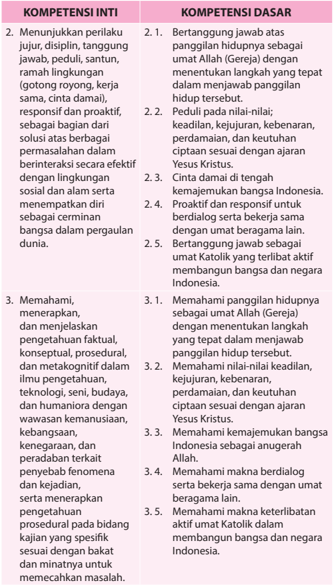

> **Deskripsi Visual:** Gambar ini adalah diagram yang menunjukkan kompetensi inti dan dasar dalam sebuah kurikulum pendidikan. Diagram ini dibagi menjadi dua bagian utama: Kompetensi Inti dan Kompetensi Dasar.

Kompetensi Inti terdiri dari tiga poin utama:
1. Menunjukkan perilaku perjuang, disiplin, tanggung jawab, peduli, santun, ramah lingkungan.
2. Memahami, menerapkan, dan menjelaskan pengetahuan faktil, konseptual, prosedural, dan metakognitif dalam ilmu pengetahuan, teknologi, seni, budaya, dan humaniora dengan wawasan kemanusiaan, kebangsaan, keadilan, kejujuran, dan peradaban tertekat.
3. Memahami, menerapkan, dan menjelaskan pengetahuan faktil, konseptual, prosedural, dan metakognitif dalam ilmu pengetahuan, teknologi, seni, budaya, dan humaniora dengan wawasan kemanusiaan, kebangsaan, keadilan, kejujuran, dan peradaban tertekat.

Kompetensi Dasar terdiri dari empat poin utama:
1. Berangkat jawab atas panggilan hidupnya sebagai umat Allah (Gereja) dengan menentukan langkah yang tepat dalam menjawab panggilan hidup tersebut.
2. Memahami nilai-nilai keadilan, kejujuran, keberanian, pedamalan, dan keutuhan ciptaan sesuai dengan ajaran Yesus Kristus.
3. Cinta damai di tengah kemajemukan bangsa Indonesia.
4. Proaktif dan responsif untuk berdialog serta bekerja sama dengan umat beragama lain.

Elemen-elemen utama dalam diagram ini adalah kompetensi inti dan dasar, serta informasi tentang apa yang dimaksud oleh setiap kompetensi. Label penting yang terlihat meliputi "Kompetensi Inti" dan "Kompetensi Dasar", serta informasi tentang apa yang dimaksud oleh setiap kompetensi. Informasi kunci yang dapat diambil pembaca adalah bahwa kurik

---
**📊 Tabel**

Tabel ini berisi informasi tentang kompetensi inti dan dasar yang relevan dengan peran dan tanggung jawab seorang guru di lingkungan pendidikan. Topik utama tabel adalah tentang bagaimana guru harus menunjukkan perilaku yang positif dan berkomitmen dalam menjalankan tugasnya. Kolom-kolom yang ada meliputi: 1) Kompetensi Inti, yang mencakup dua subtopik utama: Menunjukkan perilaku jujur, disiplin, tanggung jawab, peduli, santun, ramah lingkungan; dan Memahami, menerapkan, dan menjelaskan pengetahuan faktil, konseptual, prosedural, dan metakognitif. 2) Kompetensi Dasar, yang mencakup empat subtopik utama: Berangkat jawab atas panggilan hidupnya sebagai umat Allah (Gereja), memahami nilai-nilai keadilan, kejujuran, kebenaran, perdamaan, dan keutuhan ciptaan sesuai dengan ajaran Yesus Kristus; dan bertanggung jawab sebagai umat Katolik yang terlibat aktif membangun bangsa dan negara Indonesia. Data atau pola penting yang terlihat adalah bahwa tabel ini mencakup berbagai aspek dari kompetensi guru, mulai dari perilaku dan tanggung jawab hingga pemahaman dan aplikasi pengetahuan.

 

---
## 📄 Halaman 12

---
**📊 Tabel**

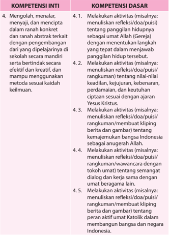

Tabel ini berisi informasi tentang kompetensi inti dan dasar yang harus dipenuhi oleh siswa dalam konteks pembelajaran tentang kemanusiaan dan kehidupan sosial. Topik utama tabel adalah pengembangan keterampilan berpikir kritis dan kreatif, serta pengetahuan tentang nilai-nilai kehidupan yang dianut oleh agama Islam dan Katolik. Kolom-kolom yang ada meliputi 4.1 hingga 4.5 untuk kompetensi dasar, dan 4 untuk kompetensi inti. Data penting yang terlihat adalah bahwa semua kompetensi dasar dan inti berkaitan dengan penulisan refleksi, doa, puisi, rangkuman, kliping, dan gambar yang membahas tema-tema seperti pengertian kemanusiaan, nilai-nilai kehidupan, dan peran aktif dalam masyarakat.

 

---
## 📄 Halaman 13

### BAB I

### Panggilan Hidup Sebagai Umat Allah

Dalam kehidupan agama Katolik (Kristiani), kata panggilan dikaitkan dengan Tuhan. Artinya  bahwa  Tuhanlah  yang  memanggil  manusia  agar  manusia  hidup  sesuai kehendak-Nya. Panggilan hidup, baik religius maupun awam senantiasa menuntun seseorang  untuk  hidup  secara  bertanggung  jawab.  Panggilan  hidup  menunjukkan bahwa manusia memiliki kehendak bebas menentukan apapun yang baik bagi dirinya secara  otonom.  Kitab  Suci  menjelaskan  bahwa  manusia  dipanggil  untuk  menjadi murid-murid Yesus  Kristus.  Sebagai  murid-murid Yesus,  kita  menjadi  garam  dan terang bagi sesama.

Untuk memahami makna dan hakikat panggilan hidup sebagai umat Allah, maka pada  kegiatan  pembelajaran  ini,  peserta  didik  dibimbing  untuk  memahami  dan menghayati bahwa hidupnya sungguh bermakna. Peserta didik yang sudah beranjak dewasa  diharapkan  memahami  tentang  makna  hidup  keluarga,  tradisi  perkawinan Katolik,  tantangan  dan  peluang  untuk  membangun  keluarga  yang  ideal  atau  yang dicita-citakan,  makna hidup membiara, serta profesi atau karya sebagai panggilan hidup.

Untuk  memahami  makna  panggilan  hidup  sebagai  umat Allah,  maka  pada  Bab  I (pertama) ini, peserta didik akan menggeluti  lima pokok-bahasan yaitu;

- Makna Hidup Manusia.
- Panggilan Hidup Berkeluarga.
- Perkawinan dalam Tradisi Katolik.
- Tantangan dan Peluang untuk Membangun Keluarga yang Dicita-citakan.
- Panggilan Hidup Membiara.
- Panggilan Karya/Profesi.

 

---
## 📄 Halaman 14

### A. Makna Hidup Manusia

### Kompetensi Dasar

- 1.1  Bersyukur  atas  panggilan  hidupnya  sebagai  umat  Allah  (Gereja)  dengan menentukan langkah yang tepat dalam menjawab panggilan hidup tersebut.
- 2.1  Bertanggung jawab atas panggilan hidupnya sebagai umat Allah (Gereja) dengan menentukan langkah yang tepat dalam menjawab panggilan hidup tersebut.
- 3.1  Memahami panggilan hidupnya sebagai umat Allah (Gereja) dengan menentukan langkah yang tepat dalam menjawab panggilan hidup tersebut.
- 4.1  Melakukan aktivitas (misalnya: menuliskan re fl eksi/doa/puisi) tentang panggilan hidupnya sebagai umat Allah (Gereja) dengan menentukan langkah yang tepat dalam menjawab panggilan hidup tersebut.

### Indikator

- Menjelaskan makna hidup manusia menurut pengalaman hidup manusiawi (dari sebuah kisah kesaksian 'bangkit dari keterpurukan').
- Menjelaskan makna hidup manusia menurut ajaran Kitab Suci (Matius 5:1 - 12).
- Menuliskan re fl eksi tentang hidup manusia yang bermakna.

### Bahan Kajian

- Pandangan masyarakat dan peserta didik sendiri tentang makna hidup manusia.
- Ajaran Kitab Suci tentang makna hidup manusia yang bermakna.
- Penghayatan akan makna hidup sebagai anugerah dan panggilan Tuhan.

### Sumber Belajar

- Kitab Suci Perjanjian lama dan Perjanjian Baru.
- Dokpen KWI (penterj) Dokumen Konsili Vatikan II , Obor, Jakarta, 1993.
- KWI, Iman Katolik , Kanisius, Yogyakarta, 1995.
- Katekismus Gereja Katolik, Nusa Indah, Ende Flores, 1995.

### Pendekatan

Sainti fi k dan kateketis.

### Metode

Cerita, tanya-jawab, diskusi, presentasi, informasi, re fl eksi, aksi/penugasan.

 

---
## 📄 Halaman 15

### Sarana

- Kitab Suci (Alkitab).
- Buku Siswa SMA/SMK, Kelas XII, Pendidikan Agama Katolik dan Budi Pekerti.

### Waktu

### 3 x 45 menit

Pengelolaan  waktu  untuk  kegiatan  pembelajaran  subtema  ini  dapat  disesuaikan dengan pengaturan jam pelajaran di sekolah masing-masing.

### Pemikiran Dasar

Setiap  orang,  cepat  atau  lambat  pasti  akan  bertanya  seperti  ini  di  dalam  hatinya; 'Untuk  apa  sih  saya  hidup  di  dunia  ini?  Pada  dasarnya  pertanyaan  seperti  ini merupakan pertanyaan re fl eksi pribadi bagi dirinya sendiri untuk menemukan makna dan  tujuan  hidupnya  di  dunia.  Dengan  bertanya  tentang  tujuan  hidup,  kita  dapat mencari jawaban tentang makna sesungguhnya hidup kita di dunia. Sesungguhnya bahwa  Tuhan  sendiri  yang  membimbing  manusia  untuk  mencari  tujuan  akhir hidupnya. Tuhan yang menciptakan kita, menanamkan di dalam hati kita kerinduan hati untuk kembali kepada-Nya, dari mana kita berasal, dan tujuan akhir tempat kita berpulang. Tuhan menginginkan semua manusia hidup berbahagia. Semua manusia umumnya mencari kebahagiaan, dan ini adalah sesuatu yang normal. Maka, ketika kita menghadapi cobaan dalam hidup, meski itu berat sekalipun, kita hendaknya tetap bersandar pada Tuhan, karena Dia adalah sumber kebahagiaan hidup kita. Artinya, kita jangan sampai jatuh dalam keputusasaan yang membelenggu hidup kita sehingga membuat hidup kita tidak bermakna.

Dalam Kitab Suci, kita menemukan banyak pesan tentang makna hidup manusia yang sangat  bermakna. Yesus  sendiri  mengajarkan  bahwa  hidup  kita  sangat  bermakna, sangat  berharga  apabila  kita  hidup  sesuai  kehendak Allah,  dengan  demikian  kita menjadi orang yang hidup penuh kebahagiaan (bdk. Mat 5:3-12).

Pada pelajaran ini peserta didik belajar tentang hidup manusia yang sangat berharga. Peserta didik belajar bahwa hidup manusia itu suatu anugerah panggilan, maka mereka perlu berjuang untuk mengisi hidupnya secara bermutu agar sungguh bermakna bagi Allah dan sesama.

### Kegiatan Pembelajaran

Guru mengajak peserta didik untuk memulai pelajaran dengan berdoa.

 

---
## 📄 Halaman 16

### Doa Pembuka

Allah Bapa yang penuh kasih,

Puji  dan  syukur  kami  haturkan  kehadirat-Mu  atas  anugerah  kehidupan yang  Engkau  berikan  kepada  kami.  Bimbinglah  kami  ya  Bapa  dalam kegiatan pelajaran ini, agar kami dapat memahami tentang makna hidup sebagai  anugerah-Mu  yang  sangat  berharga.  Semoga  fi  rman-Mu  yang kami dengar dalam kegiatan pembelajaran ini dapat menjadi pelita hidup kami sepanjang segala abad. Amin.

### Langkah Pertama: Menggali pengalaman manusiawi tentang makna hidup manusia

### 1. Menyimak cerita

Guru mengajak peserta didik untuk menyimak cerita kesaksian berikut ini.

### Bangkit dari keterpurukan

'Pada tahun 2000, bulan Juli, suami saya, ayah dari anak-anak meninggalkan kami  untuk  selama-lamanya  kembali  ke  haribaan  Tuhan  Yang  Maha  Kuasa. Betapa kiamatnya hidup saya menyaksikan anak-anak yang masih kecil-kecil yang  benar-benar  membutuhkan  kehadiran  kedua  orang  tua  mereka.  Sampai kira-kira satu tahun, saya dalam keadaan seperti orang yang tidak waras, tidak mempedulikan diri sendiri, serta benar-benar merasakan panjangnya malam.

Pada suatu hari, kira-kira pukul 09.00 pagi, saya bersiap-siap akan menjemput anak kedua saya, yang bersekolah di Taman Kanak-Kanak. Waktu saya membuka lemari  untuk  berganti  pakaian,  terlihat  sekilas  piyama  (baju  tidur)  almarhum suami.  Piyama  itu  sangat  disayangi  oleh  suami.  Ketika  mengenakan  piyama itulah,  saya  melepaskan  arwah  suami  saya.  Hati  saya  luluh,  piyama  itu  saya dekap erat-erat untuk melepaskan rindu dan haru, air mata berderai membasahi piyama.

Saya baru sadar, waktu mendengar suara anak sulung saya yang baru pulang dari  sekolah  menanyakan  adiknya,  'Ma,  mana  adik?  Ini  saya  bawa  permen untuknya.'  Saya  kaget  mendengar  si  sulung  menanyakan  adiknya.  Ternyata saya bersimpuh mendekap piyama itu selama hampir tiga jam. Saya bergegas meninggalkan  rumah  untuk  menjemput  adiknya. Waktu  saya  tiba  di  sekolah, ternyata sudah sepi dan anak saya pun tidak ada di sana. Dua hari saya dilanda

 

---
## 📄 Halaman 17

beban perasaan serba bingung entah ke mana harus saya cari. Tiba-tiba ada orang yang mengantarkan anak saya ke rumah. Rupanya waktu itu anak saya pulang sendiri dan tersesat. Beruntung ada orang berbaik hati membawa dia pulang.

Sejak  peristiwa  itu,  saya  berjanji  pada  diri  sendiri  akan  mencurahkan  kasih sayang dan perhatian saya kepada ketiga anak saya. Untuk itu keadaan di rumah saya ubah. Bahkan tidurpun saya pindah ke kamar belakang bersama anak-anak. Melalui perantaraan Bunda Maria, aku berdoa setiap hari memohon kekuatan serta  berkat  dari  Yesus  Puteranya  agar  dapat  berjuang  melanjutkan  hidup  ini sebagai orang tua tunggal, guna membesarkan dan mendidik anak-anak untuk menyongsong masa depannya. (MM)

Sumber cerita : Buletin Motivasi, Vol.1 no.5 Thn. 2014 dengan saduran penulis.

### 2. Pendalaman cerita

Setelah mendengar, menyimak cerita tersebut, guru mengajak peserta didik untuk mengajukan  pertanyaan-pertanyaan  berkaitan  dengan  makna  hidup  manusia. Pertanyaan-pertanyaan yang muncul, misalnya:

- Apa yang membuat ibu itu sedih berkepanjangan?
- Apa yang membuatnya sadar?
- Apa yang dilakukannya kemudian?
- Apa pendapat kamu tentang kisah ini?
- Adakah pengalaman pribadimu atau pengalaman dari orang lain yang kamu dengar tentang pemaknaan hidup dalam suatu peristiwa kehidupan?

### 3.  Peneguhan

Setelah peserta didik mengajukan pertanyaan, dilanjutkan dengan diskusi kelas membahas pertanyaan-pertanyaan yang muncul, guru memberikan penjelasan, misalnya sebagai berikut:

- Pengalaman kehilangan anak memberikan hikmah bagi sang ibu. Ia bangkit dari  keputusasaan  yang  mendera  hidupnya  setelah  ditinggalkan  suami tercinta. Ia merasa hidupnya tidak bermakna, tidak berharga, tidak berguna lagi.  Namun  setelah  peristiwa  anaknya  hilang  karena  egoismenya  itu,  ia pun sadar, bersemangat kembali atas dasar kasihnya kepada anak-anaknya yang  masih  kecil,  yang  sangat  membutuhkan  sang  ibu  untuk  menjaga, membesarkan, dan mendidik mereka dengan penuh cinta sampai mereka dewasa.  Bunda  Maria  dijadikan  teladan  hidupnya  untuk  merawat  hidup keluarganya.
- Di sinilah sang ibu menemukan makna hidup sebenarnya. Ia ingin bekerja keras untuk kebahagiaan keluarganya. Ia mau menjadi saluran berkat bagi anak-anaknya yang sedang bertumbuh dan berkembang.

 

---
## 📄 Halaman 18

### Langkah Kedua: Menggali Ajaran Kitab Suci tentang Makna Hidup Manusia.

### 1. Menelusuri Ajaran Kitab Suci

- Setelah peserta didik memahami  makna  hidup  dari cerita 'bangkit dari keterpurukan', guru mengajak  peserta  didik  untuk  menemukan (mengeksplorasi) ajaran Kitab Suci (Alkitab) tentang makna hidup manusia. Ada beberapa teks dalam Kitab Suci yang dapat dirujuk misalnya Ayub 2:4; Markus 8:37; Matius 5:1-12.
- Pada kegiatan pembelajaran ini guru mengajak peserta didik untuk membaca teks Kitab Suci berikut ini.

### Delapan Sabda Bahagia Yesus Matius 5:1-12

1 'Ketika Yesus melihat orang banyak itu, naiklah Ia ke atas bukit dan setelah Ia  duduk,  datanglah  murid-murid-Nya  kepada-Nya. 2 Maka  Yesus  pun mulai  berbicara  dan  mengajar  mereka,  kata-Nya. 3 'Berbahagialah  orang yang miskin di hadapan Allah, karena merekalah yang empunya Kerajaan Surga. 4 Berbahagialah orang yang berdukacita, karena mereka akan dihibur. 5 Berbahagialah  orang  yang  lemah  lembut,  karena  mereka  akan  memiliki bumi. 6 Berbahagialah orang yang lapar dan haus akan kebenaran, karena mereka akan dipuaskan.  7 Berbahagialah orang yang murah hatinya, karena mereka akan beroleh kemurahan.  8 Berbahagialah orang yang suci hatinya, karena mereka akan melihat Allah.  9 Berbahagialah orang yang membawa damai, karena mereka akan disebut anak-anak Allah. 10 Berbahagialah orang yang  dianiaya  oleh  sebab  kebenaran,  karena  merekalah  yang  empunya Kerajaan Surga. 11 Berbahagialah kamu, jika karena Aku kamu dicela dan dianiaya  dan  kepadamu  di fi tnahkan  segala  yang  jahat. 12 Bersukacita  dan bergembiralah, karena upahmu besar di surga, sebab demikian juga telah dianiaya nabi-nabi yang sebelum kamu'.

### 2.  Pendalaman

Setelah  menyimak  teks-teks  bacaan  Kitab  Suci,  guru  mengajak  peserta  didik untuk mengajukan  pertanyaan-pertanyaan  berkaitan  dengan  makna  hidup manusia menurut teks Kitab Suci. Pertanyaan-pertanyaan itu misalnya:

- Apa pesan yang disampaikan dalam teks Kitab Suci itu?
- Apa saja sabda bahagia yang disampaikan Yesus?
- Apa maksud Sabda bahagia Yesus itu?
- Bagaimana upaya-upayamu sebagai pengikut Yesus untuk  membuat hidupmu bermakna di dunia ini?

 

---
## 📄 Halaman 19

### 3.  Peneguhan

Setelah  peserta  didik  mengajukan  pertanyaan-pertanyaan,  dilanjutkan  dengan diskusi kelas atas pertanyaan-pertanyaan tersebut, guru memberikan penjelasan, misalnya sebagai berikut:

- Yesus  mengajarkan  bahwa  hidup  kita  sangat  bermakna,  sangat  berharga apabila  kita  hidup  sesuai  kehendak Allah,  dengan  demikian  kita  menjadi orang yang hidup penuh kebahagiaan (bdk. Matius 5:3-12).
- Tantangan dari 'Sabda-Sabda Bahagia' adalah agar kita membuka hati bagi Allah dan memperkenankan-Nya mengubah hidup kita.
- Tuhan  Yesus  memberikan  kelegaan  pada  mereka  yang  terpanggil  untuk memasuki KerajaanNya. Sekalipun hidup terasa sangat sengsara, bernasib sial, dan tidak pernah nyaman akan dunia ini, namun sebagai pengikut Yesus yang sejati, kita akan berbahagia, karena kasih Allah tidak pernah terlepas dari awal sampai akhir.
- Perlu kita sadari bahwa ketenteraman hidup dunia adalah berkat dari Allah yang membuat kita senang, namun penderitaan dunia juga adalah berkat yang membuat kita semakin bertumbuh.

### Langkah Ketiga: Menghayati Hidup sebagai Anugerah Tuhan

### 1. Refl   eksi

- Guru  mengajak  peserta  didik  untuk  menuliskan  sebuah  re fl eksi  tentang makna hidup bagi dirinya, dan apa saja yang perlu ia lakukan sebagai pelajar untuk mengisi hidupnya secara berkualitas.
- Hasil re fl eksi dapat dipajangkan di Mading kelas.

### 2.  Aksi

Guru  mengajak  peserta  didik  untuk  menghargai  hidupnya  sendiri  dengan melakukan  kegiatan-kegiatan  yang  bermutu,  seperti  rajin  belajar,  disiplin terhadap peraturan di sekolah, di rumah, dan di masyarakat.

### Doa Penutup

Terima kasih ya Bapa, Putra dan Roh Kudus atas rahmat penyertaan-Mu bagi kami selama kegiatan pembelajaran ini, sehingga kami dapat memahami bahwa  hidup  itu  sebuah  panggilan  yang  sangat  berharga,  yang  perlu kami  perjuangkan  selama  hidup  di  dunia  ini.  Semoga  kami  senantiasa memuliakan Engkau sepanjang segala masa. Amin.

 

---
## 📄 Halaman 20

### B. Panggilan Hidup Berkeluarga

### Kompetensi Dasar

- 1.1  Bersyukur  atas  panggilan  hidupnya  sebagai  umat  Allah  (Gereja)  dengan menentukan langkah yang tepat dalam menjawab panggilan hidup tersebut.
- 2.1  Bertanggung jawab atas panggilan hidupnya sebagai umat Allah (Gereja) dengan menentukan langkah yang tepat dalam menjawab panggilan hidup tersebut.
- 3.1  Memahami panggilan hidupnya sebagai umat Allah (Gereja) dengan menentukan langkah yang tepat dalam menjawab panggilan hidup tersebut.
- 4.1  Melakukan aktivitas (misalnya: menuliskan re fl eksi/doa/puisi) tentang panggilan hidupnya sebagai umat Allah (Gereja) dengan menentukan langkah yang tepat dalam menjawab panggilan hidup tersebut.

### Indikator

- Menjelaskan pemahaman tentang keluarga dalam kehidupan masyarakat (melalui sebuah kisah kehidupan).
- Menjelaskan Ajaran Kitab Suci tentang keluarga (Matius 19: 1-13).
- Menjelaskan Ajaran Gereja tentang keluarga (Gaudium et spes art.52).
- Menjelaskan makna keluarga sebagai panggilan (Gaudium et spes art.52).

### Bahan Kajian

- Pandangan peserta didik tentang keluarga.
- Ajaran Kitab Suci tentang keluarga.
- Ajaran Gereja tentang keluarga.
- Penghayatan tentang keluarga sebagai panggilan.

### Sumber Belajar

- Kitab Suci Perjanjian Lama dan Perjanjian Baru.
- Dokpen KWI (penterj) Dokumen Konsili Vatikan II , Obor, Jakarta, 1993.
- KWI, Iman Katolik , Kanisius, Yogyakarta, 1995.
- Katekismus Gereja Katolik, Nusa Indah, Ende Flores, 1995.

### Pendekatan

Sainti fi k dan kateketis.

 

---
## 📄 Halaman 21

### Metode

Cerita, dialog, tanya-jawab, diskusi, informasi, presentasi.

### Sarana

- Kitab Suci (Alkitab).
- Buku Siswa SMA/SMK, Kelas XII, Pendidikan Agama Katolik dan Budi Pekerti.

### Waktu

### 3 x 45 menit

Pengelolaan  waktu  untuk  kegiatan  pembelajaran  ini  dapat  disesuaikan  dengan pengaturan jam pelajaran di sekolah masing-masing.

### Pemikiran Dasar

Keluarga  dibentuk  oleh  perkawinan  antara  laki-laki  dan  perempuan.  Baik  lakilaki  maupun  perempuan  mempunyai  cita-cita  luhur  akan  membentuk  keluarga yang  harmonis.  Seringkali  cita-cita  itu  tidak  mudah  dijalankan.  Ada  perbedaan pendapat, kebencian, kemarahan, iri hati, dan sebagainya. Bagaimana keluarga dapat menghadapi masalah-masalah seperti ini?

Gereja Katolik secara tegas mengajarkan bahwa perkawinan Katolik adalah Sakramen, sehingga setiap pasang suami istri harus menjaga kesucian perkawinan. Karena itu, sifat perkawinan Katolik adalah monogami dan tidak terceraikan, kecuali oleh maut; 'karena  apa  yang  dipersatukan Allah  tidak  boleh  diceraikan  oleh  manusia'  (Mat 19:6). Sakramen Perkawinan sebagai akar pembentukan keluarga Katolik hendaknya dijaga  kesuciannya,  karena  keluarga  merupakan  Gereja  kecil/mini  atau Ecclesia domestica . Artinya, antara lain bahwa keluarga-keluarga Kristiani merupakan pusat iman yang hidup, tempat pertama iman akan Kristus diwartakan dan sekolah pertama tentang doa, kebajikan-kebajikan dan cinta kasih Kristen (bdk. KGK 1656 & 1666).

Gaudiun et Spes No.52 mengatakan: Keluarga adalah semacam Sekolah Kemanusiaan yang kaya. Akan tetapi supaya kehidupan dan perutusan keluarga dapat mencapai kepenuhan,  dituntut  komunikasi  batin  yang  baik,  yang  ikhlas  dalam  pendidikan anak. Kehadiran ayah yang aktif sangat menguntungkan pembinaan anak-anak, dan perawatan ibu di rumah, juga dibutuhkan anak-anak dan seterusnya.

Pedoman  Pastoral  Keluarga  (MAWI  1975)  antara  lain  mengatakan:  Kita  makin menginsya fi bahwa  perkawinan  itu  persekutuan  cinta  antara  pria  dan  wanita  yang  secara sadar dan bebas menyerahkan diri beserta segala kemampuannya untuk selamanya. Dalam  penyerahan  itu  suami  isteri  berusaha  makin  saling  menyempurnakan  dan bantu membantu. Hanya dalam suasana hormat-menghormati dan saling menerima

 

---
## 📄 Halaman 22

inilah, dalam keadaan manapun juga, persekutuan cinta itu dapat berkembang hingga tercapai kesatuan hati yang dicita-citakan. (Lihat Pedoman Kerja Umat katolik No. 9).

Pada pelajaran ini peserta didik dibimbing untuk memahami makna hidup berkeluarga sebagai panggilan hidup dan dapat menghayati kehidupan keluarga bersama orang tua serta sanak-saudaranya.

### Kegiatan Pembelajaran

Guru mengajak peserta didik untuk memulai pelajaran dengan doa.

### Doa Pembuka

Allah Bapa yang penuh kasih,

Puji  dan  syukur  kami  haturkan  kehadirat-Mu  atas  anugerah  kehidupan yang  Engkau  berikan  kepada  kami.  Bimbinglah  kami  dalam  kegiatan pembelajaran  ini  agar  kami  sungguh  memahami  makna  hidup  kami  di dunia,  dan  menghayati  panggilan  hidup  berkeluarga,  serta  menghargai orang tua kami yang telah membangun keluarga di mana kami menjadi bagian  dari  keluarga  ini.  Doa  ini  kami  sempurnakan  dengan  doa  yang diajarkan Yesus Putra-Mu... Bapa Kami..

### Langkah Pertama: Menggali Pemahaman tentang Makna Keluarga

### 1. Menyimak cerita kehidupan

Guru mengajak peserta didik untuk menyimak sebuah cerita kesaksian berikut ini.

### Saya Tidak Ingin Diganggu!

'Biasanya saya mendahulukan ego saya ketika di rumah, apalagi jika sedang dikejar deadline .  Saya akan sibuk di depan komputer, penuh konsentrasi, dan tidak  mudah  diganggu.  Ketika  anak  atau  istri  saya  mengganggu,  saya  akan mudah emosi karena 'tekanan deadline' (atau kadang-kadang sebenarnya hanya 'keasyikan pribadi saya') ditambah dengan permintaan/tekanan anak atau istri.

Nada bicara saya akan mudah meninggi. Setelah itu istri akan marah juga. Dan pada akhirnya istri saya akan mengatakan 'papa sekarang gampang marah'.

Hal yang saya lakukan sekarang adalah memberi perhatian akan kebutuhan anak dan istri. Jika anak saya yang masih TK minta dibacakan sesuatu, saya bacakan sambil memberi dia kasih sayang dengan memangkunya dan memeluknya. Jika anak saya yang besar minta dibantu belajar, saya mencoba merelakan kepentingan

 

---
## 📄 Halaman 23

saya dan memberi perhatian akan kebutuhan anak saya. Jika istri minta tolong sesuatu, saya segera meninggalkan konsentrasi saya, dan membantu istri terlebih dahulu.

Kadang-kadang  memang  terlalu  sulit.  Sampai-sampai  pekerjaan  yang  sedang dikerjakan jadi terbengkalai. Dan juga sulit untuk selalu tetap melakukan hal-hal yang baik tersebut. Perlu kesadaran penuh (akan niat memperhatikan istri dan anak) ketika permintaan anak dan istri itu datang.

Salah  satu  kuncinya  adalah  penyerahan  kepada  Tuhan.  'Pekerjaan  dengan deadlinenya' saya serahkan pada Tuhan. Walaupun waktu saya tidak sepenuhnya pada pekerjaan, saya yakin Tuhan akan mencukupkan waktunya. Ketika Tuhan turun tangan, dengan waktu yang terbatas pun (karena banyak gangguan dari anak dan istri) saya akan mampu menyelesaikannya.

Ternyata ketika saya punya masalah. Itu adalah ujian dari Tuhan juga. Apa yang saya pentingkan di dunia ini? Mengerjakan tugas (yang kadang-kadang adalah kepentingan pribadi)  atau  mengasihi  keluarga?  Kalau  saya  lengah,  saya  pasti akan mementingkan tugas, dengan akibat emosi tinggi di rumah. Tetapi jika saya sadar akan ujian ini, saya akan memilih untuk mengasihi keluarga saya. Saya harap saya bisa tetap mempertahankan sikap ini sehingga bisa menjadi pria sejati seperti Kristus.

Sumber: http://priasejatikatolik.org

### 2.  Pendalaman

- Setelah  menyimak  cerita  kesaksian,  guru  mengajak  peserta  didik  untuk mengajukan pertanyaan untuk mendalami cerita tersebut.
- Guru mengajak peserta didik untuk mendiskusikan pertanyaan-pertanyaan itu, misalnya:
- Apa yang dikisahkan dalam cerita itu?
- Apa yang menjadi sebab kemarahan si Bapak keluarga dalam cerita itu?
- Apa yang menjadi kunci bagi Bapak keluarga itu untuk membuka relasi, komunikasi dengan istri serta anak-anaknya?
- Bagaimana upaya Bapak keluarga itu untuk menjadi seorang pria sejati dalam keluarga?
- Bagaimana pengalaman relasi dengan anggota keluargamu sendiri?

### 3.  Peneguhan

Setelah  peserta  didik  mengajukan  pertanyaan-pertanyaan,  dilanjutkan  dengan diskusi kelas atas pertanyaan-pertanyaan tersebut, guru memberikan penjelasan, misalnya sebagai berikut:

- Kesaksian seorang bapak dalam kisah tadi mengungkapkan bahwa setiap anggota  keluarga  hendaknya  membangun  kebersamaan.  Pekerjaan  tidak boleh sampai menyandera hubungan relasi satu dengan yang lain.

 

---
## 📄 Halaman 24

- Perlu  disadari  bahwa  egoisme  adalah  akar  dari  keretakan  dalam  sebuah keluarga.  Egoisme  atau  sifat  ingat  diri  sendiri  akan  merusak  hubungan harmonis dalam keluarga; entah ayah dengan ibu, atau ayah atau ibu dengan anak-anak.
- Seluruh anggota keluarga; ayah, ibu, atau suami-isteri dan anak-anak, serta semua  orang  yang  ada  dalam  keluarga,  hendaknya  saling  menghormati, saling berbagi waktu untuk kebersamaan dalam keluarga.
- Sebagai keluarga Katolik, kita hendaknya hidup sesuai ajaran iman Katolik yang bersumber pada Kitab Suci (Alkitab) dan Ajaran Gereja, yang akan dibahas berikut ini.

### Langkah Kedua: Menggali Ajaran Kitab Suci dan Ajaran Gereja tentang Keluarga

### 1. Ajaran Kitab Suci

### a. Menelusuri Ajaran Kitab Suci

- Guru mengajak peserta didik untuk menemukan teks-teks Kitab Suci yang mengajarkan tentang keluarga.
- Guru mengajak peserta didik untuk menyimak teks Kitab Suci berikut ini.

### Matius 19:1-6

1 'Setelah  Yesus  selesai  dengan  pengajaran-Nya  itu,  berangkatlah Ia  dari  Galilea  dan  tiba  di  daerah  Yudea  yang  di  seberang  sungai Yordan. 2 Orang  banyak  berbondong-bondong  mengikuti  Dia  dan  Ia pun  menyembuhkan  mereka  di  sana. 3 Maka  datanglah  orang-orang Farisi  kepada-Nya  untuk  mencobai  Dia.  Mereka  bertanya:  'Apakah diperbolehkan orang menceraikan isterinya dengan alasan apa saja?' 4 Jawab  Yesus:  'Tidakkah  kamu  baca,  bahwa  Ia  yang  menciptakan manusia  sejak  semula  menjadikan  mereka  laki-laki  dan  perempuan? 5  Dan fi rman-Nya:  Sebab  itu  laki-laki  akan  meninggalkan  ayah  dan ibunya dan bersatu dengan isterinya, sehingga keduanya itu menjadi satu  daging. 6 Demikianlah  mereka  bukan  lagi  dua,  melainkan  satu. Karena itu, apa yang telah dipersatukan Allah, tidak boleh diceraikan manusia.'

### b. Pendalaman

Setelah  menyimak  kisah  tersebut,  guru  mengajak  peserta  didik  untuk mengajukan pertanyaan-pertanyaan berkaitan dengan teks Kitab Suci yang telah mereka baca. Pertanyaan-pertanyaan itu misalnya:

- Apa pesan dari teks Mat 19:1-6?
- Apa yang dicobai orang Farisi pada Yesus?
- Apa jawaban Yesus?

 

---
## 📄 Halaman 25

- Mengapa mereka mau mencobai Yesus?
- Bagaimana sifat keluarga menurut teks tersebut?

### c. Peneguhan

Setelah peserta didik mengajukan pertanyaan-pertanyaan, kemudian dilanjutkan dengan diskusi kelas atas pertanyaan-pertanyaan tersebut, guru memberikan masukan, misalnya sebagai berikut:

- Perkawinan itu persekutuan cinta antara pria dan wanita yang secara sadar dan bebas menyerahkan diri beserta segala kemampuannya untuk selamanya. Dalam penyerahan itu suami isteri berusaha makin saling menyempurnakan dan saling membantu. Hanya dalam suasana saling menghormati  dan  menerima  inilah,  dalam  keadaan  manapun  juga, persekutuan cinta itu dapat berkembang hingga tercapai kesatuan hati yang dicita-citakan.
- Tuhan  menghendaki  agar  kesatuan  antara  suami  dan  istri tidak terceraikan,  karena  perkawinan  merupakan  tanda  kesetiaan  Allah kepada manusia dan kesetiaan Kristus kepada Gereja-Nya. Atau dengan kata  lain:  menjadi  tanda  kesetiaan  cinta  Allah  kepada  setiap  orang. Menjadi saksi akan kesetiaan perkawinan yang tidak terceraikan adalah salah satu tugas pasangan Kristiani yang paling genting saat ini, di saat dunia  dikaburkan  oleh  banyak  pandangan  yang  menurunkan  derajat perkawinan, seolah hanya pelampiasan keinginan jasmani semata. Jika pasangan suami istri dan anak-anak hidup dalam kasih yang total, maka keluarga  menjadi  gambaran  nyata  sebuah  Gereja,  sehingga  tepatlah jika keluarga itu disebut sebagai Gereja kecil atau ecclesia domestica . Sebab dengan menerapkan kasih seperti teladan Kristus, keluarga turut mengambil bagian di dalam hidup dan misi Gereja dalam membangun Kerajaan Allah.

### 2. Ajaran Gereja

### a. Menelusuri ajaran Gereja

- Guru  mengajak  peserta  didik  untuk  menelusuri  ajaran-ajaran  Gereja Katolik tentang perkawinan. Rujukan misalnya; Ajaran Konsili Vatikan II, Ensiklik-ensiklik para Paus tentang keluarga.
- Guru  mengajak  peserta  didik  untuk  menyimak  ajaran  Gereja  dalam Konsili Vatikan II berikut ini.

### Pengembangan Perkawinan dan Keluarga Merupakan Tugas Semua Orang

'Keluarga adalah tempat pendidikan untuk memperkaya kemanusiaan. Supaya  keluarga  mampu  mencapai  kepenuhan  hidup  dan  misinya, diperlukan  komunikasi,  hati  penuh  kebaikan,  kesepakatan  suamiisteri,  dan  kerja  sama  orang  tua  yang  tekun  dalam  mendidik  anak-

 

---
## 📄 Halaman 26

anak. Kehadiran aktif ayah sangat membantu pembinaan mereka dan pengurusan rumah tangga oleh ibu, terutama dibutuhkan oleh anak-anak yang masih muda, perlu dijamin, tanpa maksud supaya pengembangan peranan sosial wanita yang sewajarnya dikesampingkan.

Melalui  pendidikan  hendaknya  anak-anak  dibina  sedemikian  rupa, sehingga ketika sudah dewasa mereka mampu dengan penuh tanggung jawab mengikuti panggilan mereka; panggilan religius; serta memilih status hidup mereka. Maksudnya apabila kelak mereka mengikat diri dalam pernikahan, mereka mampu membangun keluarga sendiri dalam kondisi-kondisi  moril,  sosial,  dan  ekonomi  yang  menguntungkan. Merupakan  kewajiban  orang  tua  atau  para  pengasuh,  membimbing mereka yang lebih muda dalam membentuk keluarga dengan nasehat bijaksana, yang dapat mereka terima dengan senang hati. Hendaknya para pendidik itu menjaga jangan sampai memaksa mereka, langsung atau  tidak  langsung  untuk  mengikat  pernikahan  atau  memilih  orang tertentu menjadi jodoh mereka.

Demikianlah keluarga, lingkup berbagai generasi bertemu dan saling  membantu  untuk  meraih  kebijaksanaan  yang  lebih  penuh, dan  memadukan  hak  pribadi-pribadi  dengan  tuntutan  hidup  sosial lainnya, merupakan dasar bagi masyarakat. Oleh karena itu, siapa saja yang  mampu  memengaruhi  persekutuan-persekutuan  dan  kelompokkelompok  sosial,  wajib  memberi  sumbangan  yang  efektif  untuk mengembangkan perkawinan dan hidup berkeluarga.

Hendaknya pemerintah memandang sebagai kewajibannya yang suci: untuk mengakui, membela, dan menumbuhkan jati diri perkawinan dan keluarga; melindungi tata susila umum; dan mendukung kesejahteraan rumah  tangga. Hak  orang  tua untuk melahirkan keturunan dan mendidiknya dalam pangkuan keluarga juga harus dilindungi. Hendaknya melalui perundang-undangan yang bijaksana serta pelbagai usaha lainnya, mereka yang malang, karena tidak mengalami kehidupan berkeluarga, dilindungi dan diringankan beban mereka dengan bantuan yang mereka perlukan.

Hendaknya umat Kristiani, sambil menggunakan waktu yang ada dan membeda-bedakan yang kekal dari bentuk-bentuk yang dapat berubah, dengan  tekun  mengembangkan  nilai-nilai  perkawinan  dan  keluarga, baik  melalui  kesaksian  hidup  mereka  sendiri  maupun  melalui  kerja sama dengan sesama yang berkehendak baik. Dengan demikian mereka mencegah kesukaran-kesukaran, dan mencukupi kebutuhan-kebutuhan

 

---
## 📄 Halaman 27

keluarga  serta  menyediakan  keuntungan-keuntungan  baginya  sesuai dengan tuntutan zaman sekarang. Untuk mencapai tujuan itu semangat iman  kristiani,  suara  hati  moril  manusia;  dan  kebijaksanaan  serta kemahiran  mereka  yang  menekuni  ilmu-ilmu  suci,  akan  banyak membantu.  Hasil  penelitian  para  pakar  ilmu-pengetahuan,  terutama dibidang  biologi,  kedokteran,  sosial,  dan  psikologi,  dapat  berjasa banyak bagi kesejahteraan perkawinan dan keluarga serta ketenangan hati, melalui pengaturan kelahiran manusia yang dapat di pertanggung jawabkan.

Berbekalkan  pengetahuan  yang  memadai  tentang  hidup  berkeluarga, para imam bertugas mendukung panggilan suami-isteri melalui pelbagai  upaya  pastoral;  pewartaan  sabda Allah;  ibadat  liturgis;  dan bantuan-bantuan rohani lainnya dalam hidup perkawinan dan keluarga mereka. Tugas para imam pula, dengan kebaikan hati dan kesabaran meneguhkan mereka di tengah kesukaran-kesukaran, serta menguatkan mereka  dalam  cinta  kasih,  supaya  terbentuk  keluarga-keluarga  yang sungguh-sungguh berpengaruh baik.

Himpunan-himpunan keluarga, hendaknya berusaha meneguhkan kaum muda dan para suami-isteri sendiri, terutama yang baru menikah, melalui ajaran dan kegiatan; hidup kemasyarakatan, serta kerasulan.

Akhirnya hendaknya para suami-isteri sendiri, yang diciptakan menurut gambar  Allah  yang  hidup  dan  ditempatkan  dalam  tata-hubungan antarpribadi  yang  autentik,  bersatu  dalam  cinta  kasih  yang  sama, bersatu pula dalam usaha saling menguduskan supaya mereka, dengan mengikuti  Kristus  sumber  kehidupan,  di  saat-saat  gembira  maupun pengorbanan  dalam  panggilan  mereka,  karena  cinta  kasih  mereka yang  setia,  menjadi  saksi-saksi  misteri  cinta  kasih  yang  oleh  Tuhan diwahyukan kepada dunia dalam wafat dan kebangkitan-Nya'. (GS.52)

### b. Pendalaman

Setelah menyimak  teks GS.52, guru mengajak peserta didik untuk mengajukan  pertanyaan-pertanyaan  berkaitan  dengan  teks  yang  telah mereka baca. Pertanyaan-pertanyaan itu misalnya:

- Apa makna keluarga?
- Apa manfaat komunikasi dalam keluarga?
- Apa peran bapak dan ibu dalam keluarga?
- Apa upaya Gereja dalam membina keluarga?

 

---
## 📄 Halaman 28

### c. Peneguhan

Setelah menjawab pertanyaan-pertanyaan tersebut dalam diskusi kelompok, guru memberikan penjelasan untuk memberikan wawasan atau pemahaman peserta didik tentang keluarga.

### 1) Arti dan Makna Keluarga

Keluarga adalah Sekolah Kemanusiaan  yang kaya.  Akan  tetapi supaya kehidupan dan perutusan keluarga dapat mencapai kepenuhan, dituntut  komunikasi  batin  yang  baik,  yang  ikhlas  dalam  pendidikan anak.  Kehadiran  ayah  yang  aktif  sangat  menguntungkan  pembinaan anak-anak,  perawatan  ibu  di  rumah  juga  dibutuhkan  anak-anak,  dan seterusnya. (GS.52)

### 2) Tugas dan tanggung jawab seorang suami/bapak

### a) Suami Sebagai Kepala Keluarga

Sebagai kepala keluarga suami harus bisa  memberi  nafkah lahir  batin  kepada  istri  dan  keluarganya.  Mencari  nafkah  adalah salah  satu  tugas  pokok  seorang  suami,  sedapatnya  tidak  terlalu dibebankan kepada isteri dan anak-anak. Untuk menjamin nafkah ini sang suami hendaknya berusaha memiliki pekerjaan.

### b) Suami Sebagai Partner Istri

Perkawinan  modern  menuntut  pola  hidup partnership .  Suami hendaknya  menjadi  mitra  dari  istrinya.  Pada  masa  sekarang  ini banyak wanita yang menjadi wanita karier. Kalau istri adalah wanita karier, maka perlulah suami menjadi pendamping, penyokong, dan pemberi semangat baginya.

Dalam  kehidupan  rumah  tangga  istri  pasti  mempunyai  banyak tugas  dan  pekerjaan.  Janganlah  membiarkan  dia  sendiri  yang melakukannya, hanya karena sudah mempunyai pembagian tugas yang jelas dalam rumah tangga. Banyak istri yang merasa tertekan, merasa  tidak  diperhatikan  lagi,  karena  apa  saja  yang  dibuatnya tidak pernah masuk dalam wilayah perhatian suaminya.

### c) Suami Sebagai Pendidik

Orang  sering  berpikir  dan  melemparkan  tugas  mendidik  anakanak  pada  istri/ibu,  padahal  anak-anak  tetap  memerlukan  sosok ayah dalam pertumbuhan diri dan pribadi mereka. Sosok ayah tak tergantikan.

 

---
## 📄 Halaman 29

### 3) Tugas dan tanggung jawab seorang istri/ibu

### a) Istri sebagai hati dalam keluarga

Suami  adalah  kepala  keluarga,  maka  isteri  adalah  ibu  keluarga yang  berperan  sebagai  hati  dalam  keluarga.  Sebagai  hati,  istri menciptakan suasana kasih sayang, ketenteraman, keindahan, dan keharmonisan dalam keluarga.

### b) Istri sebagai mitra dari suami

Sebagai  mitra,  istri  dapat  membantu  suami  dalam  tugas  dan kariernya.  Bantuan  yang  dimaksudkan  di  sini,  seperti  memberi sumbang  saran  dan  dukungan  moril.  Hal  pertama  lebih  bersifat rasional  dan  yang  kedua  lebih  bersifat  afektif.  Dukungan  moril yang bersifat afektif lebih berarti bagi suami.

### c) Istri sebagai pendidik

Istri/Ibu merupakan pendidik yang pertama dan utama dari anakanaknya.  Hal  ini  berarti  bahwa  ibu  adalah  pendidik  ulung. Ada ungkapan bahwa 'Surga berada di bawah telapak kaki ibu' artinya kita tidak boleh berani terhadap orang tua terutama sekali kepada ibu kita.

### 4) Kewajiban Anak-anak Terhadap Orang Tua

Kewajiban-kewajiban anak terhadap orang tuanya tidak statis dan tidak selalu sama, melainkan dipengaruhi baik oleh perkembangan maupun oleh  situasi  dan  kondisi.  Semakin  hari,  anak  hendaknya  semakin mandiri. Orang tua makin lama makin tua membutuhkan anak-anaknya. Beberapa hal dasar yang menjadi kewajiban anak terhadap orang tua adalah: mengasihi orang tua, bersikap dan berperilaku penuh syukur, serta bersikap dan berperilaku hormat kepada orang tua.

### 5) Membina hubungan kakak-adik

Dalam keluarga masih ada saudara-saudara (kakak-adik) yang mempunyai  hubungan  timbal  balik  sebagai  anggota  satu  keluarga. Hubungan ini memang bervariasi sesuai dengan masyarakat setempat.

Dalam mengembangkan keluarga sebagai persekutuan pribadi-pribadi, hubungan kakak-adik sebagai anggota keluarga inti sangat penting. Halhal yang perlu dikembangkan dalam hubungan kakak-adik adalah: kasih persaudaraan, saling membantu, dan saling menghargai. Pengalaman

 

---
## 📄 Halaman 30

hidup bersama dan proses awal dari sosialisasi untuk hidup bersama berlangsung dalam keluarga di mana terdapat lebih dari satu anak (bdk. Katekismus Gereja Katolik no. 2219).

Kakak-adik tidak hanya dididik oleh orang tua, melainkan juga secara tidak  langsung  saling  mendidik.  Dengan  bertengkar  dan  berdamai kembali mereka belajar dan berlatih mengolah kon fl ik yang termasuk unsur hidup bersama (bdk. Katekismus Gereja Katolik no. 2219).

### 6) Cinta Kasih dan Komunikasi dalam Keluarga

### a) Pentingnya cinta dalam hidup manusia

Kita bisa hidup dan berkembang sebagai manusia karena perhatian dan cinta yang kita terima dan alami dari orang lain, dan karena cinta  yang  kita  berikan  kepada  orang  lain.  Seluruh  ajaran  dan perbuatan Kristen justru berdasarkan pada cinta. 'Hendaklah kamu saling mengasihi seperti Aku telah mengasihi kamu'. (Yoh 15:12).

Cinta membahagiakan orang dan memungkinkan manusia berkembang  secara  sehat  dan  seimbang.  Cinta  yang  jujur  dan persahabatan sejati antarmanusia memungkinkan perwujudan diri yang  sehat  dan  seimbang,  menghindari  gangguan  psikis,  dapat menyembuhkan orang yang menderita sakit jiwa.

Jadi apabila manusia belajar memberikan cinta dan menerima cinta, ia  dapat  sembuh  dari  perasaan  kesepian  dan  banyak  gangguan emosional. Selain itu cinta adalah kekuatan aktif dalam diri manusia, kekuatan yang mempersatukan manusia dengan sesamanya. Cinta yang demikian membiarkan manusia tetap menjadi dirinya sendiri dan mempertahankan keutuhan sendiri.

Dalam  cinta  antara  pria  dan  wanita,  keduanya  masing-masing dilahirkan  kembali  serta  saling  mengembangkan  diri.  Keduanya dipanggil untuk saling mencintai secara mesra dan intim. Keduanya saling memberi dan menerima secara fi sik maupun  psikis. Keduanya adalah partner yang membutuhkan cinta dari yang lain untuk membahagiakan satu sama lain.

### b) Membina cinta dalam keluarga

Tujuan perkawinan pertama-tama ialah membina cinta kasih antara suami-isteri, menjalin hubungan perasaan yang mesra antara kedua partner yang ingin hidup bersama untuk selama-lamanya.

 

---
## 📄 Halaman 31

### c) Cinta kasih yang menghargai teman hidup sebagai partner

Kebahagiaan di dalam hidup keluarga tidak terjadi secara otomatis. Setelah  mempelai  menerima  berkat  di  Gereja  dan  diresmikan perkawinannya, kebahagiaan itu masih harus dibentuk dan dibangun, diwujudkan terus-menerus lewat perbuatan nyata seharihari.

Maka cinta dalam hidup berkeluarga perlu dibangun agar bertumbuh  dan  berkembang,  perlu  suasana  ' partnership '  antara suami-isteri. Partnership berarti persekutuan atau persatuan yang berdasarkan  prinsip  kesamaan  derajat,  sehingga  kedua-duanya menjadi 'partner' yang serasi dalam memperjuangkan kepentingan bersama.

### d) Cinta kasih yang menyerahkan dirinya sendiri

Cinta  kasih  dalam  hidup  perkawinan  sangat  menuntut  suatu sikap penyerahan diri yang total, bukan hanya setengah-setengah saja.  Kedua  partner  harus  saling  menyerahkan  diri  kepada  yang lain  tanpa  perhitungan  untung  rugi  bagi  dirinya  (tanpa  pamrih) untuk  bersama-sama  membangun  persatuan  hidup,  membangun kebahagiaan  keluarga  dengan  sumbangan  yang  berbeda,  sesuai dengan kodrat/peranannya masing-masing sebagai suami-isteri.

### e) Komunikasi dalam Keluarga

Berkomunikasi  berarti  menyampaikan  pikiran  dan  perasaan  kita kepada pihak lain. Berkomunikasi tentang hal-hal yang sama-sama diketahui  dan  dirasakan  akan  terasa  jauh  lebih  mudah  dari  pada mengenai bidang yang khas dunia sendiri. Namun untuk mencapai keserasian hubungan antarmanusia, untuk mencapai saling pengertian, justru yang paling perlu dikomunikasikan adalah dunia sendiri itu. Dunia suami, dunia isteri, dunia anak-anak yang sering sangat berbeda. Maka dalam berkomunikasi ada banyak hal yang harus  diperhatikan,  antara  lain  saling  mendengarkan  dan  saling terbuka.

### (1)  Mendengarkan

Semua orang yang tidak tuli bisa mendengarkan. Tetapi yang bisa  mendengar  belum  tentu  pandai  mendengarkan.  Telinga bisa  mendengar  segala  suara,  tetapi  mendengarkan  suatu komunikasi  harus  dilakukan  dengan  pikiran  dan  hati  serta segenap  indra  diarahkan  kepada  si  pembicara.  Banyak  di antara kita yang merasa bahwa mendengarkan itu tidak enak, sebab memaksa kita untuk menunda apa yang kita sendiri mau

 

---
## 📄 Halaman 32

katakan.  Betapa  seringnya  kita  tidak  mendengarkan  ketika orang lain berbicara, karena kita sibuk sendiri memikirkan apa yang mau kita katakan. Mendengarkan dengan baik harus kita lakukan  kalau  betul-betul  ingin  membangun  keluarga  yang harmonis.

- Keterbukaan
Penilaian  seseorang  tidak  mutlak  benar.  Oleh  karena  itu sulit  terjadi  komunikasi  yang  mengena  dengan  orang  yang tidak dapat diubah dalam  penilaiannya, seakan-akan  itu sudah fakta mutlak yang tidak bisa ditawar lagi. Orang bisa begitu  menutup  diri  terhadap  masukan  dari  pihak  lain  yang bertentangan  dengan  penilaian  sendiri.  Setiap  orang  boleh, bahkan sepatutnya mempunyai  sistem nilai,  mempunyai keyakinan, mempunyai sikap, mempunyai pandangan, mempunyai  kepercayaan,  dan  pendidikan.  Tetapi  ia  tidak mempunyai kemauan berkomunikasi kalau ia tertutup untuk mendengarkan, mencernakan masukan dari pihak lain.

Orang  yang  mau  senantiasa  tumbuh  sesuai  dengan  zaman adalah  orang  yang  terbuka  untuk  menerima  masukan  dari orang  lain,  merenungkannya  dengan  serius,  dan  mengubah diri  bila  perubahan  dianggapnya  sebagai  pertumbuhan  ke arah kemajuan. Masukan dari pihak lain hanya terjadi melalui komunikasi dengan orang lain. Anda sudah sering mengalami, betapa  enaknya  berbicara  dengan  orang  yang  mempunyai sikap terbuka. Terbuka untuk menyatakan dan terbuka untuk mendengarkan. Terbuka untuk menyatakan diri dengan jujur, terbuka pula untuk menerima orang lain sebagaimana adanya.

Keterbukaan tidak hanya menyangkut keyakinan dan pendirian mengenai suatu gagasan. Keterbukaan dalam berkomunikasi untuk menuju pertumbuhan melibatkan juga perasaan, seperti: kecemasan,  harapan,  kebanggaan,  kekecewaan  atau  dengan lain  kata,  diri  kita  seutuhnya. Anggota  keluarga  yang  saling terbuka, akan membangun keluarga yang sejahtera lahir batin.

 

---
## 📄 Halaman 33

### Doa Penutup

Ya Allah, Bapa sekalian insan, Engkau menciptakan manusia dan menghimpun mereka menjadi satu keluarga, yakni keluarga-Mu sendiri. Engkau pun telah memberi kami keluarga teladan, yakni keluarga kudus Nazaret, yang anggota-anggotanya sangat takwa kepada-Mu dan penuh kasih satu sama lain. Terima kasih, Bapa, atas teladan yang indah ini. Semoga keluarga kami selalu Kau dorong untuk meneladani keluarga kudus Nazaret. Semoga keluarga kami tumbuh menjadi keluarga Kristen yang sejati yang dibangun atas dasar iman dan kasih: kasih akan Dikau dan kasih antarsemua anggota keluarga. Ajarlah kami hidup menurut Injil, yaitu rukun, ramah, bijaksana, sederhana, saling menyayangi, saling menghormati, dan saling membantu dengan ikhlas. Hindarkanlah keluarga kami dari marabahaya dan malapetaka; sertailah kami dalam suka dan duka; tabahkanlah kami bila  kami  sekeluarga  menghadapi  masalah-masalah.  Bantulah  kami  agar tetap bersatu padu dan sehati sejiwa; hindarkan kami dari perpecahan dan percekcokan.

Jadikanlah  keluarga  kami  ibarat  batu  yang  hidup  untuk  membangun jemaat-Mu menjadi Tubuh Kristus yang rukun dan bersatu padu. Berilah keluarga kami rezeki yang cukup. Semoga kami sekeluarga selalu berusaha hidup lebih baik di tengah-tengah jemaat dan masyarakat.

Jadikanlah  keluarga  kami  garam  dan  terang  dalam  masyarakat.  Semoga keluarga kami selalu setia mengamalkan peran ini kendati harus menghadapi aneka tantangan.

Ya Bapa, kami berdoa pula untuk keluarga yang sedang dilanda kesulitan. Dampingilah mereka agar jangan patah semangat. Terlebih kami sangat prihatin untuk keluarga-keluarga yang berantakan. Jangan biarkan mereka ini  hancur.  Sebaliknya  berilah  kekuatan  kepada  para  anggotanya  untuk membangun kembali keutuhan keluarga.

Semua ini kami mohon kepada-Mu, Bapa keluarga umat manusia, dengan perantaraan Yesus Kristus, Tuhan kami. Amin.

(Puji Syukur 1992, No. 162)

 

---
## 📄 Halaman 34

### C. Perkawinan dalam Tradisi Katolik

### Kompetensi Dasar

- 1.1  Bersyukur  atas  panggilan  hidupnya  sebagai  umat  Allah  (Gereja)  dengan menentukan langkah yang tepat dalam menjawab panggilan hidup tersebut.
- 2.1  Bertanggung jawab atas panggilan hidupnya sebagai umat Allah (Gereja) dengan menentukan langkah yang tepat dalam menjawab panggilan hidup tersebut.
- 3.1  Memahami panggilan hidupnya sebagai umat Allah (Gereja) dengan menentukan langkah yang tepat dalam menjawab panggilan hidup tersebut.
- 4.1  Melakukan aktivitas (misalnya: menuliskan re fl eksi/doa/puisi) tentang panggilan hidupnya sebagai umat Allah (Gereja) dengan menentukan langkah yang tepat dalam menjawab panggilan hidup tersebut.

### Indikator

- Menjelaskan  makna  perkawinan  menurut  peraturan  Undang-Undang  No.  1 tahun 1974.
- Menjelaskan makna perkawinan menurut Kitab Suci (Kej 2:18-25; Mark 10:212).
- Menjelaskan  makna  dan  sifat  perkawinan  menurut  ajaran  Gereja  (Hukum Kanonik 1055 dan Gaudium et Spess art. 3a, 48, 52a).

### Bahan Kajian

- Pandangan peserta didik tentang perkawinan.
- Ajaran Kitab Suci tentang perkawinan.
- Ajaran Gereja Katolik tentang perkawinan.
- Penghayatan tentang tradisi perkawinan Katolik.

### Sumber Belajar

- Kitab Suci.
- Dokpen KWI (penterj) Dokumen Konsili Vatikan II , Obor, Jakarta, 1993.
- KWI, Iman Katolik , Kanisius, Yogyakarta, 1995.
- Katekismus Gereja Katolik, Nusa Indah, Ende Flores, 1995.

### Pendekatan

Sainti fi k dan kateketis.

 

---
## 📄 Halaman 35

### Metode

Cerita, dialog/tanya-jawab, diskusi, informasi.

### Sarana

- Kitab Suci (Alkitab)
- Buku Siswa SMA/SMK, Kelas XII, Pendidikan Agama Katolik dan Budi Pekerti.

### Waktu

### 3 x 45 menit

Pengelolaan  waktu  untuk  kegiatan  pembelajaran  subtema  ini  dapat  disesuaikan dengan pengaturan jam pelajaran di sekolah masing-masing.

### Pemikiran Dasar

Perkawinan antara seorang pria dan wanita dalam agama apapun merupakan suatu peristiwa  kehidupan  manusia  yang  sangat  sakral.  Karena  itu  tidak  boleh  dinodai atau  dikhianati  oleh  siapapun  dengan  motif  apapun.  Sayang  sekali  bahwa  dalam masyarakat,  kita  sering  mendengar  atau  menyaksikan  pertikaian  antara  pasangan suami-istri  yang  menimbulkan  keretakan  hubungan  antara  mereka.  Tidak  jarang relasi suami-istri yang sangat bersifat pribadi itu di bawa ke ranah publik, terutama para  pesohor;  entah  artis,  politisi,  dan  tokoh  masyarakat  dijadikan  konsumsi masyarakat umum melalui infotainment di  televisi atau sarana sosial media digital yang kini berkembang pesat. Pemberitaan media massa tentang kasus perkawinan dengan berbagai latar belakangnya itu, dapat menciptakan suatu pandangan masif dalam masyarakat bahwa perceraian suami-istri merupakan hal yang biasa-biasa saja, bahkan dianggap sebagai suatu budaya dalam kehidupan modern.

Bertitik-tolak pada kasus-kasus perkawinan yang terjadi itu, kita perlu memahami hakikat perkawinan itu sendiri. Perkawinan pada dasarnya merupakan suatu karier, bahkan karier pokok. Oleh sebab itu, perlu dipersiapkan dengan penuh kesungguhan. Tragedi zaman kita ialah kita kurang sadar bahwa perkawinan merupakan persekutuan pria-wanita atas dasar cinta. Perkawinan harus dilihat pula sebagai suatu panggilan, suatu tanda dari cinta Allah kepada manusia dan cinta Kristus kepada Gereja-Nya. Tidak dapat disangkal bahwa banyak perkawinan telah kandas karena orang tidak pernah  menganggapnya  sebagai  suatu  panggilan  sehingga  mereka  tidak  pernah mempersiapkannya secara sungguh-sungguh. Salah satu persiapan ialah usaha untuk lebih mengenal dan memahami arti dan makna perkawinan, tujuan, serta sifat-sifat perkawinan,  sehingga  seseorang  dapat  menjalankan  karier  top  dan  panggilan  ini dengan sadar dan tepat.

 

---
## 📄 Halaman 36

Dari segi moral kristiani, perkawinan merupakan sakramen yang mempunyai satu sifat dasar yang tidak dapat diganggu gugat, yaitu setia. Kesetiaan merupakan sikap dasar yang harus dihayati oleh pasangan yang telah menerima Sakramen Perkawinan itu.  Kesetiaan  itu  mewujudkan  dirinya  dalam  dua  sifat  perkawinan  yang  lainnya, yaitu:  monogami  dan  tidak  dapat  diceraikan.  Kesetiaan  berarti  bahwa  suami-istri hidup bagi partnernya, menyerahkan diri secara total hanya kepada partnernya, selalu dan dalam segala situasi. Kesetiaan adalah hal yang sangat utama dalam kehidupan perkawinan kristiani. Ketidaksetiaan sejak awal digolongkan oleh Gereja di antara dosa-dosa yang paling berat, sama seperti pembunuhan dan penyembahan berhala. Sebab,  ketidaksetiaan  bukan  hanya  dosa  besar  terhadap  teman  hidup,  tetapi  dosa besar terhadap panggilan luhur menjadi sakramen kepada teman hidup, dan bersamasama kepada seluruh umat. Panggilan untuk memberi kesaksian tentang kesetiaan Kristus dan Gereja itu tidak boleh mereka putar balikkan. Mereka harus saling setia lahir batin.

Pada kegiatan pembelajaran ini, peserta didik dibimbing untuk memahami bahwa perkawinan sebagai suatu perjanjian dan kebersamaan seluruh hidup dari pria dan wanita.  Tujuan  dari  perkawinan  adalah  kesejahteraan  suami  istri  dan  anak-anak. Perkawinan dapat dilihat pula sebagai sakramen, yaitu tanda dari cinta Allah kepada umat-Nya dan cinta Kristus kepada Gereja-Nya. Karena perkawinan itu merupakan tanda (sakramen) dari cinta Allah dan cinta Kristus, maka ia bersifat; tetap, tidak dapat diceraikan, utuh, personal, dan monogam.

### Kegiatan Pembelajaran

Guru mengajak peserta didik untuk memulai pelajaran dengan doa.

### Doa Pembuka

Allah Bapa yang penuh kasih,

Puji dan syukur kami haturkan kehadirat-Mu atas anugerah kehidupan yang Engkau berikan kepada kami. Bimbinglah kami ya Bapa dalam kegiatan pembelajaran  tentang  perkawinan  dalam  tradisi  Katolik,  sehingga  kami sungguh memahami dan menghayatinya kelak. Doa ini kami sempurnakan dengan doa yang diajarkan Yesus Putra-Mu...

Bapa Kami....

 

---
## 📄 Halaman 37

### Langkah Pertama: Menggali Pemahaman tentang Perkawinan

### 1. Mendalami  Pemahaman  Peserta  Didik  tentang  Arti  dan Makna Perkawinan

### a. Menelusuri pemahaman peserta didik tentang perkawinan

- Guru  terlebih  dahulu  menjelaskan  tentang  tema  pembelajaran  yang akan  dipelajari  peserta  didik  yaitu  tentang  perkawinan.  Misalnya, salah satu hal pokok dalam perkawinan adalah perlunya calon suamiistri melakukan persiapan perkawinan dengan sebaik-baiknya. Karena itu sebaiknya pasangan calon suami-istri memahami dengan baik dan benar tentang arti dan makna perkawinan itu. Hal ini sebagai persiapan jauh sebelumnya, jika kelak mereka memasuki kehidupan perkawinan, mereka sungguh-sungguh mengerti arti perkawinan itu sendiri.
- Guru mengajak peserta didik untuk mengamati beberapa gambar yang ada pada buku siswa, halaman 14-15.

### b. Pendalaman

Guru  meminta  peserta  didik  untuk  merumuskan  beberapa  pertanyaan berdasarkan pengamatannya terhadap gambar-gambar tersebut dalam konteks pemahamannya tentang makna perkawinan.

Pertanyaan-pertanyaan yang muncul, misalnya:

- Apa makna simbol bahtera/kapal berkaitan dengan perkawinan?
- Apa makna simbol cincin terkait dengan perkawinan?
- Apa makna simbol peraduan burung dengan perkawinan?
- Apa  makna  perkawinan  menurut  negara  atau  peraturan  perundangundangan?

### 2. Mendalami  Arti  dan  Makna  Perkawinan  Menurut  Berbagai Pandangan

- Guru  menguatkan  pemahaman  peserta  didik  tentang  makna  perkawinan sebagaimana yang digambarkan dalam simbol-simbol perkawinan.
- Guru mengajak peserta didik untuk menyimak arti dan makna perkawinan menurut beberapa pandangan.
- Menurut Peraturan perundang-undangan
- Sebagai  Negara  yang  berdasarkan  Pancasila,  di  mana  sila  yang pertama  ialah  Ketuhanan  Yang  Maha  Esa,  maka  perkawinan mempunyai hubungan yang erat sekali dengan agama/kerohanian, sehingga perkawinan bukan saja mempunyai unsur lahir/jasmani, tetapi juga unsur batin/rohani.

 

---
## 📄 Halaman 38

- Undang-Undang No. 1 tahun  1974  tentang  perkawinan,  pasal  1 UU berbunyi: 'Perkawinan ialah ikatan lahir-batin antara seorang pria  dengan  seorang  wanita  sebagai  suami-istri  dengan  tujuan membentuk keluarga (rumah tangga) yang berbahagia dan kekal berdasarkan Ketuhanan Yang Maha Esa'.
- Membentuk keluarga yang bahagia erat hubungan dengan keturunan, yang merupakan tujuan perkawinan. Pemeliharaan dan pendidikan anak menjadi hak dan kewajiban orang tua.

### 2) Pandangan tradisional

Dalam  masyarakat  tradisional  perkawinan  pada  umumnya  masih merupakan  suatu 'ikatan' ,  yang  tidak  hanya  mengikat  seorang laki-laki  dengan  seorang  wanita,  tetapi  juga  mengikat  kaum  kerabat si  laki-laki  dengan  kaum  kerabat  si  wanita  dalam  suatu  hubungan tertentu. Perkawinan tradisional ini umumnya merupakan suatu proses, mulai  dari  saat  lamaran,  lalu  memberi  mas  kawin  ( belis ),  kemudian peneguhan, dan seterusnya.

### 3) Pandangan hukum (yuridis)

Dari segi hukum perkawinan sering dipandang sebagai suatu 'perjanjian' .  Dengan  perkawinan,  seorang  pria  dan  seorang  wanita saling berjanji untuk hidup bersama, di depan masyarakat agama atau masyarakat  negara,  yang  menerima  dan  mengakui  perkawinan  itu sebagai sah.

### 4) Pandangan sosiologi

Secara sosiologi, perkawinan merupakan suatu 'persekutuan hidup' yang mempunyai bentuk, tujuan, dan hubungan yang khusus antaranggota. Ia merupakan suatu lingkungan hidup yang khas. Dalam lingkungan hidup ini,  suami  dan  istri  dapat  mencapai  kesempurnaan atau kepenuhannya sebagai manusia, sebagai bapak dan sebagai ibu.

### 5) Pandangan antropologis

Perkawinan  dapat  pula  dilihat  sebagai  suatu 'persekutuan  cinta' . Pada umumnya, hidup perkawinan dimulai dengan cinta. Ia ada dan akan berkembang atas dasar cinta. Seluruh kehidupan bersama sebagai suami-istri didasarkan dan diresapi seluruhnya oleh cinta.

 

---
## 📄 Halaman 39

### Langkah  Kedua:  Menggali  Makna  Perkawinan  Menurut Ajaran Kitab Suci dan Ajaran Gereja

### 1. Ajaran Kitab Suci (Alkitab) tentang Perkawinan

### a. Menyimak teks Kitab Suci

- Guru mengajak peserta didik untuk menemukan teks-teks Kitab Suci yang mengajarkan tentang makna dan hakikat perkawinan Katolik.
- Guru  mengajak  peserta  didik  untuk  menyimak  teks-teks  Kitab  Suci berikut ini.

### Kejadian 2:18-25

18  TUHAN Allah ber fi rman: 'Tidak baik, kalau manusia itu seorang diri saja. Aku  akan  menjadikan  penolong  baginya,  yang  sepadan  dengan dia.' 19 Lalu  TUHAN Allah  membentuk  dari  tanah  segala  binatang hutan dan segala burung di udara. Dibawa-Nyalah semuanya kepada manusia  itu  untuk  melihat,  bagaimana  ia  menamainya;  dan  seperti nama yang diberikan manusia itu kepada tiap-tiap makhluk yang hidup, demikianlah  nanti  nama  makhluk  itu. 20 Manusia  itu  memberi  nama kepada segala ternak, kepada burung-burung di udara dan kepada segala binatang  hutan,  tetapi  baginya  sendiri  ia  tidak  menjumpai  penolong yang sepadan dengan dia.  21  Lalu TUHAN Allah membuat manusia itu tidur  nyenyak;  ketika  ia  tidur,  TUHAN Allah  mengambil  salah  satu rusuk dari padanya, lalu menutup tempat itu dengan daging. 22 Dan dari rusuk yang diambil TUHAN Allah dari manusia itu, dibangun-Nyalah seorang  perempuan,  lalu  dibawa-Nya  kepada  manusia  itu. 23 Lalu berkatalah  manusia  itu:  'Inilah  dia,  tulang  dari  tulangku  dan  daging dari dagingku. Ia akan dinamai perempuan, sebab ia diambil dari lakilaki.' 24 Sebab itu seorang laki-laki  akan  meninggalkan ayahnya dan ibunya dan bersatu dengan isterinya, sehingga keduanya menjadi satu daging. 25 Mereka keduanya telanjang, manusia dan isterinya itu, tetapi mereka tidak merasa malu.

### Markus 10:2-12; (bdk Lukas 16:18)

2 'Maka  datanglah  orang-orang  Farisi,  dan  untuk  mencobai  Yesus mereka bertanya kepada-Nya: 'Apakah seorang suami diperbolehkan menceraikan  istrinya?': 3 Tetapi  jawab-Nya  kepada  mereka:  'Apa perintah Musa kepada kamu?'  4  Jawab mereka: 'Musa memberi izin untuk  menceraikannya  dengan  membuat  surat  cerai.' 5 Lalu  kata Yesus  kepada  mereka:  'Justru  karena  ketegaran  hatimulah  maka Musa menuliskan perintah ini untuk kamu.  6  Sebab pada awal dunia, Allah  menjadikan  mereka  laki-laki  dan  perempuan, 7 sebab  itu  laki-

 

---
## 📄 Halaman 40

laki  akan  meninggalkan  ayahnya  dan  ibunya  dan  bersatu  dengan istrinya, 8 sehingga  keduanya  itu  menjadi  satu  daging.  Demikianlah mereka bukan lagi dua, melainkan satu. 9 Karena itu, apa yang telah dipersatukan Allah, tidak boleh diceraikan manusia.' 10  Ketika mereka sudah di rumah, murid-murid itu bertanya pula kepada Yesus tentang hal  itu. 11  Lalu kata-Nya kepada mereka: 'Barang siapa menceraikan istrinya lalu kawin dengan perempuan lain, ia hidup dalam perzinaan terhadap  isterinya  itu. 12 Dan jika  si  istri  menceraikan  suaminya  dan kawin dengan laki-laki lain, ia berbuat zina.'

### b. Pendalaman

Guru mengajak peserta didik mengajukan pertanyaan-pertanyaan, setelah mereka menyimak teks-teks Kitab Suci, misalnya:

- Apa maksud teks Kejadian 2:18-25 berkaitan dengan perkawinan?
- Apa maksud teks Markus 10:2-12, berkaitan dengan perkawinan?

### 2. Ajaran Gereja tentang Perkawinan

### a. Menyimak Ajaran Gereja Katolik

- Guru mengajak peserta didik untuk menemukan ajaran-ajaran Gereja Katolik  yang  mengajarkan  tentang  makna  dan  hakikat  perkawinan Katolik.
- Guru  mengajak  peserta  didik  untuk  mendiskusikan  Ajaran  Gereja tentang perkawinan, misalnya dalam:
- Kitab Hukum Kanonik; 1055.
- Gaudium et Spess art. 48.
- Gaudium et Spess art. 3a.
- Gaudium et Spess art. 52a.

### b. Pendalaman

Guru mengajak peserta didik mengajukan pertanyaan-pertanyaan, setelah mereka menyimak ajaran Gereja, misalnya:

- Apa  makna  ajaran  Gereja  tentang  perkawinan  dalam  Kitab  Hukum Kanonik; 1055
- Apa makna ajaran Gereja tentang perkawinan menurut Gaudium et Spess art. 48
- Apa makna ajaran Gereja tentang perkawinan menurut Gaudium et Spess art. 3a
- Apa makna ajaran Gereja tentang perkawinan menurut Gaudium et Spess art. 52a

 

---
## 📄 Halaman 41

### 3. Peneguhan

Setelah menyimak dan mendiskusikan ajaran Kitab Suci dan ajaran Gereja, guru memberikan penjelasan sebagai berikut:

### a. Makna Perkawinan

### 1) Perkawinan menurut Kitab Hukum Kanonik

Dalam Kan  1055 diungkapkan  paham  dasar  tentang  perkawinan gerejawi. Di sini dikatakan antara lain tentang:

- Perkawinan  sebagai perjanjian;  Gagasan  perkawinan  sebagai perjanjian  ini  bersumber  pada  Konsili  Vatikan  II  (GS  48),  yang menimba aspirasi dari Kitab Suci.
- Perkawinan sebagai perjanjian menunjuk segi-segi simbolik dari hubungan  antara  Tuhan  dan  umatnya  dalam  Perjanjian  Lama (Yahwe dan Israel) dan Perjanjian Baru (Kristus dengan GerejaNya). Tetapi  dengan  perjanjian  ingin  diungkapkan  pula  dimensi personal dari hubungan suami-istri, yang mulai sangat ditekankan pada abad modern ini.
- Perkawinan  sebagai  kebersamaan  seluruh  hidup  dari  pria  dan wanita;  Kebersamaan  seluruh  hidup  tidak  hanya  dilihat  secara kuantitatif  (lamanya waktu) tetapi juga kualitatif (intensitasnya). Kebersamaan  seluruh  hidup  harus  muncul  utuh  dalam  segala aspeknya, apalagi kalau dikaitkan dengan cinta kasih.
- Perkawinan  sebagai  sakramen;  Hal  ini  merupakan  unsur  hakiki perkawinan antara dua orang yang dibaptis. Perkawinan pria dan wanita  menjadi  tanda  cinta Allah  kepada  ciptaan-Nya  dan  cinta Kristus kepada Gereja-Nya.

### 2) Perkawinan Menurut Ajaran Konsili Vatikan II

Dalam  Gaudium  Et  Spes,  no.48 dijelaskan  bahwa  'perkawinan merupakan  kesatuan  mesra  dalam  hidup  dan  kasih  antara  pria  dan wanita,  yang  merupakan  lembaga  tetap  yang  berhadapan  dengan masyarakat'. Karena itu, perkawinan bagi Gereja Katolik tidak sekedar ikatan  cinta  mesra  dan  hidup  bersama  yang  diadakan  oleh  Sang Pencipta dan dilindungi hukum-hukum-Nya. Perlu pula dilihat bahwa perkawinan  menurut  bentuknya  merupakan  suatu  lembaga  dalam hidup kemasyarakatan. Tanpa pengakuan sebagai lembaga, perkawinan semacam 'hidup bersama' yang dipandang oleh masyarakat sebagai liar (kumpul kebo). Perlu dilihat pula bahwa perkawinan menurut maksud dan  intinya  merupakan  kesatuan  hidup  dari  dua  pribadi.  Tidak  ada

 

---
## 📄 Halaman 42

perkawinan tanpa kebebasan yang ingin membangun kesatuan hidup itu. Perkawinan terwujud dengan persetujuan antara seorang pria dan wanita yang diungkap secara bebas, untuk membagi hidup satu sama lain. Persetujuan itu mesti dinyatakan secara publik, artinya di hadapan saksi-saksi yang resmi diakui dan menurut aturan yang berlaku dalam lingkungan masyarakat.

### b. Tujuan Perkawinan

### 1) Kesejahteraan lahir-batin suami-istri

- Tujuan perkawinan ialah untuk saling menyejahterakan suami dan istri secara bersama-sama (hakikat sosial perkawinan) dan bukan kesejahteraan  pribadi  salah  satu  pasangan.  Karena  ada  bahaya  bahwa ada  pasangan  yang  diperalat  untuk  memperoleh  kesejahteraan materil.  Kitab  Suci  berkata:  'Tidaklah  baik,  bahwa  manusia sendiri saja. Kami hendak mengadakan seorang pendamping untuk menjadi teman hidupnya... Lalu Allah mengambil sebuah tulang rusuk Adam dan membentuknya menjadi seorang wanita. Maka pria  akan  meninggalkan  ibu-bapaknya  untuk  mengikat  diri  pada istrinya  dan  mereka  akan  menjadi  satu  jiwa-raganya'  (Kejadian 2:18-25).
- Kitab  Suci  mengajarkan  bahwa  tujuan  perkawinan  ialah saling menjadikan  baik  dan  sempurna,  saling  menyejahterakan , yaitu  dengan  mengamalkan  cinta  seluruh  jiwa  raga.  Perkawinan adalah panggilan hidup bagi sebagian besar umat manusia untuk mengatasi  batas-batas  egoisme;  untuk  mengalihkan  perhatian dari  diri  sendiri  kepada  sesama;  dan  untuk  menerima  tanggung jawab  sosial;  serta  menomorduakan  kepentingan  sendiri  demi kepentingan  kekasih  dan  anak-anak  mereka  bersama.  Seorang yang  sungguh  egois  sebenarnya  tidak  sanggup  menikah,  karena hakikat perkawinan adalah panggilan untuk hidup bersama.

### 2) Kesejahteraan lahir batin anak-anak

- Gereja selama berabad-abad mengajar, bahwa  tujuan  pokok perkawinan  adalah  melahirkan  anak.  Baru  pada  abad  kita  ini, menjelang  Konsili  Vatikan  II,  orang  mulai  bertanya-tanya  lagi mengenai hakikat perkawinan.
- Apabila tujuan utama perkawinan adalah anak, apakah ayah ibu hidup  semata-mata  untuk  anak?  Bagaimana  kalau  tujuan  perkawinan itu untuk mendapatkan keturunan tidak dapat dipenuhi, misalnya karena  pasangan  itu  mandul?  Kita  tahu  bahwa  Gereja  Katolik berpandangan walaupun pasangan itu tidak subur, mereka tetaplah suami-istri yang sah, dan perkawinan mereka lengkap, penuh arti,

 

---
## 📄 Halaman 43

- dan diberkahi Tuhan! Dalam dokumen-dokumen sesudah Konsili Vatikan  II  Gereja  tidak  lagi  terlalu  mutlak  mengatakan  bahwa keturunan sebagai tujuan paling pokok dan utama.
- Anak-anak, menurut pandangan Gereja, adalah 'anugerah perkawinan yang paling utama dan sangat membantu kebahagiaan orang tua. Dalam tanggung jawab menyejahterakan anak terkandung  pula  kewajiban  untuk  mendidik  anak-anak.  'Karena  telah memberikan  kehidupan  kepada  anak-anak  mereka,  orang  tua terikat  kewajiban  yang  sangat  berat  untuk  mendidik  anak-anak mereka  dan  karena  itu  mereka  harus  diakui  sebagai  pendidik pertama dan utama anak-anak mereka (GE.3a). Pendidikan anak, menurut pendapat Gereja, harus mengarah pada pendidikan demi masa depan anak-anak. 'Anak-anak harus dididik sedemikian rupa sehingga setelah mereka dewasa, dapat mengikuti dengan penuh rasa tanggung jawab panggilan mereka termasuk juga panggilan khusus, dan memilih status hidup; apabila mereka memilih status pernikahan, semoga mereka dapat membangun keluarganya sendiri dalam  situasi  moral,  sosial,  dan  ekonomi  yang  menguntungkan mereka' (GS. 52a).
- Pemenuhan tujuan pernikahan tidak berhenti pada lahirnya anak, melainkan anak harus dilahirkan kembali dalam permandian dan pendidikan  kristiani,  entah  itu  intelektual,  moral,  keagamaan, hidup sakramental, dan lain-lain.

### c. Sifat Perkawinan

### 1) Monogam

- Salah  satu  perwujudan  dan  kesetiaan  Kristen  dalam  perkawinan ialah bahwa perkawinan yang bersifat monogam. Dalam perkawinan Kristen menolak poligami dan poliandri. Dalam perkawinan Kristen suami mesti menyerahkan diri seutuh-utuhnya kepada istrinya; dan sebaliknya istri pun harus menyerahkan dirinya secara utuh kepada suaminya.  Tidak  boleh  terbagi  kepada  pribadi-pribadi  lain  lagi. Hanya satu untuk satu sampai kematian memisahkan mereka. Yesus tegaskan 'Sebab itu laki-laki akan meninggalkan ayah dan ibunya dan bersatu dengan istrinya, sehingga keduanya menjadi satu daging. Demikianlah  mereka  bukan  dua  lagi,  melainkan  satu'  (Matius 19:15).  Inilah  persatuan  dan  cinta  yang  sungguh  menyeluruh,  tak terbagi dan total sifatnya.
- Dalam perkawinan Kristen yang diserahkan bukan suatu hak, bukan pula badan saja, juga bukan hanya tenaga dan waktu, melainkan seluruh pribadi demi menata masa depannya.

 

---
## 📄 Halaman 44

### 2) Tak Terceraikan

- Perkawinan  Kristen  bukan  saja  monogam,  tetapi  juga  tak  dapat diceraikan.  Perkawinan  Kristen  bersifat  tetap,  hanya  maut  yang dapat memisahkan keduanya. Kita tidak dapat menikahi seseorang untuk  jangka  waktu  tertentu,  kemudian  bercerai  untuk  menikah lagi dengan orang lain. Perkawinan Kristen menuntut cinta yang personil,  total,  dan  permanen.  Suatu  cinta  tanpa  syarat.  Suatu pernikahan dengan jangka waktu dan syarat-syarat terbatas tidak mencerminkan cinta yang personil, total, dan permanen itu. ( Baca: Markus 10:2-12; Lukas 16:18 ).
- Dapatkah  kita  saling  menyerahkan  diri  dengan  syarat,  dengan perasaan cemas kalau-kalau batas waktunya sudah dekat? Untuk memberikan  landasan  yang  kuat,  dalam  janji  pernikahan  setiap calon mempelai di hadapan Tuhan mengikrarkan kesetiaan mereka satu sama lain sampai maut memisahkan mereka. Suami dan istri dipilih Tuhan untuk menjadi suatu sakramen satu bagi yang lain. Jadi, mereka diangkat menjadi tanda kehadiran Kristus yang selalu menguduskan, menguatkan, dan menghibur tanpa memasang syarat apapun. Kristus sendiri dengan setia menyertai dan menolong suami dan istri, maka pasangan sanggup untuk setia satu terhadap yang lain.  Sifat  sakramentil  perkawinan  Kristen  itulah  yang  membuat perkawinan kokoh dan tak terceraikan.

### Langkah Ketiga: Menghayati Perkawinan Sebagai Panggilan Hidup

### 1. Refl   eksi

Guru mengajak peserta didik untuk menyimak sebuah kesaksian berikut ini.

Sepasang suami-istri merayakan pesta emas atau peringatan 50 tahun perkawinannya. Dalam misa syukur itu, pasangan yang berbahagia ini diminta oleh imam untuk bersaksi tentang perjalanan hidup perkawinan mereka. Sang Suami mewakili istri tercintanya memberikan kesaksian itu kepada imam dan seluruh umat yang hadir. Berikut kesaksiannya:

'Kami merayakan hari ulang tahun pernikahan hari ini dengan meriah persis seperti yang terjadi 50 tahun yang lalu. Pengalaman yang sangat mengesankan saya adalah pada lima tahun pertama pernikahan kami. Istri saya waktu itu sakitsakitan, kadang tidak bisa bangun. Kami hanya berdua dan jauh dari keluarga maka  saya  sendiri  bertugas  sebagai  pelayan  setianya.  Saya  bangun  pagi,

 

---
## 📄 Halaman 45

menyiapkan sarapan, membereskan rumah, sering kali menyuapinya lalu pergi ke kantor. Kembali dari kantor saya berlaku lagi sebagai pembantu bagi nyonya. Kalau melihat status, saya bukan hanya suami tetapi di kantor saya adalah kepala bagi yang lain. Namun semakin lama saya melayaninya, saya merasa bahwa ini adalah cinta yang murni, sebuah cinta kasih rohani, sebuah agape. Saya berdoa meminta  dua  hal  setiap  malam  setelah  melayani  dan  melihatnya  tidur  yakni semoga istri saya cepat sembuh dan dikarunia anak. Tuhan mengabulkannya, istri saya sembuh. Dia melahirkan dua anak kami, sehat, dan baik hingga saat ini'. (P.JSDB)

Setelah menyimak kisah tersebut, Guru mengajak peserta didik untuk menuliskan sebuah re fl eksi pribadi bertemakan perkawinan sebagai panggilan hidup.

### 2. Aksi

Guru mengajak para peserta didik untuk bersikap hormat pada orang tua serta semua orang yang telah berkeluarga.

### Doa Penutup

Ya  Allah Yang  Mahasetia,  Engkau  telah  menguduskan  cinta  kasih  suami isteri,  dan  mengangkat  perkawinan,  menjadi  lambang  persatuan  Kristus dengan  Gereja.  Semoga  kedua  suami-istri  Katolik,  semakin  menyadari kesucian hidup berkeluarga, dan berusaha menghayatinya dalam suka dan duka. Demi Yesus Kristus, PutraMu, dan Pengantara kami, yang bersama Dikau  dalam  persekutuan  dengan  Roh  Kudus,  hidup  dan  berkuasa,  kini, dan sepanjang segala masa. Amin.

 

---
## 📄 Halaman 46

### D. Tantangan dan Peluang untuk Membangun Keluarga yang Dicita-citakan

### Kompetensi Dasar

- 1.1  Bersyukur  atas  panggilan  hidupnya  sebagai  umat  Allah  (Gereja)  dengan menentukan langkah yang tepat dalam menjawab panggilan hidup tersebut.
- 2.1  Bertanggung jawab atas panggilan hidupnya sebagai umat Allah (Gereja) dengan menentukan langkah yang tepat dalam menjawab panggilan hidup tersebut.
- 3.1  Memahami panggilan hidupnya sebagai umat Allah (Gereja) dengan menentukan langkah yang tepat dalam menjawab panggilan hidup tersebut.
- 4.1  Melakukan aktivitas (misalnya: menuliskan re fl eksi/doa/puisi) tentang panggilan hidupnya sebagai umat Allah (Gereja) dengan menentukan langkah yang tepat dalam menjawab panggilan hidup tersebut.

### Indikator

- Menganalis tantangan-tantangan untuk membangun keluarga yang dicita-citakan (berdasarkan artikel tentang konferensi tentang keluarga di Manila).
- Menganalisis peluang-peluang untuk membangun keluarga yang dicita-citakan (berdasarkan artikel tentang keluarga katolik).
- Menjelaskan  ajaran-ajaran  Gereja  tentang  membangun  keluarga  yang  dicitacitakan (Pastoral Keluarga, KWI, 1976 No. 22-23).
- Menjelaskan re fl eksi pribadi tentang membangun keluarga Katolik yang dicitacitakan.

### Bahan Kajian

- Tantangan-tantangan membangun keluarga.
- Peluang-peluang membangun keluarga yang dicita-citakan.
- Ajaran  Kitab  Suci  dan  Ajaran  Gereja  Katolik  tentang  membangun  keluarga yang dicita-citakan.

### Sumber Belajar

- Kitab Suci Perjanjian Lama dan Perjanjian Baru.
- Dokpen KWI (penterj) Dokumen Konsili Vatikan II , Obor, Jakarta, 1993.
- KWI, Iman Katolik , Kanisius, Yogyakarta, 1995.
- Katekismus Gereja Katolik, Nusa Indah, Ende Flores, 1995.

 

---
## 📄 Halaman 47

### Pendekatan

Sainti fi k dan kateketis.

### Metode

Cerita, dialog, tanya jawab, diskusi, wawancara, informasi.

### Sarana

- Kitab Suci (Alkitab).
- Buku Siswa SMA/SMK, Kelas XII, Pendidikan Agama Katolik dan Budi Pekerti.

### Waktu

### 3 x 45 menit

Pengelolaan  waktu  untuk  kegiatan  pembelajaran  subtema  ini  dapat  disesuaikan dengan pengaturan jam pelajaran di sekolah masing-masing.

### Pemikiran Dasar

Ada pelbagai tantangan yang dihadapi keluarga-keluarga pada zaman ini. Tantangan tersebut  datang  baik  dari  dalam  keluarga  itu  sendiri  maupun  dari  luar  lingkungan keluarga.  Tantangan  paling  dirasakan  dalam  keluarga-keluarga  saat  ini  adalah komunikasi. Menurut para pemerhati keluarga, kini komunikasi antar anggota keluarga tampak makin berkurang; antara suami-isteri dan anak-anak yang karena kesibukan kerja  atau  karena  terpisah  oleh  tem  pat  yang  jauh  telah  menyebabkan  kesempatan bertemu  antar  ang  gota  keluarga  semakin  langka.  Di  samping  kebutuhan  eko  nomi yang  menghimpit,  kurangnya  kesediaan  berkorban,  mudahnya  muncul  perasaan cemburu  sebagai  akibat  dari  kurangnya  penghayatan  akan  sakramen  perkawinan, dan  minimnya  kemampuan  orang  tua  dalam  mengembangkan  iman  anak  telah menyeret keluarga keluar dari misi utamanya yaitu semakin menghayati kasih Tuhan dan mengembangkannya. Selain masalah komunikasi dan ekonomi dalam keluarga, persoalan kawin campur kini menjadi suatu fenomena masyarakat karena kita hidup di  tengah  masyarakat  yang  pluralistik,  juga  persoalan  keluarga  berencana  dengan menggunakan alat kontrasepsi yang tidak dikehendaki Gereja, dapat memperparah kondisi ini.

Gereja Katolik memberikan perhatian yang sangat serius pada kehidupan keluarga, karena keluarga adalah sel dari Gereja dan masyarakat. Maka keluarga yang sejahtera adalah harapan sekaligus perjuangan Gereja. Paus Yohanes Paulus II dalam Surat Apostoliknya  ' Familiaris  Consortio '  melihat  keluarga  sejahtera  dalam  kesetiaan pada  rencana  Allah  sebagai  sebuah  perkawinan.  Ditegaskan  pula  bahwa  pribadi manusia sebagai citra Allah diciptakan untuk mencintai. Keluarga, menurut Paus, adalah suatu komunitas pribadi-pribadi yang membentuk masyarakat dan Gereja.

 

---
## 📄 Halaman 48

Pada kegiatan pembelajaran ini, peserta didik dibimbing untuk memahami berbagai tantangan dalam hidup berkeluarga pada jaman ini dan bagaimana berupaya secara terpadu  dan  berkesi  nam  bungan  untuk  mengatasi  dan  mengangkat  keluarga  pada posisi ideal atau keluarga yang dicita-citakan.

### Kegiatan Pembelajaran

Guru  mengajak  peserta  didik  untuk  memulai  kegiatan  pembelajaran  dengan  doa berikut ini.

### Doa Pembuka

Tuhan  Yesus,  Engkau  menguduskan  hidup  berkeluarga  dengan  hidup sendiri  dalam  keluarga  Santo  Yusuf  di  Nazaret.  Berkatilah  kami  pada kegiatan  pembelajaran  ini  agar  kami  dapat  memahami  makna  keluarga sejati sebagaimana yang Engkau kehendaki. Semoga kami hidup menurut pedoman injilMu, rukun, bijaksana, sederhana, saling menyayangi, saling menghormati,  saling  menolong  dengan  senang  hati.  Berilah  supaya keramahan  dan  cinta  kasih,  semangat  pengorbanan,  kerajinan,  dan penghasilan  yang  cukup  selalu  berada  dalam  keluarga  kami  masingmasing. Semoga keluarga kami menjadi garam serta terang bagi keluargakeluarga di sekitar kami. Berkatilah kami agar janganlah seorang di antara keluarga kami menjauh dari padaMu, satu-satunya sumber kebahagiaan kami. Dikau kami puji bersama Bapa dan Roh Kudus, sekarang dan selamalamanya. Amin.

### Langkah Pertama: Menggali Tantangan-Tantangan yang Dihadapi Keluarga Saat Isni

### 1. Menyimak berita

Guru mengajak peserta didik untuk menyimak berita berikut ini.

'Sebuah konferensi tentang keluarga yang disponsori oleh Vatikan berakhir pada Jumat di Manila dengan seruan bagi umat Katolik Asia untuk melawan aborsi, kontrasepsi, dan pernikahan sesama jenis sebagai 'ancaman terhadap eksistensi keluarga'.

Dokumen empat halaman itu, yang dikeluarkan oleh 551 peserta dari 14 negara Asia, termasuk 28 uskup, mengklaim bahwa advokasi untuk pernikahan sesama jenis 'mencoba untuk mengurangi pernikahan antara orang-orang sesama jenis'.

'Aborsi membunuh kehidupan yang akan mengancam eksistensi keluarga,' tulis dokumen itu, seraya menambahkan bahwa kontrasepsi dan sterilisasi mengancam 'tujuan prokreasi perkawinan dan keluarga'.

 

---
## 📄 Halaman 49

Dokumen ini dirilis pada akhir pertemuan empat hari, yang diselenggarakan oleh Dewan  Kepausan  untuk  Keluarga  dan  Konferensi  Waligereja  Filipina,  untuk membahas 'Piagam Hak-hak Keluarga yang dikeluarkan Vatikan 30 tahun lalu.'

Konferensi ini diadakan di Filipina setelah pertempuran panjang antara Gereja dan pemerintah terkait Undang-Undang Kesehatan Reproduksi yang membuka jalan bagi pendanaan kontrasepsi dan pendidikan seks di negara ini.

Dokumen konferensi itu mengecam pemerintah dan lembaga sosial lainnya yang membuat kebijakan 'yang bertentangan dengan kehidupan dan keluarga melalui langkah-langkah koersif yang bertentangan dengan hak-hak individu, pasangan, dan keluarga untuk berkembang sesuai dengan hukum alam dan hukum Gereja.'

'Pemerintah  yang  mempromosikan  kontrasepsi,  aborsi,  sterilisasi,  keluarga berencana buatan, perceraian, pernikahan sesama jenis, dan euthanasia, menghancurkan  keluarga  bahwa  mereka  berkewajiban  untuk  melindungi  dan mendorong,' kata dokumen tersebut.

Dokumen tersebut menegaskan bahwa keluarga 'didasarkan pada pernikahan … di antara seorang pria dan seorang wanita' dan merupakan 'lembaga alami yang misinya meneruskan kehidupan.

'Kami mendesak pemerintah untuk mempertimbangkan serius 'Piagam Hak-hak Keluarga' ini dalam perumusan kebijakan yang mempengaruhi keluarga,' tulis dokumen itu.

Uskup  Jean  Laf fi tte,  sekretaris  Dewan  Kepausan  untuk  Keluarga  Vatikan, mengatakan  meskipun  berbagai  upaya  dilakukan  oleh  pemimpin  Gereja, namun 'hak untuk meneruskan kehidupan tidak selalu dihormati' di sejumlah negara Asia.

Sumber: UCA News http://indonesia.ucanews.com/2014/05/19/umat-katolik-asia-didesak-melawan-ancaman-terhadapeksistensi-keluarga/

### 2.  Pendalaman

Guru mengajak peserta didik untuk merumuskan pertanyaan-pertanyaan berdasarkan  berita  yang  telah  dibaca  atau  didengarnya.  Pertanyaan  yang  muncul, misalnya

- Tantangan apa saja yang dihadapi dalam kehidupan keluarga saat ini?
- Bagaimana upaya menghadapi tantangan kehidupan keluarga?

### 3.  Peneguhan

- Guru memberikan penjelasan atau kesimpulan setelah mendapat jawaban peserta  didik.  Kesimpulan  misalnya:  persoalan-persoalan  yang  dihadapi keluarga-keluarga saat ini menurut artikel tadi adalah; kontrasepsi, aborsi, sterilisasi, keluarga berencana buatan, perceraian, pernikahan sesama jenis, dan euthanasia .

 

---
## 📄 Halaman 50

- Guru memberikan penekanan bahwa dengan melihat persoalan-persoalan seperti yang ditemukan dalam cerita tersebut, maka sebagai orang Katolik kita harus sungguh memahami makna keluarga yang sesungguhnya menurut ajaran Gereja Katolik sehingga mampu membangun keluarga sesuai citacita harapan Gereja itu sendiri.

### Langkah Kedua: Mendalami Ajaran Gereja tentang Keluarga yang Dicita-citakan

### 1. Menyimak artikel

Guru mengajak peserta didik untuk menyimak artikel berikut ini.

Gereja menganjurkan pengaturan kelahiran yang alamiah, jika pasangan suami istri  memiliki  alasan  yang  kuat  untuk  membatasi  kelahiran  anak.  Pengaturan keluarga berencana (KB) secara alamiah ini dilakukan antara lain dengan cara pantang berkala, yaitu tidak melakukan hubungan suami istri pada masa subur istri.  Hal  ini  sesuai  dengan  pengajaran Alkitab, yaitu 'Janganlah kamu saling menjauhi, kecuali dengan persetujuan bersama untuk sementara waktu, supaya kamu mendapat kesempatan untuk berdoa' (1 Korintus 7:5). Dengan demikian suami istri dapat hidup di dalam kekudusan dan menjaga kehormatan perkawinan dan tidak mencemarkan tempat tidur (lih. Ibrani 13:4).

Dengan menerapkan KB Alamiah, pasangan diharapkan untuk dapat lebih saling mengasihi dan memperhatikan. Pantang berkala pada masa subur istri dapat diisi dengan  mewujudkan  kasih  dengan  cara  yang  lebih  sederhana  dan  bervariasi. Suami  menjadi  lebih  mengenal  istri  dan  peduli  akan  kesehatan  istri.  Latihan penguasaan diri ini dapat pula menghasilkan kebajikan lain seperti kesabaran, kesederhanaan,  kelemah-lembutan,  kebijaksanaan,  dll  yang  semuanya  baik untuk kekudusan suami istri. Istripun dapat merasa dikasihi dengan tulus, dan bukan hanya dikasihi untuk maksud tertentu. Teladan kebajikan suami istri ini nantinya akan terpatri di dalam diri anak-anak, sehingga merekapun bertumbuh menjadi pribadi yang beriman dan berkembang dalam berbagai kebajikan.

Perkawinan Katolik mengandung makna yang sangat indah dan dalam, karena melaluinya Tuhan mengikutsertakan manusia untuk mengalami misteri kasihNya dan turut mewujudkan karyaNya dalam penciptaan kehidupan baru; yaitu janin yang memiliki jiwa yang kekal. Perkawinan merupakan sakramen, karena menjadi gambaran  persatuan  Kristus  dan  Gereja-Nya .  Hanya  dengan menyadari kedalaman arti Perkawinan ini, yaitu untuk maksud persatuan ( union ) suami istri dengan pemberian diri mereka secara total, dan turut sertanya mereka dalam  karya  penciptaan  Tuhan  ( pro-creation ),  kita  lebih  dapat  memahami pengajaran  Gereja  Katolik  yang  menolak  aborsi,  kontrasepsi,  dan  sterilisasi. Karena  semua  praktik  tersebut  merupakan  pelanggaran  terhadap  kehendak Tuhan dan martabat manusia, baik pasangan suami istri maupun janin keturunan mereka. Aborsi dan penggunaan alat-alat kontrasepsi merendahkan nilai luhur

 

---
## 📄 Halaman 51

seksualitas  manusia,  dengan  melihat  wanita  dan  janin  sebagai  hanya  seolaholah 'tubuh' tanpa jiwa. Penggunaaan alat kontrasepsi menghalangi union suami istri  secara penuh dan peranan mereka dalam pro-creation ,  sehingga kesucian persatuan perkawinan menjadi taruhannya. Betapa besar perbedaan cara pandang yang seperti ini dengan rencana awal Tuhan, yang menciptakan manusia menurut gambaran-Nya: manusia pria dan wanita sebagai makhluk spiritual yang mampu memberikan diri secara total, satu dengan lainnya, yang dapat mengambil bagian dalam karya penciptaan dan pengaturan dunia.

(Ingrid Listiati/ http://katolisitas.org/313/humanae-vitae-itu-benar)

### 2. Pendalaman

- Guru  mengajak  peserta  didik  untuk  mendalami  artikel  tersebut  dengan memberikan  kesempatan  terlebih  dahulu  kepada  peserta  didik  untuk mengajukan pertanyaan-pertanyaan.
- Guru membentuk beberapa kelompok diskusi untuk mendiskusikan pertanyaan-pertanyaan misalnya:
- Apa yang dimaksud dengan Keluarga Berencana?
- Apa ajaran Gereja tentang KB Alamiah?

### 3.  Peneguhan

Guru memberikan  penjelasan setelah peserta didik menyampaikan  hasil diskusinya:

Untuk  hidup  dan  bertumbuh  dengan  baik,  suatu  lembaga,  apa  pun  namanya, membutuhkan  perencanaan.  Tanpa  perencanaan  lembaga  itu  akan  hancur berantakan. Demikian pula dengan keluarga sebagai suatu lembaga. Oleh karena itu, kita akan berbicara tentang KB.

Pelaksanaan KB sungguh-sungguh suatu tuntutan moral masa kini yang sangat penting  untuk  diperhatikan  oleh  semua  pihak  yang  bertanggung  jawab,  baik dalam  bidang  kependudukan  secara  luas,  maupun  dalam  inti  sel  masyarakat, yaitu keluarga. Hanya dengan menjalankan KB, khususnya pengaturan kelahiran sesuai dengan aspirasi setiap manusia, akan tercipta suatu hidup yang makmur dan bahagia.

Namun,  KB  tidak  lepas  dari  masalah  moral.  Dalam  melaksanakan  KB  kita hendaknya berpegang teguh pada prinsip-prinsip moral kita, yaitu moral Katolik.

### a. Pandangan Gereja Mengenai KB

Gereja merasa mempunyai tanggung jawab untuk mendukung dan melaksanakan  KB  pada  masa  ini. Secara khusus, Gereja Indonesia melalui  uskup-uskupnya  menegaskan:  'Bukan  hanya  pemerintah  yang bertugas menyelesaikan persoalan ini. Gereja merasa terlibat juga dan ikut bertanggung jawab untuk mengusahakan pemecahan .…'

 

---
## 📄 Halaman 52

Pimpinan  Gereja  di  Indonesia  sepakat  menyatakan  perlunya  pengaturan kelahiran  demi  kesejahteraan  keluarga  dan  karena  itu  merasa  penting membina sikap bertanggung jawab di bidang ini (Pastoral Keluarga, KWI, 1976 No. 22-23).

### b. Alasan-alasan mengapa KB sangat penting

Alasan  pertama  mengapa  KB  harus  dipromosikan  ialah  kesejahteraan keluarga sebagai sel yang paling kecil dari masyarakat. Dengan KB, 'mutu kehidupan' dapat ditingkatkan.

- Dengan  KB  kesehatan  ibu  bisa  agak  dijamin.  Kesehatan  di  sini dipahami secara fi sik maupun psikis. Setiap persalinan dan kehamilan memerlukan tenaga ibu. Kehamilan dan persalinan yang terus-menerus dapat menguras daya jasmani rohani ibu, khususnya jika gizi ibu kurang diperhatikan.
- Dengan KB relasi suami-istri bisa semakin kaya. Kalau kehamilan dan kelahiran terjadi secara terus-menerus, tugas utama suami-istri seolaholah hanya terpaut pada urusan pengadaan dan pendidikan anak. Waktu untuk  membangun  keintiman  dan  kasih  sayang  di  antara  keduanya menjadi sangat terbatas.
- Dengan KB taraf hidup yang lebih  pantas  dapat  dibangun.  Semakin banyak anak berarti semakin banyak mulut dan kepala yang memerlukan makanan,  pakaian,  rekreasi,  perawatan  kesehatan,  dan  sebagainya. Pengeluaran  yang  begitu  banyak,  apalagi  kalau  sering  terjadi  secara tak  terduga,  tentu  saja  akan  mempersulit  pengaturan  kesejahteraan keluarga.
- Dengan  KB  pendidikan  anak  dapat  lebih  dijamin.  Semua  orang  tua yang  mencintai  anak-anaknya  pasti  ingin  memberikan  pendidikan yang sesuai dengan masa modern ini supaya nasib anak-anaknya lebih baik  daripada  nasib  mereka  sendiri.  Akan  tetapi,  seringkali  untuk menyekolahkan anak-anak kita harus mempertaruhkan segala-galanya, apalagi kalau memiliki banyak anak.
- Dengan KB tidak hanya menjamin kesejahteraan keluarga, tetapi juga kesejahteraan masyarakat dan umat manusia. Menurut pendapat para ahli, pelaksanaan KB merupakan salah satu sarana yang penting untuk membebaskan  suatu  bangsa  dari  keterbelakangan,  kemiskinan,  dan ketidakadilan. Kemajuan di berbagai bidang akan sia-sia kalau ledakan penduduk  tidak  dihambat.  Ledakan  penduduk  membawa  banyak problem: problem lapangan kerja, papan, sandang, pangan, kesehatan, dan sebagainya.

 

---
## 📄 Halaman 53

### c. Tanggung jawab dalam KB

Ada beberapa kelompok orang yang dianggap sangat bertanggung jawab dalam hal KB ini.

- Para Pasutri (Pasangan Suami-Istri). Yang mempunyai tanggung jawab terbesar  dalam  hal  KB  adalah  pasangan  suami-istri  sendiri,  yang memiliki potensi vital untuk mengadakan anak.
- 2 ) Pemerintah. Pemerintah mempunyai hak dan kewajiban dalam masalah kependudukan di negaranya, dalam batas wewenangnya.
- Pimpinan  agama.  Pimpinan  semua  agama  sebagai  instansi  yang berkepentingan menanamkan nilai-nilai luhur dan ilahi juga bertanggung jawab untuk menyuluh, membimbing, dan mendampingi para penganut agamanya, khususnya pasutri, dalam pelaksanaan KB yang wajar.

### d. Penilaian moral tentang metode pada umumnya

Walaupun  ajaran  Gereja  pada  umumnya  hanya  mengakui  metode  KB alamiah,  namun  Gereja  Indonesia  melalui  uskup-uskupnya  mengatakan bahwa dalam keadaan terjepit para suami-istri dapat menggunakan metode lain, asalkan memenuhi persyaratan sebagai berikut:

- Tidak  merendahkan  martabat  istri  atau  suami.  Misalnya,  suami-istri tidak boleh dipaksa untuk menggunakan salah satu metode.
- Tidak berlawanan dengan hidup manusia. Jadi, metode-metode yang bersifat abortif jelas ditolak.
- Dapat  dipertanggungjawabkan  secara  medis,  tidak  membawa  efek samping yang menyebabkan kesehatan atau nyawa ibu berada dalam bahaya.

### e. Penilaian moral untuk masing-masing metode

- Gereja sangat menganjurkan metode KB alamiah seperti:
- metode kalender;
- metode pengukuran suhu basal (metode temperatur);
- metode ovulasi Billings ; dan
- metode simptotermal (gabungan).
- Metode yang dilarang Gereja karena bersifat abortif, antara lain:
- abortus provocatus : pengguguran dengan sengaja;
- spiral; dan
- pil mini.

 

---
## 📄 Halaman 54

### Langkah ketiga: Menghayati Hidup Keluarga yang Dicitacitakan

### 1. Refl   eksi

Guru mengajak peserta didik untuk menuliskan sebuah re fl eksi pribadi tentang membangun keluarga Katolik yang dicita-citakan.

### 2. Aksi

Guru  mengajak  peserta  didik  untuk  senantiasa  bersikap  hormat  pada  orang tuanya, dan berdoa bagi kedua orang tuanya setiap hari.

### Doa Penutup

Yesusku,

Terima kasih Engkau beri aku Ayah dan Ibu yang baik.

Mereka dengan sabar mendidik dan membesarkan aku.

Mereka sangat menyayangi aku.

Aku mohon, berkatilah mereka, dalam usahanya mencukupi kebutuhan kami.

Baik jasmani maupun rohani.

Bimbinglah mereka dengan kekuatan Roh Kudus-Mu.

Terangilah jalan hidup mereka.

Sehingga mereka selalu berada di jalan-Mu.

Jalan ke kehidupan kekal.

Jauhkan mereka dari penyakit.

Lindungi mereka dari kejahatan dan kecelakaan.

Hiburlah mereka di saat susah.

Kuatkan pengharapan mereka dalam penderitaan.

Semoga kami sekeluarga tetap bersatu, dalam cinta kasih-mu yang abadi.

Amin.

 

---
## 📄 Halaman 55

### E. Panggilan Hidup Membiara/Religius

### Kompetensi Dasar

- 1.1  Bersyukur  atas  panggilan  hidupnya  sebagai  umat  Allah  (Gereja)  dengan menentukan langkah yang tepat dalam menjawab panggilan hidup tersebut.
- 2.1.Bertanggung jawab atas panggilan hidupnya sebagai umat Allah (Gereja) dengan menentukan langkah yang tepat dalam menjawab panggilan hidup tersebut.
- 3.1  Memahami panggilan hidupnya sebagai umat Allah (Gereja) dengan menentukan langkah yang tepat dalam menjawab panggilan hidup tersebut.
- 4.1  Melakukan aktivitas (misalnya: menuliskan re fl eksi/doa/puisi) tentang panggilan hidupnya sebagai umat Allah (Gereja) dengan menentukan langkah yang tepat dalam menjawab panggilan hidup tersebut.

### Indikator

- Menjelaskan arti hidup membiara/religius berdasarkan kisah hidup St.Theresa dari Kanak-kanak Yesus.
- Menjelaskan apa inti hidup membiara/religius (LG 42, 44)
- Menjelaskan makna kaul hidup membiara/religius (Luk 10: 1-12; Mat 10: 5-15; Yoh 14: 23-24; Flp 2: 7-8)

### Bahan Kajian

- Arti dan hakikat hidup membiara/religius.
- Inti hidup membiara/religius.
- Makna kaul hidup membiara/religius.
- Bentuk hidup selibat lainnya.

### Sumber Belajar

- Kitab Suci Perjanjian Baru.
- Dokpen KWI (penterj) 1993, Dokumen Konsili Vatikan II , Obor, Jakarta.
- KWI, 1995. Iman Katolik , Kanisius, Yogyakarta.
- Kongregasi Ajaran Iman. 1995. Katekismus Gereja Katolik, Nusa Indah, Ende Flores.
- CLC. 2000. Ensiklopedi Orang Kudus. PT Enka P: Jakarta.
- Darminta, J. SJ. 1975. Hidup Berkaul. Kanisius: Yogyakarta.

### Pendekatan

Sainti fi k dan kateketis.

 

---
## 📄 Halaman 56

### Metode

Cerita, dialog, tanya-jawab, diskusi, penugasan, informasi.

### Sarana

- Kitab Suci Perjanjian Baru.
- Kotan Daniel Boli & Sugiono Leo. 2014. Buku Siswa Kelas XII Pendidikan Agama Katolik dan Budi Pekerti, Puskurbuk: Jakarta.
- Cerita Kehidupan.

### Waktu

### 3 x 45 menit

Pengelolaan  waktu  untuk  kegiatan  pembelajaran  subtema  ini  dapat  disesuaikan dengan pengaturan jam pelajaran di sekolah masing-masing.

### Pemikiran Dasar

Aneh,  tetapi  nyata!  Itulah  pendapat  banyak  orang  tentang  teman  atau  kerabatnya yang menentukan jalan hidupnya sebagai biarawan atau biarawati. Tidak jarang kita mendengar cerita tentang banyak orang tua yang menentang keras anaknya yang ingin menjadi pastor, suster, atau bruder. Tetapi tidak sedikit orang tua yang mendorong atau mendukung anaknya yang memilih jalan hidup membiara. Bagi mereka yang sudah  menjadi  biarawan  atau  biarawati,  ketika  ditanya  mengapa  mau  menjalani hidup seperti itu, mereka menjawab bahwa itulah panggilan hidup. Menjadi seorang biarawan atau biarawati itu sebuah pilihan hidup. Bagi mereka, hidup membiara itu merupakan jawaban atas panggilan Tuhan untuk melayani dan menguduskan dunia.

Hidup membiara adalah salah satu bentuk hidup selibat yang dijalani oleh mereka yang dipanggil untuk mengikuti Kristus secara tuntas (total dan menyeluruh), dengan mengikuti nasihat Injil. Hidup membiara adalah corak hidup, bukan fungsi gerejawi. Dengan  kata  lain,  hidup  membiara  adalah  suatu  corak  atau  cara  hidup  yang  di dalamnya orang hendak bersatu dan mengikuti Kristus secara tuntas, melalui kaul yang  mewajibkannya  untuk  hidup  menurut  tiga  nasihat  injil,  yakni  keperawanan, kemiskinan, dan ketaatan ( bdk. LG 44). Dengan mengucapkan kaul keperawanan, orang  membaktikan  diri  secara  total  dan  menyeluruh  kepada  Kristus.  Dengan mengucapkan kaul kemiskinan, orang berjanji akan hidup secara sederhana dan rela menyumbangkan apa saja demi kerasulan. Dan dengan mengucapkan kaul ketaatan, orang berjanji akan patuh kepada pimpinannya dan rela membaktikan diri kepada hidup dan kerasulan bersama. Kaul-kaul tersebut bukan inti hidup membiara. Inti hidup  membiara  adalah  persatuan  erat  dengan  Kristus  melalui  penyerahan  diri secara total dan menyeluruh kepada-Nya. Hal itu diusahakan untuk dijalani melalui ketiga kaul yang disebutkan di atas. Bentuk hidup selibat lainnya adalah hidup tidak

 

---
## 📄 Halaman 57

menikah,  yang  dijalani  oleh  kaum  awam,  demi  Kerajaan  Surga.  Mereka  memilih tidak menikah bukan karena menilai hidup berkeluarga itu jelek atau bernilai rendah, melainkan  demi  Kerajaan  Surga  (bdk.  Mat  19:  12).  Dalam  hidup  tidak  menikah mereka menemukan dan menghayati suatu nilai yang luhur, yakni melalui doa dan karya  memberikan  cintanya  kepada  semua  orang  sebagai  ungkapan  kasih  mereka kepada Allah.

Pada kegiatan pembelajaran ini, peserta didik dibimbing untuk memahami bahwa hidup membiara dan hidup selibat lainnya adalah panggilan dari Tuhan, merupakan rahmat,  pemberian  cuma-cuma  dari  Tuhan  bagi  orang-orang  yang  dipilih-Nya. Meskipun merupakan rahmat, kita bisa memohon hidup semacam itu kepada Tuhan. Oleh karenanya, siswa, yang sudah mulai memikirkan pilihan cara hidupnya kelak, perlu  diajak  untuk  bertanya  kepada  dirinya  sendiri  apakah  Tuhan  memanggilnya untuk menjalani hidup membiara atau hidup selibat lainnya.

### Kegiatan Pembelajaran

### Doa Pembuka

Allah, pencipta semesta, Engkau memanggil setiap insan kepada keselamatan,  dan  Engkau  mengharapkan  tanggapan  dari  mereka.  Kami bersyukur  begitu  banyak  orang  telah  menanggapi  panggilan-Mu.  Dan untuk  melayani  mereka  yang  sudah  Kau  himpun,  Engkau  berkenan memanggil pula pelayan-pelayan khusus bagi jemaat.

Bapa, panenan-Mu sungguh melimpah, tetapi para penuai sangatlah kurang. Ketika menyaksikan tuaian yang begitu banyak, Yesus sendiri mendesak, 'Mintalah  kepada  Tuan  yang  empunya  tuaian  supaya  Ia  mengirimkan pekerja-pekerja  untuk  tuaian  itu.'  Maka  kami  mohon,  sudilah  Engkau memanggil  pekerja-pekerja  untuk  melayani  umat-Mu.  Perlengkapilah umat-Mu dengan nabi yang akan bernubuat demi nama-Mu, yang akan menegurkan  umat-Mu  kalau  berbuat  salah,  dan  menunjukkan  jalan-Mu sendiri. Bangkitkanlah rasul untuk mewartakan sabda-Mu. Bangkitkanlah guru untuk mengajar kaum beriman, dan gembala untuk menuntun kami menemukan makanan yang berlimpah bagi jiwa raga kami. Semoga mereka semua dapat ikut serta dalam peran Kristus sendiri: memimpin, mengajar, dan menguduskan kami semua, agar kami semua tidak kekurangan suatu apa. Demi Kristus, Tuhan kami. Amin.

(Sumber : Puji Syukur nomer 182)

 

---
## 📄 Halaman 58

### Langkah Pertama: Mendalami Arti dan Inti Hidup Membiara/Religius

### 1. Menyimak kisah hidup orang kudus

Guru mengajak peserta didik untuk menyimak kisah berikut ini.

### Santa Theresia dari Kanak-kanak Yesus

Theresia Martin dilahirkan di kota Alençon, Perancis, pada tanggal 2 Januari 1873.  Ayahnya  bernama  Louis  Martin  dan  ibunya  Zelie  Guerin.  Pasangan tersebut dikarunia sembilan orang anak, tetapi hanya lima yang bertahan hidup hingga dewasa. Kelima bersaudara itu semuanya putri dan semuanya menjadi biarawati!   Ketika  Theresia  masih  kanak-kanak,  ibunya  terserang  penyakit kanker.  Pada  masa  itu,  mereka  belum  memiliki  obat-obatan  dan  perawatan khusus seperti sekarang.

Para  dokter  mengusahakan  yang  terbaik  untuk  menyembuhkannya,  tetapi penyakit Nyonya Martin bertambah parah. Ia meninggal dunia ketika Theresia baru berusia empat tahun.

Sepeninggal istrinya, ayah Theresia memutuskan untuk pindah ke kota Lisieux, di mana kerabat mereka tinggal.  Di sana ada sebuah biara Karmel di mana para suster berdoa secara khusus untuk kepentingan seluruh dunia. Ketika Theresia berumur  sepuluh  tahun,  seorang  kakaknya,  Pauline,  masuk  biara  Karmel  di Lisieux. Hal itu amat berat bagi Theresia. Pauline telah menjadi 'ibunya yang kedua',  merawatnya,  dan  mengajarinya,  serta  melakukan  semua  hal  seperti yang  dilakukan  ibunya.  Theresia  sangat  kehilangan  Pauline  hingga  ia  sakit parah.  Meskipun  sudah  satu  bulan  Theresia  sakit,  tak  satu  pun  dokter  yang dapat menemukan penyakitnya. Ayah Theresia dan keempat saudarinya berdoa memohon bantuan Tuhan.  Hingga,  suatu  hari  patung  Bunda  Maria  di  kamar Theresia tersenyum padanya dan ia sembuh sama sekali dari penyakitnya!

Suatu  ketika, Theresia  mendengar  berita  tentang  seorang  penjahat  yang  telah melakukan  tiga  kali  pembunuhan  dan  sama  sekali  tidak  merasa  menyesal. Theresia mulai berdoa dan melakukan silih bagi penjahat itu (seperti menghindari hal-hal  yang  ia  sukai  dan  mengerjakan  pekerjaan-pekerjaan  yang  kurang  ia sukai).  Ia  memohon  pada  Tuhan  untuk  mengubah  hati  penjahat  itu.  Sesaat sebelum kematiannya, penjahat itu meminta salib dan mencium Tubuh Yesus yang tergantung di kayu salib. Theresia sangat bahagia!  Ia tahu bahwa penjahat itu telah menyesali dosanya di hadapan Tuhan.

Theresia sangat mencintai Yesus. Ia ingin mempersembahkan seluruh hidupnya bagi-Nya.  Ia  ingin  masuk  biara  Karmel  agar  ia  dapat  menghabiskan  seluruh harinya dengan bekerja dan berdoa bagi orang-orang yang belum mengenal dan

 

---
## 📄 Halaman 59

mengasihi Tuhan. Tetapi masalahnya, ia terlalu muda. Jadi, ia berdoa, menunggu dan  menunggu.  Hingga  akhirnya,  ketika  umurnya  lima  belas  tahun,  atas  ijin khusus dari Paus, ia diijinkan masuk biara Karmelit di Liseux.

Apa  yang  dilakukan  Theresia  di  biara?  Tidak  ada  yang  istimewa.  Tetapi,  ia mempunyai suatu rahasia: CINTA. Suatu ketika Theresia mengatakan, 'Tuhan tidak  menginginkan  kita  untuk  melakukan  ini  atau  pun  itu,  Ia  ingin  kita mencintai-Nya.'  Jadi,  Theresia  berusaha  untuk  selalu  mencintai.  Ia  berusaha untuk senantiasa lemah lembut dan sabar, walaupun itu bukan hal yang selalu mudah.  Para  suster  biasa  mencuci  baju-baju  mereka  dengan  tangan.  Seorang suster  tanpa  sengaja  selalu  mencipratkan  air  kotor  ke  wajah  Theresia.  Tetapi Theresia  tidak  pernah  menegur  atau  pun  marah  kepadanya.  Theresia  juga menawarkan diri untuk melayani suster tua yang selalu bersungut-sungut dan sering kali mengeluh karena sakitnya. Theresia berusaha melayani dia seolaholah ia melayani Yesus. Ia percaya bahwa jika kita mengasihi sesama, kita juga mengasihi Yesus. Mencintai adalah pekerjaan yang membuat Theresia sangat bahagia.

Hanya sembilan tahun lamanya Theresia menjadi biarawati. Ia terserang penyakit tuberculosis (TBC) yang membuatnya sangat menderita. Kala itu belum ada obat yang dapat menyembuhkan penyakit TBC. Dokter hanya bisa sedikit menolong. Ketika ajal menjelang, Theresia memandang salib dan berbisik, 'O, aku cinta pada-Nya,  Tuhanku,  aku  cinta  pada-Mu!'  Pada  tanggal  30  September  1897, Theresia meninggal dunia ketika usianya masih dua puluh empat tahun. Sebelum wafat,  Theresia  berjanji  untuk  tidak  menyerah  pada  rahasianya.  Ia  berjanji untuk  tetap  mencintai  dan  menolong  sesama  dari  Surga.  Sebelum  meninggal Theresia mengatakan, 'Dari Surga aku akan berbuat kebaikan bagi dunia.' Dan ia menepati janjinya! Semua orang dari seluruh dunia yang memohon bantuan St. Theresia untuk mendoakan mereka kepada Tuhan telah memperoleh jawaban atas doa-doa mereka.

Sumber: Kisah orang Kudus

### 2.  Pendalaman

Setelah  menyimak  kisah  tentang  St.  Theresia  dari  Kanak-Kanak Yesus,  guru mengajak peserta didik untuk merumuskan  pertanyaan-pertanyaan untuk didiskusikan bersama. Pertanyaan-pertnyaan itu misalnya:

- Apa yang dipraktikkan St. Theresia?
- Apa hakikat dan makna hidup membiara/religius?
- Apa inti hidup membiara/religius?
- Apa makna kaul?
- Bagaimana caranya memupuk benih panggilan?
- Apa saja tantangan dalam hidup membiara/religius?

 

---
## 📄 Halaman 60

### Langkah  Kedua:  Mendalami  Ajaran  Gereja  tentang  Hidup Membiara/Religius

### 1. Menyimak dokumen

Guru mengajak peserta didik untuk menyimak dokumen ajaran Gereja berikut ini.

### Makna dan arti hidup religius

Dengan kaul-kaul atau ikatan suci lainnya, dengan caranya yang khas menyerupai kaul, orang beriman Kristiani mewajibkan diri untuk hidup menurut tiga nasihat Injil  tersebut.  Ia  mengabdikan  diri  seutuhnya  kepada  Allah  yang  dicintainya mengatasi segala sesuatu. Dengan demikian ia terikat untuk mengabdi Allah serta meluhurkan-Nya karena alasan yang baru dan istimewa. Karena baptis ia telah mati bagi dosa dan dikuduskan kepada Allah. Tetapi supaya dapat memperoleh buah-buah rahmat babtis yang lebih melimpah, ia menghendaki untuk dengan mengikrarkan  nasehat-nasehat  Injil  dalam  Gereja  dibebaskan  dari  rintanganrintangan,yang  mungkin  menjauhkannya  dari  cinta  kasih  yang  berkobar  dan dari kesempurnaan bakti kepada Allah, dan secara lebih erat ia disucikan untuk mengabdi Allah. Adapun  pentahbisan  akan  makin  sempurna,  apabila  dengan ikatan yang lebih kuat dan tetap makin jelas dilambangkan Kristus, yang dengan ikatan tak terputuskan bersatu dengan Gereja mempelai-Nya.

Nasihat-nasihat  Injil,  secara  istimewa  menghubungkan  mereka  itu  dengan Gereja dan misterinya. Maka dari itu hidup rohani mereka juga harus dibaktikan kepada kesejahteraan seluruh Gereja. Dari situ muncullah tugas, untuk sekadar tenaga dan menurut bentuk khas panggilannya entah dengan doa atau dengan karya kegiatan, berjerih payah guna mengakarkan dan mengungkapkan Kerajaan Kristus di hati orang-orang, dan untuk memperluasnya ke segala penjuru dunia. Oleh karena itu, Gereja melindungi dan memajukan corak khas pelbagai tarekat religius. Maka pengikraran nasihat-nasihat Injil merupakan tanda, yang dapat dan harus menarik secara efektif semua anggota Gereja, untuk menunaikan tugastugas  panggilan  kristiani  dengan  tekun.  Sebab  umat  Allah  tidak  mempunyai kediaman tetap disini, melainkan mencari kediaman yang akan datang. Maka status  religius,  yang  lebih  membebaskan  para  anggotanya  dari  keprihatinankeprihatinan  duniawi,  juga  lebih  jelas  memperlihatkan  kepada  semua  orang beriman harta surgawi yang sudah hadir di dunia ini, memberi kesaksian akan hidup baru dan kekal yang diperoleh berkat penebusan Kristus, dan mewartakan kebangkitan  yang  akan  datang  serta  kemuliaan  Kerajaan  surgawi.  Corak hidup,  yang  dikenakan  oleh  Putra Allah  ketika  Ia  memasuki  dunia  ini  untuk melaksanakan kehendak Bapa, dan yang dikemukakan-Nya kepada para murid yang mengikuti-Nya, yang diteladan dan lebih dekat oleh status religius, dan senantiasa dihadirkan dalam Gereja. Akhirnya status itu juga secara istimewa

 

---
## 📄 Halaman 61

menampilkan  keunggulan  Kerajaan  Allah  melampaui  segalanya  yang  serba duniawi, dan menampakkan betapa pentingnya Kerajaan itu.

Selain  itu  juga  memperlihatkan  kepada  semua  orang  keagungan  maha  besar kekuatan  Kristus  yang  meraja  dan  daya  Roh  Kudus  yang  tak  terbatas,  yang berkarya  secara  mengagumkan  dalam  Gereja.  Jadi  meskipun  status  yang terwujudkan dengan pengikraran nasihat-nasihat Injil itu tidak termasuk susunan hierarkis  Gereja,  namun  tidak  dapat  diceraikan  dari  kehidupan  dan  kesucian Gereja. (LG 44).

### 2.  Pendalaman

- Guru  mengajak  peserta  didik  untuk  merumuskan  pertanyaan-pertanyaan berkaitan dengan artikel dalam LG 44.
- Guru mengajak peserta didik untuk berdiskusi dengan beberapa pertanyaan:
- Apa arti kaul?
- Apa arti kaul kemiskinan?
- Apa arti kaul ketaatan?
- Apa arti kaul keperawanan?
- Apakah kaul-kaul, khususnya kaul keperawanan, hanya dapat dihayati dalam hidup membiara?

### 3.  Peneguhan

Guru dapat memberi penjelasan, misalnya sebagai berikut:

### a. Arti dan Makna Hidup Membiara

Hidup  membiara  merupakan  ungkapan  hidup  manusia,  yang  menyadari bahwa hidupnya berada di hadirat  Allah.  Agar hadirat  Allah bisa diungkapkan secara  padat  dan  menyeluruh,  orang  melepaskan  diri  dari  segala  urusan membentuk hidup berkeluarga. Hal ini dilakukan mengingat, berdasarkan pengalaman, kesibukan hidup berkeluarga sangat membatasi kemungkinan untuk mengungkapkan hadirat Allah secara menyeluruh dan padat.

Dilihat  dari  hidup  manusia  keseluruhan,  ternyata  hidup  membiara  mempunyai nilai dan kepentingannya. Melalui hidup membiara, umat manusia semakin menemukan dimensi rohani dalam hidupnya. Dari pengalaman hidup yang praktis, orang menyadari bahwa dalam keterbatasan hidup mereka hadirat Allah tidak dapat dinyatakan dengan bobot yang sama. Untuk kepentingan itu tampaklah betapa pentingnya hidup membiara bagi hidup manusia itu.

Hidup  membiara  menuntut  suatu  penyerahan  diri  secara  mutlak  dan menyeluruh. Cara hidup ini merupakan suatu kemungkinan bagi manusia untuk mengembangkan diri dan pribadinya. Hidup membiara mempunyai amanatnya sendiri, yaitu menunjukkan dimensi hadirat Allah dalam hidup manusia. Karenanya, hidup membiara juga disebut panggilan.

 

---
## 📄 Halaman 62

### b. Inti Hidup Membiara

Inti kehidupan membiara, yang juga dituntut dari setiap orang Kristen, ialah persatuan atau keakraban dengan Kristus. Tugas ataupun karier adalah soal tambahan. Tanpa keakraban ini maka kehidupan membiara sebenarnya tak memiliki suatu dasar. Seorang biarawan hendaknya selalu bersatu dengan Kristus dan menerima pola nasib hidup Yesus Kristus secara radikal bagi dirinya. Oleh karena itu, semboyan klasik hidup membiara ialah 'Mengikuti jejak Tuhan kita Yesus Kristus', atau 'Meniru Kristus' ( Lumen Gentium, Art. 42). Ungkapan ini tidak boleh ditafsirkan secara lahiriah saja. Mereka yang mengikuti Kristus berarti 'meneladan bentuk kehidupan-Nya' ( Lumen Gentium, Art. 44). Akan tetapi, meneladani harus diusahakan sedemikian rupa sehingga mereka sungguh bersatu dan menyerupai Kristus.

Untuk  dapat  menyerupai  dan  menyatu  dengan  Kristus,  orang  harus sering  berkomunikasi  atau  bertemu  dengan  Yesus  Kristus.  Pertemuan atau komunikasi yang efektif dan yang paling sering dilakukan ialah doa. Seorang biarawan yang baik harus sering 'tenggelam dalam doa' sebab doa merupakan suatu daya atau kekuatan untuk dapat meneladani dan bersatu dengan Kristus. Di dalam doa orang selalu bisa berbicara, mendengar, dan mengarahkan diri kepada Kristus.

Persatuan  erat  dengan  Kristus  itulah  inti  dan  tujuan  hidup  membiara. Tanpa persatuan dengan Kristus, hidup membiara akan rapuh karena tidak memiliki dasar. Seorang biarawan perlu mengusahakan persatuan yang erat dengan Kristus dan menerima pola hidup Kristus secara radikal (sampai ke akar-akarnya)  bagi  dirinya  sendiri.  Inti  hidup  membiara  didasarkan  pada cinta Allah sendiri. Demi cinta-Nya kepada manusia, Allah mengutus PutraNya ke dunia untuk mewartakan, menjadi saksi, dan melaksanakan karya keselamatan-Nya  bagi  manusia. Yesus  menjalankan  tugas  perutusan-Nya secara sempurna dan radikal dengan menyerahkan diri secara total kepada Bapa-Nya, memiliki dan menggunakan harta benda hanya sejauh diperlukan untuk melaksanakan karya-Nya, dan taat kepada Bapa-Nya sampai wafat di kayu salib. Pola hidup semacam itulah yang hendaknya dihayati oleh seorang biarawan dalam hidupnya, sebagai tanda persatuannya dengan Kristus.

### c. Kaul-kaul dalam Hidup Membiara

### 1) Kaul kemiskinan

Memiliki harta benda adalah hak setiap orang. Dengan mengucapkan dan menghayati kaul kemiskinan, orang yang hidup membiara melepaskan hak untuk memiliki harta benda tersebut. Ia hendak menjadi seperti  Kristus:  dengan  sukarela  melepaskan  haknya  untuk  memiliki harta benda.

Untuk dapat menghayati kaul kemiskinan dengan baik, diperlukan sikap batin rela menjadi miskin seperti yang dituntut oleh Yesus dari muridmurid-Nya (Lukas 10: 1-12; lihat juga Matius 10: 5-15). Sikap batin ini

 

---
## 📄 Halaman 63

perlu  diungkapkan dalam bentuk nyata dalam kehidupan sehari-hari. Berkaitan  dengan  pengungkapan  atau  perwujudan  kaul  kemiskinan, ada dua aspek yang bisa ditemukan, yaitu aspek asketis (gaya hidup yang sederhana) dan aspek apostolis. Orang yang mengucapkan kaul kemiskinan rela menyumbangkan bukan hanya harta bendanya demi kerasulan, melainkan juga tenaga, waktu, keahlian, dan keterampilan; bahkan segala kemampuan dan seluruh kehidupan.

### 2) Kaul ketaatan

Kemerdekaan  atau  kebebasan  adalah  milik  manusia  yang  sangat berharga. Segala usaha akan dilakukan orang untuk memperjuangkan dan mempertahankan kemerdekaannya. Dengan kaul ketaatan, orang memutuskan untuk taat seperti Kristus (Yohanes 14: 23-24; Filipi 2: 7-8), melepaskan kemerdekaannya, dan taat kepada pembesar (meletakkan kehendaknya di bawah kehendak pembesar) demi Kerajaan Allah.

Ketaatan  religius  adalah  ketaatan  yang  diarahkan  kepada  kehendak Allah.  Ketaatan  kepada  pembesar  merupakan  konkretisasi  ketaatan kepada Allah. Maka itu, baik pembesar maupun anggota biasa perlu bersama-sama mencari dan berorientasi kepada kehendak Allah.

Dalam  kaul  ketaatan  pun  dapat  dibedakan  aspek  asketis  dan  aspek apostolis.  Dari  aspek  asketis,  ketaatan  religius  dimengerti  sebagai kepatuhan  kepada  pembesar,  terutama  guru  rohani.  Sementara,  dari aspek apostolis ketaatan religius berarti kerelaan untuk membaktikan diri kepada hidup dan terutama kerasulan bersama.

### 3) Kaul keperawanan

Hidup  berkeluarga  adalah  hak  setiap  orang.  Dengan  mengucapkan dan  menghayati  kaul  keperawanan,  orang  yang  hidup  membiara melepaskan  haknya  untuk  hidup  berkeluarga  demi  Kerajaan  Allah. Melalui  hidup  selibat  ia  mengungkapkan  kesediaan  untuk  mengikuti dan meneladani Kristus sepenuhnya serta membaktikan diri secara total demi terlaksananya Kerajaan Allah. Dengan kaul keperawanan, sikap penyerahan diri seorang Kristen dinyatakan dalam seluruh hidup dan setiap segi. Inti kaul keperawanan bukanlah 'tidak kawin', melainkan penyerahan secara menyeluruh  kepada  Kristus, yang dinyatakan dengan meninggalkan segala-galanya demi Kristus dan terus-menerus berusaha mengarahkan diri kepada Kristus terutama melalui hidup doa.

Secara  singkat,  ketiga  kaul  itu  dapat  dikatakan  sebagai  suatu  sikap radikal untuk mencintai Bapa (keperawanan), pasrah kepada kehendak Bapa  (ketaatan),  serta  bergantung  dan  berharap  hanya  kepada  Bapa (kemiskinan).

 

---
## 📄 Halaman 64

### Langkah Ketiga: Menghormati Panggilan Hidup Membiara/Religius

### 1. Refl   eksi

Guru mengajak peserta didik untuk menuliskan sebuah re fl eksi tentang panggilan hidup membiara.

### 2. Aksi

- Guru meminta peserta didik untuk menuliskan doa untuk para biarawan dan biarawati dan mengajaknya untuk mendoakannya setiap hari dalam kegiatan doa harian.
- Guru meminta peserta didik untuk bersikap hormat pada kaum biarawan dan biarawati, rohaniwan, dan rohaniwati.

### Doa Penutup

Bapa  Yang  Mahakudus,  kami  bersyukur  kepada-Mu  atas  begitu  banyak biarawan-biarawati  yang  dengan  tulus  dan  penuh  semangat  mengikuti nasihat-nasihat  Injil  Putra-Mu.  Dengan  menjawab  panggilan  suci  ini, mereka hidup hanya untuk Engkau, karena seluruh hidup dan pelayanan mereka  hanya  tertuju  kepada-Mu.  Semoga  penyerahan  secara  utuh  ini mendorong  mereka  untuk  tekun  mengamalkan  keutamaan-keutamaan injili, terutama kemiskinan, ketaatan, dan kemurnian.

Terangilah  mereka  agar  menyadari  kemurnian,  yang  mereka  ikrarkan demi Kerajaan Surga, sebagai anugerah yang amat luhur, karena dengan itu  mereka  terbantu  untuk  mengasihi  Engkau  secara  utuh.  Semoga prasetya kemiskinan semakin mendekatkan mereka kepada Kristus yang telah menjadi Bapa untuk kami, dan semakin mendekatkan mereka juga kepada  saudara-saudara  yang  berkekurangan.  Semoga  lewat  prasetya ketaatan  mereka  mampu  memadukan  diri  dengan  Kristus  yang  telah menghampakan diri karena taat kepada kehendak-Mu.

 

---
## 📄 Halaman 65

Bapa,  semoga  para  biarawan-biarawati  selalu  membina  hubungan  yang akrab  dengan  Engkau  lewat  doa  pribadi,  liturgi,  dan  bacaan  Kitab  Suci. Sesudah  disegarkan  oleh  santapan-santapan  suci  ini,  semoga  mereka mampu meneguhkan saudara-saudaranya, kaum beriman. Semoga para biarawan-biarawati selalu membina kehidupan bersama yang akrab dan hangat, tempat setiap anggota dapat berbagi suka dan duka, saling menghibur, dan meneguhkan, dan sebagai satu keluarga semakin akrab  dengan  Engkau  sendiri.  Semoga  mereka  sungguh  mewujudkan persaudaraan  sejati,  dan  memberikan  kesaksian  betapa  indahnya  hidup bersama sebagai saudara, serta semakin mampu memberikan pelayanan kepada jemaat dan masyarakat.

Demi Kristus, Tuhan, pengantara kami. Amin.

### Tugas:

Peserta didik dibagi dalam beberapa kelompok kecil melakukan wawancara dengan kaum  religius  atau  biarawan-biarawati  tentang  penghayatan,  tantangan-tantangan dan apa saja upaya untuk memelihara panggilan hidup selibatnya.

 

---
## 📄 Halaman 66

### F. Panggilan Karya/Profesi

### Kompetensi Dasar

- 1.1  Bersyukur  atas  panggilan  hidupnya  sebagai  umat  Allah  (Gereja)  dengan menentukan langkah yang tepat dalam menjawab panggilan hidup tersebut.
- 2.1  Bertanggung jawab atas panggilan hidupnya sebagai umat Allah (Gereja) dengan menentukan langkah yang tepat dalam menjawab panggilan hidup tersebut.
- 3.1  Memahami panggilan hidupnya sebagai umat Allah (Gereja) dengan menentukan langkah yang tepat dalam menjawab panggilan hidup tersebut.
- 4.1  Melakukan aktivitas (misalnya: menuliskan re fl eksi/doa/puisi) tentang panggilan hidupnya sebagai umat Allah (Gereja) dengan menentukan langkah yang tepat dalam menjawab panggilan hidup tersebut.

### Indikator

- Menjelaskan  jenis-jenis  pekerjaan  dalam  masyarakat  berdasarkan  gambargambar jenis profesi yang ditampilkan.
- Menganalisis arti dan makna kerja menurut ajaran Gereja (LE, 25, CA 31).
- Menuliskan re fl eksi tentang kerja sebagai panggilan hidup.

### Bahan Kajian

- Jenis-jenis kerja manusia.
- Makna dan hakikat bekerja.
- Makna kerja menurut ajaran Gereja.
- Kerja merupakan panggilan hidup dan partisipasi dalam karya penciptaan.

### Sumber Belajar

- Kitab Suci Perjanjian Lama dan Kitab Suci Perjanjian Baru.
- Dokpen KWI (penterj) Dokumen Konsili Vatikan II , Obor, Jakarta, 1993.
- Konferensi Waligereja Indonesia, 1995. Iman Katolik , Yogyakarta: Kanisius.
- Katekismus Gereja Katolik, Nusa Indah, Ende Flores, 1995.
- Paus, Yohanes Paulus II, 1995, Ensiklik 'Laborem Exercens' . Jakarta: Dokpen KWI.

### Pendekatan

Sainti fi k dan Kateketis.

 

---
## 📄 Halaman 67

### Metode

Cerrita, dialog, tanya jawab, diskusi, informasi, wawancara.

### Sarana

- Kitab Suci (Alkitab).
- Buku Siswa SMA/SMK, Kelas XII, Pendidikan Agama Katolik dan Budi Pekerti.

### Waktu

### 3 x 45 menit

Pengelolaan  waktu  untuk  kegiatan  pembelajaran  subtema  ini  dapat  disesuaikan dengan pengaturan jam pelajaran di sekolah masing-masing.

### Pemikiran Dasar

Manusia  adalah  makhluk  pekerja.  Tanpa  bekerja  manusia  kehilangan  jati  dirinya sebagai manusia. Maka apapun suatu pekerjaan, asalkan halal, orang akan merasa dirinya  bernilai  di  hadapan  sesamanya.  Sebaliknya  orang-orang  yang  berada  di usia  produktif  namun  tidak  bekerja  akan  merasa  rendah  diri  dalam  pergaulan masyarakat.  Seiring  dengan  perkembangan  zaman  serta  gaya  hidup  dewasa  ini, makna dan nilai bekerja tampaknya telah bergeser. Bekerja dipahami secara sempit sebagai hal duniawi belaka. Kebanyakan orang tanpa sadar melihat makna bekerja sekadar  mencari  penghasilan  untuk  memenuhi  kebutuhan  hidup.  Di  zaman  yang semakin kompleks, makna dan nilai bekerja telah menyempit menjadi mengejar nilai ekonomis. Kepuasan dalam bekerja identik dengan kepuasan materialistik. Manusia bekerja tidak lagi untuk memenuhi kebutuhan hidup masing-masing, namun untuk mengumpulkan modal. Modal dan uang dikejar demi uang itu sendiri dan tidak lagi mempertimbangkan  kesejahteraan  bersama  ( bonum  commune). Kerja  pun  bukan lagi demi pemenuhan kebutuhan hari ini, tetapi melampaui kebutuhan dan memiliki orientasi  mengumpulkan  sebanyak-banyaknya.  Bahkan  demi  mendapatkan  hasil ekonomis  seseorang  mengabaikan  nilai  moral  dalam  bekerja  dengan  melakukan praktik ketidakjujuran. Kasus korupsi yang menggurita di Indonesia adalah contoh konkret bagaimana orang bekerja mengumpulkan harta secara tidak jujur. Pergeseran kerja pun tampak dalam pilihan bekerja. Bekerja yang meningkatkan gengsi sekaligus meningkatkan hasil ekonomis yang banyak diburu. Demi mendapatkan pekerjaan itu, seseorang menghalalkan segala cara. Di dalam masyarakat pun tercipta pembedaan, mana pekerjaan yang kelas satu dan mana pekerjaan yang kelas dua. Masyarakat kurang  menghargai  pekerjaan  domestik  atau  pekerjaan  biasa,  seperti  ibu  rumah tangga, buruh, dan petani, meskipun pekerjaan itu dijalani dengan penuh ketekunan dan pengorbanan.

 

---
## 📄 Halaman 68

Gereja Katolik melalui Ajaran Sosialnya menaruh perhatian yang serius pada nilai kerja manusia. Manusia diciptakan menurut gambar Allah dan diberi mandat untuk mengelola bumi. Dengan ini, manusia hendaknya menyadari, ketika ia melakukan pekerjaan,  ia  berpartisipasi  dalam  pekerjaan  Tuhan.  Dengan  tenaganya,  manusia memberikan sumbangan merealisasikan rencana Tuhan di bumi. Manusia diharapkan tidak  berhenti  untuk  membangun  dunia  menjadi  lebih  baik  atau  mengabaikan sesama. Manusia memiliki tanggung jawab lebih untuk melakukan hal itu. ( LE25) . Karena pekerjaan merupakan kunci atau solusi dari masalah sosial. Pekerjaan sangat menentukan  manusia  dalam  membuat  hidup  menjadi  lebih  manusiawi.  (LE  3). Sebagai  citra Allah,  peran  kerja  manusia  sangat  penting  sebagai  faktor  produktif, untuk memenuhi kepenuhan material dan non material. Hal ini jelas, karena dalam melakukan  pekerjaan,  seseorang  secara  alami  terhubung  dengan  manusia  atau pekerjaan  orang  lain.  Dengan  bekerja,  manusia  berinteraksi  dengan  manusia  lain. Lewat  bekerja  pula,  manusia  menghasilkan  sesuatu  untuk  orang  lain.  Dengan demikian, pekerjaan membuat manusia menghasilkan sesuatu, menjadi berubah dan produktif. Karena sumber daya manusia yang bekerja jauh lebih luas daripada sumber daya  alam  dan  karena  itu  membuat  manusia  semakin  sadar  untuk  mengolahnya. ( Centesimus Annus 31).

Pada kegiatan pembelajaran ini peserta didik diajak untuk mere fl eksikan makna kerja dalam terang Ajaran Sosial Gereja. Sebagai orang beriman kita diajak melihat kembali makna bekerja dengan semangat atau berdasarkan iman. Dengan demikian, kita dapat memahami makna bekerja secara  autentik  bahwa  bekerja  merupakan  perwujudan iman kepada Tuhan. Budaya kerja hendaknya ditanam dan dikembangkan oleh setiap orang, karena kerja merupakan martabat pribadi setiap manusia. Oleh adanya gaya hidup modern yang materialistis dan hedonistis, banyak dari kalangan generasi muda yang ingin hidup enak, bersenang-senang, santai tanpa mau bekerja. Perilaku seperti ini menimbulkan efek negatif dengan munculnya berbagai tindakan kejahatan sosial.

 

---
## 📄 Halaman 69

### Doa Pembuka

Allah, Bapa Yang Mahabijaksana, Engkau menghendaki agar kami menaklukkan  bumi  dan  mengolahnya  lewat  aneka  pekerjaan.  Dengan demikian  Engkau  menbimbing  kami  memenuhi  kebutuhan  hidup  kami. Kami  bersyukur  karena  melalui  kerja  yang  bermacam-macam  Kau  ikut sertakan  kami  dalam  karya-Mu.  Engkau  sendiri  terus  bekerja  sampai sekarang, bahkan Engkau turut bekerja dalam aneka pekerjaan yang digeluti umat-Mu. Bapa, kami bersyukur atas aneka bidang kerja dalam masyarakat kami, yang mencerminkan keragaman karya-Mu sendiri. Teristimewa kami mengucap syukur atas pekerjaan kami saat ini sebagai pelajar; bantulah kami melaksanakannya dengan segenap hati dan penuh tanggung jawab. Kami percaya bahwa melalui pekerjaan ini Engkau sendiri berkarya dalam diri  kami.  Semoga  melalui  pekerjaan  ini  kami  dapat  membantu  orangorang yang lemah dan semoga pekerjaan ini menjadi menjadi pelayanan bagi sesama.

Bapa, kami mohon semangat kesetiaan, ketekunan, dan pengorbanan, agar kami dapat meneladan Putra-Mu, Yesus Kristus. Sebagaimana karya Bapa mendatangkan keselamatan semoga pekerjaan kami pun mendatangkan kebaikan  dan  berguna  bagi  perkembangan  kami  serta  bermanfaat  bagi masyarakat.  Demikian  pula  kami  berdoa  bagi  yang  sedang  berusaha mencari  pekerjaan.  Bantulah  mereka  agar  tidak  putus  asa  dan  segera menemukan apa yang dicita-citakan

Ya Bapa, bantulah kami semua agar bekerja bukan hanya untuk makanan yang  akan  binasa,  melainkan  juga  untuk  makanan  yang  akan  bertahan sampai kehidup yang kekal. Bapa, kami persembahkan kepada-Mu segala usaha dan niat kami, agar menjadi persembahan yang berkenan di hatiMu, karena Kristus, Tuhan kami. Amin.

Sumber : Puji Syukur nomer 197 (dengan sedikit penyesuaian)

 

---
## 📄 Halaman 70

### Langkah Pertama: Mendalami Arti dan Makna Kerja

### 1. Menggali pemahaman peserta didik tentang makna kerja

Guru mengajak peserta didik untuk mengamati beberapa gambar yang ada pada buku siswa, halaman 34.

### 2. Pendalaman

Berdasarkan  pengamatan  pada  gambar-gambar  yang  ada  pada  buku  siswa tersebut  (juga  bisa  ditambah  dengan  gambar  jenis-jenis  pekerjaan  yang  lain, seperti, guru, dokter, atau buruh pelabuhan) guru mengajak peserta didik untuk mengajukan pertanyaan-pertanyaan yang akan didiskusikan. Pertanyaanpertanyaan itu misalnya:

- Apa saja jenis pekerjaan manusia?
- Apa yang dimaksudkan dengan kerja?
- Apa tujuan manusia bekerja?

### 3. Peneguhan

Guru memberi masukan setelah mendengarkan hasil diskusi, misalnya sebagai berikut:

### a. Arti Kerja

- Kerja adalah setiap kegiatan manusia yang diarahkan untuk kemajuan  manusia,  baik  kemajuan  rohani  maupun  jasmani,  dan mempertahankannya.  Karena  itu,  pekerjaan  memerlukan  pemikiran dan merupakan kegiatan insani.
- Kerja  memerlukan  pemikiran . Kerja  dengan  sadar  harus  diarahkan kepada  suatu  tujuan  tertentu.  Pekerjaan  merupakan  keistimewaan makhluk  yang  berakal  budi.  Sebab,  hanya  manusialah  yang  dengan sadar dan bebas dapat mengarahkan kegiatannya kepada suatu tujuan tertentu.
- 3). Kerja merupakan kegiatan insani yang ada dalam diri manusia sebagai makhluk  yang  berakal  budi.  Oleh  karenanya,  setiap  jenis  pekerjaan memiliki martabat dan nilai insani yang sama. Dipandang dari segi ini, tidak ada pekerjaan yang kurang atau lebih mulia dan luhur. Apabila dipandang  dari  sudut  lain,  yakni  dari  sudut  tujuan  dan  hasil,  setiap pekerjaan sungguh berbeda dan nilai pekerjaan yang satu melebihi nilai pekerjaan  yang  lain. Akan  tetapi,  nilai  insani  dan  martabatnya  tidak berubah karenanya.

 

---
## 📄 Halaman 71

### b. Makna Kerja

Ada berbagai makna kerja ditinjau dari berbagai segi. Di sini kita hanya melihat makna kerja ditinjau dari segi ekonomi, sosiologi, dan antropologi.

- Makna  atau  arti  ekonomis ; Dari  sisi  ekonomi,  bekerja  dipandang sebagai pengerahan tenaga untuk menghasilkan sesuatu yang diperlukan  atau  diinginkan  oleh  seseorang  atau  masyarakat.  Dalam hal  ini  dibedakan  menjadi  pekerjaan  produktif  (misalnya:  pertanian, pertukangan,  dan  sebagainya),  distributif  (misalnya:  perdagangan), dan  jasa  (misalnya:  guru,  dokter,  dan  sebagainya).  Kerja  merupakan unsur pokok produksi yang ketiga, di samping tanah dan modal. Jadi, makna  ekonomis  dari  kerja  ialah  memenuhi  dan  menyelenggarakan kebutuhan-kebutuhan hidup yang primer.
- Makna  sosiologis ; Kerja,  selain  sebagai  usaha  untuk  memenuhi kebutuhan sendiri, sekaligus juga mengarah kepada  pemenuhan kebutuhan masyarakat.
- Makna antropologis ; Kerja memungkinkan manusia untuk membina dan membentuk diri dan pribadinya. Dengan kerja, manusia menjadi lebih manusia dan lebih bisa menjadi teman bagi sesamanya dengan menggunakan  akal  budi,  kehendak,  tenaga,  daya  kreatif,  serta  rasa tanggung jawab terhadap kesejahteraan umum.

### c. Tujuan kerja

- Mencari nafkah . Kebanyakan  orang  bekerja  untuk  mencari  nafkah, mengembangkan  kehidupan  jasmaninya  dan  mempertahankannya. Artinya,  orang  bekerja  untuk  memenuhi  kebutuhan  hidup,  untuk memperoleh  kedudukan  serta  kejayaan  ekonomis,  yang  menjamin kehidupan jasmaninya untuk masa depan. Nilai yang mau dicapai ini bersifat jasmani.
- Memajukan teknik dan kebudayaan . Nilai yang mau dicapai ini lebih bersifat rohaniah. Dengan bekerja orang dapat memajukan salah satu cabang teknologi atau kebudayaan, dari yang paling sederhana sampai kepada yang paling tinggi.
- Menyempurnakan  diri  sendiri . Dengan  bekerja manusia lebih menyempurnakan dirinya sendiri. Ia menemukan harga dirinya. Atau lebih tepat: ia mengembangkan kepribadiannya. Dengan kerja, manusia lebih memanusiakan dirinya.

 

---
## 📄 Halaman 72

### Langkah Kedua: Mendalami Arti dan Makna Kerja Menurut Ajaran Gereja

### 1. Menyimak ajaran Gereja tentang Kerja

Guru mengajak peserta didik untuk menyimak ajaran Gereja berikut ini.

### Kerja Sebagai Partisipasi dalam Kegiatan Sang Pencipta

Menurut  Konsili  Vatikan  II:  'Bagi  kaum  beriman  ini  merupakan  keyakinan: kegiatan manusia baik perorangan maupun kolektif, atau usaha besar-besaran itu  sendiri,  yang  dari  zaman  ke  zaman  dikerahkan  oleh  banyak  orang  untuk memperbaiki  kondisi-kondisi  hidup  mereka,  memang  sesuai  dengan  rencana Allah. Sebab manusia, yang diciptakan menurut gambar Allah, menerima titahNya, supaya menaklukkan bumi beserta segala sesuatu yang terdapat padanya, serta  menguasai  dunia  dalam  keadilan  dan  kesucian;  ia  mengemban  perintah untuk mengakui Allah sebagai Pencipta segala-galanya, dan mengarahkan diri beserta seluruh alam kepada-Nya, sehingga dengan terbawanya segala sesuatu kepada manusia nama Allah sendiri dikagumi di seluruh bumi'.

Sabda  perwahyuan  Allah  secara  mendalam  ditandai  oleh  kebenaran  asasi, bahwa manusia, yang diciptakan menurut citra Allah, melalui kerjanya berperan serta  dalam  kegiatan  Sang  Pencipta,  dan  dalam  batas-batas  daya-kemampuan manusiawinya sendiri ia dalam arti tertentu tetap makin maju dalam menggali sumber-sumber daya serta nilai-nilai yang terdapat dalam seluruh alam tercipta. Kebenaran itu tercantum pada awal Kitab Suci sendiri, dalam Kitab Kejadian, yang menyajikan karya penciptaan dalam bentuk 'kerja' yang dijalankan oleh Allah selama 'enam hari', sedangkan Ia 'beristirahat' pada hari ketujuh. Selain itu kitab terakhir Kitab Suci menggemakan sikap hormat yang sama terhadap segala yang telah dikerjakan oleh Allah melalui 'karya' penciptaan-Nya, bila menyatakan:  'Agung  dan  ajaiblah  segala  karya-Mu,  ya  Tuhan,  Allah  Yang Mahakuasa!' Itu senada dengan Kitab Kejadian, yang menutup lukisan setiap hari penciptaan dengan pernyataan: 'Dan Allah melihat bahwa itu baik adanya'

Gambaran penciptaan, yang terdapat dalam bab pertama Kitab Kejadian dalam arti tertentu merupakan 'Injil Kerja' yang pertama. Sebab menunjukkan di mana letak martabat kerja: di situ diajarkan, bahwa manusia harus meneladan Allah Penciptanya dalam bekerja, sebab hanya manusialah yang mempunyai ciri unik menyerupai Allah.  Manusia  harus  berpola  pada Allah  dalam  bekerja  maupun dalam  beristirahat,  sebab  Allah  sendiri  bermaksud  menyajikan  kegiatan-Nya menciptakan  alam  dalam  bentuk  kerja  dan  istirahat.  Kegiatan Allah  di  dunia itu  selalu  berlangsung,  seperti  dikatakan  oleh  Kristus:  'Bapa-Ku  tetap  masih berkarya...': Ia berkarya dengan kuasa pencipta-Nya dengan melestarikan bumi, yang dipanggil-Nya untuk berada dari ketiadaan, dan Ia berkarya dengan kuasa penyelamat-Nya  dalam  hati  mereka,  yang  sejak  semula  telah  ditetapkan-Nya untuk  'beristirahat'  dalam  persatuan  dengan  diri-Nya  di  'rumah  Bapa'-Nya.

 

---
## 📄 Halaman 73

Oleh  karena  itu  kerja  manusia  pun  tidak  hanya  memerlukan  istirahat  setiap 'hari ketujuh', melainkan tidak dapat pula terdiri hanya dari penggunaan tenaga manusiawi dalam kegiatan lahir. Kerja harus membuka peluang bagi manusia untuk menyiapkan diri, dengan semakin menjadi seperti yang dikehendaki oleh Allah, bagi 'istirahat' yang disediakan oleh Tuhan bagi para hamba dan sahabatNya.

Kesadaran, bahwa kerja manusia ialah partisipasi dalam kegiatan Allah, menurut Konsili, bahkan harus meresapi 'pekerjaan sehari-hari yang biasa sekali. Sebab pria maupun wanita, yang sementara mencari nafkah bagi diri maupun keluarga mereka  melakukan  pekerjaan  mereka  sedemikian  rupa  sehingga  sekaligus berjasa  bakti  bagi  masyarakat,  memang  dengan  tepat  dapat  berpandangan, bahwa dengan jerih payah itu mereka mengembangkan karya Sang Pencipta, ikut  memenuhi  kepentingan  sesama  saudara,  dan  menyumbangkan  kegiatan mereka pribadi demi terlaksananya rencana ilahi dalam sejarah'.

Spiritualitas Kristiani kerja itu harus merupakan warisan bagi semua. Khususnya pada zaman modern, spiritualitas kerja  harus  menampilkan  kematangan yang dibutuhkan  untuk  menanggapi  ketegangan-ketegangan  dan  ketidak-tenangan budi  dan  hati.  'Umat  kristiani  tidak  beranggapan  seolah-olah  karya-kegiatan, yang dihasilkan oleh bakat-pembawaan serta daya-kekuatan manusia, berlawanan dengan kuasa  Allah, seakan-akan ciptaan yang berakal budi menyaingi Penciptanya. Mereka malahan yakin, bahwa kemenangan-kemenangan bangsa manusia justru menandakan keagungan Allah dan merupakan buah rencana-Nya yang tak terperikan. Adapun semakin kekuasaan manusia bertambah, semakin luas pula jangkauan tanggung jawabnya, baik itu tanggung jawab perorangan maupun  tanggung  jawab  bersama.  Maka  jelaslah  pewartaan  kristiani  tidak menjauhkan orang-orang dari usaha membangun dunia pun tidak mendorong mereka  untuk  mengabaikan  kesejahteraan  sesama;  melainkan  mereka  justru semakin terikat tugas untuk melaksanakan itu'.

Kesadaran, bahwa melalui kerja manusia berperan serta dalam karya penciptaan merupakan motif yang terdalam untuk bekerja di pelbagai sektor. 'Jadi' menurut Konstitusi 'Lumen Gentium'-'kaum beriman wajib mengakui makna sedalamdalamnya, nilai serta tujuan segenap alam tercipta, yakni: demi kemuliaan Allah. Lagi pula mereka wajib saling membantu juga melalui kegiatan duniawi untuk hidup dengan lebih suci, supaya dunia diresapi semangat Kristus, dan dengan lebih tepat mencapai tujuannya dalam keadilan, cinta kasih dan damai....Maka dengan kompetensinya di bidang profan serta  dengan  kegiatannya,  yang  dari dalam  diangkat  oleh  rahmat  Kristus,  hendaklah  mereka  memberi  sumbangan yang  andal,  supaya  hal-hal  tercipta  dikelola  dengan  kerja  manusia,  keahlian teknis, serta kebudayaan yang bermutu, menurut penetapan Sang Pencipta dan dalam cahaya Sabda-Nya' ( LE 25)

 

---
## 📄 Halaman 74

### 2.  Pendalaman

- Guru  mengajak  peserta  didik  untuk  mengajukan  pertanyaan-pertanyaan berdasarkan teks-teks Ajaran Gereja tentang Kerja.
- Guru mengajak peserta didik untuk berdiskusi kelompok dengan beberapa pertanyaan sebagai berikut:
- Apa arti dan makna dari kerja?
- Apa tujuan manusia bekerja?
- Apa hubungan kerja dengan doa?
- Apa hubungan kerja dengan istiahat?

### 3.  Peneguhan

Guru memberikan penjelasan setelah peserta didik menyampaikan laporan hasil diskusinya.

### a. Arti dan Makna Kerja

Kerja atau bekerja adalah ciri hakiki hidup manusia. Dengan bekerja hidup manusia  memperoleh  arti.  Dengan  bekerja,  seseorang  merasa  dirinya berharga di tengah keluarga dan masyarakat. Demi hormat terhadap martabat manusia tidak seorang pun boleh dihalangi bekerja. Demi harga diri setiap orang harus bekerja menanggung hidupnya sendiri dengan nafkah yang ia peroleh dan mendukung hidup bersama.

Namun pekerjaan juga mempunyai makna religius. Allah sendiri dilukiskan sebagai Pencipta yang bekerja dari hari pertama sampai hari yang keenam dan pada hari yang ketujuh beristirahat dari pekerjaan yang dikerjakan-Nya. (Kejadian 1:1-2:3). Maka menyangkut hal ini perlu diperhatikan:

- Allah menyuruh manusia untuk bekerja.
- Dunia  dan  makhluk-makhluk  lainnya  diserahkan  oleh  Allah  kepada manusia  untuk  dikuasai,  ditaklukkan  dan  dipergunakan.  (Kejadian 1:28-30).
- Dengan demikian manusia menjadi wakil Allah di dunia ini. Ia menjadi pengurus dan pekerja yang menyelenggarakan ciptaan Tuhan.
- Dengan bekerja manusia bukan saja dapat bekerja sama dengan Tuhan, tetapi juga dengan Pekerja yang menyelenggarakan ciptaan Tuhan.
- Dengan bekerja manusia mendekatkan dirinya secara pribadi dengan Allah!
- Manusia  akhirnya  teruntuk  bagi Allah  sebagai  yang  terakhir.  Kerja, akhirnya  merupakan  salah  satu  bentuk  pengabdian  pribadi  kepada Allah sebagai tujuan akhir manusia. Disini menjadi nyata bahwa kerja sungguh bisa mempunyai aspek religius, selain aspek pribadi dan sosial.

 

---
## 📄 Halaman 75

### b. Hubungan antara Kerja dan Doa

- Ora et labora! Berdoa dan bekerjalah! Doa mempunyai peranan penting dalam pekerjaan kita. Dapat disebut antara lain:
- Doa  dapat  menjadi  daya  dorong  bagi  kita  untuk  bekerja  lebih tekun, lebih tabah, dan tawakal.
- Doa dapat memurnikan pola kerja, motivasi, dan orientasi kerja kita, apabila sudah tidak terlalu murni lagi. Doa sering merupakan saat-saat re fl eksi diri dan kerja yang sangat efektif.
- Doa dapat menjadikan kerja manusia mempunyai aspek religius dan adikodrati.
- Doa  dan  kerja  memiliki  keterkaitan  yang  sangat  erat.  Semakin  kita bekerja maka seharusnya semakin kita berdoa. Karena:
- Ketika  kerja  semakin  banyak,  dapat  membuat  orang  semakin tenggelam dan terikat pada kerja. Maka doa sebagai re fl eksi atas kerja  harus  ditingkatkan  supaya  kerja  tetap  murni  dalam  segala aspek.
- Kalau kerja semakin banyak, tentu semakin dibutuhkan kekuatan dan dorongan. Doa dapat menjadi kekuatan bagi orang beriman. Doa dan kerja seharusnya merupakan ungkapan dan perwujudan iman seseorang.

### c. Kerja dan Istirahat

- Kerja dan istirahat merupakan dua hal yang saling melengkapi. Karena memerlukan istirahat, manusia seharusnya bekerja menurut irama alam seperti  yang dilakukan oleh para petani dalam masyarakat pedesaan: peredaran  hari  dan  pergantian  musim  menetapkan  irama  kerja  dan istirahat.  Namun  di  dunia  industri  irama  semacam  itu  hancur:  orang bekerja  dalam  irama  mesin  dan  di  bawah  perintah  orang  lain. Tidak jarang orang kehilangan haknya untuk beristirahat demi target produksi. Dengan demikian kerja bukan merupakan bagian hidup manusia lagi, tetapi  hanya  merupakan  sarana  untuk  mencapai  suatu  tujuan  di  luar manusia. Dengan kata lain pekerjaan menjadi sarana produksi melulu dan dengan demikian merendahkan martabat manusia.
- Perlu kita ingat pekerjaan itu bernilai karena manusia sendiri bernilai. Dalam situasi di mana manusia tidak dapat menikmati nilai kerjanya secara  pribadi  dan  langsung,  maka  upah  dan  kedudukannya  dalam masyarakatlah  yang  mengungkapkan  nilai  kerjanya.  Dalam  hal  ini manusia  dipandang  dan  diperlakukan  sebagai  alat  produksi,  bukan sebagai citra Allah, suatu hal yang merendahkan martabat manusia.

 

---
## 📄 Halaman 76

- Kitab Kejadian menceritakan bahwa Allah sendiri juga bekerja. Sebagai Pencipta, Ia bekerja enam hari lamanya dan beristirahat pada hari yang ketujuh  (Kej  1:1-2:3).  Bahkan  Ia  tetap  bekerja  sampai  hari  ini  (Yoh 5:17). Sebagai citra Allah, manusia harus meneladani Dia, juga dalam bekerja. Semua orang harus bekerja apa pun kedudukan sosialnya atau jenis kelaminnya; 'Enam hari lamanya engkau akan bekerja…..' (Kej 23:12). Dengan bekerja setiap hari manusia berpartisipasi dalam usaha Tuhan Pencipta; ia diajak untuk turut menyempurnakan diri sendiri dan dunia (mengembangkan alam raya dengan kerjanya). Dengan bekerja manusia,  sekaligus  memuliakan  Allah  dan  mengabdi  kepada-Nya sebagai tujuan akhirnya.
- Dalam Kitab Suci dikatakan, bahwa Tuhan tidak hanya bekerja, tetapi juga beristirahat. Hari ketujuh merupakan hari istirahat, setelah enam hari  sebelumnya  Ia  bekerja.  Ia  menyuruh  manusia  untuk  beristirahat juga setelah bekerja: '…hari ketujuh adalah hari Sabat Tuhan, Allahmu; maka jangan melakukan suatu pekerjaan' (Kel 20:10). Maka sebagai citra  Allah  manusia  tidak  dapat  dipaksa  untuk  bekerja  secara  terus menerus. Ia juga harus diberi kesempatan untuk beristirahat.
- Maka sebetulnya dalam fi rman Tuhan itu terkandung tiga kewajiban manusia;  kewajiban  bekerja,  kewajiban  beristirahat,  dan  kewajiban melindungi mereka yang harus bekerja dalam ketergantungan. Dengan demikian,  hidup  semua  orang  dilindungi.  Jadi,  jangan  sampai  kerja menjadi lebih penting daripada hidup dan hasil kerja dinilai lebih tinggi daripada  manusia.  Firman  Tuhan  mau  membebaskan  manusia  dari penindasan manusia oleh pekerjaan dan perencanaannya sendiri. Tuhan menghendaki supaya manusia tetap tinggal sebagai 'citra Allah' dan bukan alat produksi.

 

---
## 📄 Halaman 77

### Langkah Ketiga: Menghayati Arti dan Makna Kerja

### 1. Refl   eksi

Guru mengajak peserta didik untuk menuliskan sebuah re fl eksi tentang kerja; bagaimana  ia  mempersiapkan  masa  depannya  untuk  bekerja  kelak  dengan memulainya dari bangku sekolah.

### 2. Aksi

- Guru mengajak peserta didik untuk rajin belajar untuk mempersiapkan masa depannya untuk bekerja.
- Guru  mengajak  peserta  didik  untuk  menghargai  serta  bersikap  hormat, sopan,  dan  santun  pada  guru  serta  semua  karyawan  di  sekolahnya  yang bekerja untuk melayani mereka setiap hari.

### Doa Penutup

Allah Bapa yang penuh kasih,

Kami  bersyukur  atas  anugerah  kemampuan,  atau  talenta  yang  Engkau anugerahkan  kepada  kami.  Semoga  dengan  talenta  itu,  kami  dapat berkarya dalam hidup kami untuk kemajuan hidup kami serta kemajuan hidup masyarakat serta untuk memuliakan Engkau sepanjang segala masa. Amin.

 

---
## 📄 Halaman 78

### PENILAIAN

### A.  Hidup Manusia yang Bermakna

### 1.  Penilaian Sikap (Spiritual dan Sosial)

### JURNAL

Nama Peserta Didik

:   ................................................................

Kelas/Program

:   ................................................................

Mata Pelajaran

:   ................................................................

Semester

:   ................................................................

---
**📊 Tabel**

Tabel ini berisi informasi tentang sikap dan perilaku yang muncul pada setiap hari tertentu selama periode tertentu. Kolom "No" menunjukkan urutan atau nomor hari, kolom "Hari, Tanggal" menyatakan tanggal-tanggal tertentu, dan kolom "Sikap/Perilaku yang Muncul" mencatat sikap atau perilaku spesifik yang dialami oleh individu tersebut pada setiap hari. Topik utama tabel ini adalah analisis sikap dan perilaku sehari-hari seseorang, dengan data yang disajikan secara kronologis dari hari ke hari. Pola penting yang terlihat adalah bahwa tidak ada data yang disajikan untuk beberapa hari, yang mungkin menunjukkan bahwa informasi tersebut tidak tersedia atau tidak relevan untuk hari tersebut.

### 2.  Penilaian Pengetahuan

- •
- Bentuk Penilaian:
Tes tertulis

- Bentuk Uraian:
- Apa artinya bahwa hidup manusia itu berharga?
- Bagaimana sikap, tindakan manusia dalam memperjuangkan hidupnya sebagai sesuatu yang sangat berharga?
- Apa maksud dari Kitab Ayub bahwa 'orang akan memberikan segala yang dipunyainya sebagai ganti nyawanya?'

 

---
## 📄 Halaman 79

- Apa maksud sabda Yesus ini;  'Apa  gunanya  seseorang  memperoleh seluruh dunia, tapi kehilangan nyawanya?' (Mrk 8:37)
- Apa maksud Sabda bahagia Yesus (Mat 5:1-12)?
- Apa  maknanya  bahwa  hidup  Manusia  itu  sesungguhnya  merupakan suatu panggilan?

### 3.  Penilaian Keterampilan:

- Bentuk Penilaian: Portofolio
- Tugas
Menuliskan sebuah re fl eksi dalam bentuk doa, puisi, atau renungan tentang hidupnya sebagai  manusia di dunia ini yang sungguh bermakna.

### 4.  Kegiatan Remedial

Bagi peserta didik yang belum memahami pokok bahasan ini, diberikan remedial dengan kegiatan:

- Guru  menyampaikan  pertanyaan  kepada  peserta  didik  akan  hal-hal  apa saja yang belum mereka pahami tentang makna dan hakikat hidup manusia sebagai sesuatu yang sangat berharga, sehingga perlu diperjuangkan.
- Apabila ada hal-hal tertentu  yang  belum  mereka  pahami,  guru  mengajak peserta  didik  untuk  mempelajari  kembali  dengan  memberikan  penguatan yang lebih praktis.
- Guru  memberikan  penilaian  untuk  pengetahuan  dengan  pertanyaan  yang lebih sederhana sesuai dengan kondisi peserta didik.

### 5.  Kegiatan Pengayaan

Bagi peserta didik yang telah memahami pokok bahasan ini, diberikan pengayaan dengan kegiatan:

- Melakukan studi pustaka (ke perpustakaan atau mencari di koran/majalah) untuk menemukan cerita/kisah tentang orang-orang yang berjuang membela hidupnya.
- Hasil temuannya ditulis dalam laporan tertulis yang berisi gambaran singkat dari kisah atau cerita tersebut serta memberikan re fl eksi kritisnya.

 

---
## 📄 Halaman 80

### B.  Panggilan Hidup Berkeluarga

### 1.  Penilaian Sikap (Spiritual dan Sosial)

### JURNAL

Nama Peserta Didik

:   ................................................................

Kelas/Program

:   ................................................................

Mata Pelajaran

:   ................................................................

Semester

:   ................................................................

---
**📊 Tabel**

Tabel ini berisi informasi tentang sikap dan perilaku yang muncul pada setiap hari tertentu dalam kurun waktu tertentu. Topik utama tabel adalah perubahan sikap dan perilaku seiring berjalannya waktu. Kolom-kolom yang ada meliputi nomor hari, tanggal, dan kolom untuk menuliskan sikap atau perilaku yang muncul. Data penting yang terlihat adalah bahwa sikap dan perilaku tersebut berubah secara bertahap dari hari ke hari, menunjukkan pola perubahan yang terjadi dalam periode waktu tersebut.

### 2.  Penilaian Pengetahuan

- Bentuk Penilaian:
Tes tertulis

- Uraian:
- Jelaskan arti dan makna keluarga!
- Jelaskan apa maksud tugas dan tanggung jawab dalam keluarga!
- Jelaskan apa yang dimaksudkan dengan cinta kasih dan komunikasi dalam keluarga!

### b. Menjodohkan

Petunjuk: Cocokkanlah pernyataan/pertanyaan di sebelah atas dengan jawaban di bawah.

### Pernyataan

- Dimensi yang menyatakan bahwa, kewajiban dan tanggung jawab keluarga  bisa  terarah  ke  dalam  diri  sendiri,  tetapi  juga  terarah keluar, ke masyarakat.

 

---
## 📄 Halaman 81

- Seluruh  ajaran  dan  perbuatan  kristiani  termasuk  dalam  hidup keluarga berdasarkan pada hukum.
- Hal  penting  yang  dibutuhkan  suami-istri-anak  dalam  keluarga sehingga setiap anggota keluarga dapat membangun sikap 'mendengar' dan 'terbuka' atas dasar cinta kasih.
- Keluarga  yang  mencakup  suami-istri  dan  anak  adalah  keluarga dalam pengertian ...
- Tugas  pokok  seorang  suami  adalah  mencari  nafkah,  dan  tidak boleh dibebankan kepada istri dan anak. Hal ini dilihat dari posisi suami sebagai ...
- Anak-anak (kakak/adik) dalam keluarga mengalami proses sosialisasi. Mereka tidak hanya dididik oleh orang tua, tetapi juga saling mendidik. Hal ini berkaitan dengan keluarga sebagai ...
- Agar cinta dalam hidup berkeluarga semakin hari semakin bertumbuh dan berkembang, perlu dibutuhkan suasana ...
- Istri dapat menciptakan suasana kasih sayang, ketentraman, keindahan, keharmonisan dalam keluarga. Hal ini berkaitan dengan peran istri sebagai ...
- Surga  di  bawah  telapak  kaki  ibu.  Pepatah  ini  menggambarkan peran istri sebagai ...
- Pemahaman keluarga menurut Pedoman Pastoral Keluarga (MAWI 1975)

### Jawaban

- Hati dalam keluarga
- Partner
- Persekutuan  cinta  antara  pria  dan  wanita  yang  secara  sadar  dan bebas  menyerahkan  diri  beserta  segala  kemampuannya  untuk selamanya.
- Pendidik.
- Partnership.
- Sekolah Kemanusiaan.
- Kepala Keluarga
- Sempit
- Misioner
- Kasih
- Komunikasi.

 

---
## 📄 Halaman 82

### 3.  Penilaian Keterampilan:

- Bentuk Penilaian:
Portofolio

- Tugas:
Mengumpulkan informasi (kliping) dari kesaksian suami-istri Katolik yang saling setia dalam membangun kehidupan keluarga mereka, baik dalam suka maupun duka. Berdasarkan kliping tersebut, buatlah sebuah re fl eksi pribadi.

### 4.  Kegiatan Remedial

Bagi peserta didik yang belum memahami pokok bahasan ini, diberikan remedial dengan kegiatan:

- Guru menyampaikan pertanyaan kepada peserta didik akan hal-hal apa saja yang  belum  mereka  pahami  tentang  makna  dan  hakikat  panggilan  hidup berkeluarga.
- Apabila ada hal-hal tertentu  yang  belum  mereka  pahami,  guru  mengajak peserta  didik  untuk  mempelajari  kembali  dengan  memberikan  bantuan peneguhan-peneguhan yang lebih praktis.
- Guru  memberikan  penilaian  ulang  untuk  penilaian  pengetahuan,  dengan pertanyaan yang lebih sederhana, sesuai dengan kondisi peserta didik.

### 5.  Kegiatan Pengayaan

Bagi peserta didik yang telah memahami pokok bahasan ini, diberikan pengayaan dengan kegiatan:

- Melakukan studi pustaka (ke perpustakaan atau mencari di koran/majalah) untuk menemukan cerita/ kisah tentang keluarga Katolik yang harmonis.
- Hasil temuannya ditulis dalam laporan tertulis yang berisi gambaran singkat dari kisah atau cerita tersebut serta memberikan re fl eksi kritisnya.

### C.  Perkawinan dalam Tradisi Katolik

### 1.  Penilaian Sikap (Spiritual dan Sosial)

### JURNAL

Nama Peserta Didik

:   ................................................................

Kelas/Program

:   ................................................................

Mata Pelajaran

:   ................................................................

Semester

:   ................................................................

 

---
## 📄 Halaman 83

---
**📊 Tabel**

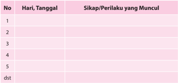

Tabel ini berisi catatan tentang sikap dan perilaku yang muncul pada setiap hari dalam kurun waktu tertentu. Kolom "No" menunjukkan urutan hari, "Hari, Tanggal" menyatakan tanggal tertentu, dan "Sikap/Perilaku yang Muncul" mencatat tindakan atau perbuatan yang dialami oleh individu tersebut pada hari tersebut. Topik utama tabel ini adalah pengamatan perilaku sehari-hari seseorang selama periode waktu tertentu. Data penting yang terlihat adalah bahwa tabel ini mencakup banyak hari dan tanggal, menunjukkan bahwa pengamatan dilakukan secara teratur dan meliputi periode yang cukup lama.

### 2.  Penilaian Pengetahuan

### a. Uraian

Untuk memperdalam pemahaman kamu mengenai materi di atas, jawablah pertanyaann-pertanyaan berikut ini.

- Jelaskan arti perkawinan dari beberapa segi atau sudut pandang!
- Jelaskan apa tujuan suatu perkawinan menurut ajaran Gereja Katolik!
- Sebut  dan  jelaskan  sifat-sifat  perkawinan  menurut  Ajaran  Gereja Katolik!

### b. Pilihan Benar-Salah

Petunjuk :  Lingkarilah  B  jika  pernyataan  di  bawah  ini  benar,  S  jika pernyataan ini salah!

- B - S : Perkawinan merupakan sebuah karier pokok.
- B - S : Perkawinan dalam visi umat Kristiani (Katolik) berarti suatu panggilan.
- B - S : Dalam Kejadian 2:18, dikatakan: 'Tuhan Allah ber fi rman: Tidak baik  kalau  manusia  tinggal  seorang  diri  saja. Aku  akan  menjadikan penolong  baginya,  yang  sepadan  dengan  dia'. Maksud  Firman  ini adalah  meski  sepadan,  seorang  pria  lebih  dominan  daripada  seorang wanita dalam hidup keluarga.
- B  -  S  :  Menurut  ajaran  moral  Katolik,  setiap  hubungan  seksual hendaknya  terbuka  untuk  keturunan  dan  hubungan  itu  hanya  dapat dibenarkan dalam perkawinan yang sah.
- B - S : Dalam Kitab Hukum Kanonik (KHK) dikenal istilah perkawinan sebagai Perjanjian. Maksudnya adalah dimensi personal dari hubungan suami istri ditunjuk dengan simbol-simbol hubungan manusia dengan Tuhannya.

 

---
## 📄 Halaman 84

- B - S : Menurut KHK, Perkawinan sebagai kebersamaan seluruh hidup pria  dan  wanita.  Maksudnya,  dalam  perkawinan,  kebersamaan  itu dilihat dari segi kuantitatif semata, yaitu dari segi lamanya waktu suami istri mengarungi bahtera perkawinan.
- B  -  S  :  Perkawinan  sebagai  sakramen,  artinya  perkawinan  pria  dan wanita menjadi tanda cinta Allah kepada ciptaan-Nya dan cinta Kristus kepada Gereja-Nya.
- B - S : Perkawinan merupakan kesatuan mesra dalam hidup dan kasih antara pria dan wanita yang merupakan lembaga tetap yang berhadapan dengan masyarakat. Pengertian perkawinan ini menurut UU Perkawinan No.1, Thn. 1974.
- B - S : Anak-anak menurut pandangan Gereja adalah anugerah nikah yang paling utama dan sangat membantu kebahagiaan orang tua.
- B - S : Pemenuhan tujuan perkawinan menurut Gereja adalah berhenti pada lahirnya anak.

### 3.  Penilaian Keterampilan

- Bentuk Penilaian: Proyek
- Tugas
Secara berpasangan rencanakan sebuah penelitian tentang kehidupan perkawinan Katolik di mana kalian berada. Buatlah wawancara dengan pastor paroki atau ketua stasi, atau tokoh-tokoh umat setempat tentang permasalahanpermasalahan apa saja yang paling menonjol pada pasangan kawin Katolik saat ini. Hasil wawancara ditulis dalam bentuk sebuah laporan.

### 4.  Kegiatan Remedial

Bagi peserta didik yang belum memahami pokok bahasan ini, diberikan remedial dengan kegiatan:

- Guru menyampaikan pertanyaan kepada peserta didik tentang hal-hal apa saja  yang  belum  mereka  pahami  tentang  makna  dan  hakikat  perkawinan Katolik.
- Apabila ada hal-hal tertentu  yang  belum  mereka  pahami,  guru  mengajak peserta  didik  untuk  mempelajari  kembali  dengan  memberikan  penguatan yang lebih praktis.
- Guru memberikan penilaian untuk menilai pengetahuan, dengan pertanyaan yang lebih sederhana, sesuai dengan kondisi peserta didik.

### 5.  Kegiatan Pengayaan

Bagi peserta didik yang telah memahami pokok bahasan ini, diberikan pengayaan dengan kegiatan:

 

---
## 📄 Halaman 85

- Melakukan studi pustaka (ke perpustakaan atau mencari di koran/majalah) untuk menemukan cerita/kisah tentang pasangan perkawinan Katolik yang bahagia.
- Hasil temuannya ditulis dalam laporan tertulis yang berisi gambaran singkat dari kisah atau cerita tersebut serta memberikan re fl eksi kritisnya.

### D.  Tantangan dan Peluang untuk Membangun Keluarga yang Dicita-citakan

### 1.  Penilaian Sikap

Penilaian diri

### Partisipasi dalam Diskusi kelompok

Nama

:   ........................................................

Nama-nama anggota kelompok  :   ........................................................

........................................................

Kegiatan Kelompok

:   ........................................................

Isilah pernyataan berikut dengan jujur. Untuk No.1 s.d. 5, tulislah huruf A, B, C atau D di depan tiap pernyataan:

A: Selalu

- C: Kadang-kadang
- B: Sering
D: Tidak pernah

- Apa yang kamu lakukan selama kegiatan?
.....................................................................................................................

.....................................................................................................................

 

---
## 📄 Halaman 86

### 2.  Penilaian Pengetahuan

- •
- Bentuk Penilaian:
Tes Tertulis

- Uraian:
Untuk memperdalam pemahaman Anda mengenai materi di atas, jawablah pertanyaan-pertanyaan berikut ini.

- Sebut  dan  jelaskan  tantangan-tantangan  untuk  membangun  keluarga yang dicita-citakan!
- Sebut dan jelaskan peluang-peluang untuk membangun keluarga yang dicita-citakan!
- Jelaskan  ajaran  Gereja  tentang  membangun  keluarga  yang  dicitacitakan (Pastoral Keluarga, KWI, 1976 No. 22-23)!
- Jelaskan  dalam  bentuk  re fl eksi  pribadi  tentang  membangun  keluarga Katolik yang dicita-citakan!

### 3.  Penilaian Keterampilan

- •
- Bentuk Penilaian:
Portofolio

- Tugas:
Kumpulkan kliping dari berita media massa (koran, majalah, berita online / internet) kasus-kasus dalam kehidupan keluarga saat ini, kemudian berikan analisis  Anda  tentang  kasus  tersebut  berdasarkan  ajaran  atau  pandangan Gereja Katolik tentang kasus tersebut.

### 4.  Kegiatan Remedial

Bagi peserta didik yang belum memahami pokok bahasan ini, diberikan remedial dengan kegiatan:

- Guru menyampaikan pertanyaan kepada peserta didik tentang hal-hal apa saja  yang  belum  mereka  pahami  tentang  makna  dan  hakikat  perkawinan Katolik.
- Apabila ada hal-hal tertentu  yang  belum  mereka  pahami,  guru  mengajak peserta  didik  untuk  mempelajari  kembali  dengan  memberikan  bantuan peneguhan-peneguhan yang lebih praktis.
- Guru  memberikan  penilaian  ulang  untuk  penilaian  pengetahuan,  dengan pertanyaan yang lebih sederhana, sesuai dengan kondisi peserta didik.

### 5. Kegiatan Pengayaan

Bagi peserta didik yang telah memahami pokok bahasan ini, diberikan pengayaan dengan kegiatan:

 

---
## 📄 Halaman 87

- Melakukan studi pustaka (ke perpustakaan atau mencari di koran/majalah) untuk menemukan cerita/kisah tentang pasangan perkawinan Katolik yang bahagia.
- Hasil temuannya ditulis dalam laporan tertulis yang berisi gambaran singkat dari kisah atau cerita tersebut serta memberikan re fl eksi kritisnya.

### E.  Panggilan Hidup Membiara/Religius

### 1.  Penilaian Sikap

Penilaian diri

### Partisipasi dalam Diskusi kelompok

Nama

:  ....................................................

Nama-nama anggota kelompok  : ....................................................

.....................................................

Kegiatan Kelompok

:  ....................................................

Isilah pernyataan berikut dengan jujur. Untuk No.1 s.d. 5, tulislah huruf A, B, C atau D didepan tiap pernyataan:

- A: Selalu
- C: Kadang-kadang
- B: Sering
- D: Tidak pernah
- ......   Dalam kelompok saya, tiap orang sibuk dengan yang dilakukannya.
- Apa yang kamu lakukan selama kegiatan?
.....................................................................................................................

.....................................................................................................................

.....................................................................................................................

 

---
## 📄 Halaman 88

### 2.  Penilaian Pengetahuan

- •
- Bentuk Penilaian:
Tes Tertulis

- Uraian:
- Menurut kalian, apakah kehidupan membiara masih dibutuhkan oleh Gereja dan dunia pada saat ini? Jelaskan pendapat Anda.
- Mengapa  di  banyak  negara  Barat  kehidupan  membiara  tidak  terlalu diminati lagi oleh orang-orang muda?
- Bagaimana pengamatanmu terhadap biarawan-biarawati di Indonesia?

### 3.  Penilaian Keterampilan

- Bentuk Penilaian:
Portofolio

- Tugas:
Kumpulkan pengalaman/riwayat hidup beberapa tokoh biarawan-biarawati yang telah menjadi santo dan santa. Setelah itu tulislah suatu re fl eksi atas tokoh suci tersebut.

### 4.  Kegiatan Remedial

Bagi peserta didik yang belum memahami pokok bahasan ini, diberikan remedial dengan kegiatan:

- Guru menyampaikan pertanyaan kepada peserta didik akan hal-hal apa saja yang  belum  mereka  pahami  tentang  makna  dan  hakikat  panggilan  hidup membiara.
- Apabila ada hal-hal tertentu  yang  belum  mereka  pahami,  guru  mengajak peserta  didik  untuk  mempelajari  kembali  dengan  memberikan  penguatan yang lebih praktis.
- Guru memberikan penilaian untuk menilai pengetahuan, dengan pertanyaan yang lebih sederhana, sesuai dengan kondisi peserta didik.

### 5.  Kegiatan Pengayaan

Bagi peserta didik yang telah memahami pokok bahasan ini, diberikan pengayaan dengan kegiatan:

- Melakukan studi pustaka (ke perpustakaan atau mencari di koran/majalah) untuk  menemukan  cerita/kisah  hidup  biarawan  dan  biarawati,  termasuk mereka yang sudah menjadi santo dan santa.
- Hasil temuannya ditulis dalam laporan tertulis yang berisi gambaran singkat dari kisah atau cerita tersebut serta memberikan re fl eksi kritisnya.

 

---
## 📄 Halaman 89

### F. Panggilan Karya dan Profesi

### 1.  Penilaian Sikap

### · Penilaian Diri

### Partisipasi dalam Diskusi kelompok

Nama

:  ....................................................

Nama-nama anggota kelompok  : ....................................................

.....................................................

Kegiatan Kelompok

:  ....................................................

Isilah pernyataan berikut dengan jujur. Untuk No.1 s.d. 5, tulislah huruf A, B, C atau D didepan tiap pernyataan:

- A: Selalu
- C: Kadang-kadang
- B: Sering
- D: Tidak pernah
- ......  Selama diskusi saya mengusulkan  ide  kepada  kelompok  untuk didiskusikan.
- ......   Semua anggota kelompok kami melakukan sesuatu selama kegiatan.
- ......   Dalam kelompok saya, tiap orang sibuk dengan yang dilakukannya.
- ......   Selama kerja kelompok, saya.....
- Apa yang kamu lakukan selama kegiatan?
.....................................................................................................................

.....................................................................................................................

.....................................................................................................................

### 2.  Penilaian Pengetahuan

- •
- Bentuk Penilaian: Tes Tertulis
- Jelaskan  mengapa  budaya  kerja  hendaknya  ditumbuhkembangkan dalam diri setiap orang!
- Jelaskan apa maksudnya bahwa kerja untuk mencapai kemajuan rohani dan jasmani!

 

---
## 📄 Halaman 90

- Apa makna kerja secara sosiologis?
- Apa tujuan kerja?
- Apa makna kerja secara religius?
- Selain bekerja, manusia membutuhkan istirahat. Apa maksud pernyataan tersebut?
- Apa  makna  Keluaran  20:20  yang  menyatakan  bahwa  hari  ketujuh adalah hari Sabat Tuhan?
- Jelaskan apa makna pribahasa Ora et labora!
- Apa maksud pernyataan, 'semakin orang bekerja, seharusnya semakin berdoa?'
- Tukang becak pernah dicap sebagai pekerja yang tidak bermartabat manusiawi. Apa pendapat anda?

### 3.  Penilaian Keterampilan:

- •
- Bentuk Penilaian:
- Tugas:
Tulislah sebuah re fl eksi dalam bentuk doa, puisi, karikatur, atau yang lain yang bertemakan tentang kerja.

### 4.  Kegiatan Remedial

Bagi peserta didik yang belum memahami pokok bahasan ini, diberikan remedial dengan kegiatan:

- Guru menyampaikan pertanyaan kepada peserta didik akan hal-hal apa saja yang belum mereka pahami tentang makna dan hakikat karya dan profesi.
- Apabila ada hal-hal tertentu  yang  belum  mereka  pahami,  guru  mengajak peserta  didik  untuk  mempelajari  kembali  dengan  memberikan  penguatan yang lebih praktis.
- Guru memberikan penilaian untuk menilai pengetahuan dengan pertanyaan yang lebih sederhana sesuai dengan kondisi peserta didik.

### 5.  Kegiatan Pengayaan

Bagi  peserta  didik  yang  telah  memahami  pokok  bahasan  ini,  diberikan pengayaan dengan kegiatan:

- Melakukan studi pustaka (ke perpustakaan atau mencari di koran/majalah) untuk menemukan cerita/kisah tentang spiritualitas kerja katolik.
- Hasil temuannya ditulis dalam laporan tertulis yang berisi gambaran singkat dari kisah atau cerita tersebut serta memberikan re fl eksi kritisnya.
Portofolio

 

---
## 📄 Halaman 91

### BAB II

### Memperjuangkan Nilai-Nilai Kehidupan Manusia dalam Masyarakat

Pada Bab I, kita telah menggeluti tema tentang 'Panggilan Hidup Manusia'. Kita memahami bahwa hidup  manusia  itu  sendiri  merupakan  rahmat  panggilan Allah. Hidup manusia itu sangatlah bermakna. Kita dipanggil dan diutus ke dalam dunia sesuai dengan kehendak atau rencana Tuhan sendiri. Dalam meniti panggilan hidup itu,  manusia  menghadapi  pelbagai  tantangan  yang  perlu  kita  atasi  dengan  penuh tanggung jawab.

Pada Bab II ini, kita akan belajar tentang 'Memperjuangkan Nilai-Nilai Kehidupan Manusia dalam Masyarakat'. Nilai-nilai kehidupan yang perlu diperjuangkan yaitu keadilan, kejujuran, kebenaran, kedamaian , serta keutuhan ciptaan (lingkungan hidup) .  Hal-hal  tersebut  juga  merupakan  nilai-nilai  dasar  hidup  kristiani.  Meski nilai-nilai  tersebut  merupakan  nilai  dasar  yang  melekat  dalam  diri  setiap  insan manusia,  tetap  harus  kita  perjuangkan,  karena  bisa  terjadi  kemerosotan  nilai-nilai tersebut dalam kehidupan kita. Kini, di Indonesia kita menyaksikan praktik-praktik ketidakadilan,  ketidakjujuran,  ketidakbenaran,  kekacauan,  dan  kekerasan  serta perusakan alam lingkungan secara memprihatinkan.

Karena itu kita perlu bersikap peduli, memahami dan menghayati nilai-nilai keadilan, kejujuran, kebenaran, perdamaian, serta menjaga keutuhan ciptaan Tuhan. Diharapkan agar nilai-nilai dasar ini sungguh menyatu dan bahkan menjadi suatu gerakan dalam hidup kita sesuai ajaran dan teladan Yesus sang tokoh idola iman kita.

Untuk memahami dan menghayati tema ini, maka pada bab ini akan dibahas tiga pokok bahasan yaitu:

- Nilai-Nilai Kehidupan Penting dalam Masyarakat yang Diperjuangkan; Keadilan, Kejujuran, Kebenaran, Kedamaian, dan Keutuhan Lingkungan Hidup.
- Landasan untuk Memperjuangkan  Nilai-Nilai Penting dalam Masyarakat (Landasan negara dan Landasan Gereja).
- Yesus Kristus, Pejuang Keadilan, Kejujuran, Kebenaran, dan Kedamaian.

 

---
## 📄 Halaman 92

### A. Nilai-Nilai Kehidupan Penting dalam Masyarakat yang Diperjuangkan

### Kompetensi Dasar

- 1.2  Beriman kepada Yesus Kristus yang mengajarkan nilai-nilai keadilan, kejujuran, kebenaran, perdamaian, dan keutuhan ciptaan yang diajarkan-Nya.
- 2.2  Peduli pada nilai-nilai; keadilan, kejujuran, kebenaran, perdamaian, dan keutuhan ciptaan sesuai dengan ajaran Yesus Kristus.
- 3.2  Memahami nilai-nilai keadilan, kejujuran, kebenaran, perdamaian, dan keutuhan ciptaan sesuai dengan ajaran Yesus Kristus.
- 4.2  Melakukan aktivitas (misalnya: menuliskan re fl eksi/doa/puisi/rangkuman) tentang  nilai-nilai  keadilan,  kejujuran,  kebenaran,  perdamaian,  dan  keutuhan ciptaan sesuai dengan ajaran Yesus Kristus.

### Indikator

- Menjelaskan makna nilai-nilai keadilan menurut ajaran Kitab Suci (Am 5:7-15; Luk 11:37-46).
- Menjelaskan makna nilai-nilai kejujuran menurut ajaran Kitab Suci (Mat 5:3337; 23:13-16).
- Menjelaskan makna nilai-nilai kebenaran menurut ajaran Kitab Suci (Kel 23: 1-3. 6-8; Ul 16: 18-19; Mat 5:37; Yoh 8:43-47).
- Menjelaskan  makna  nilai-nilai  perdamaian  menurut  ajaran  Kitab  Suci  (Yoh 14:27; 16:33; Luk 1:78-79; Mat 5:39).
- Menjelaskan makna nilai-nilai keutuhan ciptaan menurut ajaran Kitab Suci (Kej 1:1-24).

### Bahan Kajian

- Nilai-nilai keadilan menurut ajaran Kitab Suci.
- Nilai-nilai kejujuran menurut ajaran Kitab Suci.
- Nilai-nilai kebenaran menurut ajaran Kitab Suci.
- Nilai-nilai perdamaian menurut ajaran Kitab Suci.
- Nilai-nilai keutuhan ciptaan menurut ajaran Kitab Suci.

 

---
## 📄 Halaman 93

### Sumber Belajar

- Kitab Suci Perjanjian Lama dan Perjanjian Baru.
- Dokpen KWI (penterj) Dokumen Konsili Vatikan II , Obor, Jakarta, 1993.
- KWI, Iman Katolik , Kanisius, Yogyakarta, 1995.
- Katekismus Gereja Katolik, Nusa Indah, Ende Flores, 1995.
- Ajaran Sosial Gereja .

### Pendekatan

Sainti fi k dan kateketis.

### Metode

Cerita, tanya jawab, diskusi, presentasi, informasi.

### Sarana

- Kitab Suci (Alkitab).
- Buku Siswa SMA/SMK Kelas XII Pendidikan Agama Katolik dan Budi Pekerti.

### Waktu

5 x 45 menit

Pengelolaan  waktu  untuk  kegiatan  pembelajaran  subtema  ini  dapat  disesuaikan dengan pengaturan jam pelajaran di sekolah masing-masing.

### Pemikiran Dasar

Pada kegiatan pembelajaran ini akan dibahas tentang nilai-nilai kehidupan manusia yang  perlu  diperjuangkan  yaitu  keadilan,  kejujuran,  kebenaran,  kedamaian,  serta keutuhan lingkungan hidup (keutuhan ciptaan). Hal-hal tersebut  merupakan  nilainilai dasar hidup kristiani.

Keadilan  merupakan  suatu  kondisi  yang  didambakan  setiap  insan  manusia.  Adil berarti  tidak  berat  sebelah,  berpihak  kepada  yang  benar  atau  berpegang  pada kebenaran.  Keadilan  berarti  memberikan  kepada  setiap  orang  apa  yang  menjadi haknya, baik itu hak asasi maupun hak sipil. De facto , dalam kehidupan masyarakat kita  menemukan  banyak  praktik  ketidakadilan,  entah  dari  segi  ekonomi,  politik, hukum,  sosial,  dan  budaya.  Semua  tindakan  ini  menunjukkan  bahwa  masyarakat kita, sadar atau tidak sadar, sering tidak menghormati hak milik orang lain. Sebagai

 

---
## 📄 Halaman 94

orang Kristen, kita yakin bahwa Allah adalah penguasa tertinggi dan pemilik segala sesuatu. Ia menganugerahkan kepada manusia hak milik. Apa yang diperoleh atau dicapai  dengan  usahanya  sendiri  dapat  juga  ia  gunakan  bagi  kepentingan  pribadi. Berdasarkan kodrat,  ia  berhak  atas  milik  pribadi.  Perintah  ketujuh  dan  kesepuluh dalam Sepuluh Perintah Allah melindungi hak milik. Kedua perintah itu mewajibkan kita  mengamalkan  keadilan;  merelakan  dan  memberikan  kepada  setiap  orang  apa yang menjadi haknya.

Hal nilai yang berkaitan dengan keadilan adalah soal kebenaran. Kebenaran berarti suatu keadaan atau kondisi yang sesuai dengan hal yang sesungguhnya. Kebenaran juga berarti hal yang sungguh-sungguh benar. Karena itu kebenaran berkaitan erat dengan kejujuran. Orang jujur berarti orang yang bertindak atas dasar kebenaran. Kontra dari kebenaran adalah kebohongan, dusta, fi tnah, dan tipu muslihat. Dengan perkataan  lain,  orang  dapat  memanipulasi  kebenaran  dengan  tipu  daya  dan fi tnah untuk  kepentingan  pribadi  atau  kelompok.  Di  Indonesia  kita  dapat  menyaksikan secara  vulgar  di  ranah  politik  misalnya,  orang  atau  kelompok  melakukan fi tnah terhadap lawan politik dengan memutarbalikkan fakta tentang lawan politiknya; entah menyangkut suku/etnis/ras, agama, bahkan menyangkut urusan yang sangat pribadi seperti keluarga. Dalam Kitab Suci kebenaran tidak hanya berarti tidak berbohong, melainkan  juga  mengambil  bagian  dalam  kehidupan Allah. Allah  adalah  sumber kebenaran,  karena Allah  selalu  berbuat  sesuai  dengan  janji-Nya  kepada  manusia, maka Allah ber fi rman: 'Jangan bersaksi dusta!' (Keluaran 20: 8).

Nilai dasar berikutnya adalah kejujuran. Nilai kejujuran tampaknya sangat mahal dan langka kita temukan dalam kehidupan bangsa kita, termasuk dalam dunia pendidikan. Dalam kasus ujian nasional misalnya, kita masih terus mendengar banyak lembaga pendidikan  yang  merekayasa  proses  ujian  hanya  untuk  meluluskan  para  peserta didiknya. Di bidang moral politik dan ekonomi, Indonesia termasuk negara peringkat atas  dalam  masalah  korupsi.  Korupsi  adalah  perilaku  tidak  jujur  dari  seseorang karena mencuri uang negara, uang rakyat untuk kepentingan pribadi. Jujur berarti tulus hati, tidak curang terhadap diri sendiri dan orang lain. Kejujuran merupakan keselarasan antara kata hati dan kata yang diucapkan, antara kata yang diucapkan dan sikap serta perbuatan nyata. Sebagai orang Kristen tentu saja kita dinasihati untuk selalu bersikap jujur. Di tengah semua ketidakjujuran dan ketidakbenaran ini, kita harus tetap bersikap benar, jujur, dan adil. Kata-kata dan tingkah laku seorang Kristen sejati hendaknya dapat dipercayai. Yesus berkata: 'Jika berkata 'ya' hendaknya 'ya', jika berkata 'tidak' hendaknya 'tidak'; apa yang lebih dari itu berasal dari si jahat (bdk. Matius 5:37). Yesus juga menuntut supaya kita bersikap jujur. Terhadap orang yang muna fi k seperti kaum farisi, Yesus bersikap sangat tegas (bdk. Matius 23:1-34).

Nilai dasar hidup lain yang perlu ditanam dan dikembangkan adalah perdamaian. Di pelbagai bangsa dewasa ini kita masih menyaksikan pertikaian dan peperangan, entah itu  antarsesama  bangsa  (perang  saudara)  atau  antar-negara  tetangga  seperti  Israel dengan Palestina. Segala upaya telah dilakukan, baik oleh Perserikatan Bangsa-bangsa (PBB) maupun oleh tokoh atau negara tertentu. Misalnya, Gereja Katolik sekaligus

 

---
## 📄 Halaman 95

negara kota Vatikan melalui Sri Paus yang berusaha untuk terus mendamaikannya. Sementara dalam negeri Indonesia, kedamaian hidup warga negara kadang-kadang terusik, entah karena urusan politik ataupun oleh sentimen suku dan agama. Dalam dunia  pendidikan,  kita  pun  tidak  jarang  menyaksikan  kekerasan  antarpelajar,  dan antarmahasiswa.  Budaya  sekolah  yang  sejatinya  menciptakan  manusia-manusia berkarakter, berakhlak mulia ternyata berperilaku sebaliknya, merusak, mengeroyok, bahkan menghilangkan nyawa sesamanya. Karena itu perlu kita semua sadari bahwa perdamaian sangat penting bagi kelangsungan dan perkembangan hidup manusia. Manusia ingin mencari suatu ketenangan hidup yang memungkinkan setiap orang dapat mengembangkan dirinya dengan lebih manusiawi dalam persaudaraan. Tidak mungkinkah  manusia  mewujudkan  perdamaian  yang  pada  dasarnya  merupakan kehendak  Allah  di  dalam  hati  setiap  orang?  Mewujudkan  perdamaian  memang memerlukan kesadaran, pengakuan, dan penghormatan terhadap martabat dan hak dasar manusia. Perampasan terhadap hak-hak dasar orang lain membawa bencana besar. Karena itu, menghormati martabat dan hak dasar orang lain merupakan dasar untuk  mewujudkan  suatu  perdamaian  sejati.  Perdamaian  tidak  mungkin  tercipta selama orang berkeinginan menguasai sesama, merendahkan orang lain dan saling menuding kesalahan pada orang lain.Yesus sendiri datang ke dunia untuk mewartakan kasih  dan  cinta  damai.  Ia  mendorong  supaya  tercipta  budaya  persaudaraan  sejati karena kita sama-sama putra-putri Allah. Banyak orang dari zaman ke zaman telah menerima  warta-Nya  dan  telah  memperjuangkan  perdamaian  itu,  tetapi  rupanya perjuangan ini belum selesai.

Nilai  dasar  yang  tidak  kalah  pentingnya  adalah  keutuhan  alam  lingkungan  atau keutuhan ciptaan. Sejak awal mula Allah menciptakan manusia yang harmoni dengan lingkungan alam. Di dalam alam terdapat rantai kerja sama antara semua ciptaan untuk saling menunjang dan menghidupi satu dengan yang lain. Terdapat rantai kerja sama antara  tanah,  matahari,  udara, fl ora,  fauna,  dan  manusia.  Rantai  kerja  sama itu dimulai dari tumbuh-tumbuhan yang menggunakan zat-zat dari tanah dan tenaga sinar  matahari  untuk  membentuk  jaringan  sel  tumbuhan.  Tumbuh-tumbuhan  itu bertumbuh dan berkembang. Kemudian, tumbuh-tumbuhan dimakan oleh binatang herbivora atau pemakan tumbuh-tumbuhan. Binatang herbivora selanjutnya dimakan oleh binatang karnivora atau pemakan daging. Terakhir, manusia ikut serta dalam rantai kerja sama itu dengan memakan binatang karnivora. Kitab Suci secara simbolik menceritakan bahwa Tuhan menciptakan unsur-unsur alam ini satu per satu. Kitab Suci menandaskan: 'Allah melihat bahwa semuanya itu baik.' Oleh karen itu, kita harus  bersikap  mengagumi  dan  bersyukur  terhadap  alam  lingkungan  kita,  karena darinya kita dapat hidup dan berkembang.

Pada kegiatan pembelajaran ini, peserta didik akan dibimbing untuk dapat memahami nilai-nilai dasar kehidupan manusia yaitu keadilan, kejujuran, kebenaran, kedamaian, serta keutuhan lingkungan hidup (keutuhan ciptaan). Dengan memahami nilai-nilai tersebut,  peserta  didik  diharapkan  dapat  menghayati  serta  menjadikannya  sebagai suatu gerakan dalam hidupnya.

 

---
## 📄 Halaman 96

### Kegiatan Pembelajaran

Guru mengajak peserta didik untuk mengawali kegiatan pembelajaran ini dengan doa dari St. Fransiskus Asisi berikut ini.

### Doa Pembuka

TUHAN, jadikanlah aku pembawa damai.

Bila terjadi kebencian, jadikanlah aku pembawa cinta kasih.

Bila terjadi penghinaan, jadikanlah aku pembawa pengampunan.

Bila terjadi perselisihan, jadikanlah aku pembawa kerukunan.

Bila terjadi kesesatan, jadikanlah aku pembawa kebenaran.

Bila terjadi kebimbangan, jadikanlah aku pembawa kepastian.

Bila terjadi keputusasaan, jadikanlah aku pembawa harapan.

Bila terjadi kegelapan, jadikanlah aku pembawa terang.

Bila terjadi kesedihan, jadikanlah aku pembawa sukacita.

Ya Tuhan Allah, ajarlah aku untuk lebih suka menghibur daripada dihibur; mengerti daripada dimengerti; mengasihi daripada dikasihi; sebab dengan memberi kita menerima; dengan mengampuni kita diampuni, dan dengan mati suci kita dilahirkan ke dalam Hidup Kekal.

Amin.

### Langkah Pertama: Menggali Makna Nilai Keadilan, Kejujuran, Kebenaran, Perdamaian, dan Keutuhan Ciptaan

### 1.  Memperjuangkan Keadilan

- Mengamati masalah keadilan dalam masyarakat
- Guru membentuk beberapa kelompok kecil untuk berdiskusi tentang fakta-fakta ketidakadilan dalam  hidup masyarakat. Peserta didik diminta  untuk  mengidenti fi kasi  masalah-masalah  ketidakadilan  yang terjadi dalam masyarakat saat ini.
- Guru mengajak peserta didik untuk menyimak kisah berikut ini.

### Kisah Nenek Minah Belum Selesai

Seorang nenek, warga Banyumas, Jawa Tengah, belum lama ini divonis bersalah  oleh  Pengadilan  Negeri  Purwokerto  karena  mencuri  kakao milik  PT  Rumpun  Sari  Antan.  Majelis  hakim  menghukum  Minah satu  bulan  dengan  masa  percobaan  tiga  bulan  tanpa  harus  menjalani

 

---
## 📄 Halaman 97

kurungan tahanan. Dengan begitu ia tak perlu menjalani hukuman asal berkelakuan  baik.  Kini,  ibu  tujuh  anak  dan  nenek  belasan  cucu  ini, sudah kembali menjalani kehidupan seperti biasa.

Saat ditemui SCTV di kediamannya di Desa Darmakradenan, Kecamatan  Ajibarang, Banyumas, Jateng, Sabtu (21/11),  Minah menjalani aktivitasnya dengan semangat baru. Kondisi ini berbeda saat ia  menghadiri  pembacaan  vonis.  Minah  tak  kuasa  membendung  air mata karena ketakutan.

Kisah  Minah  mengundang  simpati  masyarakat.  Usianya  yang  sudah lanjut  ikut  meringankan  putusan  hakim.  Tapi  benarkah  drama  sudah selesai? Tampaknya ia belum bisa bernapas lega, karena jaksa penuntut umum menyatakan masih pikir-pikir. Di persidangan, Minah mengaku hanya  mengambil  tiga  butir  kakao  seharga  dua  ribu  rupiah  dan sudah mengembalikannya. Tapi, manajemen PT Rumpun Sari Antan mengatakan biji kakao yang dicuri nenek Minah jumlahnya mencapai tiga kilogram seharga Rp 30 ribu.

PT  Rumpun  Sari  Antan  memiliki  lebih  dari  200  hektare  tanaman kakao di Desa Darmakradenan, Banyumas, Jateng. Jika melihat dari luasnya  kebun,  sebenarnya  tiga  biji  kakao  yang  dicuri  Minah  tidak akan membuat perusahaan bangkrut. Namun manajemen PT Rumpun Sari Antan  tetap  bersikeras  membawa  Minah  ke  pengadilan  dengan alasan untuk memberikan efek jera bagi masyarakat. Pihak perusahaan mengaku puas dengan vonis pengadilan.

Siapa  yang  salah  memang  harus  dihukum.  Tapi  kasus  ini  menjadi perhatian  masyarakat  karena  sanksi  hukum  seakan  hanya  berani dijatuhkan pada masyarakat kecil seperti Minah.

Sumber: http://news.liputan6.com/read/251837/kisah-nenek-minah-belum-selesai. Diakses tanggal 14 Februari 2015.

### b. Pendalaman Cerita

- Guru mengajak peserta didik untuk merumuskan pertanyaan-pertanyaan berkaitan dengan cerita di atas. Berdasarkan pertanyaan-pertanyaan itu, peserta didik mendiskusikannya dalam kelompok.
- Pertanyaan-pertanyaan itu misalnya:
- Apa pendapatmu tentang kasus pengadilan terhadap nenek Minah?
- Apa makna keadilan?
- Apa saja fakta-fakta ketidakadilan dalam masyarakat kita?
- Apa sebab-akibat kasus-kasus ketidakadilan?

### c. Peneguhan

Guru memberikan penjelasan setelah mendengarkan hasil diskusi kelompok, sebagai berikut.

 

---
## 📄 Halaman 98

### 1) Pesan dari Kisah Nenek Minah

Kisah  Nenek  Minah  sekadar  mewakili  ribuan  kisah  lain  tentang ketidakadilan yang menimpa 'orang-orang kecil' di Indonesia. Banyak orang  kecil  yang  tidak  mendapatkan  keadilan  yang  semestinya  dari negara  melalui  para  penegak  hukum.  Bahkan  digambarkan  bahwa hukum keadilan di Indonesia hanya 'tajam ke bawah, dan tumpul ke atas'. Artinya, bahwa penegakan hukum keadilan hanya berlaku bagi masyarakat kecil, dan tidak berlaku bagi kaum penguasa dan mereka yang memiliki akses kepada para penguasa karena memiliki kekuatan uang atau modal. Hukum keadilan diperjualbelikan dengan uang atau pun kekuasaan.

(Selanjutnya guru memberikan penjelasan tentang makna keadilan sebagai masukan kepada peserta didik)

### 2) Arti dan Makna Keadilan

Keadilan berarti memberikan kepada setiap orang yang menjadi haknya, misalnya  hak  untuk  hidup  yang  wajar,  hak  untuk  memilih  agama/ kepercayaan, hak untuk mendapatkan pendidikan, hak untuk bekerja, hak  untuk  memiliki  sesuatu,  hak  untuk  mengeluarkan  pendapat,  dan sebagainya.

Keadilan menunjuk pada suatu keadaan, tuntutan, dan keutamaan.

- Keadilan  sebagai  'keadaan'  menyatakan  bahwa  semua  pihak memperoleh apa yang menjadi hak mereka dan diperlakukan sama. Misalnya,  di  negara  atau  lembaga  tertentu  ada  keadilan,  semua orang diperlakukan secara adil (tidak pandang suku, agama, ras, atau aliran tertentu).
- Keadilan  sebagai  'tuntutan'  menuntut  agar  keadaan  adil  itu diciptakan  baik  dengan  mengambil  tindakan  yang  diperlukan, maupun dengan menjauhkan diri dari tindakan yang tidak adil.
- Keadilan  sebagai  'keutamaan'  adalah  sikap  dan  tekad  untuk melakukan apa yang adil.
Ada tiga jenis keadilan yaitu komutatif, distributif, dan keadilan legal.

- Keadilan komutatif menuntut kesamaan dalam pertukaran, misalnya  mengembalikan  pinjaman  atau  jual  beli  yang  berlaku pantas, tidak ada yang rugi.
- Keadilan distributif menuntut kesamaan dalam  membagikan apa  yang  menguntungkan  dan  dalam  menuntut  pengorbanan. Misalnya, kekayaan alam dinikmati secara adil dan pengorbanan untuk pembangunan ditanggung bersama-sama dengan adil.
- Keadilan  legal  menuntut  kesamaan  hak  dan  kewajiban  terhadap negara sesuai dengan undang-undang yang berlaku.

 

---
## 📄 Halaman 99

- Perwujudan  keadilan  dalam  tiga  arti  tersebut  sangat  tergantung pada pribadi-pribadi yang bersangkutan.  Entah  mereka  mau bersikap adil atau tidak, tetapi hal itu juga tergantung pada struktur sosial, politik, ekonomi, dan budaya keadilan yang tergantung pada pribadi-pribadi, misalnya: upah yang tergantung pada sang majikan untuk para karyawan atau buruh. Ini disebut keadilan individual.
- Perwujudan  keadilan  yang  tergantung  dari  struktur  dan  proses politik, ekonomi, sosial, dan budaya, misalnya seorang buruh tidak hanya tergantung pada rasa keadilan sang majikan, tetapi juga dari situasi ekonomi dan politik yang ada. Ini disebut keadilan sosial.

### 3) Bentuk-Bentuk Ketidakadilan dalam Masyarakat

Ketidakadilan itu tampak nyata dalam bentuk-bentuk antara lain:

- Tindakan perampasan dan penggusuran hak milik orang, pencurian, perampokan, dan korupsi.
- Tindakan pemerasan dan rekayasa.
- Tindakan  atau  keengganan  membayar  utang,  termasuk  kredit macet, yang berbuntut merugikan rakyat kecil, dan sebagainya.
Semua tindakan tersebut menunjukkan bahwa masyarakat kita, sadar atau tidak sadar, sering tidak menghormati hak milik orang, termasuk hak milik masyarakat dan negara.

### 4) Akar Masalah Ketidakadilan

- Kemiskinan dan kesengsaraan yang terjadi dalam masyarakat kita lebih  banyak  disebabkan  oleh  sistem  dan  struktur  sosial  politik, ekonomi dan budaya yang tidak adil. Sistem sosial, politik, dan ekonomi  yang  dibangun  oleh  penguasa  dan  pengusaha  sering menciptakan ketergantungan rakyat kecil. Di samping itu, pembangunan  ekonomi,  sosial,  politik  dunia  dewasa  ini  belum menciptakan kesempatan yang luas bagi 'orang-orang kecil', tetapi justru mempersempit ruang gerak mereka untuk mengungkapkan jati dirinya secara penuh. Kita dapat melihatnya dalam lingkup yang besar di dalam percaturan negara-negara dan kita mengalaminya di  dalam  lingkup  yang  kecil  di  lingkungan  kita  sendiri.  Orangorang kecil tetap saja menjadi orang yang tersisih dan menderita. Keadaan ini tidaklah adil.
- Ada berbagai  bentuk  ketidakadilan,  misalnya  sikap  diskriminatif  dan tidak berperikemanusiaan terhadap kaum perempuan, pendatang/ imigran.  Penganiayaan karena asal-usul etnis ataupun atas dasar kesukuan  yang  kadang-kadang  berakibat  pembunuhan  massal. Penganiayaan  terhadap  orang-orang  yang  memiliki  kepercayaan tertentu oleh partai-partai penguasa karena ingin mempertahankan kepercayaan yang mereka anut. Perlakuan semena-mena terhadap

 

---
## 📄 Halaman 100

orang-orang dari aliran politik tertentu masih sering terjadi. Nasib orang-orang jompo, yatim piatu, orang sakit, dan cacat sering tidak diperhatikan. Orang-orang ini tentu saja sangat menderita karena tidak mampu berbuat apa-apa.

### d. Ketidakadilan Menurut Kitab Suci

### 1) Menyimak Cerita Kitab

Guru mengajak peserta didik untuk menyimak cerita Kitab Suci (Amos 5: 7-15).

7 Hai kamu yang mengubah keadilan menjadi ipuh dan yang menghempaskan kebenaran ke tanah!  8 Dia yang telah membuat bintang kartika dan bintang belantik, yang mengubah kekelaman menjadi pagi, dan yang membuat siang gelap seperti malam; Dia yang memanggil air  laut  dan  mencurahkannya  ke  atas  permukaan  bumi  -  Tuhan  itu namanya.  9  Dia yang menimpakan kebinasaan atas yang kuat, sehingga kebinasaan datang atas tempat yang berkubu. 10  Mereka benci kepada yang memberi teguran di pintu gerbang, dan mereka keji kepada yang berkata  dengan  tulus  ikhlas. 11 Sebab  itu,  karena  kamu  menginjakinjak orang yang lemah dan mengambil pajak gandum dari padanya, sekalipun kamu telah mendirikan rumah-rumah dari batu pahat, kamu tidak akan mendiaminya; sekalipun kamu telah membuat kebun anggur yang  indah,  kamu  tidak  akan  minum  anggurnya. 12  Sebab Aku tahu, bahwa perbuatanmu yang jahat banyak dan dosamu berjumlah besar, hai kamu yang menjadikan orang benar terjepit, yang menerima uang suap, dan yang mengesampingkan orang miskin di pintu gerbang.  13  Sebab itu orang yang berakal budi akan berdiam diri pada waktu itu, karena waktu itu adalah waktu yang jahat. 14 Carilah yang baik dan jangan yang jahat,  supaya kamu hidup; dengan demikian TUHAN, Allah semesta alam,  akan  menyertai  kamu,  seperti  yang  kamu  katakan. 15 Bencilah yang jahat dan cintailah yang baik; dan tegakkanlah keadilan di pintu gerbang;  mungkin  TUHAN, Allah  semesta  alam,  akan  mengasihani sisa-sisa keturunan Yusuf.

### Lukas 11: 37-46

37 Ketika  Yesus  selesai  mengajar,  seorang  Farisi  mengundang  Dia untuk makan di rumahnya. Maka masuklah Ia ke rumah itu, lalu duduk makan.  38 Orang Farisi itu melihat hal itu dan ia heran, karena Yesus tidak  mencuci  tangan-Nya  sebelum  makan. 39 Tetapi  Tuhan  berkata kepadanya: 'Kamu orang-orang Farisi, kamu membersihkan bagian luar dari cawan dan pinggan, tetapi bagian dalammu penuh rampasan dan kejahatan. 40  Hai orang-orang bodoh, bukankah Dia yang menjadikan bagian luar, Dia juga yang menjadikan bagian dalam? 41 Akan tetapi, berikanlah isinya sebagai sedekah dan sesungguhnya semuanya akan

 

---
## 📄 Halaman 101

menjadi bersih bagimu. 42 Tetapi celakalah kamu, hai orang-orang Farisi, sebab kamu membayar persepuluhan dari selasih, inggu dan segala jenis sayuran, tetapi kamu mengabaikan keadilan dan kasih Allah. Yang satu harus dilakukan dan yang lain jangan diabaikan. 43 Celakalah kamu, hai orang-orang Farisi, sebab kamu suka duduk di tempat terdepan di rumah ibadat dan suka menerima penghormatan di pasar.  44  Celakalah kamu, sebab kamu sama seperti kubur yang tidak memakai tanda; orang-orang yang berjalan di atasnya, tidak mengetahuinya.' 45 Seorang dari antara ahli-ahli Taurat itu menjawab dan berkata kepada-Nya: 'Guru, dengan berkata demikian, Engkau menghina kami juga.'  46 Tetapi Ia menjawab: 'Celakalah  kamu  juga,  hai  ahli-ahli  Taurat,  sebab  kamu  meletakkan beban-beban yang tak terpikul pada orang, tetapi kamu sendiri tidak menyentuh beban itu dengan satu jari pun.

### 2) Pendalaman/Diskusi

- Guru  mengajak  peserta  didik  untuk  merumuskan  pertanyaanpertanyaan dari cerita Kitab Suci yang telah dibaca.
- Guru  mengajak  peserta  didik  untuk  berdiskusi  dalam  kelompok membahas pertanyaan-pertanyaan, misalnya:
- Nabi Amos mengungkapkan kata-kata keras kepada siapa?
- Apa saja bentuk-bentuk ketidakadilan yang dikecam oleh nabi Amos?
- Nabi  Amos  membela  suatu  kelompok.  Sebut  dan  jelaskan mengapa nabi Amos membela mereka!
- Apa pesan dari Injil Lukas 11: 42-46?

### 3) Peneguhan

Setelah peserta didik menyampaikan hasil diskusi kelompoknya, guru memberikan penjelasan:

- Keserakahan rupanya senantiasa terjadi sepanjang hidup manusia. Dalam Kitab Suci (lihat Amos 5:7-15) diceritakan tentang orangorang yang serakah, yang mendatangkan kemelaratan bagi orang lain.
- Situasi  masyarakat  atau  bangsa  Israel  pada  waktu  nabi  Amos tampil  adalah  kekayaan  dikuasai  oleh  sekelompok  kecil  orang yang  merusak  hidup  mereka  sendiri.  Orang-orang  berkuasa  dan kaya menipu dan memeras orang-orang kecil.
- Ketidakadilan  juga  terus  berlangsung  pada  masa  hidup  Yesus. Terjadi  penindasan  terhadap  orang-orang  yang  tidak  berdaya. Bahkan pelakunya adalah termasuk kaum agamawan Yahudi yang seharusnya  membela  dan  menegakkan  keadilan  sosial.  Karena itulah Yesus mengecam keras para agamawan yang suka bersikap picik dan muna fi k (lihat Lukas 11:42-46).

 

---
## 📄 Halaman 102

### e. Upaya Memperjuangan Keadilan

### 1) Diskusi kelompok

Guru  mengajak  peserta  didik  untuk  berdiskusi  dalam  kelompok membahas pertanyaan:

- Bagaimana negara kita menjamin keadilan bagi warganya?
- Bagaimana Gereja memperjuangkan keadilan?

### 2) Melaporkan hasil diskusi

Setiap kelompok melaporkan hasil diskusi .

### 3) Peneguhan

Guru  memberikan  penjelasan,  setelah  peserta  didik  menyampaikan laporan hasil diskusinya.

### a) Keadilan adalah Dasar Masyarakat dan Negara

Keadilan  adalah  keutamaan  sosial  yang  paling  mendasar.  Sebab keadilan tidak hanya  mengatur  kehidupan  orang  per  orang, melainkan  kehidupan  bersama  antarmanusia.  Keadilan  adalah keutamaan  khas  manusiawi,  karena  dengan  sadar  dan  sengaja (yakni  dengan  menggunakan  akal  budi  dan  kehendak  bebas) manusia mengakui hak orang lain, bukan hanya karena takut atau beruntung. Keadilan adalah suatu prinsip menata dan membangun masyarakat. Prinsip ini tidak jarang harus melawan kekuatan lain yang juga menyusun masyarakat, seperti masyarakat kekuasaan, masyarakat  yang  dibangun  berdasar  ideologi  tertentu.  Apabila tidak ada keadilan, berarti masyarakat atau negara tidak memiliki dasar yang kuat.

### b) Pola Pendekatan untuk Menegakkan Keadilan

Pola  yang  dapat  digunakan  untuk  menegakkan  keadilan  adalah pola  kooperatif.  Pola  ini  melibatkan  orang-orang  yang  tertindas untuk bersama-sama memperjuangkan keadilan. Langkah-langkah yang harus diambil adalah:

- Kita  perlu  mempelajari  dengan  baik  masalah  hak-hak  dasar manusia, sehingga orang dapat menentukan mana yang perlu  dilindungi  dan  mana  yang  perlu  ditegakkan.  Keadilan merupakan  suatu  kenyataan  yang  harus  diperjuangkan  untuk menghadapi situasi dunia yang tampak makin tidak menentu, di  mana  ketidakadilan  dan  pemerkosaan  terhadap  hak-hak dasar manusia terjadi. Tidak seorang pun boleh dirampas hakhaknya, dan tidak ada orang yang boleh merampas hak orang lain, karena semua manusia adalah makhluk Tuhan yang luhur.

 

---
## 📄 Halaman 103

- Keadilan hanya dapat diperjuangkan dengan memberdayakan mereka yang menjadi korban ketidakadilan. Tidak cukup hanya dengan  karya  belas  kasih.  Para  korban  ketidakadilan  sendiri harus disadarkan tentang situasi yang tidak adil ini dan kemudian bangkit bersama-sama melalui berbagai usaha kooperatif untuk memperbaiki nasibnya. Dengan cara demikian, suatu struktur dan sistem sosial yang tidak adil dapat diubah.
- Cara  bertindak  yang  tepat  adalah  dengan  memberikan  suatu kesaksian  hidup  melalui  keterlibatan  untuk  mencapai  suatu keadilan  dalam  diri  kita  sendiri  terlebih  dahulu.  Kita  harus mulai dengan diri sendiri dan lingkungan kita, misalnya dalam lingkungan Jemaat Kristiani sendiri.
- Usaha memperjuangkan keadilan dan kesetiakawanan dengan mereka yang diperlakukan tidak adil tidak boleh dilaksanakan dengan  kekerasan.  Keunggulan  cinta  kasih  dalam  sejarah menarik  banyak  orang  untuk  memilih  dan  bertindak  tanpa kekerasan melawan ketidakadilan. Bekerja sama perlu diusahakan.

### f. Re fl eksi dan Aksi

### 1) Re fl eksi

Guru meminta peserta didik untuk menuliskan sebuah re fl eksi tentang pentingnya menghayati makna keadilan dalam hidupnya.

### 2) Aksi

- Guru meminta peserta didik untuk mengamati kasus ketidakadilan yang  paling  menonjol  di  lingkungannya.  Kemudian  membuat rencana aksi yang dapat dilakukan untuk menangani permasalahan ketidakadilan tersebut.
- Guru mengajak peserta didik untuk membuat sebuah niat secara tertulis tentang upayanya bersikap adil dalam hidupnya sehari-hari, di rumah, sekolah, serta dalam lingkungan masyarakat.

### 2.  Memperjuangkan Kebenaran

### a. Mengamati Kasus

- Guru mengajak peserta didik untuk mengamati dan mencatat perilaku orang yang melakukan kebohongan.
- Guru mengajak peserta didik untuk menyimak kisah berikut ini.
Saya  Lalu  Imran  (29),  warga  Desa  Monggas  Kecamatan  Kopang Lombok Tengah. Saya akan menceritakan kisah Ahmad Riyadi (27), salah seorang sahabat dekat yang juga tinggal sedesa dengan saya. Dia adalah seorang mantan buruh migran di Malaysia.

 

---
## 📄 Halaman 104

Pada  tahun  2007, Ahmad  Riyadi  berangkat  bekerja  ke  Malaysia.  Di sana ia ditempatkan di sebuah ladang perkebunan kelapa sawit. Di awal bekerja ia dapat menjalankan semua tanggung jawabnya dengan baik. Bahkan ia  dapat  menikmatinya. Tetapi,  pada  bulan  keempat  muncul kisah  menyedihkan.  Saat  itu  Riyadi  diminta  oleh  majikannya  pergi ke kota untuk membeli sesuatu barang. Majikan meminjamkan motor kepadanya. Sebelum berangkat, Riyadi meminta surat kendaraan motor kepada majikan. Namun, sang majikan menjawab, 'motor ini 'legal'. Jadi,  kamu  tidak  perlu  khawatir.  Jika  ada  persoalan  maka  saya  yang akan bertanggung jawab.' Dengan perasaan tenang Riyadi pun pergi ke kota membeli barang sebagaimana permintaan majikannya.

Akan tetapi, tiba-tiba majikannya menerima sebuah telepon dari pihak kepolisian  bahwa  mereka  telah  menangkap  Riyadi  dengan  alasan motor  ilegal.  Namun,  sang  majikan  bukan  membantu  Riyadi,  tetapi justru  bilang  kepada  polisi  bahwa  Riyadi  telah  melarikan  diri  dari perusahaannya.

Akhirnya,  aparat  kepolisian  pun  menahan  Riyadi.  Riyadi  dipenjara selama empat bulan. Selepas menjalani hukuman, Pemerintah Malaysia memulangkannya ke tanah air. Sesampai di kampung halaman, Riyadi harus menanggung banyak hutang. Hutang yang harus ia bayar guna melunasi pinjamannya saat hendak berangkat ke Malaysia.

Sumber: http://buruhmigran.or.id/en/2011/01/15/difi  tnah-majikan-riyadi-masuk-penjara/

### b. Pendalaman/Diskusi

- Guru mengajak peserta didik untuk merumuskan pertanyaan-pertanyaan berkaitan dengan cerita.
- Guru mengajak peserta  didik  untuk  mendiskusikan  dalam  kelompok beberapa pertanyaan berikut ini.
- Apa saja bentuk-bentuk kebohongan?
- Apa sebab akibat dari kebohongan?
- Bagaimana memperjuangkan kebenaran?
- Guru  meminta  peserta  didik  menyampaikan  laporan  hasil  diskusi kelompoknya masing-masing. Kelompok  lain dapat memberikan pertanyaan, atau tanggapan terhadap laporan hasil diskusi kelompok.

### c. Peneguhan

Guru memberikan penjelasan setelah mendengar hasil diskusi kelompok:

Kisah  tentang  Ahmad  Riyadi  dalam  kisah  tadi  memberikan  gambaran tentang praktik-praktik kebohongan atau ketidakjujuran yang terjadi dalam masyarakat. Banyak orang yang telah menjadi korban ketidakjujuran atau kebohongan orang lain di sekitarnya.

 

---
## 📄 Halaman 105

Sebagai bahan informasi, guru memberikan beberapa keterangan sebagai berikut:

### 1) Bentuk-Bentuk Kebohongan

Kebohongan menunjukkan bentuk wajahnya dalam kehidupan masyarakat kita. Dapat disebut antara lain:

- Berdusta  dan  saksi  dusta.  Berdusta  berarti  mengatakan  yang tidak  benar  dengan  maksud  untuk  menyesatkan.  Dusta  adalah pelanggaran paling langsung terhadap kebenaran. Berdusta berarti berbicara  atau  berbuat  melawan  kebenaran  untuk  menyesatkan seseorang, yang mempunyai hak untuk mengetahui kebenaran.
- Rekayasa  atau  manipulasi.  Rekayasa  atau  manipulasi  berarti menyiasati  atau  membawa  orang  lain  kepada  suatu  tujuan  yang menguntungkan  dirinya  sendiri,  yang  mungkin  saja  orang  lain mendapat rugi. Rekayasa dan manipulasi itu bersifat mengelabui.
- Fitnah  dan  umpatan.  Fitnah  dan  umpatan  adalah  tindakan  yang sangat jahat, sebab yang di fi tnah tidak hadir untuk membela diri. Fitnah dapat berkembang tanpa saringan.

### 2) Sebab-Sebab orang berbohong

Ada bermacam-macam alasan mengapa orang berbohong, antara lain:

- Pertama, orang berbohong hanya sekedar main-main saja. Orang dapat berbohong hanya karena mau menikmati kesenangan saja. Orang merasa senang karena orang lain tertipu.
- Kedua, orang berbohong untuk memperoleh keuntungan tertentu. Para  pedagang,  misalnya,  berbohong,  supaya  mendapat  untung sebesar-besarnya.
- Ketiga,  orang  berbohong  karena  berada  dalam  situasi  tertekan. Untuk  menyelamatkan  diri  dari  situasi tertekan, ia terpaksa berbohong.

### 3) Akibat Kebohongan

- Bagi diri sendiri
Memang terkesan bahwa kebohongan dapat membawa kenikmatan dan keberuntungan tertentu. Paling kurang untuk waktu tertentu. Tetapi untuk jangka waktu yang panjang di masa depan, ia akan membawa bencana. Bencana kemerosotan pribadi, karena lamakelamaan  kita  akan  dikenal  sebagai  pembohong.  Bencana  yang lain ialah bahwa kita akan kehilangan kepercayaan.

### b) Bagi orang yang dibohongi

- Orang  yang  dibohongi  tentu  saja  mendapat  gambaran  yang salah dan dapat bertindak fatal bagi dirinya dan mungkin saja bagi orang lain.

 

---
## 📄 Halaman 106

- Orang yang dibohongi dapat masuk ke dalam komunikasi dan relasi yang semu dengan yang membohonginya dan mungkin juga dengan orang lain.
- Bagi masyarakat luas
Tindakan  penipuan,  rekayasa,  dan  manipulasi  dapat  merugikan bagi masyarakat luas.

### d. Menggali Ajaran Kitab Suci

### 1) Menelusuri Teks Kitab Suci

Guru mengajak peserta didik mengeksplorasi/mencari teks-teks Kitab Suci yang mengajarkan bahwa kita tidak boleh berbohong atau bersaksi dusta. Teks-teks Kitab Suci itu antara lain:

### Perjanjian Lama:

- Keluaran 23: 1-3. 6-8
- Ulangan 16: 19, Ulangan 1: 17, Ulangan 32: 4;

### Perjanjian Baru:

- Matius 12: 36-37
- Yohanes 8: 43-47
- Yakobus 3: 1-6

### 2) Menyimak Ajaran Kitab Suci

Guru mengajak peserta didik untuk menyimak teks Kitab Suci.

### Keluaran 23: 1-3, 6-8

1 Janganlah  engkau  menyebarkan  kabar  bohong;  janganlah  engkau membantu orang yang bersalah dengan menjadi saksi yang tidak benar. 2 Janganlah engkau turut-turut kebanyakan orang melakukan kejahatan, dan dalam memberikan kesaksian mengenai sesuatu perkara janganlah engkau  turut-turut  kebanyakan  orang  membelokkan  hukum. 3 Juga janganlah memihak kepada orang miskin dalam perkaranya.

6  Janganlah engkau memperkosa hak orang miskin di antaramu dalam perkaranya. 7 Haruslah kau jauhkan dirimu dari perkara dusta. Orang yang tidak bersalah dan orang yang benar tidak boleh kau bunuh, sebab Aku tidak akan membenarkan orang yang bersalah.  8  Suap janganlah kauterima, sebab suap membuat buta mata orang-orang yang melihat dan memutarbalikkan perkara orang-orang yang benar.'

### Ulangan 16: 18-19

18 'Hakim-hakim  dan  petugas-petugas  haruslah  kau  angkat  di  segala tempat yang diberikan TUHAN, Allahmu, kepadamu, menurut sukusukumu; mereka harus menghakimi bangsa itu dengan pengadilan yang adil. 19 Janganlah  memutarbalikkan  keadilan,  janganlah  memandang

 

---
## 📄 Halaman 107

bulu  dan  janganlah  menerima  suap,  sebab  suap  membuat  buta  mata orang-orang  bijaksana  dan  memutarbalikkan  perkataan  orang-orang yang benar.

### Matius 5: 37

37 Jika  ya,  hendaklah  kamu  katakan:  ya,  jika  tidak,  hendaklah  kamu katakan: tidak. Apa yang lebih dari pada itu berasal dari si jahat.

### Yohanes 8: 43-47

43  Apakah sebabnya kamu tidak mengerti bahasa-Ku? Sebab kamu tidak dapat menangkap fi rman-Ku.  44  Iblislah yang menjadi bapamu dan kamu ingin  melakukan  keinginan-keinginan  bapamu.  Ia  adalah  pembunuh manusia  sejak  semula  dan  tidak  hidup  dalam  kebenaran,  sebab  di dalam  dia  tidak  ada  kebenaran. Apabila  ia  berkata  dusta,  ia  berkata atas  kehendaknya  sendiri,  sebab  ia  adalah  pendusta  dan  bapa  segala dusta. 45 Tetapi  karena Aku  mengatakan  kebenaran  kepadamu,  kamu tidak percaya kepada-Ku. 46  Siapakah di antaramu yang membuktikan bahwa  Aku  berbuat  dosa?  Apabila  Aku  mengatakan  kebenaran, mengapakah  kamu  tidak  percaya  kepada-Ku? 47 Barangsiapa  berasal dari Allah, ia mendengarkan fi rman Allah; itulah sebabnya kamu tidak mendengarkannya, karena kamu tidak berasal dari Allah.

### 3) Pendalaman/Diskusi

- Guru  mengajak  peserta  didik  untuk  merumuskan  pertanyaanpertanyaan berdasarkan teks Kitab Suci.
- Guru  mengajukan  beberapa  pertanyaan  untuk  mendalami  teks Kitab Suci dengan pertanyaan-pertanyaan berikut.
- Apa pesan Keluaran 23: 1-3, 6-8?
- Apa pesan teks Ulangan 16: 18-19?
- Apa pesan teks Matheus 5: 37?
- Apa pesan teks Yohanes 8: 43-47?
- Apa makna pesan Kitab Suci itu bagi hidupmu sendiri?

### 4) Peneguhan

Guru  memberikan  penjelasan  setelah  mendengar  jawaban-jawaban peserta didik:

- Dalam Kitab Suci, ditegaskan bahwa kebenaran tidak hanya berarti tidak  berbohong,  tetapi  juga  berarti  mengambil  bagian  dalam kehidupan Allah. Allah adalah 'sumber kebenaran', karena Allah selalu  berbuat  sesuai  dengan  janji-Nya.  Maka  Allah  ber fi rman: 'Jangan bersaksi dusta.'
- Pada  dasarnya  Kitab  Suci  tidak  berkata  saksi  dusta  terhadap sesamamu, melainkan saksi dusta tentang sesamamu manusia, sebab perintah ini semula menyangkut kesaksian di pengadilan. Dengan

 

---
## 📄 Halaman 108

kesaksian palsu, orang dicelakakan, karena ia dihukum secara tidak adil  (malah  dihukum  mati)  dan  tata  keadilan  dijungkirbalikkan. Sebetulnya, masalahnya bukan 'bohong', melainkan tidak adanya kepastian hukum yang dapat diandalkan.

- Dalam  Ulangan  16:19,  ditegaskan  'Jangan  memutar  balikkan hukum;  jangan  memandang  bulu;  dan  jangan  menerima  suap.' Inilah  maksud fi rman  kedelapan .  Di  muka  pengadilan  orang menyatakan  kesetiaannya  baik  terhadap  si  terdakwa,  sesama manusia, maupun terhadap masyarakat, umat Allah. Sebab dalam umat Allah, 'pengadilan adalah kepunyaan Allah' (lih. Ulangan 1:17), yakni kepunyaan 'Allah yang setia, dengan tiada kecurangan, adil dan benar' (lih. Ulangan 32: 4).
- Dalam Kitab Suci Perjanjian Baru, dikatakan bahwa Yesus adalah kebenaran. Ia dibenarkan Allah. Dengan kebangkitan-Nya, Allah menyatakan bahwa Yesus adalah orang benar. Ia adalah pewahyuan  dari  Allah  sendiri.  Orang  yang  percaya  kepada-Nya  akan selamat (ikut dibenarkan Allah). Percaya di sini bukan hanya yakin bahwa  Yesus  itu  ada  dan  hidup,  tetapi  lebih-lebih  berarti  mau mengandalkan hidupnya kepada Yesus serta menjalankan apa yag dikehendaki-Nya.  Maka  membela  kebenaran  berarti  ikut  dalam karya Allah menyelamatkan manusia. Membela kebenaran berarti juga  memperjuangkan  kehendak  Allah  dan  meneladan  Yesus, Sang Kebenaran sendiri. Karena iman terhadap Yesus inilah, kita berani menyampaikan pemikiran-pemikiran atau maksud kepada siapa pun, termasuk kritik kepada yang melanggar, koreksi kepada siapa  pun  yang  melawan  cinta  kasih  Allah.  Kita  harus  selalu mengatakan yang benar, walaupun mungkin dengan risiko. Yesus pernah mengatakan: 'Jika ya, hendaklah kamu katakan: ya, jika tidak hendaklah kamu katakan tidak! Apa yang lebih dari pada itu berasal dari si jahat! (Matius 5: 37). Ia (iblis) adalah pembunuh manusia sejak semula dan tidak hidup dalam kebenaran, sebab di dalam dia tidak ada kebenaran. Apabila ia berkata dusta, ia berkata atas kehendaknya sendiri, sebab ia adalah pendusta dan bapa segala dusta (lih. Yohanes 8: 44).

### e. Menjadi Saksi Kebenaran

### 1) Menyimak Kisah Tokoh Suci

Guru mengajak peserta didik untuk membaca dan mere fl eksikan cerita berikut ini.

Ketika  raja  Henry  VIII  dari  Inggris  memisahkan  diri  dari  Gereja Katolik  karena  Paus  tidak  dapat  menerima  pernikahannya  dengan Anna  Boleyn  (raja  masih  terikat  dengan  pernikahan  sakramentalnya dengan ratu), terdapat banyak warga Inggris yang tidak dapat menerima

 

---
## 📄 Halaman 109

kebijaksanaan raja itu, termasuk perdana menterinya, Thomas Morus. Banyak  rohaniwan,  biarawan-biarawati,  dan  awam  ditangkap  dan dibunuh pada masa itu karena mereka tetap setia kepada Gereja Katolik, walaupun mereka tetap setia pula kepada Henry VIII sebagai raja.

Thomas Morus akhirnya juga ditahan dan dimasukkan ke dalam penjara. Banyak anggota keluarga dan teman-teman membujuk Thomas Morus supaya ia menyerah saja kepada raja demi kedudukannya yang tinggi dan keluarganya. Salah seorang putrinya yang sangat dicintainya menulis surat kepada ayahnya supaya sang ayah mengikuti saja kehendak raja karena dengan demikian sang ayah akan dapat kembali ke rumah karena ia sangat mencintai sang ayah. Thomas Morus sangat sedih membaca surat putrinya yang sangat dicintainya itu. Ia mengalami pergumulan batin yang hebat. Akhirnya, ia berhasil menulis surat kepada putrinya itu.  Dalam  surat  itu,  Thomas  Morus  menulis  bahwa  ia  sangat  sedih karena putri yang paling disayanginya sampai hati membujuknya untuk menjadi seorang pengkhianat terhadap imannya.

Pada hari ia dihukum mati, Thomas Morus masih berbicara bahwa ia masih seorang warga Inggris yang setia kepada rajanya, tetapi juga setia kepada imannya. Ia tidak dendam kepada siapa pun, termasuk raja dan hakim-hakim yang menghukumnya. Sebelum kepalanya dipenggal, ia masih sempat menciumi algojo yang akan memenggal kepalanya.

Thomas Morus tetap berkata dan bersaksi tentang kebenaran, walaupun dengan itu ia kehilangan segala-galanya, termasuk nyawanya sendiri. Memang, kadang-kadang sulit untuk mengatakan dan bersaksi tentang kebenaran.

### 2) Membuat Re fl eksi dan Aksi

### a) Re fl eksi

- Setelah membaca, menyimak kisah tersebut, guru mengajak peserta didik untuk menuliskan sebuah re fl eksi tentang memperjuangkan  kebenaran,  meski  sulit  dengan  berbagai tantangan dan risiko.
- Peserta didik diminta untuk menulis doa 'Mohon Keberanian' untuk selalu berkata yang benar.

### b) Aksi

Peserta didik diminta membuat niat aksi nyata untuk berani bersaksi atas suatu kebenaran. Misalnya berkata benar kalau hal itu benar dan mengakui salah kalau melakukan kesalahan. Berani mengkritik perkataan atau perbuatan orang lain yang memang dianggap salah baik secara norma umum maupun norma ajaran Gereja. Sebagai orang Katolik, peserta didik juga berani bersaksi sebagai pengikut Yesus dalam hidupnya sehari-hari di tengah masyarakat Indonesia yang majemuk agama dan kepercayaannya ini.

 

---
## 📄 Halaman 110

### 3.  Memperjuangkan Kejujuran

- Mengamati berbagai ketidakjujuran dalam masyarakat.
- Menginventarisir fakta ketidakjujuran dalam masyarakat
- Guru mengajak peserta didik untuk mengamati kasus-kasus yang berkaitan dengan perilaku tidak jujur dalam hidup masyarakat dan negara. Peserta didik diminta untuk menyebutkan beberapa fakta ketidakjujuran dalam masyarakat yang ditemukannya.
- Guru mengajak peserta didik untuk menyimak berita berikut ini.
'Riauterkini-JAKARTA- Said Faisal Mukhlis alias Hendra ajudan mantan  Gubernur  Riau  Rusli  Zainal  hari  ini,  Kamis  (10/4/14) kembali  diperiksa  oleh  Komisi  Pemberantasan  Korupsi  (KPK) sebagai tersangka keterangan atau sumpah palsu dalam persidangan kasus  PON  Riau  atas  terdakwa  M  Rusli  Zainal  di  Pengadilan Tindak Pidana Korupsi Pekanbaru, Riau. Said sendiri mendatangi gedung KPK Kuningan, Jakarta sekitar pukul 09.30 WIB lengkap dengan seragam tahanan KPK, dan tujuh jam kemudian Said keluar dari  Gedung  KPK  pada  pukul  16:00 WIB  dan  dijemput  dengan mobil tahanan. Namun, Said Faisal tetap bungkam serta tidak mau menjawab pertanyaan  wartawan  dan  buru-buru  masuk  ke  mobil tahanan saat diminta komentar.

Setelah ditetapkan tersangka, pertengahan Februari lalu, baru hari ini Said Faisal kembali diperiksa sebagai tersangka oleh KPK. Ia disangkakan melanggar Pasal 22 juncto Pasal 35 Undang-undang Pemberantasan Tindak Pidana Korupsi yang mengatur soal penyampaian keterangan  palsu.  Pasal  tersebut  memuat  ancaman hukuman paling lama 12 tahun penjara dan denda paling banyak Rp 600 juta. Bukan hanya itu saja, KPK juga menjerat Said Faisal dengan Pasal 15 juncto Pasal 12 huruf ( a) atau Pasal 11 UndangUndang Pemberantasan Tindak Pidana Korupsi juncto Pasal 56. Pasal 15 mengatur soal percobaan pembantuan atau pemufakatan jahat untuk melakukan tindak pidana korupsi.

Sebelumnya,  Said  Faisal  kepada  wartawan  sesaat  setelah  keluar dari  Gedung  KPK  setelah  ditahan,  dirinya  membantah  semua sangkaan yang diberikan KPK terhadap dirinya. Penetapan Said sebagai  tersangka  ini  merupakan  hasil  pengembangan  kasus dugaan suap PON Riau. Dan ini pertama kali KPK menetapkan seseorang  sebagai  tersangka  karena  menyampaikan  keterangan palsu dalam persidangan'(jor)

http://riauterkini.com/hukum.php?10 April 2014 17:31

 

---
## 📄 Halaman 111

### 2) Pendalaman/Diskusi

- Guru  mengajak  peserta  didik  untuk  merumuskan  pertanyaanpertanyaan  setelah  menyimak  cerita  atau  berita  tentang  sumpah palsu.
- Guru  mengajak  peserta  didik  untuk  mendiskusikan  pertanyaan berikut:
- Hal apa yang dikisahkan dalam berita tersebut?
- Apa pendapatmu tentang isi berita tersebut?
- Mengapa orang berlaku tidak jujur dengan berkorupsi?
- Apa sebab dan akibat dari ketidakjujuran (korupsi)?
- Apa arti kejujuran?

### 3) Peneguhan

Guru  dapat  memberi  penjelasan  setelah  mendapat  jawaban-jawaban dari diskusi kelas, misalnya sebagai berikut:

Indonesia  terkenal sebagai  negara  paling  korup,  baik  di tingkat Asia  maupun  tingkat  dunia.  Setiap  hari,  media  massa  di  Indonesia memberitakan tentang kasus korupsi yang melibatkan banyak pejabat negara  dan  kroni-kroninya.  Komisi  Pemberantasan  Korupsi  (KPK) pun kewalahan menangani para koruptor itu. Korupsi adalah salah satu wujud perbuatan atau perilaku tidak jujur.

Selanjutnya guru memberikan masukan/informasi tentang hal-hal yang berkaitan dengan kejujuran dalam hidup.

### a) Makna Kejujuran

- Dalam  Kamus  Besar  Bahasa  Indonesia  ditulis,  jujur  berarti tidak curang dan tidak berbohong. Jujur juga kerap diartikan satunya kata dengan perbuatan. Apa yang ada dalam hati sama dengan apa yang dikatakan.
- Makna kejujuran dapat disebut antara lain:
- Kejujuran  dapat  menjadi  modal  untuk  perkembangan pribadi dan kemajuan kelompok. Orang yang jujur akan sanggup  menerima  kenyataan  pada  diri  sendiri,  orang lain  dan  kelompok.  Sikap  ini  dapat  membawa  banyak perkembangan pribadi dan kelompok.
- Kejujuran menimbulkan kepercayaan yang menjadi landasan pergaulan dan hidup bersama. Tanpa kejujuran orang tidak dapat bergaul dan hidup secara wajar.
- Kejujuran  dapat  memecahkan  banyak  persoalan.  Baik persoalan pribadi, persoalan kelompok, masyarakat, maupun negara. Jika kita berpolitik secara jujur, membangun  hidup  ekonomi  secara  jujur,  berbudaya secara jujur, maka krisis multidimensi dapat teratasi.

 

---
## 📄 Halaman 112

### b) Bentuk-Bentuk Ketidakjujuran

### (1)  Ketidakjujuran di bidang politik

- Penguasa dapat bersikap curang dan korup untuk kepentingan  diri  dan  golongan;  memanipulasi  undangundang dan peraturan; menggunakan agama untuk kepentingan politik, dsb.
- Sementara itu, rakyat jelata yang menghadapi kekuasaan yang sewenang-wenang akan bersikap muna fi k, formalitas, ABS, dsb.

### (2)  Ketidakjujuran di bidang ekonomi

- Penguasa dan pengusaha akan bersikap korup, membuat mark  up ,  kredit  macet,  menggelapkan  uang  negara, menyusun proyek fi ktif, dsb.
- Rakyat berusaha untuk menyogok, bersikap ABS, menipu, dsb.

### (3)  Ketidakjujuran di bidang budaya/pendidikan

- Penguasa merekayasa  pendidikan, termasuk  undangundangnya.
- Fanatik  budaya  daerah  tertentu  dan  mendiskreditkan budaya daerah lain.
- Rakyat dan anak didik akan bersikap formalitas, muna fi k, dsb.

### c) Alasan dan Akar Ketidakjujuran

- Alasan ketidakjujuran di bidang politik tentu saja keserakahan pada  kekuasaan.  Kekuasaan  seperti  opium,  orang  terdorong untuk  menambahkan  kekuasaan  atau  mempertahankannya, apa pun taruhannya. Tujuan (kekuasaan) dapat menghalalkan segala cara. Sementara  bagi rakyat kecil ketidakjujuran terpaksa dilakukan demi rasa aman.
- Alasan ketidakjujuran di bidang ekonomi adalah keserakahan pada materi, harta, khususnya pada uang. Uang menjadi dewa baru bagi manusia zaman ini, yang sudah hanyut dalam budaya konsumerisme dan hedonisme. Uang dapat membeli apa saja, termasuk kejujuran.
- Sementara  bagi  rakyat  kecil  ketidakjujuran  terpaksa  dibuat demi untuk mempertahankan hidup.
- Alasan ketidakjujuran di bidang budaya mungkin adalah demi harmonisasi palsu. Orang bersopan santun hanyalah formalitas dan muna fi k demi harmonitas palsu itu.

 

---
## 📄 Halaman 113

### d) Akibat dari Ketidakjujuran

### (1)  Untuk para pelaku

- Walaupun ia hidup berkelimpahan dan senang, tetapi belum tentu bahagia.
- Hati  nurani  tidak  berfungsi  (mati)  jika  ketidakjujuran dilakukan berulang-ulang.
- Kemerosotan moral dan kepribadiannya.
- Mungkin  saja  suatu  saat  ketidakjujuran  akan  terbongkar dan ia serta keluarganya akan menderita.

### (2)  Untuk masyarakat luas

Ketidakjujuran  merupakan  salah  satu  akar  dari  berbagai krisis multi dimensi seperti yang dialami negeri kita. Karena ketidakjujuran  (dan  ketidakadilan),  kita  mengalami  krisis  di bidang  politik/hukum,  ekonomi,  lingkungan  hidup,  budaya, dsb.

### b. Mendalami Kitab Suci

### 1) Menyimak cerita Kitab Suci

Guru mengajak peserta didik untuk menyimak Kitab Suci berikut ini:

### Matius 23: 13-16

13 Celakalah kamu, hai ahli-ahli Taurat dan orang-orang Farisi, hai kamu orang-orang  muna fi k,  karena  kamu  menutup  pintu-pintu  Kerajaan Sorga  di  depan  orang.  Sebab  kamu  sendiri  tidak  masuk  dan  kamu merintangi mereka yang berusaha untuk masuk.  14 Celakalah kamu, hai ahli-ahli Taurat dan orang-orang Farisi, hai kamu orang-orang muna fi k, sebab kamu menelan rumah janda-janda sedang kamu mengelabui mata orang dengan doa yang panjang-panjang. Sebab itu kamu pasti akan menerima hukuman yang lebih berat.  15 Celakalah kamu, hai ahli-ahli Taurat dan orang-orang Farisi, hai kamu orang-orang muna fi k, sebab kamu mengarungi lautan dan menjelajah daratan, untuk mentobatkan satu orang saja menjadi penganut agamamu dan sesudah ia bertobat, kamu  menjadikan  dia  orang  neraka,  yang  dua  kali  lebih  jahat  dari pada kamu sendiri. 16  Celakalah kamu, hai pemimpin-pemimpin buta, yang berkata: Bersumpah demi Bait Suci, sumpah itu tidak sah; tetapi bersumpah demi emas Bait Suci, sumpah itu mengikat.

### Matius 5: 33-37

33  Kamu telah mendengar pula yang di fi rmankan kepada nenek moyang kita:  Jangan  bersumpah  palsu,  melainkan  peganglah  sumpahmu  di depan Tuhan. 34 Tetapi Aku  berkata  kepadamu:  Janganlah  sekali-kali bersumpah,  baik  demi  langit,  karena  langit  adalah  takhta  Allah, 35 maupun demi bumi, karena bumi adalah tumpuan kaki-Nya, ataupun demi Yerusalem, karena Yerusalem adalah kota Raja Besar; 36 janganlah

 

---
## 📄 Halaman 114

juga engkau bersumpah demi kepalamu, karena engkau tidak berkuasa memutihkan  atau  menghitamkan  sehelai  rambut  pun. 37 Jika ya, hendaklah  kamu  katakan:  ya,  jika  tidak,  hendaklah  kamu  katakan: tidak. Apa yang lebih dari pada itu berasal dari si jahat.

### 2) Pendalaman/Diskusi

Guru mengajak peserta didik untuk mendalami isi/pesan dari kutipan Kitab Suci dengan pertanyaan:

- Apa isi pesan Kitab Suci Matius 23: 13-16?
- Apa isi pesan Kitab Suci Matius 5: 33-37?
- Bentuk ketidakjujuran seperti apa saja yang ditentang oleh Yesus?
- Mengapa Yesus begitu keras terhadap orang-orang yang tidak jujur dan yang muna fi k?

### 3) Peneguhan

Guru memberikan penjelasan sebagai berikut:

Secara  khusus  Yesus  menasihatkan  kepada  kita  supaya  kita  tidak bersumpah  palsu:  'Kamu  telah  mendengar  pula  yang  di fi rmankan kepada  nenek  moyang  kita:  Jangan  bersumpah  palsu,  melainkan peganglah sumpahmu di depan Tuhan. Tetapi Aku berkata kepadamu, janganlah sekali-kali bersumpah, baik demi langit, karena langit adalah takhta Allah, maupun demi bumi, karena bumi adalah tumpuan kakinya, ataupun  demi Yerusalem,  karena Yerusalem  adalah  kota  Raja  Besar. Janganlah  juga  engkau  bersumpah  demi  kepalamu,  karena  engkau tidak  berkuasa  memutihkan  atau  menghitamkan  sehelai  rambut  pun. Jika 'ya', hendaklah kamu katakan 'ya', jika 'tidak', hendaklah kamu katakan 'tidak'. Apa yang lebih dari itu berasal dari si jahat (lih. Matius 5: 33-37).

### c. Menghayati kejujuran dalam hidup sehari-hari

### 1) Re fl eksi

Guru mengajak peserta didik untuk membuat sebuah re fl eksi tentang pentingnya berperilaku jujur dalam hidup sehari-hari, baik dari perkataan maupun perbuatan.

- Aksi
Guru mengajak peserta didik untuk mengembangkan sikap jujur mulai dari rumah atau keluarga; dalam relasi, komunikasi dengan orang tua, kakak, adik, dan orang lain dalam rumah. Sikap jujur juga dikembangkan dalam  pergaulan  di  lingkungan  sekitar,  dengan  teman-teman  baik  di lingkungan  tetangga  maupun  di  lingkungan  sekolah.  Sikap  jujur  di sekolah misalnya: tidak menyontek, tidak mencuri barang-barang milik teman.

 

---
## 📄 Halaman 115

### 4. Memperjuangkan Perdamaian dan Persaudaraan Sejati

- Mendalami realitas kehidupan
- Menggali fakta perjuangan perdamaian dan Persaudaraan sejati
- Guru  mengajak  peserta didik untuk mengamati  kasus-kasus pertikaian, kerusuhan, peperangan dalam hidup masyarakat, negara,  atau  di  dunia  internasional.  Peserta  didik  diminta  untuk menyebutkan beberapa fakta ketidakdamaian itu.
- Guru mengajak peserta didik untuk menyimak kisah berikut ini.

### Doa Perdamaian di Vatikan

'Paus Fransiskus menyambut presiden Israel dan presiden Palestina di  Vatikan  pada  Minggu  malam  (8/6/14)  untuk  pertemuan  doa yang belum pernah terjadi sebelumnya, 'Doa untuk Perdamaian.' Patriark Konstantinopel, Bartholomeus I, bergabung dengan tiga pemimpin itu untuk berdoa bagi perdamaian di Tanah Suci dan di seluruh Timur Tengah.

Saya sangat berterima kasih  kepada  Anda  untuk  menerima undangan  saya  untuk  datang  ke  sini  dan  bergabung  dalam  doa memohon karunia perdamaian dari Allah. Ini adalah harapan saya bahwa pertemuan ini akan menandai awal dari sebuah perjalanan baru di mana  kita mencari hal-hal  yang  menyatukan  guna mengatasi  hal-hal  yang  memecah  belah,'  kata  Paus  Fransiskus pada 8 Juni di Taman Vatikan. Paus telah mengeluarkan undangan pada perjalanan terakhir ke Tanah Suci pada akhir Mei lalu. Kedua presiden tersebut dengan cepat menerima undangan itu. Presiden Shimon Peres dan Presiden Mahmoud Abbas tiba secara terpisah untuk bertemu dengan Paus Fransiskus secara pribadi di Wisma Casa Santa Marta.

Tiga  pemimpin  itu  akhirnya  bertemu  dan  bergabung  dengan Patriark Bartholomeus I sebelum melanjutkan ke Taman Vatikan untuk  'Doa  bagi  Perdamaian.'  Doa  malam  itu  diadakan  secara berurutan - Yahudi, Kristen, dan Islam. Doa tersebut ditawarkan dalam bahasa Ibrani, Inggris, Italia, dan Arab, memuliakan Tuhan sebagai  penciptaan,  memohon pengampunan dosa, dan meminta karunia perdamaian.

Doa-doa itu diambil dari mazmur, sebuah doa dari pelayan Hari Atonemen  (Penebusan)  Yahudi,  doa  dari  St.  Fransiskus  Assisi, dan beberapa doa Islam. Setelah doa, Paus Fransiskus, Presiden Israel  Shimon  Peres,  dan  Presiden  Palestina  Mahmoud  Abbas masing-masing berbicara singkat tentang pentingnya perdamaian. 'Pertemuan  doa  ini  bagi  perdamaian  di  Tanah  Suci,  di  Timur

 

---
## 📄 Halaman 116

Tengah  dan  di  seluruh  dunia  bersama  orang-orang  yang  tak terhitung  jumlahnya  dari  berbagai  budaya,  bangsa,  bahasa,  dan agama:  mereka  telah  berdoa  untuk  pertemuan  ini  dan  bahkan sekarang mereka bersatu dengan kita dalam doa yang sama,' kata Paus Fransiskus. 'Ini adalah pertemuan yang merespons keinginan sungguh-sungguh dari semua orang yang merindukan perdamaian dan memimpikan sebuah dunia di mana pria dan wanita bisa hidup sebagai saudara dan tidak lagi sebagai lawan dan musuh.'

Paus kemudian memperingatkan, 'Seruan perdamaian adalah lebih daripada peperangan.' Sejarah mengungkapkan bahwa perdamaian tidak  bisa  datang  hanya  melalui  kekuatan  manusia,  kata  Paus. 'Itulah  mengapa  kita  berada  di  sini,  karena  kita  tahu  dan  kita percaya bahwa kita membutuhkan pertolongan Allah. Kita tidak meninggalkan tanggung jawab kita, tapi kita berseru kepada Allah dalam tindakan tanggung jawab tertinggi sebelum hati nurani kita dan sebelum rakyat kita.'

Paus Fransiskus mendorong mereka yang hadir untuk 'memutuskan spiral kebencian dan kekerasan' dengan kata 'saudara.' Kita harus 'mengangkat  mata  kita  ke  Surga  dan  mengakui  satu  sama  lain sebagai anak-anak dari satu Bapa,' katanya.

Presiden  Peres  kemudian  berdoa,  'Saya  datang  ke  sini  untuk menyerukan  perdamaian  di  antara  bangsa-bangsa.'  Dia  juga mengakui,  'Perdamaian  tidak  datang  dengan  mudah.'  Bahkan jika perdamaian 'tampaknya jauh,' lanjut presiden Israel itu, 'kita harus  mengejar untuk membawanya dekat.' 'Kita diperintahkan untuk  mengejar  perdamaian,'  katanya  menekankan.  Presiden Peres menyatakan keyakinannya, 'jika kita mengejar perdamaian dengan tekad, dengan iman, kita akan mencapai perdamaian.'Dia ingat bahwa dalam hidupnya, ia melihat baik perdamaian maupun peperangan. Namun, ia tidak akan pernah melupakan kehancuran yang  disebabkan  oleh  perang.'Kita  berutang  kepada  anak-anak kita,' untuk mencari perdamaian, tekan Presiden Peres.

Presiden  Abbas  berdoa,  memohon  kepada  Tuhan  'atas  nama rakyat saya, rakyat Palestina-Muslim, Kristen, dan Samaria - Anda yang  mendambakan  perdamaian  yang  adil,  hidup  bermartabat, dan  kebebasan.'  'Berilah,  ya Allah,  keamanan  di  wilayah  kami dan rakyat kami serta stabilitas. Berkatilah kota kami Yerusalem; kiblah pertama, masjid kedua Kudus, yang ketiga dari dua Masjid Suci,  dan  berkatilah  kota  kami  dan  berilah  kami  damai  dengan semua  orang  di  sekitarnya,'  demikian  doa  Presiden  Abbas.  Ia menegaskan,  'Bangunkanlah  rekonsiliasi  dan  perdamaian,  ya Tuhan,  yang  merupakan  tujuan  kami.'  Ia  berdoa  agar  Tuhan

 

---
## 📄 Halaman 117

'membuat Palestina dan Yerusalem khususnya tanah yang aman  untuk  semua  umat  beriman,  dan  tempat  untuk  doa  dan penyembahan bagi para pengikut tiga agama monoteistik Yahudi, Kristen, Islam, dan semua orang yang ingin mengunjungi sebagai dinyatakan dalam Alquran.'

Acara malam itu ditutup dengan jabat tangan perdamaian antara para  pemimpin,  dan  penanaman  pohon  zaitun,  simbolis  dari keinginan  untuk  perdamaian  atas  nama  masing-masing  umat beragama.

Sumber: UCA News http://indonesia.ucanews.com (9/6/14)

### 2) Pendalaman/Diskusi

- Guru  mengajak  peserta  didik  untuk  merumuskan  pertanyaanpertanyaan berdasarkan cerita yang telah dibaca atau didengarnya.
- Guru mengajak peserta didik untuk mendiskusikan dalam kelompok, membahas pertanyaan berikut ini:
- Apa yang terjadi di Tanah Suci (Palestina)?
- Siapa tokoh-tokoh dalam kisah tadi?
- Apa yang mereka lakukan di Vatikan?
- Mengapa  terjadi peperangan atau pertikaian antar-sesama manusia?

### 3) Peneguhan

Setelah  mendengarkan  jawaban  peserta  didik,  Guru  memberikan penjelasan sebagai berikut:

Doa perdamaian di Vatikan yang diprakarsai Paus Fransiskus merupakan gambaran bahwa kita semua sebagai manusia senantiasa mendambakan hidup yang damai. Namun kenyataannya masih terjadi peperangan atau pertikaian di berbagai tempat di dunia termasuk di negeri kita sendiri. Untuk itu kita perlu menyadari hal-hal tersebut dan berusaha menjadi agen-agen perdamaian dalam hidup kita di tengah masyarakat, baik di negeri sendiri maupun di dunia internasional.

Selanjutnya guru memberikan masukan kepada peserta didik tentang hal-hal yang berkaitan dengan perdamaian.

### a) Fakta-Fakta Pertikaian dan Perang

Kita dapat menyaksikan bahwa dalam sepuluh tahun terakhir ini terjadi  beberapa  peristiwa  pertikaian  dan  peperangan  baik  yang terjadi di dalam negeri maupun di luar negeri. Pertikaian-pertikaian tersebut, antara lain:

- Di Timur Tengah hingga kini masih terjadi peperangan yang tidak kunjung selesai antara Israel dan Palestina. Sudah ratusan ribu nyawa melayang.

 

---
## 📄 Halaman 118

- Di  Irak,  masih  terjadi  perang  saudara  pasca  tumbangnya presiden Saddam Husein pada bulan Maret 2003 hingga saat ini. Begitupun di Siria dan beberapa negara tetangga lainnya.
- Di  Eropa  kini  terjadi  perang  saudara  di  Ukraina  yang  telah menelan banyak korban jiwa.
- Di Indonesia masih sering terjadi pertikaian antarsesama anak bangsa, oleh karena alasan politik ataupun alasan agama.

### b) Alasan Terjadinya Pertikaian dan Perang

Berikut  beberapa  alasan  besar  yang  menyebabkan  terjadinya pertikaian dan perang, misalnya:

- Fanatisme  agama  dan  suku:  Fanatisme  agama  atau  suku biasanya disebabkan oleh kepicikan dan perasaan bahwa dirinya terancam. Pertikaian dan perang karena fanatisme agama selalu berlangsung lama dan sangat kejam.
- Sikap  arogan/angkuh:  Sikap  arogan/angkuh  adalah  sifat  di mana suku atau bangsa merasa diri kuat dan dapat bertindak secara sepihak dan sewenang-wenang.
- Keserakahan: Banyak pertikaian dan perang berlatar belakang ekonomi  karena  ingin  merebut  'harta  karun'  tertentu.  Demi harta dan uang, orang dapat berbuat apa saja, termasuk perang. Perang menciptakan peluang pedagangan senjata dan teknologi.
- Merebut  kemerdekaan  dan  mempertahankan  hak:  Kadangkadang  perang  terpaksa  dilaksanakan  untuk  merebut  kemerdekaan dan mempertahankan hak.

### c) Akibat Pertikaian dan Perang

Ada dua akibat besar yang ditimbulkan oleh pertikaian dan perang, yakni:

- Kehancuran secara jasmani dan fi sik: Perang dapat menyebabkan banyak orang mati, sekian banyak sarana dan prasarana hancur, sekian banyak ekologi punah, dsb.
- Kehancuran secara rohani: dalam perang dapat terjadi kejahatan terhadap kemanusiaan. Perang menyisakan trauma dan luka perkosaan terhadap martabat dan peradaban manusia. Perang  dapat  saja  membawa  akibat  yang  baik  tetapi  tidak sebanding  dengan  kehancuran  yang  diakibatkannya,  apalagi di zaman modern ini.

### d) Kerinduan Manusia pada Perdamaian

- Perdamaian sangat penting bagi kelangsungan dan perkembangan  hidup  manusia.  Manusia  ingin  mencari  suatu ketenangan  hidup  yang  memungkinkan  setiap  orang  dapat mengembangkan  dirinya  dengan  lebih  manusiawi  di  dalam

 

---
## 📄 Halaman 119

- persaudaraan. Tidak mungkinkah manusia mewujudkan perdamaian yang pada dasarnya telah diletakkan Allah dalam hati setiap orang?
- Mewujudkan perdamaian memerlukan kesadaran, pengakuan, dan  penghormatan terhadap martabat dan hak asasi manusia. Perampasan terhadap hak asasi orang lain membawa bencana yang besar. Karena itu, menghormati martabat dan hak asasi  orang  lain  merupakan  dasar  untuk  mewujudkan  suatu perdamaian sejati. Perdamaian tidak mungkin tercipta selama seseorang merendahkan  orang lain dan saling  menuding kesalahan kepada orang lain.

### b. Menggali ajaran Kitab Suci tentang perdamaian

- Menelusuri Ajaran Kitab Suci tentang Perdamaian
- Guru mengajak peserta didik untuk menemukan ayat-ayat Kitab Suci tentang pentingnya membangun perdamaian antaranak manusia.  Teks  Kitab  Suci  Perjanjian  Lama  misalnya:  Ayub  3, Hakim 6:12; Mazmur 36; Mazmur 37: 11-37, Mazmur 129: 7-8, 1 Samuel 25: 6; 2 Samuel 7: 1; Yesaya 2: 4
- Guru mengajak peserta didik untuk menyimak pesan Kitab Suci berikut ini.

### Ulangan 2: 26-29

26   'Kemudian aku menyuruh utusan dari padang gurun Kedemot kepada  Sihon,  raja  Hesybon,  menyampaikan  pesan  perdamaian, bunyinya: 27  Izinkanlah aku berjalan melalui negerimu. Aku akan tetap berjalan mengikuti jalan raya, dengan tidak menyimpang ke kanan atau ke kiri. 28  Juallah makanan kepadaku dengan bayaran uang, supaya aku dapat makan, dan berikanlah air kepadaku ganti uang, supaya aku dapat minum; hanya izinkanlah aku lewat dengan berjalan  kaki 29 seperti  yang  diperbuat  kepadaku  oleh  bani  Esau yang diam di Seir dan oleh orang Moab yang diam di Ar -- sampai aku menyeberangi sungai Yordan pergi ke negeri yang diberikan kepada kami oleh TUHAN, Allah kami.

****

### Yohanes 14: 27

27 Damai  sejahtera  Kutinggalkan  bagimu.  Damai  sejahtera-Ku Kuberikan kepadamu, dan apa yang Kuberikan tidak seperti yang diberikan  oleh  dunia  kepadamu.  Janganlah  gelisah  dan  gentar hatimu.

****

 

---
## 📄 Halaman 120

### Yohanes 16: 33

33  Semuanya itu Kukatakan kepadamu, supaya kamu beroleh damai sejahtera dalam Aku. Dalam dunia kamu menderita penganiayaan, tetapi kuatkanlah hatimu, Aku telah mengalahkan dunia.'

****

### Lukas 1: 78-79

78 oleh rahmat dan belas kasihan dari Allah kita, dengan mana Ia akan  melawat  kita,  Surya  pagi  dari  tempat  yang  tinggi, 79 untuk menyinari mereka yang diam dalam kegelapan dan dalam naungan maut untuk mengarahkan kaki kita kepada jalan damai sejahtera.

****

### Matius 5: 39

39  Tetapi Aku berkata kepadamu: Janganlah kamu melawan orang yang berbuat jahat kepadamu, melainkan siapa pun yang menampar pipi kananmu, berilah juga kepadanya pipi kirimu.

### 2) Pendalaman/Diskusi

- Guru  mengajak  peserta  didik  untuk  merumuskan  pertanyaanpertanyaan berdasarkan teks-teks Kitab Suci tersebut di atas.
- Guru mengajak peserta didik untuk berdialog, dengan pertanyaanpertanyaan berikut:
- Apa pesan Kitab Ulangan 2: 26-29 tentang perdamaian?
- Apa ajaran Yesus tentang perdamaian (Yohanes 14:27; Yohanes 16:33; Lukas 1: 78-79 dan Matius 5:39)?
- Apa yang dapat kita lakukan untuk menciptakan perdamaian dan persaudaraan dalam hidup sehari-hari?

### 3) Peneguhan

Guru  memberikan  masukan  setelah  mendapat  jawaban  dari  peserta didik.

- Yesus  berkata:  'Damai  sejahtera  Kutinggalkan  bagimu.  Damai sejahtera-Ku Kuberikan kepadamu, dan apa yang Kuberikan tidak seperti yang diberikan dunia kepadamu' (Yohanes 14: 27). Damai macam apakah yang ditinggalkan oleh Yesus bagi kita?
- Orang  pada  zaman  Yesus  mengharapkan  damai  secara  politis, yakni diusirnya penjajah dari negeri mereka, sehingga tidak ada perang  dan  penindasan  lagi.  Yesus  menegaskan:  'Aku  bukan pembawa  damai  seperti  yang  kalian  pikirkan.  Aku  memang pembawa damai, sebab inilah salah satu ciri khas mesias sejati' (bdk. Lukas 1: 79). Namun, damai itu bukan semacam ketenangan murahan, damai politis, seperti yang biasanya dibayangkan orang. Yesus mengajarkan perdamaian yang jauh lebih mendalam.

 

---
## 📄 Halaman 121

- Damai  yang  diajarkan  oleh  Yesus  membersihkan  dunia  ini  dari segala macam kejahatan dan kedurhakaan. Damai itu benar-benar damai bagi mereka yang sejiwa dengan Yesus. Damai adalah suatu pencapaian kebenaran dan hasil perjuangan serta pergulatan batin. Ini bukan damai lahiriah yang tergantung pada manusia lain, tetapi damai batiniah yang sepenuhnya berakar dalam kebenaran, yaitu di dalam diri Yesus.
- Damai itu bukan hanya tidak ada perang atau kekacauan. Lebih dari  itu,  damai  berarti  suatu  rasa  ketenangan  hati  karena  orang memiliki hubungan yang bersih dengan Tuhan, sesama, dan dunia. Damai sejahtera yang menampakkan Kerajaan Allah.
- Damai  tidak  hanya  ditempatkan  dalam  pengertian  politik  atau lahiriah  saja.  Yesus  sendiri  memperingatkan  kita  bahwa  damaiNya  tidak  meniadakan  derita  yang  dijumpai  para  murid-Nya  di dalam dunia. Dengan kata lain, damai harus diuji dengan derita. Dunia ini penuh dengan derita, tetapi Yesus penuh dengan damai. Damai  yang  dimiliki  oleh  para  murid-Nya  sebenarnya  berasal dalam Kristus. 'Semuanya itu Kukatakan kepadamu, supaya kamu beroleh damai sejahtera dalam Aku'(Yohanes 16: 33).
- Damai Tuhan  inilah  yang  seharusnya  berada  dan  tinggal  dalam tiap  hati  orang.  Damai  yang  demikian  kuatnya  sehingga  setiap kejahatan dibalas dengan kebaikan. 'Kalau orang menampar pipi kirimu, berikanlah pula pipi kananmu' (lih. Matius 5: 39). Yesus menolak setiap kekerasan dalam pewartaan-Nya.

### c. Menggali ajaran Gereja tentang perdamaian

- Menelusuri ajaran Gereja tentang perdamaian
Guru mengajak peserta didik untuk menyimak artikel tentang ajaran Gereja berikut ini.

Perdamaian adalah  sebuah  nilai  dan  suatu  kewajiban  universal  yang dilandaskan  pada  suatu  tata  susunan  masyarakat  yang  rasional  dan bermoral yang memiliki akar-akarnya di dalam Allah sendiri, sumber pertama  dari  keberadaan,  kebenaran  hakiki  serta  kebaikan  tertinggi. Perdamaian  bukan  selalu  berarti  tidak  ada  perang,  tidak  pula  dapat diartikan  sekadar  menjaga  keseimbangan  saja  di  antara  kekuatankekuatan  yang  berlawanan.  Sebaliknya,  perdamaian  dipijakkan  pada suatu  pemahaman  yang  tepat  tentang  pribadi  manusia  dan  menuntut ditegakkannya suatu tata susunan yang dilandaskan pada keadilan serta cinta kasih.

Perdamaian adalah sebuah keadilan (bdk. Yesaya 32:17) yang dipahami dalam  arti  luas  sebagai  sikap  hormat  terhadap  keseimbangan  setiap matra pribadi manusia. Perdamaian itu terancam kalau manusia tidak diberikan segala sesuatu yang menjadi haknya sebagai pribadi manusia,

 

---
## 📄 Halaman 122

tatkala martabatnya tidak dihormati dan manakala kehidupan sipil tidak diarahkan  kepada  kesejahteraan  umum.  Pembelaan  dan  penegakan hak asasi manusia pada hakikatnya ialah demi pembangunan sebuah masyarakat yang damai serta perkembangan terpadu individu-individu, suku, serta bangsa-bangsa.

Perdamaian adalah juga buah cinta kasih. Perdamaian sejati dan abadi lebih merupakan persoalan cinta kasih daripada keadilan, karena fungsi keadilan hanyalah sekadar menghapuskan rintangan-rintangan menuju perdamaian.

Damai berarti situasi selamat sejahtera dalam diri manusia. Perdamaian adalah  keadilan.  Perdamaian  adalah  hasil  tata  masyarakat  manusia yang  haus  akan  keadilan  yang  lebih  sempurna.  Walaupun  demikian, perdamaian  tidak  pernah  sekali  jadi,  tetapi  harus  selalu  dibangun. Perdamaian akan tercipta bila nafsu-nafsu sombong dan serakah setiap orang dikendalikan.

Perdamaian tidak dapat tercapai di dunia ini apabila manusia dengan rakus mengutamakan kepentingan pribadinya. Perdamaian akan terwujud bila kesejahteraan setiap pribadi terjamin dan manusia dengan penuh  kepercayaan  melakukan  tukar  menukar  jiwa  dan  bakatnya. Tekad yang kuat untuk menghormati martabat setiap orang dan bangsa lain merupakan syarat untuk terciptanya perdamaian. Selain itu, sikap bersaudara mutlak diperlukan untuk membangun perdamaian. Dengan demikian,  perdamaian  adalah  buah  cinta  kasih. Apabila  orang  selalu menumbuhkan cinta kasih, maka perdamaian akan bertumbuh subur.

Damai  merupakan  kesejahteraan  tertinggi  yang  sangat  diperlukan untuk  perkembangan  manusia  dan  lembaga-lembaga  kemanusiaan. Dalam hal ini mengandaikan adanya tatanan sosial yang adil dan yang menjamin ketenangan serta keamanan hidup setiap orang. Setiap orang sadar atau tidak sadar mempunyai empat relasi dasar. Keempat relasi dasar  itu  ialah  relasi  dengan  Tuhan  atau  'dunia  atas',  relasi  dengan sesama,  relasi  dengan  alam  semesta,  dan  relasi  dengan  diri  sendiri. Harmoni di antara keempat relasi tersebut sangat menentukan situasi hidup  manusia.  Damai  dengan  diri  sendiri,  dengan  sesama,  dengan alam semesta, dan dengan Tuhan merupakan satu kesatuan yang saling berkaitan.(Kompendium. ASG 494).

### 2) Pendalaman/Diskusi

- Guru mengajak peserta didik untuk merumuskan beberapa pertanyaan, yang akan didiskusikan dalam kelompok.
- Pertanyaan untuk diskusi kelompok, misalnya:
- Apa yang diajarkan Gereja tentang perdamaian sejati menurut dokumen tersebut?
- Mengapa damai merupakan kesejahteraan tertinggi?

 

---
## 📄 Halaman 123

- Setelah  berdiskusi,  setiap  kelompok  diminta  untuk  melaporkan hasil diskusinya dan ditanggapi oleh kelompok lainnya.

### d. Menghayati makna Perdamaian dalam hidup sehari-hari

### 1) Re fl eksi

Guru mengajak peserta didik untuk membuat sebuah re fl eksi tentang bagaimana  menghayati  makna  perdamaian  dan  persaudaraan  sejati. Apa upaya konkretnya membangun iklim damai dan persaudaraan di rumah, tetangga, serta lingkungan sekolah.

### 2) Aksi

- Guru mengajak peserta didik membentuk kelompok dan menyusun sebuah  tata  ibadat  dengan  tema  'Doa  Bagi  Perdamaian  dan Persaudaraan Sejati', subtema 'Pemulihan Perdamaian dan Persaudaraan Sejati di Daerah-daerah Kon fl ik'. Selanjutnya guru bersama peserta didik mengadakan ibadat dengan menggunakan salah  satu  panduan  ibadat  yang  telah  diperbaiki  bersama-sama sebelumnya.
- Guru mengajak peserta didik untuk menghayati semangat perdamaian dan persaudaraan sejati dalam hidupnya sehari-hari.

### 5. Menjaga Keutuhan Lingkungan Hidup Ciptaan Tuhan

- Mengamati Keindahan dan Keharmonisan Lingkungan Hidup
- Mengamati keindahan alam
Guru mengajak peserta didik untuk mengamati gambar yang ada pada buku siswa halaman 63.

### 2) Pendalaman/Diskusi

- Guru  mengajak  peserta  didik  untuk  merumuskan  pertanyaan berkaitan dengan keindahan dan keharmonisan lingkungan alam.
- Guru  mengajak  peserta  didik  untuk  mendiskusikan  pertanyaanpertanyaan berikut:
- Apa saja yang kalian rasa indah dari alam ini?
- Dalam  alam  ini  ada  keharmonisan  antara  unsur-unsurnya. Dapatkah kamu memberi contoh keharmonisan itu dan menjelaskannya?
- Bagaimana sikap kita terhadap alam yang indah dan harmonis?

### 3) Peneguhan

Guru  memberi  masukan  setelah  mendapatkan  jawaban  dari  peserta didik, misalnya sebagai berikut:

Bila kita amati dan kita re fl eksikan dengan saksama, ternyata bahwa alam lingkungan kita ini seungguhnya amat indah dan harmonis. Jika

 

---
## 📄 Halaman 124

kita memperhatikan dengan teliti, maka di dalam alam lingkungan kita terdapat rantai kerja sama antara semua unsur yang saling menunjang dan menghidupi satu sama lain.

Ada rantai kerja sama antara tanah, matahari, udara, fl ora, fauna, dan manusia.  Rantai  kerja  sama  dimulai  dari  tumbuh-tumbuhan  yang menggunakan  zat-zat  dari  tanah  dan  tenaga  sinar  matahari  untuk membentuk jaringan sel. Kemudian, tumbuh-tumbuhan dimakan oleh  binatang  herbivora  atau  pemakan  tumbuh-tumbuhan.  Binatang herbivora selanjutnya dimakan oleh binatang karnivora atau pemakan daging. Terakhir, manusia ikut serta dalam rantai kerja sama itu dengan memanfaatkan binatang karnivora.

Sejak tumbuh-tumbuhan dan binatang muncul di bumi ini, rantai kerja sama itu belum berubah. Di dalam hutan, misalnya, rantai kerja sama itu berbentuk sebagai berikut: ada buah jatuh dari pohon dan menjadi makanan tupai. Tupai itu makanan rubah. Kemudian, manusia memburu rubah itu untuk dimanfaatkan (dimakan) dagingnya.

Sementara itu, kotoran rubah yang jatuh di tanah dalam hutan menjadi makanan bakteri yang menciptakan humus. Humus ini menyuburkan tanah  sehingga  tanaman  dan  pohon-pohon  dapat  menghasilkan  buah yang dapat dimanfaatkan oleh binatang ataupun manusia.

### b. Makna Tanah bagi Lingkungan Hidup Kita

### 1) Mengamati

Guru  menayangkan  gambar  tanah  kemudian  mengajak  peserta  didik untuk  merumuskan  pertanyaan-pertanyaan  yang  berkaitan  dengan tanah.

### 2) Pendalaman/Diskui

Guru  mengajak  peserta  didik  berdiskusi  dalam  kelompok  untuk membahas pertanyaan-pertanyaan berikut:

- Apa manfaat tanah bagi manusia?
- Bagaimana terjadinya tanah?
- Apa manfaat tanah bagi alam lingkungan kita seperti bagi fl ora dan fauna?
Guru mempersilahkan peserta didik untuk menelusuri beberapa sumber buku atau internet yang memberikan informasi yang berkaitan dengan tanah dan manfaatnya bagi lingkungan alam sekitarnya.

### 3) Melaporkan hasil diskusi

Guru meminta para peserta didik untuk menyampaikan hasil diskusi kelompoknya masing-masing. Kelompok  lain dapat memberikan tanggapan atas laporan tersebut.

 

---
## 📄 Halaman 125

### 4) Peneguhan

Guru memberi penjelasan setelah mendengarkan laporan hasil diskusi kelompok, misalnya sebagai berikut:

### a) Sejarah Tanah

Sejarah  alam,  jutaan  tahun  yang  lalu,  bola  bumi  kita  ini  terdiri atas  bongkah-bongkah  batu  dan  padas.  Batu-batuan  itu  hancur sedikit  demi  sedikit  dalam  kurun  waktu  jutaan  tahun.  Kadangkadang terjadi proses percepatan penghancuran bongkah-bongkah batu, misalnya, melalui letusan gunung berapi, gempa, benturanbenturan hebat waktu terjadi prahara di bumi ini, dan sebagainya.

Proses penghancuran batu-batuan itu masih dapat dipercepat lagi oleh daya berat, daya panas, cahaya, udara, air, dan es. Batu yang hancur  mengandung  zat  mineral  seperti  Nitrogen,  Fosfor,  dan Potasium  yang  memungkinkan  tumbuh-tumbuhan  mulai  hidup. Tumbuh-tumbuhan pertama  yang  mulai  merayap  di  batu-batuan yang  telah  hancur  menjadi  tanah  itu  adalah  lumut,  kemudian tumbuh tumbuhan paku-pakuan. Kemudian  disusul tumbuhtumbuhan lain yang mulai menancapkan dirinya di kulit bumi yang mulai merekah. Akar-akarnya mulai dengan rakus mencengkeram, mencabik  kulit  bumi  untuk  mengisap  dan  menyedot  zat-zat kehidupan  dari  bumi.  Dengan  demikian,  proses  penghancuran batu-batuan menjadi tanah makin dipercepat.

Begitu  panjang  dan  peliknya  proses  alam  untuk  membentuk segumpal  tanah  (humus)  yang  sekarang  tinggal  kita  sendok  di halaman rumah kita. Tanah segumpal itu telah mengalami 'sejarah hidup' selama jutaan tahun untuk menjadi tanah, seperti sekarang dapat kita injak di mana pun juga.

### b) Manfaat Tanah

### Tanah adalah sumber kehidupan

Dalam banyak kepercayaan dan falsafah tanah dianggap sebagai ibu yang mengandung, dan melahirkan berbagai unsur alam lain seperti: emas, perak, tambaga, batu bara, minyak tanah, fl ora, dan fauna.

Segumpal  tanah  mengandung  zat-zat  mineral,  gas,  dan  bakteribakteri yang memungkinkan berbagai bentuk kehidupan tumbuh dan  berkembang.  Banyak  tanaman  dapat  tumbuh  dengan  subur dan  memberi  hasil,  walaupun  kita  hanya  melontarkan  benihnya begitu  saja  di  atas  tanah.  Kehidupan  kita  dalam  banyak  aspek sangat  bergantung  pada  tanah.  Pada  waktu  pemakaman  jenazah seseorang yang meninggal dianjurkan agar para pengiring jenazah melemparkan  sejumput  tanah  atau  menabur  sejumput  bunga

 

---
## 📄 Halaman 126

ke  dalam  lubang  kubur,  tempat  jenazah  itu  dibaringkan.  Kita seolah-olah dipaksa melihat ke perut bumi yang menganga untuk menyadari bahwa dari sana kita berasal dan ke sana pula kita akan kembali.  Kalau  kita  renungkan  sungguh-sungguh,  sebenarnya pesan itu tidak hanya bergema pada saat kita megantarkan jenazah sesama kita yang meninggal, tetapi juga sepanjang masa kehidupan kita. Kita sesungguhnya berasal dari tanah.

Apa  yang  kita  makan  sehari-hari  itu  sebenarnya  berasal  dari tanah.  Nasi  dan  sayur  berasal  dari  tanah.  Daging  akhir-akhirnya juga  berasal  dari  tanah.  Badan  kita  dikenyangkan,  diberi  gizi, ditumbuhkan, dan dibentuk oleh semua yang berasal dari tanah. Diri kita sungguh dibentuk dari tanah. Secantik-cantiknya seorang gadis,  segagah-gagahnya  seorang  perjaka,  ia  sungguh  dibentuk dan dipercantik oleh Sang Ibu Tanah. Bukan sekedar simbol saja. Sampai sekarang pun Tuhan tetap membentuk diri kita dari tanah.

### Tanah adalah tempat tinggal

Tanah bukan saja menjadi sumber kehidupan, tetapi juga menjadi tempat  tinggal  kita.  Memiliki  sebidang  tanah  untuk  dijadikan tempat  tinggal  yang  membuat  kita  merasa  aman  dan  bahagia. Seseorang  yang  tidak  memiliki  tanah  akan  selalu  merasa  asing, selalu  merasakan  di  negeri  asing.  Sesudah  Tuhan  menciptakan Adam dan Hawa, Ia menyerahkan kepada mereka sebidang tanah yang  dinamakan  Taman  Eden  (Firdaus)  untuk  menjadi  tempat tinggal bagi mereka.

Allah pernah menjanjikan pula sebidang tanah, sebuah Tanah Air, bagi Ibrahim dan seluruh keturunannya. Dengan menjanjikan dan memberikan sebidang tanah, sebuah Tanah Air di bumi ini, Allah ingin  mendidik  dan  mengarahkan  pandangan  kita  kepada Tanah Air abadi, yakni Diri-Nya sendiri.

### Tanah adalah simbol persatuan

Kebanyakan  keluarga  atau  suku  memiliki  sebidang  tanah  atau lebih. Tanah itu mungkin diwariskan oleh ayah ibu atau leluhur kita yang mereka peroleh sebagai warisan, jual beli, perkawinan, atau direbut melalui perang dan pertumpahan darah. Dalam tanah itu pula, para leluhur kita dikuburkan, sehingga antara kita dan tanah sudah  tumbuh  semacam  ikatan  'batin'  yang  mendalam.  Tanah bukan saja membangun ikatan batin dengan kita, tetapi tanah juga membangun ikatan batin dengan sesama kita dalam keluarga atau dalam  suku.  Tanah  menjadi simbol  persatuan  keluarga  atau suku. Oleh sebab itu, kita sering mempertahankannya mati-matian tanah warisan leluhur apa pun taruhannya. Tanah warisan leluhur itu sering kita beri nama yang merupakan nama kebanggaan bagi kita bersama.

 

---
## 📄 Halaman 127

### c. Mendalami Manfaat Tanaman (Flora) bagi Lingkungan Hidup Kita

### 1) Pendalaman/Diskusi

Guru mengajak peserta didik untuk berdialog tentang fl ora, misalnya dengan pertanyaan-pertanyaan berikut:

- Sebutkan jenis-jenis tanaman ( fl ora) yang sangat kalian sukai dan kagumi! Mengapa kamu menyukai dan mengaguminya?
- Sebutkan dan jelaskan manfaat tanaman ( fl ora) pada umumnya!
- Apa manfaat tanaman bagi manusia?

### 2) Peneguhan

Guru memberi penjelasan tentang manfaat fl ora (tumbuh-tumbuhan).

Hutan dapat memberi kita makanan berupa buah-buahan, daun-daunan, batang-batang tanaman sampai ke akar-akar tanaman. Selain makanan, hutan  memberi  kita  pula  berbagai  jenis  obat-obatan  nabati  dan  sari minuman. Di samping itu, ada beberapa kegunaan hutan yang mungkin sering luput dari perhatian kita, antara lain sebagai berikut:

### a) Hutan Membantu Manusia untuk Bernafas

Selain memberi makanan dan minuman, hutan kita butuhkan untuk bernafas.  Di  permukaan  setiap  daun  terdapat  berjuta-juta  mulut daun  yang  selalu  mengeluarkan  zat  asam  (O 2 )  yang  sangat  kita butuhkan  untuk  bernafas  dan  hidup.  Kekurangan  zat  asam  (O 2 ) akan membuat kita dan seluruh satwa di bumi ini mati. Dalam udara di sekitar kita juga terdapat zat yang disebut zat asam arang (CO 2 ). Jika zat asam arang (CO 2 ) terlalu banyak, maka kita pun akan mati. Mulut-mulut  daun  di  hutan  itulah  yang  mengisapnya,  sehingga kita luput dari maut. Dari waktu ke waktu, tanpa kita sadari, dunia tanam-tanaman ( fl ora) telah menyelamatkan kehidupan kita.

### b) Hutan Mengatur Suhu Udara

Di daerah atau kawasan  yang  gundul,  sinar matahari akan menyengat dan memanaskan permukaan bumi sehingga suhu udara panas seperti di padang gurun. Tetapi dengan adanya hutan, suhu udara tidak akan terlalu tinggi. Mengapa? Hutan akan menguapkan air dan membasahi serta menyejukkan udara di sekitar kita. Kita mungkin mulai merasa di masa sekarang ini bahwa hutan (jalur hijau) secara perlahan menghilang, sehingga suhu udara di sekitar kita menjadi panas.

### c) Hutan Mendatangkan Hujan

Uap air yang naik ke udara akan menjadi awan. Semakin banyak uap air yang naik ke udara, akan semakin banyak awan di udara sehingga menjadi jenuh dan berat. Jika awan tersebut naik semakin tinggi, awan tersebut akan semakin dingin. Karena semakin jenuh,

 

---
## 📄 Halaman 128

maka awan itu akan semakin berat dan dingin. Akhirnya, uap air itu akan menjadi butir-butir hujan yang turun ke bumi. Hutan atau jalur hijau itulah yang menghasilkan uap air, mengatur suhu udara, menentukan jumlah, dan sebaran hujan. Oleh karena itu, daerah yang berhutan akan mempunyai curah hujan lebih besar daripada daerah yang tidak berhutan atau gundul.

### d) Hutan Menjadi Tempat Tinggal Margasatwa

Hutan  menjadi  tempat  tinggal  ('rumah')  bagi  margasatwa  atau binatang.  Di  mana  ada  hutan  (jalur  hijau)  di  sana  ada  berbagai macam  satwa.  Margasatwa  dan  hutan  tidak  dapat  dipisahkan. Karena  itu,  jika  hutan  (jalur  hijau)  mulai  menghilang,  maka menghilang pula berbagai macam satwa yang menjadi penghuni hutan tersebut.

### e) Hutan Menyimpan Air

Air hujan yang jatuh akan cepat sekali terisap oleh tanah, terlebih di daerah yang ditumbuhi hutan (jalur hijau). Hutan akan menahan air hujan yang masuk ke perut bumi. Dengan demikian, hutan menjadi bak  penampungan  air  raksasa  dan  kemudian  membagikannya kepada manusia melalui sumber-sumber mata air

### f) Hutan Melindungi Tanah

Hutan mempertebal humus.  Akar-akar tanaman hutan akan menjadi  pengikat  tanah  subur  dan  mencegah  terkikisnya  tanah subur oleh erosi. Penyebab utama erosi dan tanah longsor adalah penggundulan hutan. Gunung atau bukit tanpa hutan akan dikikis sedikit  demi  sedikit  oleh  air  hujan  dan  angin.  Di  tanah  yang gundul, air hujan yang jatuh tidak ditampung, melainkan langsung mengalir ke bawah dan melarutkan serta membawa lapisan-lapisan tanah  yang  subur.  Dengan  adanya  hutan,  akar-akar  pohon  akan menahan tanah-tanah subur sehingga tidak terbawa air atau angin. Jika  puhon-pohon  hutan  ditebang,  atau  dibakar,  maka  akar-akar tanaman itu akan melemah dan mati sehingga tidak dapat mengikat tanah-tanah subur yang dapat menyejahterakan manusia.

### d. Mendalami Manfaat Binatang/Margasatwa (Fauna)

### 1) Pendalaman/Diskusi

Guru  mengajak  peserta  didik  untuk  berdiskusi  tentang  dunia  fauna dengan bantuan pertanyaan-pertanyaan berikut:

- Sebutkan jenis-jenis binatang/margasatwa yang kamu kenal!
- Sebutkan manfaat margasatwa (fauna) pada umumnya!
- Apa manfaat fauna, khususnya bagi manusia!

 

---
## 📄 Halaman 129

- Ungkapkanlah rasa kagum dan rasa syukur kalian kepada dunia fauna dalam bentuk doa atau puisi!

### 2) Peneguhan

Guru dapat memberi penjelasan sebagai berikut:

### a) Manfaat Fauna (Margasatwa) bagi Manusia

Sejak zaman dulu manusia membutuhkan binatang, baik sebagai sarana transportasi, sarana kerja (menarik gerobak atau menggarap tanah), maupun  untuk  diambil dagingnya sebagai  makanan. Sebagai bahan makanan, binatang memberi banyak gizi dan protein yang dibutuhkan oleh tubuh kita. Selain itu, binatang tertentu dapat menjadi  kawan,  penjaga,  dan  pelindung  yang  sangat  setia.  Kita kenal hewan yang sudah termasyhur karena kesetiaannya, seperti kucing,  anjing,  kuda,  burung  merpati,  ikan  lumba-lumba,  dan sebagainya.

Banyak jenis binatang di planet kita ini, entah jenis binatang besar entah binatang kecil. Semua binatang itu sangat indah dan menarik. Namun, terkadang kita mengabaikan keberadaan mereka, terutama binatang-binatang kecil seperti cecak, tokek, laba-laba, dsb. padahal mereka sangat melindungi kita. Mereka sering merayap di sudutsudut rumah waktu kita tidur lelap dan menangkap nyamuk atau jenis serangga lain yang dapat mendatangkan penyakit bagi kita. Kita tidak pernah tahu, entah sudah berapa ribu kali kita terluput dari  nyamuk  malaria,  misalnya,  karena  pertolongan  binatangbinatang yang kelihatan tidak berarti.

### b) Manfaat Fauna bagi Sesama Fauna

Dalam  dunia  binatang  terdapat  suatu  kerja  sama  alamiah  yang rapi sekali. Unsur kerja sama dalam kehidupan hewan jauh lebih mengesankan daripada unsur persaingan atau bunuh membunuh.

Sebenarnya, antara binatang yang dijadikan makanan dan binatang yang  memakannya  ada  semacam  kerja  sama  yang  cukup  tertib. Hewan  yang  membunuh  hewan  lain  untuk  makanannya  tidak melakukan  tindakan  itu  karena  nafsu  agresi,  melainkan  karena keharusan alamiah di dalam tubuhnya, yaitu kelaparan.

Sekelompok  hewan  antilope,  misalnya,  tidak  akan  takut  untuk berada  dekat  dengan  seekor  singa  yang  baru  saja  memperoleh makanannya. Selama masih kenyang, singa itu tidak akan membunuh. Beberapa species hewan juga memiliki naluri untuk tidak meninggalkan rekannya yang terluka sampai rekan itu mati atau  tidak  dapat  dipulihkan  lagi.  Seekor  gajah  yang  menjumpai seekor  hewan  kecil  yang  lemah  di  jalan  kadang-kadang  akan mengangkatnya dengan lembut dan menaruhnya di pinggir jalan.

 

---
## 📄 Halaman 130

Hewan yang paling kelihatan dalam hal kerjasama dan solid antar sosialnya  adalah  semut,  burung  parkit,  dan  kera.  Dalam  kerja sama terhindarlah pemborosan energi untuk persaingan atau untuk mencapai  dominasi.  Kesosialan  mereka  merupakan  satu  faktor utama  yang  memungkinkan  perkembangan  dalam  sejarah  alam dari makhluk-makhluk yang sederhana menjadi lebih sempurna.

### c) Manfaat Fauna bagi Flora

Sebagai sesama makhluk hidup, terdapat pula kerja sama antara fauna dan fl ora. Ada beberapa jenis binatang yang dapat membantu penyebarluasan tanaman tertentu. Misalnya, kelelawar, musang, dan tupai  yang  membuang  kotorannya,  yang  mengandung  biji-bijian suatu  tanaman  yang  dimakannya  dapat  membantu  pertumbuhan dan penyebaran tanaman tersebut di tempat ia membuang kotoran. Kotoran binatang ini sekaligus dapat menjadi pupuk yang dapat menyuburkan tanah.

Sementara itu, binatang-binatang jenis serangga, misalnya lebah, kupu-kupu, kumbang, dsb., sangat membantu penyerbukan suatu tanaman.  Sebab,  ada  jenis  tanaman  tertentu  yang  tidak  dapat melakukan penyerbukan sendiri dan membutuhkan bantuan binatang-binatang tersebut.

### d) Manfaat Fauna bagi Tanah

Kotoran binatang dapat menjadi pupuk yang menyuburkan tanah. Sementara  itu,  ada  jenis  binatang  yang  sering  dianggap  hina, tetapi  bumi  kita  sangat  membutuhkan  mereka.  Binatang  yang sangat berjasa dalam menggemburkan tanah adalah cacing tanah, kumbang  tanah,  rayap,  dan  organisme  lain  yang  hidup  dalam tanah. Apa yang terjadi jika tanah di sekitar kita tidak mengandung organisme dalam tanah yang dapat menyuburkannya?

### e. Mendalami Kitab Suci

### 1) Mengamati pesan Kitab Suci

Guru  mengajak  peserta  didik  menyimak  Kitab  Suci  tentang  kisah penciptaan dari Kitab Kej 1: 1-24

1 Pada  mulanya  Allah  menciptakan  langit  dan  bumi. 2  Bumi  belum berbentuk dan kosong; gelap gulita menutupi samudera raya, dan Roh Allah  melayang-layang  di  atas  permukaan  air. 3  Ber fi rmanlah Allah: 'Jadilah terang.' Lalu terang itu jadi. 4 Allah melihat bahwa terang itu baik, lalu dipisahkan-Nyalah terang itu dari gelap. 5  Dan Allah menamai

 

---
## 📄 Halaman 131

terang itu siang, dan gelap itu malam. Jadilah petang dan jadilah pagi, itulah hari pertama. 6  Ber fi rmanlah Allah: 'Jadilah cakrawala di tengah segala  air  untuk  memisahkan  air  dari  air.' 7  Maka Allah menjadikan cakrawala dan Ia memisahkan air yang ada di bawah cakrawala itu dari air yang ada di atasnya. Dan jadilah demikian. 8  Lalu Allah menamai cakrawala itu langit. Jadilah petang dan jadilah pagi, itulah hari kedua. 9  Ber fi rmanlah  Allah:  'Hendaklah  segala  air  yang  di  bawah  langit berkumpul  pada  satu  tempat,  sehingga  kelihatan  yang  kering.'  Dan jadilah  demikian. 10 Lalu Allah  menamai  yang  kering  itu  darat,  dan kumpulan air itu dinamai-Nya laut. Allah melihat bahwa semuanya itu baik. 11  Ber fi rmanlah Allah:  'Hendaklah  tanah  menumbuhkan  tunastunas muda, tumbuh-tumbuhan yang berbiji, segala jenis pohon buahbuahan  yang  menghasilkan  buah  yang  berbiji,  supaya  ada  tumbuhtumbuhan di bumi.' Dan jadilah demikian.  12  Tanah itu menumbuhkan tunas-tunas  muda,  segala  jenis  tumbuh-tumbuhan  yang  berbiji  dan segala  jenis  pohon-pohonan  yang  menghasilkan  buah  yang  berbiji. Allah melihat bahwa semuanya itu baik.  13 Jadilah petang dan jadilah pagi,  itulah  hari  ketiga. 14  Ber fi rmanlah Allah:  'Jadilah  benda-benda penerang pada cakrawala untuk memisahkan siang dari malam. Biarlah benda-benda  penerang  itu  menjadi  tanda  yang  menunjukkan  masamasa yang tetap dan hari-hari dan tahun-tahun, 15 dan sebagai penerang pada cakrawala biarlah benda-benda itu menerangi bumi.' Dan jadilah demikian. 16  Maka Allah menjadikan kedua benda penerang yang besar itu, yakni yang lebih besar untuk menguasai siang dan yang lebih kecil untuk menguasai malam, dan menjadikan juga bintang-bintang.  17 Allah menaruh semuanya itu di cakrawala untuk menerangi bumi, 18 dan untuk menguasai siang dan malam, dan untuk memisahkan terang dari gelap. Allah melihat bahwa semuanya itu baik.  19 Jadilah petang dan jadilah pagi, itulah hari keempat. 20  Ber fi rmanlah Allah: 'Hendaklah dalam air berkeriapan makhluk yang hidup, dan hendaklah burung beterbangan di atas bumi melintasi cakrawala.' 21  Maka Allah menciptakan binatangbinatang laut yang besar dan segala jenis makhluk hidup yang bergerak, yang  berkeriapan  dalam  air,  dan  segala  jenis  burung  yang  bersayap. Allah  melihat  bahwa  semuanya  itu  baik. 22 Lalu  Allah  memberkati semuanya itu, fi rman-Nya: 'Berkembangbiaklah dan bertambah banyaklah serta penuhilah air dalam laut, dan hendaklah burung-burung di bumi bertambah banyak.'  23 Jadilah petang dan jadilah pagi, itulah hari  kelima. 24  Ber fi rmanlah  Allah:  'Hendaklah  bumi  mengeluarkan segala jenis makhluk yang hidup, ternak dan binatang melata dan segala jenis binatang liar.' Dan jadilah demikian.

****

 

---
## 📄 Halaman 132

### 2) Pendalaman/Diskusi

Guru mengajak peserta didik untuk berdialog mendalami isi/pesan dari cerita Kitab Suci tersebut, misalnya sebagai berikut:

- Ayat-ayat apa saja dari kisah penciptaan di atas yang menyentuhmu secara pribadi? Mengapa?
- Apa makna atau pesan dari kisah penciptaan di atas bagi kita?
- Apa pesan kisah itu bagimu pribadi?

### 3) Peneguhan

Guru dapat memberi penjelasan sebagai berikut:

Kisah penciptaan yang penuh simbolik di atas hanya akan mengatakan dua pesan pokok berikut:

- Segala sesuatu berasal dari Allah, langsung atau tidak langsung. Sejalan dengan teori evolusi, kita harus mengatakan bahwa betapa ajaibnya unsur alam yang amat sederhana (entah apa namanya). Allah  telah  'menuntunnya'  untuk  berkembang  sampai  tercipta alam dan lingkungan hidup yang sedemikian indah, harmonis, dan ajaib.
- Semua  yang  tercipta  (ciptaan  Allah  selalu  aktual)  adalah  baik, seperti yang telah kita renungkan sampai saat ini.

### f. Menghayati keutuhan ciptaan Tuhan

- Re fl eksi
Guru mengajak peserta didik untuk mengungkapkan rasa kagum dan syukurnya atas tanah dalam bentuk doa atau puisi.

### 2) Aksi

Guru  mengajak  peserta  didik  melakukan  aksi  nyata  untuk  menjaga dan merawat lingkungan alam di sekitar rumah dan sekolah agar tetap terawat  baik.  Misalnya,  bersama-sama  teman  mengadakan  gerakan ekologi  di  sekolah;  menanam  dan  atau  merawat  pohon,  bunga  di sekolah dengan penuh rasa kasih dan tanggung jawab.

 

---
## 📄 Halaman 133

### B. Landasan untuk Memperjuangkan Nilai-nilai Penting dalam Masyarakat

### Kompetensi Dasar

- 1.2  Beriman kepada Yesus Kristus yang mengajarkan nilai-nilai keadilan, kejujuran, kebenaran, perdamaian, dan keutuhan ciptaan yang diajarkan-Nya.
- 2.2  Peduli pada nilai-nilai; keadilan, kejujuran, kebenaran, perdamaian, dan keutuhan ciptaan sesuai dengan ajaran Yesus Kristus.
- 3.2  Memahami nilai-nilai keadilan, kejujuran, kebenaran, perdamaian, dan keutuhan ciptaan sesuai dengan ajaran Yesus Kristus.
- 4.2  Melakukan aktivitas (misalnya: menuliskan re fl eksi/doa/puisi/rangkuman) tentang  nilai-nilai  keadilan,  kejujuran,  kebenaran,  perdamaian,  dan  keutuhan ciptaan sesuai dengan ajaran Yesus Kristus.

### Indikator

- Menjelaskan peraturan-perturan negara yang melandasi perjuangan penegakan nilai-nilai  penting  dalam  kehidupan  masyarakat  berdasarkan  Pancasila  dan UUD'45.
- Menjelaskan  ajaran-ajaran  Gereja  yang  menjadi  landasan  bagi  umat  Katolik untuk memperjuangkan nilai-nilai penting dalam kehidupan masyarakat ( Rerum Novarum Quadragesimo Anno, Pacem In Terris Populorum Progressio ).
- Menjelaskan  upaya-upaya  konkret  untuk  memperjuangkan  nilai-nilai  penting dalam kehidupan masyarakat.

### Bahan Kajian

- Pancasila  dan  UUD'45  sebagai  landasan  perjuangan  penegakan  nilai-nilai penting dalam keidupan masyarakat Indonesia.
- Ajaran Kitab Suci dan Ajaran Gereja sebagai landasan bagi umat Katolik untuk memperjuangkan nilai-nilai penting dalam kehidupan masyarakat.
- Hubungan antara Pancasila dan UUD'45 RI dengn Ajaran Gereja Katolik.
- Upaya-upaya konkret untuk memperjuangkan nilai-nilai penting dalam kehidupan masyarakat.

 

---
## 📄 Halaman 134

### Sumber Belajar

- Kitab Suci Perjanjian Lama dan Perjanjian Baru.
- Dokpen KWI (penterj) Dokumen Konsili Vatikan II , Obor, Jakarta, 1993.
- KWI, Iman Katolik , Kanisius, Yogyakarta, 1995.
- Katekismus Gereja Katolik, Nusa Indah, Ende Flores, 1995.
- Ajaran Sosial Gereja .

### Pendekatan

Sainti fi k dan kateketis.

### Metode

Cerita, tanya-jawab, diskusi, informasi, presentasi.

### Sarana

- Kitab Suci (Alkitab).
- Buku Siswa SMA/SMK Kelas XII Pendidikan Agama Katolik dan Budi Pekerti.

### Waktu

### 5 x 45 menit

Pengelolaan  waktu  untuk  kegiatan  pembelajaran  subtema  ini  dapat  disesuaikan dengan pengaturan jam pelajaran di sekolah masing-masing.

### PEMIKIRAN DASAR

Rakyat Indonesia patut bersyukur kepada Tuhan Yang Maha Kuasa, karena sebagai bangsa yang majemuk, agama, kepercayaan, suku, etnis, budaya, kita dianugerahi Pancasila  sebagai  dasar  negara,  yang  memiliki  nilai-nilai  dasar  yang  terkandung dalam  lima  butir  sila  yang  merupakan  satu  kesatuan.  Nilai  berarti sesuatu  yang penting, baik, dan berharga. Dengan perkataan lain, nilai ( value )  adalah hal dasar yang memiliki makna bagi kehidupan manusia, kelompok masyarakat, bangsa, atau dunia. Dengan hadir atau absennya nilai dalam suatu kehidupan, akan menimbulkan kepuasan diri manusia, sehingga manusia berusaha untuk merealisasikan atau menolak kehadirannya. Sebagai akibatnya maka nilai dijadikan tujuan hidup dan merupakan hal ihwal yang ingin diwujudkan dalam kenyataan. Keadilan, kejujuran merupakan nilai yang sepanjang abad selalu menjadi kepedulian manusia, untuk dapat diwujudkan

 

---
## 📄 Halaman 135

dalam  kenyataan.  Sebaliknya,  kejahatan  dan  kebohongan  selalu  dihindari.  Dalam nilai  terkandung  sesuatu  yang  ideal,  harapan  yang  dicita-citakan  untuk  kebajikan. Menilai  berarti  menimbang,  suatu  kegiatan  menghubungkan  sesuatu  dengan  yang lain dan kemudian mengambil keputusan. Sesuatu dianggap punya nilai jika sesuatu itu dianggap penting, baik, dan berharga bagi kehidupan umat manusia. Baik ditinjau dari segi religius, politik, hukum, moral, etika, estetika, ekonomi, dan sosial budaya. Dalam Pancasila inilah, nilai-nilai keadilan, kejujuran, kebenaran, perdamaian dalam hidup masyarakat Indonesia diperjuangkan untuk mencapai kesejahteraan lahir dan batin. Pertanyaannya adalah apakah nilai-nilai luhur Pancasila itu telah diwujudkan setelah sekian puluh tahun merdeka? Ataukah justru sebaliknya?

Dalam Kitab Suci (Alkitab) dan Ajaran Gereja Katolik, hukum kasih Allah merupakan landasan  dari  segala  hukum  lainnya  untuk  mewujudkan  nilai-nilai  penting  dalam hidup  manusia.  Nilai-nilai  dasar  yang  menghormati  martabat  manusia,  seperti penghargaan terhadap daya cipta manusia, kesamaan setiap orang di hadapan Allah, dan perhatian untuk kepentingan bersama, sering dipakai sebagai tolok ukur moral, maupun untuk pertimbangan pribadi. 'Kemerdekaan, kesamaan, dan persaudaraan' menjadi  kesepakatan  dasar  untuk  menata  hidup  bersama  dalam  banyak  negara. Karena  merupakan  landasan  bagi  hidup  bersama,  nilai-nilai  itu  disebut  nilai-nilai dasar. Iman Kristen dapat menerangi, menjernihkan, dan mendukung nilai-nilai dasar. Dari imannya Gereja menimba keyakinan, bahwa 'martabat pribadi itu suci', sebab rahmat Allah, yang ingin menyelamatkan semua orang, telah menyentuh sedalamdalamnya hidup setiap insan. Dengan memaklumkan karya Allah Penyelamat, Gereja memaklumkan juga hormat bagi martabat manusia. Kalimat itu merupakan asas awal setiap rentetan hak asasi.

Dengan mengajarkan dan membela kebebasan moral dan kebebasan sosial-politik setiap  manusia,  Gereja  memaklumkan pokok iman: 'Kebebasan sejati merupakan tanda mulia gambar Allah dalam diri manusia … supaya ia dengan sukarela mencari Penciptanya, dan dengan mengabdi kepada-Nya secara bebas mencapai kesempurnaan penuh  yang  membahagiakan'  (GS  17).  Demikian  pula  adalah  keyakinan  iman, bahwa  'manusia  berhak  berserikat  dalam  kemerdekaan',  sebab  'Allah  berkenan menguduskan dan menyelamatkan manusia bukannya satu per satu, tanpa hubungan satu  dengan  lainnya,  melainkan  dengan  membentuk  mereka  menjadi  umat,  yang mengakui-Nya dalam kebenaran dan mengabdi kepada-Nya dengan suci' (LG.9). Dengan mengajarkan solidaritas dan dengan membela semua usaha guna membangun paguyuban tanpa paksaan dan tanpa diskriminasi, Gereja mengungkapkan pengharapan iman, bahwa umat manusia dapat 'diubah menjadi keluarga Allah' (bdk. GS.40). Di dunia modern menjadi makin jelas bahwa solidaritas manusiawi yang luas hanya dapat dibangun, kalau secara khusus diperjuangkan kepentingan mereka yang sampai  sekarang  tersisihkan  (bdk.SRS42;  CA.11).  Demikian  pula  pembangunan sejati merupakan perkembangan diri manusia. Perkembangan itu hanya maju kalau daya  cipta  manusia  dipercaya  dan  diberi  ruang  (bdk.  SRS.31;  CA.46),  Dengan mengajarkan  asas-asas  demokrasi  ini,  Gereja  sekaligus  memaklumkan  keyakinan imannya.

 

---
## 📄 Halaman 136

Melalui kegiatan pembelajaran ini peserta didik dibimbing untuk memahami serta menghayati  perjuangan  negara  dan  Gereja  untuk  mewujudkan  nilai-nilai  penting dalam  kehidupan  masyarakat.  Baik  negara,  maupun  Gereja  memiliki  tugas  dan kewajiban  yang  sama  mewujudkan  Kerajaan Allah  sebagaimana  yang  diwartakan oleh Yesus Kristus, Sang Juru Selamat kita.

### Kegiatan Pembelajaran

Guru mengajak peserta didik untuk mengawali kegiatan pembelajaran ini dengan doa.

### Doa Pembuka

Allah Bapa di Surga, kami bersyukur kepada-Mu atas berkat dan karuniaMu bagi kami sehingga dapat berkumpul kembali untuk mendengarkan fi   rman-Mu. Hari ini kami akan mempelajari pokok bahasan tentang nilainilai kehidupan yang diperjuangkan oleh negara dan Gereja-Mu. Semoga kami  dapat  memahami  dan  mendukung  negara  dan  Gereja  dalam mewujudkan nilai-nilai kehidupan dalam negara kami. Semoga kelak kami dapat  menjadi  garam  dan  terang  dunia  di  tengah  masyarakat,  dengan bersaksi tentang keadilan dan perdamaian, atas dasar kasih-Mu yang tak terhingga. Doa ini kami sampaikan kepada-Mu dengan perantaraan Yesus Kristus, Tuhan dan Juru Selamat kami. Amin.

### Langkah Pertama: Menggali Nilai-Nilai Kehidupan Masyarakat yang Diperjuangkan oleh Negara

### 1.  Mengamati gambar dan menelusuri UUD 1945

- Guru mengajak peserta didik untuk mengamati gambar yang ada pada buku siswa.
- Guru mengajak peserta didik untuk menelusuri UUD 1945, khususnya pada pasal-pasal  yang  mengatur  tentang  bagaimana  perekonomian  Indonesia diatur untuk memenuhi rasa kemanusiaan yang adil dan beradab.

### 2. Pendalaman/Diskusi

- Guru  memancing  peserta  didik  untuk  mengajukan  pertanyaan  setelah mengamati  gambar  burung  Garuda  yang  merupakan  lambang  negara Republik Indonesia.
- Guru mengajak peserta didik berdiskusi dalam kelompok untuk membahas beberapa pertanyaan yang telah diajukan peserta didik sebelumnya. Pertanyaan-pertanyaan diskusi misalnya:

 

---
## 📄 Halaman 137

- Apa makna dari gambar itu?
- Apa makna Pancasila bagi bangsa Indonesia?
- Nilai-nilai apa yang terkandung dalam setiap sila?
- Sebutkan dan jelaskan makna Pembukaan UUD 1945!
- Sebutkan  pasal-pasal  yang  mengatur  perekonomian  yang  memenuhi rasa kemanusiaan yang adil dan beradab!
- Apa pandangan atau sikap Gereja Katolik Indonesia terhadap Pancasila dan UUD 1945 sebagai landasan negara yang memperjuangkan nilainilai kehidupan penting dalam masyarakat?

### 3. Melaporkan hasil diskusi

Guru  mengajak  peserta  didik  untuk  melaporkan  hasil  diskusinya.  Setiap kelompok diminta untuk menanggapi laporan kelompok lain.

### 4.  Peneguhan

Guru  memberikan  masukan  setelah mendengarkan  laporan hasil diskusi kelompok. Penjelasan ini untuk mempertajam wawasan peserta didik.

- Pancasila  merupakan  kesepakatan  dasar  bangsa  Indonesia  untuk  hidup dalam  satu  negara  kesatuan  Republik  Indonesia.  Pancasila  mempunyai tempat dalam Pembukaan Undang-undang Dasar 1945. Karena merumuskan nilai-nilai dasar manusiawi , Pancasila dapat disebut visi atau pandangan hidup  yang  mendasari  dan  menjadi  tujuan  segala  hukum  dalam  hidup bermasyarakat, berbangsa, dan bernegara.
- Dalam Pembukaan Undang-undang Dasar 1945 ditulis:' …  untuk membentuk suatu Pemerintah Negara Indonesia yang melindungi segenap bangsa Indonesia dan seluruh tumpah darah Indonesia dan untuk memajukan kesejahteraan umum, mencerdaskan kehidupan bangsa dan ikut melaksanakan ketertiban dunia yang berdasarkan kemerdekaan, perdamaian abadi  dan  keadilan  sosial,  maka  disusunlah  kemerdekaan  kebangsaan Indonesia itu dalam  suatu  Undang-Undang  Dasar  Negara  Indonesia yang  terbentuk  dalam  suatu  susunan  Negara  Republik  Indonesia  yang barkedaulatan rakyat dengan berdasar kepada Ketuhanan Yang Maha Esa, kemanusiaan yang adil dan beradab, persatuan Indonesia, dan kerakyatan yang dipimpin oleh hikmat kebijaksanaan dalam permusyawaratan/ perwakilan, serta  dengan  mewujudkan suatu keadilan sosial bagi seluruh rakyat Indonesia,'
- Mewujudkan  keadilan  sosial  merupakan  salah  satu  tugas  utama  negara Indonesia.  Dengan  demikian,  segala  bentuk  ketidakadilan  tidak  boleh dibiarkan di bumi Indonesia. Negara dan segala alat negara berkewajiban untuk  menciptakan  jalur-jalur  dan  prasarana-prasarana  ekonomis,  politis, sosial, dan budaya yang menjamin keadilan dan kesejahteraan bagi segenap warga Indonesia.

 

---
## 📄 Halaman 138

- Tuntutan keadilan sosial bagi seluruh rakyat Indonesia tersebut dijabarkan dalam pasal 33 dan 34 yang menentukan bagaimana perekonomian nasional harus  disusun.  Ayat  pertama  pasal  33  mengungkapkan  semangat  yang harus  menjiwai  penyelenggaraan  perekonomian  nasional,  yaitu  semangat kekeluargaan.  Kekeluargaan  berarti  bahwa  dalam  menjalankan  produksi, kita tidak bekerja hanya untuk diri kita semata-mata melainkan kita bekerja untuk  kita  semua.  Oleh  sebab  itu,  negara  dalam  pasal  34  UUD  1945 diwajibkan  untuk  memperhatikan  orang-orang  dan  kelompok  yang  tidak berdaya, seperti fakir miskin dan anak terlantar secara khusus. Pemerintah harus  mewujudkan  demokrasi  ekonomi  di  mana  koperasi  adalah  bentuk usaha ekonomis yang sesuai. Istilah demokrasi ekonomi mengatakan bahwa seluruh  rakyat  ikut  menentukan  kebijaksanaan  di  bidang  ekonomi.  Jadi, rakyat tidak boleh sekadar dijadikan obyek perencanaan dan pelaksanaan ekonomi, tetapi subjek dalam pengembangan ekonomi.
- Jelaslah bahwa kelima sila mencantumkan nilai-nilai perikemanusiaan dan persatuan serta keadilan yang diyakini secara universal oleh seluruh dunia. Dan sekaligus menampilkan asas permusyawaratan dan ketuhanan sebagai corak  pandangan  hidup  yang  khas  kebudayaan  Indonesia,  yakni  corak religius-sosial.
- Pancasila  akan  bermakna  bagi  kehidupan  bangsa  kalau  dihayati  sebagai nilai-nilai yang diamalkan dan diperjuangkan. Sebaliknya, Pancasila akan menjadi rumusan kosong atau sarana kepentingan kelompok tertentu kalau dipakai  untuk  memperjuangkan  hal-hal  yang  bertentangan  dengan  nilainilai yang menjadi kandungannya.
- Dalam Statuta Konferensi Waligereja Indonesia (KWI) , yang disahkan pada bulan  November  1987,  pasal  3,  dikatakan:'Dalam  terang  iman  Katolik Konferensi  Waligereja  Indonesia  berasaskan  Pancasila  dalam  kehidupan bermasyarakat, berbangsa, dan bernegara.'
- Pasal itu diberi penjelasan sebagai berikut: 'Nilai-nilai kemanusiaan yang luhur  seperti  yang  ada  dalam  Pancasila  itu  terdapat  juga  dalam  ajaran Gereja, Andaikata tidak ada Pancasila, nilai-nilai ketuhanan, kemanusiaan, persatuan, kerakyatan, dan keadilan sosial itu juga sudah harus dijunjung tinggi dan diperjuangkan oleh Gereja Katolik. Dalam terang iman Katolik Gereja menerima Pancasila. Dengan menerima Pancasila itu umat Katolik tidak  merasa  menerima  tambahan  beban,  melainkan  mendapat  tambahan dukungan  dan  bantuan  dari  negara  RI.  Maka,  Gereja  Katolik  sangat menghargai Pancasila bukan karena pertimbangan taktis, melainkan karena keyakinan akan nilai-nilai luhur yang terkandung di dalamnya, yang perlu dihayati dan diamalkan secara terbuka, dinamis, dan kreatif, dalam wawasan persatuan, kebersamaan, dan kemanusiaan yang luhur bangsa kita.'
- Dalam dokumen KWI tentang 'Umat Katolik Indonesia dalam Masyarakat Pancasila' (7 Maret 1985), yang merangkum gagasan dan pedoman sejak terbitnya  'Pedoman  Kerja  Umat  Katolik  Indonesia'  pada  tahun  1970,

 

---
## 📄 Halaman 139

dikatakan  antara  lain:  'Agama  Katolik  tidak  dapat  mengidenti fi kasikan diri  dengan  salah  satu  ideologi  atau  pola  pemerintahan  tertentu.  Namun demikian,  umat  Katolik  Indonesia  bersyukur  kepada  Tuhan  Yang  Maha Esa, bahwa Negara kita memilih Pancasila sebagai fi lsafat  dan  dasarnya. Pancasila mengandung nilai-nilai manusiawi yang terungkap dalam kehidupan dan sejarah bangsa, dan dapat diterima serta  didukung  semua golongan  dan  semua  pihak  di  dalam  masyarakat  kita  yang  majemuk  itu. Gereja yakin bahwa Pancasila, yang telah teruji dan terbukti keampuhannya dalam sejarah Republik kita ini, merupakan wadah kesatuan dan persatuan nasional, asalkan tidak digunakan sebagai topeng untuk melindungi kepentingan-kepentingan  pribadi,  kelompok,  atau  golongan  tertentu  …  , Umat  Katolik  menerima  landasan  yang  sungguh-sungguh  dapat  menjadi wadah pemersatu pelbagai golongan di dalam masyarakat, yakni Pancasila. Maka dalam kehidupan berbangsa dan bernegara, umat Katolik menerima Pancasila sebagaimana tercantum di dalam Pembukaan UUD 1945. Umat Katolik  mendukung  Pancasila  bukan  hanya  sebagai  sarana  pemersatu, melainkan juga sebagai ungkapan nilai-nilai dasar hidup bernegara, yang berakar di dalam budaya dan sejarah suku-suku bangsa kita.  Pancasila, baik sebagai keseluruhan maupun ditinjau sila demi sila, mencanangkan nilainilai dasar hidup manusiawi, sejalan dengan nilai yang dikemukakan oleh ajaran dan pandangan Gereja Katolik.'

### Langkah Kedua: Menggali Ajaran Kitab Suci dan Ajaran Gereja sebagai Landasan Kita untuk Memperjuangkan Nilai-Nilai Penting dalam Kehidupan Masyarakat

### 1. Menggali ajaran Kitab Suci (Alkitab)

### a. Menyimak ajaran Kitab Suci

- Guru mengajak peserta didik membentuk kelompok untuk menelusuri ajaran Kitab Suci yang dapat dijadikan sebagai dasar bagi umat Katolik untuk memperjuangkan nilai-nilai penting dalam kehidupan masyarakat.

### Matius 18:21-35

21 Kemudian  datanglah  Petrus  dan  berkata  kepada  Yesus:  'Tuhan, sampai berapa kali aku harus mengampuni saudaraku jika ia berbuat dosa  terhadap  aku?  Sampai  tujuh  kali?' 22  Yesus berkata kepadanya: 'Bukan! Aku berkata kepadamu: Bukan sampai tujuh kali, melainkan sampai  tujuh  puluh  kali  tujuh  kali. 23 Sebab  hal  Kerajaan  Surga seumpama seorang raja yang hendak mengadakan perhitungan dengan hamba-hambanya. 24 Setelah  ia  mulai  mengadakan  perhitungan  itu, dihadapkanlah kepadanya seorang yang berhutang sepuluh ribu talenta. 25 Tetapi  karena  orang  itu  tidak  mampu  melunaskan  hutangnya,  raja itu memerintahkan supaya ia dijual beserta anak isterinya dan segala

 

---
## 📄 Halaman 140

miliknya  untuk  pembayar  hutangnya. 26 Maka  sujudlah  hamba  itu menyembah  dia,  katanya:  Sabarlah  dahulu,  segala  hutangku  akan kulunaskan. 27 Lalu  tergeraklah  hati  raja  itu  oleh  belas  kasihan  akan hamba itu, sehingga ia membebaskannya dan menghapuskan hutangnya. 28 Tetapi ketika hamba itu keluar, ia bertemu dengan seorang hamba lain yang berhutang seratus dinar kepadanya. Ia menangkap dan mencekik kawannya itu, katanya: Bayar hutangmu!  29  Maka sujudlah kawannya itu  dan  memohon  kepadanya:  Sabarlah  dahulu,  hutangku  itu  akan kulunaskan 30 Tetapi  ia  menolak  dan  menyerahkan  kawannya  itu  ke dalam penjara sampai dilunaskannya hutangnya.  31  Melihat itu kawankawannya  yang  lain  sangat  sedih  lalu  menyampaikan  segala  yang terjadi kepada tuan mereka. 32  Raja itu menyuruh memanggil orang itu dan berkata kepadanya: Hai hamba yang jahat, seluruh hutangmu telah kuhapuskan  karena  engkau  memohonkannya  kepadaku. 33  Bukankah engkau pun harus mengasihani kawanmu seperti aku telah mengasihani engkau? 34 Maka marahlah  tuannya  itu  dan  menyerahkannya  kepada algojo-algojo, sampai ia melunaskan seluruh hutangnya. 35  Maka BapaKu yang di Surga akan berbuat demikian juga terhadap kamu, apabila kamu masing-masing tidak mengampuni saudaramu dengan segenap hatimu.'

### b. Diskusi

Guru  mengajak  peserta  didik  untuk  mendiskusikan  ayat-ayat  Kitab  Suci yang telah dibacakan. Pertanyaan untuk diskusi, misalnya:

- Apa isi ayat Kitab Suci yang dibacakan?
- Apa nilai dari teks tersebut?
- Apa inspirasi dari teks Kitab Suci itu bagi hidupmu?

### c. Peneguhan

Guru memberikan penjelasan setelah mendengar hasil diskusi peserta didik.

- Gereja  harus  tetap  mewartakan fi rman  Tuhan  yang  ketujuh,  yakni perintah 'jangan  mencuri'. Jangan  mencuri  sesuai  dengan  maksud aslinya ( lih. Kel 20: 15 dan Ul 5: 19) berarti jangan mencuri orang. Jangan menculik dan kemudian menjualnya sebagai budak. Menculik dianggap  sama  dengan  membunuh.  Merampas  kebebasan  seseorang sama dengan mengambil hidupnya.
- Firman Tuhan yang ketujuh ini  kemudian  diperluas  menjadi 'jangan mencuri milik orang'. Mengambil milik orang itu melanggar keadilan.

 

---
## 📄 Halaman 141

### 2. Menggali Ajaran Gereja

### a. Menyimak Ajaran Kitab Suci

Guru  mengajak  peserta  didik  untuk  menyimak  ajaran  Sosial  Gereja berikut ini.

### Pacem In Terris (Damai Di Bumi) Paus Yohanes XXIII, 11 April 1963

Ensiklik Pacem in Terris menggagas perdamaian, yang menjadi isu sentral pada dekade enam puluhan. Bilamana terjadi perdamaian? Bila ada rincian tatanan yang adil dengan mengedepankan hak-hak manusiawi dan keluhuran martabatnya. Yang dimaksudkan dengan tatanan hidup ialah tatanan relasi (1) antarmasyarakat, (2) antara masyarakat dan negara, (3) antarnegara, (4) antara masyarakat dan negara-negara dalam level komunitas dunia. Ensiklik menyerukan dihentikannya perang dan perlombaan senjata serta pentingnya memperkokoh hubungan internasional lewat lembaga yang sudah dibentuk: PBB. Ensiklik ini memiliki muatan ajaran yang ditujukan tidak hanya bagi kalangan  Gereja  Katolik  tetapi  seluruh  bangsa  manusia  pada  umumnya. Tentang Menegakkan Perdamaian yang Universal berdasarkan Kebenaran, Keadilan,  Kemurahan,  dan  Kebebasan  adalah  sebuah  ensiklik  kepausan yang dikeluarkan oleh Paus Yohanes XXIII pada 11 April 1963. Ensiklik ini  hingga  kini  tetap  merupakan  ensiklik  yang  paling  terkenal  dari  abad ke-20 dan menetapkan prinsip-prinsip yang kelak muncul dalam sejumlah dokumen dari Konsili Vatikan II dan paus-paus yang kemudian.Ini adalah ensiklik terakhir yang dirancang oleh Yohanes XXIII. Kalimat pembukaan ' Pacem in Terris ' (Damai di Bumi) menegaskan pemahaman Gereja Katolik tentang bagaimana perdamaian dapat tercipta di dunia:

'Damai di bumi, yang paling dirindukan oleh semua orang dari segala zaman, dapat ditegakkan dengan kuat, hanya apabila perintah yang ditetapkan oleh Allah dapat ditaati dengan setia.'

### b. Pendalaman/Diskusi

Guru  mengajak  peserta  didik  untuk  berdiskusi  kelompok  membahas beberapa pertanyaan, berikut:

- Apa inti pesan dari setiap Ajaran Sosial Gereja tersebut?
- Apa masalah pokok dari ajaran sosial Gereja itu?
- Apa persamaan antara Ajaran Sosial Gereja berkaitan dengan nilai-nilai penting  dalam  kehidupan  masyarakat  dengan  ajaran  Pancasila  serta UUD 1945?

 

---
## 📄 Halaman 142

### c. Melaporkan hasil diskusi

Guru meminta peserta didik untuk melaporkan hasil diskusi kelompoknya masing-masing dan ditanggapi oleh kelompok lain.

### d. Peneguhan

Guru memberikan penjelasan setelah mendengarkan laporan hasil diskusi kelompok peserta didik.

- Saat  ini  Gereja  sangat  prihatin  terhadap  masalah-masalah  keadilan sosial. Ensiklik-ensiklik para Paus merupakan acuan bagi ajaran sosial Gereja,  namun  bukan  satu-satunya.  Di  samping  ensiklik-ensiklik  itu ada pernyataan dari konferensi-konferensi para Uskup yang membahas bagaimana pewartaan iman harus menanggapi tantangan khas di dunia sekarang ini. misalnya:
- Ensiklik  Rerum  Novarum  (Paus  Leo  XIII)  dan  Quadragessimo Anno (Paus Pius XI) antara lain berbicara tentang keadilan terhadap para buruh.
- Ensiklik Pacem in Terris (Paus Yohanes XXIII) berbicara tentang perdamaian antara bangsa-bangsa dalam kebenaran, keadilan, dan kemerdekaan.
- Ensiklik  Populorum  Progressio  (Paus  Paulus  VI)  menyinggung tentang kesenjangan antara negara-negara kaya dan negara-negara miskin di dunia ini.
- Seluruh  ajaran  sosial  Gereja  ini  secara  garis  besar  dapat  dibedakan dalam empat tema yang berkembang setapak demi setapak. Keempat tema itu tetap menunjuk pada masalah-masalah pokok keadilan yang kita hadapi dewasa ini, yakni:
- Supaya kerja  dihargai  dan  agar  semua  orang  dapat  memperoleh nafkah yang wajar.
- Supaya hidup masyarakat dan negara ditata secara demokratis.
- Supaya diatasi  kesenjangan  antara  hidup  dalam  kelimpahan  dan kemiskinan yang ekstrem.
- Supaya penindasan diakhiri dan pembebasan dimajukan.

 

---
## 📄 Halaman 143

### Langkah  ketiga:  Menghayati  Visi  Negara  dan  Visi  Gereja sebagai Landasan Perjuangan atas Nilai-Nilai Penting dalam Masyarakat

### 1. Refl   eksi

Guru  mengajak  peserta  didik  untuk  membuat  re fl eksi  tentang  doktrin  negara (Pancasila dan UUD  1945)  dan  doktrin  Gereja  sebagai  landasan untuk memperjuangkan nilai-nilai penting dalam kehidupan masyarakat.

### 2. Aksi

Guru  mengajak  peserta  didik  untuk  melakukan  kegiatan  sosial,  misalnya mengumpulkan natura untuk membantu mereka yang lemah secara ekonomi, baik  orang-orang  yang  ada  dalam  lingkungan  sekolah  atau  di  luar  sekolah, seperti anak-anak panti asuhan, dan lain sebagainya.

Guru mengajak peserta didik untuk mengakhiri kegiatan pembelajaran dengan doa:

### Doa Penutup

Allah Bapa yang penuh kasih, kami bersyukur kepada-Mu atas anugerahMu  yang  tak  terhingga  bagi  bangsa  dan  negara  kami.  Bimbinglaah para  penyelenggara  negara  serta  seluruh  masyarakat  Indonesia  untuk mewujudkan cita-cita bangsa kami yang tertuang dalam dasar negara serta konstitusi negara kami. Semoga kami umat Katolik dengan semangat InjilMu dapat ikut serta membangun bangsa Indonesia secara lebih baik, dan bertanggung jawab. Semoga Yesus Putra-Mu senantiasa menyertai kami, dan kami umat-Mu selalu menjadikan Yesus Kristus sebagai kompas hidup kami dalam perjalanan bangsa Indonesia ini. Doa ini kami sempurnakan dengan doa Yesus sendiri. Bapa kami...

 

---
## 📄 Halaman 144

### C. Yesus Kristus, Pejuang Keadilan, Kejujuran, Kebenaran, dan Kedamaian

### Kompetensi Dasar

- 1.2  Beriman kepada Yesus Kristus yang mengajarkan nilai-nilai keadilan, kejujuran, kebenaran, perdamaian, dan keutuhan ciptaan yang diajarkan-Nya.
- 2.2  Peduli pada nilai-nilai; keadilan, kejujuran, kebenaran, perdamaian, dan keutuhan ciptaan sesuai dengan ajaran Yesus Kristus.
- 3.2  Memahami nilai-nilai keadilan, kejujuran, kebenaran, perdamaian, dan keutuhan ciptaan sesuai dengan ajaran Yesus Kristus.
- 4.2  Melakukan aktivitas (misalnya: menuliskan re fl eksi/doa/puisi/rangkuman) tentang  nilai-nilai  keadilan,  kejujuran,  kebenaran,  perdamaian,  dan  keutuhan ciptaan sesuai dengan ajaran Yesus Kristus.

### Indikator

- Menganalisis  makna  perjuangan  tokoh-tokoh  tertentu  yang  memperjuangan keadilan, kejujuran, kebenaran, dan kedamaian sesuai teladan Yesus.
- Menjelaskan peran Yesus dalam memperjuangkan keadilan, kejujuran, kebenaran, dan kedamaian berdasarkan Mrk 10: 17-25; Mat 23: 1-15.
- Menjelaskan ajaran dan upaya Gereja mewujudkan  keadilan, kejujuran, kebenaran, dan kedamaian dalam hidup masyarakat.

### Bahan Kajian

- Tokoh-tokoh tertentu yang memperjuangan keadilan, kejujuran, kebenaran, dan kedamaian sesuai teladan Yesus.
- Peran  Yesus  dalam  memperjuangkan  keadilan,  kejujuran,  kebenaran,  dan kedamaian.
- Ajaran  dan  upaya  Gereja  mewujudkan  keadilan,  kejujuran,  kebenaran,  dan kedamaian dalam hidup masyarakat.

### Sumber Belajar

- Kitab Suci.
- Dokpen KWI (penterj) Dokumen Konsili Vatikan II , Obor, Jakarta, 1993.

 

---
## 📄 Halaman 145

- KWI, Iman Katolik , Kanisius, Yogyakarta, 1995.
- Katekismus Gereja Katolik, Nusa Indah, Ende Flores, 1995.
- Ajaran Sosial Gereja.

### Pendekatan

Sainti fi k dan kateketis.

### Metode

Cerita, tanya jawab, diskusi, presentasi, informasi.

### Sarana

- Kitab Suci (Alkitab).
- Buku Siswa SMA/SMK Kelas XII Pendidikan Agama Katolik dan Budi Pekerti.

### Waktu

### 5 x 45 menit

Pengelolaan  waktu  untuk  kegiatan  pembelajaran  subtema  ini  dapat  disesuaikan dengan pengaturan jam pelajaran di sekolah masing-masing.

### Pemikiran Dasar

Beberapa saat setelah Paus Yohanes Paulus II wafat (2 April 2005) di kota Vatikan, hampir  seluruh  pemimpin  negara  dan  tokoh  agama  menyampaikan  ucapan  dukacitanya. Semuanya mengungkapkan rasa hormat atas kebijaksanaan, keteladanan, kebapaan dari pemimpin umat Katolik sedunia itu. Salah satu tokoh itu adalah Syeikh Agung Al-Azhar Prof Dr. Mohamad Sayed Tantawi. Ia menyampaikan duka cita mendalam atas wafatnya Sri Paus Johanes Paulus II seraya mengenang bahwa pemimpin umat Katolik  sedunia  itu  telah  mewariskan  prinsip-prinsip  dasar  dialog  antar  agama. Baginya,  mendiang  Sri  Paus  Paulus  II  telah  meletakkan  prinsip-prinsip  dasar dialog  antaragama  yang  merupakan  warisan  pemikiran  berharga  bagi  perdamaian umat manusia. Pemimpin universitas Islam tertua di dunia ini telah beberapa kali melakukan pertemuan dengan Sri Paus untuk upaya dialog antar Islam-Kristen itu. Syekh memuji Sri Paus sebagai tokoh dunia yang ikhlas dan tabah memperjuangkan perdamaian antarumat beragama. Menurut Syeikh, dunia membutuhkan keikhlasan dan kejujuran seorang pemimpin dalam memperjuangkan perdamaian dan kedamaian umat manusia.

 

---
## 📄 Halaman 146

Hidup dan karya Paus Yohanes Paulus II yang kini telah dinobatkan menjadi seorang Santo ini tentu tidak terlepas dari pribadi Yesus Kristus sendiri sebagai tokoh sentral iman kita. Gereja hadir dalam sejarah dunia pun untuk melanjutkan perutusan Yesus yakni: ' mewartakan kabar baik bagi kaum miskin membebaskan yang tertawan dan menyembuhkan yang terluka ' (bdk. Luk 4:19-19; Yes. 61:1-2). Artinya bahwa Gereja tidak  hanya  mengurus  hal-hal  rohani  saja  tetapi  terlibat  dalam  seluruh  pergulatan hidup manusia. Gereja ikut berusaha membangun kehidupan bersama yang jujur, adil dan benar. Iman Katolik tidak cukup hanya dengan berdoa tetapi mesti juga tampak dalam perjuangan mewujudkan kehidupan sosial ( bdk. Mrk. 12:28-34 ).  Y esus Kristus mewartakan Kerajaan Allah yang memerdekakan. Kekuatan iman dalam tindakan cinta kasih serta keadilan dapat mengubah situasi menjadi semakin mendekati citacita damai sejahtera sebagaimana yang diwartakan oleh Yesus Kristus.

Melalui  kegiatan  pembelajaran  ini,  para  peserta  didik  dibimbing  untuk  semakin memahami, menghayati, dan meneladani Yesus Kristus sebagai pejuang sempurna dalam  hal  keadilan,  kejujuran,  kebenaran,  dan  kedamaian  melalui  pewartaan-Nya tentang Kerajaan Allah. Kisah tentang Mama Gisela Borowka (mama putih) dalam pembelajaran  ini,  yang  meninggalkan  negerinya  yang  makmur  untuk  berkarya melayani  para  penderita  kusta  di  Lewoleba-Lembata  dengan  penuh  kasih  dan persaudaraan, tidak lain karena mengikuti teladan hidup Yesus sendiri.

### Kegiatan Pembelajaran

### Doa Pembuka

Ya  Allah,  Engkau  yang  menyebut  anak-anak-Mu  sebagai  alat  pembawa damai, bantulah kami untuk bekerja tanpa lelah untuk membangun keadilan agar perdamaian dapat terjamin. Kami mohon, utuslah Roh KudusMu atas kami sekalian, agar kami dapat mewartakan nilai-nilai kerajaanMu kepada setiap insan, ciptaan yang Engkau cintai. Bantulah kami untuk membangun hidup masyarakat yang benar, harmonis, adil, dan damai. Kami mohonkan dengan perantaraan Yesus Kristus Putra-Mu, dalam persekutuan dengan Roh Kudus, yang hidup dan berkuasa sekarang dan selama-lamanya. Amin

 

---
## 📄 Halaman 147

### Langkah Pertama: Mendalami Pengalaman Hidup Pengikut Yesus

### 1. Menyimak cerita

Guru mengajak peserta didik untuk menyimak kisah berikut ini.

### Mama Gisela Borowka; Semangat Kasihnya tak terhingga!!

Saat berusia sepuluh tahun, Gisela Borowka sungguh terkesan membaca kisah Pastor  Damian  de  Veuster  SSCC.  'Sejak  itu,  saya  bertekad  ingin  mengikuti jejaknya,'  ungkapnya.  Keinginan  itu  tak  lekang  seiring  bergulirnya  waktu. Tatkala studi keperawatan di Wuezburg, Jerman, Gisela berkarib dengan Isabella Diaz Gonzales. Sobatnya itu kerap bertutur tentang kondisi para penderita kusta di Lembata, Flores. Lalu, keinginan berkarya di seberang lautan itu menyeruak di benaknya.

Tahun 1958-1962, setelah menyelesaikan studi keperawatan, Gisela mendapat tugas melayani penderita kusta di Etiopia. Setahun berselang, pada 28 Agustus 1963,  impian  Gisela  melayani  penderita  kusta  di  Lembata  mulai  terwujud. 'Waktu itu, setiap hari selalu ada penderita kusta meminta obat kepada saya,' kenangnya. Karena disisihkan oleh masyarakat, Gisela menampung mereka di sebuah pondok yang terbuat dari bambu dan beratap rumbia. Situasi di pondok itu  sangat  memprihatinkan. Banyak kutu busuk, tikus, dan nyamuk mengusik mereka. Tikus-tikus itu kerap menggigit kaki penderita kusta hingga darah pun berceceran.  'Karena  sudah  mati  rasa,  mereka  tidak  merasakannya,'  sambung wanita berusia 75 tahun ini.

Tahun 1968, Gisela mendirikan RS Lepra Damian di Lembata atas sokongan dana  dari  Jerman.  Perlahan-lahan  penyakit  kusta  di  wilayah  itu  bisa  diatasi. Sementara penderita kusta yang baru terjangkit segera diobati sehingga organorgan tubuhnya tidak sampai cacat. Akhirnya, penyakit kusta di Lembata lenyap. Tahun 1980, RS Lepra Damian diserahkan kepada suster-suster CIJ. Tahun 1987, Uskup  Kupang  Mgr  Gregorius  Manteiro  SVD  mengundang  Gisela  berkarya di Pulau Alor. Wanita yang memilih tetap melajang ini menyanggupinya. Saat pertama kali tiba di Kampung Kusta Benlelang, Kalabagi, Ibu Kota Kabupaten Alor,  keprihatinan  menyergapnya.  Banyak  di  antara  penderita  kusta  terlanjur cacat. 'Dengan fi sik demikian, mereka bisa memecah batu-batu besar di sungai dengan palu,' ucapnya kagum.

Tahun 1989, Gisela mendirikan RS Kusta Padma di Alor. Dua tahun berselang, pemerintah mengirim dokter-dokter spesialis dari RS Kusta Sitanala, Tangerang untuk mendukung karya Gisela. Seiring waktu, kusta beranjak dari Alor. 'Saya sungguh  bahagia  setiap  kali  melihat  penderita  kusta  telah  sembuh!'  ujarnya dengan mata berbinar.

 

---
## 📄 Halaman 148

Kemudian, Gisela yang akrab disapa Mama Putih ini membangun Panti Asuhan Damian di Alor. Dewasa ini, ada 50 anak menghuni panti asuhan tersebut. 'Mama Gisela  memiliki  keterikatan  iman  dengan  St  Damian.  Ia  sangat  menjunjung semangat  kasih  dan  kebersamaan  di  panti  asuhan  itu,'  ungkap  penulis  buku 'Gisela Borowka: Hidupku Kuabdikan bagi Penderita Lepra dan Yatim Piatu', Pastor Maxi Bria Pr melalui surat elektronik kepada HIDUP. Gisela sungguh yakin,  Tuhan  telah  menata  segenap  langkahnya  dengan  begitu  indah.  'Saya tidak berpikir untuk kembali ke Jerman karena tenaga saya masih dibutuhkan di Indonesia,' kata wanita yang sejak 20 September 1996 telah menjadi warga negara Indonesia.

Tahun 1999 dan 2003, Gisela memperoleh kesempatan mengunjungi Molokai. Ia menapak tilas karya-karya Damian.

'Masih  ada  beberapa  mantan  penderita  kusta  yang  memilih  tetap  tinggal  di Molokai',  lanjutnya.  Ketika  mendengar  Damian  akan  dikanonisasi  menjadi Santo, kebahagiaan Gisela meluap. 'Sejak dulu, saya telah menganggap Damian sebagai orang kudus', tegasnya. Saat ditemui di Jakarta, Senin, 5 Oktober 2009, dengan  sukacita  ia  mengungkapkan,  bahwa  ia  bersama  sekelompok  orang Jerman akan menghadiri kanonisasi St Damian yang dipimpin Paus Benediktus XVI di Basilika St Petrus, Vatikan pada 11 Oktober 2009.

(Maria Etty - hidupkatolik.com/2013/02/14/menapaki-jejak-damian#sthash.OUgw4hzG.dpuf)

### 2. Pendalaman/Diskusi

Guru mengajak peserta didik untuk berdialog, membahas beberapa pertanyaan berikut:

- Apa yang dikisahkan dalam cerita tersebut?
- Mengapa Mama Gisela Borowka melakukan karya itu?
- Nilai-nilai apa yang diperjuangkan oleh tokoh cerita itu?
- Apa yang dapat kamu teladani dari Mama Gisela dan mama Isabella?

### 3. Penjelasan

Guru memberikan penjelasan, setelah berdialog dengan peserta didik, sebagai berikut:

- Mama Gisela Borowka adalah seorang dengan jiwa kemanusiaan yang rela meninggalkan kampung halamannya di Jerman untuk melaksanakan karya karitatif  (kasih)  kepada  sesamanya  yang  miskin,  menderita,  dan  bahkan dipinggirkan karena penyakit yang mereka alami. Ia melawan diskriminasi terhadap para penderita lepra atau kusta itu dengan berbuat amal saleh. Dia berani  berbuat  jujur  sesuai  bisikan  hati  nuraninya  sehingga  menciptakan kedamaian hati bagi para pasien kusta bahkan seluruh masyarakat yang ada di  sekitar.  Di  mana  ada  mama  Putih  (panggilan  populernya  di  Lembata),

 

---
## 📄 Halaman 149

- di  situ  orang  merasa  damai,  gembira.  Para  pasien  kusta  juga  merasakan diperlakukan secara adil, dan akhirnya ketika mereka sembuh mereka dapat kembali  hidup  di  tengah  masyarakat  yang  sebelumnya  selalu  bersikap menjauh terhadap mereka.
- Apa yang dilakukan mama Putih, dilakukan juga oleh mama Isabela yang dikenal  dengan  nama  Mama  Hitam.  Keduanya  bersinergi  mewujudkan Kerajaan Allah yang diwartakan Yesus Kristus bagi para orang sakit dan masyarakat pada umumnya. Meskipun mereka tidak menuntut penghargaan duniawi, tetapi akhirnya karya kemanusian yang mereka lakukan mendapat penghargaan baik oleh pemerintah RI maupun dunia internasional.

### Langkah Kedua: Menggali Ajaran Kitab Suci

### 1. Menelusuri ajaran Kitab Suci

- Guru mengajak peserta didik untuk menemukan teks-teks Kitab Suci yang menjelaskan  tentang Yesus  Kristus,  sebagai  Pejuang  keadilan,  kejujuran, kebenaran dan kedamaian. Guru dapat meminta peserta didik untuk bertanya tentang pro fi l Yesus tersebut yang ada dalam Kitab Suci.
- Terdapat beberapa teks Kitab Suci PB. yang dapat menjadi rujukan Markus 2: 27; Markus 10:17- 25; Markus 12: 1-17; Matius 23:1- 4; Matius 18: 1-4; Matius 5:20-24; Matius 5: 43-44; Yohanes 8:2-12; Lukas 6: 27-28, 32.

### 2. Menyimak teks Kitab Suci

Guru mengajak peserta didik untuk menyimak teks Kitab Suci berikut ini:

### Markus 10: 17-25

17 Pada  waktu  Yesus  berangkat  untuk  meneruskan  perjalanan-Nya,  datanglah seorang  berlari-lari  mendapatkan  Dia  dan  sambil  bertelut  di  hadapan-Nya  ia bertanya: 'Guru yang baik, apa yang harus kuperbuat untuk memperoleh hidup yang kekal?'  18  Jawab Yesus: 'Mengapa kaukatakan Aku baik? Tak seorang pun yang baik selain dari pada Allah saja. 19 Engkau tentu mengetahui segala perintah Allah: Jangan membunuh, jangan berzinah, jangan mencuri, jangan mengucapkan saksi dusta, jangan mengurangi hak orang, hormatilah ayahmu dan ibumu!'  20 Lalu kata orang itu kepada-Nya: 'Guru, semuanya itu telah kuturuti sejak masa mudaku.'  21  Tetapi Yesus memandang dia dan menaruh kasih kepadanya, lalu berkata  kepadanya:  'Hanya  satu  lagi  kekuranganmu:  pergilah,  juallah  apa yang  kaumiliki  dan  berikanlah  itu  kepada  orang-orang  miskin,  maka  engkau akan beroleh harta di Surga, kemudian datanglah kemari dan ikutlah Aku.' 22 Mendengar  perkataan  itu  ia  menjadi  kecewa,  lalu  pergi  dengan  sedih,  sebab banyak hartanya.  23  Lalu Yesus memandang murid-murid-Nya di sekeliling-Nya dan berkata kepada mereka: 'Alangkah sukarnya orang yang beruang masuk ke dalam Kerajaan Allah.'

 

---
## 📄 Halaman 150

### Matius 23: 1-15

1  Maka berkatalah Yesus kepada orang banyak dan kepada murid-murid-Nya, kata-Nya: 2 'Ahli-ahli  Taurat  dan  orang-orang  Farisi  telah  menduduki  kursi Musa.  3 Sebab itu turutilah dan lakukanlah segala sesuatu yang mereka ajarkan kepadamu,  tetapi  janganlah  kamu  turuti  perbuatan-perbuatan  mereka,  karena mereka mengajarkannya tetapi tidak melakukannya.  4  Mereka mengikat bebanbeban berat, lalu meletakkannya di atas bahu orang, tetapi mereka sendiri tidak mau menyentuhnya.  5  Semua pekerjaan yang mereka lakukan hanya dimaksud supaya dilihat orang; mereka memakai tali sembahyang yang lebar dan jumbai yang panjang; 6  mereka suka duduk di tempat terhormat dalam perjamuan dan di tempat terdepan di rumah ibadat;  7  mereka suka menerima penghormatan di pasar  dan  suka  dipanggil  Rabi. 8 Tetapi  kamu,  janganlah  kamu  disebut  Rabi; karena  hanya  satu  Rabimu  dan  kamu  semua  adalah  saudara. 9  Dan janganlah kamu menyebut siapa pun bapa di bumi ini, karena hanya satu Bapamu, yaitu Dia  yang  di  Surga. 10 Janganlah  pula  kamu  disebut  pemimpin,  karena  hanya satu  Pemimpinmu,  yaitu  Mesias. 11 Barang  siapa  terbesar  di  antara  kamu, hendaklah  ia  menjadi  pelayanmu. 12 Dan  barang  siapa  meninggikan  diri,  ia akan direndahkan dan barang siapa merendahkan diri, ia akan ditinggikan. 13 Celakalah kamu, hai ahli-ahli Taurat dan orang-orang Farisi, hai kamu orangorang  muna fi k,  karena  kamu  menutup  pintu-pintu  Kerajaan  Surga  di  depan orang.  Sebab  kamu  sendiri  tidak  masuk  dan  kamu  merintangi  mereka  yang berusaha untuk masuk.  14 Celakalah kamu, hai ahli-ahli Taurat dan orang-orang Farisi, hai kamu orang-orang muna fi k, sebab kamu menelan rumah janda-janda sedang kamu mengelabui mata orang dengan doa yang panjang-panjang. Sebab itu kamu pasti akan menerima hukuman yang lebih berat. 15 Celakalah kamu, hai ahli-ahli Taurat dan orang-orang Farisi, hai kamu orang-orang muna fi k, sebab kamu mengarungi lautan dan menjelajah daratan, untuk menobatkan satu orang saja menjadi penganut agamamu dan sesudah ia bertobat, kamu menjadikan dia orang neraka, yang dua kali lebih jahat dari pada kamu sendiri.

### 3. Pendalaman/Diskusi

Guru mengajak peserta didik untuk berdiskusi membahas pertanyaan-pertanyaan, misalnya:

- Apa pesan dari teks Kitab Suci Markus 10: 17-25?
- Apa pesan dari teks Kitab Suci Matius 23: 1-15?
- Nilai apa yang diwartakan Yesus dalam teks-teks tersebut?
- Apa yang dapat kamu teladani dari warta dan tindakan Yesus bagi hidupmu sehari-hari?

### 4.  Peneguhan

Setelah peserta didik berdiskusi untuk menjawab pertanyaan-pertanyaan tersebut diatas,  selanjutnya  guru  memberikan penjelasan tentang beberapa nilai utama dalam Kerajaan Allah yang diwartakan Yesus, sebagai berikut:

 

---
## 📄 Halaman 151

### a. Uang/Harta dan Kerajaan Allah

Uang, harta, dan kekayaan pasti mempunyai nilai, maka kita harus berusaha untuk memilikinya. Namun, kita yang harus menguasai harta, bukan harta yang menguasai kita. Uang, harta, dan kekayaan tidak boleh dimutlakkan, sehingga menghalangi kita untuk mencapai nilai-nilai yang lebih luhur, yakni Kerajaan Allah. Jika kita hanya terobsesi dan bernafsu untuk mengutamakan kekayaan, maka kita sudah mendewakan harta.

Nafsu (ambisi) untuk mengumpulkan  uang atau kekayaan agaknya bertentangan dengan usaha mencari Kerajaan Allah. Betapa sulitnya orang kaya  masuk  dalam  Kerajaan Allah,  seperti  halnya  seekor  unta  masuk  ke dalam  lubang  jarum ( bdk.  Mrk  10:25).  Maksudnya,  Yesus  mendorong agar orang tidak terbelenggu uang/harta dan kekayaan. Yesus mendorong agar orang kaya memiliki semangat solidaritas terhadap orang miskin dan menderita dan suka membantu mereka dengan kekayaannya. Yang dituntut oleh Yesus bukan hanya sekedar derma, melainkan usaha nyata dari orang kaya untuk membebaskan orang dari kemiskinan dan penderitaan.

### b. Kekuasaan dan Kerajaan Allah

Kekuasaan itu sangat bernilai. Namun, orang tidak boleh memutlakkannya sehingga usaha kita membangun Kerajaan Allah terhalang. Ada dua cara yang  sangat  berbeda  dalam  melaksanakan  kekuasaan.  Yang  satu  adalah penguasaan yang lain adalah pelayanan. Kekuasaan dalam Kerajaan Allah tidak mementingkan diri sendiri dan kelompoknya.

Kebanyakan pemimpin Yahudi (imam-imam kepala, tua-tua, ahli kitab, dan orang Farisi) adalah penindas. Kekuasaan sering membuat mereka menguasai dan menindas orang lain (terlebih yang lemah) dengan memanipulasi hukum Taurat.Yesus tidak menentang hukum Taurat sebagai hukum. Tetapi, Yesus menentang  cara  orang  menggunakan  hukum  dan  sikap  mereka  terhadap hukum.  Para  ahli  kitab  dan  orang-orang  farisi  telah  menjadikan  hukum sebagai beban, padahal seharusnya merupakan pelayanan (bdk. Mat 23: 4; Mrk 2: 27). Yesus juga menolak setiap hukum dan penafsiran yang digunakan untuk  menindas  orang.  Menurut  Yesus,  hukum  harus  berciri  pelayanan, belas kasih, dan cinta. Dalam Kerajaan Allah, kekuasaan, wewenang, dan hukum melulu fungsional.

### c. Kehormatan/Gengsi dan Kerajaan Allah

Kehormatan  atau  gengsi  adalah  nilai  yang  sangat  dipertahankan  orang. Gengsi  dan  kedudukan  sering  dianggap  lebih  penting  daripada  segala sesuatu.  Orang  akan  memilih  bunuh  diri  atau  berkelahi  sampai  mati daripada kehilangan gengsi atau harga dirinya. Kedudukan dan gengsi/harga diri  sering  didasarkan  pada  keturunan,  kekayaan,  kekuasaan,  pendidikan, dan  keutamaan. Akibat  adanya  gengsi  dan  kedudukan  inilah  masyarakat dapat terpecah-pecah di dalam kelompok-kelompok. Ada kelompok yang

 

---
## 📄 Halaman 152

memiliki status sosial tinggi dan ada kelompok yang memiliki status sosial rendah. Sebenarnya, siapa saja yang begitu lekat pada gengsi dan harga diri tidak sesuai dengan nilai-nilai Kerajaan Allah yang dicanangkan oleh Yesus.

Yesus mengatakan: 'Siapakah yang terbesar dalam Kerajaan Surga (Allah)? Aku berkata kepadamu, sesungguhnya jika kamu tidak bertobat dan menjadi seperti anak kecil ini, kamu tidak akan masuk ke dalam kerajaan Surga' (Mat 18: 1-4). Anak adalah perumpamaan mengenai 'kerendahan' sebagai lawan dari kebesaran, status, gengsi, dan harga diri. Ini tidak berarti bahwa hanya orang-orang dalam kelas tertentu yang akan diterima dalam Kerajaan Allah. Setiap orang dapat masuk ke dalamnya jika ia mau berubah dan menjadi seperti anak kecil (Mat 18: 3), menjadikan dirinya kecil seperti anak-anak kecil (Mat 18: 4).

Kerajaan  yang  diwartakan  dan  dikehendaki  oleh  Yesus  adalah  suatu masyarakat yang tidak membeda-bedakan lebih rendah atau lebih tinggi. Setiap  orang  akan  dicintai  dan  dihormati,  bukan  karena  pendidikan, kekayaan,  asal  usul,  kekuasaan,  status,  keutamaan,  atau  keberhasilankeberhasilan  lain,  tetapi  karena  ia  adalah  pribadi  yang  diciptakan  Allah sebagai citra-Nya.

### d. Solidaritas dan Kerajaan Allah

Perbedaan pokok kerajaan dunia dan Kerajaan Allah bukan karena keduanya mempunyai  bentuk  solidaritas yang berbeda. Kerajaan dunia sering berlandaskan pada solidaritas kelompok yang eksklusif (suku, agama, ras, keluarga,  dsb.)  dan  demi  kepentingan  sendiri.  Sedangkan  Kerajaan Allah dilandasi  solidaritas  yang  mencakup  semua  umat  manusia.  'Kamu  telah mendengar fi rman:  Kasihilah  sesama  manusia  dan  bencilah  musuhmu. Tetapi  Aku  berkata  kepadamu:  kasihilah  musuhmu  dan  berdoalah  bagi mereka yang menganiaya kamu' (Mat 5: 43-44). Dalam kutipan ini, Yesus memperluas pengertian 'saudara'. Saudara tidak hanya teman, tetapi juga mencakup  musuh:  'Kasihilah  musuhmu,  berbuatlah  baik  kepada  orang yang membenci kamu; mintalah berkat bagi orang yang mengutuk kamu, berdoalah untuk orang yang mencaci kamu' (Luk 6: 27-28). 'Dan jika kamu mengasihi  orang  yang  mengasihi  kamu,  apakah  jasamu?  Karena  orangorang berdosa pun mengasihi juga orang-orang yang mengasihi mereka' (Luk 6: 32).

Solidaritas  kelompok  (mengasihi  orang  yang  mengasihi  kamu)  bukanlah solidaritas menurut Yesus. Solidaritas yang dikehendaki oleh Yesus adalah solidaritas  terhadap  semua  orang  tanpa  memandang  bulu,  termasuk  juga musuh.

 

---
## 📄 Halaman 153

### Langkah Ketiga: Menghayati Yesus Kristus, Pejuang Keadilan, Kejujuran, Kebenaran, dan Kedamaian

### 1. Refl   eksi

Guru mengajak peserta didik untuk menuliskan sebuah re fl eksi tentang upayanya mewujudkan  keadilan,  kejujuran,  dan  kebenaran  dalam  lingkup  sekolah  dan keluarga sesuai teladan Yesus Kristus.

### 2. Aksi

Guru  mengajak  peserta  didik  untuk  membuat  rencana  aksi  bersama  untuk menegakan keadilan, kejujuran, kebenaran, dan perdamaian di sekolah.

Guru mengajak peserta didik untuk mengakhiri kegiatan pembelajaran dengan doa:

### Doa Penutup

Bapa di Surga, kami mengucap syukur untuk Sabda-Mu yang mengingatkan kami tentang indahnya Kerajaan-Mu. Kami bersyukur karena Engkau telah mengangkat kami untuk menjadi anggota Kerajaan-Mu lewat Sakramen Pembaptisan.  Bapa,  bantulah  kami  supaya  dapat  hidup  sesuai  dengan ajaran-Mu  agar  dengan  demikian  kami  dapat  menjadi  saksi  yang  hidup untuk mewartakan kasih Putra-Mu Yesus Kristus. Bantulah kami ya Bapa, untuk taat kepada mereka yang telah Engkau pilih sebagai penerus para rasul-Mu, agar bersama-sama dengan mereka, kami dapat turut mewartakan kasih-Mu dalam hidup kami sehari-hari dengan bersikap jujur, adil, benar, damai dengan sesama kami sebagaimana yang telah diteladankan oleh Yesus  Putra-Mu.  Bapa,  terimalah  doa  ini  yang  kami  sampaikan  di  dalam nama Putra-Mu Yesus Kristus. Amin.

 

---
## 📄 Halaman 154

### Penilaian

### A.  Nilai-Nilai Kehidupan Penting dalam Masyarakat yang Diperjuangkan

### 1.  Penilaian Sikap (Spiritual dan Sosial)

### JURNAL

Nama Peserta Didik

:   ................................................................

Kelas/Program

:   ................................................................

Mata Pelajaran

:   ................................................................

Semester

:   ................................................................

---
**📊 Tabel**

Tabel ini berisi informasi tentang sikap dan perilaku yang muncul pada hari tertentu selama satu minggu. Kolom "No" menunjukkan urutan hari, mulai dari 1 hingga dst. Kolom "Hari, Tanggal" menyediakan tanggal-tanggal tertentu untuk melaporkan sikap dan perilaku. Kolom "Sikap/Perilaku yang Muncul" digunakan untuk merangkum apa yang terjadi pada setiap hari. Topik utama tabel ini adalah pengamatan sikap dan perilaku sehari-hari seseorang selama satu minggu. Data penting yang terlihat adalah bahwa tabel ini mencakup 7 hari, mulai dari hari pertama sampai hari ke-7, dengan informasi tentang apa yang terjadi pada setiap hari tersebut.

 

---
## 📄 Halaman 155

### 2.  Penilaian Pengetahuan

- •
- Bentuk Penilaian:
- Uraian:
- Jelaskan apa makna keadilan.
- Jelaskan  makna  nilai-nilai  keadilan  menurut  ajaran  Kitab  Suci  dan Ajaran Gereja.
- Jelaskan  bagaimana  cara  Gereja  memperjuangkan  keadilan  dalam masyarakat.
- Jelaskan apa itu kejujuran.
- Jelaskan apa makna kejujuran menurut ajaran Kitab Suci dan Ajaran Gereja.
- Sebut dan jelaskan bentuk-bentuk ketidakjujuran.
- Jelaskan bagaimana upaya menghayati kejujuran dalam hidup seharihari.
- Jelaskan apa makna kebenaran.
- Jelaskan apa makna kebenaran menurut ajaran Kitab Suci dan Ajaran Gereja.
- Sebut dan jelaskan bentuk-bentuk ketidakbenaran.
- Jelaskan apa akar masalah ketidakbenaran.
- Apa upaya Gereja memperjuangkan kebenaran.
- Jelaskan apa makna perdamaian itu.
- Sebut dan jelaskan fakta-fakta pertikaian dan perang.
- Jelaskan mengapa terjadi pertikaian dan perang.
- Jelaskan makna perdamaian menurut ajaran KS dan Ajaran Gereja.
- Jelaskan upayamu menghayati makna perdamaian dalam hidup seharihari.
- Jelaskan  makna  lingkungan  hidup  menurut  Kitab  Suci  dan  ajaran Gereja.
- Jelaskan  upaya  Gereja  Katolik  memperjuangkan  keutuhan  ciptaan Tuhan.
- Bagaimana  upayamu  menghayati  makna  keutuhan  ciptaan  dalam hidupmu.
Tes Tertulis

 

---
## 📄 Halaman 156

### 3.  Penilaian Keterampilan

- •
- Bentuk Penilaian:
Portofolio

- Tugas:
Kumpulkan kasus-kasus yang terjadi dalam kehidupan masyarakat Indonesia saat  ini  berkaitan  dengan  kemerosotan  nilai-nilai  kehidupan  kemudian buatlah analisis atas kasus-kasus itu dalam bentuk sebuah laporan.

### 4.  Kegiatan Remedial

Bagi peserta didik yang belum memahami pokok bahasan ini, diberikan remedial dengan kegiatan:

- Guru  menyampaikan  pertanyaan  kepada  peserta  didik  hal-hal  apa  saja yang  belum  mereka  pahami  tentang  nilai-nilai  kehidupan  penting  dalam masyarakat yang diperjuangkan. Apabila ada hal-hal tertentu yang belum mereka pahami, guru mengajak peserta didik untuk mempelajari kembali dengan memberikan bantuan penguatan yang lebih praktis.
- Guru memberikan penilaian untuk menilai pengetahuan dengan pertanyaan yang lebih sederhana, sesuai dengan kondisi peserta didik.

### 5.  Kegiatan Pengayaan

Bagi peserta didik yang telah memahami pokok bahasan ini, diberikan pengayaan dengan kegiatan:

- Melakukan studi pustaka (ke perpustakaan atau mencari di koran/majalah) untuk menemukan cerita/kisah hidup orang-orang memperjuangkan nilai-nilai kehidupan penting  dalam  masyarakat,  kemudian  membuat kesimpulannya.
- Hasil temuannya ditulis dalam laporan tertulis yang berisi gambaran singkat dari kisah atau cerita tersebut serta memberikan re fl eksi kritisnya.

 

---
## 📄 Halaman 157

### B.  Landasan untuk Memperjuangkan Nilai-Nilai Penting dalam Masyarakat

### 1.  Penilaian Sikap (Spiritual dan Sosial)

### JURNAL

Nama Peserta Didik

:   ................................................................

Kelas/Program

:   ................................................................

Mata Pelajaran

:   ................................................................

Semester

:   ................................................................

---
**📊 Tabel**

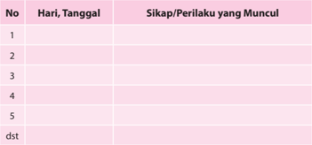

Tabel ini berisi informasi tentang sikap dan perilaku yang muncul pada setiap hari tertentu selama periode waktu tertentu. Topik utama tabel adalah perubahan sikap dan perilaku seiring berjalannya waktu. Kolom-kolom yang ada meliputi nomor hari, tanggal, dan kolom untuk menuliskan sikap atau perilaku yang muncul. Data penting yang terlihat adalah bahwa sikap dan perilaku tersebut berubah secara bertahap dari hari ke hari, menunjukkan pola perubahan yang terjadi dalam situasi tertentu.

### 2.  Penilaian Pengetahuan

- •
- Bentuk Penilaian:
Tes Tertulis

### · Uraian:

- Jelaskan peraturan-peraturan negara yang melandasi perjuangan penegakan nilai-nilai penting dalam kehidupan masyarakat.
- Jelaskan ajaran-ajaran  Gereja  yang  menjadi  landasan  bagi  umat Katolik  untuk  memperjuangkan  nilai-nilai  penting  dalam  kehidupan masyarakat.
- Jelaskan upaya-upaya konkret untuk memperjuangkan nilai-nilai penting dalam kehidupan masyarakat.

 

---
## 📄 Halaman 158

### 3.  Penilaian Keterampilan

- Bentuk Penilaian:
Proyek

- Tugas
Membuat sebuah rancangan 'aksi sosial' di lingkungan yang paling dekat dengan  peserta didik  (rumah  atau  sekolah).  Mencatat  perbuatan  yang sudah  dilakukan  peserta  didik  yang  menunjukkan  solidaritas.  Kegiatan  ini dilaksanakan dalam kelompok.

### 4.  Kegiatan Remedial

Bagi peserta didik yang belum memahami pokok bahasan ini, diberikan remedial dengan kegiatan:

- Guru menyampaikan pertanyaan kepada peserta didik hal-hal apa saja yang belum mereka pahami tentang landasan untuk memperjuangkan nilai-nilai penting dalam masyarakat.
- Apabila ada hal-hal tertentu  yang  belum  mereka  pahami,  guru  mengajak peserta didik untuk mempelajari kembali dengan memberikan pengayaan yang lebih praktis.
- Guru memberikan penilaian untuk menilai pengetahuan dengan pertanyaan yang lebih sederhana sesuai dengan kondisi peserta didik.

### 5.  Kegiatan Pengayaan

Bagi peserta didik yang telah memahami pokok bahasan ini, diberikan pengayaan dengan kegiatan:

- Melakukan studi pustaka (ke perpustakaan atau mencari di koran/majalah) untuk menemukan apa saja yang telah dilakukan negara dan Gereja Katolik Indonesia untuk memperjuangkan nilai-nilai penting dalam masyarakat.
- Hasil temuannya ditulis dalam laporan tertulis yang berisi gambaran singkat dari artikel atau cerita tersebut serta memberikan re fl eksi kritisnya.

 

---
## 📄 Halaman 159

### C.  Yesus Kristus, Pejuang Keadilan, Kejujuran, Kebenaran, dan Kedamaian

### 1.  Penilaian Sikap

### Penilaian Diri

### Partisipasi dalam Diskusi kelompok

Nama

:  ....................................................

Nama-nama anggota kelompok  : ....................................................

.....................................................

Kegiatan kelompok

:  ....................................................

Isilah pernyataan berikut dengan jujur. Untuk No.1 s.d. 5, tulislah huruf A, B, C atau D di depan tiap pernyataan:

- A: Selalu
- C: Kadang - kadang
- B: Sering
- D: Tidak pernah
- ......   Dalam kelompok saya, tiap orang sibuk dengan yang dilakukannya.
- ......   Selama kerja kelompok, saya.....
- Apa yang kamu lakukan selama kegiatan?
.....................................................................................................................

.....................................................................................................................

.....................................................................................................................

 

---
## 📄 Halaman 160

### 2.  Penilaian Pengetahuan

- •
- Bentuk Penilaian:
- Uraian:
- Jelaskan makna perjuangan tokoh-tokoh tertentu yang memperjuangkan keadilan, kejujuran, kebenaran, dan kedamaian sesuai teladan Yesus.
- Jelaskan apa peran Yesus dalam memperjuangan keadilan, kejujuran, kebenaran, dan kedamaian.
- Jelaskan apa ajaran dan upaya Gereja mewujudkan keadilan, kejujuran, kebenaran, dan kedamaian dalam hidup masyarakat.

### 3.  Penilaian Keterampilan

- Bentuk Penilaian:
Proyek

- Tugas:
Mengumpulkan  informasi  dari  pastor  paroki  atau  para  pemuka  umat setempat  tentang  sejauh  mana  Gereja  setempat  mewujudkan  keadilan, kejujuran, kebenaran, dan kedamaian seturut ajaran Yesus. Hasil wawancara ditulis dalam bentuk sebuah laporan.

### 4.  Kegiatan Remedial

Bagi peserta didik yang belum memahami pokok bahasan ini diberikan remedial dengan kegiatan:

- Guru menyampaikan pertanyaan kepada peserta didik hal-hal apa saja yang belum mereka pahami tentang Yesus Kristus, Pejuang Keadilan, Kejujuran, Kebenaran,  dan  Kedamaian.  Apabila  ada  hal-hal  tertentu  yang  belum mereka pahami, guru mengajak peserta didik untuk mempelajari kembali dengan memberikan penguatan yang lebih praktis.
- Guru memberikan penilaian untuk menilai pengetahuan dengan pertanyaan yang lebih sederhana sesuai dengan kondisi peserta didik.

### 5.  Kegiatan Pengayaan

Bagi peserta didik yang telah memahami pokok bahasan ini, diberikan pengayaan dengan kegiatan:

- Melakukan studi pustaka (ke perpustakaan atau mencari di koran/majalah) untuk menemukan apa saja yang telah dilakukan Gereja Katolik Indonesia untuk  mewujudkan Keadilan, kejujuran,  kebenaran,  dan  kedamaian  yang diwartakan oleh Yesus Kristus.
- Hasil temuannya ditulis dalam laporan tertulis yang berisi gambaran singkat dari artikel atau cerita tersebut serta memberikan re fl eksi kritisnya.
Tes Tertulis

 

---
## 📄 Halaman 161

### BAB III

### Keberagaman dalam Hidup Bermasyarakat

Pada Bab I, kita telah mempelajari tentang 'Panggilan Hidup', pada Bab II telah dipelajari tentang 'Memperjuangkan Nilai-Nilai Dasar Kehidupan Manusia'. Pada Bab  III  ini  akan  dipelajari  tentang  'Keberagaman  dalam  Hidup  Bermasyarakat'. Keberagaman adalah sebuah keniscayaan, tidak bisa tidak disangkal. Keberagaman adalah fakta keindonesiaan kita.

Masyarakat Indonesia dan masyarakat dunia pada umumnya adalah komunitas yang beragam, penuh dengan perbedaan, sehingga kita harus dapat bersikap arif dalam menyikapi perbedaan yang ada agar tidak berujung pada sebuah kon fl ik.  Ada beberapa teori  kon fl ik  yang  menjelaskan  penyebab  terjadinya  kon fl ik  di  tengah  masyarakat  antara lain: Teori hubungan masyarakat; berpandangan bahwa kon fl ik yang sering muncul di  tengah  masyarakat  disebabkan  polarisasi  yang  terus  terjadi,  ketidakpercayaan dan permusuhan di antara kelompok yang berbeda, perbedaan bisa dilatarbelakangi SARA  bahkan  pilihan  ideologi  politiknya. Teori  identitas; berpandangan  bahwa kon fl ik yang mengeras di masyarakat tidak lain disebabkan identitas yang terancam yang sering berakar pada hilangnya sesuatu atau penderitaan masa lalu yang tidak terselesaikan. Teori  kesalahpahaman  antarbudaya; berpandangan  bahwa  kon fl ik disebabkan ketidakcocokan dalam cara-cara berkomunikasi di antara budaya yang berbeda. Teori transformasi yang  memfokuskan pada penyebab terjadinya kon fl ik berpandangan  bahwa  ketidaksetaraan  dan  ketidakadilan  yang  muncul  sebagai penyebab  terjadinya  masalah  sosial  budaya  dan  ekonomi.  Intinya,  manusia  yang beradab harus bersikap terbuka dalam melihat semua perbedaan dalam keragaman yang ada dan menjunjung tinggi nilai-nilai kesopanan agar keragaman menjadi aset kekayaan bangsa yang dapat mempersatukan bangsa.

Pada  Bab  III  tentang  'Keberagaman  dalam  Hidup  Bermasyarakat ' ,  peserta  didik dibimbing  untuk  sungguh  memahami  makna  dan  hakikat  keberagaman  dalam kehidupan manyarakat Indonesia. Untuk memahami hal tersebut maka topik-topik yang akan dipelajari dalam kegiatan pembelajaran ini adalah:

- Keberagaman sebagai Realitas Asali Kehidupan Manusia
- Mengupayakan Perdamaian dan Persatuan Bangsa

 

---
## 📄 Halaman 162

### A. Keberagaman sebagai Realitas Asali Kehidupan Manusia

### Kompetensi Dasar

- 1.3  Bersyukur atas kemajemukan bangsa Indonesia sebagai anugerah Allah.
- 2.3  Cinta damai di tengah kemajemukan bangsa Indonesia.
- 3.3  Memahami kemajemukan bangsa Indonesia sebagai anugerah Allah.
- 4.3  Melakukan aktivitas (misalnya: menuliskan re fl eksi/doa/puisi/rangkuman/ membuat kliping berita dan gambar) tentang kemajemukan bangsa Indonesia sebagai anugerah Allah.

### Indikator

- Menjelaskan keberagaman, kemajemukan bangsa Indonesia berdasarkan semboyan negara Bhinneka Tunggal Ika.
- Menjelaskan peluang-peluang dan tantangan realitas keberagaman pada bangsa Indonesia.
- Menganalisis ajaran Kitab Suci tentang keberagaman manusia menurut Yoh 4: 1-42.
- Menganalisis ajaran Gereja tentang keberagaman manusia berdasarkan Nostra Aetate art.5 dan Gaudim et Spes art.24.

### Bahan Kajian

- Keberagaman/kemajemukan bangsa Indonesia (Bhinneka Tunggal Ika).
- Peluang-peluang dan tantangan realitas keberagaman pada bangsa Indonesia.
- Keberagaman umat manusia dalam ajaran Kitab Suci (Kej 35: 1-15; Yoh 4: 1-42).
- Suku-suku dan agama-agama yang ada di Indonesia.
- Upaya-upaya membangun semangat kesatuan dan persatuan dalam masyarakat yang majemuk.

### Sumber Belajar

- Konferensi Waligereja Indonesia (KWI). 1996. Iman Katolik. Kanisius: Yogyakarta.
- A. Heuken, SJ. 1991. Ensiklopedi Gereja. Cipta Loka Caraka: Jakarta.
- Alex Lanur. 1995. Pancasila sebagai Ideologi Terbuka. Kanisius: Yogyakarta.
- Dr. P. Hardono Hadi. 1994. Hakikat dan Muatan Filsafat Pancasila. Kanisius: Yogyakarta, 1994.

 

---
## 📄 Halaman 163

- Kitab Suci (Alkitab).
- Pengalaman peserta didik tentang hidup dalam masyarakat majemuk.

### Pendekatan

Sainti fi k dan kateketis.

### Metode

Cerita, pengamatan, tanya jawab, diskusi, dan penugasan.

### Sarana

- Peta penduduk Indonesia.
- Burung Garuda Pancasila Lambang Negara.
- Kitab Suci (Alkitab).
- Buku Siswa kelas XII Pendidikan Agama Katolik dan Budi Pekerti.

### Waktu

3 x 45 menit.

### Pemikiran Dasar

Dalam Kamus Besar Bahasa Iindonesia (KBBI), Keragaman berasal dari kata ragam, yang berarti (1) sikap, tingkah laku, cara; (2) macam, jenis; (3) musik, lagu, langgam; (4)  warna, corak; (5) laras (tata bahasa), keragaman menunjukkan adanya banyak macam. Sedangkan keragaman sendiri berarti perihal berjenis-jenis atau beragamragam atau suatu keadaan yang beragam-ragam. Keragaman secara umum adalah suatu kondisi di mana terdapat perbedaan-perbedaan di dalam masyarakat di berbagai bidang seperti suku bangsa dan ras, agama dan keyakinan, ideologi dan politik, adat dan kesopanan, sosial dan ekonomi.

Unsur-unsur keragaman dalam masyarakat antara lain; suku bangsa dan ras, agama dan keyakinan, ideologi dan politik, adat dan tatakrama, kesenjangan ekonomi dan sosial.

Suku  bangsa  dan  ras yang  menempati  wilayah  Indonesia  dari  Sabang  sampai Merauke sangatlah beragam. Dari keragaman tersebut ada perbedaan ras yang dapat terlihat  dari  ciri-ciri  biologis  lahiriah  seperti:  rambut,  warna  kulit,  ukuran  tubuh, mata, ukuran kepala, dan lain sebagainya. Suku bangsa yang ada di Indonesia lebih dari  300  macam.  Sedangkan ras  yang  ada  di  Indonesia  antara  lain  ras mongoloid yang terdapat di bagian Barat Indonesia dan ras austroloid yang terdapat di sebelah Timur Indonesia. Tentu saja bahwa manusia tidak bisa memilih agar dilahirkan di suku atau bangsa tertentu. Karena itu, manusia tidak pantas membanggakan dirinya atau melecehkan orang lain karena faktor suku atau bangsa.

 

---
## 📄 Halaman 164

Agama dan keyakinan mengandung arti ikatan  yang  harus  dipegang  dan  dipatuhi manusia.  Ikatan  yang  dimaksud  berasal  dari  suatu  kekuatan  yang  lebih  tinggi ( trasendensi )  dari  manusia  sebagai  kekuatan  gaib  yang  tidak  dapat  ditangkap dengan panca indra. Namun juga kekuatan gaib itu berdiam di dalam diri manusia ( imanen ),  yang  hanya  bisa  dirasakan  kekuatannya.  Dalam  kenyataannya  fungsi agama dalam masyarakat antara lain adalah: berfungsi edukatif : ajaran agama secara hukum berfungsi menyuruh dan melarang, berfungsi penyelamat, berfungsi sebagai perdamaian,  berfungsi  sebagai  kontrol  sosial,  berfungsi  sebagai  pemupuk  rasa solidaritas, berfungsi transformatif, dan sebagainya. Di Indonesia, agama merupakan unsur yang sangat penting dan terdapat enam agama yang diakui, hal itu merupakan bukti  adanya  keragaman  dalam  hal  agama  atau  kepercayaan.  Adapun  terhadap keragaman manusia dalam hal kepercayaan, sikap, dan perilakunya, manusia tidak dipandang  sederajat. Ada  yang  mulia  dan  ada  yang  hina,  bergantung  pada  kadar ketakwaannya.

Ideologi dan politik; Ideologi adalah suatu istilah umum bagi sebuah gagasan yang berpengaruh  kuat  terhadap  tingkah  laku  dalam  situasi  khusus  karena  merupakan kaitan  antara  tindakan  dan  kepercayaan  yang  fundamental.  Sedangkan  politik bermakna  usaha  dalam  menegakkan  ketertiban  sosial.  Fungsi  ideologi  adalah untuk memperkuat landasan moral dalam suatu tindakan. Adanya banyak partai di Indonesia merupakan bukti keragaman dalam hal ideologi dan politik. Namun pada kenyataannya Indonesia hanya mengakui Pancasila sebagai satu-satunya ideologi.

Tata  krama; yang  berarti  adat  istiadat,  sopan  santun,  pada  dasarnya  ialah  segala tindakan, perilaku, adat istiadat, tegur sapa, ucap dan cakap sesuai kaidah atau norma tertentu.  Tata  krama  dibentuk  dan  dikembangkan  oleh  masyarakat  itu  sendiri  dan diharapkan akan terjadi interaksi sosial yang tertib dan efektif di dalam masyarakat itu sendiri.

Kesenjangan ekonomi dan sosial; Indonesia merupakan negara berkembang di mana masalah  perekonomian  diperhatikan  agar  dapat  meningkat.  Masyarakat  Indonesia merupakan masyarakat yang majemuk dengan bermacam tingkat, pangkat, golongan, dan strata  sosial.  Dalam  hal  ini  terlihat  jelas  bahwa  terdapat  penggolongan  orang berdasarkan status sosial.

Indonesia adalah negara dengan struktur masyarakat yang majemuk dan memiliki banyak  keragaman  dalam  banyak  hal.  Keragaman  tersebut  dapat  mempengaruhi kehidupan kita. Banyak pengaruh yang timbul karena adanya keragaman, diantaranya adalah: 1) di dalam kelompok-kelompok sering terjadi segmentasi karena memiliki kebudayaan yang berbeda; 2) struktur sosial terbagi-bagi ke dalam lembaga-lembaga yang  bersifat  non  komplementer;  3)  kurang  adanya  pengembangan  konsensus di  antara  para  anggota  masyarakat  tentang  nilai-nilai  sosial  yang  bersifat  dasar; 4)  secara  relatif  sering  terjadi  kon fl ik  di  antara  kelompok  yang  satu  dengan  yang lainnya,  karena  adanya  perbedaan;  5)  secara  relatif  integrasi  sosial  tumbuh  atas paksaan dan saling ketergantungan di dalam bidang ekonomi; 6) adanya dominasi politik  oleh  suatu  kelompok  terhadap  kelompok  yang  lain.  Selain  pengaruh  di

 

---
## 📄 Halaman 165

atas, jika keterbukaan dan kedewasaan sikap dikesampingkan, besar kemungkinan tercipta  masalah-masalah  yang  menggoyahkan  persatuan  dan  kesatuan  bangsa seperti: 1) terjadinya disharmonisasi, di mana tidak ada penyesuaian atas keragaman antara manusia dengan dunia lingkungannya; 2) terjadi diskriminasi terhadap suatu kelompok  masyarakat  tertentu  yang  akan  memunculkan  masalah  yang  lain,  yaitu kesenjangan dalam berbagai bidang yang merugikan kita dalam kehidupan berbangsa dan  bernegara;  3)  terjadi  eksklusivisme,  rasialis,  bersumber  dari  superioritas  diri, alasannya  dapat  bermacam-macam,  antara  lain  keyakinan  bahwa  secara  kodrati ras/sukunya  kelompoknya  lebih  tinggi  dari  ras/suku/kelompok  lain,  menganggap kelompok lain derajatnya lebih rendah dari pada kelompoknya sendiri.

Ada beberapa hal yang dapat dilakukan untuk memperkecil masalah yang diakibatkan oleh  pengaruh  negatif  dari  keragaman,  yaitu:  1)  semangat  religius;  2)  semangat nasionalisme; 3) semangat pluralisme; 4) semangat humanisme; 5) dialog antar umat beragama; 6) membangun suatu pola komunikasi untuk interaksi maupun kon fi gurasi hubungan antaragama, media massa, dan harmonisasinya.

Problematika yang sedang dialami bangsa Indonesia saat ini adalah adanya gejala diskriminasi dalam masyarakat yang beragam. Diskriminasi adalah setiap tindakan yang melakukan pembedaan terhadap seseorang atau sekelompok orang berdasarkan ras,  agama,  suku,  etnis,  kelompok,  golongan,  status,  kelas  sosial  ekonomi,  jenis kelamin, kondisi fi sik, usia, orientasi seksual, pandangan ideologi, dan politik. Tentu saja  kondisi ini bertolak belakang dengan semangat kebangsaan kita sebagaimana ditegaskan dalam pasal 28 ayat 2 UUD 1945 bahwa 'Setiap orang berhak bebas dari perlakuan  yang  bersifat  diskriminatif  atas  dasar  apapun  dan  berhak  mendapatkan perlindungan  terhadap  perlakuan  yang  bersifat  diskriminatif  itu'.  Sangat  jelas sekali  bahwa  setiap  orang  mendapat  perlindungan  saat  dia  mendapat  perlakuan diskriminatif. Meskipun begitu diskriminasi masih terjadi di berbagai belahan dunia, dan prinsip non diskriminasi harus mengawali kesepakatan antarbangsa untuk dapat hidup dalam kebebasan, keadilan, dan perdamaian.

Dalam Kitab Suci Perjanjian Lama, diceritakan bahwa Bangsa Terpilih sering kali menghayati rasa satu bangsa, satu Tuhan, satu negeri, satu tempat ibadat, dan satu tata hukum (bdk.Ul 12). Dari sejarahnya, ternyata ketika mereka bersatu, mereka menjadi kuat, sanggup mengalahkan musuh dan menjadikan dirinya bangsa yang jaya. Namun, ketika mereka tidak bersatu, mereka menjadi bangsa yang tidak berdaya dan tiap kali secara  gampang  dikalahkan  oleh  musuh-musuh  mereka.  Kitab  Suci  menceritakan bahwa ketika mereka dari Mesir memasuki tanah Kanaan di bawah pimpinan Yosua, mereka sungguh bersatu dan dapat merebut Tanah Terjanji itu. (bdk . Yos  6:  1-15, 63). Ketika mereka sudah menempati Tanah Terjanji yang dibagi menurut suku-suku keturunan Yakub, maka mereka lama-kelamaan terpecah dan menjadi lemah. Pada saat-saat  itu,  mereka  menjadi  lemah  dan  gampang  dikalahkan  oleh  musuh-musuh mereka. Mereka pernah bersatu di bawah pimpinan raja Daud dan menjadi bangsa yang kuat dan jaya. Kemudian mereka terpecah lagi dan menjadi lemah. Dalam Kitab Suci Perjanjian Baru, dikisahkan bahwa ketika saat Mesias datang, umat Israel telah dijajah  oleh  bangsa  Romawi. Akibatnya  mereka  menjadi  bangsa  yang  lemah  dan

 

---
## 📄 Halaman 166

terpecah  belah.  Ketika Yesus  ingin  mempersatukan  mereka  dalam  suatu  Kerajaan dan Bangsa yang baru yang bercorak rohani, Yesus mengeluh bahwa betapa sulit untuk mempersatukan bangsa ini. Mereka seperti anak-anak ayam yang kehilangan induknya (bdk. Mat 23: 37-38). Yesus bahkan berusaha untuk menyapa suku yang dianggap bukan Yahudi lagi seperti orang-orang Samaria. Kita tentu masih ingat akan sapaan dan dialog Yesus dengan wanita Samaria di sumur Yakub.

Pada pelajaran ini, peserta didik dibimbing untuk memahami dan menghayati makna dan hakikat keberagaman sebagai realitas asali kehidupan manusia, khususnya dalam keberagaman atau kemajemukan hidup bangsa Indonesia sesuai semangat injili yaitu semangat Yesus sendiri.

### Kegiatan Pembelajaran

Guru mengajak peserta didik untuk mengawali kegiatan pembelajaran dengan doa.

### Doa Pembuka

Allah,  Bapa  kami,  Engkau  telah  menciptakan  alam  semesta  sebagai kediaman  bagi  umat  manusia.  Tatkala  umat  pilihan-Mu  hidup  terluntalunta di pengasingan, Engkau membebaskan mereka dan mengantar ke tanah  terjanji.  Tanah  air  yang  subur  dan  berlimpahan  susu  serta  madu. Engkau pun memberikan tanah air kepada kami.

Bapa,  kami  bersyukur  atas  tanah  air  kami  yang  luas  dengan  isinya  yang beraneka ragam: lautan dengan ribuan pulau, gunung dan daratan, hutan dan belantara; semuanya menyemarakkan tanah air kami.

Kami bersyukur atas ratusan suku dan aneka budaya serta bahasa yang Kau himpun menjadi satu bangsa dan satu bahasa. Kami mohon berkatMu bagi semua yang mendiami tanah air ini. Semoga kami semua berusaha memelihara dan memajukannya. Bebaskanlah tanah air kami dari bahaya: bencana alam, kelaparan, perang, dan wabah penyakit.

Semoga kami semua tekun membangun tanah air kami demi kemakmuran dan kesejahteraan seluruh bangsa. Bantulah kami mewujudkan tanah air yang adil, makmur, aman, damai, dan sejahtera, sehingga tanah air yang kami diami di dunia ini selalu mengingatkan kami akan tanah air surgawi, tempat  kami  akan  berbahagia  abadi  bersama  Dikau.  Semua  ini  kami sampaikan kepada-Mu dengan pengantaraan Kristus, Tuhan kami. Amin.

(PS 194)

 

---
## 📄 Halaman 167

### Langkah Pertama: Mengamati Keanekaragaman dan Kesatuan Bangsa Indonesia

### 1.  Mengamati gambar

Guru mengajak peserta didik untuk memperhatikan gambar-gambar yang ada pada buku siswa, halaman 82.

### 2.  Pendalaman

- Guru  mengajak  peserta  didik  untuk  merumuskan  pertanyaan-pertanyaan berdasarkan pengamatan mereka terhadap gambar-gambar tersebut.
- Pertanyaan-pertanyaan untuk didiskusikan, misalnya:
- Apa semboyan yang terdapat pada 'Burung Garuda' itu?
- Apa arti semboyan tersebut?
- Sebutkan  aneka  perbedaan  dan  contoh  kebhinnekaan  yang  ada  di Indonesia!
- Dari mana asal keanekaan itu?
- Bagaimana cara kita menerapkan, menghayati semboyan negara kita dalam hidup sehari-hari?
- Untuk  menjawab  pertanyaan  tersebut,  guru  memberikan  beberapa  buku referensi  untuk  digali  bersama  dalam  diskusi  kelompok.  Misalnya  bukubuku  dari  mata  pelajaran  Pendidikan  Pancasila  dan  Kewarganegaraan (PPKn). Apabila memungkinkan peserta didik mewawancarai guru bidang studi  PPKn  atau  yang  sejenisnya  dan  mengakses  internet  sekolah  untuk membaca informasi tentang keberagaman di Indonesia atau hal-hal  yang terkait dengan pertanyaan-pertanyaan tersebut.
- Guru meminta setiap kelompok menyampaikan hasil diskusinya masingmasing.  Setiap  kelompok  dapat  bertanya  atau  menanggapi  laporan  hasil diskusi kelompok lainnya.

### 3.  Peneguhan

Guru  memberikan  penjelasan  setelah  peserta  didik  melaporkan  hasil  diskusi kelompoknya.

### a. Menyadari Keanekaan Kita

Kemajemukan adalah ciri asli dari kehidupan manusia di dunia ini. Tuhan menciptakan umat manusia dalam keperbedaan yang tak terhindarkan. Maka, kemajemukan  merupakan  keadaan  yang  tak  terhindarkan.  Orang  harus belajar mengambil sikap yang tepat dan belajar bertindak secara arif untuk biasa  hidup  dan  membangun  masyarakat  dalam  keanekaan.  Masyarakat Indonesia  adalah  masyarakat  yang  majemuk.  Kemajemukan  ini  tampak dalam berbagai bentuk, antara lain: agama, suku, bahasa, adat-istiadat, dan

 

---
## 📄 Halaman 168

sebagainya. Contoh keanekaragaman ini dapat disebut lebih banyak lagi. Namun, hal yang terpenting ialah menyadari bahwa bangsa Indonesia ini adalah bangsa yang multikultur bukan suatu bangsa monokultur.

### b. Menyadari Kesatuan Kita

Bangsa Indonesia adalah bangsa yang plural yang berciri keanekaragaman dalam  aspek-aspek  kehidupan.  Keanekaragaman  itu  juga  diterima  dan dihayati dalam satu kesatuan sebagai bangsa. Suku yang berasal dari ribuan pulau dengan budaya, adat-istiadat, bahasa, dan agama yang berbeda-beda, semuanya mengikrarkan diri sebagai satu bangsa, satu bahasa, dan satu tanah air Indonesia. Bangsa Indonesia yang berbeda-beda selain diikat oleh satu sejarah masa lampau yang sama, yakni penjajahan oleh bangsa asing dalam kurun waktu yang panjang, juga diikat oleh satu cita-cita yang sama yakni membangun masa depan bangsa yang berketuhanan, berperikemanusiaan, bersatu, berkeadilan, dan berdaulat.

Berdasarkan pemahaman seperti itu, maka setiap individu mempunyai hak dan kewajiban yang sama. Suku yang satu tidak lebih unggul dari suku lain, agama yang satu tidak mendominasi agama lain.

Kodrat  bangsa  Indonesia  memang  berbeda-beda  dalam  kesatuan.  Hal tersebut dirumuskan dengan sangat bijak dan tepat oleh bangsa Indonesia, yakni 'Bhinneka Tunggal Ika' yang berarti beraneka ragam atau berbedabeda  namun  satu.  Kenyataannya  keberadaan  bangsa  Indonesia  memang berbeda-beda namun tetap satu bangsa. Bangsa yang utuh dan bersatu serta yang berbeda-beda itu  adalah  saudara  sebangsa  dan  setanah  air.  Sumpah Pemuda yang diikrarkan pada tanggal 28 Oktober 1928 menegaskan kita adalah satu nusa, satu bangsa, satu bahasa Indonesia.

### c. Kesatuan Tidak Sama dengan Keseragaman

Dalam  sejarah  bangsa  kita  terdapat  gejala-gejala  dari  rezim  tertentu (ORBA) yang mencoba menekan keanekaragaman bangsa ini dan mencoba menggiring bangsa kita kepada keseragaman demi stabilitas.

Kebhinnekatunggalikaan itu bukan hal yang sudah selesai, tuntas sempurna, dan statis,  tetapi  perlu  terus-menerus  dipertahankan, diperjuangkan, diisi, dan diwujudkan terus-menerus.

Menjaga kebhinnekaan, keutuhan, kesatuan, dan keharmonisan kehidupan merupakan panggilan tugas bangsa Indonesia. Keberagaman adalah kekayaan,  sedang  kesatuan  persaudaraan  sejati  adalah  semangat  dasar. Kehidupan  yang  berbeda-beda itu harus  saling  menyumbang  dalam kebersamaan dan kesejahteraan bersama.

 

---
## 📄 Halaman 169

### Langkah Kedua: Mendalami Tantangan terhadap 'Bhinneka Tunggal Ika'

### 1. Menelusuri kasus-kasus

- Guru mengajak peserta didik menemukan beberapa kasus dalam kehidupan masyarakat kita yang mencerminkan bahwa ada orang-orang atau kelompok tertentu yang dalam  perilaku/tindakannya masih  jauh dari  semangat bhinneka tunggal ika.
- Guru mengajak peserta didik untuk menyimak cerita berikut ini.

### Diserang Saat Ibadat Rosario

Metrotvnews.com, Jakarta: Komisi Nasional Hak Asasi Manusia mengecam penyerangan terhadap sekumpulan umat Katolik yang sedang menggelar ibadat Rosario dalam rangka penghormatan terhadap Bunda Maria di kediaman Direktur Galang Press, Julius Felicianus, di Desa Tanjungsari, Kelurahan Sukoharjo, Kecamatan Ngaglik, Sleman, Kamis (29/5/14) malam. 'Kami  mengecam  keras  tindakan  intoleransi  yang  dilakukan  segelintir kelompok yang merusak sendi-sendi kehidupan berbhinneka dan berbangsa plural. Kami meminta aparat kepolisian mengusut secepatnya dalam waktu yang sesingkat-singkatnya dan diproses secara hukum agar tindakan yang sama tidak merembes ke tempat-tempat lain di tengah tingginya tensi politik saat  ini,'  tandas  Komisoner  Komnas  HAM  Natalius  Pigai  dalam  pesan singkatnya yang diterima Media Indonesia di Jakarta, Jumat (30/5/2014). Menurut Natalis, tindakan pembubaran, perusakan, dan pemukulan kepada umat  Katolik  itu  telah  mencederai  prinsip  penghormatan  terhadap  hak beribadah dan berkeyakinan agama yang dianut berdasarkan Kovenan PBB tentang Hak Sipil dan Politik Undang-Undang Nomor 39 tahun 1999, dan Pancasila.

'Kita memegang prinsip yang sama yaitu Undang-Undang Dasar 1945 yang secara  substansial  mengandung nilai adagium Bhineka Tunggal Ika yang menjadi modal persatuan dan kesatuan bangsa kita. Ini harus diusut tuntas,' tegasnya.  Seperti  diberitakan,  rumah  Direktur  Penerbitan  Galang  Press Julius  Felicianus  diserang  dan  dirusak  oleh  sekelompok  orang  berjubah putih. Penyerangan terjadi ketika rumah tersebut dipakai untuk ibadat doa Rosario, sebagai bentuk penghormatan Umat Katolik terhadap Bunda Maria. Saat  penyerangan  Julius  menjadi  bulan-bulanan  kelompok  penyerang. Menurut Julius, para penyerang datang menggunakan sepeda motor. Kepala Julius dipukul menggunakan besi dan pot bunga. Tak hanya Julius, ibu-ibu yang sedang menjalankan ibadah pun dipukul. Tak luput dari penyerangan itu, seorang wartawan Kompas TV , Michael Ariawan, juga menjadi korban pemukulan. (Jco)

http://news.metrotvnews.com/read/2014/05/30/247298/komnas-ham-kecam-penyerangan-umatkatolik-di-yogyakarta

 

---
## 📄 Halaman 170

### 2. Pendalaman/Diskusi

- Guru  mengajak  peserta  didik  untuk  merumuskan  pertanyaan-pertanyaan berdasarkan cerita yang telah didengar atau dibacanya.
- Guru mengajak peserta didik untuk berdialog mendalami isi/pesan cerita tersebut, misalnya dengan pertanyaan-pertanyaan berikut:
- Bagaimana perasaanmu ketika membaca atau mendengar cerita itu?
- Menurut kamu, peristiwa Pak Julius ini termasuk peristiwa apa?
- Sebutkan  dan  jelaskan  beberapa  peristiwa  bentrokan  atau  kerusuhan antarsuku lainnya yang pernah terjadi di Tanah Air!
- Apakah ada tindakan-tindakan dari anak-anak bangsa ini yang dapat menimbulkan bahaya disintegrasi terhadap negara kita? Berikan contoh tindakan tersebut!
- Mengapa dapat terjadi bentrokan antarsuku dan antarpenganut agama?

### 3.  Peneguhan

Setelah  peserta  didik  berdiskusi  tentang  kasus  intoleransi  yang  terjadi  di masyarakat, guru memberi penjelasan sebagai masukan kepada peserta didik, sebagai berikut;

- Kasus kekerasan bernuansa agama menimpa bapak Julius Felicianus dan sejumlah  umat  katolik  yang  sedang  berdoa  rosario  di  Desa  Tanjungsari, Kelurahan  Sukoharjo,  Kecamatan  Ngaglik,  Sleman,  Kamis  (29/5/14). Kasus tersebut menunjukkan bahwa ada kelompok tertentu, sesama anak bangsa yang belum menghayati keberagaman atau pluralitas, yang menjadi ciri hakiki bangsa Indonesia.
- Indonesia,  salah  satu  negara  dengan  keanekaragaman  budaya,  bahasa, agama, dan lain sebagainya. Namun, tidak jarang kita melihat perbedaan itu menjadi salah satu alasan adanya kekerasan di negeri ini. Mulai dari isu suku, agama, dan lain-lain. Pribadi atau kelompok tertentu di negeri ini yang intoleran atau tidak toleran cenderung menggunakan cara-cara kekerasan, entah melalui teror, penganiayaan, perusakan fasilitas rumah ibadat. Mereka berpikir bahwa seolah-olah kelompok mereka yang paling benar.
- Salah satu alasan ialah bahwa ada suku/daerah atau pemeluk agama tertentu merasa diperlakukan secara tidak adil. Jika orang, suku, etnis, atau pemeluk agama tertentu diperlakukan secara tidak adil, maka akan muncul semangat primordialisme dan fanatisme suku atau agama, yang dapat menjurus kepada tuntutan untuk memisahkan diri dari suatu lembaga, bahkan negara.
- Ketidakadilan di bidang politik dan ekonomi, mungkin juga budaya yang secara berlarut-larut terjadi di beberapa wilayah kon fl ik dapat memunculkan bahaya disintegrasi bangsa.

 

---
## 📄 Halaman 171

- Tuhan menciptakan kita berbeda, bukan agar kita terpecah belah. Tapi kita sendiri yang membuat perbedaan itu menjadi kelemahan, dan membuat kita terpecah belah. Dahulu, para pejuang kemerdekaan dari berbagai macam suku serta agama bersatu demi kemerdekaan Indonesia. Di dunia ini tidak ada  yang  sempurna,  kesempurnaan  itu  bukan  tidak  mungkin  kalau  kita mau bersatu. Meskipun berbeda suku, berbeda agama, kita harus bersatu. Semboyan Indonesia adalah Bhinneka Tunggal Ika, yang berarti 'Berbedabeda tetapi tetap satu'.

### Langkah Ketiga: Mendalami Keanekaragaman dan Kesatuan Suatu Bangsa dalam Terang Iman Kristiani

### 1. Mendalami Ajaran Kitab Suci dan Ajaran Gereja

- Mendalami Ajaran Kitab Suci
- Menyimak Ajaran Kitab Suci
Guru mengajak peserta didik dalam kelompok untuk menyimak dan mendiskusikan teks-teks Kitab Suci berikut ini.

### Yohanes 4:1- 42

1 Ketika  Tuhan  Yesus  mengetahui,  bahwa  orang-orang  Farisi  telah mendengar, bahwa Ia memperoleh  dan membaptis murid lebih banyak dari pada Yohanes.  2  meskipun Yesus sendiri tidak membaptis, melainkan murid-murid-Nya,  3  Ia pun meninggalkan Yudea dan kembali lagi ke Galilea. 4 Ia harus melintasi daerah Samaria. 5  Maka sampailah Ia ke sebuah kota di Samaria, yang bernama Sikhar dekat tanah yang diberikan Yakub dahulu kepada anaknya, Yusuf. 6 Di situ terdapat sumur Yakub. Yesus sangat letih oleh perjalanan, karena itu Ia duduk di pinggir sumur itu.  Hari  kira-kira  pukul  dua  belas. 7  Maka datanglah seorang perempuan  Samaria  hendak  menimba  air.  Kata  Yesus  kepadanya: 'Berilah Aku minum.'  8  Sebab murid-murid-Nya telah pergi ke kota membeli makanan.  9  Maka kata perempuan Samaria itu kepada-Nya: 'Masakan Engkau, seorang Yahudi, minta minum kepadaku, seorang Samaria?' (Sebab orang Yahudi tidak bergaul dengan orang Samaria) 10 Jawab Yesus kepadanya: 'Jikalau engkau tahu tentang karunia Allah dan siapakah Dia yang berkata kepadamu: Berilah Aku minum! niscaya engkau telah meminta kepada-Nya dan Ia telah memberikan kepadamu air  hidup.' 11   Kata  perempuan  itu  kepada-Nya:  'Tuhan,  Engkau tidak  punya timba dan sumur ini amat dalam; dari manakah Engkau memperoleh air hidup itu? 12 Adakah Engkau lebih besar dari pada bapa kami Yakub, yang memberikan sumur ini kepada kami dan yang telah minum sendiri dari dalamnya, ia serta anak-anaknya dan ternaknya?' 13 Jawab Yesus kepadanya: 'Barang siapa minum air ini, ia akan haus lagi, 14 tetapi barang siapa minum air yang akan Kuberikan kepadanya, ia tidak

 

---
## 📄 Halaman 172

akan haus untuk selama-lamanya. Sebaliknya air yang akan Kuberikan kepadanya, akan menjadi mata air di dalam dirinya, yang terus-menerus memancar sampai kepada hidup yang kekal.'  15  Kata  perempuan  itu kepada-Nya:  'Tuhan,  berikanlah  aku  air  itu,  supaya  aku  tidak  haus dan tidak usah datang lagi ke sini untuk menimba air.' 16  Kata Yesus kepadanya: 'Pergilah, panggillah suamimu dan datang ke sini.' 17  Kata perempuan itu: 'Aku tidak mempunyai suami.' Kata Yesus kepadanya: 'Tepat katamu, bahwa engkau tidak mempunyai suami,  18  sebab engkau sudah mempunyai lima suami dan yang ada sekarang padamu, bukanlah suamimu. Dalam hal ini engkau berkata benar.'  19  Kata perempuan itu kepada-Nya: 'Tuhan, nyata sekarang padaku, bahwa Engkau seorang nabi. 20  Nenek moyang kami menyembah di atas gunung ini, tetapi kamu katakan, bahwa Yerusalemlah tempat orang menyembah.'  21  Kata Yesus kepadanya: 'Percayalah kepada-Ku, hai perempuan, saatnya akan tiba, bahwa kamu akan menyembah Bapa bukan di gunung ini dan bukan juga di Yerusalem.  22  Kamu menyembah apa yang tidak kamu kenal, kami menyembah apa yang kami kenal, sebab keselamatan datang dari bangsa Yahudi.  23 Tetapi saatnya akan datang dan sudah tiba sekarang, bahwa  penyembah-penyembah  benar  akan  menyembah  Bapa  dalam roh dan kebenaran; sebab Bapa menghendaki penyembah-penyembah demikian. 24 Allah  itu  Roh  dan  barang  siapa  menyembah  Dia,  harus menyembah-Nya dalam roh dan kebenaran.'  25  Jawab perempuan itu kepada-Nya: 'Aku tahu, bahwa Mesias akan datang, yang disebut juga Kristus; apabila Ia datang, Ia akan memberitakan segala sesuatu kepada kami.' 26  Kata Yesus kepadanya: 'Akulah Dia, yang sedang berkatakata  dengan  engkau.' 27 Pada  waktu  itu  datanglah  murid-murid-Nya dan mereka heran, bahwa Ia sedang bercakap-cakap dengan seorang perempuan. Tetapi tidak seorang pun yang berkata: 'Apa yang Engkau kehendaki? Atau: Apa yang Engkau percakapkan dengan dia?'  28  Maka perempuan itu meninggalkan tempayannya di situ lalu pergi ke kota dan  berkata  kepada  orang-orang  yang  di  situ:  'Mari,  lihat!  Di  sana ada  seorang  yang  mengatakan  kepadaku  segala  sesuatu  yang  telah kuperbuat. Mungkinkah Dia Kristus itu?'  30  Maka mereka pun pergi ke luar kota lalu datang kepada Yesus. 31  Sementara itu murid-murid-Nya mengajak  Dia,  katanya:  'Rabi,  makanlah.' 32 Akan  tetapi  Ia  berkata kepada  mereka:  'Pada-Ku  ada  makanan  yang  tidak  kamu  kenal.' 33 Maka  murid-murid  itu  berkata  seorang  kepada  yang  lain:  'Adakah orang yang telah membawa sesuatu kepada-Nya untuk dimakan?'  34 Kata Yesus kepada mereka: 'Makanan-Ku ialah melakukan kehendak Dia yang mengutus  Aku dan menyelesaikan pekerjaan-Nya. 35 Bukankah kamu mengatakan: Empat bulan lagi tibalah musim menuai? Tetapi Aku berkata kepadamu: Lihatlah sekelilingmu dan pandanglah ladang-ladang  yang  sudah  menguning  dan  matang  untuk  dituai. 36 Sekarang juga penuai telah menerima upahnya dan ia mengumpulkan

 

---
## 📄 Halaman 173

buah untuk hidup yang kekal, sehingga penabur dan penuai sama-sama bersukacita. 37 Sebab dalam hal ini benarlah pribahasa: Yang seorang menabur dan yang lain menuai.  38  Aku mengutus kamu untuk menuai apa yang tidak kamu usahakan; orang-orang lain berusaha dan kamu datang memetik hasil usaha mereka.' 39  Dan banyak orang Samaria dari kota itu telah menjadi percaya kepada-Nya karena perkataan perempuan itu, yang bersaksi: 'Ia mengatakan kepadaku segala sesuatu yang telah kuperbuat.' 40 Ketika  orang-orang  Samaria  itu  sampai  kepada Yesus, mereka meminta kepada-Nya, supaya Ia tinggal pada mereka; dan Ia pun tinggal di situ dua hari lamanya. 41  Dan lebih banyak lagi orang yang  menjadi  percaya  karena  perkataan-Nya, 42 dan  mereka  berkata kepada perempuan itu: 'Kami percaya, tetapi bukan lagi karena apa yang kaukatakan, sebab kami sendiri telah mendengar Dia dan kami tahu, bahwa Dialah benar-benar Juru Selamat dunia.

### 2) Pendalaman/Diskusi

- Guru  mengajak  peserta  didik  untuk  merumuskan  pertanyaanpertanyaan  berdasarkan  teks  Kitab  Suci  yang  telah  dibacanya. Pertanyaan-pertanyaan  yang  muncul  kemudian  diformulasikan untuk didiskusikan bersama.
- Pertanyaan-pertanyaan untuk diskusi lebih lanjut, misalnya:
- Apa pesan Yohanes 4:1- 42?
- Bagaimana sikap Yesus waktu Ia hidup di dunia ini terhadap keanekaan dari bangsanya? Apakah Ia pernah mendambakan semangat  persatuan  dari  bangsanya  yang  terdiri  atas  sukusuku?
- Apa kaitan pesan Kitab Suci terkait sikap kita sebagai umat Kristiani dengan kebhinnekatunggalikaan di negeri kita Indonesia?
- Guru  meminta  peserta  didik  untuk  menyampaikan  hasil  diskusi kelompok dan kelompok lain dapat memberikan tanggapan, atas laporan diskusi tersebut.

### 3) Peneguhan

Guru memberikan penjelasan setelah mendapat jawaban dari peserta didik, misalnya sebagai berikut:

- Pada saat Mesias datang, bangsa Yahudi sudah dijajah oleh bangsa Romawi, karena mereka lemah dan terpecah belah. Ketika Yesus ingin  mempersatukan mereka dalam suatu Kerajaan dan Bangsa yang baru yang bercorak rohani, Yesus mengeluh bahwa betapa sulit untuk mempersatukan bangsa ini. Mereka seperti anak-anak ayam yang kehilangan induknya.

 

---
## 📄 Halaman 174

- Yesus bahkan berusaha untuk menyapa suku yang dianggap bukan Yahudi lagi seperti orang-orang Samaria. Kita tentu masih ingat akan  sapaan  dan  dialog Yesus  dengan  wanita  Samaria  di  sumur Yakub.
- Bagi orang Yahudi, orang Samaria adalah orang asing, baik dari sisi adat-istiadat maupun agamanya. Dalam praktik hidup seharihari  pada  zaman Yesus, antara orang Yahudi dan orang Samaria terjadi  permusuhan.  Orang  Yahudi  menganggap  orang  Samaria tidak  asli Yahudi,  tetapi  setengah  ka fi r. Akibatnya,  mereka  tidak saling menyapa dan selalu ada perasaan curiga. Yang menarik untuk direnungkan adalah kesediaan Yesus menyapa perempuan Samaria dan menerimanya. Dalam perbincangan dengan perempuan Samaria itu, Yesus menuntun perempuan itu sampai pada kesadaran akan iman yang benar. Bagi Yesus siapa pun sama. Yesus tidak pernah membedakan manusia berdasar atas suku, agama, golongan, dan sebagainya. Di mata Tuhan tidak ada orang yang lebih mulia atau lebih rendah. Tuhan memberi kesempatan kepada siapa pun untuk bersaudara. Tuhan menyatakan diri-Nya bukan hanya untuk suku/ golongan tertentu, tetapi untuk semua orang.

### b. Mendalami Ajaran Gereja

### 1) Menelusuri Ajaran Gereja

Setelah  mendalami  pesan  Kitab  Suci,  guru  mengajak  peserta  didik untuk menyimak dan mendiskusikan ajaran Gereja berikut ini:

'Tetapi kita tidak dapat menyerukan nama Allah Bapa semua orang, bila  terhadap  orang-orang  tertentu,  yang  diciptakan  menurut  citra kesamaan Allah, kita tidak mau bersikap sebagai saudara. Hubungan manusia dengan Allah Bapa dan hubungannya dengan sesama manusia saudaranya  begitu  erat,  sehingga  Alkitab  berkata:  'Barang  siapa tidak  mencintai,  ia  tidak  mengenal Allah'  (1Yoh  4:8).  Jadi  tiadalah dasar  bagi  setiap  teori  atau  praktik,  yang  mengadakan  pembedaan mengenai  martabat  manusia  serta  hak-hak  yang  bersumber  padanya antara manusia dan manusia, antara bangsa dan bangsa. Maka Gereja mengecam  setiap  dikriminasi  antara  orang-orang  atau  penganiayaan berdasarkan  keturunan  atau  warna  kulit,  kondisi  hidup  atau  agama, sebagai berlawanan dengan semangat kristus. Oleh karena itu, Konsili Suci  mengikuti  jejak  para  Rasul  kudus  Petrus  dan  Paulus,  meminta dengan sangat kepada Umat beriman kristiani, supaya bila ini mungkin 'memelihara  cara  hidup  yang  baik  di  antara  bangsa-bangsa  bukan Yahudi' (1Ptr 2:12), dan sejauh tergantung dari mereka hidup dalam damai  dengan  semua  orang[13],  sehingga  mereka  sungguh-sungguh menjadi putra Bapa di Surga'. (NA.5)

*****

 

---
## 📄 Halaman 175

### 2) Pendalaman/Diskusi

- Guru  mengajak  peserta  didik  untuk  merumuskan  pertanyaanpertanyaan berdasarkan teks ajaran Gereja yang telah dibacanya.
- Guru mengajak peserta didik untuk berdiskusi dalam kelompok, dengan panduan pertanyaan-pertanyaan berikut:
- Apa pesan ajaran Gereja dalam Nostra Aetate (NA) artikel 5 di atas?
- Apa sikap umat kristiani yang diharapkan?

### 3) Peneguhan

Guru memberikan penjelasan setelah mendapat jawaban dalam diskusi dengan peserta didik, sebagai berikut:

Sikap Yesus  harus  menjadi  sikap  setiap  orang  Kristiani,  maka  perlu diusahakan, antara lain:

### a) Sikap-Sikap yang Bersifat Mencegah Perpecahan

Upaya-upaya  konkret  untuk  membangun  kehidupan  bersama harus dikembangkan dengan menghapus semangat primordial dan semangat sektarian dengan menghapus sekat-sekat dan pengkotakkotakan  masyarakat  menurut  kelompok-kelompok  agama,  etnis, dll.

### b) Sikap-Sikap yang Positif/Aktif

- Dalam masyarakat majemuk, setiap orang harus berani menerima perbedaan sebagai suatu rahmat. Perbedaan/ keanekaragaman adalah keindahan dan merupakan faktor yang memperkaya. Adanya perbedaan itu memberi kesempatan untuk berpartisipasi  menyumbangkan  keunikan  dan  kekhususannya demi kesejahteraan bersama.
- Perlu dikembangkan sikap saling menghargai, toleransi, menahan diri, rendah hati, dan rasa solidaritas demi kehidupan yang tenteram, harmonis, dan dinamis.
- Setiap  orang  bahu-membahu  menata  masa  depan  yang  lebih cerah, lebih adil, makmur, dan sejahtera.
- Mengusahakan tata kehidupan yang adil dan beradab.
- Mengusahakan  kegiatan  dan  komunikasi  lintas  suku,  agama, dan ras.

 

---
## 📄 Halaman 176

### 2. Menghayati Keberagaman dan Persatuan

### a. Re fl eksi

- Guru  mengajak  peserta  didik  untuk  menuliskan  re fl eksi tentang keberagaman dalam masyarakat dan bangsa Indonesia  sebagai  suatu anugerah  dari  Tuhan  yang  perlu  disyukuri  dan  dipraktikkan  dalam hidup sehari-hari.
- Mengungkapkan  secara  tertulis  doa  syukur  untuk  bangsa  Indonesia yang telah dianugerahi keanekaragaman suku dan budaya.

### b. Aksi

Guru  mengajak  peserta  didik  untuk  membuat  poster  yang  berisi  ajakan untuk menjaga kesatuan dan persatuan bangsa.

### Doa Penutup

Allah Bapa di Surga,

Engkau telah menciptakan kami umat-Mu yang mendiami bumi Indonesia kaya dengan keanekaragaman suku, agama, dan budaya. Semoga dengan bimbingan-Mu, kami semakin bersatu dalam keanekaan itu. Semoga kami semua  anak  negeri  menyadari  bahwa  keanekaragaman  itu  merupakan kekuatan  kami  untuk  bersama-sama  membangun  bangsa  dan  negara tercinta  ini.  Semoga  kian  hari  kami  semakin  hidup  inklusif,  sehingga persaudaraan di antara kami semakin kental dan merasa satu dengan yang lain sebagai satu keluarga bangsa Indonesia yang penuh berkah dari-Mu. Doa ini kami satukan dengan doa yang diajarkan Yesus Kristus, Tuhan Juru Selamat kami. Bapa kami...

 

---
## 📄 Halaman 177

### B. Mengupayakan Perdamaian

### dan Persatuan Bangsa

### Kompetensi Dasar

- 1.3  Bersyukur atas kemajemukan bangsa Indonesia sebagai anugerah Allah.
- 2.3  Cinta damai di tengah kemajemukan bangsa Indonesia.
- 3.3  Memahami kemajemukan bangsa Indonesia sebagai anugerah Allah.
- 4.3  Melakukan aktivitas (misalnya: menuliskan re fl eksi/doa/puisi/rangkuman/ membuat kliping berita dan gambar) tentang kemajemukan bangsa Indonesia sebagai anugerah Allah.

### Indikator

- Menganalisis kon fl ik-kon fl ik sosial yang terjadi di Indonesia berdasarkan sebuah kasus pertikaian antar-suku.
- Menganalisis  ajaran  Kitab  Suci  tentang  perdamaian  dan  persatuan  menurut Yesaya 11:1-9; Mateus 5:9. 21-25; Roma 5:1-21.
- Menganalisis ajaran Gereja tentang perdamaian dan persatuan, menurut GS.1 dan GS.78.

### Bahan Kajian

- Keprihatinan-keprihatinan  sosial  yang  terjadi  di  Indonesia  (kasus  pertikaian antarsuku).
- Ajaran Kitab Suci tentang perdamaian dan persatuan (Yesaya 11:1-9; Mateus 5:9. 21-25; Roma 5:1-21).
- Ajaran Gereja tentang perdamaian dan persatuan GS.1 dan GS.78.
- Upaya-upaya membangun semangat perdamaian dan persatuan (sesuai pengalaman perjuangan perdamaian oleh keuskupan Amboina).

### Sumber Belajar

- Konferensi Waligereja Indonesia (KWI). 1996. Iman Katolik. Kanisius: Yogyakarta.
- Heuken SJ. 1991. Ensiklopedi Gereja. Cipta Loka Caraka: Jakarta.
- Alex Lanur. 1995. Pancasila sebagai Ideologi Terbuka. Kanisius: Yogyakarta.
- Dr. P. Hardono Hadi. 1994. Hakikat dan Muatan Filsafat Pancasila. Kanisius: Yogyakarta, 1994.
- Kitab Suci (Alkitab).
- Pengalaman peserta didik tentang hidup dalam masyarakat majemuk.

 

---
## 📄 Halaman 178

### Pendekatan

Sainti fi k dan kateketis.

### Metode

Cerita, tanya jawab, diskusi, dan penugasan.

### Sarana

- Kitab Suci (Alkitab).
- Buku Siswa Pendidikan Agama Katolik dan Budi Pekerti kelas XII.

### Waktu

3 x 45 menit.

### Pemikiran Dasar

Pada era Orde baru, kon fl ik yang terjadi di Indonesia lebih banyak bersifat vertikal yaitu  antara  pemerintah  dengan  rakyat.  Misalnya  kon fl ik  antara  TNI  dengan  para pendukung Gerakan Aceh Merdeka (GAM) di Aceh, kemudian antara TNI dengan pendukung Organisasi Papua Merdeka (OPM) di Papua dan  juga di Timor Leste. Pada waktu itu TNI (ABRI), memiliki peran sangat menonjol; baik secara teritorial maupun secara politis karena mereka juga mendapat jatah kursi di lembaga legislatif dan berbagai posisi di pemerintahan. Peran yang sangat menonjol dari TNI ini bertolak belakang dengan kebebasan berserikat, berkumpul, atau menyatakan pendapat dari masyarakat dalam kerangka kehidupan berdemokrasi. Kontrol sosial politik militer yang sangat kuat memang menghasilkan kehidupan berdemokrasi yang lemah. Tetapi kon fl ik horizontal dapat dikendalikan dengan baik. Kondisi persatuan dan kesatuan masyarakat cukup kokoh dan terkendali, meski terkesan semu bila dikaitkan dengan semangat demokrasi.

Ketika  era  reformasi  bergulir,  kehidupan  menjadi  lebih  demokratis.  Kebebasan berserikat  (antara  lain  mendirikan  partai  politik),  berkumpul  dan  menyatakan pendapat (misalnya melalui demonstrasi) lebih semarak. Tetapi kebebasan tersebut sering  kebablasan,  menimbulkan  sikap  anarkis,  tanpa  memedulikan  hukum  yang berlaku. Sikap penegak hukum juga sering tidak tegas, misalnya terhadap kelompok sosial keagamaan yang melakukan tindakan anarkis dan penuh kekerasan. Hal ini dapat dimaklumi karena penegak hukum dihadapkan pada situasi dilematis. Mereka tidak mau dituduh melanggar HAM sementara masyarakat yang dirugikan menuntut mereka  bertindak  tegas.  Menurut  Aryanto  Sutadi  (2009),  kon fl ik  mengandung spektrum  pengertian  yang  sangat  luas,  mulai  dari  kon fl ik  kecil  antarperorangan, kon fl ik  antarkeluarga  sampai  dengan  kon fl ik  antarkampung  dan  bahkan  sampai dengan kon fl ik massal yang melibatkan beberapa kelompok besar, baik dalam ikatan

 

---
## 📄 Halaman 179

wilayah  ataupun  ikatan  primordial.  Dalam  hal  ini  dapat  dibedakan  antara  kon fl ik yang  bersifat  horizontal  dan  vertikal,  di  mana  keduanya  sama-sama  berpengaruh besar terhadap upaya pemeliharaan kedamaian di negara ini.

Dalam Kitab Suci Perjanjian Lama , antara lain mengajarkan tentang pengharapan untuk terwujudnya suatu dunia, yang di dalamnya serigala dapat hidup berdampingan dengan  domba-domba,  bangsa-bangsa  hidup  dalam  perdamaian,  dan  orang-orang miskin dan tertindas memperoleh keadilan (Yes. 11:1-9). Sementara dalam Perjanjian Baru, pendamaian sebagai wujud dari kasih Allah kepada manusia. Allah tidak butuh pendamaian dari manusia, tetapi ia mengambil prakarsa bagi pendamaian tersebut. Pendamaian  mengungkapkan  kasih Allah  kepada  manusia  yang  mana  merupakan kerja  kasih  Allah.  Menunjukkan  kasih  Bapa  kepada  anak-Nya,  sehingga  Paulus menyatakan bahwa 'Allah menunjukkan kasih-Nya kepada kita, oleh karena Kristus telah mati untuk kita, ketika kita masih berdosa' (Rm.5:8). Berdasarkan ajaran Kitab Suci ini Gereja berupaya mewujudkannya dalam persekutuan di mana semua orang diajak  untuk  bersama-sama menciptakan perdamaian dan persatuan sebagai anakanak Allah (bdk.GS.1).

Dalam  kegiatan  pembelajaran  ini,  peserta  didik  dibimbing  untuk  memahami  dan menghayati serta ikut membangun perdamaian dan persatuan dalam kehidupannya sehari-hari, sebagai warga bangsa dan negara Indonesia.

### Kegiatan Pembelajaran

### Doa Pembuka

Allah Bapa di Surga,

Kami  bersyukur  atas  berkat-Mu  bagi  negeri  kami  yang  kaya  akan  suku, agama,  dan  budaya.  Semoga  bangsa  yang  penuh  keanekaragaman  ini hidup bersatu padu, saling menghargai satu dengan yang lain sehingga terciptalah perdamaian sejati di antara kami. Semoga melalui fi  rman-Mu yang kami dengar pada kegiatan pembelajaran ini, kami dapat menjadi pembawa damai bagi bangsa dan negara yang kami cintai ini. Doa ini kami satukan dengan doa yang diajarkan Yesus Kristus Putra-Mu. Bapa kami....

 

---
## 📄 Halaman 180

### Langkah Pertama: Menggali Pemahaman tentang Perdamaian dan Persatuan dalam Hidup Masyarakat

### 1. Mengamati kasus

Guru  mengajak  peserta  didik  untuk  menyimak  cerita  kehidupan  masyarakat berikut ini.

Pertikaian antarsuku di Mimika sudah berjalan sejak 29 Januari 2014. 10 nyawa melayang  akibat  perang  yang  bermula  dari  saling  klaim  hak  tanah  ulayat  di wilayah tersebut. Dorty dan puluhan pasukannya bersiaga di dekat parit selebar satu  meter  yang  merupakan  jalan  pemisah  antardua  kampung  yang  bertikai. Mereka mendirikan tenda di sana agar gerak-gerik kedua warga terlihat. 'Malam hari kami harus siaga, kalau mengantuk sedikit bisa-bisa hujan panah,' kata pria asal Flores NTT, saat berbincang dengan detikcom, di Mimika, Rabu (3/4/2014).

Pakaian  lengkap  seperti  body  protector,  tameng  seberat  15  kg,  serta  senapan harus terus disiagakan. Hal ini untuk menghindari hujan panah dari kedua kubu yang bisa saja mengenai mereka. Belum lagi akhir-akhir ini polisi yang melerai pertikaian  menjadi  sasaran  massa.  'Terhitung  sudah  tiga  kali  kami  diserang, entah apa alasannya. Seminggu lalu teman kami tertancap panah di pundaknya,' ujar Doroty.

Menurutnya, menangani kon fl ik di Papua memang berbeda dengan penanganan di  wilayah  Indonesia  lainnya.  Ada  perlakuan  khusus.  Bila  di  tempat  lain penanganan  bentrok  dilakukan  melalui  tahapan-tahapan  yang  ada;  imbauan, negosiasi, dan represif, maka di Mimika mau tidak mau mereka harus tetap siaga meski baru turun dari truk pembawa pasukan.

Sumber: http://news.detik.com/read/2014/04/03/090949

### 2. Pendalaman/Diskusi

- Guru  mengajak  peserta  didik  untuk  merumuskan  pertanyaan-pertanyaan berdasarkan cerita yang telah dibaca atau didengarnya.
- Guru  mengajak  peserta  didik  untuk  berdiskusi  membahas  pertanyaanpertanyaan berikut:
- Mengapa terjadi kon fl ik antarmasyarakat?
- Apa akibat dari kon fl ik itu?
- Bagaimana mengatasi sebuah kon fl ik?
- Kon fl ik-kon fl ik  apa  saja  dalam  masyarakat  yang  membahayakan persatuan dan kesatuan bangsa Indonesia?
- Apa yang dapat kamu lakukan bila terjadi kon fl ik di sekitar kamu?

 

---
## 📄 Halaman 181

### 3.  Peneguhan

- Guru mengajak peserta didik untuk mencari tahu informasi tentang sumbersumber terjadinya kon fl ik  di  masyarakat  yang  mengancam persatuan dan kesatuan sebagai warga masyarakat dan negara.
- Guru memberikan penjelasan sebagai berikut:
- Kasus  perang  antarsuku  di  Papua,  hanyalah  salah  satu  contoh  kasus kon fl ik antarmasyarakat, antaretnis, antaragama yang terjadi di Indonesia. Hal itu tidak perlu terjadi apabila masyarakat menjunjung nilai-nilai persaudaraan, sesuai yang diajarkan oleh setiap agama dan budaya di Indonesia.
- Kemajemukan atau keanekaragaman (suku/etnis, agama, budaya, dll) masyarakat  Indonesia,  dapat  menimbulkan  kerawanan  akan  kon fl ik. Masalah  sepele  yang  terjadi  antardua  orang  yang  kebetulan  berbeda agama dapat memicu kon fl ik antarsuku atau antaragama. Tetapi dalam bangsa majemuk seperti Indonesia, sebenarnya juga memiliki potensi yang luar biasa. Ketika kebudayaan dari berbagai suku dikelola dengan baik  akan  menghasilkan  khazanah  budaya  bangsa  yang  luar  biasa. Ketika  semua  umat  beragama  dapat  hidup  berdampingan  dengan semangat  toleransi  yang  tinggi,  tentu  akan  menghasilkan  kehidupan yang  indah,  saling  memberdayakan,  dan  saling  menghormati  dalam kehidupan yang demokratis.
- Kata  kunci  dalam  mengelola  kon fl ik  ( con fl ict  management )  adalah bagaimana  kita  hidup  berdampingan  dalam  keanekaragaman  tetapi tetap memiliki semangat persatuan; dalam kerangka NKRI. Selama kita memiliki semangat Bhinneka Tunggal Ika, dalam menghadapi kon fl ik akan  tetap  mengedepankan  persatuan  dan  kesatuan,  musyawarah  mufakat dalam bentuk komunikasi dialogis serta menjauhkan diri dari fanatisme sempit dan  kekerasan. Kon fl ik itu sendiri akan tetap muncul setiap saat, tetapi kita perlu memiliki konsensus untuk menyelesaikan dalam  koridor  persatuan  bangsa.  Untuk  itu  Pancasila  yang  telah disepakati  sebagai  dasar  negara  dan way  of  life harus  kita  jadikan alat pemersatu bangsa. Mengenai hal ini M. Dawam Rahardjo (2010) menyatakan bahwa konsep NKRI hanya dapat dipertahankan kalau kita tetap berpegang teguh pada semangat Bhinneka Tunggal Ika, sehingga kemajemukan  masyarakat Indonesia bukan merupakan ancaman, melainkan justru merupakan kekuatan dan sumber dinamika.
- Kon fl ik  horizontal  adalah  kon fl ik  antarkelompok  masyarakat  yang disebabkan oleh berbagai faktor seperti ideologi politik, ekonomi dan faktor  primordial.  Kon fl ik  vertikal  maksudnya  adalah  kon fl ik  antara pemerintah/penguasa dengan warga masyarakat.

 

---
## 📄 Halaman 182

- Beberapa contoh kon fl ik  horizontal  yang  pernah  terjadi  di  Indonesia misalnya:  kon fl ik  antarkampung/desa/wilayah  karena  isu  etnis;  isu aliran  kepercayaan;  isu  ekonomi  (seperti:  rebutan  lahan  ekonomi pertanian,  perikanan,  pertambangan);  isu  solidaritas  (suporter  olah raga, kebanggaan group); isu ideologi dan isu sosial lainnya (tawuran antaranak sekolah, antarkelompok geng).
- Contoh  peristiwa  kon fl ik  vertikal  misalnya:  kon fl ik  ideologi  untuk memisahkan diri dari wilayah RI, kon fl ik yang dipicu oleh perlakuan tidak adil dari pemerintah berkaitan dengan pembagian hasil pengolahan sumber daya alam, kebijakan ekonomi yang dinilai merugikan kelompok tertentu, dampak pemekaran wilayah, dampak kebijakan yang dinilai diskriminatif.
- Kon fl ik massal tidak akan terjadi secara serta merta, melainkan selalu diawali dengan adanya potensi yang mengendap di dalam masyarakat, yang kemudian dapat berkembang memanas menjadi ketegangan dan akhirnya memuncak pecah menjadi kon fl ik fi sik akibat adanya faktor pemicu kon fl ik. Oleh karenanya, dalam rangka penanggulangan kon fl ik, yang perlu diwaspadai bukan hanya faktor-faktor yang dapat memicu kon fl ik, namun juga yang tidak kalah penting adalah faktor-faktor yang dapat menjadi potensi atau sumber-sumber timbulnya kon fl ik.

### Langkah Kedua: Menggali Ajaran Kitab Suci dan Ajaran Gereja Tentang Perdamaian dan Persatuan

### 1. Menggali Ajaran Kitab Suci

### a. Menyimak Ajaran Kitab Suci

Guru mengajak peserta didik untuk menyimak teks Kitab Suci berikut ini.

### Matius 5:9. 21-25

9  Berbahagialah orang yang membawa damai, karena mereka akan disebut anak-anak Allah. 21  Kamu telah mendengar yang di fi rmankan kepada nenek moyang kita: Jangan membunuh; siapa yang membunuh harus dihukum. 22 Tetapi  Aku  berkata  kepadamu:  Setiap  orang  yang  marah  terhadap saudaranya harus dihukum; siapa yang berkata kepada saudaranya: Ka fi r! harus dihadapkan ke Mahkamah Agama dan siapa yang berkata: Jahil! harus diserahkan ke dalam neraka yang menyala-nyala.  23 Sebab itu, jika engkau mempersembahkan persembahanmu di atas mezbah dan engkau teringat akan sesuatu yang ada dalam hati saudaramu terhadap engkau,  24 tinggalkanlah persembahanmu di depan mezbah itu dan pergilah berdamai dahulu dengan saudaramu, lalu kembali untuk mempersembahkan persembahanmu itu.  25 Segeralah berdamai dengan lawanmu selama engkau bersama-sama dengan

 

---
## 📄 Halaman 183

dia di tengah jalan, supaya lawanmu itu jangan menyerahkan engkau kepada hakim dan hakim itu menyerahkan engkau kepada pembantunya dan engkau dilemparkan ke dalam penjara.

*****

### b. Pendalaman/Diskusi

Guru  mengajak  peserta  didik  untuk  mendiskusikan  teks-teks  Kitab  Suci dengan pertanyaan, misalnya:

Apa  pesan  perdamaian  yang  diwartakan  dalam  teks-teks  Kitab  Suci Perjanjian Baru: Matius 5:9. 21-25?

### c. Peneguhan

Guru  memberikan  masukan  setelah  peserta  didik  menjawab  pertanyaanpertanyaan dalam diskusi kelompok. Misalnya sebagai berikut:

- Yesus  Kristus,  adalah  tokoh  sempurna  dalam  perdamaian.  Demi untuk perdamaian, dan persatuan hidup manusia, Yesus melalui jalan sengsara, wafat dan kebangkitan-Nya, memperdamaikan dunia dengan Allah. Yesus bersabda, 'Berbahagialah orang yang membawa damai, karena mereka akan disebut anak-anak Allah' (Matius 5:9).
- Pendamaian adalah sebagai wujud dari kasih Allah kepada manusia. Allah selalu berinisitaif bagi pendamaian. Pendamaian mengungkapkan kasih Allah kepada manusia, yaitu kasih Bapa kepada anak-Nya. Paulus menandaskan  bahwa  'Allah  menunjukkan  kasih-Nya  kepada  kita, oleh karena Kristus telah mati untuk kita, ketika kita masih berdosa' (Rm.5:8).
- Gagasan  dasar  pendamaian  mencakup  arti  bahwa  dua  pihak  yang sekarang  telah  didamaikan.  Jalan  pendamaian  senantiasa  bersifat menyingkirkan  penyebab  timbulnya  permusuhan.  Kasih  Allah  tidak berubah  kepada  manusia,  kendati  apa  pun  yang  diperbuat  manusia. Pekerjaan Kristus yang mendamaikan berakar dalam kasih Allah yang begitu besar kepada manusia.
- Dalam PB sendiri, Allah-lah yang memprakarsai adanya perdamaian antara Dia dan manusia, yang merupakan wujud kasih-Nya. Perdamaian yang  di  dalamnya  kasih,  kasih  yang  telah  dinyatakan  Allah  kepada manusia  menuntut  agar  manusia  juga  saling  mengasihi  terhadap sesamanya.

### 2. Menggali Ajaran Gereja tentang Perdamaian dan Persatuan

### a. Menyimak Ajaran Gereja

Guru mengajak peserta didik untuk menyimak ajaran Gereja berikut ini.

'Damai tidak melulu berarti tidak ada perang, tidak pula dapat diartikan sekedar menjaga keseimbangan saja kekuatan-kekuatan yang berlawanan.

 

---
## 📄 Halaman 184

Damai juga tidak terwujud akibat kekuasaan diktatorial. Melainkan dengan tepat  dan  cermat  disebut  'hasil  karya  keadilan'  (Yes  32:17).  Damai merupakan buah hasil tata tertib, yang oleh Sang Pencipta ilahi ditanamkan dalam masyarakat manusia, dan harus diwujudkan secara nyata oleh mereka yang haus akan keadilan yang makin sempurna. Sebab kesejahteraan umum bangsa manusia dalam kenyataan yang paling mendasar berada di bawah hukum yang kekal. Tetapi mengenai tuntutannya yang konkret perdamaian tergantung dari perubahan-perubahan yang silih berganti di sepanjang masa. Maka tidak pernah tercapai sekali untuk seterusnya, melainkan harus terus menerus dibangun. Kecuali itu, karena kehendak manusia mudah goncang, terlukai oleh dosa, usaha menciptakan perdamaian menuntut, supaya setiap orang  tiada  hentinya  mengendalikan  nafsu-nafsunya,  dan  memerlukan kewaspadaan pihak penguasa yang berwenang.

Akan  tetapi  itu  tidak  cukup.  Perdamaian  itu  tidak  dapat  di  capai,  kalau kesejahteraan pribadi-pribadi tidak di jamin, atau orang-orang tidak penuh kepercayaan  dan  dengan  rela  hati  saling  berbagi  kekayaan  jiwa  maupun daya cipta  mereka.  Kehendak yang kuat untuk menghormati sesama dan bangsa-bangsa  lain  serta  martabat  mereka,  dan  kesungguhan  menghayati persaudaraan secara nyata, mutlak untuk mewujudkan perdamaian. Demikianlah perdamaian merupakan buah cinta kasih, yang masih melampaui apa yang dapat di capai melalui keadilan.

Damai di dunia ini, lahir dari cinta kasih terhadap sesama, merupakan cermin dan buah damai Kristus, yang berasal dari Allah Bapa. Sebab Putra sendiri yang  menjelma,  Pangeran  damai,  melalui  salib-Nya  telah  mendamaikan semua orang dengan Allah. Sambil mengembalikan kesatuan semua orang dalam satu bangsa dan satu Tubuh, Ia telah membunuh kebencian dalam Daging-Nya sendiri, dan sesudah di muliakan dalam kebangkitan-Nya Ia telah mencurahkan Roh cinta kasih ke dalam hati orang-orang.

Oleh  karena  itu  segenap  umat  Kristen  dipanggil.  Dengan  mendesak, supaya  'sambil  melaksanakan  kebenaran  dalam  cinta  kasih'  (Ef  4:15), menggabungkan  diri  dengan  mereka  yang  sungguh  cinta  damai,  untuk memohon dan mewujudkan perdamaian.

Digerakkan  oleh  semangat  itu  juga,  kami  merasa  wajib  memuji  mereka, yang dapat memperjuangkan hak-hak manusia menolak untuk menggunakan kekerasan, dan menempuh upaya-upaya pembelaan, yang tersedia pula bagi mereka yang tergolong lemah, asal itu  dapat  terlaksana  tanpa  melanggar hak-hak serta kewajiban-kewajiban sesama maupun masyarakat.

Karena manusia itu pendosa, maka selalu terancam, dan hingga kedatangan Kristus  tetap  akan  terancam  bahaya  perang.  Tetapi  apabila  orang-orang terhimpun oleh cinta kasih akan mengalahkan dosa, dan tindakan-tindakan kekerasan akan diatasi, hingga terpenuhilah Sabda: 'Mereka akan menempa pedang-pedang  mereka  menjadi  mata  bajak,  dan  tombak-tombak  mereka

 

---
## 📄 Halaman 185

menjadi  pisau  pemangkas.  Bangsa  tidak  akan  lagi  mengangkat  pedang terhadap  bangsa,  dan  mereka  tidak  akan  lagi  belajar  perang'  (Yes  2:4). GS.78

### b. Pendalaman/Diskusi

- Guru mengajak peserta didik untuk merumuskan pertanyaan-pertanyaan berdasarkan dokumen yang sudah dibacanya.
- Guru mengajak peserta didik untuk berdiskusi membahas pertanyaanpertanyaan, misalnya:
- Apa pesan dari Ajaran Gereja Katolik yang termuat dalam Gaudium et Spes artikel 78?
- Apa  upaya  kita  untuk  mewujudkan  perdamaian  dan  persatuan sesuai ajaran Gereja?
- Apa penilaianmu terhadap peran Gereja Katolik di Indonesia dalam rangka menciptakan perdamaian dan kesatuan bangsa?

### c. Peneguhan

Guru  memberikan  penjelasan  setelah  peserta  didik  memberikan  jawaban atas pertanyaan-pertanyaan dalam diskusi:

- Gaudium  et  spes  art.1  menyatakan: 'Kegembiraan  dan  harapan, duka dan kecemasan manusia dewasa ini, terutama yang miskin dan terlantar,  adalah  kegembiraan  dan  harapan,  duka  dan  kecemasan murid-murid Kristus pula.' Artinya bahwa Gereja tampil di dunia dan masyarakat sebagai tanda dan sarana keselamatan. Gereja hadir sebagai sakramen keselamatan bagi dunia dan masyarakatnya.
- Kita perlu memberikan pertanggungjawaban iman Katolik di tengahtengah kehidupan yang konkret. Pertanggungjawaban iman itu dilakukan di mana saja kita berada, entah di sekolah sebagai pelajar atau  di  masyarakat  sebagai  anggota  masyarakat.  Dengan  kata  lain, pertanggungjawaban  iman  dilakukan  dalam  konteks  kehidupan  yang nyata  dengan  segala  persoalan  yang  ada.  Misalnya  kita  ikut  ambil bagian secara aktif dalam membangun kehidupan yang damai sejahtera serta  bersatu  sebagai  anak-anak Allah  dalam  memperjuangkan  nilainilai kehidupan yang dianugerahkan Allah kepada semua manusia serta alam lingkungan.
- Dasar pertanggungjawabannya adalah iman akan Yesus Kristus yang telah menyelamatkan semua orang, tanpa pandang agama, suku, rasa, ideologi, kebudayaan dan latar belakang apa pun. St. Paulus berkata, 'kasih  karunia  Allah  yang  menyelamatkan  semua  manusia  sudah nyata' (Titus  2:11).  Allah  menyelamatkan  semua  orang  dan  semua manusia,  maka  Gereja  Katolik  harus  sungguh  menjadi  sakramen keselamatan dengan perkataan dan perbuatan, melalui pergulatan dan usaha  pembebasan  manusia,  pembebasan  sepenuhnya  dan  seutuhnya bagi semua orang, terutama mereka yang miskin dan terlantar.

 

---
## 📄 Halaman 186

- 'Damai  di  dunia  ini,  yang  lahir  dari  cinta  kasih  terhadap  sesama, merupakan  cermin  dan  buah  damai  Kristus,  yang  berasal  dari Allah Bapa' (GS 78). Dasarnya adalah peristiwa salib. Yesus Kristus, Putra Allah,  telah  mendamaikan  semua  orang  dengan Allah  melalui  salibNya.  Karenanya,  semangat  perdamaian  dalam  ajaran  Gereja  Katolik tidak pernah bisa dilepaskan dari peristiwa salib Kristus. Umat Kristiani dipanggil dan diutus untuk memohon dan mewujudkan perdamaian di dunia.

### 3. Upaya Gereja Katolik untuk Membangun Perdamaian dan Persatuan Bangsa Indonesia.

- Mengamati peran Gereja Katolik dalam upaya menciptakan perdamaian dan persatuan
Setelah peserta didik memahami ajaran Gereja Katolik tentang pentingnya membangun perdamaian dan persatuan antaranak bangsa, guru mengajak peserta didik untuk membaca artikel berikut ini.

### Uskup Amboina: Berpekiklah, Maluku Sudah Damai Sekarang

AMBON, KOMPAS.com Uskup Diosis Amboina, Mgr. PC. Mandagi , menyerukan orang Maluku harus memanfaatkan perayaan Hari Perdamaian Dunia untuk memekikkan bahwa daerah Maluku benar-benar sudah damai. 'Momentum strategis  untuk  menunjukkan  kepada  dunia,  bahwa  Maluku sudah  damai  dan  bertekad  memelihara  kedamaian  abadi  sehingga  tidak terjadi  kon fl ik  komunal  sebagaimana  pada  19  Januari  1999,'  katanya,  di Ambon, Rabu. Pekik kedamaian itu, katanya, seharusnya juga direalisasikan dengan menerapkan rasa keadilan dalam berbagai sektor kehidupan.

'Jangan  damai  hanya  di  bibir,  diucapkan,  atau  disosialisasikan,  tapi realisasinya hanya sesaat atau demi kepentingan tertentu sehingga mubazir kembali,' katanya. Oleh karena itu, orang Maluku harus bangga karena kota Ambon  dipercaya  sebagai  tuan  rumah  perayaan  Hari  Perdamaian  Dunia dengan mewujudkannya dalam kehidupan sehari-hari. 'Rasanya damai di hati dan di bumi Maluku terealisasi bila kita hidup dalam  bingkai budaya 'pela dan gandong' sebagai warisan leluhur yang menjunjung tinggi jalinan kehidupan  antarumat  beragama,'  ujarnya.  Dia  juga  menyerukan  orang Maluku agar siap memerangi warga sendiri yang sering bertindak sebagai provokator untuk memperkeruh stabilitas keamanan hanya karena tergiur uang atau kepentingan kekuasaan sesaat.

'Saya mengindikasikan ada juga oknum pemimpin agama, elite pejabat, elite politik, elite TNI/Polri, dan elite pemuda yang sering melakukan tindakan tidak terpuji yang memperkeruh stabilitas keamanan,' katanya. Ia mengajak semua komponen bangsa di Maluku agar bangga karena dipercaya untuk pertama kalinya di Indonesia sebagai tuan rumah perayaan Hari Perdamaian

 

---
## 📄 Halaman 187

Dunia. 'Disemangati budaya hidup sebagai orang basudara ternyata  mampu berdamai dengan cepat dan menganulir apa yang diperkirakan banyak orang bahwa  kon fl ik  komunal  di  daerah  ini  berlangsung  satu  atau  dua  abad,' ujarnya.

Sebelumnya,  Menteri  Koordinator  Bidang  Kesejahteraan  Rakyat  Agung Laksono mengatakan Provinsi Maluku, khususnya kota Ambon, merupakan contoh sukses daerah yang dengan cepat membangun perdamaian setelah dilanda  kon fl ik  sosial.  'Maluku  10  tahun  pasca  kon fl ik sosial telah memperlihatkan pada dunia dengan adanya suasana yang kondusif, aman, dan  siap  melaksanakan  pembangunan  untuk  mengejar  ketertinggalan akibat  kon fl ik  sosial  yang  terjadi  pada  masa  lampau,'  katanya.  Menurut dia, keberhasilan tersebut membuat Maluku khususnya kota Ambon pantas mendapat  kehormatan  sebagai  daerah  yang  pertama  kali  menjadi  tempat peringatan Hari Perdamaian Dunia di Indonesia. Penyelenggaraan peringatan Hari Perdamaian Dunia ini sekaligus menjadi sebuah pekik dari pemerintah pusat dan pemerintah daerah serta warga Maluku kepada masyarakat dunia internasional bahwa provinsi ini sekarang sudah aman dan damai.... '.

Sumber: Kompas.com, Rabu, 25 November 2009

### b. Pendalaman/Diskusi

- Guru  mengajak  peserta  didik  untuk  berdialog  membahas  beberapa pertanyaan  yang  datang  dari  peserta  didik  setelah  membaca  artikel tersebut.
- Guru  mengajak  peserta  didik  untuk  berdiskusi  lebih  lanjut  dengan menjawab pertanyaan-pertanyaan berikut:
- Apa yang diceritakan dalam kisah tersebut?
- Apa yang dikatakan Mgr. Mandagi dalam artikel itu?
- Bagaimana peran Gereja Katolik dalam  upaya  membangun perdamaian dan persatuan di Maluku secara nyata?
- Apa upayamu sebagai umat Katolik bila menghadapi suatu kon fl ik antaranak Indonesia di masyarakat?

### c. Peneguhan

- Kon fl ik  bernuansa  agama  yang  pernah  terjadi  di  Maluku  pada  masa lalu telah berakhir, dan kini masyarakat terus berusaha hidup damai dan bersatu dalam ikatan budaya pelagandong. Salah satu tokoh sentral yang mampu menanggulangi kon fl ik berdarah itu adalah Mgr. PC. Mandagi. Ia bersusah payah membangun komunikasi dengan tokoh-tokoh agama lain serta pemerintah untuk mendamaikan kembali masyarakat Ambon yang bertikai.
- Perjuangan  Mgr.  Mandagi  untuk  mengembalikan  suasana  damai  di Maluku tidak tanggung-tanggung. Ketika masyarakat Maluku diobokobok  oleh  orang  luar  Maluku,  dan  pemerintah  seperti  tidak  berdaya

 

---
## 📄 Halaman 188

menghadapinya, Mgr. Mandagi mendesak dunia internasional (PBB) untuk  turun  tangan  membantu  penyelesaian  masalah  kemanusiaan yang  tercabik-cabik  itu.  Upaya  itu  tidak  sia-sia,  dalam  perjalanan waktu,  akhirnya  Maluku  kembali  damai  dan  sejahtera.  Hubungan erat  persaudaraan  dalam  ikatan  budaya  pelagandong  kini  kembali merekatkan mereka.

- Perjuangan  Mgr.  Mandagi,  adalah  perjuangan  nyata  Gereja  Katolik di  kawasan  Maluku  untuk  membangun  perdamaian  dan  persatuan masyarakat, tanpa mengenal batas-batas agama, suku, etnis yang hidup bersama di bumi pelagandong itu.

### Langkah Ketiga: Menghayati Makna Perdamaian dan Persatuan

### 1. Refl   eksi

Guru  mengajak  peserta didik untuk menuliskan sebuah re fl eksi tentang bagaimana upaya konkret peserta didik sebagai umat Katolik sekaligus sebagai seorang warga negara Indonesia ikut serta mengupayakan kehidupan yang damai dan penuh persatuan dalam kehidupan sehari-hari.

### 2. Aksi

Guru  mengajak  peserta  didik  menuliskan  sebuah  doa  untuk  perdamaian  dan persatuan bangsa Indonesia, serta selalu mendoakannya dalam doa-doa pribadi atau bersama umat.

### Doa Penutup

Ya  Bapa,  kami  bersyukur  atas  berkat-Mu  bagi  negeri  kami  yang  kaya dengan penduduknya dari berbagai ragam suku, agama, dan budayanya. Kami mohon berkat-Mu bagi semua yang mendiami tanah air ini. Semoga kami  semua  berusaha  memelihara  dan  memajukan  bangsa  ini  dengan semangat persatuan dan kebersamaan. Bebaskanlah tanah air kami dari bahaya: bencana alam, kelaparan, perang, dan wabah penyakit.

Semoga kami semua tekun membangun tanah air kami demi kemakmuran dan kesejahteraan seluruh bangsa. Bantulah kami mewujudkan tanah air yang adil, makmur, aman, damai, dan sejahtera, sehingga tanah air yang kami diami di dunia ini selalu mengigatkan kami akan tanah air surgawi, tempat  kami  akan  berbahagia  abadi  bersama  Dikau.  Semua  ini  kami unjukkan kepada-Mu dengan pengantaraan Kristus, Tuhan kami. Amin.

 

---
## 📄 Halaman 189

### Penilaian

### A.  Keberagaman sebagai Realitas Asali Kehidupan Manusia

### 1. Penilaian Sikap Spiritual

Penilaian ini dilakukan melalui penilaian diri.

### Petunjuk Umum

- 1). Instrumen penilaian berupa Lembar Penilaian Diri.
- 2). Instrumen ini diisi oleh peserta didik untuk menilai dirinya sendiri secara re fl eksi.

### Petunjuk Pengisian

- Lakukan re fl eksi secara pribadi, berdasarkan perilaku dan sikapmu selama ini, nilailah sikapmu dengan memberi tanda ( √ ) pada kolom skor 4, 3, 2, atau 1 pada lembar penilaian diri dengan ketentuan sebagai berikut:
- 4  =  SELALU melakukan perilaku yang dinyatakan.
- 3  =  SERING melakukan perilaku yang dinyatakan.
- 2  =  KADANG-KADANG melakukan perilaku yang dinyatakan.
- 1  =  TIDAK PERNAH melakukan perilaku yang dinyatakan.
- Baris SKOR AKHIR dan KETUNTASAN diisi oleh guru.

### LEMBAR PENILAIAN ANTAR PESERTA DIDIK

Nama Peserta Didik yang Dinilai :  ...................................

Nomor Urut/Kelas

:  .......................................

Semester

:  ...................................

Tahun Pelajaran

:  .......................................

Hari/Tanggal Pengisian

:  .......................................

Indikator Sikap :

---
**📊 Tabel**

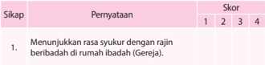

Tabel ini menunjukkan skor sikap seseorang terhadap pernyataan "Menunjukkan rasa syukur dengan rajin beribadah di rumah ibadah (Gereja)." Topik utama tabel adalah sikap seseorang terhadap pernyataan tersebut. Kolom-kolom yang ada adalah Skor, dengan pilihan jawaban 1, 2, 3, dan 4. Data atau pola penting yang terlihat adalah bahwa skor tertinggi adalah 4, yang berarti seseorang yang menjawab dengan pilihan 4 memiliki sikap yang paling positif terhadap pernyataan tersebut. Skor 1 adalah pilihan yang paling rendah, yang berarti seseorang yang menjawab dengan pilihan 1 memiliki sikap yang paling negatif terhadap pernyataan tersebut.

 

---
## 📄 Halaman 190

---
**📊 Tabel**

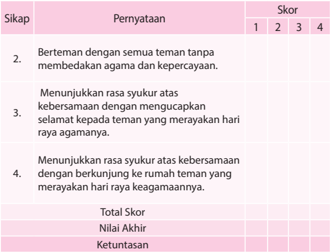

Tabel ini menunjukkan skor siswa dalam beberapa sikap sosial dan emosional, seperti berinteraksi dengan teman tanpa membedakan agama dan kepercayaan, menunjukkan rasa syukur atas keberadaan teman, dan berpartisipasi dalam perayaan agama. Kolom "Sikap" menyajikan tiga poin yang harus diisi oleh siswa, sedangkan kolom "Pernyataan" memberikan contoh atau deskripsi dari setiap sikap tersebut. Skor ditentukan berdasarkan tingkat kesiapan siswa dalam menerapkan sikap tersebut, dengan skor 1 untuk tidak memenuhi, 2 untuk memenuhi dengan kurang, 3 untuk memenuhi dengan baik, dan 4 untuk memenuhi dengan sangat baik. Total skor dari semua poin dikonversi menjadi nilai akhir dan kemudian diperoleh keterangan tentang kinerja siswa dalam hal ini. Topik utama tabel adalah pengembangan sikap sosial dan emosional siswa, dengan fokus pada bagaimana mereka dapat berinteraksi dengan teman tanpa memandang agama dan kepercayaan, serta bagaimana mereka dapat menunjukkan rasa syukur dan partisipasi dalam perayaan agama.

Skor akhir menggunakan skala 1 sampai 4.

Perhitungan skor akhir menggunakan rumus:

Skor yang diperoleh

Skor maksimal x 4 = skor akhir

### 2.  Penilaian Pengetahuan

- •
- Bentuk Penilaian:
- Uraian:
- Jelaskan apa itu keberagaman/kemajemukan bangsa Indonesia!
- Jelaskan  peluang  dan  tantangan  realitas  keberagaman  pada  bangsa Indonesia!
- Jelaskan ajaran Kitab Suci tentang keberagaman manusia!
- Jelaskan ajaran Gereja tentang keberagaman manusia!
Tes Tertulis

 

---
## 📄 Halaman 191

### 3.  Penilaian Keterampilan

- •
- Bentuk Penilaian:
Portofolio

- Tugas:
Buatlah  sebuah  essay  tentang  kemajemukan  atau  keberagaman  bangsa Indonesia sebagai kekuatan bersama untuk membangun bangsa dan negara, di  mana  Gereja  Katolik  menjadi  salah  satu  kekuatan  untuk  membangun perdamaian di Indonesia.

### 4.  Kegiatan Remedial

Bagi peserta didik yang belum memahami pokok bahasan ini, diberikan remedial dengan kegiatan:

- Guru menyampaikan pertanyaan kepada peserta didik hal-hal apa saja yang belum mereka pahami tentang keberagaman sebagai realitas asali kehidupan manusia. Apabila  ada  hal-hal  tertentu  yang  belum  mereka  pahami,  guru mengajak  peserta  didik  untuk  mempelajari  kembali  dengan  memberikan penguatan yang lebih praktis.
- Guru memberikan penilaian untuk menilai pengetahuan, dengan pertanyaan yang lebih sederhana, sesuai dengan kondisi peserta didik.

### 5.  Kegiatan Pengayaan

Bagi peserta didik yang telah memahami pokok bahasan ini, diberikan pengayaan dengan kegiatan:

- Melakukan studi pustaka (ke perpustakaan atau mencari di koran/majalah) untuk menemukan apa saja yang telah dilakukan Gereja Katolik Indonesia untuk mewujudkan perdamaian di Indonesia yang pluralis suku, agama, dan budayanya.
- Hasil temuannya ditulis dalam laporan tertulis yang berisi gambaran singkat dari artikel atau cerita tersebut serta memberikan re fl eksi kritisnya.

 

---
## 📄 Halaman 192

### B.  Mengupayakan Perdamaian dan Persatuan Bangsa

### 1.  Penilaian Sikap

### Penilaian Diri

### Partisipasi dalam Diskusi kelompok

Nama

:  ....................................................

Nama-nama anggota kelompok  : ....................................................

.....................................................

Kegiatan kelompok

:  ....................................................

Isilah pernyataan berikut dengan jujur. Untuk No.1 s.d. 5, tulislah huruf A, B, C atau D di depan tiap pernyataan:

- A: Selalu
- C: Kadang-kadang
- B: Sering
D: Tidak pernah

- Apa yang kamu lakukan selama kegiatan?
.....................................................................................................................

.....................................................................................................................

.....................................................................................................................

 

---
## 📄 Halaman 193

### 2.  Penilaian Pengetahuan

- •
- Bentuk Penilaian:
- Uraian
- Buatlah analisis tentang kon fl ik-kon fl ik sosial yang terjadi di Indonesia.
- Jelaskan ajaran Kitab Suci tentang perdamaian dan persatuan!
- Jelaskan ajaran Gereja tentang perdamaian dan persatuan!

### 3.  Penilaian Keterampilan

- Bentuk Penilaian: Proyek
- Tugas
Membuat sebuah rancangan 'kunjungan persaudaraan' di lingkungan yang paling dekat dengan peserta didik (rumah atau sekolah). Mencatat perbuatan yang  sudah  dilakukan  peserta  didik  yang  menunjukkan  persaudaraan. Kegiatan ini dilaksanakan dalam kelompok.

### 4.  Kegiatan Remedial

Bagi peserta didik yang belum memahami pokok bahasan ini, diberikan remedial dengan kegiatan:

- Guru  menyampaikan  pertanyaan  kepada  peserta  didik  akan  hal-hal  apa saja  yang  belum  mereka  pahami  tentang  mengupayakan  perdamaian dan  persatuan  bangsa.  Apabila  ada  hal-hal  tertentu  yang  belum  mereka pahami, guru mengajak peserta didik untuk mempelajari kembali dengan memberikan pengayaan yang lebih praktis.
- Guru memberikan penilaian untuk menilai pengetahuan, dengan pertanyaan yang lebih sederhana, sesuai dengan kondisi peserta didik.

### 5.  Kegiatan Pengayaan

Bagi peserta didik yang telah memahami pokok bahasan ini, diberikan pengayaan dengan kegiatan:

- Melakukan studi pustaka (ke perpustakaan atau mencari di koran/majalah) untuk menemukan apa saja yang telah dilakukan Gereja Katolik Indonesia untuk mengupayakan perdamaian dan persatuan bangsa Indonesia.
- Hasil temuannya ditulis dalam laporan tertulis yang berisi gambaran singkat dari artikel atau cerita tersebut serta memberikan re fl eksi kritisnya.
Tes Tertulis

 

---
## 📄 Halaman 194

### BAB IV

### Dialog dan Kerja Sama Antarumat Beragama

Pada Bab I, telah dipelajari tentang 'Panggilan Hidup' kita sebagai manusia. Bab II kita  belajar  tentang  bagaimana  memperjuangkan  nilai-nilai  kehidupan.  Sementara pada  Bab  III  telah  dipelajari  tentang  keberagaman  atau  pluralitas  dalam  hidup bermasyarakat.

Pada  Bab  IV  ini,  kita  akan  mempelajari  tentang  dialog  dan  kerja  sama  antarumat beragama di Indonesia. Kita belajar bagaimana umat beragama dapat saling menghargai, berdialog, dan bekerja sama walaupun berbeda agama dan keyakinan. Kemajemukan, termasuk kemajemukan agama dan keyakinan merupakan ciri, jati diri  bangsa  Indonesia  yang  tidak  terbantahkan.  Inilah  realitas  kebangsaan  kita, 'berbeda-beda  tetapi  tetap  satu'.  Bagaimana  mengelola  perbedaan-perbedaan  ini sehingga menjadi kekuatan yang besar dan bersinergi dalam membangun bangsa dan negara ini? Salah satu caranya adalah menciptakan kerukunan hidup lewat dialog dan kerja sama antarumat beragama. Tanpa dialog dan kerja sama yang baik maka negeri ini akan terseok-seok dalam pembangunan dan dengan sendirinya semakin tertinggal dari bangsa-bangsa lain.

Untuk mencapai tujuan itu, berturut-turut akan dibahas tentang:

- Kekhasan Agama-Agama di Indonesia.
- Dialog Antarumat Beragama dan Kepercayaan lain.
- Membangun Persaudaraan Sejati melalui Kerja Sama Antarumat Beragama dan Kepercayaan lain.

 

---
## 📄 Halaman 195

### Kekhasan Agama-Agama

### A. di Indonesia

### Kompetensi Dasar

- 1.4  Bersyukur atas adanya semangat dialog dan kerja sama dengan umat beragama lain.
- 2.4  Proaktif dan responsif untuk berdialog serta bekerja sama dengan umat beragama lain.
- 3.4  Memahami makna berdialog serta bekerja sama dengan umat beragama lain.
- 4.4  Melakukan aktivitas (misalnya: menuliskan re fl eksi/doa/puisi/rangkuman/ wawancara dengan tokoh umat) tentang semangat dialog dan kerja sama dengan umat beragama lain.

### Indikator

- Menganalisis kekhasan ajaran agama-agama di Indonesia (agama Islam, Kristen Protestan, Katolik, Hindu, Buddha, Khonghucu).
- Menganalisis persamaan-persamaan ajaran agama-agama di Indonesia Indonesia (agama Islam, Kristen Protestan, Katolik, Hindu, Buddha, Khonghucu).
- Menganalisis ajaran atau pandangan Gereja Katolik terhadap agama-agama dan kepercayaan lain di Indonesia menurut Nostra Aetate (NA) art. 2 dan 3.

### Bahan Kajian

- Kekhasan agama-agama di Indonesia (agama Islam, Kristen Protestan, Katolik, Hindu, Buddha, Khonghucu dan aliran kepercayaan).
- Persamaan-persamaan ajaran agama-agama di Indonesia (agama Islam, Kristen Protestan, Katolik, Hindu, Buddha, Khonghucu dan aliran kepercayaan).
- Ajaran atau pandangan Gereja Katolik terhadap agama-agama dan kepercayaan lain di Indonesia.

### Sumber Belajar

- Konferensi Waligereja Indonesia (KWI). 1996. Iman Katolik. Kanisius: Yogyakarta.
- Heuken SJ. 1991. Ensiklopedi Gereja. Cipta Loka Caraka: Jakarta.
- Dokpen KWI (Penterj), 1992. Dokumen Konsili Vatikan II, Obor: Jakarta.
- Kitab Suci.

 

---
## 📄 Halaman 196

### Pendekatan

Sainti fi k dan Kateketis.

### Metode

Cerira, tanya jawab, diskusi, dan penugasan.

### Sarana

- Kitab Suci (Alkitab).
- Buku Siswa kelas XII Pendidikan Agama Katolik dan Budi Pekerti.

### Waktu

3 x 45 menit.

### Pemikiran Dasar

Sering  kali  terjadi  gesekan  atau  pertikaian  antarkelompok  umat  beragama  di Indonesia oleh karena ada rasa curiga satu terhadap yang lain. Di beberapa wilayah tertentu, terjadi kekerasan baik secara fi sik maupun psikis terhadap umat beragama lain, bahkan ketika mereka sedang melakukan ritual keagamaan yang sejatinya tidak dilarang  oleh  siapapun  termasuk  institusi  negara.  Negara  menjamin  setiap  warga negara untuk menjalankan ibadat sesuai agama dan keyakinannya. Setiap pemeluk agama dari agama apapun diharapkan menghormati keyakinan pemeluk agama lain, karena semua agama mengajarkan nilai-nilai persaudaraan dalam kehidupan bersama.

Gereja  Katolik  sangat  menghargai  dan  menghormati  mereka,  serta  senantiasa menyadari bahwa agama-agama dan kepercayaan yang berbeda-beda itu, dengan tata ibadat,  upacara-upacara  suci,  serta  kaidah-kaidah  yang  berbeda-beda,  merupakan bentuk usaha dari manusia untuk menjawab kerinduan hati manusia. Gereja Katolik tidak menolak apa saja yang benar dan suci dari agama lain. Namun, Gereja Katolik juga tiada hentinya memaklumkan Kristus yang diimaninya sebagai jalan, kebenaran, dan  hidup.  Dalam  rangka  membangun  Kerajaan  Allah,  mereka  menjadi  partner. Dialog dengan mereka juga dipandang sebagai ungkapan iman Katolik.

Melalui  pelajaran  ini,  peserta  didik  dibimbing  untuk  memahami  kekhasan  atau pokok-pokok  penting  ajaran  agama  lain  sehingga  mereka  mampu  bekerja  sama dengan  umat  agama  lain  (Islam,  Kristen  Protestan,  Hindu,  Buddha,  Khonghucu, dan Aliran Kepercayaan) dalam pembangunan bangsa dan negara Indonesia. Dalam kehidupan  sehari-hari,  umat  Katolik  harus  berusaha  mewujudkan  hubungan  dan kerja sama dengan umat non-Katolik demi terciptanya kehidupan yang damai, adil, dan sejahtera.

 

---
## 📄 Halaman 197

### Doa Pembuka

Ya  Allah,  pencipta  alam  semesta,  hanya  kepada-Mulah  segala  ciptaan bersembah sujud dan berbakti. Engkau mengenal setiap hati, dan melalui berbagai cara Engkau mewahyukan diri kepada mereka.

Kami bersyukur kepada-Mu atas begitu banyak orang yang dengan tulus mencari keselamatan. Kami bersyukur pula atas agama-agama yang dapat menuntun para penganutnya sampai kepada-Mu, sebab hanya Engkaulah satu-satunya sumber keselamatan. Engkaulah tujuan hidup manusia. Kami bersyukur atas begitu banyak tokoh agama yang menjadi panutan dalam berbakti kepada-Mu dan dalam mengasihi sesama manusia.

Kami  mohon,  ya  Bapa,  semoga  Engkau  berkenan  mengembangkan semangat kerukunan antar umat beragama. Jauhkanlah dari  kami  sikap merendahkan  penganut  agama  lain.  Semoga  semua  orang  sungguh menghayati  dan  mengamalkan  ajaran  imannya,  dan  hidup  dengan bertakwa.  Bantulah  para  pemuka  agama  agar  tekun  meneladani  dan mengajak umatnya untuk menghormati, mengasihi, menghargai penganut agama lain, dan saling mengakui adanya perbedaan antar agama.

Kami  mendoakan  pula  orang-orang  yang  tidak  masuk  dalam  agama manapun,  tetapi  sungguh  percaya  akan  Dikau,  Allah  Yang  Esa.  Hanya Engkau sendirilah yang mengenal iman mereka. Terangilah mereka ini, dan bimbinglah agar sampai pada jalan keselamatan. Ini semua kami mohon kepada-Mu dengan pengantaraan Tuhan kami, Yesus Kristus. Amin.

### Langkah Pertama: Menggali Kekhasan Agama-Agama di Indonesia

### 1. Menelusuri Kekhasan Agama-Agama di Indonesia

- Mengamati gambar
- Guru  mengajak  peserta  didik  untuk  mengamati  gambar  pada  buku siswa, halaman 101.
- Selain gambar rumah-rumah ibadat itu, guru dapat mengajak peserta didik untuk menunjukkan gambar-gambar atau simbol lain dari setiap agama di Indonesia.
- Bila memungkinkan guru dapat menayangkan fi lm atau video tentang kerja sama lintas agama dalam suatu kegiatan sosial.

 

---
## 📄 Halaman 198

### b. Pendalaman/Diskusi

- Guru mengajak peserta didik untuk merumuskan pertanyaan-pertanyaan setelah mengamati gambar.
- Guru mengajak peserta didik untuk berdialog, dengan memformulasikan pertanyaan-pertanyaan yang muncul, misalnya:
- Apa makna gambar-gambar itu?
- Apa ciri-ciri khas agama-agama di Indonesia?
- Mengapa semua umat beragama perlu hidup berdampingan?
- Bagaimana pengalamanmu dalam bergaul dengan umat beragama lain?

### c. Peneguhan

- Guru  memberikan  penjelasan  atau  rangkuman  setelah  melakukan dialog, misalnya:
- Gambar-gambar itu adalah rumah-rumah ibadat dari agama-agama yang ada di Indonesia. Setiap agama memiliki ciri khas masingmasing,  baik  dari  segi  ajaran,  doktrin,  ibadat,  maupun  dari  segi bangunan atau tempat ibadat.
- Semua umat beragama dari agama apapun perlu hidup berdampingan, rukun, dan damai karena kita semua adalah sesama ciptaan Tuhan.
- Setelah  guru  memberikan  penjelasan  sebagai  rangkuman  dari  dialog tentang  simbol-simbol,  gedung  atau  rumah  ibadat,  guru  mengajak peserta didik untuk mendalami satu per satu, ciri khas agama-agama di Indonesia sehingga peserta didik dapat memahami keberadaan agamaagama lain di sekitarnya.

### Langkah Kedua: Mendalami Kekhasan Agama-Agama di Indonesia

### 1. Mendalami kekhasan agama Kristen Protestan

### a. Menggali pengalaman peserta didik

Guru  mengajak  peserta  didik  mengungkapkan  pengalamannya  bergaul dengan umat Kristen Protestan.

### b. Pendalaman pengalaman

Guru mengajak peserta didik untuk bertanya tentang pengalamanpengalaman yang telah disampaikan oleh beberapa peserta didik.

### c. Mengenal Lebih jauh tentang agama Kristen (Protestan)

Setelah para peserta didik menyampaikan hasil diksusinya, guru mengajak peserta didik menyimak uraian tentang agama Kristen (Protestan) berikut ini. (lihat buku 'Iman Katolik; Buku Informasi dan Referensi', oleh KWI, diterbitkan oleh Kanisius, Yogyakarta, 1996, halaman 355-359).

 

---
## 📄 Halaman 199

### 1) Sejarah singkat Pemisahan Gereja

### a) Gereja Lutheran

Keadaan  Gereja  pada  abad  XVI  mengalami  pasang  surut  atau terjadi  kemerosotan  moral  yang  sangat  memprihatinkan.  Hal  ini terjadi oleh karena Gereja terlalu jauh terlibat dalam banyak urusan duniawi.  Paus  saat  itu  menjadi  sangat  berkuasa  dan  memegang supremasi,  baik  dalam  urusan  Gereja  maupun  kenegaraan.  Paus tampil sebagai penguasa tunggal yang cenderung otoriter.

Sebagaimana pemilihan presiden atau kepala daerah di Indonesia yang  selalu  diwarnai  dengan  politik  uang,  begitu  pula  situasi pemilihan  Paus  kala  itu.  Pemilihan  Paus  Aleksander  VI  dan Leo  IX,  misalnya  diwarnai  kasus money  politic atau  korupsi. Komersialisasi  jabatan  Gereja  dipertontonkan  secara  terbuka. Banyak pejabat Gereja menjadi pangeran duniawi dan melalaikan tugas  rohani  mereka.  Banyak  imam-imam  paroki  tidak  terdidik, hedonistis, bodoh, tidak mampu berkhotbah, dan juga tidak mampu mengajar umat. Keadaan semacam ini terjadi dalam kurun waktu yang cukup lama. Teologi skolastik menjadi mandul dan masalah dogmatis dianggap sebagai perdebatan tentang hal sepele antara aneka aliran teologis. Banyak persoalan teologi mengambang dan tidak pasti.

Banyak kebiasaan dalam umat belum seragam. Iman bercampur takhayul, kesalehan berbaur dengan kepentingan duniawi. Kegiatan agama dianggap sebagai sebuah rutinitas sosial sehari-hari, serta mencampur adukan hal-hal profan dengan hal-hal yang suci atau sakral.

Dalam situasi seperti itu, banyak orang merasa terpanggil untuk memperbarui hidup  Gereja,  namun  tidak  ditanggapi.  Kemudian, tampillah  Martin  Luther.  Luther  mula-mula  menyerang  masalah penjualan  indulgensi,  yaitu  orang  dapat  menghapus  dosanya dengan cara memberikan sejumlah uang kepada gereja.

Kemudian,  Martin  Luther,  yang  seorang  pastor  itu  membela beberapa pandangan baru khususnya ajaran tentang 'pembenaran hanya karena iman' (Sola fi de). Luther menyerang wewenang Paus dan menolak beberapa ajaran teologi sebelumnya dengan bertumpu hanya pada Alkitab sesuai dengan tafsirannya.

Pada  dasarnya,  Luther  tidak  menginginkan  perpecahan  dalam Gereja. Ia ingin memelopori pembaharuan dalam Gereja. Tetapi ia terseret oleh arus yang disebabkan oleh rasa tidak puas yang umum dalam  umat  yang  mendambakan  pembaharuan  yang  bentuknya kurang jelas.  Ajaran-ajaran para teolog yang mendukung perbuatanperbuatan saleh, kini diragukan Luther.

 

---
## 📄 Halaman 200

Indulgensi;  stipendium  untuk  misa  arwah;  sumbangan  untuk membangun gereja bersama dengan patung-patung yang menghiasinya; pajak untuk Roma; ziarah dan puasa; relikui dan kaul-kaul;  semua  tidak  ditemukan  dalam  Kitab  Suci,  sehingga ditolak  oleh  Luther.  Luther  menegaskan  bahwa  semua  itu  tidak bermanfaat  untuk  memperoleh  keselamatan.  Hanya  satu  yang perlu: yakni beriman (Sola fi de). Orang yang percaya dibenarkan Allah tanpa mengindahkan perbuatan baik manusia (Sola gratia).

Dengan sendirinya orang yang dibenarkan itu akan berbuat baik dengan bebas dan  tenang,  bukan  karena  cemas  akan  keselamatannya. Rasa  lega  membuat  orang  tertarik  kepada  khotbah  Luther  yang disebarluaskan ke seluruh Jerman.

Sola fi de  fi des  ex  audito -  'Hanya  iman,  dan  iman  karena mendengar' itu sudah cukup untuk menjamin keselamatan. Maka, tujuh Sakramen tidak penting lagi; selibat tidak berguna; dan hidup membiara  tidak  berarti.  Semuanya  ini  'buatan  Paus'  saja  untuk mengejar  kuasa  dan  untung.  Maka,  imam,  biarawan,  dan  suster berbondong-bondong meninggalkan biara mereka masing-masing. Luther didukung oleh banyak kelompok dengan alasan berbedabeda,  misalnya  para  bangsawan  yang  mengingini  milik  biara; warga  kota  yang  mendambakan  kebebasan  berpikir;  para  petani yang ingin lepas dari kerja rodi dan pajak; para nasionalis yang membenci privilege Roma; para humanis yang ingin membuang kungkungan  teologi  skolastik;  pemerintahan  kota-kota  kerajaan yang mencium kesempatan memperluas wewenang mereka di kota. Luther tampil sebagai pahlawan pembebasan. Ia disambut dengan antusias. Akhirnya pembaharuan sungguh-sungguh dimulai juga. Mula-mula Roma kurang menyadari apa yang terjadi, kemudian bereaksi salah, sehingga tidak mampu mengarahkannya lagi.

Banyak hal baru dimulai, namun tidak jarang merupakan perusakan yang lama saja. Bukan reformasi Gereja yang lama, tetapi orang sudah menunggu terlalu lama. Mereka tidak sabar lagi, komunikasi Luther oleh paus Leo X (1520) dan pengucilan oleh kaisar (1523) tidak  dapat  membendung  gerakan  ini.  Roma  tidak  memahami reaksi dahsyat di Jerman dan masih lama bertindak seperti pada abad-abad sebelumnya.

Luther juga menyerang umat yang setia kepada Paus. Tuntutannya semakin  radikal. Persatuan Gereja tidak dicari lagi,  bahkan diboikot. Para bangsawan yang mendukungnya tidak tertarik pada persatuan kembali, karena antara lain milik gerejani yang mereka rampas tidak mau mereka kembalikan. Unsur keagamaan, politis,

 

---
## 📄 Halaman 201

dan pribadi di kedua belah pihak menyulitkan persatuan kembali. Reformasi selesai; umat  terpecah-belah  ke  dalam  kelompok Katolik, Lutheran, Calvinis, Anglikan, dan sebagainya.

### b) Gereja Kalvinis

Tokoh  reformasi  lain  adalah Yohanes  Calvin (1509  -  1564). Tokoh ini tidak jauh berbeda dengan Luther. Ia ingin memperbarui Gereja  dalam  terang  Injil.  Calvin  dalam  bukunya  yang  berjudul 'Institutio Christianae Religionis' menggambarkan Gereja dalam dua dimensi, yakni Gereja sebagai persekutuan orang-orang terpilih sejak awal dunia yang hanya dikenal oleh Allah dan Gereja sebagai kumpulan mereka yang dalam keterbatasannya di dunia mengaku diri sebagai penganut Kristus dengan ciri-ciri pewartaan Injil dan pelayanan sakramen-sakramen. Pengaturan Gereja ditentukan oleh struktur empat jabatan, yakni pastor, pengajar, diakon, dan penatua.

### c) Gereja Anglikan

Anglikanisme  bermula  pada  pemerintahan  Henry  VII  (1509  1547). Di Inggris raja Henry VII menobatkan dirinya sebagai kepala Gereja karena Paus di Roma menolak perceraiannya. Anglikanisme menyerap pengaruh reformasi, namun mempertahankan beberapa corak  Gereja  (Uskup  -  Imam  -  Diakon),  sehingga  berkembang dengan warna yang khas.

Reaksi  dari  Gereja  Katolik  Roma  atas  gerakan  reformasi  ini adalah 'Kontra-Reformasi' atau 'Gerakan Pembaharuan Katolik'. Gerakan  pembaharuan  ini  dimulai  dengan  menyelenggarakan Konsili Trente. Melalui Konsili Trente (1545-1563), Gereja Katolik berusaha untuk 'menyingkirkan kesesatan-kesesatan dalam Gereja dan menjaga kemurnian Injil'.

Konsili  juga  menegaskan  posisi  Katolik  dalam  hal-hal  yang disangkal oleh pihak Reformasi, yakni soal Kitab Suci dan Tradisi; penafsiran Kitab Suci; pembenaran; jumlah sakramen-sakramen; korban misa, imamat dan tahbisan; pembedaan imam dan awam.

Konsili Trente dan sesudahnya menekankan Gereja sebagai penjaga iman yang benar dan utuh, ditandai dengan sakramen-sakramen. Khususnya  Ekaristi  yang  dimengerti  serta  dirayakan  sebagai korban sejati.  Gereja  bercorak  hierarkis  yang  dilengkapi  dengan jabatan-jabatan  gerejani  dan  imamat  yang  berwenang  khusus dalam hal merayakan ekaristi, melayani pengakuan dosa. Gereja adalah  kelihatan  dan  ini  menjadi  jelas  dalam  lembaga  kepausan sebagai puncaknya. Gereja mewujudkan diri sebagai persekutuan para kudus lewat penghormatan pada mereka (para kudus); Gereja menghormati tradisi.

 

---
## 📄 Halaman 202

### 2) Usaha untuk bersatu antarsesama Gereja Kristus

Berkaitan  dengan  upaya  Gereja  Katolik  untuk  mempersatukan  umat Kristus,  Konsili  vatikan  II  dalam  Dekritnya  tentang  Ekumenisme' menyatakan sebagai berikut:

'Sekarang  ini,  atas  dorongan  rahmat  Roh  Kudus,  di  cukup  banyak daerah  berlangsunglah  banyak  usaha  berupa  doa,  pewartaan,  dan kegiatan, untuk menuju ke arah kepenuhan kesatuan yang dikehendaki oleh  Yesus  Kristus.  Maka  Konsili  Suci  mengundang  segenap  umat Katolik, untuk mengenali tanda-tanda zaman, dan secara aktif berperan serta dalam kegiatan ekumenis.

Yang  dimaksudkan  dengan  'Gerakan  Ekumenis'  ialah:  kegiatankegiatan dan usaha-usaha, yang menanggapi bermacam-macam kebutuhan  Gereja  dan  berbagai  situasi  yang  diadakan  dan  ditujukan untuk mendukung kesatuan umat Kristen. Misalnya: pertama, menghindari  kata-kata,  penilaian-penilaian  serta  tindakan-tindakan, yang ditinjau dari sudut keadilan dan kebenaran tidak cocok dengan situasi saudara-saudari yang terpisah, yang akan mempersukar hubungan dengan mereka. Kedua, dalam pertemuan-pertemuan umat Kristen dari berbagai Gereja atau Jemaat, yang diselenggarakan dalam suasana religius, 'dialog' antara para pakar yang kaya informasi akan memberi  ruang  kepada  masing-masing  peserta  untuk  secara  lebih mendalam  menguraikan  ajaran  persekutuannya  dan  dengan  jelas menyajikan  corak-cirinya.  Sebab  melalui  dialog  itu  semua  peserta memperoleh pengertian yang lebih cermat tentang ajaran dan perihidup setiap Gereja, serta penghargaan yang lebih sesuai dengan kenyataan. Selain  itu,  Gereja-Gereja  dapat  menggalang  kerja  sama  yang  lebih luas  lingkupnya  melalui  aneka  usaha  demi  kesejahteraan  umum menurut tuntutan setiap suara hati kristen, jika memungkinkan mereka bertemu dalam doa sehati sejiwa. Ketiga, mereka semua mengadakan pemeriksaan batin tentang kesetiaan mereka terhadap kehendak Kristus mengenai  Gereja,  dan  sebagaimana  harusnya  menjalankan  dengan tekun usaha pembaharuan dan perombakan.

Apabila semua usaha itu dilaksanakan dengan bijaksana dan sabar di bawah pengawasan para gembala, akan membantu terwujudnya nilainilai  keadilan  dan  kebenaran,  kerukunan  dan  kerja  sama,  semangat persaudaraan dan persatuan. Diharapkan, lambat-laun dapat terwujud persekutuan gerejawi yang sempurna, dan semua orang Kristen dalam satu  perayaan  Ekaristi,  dihimpun  membentuk  kesatuan  Gereja  yang satu  dan  tunggal.  Kesatuan  itulah  yang  sejak  semula  dianugerahkan oleh Kristus kepada Gereja-Nya. Kita percaya, bahwa kesatuan itu tetap lestari dalam Gereja Katolik, dan berharap, agar kesatuan itu dari hari ke hari bertambah erat sampai kepenuhan zaman.

 

---
## 📄 Halaman 203

Jelaslah bahwa karya menyiapkan dan mendamaikan pribadi-pribadi, yang ingin memasuki persekutuan sepenuhnya dengan Gereja Katolik, menurut hakikatnya terbedakan dari usaha ekumenis, tetapi juga tidak bertentangan.  Karena  keduanya  berasal  dari  penyelenggaraan  Allah yang mengagumkan.

Dalam  kegiatan  Ekumenis  hendaknya  umat  Katolik  tanpa  ragu-raga menunjukkan  perhatian  sepenuhnya  terhadap  saudara-saudari  yang terpisah, dengan cara mendoakan mereka; bertukar pandangan tentang hal-ihwal  Gereja  dengan  mereka;  dan  mengambil  langkah-langkah pendekatan  terhadap  mereka.  Akan  tetapi  hal  utama  yang  harus dilakukan oleh umat Katolik adalah memperbarui kehidupan keluarga supaya perihidupnya memberi kesaksian lebih setia dan jelas tentang ajaran dan segala sesuatu yang ditetapkan oleh Kristus dan diwariskan melalui para Rasul.

Sebab, walaupun Gereja Katolik diperkaya dengan segala kebenaran yang diwahyukan oleh  Allah dan dengan semua upaya rahmat, Jemaatnya belum  menghayati  sepenuhnya  sebagaimana  mestinya.  Oleh  karena itulah, wajah Gereja kurang bersinar terang bagi saudara-saudari yang tercerai  dari  kita  dan  bagi  seluruh  dunia,  dan  pertumbuhan  Kerajaan Allah mengalami hambatan. Karena itu, segenap umat Katolik wajib menuju  kesempurnaan  kristen,  dan  menurut  situasi  masing-masing mengusahakan agar Gereja, dari  hari  ke  hari  makin  dibersihkan  dan diperbarui sampai Kristus menempatkannya dihadapan Dirinya penuh kemuliaan, tanpa cacat atau kerut.

Semoga  dengan  memelihara  kesatuan  Gereja-Gereja,  sesuai  dengan tugas  kewajiban  masing-masing,  baik  dalam  aneka  bentuk  hidup rohani  dan  tertib  gerejawi,  maupun  dalam  bermacam-macam  tataupacara Liturgi, bahkan juga dalam mengembangkan re fl eksi teologis tentang kebenaran yang diwahyukan, tetap memupuk kebebasan yang sewajarnya  dalam  kasih.  Dengan  bertindak  demikian  mereka  akan semakin menampilkan ciri katolik sekaligus apostolik Gereja dalam arti yang sesungguhnya.

Di  lain  pihak,  umat  Katolik  perlu  dengan  gembira  mengakui  dan menghargai  nilai-nilai  kristen  yang  bersumber  pada  pusaka  warisan bersama,  yang  terdapat  pada  saudara-saudari  yang  tercerai  dari  kita. Layak diakui kekayaan Kristus serta kuasa-Nya yang berkarya dalam kehidupan orang-orang, yang memberi kesaksian akan Kristus.

Apa  yang  dilaksanakan  oleh  rahmat  Roh  Kudus  di  antara  saudarasaudari yang terpisah, dapat membantu kita membangun diri. Segala sesuatu  yang  bersifat  kristen,  tidak  pernah  berlawanan  dengan  nilainilai iman yang sejati, bahkan dapat membantu mencapai secara lebih sempurna misteri Kristus dan Gereja sendiri.

 

---
## 📄 Halaman 204

Bagi  Gereja,  perpecahan  umat  Kristen  merupakan  halangan  untuk mewujudkan secara nyata kepenuhan ciri katoliknya dalam diri putraputrinya.  Konsili  melihat  bahwa  peran  serta  umat  Katolik  dalam gerakan  ekumenis  makin  intensif,  sehingga  dianjurkan  agar  para Uskup, di manapun juga, supaya mendukung mereka secara intensif, dan membimbing dengan bijaksana'. (UN 4).

### d. Pendalaman/Diskusi

Guru mengajak peserta didik untuk berdiskusi mendalami uraian tentang agama Kristen Protestan. Peserta didik dapat bertanya tentang uraian materi yang telah dipelajari, misalnya:

- Apa latar belakang terjadi pemisahan Gereja?
- Apa usaha untuk bersatu (ekumene) antarsesama Gereja Kristus?

### c. Peneguhan

Guru  memberikan  penjelasan  tambahan,  khusus  menyangkut  gerakan ekumene:

- Gerakan  Ekumene  ialah:  kegiatan-kegiatan  dan  usaha-usaha  untuk menanggapi bermacam-macam kebutuhan Gereja dan berbagai situasi dalam rangka mendukung kesatuan umat Kristen.
- Cara untuk mencapai tujuan ekumene adalah:
- Berupaya  untuk  menghindari  kata-kata,  penilaian-penilaian,  dan tindakan-tindakan yang ditinjau dari sudut keadilan dan kebenaran tidak  cocok  dengan  situasi  saudara-saudari  yang  terpisah,  dan karena itu mempersukar hubungan-hubungan dengan mereka.
- Pertemuan-pertemuan  umat  Kristen  dari  berbagai  Gereja  atau Jemaat  diselenggarakan  dalam  suasana  religius,  'dialog'  antara para  pakar  yang  kaya  informasi,  yang  memberi  ruang  kepada setiap  peserta  untuk  secara  lebih  mendalam  menguraikan  ajaran persekutuannya,  dan  dengan  jelas  menyajikan  corak  cirinya. Melalui dialog semacam itu, semua peserta memperoleh pengertian yang lebih cermat tentang ajaran dan peri-hidup kedua persekutuan, serta penghargaan yang lebih sesuai dengan kenyataan.
- Persekutuan-persekutuan menggalang kerja sama yang lingkupnya lebih luas dalam aneka usaha demi kesejahteraan umum menurut tuntutan setiap suara hati Kristen; bila mungkin, mereka bertemu dalam  doa  sehati  sejiwa. Akhirnya,  mereka  semua  mengadakan pemeriksaan  batin  tentang  kesetiaan  mereka  terhadap  kehendak Kristus  mengenai  Gereja,  dan  menjalankan  dengan  tekun  usaha pembaharuan dan perombakan.

 

---
## 📄 Halaman 205

### 2.  Mengenal Kekhasan Agama Islam

### a. Dialog dan Diskusi

- Bila  memungkinkan  guru  mengajak  peserta  didik  berdialog  dengan meminta  beberapa  peserta  didik  mengungkapkan  pengalamannya bergaul dengan umat Muslim.
- Guru mengajak peserta didik untuk memperhatikan gambar yang ada pada buku siswa, halaman 109.
- Guru  mengajak  peserta  didik  berdiskusi  dalam  kelompok  untuk membahas pertanyaan-pertanyaan berikut:
- Apa yang tampak dalam gambar itu?
- Apa saja yang kalian ketahui tentang agama Islam?

### b. Presentasi Hasil Diskusi

Guru  mengajak  peserta  didik  menyampaikan  hasil  diskusi  kelompoknya masing-masing.  Setiap  kelompok  dapat  menanggapi,  atau  bertanya  pada kelompok penyaji.

### c. Mengenal Lebih Jauh tentang Agama Islam

Guru mengajak peserta didik untuk menyimak uraian tentang agama Islam (lihat  buku  'Iman  Katolik;  Buku  Informasi  dan  Referensi',  oleh  KWI, diterbitkan oleh Kanisius, Yogyakarta, 1996, halaman 180-186) berikut ini:

### 1) Asal mula Agama Islam

Islam (bahasa Arab) berarti penyerahan diri sepenuhnya kepada Allah, masuk ke dalam suasana damai, sejahtera, dan hubungan serasi, baik antarsesama  manusia  maupun  antara  manusia  dan  Allah.  Mereka mengimani  bahwa  agama  Islam  seluruhnya  secara  lengkap,  sebagai suatu sistem, berasal dari Allah sendiri yang mewahyukannya kepada Nabi Muhammad dengan perantaraan malaikat Jibril.

Orang-orang muslimin merupakan sebuah kelompok yang terjalin erat berkat iman pada agama yang sama. Persekutuan muslimin ini disebut ummah atau ummat. Ikatan berdasarkan agama yang sama ini disebut ukhuwah islamiyah yang berarti persaudaraan Islam.

Ummah  ini seharusnya dipimpin oleh seorang pemimpin yang disebut khalifah. Sejak  hancurnya ke-khalifah-an tahun 1256, karena dihancurleburkan oleh pasukan Mongol Hulagu, umat Islam mengalami kekosongan kepemimpinan sampai sekarang.

### 2) Tauhid, Nama-Nama, dan Sifat-Sifat Allah

Islam merupakan agama monoteis dengan tekanan yang amat kuat pada Allah Yang  Maha  Besar  ( Allahu  Akbar) menjadi  seruan  yang  kerap digunakan  di  mana-mana).  Monoteisme  Islam  (yang  disebut tauhid )

 

---
## 📄 Halaman 206

sedemikian ditekankan sehingga tidak ada toleransi sedikit pun terhadap apa pun juga yang dapat mengaburkan keesaan Allah. Syirk atau 'mensyarikat-kan Allah' berarti menempatkan sesuatu, betapapun kecilnya, di  samping  atau  sejajar  dengan  Allah. Syirk merupakan  dosa  yang terbesar.

Allah yang diimani mempunyai 20 sifat dan 99 nama yang indah. Orang Muslim yang saleh mencoba selalu mengucapkan keseratus nama Allah yang indah ini dengan pertolongan sebuah tasbih yang berupa sebuah untaian 99 butir-butiran.

### 3) Iman Islam

Kesaksian  pokok  iman  Islam  dirumuskan  dalam  kalimat  syahadat yang terdiri atas dua kalimat (karena itu dinamakan juga 'dua kalimat syahadat').  Yang  pertama  kesaksian  atas  Allah  Yang  Maha  Esa, sedangkan yang kedua kesaksian atas Muhammad sebagai rasul Allah. Kalimat  syahadat  ini  diucapkan  pada  waktu  orang  menjadi  muslim (sebagai  ucapan  upacara  inisiasi  dari  non-Islam  ke  Islam  dan  waktu akad nikah).

Syahadat  merupakan  landasan  atau  dasar  keimanan,  keyakinan,  dan percaya akan adanya Allah Yang Maha Esa dan Rasul-rasul-Nya. Rasa percaya kepada Allah Yang Maha Esa ini merupakan salah satu dari enam  rukun  iman  yang  harus  diyakini  dalam  ajaran  Islam.  Kelima rukun iman lainnya adalah percaya pada Malaikat, Kitab Suci, Rasul, Hari Kiamat, dan Takdir Ilahi.

Islam mengajarkan bahwa dalam kurun waktu tertentu Allah memberikan wahyu-Nya kepada manusia tertentu dengan perantaraan malaikat  Jibril.  Orang  yang  mendapat  wahyu  ini  disebut  nabi  dan jumlahnya banyak sekali, antara lain Adam, Luth, Ibrahim, Daud, dan Isa. Bila nabi itu diutus mewartakan wahyu yang diterimanya itu kepada orang-orang lain, ia disebut rasul, yang berarti utusan (Allah).

### 4) Kitab Suci Agama Islam

Wahyu yang diberikan kepada para nabi berupa sebuah Kitab Suci yang merupakan kutipan langsung dari induk Kitab Suci ( ummal kitab ) yang tersimpan di surga ( al lauh al mahfudz ). Allah memberikan Al-Quran kepada umat-Nya melalui Muhammad, dalam bahasa Arab.

Kedudukan Al-Quran dalam kehidupan umat Islam sangatlah sentral, melebihi kedudukan Muhammad sendiri. Di dalam Al-Quran termuat wahyu  ilahi sendiri.  Termuat di dalamnya  segala sesuatu yang dibutuhkan bagi kehidupan manusia dalam segala aspek kehidupannya, baik  yang  menyangkut  hubungannya  dengan  Tuhan  (hal  ini  disebut ibadah) maupun yang mengatur kehidupan antarmanusia yang disebut mu'amalat. Karena itu, Al-Quran sangat dihormati. Membacanya pun

 

---
## 📄 Halaman 207

merupakan suatu ibadat yang sangat mendatangkan pahala, tidak hanya bagi yang membacanya melainkan juga bagi yang mendengarkannya. Supaya sebanyak mungkin orang dapat memperoleh pahala, pembacaan Al-Quran tidak hanya di dalam hati, tetapi dengan suara yang dapat didengarkan juga oleh orang lain.

### 5) Arkan al-Islam : Pilar Penyangga Islam

Islam berarti penyerahan diri secara total kepada Allah. Sebagai orang Muslim sikap yang tepat bagi seseorang di hadapan Allah adalah takwa dan  takut  kepada Allah,  taat  pada  segala  perintah-Nya,  sebagaimana dituliskan  dalam  Al-Quran.  Manusia  adalah  hamba  dan  abdi  Allah. Kewajiban-kewajiban pokok yang harus dijalankan oleh setiap orang Muslim  terangkum  dalam  lima  rukun  Islam  atau  pilar  penyangga keislaman ( arkan al Islam ), yakni: syahadat, sholat lima waktu, saum (puasa dalam bulan Ramadhan), zakat, dan haji (naik haji ke Mekkah).

### 6) Al Ahkam al Khamsa : Hukum Islam

Tujuan hidup manusia adalah mencari ridh\a ilahi, mencari perkenanan Allah, hidup sedemikian rupa sehingga Allah tidak marah, melainkan berkenan.  Perbuatan-perbuatan  yang  berkenan  pada  Allah  (disebut halal )  mendatangkan  pahala  bagi  pelakunya.  Sebaliknya,  perbuatan yang  menimbulkan  kemarahan  Allah  (disebut haram )  menimpakan hukuman pada pelakunya.

Ada 5 hukum Islam yakni:

- a). Wajib atau Fardh
:  harus dilakukan.

- b). Sunnah atau Mustahab  : sebaiknya dilakukan
- c). Mubah atau Jaiz
:  diperbolehkan

- d).  Makruh
:  sebaiknya tidak dilakukan

- e). Haram
:  dilarang

Halal  haramnya  sesuatu  dapat  diketahui  dari Al-Quran  sendiri.  Bila tidak ada di dalam Al-Quran, diaculah pada sumber yang kedua yakni Sunnah  Nabi,  yakni  perkataan,  tingkah  laku,  dan  perbuatan  Nabi Muhammad. Sunnah Nabi dikumpulkan dalam kitab-kitab yang disebut Kitab Hadis. Hadis berarti tradisi, tetapi di sini hanyalah tradisi atau adat kebiasaan Muhammad.

### 7) Tasawwuf: Mistik dalam Islam

Dalam sejarah perkembangan umat Islam, ilmu Fiqh (hukum Islam) menempati peranan yang utama. Karena terlalu menekankan hukum, muncullah penghayatan keagamaan yang sangat legalistis. Hubungan dengan Allah menjadi kering, sehingga muncullah gerakan mistik dalam umat Islam dan cara penghayatan keagamaan ini terkenal dengan nama tasawwuf, sedangkan orang yang menjalankan cara hidup ini disebut su fi . Hampir semua wali dari Wali Songo yang menyebarkan Islam di pulau Jawa adalah orang-orang su fi .

 

---
## 📄 Halaman 208

### 8) Sikap Agama Islam terhadap Agama Lain

Sikap Islam terhadap agama lain terungkap antara lain dalam:

### a) Surat Al Baqarah 62

Dalam hubungannya dengan agama lain, agama Islam mempunyai sikap  dasar  toleransi  yang  tinggi.  Toleransi  Islam  digariskan langsung  oleh Allah  dalam Al-Quran.  Misalnya  dalam  Surat Al Baqarah 62 disebutkan 'Sesungguhnya orang-orang yang beriman, orang-orang Yahudi, orang-orang Nasrani, dan orang-orang Aabiin, siapa saja (di antara mereka) yang beriman kepada Allah dan hari Akhir dan melakukan kebajikan, mereka mendapat pahala dari Tuhannya, tidak ada rasa takut pada mereka dan mereka tidak bersedih hati.'

### b) Surat Al Maidah 82

Dalam surat Al Maidah 82 juga disebutkan: '.... Dan pasti akan kamu  dapati  orang  yang  paling  dekat  persahabatannya  dengan orang-orang yang beriman, ialah orang-orang yang berkata, 'Sesungguhnya kami adalah orang Nasrani.'....

Dalam Islam juga ada keyakinan bahwa tidak ada paksaan dalam hal  memeluk  agama.  Bahkan  Nabi  Muhammad  SAW  sendiri telah  banyak  memberi  contoh  bagaimana  ia  menghormati  dan menyayangi orang yang beragama lain.

Di dalam Al-Quran disebutkan juga berbagai tokoh dari Perjanjian Lama. Isa yang beribukan Maryam dengan panjang lebar dikemukakan sebagai seorang nabi yang istimewa, lahir melalui mukjizat. Tanpa ayah, mengajar dan membuat banyak mukjizat. Ia  pun  terberkati,  kudus,  murni,  rasul  Allah,  jalan  orang  saleh, pengantara, bahkan disebut sebagai Kalimat Allah dan Roh Allah. Akan  tetapi,  Dia  bukanlah  Allah.  Maria  diceritakan  berkaitan dengan  Isa  al  Masih  Ibu  Maryam  ini.  Bagian  Al-Quran  yang memuat hal ini dinamakan Surah al Maryam.

### 9) Hari Raya Agama Islam

Ada beberapa hari raya agama Islam yang dijadikan hari libur nasional yaitu;  Idul  Fitri,  Idul  Adha,  Maulud  Nabi,  dan  tahun  baru  yaitu  1 Muharam.

### d. Pandangan Gereja Katolik Terhadap Agama Islam

Dalam Dekrit Konsili Vatikan II, tentang hubungan Gereja dengan agamaagama bukan Kristen (Nostra Aetate) sikap Gereja Katolik terhadap Islam dinyatakan sebagai berikut:

'Gereja juga menghargai umat Islam, yang menyembah Allah satu-satunya, yang hidup dan berdaulat, penuh belas kasihan dan Maha Kuasa, Pencipta

 

---
## 📄 Halaman 209

langit dan bumi, yang telah bersabda kepada umat manusia. Kaum muslimin berusaha menyerahkan diri dengan segenap hati kepada ketetapanketetapan Allah yang bersifat rahasia, seperti dahulu Abraham-iman Islam dengan  sukarela  mengacu  kepadanya  telah  menyerahkan  diri  kepada Allah.  Memang  mereka  tidak  mengakui Yesus  sebagai Allah,  melainkan menghormati-Nya sebagai Nabi. Mereka juga menghormati Maria BundaNya yang tetap perawan, dan pada saat-saat tertentu dengan khidmat berseru kepadanya. Selain  itu,  mereka  mendambakan  hari  pengadilan,  saat Allah akan mengganjar semua orang yang telah bangkit. Mereka juga menjunjung tinggi  kehidupan  susila,  dan  berbakti  kepada Allah  terutama  dalam  doa, dengan  memberi  sedekah  dan  berpuasa.  Namun  demikian,  tidak  dapat dipungkiri  cukup  sering  timbul  pertikaian  dan  permusuhan  antara  umat Kristiani  dan  kaum  Muslimin.  Konsili  suci  mendorong  agar  melupakan peristiwa yang sudah berlalu, dan dengan tulus hati melatih diri untuk saling memahami; bersama-sama membela serta mengembangkan keadilan sosial bagi semua orang, menghormati nilai-nilai moral maupun perdamaian dan kebebasan'. (NA 3).

### e. Pendalaman

Setelah peserta didik menyimak uraian tentang agama Islam, guru mengajak peserta didik berdiskusi tentang pertanyaan berikut:

- 1). Apa ciri khas atau ajaran pokok agama Islam?
- 2). Apa pandangan Gereja Katolik terhadap agama Islam?

### 3.  Mengenal Kekhasan Agama Hindu

### a. Menelusuri Agama Hindu

Guru  mengajak  peserta  didik  untuk  membaca  berita  berikut  ini  dan mengamati gambar yang ada pada buku siswa halaman 115.

### Larut Dalam Khidmatnya Ibadah Umat Hindu di Dieng

'Dieng, Wonosobo, Jawa Tengah tidak hanya punya alam yang memesona. Kawasan dataran tinggi ini juga bisa berubah jadi khidmat. Seperti ketika puluhan umat Hindu yang datang dari Bali menggelar peribadatan di tempat ini.

Berada  pada  ketinggian  2.008  mdpl  dengan  suhu  rata-rata  13-17  derajat celcius membuat Dieng punya tempat tersendiri di hati wisatawan. Di sini ada candi, Telaga Warna, dan beberapa destinasi lainnya yang sayang untuk dilewatkan.

Sewaktu saya sedang berkunjung ke sana, tak sengaja bertepatan dengan momen  persembahyangan  para  umat  Hindu.  Mereka  bukan  berasal  dari sekitar Dieng, tapi jauh-jauh datang dari Uluwatu, Bali.

 

---
## 📄 Halaman 210

Momen ibadah ini bukanlah acara ritual yang sering diadakan setiap tahun. Acara ini digelar karena salah satu dari beberapa umat Hindu ini baru saja mendapatkan petunjuk dari Tuhan untuk mengadakan persembahyangan di kawasan Dieng. Saya pun ikut larut dalam khidmat'

Harryseptian

- d'Traveler - Selasa, 19/02/2013 18:50:00 WIB

detikTravel Community -

### b. Pendalaman/Diskusi

- Guru  memancing  peserta  didik  untuk  bertanya  setelah  menyimak cerita di atas. (Pertanyaan-pertanyaan yang muncul dari peserta didik kemudian diformulasikan untuk didiskusikan bersama).
- Guru  mengajak  peserta  didik  untuk  berdiskusi  dalam  kelompok membahas pertanyaan-pertanyaan berikut.
- Apa yang dikisahkan dalam cerita tadi?
- Apa pesan dan kesanmu terhadap cerita itu?
- Apa saja yang kamu ketahui tentang ajaran agama Hindu?
- Guru  mengajak  peserta  didik  menemukan  jawaban  dalam  diskusi kelompok  dengan  mengeksplorasi  dari  berbagai  sumber,  antara  lain dari  buku  PPKn,  atau  dari  internet  (bila  memungkinkan),  kemudian dilaporkan dalam pleno.

### c. Mengenal lebih jauh tentang agama Hindu

Guru mengajak peserta didik untuk menyimak uraian tentang agama Hindu, setelah  bersama-sama  mendengarkan  laporan  hasil  diskusi  kelompok sebelumnya.  (lihat  buku  'Iman  Katolik;  Buku  Informasi  dan  Referensi', oleh KWI , diterbitkan oleh Kanisius, Yogyakarta, 1996, halaman 173-175) berikut ini.

### 1) Aliran dalam Agama Hindu

Dalam  agama  Hindu  terdapat  banyak  aliran  dan  kelompok.  Salah satunya ada di Indonesia, sejak Mahasabda Parishada Hindu Dharma Indonesia (PHDI) tahun 1993, disebut agama Hindu Dharma.

### 2) Ibadat

Unsur pokok penghayatan agama Hindu Dharma muncul dalam bentuk ibadat, khususnya berupa upacara-upacara harian yang dilaksanakan di tempat-tempat tertentu dan pada saat-saat yang berkaitan erat dengan irama  hidup  manusia  setiap  hari,  seperti  di  sekitar  rumah  tinggal, sumber-sumber  air,  persawahan,  pada  waktu  matahari  terbit  dan terbenam, serta waktu-waktu penting lainnya.

Hal  yang  langsung  berhubungan  dengan  ibadat  adalah  bangunanbangunan  pura  yang  tidak  hanya  merupakan  tempat  upacara  ibadah dilaksanakan, tetapi juga menjadi pusat kebudayaan dan hidup sosial.

 

---
## 📄 Halaman 211

### 3) Kitab Suci Agama Hindu

Dalam  Hindu  Dharma  terkenal  kitab-kitab Weda,  Usana  Bali, dan juga Upanisad. Isi tulisan suci ini beraneka ragam, tetapi bagian yang terbesar berupa doa dan himne, juga ajaran mengenai Allah (Brahman), dewa-dewa, alam, dan manusia. Ajaran-ajaran tersebut tidak mengikat secara  ketat  dogmatis,  sehingga  ada  beraneka  ragam  aliran  dan pandangan dalam ajaran Hindu.

### 4) Ajaran Pokok

Tujuan  pokok  hidup  manusia  menurut  agama  Hindu  Dharma  adalah moksha, yaitu pembebasan dari lingkaran reinkarnasi yang tidak habishabisnya  (samsara).  Pembebasan  ataupun  moksa  ini  dapat  dicapai melalui  tiga  jalan  (trimarga),  yaitu karma-marga,  jnana-marga, dan  bhakti-marga. Dengan karma-marga orang  ingin  mencapai moksha dengan melakukan karya, askese badani, yoga, tapa, ketaatan pada  aturan-aturan  kasta.  Karya-karya  yang  paling  berharga  dalam karma-marga adalah samskara, yakni kedua belas upacara liturgis yang berkaitan dengan tahap-tahap kehidupan seseorang.

Dengan Jnana-marga, penyucian diri guna mencapai moksa dilakukan dengan jalan askese budi, mengheningkan cipta dalam meditasi, dengan tujuan semakin menyadari kesatuan dirinya dengan Sang Brahma.

Sedangkan  dengan Bhakti-marga orang  menyucikan  diri  dengan penyerahan diri seutuhnya menuju pertemuan dalam cinta kasih dengan Tuhan.

### 5) Kasta-Kasta

Agama  Hindu  (di  India)  memang  mengenal  pembagian  masyarakat menjadi empat kasta (caturwarna); brahmana, ksatria (keduanya adalah kasta bangsawan, rajawi), waisya (petani, prajurit, dan pedagang) dan sudra/jaba (rakyat jelata). Sebenarnya di luar keempat kasta ini masih ada kelompok kelima yang disebut paria, yakni mereka yang tersisih, tak mempunyai tempat sosial, marginal, dan terbuang. Namun demikian, dalam agama Hindu Dharma pembagian tersebut tinggal sisa-sisanya yang tidak begitu berarti lagi.

### 6) Hari Raya Agama Hindu

Hari  raya Nyepi merupakan  hari  besar  agama  Hindu.  Kendati  hari nyepi ini jatuh pada pergantian tahun baru Saka, hari tersebut bukanlah hari  mengadakan  perayaan  pesta,  melainkan  hari  untuk  menyucikan dan memperkuat diri terhadap pengaruh roh-roh jahat.

Pada hari raya Nyepi umat Hindu dilarang menyalakan api, melakukan pekerjaan, bepergian, dan hubungan seks.

 

---
## 📄 Halaman 212

Selain  hari  raya  Nyepi,  juga  ada  hari  raya  lainnya  yaitu Galungan ( yang jatuh pada hari Rabu Kliwon) dan Wuku Dungulan (setiap 210 hari sekali). Tujuannya memohon ke hadapan Ida Sang Hyang Widhi, Bhatara-Bhatari,  dan  para  leluhur  agar  pemujaannya  dianugerahi keselamatan dan kesejahteraan.

### d. Pandangan Agama Katolik terhadap Agama Hindu

Konsili Vatikan II dalam dekrit tentang Nostra Aetate menjelaskan, 'Sudah sejak dahulu kala hingga sekarang ini di antara berbagai bangsa terdapat suatu  kesadaran  tentang  daya  kekuatan  gaib,  yang  hadir  pada  perjalanan sejarah  dan  peristiwa-peristiwa  hidup  manusia;  bahkan  kadang-kadang ada  pengakuan  terhadap  Kuasa  Ilahi  yang  tertinggi  atau  pun  Bapa. Kesadaran  dan  pengakuan  tadi  meresapi  kehidupan  bangsa-bangsa  itu dengan  semangat  religius  yang  mendalam.  Adapun  agama-agama,  yang terikat  pada  perkembangan  kebudayaan,  berusaha  menanggapi  masalahmasalah tadi dengan paham-paham yang lebih rumit dan bahasa yang lebih terkembangkan.  Demikianlah  dalam Hinduisme manusia  menyelidiki misteri Ilahi dan mengungkapkannya dengan kesuburan mitos-mitos yang melimpah  serta  dengan  usaha-usaha fi lsafat  yang  mendalam.  Hinduisme mencari pembebasan dari kesesakan keadaan entah melalui bentuk-bentuk hidup berulah-tapa atau melalui permenungan yang mendalam, atau dengan mengungsi kepada Allah penuh kasih dan kepercayaan.

Gereja Katolik tidak menolak apa pun, yang dalam agama-agama itu serba benar dan suci. Dengan sikap hormat yang tulus, Gereja merenungkan caracara bertindak dan hidup, kaidah-kaidah serta ajaran-ajaran, yang memang dalam banyak hal berbeda dari apa yang diyakini dan diajarkannya sendiri, tetapi  tidak  jarang  memantulkan sinar kebenaran, yang menerangi semua orang. Namun, Gereja tiada hentinya mewartakan dan wajib mewartakan Kristus,  yakni  'jalan,  kebenaran,  dan  hidup'  ( lih. Yoh  14:  6);  dalam  Dia manusia menemukan kepenuhan hidup keagamaan, 'dalam Dia pula Allah mendamaikan segala sesuatu dengan diri-Nya'.

Oleh karena itu, Gereja mendorong para putranya supaya dengan bijaksana dan  penuh  kasih,  melalui  dialog  dan  kerja  sama  dengan  para  penganut agama-agama lain, sambil memberi kesaksian tentang iman serta perihidup Kristiani,  mengakui,  memelihara,  dan  mengembangkan  harta  kekayaan rohani dan moral serta nilai-nilai sosio-budaya yang terdapat pada mereka' (NA.2).

### e. Pendalaman/Diskusi

Setelah peserta didik menyimak uraian tentang agama Hindu, guru mengajak mereka  berdiskusi  untuk  membahas  pertanyaan-pertanyaan  berikut  ini. (Peserta didik juga diberi kesempatan untuk mengajukan pertanyaan untuk pendalaman lebih lanjut).

 

---
## 📄 Halaman 213

- Apa yang menjadi ciri khas ajaran agama Hindu?
- Apa nama Kitab Suci agama Hindu?
- Apa nama hari-hari raya agama Hindu?
- Apa pandangan Gereja Katolik terhadap agama Hindu?

### f. Peneguhan

Guru memberikan beberapa penegasan setelah proses diskusi:

- Hinduisme: manusia menyelidiki misteri ilahi dan mengungkapkannya dengan  kesuburan  mitos-mitos  yang  melimpah  serta  dengan  usahausaha fi lsafat  yang  mendalam.  Hinduisme mencari  pembebasan  dari kesesakan keadaan manusia, entah melalui bentuk-bentuk hidup berulah-tapa atau melalui permenungan yang mendalam, atau dengan mengungsi kepada Allah penuh kasih dan kepercayaan.
- Sikap Gereja Katolik adalah tidak menolak apa pun, yang dalam agamaagama itu serba benar dan suci. Dengan sikap hormat yang tulus, Gereja merenungkan  cara-cara  bertindak  dan  hidup,  kaidah-kaidah  serta ajaran-ajaran, yang memang dalam banyak hal berbeda dari apa yang diyakini  dan  diajarkannya  sendiri,  tetapi  tidak  jarang  memantulkan sinar kebenaran, yang menerangi semua orang.
- Sikap  kita  sebagai  orang  Katolik  terhadap  sesama  warga  negara Indonesia  yang  beragama  Hindu  adalah  saling  menghargai,  saling menghormati, serta saling bekerja sama membangun bangsa Indonesia untuk  mencapai  cita-cita  kemerdekaan  Indonesia  yaitu  masyarakat yang adil dan sejahtera berdasarkan Ketuhanan Yang Maha Esa.

### 4.  Mengenal Kekhasan Agama Buddha

### a. Pengamatan dan Diskusi

Guru mengajak peserta didik untuk mengamati gambar yang ada pada buku siswa, halaman 120.

### b. Diskusi

- Guru mengajak peserta didik untuk menanyakan gambar yang diamati.
- Guru  mengajak  peserta  didik  untuk  berdiskusi  dalam  kelompok membahas pertanyaan: (Guru memformulasikan pertanyaan-pertanyaan dari peserta didik untuk diskusi selanjutnya).
- a). Gambar siapakah yang kamu lihat?
- b). Apa saja yang kalian ketahui tentang agama Buddha?

### c. Mengenal lebih jauh tentang agama Buddha

Setelah  mendengarkan  laporan  hasil  diskusi  sebelumnya,  guru  mengajak peserta didik untuk menyimak uraian tentang agama Buddha. (lihat buku 'Iman Katolik; Buku Informasi dan Referensi', oleh KWI, diterbitkan oleh Kanisius, Yogyakarta, 1996, halaman 176-179).

 

---
## 📄 Halaman 214

### 1) Sidharta Gautama, Pendiri Agama Buddha

Agama Buddha adalah sebuah agama dan fi lsafat yang berasal dari India dan meliputi beragam tradisi kepercayaan, dan praktik yang sebagian besar  berdasarkan  pada  ajaran  yang  dikaitkan  dengan  Siddhartha Gautama,  yang  secara  umum  dikenal  sebagai  Sang  Buddha  (berarti 'yang telah sadar' dalam bahasa Sanskerta dan Pali).

Sang Buddha hidup dan mengajar di bagian timur anak benua India dalam  beberapa  waktu  antara  abad  ke-6  sampai  ke-4  SM.  Beliau dikenal oleh para umat Buddha sebagai seorang guru yang telah sadar atau  tercerahkan,  yang  membagikan  wawasan-Nya  untuk  membantu makhluk hidup mengakhiri ketidaktahuan/kebodohan ( avidy ā ), kehausan/nafsu  rendah  ( ta ṇ h ā ),  dan  penderitaan  ( dukkha ),  dengan menyadari  sebab  musabab  saling  bergantungan  dan  sunyata  dan mencapai Nirvana (Pali: Nibbana ).

### 2) Kitab Suci Agama Buddha

Setiap  aliran  Buddha  berpegang  kepada Tripitaka sebagai  rujukan utama  karena  di  dalamnya  tercatat  sabda  dan  ajaran  sang  hyang Buddha  Gautama.  Pengikut-pengikutnya kemudian  mencatat dan mengklasi fi kasikan ajarannya dalam 3 buku yaitu Sutta Pi ṭ aka (khotbah-khotbah  Sang  Buddha), Vinaya  Pi ṭ aka (peraturan  atau  tata tertib para bhikkhu) dan Abhidhamma Pi ṭ aka (ajaran hukum meta fi sika dan psikologi).

### 3) Inti Ajaran Agama Buddha

Inti  ajaran  Buddha mengenai hidup manusia tercantum dalam Catur Arya Satya, yang  berarti  Empat  Kasunyatan atau Kebenaran Mulia, yaitu:

- Dukha-Satya : hidup dalam segala bentuk adalah penderitaan.
- Samudaya-Satya : penderitaan disebabkan karena manusia memiliki keinginan dan nafsu.
- Nirodha-Satya :  penderitaan  itu  dapat  dilenyapkan  (moksa)  dan orang mencapai nirvana (kebahagiaan) dengan membuang segala keinginan dan nafsu.
- Marga-Satya : jalan  untuk  mencapai  pelenyapan  penderitaan sehingga  dapat  masuk  ke  dalam  Nirvana  melalui  Delapan  Jalan Utama (asta-arya-marga), yaitu keyakinan yang benar; pikiran yang benar;  perkataan  yang  benar;  perbuatan  yang  benar;  kehidupan yang  benar;  daya  upaya  yang  benar;  perhatian  yang  benar;  dan semedi yang benar.
Dalam  hukum  karmasamsara,  manusia  terikat  oleh  perbuatannya (karma) pada roda kehidupannya (cakra). Dari lahir hingga kematiannya, manusia berpindah-pindah tempat pada berbagai alam dan ruang, yakni

 

---
## 📄 Halaman 215

kamaloka (alam indera dan nafsu), rupaloka (alam tanggapan), dan arupaloka (alam bebas dari keinginan, nafsu, dan pikiran).

Dengan  menjalani  Marga-Satya,  orang  dapat  mencapai  penerangan tertinggi  (bodhi),  yakni  jika  jiwa,  batin,  atau  diri  manusia  secara sempurna  dibebaskan  dari  segala  ikatan  ketiga  ilusi  besar  tentang adanya roh, diri, dan dunia, karena ketiga-tiganya sebenarnya adalah maya atau ilusi belaka. Dengan demikian, orang mencapai kebahagiaan (suka),  keamanan  (bahaya),  dan  kedamaian  (shanty)  yang  olehnya ketiga ilusi besar tadi diganti dengan tiga kebenaran, yakni tanpa diri (anatman), tiada apa-apa (anitya), dan kekosongan sempurna (sunya). Inilah yang dinamakan nirvana, kelenyapan diri yang total. Inilah jati segala-galanya dan merupakan kebahagiaan sempurna.

Terdapat  tiga  aliran  pokok  dalam  Buddhisme  yang  disebut  Triyana, yaitu Theravada (yang disebut juga sebagai Hinayana), Mahayana, dan Vajrayana (yang disebut juga sebagai Tantrayana). Dalam Therevada, penganut-penganutnya mencari keselamatan secara individual. Hanya sedikit  yang  dapat  mencapainya,  karena  itu  dinamakan  Hinayana. Sedangkan dalam Mahayana, orang yang sudah memperoleh penerangan tertinggi  menunda  saat  mencapai  nirvana  guna  menolong  orang  lain mencapai tingkat ini. Karena banyak orang yang dapat mencapainya, aliran ini disebut Mahayana.

Dalam  Mahayana,  diri  Buddha  diberi  kedudukan  transenden  dan disembah sebagai dewa yang dapat dimintai perantaraannya. Inilah juga yang berkembang di Indonesia sehingga tanpa banyak kesulitan dapat memasukkan  diri  dalam  agama-agama  monoteis.  Dalam  Vajrayana (yang berarti kendaraan intan), Buddha dipandang sebagai dhat (pribadi yang  gemilang  bagaikan  intan)  yang  menjadi  asal  dan  tujuan  hidup manusia.

### 4) Hari Raya Agama Buddha

Agama  Buddha  memiliki  beberapa  hari  raya  penting  yaitu Waisak, Kathina, Asadha, dan Magha Puja. Di Indonesia, hari raya Waisak dijadikan sebagai hari libur nasional.

Penganut Buddha merayakan Waisak sebagai peringatan tiga peristiwa penting dalam agama Buddha yaitu, hari kelahiran Pangeran Siddharta (nama  sebelum  menjadi  Buddha), hari  pencapaian  Penerangan Sempurna Pertapa  Gautama,  dan  h ari  Sang  Buddha  wafat atau mencapai Nibbana/Nirwana. Hari Waisak juga dikenal dengan nama Visakah Puja atau Buddha Purnima di India, Vesak di Malaysia dan Singapura, Visakha Bucha di Thailand, dan Vesak di Sri Lanka. Nama ini  diambil  dari  bahasa  Pali  'Wesakha',  yang  pada  gilirannya  juga terkait dengan 'Waishakha' dari bahasa Sanskerta.

 

---
## 📄 Halaman 216

### d. Mendalami Pandangan Gereja Katolik terhadap Agama Buddha

Guru mengajak peserta didik untuk menyimak ajaran Gereja Katolik dalam Konsili Vatikan II yang termuat dalam dekrit 'Nostra, Aetate ' Artikel 2, tentang agama Buddha, berikut ini.

' ....Buddhisme dalam  berbagai  alirannya  mengakui,  bahwa  dunia  yang serba berubah ini sama sekali tidak mencukupi, dan mengajarkan kepada manusia jalan untuk dengan jiwa penuh bakti dan kepercayaan memperoleh keadaan kebebasan yang sempurna, atau - entah dengan usaha sendiri entah berkat bantuan dari atas - mencapai penerangan yang tertinggi. Demikian pula  agama-agama lain, yang terdapat di seluruh dunia, dengan berbagai cara berusaha menanggapi kegelisahan hati manusia, dengan menunjukkan berbagai  jalan,  yakni  ajaran-ajaran  serta  kaidah-kaidah  hidup  maupun upacara-upacara suci.

Gereja Katolik tidak menolak apa pun, yang dalam agama-agama itu serba benar dan suci. Dengan sikap hormat yang tulus, Gereja merenungkan caracara bertindak dan hidup, kaidah-kaidah serta ajaran-ajaran, yang memang dalam banyak hal berbeda dari apa yang diyakini dan diajarkannya sendiri, tetapi tidak jarang memantulkan sinar Kebenaran, yang menerangi semua orang. Namun, Gereja tiada hentinya mewartakan dan wajib mewartakan Kristus,  yakni  'jalan,  kebenaran,  dan  hidup'  ( lih. Yoh  14:  6);  dalam  Dia manusia menemukan kepenuhan hidup keagamaan, 'dalam Dia pula Allah mendamaikan segala sesuatu dengan diri-Nya'.

Oleh karena itu, Gereja mendorong para putranya supaya dengan bijaksana dan  penuh  kasih,  melalui  dialog  dan  kerja  sama  dengan  para  penganut agama-agama lain, sambil memberi kesaksian tentang iman serta perihidup Kristiani,  mengakui,  memelihara,  dan  mengembangkan  harta  kekayaan rohani dan moral serta nilai-nilai sosio-budaya yang terdapat pada mereka' (NA.2).

### e. Pendalaman/Diskusi

Guru  mengajak  peserta  didik  untuk  berdiskusi  dalam  kelompok  dengan pertanyaan-pertanyaan berikut ini.

- Apa ajaran pokok agama Buddha?
- Apa Kitab Suci agama Buddha?
- Apa nama hari raya agama Buddha?
- Apa pandangan Gereja Katolik terhadap agama Buddha?
- Bagaimana sikapmu terhadap penganut agama Buddha dalam hidupmu sebagai warga masyarakat Indonesia?

### f. Peneguhan

Setelah peserta didik berdiskusi dan menyampaikan jawaban atas pertanyaanpertanyaan tersebut, guru memberikan penjelasan berikut ini.

 

---
## 📄 Halaman 217

- Buddhisme mengakui bahwa dunia yang serba berubah ini sama sekali tidak  mencukupi,  mengajarkan  kepada  manusia  jalan,  dengan  jiwa penuh bakti dan kepercayaan, untuk memperoleh keadaan kebebasan yang sempurna, entah dengan usaha sendiri atau berkat bantuan dari atas, mencapai penerangan yang tertinggi.
- Sikap Gereja Katolik adalah tidak menolak apa pun, yang dalam agamaagama itu serba benar dan suci. Dengan sikap hormat yang tulus, Gereja merenungkan  cara-cara  bertindak  dan  hidup,  kaidah-kaidah  serta ajaran-ajaran, yang memang dalam banyak hal berbeda dari apa yang diyakini  dan  diajarkannya  sendiri,  tetapi  tidak  jarang  memantulkan sinar kebenaran, yang menerangi semua orang.
- Sikap  kita  sebagai  orang  Katolik  terhadap  sesama  warga  negara Indonesia  yang  beragama  Buddha  adalah  saling  menghargai,  saling menghormati serta saling bekerja sama membangun bangsa Indonesia untuk  mencapai  cita-cita  kemerdekaan  Indonesia  yaitu  masyarakat yang adil dan sejahtera berdasarkan Ketuhanan Yang Maha Esa.

### 5.  Mengenal Kekhasan Agama Khonghucu

### a. Dialog

Guru  mengajak  peserta  didik  untuk  menyimak  uraian  tentang  agama Khonghucu. Guru dapat memulainya dengan dialog untuk melihat sejauh mana peserta didik mengetahui tentang agama Khonghucu.

### b. Mengenal lebih jauh agama Khonghucu

Guru  mengajak  peserta  didik  untuk  menyimak  uraian  tentang  agama Khonghucu (lihat H. Ikhsan Tanggok. Jalan Keselamatan Melalui Agama Khonghucu. Gramedia: Jakarta, 2000)

### 1) Pendiri Agama Khonghucu

Khonghucu adalah nabi dan pendiri agama Khonghucu. Ia lahir di kota Tsow di negeri Lu di dataran Cina. Ia ditinggal bapaknya waktu ia masih berusia 3 tahun dan pada usia 26 tahun ibunya juga meninggal dunia. Sejak kecil ia suka berdoa. Dalam permainan dengan teman sebayanya, ia  suka memerankan diri sebagai seorang yang memimpin doa. Pada masa mudanya, ia sangat berhasil dalam tugasnya di dinas pertanian dan peternakan. Ia berhasil menciptakan kehidupan masyarakat yang adil dan makmur. Khonghucu tumbuh menjadi seorang yang jujur, hidup sederhana,  dan  suka  memberi  nasihat  kepada  orang  lain.  Ia  dikenal sebagai guru dan pemimpin yang bijaksana. Ajaran-ajaran Khonghucu terus dipelihara oleh pengikutnya dan dihayati secara pribadi sebagai jalan hidup.

 

---
## 📄 Halaman 218

### 2) Inti Ajaran Khonghucu

Khonghucu sangat mementingkan ajaran moral. Jika setiap orang dapat mengusahakan keharmonisan dengan sesama, dengan alam, dan dengan Tuhan maka akan tercipta perdamaian Allah. Tujuan hidup yang dicitacitakan  dalam  Khonghucu  adalah  menjadi  seorang  Kuncu  (manusia budiman).

Seorang  Kuncu  adalah  orang  yang  memiliki  moralitas  tinggi  yang mendekati  moralitas  Sang  Nabi  (Khonghucu).  Agama  Khonghucu sangat  menghormati  arwah  leluhur.  Tuhan  Yang  Maha  Esa  disebut Tuhan.

### 3) Hari Raya Agama Khonghucu

Imlek  adalah  hari  raya  umat  Khonghucu.  Imlek  merupakan  hari pergantian tahun atau Tahun Baru Cina atau Tiongkok. Di Indonesia hari raya ini ditetapkan sebagai hari libur nasional, sejak masa pemerintahan presiden Abdurrahman Wahid (Gus Dur) dan Megawati Soekarno Putri.

### 4) Agama Khonghucu di Indonesia

Agama  Khonghucu  pada  zaman  pemerintahan  Presiden  Soekarno diakui sebagai agama resmi di Indonesia. Sedangkan pada pemerintahan Orde Baru, agama Khonghucu tidak diakui sebagai agama yang resmi. Pada pemerintahan Presiden Abdurrahman Wahid, agama Khonghucu mendapat angin segar kembali. Kebijaksanaan Presiden Abdurrahman Wahid itu juga diteguhkan oleh Presiden Megawati Soekarno Putri.

### c. Pandangan Gereja Katolik terhadap Agama Khonghucu

Konsili  vatikan  II  dalam  dekritnya  tentang  agama-agama  bukan  Kristen menyatakan  antara  lain;  'Gereja  Katolik  tidak  menolak  apa  pun,  yang dalam agama-agama itu serba benar dan suci. Dengan sikap hormat yang tulus,  Gereja  merenungkan  cara-cara  bertindak  dan  hidup,  kaidah-kaidah serta ajaran-ajaran, yang memang dalam banyak hal berbeda dari apa yang diyakini  dan  diajarkannya  sendiri,  tetapi  tidak  jarang  memantulkan  sinar kebenaran,  yang  menerangi  semua  orang.  Namun,  Gereja  tiada  hentinya mewartakan dan wajib mewartakan Kristus, yakni 'jalan, kebenaran, dan hidup' ( lih. Yoh 14: 6); dalam Dia manusia menemukan kepenuhan hidup keagamaan,  'dalam  Dia  pula Allah  mendamaikan  segala  sesuatu  dengan diri-Nya...(NA.2). Artinya  bahwa  Gereja  Katolik  menghargai  keberadaan serta ajaran agama-agama lain, termasuk Khonghucu.

### d. Pendalaman/Diskusi

Guru mengajak peserta didik untuk berdiskusi dalam kelompok membahas pertanyaan-pertanyaan berikut:

- Apa saja yang kalian ketahui tentang agama Khonghucu?
- Apa saja isi ajaran pokok agama Khonghucu?

 

---
## 📄 Halaman 219

- Jelaskan  kesamaan  nilai-nilai  ajaran  agama  Khonghucu  dan  agama Katolik!
- Apa pandangan Gereja Katolik terhadap agama Khonghucu?

### 6. Mendalami Agama Asli dan Aliran Kepercayaan

Guru mengajak peserta didik untuk menyimak uraian tentang agama asli dan aliran kepercayaan, khususnya yang berkembang di Indonesia. (lihat buku 'Iman Katolik; Buku Informasi dan Referensi', oleh KWI, diterbitkan oleh Kanisius, Yogyakarta, 1996, halaman 170-171).

### a. Agama Asli

Agama asli masih tetap berpengaruh dalam hidup keagamaan banyak orang, walaupun telah menganut salah satu agama yang ada di dunia, khususnya Agama Kristen Katolik. Unsur ajaran kosmis pada agama-agama asli masih melekat  dalam  hidup  keagamaan  orang-orang  Indonesia.  Ajaran  kosmis yang dimaksud adalah ajaran tentang jagad raya, bagaimana itu dijadikan; bagaimana perkembangannya; dan bagaimana cara menggunakannya.

### 1) Dasar dan Ajaran

Dasar  yang  mendalam  dari  agama-agama  suku  adalah  dongeng mengenai ciptaan dan di dalamnya ada hubungan ke-Allahan dengan ciptaan. Ada 2 tema pokok dari cerita-cerita penciptaan:

- Perang suci antara dunia atas dan dunia bawah atau perkawinan suci antara surga dan dunia. Keduanya disusul dengan perceraian.
- Keterangan tentang terjadinya bermacam-macam tumbuhtumbuhan, yang diperlukan oleh manusia untuk dapat hidup, dan kenyataan bahwa manusia akan mati suatu saat nanti.
Cerita-cerita  penciptaan  itu  menerangkan  tentang  terciptanya  alam semesta, dunia, musim, pergantian terang dan gelap, serta menunjukkan fungsi segala sesuatu. Pengaturan allah/dewa mereka  atas alam semesta setiap manusia; tumbuh-tumbuhan; hewan dan setiap kejadian mempunyai  tempat  yang  penuh  arti.  Masing-masing  harus  berbuat sesuai dengan hal itu dan wajib menaati peraturan dan larangan tertentu.

Dalam  agama  asli/suku  inilah  pada  umumnya  timbul  kepercayaan bahwa  tidak  hanya  manusia  saja  yang  berjiwa  melainkan  tumbuhtumbuhan dan hewan. Karena itu, mereka sangat menghormati alam. Sebagian besar agama-agama asli juga percaya bahwa seseorang yang telah  meninggal  tetap  berhubungan  dengan  para  anggota  suku  yang masih  hidup.  Orang  yang  sudah  meninggal  mempunyai  pengaruh yang  langsung  dan  kuat  atas  orang  yang  masih  hidup.  Mereka  juga

 

---
## 📄 Halaman 220

kebanyakan  mengenal  imam-imam  yang  bertugas  mempertahankan hubungan orang-orang yang masih hidup dengan nenek moyang, dewadewa, jin-jin, dan setan-setan.

### 2) Agama-agama Asli di Indonesia

Terdapat  berbagai  macam  agama  asli  di  Indonesia,  antara  lain, Lera wulan Tana Ekan di Flores Timur dan Lembata; wiwitan di Sunda; Aluk To  Dollo di  Sulawesi; Sabulungan di  Mentawai; Merapu di  Sumba; Kaharingan di  Kalimantan.  Ada  pula  yang  disebut  agama-agama suku, seperti yang dianut oleh penduduk beberapa pulau sebelah barat Sumatera;  beberapa  suku  kecil  dan  bagian  suku-suku  yang  besar  di Sumatera; kelompok-kelompok besar dari suku Dayak di Kalimantan; Toraja di Sulawesi; penduduk pulau Sumba; dan penduduk Irian Jaya.

Selain itu, masih terdapat apa yang kini dinamakan kepercayaan kepada Tuhan  Yang  Maha  Esa,  yang  menurut  negara  sama  kedudukannya dengan agama dalam hal pengalaman ke-Tuhanan Yang Maha Esa.

### b. Aliran Kepercayaan

### 1) Ajaran

Aliran  kepercayaan  dalam  dokumen Nostra  Aetate disebut juga kepercayaan terhadap Yang Maha Tinggi.

Aliran Kepercayaan mengajarkan tentang sikap batin dan berkisar pada ilham dari diri sendiri, yakni:

- Peningkatan integrasi diri manusia (melawan pengasingan).
- Pengalaman  batin  bahwa  diri  pribadi  beralih  ke  kesatuan  dan persatuan yang lebih tinggi.
- Partisipasi  dalam  tata  tertib  sempurna  yang  mengatasi  daya kemampuan manusia biasa.
Aliran-aliran  Kepercayaan  ingin  mencapai  budi  luhur  untuk  meraih kesempurnaan hidup. Hal itu dilakukan secara perseorangan atau dalam kelompok-kelompok  perguruan.  'Umat'  dalam  Aliran  Kepercayaan sulit dibatasi. Organisasi tidak dipentingkan, sumbernya adalah terutama tradisi agama-agama asli.

### 2) Hubungan Aliran Kepercayaan dan Agama Asli

Aliran Kepercayaan tidak langsung berkembang dari agama asli, tetapi unsur-unsur  kebatinan,  kerohanian,  atau  mistisisme,  dan  kejiwaan yang  mengembangkan  budi  pekerti  serta  adat  etis,  sudah  ada  dalam agama-agama asli di seluruh nusantara. Agama-agama asli di Indonesia dalam peredaran zaman mengalami banyak tantangan, tidak hanya dari yang  disebut  'agama  internasional',  tetapi  juga  dari  perkembangan kebudayaan dan modernisasi.

 

---
## 📄 Halaman 221

Menurut kepercayaan asli seluruh alam merupakan satu kesatuan sakral, yang didekati manusia melalui sistem penggolongan dan pembagian. Pandangan  hidup  ini  tidak  cocok  dengan  alam  pikiran  modern,  dan memaksa para penganut agama asli mengubah cara berpikir dan mereka menemukannya pada Aliran Kepercayaan itu.

Orang mulai menggali harta terpendam dari pusaka kebudayaan asli. Dengan  demikian,  tradisi  nenek  moyang  berkembang  menjadi  suatu kebudayaan rohani, yang unsur-unsurnya menyangkut perilaku, hukum, dan ilmu suci.

### a) Ibadat dan Pembinaan

Unsur ibadat menjadi amat sederhana, sebab yang pokok adalah kesadaran dan keyakinan serta hati nurani. Pertemuan-pertemuan diarahkan  pertama-tama  kepada  pembinaan  hati;  meneguhkan tekad;  kewaspadaan  batin;  dan  serta  menghaluskan  budi  pekerti dalam tata pergaulan. Tujuannya adalah pendidikan, bukan kebaktian,  sebab  setiap  orang  menemukan Tuhan  dalam  hatinya sendiri.

Dengan  membersihkan  hati  serta  mengembangkan  kedewasaan rohani, maka dengan sendirinya ia berbakti kepada Allah. Kepercayaan terhadap Tuhan Yang Maha Esa dimaksudkan sebagai pernyataan dan pelaksanaan hubungan pribadi dengan Allah yang diwujudkan dalam perilaku ketakwaan terhadap Tuhan. Peribadatan merupakan pengalaman budi luhur, bukan suatu kebaktian lahiriah, maka tidak ada tempat atau petugas ibadat. Semua bersifat batiniah.

### c. Sikap Gereja Katolik terhadap Aliran Kepercayaan dan Agama Asli

Sejak  Konsili  Vatikan  II,  Gereja  dengan  penuh  keyakinan  menegaskan bahwa iman dan wahyu orang bukan Kristen dapat bersifat menyelamatkan dan  bahwa  Gereja  harus  menolak  'semua  sarana  yang  memaksa'  dalam pewartaan imannya. Sarana yang dimaksud adalah semacam sifat fanatisme berlebihan  dan  sifat  menakut-nakuti  kebudayaan  lain.  'Gereja  Katolik tidak menolak apa pun, yang dalam agama-agama itu serba benar dan suci. Dengan sikap hormat yang tulus, Gereja merenungkan cara-cara bertindak dan hidup, kaidah-kaidah serta ajaran-ajaran, yang memang dalam banyak hal  berbeda  dari  apa  yang  diyakini  dan  diajarkannya  sendiri,  tetapi  tidak jarang memantulkan sinar kebenaran, yang menerangi semua orang' (NA art. 2).

Dalam  pernyataan  ini  dapat  dilihat  bahwa  di  dalam  lembaga  gereja  dan tradisinya,  dalam  orang-orang  kudus  dan  kitab-kitab  sucinya,  'pesan kristiani' secara aktif disingkapkan oleh Roh Kudus di tengah-tengah kita dan melampaui rintangan-rintangan budaya, seturut janji yang Yesus berikan kepada para Rasul-Nya.

 

---
## 📄 Halaman 222

### d. Pendalaman

Guru mengajak peserta didik untuk berdiskusi dalam kelompok membahas pertanyaan-pertanyaan berikut:

- Apa saja yang kalian ketahui tentang agama asli dan Aliran Kepercayaan?
- Apa saja isi ajaran agama asli dan Aliran Kepercayaan?
- Apa  pandangan  Gereja  Katolik  terhadap  agama  asli  dan  Aliran Kepercayaan?

### 7. Refl   eksi dan Aksi

### a. Re fl eksi

Guru mengajak peserta didik untuk membuat sebuah re fl eksi tertulis tentang sikapnya  terhadap  penganut  agama-agama  lain  sesuai  dengan  semangat ajaran Gereja Katolik.

### b. Aksi

Guru mengajak peserta didik untuk bersikap hormat pada penganut agama dan kepercayaan lain; misalnya memberikan ucapan selamat saat mereka merayakan hari besar agamanya, serta mau berteman dengan mereka dalam hidup sehari-hari.

 

---
## 📄 Halaman 223

### B. Dialog Antarumat Beragama dan Kepercayaan Lain

### Kompetensi Dasar

- 1.4  Bersyukur atas adanya semangat dialog dan kerja sama dengan umat beragama lain.
- 2.4  Proaktif dan responsif untuk berdialog serta bekerja sama dengan umat beragama lain.
- 3.4  Memahami makna berdialog serta bekerja sama dengan umat beragama lain.
- 4.4  Melakukan aktivitas (misalnya: menuliskan re fl eksi/doa/puisi/rangkuman/ wawancara dengan tokoh umat) tentang semangat dialog dan kerja sama dengan umat beragama lain.

### Indikator

- Menganalisis tentang sebab-akibat terjadinya kasus intoleransi antarumat beragama di masyarakat.
- Menganalisis tentang toleransi hidup antarumat beragama di Indonesia berdasarkan berita media massa.
- Menjelaskan ajaran Gereja tentang makna dan hakikat dialog antarumat beragama berdasarkan Nostra Aetate art.2

### Bahan Kajian

- Kasus intolerasi antarumat beragama di Indonesia.
- Praktik toleransi antarumat beragama di Indonesia.
- Ajaran Gereja tentang dialog antarumat beragama (Nostra Aetate - 2 ).

### Sumber Belajar

- Konferensi Waligereja Indonesia (KWI). 1996. Iman Katolik. Kanisius: Yogyakarta.
- Dokpen KWI (Penterj), 1992. Dokumen Konsili Vatikan II, Obor: Jakarta.
- Kitab Suci Perjanjian Lama dan Perjanjian Baru.
- Berita Media Massa (koran) tentang kasus intoleransi antar-umat beragama.
- Berita Media Massa (koran) tentang kerukunan antar-umat beragama.

### Pendekatan

Sainti fi k dan kateketis.

 

---
## 📄 Halaman 224

### Metode

Cerita, tanya jawab, diskusi, penugasan, presentasi, dan informasi.

### Sarana

- Kitab Suci (Alkitab).
- Buku Siswa kelas XII Pendidikan Agama Katolik dan Budi Pekerti.

### Waktu

3 x 45 menit.

### Pemikiran Dasar

Hans  Kung,  seorang  penggagas  rumusan  etika  global,  mengatakan  bahwa,'tidak akan  ada  perdamaian  dunia  tanpa  adanya  perdamaian  agama-agama,  tidak  akan ada  perdamaian  agama  tanpa  adanya  dialog  antaragama,  tidak  akan  ada  dialog antaragama tanpa melacak nilai fundamental dari setiap agama.' Perkataan tersebut masih relevan dengan dunia sekarang. Kasus-kasus kekerasan antarkelompok umat beragama di Indonesia bisa menjadi bukti pembenaran hipotesis Hans Kung tersebut. Karena itu, dialog antarumat beragama dan kepercayaan lain di Indonesia menjadi sangat penting, bahkan menjadi sebuah kebutuhan dalam hidup bermasyarakat.

Nilai-nilai fundamental dari setiap agama di Indonesia memang sebaiknya diajarkan kepada  seluruh  anak  bangsa,  sehingga  mereka  dapat  memahami  dan  menghargai keberadaan  agama-agama  lain.  Karena  itulah  pada  pengajaran  pendidikan  agama Katolik  di  sekolah,  tema  tentang  agama-agama  lain  juga  diajarkan  baik  pada jenjang  pendidikan  dasar  maupun  pendidikan  menengah.  Pada  pokok  bahasan sebelumnya, peserta didik telah diajarkan tentang ciri khas ajaran setiap agama di Indonesia.  Tujuannya  agar  para  peserta  didik  mengenal,  memahami,  serta  dapat bersikap  positif  terhadap  agama-agama  lain,  sehingga  dapat  bergaul  tanpa  curiga serta membangun komunitas masyarakat yang damai dan sejahtera serta bebas dari kekerasan. Kontipendium Ajaran Sosial Gereja juga melarang kekerasan atas nama agama dengan menyatakan: 'Tindak kekerasan tidak pernah menjadi tanggapan yang benar.  Dengan  keyakinan  akan  imannya  di  dalam  Kristus  dan  dengan  kesadaran akan misinya, Gereja mewartakan 'bahwa tindak kekerasan adalah kejahatan, bahwa tindak kekerasan tidak dapat diterima sebagai suatu jalan keluar atas masalah, bahwa tindak kekerasan tidak layak bagi manusia. Tindak kekerasan adalah sebuah dusta, karena ia bertentangan dengan kebenaran iman kita, kebenaran tentang kemanusiaan kita.  Tindak  kekerasan  justru  merusakkan  apa  yang  diklaim  dibelanya:  martabat, kehidupan, kebebasan manusia'.

Pada  kegiatan  pembelajaran  ini,  peserta  didik  dibimbing  untuk  memahami  dan menghayati makna dialog antarumat beragama di Indonesia. Mengembangkan dialog antarumat beragama kiranya menjadi sebuah gerakan berdasarkan kebutuhan bersama

 

---
## 📄 Halaman 225

sebagai warga negara Indonesia yang plural agamanya. Pluralitas agama di Indonesia hendaknya  kita  terima  sebagai  rahmat  Tuhan  bagi  bangsa  tercinta.  Kita  memang berbeda-beda, tetapi tetap satu. Semboyan Bhinneka Tunggal Ika merupakan spirit hidup bangsa Indonesia yang telah ditanamkan oleh para pendiri bangsa kita.

### Kegiatan Pembelajaran

### Doa Pembuka

Ya  Allah,  pencipta  alam  semesta,  hanya  kepada-Mulah  segala  ciptaan bersembah sujud dan berbakti. Engkau mengenal setiap hati, dan melalui berbagai cara Engkau mewahyukan diri kepada mereka.

Kami bersyukur kepada-Mu atas begitu banyak orang yang dengan tulus mencari keselamatan. Kami bersyukur pula atas agama-agama yang dapat menuntun para penganutnya sampai kepada-Mu, sebab hanya Engkaulah satu-satunya sumber keselamatan. Engkaulah tujuan hidup manusia. Kami bersyukur atas begitu banyak tokoh agama yang menjadi panutan dalam berbakti kepada-Mu dan dalam mengasihi sesama manusia.

Kami  mohon,  ya  Bapa,  semoga  Engkau  berkenan  mengembangkan semangat  kerukunan  antarumat  beragama.  Jauhkanlah  dari  kami  sikap merendahkan  penganut  agama  lain.  Semoga  semua  orang  sungguh menghayati  dan  mengamalkan  ajaran  imannya,  dan  hidup  dengan bertakwa.  Bantulah  para  pemuka  agama  agar  tekun  meneladani  dan mengajak umatnya untuk menghormati, mengasihi, menghargai penganut agama lain, dan saling mengakui adanya perbedaan antaragama.

Kami  mendoakan  pula  orang-orang  yang  tidak  masuk  dalam  agama manapun, tetapi sungguh percaya akan Dikau, Allah Yang Maha Esa. Hanya Engkau sendirilah yang mengenal iman mereka. Terangilah mereka ini, dan bimbinglah agar sampai pada jalan keselamatan. Ini semua kami mohon kepada-Mu dengan pengantaraan Tuhan kami, Yesus Kristus. Amin.

### Langkah Pertama: Mendalami Kasus-Kasus Intoleransi dan Model Toleransi Antarumat Beragama di Indonesia

### 1. Mengamati Kasus Intolerasi Antarumat Beragama

- Mengamati kasus
- Guru  mengajak  peserta didik untuk menelusuri beberapa kasus intoleransi  antarumat  beragama  di  Indonesia.  Peserta  didik  diminta untuk mendata  kasus-kasus tersebut. Kasus-kasus tersebut dapat ditelusuri melalui pengalaman pribadi, berita media massa baik cetak

 

---
## 📄 Halaman 226

maupun elektronik  atau  digital.  Bila  sarana  internet  memungkinkan, peserta didik dapat mengunduh berita dari internet yang tersedia.

- Guru mengajak peserta didik untuk merumuskan pertanyaan-pertanyaan dari temuan mereka tentang kasus intoleransi antarumat beragama di Indonesia.

### b. Diskusi kelompok

Berdasarkan pertanyaan-pertanyaan yang muncul dari peserta didik, guru mengajak peserta didik untuk berdiskusi dalam kelompok tentang kasuskasus intoleransi antar-umat beragama. Pertanyaan-pertanyaan yang muncul, misalnya

- Apa penyebab terjadinya intoleransi antarumat beragama?
- Apa akibat terjadinya intoleransi antarumat beragama?
- Apa  tindakan  atau  sikap  yang  sebaiknya  dilakukan  oleh  masyarakat yang hidup di tengah masyarakat yang heterogen di Indonesia?

### c. Melaporkan hasil diskusi

Guru meminta peserta didik untuk melaporkan hasil diskusi kelompoknya masing-masing,  kemudian  ditanggapi  oleh  kelompok  lain,  baik  dalam bentuk  pertanyaan  informatif  atau  pernyataan  kritis  atas  laporan  hasil diskusi kelompok.

### d. Peneguhan

Guru  memberikan  penguatan  setelah  mendengar  laporan  dari  semua kelompok diskusi serta tanya jawab dalam proses pelaporan hasil diskusi tersebut.

### 2. Toleransi Hidup Antarumat Beragama di Indonesia

### a. Mengamati model toleransi antarumat beragama di Indonesia

Guru mengajak peserta didik untuk mengamati gambar yang ada pada buku siswa, halaman 135 serta membaca artikel dari sebuah harian berikut ini.

' Merdeka.com -Kalau bisa hidup berdampingan, kenapa harus bertikai? Kalimat, ' Lakum Diinukum Waliyadiin ,'  memiliki  makna  yang  luar  biasa untuk memahami toleransi umat beragama. Terlebih lagi, sebagai bangsa Indonesia yang memiliki lima agama, tentunya toleransi sangat diperlukan. Untuk  memahami  kalimat,  'Bagimu  agamamu  dan  bagiku  agamaku', agaknya kita bisa belajar dari dua tempat ibadah berbeda agama namun bisa hidup dengan rukun dan damai.

Adalah  Masjid Al Akbar  Surabaya  (MAS)  dan  Gereja  Paroki  Sakramen Mahakudus  yang  sama-sama  berdiri  bersebelahan  di  Jalan  Pagesangan Baru.  Istimewanya,  kedua  tempat  ibadah  yang  berdiri  megah  ini,  samasama mendapat persetujuan dari mantan Wali Kota Surabaya, Jawa Timur, Almarhum Cak Narto (H. Soenarto Soemoprawiro) dengan peletakan batu

 

---
## 📄 Halaman 227

pertama oleh Wakil Presiden RI H Try Sutrisno pada bulan Agustus 1995. Sedangkan pembangunannya di mulai sejak September 1996. 10 Nopember 2000, MAS dan Paroki Sakramen Mahakudus diresmikan secara bersamaan oleh Almarhum KH Abdurrahman Wahid atau Gus Dur, yang saat itu masih menjabat sebagai presiden keempat RI.

'Memang,  kedua  tempat  ibadah  ini  disepakati  berdiri  dan  diresmikan secara  bersamaan,  sebagai  simbol  kerukunan  umat  beragama  di  Jawa Timur, khususnya di Surabaya. Kenapa demikian, agar bangunannya samasama tinggi, sama-sama rendah, karena inilah wujud kebersamaan sebagai negara  yang  saling  menghormati  antarpemeluk  agama,'  terang  Ketua Bidang Kerasulan Paroki Sakramen Mahakudus Josaphat Haryono, Sabtu (8/9).  Bahkan,  lanjut  dia,  tak  jarang  kami  saling  bahu  membahu  untuk membantu satu sama lain. 'Misalnya ketika kita mengadakan acara Misa Kudus, karena jemaatnya bejibun dan tidak ada lahan parkir, pihak Masjid Agung (MAS) bersedia meminjamkan lahan parkirnya. Dari GP Ansor juga ikut  membantu  dalam  soal  keamanan.  Kalau  dulu,  saat  peresmian,  PDIP juga ikut membantu keamanannya,' kata dia bercerita. Sekadar informasi, sebagai  pemekaran  Paroki  Yohanes  Pemandi  dan  Paroki  Gembala  Yang Baik, paroki ini dibangun berkat kerja keras Romo Johanes Heijne, SVD. Proses perizinan panjang dan berliku, tapi beres berkat kebijaksanaan Cak Narto.  Dan  dari  sekian  gereja  dan  masjid  yang  ada  di  Surabaya,  hanya MAS dan Paroki Sakramen Mahakudus yang berdiri bersebelahan. Kedua bangunan megah ini, hanya dipisah ruas jalan dengan lebar sekitar 10 meter.

Ketika diresmikan presiden sekaligus ulama' kontroversial itu, jemaat Paroki Sakramen Mahakudus meminta Gus Dur untuk memimpin doa. 'Namun dijawab oleh Gus Dur, kalian itu yang lebih dekat dengan Tuhan, wong kalian itu manggilnya Bapak, jadi yang paling dekat dengan Tuhan itu ya kalian,' kata  Josaphat  menceritakan  lelucon  yang  dilontarkan  Gus  Dur,  sambil mengingat-ingat pidato salah satu tokoh NU tersebut. 'Mungkin baru kali ini ada Presiden Republik Indonesia yang meresmikan gereja dan memberikan kata sambutan sangat menarik,' terangnya. Di tempat terpisah, di pelataran MAS,  seorang  jamaah  mengatakan  kalau  di  Surabaya  kerukunan  umat beragama  masih  tergolong  kondusif  dibandingkan  dengan  daerah-daerah lain.  Salah  satu  buktinya  adalah  keberadaan  MAS  dan  Paroki  Sakramen Mahakudus  yang  bisa  hidup  berdampingan  dengan  saling  menghormati satu sama lain. 'Ini wujud dari ayat Lakum Diinukum Waliyadiin . Bagimu agamamu dan bagiku agamaku. Jadi kita tak perlu saling bersitegang soal keyakinan masing-masing, asal kita sama-sama tidak saling mengganggu. Dan buktinya, sejak kedua tempat ibadah ini berdiri, kita sama-sama tidak terganggu  dengan  aktivitas  beribadah  kita  masing-masing,'  kata  Ragil Priyonggo yang hendak menunaikan ibadah salat Zuhur di MAS.

 

---
## 📄 Halaman 228

MAS dan Paroki Sakramen Mahakudus, diproyeksikan untuk mewujudkan konsep  masjid  dan  gereja  dalam  arti  luas,  MAS  sebagai  Islamic  Center dengan  peran  multidimensi  dengan  misi  religius,  kultural,  dan  edukatif termasuk wisata religi, untuk membangun dunia Islam yang rahmatan lil alamien. Begitu juga dengan Paroki Sakramen Mahakudus yang sanggup menjadi pusat gereja dengan konsep yang sama. Secara lahiriah, MAS dan Paroki Sakramen Mahakudus menjadi landmark kota Surabaya, dan secara simbolik memperkaya peta dunia tentang keberagaman agama di Indonesia, yang  tentunya  mengangkat  citra  kota  Surabaya  di  mancanegara.  'Dari cerita yang saya dengar, kedua tempat ibadah ini, konsep bangunannya juga dikerjakan oleh tim dari Institut Teknologi 10 November Surabaya (ITS),' pungkas Ragil.

http://www.merdeka.com/peristiwa/mas-amp-paroki-sakramen-wujud-lakum-diinukum-waliyadiin. html. Diakses pada tanggal 7 Oktober 2014

### b. Diskusi

- Guru memancing peserta didik untuk bertanya setelah membaca artikel tersebut.
- Guru  mengajak  peserta  didik untuk berdiskusi tentang toleransi berdasarkan  artikel  tersebut  dengan  membahas  beberapa  pertanyaan. Misalnya:
- Apa isi atau pesan berita koran itu?
- Apa kesanmu tentang berita itu?
- Apakah  di  tempat-tempat  lain  di  Indonesia  terdapat  bangunan rumah-rumah ibadat yang berdiri berdampingan, dan apa tujuannya?
- Mengapa  di  beberapa  tempat  di  Indonesia  masih  terjadi  kasuskasus intoleransi umat beragama?
- Apa ajaran Gereja tentang dialog antarumat beragama?

### c. Peneguhan

Guru memberikan penjelasan sebagai penguatan atas jawaban peserta didik dari diskusi kelas yang telah dilaksanakan.

### Langkah Kedua: Mendalami Ajaran Gereja tentang Dialog Antarumat Beragama

### 1. Ajaran Gereja Katolik tentang Dialog Antarumat Beragama

Guru mengajak peserta didik untuk menyimak ajaran Gereja berikut ini.

'Gereja Katolik tidak menolak apa pun yang benar dan suci di dalam agamaagama  ini.  Dengan  sikap  hormat  yang  tulus  Gereja  merenungkan  cara-cara bertindak  dan  hidup,  kaidah-kaidah  serta  ajaran-ajaran,  yang  memang  dalam

 

---
## 📄 Halaman 229

banyak hal berbeda dari apa yang diyakini dan diajarkannya sendiri, tetapi tidak jarang  memantulkan  sinar  kebenaran,  yang  menerangi  semua  orang.  Namun Gereja tiada hentinya mewartakan dan wajib mewartakan Kristus, yakni 'jalan, kebenaran dan hidup' (Yoh 14:6); dalam Dia manusia menemukan kepenuhan hidup keagamaan, dalam Dia pula Allah mendamaikan segala sesuatu dengan diri-Nya. Maka Gereja mendorong para putranya, supaya dengan bijaksana dan penuh kasih, melalui dialog dan kerja sama dengan para penganut agama-agama lain, sambil memberi kesaksian tentang iman serta perihidup kristiani, mengakui, memelihara, dan mengembangkan harta kekayaan rohani dan moral serta nilainilai sosio-budaya, yang terdapat pada mereka.' (NA.2)

### 2. Pendalaman/Diskusi

Guru mengajak peserta didik untuk berdiskusi dalam kelompok dengan panduan pertanyaan-pertanyaan, misalnya:

- Apa isi ajaran Gereja tentang dialog antarumat beragama?
- Apa bentuk-bentuk dialog yang perlu dikembangkan dalam hidup bersama dengan agama-agama dan kepercayaan lain di Indonesia?
- Sikap apa yang perlu dimiliki dalam membangun dialog?

### 3. Melaporkan hasil diskusi

Guru  mengajak  peserta  didik untuk melaporkan  hasil  diskusi  kelompok masing-masing, kelompok lain diminta untuk menanggapi atau bertanya untuk memperdalam hasil diskusi kelompok.

### 4. Penjelasan

Guru memberikan penjelasan,  setelah  mendengarkan  hasil  diskusi  kelompok, seperti berikut ini.

### a. Sikap Gereja

'Gereja Katolik tidak menolak apapun yang benar dan suci di dalam agamaagama ini. Dengan sikap hormat yang tulus Gereja merenungkan cara-cara bertindak dan hidup, kaidah-kaidah serta ajaran-ajaran, yang memang dalam banyak hal berbeda dari apa yang diyakini dan diajarkannya sendiri, tetapi tidak jarang memantulkan sinar kebenaran, yang menerangi semua orang'.

### b. Bentuk-Bentuk Dalog

### Dialog Kehidupan

Kita  sering  hidup  bersama  dengan  umat  beragama  lain  dalam  suatu lingkungan atau daerah. Dalam hidup bersama itu, kita tentu berusaha untuk bertegur sapa, bergaul, dan saling mendukung, serta saling membantu satu sama lain.  Hal  itu  dilakukan  bukan  saja  demi  tuntutan  sopan  santun  dan etika pergaulan, tetapi juga tuntutan iman kita. Dengan demikian terjadilah dialog kehidupan.

 

---
## 📄 Halaman 230

### Dialog Karya

Dalam  hidup  bersama  dengan  umat  beragama  lain,  kita  sering  diajak dan didorong untuk bekerja sama demi kepentingan bersama atau kepentingan yang lebih luas dan luhur. Kita bekerja sama dalam kegiatan sosial  kemasyarakatan,  kegiatan  sosial  karitatif,  kegiatan  rekreatif,  dsb. Dalam kegiatan-kegiatan seperti itu, kita dapat lebih saling mengenal dan menghargai.

### Dialog Iman

Dalam hal  hidup  beriman,  kita  dapat  saling  memperkaya,  walaupun  kita berbeda  agama.  Ada  banyak  ajaran  iman  yang  sama,  ada  banyak  visi dan  misi  agama  kita  yang  sama.  Lebih  dari  itu  semua,  kita  mempunyai perjuangan yang sama dalam menghayati ajaran iman kita. Dalam hal ini, kita dapat saling belajar, saling meneguhkan, dan saling memperkaya. Dari pihak kita,  umat  Katolik,  dapat  memberikan  kesaksian  iman  kita  tentang bagaimana kita menghayati nilai-nilai Injili seperti: cinta kasih, solidaritas, pengampunan, pemaafan, kebenaran, kejujuran, keadilan, perdamaian, dsb.

### Langkah Ketiga: Menghayati Dialog Antarumat Beragama dalam Hidup Sehari-Hari.

### 1. Refl   eksi

Guru  mengajak  peserta didik untuk menuliskan sebuah re fl eksi tentang pentingnya melakukan dialog antarumat beragama dan kepercayaan lain dalam hidup sehari-hari, agar tercipta damai dan sejahtera.

### 2. Aksi

Guru  mengajak  peserta  didik  untuk  membuat  rencana  aksi  nyata  dalam membangun dialog kehidupan dan dialog karya dalam hidup sehari-hari. Aksi ini dapat dilakukan secara pribadi atau secara bersama-sama, tergantung jenis aksi yang akan dilakukannya.

Guru mengajak peserta didik untuk mengakhiri kegiatan pembelajaran dengan doa untuk kerukunan antarumat beragama.

 

---
## 📄 Halaman 231

### Doa Penutup

Ya  Allah,  pencipta  alam  semesta,  hanya  kepada-Mulah  segala  ciptaan bersembah sujud dan berbakti. Engkau mengenal setiap hati, dan melalui berbagai cara Engkau mewahyukan diri kepada mereka. Kami bersyukur kepada-Mu  atas begitu banyak orang yang dengan  tulus mencari keselamatan.

Kami  bersyukur  pula  atas  agama-agama  yang  dapat  menuntun  para penganutnya  sampai  kepada-Mu,  sebab  hanya  Engkaulah  satu-satunya sumber  keselamatan.  Engkaulah  tujuan  hidup  manusia.  Kami  bersyukur atas  begitu  banyak  tokoh  agama yang menjadi panutan dalam berbakti kepada-Mu dan dalam mengasihi sesama manusia.

Kami  mohon,  ya  Bapa,  semoga  Engkau  berkenan  mengembangkan semangat kerukunan antar umat beragama. Jauhkanlah dari  kami  sikap merendahkan  penganut  agama  lain.  Semoga  semua  orang  sungguh menghayati  dan  mengamalkan  ajaran  imannya,  dan  hidup  dengan bertakwa.  Bantulah  para  pemuka  agama  agar  tekun  meneladani  dan mengajak umatnya untuk menghormati, mengasihi, menghargai penganut agama lain, dan saling mengakui adanya perbedaan antar agama.

Kami  mendoakan  pula  orang-orang  yang  tidak  masuk  dalam  agama manapun,  tetapi  sungguh  percaya  akan  Dikau,  Allah  Yang  Esa.  Hanya Engkau sendirilah yang mengenal iman mereka. Terangilah mereka ini, dan bimbinglah agar sampai pada jalan keselamatan. Ini semua kami mohon kepada-Mu dengan pengantaraan Tuhan kami, Yesus Kristus. Amin.

 

---
## 📄 Halaman 232

### C. Membangun Persaudaraan Sejati Melalui Kerja Sama Antarumat Beragama dan Kepercayaan Lain

### Kompetensi Dasar

- 1.4  Bersyukur atas adanya semangat dialog dan kerja sama dengan umat beragama lain.
- 2.4  Proaktif dan responsif untuk berdialog serta bekerja sama dengan umat beragama lain.
- 3.4  Memahami makna berdialog serta bekerja sama dengan umat beragama lain.
- 4.4  Melakukan aktivitas (misalnya: menuliskan re fl eksi/doa/puisi/rangkuman/ wawancara dengan tokoh umat) tentang semangat dialog dan kerja sama dengan umat beragama lain.

### Indikator

- Menjelaskan bentuk-bentuk kerja sama yang sudah terjalin antara umat Katolik dan  umat  beragama  lain  di  Indonesia  (berdasarkan  pengalaman  keuskupan Amboina).
- Menjelaskan  hambatan-hambatan  kerja  sama  dan  dialog  dalam  membangun persaudaraan sejati dengan umat beragama lain.
- Menjelaskan tindakan-tindakan atau kegiatan-kegiatan yang dapat membangun persaudaraan sejati antarumat beragama berdasarkan Kitab Suci (Lukas 10:2537) dan Ajaran Gereja (NA.1 -2).

### Bahan Kajian

- Sebab dan akibat terjadinya pertikaian yang bernuansa agama.
- Bentuk-bentuk kerja sama antara umat Katolik dan umat beragama lain.
- Hambatan-hambatan dalam membangun kerja sama antarumat beragama.
- Kitab Suci (Luk 10: 25-37).

### Sumber Belajar

- Konferensi Waligereja Indonesia (KWI). Iman Katolik. Kanisius: Yogyakarta, 1996.
- A. Heuken, SJ. Ensiklopedi Gereja. Cipta Loka caraka: Jakarta, 1991.
- Komisi HAK KWI. Hak Kerukunan. Tahun XI, No. 60 + 61 + 62. Mei - Juni, Juli - Agustus, September - Oktober, 1989.

 

---
## 📄 Halaman 233

- YWM. Bakker, SJ. Umat Katolik Berdialog. Kanisius: Yogyakarta, 1976.
- A. de Mello, SJ. Burung Berkicau. Cet. ke-8. Cipta Loka Caraka: Jakarta, 1997.

### Pendekatan

Sainti fi k dan kateketis.

### Metode

Cerita, tanya Jawab, diskusi, penugasan, informasi.

### Sarana

- Kitab Suci (Alkitab).
- Buku Siswa Pendidikan Agama Katolik dan Budi Pekerti Kelas XII.

### Waktu

3 x 45 menit.

### Pemikiran Dasar

Kehidupan  rukun  dan  damai  antarpemeluk  agama  menjadi  dambaan  seluruh masyarakat.  Namun  kehidupan  rukun  dan  damai  tersebut  belum  dapat  dinikmati sepenuhnya. Karena masih ada kon fl ik yang bernuansa agama baik di dalam maupun di luar negeri. Kon fl ik ini terjadi antara lain karena orang sering kali menyalahgunakan agama  untuk  kepentingan  tertentu,  misalnya  demi  kekuasaan.  Selain  itu,  orang kurang  mendalami  agamanya  dan  kurang  memahami  agama  orang  lain  sehingga mudah diadu domba.

Dilihat  dari  fungsi-fungsi  agama  yaitu  mewartakan  keselamatan,  arti  hidup  serta mengajarkan cara hidup yang baik, maka sulit kita pahami bahwa ada kerusuhan dan bencana yang disebabkan oleh agama. Hal itu dapat terjadi hanya kalau agama itu ditunggangi oleh kepentingan lain atau tidak dipahami. Maka diharapkan supaya semua  penganut  agama-agama  menyadari  fungsi  agama  yang  sebenarnya  dan berusaha untuk menjalin kerja sama dalam persaudaraan yang sejati, karena cita-cita semua agama sebenarnya sama, yaitu keselamatan manusia.

Dalam Kitab Suci kita dapat menyaksikan bahwa semasa hidup-Nya, Yesus senantiasa menyapa dan bersahabat  dengan  siapa  saja  apa  pun  keyakinan  dan  agamanya.  Ia menyapa  dan  berdialog  dengan  wanita  Samaria,  menolong  perwira  Romawi  dari Kapernaum  yang  hambanya  sakit  serta  mendengarkan  permohonan  wanita  SiroFenesia yang anak perempuannya kerasukan roh jahat. Yesus tidak mempersoalkan agama tetapi belas kasih dan persaudaraan. Konsili Vatikan II dalam dokumen Nostra Aetate Art. 1 dan 2 mengatakan bahwa kita hendaknya menghormati agama-agama

 

---
## 📄 Halaman 234

dan kepercayaan lain, sebab dalam agama-agama itu terdapat pula kebenaran dan keselamatan. Kita hendaknya berusaha dan bersatu dalam persaudaraan yang sejati demi keselamatan manusia dan bumi tempat tinggal kita ini.

Dalam kegiatan pembelajaran ini, peserta didik dibimbing untuk sungguh memahami dan  menghayati  makna  dan  hakikat  persaudaraan  sejati  melalui  kerja  sama  yang baik  dengan  umat  beragama  lain  di  seluruh  aspek  kehidupan  untuk  menciptakan perdamaian dan kesejahteraan bersama.

### Kegiatan Pembelajaran

### Doa Pembuka

Allah  Bapa  di  Surga,  PutraMu  Yesus  Kristus  mengajarkan  kepada  kami, untuk mencintaiMu sepenuh hati dan mencintai sesama seperti diri sendiri. Bimbinglah  kami  dengan  daya  Roh  Kudus-Mu,  supaya  ajaran  mulia  itu semakin terwujud nyata, dalam hidup bersama sebagai saudara. Berkatilah kami, agar makin bersatu dalam kasih persaudaraan. Berkatilah kami, agar makin  beriman,  makin  bersaudara,  dan  makin  berbelarasa.  Berkatilah masyarakat  dan  bangsa  kami,  agar  mengutamakan  persaudaraan  sejati, kesejahteraan bersama dan persatuan Indonesia. Bunda Maria, doakanlah kami  yang  dihimpun  dalam  nama  PutraMu,  Tuhan  kami  Yesus  Kristus, pengantara kami. Amin.

### Langkah Pertama: Menggali Pemahaman Tentang Membangun Persaudaraan Sejati, Melalui Kerja Sama Antarumat Beragama

### 1. Mengamati Pengalaman Persahabatan Hidup di Masyarakat

- Pengalaman persahabatan antarumat beragama
Guru mengajak peserta didik menyimak kisah berikut ini.

### Kontingen MTQ Banten tinggal di wisma keuskupan Amboina

Upaya menghargai keberagaman sebagai wujud toleransi antarumat beragama  ditunjukkan  Uskup Amboina  Mgr.  Petrus  Canisius    Mandagi, MSC dengan menampung ka fi lah (kontingen) Musabaqah Tilawatil Quran (MTQ) asal Provinsi Banten di kediamannya di Kawasan Batu Gaja, Ambon. Anggota ka fi lah yang menempati wisma Keuskupan Amboina dari Provinsi Banten di antaranya adalah Wakil Ketua DPRD Kabupaten Banten, Asisten III Pemkab Banten, Rektor Universitas Tirta Yasa Banten, Prof. Dr. Hidayat, dan belasan anggota ka fi lah lainnya.

 

---
## 📄 Halaman 235

Saat  ditemui  di  Keuskupan  Amboina,  Kamis  (7/6/2012)  pagi,  sejumlah anggota ka fi lah tengah menikmati sarapan pagi bersama Uskup Mandagi, suasana hangat penuh kekeluargaan terlihat jelas saat para anggota ka fi lah dan uskup duduk semeja memulai sarapan pagi.

Uskup  mengatakan,  apa  yang  dilakukannya  merupakan  wujud  tanggung jawab moral sebagai anak bangsa untuk terus memupuk tali persaudaraan antarsesama umat beragama. Baginya, selain ingin menghargai pelaksanaan MTQ yang sarat makna keagamaan, apa yang dilakukan merupakan bentuk dukungan nyata umat Katolik di Maluku terhadap suksesnya MTQ tingkat nasional ke XXIV di Kota Ambon.

'Saya bersyukur sekali. Inilah wujud tanggung jawab moral umat Katolik di Maluku dalam mendukung dan menyukseskan MTQ di Kota Ambon,' kata Uskup Mandagi seperti dilansir kompas.com.

Uskup  mengakui,  jauh  sebelum  kedatangan  para  ka fi lah,  dirinya  telah meminta izin dari ketua panitia MTQ untuk menempatkan sebagian anggota ka fi lah di Keuskupan. 'Saya meminta kepada ketua panitia agar ada anggota ka fi lah yang ditempatkan di Keuskupan dan saya jamin mereka,' ungkapnya.

Asisten III Kabupaten Banten Uetik, yang juga salah satu anggota ka fi lah, mengatakan  sangat  senang  dan  bahagia  dapat  menempati  Keuskupan. Ia  pun  mengaku  bangga  bisa  ditempatkan  di  Keuskupan.  Uetik  bahkan mengungkapkan,  toleransi  antarumat  beragama  di  Banten  benar-benar dirasakannya di Kota Ambon. 'Ini sesuatu hal yang sangat unik yang sulit ditemukan  di  manapun.  Saya  sangat  senang  dan  tidak  ada  kekhawatiran sedikit pun,' ujarnya.

Uetik mengatakan, saat ini ada 15 orang yang tinggal di Keuskupan dan akan bertambah karena sejumlah anggota ka fi lah asal Banten, termasuk Bupati Banten, juga direncanakan akan menginap di Keuskupan. 'Nanti sebentar ada tambahan lagi, kemungkinan besar Pak Bupati juga akan menginap di sini,' tuturnya.

Sumber: http://indonesia.ucanews.com/2012/06/07/kontingen-mtq-banten-tinggal-di-wisma- keuskupan-amboina/. Diakses pada tanggal 7 Oktober 2014

### b. Pendalaman/Diskusi

- Guru memancing peserta didik untuk bertanya setelah membaca kisah di Ambon tersebut.
- Guru  mengajak  peserta  didik  untuk  berdiskusi  dengan  beberapa pertanyaan, misalnya:
- Apa yang dikisahkan dalam berita itu?
- Apa pesan dan kesanmu terhadap cerita tersebut?
- Apa yang menjadi akar masalah terjadinya benturan atau pertikaian antarumat beragama di Indonesia?

 

---
## 📄 Halaman 236

- Guru mengajak peserta didik untuk melaporkan hasil diskusi kelompoknya. Kelompok lain diminta untuk memberikan tanggapan, atau bertanya untuk memperoleh informasi yang lebih mendalam.

### c. Peneguhan

Guru  memberi  penjelasan  untuk  memperkaya  wawasan  peserta  didik misalnya sebagai berikut:

Kisah tentang kontingen MTQ tingkat nasional dari propinsi Banten yang menginap di wisma keuskupan Ambon menggambarkan perwujudan kerja sama yang baik antarumat beragama untuk membangun persaudaraan sejati. Kita sebagai satu warga bangsa perlu saling membuka diri untuk bekerja sama membangun semangat persaudaraan sejati yang sejatinya diajarkan oleh semua agama dan kepercayaan yang di bumi Indonesia.

### 2.  Mendalami Masalah-Masalah dalam Kehidupan Beragama

### a. Pendalaman/Diskusi

Peserta didik diminta untuk menelusuri untuk menemukan fakta kerusuhan antarpemeluk  agama,  sebab  kerusuhan  antarpemeluk  agama  serta  akibat yang ditimbulkan dari kerusuhan itu.

### b. Melaporkan hasil diskusi

Guru mengajak peserta didik untuk melaporkan hasil diskusi kelompoknya. Kelompok  lain  diminta  untuk  menanggapi  laporan  dari  kelompok  lain dengan bertanya atau mengkritisinya.

### c. Peneguhan

Guru  memberikan  penjelasan  untuk  memperkaya  wawasan  peserta  didik tentang permasalahan yang sering terjadi dalam kehidupan beragama.

### 1) Berbagai Fakta Kerusuhan Antarpemeluk Agama

- Di Irlandia Utara sering terjadi kerusuhan dan perang antara umat Katolik  dan  umat  Protestan.  Kerusuhan  ini  sudah  berlangsung sangat lama.
- Di Kashmir sering ada kerusuhan dan perang antara umat Hindu dan Islam.
- Di beberapa negara Timur Tengah hingga kini terjadi kekerasan terhadap  penganut  agama  Kristen.  Banyak  umat  Kristen  telah diusir  atau  dipaksa  masuk  agama  tertentu.  Begitupun  di  Afrika sering terjadi kerusuhan antarpemeluk agama Kristen dan Islam.
- Di  Eropa  dan Amerika  sering  terjadi  intimidasi  terhadap  agama minoritas (Islam).
- e). Di Tanah Air sudah sering terjadi kerusuhan antar-pemeluk agama, khususnya antara umat Islam dan Kristen di beberapa tempat, baik dalam skala kecil maupun besar.

 

---
## 📄 Halaman 237

### 2) Sebab-Sebab Kerusuhan Antarpemeluk Agama

Ada banyak sebab terjadinya kerusuhan bernuansa agama, antara lain;

- Agama sering  diperalat  atau  ditunggangi  demi  kepentingan  lain yang bersifat politis dan ekonomis.
- Fanatisme sempit karena kurang memahami agamanya sendiri dan agama orang lain.
- Merasa  posisi  dan  pengaruhnya  terancam  karena  adanya  agama lain. Merasa agama lain sebagai saingan.
- Pencemaran simbol-simbol agama oleh pemeluk agama lain. Hal ini sering membakar emosi massa, karena agama sering diyakini sebagai benteng terakhir untuk menegakkan martabat pribadi atau kelompoknya.

### 3) Akibat Kerusuhan Antarpemeluk Agama

Kerusuhan antarpemeluk agama dapat terjadi sangat lama dan sangat kejam. Akibat dari kerusuhan ini dapat sangat parah dan fatal, antara lain:

- Hilangnya  banyak  nyawa  secara  sia-sia,  bahkan  nyawa  orangorang yang tidak berdosa.
- Terjadinya gelombang pengungsian, sebab mereka takut dan sudah kehilangan segala-galanya.
- Hancurnya  sarana-sarana  ibadat  serta  rumah-rumah  penduduk serta properti lainnya.
- Trauma  yang  berkepanjangan  bagi  mereka  yang  telah  mengalaminya.
- Kegiatan baik ekonomi, pendidikan, maupun keagamaan terganggu sehingga menyengsarakan masyarakat pada umumnya.

### 4) Masalah-masalah mendasar dalam kehidupan agama

Berdasarkan masalah-masalah yang dikemukakan di atas, maka dapat dilihat tiga masalah pokok yang kiranya menjadi sumber permasalahan agama sekarang ini yaitu, fanatisme, takhayul, dan fatalisme.

### a) Fanatisme

- Fanatisme adalah sikap yang hanya menonjolkan agamanya sendiri  dengan  kecenderungan  menghina  agama  lain  dan mengurangi  hak  hidupnya.  Fanatisme  sering  mengarah  ke dominasi  politik  dan  cita-cita  mendirikan  negara  agama. Sebab-sebab dari fanatisme agama itu kompleks, antara lain: kurang  mengenal  agama  lain  karena  hidup  dalam  daerah tertutup,  pendidikan  agama  yang  sempit  dan  defensif  yang mencari-cari  kejelekan  dari  agama  lain,  rasa  bangga  yang

 

---
## 📄 Halaman 238

- berlebihan  atas  kejayaan  agamanya  sendiri  dengan  tidak melihat kekurangan-kekurangan diri, rasa takut akan kemajuan agama lain, dan lain-lain. Sebab-sebab ini umumnya kurang disadari, sehingga fanatisme bisa sampai menutup diri sama sekali terhadap agama lain, membabi buta dan bertahan lama sekali. Sebab yang utama dari fanatisme agama adalah tidak adanya keyakinan yang tenang, dewasa, realistis, dan terbuka.
- Fanatisme adalah sikap mental yang paling berbahaya untuk perkembangan  pribadi, kesatuan bangsa, dan kerukunan dunia  internasional.  Perkembangan  pribadi  dicekik,  karena fanatisme membelenggu orang-orang dalam pandangan hidup yang tetap sama, statis, tertutup, sehingga tidak ada evolusi dan perluasan pandangan yang sangat dibutuhkan untuk mencapai kedewasaan akhlak. Fanatisme ini juga cenderung mencurigai hasil-hasil ilmu pengetahuan dan dengan demikian menanam kebodohan.
- Sejarah  agama-agama  besar  banyak  dinodai  oleh  fanatisme agama. Tidak ada satu  agama  besar  pun  yang  bersih  dalam hal  ini.  Perang-perang  dashyat  dicetuskan  oleh  fanatisme. Misalnya, Perang Salib pada abad pertengahan, yang berkobar antara bangsa-bangsa penganut agama Kristen dan Islam.

### b) Takhayul

- Takhayul adalah kepercayaan yang terlalu besar akan benda atau perayaan tertentu. Orang lebih percaya pada benda atau perayaan  tertentu  daripada  akan  Tuhan  sendiri.  Takhayul terutama  merajalela  di  kalangan  bangsa  yang  menganut agama primitif, yaitu animisme. Manusia berusaha mencegah pengaruh  roh-roh  jahat  dan  mendapat  bantuan  dari  roh-roh yang  baik  dengan  perantaraan  seorang  imam  atau  dukun, melalui perayaan-perayaan tertentu, seperti pengorbanan, persembahan, penyiksaan, bertapa, dan matiraga.
- Tempat-tempat tertentu, lebih-lebih kuburan dianggap keramat, orang mengambil tanah dari situ untuk mendapatkan berkat.  Sebaliknya  tempat-tempat  tertentu  dianggap  angker. Orang-orang berpandangan bahwa tempat-tempat itu diduduki oleh roh-roh jahat.
- Takhayul dapat berkembang menuju ilmu hitam jika dengan bantuan dari roh-roh bermaksud merugikan sesama manusia, pemeluk takhayul mengabdikan Tuhan, atau kekuasaan adikodrati untuk kepentingannya sendiri. Tuhan harus melayani kepentingan manusia.

 

---
## 📄 Halaman 239

- Dengan  perayaan  tertentu,  misalnya  dengan  mengucapkan mantera,  ia  seakan-akan  mau  memaksa  Tuhan  atau  roh untuk  melakukan  sesuatu  baginya.  Takhayul  merusak  iman yang sejati, menutup terhadap ilmu pengetahuan, dan sering memboroskan uang.
- Tidak  dapat  disangkal  bahwa  takhayul  di  Indonesia,  baik di  kota  maupun  di  daerah,  masih  cukup  kuat.  Takhayul membelenggu jiwa dalam ketakutan.

### c) Fatalisme

- Fatalisme adalah sikap mudah menyerah pada nasib. penyebabnya sering kali adalah kekurangan tenaga ditambah oleh alasan-alasan religius. Nasib dianggap ditakdirkan oleh Tuhan.
- Sikap  fatalistis  mengakibatkan  manusia  kurang  berusaha menentang  sengsara,  terlalu  mudah  menghibur  diri  dengan perayaan-perayaan keagamaan, dan menantikan Surga. Orangorang fatalis mempunyai pandangan tentang Tuhan yang picik dan paham yang tidak realistis tentang dunia. Tuhan seakanakan menakdirkan segala nasib buruk. Ia mudah lari ke dalam impian idealistis. Misalnya, jika dalam perkawinan ada suatu ketegangan, cepat diambil kesimpulan bahwa  jodoh ini memang tidak ditakdirkan oleh Tuhan, jadi baiknya diceraikan saja.
- Fatalisme  di  Indonesia  yang  bercokol  di  belakang  topeng agama  melumpuhkan  daya  tekun,  kekuatan  untuk  melawan rintangan-rintangan,  dan  jelas  menghambat  pembangunan nasional di segala bidang.

### 3. Mendalami fungsi-fungsi agama

### a. Dialog/tanya jawab

Guru mengajak peserta didik untuk berdiskusi dengan panduan pertanyaanpertanyaan, seperti berikut:

- Mengapa masih sering terjadi pertikaian antarpemeluk agama, padahal semua agama mengajarkan tentang kerukunan?
- Apa fungsi agama-agama dalam hidup manusia?
- Sebagai orang beragama Katolik, apa fungsimu di lingkungan di mana engkau tinggal?

### b. Peneguhan

Guru memberi masukan setelah mendengarkan hasil diskusi peserta didik, sebagai berikut:

- Dalam  kerusuhan  yang  bernuansa  agama  itu,  banyak  orang  mulai mempertanyakan lagi apa sebenarnya fungsi agama. Bukankah semua

 

---
## 📄 Halaman 240

agama  mengajarkan  cinta  kasih,  kerukunan,  dan  persaudaraan  yang sejati? Mengapa justru kerusuhan bernuansa agama dapat terjadi dan sering berlangsung sangat lama dan sangat kejam?

- Fungsi agama pada dasarnya adalah:
- Mewartakan keselamatan. Semua agama mewartakan dan menjanjikan keselamatan, bukan bencana. Karena mewartakan dan menjanjikan  keselamatan  itulah,  maka  manusia  memeluk  suatu agama. Manusia mendambakan keselamatan.
- Mewartakan  arti  hidup.  Agama-agama  memberikan  pandangan hidup dan meyakinkan penganut-penganutnya untuk menghayati pandangan  hidup  itu. Agama  memberi  jawaban  atas  pertanyaan hidup: dari mana asal hidup manusia, apa makna hidup manusia, apa  tujuan  hidup  manusia,  dsb.  Menghayati  pandangan  hidup menurut agamanya akan membuat manusia bahagia dan selamat.
- Mengajarkan cara hidup. Semua agama mengajarkan kepada para penganutnya untuk hidup baik; hidup beretika dan hidup bermoral; hidup yang baik akan membahagiakan dan menyelamatkan.
- Dilihat dari fungsi-fungsi agama itu, sebenarnya sulit dipahami bahwa ada kerusuhan dan bencana yang disebabkan oleh agama. Hal itu dapat terjadi hanya kalau agama itu ditunggangi oleh kepentingan lain atau tidak  dipahami. Maka,  semua  penganut  agama-agama  diharapkan untuk menyadari fungsi agama yang sebenarnya dan berusaha untuk menjalin kerja sama dalam persaudaraan yang sejati, karena cita-cita semua agama sebenarnya sama, yaitu keselamatan manusia.
Langkah  Kedua:  Mendalami  Ajaran  Kitab  Suci  dan  Ajaran Gereja  tentang  Membangun  Persaudaraan  Antarpemeluk Agama

### 1. Menggali Ajaran Kitab Suci

### a. Menelusuri Ajaran Kitab Suci

- Guru  mengajak  peserta  didik  untuk  menemukan  ajaran-ajaran Yesus dalam  Kitab  Suci  Perjanjian  Baru  tentang  pentingnya  dialog  untuk membangun persaudaraan sejati.
- Guru  mengajak  peserta  didik  untuk  menyimak  Injil  Lukas  10:25-37 berikut ini (buka teks Kitab Suci, atau lihat buku siswa halaman 143)

### b. Pendalaman/Diskusi

Guru mengajak peserta didik untuk berdiskusi dengan panduan beberapa pertanyaan, misalnya:

 

---
## 📄 Halaman 241

- Apa yang dikisahkan dalam cerita Injil itu?
- Apa ajaran Yesus tentang sesama?
- Bagaimana  caranya  mewujudkan  persaudaraan  sejati  menurut  kisah itu?
- Bagaimana sikapmu sebagai pengikut Kristus dalam pergaulan hidupmu sehari-hari?

### c. Peneguhan

Sikap Yesus tegas dalam hal membangun persaudaraan sejati tanpa mengenal latar belakang, atau asal usul seseorang. Hal itu tampak dalam perumpamaan tentang orang Samaria yang baik hati. Orang Samaria itu sanggup menjadi sesama bagi orang lain  yang  menderita,  tanpa  memandang  asal-usul  dan latar belakang hidupnya. Orang yang berbeda suku, agama, cara beribadah, dan berbeda kebudayaannya ditolongnya, dikasihinya sepenuh hati dengan segenap  jiwa  dan  akal  budinya.  Itulah  persaudaraan  sejati.  Persaudaraan sejati antara manusia dan sesama makhluk Tuhan. Persaudaraan sejati tidak dibatasi oleh ikatan darah, suku, atau agama. Setiap manusia siapa pun dia sungguh harus dikasihi sebagai saudara dan sesama.

### 2. Menggali Ajaran Gereja

### a. Menelusuri Ajaran Gereja

- Guru mengajak peserta didik untuk menemukan ajaran-ajaran Gereja tentang pentingnya dialog untuk membangun persaudaraan sejati.
- Guru  mengajak  peserta  didik  untuk  menyimak  kembali  dokumen berikut ini.
'Pada zaman kita bangsa manusia semakin erat bersatu dan hubungan-hubungan antara pelbagai bangsa berkembang. Gereja mempertimbangkan  dengan  lebih  cermat,  manakah  hubungannya dengan agama-agama bukan kristiani. Dalam tugasnya mengembangkan kesatuan  dan  cinta  kasih  antarmanusia,  bahkan  antarbangsa,  Gereja di  sini  terutama  mempertimbangkan  manakah  hal-hal  yang  pada umumnya terdapat pada bangsa manusia, dan yang mendorong semua untuk  bersama-sama  menghadapi  situasi  sekarang.  Sebab  semua bangsa  merupakan  satu  masyarakat,  mempunyai  satu  asal,  sebab Allah  menghendaki  segenap  umat  manusia  mendiami  seluruh  muka bumi[1].  Semua  juga  mempunyai  satu  tujuan  terakhir,  yakni  Allah, yang  penyelenggaraan-Nya,  bukti-bukti  kebaikan-Nya  dan  rencana penyelamatan-Nya meliputi semua orang, sampai orang yang terpilih dipersatukan  dalam  Kota  Suci,  yang  akan  diterangi  oleh  kemuliaan Allah; di sana bangsa-bangsa akan berjalan dalam cahaya-Nya...(NA.1)

 

---
## 📄 Halaman 242

### b. Pendalaman/Diskusi

Guru mengajak peserta didik untuk berdiskusi tentang ajaran Gereja dengan menggunakan pertanyaan-pertanyaan, misalnya:

- Apa ajaran Gereja tentang sikap kita (umat Katolik) terhadap agamaagama lain?
- Apa ajaran Gereja tentang sikap diskriminasi?

### c. Peneguhan

- Konsili Vatikan II  dalam  dokumen Nostra Aetate Art. 1 mengatakan bahwa  kita  hendaknya  menghormati  agama-agama  dan  kepercayaan lain,  sebab  dalam  agama-agama  itu  terdapat  pula  kebenaran  dan keselamatan. Kita hendaknya berusaha dan bersatu dalam persaudaraan sejati demi keselamatan manusia dan bumi tempat tinggal kita.
- Nostra  Aetate  juga  menegaskan  bahwa  setiap  orang  yang  tidak mencintai sesamanya dan tidak mau bersikap sebagai saudara dengan umat  dari  agama  yang  lain,  maka  ia  tidak  mengenal Allah.  Hal  ini terinspirasi dari Injil.
- Gereja melalui dokumen ini ingin mengecam segala bentuk diskriminasi berdasarkan keturunan atau warna kulit, kondisi hidup atau agama, atau lainnya yang berlawanan dengan semangat Kristus.

### Langkah  Ketiga:  Mendalami  Usaha-Usaha  Konkret  untuk Membangun Persaudaraan Sejati Antarpemeluk Agama dan Kepercayaan Lain

### 1. Diskusi kelompok

Guru mengajak peserta didik untuk menggali usaha-usaha dialog apa saja dalam rangka membangun dan mengembangkan persaudaraan sejati. Pertanyaan untuk diskusi, misalnya:

- Dialog seperti apa yang dapat mengembangkan  persaudaraan sejati antarpemeluk agama dan kepercayaan lain?
- Kerja  sama  macam  apa  yang  dapat  dilaksanakan  untuk  mengembangkan persaudaraan sejati dalam hidup kita sehari-hari?
- Sikap  bagaimana  yang  perlu  kita  miliki  untuk  membangun  persaudaraan sejati antarpemeluk agama dan kepercayaan lain?

### 2. Melaporkan hasil diskusi

Guru  mengajak  peserta  didik  untuk  melaporkan  hasil  diskusi  kelompoknya masing-masing.  Kelompok  lain  dapat  menanggapinya  dengan  bertanya  atau mengkritisinya.

 

---
## 📄 Halaman 243

### 3.  Peneguhan

Guru memberikan penjelasan untuk menambah wawasan peserta didik tentang dialog dan kerja sama antarpemeluk agama dan kepercayaan lain dalam rangka membangun persaudaraan sejati.

Dewasa ini dialog agama-agama terasa amat kuat pengaruhnya. Pengaruhnya nyata  tidak  hanya  dalam  hidup  Gereja  partikular  Asia  yang  menganut  pola masyarakat  pluri-religius,  melainkan  juga  telah  mewarnai  Gereja  universal pada umumnya. Sebab gerakan dialog dengan agama-agama lain telah, sedang, dan pasti akan dirintis di mana-mana mulai dari tingkat yang paling kecil yaitu keluarga,  kampung,  dan  desa  sampai  tingkat  yang  lebih  luas  nasional  dan internasional.

### a. Dialog Kehidupan

Dialog kehidupan diperuntukkan bagi semua orang dan sekaligus merupakan level dialog yang paling mendasar. Sebab ciri kehidupan bersama seharihari dalam masyarakat majemuk yang paling umum dan mendasar ialah ciri dialogis. Kita sering hidup bersama dengan umat beragama lain dalam suatu lingkungan atau daerah. Dalam hidup bersama itu, kita tentu berusaha untuk bertegur sapa, bergaul, saling mendukung, dan saling membantu satu sama lain.  Hal  itu  dilakukan  bukan  saja  demi  tuntutan  sopan  santun  dan  etika pergaulan, tetapi juga tuntutan iman kita.

### b. Dialog Karya

- Dialog  karya  adalah  kerja  sama  yang  lebih  intens  dan  mendalam dengan para pengikut agama-agama lain. Sasaran yang hendak diraih jelas dan tegas, yakni pembangunan manusia dan peningkatan martabat manusia.  Bentuk  dialog  semacam  ini  sekarang  kerap  berlangsung dalam kerangka kerja sama organisasi-organisasi internasional, di mana orang-orang  Kristen  dan  para  pengikut  agama-agama  lain  bersamasama menghadapi masalah-masalah dunia.
- Dalam hidup bersama dengan umat beragama lain, kita sering diajak dan  didorong  untuk  bekerja  sama  demi  kepentingan  bersama  atau kepentingan yang lebih luas dan luhur. Kita bekerja sama dalam kegiatan sosial kemasyarakatan, kegiatan sosial karitatif, kegiatan rekreatif, dan sebagainya. Dalam kegiatan-kegiatan seperti itu, kita dapat lebih saling mengenal dan menghargai.

### c. Dialog Pengalaman Iman

- Dialog  pengalaman  iman  atau  pengalaman  keagamaan  merupakan dialog  tingkat  tinggi.  Dialog  pengalaman  iman  dimaksudkan  untuk saling  memperkaya  dan  memajukan  penghayatan  nilai-nilai  tertinggi dan cita-cita rohani masing-masing pribadi.

 

---
## 📄 Halaman 244

- Dalam  hidup  beriman,  kita  dapat  saling  memperkaya,  walaupun berbeda agama. Ada banyak ajaran iman yang sama, ada banyak visi dan  misi  agama  yang  sama.  Lebih  dari  itu,  semua  orang  ternyata mempunyai perjuangan yang sama dalam menghayati ajaran imannya, dan  dalam  hal  ini  kita  dapat  saling  belajar,  saling  meneguhkan,  dan saling memperkaya.
- Kita  dapat  memperoleh  banyak  hal  dari  apa  yang  kita  pelajari  dari agama  Islam,  Hindu,  Buddha,  Khonghucu, Aliran  Kepercayaan  dan agama asli, yaitu:
- Dari  agama  Islam,  kita  dapat  belajar  sikap  pasrah,  kepercayaan yang teguh pada Allah Yang Maha Esa, ketekunan dalam berdoa secara teratur, dan sikap tegar menolak kemaksiatan.
- Dari  agama  Hindu  dan  Buddha  (juga Aliran  Kepercayaan),  kita dapat  belajar,  misalnya,  tentang  penekanan  pada  hal-hal  batin. Agama Hindu dan Buddha (demikian juga agama-agama orientalis lainnya)  sangat  menekankan  doa  batin,  meditasi,  kontemplasi. Yoga  dan  berbagai  seni  bermeditasi  lainnya  sangat  disukai  dan dipraktikkan di seluruh dunia.
- Dari agama Khonghucu (juga agama Buddha), kita dapat belajar tentang  penekanan  dan  penghayatan  umatnya  pada  hidup  moral dan perilaku. Mereka sangat menekankan praktik hidup yang baik. Agama Khonghucu dan agama Buddha adalah agama moral.
- Dari  Aliran  Kepercayaan  dan  agama  asli,  kita  dapat  belajar tentang  kedekatan  mereka  pada  alam  lingkungan  hidup. Agama asli percaya akan keharmonisan seluruh kosmis. Ada mata rantai kehidupan yang melingkupi seluruh alam raya, yang tidak boleh dirusak. Maka, umat agama asli selalu membuat upacara sebelum mereka mengolah tanah atau menebang pohon, semacam tindakan minta  izin  kepada  sesama  saudara  sekehidupan.  Dalam  gerakan melestarikan  ekologi  saat  ini  kita  perlu  menimba  inspirasi  dari agama asli ini.

### d. Sikap-sikap yang perlu kita miliki

- Bersikap dewasa, kritis, agar agama tidak diperalat demi kepentingan politik dan ekonomi.
- Menjauhkan diri dari setiap provokasi yang muncul dari fanatisme buta.
- Berani mencegah  terjadinya pencemaran terhadap simbol-simbol agama manapun.

 

---
## 📄 Halaman 245

### 4. Refl   eksi dan Aksi

Guru mengajak peserta didik untuk menyimak kisah berikut ini.

Ningrum Septianda , mahasiswi Fakultas Ekonomi Universitas Sarjana Wiyata Taman Siswa, bersyukur bila fotonya bersama sahabatnya, Suster Maria Patrice OSF , mampu mengilhami persaudaraan umat beragama di Nusantara. Meskipun demikian,  Ningrum  mengaku  kaget    pertemanannya  dengan  biarawati  yang diabadikan oleh Lexy Rambadeta pada 8 Januari 2014 lalu menjadi istimewa.

Padahal, pertemanan antarumat beragama merupakan hal yang wajar dan biasa di Yogyakarta.

Seperti diberitakan, foto Ningrum dan Suster Maria Patrice, OSF yang sedang bergandengan tangan di Jalan Loji Kecil, Yogyakarta, Rabu (8/1/2014), menjadi perbincangan  hangat  di  berbagai  media  sosial.  Foto  itu  diunggah  oleh  Lexy Rambadeta, pembuat fi lm dokumenter, di akun Facebook-nya. Foto itu dinilai menunjukkan  keindahan  persahabatan  antarumat  beragama  di  Indonesia  di tengah berbagai berita tentang peristiwa intoleransi yang terjadi. 'Alhamdulillah kalau  bisa  menginspirasi  orang,  kita  juga  tidak  tahu  bakalan  jadi  seperti  ini. Kalau ada yang memandang positif, ya terima kasih. Namun, jika dipandang negatif, ya itu hak setiap orang,' kata Ningrum saat ditemui di asrama suster OSF Jalan Senopati Yogyakarta, Selasa (14/1/2014) malam.

Ningrum berpendapat, dalam kemajemukan, Yogyakarta masih mampu mempertahankan toleransi hingga saat ini. Semua suku, ras, dan agama hidup berdampingan dan bersaudara. 'Bagi saya, indahnya Yogya salah satunya di situ. Bersatu dalam perbedaan,' katanya.

'Jadi  ketika  foto  saya  dengan  suster  beredar  dan  banyak  responsnya,  ini  jadi pertanyaan, kenapa hal yang biasa di sini jadi begitu istimewa,' ujar dia. Menurut Ningrum, jika setiap manusia hanya melihat perbedaan, masing-masing tidak akan menemukan titik kebersamaan. Sebab, manusia pada dasarnya diciptakan berbeda antarindividu, baik fi sik maupun sifatnya. Bagi Ningrum, pertemanan dengan biarawati merupakan hal yang biasa karena mahasiswa di kampusnya berasal dari bermacam-macam latar belakang, termasuk agama. Hampir setiap hari di kampus ataupun saat bersantai selalu bertemu dengan teman-teman yang beragam,  termasuk  biarawati.  'Banyak  teman  biarawati,  hanya  yang  paling dekat ya sama Suster Patrice. Selain satu kampus, juga satu kelompok KKN, jadi komunikasinya lebih intens,' ucap Ningrum.

Ia berharap agar persaudaraan antarsesama manusia tetap terus terjalin. Dengan demikian, kenyamanan dan perdamaian terus tercipta di Nusantara, bahkan di dunia.

http://renungankatolik.blogspot.com/2014/01/inspirasi-suster-dan-wanita-berjilbab.html

 

---
## 📄 Halaman 246

### a. Re fl eksi

Setelah peserta didik membaca cerita di atas, guru mengajak peserta didik untuk menuliskan sebuah re fl eksi pribadi tentang membangun persaudaraan sejati dengan umat beragama lain.

### b. Aksi

Guru mengajak peserta didik membuat rencana aksi untuk mengembangkan dialog, khususnya dialog kehidupan dengan teman atau umat beragama lain di lingkungan tempat tinggal atau di manapun berada.

Guru mengajak peserta didik untuk mengakhiri pelajaran dengan doa.

### Doa Penutup

Allah Bapa di Surga,

Kami  telah  mempelajari  banyak  hal  tentang  membangun  persaudaraan sejati, melalui kerja sama antarumat beragama. Semoga dengan bimbinganMu, kami dapat mewujudkan persaudaraan itu dalam hidup kami. Semoga kami dapat menjadi terang dan garam dalam masyarakat, menjadi pelopor persaudaraan sejati di tengah masyarakat bangsa Indonesia yang plural ini. Doa ini kami satukan dengan Yesus, Putra-Mu, Bapa Kami...

 

---
## 📄 Halaman 247

### Penilaian

### A.  Kekhasan Agama-Agama Di Indonesia

### 1.  Penilaian Sikap (Spiritual dan Sosial)

### JURNAL

Nama Peserta Didik

:   ................................................................

Kelas/Program

:   ................................................................

Mata Pelajaran

:   ................................................................

Semester

:   ................................................................

---
**📊 Tabel**

Tabel ini berisi informasi tentang sikap dan perilaku yang muncul pada setiap hari dan tanggal tertentu. Topik utama tabel adalah pengamatan sikap dan perilaku sehari-hari. Kolom-kolomnya meliputi nomor urutan (No), hari dan tanggal, serta kolom untuk menuliskan sikap atau perilaku yang muncul. Data atau pola penting yang terlihat adalah bahwa tabel ini dirancang untuk memungkinkan pengamatan dan analisis sikap dan perilaku secara teratur dan sistematis.

### 2.  Penilaian Pengetahuan

- •
- Bentuk Penilaian:
- Uraian
- Bagaimana pandanganmu tentang Gereja-Gereja Kristen Protestan di Indonesia?
- Apa kendala untuk gerakan ekumenis dan bagaimana mengatasinya?
- Apa arti Ekumene menurut dekrit tentang ekumene?
- Bagaimana gerakan ekumene di Indonesia menurut penilaianmu?
- Gereja-gereja mana yang diharapkan terlibat dalam gerakan ekumene di Indonesia pada saat ini?
- Apa saja yang kalian ketahui tentang agama Islam?
Tes Tertulis

 

---
## 📄 Halaman 248

- Mengapa sering ada rasa curiga dan takut kepada saudara-saudara kita yang Islam?
- Apa yang menjadi ciri khas agama Islam?
- Apa saja yang menjadi ajaran pokok agama Islam?
- Dalam hal apa saja terdapat kesamaan nilai-nilai ajaran agama Islam dan agama Katolik?
- Apa pandangan Gereja Katolik agama Islam?
- Jelaskan apa ciri khas ajaran agama Buddha.
- Jelaskan apa ciri khas ajaran agama Hindu.
- Jelaskan ciri khas ajaran agama Khonghucu.
- Jelaskan  apa  ciri  khas  ajaran  agama  asal  dan  aliran  kepercayaan  di Indonesia.

### 3.  Penilaian Keterampilan

- Bentuk Penilaian: Proyek
- Tugas:
Membuat  sebuah  rancangan  'kunjungan'  ke  tokoh  agama  lain  untuk meminta masukan tentang bagaimana membangun Indonesia yang majemuk dalam semangat persatuan menurut ajaran agamanya. Kegiatan ini dilakukan dalam bentuk kelompok kecil.

### 4.  Kegiatan Remedial

Bagi peserta didik yang belum memahami pokok bahasan ini, diberikan remedial dengan kegiatan:

- Guru  menyampaikan  pertanyaan  kepada  peserta  didik  tentang  hal-hal apa  saja  yang  belum  mereka  pahami  tentang  kekhasan  agama-agama  di Indonesia.
- Apabila ada hal-hal tertentu  yang  belum  mereka  pahami,  guru  mengajak peserta  didik  untuk  mempelajari  kembali  dengan  memberikan  penguatan yang lebih praktis.
- Guru memberikan penilaian untuk menilai pengetahuan dengan pertanyaan yang lebih sederhana sesuai dengan kondisi peserta didik.

### 5.  Kegiatan Pengayaan

Bagi peserta didik yang telah memahami pokok bahasan ini, diberikan pengayaan dengan kegiatan:

- Melakukan studi pustaka (ke perpustakaan atau mencari di koran/majalah) untuk  menemukan  apa  saja  kekhasan  agama-agama  di  Indonesia,  serta menemukan  nilai-nilai  apa  saja  yang  sama,  yang  diajarkan  oleh  agamaagama tersebut.

 

---
## 📄 Halaman 249

- Hasil temuannya ditulis dalam laporan tertulis yang berisi gambaran singkat dari artikel atau cerita tersebut serta memberikan re fl eksi kritisnya.

### B.  Dialog Antarumat Beragama dan Kepercayaan Lain

### 1.  Penilaian Sikap (Spiritual dan Sosial)

### JURNAL

Nama Peserta Didik

:   ................................................................

Kelas/Program

:   ................................................................

Mata Pelajaran

:   ................................................................

Semester

:   ................................................................

---
**📊 Tabel**

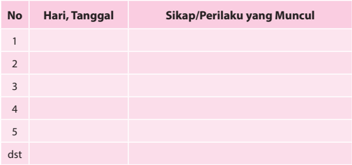

Tabel ini berisi informasi tentang sikap dan perilaku yang muncul pada setiap hari dalam kurun waktu tertentu. Topik utama tabel adalah perubahan sikap dan perilaku seiring berjalannya waktu. Kolom-kolom yang ada meliputi nomor hari, tanggal, dan kolom untuk menuliskan sikap atau perilaku yang muncul. Data penting yang terlihat adalah bahwa sikap dan perilaku tersebut berubah secara bertahap dari hari ke hari, menunjukkan pola perubahan yang terjadi dalam periode tersebut.

### 2.  Penilaian Pengetahuan

- •
- Bentuk Penilaian:
Tes Tertulis

- Uraian
- Buatlah analisis tentang sebab akibat terjadinya intoleransi antarumat beragama dan berkepercayaan lain di Indonesia.
- Buatlah analisis tentang toleransi antarumat beragama dan kepercayaan lain di Indonesia.
- Jelaskan ajaran-ajaran Gereja tentang dialog antarumat beragama dan kepercayaan lain.

 

---
## 📄 Halaman 250

### 3.  Penilaian Keterampilan

- Bentuk Penilaian:
Proyek

- Tugas:
Membuat sebuah rancangan 'Kerja sosial bersama dengan umat beragama lain'  di  lingkungan  yang  paling  dekat  dengan  peserta  didik  (rumah  atau sekolah).  Mencatat  perbuatan  yang  sudah  dilakukan  peserta  didik  yang menunjukkan dialog kehidupan. Kegiatan ini dilaksanakan dalam kelompok.

### 4.  Kegiatan Remedial

Bagi peserta didik yang belum memahami pokok bahasan ini, diberikan remedial dengan kegiatan:

- Guru  menyampaikan  pertanyaan  kepada  peserta  didik  akan  hal-hal  apa saja  yang  belum  mereka  pahami  tentang  dialog  antarumat  beragama  dan kepercayaan.
- Apabila ada hal-hal tertentu  yang  belum  mereka  pahami,  guru  mengajak peserta  didik  untuk  mempelajari  kembali  dengan  memberikan  penguatan yang lebih praktis.
- Guru memberikan penilaian untuk menilai pengetahuan, dengan pertanyaan yang lebih sederhana, sesuai dengan kondisi peserta didik.

### 5.  Kegiatan Pengayaan

Bagi peserta didik yang telah memahami pokok bahasan ini, diberikan pengayaan dengan kegiatan:

- Melakukan studi pustaka (ke perpustakaan atau mencari di koran/majalah) untuk menemukan apa saja yang telah dilakukan Gereja Katolik Indonesia untuk berdialog antarumat beragama dan kepercayaan di Indonesia.
- Hasil temuannya ditulis dalam laporan tertulis yang berisi gambaran singkat dari artikel atau cerita tersebut serta memberikan re fl eksi kritisnya.

 

---
## 📄 Halaman 251

### C.  Membangun Persaudaraan Sejati, Melalui Kerja Sama Antarumat Beragama

### 1.  Penilaian Sikap (Spiritual dan Sosial)

### JURNAL

Nama Peserta Didik

:   ................................................................

Kelas/Program

:   ................................................................

Mata Pelajaran

:   ................................................................

Semester

:   ................................................................

---
**📊 Tabel**

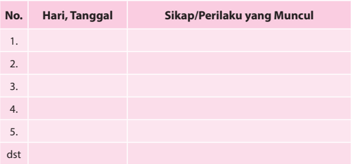

Tabel ini berisi informasi tentang sikap dan perilaku yang muncul pada setiap hari tertentu selama periode tertentu. Topik utama tabel adalah perubahan sikap dan perilaku seiring waktu. Kolom "Hari, Tanggal" menyediakan tanggal-tanggal tertentu untuk membandingkan perubahan perilaku tersebut. Kolom "Sikap/Perilaku yang Muncul" mencatat tindakan atau reaksi spesifik yang dialami oleh individu pada setiap hari. Data penting yang terlihat adalah bahwa perilaku dan sikap individu cenderung berubah secara signifikan dari hari ke hari, menunjukkan bahwa situasi atau kondisi di sekitar mereka dapat mempengaruhi perilaku mereka.

### 2.  Penilaian Pengetahuan

- •
- Bentuk Penilaian:
Tes Tertulis

### · Uraian

- Buatlah  analisis  sebab  akibat  permusuhan/pertikaian  yang  bernuansa agama di Indonesia.
- Jelaskan  bentuk-bentuk  kerja  sama  yang  sudah  terjalin  antara  umat Katolik dan umat beragama lain di Indonesia;
- Jelaskan hambatan-hambatan kerja sama dan dialog dalam membangun persaudaraan sejati dengan umat beragama lain;
- Jelaskan tindakan-tindakan atau kegiatan-kegiatan yang dapat membangun persaudaraan sejati antarumat beragama.

 

---
## 📄 Halaman 252

### 3.  Penilaian Keterampilan

- Bentuk Penilaian:
Portofolio

Mewawancarai pastor paroki atau tokoh umat tentang bagaimana membangun persaudaraan sejati, melalui kerja sama antarumat beragama. Hasil wawancara ditulis dalam bentuk sebuah laporan.

### 4.  Kegiatan Remedial

Bagi peserta didik yang belum memahami pokok bahasan ini, diberikan remedial dengan kegiatan:

- Guru menyampaikan pertanyaan kepada peserta didik tentang hal-hal apa saja yang belum mereka pahami tentang membangun persaudaraan sejati, melalui kerja sama antarumat beragama.
- Apabila ada hal-hal tertentu  yang  belum  mereka  pahami,  guru  mengajak peserta  didik  untuk  mempelajari  kembali  dengan  memberikan  penguatan yang lebih praktis.
- Guru memberikan penilaian untuk menilai pengetahuan dengan pertanyaan yang lebih sederhana, sesuai dengan kondisi peserta didik.

### 5.  Kegiatan Pengayaan

Bagi peserta didik yang telah memahami pokok bahasan ini, diberikan pengayaan dengan kegiatan:

- Melakukan studi pustaka (ke perpustakaan atau mencari di koran/majalah) untuk menemukan apa saja yang telah dilakukan Gereja Katolik Indonesia untuk  membangun  persaudaraan  sejati,  melalui  kerja  sama  antarumat beragama.
- Hasil temuannya ditulis dalam laporan tertulis yang berisi gambaran singkat dari artikel atau cerita tersebut serta memberikan re fl eksi kritisnya.

 

---
## 📄 Halaman 253

### BAB V

### Peran Serta Umat Katolik dalam Pembangunan Bangsa Indonesia

Pada Bab-bab sebelumnya kita telah belajar  tentang  kemajemukan  atau  pluralitas masyarakat  Indonesia.  Kemajemukan  agama  dan  kepercayaan,  suku,  budaya,  ras, serta warna kulit merupakan ciri keindonesiaan kita. Meski berbeda-beda, kita adalah satu.  Bhinneka  Tunggal  Ika  merupakan  semboyan  negara  yang  mempertegas  jati diri  bangsa  kita.  Kesatuan  dan  persatuan  kita  dibangun  atas  dasar  Pancasila  yang merupakan fi lsafat hidup dan ideologi bangsa.

Pada  Bab  V  ini  kita  akan  belajar  tentang  ' Peran  Serta  Umat  Katolik  Dalam Pembangunan  Bangsa  Indonesia'. Kita menyadari  bahwa  keanekaragaman bukanlah halangan, melainkan kekuatan untuk membangun bangsa dan negara tercinta. Untuk itu kita umat Katolik harus ikut serta menciptakan iklim persaudaraan dan kekeluargaan antarsesama anak bangsa. Untuk saling melayani dan dengan semangat gotong  royong  kita  melayani  kepentingan  umum.  Dengan  semangat  kebersamaan dalam pembangunan, kita menjadi   tanda keselamatan dan turut mewujudkan kerajaan Allah di bumi ibu pertiwi.

Untuk  membangun  kesadaran  akan  peran  serta  kita  sebagai  umat  Katolik  dalam pembangunan  bangsa  Indonesia  yang  adil  dan  sejahtera  sesuai  cita-cita  negara Indonesia, maka pada bab ini akan dibahas berturut-turut beberapa pokok bahasan berikut.

- Membangun Bangsa dan Negara yang Dikehendaki Tuhan.
- Tantangan dan Peluang Umat Katolik dalam Membangun Bangsa dan Negara seperti yang Dikehendaki Tuhan.
- Dasar Keterpanggilan Gereja dalam Membangun Bangsa dan Negara.

 

---
## 📄 Halaman 254

### A. Membangun Bangsa dan Negara yang Dikehendaki Tuhan

### Kompetensi Dasar

- 1.5  Bersyukur atas keterlibatan aktif umat Katolik dalam membangun bangsa dan negara Indonesia.
- 2.5  Bertanggung jawab sebagai umat Katolik yang terlibat aktif membangun bangsa dan negara Indonesia.
- 3.5  Memahami makna keterlibatan aktif umat Katolik dalam membangun bangsa dan negara Indonesia.
- 4.5  Melakukan aktivitas (misalnya: menuliskan re fl eksi/doa/puisi/rangkuman/ membuat kliping berita dan gambar) tentang peran aktif umat Katolik dalam membangun bangsa dan negara Indonesia.

### Indikator

- Menganalisis  situasi  masyarakat  Indonesia  dewasa  ini  (berdasarkan  sebuah kasus perburuhan di Tangerang).
- Menganalisis situasi masyarakat Indonesia dalam terang Kitab Suci (Luk 4:1819).
- Menjelaskan ajaran Gereja tentang usaha-usaha masyarakat untuk membangun masyarakat seperti yang dikehendaki Tuhan (Evangelii Nuntiandi artikel 31).
- Menjelaskan  hambatan-hambatan  dalam  usaha  membangun  masyarakat  yang dikehendaki Tuhan dan cara mengatasinya.
- Menjelaskan partisipasi aktif yang dapat dilakukan untuk membangun masyarakat yang dikehendaki Tuhan.

### Bahan Kajian

- Situasi masyarakat Indonesia dewasa ini.
- Usaha-usaha membangun masyarakat yang dikehendaki Tuhan.
- Hambatan-hambatan dalam membangun masyarakat yang dikehendaki Tuhan.
- Partisipasi siswa dalam membangun masyarakat yang dikehendaki Tuhan.

### Sumber Belajar

- Kitab Suci.
- Konferensi Waligereja Indonesia (KWI). Iman Katolik. Kanisius: Yogyakarta, 1996.

 

---
## 📄 Halaman 255

- A. Heuken, SJ. Ensiklopedi Gereja. Cipta Loka Caraka: Jakarta, 1991.
- Pengalaman siswa.

### Pendekatan

Sainti fi k dan Kateketis.

### Metode

Dialog/tanya jawab, diskusi, informasi, dan penugasan.

### Sarana

- Kitab Suci Perjanjian Lama dan Perjanjian Baru.
- Buku Siswa Pendidikan Agama Katolik dan Budi Pekerti utuk SMA Kelas XII.

### Waktu

3 × 45 menit.

### Pemikiran Dasar

Ketika  Soekarno  dan  Hatta  serta  para  pendiri  bangsa  lainnya  memproklamirkan kemerdekaan  Indonesia  pada  tanggal  17  Agustus  1945,  cita-cita  yang  mereka tanamkan  adalah  Indonesia  menjadi  negara  yang  adil,  makmur,  damai  sejahtera bagi seluruh rakyatnya. Cita-cita tersebut dituangkan dalam dasar negara Pancasila, khususnya pada sila kelima, yaitu Keadilan Sosial Bagi Seluruh Rakyat Indonesia. Setelah puluhan tahun merdeka, apakah cita-cita pendiri bangsa ini sudah diwujudkan? Kepemimpinan  nasional  sudah  silih  berganti,  berbagai  kebijakan  sistem  politik dan ekonomi telah dilakukan, namun cita-cita adil, makmur, damai, dan sejahtera bagi seluruh rakyat Indonesia belum kunjung tiba. Secara ekonomi, masih terdapat kesenjangan atau jurang antara yang kaya dan miskin. Secara politik masih terdapat diskriminasi antara mayoritas dan minoritas. Bahkan dalam praktiknya, bertumbuh subur  perilaku  korupsi  politik  dan  politik  korupsi  untuk  kepentingan  pribadi, kelompok dan golongan. Dalam 10 tahun belakangan, sebagian besar kepala daerah, yaitu,  bupati,  walikota,  gubernur  harus  berurusan  dengan  Komisi  Pemberantasan Korupsi karena terlibat dalam kejahatan korupsi. Secara hukum, kita menyaksikan ketidakadilan terjadi di banyak lembaga hukum dan peradilan negara. Hukum hanya tajam ke bawah, namun tumpul ke atas. Artinya, bahwa hukum hanya berlaku bagi rakyat jelata, namun tidak berlaku bagi kaum penguasa atau pengusaha yang dapat membeli hukum di lembaga-lembaga hukum dan peradilan negara.

Sebagai  umat  kristiani  kita  hendaknya  berusaha  dan  berjuang  untuk  membangun bangsa dan negara dengan  berpijak pada moralitas kristiani,  mengutamakan kepentingan umum (bonum commune) , yaitu kesejahteraan yang merata bagi seluruh

 

---
## 📄 Halaman 256

warga.  Kita  meneladani Yesus  sebagai  tokoh  sentral  iman  kita  yang  mewartakan kabar baik tentang Kerajaan Allah (bdk. Luk 4: 18-19). Selama hidup-Nya, Yesus telah berusaha untuk mewujudkan misi-Nya itu.

Melalui kegiatan pembelajaran ini, peserta didik dibimbing untuk memahami dan menghayati ajaran Yesus dan ajaran Gereja-Nya serta berusaha ikut serta membangun bangsa dan negara Indonesia sesuai dengan kehendak Tuhan.

### Kegiatan Pembelajaran

Guru mengajak peserta didik untuk mengawali kegiatan pembelajaran dengan doa.

### Doa Pembuka

Allah  Bapa  penyayang  kehidupan,  kami  bersyukur  boleh  mendiami tanah  air  Indonesia  dengan  segala  keragaman  dan  kekayaan  alamnya. Kami bersyukur bahwa Engkau menyertai perjalanan bangsa dan negara kami.  Bantulah  kami  agar  dari  hari  ke  hari  kami  semakin  bersatu  hati mewujudkan  kesejahteraan  umum.  Terangilah  hati  dan  budi  kami  agar tidak berpandangan sempit memperjuangkan kepentingan kelompok dan golongan sendiri.  Demi  Kristus,  yang  mengasihi  semua  orang  dan  telah wafat menebus dosa manusia, dalam persekutuan Roh Kudus, hidup kini dan sepanjang masa. Amin.

### Langkah Pertama: Mendalami Situasi Masyarakat Kita

### 1.  Mengamati kasus

Guru mengajak peserta didik untuk menyimak artikel berikut ini.

TEMPO.CO, Tangerang -  Kepala Satuan Reserse dan Kriminal Polres Kota Tangerang Komisaris Shinto Silitonga mengatakan penggerebekan pabrik panci alumunium di Desa Lebak Wangi, Kecamatan Sepatan, Kabupaten Tangerang, dilakukan  setelah  dua  buruh  berhasil  kabur  dan  melapor  ke  Polres  Lampung Utara dan Komisi Nasional Hak Asasi Manusia. Dua buruh asal Lampung itu sudah bekerja selama empat bulan di pabrik itu. 'Mereka kabur karena merasa mengalami  siksaan,  perlakukan  kasar,  penyekapan,  dan  hak  mereka  sebagai pekerja tidak didapatkan,' kata Shinto, Sabtu 4 Mei 2013.

Kedua  buruh  laki-laki  tersebut,  kata  Shinto,  bercerita  kepada  keluarganya. Dengan difasilitasi  lurah  setempat,  mereka  membuat  laporan  resmi  di  Polres Lampung Utara pada 28 April 2013. Bos pabrik panci tersebut, YK alias Yuki Irawan, 41 tahun, dilaporkan telah merampas kemerdekaan orang dan melakukan penganiayaan yang melanggar Pasal 333 dan Pasal 351 Kitab Undang-Undang

 

---
## 📄 Halaman 257

Hukum Pidana. Selain melaporkan ke polisi, keluarga korban juga melaporkan ke  Komnas  HAM.  Hasil  koordinasi  Polda  Metro  Jaya,  Polda  Lampung,  dan Polres Kota Tangerang akhirnya pabrik tersebut digerebek pada Jumat 3 Mei 2013 sekitar pukul 14.00. Di lokasi pabrik polisi menemukan 25 orang buruh dan 5 mandor yang sedang bekerja. Yuki dan istrinya digiring ke Polres Kota Tangerang untuk dimintai keterangan. Polisi juga menemukan 6 buruh di antara mereka  yang  disekap  kondisinya  memprihatinkan.  Pakaian  yang  dikenakan kumal dan compang camping karena berbulan bulan tidak ganti. 'Kondisi tubuh buruh juga tidak terawat, rambut cokelat, kelopak mata gelap, dan berpenyakit kulit,' kata Shinto. Mereka rata-rata tiga bulan tidak mandi dan tidak ganti baju, karena uang, telepon genggam dan pakaian dari kampung yang dibawa disita pemilik pabrik.

Joniansyah http://www.tempo.co/read/news/2013/05/04/064477935/25-Buruh-Panci-Disekap-3-Bulan-Tidak-Mandi

### 2. Pendalaman/Diskusi

Guru  mengajak  peserta  didik  untuk  berdiskusi,  setelah  menyimak  kasus penyiksaan buruh di Tangerang dengan pertanyaan-pertanyaan, misalnya:

- Apa pesan dan kesanmu tentang cerita itu?
- Apakah ada kasus-kasus ketidakadilan yang menyengsarakan rakyat kecil yang dilakukan oleh para penguasa (politik dan ekonomi) seperti dalam kisah buruh Tangerang tersebut, atau bahkan jauh lebih kejam, hingga merenggut nyawa para pekerja yang ingin membela hak-haknya? (Jelaskan!).
- Mengapa  sering  terjadi  kasus-kasus  ketidakadilan  yang  menyengsarakan rakyat kecil di negeri ini? Apa akar masalahnya?
- Bagaimana  penilaianmu  terhadap  pembangunan,  khususnya  di  bidang politik dan ekonomi selama ini?

### 3.  Peneguhan

Guru  memberikan  penjelasan,  setelah  mendengarkan  laporan  hasil  diskusi kelompok.

Bangsa Indonesia bercita-cita mewujudkan negara yang bersatu, berdaulat, adil, dan makmur. Dengan rumusan singkat, negara Indonesia bercita-cita mewujudkan masyarakat Indonesia yang adil dan makmur berdasarkan Pancasila dan UUD 1945. Adapun visi bangsa Indonesia adalah terwujudnya masyarakat Indonesia yang damai, demokratis, berkeadilan, berdaya saing, maju, dan sejahtera, dalam wadah  Negara  Kesatuan  Republik  Indonesia  yang  didukung  oleh  manusia Indonesia  yang  sehat,  mandiri,  beriman,  bertakwa,  dan  berakhlak  mulia,  cita tanah  air,  berkesadaran  hukum  dan  lingkungan,  menguasai  ilmu  pengetahuan dan teknologi, memiliki etos kerja yang tinggi, serta berdisiplin. Apakah cita-cita bangsa Indonesia yang digagas oleh pendiri bangsa, Soekarno-Hatta dan para pendiri lainnya, sudah sungguh terwujud pada saat ini? Ataukah sebaliknya, citacita luhur itu, justru masih jauh dari apa yang diharapkan?

 

---
## 📄 Halaman 258

Pada penjelasan ini,  kita  akan  membatasi  pada  menyadari  situasi politik dan ekonomi di tanah air.

### a. Situasi Politik

Krisis  politik  yang  terjadi  pada  tahun  1998  merupakan  puncak  dari berbagai  kebijakan  politik  pemerintahan  Orde  Baru.  Berbagai  kebijakan yang dikeluarkan pemerintahan Orde Baru selalu didasarkan pada alasan pelaksanaan Demokrasi Pancasila. Namun yang sebenarnya terjadi adalah upaya  memepertahankan  kekuasaan  regim  dan  kroni-kroninya  saat  itu. Artinya,  demokrasi  yang  dijalankan  pemerintahan  Orde  Baru  bukan demokrasi  yang  semestinya,  melainkan  demokrasi  rekayasa  atau  purapura. Bukan lagi demokrasi dalam pengertian dari, oleh, dan untuk rakyat, melainkan  demokrasi  dari,  oleh,  dan  untuk  penguasa.  Pada  masa  Orde Baru  kehidupan  politik  sangat  represif,  yaitu  adanya  tekanan  yang  kuat dari  pemerintah  terhadap  pihak  oposisi  atau  orang-orang  yang  dianggap kritis. Setiap orang atau kelompok yang mengkritik kebijakan pemerintah dituduh sebagai tindakan subversif (menentang Negara Kesatuan Republik Indonesia). Karena itulah banyak orang kritis ditangkap dan dijebloskan ke dalam penjara.

Sekarang, kita sudah memasuki zaman reformasi. Namun, yang diharapkan pada awal Orde Reformasi ternyata tidak terpenuhi, meskipun harus diakui bahwa ada beberapa perubahan. Ada kebebasan mengungkapkan pendapat dan  kebebasan  berserikat.  Akan  tetapi,  banyak  masalah  justru  menjadi semakin parah. Salah satu yang sangat mencolok adalah hilangnya cita rasa dan perilaku politik yang benar dan baik.

Politik  merupakan  tugas  luhur  untuk  mengupayakan  atau  mewujudkan kesejahteraan  bersama. Tugas dan tanggung jawab itu dijalankan dengan berpegang pada prinsip-prinsip, sikap hormat, serta setia pada etika dalam hidup bermasyarakat, berbangsa, dan bernegara. Akan tetapi, dalam banyak bidang  prinsip-prinsip  etika  itu  tampaknya  makin  diabaikan,  bahkan ditinggalkan oleh banyak orang, termasuk oleh para politisi, pelaku bisnis, dan pihak-pihak yang mempunyai sumber daya yang berpengaruh di negeri ini.

Dewasa  ini,  politik  hanya  dimanfaatkan  untuk  kepentingan  pribadi  atau kelompok. Dari apa yang sedang berlangsung sekarang, tampak bahwa politik menjadi ajang pertarungan kekuatan dan perjuangan untuk memenangkan kepentingan  ekonomi  atau  kepentingan fi nansial  pribadi  dan  kelompok. Terkesan tidak ada upaya serius untuk mewujudkan kesejahteraan bersama. Bukan  kepentingan  bangsa  yang  diutamakan,  melainkan  kepentingan kelompok,  dengan  mengabaikan  cita-cita  dan  kehendak  kelompok  lain. Yang  lebih  memprihatinkan  lagi  ialah  agama  sering  digunakan  untuk kepentingan  kelompok  politik.  Simbol-simbol  agama  dijadikan  lambang

 

---
## 📄 Halaman 259

politik kelompok tertentu, dengan demikian membangun sekat-sekat antara penganut agama, yang kadang kala melahirkan berbagai bentuk kekerasan yang berbau SARA.

Politik  kekuasaan  yang  mementingkan  kelompok  sendiri  semacam  itu dengan sendirinya akan mengorbankan tujuan utama, yakni kesejahteraan bersama yang mengandaikan kebenaran dan keadilan. Penegakan hukum juga diabaikan. Akibatnya,  fenomena KKN (Korupsi, Kolusi, dan Nepotisme) tidak ditangani secara serius, bahkan makin merajalela di berbagai wilayah, lebih-lebih  sejak  pelaksanaan  program  otonomi  daerah.  Otonomi  daerah yang sebenarnya dimaksudkan sebagai desentralisasi kekuasaan, kekayaan, fasilitas, dan pelayanan ternyata menjadi desentralisasi KKN.

### b. Situasi Ekonomi

Tuntutan  reformasi  menghendaki  adanya  perubahan  dan  perbaikan  di segala aspek kehidupan yang lebih baik. Namun, pada praktiknya tuntutan reformasi  telah  disalahgunakan  oleh  para  petualang  politik  hanya  untuk kepentingan  pribadi  dan  kelompoknya.  Pada  era  reformasi,  kon fl ik  yang terjadi di masyarakat makin mudah terjadi dan sering kali bersifat etnis di berbagai  daerah.  Kondisi  sosial  masyarakat  yang  kacau  akibat  lemahnya hukum dan perekonomian yang tidak segera kunjung membaik menyebabkan sering terjadi gesekan-gesekan dalam masyarakat. Secara ekonomis, negeri kita praktis dikuasai oleh segelintir orang yang kaya raya, yang memiliki perusahaan-perusahaan  multinasional  dengan  modal  dan  kekayaan  yang sangat besar.

Selanjutnya, tatanan ekonomi yang berjalan di Indonesia mendorong kolusi kepentingan  antara  para  pemilik  modal  dan  pejabat,  untuk  mendapatkan keuntungan sebanyak-banyaknya. Kesempatan ini juga bisa dimanfaatkan oleh  kelompok-kelompok  tertentu  bersama  dengan  para  politisi  yang mempunyai  kepentingan,  untuk  mendapatkan  uang  sebanyak-banyaknya dengan  cara  yang  mudah.  Akibatnya,  antara  lain  terjadi  penggusuran tempat-tempat tinggal rakyat untuk berbagai mega proyek dan eksploitasi alam demi kepentingan para pengusaha kaya.

Uang  telah  merusak  segala-galanya.  Peraturan  perundang-undangan  dan aparat  penegak  hukum  dengan  mudah  ditaklukkan  oleh  mereka  yang mempunyai sumber daya keuangan. Akibatnya, upaya untuk menegakkan tatanan  hukum  yang  adil  dan  pemerintah  yang  bersih  tak  terwujud. Ketidakadilan semakin dirasakan kelompok-kelompok yang secara struktural sudah dalam posisi lemah, seperti perempuan, anak-anak, orang tua, orang cacat, dan kaum miskin. Persaingan antarkelompok dan antarpribadi menjadi semakin tajam. Suasana persaingan itu menumbuhkan perasaan tidak adil, terutama ketika berhadapan dengan pengelompokan kelas ekonomi antara yang kaya dan miskin. Perasaan diperlakukan tidak adil itu menyuburkan sikap tertutup dan perasaan tidak aman bagi setiap orang. Orang lain atau

 

---
## 📄 Halaman 260

kelompok lain akan dianggap sebagai ancaman yang akan mencelakakan diri  atau  kelompoknya.  Perasaan  terancam  ini  diperparah  dengan  sistem ekonomi yang menciptakan kerentanan dalam lapangan kerja.

Kinerja  ekonomi  selalu  menuntut  pembaruan.  Pembaruan  terus-menerus menuntut  orang  untuk  menyesuaikan  diri  dengan  tuntutan-tuntutan  baru yang tidak selalu mengungkapkan nilai-nilai keadilan. Mereka yang tidak memenuhi tuntutan struktur ekonomi baru akan terlempar dari pekerjaan karena tidak mampu memenuhi standar baru tersebut. Angka pengangguran semakin  tinggi  karena  rendahnya  investasi  di  sektor  ekonomi  riil  yang mengakibatkan  tidak  terciptanya lapangan  kerja.  Pengangguran  tidak hanya mengakibatkan tidak terpenuhinya kebutuhan ekonomi, melainkan juga  memukul harga,  yang  mengakibatkan  tidak  terpenuhinya  kebutuhan ekonomi.

### c. Akar Masalah

- Iman  hanya  sebatas  pengetahuan,  belum  sebagai  tindakan  hidup. Dengan  perkataan  lain,  orang-orang  hanya  beragama  namun  belum beriman.  Iman  belum  menjadi  sumber  inspirasi  kehidupan  nyata. Penghayatan iman masih lebih berkisar pada hal-hal lahiriah, seperti simbol-simbol dan upacara keagamaan. Dengan demikian, kehidupan politik di Indonesia kurang tersentuh oleh iman itu. Salah satu akibatnya ialah  lemahnya  pelaksanaan  etika  politik,  yang  hanya  diucapkan  di bibir, tetapi tidak dilaksanakan secara konkret. Politik tidak lagi dilihat sebagai upaya mencari makna dan nilai atau sebagai suatu cara bagi pencapaian kesejahteraan bersama, melainkan lebih sebagai kesempatan untuk menguntungkan diri sendiri serta kelompoknya.
- Ambisius akan kekuasaan dan harta kekayaan yang menjadi bagian dari pendorong politik kepentingan yang sangat membatasi ruang publik, yakni  ruang  kebebasan  politik  dan  ruang  peran  serta  warga  negara sebagai subyek. Ruang publik disamakan dengan pasar. Kekuatan uang dan hasil ekonomi dianggap paling penting. Manusia hanya diperalat, sehingga  cenderung  diterapkan  diskriminasi,  dan  kemajemukan  pun diabaikan.  Dengan  kata  lain,  manusia  hanya  dihargai  dari  manfaat ekonominya. Maka, dengan mudah mereka yang lemah, yang miskin, dan yang kumuh dianggap tidak berguna dan tidak mendapat tempat. Tekanan  pada  nilai  kegunaan  ini  tidak  hanya  bertentangan  dengan martabat  manusia,  melainkan  juga  mengikis  solidaritas.  Perbedaan, entah berbeda agama, suku, atau perbedaan lainnya dianggap menjadi halangan bagi tujuan kelompok. Penyelenggaraan negara dimiskinkan, yakni hanya menjadi kepentingan kelompok-kelompok. Politik dagang sapi menjadi bagian kepentingan kelompok itu, dengan akibat melemahnya kehendak politik dalam hal penegakan hukum.

 

---
## 📄 Halaman 261

- Nafsu untuk mengejar kepentingan pribadi, kelompok atau golongan menyebabkan kebenaran diabaikan. Meluasnya praktik korupsi tidak lepas  dari  upaya  memenangkan  kepentingan  diri  dan  kelompok.  Ini mendorong terjadinya pemusatan kekuasaan dan lemahnya daya tawar politik berhadapan dengan kepentingan pihak yang menguasai sumber daya keuangan, terutama sektor bisnis. Akibatnya, bukan proses politik bagi kebaikan bersama yang mengelola cita-cita hidup bersama yang berkembang,  melainkan  kekuatan fi nansial  yang  mendikte  proses politik. Lembaga pengawas yang diharapkan menjadi penengah dalam perbedaan kepentingan ini justru merupakan bagian dari sistem yang juga korup. Akibatnya, politik pun tidak lagi mandiri. Politik berada di bawah tekanan kepentingan mereka yang menguasai dan mengendalikan operasi-operasi pasar. Etika politik seperti tidak berdaya, dicekik oleh nilai-nilai pasar, kompetisi, dan janji keuntungan ekonomi.
- Menghalalkan segala cara untuk mencapai tujuan. Kita dapat menyaksikan  secara  terang  benderang  di  Indonesia  saat  pemilihan anggota  legislatif  (DPR-DPD)  dan  pemilihan  kepala  daerah  mulai dari  kepala  desa,  bupati/walikota,  gubernur  sampai  presiden,  terjadi intimidasi,  kekerasaan,  politik  uang,  pengerahan  massa,  teror  baik langsung maupun melalui media sosial, dan cara-cara tidak bermoral lainnya dihalalkan untuk memperoleh hasil yang diharapkan. Celakanya,  para  pelaku  kejahatan  politik  ini  tidak  mendapat  sanksi hukum. Lemahnya penegakan hukum mengaburkan pemahaman nilai 'baik' dan 'buruk' (moralitas) sehingga menumpulkan kesadaran moral dan perasaan bersalah (hati nurani).
Setelah  menyimak  uraian  tentang  pembangunan  yang  bermartabat, peserta didik mencoba membuat analisis, perbandingan antara pembangunan  yang  bermartabat  yang  diharapkan,  atau  yang  ideal dengan realitas pembangunan masyarakat Indonesia yang peserta didik saksikan atau rasakan selama ini.

### Langkah Kedua: Mendalami Ajaran Kitab Suci dan Ajaran Gereja tentang Membangun Masyarakat

### 1. Ajaran Kitab Suci

- Menelusuri Ajaran Kitab Suci
- Guru  mengajak  peserta  didik  untuk  menemukan  ajaran  Kitab  Suci, berkaitan dengan bagaimana membangun masyarakat yang dikehendaki Tuhan.
- Guru menyiapkan beberapa teks-teks Kitab Suci yang dapat digunakan untuk pendalaman lebih lanjut, misalnya; Lukas 4:18-19; 13: 32; 22: 25; Matius 11: 8; 23: 14; Matius 23: 23.

 

---
## 📄 Halaman 262

- Guru mengajak peserta didik untuk menyimak teks Kitab Suci berikut ini.

### Luk 4:18-19

18  Roh Tuhan ada pada-Ku, oleh sebab Ia telah mengurapi Aku, untuk menyampaikan  kabar  baik  kepada  orang-orang  miskin;  dan  Ia  telah mengutus Aku,  19  untuk memberitakan pembebasan kepada orang-orang tawanan, dan penglihatan bagi orang-orang buta, untuk membebaskan orang-orang yang tertindas, untuk memberitakan tahun rahmat Tuhan telah datang.'

### b. Pendalaman

- Guru mengajak peserta didik untuk berdiskusi dalam kelompok, dengan panduan beberapa pertanyaan berikut:
- Bagaimana sikap Yesus terhadap orang-orang kecil yang tertindas pada zaman-Nya?
- Bagaimana sikap Yesus terhadap para penguasa pada zaman-Nya?
- Apa  pandanganmu  sebagai  seorang  Katolik  menghadapi  krisis politik dan krisis ekonomi di Indonesia saat ini?
- Apa ajaran dan tindakan Yesus yang dapat kamu teladani dalam menghadapi situasi politik dan ekonomi yang cenderung merugikan orang banyak, khususnya rakyat jelata?
- Setelah  berdiskusi,  guru  mengajak  peserta  didik  untuk  melaporkan hasil diskusi kelompoknya masing-masing.

### 2. Mendalami Ajaran Gereja

### a. Menyimak Dokumen Ajaran Gereja

Guru  mengajak  peserta  didik  untuk  menyimak  dokumen  ajaran  Gereja berikut ini.

'Antara  pewartaan  Injil  dan  kemajuan  manusiawi-perkembangan  dan pembebasan-memang  terdapat  ikatan  yang  mendalam.  Termasuk  di  situ ikatan  pada  tingkat  antropologi,  sebab  manusia  yang  harus  menerima pewartaan  bukan  sesuatu  yang  abstrak,  melainkan  terkena  oleh  masalah persoalan sosial dan ekonomi. Termasuk pula ikatan pada tingkat teologis, sebab  Rencana  Penciptaan  tidak  terceraikan  dari  Rencana  Penebusan. Rencana kedua itu  menyangkut  pelbagai  situasi  sangat  konkret;  ketidakadilan yang harus diperangi; dan keadilan yang harus dipulihkan; termasuk ikatan pada Injil, yakni ikatan cintakasih. Menurut kenyataan, orang tidak dapat mewartakan perintah baru, tanpa mendukung keadilan dan perdamaian. Mustahil seseorang dapat menerima pewartaan Injil jika dia tidak mau tahu tentang persoalan-persoalan yang sekarang ini begitu banyak diperdebatkan, seperti keadilan, pembebasan, perdamaian di dunia. Andaikata itu terjadi,

 

---
## 📄 Halaman 263

dapat dikatakan bahwa orang itu melupakan pelajaran yang di terima dari Injil tentang cintakasih terhadap sesama yang sedang menderita dan serba kekurangan'. (Evangelii Nuntiandi artikel 31).

### b. Pendalaman

Guru mengajak peserta didik untuk berdiskusi tentang ajaran Sosial Gereja tersebut dengan beberapa pertanyaan:

- Apa pesan dari dokumen tersebut?
- Apa hubungan ajaran Gereja dengan Ajaran Yesus dalam Kitab Suci?

### c. Peneguhan

Guru  memberikan  penjelasan  setelah  mendapatkan  jawaban  dari  peserta didik, sebagai berikut:

- Gereja harus hadir untuk mewartakan Kerajaan Allah di tengah dunia yang penuh dengan persoalan. Gereja harus berpihak pada orang-orang kecil dan yang tertindas, baik secara ekonomi, politik, dan sebagainya.
- Gereja melanjutkan karya keselamatan Kristus di dunia. Gereja sebagai sakramen  Kristus,  yaitu  sebagai  tanda  dan  sarana  keselamatan  bagi umat manusia.

### Langkah Ketiga: Menghayati Makna Membangun Masyarakat yang Dikehendaki Tuhan

### 1. Refl   eksi

- Guru  mengajak  peserta  didik  untuk  menuliskan  sebuah  re fl eksi  tentang keterlibatan dirinya dalam pembangunan bangsa dan negara sesuai dengan kehendak Tuhan.
- Guru meminta peserta didik untuk menuliskan sebuah doa untuk bangsa dan Tanah Air.

### 2. Rencana Aksi

### a. Secara kelompok

Guru mengajak peserta didik untuk membuat suatu rencana aksi di lingkungan sekolah, dengan memilih salah satu prinsip etika politik dan ekonomi yang sudah dibicarakan di atas. Misalnya: mengembangkan keadilan, solidaritas, tanggung jawab, dan sebagainya.

### b. Secara pribadi

Guru mengajak peserta didik untuk terlibat aktif di tempat tinggal masingmasing, yaitu kerja bakti, gotong royong di lingkungan RT, RW, dan desa atau  kelurahan.  Peserta  didik  diminta  untuk  menjadi  motor  dari  gerakan kerja gotong royong di tempat tinggalnya itu.

 

---
## 📄 Halaman 264

Guru mengajak peserta didik untuk mengakhiri kegiatan pembelajaran dengan doa.

### Doa Penutup

Allah, Bapa Yang Maha Pengasih dan Penyayang,

Kami bersyukur kepada-Mu atas komunitas-komunitas masyarakat yang kini memenuhi bumi ciptaan-Mu. Kami bersyukur atas kebhinnekaan yang Kau taburkan dalam masyarakat kami: suku, kebudayaan, pendidikan, pola hidup, dan agama. Kendati semua ini kami dapat tinggal bersama sebagai saudara yang saling menghargai, dan saling membantu dalam semangat kerja sama. Sudilah Engkau memupuk semangat persaudaraan antar warga masyarakat kami. Jauhkanlah masyarakat kami dari perpecahan. Semoga kegembiraan dan  harapan,  duka  dan  kecemasan  warga  selalu  mendapat  perhatian  dari seluruh masyarakat.

Bapa, jadikanlah kami alat-Mu untuk menggarami masyarakat dengan cinta dan  semangat  persaudaran  yang  sejati.  Sudilah  Engkau  tinggal  di  tengah masyarakat  kami.  Jadikanlah  kami  umat-Mu,  dan  Engkau  sendiri  menjadi Allah  kami.  Kami  mohon,  semoga  seluruh  warga  masyarakat  berusaha membangun  masyarakat  yang  adil  dan  makmur.  Berilah  kami  rahmat kebijaksanaan agar kami mampu mengabdikan hidup kami demi kebenaran dan keadilan di dalam masyarakat. Doronglah seluruh masyarakat kami untuk memelihara lingkungan. Berkatilah pula kaum muda yang menjadi harapan masa depan; para pemimpin yang Kau tugasi menghimpun dan melindungi rakyat; para pendidik yang berusaha mengatasi kebodohan, serta berjuang demi kemajuan masyarakat pada umumnya. Dampingilah kami semua agar selalu tekun dan tabah dalam menghadapi segala cobaan dan kesulitan. Doa ini  kami  sampaikan kepada-Mu dengan pengantaraan Kristus, Tuhan kami. Amin.

### B. Tantangan dan Peluang Umat Katolik dalam Membangun Bangsa dan Negara Seperti yang Dikehendaki Tuhan

### Kompetensi Dasar

- 1.5 Bersyukur atas keterlibatan aktif umat Katolik dalam membangun bangsa dan negara Indonesia.

 

---
## 📄 Halaman 265

- 2.5  Bertanggung jawab sebagai umat Katolik yang terlibat aktif membangun bangsa dan negara Indonesia.
- 3.5  Memahami makna keterlibatan aktif umat Katolik dalam membangun bangsa dan negara Indonesia.
- 4.5  Melakukan aktivitas (misalnya: menuliskan re fl eksi/doa/puisi/rangkuman/ membuat kliping berita dan gambar) tentang peran aktif umat Katolik dalam membangun bangsa dan negara Indonesia.

### Indikator

- Menganalisis tantangan-tantangan yang dihadapi umat Katolik saat ini berdasarkan masalah-masalah sosial yang sedang terjadi di Indonesia.
- Menganalisis  peluang-peluang  umat  Katolik  untuk  membangun  bangsa  dan negara Indonesia.
- Menjelaskan ajaran Gereja tentang tantangan dan peluang dalam membangun bangsa dan negara. (Gaudium et spes art. 64, 76, Ensiklik Populorum Progressio , art. 21, Dignitatis Humanae , art. 1).
- Menjelaskan  tentang  usaha-usaha  untuk  menghadapi  tantangan  dan  peluang untuk ikut terlibat aktif membangun bangsa dan negara sesuai kehendak Tuhan (berdasarkan kisah tokoh katolik nasional, I.J.Kasimo).

### Bahan Kajian

- Pandangan  peserta  didik  tentang  tantangan  dan  peluang  umat  Katolik  dalam pembangunan.
- Tantangan-tantangan yang dihadapi umat Katolik.
- Peluang-peluang umat Katolik untuk membangun bangsa dan negara Indonesia.
- Ajaran Kitab Suci tentang tantangan dan peluang dalam membangun bangsa dan negara.
- Ajaran  Gereja  tentang  tantangan  dan  peluang  dalam  membangun  bangsa  dan negara.

### Sumber Belajar

- Kitab Suci Perjanjian Lama dan Perjanjian Baru.
- Konferensi Waligereja Indonesia (KWI). Iman Katolik. Kanisius: Yogyakarta, 1996.
- A. Heuken, SJ. Ensiklopedi Gereja. Cipta Loka Caraka: Jakarta, 1991.
- Pengalaman siswa.

### Pendekatan

Sainti fi k dan Kateketis.

 

---
## 📄 Halaman 266

### Metode

Dialog/tanya jawab, diskusi, informasi, dan penugasan.

### Sarana

- Kitab Suci (Alkitab).
- Buku Siswa kelas XII Pendidikan Agama Katolik dan Budi Pekerti.

### Waktu

3 × 45 menit.

### Pemikiran Dasar

Bangsa Indonesia saat ini  sedang  mengalami suatu krisis  secara  fundamental  dan menyeluruh. Banyaknya masalah yang berupa ancaman, hambatan, tantangan, dan gangguan  yang  dihadapi  Indonesia  datang  bertubi-tubi.  Ditambah  lagi  masalahmasalah  bencana  alam  yang  memang  sudah  menjadi  bagian  dari  alam  Indonesia, dan  juga karena proses perusakan  hutan  secara masif dan  sistematis  untuk kepentingan  bisnis  kalangan  tertentu.  Krisis  yang  dialami  Indonesia  ini  menjadi sangat  multidimensional.  Mulai  dari  krisis  ekonomi  yang  tidak  kunjung  berhenti, sehingga berdampak pula pada krisis sosial dan politik, yang pada perkembangannya justru menyulitkan upaya pemulihan ekonomi. Kon fl ik horizontal dan vertikal yang terjadi dalam kehidupan sosial, disertai dengan lemahnya penegakan hukum, tentu sangat berpotensi melahirkan disintegrasi bangsa. Apalagi bila melihat bahwa bangsa Indonesia merupakan bangsa yang plural seperti beragamnya suku, budaya daerah, agama, dan berbagai aspek politik lainnya, serta kondisi geogra fi s Indonesia sebagai negara kepulauan yang tersebar dari Sabang sampai ke Merakue. Semua ini merupakan tantangan besar yang apabila tidak dikelola dengan baik akan sangat mengganggu proses pembangunan untuk mewujudkan kehidupan bangsa yang sejahtera, adil, dan makmur sesuai cita-cita para pendiri bangsa ini.

Umat  Katolik  Indonesia  sebagai  bagian  integral  dari  bangsa  Indonesia  tentu  saja ikut  bertanggung  jawab  atas  krisis  yang  sedang  terjadi.  Tantangan  yang  dihadapi bangsa Indonesia adalah tantangan bagi umat Katolik juga. Karena itu tantangantantangan yang ada dapat menjadi peluang bagi umat Katolik untuk ikut merestorasi bangsa  Indonesia  untuk  menjadi  bangsa  yang  lebih  baik.  Gereja  Katolik  melalui Konsili Vatikan II mengajarkan antara lain bahwa '...Gereja, yang bertumpu pada cinta kasih Sang Penebus, menyumbangkan bantuannya, supaya di dalam kawasan bangsa sendiri dan antara bangsa-bangsa makin meluaslah keadilan dan cinta kasih. Dengan mewartakan kebenaran Injil, dan dengan menyinari semua bidang manusiawi melalui ajaran-Nya dan melalui kesaksian umat Kristen, Gereja juga menghormati dan  mengembangkan kebebasan serta  tanggung  jawab  politik  para  warganegara.' (KV II, GS art. 76). Dalam kancah tanggung jawab bersama dalam pembangunan

 

---
## 📄 Halaman 267

bangsa Indonesia, sejak sebelum dan sesudah kemerdekaan, bahkan sampai saat ini, sudah banyak tokoh-tokoh Katolik, baik lokal maupun nasional di pelbagai sektor kehidupan,  memberikan  sumbangsihnya  bagi  bangsa  Indonesia.  Kita  memiliki beberapa pahlawan nasional, sebut saja; Yosafat Sudarso, Slamet Riyadi, Adisucipto, Mgr. Sugiyapranoto, I.J. Kasimo, Frans Seda, dan lain sebagainya.

Pada  kegiatan  pembelajaran  ini,  peserta  didik  dibimbing  untuk  memahami  dan menghayati  tantangan-tantangan  dan  peluang-peluang  untuk  membangun  bangsa dan negara Indonesia. Peserta didik menyadari bahwa di balik tantangan-tantangan itu, ada peluang untuk membangun Indonesia bersama-sama anak bangsa Indonesia lainnya atas dasar semangat kasih dan persaudaraan sebagaimana yang dikehendaki Tuhan.

### Kegiatan Pembelajaran

### Doa Pembuka

Allah Bapa yang penuh kasih,

Terima  kasih  untuk  segala  rahmat  yang  engkau  berikan  kepada  kami sepanjang hidup kami. Pada kesempatan yang indah ini kami akan belajar untuk  memahami  tentang  tantangan  dan  peluang  umat  Katolik  dalam membangun bangsa dan negara sebagaimana yang Engkau kehendaki. Semoga tantangan-tantangan yang ada dapat kami hadapi dengan baik, dan  oleh  karena  pertolongan-Mu,  kami  umatmu  dapat  menjadi  saluran berkat bagi bangsa dan negara kami tercinta. Amin.

### Langkah Pertama: Mendalami Tantangan-Tantangan yang Dihadapi Bangsa Indonesia Saat Ini

### 1. Diskusi

Guru  mengajak  peserta  didik  berdiskusi  dalam  kelompok  untuk  menelusuri dan menemukan berbagai tantangan yang sedang dihadapi bangsa dan negara. Pertanyaan untuk diskusi kelompok:

- Tantangan-tantangan apa saja yang sedang dihadapi bangsa dan negara kita?
- Apa pandangan kamu terhadap tantangan-tantangan tersebut?

### 2. Melaporkan hasil diskusi

Guru mengajak peserta didik untuk menyampaikan hasil diskusi kelompoknya masing-masing.  Kelompok  yang  mendengar  paparan  kelompok  lain,  dapat menanggapi laporan tersebut dengan bertanya atau mengkritik.

 

---
## 📄 Halaman 268

### 3.  Peneguhan

Guru memberikan penjelasan setelah mendengar laporan hasil diskusi kelompok, sebagai berikut:

### a. Krisis Etika Politik

Etika  Politik  di  Indonesia  masih  carut  marut.  Politik  hanya  dipahami secara  pragmatis  sebagai  sarana  untuk  mencari  kekuasaan  dan  kekayaan bagi  pribadi-pribadi  dan  golongan  sendiri.  Politik  yang  berkembang  saat ini,  khususnya  oleh  partai  politik  lebih  bersifat  transaksional  yaitu  untuk membagi-bagi kekuasaan dan berujung pada praktik politik uang. Banyak kepala  daerah,  dan  para  pejabat  lembaga  negara  lainnya,  baik  eksekutif, legislatif, dan yudislatif (polisi, jaksa, hakim) kini berurusan dengan KPK karena terlibat kasus korupsi yang tentu saja merugikan pembangunan bagi kesejahteraan rakyat.

### b. Krisis Ekonomi

Masyarakat  Indonesia  kini  masih  dilanda  krisis  ekonomi.  Banyak  yang masih hidup di bawah  garis kemiskinan, padahal Indonesia sendiri dikenal  sebagai  negara  yang  kaya  akan  sumber  daya  alamnya.  Dengan berkembangnya neoliberalisme saat ini, orang kaya akan semakin kaya, dan orang miskin akan semakin miskin. Orang miskin, bahkan para pedagang kecil atau menengah sekalipun, tidak akan pernah mampu bersaing dengan para pedagang besar atau orang-orang kaya.

### c. Merebaknya aliran fundamentalisme radikal

Kini merebak berbagai aliran fundamental radikal di Indonesia. Fundamentalisme itu pandangan yang berpusat pada diri manusia, sehingga manusia  menjadi  tolok  ukurnya.  Karena  itu  fundamentalisme  prinsipnya 'menutup diri' terhadap kebenaran dari paham di luar dirinya. Akhirnya, fundamentalisme dapat berakhir pada arogansi terhadap orang lain, kekerasan demi mencapai tujuannya sendiri. Fundamentalisme radikal tidak hanya  terbatas  pada  aliran  agama  tertentu,  tetapi  juga  pada  suku  bahkan daerah. Setelah diberlakukan sistem otonomi daerah, dan otonomi khusus, tampaknya  terjadi  gerakan  daerahisme.  Mereka  berusaha  menolak  dan bahkan 'mengusir' orang dari daerah lain, khususnya dalam urusan pejabat pemerintahan, atau pengangkatan PNS dengan istilah mengutamakan putra daerah.

### d. Lemahnya penegakan hukum di Indonesia

Dalam  berbagai  kasus  penegakan  hukum  baik  perdata  maupun  pidana, banyak  terjadi  ketidakadilan.  Keadilan  hukum  hanya  tajam  untuk  orang di bawah tetapi tumpul untuk orang yang di atas. Artinya bahwa keadilan hukum di lembaga peradilan hanya diberlakukan bagi masyarakat kecil yang lemah secara ekonomi, karena mereka tidak mampu menyogok para penegak hukum. Di sisi lain para penguasa dan kaum kaya raya dapat membeli para

 

---
## 📄 Halaman 269

penegak hukum sehingga mereka bisa bebas dari hukuman, atau minimal mendapat hukuman ringan. Dalam beberapa kasus, seorang pencopet atau maling  ayam,  dihukum  jauh  lebih  berat  daripada  seorang  koruptor  yang telah mencuri uang negara ratusan juta atau bahkan miliaran rupiah. Publik Indonesia pun sudah mengetahui bagaimana banyak koruptor kelas kakap yang sedang mendekam di penjara tetapi dapat berkeliaran bebas di luar dan berpesta pora serta melancong ke mana-mana.

### e. Berbagai bencana dan kerusakan alam

Bencana  alam  dan  kerusakan  alam  menjadi  tantangan  nyata  di  hadapan kita.  Bencana alam bisa disebabkan oleh kondisi alam itu sendiri, seperti gempa bumi dan letusan gunung berapi. Namun bencana alam juga dapat disebabkan  oleh  perbuatan  manusia  sendiri,  seperti  penggundulan  dan pembakaran hutan untuk berbagai tujuan; penebangan pohon yang disukai secara  serampangan  sehingga  menimbulkan  bencana  longsor  dan  banjir bandang yang merenggut jiwa dan harta. Kerusakan alam juga disebabkan oleh limbah industri yang mematikan ekosistem di sekitarnya.

### Langkah Kedua: Menggali Ajaran Gereja Tentang Bagaimana Peluang-Peluang Umat Katolik dalam Pembangunan.

### 1. Diskusi

- Guru mengajak peserta didik untuk berdiskusi tentang peluang-peluang di balik tantangan-tantangan yang sudah ditemukan pada diskusi sebelumnya, sesuai dengan semangat ajaran Gereja. Guru dapat membagi peserta didik dalam  enam  kelompok,  berdasarkan  enam  tantangan  yang  telah  dibahas sebelumnya.
- b.
- Guru memberikan pengantar dan pertanyaan diskusi, misalnya: Kita  telah  menemukan  berbagai  macam  tantangan  yang  sedang  dihadapi bangsa  Indonesia  yaitu:  krisis  etika  politik,  krisis  ekonomi,  merebaknya aliran fundamentalisme radikal, lemahnya penegakan hukum, dan bencana alam,  serta  kerusakan  lingkungan.  Berdasarkan  masalah-masalah  yang merupakan tantangan itu, apa peluang bagi umat Katolik untuk membangun bangsa sesuai kehendak Tuhan sebagaimana yang diajarkan Gereja dalam
bidang berikut:

- Etika Politik.
- Krisis Ekonomi.
- Menanggulangi aliran fundamentalisme radikal.
- Masalah Penegakan hukum.
- Bencana alam dan kerusakan lingkungan.

 

---
## 📄 Halaman 270

### 2. Melaporkan hasil diskusi

Guru  mengajak  peserta  didik  untuk  menyampaikan  laporan  hasil  diskusi kelompoknya masing-masing. Kelompok  lain yang mendengarkan dapat menanggapi dengan bertanya atau mengkritik.

### 3.  Peneguhan

Setelah peserta didik menyampaikan hasil diskusi kelompoknya, guru memberikan masukan tambahan, misalnya:

### a. Krisis Etika Politik

Situasi Etika Politik di Indonesia masih carut marut. Gereja Katolik perlu memperjuangkan agar politik tidak hanya dipahami secara pragmatis sebagai sarana  untuk  mencari  kekuasaan  dan  kekayaan,  melainkan  sebagai  suatu jerih  payah  untuk  membuat  transformasi  situasi  masyarakat  yang  kacau menjadi  masyarakat  yang  tertata  dan  mampu  menciptakan  kesejahteraan umum.

Relasi  Gereja  dan  Negara  untuk  kepentingan  terwujudnya  kesejahteraan umum dinyatakan oleh Konsili sebagai berikut: 'Negara dan Gereja bersifat otonom  tidak  saling  tergantung  di  bidang  masing-masing.  Akan  tetapi keduanya,  kendati  atas  dasar  yang  berbeda,  melayani  panggilan  pribadi dan sosial orang-orang yang sama. Pelaksanaan itu akan lebih efektif jika negara dan Gereja menjalin kerja sama yang sehat, dengan mengindahkan situasi  setempat  dan  sesama.  Sebab  manusia  tidak  terkungkung  dalam tata  duniawi  saja,  melainkan  juga  mengabdi  kepada  panggilannya  untuk kehidupan kekal. Gereja, yang bertumpu pada cinta kasih Sang Penebus, menyumbangkan  bantuannya,  supaya  di  dalam  kawasan  bangsa  sendiri dan  antara  bangsa-bangsa  makin  meluaslah  keadilan  dan  cinta  kasih. Dengan mewartakan kebenaran Injil, dan dengan menyinari semua bidang manusiawi melalui ajaran-Nya dan melalui kesaksian umat Kristen, Gereja juga menghormati dan mengembangkan kebebasan serta tanggung jawab politik para warganegara.' (KV II, GS art. 76)

### b. Krisis Ekonomi

Krisis ekonomi telah lama membelit masyarakat Indonesia pada umumnya. Inti persoalannya adalah kebijakan perekonomian pemerintah hanya untuk mengejar target produksi sementara masyarakat Indonesia dikorbankan demi keuntungan perekonomian sektor formal. Untuk masalah pemiskinan secara ekonomi  tersebut,  Konsili  Vatikan  mengajarkan  bahwa;  'Makna  tujuan yang  paling  inti  produksi  itu  bukanlah  semata-mata  bertambahnya  hasil produksi, bukan pula keuntungan atau kekuasaan, melainkan pelayanan kepada  manusia,  yakni  manusia  seutuhnya ,  dengan  mengindahkan tata  urutan  kebutuhan-kebutuhan  jasmaninya  maupun  tuntutan-tuntutan hidupnya di bidang intelektual, moral, rohani, dan keagamaan; katakanlah:

 

---
## 📄 Halaman 271

manusia  siapa  saja,  kelompok  manusia  mana  pun  juga,  dari  setiap  suku dan wilayah dunia. Oleh karena itu, kegiatan ekonomi harus dilaksanakan menurut metode-metode dan kaidah-kaidahnya sendiri, dalam batas-batas moralitas  sehingga  terpenuhilah  rencana  Allah  tentang  manusia'.  (KV II  GS  art.  64). Harapan  Konsili  itu  jelas,  perekonomian  terutama  harus mengabdi kepada kepentingan perkembangan manusia, sehingga titik berat perkembangan ekonomi bukan sekadar keuntungan semata mata! Di sinilah tantangan sekaligus sebagai peluang bagi umat Katolik dan umat beragama dan berkepercayaan lainnya untuk mengembangkan ekonomi yang berpihak pada kesejahteraan rakyat.

### c. Merebaknya aliran fundamentalisme radikal

Fundamentalisme itu pandangan yang berpusat pada diri manusia, sehingga manusia  menjadi  tolok  ukurnya.  Karena  itu  fundamentalisme  prinsipnya 'menutup diri' terhadap kebenaran dari paham di luar dirinya. Akhirnya fundamentalisme dapat berakhir pada arogansi terhadap orang lain, kekerasan demi mencapai tujuannya sendiri.

Berhadapan  dengan  berbagai  aliran  itu,  kepentingan  kehadiran  Gereja tidak lain adalah mendorong gerakan 'kebebasan beragama' dan 'gerakan humanisme  sejati,  yang  tertuju  pada  Allah.'  Demi  kepentingan  gerakan kebebasan beragama, Konsili Vatikan II, secara  khusus  menyatakan sebagai berikut: 'bahwa pribadi manusia berhak atas kebebasan beragama. Kebebasan itu berarti, bahwa semua orang harus kebal terhadap paksaan dari  pihak  orang-orang  perorangan  maupun  kelompok-kelompok  sosial atau kuasa manusiawi mana pun juga, sedemikian rupa, sehingga dalam hal keagamaan tak seorang pun dipaksa untuk bertindak melawan suara hatinya, atau dihalang-halangi untuk dalam batas-batas yang wajar bertindak menurut suara hatinya, baik sebagai perorangan maupun di muka umum, baik sendiri maupun bersama dengan orang lain. Selain itu Konsili menyatakan, bahwa hak menyatakan kebebasan beragama sungguh didasarkan pada martabat pribadi manusia, sebagaimana dikenal berkat sabda Allah yang diwahyukan dan dengan akal budi. Hak pribadi manusia atas kebebasan beragama harus diakui  dalam  tata  hukum  masyarakat  sedemikian  rupa,  sehingga  menjadi hak sipil.'(KV II, Dignitatis Humanae, art. 1).

Terhadap  cara  pandang  yang  sempit,  picik,  dan  merasa  benar  sendiri, Paulus VI  menunjukkan  nilai  humanisme  yang  semestinya  menjadi  nilai universal  dalam  masyarakat  dunia,  'Tujuan  mutakhir  ialah  humanisme yang terwujudkan seutuhnya. Dan tidakkah itu berarti pemenuhan manusia seutuhnya dan tiap manusia? Humanisme  yang picik, terkungkung dalam  dirinya  tidak  terbuka  bagi  nilai-nilai  rohani  dan  bagi  Allah  yang menjadi  sumbernya,  barangkali  tampaknya  saja  berhasil,  sebab  manusia dapat  berusaha  mencari  kenyataan  duniawi  tanpa Allah. Akan  tetapi  bila kenyatan kenyataan itu tertutup bagi Allah, akhirnya justru akan berbalik

 

---
## 📄 Halaman 272

melawan manusia. Humanisme yang tertutup bagi kenyataan lain jadi tidak manusiawi. Humanisme yang sejati menunjukkan jalan kepada Allah serta mengakui tugas yang menjadi pokok panggilan kita, tugas yang menyajikan kepada  kita  makna  sesungguhya  hidup  manusiawi.  Bukan  manusialah norma  mutakhir  manusia.  Manusia  hanya  menjadi  sungguh  manusiawi bila melampaui diri sendiri. Menurut Blaise Pascal, ' Manusia secara tidak terbatas mengungguli martabatnya' (Paulus VI, Populorum Progressio art. 42)

### d. Lemahnya penegakan hukum di Indonesia

Dari segi lemahnya penegakan hukum, kita harus berusaha mengubah mindset peranan hukum dalam masyarakat, bahwa hukum bukan sarana untuk mempermudah agar 'kasus-kasus' Pidana dan Perdata diperlakukan sebagai 'komoditi',  tetapi  hukum  berfungsi  untuk  mempermudah  pelaksanaan hidup  bersama  yang  memungkinkan  terciptanya  kesejahteraan  umum. Konsili Vatikan II menegaskan bahwa 'Pelaksanaan kekuasaan politik, baik dalam  masyarakat  sendiri,  maupun  di  lembaga-lembaga  yang  mewakili negara,  selalu  harus  berlangsung  dalam  batas-batas  tata  moral,  untuk mewujudkan kesejahteraan umum yang diartikan secara dinamis, menurut tata perundang-undangan yang telah dan harus ditetapkan secara sah. Maka para warga negara wajib patuh-taat berdasarkan hati nurani mereka. Dari situ jelas jugalah tanggung jawab, martabat, dan kewibawaan para penguasa. (KV II GS art. 73).

Dalam Kitab Suci, kita dapat melihat bagaimana Yesus menuntut bangsa Yahudi  supaya  taat  kepada  hukum  Taurat  sebab  pada  dasarnya  hukum Taurat  dibuat  demi  kebaikan  dan  keselamatan  manusia  (bdk.  Mat  5:  1743).  Satu  titik  pun  tidak  boleh  dihilangkan  dari  hukum  Taurat.  Ia  hanya menolak  hukum  Taurat  yang  sudah  dimanipulasi,  di  mana  hukum  tidak diabdikan untuk manusia, tetapi manusia diabdikan untuk hukum. Segala hukum, peraturan, dan perintah harus diabdikan untuk tujuan kemerdekaan manusia. Maksud terdalam dari setiap hukum adalah membebaskan (atau menghindarkan)  manusia  dari  segala  sesuatu  yang  (dapat)  menghalangi manusia untuk berbuat  baik.  Demikian  pula  tujuan  hukum Taurat.  Sikap Yesus terhadap hukum Taurat dapat diringkas dengan mengatakan bahwa Yesus selalu memandang hukum Taurat dalam terang hukum kasih.

Mereka yang tidak peduli dengan maksud dan tujuan hukum, hanya asal menepati huruf hukum, akan bersikap legalistis: pemenuhan hukum secara lahiriah sedemikian rupa sehingga semangat hukum kerap kali dikorbankan. Misalnya, ketika kaum Farisi menerapkan peraturan mengenai hari Sabat dengan cara yang merugikan perkembangan manusia, Yesus mengajukan protes  demi  tercapainya  tujuan  peraturan  itu  sendiri,  yakni  kesejahteraan manusia:  jiwa  dan  raga.  Menurut  keyakinan  awal  orang  Yahudi  sendiri, peraturan  mengenai  hari  Sabat  adalah  karunia  Allah  demi  kesejahteraan

 

---
## 📄 Halaman 273

manusia  (bdk . Ul  5:  12-15;  Kel  20:  8-11;  Kej  2:3).  Akan  tetapi,  sejak pembuangan  Babilonia (587-538 SM),  peraturan itu oleh para rabi cenderung ditambah dengan larangan-larangan yang sangat rumit. Memetik butir gandum sewaktu melewati ladang yang terbuka tidak dianggap sebagai pencurian. Kitab Ulangan yang bersemangat perikemanusiaan mengizinkan perbuatan tersebut. Akan tetapi, hukum seperti yang ditafsirkan para rabi melarang orang menyiapkan makanan pada hari Sabat dan karenanya juga melarang menuai dan menumbuk gandum pada hari Sabat. Dengan demikian, para rabi menulis hukum mereka sendiri yang bertentangan dengan semangat perikemanusiaan  Kitab  Ulangan.  Hukum  ini  menjadi  beban,  bukan  lagi bantuan guna mencapai kepenuhan hidup sebagai manusia.

Oleh  karena  itu,  Yesus  mengajukan  protes.  Ia  mempertahankan  maksud Allah  yang  sesungguhnya  dengan  peraturan  mengenai  Sabat  itu.  Yang dikritik  Yesus  bukanlah  aturan  mengenai  hari  Sabat  sebagai  pernyataan kehendak Allah, melainkan cara hukum itu ditafsirkan dan diterapkan. Mulamula,  aturan  mengenai  hari  Sabat  adalah  hukum  sosial  yang  bermaksud memberikan  kepada  manusia  waktu  untuk  beristirahat,  berpesta,  dan bergembira setelah enam hari bekerja. Istirahat dan pesta itu memungkinkan manusia untuk selalu mengingat siapa sebenarnya dirinya dan untuk apakah ia hidup. Sebenarnya, peraturan mengenai hari Sabat mengatakan kepada kita bahwa masa depan kita bukanlah kebinasaan, melainkan pesta. Dan, pesta itu sudah boleh mulai kita rayakan sekarang dalam hidup di dunia ini, dalam perjalanan kita menuju Sabat yang kekal. Cara unggul mempergunakan hari Sabat ialah dengan menolong sesama (bdk.Mrk 3: 1-5). Hari Sabat bukan untuk  mengabaikan  kesempatan  berbuat  baik.  Pandangan  Yesus  tentang Taurat  adalah  pandangan  yang  bersifat  memerdekakan,  sesuai  dengan maksud yang sesungguhnya dari hukum Taurat.

### e. Berbagai bencana dan kerusakan alam

Bencana alam dan kerusakan alam menantang Gereja untuk bere fl eksi, 'Di manakah Gereja itu hidup, bukankah lingkungan hidup juga sangat krusial untuk hidup Gereja di tengah dunia? Maka persoalan perusakan lingkungan hidup itu tidak hanya masalah dunia, tetapi juga masalah Gereja. Paus Paulus VI, dalam Ensiklik Populorum Progressio , art. 21, menegaskan 'Bukan saja lingkungan  materiil  terus  menerus  merupakan  ancaman  pencemaran  dan sampah, penyakit baru dan daya penghancur, melainkan lingkungan hidup manusiawi  tidak  lagi  dikendalikan  oleh  manusia,  sehingga  menciptakan lingkungan  yang  untuk  masa  depan  mungkin  sekali  tidak  tertanggung lagi. Itulah persoalan sosial berjangkau luas, yang sedang memprihatinkan segenap  keluarga  manusia.' Dengan  demikian,  Gereja  juga  ditantang untuk terlibat dalam dunia pertanian yang sudah rusak, karena perusakan sistematis sehingga merusak tatanan dan fungsi lingkungan hidup. Tepatlah jika  Konsili  Vatikan  II  mendesak  pentingnya  membangun  kondisi  kerja untuk para petani sehingga mereka mampu mengembangkan diri sebagai

 

---
## 📄 Halaman 274

manusia utuh: 'Perlu diusahakan dengan sungguh-sungguh, supaya semua orang menyadari baik haknya atas kebudayaan, maupun kewajibannya yang mengikat, untuk mengembangkan diri dan membantu pengembangan diri sesama. Sebab kadang-kadang ada situasi hidup dan kerja, yang menghambat usaha-usaha manusia di bidang kebudayaan dan menghancurkan seleranya untuk  kebudayaan.  Hal  itu  secara  khas  berlaku  bagi  para  petani  dan kaum buruh; bagi mereka itu seharusnya diciptakan kondisi-kondisi kerja sedemikian rupa, sehingga tidak menghambat melainkan justru mendukung pengembangan diri mereka sebagai manusia'. (KV II, GS art. 60).

### Langkah Ketiga: Menghayati Tantangan dan Peluang untuk Membangun Bangsa dan Negara

### 1. Refl   eksi dan aksi

### a. Re fl eksi

Guru  mengajak  peserta  didik  untuk  menuliskan  sebuah  re fl eksi  tentang tantangan dan peluang umat Katolik Indonesia untuk membangun bangsa dan negara seperti yang di kehendaki Tuhan.

### b. Aksi

Guru  mengajak  peserta  didik  membuat  rencana  aksi  untuk  salah  satu tantangan  yang  sedang  dihadapi  bangsa  Indonesia,  misalnya  di  bidang lingkungan  hidup  dengan  melakukan  kegiatan  atau  gerakan  ekologi  di lingkungan  sekolah.  Atau  dari  segi  hukum  dengan  melakukan  gerakan kesadaran  hukum,  mulai  dengan  bersikap  disiplin  terhadap  peraturan  di sekolah dan di masyarakat.

### Doa Penutup

Ya Bapa yang penuh kasih,

Berkati  kami  agar  kami  semakin  menghayati  hidup  sesuai  panggilan kami  masing-masing.  Ajarilah  agar  kami  mampu  membangun  diri  dan bangsa kami seturut kehendak-Mu. Jauhkan kami dari segala yang jahat, peliharalah  kami  dalam  tangan  kasih-Mu.  Rahmati  kami  agar  selalu mampu menghadirkan damai-Mu pada lingkungan kami masing-masing. Bapa, tuntunlah negeri ini, limpahkan kearifan bagi kami agar kami dapat mengolah dan memelihara tanah air serta lingkungan hidup yang telah Engkau anugerahkan kepada kami dengan bijak. Berikan pula rahmat-Mu yang tidak terputus agar kami dapat menjaganya demi kelangsungan dan kesejahteraan generasi mendatang. Doa ini kami panjatkan ke hadirat-Mu melalui Yesus Kristus yang berkuasa dan bertahta bersama-Mu serta Roh Kudus, kini dan sepanjang segala abad. Amin.

 

---
## 📄 Halaman 275

### C. Dasar Keterpanggilan Gereja Katolik dalam Membangun Bangsa dan Negara

### Kompetensi Dasar

- 1.5  Bersyukur atas keterlibatan aktif umat Katolik dalam membangun bangsa dan negara Indonesia.
- 2.5  Bertanggung jawab sebagai umat Katolik yang terlibat aktif membangun bangsa dan negara Indonesia.
- 3.5  Memahami makna keterlibatan aktif umat Katolik dalam membangun bangsa dan negara Indonesia.
- 4.5  Melakukan aktivitas (misalnya: menuliskan re fl eksi/doa/puisi/rangkuman/ membuat kliping berita dan gambar) tentang peran aktif umat Katolik dalam membangun bangsa dan negara Indonesia.

### Indikator

- Menganalisis dasar atau landasan umat Katolik untuk terlibat dalam pembangunan bangsa dan negara.
- Menganalisis  tindakan  atau  perwujudan  panggilan  sebagai  anggota  Gereja Katolik dalam membangun bangsa dan negara.
- Menjelaskan peran Gereja Katolik Indonesia dalam pembangunan bangsa dan negara.

### Bahan Kajian

- Dasar atau landasan bagi umat Katolik untuk ikut terlibat dalam pembangunan bangsa dan negara.
- Tindakan  atau  perwujudan  panggilan  sebagai  anggota  Gereja  Katolik  dalam membangun bangsa dan negara.
- Peran Gereja Katolik Indonesia dalam pembangunan bangsa dan negara.

### Sumber Belajar

- Kitab Suci.
- Konferensi Waligereja Indonesia (KWI). Iman Katolik. Kanisius: Yogyakarta, 1996.
- A. Heuken, SJ. Ensiklopedi Gereja. Cipta Loka Caraka: Jakarta, 1991.
- Pengalaman peserta didik.

 

---
## 📄 Halaman 276

### Pendekatan

Sainti fi k dan Kateketis.

### Metode

Cerita, dialog/tanya jawab, diskusi, informasi, dan penugasan.

### Sarana

- Kitab Suci (Alkitab).
- Buku Siswa kelas XII Pendidikan Agama Katolik dan Budi Pekerti.

### Waktu

3 × 45 menit.

### Pemikiran Dasar

Umat  Katolik  Indonesia  diperkirakan  berjumlah  sekitar  5%  dari  seluruh  jumlah penduduk Indonesia yang kini mencapai lebih dari 260 juta jiwa. Apabila diangkakan secara apa adanya maka umat Katolik berwarganegara Indonesia berjumlah sekitar 13.000.000,- (tiga belas juta) jiwa. Dari segi angka statistik, umat Katolik memang termasuk  kecil  atau  biasa  digolongkan  dalam  kelompok  minoritas.  Meski  secara kuantitatif umat Katolik itu kecil, bukan berarti kita juga dikecilkan dalam urusan pembangunan negara dan bangsa yang kita cintai ini. Sejarah telah mencatat bahwa sejak  sebelum  dan  sesudah  kemerdekaan  hingga  pada  masa  reformasi  ini,  warga Katolik  bersama  warga  umat  beragama  dan  kepercayaan  lainnya  bahu-membahu berjuang  dalam  pembangunan.  Sebagai  warga  negara  Indonesia,  kita  mempunyai hak dan kewajiban serta tanggung jawab yang sama untuk membangun bangsa dan negara  untuk  menggapai  cita-cita  luhur  kemerdekaan  Indonesia  yaitu  kehidupan masyarakat  yang  damai,  adil,  makmur,  dan  sejahtera.  Kisah  perjuangan  Pastor Carolus Burrows, OMI di Kampung Laut, Cilacap, Jawa Barat dapat memberikan gambaran  keterpanggilan  Gereja  untuk  ikut  serta  membangun  bangsa  dan  negara demi  kesejahteraan  masyarakat  tanpa  mengenal  latar  belakang  mereka.  Pastor Carolus melakukannya atas dasar kasihnya kepada sesama dan kepada Tuhan.

Landasan  atau  dasar  pijakan  umat  Katolik  berperan  aktif  dalam  pembangunan adalah bersumber dari ajaran dan teladan Yesus sendiri. Inilah yang menjadi dasar keterpanggilan  Gereja  untuk  membangun  bangsa  dan  negara. Yesus  mengajarkan 'memberi kepada kaisar apa yang menjadi hak kaisar dan kepada Allah apa yang menjadi hak Allah,'. Di sinilah kita orang Katolik diajak untuk bisa membedakan secara tegas apa yang pribadi dan apa yang publik. Hal yang pribadi yaitu dalam relasi  kita  dengan  Allah  dan  hal  yang  publik  adalah  dalam  relasi  kita  dengan sesama atau Negara. Istilah yang sering kita dengar di tanah air adalah semboyan

 

---
## 📄 Halaman 277

Mgr. Sugijapranata: 100% Indonesia dan 100% Katolik. Artinya, bahwa sejatinya kekatolikan tidak bertentangan dengan keindonesiaan atau dengan menjadi katolik 100%, orang katolik sama dengan menjadi warga Negara yang baik, karena nilainilai kekatolikan tidak bertentangan dengan nilai-nilai kebaikan universal. Kita juga mengenal semboyan dalam bahasa Latin, 'Pro Ecclesis et Patria'. Arti semboyan itu adalah 'untuk Gereja dan Tanah Air'. Di manapun orang Katolik berada, ia ada untuk  Gerejanya  dan  untuk  tanah  airnya.  Untuk  bisa  melaksanakan  tugas-tugas publik dengan baik tentu saja setiap orang Katolik harus berlandaskan pada apa yang diajarkan Gereja dalam apa yang namanya ajaran sosial Gereja. Ajaran sosial Gereja adalah re fl eksi Gereja yang hidup di tengah dunia dengan aneka persoalannya. Gereja lewat  anggota-anggotanya  mesti  ikut  ambil  bagian  dalam  membangun  tata  dunia, agar menjadi tempat yang layak huni bagi manusia dan kemanusiaannya.

Tujuan mempelajari pokok ini agar peserta didik dapat memahami dirinya sebagai warga Gereja Katolik, sekaligus sebagai warga Negara negara Indonesia, memiliki kewajiban dan tanggung jawab ikut membangun bangsa dan negara. Sebagai warga Negara, kita umat Katolik harus memahami benar panggilan kita supaya kita ikut mengembangkan  serta  menghadirkan  damai  sejahtera Allah  dalam  pembangunan bangsa dan negara berdasarkan semangat hukum kasih yang merupakan warta dan karya Yesus Kristus, tokoh sentral iman kita.

### Kegiatan Pembelajaran

Guru mengajak peserta didik untuk mengawali kegiatan pembelajaran dengan doa:

### Doa Pembuka

Allah Bapa penyayang kehidupan, kami bersyukur boleh mendiami tanah air Indonesia dengan segala keragaman dan kekayaan alamnya. Kami bersyukur bahwa Engkau menyertai perjalanan bangsa dan negara kami. Bantulah kami agar dari hari ke hari kami semakin bersatu hati mewujudkan kesejahteraan umum.  Terangilah  hati  dan  budi  kami  agar  tidak  berpandangan  sempit memperjuangkan kepentingan kelompok dan golongan sendiri. Demi Kristus, yang mengasihi semua orang dan telah wafat menebus dosa manusia, dalam persekutuan Roh Kudus, hidup kini dan sepanjang masa. Amin.

### Langkah Pertama: Menggali Pengalaman Keterlibatan Umat Katolik dalam Pembangunan Bangsa dan Negara.

### 1. Menyimak cerita

Guru mengajak peserta didik untuk menyimak cerita berikut ini.

 

---
## 📄 Halaman 278

### Menggulati Masyarakat Nelayan

Kampung Laut adalah sebuah permukiman nelayan di antara  hutan  bakau  di kawasan  Laguna  Segara  Anakan,  Kabupaten  Cilacap,  Jawa  Tengah.  Daerah tersebut  berada  di  antara  Pulau  Nusakambangan  dan  Cilacap  daratan.  Tahun 1973,  ketika  Pastor  Carolus  mengunjungi  untuk  pertama  kali  hingga  tahun '80-an, permukiman tersebut berupa rumah-rumah panggung di atas perairan. Kondisi  lingkungan  yang  tidak  manusiawi  menyebabkan  masyarakat  rentan terhadap berbagai penyakit.

Kemunculannya  di  Kampung  Laut  pada  minggu  kedua  September  1973  itu terus berlanjut. Ia datang dengan membawa perawat, dokter, beserta obat-obatan untuk merawat yang sakit. Di waktu lain, ia membawa itik, kambing, dan juga babi. Ia membangun tambak udang yang kemudian ditiru orang lain. Ia hadir juga sebagai 'mantri' ternak yang menyuntik kambing yang sakit. Ia mengajak anak-anak  Kampung  Laut  bersekolah  di  Kawunganten,  kota  kecamatan  dan menyediakan asrama bagi mereka. 'Karena masyarakat belum mengenal budaya pendidikan,  maka  kami  menanggung  semua  biaya  pendidikan  anak-anak  ini hingga soal pakaian dan makanan. Semua gratis,' tandas Pastor Carolus. 'Kalau kita ingin mengasihi, kita ingin memberi yang terbaik, dan yang terbaik adalah pendidikan,' tegasnya.

Untuk  sebagian  besar  karya  sosialnya,  Pastor  Carolus  menggunakan  bendera Yayasan  Sosial  Bina  Sejahtera  (YSBS)  yang  dibentuk  pada  12  Maret  1976. Misionaris kelahiran Irlandia, 8 April 1943 ini juga menggelar proyek-proyek padat karya,  seperti  membangun jalan  antar-rumah  panggung.  Upaya  ini  kemudian mendorong  penduduk  Kampung  Laut mengurug (menimbun)  permukiman mereka sehingga akhirnya, tahun '80-an, permukiman 'mengapung' itu menjadi daratan.  Sekarang  praktis  tidak  ada  lagi  rumah  panggung  di  atas  perairan  di Kampung Laut.

### Memintas jalan

Dua karya pastoral nelayan Pastor Carolus yang aktual adalah proyek pembuatan jalan serta pelayanan bagi anak-anak nelayan. Tentu hal tersebut bukan berarti mengecilkan karya-karya lain, seperti tanggap daruratnya atas peristiwa tsunami di Pantai Selatan Jawa Tengah bagian barat hingga Pangandaran di Jawa Barat.

Kampung Laut yang telah menjadi daratan, pada awalnya hanya bisa dijangkau lewat jalur perairan dengan perahu. Baik dari Kota Cilacap, dari Kawunganten maupun dari Kalipucang (Pangandaran). Pastor Carolus merintis dibangunnya jalur  darat  untuk  menjangkau  berbagai  desa  di  kawasan  Segara  Anakan. Pembangunan  jalan  itu,  termasuk  di  desa-desa  terpencil  lain  di  Kabupaten Cilacap di luar Kampung Laut, masih terus berlangsung hingga lebih dari 30 tahun selama Pastor Carolus berkarya. Dari laporan yang ada, dalam enam bulan terakhir  telah  dibangun  jalan  mencapai  hampir  50  kilometer  dengan  rincian 20.462 meter pembuatan jalan baru (pengerasan), 3.725 meter rehabilitasi atau

 

---
## 📄 Halaman 279

perbaikan jalan, 4.762 meter pemberian sirtu, dan 20.274 meter pembuatan badan jalan. Semua mencakup 30 desa. Badan jalan baru yang dibangun memiliki lebar delapan meter sementara lebar untuk pengerasan jalan dengan batu belah antara tiga-lima meter. Badan jalan yang dibuat difungsikan juga sebagai tanggul.

Dalam  proyek  pengerasan  jalan,  pihak  yayasan  hanya  mengedrop  material. Sementara  masyarakat  setempat  menata  batu-batu  tersebut.  'Saya  tidak  mau mematikan  gotong  royong  tapi  memupuknya.  Kami kasih batu,  rakyat  yang memasang bersama, termasuk ibu-ibu. Mereka bangga membuat jalan mereka sendiri,' paparnya. Menurut hasil penelitian ahli dari Bank Pembangunan Asia (ADB), hal penting untuk memberantas kemiskinan adalah infrastruktur jalan dan irigasi. 'Kalau itu ada, bisa memberi pekerjaan kepada orang banyak,' katanya. Ia  memberi  contoh,  sebelum  dibangun  jalan  dan  jembatan  Desa  CiberemKaranganyar, seorang guru yang mengajar di Karanganyar harus mengeluarkan Rp5.000,00  setiap  hari  untuk  ongkos  perahu.  'Setelah  jembatan  penghubung dua  desa  itu  dibangun,  ia  tidak  mengeluarkan  uang  lagi,'  katanya.  'Sesudah jalan, tiang listrik juga masuk Karanganyar. Tiang listrik dibawa masuk karena ada  jalan,'  tambah  Pastor  Carolus.  Ciberem  adalah  desa-darat  di  Kecamatan Kawunganten sementara Karanganyar merupakan bagian Kampung Laut yang dulu hanya bisa dijangkau dengan perahu.

### Pendidikan menyeluruh

Setahun terakhir, bekerja sama dengan Christian Children Fund (CCF), YSBS memberikan  perhatian  pada  anak-anak  nelayan  Kampung  Laut.  Sebelumnya, dan  sebagian  masih  berlangsung  sampai  sekarang,  kerja  sama  karya  yang memberikan  perhatian  pada  pendidikan  dan  kesehatan  anak  tersebut  berada dalam lingkungan masyarakat petani. Menurut Ketua YSBS, Y. Saptadi, program ini akan menangani 1.500 anak Kampung Laut, dari balita sampai usia sekolah (7-16 tahun). 'Sementara ini baru menangani sekitar 1.200 anak di Desa Panikel dan Karanganyar,' kata Saptadi.

Program ini mengasuh satu anak dalam satu keluarga. Tetapi, akhirnya, karena masalah kesehatan dan pendidikan anak menyangkut banyak aspek, kehidupan keluarga  serta  lingkungan  si  anak  juga  mendapat  perhatian.  Pastor  Carolus berharap,  sekitar  4.000  anak  Kampung  Laut  pada  akhirnya  akan  tersentuh program  ini.  Menurut  Saptadi,  tantangan  terberat  program  di  Kampung  Laut adalah pengadaan air bersih. 'Karena kesehatan anak dan keluarga membutuhkan sumber  air  bersih.'  Sejauh  ini,  sumber  air  bersih  didapat  dari  air  hujan  atau mata  air  di  Pulau  Nusakambangan.  Untuk  yang  terakhir,  penduduk  harus mengambilnya dengan perahu.

http://www.hidupkatolik.com/2013/09/17

 

---
## 📄 Halaman 280

### 2. Diskusi

Guru mengajak peserta didik untuk mendiskusikan beberapa pertanyaan berikut:

- Apa isi bacaan itu?
- Apa alasan atau motivasi Pastor Carolus bersusah payah melakukan kegiatan seperti itu?
- Apa pesan cerita itu bagi hidupmu sendiri?
- Sebutkan  beberapa  orang  Katolik  yang  telah  mengabdikan  dirinya  bagi pembangunan  Indonesia  dan  telah  mendapat  penghargaan  atas  darma baktinya itu baik oleh pemerintah atau LSM Indonesia maupun dari luar negeri?

### 3.  Peneguhan

Guru  memberikan  penjelasan  setelah  mendengar  hasil  diskusi  peserta  didik, sebagai berikut:

- Perjuangan pastor Carolus berawal dari keprihatinannya terhadap masyarakat di  Kampung  Laut  yang  hidup  serba  kesulitan  serta  penuh  penderitaan. Pastor  Carolus  terpanggil  untuk  berbagi  kasih  dengan  sesamanya  tanpa melihat latar belakang asal-usul mereka. Pastor Carolus berusaha mengobati masyarakat yang sakit dan mulai menggerakan mereka untuk hidup sehat.
- Motivasi yang mendasari Pastor Carolus untuk berkarya adalah rasa belas kasihnya.  Tujuannya  bukan  untuk  mengkatolikkan  masyarakat  setempat tetapi memanusiakan masyarakat itu. Karenanya, ia mengajak masyarakat untuk bangkit dan berjuang bersama-sama membangun kehidupan mereka sendiri. Karena itulah, semangat gotong-royong dikobarkan. Kini hasilnya sudah dinikmati masyarakat banyak, tidak hanya di Kampung Laut tetapi di banyak tempat di kabupaten Cilacap. Kini masyarakat pun merasa bangga atas hasil kerja sama mereka.
- Di  Indonesia  sudah  cukup  banyak  orang  Katolik  yang  menjadi  pelopor pembangunan  di  segala  sektor  kehidupan.  Ada  yang  bergerak  di  bidang pendidikan, kesehatan, lingkungan hidup, HAM, politik, dan pemerintahan, serta  militer.  Ada  beberapa  yang  mendapat  penghargaan,  entah  sebagai pahlawan nasional, ataupun sebagai 'pahlawan' pada bidang yang digelutinya.

### Langkah Kedua: Menggali Ajaran Kitab Suci dan Ajaran Gereja sebagai Dasar Keterpanggilan Kita untuk Membangun Bangsa dan Negara

### 1. Menggali Ajaran Kitab Suci

- Menyimak cerita Kitab Suci
- Guru  mengajak  peserta  didik  untuk  menelusuri  ajaran-ajaran  Yesus dalam Kitab Suci Perjanjian Baru, yang mengajarkan kita untuk ikut bertanggung jawab dalam membangun bangsa dan negara.

 

---
## 📄 Halaman 281

- Guru mengajak peserta didik untuk menyimak teks Kitab Suci berikut ini

### Markus 12: 13-17

13 Kemudian  disuruh  beberapa  orang  Farisi  dan  Herodian  kepada Yesus  untuk  menjerat  Dia  dengan  suatu  pertanyaan. 14 Orang-orang itu datang dan berkata kepada-Nya: 'Guru, kami tahu, Engkau adalah seorang yang jujur, dan Engkau tidak takut kepada siapapun juga, sebab Engkau tidak mencari muka, melainkan dengan jujur mengajar jalan Allah dengan segala kejujuran. Apakah diperbolehkan membayar pajak kepada Kaisar atau tidak? Haruskah kami bayar atau tidak?' 15 Tetapi Yesus mengetahui kemuna fi kan mereka, lalu berkata kepada mereka: 'Mengapa kamu mencobai Aku? Bawalah kemari suatu dinar supaya Kulihat!' 16 Lalu  mereka  bawa.  Maka  Ia  bertanya  kepada  mereka: 'Gambar dan tulisan siapakah ini?' Jawab mereka: 'Gambar dan tulisan Kaisar.' 17 Lalu kata Yesus kepada mereka: 'Berikanlah kepada Kaisar apa yang wajib kamu berikan kepada Kaisar dan kepada Allah apa yang wajib kamu berikan kepada Allah!' Mereka sangat heran mendengar Dia.

### b. Diskusi

Guru  mengajak  peserta  didik  untuk  berdiskusi  setelah  menyimak  kisah Kitab Suci. Pertanyaan diskusi, misalnya:

- Apa yang dikisahkan dalam Kitab Suci tersebut?
- Apa yang ditanyakan orang Farisi kepada Yesus?
- Apa maksud orang Farisi menanyakan hal itu?
- Apa jawaban Yesus?
- Apa maksud jawaban Yesus seperti itu?
- Apa makna pesan ajaran Yesus bagi dirimu sebagai pengikut Yesus di hidup di Indonesia?

### c. Peneguhan

- Negara  dan  bangsa  adalah  wadah  pemersatu  berbagai  keragaman dan  latar  belakang  warga  negaranya.  Negara  dan  bangsa  ada  untuk melindungi  dan  menciptakan  kedaulatan  setiap  manusia.  Dalam  hal ini  negara  dan  bangsa  adalah  baik  sebagai  dikehendaki  oleh  Tuhan. Sebagai warga negara setiap orang memiliki hak dan kewajiban yang sama.  Siapa  yang  memiliki  lebih,  hendaknya  memberi  lebih,  agar tercipta keadilan dan kesejahteraan semua warga.
- Yesus  pun  mengajarkan  hal  yang  sama  bahwa  setiap  orang  punya kewajiban untuk membayar pajak kepada penguasa. Tujuan pajak, pada akhirnya, demi membangun negara dan kepentingan bersama. Namun,

 

---
## 📄 Halaman 282

- Yesus juga menekankan perlunya kewajiban sebagai warga Kerajaan Allah.  Dengan  demikian,  kewajiban  yang  satu  tidak  meniadakan kewajiban yang lain. Kedua-duanya mesti dipenuhi.
- Rasul Paulus menegaskan pula: 'Tiap-tiap orang harus takluk kepada pemerintah. Sebab tidak ada pemerintah yang tidak berasal dari Allah, pemerintah-pemerintah  yang  ada,  ditetapkan  oleh  Allah  (Roma  13: 1).  Ungkapan ini  benar  dan  tepat  yaitu  bahwa  seluruh  warga  negara harus  menghormati  pemerintahnya  dengan  baik  sebab  hanya  dengan cara  demikian  kita  sebagai  warga  negara  yang  beragama  Kristiani (Katolik) harus ikut membangun kehidupan negara dan bangsa. Dalam arti  mendorong  setiap  kita  orang  Kristiani  untuk  ikut  mengambil bagian dalam membangun bangsa dan negara sebagai wujud dari sikap menghadirkan Allah kepada dunia.
- Tugas dan kewajiban seorang Katolik (Kristiani) dalam negara adalah  melaksanakan  panggilan  dan  pengutusannya,  supaya  orang lain  mengenal  Kristus  melalui  kehadirannya.  Oleh  karena  itu,  orang Kristen tidak boleh memisahkan kehidupan berbangsa dan bernegara dengan hidup keimanannya di gereja. Justru melalui hidupnya sebagai warga negara Kristiani, ia dapat membuktikan keberadaannya serta isi pengakuan imannya (Mat. 5:13-16). Sikap seorang Katolik yang baik dan benar, tidak boleh memusuhi sesama warganegaranya, sebaliknya kehadirannya  kiranya  boleh  menjadi  saluran  berkat  bagi  kehidupan sesamanya.
- Apa  kewajiban  kita  terhadap  Allah?  Rasanya  bukan  sesuatu  yang sangat  rumit.  Sebagaimana Allah  telah  memberikan  kepada  manusia dengan  cuma-cuma  ( gratia =  rahmat)  maka  manusia  berkewajiban untuk memberikan dengan cuma-cuma pula. Oleh karena itu, manusia diundang untuk bermurah hati, sama seperti Bapa murah hati adanya. Kewajiban yang datang dari Allah rasanya demi kepentingan manusia juga,  misalnya:  memuji  dan  memuliakan  Allah  lewat  doa,  ibadat, perayaan  ekaristi.  Contoh  lain  adalah  memberikan  derma  kepada fakir miskin dan kaum terlantar, sebagaimana Tuhan bersabda: 'Aku berkata kepadamu, sesungguhnya segala sesuatu yang kamu lakukan untuk  salah  seorang  dari  saudara-Ku  yang  paling  hina  ini,  kamu telah melakukannya untuk Aku (Mat 25:40)'. Sepuluh perintah Allah diberikan  juga  bukan  demi  kepentingan  Allah,  tetapi  agar  manusia selamat. Maka kita pun melakukan kewajiban kita kepada Tuhan dan kepada bangsa dan negara kita dengan ikut bertanggung jawab dalam membangun bangsa dan negara sesuai kehendak Tuhan.

 

---
## 📄 Halaman 283

### 2. Menggali Ajaran Gereja

### a. Menelusuri ajaran Gereja Katolik Indoneia

- Guru membentuk kelompok diskusi kemudian mengajak peserta didik untuk  menelusuri  ajaran  Gereja  Katolik,  khususnya  ajaran  Gereja Katolik Indonesia yang mengajak umat Katolik untuk berperan aktif dalam pembangunan. Untuk itu peserta didik diminta untuk mencari di  berbagai  sumber  dokumen-dokumen  hasil  Sidang  KWI,  Nota Pastoral, Surat Gembala, atau hasil Pertemuan Nasional Gereja Katolik Indonesia  yang  diselenggarakan  5  tahun  sekali,  yang  dulu  disebut PNUKI (Pertemuan Nasional Umat Katolik Indonesia), dan sekarang disebut SAGKI (Sidang Agung Gereja Katolik Indonesia).
- Selain menelusuri dokumen-dokumen ajaran Gereja Katolik Indonesia, guru  juga  dapat  meminta  peserta  didik  untuk  mewawancarai  tokohtokoh  Gereja  setempat  yang  dianggap  bisa  memberikan  informasi tentang topik bahasan yang sedang dibahas ini.

### b. Pleno dan diskusi

Guru mengajak peserta didik untuk melaporkan hasil temuan kelompoknya dalam pleno. Setiap peserta kelompok dapat menanggapi laporan kelompok lain dengan bertanya atau mengkritik.

### Langkah Ketiga: Menghayati Keterpanggilan Gereja untuk Membangun Bangsa dan Negara Indonesia Sesuai Kehendak Tuhan.

### 1. Refl   eksi

Guru  mengajak  peserta didik untuk menuliskan sebuah re fl eksi tentang keterpanggilan Gereja Katolik Indonesia untuk membangun bangsa dan negara yang sesuai dengan kehendak Tuhan.

### 2. Aksi

- Guru mengajak peserta didik membentuk kelompok kerja untuk membuat rencana  aksi,  sebagai  anggota  Gereja  Katolik  Indonesia  yang  terpanggil untuk  ikut  membangun  bangsa  dan  negara.  Peserta  didik  dapat  memilih salah satu bidang aksi, misalnya di bidang politik, hukum, ekonomi, budaya, ilmu pengetahuan dan teknologi, pendidikan, kesehatan, komunikasi sosial, Komunitas Basis Gerejani, serta HAM.
- Guru meminta peserta didik (kelompok) untuk melaporkan kegiatan yang telah dilakukan dalam suatu format laporan kegiatan (proyek) yang telah dilakukan. Diharapkan agar kegiatan tersebut menjadi habitus peserta didik dalam  kehidupannya  sehari-hari,  sebagai  anggota  atau  warga  Gereja  dan warga masyarakat.

 

---
## 📄 Halaman 284

Guru mengajak peserta didik untuk mengakhiri kegiatan pembelajaran dengan berdoa yang dipandu oleh salah seorang peserta didik.

### Doa Penutup

Bapa  yang  penuh  kasih,  kami  bersyukur  atas  segala  rahmat  yang  Engkau berikan kepada kami umat-Mu. Kini kami mohon ya Bapa, jadikanlah kami alatMu untuk menggarami masyarakat dengan cinta dan semangat persaudaran yang sejati. Sudilah Engkau tinggal di tengah masyarakat kami. Jadikanlah kami umat-Mu dan Engkau sendiri menjadi Allah kami.

Kami  mohon,  semoga  seluruh  warga  masyarakat  berusaha  membangun masyarakat yang adil dan makmur. Berilah kami rahmat kebijaksanaan agar kami  mampu  mengabdikan  hidup  kami  demi  kebenaran  dan  keadilan  di dalam masyarakat. Doronglah seluruh masyarakat kami untuk memelihara lingkungan.

Berkatilah pula kaum muda yang menjadi harapan masa depan; para pemimpin yang Kau tugasi menghimpun dan melindungi rakyat; para pendidik yang berusaha mengatasi kebodohan, serta berjuang demi kemajuan masyarakat pada umumnya. Dampingilah kami semua agar selalu tekun dan tabah dalam menghadapi segala cobaan dan kesulitan. Doa ini kami sampaikan kepadaMu dengan pengantaraan Kristus, Tuhan kami. Amin.

 

---
## 📄 Halaman 285

### Penilaian

### A. Membangun Bangsa dan Negara yang Dikehendaki Tuhan

### 1.  Penilaian Sikap (Spiritual dan Sosial)

JURNAL

Nama Peserta Didik

:   ................................................................

Kelas/Program

:   ................................................................

Mata Pelajaran

:   ................................................................

Semester

:   ................................................................

---
**📊 Tabel**

Tabel ini berisi informasi tentang sikap dan perilaku yang muncul pada setiap hari tertentu selama periode waktu tertentu. Kolom "Hari, Tanggal" menyediakan tanggal-tanggal yang disusun secara kronologis, sementara kolom "Sikap/Perilaku yang Muncul" mencatat peristiwa atau tindakan yang terjadi pada setiap hari tersebut. Topik utama tabel ini adalah analisis perilaku atau sikap individu sepanjang waktu, dengan data yang disajikan secara teratur dan sistematis. Pola penting yang terlihat adalah bahwa informasi tentang sikap dan perilaku tersebut disajikan secara teratur dan sistematis, memungkinkan analisis lebih lanjut tentang bagaimana perilaku atau sikap individu berubah seiring waktu.

### 2.  Penilaian Pengetahuan

- •
- Bentuk Penilaian:
- Uraian:
- Buatlah analisis tentang situasi masyarakat Indonesia dewasa ini!
- Jelaskan situasi masyarakat Indonesia dalam terang Kitab Suci!
- Jelaskan usaha-usaha masyarakat untuk membangun masyarakat seperti kehendak Tuhan!
- Jelaskan  hambatan-hambatan  dalam  usaha  membangun  masyarakat sesuai kehendak Tuhan dan bagaimana cara mengatasinya!
- Jelaskan partisipasi-aktif apa yang dapat dilakukan untuk membangun masyarakat sesuai kehendak Tuhan!
Tes Tertulis

 

---
## 📄 Halaman 286

### 3.  Penilaian Keterampilan

- Bentuk Penilaian:
Proyek

- Tugas:
Membuat sebuah rancangan kunjungan ke tokoh agama lain untuk meminta masukan tentang bagaimana membangun Indonesia yang majemuk dalam semangat persatuan menurut ajaran agama Katolik. Kegiatan ini dilakukan dalam bentuk kelompok kecil. Hasil pertemuan kemudian dilaporkan secara tertulis

### 4.  Kegiatan Remedial

Bagi peserta didik yang belum memahami pokok bahasan ini, diberikan remedial dengan kegiatan:

- Guru menyampaikan pertanyaan kepada peserta didik hal-hal apa saja yang belum  mereka  pahami  tentang  membangun  masyarakat  sesuai  kehendak Tuhan.
- Apabila ada hal-hal tertentu  yang  belum  mereka  pahami,  guru  mengajak peserta  didik  untuk  mempelajari  kembali  dengan  memberikan  penguatan yang lebih praktis.
- Guru memberikan penilaian untuk menilai pengetahuan, dengan pertanyaan yang lebih sederhana sesuai dengan kondisi peserta didik.

### 5.  Kegiatan Pengayaan

Bagi peserta didik yang telah memahami pokok bahasan ini, diberikan pengayaan dengan kegiatan:

- Melakukan studi pustaka (ke perpustakaan atau mencari di koran/majalah) untuk  menemukan  apa  saja  yang  telah  dilakukan  Gereja  Katolik  untuk membangun masyarakat Indonesia sesuai kehendak Tuhan.
- Hasil temuannya ditulis dalam laporan tertulis yang berisi gambaran singkat dari artikel atau cerita tersebut serta memberikan re fl eksi kritisnya.

### B.  Tantangan dan Peluang Umat Katolik dalam Membangun Bangsa dan Negara Seperti yang Dikehendaki Tuhan

### 1.  Penilaian Sikap (Spiritual dan Sosial)

JURNAL

Nama Peserta Didik

:   ................................................................

Kelas/Program

:   ................................................................

Mata Pelajaran

:   ................................................................

 

---
## 📄 Halaman 287

:   ................................................................

---
**📊 Tabel**

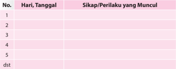

Tabel ini berisi informasi tentang sikap dan perilaku yang muncul pada hari tertentu selama beberapa minggu. Kolom "Hari, Tanggal" menyediakan tanggal-tanggal tertentu untuk melacak perkembangan sikap dan perilaku tersebut. Kolom "Sikap/Perilaku yang Muncul" mencatat tindakan atau pergerakan yang terjadi pada setiap hari. Topik utama tabel ini adalah pengamatan sikap dan perilaku seseorang selama periode waktu tertentu. Data penting yang terlihat adalah bahwa sikap dan perilaku tersebut bervariasi dari hari ke hari, menunjukkan bahwa perilaku manusia dapat sangat dinamis dan berubah dengan cepat.

### 2.  Penilaian Pengetahuan

- •
- Bentuk Penilaian:
Tes Tertulis

- Buatlah suatu analisis tentang tantangan-tantangan yang dihadapi umat Katolik Indonesia saat ini.
- Buatlah  suatu  analisis  tentang  peluang-peluang  umat  Katolik  untuk membangun bangsa dan negara Indonesia.
- Jelaskan  ajaran  Kitab  Suci  tentang  tantangan  dan  peluang  dalam membangun bangsa dan negara.
- Jelaskan  apa  ajaran  Gereja  tentang  tantangan  dan  peluang  dalam membangun bangsa dan negara.
- Jelaskan tentang bagaimana usaha-usaha umat Katolik untuk menghadapi tantangan dan peluang untuk ikut terlibat aktif membangun bangsa dan negara sesuai kehendak Tuhan.

### 3.  Penilaian Keterampilan

- •
- Bentuk Penilaian:
Portofolio

- Tugas:
Mengumpulkan beberapa pandangan Gereja Katolik tentang tantangan dan peluang umat Katolik dalam membangun Bangsa dan Negara seperti yang dikehendaki Tuhan.

Hasil temuan dituliskan dalam bentuk paper.

### 4.  Kegiatan Remedial

Bagi peserta didik yang belum memahami pokok bahasan ini, diberikan remedial dengan kegiatan:

- Guru menyampaikan pertanyaan kepada peserta didik hal-hal apa saja yang belum mereka pahami tentang tantangan dan peluang umat Katolik dalam membangun bangsa dan negara seperti yang dikehendaki Tuhan.

 

---
## 📄 Halaman 288

- Apabila ada hal-hal tertentu  yang  belum  mereka  pahami,  guru  mengajak peserta  didik  untuk  mempelajari  kembali  dengan  memberikan  penguatan yang lebih praktis.
- Guru  memberikan  penilaian  ulang  untuk  penilaian  pengetahuan,  dengan pertanyaan yang lebih sederhana sesuai dengan kondisi peserta didik.

### 5.  Kegiatan Pengayaan

Bagi peserta didik yang telah memahami pokok bahasan ini, diberikan pengayaan dengan kegiatan:

- Melakukan studi pustaka (ke perpustakaan atau mencari di koran/majalah) untuk  menemukan  apa  saja  tantangan  dan  peluang  umat  Katolik  dalam membangun bangsa dan negara seperti yang dikehendaki Tuhan.
- Hasil temuannya ditulis dalam laporan tertulis yang berisi gambaran singkat dari artikel atau cerita tersebut serta memberikan re fl eksi kritisnya.

### C.  Dasar Keterpanggilan Gereja Katolik dalam Membangun Bangsa dan Negara

### 1.  Penilaian Sikap (Spiritual dan Sosial)

### JURNAL

:   ................................................................

:   ................................................................

:   ................................................................

:   ................................................................

Nama Peserta Didik

Kelas/Program

Mata Pelajaran

Semester

---
**📊 Tabel**

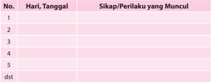

Tabel ini berisi informasi tentang sikap dan perilaku yang muncul pada hari tertentu sepanjang waktu. Kolom "Hari, Tanggal" menyediakan tanggal-tanggal tertentu untuk melacak sikap dan perilaku tersebut. Kolom "Sikap/Perilaku yang Muncul" menunjukkan tindakan atau perbuatan yang dilakukan oleh individu tersebut pada setiap hari. Topik utama tabel ini adalah analisis sikap dan perilaku sehari-hari seseorang. Data penting yang terlihat adalah bahwa tabel ini mencakup banyak hari dan tanggal, menunjukkan bahwa analisis ini dilakukan secara teratur dan berkelanjutan. Ini membantu dalam memahami pola sikap dan perilaku seseorang selama periode waktu yang panjang.

 

---
## 📄 Halaman 289

### 2.  Penilaian Pengetahuan

- Bentuk Penilaian:
- Uraian:
- Jelaskan  apa  dasar  atau  landasan  umat  Katolik  ikut  terlibat  dalam pembangunan bangsa dan negara.
- Jelaskan  apa  tindakan  atau  perwujudan  panggilan  sebagai  anggota Gereja Katolik dalam membangun bangsa dan negara.
- Jelaskan apa saja peran Gereja Katolik Indonesia dalam pembangunan bangsa dan negara.

### 3.  Penilaian Keterampilan

- •
- Bentuk Penilaian:
Portofolio

- Tugas
Mengumpulkan beberapa artikel dari berbagai sumber ajaran Gereja tentang dasar keterpanggilan Gereja Katolik dalam membangun bangsa dan negara.

### 4.  Kegiatan Remedial

Bagi peserta didik yang belum memahami pokok bahasan ini, diberikan remedial dengan kegiatan:

- Guru menyampaikan pertanyaan kepada peserta didik hal-hal apa saja yang belum mereka pahami tentang dasar keterpanggilan Gereja Katolik dalam membangun bangsa dan negara.
- Apabila ada hal-hal tertentu  yang  belum  mereka  pahami,  guru  mengajak peserta  didik  untuk  mempelajari  kembali  dengan  memberikan  penguatan yang lebih praktis.
- Guru memberikan penilaian untuk menilai pengetahuan, dengan pertanyaan yang lebih sederhana, sesuai dengan kondisi peserta didik.

### 5.  Kegiatan Pengayaan

Bagi peserta didik yang telah memahami pokok bahasan ini, diberikan pengayaan dengan kegiatan:

- Melakukan studi pustaka (ke perpustakaan atau mencari di koran/majalah) untuk  menemukan  apa  saja  dasar  keterpanggilan  Gereja  Katolik  dalam membangun bangsa dan negara.
- Hasil temuannya ditulis dalam laporan tertulis yang berisi gambaran singkat dari artikel atau cerita tersebut serta memberikan re fl eksi kritisnya.
Tes Tertulis

 

---
## 📄 Halaman 290

### Glosarium

---
**📊 Tabel**

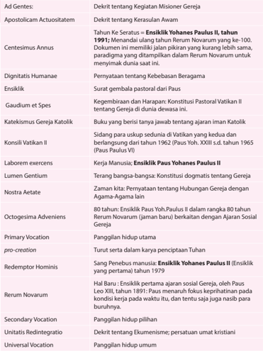

Tabel ini berisi informasi tentang kegiatan dan doktrin penting dalam Gereja Katolik, mencakup berbagai aspek seperti apostolicam actus, konsistensi, dan kehidupan gereja. Topik utama adalah kegiatan dan doktrin penting dalam Gereja Katolik, yang meliputi apostolicam actus, konsistensi, dan kehidupan gereja. Kolom-kolomnya mencakup berbagai aspek seperti apostolicam actus, konsistensi, dan kehidupan gereja. Data penting yang terlihat antara lain tentang kegiatan dan doktrin penting dalam Gereja Katolik, seperti apostolicam actus, konsistensi, dan kehidupan gereja.

 

---
## 📄 Halaman 291

### Daftar Pustaka

A. de Mello, SJ. 1997. Burung Berkicau. Cet. ke-8. Cipta Loka Caraka: Jakarta.

A. Heuken, SJ. Ensiklopedi Gereja. 1991. Jakarta: Cipta Loka Caraka.

Anly Lenggana dkk. 1998. Hak Asasi Beragama dalam Perkawinan Khonghucu. Jakarta: Gramedia. Badrika, I Wayan. 2005. Sejarah. Jakarta: Platinium.

Bambang  Ruseno  Utomo  MA.1992. Sekilas  Mengenal  Berbagai  Agama  dan  Kepercayaan  di

Indonesia. Malang: Pusat Pembinaan, Anggota Gereja.

Dahler, Franz. 1970. Masalah Agama. Yogyakarta: Kanisius.

Darminta, J. 1997. Gereja, Dialog, dan Kemartiran. (Cet ke-8). Yogyakarta: Kanisius.

Farndon, John. 2005. Sejarah Dunia. Yogyakarta: Platinum.

Gus Dur. 1999. Menjawab Perubahan Zaman .' Jakarta: Kompas.

H. Ikhsan Tanggok. Jalan Keselamatan Melalui Agama Khonghucu. Gramedia: Jakarta, 2000.

H.M. Sri fi n M.Ed. 2001. Mengenal Misteri Ajaran Agama-Agama Besar. Jakarta: Golden Terayan Press.

Hardawiryana, R. SJ, Dr. 1993. (Alih bahasa) Dokumen Konsili Vatikan II . Jakarta: Dokpen KWI dan Obor.

Hardjana, Am. 1993. Penghayatan Agama: Yang Otentik dan Tidak Otentik. Cet ke-1. Yogyakarta: Kanisius.

Heuken A. SJ.1992. Ensiklopedi Gereja . Jakarta: CLC.

Kieser Bernhard, SJ, Dr 1991. Paguyuban Manusia dengan Dasa Firman . Yogyakarta: Kanisius.

Kieser Bernhard, SJ, Dr.1987. Moral Dasar; Kaitan Iman dan Perbuatan . Yogyakarta: Kanisius.

Kieser Bernhard, SJ. Moral Sosial; Keterlibatan Umat dalam Hidup Bermasyarakat. Yogyakarta: Kanisius.

Kirchberger, Georg dan John Mansford Prior. 1996. Iman dan Transformasi Budaya. Ende Flores: Nusa Indah.

- Komisi HAK KWI. 1987. Hak Kerukunan. Tahun IX, No. 51, Juli - Agustus. Jakarta: Kom. HAK KWI.
Komisi HAK KWI. 1990. Hak Kerukunan. Tahun XII, No. 64, Maret - April. Jakarta: Kom. HAK KWI.

Komisi HAK KWI. 1997. Hak Kerukunan. Tahun IX, No. 50, Mei - Juni. Jakarta: Kom.HAK KWI.

Komisi Kateketik KWI, 2004 . Pendidikan Agama Katolik untuk SMA/K. Yogyakarta: Kanisius.

Konferensi Waligereja Indonesia (penerjemah). 2009 .  Kompendium Katekismus Gereja Katolik . Yogyakarta: Kanisius.

Konferensi Waligereja Indonesia 1991. Allah Penyayang Kehidupan . Jakarta: CLC.

Konferensi Waligereja Indonesia 1996. Iman Katolik; Buku Informasi dan Referensi. Yogyakarta: Kanisius.

Lalu Yosep, Pr .1990. Seks dan Liku-Likunya (diktat).

Muskens, M.P.M. 1973. Sejarah Gereja Katolik Indonesia. Ende Flores: Arnoldus.

Paus Yohanes Paulus II (1996). Evangelium Vitae . Jakarta: Dokpen KWI.

Paus Yohanes Paulus II. Menuju Kesempurnaan Ilahi. Kanisius: Yogyakarta, 1999.

Place & Sammie 1998. Hidup dalam Kristus . Jakarta: Obor.

Riyanto, Armada. 1995. Dialog Agama dalam Pandangan Gereja Katolik. Cet ke-7. Yogyakarta: Kanisius.

Sukidi. 2001. 'Teologi Inklusif, Cak Nur.' Jakarta: Kompas.

Wiliam Chang, OFMCap. 2001. Moral Lingkungan Hidup . Yogyakarta: Kanisius.

YWM. Baker, SJ. 1976. Umat Katolik Berdialog. Yogyakarta: Kanisius.

 

---
## 📄 Halaman 292

### Pro fi l Penulis

Nama Lengkap  : Leo Sugiyono, MSC

Telp. Kantor/HP  : 021-31937970/081 2424 1212

E-mail

:  leosugiyono@yahoo.com

Akun facebook

:  Leo Sugiyono

Alamat Kantor

:  Komkat KWI, Jl. Cut Mutiah No.10, Jakarta Pusat

Bidang Keahlian : Kurikulum Pendidikan Agama Katolik, Kateketik

### Riwayat pekerjaan/profesi dalam 10 tahun terakhir:

- Thn. 2006-2010
: Ketua Komisi Kateketik Keuskupan Agung Makassar

- Thn. 2010-2012
: Pastor Paroki Ratu Rosai Suci, Tuminting, Keuskupan Manado

- Thn. 2012- ….
: Sekretaris Komisi Kateketik KWI

### Riwayat Pendidikan Tinggi dan Tahun Belajar:

- S-1: Kateketik (Sekolah Tinggi Filsafat Kateketik Pradnyawidya, Yogyakarta (1991)
- S-1: Sekolah Tinggi Filsafat Seminari Pineleng, Manado (2000)

### Judul Buku dan Tahun Terbit (10 Tahun Terakhir):

- Hidup di Era Digital;  Gagasan Dasar dan Modul Katekese, thn.2015. Penerbit: Kanisius Yogyakarta.
- Judul Penelitian dan Tahun Terbit (10 Tahun Terakhir):
Tidak ada

Nama Lengkap  : Daniel Boli Kotan, S.Pd.,MM

Telp. Kantor/HP  : 021-31937970/081389200271

E-mail

:  daniel_kotan@yahoo.co.id

Akun facebook

:  Daniel Boli Kotan

Alamat Kantor

:  Komkat KWI, Jl. Cut Mutiah No.10 Jakarta Pusat

Bidang Keahlian : Kurikulum Pendidikan Agama Katolik

### Riwayat pekerjaan/profesi dalam 10 tahun terakhir:

- 1990-2016: Staf di Komisi Kateketik  KWI Jakarta.
- 2007-2015: Dosen di Sekolah Tingg Limu Pemerintahan Abdi Negara (STIP-AN) Jakarta.

### Riwayat Pendidikan Tinggi dan Tahun Belajar:

- S2: Manajemen/Manajemen Pendidikan/Sekolah Tinggi Manajemen IMMI, Jakarta (2008-2010)
- S1: Fakultas Keguruan dan Ilmu Pendidikan/Ilmu Pendidikan Teologi/Universitas Katolik Indonesia, Atma Jaya Jakarta (1989-1995)

### Judul Buku dan Tahun Terbit (10 Tahun Terakhir):

- Pendidikan Agama Katolik Sekolah  Dasar (bdk.KTSP), Buku Guru dan buku Siswa kelas I, thn. 2007. Penerbit: Kanisius Yogyakarta.

 

---
## 📄 Halaman 293

- Pendidikan Agama Katolik Sekolah  Dasar (bdk.KTSP), Buku Guru dan buku Siswa kelas II, thn. 2007. Penerbit: Kanisius Yogyakarta.
- Pendidikan Agama Katolik Sekolah  Dasar (bdk.KTSP), Buku Guru dan buku Siswa kelas III, thn. 2007. Penerbit: Kanisius Yogyakarta.
- Pendidikan Agama Katolik Sekolah  Dasar (bdk.KTSP), Buku Guru dan buku Siswa kelas IV, thn. 2007. Penerbit: Kanisius Yogyakarta.
- Pendidikan Agama Katolik Sekolah  Dasar (bdk.KTSP), Buku Guru dan buku Siswa kelas V, thn. 2007. Penerbit: Kanisius Yogyakarta.
- Pendidikan Agama Katolik Sekolah  Dasar (bdk.KTSP), Buku Guru dan buku Siswa kelas VI, thn. 2007. Penerbit: Kanisius Yogyakarta.
- Pendidikan Agama Katolik Sekolah Dasar  Kelas III (buku teks), thn. 2010. Penerbit: Kanisius Yogyakarta.
- Kuliah Pendidikan Agama Katolik di Universitas Terbuka, thn. 2007. Penerbit: Universitas Terbuka.
- Identitas Katekis di Tengah Arus Perubahan Zaman, thn. 2005. Penerbit: Komkat KWI, Jakarta.
- Hidup di Era Digital;  Gagasan Dasar dan Modul Katekese, thn.2015. Penerbit: Kanisius Yogyakarta.
- Judul Penelitian dan Tahun Terbit (10 Tahun Terakhir):

 

---
## 📄 Halaman 292

 

---
## 📄 Halaman 293

Tidak ada

### Pro fi l Penelaah

Nama Lengkap  : Matheus Beny Mite, M.Hum., Lic.Th.

Telp. Kantor/HP  : 021-5708821/081310117159

E-mail

:  benymite@yahoo.com; benymite.matheus@gmai.com

Akun facebook

:  beny.mite@atmajaya.ac.id

Alamat Kantor

:  Unika Atma Jaya, Jln. Jend. Sudirman 51, Jaksel.

Bidang Keahlian : Pendidikan Keagamaan Katolik dan Teologi

### Riwayat pekerjaan/profesi dalam 10 tahun terakhir:

- 2014 - Sekarang: Ketua Program Studi Pendidikan Keagamaan Katolik, Fakultas Pendidikan dan Bahasa, Universitas Katolik Indonesia (Unika) Atma Jaya, Jakarta.
- 2013 - sekarang: Aktif sebagai penelaah buku Pendidikan Agama Katolik yang diselenggarakan oleh Puskurbuk.
- 2009 - 2012: Aktif sebagai Pengembang Instrumen Penilaian dan Buku Teks Pelajaran Agama Katolik yang diselenggarakan oleh BSNP.
- 2008 - 2014: Ketua Program Studi Ilmu Pendidikan Teologi, Fakultas Keguruan dan Ilmu Pendidikan, Universitas Katolik Indonesia (Unika) Atma Jaya, Jakarta.
- 2006 - sekarang: Ketua Konsorsium Ilmu Pendidikan Indonesia.
- 1983 - sekarang: Unika Atma Jaya pada Prodi Ilmu Pendidikan Teologi.

 

---
## 📄 Halaman 294

### Riwayat Pendidikan Tinggi dan Tahun Belajar:

- S3: 2013 - Sekarang: Mahasiswa doktoral Manajemen Pendidikan, Universitas Negeri Jakarta sedang menyusun Disertasi.
- S2: 1995-1997: Magister Teologi. Universitas Sanata Dharma
- S1: 1980-1983 Sarjana Pendidikan pada  Filsafat Teologi pada Fakultas Keguruan dan Ilmu Pendidikan, Universitas Sanata Dharma.

### Judul Buku yang pernah ditelaah (10 Tahun Terakhir):

- Beny Mite, Matheus (editor). Gagasan Pendekatan Pakem di Perguruan Tinggi: Hasil Penelitian Dosen PGSD. Pelangi Pendidikan Seri E. Jakata: FPB, 2015.
- Beny Mite, Matheus (editor). Peranan Audiovisual dalam Berkatekese. Pelangi Pendidikan Seri C. Jakata: FKIP , 2012.
- Beny Mite,  Matheus (editor). Multidimensi dalam Pendidikan. Pelangi Pendidikan Seri A. Jakarta: FKIP 2011.
- Beny Mite, Matheus (editor). Model Katekese Kontekstual. Yogyakarta: Kanisius, 2009.

### Judul Penelitian dan Tahun Terbit (10 Tahun Terakhir):

- Beny Mite, Matheus. 'Pendidikan Iman Keluarga Katolik dalam Konteks Bangsa Indonesia' dalam Tantangan-Tantangan Keluarga Katolik di Zaman Modern. Jakarta: Obor, 2014.
- Beny Mite, Matheus. 'Buku Teks PAK Untuk Siswa: Sebuah Tinjauan Pedagogis - Yuridis' dalam Penggunaan Buku Teks Pelajaran Agama Katolik untuk Siswa dalam Proses Pembelajaran. Jakarta: Obor, 2010.
Nama Lengkap  : Matias Endar Suhendar, S.Pd

Telp. Kantor/HP  : 022-4207232 - 081321351940

E-mail

:  komkat2001@yahoo.com

Akun facebook

:  Matias Endar

Alamat Kantor

:  Jl. Jawa No. 6 Bandung

Bidang Keahlian : Pastoral katekese

### Riwayat pekerjaan/profesi dalam 10 tahun terakhir:

- 2003 - 2009 : Ketua Komisi Kateketik Keuskupan Bandung
- 2.
- 2010 - Sekarang   : Sekretaris Dewan karya Pastoral Keuskupan Bandung
- 3.
- 2005 - Sekarang   : Guru Honorer di SMA Negeri 3 dan 5 Bandung, mengajar Pendidikan Agama katolik
- 4.
- 2011  - Sekarang  : Dosen Agama Katolik di Sekolah Tinggi Pariwisata Bandung

### Riwayat Pendidikan Tinggi dan Tahun Belajar:

- S1 : Fakultas Pendidikan, Jurusan pendidikan Agama katolik, program studi Pendidikan Agama katolik, Universitas Sanata Dharma Yogyakarta. Tahun masuk 1990 - Tahun Lulus 1995.

### Judul Buku yang pernah ditelaah (10 Tahun Terakhir):

- Menjadi penelaah Buku kurikulum Pendidikan Agama katolik

 

---
## 📄 Halaman 295

Nama Lengkap  : FX. Adisusanto SJ

Telp. Kantor/HP  : -

E-mail

:  adisusanto@kawali.org

Akun facebook :  -

Alamat Kantor

:  Komisi Kateketik KWI, jl. Cut Meutia 10, Jakarta

Bidang Keahlian : Pendidikan Agama Katolik

### Riwayat pekerjaan/profesi dalam 10 tahun terakhir:

- Mengajar matakuliah kateketik di Universitas Sanata Dharma, Yogyakarta dan Universitas Katolik Atma Jaya, Jakarta sampai sekitar tahun 2012
- Sekarang bekerja sebagai Ketua Departemen Dokumentasi dan Penerangan Konferensi Waligereja Indonesia (Dokpen KWI) dan staf ahli kateketik Komisi Kateketik KWI

### Riwayat Pendidikan Tinggi dan Tahun Belajar:

- S1 : Lulusan Universitas Kepausan Salesianum, Roma, 1987
- Judul Buku yang pernah ditelaah (10 Tahun Terakhir):
Tidak ada

Nama Lengkap  : Dr. Salman Habeahan, S.Ag.MM.

Telp. Kantor/HP  : 081382836359; Telp/Fax. 021: 85913017 (R)

E-mail

:  salman.habeahan@yahoo.co.id

Akun facebook

:  087878623347

Alamat Kantor

:  Jl. I. Gusti Ngurah Rai Pd. Kopi Jakarta Timur

Bidang Keahlian : Pendidikan Agama & Manajemen Pendidikan

### Riwayat pekerjaan/profesi dalam 10 tahun terakhir:

- Pengawas Pendidikan Agama Katolik Tkt. Sekolah Menengah Kementerian Agama Kota Jakarta Timur (2003 - 2016).
- Dosen Pendidikan Agama Katolik Institut Bisnis Nusantara Jakarta (1999 - 2016)
- Dosen Etika Profesi Kependidikan & Manajemen Pendidikn Program Pasca Sarjana STIE-IMMI Jakarta (2015 - 2016).

### Riwayat Pendidikan Tinggi dan Tahun Belajar:

- S3: Pendidikan, Jurusan Manajemen Pendidikan Universitas Negeri Jakarta, 2006 - Awal 2012.
- S2: Manajemen, Jurusan Manajemen SDM, Universitas Budi Luhur Jakarta, 1998 2001.
- Post S-1: Teologi, Sekolah Tinggi Filsafat Teologi St. Yohanes Pematangsiantar, 1995 - 1997.
- S1: Filsafat Agama, Fakultas Filsafat Universitas Katolik St. Thomas Medan Sumatera Utara, 1989 - 1995.

### Judul Buku yang pernah ditelaah (10 Tahun Terakhir):

- Membangun Hidup Berpolakan Pribadi Yesus Kristus, Nusatama Yogyakarta, ISBN, 2003.

 

---
## 📄 Halaman 296

- Butir-butir Pendidikan Nilai Memasuki Abad 21, Krista Media, ISBN, 2006.
- Kepemimpinan Untuk Organisasi Publik, Organisasi Non-Profi  t, UADS, Publishing, ISBN, 2013.

### Judul Buku yang pernah ditelaah (10 Tahun Terakhir):

- Pendidikan Agama Katolik Kelas X (SMA)
- Pendidikan Agama Katolik Kelas XI (SMA)
- Pendidikan Agama Katolik XII (SMA)
- Pengawasan Berbasis Agama Katolik (Irjen Kementerian Agama R.I.)
- Buku KBK Agama Katolik untuk SMK

### Pro fi l Editor

Nama Lengkap  :  Dra. Maria Chatarina Adharti S

Telp. Kantor/HP  : (021) 3804248/081210979696

E-mail

:   adharti07@yahoo.co.id

Akun facebook : -

Alamat Kantor

:   Pusat Kurikulum dan Perbukuan

Jl. Gunung Sahari Raya No. 4 Jakarta

Bidang Keahlian :  Pengembang Kurikulum IPS, Sosiologi

- Riwayat pekerjaan/profesi dalam 10 tahun terakhir:
- Riwayat Pendidikan Tinggi dan Tahun Belajar:
- Judul Buku dan Tahun Terbit (10 Tahun Terakhir):
- Buku IPS
- Buku Tematik Terpadu
- Buku Pendidikan Agama Katolik
- Judul Penelitian dan Tahun Terbit (10 Tahun Terakhir):
- Model Kurikulum Pemberdayaan Masyarakat Pesisir Berbasis Ekonomi Produktif Tahun 2010
- Pemahaman Guru terhadap pelaksanaan pembelajaran dan penilaian kurikulum 2013 -  Tahun 2015
- 2011-2015  : Staf bidang Kurikulum dan Perbukuan Pendidikan Dasar
- 2016
: Staf bidang Perbukuan

- S1: Sosiologi - Fisipol UGM 1992

---

*📊 Statistik: 19 visual berhasil, 2 dilewati, 0 gagal | Durasi: 2m 23s*