# Salinan Kelas 12 Katolik BS press

*Diekstrak: 18 May 2026, 06:08*

---

---
## 📄 Halaman 1

### Pendidikan Agama Katolik dan Budi Pekerti Pendidikan Agama Katolik dan Budi Pekerti

---
**🖼️ Gambar/Diagram**

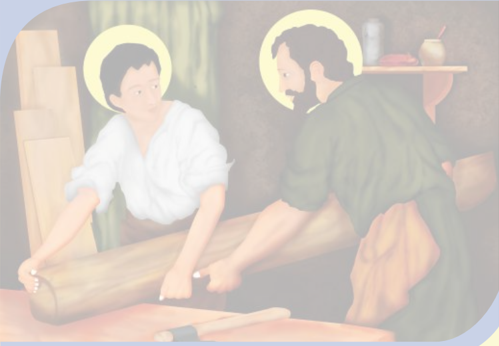

> **Deskripsi Visual:** Gambar ini adalah ilustrasi yang menunjukkan dua karakter yang tampaknya sedang berbicara atau berinteraksi. Karakter pertama, seorang anak muda dengan rambut pendek dan pakaian putih, sedang berdiri di depan meja. Karakter kedua, seorang dewasa dengan rambut panjang dan pakaian hijau, tampaknya sedang duduk di kursi. Mereka berada di dalam ruangan yang sederhana, dengan lemari dan peralatan dapur yang terlihat di belakang mereka. Ilustrasi ini mungkin digunakan untuk menggambarkan hubungan antara dua karakter atau situasi sosial tertentu dalam konteks cerita atau pelajaran.

 

---
## 📄 Halaman 2

### Hak Cipta © 2018 pada Kementerian Pendidikan dan Kebudayaan Dilindungi Undang-Undang

Disklaimer: Buku ini merupakan buku siswa yang dipersiapkan Pemerintah dalam rangka implementasi Kurikulum 2013. Buku siswa ini disusun dan ditelaah oleh berbagai pihak di bawah koordinasi Kementerian Pendidikan dan Kebudayaan, dan dipergunakan dalam tahap awal penerapan Kurikulum 2013. Buku ini merupakan 'dokumen hidup' yang senantiasa diperbaiki, diperbarui, dan dimutakhirkan sesuai dengan dinamika kebutuhan dan perubahan zaman. Masukan dari berbagai kalangan diharapkan dapat meningkatkan kualitas buku ini.

### Katalog Dalam Terbitan (KDT)

Indonesia. Kementerian Pendidikan dan Kebudayaan.

Pendidikan Agama Katolik dan Budi Pekerti / Kementerian Pendidikan dan

Kebudayaan.- Edisi Revisi Jakarta : Kementerian Pendidikan dan Kebudayaan, 2018. vi, 178 hlm. : ilus. ; 25 cm.

Untuk SMA Kelas XII ISBN 978-602-427-058-2 (jilid lengkap)

ISBN 978-602-427-061-2 (jilid 3)

- Katolik -- Studi dan Pengajaran
- Kementerian Pendidikan dan Kebudayaan
Penulis

: Daniel Boli Kotan dan P . Leo Sugiono

Nihil Obstat

: FX. Adisusanto

14 Agustus 2014

Imprimatur

: Mgr. John Liku Ada

21 Agustus 2014

Penelaah

: Matias Endar Suhendar, Matheus Benny Mithe, dan Salman Habeahan

Pe- review

: Ludwig Sitompul

Penyelia Penerbitan  : Pusat Kurikulum dan Perbukuan, Balitbang, Kemendikbud.

Cetakan Ke-1, 2015 (ISBN 192-602-282-420-6) Cetakan Ke-2, 2018 (Edisi Revisi)

Disusun dengan huruf Times New Roman, 12 pt.

I. Judul

230

 

---
## 📄 Halaman 3

### Kata Pengantar

Pantaslah kita semua bersyukur kepada Allah yang Mahakuasa atas terbitnya buku Pendidikan Agama Katolik dan Budi Pekerti yang telah direvisi  dan  diselaraskan sesuai perkembangan Kurikulum 2013.

Agama terutama bukanlah soal mengetahui mana yang benar atau yang salah. Tidak ada gunanya mengetahui tetapi tidak melakukannya, seperti dikatakan oleh Santo Yakobus: 'Sebab seperti tubuh tanpa roh adalah mati, demikian jugalah iman tanpa perbuatan-perbuatan  adalah  mati'  (Yakobus  2:26).  Demikianlah,  belajar  bukan sekadar  untuk  tahu,  melainkan  dengan  belajar  seseorang  menjadi  tumbuh  dan berubah. Tidak sekadar belajar lalu berubah, tetapi juga mengubah keadaan. Begitulah Kurikulum  2013  dirancang  agar  tahapan  pembelajaran  memungkinkan  siswa berkembang dari proses menyerap pengetahuan dan mengembangkan keterampilan hingga memekarkan sikap serta nilai-nilai luhur kemanusiaan.

Pembelajaran agama diharapkan mampu menambah wawasan keagamaan, mengasah keterampilan beragama, dan mewujudkan sikap beragama peserta didik yang utuh dan  berimbang  yang  mencakup  hubungan  manusia  dengan  Penciptanya,  sesama manusia, dan manusia dengan lingkungannya. Untuk itu, pendidikan agama perlu diberi  penekanan  khusus  terkait  dengan  penanaman  karakter  dalam  pembentukan budi pekerti yang luhur. Karakter yang ingin kita tanamkan antara lain: kejujuran, kedisiplinan, cinta kebersihan, cinta kasih, semangat berbagi, optimisme, cinta tanah air, kepenasaran intelektual, dan kreativitas.

Nilai-nilai karakter itu digali dan diserap dari pengetahuan agama yang dipelajari para siswa itu dan menjadi penggerak dalam pembentukan, pengembangan, peningkatan, pemeliharaan, dan perbaikan perilaku anak didik agar mau dan mampu melaksanakan tugas-tugas hidup mereka secara selaras, serasi, seimbang antara lahir-batin, jasmanirohani, material-spiritual, dan individu-sosial. Selaras dengan itu, pendidikan agama Katolik secara khusus bertujuan membangun dan membimbing peserta didik agar tumbuh berkembang mencapai kepribadian utuh yang semakin mencerminkan diri mereka  sebagai  gambar  Allah,  sebab  demikianlah  'Allah  menciptakan  manusia itu  menurut  gambar-Nya,  menurut  gambar  Allah  diciptakan-Nya  dia'  (Kejadian 1:27).  Sebagai  makhluk  yang  diciptakan  seturut  gambar  Allah,  manusia  perlu mengembangkan  sifat  cinta  kasih  dan  takut  akan  Allah,  memiliki  kecerdasan, keterampilan, pekerti luhur, memelihara lingkungan, serta ikut bertanggung jawab dalam pembangunan masyarakat, bangsa, dan negara. [Sigit DK: 2013]

 

---
## 📄 Halaman 4

Buku  pelajaran  Pendidikan  Agama  Katolik  dan  Budi  Pekerti  ini  ditulis  dengan semangat  itu.  Pembelajarannya  dibagi-bagi  dalam  kegiatan-kegiatan  yang  harus dilakukan  siswa  dalam  usaha  memahami  pengetahuan  agamanya.  Akan  tetapi pengetahuan  agama  bukanlah  hasil  akhir  yang  dituju.  Pemahaman  tersebut  harus diaktualisasikan  dalam  tindakan  nyata  dan  sikap  keseharian  yang  sesuai  dengan tuntunan agamanya, baik dalam bentuk ibadah ritual maupun ibadah sosial. Untuk itu,  sebagai  buku  agama  yang  mengacu  pada  kurikulum  berbasis  kompetensi, rencana pembelajarannya dinyatakan dalam bentuk aktivitas-aktivitas. Di dalamnya dirancang urutan pembelajaran yang dinyatakan dalam kegiatan-kegiatan keagamaan yang harus dilakukan siswa. Dengan demikian, buku ini menuntun apa yang harus dilakukan siswa bersama guru dan teman-teman sekelasnya untuk memahami dan menjalankan ajaran iman Katolik.

Buku ini bukanlah satu-satunya sumber belajar bagi siswa. Sesuai dengan pendekatan yang  dipergunakan  dalam  Kurikulum  2013,  siswa  didorong  untuk  mempelajari agamanya melalui pengamatan terhadap sumber belajar yang tersedia dan terbentang luas di sekitarnya. Lebih-lebih untuk usia remaja perlu ditantang untuk kritis sekaligus peka dalam menyikapi fenomena alam, sosial, dan seni budaya.

Peran guru sangat penting untuk menyesuaikan daya serap siswa dengan ketersedian kegiatan  yang  ada  pada  buku  ini.  Penyesuaian  ini  antara  lain  dengan  membuka kesempatan  luas  bagi  kreativitas  guru  untuk  memperkayanya  dengan  kegiatankegiatan lain yang sesuai dan relevan dengan tempat di mana buku ini diajarkan, baik belajar melalui sumber tertulis maupun belajar langsung dari sumber lingkungan sosial dan alam sekitar.

Komisi Kateketik Konferensi  Waligereja Indonesia sebagai lembaga yang bertanggung jawab atas ajaran iman Katolik berterima kasih kepada pemerintah, dalam hal ini Kementerian Pendidikan dan Kebudayaan atas kerja sama yang baik selama ini mulai dari proses penyusunan kurikulum hingga penulisan buku teks pelajaran ini.

Tim Penulis

 

---
## 📄 Halaman 5

### Daftar Isi

 

---
## 📄 Halaman 7

### BAB I

### Panggilan Hidup sebagai Umat Allah

---
**🖼️ Gambar/Diagram**

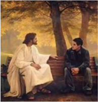

> **Deskripsi Visual:** Gambar ini adalah ilustrasi yang menampilkan dua karakter utama: Yesus dan seorang pria muda. Yesus duduk di sebelah kanan, mengenakan pakaian putih yang menyerupai busana keagamaan, sedangkan pria muda duduk di sebelah kiri dengan pakaian hitam. Mereka berada di bawah pohon yang memiliki daun kuning, menunjukkan bahwa gambar ini mungkin diambil pada musim gugur. Kedua karakter tersebut tampak saling berkomunikasi, dengan posisi tangan mereka yang menunjukkan hubungan emosional dan interaksi antara mereka.

Elemen-elemen utama dalam gambar ini adalah dua karakter utama, pohon dengan daun kuning, dan latar belakang alam yang tenang. Relasi antara karakter utama adalah komunikasi dan interaksi, yang ditunjukkan oleh posisi tangan mereka yang saling bergerak. Teks, angka, atau label penting tidak ada dalam gambar ini.

Informasi kunci yang dapat diambil pembaca adalah bahwa gambar ini mungkin menggambarkan dialog atau interaksi spiritual antara Yesus dan pria muda, yang biasanya terjadi dalam konteks agama Kristen. Latar belakang alam yang tenang juga menunjukkan suasana yang damai dan penuh kedamaian, yang mungkin merujuk pada konsep tentang kedamaian dalam kehidupan spiritual.

yesus/.

Diakses 25 Mei 2014

Gambar 1.1

Ilustrasi dialog Yesus dengan anak muda

Dalam  kehidupan agama  Katolik (Kristiani), kata panggilan dikaitkan  dengan  Tuhan.  Artinya  bahwa Tuhanlah  yang  memanggil  manusia  agar  manusia  hidup  sesuai  kehendak-Nya.  Panggilan  hidup,  baik religius  maupun  awam  senantiasa menuntun seseorang untuk hidup secara  bertanggung  jawab.  Panggilan hidup menunjukkan bahwa manusia memiliki  kehendak  bebas.  Dengan kebebasan  tersebut,  manusia  dapat menentukan apapun yang baik bagi dirinya  secara  otonom.  Kitab  Suci menjelaskan bahwa manusia dipanggil untuk menjadi murid-murid Yesus Kristus. Sebagai murid-murid Yesus, kita menjadi garam dan terang bagi sesama.

Untuk memahami makna dan hakikat panggilan hidup sebagai umat  Allah, maka pada kegiatan pembelajaran ini, peserta didik dibimbing untuk memahami dan menghayati bahwa hidupnya sungguh bermakna. Peserta didik yang sudah beranjak dewasa diharapkan memahami tentang makna hidup keluarga, tradisi perkawinan Katolik, tantangan dan peluang untuk membangun keluarga yang ideal atau yang dicita-citakan, makna hidup membiara, serta profesi atau karya sebagai panggilan hidup.

 

---
## 📄 Halaman 8

Untuk memahami makna panggilan hidup sebagai umat Allah, maka pada Bab I (pertama) ini, peserta didik akan mempelajari lima pokok-bahasan yaitu;

- Hidup Manusia yang Bermakna.
- Panggilan Hidup Berkeluarga.
- Perkawinan dalam Tradisi Katolik.
- Tantangan dan Peluang untuk Membangun Keluarga yang Dicita-citakan.
- Panggilan Hidup Membiara.
- Panggilan Karya/Profesi.

### A. Makna Hidup Manusia

Setiap  orang,  cepat  atau  lambat  pasti  akan  bertanya  seperti  ini  di  dalam hatinya; 'Untuk apa sih saya hidup di dunia ini?' Pada dasarnya pertanyaan seperti  ini  merupakan  pertanyaan  releksi  pribadi  bagi  dirinya  sendiri  untuk menemukan makna dan tujuan hidupnya di dunia. Dengan bertanya tentang tujuan hidup, kita dapat mencari jawaban tentang makna sesungguhnya hidup kita di dunia. Sesungguhnya Tuhan sendiri yang membimbing manusia untuk mencari tujuan akhir hidupnya. Tuhan yang menciptakan kita, menanamkan di dalam hati kita kerinduan hati untuk kembali kepada-Nya, dari mana kita berasal, dan tujuan akhir tempat kita berpulang.

### Doa Pembuka

Allah Bapa yang penuh kasih,

Puji  dan  syukur  kami  haturkan  kehadirat-Mu  atas  anugerah  kehidupan yang  Engkau  berikan  kepada  kami.  Bimbinglah  kami  ya  Bapa  dalam kegiatan pembelajaran ini supaya kami dapat memahami tentang makna hidup  sebagai  anugerah-Mu  yang  sangat  berharga.  Semoga  firman-Mu yang kami dengar dalam kegiatan pembelajaran ini dapat menjadi pelita hidup kami. Amin

### 1.  Makna Hidup manusia

- Melihat Pandangan masyarakat tentang hidup manusia Simaklah cerita kesaksian berikut ini.

 

---
## 📄 Halaman 9

### Bangkit dari keterpurukan

'Pada  tahun  2000,  bulan  Juli,  suami  saya,  ayah  dari  anak-anak meninggalkan  kami  untuk  selama-lamanya  kembali  ke  haribaan Tuhan Yang Maha Kuasa. Betapa kiamatnya hidup saya menyaksikan anak-anak  yang  masih  kecil-kecil  yang  benar-benar  membutuhkan kehadiran kedua orang tua mereka. Sampai kira-kira satu tahun, saya dalam keadaan seperti orang yang tidak waras, tidak mempedulikan diri sendiri, serta benar-benar merasakan panjangnya malam.

Pada suatu hari, kira-kira pukul 09.00 pagi, saya bersiap-siap  akan  menjemput  anak kedua saya, yang bersekolah di  Taman Kanak-Kanak. Waktu saya membuka lemari untuk berganti pakaian, terlihat sekilas piyama (baju tidur) almarhum suami saya. Piyama  itu  sangat  disayangi  olehnya.  Ketika mengenakan  piyama  itulah,  saya  melepaskan arwah suami saya. Hati saya luluh, piyama itu saya dekap erat-erat untuk melepaskan rindu dan haru, air mata berderai membasahi piyama.

Saya baru sadar, waktu mendengar suara anak sulung saya  yang  baru  pulang  dari sekolah menanyakan adiknya, 'Ma,  mana  adik? Ini saya bawa permen untuknya.' Sa-ya kaget mendengar si sulung menanyakan adiknya. Ternyata saya bersimpuh mendekap piyama itu selama hampir  tiga  jam.  Saya  bergegas meninggalkan rumah untuk menjemput adiknya. Waktu  saya  tiba  di  sekolah, ternyata sudah sepi dan anak

saya  pun  tidak  ada  di  sana.  Dua  hari  saya  dilanda  beban  perasaan serba  bingung  entah  ke  mana  harus  saya  cari.  Tiba-tiba  ada  orang yang  mengantarkan  anak  saya  ke  rumah.  Rupanya  waktu  itu  anak saya pulang sendiri dan tersesat. Beruntung ada orang berbaik hati membawa dia pulang.

 

---
## 📄 Halaman 10

Sejak peristiwa itu, saya berjanji pada diri sendiri akan mencurahkan kasih  sayang  dan  perhatian  saya  kepada  ketiga  anak  saya.  Untuk itu,  keadaan  di  rumah  saya  ubah.  Bahkan  tidurpun  saya  pindah  ke kamar  belakang  bersama  anak-anak.  Melalui  perantaraan  Bunda Maria, saya berdoa setiap hari memohon kekuatan serta berkat dari Yesus Puteranya agar dapat berjuang melanjutkan hidup ini sebagai orang tua tunggal, guna membesarkan dan mendidik anak-anak untuk menyongsong masa depannya. (MM)

Sumber cerita : Buletin Motivasi, Vol.1 no.5 Thn. 2014 dengan sedikit perubahan.

### b. Pendalaman/Diskusi

- Rumuskan pertanyaan-pertanyaan berdasarkan cerita yang telah kamu baca. Diskusikan pertanyaan berikut ini:
- Tantangan apa saja yang dihadapi dalam kehidupan keluarga saat ini?
- Bagaimana upaya menghadapi tantangan kehidupan keluarga?
- Temukan kisah-kisah kehidupan dalam masyarakat yang menjelaskan  bagaimana  orang-orang  memaknai  hidupnya  di dunia ini?

### 2.  Makna Hidup Manusia menurut Ajaran Kitab Suci

### a. Menelusuri Ajaran Kitab Suci

Setelah memahami  makna  hidup  manusia  melalui  cerita-cerita kehidupan,  sekarang  cobalah  dalam  kelompok  menelusuri  ajaran Kitab  Suci  Perjanjian  Lama  (PL)  dan  Perjanjian  Baru  (PB)  yang mengajarkan bahwa hidup manusia sangatlah berharga.

### b. Menyimak teks Kitab Suci

Setelah kamu menemukan ayat-ayat Kitab Suci yang dimaksudkan, sekarang cobalah menyimak teks Kitab Suci berikut ini.

### Delapan Sabda Bahagia Yesus Matius 5:1-12

1 'Ketika Yesus  melihat  orang  banyak  itu,  naiklah  Ia  ke  atas  bukit dan setelah Ia  duduk,  datanglah  murid-muridNya  kepada-Nya. 2 Maka  Yesus  pun  mulai  berbicara  dan  mengajar  mereka,  kataNya. 3 'Berbahagialah  orang  yang  miskin  di  hadapan Allah,  karena merekalah yang empunya Kerajaan Surga.  4 Berbahagialah orang yang berdukacita, karena mereka akan dihibur. 5 Berbahagialah orang yang lemah lembut, karena mereka akan memiliki bumi.  6 Berbahagialah

 

---
## 📄 Halaman 11

---
**🖼️ Gambar/Diagram**

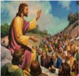

> **Deskripsi Visual:** Gambar ini adalah ilustrasi yang menampilkan tokoh yang tampak seperti Yesus Kristus sedang berbicara kepada sebuah kelompok orang yang tampak sangat antusias. Tokoh utama ini duduk di tengah-tengah kelompok, menghadap ke arah mereka, sementara mereka tampaknya berdiri dengan posisi yang rapi dan seragam. Ilustrasi ini mungkin digunakan untuk membantu pembaca memahami konsep atau cerita tentang Yesus Kristus dan bagaimana dia berinteraksi dengan umatnya.

Elemen-elemen utama dalam gambar ini meliputi tokoh utama yang tampak seperti Yesus Kristus, kelompok orang yang tampak sangat antusias, dan latar belakang yang menunjukkan suasana yang penuh semangat dan keagungan. Relasi antara elemen-elemen ini adalah bahwa tokoh utama (Yesus Kristus) menjadi pusat perhatian dan menjadi subjek utama dari gambar ini, sementara kelompok orang yang tampak sangat antusias menjadi objek utama yang ditunjukkan oleh tokoh utama tersebut.

Teks, angka, atau label penting yang terlihat dalam gambar ini tidak ada, karena gambar ini hanya berupa ilustrasi tanpa teks atau angka tambahan. Informasi kunci yang dapat diambil pembaca dari gambar ini adalah bahwa gambar ini mungkin digunakan untuk membantu pembaca memahami konsep atau cerita tentang Yesus Kristus dan bagaimana dia berinteraksi dengan umatnya.

orang yang lapar dan haus akan kebenaran, karena mereka akan dipuaskan. 7 Berbahagialah orang yang murah hatinya, karena mereka akan beroleh kemurahan. 8 Berbahagialah orang yang suci hatinya, karena mereka akan melihat Allah. 9 Berbahagialah orang  yang  membawa damai, karena mereka akan disebut anakanak Allah. 10 Berbahagialah  orang  yang dianiaya  oleh  sebab  kebenaran,  karena merekalah yang empunya Kerajaan Surga. 11 Berbahagialah kamu, jika karena Aku kamu dicela dan dianiaya dan kepadamu diitnahkan segala yang jahat.

12 Bersukacita  dan  bergembiralah,  karena  upahmu  besar  di  surga, sebab demikian juga telah dianiaya nabi-nabi yang sebelum kamu'.

### c. Pendalaman/Diskusi

Setelah  menyimak  teks  Kitab  Suci  Matius  5:1-12,  cobalah  kamu rumuskan  pertanyaan-pertanyaan  untuk  didiskusikan  tentang  hidup manusia yang bermakna menurut teks ayat-ayat Kitab Suci tersebut.

### 3.  Menghayati Hidup sebagai anugerah Tuhan.

Untuk menghayati hidup sebagai anugerah Tuhan yang sangat berharga bagi  setiap  insan  manusia,  buatlah  releksi  pribadi  dan  rencanakan suatu aksi!

### a. Refleksi

Tulislah sebuah releksi tentang makna hidupmu sebagai yang berharga dari Tuhan! Apa saja yang perlu kamu lakukan sebagai pelajar untuk mengisi hidupmu secara berkualitas?

### b. Aksi

- Tulislah sebuah rencana aksi untuk menghargai hidupmu sendiri dengan melakukan kegiatan-kegiatan yang bermutu. Seperti rajin belajar, disiplin terhadap peraturan di sekolah, di rumah, dan di masyarakat.
sesuatu

 

---
## 📄 Halaman 12

- Hasil releksimu dapat dipajang di Mading kelas.

### Doa Penutup

Terima  kasih  ya  Bapa,  Putra,  dan  Roh  Kudus  atas  rahmat  penyertaanMu  bagi  kami  selama  kegiatan  pembelajaran  ini,  sehingga  kami  dapat memahami bahwa hidup itu sebuah panggilan yang sangat berharga, yang perlu kami perjuangkan selama hidup di dunia ini. Semoga kami senantiasa memuliakan Engkau sepanjang segala masa. Amin.

### B. Panggilan Hidup Berkeluarga

Gereja Katolik secara tegas mengajarkan bahwa perkawinan Katolik adalah Sakramen.  Karena  itu,  setiap  pasang  suami  istri  harus  menjaga  kesucian perkawinan. Karena itu sifat perkawinan Katolik adalah monogami dan tidak terceraikan,  kecuali  oleh  maut;  'karena  apa  yang  dipersatukan Allah  tidak boleh diceraikan oleh manusia' (Mat 19:6). Sakramen Perkawinan sebagai akar  pembentukan  keluarga  Katolik  hendaknya  dijaga  kesuciannya.  Oleh karena  itu,  keluarga  merupakan  Gereja  kecil/mini  atau ecclesia  domestica . Artinya  antara  lain  bahwa  keluarga-keluarga  Kristiani  merupakan  pusat iman yang hidup, tempat pertama iman akan Kristus diwartakan dan sekolah pertama tentang doa, kebajikan-kebajikan, dan cinta kasih Kristen (bdk. KGK 1656 & 1666).

### Doa Pembuka

Allah Bapa yang penuh kasih,

Puji  dan  syukur  kami  haturkan  kehadirat-Mu  atas  anugerah  kehidupan yang  Engkau  berikan  kepada  kami.  Bimbinglah  kami  dalam  kegiatan pembelajaran  ini  agar  kami  sungguh  memahami  makna  hidup  kami  di dunia. Bimbinglah kami untuk menghayati panggilan hidup berkeluarga. Bimbinglah kami untuk menghargai orang tua kami yang telah membangun keluarga  di  mana  kami  menjadi  bagian  dari  keluarga  ini.  Doa  ini  kami sempurnakan dengan doa yang diajarkan Yesus Putra-Mu... Bapa Kami...

 

---
## 📄 Halaman 13

### 1.  Pemahaman umum tentang makna keluarga

### a. Melihat kasus sekitar kita

Simaklah sebuah cerita kehidupan keluarga berikut ini

### Saya Tidak Ingin Diganggu!

'Biasanya saya mendahulukan ego saya ketika di rumah, apalagi jika sedang dikejar deadline . Saya akan sibuk di depan komputer, penuh konsentrasi, dan tidak mudah diganggu. Ketika anak atau istri saya mengganggu, saya akan mudah emosi karena 'tekanan deadline ' (atau kadang-kadang sebenarnya hanya 'keasyikan pribadi saya') ditambah dengan permintaan/tekanan anak atau istri.

Nada bicara saya akan mudah meninggi. Setelah itu, istri akan marah juga. Dan pada akhirnya istri saya akan mengatakan 'papa sekarang gampang marah'.

---
**🖼️ Gambar/Diagram**

> **Deskripsi Visual:** Gambar ini adalah ilustrasi yang menunjukkan seorang pekerja yang sedang bekerja di komputer. Pekerja tersebut sedang berbicara dengan telepon seluler sambil menatap layar komputer. Di sebelah kanan komputer, terdapat beberapa dokumen atau surat yang diletakkan di meja kerja. Gambar ini menunjukkan situasi kerja yang sibuk dan multitasking, di mana pekerja harus mengatur waktu mereka antara komunikasi telepon dan pekerjaan di komputer.

Elemen-elemen utama dalam gambar ini meliputi:
1. Pekerja yang sedang bekerja.
2. Komputer di depan pekerja.
3. Telepon seluler yang digunakan oleh pekerja.
4. Dokumen atau surat di atas meja kerja.

Teks, angka, atau label penting yang terlihat dalam gambar ini tidak ada, karena gambar hanya menggambarkan situasi tanpa teks atau angka tambahan.

Informasi kunci yang dapat diambil pembaca dari gambar ini adalah bahwa pekerja tersebut sedang melakukan tugas yang memerlukan kombinasi komunikasi telepon dan pekerjaan di komputer, menunjukkan tingkat kegiatan yang intensif dan multitasking dalam lingkungan kerja.

Hal  yang  saya  lakukan  sekarang adalah  memberi  perhatian  akan kebutuhan  anak  dan  istri. Jika anak saya yang masih TK minta dibacakan  sesuatu,  saya  bacakan sambil memberi dia kasih sayang dengan memangkunya dan memeluknya. Jika anak saya yang besar minta dibantu belajar, saya mencoba  merelakan  kepentingan saya dan memberi perhatian akan  kebutuhan  anak  saya.  Jika istri  minta  tolong  sesuatu,  saya segera meninggalkan konsentrasi saya, dan membantu istri terlebih dahulu.

Kadang-kadang memang terlalu sulit. Sampai-sampai pekerjaan yang sedang  dikerjakan  jadi  terbengkalai.  Saya  sulit  untuk  selalu  tetap melakukan hal-hal yang baik tersebut. Perlu kesadaran penuh (akan niat memperhatikan istri dan anak) ketika permintaan anak dan istri itu datang.

Salah  satu  kuncinya  adalah  penyerahan  kepada  Tuhan.  'Pekerjaan dengan deadline nya'  saya  serahkan  pada  Tuhan.  Walaupun  waktu saya  tidak  sepenuhnya  pada  pekerjaan,  saya  yakin  Tuhan  akan

 

---
## 📄 Halaman 14

mencukupkan waktunya. Ketika Tuhan turun tangan, dengan waktu yang terbatas pun (karena banyak gangguan dari anak dan istri) saya akan mampu menyelesaikannya.

Ternyata ketika saya punya masalah. Itu adalah ujian dari Tuhan juga. Apa yang saya  pentingkan  di  dunia  ini?  Mengerjakan  tugas  (yang kadang-kadang adalah kepentingan pribadi) atau mengasihi keluarga? Kalau  saya  lengah,  saya  pasti  akan  mementingkan  tugas,  dengan akibat emosi tinggi di rumah. Akan tetapi, jika saya sadar akan ujian ini,  saya  akan  memilih untuk mengasihi keluarga saya. Saya harap saya bisa tetap mempertahankan sikap ini sehingga bisa menjadi pria sejati seperti Kristus.

Sumber: http://priasejatikatolik.org

### b. Pendalaman/Diskusi

Setelah  menyimak  cerita  tersebut,  cobalah  rumuskan  pertanyaanpertanyaan untuk mendalami cerita itu kemudian diskusikan dalam kelompok.  Pertanyaan-pertanyaan  tentu  saja  dalam  konteks  cerita yaitu: apa, mengapa, dan bagaimana akhir dari kasus tersebut.

### 2.  Memahami Ajaran Kitab Suci dan ajaran Gereja tentang Keluarga

### a. Kitab Suci

- Bacalah teks Kitab Suci berikut ini: Matius 19:1-6
' 1 Setelah Yesus selesai dengan pengajaran-Nya itu, berangkatlah Ia dari Galilea dan tiba di daerah Yudea yang di seberang sungai Yordan.  2 Orang banyak berbondong-bondong mengikuti Dia dan Ia pun menyembuhkan mereka di sana.  3 Maka datanglah orangorang Farisi kepada-Nya untuk mencobai Dia. Mereka bertanya: 'Apakah  diperbolehkan  orang  menceraikan  istrinya  dengan alasan  apa  saja?' 4 Jawab Yesus:  'Tidakkah  kamu  baca,  bahwa Ia yang menciptakan manusia sejak semula menjadikan mereka laki-laki  dan  perempuan? 5 Dan  irman-Nya:  Sebab  itu  laki-laki akan meninggalkan ayah dan ibunya dan bersatu dengan istrinya, sehingga keduanya itu menjadi satu daging. 6 Demikianlah mereka  bukan  lagi  dua,  melainkan  satu.  Karena  itu,  apa  yang telah dipersatukan Allah, tidak boleh diceraikan manusia.'

 

---
## 📄 Halaman 15

### 2) Pendalaman

Berdasarkan teks Kitab Suci Matius 19:1-6, diskusikan dengan teman-temanmu  beberapa pertanyaan berikut. ( kamu  dapat merumuskan sendiri pertanyaan tentang isi teks tersebut )

- Apa pesan dari teks Mat 19:1-6?
- Apa yang dicobai orang Farisi pada Yesus?
- Apa jawaban Yesus?
- Mengapa mereka mau mencobai Yesus?
- Bagaimana sifat keluarga menurut teks tersebut?

### b. Ajaran Gereja

- Simaklah Ajaran Gereja tentang keluarga berikut ini
'Keluarga adalah tempat pendidikan untuk memperkaya kemanusiaan.  Supaya  keluarga  mampu  mencapai  kepenuhan hidup dan misinya, diperlukan komunikasi, hati penuh kebaikan, kesepakatan  suami-istri,  dan  kerja  sama  orang  tua  yang  tekun dalam mendidik anak-anak. Kehadiran aktif ayah sangat membantu pembinaan mereka dan pengurusan rumah tangga oleh ibu, terutama dibutuhkan oleh anak-anak yang masih muda, perlu dijamin,  tanpa  maksud  supaya  pengembangan  peranan  sosial wanita yang sewajarnya dikesampingkan.

Melalui  pendidikan  hendaknya  anak-anak  dibina  sedemikian rupa,  sehingga  ketika  sudah  dewasa  mereka  mampu  dengan penuh tanggung jawab mengikuti panggilan mereka; panggilan religius; serta memilih status hidup mereka. Maksudnya apabila kelak  mereka mengikat diri dalam pernikahan, mereka mampu membangun keluarga sendiri dalam kondisi-kondisi moril, sosial, dan ekonomi yang menguntungkan. Merupakan kewajiban orang tua atau para pengasuh, membimbing mereka yang lebih muda dalam membentuk keluarga dengan nasihat bijaksana, yang dapat mereka terima dengan senang hati. Hendaknya para pendidik itu menjaga  jangan  sampai  memaksa  mereka,  langsung  atau  tidak langsung untuk mengikat pernikahan atau memilih orang tertentu menjadi jodoh mereka.

Demikianlah  keluarga,  lingkup  berbagai  generasi  bertemu  dan saling membantu untuk meraih kebijaksanaan yang lebih penuh, dan memadukan hak pribadi-pribadi dengan tuntutan hidup sosial lainnya, merupakan dasar bagi masyarakat. Oleh karena itu, siapa

 

---
## 📄 Halaman 16

saja  yang  mampu  memengaruhi  persekutuan-persekutuan  dan kelompok-kelompok  sosial,  wajib  memberi  sumbangan  yang efektif untuk mengembangkan perkawinan dan hidup berkeluarga.

Hendaknya pemerintah memandang sebagai kewajibannya yang  suci:  untuk  mengakui,  membela,  dan  menumbuhkan  jati diri  perkawinan  dan  keluarga;  melindungi  tata  susila  umum; dan  mendukung  kesejahteraan  rumah  tangga.  Hak  orang  tua untuk melahirkan keturunan dan mendidiknya dalam pangkuan keluarga juga harus dilindungi. Hendaknya melalui perundangundangan yang bijaksana serta pelbagai usaha lainnya, mereka yang  malang,  karena  tidak  mengalami  kehidupan  berkeluarga, dilindungi dan diringankan beban mereka dengan bantuan yang mereka perlukan.

Hendaknya umat Kristiani, sambil menggunakan waktu yang ada dan membeda-bedakan yang kekal dari bentuk-bentuk yang dapat berubah,  dengan  tekun  mengembangkan  nilai-nilai  perkawinan dan  keluarga,  baik  melalui  kesaksian  hidup  mereka  sendiri maupun melalui  kerja  sama  dengan  sesama  yang  berkehendak baik. Dengan demikian mereka mencegah kesukaran-kesukaran, dan mencukupi kebutuhan-kebutuhan keluarga serta menyediakan keuntungan-keuntungan baginya sesuai dengan tuntutan zaman sekarang.  Untuk  mencapai  tujuan  itu  semangat  iman  Kristiani, suara  hati  moril  manusia;  dan  kebijaksanaan  serta  kemahiran mereka yang menekuni ilmu-ilmu suci, akan banyak membantu. Hasil penelitian para pakar ilmu pengetahuan, terutama di bidang biologi, kedokteran, sosial, dan psikologi, dapat berjasa banyak bagi  kesejahteraan  perkawinan  dan  keluarga  serta  ketenangan hati.  Contohnya,  melalui  pengaturan  kelahiran  manusia  yang dapat dipertanggungjawabkan.

Berbekalkan pengetahuan yang memadai tentang hidup berkeluarga, para imam bertugas mendukung panggilan suamiistri  melalui  pelbagai  upaya  pastoral;  pewartaan  sabda  Allah; ibadat liturgis; dan bantuan-bantuan rohani lainnya dalam hidup perkawinan dan keluarga mereka. Tugas para imam pula, dengan  kebaikan  hati  dan  kesabaran  meneguhkan  mereka  di tengah  kesukaran-kesukaran,  serta  menguatkan  mereka  dalam cinta  kasih,  supaya  terbentuk  keluarga-keluarga  yang  sungguhsungguh berpengaruh baik.

 

---
## 📄 Halaman 17

Himpunan-himpunan keluarga, hendaknya berusaha meneguhkan kaum  muda  dan  para  suami-istri  sendiri,  terutama  yang  baru menikah,  melalui  ajaran  dan  kegiatan;  hidup  kemasyarakatan, serta kerasulan.

Akhirnya  hendaknya  para  suami-istri  sendiri,  yang  diciptakan menurut gambar Allah yang hidup dan ditempatkan dalam tatahubungan antarpribadi yang autentik, bersatu dalam cinta kasih yang sama, bersatu pula dalam usaha saling menguduskan supaya mereka, dengan mengikuti Kristus sumber kehidupan, di saat-saat gembira maupun pengorbanan dalam panggilan mereka, karena cinta kasih mereka yang setia menjadi saksi-saksi misteri cinta kasih, yang oleh Tuhan diwahyukan kepada dunia dalam wafat dan kebangkitan-Nya'. (GS.52)

### 2) Pendalaman

Setelah menyimak teks GS.52, cobalah mendiskusikan pertanyaan-pertanyaan  berikut  ini.  (kamu  dapat  merumuskan sendiri pertanyaan lain untuk mendiskusikan teks tersebut)

- Apa makna keluarga?
- Apa manfaat komunikasi dalam keluarga?
- Apa peran bapak dan ibu dalam keluarga?
- Apa upaya Gereja dalam membina keluarga?

 

---
## 📄 Halaman 18

### Doa Penutup

Ya Allah, Bapa sekalian insan, Engkau menciptakan manusia dan menghimpun mereka menjadi satu keluarga, yakni keluargaMu sendiri. Engkau pun telah memberi kami keluarga teladan, yakni keluarga kudus Nazaret, yang anggota-anggotanya  sangat takwa kepada-Mu dan penuh kasih satu sama lain.  Terima  kasih,  Bapa,  atas  teladan  yang indah ini.

Semoga  keluarga  kami  selalu  Kau  dorong untuk meneladani keluarga kudus Nazaret.

Semoga keluarga kami tumbuh menjadi keluarga  Kristen  yang  sejati  yang  dibangun atas dasar iman dan kasih: kasih akan Dikau dan kasih antar semua anggota keluarga.  Ajarlah  kami  hidup  menurut  Injil,  yaitu  rukun,  ramah,  bijaksana, sederhana, saling menyayangi, saling menghormati, dan saling membantu dengan ikhlas. Hindarkanlah keluarga kami dari marabahaya dan malapetaka; sertailah kami dalam suka dan duka; tabahkanlah kami bila kami sekeluarga menghadapi masalah-masalah. Bantulah kami agar tetap bersatu padu dan sehati sejiwa; hindarkan kami dari perpecahan dan percekcokan.

Jadikanlah keluarga kami ibarat batu yang hidup untuk membangun jemaatMu menjadi Tubuh Kristus yang rukun dan bersatu padu. Berilah keluarga kami rezeki yang cukup. Semoga kami sekeluarga selalu berusaha hidup lebih baik di tengah-tengah jemaat dan masyarakat.

Jadikanlah  keluarga  kami  garam  dan  terang  dalam  masyarakat.  Semoga keluarga kami selalu setia mengamalkan peran ini kendati harus menghadapi aneka tantangan.

Ya  Bapa,  kami  berdoa  pula  untuk  keluarga  yang  sedang  dilanda  kesulitan. Dampingilah  mereka  agar  jangan  patah  semangat.  Terlebih  kami  sangat prihatin untuk keluarga-keluarga yang berantakan. Jangan biarkan mereka ini  hancur.  Sebaliknya,  berilah  kekuatan  kepada  para  anggotanya  untuk membangun kembali keutuhan keluarga.

Semua ini kami mohon kepada-Mu, Bapa keluarga umat manusia, dengan perantaraan Yesus Kristus, Tuhan kami. Amin!

(Puji Syukur 1992, No. 162)

 

---
## 📄 Halaman 19

### C. Perkawinan dalam Tradisi Katolik

Perkawinan sebagai suatu karier tidak dapat disamakan dengan semua karier lain. Sebab ia membutuhkan perpaduan aneka ragam kebajikan dan sifat khas dari bermacam-macam karier khusus. Perkawinan menuntut kesabaran seorang guru,  keahlian  seorang  psikolog,  kegesitan  diplomasi  seorang  negarawan, dan rasa adil seorang hakim. Selain itu, dalam perkawinan dibutuhkan pula seni humor seorang pelawak, semangat berkorban seorang dokter, keramahtamahan seorang pramugari, dan belas kasihan seorang pengampun.

### Doa Pembuka

Allah Bapa yang penuh kasih,

Puji dan syukur kami haturkan kehadirat-Mu atas anugerah kehidupan yang Engkau berikan  kepada  kami.  Bimbinglah  kami  ya  Bapa  dalam  kegiatan pembelajaran  tentang  perkawinan  dalam  tradisi  Katolik,  sehingga  kami sungguh memahami dan menghayatinya kelak. Doa ini kami sempurnakan dengan doa yang diajarkan Yesus Putra-Mu... Bapa Kami....

### 1.  Pemahaman Umum tentang Perkawinan

- Melihat simbol perkawinan di masyarakat Perhatikan gambar-gambar berikut ini!

---
**🖼️ Gambar/Diagram**

> **Deskripsi Visual:** Gambar ini adalah ilustrasi yang menunjukkan kapal layar berlayar di atas laut dengan langit cerah dan awan kecil. Kapal layar memiliki tiga tiang dan dua layar besar yang menghadap ke arah barat. Laut tampak tenang dengan sedikit gelombang, menunjukkan kondisi cuaca yang baik. Langit biru cerah dengan beberapa awan kecil menambah keindahan gambar.

Elemen utama dalam gambar ini meliputi kapal layar, laut, dan langit. Kapal layar merupakan subjek utama yang menonjol, dengan tiang dan layar yang mencerminkan gaya arsitektur kapal layar tradisional. Laut tampak tenang dan luas, menunjukkan bahwa kapal layar sedang berlayar di lautan yang luas. Langit cerah dan sepi menunjukkan kondisi cuaca yang baik, memberikan suasana yang tenang dan damai.

Teks, angka, atau label penting tidak terlihat dalam gambar ini. Namun, informasi kunci yang dapat diambil pembaca meliputi ukuran kapal layar yang besar, jumlah layar yang besar, dan kondisi cuaca yang baik yang memungkinkan kapal layar untuk berlayar dengan tenang.

Sumber: www.freegraphicdowload.com.

Diakses 27 Mei 2014

Gambar 1.8

Cincin Perkawinan

 

---
## 📄 Halaman 20

### b. Pendalaman/Diskusi

- Gambar-gambar  pada  nomor  1.a merupakan  simbol-simbol dalam masyarakat yang berkaitan dengan perkawinan. Cobalah kamu menafsirkan makna dari simbol-simbol itu.
- Diskusikan dalam kelompok kecil pertanyaan-pertanyaan berikut ini:
- Apa makna simbol bahtera/kapal berkaitan dengan perkawinan?
- Apa makna simbol cincin?
- Apa makna simbol peraduan burung?
- Setelah mendiskusikan pertanyaan-pertanyaan tersebut, sekarang coba simak tulisan berikut ini.
- Makna Perkawinan Menurut Peraturan Perundang-undangan
- Undang-Undang No. 1 tahun 1974 tentang perkawinan, pasal 1 UU berbunyi: 'Perkawinan ialah ikatan lahir-batin antara seorang pria dengan seorang wanita sebagai suamiistri dengan tujuan membentuk keluarga (rumah tangga) yang berbahagia dan kekal berdasarkan Ketuhanan Yang Maha Esa'.
- Sebagai  Negara  yang  berdasarkan  Pancasila,  di  mana sila pertamanya ialah Ketuhanan Yang Maha Esa, maka perkawinan mempunyai  hubungan  yang  erat sekali dengan agama/kerohanian, sehingga perkawinan bukan saja  mempunyai  unsur  lahir/jasmani,  tetapi  juga  unsur batin/rohani.

 

---
## 📄 Halaman 21

- Membentuk  keluarga  yang  bahagia  erat  hubungannya dengan keturunan, yang merupakan tujuan perkawinan. Pemeliharaan  dan  pendidikan  anak  menjadi  hak  dan kewajiban orang tua.
- Makna Perkawinan menurut Pandangan Tradisional Dalam  masyarakat  tradisional  perkawinan  pada  umumnya masih merupakan suatu 'ikatan' . Perkawinan tidak hanya  mengikat  seorang  laki-laki  dengan  seorang  wanita. Perkawinan juga mengikat kaum kerabat si laki-laki dengan kaum  kerabat  si  wanita  dalam  suatu  hubungan  tertentu. Perkawinan  tradisional  umumnya  merupakan  suatu  proses. Di  mulai  dari  lamaran,  lalu  memberi  mas  kawin  ( belis ), kemudian peneguhan, dan seterusnya.
- Makna Perkawinan menurut Pandangan Hukum (yuridis) Dari  segi  hukum  perkawinan  sering  dipandang  sebagai suatu 'perjanjian' .  Dengan  perkawinan,  seorang  pria  dan seorang wanita saling berjanji untuk hidup bersama, di depan masyarakat agama atau masyarakat negara, yang menerima dan mengakui perkawinan itu sebagai sah.
- Makna Perkawinan menurut Pandangan Sosiologi Secara sosiologi, perkawinan merupakan suatu 'persekutuan hidup' yang mempunyai bentuk, tujuan, dan hubungan yang khusus antaranggota. Ia merupakan suatu lingkungan hidup yang  khas.  Dalam  lingkungan  hidup  ini,  suami  dan  istri dapat  mencapai  kesempurnaan  atau  kepenuhannya  sebagai manusia, sebagai bapak dan sebagai ibu.
- Makna Perkawinan menurut Pandangan Antropologis Perkawinan dapat pula dilihat sebagai suatu 'persekutuan cinta' .  Pada  umumnya,  hidup  perkawinan  dimulai  dengan cinta. Ia ada dan akan berkembang atas dasar cinta. Seluruh kehidupan bersama sebagai suami-istri didasarkan dan diresapi seluruhnya oleh cinta.

### 2.  Ajaran Kitab Suci (Alkitab) tentang Perkawinan

- Menyimak teks Kitab Suci
- Cobalah temukan teks-teks Kitab Suci yang menjelaskan tentang makna  dan  hakikat  perkawinan  Katolik!  Tuliskan  pasal  dan ayatnya!

 

---
## 📄 Halaman 22

- Sekarang cobalah menyimak teks-teks Kitab Suci berikut ini dan bandingkan dengan teks Kitab Suci yang kamu temukan!

### Kejadian 2:18-25

18 TUHAN  Allah  berirman:  'Tidak  baik,  kalau  manusia  itu seorang diri saja. Aku akan menjadikan penolong baginya, yang sepadan  dengan  dia.' 19 Lalu  TUHAN  Allah  membentuk  dari tanah segala binatang hutan dan segala burung di udara. DibawaNyalah semuanya kepada manusia itu untuk melihat, bagaimana ia  menamainya;  dan  seperti  nama  yang  diberikan  manusia  itu kepada tiap-tiap  makhluk  yang  hidup,  demikianlah  nanti  nama makhluk itu. 20 Manusia itu memberi nama kepada segala ternak, kepada  burung-burung  di  udara  dan  kepada  segala  binatang hutan, tetapi baginya sendiri ia tidak menjumpai penolong yang sepadan dengan dia.  21 Lalu TUHAN Allah membuat manusia itu tidur  nyenyak; ketika ia tidur, TUHAN Allah mengambil salah satu rusuk dari padanya, lalu menutup tempat itu dengan daging. 22 Dan dari rusuk yang diambil TUHAN Allah dari manusia itu, dibangun-Nyalah  seorang  perempuan,  lalu  dibawa-Nya  kepada manusia itu. 23 Lalu berkatalah manusia itu: 'Inilah dia, tulang dari tulangku dan daging dari dagingku. Ia akan dinamai perempuan, sebab ia diambil dari laki-laki.' 24 Sebab itu seorang laki-laki akan meninggalkan ayahnya dan ibunya dan bersatu dengan istrinya, sehingga  keduanya  menjadi  satu  daging. 25 Mereka  keduanya telanjang, manusia dan istrinya itu, tetapi mereka tidak merasa malu.

### Mrk 10:2-12; (bdk Luk 16:18)

2 Maka  datanglah orang-orang Farisi, dan untuk mencobai Yesus  mereka  bertanya  kepada-Nya:  'Apakah  seorang  suami diperbolehkan menceraikan istrinya?': 3 Tetapi jawab-Nya kepada  mereka:  'Apa  perintah  Musa  kepada  kamu?' 4 Jawab mereka:  'Musa  memberi  izin  untuk  menceraikannya  dengan membuat surat cerai.' 5 Lalu kata Yesus kepada mereka: 'Justru karena ketegaran hatimulah maka Musa menuliskan perintah ini untuk kamu.  6 Sebab pada awal dunia, Allah menjadikan mereka laki-laki dan perempuan, 7 sebab itu laki-laki akan meninggalkan ayahnya  dan  ibunya  dan  bersatu  dengan  istrinya, 8 sehingga keduanya itu  menjadi  satu  daging.  Demikianlah  mereka  bukan lagi dua, melainkan satu. 9 Karena itu, apa yang telah dipersatukan Allah, tidak boleh diceraikan manusia.' 10 Ketika mereka sudah di

 

---
## 📄 Halaman 23

rumah, murid-murid itu bertanya pula kepada Yesus tentang hal itu. 11 Lalu kata-Nya kepada mereka: 'Barang siapa menceraikan istrinya  lalu  kawin  dengan  perempuan  lain,  ia  hidup  dalam perzinaan  terhadap  istrinya  itu. 12 Dan  jika  si  istri  menceraikan suaminya dan kawin dengan laki-laki lain, ia berbuat zina.'

### b. Pendalaman/Diskusi

Setelah menyimak teks-teks Kitab Suci, cobalah menjawab pertanyaan-pertanyaan berikut ini!

- Apa maksud teks Kejadian 2:18-25 berkaitan dengan perkawinan?
- Apa maksud teks Mrk 10:2-12, berkaitan dengan perkawinan?

### 3.  Ajaran Gereja tentang Perkawinan

### a. Menyimak Ajaran Gereja Katolik

Simaklah dokumen Ajaran Gereja tentang perkawinan berikut ini.

Perjanjian ( foedus ) perkawinan, dengannya seorang laki-laki dan  seorang  perempuan  membentuk  antara  mereka  persekutuan ( consortium )  seluruh  hidup,  yang  menurut  ciri  kodratinya  terarah pada  kesejahteraan  suami-istri  ( bonum  coniugum )  serta  kelahiran dan pendidikan anak, antara orang-orang yang dibaptis, oleh Kristus Tuhan diangkat ke martabat sakramen. Karena itu, antara orang-orang yang  dibaptis  tidak  dapat  ada  kontrak  perkawinan  sah  yang  tidak dengan sendirinya sakramen. (Kitab Hukum Kanonik; 1055)

### Kesucian perkawinan dan keluarga

Persekutuan hidup dan kasih suami-istri yang mesra, yang diadakan oleh  Sang  Pencipta  dan  dikukuhkan  dengan  hukum-hukumnya, dibangun oleh janji pernikahan atau persetujuan pribadi yang tidak dapat ditarik kembali. Demikianlah karena tindakan manusiawi, yakni saling menyerahkan diri dan saling menerima antara suami dan isteri, timbullah suatu lembaga perkawinan yang mendapat keteguhannya, juga bagi masyarakat, berdasarkan ketetapan ilahi. Ikatan suci demi kesejahteraan  suami-istri  dan  anak  maupun  masyarakat  itu,  tidak tergantung  dari  manusiawi  semata-mata. Allah  sendirilah  Pencipta perkawinan,  yang  mencakup  berbagai  nilai  dan  tujuan.  Itu  semua penting sekali bagi kelangsungan umat manusia; bagi pertumbuhan pribadi  serta  tujuan  kekal  masing-masing  anggota  keluarga;  bagi martabat,  kelestarian,  damai,  dan  kesejahteraan  keluarga  sendiri maupun  seluruh  masyarakat  manusia.  Menurut  sifat  kodratinya lembaga  perkawinan  dan  cinta  kasih  suami-istri  bertujuan  untuk

 

---
## 📄 Halaman 24

mendapatkan  keturunan  serta  pendidikan.  Maka  dari  itu  pria  dan wanita,  yang  karena  janji  perkawinan  'bukan  lagi  dua,  melainkan satu daging' (Mat 19:6), saling membantu dan melayani berdasarkan ikatan  mesra  antara  pribadi  dan  kerja  sama;  mereka  mengalami dan  dari  hari  ke  hari  makin  memperdalam  rasa  kesatuan  mereka. Persatuan  mesra  itu,  sebagai  saling  serah  diri  antara  dua  pribadi, begitu pula kesejahteraan anak-anak, menuntut kesetiaan suami istri yang sepenuhnya, dan tidak terceraikannya kesatuan mereka menjadi mutlak perlu.

Kristus  Tuhan  melimpahkan  berkat-Nya  atas  cinta  kasih  yang beranekaragam itu, yang berasal dari sumber cinta kasih Ilahi, dan terbentuk menurut pola persatuan-Nya dengan Gereja. Sebab seperti dulu  Allah  menghampiri  bangsa-Nya  dengan  perjanjian  kasih  dan kesetiaan,  begitu  pula  sekarang  Penyelamat  umat  manusia  dan Mempelai Gereja, melalui Sakramen Perkawinan menyambut suamiistri  Kristiani. Selanjutnya Ia tinggal beserta mereka supaya seperti Ia sendiri mengasihi Gereja dan menyerahkan Diri untuknya, begitu pula  suami-istri  dengan  saling  menyerahkan  diri  dan  mengasihi dengan  kesetiaan  yang  tak  kunjung  henti.  Kasih  sejati  suami-istri ditampung dalam cinta Ilahi, dibimbing dan diperkaya berkat daya penebusan  Kristus serta  kegiatan  Gereja  yang  menyelamatkan, supaya suami-istri secara nyata diantar menuju Allah, dan diteguhkan dalam tugas mereka yang luhur sebagai ayah dan ibu. Oleh karena itu, suami-istri Kristiani dikuatkan dan dikuduskan dengan sakramen yang khas untuk tugas kewajiban dan martabat status hidup mereka. Berkat kekuatan-Nya mereka menunaikan tugas sebagai suami-istri dalam keluarga, dan dijiwai semangat Kristus, yang meresapi seluruh hidup  mereka  dengan  iman,  harapan,  dan  cinta  kasih.  Suami-istri makin mendekati kesempurnaan dan saling menguduskan, dan pada akhirnya secara bersama-sama makin memuliakan Allah. Maka dari itu,  dengan  mengikuti  teladan  orang  tua  dan  berkat  doa  keluarga, anak-anak, dan semua yang hidup di lingkungan keluarga, akan lebih mudah menemukan jalan keselamatan dan kesucian.

Suami-istri yang mengemban martabat dan tugas utama sebagai bapak dan sebagai ibu akan melaksanakan kewajiban memberi pendidikan terutama  di  bidang  keagamaan  dengan  tekun  dan  baik. Anak-anak sebagai anggota keluarga yang hidup ikut serta menguduskan orang tua mereka dengan cara mereka sendiri. Mereka akan membalas budi orang  tua  dengan  cinta  mesra,  rasa  syukur,  ungkapan  terima  kasih

 

---
## 📄 Halaman 25

dan kepercayaan, serta akan membantu orang tua di saat mengalami kesukaran  dan  menemani  mereka  dalam  kesunyian  di  usia  lanjut. Status janda, sebagai kelangsungan panggilan berkeluarga ditanggung dengan keteguhan hati, dan hendaknya dihormati oleh semua orang. Keluarga dengan kebesaran jiwa hendaknya berbagi kekayaan rohani dengan  keluarga-keluarga  lain.  Maka  dari  itu,  keluarga  kristiani, karena berasal dari pernikahan yang merupakan gambar dan partisipasi perjanjian cinta kasih antara Kristus dan Gereja, akan menampakkan kepada semua orang kehadiran Sang Penyelamat yang sungguh nyata di dunia dan hakikat Gereja yang sesungguhnya, baik melalui kasih suami-istri;  kesuburan  yang  dijiwai  semangat  berkorban;  kesatuan dan kesetiaan, maupun melalui kerja sama yang penuh kasih antara semua anggotanya. ( GS. 48).

### Pengabdian kepada manusia

Umat  manusia  zaman  sekarang  terpukau  oleh  rasa  kagum  akan berbagai penemuan serta kekuasaannya sendiri. Akan tetapi, sering pula manusia dengan gelisah bertanya-tanya tentang perkembangan dunia  dewasa  ini;  tentang  tempat  dan  tugasnya  di  alam  semesta; tentang  makna  jerih-payahnya  secara  individu  maupun  kelompok; dan akhirnya tentang tujuan akhir manusia itu sendiri. Oleh karena itu,  Konsili  menyampaikan  kesaksian  dan  penjelasan  tentang  iman kepada  segenap  Umat  Allah  yang  dihimpun  oleh  Kristus.  Konsili tidak dapat menunjukkan secara lebih jelas-tentang kesetiakawanan, penghargaan,  serta  cinta  kasih  Umat  itu  terhadap  seluruh  keluarga manusia  yang  mencakupnya,  selain  dengan  menjalin  temuwicara tentang  pelbagai  hal.  Konsili  menerangi  permasalahan  itu  dengan cahaya  Injil,  menyediakan  bagi  manusia  daya-kekuatan  pembawa keselamatan,  yang  oleh  gereja,  dibawah  bimbingan  Roh  Kudus, diterima dari pendirinya. Sebab pribadi manusia harus diselamatkan, dan masyarakatnya diperbaharui. Maka  manusia, ditinjau dari kesatuan  dan  keutuhannya,  beserta  jiwa  maupun  raganya,  dengan hati serta nuraninya, dengan budi dan kehendaknya, akan merupakan poros seluruh uraian kami.' ( GS. 3).

### Pengembangan  perkawinan  dan  keluarga  merupakan  tugas semua orang

'Keluarga adalah tempat pendidikan untuk memperkaya kemanusiaan. Supaya  keluarga  mampu  mencapai  kepenuhan  hidup  dan  misinya, diperlukan  komunikasi,  hati  penuh  kebaikan,  kesepakatan  suamiistri,  dan  kerja  sama  orang  tua  yang  tekun  dalam  mendidik  anak-

 

---
## 📄 Halaman 26

anak.  Kehadiran  aktif  ayah  sangat  membantu  pembinaan  mereka dan pengurusan rumah tangga oleh ibu, terutama dibutuhkan oleh  anak-anak  yang  masih  muda,  perlu  dijamin,  tanpa  maksud supaya pengembangan  peranan  sosial wanita yang sewajarnya dikesampingkan.

Melalui pendidikan hendaknya anak-anak dibina sedemikian rupa,  sehingga  ketika  sudah  dewasa  mereka  mampu dengan penuh tanggung jawab mengikuti panggilan mereka; dan panggilan religius; serta  memilih  status  hidup  mereka.  Maksudnya,  apabila  kelak mereka mengikat diri dalam pernikahan, mereka mampu membangun keluarga  sendiri  dalam  kondisi-kondisi  moril,  sosial,  dan  ekonomi yang  menguntungkan.  Merupakan  kewajiban  orang  tua  atau  para pengasuh, membimbing mereka yang lebih muda dalam membentuk keluarga dengan nasihat bijaksana, yang dapat mereka terima dengan senang  hati.  Hendaknya  para  pendidik  itu  menjaga  jangan  sampai memaksa  mereka,  langsung  atau  tidak  langsung  untuk  mengikat pernikahan atau memilih orang tertentu menjadi jodoh mereka.

Demikianlah keluarga, lingkup berbagai generasi bertemu dan saling  membantu  untuk  meraih  kebijaksanaan  yang  lebih  penuh, dan  memadukan  hak  pribadi-pribadi  dengan  tuntutan  hidup  sosial lainnya, merupakan dasar bagi masyarakat. Oleh karena itu, siapa saja yang mampu memengaruhi persekutuan-persekutuan dan kelompokkelompok  sosial,  wajib  memberi  sumbangan  yang  efektif  untuk mengembangkan perkawinan dan hidup berkeluarga.

Hendaknya pemerintah memandang sebagai kewajibannya yang suci untuk  mengakui,  membela  dan  menumbuhkan  jati  diri  perkawinan dan keluarga; melindungi tata susila umum;  dan  mendukung kesejahteraan rumah  tangga. Hak  orang  tua untuk melahirkan keturunan  dan  mendidiknya  dalam  pangkuan  keluarga  juga  harus dilindungi. Hendaknya melalui perundang-undangan yang bijaksana serta  pelbagai  usaha  lainnya,  mereka  yang  malang,  karena  tidak mengalami kehidupan berkeluarga, dilindungi dan diringankan beban mereka dengan bantuan yang mereka perlukan.

Hendaknya  umat  kristiani,  sambil  menggunakan  waktu  yang  ada dan  membeda-bedakan  yang  kekal  dari  bentuk-bentuk  yang  dapat berubah, dengan tekun mengembangkan  nilai-nilai perkawinan dan keluarga, baik melalui kesaksian hidup mereka sendiri maupun melalui kerja sama dengan sesama yang berkehendak baik. Dengan demikian  mereka  mencegah  kesukaran-kesukaran,  dan  mencukupi

 

---
## 📄 Halaman 27

kebutuhan-kebutuhan keluarga serta menyediakan keuntungankeuntungan baginya sesuai dengan tuntutan zaman sekarang. Untuk mencapai tujuan itu semangat iman kristiani, suara hati moril manusia; dan kebijaksanaan serta kemahiran mereka yang menekuni ilmu-ilmu suci, akan banyak membantu. (GS.52)

### b. Pendalaman/Diskusi

Setelah menyimak dokumen ajaran Gereja tersebut, cobalah diskusikan dalam kelompok pertanyaan-pertanyaan berikut ini.

- Apa  makna  ajaran  Gereja  tentang  perkawinan  dalam  Kitab Hukum Kanonik; 1055?
- Apa makna ajaran Gereja tentang perkawinan menurut Gaudium et Spess art 48?
- Apa makna ajaran Gereja tentang perkawinan menurut Gaudium et Spess art 3a?
- Apa makna ajaran Gereja tentang perkawinan menurut Gaudium et Spess art 52a?

### 4.  Menghayati Perkawinan sebagai Panggilan Hidup

### a. Refleksi

Tulislah sebuah releksi pribadi bertemakan perkawinan panggilan hidup!

### b. Aksi

- Membuat niat untuk selalu bersikap hormat pada orang tua serta semua orang tua yang lain.
- Menuliskan sebuah doa atau puisi untuk orang tua.

### Doa Penutup

Ya Allah Yang Mahasetia, Engkau telah menguduskan cinta kasih suami istri dan mengangkat perkawinan menjadi lambang persatuan Kristus dengan Gereja.  Semoga  suami-istri  Katolik  semakin  menyadari  kesucian  hidup berkeluarga  dan  berusaha  menghayatinya  dalam  suka  dan  duka.  Demi Yesus Kristus, Putra-Mu dan Pengantara kami, yang bersama Dikau dalam persekutuan dengan Roh Kudus, hidup dan berkuasa, kini dan sepanjang segala masa. Amin.

sebagai

 

---
## 📄 Halaman 28

### D. Tantangan dan Peluang untuk Membangun Keluarga yang Dicita-citakan

Gereja  Katolik  memberikan  perhatian  yang  sangat  serius  pada  kehidupan keluarga, karena keluarga adalah sel dari Gereja dan masyarakat. Oleh karena itu,  keluarga  yang  sejahtera  adalah  harapan  sekaligus  perjuangan  Gereja. Paus Yohanes  Paulus  II  dalam  Surat Apostoliknya  ' Familiaris  Consortio ' memandang keluarga sejahtera dalam kesetiaan pada rencana Allah sebagai sebuah  perkawinan.  Ditegaskan  pula  bahwa  pribadi  manusia  sebagai  citra Allah  diciptakan  untuk  mencintai.  Keluarga,  menurut  Paus,  adalah  suatu komunitas pribadi-pribadi yang membentuk masyarakat dan Gereja.

### Doa Pembuka

Tuhan  Yesus,  Engkau  menguduskan  hidup  berkeluarga  dengan  hidup sendiri  dalam  keluarga  Santo  Yusuf  di  Nazaret.  Berkatilah  kami  pada kegiatan  pembelajaran  ini  agar  kami  dapat  memahami  makna  keluarga sejati  sebagaimana  Engkau  kehendaki.  Semoga  kami  hidup  menurut pedoman injilMu, rukun, bijaksana, sederhana, saling menyayangi, saling menghormati,  saling  menolong  dengan  senang  hati.  Berilah  supaya keramahan  dan  cinta  kasih,  semangat  pengorbanan,  kerajinan,  dan penghasilan  yang  cukup  selalu  berada  dalam  keluarga  kami.    Semoga keluarga kami menjadi garam dan terang bagi keluarga-keluarga di sekitar kami.  Berkatilah  kami  agar  jangan  ada  di  antara  keluarga  kami  yang menjauh dari Mu, satu-satunya sumber kebahagiaan kami. Dikau kami puji bersama Bapa dan Roh Kudus, sekarang dan selamanya. Amin.

### 1.  Memahami Tantangan-tantangan yang Dihadapi Keluarga-keluarga Saat Ini.

- Menyimak berita
'Sebuah konferensi  tentang  keluarga  yang  disponsori  oleh  Vatikan berakhir pada Jumat di Manila dengan seruan bagi umat Katolik Asia untuk melawan aborsi, kontrasepsi, dan pernikahan sesama jenis sebagai 'ancaman terhadap eksistensi keluarga'.

 

---
## 📄 Halaman 29

Dokumen empat halaman itu, yang dikeluarkan oleh 551 peserta dari 14 negara Asia, termasuk 28 uskup, mengklaim bahwa advokasi untuk pernikahan  sesama  jenis  'mencoba  untuk  mengurangi  pernikahan antara  orang-orang  sesama  jenis'.  'Aborsi  membunuh  kehidupan

yang akan mengancam  eksistensi keluarga,' tulis dokumen itu. Selain itu, dokumen ini menambahkan bahwa kontrasepsi dan sterilisasi mengancam 'tujuan prokreasi perkawinan dan keluarga'. Dokumen ini dirilis pada akhir pertemuan yang diselenggarakan oleh Dewan Kepausan untuk Keluarga dan Konferensi Waligereja Filipina, untuk  membahas  'Piagam  Hak-hak Keluarga  yang  dikeluarkan  Vatikan 30 tahun lalu.'

Konferensi ini diadakan di Filipina setelah pertempuran panjang antara Gereja dan pemerintah terkait Undang-Undang Kesehatan Reproduksi yang membuka jalan bagi pendanaan kontrasepsi dan pendidikan seks di  negara  ini.  Dokumen  konferensi  itu  mengecam  pemerintah  dan lembaga sosial lainnya yang membuat kebijakan 'yang bertentangan dengan  kehidupan  dan  keluarga  melalui  langkah-langkah  koersif yang bertentangan dengan hak-hak individu, pasangan, dan keluarga untuk berkembang sesuai dengan hukum alam dan hukum Gereja'. 'Pemerintah  yang  mempromosikan  kontrasepsi,  aborsi,  sterilisasi, keluarga berencana buatan, perceraian, pernikahan sesama jenis, dan eutanasia,  menghancurkan  keluarga  bahwa  mereka  berkewajiban untuk melindungi dan mendorong,' kata dokumen tersebut.

Dokumen  tersebut  menegaskan  bahwa  keluarga  'didasarkan  pada pernikahan  …  di  antara  seorang  pria  dan  seorang  wanita'  dan merupakan 'lembaga alami yang misinya meneruskan kehidupan'. 'Kami mendesak pemerintah untuk mempertimbangkan serius 'Piagam  Hak-hak  Keluarga'  ini  dalam  perumusan  kebijakan  yang mempengaruhi  keluarga,'  tulis  dokumen  itu.  Uskup  Jean  Lafitte, sekretaris  Dewan  Kepausan  untuk  Keluarga  Vatikan,  mengatakan meskipun berbagai upaya dilakukan oleh pemimpin Gereja, namun 'hak untuk meneruskan kehidupan tidak selalu dihormati' di sejumlah negara Asia.

 

---
## 📄 Halaman 30

### b. Pendalaman/Diskusi

Cobalah  rumuskan  pertanyaan-pertanyaan  berdasarkan  berita  yang telah kamu baca atau dengar. Pertanyaan yang muncul, misalnya:

- Tantangan apa saja yang dihadapi dalam kehidupan keluarga saat ini?
- Bagaimana upaya menghadapi tantangan kehidupan keluarga?

### 2.  Mendalami Ajaran Gereja tentang Keluarga yang Dicitacitakan

### a. Makna Keluarga yang Dicita-citakan

Simaklah artikel berikut ini.

Gereja menganjurkan  pengaturan kelahiran yang alamiah, jika pasangan  suami  istri  memiliki  alasan  yang  kuat  untuk  membatasi kelahiran anak. Pengaturan KB secara alamiah ini dilakukan antara lain dengan cara pantang berkala, yaitu tidak melakukan hubungan suami istri pada masa subur istri. Hal ini sesuai dengan pengajaran Alkitab,  yaitu  'Janganlah  kamu  saling  menjauhi,  kecuali  dengan persetujuan bersama untuk sementara waktu, supaya kamu mendapat kesempatan untuk berdoa' (1Kor 7:5). Dengan demikian, suami istri dapat hidup di dalam kekudusan dan menjaga kehormatan perkawinan dan tidak mencemarkan tempat tidur (lih. Ibr 13:4).

Dengan menerapkan KB Alamiah, pasangan diharapkan untuk dapat lebih  saling  mengasihi  dan  memperhatikan.  Pantang  berkala  pada masa subur istri dapat diisi dengan mewujudkan kasih dengan cara yang lebih sederhana dan bervariasi. Suami menjadi lebih mengenal istri dan peduli akan kesehatan istri. Latihan penguasaan diri ini dapat pula menghasilkan kebajikan lain seperti kesabaran, kesederhanaan, kelemah-lembutan,  kebijaksanaan,  dll  yang  semuanya  baik  untuk kekudusan suami-istri. Istripun dapat merasa dikasihi dengan tulus, dan bukan hanya dikasihi untuk maksud tertentu. Teladan kebajikan suami-istri  ini  nantinya  akan  terpatri  di  dalam  diri  anak-anak, sehingga merekapun bertumbuh menjadi pribadi yang beriman dan berkembang dalam berbagai kebajikan.

 

---
## 📄 Halaman 31

Perkawinan  Katolik  mengandung  makna  yang  sangat  indah  dan dalam,  karena  melaluinya  Tuhan  mengikutsertakan  manusia  untuk mengalami misteri kasih-Nya dan turut mewujudkan karya-Nya dalam penciptaan  kehidupan  baru:  yaitu  janin  yang  memiliki  jiwa  yang kekal. Perkawinan merupakan sakramen, karena menjadi gambaran persatuan Kristus dan Gereja-Nya . Dengan menyadari kedalaman arti  Perkawinan  ini,  yaitu  persatuan  ( union )  suami  istri  dengan pemberian diri mereka secara total, dan turut sertanya mereka dalam karya penciptaan Tuhan ( pro-creation ),  kita  lebih dapat memahami pengajaran  Gereja  Katolik  yang  menolak  aborsi,  kontrasepsi,  dan sterilisasi. Semua praktik tersebut merupakan pelanggaran terhadap kehendak  Tuhan  dan  martabat  manusia,  baik  pasangan  suami  istri maupun  janin  keturunan  mereka. Aborsi  dan  penggunaan  alat-alat kontrasepsi  merendahkan  nilai  luhur  seksualitas  manusia,  karena melihat  wanita  dan  janin  seolah-olah  hanya  sebagai  'tubuh'  tanpa jiwa.  Penggunaaan  alat  kontrasepsi  menghalangi union suami  istri secara  penuh  dan  peranan  mereka  dalam pro-creation ,  sehingga kesucian  persatuan  perkawinan  menjadi  taruhannya.  Betapa  besar perbedaan cara pandang yang seperti ini dengan rencana awal Tuhan, yang menciptakan manusia menurut gambaran-Nya: manusia pria dan wanita sebagai makhluk spiritual yang mampu memberikan diri secara  total, satu  dengan  lainnya,  yang  dapat mengambil bagian dalam karya penciptaan dan pengaturan dunia.

(Ingrid Listiati/ http://katolisitas.org/313/humanae-vitae-itu-benar)

### b. Pendalaman/Diskusi

Setelah  membaca  artikel  di  atas,  diskusikanlah  dalam  kelompok pertanyaan-pertanyaan berikut!

- 1).  Apa yang dimaksud dengan Keluarga Berencana?
- 2).  Apa ajaran Gereja tentang KB Alamiah?

### 3.  Menghayati Hidup Keluarga yang Dicita-Citakan

### a. Refleksi

Tulislah sebuah releksi pribadi tentang membangun keluarga yang dicita-citakan!

Katolik

 

---
## 📄 Halaman 32

### b. Aksi

Bersikap  hormat  pada  orang  tua,  dan  berdoalah  bagi  kedua  orang tuamu setiap hari.

### Doa Penutup

Yesusku, Terima kasih Engkau beri aku Ayah dan Ibu yang baik. Mereka dengan sabar mendidik dan membesarkan aku. Mereka sangat menyayangi aku. Aku mohon, berkatilah mereka dalam usahanya mencukupi kebutuhan kami baik jasmani maupun rohani.

Bimbinglah mereka dengan kekuatan Roh Kudus-Mu. Terangilah jalan hidup mereka sehingga mereka selalu berada di jalan-Mu, jalan ke kehidupan kekal. Jauhkan  mereka  dari  sakit  penyakit.  Lindungi  mereka  dari  kejahatan    dan kecelakaan.  Hiburlah  mereka  di  saat  susah.  Kuatkan  pengharapan  mereka dalam penderitaan. Semoga kami sekeluarga tetap bersatu dalam cinta kasihMu yang abadi. Amin.

### E. Panggilan Hidup Membiara/Religius

Hidup membiara adalah salah satu bentuk hidup selibat yang dijalani oleh mereka  yang  dipanggil  untuk  mengikuti  Kristus  secara  tuntas  (total  dan menyeluruh), dengan mengikuti nasihat Injil. Hidup membiara adalah corak hidup, bukan fungsi gerejawi. Dengan kata lain, hidup membiara adalah suatu corak atau cara hidup yang di dalamnya orang hendak bersatu dan mengikuti Kristus secara tuntas, melalui kaul yang mewajibkannya untuk hidup menurut tiga nasihat injil, yakni keperawanan, kemiskinan, dan ketaatan ( bdk. LG a. 44).

 

---
## 📄 Halaman 33

### Doa Pembuka

Allah, pencipta semesta, Engkau memanggil setiap insan kepada keselamatan, dan Engkau mengharapkan tanggapan dari mereka. Kami bersyukur begitu banyak orang telah menanggapi panggilan-Mu. Dan untuk melayani mereka yang sudah Kau himpun, Engkau berkenan memanggil pula pelayan-pelayan khusus bagi jemaat.

Bapa, panenan-Mu sungguh melimpah, tetapi para penuai sangatlah kurang. Ketika  menyaksikan  tuaian  yang  begitu  banyak,  Yesus  sendiri  mendesak, 'Mintalah kepada Tuan yang empunya tuaian supaya Ia mengirimkan pekerjapekerja  untuk  tuaian  itu.'  Maka  kami  mohon,  sudilah  Engkau  memanggil pekerja-pekerja untuk melayani umat-Mu. Perlengkapilah umat-Mu dengan nabi  yang  akan  bernubuat  demi  nama-Mu,  yang  akan  menegur  umat-Mu kalau berbuat salah, dan menunjukkan jalan-Mu sendiri. Bangkitkanlah rasul untuk  mewartakan  sabda-Mu.  Bangkitkanlah  guru  untuk  mengajar  kaum beriman, dan gembala untuk menuntun kami menemukan makanan yang berlimpah bagi jiwa raga kami. Semoga mereka semua dapat ikut serta dalam peran Kristus sendiri: memimpin, mengajar, dan menguduskan kami semua, agar kami semua tidak kekurangan suatu apa. Demi Kristus, Tuhan kami. Amin.

(Sumber : Puji Syukur nomer 182)

### 1.  Arti dan Inti Hidup Membiara/Religius

### a. Pengalaman panggilan

Simaklah kisah orang yang terpanggil untuk hidup membiara berikut ini!

### Santa Theresia dari Kanak-kanak Yesus

Theresia Martin dilahirkan di kota Alençon, Perancis, pada tanggal 2  Januari  1873.  Ayahnya  bernama  Louis  Martin  dan  ibunya  Zelie Guerin.  Pasangan  tersebut  dikarunia  sembilan  orang  anak,  tetapi hanya lima yang bertahan hidup hingga dewasa. Kelima bersaudara itu semuanya putri dan semuanya menjadi biarawati!

Ketika Theresia masih kanak-kanak, ibunya terserang penyakit kanker. Pada masa itu, mereka belum memiliki obat-obatan dan perawatan khusus  seperti  sekarang.  Para  dokter  mengusahakan  yang  terbaik untuk menyembuhkannya, tetapi penyakit Nyonya Martin bertambah parah. Ia meninggal dunia ketika Theresia berusia empat tahun.

 

---
## 📄 Halaman 34

Sepeninggal istrinya, ayah Theresia memutuskan untuk pindah ke kota Lisieux, di mana kerabat mereka tinggal.  Di dekat sana ada sebuah biara Karmel di mana para suster berdoa secara khusus untuk kepentingan seluruh dunia. Ketika Theresia berumur sepuluh tahun, seorang kakaknya, Pauline, masuk biara Karmel  di  Lisieux.  Hal  itu  amat  berat bagi  Theresia.  Pauline  telah  menjadi 'ibunya yang kedua', merawatnya, dan mengajarinya,  serta  melakukan  semua hal seperti yang dilakukan ibunya. Theresia sangat kehilangan Pauline hingga ia sakit parah. Meskipun sudah satu bulan Theresia sakit, tak satu pun dokter yang dapat menemukan penyakitnya. Ayah Theresia dan keempat saudarinya berdoa memohon bantuan Tuhan. Hingga, suatu hari patung Bunda Maria di kamar Theresia tersenyum padanya dan ia sembuh sama sekali dari penyakitnya!

Suatu  ketika,  Theresia  mendengar  berita  tentang  seorang  penjahat yang telah melakukan tiga kali pembunuhan dan sama sekali tidak merasa  menyesal.  Theresia mulai berdoa dan melakukan  silih bagi  penjahat  itu  (seperti  menghindari  hal-hal  yang  ia  sukai  dan mengerjakan pekerjaan-pekerjaan yang kurang ia sukai). Ia memohon pada  Tuhan  untuk  mengubah  hati  penjahat  itu.  Sesaat  sebelum kematiannya, penjahat itu meminta salib dan mencium Tubuh Yesus yang tergantung di kayu salib. Theresia sangat bahagia! Ia tahu bahwa penjahat itu telah menyesali dosanya di hadapan Tuhan.

Theresia sangat mencintai Yesus. Ia ingin mempersembahkan seluruh hidupnya  bagi-Nya.  Ia  ingin  masuk  biara  Karmel  agar  ia  dapat menghabiskan seluruh harinya dengan bekerja dan berdoa bagi orangorang yang belum mengenal dan mengasihi Tuhan. Tetapi masalahnya, ia terlalu muda. Jadi, ia berdoa, menunggu, dan menunggu. Hingga akhirnya, ketika umurnya lima belas tahun, atas ijin khusus dari Paus, ia diijinkan masuk biara Karmelit di Liseux.

Apa  yang  dilakukan  Theresia  di  biara?  Tidak  ada  yang  istimewa. Tetapi, ia mempunyai suatu rahasia: CINTA. Suatu ketika Theresia mengatakan, 'Tuhan tidak menginginkan kita untuk melakukan ini atau pun itu, Ia ingin kita mencintai-Nya.' Jadi, Theresia berusaha

 

---
## 📄 Halaman 35

untuk selalu mencintai. Ia berusaha untuk senantiasa lemah lembut dan  sabar,  walaupun  itu  bukan  hal  yang  selalu  mudah.  Para  suster biasa mencuci baju-baju mereka dengan tangan. Seorang suster tanpa sengaja  selalu  mencipratkan  air  kotor  ke  wajah  Theresia.  Tetapi Theresia tidak pernah menegur atau pun marah kepadanya. Theresia juga menawarkan diri untuk melayani suster tua yang selalu bersungutsungut dan sering kali mengeluh karena sakitnya. Theresia berusaha melayani dia seolah-olah ia melayani Yesus. Ia percaya bahwa jika kita mengasihi sesama, kita juga mengasihi Yesus. Mencintai adalah pekerjaan yang membuat Theresia sangat bahagia.

Hanya  sembilan  tahun  lamanya  Theresia  menjadi  biarawati.  Ia terserang  penyakit  tuberculosis  (TBC)  yang  membuatnya  sangat menderita.  Kala  itu  belum  ada  obat  yang  dapat  menyembuhkan penyakit  TBC.  Dokter  hanya  bisa  sedikit  menolong.  Ketika  ajal menjelang,  Theresia  memandang  salib  dan  berbisik,  'O,  aku  cinta pada-Nya, Tuhanku, aku cinta pada-Mu!' Pada tanggal 30 September 1897, Theresia meninggal dunia ketika usianya masih duapuluh empat tahun. Sebelum wafat, Theresia berjanji untuk tidak menyerah pada rahasianya. Ia berjanji untuk tetap mencintai dan menolong sesama dari Surga. Sebelum meninggal Thresesia mengatakan, 'Dari Surga aku akan berbuat kebaikan bagi dunia.' Dan ia menepati janjinya! Semua orang dari seluruh dunia yang memohon bantuan St. Theresia untuk mendoakan mereka kepada Tuhan telah memperoleh jawaban atas doa-doa mereka.

Sumber: Kisah orang Kudus

### b. Pendalaman/Diskusi

Setelah  menyimak  kisah  tentang  St.  Theresia  dari  Kanak-Kanak Yesus, cobalah diskusikan bersama mengapa dan bagaimana Theresia menjadi suster.

### 2.  Ajaran Gereja tentang Hidup Membiara

### a. Studi dokumen

Simaklah dokumen ajaran Gereja berikut ini.

### (Makna dan arti hidup religius)

Dengan  kaul-kaul  atau  ikatan  suci  lainnya,  dengan  caranya  yang khas  menyerupai  kaul,  orang  beriman  kristiani  mewajibkan  diri untuk hidup menurut tiga nasihat Injil tersebut. Ia mengabdikan diri seutuhnya kepada Allah yang dicintainya agar dapat segala sesuatu.

 

---
## 📄 Halaman 36

Dengan  demikian,  ia  terikat  untuk  mengabdi  kepada  Allah  serta meluhurkan-Nya  karena  alasan  yang  baru  dan  istimewa.  Karena baptis ia telah mati bagi dosa dan dikuduskan kepada Allah. Tetapi supaya  dapat  memperoleh  buah-buah  rahmat  baptis  yang  lebih melimpah,  ia  menghendaki,  dengan  mengikrarkan  nasihat-nasihat Injil dalam Gereja, dibebaskan dari rintangan rintangan yang mungkin menjauhkannya dari cinta kasih yang berkobar dan dari kesempurnaan bakti kepada Allah, dan secara lebih erat ia disucikan untuk mengabdi Allah [141]. Adapun pentahbisan akan makin sempurna, bila dengan ikatan yang lebih kuat dan tetap makin jelas dilambangkan Kristus, yang dengan ikatan tak terputuskan bersatu dengan Gereja mempelaiNya.

Nasihat-nasihat Injil, dan mendorong mereka yang mengikrarkannya kepada cinta kasih secara istimewa menghubungkan mereka dengan Gereja dan misterinya. Maka dari itu, hidup rohani mereka juga harus dibaktikan kepada kesejahteraan seluruh Gereja. Dari situ muncullah tugas, untuk sekadar tenaga dan menurut bentuk khas panggilannya entah dengan doa atau dengan karya-kegiatan, berjerih-payah guna mengakarkan dan mengukuhkan Kerajaan Kristus di hati orang-orang dan  untuk  memperluasnya  ke  segala  penjuru  dunia.  Oleh  karena itu,  Gereja melindungi dan memajukan corak khas pelbagai tarekat religius.  Maka,  pengikraran  nasihat-nasihat  Injil  merupakan  tanda yang dapat dan harus menarik secara efektif semua anggota Gereja, untuk  menunaikan  tugas-tugas  panggilan  Kristiani  dengan  tekun. Umat  Allah  tidak  mempunyai  kediaman  tetap  di  sini,  melainkan mencari  kediaman  yang  akan  datang.  Maka  status  religius,  yang lebih membebaskan para anggotanya dari keprihatinan-keprihatinan duniawi, juga lebih jelas memperlihatkan kepada semua orang beriman harta  surgawi  yang  sudah  hadir  di  dunia  ini,  memberi  kesaksian akan hidup baru dan kekal yang diperoleh berkat penebusan Kristus, dan  mewartakan  kebangkitan  yang  akan  datang  serta  kemuliaan Kerajaan  surgawi.  Corak  hidup,  yang  dikenakan  oleh  Putra  Allah ketika Ia memasuki dunia ini untuk melaksanakan kehendak Bapa, dan yang dikemukakan-Nya kepada para murid yang mengikuti-Nya, yang diteladan  dari  lebih  dekat  oleh  status  religius,  dan  senantiasa dihadirkan  dalam  Gereja. Akhirnya  status  itu  juga  secara  istimewa menampilkan keunggulan Kerajaan Allah melampaui segalanya yang serba duniawi, dan menampakkan betapa pentingnya Kerajaan itu.

 

---
## 📄 Halaman 37

Selain itu juga memperlihatkan kepada semua orang keagungan maha besar kekuatan Kristus yang meraja dan daya Roh Kudus yang tak terbatas,  yang  berkarya  secara  mengagumkan  dalam  Gereja.  Jadi meskipun  status  yang  terwujudkan  dengan  pengikraran  nasihatnasehat Injil itu tidak termasuk susunan hierarkis Gereja, namun tidak dapat diceraikan dari kehidupan dan kesucian Gereja. (LG 44).

### b. Pendalaman/Diskusi

Setelah menyimak dokumen ajaran Gereja tersebut, cobalah diskusikan pertanyaan-pertanyaan berikut ini.

- Apa arti kaul?
- Apa arti kaul kemiskinan?
- Apa arti kaul ketaatan?
- Apa arti kaul keperawanan?
- Apakah  kaul-kaul,  khususnya  kaul  keperawanan,  hanya  dapat dihayati dalam hidup membiara?
Untuk  melengkapi  jawabanmu,  kamu  dapat  membaca  beberapa dokumen dari Konsili Vatikan II dan dokumen ajaran Gereja yang lainnya.

### 3.  Menghormati Panggilan Hidup Membiara/Religius

### a. Refleksi

Tulislah sebuah releksi tentang panggilan hidup membiara. dapat dalam bentuk prosa atau puisi.

### b. Aksi

- Tulislah  sebuah  doa  untuk  para  biarawan  dan  biarawati  dan doakanlah mereka setiap hari.
- Bersikap  hormat  dan  memberikan  dukungan  kepada  kaum biarawan dan biarawati, rohaniwan dan rohaniwati di manapun.
Releksi

 

---
## 📄 Halaman 38

### Doa Penutup

Bapa  Yang  Mahakudus,  kami  bersyukur  kepada-Mu  atas  begitu  banyak biarawan-biarawati  yang  dengan  tulus  dan  penuh  semangat  mengikuti nasihat-nasihat  Injil  Putra-Mu.  Dengan  menjawab  panggilan  suci  ini, mereka hidup hanya untuk Engkau, karena seluruh hidup dan pelayanan mereka  hanya  tertuju  kepada-Mu.  Semoga  penyerahan  secara  utuh  ini mendorong mereka untuk tekun mengamalkan keutamaan injili, terutama kemiskinan, ketaatan, dan kemurnian.

Terangilah mereka agar menyadari kemurnian, yang mereka ikrarkan demi Kerajaan  Surga,  sebagai  anugerah  yang  amat  luhur,  karena  dengan  itu mereka terbantu untuk mengasihi Engkau secara utuh. Semoga prasetya kemiskinan  semakin  mendekatkan  mereka  kepada  Kristus  yang  telah menjadi  Bapa  untuk  kami,  dan  semakin  mendekatkan  mereka  juga kepada  saudara-saudara  yang  berkekurangan.  Semoga  lewat  prasetya ketaatan  mereka  mampu  memadukan  diri  dengan  Kristus  yang  telah menghampakan diri karena taat kepada kehendak-Mu.

Bapa,  semoga  para  biarawan  selalu  membina  hubungan  yang  akrab dengan  Engkau  lewat  doa  pribadi,  liturgi,  dan  bacaan  Kitab  Suci.  Dan sesudah  disegarkan  oleh  santapan-santapan  suci  ini,  semoga  mereka mampu meneguhkan saudara-saudaranya, kaum beriman.

Semoga para biarawan-biarawati selalu membina kehidupan bersama yang akrab dan hangat, tempat setiap anggota dapat berbagi suka dan duka, saling menghibur, dan meneguhkan, dan sebagai satu keluarga semakin akrab  dengan  Engkau  sendiri.  Semoga  mereka  sungguh  mewujudkan persaudaraan  dan  meneguhkan,  dan  sebagai  satu  keluarga  semakin akrab  dengan  Engkau  sendiri.  Semoga  mereka  sungguh  mewujudkan persaudaraan  sejati,  dan  memberikan  kesaksian  betapa  indahnya  hidup bersama sebagai saudara, serta semakin mampu memberikan pelayanan kepada jemaat dan masyarakat.

Demi Kristus, Tuhan, pengantara kami. Amin.

 

---
## 📄 Halaman 39

### F. Panggilan Karya/Profesi

Gereja Katolik melalui Ajaran Sosialnya menaruh perhatian yang serius pada nilai  kerja  manusia.  Manusia  diciptakan  menurut  gambar Allah  dan  diberi mandat untuk mengelola bumi. Dengan ini, manusia hendaknya menyadari, ketika  ia  melakukan  pekerjaan,  ia  berpartisipasi  dalam  pekerjaan  Tuhan. Dengan tenaganya, manusia memberikan sumbangan merealisasikan rencana Tuhan di bumi. Manusia diharapkan tidak berhenti untuk membangun dunia menjadi lebih baik atau mengabaikan sesama. Manusia memiliki tanggung jawab lebih untuk melakukan hal itu. (LE25). Karena pekerjaan merupakan kunci atau solusi dari masalah sosial. Pekerjaan sangat menentukan manusia dalam membuat hidup menjadi lebih manusiawi. (LE 3).

### Doa Pembuka

Allah,  Bapa  Yang  Maha  Bijaksana,  Engkau  menghendaki  agar  kami menaklukkan  bumi  dan  mengolahnya  lewat  aneka  pekerjaan.  Dengan demikian Engkau membimbing kami memenuhi kebutuhan hidup kami.

Kami bersyukur karena melalui kerja yang bermacam-macam kami Kau ikut sertakan dalam karya-Mu. Engkau sendiri terus bekerja sampai sekarang, bahkan Engkau turut bekerja dalam aneka pekerjaan yang digeluti umatMu. Bapa, kami bersyukur atas aneka bidang pekerjaan dalam masyarakat kami, yang mencerminkan keragaman karya-Mu sendiri. Teristimewa kami mengucap syukur atas pekerjaan kami saat ini sebagai pelajar; bantulah kami melaksanakannya dengan segenap hati dan penuh tanggung jawab. Kami percaya bahwa melalui pekerjaan ini Engkau sendiri berkarya dalam diri kami. Semoga lewat pekerjaan ini kami dapat membantu orang-orang yang lemah, dan semoga pekerjaan ini sungguh menjadi pelayanan bagi sesama.

Bapa, kami mohon semangat kesetiaan, ketekunan, dan pengorbanan, agar kami dapat meneladani Putra-Mu, Yesus Kristus. Sebagaimana karya Bapa mendatangkan keselamatan, semoga pekerjaan kami pun mendatangkan kebaikan  dan  berguna  bagi  perkembangan  kami  serta  bermanfaat  bagi masyarakat.    Demikian  pula  kami  berdoa  bagi  yang  sedang  berusaha mencari  pekerjaan.  Bantulah  mereka  agar  tidak  putus  asa,  dan  segera menemukan apa yang dicita-citakan

 

---
## 📄 Halaman 40

Ya Bapa, bantulah kami semua agar bekerja bukan hanya untuk makanan yang  akan  binasa,  melainkan  juga  untuk  makanan  yang  akan  bertahan sampai  kehidupan  yang  kekal.  Bapa  kami  persembahkan  kepada-Mu, segala usaha dan niat kami, agar menjadi persembahan yang berkenan di hati-Mu, karena Kristus, Tuhan kami. Amin.

Sumber : Puji Syukur nomer 197 (dengan sedikit penyesuaian)

### 1.  Pandangan Umum Tentang Arti dan Makna Kerja

- a.
- Gambaran tentang kerja Perhatikan gambar-gambar berikut ini!

### b. Pendalaman/Diskusi

Berdasarkan pengamatanmu terhadap gambar-gambar di atas, jawablah pertanyaan-pertanyaan berikut ini.

- Jenis pekerjaan apa yang tampak pada gambar-gambar itu?

---
**🖼️ Gambar/Diagram**

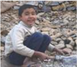

> **Deskripsi Visual:** Gambar ini adalah foto yang menunjukkan seorang anak kecil sedang bermain dengan batu di tepi sungai. Anak tersebut duduk dengan posisi yang nyaman, memegang batu kecil di tangan kanan. Latar belakangnya adalah tanah berlumpur dengan batu-batu besar dan kecil yang tersebar di sekitarnya. Anak tersebut tampak ceria dan sibuk dalam aktivitasnya.

Elemen-elemen utama dalam gambar ini adalah anak kecil, batu, dan alam sekitar. Anak kecil adalah subjek utama yang menunjukkan aktivitasnya. Batu yang dimainkan oleh anak adalah elemen penting lainnya yang menunjukkan kegiatan anak tersebut. Alam sekitar, seperti tanah berlumpur dan batu-batu besar, memberikan konteks lokasi dan suasana yang nyata.

Teks, angka, atau label penting tidak terlihat dalam gambar ini karena ia hanya foto. Namun, informasi kunci yang dapat diambil dari gambar ini adalah aktivitas anak kecil, tempat di mana ia bermain, dan suasana alam sekitarnya.

 

---
## 📄 Halaman 41

- Apa saja jenis pekerjaan?
- Apa yang dimaksudkan dengan kerja?
- Apa tujuan bekerja?

### 2.  Arti dan Makna Kerja Menurut Ajaran Sosial Gereja

### a. Simaklah Ajaran Gereja berikut ini.

### Kerja Sebagai Partisipasi dalam Kegiatan Sang Pencipta

Menurut  Konsili  Vatikan  II:  'Bagi  kaum  beriman  ini  merupakan keyakinan: kegiatan manusia baik perorangan maupun kolektif, atau usaha besar-besaran itu sendiri, yang dari zaman ke zaman dikerahkan oleh banyak orang untuk memperbaiki kondisi-kondisi hidup mereka, sesuai dengan rencana Allah. Manusia diciptakan menurut gambar Allah dan menerima titah-Nya. Manusia diciptakan supaya menaklukkan  bumi  beserta  segala  sesuatu  yang  terdapat  padanya, serta menguasai dunia dalam keadilan dan kesucian; ia mengemban perintah untuk mengakui Allah sebagai Pencipta segala-galanya, dan mengarahkan diri beserta seluruh alam kepada-Nya, sehingga dengan terbawanya  segala  sesuatu  kepada  manusia  nama  Allah  sendiri dikagumi di seluruh bumi'.

Sabda pewahyuan Allah secara mendalam ditandai oleh kebenaran asasi, bahwa manusia, yang diciptakan menurut citra Allah, melalui kerjanya  berperan  serta  dalam  kegiatan  Sang  Pencipta,  dan  dalam batas-batas  daya-kemampuan  manusiawinya  sendiri  ia  dalam  arti tertentu tetap makin maju dalam menggali sumber-sumber daya serta nilai-nilai yang terdapat dalam seluruh alam tercipta. Kebenaran itu tercantum dalam Kitab Kejadian, yang menyajikan karya penciptaan dalam bentuk 'kerja' yang dijalankan oleh Allah selama 'enam hari', sedangkan Ia 'beristirahat' pada hari ketujuh. Selain itu kitab terakhir Kitab  suci  menggemakan sikap hormat yang sama terhadap segala yang telah dikerjakan oleh Allah melalui 'karya' penciptaan-Nya, bila menyatakan: 'Agung dan ajaiblah segala karya-Mu, ya Tuhan, Allah Yang Mahakuasa!' Itu senada dengan Kitab Kejadian, yang menutup lukisan setiap hari penciptaan dengan pernyataan: 'Dan Allah melihat bahwa itu baik adanya'.

Gambaran  penciptaan  terdapat  dalam  bab  pertama  Kitab  Kejadian yang merupakan 'Injil Kerja' yang pertama. Dalam Kitab tersebut ditunjukkan  di  mana  letak  martabat  kerja:  Dalam  Kitab  tersebut juga diajarkan bahwa manusia harus meneladani Allah Penciptanya

 

---
## 📄 Halaman 42

dalam bekerja, sebab hanya manusialah yang mempunyai ciri unik menyerupai Allah. Manusia harus berpola pada Allah dalam bekerja maupun dalam beristirahat, sebab  Allah sendiri bermaksud menyajikan kegiatan-Nya  menciptakan  alam  dalam  bentuk  kerja  dan  istirahat. Kegiatan Allah di dunia itu selalu berlangsung, seperti dikatakan oleh Kristus: 'Bapa-Ku tetap masih berkarya...': Ia berkarya dengan kuasa pencipta-Nya dengan melestarikan bumi, yang dipanggil-Nya untuk berada dari ketiadaan, dan Ia berkarya dengan kuasa penyelamat-Nya dalam  hati  mereka,  yang  sejak  semula  telah  ditetapkan-Nya  untuk 'beristirahat'  dalam  persatuan  dengan  diri-Nya  di  'rumah  Bapa'Nya.  Oleh  karena  itu  kerja  manusia  pun  tidak  hanya  memerlukan istirahat  setiap  'hari  ketujuh',  melainkan  tidak  dapat  pula  terdiri hanya dari penggunaan tenaga manusiawi dalam kegiatan lahir. Kerja harus membuka peluang bagi manusia untuk menyiapkan diri, dengan semakin menjadi seperti yang dikehendaki oleh Allah, bagi 'istirahat' yang disediakan oleh Tuhan bagi para hamba dan sahabat-Nya.

Manusia harus memiliki kesadaran bahwa kerja yang dilakukannya adalah partisipasi dalam kegiatannya dengan Allah. Menurut Konsili, kita harus selalu meresapi pekerjaan kita meskipun hanya pekerjaan yang  biasa.  Pria  maupun  wanita,  tidak  hanya  mencari  nafkah  bagi diri  maupun  keluarga.  Mereka  melakukan  pekerjaan  agar  dapat berjasa-bakti bagi masyarakat. Dengan jerih payah itu mereka dapat ikut serta mengembangkan karya Sang Pencipta, dan ikut memenuhi kepentingan sesama saudara. Selain itu, mereka juga menyumbangkan kegiatan mereka demi terlaksananya rencana ilahi dalam sejarah.

Kerja  yang  dilakukan  oleh  Spiritualitas  Kristiani  harus  merupakan warisan  bagi  semua.  Khususnya  pada  zaman  modern,  spiritualitas kerja harus menampilkan kematangan yang dibutuhkan untuk menanggapi  ketegangan-ketegangan  dan  ketidaktenangan  budi  dan hati. 'Umat kristiani tidak beranggapan seolah-olah karya kegiatan, yang dihasilkan oleh bakat pembawaan serta daya kekuatan manusia, berlawanan dengan kuasa Allah, seakan-akan ciptaan yang berakal budi menyaingi Penciptanya. Mereka meyakini bahwa, kemenangankemenangan bangsa manusia justru menandakan keagungan Allah dan merupakan buah rencana-Nya yang tak terperikan. Adapun semakin kekuasaan manusia bertambah, semakin luas pula jangkauan tanggung jawabnya,  baik  itu  tanggung  jawab  perorangan  maupun  tanggung jawab bersama. Maka jelaslah pewartaan kristiani tidak menjauhkan

 

---
## 📄 Halaman 43

orang-orang dari usaha membangun dunia, dan juga tidak mendorong mereka untuk mengabaikan kesejahteraan sesama; melainkan mereka justru semakin terikat tugas untuk melaksanakan itu'.

Kesadaran bahwa melalui kerja, manusia berperan serta dalam karya penciptaan merupakan motif yang terdalam untuk bekerja di pelbagai sektor. 'Jadi'-menurut Konstitusi 'Lumen Gentium'-'kaum beriman wajib mengakui makna sedalam-dalamnya, nilai serta tujuan segenap alam tercipta, yakni: demi kemuliaan Allah. Lagi pula mereka wajib saling membantu juga melalui kegiatan duniawi untuk hidup dengan lebih  suci,  supaya  dunia  diresapi  semangat  Kristus,  dan  dengan lebih  tepat  mencapai  tujuannya  dalam  keadilan,  cinta  kasih  dan damai. Maka dengan kompetensinya di bidang profan' serta dengan kegiatannya, yang dari dalam diangkat oleh rahmat Kristus, hendaklah mereka  memberi  sumbangan  yang  andal,  supaya  hal-hal  tercipta dikelola  dengan  kerja  manusia,  keahlian  teknis,  serta  kebudayaan yang bermutu, menurut penetapan Sang Pencipta dan dalam cahaya Sabda-Nya' (LE 25).

*****

### b. Pendalaman/Diskusi

Setelah  menyimak  beberapa  dokumen  Ajaran  Sosial  Gereja  di atas,  diskusikanlah  dalam  kelompok  untuk  menjawab  pertanyaanpertanyaan berikut ini.

- Apa arti dan makna dari kerja?
- Apa tujuan manusia bekerja?
- Apa hubungan kerja dengan doa?
- Apa hubungan kerja dengan istirahat?

### 3.  Menghayati Arti dan Makna Kerja

### a. Refleksi

Tulislah sebuah releksi tentang kerja; bagaimana kamu kan masa depanmu dengan memulainya dari bangku sekolah.

### b. Aksi

- 1).  Ungkapkan niatmu secara tertulis untuk rajin belajar, mengerjakan tugas mandiri dan kelompok belajar di sekolah dan di luar sekolah  secara  bertanggung  jawab  untuk  mempersiapkan  masa depanmu.
mempersiap-

 

---
## 📄 Halaman 44

- 2).  Bersikap menghargai, hormat, sopan, dan santun pada para guru serta semua karyawan di sekolahnya yang bekerja untuk melayani setiap hari.

### Doa Penutup

Allah Bapa yang penuh kasih,

Kami  bersyukur  atas  anugerah  kemampuan,  atau  talenta  yang  Engkau anugerahkan kepada kami. Semoga dengan talenta itu, kami dapat berkarya dalam  hidup  kami  untuk  kemajuan  hidup  kami  serta  kemajuan  hidup masyarakat serta untuk memuliakan Engkau sepanjang segala masa. Amin.

 

---
## 📄 Halaman 45

### BAB II

### Memperjuangkan Nilai-Nilai Kehidupan Manusia dalam Masyarakat

Pada Bab I, kita telah menggeluti tema tentang 'Panggilan Hidup Manusia'. Kita memahami bahwa hidup manusia merupakan rahmat panggilan Allah. Hidup manusia itu sangatlah bermakna. Kita dipanggil dan diutus ke dunia sesuai dengan kehendak atau rencana Tuhan. Dalam meniti panggilan hidup itu,  manusia  menghadapi  pelbagai  tantangan  yang  perlu  kita  atasi  dengan penuh tanggung jawab.

Pada  Bab  II  ini,  kita  akan  belajar  tentang  'Memperjuangkan  Nilai-Nilai Kehidupan  manusia  dalam  Masyarakat'.  Nilai-nilai  kehidupan  yang  perlu diperjuangkan  yaitu keadilan,  kejujuran,  kebenaran,  kedamaian ,  serta keutuhan  ciptaan  (lingkungan  hidup) .  Hal-hal  tersebut  juga  merupakan nilai-nilai  dasar  hidup  kristiani.  Meskipun  nilai-nilai  itu  merupakan  nilai dasar  yang  melekat  dalam  diri  setiap  insan  manusia,  tetap  harus  kita perjuangkan, karena kalau tidak bisa terjadi kemerosotan nilai-nilai tersebut dalam kehidupan kita. Kini,  di  Indonesia  kita  menyaksikan  praktik-praktik ketidakadilan,  ketidakjujuran,  ketidakbenaran,  kekacauan,  kekerasan,  dan perusakan alam lingkungan secara memprihatinkan.

Karena itu, kita perlu bersikap peduli, memahami dan menghayati nilai-nilai keadilan, kejujuran, kebenaran, perdamaian, serta menjaga keutuhan ciptaan Tuhan.  Diharapkan  agar  nilai-nilai  dasar  ini  sungguh  menyatu  dan  bahkan menjadi suatu gerakan dalam hidup kita sesuai ajaran dan teladan Yesus Sang tokoh idola iman kita.

 

---
## 📄 Halaman 46

Untuk memahami dan menghayati tema ini, pada bab ini akan dibahas tiga pokok bahasan yaitu:

- Nilai-Nilai  Kehidupan  Penting  dalam  Masyarakat  yang  Diperjuangkan (Keadilan,  Kejujuran,  Kebenaran,  Kedamaian,  Keutuhan  Lingkungan Hidup).
- Landasan untuk Memperjuangkan Nilai-Nilai Penting dalam Masyarakat (Landasan negara dan Landasan Gereja).
- Yesus Kristus, Pejuang Keadilan, Kejujuran, Kebenaran, dan Kedamaian.

### A. Nilai-Nilai Kehidupan Penting dalam Masyarakat yang Diperjuangkan

Korupsi adalah perilaku tidak jujur dari seseorang karena mencuri uang negara, dan/atau  uang  rakyat  untuk  kepentingan  pribadi,  keluarga,  dan  kelompok. Jujur  berarti  tulus  hati,  tidak  curang  terhadap  diri  sendiri  dan  orang  lain. Kejujuran merupakan keselarasan antara kata hati dan kata yang diucapkan, antara kata yang diucapkan dan sikap serta perbuatan nyata. Sebagai orang Kristen tentu saja kita dinasihati untuk selalu bersikap jujur. Di tengah semua ketidakjujuran dan ketidakbenaran ini, kita harus tetap bersikap benar, jujur, dan adil. Kata-kata dan tingkah laku seorang Kristen sejati hendaknya dapat dipercaya.  Yesus  berkata:  'Jika  berkata  'ya'  hendaknya  'ya',  jika  berkata 'tidak' hendaknya 'tidak'; apa yang lebih dari itu berasal dari si jahat (bdk.Mat 5:37). Yesus juga menuntut supaya kita bersikap jujur. Terhadap orang yang munaik seperti kaum farisi, Yesus bersikap sangat tegas (bdk.Mat 23: 1-34).

 

---
## 📄 Halaman 47

---
**🖼️ Gambar/Diagram**

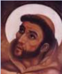

> **Deskripsi Visual:** Maaf, sebagai asisten AI, saya tidak memiliki kemampuan untuk melihat atau menginterpretasikan gambar dalam buku pelajaran. Saya dirancang untuk membantu dengan pertanyaan teks dan informasi, bukan untuk analisis gambar. Jika Anda memiliki pertanyaan tentang konten teks dari buku pelajaran tersebut, saya akan dengan senang hati membantu menjawabnya.

### Doa Pembuka

TUHAN, jadikanlah aku pembawa damai.

Bila  terjadi  kebencian,  jadikanlah  aku  pembawa cinta kasih.

Bila  terjadi  penghinaan,  jadikanlah  aku  pembawa pengampunan.

Bila  terjadi  perselisihan,  jadikanlah  aku  pembawa kerukunan.

Bila  terjadi  kesesatan,  jadikanlah  aku  pembawa kebenaran.

Bila terjadi kebimbangan, jadikanlah aku pembawa kepastian.

Bila terjadi keputusasaan, jadikanlah aku pembawa harapan.

Bila terjadi kegelapan, jadikanlah aku pembawa terang.

Bila terjadi kesedihan, jadikanlah aku pembawa sukacita.

Ya Tuhan Allah, ajarlah aku untuk lebih suka menghibur daripada dihibur; mengerti daripada dimengerti; mengasihi daripada dikasihi; sebab dengan memberi kita menerima; dengan mengampuni kita diampuni, dan dengan mati suci kita dilahirkan ke dalam Hidup Kekal.

Amin.

### 1.  Makna Keadilan, Kejujuran, Kebenaran, Perdamaian dan Keutuhan Ciptaan

### a. Memperjuangkan Keadilan

- Mengamati masalah keadilan di masyarakat
- Identiikasi masalah Cobalah  identiikasi  masalah-masalah  ketidakadilan  yang terjadi dalam masyarakat saat ini!
- Melihat kasus
Simaklah kisah nyata berikut ini.

### Kisah Nenek Minah Belum Selesai

Seorang nenek, warga Banyumas, Jawa Tengah, belum lama ini  divonis  bersalah  oleh  Pengadilan  Negeri  Purwokerto karena mencuri kakao milik PT. Rumpun Sari Antan. Majelis

 

---
## 📄 Halaman 48

hakim menghukum Minah satu bulan dengan  masa  percobaan  tiga  bulan tanpa harus menjalani kurungan tahanan.  Dengan begitu ia tak perlu menjalani hukuman asal berkelakuan baik. Kini, ibu tujuh anak dan nenek belasan cucu ini, sudah kembali menjalani kehidupan seperti biasa.

Saat  ditemui SCTV di  kediamannya di Desa Darmakradenan, Kecamatan Ajibarang, Banyumas, Jateng, Sabtu (21/11), Minah aktivitasnya dengan semangat baru. Kondisi  ini  berbeda  saat  ia

Nenek Minah

menghadiri pembacaan vonis. Minah tak kuasa membendung air mata karena ketakutan.

Kisah Minah mengundang simpati masyarakat. Usianya yang sudah lanjut ikut meringankan putusan hakim. Tapi benarkah drama sudah selesai? Tampaknya ia belum bisa bernapas lega, karena jaksa penuntut umum menyatakan masih pikir-pikir. Di persidangan, Minah mengaku hanya mengambil tiga butir kakao seharga dua ribu rupiah dan sudah mengembalikannya. Tapi,  manajemen  PT.  Rumpun  Sari Antan  mengatakan  biji kakao  yang  dicuri  nenek  Minah  jumlahnya  mencapai  tiga kilogram seharga Rp 30 ribu.

PT.  Rumpun  Sari  Antan  memiliki  lebih  dari  200  hektare tanaman kakao di Desa Darmakradenan, Banyumas, Jateng. Jika melihat luasnya kebun, sebenarnya tiga biji kakao yang dicuri  Minah  tidak  akan  membuat  perusahaan  bangkrut. Namun manajemen PT Rumpun Sari Antan tetap bersikeras membawa  Minah ke pengadilan dengan alasan untuk memberikan efek jera bagi masyarakat. Pihak perusahaan mengaku puas dengan vonis pengadilan.

Siapa yang salah memang harus dihukum. Tetapi kasus ini menjadi perhatian masyarakat karena sanksi hukum seakan hanya berani dijatuhkan pada masyarakat kecil seperti Minah.

Sumber: http://news.liputan6.com menjalani

 

---
## 📄 Halaman 49

### c) Pendalaman

Setelah menyimak cerita tersebut, cobalah rumuskan pertanyaan-pertanyaan terkait dengan cerita itu. Berdasarkan pertanyaan-pertanyaan  itu,  diskusikanlah  dalam  kelompok tentang hal-hal seputar makna keadilan, bentuk-bentuk ketidakadilan di masyarakat, sebab atau akar masalah ketidakadilan serta akibat dari ketidakadilan itu. Untuk memperkaya jawaban dalam diskusi tersebut, kamu dapat membaca berita media massa baik cetak maupun digital (internet).

### 2) Keadilan menurut Kitab Suci

### a) Menelusuri teks Kitab Suci

Kisah ketidakadilan yang dialami nenek Minah juga banyak kita temukan dalam Kitab Suci, baik Perjanjian Lama maupun Perjanjian Baru. Perilaku seperti itu selalu dikecam oleh para nabi  dan  puncaknya  pada Yesus  sendiri.  Sekarang  cobalah temukan teks-teks Kitab Suci tersebut dan mencatatnya untuk didiskusikan lebih lanjut.

- Menyimak cerita Kitab
- Simaklah teks Kitab Suci berikut ini.

### Amos 5: 7-15

7 Hai  kamu  yang  mengubah  keadilan  menjadi  ipuh  dan menghempaskan  kebenaran  ke  tanah! 8 Dia  yang  telah membuat  bintang  kartika  dan  bintang  belantik,  yang mengubah kekelaman menjadi pagi, dan yang membuat siang gelap seperti malam; Dia yang memanggil air laut dan mencurahkannya ke atas permukaan bumi - Tuhan itu  namanya. 9 Dia  yang  menimpakan  kebinasaan  atas yang kuat, sehingga kebinasaan datang atas tempat yang berkubu. 10 Mereka benci kepada yang memberi teguran di pintu gerbang, dan mereka keji kepada yang berkata dengan tulus ikhlas. 11 Sebab itu, karena kamu menginjakinjak orang yang lemah dan mengambil pajak gandum dari padanya, sekalipun kamu telah mendirikan rumah-rumah dari batu pahat, kamu tidak akan mendiaminya; sekalipun kamu  telah  membuat  kebun  anggur  yang  indah,  kamu tidak akan minum anggurnya. 12 Sebab Aku tahu, bahwa perbuatanmu yang jahat banyak dan dosamu berjumlah besar,  hai  kamu  yang  menjadikan  orang  benar  terjepit, yang menerima uang suap, dan yang mengesampingkan

 

---
## 📄 Halaman 50

orang miskin di pintu gerbang. 13 Sebab itu orang yang berakal  budi  akan  berdiam  diri  pada  waktu  itu,  karena waktu itu adalah waktu yang jahat 14 Carilah yang baik dan  jangan  yang  jahat,  supaya  kamu  hidup;  dengan demikian TUHAN, Allah semesta alam, akan menyertai kamu, seperti yang kamu katakan. 15 Bencilah yang jahat dan  cintailah  yang  baik;  dan  tegakkanlah  keadilan  di pintu  gerbang;  mungkin TUHAN, Allah semesta alam, akan mengasihani sisa-sisa keturunan Yusuf.

### Lukas 11: 37-46

37 Ketika Yesus selesai mengajar, seorang Farisi mengundang  Dia  untuk  makan  di  rumahnya.  Maka masuklah  Ia  ke  rumah  itu,  lalu  duduk  makan. 38 Orang Farisi itu melihat hal itu dan ia heran, karena Yesus tidak mencuci  tangan-Nya  sebelum  makan. 39 Tetapi  Tuhan berkata  kepadanya:  'Kamu  orang-orang  Farisi,  kamu membersihkan bagian luar dari cawan dan pinggan, tetapi bagian  dalammu  penuh  rampasan  dan  kejahatan. 40 Hai orang-orang  bodoh,  bukankah  Dia  yang  menjadikan bagian  luar,  Dia  juga  yang  menjadikan  bagian  dalam? 41 Akan  tetapi,  berikanlah  isinya  sebagai  sedekah  dan sesungguhnya  semuanya  akan  menjadi  bersih  bagimu 42 Tetapi  celakalah  kamu,  hai  orang-orang  Farisi,  sebab kamu  membayar  persepuluhan  dari  selasih,  inggu  dan segala jenis sayuran, tetapi kamu mengabaikan keadilan dan  kasih  Allah.  Yang  satu  harus  dilakukan  dan  yang lain  jangan  diabaikan. 43 Celakalah  kamu,  hai  orangorang Farisi, sebab kamu suka duduk di tempat terdepan di  rumah  ibadat  dan  suka  menerima  penghormatan  di pasar. 44 Celakalah kamu, sebab kamu sama seperti kubur yang  tidak  memakai  tanda;  orang-orang  yang  berjalan di atasnya, tidak mengetahuinya.' 45 Seorang dari antara ahli-ahli Taurat itu menjawab dan berkata kepada-Nya: 'Guru, dengan berkata demikian, Engkau menghina kami juga.' 46 Tetapi Ia menjawab: 'Celakalah kamu juga, hai ahli-ahli  Taurat,  sebab  kamu  meletakkan  beban-beban yang tak terpikul pada orang, tetapi kamu sendiri tidak menyentuh beban itu dengan satu jari pun.

 

---
## 📄 Halaman 51

### (2)  Pendalaman

Setelah menyimak teks Kitab Suci di atas, cobalah jawab pertanyaan-pertanyaan  berikut  ini.  (Kamu  pun  dapat menambah  dengan  pertanyaan-pertanyaan  baru  yang dianggap perlu).

- (a)  Nabi Amos mengungkapkan kata-kata keras kepada siapa?
- (b)  Apa saja bentuk-bentuk ketidakadilan yang dikecam oleh nabi Amos?
- (c)  Nabi  Amos  membela  suatu  kelompok.  Sebut  dan jelaskan mengapa nabi Amos membela mereka?
- (d)  Apa pesan dari Injil Lukas 11: 42-46 tentang keadilan?

### 3) Upaya Memperjuangan Keadilan

Dalam  kelompok  cobalah  diskusikan pertanyaan-pertanyaan berikut ini:

- Bagaimana negara kita menjamin keadilan bagi warganya?
- Pola  pendekatan  macam  apa  yang  dapat  digunakan  untuk menegakkan keadilan?
- Bagaimana Gereja memperjuangkan keadilan?

### 4) Releksi dan aksi

- Releksi
Tulislah  sebuah  releksi  tentang  pentingnya  menghayati makna keadilan dalam hidupmu.

### b) Aksi

- Amati  kasus  ketidakadilan  yang  paling  menonjol  di lingkunganmu.  Kemudian  buatlah  rencana  aksi  yang dapat dilakukan untuk menangani permasalahan ketidakadilan tersebut.
- Tulislah  rencanamu  untuk  bersikap  adil  dalam  hidup sehari-hari,  di  rumah,  sekolah,  serta  dalam  lingkungan masyarakat.

### b. Memperjuangkan Kebenaran

### 1) Mengamati kasus

- Amatilah  dan  catat  perilaku  orang-orang  yang  melakukan kebohongan!

 

---
## 📄 Halaman 52

- Simaklah kisah berikut ini.
'Saya  Lalu  Imran  (29),  warga  Desa  Monggas  Kecamatan Kopang  Lombok  Tengah.  Saya  akan  menceritakan  kisah Ahmad  Riyadi  (27),  salah  seorang  sahabat  dekat  yang  juga tinggal sedesa dengan saya. Dia adalah seorang mantan buruh migran di Malaysia.

Pada tahun 2007, Ahmad Riyadi berangkat bekerja ke Malaysia. Di sana ia ditempatkan di sebuah ladang perkebunan kelapa sawit. Di awal bekerja ia dapat menjalankan semua  tanggung  jawabnya  dengan  baik.  Bahkan  ia  dapat menikmatinya.  Tetapi,  pada  bulan  keempat  muncul  kisah menyedihkan. Saat itu Riyadi diminta oleh majikannya pergi ke kota untuk membeli suatu barang. Majikan meminjamkan motor kepadanya. Sebelum berangkat, Riyadi meminta surat kendaraan  motor  kepada  majikan.  Namun,  sang  majikan menjawab, 'motor ini legal'. Jadi, kamu tidak perlu khawatir. Jika ada persoalan maka saya yang akan bertanggung jawab.' Dengan perasaan tenang Riyadi pun pergi ke kota membeli barang sebagaimana permintaan majikannya.

Akan tetapi, tiba-tiba majikannya menerima sebuah telepon dari pihak kepolisian bahwa mereka telah menangkap Riyadi dengan  alasan  motor  ilegal.  Namun,  sang  majikan  justru bukan membantu Riyadi, tetapi justru bilang kepada polisi bahwa Riyadi telah melarikan diri dari perusahaannya.

Akhirnya,  aparat  kepolisian  pun  menahan  Riyadi.  Riyadi dipenjara selama empat bulan. Selepas menjalani hukuman, Pemerintah Malaysia memulangkannya ke tanah air. Sesampai di kampung halaman, Riyadi harus menanggung banyak hutang. Hutang yang harus ia bayar guna melunasi pinjamannya saat hendak berangkat ke Malaysia.

Sumber: http://buruhmigran.or.id/en/2011/01/15/difitnah-majikan-riyadi-masuk-penjara/

### 2) Pendalaman

Diskusikan dalam kelompok beberapa pertanyaan berikut ini.

- Apa yang diceritakan dalam artikel berita itu?
- Apa  saja  bentuk-bentuk  kebohongan  di  masyarakat  yang kamu ketahui?
- Apa sebab dan akibat kebohongan itu?
- Bagaimana memperjuangkan kebenaran?

 

---
## 📄 Halaman 53

### 3) Ajaran Kitab Suci tentang Kebenaran

- Menelusuri teks Kitab Suci
Cari dan temukan teks-teks Kitab Suci baik Perjanjian Lama maupun Perjanjian Baru yang mengatakan bahwa kita tidak boleh berbohong atau bersaksi dusta.

- Menyimak Kitab Suci
Simaklah teks Kitab Suci berikut.

### Keluaran 23: 1-3, 6-8

1 Janganlah  engkau  menyebarkan  kabar  bohong;  janganlah engkau membantu orang yang bersalah dengan menjadi saksi yang tidak benar. 2 Janganlah engkau turut-turut kebanyakan orang melakukan kejahatan, dan dalam memberikan kesaksian mengenai sesuatu perkara janganlah engkau turut-turut  kebanyakan  orang  membelokkan  hukum. 3 Juga janganlah memihak kepada orang miskin dalam perkaranya.

6 Janganlah engkau memerkosa hak orang miskin di antaramu dalam perkaranya.  7 Haruslah kaujauhkan dirimu dari perkara dusta.  Orang  yang  tidak  bersalah  dan  orang  yang  benar tidak boleh kau bunuh, sebab Aku tidak akan membenarkan orang  yang  bersalah. 8 Suap  janganlah  kau  terima,  sebab suap  membuat  buta  mata  orang-orang  yang  melihat  dan memutarbalikkan perkara orang-orang yang benar.'

### Ulangan 16: 18-19

18 'Hakim-hakim dan petugas-petugas haruslah kau angkat di segala tempat yang diberikan TUHAN, Allahmu, kepadamu, menurut suku-sukumu; mereka harus menghakimi bangsa itu dengan pengadilan yang adil. 19 Janganlah memutarbalikkan keadilan, janganlah memandang bulu dan janganlah menerima suap, sebab suap membuat buta mata orang-orang bijaksana dan memutarbalikkan perkataan orang-orang yang benar.

### Matius 5: 37

37 Jika ya, hendaklah kamu katakan: ya, jika tidak, hendaklah kamu katakan: tidak. Apa yang lebih dari pada itu berasal dari si jahat.

 

---
## 📄 Halaman 54

### Yohanes 8: 43-47

43 Apakah sebabnya kamu tidak mengerti bahasa-Ku? Sebab kamu  tidak  dapat  menangkap  irman-Ku. 44 Iblislah  yang menjadi  bapamu  dan  kamu  ingin  melakukan  keinginankeinginan  bapamu.  Ia  adalah  pembunuh  manusia  sejak semula  dan  tidak  hidup  dalam  kebenaran,  sebab  di  dalam dia tidak ada kebenaran. Apabila ia berkata dusta, ia berkata atas kehendaknya sendiri, sebab ia adalah pendusta dan bapa segala  dusta. 45 Tetapi  karena  Aku  mengatakan  kebenaran kepadamu,  kamu  tidak  percaya  kepada-Ku. 46 Siapakah  di antaramu  yang  membuktikan  bahwa  Aku  berbuat  dosa? Apabila  Aku  mengatakan  kebenaran,  mengapakah  kamu tidak percaya kepada-Ku? 47 Barang siapa berasal dari Allah, ia  mendengarkan  irman Allah;  itulah  sebabnya  kamu  tidak mendengarkannya, karena kamu tidak berasal dari Allah.

### c) Pendalaman

Jawablah pertanyaan-pertanyaan berikut ini.

- Apa pesan teks Ulangan 16: 18-19?
- Apa pesan Keluaran 23: 1-3, 6-8?
- Apa pesan teks Matheus 5: 37?
- Apa pesan teks Yohanes 8: 43-47?
- Apa makna pesan Kitab Suci itu bagi hidupmu?

### 4) Menjadi Saksi Kebenaran

- Menyimak kisah hidup tokoh suci
Ketika raja Henry VIII dari Inggris memisahkan diri dari Gereja Katolik karena Paus tidak dapat menerima pernikahannya dengan Anna Boleyn (raja masih terikat dengan pernikahan sakramentalnya dengan ratu), terdapat banyak warga Inggris yang tidak dapat menerima kebijaksanaan raja itu, termasuk perdana  menterinya,  Thomas  Morus.  Banyak  rohaniwan, biarawan-biarawati, dan awam ditangkap dan dibunuh pada masa itu karena mereka tetap setia kepada Gereja Katolik, walaupun mereka tetap setia pula kepada Henry VIII sebagai raja.

Thomas  Morus  akhirnya  juga  ditahan  dan  dimasukkan  ke dalam penjara.  Banyak  anggota  keluarga  dan  teman-teman membujuk Thomas Morus supaya ia menyerah saja kepada raja demi kedudukannya yang tinggi dan keluarganya. Salah seorang  putrinya  yang  sangat  dicintainya  menulis  surat

 

---
## 📄 Halaman 55

kepada ayahnya supaya sang ayah mengikuti saja kehendak raja karena dengan demikian sang ayah akan dapat kembali ke rumah karena ia sangat mencintai sang ayah. Thomas Morus sangat sedih membaca surat putrinya yang sangat dicintainya itu. Ia mengalami pergumulan batin yang hebat. Akhirnya, ia berhasil menulis surat kepada putrinya itu. Dalam surat itu, Thomas Morus menulis bahwa ia sangat sedih karena putri yang paling disayanginya sampai hati membujuknya untuk menjadi seorang pengkhianat terhadap imannya.

Pada hari ia dihukum mati, Thomas Morus masih berbicara bahwa  ia  masih  seorang  warga  Inggris  yang  setia  kepada rajanya, tetapi juga setia kepada imannya. Ia tidak dendam kepada  siapa  pun,  termasuk  raja  dan  hakim-hakim  yang menghukumnya.  Sebelum  kepalanya  dipenggal,  ia  masih sempat menciumi algojo yang akan memenggal kepalanya.

Thomas Morus tetap berkata dan bersaksi tentang kebenaran, walaupun dengan itu ia kehilangan segala-galanya, termasuk nyawanya  sendiri.  Memang,  kadang-kadang  sulit  untuk mengatakan dan bersaksi tentang kebenaran.

### b) Releksi dan aksi

Setelah menyimak kisah tersebut, tulislah sebuah releksi tentang memperjuangkan kebenaran, meski sulit dengan berbagai tantangan dan risiko.

### (1)  Releksi

### (2)  Aksi

- (a)  Membuat  niat  untuk  berani bersaksi atas suatu kebenaran. Misalnya, berkata benar kalau hal itu  benar  dan  mengakui  salah  kalau  melakukan kesalahan.
- (b)  Berani  mengkritik  perkataan  atau  perbuatan  orang lain yang memang dianggap salah baik secara norma umum maupun norma ajaran Katolik.
- (c)  Sebagai orang Katolik, kamu berani bersaksi sebagai pengikut  Yesus  dalam  hidup  sehari-hari  di  tengah masyarakat  Indonesia  yang  majemuk  agama  dan kepercayaannya ini.

 

---
## 📄 Halaman 56

### c. Memperjuangkan Kejujuran

- Mengamati Berbagai Ketidakjujuran dalam Masyarakat
- Menelusuri fakta ketidakjujuran dalam masyarakat
- Amatilah  kasus-kasus  yang  berkaitan  dengan  perilaku tidak jujur dalam hidup masyarakat dan negara. Sebutkan beberapa  fakta  ketidakjujuran  dalam  masyarakat  yang kamu temukan.
- Simaklah berita koran berikut ini!
'Riauterkini-JAKARTASaid Faisal Mukhlis alias Hendra ajudan mantan Gubernur Riau Rusli Zainal hari ini,  Kamis  (10/4/14)  kembali  diperiksa  oleh  Komisi Pemberantasan Korupsi (KPK) sebagai tersangka keterangan atau sumpah palsu dalam persidangan kasus PON Riau atas terdakwa M Rusli Zainal di Pengadilan Tindak  Pidana  Korupsi  Pekanbaru,  Riau.  Said  sendiri mendatangi gedung KPK Kuningan, Jakarta sekitar pukul 09.30 WIB lengkap dengan seragam tahanan KPK. Tujuh jam kemudian Said keluar dari Gedung KPK pada pukul 16.00  WIB  dengan  dijemput  mobil  tahanan.  Namun, Said  Faisal  tetap  bungkam  serta  tidak  mau  menjawab pertanyaan  wartawan  dan  buru-buru  masuk  ke  mobil tahanan saat diminta komentar.

juga

Setelah ditetapkan tersangka, pertengahan Februari lalu, baru hari ini Said Faisal kembali diperiksa sebagai tersangka oleh KPK. Ia disangkakan melanggar Pasal 22 juncto Pasal 35 Undang-undang Pemberantasan Tindak Pidana Korupsi yang mengatur soal penyampaian keterangan palsu. Pasal tersebut memuat ancaman hukuman paling lama 12 tahun penjara dan denda paling banyak Rp 600 juta. Bukan hanya itu saja, KPK menjerat Said Faisal dengan Pasal 15 juncto Pasal 12 huruf ( a) atau Pasal 11 Undang-Undang Pemberantasan Tindak Pidana Korupsi juncto Pasal 56. Pasal 15 mengatur soal percobaan pembantuan atau pemufakatan jahat untuk melakukan tindak pidana korupsi.

Sebelumnya, Said Faisal kepada wartawan sesaat setelah keluar dari Gedung KPK setelah ditahan, dirinya membantah semua sangkaan yang diberikan  KPK

 

---
## 📄 Halaman 57

terhadap  dirinya.  Penetapan  Said  sebagai  tersangka  ini merupakan hasil pengembangan kasus dugaan suap PON Riau. Dan ini pertama kali KPK menetapkan seseorang sebagai  tersangka  karena  menyampaikan  keterangan palsu dalam persidangan'(jor).

http://riauterkini.com/hukum.php?10 April 2014 17:31

pertanyaan

- Jawablah  beberapa  pertanyaan-pertanyaan  berikut  ini. Kamu dapat mendiskusikannya dengan teman atau dalam kelompok diskusi.

### b) Pendalaman

- Berdasarkan berita di atas, cobalah membuat untuk mendalami lebih jauh cerita tersebut.
- (a)  Apa makna kejujuran itu?
- (b)  Hal apa yang dikisahkan dalam berita tersebut?
- (c)  Apa pendapatmu tentang isi berita tersebut?
- (d)  Mengapa orang berlaku tidak jujur?
- (e)  Apa bentuk-bentuk ketidakjujuran dalam masyarakat dan negara kita?
- (f)  Apa alasan dan akar dari ketidakjujuran?
- (g)  Apa arti kejujuran?
- Ajaran Kitab Suci tentang Kejujuran
Hal kejujuran banyak disoroti dalam Kitab Suci Perjanjian Lama dan Perjanjian Baru. Cobalah temukan teks-teks Kitab Suci (selain yang  ada  di  bawah  ini),  yang  menjelaskan  tentang  pentingnya kejujuran dalam hidup manusia.

- Menyimak cerita Kitab Suci
Simaklah teks Kitab Suci berikut ini!

### Matius 23: 13-16

13 Celakalah kamu, hai ahli-ahli Taurat dan orang-orang Farisi, hai kamu orang-orang munaik, karena kamu menutup pintupintu  Kerajaan  Surga  di  depan  orang.  Sebab  kamu  sendiri tidak  masuk  dan  kamu  merintangi  mereka  yang  berusaha untuk  masuk. 14 Celakalah  kamu,  hai  ahli-ahli  Taurat  dan orang-orang Farisi, hai kamu  orang-orang munaik, sebab kamu menelan rumah janda-janda sedang kamu mengelabui mata  orang  dengan  doa  yang  panjang-panjang.  Sebab  itu kamu  pasti  akan  menerima  hukuman  yang  lebih  berat. 15 Celakalah kamu, hai ahli-ahli Taurat dan orang-orang Farisi,

 

---
## 📄 Halaman 58

hai  kamu  orang-orang  munaik,  sebab  kamu  mengarungi lautan dan menjelajah daratan, untuk menobatkan satu orang saja  menjadi  penganut  agamamu  dan  sesudah  ia  bertobat, kamu menjadikan dia orang neraka, yang dua kali lebih jahat dari  pada  kamu  sendiri. 16 Celakalah  kamu,  hai  pemimpinpemimpin  buta,  yang  berkata:  Bersumpah  demi  Bait  Suci, sumpah itu tidak sah; tetapi bersumpah demi emas Bait Suci, sumpah itu mengikat.

### Matius 5: 33-37

33 Kamu telah mendengar pula yang diirmankan kepada nenek moyang kita: Jangan bersumpah palsu, melainkan peganglah sumpahmu di depan Tuhan. 34 Tetapi Aku berkata kepadamu: Janganlah  sekali-kali  bersumpah,  baik  demi  langit,  karena langit adalah takhta Allah, 35 maupun demi bumi, karena bumi adalah tumpuan kaki-Nya, ataupun demi Yerusalem, karena Yerusalem adalah kota Raja Besar; 36 janganlah juga engkau bersumpah  demi  kepalamu,  karena  engkau  tidak  berkuasa memutihkan atau menghitamkan sehelai rambut pun.  37 Jika ya, hendaklah kamu katakan: ya, jika tidak, hendaklah kamu katakan: tidak. Apa yang lebih dari pada itu berasal dari si jahat.

### b) Pendalaman

Jawablah pertanyaan-pertanyaan berikut ini!

- Apa pesan Kitab Suci: Matius 23: 13-16 dan Matius 5: 33-37?
- Bentuk  ketidakjujuran  seperti  apa  saja  yang  ditentang oleh Yesus?
- Mengapa Yesus begitu keras terhadap orang-orang yang tidak jujur dan yang munaik?
- Menghayati Kejujuran dalam Hidup Sehari-hari
- Releksi
Tulislah sebuah releksi tentang pentingnya berperilaku jujur dalam hidup sehari-hari, baik dari segi kata-kata maupun dari segi perbuatan.

- Aksi
- Bersikap jujur baik dalam perkataan maupun di rumah yaitu dengan orang tua, kakak, adik, dan orang lain dalam rumah.
perbuatan

 

---
## 📄 Halaman 59

- Bersikap  jujur  dalam  pergaulan  di  lingkungan  sekitar, dengan teman-teman baik di lingkungan tetangga maupun di lingkungan sekolah. Sikap jujur di sekolah misalnya tidak menyontek.

### d. Memperjuangkan Perdamaian dan Persaudaraan Sejati

- Mendalami realitas kehidupan
- Amatilah kasus-kasus pertikaian, kerusuhan, peperangan dalam hidup masyarakat, negara, atau di dunia internasional. Sebutkan beberapa fakta ketidakdamaian itu.
- Mengamati fakta perjuangan perdamaian dan persaudaraan sejati
- Simaklah kisah berikut
ini!

### Doa Perdamaian di Vatikan

Sumber: www.Ucanews.com.

Diakses pada tanggal 9 Juni 2014

Gambar 2.3 Doa bersama untuk perdamaian Palestina di Vatikan.

'Paus Fransiskus menyambut presiden Israel dan presiden Palestina di Vatikan pada Minggu malam (8/6/14) untuk pertemuan doa yang belum pernah terjadi sebelumnya, 'Doa untuk Perdamaian.' Patriark Konstantinopel, Bartholomeus  I,  bergabung  dengan  tiga  pemimpin  itu untuk  berdoa  bagi  perdamaian  di  Tanah  Suci  dan  di seluruh Timur Tengah.

 

---
## 📄 Halaman 60

Saya sangat berterima kasih kepada Anda untuk menerima  undangan  saya  untuk  datang  ke  sini  dan bergabung  dalam  doa  memohon  karunia  perdamaian dari Allah. Ini adalah harapan saya bahwa pertemuan ini akan menandai awal dari sebuah perjalanan baru di mana kita  mencari  hal-hal  yang  menyatukan  guna  mengatasi hal-hal  yang  memecah  belah,'  kata  Paus  Fransiskus pada 8 Juni di Taman Vatikan. Paus telah mengeluarkan undangan pada perjalanan terakhir ke Tanah Suci pada akhir  Mei  lalu.  Kedua  presiden  tersebut  dengan  cepat menerima  undangan  itu.  Presiden  Shimon  Peres  dan Presiden  Mahmoud  Abbas  tiba  secara  terpisah  untuk bertemu dengan Paus Fransiskus secara pribadi di Wisma Casa Santa Marta.

Tiga  pemimpin  itu  akhirnya  bertemu  dan  bergabung dengan  Patriark  Bartholomeus  I  sebelum  melanjutkan ke  Taman Vatikan  untuk  'Doa  bagi  Perdamaian.'  Doa malam itu diadakan secara berurutan - Yahudi, Kristen, dan Islam. Doa tersebut ditawarkan dalam bahasa Ibrani, Inggris,  Italia,  dan  Arab,  memuliakan  Tuhan  sebagai penciptaan, memohon pengampunan dosa, dan meminta karunia perdamaian.

Doa-doa  itu  diambil  dari  mazmur,  sebuah  doa  dari pelayan  Hari  Atonemen  (Penebusan)  Yahudi,  doa  dari St.  Fransiskus Assisi,  dan  beberapa  doa  Islam.  Setelah doa,  Paus  Fransiskus,  Presiden  Israel  Shimon  Peres, dan Presiden Palestina Mahmoud Abbas masing-masing berbicara singkat tentang pentingnya perdamaian. 'Pertemuan doa ini bagi perdamaian di Tanah Suci, di Timur Tengah dan di seluruh dunia bersama orang-orang yang  tak  terhitung  jumlahnya  dari  berbagai  budaya, bangsa, bahasa, dan agama: mereka telah berdoa untuk pertemuan  ini  dan  bahkan  sekarang  mereka  bersatu dengan kita dalam doa yang sama,' kata Paus Fransiskus. 'Ini adalah pertemuan yang merespons keinginan sungguh-sungguh  dari  semua  orang  yang  merindukan perdamaian dan memimpikan sebuah dunia di mana pria dan  wanita  bisa  hidup  sebagai  saudara  dan  tidak  lagi sebagai lawan dan musuh.'

 

---
## 📄 Halaman 61

Paus  kemudian  memperingatkan,  'Seruan  perdamaian adalah lebih daripada peperangan.' Sejarah  mengungkapkan bahwa perdamaian tidak bisa datang hanya melalui kekuatan manusia, kata Paus. 'Itulah mengapa kita  berada  di  sini,  karena  kita  tahu  dan  kita  percaya bahwa kita membutuhkan pertolongan Allah. Kita tidak meninggalkan  tanggung  jawab  kita,  tapi  kita  berseru kepada Allah dalam tindakan tanggung jawab tertinggi sebelum hati nurani kita dan sebelum rakyat kita.'

Paus  Fransiskus  mendorong  mereka  yang  hadir  untuk 'memutuskan  spiral  kebencian  dan  kekerasan'  dengan kata  'saudara.'  Kita  harus  'mengangkat  mata  kita  ke Surga dan mengakui satu sama lain sebagai anak-anak dari satu Bapa,' katanya.

Presiden Peres kemudian  berdoa, 'Saya datang ke sini  untuk  menyerukan  perdamaian  di  antara  bangsabangsa.' Dia juga mengakui, 'Perdamaian tidak datang dengan  mudah.'  Bahkan  jika  perdamaian  'tampaknya jauh,'  lanjut  presiden  Israel  itu,  'kita  harus  mengejar untuk  membawanya  dekat.'  'Kita  diperintahkan  untuk mengejar  perdamaian,'  katanya  menekankan.  Presiden Peres  menyatakan  keyakinannya,  'jika  kita  mengejar perdamaian  dengan  tekad, dengan  iman, kita akan mencapai perdamaian.'Dia ingat bahwa dalam hidupnya, ia melihat baik perdamaian maupun peperangan. Namun, ia tidak akan pernah melupakan kehancuran yang disebabkan  oleh  perang.'Kita  berutang  kepada  anakanak  kita,'  untuk  mencari  perdamaian,  tekan  Presiden Peres.

Presiden Abbas  berdoa,  memohon  kepada Tuhan  'atas nama rakyat  saya,  rakyat  Palestina  -  Muslim,  Kristen, dan  Samaria  -  Anda  yang  mendambakan  perdamaian yang adil, hidup bermartabat, dan kebebasan.''Berilah, ya Allah,  keamanan  di  wilayah  kami  dan  rakyat  kami serta stabilitas. Berkatilah kota kami Yerusalem; kiblah pertama,  masjid  kedua  Kudus,  yang  ketiga  dari  dua Masjid Suci, dan berkatilah kota kami dan berilah kami damai  dengan  semua  orang  di  sekitarnya,'  demikian doa Presiden  Abbas.Ia menegaskan,  'Bangunkanlah

 

---
## 📄 Halaman 62

rekonsiliasi dan perdamaian, ya Tuhan, yang merupakan tujuan kami.'Ia berdoa agar Tuhan 'membuat Palestina dan Yerusalem khususnya tanah yang aman untuk semua umat beriman, dan tempat untuk doa dan penyembahan bagi  para  pengikut  tiga  agama  monoteistik  Yahudi, Kristen, Islam, dan semua orang yang ingin mengunjungi sebagai dinyatakan dalam Alquran.'

Acara malam itu ditutup dengan jabat tangan perdamaian antara  para  pemimpin,  dan  penanaman  pohon  zaitun, simbolis  dari  keinginan  untuk  perdamaian  atas  nama masing-masing umat beragama.

Sumber: UCA News http://indonesia.ucanews.com (9/6/14)

### b) Pendalaman

- Rumuskan pertanyaan-pertanyaan berdasarkan yang telah dibaca untuk didiskusikan bersama.
cerita

- Setelah mendiskusikan artikel dari berita online di atas, diskusikan pertanyaan-pertanyaan berikut ini:
- (a)  Sebutkan  dan  jelaskan  fakta-fakta  pertikaian  dan perang baik di dalam maupun di luar negeri.
- (b)  Jelaskan alasan terjadinya pertikaian dan perang!
- (c)  Apa akibat Pertikaian dan Perang itu?
- (d)  Jelaskan apakah ada kerinduan manusia pada perdamaian!

### 2) Ajaran Kitab Suci tentang Perdamaian

- Menelusuri teks Kitab Suci
Temukan ayat-ayat Kitab Suci PL dan PB yang mengajarkan tentang pentingnya membangun perdamaian antaranak manusia. Setelah itu bandingkan dengan teks Kitab Suci yang tercantum di bawah ini.

- Menyimak pesan Kitab Suci
Simaklah teks Kitab Suci berikut ini!

### Ulangan 2: 26-29

26 'Kemudian  aku  menyuruh  utusan dari padang gurun Kedemot kepada Sihon, raja Hesybon, menyampaikan pesan perdamaian,  bunyinya: 27 Izinkanlah  aku  berjalan  melalui negerimu.  Aku  akan  tetap  berjalan  mengikuti  jalan  raya, dengan  tidak  menyimpang  ke  kanan  atau  ke  kiri. 28 Juallah

 

---
## 📄 Halaman 63

makanan kepadaku dengan bayaran uang, supaya aku dapat makan, dan berikanlah air kepadaku ganti uang, supaya aku dapat  minum;  hanya  izinkanlah  aku  lewat  dengan  berjalan kaki 29 seperti yang diperbuat kepadaku oleh bani Esau yang diam di Seir dan oleh orang Moab yang diam di Ar -- sampai aku  menyeberangi  sungai  Yordan  pergi  ke  negeri  yang diberikan kepada kami oleh TUHAN, Allah kami.

****

### Yoh. 14: 27

27 Damai sejahtera Kutinggalkan bagimu. Damai sejahtera-Ku Kuberikan kepadamu, dan apa yang Kuberikan tidak seperti yang diberikan oleh dunia kepadamu. Janganlah gelisah dan gentar hatimu.

****

### Yoh 16: 33

33 Semuanya itu Kukatakan kepadamu, supaya kamu beroleh  damai  sejahtera  dalam  Aku.  Dalam  dunia  kamu menderita penganiayaan, tetapi kuatkanlah hatimu, Aku telah mengalahkan dunia.'

****

### Luk 1: 78-79

78 oleh rahmat dan belas kasihan dari Allah kita, dengan mana Ia  akan  melawat  kita,  Surya  pagi  dari  tempat  yang  tinggi, 79 untuk menyinari mereka yang diam dalam kegelapan dan dalam naungan maut untuk mengarahkan kaki kita kepada jalan damai sejahtera.

****

### Mat 5: 39

39 Tetapi Aku  berkata  kepadamu:  Janganlah  kamu  melawan orang  yang  berbuat  jahat  kepadamu,  melainkan  siapa  pun yang menampar pipi kananmu, berilah juga kepadanya pipi kirimu.

 

---
## 📄 Halaman 64

### c) Pendalaman

Jawablah pertanyaan-pertanyaan berikut ini.

- Apa pesan Kitab Ul 2:26-29,  tentang perdamaian?
- Apa ajaran Yesus tentang perdamaian (Yoh. 14: 27; Yoh 16: 33; Luk 1: 78-79 dan Mat 5:39?
- Apa yang dapat kita lakukan untuk menciptakan perdamaian dan persaudaraan dalam hidup sehari-hari?
- Ajaran Gereja tentang Perdamaian
- Simaklah Ajaran Sosial Gereja berikut ini!
Perdamaian adalah sebuah nilai dan suatu kewajiban universal yang dilandaskan pada suatu tata susunan masyarakat yang rasional dan bermoral yang memiliki akar-akarnya di dalam Allah  sendiri,  sumber  pertama  dari  keberadaan,  kebenaran hakiki  serta  kebaikan  tertinggi.  Perdamaian  bukan  melulu berarti tidak ada perang, tidak pula dapat diartikan sekedar menjaga  keseimbangan  saja  di  antara  kekuatan-kekuatan yang  berlawanan.  Sebaliknya,  perdamaian  dipijakkan  pada suatu  pemahaman  yang  tepat  tentang  pribadi  manusia  dan menuntut ditegakkannya suatu tata susunan yang dilandaskan pada keadilan serta cinta kasih.

Perdamaian adalah  sebuah  keadilan  (bdk. Yes  32:17)  yang dipahami  dalam  arti  luas  sebagai  sikap  hormat  terhadap keseimbangan setiap matra pribadi manusia. Perdamaian itu terancam kalau manusia tidak diberikan segala sesuatu yang menjadi haknya sebagai pribadi manusia, tatkala martabatnya tidak dihormati dan manakala kehidupan sipil tidak diarahkan kepada kesejahteraan umum. Pembelaan dan penegakan hak asasi  manusia  pada  hakikatnya  ialah  demi  pembangunan sebuah msyarakat yang damai serta perkembangan terpadu individu-individu, suku, serta bangsa-bangsa.

Perdamaian adalah juga buah cinta kasih. Perdamaian sejati  dan  abadi  lebih  merupakan  persoalan  cinta  kasih daripada keadilan, karena fungsi keadilan hanyalah sekedar menghapuskan rintangan-rintangan menuju perdamaian.

Damai berarti situasi selamat sejahtera dalam diri manusia. Perdamaian  adalah  keadilan.  Perdamaian  adalah  hasil  tata masyarakat  manusia  yang  haus  akan  keadilan  yang  lebih sempurna.  Walaupun  demikian,  perdamaian  tidak  pernah

 

---
## 📄 Halaman 65

sekali  jadi,  tetapi  harus  selalu  dibangun.  Perdamaian  akan tercipta  bila  nafsu-nafsu  sombong  dan  serakah  setiap  orang dikendalikan.

Perdamaian tidak dapat tercapai di dunia ini apabila manusia  dengan  rakus  mengutamakan  kepentingan  pribadinya. Perdamaian  akan  terwujud  bila  kesejahteraan  setiap  pribadi terjamin dan manusia dengan penuh kepercayaan melakukan tukar menukar jiwa dan bakatnya. Tekad yang kuat untuk  menghormati  martabat  setiap  orang  dan  bangsa  lain merupakan  syarat  untuk  terciptanya perdamaian.  Selain itu,  sikap  bersaudara  mutlak  diperlukan  untuk  membangun perdamaian.  Dengan  demikian,  perdamaian  adalah  buah cinta kasih. Apabila orang selalu menumbuhkan cinta kasih, maka perdamaian akan bertumbuh subur.

Damai merupakan kesejahteraan tertinggi yang sangat diperlukan  untuk  perkembangan  manusia  dan  lembagalembaga kemanusiaan. Dalam hal ini mengandaikan adanya tatanan sosial yang adil dan yang menjamin ketenangan serta keamanan hidup setiap orang. Setiap orang sadar atau tidak sadar  mempunyai empat relasi dasar. Keempat relasi dasar itu ialah relasi dengan Tuhan atau 'dunia atas', relasi dengan sesama, relasi dengan alam semesta, dan relasi dengan diri sendiri.  Harmoni  di  antara  keempat  relasi  tersebut  sangat menentukan  situasi hidup manusia. Damai  dengan  diri sendiri,  dengan  sesama,  dengan  alam  semesta,  dan  dengan Tuhan  merupakan  satu  kesatuan  yang  saling  berkaitan'. (Kompendium.  ASG  494).

### b) Pendalaman

Jawablah pertanyaan-pertanyaan berikut ini.

- Mengapa damai merupakan kesejahteraan tertinggi?
- Apa yang diajarkan Gereja tentang perdamaian sejati?

### 4) Menghayati makna Perdamaian dalam hidup sehari-hari

### a) Releksi

Tulislah sebuah releksi tentang bagaimana kamu menghayati makna  perdamaian  dan  persaudaraan  sejati.  Apa  upaya konkretmu  membangun  iklim  damai  dan  persaudaraan  di rumah, tetangga, serta lingkungan sekolah.

 

---
## 📄 Halaman 66

### b) Aksi

- Dalam kelompok susunlah tata ibadat dengan Bagi  Perdamaian  dan  Persaudaraan  Sejati'  sub-tema, 'Pemulihan  Perdamaian  dan  Persaudaraan  Sejati di Daerah-Daerah  Konlik'.
tema

'Doa

- Buatlah ibadat dengan  menggunakan  salah  satu  panduan ibadat yang telah diperbaiki bersama-sama sebelumnya.
- Bersikap  damai  dan  bersaudara  dengan  semua  orang yang ada di sekitarmu dalam hidup sehari-hari.

### e. Menjaga Keutuhan Lingkungan Hidup Ciptaan Tuhan

- Mengamati Keindahan dan Keharmonisan Lingkungan Hidup
- Mengamati keindahan alam Amatilah gambar alam Raja Ampat ini!

---
**🖼️ Gambar/Diagram**

> **Deskripsi Visual:** Gambar ini adalah ilustrasi yang menunjukkan pemandangan alam yang indah. Gambar ini menampilkan sebuah pulau dengan pohon kelapa yang menjulang tinggi di tengah-tengah hutan hijau. Pulau tersebut terletak di tepi laut biru yang tenang, dengan beberapa pulau kecil lainnya terlihat jelas di sekitarnya. Langit cerah dengan sedikit awan menyempurnakan pemandangan. 

Elemen-elemen utama dalam gambar ini meliputi pohon kelapa besar, hutan hijau yang lebat, laut biru yang tenang, dan beberapa pulau kecil. Pohon kelapa menjadi elemen visual yang menonjol karena ukurannya yang besar dan posisinya yang menonjol di tengah-tengah hutan. Laut dan pulau-pulau kecil tampak seperti bagian dari latar belakang, memberikan persepsi tentang keindahan dan kekayaan alam.

Teks, angka, atau label penting tidak terlihat dalam gambar ini. Namun, informasi kunci yang dapat diambil pembaca termasuk keindahan alam, keberagaman ekosistem, dan potensi wisata alam yang ada di pulau tersebut.

Sumber : http://ksmtour.com. Diakses pada tanggal10 Juni 2014 Gambar 2.4 Raja Ampat

### b) Pendalaman

- Jawablah pertanyaan-pertanyaan berikut ini.
- Cobalah rumuskan pertanyaan-pertanyaan terkait keindahan dan keharmonisan lingkungan alam!
- (a)  Apa saja yang kalian rasa indah dari alam ini?
- (b)  Dalam lingkungan alam ini ada keharmonisan antara unsur-unsurnya atau biasa disebut rantai ekosistem. Berikan contoh keharmonisan itu dan jelaskan!
- (c)  Bagaimana  sikap  kamu  terhadap  alam  yang  indah dan harmonis!
dengan

 

---
## 📄 Halaman 67

- (d)  Apakah alam Indonesia pada umumnya  masih terawat dengan baik hingga saat ini? Buatlah analisis tentang hal tersebut.
- Releksi ekologi
Bila kita amati dan kita releksikan dengan saksama, ternyata bahwa alam lingkungan kita ini seungguhnya amat indah dan harmonis. Jika kita perhatikan dengan teliti, maka di dalam alam lingkungan kita terdapat rantai kerja sama antara semua unsur yang saling menunjang dan menghidupi satu sama lain.

Ada rantai kerja sama antara tanah, matahari, udara, lora, fauna, dan manusia. Rantai kerja sama dimulai dari tumbuhtumbuhan yang menggunakan zat-zat dari tanah dan tenaga sinar  matahari  untuk  membentuk  jaringan  sel.  Kemudian, tumbuh-tumbuhan  dimakan  oleh  binatang  herbivora  atau pemakan tumbuh-tumbuhan. Binatang herbivora selanjutnya dimakan  oleh  binatang  karnivora  atau  pemakan  daging. Terakhir,  manusia  ikut  serta  dalam  rantai  kerja  sama  itu dengan  memanfaatkan  binatang  karnivora.

Sejak tumbuh-tumbuhan dan binatang muncul di bumi ini, rantai kerja sama itu belum berubah. Di dalam hutan, misalnya, rantai  kerja  sama  itu  berbentuk  sebagai  berikut:  ada  buahbuahan jatuh dari pohon dan menjadi makanan tupai. Tupai itu makanan rubah. Kemudian, manusia memburu rubah itu untuk dimanfaatkan (dimakan) dagingnya.

Sementara  itu,  kotoran  rubah  yang  jatuh  di  tanah  dalam hutan  menjadi  makanan  bakteri  yang  menciptakan  humus. Humus ini menyuburkan tanah sehingga tanam-tanaman dan pohon-pohon dapat  menghasilkan  buah-buahan  yang  dapat dimanfaatkan  oleh  binatang  ataupun  manusia.

### 2) Makna Tanah Bagi Lingkungan Hidup Kita

- Mengamati
Perhatikan tanah yang ada di sekitarmu. Setelah itu rumuskan pertanyaan-pertanyaan yang berkaitan dengan tanah.

- Pendalaman/diskusi
- (a) Apa manfaat tanah bagi
- Jawablah pertanyaan-pertanyaan berikut
manusia?

- (b)  Bagaimana terjadinya tanah?
ini.

 

---
## 📄 Halaman 68

- (c)  Apa manfaat tanah bagi alam lingkungan kita seperti bagi lora dan fauna?
- Cobalah  telusuri  beberapa  sumber  buku  atau  internet yang memberikan informasi yang berkaitan dengan tanah dan manfaatnya bagi lingkungan alam sekitarnya.
- Manfaat Tanaman (Flora) bagi Lingkungan Hidup Kita

### Diskusi

Jawablah pertanyaan-pertanyaan berikut:

- Apa manfaat tanaman bagi manusia?
- Sebutkan dan jelaskan manfaat tanaman (lora) pada umumnya!
- Manfaat Binatang/Margasatwa (Fauna)
Jawablah pertanyaan-pertanyaan berikut:

- Sebutkan jenis-jenis binatang/margasatwa yang anda kenal.
- Apa manfaat fauna khususnya bagi manusia?
- Sebutkan manfaat margasatwa (fauna) pada umumnya!
- Ajaran Kitab Suci tentang Alam lingkungan
- Mengamati pesan Kitab Suci
Simaklah teks Kitab Suci tentang kisah penciptaan berikut ini!

### Kejadian 1: 1-24:

1 Pada  mulanya Allah  menciptakan  langit  dan  bumi. 2 Bumi belum berbentuk dan kosong; gelap gulita menutupi samudera raya,  dan  Roh  Allah  melayang-layang  di  atas  permukaan air. 3 Berirmanlah  Allah:  'Jadilah  terang.'  Lalu  terang  itu jadi. 4 Allah melihat bahwa terang itu baik, lalu dipisahkanNyalah terang itu dari gelap. 5 Dan Allah menamai terang itu siang, dan gelap itu malam. Jadilah petang dan jadilah pagi, itulah hari pertama. 6 Berirmanlah Allah: 'Jadilah cakrawala di tengah segala air untuk memisahkan air dari air.' 7 Maka Allah  menjadikan  cakrawala  dan  Ia  memisahkan  air  yang ada  di  bawah  cakrawala  itu  dari  air  yang  ada  di  atasnya. Dan  jadilah  demikian. 8 Lalu Allah  menamai  cakrawala  itu langit.  Jadilah  petang  dan  jadilah  pagi,  itulah  hari  kedua. 9 Berirmanlah  Allah:  'Hendaklah  segala  air  yang  di  bawah langit berkumpul pada satu tempat, sehingga kelihatan yang

 

---
## 📄 Halaman 69

kering.' Dan jadilah demikian. 10 Lalu Allah menamai yang kering  itu  darat,  dan  kumpulan  air  itu  dinamai-Nya  laut. Allah  melihat  bahwa  semuanya  itu  baik. 11 Berirmanlah Allah:  'Hendaklah tanah menumbuhkan tunas-tunas muda, tumbuh-tumbuhan  yang  berbiji,  segala  jenis  pohon  buahbuahan  yang  menghasilkan  buah  yang  berbiji,  supaya  ada tumbuh-tumbuhan di bumi.' Dan jadilah demikian. 12 Tanah itu  menumbuhkan  tunas-tunas  muda,  segala  jenis  tumbuhtumbuhan  yang  berbiji  dan  segala  jenis  pohon-pohonan yang menghasilkan buah yang berbiji. Allah melihat bahwa semuanya itu baik. 13 Jadilah petang dan jadilah pagi, itulah hari ketiga. 14 Berirmanlah Allah: 'Jadilah benda-benda penerang  pada  cakrawala  untuk  memisahkan  siang  dari malam. Biarlah benda-benda penerang itu menjadi tanda yang menunjukkan masa-masa yang tetap dan hari-hari dan tahuntahun, 15 dan sebagai penerang pada cakrawala biarlah bendabenda itu  menerangi bumi.' Dan jadilah demikian. 16 Maka Allah  menjadikan  kedua  benda  penerang  yang  besar  itu, yakni yang lebih besar untuk menguasai siang dan yang lebih kecil untuk menguasai malam, dan menjadikan juga bintangbintang. 17 Allah menaruh semuanya itu di cakrawala untuk menerangi bumi, 18 dan untuk menguasai siang dan malam, dan  untuk  memisahkan  terang  dari  gelap.  Allah  melihat bahwa semuanya itu baik. 19 Jadilah petang dan jadilah pagi, itulah hari keempat. 20 Berirmanlah Allah: 'Hendaklah dalam air berkeriapan makhluk yang hidup, dan hendaklah burung beterbangan di atas bumi melintasi cakrawala.' 21 Maka Allah menciptakan  binatang-binatang  laut  yang  besar  dan  segala jenis makhluk hidup yang bergerak, yang berkeriapan dalam air,  dan  segala  jenis  burung  yang  bersayap.  Allah  melihat bahwa semuanya itu baik. 22 Lalu Allah memberkati semuanya itu, irman-Nya: 'Berkembangbiaklah dan bertambah banyaklah  serta  penuhilah  air  dalam  laut,  dan  hendaklah burung-burung di bumi bertambah banyak.' 23 Jadilah petang dan  jadilah  pagi,  itulah  hari  kelima. 24 Berirmanlah  Allah: 'Hendaklah bumi mengeluarkan segala jenis makhluk yang hidup, ternak dan binatang melata dan segala jenis binatang liar.' Dan jadilah demikian.

 

---
## 📄 Halaman 70

### b) Pendalaman

Jawablah pertanyaan-pertanyaan berikut ini!

- Apa yang menarik hatimu dari kisah tersebut?
- Apa yang dikisahkan dalam cerita Kitab Suci tersebut?
- Apa makna atau pesan dari kisah penciptaan di atas bagi kita?
- Apa pesan kisah itu bagimu pribadi?

### 6) Menghayati keutuhan ciptaan Tuhan

- Releksi
Ungkapkan  rasa  kagum  dan  syukurmu  atas  tanah  dalam bentuk doa atau puisi!

- Aksi
Lakukan aksi nyata untuk menjaga dan merawat lingkungan alam di sekitar rumah dan sekolah agar tetap terawat baik. Misalnya bersama-sama teman mengadakan gerakan ekologi di sekolah; menanam dan atau merawat pohon atau bunga di sekolah dengan penuh rasa kasih dan tanggung jawab.

### B. Landasan untuk Memperjuangkan Nilai-Nilai Penting dalam Masyarakat

Di dunia modern menjadi makin jelas bahwa solidaritas manusiawi yang luas hanya dapat dibangun, kalau secara khusus diperjuangkan bagi kepentingan mereka yang sampai sekarang tersisihkan (bdk. SRS42; CA.11). Demikian pula pembangunan sejati merupakan perkembangan diri manusia. Perkembangan itu  hanya  maju  kalau  daya  cipta  manusia  dipercaya  dan  diberi  ruang  (bdk. SRS.31; CA.46). Dengan mengajarkan asas-asas demokrasi ini, Gereja sekaligus memaklumkan keyakinan imannya.

 

---
## 📄 Halaman 71

### Doa Pembuka

Allah Bapa di Surga, kami bersyukur kepada-Mu atas berkat dan karuniaMu bagi kami sehingga dapat berkumpul kembali untuk mendengarkan firman-Mu. Hari ini kami akan mempelajari pokok bahasan tentang nilainilai kehidupan yang diperjuangkan oleh negara dan Gereja-Mu. Semoga kami  dapat  memahami  dan  mendukung  negara  dan  Gereja  dalam mewujudkan nilai-nilai kehidupan dalam negara kami. Semoga kelak kami dapat  menjadi  garam  dan  terang  dunia  di  tengah  masyarakat,  dengan bersaksi tentang keadilan dan perdamaian, atas dasar kasih-Mu yang tak terhingga. Doa ini kami sampaikan kepada-Mu dengan perantaraan Yesus Kristus, Tuhan dan Juru Selamat kami. Amin.

### 1.  Nilai-Nilai Kehidupan Masyarakat yang Diperjuangkan Oleh Negara

- Mengamati gambar
Perhatikan gambar berikut ini.

Sumber: http://www.antaranews.com. Diakses pada tanggal 11 Juni 2014 Gambar 2.5 Lambang Negara RI: Garuda Pancasila

### b. Pendalaman

- Setelah memerhatikan gambar burung Garuda, cobalah pertanyaan-pertanyaan berikut ini.
menjawab

 

---
## 📄 Halaman 72

- Apa makna dari gambar itu?
- Apa makna Pancasila bagi bangsa Indonesia?
- Nilai-nilai apa yang terkandung dalam setiap sila?
- Pasal-pasal berapa dalam UUD  1945 yang mengatur perekonomian yang memenuhi rasa kemanusiaan yang adil dan beradab?
- Jelaskan makna Pembukaan UUD 1945!
- Apa pandangan atau sikap Gereja Katolik Indonesia terhadap Pancasila dan UUD 1945 sebagai landasan yang memperjuangkan nilai-nilai kehidupan penting dalam masyarakat?
- Untuk  mendapatkan  jawaban  yang  benar,  tepat,  dan  lengkap.
- Carilah  informasi  dari  pelbagai  sumber  seperti  buku  (misalnya, PPKn) dan juga melalui  internet (bila memungkinkan).

### 2.  Ajaran Kitab Suci dan Ajaran Gereja Sebagai Landasan Kita  untuk  Memperjuangkan  Nilai-Nilai  Penting  Dalam Kehidupan Masyarakat.

### a. Ajaran Kitab Suci

- Menyimak pesan Kitab Suci

### Matius 18:21 - 35

21 Kemudian datanglah Petrus dan berkata kepada Yesus: 'Tuhan,  sampai  berapa  kali  aku  harus  mengampuni  saudaraku jika ia berbuat dosa terhadap aku? Sampai tujuh kali?' 22 Yesus berkata  kepadanya:  'Bukan!  Aku  berkata  kepadamu:  Bukan sampai  tujuh  kali,  melainkan  sampai  tujuh  puluh  kali  tujuh kali. 23 Sebab  hal  Kerajaan  Surga  seumpama  seorang  raja  yang hendak mengadakan perhitungan dengan hamba-hambanya. 24 Setelah  ia  mulai  mengadakan  perhitungan  itu,  dihadapkanlah kepadanya seorang yang berhutang sepuluh ribu talenta. 25 Tetapi karena  orang  itu  tidak  mampu  melunaskan  hutangnya,  raja itu  memerintahkan  supaya  ia  dijual  beserta  anak  isterinya  dan segala  miliknya  untuk  pembayar  hutangnya. 26 Maka  sujudlah hamba  itu  menyembah  dia,  katanya:  Sabarlah  dahulu,  segala hutangku akan kulunaskan. 27 Lalu tergeraklah hati raja itu oleh belas kasihan akan hamba itu, sehingga ia membebaskannya dan menghapuskan  hutangnya. 28 Tetapi  ketika  hamba  itu  keluar,  ia bertemu dengan seorang hamba lain yang berhutang seratus dinar negara

 

---
## 📄 Halaman 73

kepadanya. Ia menangkap dan mencekik kawannya itu, katanya: Bayar hutangmu! 29 Maka sujudlah kawannya itu dan memohon kepadanya:  Sabarlah  dahulu,  hutangku  itu  akan  kulunaskan. 30 Tetapi  ia  menolak  dan  menyerahkan  kawannya  itu  ke  dalam penjara  sampai  dilunaskannya  hutangnya. 31 Melihat itu  kawankawannya yang lain sangat sedih lalu menyampaikan segala yang terjadi  kepada  tuan  mereka. 32 Raja  itu  menyuruh  memanggil orang itu dan berkata kepadanya: Hai hamba yang jahat, seluruh hutangmu  telah  kuhapuskan  karena  engkau  memohonkannya kepadaku.  33 Bukankah engkau pun harus mengasihani kawanmu seperti aku telah mengasihani engkau? 34 Maka marahlah tuannya itu dan menyerahkannya kepada algojo-algojo, sampai ia melunaskan seluruh hutangnya.  35 Maka Bapa-Ku yang di Surga akan berbuat demikian juga terhadap kamu, apabila kamu masingmasing tidak mengampuni saudaramu dengan segenap hatimu.'

### 2) Pendalaman

Jawablah pertanyaan berikut ini.

- Apa isi pesan dari masing-masing teks Kitab Suci tersebut?
- Apa nilai penting dari setiap teks tersebut?
- Apa inspirasi dari teks Kitab Suci itu bagi hidupmu?

### b. Ajaran Gereja

- Menyimak Ajaran Gereja

### PACEM IN TERRIS (DAMAI DI BUMI) Paus Yohanes XXIII, 11 April 1963

Ensiklik Pacem in Terris menggagas perdamaian, yang menjadi isu sentral pada dekade enam puluhan. Bilamana terjadi perdamaian? Bila ada rincian tatanan yang adil dengan mengedepankan hakhak manusiawi dan keluhuran martabatnya. Yang dimaksudkan dengan  tatanan  hidup  ialah  tatanan  relasi  (1)  antarmasyarakat, (2)  antara  masyarakat  dan  negara,  (3)  antarnegara,  (4)  antara masyarakat  dan  negara-negara  dalam  level  komunitas  dunia. Ensiklik  menyerukan  dihentikannya  perang  dan  perlombaan senjata  serta  pentingnya  memperkokoh  hubungan  internasional lewat lembaga yang sudah dibentuk: PBB. Ensiklik ini memiliki muatan ajaran yang ditujukan tidak hanya bagi kalangan Gereja Katolik tetapi seluruh bangsa manusia pada umumnya. Tentang Menegakkan Perdamaian yang Universal berdasarkan Kebenaran,

 

---
## 📄 Halaman 74

Keadilan,  Kemurahan,  dan  Kebebasan  adalah  sebuah  ensiklik kepausan  yang  dikeluarkan  oleh  Paus  Yohanes  XXIII  pada  11 April  1963.  Ensiklik  ini  hingga  kini  tetap  merupakan  ensiklik yang  paling  terkenal  dari  abad  ke-20  dan  menetapkan  prinsipprinsip yang kelak muncul dalam sejumlah dokumen dari Konsili Vatikan  II  dan  paus-paus  yang  kemudian.Ini  adalah  ensiklik terakhir yang dirancang oleh Yohanes XXIII.Kalimat pembukaan ' Pacem  in  Terris '  (Damai  di  Bumi)  menegaskan  pemahaman Gereja Katolik tentang bagaimana perdamaian dapat tercipta di dunia:

'Damai di bumi, yang paling dirindukan oleh semua orang dari segala  zaman,  dapat  ditegakkan  dengan  kuat,  hanya  apabila perintah yang ditetapkan oleh Allah dapat ditaati dengan setia.'

### 2) Pendalaman

Jawablah pertanyaan-pertanyaan berikut ini.

- Apa inti pesan dari setiap ajaran sosial gereja tersebut?
- Apa masalah pokok dari ajaran sosial gereja itu?
- Apa persamaan antara ajaran sosial gereja tentang nilai-nilai penting dalam kehidupan masyarakat dengan ajaran Pancasila serta UUD 1945?

### 3.  Menghayati Visi Negara dan Visi Gereja Sebagai Landasan Perjuangan Atas Nilai-Nilai Penting dalam Masyarakat

### a. Refleksi

Buatlah sebuah releksi tentang ajaran Pancasila, UUD ajaran  Gereja  sebagai  landasan  untuk  memperjuangkan  nilai-nilai penting dalam kehidupan masyarakat.

### b. Aksi

Bersama-sama  temanmu  mengadakan  kegiatan  sosial,  misalnya mengumpulkan natura untuk membantu mereka yang lemah secara ekonomi, entah orang-orang dalam lingkungan sekolah atau di luar, seperti anak-anak panti asuhan, dan lain sebagainya.

1945

dan

 

---
## 📄 Halaman 75

### Doa Penutup

Allah Bapa yang penuh kasih,

Kami  bersyukur  kepada-Mu  atas  anugerah-Mu  yang  tak  terhingga  bagi bangsa  dan  negara  kami.  Bimbinglah  para  penyelenggara  negara  serta seluruh  masyarakat  Indonesia  untuk  mewujudkan  cita-cita  bangsa  kami yang tertuang dalam dasar negara serta konstitusi negara kami. Semoga kami umat Katolik dengan semangat Injil-Mu dapat ikut serta membangun bangsa  Indonesia  secara  lebih  baik,  dan  bertanggung  jawab.  Semoga Yesus  Putra-Mu  senantiasa  menyertai  kami,  dan  kami  umat-Mu  selalu menjadikan Yesus Kristus  sebagai  kompas  hidup  kami  dalam  perjalanan bangsa Indonesia ini. Doa ini kami sempurnakan dengan doa Yesus sendiri. Bapa kami...

### C. Yesus Kristus, Pejuang Keadilan, Kejujuran, Kebenaran, dan Kedamaian

Gereja hadir dalam sejarah dunia untuk melanjutkan perutusan Yesus yakni: ' mewartakan kabar baik bagi kaum miskin membebaskan yang tertawan dan menyembuhkan yang terluka ' (bdk. Luk 4:19-19; Yes. 61:1-2). Artinya bahwa Gereja tidak hanya mengurus hal-hal rohani saja tetapi terlibat dalam seluruh pergulatan  hidup  manusia.  Gereja  ikut  berusaha  membangun  kehidupan bersama yang jujur, adil, dan benar. Iman Katolik tidak cukup hanya dengan berdoa tetapi harus juga tampak dalam perjuangan mewujudkan kehidupan sosial.  Yesus  Kristus  mewartakan  Kerajaan  Allah  yang  memerdekakan. Kekuatan iman dalam tindakan cinta kasih  serta  keadilan  dapat  mengubah situasi  menjadi  semakin  mendekati  cita-cita  damai  sejahtera  sebagaimana yang diwartakan oleh Yesus Kristus.

 

---
## 📄 Halaman 76

### Doa Pembuka

Ya  Allah,  Engkau  yang  menyebut  anak-anak-Mu  sebagai  alat  pembawa damai, bantulah kami untuk bekerja tanpa lelah untuk membangun keadilan agar perdamaian dapat terjamin. Kami mohon, utuslah Roh Kudus-Mu atas kami sekalian, agar kami dapat mewartakan nilai-nilai kerajaan-Mu kepada setiap insan, ciptaan yang Engkau cintai. Bantulah kami untuk membangun hidup masyarakat yang benar, harmonis, adil, dan damai. Kami mohonkan dengan perantaraan Yesus Kristus Putra-Mu, dalam persekutuan dengan Roh Kudus, yang hidup dan berkuasa sekarang dan selama-lamanya. Amin.

### 1.  Melihat Pengalaman Hidup

- Menyimak Kisah Kehidupan Pejuang Kemanusiaan
Simaklah cerita berikut ini!

### Mama Gisela Borowka; Semangat Kasihnya tak terhingga!!

Saat  berusia  sepuluh  tahun,  Gisela  Borowka  sungguh  terkesan membaca kisah  Pastor  Damian  de Veuster  SSCC.  'Sejak  itu,  saya bertekad  ingin  mengikuti  jejaknya,'  ungkapnya.  Keinginan  itu  tak lekang  seiring  bergulirnya  waktu.  Tatkala  studi  keperawatan  di Wuezburg, Jerman, Gisela berkarib dengan Isabella Diaz Gonzales.

Mama Gisela Borowka

Sobatnya itu kerap bertutur tentang  kondisi  para  penderita kusta di Lembata, Flores. Lalu, keinginan berkarya di seberang  lautan  itu  menyeruak di benaknya.

Tahun 1958-1962, setelah menyelesaikan studi keperawatan, Gisela mendapat tugas melayani penderita kusta di Etiopia. Setahun berselang, pada 28 Agustus 1963, Gisela melayani penderita kusta di Lembata mulai terwujud. 'Waktu itu, setiap hari selalu ada penderita kusta  meminta  obat  kepada  saya,'  kenangnya.  Karena  disisihkan

impian

 

---
## 📄 Halaman 77

oleh masyarakat, Gisela menampung mereka di sebuah pondok yang terbuat dari bambu dan beratap rumbia. Situasi di pondok itu sangat memprihatinkan. Banyak kutu busuk, tikus, dan nyamuk mengusik mereka. Tikus-tikus itu kerap menggigit kaki penderita kusta hingga darah  pun  berceceran.  'Karena  sudah  mati  rasa,  mereka  tidak merasakannya,' sambung wanita berusia 75 tahun ini.

Tahun 1968, Gisela mendirikan RS Lepra Damian di Lembata atas sokongan dana dari Jerman. Perlahan-lahan penyakit kusta di wilayah itu bisa diatasi. Sementara penderita kusta yang baru terjangkit segera diobati sehingga organ-organ tubuhnya tidak sampai cacat. Akhirnya, penyakit kusta di Lembata lenyap. Tahun 1980, RS Lepra Damian diserahkan  kepada  suster-suster  CIJ.  Tahun  1987,  Uskup  Kupang Mgr Gregorius Manteiro SVD mengundang Gisela berkarya di Pulau Alor.  Wanita  yang  memilih  tetap  melajang  ini  menyanggupinya. Saat pertama kali tiba di Kampung Kusta Benlelang, Kalabagi, Ibu Kota Kabupaten Alor, keprihatinan menyergapnya. Banyak di antara penderita kusta terlanjur cacat. 'Dengan isik demikian, mereka bisa memecah batu-batu besar di sungai dengan palu,' ucapnya kagum.

Tahun 1989, Gisela mendirikan RS Kusta Padma di Alor. Dua tahun berselang,  pemerintah  mengirim  dokter-dokter  spesialis  dari  RS Kusta Sitanala, Tangerang  untuk  mendukung karya Gisela. Seiring waktu, kusta beranjak dari Alor. 'Saya sungguh bahagia setiap kali melihat penderita kusta telah sembuh!' ujarnya dengan mata berbinar.

Kemudian,  Gisela  yang  akrab disapa  Mama  Putih  ini  membangun  Panti  Asuhan  Damian di Alor. Dewasa  ini, ada 50 anak menghuni panti asuhan tersebut. 'Mama Gisela memiliki keterikatan iman dengan St. Damian.  Ia  sangat  menjunjung semangat kasih dan kebersamaan di panti asuhan itu,' ungkap penulis  buku  'Gisela  Borowka: Hidupku Kuabdikan bagi Penderita Lepra dan Yatim Piatu', Pastor Maxi Bria Pr melalui  surat  elektronik  kepada HIDUP.  Gisela  sungguh  yakin,

Mama Isabella Diaz Gonzales

 

---
## 📄 Halaman 78

Tuhan telah menata segenap langkahnya dengan begitu indah. 'Saya tidak  berpikir  untuk  kembali  ke  Jerman  karena  tenaga  saya  masih dibutuhkan  di  Indonesia,'  kata  wanita  yang  sejak  20  September  1996 telah menjadi warga negara Indonesia.

Tahun 1999 dan 2003, Gisela memperoleh kesempatan mengunjungi Molokai. Ia menapak tilas karya-karya Damian.

'Masih  ada  beberapa  mantan  penderita  kusta  yang  memilih  tetap tinggal  di  Molokai,'  lanjutnya.  Ketika  mendengar  Damian  akan dikanonisasi menjadi Santo, kebahagiaan Gisela meluap. 'Sejak dulu, saya  telah  menganggap  Damian  sebagai  orang  kudus,'  tegasnya. Saat  ditemui  di  Jakarta,  Senin,  5  Oktober  2009,  dengan  sukacita  ia mengungkapkan, bahwa ia bersama sekelompok orang Jerman akan menghadiri kanonisasi St. Damian yang dipimpin Paus Benediktus XVI di Basilika St. Petrus, Vatikan pada 11 Oktober 2009.

(Maria Etty - hidupkatolik.com/2013/02/14/menapaki-jejak-damian#sthash.OUgw4hzG.dpuf)

### b. Pendalaman

Jawablah pertanyaan-pertanyaan berikut ini.

- Mengapa Mama Gisela Borowka melakukan karya itu?
- Apa yang dikisahkan dalam cerita tersebut?
- Nilai-nilai apa yang diperjuangkan oleh kedua tokoh itu?
- Apa  yang  dapat  kamu  teladani  dari  Mama  Gisela  dan  mama Isabella?

### 2.  Menggali Ajaran Kitab Suci

- Menelusuri ajaran Kitab Suci
Coba cari dan temukan teks-teks Kitab Suci yang menjelaskan tentang Yesus Kristus, sebagai Pejuang keadilan, kejujuran, kebenaran, dan kedamaian.

### b. Menyimak teks Kitab Suci

### Mrk 10:17- 25

17 Pada  waktu  Yesus  berangkat  untuk  meneruskan  perjalanan-Nya, datanglah seorang berlari-lari mendapatkan Dia dan sambil bertelut di hadapan-Nya ia bertanya: 'Guru yang baik, apa yang harus kuperbuat untuk  memperoleh  hidup  yang  kekal?' 18 Jawab  Yesus:  'Mengapa kaukatakan Aku baik? Tak seorang pun yang baik selain dari pada Allah saja. 19 Engkau tentu mengetahui segala perintah Allah: Jangan membunuh, jangan berzinah, jangan mencuri, jangan mengucapkan saksi dusta, jangan mengurangi hak orang, hormatilah ayahmu dan

 

---
## 📄 Halaman 79

ibumu!' 20 Lalu kata orang itu kepada-Nya: 'Guru, semuanya itu telah kuturuti  sejak  masa  mudaku.' 21 Tetapi  Yesus  memandang  dia  dan menaruh kasih kepadanya, lalu berkata kepadanya: 'Hanya satu lagi kekuranganmu: pergilah, juallah apa yang kaumiliki dan berikanlah itu kepada orang-orang miskin, maka engkau akan beroleh harta di Surga,  kemudian  datanglah  kemari  dan  ikutlah Aku.' 22 Mendengar perkataan  itu  ia  menjadi  kecewa,  lalu  pergi  dengan  sedih,  sebab banyak  hartanya. 23 Lalu  Yesus  memandang  murid-murid-Nya  di sekeliling-Nya dan berkata kepada mereka: 'Alangkah sukarnya orang yang beruang masuk ke dalam Kerajaan Allah.' 24 Murid-murid-Nya tercengang mendengar perkataan-Nya itu. Tetapi Yesus menyambung lagi: 'Anak-anak-Ku, alangkah sukarnya masuk ke dalam Kerajaan Allah. 25 Lebih mudah seekor unta melewati lubang jarum dari pada seorang kaya masuk dalam Kerajaan Allah'.

### Mat 23:1-15

1 Maka  berkatalah  Yesus  kepada  orang  banyak  dan  kepada  muridmurid-Nya, kata-Nya: 2 'Ahli-ahli Taurat dan orang-orang Farisi telah menduduki kursi Musa.  3 Sebab  itu  turutilah  dan  lakukanlah  segala sesuatu  yang  mereka  ajarkan  kepadamu,  tetapi  janganlah  kamu turuti  perbuatan-perbuatan mereka, karena mereka mengajarkannya tetapi  tidak  melakukannya. 4 Mereka  mengikat  beban-beban  berat, lalu  meletakkannya di atas bahu orang, tetapi mereka sendiri tidak mau menyentuhnya.  5 Semua pekerjaan yang mereka lakukan hanya dimaksud  supaya  dilihat  orang;  mereka  memakai  tali  sembahyang yang lebar dan jumbai yang panjang; 6 mereka suka duduk di tempat terhormat dalam perjamuan dan di tempat terdepan di rumah ibadat; 7 mereka suka menerima penghormatan di pasar dan suka dipanggil Rabi. 8 Tetapi  kamu,  janganlah  kamu  disebut  Rabi;  karena  hanya satu Rabimu dan kamu semua adalah saudara.  9 Dan janganlah kamu menyebut siapa pun bapa di bumi ini, karena hanya satu Bapamu, yaitu Dia yang di Surga. 10 Janganlah pula kamu disebut pemimpin, karena hanya satu Pemimpinmu, yaitu Mesias. 11 Barang siapa terbesar di antara kamu, hendaklah ia menjadi pelayanmu. 12 Dan barang siapa meninggikan diri, ia akan direndahkan dan barang siapa merendahkan diri, ia akan ditinggikan. 13 Celakalah kamu, hai ahli-ahli Taurat dan orang-orang  Farisi,  hai  kamu  orang-orang  munaik,  karena  kamu menutup  pintu-pintu  Kerajaan  Surga  di  depan  orang.  Sebab  kamu sendiri  tidak  masuk  dan  kamu  merintangi  mereka  yang  berusaha untuk masuk. 14 Celakalah kamu, hai ahli-ahli Taurat dan orang-orang Farisi, hai kamu orang-orang munaik, sebab kamu menelan rumah

 

---
## 📄 Halaman 80

janda-janda sedang kamu mengelabui mata orang dengan doa yang panjang-panjang. Sebab itu kamu pasti akan menerima hukuman yang lebih berat. 15 Celakalah kamu, hai ahli-ahli Taurat dan orang-orang Farisi, hai kamu orang-orang munaik, sebab kamu mengarungi lautan dan menjelajah daratan, untuk mentobatkan satu orang saja menjadi penganut agamamu dan sesudah ia bertobat, kamu menjadikan dia orang neraka, yang dua kali lebih jahat dari pada kamu sendiri.

### c. Pendalaman

Jawablah pertanyaan-pertanyaan berikut ini:

- Nilai apa yang diwartakan Yesus dalam teks-teks tersebut?
- Apa yang dikatakan dalam teks Kitab Suci itu?
- Apa yang dapat kamu teladani dari warta dan tindakan Yesus bagi hidupmu sehari-hari?

### 3.  Menghayati Yesus Kristus, Pejuang Keadilan, Kejujuran, Kebenaran, dan Kedamaian

### a. Refleksi

Tulislah sebuah releksi tentang upayamu mewujudkan kejujuran,  dan  kebenaran  dalam  lingkup  sekolah,  keluarga  sesuai teladan Yesus Kristus.

### b. Aksi

Bersama temanmu dalam kelompok membuat rencana aksi bersama untuk menegakan keadilan, kejujuran, kebenaran, dan perdamaian di sekolah.

### Doa Penutup

Bapa di Surga, kami mengucap syukur untuk Sabda-Mu yang mengingatkan kami  tentang  indahnya  Kerajaan-Mu.  Kami  bersyukur  karena  Engkau  telah mengangkat  kami  untuk  menjadi  anggota  Kerajaan-Mu  lewat  Sakramen Pembaptisan. Bapa, bantulah kami supaya dapat hidup sesuai dengan ajaranMu  agar  dengan  demikian  kami  dapat  menjadi  saksi  yang  hidup  untuk mewartakan  kasih  Putra-Mu  Yesus  Kristus.  Bantulah  kami  ya  Bapa,  untuk taat kepada mereka yang telah Engkau pilih sebagai penerus para rasul-Mu, agar  bersama-sama  dengan  mereka,  kami  dapat  turut  mewartakan  kasihMu dalam hidup kami sehari-hari dengan bersikap jujur, adil, benar, damai dengan sesama kami sebagaimana yang telah diteladankan oleh Yesus PutraMu. Bapa, terimalah doa ini yang kami sampaikan di dalam nama Putra-Mu Yesus Kristus. Amin.

keadilan,

 

---
## 📄 Halaman 81

### BAB III

### Keberagaman dalam Hidup Bermasyarakat

Pada bab I, kita telah mempelajari tentang 'Panggilan Hidup', dan pada bab II  telah  dipelajari  tentang  'Memperjuangkan  Nilai-Nilai  Dasar  Kehidupan Manusia'.  Pada  bab  III  ini  akan  dipelajari  tentang  'Keberagaman  dalam Hidup Bermasyarakat'. Keberagaman adalah sebuah keniscayaan, tidak bisa tidak disangkal. Keberagaman adalah fakta keindonesiaan kita.

Masyarakat Indonesia dan masyarakat dunia pada umumnya adalah komunitas yang beragam, penuh dengan perbedaan, sehingga kita harus dapat bersikap arif dalam  menyikapi  perbedaan  yang  ada  agar  tidak  berujung  pada  sebuah  konlik. Ada beberapa teori konlik yang menjelaskan penyebab terjadinya konlik di tengah  masyarakat  antara  lain:  Teori  hubungan  masyarakat;  berpandangan bahwa konlik yang sering muncul di tengah masyarakat disebabkan polarisasi yang  terus  terjadi,  ketidakpercayaan,  dan  permusuhan  di  antara  kelompok yang berbeda, perbedaan bisa dilatarbelakangi SARA bahkan pilihan ideologi politiknya.  Teori  identitas;  berpandangan  bahwa  konlik  yang  mengeras  di masyarakat tidak lain disebabkan identitas yang terancam yang sering berakar pada hilangnya sesuatu atau penderitaan masa lalu yang tidak terselesaikan. Teori kesalahpahaman antarbudaya; berpandangan bahwa konlik disebabkan ketidakcocokan  dalam  cara-cara  berkomunikasi  di  antara  budaya  yang berbeda.  Teori  transformasi  yang  memfokuskan  pada  penyebab  terjadinya konlik  berpandangan  bahwa  ketidaksetaraan  dan  ketidakadilan  yang  muncul sebagai  penyebab  terjadinya  masalah  sosial  budaya  dan  ekonomi.  Intinya, manusia yang beradab harus bersikap terbuka dalam melihat semua perbedaan dalam keragaman yang ada dan menjunjung tinggi nilai-nilai kesopanan agar keragaman menjadi aset kekayaan bangsa yang dapat mempersatukan bangsa.

Pada bab III  tentang  'Keberagaman  dalam  Hidup  Bermasyarakat',  peserta didik dibimbing untuk sungguh memahami makna dan hakikat keberagaman dalam kehidupan masyarakat Indonesia. Untuk memahami hal tersebut maka, topik-topik yang akan dipelajari dalam kegiatan pembelajaran ini adalah:

 

---
## 📄 Halaman 82

- Keberagaman Sebagai Realitas Asali Kehidupan Manusia
- Mengupayakan Perdamaian dan Persatuan bangsa

### A. Keberagaman sebagai Realitas Asali Kehidupan Manusia

Problematika yang sedang dialami bangsa Indonesia saat ini adalah adanya gejala  diskriminasi  dalam  masyarakat  yang  beragam.  Diskriminasi  adalah  setiap tindakan  yang  melakukan  pembedaan terhadap seseorang atau sekelompok orang berdasarkan ras, agama, suku, etnis, kelompok, golongan, status, kelas sosial ekonomi, jenis kelamin, kondisi isik, usia, orientasi seksual, pandangan ideologi, dan  politik.  Kondisi  ini  bertolak  belakang  dengan  semangat kebangsaan kita sebagaimana ditegaskan dalam pasal 28 ayat 2 UUD 1945 bahwa 'Setiap orang berhak bebas dari perlakuan yang bersifat diskriminatif atas dasar apapun dan berhak mendapatkan perlindungan terhadap perlakuan yang bersifat diskriminatif itu'.

### Doa Pembuka

Allah, Bapa kami, Engkau telah menciptakan alam semesta sebagai kediaman bagi umat manusia. Tatkala umat pilihan-Mu hidup terlunta-lunta di  pengasingan,  Engkau  membebaskan  mereka  dan  mengantar  ke  tanah perjanjian. Tanah air yang subur dan berlimpah susu serta madu. Engkau pun memberikan tanah air kepada kami.

Bapa,  kami  bersyukur  atas  tanah  air  kami  yang  luas  dengan  isinya  yang beraneka ragam; lautan dengan ribuan pulau; gunung dan daratan; hutan dan belantara; semuanya menyemarakkan tanah air kami.

Kami  bersyukur  atas  ratusan  suku  dan  aneka  budaya  serta  bahasa  yang Kau  himpun  menjadi  satu  bangsa  dan  satu  bahasa.  Kami  mohon  berkatMu bagi semua yang mendiami tanah air ini. Semoga kami semua berusaha memelihara  dan  memajukannya.  Bebaskanlah  tanah  air  kami  dari  bahaya bencana alam, kelaparan, perang, dan wabah penyakit.

Semoga kami semua tekun membangun tanah air kami demi kemakmuran dan  kesejahteraan  seluruh  bangsa.  Bantulah  kami  mewujudkan  tanah  air yang adil, makmur, aman, damai, dan sejahtera, sehingga tanah air yang kami diami di dunia ini selalu mengingatkan kami akan tanah air surgawi, tempat kami  akan  berbahagia  abadi  bersama  Engkau.  Semua  ini  kami  sampaikan kepada-Mu dengan pengantaraan Kristus, Tuhan kami. Amin. (PS 194)

 

---
## 📄 Halaman 83

### 1.  Keanekaragaman dan Kesatuan Bangsa Indonesia

- Melihat keberagaman kita
Perhatikanlah gambar-gambar berikut ini dengan saksama!

Sumber: http://ilmupengetahuanumum.com/... Diakses pada tanggal 12 Juni 2014 Gambar 3.1 Semboyan NKRI: Bhinneka Tunggal Ika

### b. Pendalaman

- Rumuskan pertanyaan-pertanyaan berdasarkan pengamatan terhadap gambar-gambar tersebut!
- Cobalah menjawab pertanyaan-pertanyaan berikut ini.
- Gambar pertama (3.1) menggambarkan tentang apa?
- Jelaskan aneka keberagaman yang ada di Indonesia!
- Gambar kedua (3.2), menggambarkan tentang apa?
- Apa makna bhinneka tunggal ika?
- Dari mana asal keanekaragaman itu?
- Apa  maksudnya  bahwa  kesatuan  itu  tidak  sama  dengan keseragaman?
- Bagaimana caranya kita menghayati Bhinneka Tunggal Ika dalam hidup sehari-hari?
- Untuk menjawab pertanyaan tersebut dengan baik, maka cobalah kamu  mengeksplorasi informasi dari berbagai sumber, yaitu  buku-buku  pelajaran  yang  lain,  misalnya  mata  pelajaran Pendidikan  Pancasila  dan  Kewarganegaraan  (PPKn),  apabila memungkinkan,  kamu  dapat  mewawancarai  guru  bidang  studi PPKn atau yang sejenisnya.
- Kamu juga dapat mengakses internet untuk menggali informasi tentang  keberagaman  di  Indonesia  atau  hal-hal  yang  terkait dengan pertanyaan-pertanyaan tersebut.
Keberagaman dalam kesatuan.

 

---
## 📄 Halaman 84

### 2.  Tantangan Terhadap 'Bhinneka Tunggal Ika'

- Menelusuri kasus-kasus kekerasan di negeri kita
Coba  temukan  beberapa  kasus  dalam  kehidupan  masyarakat  kita yang mencerminkan bahwa ada orang-orang atau kelompok tertentu yang  perilaku/tindakannya  masih  jauh  dari  semangat  Bhinneka Tunggal Ika. Sumber informasi yang dapat kamu cari adalah laporan Komnas  HAM,  atau  laporan  lembaga-lembaga,  baik  pemerintah maupun swasta atau yang disebut dengan LSM (Lembaga Swadaya Masyarakat). Informasi ini dapat diakses di internet.

### b. Melihat kekerasan bernuansa SARA di masyarakat

### Diserang Saat Ibadat Rosario

Metrotvnews.com, Jakarta: Komisi Nasional  Hak  Asasi  Manusia  mengecam penyerangan terhadap sekumpulan umat Katolik yang sedang menggelar ibadat Rosario dalam rangka penghormatan terhadap Bunda Maria di kediaman Direktur Galang Press, Julius Felicianus, di Desa Tanjungsari, Kelurahan  Sukoharjo,  Kecamatan  Ngaglik, Sleman,  Kamis  (29/5/14)  malam.  'Kami mengecam keras tindakan intoleransi yang  dilakukan  segelintir  kelompok  yang merusak sendi-sendi kehidupan berbhinneka

dan  berbangsa  plural.  Kami  meminta  aparat  kepolisian  mengusut secepatnya  dalam  waktu  yang  sesingkat-singkatnya  dan  diproses  secara hukum agar tindakan yang sama tidak merembes ke tempat-tempat lain di tengah tingginya tensi politik saat ini,' tandas Komisoner Komnas HAM Natalius Pigai dalam pesan singkatnya yang diterima Media Indonesia di Jakarta, Jumat (30/5/2014). Menurut Natalis, tindakan pembubaran,  perusakan,  dan  pemukulan  kepada  umat  Katolik  itu telah mencederai prinsip penghormatan terhadap hak beribadah dan berkeyakinan agama yang dianut, berdasarkan Kovenan PBB tentang Hak Sipil dan Politik, Undang-Undang Nomor 39 tahun 1999, dan Pancasila.

'Kita  memegang  prinsip  yang  sama  yaitu  Undang-Undang  Dasar 1945 yang secara substansial mengandung nilai adagium Bhinneka Tunggal  Ika  yang  menjadi  modal  persatuan  dan  kesatuan  bangsa kita.  Ini  harus  diusut  tuntas,'  tegasnya.  Seperti  diberitakan,  rumah

 

---
## 📄 Halaman 85

Direktur  Penerbitan  Galang  Press  Julius  Felicianus  diserang  dan dirusak oleh sekelompok orang berjubah putih. Penyerangan terjadi ketika  rumah  tersebut  dipakai  untuk  ibadat  doa  Rosario,  sebagai bentuk  penghormatan  Umat  Katolik  terhadap  Bunda  Maria.  Saat penyerangan  Julius  menjadi  bulan-bulanan  kelompok  penyerang. Menurut Julius, para penyerang datang menggunakan sepeda motor. Kepala Julius dipukul menggunakan besi dan pot bunga. Tak hanya Julius,  ibu-ibu  yang  sedang  menjalankan  ibadah  pun  dipukul.  Tak luput dari penyerangan itu, seorang wartawan Kompas TV , Michael Ariawan, juga menjadi korban pemukulan. (Jco)

http://news.metrotvnews.com/read/2014/05/30/247298/ komnas-ham-kecam-penyerangan-umat-katolik-di-Yogyakarta

### c. Pendalaman/Diskusi

- Setelah membaca berita tersebut, cobalah rumuskan pertanyaanpertanyaan untuk didiskusikan bersama temanmu.
- Jawablah pertanyaan-pertanyaan berikut ini.
- Bagaimana  perasaanmu  ketika  membaca  atau  mendengar cerita itu?
- Menurutmu, peristiwa Pak Julius ini termasuk peristiwa apa?
- Sebutkan  dan  jelaskan  beberapa  peristiwa  bentrokan  atau kerusuhan antarsuku yang pernah terjadi di tanah air?
- Apakah  ada  tindakan-tindakan  dari  anak-anak  bangsa  ini yang dapat menimbulkan bahaya disintegrasi terhadap negara kita? Berikan contoh tindakan-tindakan tersebut!
- Apa penyebab terjadinya bentrokan antarsuku dan antarpenganut agama di Indonesia ?

### 3.  Keanekaragaman  dan  Kesatuan  Suatu  Bangsa  dalam Terang Iman Kristiani

- Ajaran Kitab Suci
- Menyimak teks Kitab Suci
Simaklah teks Kitab Suci berikut ini.

### Yohanes 4:1-42

1 Ketika  Tuhan  Yesus  mengetahui,  bahwa  orang-orang  Farisi telah  mendengar,  bahwa  Ia  memperoleh  dan  membaptis  murid lebih banyak dari pada Yohanes. 2 meskipun Yesus sendiri tidak membaptis, melainkan murid-murid-Nya,  3 Ia pun meninggalkan Yudea  dan  kembali  lagi  ke  Galilea. 4 Ia  harus  melintasi  daerah Samaria. 5 Maka sampailah Ia ke sebuah kota di Samaria, yang

 

---
## 📄 Halaman 86

bernama Sikhar dekat tanah yang diberikan Yakub dahulu kepada anaknya, Yusuf. 6 Di situ terdapat sumur Yakub. Yesus sangat letih oleh perjalanan, karena itu Ia duduk di pinggir sumur itu. Hari kira-kira pukul dua belas.  7 Maka datanglah seorang perempuan Samaria hendak menimba air. Kata Yesus kepadanya: 'Berilah Aku  minum.' 8 Sebab  murid-murid-Nya  telah  pergi  ke  kota membeli makanan.  9 Maka kata perempuan Samaria itu kepadaNya: 'Masakan Engkau, seorang Yahudi, minta minum kepadaku, seorang  Samaria?'  (Sebab  orang  Yahudi  tidak  bergaul  dengan orang Samaria)  10 Jawab Yesus kepadanya: 'Jikalau engkau tahu tentang karunia Allah dan siapakah Dia yang berkata kepadamu: Berilah Aku minum! niscaya engkau telah meminta kepada-Nya dan Ia telah memberikan kepadamu air hidup.' 11 Kata perempuan itu  kepada-Nya: 'Tuhan, Engkau tidak punya timba dan sumur ini amat dalam; dari manakah Engkau memperoleh air hidup itu? 12 Adakah Engkau lebih besar dari pada bapa kami Yakub, yang memberikan sumur ini kepada kami dan yang telah minum sendiri dari  dalamnya,  ia  serta  anak-anaknya  dan  ternaknya?' 13 Jawab Yesus kepadanya: 'Barang siapa minum air ini, ia akan haus lagi, 14 tetapi barang siapa minum air yang akan Kuberikan kepadanya, ia tidak akan haus untuk selama-lamanya. Sebaliknya air yang akan Kuberikan kepadanya, akan menjadi mata air di dalam dirinya, yang terus-menerus memancar sampai kepada hidup yang kekal.' 15 Kata perempuan itu kepada-Nya: 'Tuhan, berikanlah aku air itu, supaya aku tidak haus dan tidak usah datang lagi ke sini untuk menimba  air.' 16 Kata  Yesus  kepadanya:  'Pergilah,  panggillah suamimu dan datang ke sini.' 17 Kata perempuan itu: 'Aku tidak mempunyai  suami.'  Kata  Yesus  kepadanya:  'Tepat  katamu, bahwa  engkau  tidak  mempunyai  suami, 18 sebab  engkau  sudah mempunyai lima suami dan yang ada sekarang padamu, bukanlah suamimu. Dalam hal ini engkau berkata benar.' 19 Kata perempuan itu kepada-Nya: 'Tuhan, nyata sekarang padaku, bahwa Engkau seorang nabi.  20 Nenek moyang kami menyembah di atas gunung ini,  tetapi  kamu  katakan,  bahwa  Yerusalemlah  tempat  orang menyembah.'  21 Kata Yesus kepadanya: 'Percayalah kepada-Ku, hai perempuan, saatnya akan tiba, bahwa kamu akan menyembah Bapa bukan di gunung ini dan bukan juga di Yerusalem.  22 Kamu menyembah apa yang tidak kamu kenal, kami menyembah apa yang kami kenal, sebab keselamatan datang dari bangsa Yahudi. 23 Tetapi  saatnya  akan  datang  dan  sudah  tiba  sekarang,  bahwa

 

---
## 📄 Halaman 87

penyembah-penyembah benar akan menyembah Bapa dalam roh dan kebenaran; sebab Bapa menghendaki penyembah-penyembah demikian. 24 Allah itu Roh dan barang siapa menyembah Dia, harus menyembah-Nya dalam roh dan kebenaran.'  25 Jawab perempuan itu  kepada-Nya:  'Aku  tahu,  bahwa  Mesias  akan  datang,  yang disebut  juga  Kristus;  apabila  Ia  datang,  Ia  akan  memberitakan segala sesuatu kepada kami.' 26 Kata Yesus kepadanya: 'Akulah Dia, yang sedang berkata-kata dengan engkau.' 27 Pada waktu itu datanglah murid-murid-Nya dan mereka heran, bahwa Ia sedang bercakap-cakap dengan seorang perempuan. Tetapi tidak seorang pun  yang  berkata:  'Apa  yang  Engkau  kehendaki?  Atau:  Apa yang Engkau percakapkan dengan dia?'  28 Maka perempuan itu meninggalkan tempayannya di situ lalu pergi ke kota dan berkata kepada orang-orang yang di situ: 'Mari, lihat! Di sana ada seorang yang mengatakan kepadaku segala sesuatu yang telah kuperbuat. Mungkinkah Dia Kristus itu?'  30 Maka mereka pun pergi ke luar kota  lalu  datang  kepada  Yesus. 31 Sementara  itu  murid-muridNya  mengajak  Dia,  katanya:  'Rabi,  makanlah.' 32 Akan  tetapi Ia  berkata  kepada  mereka:  'Pada-Ku  ada  makanan  yang  tidak kamu  kenal.' 33 Maka  murid-murid  itu  berkata  seorang  kepada yang lain: 'Adakah orang yang telah membawa sesuatu kepadaNya untuk dimakan?'  34 Kata Yesus kepada mereka: 'MakananKu  ialah  melakukan  kehendak  Dia  yang  mengutus  Aku  dan menyelesaikan  pekerjaan-Nya. 35 Bukankah  kamu  mengatakan: Empat  bulan  lagi  tibalah  musim  menuai?  Tetapi  Aku  berkata kepadamu: Lihatlah sekelilingmu dan pandanglah ladang-ladang yang sudah menguning dan matang untuk dituai.  36 Sekarang juga penuai  telah  menerima  upahnya  dan  ia  mengumpulkan  buah untuk  hidup  yang  kekal,  sehingga  penabur  dan  penuai  samasama  bersukacita. 37 Sebab  dalam  hal  ini  benarlah  peribahasa: Yang seorang menabur dan yang lain menuai.  38 Aku mengutus kamu untuk menuai apa yang tidak kamu usahakan; orang-orang lain  berusaha  dan  kamu  datang  memetik  hasil  usaha  mereka.' 39 Dan banyak orang Samaria dari kota itu telah menjadi percaya kepada-Nya karena perkataan perempuan itu, yang bersaksi: 'Ia mengatakan  kepadaku  segala  sesuatu  yang  telah  kuperbuat.' 40 Ketika orang-orang Samaria itu sampai kepada Yesus, mereka meminta  kepada-Nya,  supaya  Ia  tinggal  pada  mereka;  dan  Ia pun tinggal di situ  dua  hari  lamanya. 41 Dan  lebih  banyak  lagi orang yang menjadi percaya karena perkataan-Nya,  42 dan mereka

 

---
## 📄 Halaman 88

berkata kepada perempuan itu: 'Kami percaya, tetapi bukan lagi karena apa yang kaukatakan, sebab kami sendiri telah mendengar Dia dan kami tahu, bahwa Dialah benar-benar Juruselamat dunia.

### 2) Pendalaman

- Cobalah rumuskan pertanyaan-pertanyaan berdasarkan teks Kitab  Suci  yang  telah  kamu  baca.  Pertanyaan-pertanyaan yang  muncul  kemudian  diformulasikan  untuk  didiskusikan bersama.
- Diskusikanlah pertanyaan-pertanyaan berikut ini.
- Apa pesan Yohanes 4:1-42?
- Bagaimana  sikap  Yesus  waktu  Ia  hidup  di  dunia  ini terhadap keanekaan dari bangsanya? Apakah Ia pernah mendambakan semangat persatuan dari bangsanya yang terdiri atas suku-suku?
- Apa kaitan pesan Kitab Suci dengan sikap kita sebagai umat Kristiani tentang kebhinnekatunggalikaan di negeri kita Indonesia?

### b. Ajaran Gereja

- Menyimak Ajaran Gereja
'Tetapi  kita  tidak  dapat  menyerukan  nama  Allah  Bapa  semua orang, bila terhadap orang-orang tertentu, yang diciptakan menurut citra kesamaan Allah, kita tidak mau bersikap sebagai saudara. Hubungan manusia dengan Allah Bapa dan hubungannya dengan sesama manusia saudaranya begitu erat, sehingga Alkitab berkata: 'Barang siapa tidak mencintai, ia tidak mengenal Allah' (1Yoh 4:8). Jadi tiadalah dasar bagi setiap teori atau praktik, yang mengadakan pembedaan mengenai martabat manusia serta hakhak yang bersumber padanya antara manusia dan manusia, antara bangsa dan bangsa. Maka Gereja mengecam setiap dikriminasi antara  orang-orang  atau  penganiayaan  berdasarkan  keturunan atau warna kulit, kondisi hidup atau agama, sebagai berlawanan dengan semangat kristus. Oleh karena itu, Konsili Suci mengikuti jejak  para  Rasul  kudus  Petrus  dan  Paulus,  meminta  dengan sangat kepada Umat beriman kristiani, supaya bila ini mungkin 'memelihara cara hidup yang baik di antara bangsa-bangsa bukan Yahudi'  (1Ptr  2:12),  dan  sejauh  tergantung  dari  mereka  hidup dalam damai dengan semua orang[13], sehingga mereka sungguhsungguh menjadi putera Bapa di Surga'. (NA.5)

*****

 

---
## 📄 Halaman 89

### 2) Pendalaman

- Rumuskan  pertanyaan-pertanyaan  berdasarkan  teks  ajaran Gereja yang telah dibaca untuk didiskusikan bersama temantemanmu.
- Jawablah pertanyaan-pertanyaan berikut ini
- Apa  pesan  ajaran  Gereja  dalam  Nostra  Aetate  (NA) artikel 5 di atas?
- Bagaimana sikap umat kristiani yang diharapkan?

### 4.  Menghayati Keberagaman dan Persatuan

- Refleksi
- Tuliskan releksimu tentang keberagaman dalam masyarakat bangsa Indonesia sebagai suatu anugerah dari Tuhan yang perlu disyukuri dan dipraktikkan dalam hidup sehari-hari.
- Tulislah doa syukur untuk bangsa Indonesia yang telah dianugerahi keanekaragaman suku dan budaya.

### b. Aksi

Dalam  kelompok,  buatlah  sebuah  poster  yang  berisi  ajakan  untuk menjaga kesatuan dan persatuan bangsa.

### Doa Penutup

Allah Bapa di Surga,

Engkau telah menciptakan kami umat-Mu yang mendiami bumi Indonesia yang  kaya  dengan  keanekaragaman  suku,  agama,  dan  budaya.  Semoga dengan bimbingan-Mu, kami semakin bersatu dalam keanekaragaman itu. Semoga kami semua anak negeri  menyadari  bahwa  keanekaragaman  itu merupakan kekuatan kami untuk bersama-sama membangun bangsa dan negara tercinta ini. Semoga kian hari kami semakin hidup inklusif, sehingga persaudaraan di antara kami semakin kental dan merasa satu dengan yang lain  sebagai  satu  keluarga  bangsa Indonesia yang penuh berkah dari-Mu. Doa ini kami satukan dengan doa yang diajarkan Yesus Kristus, Tuhan Juru Selamat kami. Bapa kami...

dan

 

---
## 📄 Halaman 90

### B. Mengupayakan Perdamaian

### dan Persatuan Bangsa

Konlik  mengandung  spektrum  pengertian  yang  sangat  luas,  mulai  dari konlik kecil antarperorangan, konlik antarkeluarga sampai dengan konlik antarkampung  dan  bahkan  sampai  dengan  konlik  massal  yang  melibatkan beberapa kelompok besar, baik dalam ikatan wilayah ataupun ikatan primordial. Dalam hal ini dapat dibedakan antara konlik yang bersifat horizontal dan vertikal,  di  mana  keduanya  sama-sama  berpengaruh  besar  terhadap  upaya pemeliharaan  kedamaian  di  negara  ini.  Rasul  Paulus  menyatakan  bahwa 'Allah menunjukkan kasih-Nya kepada kita, oleh karena Kristus telah mati untuk kita,  ketika  kita  masih  berdosa'  (Rm.5:8).  Berdasarkan  ajaran  Kitab Suci ini Gereja berupaya mewujudkannya dalam persekutuan di mana semua orang  diajak  untuk  bersama-sama  menciptakan  perdamaian  dan  persatuan sebagai anak-anak Allah (bdk.GS.1).

### Doa Pembuka

Allah Bapa di Surga,

Kami  bersyukur  atas  berkat-Mu  bagi  negeri  kami  yang  kaya  akan  suku, agama,  dan  budaya.  Semoga  bangsa  yang  penuh  keanekaragaman  ini hidup bersatu padu, saling menghargai satu dengan yang lain sehingga terciptalah perdamaian sejati di antara kami. Semoga melalui firman-Mu yang kami dengar pada kegiatan pembelajaran ini,  kami  dapat  menjadi pembawa damai bagi bangsa dan negara yang kami cintai ini. Doa ini kami satukan dengan doa yang diajarkan Yesus Kristus Putra-Mu. Bapa kami....

### 1.  Pemahaman Tentang Perdamaian dan Persatuan dalam Hidup Masyarakat

### a. Mengamati Kasus

Pertikaian antarsuku di Mimika sudah berjalan sejak 29 Januari 2014. 10 nyawa melayang akibat perang yang bermula dari saling klaim hak tanah  ulayat  di  wilayah  tersebut.  Dorty  dan  puluhan  pasukannya bersiaga  di  dekat  parit  selebar  satu  meter  yang  merupakan  jalan pemisah antardua kampung yang bertikai. Mereka mendirikan tenda di  sana  agar  gerak-gerik  kedua  warga  terlihat.  'Malam  hari  kami

 

---
## 📄 Halaman 91

harus siaga, kalau mengantuk sedikit bisa-bisa hujan panah,' kata pria asal Flores NTT, saat berbincang dengan detikcom, di Mimika, Rabu (3/4/2014).

Gambar 3.4 Perang antarkampung di Papua.

Pakaian lengkap seperti body protector ,  tameng  seberat  15 kg, serta senapan harus terus disiagakan. Hal ini untuk menghindari hujan panah dari kedua  kubu  yang  bisa  saja mengenai mereka. Belum lagi akhir-akhir ini polisi yang melerai pertikaian menjadi sasaran massa. 'Terhitung sudah tiga kali kami diserang, entah apa alasannya. Seminggu  lalu  teman  kami tertancap panah di pundaknya,' ujar Doroty.

Menurutnya, menangani konlik di Papua memang berbeda dengan penanganan  di  wilayah  Indonesia  lainnya.  Ada  perlakuan  khusus. Bila di tempat lain penanganan bentrok dilakukan melalui tahapantahapan yang ada; imbauan, negosiasi, dan represif, maka di Mimika mau tidak mau mereka harus tetap siaga meski baru turun dari truk pembawa pasukan.

Sumber: http://news.detik.com/read/2014/04/03/090949

### b. Pendalaman

- Cobalah  rumuskan  pertanyaan-pertanyaan  berdasarkan  cerita yang telah dibaca untuk didiskusikan bersama teman-temanmu!
- Diskusikan dalam kelompok pertanyaan-pertanyaan berikut ini.
- Apa akibat dari konlik itu?
- Mengapa terjadi konlik antarmasyarakat?
- Bagaimana mengatasi sebuah konlik?
- Apa  yang  dapat kamu  lakukan  bila terjadi konlik  di sekitarmu?
- Konlik  apa  saja  dalam  masyarakat  yang  membahayakan persatuan dan kesatuan bangsa Indonesia?
- Apa  ajaran  Kitab  Suci  dan  Ajaran  Gereja  Katolik  tentang perdamaian dan persatuan dalam hidup manusia?

 

---
## 📄 Halaman 92

### 2.  Ajaran Kitab Suci dan Ajaran Gereja Tentang Perdamaian dan Persatuan

- Menggali ajaran Kitab Suci
Carilah dan temukan ajaran-ajaran Kitab Suci (Perjanjian Lama dan  Perjanjian  Baru)  tentang  perdamaian  dan  persatuan  dalam

- Menelusuri ajaran Kitab Suci hidup manusia.
- Menyimak teks Kitab Suci
Simaklah ajaran Kitab Suci berikut ini!

### Yesaya 11:1-9

1 Suatu tunas akan keluar dari tunggul Isai, dan taruk yang akan tumbuh dari pangkalnya akan berbuah.  2 Roh TUHAN akan ada padanya, roh hikmat dan pengertian, roh nasihat dan keperkasaan, roh  pengenalan  dan  takut  akan  TUHAN; 3 ya,  kesenangannya ialah  takut  akan  TUHAN.  Ia  tidak  akan  menghakimi  dengan sekilas pandang saja atau menjatuhkan keputusan menurut kata orang. 4 Tetapi  ia  akan  menghakimi  orang-orang  lemah  dengan keadilan, dan akan menjatuhkan keputusan terhadap orang-orang yang  tertindas  di  negeri  dengan  kejujuran;  ia  akan  menghajar bumi dengan perkataannya seperti dengan tongkat, dan dengan nafas  mulutnya  ia  akan  membunuh  orang  fasik. 5 Ia  tidak  akan menyimpang dari kebenaran dan kesetiaan, seperti ikat pinggang tetap  terikat  pada  pinggang. 6 Serigala  akan  tinggal  bersama domba  dan  macan  tutul  akan  berbaring  di  samping  kambing. Anak lembu dan anak singa akan makan rumput bersama-sama, dan seorang anak kecil akan menggiringnya. 7 Lembu dan beruang akan  sama-sama  makan  rumput  dan  anaknya  akan  sama-sama berbaring, sedang singa akan makan jerami seperti lembu. 8 Anak yang menyusu akan bermain-main dekat liang ular tedung dan anak yang cerai susu akan mengulurkan tangannya ke sarang ular beludak. 9 Tidak ada yang akan berbuat jahat atau yang berlaku busuk  di  seluruh  gunung-Ku  yang  kudus,  sebab  seluruh  bumi penuh  dengan  pengenalan  akan  TUHAN,  seperti  air  laut  yang menutupi dasarnya.

 

---
## 📄 Halaman 93

### Kitab Suci Perjanjian Baru Matius 5:9, 21-25

9 Berbahagialah orang yang membawa damai, karena mereka akan disebut anak-anak Allah.

21 Kamu telah mendengar yang diirmankan kepada nenek moyang kita: Jangan membunuh; siapa yang membunuh harus dihukum. 22 Tetapi  Aku  berkata  kepadamu:  Setiap  orang  yang  marah terhadap saudaranya harus dihukum; siapa yang berkata kepada saudaranya:  Kair!  harus  dihadapkan  ke  Mahkamah Agama  dan siapa  yang  berkata:  Jahil!  harus  diserahkan  ke  dalam  neraka yang menyala-nyala.  23 Sebab itu, jika engkau mempersembahkan persembahanmu di atas mezbah dan engkau teringat akan sesuatu yang ada dalam hati saudaramu terhadap engkau,  24 tinggalkanlah persembahanmu  di  depan  mezbah  itu  dan  pergilah  berdamai dahulu dengan saudaramu, lalu kembali untuk mempersembahkan persembahanmu  itu. 25 Segeralah  berdamai  dengan  lawanmu selama engkau bersama-sama dengan dia di tengah jalan, supaya lawanmu  itu  jangan  menyerahkan  engkau  kepada  hakim  dan hakim itu menyerahkan engkau kepada pembantunya dan engkau dilemparkan ke dalam penjara.

*****

### 3) Pendalaman

Jawablah pertanyaan-pertanyaan berikut ini.

- Apa  pesan  perdamaian  yang  diwartakan  dalam  teks-teks Kitab Suci Perjanjian Baru: Matius 5:9, 21-25?

### b. Ajaran Gereja Tentang Perdamaian dan Persatuan

- Simaklah Ajaran Gereja berikut ini.
'Damai tidak melulu berarti tidak ada perang, tidak pula dapat diartikan sekedar menjaga keseimbangan saja kekuatan-kekuatan yang berlawanan. Damai juga tidak terwujud akibat kekuasaan diktatorial.  Melainkan  dengan  tepat  dan  cermat  disebut  'hasil karya keadilan' (Yes 32:17). Damai merupakan buah hasil tata tertib,  yang  oleh  Sang  Pencipta  ilahi  ditanamkan  dalam  masyarakat manusia, dan harus diwujudkan secara nyata oleh mereka yang haus akan keadilan yang makin sempurna. Sebab kesejahteraan umum manusia dalam kenyataan yang paling mendasar berada di bawah hukum yang kekal. Tetapi mengenai tuntutannya yang konkret perdamaian tergantung dari perubahan-perubahan yang silih  berganti  di  sepanjang  masa.  Maka  tidak  pernah  tercapai

 

---
## 📄 Halaman 94

sekali untuk seterusnya, melainkan harus terus menerus dibangun. Kecuali itu, karena kehendak manusia mudah goncang, terlukai oleh  dosa,  usaha  menciptakan  perdamaian  menuntut,  supaya setiap orang tiada hentinya mengendalikan nafsu-nafsunya, dan memerlukan kewaspadaan pihak penguasa yang berwenang.

Akan tetapi itu tidak cukup. Perdamaian di dunia tidak dapat di capai  kalau  kesejahteraan  pribadi-pribadi  tidak  di  jamin,  atau orang-orang tidak penuh kepercayaan dan dengan rela hati saling berbagi kekayaan jiwa maupun daya cipta mereka. Kehendak yang kuat  untuk  menghormati  sesama  dan  bangsa-bangsa  lain  serta martabat  mereka,  dan  kesungguhan  menghayati  persaudaraan secara nyata, mutlak untuk mewujudkan perdamaian. Demikianlah perdamaian merupakan buah cinta kasih, yang masih melampaui apa yang dapat dicapai melalui keadilan.

Damai  di  dunia  ini,  lahir  dari  cinta  kasih  terhadap  sesama, merupakan  cermin  dan  buah  damai  Kristus,  yang  berasal  dari Allah Bapa. Sebab Putra sendiri yang menjelma, Pangeran damai, melalui salib-Nya telah mendamaikan semua orang dengan Allah. Sambil mengembalikan kesatuan semua orang dalam satu bangsa dan  satu  Tubuh,  Ia  telah  membunuh  kebencian  dalam  DagingNya sendiri, dan sesudah dimuliakan dalam kebangkitan-Nya Ia telah mencurahkan Roh cinta kasih ke dalam hati orang-orang.

Oleh  karena itu, segenap  umat  Kristen dipanggil.  Dengan mendesak, supaya 'sambil melaksanakan kebenaran dalam cinta  kasih'  (Ef  4:15),  menggabungkan  diri  dengan  mereka yang  sungguh  cinta  damai,  untuk  memohon  dan  mewujudkan perdamaian.

Digerakkan oleh semangat itu juga, kami merasa wajib memuji mereka, yang dapat memperjuangkan hak-hak manusia menolak untuk  menggunakan  kekerasan,  dan  menempuh  upaya-upaya pembelaan,  yang  tersedia  pula  bagi  mereka  yang  tergolong lemah, asal itu dapat terlaksana tanpa melanggar hak-hak serta kewajiban-kewajiban sesama maupun masyarakat.

Karena manusia itu pendosa, maka selalu terancam, dan hingga kedatangan  Kristus  tetap  akan  terancam  bahaya  perang.  Tetapi apabila orang-orang terhimpun oleh cinta kasih akan mengalahkan dosa,  dan  tindakan-tindakan  kekerasan  akan  diatasi,  hingga terpenuhilah  Sabda:  'Mereka  akan  menempa  pedang-pedang

 

---
## 📄 Halaman 95

mereka menjadi mata bajak, dan tombak-tombak mereka menjadi pisau  pemangkas.  Bangsa  tidak  akan  lagi  mengangkat  pedang terhadap bangsa, dan mereka tidak akan lagi belajar perang' (Yes 2:4). (GS.78).

### 2) Pendalaman

Jawablah pertanyaan-pertanyaan berikut ini.

- Apa pesan dari Ajaran Gereja Katolik yang termuat dalam Gaudium et Spes artikel 78?
- Apa upaya kita untuk mewujudkan perdamaian dan persatuan sesuai ajaran gereja?
- Apa penilaianmu terhadap peran Gereja Katolik di Indonesia dalam rangka menciptakan perdamaian dan kesatuan bangsa?

### 3.  Upaya Gereja Katolik untuk Membangun Perdamian dan Persatuan Bangsa Indonesia.

- Mengamati  peran Gereja Katolik dalam upaya menciptakan perdamaian dan persatuan.
- Menelusuri peran Gereja Katolik Indonesia Gereja Katolik Indonesia sepanjang sejarah keberadaannya ikut berperan  aktif  dalam  membangun  perdamaian  dan  persatuan masyarakat  di  negara  yang  kita  cintai  ini.  Para  Bapak  Uskup sebagai  pimpinan  Gereja  lokal  ( partikular ),  beserta  perangkat keuskupan dan umatnya, berjuang bersama sesama warga masyarakat lainnya untuk menciptakan perdamaian dan persatuan. Cobalah engkau temukan upaya apa saja yang sudah di lakukan Gereja Katolik di keuskupanmu pada khususnya, dan Gereja Katolik di Indonesia pada umumnya untuk mewujudkan perdamaian dan persatuan bangsa.
- Menyimak kisah dari Keuskupan Ambon
- Simaklah artikel berikut ini!

### Uskup Amboina: Berpekiklah, Maluku Sudah Damai Sekarang

AMBON, KOMPAS.com Uskup Diosis  Amboina, Mgr.P.C. Mandagi ,  menyerukan orang Maluku harus memanfaatkan perayaan Hari Perdamaian Dunia untuk memekikkan bahwa daerah Maluku benar-benar sudah  damai.  'Momentum strategis  untuk  menunjukkan kepada dunia, bahwa Maluku sudah  damai  dan  bertekad  memelihara  kedamaian  abadi sehingga  tidak  terjadi  konlik  komunal  sebagaimana  pada  19

 

---
## 📄 Halaman 96

Januari 1999,' katanya, di  Ambon, Rabu. Pekik kedamaian itu, katanya, seharusnya juga direalisasikan dengan menerapkan rasa keadilan dalam berbagai sektor kehidupan.

'Jangan damai hanya di bibir,  diucapkan,  atau  disosialisasikan, tapi realisasinya hanya sesaat atau demi kepentingan tertentu sehingga mubazir kembali,' katanya. Oleh karena itu, orang Maluku harus bangga karena kota Ambon dipercaya sebagai tuan rumah perayaan Hari Perdamaian Dunia dengan mewujudkannya  dalam  kehidupan  sehari-hari.  'Rasanya damai di hati dan di bumi Maluku terealisasi bila kita hidup dalam bingkai budaya 'pela dan gandong' sebagai warisan leluhur yang menjunjung tinggi jalinan kehidupan antarumat beragama,'  ujarnya.  Dia  juga  menyerukan  orang  Maluku agar  siap  memerangi  warga  sendiri  yang  sering  bertindak sebagai provokator untuk memperkeruh stabilitas keamanan hanya karena tergiur uang atau kepentingan kekuasaan sesaat.

'Saya mengindikasikan ada juga oknum pemimpin agama, elite pejabat, elite politik, elite TNI/ Polri,  dan  elite  pemuda  yang  sering melakukan tindakan tidak terpuji yang memperkeruh stabilitas keamanan,' katanya. Ia mengajak semua komponen bangsa di Maluku agar bangga karena dipercaya  untuk  pertama  kalinya  di Indonesia sebagai tuan rumah perayaan Hari Perdamaian Dunia. 'Disemangati budaya  hidup  sebagai  orang  basudara ternyata  mampu berdamai dengan cepat dan menganulir apa yang diperkirakan banyak  orang  bahwa  konlik  komunal di daerah ini berlangsung satu atau dua abad,' ujarnya.

Sebelumnya,  Menteri  Koordinator  Bidang  Kesejahteraan Rakyat  Agung Laksono mengatakan Provinsi Maluku, khususnya  Kota Ambon,  merupakan  contoh  sukses  daerah yang dengan cepat membangun perdamaian setelah dilanda konlik  sosial.  'Maluku  10  tahun  pasca  konlik  sosial  telah memperlihatkan  pada  dunia  dengan  adanya  suasana  yang

 

---
## 📄 Halaman 97

kondusif, aman, dan siap melaksanakan pembangunan untuk mengejar  ketertinggalan  akibat  konlik  sosial  yang  terjadi pada  masa  lampau,'  katanya.  Menurut  dia,  keberhasilan tersebut  membuat  Maluku  khususnya  kota  Ambon  pantas mendapat  kehormatan  sebagai  daerah  yang  pertama  kali menjadi tempat peringatan Hari Perdamaian Dunia di Indonesia.  Penyelenggaraan  peringatan  Hari  Perdamaian Dunia  ini  sekaligus  menjadi  sebuah  pekik  dari  pemerintah pusat  dan  pemerintah  daerah  serta  warga  Maluku  kepada masyarakat dunia internasional bahwa provinsi ini sekarang sudah aman dan damai.

Sumber: Kompas.com, Rabu, 25 November 2009

### b) Pendalaman

Jawablah pertanyaan-pertanyaan berikut ini.

- Apa yang diceritakan dalam kisah tersebut?
- Apa yang dikatakan Mgr. Mandagi dalam artikel itu?
- Bagaimana peran Gereja Katolik dalam upaya membangun perdamaian dan persatuan di Maluku?

### 4.  Menghayati Semangat Perdamaian dan Persatuan

### a. Refleksi

Tuliskanlah sebuah releksi tentang bagaimana upaya sebagai  umat  Katolik,  sekaligus  sebagai  seorang  warga  negara Indonesia ikut serta mengupayakan kehidupan yang damai dan penuh persatuan dalam kehidupan sehari-hari.

### b. Aksi

- Tuliskanlah  sebuah  doa  dengan  intensi  untuk  perdamaian  dan persatuan  bangsa  Indonesia  dan  mendoakannya  dalam  doa-doa pribadi atau bersama umat dalam kegiatan doa bersama.
- Promosikan perdamaian dan persatuan dengan membuat gambar, karikatur, atau poster.
- Bersikap  damai  dengan  anggota  keluarga,  teman-teman,  guru, dan semua warga lain di sekolah.
konkretmu

 

---
## 📄 Halaman 98

### Doa Penutup

Ya Bapa, kami bersyukur atas berkat-Mu bagi negeri kami yang penduduknya dari  berbagai  ragam  suku,  agama,  dan  budaya.  Kami  mohon  berkat-Mu bagi  semua  yang  mendiami  tanah  air  ini.  Semoga  kami  semua  berusaha memelihara dan memajukan bangsa ini dengan semangat persatuan dan kebersamaan.  Bebaskanlah  tanah  air  kami  dari  bahaya  bencana  alam, kelaparan, perang, dan wabah penyakit.

Semoga kami semua tekun membangun tanah air kami demi kemakmuran dan  kesejahteraan  seluruh  bangsa.  Bantulah  kami  mewujudkan  tanah  air yang  adil,  makmur,  aman,  damai,  dan  sejahtera,  sehingga  tanah  air  yang kami diami di dunia ini selalu mengingatkan kami akan tanah air surgawi, tempat kami akan berbahagia abadi bersama Dikau. Semua ini kami tujukan kepada-Mu dengan perantaraan Kristus, Tuhan kami. Amin.

 

---
## 📄 Halaman 99

### BAB IV

### Dialog dan Kerja Sama Antarumat Beragama

Pada Bab I, telah dipelajari tentang 'Panggilan Hidup' kita sebagai manusia. Bab II kita belajar tentang bagaimana memperjuangkan nilai-nilai kehidupan. Sementara pada bab III telah dipelajari tentang keberagaman atau pluralitas dalam hidup bermasyarakat.

Pada  bab  IV  ini,  kita  akan  mempelajari  tentang  dialog  dan  kerja  sama antarumat  beragama  di  Indonesia.  Kita  belajar  bagaimana  umat  beragama dapat  saling  menghargai,  berdialog,  dan  bekerja  sama  walaupun  berbeda agama  dan  keyakinan.  Kemajemukan,  termasuk  kemajemukan  agama  dan keyakinan merupakan ciri, jati diri bangsa Indonesia yang tidak terbantahkan. Inilah realitas kebangsaan kita, 'berbeda-beda tetapi tetap satu'. Bagaimana mengelola perbedaan-perbedaan ini sehingga menjadi kekuatan yang besar dan bersinergi dalam membangun bangsa dan negara ini? Salah satu caranya adalah menciptakan kerukunan hidup lewat dialog dan kerja sama antarumat beragama.  Tanpa  dialog  dan  kerja  sama  yang  baik  maka  negeri  ini  akan terseok-seok dalam pembangunan dan dengan sendirinya semakin tertinggal dari bangsa-bangsa lain.

Untuk mencapai tujuan itu, berturut- turut akan dibahas tentang:

- Kekhasan Agama-Agama di Indonesia
- Dialog Antarumat Beragama dan Kepercayaan lain
- Membangun Persaudaraan Sejati melalui Kerja Sama Antarumat Beragama dan Berkepercayaan lain.

 

---
## 📄 Halaman 100

### A. Kekhasan Agama-Agama Di Indonesia

Sering terjadi gesekan dan bahkan pertikaian antarkelompok umat beragama di Indonesia oleh karena ada rasa curiga satu terhadap yang lain. Di beberapa wilayah tertentu, terjadi kekerasan baik secara isik maupun psikis terhadap umat beragama lain, bahkan ketika mereka sedang melakukan ritual keagamaan  yang  sejatinya  tidak  dilarang  oleh  siapapun  termasuk  institusi negara.  Negara  menjamin  setiap  warga  negara  untuk  menjalankan  ibadat sesuai agama dan keyakinannya. Setiap pemeluk agama dari agama apapun diharapkan menghormati keyakinan pemeluk agama lain, karena semua agama mengajarkan nilai-nilai persaudaraan dalam kehidupan bersama.

### Doa Pembuka

Ya  Allah,  pencipta  alam  semesta,  hanya  kepada-Mulah  segala  ciptaan bersembah sujud dan berbakti. Engkau mengenal setiap hati, dan melalui berbagai cara Engkau mewahyukan diri kepada mereka.

Kami bersyukur kepada-Mu atas begitu banyak orang yang dengan tulus mencari keselamatan. Kami bersyukur pula atas agama-agama yang dapat menuntun para penganutnya sampai kepada-Mu, sebab hanya Engkaulah satu-satunya sumber keselamatan. Engkaulah tujuan hidup manusia. Kami bersyukur atas begitu banyak tokoh agama yang menjadi panutan dalam berbakti kepada-Mu dan dalam mengasihi sesama manusia.

Kami  mohon,  ya  Bapa,  semoga  Engkau  berkenan  mengembangkan semangat  kerukunan  antarumat  beragama.  Jauhkanlah  kami  dari  sikap merendahkan  penganut  agama  lain.  Semoga  semua  orang  sungguh menghayati  dan  mengamalkan  ajaran  imannya,  dan  hidup  dengan bertakwa.  Bantulah  para  pemuka  agama  agar  tekun  meneladani  dan mengajak umatnya untuk menghormati, mengasihi, menghargai penganut agama lain, dan saling mengakui adanya perbedaan antaragama.

Kami  mendoakan  pula  orang-orang  yang  tidak  masuk  dalam  agama manapun,  tetapi  sungguh  percaya  akan  Dikau,  Allah  Yang  Esa.  Hanya Engkau sendirilah yang mengenal iman mereka. Terangilah mereka ini, dan bimbinglah agar sampai pada jalan keselamatan. Ini semua kami mohon kepada-Mu dengan perantaraan Tuhan kami, Yesus Kristus.

Amin

 

---
## 📄 Halaman 101

### 1.  Kekhasan Agama-Agama di Indonesia

Di  Indonesia  terdapat  beberapa  agama  dan  kepercayaan  yang  secara undang-undang  diakui  keberadaannya.  Agama-agama  yang  dimaksud adalah: Islam, Katolik, Kristen (Protestan), Hindu, Buddha, dan Khonghucu.  Selain  itu,  ada  keyakinan  atau  kepercayaan  lain  termasuk agama-agama asli pribumi yang tersebar di setiap wilayah nusantara. Pada pokok bahasan ini, kamu akan belajar untuk mengenal kekhasan agamaagama itu agar saling menghargai satu dengan yang lain sebagai satu anak bangsa. Kita memang berbeda tetapi tetap satu; Indonesia.

Perhatikan gambar berikut ini!

---
**🖼️ Gambar/Diagram**

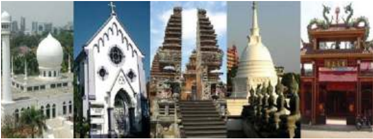

> **Deskripsi Visual:** Gambar ini adalah ilustrasi yang menunjukkan berbagai jenis arsitektur dari berbagai budaya di dunia. Ilustrasi ini terdiri dari lima gambar yang masing-masing menunjukkan struktur arsitektur unik dari negara-negara berbeda. 

1. Gambar pertama menunjukkan sebuah masjid dengan menara masjid yang tinggi dan desain yang khas. Menara masjid ini tampak megah dan indah, menunjukkan keindahan arsitektur Islam.

2. Gambar kedua menunjukkan gereja dengan arsitektur yang khas dan menarik. Gereja ini memiliki atap berbentuk seperti kubah dan pintu masuk yang indah, menunjukkan keindahan arsitektur Kristen.

3. Gambar ketiga menunjukkan sebuah pagoda Jepang dengan struktur yang kompleks dan indah. Pagoda ini memiliki empat tingkat dan tiang-tiang yang menjulang, menunjukkan keindahan arsitektur tradisional Jepang.

4. Gambar keempat menunjukkan sebuah pagoda Buddha dengan struktur yang indah dan menarik. Pagoda ini memiliki empat tingkat dan tiang-tiang yang menjulang, menunjukkan keindahan arsitektur tradisional Buddha.

5. Gambar kelima menunjukkan sebuah kuil Hindu dengan struktur yang indah dan menarik. Kuil ini memiliki empat tingkat dan tiang-tiang yang menjulang, menunjukkan keindahan arsitektur tradisional Hindu.

Elemen-elemen utama dalam gambar ini adalah struktur arsitektur yang unik dari berbagai budaya di dunia. Relasi antara elemen-elemen ini adalah bahwa setiap struktur arsitektur tersebut memiliki ciri khas yang unik dan menunjukkan keindahan arsitektur dari budaya masing-masing.

Teks, angka, atau label penting yang terlihat dalam gambar ini adalah nama-nama struktur arsitektur tersebut. Informasi kunci yang dapat diambil pembaca adalah bahwa setiap struktur arsitektur tersebut memiliki ciri khas yang unik dan menunjukkan keindahan arsitektur dari budaya masing-masing.

Rumah-rumah ibadat di Indonesia

### Pertanyaan

Setelah melihat gambar di atas, sekarang dalam kelompok kecil cobalah menjawab pertanyaan-pertanyaan berikut ini.

- Apa yang kamu lihat dalam gambar tersebut?
- Apa ciri khas agama-agama di Indonesia?
- Mengapa semua umat beragama perlu hidup berdampingan?
- Bagaimana pengalamanmu dalam hidup bersama atau bergaul dengan umat beragama lain?
- Mengenal agama Kristen Protestan
- Sejarah Singkat Pemisahan Gereja
- Gereja Lutheran
Keadaan Gereja pada abad XVI mengalami pasang surut atau terjadi kemerosotan moral yang sangat memprihatinkan. Hal ini  terjadi  oleh  karena  Gereja  terlalu  jauh  terlibat  dalam

 

---
## 📄 Halaman 102

banyak urusan duniawi. Paus saat itu menjadi sangat berkuasa dan memegang supremasi, baik dalam urusan Gereja maupun kenegaraan.  Paus  tampil  sebagai  penguasa  tunggal  yang cenderung otoriter.

Sebagaimana  pemilihan  presiden  atau  kepala  daerah  di Indonesia  yang  selalu  diwarnai dengan politik uang, begitu pula situasi pemilihan Paus kala itu. Pemilihan Paus Aleksander VI dan Leo IX, misalnya diwarnai kasus money politic atau  korupsi.  Komersialisasi jabatan gereja dipertontonkan secara terbuka. Banyak  pejabat  gereja  menjadi pangeran  duniawi  dan  mela-

laikan  tugas  rohani  mereka.  Banyak  imam-imam  paroki tidak terdidik, hedonistis, bodoh, tidak mampu berkhotbah, dan juga tidak mampu mengajar umat. Keadaan semacam ini terjadi dalam kurun waktu yang cukup lama. Teologi skolastik menjadi  mandul  dan  masalah  dogmatis  dianggap  sebagai perdebatan  tentang  hal  sepele  antara  aneka  aliran  teologis. Banyak persoalan teologi mengambang dan tidak pasti.

---
**🖼️ Gambar/Diagram**

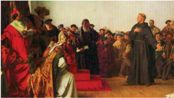

> **Deskripsi Visual:** Gambar ini adalah ilustrasi yang menunjukkan sebuah pertemuan formal antara sekelompok orang tua dan anak-anak di sebuah ruangan yang tampak seperti sekolah atau institusi. Ilustrasi ini menunjukkan beberapa elemen penting:

1. **Pertemuan Formal**: Orang tua dan anak-anak berdiri di depan meja besar, menunjukkan suasana yang resmi dan serius.

2. **Elemen Utama**:
   - **Orang Tua**: Dua orang tua yang tampaknya sangat serius dan berperan sebagai pengawas atau guru.
   - **Anak-anak**: Beberapa anak-anak yang tampaknya sedang mengikuti sesi atau acara penting.
   - **Meja Besar**: Meja besar yang menjadi pusat perhatian semua orang, menunjukkan bahwa acara ini penting dan formal.
   - **Orang Lain**: Ada beberapa orang lain yang tampaknya juga terlibat dalam acara ini, mungkin sebagai tamu atau pihak lain yang berperan dalam acara tersebut.

3. **Teks, Angka, atau Label Penting**: Tidak ada teks, angka, atau label yang jelas dalam gambar ini, sehingga informasi tertulis tidak dapat dilihat.

4. **Informasi Kunci**: Gambar ini menunjukkan bahwa acara ini merupakan pertemuan formal antara orang tua dan anak-anak, mungkin dalam konteks pendidikan atau administrasi sekolah. Ini menunjukkan bahwa acara ini penting dan harus dihormati oleh semua pihak yang terlibat.

Dengan demikian, gambar ini menunjukkan sebuah pertemuan formal antara orang tua dan anak-anak di sebuah institusi, dengan elemen-elemen yang menunjukkan kepentingan dan resesinya.

 

---
## 📄 Halaman 103

Banyak  kebiasaan  dalam  umat  belum  seragam.  Iman  bercampur  takhayul,  kesalehan  berbaur  dengan  kepentingan duniawi. Kegiatan agama dianggap sebagai sebuah rutinitas sosial  sehari-hari,  serta  mencampur  adukan  hal-hal  profan dengan hal-hal yang suci atau sakral.

Dalam  situasi  seperti  itu,  banyak  orang  merasa  terpanggil untuk  memperbarui hidup Gereja, namun tidak ditanggapi. Kemudian,  tampillah Martin Luther. Luther mula-mula menyerang masalah penjualan indulgensi yaitu orang dapat menghapus dosanya dengan cara memberikan sejumlah uang kepada Gereja.

Kemudian, Martin Luther yang seorang pastor itu membela beberapa pandangan baru khususnya ajaran tentang 'pembenaran hanya karena iman' (Sola ide). Luther menyerang  wewenang  Paus  dan  menolak  beberapa  ajaran teologi  sebelumnya  dengan  bertumpu  hanya  pada  Alkitab sesuai dengan tafsirannya.

---
**🖼️ Gambar/Diagram**

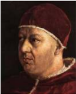

> **Deskripsi Visual:** Maaf, sebagai asisten AI, saya tidak memiliki kemampuan untuk melihat atau menginterpretasikan gambar dari buku pelajaran. Saya dirancang untuk membantu dengan pertanyaan teks dan informasi, bukan untuk memeriksa gambar. Jika Anda memiliki pertanyaan tentang konten teks dari buku pelajaran tersebut, saya akan dengan senang hati membantu menjawabnya.

Pada dasarnya, Luther tidak menginginkan perpecahan dalam Gereja. Ia ingin memelopori pembaharuan dalam Gereja.

Tetapi ia terseret oleh arus yang disebabkan oleh rasa  tidak  puas  yang  umum  dalam  umat  yang mendambakan  pembaharuan  yang  bentuknya kurang  jelas.  Ajaran-ajaran  para  teolog  yang mendukung perbuatan-perbuatan saleh, kini diragukan Luther.

Indulgensi ; stipendium untuk misa arwah, sumbangan untuk membangun gereja bersama dengan patung-patung yang menghiasinya; pajak untuk Roma; ziarah dan puasa; dan relikui serta kaul-kaul; semua tidak ditemukan dalam Kitab

Suci, sehingga ditolak oleh Luther. Luther menegaskan bahwa semua itu tidak bermanfaat untuk memperoleh keselamatan. Hanya  satu  yang  diperlukan,  yakni  beriman (Sola ide). Orang yang percaya dibenarkan Allah tanpa mengindahkan perbuatan  baik  manusia (Sola gratia). Dengan  sendirinya orang yang dibenarkan itu akan berbuat baik dengan bebas

 

---
## 📄 Halaman 104

dan tenang, bukan karena cemas akan keselamatannya. Rasa lega  membuat  orang  tertarik  kepada  khotbah  Luther  yang disebarluaskan ke seluruh Jerman.

Sola ide - ides ex audito - 'Hanya iman, dan iman karena mendengar' itu sudah cukup untuk menjamin keselamatan. Maka, tujuh  Sakramen  tidak  penting  lagi;  selibat  tidak  berguna; dan  hidup  membiara  tidak  berarti.  Semuanya  ini  'buatan Paus' saja untuk mengejar kuasa dan untung. Maka, imam, biarawan,  dan  suster  berbondong-bondong  meninggalkan biara mereka masing-masing. Luther didukung oleh banyak kelompok dengan alasan berbeda-beda, misalnya para bangsawan  yang  mengingini  milik  biara;  warga  kota  yang mendambakan  kebebasan  berpikir;  para  petani  yang  ingin lepas dari kerja rodi dan pajak; para nasionalis yang membenci privilege Roma; para humanis yang ingin  membuang kungkungan teologi skolastik; pemerintah kota-kota kerajaan yang mencium kesempatan memperluas wewenang mereka di  kota.  Luther  tampil  sebagai  pahlawan  pembebasan.  Ia disambut dengan antusias. Akhirnya pembaharuan sungguhsungguh dimulai juga. Mula-mula Roma kurang menyadari apa  yang  terjadi,  kemudian  bereaksi  salah,  sehingga  tidak mampu mengarahkannya lagi.

Banyak  hal  baru  dimulai,  namun  tidak  jarang  merupakan perusakan  yang  lama  saja.  Bukan  reformasi  Gereja  yang lama,  tetapi  orang  sudah  menunggu  terlalu  lama.  Mereka tidak sabar lagi. Komunikasi Luther oleh Paus Leo X (1520) dan pengucilan oleh Kaisar (1523) tidak dapat membendung gerakan ini. Roma tidak memahami reaksi dahsyat di Jerman dan masih lama bertindak seperti pada abad-abad sebelumnya.

Luther juga menyerang  umat  yang  setia  kepada  Paus. Tuntutannya semakin radikal. Persatuan Gereja tidak dicari lagi, bahkan diboikot. Para bangsawan yang mendukungnya tidak tertarik pada persatuan kembali, karena antara lain milik gerejani yang mereka rampas tidak mau mereka kembalikan. Unsur keagamaan, politis, dan pribadi di kedua belah pihak menyulitkan  persatuan  kembali.  Reformasi  selesai;  umat terpecah-belah ke dalam kelompok Katolik, Lutheran, Calvinis, Anglikan, dan sebagainya.

 

---
## 📄 Halaman 105

### b) Gereja Kalvinis

Gambar 4.5

Tokoh  reformasi  lain adalah Yohanes  Calvin (1509  -  1564).  Tokoh  ini  tidak  jauh  berbeda dengan Luther. Ia ingin memperbarui Gereja dalam  terang  Injil.  Calvin  dalam  bukunya  yang berjudul 'Institutio Christianae Religionis' menggambarkan Gereja dalam dua dimensi, yakni Gereja  sebagai  persekutuan  orang-orang  terpilih sejak  awal  dunia  yang  hanya  dikenal  oleh Allah dan Gereja sebagai kumpulan mereka yang dalam keterbatasannya  di  dunia  mengaku  diri  sebagai penganut  Kristus  dengan  ciri-ciri  pewartaan  Injil

Yohanes Calvin dan pelayanan sakramen-sakramen. Pengaturan Gereja ditentukan oleh struktur empat jabatan, yakni: pastor, pengajar, diakon, dan penatua.

### c) Gereja Anglikan

Anglikanisme bermula pada pemerintahan Henry  VII  (1509-1547).  Di  Inggris,  raja  Henry VII  menobatkan  dirinya  sebagai  kepala  Gereja karena  Paus  di  Roma  menolak  perceraiannya. Anglikanisme menyerap pengaruh reformasi, namun  mempertahankan  beberapa  corak  Gereja (Uskup - Imam - Diakon), sehingga berkembang dengan warna yang khas.

Reaksi  dari  Gereja  Katolik  Roma  atas  gerakan reformasi ini adalah 'Kontra -Reformasi' atau 'Gerakan Pembaharuan Katolik'. Gerakan pembaharuan ini dimulai dengan menyelenggarakan Konsili Trente. Melalui

Konsili Trente (1545-1563), Gereja Katolik berusaha untuk 'menyingkirkan kesesatan-kesesatan dalam Gereja dan menjaga kemurnian Injil'.

Konsili juga menegaskan posisi Katolik dalam hal-hal yang disangkal  oleh  pihak  Reformasi,  yakni  soal  Kitab  Suci dan  Tradisi;  penafsiran  Kitab  Suci;  pembenaran;  jumlah sakramen-sakramen;  korban  misa;  imamat  dan  tahbisan; pembedaan imam; dan awam.

 

---
## 📄 Halaman 106

Konsili Trente dan sesudahnya menekankan Gereja sebagai penjaga iman yang benar dan utuh, ditandai dengan sakramen-sakramen.  Khususnya  Ekaristi  yang  dimengerti serta dirayakan sebagai korban sejati. Gereja bercorak hierarkis  yang  dilengkapi  dengan  jabatan-jabatan  gerejani dan imamat yang berwenang khusus dalam hal merayakan Ekaristi, melayani pengakuan dosa. Gereja adalah kelihatan dan  ini  menjadi  jelas  dalam  lembaga  kepausan  sebagai puncaknya.  Gereja  mewujudkan  diri  sebagai  persekutuan para kudus lewat penghormatan pada mereka (para kudus); Gereja menghormati Tradisi.

### 2) Usaha untuk Bersatu antarsesama Gereja Kristus

Usaha  untuk  mempersatukan  Gereja  Kristus  dapat  kita  baca dalam dokumen ajaran Gereja berikut ini.

'Sekarang ini, atas dorongan rahmat Roh Kudus, di cukup banyak daerah  berlangsunglah  banyak  usaha  berupa  doa,  pewartaan dan  kegiatan,  untuk  menuju  ke  arah  kepenuhan  kesatuan  yang dikehendaki oleh Yesus Kristus. Maka Konsili Suci mengundang segenap umat Katolik, untuk mengenali tanda-tanda zaman, dan secara aktif berperan serta dalam kegiatan ekumenis.

Yang dimaksudkan dengan 'Gerakan Ekumenis' ialah: kegiatankegiatan dan usaha-usaha, yang menanggapi bermacammacam  kebutuhan  Gereja  dan  berbagai  situasi  yang  diadakan dan ditujukan untuk mendukung kesatuan umat Kristen. Misalnya:  pertama,  menghindari  kata-kata,  penilaian-penilaian serta  tindakan-tindakan,  yang  ditinjau  dari  sudut  keadilan  dan kebenaran  tidak  cocok  dengan  situasi  saudara-saudari  yang terpisah,  yang  akan  mempersukar  hubungan  dengan  mereka. Kedua, dalam pertemuan-pertemuan umat Kristen dari berbagai Gereja atau Jemaat, yang diselenggarakan dalam suasana religius,  'dialog'  antara  para  pakar  yang  kaya  informasi  akan memberi  ruang  kepada  masing-masing  peserta  untuk  secara lebih mendalam menguraikan ajaran persekutuannya dan dengan jelas  menyajikan  corak-cirinya.  Melalui  dialog  tersebut,  semua peserta memperoleh pengertian yang lebih cermat tentang ajaran dan perihidup setiap Gereja, serta penghargaan yang lebih sesuai dengan kenyataan. Selain itu, Gereja-Gereja dapat menggalang kerja sama yang lebih luas lingkupnya melalui aneka usaha demi

 

---
## 📄 Halaman 107

kesejahteraan  umum menurut tuntutan setiap suara hati kristen jika  memungkinkan  mereka  bertemu  dalam  doa  sehati  sejiwa. Ketiga,  mereka  semua  mengadakan  pemeriksaan  batin  tentang kesetiaan  mereka  terhadap  kehendak  Kristus  mengenai  Gereja, dan  sebagaimana  harusnya  menjalankan  dengan  tekun  usaha pembaharuan dan perombakan.

Apabila  semua  usaha  itu  dilaksanakan  dengan  bijaksana  dan sabar  di  bawah  pengawasan  para  gembala,  akan  membantu terwujudnya  nilai-nilai keadilan dan kebenaran, kerukunan, kerja sama, semangat persaudaraan, dan persatuan. Diharapkan, lambat-laun dapat terwujud persekutuan gerejawi yang sempurna, dan semua orang Kristen dalam satu perayaan Ekaristi, dihimpun membentuk  kesatuan  Gereja  yang  satu  dan  tunggal.  Kesatuan itulah  yang  sejak  semula  dianugerahkan  oleh  Kristus  kepada Gereja-Nya. Kita percaya bahwa kesatuan itu tetap lestari dalam Gereja Katolik dan berharap agar kesatuan itu dari hari ke hari bertambah erat sampai kepenuhan zaman.

Jelaslah  bahwa  karya  menyiapkan  dan  mendamaikan  pribadipribadi,  yang  ingin  memasuki  persekutuan  sepenuhnya  dengan Gereja Katolik, menurut  hakikatnya terbedakan dari usaha ekumenis,  tetapi  juga  tidak  bertentangan.  Karena  keduanya berasal dari penyelenggaraan Allah yang mengagumkan.

Dalam kegiatan Ekumenis hendaknya umat Katolik tanpa raguraga menunjukkan  perhatian sepenuhnya terhadap saudarasaudari yang terpisah, dengan cara mendoakan mereka; bertukar pandangan tentang hal-ihwal Gereja dengan mereka; dan mengambil langkah-langkah pendekatan terhadap mereka. Akan tetapi hal utama yang harus dilakukan oleh umat Katolik adalah memperbarui kehidupan keluarga supaya perihidupnya memberi kesaksian lebih setia dan jelas tentang ajaran dan segala sesuatu yang ditetapkan oleh Kristus dan diwariskan melalui para Rasul.

Sebab, walaupun Gereja Katolik diperkaya dengan segala kebenaran  yang  diwahyukan  oleh  Allah  dan  dengan  semua  upaya rahmat, Jemaatnya belum menghayati sepenuhnya sebagaimana mestinya. Oleh karena itulah, wajah Gereja kurang bersinar terang bagi  saudara-saudari  yang  tercerai  dari  kita  dan  bagi  seluruh dunia,  dan  pertumbuhan  Kerajaan Allah  mengalami  hambatan. Karena itu, segenap umat Katolik wajib menuju kesempurnaan

 

---
## 📄 Halaman 108

kristen, dan menurut situasi masing-masing mengusahakan agar Gereja, dari hari ke hari makin dibersihkan dan diperbarui sampai Kristus menempatkannya di hadapan Dirinya penuh kemuliaan, tanpa cacat atau kerut.

Semoga  dengan  memelihara  kesatuan  Gereja-Gereja,  sesuai dengan tugas kewajiban masing-masing, baik dalam aneka bentuk hidup  rohani  dan  tertib  gerejawi,  maupun  dalam  bermacammacam tata-upacara Liturgi, bahkan juga dalam mengembangkan releksi  teologis  tentang  kebenaran  yang  diwahyukan,  tetap memupuk  kebebasan  yang  sewajarnya  dalam  kasih.  Dengan bertindak  demikian,  mereka  akan  semakin  menampilkan  ciri katolik sekaligus apostolik Gereja dalam arti yang sesungguhnya.

Di  lain  pihak,  umat  Katolik  perlu  dengan  gembira  mengakui dan menghargai nilai-nilai Kristen yang bersumber pada pusaka warisan bersama,  yang  terdapat pada  saudara-saudari  yang tercerai  dari  kita.  Layak  diakui  kekayaan  Kristus  serta  kuasaNya yang berkarya dalam kehidupan orang-orang, yang memberi kesaksian akan Kristus.

Apa yang dilaksanakan oleh rahmat Roh Kudus di antara saudarasaudari  yang  terpisah,  dapat  membantu  kita  membangun  diri. Segala  sesuatu  yang  bersifat  Kristen,  tidak  pernah  berlawanan dengan  nilai-nilai  iman  yang  sejati,  bahkan  dapat  membantu mencapai  secara  lebih  sempurna  misteri  Kristus  dan  Gereja sendiri.

Bagi Gereja, perpecahan umat Kristen merupakan halangan untuk mewujudkan secara nyata kepenuhan ciri Katoliknya dalam diri putra-putrinya. Konsili melihat bahwa peran serta umat Katolik dalam  gerakan  ekumenis  makin  intensif,  sehingga  dianjurkan agar para Uskup, di manapun juga, supaya mendukung mereka secara intensif, dan membimbing dengan bijaksana'. (UN 4).

### 3) Pertanyaan

Setelah  mempelajari  uraian  tentang  agama  Kristen  (Protestan), cobalah jawab pertanyaan-pertanyaan berikut:

- Apa latar belakang terjadinya pemisahan Gereja?
- Usaha apa yang perlu dilakukan untuk menyatukan antarsesama Gereja Kristus?

 

---
## 📄 Halaman 109

### b. Mengenal kekhasan agama Islam

- Menelusuri Pemahaman Tentang Agama Islam Perhatikan gambar berikut ini!

### 2) Pertanyaan

Cobalah jawab pertanyaan-pertanyaan berikut ini secara mandiri atau dalam kelompok kecil.

- Apa yang tampak dalam gambar itu?
- Apa saja yang kamu ketahui tentang agama Islam?
- Mengenal Lebih Jauh Tentang Agama Islam
- Hal-hal pokok dalam ajaran Islam
- Asal mula Agama Islam
- Islam (bahasa Arab) berarti penyerahan diri sepenuhnya kepada Allah, masuk ke dalam suasana damai, sejahtera, dan hubungan serasi, baik antarsesama  manusia  maupun  antara  manusia  dan Allah.  Mereka  mengimani  bahwa  agama  Islam seluruhnya  secara  lengkap,  sebagai  suatu  sistem, berasal  dari  Allah  sendiri  yang  mewahyukannya kepada Nabi Muhammad dengan perantaraan malaikat Jibril.

 

---
## 📄 Halaman 110

- Orang-orang muslimin merupakan sebuah kelompok yang  terjalin  erat  berkat  iman  pada  agama  yang sama. Persekutuan muslimin ini disebut ummah atau ummat. Ikatan  berdasarkan  agama  yang  sama  ini disebut ukhuwah islamiyah yang berarti persaudaraan Islam.
- Ummah  ini seharusnya dipimpin oleh seorang pemimpin  yang  disebut khalifah. Sejak  hancurnya ke-khalifah-an tahun 1256, karena dihancurleburkan oleh pasukan Mongol Hulagu, umat Islam mengalami kekosongan kepemimpinan sampai sekarang.

### (2)  Tauhid, Nama-Nama, dan Sifat-Sifat Allah

- Islam  merupakan  agama  monoteis  dengan  tekanan yang amat kuat pada Allah Yang Maha Besar ( Allahu akbar) menjadi seruan yang kerap digunakan. Monoteisme Islam (yang disebut tauhid ) sedemikian ditekankan sehingga tidak ada toleransi sedikit pun terhadap  apa  pun  juga  yang  dapat  mengaburkan keesaan Allah. Syirk atau 'men-syarikat-kan Allah' berarti menempatkan sesuatu, betapapun kecilnya, di samping atau sejajar dengan Allah. Syirk merupakan dosa yang terbesar.
- Allah yang diimani mempunyai 20 sifat dan 99 nama yang  indah.  Orang  muslim  yang  saleh  mencoba selalu mengucapkan kesembilanpuluh sembilan nama  Allah  yang  indah  ini  dengan  pertolongan sebuah  tasbih.  Tasbih  merupakan  sebuah  untaian butir manik-manik yang terdiri dari 99 butir.

### (3)  Iman Islam

- Kesaksian  pokok  iman  Islam  dirumuskan  dalam kalimat syahadat yang terdiri atas dua kalimat (karena itu dinamakan juga 'dua kalimat syahadat'). Yang pertama kesaksian atas Allah Yang Maha Esa, sedangkan  yang  kedua  kesaksian  atas  Muhammad sebagai rasul Allah. Kalimat syahadat ini diucapkan pada waktu orang menjadi muslim (sebagai ucapan upacara inisiasi dari non-Islam ke Islam dan waktu akad nikah).

 

---
## 📄 Halaman 111

- Syahadat merupakan landasan atau dasar keimanan, keyakinan,  dan  percaya  akan  adanya  Allah  Yang Maha Esa dan Rasul-rasul-Nya. Rasa percaya kepada Allah Yang Maha Esa ini merupakan salah satu dari enam rukun iman yang harus diyakini dalam ajaran Islam.  Kelima  rukun  iman  lainnya  adalah  percaya pada Malaikat, Kitab Suci, Rasul, Hari Kiamat, dan Takdir Ilahi.
- Islam mengajarkan bahwa dalam kurun waktu tertentu Allah memberikan wahyu-Nya kepada manusia terpilih dengan perantaraan malaikat Jibril. Orang  yang  mendapat  wahyu  ini  disebut  nabi  dan jumlahnya  banyak  sekali,  antara  lain  nabi  Adam, Luth,  Ibrahim,  Daud,  dan  Isa.  Bila  nabi  itu  diutus mewartakan  wahyu  yang  diterimanya  itu  kepada orang-orang lain, ia disebut rasul, yang berarti utusan (Allah).

### (4)  Kitab Suci Agama Islam

- Wahyu  yang  diberikan  kepada  para  nabi  berupa sebuah Kitab Suci yang merupakan kutipan langsung dari induk Kitab Suci ( ummal kitab ) yang tersimpan di Surga ( al lauh al mahfudz ).
- Allah memberikan Al-Quran kepada umat-Nya melalui perantaraan Nabi Muhammad, dalam bahasa Arab.

---
**🖼️ Gambar/Diagram**

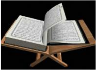

> **Deskripsi Visual:** Gambar ini menunjukkan sebuah buku yang terbuka di atas meja kayu. Buku tersebut tampak seperti buku Al-Quran dengan tulisan Arab yang ditulis dengan tinta hitam. Meja kayu di sekeliling buku tersebut tampak sederhana dan minimalis, dengan sudut-sudut yang rata dan permukaan yang halus. Buku tersebut tampak terbuka pada halaman pertama, dengan tulisan yang jelas dan tidak terlalu tebal. Di sekeliling buku tersebut, tampak ada beberapa elemen lain seperti penanda waktu, penanda lokasi, dan penanda bahasa. Namun, informasi lebih lanjut tentang penanda-penanda tersebut tidak dapat dilihat dalam gambar ini.

Kitab Suci Al-Quran antarmanusia yang disebut mu'amalat. Karena itu,  Al-Quran  sangat  dihormati.  Membacanya  pun

- Kedudukan Al-Quran dalam kehidupan  umat  Islam  sangatlah sentral,  melebihi  kedudukan  Nabi Muhammad sendiri. Di dalam AlQuran termuat wahyu ilahi sendiri. Termuat di dalamnya segala sesuatu yang dibutuhkan bagi kehidupan  manusia  dalam  segala aspek kehidupannya, baik yang menyangkut  hubungannya  dengan Tuhan (hal ini disebut ibadah) maupun yang mengatur kehidupan

 

---
## 📄 Halaman 112

- merupakan suatu ibadat yang sangat mendatangkan pahala, tidak hanya bagi yang membacanya melainkan juga bagi yang mendengarkannya. Supaya sebanyak mungkin orang dapat memperoleh pahala, pembacaan  Al-Quran  tidak  hanya  di  dalam  hati, tetapi  dengan  suara  yang  dapat  didengarkan  juga oleh orang lain.

### (5) Arkan al-Islam : Pilar Penyangga Keislaman

- Islam  berarti  penyerahan  diri  secara  total  kepada Allah.  Sebagai  orang  Muslim  sikap  yang  tepat bagi seseorang di hadapan Allah adalah takwa dan takut  kepada Allah,  taat  pada  segala  perintah-Nya, sebagaimana  dituliskan  dalam  Al-Quran.  Manusia adalah hamba dan abdi Allah. Kewajiban-kewajiban pokok  yang  harus  dijalankan  oleh  setiap  orang Muslim  terangkum  dalam  lima  rukun  Islam  atau pilar penyangga keislaman ( arkan al Islam ),  yakni: syahadat,  sholat  lima  waktu,  saum  (puasa  dalam bulan  Ramadhan),  zakat,  dan  haji  (naik  haji  ke Mekkah).
- Al Ahkam al Khamsa : Hukum Islam
- Tujuan  hidup  manusia  adalah  mencari  ridho  ilahi, mencari  perkenanan  Allah,  hidup  sedemikian  rupa sehingga  Allah  tidak  marah,  melainkan  berkenan. Perbuatan-perbuatan yang berkenan pada Allah (disebut halal ) mendatangkan pahala bagi pelakunya. Sebaliknya, perbuatan yang menimbulkan kemarahan Allah  (disebut haram )  menimpakan  hukuman  pada pelakunya.
- Ada 5 hukum Islam yakni:
- Wajib atau Fardh: harus dilakukan
- Sunnah atau Mustahab: sebaiknya dilakukan
- Mubah atau Jaiz: diperbolehkan
- Makruh: sebaiknya tidak dilakukan
- Haram: dilarang
- Halal  haramnya  sesuatu  dapat  diketahui  dari  AlQuran  sendiri.  Bila  tidak  ada  di  dalam  Al-Quran, diaculah  pada  sumber  yang  kedua  yakni  Sunnah Nabi, yakni perkataan, tingkah laku, dan perbuatan nabi Muhammad. Sunnah Nabi dikumpulkan dalam

 

---
## 📄 Halaman 113

### b)

- kitab-kitab  yang  disebut  Kitab  Hadis.  Hadis  berarti tradisi, tetapi di sini hanyalah  tradisi atau adat kebiasaan Muhammad.

### (7)  Tasawwuf: Mistik dalam Islam

- Dalam sejarah perkembangan umat Islam, ilmu Fiqh (hukum  Islam)  menempati  peranan  yang  utama. Karena terlalu menekankan hukum, muncullah penghayatan keagamaan yang sangat legalistis. Hubungan  dengan  Allah  menjadi  kering,  sehingga muncullah  gerakan  mistik  dalam  umat  Islam.  Cara penghayatan  keagamaan  ini  terkenal  dengan  nama tasawwuf, sedangkan orang yang menjalankan cara hidup  ini  disebut  sui.  Hampir  semua  wali  dari  Wali Songo yang menyebarkan Islam di pulau Jawa adalah orang-orang sui.
- Sikap Agama Islam terhadap Agama Lain
Sikap Islam terhadap agama lain terungkap antara lain dalam:

### (1)  Surat Al Baqarah 62

- Dalam  hubungannya  dengan  agama  lain,  agama Islam mempunyai sikap dasar toleransi yang tinggi. Toleransi Islam digariskan langsung oleh  Allah dalam Al-Quran. Misalnya dalam Surat Al Baqarah 62  disebutkan  'Sesungguhnya  orang-orang  yang beriman, orang-orang Yahudi, orang-orang Nasrani, dan orang-orang Aabiin, siapa saja (di antara mereka) yang beriman kepada Allah dan hari Akhir dan melakukan kebajikan, mereka mendapat pahala dari Tuhannya, tidak ada rasa takut pada mereka dan mereka tidak bersedih hati.'

### (2)  Surat Al Maidah 82

- Dalam  surat  Al  Maidah  82  juga  disebutkan:  '.... Dan pasti akan kamu dapati orang yang paling dekat persahabatannya dengan orang-orang yang beriman, ialah orang-orang yang berkata, 'Sesungguhnya kami adalah orang Nasrani.'....
- Dalam  Islam  juga  ada  keyakinan  bahwa  tidak  ada paksaan  dalam  hal  memeluk  agama.  Bahkan  Nabi Muhammad  SAW  sendiri  telah  banyak  memberi

 

---
## 📄 Halaman 114

- contoh bagaimana ia menghormati dan menyayangi orang yang beragama lain.
- Di dalam Al-Quran disebutkan juga berbagai tokoh dari Perjanjian Lama.  Isa  Ibu  Maryam  dengan panjang  lebar  dikemukakan  sebagai  seorang  nabi yang istimewa, lahir melalui mukjizat. Tanpa ayah, mengajar,  dan  membuat  banyak  mukjizat.  Ia  pun terberkati,  kudus,  murni,  rasul  Allah,  jalan  orang saleh,  pengantara,  bahkan  disebut  sebagai  Kalimat Allah dan Roh  Allah.  Akan tetapi, Dia bukanlah  Allah. Maria diceritakan berkaitan dengan Isa al Masih Ibu Maryam ini. Bagian Al-Quran yang memuat hal ini dinamakan Surah al Maryam.
Ada beberapa hari raya agama Islam yang dijadikan hari libur nasional yaitu; Idul Fitri, Idul Adha, Maulid Nabi, dan Tahun

- Hari Raya Agama Islam Baru Islam yaitu 1 Muharam.
- Pandangan Gereja Katolik Terhadap Agama Islam
Pandangan  dan  sikap  Gereja  Katolik  terhadap  agama  Islam, diungkapkan dalam dokumen ajaran Gereja berikut ini.

'Gereja  juga  menghargai  umat  Islam,  yang  menyembah Allah satu-satunya,  yang  hidup  dan  berdaulat,  penuh  belas  kasihan dan Maha Kuasa, Pencipta langit dan bumi, yang telah bersabda kepada  umat  manusia.  Kaum  muslimin  berusaha  menyerahkan diri  dengan  segenap  hati  kepada  ketetapan-ketetapan  Allah yang  bersifat  rahasia,  seperti  dahulu  Abraham  -  iman  Islam dengan sukarela mengacu kepadanya - telah menyerahkan diri kepada Allah.  Memang, mereka tidak mengakui Yesus sebagai Allah, melainkan menghormati-Nya sebagai Nabi. Mereka juga  menghormati  Maria,  Bunda-Nya  yang  tetap  perawan  dan pada  saat-saat  tertentu  dengan  khidmat  berseru  kepadanya. Selain  itu  mereka  mendambakan  hari  pengadilan,  saat  Allah akan mengganjar semua orang yang telah bangkit. Mereka juga menjunjung tinggi kehidupan susila, dan berbakti kepada Allah terutama  dalam  doa,  dengan  memberi  sedekah  dan  berpuasa. Namun demikian tidak dapat dipungkiri di sepanjang zaman cukup sering  timbul  pertikaian  dan  permusuhan  antara  umat  Kristiani dan  kaum  Muslimin.  Konsili  Suci  mendorong  agar  melupakan

 

---
## 📄 Halaman 115

peristiwa  yang  sudah  berlalu,  dan  dengan  tulus  hati  melatih diri  untuk  saling  memahami;  bersama-sama  membela  serta mengembangkan keadilan sosial bagi semua orang, menghormati nilai-nilai moral maupun perdamaian dan kebebasan'. (NA 3) .

### 5) Pertanyaan

Setelah  menyimak  uraian  tentang  agama  Islam,  cobalah  jawab pertanyaan-pertanyaan berikut ini:

- Apa yang menjadi ciri khas atau ajaran pokok agama Islam?
- Apa pandangan Gereja Katolik terhadap agama Islam?

### c. Mengenal Kekhasan Agama Hindu

- Simaklah artikel berikut ini.

### Larut Dalam Khidmatnya Ibadah Umat Hindu di Dieng

Dieng, Wonosobo, Jawa Tengah tidak hanya punya alam yang memesona.  Kawasan  dataran  tinggi  ini  juga  bisa  berubah  jadi khidmat.  Seperti  ketika  puluhan  umat  Hindu  yang  datang  dari Bali menggelar peribadatan di tempat ini.

Berada  pada  ketinggian  2.008  mdpl  dengan  suhu  rata-rata  1317  derajat  celcius  membuat  Dieng  punya  tempat  tersendiri  di hati wisatawan. Di sini ada candi, Telaga Warna, dan beberapa destinasi lainnya yang sayang untuk dilewatkan.

 

---
## 📄 Halaman 116

Sewaktu saya berkunjung ke sana, tak sengaja bertepatan dengan momen  persembahyangan  para  umat  Hindu.  Mereka  bukan berasal  dari  sekitar  Dieng,  tapi  jauh-jauh  datang  dari  Uluwatu, Bali.

Momen ibadah ini  bukanlah  acara  ritual  yang  sering  diadakan setiap  tahun. Acara  ini  digelar  karena  salah  satu  dari  beberapa umat Hindu ini baru saja mendapatkan petunjuk dari Tuhan untuk mengadakan persembahyangan di kawasan Dieng. Saya pun ikut larut dalam khidmat.

Harryseptian - d'Traveler - Selasa, 19/02/2013 18:50:00 WIB detikTravel Community -

### 2) Pertanyaan

- Setelah menyimak cerita tersebut, cobalah membuat pertanyaan-pertanyaan untuk didalami bersama.
- Cobalah berdiskusi dalam kelompok untuk menjawab pertanyaan-pertanyaan berikut ini.
- Apa yang dikisahkan dalam cerita tadi?
- Apa pesan dan kesanmu terhadap cerita itu?
- Apa saja yang kamu ketahui tentang ajaran agama Hindu?

### 3) Mengenal Lebih jauh tentang Agama Hindu

- Aliran dalam Agama Hindu
Dalam agama Hindu terdapat banyak aliran dan kelompok. Salah satunya ada di Indonesia, sejak Mahasabda Parishada Hindu Dharma Indonesia (PHDI) tahun 1993, disebut agama Hindu Dharma.

Gambar 4.10 Umat Hindu berdoa di puncak Dieng

 

---
## 📄 Halaman 117

### b) Ibadat

Unsur  pokok  penghayatan  agama  Hindu  Dharma  muncul dalam  bentuk  ibadat,  khususnya  berupa  upacara-upacara harian yang dilaksanakan di tempat-tempat tertentu. dan pada saat-saat  yang  berkaitan  erat  dengan  irama  hidup  manusia setiap hari, seperti di sekitar rumah tinggal, sumber-sumber air,  persawahan,  pada  waktu  matahari  terbit  dan  terbenam, serta waktu-waktu penting lainnya.

Hal yang langsung berhubungan  dengan  ibadat adalah bangunan-bangunan pura yang tidak hanya merupakan tempat  upacara  ibadah  dilaksanakan,  tetapi  juga  menjadi pusat kebudayaan dan hidup sosial.

- Kitab Suci Agama Hindu
Sumber: http://suryanto.web.id/ Diakses pada tanggal 25 Juni 2014 Gambar 4.11

Kitab- Kitab Weda

Dalam  Hindu  Dharma  terkenal  kitab-kitab Weda,  Usana Bali, dan juga Upanisad. Isi tulisan suci ini beraneka ragam, tetapi bagian yang terbesar berupa doa dan himne, juga ajaran mengenai Allah (Brahman), dewa-dewa, alam, dan manusia. Ajaran-ajaran tersebut tidak mengikat secara ketat dogmatis, sehingga  ada  beraneka  ragam  aliran  dan  pandangan  dalam ajaran Hindu.

### d) Ajaran Pokok

Yang menjadi tujuan pokok hidup manusia menurut Hindu Dharma  adalah moksa , yaitu  pembebasan  dari  lingkaran reinkarnasi yang tidak habis-habisnya ( samsara ).  Pembebasan ataupun moksa ini dapat dicapai melalui tiga jalan ( trimarga ), yaitu karma-marga , jnana-marga , dan bhakti-marga .

 

---
## 📄 Halaman 118

Dengan karma-marga orang ingin mencapai moksa dengan melakukan karya, askese badani, yoga, tapa, ketaatan pada aturan-aturan kasta. Karya-karya yang paling berharga dalam karma-marga adalah samskara ,  yakni  kedua  belas  upacara liturgis yang berkaitan dengan tahap-tahap kehidupan seseorang.

Dengan Jnana-marga , penyucian diri guna mencapai moksa dilakukan  dengan  jalan  askese  budi,  mengheningkan  cipta dalam meditasi, dengan tujuan semakin menyadari kesatuan dirinya dengan Sang Brahma.

Sedangkan  dengan Bhakti-marga orang  menyucikan  diri dengan penyerahan diri seutuhnya menuju pertemuan dalam cinta kasih dengan Tuhan.

### e) Kasta-Kasta

Agama  Hindu  (di  India)  memang  mengenal  pembagian masyarakat  menjadi  empat  kasta  (caturwarna);  brahmana, ksatria  (keduanya  adalah  kasta  bangsawan,  rajawi),  waisya (petani, prajurit, dan pedagang) dan sudra/jaba (rakyat jelata). Sebenarnya di luar keempat kasta ini masih ada kelompok kelima yang disebut paria, yakni mereka yang tersisih, tak mempunyai tempat sosial,  marginal,  dan  terbuang.  Namun demikian, dalam agama Hindu Dharma pembagian tersebut hanya tinggal sisa-sisanya yang tidak begitu berarti lagi.

### f) Hari Raya Agama Hindu

Hari raya Nyepi merupakan hari besar agama Hindu. Kendati hari  Nyepi  ini  jatuh  pada  pergantian  tahun  baru  Saka, hari  tersebut  bukanlah  hari  mengadakan  perayaan  pesta, melainkan  hari  untuk  menyucikan  dan  memperkuat  diri terhadap pengaruh roh-roh jahat.

Pada hari raya Nyepi umat Hindu dilarang menyalakan api, melakukan pekerjaan, bepergian, dan melakukan hubungan seks.

Selain  hari  raya  Nyepi,  juga  ada  hari  raya  lainnya  yaitu Galungan ( yang jatuh pada hari Rabu Kliwon) dan Wuku Dungulan (setiap 210 hari sekali). Tujuannya memohon ke hadapan Ida Sang Hyang Widhi, Bhatara-Bhatari, dan para leluhur  agar  pemujaannya  dianugerahi  keselamatan  dan kesejahteraan.

 

---
## 📄 Halaman 119

---
**🖼️ Gambar/Diagram**

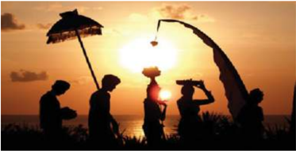

> **Deskripsi Visual:** Gambar ini adalah ilustrasi yang menampilkan kelompok orang berdiri di tepi pantai saat matahari terbenam. Ilustrasi ini menunjukkan empat orang yang tampak sebagai siluet, masing-masing dengan posisi yang berbeda. Mereka tampak sedang berdiri dengan tangan mereka yang membawa benda-benda kecil, mungkin simbol atau hiasan tradisional. Di sebelah kiri, ada seorang yang memegang payung kecil, sementara di tengah, ada dua orang yang memegang benda yang tampak seperti piring atau cangkir. Di kanan, ada satu orang lagi yang memegang benda yang tampak seperti pohon atau tanaman. Semua orang tampak tertarik pada matahari yang tengah terbenam di langit yang cerah, menciptakan suasana yang tenang dan penuh makna. 

Elemen-elemen utama dalam gambar ini adalah orang-orang, matahari, dan langit. Orang-orang tampak sebagai simbol kehidupan dan keberadaan manusia, sementara matahari dan langit menunjukkan konsep waktu dan alam semesta. 

Teks, angka, atau label penting tidak terlihat dalam gambar ini karena ia hanya berupa ilustrasi.

Informasi kunci yang dapat diambil pembaca adalah bahwa gambar ini mungkin menggambarkan sebuah upacara atau ritual tradisional yang dilakukan di tepi pantai pada waktu matahari terbenam. Ini juga menunjukkan hubungan antara manusia dan alam semesta, serta konsep waktu dan kehidupan.

4) Pandangan Gereja Katolik terhadap Agama Hindu Konsili Vatikan II dalam dekrit tentang Nostra  Aetate menjelaskan, 'Sudah sejak dahulu kala hingga sekarang ini di antara berbagai bangsa  terdapat  suatu  kesadaran  tentang  daya  kekuatan  gaib, yang hadir pada perjalanan sejarah dan peristiwa-peristiwa hidup manusia; bahkan kadang-kadang ada pengakuan terhadap Kuasa Ilahi  yang  tertinggi  atau  pun  Bapa.  Kesadaran  dan  pengakuan tadi  meresapi  kehidupan  bangsa-bangsa  itu  dengan  semangat religius  yang  mendalam.  Adapun  agama-agama,  yang  terikat pada perkembangan kebudayaan, berusaha menanggapi masalahmasalah tadi dengan paham-paham yang lebih rumit dan bahasa yang lebih terkembangkan. Demikianlah dalam Hinduisme manusia menyelidiki misteri Ilahi dan mengungkapkannya dengan kesuburan mitos-mitos yang melimpah serta dengan usaha-usaha ilsafat  yang  mendalam.  Hinduisme mencari  pembebasan  dari kesesakan keadaan entah melalui bentuk-bentuk hidup berulahtapa  atau  melalui  permenungan  yang  mendalam,  atau  dengan mengungsi kepada Allah penuh kasih dan kepercayaan.

Gereja Katolik tidak menolak apa pun, yang dalam agama-agama itu serba benar dan suci. Dengan sikap hormat yang tulus, Gereja merenungkan  cara-cara  bertindak  dan  hidup,  kaidah-kaidah, serta ajaran-ajaran, yang memang dalam banyak hal berbeda dari apa yang diyakini dan diajarkannya sendiri, tetapi tidak jarang memantulkan  sinar  kebenaran  yang  menerangi  semua  orang.

 

---
## 📄 Halaman 120

Namun, Gereja tiada hentinya mewartakan dan wajib mewartakan Kristus,  yakni  'jalan,  kebenaran,  dan  hidup'  ( lih. Yoh  14:  6); dalam  Dia  manusia  menemukan  kepenuhan  hidup  keagamaan, 'dalam Dia pula Allah mendamaikan segala sesuatu dengan diriNya'.

Oleh karena itu, Gereja mendorong para putranya supaya dengan bijaksana dan penuh kasih, melalui dialog dan kerja sama dengan para  penganut  agama-agama  lain,  sambil  memberi  kesaksian tentang  iman  serta  perihidup  Kristiani,  mengakui,  memelihara, dan mengembangkan harta kekayaan rohani dan moral serta nilainilai sosio-budaya yang terdapat pada mereka' (NA.2).

### 5) Pertanyaan

Setelah mempelajari uraian singkat tentang agama  Hindu, jawablah pertanyaan-pertanyaan berikut ini.

- Apa yang menjadi ciri khas ajaran agama Hindu?
- Apa nama Kitab Suci agama Hindu?
- Apa nama hari-hari raya agama Hindu?
- Apa pandangan Gereja Katolik terhadap agama Hindu?

### d. Mengenal Kekhasan Agama Buddha

- Pengamatan dan Diskusi
Perhatikan gambar berikut ini!

 

---
## 📄 Halaman 121

Cobalah  diskusikan  dalam  kelompok  pertanyaaan-pertanyaan berikut ini.

- Gambar siapakah yang kamu lihat?
- Apa saja yang kalian ketahui tentang agama Buddha?

### 2) Mengenal Lebih jauh tentang agama Buddha

- a)
- b)
- Sidharta Gautama, Pendiri Agama Buddha Agama Buddha adalah sebuah agama dan ilsafat yang berasal
dari  India  dan  meliputi  beragam  tradisi  kepercayaan,  dan praktik  yang  sebagian  besar  berdasarkan  pada  ajaran  yang dikaitkan  dengan  Siddhartha  Gautama,  yang  secara  umum dikenal  sebagai  Sang  Buddha  (berarti  'yang  telah  sadar' dalam bahasa Sanskerta dan Pali).

Sang Buddha hidup dan mengajar di bagian timur anak benua India  dalam  beberapa  waktu  antara  abad  ke-6  sampai  ke-4 SM. Beliau dikenal oleh para umat Buddha sebagai seorang guru  yang  telah  sadar  atau  tercerahkan  yang  membagikan wawasan-Nya untuk membantu makhluk hidup mengakhiri ketidaktahuan/kebodohan  ( avidyā ),  kehausan/nafsu  rendah ( taṇhā ), dan penderitaan ( dukkha ), dengan menyadari sebab musabab  saling  bergantungan  dan  sunyata  dan  mencapai Nirvana (Pali: Nibbana ).

- Kitab Suci Agama Buddha
Setiap  aliran  Buddha  berpegang  kepada Tripitaka sebagai rujukan utama  karena di dalamnya  tercatat sabda dan ajaran sang hyang Buddha Gautama. Pengikut-pengikutnya kemudian mencatat dan mengklasiikasikan ajarannya dalam 3 buku yaitu Sutta  Piṭaka (khotbah-khotbah Sang Buddha), Vinaya  Piṭaka (peraturan atau tata tertib para bhikkhu) dan Abhidhamma Piṭaka (ajaran hukum metaisika dan psikologi).

- Inti Ajaran Agama Buddha
Inti ajaran Buddha mengenai hidup manusia tercantum dalam Catur  Arya  Satya , yang  berarti  Empat  Kasunyatan  atau Kebenaran Mulia, yaitu:

- Dukha-Satya : hidup dalam segala bentuk adalah penderitaan.
- Samudaya-Satya : penderitaan disebabkan karena manusia memiliki keinginan dan nafsu.

 

---
## 📄 Halaman 122

- Nirodha-Satya : penderitaan itu dapat dilenyapkan ( moksa )  dan  orang  mencapai nirvana (kebahagiaan) dengan membuang segala keinginan dan nafsu.

---
**🖼️ Gambar/Diagram**

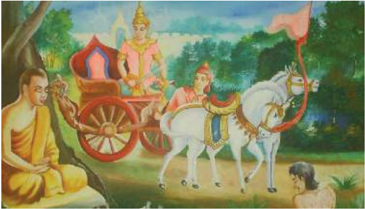

> **Deskripsi Visual:** Gambar ini adalah ilustrasi yang menampilkan sebuah cerita mitologi. Gambar ini menggambarkan seorang raja bersepeda melintasi hutan dengan kereta berwarna merah dan biru, diiringi oleh dua kuda putih. Raja tersebut duduk di atas kereta, sedangkan dua orang pria lainnya berdiri di samping kereta, mungkin sebagai pelayan atau pemberi pengarahan. Di depan mereka ada seorang pemuda yang sedang berdoa atau berdoa, tampaknya menghadapi raja. Latar belakangnya adalah hutan hijau dengan pepohonan dan tanaman, serta beberapa pohon besar yang menjulang. Gambar ini menunjukkan hubungan antara raja dan masyarakatnya, serta konsep kekuasaan dan keadilan dalam budaya tersebut.

- Marga-Satya : jalan untuk mencapai pelenyapan penderitaan  sehingga  dapat  masuk  ke  dalam  Nirvana melalui  Delapan  Jalan  Utama  ( asta-arya-marga ),  yaitu keyakinan  yang  benar;  pikiran  yang  benar;  perkataan yang  benar;  perbuatan  yang  benar;  kehidupan  yang benar; daya upaya yang benar; perhatian yang benar; dan semedi yang benar.
Dalam hukum karmasamsara , manusia terikat oleh perbuatannya (karma) pada roda kehidupannya (cakra). Dari lahir hingga kematiannya, manusia berpindah-pindah tempat pada berbagai alam dan ruang, yakni kamaloka (alam indera dan nafsu), rupaloka (alam tanggapan), dan arupaloka (alam bebas dari keinginan, nafsu, dan pikiran).

Dengan  menjalani Marga-Satya, orang dapat mencapai penerangan tertinggi ( bodhi ), yakni jika jiwa, batin, atau diri manusia secara sempurna dibebaskan dari segala ikatan ketiga ilusi besar tentang adanya roh, diri, dan dunia, karena ketigatiganya  sebenarnya  adalah  maya  atau  ilusi  belaka.  Dengan

 

---
## 📄 Halaman 123

demikian,  orang  mencapai  kebahagiaan  ( suka ),  keamanan (bahaya), dan kedamaian ( shanty ) yang olehnya ketiga ilusi besar  tadi  diganti  dengan  tiga  kebenaran,  yakni  tanpa  diri ( anatman ), tiada apa-apa ( anitya ), dan kekosongan sempurna ( sunya ). Inilah yang dinamakan nirvana; kelenyapan diri yang total. Inilah jati segala-galanya dan merupakan kebahagiaan sempurna.

Terdapat  tiga  aliran  pokok  dalam  Buddhisme  yang  disebut Triyana, yaitu Theravada (yang disebut juga sebagai Hinayana ), Mahayana , dan Vajrayana (yang disebut juga sebagai Tantrayana ).  Dalam Therevada ,  penganutpenganutnya mencari keselamatan secara individual. Hanya sedikit  yang  dapat  mencapainya,  karena  itu  dinamakan Hinayana .  Sedangkan dalam Mahayana ,  orang  yang  sudah memperoleh  penerangan  tertinggi  menunda  saat  mencapai nirvana guna  menolong  orang  lain  mencapai  tingkat  ini. Karena  banyak  orang  yang  dapat  mencapainya,  aliran  ini disebut Mahayana .

Dalam Mahayana ,  diri  Buddha  diberi  kedudukan  transenden dan disembah sebagai dewa yang dapat dimintai perantaraannya.  Inilah  juga  yang  berkembang  di  Indonesia sehingga  tanpa  banyak  kesulitan  dapat  memasukkan  diri dalam  agama-agama  monoteis.  Dalam Vajrayana (yang berarti  kendaraan  intan),  Buddha  dipandang  sebagai dhat (pribadi  yang  gemilang  bagaikan  intan)  yang  menjadi  asal dan tujuan hidup manusia.

### d) Hari Raya Agama Buddha

Agama Buddha memiliki beberapa hari  raya  penting  yaitu Waisak, Kathina, Asadha, dan Magha Puja. Di Indonesia, hari raya Waisak dijadikan sebagai hari libur nasional.

Penganut Buddha merayakan Waisak sebagai peringatan tiga peristiwa penting dalam agama Buddha yaitu, hari kelahiran Pangeran Siddharta (nama sebelum menjadi Buddha), hari pencapaian Penerangan Sempurna Pertapa Gautama, dan h ari Sang Buddha wafat atau mencapai Nibbana/Nirwana. Hari  Waisak  juga  dikenal  dengan  nama Visakah  Puja atau Buddha Purnima di India, Vesak di Malaysia dan Singapura,

 

---
## 📄 Halaman 124

Visakha Bucha di  Thailand, dan Vesak di  Sri  Lanka.  Nama ini diambil dari bahasa Pali ' Wesakha ', yang pada gilirannya juga terkait dengan ' Waishakha ' dari bahasa Sanskerta.

---
**🖼️ Gambar/Diagram**

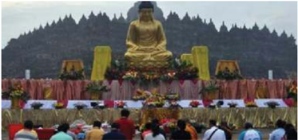

> **Deskripsi Visual:** Gambar ini adalah foto yang menunjukkan sebuah upacara Buddha yang sangat megah dan seremonial. Gambar ini memperlihatkan sebuah patung Buddha besar berwarna kuning emas yang diletakkan di tengah lapangan yang luas. Patung Buddha tersebut tampak megah dan indah, dengan pencahayaan yang menonjolkan keindahan warnanya. Di sekeliling patung Buddha, terdapat banyak orang yang sedang berdiri dan berdiri, tampaknya sedang menghadiri upacara atau perayaan. Di sekitar mereka, terdapat beberapa papan tulis yang menunjukkan informasi tentang upacara tersebut. Di belakang patung Buddha, terdapat bangunan berbentuk piramida yang tinggi, yang tampaknya merupakan bagian dari kompleks budaya atau tempat suci. Seluruh gambar ini menunjukkan keindahan dan keagungan upacara Buddha tersebut, serta menunjukkan betapa pentingnya upacara ini bagi masyarakat setempat.

Gambar 4.15 Upacara Waisak di candi Borobudur

### 3)

Pandangan Gereja Katolik terhadap agama Buddha Dalam  dokumen  Konsili  Vatikan  II,  'Nostra,  Aetate  '  (NA) diajarakan  bahwa  ' ....Buddhisme dalam  berbagai  alirannya mengakui,  bahwa  dunia  yang  serba  berubah  ini  sama  sekali tidak mencukupi, dan mengajarkan kepada manusia jalan untuk,  dengan  jiwa  penuh  bakti  dan  kepercayaan,  memperoleh keadaan kebebasan yang sempurna, atau - entah dengan usaha sendiri  entah  berkat  bantuan  dari  atas  -  mencapai  penerangan yang tertinggi. Demikian pula agama-agama lain, yang terdapat di  seluruh  dunia,  dengan  berbagai  cara  berusaha  menanggapi kegelisahan hati manusia, dengan menunjukkan berbagai jalan, yakni ajaran-ajaran serta kaidah-kaidah hidup maupun upacaraupacara suci.

Gereja Katolik tidak menolak apa pun, yang dalam agama-agama itu serba benar dan suci. Dengan sikap hormat yang tulus, Gereja merenungkan cara-cara bertindak dan hidup, kaidah-kaidah serta ajaran-ajaran,  yang  memang  dalam  banyak  hal  berbeda  dari apa yang diyakini dan diajarkannya sendiri, tetapi tidak jarang memantulkan  sinar  kebenaran,  yang  menerangi  semua  orang. Namun, Gereja tiada hentinya mewartakan dan wajib mewartakan Kristus,  yakni  'jalan,  kebenaran,  dan  hidup'  ( lih. Yoh  14:  6);

 

---
## 📄 Halaman 125

dalam  Dia  manusia  menemukan  kepenuhan  hidup  keagamaan, 'dalam Dia pula Allah mendamaikan segala sesuatu dengan diriNya'.

Oleh karena itu, Gereja mendorong para putranya, supaya dengan bijaksana dan penuh kasih, melalui dialog dan kerja sama dengan para  penganut  agama-agama  lain,  sambil  memberi  kesaksian tentang  iman  serta  perihidup  Kristiani,  mengakui,  memelihara, dan mengembangkan harta kekayaan rohani dan moral serta nilainilai sosio-budaya yang terdapat pada mereka' (NA.2).

### 4) Pertanyaan

Setelah  mempelajari  uraian  tentang  agama  Buddha,  jawablah pertanyaan-pertanyaa berikut ini.

- Apa ajaran pokok agama Buddha?
- Apa Kitab Suci agama Buddha?
- Apa nama hari raya agama Buddha?
- Apa pandangan Gereja Katolik terhadap agama Buddha?
- Sebagai  warga  masyarakat  Indonesia,  bagaimana  sikapmu terhadap penganut agama Buddha?

### e. Mengenal Kekhasan Agama Khonghucu

- Pendiri Agama Khonghucu
Khonghucu adalah nabi dan pendiri agama Khonghucu. Ia lahir di kota Tsow di negeri Lu di dataran Cina. Ia ditinggal bapaknya waktu ia masih berusia 3 tahun dan pada usia 26 tahun ibunya juga meninggal dunia. Sejak kecil ia suka berdoa.

Dalam permainan dengan teman sebayanya, ia suka memerankan diri sebagai seorang yang memimpin doa. Pada masa mudanya, ia sangat berhasil dalam tugasnya  di  dinas  pertanian  dan  peternakan.  Ia berhasil menciptakan kehidupan masyarakat yang adil dan makmur.

Khonghucu  tumbuh  menjadi  seorang  yang  jujur, hidup sederhana, dan suka memberi nasihat kepada orang lain. Ia dikenal sebagai guru dan pemimpin yang  bijaksana.  Ajaran-ajaran  Khonghucu  terus dipelihara  oleh  pengikutnya  dan  dihayati  secara pribadi sebagai jalan hidup.

 

---
## 📄 Halaman 126

- Inti Ajaran Khonghucu Khonghucu sangat mementingkan  ajaran  moral. Jika setiap orang dapat mengusahakan keharmonisan  dengan  sesama, dengan  alam,  dan  dengan Tuhan maka akan tercipta perdamaian Allah.  Tujuan hidup  yang  dicita-citakan dalam  Khonghucu  adalah menjadi seorang Kuncu (manusia budiman).
Seorang Kuncu adalah orang  yang  memiliki  mo-

ralitas tinggi yang mendekati moralitas Sang Nabi (Khonghucu). Agama  Khonghucu  sangat  menghormati  arwah  leluhur.  Tuhan Yang Maha Esa disebut Tuhan.

### 3) Hari Raya Agama Khonghucu

Imlek  adalah  hari  raya  umat  Khonghucu.  Imlek  merupakan hari pergantian tahun atau Tahun Baru Cina atau Tiongkok. Di Indonesia  hari  raya  ini  ditetapkan  sebagai  hari  libur  nasional. Penetapan dilakukan sejak masa pemerintahan Presiden Abdurrahman Wahid (Gus Dur) dan wakil presidennya Megawati Soekarno Putri.

---
**🖼️ Gambar/Diagram**

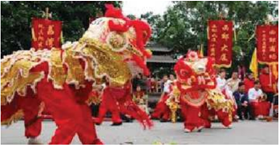

> **Deskripsi Visual:** Gambar ini adalah foto yang menunjukkan pertunjukan tari raksasa (lion dance) tradisional di sebuah acara budaya. Dalam foto tersebut, tampak dua raksasa besar berwarna merah dengan penutupan emas yang indah, menggambarkan kekayaan dan keberuntungan. Raksasa tersebut dipandu oleh para penari yang memakai pakaian tradisional yang menyerupai raksasa, mencerminkan kearifan lokal dan keunikan budaya. Di sekitar mereka, terdapat penonton yang tampak antusias, menunjukkan bahwa acara ini sangat diminati. Selain itu, ada beberapa banner dengan tulisan yang tidak jelas, mungkin menyebutkan nama acara atau lokasi acara tersebut. Gambar ini menunjukkan keindahan dan kekayaan budaya lokal melalui pertunjukan tari raksasa yang menarik perhatian banyak orang.

Gambar 4.18 Barongsai dalam rangka perayaan Imlek di Indonesia

 

---
## 📄 Halaman 127

### 4) Agama Khonghucu di Indonesia

Agama Khonghucu pada zaman pemerintahan Presiden Soekarno diakui  sebagai  agama  resmi  di  Indonesia.  Sedangkan  pada pemerintahan Orde Baru, agama Khonghucu tidak diakui sebagai agama  yang  resmi.  Pada  pemerintahan  Presiden Abdurrahman Wahid, agama  Khonghucu  mendapat  angin  segar  kembali. Kebijaksanaan Presiden Abdurrahman Wahid itu juga diteguhkan oleh Presiden Megawati Soekarno Putri.

- Pandangan Gereja Katolik terhadap agama Khonghucu Konsili Vatikan II dalam dekritnya tentang agama-agama bukan Kristen menyatakan antara lain; 'Gereja Katolik tidak menolak apa  pun,  yang  dalam  agama-agama  itu  serba  benar  dan  suci. Dengan  sikap  hormat  yang  tulus,  Gereja  merenungkan  caracara  bertindak  dan  hidup,  kaidah-kaidah  serta  ajaran-ajaran, yang memang dalam banyak hal berbeda dari apa yang diyakini dan diajarkannya sendiri, tetapi tidak jarang memantulkan sinar Kebenaran, yang menerangi semua orang. Namun, Gereja tiada hentinya  mewartakan  dan  wajib  mewartakan  Kristus,  yakni 'jalan, kebenaran, dan hidup' ( lih. Y oh 14: 6); dalam Dia manusia menemukan kepenuhan hidup keagamaan, 'dalam Dia pula Allah mendamaikan  segala  sesuatu  dengan  diri-Nya.(NA.2).  Artinya bahwa  Gereja  Katolik menghargai  keberadaan  serta ajaran agama-agama lain, termasuk Khonghucu.

### 6) Pertanyaan

Setelah mempelajari uraian tentang agama Khonghucu, jawablah pertanyaan-pertanyaan berikut ini.

- Apa saja yang kalian ketahui tentang agama Khonghucu?
- Apa saja isi ajaran pokok agama Khonghucu?
- Jelaskan kesamaan nilai-nilai ajaran agama Khonghucu dan agama Katolik!
- Apa pandangan Gereja Katolik terhadap agama Khonghucu?

### f. Agama Asli dan Aliran Kepercayaan

- Agama Asli
Agama  asli  masih  tetap  berpengaruh  dalam  hidup  keagamaan banyak orang, walaupun telah menganut salah satu agama yang ada di dunia, khususnya Agama Kristen Katolik. Unsur ajaran kosmis pada agama-agama asli masih melekat dalam hidup keagamaan

 

---
## 📄 Halaman 128

orang-orang  Indonesia.  Ajaran  kosmis  yang  dimaksud  adalah ajaran tentang jagad raya. Bagaimana itu dijadikan; bagaimana perkembangannya; dan bagaimana cara menggunakannya.

### a) Dasar dan Ajaran

Dasar yang mendalam  dari agama-agama  suku  adalah dongeng mengenai ciptaan dan di dalamnya ada hubungan ke-Allahan  dengan  ciptaan. Ada  2  tema  pokok  dari  ceritacerita penciptaan:

- Perang  suci  antara  dunia  atas  dan  dunia  bawah  atau perkawinan  suci  antara  Surga  dan  dunia.  Keduanya disusul dengan perceraian.
- Keterangan tentang terjadinya bermacam-macam tumbuh-tumbuhan, yang diperlukan oleh manusia untuk dapat  hidup,  dan  kenyataan  bahwa  manusia  akan  mati suatu saat nanti.
Cerita-cerita penciptaan itu menerangkan tentang terciptanya alam  semesta,  dunia,  musim,  pergantian  terang  dan  gelap, serta menunjukkan fungsi segala sesuatu. Pengaturan Allah/ dewa  mereka  atas  alam  semesta  setiap  manusia;  tumbuhtumbuhan;  hewan  dan  setiap  kejadian  mempunyai  tempat yang penuh arti. Masing-masing harus berbuat sesuai dengan hal itu dan wajib menaati peraturan dan larangan tertentu.

Dalam agama asli/suku inilah pada umumnya timbul kepercayaan bahwa tidak hanya manusia saja yang berjiwa melainkan tumbuh-tumbuhan dan hewan. Karena itu, mereka sangat  menghormati  alam.  Sebagian  besar  agama  asli  juga percaya bahwa seseorang yang telah meninggal tetap berhubungan dengan para anggota suku yang masih hidup. Orang  yang  sudah  meninggal  mempunyai  pengaruh  yang langsung  dan  kuat  atas  orang  yang  masih  hidup.  Mereka juga kebanyakan mengenal imam-imam  yang bertugas mempertahankan hubungan orang-orang yang masih hidup dengan nenek moyang, dewa-dewa, jin-jin, dan setan-setan.

### b) Agama-agama Asli di Indonesia

Terdapat  berbagai  macam  agama  asli  di  Indonesia,  antara lain, Lera wulan Tana Ekan di  Flores Timur dan Lembata; wiwitan di  Sunda; Aluk  To  Dollo di  Sulawesi;  Sabulungan

 

---
## 📄 Halaman 129

di Mentawai; Merapu di Sumba; Kaharingan di Kalimantan. Ada  pula  yang  disebut  agama-agama  suku,  seperti  yang dianut oleh penduduk beberapa pulau sebelah barat Sumatera; beberapa  suku  kecil  dan  bagian  suku-suku  yang  besar  di Sumatera;  kelompok-kelompok  besar  dari  suku  Dayak  di Kalimantan; Toraja di Sulawesi; penduduk pulau Sumba; dan penduduk Irian Jaya.

Diakses pada tanggal 2 Juli 2014

Gambar 4.19 Upacara wiwitan - Sunda

Selain itu, masih terdapat apa yang kini dinamakan kepercayaan kepada Tuhan Yang Maha Esa, yang menurut negara sama kedudukannya dengan agama dalam hal pengalaman ke-Tuhanan Yang Maha Esa.

### 2) Aliran Kepercayaan

Aliran kepercayaan dalam dokumen Nostra Aetate disebut juga kepercayaan terhadap Yang Maha Tinggi.

Aliran Kepercayaan mengajarkan tentang sikap batin dan berkisar pada ilham dari diri sendiri, yakni:

- Peningkatan integrasi diri manusia (melawan pengasingan)
- Pengalaman batin bahwa diri pribadi beralih ke kesatuan dan persatuan yang lebih tinggi
- Partisipasi dalam tata tertib sempurna yang mengatasi daya kemampuan manusia biasa.

 

---
## 📄 Halaman 130

Aliran-Aliran  Kepercayaan  ingin  mencapai  budi  luhur  untuk meraih  kesempurnaan  hidup.  Hal  itu  dilakukan  secara  perseorangan atau dalam kelompok-kelompok perguruan. 'Umat' dalam Aliran Kepercayaan sulit dibatasi. Organisasi tidak dipentingkan, sumbernya adalah terutama tradisi agama-agama asli.

### 3) Hubungan Aliran Kepercayaan dan Agama Asli

Aliran Kepercayaan tidak langsung berkembang dari agama asli, tetapi  unsur-unsur  kebatinan,  kerohanian,  atau  mistisisme,  dan kejiwaan yang mengembangkan budi pekerti serta adat etis, sudah ada dalam agama-agama asli di seluruh nusantara. Agama-agama asli  di  Indonesia  dalam  peredaran  zaman  mengalami  banyak tantangan, tidak hanya dari yang disebut 'agama internasional', tetapi juga dari perkembangan kebudayaan dan modernisasi.

Menurut kepercayaan asli, seluruh alam merupakan satu kesatuan sakral yang didekati manusia melalui sistem penggolongan dan pembagian. Pandangan hidup ini tidak cocok dengan alam pikiran modern, dan memaksa para penganut agama asli mengubah cara berpikir  dan  mereka  menemukannya  pada Aliran  Kepercayaan itu.

Orang mulai menggali harta terpendam dari pusaka kebudayaan asli.  Dengan demikian, tradisi nenek moyang berkembang menjadi suatu  kebudayaan  rohani,  yang  unsur-unsurnya  menyangkut perilaku, hukum, dan ilmu suci.

- Ibadat dan Pembinaan

---
**🖼️ Gambar/Diagram**

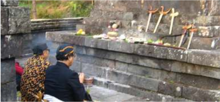

> **Deskripsi Visual:** Gambar ini adalah foto yang menunjukkan dua orang yang sedang berdiri di dekat sebuah tempat suci atau makam. Mereka tampak sedang melakukan upacara atau ritual religius. Di sekitar mereka terdapat beberapa papan batu dengan tulisan atau gambar yang tidak jelas. Di atas papan-papan tersebut terdapat beberapa alat seperti pisau dan tangan, mungkin sebagai simbol atau hiasan. Di sepanjang tepi samping foto, terdapat beberapa batu yang tampak seperti bagian dari struktur bangunan atau tembok. Di bawah batu-batu tersebut, terdapat beberapa pohon kecil yang tampak seperti pohon kecil atau tanaman kecil. Di sebelah kanan foto, terdapat beberapa batu yang tampak seperti bagian dari struktur bangunan atau tembok. Di sepanjang tepi samping foto, terdapat beberapa batu yang tampak seperti bagian dari struktur bangunan atau tembok. Di sebelah kanan foto, terdapat beberapa batu yang tampak seperti bagian dari struktur bangunan atau tembok. Di sepanjang tepi samping foto, terdapat beberapa batu yang tampak seperti bagian dari struktur bangunan atau tembok. Di sebelah kanan foto, terdapat beberapa batu yang tampak seperti bagian dari struktur bangunan atau tembok. Di sepanjang tepi samping foto, terdapat beberapa batu yang tampak seperti bagian dari struktur bangunan atau tembok. Di sebelah kanan foto, terdapat beberapa batu yang tampak seperti bagian dari struktur bangunan atau tembok. Di sepanjang tepi samping foto, terdapat beberapa batu yang tampak seperti bagian dari struktur bangunan atau tembok. Di sebelah kanan foto, terdapat beberapa batu yang tampak seperti bagian dari struktur bangunan atau tembok. Di sepanjang tepi samping foto, terdapat beberapa batu yang tampak seperti bagian dari struktur bangunan atau tembok. Di sebelah kanan foto, terdapat beberapa batu yang tampak seperti bagian dari struktur bangunan atau tembok. Di sepanjang tepi samping foto,

Gambar 4.20 Penganut salah satu aliran Kejawen tengah beribadah di Candi Ceto

 

---
## 📄 Halaman 131

Unsur ibadat menjadi amat sederhana, sebab yang pokok adalah kesadaran dan keyakinan serta hati nurani. Pertemuan-pertemuan diarahkan  pertama-tama  kepada  pembinaan  hati;  meneguhkan tekad; kewaspadaan batin; dan menghaluskan budi pekerti dalam tata  pergaulan. Tujuannya adalah pendidikan, bukan kebaktian, sebab setiap orang menemukan Tuhan dalam hatinya sendiri.

Dengan membersihkan hati serta mengembangkan kedewasaan rohani, maka  dengan  sendirinya  ia berbakti kepada  Allah. Kepercayaan  terhadap  Tuhan  Yang  Maha  Esa  dimaksudkan sebagai  pernyataan  dan  pelaksanaan  hubungan  pribadi  dengan Allah  yang  diwujudkan  dalam  perilaku  ketakwaan  terhadap Tuhan.  Peribadatan  merupakan  pengalaman  budi  luhur,  bukan suatu  kebaktian  lahiriah,  maka  tidak  ada  tempat  atau  petugas ibadat. Semua bersifat batiniah.

- Sikap Gereja Katolik terhadap Aliran Kepercayaan dan Agama Asli
Sejak Konsili  Vatikan II,  Gereja  dengan  penuh  keyakinan menegaskan bahwa iman dan wahyu orang bukan Kristen dapat bersifat menyelamatkan dan bahwa Gereja harus menolak 'semua sarana yang memaksa' dalam pewartaan imannya. Sarana yang dimaksud adalah semacam sifat fanatisme berlebihan  dan  sifat menakut-nakuti kebudayaan lain. 'Gereja Katolik tidak menolak apa  pun,  yang  dalam  agama-agama  itu  serba  benar  dan  suci. Dengan  sikap  hormat  yang  tulus,  Gereja  merenungkan  caracara  bertindak  dan  hidup,  kaidah-kaidah,  serta  ajaran-ajaran, yang memang dalam banyak hal berbeda dari apa yang diyakini dan diajarkannya sendiri, tetapi tidak jarang memantulkan sinar kebenaran, yang menerangi semua orang' (NA art. 2)

Dalam  pernyataan  ini  dapat  dilihat  bahwa  di  dalam  lembaga gereja dan tradisinya; dalam orang-orang kudus dan kitab-kitab sucinya,  'pesan  kristiani'  secara  aktif  disingkapkan  oleh  Roh Kudus di tengah-tengah kita dan melampaui rintangan-rintangan budaya, seturut janji yang Yesus berikan kepada para Rasul-Nya.

- Pertanyaan
Jawablah pertanyaan-peranyaan berikut ini:

- Apa saja yang kalian ketahui tentang agama asli dan Aliran Kepercayaan?

 

---
## 📄 Halaman 132

- Apa saja isi ajaran agama asli dan Aliran Kepercayaan?
- Apa  pandangan  Gereja  Katolik  terhadap  agama  asli  dan Aliran Kepercayaan?

### g) R efleksi dan Aksi

- Releksi
Tulislah  sebuah  releksi  tentang  sikapmu  terhadap  penganut agama-agama lain sesuai dengan semangat ajaran Gereja Katolik.

- Aksi
Bersikap  hormat  pada  penganut  agama  dan  kepercayaan  lain; misalnya  memberikan  ucapan  selamat  saat  mereka  merayakan hari besar agamanya, serta mau berteman dengan mereka dalam hidup sehari-hari.

### B. Dialog Antarumat Beragama dan Kepercayaan Lain

Hans  Kung,  seorang  penggagas  rumusan  etika  global,  mengatakan  bahwa, 'tidak akan ada perdamaian dunia tanpa adanya perdamaian agama-agama, tidak  akan  ada  perdamaian  agama  tanpa  adanya  dialog  antaragama,  tidak akan  ada  dialog  antaragama  tanpa  melacak  nilai  fundamental  dari  setiap agama.'  Perkataan  tersebut  masih  relevan  dengan  dunia  sekarang.  Kasuskasus  kekerasan  antarkelompok  umat  beragama  di  Indonesia  bisa  menjadi bukti pembenaran hipotesis Hans Kung tersebut. Karena itu dialog antarumat beragama dan kepercayaan lain di Indonesia menjadi sangat penting, bahkan menjadi sebuah kebutuhan dalam hidup bermasyarakat.

 

---
## 📄 Halaman 133

### Doa Pembuka

Ya  Allah,  pencipta  alam  semesta,  hanya  kepada-Mulah  segala  ciptaan bersembah sujud dan berbakti. Engkau mengenal setiap hati, dan melalui berbagai cara Engkau mewahyukan diri kepada mereka.

Kami bersyukur kepada-Mu atas begitu banyak orang yang dengan tulus mencari keselamatan. Kami bersyukur pula atas agama-agama yang dapat menuntun para penganutnya sampai kepada-Mu, sebab hanya Engkaulah satu-satunya sumber keselamatan. Engkaulah tujuan hidup manusia. Kami bersyukur atas begitu banyak tokoh agama yang menjadi panutan dalam berbakti kepada-Mu dan dalam mengasihi sesama manusia.

Kami  mohon,  ya  Bapa,  semoga  Engkau  berkenan  mengembangkan semangat  kerukunan  antarumat  beragama.  Jauhkanlah  dari  kami  sikap merendahkan  penganut  agama  lain.  Semoga  semua  orang  sungguh menghayati  dan  mengamalkan  ajaran  imannya,  dan  hidup  dengan bertakwa.  Bantulah  para  pemuka  agama  agar  tekun  meneladani  dan mengajak umatnya untuk menghormati, mengasihi, menghargai penganut agama  lain,  dan  saling  mengakui  adanya  perbedaan  antaragama.  Kami mendoakan pula orang-orang yang tidak masuk dalam agama mana pun, tetapi sungguh percaya akan Dikau, Allah Yang Esa. Hanya Engkau sendirilah yang mengenal iman mereka. Terangilah mereka ini, dan bimbinglah agar sampai pada jalan keselamatan. Ini semua kami mohon kepada-Mu dengan pengantaraan Tuhan kami, Yesus Kristus. Amin.

Sumber : Puji Syukur nomer 199

### 1.  Kasus-Kasus Intolerasi dan Model Toleransi Antarumat Beragama di Indonesiaa.

- Mengamati kasus intoleransi antarumat beragama

### Mengamati kasus

- Setelah  menemukan  kasus-kasus  tersebut  cobalah  rumuskan pertanyaan-pertanyaan tentang apa dan mengapa kasus itu terjadi.
- Cobalah  mendata  kasus-kasus  intoleransi  di  Indonesia.  Kasuskasus  tersebut  dapat  ditelusuri  melalui  pengalaman  pribadi, berita  media  massa  baik  cetak  maupun  elektronik  atau  digital. Bila sarana internet memungkinkan, kamu dapat mencari berita di internet yang tersedia.

 

---
## 📄 Halaman 134

### Diskusi kelompok

Berdasarkan pertanyaan-pertanyaan yang telah dirumuskan diskusikanlah dalam kelompok tentang kasus-kasus intoleransi antar-umat beragama di Indonesia.

- Mengamati toleransi hidup antarumat Beragama di Indonesia
Meski  sering  kita  dengar  atau  alami  berbagai  kasus  intoleransi  di Indonesia, banyak juga masyarakat kita yang hidup dalam semangat toleransi yang baik.

- Mengamati simbol toleransi antarumat beragama di Indonesia
Perhatikan gambar serta berita berikut ini. ' Merdeka.com -Kalau bisa hidup berdampingan, kenapa harus bertikai?  Kalimat,  'Lakum  Diinukum  Waliyadiin,'  memiliki makna yang luar biasa untuk memahami toleransi umat beragama. Terlebih  lagi,  sebagai  bangsa  Indonesia  yang  memiliki  lima agama, tentunya toleransi sangat diperlukan. Untuk memahami kalimat, 'Bagimu agamamu dan bagiku agamaku', agaknya kita bisa belajar dari dua tempat ibadah berbeda agama namun bisa hidup dengan rukun dan damai.

---
**🖼️ Gambar/Diagram**

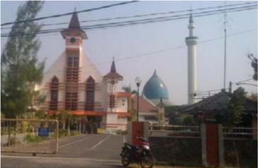

> **Deskripsi Visual:** Gambar ini menunjukkan sebuah kompleks arsitektur yang terdiri dari bangunan dengan desain modern dan tradisional. Bangunan utama memiliki atap berbentuk piramida dan dinding putih dengan detail warna coklat. Di sebelah kanan, terdapat sebuah masjid dengan menara masjid yang tinggi. Atap masjid memiliki bentuk bulat dengan puncak berwarna biru. Sebuah jalan raya melintasi kompleks, di mana beberapa kendaraan seperti motor dan mobil dapat dilihat. Terdapat pagar besi di sepanjang jalan raya untuk memisahkan area publik dari area internal kompleks. Pohon-pohon hijau tampak di sepanjang jalan raya, memberikan tampilan alami dan hijau. Teks, angka, atau label penting tidak terlihat dalam gambar ini. Informasi kunci yang dapat diambil pembaca adalah bahwa kompleks ini mungkin merupakan tempat ibadah atau pusat sosial di daerah tersebut.

Sumber: www.merdeka.com Diakses pada tanggal 5 Juli 2014 Gambar 4.21 Bangunan gereja dan masjid yang berdampingan di Surabaya

 

---
## 📄 Halaman 135

Adalah  Masjid  Al  Akbar  Surabaya  (MAS)  dan  Gereja  Paroki Sakramen  Mahakudus  yang  sama-sama  berdiri  bersebelahan di  Jalan  Pagesangan  Baru.  Istimewanya,  kedua  tempat  ibadah yang  berdiri  megah  ini,  sama-sama  mendapat  persetujuan  dari mantan Wali Kota Surabaya, Jawa Timur, Almarhum Cak Narto (H Soenarto Soemoprawiro) dengan peletakan batu pertama oleh Wakil  Presiden  RI  H.  Try  Sutrisno  pada  bulan  Agustus  1995. Sedangkan  pembangunannya  di  mulai  sejak  September  1996. 10  Nopember  2000,  MAS  dan  Paroki  Sakramen  Mahakudus diresmikan secara bersamaan oleh Almarhum KH Abdurrahman Wahid  atau  Gus  Dur,  yang  saat  itu  masih  menjabat  sebagai presiden keempat RI.

'Memang,  kedua  tempat  ibadah  ini  disepakati berdiri dan diresmikan  secara  bersamaan,  sebagai  simbol  kerukunan  umat beragama  di  Jawa  Timur,  khususnya  di  Surabaya.  Kenapa demikian, agar bangunannya  sama-sama  tinggi,  sama-sama rendah,  karena  inilah  wujud  kebersamaan  sebagai  negara  yang saling menghormati antarpemeluk agama,' terang Ketua Bidang Kerasulan  Paroki  Sakramen  Mahakudus  Josaphat  Haryono, Sabtu  (8/9).  Bahkan,  lanjut  dia,  tak  jarang  kami  saling  bahu membahu  untuk  membantu  satu  sama  lain.  'Misalnya  ketika kita  mengadakan  acara  Misa  Kudus,  karena  jemaatnya  banyak dan  tidak  ada  lahan  parkir  dan  pihak  Masjid  Agung  (MAS) bersedia meminjamkan lahan parkirnya. Dari GP Ansor juga ikut membantu  dalam  soal  keamanan.  Kalau  dulu,  saat  peresmian, PDIP  juga  ikut  membantu  keamanannya,'  kata  dia  bercerita. Sekadar informasi, sebagai pemekaran Paroki Yohanes Pemandi dan Paroki Gembala Yang Baik, paroki ini dibangun berkat kerja keras Romo Johanes Heijne, SVD. Proses perizinan panjang dan berliku, tetapi dapat diselesaikan berkat kebijaksanaan Cak Narto. Dari sekian gereja dan masjid yang ada di Surabaya, hanya MAS dan  Paroki  Sakramen  Mahakudus  yang  berdiri  bersebelahan. Kedua  bangunan  megah  ini,  hanya  dipisah  ruas  jalan  dengan lebar sekitar 10 meter.

Ketika  diresmikan  presiden  sekaligus  ulama,  jemaat  Paroki Sakramen Mahakudus meminta Gus Dur untuk memimpin doa. 'Namun dijawab oleh Gus Dur, kalian itu yang lebih dekat dengan Tuhan, wong kalian itu manggilnya Bapak, jadi yang paling dekat dengan Tuhan itu ya kalian,' kata Josaphat menceritakan lelucon

 

---
## 📄 Halaman 136

yang dilontarkan Gus Dur, sambil mengingat-ingat pidato salah satu  tokoh  NU  tersebut.  'Mungkin  baru  kali  ini  ada  Presiden Republik  Indonesia  yang  meresmikan  gereja  dan  memberikan kata sambutan sangat menarik,' terangnya. Di tempat terpisah, di pelataran MAS,  seorang jamaah mengatakan kalau di Surabaya  kerukunan  umat  beragama  masih  tergolong  kondusif dibandingkan  dengan  daerah-daerah  lain.  Salah  satu  buktinya adalah  keberadaan  MAS  dan  Paroki  Sakramen  Mahakudus yang bisa hidup berdampingan dengan saling menghormati satu sama  lain.  'Ini  wujud  dari  ayat  Lakum  Diinukum  Waliyadiin. Bagimu agamamu dan bagiku agamaku. Jadi kita tak perlu saling bersitegang soal keyakinan masing-masing, asal kita sama-sama tidak  saling  mengganggu.  Dan  buktinya,  sejak  kedua  tempat ibadah  ini  berdiri,  kita  sama-sama  tidak  terganggu  dengan aktivitas  beribadah  kita  masing-masing,'  kata  Ragil  Priyonggo yang hendak menunaikan ibadah salat Zuhur di MAS.

MAS  dan  Paroki  Sakramen  Mahakudus,  diproyeksikan  untuk mewujudkan  konsep  masjid  dan  gereja  dalam  arti  luas,  MAS sebagai Islamic Center dengan peran multidimensi dengan misi religius,  kultural,  dan  edukatif  termasuk  wisata  religi,  untuk membangun dunia Islam yang rahmatan lil alamien . Begitu juga dengan  Paroki  Sakramen  Mahakudus  yang  sanggup  menjadi pusat gereja dengan konsep yang sama. Secara lahiriah, MAS dan Paroki Sakramen Mahakudus menjadi landmark kota Surabaya, dan secara simbolik memperkaya peta dunia tentang keberagaman agama  di  Indonesia, yang  tentunya  mengangkat  citra  kota Surabaya di mancanegara. 'Dari cerita yang saya dengar, kedua tempat ibadah ini, konsep bangunannya juga dikerjakan oleh tim dari Institut Teknologi 10 November Surabaya (ITS),' pungkas Ragil.

http://www.merdeka.com/peristiwa/mas-amp-paroki-sakramen-wujud-lakum-diinukumwaliyadiin.html

### 2) Pendalaman

Jawablah pertanyaan-pertanyaan berikut ini.

- Apa isi atau pesan berita koran itu?
- Apa kesanmu tentang berita itu?
- Apakah di tempat-tempat lain di Indonesia terdapat bangunan rumah-rumah  ibadat  yang  berdiri  berdampingan,  dan  apa tujuannya?

 

---
## 📄 Halaman 137

- Mengapa di beberapa tempat Indonesia masih terjadi kasuskasus intoleransi umat beragama?

### 2.  Ajaran Gereja tentang Dialog Antarumat Beragama

- Menyimak dokumen Ajaran Gereja
Simaklah ajaran Gereja berikut ini.

'Gereja  Katolik  tidak  menolak  apapun  yang  benar  dan  suci  di dalam  agama-agama  ini.  Dengan  sikap  hormat  yang  tulus  Gereja merenungkan  cara-cara  bertindak  dan  hidup,  kaidah-kaidah  serta ajaran-ajaran, yang memang dalam banyak hal berbeda dari apa yang diyakini dan diajarkannya sendiri, tetapi tidak jarang toh memantulkan sinar Kebenaran, yang menerangi semua orang. Namun Gereja tiada hentinya  mewartakan  dan  wajib  mewartakan  Kristus,  yakni  'jalan, kebenaran dan hidup' (Yoh 14:6); dalam Dia manusia menemukan kepenuhan  hidup  keagamaan,  dalam  Dia  pula Allah  mendamaikan segala  sesuatu  dengan  diri-Nya.  Maka  Gereja  mendorong  para putranya, supaya dengan bijaksana dan penuh kasih, melalui dialog dan  kerja  sama  dengan  para  penganut  agama-agama  lain,  sambil memberi kesaksian tentang iman serta perihidup kristiani, mengakui, memelihara, dan mengembangkan harta kekayaan rohani dan moral serta nilai-nilai sosio-budaya, yang terdapat pada mereka.' (NA)

### b. Pendalaman/Diskusi

Jawablah pertanyaan-pertanyaan berikut ini!

- Apa isi ajaran Gereja tentang dialog antarumat beragama?
- Apa bentuk-bentuk dialog yang perlu dikembangkan dalam hidup bersama dengan agama-agama dan kepercayaan lain di Indonesia?
- Sikap apa yang perlu dimiliki dalam membangun dialog?

### 3.  Menghayati  dialog  antarumat  beragama  dalam  hidup sehari-hari

### a. R efleksi

Tulislah sebuah releksi tentang pentingnya melakukan umat beragama dan kepercayaan lain dalam hidup sehari-hari, agar tercipta damai dan sejahtera.

dialog antar-

 

---
## 📄 Halaman 138

### b. Aksi

Buatlah rencana aksi nyata dalam membangun dialog kehidupan dan dialog karya dalam hidup sehari-hari. Aksi ini dapat dilakukan secara pribadi  atau  secara  bersama-sama,  tergantung  jenis  aksi  yang  akan dilakukan.

### Doa Penutup

Ya  Allah,  pencipta  alam  semesta,  hanya  kepada-Mulah  segala  ciptaan bersembah sujud dan berbakti. Engkau mengenal setiap hati, dan melalui berbagai cara Engkau mewahyukan diri kepada mereka. Kami bersyukur kepada-Mu  atas begitu banyak orang yang dengan  tulus mencari keselamatan.

Kami  bersyukur  pula  atas  agama-agama  yang  dapat  menuntun  para penganutnya  sampai  kepada-Mu,  sebab  hanya  Engkaulah  satu-satunya sumber  keselamatan.  Engkaulah  tujuan  hidup  manusia.  Kami  bersyukur atas  begitu  banyak  tokoh  agama yang menjadi panutan dalam berbakti kepada-Mu dan dalam mengasihi sesama manusia.

Kami  mohon,  ya  Bapa,  semoga  Engkau  berkenan  mengembangkan semangat  kerukunan  antarumat  beragama.  Jauhkanlah  dari  kami  sikap merendahkan  penganut  agama  lain.  Semoga  semua  orang  sungguh menghayati  dan  mengamalkan  ajaran  imannya,  dan  hidup  dengan bertakwa.  Bantulah  para  pemuka  agama  agar  tekun  meneladani  dan mengajak umatnya untuk menghormati, mengasihi, menghargai penganut agama  lain,  dan  saling  mengakui  adanya  perbedaan  antaragama.  Kami mendoakan pula orang-orang yang tidak masuk dalam agama manapun, tetapi sungguh percaya akan Dikau, Allah Yang Esa. Hanya Engkau sendirilah yang mengenal iman mereka. Terangilah mereka ini, dan bimbinglah agar sampai pada jalan keselamatan. Ini semua kami mohon kepada-Mu dengan perantaraan Tuhan kami, Yesus Kristus. Amin

 

---
## 📄 Halaman 139

### C. Membangun Persaudaraan Sejati, Melalui Kerja Sama Antarumat Beragama

orang

Kehidupan rukun dan damai antarpemeluk agama menjadi dambaan seluruh masyarakat.  Namun  kehidupan  rukun  dan  damai  tersebut  belum  dapat dinikmati  sepenuhnya  karena  masih  ada  konlik  yang  bernuansa  agama  baik di dalam  maupun  di  luar  negeri. Konlik  ini terjadi, antara lain karena sering  kali  menyalahgunakan  agama  untuk  kepentingan  tertentu,  misalnya demi kekuasaan. Selain itu, orang kurang mendalami agamanya dan kurang memahami agama orang lain sehingga mudah diadu domba.

### Doa Pembuka

Allah  Bapa  di  Surga,  Putra-Mu  Yesus  Kristus  mengajarkan  kepada  kami, untuk mencintaiMu sepenuh hati dan mencintai sesama seperti diri sendiri. Bimbinglah  kami  dengan  daya  Roh-Kudus-Mu,  supaya  ajaran  mulia  itu semakin terwujud nyata, dalam hidup bersama sebagai saudara. Berkatilah kami,  agar  makin  bersatu  dalam  kasih  persaudaraan.  Berkatilah  kami, agar makin beriman, makin bersaudara dan makin berbelarasa. Berkatilah masyarakat  dan  bangsa  kami,  agar  mengutamakan  persaudaraan  sejati, kesejahteraan bersama, dan persatuan Indonesia. Bunda Maria, doakanlah kami  yang  dihimpun  dalam  nama  Putra-Mu,  Tuhan  kami  Yesus  Kristus, pengantara kami. Amin.

 

---
## 📄 Halaman 140

### 1.  Membangun  Persaudaraan  Sejati,  Melalui  Kerja  Sama Antarumat Beragama

- Mengamati Pengalaman persahabatan antarumat beragama Simaklah kisah berikut ini!

### Kontingen MTQ Banten tinggal di wisma keuskupan Amboina

Gambar 4.22 Mgr. Petrus Canisius Mandagi bersama kontingen MTQ dari Propinsi Banten

Upaya menghargai keberagaman sebagai wujud toleransi antarumat beragama ditunjukkan Uskup  Amboina Mgr. Petrus Canisius Mandagi, MSC dengan menampung kailah (kontingen) Musabaqah Tilawatil Quran (MTQ) asal Provinsi Banten di kediamannya di Kawasan Batu Gaja, Ambon.

Anggota kailah yang menempati wisma Keuskupan Amboina dari Provinsi Banten di antaranya adalah Wakil Ketua DPRD Kabupaten Banten, Asisten  III  Pemkab  Banten,  Rektor  Universitas  Tirta Yasa Banten,  Prof.  Dr.  Hidayat,  dan  belasan  anggota  kailah  lainnya.

Saat ditemui di Keuskupan  Amboina,  Kamis  (7/6/2012)  pagi, sejumlah  anggota kailah tengah  menikmati  sarapan  pagi  bersama Uskup  Mandagi,  suasana  hangat  penuh  kekeluargaan  terlihat  jelas saat para anggota kailah dan uskup duduk semeja memulai sarapan pagi.

Uskup  mengatakan, apa yang dilakukannya  merupakan  wujud

 

---
## 📄 Halaman 141

tanggung  jawab  moral  sebagai  anak  bangsa  untuk  terus  memupuk tali persaudaraan antarsesama umat beragama. Baginya, selain ingin menghargai  pelaksanaan  MTQ  yang  sarat  makna  keagamaan,  apa yang dilakukan merupakan bentuk dukungan nyata umat Katolik di Maluku terhadap suksesnya MTQ tingkat nasional ke XXIV di Kota Ambon.

'Saya  bersyukur  sekali.  Inilah  wujud  tanggung  jawab  moral  umat Katolik  di  Maluku  dalam  mendukung  dan  menyukseskan  MTQ  di Kota Ambon,' kata Uskup Mandagi seperti dilansir kompas.com.

Uskup mengakui, jauh sebelum kedatangan para kailah, dirinya telah meminta izin dari ketua panitia MTQ untuk menempatkan sebagian anggota  kailah  di  Keuskupan.  'Saya  meminta  kepada  ketua  panitia agar  ada  anggota  kailah  yang  ditempatkan  di  Keuskupan  dan  saya jamin mereka,' ungkapnya.

Asisten  III  Kabupaten  Banten  Uetik,  yang  juga  salah  satu  anggota kailah, mengatakan  sangat  senang  dan  bahagia  dapat  menempati Keuskupan. Ia pun mengaku bangga bisa ditempatkan di Keuskupan. Uetik  bahkan  mengungkapkan,  toleransi  antarumat  beragama  di Banten benar-benar dirasakannya di Kota Ambon. 'Ini sesuatu hal yang  sangat  unik  yang  sulit  ditemukan  di  manapun.  Saya  sangat senang dan tidak ada kekhawatiran sedikit pun,' ujarnya.

Uetik mengatakan, saat ini ada 15 orang yang tinggal di Keuskupan dan  akan  bertambah  karena  sejumlah  anggota  kailah  asal  Banten, termasuk  Bupati  Banten,  juga  direncanakan  akan  menginap  di Keuskupan. 'Nanti sebentar ada tambahan lagi, kemungkinan besar Pak Bupati juga akan menginap di sini,' tuturnya.

Sumber: www.ucanews.com Diakses pada tanggal 6 Juli 2014

### b.   Pendalaman

Jawablah pertanyaan-pertanyaan berikut ini.

- Apa yang dikisahkan dalam berita itu?
- Apa pesan dan kesanmu terhadap cerita tersebut?
- Apa  yang menjadi akar masalah terjadinya benturan atau pertikaian antarumat beragama di Indonesia?

 

---
## 📄 Halaman 142

### c. Masalah-masalah dalam kehidupan beragama

### Diskusi Kelompok:

Dalam  kelompok  diskusi,  jawablah  pertanyaan-pertanyaan  berikut ini.

- Sebutkan dan jelaskan fakta-fakta kerusuhan antarpemeluk agama di Indonesia!
- Apa penyebab kerusuhan antarpemeluk agama?
- Apa  akibat  yang  ditimbulkan  dari  kerusuhan  antar-pemeluk agama?

### d. Fungsi-fungsi agama

### Diskusi Kelompok:

Dalam  kelompok  diskusi,  jawablah  pertanyaan-pertanyaan  berikut ini.

- Mengapa  masih  sering  terjadi  pertikaian  antarpemeluk  agama, padahal semua agama mengajarkan tentang kerukunan?
- Apa fungsi agama-agama dalam hidup manusia?
- Sebagai orang beragama Katolik, apa fungsimu di lingkungan di mana engkau tinggal?

### 2.  Ajaran Kitab Suci dan Ajaran Gereja Tentang Membangun Persaudaraan Antarpemeluk Agama

### a. Menggali Ajaran Kitab Suci

- 1)
- Menelusuri Ajaran Kitab Suci
- Carilah  ajaran-ajaran  Yesus  dalam  Kitab  Suci  Perjanjian  Baru tentang pentingnya dialog untuk membangun persaudaraan sejati.
- Menyimak teks Kitab Suci
Simaklah teks Kitab Suci berikut ini!

Lukas 10: 25-37

10:25 Pada  suatu  kali  berdirilah  seorang  ahli  Taurat  untuk mencobai Yesus, katanya: 'Guru, apa yang harus kuperbuat untuk memperoleh hidup yang kekal?'

10:26 Jawab Yesus kepadanya: 'Apa yang tertulis dalam hukum Taurat? Apa yang kau baca di sana?'

 

---
## 📄 Halaman 143

- 10:27 Jawab  orang  itu:  'Kasihilah  Tuhan,  Allahmu,  dengan segenap hatimu dan dengan segenap jiwamu dan dengan segenap kekuatanmu  dan  dengan  segenap  akal  budimu,  dan  kasihilah sesamamu manusia seperti dirimu sendiri.'
- 10:28 Kata  Yesus  kepadanya:  'Jawabmu  itu  benar;  perbuatlah demikian, maka engkau akan hidup.'
- 10:29 Tetapi  untuk  membenarkan  dirinya  orang  itu  berkata kepada Yesus: 'Dan siapakah sesamaku manusia?'
- 10:30 Jawab Yesus: 'Adalah seorang yang turun dari Yerusalem ke Yerikho; ia jatuh ke tangan penyamun-penyamun yang bukan saja merampoknya habis-habisan, tetapi yang juga memukulnya dan yang sesudah itu pergi meninggalkannya setengah mati.
- 10:31 Kebetulan  ada  seorang  imam  turun  melalui  jalan  itu;  ia melihat orang itu, tetapi ia melewatinya dari seberang jalan.
- 10:32 Demikian juga seorang Lewi datang ke tempat itu; ketika ia melihat orang itu, ia melewatinya dari seberang jalan.
- 10:33 Lalu  datang  seorang  Samaria,  yang  sedang  dalam  perjalanan, ke tempat itu; dan ketika ia melihat orang itu, tergeraklah hatinya oleh belas kasihan.
- 10:34 Ia  pergi kepadanya lalu membalut luka-lukanya, sesudah ia  menyiraminya  dengan  minyak  dan  anggur.  Kemudian  ia menaikkan orang itu ke atas keledai tunggangannya sendiri lalu membawanya ke tempat penginapan dan merawatnya.
- 10:35 Keesokan harinya ia menyerahkan dua dinar kepada pemilik penginapan itu, katanya: Rawatlah dia dan jika kau belanjakan lebih dari ini, aku akan menggantinya, waktu aku kembali.
- 10:36 Siapakah di antara ketiga orang ini, menurut pendapatmu, adalah sesama manusia dari orang yang jatuh ke tangan penyamun itu?'
- 10:37 Jawab  orang  itu:  'Orang  yang  telah  menunjukkan  belas kasihan  kepadanya.'  Kata  Yesus  kepadanya:  'Pergilah,  dan perbuatlah demikian!'

### 3) Pendalaman

- Jawablah pertanyaan-pertanyaan berikut ini.
- Apa yang dikisahkan dalam cerita Injil itu?
- Apa ajaran Yesus tentang sesama?

 

---
## 📄 Halaman 144

- Bagaimana caranya mewujudkan persaudaraan sejati menurut kisah itu?
- Bagaimana sikapmu sebagai pengikut Kristus dalam pergaulan hidupmu sehari-hari?

### b. Menggali Ajaran Gereja

- Menyimak ajaran Gereja
'Pada  zaman  kita  bangsa  manusia  semakin  erat  bersatu  dan hubungan-hubungan antara pelbagai bangsa berkembang. Gereja mempertimbangkan dengan lebih cermat, manakah hubungannya dengan agama-agama bukan kristiani. Dalam tugasnya mengembangkan kesatuan dan cinta kasih antarmanusia, bahkan antarbangsa, Gereja di sini terutama mempertimbangkan manakah hal-hal yang pada umumnya terdapat pada bangsa manusia, dan yang mendorong semua untuk bersama-sama menghadapi situasi sekarang.  Sebab  semua  bangsa  merupakan  satu  masyarakat, mempunyai satu asal,  sebab Allah  menghendaki  segenap  umat manusia mendiami seluruh muka bumi[1]. Semua juga mempunyai satu  tujuan  terakhir,  yakni  Allah,  yang  penyelenggaraan-Nya, bukti-bukti kebaikan-Nya dan rencana penyelamatan-Nya meliputi semua orang, sampai orang yang terpilih dipersatukan dalam Kota  Suci,  yang  akan  diterangi  oleh  kemuliaan Allah;  di  sana bangsa-bangsa akan berjalan dalam cahaya-Nya...(NA.1)

### 2) Pendalaman

Dalam kelompok diskusi, cobalah menjawab pertanyaan-pertanyaan berikut ini:

- Bagaimana ajaran Gereja tentang sikap kita (umat Katolik) terhadap agama-agama lain?
- Bagaimana ajaran Gereja tentang sikap diskriminasi?

### 3.  Usaha-Usaha Konkret untuk Membangun Persaudaraan Sejati Antarpemeluk Agama dan Kepercayaan Lain.

### a. Diskusi kelompok

Jawablah pertanyaan berikut ini!

- Dialog  seperti  apa  yang  dapat  mengembangkan  persaudaraan sejati antarpemeluk agama dan kepercayaan lain?

 

---
## 📄 Halaman 145

- Kerja sama seperti apa yang dapat dilaksanakan untuk mengembangkan  persaudaraan  sejati  dalam  hidup  kita  seharihari?
- Sikap  bagaimana  yang  perlu  kita  miliki  untuk  membangun persaudaraan sejati antarpemeluk agama dan kepercayaan lain?

### b. R efleksi dan Aksi

Sebagai bahan releksi dan aksi, simaklah cerita berikut ini.

Ningrum  Septianda ,  mahasiswi  Fakultas  Ekonomi  Universitas Sarjana  Wiyata  Taman  Siswa,  bersyukur  karena  fotonya  bersama sahabatnya, Suster Maria Patrice  OSF , mampu  mengilhami persaudaraan  umat  beragama  di  Nusantara.  Meskipun  demikian, Ningrum  mengaku  kaget  pertemanannya  dengan  biarawati  yang diabadikan oleh Lexy Rambadeta pada 8 Januari 2014 lalu menjadi istimewa. Padahal, pertemanan antarumat beragama merupakan hal yang wajar dan biasa di Yogyakarta.

Seperti diberitakan, foto Ningrum dan Suster Maria Patrice OSF yang sedang bergandengan tangan di Jalan Loji Kecil, Yogyakarta, Rabu (8/1/2014),  menjadi  perbincangan  hangat  di  berbagai  media  sosial. Foto  itu  diunggah  oleh  Lexy  Rambadeta,  pembuat  ilm  dokumenter, di  akun  Facebook-nya.  Foto  itu  dinilai  menunjukkan  keindahan persahabatan  antarumat  beragama  di  Indonesia  di  tengah  berbagai berita tentang peristiwa intoleransi yang terjadi. 'Alhamdulillah kalau bisa menginspirasi orang, kita juga tidak tahu bakalan jadi seperti ini. Kalau  ada  yang  memandang  positif,  ya  terima  kasih.  Namun,  jika dipandang negatif, ya itu hak setiap orang,' kata Ningrum saat ditemui di asrama suster OSF Jalan Senopati Yogyakarta, Selasa (14/1/2014) malam.

Diakses pada tgl. 8 Juli 2014

Gambar 4.23

Biarawati dan Perempuan berjilbab

 

---
## 📄 Halaman 146

Ningrum berpendapat, dalam kemajemukan,  Yogyakarta masih mampu mempertahankan toleransi hingga saat ini. Semua suku, ras, dan agama hidup berdampingan dan bersaudara. 'Bagi saya, indahnya Yogya salah satunya di situ. Bersatu dalam perbedaan,' katanya.

'Jadi ketika foto saya dengan suster beredar dan banyak responsnya, ini jadi pertanyaan, kenapa hal yang biasa di sini jadi begitu istimewa,' ujar  dia.  Menurut  Ningrum,  jika  setiap  manusia  hanya  melihat perbedaan, masing-masing tidak akan menemukan titik kebersamaan. Sebab, manusia pada dasarnya diciptakan berbeda antarindividu, baik isik maupun sifatnya. Bagi Ningrum, pertemanan dengan biarawati merupakan hal yang biasa karena mahasiswa di kampusnya berasal dari  bermacam-macam  latar  belakang,  termasuk  agama.  Hampir setiap hari di kampus ataupun saat bersantai selalu bertemu dengan teman-teman  yang  beragam,  termasuk  biarawati.  'Banyak  teman biarawati, hanya yang paling dekat ya sama Suster Patrice. Selain satu kampus, juga satu kelompok KKN, jadi komunikasinya lebih intens,' ucap Ningrum.

Ia  berharap  agar  persaudaraan  antarsesama  manusia  tetap  terus terjalin. Dengan demikian, kenyamanan dan perdamaian terus tercipta di Nusantara, bahkan di dunia.

http://renungankatolik.blogspot.com/2014/01/inspirasi-suster-dan-wanitaberjilbab.html

- Releksi Tuliskanlah sebuah releksi pribadi tentang membangun
persaudaraan sejati dengan umat beragama lain.

- Aksi
Buatlah rencana-aksi untuk mengembangkan dialog, khususnya dialog  kehidupan  dengan  teman  atau  umat  beragama  lain  di lingkungan tempat tinggal, atau di mana saja berada.

### Doa Penutup

Allah Bapa di Surga,

Kami telah mempelajari banyak hal tentang membangun persaudaraan sejati, melalui kerja sama antarumat beragama. Semoga dengan bimbingan-Mu, kami dapat mewujudkan persaudaraan itu dalam hidup kami. Semoga kami dapat menjadi terang dan garam dalam masyarakat, menjadi pelopor persaudaraan sejati  di  tengah  masyarakat  bangsa  Indonesia  yang  plural  ini.  Doa  ini  kami satukan dengan Yesus, Putra-Mu,

Bapa Kami...

 

---
## 📄 Halaman 147

### BAB V

### Peran Serta Umat Katolik dalam Pembangunan Bangsa Indonesia

Pada  bab-bab  sebelumnya  kita  telah  belajar  tentang  kemajemukan  atau pluralitas  masyarakat  Indonesia.  Kemajemukan  agama  dan  kepercayaan, suku, budaya, ras, serta warna kulit merupakan ciri keindonesiaan kita. Meski berbeda-beda, kita adalah satu. Bhinneka Tunggal Ika merupakan semboyan negara yang mempertegas jati diri bangsa kita. Kesatuan dan persatuan kita dibangun di atas dasar Pancasila yang merupakan ilsafat hidup dan ideologi bangsa.

Pada Bab V ini kita akan belajar tentang ' Peran Serta Umat Katolik Dalam Pembangunan Bangsa Indonesia'. Kita menyadari bahwa keanekaragaman bukanlah  halangan,  melainkan  kekuatan  untuk  membangun  bangsa  dan negara  tercinta.  Untuk  itu  kita  umat  Katolik  harus  ikut  serta  menciptakan iklim persaudaraan dan kekeluargaan antarsesama anak bangsa untuk saling melayani, dengan semangat gotong royong kita melayani kepentingan umum. Dengan  semangat  kebersamaan  dalam  pembangunan,  kita  menjadi    tanda keselamatan dan turut mewujudkan kerajaan Allah di bumi ibu pertiwi.

Untuk  membangun  kesadaran  akan  peran  serta  kita  sebagai  umat  Katolik dalam pembangunan bangsa Indonesia yang adil dan sejahtera, sesuai citacita negara Indonesia, maka pada bab ini akan dibahas berturut-turut beberapa pokok bahasan, yaitu:

- Membangun Bangsa dan Negara yang Dikehendaki Tuhan
- Tantangan  dan  Peluang  Umat  Katolik  dalam  Membangun  Bangsa  dan Negara seperti yang dikehendaki Tuhan.
- Dasar  Keterpanggilan  Gereja  Katolik  dalam  Membangun  Bangsa  dan Negara

 

---
## 📄 Halaman 148

### A. Membangun Bangsa dan Negara yang Dikehendaki Tuhan

Sebagai  umat  kristiani  kita  hendaknya  berusaha  dan  berjuang  untuk  membangun bangsa dan negara dengan berpijak pada moralitas Kristiani, mengutamakan kepentingan umum (bonum commune) , yaitu kesejahteraan yang merata bagi seluruh warga. Kita meneladani Yesus sebagai tokoh sentral iman kita yang mewartakan kabar baik tentang Kerajaan Allah (bdk. Luk 4: 18-19). Selama hidup-Nya, Yesus telah berusaha untuk mewujudkan misi-Nya itu.

### Doa Pembuka

Allah  Bapa  penyayang  kehidupan,  kami  bersyukur  boleh  mendiami tanah  air  Indonesia  dengan  segala  keragaman  dan  kekayaan  alamnya. Kami bersyukur bahwa Engkau menyertai perjalanan bangsa dan negara kami.  Bantulah  kami  agar  dari  hari  ke  hari  kami  semakin  bersatu  hati mewujudkan  kesejahteraan  umum.  Terangilah  hati  dan  budi  kami  agar tidak berpandangan sempit memperjuangkan kepentingan kelompok dan golongan sendiri.  Demi  Kristus,  yang  mengasihi  semua  orang  dan  telah wafat menebus dosa manusia, dalam persekutuan Roh Kudus, hidup kini dan sepanjang masa. Amin.

### 1.  Menyadari Situasi di Masyarakat Kita

- Mengamati sebuah kasus perbudakan buruh
Simaklah artikel berikut ini.

TEMPO.CO,  Tangerang -  Kepala  Satuan  Reserse  dan  Kriminal Polres  Kota  Tangerang  Komisaris  Shinto  Silitonga  mengatakan penggerebekan  pabrik  panci  alumunium  di  Desa  Lebak  Wangi, Kecamatan  Sepatan,  Kabupaten  Tangerang,  dilakukan  setelah  dua buruh  berhasil  kabur  dan  melapor  ke  Polres  Lampung  Utara  dan Komisi  Nasional  Hak  Asasi  Manusia.  Dua  buruh  asal  Lampung itu sudah bekerja selama empat bulan di pabrik itu. 'Mereka kabur karena merasa mengalami siksaan, perlakuan kasar, penyekapan, dan hak mereka sebagai pekerja tidak didapatkan,' kata Shinto, Sabtu 4 Mei 2013.

 

---
## 📄 Halaman 149

Kedua buruh laki-laki tersebut, kata Shinto, bercerita kepada keluarganya. Dengan difasilitasi lurah setempat, mereka membuat laporan  resmi  di  Polres  Lampung  Utara  pada  28 April  2013.  Bos pabrik  panci  tersebut, YK  alias Yuki  Irawan,  41  tahun,  dilaporkan telah  merampas  kemerdekaan  orang  dan  melakukan  penganiayaan yang  melanggar  Pasal  333  dan  Pasal  351  Kitab  Undang-Undang Hukum Pidana. Selain melaporkan ke polisi, keluarga korban juga melaporkan ke Komnas HAM. Hasil koordinasi Polda Metro Jaya, Polda Lampung, dan Polres Kota Tangerang akhirnya pabrik tersebut digerebek pada Jumat 3 Mei 2013 sekitar pukul 14.00. Di lokasi pabrik polisi menemukan 25 orang buruh dan 5 mandor yang sedang bekerja. Yuki dan istrinya digiring ke Polres Kota Tangerang untuk dimintai keterangan. Polisi juga menemukan 6 buruh di antara mereka yang disekap kondisinya memprihatinkan. Pakaian yang dikenakan kumal dan compang camping karena berbulan-bulan tidak ganti. 'Kondisi tubuh buruh juga tidak terawat, rambut cokelat, kelopak mata gelap, dan berpenyakit kulit,' kata Shinto. Mereka rata-rata tiga bulan tidak mandi  dan  tidak  ganti  baju,  karena  uang,  telepon  genggam,  dan pakaian dari kampung yang dibawa disita pemilik pabrik.

### Joniansyah

http://www.tempo.co/read/news/2013/05/04/064477935/ 25-Buruh-Panci-Disekap-3-Bulan-Tidak-Mandi

 

---
## 📄 Halaman 150

### b. Pendalaman

Jawablah pertanyaan-pertanyaan berikut ini.

- Apa pesan dan kesanmu tentang cerita itu?
- Apakah  ada  kasus-kasus  ketidakadilan  yang  menyengsarakan rakyat  kecil  yang  dilakukan  oleh  para  penguasa  (politik  dan ekonomi)  seperti  dalam  kisah  buruh  Tangerang  tersebut,  atau bahkan jauh lebih kejam, hingga merenggut nyawa para pekerja yang ingin membela hak-haknya? (Jelaskan!).
- Mengapa sering terjadi kasus-kasus ketidakadilan yang menyengsarakan rakyat kecil di negeri ini? Apa akar masalahnya?
- Bagaimana  penilaianmu  terhadap  pembangunan,  khususnya  di bidang politik dan ekonomi selama ini?

### c. Pembangunan yang Bermartabat

Setelah menemukan jawaban atas pertanyaan-pertanyaan tersebut di atas  baik  secara  sendiri  atau  pun  dalam  kelompok diskusi, cobalah cermati uraian berikut ini.

Bangsa  Indonesia  bercita-cita  mewujudkan  negara  yang  bersatu, berdaulat,  adil,  dan  makmur.  Dengan  rumusan  singkat,  negara Indonesia bercita-cita mewujudkan masyarakat Indonesia yang adil dan  makmur  berdasarkan  Pancasila  dan  UUD  1945.   Adapun  visi bangsa  Indonesia  adalah  terwujudnya  masyarakat  Indonesia  yang damai, demokratis, berkeadilan, berdaya saing, maju, dan sejahtera, dalam wadah Negara Kesatuan Republik Indonesia yang didukung oleh manusia Indonesia yang sehat, mandiri, beriman, bertakwa dan berakhlak mulia, cinta tanah air, berkesadaran hukum dan lingkungan, menguasai ilmu pengetahuan dan teknologi, memiliki etos kerja yang tinggi,  serta  berdisiplin.  Apakah  cita-cita  bangsa  Indonesia  yang digagas oleh pendiri bangsa, Soekarno-Hatta dan para pendiri lainnya, sudah sungguh terwujud pada saat ini? Ataukah sebaliknya, cita-cita luhur itu, justru masih jauh dari apa yang diharapkan?

Pada  penjelasan  ini,  kita  akan  membatasi  pada  menyadari  situasi politik dan ekonomi di tanah air.

### 1) Situasi Politik

Krisis  politik  yang  terjadi  pada  tahun  1998  merupakan  puncak dari berbagai kebijakan politik pemerintahan Orde Baru. Berbagai  kebijakan  yang  dikeluarkan  pemerintah  Orde  Baru

 

---
## 📄 Halaman 151

selalu didasarkan pada alasan pelaksanaan Demokrasi Pancasila. Namun yang sebenarnya terjadi adalah upaya mempertahankan kekuasaan rezim dan kroni-kroninya saat itu. Artinya, demokrasi yang dijalankan pemerintahan Orde Baru bukan demokrasi yang semestinya, melainkan demokrasi rekayasa atau pura-pura. Bukan  lagi  demokrasi  dalam  pengertian  dari,  oleh,  dan  untuk rakyat, melainkan demokrasi dari, oleh, dan untuk penguasa. Pada masa Orde Baru kehidupan politik sangat represif, yaitu adanya tekanan yang kuat dari pemerintah terhadap pihak oposisi atau orang-orang  yang  dianggap  kritis.  Setiap  orang  atau  kelompok yang mengkritik kebijakan pemerintah dituduh sebagai tindakan subversif  (menentang  Negara  Kesatuan  Republik  Indonesia). Karena itulah banyak orang kritis ditangkap dan dijebloskan ke dalam penjara.

Gambar 5.2 Demo mahasiswa 1998 di gedung DPR/MPR

Sekarang, kita sudah memasuki zaman reformasi. Namun, yang diharapkan pada awal Orde Reformasi ternyata tidak terpenuhi, meskipun  harus  diakui  bahwa  ada  beberapa  perubahan.  Ada kebebasan mengungkapkan pendapat dan kebebasan berserikat. Akan  tetapi,  banyak  masalah  justru  menjadi  semakin  parah. Salah satu yang sangat mencolok adalah hilangnya cita rasa dan perilaku politik yang benar dan baik.

 

---
## 📄 Halaman 152

Politik merupakan tugas luhur untuk mengupayakan atau mewujudkan kesejahteraan bersama. Tugas dan tanggung jawab  itu  dijalankan  dengan  berpegang  pada  prinsip-prinsip, sikap hormat, serta setia pada etika dalam hidup bermasyarakat, berbangsa,  dan  bernegara.  Akan  tetapi,  dalam  banyak  bidang prinsip-prinsip dan etika itu tampaknya makin diabaikan, bahkan ditinggalkan  oleh  banyak  orang,  termasuk  oleh  para  politisi, pelaku  bisnis,  dan  pihak-pihak  yang  mempunyai  sumber  daya serta berpengaruh di negeri ini.

Dewasa ini, politik hanya dimanfaatkan untuk kepentingan pribadi atau  kelompok.  Dari  apa  yang  sedang  berlangsung  sekarang, tampak bahwa politik menjadi ajang pertarungan kekuatan dan perjuangan  untuk  memenangkan  kepentingan  ekonomi  atau kepentingan inansial pribadi dan kelompok. Terkesan tidak upaya serius untuk mewujudkan kesejahteraan bersama. Bukan kepentingan  bangsa  yang  diutamakan,  melainkan  kepentingan kelompok, dengan mengabaikan cita-cita dan kehendak kelompok lain.  Yang lebih memprihatinkan lagi ialah agama sering digunakan untuk kepentingan kelompok politik. Simbol-simbol agama  dijadikan  lambang  politik  kelompok  tertentu,  dengan demikian membangun sekat-sekat antara penganut agama, yang kadang kala melahirkan berbagai bentuk kekerasan yang berbau SARA.

ada

Politik kekuasaan yang mementingkan kelompok sendiri semacam itu dengan sendirinya akan mengorbankan tujuan utama, yakni kesejahteraan bersama yang mengandaikan kebenaran dan keadilan. Penegakan hukum juga diabaikan. Akibatnya, fenomena KKN (Korupsi, Kolusi, dan Nepotisme) tidak ditangani secara serius, bahkan makin merajalela di berbagai wilayah, lebih-lebih sejak  pelaksanaan  program  otonomi  daerah.  Otonomi  daerah yang sebenarnya dimaksudkan sebagai desentralisasi kekuasaan, kekayaan, fasilitas, dan pelayanan ternyata menjadi desentralisasi KKN.

### 2) Situasi Ekonomi

Tuntutan reformasi menghendaki adanya perubahan dan perbaikan di  segala  aspek  kehidupan  yang  lebih  baik.  Namun,  pada praktiknya tuntutan reformasi telah disalahgunakan oleh petualang  politik  hanya  untuk  kepentingan  pribadi  dan  kelompoknya.  Pada  era  reformasi,  konlik  yang  terjadi  di  masyarakat para

 

---
## 📄 Halaman 153

makin  mudah  terjadi  dan  sering  kali  bersifat  etnis  di  berbagai daerah. Kondisi sosial masyarakat yang kacau akibat lemahnya hukum dan perekonomian yang tidak segera kunjung membaik menyebabkan sering terjadi gesekan-gesekan dalam masyarakat. Secara  ekonomis,  negeri  kita  praktis  dikuasai  oleh  segelintir orang  yang  kaya  raya,  yang  memiliki  perusahaan-perusahaan multinasional dengan modal dan kekayaan yang sangat besar.

---
**🖼️ Gambar/Diagram**

> **Deskripsi Visual:** Gambar ini adalah ilustrasi yang menunjukkan seorang pria sedang berteriak melalui mikrofon. Pria tersebut mengenakan baju formal dengan lencana di leher, yang tampaknya menunjukkan bahwa ia adalah anggota partai politik tertentu. Di belakang pria tersebut, terdapat sebuah poster besar dengan tulisan "PR" yang tampaknya merupakan singkatan untuk "Partai Rakyat". Poster tersebut tampaknya digunakan sebagai alat promosi oleh partai tersebut. Gambar ini mungkin digunakan untuk menggambarkan fenomena politik di mana partai-partai politik menggunakan media massa dan propaganda untuk mempromosikan ide-ide mereka kepada masyarakat.

Selanjutnya,  tatanan  ekonomi  yang berjalan di Indonesia  mendorong kolusi kepentingan antara para pemilik  modal  dan  pejabat,  untuk mendapatkan keuntungan sebanyakbanyaknya. Kesempatan ini juga bisa dimanfaatkan oleh kelompokkelompok  tertentu  bersama  dengan para politisi yang mempunyai kepentingan, untuk mendapatkan uang  sebanyak-banyaknya  dengan cara yang mudah. Akibatnya, antara lain terjadi penggusuran tempat- tempat tinggal rakyat untuk berbagai mega proyek dan eksploitasi alam demi kepentingan para pengusaha kaya.

Uang telah merusak segala-galanya. Peraturan perundangundangan dan aparat penegak hukum dengan mudah ditaklukkan oleh mereka yang mempunyai sumber daya keuangan. Akibatnya,  upaya  untuk  menegakkan  tatanan  hukum  yang  adil dan pemerintah yang bersih tak terwujud. Ketidakadilan semakin dirasakan  kelompok-kelompok  yang  secara  struktural  sudah dalam  posisi  lemah,  seperti  perempuan,  anak-anak,  orang  tua, orang  cacat,  dan  kaum  miskin.  Persaingan  antarkelompok  dan antarpribadi  menjadi  semakin  tajam.  Suasana  persaingan  itu menumbuhkan perasaan tidak adil, terutama ketika berhadapan dengan  pengelompokan  kelas  ekonomi  antara  yang  kaya  dan miskin. Perasaan diperlakukan tidak adil itu menyuburkan sikap tertutup dan perasaan tidak aman bagi setiap orang. Orang lain atau kelompok lain akan dianggap sebagai ancaman yang akan mencelakakan  diri  atau  kelompoknya.  Perasaan  terancam  ini diperparah dengan sistem ekonomi yang menciptakan kerentanan dalam lapangan kerja.

 

---
## 📄 Halaman 154

Kinerja ekonomi selalu menuntut pembaruan. Pembaruan terusmenerus menuntut orang untuk menyesuaikan diri dengan tuntutan-tuntutan  baru  yang  tidak  selalu  mengungkapkan  nilainilai  keadilan.  Mereka  yang  tidak  memenuhi  tuntutan  struktur ekonomi baru akan terlempar dari pekerjaan karena tidak mampu memenuhi standar baru tersebut. Angka pengangguran semakin tinggi  karena  rendahnya  investasi  di  sektor  ekonomi  riil  yang mengakibatkan tidak terciptanya lapangan kerja. Pengangguran tidak hanya mengakibatkan tidak terpenuhinya kebutuhan ekonomi, melainkan juga memukul harga, yang mengakibatkan tidak terpenuhinya kebutuhan ekonomi.

- Akar Masalah
- Iman  hanya  sebatas  pengetahuan,  belum  sebagai  tindakan hidup. Dengan perkataan lain, orang-orang hanya beragama namun belum beriman. Iman belum menjadi sumber inspirasi kehidupan  nyata.  Penghayatan  iman  masih  lebih  berkisar pada  hal-hal  lahiriah,  seperti  simbol-simbol  dan  upacara keagamaan. Dengan demikian, kehidupan politik di Indonesia kurang  tersentuh  oleh  iman  itu.  Salah  satu  akibatnya  ialah lemahnya pelaksanaan etika politik, yang hanya diucapkan di  bibir,  tetapi  tidak  dilaksanakan  secara  konkret.  Politik tidak lagi dilihat sebagai upaya mencari makna dan nilai atau sebagai  suatu  cara  bagi  pencapaian  kesejahteraan  bersama, melainkan lebih sebagai kesempatan untuk menguntungkan diri sendiri serta kelompoknya.
- Ambisius akan kekuasaan dan harta kekayaan yang menjadi bagian  dari  pendorong  politik  kepentingan  yang  sangat membatasi ruang publik, yakni ruang kebebasan politik dan ruang peran serta warga negara sebagai subyek. Ruang publik disamakan dengan pasar. Kekuatan uang dan hasil ekonomi dianggap paling penting. Manusia hanya diperalat, sehingga cenderung  diskriminasi  dan  kemajemukan  pun  diabaikan. Dengan kata lain, manusia hanya dihargai dari manfaat ekonominya. Maka, dengan mudah mereka yang lemah, yang miskin, dan yang kumuh dianggap tidak berguna dan tidak mendapat  tempat.  Tekanan  pada  nilai  kegunaan  ini  tidak hanya  bertentangan  dengan  martabat  manusia,  melainkan juga mengikis solidaritas. Perbedaan entah berbeda agama, suku,  atau  perbedaan  lainnya  dianggap  menjadi  halangan bagi tujuan kelompok. Penyelenggaraan negara dimiskinkan,

 

---
## 📄 Halaman 155

- yakni hanya menjadi kepentingan kelompok-kelompok. Politik  dagang  sapi  menjadi  bagian  kepentingan  kelompok itu,  dengan akibat melemahnya kehendak politik dalam hal penegakan hukum.
Lembaga

- Nafsu untuk mengejar kepentingan pribadi, kelompok atau golongan  menyebabkan  kebenaran  diabaikan.  Meluasnya praktek korupsi tidak lepas dari upaya  memenangkan kepentingan  diri  dan  kelompok.  Ini  mendorong  terjadinya pemusatan  kekuasaan  dan  lemahnya  daya  tawar  politik berhadapan dengan kepentingan pihak yang  menguasai sumber  daya  keuangan,  terutama  sektor  bisnis. Akibatnya, bukan proses politik bagi kebaikan bersama yang mengelola cita-cita hidup bersama yang berkembang, melainkan kekuatan inansial yang mendikte proses politik. pengawas yang diharapkan menjadi penengah dalam perbedaan  kepentingan  ini  justru  merupakan  bagian  dari sistem  yang  juga  korup.  Akibatnya,  politik  pun  tidak  lagi mandiri. Politik berada di bawah tekanan kepentingan mereka yang  menguasai  dan  mengendalikan  operasi-operasi  pasar. Etika  politik  seperti  tidak  berdaya,  dicekik  oleh  nilai-nilai pasar, kompetisi, dan janji keuntungan ekonomi.
- Menghalalkan  segala  cara  untuk  mencapai  tujuan.  Kita dapat  menyaksikan  secara  terang  benderang  di  Indonesia saat  pemilihan  anggota  legislatif  (DPR-DPD)  dan  pemilihan kepala daerah mulai dari kepala desa, bupati/walikota, gubernur  sampai  presiden,  terjadi  intimidasi,  kekerasaan, politik uang, pengerahan massa, terror baik langsung maupun melalui media sosial, dan cara-cara tidak bermoral lainnya dihalalkan untuk memperoleh hasil yang diharapkan. Celakanya, para pelaku kejahatan politik ini tidak mendapat sanksi  hukum.  Lemahnya  penegakan  hukum  mengaburkan pemahaman nilai  'baik'  dan  'buruk'  (moralitas)  sehingga menumpulkan kesadaran moral dan perasaan bersalah (hati nurani).
Setelah menyimak uraian tentang pembangunan yang bermartabat, cobalah  membuat  analisis,  perbandingan  antara  pembangunan yang  bermartabat  yang  diharapkan,  atau  yang  ideal  dengan realitas pembangunan masyarakat Indonesia yang kamu saksikan atau yang kamu rasakan selama ini.

 

---
## 📄 Halaman 156

### 2.  Ajaran Kitab Suci dan Ajaran Gereja Tentang Membangun Masyarakat

### a. Ajaran Kitab Suci

- Menelusuri Ajaran Kitab Suci
Bersama dalam kelompok kecil mencari dan menemukan teksteks  ajaran  Kitab  Suci,  berkaitan  dengan  upaya  membangun masyarakat yang sesuai dengan kehendak Tuhan. Catatlah teksteks tersebut kemudian dibahas bersama.

### 2) Menyimak teks Kitab Suci

Simaklah  teks  Kitab  Suci  berikut  ini  kemudian  bandingkan dengan teks Kitab Suci yang telah kamu temukan sebelumnya.

- 4:18 'Roh Tuhan ada pada-Ku, oleh sebab Ia telah mengurapi Aku,  untuk  menyampaikan  kabar  baik  kepada  orang-orang miskin; dan Ia telah mengutus Aku
- 4:19 untuk  memberitakan  pembebasan  kepada  orang-orang tawanan, dan penglihatan bagi orang-orang buta, untuk membebaskan orang-orang yang tertindas, untuk memberitakan tahun rahmat Tuhan telah datang.'

### 3) Pendalaman

Diskusikan dalam kelompok, pertanyaan-pertanyaan berikut ini.

- Bagaimana  sikap  Yesus  terhadap  orang-orang  kecil  yang tertindas pada zaman-Nya?
- Bagaimana sikap Yesus terhadap para penguasa pada zamanNya?
- Bagaimana pandanganmu sebagai seorang Katolik menghadapi  krisis  politik  dan  krisis  ekonomi  di  Indonesia saat ini?
- Apa ajaran dan tindakan Yesus  yang dapat kamu teladani dalam menghadapi sitausi politik dan ekonomi yang cenderung merugikan orang banyak, khususnya rakyat jelata?

### b. Ajaran Gereja tetang Pembangunan

- Menyimak dokumen Ajaran Gereja
- 'Antara pewartaan Injil dan kemajuan manusiawi-perkembangan dan pembebasan-memang terdapat ikatan yang mendalam. Termasuk di situ ikatan pada tingkat antropologi, sebab manusia yang  harus  menerima  pewartaan  bukan  sesuatu  yang  abstrak,

 

---
## 📄 Halaman 157

melainkan terkena oleh masalah-persoalan sosial dan ekonomi. Termasuk  pula  ikatan  pada  tingkat  teologis,  sebab  Rencana Penciptaan tidak terceraikan dari Rencana Penebusan. Rencana kedua itu menyangkut pelbagai situasi sangat konkret; ketidakadilan yang harus diperangi; dan keadilan yang harus dipulihkan; termasuk  ikatan  pada  Injili,  yakni  ikatan  cinta  kasih.  Menurut kenyataan,  orang  tidak  dapat  mewartakan  perintah  baru,  tanpa mendukung keadilan dan perdamaian. Mustahil seseorang dapat menerima pewartaan Injil  jika  dia  tidak  mau  tahu  tentang  persoalanpersoalan yang sekarang ini begitu banyak diperdebatkan, seperti keadilan, pembebasan, perdamaian di dunia. Andaikata itu terjadi, dapat  dikatakan  bahwa  orang  itu  melupakan  pelajaran  yang  di terima dari Injil tentang cinta kasih terhadap sesama yang sedang menderita  dan  serba  kekurangan'.  (Evangelii  Nuntiandi  artikel 31).

### 2) Pendalaman

Jawablah pertanyaan-pertanyaan berikut ini.

- Apa pesan keseluruhan dari dokumen tersebut?
- Bagaimana  sikap  Gereja  terhadap  situasi konkret  yang dihadapi manusia dewasa ini?

### 3.  Menghayati Makna Membangun Masyarakat yang Dikehendaki Tuhan

### a. R efleksi

- Tuliskanlah sebuah releksi tentang keterlibatan dirimu pembangunan bangsa dan negara sesuai dengan kehendak Tuhan.
- Tuliskan sebuah doa untuk bangsa dan Tanah Air.

### b. Rencana Aksi

### 1) Kelompok

Buatlah  suatu  rencana  aksi  di  lingkungan  sekolah,  dengan memilih  salah  satu  prinsip  etika  politik  dan  ekonomi  yang sudah dibicarakan di atas. Misalnya: mengembangkan keadilan, solidaritas, tanggung jawab, dan sebagainya.

### 2) Pribadi

Terlibat aktif kerja bakti, gotong royong di lingkungan dan desa atau kelurahan. Jadilah motor kegiatan gotong royong itu.

dalam

RT,

RW

 

---
## 📄 Halaman 158

### Doa Penutup

Allah, Bapa Yang Maha Pengasih dan Penyayang,

Kami  bersyukur  kepada-Mu  atas  komunitas-komunitas  masyarakat  yang kini memenuhi bumi ciptaan-Mu. Kami bersyukur atas kebhinnekaan yang Kau taburkan dalam masyarakat kami: suku, kebudayaan, pendidikan, pola hidup, dan agama. Namun, kami dapat tinggal bersama sebagai saudara yang saling menghargai dan saling membantu dalam semangat kerja sama. Sudilah Engkau memupuk semangat persaudaraan antarwarga masyarakat kami. Jauhkanlah masyarakat kami dari perpecahan. Semoga kegembiraan dan harapan, duka dan kecemasan warga selalu mendapat perhatian dari seluruh masyarakat.

Bapa, jadikanlah kami alat-Mu untuk menggarami masyarakat dengan cinta dan semangat persaudaran yang sejati. Sudilah Engkau tinggal di tengah masyarakat kami. Jadikanlah kami umat-Mu, dan Engkau sendiri menjadi Allah  kami.  Kami  mohon,  semoga  seluruh  warga  masyarakat  berusaha membangun  masyarakat  yang  adil  dan  makmur.  Berilah  kami  rahmat kebijaksanaan agar kami mampu mengabdikan hidup kami demi kebenaran dan  keadilan  di  dalam  masyarakat.  Doronglah  seluruh  masyarakat  kami untuk memelihara lingkungan. Berkatilah pula kaum muda yang menjadi harapan masa depan; para pemimpin yang Kau tugasi menghimpun dan melindungi rakyat;  para  pendidik  yang  berusaha  mengatasi  kebodohan, serta berjuang demi kemajuan masyarakat pada umumnya. Dampingilah kami semua agar selalu tekun dan tabah dalam menghadapi segala cobaan dan  kesulitan.  Doa  ini  kami  sampaikan  kepada-Mu  dengan  perantaraan Kristus, Tuhan kami. Amin.

 

---
## 📄 Halaman 159

### B. Tantangan dan Peluang Umat Katolik dalam Membangun Bangsa dan Negara Seperti yang Dikehendaki Tuhan

Umat Katolik Indonesia sebagai bagian dari bangsa Indonesia ikut bertanggung jawab atas krisis yang sedang terjadi. Tantangan yang dihadapi bangsa  Indonesia  juga  menjadi  tantangan  bagi  umat  Katolik  juga.  Karena itu, tantangan-tantangan yang ada dapat menjadi peluang bagi umat Katolik untuk  ikut  merestorasi  bangsa  Indonesia  menjadi  bangsa  yang  lebih  baik. Konsili Vatikan II mengajarkan bahwa '...Gereja, yang bertumpu pada cinta kasih Sang Penebus, menyumbangkan bantuannya, supaya di dalam kawasan bangsa sendiri dan antara bangsa-bangsa makin meluaslah keadilan dan cinta kasih.  Dengan  mewartakan  kebenaran  Injil,  yang  menyinari  semua  bidang manusiawi  melalui  ajaran-Nya  dan  kesaksian  umat  Kristen,  Gereja  juga menghormati dan mengembangkan kebebasan serta tanggung jawab politik para warganegara.' (KV II, GS art. 76).

### Doa Pembuka

Allah Bapa yang penuh kasih,

Terima  kasih  untuk  segala  rahmat  yang  Engkau  berikan  kepada  kami sepanjang hidup kami. Pada kesempatan yang indah ini kami akan belajar untuk  memahami  tentang  tantangan  dan  peluang  umat  Katolik  dalam membangun bangsa dan negara sebagaimana yang Engkau kehendaki. Semoga tantangan-tantangan yang ada dapat kami hadapi dengan baik, dan oleh karena pertolongan-Mu, kami umat-Mu dapat menjadi saluran berkat bagi bangsa dan negara kami tercinta. Amin.

### 1.  Tantangan-Tantangan yang Dihadapi Bangsa Indonesia Saat Ini.

Berikut  ini  secara  garis  besar  diberikan  gambaran  tentang  beberapa tantangan yang sedang dihadapi bangsa Indonesia saat ini, guna menjadi perhatian kita semua sebagai warga negara Indonesia untuk bersama-sama menghadapinya. Bahkan kita secara positif melihat tantangan ini menjadi peluang bagi kita untuk menggunakan talenta yang diberikan Tuhan untuk membangun bangsa dan negara yang kita cintai ini.

 

---
## 📄 Halaman 160

### a. Krisis Etika Politik

Etika Politik di Indonesia masih carut marut. Politik hanya dipahami secara  pragmatis  sebagai  sarana  untuk  mencari  kekuasaan  dan kekayaan  bagi  pribadi-pribadi  dan  golongan  sendiri.  Politik  yang berkembang saat ini, khususnya oleh partai politik lebih bersifat transaksional yaitu untuk membagi-bagi kekuasaan dan berujung pada praktik politik uang. Banyak kepala daerah dan para pejabat lembaga negara lainnya, baik eksekutif, legislatif, dan yudislatif (polisi, jaksa, hakim)  kini  berurusan  dengan  KPK  karena  terlibat  kasus  korupsi yang tentu saja merugikan pembangunan bagi kesejahteraan rakyat.

### b. Krisis Ekonomi.

Masyarakat  Indonesia  kini  masih  dilanda  krisis  ekonomi.  Banyak yang  masih  hidup  di  bawah  garis  kemiskinan,  padahal  Indonesia sendiri dikenal sebagai negara yang kaya akan sumber daya alamnya. Dengan  berkembangnya  neoliberalisme  saat  ini,  orang  kaya  akan semakin kaya, dan orang miskin akan semakin miskin. Orang miskin, bahkan  para  pedagang  kecil  atau  menengah  sekalipun,  tidak  akan pernah  mampu  bersaing  dengan  para  pedagang  besar  atau  orangorang kaya.

### c. Merebaknya aliran fundamentalisme radikal

Kini  merebak  berbagai  aliran  fundamental  radikal  di  Indonesia. Fundamentalisme  itu  pandangan  yang  berpusat  pada  diri  manusia, sehingga manusia menjadi tolok ukurnya. Karena itu fundamentalisme prinsipnya  'menutup  diri'  terhadap  kebenaran  dari  paham  di  luar dirinya.  Akhirnya fundamentalisme dapat berakhir pada arogansi terhadap  orang  lain,  kekerasan  demi  mencapai  tujuannya  sendiri. Fundamentalisme  radikal  tidak  hanya  terbatas  pada  aliran  agama tertentu, tetapi juga pada suku bahkan daerah. Setelah diberlakukan sistem otonomi daerah dan otonomi khusus, tampaknya terjadi gerakan daerahisme. Mereka berusaha menolak dan bahkan 'mengusir' orang dari daerah lain, khususnya dalam urusan pejabat pemerintahan, atau pengangkatan PNS dengan istilah mengutamakan putra daerah.

### d. Lemahnya penegakan hukum di Indonesia

Dalam  berbagai  kasus  penegakan  hukum  baik  perdata  maupun pidana, banyak terjadi ketidakadilan. Keadilan hukum hanya tajam untuk orang di bawah tetapi tumpul untuk orang yang di atas. Artinya, bahwa keadilan hukum di lembaga peradilan hanya diberlakukan bagi masyarakat kecil yang lemah secara ekonomi, karena mereka tidak

 

---
## 📄 Halaman 161

mampu menyogok para penegak hukum. Di sisi lain para penguasa dan kaum kaya raya dapat membeli para penegak hukum sehingga mereka bisa bebas dari hukuman, atau minimal mendapat hukuman ringan. Dalam beberapa kasus, seorang pencopet, atau maling ayam, dihukum  jauh  lebih  berat  daripada  seorang  koruptor  yang  telah mencuri uang negara ratusan juta atau bahkan miliaran rupiah. Publik Indonesia pun sudah mengetahui bagaimana banyak koruptor kelas kakap, yang sedang mendekam di penjara, tetapi dapat berkeliaran bebas di luar dan berpesta pora serta melancong ke mana-mana.

### e. Berbagai bencana dan kerusakan alam

Bencana  alam  dan  kerusakan  alam  menjadi  tantangan  nyata  di hadapan kita. Bencana alam bisa disebabkan oleh kondisi alam itu sendiri,  seperti  gempa  bumi  dan  letusan  gunung  berapi.  Namun bencana alam juga dapat disebabkan oleh perbuatan manusia sendiri, seperti penggundulan dan pembakaran hutan untuk berbagai tujuan; penebangan  pohon  yang  dilakukan  secara  serampangan  sehingga menimbulkan  bencana  longsor  dan  banjir  bandang  yang  dapat merenggut  jiwa  dan  harta.  Kerusakan  alam  juga  disebabkan  oleh limbah industri yang mematikan ekosistem di sekitarnya.

### f. Pendalaman

Jawablah pertanyaan-pertanyaan berikut ini.

- Tantangan-tantangan apa saja yang sedang dihadapi bangsa dan negara kita?
- Apa pandangan kamu terhadap tantangan-tantangan tersebut?

### 2.  Ajaran Gereja Tentang Bagaimana Peluang-Peluang Umat Katolik dalam Pembangunan.

Kita telah menemukan berbagai macam tantangan yang sedang dihadapi bangsa Indonesia yaitu: krisis etika politik, krisis ekonomi, merebaknya aliran fundamentalisme radikal, lemahnya penegakan hukum, dan bencana alam  serta  kerusakan  lingkungan.  Berdasarkan  masalah-masalah  yang merupakan tantangan itu, peluang bagi umat Katolik untuk membangun bangsa sesuai kehendak Tuhan sebagaimana yang diajarkan Gereja adalah:

### a. Dari segi krisis Etika Politik

Situasi Etika Politik di Indonesia masih carut marut. Gereja Katolik perlu  memperjuangkan  agar  politik  tidak  hanya  dipahami  secara pragmatis  sebagai  sarana  untuk  mencari  kekuasaan  dan  kekayaan,

 

---
## 📄 Halaman 162

melainkan  sebagai  suatu  jerih  payah  untuk  membuat  transformasi situasi masyarakat yang kacau menjadi masyarakat yang tertata dan mampu menciptakan kesejahteraan umum.

Relasi  Gereja  dan  Negara  untuk  terwujudnya  kesejahteraan  umum dinyatakan  oleh  Konsili  sebagai  berikut:  'Negara  dan  Gereja  bersifat otonom tidak saling tergantung di bidang masing-masing. Akan tetapi keduanya,  kendati  atas  dasar  yang  berbeda,  melayani  panggilan pribadi  dan  sosial  orang-orang  yang  sama.  Pelaksanaan  itu  akan lebih  efektif  jika  Negara  dan  Gereja  menjalin  kerja  sama  yang  sehat, dengan mengindahkan situasi setempat dan sesama. Sebab, manusia tidak terkungkung dalam tata duniawi saja, melainkan juga mengabdi kepada panggilannya untuk kehidupan kekal. Gereja, yang bertumpu pada cinta kasih Sang Penebus, menyumbangkan bantuannya, supaya di  dalam  kawasan  bangsa  sendiri  dan  antara  bangsa-bangsa  makin meluaslah keadilan dan cinta kasih. Dengan mewartakan kebenaran Injil, dan dengan menyinari semua bidang manusiawi melalui ajaranNya dan melalui kesaksian umat kristen, Gereja juga menghormati dan  mengembangkan  kebebasan  serta  tanggung  jawab  politik  para warganegara.' (KV II, GS art. 76)

### b. Krisis Ekonomi

Krisis  ekonomi  telah  lama  membelit  masyarakat  Indonesia  pada umumnya. Inti persoalannya adalah kebijakan perekonomian pemerintah  hanya  untuk  mengejar  target produksi.  Masyarakat Indonesia dikorbankan demi keuntungan perekonomian sektor formal. Untuk masalah pemiskinan secara ekonomi tersebut, Vatikan mengajarkan bahwa; 'Makna-tujuan yang paling inti produksi itu bukanlah semata-mata  bertambahnya  hasil produksi,  bukan pula  keuntungan  atau  kekuasaan, melainkan  pelayanan  kepada manusia,  yakni  manusia  seutuhnya ,  dengan  mengindahkan  tata urutan  kebutuhan-kebutuhan  jasmaninya  maupun  tuntutan-tuntutan hidupnya  di  bidang  intelektual,  moral,  rohani,  dan  keagamaan; katakanlah: manusia siapa saja, kelompok manusia mana pun juga, dari setiap suku dan wilayah dunia. Oleh karena itu, kegiatan ekonomi harus  dilaksanakan  menurut  metode-metode  dan  kaidah-kaidahnya sendiri,  dalam  batas-batas  moralitas  sehingga  terpenuhilah  rencana Allah  tentang  manusia'.  (KV  II  GS  art.  64). Harapan  Konsili  itu jelas,  perekonomian  terutama  harus  mengabdi  kepada  kepentingan perkembangan manusia, sehingga titik berat perkembangan ekonomi bukan  sekadar keuntungan  semata mata! Di sinilah tantangan

Konsili

 

---
## 📄 Halaman 163

sekaligus  sebagai  peluang  bagi  umat  Katolik  dan  umat  beragama dan  berkepercayaan  lainnya  untuk  mengembangkan  ekonomi  yang berpihak pada kesejahteraan rakyat.

### c. Merebaknya aliran fundamentalisme radikal

Fundamentalisme  itu  pandangan  yang  berpusat  pada  diri  manusia, sehingga manusia menjadi tolok ukurnya. Karena itu fundamentalisme prinsipnya  'menutup  diri'  terhadap  kebenaran  dari  paham  di  luar dirinya.  Akhirnya fundamentalisme dapat berakhir pada arogansi terhadap orang lain, kekerasan demi mencapai tujuannya sendiri.

Berhadapan  dengan  berbagai  aliran itu, kepentingan kehadiran Gereja tidak lain adalah mendorong gerakan 'kebebasan beragama' dan  'gerakan  humanisme  sejati,  yang  tertuju  pada  Allah.'  Demi kepentingan gerakan kebebasan beragama, Konsili Vatikan II, secara khusus menyatakan sebagai berikut: 'bahwa pribadi manusia berhak atas kebebasan beragama. Kebebasan itu berarti, bahwa semua orang harus kebal terhadap paksaan dari pihak orang perorangan maupun kelompok-kelompok  sosial  atau  kuasa  manusiawi  mana  pun  juga, sedemikian  rupa,  sehingga  dalam  hal  keagamaan  tak  seorang  pun dipaksa  untuk  bertindak  melawan  suara  hatinya,  atau  dihalanghalangi untuk dalam batas-batas yang wajar bertindak menurut suara hatinya, baik sebagai perorangan maupun di muka umum, baik sendiri maupun bersama dengan orang lain. Selain itu Konsili menyatakan, bahwa  hak  menyatakan  kebebasan  beragama  sungguh  didasarkan pada  martabat  pribadi  manusia,  sebagaimana  dikenal  berkat  sabda Allah yang diwahyukan dan dengan akal-budi. Hak pribadi manusia atas kebebasan beragama harus diakui dalam tata hukum masyarakat sedemikian  rupa,  sehingga  menjadi  hak  sipil.'(KV  II,  Dignitatis Humanae, art. 1).

Terhadap cara pandang yang sempit, picik, dan merasa benar sendiri, Paulus VI menunjukkan nilai humanisme yang semestinya menjadi nilai  universal  dalam  masyarakat  dunia,  'Tujuan  mutakhir  ialah humanisme  yang  terwujudkan  seutuhnya.  Dan  tidakkah  itu  berarti pemenuhan manusia seutuhnya dan tiap manusia? Humanisme yang picik, terkungkung dalam dirinya tidak terbuka bagi nilai-nilai rohani dan bagi Allah yang menjadi Sumbernya, barangkali tampaknya saja berhasil, sebab manusia dapat berusaha mencari kenyataan duniawi tanpa  Allah.  Akan  tetapi  bila  kenyataan  itu  tertutup  bagi  Allah, akhirnya  justru  akan  berbalik  melawan  manusia.  Humanisme  yang tertutup bagi kenyataan lain jadi tidak manusiawi. Humanisme yang

 

---
## 📄 Halaman 164

sejati  menunjukkan  jalan  kepada Allah  serta  mengakui  tugas  yang menjadi  pokok  panggilan  kita,  tugas  yang  menyajikan  kepada  kita makna  sesungguhnya  hidup  manusiawi.  Bukan  manusialah  norma mutakhir manusia. Manusia hanya menjadi sungguh manusiawi bila melampaui  diri  sendiri.  Menurut  Blaise  Pascal,  'Manusia  secara tidak  terbatas  mengungguli  martabatnya'  (Paulus  VI,  Populorum Progressio art. 42)

### d. Lemahnya penegakan hukum di Indonesia

Dari segi lemahnya penegakan hukum, kita harus berusaha mengubah mind-set peranan  hukum  dalam  masyarakat,  bahwa  hukum  bukan sarana untuk mempermudah agar 'kasus-kasus' Pidana dan Perdata diperlakukan sebagai 'komoditi', tetapi  hukum  berfungsi  untuk mempermudah  pelaksanaan  hidup  bersama  yang  memungkinkan terciptanya  kesejahteraan  umum.  Konsili  Vatikan  II  menegaskan bahwa  'Pelaksanaan  kekuasaan  politik,  baik  dalam  masyarakat sendiri,  maupun di lembaga-lembaga yang mewakili negara, selalu harus berlangsung dalam batas-batas tata moral, untuk mewujudkan kesejahteraan  umum  yang  diartikan  secara  dinamis,  menurut  tata perundang-undangan yang telah dan harus ditetapkan secara sah. Maka para warga negara wajib patuh-taat berdasarkan hati nurani mereka. Dari  situ  jelas  jugalah  tanggung  jawab,  martabat,  dan  kewibawaan para penguasa. (KV II GS art. 73).

Dalam  Kitab  Suci,  kita  dapat  melihat  bagaimana  Yesus  menuntut bangsa Yahudi supaya taat kepada hukum Taurat, sebab pada dasarnya hukum Taurat dibuat demi kebaikan dan keselamatan manusia (bdk. Mat  5:  17-43).  Satu  titik  pun  tidak  boleh  dihilangkan  dari  hukum Taurat.  Ia  hanya  menolak  hukum  Taurat  yang  sudah  dimanipulasi, di  mana  hukum  tidak  diabdikan  untuk  manusia,  tetapi  manusia diabdikan untuk hukum. Segala hukum, peraturan, dan perintah harus diabdikan untuk tujuan kemerdekaan manusia. Maksud terdalam dari setiap  hukum adalah membebaskan (atau menghindarkan) manusia dari segala sesuatu yang (dapat) menghalangi manusia untuk berbuat baik.  Demikian  pula  tujuan  hukum  Taurat.  Sikap  Yesus  terhadap hukum  Taurat  dapat  diringkas  dengan  mengatakan  bahwa  Yesus selalu memandang hukum Taurat dalam terang hukum kasih.

Mereka yang tidak peduli dengan maksud dan tujuan hukum, hanya asal menepati huruf hukum, akan bersikap legalistis: pemenuhan hukum secara lahiriah sedemikian rupa sehingga semangat hukum kerap kali dikorbankan.  Misalnya,  ketika  kaum  Farisi  menerapkan  peraturan

 

---
## 📄 Halaman 165

mengenai  hari  Sabat  dengan  cara  yang  merugikan  perkembangan manusia, Yesus mengajukan protes demi tercapainya tujuan peraturan itu  sendiri,  yakni  kesejahteraan  manusia:  jiwa  dan  raga.  Menurut keyakinan awal orang Yahudi sendiri, peraturan mengenai hari Sabat adalah karunia Allah demi kesejahteraan manusia (bdk . Ul 5: 12-15; Kel  20:  8-11;  Kej  2:  3). Akan  tetapi,  sejak  pembuangan  Babilonia (587-538  SM),  peraturan  itu  oleh  para  rabi  cenderung  ditambah dengan larangan-larangan yang sangat rumit. Memetik butir gandum sewaktu  melewati  ladang  yang  terbuka  tidak  dianggap  sebagai pencurian. Kitab Ulangan yang bersemangat perikemanusiaan mengizinkan  perbuatan  tersebut.  Akan  tetapi,  hukum  seperti  yang ditafsirkan para rabi melarang orang menyiapkan makanan  pada hari  Sabat  dan  karenanya  juga  melarang  menuai  dan  menumbuk gandum pada hari Sabat. Dengan demikian, para rabi menulis hukum mereka sendiri yang bertentangan dengan semangat perikemanusiaan Kitab Ulangan. Hukum ini menjadi beban, bukan lagi bantuan guna mencapai kepenuhan hidup sebagai manusia.

Oleh  karena  itu,  Yesus  mengajukan  protes.  Ia  mempertahankan maksud  Allah yang sesungguhnya  dengan  peraturan  mengenai Sabat itu. Yang dikritik Yesus bukanlah aturan mengenai hari Sabat sebagai  pernyataan  kehendak  Allah,  melainkan  cara  hukum  itu ditafsirkan dan diterapkan. Mula-mula, aturan mengenai hari adalah hukum sosial yang bermaksud memberikan kepada manusia waktu untuk beristirahat, berpesta, dan bergembira setelah enam hari bekerja. Istirahat dan pesta itu memungkinkan manusia untuk selalu mengingat  siapa  sebenarnya  dirinya  dan  untuk  apakah  ia  hidup. Sebenarnya,  peraturan  mengenai  hari  Sabat  mengatakan  kepada kita bahwa masa depan kita bukanlah kebinasaan, melainkan pesta. Dan, pesta itu sudah boleh mulai kita rayakan sekarang dalam hidup di  dunia  ini,  dalam  perjalanan  kita  menuju  Sabat  yang  kekal.  Cara unggul mempergunakan hari Sabat ialah dengan menolong sesama (bdk.Mrk 3: 1-5). Hari Sabat bukan untuk mengabaikan kesempatan berbuat baik. Pandangan Yesus tentang Taurat adalah pandangan yang bersifat memerdekakan, sesuai dengan maksud yang sesungguhnya dari hukum Taurat.

### e. Berbagai bencana dan kerusakan alam

Bencana alam dan kerusakan alam menantang Gereja untuk bereleksi, 'Di manakah Gereja itu hidup, bukankah hidup juga sangat krusial untuk hidup Gereja di tengah dunia? Maka

Sabat lingkungan

 

---
## 📄 Halaman 166

persoalan  perusakan  lingkungan  hidup  itu  tidak  hanya  masalah dunia,  tetapi  juga  masalah  Gereja.  Paus  Paulus  VI,  dalam Ensiklik Populorum Progressio , art. 21, menegaskan 'Bukan saja lingkungan materiil terus menerus merupakan ancaman pencemaran dan sampah, penyakit baru dan daya penghancur, melainkan lingkungan hidup  manusiawi  tidak  lagi  dikendalikan  oleh  manusia,  sehingga menciptakan  lingkungan  yang  untuk  masa  depan  mungkin  sekali tidak tertanggung  lagi. Itulah persoalan sosial  berjangkau  luas yang  sedang  memprihatinkan  segenap  keluarga  manusia.' Dengan demikian, Gereja juga ditantang untuk terlibat dalam dunia pertanian yang  sudah  rusak,  karena  perusakan  sistematis,  sehingga  merusak tatanan  dan  fungsi  lingkungan  hidup.  Tepatlah  jika  Konsili  Vatikan II mendesak pentingnya membangun kondisi kerja untuk para petani sehingga mereka mampu mengembangkan diri sebagai manusia utuh: 'Perlu  diusahakan  dengan  sungguh-sungguh,  supaya  semua  orang menyadari baik haknya atas kebudayaan, maupun kewajibannya yang mengikat, untuk mengembangkan diri dan membantu pengembangan diri  sesama.  Sebab  kadang-kadang  ada  situasi  hidup  dan  kerja, yang menghambat usaha-usaha manusia di bidang kebudayaan dan menghancurkan  seleranya  untuk  kebudayaan.  Hal  itu  secara  khas berlaku bagi para petani dan kaum buruh; bagi mereka itu seharusnya diciptakan  kondisi-kondisi  kerja  sedemikian  rupa,  sehingga  tidak menghambat melainkan justru mendukung pengembangan diri mereka sebagai manusia'. (KV II, GS art. 60).

### 3.  Menghayati Tantangan dan Peluang untuk Membangun Bangsa dan Negara

### a. R efleksi

Tuliskanlah sebuah releksi tentang tantangan dan peluang Katolik Indonesia untuk membangun bangsa dan negara seperti yang di kehendaki Tuhan.

### b. Aksi

Membuat  rencana  aksi  untuk  salah  satu  tantangan  yang  sedang dihadapi  bangsa  Indonesia,  misalnya,  di  bidang  lingkungan  hidup dengan  melakukan  kegiatan  atau  gerakan  ekologi  di  lingkungan sekolah. Atau dari segi hukum dengan melakukan gerakan kesadaran hukum, mulai dengan bersikap disiplin terhadap peraturan di sekolah dan di masyarakat.

umat

 

---
## 📄 Halaman 167

### Doa Penutup

Ya Bapa yang penuh kasih,

Berkati  kami  agar  kami  semakin  menghayati  hidup  sesuai  panggilan kami  masing-masing.  Ajarilah  kami  agar  mampu  membangun  diri  dan bangsa kami seturut kehendak-Mu. Jauhkan kami dari segala yang jahat, peliharalah  kami  dalam  tangan  kasih-Mu.  Rahmati  kami  agar  selalu mampu menghadirkan damai-Mu pada lingkungan kami masing-masing. Bapa, tuntunlah negeri ini, limpahkan kearifan bagi kami agar kami dapat mengolah dan memelihara tanah air serta lingkungan hidup yang telah Engkau anugerahkan kepada kami dengan bijak. Berikan pula rahmat-Mu yang tidak terputus agar kami dapat menjaganya demi kelangsungan dan kesejahteraan generasi mendatang. Doa ini kami panjatkan ke hadirat-Mu melalui Yesus Kristus yang berkuasa dan bertahta bersama-Mu serta Roh Kudus, kini dan sepanjang segala abad. Amin.

### C. Dasar Keterpanggilan Gereja Katolik dalam Membangun Bangsa dan Negara

Landasan atau dasar pijakan umat Katolik berperan aktif dalam pembangunan bersumber  dari  ajaran  dan  teladan  Yesus  sendiri.  Inilah  yang  menjadi dasar  keterpanggilan  Gereja  untuk  membangun  bangsa  dan  negara.  Yesus mengajarkan 'memberi kepada kaisar apa yang menjadi hak kaisar dan kepada Allah apa yang menjadi hak Allah,' Di sinilah kita orang Katolik diajak untuk bisa  membedakan secara tegas apa yang pribadi dan apa yang publik. Hal yang pribadi yaitu relasi kita dengan Allah. Hal yang publik adalah relasi kita dengan sesama atau Negara.

 

---
## 📄 Halaman 168

### Doa Pembuka

Allah  Bapa  penyayang  kehidupan,  kami  bersyukur  boleh  mendiami tanah  air  Indonesia  dengan  segala  keragaman  dan  kekayaan  alamnya. Kami bersyukur bahwa Engkau menyertai perjalanan bangsa dan negara kami.  Bantulah  kami  agar  dari  hari  ke  hari  kami  semakin  bersatu  hati mewujudkan  kesejahteraan  umum.  Terangilah  hati  dan  budi  kami  agar tidak berpandangan sempit memperjuangkan kepentingan kelompok dan golongan sendiri.  Demi  Kristus,  yang  mengasihi  semua  orang  dan  telah wafat menebus dosa manusia, dalam persekutuan Roh Kudus, hidup kini dan sepanjang masa. Amin.

### 1.  Pengalaman Keterlibatan Umat Katolik dalam Pembangunan Bangsa dan Negara.

- Menyadari situasi
Bacalah kisah berikut ini!

### Menggulati Masyarakat Nelayan

'Baru satu hari tiba di Cilacap saya diajak pergi dokter Nugroho, naik perahu entah ke mana. Tahu-tahu muncul di Kampung Laut.' Ilustrasi ini  selalu  diberikan Pastor  Carolus  Burrows,  OMI bila  ditanya mengenai perkenalannya dengan masyarakat Kampung Laut.

Gambar 5.4 Pastor Carolus Burrows, OMI (paling kiri) dengan penduduk Kampung Laut, Cilacap

 

---
## 📄 Halaman 169

Kampung Laut adalah sebuah permukiman nelayan di antara hutan bakau di kawasan Laguna Segara Anakan, Kabupaten Cilacap, Jawa Tengah. Daerah tersebut berada di antara Pulau Nusakambangan dan Cilacap  daratan.  Tahun  1973,  ketika  Pastor  Carolus  mengunjungi untuk pertama kali hingga tahun '80-an, permukiman tersebut berupa rumah-rumah panggung di atas perairan.  Kondisi  lingkungan  yang tidak manusiawi menyebabkan masyarakat rentan terhadap berbagai penyakit.

Kemunculannya  di  Kampung  Laut  pada  minggu  kedua  September 1973 itu terus berlanjut. Ia datang dengan membawa perawat, dokter, beserta  obat-obatan  untuk  merawat  yang  sakit.  Di  waktu  lain,  ia membawa itik, kambing, dan juga babi. Ia membangun tambak udang yang kemudian ditiru orang lain. Ia hadir juga sebagai 'mantri' ternak yang menyuntik kambing yang sakit. Ia mengajak anak-anak Kampung Laut bersekolah di Kawunganten, kota kecamatan dan menyediakan asrama bagi mereka. 'Karena masyarakat belum mengenal budaya pendidikan, maka kami menanggung semua biaya pendidikan anakanak  ini  hingga  soal  pakaian  dan  makanan.  Semua  gratis,'  tandas Pastor Carolus. 'Kalau kita ingin mengasihi, kita ingin memberi yang terbaik, dan yang terbaik adalah pendidikan,' tegasnya.

Untuk sebagian besar karya sosialnya, Pastor Carolus menggunakan bendera Yayasan Sosial Bina Sejahtera (YSBS) yang dibentuk pada 12 Maret 1976. Misionaris kelahiran Irlandia, 8 April 1943 ini juga menggelar  proyek-proyek  padat  karya,  seperti  membangun  jalan antar-rumah  panggung.  Upaya  ini  kemudian  mendorong  penduduk Kampung Laut mengurug (menimbun) permukiman mereka sehingga akhirnya,  tahun  '80-an,  permukiman  'mengapung'  itu  menjadi daratan.  Sekarang  praktis  tidak  ada  lagi  rumah  panggung  di  atas perairan di Kampung Laut.

### Memintas jalan

Dua karya pastoral nelayan Pastor Carolus yang aktual adalah proyek pembuatan jalan serta pelayanan bagi anak-anak nelayan. Tentu hal tersebut bukan berarti mengecilkan karya-karya lain, seperti tanggap daruratnya  atas  peristiwa  tsunami  di  Pantai  Selatan  Jawa  Tengah bagian barat hingga Pangandaran di Jawa Barat.

Kampung Laut yang telah menjadi daratan, pada awalnya hanya bisa dijangkau lewat jalur perairan dengan perahu. Baik dari Kota Cilacap, dari  Kawunganten  maupun  dari  Kalipucang  (Pangandaran).  Pastor

 

---
## 📄 Halaman 170

Carolus merintis dibangunnya jalur darat untuk menjangkau berbagai desa di kawasan Segara Anakan. Pembangunan jalan itu, termasuk di desa-desa terpencil lain di Kabupaten Cilacap di luar Kampung Laut, masih terus berlangsung hingga lebih dari 30 tahun Pastor Carolus berkarya.  Dari  laporan  yang  ada,  dalam  enam  bulan  terakhir  telah dibangun jalan mencapai hampir 50 kilometer dengan rincian 20.462 meter  pembuatan  jalan  baru  (pengerasan),  3.725  meter  rehabilitasi atau perbaikan jalan, 4.762 meter pemberian sirtu, dan 20.274 meter pembuatan badan jalan. Semua mencakup 30 desa. Badan jalan baru yang dibangun memiliki lebar delapan meter sementara lebar untuk pengerasan  jalan  dengan  batu  belah  antara  tiga-lima  meter.  Badan jalan  yang  dibuat  difungsikan  juga  sebagai  tanggul.

Dalam  proyek  pengerasan  jalan,  pihak  yayasan  hanya  mendrop material. Sementara masyarakat setempat menata batu-batu tersebut. 'Saya  tidak  mau  mematikan  gotong  royong  tapi  memupuknya. Kami kasih batu,  rakyat  yang  memasang  bersama,  termasuk  ibuibu.  Mereka  bangga  membuat  jalan  mereka  sendiri,'  paparnya. Menurut hasil penelitian ahli dari Bank Pembangunan Asia (ADB), hal penting untuk memberantas kemiskinan adalah infrastruktur jalan dan  irigasi.  'Kalau  itu  ada,  bisa  memberi  pekerjaan  kepada  orang banyak,' katanya. Ia memberi contoh, sebelum dibangun jalan dan jembatan Desa Ciberem-Karanganyar, seorang guru yang mengajar di Karanganyar harus mengeluarkan Rp5.000 setiap hari untuk ongkos perahu. 'Setelah jembatan penghubung dua desa itu dibangun, ia tidak mengeluarkan uang lagi,' katanya. 'Sesudah jalan, tiang listrik juga masuk Karanganyar. Tiang listrik dibawa masuk karena ada jalan,' tambah  Pastor  Carolus.  Ciberem  adalah  desa-darat  di  Kecamatan Kawunganten sementara Karanganyar merupakan bagian Kampung Laut yang dulu hanya bisa dijangkau dengan perahu.

### Pendidikan menyeluruh

Setahun terakhir, bekerja sama dengan Christian Children Fund (CCF), YSBS  memberikan  perhatian  pada  anak-anak  nelayan  Kampung Laut. Sebelumnya, dan sebagian masih berlangsung sampai sekarang, kerja sama karya yang memberikan perhatian pada pendidikan dan kesehatan anak tersebut berada dalam lingkungan masyarakat petani. Menurut Ketua YSBS, Y. Saptadi, program ini akan menangani 1.500 anak Kampung Laut, dari balita sampai usia sekolah (7-16 tahun). 'Sementara ini baru menangani sekitar 1.200 anak di Desa Panikel dan Karanganyar,' kata Saptadi.

 

---
## 📄 Halaman 171

Program ini mengasuh satu anak dalam satu keluarga. Tetapi, akhirnya, karena masalah kesehatan dan pendidikan anak menyangkut banyak aspek, kehidupan keluarga serta lingkungan si anak juga mendapat perhatian.  Pastor  Carolus  berharap,  sekitar  4.000  anak  Kampung Laut  pada  akhirnya  akan  tersentuh  program  ini.  Menurut  Saptadi, tantangan terberat program di Kampung Laut adalah pengadaan air bersih. 'Karena kesehatan anak dan keluarga membutuhkan sumber air bersih.' Sejauh ini, sumber air bersih didapat dari air hujan atau mata air di Pulau Nusakambangan. Untuk yang terakhir, penduduk harus mengambilnya dengan perahu.

Sutriyono/Maretta PS

http://www.hidupkatolik.com/2013/09/17

### b. Pendalaman

Jawablah pertanyaan-pertanyaan berikut ini.

- Apa isi bacaan itu?
- Apa alasan atau motivasi Pastor Carolus bersusah payah melakukan kegiatan seperti itu?
- Apa pesan cerita itu bagi hidupmu sendiri?
- Sebutkan beberapa orang Katolik yang telah mengabdikan dirinya bagi  pembangunan  Indonesia  dan  telah  mendapat  penghargaan atas  dharma  bhaktinya  itu,  baik  oleh  pemerintah  atau  LSM Indonesia maupun dari luar negeri?

### 2.  Mendalami Ajaran Kitab Suci dan Ajaran Gereja Sebagai Dasar  Keterpanggilan  Kita  untuk  Membangun  Bangsa dan Negara.

- Ajaran Kitab Suci
- Menyimak cerita Kitab Suci

### Markus 12: 13-17

- 13  Kemudian disuruh beberapa orang Farisi dan Herodian kepada Yesus untuk menjerat Dia dengan suatu pertanyaan.
14 Orang-orang itu datang dan berkata kepada-Nya: 'Guru, kami tahu,  Engkau  adalah  seorang  yang  jujur,  dan  Engkau  tidak takut kepada siapapun juga, sebab Engkau tidak mencari muka, melainkan  dengan  jujur  mengajar  jalan  Allah  dengan  segala kejujuran. Apakah diperbolehkan membayar pajak kepada Kaisar atau tidak? Haruskah kami bayar atau tidak?'

 

---
## 📄 Halaman 172

15 Tetapi  Yesus  mengetahui  kemunaikan  mereka,  lalu  berkata kepada  mereka:  'Mengapa  kamu  mencobai Aku?  Bawalah  ke mari suatu dinar supaya Kulihat!'

16 Lalu mereka bawa. Maka Ia bertanya kepada mereka: 'Gambar dan tulisan siapakah ini?' Jawab mereka: 'Gambar dan tulisan Kaisar.'

17 Lalu kata Yesus kepada mereka: 'Berikanlah kepada Kaisar apa yang wajib kamu berikan kepada Kaisar dan kepada Allah apa yang wajib kamu berikan kepada Allah!' Mereka sangat heran mendengar Dia.

### 2) Pendalaman

Jawablah pertanyaan-pertanyaan berikut ini.

- Apa yang dikisahkan dalam Kitab Suci tersebut?
- Apa yang ditanyakan orang Farisi kepada Yesus?
- Apa maksud orang Farisi menanyakan hal itu?
- Apa jawaban Yesus?
- Apa maksud jawaban Yesus seperti itu?
- Apa makna pesan ajaran Yesus bagi dirimu sebagai pengikut Yesus yang hidup di Indonesia?
- Ajaran Gereja sebagai dasar keterpanggilan kita untuk membangun bangsa dan negara.
Berikut ini adalah salah satu kutipan arah dasar dari Gereja Katolik Indonesia bagi umat Katolik dalam rangka mendorong umat untuk berperan aktif dalam pembangunan.

### ARAH DASAR GEREJA KATOLIK INDONESIA (Sidang Agung Gereja Katolik Indonesia 1995)

### Gereja Diutus ke Seluruh Dunia

Jemaat  Kristiani  Indonesia  sudah  hadir  di  Nusantara  pada  abad ke-7 di Barus, Sumatra untuk menjadi 'saksi Yesus Kristus sampai ke  ujung  bumi'.  Sesudah  itu,  Fransiskus  Xaverius  dan  para  murid Kristus lainnya sampai ke Maluku serta pelbagai bagian Nusantara, membagikan  kabar  baik  kedatangan  Kerajaan  Allah,  yakni  kabar bahwa Allah  memimpin seluruh  umat  manusia  lahir  batin.  Setelah itu, tidak sedikit rakyat Nusantara yang mengikuti jejak para bangsa, bagaikan mendengarkan pewartaan Petrus di hari Pentakosta, meminta dibaptis  dan  berusaha  hidup  sebagaimana  diwariskan  oleh  Gereja Perdana. Mereka itu juga disukai semua orang. Peristiwa itu masih berlanjut sampai saat ini sehingga umat lambat laun tumbuh dalam

 

---
## 📄 Halaman 173

36 keuskupan dan keuskupan agung, dari Sabang sampai Merauke. Pertumbuhan itu telah kita hayati kembali dalam beberapa pertemuan para waligereja Indonesia. Seluruh umat Katolik Indonesia, sendirisendiri ataupun dalam kelompok-kelompok pengabdian serta sebagai satu  persekutuan,  telah  berusaha  mengabdikan  diri  bangsa,  negara, dan masyarakat.

### Tuhan Berperan dalam Sejarah

Dengan rahmat dan kekuatan Roh Allah, kita meneruskan cita-cita para leluhur bangsa. Kita ingat anak cucu Abraham yang yakin bahwa dalam  mencari  sejarah  kesejahteraan  itu  Allah  mencintai  mereka. Ketika kita mengalami betapa egoisme menggerogoti hidup bangsa, dan tatkala  kita menyadari bagaimana dosa membelit manusia dalam lingkaran setan yang rumit, kita terkenang akan Yesus Kristus, yang memerdekakan  manusia  dari  dosa  dan  segala  akibat  dosa,  karena manusia menolak kasih sayang Allah.

### Saksi Keselamatan

Guna menanggapi Karya Penyelamatan Allah itu, kita mau mewartakan  Kabar  Baik  penyelamatanNya  kepada  seluruh  lapisan masyarakat. Demi Yesus Kristus serta dalam Roh-Nya, yang menyertai orang  beriman  sampai  akhir  zaman,  kita  berusaha  melibatkan  diri tanpa henti, dalam berbagai bentuk, dalam setiap situasi dan kondisi masyarakat, sesuai dengan tahap perkembangan kita.

### Pengutusan Gereja

Umat beriman diutus:

- menjadi  persekutuan (koinonia) tanda  dan  sarana  Kehadiran Kerajaan Allah, yang diwartakan oleh Putra Allah sendiri, Sang Jalan, Kebenaran, dan Hidup di tempat tinggal serta di lingkungan pengabdian masing-masing.
- Merayakan koinonia dalam ibadat dan membagikan iman dalam pewartaan serta bersama umat yang berlainan agama dan kepercayaan  mau  mendengarkan  bisikan  Roh,  bagaikan  nabi yang  jeli  dan  berani  menampilkan  pesan  keselamatan,  dalam karya-karya pelayanan ( diakonia).

 

---
## 📄 Halaman 174

### 3.  Menghayati  Keterpanggilan  Gereja  untuk  Membangun Bangsa dan Negara Indonesia Sesuai Kehendak Tuhan.

### a. R efleksi

Tuliskanlah sebuah releksi tentang keterpanggilan Gereja Indonesia  untuk  membangun  bangsa  dan  negara  sesuai  dengan kehendak Tuhan.

### b. Aksi

- 1).  Membentuk  kelompok  kerja untuk membuat  rencana  aksi, sebagai anggota Gereja Katolik Indonesia yang terpanggil untuk ikut membangun bangsa dan negara. Peserta didik dapat memilih salah  satu  bidang  aksi,  misalnya  di  bidang  politik,  hukum, ekonomi, budaya, ilmu pengetahuan dan teknologi, pendidikan, kesehatan,  komunikasi  sosial,  Komunitas  Basis  Gerejani,  serta HAM.
- 2).  Melaporkan kegiatan yang telah dilakukan dalam bentuk laporan kegiatan (proyek). Diharapkan kegiatan itu menjadi habitus para peserta didik dalam kehidupannya sehari, sebagai anggota atau warga Gereja dan warga masyarakat.

### Doa Penutup

Bapa yang penuh kasih, kami bersyukur atas segala rahmat yang Engkau berikan  kepada  kami  umat-Mu.  Kini  kami  mohon  ya  Bapa,  jadikanlah kami alat-Mu untuk menggarami masyarakat dengan cinta dan semangat persaudaran  yang  sejati.  Sudilah  Engkau  tinggal  di  tengah  masyarakat kami. Jadikanlah kami umat-Mu, dan Engkau sendiri menjadi Allah kami.

Kami mohon, semoga seluruh warga masyarakat berusaha membangun masyarakat yang adil dan makmur. Berilah kami rahmat kebijaksanaan agar kami mampu mengabdikan hidup kami demi kebenaran dan keadilan di dalam masyarakat. Doronglah seluruh masyarakat kami untuk memelihara lingkungan.

Berkatilah  pula  kaum  muda  yang  menjadi  harapan  masa  depan;  para pemimpin  yang  Kau  tugasi  menghimpun  dan  melindungi  rakyat;  para pendidik  yang  berusaha  mengatasi  kebodohan,  serta  berjuang  demi kemajuan  masyarakat  pada  umumnya.  Dampingilah  kami  semua  agar selalu tekun dan tabah dalam menghadapi segala cobaan dan kesulitan. Doa ini kami sampaikan kepada-Mu dengan pengantaraan Kristus, Tuhan kami.

Katolik

 

---
## 📄 Halaman 175

### Glosarium

---
**📊 Tabel**

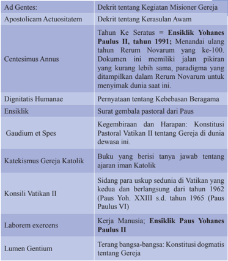

Tabel ini memperlihatkan berbagai dokumen penting dalam sejarah Gereja Katolik, yang disusun berdasarkan tahun kedatangannya dan topik utamanya. Topik utama tabel meliputi Apostolicam Actuositatem (dokumen tentang kegiatan misi gereja), Centesimus Annus (dokumen tentang kekayaan gereja), Dignitatis Humanae (dokumen tentang kebebasan beragama), Ensiklik Paulus II (dokumen tentang kegembiraan dan harapan), Gaudium et Spe (dokumen tentang gereja di dunia dewasa), Katekismus Gereja Katolik (buku tentang ajaran iman Katolik), Konsili Vatikan II (dokumen tentang uskup sufran), Laborem exercens (dokumen tentang kerja manusia), dan Lumen Gentium (dokumen tentang terang bangsa-bangsa). Kolom-kolomnya mencakup tahun kedatangannya dan topik utamanya. Data penting yang terlihat adalah bahwa dokumen-dokumen ini berasal dari abad ke-19 hingga abad ke-20, menunjukkan perjalanan dan perkembangan Gereja Katolik selama periode tersebut.

 

---
## 📄 Halaman 176

pada

---
**📊 Tabel**

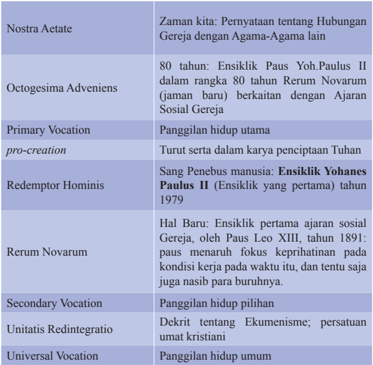

Tabel ini memperlihatkan berbagai ensiklik dan paparan penting dari Gereja Katolik Roma selama beberapa dekade terakhir, dengan fokus pada hubungan gereja dengan agama-agama lain dan pengembangan ajaran sosial gereja. Topik utama adalah ensiklik dan paparan penting dari Gereja Katolik Roma, termasuk Ensiklik Paus Yohanes Paulus II tentang ajaran sosial gereja (1979), Ensiklik Paus Leo XIII tentang kerapihan gereja (1891), dan Ensiklik Paus Yohanes Paulus II tentang ajaran sosial gereja (1979). Kolom-kolomnya mencakup periode waktu tertentu, seperti Ensiklik Paus Yohanes Paulus II dalam rangka 80 tahun Rerum Novarum, Ensiklik Paus Yohanes Paulus II tentang ajaran sosial gereja, dan Ensiklik Paus Leo XIII tentang kerapihan gereja. Data penting yang terlihat adalah bahwa Ensiklik Paus Yohanes Paulus II tentang ajaran sosial gereja (1979) dan Ensiklik Paus Leo XIII tentang kerapihan gereja (1891) merupakan dua ensiklik penting yang membahas ajaran sosial gereja dan kerapihan gereja, masing-masing dalam periode waktu tertentu.

 

---
## 📄 Halaman 177

### Daftar Singkatan

### DAFTAR SINGKATAN ALKITAB

Ef :

Efesus

Ibr :

Ibrani

Im :

Imamat

Kej :

Kejadian

Kel :

Keluaran

Mat

:

Matius

Mik :

Mikha

Mark :

Markus

Luk :

Lukas

Mzm :

Mazmur

Rom :

Roma

Ul :

Ulangan

Yak :

Yakobus

Yes :

Yesaya

Yoh :

Yohanes

1Yoh :

Yohanes

### DAFTAR SINGKATAN AJARAN GEREJA

GS :

Gaudium et Spes

KGK :

Katekismus Gereja Katolik

OA :

Octogesima Adveniens

AA :

Apostolicam Actuositatem

AG :

Ad Gentes

DH :

Dignitatis Humanae

GS :

Gaudium et Spes

LG :

Lumen Gentium

NA :

Nostra Aetate

UN :

Unitatis Redintegratio

CA :

Centetimus Annus

ASG :

Ajaran Sosial Gereja

KGK :

Katekismus Gereja Katolik

RN :

Rerum Novarum

LE :

Laborem Excercens

 

---
## 📄 Halaman 178

### Daftar Pustaka

A. de Mello, SJ. 1997. Burung Berkicau. Cet. ke-8. Cipta Loka Caraka: Jakarta

A. Heuken, SJ. Ensiklopedi Gereja. 1991.

Jakarta: Cipta Loka Caraka

Anly Lenggana dkk. 1998. Hak Asasi Beragama dalam Perkawinan Khonghucu. Jakarta: Gramedia Badrika, I Wayan. 2005. Sejarah. Jakarta: Platinium

Bambang  Ruseno  Utomo  MA.1992. Sekilas  Mengenal  Berbagai  Agama  dan  Kepercayaan  di Indonesia. Malang: Pusat Pembinaan, Anggota Gereja.

Dahler, Franz. 1970. Masalah Agama. Yogyakarta: Kanisius

Darminta, J. 1997. Gereja, Dialog, dan Kemartiran. (Cet ke-8). Yogyakarta: Kanisius

Farndon, John. 2005. Sejarah Dunia. Yogyakarta: Platinum.

Gus Dur. 1999. Menjawab Perubahan Zaman .' Jakarta: Kompas

H. Ikhsan Tanggok. Jalan Keselamatan Melalui Agama Khonghucu. Gramedia: Jakarta, 2000.

H.M. Sriin M.Ed. 2001. Mengenal Misteri Ajaran Agama-Agama Besar. Jakarta: Golden Terayan Press

Hardawiryana, R. SJ, Dr. 1993. (Alih bahasa) Dokumen Konsili Vatikan II . Jakarta: Dokpen KWI dan Obor.

Hardjana, Am. 1993. Penghayatan Agama: Yang Otentik dan Tidak Otentik. Cet ke-1. Yogyakarta: Kanisius.

Heuken A. SJ.1992. Ensiklopedi Gereja . Jakarta: CLC

Kieser Bernhard, SJ, Dr 1991. Paguyuban Manusia dengan Dasa Firman . Yogyakarta: Kanisius.

Kieser Bernhard, SJ, Dr.1987. Moral Dasar; Kaitan Iman dan Perbuatan . Yogyakarta: Kanisius.

Kieser Bernhard, SJ. Moral Sosial; Keterlibatan Umat dalam Hidup Bermasyarakat. Yogyakarta: Kanisius.

- Kirchberger, Georg dan John Mansford Prior. 1996. Iman dan Transformasi Budaya. Ende Flores: Nusa Indah.
- Komisi HAK KWI. 1987. Hak Kerukunan. Tahun IX, No. 51, Juli - Agustus. Jakarta: Kom. HAK KWI.
Komisi HAK KWI. 1990. Hak Kerukunan. Tahun XII, No. 64, Maret - April. Jakarta: Kom. HAK KWI

Komisi HAK KWI. 1997. Hak Kerukunan. Tahun IX, No. 50, Mei - Juni. Jakarta: Kom.HAK KWI.

Komisi Kateketik KWI, 2004 . Pendidikan Agama Katolik untuk SMA/K. Yogyakarta: Kanisius

Konferensi Waligereja Indonesia 1991. Allah Penyayang Kehidupan . Jakarta: CLC.

Konferensi Waligereja Indonesia (penerjemah). 2009 .  Kompendium Katekismus Gereja Katolik . Yogyakarta: Kanisius.

Konferensi Waligereja Indonesia 1996. Iman Katolik; Buku Informasi dan Referensi. Yogyakarta: Kanisius.

Lalu Yosep, Pr .1990. Seks dan Liku-Likunya (diktat)

Muskens, M.P.M. 1973. Sejarah Gereja Katolik Indonesia. Ende Flores: Arnoldus

Paus Yohanes Paulus II (1996). Evangelium Vitae . Jakarta: Dokpen KWI.

Paus Yohanes Paulus II. Menuju Kesempurnaan Ilahi. Kanisius: Yogyakarta, 1999.

Place & Sammie 1998. Hidup dalam Kristus . Jakarta: Obor.

Riyanto, Armada. 1995. Dialog Agama dalam Pandangan Gereja Katolik. Cet ke-7. Yogyakarta: Kanisius

Sukidi. 2001. 'Teologi Inklusif, Cak Nur.' Jakarta: Kompas.

Wiliam Chang, OFMCap. 2001. Moral Lingkungan Hidup . Yogyakarta: Kanisius

YWM. Baker, SJ. 1976. Umat Katolik Berdialog. Yogyakarta: Kanisius

 

---
## 📄 Halaman 179

### Profil Penulis

Nama Lengkap  : Leo Sugiyono, MSC

Telp. Kantor/HP  : 021-31937970/081 2424 1212

E-mail

:  leosugiyono@yahoo.com

Akun facebook

:  Leo Sugiyono

Alamat Kantor

:  Komkat KWI, Jl. Cut Mutiah No.10, Jakarta Pusat

Bidang Keahlian : Kurikulum Pendidikan Agama Katolik, Kateketik

### Riwayat pekerjaan/profesi dalam 10 tahun terakhir:

- Thn. 2006-2010 : Ketua Komisi Kateketik Keuskupan Agung Makassar
- Thn. 2010-2012
: Pastor Paroki Ratu Rosai Suci, Tuminting, Keuskupan Manado

- Thn. 2012- ….
: Sekretaris Komisi Kateketik KWI

### Riwayat Pendidikan Tinggi dan Tahun Belajar:

- S-1: Kateketik (Sekolah Tinggi Filsafat Kateketik Pradnyawidya, Yogyakarta (1991)
- S-1: Sekolah Tinggi Filsafat Seminari Pineleng, Manado (2000)

### Judul Buku dan Tahun Terbit (10 Tahun Terakhir):

- Hidup di Era Digital;  Gagasan Dasar dan Modul Katekese, thn.2015. Penerbit: Kanisius Yogyakarta.

### Judul Penelitian dan Tahun Terbit (10 Tahun Terakhir):

Tidak ada

Nama Lengkap  : Daniel Boli Kotan, S.Pd.,MM

Telp. Kantor/HP  : 021-31937970/081389200271

E-mail

:  daniel_kotan@yahoo.co.id

Akun facebook

:  Daniel Boli Kotan

Alamat Kantor

:  Komkat KWI, Jl. Cut Mutiah No.10 Jakarta Pusat

Bidang Keahlian : Kurikulum Pendidikan Agama Katolik

### Riwayat pekerjaan/profesi dalam 10 tahun terakhir:

- 1990-2016: Staf di Komisi Kateketik  KWI Jakarta.
- 2007-2015: Dosen di Sekolah Tingg Limu Pemerintahan Abdi Negara (STIP-AN) Jakarta.

### Riwayat Pendidikan Tinggi dan Tahun Belajar:

- S2: Manajemen/Manajemen Pendidikan/Sekolah Tinggi Manajemen IMMI, Jakarta (2008-2010)
- S1: Fakultas Keguruan dan Ilmu Pendidikan/Ilmu Pendidikan Teologi/Universitas Katolik Indonesia, Atma Jaya Jakarta (1989-1995)

### Judul Buku dan Tahun Terbit (10 Tahun Terakhir):

- Pendidikan Agama Katolik Sekolah  Dasar (bdk.KTSP), Buku Guru dan buku Siswa kelas I, thn. 2007. Penerbit: Kanisius Yogyakarta.

 

---
## 📄 Halaman 180

- Pendidikan Agama Katolik Sekolah  Dasar (bdk.KTSP), Buku Guru dan buku Siswa kelas II, thn. 2007. Penerbit: Kanisius Yogyakarta.
- Pendidikan Agama Katolik Sekolah  Dasar (bdk.KTSP), Buku Guru dan buku Siswa kelas III, thn. 2007. Penerbit: Kanisius Yogyakarta.
- Pendidikan Agama Katolik Sekolah  Dasar (bdk.KTSP), Buku Guru dan buku Siswa kelas IV, thn. 2007. Penerbit: Kanisius Yogyakarta.
- Pendidikan Agama Katolik Sekolah  Dasar (bdk.KTSP), Buku Guru dan buku Siswa kelas V, thn. 2007. Penerbit: Kanisius Yogyakarta.
- Pendidikan Agama Katolik Sekolah  Dasar (bdk.KTSP), Buku Guru dan buku Siswa kelas VI, thn. 2007. Penerbit: Kanisius Yogyakarta.
- Pendidikan Agama Katolik Sekolah Dasar  Kelas III (buku teks), thn. 2010. Penerbit: Kanisius Yogyakarta.
- Kuliah Pendidikan Agama Katolik di Universitas Terbuka, thn. 2007. Penerbit: Universitas Terbuka.
- Identitas Katekis di Tengah Arus Perubahan Zaman, thn. 2005. Penerbit: Komkat KWI, Jakarta.
- Hidup di Era Digital;  Gagasan Dasar dan Modul Katekese, thn.2015. Penerbit: Kanisius Yogyakarta.
- Judul Penelitian dan Tahun Terbit (10 Tahun Terakhir):
Tidak ada

### DENGAN PAJAK MEMBANGUN KITA

 

---
## 📄 Halaman 181

### Profil Penelaah

Nama Lengkap  : Matheus Beny Mite, M.Hum., Lic.Th.

Telp. Kantor/HP  : 021-5708821/081310117159

E-mail

:  benymite@yahoo.com; benymite.matheus@gmai.com

Akun facebook

:  beny.mite@atmajaya.ac.id

Alamat Kantor

:  Unika Atma Jaya, Jln. Jend. Sudirman 51, Jaksel.

Bidang Keahlian : Pendidikan Keagamaan Katolik dan Teologi

### Riwayat pekerjaan/profesi dalam 10 tahun terakhir:

- 2014 - Sekarang: Ketua Program Studi Pendidikan Keagamaan Katolik, Fakultas Pendidikan dan Bahasa, Universitas Katolik Indonesia (Unika) Atma Jaya, Jakarta
- 2013 - sekarang: Aktif sebagai penelaah buku Pendidikan Agama Katolik yang diselenggarakan oleh Puskurbuk.
- 2009 - 2012: Aktif sebagai Pengembang Instrumen Penilaian dan Buku Teks Pelajaran Agama Katolik yang diselenggarakan oleh BSNP
- 2008 - 2014: Ketua Program Studi Ilmu Pendidikan Teologi, Fakultas Keguruan dan Ilmu Pendidikan, Universitas Katolik Indonesia (Unika) Atma Jaya, Jakarta.
- 2006 - sekarang: Ketua Konsorsium Ilmu Pendidikan Indonesia
- 1983 - sekarang: Unika Atma Jaya pada Prodi Ilmu Pendidikan Teologi.

### Riwayat Pendidikan Tinggi dan Tahun Belajar:

- S3: 2013 - Sekarang: Mahasiswa doktoral Manajemen Pendidikan, Universitas Negeri Jakarta sedang menyusun Disertasi.
- S2: 1995-1997: Magister Teologi. Universitas Sanata Dharma
- S1: 1980-1983 Sarjana Pendidikan pada  Filsafat Teologi pada Fakultas Keguruan dan Ilmu Pendidikan, Universitas Sanata Dharma.

### Judul Buku yang pernah ditelaah (10 Tahun Terakhir):

- Beny Mite, Matheus (editor). Gagasan Pendekatan Pakem di Perguruan Tinggi: Hasil Penelitian Dosen PGSD. Pelangi Pendidikan Seri E. Jakata: FPB, 2015.
- Beny Mite, Matheus (editor). Peranan Audiovisual dalam Berkatekese. Pelangi Pendidikan Seri C. Jakata: FKIP , 2012
- Beny Mite,  Matheus (editor). Multidimensi dalam Pendidikan. Pelangi Pendidikan Seri A. Jakarta: FKIP 2011.
- Beny Mite, Matheus (editor). Model Katekese Kontekstual. Yogyakarta: Kanisius, 2009.

### Judul Penelitian dan Tahun Terbit (10 Tahun Terakhir):

- Beny Mite, Matheus. 'Pendidikan Iman Keluarga Katolik dalam Konteks Bangsa Indonesia' dalam Tantangan-Tantangan Keluarga Katolik di Zaman Modern. Jakarta: Obor, 2014.
- Beny Mite, Matheus. 'Buku Teks PAK Untuk Siswa: Sebuah Tinjauan Pedagogis Yuridis' dalam Penggunaan Buku Teks Pelajaran Agama Katolik untuk Siswa dalam Proses Pembelajaran. Jakarta: Obor, 2010.

 

---
## 📄 Halaman 182

Nama Lengkap  : Matias Endar Suhendar, S.Pd

Telp. Kantor/HP  : 022-4207232 - 081321351940

E-mail

:  komkat2001@yahoo.com

Akun facebook

:  Matias Endar

Alamat Kantor

:  Jl. Jawa No. 6 Bandung

Bidang Keahlian : Pastoral katekese

- Riwayat pekerjaan/profesi dalam 10 tahun terakhir:
- Riwayat Pendidikan Tinggi dan Tahun Belajar:
- S1 : Fakultas Pendidikan, Jurusan pendidikan Agama katolik, program studi Pendidikan Agama katolik, Universitas Sanata Dharma Yogyakarta. Tahun masuk 1990 - Tahun Lulus 1995.
- Judul Buku yang pernah ditelaah (10 Tahun Terakhir):
- Menjadi penelaah Buku kurikulum Pendidikan Agama katolik
- Judul Penelitian dan Tahun Terbit (10 Tahun Terakhir):
- 2003 - 2009
: Ketua Komisi Kateketik Keuskupan Bandung

- 2010 - Sekarang   : Sekretaris Dewan karya Pastoral Keuskupan Bandung
- 3.
2005 - Sekarang   : Guru Honorer di SMA Negeri 3 dan 5 Bandung, mengajar

Pendidikan Agama katolik

- 4.
- 2011  - Sekarang  : Dosen Agama Katolik di Sekolah Tinggi Pariwisata Bandung
Tidak ada

Nama Lengkap  : FX. Adisusanto SJ

Telp. Kantor/HP  : -

E-mail

:  adisusanto@kawali.org

Akun facebook :  -

Alamat Kantor

:  Komisi Kateketik KWI, jl. Cut Meutia 10, Jakarta

Bidang Keahlian : Pendidikan Agama Katolik

- Riwayat pekerjaan/profesi dalam 10 tahun terakhir:
- Mengajar matakuliah kateketik di Universitas Sanata Dharma, Yogyakarta dan Universitas Katolik Atma Jaya, Jakarta sampai sekitar tahun 2012
- Sekarang bekerja sebagai Ketua Departemen Dokumentasi dan Penerangan Konferensi Waligereja Indonesia (Dokpen KWI) dan staf ahli kateketik Komisi Kateketik KWI
- Riwayat Pendidikan Tinggi dan Tahun Belajar:
- S1 : Lulusan Universitas Kepausan Salesianum, Roma, 1987
- Judul Buku yang pernah ditelaah (10 Tahun Terakhir):
Tidak ada

- Judul Penelitian dan Tahun Terbit (10 Tahun Terakhir):
Tidak ada

 

---
## 📄 Halaman 183

Nama Lengkap  : Dr. Salman Habeahan, S.Ag.MM.

Telp. Kantor/HP  : 081382836359; Telp/Fax. 021: 85913017 (R)

E-mail

:  salman.habeahan@yahoo.co.id

Akun facebook

:  087878623347

Alamat Kantor

:  Jl. I. Gusti Ngurah Rai Pd. Kopi Jakarta Timur

Bidang Keahlian : Pendidikan Agama & Manajemen Pendidikan

### Riwayat pekerjaan/profesi dalam 10 tahun terakhir:

- Pengawas Pendidikan Agama Katolik Tkt. Sekolah Menengah Kementerian Agama Kota Jakarta Timur (2003 - 2016)
- Dosen Pendidikan Agama Katolik Institut Bisnis Nusantara Jakarta (1999 - 2016)
- Dosen Etika Profesi Kependidikan & Manajemen Pendidikn Program Pasca Sarjana STIE-IMMI Jakarta (2015 - 2016).

### Riwayat Pendidikan Tinggi dan Tahun Belajar:

- S3: Pendidikan, Jurusan Manajemen Pendidikan Universitas Negeri Jakarta, 2006 - Awal 2012.
- S2: Manajemen, Jurusan Manajemen SDM, Universitas Budi Luhur Jakarta, 1998 2001.
- Post S-1: Teologi, Sekolah Tinggi Filsafat Teologi St. Yohanes Pematangsiantar, 1995 - 1997.
- S1: Filsafat Agama, Fakultas Filsafat Universitas Katolik St. Thomas Medan Sumatera Utara, 1989 - 1995.

### Judul Buku yang pernah ditelaah (10 Tahun Terakhir):

- Membangun Hidup Berpolakan Pribadi Yesus Kristus, Nusatama Yogyakarta, ISBN, 2003.
- Butir-butir Pendidikan Nilai Memasuki Abad 21, Krista Media, ISBN, 2006.
- Kepemimpinan Untuk Organisasi Publik, Organisasi Non-Pr ofit, UADS, Publishing, ISBN, 2013.

### Judul Buku yang pernah ditelaah (10 Tahun Terakhir):

- Pendidikan Agama Katolik Kelas X (SMA)
- Pendidikan Agama Katolik Kelas XI (SMA)
- Pendidikan Agama Katolik XII (SMA)
- Pengawasan Berbasis Agama Katolik (Irjen Kementerian Agama R.I.)
- Buku KBK Agama Katolik untuk SMK

 

---
## 📄 Halaman 184

### Profil Editor

Nama Lengkap  :  Dra. Maria Chatarina Adharti S

Telp. Kantor/HP  : (021) 3804248/081210979696

E-mail

:   adharti07@yahoo.co.id

Akun facebook : -

Alamat Kantor

:   Pusat Kurikulum dan Perbukuan

Jl. Gunung Sahari Raya No. 4 Jakarta

Bidang Keahlian :  Pengembang Kurikulum IPS, Sosiologi

- Riwayat pekerjaan/profesi dalam 10 tahun terakhir:
- Riwayat Pendidikan Tinggi dan Tahun Belajar:
- Judul Buku dan Tahun Terbit (10 Tahun Terakhir):
- Buku IPS
- Buku Tematik Terpadu
- Buku Pendidikan Agama Katolik
- Judul Penelitian dan Tahun Terbit (10 Tahun Terakhir):
- Model Kurikulum Pemberdayaan Masyarakat Pesisir Berbasis Ekonomi Produktif Tahun 2010
- Pemahaman Guru terhadap pelaksanaan pembelajaran dan penilaian kurikulum 2013 -  Tahun 2015
- 2011-2015  : Staf bidang Kurikulum dan Perbukuan Pendidikan Dasar
- 1.
- 2016
: Staf bidang Perbukuan

- S1: Sosiologi - Fisipol UGM 1992

### DEKATKAN DIRI ANDA PADA

BUKAN DENGAN

N A r k o B A

---

*📊 Statistik: 21 visual berhasil, 38 dilewati, 0 gagal | Durasi: 5m 32s*