# Salinan Kelas 12 Khonguchu BS press

*Diekstrak: 18 May 2026, 06:13*

---

---
## 📄 Halaman 1

Kelas XII SMA/SMK

Pendidikan Agama Khonghucu dan Budi Pekerti

### Pendidikan Agama Khonghucu dan Budi Pekerti

 

---
## 📄 Halaman 2

### Hak Cipta © 2018 pada Kementerian Pendidikan dan Kebudayaan Dilindungi Undang-Undang

Disklaimer: Buku ini merupakan buku siswa yang dipersiapkan Pemerintah dalam rangka implementasi Kurikulum 2013. Buku siswa ini disusun dan ditelaah oleh berbagai pihak di bawah koordinasi Kementerian Pendidikan dan Kebudayaan, d an dipergunakan dalam tahap awal penerapan Kurikulum 2013. Buku ini merupakan 'dokumen hidup' yang senantiasa diperbaiki, diperbarui, dan dimutakhirkan sesuai dengan dinamika kebutuhan dan perubahan zaman. Masukan dari berbagai kalangan diharapkan dapat meningkatkan kualitas buku ini.

Katalog Dalam Terbitan (KDT)

Indonesia. Kementerian Pendidikan dan Kebudayaan.

Pendidikan Agama Khonghucu dan Budi Pekerti/Kementerian Pendidikan dan Kebudayaan.- Edisi Revisi Jakarta : Kementerian Pendidikan dan Kebudayaan, 2018. viii, 136. : ilus. ; 25 cm.

Untuk SMA/SMK Kelas XII ISBN 978-602-427-082-7 (jilid lengkap) ISBN 978-602-427-085-8 (jilid 3)

- Khonghucu -- Studi dan Pengajaran
I. Judul

- Kementerian Pendidikan dan Kebudayaan
299.512

Kontributor Naskah  :  Js. Gunadi dan Kristan.

Penelaah

:  Bratayana Ongkowijaya, Oesman Arief, Setio Kuncono, dan Uung Sendana.

Pe- review

:  Adi Djojo

Penyelia Penerbitan : Pusat Kurikulum dan Perbukuan, Balitbang, Kemendikbud.

Cetakan Ke-1, 2015 (ISBN 978-602-282-444-2) Cetakan Ke-2, 2018 (Edisi Revisi)

Disusun dengan huruf Times New Roman, 12 pt.

 

---
## 📄 Halaman 3

### Kata Pengantar

Kurikulum  2013  dirancang  agar  peserta  didik  tidak  hanya  bertambah pengetahuannya, tetapi meningkat juga keterampilannya dan semakin mulia  kepribadiannya. Ada  kesatuan  utuh  antara  kompetensi  pengetahuan, keterampilan, dan sikap. Keutuhan ini perlu tercermin dalam pembelajaran agama. Melalui pembelajaran pengetahuan agama diharapkan akan terbentuk keterampilan beragama dan terwujud sikap beragama siswa. Tentu saja sikap beragama yang berimbang, mencakup hubungan manusia dengan Penciptanya dan hubungan manusia dengan sekitarnya. Untuk memastikan keseimbangan ini, pelajaran agama perlu diberi penekanan khusus terkait dengan budi pekerti.

Hakikat budi pekerti adalah sikap atau perilaku seseorang  dalam hubungannya dengan Tuhan, diri sendiri, keluarga, masyarakat dan bangsa, serta alam sekitar. Jadi, pendidikan budi pekerti adalah usaha menanamkan nilai-nilai  moral  ke  dalam  sikap  dan  perilaku  generasi  bangsa  agar  mereka memiliki kesantunan dalam berinteraksi. Nilai-nilai moral/karakter yang ingin kita bangun antara lain adalah sikap jujur, disiplin, bersih, penuh kasih sayang, punya kepenasaran intelektual, dan kreatif.

Di sini pengetahuan agama yang dipelajari para siswa menjadi sumber nilai dan penggerak perilaku mereka. Sekadar contoh, di antara nilai budi pekerti dalam ajaran Khonghucu dikenal Wu Chang (lima sifat kekekalan/mulia), Wu Lun (lima hubungan sosial), dan Ba De (delapan kebajikan). Mengenai Wu Chang , Kong Hu Cu menegaskan bahwa siapa dapat memasukkan lima hal ke dalam kebiasaan di mana pun di bawah langit akan menjadi orang yang berbudi luhur. Saat ditanya apa saja kelima hal tersebut, ia menjawab, 'Cinta kasih,  keberagaman,  kesusilaan,  kebijaksanaan,  dapat  dipercaya.  Apabila kamu berlaku sopan, kamu tidak akan dihina; bila kamu murah hati kamu akan memenangkan orang banyak; bila kamu setia, orang lain akan mempercayaimu; bila  kamu tekun, kamu akan berhasil; dan bila kamu baik hati, kamu akan memimpin orang lain' (A 17.6). Kata kuncinya, budi pekerti adalah tindakan, bukan sekadar pengetahuan yang harus diingat oleh para siswa, maka proses pembelajarannya mesti mengantar mereka dari pengetahuan tentang kebaikan, lalu  menimbulkan  komitmen  terhadap  kebaikan,  dan  akhirnya  benar-benar melakukan kebaikan.

Buku  Pendidikan  Agama  Khonghucu  dan  Budi  Pekerti  Kelas  XII  ini ditulis  dengan  semangat  itu.  Pembelajarannya  dibagi-bagi  dalam  kegiatankegiatan  keagamaan  yang  harus  dilakukan  siswa  dalam  usaha  memahami pengetahuan agamanya. Tidak berhenti dengan memahami, tapi pemahaman

 

---
## 📄 Halaman 4

tersebut  harus  diaktualisasikan  dalam  tindakan  nyata  dan  sikap  keseharian sesuai dengan tuntunan agamanya, baik dalam bentuk ibadah ritual maupun ibadah sosial. Untuk itu, sebagai buku agama yang mengacu pada kurikulum berbasis  kompetensi,  rencana  pembelajarannya  dinyatakan  dalam  bentuk aktivitas-aktivitas. Urutan pembelajaran dinyatakan dalam kegiatan-kegiatan keagamaan yang harus dilakukan siswa. Dengan demikian, materi buku ini bukan  untuk  dibaca,  didengar,  ataupun  dihafal  oleh  siswa  maupun  guru, melainkan untuk menuntun apa yang harus dilakukan siswa bersama guru dan teman-teman sekelasnya dalam memahami dan menjalankan ajaran agamanya.

Buku ini bukanlah satu-satunya sumber belajar bagi siswa. Sesuai dengan pendekatan yang digunakan dalam Kurikulum 2013, siswa diberanikan untuk mempelajari agamanya dengan mengamati sumber belajar yang tersedia dan terbentang luas di sekitarnya. Peran guru sangat penting untuk menyesuaikan daya serap siswa dengan ketersediaan kegiatan yang ada pada buku ini. Guru dapat  memperkayanya  secara  kreatif  dengan  kegiatan-kegiatan  lain  yang sesuai dengan tempat buku ini diajarkan, baik belajar melalui sumber tertulis maupun belajar langsung dari sumber lingkungan sosial dan alam sekitar.

Sebagai  edisi  pertama,  buku  ini  sangat  terbuka  dan  terus  dilakukan perbaikan untuk penyempurnaan. Oleh karena itu,  kami  mengundang para  pembaca  memberikan  kritik,  saran  dan  masukan  untuk  perbaikan dan  penyempurnaan  pada  edisi  berikutnya.  Atas  kontribusi  tersebut,  kami mengucapkan  terima  kasih.  Mudah-mudahan  kita  dapat  memberikan  yang terbaik  bagi  kemajuan  dunia  pendidikan  dalam  rangka  mempersiapkan generasi seratus tahun Indonesia Merdeka (2045).

### Penulis

 

---
## 📄 Halaman 5

### Daftar Isi

 

---
## 📄 Halaman 7

### Bab VI Sikap dan Perilaku Junzi

 

---
## 📄 Halaman 8

### Daftar Gambar

 

---
## 📄 Halaman 9

---
**🖼️ Gambar/Diagram**

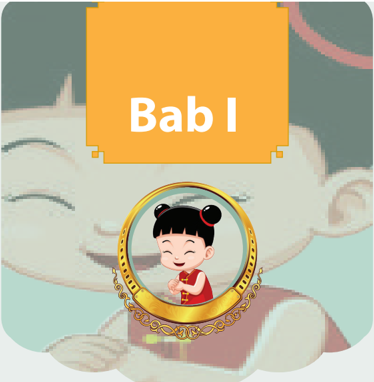

> **Deskripsi Visual:** Gambar ini menunjukkan sebuah buku pelajaran dengan judul "Bab I". Gambar utama adalah seorang anak kecil yang sedang tersenyum dan berdiri di depan cermin. Anak tersebut mengenakan pakaian tradisional dengan perhiasan yang indah. Di belakang anak tersebut ada seekor hewan besar yang tampak seperti kucing atau hewan lainnya. Judul "Bab I" terletak di atas gambar, menunjukkan bahwa ini adalah bab pertama dalam buku tersebut. Gambar ini mungkin digunakan untuk membantu pembaca memahami konteks atau tema bab pertama dalam buku pelajaran ini.

Hakikat dan Semangat Belajar

 

---
## 📄 Halaman 10

### Peta Konsep

---
**🖼️ Gambar/Diagram**

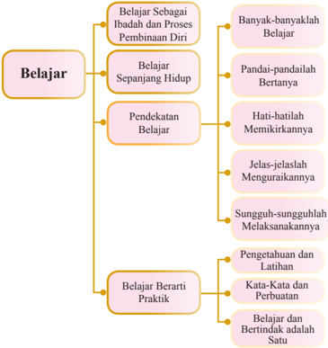

> **Deskripsi Visual:** Gambar ini adalah diagram yang menunjukkan struktur dan konten materi tentang belajar. Diagram ini terdiri dari empat bagian utama yang disebutkan sebagai "Belajar Sebagai Ibadah dan Proses Pembinaan Diri", "Belajar Sepanjang Hidup", "Pendekatan Belajar", dan "Belajar Berarti Praktik". Setiap bagian tersebut memiliki subbagian yang lebih spesifik.

1. **Apa yang Ditampilkan Secara Keseluruhan**: Gambar ini menggambarkan struktur dan konten materi tentang belajar dalam sebuah buku pelajaran. Struktur ini mencakup empat aspek utama belajar, masing-masing dengan subtopik yang lebih detail.

2. **Elemen-Elemen Utama dan Relasinya**: 
   - **Belajar Sebagai Ibadah dan Proses Pembinaan Diri** (Atas kiri): Ini adalah bagian pertama yang mencakup dua subtopik: "Banyak-banyaklah Belajar" dan "Pandai-pandailah Bertanya".
   - **Belajar Sepanjang Hidup** (Atas kanan): Ini mencakup tiga subtopik: "Hati-hatilah Memikirkannya", "Jelas-jelaslah Menguraikannya", dan "Sunguh-sunguhlah Melaksanakannya".
   - **Pendekatan Belajar** (Kanan atas): Ini mencakup tiga subtopik: "Pengetahuan dan Latihan", "Kata-Kata dan Perbuatan", dan "Belajar dan Bertindak adalah Satu".
   - **Belajar Berarti Praktik** (Bawah): Ini mencakup tiga subtopik: "Banyak-banyaklah Belajar", "Pandai-pandailah Bertanya", "Hati-hatilah Memikirkannya", "Jelas-jelaslah Menguraikannya", "Sunguh-sunguhlah Melaksanakannya", "Pengetahuan dan Latihan", "Kata-Kata dan Perbuatan", dan "Belajar dan Bertindak adalah Satu".

3. **Teks, Angka, atau Label Penting yang Terlihat**: 
   - Untuk setiap subtopik, ada teks yang menjelaskan kon

### A.  Belajar Sebagai Ibadah dan Proses Pembinaan Diri

Belajar  merupakan  panggilan  kemanusiaan.  Sadar  atau  tidak,  bahwa (manusia) tidak bisa menghindar dari kegiatan belajar. Untuk hal-hal tertentu mungkin  saja  orang  menghindari  diri  untuk  belajar,  karena  memang  tidak berminat  untuk  memiliki  kemampuan  tersebut.  Tetapi,  dapatkah  orang menghindarkan diri atau menolak untuk belajar menjadi manusia?

Ilustrasi dari kata 'pelajar' atau 'siswa' kiranya dapat lebih memberikan penjelasan tentang apa makna dari 'belajar' tersebut. Dalam bahasa Zhongwen , pelajar  atau  siswa  adalah: Xuesheng ( 学生 ). Xue s heng dibangun  dari  dua

 

---
## 📄 Halaman 11

radikal huruf, yaitu: Xue ( 学 )  artinya belajar dan Sheng ( 生 )  artinya hidup. Dengan demikian, siswa atau pelajar ( xuesheng ) itu dapat diartikan: 'Belajar menggenapi hidup'.

Maka jelaslah bahwa belajar bukanlah sekadar mencari dan mendapatkan pengetahuan semata, tetapi pengetahuan tersebut selanjutnya haruslah berguna bagi pembinaan diri dan pengembangan hidup.

Belajar terjadi dalam interaksi dengan lingkungan, dalam bergaul dengan orang dan dalam menghadapi peristiwa, manusia belajar. Jadi, disadari atau tidak,  kita  melakukan  banyak  hal  sepanjang  hidup  kita  yang  sebenarnya adalah proses belajar. Belajar adalah sebuah proses menciptakan kemampuan tertentu. Tidak ada satu kemampuan pun yang diperoleh tanpa melalui proses belajar, meski hal yang sangat sederhana sekalipun.

Kita menggunakan  pakaian, makan  dengan  menggunakan  alat-alat makan, kita berkomunikasi dalam bahasa Indonesia atau bahasa yang lain, kita bertindak/berperilaku sopan-santun, kita menghormati orang yang lebih tua, kita mengendalikan kendaraan dan lain sebagainya. Gejala-gejala belajar semacam itu terlalu banyak untuk disebutkan satu per satu.

Semua  kemampuan  itu  mula-mula  tidak  ada,  proses  perubahan  dari tidak  ada/tidak  mampu ke arah mampu selama jangka waktu tertentu serta ditandai dengan adanya perubahan dalam perilaku, inilah yang menandakan telah terjadi pembelajaran. Makin banyak kemampuan yang diperoleh sampai menjadi milik pribadi, makin banyak pula perubahan yang akan dialami.

Namun demikian, belajar bukan sekadar sebuah proses dari tidak tahu menjadi  tahu.  Proses  dari  tidak  tahu  menjadi  tahu  hanyalah  gejala  belajar untuk  mendapat  tambahan  pengetahuan.  Setelah  terjadi  proses  dari  tidak tahu  menjadi  tahu  (berpengetahuan),  selanjutnya  pengetahuan  itu  haruslah memberikan  kontribusi  (sumbangan  yang  bermanfaat)  bagi  diri  kita  dan orang-orang  di  sekeliling  kita.  Jadi  pada  hakikatnya  belajar  memiliki  dua tujuan: Pertama untuk mengasah otak dan menambah wawasan (pengetahuan). Kedua, untuk membuat seseorang dapat memberikan kontribusi (sumbangan yang bermanfaat) bagi dirinya sendiri dan orang lain (masyarakat).

Semua yang kita pelajari pada dasarnya adalah untuk mengembangkan kemampuan dalam membina diri dan menggenapi kodrat kemanusiaan kita. Oleh  karena  itu,  belajar  merupakan  kegiatan  dalam  rangka  'memuliakan' hubungan kita dengan Yang Maha kuasa. Demikianlah belajar menjadi sebuah ibadah dan proses pembinaan diri.

 

---
## 📄 Halaman 12

Belajar  seharusnya  membantu  kita  meningkatkan  pengetahuan  dan pengembangan  citra  diri  serta  membantu  kita  dalam  membina  diri.  Tetapi sayangnya, beberapa orang cenderung menjadi sombong hanya karena mereka mengetahui sesuatu yang orang lain tidak mengetahuinya. Jika pengetahuan membuat kita sombong, lebih baik kita tidak berpengetahuan.

Nabi Kongzi bersabda: 'Orang zaman dahulu belajar untuk membina diri. Sekarang  orang  belajar  bertujuan  untuk  memperlihatkan  diri  kepada  orang lain' ( Lunyu .  XIV: 24). Hal ini mungkin suatu perbedaan yang sangat mencolok tentang  tujuan  dari  belajar.  Mestinya,  kita  tidak  boleh  melupakan  bahwa belajar adalah untuk pembinaan diri, dan sama sekali bukan untuk menunjukkan diri.

### Penting!

Nabi Kongzi bersabda: 'Aku bukanlah pandai sejak lahir, melainkan aku menyukai ajaranajaran kuno dan giat mempelajarinya'. (Sabda Suci. VII: 20)

Nabi Kongzi bersabda: 'Orang yang sejak lahir sudah bijaksana inilah orang tingkat teratas, yang dengan belajar lalu bijaksana inilah orang tingkat kedua, orang setelah menanggung sengsara  lalu  insyaf  dan  mau  belajar  inilah orang tingkat ketiga, dan orang yang sekalipun sudah  menanggung  sengsara  tetapi  tidak  mau insyaf untuk belajar ialah orang paling rendah di antara rakyat'. ( Lunyu . XVI: 9)

Mungkin ada orang yang sejak lahir sudah bijaksana, mengerti mana yang benar dan mana yang salah. Tetapi, mungkin itu  hanya  pada  orang-orang  tertentu,  para  nabi  dan  orang-orang  suci  yang memang  diberi  kemampuan  lebih  karena  mengemban  misi  membawakan ajaran agama. Di luar orang-orang terpilih itu, haruslah melalui proses belajar untuk dapat menjadi bijaksana.

### B.  Belajar Sepanjang Hidup

Ajaran  yang digenapsempurnakan Nabi Kongzi sangat  mengutamakan perihal  belajar.  Beliau  menegaskan  bahwa  belajar  adalah  awal  dari  segala kemampuan, dan tak  ada  satu  kemampuan  pun  yang  didapat  tanpa  melalui  proses belajar. Dengan rendah hati Beliau pun mengakui, bahwa semua kemampuan dan  kebijaksanaan  yang  dimilikinya  adalah  hasil  dari  belajar.  Semangat belajar yang dimiliki Nabi Kongzi menjadikan-Nya memiliki kebijaksanaan yang tinggi dan pengetahuan yang luas. Beliau sendiri menyadari sepenuhnya

 

---
## 📄 Halaman 13

bahwa semangat belajar yang dimilikinya itu jarang dimiliki oleh orang lain. Beliau menjadikan kesukaan dan semangat belajarnya itu untuk memacu dan memotivasi murid-murid-Nya.

### Aktivitas 1.1

### Diskusi Kelompok

-  Berikan komentar kalian terkait pernyataan Nabi Kongzi bahwa Beliau tidak pandai sejak lahir, melainkan Beliau menyukai ajaran-ajaran kuno dan giat mempelajarinya.
-  Berikan  komentar  kalian  tentang  orang  yang  sekalipun sudah menanggung sengsara tetapi tidak mau insyaf untuk belajar ialah orang paling rendah di antara rakyat.
Zhuxi (tokoh  Neo  Konfucianisme), mendorong para murid-muridnya untuk belajar sebanyak mungkin. Ia berkata: 'Tidak ada kata akhir dalam mencari pengetahuan. Aku hanya mengabdikan seluruh hidupku dan kemampuanku untuk belajar'. Ia menunjukkan hal ini secara khusus untuk belajar dengan cara banyak membaca.

Nabi Kongzi bersabda:  'Hanya  orang  yang  benar-benar  dengan  penuh kepercayaan  suka  belajar,  barulah  ia  dapat  memuliakan  jalan  suci  hingga matinya'. ( Lunyu . VIII: 13)

'Batu Kumala ( Yu ) bila tidak dipotong/diukir tidak akan menjadi benda/ perkakas yang berharga; dan orang bila tidak belajar tidak akan mengerti jalan suci.  Maka,  raja  zaman  kuno  itu  di  dalam  membangun  negara,  memimpin rakyat,  masalah  belajar-mengajar  selalu  didahulukan.  Di  dalam  Yueming tersurat, 'Ingatan dari awal sampai akhir hendaknya bertaut kepada belajar' ( Shujing . IV . III: 5) ini kiranya memaksudkan hal itu'.

 

---
## 📄 Halaman 14

### Hikmah Cerita

### Cara mengembangkan diri

Suatu  hari  Kongmie,  keponakan  Nabi Kongzi ,  bertanya padanya: 'Bagaimana saya harus mengembangkan diri?' Kongzi berkata: 'Jika kamu tahu tetapi tidak berlatih, lebih baik kamu tidak tahu; jika kamu dekat seseorang tetapi tidak memercayainya, lebih  baik  tak  usah  berada  di  dekatnya. Ketika  kamu  merasa  senang,  janganlah  berlebihan;  dan ketika  didatangi  masalah,  berpikirlah  dengan  jernih  dan jangan bersedih'.

Kongmie berkata: 'Ada lagi?' Kongzi berkata: 'Belajarlah jika kamu tidak tahu atau tidak bisa; jika ada yang tidak mampu,  bantulah  mereka;  jangan  meragukan  orang  lain hanya karena kamu tak bisa melakukan sesuatu hal; dan jangan pamer jika kamu mampu.

Di penghujung hari, setelah bekerja seharian penuh, jangan meninggalkan kekhawatiran atau permasalahan bagi dirimu sendiri. Hanya orang bijak yang melakukan ini'.

Sumber:  Mary  Ng  En  Tzu  ' Inspiration  from  The  Great Learning '. PT Elex Media Komputindo Jakarta. 2002

Menurut  Nabi Kongzi ,  seseorang  seharusnya  tidak  pernah  berhenti untuk  belajar.  Belajar  bukanlah  sekadar  mengecap  pendidikan  saja,  tanpa ada usaha yang terus-menerus untuk merealisasikannya, semua potensi yang ada  dalam  diri  manusia  menjadi  tidak  bermakna.  Dalam  Kitab  Sabda  Suci ( Lunyu ) dikisahkan, Nabi Kongzi berdiri di tepi sebuah sungai dan berkata: 'Seharusnya manusia bergerak terus seperti air, siang malam tanpa berhenti'.

Aliran air sungai merupakan simbol untuk proses aktualisasi diri, yang menurut Nabi Kongzi seharusnya menjadi bagian dari sifat manusia, (itulah sebabnya Nabi Kongzi mengumpamakan seorang yang bijaksana itu laksana air).  Nabi Kongzi mengatakan:  'Yang  bijaksana  gemar  akan  air,  yang berpericinta kasih gemar akan gunung'. ( Lunyu . VI: 23)

 

---
## 📄 Halaman 15

Pelajaran  dalam  tradisi  pendidikan  Khonghucu  tidak  terbatas  pada pendidikan intelektual dan etika saja, melainkan meliputi pendidikan jasmani juga. Keterkaitan jasmani dan pendidikan sedemikian eratnya, sehingga kaum Neo Confusianis menyebutnya  sebagai  'Pelajaran  jiwa  dan  raga.'  Adapun pelajaran yang dipilih dan waktu yang diberikan untuk tiap-tiap topik adalah sampai  keharmonisan  dalam  gerakan  jasmaniah  tercapai.  Jadi,  pelajaran menurut Nabi Kongzi adalah perilaku manusia yang dilakukan secara sadar untuk mengubah eksistensinya menjadi bermakna bagi dirinya sendiri maupun bagi orang lain.

Nabi Kongzi sendiri  hidup  secara  sederhana,  tetapi  tidak  mengabaikan latihan panahan dan menunggang kuda untuk menjaga keseimbangan tubuh. Sewaktu-waktu Beliau juga mendengarkan musik untuk memperhalus rasa.

### Enam Perkara dengan Enam Cacatnya

'Orang yang suka cinta kasih tetapi tidak suka belajar, ia akan menanggung  cacat  bodoh.  Orang  yang  suka  kebijaksanaan  tetapi tidak suka belajar, ia akan menanggung cacat kalut jalan pikirannya/ bimbang. Orang yang suka dapat dipercaya tetapi tidak suka belajar, ia  akan  menanggung  cacat  menyusahkan  diri  sendiri.  Orang  yang suka kejujuran tetapi tidak suka belajar, ia akan menanggung cacat menyakiti hati orang lain. Orang yang suka keberanian tetapi tidak suka belajar, ia akan menanggung cacat mengacau, dan orang yang suka sifat keras tetapi tidak suka belajar, ia akan menanggung cacat ganas'.

( Lunyu . XVII: 8)

Belajar adalah panggilan kemanusiaan, dengan belajar dan terus belajar kita dapat menggali dan mengembangkan potensi kemanusiaan kita seutuhnya, sepenuh-penuhnya.  Sebaliknya,  bila  kita  berhenti  belajar,  paradigma  kita menjadi beku, kita menjadi sulit menyesuaikan diri dengan dunia yang selalu berubah.  Kita  akan  menjadi  manusia  yang  kerdil  ( xiaoren ),  keras  kepala, sombong  dan  menjadi  beban  bagi  orang  lain.  Tanpa  proses  belajar  secara berkesinambungan, kita tidak akan menjadi manusia yang sempurna.

 

---
## 📄 Halaman 16

### Aktivitas 1.2

### Tugas Kelompok

Jelaskan melalui contoh tentang  enam  perkara  dengan  enam cacatnya.  Mengapa orang suka cinta kasih jika tidak suka belajar akan menanggung cacat bodoh? dan seterusnya...

### C.  Pendekatan Belajar

Nabi Kongzi bersabda:  'Banyak-banyaklah  belajar.  Pandai-pandailah bertanya.  Hati-hatilah  memikirkannya.  Jelas-jelaslah  menguraikannya,  dan sungguh-sungguhlah melaksanakannya'. ( Zhongyong . XIX: 19)

Dari ayat tersebut menujukan tentang pendekatan dan langkah-langkah yang harus ditempuh dalam belajar. Jadi,  pendekatan  belajar  dalam  agama Khonghucu meliputi:

-  Banyak-banyaklah belajar (mengamati, membaca, menyimak)
-  Pandai-pandailah bertanya (bertanya)
-  Hati-hatilah memikirkannya (menalar, mengeksplorasi)
-  Jelas-jelaslah menguraikannya (menguraikan dan mengasosiasikan materi)
-  Sungguh-sungguhlah melaksanakannya (mencipta, mengomunikasikan)
Nabi Kongzi bersabda:  'Memang  ada  hal  yang  tidak  dipelajari,  tetapi hal  yang  dipelajari  bila  belum  dapat  janganlah  dilepaskan.  Ada  hal  yang tidak ditanyakan, tetapi hal yang ditanyakan bila belum sampai benar-benar mengerti  janganlah  dilepaskan.  Ada  hal  yang  tidak  dipikirkan,  tetapi  hal yang dipikirkan bila belum dapat dicapai janganlah dilepaskan. Ada hal yang tidak  diuraikan,  tetapi  hal  yang  diuraikan  bila  belum  dapat  terperinci  jelas janganlah lepaskan. Ada hal yang tidak dilakukan, tetapi hal yang dilakukan bila belum dapat dilaksanakan sepenuhnya janganlah dilepaskan. Bila orang lain melakukan hal itu satu kali, diri sendiri harus berani melakukannya seratus kali. Bila orang lain dapat melakukannya sepuluh kali, diri sendiri harus berani melakukannya seribu kali'. ( Zhongyong . XIX: 20)

 

---
## 📄 Halaman 17

### 1. Banyak-banyaklah Belajar

Banyak-banyaklah belajar. Adalah hal yang tidak bisa dielakkan dan tak mungkin  dimungkiri,  ini  adalah  syarat  mutlak  untuk  mendapatkan  banyak pengetahuan dalam rangka membina diri. Belajar sesuatu tak boleh dibatasi jumlahnya dan tak bisa dibatasi oleh ruang dan waktu. Tak ada saat berhenti, maka belajar tak pernah selesai,  dan  keberhasilannya  tak  pernah  mencapai final.

---
**🖼️ Gambar/Diagram**

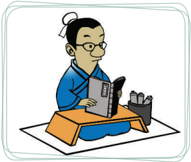

> **Deskripsi Visual:** Gambar ini adalah ilustrasi yang menunjukkan seorang siswa sedang belajar di rumah. Siswa tersebut sedang membaca buku pelajaran dengan penuh minat, sementara di depannya ada beberapa alat tulis seperti pensil dan pensil warna. Ilustrasi ini menunjukkan suasana belajar yang serius dan fokus. Siswa tersebut tampak berada di atas sebuah meja belajar yang dilengkapi dengan kursi dan tempat penyimpanan barang. Ilustrasi ini menggambarkan situasi belajar yang umum ditemui di sekolah atau rumah, dimana siswa menggunakan buku pelajaran untuk mempelajari materi yang diajarkan oleh guru.

Sumber: dokumen Kemdikbud

Jika ingin mendapatkan ide bagus tentu kita harus memiliki banyak ide. Sehubungan dengan hal itu, jika ingin mendapatkan banyak pengetahuan kita harus banyak belajar.

- '…Bila orang lain melakukan hal itu satu kali, diri sendiri harus berani melakukannya seratus kali. Bila orang lain dapat melakukannya sepuluh kali, diri sendiri harus berani melakukannya seribu kali'. ( Zhongyong . XIX: 20)
- 'Memang ada hal yang tidak dipelajari, tetapi hal yang dipelajari bila belum dapat janganlah dilepaskan…'
Aktivitas 1.3

Tugas Mandiri

Berikan komentar kalian terkait kalimat: 'Bila orang lain melakukan hal itu satu kali, diri sendiri harus berani melakukannya seratus kali.

Bila orang lain dapat melakukannya sepuluh kali, diri sendiri harus berani melakukannya seribu kali'.

 

---
## 📄 Halaman 18

### 2. Pandai-pandailah Bertanya

Belajar bukan sekadar mendengarkan dan hanya menerima. Kita harus melibatkan diri  secara  aktif,  mencoba  menekuni  setiap  materi  yang  disampaikan untuk  selanjutnya  mengembangkan  maksud  dari  materi  yang  dipelajari. Mencari  hal-hal  yang  meragukan  dari  materi  tersebut  dan  menanyakannya sampai  mendapatkan  jawaban  yang  lebih  baik  dan  mendekati  kebenaran. Pertanyaan-pertanyaan menunjukkan adanya rasa keingintahuan atau minat yang besar akan pelajaran itu.

Nabi Kongzi belajar  dengan cara banyak bertanya. Beliau tidak hanya belajar dari guru dan para seniornya, melainkan dari teman-teman dan bahkan dari murid-muridnya. Suatu ketika ia berkata: 'Tiap kali jalan bertiga, niscaya ada yang dapat kujadikan guru. Kupilih yang baik, kuikuti, dan yang tidak baik, aku perbaiki'. ( Lunyu . VII: 22)

Nabi Kongzi meyakini bahwa kita dapat belajar dari siapapun, apapun, kapanpun, dan di manapun. Dengan kata lain, siapa saja bisa menjadi guru, dan  di  manapun  kita  bisa  belajar.  Kita  dapat  belajar  dari  semua  hal  yang ada di luar diri kita. Belajar untuk tahu dan mampu melakukan yang positif, tahu dan mampu untuk menghindari hal yang negatif. Kemampuan bertanya menunjukkan kemampuan mengetahui apa yang tidak atau belum diketahui. Dapat mengetahui hal-hal yang tidak diketahui adalah awal dari pengetahuan.

Di dalam  Kitab  Sabda  Suci  ( Lunyu ), dicatat ketika  Nabi Kongzi mengunjungi sebuah Kuil Besar di negeri Lu . Karena tertarik dengan berbagai benda baru yang dilihat di sekitarnya. Kongzi muda bertanya dengan tanpa berhenti tentang segala hal.

Kita dapat bayangkan bahwa ia menanyakan hal seperti ini: 'Apakah ini? Apakah itu? untuk apakah bejana ini digunakan? Apakah arti dari tata upacara itu?'  Pertanyaan-pertanyaan  tersebut  menunjukkan  bahwa  Nabi Kongzi memiliki rasa ingin tahu yang kuat.

Sikap Nabi Kongzi menunjukkan dua hal: 'mencintai ilmu pengetahuan dan semangat meneliti'. Ketika seseorang telah memiliki kecerdasan yang kuat, ia akan mencoba untuk belajar sebanyak mungkin dan memperluas pelajaran akan  memperluas  pandangannya  dalam  ilmu  pengetahuan,  membuatnya melihat segala hal dengan lebih jelas dan memiliki pandangan yang lebih luas. Menanyakan  sesuatu  hal  dengan  tujuan  untuk  mendapatkan  jawaban  yang lebih baik atau lebih tepat dan mendekati kebenaran. Ada sembilan hal yang diperhatikan  oleh  seorang Junzi ,  salah  satunya  adalah:  'Dalam  menjumpai keragu-raguan selalu dipikirkan, sudahkah bertanya baik-baik?'

 

---
## 📄 Halaman 19

### '…Ada hal yang tidak ditanyakan, tetapi hal yang ditanyakan bila belum sampai benar-benar mengerti janganlah dilepaskan…'

Gambar 1.2 rasa ingin tahu yang kuat

---
**🖼️ Gambar/Diagram**

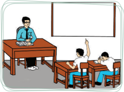

> **Deskripsi Visual:** Gambar ini adalah ilustrasi yang menunjukkan sebuah kelas di mana seorang guru sedang memberikan penjelasan kepada murid-muridnya. Guru berdiri di depan kelas dengan laptop di tangan, sedangkan murid-muridnya berada di kursi di belakang. Salah satu murid tampaknya telah bertanya dengan mengangkat tangan. Ilustrasi ini menunjukkan hubungan antara guru dan murid dalam proses pembelajaran, serta interaksi antar sesama murid. Teks, angka, atau label penting tidak terlihat dalam gambar ini. Informasi kunci yang dapat diambil pembaca adalah bahwa ini adalah situasi pembelajaran di kelas, dengan guru sebagai pengajar dan murid sebagai siswa.

### 3. Hati-hatilah Memikirkannya

Berpikir merupakan  bagian yang tidak terpisahkan dalam belajar. Kita  tidak  akan  memperoleh  manfaat  dengan  hanya  membaca  buku  atau mendengarkan dari guru. Kita harus melakukan sesuatu dalam diri kita sendiri. Ketika kita belajar, kita tidak dapat secara otomatis mengambil dan menyerap pengetahuan. Tetapi kita harus berpikir tentang semua informasi itu, sehingga tidak salah menarik kesimpulan dari materi yang kita pelajari.

Pada tingkatan seperti ini, kita telah mencapai tingkatan yang lebih tinggi dalam pemahaman. Nabi Kongzi menegaskan 'Belajar tanpa berpikir sia-sia. Berpikir tanpa belajar berbahaya'. (Sabda Suci. II: 15)

Belajar dan berpikir harus sejalan secara bersamaan. Suatu ketika Nabi Kongzi menyatakan:  'Aku  pernah  sepanjang  hari tidak  makan dan sepanjang hari tidak tidur hanya untuk merenungkan sesuatu. Ini ternyata  tidak  berguna,  lebih  baik  belajar'. ( Lunyu . XV: 31)

Berpikir sebuah usaha membedakan mana  yang  baik  dan  mana  yang  buruk, yang  sesuai  dan  yang  tidak  sesuai,  yang dapat  dilaksanakan  dan  yang  tidak  dapat dilaksanakan. Tentu saja, kemampuan menyaring dan memilah-milah tidak berasal dari  pembawaan.  Hal  tersebut  memerlukan

---
**🖼️ Gambar/Diagram**

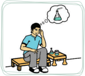

> **Deskripsi Visual:** Gambar ini adalah ilustrasi yang menunjukkan seorang pria sedang berpikir tentang sebuah botol. Pada gambar tersebut, elemen utama adalah pria yang sedang berpikir, botol yang ada di meja, dan lingkungan sekitar seperti kursi dan meja. Teks, angka, atau label penting tidak terlihat pada gambar ini. Informasi kunci yang dapat diambil pembaca adalah bahwa pria tersebut sedang berpikir tentang botol yang ada di meja depannya.

 

---
## 📄 Halaman 20

latihan  dan  harus  dipraktikkan.  Jika  tidak,  pencapaian  pengetahuan  akan berkesan sedikit dalam kehidupan seseorang, khususnya kehidupan moralnya.

Zhuxi dengan tepat telah menyimpulkan tentang hubungan ini, memperluas pengetahuan, pandai bertanya, berfikir dengan hati-hati, membedakan dengan jelas dan melaksanakan dengan baik semuanya adalah sama pentingnya.

### '…Ada hal yang tidak dipikirkan, tetapi hal yang dipikirkan bila belum dapat dicapai janganlah dilepaskan…'.

### 4. Jelas-jelaslah Menguraikannya

Sesuatu  yang  kita  pelajari  mestinya  sampai  kita  dapat  dengan  jelas menguraikannya, memilah-milah, mana hal yang perlu diprioritaskan (didahulukan)  dan  mana  hal  yang  kemudian.  Selanjutnya,  kita  juga  dapat mengaitkan setiap materi yang kita pelajari.

Kemampuan  menguraikan  dengan  jelas  materi  yang  dipelajari  adalah bukti dari pemahaman kita atas materi tersebut. Pemahaman kita juga akan semakin meningkat setelah kita menguraikannya.

### '…Ada  hal  yang  tidak  diuraikan,  tetapi  hal  yang  diuraikan  bila belum dapat terperinci jelas janganlah dilepaskan…'

### 5. Sungguh-sungguhlah Melaksanakannya

Melaksanakan apa yang kita pelajari haruslah dengan kesungguhan. Karena dengan kemauan yang setengah-setengah wajarlah bila kita mendapatkan hasil yang setengah-setengah.

Sesungguhnya,  untuk  segala  hal  persoalan  utamanya  bukanlah  mampu atau  tidak  mampu,  tetapi  kesungguhanlah  yang  akan  menentukan  sebuah keberhasilan. Tersurat di dalam Kanggao (kitab  dinasti Zhao ):  'Berlakulah seumpama merawat bayi, bila dengan sebulat hati mengusahakannya, meski tidak  tepat  benar,  niscaya  tidak  jauh  dari  yang  seharusnya.  Sesungguhnya, tiada  yang  harus  lebih  dahulu,  belajar  merawat  bayi  baru  boleh  menikah'. ( Daxue . Bab IX: 2)

- '…Ada  hal  yang  tidak  dilakukan,  tetapi  hal  yang  dilakukan  bila belum dapat dilaksanakan sepenuhnya janganlah dilepaskan…'

 

---
## 📄 Halaman 21

### Pentingnya Arti Kesungguhan

Zizhang berkata,  'Seorang  yang  memegang  kebajikan  tetapi  tidak mengembangkannya,  percaya  akan  jalan  suci  tetapi  tidak  sungguhsungguh; ia ada, tidak menambah, dan tidak adapun tidak mengurangi'. ( Lunyu . XIX: 2)

### D.  Belajar Berarti Praktik

Filsafat belajar yang benar adalah, bahwa belajar berarti praktik. Karena pengetahuan  tentang  apapun  yang  benar  dan  baik,  betapapun  hebatnya bila  tidak  dipraktikkan  tidak  akan  ada  manfaatnya.  Maka  belajar  yang baik  adalah:  'Mengajarkannya  pada  orang  lain'.  Selanjutnya,  pelajaran  itu diinternalisasikan  dalam  kehidupan.  Kerjakan  apa  yang  kita  ajarkan  pada orang lain, dan ajarkan apa yang mampu dan telah kita kerjakan.

Maka cara terbaik untuk membuat orang lain belajar adalah mengubahnya menjadi pengajar. Ketika kita mengajarkan atau membagikan apa yang kita pelajari kepada orang lain, secara tidak langsung kita telah berjanji kepada orang-orang tadi bahwa kita akan melakukan hal-hal yang kita pelajari. Secara alamiah kita akan termotivasi untuk 'menghidupi' apa-apa yang kita pelajari.

Kesediaan  kita  untuk  membagi  itu  juga  akan  menjadi  dasar  bagi pembelajaran,  komitmen  dan  motivasi  yang  lebih  dalam,  yang  membuat perubahan menjadi sesuatu yang sah, dan terbentuk suatu tim pendukung. Kita juga akan menemukan bahwa dengan berbagi itu akan tercipta ikatan dengan orang lain.

Belajar  tetapi  tidak  melakukan  adalah  tidak  belajar.  Dengan  kata  lain, memahami  sesuatu  tetapi  tidak  menerapkannya  sama  saja  dengan  tidak memahami.

 

---
## 📄 Halaman 22

### Penting!

-  Mengetahui tetapi tidak melakukan sesungguhnya sama saja dengan tidak mengetahui.
-  Mengetahui  kebenaran  tetapi  tidak  melakukannya,  itulah  tiada keberanian.
-  Pengetahuan  paling  baik  dipelajari  bukan  dengan  merenung  atau meditasi, melainkan dengan tindakan.
Nabi Kongzi bersabda: 'Biar ada makanan yang lezat, bila tidak dimakan, orang  tidak  tahu  bagaimana  rasanya;  biar  ada  jalan  suci  yang  agung,  bila tidak  belajar,  orang  tidak  tahu  bagaimana  kebaikannya.  Maka,  belajar menjadikan orang tahu kekurangan dirinya, dan mengajar menjadikan orang tahu  kesulitannya.  Dengan  mengetahui  kekurangan  dirinya,  orang  dipacu mawas diri; dan dengan mengetahui kesulitannya, orang dipacu menguatkan diri. Maka dikatakan, 'Mengajar dan belajar itu saling mendukung'. Di dalam Yueming tersurat: 'Mengajar itu setengah belajar'. ( Shujing . VIII. III: 5)

### 1. Pengetahuan dan Latihan

Istilah praktik atau latihan, dalam bahasa Mandarin ( Zhongwen )  adalah Xi .  Aslinya, Xi berarti  seekor  burung  kecil  sedang  belajar  terbang,  dengan bimbingan  induknya  yang  mencoba  berkali-kali  sebelum  ia  dapat  terbang membumbung tinggi ke angkasa.

Dari  sini  kelihatan  bahwa  belajar  dan  praktik  saling  ketergantungan, dan  merupakan  sesuatu  yang  tak  dapat  dipisahkan. Zhuxi membandingkan pengetahuan dan praktik seperti dua buah roda gerobak atau sepasang sayap burung. Apabila salah satu dari roda atau sayap hilang, maka gerobak tidak dapat bergerak dan burung tidak dapat terbang (seperti daya ' Yin ' dan ' Yang ' saling melengkapi/menggenapi).  Pengetahuan  dan  praktik  selalu  saling mendukung satu sama lain. Hal ini seperti juga seseorang yang tidak dapat berjalan tanpa kaki meskipun ia mempunyai mata, dan seorang tidak dapat melihat tanpa mata meskipun ia mempunyai kaki.

Zhuxi mengatakan, bahwa pengetahuan dan praktik tidak dapat dipisahkan. Kita  harus  terus  berusaha  untuk  mendapatkan  keduanya  (pengetahuan  dan praktik).  Semakin  jelas  pengetahuan  seseorang,  semakin  bermanfaatlah praktiknya. Semakin bermanfaat praktik atau unjuk kerja seseorang, semakin jelaslah pengetahuannya.

 

---
## 📄 Halaman 23

Wang Yangming juga  menekankan  kesatuan  antara  pengetahuan  dan praktik. Baginya, pengetahuan (teori) dan praktik tidak diambil sebagai dua hal yang terpisah. Dalam penjelasan tentang dokrin 'Bersatunya Pengetahuan (teori)  dan  Praktik'.  Ia  mengatakan,  bahwa  ada  orang  yang  mengetahui tentang  sesuatu  tanpa  ia  mempraktikkan  apa  yang  ia  ketahui.  Mereka mengklaim mengetahui nilai-nilai moral tetapi tidak mempraktikkan apa yang diketahuinya. Menurut Wang Yangming , hal itu tidak ada artinya.

Pengetahuan dan praktik adalah dua kata yang menggambarkan proses yang sama. Wang Yangming menuliskannya dengan kalimat sebagai berikut: 'Pengetahuan merupakan arah untuk praktik, dan praktik adalah usaha untuk memperoleh pengetahuan itu. Pengetahuan dimulai dengan praktik dan praktik adalah penyempurnaan pengetahuan'.

Perhatikan aturan yang satu ini 'Kita tidak bisa memahami arti penting segala sesuatu, kecuali kita mengamalkannya dalam perbuatan nyata. Tetapi kita juga tidak dapat mengamalkan segala sesuatu dengan baik, kecuali kita benar-benar memahami arti penting segala sesuatu'.

Pemahaman  dan  pengamalan  adalah  dua  hal  yang  tidak  bisa  dipisahpisahkan dalam hal pencapaiannya. Orang hanya bisa memahami arti penting segala sesuatu setelah ia mengamalkannya. Pada saat yang sama, ia benarbenar harus memahami arti penting segala sesuatu untuk sampai pada tingkat pengamalan yang sebaik-baiknya.

Nabi Kongzi bersabda: 'Belajar dan selalu dilatih, tidakkah itu menyenangkan? Kawan-kawan  datang dari tempat jauh, tidakkah itu membahagiakan?' ( Lunyu . 1:1)

### 2. Kata-Kata dan Perbuatan

Hal ini membawa kita pada aspek lain dalam hubungan antara pengetahuan dan  praktik.  Dalam  Kitab  Hikayat  ( Shujing )  tercatat:  'Tidak  sukar  untuk mengetahui,  tetapi  sulit  untuk  melakukan  atau  melaksanakannya'.  Nabi Kongzi juga  menyatakan  tentang  laku  seorang Junzi ,  bahwa  seorang Junzi mendahulukan perbuatan, baru kemudian kata-katanya disesuaikan...'.

Kata-kata  dan  tindakan  harus  sejalan,  dan  perkataan  seorang  yang bijaksana  ( Junzi )  harus  dapat  dibuktikan  dalam  tindakannya.  Perkataan adalah  alat  yang  mengingatkan  kita  untuk  mempraktikkan.  Kita  tidak  bisa hanya berbicara tentang prinsip dari pembinaan moral, tetapi kita juga harus mempraktikkannya.

 

---
## 📄 Halaman 24

Kata-kata  adalah Dassein ,  dan  praktik  adalah Dassolen .  Jadi  praktik merupakan ejawantah dari kata-kata yang diucapkan ( consist ).

### Aktivitas 1.4

### Diskusi Kelompok

-  Diskusikan maksud ayat suci berikut:
-  Kepada yang diberi tahu tentang satu sudut, tetapi tidak mau berusaha mengetahui ketiga sudut yang lain tidak perlu diberitahu lebih lanjut.
( Lunyu .VII: 8)

### 3. Belajar dan Bertindak adalah Satu

Belajar menghasilkan pemikiran, pemikiran menghasilkan pengetahuan, pengetahuan  menghasilkan  tindakan,  dan  kembali  ke  belajar  dalam  suatu lingkaran yang tanpa terpisahkan dan tanpa henti.

Sebagian besar orang mengetahui hal-hal yang seharusnya mereka lakukan, tetapi  sering  kali  mereka  tidak  dapat  melakukannya.  Memaksa  diri  untuk melakukan sesuatu, bukanlah cara yang efektif, meskipun hal itu dilakukan untuk kebaikan anda sendiri. Sebaiknya, libatkan pikiran secara mendalam dan tulus, baru kemudian tindakan akan mengikuti dengan sendirinya.

### Penting!

Belajar terus tanpa pernah mempraktikkannya akan menimbulkan kebimbangan.  Namun  berbuat  terus  tanpa  mau  belajar  akan menimbulkan keputusasaan.

Sebagai  contoh,  riset  memperlihatkan  bahwa  seseorang  yang  sedang menghadapi masalah alkohol dapat dibantu dengan mempelajari kondisinya. Jadi, semua program rehabilitasi alkohol dan narkoba mencakup pengajaran. Pendidikan  mengenai  akibat  negatif  pada  tubuh,  akan  semakin  parah  jika berlangsung selama bertahun-tahun. Sebaliknya, belajar mengendalikan emosi akan memperbaiki hubungan dan membuat orang berubah menjadi lebih baik.

 

---
## 📄 Halaman 25

Jika anda sedang mencoba mencapai sesuatu tetapi tidak mampu bertindak, eksperimenlah  dengan  cara  'curahkan  diri  sepenuh  hati  akan  masalah  itu'. Bicarakan dengan orang yang berpengetahuan tentang hal itu, dan kumpulkan sebanyak mungkin informasi. Jangan merepotkan diri dengan hal-hal detail yang  tidak  penting.  Temukan Li (hukum)  yang  merupakan  prinsip  yang mendasarinya. Jika kita melibatkan diri dengan tulus, niscaya tindakan akan mengikuti dengan sendirinya.

### Aktivitas 1.5

### Diskusi Kelompok

Diskusikan maksud ayat suci berikut: 'Seumpama membangun  gunung-gunungan. Setelah hanya kurang satu keranjang untuk menjadikannya, bila terpaksa menghentikannya, akan Kuhentikan.

Seumpama meratakan tanah yang berlubang, setelah hanya kurang  satu  keranjang  untuk  meratakannya,  sekalipun  keadaan memaksa berhenti, Aku akan terus melaksanakannya'.

### Penilaian Diri Skala Sikap

###  Petunjuk:

Isilah lembar penilaian diri yang ditunjukkan dengan skala sikap, dengan memberikan tanda checklist (√) di antara empat skala sebagai berikut.

SS = Sangat Setuju

ST = Setuju

RR = Ragu-ragu

TS = Tidak Setuju

 

---
## 📄 Halaman 26

---
**📊 Tabel**

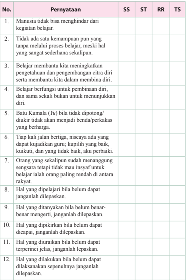

Tabel ini berisi 12 pernyataan yang mungkin merupakan soal-soal dalam sebuah tes atau ujian akademik. Topik utamanya berkisar pada pemahaman dasar manusia tentang belajar, keterampilan, dan pengembangan diri. Kolom-kolom yang ada meliputi SS (Sesuai), ST (Sesuai tetapi Sederhana), RR (Rahasia), dan TS (Tidak Sesuai). Data atau pola penting yang terlihat menunjukkan bahwa banyak pernyataan memiliki tingkat kesesuaian yang rendah, dengan beberapa pernyataan yang sangat tidak sesuai. Ini menunjukkan bahwa materi yang diajarkan mungkin kurang memadai atau tidak mencakup semua aspek pemahaman yang diperlukan untuk menjawab pertanyaan dengan benar.

 

---
## 📄 Halaman 27

---
**📊 Tabel**

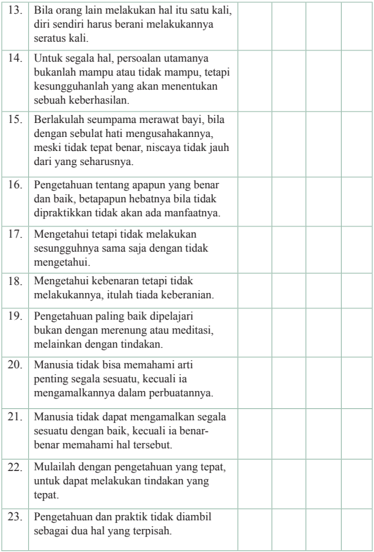

Tabel ini berisi 23 pernyataan yang membahas tentang prinsip-prinsip kehidupan yang baik dan penting. Topik utamanya adalah tentang keterampilan dan sikap yang diperlukan untuk hidup dengan sehat dan bermakna. Kolom pertama menyajikan pernyataan, sedangkan kolom kedua dan ketiga menunjukkan apakah pernyataan tersebut benar atau salah. Data penting yang terlihat adalah bahwa manusia harus belajar dan mempraktekkan keterampilan dan sikap yang baik secara terus-menerus, tidak hanya sekali atau dua kali, tetapi harus dilakukan secara rutin dan berulang-ulang. Selain itu, pernyataan-pernyataan lainnya juga menekankan pentingnya pemahaman dan praktik yang tepat, kesadaran diri, dan pengertian tentang kebaikan dan keburukan tindakan.

 

---
## 📄 Halaman 28

### Penilaian Diri Skala Perilaku

###  Petunjuk:

Isilah  lembar  penilaian  diri  yang  ditunjukkan  dengan  skala  perilaku, dengan  memberikan  tanda checklist (√)  di  antara  empat  skala  sebagai berikut.

SS =   Selalu

SR

=   Sering

KK

=   Kadang-kadang

JR

=   Jarang

---
**📊 Tabel**

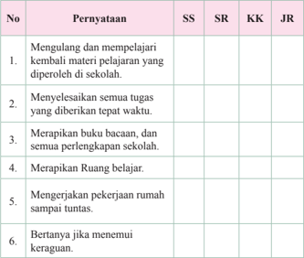

Tabel ini berisi 6 poin yang masing-masing diukur dengan skor SS (Sesuai Standar), SR (Sesuai Rekomendasi), KK (Kurang Konsisten), dan JR (Jauh Konsisten). Topik utama tabel adalah tentang kinerja belajar siswa dalam berbagai aspek seperti mengulangi materi pelajaran, menyelesaikan tugas tepat waktu, merapikan buku bacaan dan peralatan sekolah, merapikan ruang belajar, mengerjakan pekerjaan rumah sampai tuntas, dan bertanya jika menemui kerugian. Kolom-kolom yang ada adalah SS, SR, KK, dan JR. Data atau pola penting yang terlihat adalah bahwa semua poin memiliki skor SS dan SR, sedangkan skor KK dan JR sangat rendah, menunjukkan bahwa siswa memiliki kinerja belajar yang baik namun masih perlu meningkatkan konsistensi dan keterampilan tertentu.

 

---
## 📄 Halaman 29

### A. Uraian

Jawablah  pertanyaan-pertanyaan  berikut  ini  dengan  uraian  yang jelas!

- Apa  yang  dimaksud  dengan  belajar  sebagai  ibadah  dan  proses pembinaan diri?
- Jelaskan pentingnya belajar untuk hidup dan kehidupan.
- Jelaskan hubungan dan keterkaitan antara belajar dan praktik.
- Jelaskan hubungan antara belajar dan berpikir.
- Kapan anda memulai aktivitas belajar dalam hidup anda? Dan sampai kapan kegiatan itu akan berakhir?

### B.  Mencari Ayat

Carilah  ayat  suci  yang  terdapat  dalam  kitab Sishu ,  lalu  tuliskan  pada kolom berikut ini sesuai dengan aspek yang ditentukan.

---
**📊 Tabel**

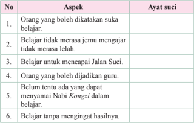

Tabel ini berisi 6 ayat suci yang membahas aspek-aspek belajar dan pengembangan diri. Topik utamanya adalah tentang nilai-nilai positif dalam proses belajar, seperti keberanian menghadapi tantangan, kesadaran diri, dan pengertian tentang tujuan belajar. Kolom pertama menunjukkan nomor urutan ayat suci, sedangkan kolom kedua menjelaskan aspek-aspek yang disebutkan dalam ayat-ayat tersebut. Data penting yang terlihat adalah bahwa semua ayat suci tersebut mencakup nilai-nilai positif dalam belajar, seperti menerima tantangan, mencapai tujuan, dan menghormati guru.

 

---
## 📄 Halaman 30

---
**📊 Tabel**

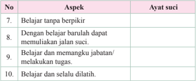

Tabel ini berisi 10 ayat suci yang membahas aspek-aspek belajar dan pengembangan diri. Topik utamanya adalah tentang cara-cara efektif belajar dan mengembangkan keterampilan. Kolom pertama menunjukkan nomor ayat (No.) dan kolom kedua menunjukkan aspek-aspek yang dijelaskan dalam ayat tersebut. Data penting yang terlihat antara lain bahwa belajar tanpa berpikir tidak efektif, belajar baru dapat memulai jalan suci, belajar dan memangku jabatan/melakukan tugas penting, dan belajar dan selalu dilatih untuk perkembangan yang lebih baik.

 

---
## 📄 Halaman 31

---
**🖼️ Gambar/Diagram**

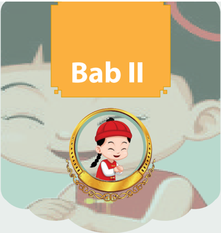

> **Deskripsi Visual:** Gambar ini menunjukkan bab kedua dari sebuah buku pelajaran, yang tampaknya berisi konten edukatif atau cerita anak-anak. Gambar utama adalah seorang anak perempuan dengan rambut panjang dan berwarna hitam, dikenakan pakaian tradisional yang berwarna merah dan putih, serta topi merah. Anak tersebut sedang tersenyum lebar dan tampak sangat bahagia. Di sekitar anak tersebut ada beberapa elemen yang menambah keindahan dan keunikan gambar:

1. **Elemen-elemen utama**:
   - Anak perempuan yang tersenyum.
   - Topi merah yang dikenakan oleh anak.
   - Pakaian tradisional yang berwarna merah dan putih.
   - Lingkungan yang menyerupai cermin dengan gambaran anak yang lebih kecil.

2. **Relasi antara elemen-elemen**:
   - Anak menjadi subjek utama yang dominan dalam gambar.
   - Topi merah dan pakaian tradisional menjadi atribut yang menonjol.
   - Lingkungan cermin memberikan nuansa cerita atau cerita pendek.

3. **Teks, angka, atau label penting**:
   - Teks "Bab II" yang terletak di atas gambar, menunjukkan bahwa ini adalah bagian kedua dari buku.

4. **Informasi kunci**:
   - Gambar ini mungkin digunakan untuk menggambarkan cerita atau tema yang berkaitan dengan anak-anak atau budaya tradisional.
   - Informasi tambahan tentang konten bab kedua dapat ditemukan melalui teks yang tidak terlihat dalam gambar ini.

Dengan demikian, gambar ini menunjukkan bab kedua dari buku pelajaran yang mungkin berfokus pada tema anak-anak atau budaya tradisional, dengan fokus pada karakter anak perempuan yang ceria dan menarik.

Filosofi dan Pemetaan Yin Yang

 

---
## 📄 Halaman 32

---
**🖼️ Gambar/Diagram**

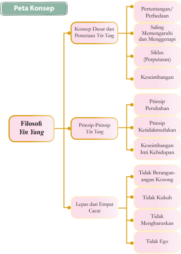

> **Deskripsi Visual:** Gambar ini adalah diagram yang menunjukkan konsep filosofi Yin Yang dalam konteks teks pelajaran. Diagram ini terdiri dari dua bagian utama: "Konsep Disar dan Pemetaan Yin Yang" dan "Filosofi Yin Yang". Untuk "Konsep Disar dan Pemetaan Yin Yang", ada empat elemen utama yang disebutkan: Pertentangan/Perbedaan, Saling Memengaruhi dan Mengenapi, Siklus (Perputaran), dan Keseimbangan. Untuk "Filosofi Yin Yang", ada tiga prinsip utama: Prinsip Perubahan, Prinsip Ketidakmuktakan, dan Keseimbangan Inti Kehidupan. Selain itu, ada juga lima prinsip tambahan yang disebutkan: Tidak Berangkangan Angka Kosong, Tidak Kukuh, Tidak Mengharuskan, dan Tidak Ego. Setiap elemen dalam diagram ini memiliki hubungan dengan elemen lainnya melalui ikatan garis, menunjukkan hubungan antara konsep disar dan pemetaan Yin Yang serta filosofi Yin Yang.

 

---
## 📄 Halaman 33

### A.  Konsep Dasar dan Pemetaan Yin Yang

Prinsip umum  yang  melandasi  hubungan-hubungan  dan  peristiwaperistiwa  alam  berasal  dari  kekuatan Yin dan Yang ,  yang  berasal  dari Taiji ( Tian ). Taiji merupakan kekuatan  yang mengandung dua unsur Yin dan Yang . Jika  kedua  kekuatan  ini  digabungkan  akan  banyak  menghasilkan  peristiwa dan benda.

Di dalam Yijing dinyatakan: ' Taiji melahirkan Liangyi , Taiji itu  adalah Jalan Suci, Liangyi itu adalah Yin Yang , Yin Yang di dalam Jalan Suci yang satu Taiji itu adalah Wuji '.

Sebelum  ada  sesuatu  ada Taiji (Tuhan),  sebelum  ada  penciptaan Taiji adalah Wuji (tidak ada yang lain selain Tuhan itu sendiri).

Ketika sesuatu dihasilkan, maka harus ada sesuatu yang menghasilkannya, juga  harus  ada  sesuatu  yang  menjadi  bahan  yang  dari  sesuatu  itu  dibuat. Yang disebut  terdahulu  merupakan unsur aktif, dan yang disebut kemudian merupakan  unsur  pasif.  Unsur  aktif  bersifat  kuat/bergerak,  itulah Yang ; sedangkan unsur pasif bersifat patuh, itulah Yin .  Penciptaan  segala  sesuatu merupakan kerja sama di antara kedua unsur tersebut. Karena itulah dikatakan: ' Yang satu Yang dan yang satu Yin , itulah yang disebut Dao (jalan suci).

---
**🖼️ Gambar/Diagram**

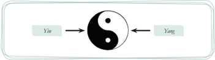

> **Deskripsi Visual:** Gambar ini adalah ilustrasi yang menunjukkan konsep Yin dan Yang dalam teori Taoisme. Ilustrasi ini menggambarkan dua bagian yang saling berhubungan dan saling mempengaruhi satu sama lain. Bagian kiri bernama "Yin" dan bagian kanan bernama "Yang". Dua bagian ini berada di sekeliling sebuah simbol yang menggambarkan hubungan antara Yin dan Yang, yang merupakan simbol harmoni dan keadilan dalam teori Taoisme.

Elemen utama dalam gambar ini adalah dua bagian yang diberi nama "Yin" dan "Yang", serta simbol yang menggambarkan hubungan antara kedua bagian tersebut. Simbol ini menunjukkan bahwa Yin dan Yang saling berhubungan dan saling mempengaruhi satu sama lain. 

Teks, angka, atau label penting yang terlihat pada gambar ini adalah nama-nama "Yin" dan "Yang" yang diberikan untuk masing-masing bagian yang ada di sisi kiri dan kanan gambar. Informasi kunci yang dapat diambil pembaca adalah bahwa Yin dan Yang adalah dua bagian yang saling berhubungan dan saling mempengaruhi satu sama lain dalam teori Taoisme.

Sumber: Dokumen Kemdikbud

Namun perlu dipahami bahwa: sisi kiri yang disebut Yang memiliki unsur Yin , sisi kanan yang disebut Yin juga memiliki unsur Yang . Artinya, sisi kiri lebih Yang dan kurang Yin . Sisi kanan lebih Yin dan kurang Yang .

Maka, unsur Yang di sisi kiri disebut Tai Yang , dan unsur Yin di sisi kiri disebut Shao Yin .  Sebaliknya,  unsur Yin di  sisi  kanan  disebut Tai Yin ,  dan unsur Yang di sisi kanan disebut Shao Yang . Untuk lebih jelasnya, perhatikan gambar berikut.

 

---
## 📄 Halaman 34

---
**🖼️ Gambar/Diagram**

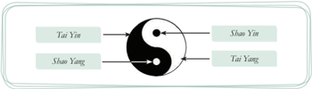

> **Deskripsi Visual:** Gambar ini adalah ilustrasi yang menunjukkan hubungan antara empat konsep astrologi Tiongkok, yaitu Tai Yin, Shao Yang, Tai Yang, dan Shao Yin. Ilustrasi ini menggunakan simbol matahari dan bulan untuk menggambarkan hubungan antara empat konsep tersebut. Tai Yin dan Tai Yang terletak di sisi matahari, sedangkan Shao Yin dan Shao Yang terletak di sisi bulan. Jaringan antara mereka menunjukkan bahwa semua empat konsep tersebut saling berhubungan dan mempengaruhi satu sama lain. Teks pada gambar ini tidak menyebutkan nama-nama konsep astrologi Tiongkok, tetapi hanya memberikan deskripsi singkat tentang hubungan antara empat konsep tersebut.

### Referensi

Kalian  tentu  pernah  mempelajari  tentang  hormon  pada  manusia bukan? Bahwa seorang laki-laki memiliki 70 % hormon endrogen dan 30% hormon estrogen. Sebaliknya, seorang perempuan memiliki 70% hormon estrogen dan 30 % hormon endrogen.

Yin  Yang merupakan  daya  yang  saling  bertentangan.  Meskipun  fungsi kedua daya itu berbeda (bertentangan), namun keduanya saling ketergantungan, maka kedua daya itu saling menggenapi (penggenapan), saling memengaruhi/ mendorong yang melahirkan perputaran (siklus), saling menyeimbangkan satu sama lain (mencari titik keseimbangan), dan merupakan satu kesatuan universal yang dapat melahirkan daya/kekuatan serta menciptakan keharmonisan hidup. Agar dapat terselenggaranya keharmonisan, sisi Yang harus  selaras  dengan sisi Yin . Junzi bersikap harmonis, tidak melanda. ( Zhongyong . IX: 5)

---
**🖼️ Gambar/Diagram**

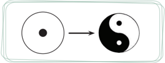

> **Deskripsi Visual:** Gambar ini adalah ilustrasi yang menunjukkan perubahan dari bentuk awal ke bentuk akhir. Pada bagian kiri, ada sebuah lingkaran yang berisi titik putih. Kemudian, lingkaran tersebut mengubah bentuk menjadi tanda Yin-Yang, yang terdiri dari dua bagian berbeda warna: putih dan hitam. Dalam konteks ilustrasi ini, tampaknya digambarkan proses transformasi atau evolusi dari suatu konsep atau ide ke bentuk yang lebih kompleks dan simetris.

Elemen utama dalam gambar ini adalah lingkaran yang mengubah bentuknya menjadi tanda Yin-Yang. Relasi antara kedua elemen ini adalah bahwa lingkaran awal menjadi dasar untuk menciptakan tanda Yin-Yang yang lebih kompleks dan simetris. Teks, angka, atau label penting tidak terlihat pada gambar ini, sehingga fokus utama adalah pada perubahan bentuk dan simetri.

Informasi kunci yang dapat diambil pembaca adalah bahwa gambar ini mungkin digunakan untuk menggambarkan konsep transformasi, evolusi, atau perubahan dari suatu konsep ke bentuk yang lebih kompleks dan simetris.

Sumber: Dokumen Kemdikbud

 

---
## 📄 Halaman 35

### 1. Pertentangan/Perbedaan

Terkait pertentangan/perbedaan, Yin Yang menggambar hal penting tentang kehidupan, yaitu bahwa segala sesuatu yang hidup (tumbuh, berkembang, dan bergerak) selalu karena ada dua unsur di dalamnya. Di dalam diri manusia ada unsur Nyawa ( Gui ) dan Roh ( Shen ). Selanjutnya, semua fenomena dalam kehidupan adalah karena ada dua unsur (positif-negatif, langit-bumi, mataharibulan, pria-wanita, kiri-kanan, dan seterusnya).

Banyak orang terpola dengan konsep bahwa tangan kanan yang aktif dan tangan kiri pasif. Awalnya, ketika orang mulai melakukan aktivitas-aktivitas ringan ia cenderung menggunakan tangan kiri. Namun, lingkungan atau orangorang  di  sekitarnya  tidak  mendukung  ia  menggunakan  dan  mengaktifkan tangan kirinya. Artinya, tangan kanan menjadi lebih aktif dibanding tangan kiri karena pengkondisian.

---
**🖼️ Gambar/Diagram**

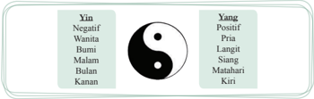

> **Deskripsi Visual:** Gambar ini adalah ilustrasi yang menunjukkan konsep Yin dan Yang dalam budaya Tiongkok. Gambar tersebut menggambarkan dua bagian yang berlawanan namun saling mempengaruhi, yang merupakan simbol dari konsep Yin yang negatif dan Yang yang positif. Dua bagian ini diberi nama "Yin" dan "Yang", yang masing-masing memiliki beberapa elemen yang berbeda seperti "Negatif", "Positif", "Bumi", "Laut", "Bulan", "Kanan", "Pria", "Langit", "Sangat", "Matahari", dan "Kiri". Ini menunjukkan bahwa konsep Yin dan Yang tidak hanya tentang dua hal yang berlawanan, tetapi juga tentang hubungan antara mereka. Gambar ini membantu pembaca untuk memahami konsep ini dengan lebih baik dan memahami bagaimana konsep ini digunakan dalam budaya Tiongkok.

Sumber: Dokumen Kemdikbud

Dalam  kegiatan  baris-berbaris  (PBB),  kita  juga  dikondisikan  dengan gerakan balik kanan. Tidak pernah dikenal istilah balik kiri. Namun sadarkah kalian,  bahwa  arah  pergerakan  itu  pada  hakikatnya  ke  kiri?  Coba  kalian perhatikan gerak (putaran) jarum jam! Bukankah jarum jam bergerak ke kiri? Perhatikan juga putaran lari saat kalian berolahraga! Bukankah kalian berputar ke kiri?

Aktivitas 2.1

### Diskusi Kelompok

-  Carilah pembuktian atau penguatan lain tentang arah pergerakan ke kiri?

 

---
## 📄 Halaman 36

### 2. Saling Memengaruhi/Menggenapi

Tidak ada satu pun di jagat raya ini yang bisa berdiri sendiri. Segala sesuatu selalu  berhubungan  dengan  yang  lain,  dan  senantiasa  saling  memengaruhi. Hubungan seorang individu dimulai dari hubungan individu tersebut dengan dirinya  sendiri,  kemudian  menjadi  jaringan  yang  meluas  hingga  menjadi hubungan-hubungan dengan lingkungan sekitarnya.

Alam mengajarkan kita, bahwa segala sesuatu yang ada di jagat raya ini saling berhubungan dan bergantung satu sama lain. Setiap penciptaan, baik yang alami ataupun buatan manusia, tidak tercipta sendiri-sendiri.

Segala 'sesuatu' ada bersama dengan 'sesuatu' yang lain. Tak ada sesuatu pun  yang  sama  sekali  bebas  dari  benda-benda  di  sekitarnya,  atau  serba tergantung. Segala sesuatu ada dalam kondisi saling ketergantungan ( interdepedency ). Tidak ada 'kemandirian mutlak', dan tidak ada 'ketergantungan mutlak'  yang  ada  saling  ketergantungan.  Sesungguhnya,  segala  sesuatu  itu merupakan bagian dari keseluruhan.

### 3. Siklus

Begitu  matahari  pergi  datanglah  bulan.  Begitu  bulan  pergi,  datanglah matahari. Matahari  dan  bulan saling  mendorong.  Dingin  pergi,  panas datang; panas pergi, dingin datang. Dingin dan panas saling mendorong dan sempurnalah masa satu tahun. Yang pergi itu berkurang kian berkurang; yang datang itu bertambah kian bertambah. Proses kian berkurang, kian bertambah saling memengaruhi dan membawakan berkah untuk pertumbuhan/kehidupan (Babaran  Agung.  B  Bab  V:  32).  Maka  dikatakan, Yin memengaruhi  dan mendorong Yang , Yang memengaruhi dan mendorong Yin .

---
**🖼️ Gambar/Diagram**

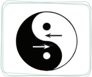

> **Deskripsi Visual:** Gambar ini adalah ilustrasi yang menunjukkan konsep yin yang biasanya digambarkan dengan dua lingkaran berwarna hitam dan putih yang bergerak menuju satu sama lain. Lingkaran hitam bergerak ke kanan sementara lingkaran putih bergerak ke kiri. Ini menunjukkan kontras antara kedua elemen tersebut, yang sering digunakan dalam teori Taoisme untuk menggambarkan hubungan antara dua elemen yang saling mempengaruhi satu sama lain.

Elemen utama dalam gambar ini adalah dua lingkaran yang bergerak menuju satu sama lain. Lingkaran hitam bergerak ke kanan sementara lingkaran putih bergerak ke kiri. Ini menunjukkan kontras antara kedua elemen tersebut, yang sering digunakan dalam teori Taoisme untuk menggambarkan hubungan antara dua elemen yang saling mempengaruhi satu sama lain.

Teks, angka, atau label penting yang terlihat dalam gambar ini adalah dua lingkaran berwarna hitam dan putih yang bergerak menuju satu sama lain. Ini menunjukkan kontras antara kedua elemen tersebut, yang sering digunakan dalam teori Taoisme untuk menggambarkan hubungan antara dua elemen yang saling mempengaruhi satu sama lain.

Informasi kunci yang dapat diambil pembaca adalah bahwa gambar ini menunjukkan kontras antara dua elemen yang saling mempengaruhi satu sama lain, yang sering digunakan dalam teori Taoisme. Ini juga menunjukkan bahwa kedua elemen tersebut bergerak menuju satu sama lain, yang menunjukkan hubungan antara kedua elemen tersebut.

Gambar 2.5 Yang mendorong Yin , Yin mendorong Yang

 

---
## 📄 Halaman 37

### 4. Keseimbangan

Segala sesuatu di alam ini diciptakan dengan maksud tertentu. Tak ada satu pun yang tidak memiliki kegunaan. Setiap keberadaan memiliki tempatnya sendiri  di  jagat  raya,  dan  manusia  harus  menyeimbangkan  unsur-unsur  ini dengan tepat, sehingga dapat tercipta sesuatu yang berarti.

Keseimbangan merupakan sifat alam. Keseimbangan antara daya Yin dan Yang merupakan kondisi yang sangat penting dalam mencapai keharmonisan jagat raya. Evolusi kehidupan menyelesaikan siklus demi siklus, dan mencoba mencapai keseimbangan baru pada setiap siklus.

Kemampuan  melihat  segala  sesuatu  dari  sudut  pandang  yang  berbeda merupakan keuntungan bagi setiap orang. Menjaga pikiran seimbang merupakan salah satu aset terbesar manusia. Tak ada sesuatu pun di dunia ini yang mencapai titik puncak pencapaian, yang ada hanyalah perubahan dan penggenapan. Evolusi alam dan manusia tidak pernah mencapai 'kesempurnaan yang mutlak'. Perubahan itu pertanda kehidupan dan selama sesuatu dianggap memiliki kehidupan, ia tidak akan mencapai kesempurnaan mutlak.

Salah satu tugas penting dalam menjalani siklus kehidupan kita adalah kemampuan menjaga keseimbangan dalam memenuhi kebutuhan dan keinginan dasar kita. Agar mampu menjalani kehidupan yang seimbang, kita harus mewaspadai kondisi yang ekstrem. Sebab pada kondisi seperti itu segala sesuatu akan kembali ke kondisi ekstrem yang sebaliknya. Namun demikian, untuk bisa mengalami kehidupan yang seimbang, seseorang perlu mengalami ketidakseimbangan juga. Jika perubahan merupakan tanda kehidupan, maka keseimbangan adalah inti kehidupan.

### B.  Prinsip Yin Yang

Selain pemetaan sebagaimana yang telah disampaikan, Yin Yang mengajarkan  beberapa  prinsip-prinsip  penting  tentang  kehidupan:  Prinsip perubahan, prinsip ketidakmutlakkan, dan prinsip satu kesatuan

### 1. Prinsip Perubahan

Tidak ada yang tetap, kecuali perubahan. Artinya, segala sesuatu berubah, dan yang tidak berubah hanyalah perubahan itu sendiri (tetap berubah). Jagat raya tidak statis, tetapi senantiasa berubah sepanjang waktu. Segala sesuatu

 

---
## 📄 Halaman 38

(manusia, hewan, tumbuhan, atau bahkan batu karang) senantiasa mengalami perubahan. Perubahan merupakan prinsip dasar alam, karena semua kejadian alam mengalami serangkaian proses perubahan.

Secara  umum orang tidak menolak perubahan, mereka hanya menolak diubah.  Jika  perubahan  itu  dipaksakan,  maka  penolakannya  akan  semakin kuat  (reaksi  terhadap  aksi,  selalu  berbanding  lurus).  Diperlukan  usaha  dan waktu  yang  sangat  banyak  untuk  menciptakan  kesadaran  dan  perubahan pola  pikir  sebelum  diikuti  dengan  perubahan  tingkah  laku.  Orang  sering terpenjara (terjerat) pada kesalahan dan pengalaman masa lalu mereka sendiri. Pikiran negatif dan sikap skeptis mereka membuat kurangnya motivasi dan kepercayaan untuk mencoba menerima perubahan secara keseluruhan.

Ketika air mengalir dari gunung ke sungai, secara alami ia akan mengikuti alur dengan penolakan minimal. Cara termudah untuk meraih tujuan hidup seseorang harus memahami  dan mengikuti jalur penolakan minimal. Keberhasilan adalah kemampuan untuk mengidentifikasikan jalur penolakan minimal secara tepat dan membuat keberhasilan terjadi secara alami. Biarkan perubahan berjalan secara alami, dan jangan memaksa perubahan. Tercatat dalam kitab Mengzi tentang seorang petani yang membantu tanaman padinya agar lebih cepat tinggi dengan cara menarik pohon-pohon padinya. Keesokan harinya ia dapati bahwa semua pohon padinya layu.

Menurut Yin  Yang ,  perubahan  mengikuti  logika  tertentu  yang  dapat dikategorikan  secara  luas  menjadi  perubahan  berurutan  (siklus),  dan  sebab akibat. Namun Yijing (kitab  perubahan) juga mengklasifikasikan perubahan ke  dalam  perubahan  yang  bukan  berurutan.  Artinya,  perubahan  itu  tidak mengikuti pola apapun.

Tersurat di dalam Yijing , bahwa segala sesuatu jika telah mencapai puncak ia akan berbalik arah. Manusia dilahirkan sebagai bayi yang lemah, bertumbuh menjadi anak-anak, dewasa, dan tua, lalu meninggal. Pertumbuhan manusia dari bayi, dewasa, tua, dan meninggal dunia adalah perubahan mengikuti pola. Namun manusia bisa meninggal bahkan sebelum tumbuh dewasa, ini berarti perubahan yang tidak mengikuti pola pertumbuhan manusia.

Dalam  pengatar  kitab  Tengah  Sempurna  ( Zhongyong )  tersurat:  'Yang tidak menyeleweng dinamai tengah, yang tidak berubah dinamai sempurna. Tengah itulah jalan lurus dunia, dan sempurna itulah hukum tetap bagi dunia'. (pengantar Zhuxi ).

Jika yang tidak berubah (tetap) adalah perubahan, berarti kesempurnaan adalah perubahan. Demikianlah perubahan menjadi hukum tetap bagi dunia.

 

---
## 📄 Halaman 39

### 2. Prinsip Ketidakmutlakan

Berdasarkan sifat dan kondisinya, Yin memang  bertentangan dan berlawanan dengan Yang .  Namun sesungguhnya, tidak ada perbedaan yang mutlak (keduanya masing-masing memiliki unsur dari yang lainnya). Di sisi Yang ada Yin ,  dan di sisi Yin ada Yang ,  maka antara Yin dan Yang bukanlah perbedaan yang mutlak ( absolute ).

Di dunia ini tidak ada yang mutlak. Semua realitas tentang alam, tentang hidup dan kehidupan bersifat relative . Sebagaimana telah dijelaskan di atas, sesuatu dikatakan Yang karena lebih banyak Yang daripada Yin . Dengan kata lain,  lebih Yang ( Tai Yang )  sama  dengan  kurang Yin ( Shao Yin ).  Sesuatu dikatakan Yin karena lebih banyak Yin daripada Yang . Dengan kata lain, lebih Yin ( Tai Yin ) sama dengan kurang Yang ( Shao Yang ).

Sebaik-baiknya  sesuatu  mesti  ada  buruknya,  dan  seburuk-buruknya sesuatu  mesti  ada  baiknya.  Maka  menjadi  kurang  tepat  jika  mengatakan seseorang itu pandai. Lebih tepat jika mengatakan seseorang itu 'lebih pandai.' Serupa dengan hal itu, menjadi tidak tepat mengatakan seseorang itu 'bodoh.' Lebih tepat jika mengatakan seseorang itu 'kurang pandai.'

Kenyataan menunjukkan pada kita, bahwa kekuatan selalu menyimpan kelemahan, dan kelemahan selalu menyimpan kekuatan. Inilah kiranya yang dimaksud tidak ada yang mutlak. Sering kali justru kelemahan seseorang ada pada kekuatannya, dan kekuatan seseorang ada pada kelemahannya. Orang yang tidak dapat melihat justru akan tajam mata batinnya, sementara yang dapat melihat sulit melatih mata batinnya. Maka jangan melupakan kelemahan karena  kekuatan  yang  kita  miliki,  dan  jangan  melupakan  kekuatan  pada kelemahan yang kita miliki. Sebagaimana tersurat dalam kitab Yijing , bahwa dalam aman jangan melupakan bahaya, dalam keteraturan jangan melupakan kekacauan, dan dalam kelestarian jangan melupakan kemusnahan.

Nabi Kongzi bersabda: 'Bahaya ialah bagi yang merasa aman dalam  kedudukannya;  kemusnahan  ialah  bagi  yang  merasa  lestari  dalam keterlindungannya;  kekacauan  ialah  bagi  yang  merasa  segalanya  teratur. Maka seorang susilawan di dalam aman tidak melupakan bahaya; di dalam kelestariannya  tidak  melupakan  kemusnahan;  dan  dalam  keteraturan  tidak melupakan  kekacauan.  Dengan  demikian  dirinya  selamat  dan  negerinya terlindung'. (Babaran Agung. B Bab V: 39)

Namun  demikian,  ketidakmutlakkan  atau  relativitas  bukan  sekadar menunjukkan kekurangan atau kelemahan seseorang menyimpan kelebihan dan  kekuatan  atau  sebaliknya. Tetapi  juga  menunjukkan  bahwa  kelemahan

 

---
## 📄 Halaman 40

seseorang  dibanding  yang  lain  (lebih  lemah  dari  yang  lain)  dalam  suatu bidang, tetapi bisa memiliki kekuatan (lebih kuat dari yang lain) dalam bidang lainnya.

### 3. Prinsip Satu Kesatuan

Yin  Yang bukan  sesuatu  yang  dikotomi  (dilawan-lawankan). Yin Yang adalah  satu  kesatuan. Artinya,  ketika  bicara Yin otomatis  bicara Yang ,  dan ketika bicara Yang otomatis bicara Yin. Karena menyebut Yang artinya lebih Yang ( Tai Yang ) dan kurang Yin ( Shao Yin ), dan ketika menyebut Yin artinya lebih Yin ( Tai Yin ) dan kurang Yang ( Shao Yang ).

Serupa  dengan  hal  itu,  ketika  bicara  besar  otomatis  bicara  kecil,  dan ketika bicara kecil otomatis bicara besar. Karena ketika menyebut sesuatu itu besar, artinya sesuatu itu lebih besar dari sesuatu yang lain yang lebih kecil. Sebaliknya, ketika menyebut sesuatu itu kecil, artinya sesuatu itu lebih kecil dari sesuatu yang lain yang lebih besar. Maka dikatakan: Tidak ada yang besar tidak ada yang kecil, yang ada lebih besar atau kurang kecil, dan lebih kecil atau kurang besar. Tidak ada yang panas tidak ada yang dingin, yang ada lebih panas atau kurang dingin, dan lebih dingin atau kurang panas, dan seterusnya.

Namun demikian,  dari  sudut  pandang  yang  lain  dapat  pula  dikatakan: 'Tidak ada sesuatu yang tidak bisa disebut besar, tidak ada sesuatu yang tidak bisa disebut kecil'. Sebuah benda dapat disebut besar (lebih besar dari yang lain yang lebih kecil), dan pada saat yang sama ia juga dapat disebut kecil (lebih kecil dari yang lain yang lebih besar). Sesuatu disebut panjang karena ada sesuatu yang lain yang lebih pendek, begitu pun sebaliknya, dan demikian seterusnya.

Segala sesuatu di jagat raya ini (besar maupun kecil, bagus maupun jelek, baik  maupun  buruk,  tinggi  maupun  rendah,  dan  seterusnya)  digambarkan relatif satu dengan yang lainnya. Segala 'sesuatu' harus didefinisikan dengan 'sesuatu' yang lain.

Mendefinisikan  sesuatu  dengan  konteks  yang absolute (mutlak)  tidak akan  menghasilkan  makna  apapun.  Sebaliknya,  semakin  banyak  informasi yang relevan tersedia, semakin 'baik' dalam mendefinisikan sesuatu. Maka, pertentangan antara Yin dan Yang bukanlah 'Dualisme' terlebih lagi bukanlah sesuatu yang dikotomi.

Dalam realitas kehidupan, memang ada nama yang harus disepakati tentang benar dan salah, tentang hitam dan putih. Namun demikian, kita tetap harus 'bijak' untuk memahami bahwa sesuatu disepakati benar karena banyak benarnya  daripada  salahnya,  dan  sesuatu  dikatakan  salah  karena  banyak

 

---
## 📄 Halaman 41

salahnya daripada benarnya. Sesuatu dikatakan baik karena banyak baiknya daripada  buruknya,  dan  sesuatu  dikatakan  buruk  karena  banyak  buruknya daripada baiknya. Jika mengenali 'sesuatu' itu baik, maka secara otomatis hal yang sebaliknya (buruk) juga akan kita ketahui.

### Penting!

Jika air dapat membuat kapal terapung, berarti air juga dapat membuat kapal tenggelam.

Konsep  kebalikan  akan  senantiasa  mengiringi  konsep  'kesatuan.'  Jika air  dapat  membuat  kapal  terapung,  berarti  air  juga  dapat  membuat  kapal tenggelam. Jika pujian dapat membuat orang termotivasi untuk melanjutkan tindakan yang dipuji, pujian juga dapat membuat orang menjadi terbuai, dan lupa diri.

Celaan dapat membuat orang menjadi lemah, tetapi juga dapat membuat orang  bangkit  berbenah  diri  memperbaiki  kelemahan  atau  kesalahannya. Serupa dengan hal itu, banyak yang bangkit dan berjuang dengan gigih karena adanya pesaing.  Jadi  persoalan  bukan  pujian  atau  celaan  itu  sendiri,  tetapi bagaimana kita menyikapinya.

Pernahkah  kalian  perhatikan  gerakan  kapal  layar  di  lautan? Ada  yang bergerak ke timur dan ada yang bergerak ke barat, padahal digerakkan oleh angin yang sama. Menjadi jelas, bahwa bukan angin yang menentukan kemana kapal bergerak, tetapi bentangan layarnya yang menentukan ke mana kapal bergerak. Maka sebenarnya semua kondisi dan kenyataan yang kita hadapi dalam hidup bersifat netral, bentangan jiwa kitalah yang akan menentukan kualitas hidup kita. Terlahir dalam keluarga miskin atau keluarga kaya tidak menentukan seseorang akan kaya atau akan miskin, tetapi sikap dan bentangan jiwa merekalah yang akan menentukan kualitas hidup mereka selanjutnya.

Zizhang bertanya  tentang  orang  yang  berpikiran  jernih.  Nabi Kongzi bersabda: 'kata-kata muslihat yang datang seperti air menetes di kulit, atau sebagai api menghangus kulit tidak dapat memengaruhinya, dialah orang yang berpikiran jernih. Kata-kata muslihat yang datang seperti air menetes di kulit atau sebagai api menghangus kulit, tidak dapat memengaruhinya, dialah orang yang berpandangan jauh'. ( Lunyu . XII pasal 6)

 

---
## 📄 Halaman 42

### Aktivitas 2.2

### Diskusi Kelompok

-  Coba kalian jelaskan pernyataan bahwa tidak ada kemandirian mutlak, dan tidak ada ketergantungan mutlak! Jelaskan melalui contoh.

### C.  Lepas Dari Empat Cacat

Nabi Kongzi :  'Aku telah lepas dari empat cacat, tidak berangan-angan kosong, tidak kukuh, tidak mengharuskan, dan tidak menonjolkan aku (ego)'. ( Lunyu . IX: 4)

Tidak perlu dipungkiri, bahwa keempat hal ini merupakan cacat umum yang  diderita  banyak  orang.  Sadar  atau  tidak,  manusia  selalu  didera  oleh empat cacat ini.

Paparan  tentang  konsep  dasar  dan  pemetaan Yin Yang ,  kiranya  dapat membantu  kita  untuk  bisa  melepaskan  diri  dari  empat  cacat  sebagaimana dimaksud oleh Nabi Kongzi .

### 1. Tidak Berangan-angan Kosong

Segala sesuatu dapat dijelaskan secara ilmiah dan dipetakan dengan baik. Sesungguhnya tidak ada yang aneh tentang hal ihwal kehidupan ini. Keanehan hanya  disebabkan  oleh  kurangnya  pemahaman  orang  tentang  hal  tersebut. Nabi Kongzi menasihati: 'Belajar tanpa berpikir sia-sia, dan berpikir tanpa belajar berbahaya'. ( Lunyu . II: 15)

Nabi Kongzi bersabda,  'Aku  pernah  sepanjang  hari  tidak  makan  dan sepanjang malam tidak tidur hanya untuk merenungkan/memikirkan sesuatu. Ini ternyata tidak berguna, lebih baik belajar'. ( Lunyu . XV: 31)

Apapun  keinginan/angan-angan/harapan  atau  cita-cita  kita  ke  depan, sebenarnya tidak ada yang tidak mungkin. Namun sering kali keinginan atau harapan kita itu samar dan tidak jelas. Jika ditanya, apa keinginan atau anganangan kalian 10 tahun ke depan? Rata-rata menjawab dengan jawaban umum yang tidak spesifik, 'saya ingin jadi orang sukses!' atau saya ingin jadi orang kaya!' atau 'orang yang berguna bagi nusa dan bangsa!' Sukses yang seperti apa? Kaya yang bagaimana? Berguna bagi nusa bangsa dalam hal apa?

 

---
## 📄 Halaman 43

Wajar jika kita tidak mendapatkan apa yang kita inginkan/harapkan. Oleh karena keinginan dan angan-angan kita itu tidak jelas. Akhirnya, angan-angan itu  menjadi  angan-angan  kosong  yang  sulit  dicapai.  Lalu  bagaimana  agar semua keinginan/angan-angan itu tidak kosong.

Apapun yang kita inginkan, yang menjadi tujuan/angan-angan harus jelas, spesifik, detail, diungkapkan dan divisualisasikan dalam bentuk gambar atau tulisan. Semakin jelas dan semakin detail tujuan anda, maka pencapaiannya akan semakin mudah.

Manusia  mesti  memiliki  tujuan atau visi yang  jelas. Ini  menjadi keniscayaan, karena kita akan memulai semuanya dari tujuan, angan-angan, impian, atau apapun namanya.

Jika ada yang bertanya ke mana tujuan kalian, dan jawabannya terserah, maka kalian akan sampai ke tempat yang tidak kalian inginkan! Kalau hidup hanya seperi air mengalir maka anda akan terkena sindrom 'air terjun niagara.'

Selanjutnya,  berangan-angan  kosong  terkait  dengan  tindakan  berandaiandai akan sesuatu keadaan yang sudah lewat waktunya. Menyesali keadaan yang sudah berlalu adalah hal yang sia-sia. Nabi Kongzi menasihati: 'Hal yang sudah terjadi tidak perlu dipercakapkan, hal yang sudah terlanjur tidak dapat dicegah, dan hal yang telah lampau tidak perlu disalah-salahkan'. ( Lunyu . III: 21)

Jangan membuang-buang waktu untuk memikirkan sesuatu yang sudah lewat, karena itu tidak mungkin diulang kembali. Ada tiga hal yang tidak bisa kembali:  anak  panah  yang  sudah  dilepaskan  dari  busurnya,  kata-kata  yang sudah diucapkan, dan kesempatan yang sudah lewat. Gunakan waktu untuk menentukan tujuan ke depan, temukan alasan yang sangat kuat, dan susun rencana tindakan untuk mencapainya.

### 2. Tidak Kukuh

Tidak ada yang mutlak benar dan tidak ada yang mutlak salah. Hal yang kita anggap benar belum tentu benar bagi orang lain. Apa yang penting bagi kita bisa menjadi tidak penting bagi orang lain. Jangan berpikir apa yang baik buat kita pasti baik buat orang lain. Jangan mengukur segala sesuatu dengan parameter  diri  sendiri.  Peribahasa  mengatakan:  'Jangan  mengukur  baju  di badan sendiri'.

Belajarlah untuk menempatkan diri pada posisi orang lain. Jangan kukuh pada  pendapat  dan  pandangan  sendiri.  Cobalah  untuk  mempertimbangkan pendapat orang lain. Sekalipun yakin bahwa kita benar, tidak berarti bahwa orang lain pasti salah. Jangan berpikir bahwa benar berarti tidak salah dan salah

 

---
## 📄 Halaman 44

berarti tidak benar. Seringkali keyakinan tentang benar dan salah, tentang baik dan buruk hanya soal persepsi dan sudut pandang. Cobalah berpikir dengan cara dan sudut pandang yang lain, dan belajar menempatkan diri pada posisi orang lain.

Kemampuan untuk melihat permasalahan  dari  berbagai  sudut  pandang dan penggunaan pendekatan holistik merupakan syarat bagi suatu keberhasilan. Jangan melihat segala sesuatu hanya dari satu sudut saja. Coba untuk berusaha memandang dari sudut lain, atau berpikir dengan cara yang lain.

Banyak perdebatan  dan  pertentangan sebenarnya hanya karena perbedaan sudut  pandang,  bukan  soal  benar  atau salah. Sebagai ilustrasi: gelas berisi air  setengah.  Pertanyaannya,  setengah isi  atau  setengah  kosong?  Ini  masalah sudut pandang.

Dalam konteks beragama, banyak  terjadi  'mis  komunikasi'  yang disebabkan oleh persoalan sudut pandang. Seseorang (dalam kasus pindah keyakinan) bisa dianggap 'murtad' oleh satu  kelompok,  tetapi  justru  dianggap 'bertobat' oleh kelompok  yang  lain. Sesuatu  bisa  dianggap  'berhala'  oleh

satu kelompok, tetapi dianggap 'dewa' oleh kelompok yang lain.

Terkait  hal  itu, Mengzi mengingatkan:  'Mengapa  aku  membenci  sikap memegang satu haluan itu? Tidak lain karena dapat merusak Jalan Suci, yaitu hanya melihat satu hal saja dan mengabaikan hal yang lain'. ( Mengzi . VII A. 26: 4)

### Renungan

Bagaimana dengan kalian? Apakah kalian suka bersikap kukuh pada pendirian dan pendapat kalian? Pernahkah kalian mencoba menempatkan diri pada posisi orang lain dan mempertimbangkan pendapat mereka. Pernahkah kalian berpikir tentang kemungkinan kebenaran dari pendapat orang lain yang berbeda itu?

 

---
## 📄 Halaman 45

### 3. Tidak Mengharuskan

Tidak mengharuskan ini berkaitan dengan prinsip satu kesatuan. Harus dan  tidak  harus  adalah  satu  kesatuan.  Jelasnya  demikian:  Sesuatu  menjadi harus  ketika  yang  lain  tidak  harus,  dan  sesuatu  menjadi  tidak  harus  ketika yang  lain  harus.  Sebagai  contoh:  Sekolah  mengharuskan  siswa  memakai sepatu (sesuai aturan yang ditetapkan), namun ketika kaki terluka dan tidak dapat mengenakan sepatu, tentu semua orang akan memakluminya. Mengapa memakai  sepatu  ke  sekolah  menjadi  tidak  harus?  Karena  ada  yang  lain yang harus, yaitu merawat kaki yang terluka. Jadi tidak mengharuskan yang dimaksud Nabi Kongzi bukan berarti bebas atau suka-suka.

Serupa  dengan  hal  itu,  segala  persoalan  dalam  hidup  tidak  ada  yang 'mesti'. Nabi Kongzi bersabda: 'Bagiku, tidak ada yang mesti boleh atau mesti tidak boleh'. Artinya, ada yang boleh dan ada yang tidak boleh, tetapi boleh atau  tidak  boleh  tidak  mesti.  Boleh  atau  tidak  boleh  itu  tergantung  situasi, kondisi,  dan  konteksnya.  Sesuatu  menjadi  boleh  pada  satu  situasi,  kondisi, atau  konteks  tertentu,  tetapi  menjadi  tidak  boleh  pada  situasi,  kondisi  dan konteks yang lain.

Jujur  pada  musuh  akan  dianggap  sebagai  penghianat  walaupun  nyawa selamat,  dan  berbohong  pada  musuh  akan  dikenang  sebagai  pahlawan meskipun nyawa melayang.

Aktivitas 2.2

### Diskusi Kelompok

-  Carilah  contoh  dalam  kehidupan  nyata  yang  kalian  alami, bahwa boleh dan tidak boleh itu tidak ada yang mesti!
-  Carilah  contoh  dalam  kehidupan  nyata  yang  kalian  alami bahwa sesuatu bisa menjadi harus pada suatu kondisi, tetapi bisa bisa menjadi tidak harus pada kondisi yang lain!

### 4. Tidak Menonjolkan Aku (Ego)

Menonjolkan aku berarti mementingkan diri sendiri (ego). Sifat mementingkan diri sendiri dimiliki setiap orang (manusiawi). Namun menjadi buruk ketika sifat mementingkan diri sendiri (ego) terlalu berlebihan.

 

---
## 📄 Halaman 46

Zigong bertanya  hal  seorang Junzi (berbudi  luhur),  Nabi  menjawab, 'Seorang Junzi mengutamakan kepentingan umum, bukan kelompok; seorang Xiaoren (berbudi  rendah)  mengutamakan  kepentingan  kelompok,  bukan kepentingan umum'. ( Lunyu . II: 14)

Sifat  mementingkan  diri  sendiri  jika  terus  dipelihara  bisa  berkembang menjadi  sifat  sombong/angkuh.  Nabi Kongzi bersabda:  'Seorang  yang bermewah-mewah niscaya sombong; yang terlalu hemat, niscaya kikir. Tetapi daripada sombong lebih lumayan kikir'. ( Lunyu .VII: 36)

Nabi Kongzi bersabda: 'Meski mempunyai kepandaian sebagai pangeran Zhuo ,  bila  ia  sombong  dan  tamak,  sesungguhnya  belum  patut  dipandang'. ( Lunyu . VIII: 11)

### Penting!

-  Kesombongan  mengundang  rugi,  kerendahan  hati  membawa berkah.
-  Berusahalah  menjadi  yang  lebih  baik,  tetapi  jangan  merasa bahwa Andalah yang terbaik.

### Renungan

Bagaimana dengan kalian? Apakah kalian suka bersikap mau menang sendiri? Tidak mau peduli dengan keadaan orang lain? Apakah kalian merasa  lebih  hebat  dari  yang  lain  secara  berlebihan  dan  sombong? Ingin memamerkan kemampuan dan sesuatu yang kalian miliki? Atau, pernahkah kalian pura-pura merendah (rendah hati) tetapi menyimpan maksud  sebaliknya?  Pernahkah  kalian  mendapati  seseorang  yang sesungguhnya bisa, tetapi mengatakan (dengan rendah hati) bahwa ia tidak bisa, namun dengan segera membuktikan bahwa ia bisa?

 

---
## 📄 Halaman 47

### Hikmah Cerita

### Qing Berbunyi Sendiri

Ada sebuah kuil tua di Luoyang yang mempunyai sebuah Qing . Qing itu sering berbunyi sendiri 'ding, ding, ding'. Lalu, tersiar gosip bahwa qing tersebut dimainkan oleh hantu. Karena gosip inilah orang yang datang beribadah semakin sedikit.

Kepala kuil juga menjadi sakit karena khawatir. Seorang temannya yang  bernama Cao Shaokui datang  berkunjung  dan  menghiburnya; 'Meskipun  bunyi-bunyi  itu  aneh,  kalau  kita  dapat  menemukan sumbernya, tak ada yang perlu ditakuti'. Saat itu juga lonceng kuil berdentang 'dang, dang dang'. Dan pada saat yang sama, qing tersebut juga berbunyi.

Cao Shaokui bertanya kepada kepala kuil: 'Apakah qing ini selalu mengikuti lonceng dan berbunyi pada saat yang sama?' Kepala biara berkata: 'Saya tidak memperhatikan, tetapi karena Anda menyakannya saya  rasa  iya'. Cao Shaokui tersenyum  dan  berkata:  'Saya  tahu kenapa qing itu berbunyi sendiri'. Lalu ia meminta pisau pemoles dan memoles qing itu beberapa kali. Ia lalu berkata: 'Sudah tak apa-apa sekarang, qing ini tidak akan berbunyi sendiri lagi'. Benar saja, harihari selanjutnya, qing itu tidak berbunyi sama sekali.

Cao Shaokui menjelaskan:  ' Qing itu  berbunyi  karena  lonceng. Karena keduanya kebetulan mempunyai resonansi yang sama; maka saat lonceng berdentang, qing akan ikut berbunyi. Saya sudah memoles qing itu  untuk  mengubah  nadanya  sehingga  tidak  ikut  bergaung bersama lonceng'.

Sumber: Mary Ng En Tzu ' Inspiration from The Great Learning '. PT. Elex Media Komputindo Jakarta. 2002.

 

---
## 📄 Halaman 48

### Penilaian Diri Skala Sikap

###  Petunjuk:

Isilah lembar penilaian diri yang ditunjukkan dengan skala sikap, dengan memberikan tanda checklist (√) di antara empat skala sebagai berikut.

SS =

Sangat Setuju

ST =

Setuju

RR =   Ragu-ragu

TS =

Tidak Setuju

---
**📊 Tabel**

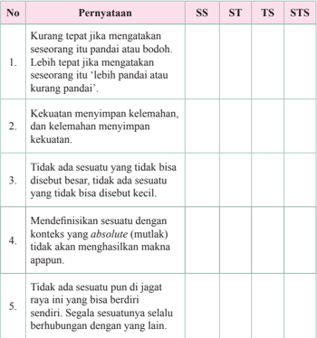

Tabel ini berisi pernyataan yang harus dijawab dengan memilih antara SS (Sangat Sederhana), ST (Sederhana), TS (Tidak Sederhana), atau STS (Sangat Tidak Sederhana). Topik utama tabel adalah tentang kemampuan mengevaluasi kebenaran pernyataan. Kolom-kolomnya mencakup pernyataan yang harus dijawab, dan setiap pernyataan memiliki empat pilihan jawaban yang berbeda-beda untuk menunjukkan tingkat kesederhanaan atau kesulitan dalam menjawabnya. Data penting yang terlihat adalah bahwa pernyataan 1 dan 2 memiliki pilihan jawaban yang sama, sementara pernyataan 3 dan 4 memiliki pilihan jawaban yang berbeda. Ini menunjukkan bahwa pernyataan 1 dan 2 lebih mudah dibandingkan dengan pernyataan 3 dan 4.

 

---
## 📄 Halaman 49

---
**📊 Tabel**

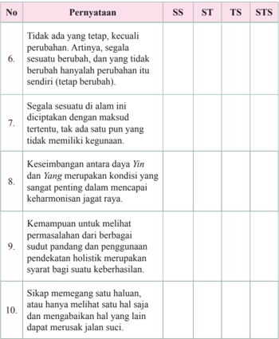

Tabel ini berisi pernyataan yang diuji dengan skala SS (Sesuai), ST (Sangat Tidak Sesuai), dan STS (Sangat Tidak Sesuai). Topik utama tabel adalah tentang prinsip-prinsip kehidupan yang dianut oleh seorang individu. Kolom-kolomnya mencakup pernyataan-pernyataan tersebut, dengan skor SS, ST, dan STS untuk setiap pernyataan. Data penting yang terlihat adalah bahwa banyak pernyataan memiliki skor STS, menunjukkan bahwa mereka tidak sesuai atau sangat tidak sesuai dengan pandangan umum. Ini menunjukkan bahwa individu mungkin memiliki pandangan atau prinsip kehidupan yang sangat unik dan mungkin berbeda dari norma sosial.

### A.  Uraian

Jawablah  pertanyaan-pertanyaan  berikut  dengan  jawaban  yang tepat dan jelas!

- Jelaskan prinsip ketidakmutlakan!

 

---
## 📄 Halaman 50

- Jelaskan tentang prinsip saling memengaruhi!
- Jelaskan  prinsip  satu  kesatuan  dan Yin  Yang bukan  sesuatu  yang dikotomi!
- Jelaskan maksud dari 'Tidak mengharuskan'!
- Jelaskan maksud kalimat: 'Bagiku, tidak ada yang mesti boleh atau mesti tidak boleh'!

 

---
## 📄 Halaman 51

---
**🖼️ Gambar/Diagram**

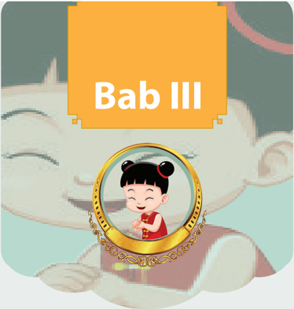

> **Deskripsi Visual:** Gambar ini menunjukkan bab ketiga dari sebuah buku pelajaran, yang diberi judul "Bab III". Gambar ini adalah ilustrasi yang menggambarkan seorang anak kecil dengan rambut berwarna merah muda, berdiri di depan sebuah cermin berlapis emas. Anak tersebut sedang tersenyum lebar dan tampak sangat bahagia. Di belakang anak tersebut, terlihat bagian dari tubuh seekor hewan besar, mungkin seekor kucing, yang tampak seperti sedang tidur dengan mata tertutup. Gambar ini menggunakan warna-warna cerah dan terang, menciptakan suasana yang menyenangkan dan menyegarkan. Judul "Bab III" terletak di atas gambar, menunjukkan bahwa ini adalah bagian ketiga dari buku pelajaran tersebut.

### Zhong Shu Garis Besar Ajaran Khonghucu

 

---
## 📄 Halaman 52

### Peta Konsep

---
**🖼️ Gambar/Diagram**

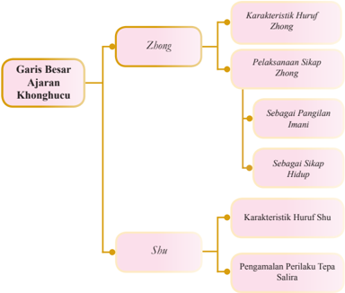

> **Deskripsi Visual:** Gambar ini adalah diagram yang menunjukkan struktur dari Ajaran Khonghucu. Diagram ini dibagi menjadi dua bagian utama: Zhong dan Shu. Zhong memiliki subbagian yang lebih lanjut, yaitu Karakteristik Huruf Zhong dan Pelaksanaan Sikap Zhong. Pelaksanaan Sikap Zhong lagi dibagi menjadi Sebagai Panggilan Imani dan Sebagai Sikap Hidup. Sementara itu, Shu memiliki subbagian yang lebih lanjut, yaitu Karakteristik Huruf Shu dan Pengamalan Perilaku Tepa Salira.

Elemen utama dalam diagram ini adalah Zhong dan Shu, yang merupakan dua aspek utama dari Ajaran Khonghucu. Zhong melibatkan karakteristik huruf Zhong dan pelaksanaan sikap Zhong, sementara Shu melibatkan karakteristik huruf Shu dan pengamalan perilaku tepa salira. Relasi antara elemen-elemen ini adalah bahwa Zhong dan Shu merupakan dua bagian dari Ajaran Khonghucu, dengan Zhong lebih fokus pada karakteristik huruf dan sikap, sedangkan Shu lebih fokus pada huruf dan perilaku.

Teks, angka, atau label penting yang terlihat dalam diagram ini adalah "Garis Besar Ajaran Khonghucu", "Zhong", "Shu", "Karakteristik Huruf Zhong", "Pelaksanaan Sikap Zhong", "Sebagai Panggilan Imani", "Sebagai Sikap Hidup", "Karakteristik Huruf Shu", dan "Pengamalan Perilaku Tepa Salira". Informasi kunci yang dapat diambil pembaca adalah bahwa Ajaran Khonghucu terdiri dari dua aspek utama, Zhong dan Shu, dengan Zhong lebih fokus pada karakteristik huruf dan sikap, sedangkan Shu lebih fokus pada huruf dan perilaku.

### A.  Pendahuluan

Nabi Kongzi berdialog dengan Su atau Zigong mengenai hakikat 'satu yang menembusi semuanya' ( Yiyi Guanzhi ). Tetapi Zigong tidak mampu memahami lebih lanjut tentang makna Yiyi Guanzhi .  Di  lain  kesempatan, Nabi Kongzi bercakap-cakap  dengan Zengzi mengenai  asas Yiyi Guanzhi ,  ternyata Can (nama kecil Zengzi ) mengerti dengan apa yang maksud 'satu yang menembusi semuanya' yaitu Satya dan Tepa Salira. Karena itulah Nabi Kongzi berkenan menurunkan kepada Zengzi ajaran yang berisi penguraian tentang pembinaan diri berdasarkan Zhongshu ini. Selanjutnya uraian tentang pembinaan diri itu dibukukan menjadi kitab Daxue (kitab Ajaran Besar).

 

---
## 📄 Halaman 53

Demikianlah bila manusia dapat Satya kepada kodratnya yang difirmankan Tian ,  dan mampu mengamalkannya secara Tepa Salira kepada sesama manusia, maka sebenarnya ia telah memegang satu prinsip yang menembus segalanya. Karena memang sesungguhnya apa yang dibawakan ajaran agama itu tidak kurang dan tidak lebih adalah Satya dan Tepa Salira. Dengan kata lain, Satya kepada Tian dan Tepa Salira kepada sesama manusia ( Zhong Yitian Shu Yiren ).

### B. Zhong (Satya)

### 1. Karakteristik Huruf Zhong

Berdasarkan Etimologi huruf, Zhong ( 忠 ) terdiri dari dua radikal huruf, yaitu: zhong ( 中 )  yang  berarti  tengah  tepat  dan xin ( 心 )  yang  berarti  hati nurani/sanubari.

Zhong itu  sendiri  bisa  dijelaskan  dari  karekter  huruf: Kou ( 口 )  yang berarti mulut (bicara atau aksi/bertindak) dan Heng . Tanda vertikal ( | ) yang berarti tembusan/sesuai/berlandaskan.

Jadi Zhong (Satya) itu bisa diartikan: Suatu perilaku yang tengah tepat, berlandaskan  suara  hati  nurani  (watak  sejati)  dengan  mewujudkan  dalam segala tindakan. Tersurat di dalam kitab Tengah Sempurna ( Zhongyong ) bab utama  pasal  1:  'Firman Tian itulah  dinamai  Watak  Sejati  ( xing ).  Berbuat mengikuti watak sejati itulah dinamai menempuh jalan suci. Bimbingan untuk menempuh jalan suci dinamai agama'.

Watak Sejati ( xing ) yang bersemayam di hati setiap manusia itu ialah: Ren (Cinta kasih), Yi (Kebenaran), Li (Susila), Zhi (Bijaksana). Jadi, berbuat sesuai hati nurani (watak sejati) berlandaskan suara hati nurani (watak sejati), yaitu berlandaskan Ren , Yi , Li , Zhi .

### 2. Pelaksanaan Sikap Zhong

### a. Sebagai Panggilan Imani

Manusia  dalam  hidupnya  secara  rohaniah  terpanggil  untuk  mengabdi kepada Tian . Maka secara imani manusia terdorong/cenderung mengadakan 'persembahyangan' dengan segala ritualnya untuk mencurahkan isi pengabdiannya terhadap Tian . Hal ini sudah ada sama lamanya dengan sejarah kemanusiaan dari manusia itu sendiri.

 

---
## 📄 Halaman 54

---
**🖼️ Gambar/Diagram**

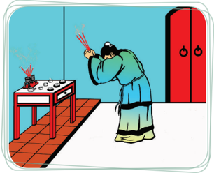

> **Deskripsi Visual:** Gambar ini adalah ilustrasi yang menunjukkan seorang pria tua sedang berdiri di depan sebuah meja kecil dengan beberapa benda kecil di atasnya. Pria tersebut memegang dua batang kayu panjang yang terbuat dari serat bambu, dan tampaknya sedang menghentak atau memukul benda kecil di atas meja tersebut. Di sebelah kanan, terdapat pintu dengan dua pintu berlubang, serta lantai yang terbuat dari batu-bata merah. Gambar ini mungkin digunakan untuk menjelaskan konsep tentang penggunaan alat tradisional atau teknik tertentu dalam proses pembuatan atau pengolahan benda kecil tersebut.

Sumber: Dokumen Kemdikbud

Namun kemudian, karena disesuaikan dengan alam pikir manusia maka persembahyangan itu pada perkembangannya selalu disertai dengan berbagai macam tata cara ditambah dengan pengorbanan, per-sembahan, dan persyaratan lainnya.  Hal  tersebut  sering  kali  bahkan  melupakan  panggilan  imani  yang pada awalnya secara murni keluar dari hati nurani berdasarkan kesucian lahir batin. Oleh karena itu, persembahyangan harus dikembalikan pada pokoknya, yaitu kesucian diri lahir batin, sehingga berkenan kepada-Nya.

Jadi sesungguhnya 'persembahyangan' kepada Tian harus didasari dengan pengamalan akan firman-Nya, yaitu berbuat sesuai dengan watak sejati sebagai kodrat yang difirmankan-Nya. Demikianlah sikap satya ( zhong ) kepada Tian .

Maka menjadi jelas, bahwa untuk mengabdi dan melakukan 'persembahyangan' kepada Tian , tidak dapat tidak Satya kepada kodrat yang difirmankan-Nya itu.

 

---
## 📄 Halaman 55

### Refleksi

-  Manusia pada kodratnya memang terpanggil untuk mengabdi kepada Tian ,  dan  hal  ini  sudah  merupakan suara hati nuraninya, karena  itu  adalah  bentuk  pengabdian  kepada-Nya  dalam persembahyangan, dan hal ini  harus  didasari  oleh  kesucian lahir batin agar berkenan kepada-Nya.
-  Dalam agama Khonghucu, perwujudan pengabdian itu didasari oleh tuntutan rasa zhong , dan zhong ini adalah Satya kepada  apa  yang  di  firmankan Tian ,  yaitu  menepati  kodrat kemanusiaan dengan menggemilangkan Kebajikan.

### b. Sebagai Sikap Hidup

Dalam  membentuk  sikap  diri  dalam Zhong di  kehidupan  sehari-hari, marilah kita hayati beberapa ayat berikut: Zilu bertanya kepada Nabi Kongzi : 'Kalau  pangeran Wei  mengangkat  guru  dalam  pemerintahan,  apakah  yang akan Guru lakukan terlebih dahulu?' 2). Nabi bersabda: 'Akan kubenarkan dahulu nama-nama'.

Nabi Kongzi dengan tegas telah memberikan suatu contoh tindakan yang utama dari cara menyelenggarakan pemerintahan, yaitu dengan membenarkan nama-nama. Menjadi jelas, bahwa nama itu harus tepat dan sesuai dengan yang dinamai.

Demikian  juga  dengan  manusia,  seharusnya  tidak  ingkar  dari  kodrat kemanusiaannya. Karena manusia itu mengemban karunia dan tugas dalam watak sejatinya maka segala tindakan yang dilakukannya harus selaras dengan watak  sejati.  Artinya,  harus  Satya  kepada  kodrat  kemanusiaannya  sesuai dengan firman-Nya.

Selanjutnya,  kesamaan  kodratnya  sebagai  manusia  yang  mengemban firman Tian ,  manusia  mempunyai  fungsi  profesional  atau  predikat  diri yang berbeda. Predikat dan fungsi sebagai anak; sebagai orang tua; sebagai bawahan; sebagai atasan; sebagai istri; sebagai suami; sebagai adik; sebagai kakak; sebagai yunior; dan sebagai senior.

 

---
## 📄 Halaman 56

Seorang anak, harus satya kepada apa dan bagaimana sebagai anak itu. Demikian pula sebagai orang tua, satyalah dengan fungsi predikasinya sebagai orang tua. Selanjutnya demikian pula untuk segala fungsi dan predikat yang disandang oleh manusia, hendaknya satya kepada predikat yang disandangnya tersebut.

'Pangeran Jing dari negeri Qi bertanya tentang pemerintahan (kemasyarakatan) kepada Nabi Kongzi . 2). Nabi Kongzi bersabda: 'Pemimpin hendaklah sebagai pemimpin, pembantu sebagai pembantu, orang tua sebagai orang tua, dan anak sebagai anak!' 3). Pangeran itu berkata, 'Sungguh bagus! Kalau pemimpin tidak dapat menempatkan diri sebagai pemimpin, pembantu tidak  sebagai  pembantu, orang tua tidak sebagai orang tua, dan anak tidak sebagai  anak,  meskipun  berkecukupan  makan  dapatkah  kita  menikmati?' ( Lunyu . XII: II)

Di dalam kehidupan sehari-hari, sikap satya bisa diartikan lebih sederhana dengan kata setia. Setia kepada tugas, kepada janji, kepada kata-kata adalah panggilan  rasa  satya.  Bisakah  seorang  manusia  yang  hendak  satya  akan dirinya meninggalkan rasa setia kepada tugas/janji/kata-katanya? Hal ini jelas tidak mungkin! Karena setia itulah bentuk sederhana dari satya. Setia itulah awal dari panggilan rasa satya. Dengan kata lain, satya itu dibangun dengan segala rasa setia.

Bila  pemimpin  hendak  satya  kepada  kepemimpinannya,  bukankah  ia harus  setia  akan  tugasnya,  setia  pada  janji  kepemimpinannya,  setia  akan kata-katanya? Demikian juga halnya seorang pembantu atau bawahan, untuk memulai satya kepada predikat yang disandangnya ia harus bangun dengan rasa setia. Dalam kedudukan sebagai orang tua satya pada predikatnya sebagai orang tua yang tercurah dalam bentuk kasih dan sayang. Seorang anak yang harus  satya  pada  predikatnya  sebagai  seorang  anak,  yang  tercurah  dalam bentuk bakti kepada orang tua. Maka dikatakan, didalam berkata-kata selalu ingat akan perbuatan dan didalam perbuatan selalu ingat akan kata-kata yang telah diucapkan, demikian ketulusan hati seorang Junzi .

Dari uraian di atas, dapatlah kita ketahui bahwa Zhong dalam pemahamannya dapat dipetakan ke dalam dua tinjauan, sebagai berikut.

- Zhong (Satya)  kepada  kodrat  kemanusiaan  (Watak  Sejati)  yang difirmankan Tian . Artinya, berbuat sesuai dengan watak sejatinya.
- Zhong (Satya) kepada fungsi profesional/predikatnya. Artinya, berbuat sesuai dengan kedudukan dan fungsi predikasinya.

 

---
## 📄 Halaman 57

### Aktivitas 3.1

### Aktivitas Mandiri

-  Selain predikat sebagai manusia,  apa lagi predikat  yang sekarang  kalian  miliki,  dan  apa  tugas  dan  kewajiban  dari predikat tersebut?

### C.  Shu (Tepa Salira)

### 1. Karakteristik Huruf Shu

Berdasarkan etimologi huruf, Shu ( 恕 ) dibangun dari dua radikal huruf, yaitu:

- Ru ( 如 )  yang berarti seperti sama/serupa/menurut atau mematuhi;
- Xin ( 心 )   yang artinya Hati Nurani.
Maka Shu (Tepa Salira) bisa diartikan sebagai perbuatan yang disesuaikan dengan suara hati nurani, atau perbuatan yang mematuhi apa yang ada dalam hati  nurani.  Hati  nurani/sanubari  manusia  itu  pada  dasarnya  adalah  sama, maka binalah peri kehidupan manusia berdasarkan kesamaan tersebut.

### Hikmah Cerita

### Duta Besar Qi bertemu dengan Ratu Wei dari Zhao

Pada masa perang antar negara, Raja Qi mengirimkan utusan ke Kerajaan Zhao untuk bertemu dengan Ratu Wei. Sang ratu bertanya kepada utusan Raja Qi : 'Apakah hasil panen di Qi tahun ini baik?' Sang  utusan  menjawab:  'Ya'.  Kemudian  sang  ratu  bertanya: 'Apakah  rakyat  Anda  bahagia  dengan  hidupnya?'  Sekali  sang utusan menjawab: 'Ya'.

Akhirnya  sang  Ratu  bertanya:  'Bagaimana  kabar  sang  Raja, apakah Ia baik-baik saja?' Sang utusan menjawab 'Ya, raja kami baik-baik saja?' Sang utusan kemudian melanjutkan kata-katanya: 'Tetapi yang mulia Ratu, maafkan saya jika saya begitu lancang untuk  menanyakan  ini,  pertama  anda  menanyakan  hasil  panen kami  tahun  ini,  lalu  kehidupan  rakyat  kami,  sebelum  akhirnya menanyakan mengenai raja kami; tidakkah anda bertanya dengan

 

---
## 📄 Halaman 58

urutan  yang  terbalik?  Tidakkah  seharusnya  Anda  menanyakan tentang raja kami terlebih dahulu?'.

Ratu Wei dari Zhao berkata:  'Apakah  Anda  tahu  apa  yang merupakan sebab dan apa yang merupakan akibat? Sebab bagaikan akar dari sebuah pohon dan akibat adalah cabang-cabangnya. Tanpa ada hasil panen yang baik, rakyat tidak dapat hidup dengan baik; tanpa ada perasaan bahagia di hati rakyat, tidak akan ada kerajaan, dan tentu saja tidak akan ada seorang raja. Jika saya tidak bertanya dengan  cara  seperti  ini,  berarti  saya  mengabaikan  hal-hal  yang penting dan hanya memperhatikan hal-hal yang sepele'.

Sumber:  Mary  Ng  En  Tzu  'Inspiration  from  The  Great Learning'. PT Elex Media Komputindo Jakarta. 2002.

### 2. Pengamalan Perilaku Tepa Salira

Zigong bertanya:  'Adakah  suatu  kata  yang  boleh  menjadi  pedoman sepanjang  hidup?'  Nabi  bersabda:  'Itulah  Tepa  Salira!  Apa  yang  tidak diinginkan oleh diri sendiri janganlah diberikan kepada orang lain'. ( Lunyu . XV: 25)

Maka menjadi penting untuk direnungkan, bahwa bila dalam hidup manusia selalu mengukur segala tindakannya dengan hati nuraninya, mempertanyakan pada dirinya layak dan pantaskah itu bila dikenakan pada dirinya, maukah dirinya  menerima?  Maka  dinyatakan  oleh  Nabi Kongzi bahwa  orang  yang dapat  memperlakukan  orang  lain  dengan  contoh  yang  dekat  (diri  sendiri) sudah cukup untuk dinamai orang yang berpericintakasih. Nabi Kongzi juga menegaskan dalam sabdanya: 'Apa yang diri sendiri tiada inginkan, janganlah diberikan kepada orang lain. Dengan demikian di dalam negeri tidak disesali, di dalam keluarga pun tidak disesali'. ( Lunyu . XII: 2)

Selain  itu,  orang  harus  menjaga  diri  dari  kecenderungan  meneruskan hal-hal yang tidak baik ke tempat lain. Kecenderungan meneruskan hal-hal yang tidak baik sering kali dipunyai orang sebagai bentuk balas dendam dari perlakuan buruk yang pernah ia terima. Oleh karenanya perlu dicamkan nasihat yang tersurat dalam kitab Ajaran Besar tentang Jalan Suci yang bersifat siku.

'Apa yang tidak baik dari atas tidak dilanjutkan ke bawah; apa yang tidak baik dari bawah tidak dilanjutkan ke atas; apa yang tidak baik dari depan tidak dilanjutkan ke belakang; apa yang tidak baik dari belakang tidak dilanjutkan ke depan; apa yang tidak baik dari kanan tidak dilanjutkan ke kiri; apa yang tidak baik dari kiri tidak dilanjutkan ke kanan. Inilah yang dinamai jalan suci yang bersifat siku'. ( Daxue . bab. X: 2)

 

---
## 📄 Halaman 59

---
**🖼️ Gambar/Diagram**

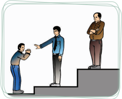

> **Deskripsi Visual:** Gambar ini adalah ilustrasi yang menunjukkan tiga orang yang berada di atas tangga. Orang pertama sedang berdiri di tangga paling rendah, sementara orang kedua dan ketiga berdiri di tangga yang lebih tinggi. Orang kedua dan ketiga tampaknya sedang berbicara dengan orang pertama. Dalam konteks ini, ilustrasi ini mungkin digunakan untuk menggambarkan hubungan sosial atau interaksi antar individu dalam lingkungan tertentu.

Sumber: Dokumen Kemdikbud

Demikianlah  betapa  mutlak  pentingnya  sikap  Tepa  Salira  itu  untuk pedoman dalam hidup manusia. Ini yang menjadikan manusia diterima dalam masyarakat (tidak disesali di manapun ia berada). Karena sikap ini tidaklah jauh dari Jalan Suci.

Namun  demikian,  selain  tidak  melakukan  apa  yang  diri  sendiri  tidak menginginkannya, Tepa Salira  juga  menuntut  sikap  aktif  untuk  melakukan lebih dahulu apa yang diharapkan.

Adalah  sebuah  keniscayaan,  bahwa  apa  yang  kita  harapkan  orang  lain lakukan terhadap kita mesti kita lakukan lebih dahulu kepada mereka. Maka, jangan  pernah  berharap  (menerima)  apapun  dari  orang  lain  bila  kita  tidak berbuat (memberi) apapun pada mereka. Jangan pernah berharap menerima banyak jika kita hanya memberi sedikit.

Nabi Kongzi bersabda:  'Seorang  yang  berperi  cinta  kasih  ingin  dapat tegak maka ia berusaha agar orang lain pun tegak. Ia ingin maju, maka ia berusaha agar orang lainpun maju'. ( Lunyu . VI: 30)

Ayat  tersebut  menegaskan  bahwa,  seiring  dengan  usaha  membuat  diri sendiri tegak dan maju, seseorang harus berusaha membuat orang lain tegak dan  maju.  Sesungguhnya,  memang  tidak  mungkin  seseorang  dapat  benarbenar tegak dan maju jika tidak membantu orang lain tegak dan maju.

Selajutnya,  untuk  setiap  hal  yang  diinginkan  dari  orang  lain  kepada dirinya, ia harus menanyakan ke dalam diri, apakah hal itu sudah dilakukan lebih dahulu? Hal ini ditegaskan di dalam kitab Tengah Sempurna ( Zhongyong ) bab XII pasal 4, sebagai berikut.

 

---
## 📄 Halaman 60

'Jalan Suci seorang Junzi ada empat kekhawatiran yang belum satupun Kulakukan. Apa  yang  Kuharapkan  dari  anak-Ku,  belum  dapat  Kulakukan terhadap orang tua-Ku; apa yang Kuharapkan dari menteri-Ku, belum dapat Kulakukan terhadap raja-Ku; apa yang kuharapkan dari adik-Ku, belum dapat Kulakukan  terhadap  kakak-Ku;  dan  apa  yang  Kuharapkan  dari  teman-Ku belum dapat Kuberikan lebih dahulu…'

---
**🖼️ Gambar/Diagram**

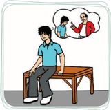

> **Deskripsi Visual:** Gambar ini adalah ilustrasi yang menunjukkan seorang pria sedang berbicara dengan orang lain di luar ruangan. Pria tersebut duduk di atas sebuah meja, tampaknya sedang berbicara dengan seseorang yang berdiri di depannya. Dalam pikiran pria tersebut, ada gambaran dari dua orang yang sedang berbicara, yang menunjukkan bahwa dia sedang berpikir tentang sesuatu yang mereka bicarakan.

Elemen-elemen utama dalam gambar ini adalah pria yang sedang berbicara, orang yang berdiri di depannya, dan dua orang yang tampaknya sedang berbicara dalam pikiran pria tersebut. Relasi antara elemen-elemen ini adalah bahwa pria tersebut sedang berbicara dengan orang yang berdiri di depannya, dan pikiran pria tersebut menunjukkan bahwa dia sedang berpikir tentang sesuatu yang mereka bicarakan.

Teks, angka, atau label penting yang terlihat dalam gambar ini adalah gambaran dari dua orang yang sedang berbicara dalam pikiran pria tersebut. Informasi kunci yang dapat diambil pembaca adalah bahwa pria tersebut sedang berbicara dengan orang lain di luar ruangan dan dia sedang berpikir tentang sesuatu yang mereka bicarakan.

Gambar 3.3 Apa yang kuharapkan dari orang lain sudah kulakukan lebih dahulu

'...  Di  dalam  menjalankan  Kebajikan  Sempurna,  berhati-hati  di  dalam membicarakannya,  bila  ada  kekurangannya  Aku  tidak  berani  tidak  sekuat tenaga mengusahakannya; dan bila ada yang berkelebihan Aku tidak berani menghamburkannya; maka di dalam berkata-kata selalu ingat akan perbuatan dan di dalam berbuat selalu ingat akan kata-kata. Bukankah demikian ketulusan hati seorang Junzi ?'

Aktivitas 3.2

### Diskusi Kelompok

Diskusikan maksud ayat suci berikut: 'Orang harus mengetahui yang tidak boleh dilakukan baru kemudian tahu apa yang harus dilakukan'. ( Mengzi . IV B: 8)

 

---
## 📄 Halaman 61

### Hikmah Cerita

### Kualitas Nabi Kongzi

Suatu hari Zixia bertanya kepada Nabi Kongzi :  'Apa pendapat Anda tentang Yanhui . Nabi Kongzi menjawab: ' Yanhui sangat tulus; bahkan saya tak sanggup menyamai tingkat ketulusannya'.

Zixia bertanya: 'Lalu, apa pendapat Anda tentang Zigong ?' Nabi Kongzi menjawab: ' Zigong sangat cepat dan cerdas; saya tak dapat secepat dan secerdas dia'.

Zixia bertanya:  'Lalu  bagaimana  dengan Zilu ?'  Nabi Kongzi menjawab: ' Zilu adalah  orang  yang  pemberani;  saya  tidak  begitu pemberani'.

Zixia bertanya  lagi:  'Lalu,  bagaimana  pendapat Anda  tentang Zizhang ?'  Nabi Kongzi menjawab:  ' Zizhang selalu  sopan  dan bermartabat; saya tidak sepantas dia'.

Zixia lalu  berkata:  'Meski  mereka  semua  lebih  baik  daripada Anda,  mengapa  mereka  masih  ingin  menjadi  murid Anda?'  Nabi Kongzi menjawab:  'Meskipun  tulus, Yanhui tidak  supel.  Ia  tidak sadar  bahwa  janji  yang  salah  tak  seharusnya  ditepati;  meskipun cerdas, Zigong kurang  rendah  hati;  meskipun  sangat  pemberani, Zilu tidak  tahu  kapan  harus  mundur  atau  mengalah;  meskipun selalu sopan dan bermartabat, Zizhang tak tahu cara bergaul dengan sekitarnya.  Mereka  semua memiliki kelebihannya masing-masing, tetapi juga memiliki kekurangan, maka mereka rela menjadi muridmurid saya'.

Sumber: Mary Ng En Tzu ' Inspiration from Then Doctrin of the Mean '. PT Elex Media Komputindo Jakarta. 2002

 

---
## 📄 Halaman 62

### Penilaian Diri Skala Sikap

###  Petunjuk:

Isilah lembar penilaian diri yang ditunjukkan dengan skala sikap, dengan memberikan tanda checklist (√) di antara empat skala sebagai berikut.

SS =   Sangat Setuju

ST =   Setuju

RR =   Ragu-ragu

TS =   Tidak Setuju

---
**📊 Tabel**

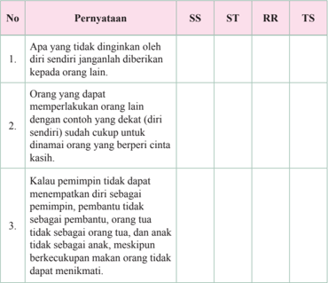

Tabel ini berisi pernyataan tentang sikap dan perilaku sosial manusia, dilihat dari perspektif SS (Self-Serving), ST (Social Tendency), RR (Rationality), dan TS (Theory of Social Influence). Topik utamanya adalah bagaimana individu mempengaruhi dan dipengaruhi oleh orang lain. Kolom-kolomnya mencakup berbagai aspek perilaku sosial, seperti apa yang tidak diminta diri sendiri, perilaku yang dapat mempengaruhi orang lain, dan sikap pemimpin. Data penting yang terlihat adalah bahwa individu cenderung mempertahankan diri sendiri dan orang lain, tetapi juga mampu mempengaruhi orang lain dengan cara yang efektif.

 

---
## 📄 Halaman 63

---
**📊 Tabel**

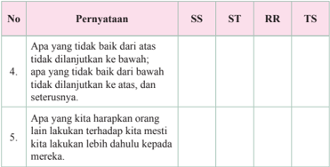

Tabel ini berisi dua pernyataan yang masing-masing diuji dengan metode SS (Sumber Sumber), ST (Struktur Topik), RR (Rangkuman Rinci), dan TS (Topik Subyek). Pernyataan pertama mengevaluasi apakah seseorang akan melanjutkan sesuatu yang tidak baik dari atas atau bawah, sedangkan peryataan kedua menguji apakah seseorang akan meminta orang lain untuk melakukan sesuatu sebelum mereka melakukan hal yang sama. Kolom-kolomnya mencakup metode evaluasi yang digunakan untuk setiap pernyataan. Pola penting yang terlihat adalah bahwa metode evaluasi yang digunakan untuk setiap pernyataan berbeda-beda, namun keduanya menggunakan metode evaluasi yang berbeda untuk mengevaluasi apakah seseorang akan melanjutkan sesuatu yang tidak baik atau meminta orang lain untuk melakukan sesuatu sebelum mereka melakukan hal yang sama.

### A.  Uraian

Jawablah  pertanyaan-pertanyaan  berikut  dengan  jawaban  yang tepat dan jelas!

- Apa yang dimaksud dengan Zhong (satya) kepada Tian ?
- Apa yang dimaksud dengan Shu (Tepa Salira) kepada sesama?
- Buatlah pemetaan tentang pengamalan Shu (Tepa Salira) yang bersikap pasif dan yang aktif!

 

---
## 📄 Halaman 64

### DENGAN PAJAK MEMBANGUN KITA

 

---
## 📄 Halaman 65

---
**🖼️ Gambar/Diagram**

> **Deskripsi Visual:** Gambar ini menunjukkan bab keempat dari sebuah buku pelajaran, yang diberi judul "Bab IV". Gambar ini adalah ilustrasi yang menggambarkan seorang anak perempuan yang sedang tersenyum dan berdiri di depan sebuah cermin. Anak tersebut memakai pakaian tradisional dengan topi merah dan baju putih, serta memegang sebuah cincin emas berhias. Di belakang anak tersebut, terlihat seekor hewan besar yang tampak seperti kucing atau anjing, dengan ekspresi senang dan mata terbuka lebar.

Elemen-elemen utama dalam gambar ini meliputi anak perempuan, cermin, cincin emas, dan hewan besar. Anak perempuan adalah subjek utama yang menonjol, sedangkan cermin dan cincin emas memberikan detail tambahan tentang tema bab ini. Hewan besar tampak sebagai elemen latar yang membantu menciptakan suasana yang menyenangkan dan positif.

Teks, angka, atau label penting yang terlihat dalam gambar ini adalah judul "Bab IV" yang terletak di atas gambar. Ini menunjukkan bahwa gambar ini merupakan bagian dari bab keempat dalam buku pelajaran tersebut.

Informasi kunci yang dapat diambil pembaca dari gambar ini adalah bahwa bab ini mungkin berfokus pada tema kebahagiaan, kecerdasan, atau perkembangan diri anak-anak. Ilustrasi ini mungkin digunakan untuk mengajarkan konsep-konsep ini dalam konteks yang menyenangkan dan mudah dipahami bagi pembaca.

### Makna dan Sejarah Perkembangan Kitab Suci

 

---
## 📄 Halaman 66

---
**🖼️ Gambar/Diagram**

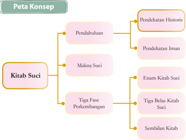

> **Deskripsi Visual:** Gambar ini adalah diagram yang menunjukkan struktur konsep tentang Kitab Suci dalam konteks pendidikan. Diagram ini terdiri dari tiga bagian utama: Pendahuluan, Makna Suci, dan Tiga Fase Perkembangan. Setiap bagian ini memiliki subbagian yang lebih spesifik.

1. **Pendahuluan**:
   - Terdiri dari dua subbagian: Pendekatan Historis dan Pendekatan Iman.
   
2. **Makna Suci**:
   - Ini merupakan subbagian yang lebih besar dan terdiri dari Enam Kitab Suci.

3. **Tiga Fase Perkembangan**:
   - Terdiri dari Tiga Belas Kitab Suci dan Sembilan Kitab.

Elemen-elemen utama dalam diagram ini adalah:
- **Kitab Suci** sebagai topik utama.
- **Pendahuluan**, **Makna Suci**, dan **Tiga Fase Perkembangan** sebagai bagian-bagian utama dari topik tersebut.
- Subbagian seperti Pendekatan Historis, Pendekatan Iman, Enam Kitab Suci, Tiga Belas Kitab Suci, dan Sembilan Kitab sebagai elemen-elemen spesifik yang membahas lebih lanjut.

Informasi kunci yang dapat diambil pembaca melalui diagram ini adalah bahwa Kitab Suci memiliki sejarah yang panjang dan beragam, dengan perkembangan yang terjadi melalui berbagai pendekatan dan fase. Pembaca juga dapat memahami bahwa ada enam kitab utama yang dikenal secara luas, serta ada tiga belas kitab yang lebih spesifik dan satu set sembilan kitab lainnya.

### A.  Pendahuluan

Agama Khonghucu adalah agama yang memiliki sejarah turunnya wahyu Tian yang meliputi waktu 25 abad lebih. Dimulai dari baginda nabi purba Fuxi

(30  abad  SM)  sampai  ke  zaman  kehidupan Nabi Kongzi (abad  6-5  SM).  Jika  ditinjau dan diukur waktu sejak wahyu pertama He-tu diturunkan Tian kepada baginda Fuxi tersebut (era Rujiao purba) hingga ke zaman kita hidup dewasa ini sudah mencapai 5000 tahun.

Kitab suci agama Khonghucu dapat dipahami  secara  lengkap  dan  menyeluruh melalui dua pendekatan.

### ⇒ Pendekatan Historis

Sejarah  latar  belakang  turunnya  wahyu Tian ( Tianxi ) dan penulisan makna spiritual dalam kandungan Sishu-Wujing .

---
**🖼️ Gambar/Diagram**

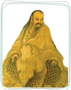

> **Deskripsi Visual:** Gambar ini adalah ilustrasi yang menampilkan seorang pria tua dengan rambut pendek dan lembut, mengenakan pakaian tradisional yang tipis dan berwarna gelap. Pria tersebut sedang duduk dengan posisi yang santai, tangan di bawah tubuhnya, dan tampaknya sedang memegang sesuatu yang tidak jelas. Ilustrasi ini mungkin digunakan untuk membantu pembaca memahami karakter atau situasi dalam konteks yang lebih luas dari buku pelajaran tersebut.

Elemen-elemen utama dalam gambar ini meliputi:
1. Pria tua dengan rambut pendek dan lembut.
2. Pakaian tradisional yang tipis dan berwarna gelap.
3. Posisi duduk yang santai.
4. Tangan yang memegang sesuatu yang tidak jelas.

Teks, angka, atau label penting yang terlihat dalam gambar ini tidak ada, sehingga informasi kunci yang dapat diambil pembaca hanya tergantung pada visual dan konteks yang diberikan oleh penulis buku pelajaran tersebut.

Deskripsi gambar ini dalam satu paragraf yang informatif:

Ilustrasi ini menampilkan seorang pria tua dengan rambut pendek dan lembut, mengenakan pakaian tradisional yang tipis dan berwarna gelap, duduk dengan posisi yang santai, dan tampaknya sedang memegang sesuatu yang tidak jelas. Gambar ini mungkin digunakan untuk membantu pembaca memahami karakter atau situasi dalam konteks yang lebih luas dari buku pelajaran tersebut.

 

---
## 📄 Halaman 67

### ⇒ Pendekatan Iman

Pendalaman makna spiritual ajaran agama, agar sebagai manusia ciptaan Tian kita dapat mengenal, menerima, dan menegakkan kehendak firman Tian . Kita mampu menempuh Jalan Suci hidup benar selaku insan beriman dan berbudi luhur ( Junzi ).

### 1. Pendekatan Historis

Dalam perkembangannya, kitab suci agama Khonghucu itu mengalami beberapa proses kelengkapan, penjabaran dan berbagai penyebutan sebelum mencapai bentuknya seperti sekarang ini.

Kitab  suci  ini  ada  yang  menyebutnya  ' Rujiao  Jingshu '  pada  mulanya dihimpun satu persatu, dimulai penulisannya sejak zaman para Nabi Purba Rujiao dan digenapkan oleh Nabi Besar Kongzi dan ditutup dengan kitab yang ditulis oleh Mengzi (371-289 SM) dan para muridnya.

Pada zaman raja Dinasti Qin terjadilah  pembakaran  besar-besaran  atas perintah Kaisar Qin . Hal ini terjadi pada tahun 213 SM disertai pembunuhan tokoh agama Khonghucu yang berani mempertahankan dan menyimpan kitabkitab suci agama Khonghucu.

Setelah jatuhnya dinasti tirani ini masih ada sisa-sisa kitab suci agama Khonghucu yang berhasil diselamatkan, yang tatkala itu terbuat dari rangkaian bambu. Pada zaman Dinasti Han (206 SM), para umat dan tokoh rohaniwan agama Khonghucu menghimpun kembali sisa-sisa kitab Suci itu. Kitab suci itu ada bagian-bagiannya yang rusak dan hilang, misalnya kitab musik Yuejing . Selanjutnya, bagian yang masih dapat diselamatkan disatukan menjadi bab Yueji di dalam kitab Catatan Kesusilaan Liji .

Dalam perkembangan selanjutnya memasuki zaman dinasti Song (9601279 SM), khususnya era Dinasti Song Selatan (1127-1279 SM) oleh seorang tokoh  rohaniwan  agama  Khonghucu  yang  berasal  dari  wilayah  Selatan Tiongkok yaitu Hokkian ( Fujian ) bernama: Zhuxi (1130-1200 SM) dibakukan menjadi  sembilan  kitab,  yang  terbagi  dua  himpunan  kitab.  Inilah  yang kemudian menjadi bentuk baku kitab suci agama Khonghucu, yang kita kenal sekarang ini, yaitu: Sishu -Wujing .

- Empat Kitab Suci yang Pokok, Sishu .
- Lima Kitab Suci yang Mendasari, Wujing .

 

---
## 📄 Halaman 68

Sumber: Dokumen Kemdikbud

Gambar 4.2 Sishu kitab suci yang pokok terdiri dari empat bagian.

(MATAKIN)

Sumber: Dokumen Kemdikbud

### 2. Pendekatan Iman

Di  antara  ciptaan Tian ,  manusia  merupakan  makhluk  paling  luhur  dan mulia serta berhati-nurani, dan di antara umat manusia yang termulia ialah para  insan  yang  berbudi  luhur  ( Junzi ).  Di  dalam  ajaran  agama  Khonghucu semenjak zaman para leluhur dan nenek moyang bangsa-bangsa di Asia, Asia Timur dan Asia Tenggara diajarkan satya beriman kepada Tian Maha Pencipta, Yang Maha Esa dan Mahabesar ( Huangtian ).

Kemampuan  beriman  itu  dikodratkan Tian kepada  manusia,  melalui firman-Nya di dalam Watak sejati manusia, yang bersemayam di dalam hatinuraninya. Nabi Kongzi bersabda: 'Firman Tian itulah yang dinamai Watak sejati;  Hidup  mengikuti Watak  sejati  itulah  dinamai  menempuh  Jalan  suci; Bimbingan untuk menempuh jalan suci itulah dinamai Agama'. ( Zhongyong . Bab Utama: 1)

---
**🖼️ Gambar/Diagram**

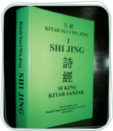

> **Deskripsi Visual:** Gambar ini menunjukkan sampul buku pelajaran dengan judul "Kitab Suci Wujing I: Shi Jing". Sampul buku ini berwarna hijau dan biru dengan tulisan dalam bahasa Melayu dan Cina. Judul buku ditulis besar di bagian atas sampul, sementara judul bahasa Melayu dan Cina ditulis di bawahnya. Di bagian tengah sampul, terdapat gambar yang tampak seperti pohon atau bunga dengan tulisan "Shijing" di sekitarnya. Di bagian bawah sampul, terdapat logo atau simbol yang tampak seperti bintang atau bulan. Teks, angka, atau label penting lainnya tidak terlihat dalam gambar ini.

 

---
## 📄 Halaman 69

Kitab  Suci  membawakan  Jalan  Suci Tian agar  manusia  mampu  sadar dan  beriman.  Sebab  itulah  dalam  tuntunan  keimanan  agama  Khonghucu, sebagaimana tertulis dalam bab ke-18 kitab Tengah Sempurna ( Zhongyong ): 'Iman itulah  Jalan  suci Tian ,  dan  berusaha  memperoleh  iman,  itulah  Jalan suci manusia'. 'Iman itu tidak selesai dengan menyempurnakan diri sendiri, melainkan  juga  menyempurnakan  segenap  wujud;  Dengan  cinta  kasih, menyempurnakan diri sendiri, dan dengan kebijaksanaan menyempurnakan segenap wujud'.

Ada orang yang dikodratkan menjadi utusan Tian , yang mampu mengikuti secara sempurna kehendak firman Tian dalam Watak sejatinya. Tetapi pada umumnya segenap umat manusia lebih dahulu terbimbing oleh ajaran agama baru kemudian beroleh keteguhan dan ketulusan iman.

'Orang yang oleh iman lalu sadar, dinamai perbuatan watak sejatinya; dan orang yang karena sadar lalu beroleh iman, dinamai hasil mengikuti agama.

### B.  Makna Kitab Suci

Kitab  suci  merupakan  suatu  pedoman  utama  bagi  para  pengikut  suatu agama. Tanpa kitab suci, sulit bagi kita untuk mengetahui tentang ajaran-ajaran yang ingin disampaikan dari suatu agama. Kitab suci suatu agama adalah kitab yang berisikan ajaran moral yang dapat dijadikan pandangan hidup bagi para pengikutnya.

Lebih jelasnya, makna kitab suci bagi penganut suatu agama diuraikan oleh Nabi Kongzi lewat sabdanya yang tertulis di dalam Kitab Liji XXIII: 1-2. 'Memasuki sebuah negara akan dapat diketahui pendidikan apa yang telah diberikan. Bila orang-orangnya ramah, lembut, tulus dan baik, mereka telah menerima pendidikan kitab sanjak ( Shijing ). Bila orang-orangnya mempunyai pengetahuan  yang  luas  dan  menembusi,  dan  mengetahui  apa  yang  telah jauh dan kuno, mereka telah menerima pendidikan kitab Dokumen Sejarah ( Shujing ). Bila orang-orangnya luas dan murah hati, terbuka dan jujur, mereka telah menerima pendidikan Kitab Musik ( Yuejing ).  Bila  orang-orangnya bersih, tenang, mengerti makna inti dan lembut, mereka telah menerima pendidikan Kitab Perubahan ( Yijing ).  Bila  orang-orangnya  berperilaku  hormat,  cermat,

 

---
## 📄 Halaman 70

berwibawa dan penuh kesungguhan, mereka telah menerima pendidikan Kitab Kesusilaan  ( Liji ).  Bila  orang-orangnya  mampu  menyesuaikan  bahasanya dengan apa yang hendak mereka katakan, mereka telah menerima pendidikan Kitab Chunqiu ( Chunqiujing ). Maka, yang gagal menerima pendidikan kitab sanjak  ( Shijing ),  akan  menjadi  orang  dungu/bodoh;  yang  gagal  menerima pendidikan Kitab Dokumen Sejarah (Shujing), akan menjadi orang yang suka memfitnah/munafik; yang gagal menerima pendidikan Kitab Musik ( Yuejing ), akan menjadi orang yang pemboros; yang gagal menerima pendidikan Kitab Perubahan ( Yijing ), akan menjadi orang yang merusak akal sehat; yang gagal menerima  pendidikan  Kitab  Kesusilaan  ( Lijing ),  akan  menjadi  orang  yang rewel; dan, yang gagal menerima pendidikan Kitab Chunqiu ( Chunqiujing ), akan menjadi orang yang suka mengacau'.

'Orang yang ramah, lembut, halus,  baik  dan  tidak  dungu/bodoh,  tentu karena  dalam  pemahamannya  tentang  Kitab  Sanjak  ( Shijing ).  Orang  yang luas dan menembusi; mengetahui apa yang telah jauh dan kuno, serta tidak munafik, tentu karena dalam pemahamannya tentang Kitab Dokumen Sejarah ( Shujing ).  Orang  yang  luas  dan  murah  hati,  terbuka  dan  jujur,  serta  tidak cenderung  boros,  tentu  karena  dalam  pemahamannya  tentang  Kitab  Musik ( Yuejing ).  Orang yang bersih, tenang, mengerti makna inti dan lembut, dan tidak  suka  merusak  akal  sehat,  tentu  karena  dalam  pemahamannya  tentang Kitab Perubahan ( Yijing ). Orang yang perilakunya hormat, cermat, berwibawa dan penuh kesungguhan, dan tidak rewel atau mudah kesal/marah tentu karena dalam pemahamannya tentang Kitab Kesusilaan ( Lijing ). Orang yang mampu menyesuaikan bahasanya dengan apa yang hendak mereka katakan, dan tidak suka mengacau, tentu karena dalam pemahamannya tentang Kitab Chunqiu ( Chunqiujing )'.

Demikian makna penting kitab suci bagi penganut suatu agama. Gagal memahami  tentang  kitab  suci  maka  akan  gagal  perilaku/moralitasnya.  Di samping berisikan ajaran moral, kitab suci suatu agama juga disucikan oleh para pengikutnya, dihormati dan dijaga autentisitasnya (keaslian) isinya.

 

---
## 📄 Halaman 71

---
**🖼️ Gambar/Diagram**

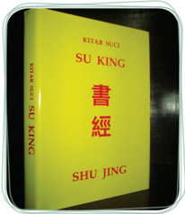

> **Deskripsi Visual:** Gambar ini menunjukkan sebuah buku dengan judul "Su King" yang berbahasa Mandarin. Buku tersebut tampak seperti buku pelajaran atau referensi dengan cover warna kuning yang terlihat lembut dan cerah. Judul buku ditulis dalam huruf besar dan berwarna hitam, yang menonjol di atas latar belakang kuning. Di bagian bawah judul, terdapat tulisan "Shu Jing" dalam bahasa Mandarin, yang mungkin merujuk pada judul asli buku tersebut dalam bahasa Mandarin.

Buku ini tampak seperti buku yang diperuntukkan untuk pembelajaran atau referensi, karena desainnya yang formal dan struktural. Judul "Su King" menunjukkan bahwa buku ini mungkin berkaitan dengan teks tradisional atau budaya tertentu, mungkin terkait dengan sejarah atau filosofi. Namun, tanpa informasi tambahan tentang konten atau isi buku tersebut, sulit untuk memberikan detail lebih lanjut tentang isi atau konteksnya.

Elemen-elemen utama yang terlihat dalam gambar ini adalah judul buku, cover buku, dan tulisan dalam bahasa Mandarin. Judul "Su King" dan "Shu Jing" menunjukkan bahwa buku ini mungkin memiliki konten yang mendalam dan serius, mungkin terkait dengan studi atau pengetahuan tradisional. Warna kuning pada cover buku juga menunjukkan bahwa buku ini mungkin dirancang untuk menciptakan kesan yang positif dan menyenangkan bagi pembaca.

Informasi kunci yang dapat diambil pembaca dari gambar ini adalah bahwa buku ini mungkin merupakan referensi atau sumber belajar yang relevan dengan topik tertentu, mungkin terkait dengan sejarah, budaya, atau filosofi. Namun, tanpa informasi tambahan tentang isi atau konten buku tersebut, sulit untuk memberikan detail lebih lanjut tentang konteks atau tujuan pembuat buku tersebut.

Sumber: Dokumen Kemdikbud

Gambar 4.4 Shujing salah satu bagian dari kitab yang lima ( Wujing )

### Hikmah Cerita

### Bangsawan Ji Memandang Salju

Saat  musim  dingin,  pada  periode  musim  semi  dan  gugur (zaman Chunqiu ), terjadi hujan salju yang lebat selama beberapa  hari.  Bangsawan Jing dari Qi berada  di istana dengan mengenakan jubah dari bulu rubah seraya mengagumi pemandangan  yang  diliputi  salju  di  luar  jendela.  Ia  berkata dengan riang kepada Perdana Menteri Yan Ying yang berada  di  sebelahnya:  'Aneh  ya,  meskipun  di  luar  sana  salju turun  begitu  lebat  selama  beberapa  hari,  saya  tidak  merasa kedinginan.  Indah  sekali  suasana  setelah  salju  turun;  saya berharap  salju  tetap  turun  beberapa  hari  lagi.  Ha  ha  ha'.

Namun Yan Ying berkata dengan serius kepada bangsawan Jing :  'Raja  Agung,  bagi  Anda  mungkin  pandangan  salju  itu indah, tetapi bagi rakyat mungkin ini suatu keadaan yang kejam. Di  istana,  Anda  memiliki  pemanas  untuk  menghangatkan tempat  ini,  dan  Anda  memiliki  jubah  dari  bulu  rubah  yang

 

---
## 📄 Halaman 72

dapat menghangatkan diri Anda; tentu saja Anda tidak merasa kedinginan. Saya dengan raja-raja bijak terdahulu terusmenerus memikirkan rakyatnya, bahkan ketika sedang makan dan  memakai  pakaian  yang  hangat.  Meraka  akan  berpikir apakah  rakyat  sudah  mendapat  makan,  atau  apakah  mereka menderita  karena  cuaca  dingin. Akan  menjadi  perhatian  bagi rakyat bila Anda dapat menempatkan diri pada posisi mereka'.

Sumber: Mary Ng En Tzu ' Inspiration from Then Great Learning '. PT Elex Media Komputindo Jakarta. 2002.

### C.  Tiga Fase Perkembangan

Ada  tiga  fase  perkembangan  sejarah  terbentuknya  kitab  suci  agama Khonghucu. Hal itu sejalan dengan perkembangan sejarah Agama Khonghucu itu sendiri.

Agama  Khonghucu  mempunyai  masa  perkembangan  panjang  dari masa  penulisan  paling  tua  oleh  raja  suci Fuxi (2953  SM)  sampai  kepada wafat Mengzi (289 SM). Jadi meliputi kurun waktu 2664 tahun. Kini dunia Internasional mengetahui kitab suci agama Khonghucu terbagi menjadi dua kelompok: Wujing (kitab suci yang lima) dan Sishu (kitab suci yang empat).

Namun sebelum mencapai pembakuan menjadi Wujing dan Sishu , proses penulisan  awal  dan  perkembangan  sejarah  terbentuknya  kitab  suci  agama Khonghucu itu dapat dibagi dalam tiga fase perkembangan, yaitu:

- Liujing - Enam Kitab Suci
- Shi Sanjing - Himpunan Tiga belas Kitab
- Sishu-Wujing -Kitab Yang Empat-Kitab Yang Lima

### 1. Enam Kitab (Liu Jing)

- Shijing
Kitab Sanjak

- Shujing
Kitab Sejarah

- Yijing
Kitab Wahyu Perubahan

 

---
## 📄 Halaman 73

- Lijing
Kitab Kesusilaan

- Chunqiujing
Kitab Sejarah Zaman Chunqiu

- Yuejing
Kitab Musik

Nabi Kongzi menghimpun  dan  mengedit  kembali  kitab  suci Shujing , Shijing , Yijing , Lijing , Chunqiujing , Yuejing .  Keenamnya  dikenal  dengan nama: Liujing .

Dalam  sejarah  keagamaan  dunia  tidak  semua  utusan Tian atau  nabi menuliskan kitab suci, beberapa nabi purba Rujiao juga tidak mendapat wahyu untuk mengajarkan agama. Namun, Nabi Kongzi beroleh wahyu Yushu untuk menggenapi agama Khonghucu. Maka sejak itu, agama Khonghucu bukan lagi hanya sebagai agama istana ( royal religion ) melainkan agama masyarakat luas ( public religion ) yang bersifat universal. Nabi Kongzi juga menghimpun dan mengedit kembali kitab-kitab suci yang berasal dari raja suci dan Nabi Purba Rujiao sebelum beliau, serta menggenapi dengan sejumlah kitab yang Beliau tulis bersama murid-murid serta cucu Beliau. Hal ini ditulis di dalam kitab Tengah Sempurna ( Zhongyong ) bab XXXI pasal 1, sebagai berikut.

---
**📊 Tabel**

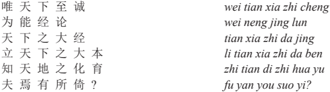

Tabel ini berisi informasi tentang berbagai aspek kehidupan dan pengetahuan, dengan topik utama "Kesadaran dan Keterampilan". Kolom-kolomnya mencakup "Wen Wei Tian Zhi Cheng" (Kesadaran dan Keterampilan), "Wei Neng Jing Lun" (Kesadaran dan Keterampilan), "Tian Zhi" (Kesadaran dan Keterampilan), "Lian Tian Zhi Da Ben" (Kesadaran dan Keterampilan), "Zhi Tian De Hui Yu" (Kesadaran dan Keterampilan), dan "Fu Yan You Suo Yi" (Kesadaran dan Keterampilan). Data atau pola penting yang terlihat adalah bahwa setiap kolom memiliki tiga baris, menunjukkan bahwa tabel ini mungkin berfokus pada tiga aspek utama dari kesadaran dan keterampilan. Ini mungkin merupakan bagian dari sebuah buku pelajaran yang membahas berbagai aspek kehidupan dan pengetahuan dalam konteks kesadaran dan keterampilan.

Artinya:  'Hanya  insan  yang  telah  mencapai  puncak  iman  di  dunia  ini, dapat  membukukan  dan  menghimpun  kitab  besar  dunia,  menegakkan pokok  besar  dunia,  mengetahui  peleburan  dan  pemeliharaan  di  antara langit  dan  bumi.  Maka  adakah  tempat  lain  yang  lebih  teguh  sebagai tempat bersandar?'

### 2. Tiga Belas Kitab Suci ( Shisanjing )

Setelah kemangkatan Nabi Kongzi (479 SM), banyak peristiwa terjadi. Pada akhir dari Dinasti Zhuo (220 SM) munculnya pemimpin tirani yaitu Qin Shiwang (221-210 SM). Qin Shiwang menamakan diri sendiri sebagai kaisar tertinggi Qin ( Qin Shihuangdi ).

Penguasa  baru  ini  bertahta  dengan  tangan  besi. Qin Shiwang begitu bangga atas jasanya menyatukan seluruh negeri pesaingnya, dan mendirikan dinasti keempat yaitu dinasti Qin . Atas jasanyalah orang Zhonghoa harus rela menamakan dirinya bangsa Qin . Qin Shiwang menyatukan pembakuan huruf,

 

---
## 📄 Halaman 74

ukuran  panjang  dan  berat  timbangan,  sistem  pemerintahan  sentralistik, menghapus otonomi negeri bagian menjadi semacam provinsi. Pertama kali Zhongguo /Tiongkok  secara  geo-politik  menjadi  negara  kesatuan  ( united country ).

---
**🖼️ Gambar/Diagram**

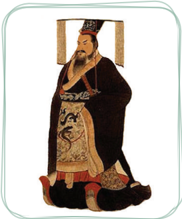

> **Deskripsi Visual:** Gambar ini adalah ilustrasi yang menampilkan tokoh bersejarah. Tokoh tersebut diperlihatkan sedang berdiri dengan posisi yang teguh, mengenakan pakaian tradisional yang mencerminkan kekayaan budaya masa lalu. Pakaian tersebut terdiri dari baju panjang berwarna putih dengan detail emas yang memukau, serta celana pendek yang sama warnanya. Di punggungnya, ada sebuah keris (sword) yang disematkan pada pakaian, menunjukkan kedudukan dan status sosialnya sebagai seorang pejuang atau pejabat penting.

Elemen-elemen utama dalam gambar ini meliputi tokoh utama yang diperlihatkan, pakaian yang dipakainya, dan keris yang disematkan pada pakaian. Relasi antara elemen-elemen ini sangat jelas, dengan tokoh menjadi fokus utama, pakaian yang menunjukkan identitas sosialnya, dan keris yang menambahkan nuansa keagungan dan kekuasaannya.

Teks, angka, atau label penting tidak terlihat dalam gambar ini, karena gambar hanya menggambarkan tokoh dan pakaian tanpa teks atau angka tambahan.

Informasi kunci yang dapat diambil pembaca adalah bahwa gambar ini mungkin menggambarkan tokoh bersejarah dari masa lalu, mungkin seorang pejuang atau pejabat penting dalam budaya tertentu. Pakaian dan keris yang digunakan menunjukkan kedudukan dan status sosialnya.

Sumber: Dokumen Kemdikbud

Gambar 4.5 Qin Shi Wang

Didukung  oleh  perdana  Menteri Lishi , Qin Shiwang memerintahkan membakar habis kitab-kitab suci agama Khonghucu, melanjutkan ribuan Li pembangunan tembok besar ( the great wall ).  Banyak  umat  dan  cendekiawan agama Khonghucu dibantai, dan dikubur di tembok besar itu.

Wahyu Tian menunjukkan  kuasaNya.  Hanya  sampai  tahun  210  SM, Qin Shiwang mangkat. Puteranya Qin Erwang  hanya  sanggup  melanjutkan tiga tahun kerajaan Qin (210-207 SM),  dan  jatuhlah  dinasti  tirani  yang berambisi sampai 10.000 keturunan memerintah dunia ini. Apa yang dengan penuh ambisi direncanakan oleh  raja  tirani Qin untuk  menguasai dunia secara abadi, karena ingkar dari kebenaran dan kehendak Tian , akhirnya hancur di tengah jalan.

Sebaliknya,  para  umat  dan  tokoh  cendekiawan  agama  Khonghucu yang  kelihatan  lemah,  sebagai  insan  beriman  berusaha  mengembangkan benih  kebajikan  Watak  sejatinya,  meneladan  Nabi Kongzi yang  mampu meneguhkan iman mereka. Dengan semangat berkorban,  mereka  berupaya mempertahankan dan menyelamatkan kebenaran di dalam kitab-kitab suci itu, dengan menghafal ayat demi ayat isi kitab suci Liujing tadi. Maka, biarpun kitab yang terbuat dari bambu itu kelak rusak atau hancur, namun kebenaran Jalan Suci agama Khonghucu itu akan tetap hidup di dalam diri mereka.

Berkat  rahmat  dan  perlindungan Tian ,  tumbangnya  Dinasti Qin yang kemudian diikuti dengan berdirinya dinasti Han (206 SM). Para cendekiawan dan  agamawan  Khonghucu  bangkit  kembali.  Di  antaranya  adalah  seorang agamawan  bernama Dong Zhongshu yang  berupaya  menghimpun  kembali kitab-kitab suci yang terbuat dari bambu. Kitab suci agama Khonghucu itu banyak  yang  sengaja  disembunyikan  di  tembok-tembok  kediaman  kaum keluarga keturunan Nabi Kongzi .

 

---
## 📄 Halaman 75

Di antara para tokoh keagamaan Khonghucu, ada seorang kakek bernama Fusheng dibantu oleh kemenakannya berusaha menulis ulang kitab-kitab suci agama Khonghucu itu karena beliau mampu menghafalnya.

Akhirnya,  terlestarikan  kembali  hampir  semua  bagian  dari  kitab-kitab tersebut. Kumpulan kitab-kitab tersebut selanjutnya dikenal dengan 13 kitab Shisanjing . Tiga Belas Kitab ( Shisanjing ) itu adalah:

- Yijing Kitab Wahyu Perubahan
- Shujing Kitab Dokumentasi Sejarah
- Shijing Kitab Sanjak
- 4 . Zhouli Kitab Tata Negara Dinasi Zhou
- Yili Kitab Kesusilaan Dinasti Zhou
- Liji Kitab Catatan Kesusilaan Ibadah
- 7 . Chunqiu Zuozhuan Kitab Chunqiu Komentar Zuo Qiuming
- Chunqiu Gongyangzhuan Kitab Chunqiu Komentar
Gong Yanggao

- 9 . Chunqiu Guliangzhuan Kitab Chunqiu Komentar Gu Liangchi
- 10 .  Lunyu Kitab Sabda Suci
- 11
- .  Xiaojing Kitab Bakti
- 12 .  Erya Kitab Ensiklopedi
- 13 .  Mengzi Kitab
Mengzi

### 3. Sembilan Kitab ( Sishu-Wujing )

Kini sampailah kita pada era dinasti yang cukup terkenal dalam sejarah terutama  kemajuan  peradaban  dan  kebudayaan  bangsa-bangsa  di  dunia Internasional.  Demikian  pula  perkembangan  budaya  keagamaan  mencapai perkembangan  yang  pesat.  Budaya  keagamaan  Khonghucu  dan Dao di Zhongguo /Tiongkok,  Hindu  dan  Buddha  di  India,  Yahudi  dan  Nasrani  di Timur Tengah, dan Islam semenjak abad ke-6 Masehi di jazirah Arabia.

Menarik untuk diketahui, bahwa masuknya agama Islam dan berjumpa dengan  pemeluk  agama  Khonghucu  dan Dao sudah  berjalan  cukup  lama, yaitu semenjak abad ke-7 Masehi.

Memasuki era dinasti Song (960-1279 M) lintas budaya, agama, seni dan perdagangan semakin ramai dilakukan. Misionaris Kristen masuk ke wilayah Zhongguo , dan tercatat banyak terjadi dialog teologis antara pembawa agama

 

---
## 📄 Halaman 76

Kristen dengan tokoh agama Khonghucu di Zhongguo ,  Korea,  dan Jepang. Sastrawan  angkatan  lama Kwee  Kek  Beng mengungkapkan  masuknya misionaris  Kristen  ini  mula-mula  ke  Jepang,  namun  menemui  banyak kesulitan, maka mereka mengalihkan misi pengembangan agama Kristen dari Jepang ke Zhongguo . Mereka berharap jika misi Kristenisasi mereka berhasil di Zhongguo , maka Jepang akan mengikuti.

Di dalam era Dinasti Song ini pula dikenal tokoh-tokoh cendekiawan dan agamawan Islam yang cukup dikenal, bahkan di masyarakat China di abad ke-12 Masehi yaitu: Imam Al-Ghazali (1057-1112 M); banyak tulisan beliau merenungkan  tentang  'kebersihan  hati-nurani'.  Pada  abad  yang  sama  ada seorang tokoh utama agamawan Khonghucu yaitu: Zhuxi (1130-1200 M) yang memberi kata pengantar kitab Ajaran Besar ( Daxue ), kitab tuntunan spiritual pembinaan  diri  yang  mengajarkan  hal  'kelurusan  hati  nurani'.  Adanya kedekatan pemahaman kedua ajaran di atas kini masih menarik untuk menjadi pengkajian para ahli kedua agama, Islam dan Khonghucu.

Kitab Ajaran Besar atau Daxue merupakan bagian utama dalam bab 42 Kitab Liji .  Cendekiawan  agama  Khonghucu  abad  ke-12, Zhuxi kemudian mengambil inisiatif luar biasa menyatukan Bab 42 Kitab Liji yang  dikenal sebagai Daxue (Ajaran  Besar)  itu  dengan  Bab  31  Kitab Liji yang  dikenal sebagai Zhongyong (Tengah  Sempurna);  yang  ditambah  dengan  dua  kitab Shisanjing ,  yakni  kitab Lunyu (Sabda  Suci)  dan  kitab Mengzi (Mencius, merupakan satu kesatuan kitab suci yang empat, Sishu.

Dalam hikayat hidupnya, Zhuxi adalah tokoh utama agama Khonghucu era  Dinasti Song ,  berasal  dari  wilayah  Fujian  (Hokkian)  sekarang.  Beliau menamakan diri sebagai pewaris atau murid dari tokoh Dao Xue Jia ( neo -Confucianisme ) bernama: Zhengyi atau Zi Zhengzi (1033-1108 M). Zhengyi adalah adik tokoh cendekiawan Khonghucu bernama: Zhenghu (1032-1085 M). Zhengyi begitu  pula Zhuxi dikenal  oleh  cendekiawan  Barat  sebagai beraliran rasional ( Li -xue ).

Sedangkan Zhenghu dan penerusnya yang menjadi tokoh agama Khonghucu sekitar tiga abad kemudian, yakni dari era dinasti Ming (1368-1644 M) bernama: Wang Yangming (1472-1529 M) dikenal sebagai beraliran idealis/ aliran  nurani  (Xin-xue). Wang Yangming inilah  yang  cukup  dikagumi  para cendekiawan Ru di Jepang, disamping mazhab Zhuxi yang lebih tua. Di negeri Jepang ini Beliau disebut dengan ' Oyomi '. Kita sungguh kagum, bahwasanya di Jepang para cendekiawan Ru Jepang semenjak abad pertengahan banyak mendirikan lembaga ibadah dan lembaga studi Rujiao , di samping bangunan Kuil Shinto mereka.

 

---
## 📄 Halaman 77

Di Korea tercatat adanya pertemuan dan dialog teologis antara misionaris Calvinist  Kristen  dengan  cendekiawan Rujiao Korea, Yi  T'oegye (15011570 M) yang mampu mengangkat raja dinasti Yi di Korea menjadi seorang pemimpin bangsa yang berlandas sepenuhnya kepada kearifan Renyi Daode dalam moral keagamaan Khonghucu.

Sekitar abad XI-XVI merupakan masuknya misionaris Kristiani dari Barat (Roma, Eropa) dan bertemunya para misionaris itu dengan kearifan Islam di Timur Tengah, kearifan Khonghucu di Asia Timur dan Asia Tenggara, dan kearifan  Hindu  Buddha  di  India  Selatan  dan  Utara  serta  Nusantara.  Kitabkitab  suci  berbagai  agama  besar  dunia  juga  mulai  dikenal,  dan  merupakan spiritual  guidance masyarakat  internasional.  Agama  bukan  terbatas  pada kotak etnisitas dan bangsa, melainkan sudah menjadi milik masyarakat dunia secara universal.

Zhuxi melihat di dalam kondisi lintas agama itu perlu menyusun kitab suci agama Khonghucu dalam dua kelompok besar:

- Kelompok Lima Kitab yang Mendasari: Wujing
- Kelompok Empat Kitab yang Pokok: Sishu .

### Wujing :

- Shijing ( 诗 经 )
- Shujing ( 书 经 )
- Yijing ( 易 经 )
- Liji ( 礼 记 )
- Chunqiujing ( 春 秋 经 )

### Sishu :

- Daxue ( 大 学 )
- Zhongyong ( 中 庸 )
- Lunyu ( 论 语 )
- Mengzi ( 孟 子 )

 

---
## 📄 Halaman 78

### Aktivitas 4.1

### Diskusi Kelompok

Tuliskan ayat-ayat suci yang terdapat dalam kitab Daxue , Zhongyong , Lunyu , dan Mengzi ), dan ayat-ayat suci yang terdapat dalam kitab ( Liji ), kitab Sanjak ( Shijing ). Masing-masing kitab minimal lima ayat suci.

### Penilaian Diri

###  Petunjuk:

Isilah lembar penilaian diri yang ditunjukkan dengan skala sikap, dengan memberikan tanda checklist (√) di antara empat skala sebagai berikut:

SS = Sangat Setuju

ST = Setuju

RR = Ragu-ragu

TS = Tidak Setuju

---
**📊 Tabel**

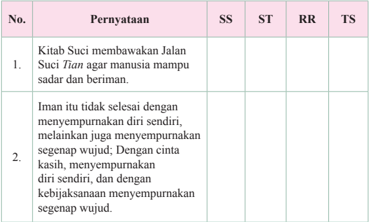

Tabel ini berisi dua pernyataan yang disampaikan dalam konteks tentang Kitab Suci dan iman. Kolom "SS" mungkin merujuk pada suatu skor atau standar, sedangkan kolom "ST", "RR", dan "TS" mungkin menunjukkan tingkat kesesuaian atau tingkat kesesuaian dengan standar tertentu. Topik utama tabel ini adalah tentang pemahaman dan pengertian tentang Kitab Suci dan iman dalam konteks keagamaan. Data penting yang terlihat adalah bahwa kedua pernyataan tersebut berkaitan dengan pemahaman tentang Kitab Suci dan iman, serta bagaimana mereka mempengaruhi perilaku manusia.

 

---
## 📄 Halaman 79

---
**🖼️ Gambar/Diagram**

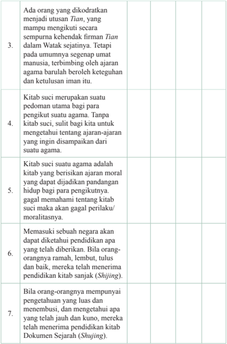

> **Deskripsi Visual:** Gambar ini adalah diagram yang menunjukkan beberapa poin penting tentang kehidupan dan prinsip-prinsip agama. Diagram ini terdiri dari 7 baris, masing-masing menunjukkan satu poin yang disampaikan dalam teks. Setiap baris memiliki teks yang menjelaskan konsep-konsep tertentu dalam konteks agama. 

1. Poin pertama mengenai orang yang dikodratkan menjadi utusan Tian, yang mampu mengikutkan firman Tian secara sempurna.
2. Poin kedua membahas tentang umumnya segenap umat manusia, terbinbing oleh ajaran agama barulah boleh keteguhan dan kelulusan iman itu.
3. Poin ketiga mengenai kitab suci sebagai pedoman utama bagi para pengikut suatu agama.
4. Poin keempat menyebutkan bahwa kitab suci silih bagi kita untuk mengetahui tentang ajaran-ajaran yang ingin disampaikan dari suatu agama.
5. Poin kelima mengatakan bahwa kitab suci suatu agama adalah kitab yang berisikan ajaran moral yang dapat didijadikan pandangan hidup bagi para pengikutnya.
6. Poin keenam menyebutkan bahwa jika tidak memahami tentang kitab suci maka akan gagal perilaku moralitasnya.
7. Poin ketujuh mengatakan bahwa jika orang-orangnya mempunyai pengetahuan yang luas dan menembusi, mereka akan menerima pendidikan kitab Dokumen Sejarah Shujing.

Elemen-elemen utama yang terlihat dalam diagram ini adalah teks yang menjelaskan konsep-konsep tersebut. Angka-angka tidak ada dalam diagram ini. Label penting yang terlihat adalah judul setiap baris yang menjelaskan poin-poin yang disampaikan dalam diagram ini. Informasi kunci yang dapat diambil pembaca adalah bahwa diagram ini menunjukkan beberapa prinsip-prinsip penting dalam agama, termasuk pentingnya kitab suci, ajaran moral, dan pengetahuan yang luas dan menembusi.

---
**📊 Tabel**

Tabel ini berisi informasi tentang prinsip-prinsip etika dalam agama, dengan topik utama "Kitab Suci dan Ajaran Agama". Kolom-kolomnya mencakup: 1) Orang yang dikodratkan menjadi utusan Tian, 2) Kitab suci sebagai pedoman bagi pengikut agama, 3) Kitab suci sebagai pedoman moral, 4) Menerima kitab suci untuk perilaku moral, 5) Menetapkan pendidikan, 6) Menerima pendidikan dari orang-orang ramah, dan 7) Menghargai pengetahuan luar dan kuno. Data penting yang terlihat adalah bahwa kitab suci merupakan pedoman utama bagi pengikut agama, memiliki nilai moral yang tinggi, dan harus dihormati oleh semua orang.

 

---
## 📄 Halaman 80

### A.  Uraian

Jawablah  pertanyaan-pertanyaan  berikut  ini  dengan  uraian  yang jelas.

- Pada  awal  perkembangan  sejarah  terbentuknya  kitab  suci  Agama Khonghucu itu dapat dibagi dalam tiga fase perkembangan, sebutkan tiga fase perkembangan kitab suci agama Khonghucu.
- Sebutkan bagian dari Liujing (enam kitab).
- Sebutkan bagian dari Wujing (lima kitab).
- Apa yang kamu ketahui tentang pembakaran kitab-kitab suci agama Khonghucu?

 

---
## 📄 Halaman 81

---
**🖼️ Gambar/Diagram**

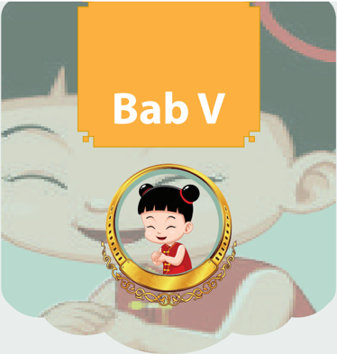

> **Deskripsi Visual:** Gambar ini adalah ilustrasi yang menampilkan karakter "Bab V" dari sebuah buku pelajaran. Gambar ini menggambarkan seorang anak kecil dengan rambut berwarna hitam dan berambut panjang, duduk di atas sebuah hewan besar seperti kucing atau anjing. Anak tersebut sedang tersenyum dan tampak sangat bahagia. Di sekitar anak tersebut ada beberapa elemen yang menunjukkan bahwa mereka berada dalam lingkungan yang aman dan menyenangkan. 

Elemen utama dalam gambar ini adalah karakter "Bab V", yang tampak sangat ceria dan bahagia. Anak tersebut duduk di atas hewan besar, yang tampak seperti kucing atau anjing, menunjukkan hubungan positif antara karakter dan hewan tersebut. 

Teks "Bab V" yang terletak di atas gambar menunjukkan bahwa karakter ini mungkin merupakan bagian dari bab ke-5 dari buku pelajaran tersebut. Angka "V" tampaknya merupakan huruf pertama dari nama karakter tersebut.

Informasi kunci yang dapat diambil dari gambar ini adalah bahwa karakter "Bab V" tampak sangat bahagia dan bahagia, menunjukkan bahwa buku pelajaran ini mungkin berfokus pada tema kebahagiaan dan keceriaan.

### Ajaran Tengah Sempurna

 

---
## 📄 Halaman 82

---
**🖼️ Gambar/Diagram**

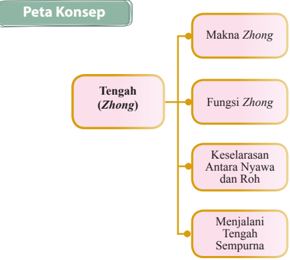

> **Deskripsi Visual:** Gambar ini adalah diagram yang menunjukkan peta konsep mengenai konsep "Tengah (Zhong)" dalam konteks filosofi Tiongkok. Diagram ini terdiri dari empat elemen utama yang terkait dengan konsep tengah tersebut:

1. **Makna Zhong**: Ini merupakan subtopik utama yang menjelaskan arti atau definisi dari konsep tengah.
2. **Fungsi Zhong**: Menjelaskan peran atau tujuan tengah dalam konteks filosofi Tiongkok.
3. **Keselarasan Antara Nyawa dan Roh**: Ini membahas hubungan antara dua aspek kehidupan, nyawa dan roh, dalam konteks tengah.
4. **Menjalani Tengah Sempurna**: Ini mungkin merujuk pada proses atau cara untuk mencapai atau menjalankan tengah dengan sempurna.

Elemen-elemen ini saling terkait dan membentuk struktur yang jelas tentang konsep tengah dalam filosofi Tiongkok. Teks, angka, atau label penting yang terlihat dalam diagram ini adalah "Tengah (Zhong)", "Makna Zhong", "Fungsi Zhong", "Keselarasan Antara Nyawa dan Roh", dan "Menjalani Tengah Sempurna". Informasi kunci yang dapat diambil pembaca melalui diagram ini adalah bahwa tengah adalah konsep yang penting dalam filosofi Tiongkok, memiliki makna, fungsi, dan cara menjalannya yang spesifik.

### A.  Pendahuluan

Nabi Kongzi bersabda:  'Adapun  jalan  suci  itu  tidak  terlaksana  aku sudah tahu sebabnya, yang pandai melampaui sedangkan yang bodoh tidak dapat mencapai. Adapun jalan suci tidak dapat disadari jelas-jelas aku sudah mengetahui, yang bijaksana melampaui sedangkan yang tidak tahu tidak dapat mencapai'. ( Zhongyong . II: 7)

Sumber: Dokumen Kemdikbud

---
**🖼️ Gambar/Diagram**

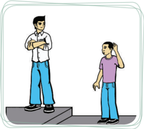

> **Deskripsi Visual:** Gambar ini adalah ilustrasi yang menunjukkan dua orang yang sedang berbicara. Pria di sebelah kiri mengenakan pakaian formal dengan lengan panjang dan celana pendek, sementara wanita di sebelah kanan mengenakan pakaian casual dengan lengan pendek dan rok pendek. Kedua orang tersebut tampak berada di sebuah ruangan yang terlihat seperti kantor atau sekolah, karena adanya meja dan kursi di latar belakang. Pria tampak sedang berbicara kepada wanita, yang tampak tertarik pada apa yang dia katakan. Teks, angka, atau label penting tidak terlihat dalam gambar ini. Informasi kunci yang dapat diambil pembaca adalah bahwa ada interaksi sosial antara dua orang, mungkin dalam konteks pendidikan atau kerja.

 

---
## 📄 Halaman 83

Yang  pandai  melampaui,  artinya  tidak  mengenai  sasaran.  Yang  bodoh tidak dapat mencapai, artinya juga tidak mengenai sasaran. Orang yang pintar sering melewatinya, karena menganggap masalah itu tidak perlu diperhatikan. Sementara  orang  yang  bodoh  segan  melakukannya,  karena  memang  tidak mengerti masalah itu.

Nabi bersabda: 'Banyak orang berkata 'aku pandai', tetapi jika dihalau ke  dalam  jaring,  pikatan  atau  perangkap,  mereka  tidak  dapat  mengetahui bagaimana  harus  membebaskan  diri.  Banyak  orang  berkata  'aku  pandai', tetapi jika suatu ketika bertekad hendak hidup di dalam Zhongyong , ternyata tidak dapat mempertahankan sekalipun hanya sebulan'.

### B.  Makna Zhong

Zhong ( 中 ) atau Tengah itu adalah segala sesuatu yang pas/tepat (tidak berlebihan dan juga tidak kekurangan). Sesuatu yang tidak terlalu cepat dan tidak terlalu lambat (kecepatan); tidak terlalu lama dan tidak terlalu sebentar (waktu); tidak terlalu banyak atau tidak terlalu sedidkit (jumlah); tidak terlalu tinggi  dan  tidak  terlalu  rendah  (posisi);  tidak  terlalu  jauh  dan  tidak  terlalu dekat (jarak); tidak terlalu tebal dan tidak terlalu tipis (bentuk); dan seterusnya.

Maka Zhong dapat  diartikan  segala  sesuatu yang  pas,  tepat.  Dengan  kata  lain, Zhong adalah segala sesuatu yang berada pada waktu, tempat, dan ukuran yang pas, tepat, proporsional. Oleh karena itu, Zhong sangat terkait dengan faktor waktu, tempat, dan ukuran, atau dalam suatu istilah disebutkan 'di tengah waktu yang tepat'.

Zhong mengacu pada 'kecukupan,' tidak berlebihan ataupun kekurangan. Karenanya, manusia harus menghindari segala hal yang berlebihan, dan agar kita bersikap sesuai proporsi yang dibutuhkan saat menghadapi orang lain atau situasi tertentu. Nabi Kongzi mengatakan: 'Berlebihan ataupun kekurangan keduanya sama-sama buruk'.

Zigong (Salah seorang murid Nabi Kongzi )  bertanya: 'Antara Zichang dan Zixia ,  siapakah  yang  lebih  bijaksana?'  Nabi  bersabda:  ' Zichang itu melampaui dan Zixia itu  kurang'. Zigong berkata:  'Bila  demikian  kiranya Zichang lebih baik?' Nabi bersabda, 'Yang melampaui maupun yang kurang

 

---
## 📄 Halaman 84

kedua-duanya belum mencukupi syarat'. ( Lunyu . XI: 16)

Terlalu jauh itu sama buruknya dengan terlalu dekat. Terlalu jauh orang bisa  dianggap  sombong  dan  terlalu  dekat  orang  bisa  menjadi  kurang  ajar. Makanan dan minuman baik bagi tubuh manusia dan memang dibutuhkan demi  kelangsungan  hidup.  Tetapi  bila  makan  dan  minum  yang  berlebihan akan berakibat buruk juga bagi tubuh manusia. Maka, segala sesuatu yang berlebihan itu menjadi tidak baik hasilnya.

### Penting!

Dalam kitab Shujing tertulis: 'Hati manusia atau Ren Xin selalu dalam bahaya. Hati yang berada dalam Jalan Suci Tian sangat rahasia. Inti sarinya hanya satu, jangan ingkar dari tengah ( Zhong ).

Dalam sebuah puisi untuk menggambarkan seorang wanita cantik yang ditulis  oleh Sung Yu dengan  kata-kata  demikian:  'Jika  ia  lebih  tinggi  satu inci tentu ia terlalu jangkung. Jika ia lebih rendah satu inci, tentu ia terlalu pendek. Jika ia memakai bedak, maka wajahnya akan terlalu putih. Jika ia menggunakan pemerah pipi, maka wajahnya terlalu merah'. Gambaran ini memperlihatkan bahwa bentuk tubuh dan roman wajahnya benar-benar pas atau tepat benar. ( Wen Hsuan , chuan 19)

Komentar Mengzi tentang Kongzi menyebutkan: 'Bila sebaiknya memangku  jabatan,  memangku  jabatan;  bila  sebaiknya  berhenti,  berhenti; bila  sebaiknya  berlama-lama,  berlama-lama;  bila  sebaiknya  bercepat-cepat, bercepat-cepat;  demikianlah Kongzi .  Karena  itu,  di  antara  orang-orang bijaksana, Kongzi adalah orang yang paling tepat waktu'. ( Mengzi . II A: 1/22)

---
**🖼️ Gambar/Diagram**

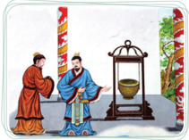

> **Deskripsi Visual:** Gambar ini adalah ilustrasi yang menunjukkan dua orang tukang besi berbincang dengan seorang pria yang sedang memegang sekat besi. Pada latar belakang, terlihat beberapa elemen seperti tiang bambu, pohon, dan papan tulis. Ilustrasi ini mungkin digunakan untuk menjelaskan konsep tentang proses pembuatan atau perbaikan sekat besi dalam pembangunan bangunan.

Elemen utama dalam gambar ini meliputi dua orang tukang besi yang sedang berbicara, sekat besi yang dimegang oleh salah satu dari mereka, dan latar belakang yang mencerminkan lingkungan kerja tradisional. Relasi antara elemen-elemen ini adalah bahwa tukang besi sedang berbicara dengan pria yang memegang sekat besi, yang kemungkinan merupakan konsumen atau mitra kerja mereka.

Teks, angka, atau label penting tidak terlihat dalam gambar ini karena ia hanya menggambarkan situasi tanpa teks atau angka tambahan. Namun, informasi kunci yang dapat diambil dari gambar ini adalah bahwa ada interaksi antara tukang besi dan pria lainnya, serta lingkungan kerja tradisional yang mereka hadapi.

Dalam konteks pembelajaran, gambar ini dapat digunakan untuk membantu menguraikan konsep tentang hubungan antara pekerjaan tukang besi dan penggunaan sekat besi dalam pembangunan, serta lingkungan kerja tradisional mereka.

Gambar 5.2 Youzuo , alat mawas diri, yang miring bila kosong, tegak lurus bila diisi secukupnya, dan terbalik bila kepenuhan

Youzuo itu  suatu  alat  yang  miring  bila  kosong,  tegak  lurus  bila  diisi

 

---
## 📄 Halaman 85

secukupnya,  dan  terbalik  bila  kepenuhan.  Bagaimana  Agar  tidak  terlalu penuh? Nabi bersabda: 'Kalau kamu cerdas, pandai, cakap, dan bijaksana, simpanlah dengan sikap seolah bodoh. Biar ketenaranmu memenuhi kolong  langit,  simpanlah  dengan  sikap  suka  mengalah.  Biar  keberanianmu dapat  menggetarkan  dunia,  simpanlah  dengan  sikap  rendah  hati.  Dan  biar kekayaanmu  memenuhi  empat  lautan,  simpanlah  dengan  kesederhanaan. Demikian jalan suci menghindari bencana itu'.

Aktivitas 5.1

### Tugas Mandiri

Jelaskan ayat suci berikut ini.

Nabi  bersabda:  'Yang  paling  sukar  ialah  bergaul  dengan  para dayang dan orang rendah budi. Kalau didekati, berbuat melampaui batas; dijauhi, merasa tidak senang'.

( Lunyu . XVII: 25)

### C.  Fungsi Zhong

Fungsi Zhong adalah untuk mencapai harmonis ( He ) atau keseimbangan. Saat  semuanya  dapat  bertindak  proposional  seperti  yang  dibutuhkan  atau diperlukan, dunia yang harmonis akan tercipta.

Harmoni  dapat  dihasilkan  karena  adanya  perbedaan-perbedaan.  Tetapi untuk bisa harmonis, masing-masing hal yang berbeda itu harus hadir persis dalam  porsinya  yang  tepat/pas  (proposional).  Harmoni  dapat  diilustrasikan dengan masakan, air, garam, gula, bawang, tomat, dan acar yang digunakan untuk memasak ikan. Dari bahan-bahan itu (yang menjadi satu kesatuan) akan dihasilkan bentuk dan rasa baru. Sedangkan keseragaman ibarat membumbui air dengan air, menggarami garam dengan garam, atau membatasi kemerduan musik dengan satu not, itu tentu tidak menghasilkan hal yang baru.

Maka Zhong berfungsi  untuk mencapai harmoni, atau Zhong berfungsi mengharmonikan apa yang bertentangan karena perbedaan-perbedaannya.

 

---
## 📄 Halaman 86

### Hikmah Cerita

### Harmonis dalam perbedaan

Pada  periode  Musim  Semi  dan  Gugur,  Bangsawan Jing dari Qi mempunyai  Menteri Liang Qiuju . Liang pandai  menyanjung  dan menyenangkan  Bangsawan  Jing.  Karenanya,  Bangsawan Jing sering berkata: ' Liang Qiuju dan saya sangat serasi'.

Namun Menteri Yan Zi berkata lain: ' Liang Qiuju dan Anda hanya mirip, sulit untuk dikatakan serasi'. Bangsawan Jing dari Qi berkata: Apakah ada bedanya antara mirip dan serasi?'

Yan Zi menjawab: 'Serasi bagaikan membuat sup ikan.  Anda menggunakan air panas, cuka, saus, dan garam untuk membumbui dan memasak ikan dan daging; dan Anda menggunakan api untuk memasak sup itu. Sang koki mencampur dan mengaduk bumbunya sehingga rasa masing-masing bumbu terasa tepat. Ia akan menambahkan bumbu jika dirasa kurang dan menguranginya jika terasa terlalu tajam. Saat seorang yang mulia menerima sup seperti itu, ia dapat menenangkan hati dan pikirannya.  Hubungan  antara  raja  yang  berkuasa  dan  menterinya seharusnya seperti ini.

Saat seorang raja berkuasa merasa baik, mungkin saja sebenarnya ada sesuatu  yang  tidak  tepat.  Jika  sang  menteri  dapat  menunjukkannya masalah itu tentu dapat diselesaikan dan disempurnakan.

Dalam  keadaan  yang  sama,  jika  seorang  raja  merasa  ada  yang  tidak tepat,  mungkin  saja  sebenarnya  ada  yang  patut  dihargai;  jika  sang menteri dapat menunjukkannya dan menyingkirkan bagian yang tidak tepat, maka keserasian dapat tercapai.

Liang Qiuju tidak seperti itu. Selama raja mengatakan tidak ada masalah, ia juga mengatakan tidak ada masalah. Saat seorang raja berpendapat bahwa itu tidak akan berhasil, ia juga akan mengatakan itu tidak akan berhasil.  Ini  bagaikan  mencampur  air  dengan  air,  siapa  yang  dapat menelannya? Ini juga bagaikan memainkan satu nada pada alat musik, siapa yang akan mendengarkannya?'

Sumber: Mary Ng En Tzu ' Inspiration from Then Doctrin of the Mean '. Jakarta, 2002.

 

---
## 📄 Halaman 87

### D.  Keselarasan Antara Nyawa dan Roh

Berdasarkan prinsip Yin-Yang , bahwa Tian Yang Maha Esa menciptakan kehidupan ini selalu dengan dua unsur yang berbeda, tetapi saling mendukung dan melengkapi satu sama lain. Yin-Yang , Negatif-Positif, Wanita-Pria, BumiLangit, Kanan-Kiri, dan seterusnya.

Dalam diri manusia, Tian memberkahinya dengan dua unsur Nyawa ( Gui ) dan Roh ( Shen ). Maka diyakini, bahwa manusia adalah makhluk termulia di antara makhluk ciptaan Tian yang lain, karena selain memiliki nyawa (daya hidup jasmani), manusia juga memiliki roh (daya hidup rohani).

Di dalam roh itulah bersemayan Xing atau watak sejati sebagai Firman Tian atas diri manusia. Sebagaimana ditegaskan dalam kitab Tengah Sempurna ( Zhongyong ) bab utama pasal 1: 'Firman Tuhan ( Tian Yang Maha Esa) itulah dinamai Watak Sejati. Hidup mengikuti Watak Sejati itulah dinamai menempuh Jalan Suci. Bimbingan menempuh Jalan Suci itulah dinamai Agama'.

---
**🖼️ Gambar/Diagram**

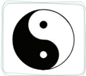

> **Deskripsi Visual:** Gambar ini adalah ilustrasi yang menampilkan simbol yin yang terdiri dari dua bagian berbeda: bagian hitam yang menunjukkan elemen yin (kegelapan) dan bagian putih yang menunjukkan elemen yang kontras dengan yin (kelaparan). Simbol ini sering digunakan dalam budaya Tiongkok untuk menggambarkan konsep kehidupan yang berimbang antara dua elemen yang berlawanan. Elemen utama dalam gambar ini adalah dua bagian yang saling berlawanan, yaitu hitam dan putih, yang menunjukkan kontras antara yin dan yang. Teks, angka, atau label penting tidak ada dalam gambar ini. Informasi kunci yang dapat diambil pembaca adalah bahwa gambar ini menunjukkan konsep kehidupan yang berimbang antara dua elemen yang berlawanan, yaitu yin dan yang.

Gambar 5.3 Yin -Yang

Adapun yang di dalam watak sejati manusia itu ialah: cinta kasih ( ren ), kebenaran ( yi ), susila ( li ), dan bijaksana ( zhi ). Watak sejati inilah yang menjadi  kodrat  suci  manusia  sehingga  manusia berkemampuan untuk berbuat bajik.

Nyawa  atau  Daya  Hidup  Jasmani  ( Jing ) yang  di  dalamnya  terkandung  daya  rasa  atau nafsu. Daya rasa atau 'nafsu' itu adalah: Gembira ( xi ),  Marah  ( nu ),  Sedih  ( ai ),  Senang/Suka  ( le ). Keempat daya rasa ini menjadikan manusia dapat melangsungkan kehidupannya. Maka, baik daya hidup rohani ( Xing ) ataupun daya hidup jasmani ( Jing ) merupakan dua unsur penting yang dimiliki oleh manusia.

Dalam kitab Zhongyong bab  utama  pasal  4  tersurat:  'Gembira,  marah, sedih, senang, sebelum timbul, dinamai Tengah; setelah timbul tetapi masih tetap di dalam batas Tengah, dinamai Harmonis. Tengah itulah pokok besar daripada dunia, dan keharmonisan itulah cara menempuh Jalan Suci di dunia'.

Ketika manusia berada dalam kondisi di mana tidak ada rasa gembira, rasa marah, rasa sedih, dan rasa senang di dalam dirinya, kondisi inilah yang dimaksud manusia dalam keadaan Tengah. Tetapi keadaan dalam kehidupan ini sangatlah dinamis (selalu berubah), terlebih lagi perasaan manusia, mudah sekali  terpengaruh dan berubah. Keadaan Tengah dalam diri manusia tidak dapat berlangsung atau bertahan selamanya. Banyak hal dan peristiwa yang

 

---
## 📄 Halaman 88

dapat  memancing  timbulnya  nafsu  di  dalam  diri.  Bila  salah  satu  nafsu  itu timbul, berarti saat itu manusia sudah tidak dalam keadaan Tengah. Ketika manusia menerima kabar baik yang diharapkan, seketika itu timbul perasaan gembira  di  dalam  dirinya.  Sebaliknya,  ketika  menerima  kabar  buruk  yang tidak diharapkan, seketika itu timbul perasaan sedih dan kecewa.

Menjadi  kewajiban  manusia  untuk  selalu  mengendalikan  setiap  nafsu yang timbul dalam dirinya agar tetap berada di batas tengah (tidak kelewatan). Mengendalikan nafsu yang timbul tetap di batas Tengah itulah yang dinamai harmonis. Jangan karena perasaan gembira lalu menjadi lupa diri dan tidak memperhatikan  sikap  dan  perilaku,  ini  berarti  melanggar  nilai-nilai  cinta kasih. Jangan karena perasaan marah, sampai berbuat keterlaluan, ini berarti melanggar nilai-nilai kebenaran.

'Bila  dapat  terselenggara  Tengah  dan  Harmonis,  maka  kesejahteraan akan meliputi langit dan bumi, segenap makhluk dan benda akan terpelihara'. ( Zhongyong . Utama: 5)

---
**🖼️ Gambar/Diagram**

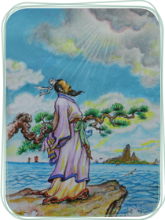

> **Deskripsi Visual:** Gambar ini adalah ilustrasi yang menampilkan seorang pria tua berjubah putih berdiri di tepi laut. Pria tersebut sedang memegang sebuah pedang yang panjang dan tajam, dengan tangan kanannya yang tampaknya sedang menggenggam pedang tersebut. Latar belakangnya adalah pemandangan laut dengan beberapa pulau kecil dan pohon-pohon besar yang tumbuh di tepi pantai. Langit cerah dengan awan berwarna putih dan biru muda memberikan suasana yang tenang dan damai. Ilustrasi ini mungkin digunakan untuk membantu pembaca memahami konsep atau cerita yang berkaitan dengan karakter utama yang diperlihatkan.

Sumber: Dokumen Kemdikbud

Salah  satu  penyebab  mengapa  manusia  dapat  berbuat  tidak  baik  atau  berbuat tidak  sesuai  dengan  watak  sejatinya  adalah  'nafsu  yang  tidak  terkendali'. Emosi yang berlebihan,  yang  meningkat  dengan  intensitas  yang  terlampau tinggi  atau  dalam  waktu  yang  terlampau  lama  akan  merusak  kestabilan

 

---
## 📄 Halaman 89

atau keseimbangan diri. Untuk itu, perlu adanya kendali diri. Pengendalian untuk setiap nafsu (emosi negatif) yang berlebihan tujuannya adalah untuk keseimbangan emosi, bukan untuk menekan emosi. Karena bagaimanapun, setiap perasaan atau emosi itu memiliki nilai dan makna.

Kehidupan tanpa nafsu ibarat padang pasir yang datar dan membosankan, terputus  dan  terpencil  dari  kekayaan  hidup  itu  sendiri. Tetapi,  seperti  yang dianjurkan oleh Nabi Kongzi , yang dikehendaki adalah emosi yang wajar, ada keselarasan antara setiap perasaan yang muncul dengan lingkungan sekitar.

### Penting!

Nabi Kongzi bersabda: 'Orang yang dapat membatasi dirinya,  sekalipun  mungkin berbuat  salah  tetapi  pastilah jarang  terjadi'.  ( Lunyu .  IV: 23)

Apabila  emosi  terlampau  ditekan, akan tercipta kebosanan. Tetapi bila emosi tidak dikendalikan, terlampau ekstrim, dan terus-menerus akan menjadi sumber penyakit atau bahkan malapetaka bagi diri. Menjaga emosi tetap terkendali merupakan kunci menuju kesejahteraan dan ketentraman hidup.

- Ada keseimbangan sebelum terjadi kegembiraan, kemarahan, kesedihan dan kesenangan.
- Keseimbangan adalah sifat asli semua benda di bawah langit.
- Keharmonisan adalah jalan suci bagi semua manusia di bawah langit.
- Apabila keseimbangan dan keharmonisan tercapai, langit dan bumi akan tenang dan semua benda akan terpelihara.
Keseimbangan merupakan sifat alam. Keseimbangan antara daya Yin dan Yang merupakan kondisi yang sangat penting dalam mencapai keharmonisan jagat  raya.  Agar  mampu  menjalani  kehidupan  yang  seimbang,  kita  harus mewaspadai  kondisi  yang  ekstrem.  Sebab  pada  kondisi  seperti  itu  segala sesuatu  akan  kembali  ke  kondisi  ekstrem  yang  sebaliknya.  Tetapi,  agar bisa  mengalami  kehidupan  yang  seimbang,  seseorang  perlu  mengalami ketidakseimbangan juga. Artinya, manusia harus terus belajar dari kesalahan dan mencari titik keseimbangan.

 

---
## 📄 Halaman 90

---
**🖼️ Gambar/Diagram**

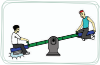

> **Deskripsi Visual:** Gambar ini adalah ilustrasi yang menunjukkan dua orang yang sedang bermain teeter-tap dengan menggunakan sepeda motor sebagai alat permainan. Gambar ini menggambarkan konsep tentang bagaimana memanfaatkan alat transportasi untuk kegiatan olahraga atau permainan. 

Elemen utama dalam gambar ini adalah dua orang yang sedang bermain teeter-tap menggunakan sepeda motor sebagai alat permainan. Sebuah teeter-tap besar tampak di tengah gambar, dengan dua orang yang sedang berada di kedua ujungnya. Kedua orang tersebut sedang berusaha mencapai titik tengah teeter-tap.

Teks, angka, atau label penting yang terlihat pada gambar ini tidak ada, karena gambar hanya menggambarkan konsep tanpa menggunakan teks atau angka.

Informasi kunci yang dapat diambil pembaca dari gambar ini adalah bahwa sepeda motor dapat digunakan sebagai alat permainan atau aktivitas fisik, dan bahwa konsep ini dapat digunakan untuk mengajarkan anak-anak tentang bagaimana memanfaatkan alat transportasi untuk kegiatan olahraga atau permainan.

Sumber: Dokumen Kemdikbud

Sifat yang membentuk citra 'keras' dalam satu kondisi tertentu dianggap tepat. Sebaliknya, sifat yang membentuk citra 'lembut' dianggap tepat dalam kondisi yang lain. Dalam praktiknya, baik sifat yang berkesan 'keras' maupun 'lembut'  sangat  diperlukan  dalam  kehidupan.  Sifat  'keras'  yang  diterapkan dalam  hukum/peraturan  untuk  membimbing  dan  mengarahkan  tingkahlaku  manusia  tidak  secara  otomatis  dapat  meningkatkan  moral  manusia. Kenyataannya, sifat 'lembut' dari pengaruh sosial yang positif serta pendidikan yang baik dapat mengubah dan membentuk tingkah laku yang beradab. Tetapi, hal yang sebaliknya, dengan menghukum satu orang pelanggar hukum dapat memberikan peringatan juga pada yang lain (efek jera).

'Dibimbing dengan undang-undang, dilengkapi dengan hukuman, menjadikan  rakyat  hanya  berusaha  menghindari  itu  dan  kehilangan  harga dirinya.  Dibimbing  dengan  kebajikan  dan  dilengkapi  dengan  kesusilaan menjadikan rakyat tumbuh perasaan harga diri dan berusaha hidup benar'. ( Lunyu . II: 3)

### Hikmah Cerita

### Zi Can Berbicara Tentang Pemerintahan

Zi  Can adalah  seorang  menteri  di  Negara Zheng pada  periode musim  semi  dan  gugur.  Di  bawah  pemerintahannya  tercipta  ketertiban dan kedamaian di seluruh Zheng . Sebelum meninggal, ia memberi tahu Zi Taishu yang merupakan ahli warisnya: 'Hanya orang-orang berbudi luhur yang dapat memerintah rakyatnya dengan cara lembut. Jika tidak memiliki kebajikan  yang  cukup,  lebih  baik  menggunakan  cara  memerintah  yang tegas.

 

---
## 📄 Halaman 91

Saat  melihat  api  berkobar,  orang-orang  tahu  bahwa  mereka  harus menghindarinya; karena itu,  hanya  sedikit  yang  mati  terbakar. Air  yang mengalir terlihat tenang, dan semua orang akan berpikir bahwa itu tidak berbahaya, namun banyak yang tenggelam di dalamnya'.

Setelah Zi  Can meninggal. Zi Taishu mulai  mengatur Zheng . Ia  enggan  bertindak  tegas  terhadap  rakyatnya  dan  lalai  menetapkan hukuman. Hasilnya, faktor keamanan pun bermasalah dan banyak terjadi kasus  perampokan  dan  pencurian.  Saat  itulah Zi Taishu menyesal  tidak memperhatikan nasihat Zi Can .

Nabi Kongzi berkata:  'Jika  pemerintah  terlalu  lunak,  rakyat  tidak akan menghormati hukum; untuk itu, pemerintah harus menggunakan cara yang lebih tegas agar dapat memperbaiki situasi; tetapi, jika pemerintah terlalu tegas, rakyat akan merasa tertindas; untuk itu, strategi yang lembut dapat membantu dalam mengatur situasi. Menyesuaikan kelembutan dan kekerasan  dan  menggunakan  cara  itu  bersama-sama  akan  menciptakan keseimbangan dalam pemerintahan'.

Sumber: Mary Ng En Tzu 'Inspiration from Then Doctrin of the Mean'. PT Elex Media Komputindo Jakarta. 2002.

### E.  Menjalani Tengah Sempurna

Nabi Kongzi memberikan kita banyak kaidah tentang bagaimana berperilaku dalam masyarakat dan menjadi orang yang pantas. Beliau memberi kita prinsip-prinsip yang dapat menuntun tindakan-tindakan kita. Saat harus mengikuti prinsip-prinsip tersebut, kita sering bertanya kepada diri kita sendiri apa yang seharusnya kita lakukan dan apa yang seharusnya tidak kita lakukan; apa yang baik dan apa yang buruk.

Kenyataannya, ketika sampai pada pertanyaan apa yang seharusnya kita lakukan  dan  apa  yang  seharusnya  tidak  kita  lakukan,  sangat  sering  terjadi sesuatu itu tidak dapat dibagi secara sederhana menjadi ide benar atau salah, baik atau buruk, ya atau tidak. Nabi Kongzi sangat menekankan pentingnya ketepatan dalam mengerjakan segala hal. Melakukan sesuatu berlebihan atau tidak melakukan sesuatu dengan cukup, keduanya sedapat mungkin dihindari. ( Yu Dan '1000 Hati Satu Hati' Gerbang Kebajikan Ru Jakarta 2010)

 

---
## 📄 Halaman 92

### Aktivitas 5.2

### Diskusi Kelompok

Jelaskan  yang  dimaksud  Nabi Kongzi :  'Balaslah  kebaikan dengan kebaikan, dan balaslah kejahatan dengan kelurusan'.

Mengapa Nabi Kongzi tidak menganjurkan para muridnya untuk membalas kejahatan dengan kebaikan?

Hubungan  yang  terlalu  akrab  atau  keakraban  yang  terlalu  berlebihan bukanlah sesuatu yang ideal bagi dua orang yang ingin bergaul dengan baik. Tidak jarang dua orang yang begitu dekat pada akhirnya saling membenci bahkan saling menyakiti. Lalu bagaimana kita dapat mencapai hubungan yang baik? Zigong bertanya  tentang  bersahabat,  Nabi Kongzi menjawab:  'Bila kawan  bersalah,  dengan  satya  berilah  nasihat  agar  dapat  kembali  ke  Jalan Suci. Kalau dia tidak mau menurut, janganlah mendesaknya, itu hanya akan memalukan diri sendiri'. ( Lunyu . XII: 23)

Jika  melihat  seorang  teman  melakukan  kesalahan,  kita  seharusnya melakukan  yang  terbaik  untuk  memperingatkan  dan  memandu  mereka dengan kemauan baik. Tetapi bila mereka tidak mau mendengarkan, jangan mendesaknya karena itu hanya akan membebani diri kita. Jadi, dengan seorang teman baik kita juga perlu ada batas. Nabi Kongzi mengingatkan kita agar baik dengan teman-teman atau para pemimpin, kita harus tetap menjaga jarak dan tahu adanya batas di antara keakraban dan kerenggangan.

Ada sebuah dongeng yang mengilustrasikan ini. Ada sekawanan landak, semua berduri tajam, saling berhimpit-himpitan untuk menjaga kehangatan di  musim  dingin.  Mereka  tidak  dapat  terpisah  terlalu  jauh.  Saat  sebentar saja terlalu berjauhan, mereka tidak dapat saling menjaga kehangatan, maka mereka  saling  mendekat;  tetapi  ketika  mereka  saling  mendekat,  duri-duri tajam menusuk mereka, maka mereka mulai menjauh kembali, tetapi ketika mereka melakukan itu, mereka merasa dingin.

Maka  diperlukan  kerja  sama  yang  baik  di  antara  landak-landak  itu untuk  menemukan  jarak  yang  tepat  yang  akhirnya  dapat  mempertahankan kehangatan kelompok dengan tanpa saling menyakiti satu dengan lainnya.

 

---
## 📄 Halaman 93

### Aktivitas 5.3 Diskusi Kelompok

Bagaimana  hubungan  kita  dengan  keluarga  (orang  tua, kakak/adik)  sebagai  orang-orang  yang  lebih  menyayangi kita  dibandingkan  orang  lain,  apa  kita  harus  berusaha menjadi sedekat mungkin?

Atau seharusnya kita juga  menjaga jarak? Apakah antara teman atau keluarga, kita semua harus tahu batas?

### Penilaian Diri Skala Sikap

###  Petunjuk:

Isilah lembar penilaian diri yang ditunjukkan dengan skala sikap, dengan memberikan tanda checklist (√) di antara empat skala sebagai berikut.

SS

= Sangat Setuju

ST

= Setuju

RR

= Ragu-ragu

TS

= Tidak Setuju

---
**📊 Tabel**

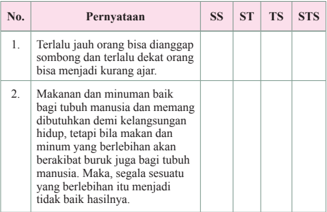

Tabel ini berisi dua pernyataan yang diuji dengan metode tes skala (SS: Skala Sosial, ST: Skala Tindakan, TS: Skala Tindakan Sosial, STS: Skala Tindakan Sosial Terstruktur). Topik utama tabel adalah tentang hubungan antara jarak sosial dan perilaku kurang ajar. Kolom-kolomnya mencakup pernyataan yang ingin diuji, serta skala-skalanya. Data penting yang terlihat adalah bahwa pernyataan pertama menunjukkan bahwa orang yang jauh dari orang lain cenderung lebih suka melakukan tindakan kurang ajar, sedangkan pernyataan kedua menunjukkan bahwa makanan dan minuman baik bagi tubuh manusia, tetapi jika dikonsumsi secara berlebihan dapat merusak kesehatan.

 

---
## 📄 Halaman 94

---
**📊 Tabel**

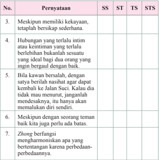

Tabel ini berisi 7 pernyataan yang mungkin merupakan soal-soal dalam sebuah ujian atau tes. Setiap pernyataan diurutkan dengan nomor dan dikelompokkan menjadi 4 kolom: SS (Sesuai), ST (Sesuai Tetapi Sederhana), TS (Tidak Sesuai), dan STS (Tidak Sesuai Tetapi Sederhana). Topik utama tabel ini adalah tentang keterampilan atau karakteristik seseorang, seperti memiliki kekayaan, hubungan yang baik, kewaspadaan, dan kemampuan untuk berbicara dengan orang lain. Data penting yang terlihat adalah bahwa semua pernyataan memiliki pilihan jawaban yang sama, yaitu tidak sesuai tetapi sederhana (STS), menunjukkan bahwa setiap pernyataan mungkin memiliki beberapa pilihan jawaban yang sama.

### Jawablah pertanyaan-pertanyaan berikut ini dengan uraian yang jelas!

- Apa yang dimaksud dengan keadaan Tengah dalam diri manusia?
- Apa yang dimaksud dengan Harmonis?
- Jelaskan tentang Youzuo (alat mawas diri).
- Jelaskan,  mengapa  nafsu-nafsu  yang  ada  di  dalam  diri  manusia  tidak  boleh dimatikan/dihapuskan sama sekali.
- Jelaskan fungsi nafsu bagi diri manusia dalam kehidupannya di atas dunia ini.
- Di dalam diri manusia ada dua unsur nyawa dan roh, ada nafsu sebagai daya rasa (daya hidup jasmani) dan watak sejati (daya hidup rohani) sebagai kemampuan luhur untuk berbuat baik. Apa tujuan agama terkait dengan hal tersebut?

 

---
## 📄 Halaman 95

---
**🖼️ Gambar/Diagram**

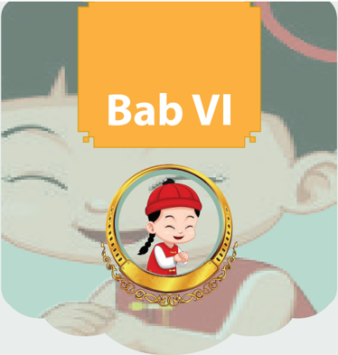

> **Deskripsi Visual:** Gambar ini menunjukkan bab ke-6 dari sebuah buku pelajaran, yang diberi judul "Bab VI". Gambar ini terdiri dari dua bagian utama: di bagian atas ada tulisan "Bab VI" dalam warna putih dengan latar belakang kuning, dan di bagian bawah ada sebuah cermin berwarna emas yang menampilkan gambar seorang anak perempuan yang sedang tersenyum. Anak tersebut memakai topi merah dan pakaian warna-warni, serta memegang sebuah cincin berlian. Latar belakang cermin tersebut adalah gambar seekor hewan besar yang tampak seperti kucing atau anjing, dengan ekspresi senang. Di sekeliling cermin, terdapat garis-garis emas yang menambahkan kesan elegan pada gambar tersebut.

### Sikap dan Perilaku Junzi

 

---
## 📄 Halaman 96

### Peta Konsep

---
**🖼️ Gambar/Diagram**

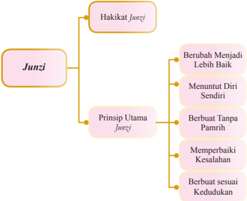

> **Deskripsi Visual:** Gambar ini adalah diagram yang menunjukkan struktur dan prinsip-prinsip utama dari konsep Junzi dalam budaya Jepang. Diagram ini dibagi menjadi dua bagian utama: Hakikat Junzi dan Prinsip Utama Junzi.

Hakikat Junzi meliputi empat poin utama:
1. Berubah Menjadi Lebih Baik
2. Menuntut Diri Sendiri
3. Berbuat Tanpa Pamrih
4. Memperbaiki Kesehatan

Prinsip Utama Junzi juga memiliki empat poin utama:
1. Berbuat sesuai Kedudukan
2. Berbuat sesuai Kesehatan
3. Berbuat sesuai Kedudukan
4. Berbuat sesuai Kesehatan

Elemen-elemen utama ini saling terkait dan membentuk dasar dari konsep Junzi, yang mencakup nilai-nilai moral dan etika dalam kehidupan sehari-hari. Teks, angka, atau label penting yang terlihat pada gambar adalah nama-nama prinsip dan hakikat Junzi tersebut. Informasi kunci yang dapat diambil pembaca adalah bahwa Junzi adalah konsep yang melibatkan berbagai prinsip dan nilai moral yang harus dipatuhi dalam kehidupan sehari-hari.

### A.  Hakikat Junzi

Kata Junzi telah  digunakan  jauh  sebelum  zaman  Nabi Kongzi .  Pada mulanya, kata Junzi untuk menunjukkan keluarga bangsawan. Secara harfiah, Junzi berarti  'Putra  Penguasa'. Atau  putra  raja.  Sementara  Raja  itu  sendiri adalah  putra  Tuhan  ( Tianzi )  yaitu  orang  yang  menerima  firman  Tuhan. Sehingga putra raja adalah orang yang berpotensi menerima firman Tuhan.

``

Namun  Nabi Kongzi menekankan  bahwa  kata Junzi tidak  hanya dimaksudkan kepada mereka yang memiliki kedudukan sosial yang tinggi, apalagi jika hanya dikhususkan bagi seorang putra penguasa. Junzi menurut Nabi Kongzi adalah tingkat moralitas seseorang, dan sama sekali bukan tingkat status sosial seseorang.

 

---
## 📄 Halaman 97

Selanjutnya,  kata Junzi berarti  seseorang  yang  telah  mencapai  tingkat moral  dan  intelektual  yang  tinggi.  Dengan  kata  lain, Junzi dapat  diartikan sebagai seorang susilawan atau orang yang berbudi luhur.

Kebalikan atau lawan dari seorang Junzi adalah Xiaoren (orang berbudi rendah). Nabi Kongzi mengharapkan para muridnya untuk menjadi seorang Junzi .  Dalam  Kitab  Sabda  Suci  ( Lunyu ),  beliau  menggunakan  serangkaian perumpamaan yang berbeda tentang sifat masing-masing untuk memberikan dorongan  kepada  para  muridnya  agar  menjadi  seorang  yang  terbina,  yang berbudi luhur ( Junzi ) bukan hidup sebagai orang yang picik, berbudi rendah ( Xiaoren ).

Karakter Junzi seyogyanya menjadi cita-cita setiap orang. Jadi cita-cita dalam hidup bukanlah hanya soal pencapaian secara materi atau pencapaian secara keduniawian, tetapi kualitas moral adalah yang utama. Nabi Kongzi berkata kepada Zixia , 'Jadilah umat Ru yang Junzi , jangan menjadi umat Ru yang Xiaoren '. ( Lunyu . VI: 13)

Menjadi seorang yang berbudi luhur ( Junzi ) adalah tujuan tertinggi dalam pembinaan moral. Itulah sebabnya mengapa agama Khonghucu menekankan komitmen menyeluruh terhadap tujuan ini.

Nabi Kongzi bersabda, 'Untuk menjadi seorang nabi atau seorang yang berpericinta  kasih,  bagaimana  Aku  berani  mengatakan?  Tetapi  dalam  hal belajar dengan tidak merasa jemu, mendidik orang dengan tidak merasa capai, orang boleh mengatakan hal itu bagi-Ku'. ( Lunyu . VII: 34)

Selain itu, beliau juga bersabda, 'Biar aku tidak dapat menjumpai seorang nabi, asal dapat menjumpai seorang Junzi ,  cukuplah bagiku. Biar aku tidak menjumpai  seorang  yang  sempurna  kebaikannya,  asal  dapat  menjumpai seorang yang berkemauan tetap, cukuplah bagiku. Orang yang sesungguhnya tidak  mempunyai,  tetapi  berlagak  mempunyai;  sebenarnya  kosong,  tetapi berlagak  penuh;  dan  sesungguhnya  kekurangan,  tetapi  berlagak  mewah; niscaya sukar mempunyai kemauan yang tetap'. ( Lunyu . VII: 26).

### B.  Prinsip Utama Junzi

### 1. Berubah Menjadi Lebih Baik

Perubahan  adalah  sebuah  keniscayaan.  Artinya,  bahwa  segala  sesuatu akan mengalami perubahan (tidak ada yang tetap, kecuali perubahan). Bila perubahan  adalah  sebuah  keniscayaan,  maka  pertanyaannya  adalah:  'Ke mana arah perubahan itu?' Berubah menjadi lebih baik atau lebih buruk itulah masalahnya.

 

---
## 📄 Halaman 98

Nabi Kongzi bersabda, 'Majunya seorang Junzi menuju ke atas (berkembang), dan majunya seorang Xiaoren itu menuju ke bawah'. ( Lunyu . XIV: 23)

Arah  perubahan  inilah  yang  (secara  signifikan)  membedakan  antara seorang Junzi dan  seorang Xiaoren .  Seorang Junzi selalu  berubah  menjadi lebih baik, ini adalah prinsip dasar dan hakikat seorang Junzi .

---
**🖼️ Gambar/Diagram**

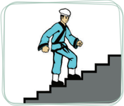

> **Deskripsi Visual:** Gambar ini adalah ilustrasi yang menunjukkan seorang pekerja berjalan naik tangga. Ilustrasi ini menggambarkan proses atau tindakan yang dilakukan oleh individu dalam situasi tertentu. Pekerja tersebut tampak sedang berjalan naik tangga dengan posisi tubuh yang tegak dan tenang, menunjukkan keberanian atau kemampuan untuk menghadapi tantangan. Tangga yang digunakan oleh pekerja tampak rata dan terbuat dari material yang tahan lama, menunjukkan bahwa tempat kerja atau lingkungan kerja tersebut aman dan nyaman.

Elemen-elemen utama dalam gambar ini meliputi:
1. Pekerja: Ia dikenakan pakaian kerja yang formal dan memegang alat atau peralatan kerja.
2. Tangga: Tangga yang rata dan terbuat dari material yang tahan lama, menunjukkan kondisi lingkungan kerja yang baik.
3. Lingkungan: Lingkungan yang aman dan nyaman, menunjukkan bahwa tempat kerja tersebut disiapkan dengan baik.

Teks, angka, atau label penting yang terlihat dalam gambar ini tidak ada, karena gambar hanya menggambarkan tindakan atau situasi tanpa informasi tambahan.

Informasi kunci yang dapat diambil pembaca dari gambar ini adalah tentang proses atau tindakan yang dilakukan oleh pekerja, yaitu berjalan naik tangga, serta lingkungan kerja yang aman dan nyaman. Gambar ini juga menunjukkan bahwa pekerja memiliki keberanian atau kemampuan untuk menghadapi tantangan dalam lingkungan kerja.

Tidak  perduli  dimana  level  seseorang  saat  ini.  Di  manapun  ia  berada, prinsipnya adalah: Ia harus menuju ke atas (berubah menjadi lebih baik), atau dengan kata lain berkembang. Serupa dengan hal itu, maka ketika seseorang berubah ke arah yang lebih buruk, maka ia adalah Xiaoren . Jadi bukan level atau kelas sebagai ukurannya, tetapi arah perubahan yang akan menentukan seseorang itu Junzi atau Xiaoren .

### 2. Menuntut Diri Sendiri

### a. Kambing Hitam

Apa  hal  pertama  yang  kalian  pikirkan  (sebagai  alasan  atau  penyebab) ketika  terlambat  sampai  ke  suatu  tempat?  Jalanan  macet,  bertemu  sekian kali lampu merah, hujan lebat. Atau karena tegesa-gesa sehingga mengalami insiden kecil. Kendaraan mogok, roda kendaraan yang bocor, dan karena ini dan/atau karena itu.

Beberapa alasan tersebut memang sepertinya masuk akal (terjadi di luar kendali diri). Tetapi, kalian tentu tahu kapan saat-saat terjadi kemacetan lalu lintas, jadi kenapa tidak berangkat lebih awal. Kalian tentu tahu bahwa lampu lalu  lintas  (yang  kita  sebut  sebagai  lampu  merah)  adalah  untuk  mengatur kelancaran lalu lintas, kenapa tidak berpikir bagaimana seandainya tidak ada lampu  merah.  Kalian  juga  tahu  kemungkinan  turun  hujan  (karena  sedang berada  di  musim  penghujan),  kenapa  tidak  'sedia  payung  sebelum  hujan'?

 

---
## 📄 Halaman 99

Bahkan sebuah kecelakaan, atau kendaraan mogok, apakah kalian yakin benar bahwa ini memang (mutlak) di luar kendali kalian? atau memang sudah 'nasib buruk' kalian hari ini? Atau alam memang sudah mengaturnya demikian.

Mungkin  ada  beberapa  hal  yang  memang  di  luar  kendali  kita.  Tetapi, coba  renungkan  kembali  penyebab  dasar  yang  benar-benar  mendasar  dari keterlambatan  itu.  Seseorang  terlambat  karena  terlambat.  Kita  terlambat sampai karena terlambat memulai. Kita terlambat bangun karena terlambat tidur. Sebuah rapat terlambat selesai karena terlambat dimulai, dan seterusnya. Pernyataan  ini  kiranya  lebih  bijaksana  daripada  menyalahkan  hal-hal  lain sebagai sebab dari keterlambatan kita.

Hal  berikut  ini  mungkin  lebih  menyedihkan  lagi.  Ketika  seseorang melakukan  kesalahan  (yang  jelas-jelas  karena  kecerobohannya)  ia  akan mengatakan saya 'khilaf' atau tergoda bisikan 'setan'. Kemudian, ketika ia mengalami kesalahan karena kurang perhitungan, ia akan mengatakan: 'Tuhan sedang menguji saya'. Hingga sepertinya ia tidak pernah melakukan kesalahan atas  sebab  dari  dirinya  sendiri,  selalu  saja  ada  alasan.  Sampai  pada  satu kesimpulan, sebenarnya manusia sulit mengakui atau berusaha mencari sebabsebab kesalahan dari dirinya sendiri.

### Penting!

Nabi Kongzi bersabda: 'Bersikap keras kepada diri sendiri dan bersikap lunak kepada orang lain,  akan  menjauhkan sesalan orang'. ( Lunyu . XV: 15)

Jangan  pernah  menyalahkan  siapapun  atau apapun. Mencari kambing hitam atas kesalahan atau kekalahan yang kita alami. Jangan menjadi orang picik ( Xiaoren ) yang selalu mencari sebab-sebab  kesalahan  dari  luar  dirinya,  selalu mencari  'kambing  hitam'  atas  kesalahan  yang dilakukannya.

Mengzi berkata, 'Kalau mencintai seseorang, tetapi  orang  itu  tidak  menjadi  dekat;  periksalah apakah kita sudah berlandas Cinta Kasih. Kalau memerintah seseorang, tetapi orang itu tidak mau menurut;  periksalah  apakah  kita  sudah  berlaku  Bijaksana.  Kalau  bersikap Susila  kepada  seseorang,  tetapi  tidak  mendapat  balasan;  periksalah  apakah kita sudah benar-benar mengindahkannya'.

'Melakukan  sesuatu bila tidak berhasil, semuanya  harus berbalik memeriksa diri sendiri. Kalau diri kita benar-benar lurus, niscaya dunia mau tunduk'. ( Mengzi . IV A: 4)

 

---
## 📄 Halaman 100

---
**🖼️ Gambar/Diagram**

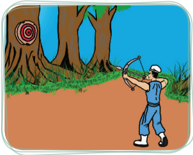

> **Deskripsi Visual:** Gambar ini adalah ilustrasi yang menunjukkan seorang pria sedang memotong pohon menggunakan alat pemotong tumbuhan. Gambar ini menggambarkan proses pemotongan pohon sebagai bagian dari pembelajaran tentang pengelolaan hutan atau perkebunan. 

1. **Apa yang ditampilkan secara keseluruhan**: Gambar ini menampilkan seorang pria yang sedang memotong pohon dengan alat pemotong tumbuhan. Latar belakangnya adalah area berlubang dengan tanah berwarna coklat dan beberapa pohon yang sudah dipotong.

2. **Elemen-elemen utama dan relasinya**: 
   - **Pria**: Pria tersebut sedang memotong pohon menggunakan alat pemotong tumbuhan.
   - **Pohon**: Pohon yang sedang dipotong memiliki batang yang besar dan sudah dipotong di bagian atas.
   - **Latar belakang**: Latar belakang terdiri dari tanah berwarna coklat, beberapa pohon yang sudah dipotong, dan tanaman hijau di sekitar area tersebut.

3. **Teks, angka, atau label penting yang terlihat**: 
   - Ada teks yang tidak jelas pada gambar, mungkin merujuk pada informasi tambahan seperti nama alat pemotong atau instruksi untuk memotong pohon.

4. **Informasi kunci yang dapat diambil pembaca**: Gambar ini menggambarkan proses pemotongan pohon, yang merupakan bagian dari pembelajaran tentang pengelolaan hutan atau perkebunan. Ini juga menunjukkan pentingnya menggunakan alat yang tepat dan aman saat memotong pohon.

Nabi Kongzi bersabda: 'Hal memanah itu seperti sikap seorang Junzi , bila memanahnya meleset dari bulan-bulannya (sasaran), si pemanah memeriksa sebab-sebab kegagalan di dalam diri sendiri'. ( Zhongyong . XIII: 5)

### b. Seperti Bercermin

Ingatlah kembali ketika kalian bercermin. Pertama, kalian semua mesti mengerti, bahwa apa yang kalian hadirkan itulah yang akan tampil pada cermin yang ada di hadapan kalian. Sama persis, hanya arahnya saja yang berbeda. Kedua,  sejelas  apa  yang  akan  tampil  di  dalam  cermin  sangat  tergantung kecemerlangan  dari  wujud  asli  yang  ditampilkan  (di  samping  kebersihan cermin itu sendiri).

---
**🖼️ Gambar/Diagram**

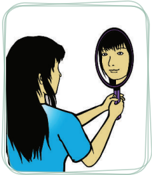

> **Deskripsi Visual:** Gambar ini adalah ilustrasi yang menunjukkan seorang wanita sedang memegang sebuah alat perawatan wajah di depan cermin. Gambar ini menggambarkan tindakan sehari-hari seseorang dalam proses perawatan wajah. 

1. Apa yang ditampilkan secara keseluruhan: Gambar ini menampilkan seorang wanita yang sedang memegang alat perawatan wajah di depan cermin.

2. Elemen-elemen utama dan relasinya: Elemen utama dalam gambar ini adalah wanita, alat perawatan wajah, dan cermin. Wanita berada di depan cermin, sedangkan alat perawatan wajah dimainkan oleh tangan kanan wanita. Relasi antara elemen-elemen ini adalah wanita menggunakan alat perawatan wajah di depan cermin untuk melakukan perawatan wajah.

3. Teks, angka, atau label penting yang terlihat: Dalam gambar ini, tidak ada teks, angka, atau label yang penting. Namun, elemen-elemen utama seperti wanita, alat perawatan wajah, dan cermin merupakan bagian penting dari gambar.

4. Informasi kunci yang dapat diambil pembaca: Informasi kunci yang dapat diambil dari gambar ini adalah bahwa wanita sedang melakukan perawatan wajah menggunakan alat perawatan wajah di depan cermin. Ini menunjukkan bahwa perawatan wajah adalah bagian dari rutinitas sehari-hari banyak orang.

Apa  yang  ada  dalam  cermin  adalah gambaran  persis  dari  apa  yang  ada  di hadapannya. Jadi, jangan pernah berharap akan mendapat  tampilan yang berbeda dari apa yang memang kita tampilkan, dan jangan  juga  berharap  mendapat  tampilan yang cemerlang bila apa yang ditampilkan kusam penuh debu.

Mengzi berkata: 'Ada sebuah nyanyian anak-anak  yang  berbunyi,  'Sungai Cang Lang di  kala  jernih,  boleh  untuk  mencuci tali  topiku,  Sungai Cang  Lang di  kala keruh, boleh untuk mencuci kakiku'.

Nabi Kongzi bersabda: 'Muridmuridku,  dengarlah.  Di  kala  jernih  untuk mencuci  tali  topi,  di  kata  keruh  untuk

 

---
## 📄 Halaman 101

mencuci  kaki.  Perbedaan  ini,  air  itu  sendiri  membuatnya.  Maka  orang tentu  sudah  menghinakan  diri  sendiri,  baru  orang  lain  menghinakannya.

Suatu keluarga niscaya telah dirusak sendiri, baru kemudian orang  lain  merusakkannya.  Suatu Negara niscaya telah diserang sendiri,  baru  kemudian  orang  lain menyerangnya'.

Bila  perlakuan  orang  terhadap air itu tergantung airnya, maka begitu juga perlakuan orang terhadap kita, sangat tergantung dari bagaimana kita memperlakukan diri kita, dan selanjutnya bagaimana kita memperlakukan orang lain. Hal  ini  kiranya  dapat  membantu kita untuk mengerti dan memahami setiap perlakuan orang kepada kita. Menyadari benar apa yang telah kita 'berikan'  ketika  kita  menerimanya kembali dari orang lain.

Jangan pernah mengharap menjadi orang terhormat, bila kita  memang  tidak  pernah  mencoba  menghormati  diri  kita  sendiri  lebih dahulu. Jangan pernah berharap orang lain menghormati kita, bila kita tidak menghormati orang lain terlebih dahulu.

Jadi, apa yang kita terima hari ini adalah hasil dari apa yang telah kita berikan  pada  hari-hari  sebelumnya  (termasuk  apa  yang  kita  berikan  pada pikiran  kita).  Perlakuan  yang  kita  terima  dari  orang  lain  adalah  (sangat mungkin) hasil dari apa yang telah kita lakukan pada mereka sebelumnya.

### Penting!

Nabi Kongzi bersabda: 'Besikap keras kepada  diri sendiri dan bersikap  lunak  kepada  orang  lain  akan  menjauhkan  sesalan orang.' ( Lunyu . XV: 15)

---
**🖼️ Gambar/Diagram**

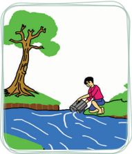

> **Deskripsi Visual:** Gambar ini adalah ilustrasi yang menunjukkan seorang pria sedang memandu sebuah traktor ke arah sungai. Gambar ini menggambarkan situasi di mana pria tersebut sedang bekerja di pinggir sungai, mungkin untuk melakukan pekerjaan pertanian atau pengolahan tanah. Pohon besar dengan daun hijau tampak di sebelah kiri gambar, menunjukkan bahwa lokasi ini berada di area alam yang masih lestari. Sungai yang berwarna biru cerah berada di bagian tengah dan kanan gambar, menunjukkan bahwa pemandangan ini berada di tepi sungai. Teks, angka, atau label penting tidak terlihat pada gambar ini. Informasi kunci yang dapat diambil pembaca adalah bahwa pria tersebut sedang bekerja di pinggir sungai, mungkin melakukan pekerjaan pertanian atau pengolahan tanah.

Gambar 6.4 tergantung airnya.

 

---
## 📄 Halaman 102

### c. Melakukan Lebih Dulu

Dalam  interaksi  kita  dengan  sesama,  sangat  tidak  perlu  untuk  saling menuntut. Kalau ada yang harus dituntut itu adalah diri kita sendiri. Sebagai apapun peran kita, sebagai adik atau sebagai kakak, sebagai bawahan atau sebagai atasan. Tuntutlah diri kita sendiri, dan jadilah yang sebaik-baik sebagai apapun peran/predikat kita.

Ketika  kita  adalah  seorang  pendengar,  kita  tak  perlu  menuntut  si 'pembicara' menjadi pembicara yang sebaik-baiknya, tentu kita yang harus menjadi pendengar yang sebaik-baiknya (pendengar yang baik sangat mungkin menjadi pembicara yang baik). Tetapi ketika kita adalah seorang pembicara, kita  juga  tak  perlu  menuntut  'pendengar'  menjadi  pendengar  yang  sebaikbaiknya  tentu  kitalah  yang  harus  menjadi  pembicara  yang  sebaik-baiknya, (pembicara yang baik berasal dari pendengar yang baik).

Kita semua memiliki satu peran yang sama (perihal) kita sebagai 'anak', jadilah yang sebaik-baiknya (berhenti pada puncak kebaikan) sebagai seorang anak yaitu 'berbakti'. Jika kita hanya menuntut orang tua untuk menjadi yang sebaik-baiknya sebagai orang tua (seperti yang kita mau), ada baiknya kita bertanya lebih dahulu 'Apa yang kita harapakan pada anak kita kelak ketika kita telah menjadi orang tua?' atau bisa saja pada saat yang sama seseorang memiliki peran keduanya (sebagai anak sekaligus sebagai orang tua), sebagai adik sekaligus sebagai kakak, dan seterusnya.

---
**🖼️ Gambar/Diagram**

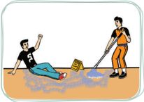

> **Deskripsi Visual:** Gambar ini adalah ilustrasi yang menunjukkan dua orang pekerja sedang bekerja di sebuah bangunan. Pekerja di sebelah kiri sedang berjalan dengan tangan yang terluka, sementara pekerja di sebelah kanan sedang menggunakan alat berat untuk memperbaiki lantai. Latar belakang menunjukkan bagian bangunan yang sedang dibangun, dengan corong air yang mengalir ke lantai. Gambar ini menunjukkan hubungan antara pekerjaan dan kerusakan fisik yang mungkin terjadi dalam proses pembangunan.

Gambar 6.5 Jangan mencari penyebab atau kesalahan dari pihak lain

Dari sini tampak jelas, bahwa ketika kita menuntut orang lain sama artinya kita menuntut diri sendiri dalam peran kita yang lain. Maka menjadi  jelas,  bahwa  diri  kita adalah 'sentral' dalam proses pembinaan  diri, dalam proses mengharmoniskan hubungan, dan  dalam  rangka  memperbaiki kesalahan-kesalahan.

'Jalan suci seorang Junzi ada empat yang khawatir belum satu kulakukan. Apa yang kuharapkan dari anakku, belum dapat kulakukan terhadap orang tuaku; apa yang kuharapkan dari menteriku belum dapat kulakukan terhadap rajaku; apa

 

---
## 📄 Halaman 103

yang kuharapkan dari adikku, belum dapat kulakukan terhadap kakakku; dan apa yang kuharapkan dari temanku, belum dapat kulakukan lebih dahulu. Di dalam menjalankan kebajikan sempurna, hati-hati di dalam membicarakannya, bila ada kekurangan aku tidak berani tidak sekuat tenaga mengusahakannya; dan bila ada yang berkelebihan aku tidak berani menghamburkannya; maka di dalam berkata-kata selalu ingat akan perbuatan dan di dalam berbuat selalu ingat  akan  kata-kata.  Bukankah  demikian  ketulusan  hati  seorang Junzi ?' ( Zhongyong . Bab XII: 4)

### Refleksi

Bagaimana dengan sikap kalian? Apakah kalian lebih sering menuntut diri sendiri, atau lebih sering menuntut orang lain?

Inilah  pertayaan  panjang  sepanjang  perjalanan  hidup  kita,  'Dapatkah lebih dahulu memberikan dan melakukan apa yang kita harapkan orang lain berikan atau lakukan kepada kita?'

### 3. Berbuat Tanpa Pamrih

Pada  setiap  orang  pasti  ada  sesuatu  yang  harus  dikerjakan/dilakukan, dan menjadi prinsip penting bahwa segala sesuatu (yang secara moral) harus dilakukannya  'lakukanlah  tanpa  pamrih'.  Karena,  nilai  melakukan  atau mengerjakan sesuatu yang harusnya kita lakukan terletak pada pekerjaan itu sendiri, dan bukan pada hasil di luar pekerjaan itu. Terus mencoba melakukan apa  yang  kita  katahui  seharusnya  kita  lakukan,  tanpa  memikirkan  apakah dalam prosesnya kita akan berhasil atau gagal.

Bersikap tidak mengindahkan keberhasilan atau kegagalan yang bersifat lahiriah maka dalam pengertian tertentu kita tidak pernah gagal. Karena jika kita mengerjakan kewajiban kita maka dengan perbuatan kita tersebut kewajiban kita secara moral telah dilaksanakan. Sebagai hasilnya, kita akan selalu bebas dari kecemasan apakah kita akan berhasil, dan bebas dari ketakutan apakah kita akan gagal. Dengan demikian, tentu kita akan bahagia. Nabi Kongzi bersabda: 'Yang bijaksana bebas dari keragu-raguan, yang berpericinta kasih bebas dari perasaan cemas, dan yang berani bebas dari ketakutan'. ( Lunyu . IX: 29)

 

---
## 📄 Halaman 104

Nabi Kongzi memberikan  teladan  untuk  hal  ini.  Beliau  bahkan  tetap melakukan sesuatu yang ia sendiri tidak yakin apakah akan berhasil. Beliau tetap melakukannya lantaran hal itu memang secara moral wajib ia lakukan.

Nabi Kongzi juga  memberitahukan  alasan  mengapa  manusia  unggul mencoba  masuk  ke  dalam  dunia  politik  (pemerintahan)  adalah  karena  ia memandangnya sebagai hal yang baik, di mana orang dapat menyumbangkan ide-idenya  dalam  rangka  memperbaiki  tatanan  masyarakat.  Sekali  pun  ia menyadari  bahwa  prinsip-prinsipnya  mungkin  tidak  dapat  berlaku  secara umum.

Melakukan  sesuatu  perbuatan  seyogyanya  bukan  semata-mata  karena hasil  yang  akan  didapat  dari  perbuatan  itu.  Banyak  hal  yang  secara  moral memang seharusnya wajib kita lakukan, dan kita melakukannya bukan karena ingin mendapatkan hasil dari perbuatan itu.

Perhatikanlah  hal  yang  satu  ini:  'Apakah  kita  hanya  akan  melakukan sesuatu jika kita tahu hasil yang akan kita dapat?' Bila demikian, berarti kita tidak akan melakukan apapun jika kita tidak mendapat jaminan akan hasilnya?' Apakah untuk setiap perbuatan baik yang kita lakukan karena ingin mendapat imbalan (pahala). Jika demikian, berarti kita hanya melakukan sesuatu untuk sesuatu. Serupa dengan hal itu, jika kita mengendalikan nafsu dan berusaha berbuat  baik  tetapi  ingin  mendapatkan  imbalan  (pahala)  ini  sama  artinya dengan: 'mengendalikan nafsu untuk nafsu'.

### Penting!

Keutamaan tertinggi dalam kemanusiaan adalah melakukan kebaikan demi kebaikan itu sendiri,  dan  sama  sekali  bukan  ingin mendapatkan  imbalan  dalam  bentuk  apapun,  atau  bukan  karena takut mendapatkan hukuman apapun.

Sebuah upaya harus dilakukan demi upaya itu sendiri. Mengejar kebaikan demi kebaikan itu sendiri, dan sama sekali bukan ingin mendapatkan imbalan dalam  bentuk  apapun,  atau  bukan  karena  takut  mendapatkan  hukuman. Berbuat baik itu harus dilakukan dengan ikhlas tanpa pamrih (bukan karena ingin  mendapatkan  hadiah  atau  takut  mendapatkan  hukuman).  Manusia berbuat baik karena kodratnya sebagai manusia adalah baik.

 

---
## 📄 Halaman 105

Hal  serupa  juga  ditegaskan  oleh  Nabi Kongzi ,  bahwa  mendahulukan pengabdian dan membelakangkan hasil itulah sikap menjunjung kebajikan. Pada kesempatan lain Nabi Kongzi menyatakan bahwa sungguh jarang didapat orang yang telah belajar selama tiga tahun tanpa sedikitpun mengingat akan hadiahnya. ( Lunyu . VIII: 12)

### Aktivitas 6.1

### Diskusi Kelompok

Jelaskan ayat suci berikut ini.

Mengzi berkata:  'Orang  memangku  jabatan  itu  bukan  karena miskin, tetapi ada pula suatu ketika ia memangku jabatan karena miskin.

Orang menikah itu juga bukan karena ingin mendapat perawatan, tetapi ada pula suatu ketika ia mendapat perawatan'. ( Mengzi . VB: 5)

### 4. Memperbaiki Kesalahan

Masalahnya  bukan  apakah  kita  pernah  atau  tidak  pernah  melakukan kesalahan?  Tetapi,  apakah  kita  memiliki  keberanian  untuk  (secara  jujur) mengakui kesalahan, bertanggung jawab terhadap kesalahan yang telah kita lakukan  (menerima  konsekuensi  logis),  dan  berusaha  memperbaikinya? Adakah usaha 'mencari' kesalahan untuk setiap tindakan (intropeksi diri) baik dalam hubungan kita dengan Tuhan atau dalam interaksi kita dengan sesama manusia, sampai dapat mengerti dan memahami apa yang 'tidak boleh kita lakukan' untuk waktu-waktu selanjutnya?

Berani secara jujur mengakui setiap kesalahan dan berusaha memperbaikinya,  mencari  kesalahan  dari  setiap  tindakan  dalam  interaksi kita adalah sebuah 'introspeksi diri' menuju arah 'pengembangan diri'. Nabi Kongzi menasihati kita bahwa bila bersalah janganlah takut memperbaiki, dan orang yang tidak mau memperbaiki kesalahannya itu benar-benar kesalahan.

Nabi Kongzi bersabda: 'Sayang aku belum menemukan orang yang setelah dapat melihat kesalahan sendiri lalu benar-benar menyesali dan memperbaiki diri'. ( Lunyu . V: 27)

 

---
## 📄 Halaman 106

Dari hal itu dapatlah kita sepakati beberapa tahapan dalam memperbaiki kesalahan.

- Menyerang  keburukan  sendiri  dan  berani  (secara  jujur)  mengakui setiap kesalahan.
- Bertanggung jawab atas kesalahan yang dilakukan.
- Tidak menyepelekan kesalahan-kesalahan kecil.
- Belajar dari kesalahan.
- Membatasi diri.

### a. Berani Mengakui Kesalahan

Ego mungkin menjadi penghalang utama untuk mau mengakui (secara jujur) kesalahan yang telah kita lakukan. Masalahnya bukan karena kita tidak menyadari akan kesalahan itu (merasa benar), tetapi lebih karena kita 'tidak berani  mengakui'.  Bahkan  kalau  mungkin  (dengan  segala  cara)  kita  akan berusaha menutupi setiap kesalahan yang telah kita lakukan.

Ironisnya,  banyak  orang  menutupi  kesalahan  yang  ia  lakukan  dengan kebenaran (jasa) yang telah ia lakukan. Berharap orang lain akan memaklumi dan menoleransi kesalahannya yang ia lakukan dengan  menunjukkan kebenaran yang telah ia lakukan.

Penghalang (karena ego) ini mungkin menjadi lebih berat untuk mereka yang berada pada posisi 'lebih tinggi' (baik lebih tinggi dalam hal usia, status sosial, jabatan, dan/atau pendidikan), meskipun di dalam hatinya ia mengakui akan kesalahannya.

---
**🖼️ Gambar/Diagram**

> **Deskripsi Visual:** Gambar ini adalah ilustrasi yang menunjukkan dua orang tangan yang sedang berbicara. Pada gambar tersebut, tangan yang lebih besar sedang memegang sebuah papan dengan tulisan "H" dan "A". Tangan yang lebih kecil sedang menunjuk pada papan tersebut. Gambar ini mungkin digunakan untuk menggambarkan konsep atau teks tertentu yang berkaitan dengan huruf "H" dan "A".

Perhatikan  pertengkaran  dari  dua orang  yang  masing-masing  mengaku dirinya sebagai pihak yang benar, tidak akan pernah selesai atau bahkan untuk sekadar  mereda,  jika  keduanya  tidak ada yang mau (berani dan rendah hati) mengakui kesalahan. Mungkinkah keduanya  di  pihak  yang  benar? Atau mungkin keduanya adalah salah. Tetapi memang bukan itu masalahnya.

Bila  salah  satu  mau  mengakui walaupun  hanya  dengan  mengatakan 'Mungkin saya yang salah' pertengkaran pasti akan mulai mereda. Hal  ini  masih  tergolong  wajar  kalau

 

---
## 📄 Halaman 107

memang masing-masing  tidak  merasa  sebagai  pihak  yang  bersalah.  Tetapi naifnya, bahkan orang tetap tidak memiliki keberanian untuk mengakui suatu kesalahan yang ia sadari.

### b. Bertanggung Jawab

Bertanggung jawab berarti mau menerima akibat sebagai kosekuensi dari kesalahan  yang  telah  dilakukan,  dan  mau  memperbaikinya.  Berani  (secara jujur) mengakui kesalahan tidak berarti sudah terlepas dari tanggung Jawab untuk  menanggung  akibat  sebagai  konsekuensi  dari  kesalahan  yang  telah dilakukannya.

Tanggung  jawab  bukan  hanya  sebatas  pada  mengakui  kesalahan  lalu terbebas dari akibat-akibat atas kesalahan itu. Mau bertanggung jawab berarti mau menerima konsekuensi dan kemudian mau memperbaikinya.

### Aktivitas 6.2

### Diskusi Kelompok

 Sebagai manusia kalian tentu pernah melakukan suatu kesalahan, dan setelah menyadari dan mengakui kesalahan itu, tentu ada niat dan usaha untuk kalian meminta maaf.

 Namun  bagaimana  seandainya  permintaan  maaf  kalian  tidak diterima  atau  tidak  mendapatkan  maaf?  Bagaimana  sikap  kalian? Apakah  kalian  akan  menerimanya  dengan  lapang  dada?  Berbalik menyalahkan?  Tidak  perduli?  Atau…  kita  tetap  berjuang  memperbaiki kesalahannya dengan komitmen untuk tidak mengulanginya?

### c. Tidak Menyepelekan Kesalahan Kecil

Banyak hal besar bermula dari hal kecil. Serupa dengan hal itu, banyak masalah atau kesalahan besar berawal dari masalah kecil. Maka jangan pernah menganggap masalah atau kesalahan kecil sebagai suatu hal yang sepele dan mengabaikannya. Ketika satu kesalahan dibuat, saat itulah sebuah lingkaran telah dibentuk (lingkaran setan). Satu kesalahan akan memicu kesalahan lain yang bahkan lebih buruk.

Jangan pernah menyepelekan kesalahan (sekecil apapun) kesalahan itu. Ia tidak pernah selesai tanpa ada usaha untuk memperbaiki dan komitmen untuk

 

---
## 📄 Halaman 108

tidak  mengulanginya.  Jika  (untuk  sementara)  tidak  menimbulkan  akibat, bukan berarti telah selesai dengan sendirinya. Ia hanya tertahan sementara, dan tanpa kita sadari itu akan menjadi pemicu kesalahan-kesalahan yang lain.

### Penting!

Kebaikan  sebelum  terhimpun  tidak  cukup  untuk  menyempurnakan nama. Kejahatan sebelum terhimpun tidak cukup untuk membinasakan badan. Orang rendah budi menganggap kebaikan kecil tidak bermanfaat lalu  tidak  dilakukan;  kejahatan  kecil  dianggap  tidak  melukai,  lalu tidak disingkirkan (dihindari). Dengan demikian, kejahatan terhimpun sehingga  tidak  dapat  ditutupi  lagi;  dosanya  menjadi  demikian  besar sehingga tidak dapat dihapus/diampuni.

(Babaran Agung. B Bab V: 38)

### d. Belajar dari Kesalahan

Tidak ada seorangpun yang luput dari kesalahan. Kesalahan itu manusiawi. Namun harus diingat, sebagaimana diungkapkan bahwa 'hanya rusa bodoh yang terjerembab dua kali  di  lubang  yang  sama.'  Jadi,  mengapa  kita  tidak belajar dari setiap kesalahan yang kita lakukan? Atau, kita membiarkan diri menjadi rusa bodoh?

Kesalahan terjadi  karena  penilaian  yang  kurang  tepat,  tetapi  kesalahan memberikan kita pengalaman untuk selanjutnya membuat kita dapat memberikan  penilaian  yang  tepat.  Demikianlah,  penilaian  yang  kurang tepat menimbulkan kesalahan, sementara kesalahan itu sendiri memberikan pengalaman,  dan  pengalaman  menjadikan  kita belajar untuk memiliki penilaian  yang  tepat.  Belajar  secara  terus-menerus,  dan  kesalahan  adalah bagian dari proses belajar.

### e. Membatasi Diri

Tugas  kita  adalah  membatasi  diri  untuk  mengeliminasi  kesalahan. Sebagaimana disabdakan Nabi Kongzi : 'Orang yang dapat membatasi dirinya, sekalipun mungkin berbuat salah, pasti jaranglah terjadi'. ( Lunyu . IV: 23)

Hal penting dalam usaha membatasi diri dari kesalahan adalah dengan menyadari  baik-baik  sifat  kepribadian  kita,  karena  dari  situlah  kesalahankesalahan kita lakukan. Orang yang pendiam menjadi tetap diam pada saat seharusnya ia bicara (ini kesalahan). Orang yang suka bicara menjadi terus bicara pada saat ia seharusnya diam, ini kesalahan. Orang yang lembut dan

 

---
## 📄 Halaman 109

perasa menjadi mudah menduga-duga berdasarkan perasaannya, ini kesalahan. Orang yang santai menjadi tetap santai pada saat seharusnya ia bersikap serius, ini kesalahan.

Hati-hati  dengan  sifat  kepribadian  kita,  karena  dari  situlah  kita  sering melakukan kesalahan. Menyadari akan sifat kepribadian kita adalah langkah awal untuk membatasi diri dari kesalahan.

Aktivitas 6.3

### Diskusi Kelompok

Diskusikan maksud ayat berikut ini.

-  Nabi bersabda: 'Adapun kesalahan seseorang itu masing-masing sesuai  dengan  sifatnya.  Bahkan  dari  kesalahannya  dapat  diketahui apakah ia seorang yang berperi cinta kasih'. ( Lunyu . IV: 7)

### 5. Berbuat Sesuai Kedudukan

Secara umum kita semua mempunyai predikat yang sama yaitu sebagai manusia. Karena predikat sama, maka semu memiliki kewajiban yang sama dalam predikatnya sebagai manusia, yaitu 'membina diri'. Dalam kitab Ajaran Besar ( Daxue ) bab utama pasal 6 tersurat: 'Karena itu dari raja sampai rakyat jelata mempunyai satu kewajiban yang sama, yaitu mengutamakan pembinaan diri sebagai pokok'.

Namun  dalam  kesamaan  peran/predikatnya  sebagai  manusia,  masingmasing  orang  memiliki  keadaan  yang  berbeda-beda.  Artinya,  bentuk  dan standar/ukuran  dari  pembinaan  atau  pengembangan  diri  setiap  orang  tidak dapat  disamakan.  Maka  dikatakan,  'Seorang Junzi berbuat  sesuai  dengan kedudukannya, ia tidak ingin berbuat luar daripadanya'. ( Daxue . XIII: 1-4)

- 'Di  kala  kaya  dan  berkedudukan  mulia,  ia  berbuat  sebagaimana layaknya seorang kaya dan berkedudukan mulia, di kala miskin dan berkedudukan  rendah,  ia  berbuat  sebagaimana  layaknya  seorang miskin  dan  berkedudukan  rendah;  di  kala  berdiam  di  antara  suku Yi dan Qi, ia berbuat sebagaimana layaknya suku Yi dan Qi; di kala sedih dan menghadapi kesukaran, ia berbuat sebagaimana layaknya seorang yang sedih dan menghadapi kesukaran. Maka seorang Junzi di dalam keadaan bagaimanapun selalu berhasil menjaga dirinya'.

 

---
## 📄 Halaman 110

- 'Di  kala  berkedudukan  tinggi  ia  tidak  meremehkan  bawahan,  dan di  kala  berkedudukan  rendah  ia  tidak  menjilat  kepada  atasannya, ia  hanya  meluruskan  diri  dan  menepati  diri  dan  tidak  mencari-cari kesalahan orang lain. Demikianlah ia tidak mempunyai rasa sesal. Ke atas tidak menyesali Tian dan ke bawah tidak menyalahkan sesama'.
- 'Maka  seorang Junzi itu  selalu  damai  tentram  menerima  Firman, sebaliknya  seorang  rendah  budi  ( Xiaoren )  melaklukan  perbuatan sesat untuk memuaskan nafsunya'.

### Aktivitas 6.4

### Tugas Mandiri

Jelaskan ayat suci berikut ini.

-  Seorang yang miskin tidak  menggunakan harta dalam melakukan bakti, dan seorang yang tua tidak menggunakan badannya dalam melakukan bakti.

### Penilaian Diri Skala Sikap

###  Petunjuk:

Isilah lembar penilaian diri yang ditunjukkan dengan skala sikap, dengan memberikan tanda checklist (√) di antara empat skala sebagai berikut.

SS

= Sangat Setuju

ST

= Setuju

RR

= Ragu-ragu

TS

= Tidak Setuju

 

---
## 📄 Halaman 111

---
**📊 Tabel**

Tabel ini berisi pernyataan yang mungkin digunakan sebagai soal untuk tes kepribadian atau evaluasi perilaku. Topik utamanya berkisar pada aspek-aspek kehidupan sosial dan moral, seperti hubungan antara individu dengan orang lain, sikap terhadap kesalahan dan kesetiaan, serta perilaku yang dianggap tidak baik. Kolom-kolomnya mencakup empat jenis skor: SS (Situational), ST (Strategic), RR (Rational), dan TS (Total). Data penting yang terlihat meliputi pernyataan-pernyataan yang mengandung pesan-pesan moral dan etika, seperti pentingnya menjaga kesetiaan, tidak mencari kambing hitam untuk kesalahan, dan tidak membiarkan diri sendiri menjadi korban dari perilaku negatif.

 

---
## 📄 Halaman 112

---
**📊 Tabel**

Tabel ini berisi 17 poin yang membahas tentang nilai-nilai etika dan perilaku yang diharapkan dalam masyarakat. Kolom-kolomnya meliputi "Pernyataan", "SS" (Siswa), "ST" (Staf), "RR" (Rumah Sakit), dan "TS" (Tugas Siswa). Topik utama tabel adalah tentang etika dan perilaku yang harus diikuti dalam berbagai situasi, seperti menjaga integritas, menghargai orang lain, dan bertanggung jawab atas kesalahan. Data penting yang terlihat adalah bahwa setiap poin memiliki perbedaan dalam penilaian antara siswa, staf, rumah sakit, dan tugas siswa, menunjukkan bahwa evaluasi etika dapat bervariasi tergantung pada konteks dan pihak yang memeriksa.

 

---
## 📄 Halaman 113

### A.  Uraian

### Jawablah pertanyaan-pertanyaan berikut ini dengan uraian yang jelas.

- Apa arti kata Junzi berdasarkan karakter huruf?
- Bagaimana pandangan Nabi Kongzi tentang arti Junzi ?
- Sebutkan langkah-langkah memperbaiki kesalahan!
- Apa nasihat (sabda) Nabi Kongzi tentang membatasi diri dari kesalahan?
- Jelaskan kembali dengan contoh bahwa kita (manusia) harus belajar dari setiap kesalahan!
- Apa  sebenarnya  yang  menjadi  penyebab  manusia  cenderung  selalu menyalahkan  pihak  lain  untuk  setiap  kesalahan  yang  dilakukannya? Jelaskan.

### B. Mencari Ayat

Carilah ayat suci yang terdapat dalam kitab Sishu , lalu tuliskan pada kolom berikut ini sesuai dengan aspek yang ditentukan!

---
**📊 Tabel**

Tabel ini berisi dua aspek utama yang berkaitan dengan prinsip-prinsip dalam agama Islam. Pertama, aspek pertama membahas tentang rukun meski tidak sama, yang merupakan prinsip bahwa setiap orang memiliki keunikan dan tidak bisa dianggap sama dengan orang lain. Kedua, aspek kedua menekankan pada prinsip bahwa orang yang dilayani haruslah memiliki kualitas tertentu, seperti Junzi, yang biasanya merujuk pada seseorang yang memiliki kebijaksanaan dan pengertian yang tinggi. Data atau pola penting yang terlihat dalam tabel ini adalah bahwa prinsip-prinsip tersebut sangat penting dalam masyarakat Islam untuk memastikan keadilan dan ketertiban dalam berbagai aspek kehidupan.

 

---
## 📄 Halaman 114

---
**📊 Tabel**

Tabel ini berisi 10 aspek yang berkaitan dengan karakter Junzi dalam konteks suci, di mana setiap aspek ditunjukkan dengan ayat suci yang relevan. Topik utama tabel adalah karakteristik dan perilaku Junzi dalam konteks agama. Kolom pertama menunjukkan nomor urutan aspek, sedangkan kolom kedua berisi deskripsi singkat aspek tersebut. Data penting yang terlihat adalah bahwa semua aspek tersebut berkaitan erat dengan karakter Junzi, mencakup sikap, perilaku, dan perilaku negatifnya. Misalnya, aspek pertama menggambarkan sikap Junzi yang tidak mau berebut, sementara aspek ke-10 menggambarkan sikap Junzi yang mengutamakan kepentingan umum. Ini menunjukkan bahwa Junzi memiliki karakteristik yang khas dan berbeda dari karakter lain dalam konteks agama tersebut.

 

---
## 📄 Halaman 115

---
**🖼️ Gambar/Diagram**

> **Deskripsi Visual:** Gambar ini menunjukkan bab ke-7 dari sebuah buku pelajaran. Gambar utama adalah seorang anak kecil dengan rambut berwarna hitam dan berambut panjang, duduk di atas sebuah hewan besar seperti kucing atau anjing. Anak tersebut sedang tersenyum dan tampak sangat bahagia. Di sekitar anak tersebut ada beberapa elemen yang menarik perhatian:

1. **Elemen Utama**: 
   - Anak kecil yang tersenyum.
   - Hewan besar seperti kucing atau anjing di belakang anak.
   - Lingkaran emas yang mengelilingi wajah anak.

2. **Relasi**:
   - Anak kecil tampak sangat bahagia dan berada di tengah lingkaran emas.
   - Hewan besar tampak sebagai penghormatan atau simbol kebahagiaan.

3. **Teks, Angka, atau Label Penting**:
   - "Bab VII" tertera di atas gambar dalam huruf besar putih.

4. **Informasi Kunci**:
   - Bab ke-7 merupakan bagian dari buku pelajaran yang mungkin berfokus pada tema kebahagiaan atau kecerdasan anak-anak.
   - Lingkaran emas yang mengelilingi wajah anak mungkin merujuk pada konsep kebahagiaan atau pencapaian.

Dengan demikian, gambar ini menunjukkan bahwa bab ke-7 dari buku pelajaran ini mungkin berfokus pada tema kebahagiaan atau pencapaian anak-anak, dengan elemen visual yang menunjukkan kebahagiaan dan kecerdasan.

### Makna Tahun Baru Yinli

 

---
## 📄 Halaman 116

---
**🖼️ Gambar/Diagram**

> **Deskripsi Visual:** Gambar ini adalah diagram yang menunjukkan struktur konsep tentang Xinnian (Tahun Baru Kongzili) dalam konteks sistem penanggalan tradisional China. Diagram ini terdiri dari tiga cabang utama: Mengenal Sistem Penanggalan, Sejarah dan Makna Xinnian, dan Budaya dan Tradisi. Cabang pertama membahas tiga sistem penanggalan: Sistem Matahari/Solar/Yangli, Sistem Bulan/Lunar/Yinli, dan Sistem Bulan/Matahari/Lunisolar/Yin Yangli. Cabang kedua berfokus pada sejarah dan makna Xinnian, termasuk penentuan awal tahun kalender Kongzili, penentuan jatuhnya Xinnian, dan makna Tahun Baru (Xinnian). Cabang ketiga menjelaskan tradisi memberi Angpao dan makanan khas Tahun Baru. Teks penting dalam diagram ini mencakup istilah seperti "Sistem Matahari/Solar/Yangli", "Sistem Bulan/Lunar/Yinli", "Sistem Bulan/Matahari/Lunisolar/Yin Yangli", "Penentuan Awal Tahun Kalender Kongzili", "Penentuan Jatuhnya Xinnian", "Makna Tahun Baru (Xinnian)", "Tradisi Memberi Angpao", dan "Makanan Khas Tahun Baru". Gambar ini memberikan pemahaman umum tentang bagaimana Xinnian dianggap sebagai tahun baru dalam tradisi China, melibatkan pengetahuan tentang sistem penanggalan, sejarah, dan budaya.

### A.  Pendahuluan

Sebelum membahas tentang makna Tahun Baru ( Xinnian ), terlebih dahulu kalian  akan  dikenalkan  dengan  empat  dimensi  ajaran  Khonghucu.  Empat dimensi ajaran Khonghucu yang dimaksud adalah: dimensi agama, dimensi filsafat, dimensi pengetahuan, dan dimensi budaya.

 

---
## 📄 Halaman 117

Pembahasan  tentang  empat  dimensi  ini  bertujuan  untuk  memberikan pemahaman  bahwa  ajaran  Khonghucu  tidak  hanya  menekankan  masalahmasalah yang bersifat ajaran atau keyakinan kepada Tian , tentang ritual dan peribadahan.  Keyakinan  terhadap  ajaran  yang  disampaikan  oleh  para  nabi akan dijabarkan melalui pemikiran atau filsafat, sehingga kenyakinan tesebut dapat dipahami dengan baik, dan dapat diterapkan dalam kehidupan nyata.

Selanjutnya,  untuk  mempermudah  dalam  mempraktikan  ajaran  atau keyakinan yang sudah dijabarkan melalui filsafat itu, diperlukan pengetahuan atau  ilmu  tertentu.  Misalkan,  ilmu  ekonomi  dibentuk  agar  manusia  dapat mencapai kemakmuran; ilmu hukum dibentuk agar manusia mendapatkan rasa keadilan; ilmu bahasa dibentuk agar manusia dapat membangun komunikasi dengan  lancar;  ilmu  kesehatan  dibetuk  agar  manusia  dapat  memelihara kesehatan fisik sehingga dapat melakukan aktivitas dengan lancar. Demikian seterusnya, semua ilmu dibentuk dalam rangka membatu atau mempermudah manusia  dalam  mengamalkan  apa  yang  menjadi  keyakinannya,  sekaligus dalam rangka menggenapi kodrat kemanusiaannya.

Pada akhirnya, apa yang diajarkan oleh agama, dijabarkan oleh filsafat, dan didukung oleh ilmu pengetahuan akan membentuk sebuah kebiasan yang selanjutnya menjadi budaya (membudaya).

Agama  mengajarkan  tentang  laku  bakti,  filsafat  menjabarkan  apa  dan bagaimana  laku  bakti  itu,  pengetahuan  menuntun  secara  teknis  bagaimana mempraktikannya, dan akhirnya perilaku bakti itu menjadi sebuah budaya di kalangan masyarakat Tionghoa. Dari sini menjadi jelas, bahwa ajaran agama yang bersumber dari Khonghucu itu pada akhirnya akan menjadi budaya di kalangan masyarakat Tionghoa.

Berbicara agama berarti berbicara tentang ajaran dan keyakinan. Dalam dunia  yang  diwarnai  dengan  segala  perbadaan,  termasuk  perbedaan  agama (keyakinan)  maka  akan  tejadi  banyak  pertentangan-pertentangan  karena perbedaannya. Oleh karenanya, dalam perbedaan kenyakinan (agama) manusia tidak dapat benar-benar bertemu dalam satu titik persamaan. Nabi Kongzi menasihati: 'Bila berlainan jalan suci (keyakinan) jangan berdebat'. ( Lunyu . XV: 40)

Serupa  dengan  hal  itu,  dalam  filsafat  juga  akan  ditemukan  perbedaanperbedaan.  Berbeda  aliran,  maka  akan  berbeda  pandangan,  pemikiran,  dan pemahaman. Begitupun dalam ilmu pengetahuan, berbeda disiplin ilmu akan berbeda sudut pandang.

 

---
## 📄 Halaman 118

Namun  pertentangan  karena  perbedaan-perbedaan  itu,  baik  perbedaan dari sudut pandang agama, filsafat, ataupun ilmu pengetahuan, akan menjadi hilang ketika semua itu telah menjadi budaya (membudaya).

Upacara-upacara atau persembahyangan yang ada dalam agama Khonghucu  seringkali  diidentikkan  dengan  acara  budaya.  Hal  ini  menjadi wajar, karena melalui budaya inilah masyarakat dapat menyatu. Mereka dapat bersama-sama menjalankan ajaran agama melalui bingkai budaya.

Tahun  baru  ( Xinnian )  adalah  salah  satu  contoh  yang  paling  nyata. Masyarakat  Tionghoa  dapat  bergembira  bersama  merayakan  tahun  baru ( Xinnian ), dan tidak lagi mempersoalkan apa agama mereka. Meskipun fakta yang  tidak  dapat  dipungkiri,  bahwa  tahun  baru  ( Xinnian )  bersumber  dari ajaran peribadahan agama Khonghucu.

Budaya  sangat  terkait  dengan  agama,  artinya  apa  yang  dibawakan (diajarkan) oleh agama akan membentuk 'karakter' dan 'kebiasaan' umatnya yang pada ujungnya menjadi tradisi yang membudaya. Christopher Dowson mengatakan: ' Great Religions are building a foundation for great civilizations '  (agama-agama  besar  adalah  bangunan-bangunan  dasar  bagi budaya (peradaban) besar). Khonghucu adalah ajaran yang membudaya, dan budaya Tionghoa bersumber dari ajaran Khonghucu.

### B.  Mengenal Sistem Penanggalan

Sebelum  kalian  memahami  tentang  sejarah  dan  makna  tahun  baru ( Xinnian ), terlebih dahulu kalian akan mempelajari sistem penanggalan yang umum digunakan di dunia.

Adapun sistem penanggalan yang umum digunakan di dunia meliputi tiga sistem penanggalan, yakni: 1) sistem Matahari/Solar/ Yangli , 2) sistem Lunar/ Bulan/ Yinli , dan 3) Sistem Lunisolar/Bulan Matahari/Yinyangli.

### 1. Sistem Matahari/Solar/ Yangli

Sistem matahari/solar atau Yangli adalah sistem penanggalan yang dihitung berdasarkan peredaran bumi mengelilingi matahari (bumi berevolusi). Satu kali  putaran  bumi  mengelilingi  matahari  memerlukan  waktu  365,  25  hari. Waktu 365, 25 hari itulah yang selanjutnya kita kenal dengan waktu satu tahun.

Dari jumlah 365,25 hari tersebut, maka didapat jumlah hari dalam setiap bulannya antara 30 dan 31 hari. Khusus untuk bulan Februari jumlah harinya adalah  28  hari  dan  29  hari  pada  tahun  kabisat.  Berikut  adalah  pembagian jumlah hari dalam setiap bulannya.

 

---
## 📄 Halaman 119

---
**📊 Tabel**

Tabel ini menunjukkan jumlah hari dalam setiap bulan di tahun 2023. Topik utamanya adalah distribusi hari dalam satu tahun. Kolom pertama berisi nama-nama bulan, sedangkan kolom kedua berisi jumlah hari dalam setiap bulan tersebut. Data penting yang terlihat adalah bahwa bulan-bulan Januari, Februari, April, Mei, Juni, September, Oktober, November, dan Desember memiliki 31 hari, sementara bulan-bulan Juli, Agustus, September, Oktober, November, dan Desember memiliki 30 hari. Total jumlah hari dalam satu tahun adalah 365 hari.

Dari  hasil  pembagian  jumlah  hari  dalam  setiap  bulannya,  maka didapat jumlah hari dalam setahun, yakni 365 hari. Sedangkan waktu yang diperlukan  bumi  dalam  mengelilingi  matahari  dalam  satu  kali  putaran adalah 365,25 hari, berarti ada sisa waktu 0,25 hari atau enam jam dalam setiap tahunnya. Bila satu tahun ada sisa waktu 0,25 hari atau 6 jam, maka dalam waktu empat tahun sisa waktu (0,25 hari atau enam jam itu akan menjadi genap 24 jam atau satu hari). Oleh karena itu, setiap empat tahun ada  penambahan  satu  hari  yang  dimasukkan  ke  dalam  bulan  Februari. Dengan  demikian,  bulan  Februari  (setiap  empat  tahun  sekali  tepatnya pada tahun kabisat) menjadi berjumlah 29 hari. Maka untuk tahun kabisat jumlah hari dalam satu tahun berjumlah 366 hari.

### Catatan:

-  Keunggulan dari sistem matahari/solar ini adalah dapat menentukan musim.
-  Kalender  yang  menggunakan  sistem  solar/matahari ini adalah kalender Masehi.

 

---
## 📄 Halaman 120

---
**🖼️ Gambar/Diagram**

> **Deskripsi Visual:** Gambar ini adalah ilustrasi yang menunjukkan orbit Bulan sekitar Bumi dan Bumi sekitar Matahari. Dalam ilustrasi ini, Bulan diletakkan di tengah, dengan orbit Bulan mengelilingi Bumi. Orbit Bumi kemudian mengelilingi Matahari. Teks, angka, atau label penting yang terlihat pada gambar meliputi nama-nama planet dan satelitnya, seperti "Bulan", "Bumi", dan "Matahari". Informasi kunci yang dapat diambil pembaca meliputi hubungan antara Bulan, Bumi, dan Matahari dalam sistem tata surya kita.

### 2. Sistem Bulan/Lunar/ Yinli

Sistem Lunar/Bulan atau Yinli adalah sistem penanggalan yang dihitung berdasarkan  peredaran  bulan  mengelilingi  bumi.  Satu  kali  putaran  bulan mengelilingi bumi memerlukan waktu 29,5 hari. Sehingga waktu dalam satu bulannya berada pada jumlah 29 dan 30 hari (enam bulan berjumlah 29 dan enam  bulan  berjumlah  30  hari).  Bila  rata-rata  waktu  dalam  satu  bulannya adalah 29,5 hari, maka waktu satu tahunnya adalah 354 hari (29,5 x 12).

Dari  sini  dapat  kita  ketahui  bahwa  ada  perbedaan  jumlah  hari  dalam setahun  antara  penanggalan  sistem  Solar/Matahari  dengan  penanggalan sistem Lunar/Bulan, yaitu: Jumlah hari dalam satu tahun untuk sistem Solar/ Matahari adalah 365,25 hari. Sementara jumlah hari dalam satu tahun untuk sistem Lunar/Bulan adalah 354 hari. Dengan demikian, selisih waktu antara sistem Solar dan sistem Lunar dalam setahun adalah 11,25 hari (sistem Lunar lebih cepat/lebih pendek 11,25 hari dibanding dengan sistem Solar).

Sumber: Dokumen Kemdikbud

 

---
## 📄 Halaman 121

### Catatan:

-  Keunggulan  dari  sistem  Solar/Matahari  adalah  dapat  menentukan musim.
-  Keunggulan  dari  sistem  Lunar/Bulan  adalah  dapat  menentukan pasang surut air laut.
-  Kalender yang menggunakan sistem Solar/Matahari adalah kalender Masehi, dan kalender yang menggunakan sistem Lunar/Bulan adalah kalender Hijriah. Itulah sebabnya hari raya Idul Fitri pada kalender Hijriah  selalu  maju/lebih  cepat  11  atau  12  hari  dibanding  dengan kalender Masehi.

### 3. Sistem Bulan-Matahari/Lunisolar/ Yin Yangli

Sistem Lunisolar atau Bulan Matahari adalah sistem penanggalan yang merupakan perpaduan atau gabungan dari sistem Lunar/Bulan dengan sistem Solar/Matahari.  Kekurangan  yang  terjadi  pada  sistem  Lunar/Bulan  (11,25 hari dalam setahun) akan disesuaikan dengan menambahkan jumlah hari pada tahun tertentu, sehingga tetap sesuai dengan sistem Solar/Matahari.

### Catatan:

-  Sistem ini dipakai oleh kalender Tionghua yang secara umum lebih dikenal dengan kalender Imlek/ Yinli atau Kongzili .
-  Sebutan kalender Yinli untuk kalender Tionghua itu sendiri sebenarnya kurang tepat, karena sistem yang dipakai adalah sistem perpaduan antara sistem Lunar dan sistem Solar. Sebutan atau nama yang lebih tepat sebenarnya adalah kalender Yin Yangli .
-  Oleh Han Wudi tahun lahir Nabi Kongzi (551 SM) dijadikan tahun awal kalender ini, maka selajutnya kalender ini lebih tepat disebut sebagai kalender Kongzili .
-  Namun demikian, penyebutan kalender Yinli juga bukan tanpa alasan sama sekali, mengingat yang lebih dominan dalam sistem gabungan ini adalah sistem Lunar/Bulan.
-  Ciri utama pada kalender ini adalah setiap tanggal satu adalah bulan habis (tilem) dan tanggal lima belas adalah bulan penuh (purnama), dan jumlah hari dalam setiap bulannya hanya sampai 29 atau 30 hari

 

---
## 📄 Halaman 122

### Aktivitas 7.1

### Diskusi Kelompok

-  Alasan penyebutan Yinli untuk kalender Kongzili yang sebenarnya menggunakan sistem gabungan ( Yin Yangli ) adalah karena yang lebih dominan dalam sistem gabungan ini adalah sistem Lunar. Dimana letak dominasinya?

### C.  Sejarah dan Makna Tahun Baru ( Xinnian )

### 1. Penentuan Awal Tahun Kalender Kongzili

Sistem Lunisolar/Bulan-Matahari atau Yin Yangli diciptakan oleh Kaisar Huangdi (2696-2598  SM),  dan  digunakan  pertama  kali  oleh  Dinasti Xia (2205-1766 SM). Dinasti Xia menetapkan awal tahun barunya jatuh pada awal musim semi ( Meng Chun ),  atau  pada saat Kian Ie (saat  kejadian manusia), yaitu tanggal 1 bulan 1 Yinli (satu Zhengyue ). Setelah Dinasti Xia berakhir dan digantikan oleh dinasti Shang (1766-1122 SM) awal tahun barunya dimajukan satu bulan bertepatan dengan akhir musim dingin ( Ji Dang ),  atau pada saat Kian Thio (saat kejadian bumi), yaitu tanggal 1 bulan 12 Kongzili (satu Shi Er Yue ).  Selanjutnya, setelah dinasti Shang runtuh dan digantikan oleh Dinasti Zhou (1122-255  SM)  awal  tahun  barunya  dimajukan  lagi  satu  bulan,  tepat pada pertengahan musim dingin ( Zhong Dang ), atau pada saat Kian Cu (saat kejadian  langit),  yaitu  pada  tanggal  1  bulan  11 Kongzili (satu Shi  Yi  Yue ), bertepatan dengan sembahyang Dongzhi .

Dinasti Xia lebih  bijaksana yang menetapkan awal tahun barunya pada awal musim semi, karena awal musim semi ini adalah awal yang baik untuk memulai sebuah kerja dan karya baru. Sedangkan pada masa Dinasti Shang dan Dinasti Zhou yang  menetapkan awal tahun barunya pada akhir musim dingin ( Ji Dang ) dan pertengahan musim dingin ( Zhong Dang ), rakyat masih harus menanti satu atau dua bulan lagi untuk memulai kerja baru karena masih harus menunggu musim dingin berlalu.

Nabi Kongzi menganjurkan  agar  dinasti Zhou kembali  menggunakan kalender Dinasti Xia yang menetapkan tahun barunya pada awal musim semi, karena cocok dijadikan pedoman oleh para petani. Tetapi nasihat Beliau baru dilaksanakan pada masa dinasti Han (140-86 SM) oleh kaisar Han Wudi pada tahun 104 SM, Sejak dinasti Han itu, kalender Xia yang sekarang kita kenal sebagai kalender Yinli diterapkan kembali sampai sekarang ini.

 

---
## 📄 Halaman 123

Sebagai penghormatan kepada Nabi Kongzi perhitungan tahun pertama kalender Yinli ditetapkan oleh Kaisar Han Wudi dihitung mulai tahun kelahiran Nabi Kongzi (551 SM, sebagai tahun pertama). Itulah sebabnya kalender Yinli selanjutnya dikenal dengan kalender Kongzili .  Karena perhitungan awalnya dimulai  tahun  551  SM,  maka  kalender  ini  lebih  awal/lebih  tua  551  tahun dibandingkan dengan kalender Masehi. Jika kalender Masehi bertahun 2015 maka kalender Yinli / Kongzili bertahun 2566 (penjumlahan tahun Masehi 2015 dengan tahun kelahiran Nabi Kongzi 551).

Sebagaimana dijelaskan di atas, bahwa sistem Lunisolar/Bulan-Matahari atau Yin  Yangli diciptakan  oleh  Kaisar  Huangdi  (2696-2598  SM),  dan digunakan  pertama  kali  oleh  dinasti Xia (2205-1766  SM),  maka  sejatinya usia penanggalan atau kalender Kongzili sudah ada sejak 2205 SM, sehingga sampai saat ini jumlah usia penanggalan Yinli / Kongzili adalah 2205 ditambah jumlah tahun Masehi (2015) yaitu 4220.

Nabi Kongzi menekankan  pentingnya  kembali  menggunakan  sistem penanggalan dinasti Xia ,  karena penanggalan tersebut cocok untuk menghitung tibanya pergantian musim, sehingga cocok pula dijadikan pedoman masyarakat yang pada waktu itu mayoritas hidup dengan mengolah sawah ladang atau bertani.

Nasihat Nabi Kongzi ini sekaligus menyiratkan tiga hal penting, sebagai berikut.

- Pemerintahan yang baik haruslah benar-benar memperhatikan kepentingan rakyat sampai pada hal yang sekecil-kecilnya.
- Apa yang baik bagi rakyat haruslah dilaksanakan.
- Tahun baru bukanlah merupakan waktu untuk berpesta pora, melainkan momentum untuk memulai sebuah karya dan kerja baru.
Dari uraian di atas dapat diketahui bahwa kalender Yinli / Kongzili memiliki istilah atau nama lain, sebagai berikut.

- Xiali , atau penanggalan Dinasti Xia . Dinamakan Xiali karena Dinasti Xia -lah yang pertama-tama menggunakan penanggalan ini.
- Yin Yangli atau penanggalan Lunisolar (Bulan-Matahari). Dinamakan Yin Yangli karena sistem ini merupakan perpaduan antara dua sistem. Perhitungan harinya berdasarkan sistem bulan tetapi disesuaikan juga dengan sistem matahari.
- Kongzili atau penanggalan Nabi Kongzi . Dinamakan Kongzili karena atas anjuran Nabi Kongzi penanggalan ini digunakan kembali secara  resmi  sebagai  penanggalan  negara  pada  zaman  dinasti Han

 

---
## 📄 Halaman 124

- oleh Kaisar Han Wudi ,  dan tahun kelahiran Nabi Kongzi (551 SM) dijadikan  sebagai  tahun  pertama  Tahun  baru  ( Xinnian )  atau  tahun pertama kalender Yinli .
- 4 Nongli atau penanggalan Petani. Dinamakan Nongli karena penanggalan  ini  sangat  cocok  dijadikan  pedoman  oleh  para  petani untuk pedoman bercocok tanam.

### 2. Penentuan Jatuhnya Tahun Baru Yinli

Di dalam penghidupan rakyat jelata pada zaman dahulu, penetapan tahun baru memegang peranan yang sangat penting, karena penetapan itu menjadi pedoman bagi rakyat untuk menyiapkan pekerjaan untuk tahun berikutnya. Namun,  karena  pada  zaman  kuno  tidak  ada  pencatatan  penanggalan  yang dimiliki oleh rakyat, maka mereka menanti saat datangnya tahun baru dari petugas kerajaan. Setiap datang Tahun baru, para petugas dari kerajaan datang memberikan maklumat-maklumat dari Kaisar.

Di  dalam  Kitab  Catatan  Sejarah  ( Shujing )  bagian  dari  kitab  Dinasti Xia ,  tertulis:  'Tiap  tahun,  tiap  datang  permulaan musim semi ( Meng Cun ), diperintahkanlah orang dengan membawa Muduo atau  lonceng dari logam yang dipukul  dengan  kayu  berjalan  sepanjang  jalan-jalan,  untuk  menyampaikan amanat-amanat kaisar'.

Pada  tanggal  22  Desember  letak  semu  matahari  berada  pada  23,5  0 Lintang Selatan. Saat ini, di bagian bumi Utara merupakan hari terpendek, sedangkan di bagian bumi Selatan merupakan hari terpanjang. Setelah tanggal 22  Desember  matahari  bergerak  ke  Utara,  dan  pada  hari  ke-91  tepatnya tanggal 21 Maret, tepat berada pada 00 (khatulistiwa). Pada hari ke-46, setelah pergerakannya ke Utara, tepatnya tanggal 4 Februari yang merupakan titik tengah  antara  23,50  Lintang  Selatan  dengan  khatulistiwa  yang  merupakan tegaknya musim semi. Karena jumlah hari perbulannya dalam penanggalan Yinli (sistem Lunar) adalah 29-30 hari, maka kisaran ½ bulan ke depan dan ke belakang dari tanggal 4 Februari adalah tanggal 21 Januari dan 19 Februari. Inilah sebabnya awal tahun baru Yinli selalu jatuh di antara tanggal 21 Januari dan tanggal 19 Februari, atau saat antara Da Han ( Great Cold = saat terdingin), sampai dengan saat Yu Shui ( Spring Showers = Hujan musim semi). Batas 21 Januari dan 19 Februari inilah yang akan menentukan terjadinya penyisipan bulan ke 13 atau penambahan satu bulan yang disebut Run .

Karena  kekurangan  yang  terjadi  pada  penanggalan  Lunar/Bulan  11,25 hari setiap tahunnya, maka tahun baru ( Xinnian ) selalu maju 11 hari lebih awal pada tahun berikutnya, atau maju 12 hari lebih awal pada tahun berikutnya

 

---
## 📄 Halaman 125

jika datang tahun kabisat. Tetapi ketika diperhitungkan tahun baru ( Xinnian ) akan jatuh lebih awal dari tanggal 21 Januari, maka pada tahun tersebut akan dilakukan penyisipan bulan ke 13 (penambahan satu bulan yang disebut Run). Dengan demikian, tahun baru ( Xinnian ) yang seharusnya maju 11 hari malah akan mundur 19 hari (30 - 11 = 19 hari), dan pada tahun kabisat Tahun baru ( Xinnian ) yang seharusnya maju 12 hari lebih cepat akan mundur 18 hari (30 - 12 = 18 hari).

Adapun yang menyebabkan tahun baru ( Xinnian ) maju 12 hari pada tahun kabisat adalah: kekurangan yang terjadi pada penanggalan Lunar seharusnya 11,25 hari. Tetapi 0,25 hari atau ¼ hari tidak mungkin diikutsertakan karena belum genap satu  hari,  maka  yang  dipakai  hanya  11  hari.  Berarti  ada  sisa waktu  0,25  hari  atau  ¼  hari  dalam  satu  tahunnya.  Sisa  ¼  hari  dalam  satu tahun itu menjadi genap satu hari setelah empat tahun (¼ x 4 = 1 hari). Itulah sebabnya maka pada tahun kabisat Tahun baru ( Xinnian ) maju 12 hari pada tahun berikutnya. Jadi, penambahan satu hari majunya tahun baru ( Xinnian ) pada tahun kabisat adalah hasil pembulatan 0,25 hari x 4 = 1 hari.

Dari  uraian  di  atas  maka  dapat  disimpulkan  bahwa  untuk  menentukan jatuhnya hari raya tahun baru ( Xinnian )  sebagai berikut.

- Karena kekurangan yang 11, 25 hari pada sistem Lunar/Bulan/ Yinli , maka Tahun  baru  ( Xinnian )  selalu  maju  11  pada  tahun  berikutnya (atau 12 hari pada tahun berikutnya jika datang tahun kabisat).
- Kisaran ½ bulan ke depan dan ke belakang dari tanggal 4 Februari adalah:  tanggal  21  Januari  dan  19  Februari.  Maka  Tahun  baru ( Xinnian )  selalu  jatuh  di  antara  tanggal  21  Januari  dan Tanggal  19 Februari.
- Jika diperhitungkan (setelah dikurangi 11 atau 12 hari) Tahun baru ( Xinnian ) jatuh dibawah atau sebelum tanggal 21 Januari, maka akan dilakukan penambahan 30 hari ( Run ).

### Contoh perhitungan jatuhnya Xinnian :

-  Jika Xinnian 2565 jatuh pada Tanggal: 31 Januari 2014 maka, Xinnian 2566 jatuh pada Tanggal? Jawab:
31 Januari - 11 hari = 20 Januari + 30 =  19 Februari 2015

-  Jika Xinnian 2566,  jatuh  pada  Tanggal:  19  Februari  2015  maka, Xinnian 2567 jatuh pada Tanggal?

 

---
## 📄 Halaman 126

-  Jika Xinnian 2567,  jatuh  pada  Tanggal:  08  Februari  2016,  maka Xinnian 2568 jatuh pada Tanggal? Jawab:
08 Februari - 12 hari = 27 Januari 2017

-  Jika Xinnian 2568, jatuh pada Tanggal: 27 Januari 2017, maka Xinnian 2569 jatuh pada Tanggal? Jawab:
27 Januari - 11 hari = 16 Januari + 30 = 15 Februari 2018.

Aktivitas 7.2

### Diskusi Kelompok

-  Tentukan Tahun baru Xinnian 2569, 2570, dan 2571, berdasarkan kalender Masehi.

### 3. Makna Tahun Baru Kongzili

Bagi  umat  Khonghucu,  Tahun  baru  ( Xinnian )  bukan  hanya  sekadar pergantian musim, juga bukan sekadar tradisi atau budaya saja. Tahun baru ( Xinnian ) mengandung makna spiritual, sosial, dan makna budaya. Tahun baru ( Xinnian ) menjadi momentum untuk introspeksi diri dan saling bersosialisasi serta saling berbagi. Semua berhenti sejenak dan merenungi serta memeriksa apa yang telah dijalaninya sepanjang tahun yang telah berlalu. Memeriksa dan merenungkan apa yang telah dikerjakan dan yang belum dikerjakan, meneliti apakah  perbuatannya  selalu  di  dalam  Kebajikan  atau  sebaliknya.  Hal-hal itulah  yang  akan  dipertanggungjawabkan  kepada  leluhur  dan  kepada Tian sebagai wujud bakti dan satya kepada-Nya.

Tahun  baru  ( Xinnian )  juga  merupakan  momentum  untuk  memperbarui diri. Setelah memeriksa diri dari kekurangan-kekurangan, selanjutnya membulatkan  tekad  dan  mengobarkan  semangat  untuk  memperbaiki  dan memperbaruinya pada tahun mendatang.

Semangat memperbaharui diri ini diteladani oleh Nabi Chengtang (1766 SM). Semangat itu tersurat di dalam kitab Ajaran Besar, sebagai berikut: 'Pada tempayan raja Tong terukir kalimat: 'Bila suatu hari dapat membaharui diri, perbaruilah terus tiap hari, dan jagalah agar baru selama-lamanya.'(Daxue. II: 1)

 

---
## 📄 Halaman 127

Menjelang  Tahun  baru  ( Xinnian ),  umat  Khonghucu  merapikan  dan membersihkan rumah, menghias diri dengan pakaian yang baru, menyediakan makanan  yang  enak.  Seluruh  kehidupan  jasmani  rohaninya  diliputi  rasa gembira  dan  bahagia,  yang  dibarengi  dengan  rasa  dan  suasana  cinta  kasih kepada sesama manusia, dan rasa syukur kepada Tian Yang Maha Esa.

Pada Tahun baru ( Xinnian ) ini, umat Khonghucu melaksanakan sembahyang sujud kehadirat Tian , sebagaimana yang disabdakan Nabi Kongzi : 'Pada  permulaan  tahun  ( Li Chun ),  jadikanlah  sebagai  hari  agung  untuk bersembahyang besar kehadirat Tian '. (Kitab Catatan Kesusilaan bagian Yue Ling ).

Saat Tahun baru ( Xinnian ), biasanya umat saling mengunjungi (silahturahmi) untuk mengucapkan selamat Tahun baru yang diiringi dengan saling mendoakan semoga di tahun yang akan dijalaninya semua akan menjadi lebih baik khususnya dalam hal pengembangan diri. Namun, tak jarang doa dan  harapan  itu  lebih  ditunjukkan  pada  hal-hal  yang  berhubungan  dengan rezeki dan kesejahteraan hidup.

Harapan  dan  doa  untuk  kehidupan  yang  lebih  baik  ini  diwujudkan dalam bentuk pemberian Hongbao (amplop  merah  berisi  uang).  Kebiasaan memberikan Hongbao ini dilakukan oleh orang yang lebih tua kepada yang lebih muda, atau lebih tepat oleh yang lebih mampu (secara materi) kepada saudara yang kurang mampu.

---
**🖼️ Gambar/Diagram**

> **Deskripsi Visual:** Gambar ini adalah ilustrasi yang menunjukkan sekelompok orang yang sedang berdiri di depan sebuah bangunan dengan tanda "PANTI ASUHAN". Ilustrasi ini menggambarkan situasi di mana beberapa orang tua dan anak-anak sedang berbicara dengan petugas di depan bangunan panti asuhan tersebut. Petugas tersebut tampaknya sedang memberikan informasi atau bantuan kepada orang tua tersebut. Di sebelah kanan, ada beberapa orang yang sedang membawa tas atau barang-barang lainnya. Ilustrasi ini menunjukkan hubungan antara orang tua, anak-anak, petugas panti asuhan, dan pengunjung lainnya. Label "PANTI ASUHAN" yang terletak di atas bangunan menunjukkan tempat yang digunakan untuk menyimpan anak-anak yang tidak memiliki orang tua. Informasi kunci yang dapat diambil dari gambar ini adalah bahwa panti asuhan adalah tempat yang digunakan untuk menyimpan anak-anak yang tidak memiliki orang tua dan bahwa orang tua dan anak-anak sedang berbicara dengan petugas panti asuhan.

Gambar 7.2 Pembagian sembako pada hari persaudaraan

 

---
## 📄 Halaman 128

Semangat membantu saudara yang lain dalam bentuk materi juga sudah dilakukan satu minggu sebelum hari Tahun baru, tepatnya pada tanggal 24 bulan 12 Kongzili , yaitu saat hari ' Ershi Shengan ' atau hari persaudaraan.

Saat ini, umat Khonghucu melakukan bakti sosial atau melakukan derma untuk membantu saudara-saudaranya yang kurang mampu, agar mereka bisa bersama-sama  merasakan  kegembiraan  menyambut  datangnya  tahun  baru. Maka sebenarnya perayaan Tahun baru ( Xinnian ) sudah dimulai sejak Tanggal 24 bulan 12 Kongzili .

Momen Tahun baru ini juga digunakan untuk saling menyampaikan dan memberi  maaf  sebagai  bentuk  intropeksi  dan  ketulusan  diri.  Permohonan maaf terutama  disampaikan  kepada  kedua  orang  tua  dan  juga  kepada  para leluhur yang telah mendahului.

---
**🖼️ Gambar/Diagram**

> **Deskripsi Visual:** Gambar ini adalah ilustrasi yang menunjukkan sebuah meja penghormatan dengan berbagai elemen yang penting dalam upacara adat. Meja tersebut ditenun dengan warna merah yang menonjol, menunjukkan kepentingan dan keindahan dalam upacara tersebut. Di tengah meja, terdapat patung kecil yang mungkin menggambarkan dewa atau tokoh penting dalam tradisi tersebut. Di sebelah kanan patung tersebut, terdapat dua piring berwarna emas yang tampaknya digunakan untuk menyajikan makanan kepada dewa atau tokoh yang dihormati. Di sebelah kiri patung, terdapat dua pot bunga yang menambah keindahan dan keharmonisan pada suasana upacara tersebut. Seluruh elemen ini saling terhubung dan saling mendukung, menciptakan suasana yang penuh keagungan dan keharmonisan dalam upacara tersebut.

Satu  hari  menjelang Xinnian , yaitu tanggal 29/30 bulan 12 Yinli / Kongzili ) dilaksanakan sembahyang akhir tahun atau sembahyang  tutup  tahun  ( Zhuxi ). Sembahyang ini untuk melakukan penghormatan kepada leluhur yang merupakan puja bakti keturunan kepada leluhur yang telah mendahului, sekaligus permohonan  maaf  kepada  leluhur atas  segala  kekhilafan  yang  telah  dilakukan,  serta  memohon  restu  agar kiranya dapat menjalani tahun yang akan datang dengan lebih baik, senantiasa menegakkan Kebajikan sehingga tidak memalukan leluhur.

Sesaat sebelum pergantian tahun (jam 23.00 sampai dengan jam 01.00 atau saat Zishi ) umat melakukan sembahyang kehadirat Tian Yang Maha Esa seraya memohon pengampunan atas segala kesalahan yang telah dilakukan selama setahun yang telah berlalu.

Esok  harinya,  pagi  hari  setelah  rapi  semua  anak  wajib  menyampaikan hormat dan sujud kepada kedua orang tuanya untuk menyampaikan maaf dan mengucapkan selamat tahun baru. Diteruskan kepada saudara-saudara yang lain, dan selanjutnya saling berkunjung ke rumah tetangga atau saudara untuk saling  menyampaikan  hormat  dan  mengucapkan  selamat  tahun  baru  serta saling mendoakan atau menyampaikan harapan.

 

---
## 📄 Halaman 129

Ucapan selamat tahun baru yang sederhana  dan  biasa  digunakan  oleh para  orang  tua  zaman  dulu  adalah: Xin  Chun  Kiong  Hi  Xin  Nian  Kuai Le (selamat  tahun  baru  musim  semi) yang dilajutkan dengan harapanharapan  yang  baik.  Namun  ucapan tersebut menjadi kurang tepat/pas mengingat  di  Indonesia  hanya  dua musim. Ucapan lain yang juga umum diucapakan,  yaitu: Gong  Xi  Fa  Cay , hanya  saja  tidak  bermakna  agamis, Gong Xi Fa Cay hanya  menekankan pada  kemakmuran  secara  finansial. Maka Gong Xi Fa Cay juga menjadi

---
**🖼️ Gambar/Diagram**

> **Deskripsi Visual:** Gambar ini adalah ilustrasi yang menampilkan dua anak perempuan yang sedang berbicara dengan senyum lebar. Mereka mengenakan pakaian tradisional yang menunjukkan budaya atau kebudayaan tertentu. Anak-anak tersebut tampak sangat bahagia dan senang, mungkin merayakan suatu acara atau perayaan. Ilustrasi ini mungkin digunakan untuk membantu pembaca memahami konsep tentang kebahagiaan, persahabatan, atau budaya lokal.

tidak tepat digunakan untuk ucapan selamat tahun baru, karena keberkahan yang diharapkan tidak terbatas pada soal rezeki dalam arti finansial. Ucapan yang lebih bermakna secara agamis adalah: ' Gong He Xin Xi (Hormat bahagia menyambut tahun baru), atau dilanjutkan dengan ucapan ' Wan Shi Da Ji ' (semoga  berlaksa  kebaikan  besar  tercapai).  Bisa  juga  dilanjutkan  dengan ucapan Wan Shi Ru Yi (semoga berlaksa urusan dapat tercapa sesuai keinginan). Dari beberapa istilah atau ucapan tersebut, yang paling tepat digunakan secara agamis adalah ' Gong He Xin Xi ' (Hormat bahagia menyambut tahun baru), atau dilanjutkan dengan ucapan ' Wan Shi Da Ji ' (semoga berlaksa kebaikan besar tercapai).

### D.  Budaya dan Tradisi

### 1. Tradisi Memberi Angpao

Hongbao ( Angpao dialek Hokkian ),  secara  harfiah  berarti  bungkusan/ amplop merah. Hongbao biasanya  berisikan  sejumlah  uang  sebagai  hadiah menyambut Tahun baru ( Xinnian ). Namun, hongbao bukan hanya monopoli perayaan  Tahun  baru  ( Xinnian )  semata  karena hongbao melambangkan kegembiraan  dan  semangat  yang  akan  membawa  nasib  baik,  sehingga hongbao juga ada di dalam beberapa peringatan penting seperti pernikahan, ulang tahun, mendiami rumah baru, dan lain-lain yang bersifat suka cita.

 

---
## 📄 Halaman 130

### a. Asal-Usul Tradisi Memberikan Hongbao

Sejak  lama,  warna  merah  melambangkan  kebaikan  dan  kesejahteraan di  dalam  kebudayaan  Tionghoa.  Warna  merah  menunjukkan  kegembiraan, semangat yang pada akhirnya akan membawa nasib baik. Warna merah juga melambangkan energi atau spirit.

Hongbao pada tahun baru ( Xinnian ) mempunyai istilah khusus yaitu ' Ya Sui ', yang artinya hadiah yang diberikan untuk anak-anak berkaitan dengan pertambahan umur/pergantian tahun. Di zaman dahulu, hadiah ini biasanya berupa manisan, permen, dan makanan.

Selanjutnya, karena perkembangan zaman, orang tua merasa lebih mudah memberikan uang dan membiarkan anak-anak memutuskan hadiah apa yang akan  mereka  beli.  Tradisi  memberikan  uang  sebagai  hadiah  ( Ya  Sui )  ini muncul sekitar zaman Ming dan Qing . Dalam satu literatur mengenai Ya Sui Qian dituliskan bahwa anak-anak menggunakan uang untuk membeli petasan, manisan. Tindakan ini juga meningkatkan peredaran uang dan perputaran roda ekonomi di Tiongkok pada masa itu.

### b. Bentuk Hongbao

Uang  kertas  pertama  kali  digunakan  di  Tiongkok  pada  zaman  Dinasti Song , namun baru benar-benar resmi digunakan secara luas di zaman Dinasti Ming . Walaupun telah ada uang kertas, namun karena uang kertas nominalnya biasanya sangat besar sehingga jarang digunakan sebagai hadiah Ya Sui kepada anak-anak.

Di zaman dulu, karena nominal terkecil  uang  yang  beredar  di  Tiongkok adalah keping perunggu ( wen atau tongbao ).  Keping perunggu ini biasanya berlubang segi empat di tengahnya. Bagian tengah ini diikatkan menjadi untaian uang dengan tali merah. Keluarga kaya  biasanya  mengikatkan  100  keping perunggu  buat Ya  Sui orang  tua  mereka dengan  harapan  mereka  akan  berumur panjang. Dari sini dapat kita  ketahui  bahwa bungkusan kertas merah ( hongbao ) yang berisikan  uang  belum  populer  di  zaman dahulu.

 

---
## 📄 Halaman 131

### c. Makna Memberi Hongbao

Orang Tionghoa menitikberatkan  banyak  masalah  pada  simbol-simbol, demikian  pula  halnya  dengan  tradisi Ya  Sui ini.  Sui  dalam Ya  Sui berarti umur, mempunyai lafal yang sama dengan karakter Sui yang lain yang berarti bencana. Jadi, Ya Sui bisa disimbolkan sebagai 'mengusir atau meminimalkan bencana'  dengan  harapan  anak-anak  yang  mendapat  hadiah Ya Sui akan melewati satu tahun ke depan yang aman tentram tanpa halangan berarti.

Di  dalam  tradisi Tionghoa ,  orang  yang  wajib  dan  berhak  memberikan hongbao  biasanya  adalah  orang  yang  telah  menikah,  karena  pernikahan dianggap merupakan batas antara masa kanak-kanak dan dewasa. Selain itu, ada anggapan bahwa orang yang telah menikah biasanya telah mapan secara ekonomi. Selain memberikan hongbao kepada anak-anak, mereka juga wajib memberikan hongbao kepada yang dituakan.

Bagi  yang  belum  menikah,  tetap  berhak  menerima hongbao walaupun secara  umur  seseorang  itu  sudah  termasuk  dewasa.  Ini  dilakukan  dengan harapan hongbao dari orang yang telah menikah akan memberikan nasib baik kepada  orang  tersebut,  dalam  hal  ini  tentunya  jodoh.  Bila  seseorang  yang belum  menikah  ingin  memberikan hongbao ,  sebaiknya  cuma  memberikan uang tanpa amplop merah.

Namun tradisi di atas tidak mengikat. Sekarang ini, pemberian hongbao tentunya lebih didasarkan pada kemapanan secara ekonomi. Lagi pula, makna hongbao bukan sekadar jumlah uang yang ada di dalamnya, melainkan makna senasib sepenanggungan, dan saling mengucapkan dan memberikan harapan baik untuk satu tahun ke depan kepada orang yang menerima hongbao tadi.

### 2. Makanan Khas Tahun Baru

Hidangan  yang  menjadi  tradisi  dalam  perayaan Xinnian ini  adalah kue keranjang atau biasa juga disebut sebagai dodol cina. Kue ini menjadi perlambang bahwa kehidupan di tahun mendatang menjadi lebih manis. Di samping itu, dihidangkan pula kue mangkok sebagai simbol kehidupan manis yang  kian  menanjak  dan  mekar.  Biasanya  kue  keranjang  disusun  ke  atas dengan kue mangkok berwarna merah di bagian atasnya.

Selain kue keranjang dan kue mangkok dihidangkan pula kue lapis dan ikan  bandeng.  Ikan  bandeng  biasanya  disuguhkan  sebagai  persembahan sembahyang. Kue lapis sendiri menjadi perlambang rezeki yang berlapis-lapis.

 

---
## 📄 Halaman 132

Pada  saat  perayaan  Tahun  baru Kongzili ,  ada  juga  hidangan  yang dihindari  untuk  dihidangkan  misalnya  bubur,  karena  masyarakat  Tionghoa percaya bahwa bubur merupakan makanan yang melambangkan kemiskinan. Hidangan cemilan lain yang khas pada saat Xinnian yaitu kuaci, kacang dan permen.

Di malam Xinnian , orang-orang biasanya bersantap di rumah ataupun di restoran. Setelah makan malam bersama, biasanya mereka bergadang semalam suntuk  dengan  pintu  rumah  dibuka  lebar-lebar  dengan  maksud  agar  rezeki bisa masuk ke rumah dengan leluasa.

Tradisi lainnya adalah membakar petasan. Tepat pada hari raya Xinnian , orang membakar petasan atau mercon yang merupakan simbol kegembiraan karena  rezekinya  'meledak.'  Ada  pula  yang  memanggil  barongsai  sebagai tanda mengundang rezeki dan menolak bala.

Pakaian baru berwarna merah menjadi salah satu tradisi yang biasanya masih  dilakukan  oleh  orang-orang  maksudnya  untuk  mencerminkan  awal tahun  dan  kehidupan  yang  baru  yang  lebih  baik  dari  tahun  sebelumnya. Meskipun hal ini tidak wajib, namun masyarakat Tionghoa percaya bahwa warna merah bisa memberikan keberuntungan bagi pemakainya. Hal tersebut bisa  dibuktikan  dengan  banyaknya  orang  yang  memakai  pakaian  berwarna merah pada saat perayaan Xinnian berlangsung.

Aktivitas 7.3

### Tugas Kelompok

-  Tuliskan kebiasaan atau teradisi-tradisi yang ada pada Tahun baru Kongzili ( Xinnian ) yang kalian ketahui.
-  Apa saja pantangan atau hal yang tidak boleh dilakukan pada saat Tahun baru, dan apa pendapat kalian tentang hal itu?

### E.  Tahun Baru Kongzili di Indonesia

Di Indonesia, selama 1965-1998 perayaan tahun baru ( Xinnian ) dilarang dirayakan  di  depan  umum.  Sungguh  memprihatinkan  keberadaan  agama Khonghucu di Indonesia  pada  masa  Orde  Baru,  terutama  dengan  dikeluarkannya Instruksi Presiden Nomor 14 Tahun 1967 tentang larangan bagi Warga Negara Indonesia (WNI) keturunan China untuk melakukan perayaan agama dan adat istiadat China secara terbuka. Ditambah lagi dengan Edaran Menteri Dalam

 

---
## 📄 Halaman 133

Negeri No. 477/74054/BA.01.2/4683/95 tanggal 18 November 1978, tentang lima agama yang diakui pemerintah, yaitu: Islam, Kristen, Protestan, Katolik, Hindu, dan Buddha. Akibatnya, hak-hak sipil umat Khoghucu tidak dilayani oleh  pemerintah.  Pernikahan  secara  agama  Khonghucu  tidak  diterima  oleh Catatan Sipil; Pencantuman Khonghucu pada kolom agama di Kartu Tanda Penduduk (KTP) juga ditolak oleh petugas pembuatan KTP. Lebih dari itu, semua kegiatan yang berkaitan dengan peribadahan Khonghucu dibatasi

Akibatnya, semua kegiatan dan perayaan ritual agama dan adat istiadat Tionghoa termasuk perayaan Tahun baru Kongzili menjadi surut dan pudar.

Umat Khonghucu  di  Indonesia  kembali  mendapatkan  kebebasan  merayakan Tahun baru Kongzili pada tahun 2000, ketika Presiden Abdurrahman Wahid mencabut Inpres Nomor 14/1967 melalui Kepres No. 6 tahun 2000. Kemudian Presiden Megawati Soekarnoputri menindaklanjutinya dengan mengeluarkan Keputusan Presiden Nomor 19/2002 tertanggal 9 April 2002 yang meresmikan Tahun  baru Kongzili sebagai  hari  libur  nasional.  Mulai  2003,  Tahun  baru Kongzili resmi dinyatakan sebagai salah satu hari libur nasional.

---
**🖼️ Gambar/Diagram**

> **Deskripsi Visual:** Gambar ini adalah foto yang menunjukkan sebuah acara perayaan Tahun Baru Imlek yang diselenggarakan oleh Majelis Tinggi Agama Khonghucu Indonesia. Acara ini diadakan di sebuah gedung dengan latar belakang yang megah. Di tengah acara tersebut, beberapa orang tampak berdiri bersama, tampaknya sebagai tamu atau pihak penting dalam acara tersebut. Mereka dilingkari oleh para pengunjung yang tampak antusias dan menghadiri acara tersebut.

Elemen-elemen utama dalam gambar ini meliputi:

1. Para tamu dan pengunjung yang tampak antusias.
2. Latar belakang gedung yang megah.
3. Teks yang ditampilkan pada banner di depan acara, yang menyatakan "Tahun Baru Imlek" dan "Keberanian".

Informasi kunci yang dapat diambil pembaca dari gambar ini adalah bahwa acara ini merupakan perayaan Tahun Baru Imlek yang diadakan oleh Majelis Tinggi Agama Khonghucu Indonesia, dan tampaknya dihadiri oleh beberapa tokoh penting dan pengunjung yang antusias.

Gambar 7.6 Perayaan Imlek Nasional 2563. Jakarta Convention Center. 2012

 

---
## 📄 Halaman 134

4/4 Syair & Lagu : Xs. Tjhie Tjay Ing F=Do

### Tahun Baru

Slamat-slamat sambut tahun baru Suka ria kembanglah di kalbu Sahabat semua bahagia sertamu Semoga segenap citamu tercapailah

Duka tahun lalu biar jadi suka Segenap rintangan jadikanmu sentosa Segenap kesalahan salinglah maafkan Barukan bathin jadi mulya dan tulus

Kembali ke bait pertama

 

---
## 📄 Halaman 135

### Penilaian Diri Skala Sikap

###  Petunjuk:

Isilah lembar penilaian diri yang ditunjukkan dengan skala sikap, dengan memberikan tanda checklist (√) di antara 4 skala sebagai berikut.

SS

= Sangat Setuju

ST

= Setuju

RR

= Ragu-ragu

TS

= Tidak Setuju

---
**📊 Tabel**

Tabel ini berisi poin-poin penting tentang Khonghucu, sebuah tradisi atau agama yang menganut prinsip-prinsip keagamaan dan moral. Topik utamanya adalah bagaimana Khonghucu memandang Tahun Baru (Xinnian) sebagai momen introspeksi diri dan saling berasosiasi. Tabel ini mencakup lima poin utama:

1. Khonghucu tidak memiliki sekedar pergantian musim, tetapi juga sekedar tradisi atau budaya yang unik.
2. Tahun Baru (Xinnian) menjadi momen untuk introspeksi diri dan saling berasosiasi.
3. Setelah meremisi diri dari kekurangan-kekurangan, selanjutnya membutuhkan tekad dan gembarkan untuk memperbaiki dan memperbanyaknya pada tahun mendatang.
4. Momen Tahun Baru digunakan untuk saling menyesuaikan dan memberi mAAF sebagai bentuk introspeksi dan ketulusan diri.
5. Saat persaudaraan umat Khonghucu melakukan bakti sosial atau melaksanakan derma untuk membantu saudara-saudaranya yang kurang mampu, agar mereka bisa bersama-sama merasakan kegembruan menyambut datangnya Tahun Baru.

Tabel ini menunjukkan bahwa Khonghucu memandang Tahun Baru sebagai momen penting untuk introspeksi diri, saling berasosiasi, dan saling membantu sesama.

 

---
## 📄 Halaman 136

### A.  Pilihan Ganda

Berilah tanda silang (x) di antara pilihan A, B, C, D, atau E yang merupakan jawaban paling tepat dari  pertanyaan-pertanyaan  berikut ini!

- Tahun  baru Kongzili ( Xinnian )  dikenal  juga  dengan  nama  Hari  Raya Musim ….
- Musim Hujan
- Musim Panas
- Musim Semi
- Musim dingin
- Musim Gugur
- Berikut  ini  adalah  tiga  sistem  penanggalan  yang  umum  digunakan  di dunia, kecuali ….
- Sistem Lunar
- Sistem Bumi
- Sistem Solar
- Sistem Lunisolar
- a, b, dan c benar
- Sistem Penanggalan yang dihitung berdasarkan Bulan mengelilingi bumi, adalah sistem ….
- Sistem Lunar
- a, b, dan c benar
- Sistem Solar
- Semua benar
- Sistem Lunisolar
- Sistem Penanggalan yang merupakan perpaduan antara sistem Bulan dan sistem Matahari adalah ….
- Sistem Lunar
- a, b, dan c benar
- Sistem Solar
- Semua benar
- Sistem Lunisolar
- Waktu yang dibutuhkan Bumi mengelilingi Matahari satu kali putaran adalah ….
- 360 hari
- 365,50 hari
- 365 hari
- 365,25 hari
- 365,5 hari

 

---
## 📄 Halaman 137

- Waktu yang dibutuhkan Bulan mengelilingi bumi satu kali putaran adalah
….

- 30 hari
- 29,25 hari
- 31 hari
- 29 hari
- 29,5 hari
- Selisih  waktu antara sistem Bulan dan Sistem Matahari dalam setahun adalah ….
- 11 hari
- 12 hari
- 11,5 hari
- 12,5 hari
- 11,25 hari
- Sitem Lunisolar diciptakan oleh ....
- Nabi Kongzi
- Fuxi
- Huangdi
- Shennung
- Wenwang
- Kalender Lunisolar/ Yin Yangli pertama kali digunakan pada jaman Dinasti
....

- Dinasti Xia
- Dinasti Han
- Dinasti Shang
- Dinasti Qin
- Dinasti Zhou
- Nama lain untuk penyebutan kalender Yinli / Kongzili tertulis berikut ini, kecuali ....
- Kongzili
- Yin Yangli
- Nongli
- Runli
- Xiali
- Tahun baru ( Xinnian ) pada zaman Dinasti Xia ditetapkan pada Tanggal ....
- 1 bulan 1 Kongzili
- 1 bulan 11 Kongzili
- 1 bulan 2 Kongzili
- 1 bulan 10 Kongzili
- 1 bulan 12 Kongzili
- Hari Raya Xin Chun pada zaman Dinasti Zhou ditetapkan pada Tanggal ....
- 1 bulan 1 Kongzili
- 1 bulan 11 Kongzili
- 1 bulan 2 Kongzili
- 1 bulan 10 Kongzili
- 1 bulan 12 Kongzili
- Batasan jatuhnya Xinnian adalah dari Tanggal s.d. Tanggal ....
- 20 Januari s.d. 20 Februari
- 21 Januari s.d. 19 Februari
- 21 Januari s.d. 21 Februari
- 21 Januari s.d. 20 Februari
- 19 Januari s.d. 21 Februari

 

---
## 📄 Halaman 138

- Penentuan  jatuh  Xinnian  yang  sekarang  digunakan  mengacu  pada penanggalan Dinasti ....
- Dinasti Xia
- Dinasti Shang
- Dinasti Zhou
- Nasihat  Nabi Kongzi agar  dinasti Zhao kembali  mengunakan  sistem penanggalan dinasti Xia baru digunakan pada zaman dinasti ....
- Dinasti Han
- Dinasti Qin
- Dinasti Song
- Pada  sistem  penanggalan  Lunisolar  selisih  waktu  yang  terjadi  antara system Lunar dengan sistem Solar akan dikonversi dengan menyisipkan 30 hari pada tahun tertentu. Mekanisme penambahan 30 hari pada tahun tertentu itu disebut ….
- Yinli
- Yangli
- Lunar

### B.  Uraian

### Jawablah pertanyaan-pertanyaan berikut ini dengan uraian yang jelas!

- Jelaskan yang dimaksud dengan sistem Lunar!
- Jelaskan yang dimaksud sistem Solar!
- Jelaskan yang dimaksud dengan sistem Lunisolar!
- Jelaskan yang dimaksud dengan Lun !
- Sebutkan nama lain dari kalender Kongzili !
- Jelaskan cara menentukan jatuhnya hari raya Xinnian !
- Mengapa tahun kalender Kongzili yang sekarang digunakan perhitungan awalnya dimulai dari tahun kelahiran Nabi Kongzi ?
- Jelaskan tentang makna Tahun Baru Kongzili ( Xinnian )!
- Kabisat
- Run
- Dinasti Ming
- Dinasti Qing
- Dinasti Qin
- Dinasti Ming

 

---
## 📄 Halaman 139

absolute mutlak

### Glosarium

shao yin kurang yin angpao (hong bao) bungkusan/amplop

merah bing chun musim semi

cang lang nama sungai chun qiu aman pertengahan dinasti zhao

tahun (551- 479 SM)

dassein bahasa sebagai petunjuk dassolen kenyataan yang ditunjuk

daxue kitab ajaran besar (bagian kitab sishu)

dikotomi dipisahkan dualisme dua paham/aliran/arti, dst.

ejawantah perwujudan er shi si shang hari persaudaraan

gong he xin xi hormat bahagia menyambut tahun baru gong xi fa cai hormat bahagia berlimpah rejeki

gui nyawa/jasmani he armonis

holistik menyeluruh huang Tian Tuhan maha besar

inter-depedency ketergantungan jing daya hidup jasmani

kian cu saat kejadian langit kian ie saat kejadian manusia

kian thio akhir musim dingin kongzili penanggalan nabi kongzi

le senang/suka left kiri (margin kiri)

li susila hukum

ukuran li-xue aliran rasional

longli penanggalan petani lun mekanismen penyisipan 30 hari pada tahun tertentu pada penanggalan yinli

lunyu kitab sabda suci (bagian kitab sishu) nu marah public religion agama rakyat

relevan sesuai ren cinta kasih

right benar (margin kanan)

royal religion agama istana ru istilah asli agama Khonghucu

shao yang kurang yang shen roh/rohani (daya hidup rohani)

sheng hidup shujing kitab catatan sejarah

siklus perputaran skeptis sikap mencurigai atau meragukan statis tetap

tai han great cold/saat terdingin antara tanggal 21 januari dan tanggal 19 februari, atau saat antara sampai

dengan saat hi swi ( spring showers =

hujan musim semi)

tai jia kitab suci dinasti zhao tai yang lebih yang

tai yin lebih yin the great wall tembok besar china

tianxi wahyu tuhan tiong tang pertengahan musim dingin

wen atau tongbao uang yang berbentuk keping perunggu

wi shi waktu jam 11.00 sampai dengan jam 13.00

xi gembira burung kecil

xia dinasti pertama di tiongkok xiali penanggalan dinasti xia

xing watak sejati xin-xue aliran idealis

xue belajar yangli sistem penanggalan matahari (solar)

yi yi guan zhi jalan suci satu yang menembusi semuanya

yi kebenaran yin yangli penanggalan lunisolar (bulan matahari)

yinli sistem penanggalan bulan (lunar)

yong sempurna yu coo alat mawas diri

yu giok (batu kumala)

yuan dan sembahyang yuan dan biasanya zao jun gong malaikat dapur atau malaikat penjaga rumah

zhi bijaksana zhong ie tian shu ie ren satya kepada tuhan Tepa Salira kepada sesama manusia

zhong wen bahasa zhonghoa

 

---
## 📄 Halaman 140

### Daftar Pustaka

- Giok Hwa, Tjiog. Tanpa Tahun. Jalan Suci yang Ditempuh Para Tokoh Agama Khonghucu . Solo: Matakin.
- Joe  Lan,  Nio.  2013. Peradaban  Tionghoa  Selayang  Pandang .  Jakarta: Gramedia Pustaka.
- Dani, Ronnie. 2006. The Power Of Emotional & Adversity Quotient for Teachers. Jakarta: Hikmah Populer.
- Ng En Tzu, Mary. 2011. Inspiration From The Doctrine of The Mean . Jakarta: PT. Elek Media Komputindo.
- Ongkowijaya,  Bratayana.  1991. Widya  Karya  Edisi  Harlah  Nabi----2542 . Jakarta: Matakin.
- Simpkins, Alexander dan Annellen. 2006. Simple Confusianism . Jakarta: PT. Buana Ilmu Populer.
- Tang,  Machael.  2005. Kisah-kisah  Kebijaksanaan  Cina  Klasik .  Jakarta: Gramedia Pustaka .
- Tanpa  Pengarang.  1984. Tata  Laksana  Upacara  Agama  Khonghucu. Solo: Matakin.
- Tanpa Pengarang. 1984 . Wu Jing Kitab Yanglima . Solo: Matakin.
- Tanpa Pengarang. 1984. Xiao Jing Kitab Bakti . Solo: Matakin.
- Tanpa Pengarang. 2010. Yu Dan 1000 Hati Satu Hati Gerbang Kebajikan Ru . Jakarta: Tanpa Penerbit.
- Tanpa Pengarang. 2012. Si Shu Kitab Yang Empat . Solo: Matakin.
- Tjan  K  dan  Kwa  Tong  Hay.  2013. Berkenalan  dengan  Adat  dan Ajaran Tionghoa . Jakarta: Kanisius.
- Tjay Ing, Tjhie. 2010. Panduan Pengajaran Dasar Agama Khonghucu . Solo: Matakin.
- Wijanarko, Jarot. 2006. Kisah-kisah Ciptakan Nilai . Jakarta: Tanpa Penerbit.

 

---
## 📄 Halaman 141

### Profil Penulis

Nama Lengkap  :  Js. Gunadi, S.Pd.

Telp Kantor/HP  :   081315199783

E-mail

:   pra_buki@yahoo.com

Akun Facebook :  pra_buki@yahoo.com

Alamat Kantor

:   Komplek Royal Sunter Blok 5-6

Jalan Danau Sunter

Selatan Jakarta Utara 14350

Bidang Keahlian :  Agama Khonghucu

### Riwayat pekerjaan/profesi dalam 10 tahun terakhir:

- Kepala SD Setia Bhakti 2008-2010.
- Kepala SMK Setia Bhakti 2010-2014.

### Riwayat Pendidikan Tinggi dan Tahun Belajar:

- S1: Pendidikan/Keguruan dan Ilmu Pendidikan/PKn./STKIP Kusuma Negara (2003 - 2008)

### Judul Buku dan Tahun Terbit (10 Tahun Terakhir):

- Buku Teks Pendidikan Agama Khonghucu dan Budi Pekerti kelas VII
- Buku Teks Pendidikan Agama Khonghucu dan Budi Pekerti kelas X
- Buku Teks Pendidikan Agama Khonghucu dan Budi Pekerti kelas XI
- Buku Teks Pendidikan Agama Khonghucu dan Budi Pekerti kelas XII

### Judul Penelitian dan Tahun Terbit (10 Tahun Terakhir):

'Pengaruh Kewibawaan Guru terhadap Disiplin Siswa di SMK Setia Bhakti Tangerang'

Nama Lengkap  :  Kristan, SE, MA

Telp Kantor/HP  :   081932058580

E-mail

:   kristan@kristan.me

Akun Facebook :  kristan.gemaku

Alamat Kantor

:   Kom Royal Sunter Blok D 6

Jl. Danau Sunter Selatan

Bidang Keahlian :  Pendidikan Agama Khonghucu

### Riwayat pekerjaan/profesi dalam 10 tahun terakhir:

- Dosen Confucianology Surya University (2013- Sekarang)
- Dosen Pendidikan Agama Khonghucu IPB Bogor (2013-Sekarang)
- Dosen Pendidikan Agama Khonghucu STIE Kesatuan Bogor (2013-Skg)

### Riwayat Pendidikan Tinggi dan Tahun Belajar:

- S2: Ushuluddin/PerbandinganAgama/Konsentrasi Khonghucu/Universitas Islam Negeri (UIN) Jakarta (2012-2015)
- S1: Ekonomi/Manajemen/Universitas Pakuan Bogor (2002-2006)

### Judul Buku dan Tahun Terbit (10 Tahun Terakhir):

- Cokin? so what gitu loh! Komunitas Bambu 2010
- Bangga Menjadi Seorang Khonghucu, Gemaku 2012
- Judul Penelitian dan Tahun Terbit (10 Tahun Terakhir):
1. -

---
**🖼️ Gambar/Diagram**

> **Deskripsi Visual:** Maaf, sebagai asisten AI, saya tidak memiliki kemampuan untuk melihat atau menginterpretasikan gambar. Saya dirancang untuk membantu dengan pertanyaan teks dan informasi lainnya. Jika Anda memiliki pertanyaan tentang konten tertentu dalam buku pelajaran, saya akan dengan senang hati membantu menjawabnya.

 

---
## 📄 Halaman 142

### Profil Penelaah

Nama Lengkap  : Drs. Uung Sendana L. Linggaraja, S.H.

Telp Kantor/HP  : 0216509941/085217104788

E-mail

: sekretariat@matakin.or.id/ u_sendana@yahoo.com

Akun Facebook : Uung Sendana Linggaraja

Alamat Kantor

: MATAKIN, Komplek Royal Sunter D-6 Jakarta Utara

Bidang Keahlian: Pendidikan Agama Khonghucu

### Riwayat pekerjaan/profesi dalam 10 tahun terakhir:

- 2010 - 2016: Dosen MKU Pendidikan Agama Khonghucu Universitas Tarumanagara Jakarta
- 2010 - 2016 Pengusaha Penerbitan Buku Keagamaan Khonghucu
- 2002 - 2016: Pengusaha Network Marketing
- 2005-2009 Marketing Director Perusahaan Farmasi

### Riwayat Pendidikan Tinggi dan Tahun Belajar:

- S2: Fakultas Ushuluddin Jurusan Perbandingan Agama, Universitas Islam Negeri Sjarif Hidayatullah Jakarta ( 2014-2016, Tesis)
- S1: Fakultas Hukum Jurusan Keperdataan Universitas Padjadjaran Bandung 19841992
- S1: Fakultas Ekonomi Jurusan Manajemen Universitas Katolik Parahyangan Bandung 1984-1990

### Judul Buku yang pernah ditelaah (10 Tahun Terakhir):

- Buku Pendidikan Agama Khonghucu dan Budi Pekerti SD-SMP.

### Judul Penelitian dan Tahun Terbit (10 Tahun Terakhir):

Tidak ada

Nama Lengkap  : Xs. Dr. Oesman Arif, M.Pd.

Telp Kantor/HP  : 082141105839

E-mail

: gentanusantara@gmail.com

Akun Facebook : Xs Oesman Arief

Alamat Kantor

: Jl. Drs. Yap Tjwan Bing No 15, Surakarta Jawa Tengah

Bidang Keahlian: Ilmu Filsafat Tiongkok, Tusuk Jarum (Akupuntur)

### Riwayat pekerjaan/profesi dalam 10 tahun terakhir:

- Dosen Fakultas Sastra di Unervisitas  Negeri Solo (UNS) 1979-2007
- Dosen luar biasa Universitas Negeri Solo (UNS) 2008 - sekarang
- Dosen Agama Khonghucu di  Universitas Gajahmada (UGM) mulai tahun 1980 sekerang.
- Dosen Tamu (Agama Khonghucu) Fakultas Ushuluddin UIN Syarif Hidayatullah Jakarta, tahun 2013-2015.
- Dosen Penguji  Doktor  di Universitas Indonesia (UI) 2014 - 2015

### Riwayat Pendidikan Tinggi dan Tahun Belajar:

- S3: Fakultas Filsafat Universitas Program Pascasarjana Universitas Gajahmada (UGM), 2003- 2007.
- S2: Fakultas Ilmu Sejarah IKIP Jakarta, 1993-1996

 

---
## 📄 Halaman 143

- S1: Fakultas Filsafat UGM, Universitas Gajahmada,  1973 -  1976.
- Sarjana Muda, Jurusan Filsafat Kebudayaan, IKIP  Negeri Surakarta, 1968 - 1972.

### Judul Buku yang pernah ditelaah (10 Tahun Terakhir):

- Pendidikan Agama Khonghucu dan Budi Pekerti Tingkat SD, SMP dan SMU dari tahun 2008-2015

### Judul Penelitian dan Tahun Terbit (10 Tahun Terakhir):

- Penyelenggaraan Negara Menurut Filsafat Xun ZI (2007)
Nama Lengkap  : Bratayana Ongkowijaya, SE., XDS

Telp Kantor/HP  : 081230666400

E-mail

: bratayana_ouyang@yahoo.com

Akun Facebook : -

Alamat Kantor

: Komplek Royal Sunter Blok D 5-6 Jalan Danau Sunter Selatan Jakarta Utara 14350

Bidang Keahlian: Agama Khonghucu

### Riwayat pekerjaan/profesi dalam 10 tahun terakhir:

- Wakil Ketua Umum Matakin tahun 2014 - 2018

### Riwayat Pendidikan Tinggi dan Tahun Belajar:

- S1: Ekonomi/Manajemen/Sekolah tinggi Ilmu Ekonomi Bandung (tahun masuk: 1980 tahun lulus:1985)
- Judul Buku yang pernah ditelaah (10 Tahun Terakhir):
1.

-

### Judul Penelitian dan Tahun Terbit (10 Tahun Terakhir):

- Buku Pendidikan Budi Pekerti 'Di Zi Gui' tahun 2012

 

---
## 📄 Halaman 144

### Profil Editor

Nama Lengkap

: Dahniar Nuhung SH.

Telp Kantor/HP

: 0213804249

E-mail

: dahniarnuhung@gmail.com

Akun Facebook : -

Alamat Kantor

: Puskurbuk, Jalan Gunung Sahari Raya No.4, Jakarta Pusat

Bidang Keahlian

: Copy Editor

- Riwayat pekerjaan/profesi dalam 10 tahun terakhir:
- 2011 - 2015, Pembantu pimpinan pada bidang pendidikan menengnah, Puskurbuk
- 2015 - Sekarang, Pengembang Perbukuan pada bidang perbukuan Puskurbuk
- Riwayat Pendidikan Tinggi dan Tahun Belajar:
- S1: Sarjana Hukum Perdata, Univ Islam Jakarta 1986
- Judul Buku yang pernah diedit (10 Tahun Terakhir):
- Pendidikan Agama Buddha dan Budi Pekerti Kelas III
- Pendidikan Agama Hindu dan Budi Pekerti Kelas VI
- Pendidikan Agama Buddha dan Budi Pekerti Kelas IX
- Pendidikan Agama Khonghucu dan Budi Pekerti Kelas XII
- Judul Penelitian dan Tahun Terbit (10 Tahun Terakhir):
1. -

DEKATKAN DIRI ANDA PADA

BUKAN DENGAN

N A R K O B A

---

*📊 Statistik: 67 visual berhasil, 7 dilewati, 0 gagal | Durasi: 10m 6s*