# Salinan Kelas 12 Kristen BG press

*Diekstrak: 18 May 2026, 06:23*

---

---
## 📄 Halaman 1

### 3HQGLGLNDQ $JDPDGLYPH<c=3,font=/SRLQOT+ErasITC-Bold>.ULVWHQ GDQGLYPH<c=3,font=/SRLQOT+ErasITC-Bold>%XGLGLYPH<c=3,font=/SRLQOT+ErasITC-Bold>3HNHUWL %XNX*XUX

---
**🖼️ Gambar/Diagram**

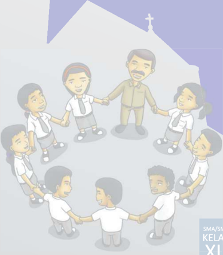

> **Deskripsi Visual:** Gambar ini adalah ilustrasi yang menunjukkan kelompok orang yang berjalan tangan dengan tangan. Ilustrasi ini mungkin digunakan untuk menggambarkan konsep kolaborasi, kerjasama, atau hubungan sosial. Elemen utama dalam gambar ini meliputi beberapa orang yang berjalan tangan dengan tangan, yang menunjukkan hubungan dan komunikasi antara mereka. Teks atau label penting tidak ada dalam gambar ini, namun informasi kunci yang dapat diambil dari gambar ini adalah bahwa semua orang dalam kelompok tersebut berada dalam hubungan saling mendukung dan bekerja sama.

 

---
## 📄 Halaman 2

### Hak Cipta © 2018 pada Kementerian Pendidikan dan Kebudayaan Dilindungi Undang-Undang

Disklaimer: Buku ini merupakan buku siswa yang dipersiapkan Pemerintah dalam rangka implementasi Kurikulum 2013. Buku siswa ini disusun dan ditelaah oleh berbagai pihak di bawah koordinasi Kementerian Pendidikan dan Kebudayaan, dan dipergunakan dalam tahap awal penerapan Kurikulum 2013. Buku ini merupakan 'dokumen hidup' yang senantiasa diperbaiki, diperbarui, dan dimutakhirkan sesuai dengan dinamika kebutuhan dan perubahan zaman.  Masukan  dari  berbagai  kalangan  yang  dialamatkan  kepada  penulis  dan  laman http://buku.kemdikbud.go.id  atau  melalui  email  buku@kemdikbud.go.id  diharapkan  dapat meningkatkan kualitas buku ini.

### Katalog Dalam Terbitan (KDT)

Indonesia, Kementerian Pendidikan dan Kebudayaan

Pendidikan Agama Kristen dan Budi Pekerti : buku guru / Kementerian Pendidikan dan Kebudayaan.-- Edisi Revisi Jakarta : Kementerian Pendidikan dan Kebudayaan, 2018.

x, 262 hlm. : ilus. ; 25 cm.

Untuk SMA/SMK Kelas XII ISBN 978-602-427-054-4 (jilid lengkap)

ISBN 978-602-427-057-5 (jilid 3)

- Kristen -- Studi dan Pengajaran
I. Judul

- Kementrian Pendidikan dan Kebudayaan
259

Penulis

: Pdt. Janse Belandina Non-Serrano dan Julia Suleeman Chandra

Penelaah

: Daniel Stefanus, Pdt. Binsar J. Pakpahan, dan Pdt. Robert Borong

Pe-review

: Pdt. Yudhy Priatna Sitompul

Penyelia Penerbitan

: Pusat Kurikulum dan Perbukuan, Balitbang, Kemendikbud.

Disusun dengan huruf Myrad Pro, 11 pt.

 

---
## 📄 Halaman 3

### Kata Pengantar

Pendidikan  menjadi  sarana  dalam  mengubah    masyarakat  menuju    masa kini  dan  masa  depan  yang  lebih  baik  dan  berpengharapan.  Salah  satu  tugas pembaruan yang dilakukan oleh pendidikan adalah melalui Perubahan Kurikulum yang merupakan salah  satu elemen pendidikan. Perubahan kurikulum bertujuan meningkatkan  kualitas  pendidikan  nasional  sekaligus  memperbaiki  kualitas hidup dan kondisi sosial bangsa Indonesia. Jadi, pengembangan kurikulum 2013 tidak  hanya  berkaitan  dengan  persoalan  kualitas  pendidikan  saja,  melainkan kualitas kehidupan bangsa Indonesia secara umum agar tahapan pembelajaran memungkinkan peserta didik berkembang dari proses menyerap pengetahuan dan  mengembangkan  keterampilan  hingga  memekarkan  sikap  serta  nilai-nilai luhur kemanusiaan.

Dalam rangka meningkatkan kualitas pendidikan dan memperbaiki kualitas hidup dan kondisi sosial bangsa Indonesia,  peran pendidikan agama amat penting karena agama berkaitan dengan hampir seluruh bidang kehidupan. Oleh karena itu,  melalui  pendidikan  agama,  peserta  didik  yang  mempelajari  seluruh  mata pelajaran  dapat  mengambil  nilai-nilai  etika  dan  moral  dari  pendidikan  agama. Pendidikan agama hendaknya mewarnai output pendidikan di Indonesia sebagai Negara Pancasila.

Untuk  itu,  belajar  bukan  sekadar  untuk  tahu,  melainkan  dengan  belajar seseorang menjadi tumbuh dan berubah. Tidak sekadar belajar lalu berubah, dan menjadi semakin dekat dengan Allah. Sebagaimana tertulis dalam Mazmur 119:73, ' Tangan-Mu  telah  menjadikan  aku  dan  membentuk  aku,  berilah  aku  pengertian, supaya aku dapat belajar perintah-perintah-Mu ' .  Tidak sekedar belajar lalu berubah, tetapi juga mengubah keadaan.

Rancangan kurikulum yang dirangkai dalam Kompetensi Inti sebagai pengikat Kompetensi Dasar membantu peserta didik untuk bertumbuh dan berkembang secara  utuh  dan  holistik  dari  segi  pengetahuan,  keterampilan  maupun  sikap terhadap diri sendiri, terhadap sesama terlebih kepada Tuhan yang diimaninya. Kecerdasan  tidak  hanya  diukur  dari  tingginya  pengetahuan  namun  tingginya iman yang nampak melalui sikap terhadap sesama dan Tuhan.

Pendidikan Agama Kristen dan Budi Pekerti diharapkan mampu menolong peserta didik untuk membangun solidaritas dan toleransi dalam pergaulan seharihari  tanpa  memandang  perbedaan  suku,  bangsa,  agama  maupun  kelas  sosial,

 

---
## 📄 Halaman 4

pro  aktif  mewujudkan  keadilan,  kebenaran,  demokrasi,  HAM  dan  perdamaian; memelihara lingkungan hidup, mengembangkan kreativitas dan inovasi dalam berpikir  dan  bertindak.  Sekaligus  memiliki  ciri  khas  sebagai  anak  dan  remaja Kristen  Indonesia yang cinta tanah air dan bangsa.

Pendidikan Agama Kristen dan Budi Pekerti bukan sekadar menyampaikan pesan moral apalagi hanya sekadar mengetahui tata cara hubungan antara manusia dengan Tuhan, melainkan harus menyajikan isi kurikulum yang  transformatif dan terinternalisasi dalam diri peserta didik. Artinya, mengubah serta memperbarui cara  pandang  dan  sikap  peserta  didik  serta  mengarahkan  peserta  didik  untuk memahami panggilan Tuhan untuk menjadi berkat bagi sesama dan dunia.

Pembelajaran Pendidikan Agama Kristen dan Budi Pekerti  pada semua jenjang dan kelas disajikan dalam bentuk pemahaman konsep mengenai Allah Pencipta, pemelihara,  penyelamat,  dan  pembaru  yang  diimplementasikan  dalam  bentuk pelaksanaan nilai-nilai kristiani dalam praktik kehidupan. Didalamnya tercantum berbagai aktivitas belajar yang dilakukan peserta didik dalam rangka mencapai kompetensi serta mengembangkan kreativitas dan inovasi pengetahuan, ketrampilan dan sikap.

Buku ini merupakan edisi ketiga sebagai penyempurnaan dari edisi kedua. Buku ini sangat terbuka untuk terus dilakukan perbaikan dan penyempurnaan. Oleh  karena  itu,  kami  mengundang  para  pembaca  memberikan  kritik,  saran dan masukan untuk perbaikan dan penyempurnaan pada edisi berikutnya. Atas kontribusi  tersebut,  kami  mengucapkan  terima  kasih.  Mudah-mudahan  kita dapat memberikan yang terbaik bagi kemajuan dunia pendidikan dalam rangka mempersiapkan generasi seratus tahun Indonesia Merdeka (2045).

### Penulis

 

---
## 📄 Halaman 5

### Daftar Isi

 

---
## 📄 Halaman 11

### BAGIAN PETUNJUK UMUM

Pendidikan Agama Kristen dan Budi Pekerti

1

1

 

---
## 📄 Halaman 12

---
**🖼️ Gambar/Diagram**

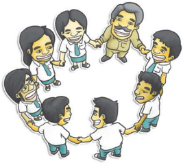

> **Deskripsi Visual:** Gambar ini adalah ilustrasi yang menunjukkan sebuah kelompok orang yang berjalan tangan dalam tangan. Kelompok ini terdiri dari beberapa orang dewasa dan anak-anak. Mereka semua tampak bahagia dan senang, dengan wajah mereka tertawa dan tersenyum. Ilustrasi ini menunjukkan konsep kerjasama dan kebersamaan dalam masyarakat.

Elemen-elemen utama dalam gambar ini adalah kelompok manusia yang berjalan tangan dalam tangan. Relasi antara elemen-elemen ini adalah bahwa semua orang dalam kelompok tersebut saling berhubungan dan bekerja sama untuk mencapai tujuan bersama.

Teks, angka, atau label penting yang terlihat dalam gambar ini tidak ada, karena gambar hanya menggambarkan situasi tanpa teks atau angka tambahan.

Informasi kunci yang dapat diambil pembaca dari gambar ini adalah tentang pentingnya kerjasama dan kebersamaan dalam masyarakat. Gambar ini juga menunjukkan bahwa kebahagiaan dan rasa senang dapat ditemui ketika kita bekerja sama dengan orang lain.

Kedamaian Ada Ketika Kita Mau Menerima Perbedaan

 

---
## 📄 Halaman 13

### Pendahuluan

### A.  Latar Belakang

Kurikulum  2013  dirumuskan  dan  dikembangkan  dengan  suatu  optimisme yang  tinggi  yang  diharapkan  dapat  menghasilkan  lulusan  sekolah  yang  lebih cerdas,  kreatif,  inovatif,  memiliki  kepercayaan  diri  yang  tinggi  sebagai  individu dan bangsa, serta toleran terhadap segala perbedaan yang ada. Beberapa latar belakang yang mendasari pengembangan Kurikulum 2013 tersebut antara lain berkaitan dengan persoalan sosial dan masyarakat, masalah yang terjadi dalam penyelenggaraan pendidikan itu sendiri, perubahan sosial berupa globalisasi dan tuntutan dunia kerja, perkembangan ilmu pengetahuan, dan hasil evaluasi   PISA dan   TIMSS.

Kurikulum 2013 akan dilaksanakan secara bertahap mulai Juli 2013 diharapkan dapat mengatasi masalah dan tantangan berupa kompetensi riil yang dibutuhkan oleh dunia kerja, globalisasi ekonomi pasar bebas, membangun kualitas manusia Indonesia yang berakhlak mulia, dan menjadi warga negara yang bertanggung jawab. Pada hakikatnya pengembangan Kurikulum 2013 adalah upaya yang dilakukan melalui salah satu elemen pendidikan, yaitu kurikulum untuk memperbaiki kualitas hidup dan kondisi sosial bangsa Indonesia secara lebih luas. Jadi,  pengembangan  kurikulum  2013  tidak  hanya  berkaitan  dengan  persoalan kualitas pendidikan saja, melainkan kualitas kehidupan bangsa Indonesia secara umum.

Muara dari semua proses pembelajaran dalam penyelenggaraan pendidikan adalah peningkatan kualitas hidup anak didik, yakni peningkatan pengetahuan, keterampilan,  dan  sikap  (aspek  kognitif,  afektif,  dan  psikomotorik)  yang  baik dan  tepat  di  sekolah.  Dengan  demikian  mereka  diharapkan  dapat  berperan dalam  membangun  tatanan  sosial  dan  peradaban  yang  lebih  baik.  Jadi,  arah penyelenggaraan  pendidikan  tidak  sekadar  meningkatkan  kualitas  diri,  tetapi juga untuk kepentingan yang lebih luas, yaitu membangun kualitas kehidupan

1

 

---
## 📄 Halaman 14

masyarakat,  bangsa,  dan  negara  yang  lebih  baik.  Dengan  demikian  terdapat dimensi peningkatan kualitas personal anak didik, dan di sisi lain terdapat dimensi peningkatan kualitas kehidupan sosial.

Pada Kurikulum 2013 telah disiapkan buku yang dibagikan kepada seluruh peserta didik untuk mendukung proses pembelajaran dan penilaian. Selanjutnya, guru  dipermudah  dengan  adanya  buku  pedoman  dan  panduan  guru  dalam pembelajaran.  Di  dalamnya  terdapat  materi  yang  akan  dipelajari,  metode  dan proses  pembelajaran  yang  disarankan,  sistem  penilaian  yang  dianjurkan,  dan sejenisnya.  Bahkan  dalam  buku  untuk  peserta  didik  terdapat    materi  pelajaran dan lembar evaluasi tertulis  dan  sejenisnya.  Kita  menyadari  bahwa  peran  guru sangat penting  sebagai pelaksana kurikulum, yaitu berhasil tidaknya pelaksanaan kurikulum ditentukan oleh peran guru. Hendaknya guru: (1)  memenuhi kompetensi  profesional,  pedagogi,  sosial,  dan  kepribadian  yang  baik;  dan  (2) dapat  berperan  sebagai  fasilitator  atau  pendamping  belajar  anak  didik  yang baik, mampu memotivasi anak didik dan mampu menjadi panutan yang dapat diteladani oleh peserta didik.

### B. Tujuan

Buku  panduan  ini  digunakan  guru  sebagai  acuan  dalam  penyelenggaraan proses  pembelajaran  dan  penilaian  Pendidikan  Agama  Kristen  (PAK)  di  kelas, secara khusus untuk:

- Membantu  guru  mengembangkan  kegiatan  pembelajaran  dan  penilaian Pendidikan Agama Kristen di tingkat SMA/SMK kelas XII.
- Memberikan gagasan dalam rangka mengembangkan pemahaman, keterampilan,  dan  sikap  serta  perilaku  dalam  berbagai  kegiatan  belajar mengajar PAK dalam lingkup nilai-nilai Kristiani dan Allah Tritunggal.
- Memberikan gagasan contoh pembelajaran PAK yang mengaktifkan peserta didik  melalui  berbagai  ragam  metode  dan  pendekatan  pembelajaran  dan penilaian.
- Mengembangkan metode yang dapat memotivasi peserta didik untuk selalu menerapkan nilai-nilai Kristiani dalam kehidupan sehari-hari peserta didik.

### C.  Ruang Lingkup

Buku panduan ini diharapkan dapat digunakan oleh guru dalam melaksanakan proses pembelajaran yang mengacu pada buku peserta didik SMA/SMK kelas XII. Selain itu, buku panduan ini dapat memberi wawasan bagi guru tentang prinsip pengembangan kurikulum, Kurikulum 2013, fungsi dan tujuan Pendidikan Agama Kristen, cara pembelajaran dan penilaian PAK serta penjelasan kegiatan guru pada setiap bab yang ada pada buku siswa.

 

---
## 📄 Halaman 15

### Pengembangan Kurikulum 2013

### A.  Prinsip Pengembangan Kurikulum

Kurikulum  merupakan  rancangan  pendidikan  yang  merangkum  semua pengalaman  belajar  yang  disediakan  bagi  peserta  didik  di  sekolah.  Dalam kurikulum ini terintegrasi fi   lsafat, nilai-nilai, pengetahuan, dan perbuatan. Kurikulum  disusun  oleh  para  ahli  pendidikan/ahli  kurikulum,  ahli  bidang  ilmu, pendidik, pejabat pendidikan, pengusaha, serta unsur-unsur masyarakat lainnya. Rancangan ini disusun dengan maksud  memberi pedoman kepada para pelaksana pendidikan, dalam proses pembimbingan perkembangan peserta didik mencapai tujuan  yang  dicita-citakan  oleh  peserta  didik,  keluarga,  dan  masyarakat.  Kelas merupakan tempat  untuk  melaksanakan  dan  menguji  kurikulum.  Di  dalamnya semua konsep, prinsip, nilai, pengetahuan, metode, alat, dan kemampuan guru diuji  dalam bentuk perbuatan, yang akan mewujudkan bentuk kurikulum yang nyata    dan    hidup.    Pewujudan    konsep,  prinsip,  dan  aspek-aspek  kurikulum tersebut seluruhnya terletak pada guru.

Oleh  karena  itu,  gurulah  pemegang  kunci  pelaksanaan  dan  keberhasilan kurikulum.  Guru adalah perencana, pelaksana, penilai, dan pengembang kurikulum yang sesungguhnya. Suatu kurikulum diharapkan memberikan landasan, isi, dan menjadi pedoman bagi pengembangan kemampuan peserta didik secara optimal sesuai dengan tuntutan dan tantangan perkembangan masyarakat.

### Prinsip-Prinsip Umum

Ada  beberapa  prinsip  umum  dalam  pengembangan  kurikulum. Pertama , prinsip  relevansi.  Ada  dua  macam  relevansi  yang  harus  dimiliki  kurikulum, yaitu relevansi ke luar dan relevansi di dalam kurikulum itu sendiri. Relevansi ke luar  maksudnya  tujuan,  isi,  dan  proses  belajar  yang  tercakup  dalam  kurikulum

 

---
## 📄 Halaman 16

hendaknya relevan dengan tuntutan, kebutuhan, dan perkembangan masyarakat. Kurikulum  juga  harus  memiliki  relevansi  di  dalam,  yaitu  ada  kesesuaian  atau konsistensi  antara  komponen-komponen  kurikulum,  yakni  antara  tujuan,  isi, proses  penyampaian,  dan  penilaian.  Relevansi  internal  ini  menunjukkan  suatu keterpaduan kurikulum.

Prinsip kedua adalah fl  eksibilitas. Kurikulum hendaknya memiliki sifat lentur atau  fl  eksibel.  Kurikulum  mempersiapkan  anak  untuk  kehidupan  sekarang  dan yang akan datang, di sini dan di tempat lain, bagi anak yang memiliki latar belakang dan  kemampuan  yang  berbeda.  Suatu  kurikulum  yang  baik  adalah  kurikulum yang  berisi  hal-hal  yang  solid,  tetapi  dalam  pelaksanaannya  memungkinkan terjadinya penyesuaian-penyesuaian berdasarkan kondisi daerah, waktu maupun kemampuan, dan latar belakang anak.

Prinsip ketiga adalah  kesinambungan.  Perkembangan  dan  proses  belajar anak berlangsung secara berkesinambungan, tidak terputus-putus. Oleh karena itu, pengalaman-pengalaman belajar yang disediakan kurikulum juga hendaknya berkesinambungan antara satu tingkat kelas dengan kelas lainnya,  antara  satu jenjang  pendidikan  dengan  jenjang  lainnya,  juga  antara  jenjang  pendidikan dengan pekerjaan. Pengembangan kurikulum perlu dilakukan bersama-sama, dan selalu diperlukan komunikasi dan kerja sama antara para pengembang kurikulum SD dengan SMP, SMA/SMK, dan Perguruan Tinggi.

Prinsip keempat adalah praktis, mudah dilaksanakan, menggunakan alat-alat  sederhana  dan  biayanya  juga  murah.  Prinsip  ini  juga  disebut  prinsip efi  siensi. Betapa pun bagus dan idealnya suatu kurikulum, kalau penggunaannya menuntut  keahlian-keahlian  dan  peralatan  yang  sangat  khusus  dan  mahal pula  biayanya,  maka  kurikulum  tersebut  tidak  praktis  dan  sukar  dilaksanakan. Kurikulum dan pendidikan selalu dilaksanakan dalam keterbatasan-keterbatasan, baik keterbatasan waktu, biaya, alat, maupun personalia. Kurikulum bukan hanya harus ideal tetapi juga praktis.

Prinsip kelima adalah efektivitas.  Walaupun  kurikulum  tersebut harus sederhana dan murah tetapi keberhasilannya tetap harus diperhatikan. Keberhasilan  pelaksanaan  kurikulum  yang  dimaksud  adalah  secara  kuantitas maupun kualitas.  Pengembangan  suatu  kurikulum  tidak  dapat  dilepaskan  dan merupakan  penjabaran  dari  perencanaan  pendidikan.  Perencanaan  di  bidang pendidikan  juga  merupakan  bagian  yang  dijabarkan  dari  kebijakan-kebijakan pemerintah di bidang pendidikan. Keberhasilan kurikulum akan mempengaruhi keberhasilan  pendidikan.  Kurikulum  pada  dasarnya  berintikan  empat  aspek utama, yaitu: tujuan pendidikan, isi pendidikan, pengalaman  belajar,  dan penilaian.  Inter  relasi  antara  keempat  aspek  tersebut  serta  antara  aspek-aspek

 

---
## 📄 Halaman 17

tersebut  dengan  kebijaksanaan  pendidikan  perlu  selalu  mendapat  perhatian dalam pengembangan kurikulum.

### B. Kompetensi Inti

Kompetensi Inti merupakan terjemahan atau operasionalisasi standar kompetensi lulusan (SKL) dalam bentuk kualitas yang harus dimiliki oleh mereka yang  telah  menyelesaikan  pendidikan  pada  satuan  pendidikan  tertentu  atau jenjang  pendidikan  tertentu,  gambaran  mengenai  kompetensi  utama  yang dikelompokkan ke dalam aspek sikap, pengetahuan, dan keterampilan (afektif, kognitif, dan psikomotorik) yang harus dipelajari peserta didik untuk suatu jenjang sekolah,  kelas,  dan  mata  pelajaran.  Kompetensi  Inti  harus  menggambarkan kualitas yang seimbang antara pencapaian hard skills dan soft skills .

Kompetensi Inti berfungsi sebagai unsur pengorganisasi ( organising element ) kompetensi  dasar.  Sebagai  unsur  pengorganisasi,  Kompetensi  Inti  merupakan pengikat untuk organisasi vertikal dan organisasi horizontal Kompetensi Dasar. Organisasi vertikal Kompetensi Dasar adalah  keterkaitan antara konten Kompetensi Dasar satu kelas atau jenjang pendidikan ke kelas/jenjang di atasnya sehingga memenuhi prinsip belajar, yaitu terjadi suatu akumulasi yang berkesinambungan antara konten yang dipelajari peserta didik. Organisasi horizontal adalah keterkaitan antara  konten Kompetensi Dasar satu mata pelajaran dengan konten Kompetensi  Dasar  dari  mata  pelajaran  yang  berbeda  dalam  satu  pertemuan mingguan dan kelas yang sama sehingga terjadi proses saling memperkuat.

Kompetensi Inti dirancang dalam empat kelompok yang saling terkait, yaitu berkenaan dengan sikap keagamaan (kompetensi inti 1), sikap sosial (kompetensi inti 2), pengetahuan (kompetensi inti 3), dan penerapan pengetahuan (kompetensi inti 4). Keempat kelompok itu menjadi acuan bagi Kompetensi Dasar dan harus dikembangkan dalam setiap peristiwa pembelajaran secara integratif. Kompetensi yang berkenaan dengan sikap keagamaan dan sosial dikembangkan secara  tidak  langsung  ( indirect  teaching )  dan  secara  langsung  ( direct  teaching ). Pembelajaran secara tidak langsung ( indirect  teaching ) terjadi pada waktu peserta didik belajar tentang pengetahuan (kompetensi inti  kelompok 3) dan penerapan pengetahuan (kompetensi Inti kelompok 4). Pembelajaran secara langsung ( direct teahing ) terjadi pada waktu peserta didik belajar materi tertentu yang mengacu pada teks Alkitab.

Sebenarnya, sejak tahun 2011 Pusat Kurikulum dan Perbukuan Badan Litbang Kemendikbud telah mulai mengadakan penataan ulang kurikulum seluruh mata pelajaran berdasarkan masukan dari masyarakat, pakar pendidikan dan kurikulum serta  guru-guru.  Ketika  penataan  sedang  berlangsung,  arah  penataan  berubah

 

---
## 📄 Halaman 18

menjadi  'pembaruan'  total  terhadap  seluruh  kurikulum  mata  pelajaran  yang dimulai  pada  pertengahan  tahun  2012.  Pemerintah  menginginkan  supaya  ada keterpaduan antara satu mata pelajaran dengan mata pelajaran lainnya, dengan demikian  membentuk  wawasan  dan  sikap  keilmuan  dalam  diri  peserta  didik. Melalui proses tersebut, diharapkan peserta didik tidak memahami ilmu secara fragmentaris dan terpilah-pilah namun dalam satu kesatuan.

Berdasarkan  pertimbangan  tersebut,  maka  dalam  struktur  kurikulum  baru tidak  ada  rumusan  Standar  Kelulusan  Kelas  dan  Standar  Kompetensi  tetapi diganti dengan Kompetensi Inti, yaitu rumusan kompetensi yang menjadi rujukan dan  acuan  bagi  seluruh  mata  pelajaran  pada  tiap  jenjang  dan  tiap  kelas.  Jadi, penyusunan Kompetensi Dasar mengacu pada rumusan Kompetensi Inti yang ada pada tiap jenjang dan kelas. Kompetensi Inti merupakan pengikat seluruh mata pelajaran sebagai satu kesatuan ilmu termasuk mata pelajaran Pendidikan Agama. Namun, mata pelajaran Pendidikan Agama tidak termasuk dalam model integratif tematis karena dipandang memiliki kekhususan tersendiri. Oleh karena itu, mata pelajaran  Pendidikan  Agama  termasuk  Pendidikan  Agama  Kristen  tetap  berdiri sendiri sebagai mata pelajaran seperti sebelumnya.

### C. Kompetensi Dasar

Kompetensi Dasar merupakan kompetensi setiap mata pelajaran untuk setiap kelas  yang  diturunkan  dari  Kompetensi  Inti.  Kompetensi  Dasar  adalah  konten atau  kompetensi  yang  terdiri  atas  sikap,  pengetahuan,  dan  keterampilan  yang bersumber pada kompetensi inti yang harus dikuasai peserta didik. Kompetensi tersebut  dikembangkan  dengan  memperhatikan  karakteristik  peserta  didik, kemampuan awal, serta ciri suatu mata pelajaran. Mata pelajaran sebagai sumber dari  konten  untuk  menguasai  kompetensi  bersifat  terbuka  dan  tidak  selalu diorganisasikan berdasarkan disiplin ilmu yang sangat berorientasi hanya pada fi   losofi   esensialisme dan perenialisme. Mata pelajaran dapat dijadikan organisasi konten yang dikembangkan dari berbagai disiplin ilmu atau non disiplin ilmu yang diperbolehkan menurut fi  losofi   rekonstruksi sosial, progresif ataupun humanisme. Karena fi  losofi   yang dianut dalam kurikulum adalah eklektik seperti dikemukakan di  bagian  landasan  fi  losofi  ,  maka  nama  mata  pelajaran  dan  isi  mata  pelajaran untuk kurikulum yang akan dikembangkan tidak perlu terikat pada kaidah fi  losofi esensialisme dan perenialisme.

Kompetensi Dasar merupakan kompetensi setiap mata pelajaran untuk setiap kelas yang diturunkan dari Kompetensi Inti.

 

---
## 📄 Halaman 19

### D. Ciri Khas Kurikulum 2013

Kurikulum 2013 memiliki beberapa ciri khas, antara lain:

- Tiap mata pelajaran mendukung semua kompetensi (sikap, keterampilan, dan  pengetahuan)  yang  terkait  satu  dengan  yang  lain  serta  memiliki kompetensi dasar yang diikat oleh kompetensi inti tiap kelas.
- Konsep dasar pembelajaran  mengedepankan  pengalaman  individu melalui  observasi  (menyimak,  melihat,  membaca,  dan  mendengarkan), bertanya,  asosiasi,  menyimpulkan,  mengkomunikasikan,  menalar,  dan berani bereksperimen yang tujuan utamanya adalah untuk meningkatkan kreativitas  anak  didik.  Pendekatan  ini  lebih  dikenal  dengan  sebutan pembelajaran berbasis pengamatan ( observation-based learning ).  Selain itu proses pembelajaran juga diarahkan untuk membiasakan anak didik beraktivitas  secara  kolaboratif  dan  berjejaring  untuk  mencapai  suatu kemampuan yang harus dikuasai oleh anak didik  pada aspek pengetahuan ( kognitif ) yang meliputi  daya kritis dan kreatif,  kemampuan analisis dan evaluasi. Sikap ( afektif ), yaitu  religiusitas, mempertimbangkan nilai-nilai moralitas  dalam  melihat  sebuah  masalah  serta  mengerti  dan  toleran terhadap  perbedaan  pendapat. Keterampilan  ( psikomotorik ) meliputi terampil berkomunikasi ahli, dan terampil dalam bidang kerja.
- Pendekatan pembelajaran adalah student centered : proses pembelajaran berpusat pada peserta didik/anak didik, guru berperan sebagai fasilitator  atau  pendamping  dan  pembimbing  peserta  didik  dalam proses  pembelajaran. Active  and  cooperative  learning :  dalam  proses pembelajaran peserta didik harus aktif untuk bertanya, mendalami, dan mencari pengetahuan untuk membangun pengetahuan mereka sendiri melalui  pengalaman  dan  eksperimen  pribadi  dan  kelompok,  metode observasi,  diskusi,  presentasi,  melakukan  proyek  sosial  dan  sejenisnya. Contextual :  pembelajaran  harus  mengaitkan  dengan  konteks  sosial  di mana  anak  didik/peserta  didik  hidup,  yaitu  lingkungan  kelas,  sekolah, keluarga,  dan  masyarakat.  Melalui  pendekatan  ini  diharapkan  dapat menunjang capaian kompetensi anak didik secara optimal.
- Penilaian untuk mengukur kemampuan pengetahuan, sikap, dan keterampilan hidup peserta didik yang diarahkan untuk menunjang dan memperkuat pencapaian kompetensi yang dibutuhkan oleh anak
- Di  jenjang  Sekolah  Dasar,  Bahasa  Indonesia  sebagai  penghela  mata pelajaran  lain  (sikap  dan  keterampilan  berbahasa)  dan    pendekatan tematik diberlakukan dari kelas satu sampai kelas enam kecuali pada mata pelajaran pendidikan agama.

 

---
## 📄 Halaman 20

### Ciri Khas Kurikulum PAK 2013 dibandingkan dengan Kurikulum Lama

---
**📊 Tabel**

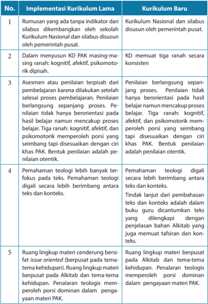

Tabel ini membandingkan implementasi kurikulum lama dengan kurikulum baru dalam beberapa aspek penting. Topik utama tabel adalah perubahan struktur dan konten pembelajaran. Kolom pertama menunjukkan nomor urut dari aspek-aspek yang dibandingkan, sementara kolom kedua berisi deskripsi tentang implementasi kurikulum lama, dan kolom ketiga berisi deskripsi tentang kurikulum baru. Data penting yang terlihat antara lain bahwa kurikulum baru lebih fokus pada penulisan, pemahaman teologi digital, dan ruang lingkup materi yang lebih terfokus pada Alikitah dan tema-tema kehidupan. Selain itu, kurikulum baru juga memperkenalkan KD PAK sebagai bagian integral dari proses pembelajaran.

 

---
## 📄 Halaman 21

### Hakikat dan Tujuan Pendidikan Agama Kristen (PAK)

P endidikan Agama Kristen merupakan wahana pembelajaran yang memfasilitasi peserta didik untuk mengenal Allah melalui karya-Nya serta mewujudkan pengenalannya akan  Allah Tritunggal  melalui  sikap  hidup yang mengacu pada nilai-nilai kristiani.  Dengan  demikian,  melalui  PAK  peserta didik mengalami perjumpaan de  ngan Tuhan Allah yang dikenal, dipercaya, dan diimaninya.  Perjumpaan  itu  diharapkan  mampu  mempengaruhi  peserta  didik untuk bertumbuh menjadi garam dan terang kehidupan.

Secara  khusus  PAK  di  SMA  secara  keseluruhan  ingin  memotivasi  serta mencerahkan visi dan iman peserta didik untuk bertumbuh menjadi remaja yang memiliki karakter kristiani. Dalam pertumbuhan itu, mereka mampu menjalankan perannya di  tengah  keluarga,  sekolah,  gereja  dan  masyarakat.    Hal  ini  penting karena iman Kristen adalah iman yang hidup yang menggerakkan orang beriman untuk mampu mengaktualisasi diri secara sehat sebagai pribadi, sebagai bagian dari keluarga, gereja, dan masyarakat bangsa Indonesia yang majemuk.

Pendidikan Agama Kristen merupakan rumpun mata pelajaran yang bersumber dari Alkitab yang dapat mengembangkan berbagai kemampuan dan kecerdasan  peserta didik. Misalnya, dalam memperteguh iman  kepada Tuhan Allah, memiliki budi pekerti luhur, menghormati, serta menghargai semua manusia dengan segala persamaan dan perbedaannya (termasuk agree in disagreement/ setuju untuk tidak setuju).

 

---
## 📄 Halaman 22

### A.  Hakikat Pendidikan Agama Kristen

Hakikat  Pendidikan  Agama  Kristen  seperti  yang  tercantum  dalam  hasil Lokakarya  Strategi  PAK  di  Indonesia  tahun  1999  adalah: Usaha yang dilakukan secara terencana dan berkelanjutan dalam rangka mengembangkan kemampuan peserta didik agar dengan pertolongan Roh Kudus dapat memahami dan menghayati kasih Tuhan Allah di dalam Yesus Kristus yang dinyatakan dalam kehidupan seharihari, terhadap sesama dan lingkungan hidupnya. Dengan demikian, setiap orang yang  terlibat  dalam  proses  pembelajaran  PAK  memiliki  keterpanggilan  untuk mewujudkan  tanda-tanda  Kerajaan  Allah  dalam  kehidupan  pribadi  maupun sebagai bagian dari komunitas.

### B. Fungsi dan Tujuan Pendidikan Agama Kristen

Menurut Peraturan Pemerintah  Nomor 55 Tahun 2007 tentang Pendidikan Agama  dan  Pendidikan  Keagamaan,  disebutkan  bahwa:  pendidikan  agama berfungsi  membentuk manusia Indonesia yang beriman dan bertakwa kepada Tuhan Yang Maha Esa serta berakhlak mulia dan mampu menjaga kedamaian dan kerukunan hubungan inter dan antarumat beragama (Pasal 2 ayat 1). Selanjutnya disebutkan bahwa pendidikan agama bertujuan mengembangkan kemampuan peserta didik dalam memahami, menghayati, dan mengamalkan nilai-nilai agama yang menyerasikan penguasaannya dalam ilmu pengetahuan, teknologi dan seni (Pasal 2 ayat 2).

Mata pelajaran PAK berfungsi  untuk:

- Memperkenalkan Allah dan karya-karya-Nya agar peserta didik bertumbuh dalam iman percayanya dan meneladani Allah dalam hidupnya.
- Menanamkan pemahaman tentang Allah dan karya-Nya kepada peserta didik, sehingga mampu memahami, menghayati, dan mengamalkannya.
Tujuan pembelajaran PAK:

- Menghasilkan manusia yang dapat memahami kasih Allah di dalam  Yesus Kristus dan mengasihi Allah dan sesama.
- Menghasilkan manusia Indonesia yang mampu menghayati imannya secara bertanggung jawab serta berakhlak mulia dalam masyarakat majemuk.
Pendidikan Agama Kristen di sekolah  disajikan dalam dua aspek, yaitu aspek Allah Tritunggal dan Karya-Nya , dan aspek Nilai-Nilai Kristiani . Secara holistik, pengembangan  Kompetensi  Inti  dan  Kompetensi  Dasar  PAK  pada  Pendidikan Dasar  dan  Menengah  mengacu  pada  dogma  tentang  Allah  dan  karya-Nya. Pemahaman terhadap Allah dan karya-Nya harus tampak dalam nilai-nilai kristiani yang dapat dilihat dalam kehidupan keseharian peserta didik. Inilah dua aspek yang ada dalam seluruh materi pembelajaran PAK dari SD sampai SMA/SMK.

 

---
## 📄 Halaman 23

### C. Landasan Teologis

Pendidikan  Agama  Kristen  telah  ada  sejak  pembentukan  umat  Allah  yang dimulai dengan panggilan terhadap Abraham. Hal ini berlanjut dalam lingkungan dua belas suku Israel sampai dengan zaman Perjanjian Baru. Sinagoge atau rumah ibadah  orang Yahudi  bukan  hanya  menjadi  tempat  ibadah  melainkan  menjadi pusat kegiatan pendidikan bagi anak-anak dan keluarga orang Yahudi. Beberapa nas di bawah ini dipilih untuk mendukungnya, yaitu sebagai berikut.

### 1.    Kitab Ulangan 6: 4-9.

Allah  memerintahkan  umat-Nya  untuk  mengajarkan  tentang  kasih  Allah kepada anak-anak dan kaum muda. Perintah ini kemudian menjadi kewajiban normatif  bagi  umat  Kristen  dan  lembaga  gereja  untuk  mengajarkan  kasih Allah. Dalam kaitannya dengan Pendidikan Agama Kristen bagian Alkitab ini telah menjadi dasar dalam menyusun dan mengembangkan Kurikulum dan Pembelajaran Pendidikan Agama Kristen.

### 2.    Amsal 22: 6

Didiklah  orang  muda  menurut  jalan  yang  patut  baginya  maka  pada  masa tuanya pun  ia tidak akan menyimpang dari pada jalan itu. Betapa pentingnya penanaman nilai-nilai iman yang bersumber dari Alkitab bagi generasi muda, seperti tumbuhan yang sejak awal pertumbuhannya harus diberikan pupuk dan air, demikian pula kehidupan iman orang percaya harus dimulai sejak dini. Bahkan ada pakar PAK yang mengatakan pendidikan agama harus diberikan sejak dalam kandungan ibu sampai akhir hidup seseorang.

### 3.    Matius 28:19-20

Tuhan Yesus Kristus memberikan amanat kepada tiap orang percaya untuk pergi ke seluruh penjuru dunia dan mengajarkan tentang kasih Allah. Perintah ini  telah  menjadi  dasar  bagi  tiap  orang  percaya  untuk  turut  bertanggung jawab terhadap Pendidikan Agama Kristen.

Sejarah perjalanan agama Kristen turut dipengaruhi oleh peran Pendidikan Agama  Kristen  sebagai  pembentuk  sikap,  karakter,  dan  iman  orang  Kristen dalam  keluarga,  gereja,  dan  lembaga  pendidikan.  Oleh  karena  itu,  lembaga gereja, lembaga keluarga dan sekolah secara bersama-sama bertanggung jawab dalam tugas mengajar dan mendidik anak-anak, remaja, dan kaum muda untuk mengenal  Allah  Pencipta,  Penyelamat,  Pembaru,  dan  mewujudkan  ajaran  itu dalam kehidupan sehari-hari.

Sejarah    perkembangan  Pendidikan  Agama  Kristen  diwarnai  oleh  dua  pemetaan pemikiran yang mana masing-masing pemikiran memiliki pembenarannya dalam

 

---
## 📄 Halaman 24

sejarah.  Yaitu  pemikiran  bahwa  ruang  lingkup  pembahasan  PAK  seharusnya mengacu pada  kronologi Alkitab sedangkan pemikiran lainnya adalah pembahasan PAK seharusnya  mengacu pada tema-tema tertentu  menyangkut problematika kehidupan.    Dua  pemikiran  ini  dikenal  dengan 'bible  oriented' dan 'issue oriented' . Jika ditelusuri  sejak zaman PL, PB sampai dengan  sebelum reformasi, pengajaran iman Kristen umumnya mengacu pada kronologi Alkitab namun sejak reformasi    berbagai  tema  kehidupan  telah  menjadi  lingkup  pembahasan  PAK. Artinya terjadi pergeseran dari Bible oriented ke issue oriented .  Hal  ini  berkaitan dengan pemahaman bahwa iman harus mewujud di dalam tindakan  atau praksis kehidupan. Menurut Groome praksis bukan sekedar tindakan atau aksi melainkan praktik kehidupan yang melibatkan ranah kognitif, afektif maupun psikomotorik secara  menyeluruh.  Berkaitan  dengan  dua  pemikiran  tersebut,  ruang  lingkup pembahasan PAK di SD-SMA  dipetakan dalam dua strand, yaitu Allah Tri Tunggal dan karya-karya-Nya serta nilai-nilai kristiani. Dua strand ini mengakomodir  ruang lingkup pembahasan PAK yang bersifat pendekatan yang berpusat pada Alkitab dan tema-tema penting dalam kehidupan. Melalui pembahasan inilah diharapkan peserta didik dapat mengalami 'perjumpaan dengan Allah' . Hasil dari perjumpaan itu adalah terjadinya transformasi kehidupan.

Pemetaan ruang lingkup PAK yang mengacu pada tema-tema kehidupan  ini tidak mudah untuk dilakukan karena amat sulit mengubah cara pikir kebanyakan teolog, pakar PAK maupun guru-guru PAK. Umumnya mereka masih merasa asing dengan berbagai pembahasan materi yang  mengacu pada tema-tema kehidupan .  Misalnya: demokrasi, hak asasi manusia, keadilan, gender, ekologi. Seolah-olah pembahasan  mengenai  tema-tema  tersebut  bukanlah  menjadi  ciri  khas  PAK. Padahal,  teologi  yang menjadi dasar bagi bangunan PAK  baru  berfungsi ketika bertemu dengan realitas  kehidupan.  Jadi,  pemetaan  lingkup  pembahasan  PAK tidak dapat mengabaikan salah satu dari dua pemetaan tersebut di atas; baik issue oriented maupun Bible oriented.

Mengacu pada hasil Lokakarya Strategi PAK di Indonesia yang diadakan oleh Departemen BINDIK PGI bersama dengan Bimas Kristen Depag RI bahwa isi PAK di sekolah membahas mengenai nilai-nilai iman tanpa mengabaikan dogma atau ajaran.  Namun, pembahasan mengenai tradisi dan ajaran (dogma) secara lebih spesifi  k diserahkan pada gereja (menjadi bagian dari pembahasan PAK di  gereja). Keputusan tersebut muncul berdasarkan pertimbangan:

- Gereja Kristen terdiri dari berbagai denominasi dengan berbagai tradisi dan ajaran karena itu menyangkut doktrin yang lebih spesifi  k tidak diajarkan di sekolah.
- Menghindari tumpang tindih materi PAK di sekolah dan di gereja.

 

---
## 📄 Halaman 25

### Pelaksanaan Pembelajaran dan Penilaian Pendidikan Agama Kristen (PAK)

### A.  Pendidikan Agama Sebagai Kurikulum Nasional

Pemerintah  menetapkan  beberapa  mata  pelajaran  sebagai  mata  pelajaran yang  ditetapkan  secara  nasional,  artinya  melalui  mata  pelajaran  tersebut,  jiwa nasionalisme  dan  rasa  cinta  terhadap  tanah  air  dipupuk  dan  dibangun.  Hal  ini penting mengingat globalisasi yang mempengaruhi berbagai bidang kehidupan cenderung melunturkan rasa nasionalisme. Anak-anak, remaja dan kaum muda lebih  tertarik  untuk  mencintai  segala  produk  yang  berasal  dari  luar,  baik  itu mencakup seni budaya, pemikiran dan atau gaya hidup ( life style ). Memang diakui bahwa semua yang dihasilkan oleh globalisasi tidaklah buruk namun harus ada kekuatan pengimbang yang mampu menetralisir pengaruh globalisasi bagi anakanak, remaja dan kaum muda Indonesia.

### B. Pelaksanaan Kurikulum Pendidikan Agama Kristen

Ruang lingkup PAK, yaitu PAK di gereja, PAK dalam keluarga, serta PAK di sekolah dan Perguruan Tinggi memiliki ciri khas masing-masing. Adapun PAK di sekolah lebih  terfokus  pada  pemahaman  akan  nilai-nilai  kristiani  dan  perwujudannya dalam  kehidupan  sehari-hari  di  tengah  masyarakat  Indonesia  yang  majemuk. Hal  ini  penting  mengingat  PAK  merupakan  bagian  integral  sistem  pendidikan Indonesia yang dengan sendirinya membawa sejumlah konsekuensi antara lain harus bersinggungan dengan pergumulan bangsa dan negara. Oleh karena itu, melalui  pendekatan  nilai-nilai  iman  diharapkan  anak-anak  Kristen  bertumbuh sebagai anak Kristen Indonesia yang sadar akan tugas dan kewajibannya sebagai warga gereja dan warga negera yang bertanggung jawab. Berdasarkan kerangka berpikir  tersebut,  maka  pembelajaran  PAK  di  sekolah  diharapkan  mampu

 

---
## 📄 Halaman 26

menghasilkan sebuah proses transformasi pengetahuan, nilai, dan sikap. Hal itu memperkuat nilai-nilai kehidupan yang dianut oleh peserta didik terutama dengan dipandu oleh ajaran iman Kristen, sehingga peserta didik mampu menunjukkan kesetiaannya kepada Allah, menjunjung tinggi nasionalisme dengan taat kepada Pancasila dan UUD 1945.

Pembahasan isi kurikulum selalu dimulai dari lingkup yang paling kecil, yaitu diri  peserta didik sebagai ciptaan Allah, kemudian keluarga, teman, lingkungan di sekitar peserta didik,  masyarakat di lingkungan sekitar dan bangsa Indonesia serta dunia secara keseluruhan dengan berbagai dinamika persoalan (pendekatan induktif). Pola pendekatan ini secara konsisten nampak pada jenjang SD hingga SMA/SMK.

Materi dan metodologi pengajaran PAK serta disiplin ilmu psikologi membantu  perkembangan  psikologis  peserta  didik  dengan  baik.  Pendidikan Agama Kristen disusun sedemikian rupa dengan tidak melupakan karakteristik kebutuhan psikologis peserta didik. Materi PAK disesuaikan dengan kebutuhan psikologis peserta didik, sehingga tujuan materi dapat dicapai secara maksimal. Metodologi pun hendaknya memperhatikan  karakteristik peserta didik, sehingga tumbuh kembang anak secara kognitif, afektif, psikomotorik, dan spiritual terjadi dengan baik. Dalam istilah lain disebut cipta, rasa, dan karsa.

Melalui Pendidikan Agama  Kristen diharapkan terjadi  perubahan  dan pembaruan,  baik  pemahaman  maupun  sikap  dan  perilaku.  Dengan  demikian, sekolah, gereja dan keluarga Kristen dapat menjalankan perannya masing-masing di  bidang  pendidikan  iman.  Terutama  keluarga  merupakan  lembaga  pertama dan  utama  yang  bertanggung  jawab  atas  pembentukan  nilai-nilai  agama  dan moral. Sekolah  menjalankan perannya dalam membantu keluarga mengajar dan mendidik  anak-anak dan remaja. Pemerintah melalui sekolah turut menjalankan perannya di bidang Pendidikan Agama pada umumnya dan Pendidikan Agama Kristen secara khusus karena amanat UU.

### C. Pembelajaran Pendidikan Agama Kristen

Ada  dua  model  pendekatan  pembelajaran,  yaitu  model  pendekatan  yang berpusat  pada  guru  ( teacher  centered )  dan  pendekatan  yang  berpusat  pada peserta didik atau peserta didik ( student centered )

Kedua model pendekatan pembelajaran tersebut di atas adalah pendekatan yang  dapat  dipelajari  oleh  guru  PAK,  khususnya  model  pembelajaran  yang berpusat  pada  peserta  didik  ( student  centered )  untuk  diterapkan  dalam  proses belajar-mengajar  di  sekolah.  Sebagaimana  kita  ketahui  bahwa  kekhasan  PAK membuat PAK berbeda dengan mata pelajaran lain, yaitu PAK menjadi sarana atau

 

---
## 📄 Halaman 27

media dalam membantu peserta didik berjumpa dengan Allah di mana pertemuan itu bersifat personal, sekaligus nampak dalam sikap hidup sehari-hari yang dapat disaksikan  serta  dapat  dirasakan  oleh  orang  lain,  baik  guru,  teman,  keluarga maupun masyarakat. Dengan demikian, pendekatan pembelajaran PAK bersifat student  centered (berpusat  pada  peserta  didik),  yang  memanusiakan  manusia, demokratis,  menghargai  peserta  didik  sebagai  subjek  dalam  pembelajaran, menghargai keanekaragaman peserta didik dan memberi tempat bagi peranan Roh Kudus. Dalam proses seperti ini, maka kebutuhan peserta didik merupakan kebutuhan utama yang harus terakomodir dalam proses pembelajaran.

Proses pembelajaran PAK  adalah proses di mana peserta didik mengalami pembelajaran melalui aktivitas-aktivitas kreatif yang difasilitasi oleh guru. Penjabaran  kompetensi  dalam  pembelajaran  PAK  dirancang  sedemikian  rupa sehingga  proses dan hasil pembelajaran  memiliki bentuk-bentuk karya, unjuk kerja dan perilaku/sikap yang merupakan bentuk-bentuk kegiatan belajar yang dapat diukur  melalui penilaian ( assessment ) sesuai  dengan kriteria pencapaian.

### D.  Pembelajaran Pendidikan Agama Kristen di Buku Siswa

Urutan pembahasan di buku siswa dimulai dengan Pengantar di mana pada bagian pengantar, siswa diarahkan untuk masuk ke dalam materi pembahasan, kemudian uraian materi, Penjelasan Bahan Alkitab, Kegiatan Pembelajaran, dan Penilaian atau assessment .

### 1.    Pengantar

Pengantar merupakan pintu masuk bagi uraian pembelajaran secara lengkap, bagian  pengantar  bisa  berupa  naratif  tapi  juga  aktivitas  yang  dipadukan dengan materi.

### 2.    Uraian Materi

Penjelasan  bahan  pelajaran  secara  utuh  yang  disampaikan  oleh  Guru. Materi  yang  ada  dalam  buku  guru  lebih  lengkap  dibandingkan  dengan yang  ada  dalam  buku  peserta  didik.  Guru  perlu  mengetahui  lebih  banyak mengenai  materi  yang  dibahas  sehingga  dapat  memilih  mana  materi yang  paling  penting  untuk  diberikan  pada  peserta  didik.  Guru  harus  teliti menggabungkan materi yang ada dalam buku peserta didik dengan yang ada dalam buku guru. Hendaknya diingat bahwa yang menjadi target capaian adalah kompetensi dan bukan materi, jadi guru tidak perlu menjejali peserta didik  dengan  materi  ajar  yang  terlalu  banyak.  Jika  dilihat  model  yang  ada dalam  buku  peserta  didik,  maka  nampak  jelas  bahwa  proses  belajar  dan penilaian  berlangsung secara bersama-sama. Hal ini menguntungkan guru

 

---
## 📄 Halaman 28

karena  guru  tidak  harus  menunggu  selesai  proses  belajar  baru  diadakan penilaian, tetapi dalam setiap langkah kegiatan ada penalaran materi dan ada juga  penilaian.  Sejak  bertahun-tahun  kita  terjebak  dalam  bentuk  penilaian kognitif  yang  tidak  menguntungkan peserta didik terutama melalui model ujian pilihan ganda dan model evaluasi yang kurang membantu peserta didik mencapai transformasi atau perubahan perilaku. Karena itu, sudah saatnya guru  berubah.  Dalam  pembelajaran  ini  akan  lebih  banyak  fokus  pada  diri peserta  didik,  selalu  dimulai  dari  peserta  didik  dan  berakhir  pada  peserta didik,  demikian  pula  bentuk  penilaian  lebih  banyak  bersifat  penilaian  diri sendiri sehingga peserta didik dapat melihat apakah ada perubahan dalam hidupnya.

### 3.    Penjelasan Bahan Alkitab

Salah  satu  perubahan  yang  penting  dalam  buku  guru  Kurikulum  2013 adalah Penjelasan bahan Alkitab. Penjelasan bahan Alkitab diperlukan untuk membantu  guru-guru  memahami  referensi  Alkitab  yang  dipakai.  Melalui penjelasan  bahan  Alkitab  guru  memperoleh  pengetahuan  mengenai  latar belakang  nats  Alkitab  yang  diambil  kemudian  dapat  menarik  relevansinya dengan topik yang dibahas. Penjelasan bahan Alkitab hanya untuk guru dan tidak untuk diajarkan pada peserta didik.

### 4.    Penilaian

Penilaian  membahas  ketercapaian  Kompetensi  Dasar  melalui  sejumlah Indikator.  Dalam  penjelasan  pokok  materi  pembelajaran,  dapat  dibaca perubahan cara penilaian yang ada dalam Kurikulum 2013, yaitu proses belajar dan  penilaian  berlangsung  secara  bersama-sama.  Jadi,  proses  penilaian bukan  dilakukan  setelah  selesai  pembelajaran,  tetapi  sejak  pembelajaran dimulai dan bentuk penilaian cukup variatif mengenai skala sikap, penilaian diri,  tes  tertulis,  penilaian  produk,  proyek,  observasi  dll.  Guru  harus  berani membuat  perubahan  dalam  bentuk  penilaian.  Memang,  biasanya  otoritas akan  membuat  soal  bersama  untuk  ujian,  tetapi  praktik  ini  bertentangan dengan  jiwa  Kurikulum  2013,  khususnya  kurikulum  PAK  yang  memang terfokus  pada  perubahan  perilaku  peserta  didik.  Pendidikan  agama  yang mengajarkan nilai-nilai iman barulah berguna ketika apa yang diajarkan itu membawa transformasi atau perubahan dalam diri anak karena iman baru nyata  di  dalam  perbuatan,  sebab  iman  tanpa  perbuatan  pada  hakikatnya adalah mati (  Yakobus 2:26).  Untuk  itu  berbagai  bentuk  soal  seperti  pilihan ganda dan soal-soal yang bersifat kognitif tidak banyak membantu peserta didik untuk mengalami transformasi.

 

---
## 📄 Halaman 29

### 5.    Kegiatan Peserta Didik

Dalam buku guru dibahas langkah-langkah kegiatan pembelajaran peserta didik dan untuk kegiatan yang sudah jelas, tidak perlu lagi dijelaskan. Penjelasan  hanya  diberikan  pada  kegiatan  yang  membutuhkan  perhatian  khusus atau  jika ada beberapa penekanan penting yang harus diberikan sehingga guru  memperhatikannya  ketika  mengajar.  Mengenai  langkah-langkah  kegiatan,  guru  juga  dapat  mengganti  urutan  langkah-langkah  kegiatan  jika dirasa  perlu  tetapi  harus  dipertimbangkan  dengan  baik.  Ketika  menyusun langkah-langkah kegiatan, penulis sudah mempertimbangkan sequence atau urutan  pembelajaran  secara  matang  apalagi  penilaian  berlangsung  sepanjang proses pembelajaran dan terkadang penilaian dan pembelajaran berjalan bersama-sama dalam satu kegiatan.

### E. Penilaian Pendidikan Agama Kristen

Penilaian merupakan suatu kegiatan pendidik yang terkait dengan pengambilan  keputusan  tentang  pencapaian  kompetensi  atau  hasil  belajar peserta didik yang mengikuti proses pembelajaran tertentu. Keputusan tersebut berhubungan dengan tingkat keberhasilan peserta didik dalam mencapai suatu kompetensi. Penilaian merupakan suatu proses yang dilakukan melalui langkahlangkah perencanaan, penyusunan  alat penilaian, pengumpulan  informasi melalui  sejumlah  bukti  yang  menunjukkan  pencapaian  hasil  belajar  peserta didik, pengolahan, dan penggunaan informasi tentang hasil belajar peserta didik. Penilaian kelas dilaksanakan melalui berbagai cara, seperti penilaian unjuk kerja ( performance ), penilaian sikap, penilaian tertulis ( paper and pencil test ), penilaian proyek, penilaian produk, penilaian melalui kumpulan hasil kerja/karya peserta didik  ( portfolio ),  dan  penilaian  diri.  Untuk  mengamati  unjuk  kerja  peserta  didik dapat menggunakan alat atau instrumen berikut.

### 1.    Penilaian Unjuk Kerja

Penilaian  unjuk  kerja  dapat  dilakukan  dengan  menggunakan  daftar  cek (baik -tidak baik). Dengan daftar cek, peserta didik mendapat nilai bila kriteria penguasaan kompetensi tertentu dapat diamati oleh penilai. Jika tidak dapat diamati,  peserta  didik  tidak  memperoleh  nilai.  Kelemahan  cara  ini  adalah penilai  hanya  mempunyai dua pilihan mutlak, misalnya benar-salah, dapat diamati-tidak dapat diamati, baik-tidak baik. Dengan demikian tidak terdapat nilai  tengah,  namun  daftar  cek  lebih  praktis  digunakan  untuk  mengamati subjek dalam jumlah besar.

 

---
## 📄 Halaman 30

Contoh Check list

### Format Penilaian Praktik Doa

Nama peserta didik : .........................

Kelas

: ........................

---
**📊 Tabel**

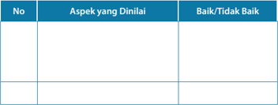

Tabel ini menunjukkan aspek-aspek yang dinilai dalam sebuah evaluasi atau penilaian. Kolom "No" mungkin berfungsi sebagai nomor urut untuk setiap aspek yang dinyatakan baik atau tidak baik. Kolom "Aspek yang Dinilai" menyajikan berbagai aspek yang perlu diperiksa atau diukur dalam proses penilaian tersebut. Kolom "Baik/Tidak Baik" menunjukkan hasil akhir dari penilaian, dengan "Baik" menandakan bahwa aspek tersebut telah memenuhi standar atau tujuan yang ditetapkan, sementara "Tidak Baik" menunjukkan bahwa aspek tersebut belum mencapai standar tersebut.

Topik utama tabel ini adalah penilaian atau evaluasi berdasarkan beberapa aspek tertentu. Data atau pola penting yang terlihat adalah bahwa setiap aspek harus diperiksa secara mendalam untuk menentukan apakah ia memenuhi standar atau tidak. Ini menunjukkan bahwa proses penilaian ini sangat detail dan memerlukan perhatian yang tepat pada setiap aspek yang dinyatakan dalam tabel ini.

### 2.   Skala Penilaian ( Rating Scale )

Penilaian  unjuk  kerja  yang  menggunakan  skala  penilaian  memungkinkan penilai  memberi  nilai  tengah  terhadap  penguasaan  kompetensi  tertentu, karena pemberian nilai dilakukan secara kontinum di mana pilihan kategori nilai  lebih  dari  dua.  Skala  penilaian  terentang  dari  tidak  sempurna  sampai sangat sempurna. Misalnya: 1 = tidak kompeten, 2 = cukup kompeten, 3 = kompeten dan 4 = sangat kompeten. Untuk memperkecil faktor subjektivitas, perlu dilakukan penilaian oleh lebih dari satu orang, agar hasil penilaian lebih akurat.

Contoh Rating Scale

### Keterangan:

5 = Sangat baik

4 = Baik

3 = Cukup

2 = Kurang

1 = Sangat kurang

Untuk penilaian dari 0 -100, kriteria penilaian dapat dilakukan sebagai berikut

- Jika  seorang  peserta  didik  memperoleh  skor  85-100  dapat  ditetapkan sangat baik.
- Jika seorang peserta didik memperoleh skor 70-84 dapat ditetapkan baik.
- Jika  seorang  peserta  didik  memperoleh  skor  60-69  dapat  ditetapkan cukup.

 

---
## 📄 Halaman 31

- Jika  seorang  peserta  didik  memperoleh  skor  46-59  dapat  ditetapkan kurang.
- Jika  seorang  peserta  didik  memperoleh  skor  0-45  dapat  ditetapkan sangat kurang.

### 3.    Penilaian Sikap

Sikap terdiri dari tiga komponen, yakni: afektif, kognitif, dan konatif. Komponen afektif  adalah  perasaan  yang  dimiliki  oleh  seseorang  atau  penilaiannya terhadap sesuatu objek.  Komponen  kognitif  adalah  kepercayaan  atau keyakinan  seseorang  mengenai  objek.  Adapun  komponen  konatif  adalah kecenderungan untuk berperilaku atau  berbuat  dengan  cara-cara  tertentu berkenaan dengan kehadiran objek sikap.

Secara  umum,  objek  sikap  yang  perlu  dinilai  dalam  proses  pembelajaran adalah sebagai berikut.

- Sikap terhadap materi pelajaran.
- Sikap terhadap pendidik/pengajar.
- Sikap terhadap proses pembelajaran.
- Sikap  berkaitan  dengan  nilai  atau  norma  yang  berhubungan  dengan suatu materi pelajaran.
- Sikap  berhubungan  dengan  kompetensi  afektif  lintas  kurikulum  yang relevan dengan mata pelajaran.
Penilaian  sikap  dapat  dilakukan  dengan  beberapa  cara  atau  teknik  yang antara  lain:  observasi  perilaku,  pertanyaan  langsung,  dan  laporan  pribadi. Teknik-teknik tersebut secara ringkas dapat diuraikan sebagai berikut.

###  Observasi Perilaku

Pendidik  dapat  melakukan  observasi  terhadap  peserta  didik  yang dibinanya.  Hasil  pengamatan  dapat  dijadikan  sebagai  umpan  balik dalam pembinaan. Observasi perilaku di sekolah dapat dilakukan dengan menggunakan buku catatan khusus tentang kejadian-kejadian berkaitan dengan  peserta  didik  selama  di  sekolah.  Berikut  contoh  format  buku catatan harian.

 

---
## 📄 Halaman 32

### Contoh halaman sampul Buku Catatan Harian:

### Buku Catatan Harian tentang Peserta Didik

Nama Sekolah

: ...........................................

Mata Pelajaran

: ...........................................

Kelas

: ...........................................

Tahun Pelajaran

: ...........................................

Nama Pendidik

: ...........................................

Jakarta, ................... 2014

### Contoh Isi Buku Catatan Harian :

No. Hari

: .........................................................................

Tanggal

: .........................................................................

Nama Peserta Didik

: .........................................................................

Kejadian

: .........................................................................

...................................................................................................................................

...................................................................................................................................

...................................................................................................................................

...................................................................................................................................

Kolom  kejadian  diisi  dengan  kejadian  positif  maupun  negatif.  Catatan dalam lembaran buku tersebut, selain bermanfaat untuk merekam dan menilai perilaku peserta didik, sangat bermanfaat pula untuk menilai sikap peserta didik serta dapat menjadi bahan dalam penilaian perkembangan peserta  didik  secara  keseluruhan.  Selain  itu,  dalam  observasi  perilaku dapat juga digunakan daftar cek yang memuat perilaku-perilaku tertentu yang diharapkan muncul dari peserta didik pada umumnya atau dalam keadaan tertentu.

###  Pertanyaan Langsung

Apakah kamu setia berdoa dan membaca Alkitab?

a.   Ya        b. Tidak

Apa alasanmu?

 

---
## 📄 Halaman 33

###  Laporan Pribadi

Melalui  laporan  pribadi,  peserta  didik  diminta  membuat  ulasan  yang berisi pandangan atau tanggapannya tentang suatu masalah, keadaan, atau hal yang menjadi objek sikap/minat. Misalnya, peserta didik diminta menulis  pandangannya tentang  buah roh dan aspek yang mana dari buah roh yang dapat dan belum dapat kamu terapkan dalam sikap hidup. Jelaskan alasannya, mengapa ia berpendapat seperti itu!

### 4.    Penilaian Tertulis

Penilaian secara tertulis dilakukan dengan tes tertulis. Tes tertulis merupakan tes  di  mana  soal  dan  jawaban  yang  diberikan  kepada  peserta  didik  dalam bentuk tulisan. Dalam menjawab soal peserta didik tidak selalu merespons dalam  bentuk  menulis  jawaban  tetapi  dapat  juga  dalam  bentuk  yang  lain seperti memberi tanda, mewarnai, menggambar dan lain sebagainya.

### Ada dua bentuk soal tes tertulis, yaitu:

- Memilih jawaban, yang dibedakan menjadi:
- pilihan ganda
- dua pilihan (benar-salah, ya-tidak)
- menjodohkan
- sebab-akibat
- Memberikan jawaban, dibedakan menjadi:
- isian atau melengkapi
- jawaban singkat atau pendek
- uraian
Dalam menyusun instrumen penilaian tertulis perlu dipertimbangkan hal-hal berikut.

- Karakteristik  mata  pelajaran  dan  keluasan  ruang  lingkup  materi  yang akan diuji;
- Materi, misalnya kesesuaian soal dengan kompetensi dasar dan indikator pencapaian pada kurikulum;
- Konstruksi, misalnya rumusan soal atau pertanyaan harus jelas dan tegas;
- Bahasa,  misalnya  rumusan  soal  tidak  menggunakan  kata/kalimat  yang menimbulkan penafsiran ganda.

 

---
## 📄 Halaman 34

### Contoh Penilaian Tertulis

Mata Pelajaran

: Pendidikan Agama Kristen

Kelas/Semester

: VII/1

Mensuplai jawaban singkat atau pendek:

- Sebutkan cara peserta didik SMP Kelas VII memelihara alam sebagai tanggapan atas pemeliharaan Tuhan Allah pada dirinya.
2.

..........................................................................................................

### Cara Penskoran:

Skor  diberikan  kepada  peserta  didik  tergantung  dari  ketepatan  dan kelengkapan jawaban yang diberikan/ditetapkan guru. Semakin lengkap dan tepat jawaban, semakin tinggi perolehan skor.

### 5.    Penilaian Projek

Penilaian  projek  merupakan kegiatan penilaian terhadap suatu tugas yang harus diselesaikan dalam periode/waktu tertentu. Tugas tersebut berupa suatu investigasi  sejak  dari  perencanaan,  pengumpulan  data,  pengorganisasian, pengolahan, dan penyajian data.

Penilaian projek dapat digunakan untuk mengetahui pemahaman, kemampuan mengaplikasikan, kemampuan penyelidikan dan kemampuan menginformasikan peserta didik pada mata pelajaran tertentu secara jelas. Dalam penilaian proyek terdapat beberapa hal yang perlu dipertimbangkan yaitu:

- Kemampuan pengelolaan.
- Kemampuan peserta didik dalam memilih topik, mencari informasi dan mengelola waktu pengumpulan data serta penulisan laporan.
- Relevansi.
- Kesesuaian dengan mata pelajaran, dengan mempertimbangkan tahap pengetahuan, pemahaman dan keterampilan dalam pembelajaran.
- Keaslian.
- Proyek  yang  dilakukan  peserta  didik  harus  merupakan  hasil  karyanya, dengan mempertimbangkan kontribusi pendidik berupa petunjuk dan dukungan  terhadap  proyek  peserta  didik.  Penilaian  proyek  dilakukan mulai  dari  perencanaan,  proses  pengerjaan,  sampai  hasil  akhir  proyek. Untuk itu, pendidik perlu menetapkan hal-hal atau tahapan yang perlu dinilai,  seperti  penyusunan  desain,  pengumpulan  data,  analisis  data, dan  menyiapkan  laporan  tertulis.  Laporan  tugas  atau  hasil  penelitian

 

---
## 📄 Halaman 35

juga dapat disajikan dalam bentuk poster. Pelaksanaan penilaian dapat menggunakan  alat/instrumen  penilaian  berupa  daftar  cek  ataupun skala  penilaian.  Contoh  kegiatan  peserta  didik  dalam  penilaian  proyek: penelitian sederhana tentang perilaku terpuji keluarga di rumah terhadap hewan atau binatang peliharaan.

### 6.    Penilaian Produk

Penilaian produk adalah penilaian terhadap proses pembuatan dan kualitas suatu produk. Penilaian produk meliputi penilaian kemampuan peserta didik membuat  produk-produk  teknologi  dan  seni,  seperti:  makanan,  pakaian, hasil karya seni (patung, lukisan, gambar), barang-barang terbuat dari kayu, keramik, plastik, dan logam. Pengembangan produk meliputi 3 (tiga) tahap dan setiap tahap perlu diadakan penilaian yaitu:

- Tahap  persiapan,  meliputi:  penilaian  kemampuan  peserta  didik  dan merencanakan,  menggali,  mengembangkan  gagasan,  dan  mendesain produk.
- Tahap  pembuatan  produk  (proses),  meliputi:  penilaian  kemampuan peserta  didik  dalam  menyeleksi  dan  menggunakan  bahan,  alat,  serta teknik.
- Tahap  penilaian  produk  ( appraisal ),  meliputi:  penilaian  produk  yang dihasilkan peserta didik sesuai kriteria yang ditetapkan. Penilaian produk biasanya menggunakan cara holistik atau analitik.
- Cara analitik, yaitu berdasarkan  aspek-aspek  produk, biasanya dilakukan terhadap semua kriteria yang terdapat pada semua tahap proses pengembangan.
- Cara  holistik,  yaitu  berdasarkan  kesan  keseluruhan  dari  produk, biasanya dilakukan pada tahap appraisal .

### 7.    Penilaian Portofolio

Penilaian  portofolio  merupakan  penilaian  berkelanjutan  yang  didasarkan pada kumpulan informasi yang menunjukkan perkembangan kemampuan peserta didik dalam satu periode tertentu. Informasi tersebut dapat berupa karya  peserta  didik  dari  proses  pembelajaran  yang  dianggap  terbaik  oleh peserta didik, hasil tes (bukan nilai) atau bentuk informasi lain yang terkait dengan kompetensi tertentu dalam satu mata pelajaran. Penilaian portofolio pada  dasarnya  menilai  karya-karya  peserta  didik  secara  individu  pada satu  periode  untuk  suatu  mata  pelajaran.  Akhir  suatu  periode  hasil  karya tersebut  dikumpulkan  dan  dinilai  oleh  pendidik  dan  peserta  didik  sendiri. Berdasarkan informasi perkembangan tersebut, pendidik dan peserta didik

 

---
## 📄 Halaman 36

sendiri  dapat  menilai  perkembangan  kemampuan  peserta  didik  dan  terus melakukan perbaikan. Dengan demikian, portofolio dapat memperlihatkan perkembangan kemajuan belajar peserta didik melalui karyanya, antara lain: karangan, puisi, surat, komposisi musik, gambar, foto, lukisan, resensi buku/ literatur, laporan penelitian, sinopsis, dsb.

### 8.    Penilaian Diri ( Self Assesment)

Penilaian  diri  adalah  suatu  teknik  penilaian  di  mana  peserta  didik  diminta untuk  menilai  dirinya  sendiri  berkaitan  dengan  status,  proses  dan  tingkat pencapaian  kompetensi  yang  dipelajarinya  dalam  mata  pelajaran  tertentu didasarkan  atas  kreteria  atau  acuan  yang  telah  disiapkan.  Penilaian  diri dilakukan  berdasarkan  kriteria  yang  jelas  dan  objektif.  Oleh  karena  itu, penilaian  diri  oleh  peserta  didik  di  kelas  perlu  dilakukan  melalui  langkahlangkah sebagai berikut.

- Menentukan kompetensi atau aspek kemampuan yang akan dinilai.
- Menentukan kriteria penilaian yang akan digunakan.
- Merumuskan format penilaian, dapat berupa pedoman penskoran, daftar tanda cek, atau skala penilaian.
- Meminta peserta didik untuk melakukan penilaian diri.
- Guru  mengkaji  sampel  hasil  penilaian  secara  acak,  untuk  mendorong peserta didik supaya senantiasa melakukan penilaian diri secara cermat dan objektif.
- Menyampaikan  umpan  balik  kepada  peserta  didik  berdasarkan  hasil kajian terhadap sampel hasil penilaian yang diambil secara acak.

### Contoh Format Penilaian Diri

Berdasarkan  kajian  mengenai  multikultur  dan  sumbangan  nilai-nilai  multikultur bagi  umat  Kristiani  secara  khusus  dan  bangsa  Indonesia  pada  umumnya, kamu dapat menilai diri sendiri. Yaitu, apakah kamu sudah mempraktikkan sikap hidup yang menerima dan menghargai multikulturalisme?

 

---
## 📄 Halaman 37

: .....................................................

Nama

: .....................................................

Kelas

Tanggal

: .....................................................

---
**📊 Tabel**

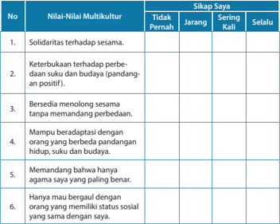

Tabel ini menunjukkan hasil evaluasi sikap terhadap nilai-nilai multikultural di mana subjeknya meliputi 6 poin. Kolom "Tidak Pernah", "Jarang", "Sering Kali", dan "Selalu" digunakan untuk mengevaluasi tingkat keberadaan sikap terhadap setiap poin. Topik utama tabel adalah sikap terhadap nilai-nilai multikultural, yang mencakup solidaritas terhadap sesama, keterbukaan terhadap perbedaan suku dan budaya, beradaptasi dengan orang yang berbeda pandangan hidup, suku, dan budaya, memandang bahwa agama saya yang paling benar, dan hanya mau bergaul dengan orang yang memiliki status sosial yang sama dengan saya. Data penting yang terlihat adalah bahwa subjek ini sering kali atau selalu memiliki sikap positif terhadap nilai-nilai multikultural, terutama dalam hal keterbukaan terhadap perbedaan suku dan budaya, beradaptasi dengan orang yang berbeda pandangan hidup, suku, dan budaya, dan hanya mau bergaul dengan orang yang memiliki status sosial yang sama dengan mereka.

Skor nilai tertinggi adalah

: 60

Selalu

: 10

Sering kali

: 7

Jarang

: 5

Tidak Pernah

: 2

Skor  terbanyak  menunjukkan  sikap  kamu,  yaitu  apakah  kamu  menghargai dan menjalankan praktik hidup multikultur ataukah tidak.

### 9.     Lingkup Kompetensi

Remaja SMA/SMK kelas XII masih dalam proses pembentukan jati diri menuju dewasa walau pun sudah pada tahap terakhir dari jenjang sekolah. Dalam masa pertumbuhan ini mereka membutuhkan bimbingan dan dampingan agar mampu mengambil keputusan yang benar dalam menghadapi berbagai persoalan di masa remaja. Di zaman kini tekanan yang dihadapi oleh remaja cukup banyak. Mereka menghadapi tuntutan dunia pendidikan di sekolah

 

---
## 📄 Halaman 38

dengan tugas-tugas yang berat dan banyak, di rumah menghadapi orang tua yang umumnya sibuk dengan dunianya sendiri. Bisa saja remaja mengalami kesepian tanpa teman bicara baik di rumah maupun di sekolah. Remaja masa kini  cenderung hidup mengelompok dan membentuk jati diri berdasarkan kelompok-kelompok pertemanan. Hal ini akan mempengaruhi perilakunya. Oleh  karena  itu  amat  penting  untuk  memberikan  bekal  baginya  sebagai pegangan hidup melalui topik-topik pembahasan PAK di sekolah. Pada jenjang SMA kelas X mereka diperkuat dalam pembentukan jati diri sebagai remaja Kristen, pada kelas XI  mereka dimotivasi untuk melihat potret dirinya dalam keluarga,  gereja  dan  masyarakat.  Pada  jenjang  kelas  XII  mereka  dimotivasi dan diperkuat dalam hal mewujudkan peran sosial kemasyarakatan sebagai warga gereja  dan  warga  negara.  Kelas  XII  merupakan  klimaks  dari  seluruh pembelajaran Pendidikan Agama Kristen di sekolah (jenjang SD hingga SMA/ SMK)  oleh  karena  itu  tim  penulis  sepakat  untuk  mengakhiri  pembelajaran PAK di sekolah dengan judul 'Menjadi pelaku kasih dan perdamaian' . Judul tersebut  menjadi  pengunci  pembelajaran  di  jenjang  SMA  kelas  XII.  Jika ketersediaan waktu memungkinkan, guru dapat merancang kegiatan retret untuk peserta didik di SMA kelas XII sebagai penguatan bagi peserta didik sekaligus  mempersiapkan  mereka  menghadapi  ujian  akhir  SMA.  Kegiatan ini  sekaligus  mengarahkan peserta didik untuk mampu memilih jurusan di Perguruan  Tinggi.    Bagi  mereka  yang  akan  bekerja  karena  tidak  memiliki kemampuan keuangan yang cukup untuk kuliah, guru dapat memperkuat mereka  sekaligus  mempersiapkan  peserta  didik  untuk  menghadapi  dunia kerja.  Kegiatan  ini  akan  mencapai  sasaran  jika  pendamping  dalam  retret adalah guru PAK dan psikolog Kristen.

Mempertimbangkan  kondisi  tersebut  di  atas,  cakupan  Kompetensi Dasar  PAK  di  SMA/SMK  kelas  XII  adalah  Menjadi  murid  Kristus  yang  dapat mewarnai lingkungannya, khususnya dalam menjalankan perannya sebagai agen pembawa damai sejahtera Allah. Kompetensi ini mengandung unsur pertumbuhan yang bersifat  holistik.  Jadi  tidak  hanya  bertumbuh  dari  segi spiritual  saja,  namun  secara  biologis  dan  psikologis.  Supaya  remaja  dapat bertumbuh menyiapkan diri sebagai murid Kristus pembawa damai sejahtera, maka dibahas terlebih dulu tentang hak asasi manusia dan demokrasi yang menjadi sangat tepat dalam konteks keberagaman negara Indonesia di mana multikulturalisme  menjadi  sebuah  keniscayaan.  Dalam  rangka  membentuk diri sebagai remaja Kristen pembawa damai sejahtera, maka nilai-nilai kristiani dapat dijadikan pegangan hidupnya sebagai warisan dan tugas mulia yang diberikan Yesus: 'Damai sejahtera Kutinggalkan bagimu. Damai sejahtera-Ku Ku berikan kepadamu' (Injil Yohanes 14:27a). Bahwa hakikat hidup beriman adalah hidup dalam perdamaian dengan semua orang berdasarkan kasih.

 

---
## 📄 Halaman 39

### Rumusan Kompetensi Inti dan Kompetensi Dasar Pendidikan Agama Kristen  SMA/SMK Kelas XII

---
**📊 Tabel**

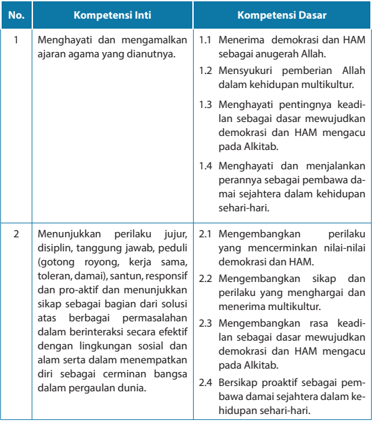

Tabel ini berisi informasi tentang kompetensi inti dan kompetensi dasar yang terkait dengan demokrasi dan hak asasi manusia (HAM). Topik utama tabel adalah tentang bagaimana menghargai dan menjalankan prinsip-prinsip demokrasi dan HAM dalam kehidupan sehari-hari. Kolom pertama menunjukkan nomor urut dari kompetensi inti, sedangkan kolom kedua menunjukkan kompetensi dasar yang berkaitan dengan setiap kompetensi inti. Data penting yang terlihat adalah bahwa semua kompetensi inti dan dasar tersebut berkaitan erat dengan demokrasi dan HAM, mencakup aspek-aspek seperti menerima demokrasi dan HAM sebagai anugerah Allah, menghargai pentingnya keadilan sebagai dasar demokrasi dan HAM, serta menunjukkan perilaku yang jujur, disiplin, tanggung jawab, peduli, dan pro-aktif dalam berbagai situasi sosial dan lingkungan.

 

---
## 📄 Halaman 40

---
**📊 Tabel**

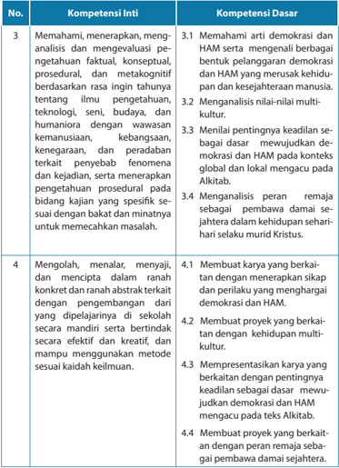

Tabel ini berisi informasi tentang kompetensi inti dan dasar yang harus dipenuhi oleh siswa dalam konteks demokrasi dan HAM. Topik utama adalah pengetahuan dan pemahaman tentang demokrasi dan HAM, serta keterampilan dalam mengevaluasi dan menerapkan konsep tersebut. Kolom pertama menyajikan nomor urut untuk setiap kompetensi, sementara kolom kedua berisi deskripsi singkat tentang kompetensi inti yang harus dipenuhi. Kolom ketiga menyediakan detail tentang kompetensi dasar yang harus dipenuhi, mencakup pemahaman tentang demokrasi dan HAM, analisis nilai-nilai multi-kultur, meningkatkan kepemimpinan dalam konteks global dan lokal, serta analisis peran remaja sebagai pembawa damai. Data penting yang terlihat adalah bahwa tabel ini mencakup dua topik utama: pemahaman tentang demokrasi dan HAM, serta keterampilan dalam mengevaluasi dan menerapkan konsep tersebut.

 

---
## 📄 Halaman 41

### 10. Program Pembelajaran Per Semester

### Alokasi Materi Pembelajaran Pendidikan Agama Kristen

### SMA Kelas XII Per Semester Semester 1

Satuan Pendidikan

:  SMA

Kelas

:  XII

Kompetensi Inti :

KI 1  :         Menghayati dan mengamalkan ajaran agama yang dianutnya.

KI 2 : Menunjukkan perilaku jujur, disiplin, tanggung jawab,  peduli (gotong royong,  kerja  sama,  toleran,  damai),  santun,  responsif  dan  pro-aktif dan  menunjukkan  sikap  sebagai  bagian  dari  solusi  atas  berbagai permasalahan  dalam  berinteraksi  secara  efektif  dengan  lingkungan sosial dan alam serta dalam menempatkan diri sebagai cerminan bangsa dalam pergaulan dunia.

KI 3  : Memahami, menerapkan, menganalisis dan mengevaluasi pengetahuan faktual,  konseptual,  prosedural,  dan  metakognitif  berdasarkan  rasa ingin tahunya  tentang ilmu pengetahuan, teknologi, seni, budaya, dan humaniora dengan wawasan ke  manusiaan,  kebangsaan, kenegaraan, dan peradaban terkait penyebab fenomena dan kejadian, serta menerapkan pengetahuan prosedural pada bidang kajian yang spesifi  k sesuai dengan bakat dan minatnya untuk meme  cahkan masalah.

KI  4 :      Mengolah, menalar, menyaji, dan mencipta dalam ranah konkret dan ranah  abstrak  terkait  dengan  pengembangan  dari  yang  dipelajarinya di sekolah secara mandiri serta bertindak secara efektif dan kreatif, dan mampu menggunakan metode sesuai kaidah keilmuan.

### Kompetensi Dasar:

- KD 1.1      Menerima  demokrasi dan HAM sebagai anugerah Allah.
- KD 2.1      Mengembangkan  perilaku yang mencerminkan nilai-nilai demokrasi dan HAM.
- KD 3.1     Memahami arti demokrasi dan HAM serta  mengenali berbagai bentuk pelanggaran  demokrasi  dan  HAM  yang  merusak  kehidupan  dan kesejahteraan manusia.
- KD 4.1      Membuat karya yang berkaitan dengan menerapkan sikap dan perilaku yang menghargai demokrasi dan HAM.

 

---
## 📄 Halaman 42

---
**📊 Tabel**

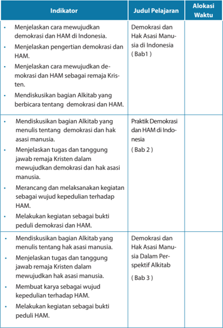

Tabel ini berisi informasi tentang indikator pelajaran yang harus dipelajari oleh siswa dalam konteks demokrasi dan hak asasi manusia di Indonesia. Topik utama adalah demokrasi dan hak asasi manusia, dengan beberapa sub-topik yang lebih spesifik seperti praktik demokrasi dan hak asasi manusia, kepedulian terhadap hak asasi manusia, dan pemahaman tentang bagaimana demokrasi dan hak asasi manusia dapat diterapkan dalam kehidupan sehari-hari. Kolom "Judul Pelajaran" menunjukkan judul pelajaran yang akan dipelajari, sedangkan kolom "Alokasi Waktu" menunjukkan waktu yang diberikan untuk mengerjakan setiap indikator. Pola penting yang terlihat adalah bahwa setiap indikator memiliki tujuan yang jelas dan waktu yang ditentukan untuk dipelajari, yang bertujuan untuk mempersiapkan siswa untuk memahami dan menerapkan konsep demokrasi dan hak asasi manusia secara efektif.

 

---
## 📄 Halaman 43

---
**📊 Tabel**

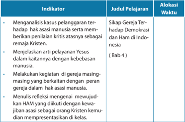

Tabel ini berisi informasi tentang indikator pelajaran yang harus dikuasai oleh siswa dalam konteks pemahaman hak asasi manusia (HAM) di gereja Kristen. Topik utama adalah "Sikap Gereja Terhadap Demokrasi dan Ham di Indonesia" (Bab 4). Tabel ini terdiri dari tiga kolom: Indikator Pelajaran, Judul Pelajaran, dan Alokasi Waktu. Indikator pelajaran mencakup analisis kasus pelanggaran terhadap hak asasi manusia, menjelaskan arti pelayanan Yesus dalam kaitannya dengan kebebasan manusia, melakukan kegiatan di gereja masing-masing yang berkaitan dengan peran gereja dalam hak asasi manusia, dan menulis refleksi mengenai mewujudkan HAM yang dikuti dengan kewajiban sebagai orang Kristen. Alokasi waktu untuk setiap indikator pelajaran tidak disebutkan secara spesifik dalam tabel ini.

### Kompetensi Dasar:

- KD 1.2  Mensyukuri pemberian Allah dalam kehidupan multikultur.
- KD 2.2  Mengembangkan  sikap  dan  perilaku  yang  menghargai  dan  menerima multikultur.
- KD 3.2  Menganalisis nilai-nilai multikultur.
- KD 4.2  Membuat proyek yang berkaitan dengan  kehidupan multikultur.

 

---
## 📄 Halaman 44

---
**📊 Tabel**

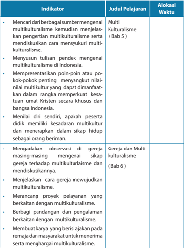

Tabel ini berisi informasi tentang indikator-indikator pelajaran yang harus dicapai oleh siswa dalam konteks multikulturalisme di Indonesia. Topik utama tabel adalah pelajaran tentang multikulturalisme, yang melibatkan pemahaman dan pengembangan nilai-nilai multikulturalisme serta menerapkannya dalam kehidupan sehari-hari. Tabel ini terdiri dari kolom Indikator, Judul Pelajaran, dan Alokasi Waktu. Indikator mencakup berbagai aspek seperti menulis pendekatan multikulturalisme, mempresentasikan poin-poin penting, menjalani diri sendiri dengan kesiapan multikultural, mengamati observasi gereja, menjelaskan cara mewujudkan multikulturalisme, merancang proyek pelayanan, berbagai pandangan dan pengalaman, serta membuat karya yang berisikan ajaran multikulturalisme. Judul pelajaran untuk setiap indikator disertakan, seperti "Multikulturalisme" (Bab 5) dan "Gereja dan Multikulturalisme" (Bab 6). Alokasi waktu untuk setiap indikator juga disediakan, memberikan waktunya untuk menyelesaikan tugas-tugas tersebut.

 

---
## 📄 Halaman 45

---
**📊 Tabel**

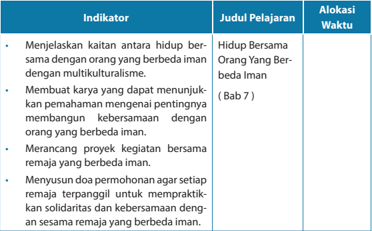

Tabel ini berisi indikator pelajaran tentang "Hidup Bersama Orang Yang Berbeda Iman" dalam bab 7. Kolom pertama berisi judul pelajaran, kolom kedua berisi indikator pelajaran, dan kolom ketiga berisi alokasi waktu. Topik utama tabel adalah keterampilan dan pengetahuan yang diperlukan untuk membangun kebersamaan antara remaja yang berbeda iman. Indikator pelajaran mencakup menjelaskan kaitan antara hidup bersama dengan orang yang berbeda iman, membuat karya yang dapat menunjukkan pemahaman tentang pentingnya membangun kebersamaan, merancang proyek kegiatan bersama, dan menyusun doa permohonan agar setiap remaja terpanggil untuk mempraktikkan solidaritas dan kebersamaan. Alokasi waktu untuk masing-masing indikator pelajaran tidak disebutkan secara spesifik dalam tabel ini.

 

---
## 📄 Halaman 46

### Kompetensi Dasar:

- 1.3  Menghayati pentingnya keadilan sebagai dasar mewujudkan demokrasi dan HAM mengacu pada Alkitab.
- 2.3  Mengembangkan rasa keadilan sebagai dasar mewujudkan demokrasi dan HAM mengacu pada Alkitab.
- 3.3  Menilai pentingnya keadilan sebagai dasar  mewujudkan demokrasi dan HAM pada konteks global dan lokal mengacu pada Alkitab.
- 4.3  Mempresentasikan karya yang berkaitan dengan pentingnya keadilan sebagai dasar  mewujudkan demokrasi dan HAM mengacu pada teks Alkitab.

---
**📊 Tabel**

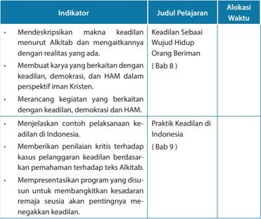

Tabel ini berisi indikator pelajaran yang berkaitan dengan keadilan, demokrasi, dan Hak Asasi Manusia (HAM) dalam konteks iman Kristen. Topik utama adalah praktik keadilan di Indonesia, yang melibatkan mendeskripsikan makna keadilan, membuat karya yang berkaitan dengan keadilan, demokrasi, dan HAM, menjelaskan contoh pelaksanaan keadilan di Indonesia, memberikan penilaian kritis terhadap kasus pelanggaran keadilan, dan mempresentasikan program yang disusun untuk meningkatkan kesadaran remaja tentang pentingnya menegakkan keadilan. Indikator-indikator tersebut dikelompokkan dalam beberapa bab, dengan waktu pelaksanaan yang ditentukan untuk setiap bab.

### Semester 2

 

---
## 📄 Halaman 47

---
**📊 Tabel**

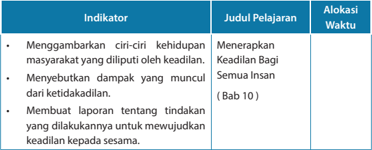

Tabel ini berisi indikator pelajaran tentang menerapkan keadilan bagi semua insan, yang terdiri dari tiga kolom: Indikator, Judul Pelajaran, dan Alokasi Waktu. Topik utama tabel adalah tentang menerapkan keadilan dalam kehidupan sosial. Indikator pertama adalah menggambarkan ciri-ciri kehidupan masyarakat yang diliputi oleh keadilan. Indikator kedua adalah menyebutkan dampak yang muncul dari ketidakadilan. Indikator ketiga adalah membuat laporan tentang tindakan yang dilakukan untuk mewujudkan keadilan kepada sesama. Judul pelajaran adalah "Menerapkan Keadilan Bagi Semua Insan" (Bab 10). Alokasi waktu tidak disebutkan secara spesifik dalam tabel ini. Pola penting yang terlihat adalah bahwa tabel ini mencakup tiga aspek utama dari menerapkan keadilan dalam kehidupan sosial, yaitu menggambarkan ciri-ciri kehidupan masyarakat yang diliputi oleh keadilan, menyebutkan dampak dari ketidakadilan, dan membuat laporan tentang tindakan yang dilakukan untuk mewujudkan keadilan.

### Kompetensi Dasar:

- 1.4 Menghayati dan menjalankan perannya sebagai pembawa damai sejahtera dalam kehidupan sehari-hari.
- 2.4 Bersikap proaktif sebagai pembawa damai sejahtera dalam kehidupan sehari-hari.
- 3.4 Menganalisis peran  remaja sebagai  pembawa damai sejahtera dalam kehidupan sehari-hari selaku murid Kristus.
- 4.4 Membuat proyek yang berkaitan dengan peran remaja sebagai pembawa damai sejahtera.

---
**📊 Tabel**

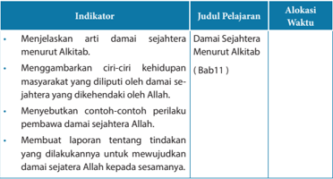

Tabel ini berisi informasi tentang indikator, judul pelajaran, dan alokasi waktu untuk pembelajaran tentang damai sejahtera menurut Alkitab. Topik utama adalah tentang kehidupan masyarakat yang diilustrasikan oleh damai sejahtera yang dikehendaki Allah. Indikator pertama adalah menjelaskan arti damai sejahtera menurut Alkitab. Judul pelajaran untuk indikator ini adalah "Damai Sejahtera Menurut Alkitab" (Bab 1). Indikator kedua adalah menggambarkan ciri-ciri kehidupan masyarakat yang diilustrasikan oleh damai sejahtera yang dikehendaki Allah. Judul pelajaran untuk indikator ini adalah "Ciri-ciri Kehidupan Masyarakat yang Diilustrasikan oleh Damai Sejahtera yang Dikehendaki Allah". Indikator ketiga adalah menyebutkan contoh-contoh perilaku pembawa damai sejahtera Allah. Judul pelajaran untuk indikator ini adalah "Contoh-Contoh Perilaku Pembawa Damai Sejahtera Allah". Indikator keempat adalah membuat laporan tentang tindakan yang dilakukan untuk mewujudkan damai sejahtera Allah kepada sesama. Judul pelajaran untuk indikator ini adalah "Laporan Tentang Tindakan yang Dilakukan untuk Mewujudkan Damai Sejahtera Allah kepada Sesama". Tabel ini menunjukkan bahwa alokasi waktu untuk pembelajaran ini adalah Bab 1.

 

---
## 📄 Halaman 48

---
**📊 Tabel**

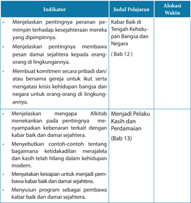

Tabel ini berisi indikator-indikator yang harus dipelajari oleh pelajar tentang pentingnya pejabat pemerintah dalam menjaga kesejahteraan masyarakat dan bagaimana mereka dapat membawa pesan positif kepada orang-orang di lingkungannya. Topik utama adalah pentingnya pejabat pemerintah dalam menjaga kehidupan bangsa dan negara, termasuk menunjukkan komitmen pribadi dan/atau bersama-sama untuk mengatasi krisis kehidupan bangsa dan negara. Selain itu, tabel juga mencakup penjelasan mengapa Alkitab menekankan pentingnya meyampaikan kebenaran terkait dengan kabus baik dan damai sejahtera, serta menetapkan kapan dan bagaimana ketidakadilan merajalela dan kasih telah hilang dalam kehidupan modern. Indikator ini juga mencakup menunjukkan komitmen pribadi dan/atau bersama-sama untuk mengatasi krisis kehidupan bangsa dan negara, serta menyusun program sebagai pembawa kabar baik dan damai sejahtera.

 

---
## 📄 Halaman 49

BAGIAN

Pembahasan Setiap Bab Buku Siswa Pendidikan Agama Kristen

2

Pendidikan Agama Kristen dan Budi Pekerti

39

 

---
## 📄 Halaman 50

---
**🖼️ Gambar/Diagram**

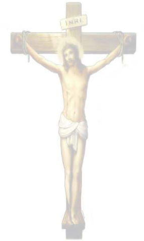

> **Deskripsi Visual:** Gambar ini adalah ilustrasi yang menunjukkan Kristus yang sedang diukir di atas salib. Kristus berdiri dengan tubuh yang terpotong, tangan dan kaki terangkat ke atas, menghadap ke arah kanan. Di atas salib, terdapat tulisan "INRI" yang menunjukkan identitas Nabi Yesus. Ilustrasi ini mungkin digunakan sebagai bahan ajar dalam pembelajaran tentang kejadian pada hari Kiamat atau dalam konteks Kristen.

 

---
## 📄 Halaman 51

### PENJELASAN BAB

### Demokrasi dan   Hak Asasi Manusia (HAM)

Bahan Alkitab: Mazmur 133; Raja-Raja 21:1-16

---
**📊 Tabel**

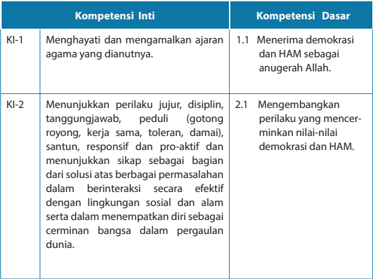

Tabel ini menunjukkan dua kompetensi inti (KI) yang disusun dengan kompetensi dasar (KD). Kompetensi inti pertama, KI-1, berkisar pada penghayatan dan mengamalkan ajaran agama yang diadukannya, sementara KI-2 fokus pada perilaku yang jujur, disiplin, tanggungjawab, peduli, santun, responsif, proaktif, dan sikap yang mendorong solusi efektif terhadap masalah dalam lingkungan sosial dan alam. KD-1.1 membahas tentang menerima demokrasi dan HAM sebagai anugerah Allah, sedangkan KD-2.1 mengajarkan mengembangkan perilaku yang mencermin nilai-nilai demokrasi dan HAM. Pola tabel ini menunjukkan hubungan antara kompetensi inti dan dasar, serta bagaimana mereka saling terkait dalam pembentukan karakter yang baik dan berkelanjutan.

 

---
## 📄 Halaman 52

---
**📊 Tabel**

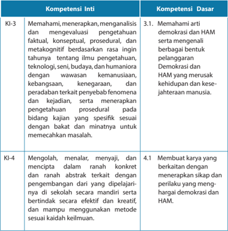

Tabel ini membandingkan dua kompetensi: Kompetensi Inti (KI) dan Kompetensi Dasar (KD). Topik utama tabel adalah tentang pemahaman, analisis, dan pengembangan keterampilan berdasarkan pengetahuan dan metakognisi. Kolom KI-3 mencakup pemahaman, menerapkan, dan evaluasi pengetahuan faktil, konseptual, prosedural, dan metakognitif dengan wawasan kemanusiaan, kebangsaan, keagamaan, dan peradaban. Kolom KD mencakup pemahaman demokrasi dan HAM serta membuat karya yang berkaitan dengan sikap dan perilaku yang menghargai demokrasi dan HAM. Data penting yang terlihat adalah bahwa KI-3 lebih fokus pada pemahaman dan menerapkan pengetahuan secara umum, sementara KD lebih fokus pada praktik dan kreativitas dalam menerapkan nilai-nilai demokrasi dan HAM.

### Indikator:

- Menjelaskan cara mewujudkan  demokrasi dan HAM di Indonesia.
- Menjelaskan pengertian demokrasi dan HAM.
- Menjelaskan  cara  mewujudkan  demokrasi  dan  HAM  sebagai  remaja Kristen.
- Mendiskusikan  bagian  Alkitab  yang  berbicara  tentang    demokrasi  dan HAM.

 

---
## 📄 Halaman 53

### A.  Pengantar

Pembahasan  mengenai  demokrasi  dan  Hak  Asasi  Manusia  (selanjutnya disingkat  HAM)  merupakan  topik  yang  amat  penting  karena  menyangkut  hak paling mendasar yang diberikan Allah bagi manusia. Misalnya, hak untuk hidup dan  dihargai  sebagai  manusia  makhluk  mulia  ciptaan  Allah.  Sayangnya,  dalam kenyataan terjadi banyak pelanggaran terhadap  demokrasi dan HAM. Oleh karena itu, pembahasan mengenai demokrasi dan HAM diharapkan dapat memberikan pencerahan bagi remaja Kristen untuk menyadari bahwa manusia diciptakan Allah sebagai makhluk mulia yang memiliki martabat dan hak sejak dalam kandungan. Pada sisi lain, pembahasan ini sekaligus memotivasi peserta didik untuk mampu membela hak diri sendiri  maupun HAM orang lain.

Pembahasan mengenai demokrasi dan HAM tidak dimaksudkan mengambil alih isi mata pelajaran PPKn justru memperkuat pembahasan demokrasi dan HAM dalam  mata  pelajaran  tersebut.  Namun,  lebih  terfokus  pada  tinjauan  dari  segi ajaran iman Kristen. Hal ini penting agar setiap remaja Kristen menyadari bahwa dirinya  terpanggil  untuk  turut  serta  mewujudkan  demokrasi  dan  HAM  sebagai orang Kristen yang telah ditebus dan diselamatkan oleh Yesus Kristus.

Sampai  dengan  saat ini  masih  banyak  orang  yang  mempertanyakan pentingnya  beberapa  topik  berikut  dijadikan  bahan  pelajaran  PAK,  misalnya, demokrasi, HAM, lingkungan hidup, keadilan termasuk keadilan gender. Mereka berpendapat  topik-topik  ini  merupakan  isi  dari  mata  pelajaran  lain.  Pendapat ini perlu dikoreksi. Mengapa? Karena ketika kita mengajarkan iman Kristen yang bersumber  dari  Alkitab  maka  berbagai  ajaran  itu  menyentuh  hampir  seluruh bidang kehidupan termasuk demokrasi, HAM, keadilan, dan lingkungan hidup. Membelajarkan topik-topik ini tidak berarti mengambil alih mata pelajaran lain, sebaliknya  semakin  memperkuat  apa  yang  diajarkan  dalam  mata  pelajaran lainnya  menyangkut  topik-topik  tersebut.  Peserta  didik  perlu  dibimbing  untuk memahami topik-topik tersebut dari sisi iman Kristen. Misalnya, dalam demokrasi dan HAM mereka perlu belajar bagaimana demokrasi dan HAM menurut ajaran iman kristen sehingga mereka dibimbing dalam mempraktikkan HAM, demokrasi, keadilan, kepedulian terhadap lingkungan hidup dan lain-lain.

Melalui  pembelajaran  ini  diharapkan  peserta  didik  memahami  pengertian demokrasi  dan  HAM,  memiliki  kesadaran  mengenai  demokrasi  dan  HAM,  dan mampu mengkritisi fakta atau kenyataan demokrasi dan HAM di Indonesia. Peserta didik menonton TV maupun media online atau media cetak mengenai demokrasi dan HAM di Indonesia. Melalui berbagai aktivitas tersebut mereka mengetahui kondisi  atau  fakta  mengenai  demokrasi  dan  HAM  di  Indonesia.  Pembelajaran ini  akan  memberikan gambaran yang  nyata dan objektif mengenai kenyataan

 

---
## 📄 Halaman 54

demokrasi dan HAM di Indonesia dan bagaimana mereka harus bersikap sesuai dengan ajaran iman Kristen.

Pembahasan topik ini akan dilakukan secara berseri dari bab 1 sampai dengan bab  4.    Pembahasan  pertama  mengenai    pengertian    demokrasi  dan  HAM  di Indonesia. Berikutnya akan dibahas secara rinci bagaimana perjalanan demokrasi dan  HAM  di  Indonesia  serta  dampaknya  bagi  bangsa  Indonesia  serta  umat Kristen di Indonesia. Kemudian demokrasi dan HAM dari perspektif Alkitab dan yang terakhir mengenai sikap gereja terhadap demokrasi dan HAM. Pembahasan mengenai  demokrasi  dan  HAM  dalam  perspektif  Alkitab  dengan  sikap  gereja terhadap  demokrasi  dan  HAM  dipisahkan  supaya  peserta  didik  dapat  belajar secara mendalam mengenai prinsip-prinsip Alkitabiah mengenai demokrasi dan HAM, barulah pembahasan sikap gereja terhadap demokrasi dan HAM dimana akan  dibahas  mengenai  bagaimana  gereja  mengacu  pada  prinsip  Alkitabiah dalam menyikapi demokrasi dan HAM.

### B. Pengertian Demokrasi dan HAM

Hak  asasi  manusia  (HAM)  merupakan  hak  yang  dimiliki  oleh  setiap  orang sebagai makhluk ciptaan Allah. Hak yang paling mendasar adalah hak untuk hidup. Hanya Tuhanlah  pemberi  kehidupan  dan  Dia  jugalah  yang  berhak  mengambil kehidupan itu, namun sayang sekali dalam kenyataannya, masih banyak orang yang belum menyadari dirinya memiliki hak yang tidak dapat dilanggar ataupun diambil oleh orang lain. Bukan hanya manusia sebagai individu, bahkan institusi atau lembaga negarapun dapat melanggar HAM warga negaranya ketika negara tidak dapat menjamin terpenuhinya HAM warga negara sebagai individu maupun kelompok.

Demokrasi  artinya pemerintahan  yang  bertumpu  pada  rakyat;  artinya pemerintahan dari, oleh, dan untuk rakyat. Demokrasi pada mulanya dipraktikkan di Yunani melalui pemerintahan negara kota. Dalam perkembangannya kemudian, ide dasar demokrasi diadopsi oleh berbagai negara modern di dunia. Sistem ini dipandang lebih menjamin kepentingan rakyat banyak serta memberi peluang bagi  terciptanya  pemerintahan  yang  berkeadilan.  Indonesia  adalah  salah  satu negara yang menganut sistem demokrasi.

Demokrasi merupakan sistem pemerintahan yang paling popular pada masa kini (Schaff  er, 2014) dimana kekuasaan berada di tangan rakyat dan bukan di raja atau kaisar. Pemerintahan demokratis baru mulai muncul pada abad XVIII. Saat itu, para fi  lsuf sepakat bahwa rakyat dapat membuat keputusan-keputusan yang bertanggung  jawab  terkait  dengan  hal-hal  yang  berbau  politik.  Keputusan  ini antara lain berbentuk kebebasan rakyat untuk memilih siapa wakil-wakil (dalam hal

 

---
## 📄 Halaman 55

ini politikus) yang dipercaya untuk masuk dalam pemerintahan. Di balik pemilihan wakil-wakil rakyat ini ada harapan bahwa para wakil akan menjalankan tugasnya dengan baik. Namun demikian, tidak jarang terjadi penyimpangan dalam praktik demokrasi dan HAM.

Hak-hak asasi mencakup tiga hal:

- Hak warga negara, yang mencakup hak untuk hidup dan merasa aman, untuk memiliki privasi, untuk berkeluarga, hak milik pribadi, menyatakan pendapat dengan bebas, memeluk dan melaksanakan agama/kepercayaan, dan berkumpul dengan damai.
- Hak-hak politik, mencakup hak untuk berserikat, membentuk partai politik, ikut  serta  memilih  dan  dipilih  dalam  pemilihan  umum,  menduduki  jabatan pemerintahan, dan sebagainya.
- Hak-hak ekonomi dan sosial, mencakup hak untuk bebas dari   kemiskinan, hak untuk diterima dalam masyarakat dan bangsa-bangsa, dan hak untuk menentukan nasib sendiri.
Kesadaran akan hak asasi manusia didasarkan pada pengakuan bahwa semua manusia memiliki derajat dan martabat yang sama sebagai makhluk Tuhan. Dua unsur  penting  yang  tercakup  dalam  HAM  adalah  persamaan  dan  kebebasan. Demikian pula dengan demokrasi. Nilai-Nilai yang terkandung dalam demokrasi dan HAM bersifat universal, artinya dapat diterima dan berlaku di seluruh belahan dunia. Apakah dengan demikian pelaksanaan demokrasi dan HAM berlaku tanpa batas? Tidak sama sekali karena dalam mewujudkan demokrasi dan HAM juga ada kewajiban asasi yang membatasi kita. Hal itu tercantum dalam Universal Declaration of Human Rights pasal  29  ayat  (2)  yang  berbunyi: 'Dalam menjalankan hak dan kebebasan,  setiap  orang  harus  tunduk  hanya  pada  pembatasan-pembatasan yang ditentukan oleh hukum semata-mata untuk tujuan menjamin pengakuan dan penghormatan terhadap hak-hak dan kebebasan orang lain dan memenuhi persyaratan  moralitas,  ketertiban  masyarakat,  dan  kesejahteraan  umum  dalam suatu  masyarakat  demokratis' .  Hal  itu  sejalan  dengan  bunyi  UUD  1945  pasal 28  ayat  2  tentang  batasan  hak  asasi  manusia.  Selanjutnya,  pembahasan  secara mendalam  menyangkut  demokrasi  dan  HAM  telah  dipelajari  dalam  pelajaran Pendidikan Pancasila dan Kewarganegaraan.

### C.  Memahami Demokrasi dan HAM dalam Alkitab

Alkitab tidak menggunakan istilah demokrasi dan HAM namun Alkitab menulis tentang manusia sebagai makhluk mulia ciptaan Allah yang bermartabat. Allah menciptakan  manusia  dan  menganugerahinya  kehidupan  sebagai  hak  paling mendasar yang diberikan Allah bagi manusia. Sebagai makhluk mulia ciptaan Allah, manusia memiliki hak untuk diterima dan dihargai dimanapun ia hidup. Implikasi

 

---
## 📄 Halaman 56

dari prinsip ini adalah semua manusia dari berbagai latar belakang memiliki hak untuk diterima, dihargai dan menjalani kehidupan yang telah dianugerahkan Allah baginya. Di dalam Alkitab kita tidak akan menjumpai praktik hak asasi manusia seperti yang kita kenal sekarang. Namun, di situ kita dapat menemukan benihbenihnya, seperti penghargaan terhadap kehidupan dan nyawa seseorang, dan perintah-perintah agar manusia hidup saling memperlakukan sesamanya dengan baik.

Meskipun  Alkitab  menulis  tentang  manusia  yang  dianugerahi  kehidupan dan berhak menjalani hidupnya, namun Alkitab juga menulis tentang terjadinya pelanggaran HAM dan ketidakadilan terhadap manusia. Berbagai bagian Alkitab menulis  bagaimana  manusia  memperlakukan  sesamanya  secara  tidak  adil, menindas, memeras, dan merampas hak mereka, dalam   Yeremia 22:13-19. Yesaya 1:10-20, Amos 5:7-15, dan 1 Raja-Raja 21. Pada bagian lain dari Alkitab, digambarkan betapa  indahnya  masyarakat  yang  hidup  bersama  tanpa  saling  menyakiti, Mazmur 133 berbicara tentang suatu masyarakat yang hidup rukun bagai saudara. Masyarakat yang hidup rukun seperti ini tentu akan saling menghargai sesamanya. Mereka  tidak  akan  saling  menekan,  menindas,  memeras,  apalagi  menganiaya. Menurut pemazmur, masyarakat seperti itu akan tampak indah. Ya, sudah tentu, karena masyarakat seperti itu tidak akan banyak mengalami konfl  ik. Konfl  ik atau perbedaan pendapat akan mereka selesaikan dengan baik. Kepada masyarakat seperti itulah Tuhan Allah akan melimpahkan berkat-Nya. Mengapa demikian? Jika Mazmur 133 bicara tentang masyarakat yang hidup rukun,  maka  Kitab I Raja-Raja pasal 21 bicara tentang bagaimana raja dan isterinya menggunakan kekuasaan untuk menindas dan merampas hak warga negaranya.

### D.    Sejarah Singkat Demokrasi dan HAM

Kesadaran akan demokrasi dan HAM  berawal dari lahirnya magna charta pada tahun 1215 di Inggris. Sebuah piagam yang dikeluarkan di Inggris guna membatasi monarki kekuasaan absolut sejak masa raja John. Magna charta dianggap sebagai lambang  perjuangan  hak-hak  asasi  manusia.  Menyusul  lahirnya Bill  of  rights di inggris  pada  tahun  1689,  yaitu  undang-undang  yang  dicetuskan  dan  diterima oleh  parlemen  Inggris  yang  isinya  mengatur  tentang  kebebasan  memilih  dan mengeluarkan pendapat. UU ini dipercaya  mendorong lahirnya negara-negara demokrasi, persamaan hak asasi, dan kebebasan. Pada perkembangan kemudian, di  Amerika  lahir Declaration  of  Independence (deklarasi  kemerdekaan)  yang mempertegas bahwa kemerdekaan itu ialah  hak  sejak  manusia  lahir,  sehingga tidak logis apabila setelah lahir ia terbelenggu.

Selanjutnya, pada tahun 1789 lahirlah the French Declaration (deklarasi perancis), dimana hak-hak lebih rinci dilahirkan dari dasar the rule of law . Hak-hak ini

 

---
## 📄 Halaman 57

dikenal dengan liberte (kebebasan) egalite (kesamaan) fraternite (persaudaraan).

Pada tanggal 6 Januari 1941, Presiden Amerika Serikat F.D Roosevelt berpidato di depan kongres Amerika dan  mengemukakan  empat kebebasan  yang dikenal dengan the four freedom. Adapun empat kebebasan tersebut, yaitu:

- bebas berbicara  dan  mengeluarkan  pendapat  ( freedom  of  speech  and expression );
- bebas memilih agama (freedom of religion );
- bebas dari rasa takut (freedom from fear ); serta
- bebas dari kekurangan dan kelaparan ( freedom from want ).
Pada  saat  pidato  tersebut  disampaikan,  masyarakat  dunia  berada  dalam bayang-bayang  kehancuran  karena  Perang  Dunia  II,  ada  beberapa  peristiwa menyedihkan  yang  terjadi,  yaitu  pembunuhan  banyak  umat  manusia  serta penghancuran berbagai tempat di dunia. Pembantaian etnis Yahudi oleh  Nazi Jerman di bawah pemerintahan Adolf Hitler. Perang Dunia II telah meninggalkan bekas-bekas yang pahit bagi sejarah umat manusia, yaitu penghancuran terhadap tatanan masyarakat serta pelanggaran besar-besaran terhadap hak asasi manusia. Belajar dari kepahitan itu, pada tahun 1948 bangsa-bangsa di dunia sepakat untuk memberlakukan Deklarasi Universal Hak Asasi Manusia ( Universal Declaration of Human Rights). Kesepakatan itu ditandatangani oleh semua negara anggota PBB di New York pada tahun 1948.

Piagam  Hak-Hak  Asasi  Manusia  tersebut  berisi 30 pasal di  antaranya mencantumkan bahwa setiap orang mempunyai hak untuk hidup, kemerdekaan dan keamanan diri, diakui kepribadiannya, memperoleh pengakuan yang sama dengan  orang  lain  menurut  hukum,  masuk  dan  keluar  wilayah  suatu  negara, mendapatkan suaka/ asylum ,  mendapatkan  suatu  kebangsaan,  bebas  memeluk agama, mengeluarkan pendapat.

### E. Praktik Demokrasi dan HAM di Indonesia

Hampir  di  seluruh  dunia  berbagai  elemen  bangsa  pernah  mengalami kepahitan penindasan dan kehilangan hak-hak sebagai manusia. Perkembangan kesadaran  demokrasi  dan  HAM  semakin  meningkat  seiring  dengan  terjadinya berbagai perubahan di dunia. Menjelang perang dunia ke-1 dan setelah perang dunia  ke-2  secara  global  muncul  kesadaran  demokrasi  dan  HAM  bersamaan dengan upaya untuk menghancurkan kolonialisme atau penjajahan suatu bangsa terhadap bangsa lain.

Bangsa Indonesia adalah bangsa yang cukup banyak mengalami kepahitan akibat  kehilangan  hak-hak  dasar  sebagai  manusia  melalui  penjajahan  selama tiga setengah abad.  Termotivasi oleh kesadaran demokrasi dan HAM, maka para pejuang mendirikan Budi Utomo sebagai organisasi pertama yang bersifat nasional. Mereka memperjuangkan adanya kesadaran untuk berkumpul dan mengeluarkan

 

---
## 📄 Halaman 58

pendapat sebagai hak yang harus dijalankan oleh setiap orang. Tentu saja gerakan ini ditentang oleh pemerintahan Belanda yang menjajah Indonesia. Selanjutnya, perjuangan kemerdekaan Indonesia dimotivasi oleh adanya kesadaran akan hakhak  asasi  manusia.  Perkembangan  perjuangan  akan  pemenuhan  hak-hak  asasi manusia  di  dunia,  khususnya  di  Eropa  dan  Amerika  turut  mempengaruhi  para pejuang Indonesia untuk memperjuangkan hak mendasarnya sebagai manusia, yaitu  kebebasan  atau  kemerdekaan.  Panitia  Persiapan  Kemerdekaan  Indonesia yang mempersiapkan UUD negara RI dan dasar negara juga menyusun UUD dan dasar  negara  berdasarkan  pemahaman  tentang  demokrasi  dan  Hak-Hak  Asasi Manusia.

Perhatikan sila dalam Pancasila yang dimulai dengan Ketuhanan Yang Maha Esa  sampai  dengan  sila  kelima,  keadilan  sosial  bagi  seluruh  rakyat  Indonesia. Semuanya menyiratkan keberpihakan pada hak-hak asasi manusia. UUD 1945, baik pembukaan maupun pasal demi pasal memberikan jaminan bagi terpenuhinya hak-hak mendasar bagi rakyat Indonesia terutama menyangkut demokrasi dan HAM.

Setelah  kemerdekaan,  tidak  dengan  sendirinya  rakyat  dapat  menikmati pemenuhan hak-haknya. Hal itu terjadi karena situasi bangsa dan negara yang masih  ada  dalam  perjuangan  untuk  mempertahankan  NKRI  (Negara  Kesatuan Republik Indonesia) maupun karena penyalahgunaan kekuasaan serta kekuasaan mutlak pemerintah yang berlindung di balik kedok demokrasi.

### F. Penjelasan Bahan Alkitab

###  Kitab Mazmur 133

Mazmur 133 berbicara tentang persaudaraan yang rukun. Persaudaraan ini mestinya tidak hanya dibangun dengan orang-orang yang seiman saja, tetapi dengan siapapun juga. Kita terpanggil untuk saling menolong, menopang, dan  bekerja  bersama-sama  untuk  memecahkan  masalah    dan  tantangan bangsa  kita.  Dalam  persaudaraan  yang  rukun,  semua  orang  menunjukkan solidaritasnya  satu  terhadap  yang  lain,  menghargai  hak  dan  kewajiban pribadi maupun sesama. Semua orang bertindak proaktif  untuk memberikan kenyamanan  dan  kebahagiaan  bagi  yang  lain.  Persaudaraan  digambarkan seperti  minyak  yang  harum  juga  seperti  embun  yang  turun  dari  gunung Hermon. Ungkapan ini menggambarkan persekutuan yang membahagiakan.

###  Kitab I Raja-Raja 21:1-16

Nabot,  orang Yizreel,  mempunyai  kebun  anggur  ...  di  samping  istana Ahab. Nabot tidak disebutkan lagi di dalam Alkitab selain di dalam pasal ini. Dia adalah orang Yahudi yang takut akan Allah, pemilik sebuah kebun anggur di sebelah istana musim dingin Raja Ahab. Raja menginginkan kebun anggur

 

---
## 📄 Halaman 59

itu dan memintanya pada Nabot supaya ia menjual kepadanya tetapi Nabot menolaknya. Berdasarkan alasan-alasan religius, Nabot tidak bersedia menjual kebun anggurnya pada Ahab, sebab dikatakan di dalam hukum Taurat bahwa Allah melarang orang Yahudi menjual warisan orang tua mereka (Imamat 25: 23-28; Bilangan 36: 7, dan seterusnya).

Sebagai  Raja,  Ahab  tentu  saja  mempunyai  hak  hukum  dan  moral  untuk berusaha  membeli  kebun  anggur  tersebut  dari  Nabot.    Isteri  Ahab,    Izebel amat marah mengetahui bahwa Nabot telah menolak permintaan Raja Ahab untuk  membeli  kebun  anggurnya.    Izebel  membayar  orang  untuk  bersaksi dusta terhadap  Nabot. Tidak sulit bagi Izebel dan Ahab untuk meminta orang bersaksi  dusta  demi  kepentingan  mereka.  Sebagai  raja  dan  ratu,  mereka memiliki  banyak  orang  kepercayaan  yang  mau  melakukan  apapun  untuk menyenangkan  hati  mereka.  Senantiasa  ada  orang-orang  yang  bersedia untuk menjadi saksi dengan dibayar dan mengatur kesaksiannya agar sesuai dengan tujuan jahat dari orang yang menyewa mereka. Izebel adalah seorang perempuan yang tidak memiliki nurani.

Pelanggaran  besar  yang  dilakukan  oleh  Ahab  terletak  pada  kegagalannya untuk menghormati hak serta kesempatan tetangganya itu untuk menolak. Alkitab sama sekali tidak memberikan peluang untuk doktrin politik kejam yang mengorbankan sesama.  Seharusnya Ahab menghormati prinsip Nabot yang tidak ingin menjual kebun anggur miliknya. Meskipun Ahab adalah raja tidak berarti dia dapat merampas milik orang lain sekalipun rakyatnya sendiri.

Suruhlah  Nabot  duduk  paling  depan  di  antara  rakyat. Kalimat ini merupakan  istilah teknis yang artinya menyeret Nabot ke pengadilan. Jelas keputusan  pengadilan  sudah  ditetapkan  sebelumnya.  Pengadilan  tersebut merupakan sebuah pengadilan sandiwara seakan-akan keadilan telah ditegakkan. Agar pengadilan sandiwara itu lebih meyakinkan, disediakan dua orang  saksi  sebagaimana  diharuskan  oleh  hukum  Taurat  (Ulangan  17:6,7); keduanya jelas merupakan saksi palsu. Tuduhan yang dilancarkan kepadanya bukan  hanya  karena  Nabot  telah  menentang  raja,  tetapi  dia  juga  telah menghujat nama Tuhan, sebuah kesalahan yang juga dilakukan oleh   Izebel. Hukuman bagi kejahatan semacam itu, jika terbukti, adalah mati dirajam batu (Im. 24:16; Yoh. 10:33). Sesudah orang yang tertuduh itu mati, maka di atasnya ditumpuk sejumlah batu sebagai tanda tentang cara orang tersebut mati dan alasannya. Setelah Nabot dihukum mati, maka segera Izebel mengatur supaya kebun anggur Nabot menjadi milik Ahab.

Nabot  dihukum  untuk  kejahatan  yang  tidak  pernah  dibuatnya.  Dan  Allah yang maha adil melihat perbuatan jahat itu. Tidak lama kemudian Ahab dan

 

---
## 📄 Halaman 60

Izebel sendiri harus berhadapan dengan pengadilan abadi untuk menerima hukuman yang setimpal. Mereka menemui ajal secara mengenaskan. Tuhan telah menghukum penguasa yang telah menggunakan kekuasaannya untuk merampas milik orang lain bahkan melakukan kekerasan dan menghilangkan nyawa orang lain.

### G.  Kegiatan Pembelajaran

### Pengantar

Menjelaskan secara garis besar isi materi dan proses pembelajaran yang akan dilakukan oleh peserta didik. Pada bagian pengantar juga dijelaskan mengapa materi ini penting untuk diajarkan pada peserta didik serta apa yang ingin dicapai dengan membelajarkan materi ini.

### Kegiatan 1

Pendalaman  materi  mengenai  pengertian  demokrasi  dan  HAM,  defenisi konsep  dan  esensi  demokrasi  dan  HAM.  Mengapa  pemahaman  konsep ditempatkan  dalam  kegiatan  pertama?  Sebelum  membahas  mengenai demokrasi dan HAM secara lebih mendalam, peserta didik harus memahami terlebih dahulu pengertian HAM. Akan lebih baik jika guru dapat membuka pertemuan dengan memberi kesempatan pada peserta didik untuk mengemukakan pendapatnya mengenai pengertian HAM. Kemudian, guru dan peserta didik bersama-sama menyimpulkan pengertian HAM.

### Kegiatan 2

Memahami  tugas  orang  Kristen  di  bidang  demokrasi  dan  HAM  dengan menyanyi serta merenungkan makna lagu Kidung Jemaat No. 432:  Jika Padaku Ditanyakan. Isi lagu ini diambil dari kata-kata Yesus ketika Ia masuk ke rumah ibadah di Kapernaum dan memproklamasikan bahwa melalui kedatanganNya  maka  tahun  rahmat Tuhan  sudah  tiba;  Ia  memberitakan  pembebasan bagi mereka yang tertindas dan dipinggirkan; bahwa Kerajaan Allah sudah tiba bersama datangnya Yesus Kristus.

### Kegiatan 3

Praktik demokrasi dan HAM. Peserta didik diminta untuk memperhatikan empat buah gambar secara saksama kemudian menjelaskan  manakah dari gambar-gambar tersebut yang mencerminkan perwujudan demokrasi dan HAM dan manakah pelanggaran demokrasi dan HAM. Kegiatan ini dilanjutkan dengan penjelasan tentang tindakan keliru orang muda yang terkadang dilakukan ketika akan memperjuangkan demokrasi dan HAM, bahkan melakukan tindakan kekerasan yang cenderung melanggar demokrasi dan HAM. Guru

 

---
## 📄 Halaman 61

mengarahkan peserta didik untuk memahami bahwa mereka dapat melakukan berbagai cara yang diakui oleh UU untuk membela kebenaran ataupun hak rakyat, namun harus dilakukan dengan cara-cara yang benar. Gambar 1.1 adalah bentuk pelanggaran HAM, gambar 1.2 adalah bentuk pelanggaran demokrasi; boleh saja melakukan demonstrasi tetapi dilakukan dengan tertib dan tanpa kekerasan. Gambar 1.2 memperlihatkan demonstrasi disertai kekerasan. Gambar 1.3 nampak seorang pemuda memimpin demonstrasi yang berlangsung  tertib  tanpa  kekerasan.  Ini  menunjukkan  cara  berdemokrasi yang baik. Gambar 4 menunjukkan banyak orang menolong seseorang yang sedang membutuhkan pertolongan di tengah kekacauan. Gambar ini kontras atau berlawanan dengan gambar 1.4 dimana seseorang sedang dipukuli oleh aparat.

### Kegiatan 4

Mendalami demokrasi dan HAM dalam Alkitab. Guru membimbing peserta didik untuk mendalami bagian Alkitab yang berbicara mengenai demokrasi dan  HAM.  Memang  Alkitab  tidak  menulis  secara  eksplisit  atau  terangterangan mengenai demokrasi dan HAM, namun Alkitab menulis mengenai Tuhan melarang umatnya untuk merampas hak seseorang dan merendahkan mereka.  Ia  lebih  menginginkan  supaya  umatnya  memberlakukan  keadilan dan  kebenaran  terhadap  sesama,  itulah  ibadah  yang  sejati.  Guru  dapat memberikan penekanan bahwa melindungi hak sesama  merupakan wujud ibadah kepada Allah. Dapat juga disinggung mengenai tahun Yobel, tahun di mana para budak dibebaskan dan hutang-hutang orang miskin dihapuskan. Dalam Alkitab, prinsip demokrasi dan HAM dilakukan disertai dengan kasih dan keadilan.

### Kegiatan 5

Peserta  didik  menulis  jawaban  di  dalam  kotak  yang  tersedia  mengenai pengertian  demokrasi  dan  HAM,  mengapa  demokrasi  dan  HAM  perlu dipelajari dalam Pendidikan Agama Kristen, memberikan penilaian terhadap kondisi demokrasi dan HAM di Indonesia dan apakah penjajahan merampas hak-hak dasar manusia. Hak paling mendasar dari manusia adalah hak untuk hidup  dan  kebebasan  atau  kemerdekaan.  Penjajahan  telah  merampas  hak kebebasan seseorang karena dia tidak bebas menjalani hidupnya melainkan berada  di  bawah  kendali  atau  kekuasaan  orang  ataupun  lembaga  yang menjajahnya.

 

---
## 📄 Halaman 62

### Kegiatan 6

### Pendalaman Materi

Peserta didik mendalami cakupan demokrasi, HAM, sejarah demokrasi, dan HAM  secara global. Guru  menggabungkan materi yang ada pada buku siswa dan buku guru, ada materi yang tercantum di buku guru tapi tidak ada di buku siswa,  karena  itu  guru  harus  mampu  menggabungkan  materi-materi yang penting (esensial) untuk disampaikan pada peserta didik.

### Kegiatan 7

### Berbagi pengalaman

Minta  peserta  didik  menulis  satu  sampai  dua  alinea  tentang  peristiwa pelanggaran demokrasi dan HAM  yang pernah mereka lihat dan dengar atau baca (melalui media cetak dan elektronik), kemudian berikan penilaian dengan mengacu pada pembacaan Alkitab dalam pelajaran ini. Guru  memberikan kesempatan kepada 3-5 orang peserta didik untuk membacakan pengalaman mereka, kemudian jika masih ada waktu, berikan kesempatan pada peserta didik lainnya untuk menanggapi dan menambahkan pengalamannya.

### Kegiatan 8

Pendalaman  materi  sejarah  demokrasi  dan  HAM  di  Indonesia.  Kegiatan ini  merupakan  kesempatan  bagi  guru  untuk  memperdalam  pengetahuan peserta didik mengenai demokrasi dan HAM di Indonesia. Pada pemaparan mengenai  sejarah  demokrasi  dan  HAM,  secara  global  peserta  didik  telah belajar mengenai lahirnya deklarasi hak asasi manusia. Peserta didik sudah mempelajari mengenai demokrasi dan HAM dalam mata pelajaran PPKn jadi, dalam PAK guru dapat menegaskan bahwa apa yang berkembang di Indonesia tidak terlepas dari perkembangan yang ada di Amerika dan Inggris dengan lahirnya deklarasi HAM. Perlu pula ditegaskan bahwa meskipun demokrasi dan HAM dijamin dalam Pancasila dan UUD 1945, namun berbagai pelanggaran masih  terjadi,  karena  itu  sebagai  remaja  Kristen  sedapat  mungkin  peserta didik belajar dan berupaya untuk proaktif dalam mewujudkan demokrasi dan HAM.

### Kegiatan 9

### Diskusi

Peserta didik membagi diri dalam kelompok dan membahas materi tentang pengertian dan sejarah demokrasi dan HAM di Indonesia, lalu bandingkan dengan Dasa Titah (10 hukum Allah), terutama mengenai jangan mencuri, jangan  berzina,  dan  jangan  menginginkan  harta  sesamamu,  serta  jangan

 

---
## 📄 Halaman 63

membunuh. Peserta  didik  melaporkan  hasil  diskusi  di  depan  kelas.  Dalam sepuluh hukum atau sepuluh perintah Allah yang dibawa Nabi Musa dari atas Gunung Sinai terangkum pemenuhan terhadap hak-hak mendasar manusia yang  diberikan  Allah.  Untuk  lebih  membantu  guru  dalam  membimbing peserta didik, guru dapat membaca materi bab 3 dan 4.

### Kegiatan 10

### Berbagi Pengalaman

Peserta  didik  diminta  bercerita  mengenai  pengalamannya  apakah  mereka pernah  melakukan  tindakan  yang  dapat  dikaitkan  dengan  melanggar  hak atau  kebebasan  orang  lain?  Mengapa  mereka    melakukannya?  Atau  apakah peserta  didik  pernah  menjadi  korban  di  mana  hak  dan  kebebasannya dilanggar?  Ceritakan  bagaimana  hal  itu  terjadi  dan  bagaimana  cara  peserta didik  mengatasinya?  Kegiatan  ini  penting  untuk  menyadarkan  peserta  didik jika  mereka  pernah  melakukan  kekerasan  terhadap  teman  ataupun  orang lain supaya mereka bertobat dan tidak melakukannya lagi. Terkadang dalam pergaulan remaja, mereka memberikan julukan ataupun ejekan pada teman yang tanpa disadari telah menyebabkan  seseorang  merasa  kehilangan harga  diri  dan  rasa  percaya  diri.  Guru  harus  memberikan  penegasan  bahwa hal  itu  dapat  digolongkan  sebagai  tindak  kekerasan  yang  melanggar  HAM. Jadi,  pelanggaran  HAM tidak hanya menyentuh aspek fi  sik saja namun juga aspek  psikologis  berupa  ejekan,  meremehkan,  memberikan  julukan  buruk, dan  lain-lain.    Kegiatan  ini  juga  sekaligus  memperkuat  peserta  didik  yang menjadi korban kekerasan teman untuk berani mengakhiri perendahan dan aksi kekerasan teman secara benar. Guru mengarahkan kegiatan ini sehingga menjadi titik penting dari pembahasan pelajaran ini. Terutama harus dikaitkan dengan  bahan  Alkitab  bahwa  melaksanakan  demokrasi  dan  HAM  termasuk dalam ibadah yang sejati.

### H.  Penutup

Guru memimpin peserta didik  berdoa bersama. Isi doa supaya tiap orang terpanggil untuk menghargai hak diri sendiri dan orang lain.

 

---
## 📄 Halaman 64

### I. Penilaian

Bentuk penilaian tes lisan pada kegiatan satu mengenai defi  nisi atau pengertian demokrasi dan HAM. Tes tertulis pada kegiatan lima ketika peserta didik menulis jawaban di dalam kotak yang tersedia mengenai pengertian demokrasi dan HAM, mengapa demokrasi dan HAM perlu dipelajari dalam Pendidikan Agama Kristen, memberikan penilaian terhadap kondisi demokrasi dan HAM di Indonesia dan apakah penjajahan merampas hak-hak dasar manusia. Guru menentukan bobot tiap  jawaban.  Pada  kegiatan  sembilan  dapat  pula  diterapkan    tes  tertulis.  Pada kegiatan sepuluh guru dapat melakukan penilaian sikap melalui self assessment (penilaian diri sendiri).

 

---
## 📄 Halaman 65

### PENJELASAN BAB

### Praktik Demokrasi dan Hak Asasi Manusia

Bahan Alkitab: Bilangan 35: 9-34, Mazmur 133:1,  1 Raja-Raja 21:1-16

---
**📊 Tabel**

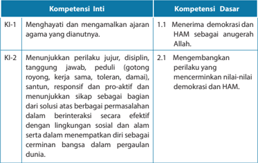

Tabel ini berisi informasi tentang kompetensi inti (KI) dan kompetensi dasar (KD) yang terkait dengan demokrasi dan HAM. Topik utama tabel adalah pembentukan karakter dan perilaku yang sesuai dengan nilai-nilai demokrasi dan HAM. Kolom KI-1 membahas tentang menghargai dan memahami ajaran agama yang dianutnya, sedangkan KI-2 fokus pada menunjukkan perilaku jujur, disiplin, tanggung jawab, peduli, santun, responsif, dan proaktif dalam berinteraksi secara efektif dengan lingkungan sosial dan alam. KD 1.1 dan KD 2.1 masing-masing menjelaskan bagaimana menerima demokrasi dan HAM sebagai anugerah Allah serta bagaimana mengembangkan perilaku yang mencerminkan nilai-nilai demokrasi dan HAM. Pola penting yang terlihat adalah hubungan antara kompetensi inti dan dasar, serta bagaimana mereka saling berkaitan dalam pembentukan karakter yang baik.

 

---
## 📄 Halaman 66

---
**📊 Tabel**

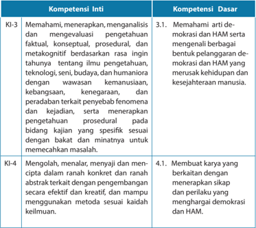

Tabel ini berisi informasi tentang kompetensi inti (KI) dan kompetensi dasar (KD) yang berkaitan dengan pemahaman, analisis, dan pengetahuan ilmu pengetahuan, teknologi, budaya, dan humaniora. Topik utama tabel adalah pembelajaran dan pengembangan keterampilan dalam berbagai aspek kehidupan. Kolom KI-3 berfokus pada pemahaman dan menganalisis pengetahuan faktil, konseptual, prosedural, dan metakognitif tentang berbagai bidang ilmu pengetahuan, teknologi, budaya, dan humaniora. Sementara itu, KD-3 menekankan pentingnya memahami arti demokrasi dan HAM, serta bagaimana mereka membentuk dan memperjuangkan demokrasi dan HAM yang merujuk pada kehidupan dan kesejahteraan manusia. Kolom KI-4 berfokus pada kreativitas dan keterampilan dalam mengekspresikan ide-ide abstrak melalui berbagai bentuk karya, seperti menulis, menyanyi, dan menari. KD-4 mencakup keterampilan membuat karya yang berkontribusi positif bagi masyarakat, termasuk menerapkan sikap dan perilaku yang menghormati demokrasi dan HAM. Pola penting yang terlihat adalah hubungan antara pemahaman dan keterampilan dalam berbagai aspek kehidupan, serta bagaimana mereka saling mendukung satu sama lain untuk mencapai tujuan demokrasi dan HAM.

### Indikator:

- Mendiskusikan bagian Alkitab yang menulis tentang  demokrasi dan hak asasi manusia.
- Menjelaskan tugas dan tanggung jawab remaja Kristen dalam mewujudkan demokrasi dan hak asasi manusia.
- Merancang  dan  melaksanakan  kegiatan  sebagai  wujud  kepedulian terhadap HAM.

 

---
## 📄 Halaman 67

### A.  Pengantar

Pada  bagian  pertama  pembelajaran  topik  satu  peserta  didik  telah  belajar mengenai  pengertian  dan  praktik  demokrasi  dan  HAM  di  Indonesia  serta pembahasan  secara  umum  mengenai    demokrasi  dan  HAM  menurut  Alkitab. Penjelasan  yang  lebih  rinci  dari  perspektif  iman  Kristen  akan  dibahas  pada pelajaran ini dan pelajaran berikutnya. Pada pembahasan topik kedua  peserta didik  dibimbing  untuk  mendalami  praktik  demokrasi  dan  HAM  di  Indonesia termasuk  berbagai  pelanggaran  demokrasi  dan  HAM  yang  terjadi.  Pada  topik pertama    telah  dibahas  bahwa  bangsa  Indonesia  mengalami  masa-masa  yang cukup pahit dan kelam di bidang demokrasi dan HAM. Penjajahan selama berabadabad dan pemerintahan yang otoriter menyebabkan bangsa Indonesia terpuruk dalam penindasan HAM. Kelamnya praktik demokrasi dan HAM di Indonesia perlu dipelajari oleh generasi muda Kristen, sehingga mereka tidak akan mengulangi kesalahan  yang  sama  yang  dilakukan  oleh  para  pendahulunya.  Tanggung jawab sebagai remaja Kristen hendaknya memperoleh porsi yang cukup untuk dibelajarkan. Menghindari tumpang tindih materi dengan mata pelajaran PPKn maka  pemaparan  lebih  diarahkan  pada  ajaran  iman  Kristen,  yaitu  bagaimana remaja Kristen belajar untuk menjadi pelaku demokrasi dan HAM, menerima dan menghargai sesamanya sebagai manusia bermartabat dan makhluk mulia ciptaan Allah.

### B. Demokrasi dan Hak Asasi Manusia di Indonesia

Indonesia dibentuk sebagai sebuah negara yang demokratis. Hak asasi manusia diakui seperti yang tersirat dalam rumusan Pancasila. Sila kedua, 'Kemanusiaan yang adil dan beradab' , sila keempat ' Kerakyatan yang di  pimpin oleh hikmat kebijaksanaan dalam permusyawaratan perwakilan' dan sila kelima 'Keadilan sosial bagi seluruh rakyat Indonesia' sebenarnya sudah mencakup ayat-ayat yang berkaitan dengan hak asasi manusia yang tertulis dalam  Deklarasi Universal Hak Asasi Manusia.

Namun  sekadar  pernyataan  bahwa  negara  Indonesia  berdiri  di  atas  dasar negara Pancasila dan dipandu oleh UUD 1945 tidak dengan sendirinya menjamin perwujudan  hak asasi manusia. Demokrasi dan HAM tidak dapat terwujud secara otomatis  namun  melalui  sebuah  proses  yang  panjang  dalam  pembelajaran, pembiasaan, serta penghayatan.

'Laporan Tahunan Tentang Praktik Hak Asasi Manusia 2008' yang dikeluarkan oleh Biro Demokrasi, Hak Asasi Manusia, dan Perburuhan, Kedutaan Besar Amerika Serikat di Indonesia, menyatakan bahwa:

 

---
## 📄 Halaman 68

- kebebasan  dasar  telah  berkembang  sejak  1999,  dan  sepanjang  tahun  ini pemerintah telah mengambil langkah berarti dalam memajukan hak-hak asasi manusia dan memperkuat demokrasi termasuk sidang peradilan terbuka dan putusan hukum terhadap 13 anggota marinir sehubungan dengan peristiwa bentrokan Mei 2007 di   Alastlogo;
- beberapa penuntutan terhadap pejabat tinggi atas dakwaan  korupsi, pengakuan dan penerimaan Presiden Yudhoyono terhadap kesimpulan dan rekomendasi  dari  Komisi  Kebenaran  dan  Persahabatan  Indonesia/  TimorLeste bahwa aparat keamanan Indonesia secara kelembagaan bertanggung jawab atas pelanggaran hak asasi manusia di tahun 1999 dan harus menjalani pelatihan peningkatan hak asasi manusia; serta
- Mahkamah Agung memperkuat putusan hukuman 20 tahun penjara terhadap Pollycarpus Budihari Priyanto atas pembunuhan Munir Said Thalib pada tahun 2004.
Laporan  tahunan  pada  tahun  2008  tersebut,  menggambarkan  suramnya kondisi Hak Asasi Manusia di Indonesia. Kondisi tersebut nampaknya masih sama jika kita pelajarari berita tahun 2014 dibawah ini.

### Penegakan HAM di Indonesia Memprihatinkan

Banyak kasus mandek dan pelaku pelanggar HAM semakin meluas.

Dalam  beberapa  tahun  terakhir,  penegakan  dan  pemenuhan  HAM  di Indonesia semakin memprihatinkan. Keprihatinan itu terungkap dari laporan yang dipaparkan tiga lembaga HAM nasional yaitu Komnas HAM, Komnas Perempuan, dan Komisi Perlindungan Anak Indonesia (KPAI) dalam sidang HAM yang berlangsung di Jakarta.

Menurut  Ketua  Komnas  HAM,  Siti  Noor  Laila,  dalam  sidang  itu  masing masing lembaga HAM mengangkat tema khusus. Komnas HAM menyoroti isu intoleransi beragama, Komnas Perempuan menangkat tema pemiskinan dan kekerasan terhadap perempuan, dan KPAI menyoroti kekerasan seksual dan pornografi   anak.

Laila menjelaskan berbagai tema yang diangkat itu mengacu  pada pertimbangan tertentu.  Misalnya, Komnas HAM mengangkat isu intoleransi beragama yang menimpa jamaah Ahmadiyah, Syiah, dan sebagian penganut Kristen.

 

---
## 📄 Halaman 69

Negara seolah tidak hadir dalam penyelesaian masalah beragama. Padahal, kebebasan  beragama  dan  keyakinan  merupakan  hak  yang  tidak  dapat dikurangi dalam kondisi apapun. Komnas HAM mencatat kasus pelanggaran HAM yang berkaitan dengan kebebasan beragama dan keyakinan cenderung meningkat, jumlahnya mencapai ratusan.

Laila menuturkan pelaku pelanggar HAM semakin meluas. Jika pada masa Orde Baru pihak yang banyak dilaporkan ke Komnas HAM adalah TNI, tapi sekarang  polisi,  pemerintah  daerah  (Pemda)  dan  swasta.  Menurutnya, semakin besar kewenangan di sebuah institusi maka makin banyak lembaga itu  diadukan  masyarakat  ke  Komnas  HAM.  'Terjadi  penyebaran  pelaku pelanggar HAM,' katanya dalam jumpa pers tentang Sidang HAM 3 di Jakarta, Kamis (12/12).

Lebih lanjut Laila mengatakan selama ini sebagian besar kasus pelanggaran HAM berat belum diselesaikan secara baik oleh pemerintah. Padahal, Komnas HAM sudah berkali-kali  mengajak  Kejaksaan  Agung  dan  Menkopolhukam untuk  duduk  bersama  membahas  penuntasan  pelanggaran  HAM  berat. Ironisnya, sampai saat ini Komnas HAM belum mendapat tanggapan yang memuaskan.  Ia mengatakan  Kejaksaan Agung  sudah  bersedia untuk membahas  masalah  itu  secara  bersama,  tapi  Menkopolhukam  bersikap sebaliknya.  Menurutnya,  pembahasan  itu  perlu  dilakukan  guna  mencari solusi atas penuntasan kasus pelanggaran HAM berat.

Wakil Ketua Komnas HAM, Dianto Bachriadi, mengatakan penegakan HAM di Indonesia saat ini memprihatinkan. Sebab, jumlah pelanggaran HAM dari tahun ke tahun tidak menurun tapi meningkat. Misalnya, tahun lalu jumlah pengaduan yang diterima Komnas HAM sekitar lima ribu, namun sekarang jumlahnya menjadi enam ribu. Dari pengaduan itu paling banyak berkaitan dengan kasus agraria. Kemudian pelaku pelanggar HAM bukan lagi aparatur negara tapi juga Pemda dan kelompok masyarakat sipil tertentu. 'Kondisi itu sudah  memprihatinkan  dan  patut  disebut  Indonesia  dalam  darurat  HAM,' tegasnya.

Menambahkan  Laila,  Dianto  menyebut  tujuh  kasus  pelanggaran  HAM berat yang sudah diselidiki Komnas HAM mandek di Kejaksaan Agung. Dari hasil  penyelidikan yang dilakukan Komnas HAM sejak tahun 2000, sampai sekarang hanya ada dua kasus yang sudah digelar peradilannya. Menurutnya hal itu menunjukkan pemerintah tidak serius menyelesaikan masalah HAM.

 

---
## 📄 Halaman 70

Padahal, tanpa penegakan HAM arah pembangunan Indonesia diyakini tidak maksimal. 'Kalau  kita  ingin  menuju  kondisi  Indonesia  yang  lebih  baik  ya selesaikanlah kasus-kasus pelanggaran HAM,' tandasnya.

Ketua Komnas Perempuan, Yuniyanti Chuzifah, menyoroti kekerasan terhadap  perempuan.  Komnas  Perempuan  mendorong  agar  kekerasan terhadap  perempuan  dikategorikan  sebagai  kejahatan  HAM  berat.  Sebab, hal itu dilakukan secara masif dan sistematis serta dampaknya luas. Misalnya, sebagian  besar  pekerja  migran  Indonesia  adalah  kaum  perempuan  dan selama  ini  perlindungannya  minim.  Sehingga,  pekerja  migran  Indonesia kerap mendapat tindak kekerasan di negara penempatan.

Selain itu, Yuniyanti melihat PJTKI yang bertugas mengirim pekerja migran seolah lepas dari tanggungjawab. Akhirnya, pekerja migran Indonesia banyak yang menjadi korban. Oleh karenanya pemerintah perlu melakukan tindakan tegas terhadap PJTKI yang lalai menjalankan kewajibannya. 'Korban migran ini lebih parah dari korban perang, tapi tak tersentuh,' keluhnya.

Yuniyanti mencatat jumlah kekerasan terhadap perempuan semakin meningkat, mencapai 30-an kasus kekerasan setiap hari. Begitu pula dengan regulasi  yang  diskriminatif,  dalam  tiga  tahun  terakhir  jumlahnya  semakin banyak. Jika tahun 2010 jumlah regulasi diskriminatif yang tersebar di seluruh Indonesia hanya seratusan tapi sekarang mencapai lebih dari tiga ratus.

Ketua KPAI, Badriyah Fayumi, mengatakan kekerasan seksual dan pornografi terhadap  anak  perlu  mendapat  perhatian  serius  dari  semua  pihak.  Sebab, sudah banyak kasus yang berkaitan dengan kekerasan seksual dan pornografi anak.  Misalnya,  bayi  perempuan berumur sembilan bulan menjadi korban kekerasan  seksual  pamannya.  Bayi  malang  itu  diperkosa  dan  disodomi. Kemudian, anak berumur tujuh tahun melakukan kekerasan seksual terhadap temannya yang masih berusia balita. KPAI mencatat kasus kekerasan seksual dan pornografi   saat ini jumlahnya meningkat. 'Maka itu, hari ini Indonesia bisa dikatakan darurat kekerasan seksual anak,' ucapnya.

Menurut Badriyah, mudahnya mengakses konten pornografi   menjadi pemicu terjadinya  kekerasan  seksual  dan  pornografi    anak.  Kondisi  lingkungan terdekat anak juga berpengaruh besar terhadap perlindungan anak. Parahnya,  kekerasan  seksual  dan  pornografi    anak,  terutama  yang  terjadi secara online belum  memiliki  payung  hukum  yang  tepat.  Padahal,  jumlah kasus itu banyak dilakukan secara online .

 

---
## 📄 Halaman 71

Misalnya,  komunikasi  antara  pelaku  dan  korban  dilakukan  lewat online , tapi  kejahatan dilakukan secara offl ine .  Atau  komunikasi dan kejahatan itu dilakukan  dengan  cara online .  'Sayangnya  kasus  itu  tak  tersentuh,  kami belum mendengar ada penuntasannya,' ujarnya.

Badriyah melihat ada jarak antara perangkat hukum yang memadai dengan perlindungan anak. Kemudian, aparat penegak hukum di tingkat pusat dan daerah belum peka terhadap upaya perlindungan anak, baik itu penanganan kasus atau pemulihan bagi korban dan pelaku. Ia pun merasa lingkungan terdekat  anak  saat  ini  dalam  posisi  tidak  ketat  melindungi  anak.    Malah, Badriyah melanjutkan, korban kekerasan seksual mendapat diskriminasi dan dikeluarkan dari sekolah. Untuk mencegah hal tersebut sekaligus menjaga pemenuhan hak anak, maka kebijakan  sekolah ramah anak harus segera diterapkan.  'Sehingga  proses  penyelenggaraan  pendidikan  diselaraskan antara perlindungan anak dan kurikulum pendidikan,' paparnya.

(diunduh dari www.hukumonline.com pada tanggal 10 Februari 2016)

Upaya mewujudkan demokrasi dan HAM di sebuah negara tidaklah semudah membalikkan telapak tangan. Laporan di atas jelas menunjukkan masih banyak pekerjaan rumah yang harus dijalankan oleh bangsa Indonesia, supaya  benarbenar dapat menunjukkan kerinduan kita akan sebuah negara dan bangsa yang benar-benar menjunjung tinggi demokrasi dan HAM  sesuai dengan apa yang dirumuskan pada Pancasila dan UUD 1945.

### C. Pergulatan Bangsa Indonesia di Bidang  Demokrasi dan Hak Asasi Manusia

Ketika  Undang-Undang  Dasar  1945  disusun,  muncul  perdebatan  tentang tempat hak asasi manusia di dalam UUD. Moh. Hatta mengusulkan agar hak asasi manusia  dimuat  secara  jelas  di  dalam  UUD  1945.  Sementara  Soepomo,  yang menganut paham integralistik yang antara lain mengutamakan negara kesatuan menentang hal itu. Menurut Soepomo, hak asasi manusia mengutamakan hak-hak individu yang akan mengancam kesatuan bangsa. Akibatnya, hak asasi manusia dipandang sebagai musuh yang akan memecah belah bangsa Indonesia. Seperti yang dikatakan oleh Adnan Buyung Nasution dalam makalahnya,

 

---
## 📄 Halaman 72

Secara  sosial,  HAM  dikualifi  kasikan  sebagai  paham  individualistik  yang bertentangan  dengan  watak  dan  kepribadian  bangsa  Indonesia  yang kolektivistik;  secara  politik  HAM  distigmatisasi  sebagai  paham  liberalistik yang bertentangan dengan Pancasila; dan secara budaya diajukan argumen partikularistik bahwa bangsa Indonesia memiliki hak-hak asasi sendiri (khas) yang  didasarkan  pada  budaya  bangsa.  Pemikiran  partikularistik  tersebut dipakai  untuk  menolak  watak  universal  dari  HAM  yang  secara  efektif memungkinkan dilahirkannya kebijakan politik, termasuk di bidang hukum, yang mengabaikan hak-hak asasi manusia.

Dasar dari gagasan ini, menurut Buyung, yang menjadi sumber pengabaian hak-hak  asasi  manusia  di  Indonesia.  Buyung  menambahkan,  bagi  saya sendiri, kecenderungan semacam itu yang juga mewarnai zaman Orde Lama dimungkinkan terjadi karena fi  losofi   kenegaraan, staatssidee integralistik dari Soepomo, yang menjiwai UUD 1945 waktu itu, yang pada dasarnya menolak hak-hak asasi manusia, kendati di dalamnya ada beberapa pasal mengenai hak-hak  warga  negara.  Seperti  kita  ketahui,  hasil  dari  kecenderungan itu  adalah  absolutisme  kekuasaan  negara  yang  dipegang  kepala  negara (presiden).

(Adnan Buyung Nasution, ' Implementasi Perlindungan Hak Asasi Manusia dan Supremasi  Hukum , '   dalam  makalah  pada 'Seminar  Pembangunan  Hukum Nasional VIII' ,  Badan Pembinaan Hukum Nasional, Departemen Kehakiman dan Hak Asasi Manusia RI, Denpasar, 14-18 Juli 2003) .

Ketika  kekuasaan  negara  dimutlakkan  dalam  bentuk  kekuasaan  kepala negara,  maka  presiden  dapat  melakukan  apa  saja,  bahkan  hingga  tindakantindakan yang tidak demokratis dan melanggar hak asasi manusia, tanpa dikenai sanksi apapun. Itulah sebabnya kita menemukan berbagai pelanggaran terhadap asas  hak asasi manusia baik di masa Orde Lama, Orde Baru, bahkan hingga Orde Reformasi sekarang ini.

Masa Orde Baru yang menggantikan pemerintahan Soekarno, dimulai dengan pertumpahan darah. Ratusan ribu orang, bahkan sebagian pihak mengklaim lebih dari  satu  juta  orang,  tewas  dibunuh  tanpa  proses  peradilan  yang  jelas.  Mereka dibunuh karena dituduh sebagai komunis atau simpatisan komunis.

Pertumpahan  darah  di  masa  Orde  Baru  berlanjut  terus  hingga  terjadinya 'petrus' atau 'penembakan misterius' pada sekitar tahun 1982-1984. Sekitar 8.000 orang yang dianggap sebagai 'preman' atau kriminal, ditembak mati, juga tanpa proses peradilan yang jelas.

 

---
## 📄 Halaman 73

### BBC menurunkan berita berikut ini:

Bathi Mulyono adalah korban selamat dari kejaran penembak misterius, di era tahun 1980-an.

'Rumah saya, rumah istri saya dan keluarga saya digrebek oleh orang-orang bertopeng  menggunakan  senjata  laras  panjang,  dan  dimanapun,  saya dikejar. '

'Saya  sempat  bersembunyi  di  beberapa  tempat.  Paling  lama  di  Gunung Lawu selama satu setengah tahun. Di Semarang, mobil hardtop saya kacanya pecah semua ditembaki.'

'Di Blok M Jakarta, saya sempat ditembak tapi tidak kena' . Sangat luar biasa mengerikan keadaan ketika itu, kata Bathi Mulyono.

Sebelumnya,  ia  mengaku  keluar  masuk  penjara  karena  sejumlah  kasus perkelahian.

Penembakan  misterius  atau  dikenal  dengan  sebutan  petrus  merupakan kebijakan pemerintah Orde Baru untuk menekan angka kejahatan dengan membunuh para preman.

Penangkapan, penghilangan orang, penindasan terhadap kebebasan berpendapat, dan berbagai pelanggaran hak asasi manusia terus terjadi di bawah pemerintahan Orde Baru. Kontrol terhadap pers juga terjadi sangat ketat. Media pemberitaan yang dipandang merugikan pemerintah  khususnya surat kabar dan majalah dicabut ijin terbitnya. Tercatat harian Indonesia Raja yang sempat terbit kembali pada awal Orde Baru, Pedoman , Sinar Harapan , Kompas , majalah Ekspres , majalah Tempo ,  ditutup  selama  beberapa  hari,  atau  bahkan  selama-lamanya. Masyarakat banyak hidup dalam kekhawatiran dan ketakutan. Berbagai bidang kegiatan ekonomi juga dikuasai oleh keluarga penguasa. Berbagai persoalan yang terjadi dalam berbagai bidang kehidupan di mana rakyat cenderung kehilangan hak-haknya telah memicu gerakan reformasi. Pada akhirnya, terjadilah gerakan 'Reformasi' yang dirintis oleh para mahasiswa, pemuda, dan berbagai lembaga swadaya masyarakat pada tahun 1997-1998.

Di  masa  Orde  Reformasi,  pelanggaran  prinsip-prinsip  hak  asasi  manusia pun masih terjadi. Pada 7 Desember 2004, tokoh perjuangan hak asasi manusia Indonesia, Munir Said Thalib dibunuh dengan racun arsenic oleh sebuah konspirasi yang hingga kini belum terungkap jelas.  Tokoh utama dan otaknya diduga hingga kini masih menikmati kebebasan dan tidak tersentuh oleh hukum.

 

---
## 📄 Halaman 74

Rakyat  Sidoarjo,  Jawa  Timur  menderita  sejak  27  Mei  2006  karena  luapan lumpur akibat pengeboran gas yang salah oleh PT Lapindo Brantas. Masyarakat di tiga kecamatan telah kehilangan tempat tinggal dan tanah mereka. Kesehatan dan kehidupan mereka terganggu dan bahkan rusak sama sekali. Sampai saat ini penanganan terhadap kasus ini belum memperoleh ketuntasan.

Sejak bergulirnya reformasi, Indonesia telah mengalami empat kali pergantian presiden,  yaitu  Presiden  B.J.  Habibie  dalam  Kabinet  Reformasi  pembangunan, Presiden Abdurrahman Wahid sebagai presiden hasil pemilu tahun 1999 dengan kabinet persatuan nasional, kemudian Presiden Abdurrahman Wahid digantikan oleh  Presiden  Megawati  dengan  Kabinet  Gotong  Royong.  Pada  pemilihan umum tahun 2004 Presiden Susilo Bambang Yudhoyono terpilih menggantikan Megawati Soekarno Puteri. Beliau  lebih dikenal dengan sebutan Presiden SBY. Ia  memerintah  selama  dua  periode,  yaitu  20  Oktober  2004  sampai  dengan 20  Oktober  2014.  Presiden  SBY  adalah  presiden  pertama  yang  dihasilkan  dari pemilhan secara langsung oleh rakyat tanpa melalui DPR. Nama kabinet SBY adalah Kabinet  Indonesia  Bersatu.  Setelah  masa  pemerintahan  Presiden  SBY  berakhir, pada pemilu presiden tahun 2014  rakyat telah memilih Joko Widodo, mantan Gubernur DKI Jakarta sebagai Presiden RI yang baru, beliau lebih dikenal dengan sebutan Presiden Jokowi. Nama kabinet bentukan Jokowi adalah Kabinet Kerja. Pemikiran Jokowi yang terkenal adalah: Nawacita, Menurut Wikipedia, Nawacita adalah istilah umum yang diserap dari bahasa sansekerta nawa (sembilan) dan cita (harapan, agenda, keinginan). Nawacita merupakan visi-misi Joko Widodo dan Yusuf  Kalla  berisi  agenda  pemerintahan  pasangan  itu.  Dalam  visi-misi  tersebut dipaparkan sembilan agenda pokok untuk melanjutkan semangat perjuangan dan cita-cita Bung Karno yang dikenal dengan istilah Trisakti, yakni berdaulat secara politik,  mandiri  dalam  ekonomi,  dan  berkepribadian  dalam  kebudayaan.  Salah satu agenda dalam Nawacita, yakni revolusi karakter bangsa atau lazim disebut revolusi  mental.  Arti  dari  revolusi  mental  adalah  menggalakkan  pembangunan karakter  untuk  mempertegas  kepribadian  dan  jati  diri  bangsa  sesuai  dengan amanat Trisakti Bung Karno. Untuk mencapai hidup sejahtera, Jokowi minta rakyat bekerja keras.

Pada  masa  kini,  pembangunan  nasional  dilaksanakan  tidak  lagi  seperti  di zaman Orde Baru yang dikenal dengan nama Rencana Pembangunan Lima Tahun (Repelita), melainkan dengan nama Program Pembangunan Nasional (Propenas). Pemerintah  di  era  reformasi  memiliki  tekad  untuk  mengadakan  demokratisasi dalam  segala  bidang  kehidupan.  Di  antara  bidang  kehidupan  yang  menjadi sorotan  utama  untuk  direformasi  adalah  bidang  politik,  ekonomi,  dan  hukum.

 

---
## 📄 Halaman 75

Reformasi  ketiga  bidang  tersebut    dilakukan  sekaligus  karena  reformasi  politik yang  berhasil  mewujudkan  demokratisasi  politik  dengan  sendirinya  akan  ikut mendorong proses demokrasi ekonomi. Untuk mewujudkan praktik demokrasi yang sesuai dengan tuntutan reformasi maka berbagai peraturan dan UU yang tidak sesuai dengan jiwa reformasi telah direvisi. Ada beberapa perubahan yang mencolok yaitu:

- Pemilihan  umum  yamg  lebih  demokratis,  Pemilu  Presiden  dan  Legislatif dilakukan secara langsung oleh rakyat selain memilih Presiden, Wakil Presiden, anggota  dewan  (DPR/DPRD),  juga  memilih  anggota  Dewan  Perwakilan Daerah  (DPD).
- Partai  politik  yang  lebih  mandiri  dan  terdiri  dari  banyak  partai  politik dibandingkan  dengan  zaman  sebelum  reformasi  dimana  ada  pembatasan jumlah  partai  politik.  Di  zaman  kini,  partai  politik  yang  boleh  mengikuti pemilu hanyalah partai politik yang lolos Electoral Threshold artinya ambang batas parlemen. Dalam Undang-Undang Nomor 8 Tahun Tahun 2012, ambang batas parlemen ditetapkan sebesar 3,5% dan berlaku nasional untuk semua anggota DPR dan DPRD. Setelah digugat oleh 14 partai politik, Mahkamah Konstitusi kemudian menetapkan ambang batas 3,5% tersebut hanya berlaku untuk DPR dan ditiadakan untuk DPRD. Electoral Threshold ditetapkan agar menciptakan sistem pemilihan umum yang baik.
- Pengaturan HAM termasuk didalamnya membentuk lembaga HAM .
- Kebebasan pers dijamin penuh oleh pemerintah melalui UU.
- Lembaga  demokrasi  lebih  berfungsi,  pemilihan  pejabat-pejabat  birokrasi dilakukan  secara  langsung  (pilkada),  yaitu  pilkada  gubernur,  walikota,  dan bupati.
- Adanya  badan  khusus  penyelenggara  pemilu,  yaitu  KPU  sebagai  panitia, dan Panwaslu sebagai pengawas proses pemilu. Belum lagi tim pengamat independen  yang  dibentuk  secara  swadaya.  Di  sini  dibutuhkan  birokrasi tersendiri untuk menyelenggarakan pemilu, meskipun pada masa Reformasi Sekalipun    masih  terjadi  banyak  pelanggaran  Demokrasi  dan  HAM,  antara lain  pemahaman  aparat  pemerintah  terhadap  hak  asasi,  baik  di  lembaga eksekutif,  termasuk  aparat  penegak  hukum  maupun  di  lembaga  legislatif menjadi  hambatan  utama  bagi  pelaksanaan  instrumen-instrumen  HAM internasional  yang  sudah  diratifi  kasi.  Pemahaman  yang  lemah  terhadap hak asasi manusia, dan lemahnya komitmen untuk menjalankan kewajiban

 

---
## 📄 Halaman 76

menghormati,  melindungi,  dan  memenuhi  hak  asasi  manusia  berdampak pada meluasnya pelanggaran HAM. Hal itu terjadi khususnya terhadap warga yang lemah secara ekonomi, sosial,  dan  politik.  Melalui  berbagai  peristiwa yang diberitakan di media massa maupun media sosial, nampak aturan hukum yang cenderung  diskriminatif terhadap kaum miskin. Pada bulan Februari ada dua buah kasus kekerasan yang dilakukan oleh anggota DPR terhadap orang yang bekerja untuk mereka (Liputan 6.com, tanggal 04, 06,12,16 dan 18 Februari 2016, dan tanggal 01-03 Maret 2016).

Jadi,  dapat  dikatakan  bahwa  perjalanan  demokrasi  di  Indonesia  masih akan  berlangsung  panjang  demi  menjamin  tercapainya  keadilan,  kesempatan menyuarakan pendapat dan mengawasi jalannya pemerintahan. Demokrasi hanya dapat  terwujud  apabila  demokrasi  sebagai  prinsip  dan  acuan  hidup  bersama antarwarga  negara  dengan  negara  dijalankan  dan  dipatuhi  oleh  semua  pihak. Perwujudan  demokrasi  bukan  hanya  tanggung  jawab  pemerintah  dan  negara semata-mata melainkan merupakan bagian dari tanggung jawab warga negara.

Masih banyak pekerjaan rumah yang harus dijalankan oleh bangsa Indonesia, supaya  kita benar-benar dapat mewujudkan negara dan bangsa yang demokratis, sesuai  dengan  apa  yang  dirumuskan  oleh  Pancasila.  Sejumlah  penelitian  (lihat misalnya,  Cohen  2006;  Orviska,  Caplanova,  &  Hudson,  2014)  menunjukkan bahwa  berjalannya  demokrasi  dengan  baik  terkait  erat  dengan  kesejahteraan masyarakat.  Dalam  situasi  dimana  sangat  banyak  penduduk  yang  miskin  dan terjadi kesenjangan yang besar antara penduduk kaya dengan penduduk miskin, demokrasi sulit  terwujud.  Mengapa  begitu?  Semua  terjadi  karena  kesenjangan antara  kelompok  kaya  dan  kelompok  miskin  muncul  akibat  ada  kelompok penguasa yang membiarkan kesenjangan ini untuk kepentingan mereka.

Kondisi Indonesia yang masih dikategorikan memiliki banyak korupsi termasuk  hal  yang  memprihatinkan.  Pemerintah  dan  rakyat  Indonesia  perlu bekerja  keras  untuk  membasmi  korupsi  yang  sudah  dianggap  terstruktur  dan massif  (Kompas,  September  2014).  Rencana  Bank  Dunia  dalam  membangun kemitraan  dengan  Indonesia  menunjukkan  bahwa  tingkat  korupsi  yang  tinggi menjadi hal yang harus ditangani oleh pemerintah Indonesia agar dapat menjamin masyarakat Indonesia yang sejahtera. Kondisi bahwa 40% masyarakat Indonesia hidup di ambang kemiskinan dengan pengeluaran sebesar 1,5 dolar Amerika per hari  sangatlah  memprihatinkan.  Inilah  sebagian  hal-hal  yang  harus  dibereskan sebelum demokrasi berjalan dengan baik di negara Indonesia.

Diamond dan Morlino (2004) yang meneliti pemerintahan di berbagai negara menyimpulkan bahwa ada empat kriteria untuk mengetahui apakah demokrasi di suatu negara sudah berjalan dengan baik.

 

---
## 📄 Halaman 77

- Pertama, ada  hak  pilih  pada  orang  dewasa  yang  dianggap  memenuhi persyaratan untuk memilih wakil-wakil rakyat.
- Kedua , pemilihan terjadi secara berulang, kompetitif, adil, dan layak.
- Ketiga ,  partai politik yang terlibat dalam pemilihan umum terdiri lebih dari satu.
- Keempat, ada sejumlah sumber informasi yang dapat diakses oleh masyarakat.
Empat kriteria tersebut telah dipenuhi oleh pemerintah dan bangsa Indonesia, meskipun  terdapat  penyimpangan-penyimpangan,  namun  kita  terus  berjuang supaya demokrasi dapat benar-benar terwujud.

### D.  Memupuk Sikap Demokratis Sejak Dini

Untuk  mencapai  demokrasi,  seluruh  pihak  yang  terlibat  harus  sepakat bahwa  keadilan  harus  ditegakkan  dan  kepedulian  terhadap  sesama  mewarnai keputusan  yang  diambil  dan  tindakan  yang  dilakukan  (Cohen,  2006).  Sikap demokratis tidak tumbuh dengan sendirinya, namun harus dipupuk sejak dini. Ini  diawali dengan menumbuhkan sikap mengasihi sesama, tidak menganggap diri  lebih  istimewa daripada orang lain. Sejak dini orang tua perlu menerapkan pola asuh yang demokratis, yaitu yang memberi kesempatan kepada anak untuk menyuarakan pendapat mereka yang mungkin saja berbeda dari pendapat orang tua. Penghargaan terhadap pendapat anak akan memupuk rasa percaya diri anak yang berakibat  pada  munculnya  rasa  menghargai  orang  lain  juga  (Baumeister, Campbell, Krueger, & Vohs, 2003).

Berdasarkan berbagai pembahasan di atas kita dapat melihat bahwa praktikpraktik  hak  asasi  manusia  di  negara  kita  memang  masih  jauh  dari  yang  kita idam-idamkan.  Pemerintah  belum  sepenuhnya  mewujudkan  tugasnya  dalam memenuhi demokrasi dan HAM bagi rakyat.  Berbagai  pelanggaran    hak  asasi manusia masih terus terjadi. Apabila di masa Perjanjian Lama Allah memerintahkan Musa mendirikan kota-kota perlindungan, sehingga orang yang tidak bersalah dapat hidup dengan aman, maka di Indonesia hal itu masih jauh dari kenyataan. Banyak orang yang belum dapat menikmati hidup yang aman dengan jaminan pemerintah  atas  hak-hak  asasi  mereka.  Kita  terus  berharap  suatu  saat  kelak seluruh  rakyat  Indonesia  akan  memperoleh  haknya  sebagai  manusia  makhluk mulia ciptaan Allah.

### Bagaimana Jika Seseorang Melakukan Pelanggaran Tanpa Sengaja?

Dalam kaitannya dengan pelanggaran yang dilakukan secara tidak sengaja, Kitab Bilangan 35:9-34, memuat perintah Allah kepada Musa untuk membangun

 

---
## 📄 Halaman 78

kota-kota perlindungan apabila mereka telah tiba di Kanaan. Tujuan membangun kota  tersebut  supaya  dapat  dijadikan  tempat  tinggal  bagi  mereka  yang  secara tidak sengaja telah menghilangkan nyawa seseorang.

Pemahaman  tentang  'kota-kota  perlindungan'  seperti  yang  dibicarakan dalam Bilangan 35:9-34  menjamin  perlakuan  yang  lebih  adil  bagi  orang-orang yang terlibat dalam kasus seperti di atas. Dasar keadilan inilah yang dapat kita lihat dalam hukum modern, ketika hakim mempertimbangkan berbagai sisi dari sebuah kasus kriminalitas. Sebagai contoh, kasus Nenek Minah yang mencuri tiga butir kakao seperti berikut ini:

### Mencuri Tiga Buah Kakao, Nenek Minah Dihukum 1 Bulan 15 Hari

Nenek Minah (55) tak pernah menyangka perbuatan isengnya memetik tiga buah kakao di perkebunan milik PT Rumpun Sari Antan (RSA) akan menjadikannya sebagai pesakitan di ruang pengadilan. Bahkan untuk perbuatannya itu dia diganjar 1 bulan 15 hari penjara dengan masa percobaan tiga bulan.

Ironi  hukum  di  Indonesia  ini  berawal  saat  Minah  sedang  memanen  kedelai  di lahan garapannya di Dusun Sidoarjo, Desa Darmakradenan, Kecamatan Ajibarang, Banyumas, Jawa Tengah, pada 2 Agustus lalu. Lahan garapan Minah ini juga dikelola oleh PT RSA untuk menanam kakao.

Ketika sedang asik memanen kedelai, mata tua Minah tertuju pada tiga buah kakao yang sudah ranum. Dari sekadar memandang, Minah kemudian memetiknya untuk disemai sebagai bibit di tanah garapannya. Setelah dipetik, tiga buah kakao itu tidak disembunyikan melainkan digeletakkan begitu saja di bawah pohon kakao.

Dan  hari  ini,    Kamis  (19/11/2009),  majelis  hakim  yang  dipimpin  Muslih  Bambang Luqmono, SH memvonisnya 1 bulan 15 hari dengan masa percobaan selama tiga bulan, 362 KUHP tentang pencurian.

Hakim Menangis

Pantauan  detikcom,  suasana  persidangan  Minah  berlangsung  penuh  keharuan. Selain menghadirkan seorang nenek yang miskin sebagai terdakwa, majelis hakim juga terlihat  agak  ragu  menjatuhkan hukum. Bahkan ketua majelis hakim, Muslih Bambang Luqmono SH, terlihat menangis saat membacakan vonis.

'Kasus ini kecil, namun sudah melukai banyak orang,' ujar Muslih.

Vonis hakim 1 bulan 15 hari dengan masa percobaan selama tiga bulan disambut gembira keluarga, tetangga, dan para aktivis LSM yang mengikuti sidang tersebut. Mereka  segera  menyalami  Minah  karena  wanita  tua  itu  tidak  harus  merasakan dinginnya sel tahanan.

Sumber: detiknews.com , diunduh 14 April 2010

 

---
## 📄 Halaman 79

Mengapa sang hakim menangis? Tampaknya ia terharu, mengapa seorang nenek tua seperti Minah harus diajukan ke pengadilan karena mencuri buah kakao. Jelas ia ingin menanam kakao itu. Mungkin ia ingin bangkit dari kemiskinannya. Tindakan  nenek  Minah  memang  melanggar  hukum,  tapi  ia  melakukan  karena kemiskinan dan bukan karena ketamakan atau profesi sebagai pencuri. Namun demikian, tindakan mencuri tidak dapat dibenarkan atas alasan apapaun.

Hak asasi manusia memberikan perlindungan yang paling dasar kepada setiap orang, apapun jenis kelaminnya, warna kulit, agama dan keyakinan, usia, kondisi fi   sik  dan  mental,  dan  lain-lain.  Setiap  manusia  tanpa  kecuali  sama  di  hadapan hukum. Artinya, yang  bersalah akan dihukum dan yang benar akan dibenarkan. Namun, pada kenyataannya masih banyak rakyat jelata yang tidak memperoleh perlindungan hukum yang memadai seperti nenek Minah.

### E. Kekristenan, Demokrasi, dan Hak Asasi Manusia

Meskipun Alkitab tidak berbicara tentang demokrasi dan hak asasi manusia secara eksplisit, tetapi kita dapat menemukan di sana-sini konsep-konsep yang merujuk kepada demokrasi dan hak asasi manusia. Dalam Bilangan 35:9-34 Allah memberikan perintah kepada Musa untuk membangun 'kota-kota perlindungan' agar orang yang tidak sengaja menyebabkan kematian orang lain tidak dibalas dengan  dibunuh.  Ia  dapat  melarikan  diri  ke  kota-kota  perlindungan.  Adapun jumlah kotanya cukup banyak, yaitu enam kota, tiga di kota sebelah barat sungai

---
**🖼️ Gambar/Diagram**

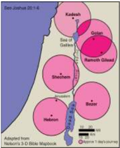

> **Deskripsi Visual:** Gambar ini adalah ilustrasi yang menunjukkan peta wilayah Israel pada masa awal penjajahan oleh orang-orang Semit. Peta ini menampilkan berbagai lokasi penting seperti Kadesh, Golan, Ramoth-Gilead, Shechem, dan Hazor. Setiap lokasi diberi warna unik untuk membedakannya, dan peta juga menunjukkan perbatasan wilayah tersebut dengan warna biru. Gambar ini digunakan sebagai alat pendukung untuk membantu pembaca memahami topografi dan geografi wilayah Israel pada masa lalu.

Yordan,  dan  tiga  lagi  di  sebelah  timur. Kota-kota itu adalah Kadesh, Sikhem, dan Hebron di sebelah barat, sedangkan Golan,  Ramot  di  Gilead,  dan  Bezer  di sebelah timur.

Apabila  seseorang  membunuh  atau mengakibatkan  seseorang  tewas  dan  ia merasa tidak bersalah atau tidak sengaja telah  menyebabkan  kematian,  maka  ia dapat melarikan diri ke kota-kota tersebut untuk berlindung. Ia tidak akan dibunuh. Ia harus tinggal di kota itu ' sampai matinya imam  besar  yang  telah  diurapi  dengan minyak yang kudus ' (ay. 25).

Konsep ini kemudian diambil alih oleh gereja Kristen dengan menetapkan gereja sebagai tempat perlindungan. Pada tahun

 

---
## 📄 Halaman 80

511M, dalam Konsili Orleans, di hadapan Raja Clovis I, setiap orang yang mencari suaka  akan  diberikan  apabila  ia  berlindung  di  sebuah  gereja,  dalam  gedunggedung lain milik gereja itu, atau di rumah uskup. Perlindungan diberikan kepada orang-orang yang dituduh mencuri, membunuh, atau berzina. Juga budak yang melarikan diri akan diberikan perlindungan, namun ia akan dikembalikan kepada tuannya  bila  sang  tuan  mau  bersumpah  di  atas  Alkitab  bahwa  ia  tidak  akan bertindak kejam. Hak suaka ini kemudian dikukuhkan oleh semua konsili sesudah Orleans.

### F. Penjelasan Bahan Alkitab

###  Bilangan 35: 9-34

Musa diperintahkan membangun enam kota perlindungan. ' Tiga kota harus kamu tentukan di seberang sungai Yordan dan tiga kota harus kamu tentukan di tanah Kanaan; semuanya kota-kota perlindungan ' (ay. 14).

Untuk apa kota-kota perlindungan ini didirikan? Kota-kota ini harus dibangun ' ... supaya setiap orang yang telah membunuh seseorang dengan tidak sengaja dapat melarikan diri ke sana ' (ay. 15). Ini adalah perintah yang menarik, sebab kita  tahu  bahwa  pola  kehidupan  di  masyarakat  Israel  kuno  sangat  keras. Dalam Keluaran 21:23-25, misalnya, kita menemukan perintah berikut:

23 Tetapi  jika  perempuan  itu  mendapat  kecelakaan  yang  membawa  maut, maka engkau harus memberikan nyawa ganti nyawa,  24 mata ganti mata, gigi ganti gigi, tangan ganti tangan, kaki ganti kaki, 25 lecur ganti lecur, luka ganti luka, bengkak ganti bengkak.

Demikian pula dalam Kitab Imamat 24:19-20 dikatakan:

19 Apabila  seseorang  membuat  orang  sesamanya  bercacat,  maka  seperti yang  telah  dilakukannya,  begitulah  harus  dilakukan  kepadanya: 20 patah ganti patah, mata ganti mata, gigi ganti gigi; seperti dibuatnya orang lain bercacat, begitulah harus dibuat kepadanya.

Dari  ayat-ayat  di  atas  kita  dapat  melihat  bahwa  hukum-hukum  Israel didasarkan  pada lex  talionis atau    hukum  pembalasan.  Nyawa  ganti  nyawa, mata ganti mata, gigi ganti gigi, tangan ganti tangan, kaki ganti kaki, luka ganti luka, bengkak ganti bengkak. Itu berarti, seseorang yang membunuh sesamanya  sudah  pasti  akan  dibalas  dengan    hukuman  mati  pula.  Namun masalahnya, bagaimana jika kematian itu terjadi bukan karena kesengajaan? Bukankah  kasus-kasus  seperti  ini  sering  kita  temukan  dalam  kehidupan sehari-hari - pengemudi mobil yang menabrak seseorang yang menyeberang di jalan raya karena jalan itu licin akibat hujan, atau karena tiba-tiba matanya

 

---
## 📄 Halaman 81

terkena sinar yang sangat terang sehingga ia tidak dapat melihat orang yang menyeberang  itu.  Bagaimana  seharusnya  orang  ini  diperlakukan?  Apakah harus diberlakukan hukum pembalasan?

### G.  Kegiatan Pembelajaran

### Pengantar

Pada bagian pengantar peserta didik diarahkan  untuk mempelajari berbagai fakta mengenai praktik demokrasi dan HAM di Indonesia.  Bahwa belajar mengenai praktik demokrasi dan HAM memotivasi peserta didik untuk memiliki kesadaran demokrasi dan HAM serta  bertindak proaktif  dalam mewujudkan demokrasi dan HAM.

### Kegiatan 1

Pendalaman materi mengenai demokrasi dan HAM di Indonesia. Dikemukakan beberapa fakta dan peristiwa yang berkaitan dengan pelanggaran demokrasi dan HAM.

### Kegiatan 2

### Diskusi

Jika  jumlah  peserta  didik  kurang  dari  10  orang,  diskusi  diadakan  dengan teman sebangku. Tetapi jika jumlah peserta didik lebih dari 10 orang, dapat dilakukan  diskusi  kelompok.  Hasil  diskusi  dilaporkan  di  kelas  untuk  dinilai oleh guru. Bahan diskusi tercantum dalam buku siswa, yaitu mengenai :

- Mengapa  hak  asasi  manusia  penting  bagi  manusia  sebagai  pribadi maupun komunitas bangsa?
- Mengapa pelaksanaan  hak asasi manusia tidak hanya menjadi tanggung jawab negara tetapi juga merupakan tanggung jawab warga negara?
- Jika peserta didik menyaksikan seseorang diperlakukan secara tidak adil dan harkat serta martabatnya direndahkan, apa tindakannya? Ataupun jika ada peristiwa kekerasan atau pembunuhan yang menimpa seseorang dan peserta didik  menyaksikannya, apakah tindakannya?
Manusia sebagai makhluk individu/pribadi telah memiliki hak dan kebebasan sejak  dilahirkan.  Hak  mendasar  itu  diberikan  Tuhan  bagi  manusia  sebagai makhluk mulia ciptaannya. Kebebasan atau kemerdekaan  dibutuhkan manusia untuk menjalani hidupnya, bertumbuh dan berkembang, melakukan apa  yang  harus  dilakukan  supaya  dapat  memaknai  hidup  yang  diberikan Tuhan. Namun kemerdekaan atau kebebasan itu hendaknya dilakukan dalam tanggung jawab dan tidak merugikan ataupun merampas hak orang lain. Itu sebabnya ada hukum negara yang melindungi warga negaranya. Jadi, negara

 

---
## 📄 Halaman 82

melaksanakan  fungsinya  melindungi  warganya  dan  hal  itu  dilakukan  oleh dan melalui lembaga-lembaga  yang dibentuk, sebaliknya warga negara pun melakukan  kewajibannya  sebagai  warga  negara  dan  anggota  masyarakat. Kamu dapat mempelajari lebih mendalam di mata pelajaran PPKn.

### Kegiatan 3

Setelah  melakukan  diskusi  dan  melaporkan  hasil  diskusi  yang  bertujuan memberikan  pencerahan  serta  memotivasi  peserta  didik  untuk  bersikap peduli demokrasi dan HAM, pembelajaran dilanjutkan dengan pendalaman materi. Perjuangan dan   pergulatan bangsa Indonesia di bidang demokrasi dan  HAM  dibahas  dalam  pendalaman  ini,  antara  lain  beberapa  peristiwa pelanggaran demokrasi dan HAM yang berskala nasional. Guru juga dapat memotivasi peserta didik untuk membahas peristiwa pelanggaran demokrasi dan  HAM  yang  terjadi  di  tempat  masing-masing.  Guru  harus  berhati-hati mengajarkan  mengenai  pelanggaran  demokrasi  dan  HAM  sehingga  tidak bersifat memprovokasi peserta didik. Pembelajaran ini bertujuan memotivasi peserta  didik  untuk  menghargai  demokrasi  dan  HAM  dan  proaktif  dalam memperjuangkan  demokrasi  dan  HAM.  Keberpihakan  dan  perjuangan demokrasi dan HAM harus dilakukan dengan cara-cara yang benar dan tidak melanggar hukum negara maupun ajaran iman Kristen.

### Kegiatan 4

Guru  membimbing  peserta  didik  untuk  membuat  slogan  yang  bertujuan mengajak remaja untuk memiliki kesadaran dan kepedulian pada demokrasi dan HAM. Slogan dapat ditulis di kain dan dipajang di kelas, di sekolah ataupun di kertas yang lebih kecil di majalah dinding. Di tempat  dimana kemampuan fi   nancial /keuangan  peserta didik terbatas dan tidak tersedia alat  pendukung, peserta didik dapat menulis slogan hasil kreasinya dan dibacakan untuk dinilai oleh guru. Slogan dikumpulkan dan yang terbaik akan dipajang di kelas atau di majalah dinding.

### Kegiatan 5

Pendalaman  demokrasi  dan  HAM  dalam  Kitab  Perjanjian  Lama  mengenai 'kota perlindungan' . Pembelajaran ini memberikan pencerahan pada peserta  didik  mengenai  kejadian  yang  terjadi  secara  tidak  sengaja  yang mengakibatkan terjadinya pelanggaran demokrasi dan HAM. Misalnya, secara tidak sengaja orang menghilangkan nyawa seseorang. Untuk kasus seperti ini,  di  Kitab  Perjanjian  Lama  Allah  memerintahkan  untuk  mendirikan  kota perlindungan  tempat  orang-orang  yang  membunuh  secara  tidak  sengaja. Ketika  mereka sudah masuk ke dalam kota itu, mereka tidak boleh dikejar

 

---
## 📄 Halaman 83

dan  dihukum.  Sebenarnya  dengan  terisolasi  di  dalam  kota  itu  pun  sudah merupakan hukuman bagi mereka. Namun, menyediakan kota perlindungan mengindikasikan bagaimana hukum diterapkan secara adil.

### Kegiatan 6

Peserta didik menulis tindakan yang dapat dilakukannya ataupun yang sudah dilakukannya  sebagai  perwujudan  demokrasi  dan  HAM.  Setelah  menulis, minta peserta didik bertukar kertas kerja dengan teman sebangkunya untuk dinilai oleh teman sebangku sebagai penilaian sejawat.

### Kegiatan 7

Menyusun  program kegiatan bagi remaja di gereja atau di sekolah  dalam rangka  ikut  serta  mewujudkan  hak asasi manusia. Misalkan mengadakan penyuluhan demokrasi dan HAM, mengunjungi orang yang menjadi korban demokrasi dan HAM dan menyatakan keprihatinan dan lain-lain.

### H.  Doa penutup

Guru mengajak  peserta didik mengucapkan doa yang diambil dari 'Doa bagi Pembela Hak-Hak Asasi Manusia' yang tercantum dalam buku siswa.

### I. Penilaian

Bentuk  penilaian  adalah  tes  lisan  ketika  peserta  didik  berdiskusi  dalam kegiatan 2. Penilaian produk atau karya dilakukan untuk menilai hasil kerja peserta  didik  yang  membuat  slogan  yang  mengajak  sesama  remaja  untuk peduli  dekomrasi  dan  HAM  pada  kegiatan  4.  Penilaian  sejawat    dilakukan dalam  kegiatan  6  ketika  peserta  didik  menulis  mengenai  wujud  tindakan yang dilakukan dalam rangka demokrasi dan HAM. Penilaian dalam bentuk penugasan proyek demokrasi dan HAM.

### J. Tugas

Guru meminta peserta didik membaca di rumah empat buah cerita yang ada dalam pelajaran 3 serta membuat catatan kecil mengenai empat orang tokoh yang  ada  dalam  cerita  tersebut.  Hal  ini  penting  supaya  ketika  membahas pelajaran berikut, peserta didik sudah mempelajari perjuangan empat orang tokoh  yang  ada  dalam  cerita.  Guru  diminta  untuk  mencarai  dari  berbagai sumber  mengenai  tokoh-tokoh  tersebut  sehingga  dapat  melengkapi  diri dengan informasi dan pengetahuan yang cukup. Salah satu tokoh yang ada dalam  cerita  pernah  diangkat  dalam  pelajaran  SMA  Kelas  X,  yaitu  Malala Yousafzai.

 

---
## 📄 Halaman 84

---
**🖼️ Gambar/Diagram**

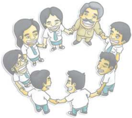

> **Deskripsi Visual:** Gambar ini adalah ilustrasi yang menunjukkan sebuah kelompok orang yang berada dalam posisi berjajar. Mereka semua tampak senang dan berteriak-teriuk, menunjukkan suasana yang positif dan harmonis. Setiap orang tampak berhubungan erat dengan orang lain di sekitarnya, mungkin menandakan hubungan sosial yang kuat atau kerjasama tim.

Elemen utama dalam gambar ini meliputi kelompok orang yang berjajar, posisi mereka yang saling berhubungan, dan ekspresi wajah mereka yang menunjukkan kegembiraan dan kebahagiaan. Relasi antara elemen-elemen ini adalah bahwa setiap orang dalam kelompok tersebut saling terhubung dan berinteraksi, menciptakan suasana yang positif dan kolaboratif.

Teks, angka, atau label penting tidak ada dalam gambar ini karena ia hanya menggambarkan situasi tanpa teks atau angka tambahan. Informasi kunci yang dapat diambil dari gambar ini adalah tentang hubungan sosial yang kuat dan positif antara individu dalam kelompok tersebut, serta suasana yang harmonis dan bahagia yang dimiliki oleh semua orang dalam kelompok tersebut.

Kedamaian Ada Ketika Kita Mau Menerima Perbedaan

 

---
## 📄 Halaman 85

### PENJELASAN BAB

### Demokrasi dan   Hak Asasi Manusia dalam Perspektif Alkitab

Bahan Alkitab:  Kejadian 1:26-30; I Raja-Raja 21:1-16

---
**📊 Tabel**

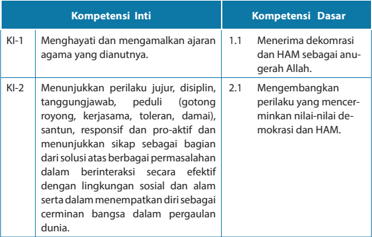

Tabel ini menunjukkan dua kompetensi utama: Kompetensi Inti (KI) dan Kompetensi Dasar (KD). Kompetensi Inti meliputi KI-1 "Menghayati dan mengamalkan ajaran agama yang dianutnya" dan KI-2 "Menunjukkan perilaku jujur, disiplin, tanggung jawab, peduli, gotong royong, kerjasama, toleran, damai, santun, responsif dan pro-aktif sebagai bagian dari solusi atas berbagai permasalahan dalam berinteraksi secara efektif dengan lingkungan sosial dan alam serta dalam mempertahankan diri sebagai cerminan bangsa dalam pergaulan dunia." Kompetensi Dasar mencakup KD-1.1 "Menerima demokrasi dan HAM sebagai anugerah Allah" dan KD-2 "Mengembangkan perilaku yang mencerminkan nilai-nilai demokrasi dan HAM." Topik utama tabel ini adalah tentang pengembangan karakter dan perilaku yang sesuai dengan nilai-nilai demokrasi dan HAM.

 

---
## 📄 Halaman 86

---
**📊 Tabel**

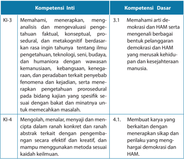

Tabel ini berisi informasi tentang kompetensi inti dan dasar yang relevan dengan demokrasi dan HAM (Hukum Asas Manusia). Topik utama tabel adalah pembelajaran tentang demokrasi dan HAM, dengan fokus pada pemahaman, aplikasi, analisis, dan pengembangan keterampilan dalam konteks tersebut. Kolom "Kompetensi Inti" mencakup dua kompetensi utama: KI-3 yang berkaitan dengan pemahaman, aplikasi, dan analisis tentang demokrasi dan HAM, serta KI-4 yang melibatkan penulisan, presentasi, dan inovasi dalam konteks demokrasi dan HAM. Kolom "Kompetensi Dasar" menunjukkan beberapa aspek dasar yang diperlukan untuk memenuhi kompetensi inti, seperti pemahaman konsep demokrasi dan HAM, serta kemampuan membuat karya yang berkaitan dengan demokrasi dan HAM. Pola penting yang terlihat adalah bahwa tabel ini mencakup berbagai aspek pembelajaran yang berkaitan dengan demokrasi dan HAM, mulai dari pemahaman teoritis hingga praktik dalam bentuk karya dan penulisan.

### Indikator

- Mendiskusikan bagian Alkitab yang menulis tentang hak asasi manusia.
- Menjelaskan tugas dan tanggung jawab remaja Kristen dalam mewujudkan hak asasi manusia.
- Membuat karya sebagai wujud kepedulian terhadap HAM.
- Melakukan kegiatan sebagai bukti peduli HAM.

 

---
## 📄 Halaman 87

### A.  Pengantar

Pada  bagian  pengantar  peserta  didik  diarahkan  untuk  memahami  konsep mengenai  demokrasi  dan  Hak  Asasi  Manusia.  Penalaran  makna  demokrasi dan HAM ini penting untuk  dipahami oleh peserta didik, yaitu sebagai fondasi ketika  membahas  mengenai  bagaimana  mewujudkan  demokrasi  dan  HAM dalam tindakan hidup sehari-hari. Pada pertemuan ini peserta didik dibimbing untuk memahami demokrasi dan HAM dalam perspektif Alkitab.  Mengacu pada teks  Alkitab,  peserta  didik  dibimbing  untuk  mewujudkan  demokrasi  dan  HAM berdasarkan nilai-nilai iman yang tercantum dalam Alkitab.

### B. Belajar dari Cerita Kehidupan

Peserta didik mempelajari empat buah cerita mengenai tokoh yang memperjuangkan keadilan dan Hak Asasi Manusia. Tokoh pertama adalah   Aung San Suu Kyi (baca: Aung San Su Ci) . Beliau adalah seorang perempuan yang tak pernah  lelah  memperjuangkan  terwujudnya  demokrasi  dan  HAM  di  Myanmar (Burma). Ayahnya adalah Aung San, tokoh perjuangan Burma yang diakui sebagai bapak  pendiri  bangsa  itu.  Ibunya,  Daw  Khin  Kyi,  memainkan  peranan  penting sebagai tokoh politik dalam pemerintahan Burma, negara yang baru merdeka pada tahun 1948. Pada tahun 1950 Khin Kyi diangkat menjadi duta besar untuk India dan Nepal. Aung San Suu Kyi ikut bersama ibunya, dan lulus dalam bidang ilmu Politik dari Lady Shri Ram College di New Delhi pada tahun 1964. Ia melanjutkan studinya di Oxford dan memperoleh gelar BA dalam Filsafat, Politik, dan Ekonomi pada tahun 1969. Setelah lulus ia tinggal di New York City dan bekerja di PBB. Pada tahun 1972 ia menikah dengan Dr. Michael Aris. Pada tahun 1985 ia memperoleh gelar Ph.D dari School of Oriental and African Studies , Univesitas London.

Ia  memelopori  perjuangan  menegakkan hak asasi manusia dan demokrasi di  Myanmar.  Akibat  dari  kegiatannya  tersebut  ia  dipenjara  selama  15  tahun. Seharusnya masa hukumannya adalah 21 tahun, namun baru dijalani 15 tahun ia  sudah  dibebaskan.  Pemerintah  Myanmar  menghadapi  tekanan  dari  dunia internasional oleh karena penahanan terhadap  Aung San Suu Kyi. Kita bersyukur ada orang-orang yang mempersembahkan hidupnya bagi perjuangan Hak Asasi Manusia dan demokrasi.

Tokoh kedua adalah Rachel Aline Corrie (10  April  1979-16  Maret  2003) adalah  seorang  anggota  Gerakan  Solidaritas  Internasional  (GSI)  yang  dibunuh oleh Pasukan Pertahanan Israel (IDF) dengan sebuah buldoser, Corrie dan temantemannya bertindak sebagai 'manusia perisai' . Corrie adalah seorang mahasiswa dari Evergreen State College, di kota Olympia, Washington, AS. Ia mengambil cuti satu tahun dan berkunjung ke Jalur Gaza pada Intifada Kedua. Setelah terbang ke

 

---
## 📄 Halaman 88

Israel pada 22 Januari 2003, Corrie menjalani latihan selama dua hari di markas besar GSI di tepi barat, lalu berangkat ke Rafah untuk ikut serta dalam demonstrasi di sana.

Di Rafah, Rachel bertindak sebagai 'manusia perisai' dalam upayanya untuk menghalangi penghancuran rumah yang dilakukan dengan buldoser lapis baja oleh pasukan IDF. Pada malam pertamanya di sana, ia bersama dua anggota GSI lainnya membangun tenda di dalam Blok J, yang sering menjadi sasaran tembak Israel. Pasukan-pasukan Israel menembaki tenda mereka dan tanah yang hanya beberapa meter jauhnya dari tenda itu. Karena merasa bahwa kehadiran mereka memprovokasi pasukan Israel, Corrie dan rekan-rekannya bergegas membongkar tenda mereka lalu pergi.

Pada 16 Maret 2003, sebuah operasi IDF di daerah antara kamp pengungsi Rafah  dan  perbatasan  dengan  Mesir  terlibat  dalam  pembongkaran  rumah, yang dipandang perlu oleh IDF untuk menghancurkan tempat persembunyian gerilyawan  dan  lorong-lorong  penyelundup.  Corrie  ikut  serta  dalam  sebuah kelompok dengan tujuh anggota GSI (tiga warga negara Inggris, empat Amerika) dalam upaya mereka menghalangi tindakan-tindakan buldoser Israel. Corrie, yang membaringkan dirinya di jalan yang dilalui buldoser caterpillar D9R yang berlapis baja, terluka parah. Ia segera dibawa ke sebuah RS Palestina.

Laporan  mengatakan  ia  meninggal  di  tempat,  ada  lagi  yang  mengatakan ia meninggal di jalan menuju ke rumah sakit, atau malah di rumah sakit sendiri. (Sumber: Wikipedia , diunduh 10 Oktober 2014).

Tokoh  ketiga  adalah  Ade  Rostina  Sitompul .  Ade  Rostina  Sitompul  lahir pada 12 Desember 1938 di perkebunan teh Kelapa Nunggal milik kakeknya yang terletak  di  Cibadak,  Parungkuda,  Sukabumi.  Kepeloporan  Ade  Rostina  dalam aktivisme  hak  asasi  manusia  banyak  dipengaruhi  oleh  pengalaman  hidupnya. Sejak kecil Rostina menyaksikan, dan bahkan secara langsung dilibatkan dalam aktivitas  perjuangan  kemerdekaan oleh ayahya. Ia mulai belajar 'gerakan tutup mulut'  dengan  merahasiakan  tempat  persembunyian  yang  dibangun  ayahnya di rumah, dan dilibatkan sebagai kurir bagi para gerilyawan dengan membawa pesan  di  balik  lipatan.  Dari  ayahnya  juga  Rostina  belajar  tentang  kesetaraan dan  keadilan  sosial  melalui  pergaulan  dengan  kalangan  kuli  perkebunan.  Dari kakeknya, Rostina belajar tentang nilai kemanusiaan di mana musuh pun harus diperlakukan secara manusiawi.

Peristiwa tahun1965 menjadi titik penting untuk komitmennya dalam gerakan perjuangan kemanusiaan. Abangnya yang adalah salah satu pimpinan Persatuan Wartawan Indonesia yang pro-Sukarno ditangkap dan ditahan selama sembilan tahun. Sahabat-sahabatnya juga mengalami nasib serupa. Menghadapi situasi ini,

 

---
## 📄 Halaman 89

Rostina terdorong untuk menggalang bantuan berupa obat-obatan, mengirimkan makanan ke penjara, mengurus keluarga tahanan politik dan dengan berbagai cara berupaya menyelamatkan orang-orang yang diburu. Aktivitas ini menyebabkan ia diinterogasi berulang kali oleh militer. Kepeloporan di bidang HAM mengantarnya menerima penghargaan Yap Thiam Hien pada 1995. Ia turut membidani sejumlah organisasi HAM, antara lain ELSAM, Kontras, Imparsial, Pokastin, SHMI, dan Setara. Usia  dan  kesehatan  tidak  pernah  menjadi  penghalang  baginya  untuk  aktif. Sampai menjelang akhir hayatnya, beliau terus aktif bekerja dan berjuang bagi kemanusiaan. ( www.tokohindonesia.com )

Tokoh  keempat  adalah  Malala  Yosafzai. Malala lahir pada tanggal 12  Juli  1997  sebagai  anak  pertama  setelah  ibunya  mengalami  keguguran. Saking miskinnya, ayahnya tidak memiliki uang untuk membayar bidan supaya menolong ibunya melahirkan. Dalam budaya Pakistan, terutama Suku Pashtun, yang merupakan campuran antara etnis Pakistan dan Afghanistan, kelahiran bayi perempuan adalah suatu kemalangan bagi keluarga. Namun Ziauddin, ayah Malala malah merayakan kelahiran anak pertamanya dengan mengatakan 'Saya melihat ke mata bayi cantik ini, dan langsung jatuh cinta padanya.' Ia bahkan meramalkan bahwa anaknya ini sungguh berbeda dari anak-anak lain.

Nama  Malala  diambil  dari  Malalai,  yaitu  pejuang  wanita  dari  Afghanistan, negara tetangga Pakistan. Setiap anak Pashtun tumbuh dalam semangat patriotik Malalai  yang  berhasil  membangkitkan  semangat juang rakyatnya yang sedang melawan  penjajahan  Inggris.  Walaupun  Malalai  terbunuh  dalam  peperangan, namun kematiannya justru membuat pejuang Afghanistan semakin gigih sehingga memenangkan pertempuran. Namun, kakek Malala tidak setuju dengan nama itu karena  memiliki  arti 'menarik  kesedihan.'  Ayah  Malala  tetap  mempertahankan nama yang sudah dipilihnya karena berharap, Malala tumbuh menjadi pahlawan bagi bangsanya, sama seperti Malalai dulu.

Ziauddin Yousafzai memiliki idealisme untuk menghadirkan pendidikan bagi anak di Pakistan, termasuk untuk anak perempuan yang sebetulnya dianggap tabu untuk bersekolah. Bersama temannya, Ziauddin mendirikan sekolah dan Malala menjadi  muridnya.  Sejak  kecil,  Malala  terbiasa  mengikuti  ayahnya  berkeliling ke  desa-desa  sekitar  untuk  mempromosikan  pentingnya  pendidikan  bagi  anak perempuan. Aktivitas seperti ini tidak disukai oleh Taliban yang secara perlahan namun pasti mengambil alih kekuasaan di daerah tempat tinggal Malala. Taliban menyerang sekolah-sekolah untuk anak perempuan, dan pada tahun 2008 Malala bereaksi  dengan  berpidato  yang  intinya  adalah  mempertanyakan  mengapa Taliban mengambil haknya untuk bersekolah.

 

---
## 📄 Halaman 90

Pada awal tahun 2009, Malala mulai menulis blog untuk radio Inggris BBC yang isinya adalah pengalaman hidup di bawah penindasan dan larangan Taliban untuk  bersekolah.  Awalnya,  penulisan  blog  ini  berjalan  lancar  karena  Malala memakai nama samaran Gul Makai. Namun, pada bulan Desember 2009 nama aslinya  mencuat. Tidak  kepalang  tanggung,  Malala  semakin  aktif  menyuarakan hak perempuan untuk memperoleh pendidikan sehingga ia dinominasikan untuk menjadi  pemenang International  Children's  Peace  Prize pada  tahun  2011  selain juga berhasil memenangkan National Youth Peace Prize.

Pada  tahun  yang  sama,  Malala dan  keluarganya  tahu bahwa  Taliban memberikan ancaman mati kepadanya. Mereka sekeluarga memang mengkhawatirkan keselamatan sang ayah yang merupakan aktivis anti-Taliban, namun mereka menganggap Taliban tidak akan menyerang anak. Malala salah, karena  Taliban  justru  dengan  sengaja  menembak  kepalanya  saat  Malala  dan teman-teman  berada  di  bis  sekolah  saat  perjalanan  pulang  dari  sekolah  pada tanggal  9  Oktober  2012.  Tembakan  itu  meleset  dan  mengenai  dua  temannya yang  langsung  terluka  parah.  Walaupun  sebagian  dari  tempurung  kepala Malala diangkat untuk meredakan bengkak di otaknya, namun kondisi kritisnya menyebabkan  ia  dibawa  ke  Birminghim,  Inggris.  Untung  ia  tidak  mengalami trauma otak berkepanjangan dan mulai Maret 2013 ia dapat bersekolah kembali di Birmingham. Malala menuliskan otobiografi  nya berjudul I  Am Malala: The Girl Who Stood Up for Education and Was Shot by the Taliban ,  yang terbit pada bulan Oktober 2013.

Sampai kini Taliban tetap melancarkan ancaman mati untuk Malala. Walaupun begitu, Malala tetap konsisten menyuarakan hak perempuan untuk mendapatkan pendidikan. Dengan pendidikan, kaum perempuan dibukakan wawasannya agar dapat  menjalani  kehidupan  sebagai  manusia  merdeka,  tidak  berada  di  bawah kekuasaan  laki-laki  atau  pun  tradisi.  Dalam  suatu  wawancara  dengan  Sheryl Sandberg pada bulan Agustus 2014, Malala memberikan pernyataan: 'Aku berada dalam masa di mana situasi dan keadaan memaksaku untuk berani. Di sana ada ketakutan, teror, bom sepanjang waktu. Itu adalah saat yang sulit karena banyak sekolah yang dibom. Aku hanya punya dua pilihan, tetap diam dan menunggu terbunuh atau bicara meski harus dibunuh. Dan aku memilih yang kedua.'

Keberaniannya  inilah  yang  membuat  Parlemen  Eropa  menganugerahkan Sakharov Prize for Freedom of Thought pada bulan Oktober 2013. Tahun 2013 ia juga dinominasikan untuk menjadi penerima Nobel Perdamaian walaupun tidak memenangkannya. Tahun 2014 kembali ia dinominasikan untuk hal yang sama dan memperolehnya sebagai pejuang untuk hak-hak anak memperoleh pendidikan. Namun  dengan  rendah  hati  Malala  menyatakan  bahwa  mendapatkan  Nobel

 

---
## 📄 Halaman 91

bukanlah tujuannya; ia lebih suka bila dunia memberikan kesempatan bagi setiap anak  untuk  mengenyam  pendidikan  karena  perdamaian  yang  sesungguhnya barulah tercapai bila hak setiap orang untuk mendapatkan pendidikan diberikan. Dua tokoh idolanya adalah Marthin Luther King, Jr. dan Benazir Bhutto. Keduanya mati terbunuh saat memperjuangkan persamaan hak bagi sesama dan memilih untuk lepas dari kekuasaan yang sifatnya otoriter alias memaksakan kehendak.

Peserta  didik  ditugaskan  untuk  membaca  keempat  kisah  tersebut  pada pertemuan sebelumnya. Kemudian pada pertemuan ini, mereka diminta untuk mengemukakan penilaian mereka terhadap kisah empat orang tokoh tersebut dalam  kaitannya  dengan  demokrasi  dan  hak  asasi  manusia.  Ingatkan  peserta didik  bahwa  pada  pembahasan  pertama  sudah  dibahas  mengenai  pengertian HAM yang dapat dijadikan masukan dalam menilai praktik demokrasi dan HAM yang  telah  dilakukan  oleh  empat  orang  tokoh  tersebut.  Peserta  didik  dapat mengemukakan pendapatnya, bergantung pada ketersediaan waktu yang ada.

### C. Kesaksian Alkitab tentang Manusia

Guru menjelaskan mengenai demokrasi dan HAM  menurut  Alkitab. Penjelasan ini penting sebagai acuan bagi peserta didik dalam mempraktikkan serta mewujudkan partisipasinya di bidang demokrasi dan HAM.

Kitab  Kejadian  pasal  1:26-30  menulis  tentang  penciptaan  manusia  sebagai makhluk bermartabat. Manusia diciptakan segambar dan serupa dengan Allah. Menurut    John  Stott,  dalam  bukunya Isu-Isu  Global  Menantang  Kepemimpinan Kristiani ,  martabat  makhluk  manusia  diutarakan  dalam  tiga  kalimat  beruntun dalam  Kitab  Kejadian  1:27,28. Pertama ,  Allah  menciptakan  manusia  menurut 'gambar-Nya ' , Kedua , 'laki-laki dan perempuan diciptakan-Nya mereka' . Ketiga, Allah memberkati mereka lalu berfi  rman kepada mereka…'Penuhilah bumi dan taklukkanlah  itu' .  Martabat  manusia  dikemukakan  dalam  tiga  hubungan  yang unik yang ditegakkan sejak penciptaan.

- Hubungan  manusia  dengan  Allah .  Menurut  Stott,  manusia  yang diciptakan menurut gambar Ilahi mencakup kualitas-kualitas rasional, moral,  dan  spiritual.  Kualitas  ini  dengan  sendirinya  membedakan manusia dari binatang dan memungkinkan manusia berelasi dengan Allah melalui kualitas rasional, moral dan spiritual. Dengannya, manusia belajar untuk mengenal, memahami serta taat pada perintahNya. Selanjutnya dikatakan, hak manusia untuk beragama, menyiarkan agama, menjalankan ibadah agama, kebebasan untuk berpikir, berbicara,  mengambil  keputusan  menurut  hati  nurani,  semuanya berada dalam kaitannya dengan hubungan manusia dengan Allah.

 

---
## 📄 Halaman 92

- Hubungan  antarmanusia . Allah menciptakan manusia sebagai makhluk  sosial,  sehingga  Ia  juga  memberkati  relasi  antarmanusia termasuk hal-hal yang berkaitan dengan akibat dari relasi  atau  hubungan itu. Dengan demikian, hak manusia untuk berelasi, bersahabat, menikah serta membentuk keluarga; hak untuk berkumpul dan mengemukakan pendapat; dan hak untuk diterima dan dihormati tanpa memandang jenis  kelamin,  usia  maupun  status  sosial  yang  berada  dalam  lingkup hubungan antar manusia yang diberkati Allah.
- Hubungan manusia dengan bumi dan makhluk lainnya. Manusia diciptakan  untuk  mengolah  bumi,  berkuasa  atas  makhluk-makhluk lainnya.  Dengan  demikian,  manusia  diberikan  hak  untuk  bekerja, memiliki karier; hak untuk beristirahat; hak untuk memperoleh sandang, pangan, rumah yang nyaman dan sehat; memperoleh hak untuk bebas dari penyakit, kemiskinan, keterbelakangan; dan hak untuk menikmati udara dan air bersih.

### D.  Implikasi terhadap  Demokrasi dan Hak Asasi Manusia

Implikasi dari tiga hubungan yang unik di atas adalah hakikat manusia sebagai makhluk bermartabat merupakan pemberian Allah. Oleh karena itu tidak seorang pun dapat mengambilnya dari diri seseorang. Menurut Kitab Amsal 14:31, '... siapa yang menindas orang lemah, menghina Pencipta-Nya ' .  Pelanggaran terhadap hak asasi  manusia    merupakan  penghinaan  terhadap  penciptanya.  Dalam  Alkitab Perjanjian  Lama,  banyak  raja  yang  jatuh  karena  menerima  hukuman  Allah akibat mereka berlaku semena-mena terhadap rakyatnya. Raja Ahab yang telah merampas kebun anggur Nabot menerima hukuman, ia mati dan mayatnya tidak dikuburkan secara layak sehingga dimakan anjing di luar pintu gerbang kota tepat seperti yang difi  rmankan Allah. Yeremia mengecam Raja Yoyakim yang menindas serta memeras rakyatnya demi membangun istana mewah. Kitab Amos, Mikha, Yeremia adalah kitab-kitab yang berisi seruan serta peringatan para nabi terhadap pemerintah, para pemimpin maupun rakyat yang bertindak tidak adil terhadap mereka yang lemah dan miskin.

Ketaatan,  kasih,  dan  keadilan  selalu  menjadi  terminologi  penting  dalam sejarah  hubungan  antara  manusia  dengan  Tuhan  Allah  Sang  Pencipta.  Jika manusia melakukan kejahatan kemanusiaan terhadap sesamanya, maka Allah akan menegur dan menuntut pertobatan dari manusia dan jika manusia tidak bertobat, maka akan datang hukuman. Sebaliknya jika manusia sadar akan kejahatannya, memohon ampun dan bertobat, maka akan terhindar dari hukuman.

 

---
## 📄 Halaman 93

### Diskusi

Peserta  didik  mempelajari  Kitab  1  Raja-raja  21:1-16  kemudian  mendiskusikan pertanyaan-pertanyaan berikut  dan membacakan hasil diskusinya di depan kelas.

- Apakah isi bagian Alkitab yang dipelajari?
- Apa kaitannya dengan hak asasi manusia?
- Apa penilaian peserta didik terhadap tokoh yang memerintah dalam Kitab 1 Raja-raja 21:1-16?
- Nilailah sikap   Izebel sebagai istri raja, bagaimana perannya dalam menjatuhkan Nabot sampai di hukum mati.
- Jika peserta didik adalah Nabot, apa yang dapat dilakukan?

### Peserta Didik Mempelajari Berita Kemudian Memilih

Guru meminta  peserta didik mempelajari berita di media  mengenai kasus  pelanggaran  hak  asasi  manusia    yang  terjadi.  Ada  satu  berita  mengenai penggusuran  warga  Tionghoa  Benteng  di  Jakarta.  Penggusuran  itu  dilakukan disertai  dengan  kekerasan  yang  dapat  dikategorikan  sebagai  pelanggaran terhadap HAM. Memang masyarakat salah karena membangun rumah di tanah yang bukan miliknya dan tidak diperuntukkan bagi pemukiman. Minta peserta didik mencontreng di depan rangkaian kalimat yang menggambarkan tindakan kekerasan  terhadap  warga.  Contoh  artikel  di  bawah  ini  tercantum  dalam  buku siswa. Bahagian yang dicontreng (  ) adalah baris ke empat, lima, dan enam.

### Penggusuran Warga Cina Benteng Ricuh

Jakarta - Penggusuran warga Cina Benteng yang tinggal di Kampung Lebak Wangi, Kelurahan  Mekar  Sari,  Kecamatan  Neglasari,  Kota  Tangerang,  diwarnai  kericuhan. Warga bentrok dengan Satpol PP.

'Iya  kita  warga  dipukul-pukulin,'  ujar  Isnur,  warga  Cina  Benteng,  kepada  detikcom, Selasa (13/4/2010). Menurut Isnur, warga Cina Benteng juga dorong-dorongan dengan Satpol  PP .  Sebanyak  350  KK  atau  1.007  jiwa  yang  terdiri  dari  477  perempuan,  339 anak-anak, 129 laki-laki serta 12 orang penderita keterbelakangan mental terancam kehilangan tempat tinggalnya di kawasan itu.

Pengacara warga dari LBH Jakarta, Eddy Halomoan Gurning Senin (12/4/2010) kemarin, mengatakan, pemerintah beralasan, rumah-rumah digusur karena melanggar Perda No 18 tahun 2000, tentang Keindahan, Ketertiban, dan Keamanan (K3) Kota Tangerang.

 

---
## 📄 Halaman 94

### E. Perdebatan Mengenai Hak Hidup Manusia

Arti terdalam dari hak asasi manusia adalah pengakuan terhadap kebebasan dan kemerdekaan manusia yang telah dianugerahkan Tuhan Allah sejak seseorang mulai bertumbuh dalam kandungan ibu. Karena itu, segala macam upaya untuk menghancurkan  serta  menghilangkan  kehidupan  serta  kebebasan  manusia merupakan pelanggaran terhadap hak asasi manusia. Bagaimana dengan kasus hukuman  mati,    aborsi,  dan  eutanasia?  Kasus-kasus  yang  disebutkan  di  bawah ini  selalu,  mendatangkan  sikap  pro  dan  kontra  artinya  ada  masayarakat  yang menolak  tapi  ada  yang  menerima.  Dua  sikap  tersebut  masing-masing  diserta dengan alasan yang disampaikan.

### 1.    Hukuman Mati

Hukuman  mati  adalah  hukuman  yang  dijatuhkan  kepada  seseorang  yang dianggap melakukan kejahatan yang berat, seperti pembunuhan yang kejam dan sadis, pengkhianatan kepada negara (makar), dan di beberapa negara, seperti  Indonesia,  penjual  atau  pembawa narkoba. Hukuman mati diyakini akan membuat orang lain takut dan tidak akan melakukan kejahatan serupa. Selain itu juga terjadi berbagai kasus ketika orang yang tidak bersalah dijatuhi hukuman  mati.  Berbeda  dengan  hukuman  penjara,  bila  seseorang  sudah dieksekusi tentu hukuman itu tidak dapat dibatalkan. Pihak yang menerima adanya  hukuman  mati  mengatakan  dengan  diberlakukan  hukuman  mati diharapkan ada efek jera bagi pelaku kejahatan. Namun, pihak yang menolak mengatakan hak untuk hidup adalah  hak  yang  diberikan  oleh Tuhan  bagi manusia oleh karena itu manusia tidak berhak mencabut nyawa sesama atas alasan apapun termasuk alasan hukum.

### 2.    Aborsi

Aborsi  atau  pengguguran  kandungan  adalah  praktik  menghilangkan  janin yang  ada  di  dalam  kandungan.  Gereja  Katolik  menentang  praktik  ini,  dan menganggap  semua  bentuk  aborsi  sebagai  pembunuhan.  Banyak  gereja Protestan  juga  menentang  praktik-praktik  ini,  apabila  dilakukan  secara  sewenang-wenang  dan  tidak  bertanggung  jawab.  Misalnya,  seorang  remaja perempuan yang menjadi hamil karena berperilaku seks bebas. Hal ini terjadi karena ia merasa belum siap atau malu oleh cemooh orang-orang sekitarnya. Terhadap orang-orang seperti ini, orang Kristen mestinya bersikap lebih terbuka dan mau menolong remaja ini, agar ia dapat mempertanggungjawabkan per  buatannya dengan baik.

Aborsi juga biasanya tidak akan dilakukan apabila kandungan sudah cukup lanjut  usianya,  misalnya  lima  bulan  ke  atas,  namun  apabila  kandungan  itu

 

---
## 📄 Halaman 95

membahayakan  jiwa  si  ibu,  biasanya  aborsi  dapat  diterima.  Banyak  pihak yang menentang aborsi karena dipandang sebagai pembunuhan.

### 3.    Eutanasia

Eutanasia adalah praktik  yang  dipilih  untuk  membebaskan  seseorang dari  penderitaan  panjang.  Ada  eutanasia  aktif,  yaitu  ketika  seorang  pasien meminta sendiri agar segala perawatan yang diberikan kepadanya dihentikan karena  ia  sudah  tidak  mau  menderita  lebih  lama  lagi.  Ada  pula  eutanasia yang dilakukan dengan sengaja menyuntikkan zat beracun yang mematikan seseorang untuk menghentikan penderitaannya. Selain itu ada juga eutanasia pasif,  yaitu  ketika  keluarga  si  pasien  yang  sudah  tidak  dapat  lagi  berbicara atau sudah tidak sadar lagi, meminta agar segala perawatan dihentikan.

Pertanyaan  yang  muncul  di  sini  ialah,  apakah  arti  tindakan  ini?  Karl  Barth pernah  menulis  tentang  hal  ini.  Ia  bertanya, 'Dalam  proses  ini,  kita  perlu menyelidiki,  apakah  kita  sedang  mencoba  mencabut  nyawa  yang  Tuhan ingin  pertahankan,  ataukah  justru  malah  menahan-nahan  nyawa  yang Tuhan  ingin  cabut?'  Hal  ini  terlihat  dalam  kasus  Terri  Schiavo  (baca:  Terri Syaivo) yang mengalami koma selama 15 tahun, sejak 1990-2005. Suaminya ingin  menghentikan  semua  perawatan  medis  yang  diberikan,  sementara orang  tua  Terri  menolaknya.  Mereka  mengklaim  bahwa  Terri  masih  dapat berkomunikasi, tandanya ia masih hidup. Sementara para dokter menyatakan kemungkinan Terri pulih kembali sangat kecil. Gerak-geriknya dan suara yang dikeluarkannya hanyalah gerak refl  eks  saja,  bukan  tanda-tanda  kehidupan. Kasus  ini  menjadi  sangat  menonjol  karena  melibatkan  gubernur  Florida, Presiden George Bush, dan Paus.

Tiga  buah  kasus  tersebut  di  atas  menggambarkan  bagaimana  manusia mencoba  mengakhiri    hak  hidup  sesamanya  yang  diberikan  Allah.  Tujuannya ingin  menolong  mengakhiri  penderitaan  manusia,  misalnya  eutanasia,  namun dalam  upaya  ini  manusia  merampas  hak  Allah  karena  hanya  Allah  saja  yang berhak menganugerahkan kelahiran maupun kematian. Ia dapat memberi juga mengambil  kehidupan  manusia.  Dalam  kasus    hukuman  mati,  apakah  sudah terbukti bahwa hukuman mati dapat menghasilkan efek jera pada para penjahat? Buktinya  kejahatan  berat  terus  terjadi,  bahkan  lebih  sadis  dan  canggih.  Dalam upaya manusia untuk membebaskan penderitaan sesama jangan sampai manusia malahan melakukan pelanggaran HAM.

Mengenai eutanasia, aborsi, dan hukuman mati sampai dengan saat ini masih terjadi  pro  dan  kontra  (ada  yang  berpihak  dan  ada  yang  menentang)  praktik tersebut. Namun, umumnya di kalangan gereja-gereja Kristen menolak  praktikpraktik tersebut.

 

---
## 📄 Halaman 96

### F. Kewajiban Manusia Menyangkut Demokrasi dan Hak Asasi

Manusia tidak hanya diberikan hak asasi oleh Tuhan tetapi juga kewajiban asasi. Dalam setiap hak diikuti oleh kewajiban. Manusia yang diciptakan sebagai makhluk rasional, bermoral, dan spiritual dengan sendirinya memiliki kewajiban moral. Kebebasan atau kemerdekaan sejati itu mewujud dalam rangka tanggung jawab. Dalam Galatia 5:13, Rasul Paulus mengatakan: ' Saudara-saudara, memang kamu  telah  dipanggil  untuk  merdeka.  Tetapi  janganlah  kamu  menggunakan kemerdekaan  itu  sebagai  kesempatan  untuk  kehidupan  dalam  dosa,  melainkan layanilah  seorang  akan  yang  lain  oleh  kasih ' .  Orang  Kristen  adalah  manusia merdeka yang telah  ditebus  oleh  Kristus  karena  itu  ada  tuntutan  untuk  hidup sebagai manusia merdeka yang telah terbebas dari perhambaan dosa. Kehidupan sebagai manusia merdeka haruslah diimbangi oleh tanggung jawab.

Penekanan terhadap kewajiban adalah penting sebagai perimbangan terhadap hak asasi dan demokrasi karena manusia cenderung menuntut apa yang menjadi haknya tetapi melupakan kewajibannya. Hal ini perlu ditegaskan bahwa jika ada hak asasi maka ada kewajiban asasi. Misalnya, apakah tanggung jawab seorang remaja Kristen di bidang  hak asasi manusia? Menjaga hubungan yang baik dengan sesama, baik dengan teman, guru, anggota keluarga maupun orang lain. Remaja Kristen juga dapat menghargai pendapat orang lain, menghargai sesama dalam  berbagai  perbedaan,  berpikir  positif  terhadap  orang  lain,  melaporkan kepada yang berwajib jika menyaksikan peristiwa pelanggaran hak asasi manusia. Itulah beberapa kewajiban asasi yang harus diwujudkan oleh remaja Kristen.

### Proaktif Mewujudkan HAM

Guru mengajukan pertanyaan pada peserta didik apakah sudah melakukan tugas dan kewajibannya di bidang HAM? Bentuk partisipasi apa yang dilakukan peserta didik dan apakah mereka bertindak proaktif dalam mewujudkan HAM?

### G.  Penjelasan Bahan Alkitab

###  Kejadian 1:26-30

Menurut  gambar (selem) dan  rupa  kita (d e mût). Sekalipun  dua  istilah sinonim ini memiliki arti yang berbeda, tampaknya tidak dimaksudkan untuk menyampaikan  aspek  yang  berbeda  dari  diri  Allah.  Jelas  bahwa  manusia, sebagaimana  diciptakan  Allah,  pada  hakikatnya  berbeda  dengan  semua jenis hewan yang sudah diciptakan. Manusia memiliki kedudukan yang jauh lebih  tinggi,  sebab  Allah  menciptakan  manusia  untuk  menjadi  tidak  fana, dan menjadikan manusia suatu gambar khusus dari keabadian-Nya sendiri. Manusia  adalah  makhluk  yang  dapat  dikunjungi  serta  berhubungan  dan

 

---
## 📄 Halaman 97

bersekutu  dengan  Khaliknya.  Sebaliknya,  Tuhan  mengharapkan  manusia untuk  menanggapi-Nya  dan  bertanggung  jawab  kepada-Nya.  Manusia diberi  kuasa  untuk  memiliki  hak  memilih,  bahkan  hingga  ke  tingkat  tidak menaati Khaliknya. Manusia harus menjadi wakil dan penatalayan Allah yang bertanggung jawab di bumi, melaksanakan kehendak Allah dan menggenapi maksud Sang Khalik. Penguasaan dunia diserahkan kepada makhluk ciptaan yang baru ini (bdg. Kitab Mazmur 8:5-7). Manusia ditugaskan untuk menaklukkan (kábash, 'menginjak') bumi dan mengikuti rencana Allah yakni memenuhi bumi.

Dosa yang menyebabkan   gambar Allah dalam diri manusia tidak berfungsi dengan benar. Manusia hidup bukan untuk kemuliaan Allah melainkan untuk kepentingan diri sendiri yang bersifat merusak dan menghancurkan. Hanya satu  jalan  untuk  memperbaiki  semua  ini,  yaitu  dengan  mengizinkan  Allah memperbarui gambar-Nya di dalam diri kita oleh karya penyelamatan Yesus.

Menjadi  gambar  Allah  adalah  menjadi  wakil  Allah  di  dunia  ini.  Ini  bukan semata-mata hak istimewa melainkan juga tanggung jawab. Semakin besar hak yang diberikan, semakin berat pula kewajibannya. Menjadi gambar Allah bukan hanya memiliki sejumlah potensi Ilahi, tetapi bagaimana mewujudkan potensi itu bagi kemuliaan Allah.

### H.  Kegiatan Pembelajaran

### Pengantar

Pada  bagian  pengantar  peserta  didik  diarahkan  untuk  memahami  tujuan pembahasan  topik.  Mereka  juga  dipandu  untuk  memahami  pentingnya mempelajari demokrasi dan HAM dengan mengacu pada Alkitab sehingga ada  dasar-dasar  iman  sebagai  penopang  dalam  mempelajari  maupun mewujudkan demokrasi dan HAM.

### Kegiatan 1

### Belajar tentang demokrasi dan HAM melalui cerita

Peserta  didik  belajar  mengenai  demokrasi  dan  HAM  melalui  cerita  empat orang tokoh yang mendedikasikan hidupnya bagi penegakan demokrasi dan HAM.  Arahkan  peserta  didik  untuk  melakukan  penilaian  kritis  dan  kaitkan dengan  tokoh  demokrasi  dan  HAM  yang  ada  di  Indonesia.  Guru  dapat meminta peserta didik menyebutkan tokoh yang ada di Indonesia maupun di  daerah/lokal  masing-masing  apa  yang  telah  mereka  lakukan  di  bidang demokrasi dan HAM. Peserta didik dapat berbagi mengenai tindakan apa saja yang mereka kagumi dari tokoh-tokoh yang disebutkan.

 

---
## 📄 Halaman 98

### Kegiatan 2

Guru  memberikan  pemaparan  mengenai  prinsip-prinsip  Alkitab  mengenai manusia sebagai makhluk mulia ciptaan Allah dan implikasinya bagi HAM.

### Kegiatan 3

Siswa diminta mengemukakan pandangannya tentang hukum mati, aborsi, dan  eutanasia.  Guru  diminta  bersikap  terbuka  terhadap  pandangan  siswa. Kemudian guru mengarahkan siswa bahwa Alkitab menulis tentang hidup dan mati manusia ditangan Allah. Jadi hanya Allah yang berhak memberi dan mencabut kehidupan manusia.

### Kegiatan 4

### Diskusi

Guru  memandu  peserta  didik  dalam  melakukan  diskusi    setelah  mereka mempelajari Kitab 1 Raja-raja 21:1-16. Pertanyaan yang didiskusikan bertujuan mengelaborasi teks Alkitab dan dikaitkan dengan sikap terhadap demokrasi, HAM, praktik  demokrasi dan HAM yang dilakukan oleh peserta didik.

### Kegiatan 5

### Mempelajari berita dan mengaitkannya dengan demokrasi dan HAM

Peserta didik diminta untuk mempelajari berita yang ada kaitannya dengan pelanggaran HAM kemudian melingkari bagian dari berita yang menunjukkan telah terjadi pelanggaran HAM. Kemudian peserta didik  melakukan penilaian terhadap diri sendiri, apakah mereka telah mempraktikkan sikap dan tindakan yang menunjang serta mewujudkan demokrasi dan HAM.

### I. Penutup

Guru  memandu  peserta  didik  untuk  mengakhiri  pembelajaran  dengan berdoa dari Doa yang dipakai oleh PBB  untuk mewujudkan HAM di dunia. Doa  yang  ada  dalam  pembahasan  ini  dan  pada  pembahasan  sebelumnya berbeda. Yang  satu  doa  HAM  bagi  para  pembela  HAM,  orang-orang  yang mempersembahkan hidupnya untuk membela HAM sedangkan pada topik ini adalah doa bagi perwujudan HAM terutama mereka yang menjadi korban HAM.

 

---
## 📄 Halaman 99

### Tuhan.......

Engkau yang menciptakan langit baru dan bumi baru di antara kami,

Engkau  telah  memanggil  kami  untuk  mengasihi-Mu  dan  sesama  kami, dalam setiap aspek kehidupan kami. Karena itulah kami berdoa:

Bagi  mereka  yang  terbelenggu  perbudakan  oleh  perdagangan  manusia, agar mereka menemukan kemerdekaan dan kebebasan kembali.

Allah yang pengasih dan penuh karunia, dengarlah doa kami.

Bagi mereka yang secara brutal disiksa dan diperlakukan dengan cara yang kejam  dan  tidak  manusiawi,  agar  mereka  dibebaskan  dan  dibangkitkan kembali dalam hidup mereka!

Allah yang pengasih dan penuh karunia, dengarlah doa kami.

Bagi para pengungsi dan mencari suaka dari kekerasan dan penindasan, agar mereka disambut dan merasa aman di antara kami,

Allah yang pengasih dan penuh karunia, dengarlah doa kami.

Bagi para tahanan politik dan yang dipenjarakan dalam ketidakadilan agar mereka memperoleh keadilan dan kemerdekaan yang menjadi hak mereka,

Allah yang pengasih dan penuh karunia, dengarlah doa kami.

Bagi  mereka  yang  dilecehkan  dan  didiskriminasikan  karena  keyakinan mere  ka  agar mereka memperoleh jaminan kesetaraan sesuai hukum,

Allah yang pengasih dan penuh karunia, dengarlah doa kami.

Bagi mereka yang tidak memperoleh kebutuhan dasar mereka makanan, air  minum,  rumah  dan  pemeliharaan  kesehatan  agar  mereka  dapat memperoleh hidup dalam kepenuhan.

 

---
## 📄 Halaman 100

### J. Tugas

Peserta didik diberi tugas untuk melakukan observasi mengenai  pemahaman terhadap HAM dan praktik HAM di kalangan remaja SMA. Guru memandu peserta didik dalam melaksanakan tugas ini. Daftar pertanyaan  tercantum dalam buku siswa.

Rancangan wawancara di kalangan remaja mengenai kesadaran  hak asasi manusia serta cara remaja Kristen berpartisipasi dalam mewujudkan hak asasi manusia.

### Panduan Pertanyaan untuk Wawancara

Nama

:  ......................................................

Umur

:  ......................................................

Sekolah/Kelas

:  ......................................................

Agama

:  ......................................................

Teman-teman, kamu diminta untuk mengisi pertanyaan di bawah ini dengan cara mencontreng jawaban yang sesuai dengan pemahaman kamu dan apa yang kamu praktikkan.

- Apakah kamu pernah mendengar istilah hak asasi manusia? (Ya / Tidak)
- Jika jawabanmu ya, apakah kamu tahu artinya? ( Ya / Tidak)
- Jika jawabanmu ya, sebutkan pengertian hak asasi manusia ……………………………………………………………….......... ……………………………………………………………….......... ………………………………………………………………..........
- Dari mana kamu mendengar tentang  hak asasi manusia? Pelajaran PPKn, TV, koran, radio, internet dan lain-lain.
………………………………………………………………..........

………………………………………………………………..........

………………………………………………………………..........

 

---
## 📄 Halaman 101

- Ada  beberapa  tindakan  yang  dapat  kamu  lakukan  sebagai bentuk  partisipasi  dan  kesadaranmu  untuk  mewujudkan    hak asasi  manusia.  Contreng  (   pilihanmu  sesuai  dengan  bentuk partisipasi yang kamu lakukan.
- Menghargai pendapat orang lain.
- Menghargai sesama dalam berbagai perbedaan.
- Tidak  bersikap  curiga  dan  antipati  terhadap  orang  yang berbeda agama, suku, kebangsaan dan status sosial.
- Berpikir positif terhadap orang lain.
- Melaporkan  kepada  yang  berwajib  peristiwa  pelanggaran hak asasi manusia.
Terima kasih atas partisipasinya.

Tanggal……………………

Catatan: tiap peserta didik mewawancarai lima orang teman sesama remaja SMA, hasil wawancara dibuat dalam bentuk tabel sehingga mudah membuat kesimpulan. Contoh Tabel sebagai berikut:

---
**📊 Tabel**

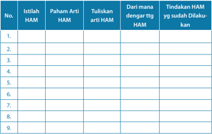

Tabel ini berisi informasi tentang istilah HAM (Hak Asasi Manusia) dan tindakan-tindakan yang dilakukan untuk melindungi hak tersebut. Topik utama tabel adalah paham dan pengenalan tentang Hak Asasi Manusia, termasuk definisi, tindakan yang telah dilakukan, dan cara mendengar tentang HAM. Kolom-kolomnya mencakup nomor urut, istilah HAM, paham arti HAM, tulisan arti HAM, dari mana mendengar tentang HAM, dan tindakan HAM yang sudah dilakukan. Data penting yang terlihat adalah bahwa tabel ini mencakup 9 baris, masing-masing menunjukkan informasi tentang satu istilah HAM dan tindakan-tindakan yang telah dilakukan untuk melindungi hak tersebut.

 

---
## 📄 Halaman 102

Guru  dapat  membuat  tabel  dalam  bentuk  lain  atau  peserta  didik  diberi kebebasan  untuk  membuat  tabel.  Pertanyaan  mengenai  arti  HAM  dan tindakan HAM amat penting sebagai indikator peserta didik sadar HAM.

### K. Penilaian

Penilaian  dalam  kurikulum  2013  berlangsung  sepanjang  proses.  Bentuk penilaian  dalam  pelajaran  ini  adalah  tes  lisan  mengenai  praktik  HAM  dan pemahaman tentang HAM. Penilaian diri sendiri mengenai praktik HAM, yaitu apakah peserta didik telah melaksanakan HAM. Penilaian tertulis mengenai HAM dalam kaitannya dengan manusia makhluk bermartabat. Penilaian karya dan unjuk kerja mengenai dokumen observasi dan presentasi.

 

---
## 📄 Halaman 103

### PENJELASAN BAB

### Sikap Gereja terhadap Demokrasi dan Hak Asasi Manusia di Indonesia

Bahan Alkitab: Matius 22:37-40; Amos 5:21-24

---
**📊 Tabel**

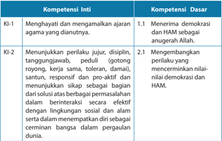

Tabel ini menunjukkan dua kompetensi inti (KI) yang disusun dengan kompetensi dasar (KD). Kompetensi inti pertama, KI-1, berkisar pada menghargai dan membangun ajaran agama yang dianutnya, sementara KI-2 fokus pada perilaku yang jujur, disiplin, tanggung jawab, peduli, santun, responsif, dan proaktif. Setiap kompetensi inti dijelaskan lebih lanjut melalui KD yang mencakup menerima demokrasi dan HAM sebagai anugerah Allah, serta mengembangkan perilaku yang mencerminkan nilai-nilai demokrasi dan HAM. Data penting dalam tabel ini adalah bahwa setiap kompetensi inti memiliki satu atau lebih KD yang mendukungnya, menunjukkan hubungan antara kompetensi inti dan dasar yang relevan.

 

---
## 📄 Halaman 104

---
**📊 Tabel**

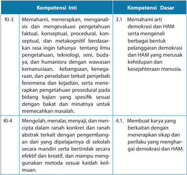

Tabel ini berisi informasi tentang kompetensi inti (KI) dan kompetensi dasar (KD) yang terkait dengan demokrasi dan HAM. Topik utama tabel adalah pembelajaran tentang demokrasi dan hak asasi manusia (HAM). Kolom KI-3 berisi kompetensi inti yang meliputi pemahaman, penalaran, dan evaluasi pengetahuan faktil, konseptual, prosedural, kontekstual, dan metakognitif. Kolom KD-3 menunjukkan bahwa peserta didik harus memahami demokrasi dan HAM serta mampu berbagai bentuk pelanggaran demokrasi dan HAM yang merusak kehidupan dan kesejahteraan manusia. Kolom KI-4 berisi kompetensi inti yang melibatkan pengolahan, menulis, dan menyelesaikan masalah dengan metode yang efektif dan kreatif. Kolom KD-4 menunjukkan bahwa peserta didik harus mampu membuat karya yang berkaitan dengan menerapkan sikap dan perilaku yang menghargai demokrasi dan HAM. Pola penting yang terlihat adalah bahwa tabel ini mencakup berbagai aspek pembelajaran yang berkaitan dengan demokrasi dan HAM, mulai dari pemahaman, penalaran, dan evaluasi hingga pengolahan dan menyelesaikan masalah.

### Indikator:

- Menganalisis  kasus    pelanggaran  terhadap    hak  asasi  manusia  serta memberikan penilaian kritis atasnya sebagai remaja Kristen.
- Menjelaskan  arti  pelayanan  Yesus  dalam  kaitannya  dengan  kebebasan manusia.
- Melakukan  kegiatan    di  gereja  masing-masing  yang  berkaitan  dengan peran gereja dalam  hak asasi manusia.
- Menulis  refl  eksi  mengenai    mewujudkan  HAM  yang  diikuti  dengan kewajiban  asasi  sebagai  orang  Kristen  kemudian  mempresentasikan  di kelas.

 

---
## 📄 Halaman 105

### A.  Pengantar

Pelajaran  ini  merupakan  bagian  akhir  dan  puncak  dari  3  bab  sebelumnya, mengenai  demokrasi  dan  hak  asasi  manusia.  Pada  pembahasan  ini,  peserta didik dibimbing untuk mempelajari mengenai sikap gereja terhadap demokrasi dan  HAM.  Bukan  hanya  sikap  gereja  sebagai  institusi/lembaga  tetapi  sebagai persekutuan dimana remaja Kristen menjadi bagian dari gereja itu sendiri. Tujuan mempelajari bahan ini agar peserta didik memiliki pemahaman yang baik dan benar  mengenai  demokrasi  dan  HAM  serta  cakupannya,  mengenai  kenyataan pelaksanaan  HAM  di  Indonesia.  Agar  peserta  didik  memiliki  kesadaran  penuh bahwa tiap orang Kristen terpanggil untuk secara proaktif mewujudkan demokrasi dan HAM dalam kehidupannya.

### B. Pembahasan Tugas

Guru  meminta  peserta  didik  mengumpulkan  tugas  observasi  tentang kesadaran hak asasi manusia  yang sudah dikerjakan dan membahasnya bersama guru.  Apa  kesimpulan  yang  mereka    peroleh?  Apakah  ada  kesulitan  dalam melakukan  wawancara?  Hasil  wawancara  peserta  didik  terhadap  responden dapat menjadi masukan mengenai kesadaran demokrasi dan HAM di kalangan remaja. Jika ternyata remaja sudah memiliki kesadaran demokrasi dan HAM, maka guru  dapat  melanjutkan  pembahasan  mengenai  demokrasi  dan  HAM  sebagai tanggung jawab bersama. Guru juga dapat bertanya pada peserta didik apakah mengalami  kesulitan  dalam  mengadakan  wawancara.  Jika  ada  kesulitan  guru dapat memperbaiki pada tugas yang akan datang. Misalnya jika ada pertanyaan yang kurang jelas dan kurang rinci, menyangkut hal-hal teknis, serta yang lainnya.

### C. Hak Asasi Manusia Menurut Alkitab

Pembahasan mengenai demokrasi dan HAM dalam Alkitab akan mengarahkan peserta didik untuk memahami prinsip-prinsip teologis mengenai demokrasi dan HAM. Pilihan pada Injil Matius dan   Kitab Amos berdasarkan pertimbangan:

- Injil Matius 22:37-40 menulis mengenai kasih dimana hukum ini merupakan hukum  yang  terpenting  bagi  orang  Kristen.  Bahwa  hubungan  manusia dengan Allah tidak terlepas dari hubungan manusia dengan sesama. Demikian pula  sebaliknya  hubungan  manusia  dengan  manusia  tidak  terlepas  dari hubungannya dengan Allah.  Dalam kaitannya dengan kasih, manusia tidak dapat mengasihi Allah jika tidak mengasihi sesamanya. Begitu juga sebaliknya, jika manusia tidak mengasihi sesamanya, ia juga tidak dapat mengasihi Allah. Hukum kasih menjadi dasar bagi orang Kristen dalam mewujudkan HAM dan keadilan bagi sesama tanpa memandang berbagai perbedaan yang ada.

 

---
## 📄 Halaman 106

- Kitab Amos 5:21-24 menulis mengenai perwujudan demokrasi dan HAM dan keadilan sebagai ibadah yang sejati bagi Allah. Jadi, mewujudkan demokrasi dan HAM serta keadilan bukan hanya sekadar tindakan mulia namun merupakan ibadah yang sejati. Manusia tidak dapat memisahkan antara ibadah formal dengan sikap hidup.
Melalui penjelasan ini diharapkan peserta didik memiliki pemahaman yang mendalam mengenai esensi iman Kristen bahwa ibadah bukan hanya melakukan ibadah formal seperti berdoa, membaca Alkitab, menghadiri kebaktian dan ibadah lainnya, melainkan juga menyangkut sikap hidup sehari-hari yang konsisten dalam menjalankan perintah Allah.

Untuk penjelasan selanjutnya guru dapat membaca di buku siswa ataupun dalam  bagian  penjelasan  bahan  Alkitab  pada  poin  I.  Dalam  bagian  tersebut dijelaskan isi teks Alkitab.

### D.  Memandang   Demokrasi dan HAM sebagai Tanggung Jawab Bersama: Warga Negara dan Warga Gereja

Puisi  yang  tercantum  di  buku  siswa  adalah  tulisan    W.S.  Rendra  (19352009),  penyair  terkemuka  Indonesia.  Ia  turut  berjuang  di  era  reformasi  untuk menumbangkan pemerintahan otoriter yang dipimpin oleh Presiden Soeharto. Rendra menulis puisi itu      untuk  mengenang  lembaran-lembaran hitam dalam sejarah bangsa Indonesia ketika seribu lebih orang Indonesia diperkosa, disiksa, dibunuh, dan dibakar. Pada waktu itu orang-orang Indonesia keturunan Tionghoa dan orang Kristen telah menjadi sasaran kekerasan yang amat keji. Peristiwa itu telah menorehkan lembaran hitam dalam perjalanan HAM di Indonesia. Sangat mengherankan  karena  sampai  dengan  saat  ini  belum  terungkap  siapa  yang menjadi otak pelanggaran berat hak-hak asasi manusia pada bulan Mei-Juni 1998 itu.  Yang  diadili  dan  dijatuhi  hukuman  barulah  prajurit-prajurit  kecil  pelaksana di lapangan. Karena itu vonis yang diberikan pun hanya sebatas pemecatan dan hukuman  penjara  untuk  para  pelaku  penembakan  di  Universitas  Trisakti  dan Semanggi.

Sementara itu, siapa para pelaku pemerkosaan, penyiksaan, dan pembunuhan atas sekian ribu korban lainnya mungkin akan tetap gelap dan tidak terungkapkan. Berbagai peristiwa pelanggaran HAM yang diungkapkan dalam bahan pelajaran ini tidak bertujuan mendiskreditkan pihak mana pun. Dengan membuka peristiwa ini,  generasi  muda  dapat  belajar  dari  kesalahan  yang  pernah  dilakukan  oleh generasi  terdahulu  dan  termotivasi  untuk  mewujudkan  demokrasi  dan  HAM dalam kehidupannya. Hal ini perlu ditegaskan karena meskipun Indonesia telah bertumbuh  menjadi  negara  demokrasi  namun  masih  ada  pihak  tertentu  yang

 

---
## 📄 Halaman 107

tidak  ingin  berbagai  peristiwa  pelanggaran  HAM  dibuka  dan  dipercakapkan secara  terbuka.  Seolah-olah  percakapan  terbuka  akan  memprovokasi  rakyat untuk memandang pemerintah secara negatif. Padahal dengan membuka kasuskasus pelanggaran HAM  akan memberikan pembelajaran kepada generasi muda untuk tidak mengulang hal yang sama dan sekaligus sebagai bentuk peringatan dan solidaritas kita bagi para korban pelanggaran HAM.

Bagaimana dengan praktik gereja di Indonesia sehubungan dengan hak asasi manusia?    Ignas  Kleden,  seorang  sosiolog  Indonesia,  mengajukan  pertanyaanpertanyaan berikut.

- Bagaimana masalah hak asasi manusia dipandang dari segi kegerejaan?
- Apakah  persoalan  hak  asasi  manusia  cukup  dikenal  dalam  kalangan  umat gereja?
- Kalau ada pengetahuan mengenai hak asasi manusia, sejauh mana pimpinan dan umat gereja melibatkan diri dalam perjuangan untuk hak asasi manusia?
- Kalau  ada  keterlibatan  dalam  perjuangan  itu,  apakah  partisipasi  gereja  itu semata-mata karena desakan politis atau karena keyakinan keagamaan?
- Pada  tahap  yang  lebih  tinggi  dapat  dipersoalkan  apakah  ada  dasar-dasar teologis untuk hak-hak asasi manusia?
- Dapatkah perjuangan untuk hak asasi manusia diintegrasikan dengan usaha penyelamatan oleh gereja, dan diberi watak soteriologis [penyelamatan]?
- Apakah  perjuangan  hak  asasi  manusia  lebih  merupakan  masalah  keadilan atau masalah perwujudan cinta kristiani yang diajarkan dalam gereja?
Pertanyaan-pertanyaan  di  atas  sungguh  menantang.    Jürgen  Moltmann (lahir 8 April 1926), seorang teolog terkemuka pada abad XX dan XXI dari Jerman mengatakan bahwa Allah yang menyatakan diri kepada Israel dan orang Kristen adalah  Allah  yang  membebaskan  dan  menebus  mereka.  Dialah  Allah  yang menciptakan seluruh umat manusia dan segala sesuatu yang ada.

Jadi,  tindakan  Allah  yang  membebaskan  dan  menebus  dalam  sejarah, mengung  kapkan masa depan sejati manusia, yakni menjadi 'gambar Allah' . Dalam seluruh hubungan kehidupan-manusia dengan sesamanya dan segala makhluk di dalam seluruh ciptaan - manusia mempunyai 'hak' akan masa depan. Sebagai 'gambar  Allah'  manusia  mestinya  memiliki  martabat  yang  tinggi  dan  mulia. Hak-hak  asasi  manusia  tidak  boleh  dirampas  dan  diinjak-injak.  Merampas  dan menginjak-injak hak-hak asasi manusia berarti menghina dan melecehkan Sang Penciptanya sendiri. Atau seperti yang dikatakan oleh   Ignas Kleden,

 

---
## 📄 Halaman 108

' Penghormatan kepada hak asasi, dipandang dari sudut iman kristiani dan teologi Kristen, adalah sama saja dengan penghormatan kepada setiap orang sebagai perwujudan citra Tuhan [=gambar Allah] sendiri. Pelecehan terhadap hak asasi adalah pelecehan terhadap citra Tuhan, yaitu citra yang, menurut kepercayaan  Kristen,  terdapat  dalam  diri  setiap  orang,  apakah  dia  dibaptis atau tidak dibaptis. '

Berdasarkan  apa  yang  dikatakan  oleh    Moltmann,  mestinya  jelas  jawaban kepada pertanyaan Kleden tersebut, bahwa ada dasar-dasar teologis yang kuat untuk hak-hak asasi manusia. Persoalannya ialah, seperti yang ditanyakan oleh Kleden, apakah warga gereja cukup menyadari masalah ini? Kalau ya, seberapa jauh pimpinan dan warga gereja ikut terlibat dalam perjuangannya? Dan kalaupun terlibat,  apakah  karena  desakan  politis,  ikut-ikutan  kelompok-kelompok  lain, ataukah memang benar-benar karena alasan teologis yang kuat?

Pertanyaan  terakhir  Kleden  membawa  kita  kepada  rangkaian  pertanyaan yang  tajam  dan  kritis:  bagaimana  kita  memandang  dan  meninjau  gereja  dari perspektif hak asasi manusia. Pertanyaan kritisnya:

- Sejauhmana hak-hak asasi diterapkan secara konsekuen dalam gereja sendiri? Ataukah ada pelanggaran hak asasi manusia yang bersifat khas yang hanya terjadi dalam kalangan gereja saja?
- Bagaimana  membandingkan  ajaran  gereja  tentang  manusia  dengan  kedudukan manusia dalam hak asasi manusia?
- Adakah gerakan-gerakan pembaharuan dalam gereja yang dinamakan gerakan yang diilhami oleh tema hak asasi manusia? Mungkin masih ada beberapa soal lain yang belum disebutkan di sini. Akan tetapi, pokok permasalahannya ialah bahwa Gereja pada saat ini tidak dapat lagi berdiam diri atau bersikap acuh tak acuh terhadap masalah hak asasi manusia. Dapat saja gereja tidak mempedulikannya, tetapi hal itu akan menyebabkan kehadiran gereja sendiri tidak diperhatikan dan bahkan diremehkan.
Pertanyaan-pertanyaan  tersebut  membuat  gereja  dan  orang  Kristen  harus memeriksa  diri  sendiri.  Dalam  bab  yang  lalu  kita  sudah  mencatat  berbagai pelanggaran hak asasi manusia.  Namun, seperti yang ditanyakan oleh Kleden di atas, seberapa jauh orang Kristen telah mempraktikkan hak asasi manusia di dalam lingkungannya sendiri?  Dengan  kata  lain,  gereja  dan  orang  Kristen  semestinya tidak hanya menuntut supaya diperlakukan dengan adil, diakui hak-hak asasinya sebagai manusia, tetapi juga memberlakukan hal yang sama kepada orang lain, kepada sesama  nya. Seperti yang dikatakan oleh Yesus sendiri dalam Matius 7:12,

 

---
## 📄 Halaman 109

' Segala sesuatu yang kamu kehendaki supaya orang perbuat kepadamu , perbuatlah demikian juga kepada mereka. Itulah isi seluruh hukum Taurat dan kitab para nabi ' .

Untuk menghadapi  masalah-masalah yang menyangkut pelanggaran terhadap demokrasi dan HAM, gereja dan orang Kristen harus mendidik warga gereja dan anak-anaknya agar mereka menjadi sadar akan hak, tanggung jawab, dan  kewajiban  mereka  sebagai  warga  negara.  Bersama-sama  dengan  orangorang beragama lain, orang Kristen harus bekerja sama untuk membela orangorang yang kehilangan hak-haknya atau yang ditindas karena dianggap berbeda dari orang lain.

Tanggung jawab dalam membangun kesadaran demokrasi dan HAM bukan hanya merupakan tugas pemerintah namun menjadi tugas gereja. Siapakah yang dimaksudkan dengan 'gereja' itu? Gereja tidak lain adalah orang-orangnya, jemaat. Setiap  anggota  gereja,  termasuk  peserta  didik  sebagai  seorang  remaja  Kristen, harus ikut serta di dalam tugas ini. Kita semua perlu berjuang dalam pembebasan banyak orang Indonesia dari keterkungkungan dan belenggu oleh berbagai hal seperti  kemiskinan,  konsep  tentang  kedudukan  laki-laki  dan  perempuan  yang keliru,  pemahaman  yang  keliru  tentang  seks  dan  seksualitas,  konsep  tentang kebebasan beragama dan berkeyakinan, dan lain-lain. Untuk melakukan semua tugas  itu,  gereja  -  kita  semua  -  perlu  bekerja  sama  dengan  orang-orang  lain yang berbeda keyakinan namun memiliki kepedulian yang sama. Kita sadar akan keterbatasan kita untuk melakukan semua tugas tersebut sendirian.

### E. Bagaimana dengan Gereja Kita Sendiri?

Berdasarkan  pertanyaan-pertanyaan  Kleden  di  atas,  umat  Kristen  harus bertanya, bagaimana cara memperlakukan orang-orang yang berada di sekitarnya. Begitu  pula  hubungan  yang  ada  dalam  organisasi  gerejawi.  Dalam  hubungan gereja  dan  orang  Kristen  dengan  sesamanya  yang  berbeda  keyakinan,  apakah telah terbangun hubungan yang saling memanusia  kan? Apakah gereja dan umat Kristen cenderung memperjuangkan hak-haknya semata dan tidak peduli ketika orang yang beragama lain kehilangan hak-haknya?

Pada skala nasional ada banyak masalah yang membelit para tenaga kerja Indonesia  di  luar  negeri  menyangkut  hak  asasi  mereka.  Ada  yang  meninggal disiksa majikan, ada yang diperlakukan tidak manusiawi dan lain-lain.

Dalam sebuah acara gerejawi di Bandung pada tahun 2006, seorang tokoh Kristen yang juga adalah tokoh hak asasi manusia di Indonesia (  Asmara Nababan), mengemukakan  pikiran  kritisnya  tentang  peranan  gereja-gereja  Indonesia  di bidang hak asasi manusia dan demokrasi. Katanya:

 

---
## 📄 Halaman 110

'Kesadaran  orang  Kristen  atau  gereja  di  bidang  hak  asasi  manusia  semakin meningkat seiring dengan terjadinya peristiwa-peristiwa yang dianggap merugikan  mereka,  mungkin  maksudnya:  peristiwa  Situbondo,  Ambon,  Poso, Ternate  dan  lain-lain.  Hal  ini  menunjukkan  bahwa  kesadaran  akan  hak  asasi manusia belum sepenuhnya dihayati. Sesuai dengan panggilan gereja sebagai orang-orang yang sudah ditebus dan dimerdekakan, semestinya mereka menjadi pelopor dan penggerak bagi penegakan hak asasi manusia dan demokrasi.'

Sebelum tahun 1998 hak asasi manusia dan demokrasi belum menjadi prioritas, buktinya belum terakomodasi dalam konstitusi. Gerakan reformasi tahun 1998 telah membangunkan pemerintah dari tidur yang panjang untuk serius menyikapi penegakan hak asasi manusia di Indonesia. Berbagai produk hukum yang melindungi hak asasi manusia diakomodir dalam konstitusi. Sampai pada tahap ini pun gereja belum menunjukkan sikap yang berarti bahkan gereja cenderung diam.

### F. Apa yang Harus Dilakukan?

Puisi  'Sajak Bulan Mei 1998 di Indonesia'  pada  pembukaan  bab  ini menggambarkan betapa rakyat kecil dan kaum lemah lainnya di negeri ini sering diperlakukan dengan sewenang-wenang, sehingga dalam keputusasaan akhirnya mereka pun ikut merampok. Berkaitan dengan penegakan demokrasi dan HAM serta tugas panggilan gereja, kitapun bertanya  apakah gereja sudah melakukan tugas-tugasnya seperti yang telah dibahas dibagian sebelumnya. Tampaknya ada beberapa pola partisipasi gereja dalam perjuangan demi keadilan dan kebenaran. Misalnya:

- Gereja  paham  bahwa  ia  mempunyai  tugas  dan  panggilan  untuk  bersaksi, bersekutu  dan  melayani  di  dalam  dunia.  Namun,  pelayanan  gereja  hanya terbatas kepada hal-hal yang karitatif saja, tidak menggali ke akar persoalannya karena berbagai alasan. Mungkin karena gereja tidak mengerti analisis sosial, atau gereja takut melakukannya apabila di balik semua itu ada penguasa yang mau berbuat apa saja untuk mempertahankan kedudukannya.
- Gereja  melakukan  pelayanan  rohani  saja  karena  untuk  pelayanan  sosial bukankah  sudah  ada  Kementerian  Sosial  dan  lembaga-lembaga  swadaya masyarakat? Penyebab utama dari pemikiran ini adalah segala sesuatu yang berkaitan dengan yang jasmani, dengan tubuh manusia dan bukan jiwanya, dianggap remeh, rendah, dan duniawi.
- Gereja paham akan panggilannya untuk membela orang miskin dan tertindas, tetapi khawatir karena jumlah orang Kristen sangat sedikit. Bagaimana kalau nanti gereja dan orang Kristen ditindas?

 

---
## 📄 Halaman 111

- Gereja terjebak pada praktik-praktik politik praktis. Ketika gereja aktif dalam kegiatan  membela  rakyat  miskin,  gereja  malah  aktif  mendukung  partai politik  tertentu,  berkampanye  untuk  calon-calon  tertentu.  Keadaan  seperti ini bisa berbahaya bagi gereja. Gereja bisa menutup mata ketika pihak yang didukungnya melakukan hal-hal yang negatif, seperti korupsi, membohongi rakyat dengan janji-janji kosong, atau bahkan merampas hak-hak rakyat baik secara halus maupun terang-terangan.
Di kalangan gereja-gereja di  dunia  ada tokoh-tokoh yang tampil dan memperjuangkan HAM, misalnya:

- Pdt. Dr. Martin Luther King, Jr. dari Amerika Serikat,
- Uskup Desmond Tutu dari Afrika Selatan,
- Kim Dae Jung dari Korea Selatan yang pernah menjabat presiden.
- Dari  Indonesia  ada  Dr.  Yap  Thiam  Hien,  Pdt.  Rinaldy  Damanik  dari  Poso, Sulawesi Tengah, Ibu Yosepha Alomang atau Mama Yosepha, dari Papua, Ibu Ade Sitompul dari Jakarta, Pdt. Solagratia Lummy, Dr. Mokhtar Pakpahan yang memperjuangkan hak-hak buruh/pekerja  di Indonesia.
Setelah penjelasan ini, guru minta peserta didik mencari dari berbagai sumber mengenai  tokoh-tokoh  tersebut  dan  ceritakan  di  kelas  mengenai  tokoh-tokoh tersebut.

### G.  Gereja, Politik dan Demokrasi: Bagaimana Sikap Yesus Menyang  kut Politik?

Politik  erat  kaitannya  dengan  kekuasaan.  Meskipun  Yesus  tidak  berbicara secara khusus mengenai politik dan kekuasaan namun sikapnya terhadap politik dan  kekuasaan  nyata  melalui  praktik  kehidupan.  Ketika  kepada-Nya  diajukan pertanyaan  ini  oleh  orang-orang  Farisi: 'Katakanlah kepada kami pendapat-Mu: Apakah  diperbolehkan  membayar  pajak  kepada  Kaisar  atau  tidak?' (Mat  22:17). Maka jawab Yesus: 'Berikanlah kepada Kaisar apa yang wajib kamu berikan kepada Kaisar dan kepada Allah apa yang wajib kamu berikan kepada Allah' (Mat 22:21).

Ketika itu orang-orang Farisi ingin menjebak Yesus dengan mengajukan pertanyaan tersebut kepada-Nya. Yesus pun menjawab bahwa mereka memberikan kepada kaisar  apa yang wajib mereka berikan kepada Kaisar. Artinya, setiap orang harus  mempunyai  keprihatinan  tertentu  terhadap  kesejahteraan  sosial-politik negaranya dan harus taat sebagai seorang warga negara, sedangkan pemerintah harus melaksanakan suatu tanggung jawab yang berasal dari  Allah. 'Berikanlah kepada Kaisar apa yang wajib kamu berikan kepada Kaisar' juga berarti kesetiaan

 

---
## 📄 Halaman 112

kepada Allah, karena Allah berkehendak agar kita menaruh perhatian pada masyarakat kita. Pada gilirannya hal ini merupakan suatu pemenuhan sebagian dari tugas  mendasar kita,  yaitu  untuk  memberikan  kepada  Allah  apa  yang  menjadi hak-Nya. Jadi, partisipasi orang beriman dalam politik tidak terlepas dari ketaatannya kepada perintah Allah. Paulus memperkuat sikap Yesus ini dalam   Kitab Roma 13:1-7  yang menyatakan  orang Kristen harus taat kepada pemerintah. Namun hanya mereka yang layak dihormati dan ditaati saja yang akan ditaati dan dihormati. Arti  nya jika mereka yang berkuasa tidak menjalankan kekuasaannya dengan benar maka mereka tidak patut dihormati. Ketaatan dan hormat diberikan bersamaan dengan sikap kritis, objektif, dan rasional.

### Gereja, Politik, dan Demokrasi

Membahas mengenai Gereja, politik, dan demokrasi tidaklah lengkap jika tidak disinggung mengenai    hubungan antara Gereja dengan negara atau pemerintah. Dalam  sejarah  kekristenan  pernah  terjadi  gereja  berada  di  bawah  kekuasaan pemerintah.  Misalnya,  pada  zaman  Konstantinus  Agung  berkuasa  dimana  dia menyatakan agama Kristen menjadi agama negara. Saat itu posisi gereja menjadi sub-ordinatif  atau  dibawah  kekuasaan  negara/pemerintahan.  Segala  hal  yang dilakukan oleh gereja harus memperoleh persetujuan pemerintah dan disesuaikan dengan kepentingan pemerintah. Sebaliknya, pada abad pertengahan sebelum reformasi  kekuasaan  Paus  begitu  amat  kuat  sehingga  pemerintah  berada  di bawah kekuasaan gereja. Pada masa itu raja yang berkuasa harus memperoleh persetujuan  Paus,  dalam  hal  ini  Paus  menjadi  wakil  gereja  yang  memerintah. Namun, setelah reformasi situasi ini berubah, para reformator memberikan garis batas antara gereja dengan negara, sehingga baik negara maupun gereja memiliki otoritas atau wilayahnya sendiri.

Bagaimana kaitan antara demokrasi dengan politik dan apa kaitannya dengan gereja.  Politik  memiliki  pengaruh  penting  dalam  perkembangan  demokrasi. Demokrasi  tidak  berjalan  baik  apabila  tidak  ditunjang  oleh  terbangunnya politik  yang  sesuai  dengan  prinsip-prinsip  demokrasi.  Disini  gereja  memiliki kepentingan sebagai kontrol terhadap perwujudan politik dan demokrasi yang menjamin terpenuhinya hak warga masyarakat sebagai manusia yang memiliki martabat. Kamus Besar Bahasa Indonesia mendefi  nisikan politik  sebagai proses pembentukan dan pembagian kekuasaan dalam masyarakat, antara lain berwujud proses  pembuatan  keputusan,  khususnya  dalam  negara.  Menurut  Aristoteles politik adalah usaha yang ditempuh warga negara untuk mewujudkan kebaikan bersama. Adapun demokrasi adalah bentuk pemerintahan di mana pemerintahan dilakukan dari rakyat, oleh rakyat, dan untuk rakyat. Artinya, suara dan kepentingan rakyat menjadi tujuan utama dari kekuasaan atau pemerintahan. Politik adalah

 

---
## 📄 Halaman 113

pengabdian kepada kepentingan masyarakat dan bangsa. Hal terpenting adalah kesejahteraan masyarakat bukan pengelola negara.

Dalam rangka membahas  mengenai sikap gereja-gereja di Indonesia  terhadap demokrasi dan HAM, dapat dipelajari dokumen surat pastoral yang dikeluarkan oleh PGI menjelang Pemilu Presiden tahun 2014.  Dalam buku siswa, guru meminta peserta didik mendiskusikan isi pesan pastoral tersebut dikaitkan dengan sikap gereja berkaitan dengan demokrasi dan HAM.

### Pesan Pastoral  PGI untuk Pemilu Presiden 2014

Sumber :

https://twitter.com/pgi_oikoumene

Gambar 10.2

Logo PGI

### Saudara-Saudara Umat Kristiani di Seluruh Indonesia,

Tahapan Pemilu Presiden (Pilpres) kini sedang berlangsung. Dua pasangan calon sudah ditetapkan Komisi Pemilihan Umum (KPU) pada 1 Juni 2014, yakni  pasangan  Nomor  Urut  1:  Prabowo  Subianto/Hatta  Rajasa,  yang diusulkan oleh gabungan partai politik oleh Gerindra, Golkar, PAN, PKS, PPP dan PBB; serta pasangan Nomor Urut 2: Joko Widodo/M. Jusuf Kalla, yang diusulkan oleh PDIP, Nasdem, PKB, Hanura dan PKPI.

### Gunakan Hak Pilih

Dalam Pilpres yang akan berlangsung pada Rabu, 9 Juli 2014 nanti, kita akan memilih siapa yang akan menjadi nakhoda bangsa ini selama 5 (lima) tahun ke depan. Oleh karena itu, gunakan hak pilih Anda sebagai bentuk tanggung jawab iman percaya Anda. Dengan memilih, Anda bisa menentukan orang yang tepat untuk menjadi presiden dan wakil presiden.

 

---
## 📄 Halaman 114

### Politik Uang adalah Dosa!

Pertanyaannya,  siapa  yang  akan  dipilih?  Perlu  ditegaskan  bahwa  Pemilu itu tidak  semata-mata soal hasil.  Hasil sangat ditentukan oleh proses dan proses yang baik akan menentukan hasil yang baik pula. Terlalu terfokus pada  hasil  seringkali  tanpa    disadari    menjerumuskan    pemilih    kepada partisipasi  politik  yang pragmatis  dan  transaksional.  Pengalaman  pada Pemilihan  Umum  Legislatif,    9  April  lalu,  menunjukkan  bahwa  politik tran  saksional dalam bentuk politik uang merajalela dimana-mana. Bahkan, ada warga gereja dan gereja sendiri ikut-ikutan terlibat di dalamnya.

Kita perlu memaknai kembali substansi partisipasi gereja dalam kerangka memperkuat integritas proses dan kualitas hasil Pemilu itu sendiri. Jangan lagi terlibat dalam politik uang! Politik uang merupakan pembodohan rakyat dan merusak substansi demokrasi kita. Dalam 1 Timotius 6:10 ditegaskan  bahwa  '... akar  segala  kejahatan  ialah  cinta  uang.  Sebab  oleh  memburu  uanglah  beberapa  orang  telah me  nyimpang dari iman ...' Begitu juga dalam Kitab Keluaran 23:8 ditegaskan bahwa 'Suap janganlah kau terima, sebab suap membuat buta mata orang-orang yang melihat dan memutarbalikkan perkara orang-orang yang benar . '   (Lihat juga Ulangan 16:19). Dengan demikian, politik uang adalah dosa.

### Kriteria Pemimpin yang Baik

Alkitab memberikan rujukan yang jelas tentang pentingnya  kepemimpinan dalam sebuah bangsa. Pemimpin hadir untuk menjalankan mandat ilahi. Roma  13:1  mengatakan '... tidak  ada  pemerintah,  yang  tidak  berasal  dari Allah; dan pemerintah- pemerintah yang ada ditetapkan oleh Allah . '  Karena itu,  proses  memilih  pemimpin  bangsa  tidaklah  terlepas  dari  mandat  dan campur tangan Allah. Jadi, ketika kita memilih pemimpin kita harus sadari bahwa kita sedang menjalankan mandat ilahi untuk melahirkan pemimpin yang baik dan bertanggungjawab.

Lalu, seperti apakah pemimpin yang baik? Kitab Keluaran 18:21 mengatakan bahwa mereka yang layak dipilih sebagai pemimpin haruslah 'orang-orang yang cakap dan takut akan Allah, orang-orang yang dapat dipercaya, dan yang benci kepada pengejaran suap.' Bandingkan juga Kisah Para Rasul 6:3 ' ... pilihlah tujuh orang di antara kamu, yang terkenal baik, dan yang penuh Roh dan hikmat ... ' .

 

---
## 📄 Halaman 115

Dua  pesan  Alkitab  ini  kiranya  dapat  menuntun  kita  untuk  menentukan pilihan dalam Pilpres, demi menghasilkan pemimpin bangsa yang baik dan bertanggung jawab bagi kesejahteraan seluruh rakyat Indonesia.

### Pedoman Memilih

Dalam menghadapi Pemilihan Presiden pada 9 Juli 2014, PGI menyerukan beberapa hal berikut sebagai pedoman bagi warga gereja untuk memilih.

- 1 Pelajarilah  dan  cermatilah  visi  dan  misi  pasangan  calon  sebelum Anda  menentukan  pilihan.  Sebab  visi  dan  misi  inilah  yang  akan menjadi  kerangka  kerja  dan  program  pasangan  calon  jika  terpilih. Berikan penilaian dan kritisi apakah visi dan misi itu dapat dilakukan atau  hanya  sekadar 'mimpi'  untuk  mempengaruhi  suara  hati  Anda. Bandingkan  juga  visi  dan  misi  tersebut  dengan   'idiologi'    masingmasing  partai  pendukung.  Hal  ini penting  agar kita bisa  mengukur derajat  kesungguhan  bangunan  koalisi  partai  pengusung  dan  tidak terjebak memilih 'kucing dalam karung.'
- Pemimpin yang baik  biasanya lahir melalui sebuah  pro  ses  yang  baik dan  alamiah. Proses  inilah yang  kami yakini.
- Membentuk    karakter    dan    sedikit    banyak    akan    mempengaruhi kiner  ja  kepemimpinannya.  Proses  yang  baik  akan menentukan orientasi kepemimpinan, apakah berorientasi  'kekuasaan' atau  'kepentingan rakyat.'   Oleh karena itu, pelajari jugalah rekam jejak para calon, apakah mereka memang selama ini berjuang demi rakyat dan sungguh-sungguh  menghargai  harkat  dan  martabat  manusia.  Pasangan calon dipilih dalam satu paket mesti saling melengkapi sebagai calon presiden dan calon wakil presiden. Nilailah dan cermatilah, apakah pasangan itu memang betul-betul pasangan yang harmonis dan dapat saling melengkapi dalam tugas dan pekerjaannya atau tidak!
Sejauh mana calon wakil presiden bisa bekerja sama, mendukung dan melengkapi calon presiden. Sebab jika pasangan calon tidak kompak, tidak  harmonis,  tidak  saling  mendukung,  maka  sudah  pasti  proses pemerintahan akan mengalami hambatan dan rakyat akan merasakan akibatnya.

 

---
## 📄 Halaman 116

- Pasangan calon diusung oleh gabungan  partai politik. Hal ini jangan  hanya  dimaknai  sebagai  sebuah  syarat  keikutsertaan  dalam Pilpres    semata,  sebab    partai  pendukung    memiliki    peran    yang penting,  sehingga  akan    mempengaruhi    proses  kepemimpinan ke  depan.  Cermatilah  'idiologi'  apa  yang  ada  di  balik  partai-partai pengusung,  rekam  jejak  mereka  di  masa  lalu,  kelompok  organisasi sayap pendukung apa yang ada di dalamnya, siapa saja tokoh utama yang  berpengaruh  terhadap  partai  tersebut,  apakah  partai-partai itu  bersih  dan  tidak  terlibat  korupsi.  Hal-hal  ini  penting  agar  jangan sampai  calon    terpilih    disandera    atau    dipengaruhi    oleh    partaipartai  tersebut  dalam  menjalankan  pemerintahan. Perhatikan juga apakah bangunan koalisi partai itu bersifat transaksional atau memang sungguh-sungguh untuk kepentingan kesejahteraan rakyat. Manakah partai koalisi itu yang tidak  secara jelas menjadikan Pancasila sebagai pedoman  dalam  kehidupan  berbangsa  dan  bernegara,  melainkan ideologi lain. Bagaimana komitmen partai-partai pendukung tersebut terhadap kebebasan beragama dan berkeyakinan di Indonesia.
- Waspadai  kampanye  jahat  ( bad  campaign )  yang  hanya  bertujuan menjelek-jelekkan calon tertentu dan memuji calon yang lain. Model kampanye  yang  menyinggung  isu  SARA  sudah  pasti  mencederai demokrasi dalam pemilu dan merusak bangunan kebangsaan kita.  Jangan  memilih  berdasarkan  SARA.  Jangan  terpengaruh  dan terprovokasi  serta  ikut  serta  melakukannya.  Pemilu  harus  menjadi ajang  bagi  kita  untuk  memilih  pemimpin  yang  mampu  menjaga tegaknya NKRI berdasarkan Pancasila dan UUD 45.
- Untuk  memastikan  proses  dan  hasil  Pemilu  baik  dan  berintegritas, maka  kami  menganjurkan  warga  gereja  untuk  terlibat  aktif  dalam pengawasan  pemilu. Laporkan pelanggaran kepada pihak yang berwajib, termasuk para pelaku kampanye jahat. Peliharalah kedamaian agar proses pemilu ini dapat berlangsung secara tertib dan aman.
- Sebagai institusi, gereja tidak dalam posisi mendukung atau menolak salah satu pasangan calon. Gereja tidak berpolitik praktis. Politik gereja adalah  politik  moral,  bukan  politik  dukung-mendukung.  Janganlah jadikan gereja sebagai arena kampanye untuk pemenangan salah satu pasangan calon, agar tidak menimbulkan konfl  ik di antara jemaat dan memicu hal-hal yang tidak kita inginkan bersama.

 

---
## 📄 Halaman 117

Gereja  harus  tetap  suci,  dan  tidak  boleh  dikotori  oleh  kepentingankepentingan politik tertentu.

Demikianlah Pesan Pastoral. Kita berdoa: Tuhan, Pencipta dan Pemelihara Kehidupan memberkati Indonesia. Amin.

### Atas nama

Majelis Pekerja Harian Persekutuan Gereja-Gereja di Indonesia

Sekretaris Umum

Ketua Umum

Pdt. Dr. A.A.   Yewangoe

Pdt. Gomar Gultom

(Sumber : Diunduh dari www.pgi.net tanggal 05 Agustus 2014)

### H.  Penjelasan Bahan Alkitab

Penjelasan Bahan Alkitab diadaptasi dari www.sabda.or.id

###  Injil Matius 22:37-40

Dalam   Injil  Matius 22:37-40 dikisahkan tentang seorang Farisi yang bertanya kepada Yesus tentang apakah hukum yang paling utama. Dia berharap bahwa hanya ada satu saja hukum yang perlu dia lakukan agar hidupnya menjadi sempurna. Namun Yesus ternyata menjawab lain. Ada dua hukum yang paling penting dan paling utama, dari kedua hukum itu masing-masing adalah: (1) mengasihi Allah dengan seluruh keberadaan kita; dan (2) mengasihi sesama kita seperti diri kita sendiri.

Lalu Yesus mengatakan bahwa kedua hukum itu sama pentingnya, walaupun hukum yang pertama itu disebut-Nya sebagai 'hukum yang terutama dan yang pertama'. Artinya, tidak mungkin orang hanya mengasihi Allah tetapi tidak  mengasihi  sesamanya  sendiri.  Hubungan  yang  baik  dengan  Allah harus  terwujud  dalam  hubungan  yang  baik  dengan  sesama.  Masalahnya, banyak orang yang tidak memahami perintah ini. Bagi mereka sudah cukup jika mereka mencintai Allah atau Tuhan mereka sementara orang lain tidak

 

---
## 📄 Halaman 118

mereka cintai. Ada juga orang yang merasa dapat bertindak apa saja karena cinta  kasihnya  kepada  Tuhan.  Alkitab  mengajarkan  hal  ini  tidak  mungkin terjadi.   Hubungan vertikal antara manusia dengan Allah harus terwujud pula dalam    hubungan  horizontal  antara  manusia  dengan  sesamanya.  Dalam  1 Yohanes 2:9 dan 4:20 dikatakan:

Jikalau seorang berkata: 'Aku mengasihi Allah,' dan ia membenci saudaranya, maka ia adalah pendusta, karena barangsiapa tidak mengasihi saudaranya yang dilihatnya, tidak mungkin mengasihi Allah, yang tidak dilihatnya.

Mengasihi sesama berarti menunjukkan kepedulian kepada sesama, kesediaan untuk menolong, bahkan juga berkorban demi orang lain.

###  Kitab Amos 5:22-24

Kitab-kitab  para  nabi  penuh  dengan  perintah  dari  Allah  sendiri  agar  Israel menegakkan keadilan dan kebenaran. Mengapa demikian? Karena kepedulian kepada  sesama  ini  mestinya  terwujud  dalam  upaya  untuk  menegakkan keadilan dan kebenaran, itulah ibadah yang sejati kepada Allah.   Kitab Amos 5:21-24, menyatakan

21 'Aku  membenci,  Aku  menghinakan  perayaanmu  dan  Aku  tidak  senang kepada perkumpulan rayamu. 22 Sungguh, apabila kamu mempersembahkan kepada-Ku korban-korban bakaran dan korban-korban sajianmu, Aku tidak suka,  dan  korban  keselamatanmu  berupa  ternak  yang  tambun,  Aku  tidak mau pandang.  23 Jauhkanlah dari pada-Ku keramaian nyanyian-nyanyianmu, lagu gambusmu tidak mau Aku dengar.  24 Tetapi biarlah keadilan bergulunggulung seperti air dan kebenaran seperti sungai yang selalu mengalir.'

Dalam ayat-ayat di atas jelas bahwa ibadah dan penyembahan kepada Allah harus berjalan sesuai  dengan kehidupan yang adil dan benar kepada sesama manusia.  Pengingkaran terhadap hak sesama manusia  dapat pula dikategorikan sebagai pengingkaran terhadap kasih Allah  yang telah menciptakan manusia sebagai makhluk mulia yang memiliki harkat dan martabat.

### I. Kegiatan Pembelajaran

### Pengantar

Pada  bagian  pengantar  peserta  didik  diarahkan  untuk  memahami  makna tanggung  jawab  gereja  dan  umat  Kristen  di  bidang  HAM.  Peserta  didik juga dibimbing untuk memahami mengapa pembahasan ini penting untuk dipelajari oleh remaja Kristen.

 

---
## 📄 Halaman 119

### Kegiatan 1

### Laporan dan Diskusi Hasil Observasi

Mengumpulkan  tugas  observasi  tentang  kesadaran  hak  asasi  manusia yang  sudah  dikerjakan  dan  membahasnya  bersama  guru.  Berdasarkan hasil observasi tersebut, guru dan peserta didik dapat menyimpulkan fakta mengenai keterlibatan gereja dan umat Kristen di bidang HAM. Guru dapat meminta beberapa peserta didik untuk menyampaikan hasil observasinya di depan kelas, kemudian guru dan peserta didik menyimpulkan hasil penelitian itu.

### Kegiatan 2

### Belajar dari Puisi

Guru  dan  peserta  didik  bersama-sama  mempelajari  puisi  yang  ada  dalam buku siswa. Guru bisa minta salah seorang peserta didik membacakan puisi itu  di  depan  kelas.  Kemudian  guru  memberikan  penjelasan  sesuai  dengan bahan yang ada dalam buku teks untuk peserta didik mengenai isi puisi dan peristiwa yang terjadi pada tahun 1998. Guru dan peserta didik membahas mengenai langkah apa saja yang telah dilakukan oleh gereja dan orang Kristen sebagai masukan dan kritik pada pemerintah menyangkut peristiwa tersebut maupun  berbagai  peristiwa  pelanggaran  HAM  yang  terjadi  di  Indonesia. Guru perlu menjelaskan bahwa sampai dengan saat ini masih ada gereja yang membagi pemikiran menyangkut dunia sekuler dan profane atau hal-hal yang bersifat surgawi dan duniawi. Pandangan ini menyebabkan sebagian orang berpikir  gereja  tidak  perlu  mencampuri  berbagai  persoalan  yang  terjadi dalam masyarakat karena itu merupakan domain atau urusan negara. Bahwa gereja hanya berkaitan dengan 'ibadah' dan hal-hal teologis semata-mata (hal profane )  padahal jika mengacu pada bagian Alkitab yang menjadi referensi pembelajaran ini, yaitu Kitab Amos 5:22-24 bahwa ada kaitan antara hal-hal yang profane dengan  yang  dipandang  sekuler. Yaitu  ibadah  kepada Tuhan hendaknya mencakup sikap hidup manusia terhadap sesama.

Guru meminta peserta didik menulis komentar mereka di dalam kolom yang telah tersedia atau menulis di kertas (supaya buku teks dapat dipakai  lagi oleh adik kelasnya).

Guru  membimbing  peserta  didik  untuk  memahami  tugas  dan  kewajiban gereja dan orang Kristen di bidang HAM menurut Alkitab. Mengacu pada dua bagian Alkitab yang dipilih sebagai acuan dalam membahas topik pelajaran ini. Bahwa hukum yang terutama yang diberikan Allah bagi manusia adalah

 

---
## 📄 Halaman 120

hukum kasih. Manusia tidak dapat mengatakan mengasihi Allah jika ia tidak mengasihi  sesamanya,  sebaliknya  ia  tidak  dapat  mengatakan  mengasihi sesama jika ia tidak mengasihi Allah.

### Kegiatan 3.

### Diskusi

Guru  membimbing  peserta  didik  mendiskusikan  dokumen  surat  gembala PGI    kepada  jemaat  berkaitan  dengan  Pemilihan  Umum  tahun  2014. Perhatikan sub judul yang dibold yang menandai bahwa politik uang adalah dosa,  kriteria  pemimpin  yang  baik  dan  pedoman  memilih.  Sub-sub  judul tersebut  berisi  panduan  sekaligus  pengajaran  yang  diberikan  oleh  Gereja bagi umatnya. Pengajaran ini penting supaya remaja Kristen dapat dipandu dalam  mengekpresikan  sikap  yang  sesuai  dengan  iman  Kristen  berkaitan dengan demokrasi dan HAM. Pendalaman dokumen ini sekaligus merupakan pencerahan  bagi  guru-guru  PAK  dalam  menjalankan  perannya  di  bidang demokrasi dan HAM.

### Kegiatan 4

### Pendalaman Alkitab

Kasih  kepada  Allah  dan  sesama  hendaknya  diwujudkan  dalam  bentuk kepedulian dan solidaritas bagi sesama dan dalam ibadah kepada Allah. Guru dapat membaca bahan yang ada dalam buku siswa untuk meperlengkapi diri dalam mengajar.

Guru  melanjutkan  penjelasannya  mengenai  Gereja  dan  HAM  secara  lebih spesifi  k menyorot mengenai bagaimana gereja-gereja di Indonesia berperan di bidang HAM. Ada beberapa pendapat yang diangkat dari tokoh-tokoh di kalangan umat kristiani, baik tokoh dunia, maupun di Indonesia.

Guru  memberikan  penjelasan  secara  rinci  mengenai  beberapa  pola  atau bentuk  keterlibatan  gereja  di  bidang  HAM.  Kemudian  untuk  memperkuat atau mempertajam pembahasan, perlu diangkat beberapa tokoh yang telah dikenal dunia maupun di Indonesia, mereka mempersembahkan hidupnya untuk memperjuangkan hak-hak sesamanya.

Guru meminta peserta didik mencari dari berbagai sumber mengenai tokohtokoh yang disebutkan kemudian melaporkan hasil temuan mereka di kelas. Atau pada pertemuan sebelumnya guru telah menugaskan peserta didik untuk mencari dari berbagai sumber mengenai tokoh-tokoh tersebut. Ketika peserta didik melaporkan temuannya mengenai tokoh-tokoh tersebut, mereka dapat menyebutkan tokoh-tokoh setempat yang telah mendedikasikan hidupnya untuk membela hak-hak orang lain.

 

---
## 📄 Halaman 121

### Kegiatan 5

### Dialog

Ada rumusan dialog yang tercantum dalam buku siswa, guru menugaskan peserta didik melakukan dialog tersebut, dapat juga dijadikan sebagai drama yang menggambarkan partisipasi remaja SMA di bidang HAM.

Setelah  melakukan  dialog  atau  pementasan,  guru  minta  peserta  didik memberikan komentar mengenai peran gereja di bidang HAM, yaitu meminta mereka menilai sikap gereja di tempat masing-masing sehubungan  hak asasi manusia.  Apakah  mereka    pernah  menyaksikan  gereja  sebagai  lembaga, melalui para anggota majelis, pendeta atau pun warganya yang melakukan pembelaan  terhadap  orang-orang  yang  tertindas  dan  diperlakukan  secara tidak adil? Peserta didik dapat memberikan penilaian atau bercerita tentang apakah ada konsultasi hukum yang diberikan secara cuma-cuma di gerejanya. Bagaimana hal itu dilakukan?

### Kegiatan 6

### Diskusi

Peserta  didik  mendiskusikan  dalam  kelompok  pertanyaan  di  bawah  ini, kemudian laporkan di kelas atau dapat ditulis  kemudian dikumpulkan untuk dinilai oleh guru.

- Jelaskan  sikap  yang  dapat  diambil  oleh  gereja  dalam  menunjukkan keberpihakannya pada  hak asasi manusia!
- Jelaskan sikap Yesus tentang hak asasi manusia yang berkaitan dengan kebutuhan hidupnya! Baca Matius 20:1-16 dan diskusikan pesan apa yang ingin disampaikan Yesus lewat perumpamaan tersebut!
- Sebagai  remaja  Kristen,  apa  yang  dapat  kamu  lakukan  untuk  lebih mensosialisasikan  tentang  kesadaran  hak  asasi  manusia  dikalangan remaja? Bandingkan dengan percakapan atau dialog yang kalian lakukan di depan kelas!

### J. Penutup

Guru mengajak  peserta didik mengucapkan doa untuk kebaktian hak asasi manusia 2005 berikut.

Melalui penjelmaan-Mu, ya Yesus, Engkau telah menganugerahkan martabat yang mulia kepada setiap manusia. Tolonglah kami agar kami bersungguhsungguh menjawab panggilan kami untuk menciptakan sebuah masyarakat yang adil. Kami bersyukur kepada-Mu karena iman kami dan karena panggilan gereja untuk menghormati dan melindungi seluruh hak asasi mausia. Kiranya kami boleh menyimpan ajaran ini sebagai harta kami yang berharga. Amin.

 

---
## 📄 Halaman 122

### K. Penilaian

Bentuk  penilaian  adalah  tes  lisan  pada  kegiatan  2  ketika  peserta  didik mepresentasikan laporan dan diskusi hasil observasi, guru juga dapat melakukan penilaian  kinerja  menilai  proses  observasi  yang  dilakukan  oleh  peserta  didik apakah  dilakukan  dengan  sungguh-sungguh    dengan  menerapkan  kaidah ilmiah  (tentu  tidak  sama  dengan  prosedur  di  mata  pelajaran  IPA  atau  mata pelajaran lainnya). Apakah pelaksanaan observasi benar-benar dilakukan dan  dapat  dipertanggungjawabkan.  Guru  juga  dapat  menilai  dokumen  hasil observasi peserta didik. Penilaian tertulis ketika peserta didik  menuliskan komentar  mengenai    langkah-langkah  apa  yang  sudah  diambil  oleh  lembagalembaga keagamaan untuk melakukan kritik dan usulan pada pemerintah dalam menindak para pelaku pelanggaran hak asasi manusia! Contoh format penilaian dan penjelasan mengenai penilaian tercantum dalam pengantar buku guru.

### L. Tugas

- Cari dari berbagai sumber beberapa tokoh ini dan pengabdian mereka dalam membela hak-hak asasi manusia yaitu: Dr.  Yap  Thiam Hien, Pdt. Rinaldy   Dam  anik dari Poso, Sulawesi Tengah, Ibu Yosepha Alomang atau Mama   Yosepha dari Papua,  Ibu  Ade  Sitompul  dari  Jakarta,  Pdt.  Solagratia  Lummy,  Dr.  Mokhtar Pakpahan.
- Lakukan wawancara dengan pendeta atau majelis jemaat di gereja masingmasing. Tanyakan kepada mereka bagaimana keterlibatan gereja yang mereka layani dalam upaya hak asasi manusia. Kumpulkan tugas ini pada pertemuan berikut  untuk  dinilai,  dan  hasil  wawancara  dipresentasikan  di  depan  kelas. Adapun untuk panduan daftar pertanyaan adalah sebagai berikut.
- Apakah ada program jemaat yang berkaitan dengan hak asasi manusia? Kalau tidak ada, mengapa?
- Kalau  ada  program  seperti  itu,  siapa  saja  yang  terlibat  di  dalamnya? Mengapa mereka mau terlibat?
- Siapa yang menjadi sasaran program?
- Mengapa mereka yang menjadi sasaran program?

 

---
## 📄 Halaman 123

### PENJELASAN BAB

### Multikulturalisme

Bahan Alkitab: Galatia 3:28; Kolose 3: 11

---
**📊 Tabel**

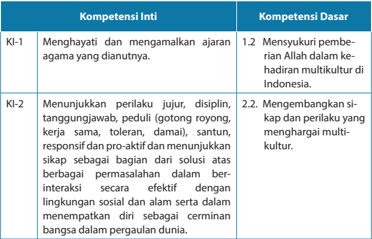

Tabel ini berisi informasi tentang kompetensi inti dan dasar yang relevan dengan kehidupan di Indonesia. Topik utamanya adalah tentang bagaimana menjaga dan menghargai agama yang dianut serta bagaimana menunjukkan sikap positif dalam berinteraksi dengan orang-orang berbeda budaya. Kolom-kolomnya mencakup dua jenis kompetensi: Kompetensi Inti (KI) dan Kompetensi Dasar (KD). Kompetensi Inti meliputi dua poin utama: KI-1 yang berkaitan dengan menghargai dan mematuhi ajaran agama yang dianut, serta KI-2 yang membahas tentang sikap dan perilaku yang proaktif dan responsif dalam berinteraksi dengan orang-orang berbeda budaya. Sementara itu, kolom KD mencakup dua poin utama: KD-1 yang berkaitan dengan menunjukkan dukungan kepada Allah dalam kehadiran multikultural di Indonesia, dan KD-2 yang membahas tentang kemampuan untuk mengembangkan sikap dan perilaku yang menghargai multikultural. Pola penting yang terlihat adalah bahwa tabel ini mencakup dua aspek utama dari kompetensi, yaitu bagaimana menjaga dan menghargai agama yang dianut serta bagaimana menunjukkan sikap positif dalam berinteraksi dengan orang-orang berbeda budaya.

 

---
## 📄 Halaman 124

---
**📊 Tabel**

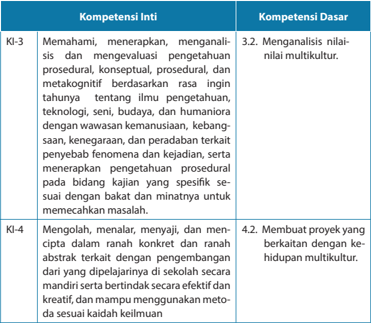

Tabel ini berisi informasi tentang kompetensi inti (KI) dan kompetensi dasar (KD) yang berkaitan dengan pengetahuan prosedural, konspektual, dan metakognitif tentang ilmu pengetahuan, teknologi, seni, budaya, dan humaniora. Topik utama tabel adalah pembelajaran dan pengembangan keterampilan dalam konteks multikultural. Kolom KI-3 mencakup pemahaman, menerapkan, dan evaluasi pengetahuan prosedural, konspektual, dan metakognitif tentang ilmu pengetahuan, teknologi, seni, budaya, dan humaniora. Kolom KD-4 menunjukkan kemampuan membuat proyek yang berkaitan dengan kehidupan multikultural. Data penting yang terlihat adalah bahwa tabel ini mencakup dua kompetensi inti dan satu kompetensi dasar, yang membahas berbagai aspek pengetahuan dan keterampilan dalam konteks multikultural.

### Indikator

- Mencari  dari  berbagai  sumber  mengenai  multikulturalisme  kemudian menjelaskan  pengertian  multikulturalisme serta  mendiskusikan  cara mensyukuri multikulturalisme.
- Menyusun tulisan pendek mengenai multikulturalisme di Indonesia.
- Mempresentasikan  poin-poin  atau  pokok-pokok  penting    menyangkut nilai-nilai multikultur yang  dapat dimanfaatkan dalam  rangka memperkuat kesatuan umat Kristen secara khusus dan bangsa Indonesia.
- Menilai diri sendiri, apakah peserta didik memiliki kesadaran multikultur dan menerapkan dalam sikap hidup sebagai orang beriman.

 

---
## 📄 Halaman 125

### A.  Pengantar

Multikulturalisme  merupakan  topik  penting  untuk  dipelajari  oleh  remaja SMA. Saat ini dunia kita adalah multikultur di mana masyarakat tidak lagi bersifat homogen melainkan heterogen. Masyarakat berpindah dari satu tempat ke tempat lainnya, dari satu negara ke negara lainnya dan dengan sendirinya menciptakan keberagaman ataupun multikultur. Di sekeliling kita ada begitu banyak keberagaman yang tampak mata. Keberagaman itu melahirkan berbagai dampak dalam  kehidupan  sosial  kemasyarakatan  bahkan  dalam  kehidupan  beragama. Ada berbagai suku,  kebangsaan, budaya, agama, kelas sosial, keberagaman gaya hidup dan cara pandang, itulah multikulturalisme. Jadi, yang dimaksudkan dengan multikulturalisme bukan hanya sekadar kepelbagaian budaya tetapi mencakup keberagaman yang telah disebutkan di atas.

Melalui  pembahasan  ini  diharapkan    peserta  didik  memiliki  wawasan  dan memperoleh pencerahan  mengenai apa dan bagaimana multikulturalisme. Selanjutnya  peserta  didik  termotivasi  untuk  memiliki  kesadaran  multikultur  serta mampu menerima dan menghargai multikultur, pada gilirannya mereka mampu menerapkan kesadaran multikultur dalam sikap hidup sebagai remaja Kristen.

Pembahasan topik ini dilakukan dengan cara studi kepustakaan, yaitu peserta didik  diminta mencari dari berbagai sumber mengenai multikulturalisme, mendiskusikannya dan mempresentasikan hasil temuan, serta melakukan kajian. Selanjutnya,  peserta didik  diminta untuk menulis refl  eksi mengenai multikulturalisme di Indonesia ataupun di daerah masing-masing.

Bab  ini  dan  dua  bab  berikutnya    saling  berkaitan  satu  dengan  yang  lain. Bab  ini    membahas  mengenai  multikulturalisme,  sedangkan  bab    berikutnya membahas mengenai sikap gereja terhadap multikulturalisme, setelah itu peserta didik membahas mengenai sikap terhadap orang yang berbeda iman pada bab berikutnya. Mengapa pembahasan mengenai sikap terhadap orang yang berbeda iman ditempatkan bersamaan dengan pembahasan mengenai multikulturalisme? Hal ini dikarenakan di Indonesia pada  umumnya keberagaman melekat dalam identitas  suku  dan  agama.  Bahkan  untuk  kekristenan  sendiri  gereja-gereja  di Indonesia turut diwarnai oleh kepelbagaian suku dan kebudayaan.

### B. Pengertian Multikulturalisme

Ada beberapa pendapat dari para ahli mengenai defi  nisi multikulturalisme:

- Multikulturalisme adalah sebuah ideologi yang mengakui dan mengagungkan perbedaan  dalam  kesederajatan,  baik  secara  individual  maupun  secara kebudayaan.

 

---
## 📄 Halaman 126

- Multikulturalisme merupakan suatu gagasan untuk mengatur keberagaman dengan  prinsip-prinsip  dasar  pengakuan  akan  keberagaman  itu  sendiri. Gagasan ini menyangkut pengaturan relasi antara kelompok mayoritas dan minoritas,  keberadaan  kelompok  imigran  masyarakat  adat  dan  lain-lain (Taylor).
- Parsudi Suparlan mengungkapkan bahwa multikulturalisme adalah adanya politik  universalisme  yang  menekankan  harga  diri  kulturalisme  sebagai sebuah ideologi yang mengakui dan mengagungkan semua manusia, serta hak  akan  perbedaan  dalam  kesederajatan  baik  secara  individual  maupun sosial.
- Multikulturalisme  pada  dasarnya  adalah  pandangan  dunia  yang  kemudian dapat diterjemahkan dalam berbagai kebijakan kebudayaan yang menekankan tentang penerimaan terhadap realitas keagamaan, pluralitas, dan multikultural yang terdapat dalam kehidupan masyarakat. Multikulturalisme dapat juga dipahami sebagai pandangan dunia yang kemudian diwujudkan dalam kesadaran politik (Azyumardi Azra, 2007).
Menurut    Lawrence  Blum,  multikulturalisme  mencakup  suatu  pemahaman, penghargaan serta penilaian atas budaya seseorang, serta suatu penghormatan dan keingintahuan tentang budaya etnis orang lain. (Berbagai defi  nisi tersebut diambil  dari: http://id.shvoong.com/social-sciences/education//2203877-pengertianmultikultural/#ixzz2CGSbdgUo, http://mohkusnarto.wordpress.com/  masyarakatmultikulturalisme, www.wikipedia.org).

Mengacu pada beberapa pendapat tersebut di atas, dapatlah disimpulkan bahwa  multikulturalisme    mencakup:  gagasan,  cara  pandang,  kebijakan,  sikap dan  tindakan  oleh  masyarakat  suatu  negara  yang  masyarakatnya  beragam dari segi etnis, budaya, agama, kelas sosial, gaya hidup, dan sebagainya. Dalam kepelbagaian  itu,  masyarakat  mengembangkan  semangat  kebangsaan  dan mempertahankan  keberagaman  sebagai  suatu  kekayaan  dan  anugerah  Allah. Dalam  cakupan  pandangan  ini  ada  penerimaan  terhadap  realitas  keagamaan yang pluralis dan multikultural yang ada dalam kehidupan masyarakat.

Suparlan  mengutip   Taylor yang mengatakan bahwa  ide multikulturalisme merupakan  suatu  gagasan  untuk  mengatur  keberagaman  dengan  prinsipprinsip dasar pengakuan akan keberagaman itu sendiri. Gagasan ini menyangkut pengaturan relasi antara kelompok mayoritas dan minoritas, keberadaan kelompok imigran masyarakat adat dan lain-lain. Selanjutnya dikatakan  bahwa multikulturalisme  adalah  sebuah  ideologi  yang  mengakui  dan  mengagungkan perbedaan dalam kesederajatan baik secara individual maupun secara kebudayaan. Oleh  karena  itu,  konsep  multikulturalisme  tidaklah  dapat  disamakan  dengan

 

---
## 📄 Halaman 127

konsep keanekaragaman menyangkut suku, kebangsaan atau kebudayaan  yang menjadi  ciri  khas  masyarakat  majemuk.  Lebih  jauh  dari  itu,  multikulturalisme menekankan kebudayaan dalam kesederajatan. Berkaitan dengan konfl  ik sosial, multikulturalisme  merupakan  paradigma  baru  dalam  upaya  merajut  kembali hubungan  antarmanusia  yang  belakangan  selalu  hidup  dalam  suasana  penuh konfl  ik.

Melalui multikulturalisme masyarakat diajak untuk menjunjung tinggi toleransi, kerukunan, dan perdamaian bukan konfl  ik atau kekerasan dalam arus perubahan sosial.  Paradigma  multikulturalisme  diharapkan  menjadi  salah  satu  solusi  bagi konfl  ik  sosial  yang  sering  kali  terjadi  pada  masa  kini.  Dengan  demikian,  inti multikulturalisme adalah kesediaan menerima  kelompok  lain  secara  sama sebagai kesatuan, tanpa mempedulikan perbedaan budaya, etnis, gender, bahasa, ataupun agama. Adapun fokus multikulturalisme terletak pada pemahaman akan hidup penuh dengan perbedaan sosial budaya, baik secara individual maupun kelompok  dan  masyarakat.  Dalam  hal  ini  individu  dilihat  sebagai  refl  eksi  dari kesatuan sosial dan budaya. Multikulturalisme  mengulas berbagai permasalahan yang  tidak  hanya  menyangkut  perbedaan  budaya  tetapi  juga  mengandung ideologi, politik, demokrasi, penegakan hukum, keadilan, kesempatan kerja dan berusaha, HAM, hak budaya komunitas golongan minoritas  dan prinsip-prinsip etika (  Parsudi Suparlan, 2002)

### C. Masyarakat Multikultur

Dalam  masyarakat  multikultural  orang  hidup  berdampingan  satu  sama lain  dalam  suasana  toleransi  dan  menghargai  berbagai  perbedaan  yang  ada, menyangkut  adat, kebiasaan, kesenian, pakaian adat, musik, dan tari. Tidak ada satu  kelompok  masyarakat  pun  yang  tersubordinasi  atau  direndahkan.  Semua perbedaan  memperoleh  tempat  dalam  masyarakat  multikultur.  Orang-orang saling  beradaptasi  dan  belajar  dari  berbagai  perbedaan  yang  ada,  mereka bertumbuh  bersama  dan  berubah  bersama  menjadi  lebih  baik  dalam  rangka memperjuangkan kebersamaan, keadilan,  dan  pemerataan  di  berbagai  bidang kehidupan.  Struktur  sosial  dan  interaksi  sehari-hari  ditentukan  oleh  keadilan, kebersamaan,  rasa  hormat,  kesetaraan,  pemahaman,  penerimaan,  kebebasan, keragaman, mengadakan berbagai upaya perdamaian serta mengadakan berbagai  perayaan secara bersama-sama.

Dalam istilah atau pengertian multikulturalisme ada tuntutan untuk menerima serta memperlakukan semua orang di dalam berbagai perbedaannya sebagai manusia yang bermartabat dan makhluk mulia ciptaan Tuhan. Ada prinsip keadilan dan persamaan yang erat kaitannya dengan hak asasi manusia. Mengapa

 

---
## 📄 Halaman 128

demikian? Pada mulanya sejak zaman kolonialisme terjadi penindasan terhadap suku, bangsa dan budaya masyarakat tertentu. Ada bangsa dan budaya tertentu yang  menjadi  begitu  superior  dan  berkuasa  dan  mereka  cenderung  menolak serta menindas suku, bangsa dan budaya lain bahkan agama lain. Setelah zaman kolonialisme berakhir pun suku, bangsa, budaya maupun agama mayoritas masih menjalankan  praktik  penindasan  dan  pengabaian  terhadap  kaum  minoritas maupun  yang  dipandang  lebih  rendah  dari  mereka  yang  berkuasa.  Bahkan sampai dengan saat ini kita dapat membaca berbagai informasi, melihat maupun menonton  di  media  elektronik  bahwa  masih  ada  orang-orang  dari  kelompok tertentu yang diperlakukan secara tidak adil maupun susah memperoleh akses ke berbagai bidang kehidupan.

Berbagai kenyataan tersebut melahirkan sebuah pandangan baru mengenai multikulturalisme dan pluralisme. Melalui pandangan baru ini diharapkan manusia memiliki cara pandang yang baru terhadap keberagaman, yaitu semua manusia dalam kepelbagaian/keberagamannya memiliki hak yang sama untuk diterima, dihargai dan dipenuhi hak-hak asasinya sebagai manusia. Setiap orang memiliki hak untuk diberikan akses ke berbagai bidang kehidupan.

### D.  Masyarakat Multikultur Indonesia

Multikultural secara substansi sebenarnya tidaklah terlalu asing bagi bangsa dan Negara Indonesia. Para bapak bangsa telah menyadari keberagaman bangsa ini antara lain,  kepelbagaian budaya yang pada satu sisi merupakan kekayaan yang patut disyukuri namun pada sisi lain dapat menjadi sumber konfl  ik. Oleh karena itu, mereka mengikat berbagai perbedaan itu dalam semboyan   Bhinneka Tunggal Ika  artinya  berbeda-beda  tetapi  tetap  satu.  Prinsip  Indonesia  sebagai  negara Bhinneka  Tunggal  Ika  mencerminkan  meskipun  Indonesia  merupakan  negara multikultural, tetapi tetap terintegrasi dalam persatuan dan kesatuan. Indonesia merupakan sebuah negara kesatuan dari banyak unsur. Kepelbagaian itu terlihat dari keadaan geografi  snya, berbagai latar belakang sosial-ekonomi, sosial-politis, sosial-religius, sosial-budaya, tata cara kehidupan, dan lain sebagainya.

Kepelbagaian suku,  kebangsaan, budaya, geografi  s, adat istiadat, kebiasaan, pandangan hidup maupun agama dijamin oleh UUD 1945 dan Pancasila sebagai dasar Negara. Apakah jaminan itu dengan sendirinya terbukti dalam kehidupan sosial kemasyarakatan? Tentu tidak karena di sekitar kita masih terdapat begitu banyak  persoalan  yang  berakar  dari  multikultur  tersebut.  Berbagai  konfl  ik  dan pertentangan yang sering diikuti dengan kekerasan yang dipicu oleh berbagai perbedaan  suku,  budaya,  adat  istiadat,  agama  masih  terjadi  di  Indonesia.  Di sekitar kita, di lingkungan pergaulan, masih terdapat orang-orang yang memiliki

 

---
## 📄 Halaman 129

prasangka buruk terhadap orang dari latar belakang suku atau agama tertentu. Bahkan  masih  ada  orang  tua  yang  tidak  mau  mengawinkan  anaknya  dengan orang yang berasal dari daerah tertentu dan budaya tertentu karena prasangka yang ada.

Menyikapi  berbagai  kenyataan  tersebut,  para  pemimpin  bangsa  dari  berbagai  kalangan  baik  pemerintah,  tokoh  adat,  akademisi  maupun  tokoh  agama berupaya untuk membangun pluralisme dan multikulturalisme. Upaya tersebut terwujud dalam berbagai kegiatan nyata yang dilakukan di tengah masyarakat. Upaya tersebut penting namun harus dilakukan secara menyeluruh, antara lain keadilan dan kepastian hukum. Seringkali terjadi konfl  ik di kalangan masyarakat yang seolah-olah dipicu oleh perbedaan suku dan agama padahal akar sesungguhnya adalah ketidakadilan sosial ataupun ketidak merataan kesempatan (akses) dan pendapatan hidup. Hal itu dapat menimbulkan kecemburuan dari pihak yang merasa termarginalkan jika  kebetulan  dua  belah  pihak  berbeda  latar  belakang suku dan agama maka ketika terjadi konfl  ik, isu mengenai ketidakadilan menjadi tenggelam. Akibatnya yang tampak adalah konfl  ik karena perbedaan suku dan agama. Oleh karena itu, memperjuangkan terwujudnya pluralisme dan multikulturalisme hendaknya tidak terpisahkan dari prinsip keadilan dan pemerataan sosial dan tindakan hukum bagi semua orang tanpa kecuali.

Berbagai  kasus  yang  terjadi  menunjukkan  bahwa  penegakan  hukum  bagi mereka yang bersalah dalam kasus-kasus menyangkut pertentangan dan konfl  ik yang bernuansa suku dan agama belum dilakukan secara benar.

### E. Apa Kata Alkitab Mengenai Multikulturalisme?

Alkitab  tidak  berbicara  secara  khusus  mengenai  multikulturalisme  namun dalam  kaitannya  dengan  kasih,  kebaikan,  kesetaraan  dan  keselamatan  itu diberikan bagi semua manusia tanpa kecuali. Dalam Kitab Perjanjian Baru Galatia 3:28  tertulis semua manusia yang berasal dari berbagai suku, bangsa dan  kelas sosial  dipersatukan  dalam  Kristus.  Artinya  kasih  Kristus  diberikan  bagi  semua orang tanpa memandang asal-usul mereka.   Kolose 3:11 lebih mempertegas lagi bahwa Kristus adalah semua dan di dalam segala sesuatu. Menjadi manusia baru dalam Kristus berarti manusia yang tidak lagi melihat sesamanya dari perbedaan latar belakang suku, bangsa, budaya, kelas sosial (kaya-miskin), pandangan hidup, kebiasaan dan lain-lain. Menjadi manusia baru artinya orang beriman yang telah menerima keselamatan dalam Yesus Kristus  wajib  menerima,  menghargai,  dan mengasihi sesamanya tanpa memandang berbagai perbedaan yang ada.

Ketika  membaca   Kitab  Perjanjian  Lama      terutama  lima  kitab  pertama  ada kesan  seolah-olah  Allah  membentuk  Israel  sebagai  bangsa  yang  eksklusif  dan

 

---
## 📄 Halaman 130

menjauhkannya dari  bangsa-bangsa  lain.  Hal  ini  melahirkan  pemikiran  seolaholah Allah 'mengabaikan' bangsa lain, seolah-olah Allah menolak mereka. Akan tetapi, dalam tulisan Kitab Perjanjian Lama, ketika Israel masuk ke tanah Kanaan ada seorang perempuan beserta keluarga besarnya diselamatkan karena ia telah menolong para pengintai. Nampaknya yang menjadi fokus utama dalam Kitab Perjanjian Lama adalah bagaimana Allah mempersiapkan Israel sebagai bangsa yang akan mewujudkan 'ibadah dan ketaatannya' pada Allah. Jadi, yang ditolak dari bangsa-bangsa lain adalah ibadah mereka yang tidak ditujukan pada Allah. Jika  orang-orang  Israel  bergaul  dengan  bangsa-bangsa  itu  dan  mereka  tidak memiliki kemampuan untuk memfi  lter atau menyaring berbagai pengaruh dari budaya dan ibadah mereka, maka akibatnya bangsa itu akan melupakan Allah dan  tidak  lagi  beribadah  kepada-Nya.  Dalam  kaitannya  dengan  multikultur di  Indonesia,  kita  dapat  mengangkat  pertanyaan  sebagai  berikut:  Apakah mewujudkan  multikulturalisme  berarti  kita  kehilangan  identitas  suku,  bangsa dan agama kita? Tentu tidak, dan inilah yang ditolak oleh Allah dalam Perjanjian Lama,  yaitu  ketika  persentuhan  atau  pertemuan  umat-Nya  dengan  bangsabangsa lain menyebabkan mereka kehilangan identitasnya sebagai umat Allah. Multikulturalisme dibangun di atas dasar solidaritas, persamaan hak, keadilan dan HAM dimana perbedaan diterima dan diakui serta tidak menghalangi kerja sama dalam menanggulangi berbagai permasalahan kemanusiaan.

Yesus sendiri mengemukakan sebuah cerita mengenai orang Samaria yang murah  hati  untuk  menjelaskan  pada  para  pendengarnya  mengenai  siapakah sesama  manusia  dan  bagaimana  kita  harus  mengasihi.  Cerita  mengenai  orang Samaria yang murah hati mewakili pandangan Yesus mengenai kasih pada sesama. Bahwa semua orang tanpa kecuali terpanggil untuk mewujudkan solidaritas dan kasih  bagi  sesama  tanpa  memandang  perbedaan  latar  belakang.  Solidaritas dan  kasih  itu  tidak  meniadakan  perbedaan  namun  menerima  perbedaan  itu sebagai anugerah dan dalam perbedaan itulah manusia diberi kesempatan untuk mewujudkan kasih  dan  solidaritasnya  bagi  sesama.  Di  zaman  Perjanjian  Lama, ketika  bangsa  Israel  akan  memasuki  tanah  Kanaan,  ada  seorang  perempuan Kanaan beserta keluarganya yang diselamatkan karena perempuan itu membantu para pengintai ketika mereka sedang dikejar oleh tentara Kanaan.

### F. Menerapkan Kesadaran dan Praktik Hidup Multikultur

Tuhan menciptakan manusia dalam kepelbagaian supaya dapat saling mengisi dan  melengkapi  satu  dengan  yang  lain.  Dalam  diri  manusia  juga  dianugerahi

 

---
## 📄 Halaman 131

kebaikan dan kemampuan untuk beradaptasi  dalam kaitannya  dengan alam dan lingkungan hidup terutama dengan sesamanya. Manusia juga diciptakan sebagai makhluk mulia yang memiliki harkat dan martabat. Di era modern sekarang ini, masyarakat dunia memiliki kesadaran multikultur yang jauh lebih baik, bahkan pemenuhan hak setiap orang untuk diterima dan dihargai. Hak untuk memperoleh keadilan, demokrasi, dan HAM telah menjadi kewajiban yang harus dipenuhi baik oleh  negara  terhadap  warganya  maupun  oleh  sesama  warga  negara  termasuk warga gereja.  Meskipun demikian, masih banyak terjadi pelanggaran terhadap pemenuhan hak pribadi maupun kelompok masyarakat minoritas. Ambil contoh di Indonesia yang pada zaman Orde Baru tidak ada pengakuan terhadap agama Khonghucu,  bahkan  masyarakat  keturunan  Tionghoa  amat  dibatasi  hak-hak politiknya. Sejak zaman Reformasi, kaum minoritas mulai menikmati pemenuhan hak-haknya.  Di  bawah  pemerintahan  Presiden  Abdulrahman  Wahid,  negara mengakui  agama  Khonghucu  dan  hak-hak  masyarakat  keturunan  Tionghoa dipulihkan.

Dalam  komunitas  Kristiani,  gereja-gereja  di  Indonesia  dibangun  di  atas bangunan  suku  karena  anggota  gereja  terdiri  dari  orang-orang  yang  berasal dari  berbagai  suku,  budaya,  adat  dan  kebiasaan  serta  geografi  s  yang  berbedabeda.  Bahkan  tiap  sinode  gereja  berada  di  geografi  s  tertentu  dengan  budaya dan  suku  tertentu.    Meskipun  gereja-gereja  nampak  memiliki  afi  liasi  dengan suku dan daerah tertentu namun tetap terbuka bagi orang-orang yang berasal dari daerah, suku, dan budaya lainnya. Misalnya GKI yang dahulunya merupakan gereja untuk orang-orang Indonesia keturunan Tionghoa, pada masa kini yang menjadi anggota GKI berasal dari berbagai suku, budaya, dan daerah. Demikian juga GPIB yang didirikan untuk orang-orang dari Indonesia Timur pada masa kini terbuka bagi orang-orang dari berbagai daerah, suku, dan budaya.   Gereja Bethel Indonesia  (GBI)  adalah  gereja  yang  sangat  terbuka  terhadap  multikultur,  dan jemaatnya amat beragam dari segi suku, kebangsaan, budaya, geografi   bahkan kelas  sosial.  Ada  beberapa  sinode  gereja  yang  anggotanya  terbatas  pada  suku tertentu, misalnya pada orang-orang Batak. Dalam gereja yang multikultur, setiap orang dapat belajar membangun persekutuan di atas berbagai perbedaan. Jemaat dapat  belajar  dari  saudara  seiman  yang  berasal  dari  daerah,  suku,  dan  budaya yang berbeda.  Nilai-nilai budaya dan suku yang positif dapat memperkaya liturgi dalam ibadah. Pola-pola hubungan antarjemaat yang positif juga dapat diperkaya dari nilai-nilai budaya yang beragam.

 

---
## 📄 Halaman 132

### G.  Sumbangan Multikulturalisme dalam Memperkuat Persatuan Umat Kristen dan Bangsa Indonesia.

Ada  beberapa  nilai    yang  dapat  diwujudkan  dalam  tindakan    untuk memperkuat persatuan sebagai bangsa Indonesia yang multikultur.

- Pengakuan terhadap berbagai perbedaan dan kompleksitas kehidupan dalam masyarakat.
- Perlakuan yang sama terhadap berbagai komunitas dan budaya, baik yang mayoritas maupun minoritas.
- Kesederajatan kedudukan dalam berbagai keanekaragaman dan perbedaan, baik secara individu ataupun kelompok serta budaya.
- Penghargaan  yang  tinggi  terhadap  hak-hak  asasi  manusia  dan  saling menghormati dalam perbedaan.
- Unsur kebersamaan, solidaritas, kerja sama, dan hidup berdampingan secara damai dalam perbedaan.
Beberapa poin tersebut di atas merupakan nilai-nilai yang dapat dibangun dalam  membina  kehidupan  bersama  sebagai  bangsa  yang  multikultur.  Peran pendidikan  dan  pola  asuh  dalam  keluarga  amat  penting  untuk  menanamkan nilai-nilai tersebut. Pada masa kini sudah banyak tokoh nasional dan pemerhati pendidikan yang menganjurkan untuk memberlakukan pendidikan multkultural di sekolah dan perguruan  tinggi. Hal ini penting  mengingat  pendidikan merupakan  salah  satu  unsur    yang  dapat  menjadi  kekuatan  perubah  dalam masyarakat. Pendidikan menjadi pendorong perubahan yang efektif bagi individu dan masyarakat.

Berikut ada tawaran bagi umat Kristen dalam kaitannya dengan multikulturalisme.  Beberapa  sikap  yang  harus  dihindari  dalam  membangun masyarakat multikultural yang rukun dan bersatu adalah sebagai berikut.

### 1.    Primordialisme

Primordialisme  artinya  perasaan  kesukuan  yang  berlebihan.  Menganggap suku bangsanya sendiri yang paling unggul, maju, dan baik. Sikap ini tidak baik untuk dikembangkan di masyarakat yang multikultural seperti Indonesia. Apabila sikap ini ada dalam diri warga suatu bangsa, maka kecil kemungkinan mereka untuk dapat menerima keberadaan suku bangsa yang lain.

 

---
## 📄 Halaman 133

### 2.    Etnosentrisme

Etnosentrisme artinya sikap atau pandangan yang berpangkal pada masyarakat  dan  kebudayaannya  sendiri,  biasanya  disertai  dengan  sikap dan pandangan yang meremehkan masyarakat dan kebudayaan yang lain. Indonesia  dapat  maju  dengan  bekal  kebersamaan,  sebab  tanpa  itu  yang muncul adalah disintegrasi sosial. Apabila sikap dan pandangan ini dibiarkan maka  akan  memunculkan  provinsialisme,  yaitu  paham  atau  gerakan  yang bersifat kedaerahan dan eksklusivisme  atau  paham  yang  mempunyai kecenderungan untuk memisahkan diri dari masyarakat.

### 3.    Diskriminatif

Diskriminatif  adalah  sikap  yang  membeda-bedakan  perlakuan  terhadap sesama  warga  negara  berdasarkan  warna  kulit,  golongan,  suku  bangsa, ekonomi, agama, dan lain-lain. Sikap ini sangat berbahaya untuk dikembangkan karena dapat memicu munculnya antipati terhadap sesama warga negara.

### 4.    Stereotip

Stereotip  adalah  konsepsi  mengenai  sifat  suatu  golongan  berdasarkan prasangka  yang  subjektif  dan  tidak  tepat.  Indonesia  memang  memiliki keragaman suku bangsa dan masing-masing suku bangsa memiliki ciri khas. Tidak tepat apabila perbedaan itu kita besar-besarkan sehingga membentuk sebuah kebencian.

Setelah mempelajari berbagai fakta mengenai multikuluturalisme dan nilainilai yang terkandung di dalamnya maka kita dapat merangkum beberapa poin penting dalam rangka memperkuat persatuan sebagai umat. Berikut ada beberapa poin  penting menyangkut multikulturalisme yang dapat memperkuat persatuan umat kristiani:

- Menerima  dan  menghargai  semua  orang  tanpa  memandang  berbagai perbedaan yang ada.
- Menolong  sesama  serta  menunjukkan  solidaritas  tanpa  memandang  latar belakang perbedaan.
- Menghilangkan  prasangka  buruk  terhadap  suku,  bangsa,  budaya  maupun kelas sosial tertentu termasuk berbagai julukan.
- Berpikir  positif  terhadap  semua  orang  namun  tetap  kritis.  Artinya  harus memiliki  kemampuan  menyaring  berbagai  perbedaan  yang  ada  sehingga tidak kehilangan identitas.
- Menjadikan hukum kasih sebagai landasan dalam bergaul dengan sesama.

 

---
## 📄 Halaman 134

### H.  Penjelasan Bahan Alkitab

###  Galatia 3:28

Perbedaan yang ditekankan   kaum Yudais mengenai perbedaan latar belakang, sekarang setelah kedatangan Yesus dihapus. Di dalam Kristus kita menjadi satu.  Tidak  ada  hambatan  bagi  siapa  saja  untuk  menjadi  seorang  Kristen. Arogansi Yahudi terhadap bangsa-bangsa lain, budak, dan wanita telah benarbenar dihapus. Perbedaan ini tidak berlaku untuk keselamatan (Roma 3:22; 1 Korintus  12:13; dan Kolose  3:11), namun ini tidak berarti bahwa kita tidak lagi merupakan laki-laki atau perempuan, budak atau orang merdeka, Yahudi atau Yunani. Perbedaan-perbedaan itu tetap ada dan ada bagian yang berbicara tentang perbedaan-perbedaan ini, namun dalam hal menjadi seorang Kristen tidak ada hambatan. Setiap penghalang yang didirikan oleh manusia yang membenarkan diri sendiri, legalistik atau bias, telah dirobohkan oleh Kristus sekali dan untuk selamanya. Sikap eksklusif kaum Yahudi telah dikoreksi oleh Paulus bahwa di dalam Kristus semua orang sama. Tidak ada yang superior dan inferior, hanya Kristus yang dimuliakan .

###  Kolose 3: 11

Pada ayat sebelumnya Rasul Paulus mengucap  syukur kepada Allah sehubungan  dengan  kehidupan  jemaat  Kolose  yang  semakin  mengalami kemajuan dalam iman dan kasih. Paulus meyakinkan orang-orang percaya di  Kolose  dalam  Kitab  Kolose  2:6-7,  bahwa  karena  mereka  telah  menerima Kristus maka mereka harus tetap hidup di dalam Dia, berakar di dalam Dia, dibangun di atas Dia dan tetap bertambah teguh dalam iman kepada Dia.

Jikalau kita memperhatikan dengan saksama keseluruhan surat Kolose dari pasal 1 sampai dengan  pasal 4, maka salah satu hal yang ditegaskan oleh rasul  Paulus  ialah  berkenaan  dengan  tuntutan  Allah  kepada  setiap  orang percaya untuk senantiasa hidup baru dan menjadi manusia baru. Untuk itu setiap orang percaya yang telah diselamatkan oleh Allah seharusnya hidup dalam kebaruan sejati. Kehidupan dalam kebaruan sejati ini ditandai dengan adanya tindakan untuk menanggalkan kehidupan lama/cara hidup lama yang dikuasai oleh dosa. Tindakan menanggalkan manusia lama ini beranjak dari sebuah kenyataan bahwa Yesus Kristus telah mematahkan kuasa dosa serta membebaskan  kita  dari  kekuatan  dosa  yang  membelenggu  kita  sehingga tidak ada alasan bagi kita untuk tidak menanggalkan manusia lama tersebut. Dalam Roma 8:13, Rasul Paulus mengungkapkan sebuah kebenaran penting tentang upaya setiap orang percaya untuk menanggalkan manusia lamanya, yaitu dengan cara hidup senantiasa dalam Roh. Hal ini sangat beralasan karena

 

---
## 📄 Halaman 135

tidak mungkin 'daging dapat meyelesaikan masalah daging' tetapi sebaliknya hanya 'Rohlah  yang  dapat  menyelesaikan  masalah  daging'  sehingga  oleh karenanya Paulus berkata 'Sebab, jika kamu hidup menurut daging, kamu akan mati;  tetapi  jika  oleh  Roh  kamu  mematikan  perbuatan-perbuatan  tubuhmu, kamu akan hidup' (Roma 8:13).

Setiap  orang  percaya  yang  hidup  dalam  kebaruan  sejati  tidak  hanya menanggalkan manusia lama tetapi juga harus siap untuk mengenakan manusia baru.  Manusia  baru  yang  dimaksud  menunjuk  pada  cara  berpikir  serta  cara bertindak yang berbeda dengan kehidupan lama yang pernah dihidupi. Paulus mengungkapkan model manusia baru yang harus dikenakan, yaitu manusia baru yang  penuh  dengan  belas  kasihan,  penuh  dengan  kemurahan,  penuh  dengan kerendahan hati, kelemahlembutan dan kesabaran.

Mengenakan manusia baru merupakan sebuah kewajiban dari setiap orang yang hidupnya telah diselamatkan dan diperbaharui oleh Allah sehingga bukan sebuah pilihan  mau  atau  tidak  mau  (suka  tidak  suka).  Penegasan  Rasul  Paulus tentang mengenakan manusia baru menunjuk pada tindakan untuk mengenakan 'pakaian' manusia baru secara utuh dan bukan sepenggal-sepenggal (sebagian). Termasuk  di  dalamnya  pakaian  lama  yang  harus  ditanggalkan  adalah  budaya superioritas yang menempatkan yang lain sebagai inferior. Misalnya, memandang orang  lain  yang  berbeda  latar  belakang  dengan  kita  sebagai  orang  'rendah' . Semua manusia tanpa kecuali memiliki harkat dan martabat.

### I. Kegiatan Pembelajaran

### Pengantar

Bagian  pengantar  mengarahkan  peserta  didik  dalam  mempelajari  topik pembahasan dan tujuan pembahasan. Pada bagian pengantar peserta didik dibimbing untuk menyadari bahwa dunia masa kini adalah dunia multikultur dan semua  orang  dari berbagai latar belakang yang berbeda  saling terhubung satu dengan yang lain. Keterhubungan itu dijalin dalam rangka menanggulangi berbagai tugas menyangkut kemanusiaan, keadilan dan bagi terwujudnya dunia yang lebih baik.

### Kegiatan 1

Diskusi  dan  presentasi    mengenai  pengertian  multikulturalisme  dan  sikap peserta  didik  terhadap  multikultur.  Setelah  diskusi  peserta  didik  menulis kesimpulan yang dirumuskan oleh masing-masing orang berdasarkan diskusi. Bahan  diskusi  merupakan  hasil  kajian  peserta  didik  dari  berbagai  sumber. Kegiatan  ini  memungkinkan  peserta  didik  untuk  menggali  lebih  dalam mengenai multikulturalisme.

 

---
## 📄 Halaman 136

### Kegiatan 2

Peserta  didik  mengadakan  pendalaman  materi  mengenai  multikultur  dan multikulturalisme. Kegiatan ini dilakukan sebagai cross check terhadap hasil temuan dan hasil diskusi yang telah dilakukan sekaligus lebih memperdalam beberapa hal menyangkut multikulturalisme misalnya, latar belakang munculnya pemikiran ini. Kegiatan ini juga merupakan klarifi  kasi mengenai pengertian multikultur dan multikulturalisme.

### Kegiatan 3

Menganalisis cerita dan mengemukakan sikapnya berkaitan dengan multikulturalisme.  Melalui kegiatan ini guru dapat mengukur sejauh mana sikap  peserta  didik  terhadap  multikultur.  Apakah  peserta  didik  memiliki kesadaran multikultur dan bersikap positif terhadap multikultur? Jika belum, maka  guru  dapat  memberikan  pencerahan  pada  peserta  didik  mengenai multikulturalisme. Penyadaran ini penting karena kita tidak dapat hidup di dalam tembok ekslusivisme yang kita bangun; sebaliknya kita harus membuka diri  terhadap  kepelbagaian,  pada  kenyataan  multikultur  apalagi  Indonesia adalah negara yang multikultur. Bahkan sebagai orang Kristen kita terpanggil untuk  mensyukuri  serta  merayakan  keberagaman  sebagai  anugerah  Allah. Dunia  tempat  kita  hidup  di  masa  kini  dikepung  oleh  berbagai  persoalan sosial kemasyarakatan yang mengancam keutuhan serta kesejahteraan hidup umat manusia. Untuk itu, kita akan mampu menghadapinya jika kita bekerja sama dengan seluruh elemen masyarakat  dari berbagai latar belakang sosial, budaya, suku, maupun agama.

Tidak dapat dipungkiri  bahwa ada kelompok tertentu atau keluarga-keluarga yang masih hidup dalam ekslusivisme suku, budaya, agama, dan status sosial. Mereka mendidik anak-anaknya dalam ekslusivisme, dan untuk mengubahnya tentu membutuhkan waktu. Oleh karena itu, guru harus memiliki kesabaran dalam memotivasi dan mengubah cara pandang peserta didik yang seperti itu. Akan lebih sulit jika guru PAK sendiri masih bersikap eksklusif. Oleh karena itu, pembelajaran ini merupakan pencerahan bagi peserta didik dan guru PAK. Kita tidak boleh lupa bahwa pembelajaran PAK bukan hanya sekedar aktivitas akademik  semata-mata  tetapi  merupakan  proses  komunikasi  iman.  Dalam proses seperti ini, guru dapat  membelajarkan materi pelajaran pada peserta didik setelah guru memahami dan meyakini apa yang diajarkannya.

 

---
## 📄 Halaman 137

### Kegiatan 4

### Pendalaman Alkitab

Peserta  didik  mendalami  Alkitab,    yaitu  pandangan  Alkitab  mengenai multikultur.  Alkitab  tidak  berbicara  secara  khusus  mengenai  multikultur, namun dalam kaitannya dengan kasih, kebaikan, kesetaraan, dan keselamatan itu diberikan bagi semua manusia tanpa kecuali. Dalam   Kitab Perjanjian Baru Galatia 3:28  tertulis bahwa semua manusia yang berasal dari berbagai suku dan bangsa serta kelas sosial dipersatukan dalam Kristus. Artinya, kasih Kristus diberikan bagi semua orang tanpa memandang asal-usul mereka. Kolose 3:11 lebih  mempertegas  lagi  bahwa  Kristus  adalah  semua  dan  di  dalam  segala sesuatu.  Menjadi  manusia  baru  dalam  Kristus  berarti  manusia  yang  tidak lagi melihat sesamanya dari perbedaan latar belakang suku, bangsa, budaya, kelas sosial (kaya-miskin), pandangan hidup, kebiasaan, dan lain-lain. Menjadi manusia  baru  artinya  orang  beriman  yang  telah  menerima  keselamatan dalam Yesus Kristus wajib menerima, menghargai dan mengasihi sesamanya tanpa memandang berbagai perbedaan yang ada.

Bukan hanya pendalaman dari Perjanjian Baru namun pendalaman Perjanjian Lama meskipun dilakukan secara umum namun penting untuk dipelajari oleh peserta didik. Mereka perlu memahami bahwa baik Perjanjian Baru maupun Perjanjian Lama memberi ruang kepada multikultur.

### Kegiatan 5

Pendalaman  mengenai  kenyataan  multikulturalisme  di  Indonesia.  Dalam pendalaman  ini,  peserta  didik  belajar  dari  sejumlah  fakta  berupa  peluang maupun  tantangan  multikulturalisme  di  Indonesia.  Berbagai  kasus  yang dihadapi  oleh  kaum  minoritas  di  Indonesia  dipaparkan  sebagai  contoh bahwa    meskipun  UUD  1945  dan  Pancasila  mengakui  kepelbagaian  dan multikultur  namun  dalam  kenyataannya  masih  banyak  ketimpangan  yang terjadi.  Kenyataan  ini  penting  untuk  dipelajari  oleh  peserta  didik  sehingga mereka tidak mudah terprovokasi oleh isu-isu di sekitar multikultur.

Peserta  didik  juga  mempelajari  nilai-nilai  luhur  yang  terkandung  dalam multikulturalisme yang dapat memperkuat ikatan sebagai bangsa dan umat Kristiani. Di samping itu, mereka juga mempelajari mengenai beberapa sikap yang menjadi tantangan terwujudnya multikulturalisme.

 

---
## 📄 Halaman 138

### Kegiatan 6

### Nilai-nilai Multikuluralisme

Berdasarkan  pendalaman  terhadap  materi  pelajaran  pada  poin  E,  minta peserta didik menulis nilai-nilai  multikulturalisme yang dapat memperkuat persatuan umat kristiani dan bangsa Indonesia. Ada kotak yang telah tersedia dalam buku siswa, dan guru dapat meminta peserta didik menulis di lembar kertas terpisah agar buku dapat dipakai oleh adik kelasnya nanti.

### Kegiatan 7

### Penilaian diri

Peserta  didik  melakukan  penilaian  terhadap  diri  sendiri  apakah  mereka memiliki  kesadaran  multikultur  dan  mewujudkan  multikulturalisme.  Dalam rangka menilai perubahan sikap memang sebaiknya peserta didik menilai diri sendiri. Guru tidak bebas dari tanggung jawab, guru dapat menilai apakah penilaian peserta didik sesuai dengan sikapnya sehari-hari.

### J. Penilaian

Bentuk penilaian adalah tes lisan untuk kegiatan 1 mengenai arti multikulturalisme.  Guru  menilai  pemaparan  peserta  didik  berdasarkan  hasil temuannya dari berbagai sumber kemudian mereka menyimpulkan arti multikulturalisme.  Penilaian  tertulis  dilakukan  pada  kegiatan  mengkaji  cerita mengenai gadis Jawa dengan pria Perancis. Guru dapat menilai sikap peserta didik berdasarkan pendapatnya mengenai studi kasus tersebut. Penilaian tertulis juga dilakukan ketika peserta didik menulis tentang nilai-nilai multikulturalisme yang dapat  memperkuat  persatuan  bangsa  dan  umat  Kristen.  Bentuk  penilaian  diri dilakukan ketika peserta didik menilai sikapnya sendiri apakah yang bersangkutan memiliki  kesadaran  multikulturalisme  dan  mewujudkannya  dalam  tindakan hidup? Dalam contoh lembar penilaian hanya ada kolom jawaban 'ya' dan 'tidak' namun guru dapat mengubah form tersebut.

 

---
## 📄 Halaman 139

### PENJELASAN BAB

### Gereja dan Multikulturalisme

Bahan Alkitab: Efesus 2: 11-21, Galatia 3: 26-28

---
**📊 Tabel**

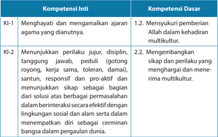

Tabel ini berisi informasi tentang kompetensi inti (KI) dan kompetensi dasar (KD) yang relevan dengan pendidikan agama dan kehidupan sosial. Topik utama tabel adalah pengembangan karakter dan perilaku yang positif di lingkungan sekolah dan masyarakat. Kolom KI-1 dan KI-2 berfokus pada kompetensi inti yang melibatkan pengertian dan pengamalan ajaran agama, sementara KD-1 dan KD-2 menekankan pada kompetensi dasar yang mencakup nilai-nilai kehidupan sosial seperti toleransi, respon proaktif, dan sikap yang menghargai dan menerima berbagai budaya. Data penting yang terlihat adalah bahwa semua kompetensi inti dan dasar memiliki hubungan langsung dengan nilai-nilai positif dan etika sosial, yang merupakan aspek penting dalam pembentukan karakter siswa.

 

---
## 📄 Halaman 140

---
**📊 Tabel**

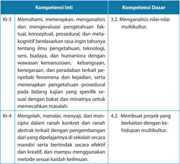

Tabel ini menunjukkan dua kompetensi inti (KI) dan satu kompetensi dasar (KD) yang terkait dengan pengetahuan, pemahaman, dan keterampilan dalam konteks kehidupan multikultural. Topik utama tabel ini adalah tentang bagaimana seseorang dapat memahami, menganalisis, dan mengevaluasi pengetahuan faktil, konseptual, prosedural, dan metakognitif tentang berbagai aspek ilmu pengetahuan, teknologi, seni, budaya, dan humaniora. Ini termasuk pemahaman tentang wawasan kemanusiaan, kebangsaan, kenegearaan, dan peradaban tertentu. Selain itu, tabel juga mencakup kemampuan untuk membuat proyek yang berkaitan dengan kehidupan multikultural, seperti membuat proyek yang efektif dan kreatif. Data penting yang terlihat adalah bahwa KI-3 dan KI-4 melibatkan pemahaman dan keterampilan dalam berbagai aspek pengetahuan, sedangkan KD 3.2 dan KD 4.2 lebih fokus pada analisis nilai-nilai multikultural dan membuat proyek yang berkaitan dengan kehidupan multikultural.

### Indikator

- Mengadakan observasi di gereja masing-masing mengenai sikap gereja terhadap multikulturlaisme dan mendiskusikannya.
- Menjelaskan  cara gereja mewujudkan multikulturalisme.
- Merancang  proyek  pelayanan  yang berkaitan dengan multikulturalisme.
- Berbagi pandangan dan pengalaman  berkaitan dengan  multikulturalisme.
- Membuat karya  yang  berisi  ajakan  pada  remaja  dan  masyarakat  untuk menerima serta menghargai multikulturalisme.

 

---
## 📄 Halaman 141

### A.  Pengantar

Pelajaran  ini  merupakan  lanjutan  dari  pembahasan  sebelumnya,  yaitu mengenai multikulturalisme.  Jika  pelajaran  sebelumnya    membahas  mengenai pemahaman konsep multikulturalisme, maka pembahasan berikutnya berkaitan dengan  gereja  dan  multikulturalisme.  Remaja  sebagai  warga  gereja  perlu mendalami bagaimana gereja menanggapi kenyataan multikulturalisme.

Pemahaman mengenai multikulturalisme telah dipelajari dalam pembahasan pada  bab  sebelumnya.  Pada  pembahasan  ini  peserta  didik  dibimbing  untuk mengkaji mengenai sikap gereja terhadap multikulturalisme di Indonesia. Sebelum membahas  mengenai  sikap  gereja  terhadap  multikulturalisme  di  Indonesia, peserta didik dibimbing untuk belajar mengenai multikulturalisme secara global, bagaimana sikap gereja-gereja pada umumnya kemudian membahas mengenai sikap gereja-gereja Kristen di  Indonesia. Peserta didik diharapkan memperoleh pencerahan mengenai sikap gereja terhadap multikulturalisme, terutama bagaimana gereja membangun jemaat multikultur.

### B. Multikulturalisme di Zaman Perjanjian Lama dan Perjanjian Baru

### 1.    Multikultur di Zaman Perjanjian Lama

Perjanjian Lama mencatat perbedaan budaya yang dipengaruhi agama karena ada hubungan yang erat antara agama dan budaya. Relasi itu tampak dalam hubungan  antara  bangsa  Israel  dengan  bangsa-bangsa  Kanaan  di  sekitar yang menimbulkan berbagai pengaruh. Bangsa Israel berhadapan dengan kemajemukan budaya bangsa di sekitarnya. Akan tetapi, ketika bangsa Israel bersosialisasi dengan bangsa di sekeliling, mereka tidak selektif. Akibatnya, budaya-budaya bangsa sekitarnya yang negatif membawa bangsa Israel pada penyembahan  berhala.  Alkitab  mencatat,  sepanjang  sejarah  hakim-hakim sampai dengan bangsa Israel menuju ke pembuangan, bangsa Israel terjerat dengan penyembahan berhala yang dipengaruhi oleh budaya kafi  r bangsabangsa di tanah Kanaan.

Hope  S.  Antone  (Pendidikan  Kristiani  Kontekstual,  2010)  menulis  bahwa dunia  Alkitab  ditandai  oleh  kemajemukan  atau  keanekaragaman  budaya dan agama. Di zaman   Abraham dipanggil di tanah Haran masyarakat amat beragam  dan  tiap  suku  memiliki  pemahaman  terhadap 'Allahnya'  sendiri. Demikian pula di tanah Kanaan di tempat di mana Abraham dan Sara hidup sebagai  pendatang.  Menurut  Hope,  di  tanah  Kanaan  setiap  suku  memiliki pandangannya sendiri terhadap yang Ilahi.  Di  tengah  situasi  seperti  itulah Abraham  dan  Sara  kemudian  bangsa  Israel  membangun  kepercayaannya

 

---
## 📄 Halaman 142

terhadap  Allah  yang  mereka  sembah.  Dalam  konteks  Yesus  juga  ditandai oleh keberagaman. Yesus tumbuh dalam tradisi iman komunitas-Nya dalam tradisi agama Yahudi sendiri. Di zaman setelah Yesus, kekristenan tumbuh dan berakar dalam budaya Yahudi dan Yunani helenis.

Menurut Wikipedia Indonesia, masyarakat multikultural adalah suatu masyarakat  yang  terdiri  atas  berbagai  elemen,  dengan  latar  belakang suku,  ras,  agama,  pendidikan,  ekonomi,  politik,  dan  bahasa  berbeda  yang hidup  dalam  suatu  kelompok  masyarakat.  Multikulturalisme  adalah  istilah yang  digunakan  untuk  menjelaskan  pandangan  seseorang  tentang  ragam kehidupan  di  dunia,  ataupun  kebijakan  kebudayaan  yang  menekankan tentang  penerimaan  terhadap  adanya  keragaman,  dan  berbagai  macam budaya (multikultural) yang ada dalam kehidupan masyarakat menyangkut nilai-nilai, sistem, budaya, kebiasaan, dan politik yang mereka anut.

Pada level teoritis, multikulturalisme  merupakan sebuah wacana yang hangat diperdebatkan  di  kalangan  fi  lsuf,  sosiolog  maupun  psikolog,  khususnya  di negara-negara Eropa dan Amerika Utara selama kurang lebih tiga dekade. Secara umum para ahli ini terbagi dalam  dua kubu pemikiran. Kubu pertama adalah mereka yang melihat multikulturalisme sebagai  ideologi politis yang memiliki nilai-nilai positif. Adapun kelompok yang lain adalah mereka yang bersikap kritis dan cenderung antagonis terhadap ide multikulturalisme.

Bagaimana pandangan multikulturalisme yang berkembang di Indonesia? Di Indonesia, mulktikulturalisme bukan sekadar wacana fi  lsafat dan politik yang diperdebatkan di lingkungan akademik dan dituangkan dalam jurnal ilmiah. Multikulturalisme  juga  bukan  sekadar  pemikiran  yang  dituangkan  dalam kebijakan. Lebih dari itu,  multikulturalisme adalah perjumpaan orang dengan orang  (antarmanusia)  yang  berasal  dari  berbagai  latar  belakang  berbeda termasuk  di  dalamnya  agama.  Sebuah  perjumpaan  dan  pergaulan  yang menyenangkan, di mana perbedaan budaya dan lainnya dipahami, dialami, dan dihargai. Namun, ada  saat ketika multikulturalisme dimasukkan ke dalam kontestasi politik  dan dijadikan komoditi politik, potensi konfl  ik muncul.

### 2.   Multikulturalisme di Zaman Perjanjian Baru

Budaya bangsa Israel di zaman Perjanjian Baru dipengaruhi oleh warnawarni  budaya  dari  beberapa  bangsa  yang  pernah  menjajah  Israel,  seperti Persia, Yunani, dan Romawi. Secara khusus, saat itu bangsa Israel yang tersebar di  luar  Yerusalem    sebagai  pusat  aktivitas  rohani  membawa  mereka  pada konsep eksklusivisme sebagai umat pilihan Allah. Pada zaman Tuhan Yesus, Dia membawa pemikiran baru tentang pentingnya   inklusivisme. Yesus tidak menutup diri dari kemajemukan kebudayaan. Yesus  tidak memandang latar

 

---
## 📄 Halaman 143

belakang budaya, suku, dan ras. Ia berkenan menerima semua orang da  lam pergaulan multikultural. Ketika seorang perempuan Kanaan hendak meminta tolong (Matius 15:21-28) dan seorang perwira Roma meminta kesembuhan (Lukas 7:1-10), Yesus menjawab kebutuhan mereka dan menolong mereka. Menunjukkan bahwa  Yesus sendiri menghargai keberagaman dan perbedaan budaya.

Dalam Perjanjian Baru, jemaat multikultural secara eksplisit dicatat dalam Kisah  Para  Rasul  2:41-47  sebagai  orang-orang  yang  berasal  dari  berbagai daerah  dan  berbagai  budaya  yang  mendengarkan  khotbah  Petrus.  Pada waktu itu  ada  tiga ribu orang bertobat dan mereka menjadi model gereja pertama. Dalam perkembangan selanjutnya, terjadi masalah antara jemaat yang  berbudaya Yunani  dan Yahudi.  Perbedaan  budaya  antara Yahudi  dan Yunani  menimbulkan  banyak  persoalan  dalam  beberapa  jemaat,  seperti di  Roma  dan  di  Korintus.  Perpecahan  dan  perselisihan  tersebut  timbul hanya  karena  kebiasaan-kebiasaan  jemaat  (1  Korintus  11).  Namun,  Paulus menegaskan bahwa  sekarang tidak ada lagi orang Yunani atau Yahudi, tidak ada  orang  bersunat  maupun  tidak  bersunat,  tidak  ada  budak  atau  orang merdeka. Semua orang sama di hadapan Allah, semua menjadi satu jemaat dimana kepalanya adalah Yesus  Kristus.

### C. Gereja dan Multikulturalisme

Multikultur  bukanlah  sesuatu  yang  asing  bagi  gereja-gereja  di  Asia  pada umumnya dan gereja-gereja  di Indonesia. Keberagaman suku, bangsa, budaya, adat istiadat, serta berbagai kebiasaan telah turut mewarnai perjalanan gerejagereja di Asia dan Indonesia. Menurut pakar sosiologi, tidak ada wilayah yang amat beragam  seperti  di  Asia.  Masyarakat  Asia  adalah  masyarakat  yang  multikultur, demikian pula Indonesia.

Multikulturalisme adalah anugerah Allah. Meskipun demikian, multikulturalisme dapat menjadi akar konfl  ik dan perpecahan ketika multikulturalisme di  politisasi.  Hal  ini  terjadi  misalnya  dalam  kampanye  pemilu  legislatif,  pemilu presiden, dan wakil presiden.  Isu ini dibangun untuk mengurangi elektabilitas calon dan untuk mempengaruhi para pemilih yang dengan mudah termakan oleh isu  tersebut    terutama  di  kalangan  masyarakat  yang  masih  memilih  pemimpin berdasarkan  agama.  Namun  masyarakat  kini  mulai  berpikir  rasional  memilih pemimpin  berdasarkan  kemampuan  dan  integritas  bukan  berdasarkan  agama atau suku.

Meskipun demikian, tak dapat dihindari ketika multikultur dijadikan komoditi  politik  maka  dapat  menimbulkan  potensi  konfl  ik  secara  horizontal (antarmasyarakat).    Hal  yang  sama  juga  terjadi  dalam  kehidupan  antarumat

 

---
## 📄 Halaman 144

beragama,  pada  aras  akar  rumput  atau  rakyat  jelata,  nampak  solidaritas  dan kebersamaan  namun  situasi  ini  dapat  saja  berubah  ketika  perbedaan  agama dijadikan komoditi politik.

Dalam   Kitab Efesus 2:11-21 Paulus menjelaskan mengenai arti 'dipersatukan' dalam  Kristus.  Ia  memfokuskan  pembahasannya  pada    pekerjaan  penebusan, rekonsiliasi, dan merobohkan tembok-tembok pemisah antarumat. Jika kita satu di dalam Kritus, maka kita terlepas dari perbedaan suku, ras, budaya, dan status sosial  ekonomi.  Kegiatan  tersebut  sudah  merobohkan  tembok  pemisah  dalam berbagai perbedaan, maka kita menjadi satu dalam Kristus. Sebagaimana Kristus telah  menerima  kita  tanpa  syarat  maka  kita  pun  wajib  saling  menerima  satu dengan  yang  lain.  Menjadi  satu  dalam  Kristus  memungkinkan  gereja  menjadi satu. Dalam   Kitab Galatia 3:26-28, Paulus mengatakan kita memiliki identitas baru melalui Kristus. Tidak ada diskriminasi dalam Kristus, kita semua sama di hadapan Allah.

### D. Multikulturalisme dan   Sinkretisme

Konteks gereja-gereja Asia adalah kemajemukan dimana multikultur merupakan  kenyataan  yang  tidak  dapat  ditolak  dan  diabaikan.    Antoni S. Hope dengan mengutip seorang ahli Biblika dari Sri  Lanka,    Daniel Thiagarajah mengatakan  bahwa : ' misi Allah adalah gerakan Allah melawat umat-Nya. Dalam dirinya sendiri misi gereja mengambil langkah  baru untuk maju.  Setiap pembicaraan manapun  mengenai  Allah  yang  secara  autentik  mengklaim  bersifat  Asia  harus memperhatikan kompleksitas  situasi  di  Asia  di  mana  kita  dipanggil    untuk  hidup, mewartakan  dan  merayakan  iman  kita.  Berteologi  tidak  pernah  dapat  dilakukan dalam suatu ruang kosong, tetapi harus selalu dilakukan dalam hubungan dengan situasi hidup yang aktual. Oleh sebab itu, meskipun misi gereja adalah mission Dei atau misi Allah, namun tidak boleh terlepas dari konteks' .

Misi  Allah  hendaknya  ditempatkan  dalam  konteks  masyarakat  di  mana gereja sebagai lembaga dan umat Allah ada dan hidup. Dalam kaitannya dengan pendapat tersebut, kita pernah mengalami masa-masa suram ketika para penginjil Barat  datang  dengan  superioritas  budaya  Barat  yang  memberangus  semua kekayaan budaya lokal yang ada di Indonesia. Ketakutan terhadap   sinkretisme (penyembahan berhala) dan sikap superioritas telah melahirkan tindakan yang menurut mereka merupakan pembersihan terhadap sinkretisme dan upaya untuk 'memurnikan' Injil. Bukankah  para penginjil, para pemberita yang hidup baik di zaman Perjanjian Lama  maupun Perjanjian Baru juga turut dibentuk oleh budaya setempat pada masa itu? Contohnya aturan mengenai kaum perempuan yang tidak  boleh  beribadah  dengan  rambut  terurai  dan  harus  menutupi  kepalanya, (1 Timotius 2:8-15). Perempuan  tidak boleh memimpin,  menurut    Barclay

 

---
## 📄 Halaman 145

dipengaruhi  oleh  kebudayaan  Yahudi    yang  memandang  rendah  kedudukan seorang  perempuan,  dan  bahkan  tidak  dianggap  sebagai  pribadi,  melainkan sebagai  sebuah  barang.  Artinya,  Injil  tidak  terlepas  dari  konteks  budaya.  Oleh karena itu, sepakat dengan   Daniel Thiagarajah yang dikutip oleh Antone S. Hope di atas, misi Allah harus ditempatkan dalam konteks kehidupan setempat. Itulah yang tengah dikembangkan oleh gereja-gereja di Indonesia. Dibutuhkan upaya dan kerja keras dalam menjalankan misi Allah di tengah masyarakat multikultur dan membangun pemahaman multikulturalisme.  Ada kekhawatiran seolah-olah jika gereja turut memperjuangkan multikulturalisme maka gereja jatuh ke dalam sinkretisme.  Multikulturalisme  bukanlah  sinkretisme  karena  multikulturalisme tidak mengorbankan misi Allah. Bahkan, melalui multikulturalisme misi Allah lebih dipertegas lagi, terutama ketika Allah mengatakan pada Abraham 'karena Engkau maka segala bangsa di muka bumi akan diberkati' . Memperkuat pernyataan itu, kita dapat mengacu pada Kitab Efesus 2:11-21, Galatia 3:26-28 bahwa di dalam Yesus tidak ada orang Yahudi maupun orang Yunani, tidak ada budak maupun orang merdeka; kita semua adalah satu di dalam Yesus Kristus .

### E. Belajar dari Yesus

Yesus  menjadikan  multikultur  sebagai  wacana  perjumpaan  antarmanusia yang dapat bergaul dan bekerja sama dalam kasih. Mengenai sikap Yesus, kita dapat mencatat beberapa pokok pikiran dari  Hope S. Antone dalam kaitannya dengan multikulturalisme. Antara lain:

- Kesetiaan  Yesus  ditujukan  kepada  Allah  bukan  kepada  institusi  maupun praktik  agama  yang  sudah  mapan.  Konsekuensi  dari  sikap  itu  adalah  Ia mengasihi manusia tanpa kecuali. Kemanusiaan, keadilan, dan perdamaian amat  penting  bagi-Nya.  Itulah  cara  Yesus  memperlihatkan  kesetiaan-Nya kepada Al lah. Sikap ini menyebabkan Ia tidak disukai oleh kaum Farisi dan ahli Taurat yang begitu setia kepada lembaga agamanya melebihi Allah sendiri. Mereka  mempraktikkan  tradisi  dan  hukum  agama  secara  turun-temurun namun lupa untuk mewujudkan hukum itu dalam kehidupan nyata sebagai umat  Allah.  Kritik-kritik  Yesus  amat  keras  ditujukan  pada  mereka.  Praktik agama dan ajarannya bukan hanya dipelajari, dihafal, dan diwujudkan dalam penyembahan namun terutama harus diwujudkan dalam kehidupan dengan sesama.  Itulah  sebabnya    Kitab  Amos  mengkritik  orang  Israel  bahwa  Allah menghendaki mereka taat menjalankan ibadah, namun harus mempraktikkan keadilan dan kebenaran, itulah ibadah yang sejati.
- Kasih dan solidaritas Yesus  ditujukan bagi semua orang tanpa kecuali. Orang dari  berbagai suku, tradisi, budaya dan bahkan yang tidak mengenal Allah yang  disembah-Nya  pun  ditolong  oleh-Nya.  Itulah  wujud  kesetiaan  Yesus pada Allah.

 

---
## 📄 Halaman 146

- Yesus  memperkenalkan  visi  baru  mengenai  komunitas  baru  di  bawah pemerintahan Allah. Sebuah komunitas yang melampaui berbagai perbedaan latar belakang. Sebuah komunitas yang memiliki hubungan-hubungan yang baru dimana tidak ada pembedaan dan perendahan antara: laki-laki maupun perempuan, budak ataupun orang merdeka, orang Yahudi maupun Yunani. Semua  orang  sama  di  hadapan  Allah  dan  memiliki  tempat  yang  sangat penting dalam komunitas baru yang terbentuk karena kedatangan Yesus.
- Kita  juga  belajar  dari Yesus  bahwa  walaupun  identitas  pribadi,  rasial,  suku, kelas sosial, dan keagamaan merupakan kenyataan sosiologis, namun yang lebih  penting  adalah  bagaimana  dalam  segala  perbedaan  yang  ada  umat manusia memuliakan Allah dengan melakukan kehendak-Nya. Dalam sikap ini,  untuk  multikultur  mungkin  tidak  akan  dipermasalahkan  tetapi  ketika prinsip ini dikaitkan dengan perbedaan iman (agama), apakah hal ini dapat dibenarkan? Hal ini dibahas dalam pelajaran  mengenai sikap terhadap orang yang berbeda iman. Namun demikian, dapat diklarifi  kasi dalam penjelasan disini bahwa dalam kaitannya dengan agama lain, kita dapat mengembangkan toleransi dalam hal solidaritas dan kebersamaan tanpa kehilangan identitas sebagai orang Kristen. Artinya, orang beragama lain pun dapat melakukan kehendak Allah menurut ajaran agamanya, menolong dan mengasihi sesama.
- Melakukan kehendak Allah dapat dilakukan dalam kemitraan dengan orang lain,  baik  itu  sesama  orang Kristen maupun orang lain yang berbeda suku, bangsa,  budaya,  adat  istiadat,  bahasa,  kebiasaan,  status  sosial,  maupun agama. Tidak ada seorang manusia pun yang mampu melakukan berbagai hal sendirian. Dalam segala aspek kehidupan kita membutuhkan orang lain untuk saling mengisi dan saling membantu.

### F. Bentuk Nyata Multikulturalisme dalam Gereja  Kristen di Indonesia

Sebagaimana  dijelaskan  di  atas  bahwa    multikultur  bukan  merupakan pemikiran dan wacana yang asing bagi bangsa Indonesia dan gereja-gereja Kristen di  Indonesia. Bangsa Indonesia adalah bangsa yang multikultur. Demikian pula gereja-gereja di Indonesia umumnya gereja-gereja yang dibangun berdasarkan latar  belakang  suku,  budaya,  dan  geografi  s  yang  berbeda-beda.  Berikut  ini merupakan  fakta  bahwa  gereja-gereja  Kristen  mewujudkan  multikulturalisme meskipun masih ada banyak tantangan yang harus dihadapi.

- Gereja-gereja Kristen memiliki anggota yang terbuka dari segi suku, budaya, bahasa, daerah asal maupun kebangsaan.

 

---
## 📄 Halaman 147

- Gereja-gereja  Kristen  juga  mengadopsi  beberapa  unsur  budaya  lokal  yang dimasukkan  ke  dalam  liturgi  ibadah.  Mulai  dari  lagu,  musik,  dan  kesenian lainnya. Berbagai  kebiasaan  dan  prinsip hidup  lokal dapat  diadaptasi dalam rangka memperkaya pemahaman iman Kristen. Misalnya, mengenai persaudaraan  yang  rukun  dalam  budaya  masyarakat  suku  yang  dapat dikembangkan  dalam  rangka  membangun  kebersamaan  dalam  jemaat sebagaimana ditulis dalam Kitab Kisah Para  Rasul.
- Berbagai  pelayanan  gereja  ditujukan  bagi  masyarakat  secara  umum  tanpa memandang  daerah  asal,  budaya,  adat  istiadat,  kelas  sosial,  dan  agama. Tingkat  kesadaran  gereja  dalam  partisipasi  di  tengah  masyarakat  cukup signifi  kan.
- Banyak gereja yang kini melakukan studi kebudayaan untuk menggali kembali unsur-unsur budaya yang terancam hilang dari masyarakatnya. Misalnya, di Nusa Tenggara Timur (NTT), Lembaga Alkitab bekerja sama dengan gereja melakukan penerjemahan Alkitab ke dalam bahasa-bahasa daerah di hampir seluruh daerah yang ada di NTT.
- Gereja-gereja  Kristen  membangun  dialog  dan  kerja  sama  dengan  umat beragama  lain,  khususnya  di  bidang  kemanusiaan  dan  keadilan.  Ada  tim advokasi  hukum,  ada  pelayanan  kesehatan  yang  memberikan  pelayanan bagi semua orang tanpa memandang perbedaan latar belakang budaya dan agama.

### G.  Beberapa   Tantangan yang Dihadapi Gereja  dalam Mewujudkan Multikulturalisme

Beberapa tantangan yang dihadapi gereja dalam mewujudkan multikulturalisme adalah sebagai berikut.

- Di kalangan gereja tertentu warisan kolonial yang bersifat antibudaya lokal masih  mempengaruhi  gereja  dalam  mewujudkan  multikulturalisme.  Oleh karena itu, dibutuhkan waktu dan pencerahan untuk mengubah pola pikir gereja-gereja seperti itu.
- Berbagai prasangka terhadap orang-orang dari kalangan suku, budaya, dan daerah tertentu.
- Individualistik. Berbagai tantangan dan beban hidup yang berat menyebabkan banyak  orang lebih mementingkan  kepentingan  diri  sendiri dan kelompok. Akibatnya, kepentingan masyarakat dianggap tidak penting lagi. Namun, pada sisi lain masyarakat masa kini yang mengglobal memiliki satu ikatan  solidaritas  yang  diikat  oleh  media  sosial,  misalnya twitter,  facebook, instagram ,  dan  lain-lain.  Masyarakat  dunia  akan  cepat  memberi  reaksi  dan

 

---
## 📄 Halaman 148

simpati  terhadap  peristiwa-peristiwa  kemanusiaan  yang  dimuat  di youtube ataupun media sosial lain. Contoh ketika terjadi tsunami di Aceh pada tahun 2010, bantuan datang dari berbagai belahan dunia. Di Yahoo ada cerita satu keluarga di Tiongkok yang miskin dan menderita memperoleh pertolongan dari berbagai tempat karena ceritanya dimuat di media sosial (lihat buku teks untuk peserta didik).

### H.  Penjelasan Bahan Alkitab

###  Efesus 2:11-21

Melalui surat Efesus, nampak jelas Paulus menekankan pentingnya persatuan di  dalam tubuh gereja karena jika gereja terpecah karena perbedaan yang ada,  maka  hal  itu  sama  sekali  tidak  berguna.  Gereja  adalah  persekutuan orang-orang percaya yang di dalamnya tidak ada lagi pembedaan meskipun adanya perbedaan merupakan realitas yang tidak dapat dipungkiri. Gereja adalah tubuh Kristus. Semua anggota gereja, baik orang Yahudi maupun non Yahudi dipersatukan oleh kasih Kristus dengan darahnya yang kudus. Gereja dipanggil menjadi alat Tuhan yang menyaksikan kasih Kristus di tengah dunia. Paulus  menyadari  jika  berbagai  perbedaan  atau  keberagaman  dijadikan alasan untuk tidak saling bekerja sama maka pekerjaan pelayanan tidak akan dapat dilaksanakan, demikian pula persekutuan akan hancur, sehingga gereja seharusnya menghargai perbedaan.

Paulus  melihat  dan  menggambarkan  keragaman  sebagai  dasar  untuk membentuk satu kesatuan. Keragaman dalam jemaat bukan untuk membuat anggota  jemaat  membandingkan  diri  satu  dengan  yang  lain,  bukan  juga untuk  menciptakan  persaingan  dan  perpecahan,  melainkan  membentuk kesatuan yang dianalogikan sebagai satu tubuh Kristus. Tugas Gereja, yakni bersekutu, bersaksi dan melayani akan semakin bertumbuh dan berkembang jika seluruh umat Kristen tidak mempersoalkan perbedaan-perbedaan yang ada  namun  memaknai  perbedaan  itu  sebagai  satu  kekuatan  yang  sangat berguna  bagi  orang  lain.  Pada  akhirnya,  gereja  yang  sejati  adalah  gereja yang  meletakkan  Kristus  sebagai  batu  penjuru,  penopang  yang  membuat 'bangunan' tersebut dapat kokoh berdiri.

###  Kitab Galatia 3:26-28

Surat  Galatia  ditulis  oleh  Paulus  dengan  alasan  tertentu.  Paulus  diberitahu bahwa jemaat di Galatia dikacaukan oleh pengajaran yang sesat. Surat Paulus ini juga ditulis di tengah-tengah hangatnya pergumulan di komunitas Yahudi pada saat itu. Orang-orang Yahudi ingin men-yahudi-kan segala jemaat dan mereka memasuki juga jemaat yang didirikan oleh Paulus. Hal ini  pun  mendapat

 

---
## 📄 Halaman 149

perlawanan dari Paulus karena ia adalah orang yang menghargai berbagai perbedaan latar belakang. Baginya, keberagaman bukanlah halangan untuk membangun kebersamaan. Orang Yudais mencoba meyakinkan orang-orang Galatia bahwa keselamatan harus dikerjakan dengan jalan menaati Hukum Taurat. Paulus pun mendapat cobaan dan tantangan dalam  hal ini.    Mereka sengaja melakukan hal tersebut untuk menghasut orang-orang Galatia untuk melawan Paulus.

Paulus memang tidak diteguhkan oleh rasul terdahulu secara formal  menjadi rasul  dan  dia  juga  tidak  menjadi  murid  Yesus  ketika  Yesus  hidup. Bahkan, Paulus tidak pernah melihat Yesus dengan mata kepalanya sendiri. Hal inilah yang  dipertanyakan  oleh  orang  yang  menghasut  untuk  mempertanyakan dan meragukan kerasulan Paulus. Membaca isi surat Galatia ini, kita dapat menyimpulkan bahwa usaha tersebut hampir berhasil. Oleh karena itu, Paulus bereaksi dengan tegas, ia marah tetapi   kemudian mengemukakan  argumen yang kuat mengenai kerasulannya dan apa artinya menjadi pengikut Kristus tidak hanya berdasarkan keturunan tapi berdasarkan iman.

Paulus berpendapat bahwa tuntutan agar orang-orang bukan Yahudi yang telah  bertobat  tunduk  terhadap  Taurat  telah  merusak  pesannya  bahwa manusia dibenarkan karena imannya di dalam Kristus, bukan karena melakukan Taurat.  Paulus  dalam  Surat  Galatia  dan  Roma    mengatakan  bahwa  Allah menganggap orang yang percaya kepada Kristus sebagai orang benar hanya karena  imannya,  sekalipun  ia  adalah  orang  berdosa.  Kebenaran  diberikan kepadanya, ia dinyatakan sebagai orang benar oleh karena anugerah Allah, sekalipun ia tetap berdosa.

Paulus  menolak  paham  yang  menekankan  Hukum Taurat.  Para  penentang Paulus menekankan agar orang-orang non-Yahudi yang menerima Yesus  sebagai  Mesias  harus  terlebih  dahulu  menjadi  orang  Yahudi  dan menaati hukum-hukum yang dipaparkan dalam Kitab Suci. Adapun Paulus  mempertahankan  bahwa  cerita  Kitab  Kejadian  mengenai  Abraham menunjukkan  bahwa  yang  dituntut  dari  keturunan  Abraham  terutama adalah iman. Bagi orang-orang non-Yahudi yang bertobat, iman itulah yang mempersatukan mereka dalam Kristus.

Kemudian  apa  kaitannya  teks  ini  dengan  multikulturalisme  yang  sedang dibahas  dalam  pelajaran  ini?  Sikap  Paulus  menyiratkan  bahwa  Allah  tidak menolak keberagaman dan bahwa anak-anak Abraham (yang artinya orang beriman)  bukan  hanya  mereka  yang  lahir  dari  keturunan  Abraham  secara biologis  namun semua orang beriman. Artinya, semua orang beriman dari berbagai latar belakang dan multikultur berbeda adalah keturunan Abraham.

 

---
## 📄 Halaman 150

Sikap  Paulus  merupakan  dukungan  terhadap  adanya  keberagaman  dalam jemaat Kristen mula-mula.

### I. Kegiatan Pembelajaran

### Pengantar

Mengarahkan  peserta  didik  pada  proses  pembelajaran  serta  memberikan penekanan pentingnya belajar topik ini. Pada bagian pengantar dijelaskan mengenai kaitan antara pelajaran yang lalu dengan pelajaran ini.

### Kegiatan 1

### Berbagi Pengalaman

Peserta  didik  berbagi  pengalaman  dengan  teman  sebangku  mengenai pengalaman hidup dalam keluarga maupun teman yang multikultur, yaitu berbeda  suku,  budaya,  daerah  asal  maupun  agama.  Apa  saja  pengalaman mereka  dalam pergaulan itu? Apakah  mereka  menyukai  bergaul dengan saudara  atau  teman    yang  berbeda  latar  belakang  dengannya?    Setelah peserta didik selesai diskusi dengan teman sebangku, guru  memberi waktu bagi peserta didik  yang ingin menyampaikan pengalamannya di depan kelas.

Guru  memperhatikan  dan  mencatat  pengalaman  yang  disampaikan  oleh peserta didik di depan kelas. Mungkin ada yang mengatakan merasa tidak terlalu nyaman bertemu, bergaul dengan saudara, teman dan orang lain yang memiliki  latar  belakang  berbeda.  Guru  tidak  boleh  menyalahkan  peserta didik yang masih memiliki pandangan seperti itu. Kemungkinan peserta didik diasuh  dalam  lingkungan  keluarga  yang  eksklusif  dan  itu  mempengaruhi sikap mereka. Tugas guru membimbing peserta didik untuk mengubah cara berpikir yang eksklusif sehingga mereka mau berubah.

### Kegiatan 2

### Mendalami Multikulturalisme dalam Alkitab

Peserta  didik  mendalami    kenyataan  keberagaman  dalam  dunia  Perjanjian Lama  dan  Perjanjian  Baru.  Pendalaman  ini  penting  supaya  peserta  didik mengetahui bahwa kenyataan multikultur bukan hanya baru terjadi di zaman kini    namun  sudah  dialami  oleh  bangsa  Israel  dan  umat  Kristen  di  zaman dahulu.  Dalam  pendalaman ini mereka juga dibimbing untuk mempelajari bagaimana Yesus menghadapi keberagaman.

 

---
## 📄 Halaman 151

### Kegiatan 3

### Mendalami Teks Alkitab

Peserta didik mendalami bagian Alkitab yang menjadi acuan pembelajaran. Kegiatan ini merupakan pencerahan bagi peserta didik dalam hal menggali, memahami serta mengaitkan teks dengan topik yang sedang dibahas. Minta peserta  didik  mengumpulkan  hasil  pendalaman  mereka  untuk  dinilai  oleh guru. Guru membimbing peserta didik, contoh catatan teks Alkitab ada dalam penjelasan bahan Alkitab.

### Kegiatan 4

### Pendalaman Materi

Peserta didik mempelajari gereja Kristen di Indonesia yang multikultur. Bangsa Indonesia  adalah  bangsa  yang  multikultur,  demikian  pula  gereja-gereja  di Indonesia  umumnya  dibangun  berdasarkan  latar  belakang  suku,  budaya, dan geografi  s  yang  berbeda-beda.  Kemudian  dikemukakan  mengenai beberapa fakta yang menjadi indikator  gereja-gereja Kristen mewujudkan multikulturalisme meskipun masih banyak tantangan yang harus dihadapi.

### Kegiatan 5

Peserta didik diminta untuk merancang sebuah kegiatan yang menjangkau masyarakat multikultur. Mereka dapat merancang berbagai kegiatan dalam bentuk  ibadah  yang  mengakomodir  berbagai  budaya,  pelayanan  bagi masyarakat  umum  tanpa  memandang  suku,  budaya  agama,  dan  lain-lain. Guru membimbing peserta didik sesuai dengan bentuk proyek yang ingin dikerjakannya. Ada contoh kerangka proyek dalam buku teks untuk peserta didik. Guru dapat mempelajarinya atau membuat kerangka baru yang sesuai dengan kemampuan peserta didik, situasi dan kondisi sekolah. Jika peserta didik memilih pentas seni maka mereka harus memilih beberapa unsur budaya, seni tari, lagu ataupun alat musik dari beragam suku untuk ditampilkan. Jika mereka memilih bentuk ibadah dalam format budaya tertentu maka bahasa liturgi dapat memakai bahasa-bahasa dari suku-suku tertentu, demikian pula lagu dan pakaian adat masing-masing. Jika mereka memilih proyek pelayanan masyarakat, maka kegiatan itu harus menjangkau orang dari latar belakang suku, budaya, agama yang berbeda.

 

---
## 📄 Halaman 152

### Kegiatan 6

### Belajar dari Sikap Yesus

Peserta didik mendalami materi bagaimana sikap Yesus terhadap multikultur.  Yesus  menjadikan  multikultur  sebagai  wacana  perjumpaan antarmanusia  yang  dapat  bergaul  dan  bekerja  sama  dalam  kasih.  Guru menjelaskan  beberapa pokok pikiran dari   Hope S. Antone yang tercantum dalam buku guru. Dilanjutkan dengan tantangan yang dihadapi gereja dalam mewujudkan multikulturalisme.

### Kegiatan 7

### Membuat Slogan

Peserta didik diminta membuat slogan berupa ajakan pada sesama remaja untuk mewujudkan multikulturalisme dalam kehidupan. Slogan dapat dibuat dalam bentuk spanduk, ditulis di kertas karton, atau di lembar buku gambar, sesuaikan dengan kemampuan peserta didik, situasi, dan kondisi sekolah.

### J. Penilaian

Bentuk penilaian: tes lisan ketika peserta didik berbagi pengalaman mengenai pengalaman hidup dan bergaul dengan orang-orang yang memiliki latar belakang berbeda  dengannya.  Penilaian  proyek,  penilaian  hasil  karya,  rancangan  proyek multikulturalisme, dan penilaian kinerja bagaimana peserta didik melaksanakan kegiatan tersebut apakah mencapai sasaran ataukah tidak. Penilaian hasil karya dilakukan  untuk  menilai  produk-produk  teknologi  dan  karya  seni  hasil  karya berupa  slogan,  isi  slogan  apakah  sesuai  dengan  topik  pelajaran,  dan  apakah tampilan  slogan  dan  kata-kata  ajakannya  mampu  menarik  perhatian  sesama remaja. Penilaian tertulis dilakukan setelah peserta didik melakukan pendalaman Alkitab.

 

---
## 📄 Halaman 153

### PENJELASAN BAB

### Hidup Bersama dengan Orang yang Berbeda Iman

Bahan Alkitab: Mazmur 133

---
**📊 Tabel**

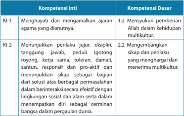

Tabel ini memperlihatkan dua kompetensi utama: Kompetensi Inti (KI) dan Kompetensi Dasar (KD). Topik utama tabel ini adalah tentang pengembangan sikap dan perilaku yang mendukung kehidupan multikultural. Kolom KI-1 berisi dua sub-kompetensi: 1. Menghayati dan mengamalkan ajaran agama yang diantutnya, dan 2. Menunjukkan perilaku jujur, disiplin, tanggung jawab, peduli, santun, responsif, dan proaktif. Sementara itu, kolom KD mencakup dua sub-kompetensi: 1. Menghargai pemberian Allah dalam kehidupan multikultur, dan 2. Mengembangkan sikap dan perilaku yang mendukung kehidupan multikultur. Data penting yang terlihat adalah bahwa kedua kompetensi ini berkaitan erat dengan pengembangan sikap dan perilaku yang mendukung kehidupan multikultur, baik dalam konteks ajaran agama maupun dalam lingkungan sosial dan alam sekitar.

 

---
## 📄 Halaman 154

---
**📊 Tabel**

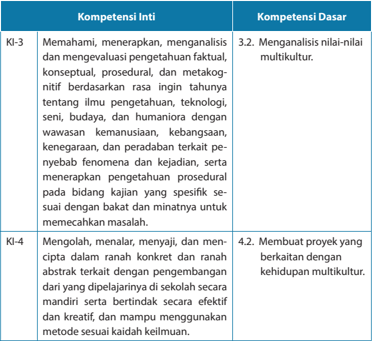

Tabel ini menunjukkan dua kompetensi inti (KI) dan dua kompetensi dasar (KD) yang terkait dengan pengetahuan, prosedur, dan metakognisi. Kompetensi Inti KI-3 fokus pada pemahaman, menerapkan, dan evaluasi pengetahuan berdasarkan rasa ingin tahu tentang ilmu pengetahuan, teknologi, seni, budaya, dan humaniora dengan wawasan kemanusiaan, kebangsaan, kenegaraan, dan peradaban terkait fenomena kejadian. Ini mencakup analisis nilai-nilai multikultural. Kompetensi Inti KI-4 berkaitan dengan mengolah, menalar, menyajikan, dan menciptakan dalam ranah kontekstual dan abstrak terkait dengan pengembangan diri di sekolah secara mandiri dan berindikasi efektif dan kreatif. Kompetensi Dasar KD-3 membahas menganalisis nilai-nilai multikultural, sedangkan KD-4 mengajarkan membuat proyek yang berkaitan dengan kehidupan multikultural. Pola penting yang terlihat adalah hubungan antara pengetahuan, prosedur, dan metakognisi dalam pembelajaran dan pengembangan diri.

### Indikator

- Menjelaskan kaitan antara hidup bersama dengan orang yang berbeda iman dengan multikulturalisme.
- Membuat karya yang dapat menunjukkan pemahaman mengenai pentingnya membangun kebersamaan dengan orang yang berbeda iman.
- Merancang proyek kegiatan bersama remaja yang berbeda iman.
- Menyusun doa permohonan agar setiap remaja terpanggil untuk mempraktikkan solidaritas dan kebersamaan dengan sesama remaja yang berbeda iman.

 

---
## 📄 Halaman 155

### A.  Pengantar

Bab ini merupakan rangkaian pembahasan dari dua bab sebelum ini. Bab sebelumnya membahas mengenai sikap gereja terhadap multikulturalisme sedangkan  bab  ini  membahas  mengenai  hidup  bersama  dengan  orang  beriman  lain. Pembahasan ini  ditempatkan dalam rangkaian pembahasan dua bab sebelumnya karena  saling  berkaitan.  Multikulturalisme  membahas  mengenai  keberagaman termasuk di dalamnya keberagaman agama. Oleh karena itu, penting bagi guru untuk memberikan penajaman terhadap materi yang sudah dibahas pada kelas IX. Diharapkan setelah mempelajari topik ini peserta didik akan bersikap lebih terbuka dan memahami orang yang beragama lain. Keterbukaan penting karena di masa kini manusia tidak  dapat hidup sendiri. Di sekitar kita ada teman, sahabat dan saudara-saudara yang berbeda bukan hanya suku dan budaya saja tapi juga agama. Perbedaan itu tidak boleh menyebabkan perpecahan ataupun melahirkan prasangka buruk dalam diri peserta didik. Sebaliknya, perbedaan itu merupakan kesempatan bagi kita untuk mempelajari keyakinan agama lain sehingga kita dapat menghargainya. Guru diharapkan dapat mempertegas bahwa sebagai remaja Kristen peserta didik  wajib mengasihi sesama dan menunjukkan solidaritas serta kebaikan kepada semua orang tanpa memandang latar belakang agama.

Perlu  pula  ditegaskan  bahwa solidaritas  tidak  berarti  melebur  tanpa  batas. Solidaritas  terhadap  orang  yang  berbeda agama merupakan wujud cinta kasih pada sesama yang menjadi hukum utama dalam ajaran iman Kristen.

### B. Potret  Pertikaian dan Konfl  ik yang Berlatar Belakang Agama

Membangun  hubungan  dengan  sesama  kita  yang  berbeda  keyakinan memang  tidak  mudah.  Sebab  setiap  agama  cenderung  mengajarkan  bahwa agama itulah  yang  terbaik  dan  paling  benar,  sementara  semua  agama  lainnya salah atau keliru. Akibatnya, para pengikut agama yang 'saya' peluk itulah yang akan  masuk  ke  surga,  sementara  para  pengikut  agama 'yang  lain'  pasti  akan ditolak  masuk  ke  surga  dan  akibatnya  mereka  akan  masuk  ke  neraka.  Hampir semua agama mengajarkan dan mengklaim bahwa hanya agamanya yang benar. Dalam  agama  Kristen,  tertulis  dalam  Injil  Yohanes  14:6  Yesus  berkata, ' Akulah jalan dan kebenaran dan hidup. Tidak ada seorang pun yang datang kepada Bapa, kalau tidak melalui Aku.' Dalam   Kisah  Para  Rasul  4:12,  Petrus  menyatakan, 'Dan keselamatan tidak ada di dalam siapa pun juga selain di dalam Dia, sebab di bawah kolong langit ini tidak ada nama lain yang diberikan kepada manusia yang olehnya kita dapat diselamatkan . '

 

---
## 📄 Halaman 156

Klaim-klaim kebenaran yang mutlak ini telah membuat orang sulit menjalin hubungan  yang  baik  dan  akrab  dengan  sesamanya  yang  berbeda  keyakinan. Dapat  saja  dua  orang  sahabat  yang  berbeda  keyakinannya,  katakanlah  yang seorang  beragama  Islam  dan  yang  lainnya  beragama  Kristen,  hubungannya bisa  sangat  baik  dan  akrab.  Namun,  begitu  menyentuh  masalah-masalah  yang berhubungan  dengan  agama  maka  yang  muncul  adalah  saling  menganggap diri  yang  paling  hebat,  benar,  selamat.  Lalu  hubungan  keduanya  pun  menjadi renggang. Pada tingkat hubungan yang semakin meruncing dan menajam, orang dapat saja saling melukai bahkan membunuh.

### C. Beberapa Sikap dalam Kaitannya dengan Hubungan Antaragama

Konfl  ik-konfl  ik  dan  bentuk-bentuk  kekerasan  dilakukan  atas  nama  agama. Orang yang beragama lain dianggap sebagai lawan. Karena mereka berbeda, maka mereka tidak memiliki hak untuk hidup. Konfl  ik antar penganut agama di India terjadi dengan latar belakang yang panjang. Di tahun 1528,   Jenderal Mir Baqi dari ketentaraan Kaisar Babur, membongkar sebuah kuil Hindu di Ayodhya dari abad ke-11, yang diyakini  orang Hindu sebagai tempat kelahiran Dewa Rama. Baqi lalu mendirikan   Masjid Babri di lokasi itu. Pada 6 Desember 1992, massa yang terdiri dari ribuan orang Hindu meng  hancurkan Masjid Babri. Dalam waktu 9 jam, masjid yang berumur 464 tahun itu pun rata dengan tanah. Kerusuhan pun menyebar di seluruh India, Pakistan, dan Bangladesh. (' The Problem at Ayodhya ' ,  http://www. kamat.com/indica/confl  ict/ayodhya.htm, 1 Mei 2005)

Di  Bosnia,  pembantaian terhadap etnis   Bosnia-Herzegovina dilakukan oleh orang-orang Serbia dengan alasan balas dendam atas apa yang dilakukan orangorang Turki, nenek moyang etnis Bosnia-Herzegovina, pada tahun 1300-an. Sudah tentu ini sebuah klaim yang sangat tidak masuk akal. Bagaimana mungkin sebuah dendam yang terjadi 600 atau 700 tahun yang lalu dibalaskan kepada cucu-buyut si pelakunya sekarang?

Berdasarkan hal tersebut jelas terlihat bahwa motif-motif agama digunakan untuk membakar emosi orang dan membangkitkan kebencian terhadap kelompok-kelompok yang berbeda. Konfl  ik-konfl  ik yang terjadi semuanya bermotifkan  agama,  namun  penyebabnya  diduga  keras  sama  sekali  tidak  ada kaitannya dengan agama. Sebab-sebab yang ada di balik semuanya itu seringkali bersifat politis karena melibatkan kepentingan elit-elit politik tertentu.

Kalau  demikian  halnya,  apakah  yang  harus  kita  lakukan  sebagai  sebuah bangsa dan sebagai orang yang mengaku sebagai murid-murid Yesus Kristus? Ada sejumlah sikap yang umumnya diambil orang ketika ia berhadapan dengan orang yang berkeyakinan lain:

 

---
## 📄 Halaman 157

- Semua  agama  sama  saja :  Sikap  ini  melihat  semua  agama  itu  relatif.  Tak satu agama pun yang dapat dianggap baik. Semua sama baiknya atau sama jeleknya.  Sikap  seperti  ini  tidak  menolong  kita  karena  akibatnya  kita  akan kurang menghargai agama atau keyakinan kita sendiri. Kalau semua agama itu sama saja, mengapa saya memilih untuk menganut agama yang satu ini? Mengapa saya tetap menjadi seorang Kristen? Jangan-jangan menjadi Kristen pun sebetulnya bukan sesuatu yang penting dan berarti.
- Hanya  agama  saya  yang  paling  baik  dan  benar: Semua  agama  lainnya adalah ciptaan Iblis, penyesat, penipu, dan lain-lain. Sikap seperti ini hanya akan melahirkan fanatisme belaka, dan fanatisme tidak akan menolong kita dalam  menjalin  hubungan  dengan  orang  yang  berkeyakinan  lain.  Orang yang beragama lain semata-mata dipandang sebagai objek, sasaran, target, untuk diinjili. Orang yang bersikap seperti ini mungkin pula akan menjelekjelekkan agama lain. Akan tetapi, apakah keuntungannya bila kita menjelekjelekkan agama lain? Apakah hal itu akan membuat agama kita baik, bagus, dan indah? Sungguh kasihan sekali orang yang baru menemukan keindahan dan  kebaikan  agamanya  dengan  menjelek-jelekkan  agama  lain,  karena  itu berarti bahwa sesungguhnya orang itu tidak mampu menemukan kebaikan dari agamanya sendiri.
- Toleransi: Saya bersedia hidup berdampingan dengan orang yang beragama lain,  tetapi  hanya  itu  saja.  Lebih  dari  itu  saya  tidak  mau.  Seruan 'toleransi antarumat beragama' seringkali disampaikan oleh pemerintah. Orang-orang yang  berbeda  agama  diajak  untuk  bersikap  toleran.  Namun,  sikap  ini  pun tampaknya tidak cukup. Kata 'toleransi' sendiri mengandung arti 'bertahan, siap  menanggung  sesuatu  yang  dianggap  bersifat  mengganggu  atau menyakiti' ( http://www.merriam-webster.com/dictionary/tolerance ).  Dengan demikian, agama lain masih dianggap sebagai gangguan, dan ancaman. Saya masih bersedia menolerir keberadaan mereka, sampai batas tertentu. Lewat dari batas itu, saya tidak bersedia lagi. Saya akan bertindak.
- Menghargai agama lain: sikap ini hanya dapat timbul pada diri orang yang dewasa imannya. Orang yang dapat menemukan kebaikan di dalam agama lain dan menghargainya, tanpa merasa terancam oleh kehadiran orang lain. Menghargai agama lain tidak berarti lalu kita merendahkan dan meremehkan keyakinan kita sendiri, melainkan menunjukkan kesediaan kita untuk terbuka dan belajar dari siapapun juga. Orang yang bersedia menghargai agama lain tidak  akan  merasa terancam bila orang lain menjalankan ibadahnya sesuai dengan perintah  agama  itu  sendiri.  Orang  ini  akan  membuka  diri  dengan lapang  untuk  mendengarkan  pengalaman  keagamaan  dan  rohani  orangorang yang beragama lain. Orang-orang ini tidak segan-segan terlibat dalam forum-forum dialog antarumat beragama.

 

---
## 📄 Halaman 158

### Paham Pluralisme Agama, Apakah Mungkin?

Di  samping  empat  sikap  yang  telah  dikemukakan  di  atas,  ada  banyak tokoh hubungan antaragama yang mempromosikan apa yang disebut sebagai pluralisme agama. Pluralisme adalah suatu cara pandang dimana orang berupaya mencari titik temu bagi agama-agama. Pemikiran ini tidak terlepas dari berbagai upaya dan reaksi atas tuntutan kerukunan antarumat beragama. Di zaman terakhir ini, ketika umat manusia menghadapi berbagai permasalahan yang menyangkut kemanusiaan, keadilan serta perdamaian, maka tuntutan akan dialog dan kerja sama  antar  umat  yang  berbeda  agama  untuk  memecahkan  masalah-masalah kemanusiaan secara bersama-sama semakin menjadi kebutuhan yang tak dapat dihindari. Para pakar ilmu sosial dan teologi agama-agama mengemukakan tiga sikap yang tampak dalam hubungan antarumat beragama:

- Eksklusivisme adalah  sikap  yang  memandang  agamanya  sendirilah  yang paling benar dan baik. Sementara itu, agama lain adalah agama yang tidak benar.  Para  penganut  paham  eksklusif  sulit  untuk  berinteraksi  dengan penganut agama lain. Mereka cepat merasa curiga terhadap umat beragama lain. Mereka cenderung hanya bergaul dengan orang yang menganut agama, bahkan juga teologi  dan  jalan  berpikir,  yang  sama.    Apabila  semua  agama menonjolkan  klaim-klaim  eksklusifnya,  masih  adakah  kemungkinan  bagi umatnya untuk bekerja sama dengan orang lain dengan sepenuh hati?
- Inklusivisme mengakui kepelbagaian agama-agama. Setiap orang mengakui eksistensi agama dan penganut agama lain. Masing-masing saling menghormati kedaulatan serta ajarannya. Namun, sikap inklusif menyiratkan bahwa pada akhirnya keselamatan hanya terdapat dalam satu agama saja. Orang  Kristen  yang  inklusif  menyatakan  bahwa  keselamatan  hanya  ada  di dalam  Yesus  Kristus.  Semua  agama  lainnya  hanyalah  embel-embel  belaka atau  menjadi  tahap  persiapan  bagi  seseorang  sebelum  ia  pada  akhirnya mengenal 'agama yang benar'. Tokoh yang paling terkenal untuk pendekatan ini adalah   Karl Rahner, seorang teolog Jerman yang mengatakan, 'Kekristenan memahami dirinya  sebagai  agama  yang  mutlak,  yang  dimaksudkan  untuk semua orang. Ia tidak dapat mengakui agama lain manapun  sebagai agama yang  setara  dengan  dirinya.'  Rahner  (baca:  Raner)  menyebut  orang-orang bukan Kristen yang hidupnya baik, tulus, saleh, sebagai 'orang Kristen yang anonim'. Artinya, mereka layak disebut 'Kristen' karena perilakunya yang baik, tetapi karena mereka tidak memeluk agama Kristen, mereka menjadi 'Kristen anonim'.  Pendekatan  ini  menimbulkan  masalah.  Apakah  orang-orang  yang bukan Kristen itu rela disebut sebagai 'Kristen anonim'? Apakah orang Kristen mau  disebut  sebagai  'Muslim  anonim'  oleh  orang-orang  Muslim  karena

 

---
## 📄 Halaman 159

perilakunya  baik  di  mata  mereka?  Maukah  mereka  disebut  sebagai 'Hindu anonim'  atau 'Buddhis  anonim'  dengan  alasan  yang  sama?  Dapatkah  kita membangun kerukunan antarumat beragama dengan sikap seperti ini?

- Pluralisme .    Daniel S. Breslauer menyebut pluralisme sebagai: 'Suatu situasi di mana  bermacam-macam  agama  berinteraksi dalam suasana saling menghargai  dan  dilandasi  kesatuan  rohani  meskipun  mereka  berbeda.' Dengan sikap pluralis, orang berupaya mencari titik temu bagi agama-agama. Titik temu bagi terciptanya dialog dan kerja sama adalah kebersamaan setiap pemeluk  agama  dalam  menghadapi  serta  memecahkan  masalah-masalah kemanusiaan bersama.
Dalam  pluralisme  perbedaan  antara  agama-agama  diakui,  namun  bukan untuk  diadu  domba  melainkan  dicari  titik-titik  perjumpaannya  yang  diisi sikap saling menghargai dan kesatuan. Jadi, pada dasarnya pluralisme tidak menolak  perbedaan,  yang  ditolak  adalah  membeda-bedakan  agama  dan ajarannya yang berujung pada ketidakrukunan.

Pluralisme tidak berarti mempersamakan semua agama. Atau seperti yang sering dikatakan orang, 'Semua agama itu sama saja.' Sebaliknya, pluralisme mengakui bahwa agama-agama itu saling berbeda semuanya. Namun, justru karena berbagai perbedaan yang ada itulah, kita didorong untuk membangun jembatan  penghubung  untuk  saling  menolong,  saling  menghargai  dan bekerja  sama  dalam  kerukunan  hidup.  Misi  dan  dakwah  dilakukan  bukan dengan  tekanan  atau  paksaan.  Bukan  pula  dengan  menjelek-jelekkan agama lain, melainkan dengan kesaksian hidup yang nyata dalam kesadaran akan keunikan agama masing-masing. Dengan mengakui perbedaan agama, manusia mencari pintu masuk menuju dialog dan kerja sama untuk menyelesaikan berbagai persoalan kemasyarakatan secara bersama-sama.

Menurut    Herlyanto  dalam  makalahnya:  'Pluralisme  Agama  dan  Dialog' (Sahabat Awam no. 55), di kalangan Gereja Katolik Roma, Konsili Vatikan-II (1962-1965) telah tumbuh sikap yang lebih terbuka terhadap agama-agama lain. Di kalangan Kristen Protestan sejak akhir tahun 1960-an   Dewan GerejaGereja  Dunia  (WCC)  mulai  dirasakan  perlunya  membuka  dialog  dengan agama-agama  lain.  Pendekatan  ini  disambut  banyak  tokoh  agama  dari berbagai kalangan di Indonesia.

Alm. Pdt.   Dr.  Eka Darmaputera menjelaskan bahwa pluralisme adalah suatu kerangka berpikir dan sikap tertentu dalam menghadapi realitas pluralitas, yaitu sebuah keterbukaan yang tulus dan sungguh-sungguh untuk menyadari dan mengakui perbedaan-perbedaan antara individu dan kelompokkelompok. Dari sini jelas bahwa   Eka Darmaputera mengakui dan mengajak

 

---
## 📄 Halaman 160

kita menerima pluralitas agama-agama. Ia berharap bahwa orang-orang yang berasal dari kelompok-kelompok agama yang beraneka ragam tidak hanya hidup dengan damai, tetapi juga bekerja bersama-sama dalam pro-eksistensi yang kreatif satu sama lain. Tentang perbedaan-perbedaan yang ada antara agama-agama, Eka mengatakan bahwa kita bisa saja membandingkannya, tetapi janganlah kita justru mempertandingkannya, sebab agama memang bukan  sesuatu  yang  perlu  dipertandingkan.  Dengan  demikian,  maka  kita akan selalu diingatkan agar kita terus mempertahankan rasa asin dari garam yang  kita  miliki  dalam  iman  kita. Tuhan Yesus  berkata  dalam  Markus  9:50, ' Garam memang baik, tetapi jika garam menjadi hambar, dengan apakah kamu mengasinkannya? Hendaklah kamu selalu mempunyai garam dalam dirimu dan selalu hidup berdamai yang seorang dengan yang lain.'

Kita dapat menemukan pandangan serupa di kalangan sejumlah teolog dari kalangan Katolik Roma seperti Prof. Dr. Franz-Magnis Suseno dan Prof. Dr. Mudji Sutrisno.  Di  kalangan  Islam  kita  mengenal  tokoh-tokoh  dialog  seperti  antara lain alm. K.H. Abdurrahman Wahid, Prof. Dr. Alwi Shihab, Prof. Dr. Quraish Shihab, dari Departemen Agama ada Prof. Dr. Djohan Eff  endi, Prof. Dr. Din Syamsuddin, Mohammad Sobary, M.Sc, dan Prof. Komarudin Hidayat. Selain orang-orang ini, ada pula lembaga-lembaga yang aktif dalam dialog. Yayasan Interfi  dei di Kaliurang, Yogyakarta, didirikan oleh Pdt. Dr. Eka Darmaputera, Pdt. Dr. Th. Sumartana, K.H. Abdurrahman Wahid, dan lain-lain untuk menggalakkan dialog antariman.

Yayasan Paramadina yang dibentuk sejumlah tokoh Islam juga ikut mendorong kegiatan  dialog  di  kalangan  Islam.  Beberapa  tokohnya  adalah  alm.  Nurcholish Madjid,  Prof.  Dr.  Komaruddin  Hidayat,  dan  Muhammad Wahyuni Nafi  s.  Adapun tokoh dari ICMI adalah K.H. Masdar Farid Mas'udi. Ada pula kelompok Jaringan Islam Liberal yang aktif membangun kesadaran akan masyarakat yang pluralistik di Indonesia. Salah satu tokohnya adalah pemikir muda Islam, Ulil Abshar Abdallah.

### Gereja dan Kerukunan Umat Beragama

Masalah ketidakharmonisan dalam hubungan antarumat beragama sesungguhnya tidak terlepas dari pemahaman gereja tentang tugas dan tanggung jawabnya  di  tengah  masyarakat.  Bagaimana  gereja  memahami  semuanya  itu? Apakah tugas gereja semata-mata terkait  dengan  urusan  rohani  semata-mata? Ataukah  kepedulian  gereja  semata-mata  hanyalah  pada  masalah  bagaimana menambahkan jumlah anggotanya sebanyak-banyaknya?

Apabila setiap  agama hanya peduli akan pertambahan anggota sebanyakbanyaknya, maka yang seringkali terjadi adalah berbagai upaya yang menghalalkan cara apapun juga dan menyebarkan agama tanpa cara-cara yang etis. Misalnya, menghalang-halangi keinginan orang lain untuk beribadah menurut agamanya

 

---
## 📄 Halaman 161

sendiri,  bahkan  memaksakan  suatu  agama  tertentu  kepada  kelompok  agama lainnya, dan lain-lain. Setiap agama hanya memikirkan dirinya sendiri.

Bagaimana dengan gereja sendiri? Sudah seberapa jauh gereja memikirkan pentingnya  hidup  bersama-sama  dengan  orang  lain  secara  harmonis?  Sudah seberapa jauh gereja bertindak proaktif dalam kepeduliannya kepada orang lain?

Apabila  langkah  terakhir  ini  yang  diambil  oleh  gereja,  maka  akan  timbul sikap  yang  berbeda  terhadap  orang-orang  yang  beragama  lain.  Gereja  dan orang Kristen yang mengambil cara berpikir seperti ini akan sadar bahwa mereka membutuhkan orang lain dalam menghadapi masalah-masalah bersama seperti kemiskinan,  ketidakadilan,  penindasan  kepada  kelompok-kelompok  minoritas, dan  lain-lain.  Mereka  akan  sadar  bahwa  mereka  tidak  dapat  mengatasi  semua masalah itu sendirian dan karena itu mereka harus bekerja sama dengan orang lain.  Ketika  orang  Kristen  harus  bekerja  sama  dengan  orang  lain,  mereka  pun harus belajar mendengarkan orang lain. Mereka tidak bisa memaksakan hanya pemikiran mereka sendiri. Mereka harus mendengar,  belajar menerima pendapat dan solusi yang ditawarkan oleh orang lain. Ini tentu tidak mudah bagi mereka yang  selama  ini  sudah  terbiasa  menganggap  dirinya  yang  paling  benar  dan memonopoli kebenaran itu sendiri.

Pertanyaan seorang Farisi kepada Yesus tentang hukum yang terutama dalam hukum Taurat  mengandung  keinginan  untuk  memilah-milah  manakah  hukum yang  terutama  dan  hukum-hukum  yang  sekunder  atau  yang  kurang  penting. Yesus menjawab,

' Kasihilah  Tuhan,  Allahmu,  dengan  segenap  hatimu  dan  dengan  segenap jiwamu dan dengan segenap akal budimu.  38 Itulah hukum yang terutama dan yang pertama.  39 Dan hukum yang kedua, yang sama dengan itu, ialah: Kasihilah sesamamu manusia seperti dirimu sendiri. 40 Pada kedua hukum inilah tergantung seluruh hukum Taurat dan kitab para nabi.'

Berdasarkan ayat-ayat di atas jelas bahwa Taurat mewajibkan kita menciptakan dan  memelihara  hubungan  kasih  kepada  Allah  maupun  sesama.  Kita  diperintahkan mengasihi sesama kita seperti diri kita sendiri.

Seorang ahli Taurat datang dan bertanya kepada Yesus, ' Siapakah sesamaku manusia itu? '  (Lukas 10:25-37). Mengapa ia bertanya demikian? Di sini pun jelas bahwa orang ini ingin memilah-milah, siapakah yang layak dia kasihi dan siapa yang dapat ia singkirkan. Bukankah ini juga yang sering kita temukan dalam hidup kita  sehari-hari?  Ada  yang  kita  pilih  sebagai  teman  kita,  ada  yang  kita  anggap orang asing, bahkan musuh yang harus disingkirkan.

Yesus lalu mengisahkan perumpamaan tentang orang Samaria yang murah hati. Ia sengaja memilih orang Samaria sebagai tokoh ceritanya. Mengapa? Orang

 

---
## 📄 Halaman 162

Samaria sudah ratusan tahun dijauhi oleh orang Israel. Mereka dianggap rendah karena mereka berdarah campuran Israel dengan bangsa Asyur yang menyerang dan  menduduki  Israel  ke  Asyur  pada  tahun  741  Sebelum  Masehi.  Sebagian warga Israel dibuang ke Asyur, dan sejumlah besar orang Asyur dipindahkan ke Israel, sehingga mereka kemudian melakukan perkawinan campuran. Akibatnya, terbentuklah  'orang  Samaria' .  Selain  berdarah  campuran,  agama  mereka  pun tidak  sama  dengan  agama  Israel.  Mereka  hanya  mengakui  kelima  kitab Taurat dan melakukan ibadah bukan di Yerusalem melainkan di Bukit Gerizim. Karena itu, di mata orang Israel mereka bukan saja tidak murni darahnya, tetapi juga kafi  r agamanya.

Pada bagian akhir perumpamaan-Nya, Yesus bertanya:

36 Siapakah  di  antara  ketiga  orang  ini,  menurut  pendapatmu,  adalah  sesama manusia  dari  orang  yang  jatuh  ke  tangan  penyamun  itu?' 37 Jawab  orang itu:  'Orang  yang  telah  menunjukkan  belas  kasihan  kepadanya.'  Kata  Yesus kepadanya: 'Pergilah, dan perbuatlah demikian!'

Pertanyaan ini membalikkan pertanyaan sang ahli Taurat. Ia tidak menjawab pertanyaan 'Siapakah sesamaku?' Sebaliknya Yesus bertanya, 'Siapa yang telah menjadi sesama manusia dari si korban perampokan itu?' Sang ahli Taurat itu pun tidak punya pilihan lain selain menjawab, 'Orang yang telah menunjukkan belas kasihan  kepadanya.'  Yesus  lalu  menyuruhnya  pergi,  'Pergilah,  dan  perbuatlah demikian!' Artinya, pergilah, dan perbuatlah apa yang dilakukan orang Samaria itu.

Dalam  konteks  sekarang,  siapakah  orang  Samaria  itu?  Di  masa  Yesus,  ia adalah orang yang berkeyakinan lain, bahkan disisihkan dari masyarakat Yahudi. Siapakah mereka sekarang? Menurut Kosuke Koyama dalam bukunya Pilgrim or Tourist , kalau Yesus mengucapkan kata-kata itu sekarang, kata 'Samaria' mungkin akan digantinya dengan kata-kata lain. Ia akan menyebutkan orang-orang yang beragama lain: orang Hindu, Buddhis, Muslim, Konghucu, dan lain-lain. Yesus akan menyebutkan mereka yang melakukan perbuatan baik, meskipun mereka bukan orang Kristen.

Mengakui perbuatan baik yang dilakukan orang yang beragama lain akan membuat kita bersikap terbuka. Kita mengakui bahwa bukan hanya orang Kristen yang dapat berbuat baik, tetapi juga orang-orang lain yang berkeyakinan lain. Kita tidak dapat memonopoli kebaikan. Kita juga menyadari ada terlalu banyak tantangan dan persoalan dalam hidup kita sehingga kita membutuhkan bantuan orang lain untuk ikut menyelesaikannya. Inilah dasar-dasar kerukunan antar umat beragama.

 

---
## 📄 Halaman 163

### D.  Membangun Kebersamaan dalam Perbedaan

Pada bagian pelajaran ini kita ingin belajar bagaimana sebaiknya orang-orang yang berbeda keyakinan itu dapat hidup bersama.

Bangsa  Indonesia  terdiri  dari  beraneka  ragam  suku  bangsa,  budaya,  dan agama.  Semua  itu  merupakan  kekayaan  yang  patut  disyukuri.  Pada  sisi  lain, keberagaman tersebut dapat melahirkan berbagai gesekan yang pada akhirnya berubah menjadi konfl  ik dan perpecahan. Sebaliknya, kekayaan itu akan menjadi benih kerukunan apabila bangsa kita dapat belajar untuk saling menerima dan menghargai. 'Rukun' berarti hidup berdampingan secara damai, saling menolong ketika  seseorang  atau  sebuah  kelompok  membutuhkannya  dalam  kesusahan atau malapetaka.

Kerukunan  bukanlah  sebuah  konsep  baru  dalam  kehidupan  masyarakat Indonesia. Sejak zaman dahulu gotong royong (kerja sama) dan tolong-menolong sudah  dipraktikkan  dalam  kehidupan  masyarakat.  Mereka  sadar  bahwa  kerja sama sangat dibutuhkan untuk menjawab dan memecahkan persoalan-persoalan bersama kita.

Untuk mengakomodasi berbagai perbedaan suku bangsa, budaya, dan agama, para pendiri negara Indonesia telah merumuskan semboyan 'Bhinneka Tunggal Ika' yang artinya berbeda-beda tetapi tetap satu. Rupanya mereka telah membaca adanya bahaya yang akan timbul di kemudian hari karena adanya kepelbagaian dalam suku bangsa, budaya, dan agama. Namun demikian, kepelbagaian ini pun dapat  dijadikan  kekayaan  yang  harus  diterima  dan  memperkaya  budaya  dan kehidupan masyarakat Indonesia. Semboyan Bhinneka Tunggal Ika dipakai untuk merekat  berbagai  perbedaan  dalam  satu  pelangi  yang  indah,  suatu  kesatuan nasional sebagai 'bangsa Indonesia' .

Di  samping  itu,  dasar  negara  Republik  Indonesia,  yaitu  Pancasila,  juga mengakui kepelbagaian agama di Indonesia melalui sila Ketuhanan Yang Maha Esa. Pancasila juga memberi ruang yang luas bagi tercipta serta terpeliharanya hidup rukun  antarmasyarakat  bangsa  yang  berbeda  agama  melalui  sila  kemanusiaan yang adil dan beradab, kerakyatan (  demokrasi), dan keadilan sosial.

Bagaimana  caranya  membangun  sikap  menghargai  agama  lain  dan  para pemeluknya?    Kata  kuncinya  di  sini  adalah  keberanian  untuk  mendengarkan orang  lain.  Hal  itu  berarti  bersikap  terbuka  terhadap  apa  yang  dikatakan  oleh orang lain tanpa menjadi defensif. Untuk itu, kita harus benar-benar mendalami keyakinan agama kita sendiri. Rasa takut dan sikap yang defensif hanya timbul dari diri orang yang tidak siap untuk menghadapi pertanyaan-pertanyaan yang dapat mengganggu keyakinan imannya.

Dalam  Bab  5  dibahas  mengenai  multikulturalisme  dimana  ada  beberapa prinsip dasar yang menjadi acuan dalam mewujudkan multikulturalisme, antara lain sebagai berikut.

 

---
## 📄 Halaman 164

- Pengakuan terhadap berbagai perbedaan dan kompleksitas kehidupan dalam masyarakat.
- Perlakuan yang sama terhadap berbagai komunitas dan budaya, baik yang mayoritas maupun minoritas.
- Kesederajatan kedudukan dalam berbagai keanekaragaman dan perbedaan, baik secara individu ataupun kelompok serta budaya.
- Penghargaan  yang  tinggi terhadap hak-hak asasi manusia  dan  saling menghormati dalam perbedaan.
- Unsur kebersamaan, solidaritas, kerja sama, dan hidup berdampingan secara damai dalam perbedaan.
Prinsip-prinsip tersebut juga berlaku dalam hubungan  antarumat beragama. Kita tidak akan mampu mempersatukan dogma atau ajaran semua agama namun kita dapat mempersatukan semua umat beragama melalui berbagai kerja sama dan  upaya  untuk  menanggulangi  masalah-masalah  kemanusiaan.  Pendekatan dogmatis  hanya  akan  berakhir  pada  konfl  ik  dan  perpecahan  namun  melalui upaya kemanusiaan semua orang dari latar belakang agama yang berbeda akan dipersatukan  sebagai komunitas yang peduli pada kemanusiaan, keadilan, dan perdamaian.

### E. Penutup

Guru mengajak peserta didik untuk berdoa:

' Tuhan,  Engkau  telah  menciptakan  kami  dengan  warna  kulit  dan  rambut  yang berbeda-beda. Engkau membentuk kami dalam budaya kami yang berbeda-beda. Dan kami menjawab karya-Mu dan kasih-Mu dengan cara yang berbeda-beda pula. Tolonglah kami semua untuk mengenali pekerjaan-Mu di dalam diri sesama kami, juga sesama kami yang beriman dan berkeyakinan yang berbeda dengan iman dan keyakinan kami.

Tolonglah kami untuk mengasihi sesama kami, menerima perbedaan-perbedaan di antara kami. Bukannya saling bermusuhan, tolonglah kami untuk hidup dalam kasih yang  murni  sehingga  dengan  demikian  kami  boleh  memberikan  kesaksian  yang hidup bagi kemuliaan nama-Mu. Amin.

### F. Penjelasan Alkitab

###  Mazmur 133

Mazmur 133 berbicara tentang persaudaraan yang rukun. Persaudaraan ini  mestinya  tidak  hanya  dibangun  dengan  orang-orang  yang  seiman saja,  tetapi  dengan  siapapun  juga.  Kita  terpanggil  untuk  saling  menolong, menopang, dan bekerja bersama-sama untuk memecahkan masalah-masalah dan tantangan bangsa kita. Akan tetapi, bagaimanakah kenyataannya dalam

 

---
## 📄 Halaman 165

praktik kehidupan kita sebagai bangsa Indonesia? Masih banyak pelanggaran yang dibuat oleh kaum mayoritas terhadap minoritas di Indonesia. Persaudaraan yang rukun lebih banyak dipercakapkan daripada dipraktikkan. Hal itu terbukti melalui berbagai konfl  ik horizontal yang terjadi yang berakar dari perbedaan agama.

Alkitab  tidak  berbicara  tentang  kerukunan  antarumat  beragama  secara langsung, tetapi hukum kasih yang diajarkan Yesus Kristus adalah kasih yang melewati batas-batas suku, bangsa, agama dan budaya. Perintah kasih yang berbunyi 'Kasihilah sesamamu manusia seperti dirimu sendiri' (Matius 22:3740) bersifat universal, menyeluruh untuk semua orang di mana pun mereka berada.

### G.  Kegiatan Pembelajaran

### Pengantar

Bagian  pengantar  mengarahkan  peserta  didik  untuk  memahami  garis besar pelajaran dan menjelaskan alasan pemilihan topik dan urgensinya bagi peserta didik.

### Kegiatan 1

Pendalaman materi mengenai potret  pertikaian dan konfl  ik yang berlatar belakang agama. Peserta didik mempelajari beberapa kasus yang diangkat dalam buku siswa kemudian menulis jawaban mengenai penyebab konfl  ik yang  terjadi  dan  menyimpulkan  analisis  mereka  terhadap  kasus-kasus tersebut.

### Kegiatan 2

Pendalaman materi mengenai beberapa pandangan mengenai hubungan antarumat beragama, dilanjutkan dengan beberapa sikap dalam kaitannya dengan  hubungan  antaragama.  Pemaparan  materi  ini  bukan  merupakan bentuk  indoktrinasi  pada  peserta  didik.  Diharapkan  guru  tetap  memberi kebebasan pada peserta didik untuk mempelajari serta memahami dengan baik materi yang ada. Sebagai remaja Kristen mereka harus kritis mendalami berbagai  sikap  yang  ada.  Dalam  banyak  kasus  peserta  didik  mengalami sendiri  pengalaman  buruk  mengenai  hubungan  antarumat  beragama.  Hal itu  akan  semakin  sulit  ketika  topik  ini  dibahas  di  daerah-daerah  di  mana konfl  ik  antarumat  beragama  pernah  terjadi.  Di  daerah-daerah  tersebut, guru  tidak  dianjurkan  untuk  memaksakan  konsep-konsep  kerukunan  atau pluralisme agama. Sebaiknya guru membimbing peserta didik untuk melihat berbagai  peluang  masa  depan  yang  lebih  baik  sebagai  komunitas  bangsa jika  masyarakat  hidup  dalam  solidaritas  dan  kebersamaan.  Pengalaman merupakan  pembelajaran  bagi  peserta  didik  bahkan  seluruh  komunitas Kristen untuk bersikap kritis, rasional, dan mampu memaafkan.

 

---
## 📄 Halaman 166

### Kegiatan 3

Peserta  didik  melakukan  diskusi  kelompok  mengenai  contoh-contoh sikap fanatik dalam kehidupan beragama, baik dari agama lain maupun dari agama  Kristen  sendiri.  Diantara  keempat  sikap  terhadap  agama  lain  dan para  pemeluknya,  sikap  yang  manakah  yang  dimiliki  oleh  peserta  didik? Dalam lima tahun terakhir ini, apakah terjadi perubahan dalam sikap peserta didik  terhadap agama lain dan para pemeluknya? Kalau ya, dari sikap yang bagaimana dan menjadi apa? Faktor-faktor apa yang menyebabkan terjadinya perubahan itu? Bagaimana sikap gereja di tempat masing-masing  terhadap orang yang beragama lain? Untuk pertanyaan terakhir  peserta didik  dapat bertanya pada  pendeta, anggota majelis jemaat, serta pembimbing remaja di gereja masing-masing.

### Kegiatan 4

### Pendalaman materi mengenai membangun kebersamaan dalam perbedaan

Bagaimana caranya membangun sikap menghargai agama lain dan para pemeluknya? Belajar tentang kehidupan orang-orang yang berbeda agama membuat kita dapat  melihat bagaimana keyakinan itu diwujudkan dalam kehidupan  sehari-hari  dan  bukan  mustahil  kita  akan  memperoleh  banyak pengetahuan baru lewat pengalaman itu.

### Kegiatan 5

### Studi Kasus

Peserta  didik  mempelajari  kasus  pencabutan  izin  membangun  gereja HKBP Cinere. Jika peserta didik adalah anggota jemaat HKBP Cinere, apakah sikap mereka? Guru membimbing peserta didik dalam diskusi. Pembahasan kasus  ini  tidak  bertujuan  memprovokasi  peserta  didik  untuk  melawan pemerintah.  Namun,  memperkuat  mereka  untuk  memahami  bagaimana seharusnya warga gereja ataupun gereja sebagai lembaga mempunyai hak hidup di Negara Pancasila dimana hak hidup semua agama dijamin dalam UUD 1945 dan Pancasila.

### H.  Penilaian

Bentuk  penilaian  tertulis  mengenai  penyebab  terjadi  konfl  ik  antarumat beragama. Peserta didik diminta menganalisis beberapa kasus mengenai konfl  ik antarumat  beragama  kemudian  mereka  diminta  untuk  menulis  hasil  analisis mereka untuk dinilai oleh guru. Penilaian lisan dalam diskusi dan menilai kasus pencabutan ijin untuk mendirikan gedung gereja yang dilakukan oleh Walikota Depok.

 

---
## 📄 Halaman 167

### PENJELASAN BAB

### Keadilan Sebagai Wujud Hidup Orang Beriman

Bahan Alkitab: Mazmur 145:17

---
**📊 Tabel**

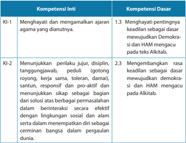

Tabel ini menunjukkan dua jenis kompetensi: Kompetensi Inti (KI) dan Kompetensi Dasar (KD). Topik utama tabel ini adalah tentang kompetensi yang diperlukan untuk membangun kehidupan sosial yang demokratis dan berkelanjutan. Kolom KI-1 dan KI-2 masing-masing berisi dua kompetensi inti yang melibatkan penghayatan dan menganalisis ajaran agama, serta perilaku yang positif seperti tanggung jawab, disiplin, dan sikap proaktif. Kolom KD-1 dan KD-2 berisi dua kompetensi dasar yang berkaitan dengan demokrasi dan HAM, yaitu menghargai pentingnya keadilan sebagai dasar demokrasi dan HAM, serta mengembangkan rasa keadilan sebagai dasar demokrasi dan HAM. Data penting yang terlihat adalah bahwa semua kompetensi inti dan dasar memiliki hubungan dengan demokrasi dan HAM, menunjukkan bahwa pembentukan karakter yang baik sangat penting untuk menciptakan masyarakat yang adil dan berkelanjutan.

 

---
## 📄 Halaman 168

---
**📊 Tabel**

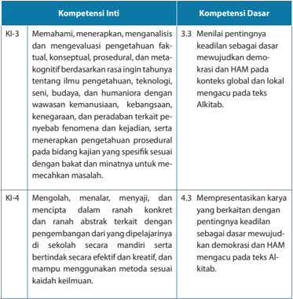

Tabel ini memperlihatkan dua kategori utama: Kompetensi Inti (KI) dan Kompetensi Dasar (KD). KI-3 berfokus pada pemahaman, menerapkan, dan analisis pengalaman fakultatif, konseptual, prosedural, dan meta-kognitif dalam konteks ilmu pengetahuan, seni, budaya, dan humaniora dengan wawasan kemanusiaan, kebangsaan, kenegaraan, dan peradaban tertentu. KD-3.3 menekankan pentingnya keadilan sebagai dasar untuk demokrasi dan HAM di berbagai konteks global dan lokal, mencakup teks Alkitab. KI-4 berfokus pada keterampilan mengolah, menalar, menyajikan, dan menciptakan karya dalam ranah konkret dan abstrak, serta berpartisipasi secara mandiri dan efektif dalam pendidikan. KD-4.3 mengajarkan cara mempresentasikan karya yang berkaitan dengan keadilan sebagai dasar demokrasi dan HAM, menggunakan metode sesuai dengan teks Alkitab. Pola penting yang terlihat adalah hubungan antara pemahaman dan praktik keadilan dalam konteks global dan lokal, serta bagaimana demokrasi dan HAM dapat diterapkan dalam berbagai aspek kehidupan.

### Indikator:

- Mendeskripsikan  makna  keadilan  menurut  Alkitab  dan  mengaitkannya dengan realitas yang ada.
- Membuat karya  yang  berkaitan  dengan  keadilan,  demokrasi  dan  HAM dalam perspektif iman Kristen.
- Merancang  kegiatan  yang  berkaitan  dengan  keadilan,  demokrasi,  dan HAM.

 

---
## 📄 Halaman 169

### A.  Pengantar

Pelajaran 8 berkaitan dengan pelajaran 5-6 mengenai demokrasi dan HAM. Peserta didik perlu diberikan pencerahan bagimana keadilan menjadi landasan utama dalam mewujudkan demokrasi dan HAM. Prinsip-prinsip dasar mengenai keadilan perlu diajarkan pada peserta didik, khususnya  mengenai Allah yang adil yang menuntut umat-Nya untuk bertindak adil. Praktik hidup yang menghargai dan menjalankan keadilan amat penting sehingga manusia tidak akan merampas hak sesamanya, manusia tidak dapat bertindak semaunya. Jika di dunia ada hukum dan UU yang membatasi tindakan manusia, maka dalam kehidupan beriman pun orang Kristen taat pada hukum Allah yang tercantum dalam Alkitab. Kedua hukum ini, baik hukum negara maupun hukum Allah janganlah dipertentangkan namun dilihat tujuannya, yaitu untuk menjamin terwujudnya keadilan bagi manusia.

Pembahasan  dapat  dimulai  dari  prinsip-prinsip  iman  Kristen  berkaitan dengan  keadilan  yang  tercantum  dalam  Alkitab.  Peserta  didik  diminta  untuk mengeksplorasi bagian Alkitab yang menulis mengenai keadilan. Guru sedapat mungkin  menghindari tumpang-tindih pembahasan  dengan  pembelajaran sebelumnya. Fokus pembahasan tidak diarahkan untuk demokrasi dan HAM yang sudah dibahas pada beberapa pelajaran sebelumnya, namun lebih diarahkan pada prinsip keadilan menurut Alkitab dan penerapannya dalam kehidupan. Kemudian pada kesimpulan akhir, barulah disinggung mengenai keadilan sebagai landasan bagi terwujudnya demokrasi dan HAM.

### B. Keadilan Menurut Alkitab

Menurut  Baker,  dalam  Perjanjian  Lama  ada  dua  kata  yang  menggambarkan pengertian mengenai  'adil' yaitu: 'tsedeq' dan 'mishpat' , keadilan yang dimaksudkan  itu  tidak  berdiri  sendiri  namun  berkaitan  dengan  kebenaran dan hukum. Artinya, keadilan itu tidak terlepas dari  kebenaran  dan  penerapan hukum yang benar, yang sesuai. Dalam bahasa Yunani keadilan disebut dengan kata: dikaiosyne .  Kata-kata  tersebut  dalam  Perjanjian  Lama  maupun  Perjanjian Baru,  dipakai  untuk  melukiskan suatu penerapan hukum yang benar, memakai timbangan  yang  benar,  perilaku  yang  adil,  jujur,  dan  benar.  Keadilan  artinya, apa  yang  benar  dan  sesuai  (dengan  kenyataan).  Misalnya,  hukuman  terhadap seseorang ditetapkan berdasarkan kebenaran yang ada. Terutama dalam kaitannya dengan mereka yang miskin, tertindas, dan tersingkir dari kehidupan masyarakat. Allah menyatakan diri se  bagai   yang adil, Allah yang berada di pihak mereka yang benar,  mereka  yang  tertindas  dan  hak-haknya  dirampas,  mereka  yang  miskin, janda anak yatim piatu. Dalam pengertian ini, Allah yang adil itu adalah Allah yang 'membebaskan'.  Jadi,  pengertian  adil  tidak  hanya  ditujukan  pada  perwujudan

 

---
## 📄 Halaman 170

hukum yang benar namun pada 'pembebasan' atau kemerdekaan. Allah yang adil itu  adalah  Allah  yang  membebaskan. Melalui tindakan yang adil, maka shalom Allah dinyatakan dan diwujudkan. Dengan demikian, keadilan juga mengandung makna  memperbaiki  atau  merestorasi  apa  yang  telah  rusak  menjadi  normal kembali.  Keadilan  memiliki  makna  yang  luas  dan  dalam,  keadilan  merupakan ibadah yang berkenan kepada Allah (Kitab Amos 5:7-13; 21-27, dan Yeremia 9:24).

Alkitab  dengan  jelas  menyatakan  bahwa  Allah  itu  adil.  Ayat-ayat  berikut ini  menunjukkan  kebenaran  tersebut:  Mazmur  145:17:  ' Tuhan  itu  adil  dalam segala jalan-Nya dan penuh kasih setia dalam segala perbuatan-Nya. Zefanya 3:5: 'Tetapi Tuhan adil di tengah-tengah-Nya, tidak berbuat kelaliman. Pagi demi pagi Ia memberi hukum-Nya; itu tidak pernah ketinggalan pada waktu fajar. Tetapi orang lalim tidak kenal malu! ' . Dari berbagai pemaparan tersebut di atas, dapatlah ditarik kesimpulan bahwa adil  berarti bertindak dengan benar sesuai dengan standar kebenaran atau ketetapan hukum yang berlaku. Allah itu adil, artinya, Allah akan selalu berlaku benar  sesuai  dengan  prinsip  kebenaran-Nya.  Dia  tak  akan  pernah melanggar ketetapan-ketetapan hukum yang telah dibuat-Nya.

Keadilan Allah dapat kita rasakan dalam berbagai cara, antara lain:

- Allah mencintai kebenaran dan menolak kejahatan, Allah mencintai mereka yang taat dan setia pada jalan-Nya.
- Allah  menghukum  orang-orang  yang  tidak  hidup  dalam  jalan-Nya,  yaitu mereka yang tidak taat pada perintah-Nya. Menghukum tidak berarti Allah adalah Allah penghukum, Ia menghukum karena keadilan-Nya. Keadilan Allah dinyatakan dengan menjatuhkan hukuman atas setiap pelanggaran dan dosa.
- Dia  tidak  akan  membiarkan  pelanggaran  dan  dosa  berlalu  begitu  saja  dari hadapan-Nya. Dia akan mengganjarnya dengan hukuman.
- Allah  memberikan tempat bagi mereka yang taat dan setia pada perintahNya. Semua yang dilakukan oleh manusia tidak luput dari penilaian Allah. Jika setiap kejahatan  memperoleh ganjaran atau hukuman, maka setiap kebaikan dan pekerjaan baik yang kita lakukan dihargai oleh-Nya.
Demikianlah, keadilan Allah nyata dalam setiap tindakan-Nya. Dia mencintai kebenaran,  tetapi  membenci  kejahatan.  Dia  mengganjar  setiap  dosa  dengan hukuman, tetapi menghargai setiap kebajikan dengan pahala. Dia bertindak sesuai dengan prinsip-prinsip  kebenaran  yang  telah Dia tetapkan. Tak ada kecurangan sama sekali dalam diri-Nya. Keadilan Allah menjadi amat nyata melalui kedatangan Yesus Kristus  yang telah menebus dan mempermaikan manusia dengan Allah. Dalam keadilan-Nya, Allah mengirim Yesus Kristus untuk  merestorasi  hubungan

 

---
## 📄 Halaman 171

manusia  dengan-Nya.  Anugerah  keselamatan merupakan bukti keadilan Allah bagi  umat-Nya.  Dasar  dari  keadilan  Allah  adalah  kasih  dan  pengampunan, begitupun seharusnya dilakukan oleh umat-Nya.

### C. Orang Beriman Terpanggil untuk Mewujudkan Keadilan dan Kebenaran Dalam Hidup

Ketika Allah bertanya kepada Salomo apakah yang ia minta dari-Nya, maka Salomo meminta hikmat sebagai hadiah dari Allah. Sebagai seorang raja, Salomo sadar  bahwa hikmat dibutuhkan bukan hanya sebagai bekal untuk memimpin rakyatnya,  namun  terutama  supaya  ia  dapat  membuat  keputusan  yang  adil dan  benar.   Tidak  mudah  bagi  manusia  untuk  memiliki  kemampuan  bertindak benar  dan  adil  jika  Tuhan  tidak  memberikan  hikmat-Nya.  Allah  memenuhi permintaannya, hikmat Allah pun dianugerahkan bagi Salomo. Memiliki hikmat dari Allah membuat Salomo mampu mengambil keputusan adil dan benar. Hal itu  terbukti  ketika  orang  membawa kepadanya  dua  orang  perempuan  yang memperebutkan  bayi,  Salomo  mampu mengambil keputusan yang adil benar. Dengan hikmat yang berasal  dari Tuhan,  ia  tahu  manakah  diantara  dua  orang perempuan itu yang merupakan ibu dari bayi yang sedang diperebutkan.

### D.  Keadilan, Demokrasi, dan HAM

Beberapa prinsip mendasar yang dapat menghubungkan keadilan, demokrasi, dan HAM adalah sebagai berikut:

- Pengakuan    terhadap    kesetaraan  mengandung  makna    bahwa    semua orang  sama  harkat  dan martabatnya. Kesetaraan akan mendorong lahirnya kerjasama yang erat antarwarga  masyarakat  dan  mempunyai  itikad  baik secara  fungsional  dan profesional. Prinsip inilah yang membedakan demokrasi dengan sistem-sistem yang lain. Melalui kesetaraan ini, semua orang sama di hadapan hukum. Semua orang berhak memperoleh apa yang menjadi haknya.
- Kemerdekaan   dan    kebebasan  ( freedom ).    Prinsip    inilah    yang    seringkali menjadi   momok   bagi   demokrasi   sendiri.   Banyak   orang   cenderung menyalahgunakan  kekuasaan  sebagai  alat  untuk  menindas  sesama  serta merampas kemerdekaan dan hak-hak asasinya. Berbeda dengan Salomo yang dipimpin oleh hikmat Allah sehingga ia memimpin dengan adil dan bijaksana.
- Ketiga, prinsip kesadaran terhadap adanya kemajemukan dalam masyarakat. Penghargaan terhadap keberagaman menjadi penopang bagi terwujudnya keadilan,  demokrasi,  dan  HAM.  Pada  masa  kini  pergerakan  manusia  dari berbagai  belahan  dunia  amat  tinggi  sehingga  dalam  satu  negara  hidup berbagai  bangsa,  suku  bangsa,  budaya  maupun  agama.  Keberagaman  ini dapat  melahirkan  konfl  ik,  namun  potensi  konfl  ik  dan  perpecahan  dapat

 

---
## 📄 Halaman 172

diminimalisir  oleh  adanya  kesadaran  terhadap  keberagaman manusia. Selain itu, terpeliharanya keberagaman juga dapat dilakukan dengan memberikan penghargaan terhadap sesama manusia sebagai makhluk mulia ciptaan Allah.

- Prinsip kebebasan menyatakan pendapat dan penegakan HAM. Jadi, keadilan akan menopang kebebasan tiap orang untuk memilih pemimpin yang baik dan benar serta mengemukakan pendapat demi kesejahteraan bersama.
- Integritas.  Kesesuaian  antara  kata  dengan  perbuatan,  antara  cara  dengan pencapaian pencapaian . Cara yang benar jujur dan adil akan menghasilkan buah yang baik. Tujuan yang baik tentu ditempuh dengan cara-cara yang baik dan rasional. Implikasinya adalah politik yang mengandalkan moral dan hati nurani.
- Demokrasi  dan  HAM  akan  menjamin  pemenuhan  keadilan  sosial  bagi seluruh  rakyat  Indonesia.  Demikian  pula  sebaliknya,  keadilan  merupakan kunci utama dalam mewujudkan demokrasi dan HAM.

### E. Penjelasan Bahan Alkitab

###  Mazmur 145:17

Mazmur  145  merupakan  nyanyian    pujian  karena  kemurahan  Allah. Nyanyian ini merupakan  ekspresi kemenangan  iman  seseorang serta ajakan  kepada  manusia  untuk  mengagungkan  kebesaran  Allah.  Kendati pun  kebesaran  ini  tidak  terselami,  pemazmur  menggambarkannya  secara mengagumkan. Harapannya senantiasa adalah agar orang lain juga memberikan kesaksian tentang kebesaran Allah. Pada ayat-ayat berikutnya dia  menekankan  kebesaran  Allah  dilihat  dari  segi  perbuatan-perbuatanNya  yang  mulia,  kebaikan-Nya  yang  besar,  belas  kasih-Nya,  kemurahanNya,  kekekalan,  dan  kemuliaan  kerajaan-Nya,  perhatian-Nya  yang  penuh pemeliharaan, keadilan-Nya, kekudusan-Nya, kesediaan-Nya terhadap siapa  saja  yang  berseru kepada-Nya dalam kebenaran dan dengan takut. Pemahaman akan sifat Allah ini merupakan titik tertinggi dalam Mazmur.

Pemazmur sangat menekankan tentang sifat Allah  yang adil agar setiap orang percaya di segala zaman dapat melihat konsekuensi dari keadilan Allah  itu dalam segala  aspek  kehidupan  serta  tindakannya,  baik  dalam  mengambil  keputusan maupun dalam menjalani kehidupannya. Pemazmur memberitakan bahwa Tuhan itu  adil  dalam  segala  jalan-Nya.  Allah  yang  adil  itu  menuntut  umat-Nya  untuk berlaku adil pada sesama. (Diadaptasi dari www.sabda.id ).

 

---
## 📄 Halaman 173

### F. Kegiatan Pembelajaran

### Kegiatan 1

### Pengantar

Memberikan  pedoman  pada  peserta  didik  mengenai  topik,  pentingnya keadilan, demokrasi, dan HAM serta kaitan antara keadilan, demokrasi dan HAM.  Prinsip-prinsp  dasar  mengenai  keadilan  perlu  dipelajari,  khususnya mengenai  Allah  yang  adil  yang  menuntut  umat-Nya  untuk  bertindak  adil. Praktik  hidup  yang  menghargai  dan  menjalankan  keadilan  amat  penting sehingga  manusia  tidak  akan  merampas  hak  sesamanya,  penegasan  ini penting bagi remaja sehingga mereka diperkuat dalam kehidupan bergereja dan  bermasyarakat,  terutama  keadilan  akan  menjadi  pembiasaan  hidup remaja Kristen.

### Kegiatan 2

### Memahami Makna Keadilan

Pada butir B peserta didik melakukan beberapa kegiatan:

- Berbagi pandangan dan pemahaman mengenai makna keadilan.
- Mengamati kehidupan masyarakat luas pada konteks global maupun lokal di tempat masing-masing, apakah masyarakat hidup dalam keadilan? Apakah mereka memperoleh apa yang seharusnya menjadi haknya?
- Peserta  didik  dan  guru  bersama-sama  menyimpulkan  hasil sharing dan pengamatan dengan merumuskan beberapa indikator atau tanda terwujudnya keadilan dalam kehidupan masyarakat.

### Kegiatan 3

### Mempelajari Keadilan Menurut Alkitab

Pada    kegiatan    ini,    peserta    didik    mengekplorasi    bagian    Alkitab    yang menulis mengenai Allah yang adil bahwa dalam dan melalui keadilan-Nya Ia  menunjukkan kasih setia-Nya bagi umat-Nya. Bahan Alkitab diambil dari rujukan Alkitab pada pelajaran ini, yaitu Mazmur 145:17. Guru dapat mencari 2 atau 3 pembacaan lagi untuk dieksplorasi oleh peserta didik asalkan tidak melenceng dari topik.

Peserta belajar dari Salomo bagaimana orang beriman mewujudkan keadilan dan kebenaran dalam kehidupan.

 

---
## 📄 Halaman 174

### Kegiatan 4

### Kaitan antara Keadilan, Demokrasi, dan HAM

Pada kegiatan ini, peserta didik mengasosiasi atau menghubungkan antara keadilan, demokrasi, dan HAM. Kemudian membandingkan prinsip  keadilan menurut Alkitab dengan  realitas keadilan, demokrasi, dan HAM di Indonesia pada konteks lokal. Kegiatan E dapat diperkuat dengan kegiatan pada poin B bagian kedua.

### Kegiatan 5

### Diskusi

Peserta  didik  melakukan  diskusi  mengenai  menjadikan  keadilan  sebagai penopang terwujudnya demokrasi dan HAM, yaitu bagaimana cara menerapkan  prinsip keadilan dalam demokrasi dan HAM di Indonesia. Apakah yang dapat dilakukan oleh remaja Kristen  dalam mewujudkan keadilan bagi sesama.  Mendiskusikan  mengenai  sikap  dan  tindakan  mereka  jika  kelak menjadi  pemimpin.  Dalam  aktivitas  ini,  guru  dapat  mengarahkan  peserta didik dalam hal integritas, kejujuran, serta bela rasa bagi banyak orang tanpa memandang perbedaan suku, bangsa, agama, budaya, maupun kelas sosial.

### Kegiatan 6

Menulis  refl  eksi  singkat  mengenai  keadilan,  demokrasi,  dan  HAM.  Panjang tulisan 1-2 halaman, dapat diketik ataupun ditulis tangan. Guru harus ingat bahwa tidak semua anak memiliki komputer, atau di daerah-daerah terpencil peserta  didik  tidak  memiliki  akses  terhadap  komputer.  Oleh  karena  itu, penting untuk memberikan pilihan-pilihan dalam aktivitas.

### Kegiatan 7

### Tugas

Merancang  kegiatan/proyek  yang  berkaitan  dengan  keadilan,  demokrasi dan HAM, misalnya mengunjungi dan memberikan bantuan bagi keluarga atau  masyarakat  yang  menjadi  korban  HAM.  Guru  merancang  bersamasama dengan peserta didik dan memonitor kegiatan tersebut. Setelah selesai kegiatan, diadakan evaluasi dan guru menilai kegiatan tersebut.

### G. Penilaian

Penilaian  dilakukan  dalam  bentuk  penilaian  pengetahuan,  yaitu  tes  lisan mengenai makna keadilan serta kaitannya dengan demokrasi dan HAM. Penilaian produk, yaitu tulisan refl  eksi mengenai keadilan, demokrasi, dan HAM.

 

---
## 📄 Halaman 175

### PENJELASAN BAB

### Praktik Keadilan di Indonesia

Bahan Alkitab: Matius 20: 1-16

---
**📊 Tabel**

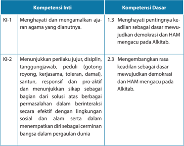

Tabel ini menunjukkan dua kompetensi inti (KI) dan tiga kompetensi dasar (KD) yang terkait dengan nilai-nilai dan perilaku yang diharapkan dalam konteks kehidupan sosial dan lingkungan. Kompetensi inti pertama (KI-1) berkisar pada penghormatan dan menganut ajaran agama yang dianutnya, sementara KI-2 fokus pada sikap dan perilaku yang jujur, disiplin, tanggung jawab, peduli, gotong royong, kerjasama, toleransi, damai, santun, responsif, proaktif, dan menunjukkan sikap sebagai bagian dari solusi berperan efektif dalam berinteraksi dengan lingkungan sosial dan alam. Kompetensi dasar 1.3 dan 2.3 mencakup rasa keadilan sebagai dasar demokrasi dan HAM yang mengacu pada Alikitab, serta menghargai pentingnya keadilan sebagai dasar demokrasi. Data dan pola penting yang terlihat adalah bahwa tabel ini mencakup dua kompetensi inti yang lebih spesifik dan tiga kompetensi dasar yang lebih umum, serta menekankan pentingnya nilai-nilai moral dan etis dalam konteks kehidupan sosial.

 

---
## 📄 Halaman 176

---
**📊 Tabel**

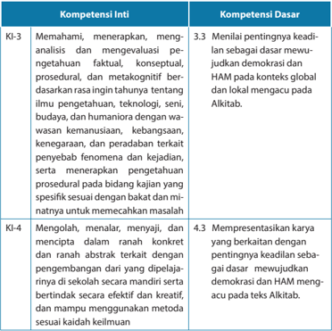

Tabel ini menunjukkan dua kompetensi inti (KI) dan satu kompetensi dasar (KD), yang secara keseluruhan membahas pengetahuan, analisis, dan evaluasi berdasarkan ilmu pengetahuan, teknologi, seni, budaya, dan humaniora. Topik utama adalah memahami, menerapkan, menganalisis, dan mengevaluasi pengetahuan faktil, konseptual, prosedural, dan metakognitif berdasarkan rincian tahunnya tentang ilmu pengetahuan, teknologi, seni, budaya, dan humaniora. Data penting lainnya meliputi: KI-3 tentang memahami, menerapkan, menganalisis, dan mengevaluasi pengetahuan berdasarkan rincian tahunnya; KI-4 tentang mengolah, menalar, menyajikan, dan menciptakan dalam ranah konkrit dan ranah abstrak terkait dengan pengembangan dari yang dipelajari di sekolah secara mandiri serta berintindak secara efektif dan kreatif; dan KD tentang mempresentasikan karya yang berkaitan dengan pentingnya keadilan sebagai dasar mewujudkan demokrasi dan HAM mengacu pada teks Alkitab.

### Indikator:

- Menjelaskan contoh pelaksanaan keadilan di Indonesia
- Memberikan penilaian kritis terhadap kasus pelanggaran keadilan berdasarkan pemahaman terhadap teks Alkitab.
- Mempresentasikan program yang disusun untuk membangkitkan kesadaran remaja seusia akan pentingnya menegakkan keadilan.

 

---
## 📄 Halaman 177

### A.  Pengantar

Judul pelajaran ini adalah 'Praktik Keadilan di Indonesia' . Setelah mengkaji tentang demokrasi dan keadilan dari perspektif Alkitab,  kita  akan  menerapkan pemahaman yang kita miliki ini dalam menyoroti praktik keadilan di Indonesia. Perjalanan demokrasi dan keadilan di Indonesia menjadi perhatian bagi negaranegara asing, misalny, Amerika Serikat. Dengan jumlah penduduk yang ba  nyak (paling banyak se-Asia Tenggara, paling banyak untuk jumlah penduduk Muslim se-dunia),  maka  Indonesia  memiliki  peran  strategis  di  mata  bangsa-bangsa lain.  Peran ini adalah dari segi ekonomi, politik, budaya, dan lain-lain. Misal  nya, secara  ekonomi,  Indonesia  sering  dijadikan  sasaran  untuk  pemasaran  produk dari  luar  negeri.  Secara  politik,  Indonesia  diharapkan  berperan  untuk  menjaga perdamaian di wilayah Asia Tenggara khususnya dan di Asia Pasifi  k. Beberapa kali Indonesia diminta menjadi mediator di antara pihak-pihak yang berkonfl  ik. Misalnya,  Indonesia  menjadi  mediator  untuk  perjanjian  damai  antara  MNLF-Filipina sejak 1993. Peran ini berhasil dijalankan dengan baik sampai pada disepakatinya perjanjian damai pada tanggal 2 September 1996 di Manila, Filipina. Kepemimpinan Indonesia  di  APEC  ( Asia  Pacifi  c  Economy  Corporation )  juga  membuka  peluang untuk  kerjasama  di  bidang  ekonomi  agar  terjadi  pertumbuhan  ekonomi  yang lebih baik di antara negara-negara anggota  APEC.

Lepas  dari  keberhasilan  ini  semua,  apakah  keadilan  di  Indonesia  sudah berjalan dengan baik? Dari hal-hal apa saja kita dapat menilai keberhasilan atau kemunduran praktik  keadilan  di  Indonesia?  Inilah  yang  akan  kita  bahas  dalam pelajaran kali ini. Pelaksanaan keadilan menjadi salah satu ukuran bahwa suatu negara adalah negara yang sukses, bukan negara gagal.

Sebelum kita membahas praktik keadilan di Indonesia, perlu kita pahami dulu tentang arti keadilan. John Rawls (2003), seorang fi  lsuf dari Amerika Serikat dan tokoh di  bidang  fi  lsafat  moral  dan  politik  menyatakan  bahwa  keadilan  ( justice ) adalah dasar bagi interaksi manusia (yang sifatnya multidimensi) dengan institusi. Tujuannya adalah agar ada keseimbangan antara demokrasi dengan keamanan sehingga  tercapailah  kestabilan  di  dalam  masyarakat.  Perlu  ada  kesepakatan antara  komunitas  yang  terbentuk  secara  politik  deng  an  pemerintah  sehingga secara  bersama-sama  terjalin  saling  memahami  dan  kerjasama.  Keadilan  dan demokrasi bertumbuh bila institusi, baik politik maupun sosial saling mendukung untuk mencapai kerjasama sosial dimana ada hak dan kewajiban dasar yang harus dipenuhi agar kekuasaan dan sumber-sumber yang ada dapat dibagi merata dan bukan hanya untuk sekelompok orang. Untuk mencapai ini, perlu ada pembatasan terhadap  kekuasaan  dan  pemanfaatan  sumber-sumber  alam,  selain  mencegah munculnya penyalahgunaan oleh sekelompok orang atau institusi.

 

---
## 📄 Halaman 178

### B. Mengkaji Perumpamaan Alkitab tentang Keadilan

Bacalah Matius 20: 1-16 'Adapun hal Kerajaan Sorga sama seperti seorang tuan rumah yang pagi-pagi benar keluar mencari pekerja-pekerja untuk kebun anggurnya. Setelah ia sepakat dengan pekerja-pekerja itu mengenai upah sedinar sehari, ia menyuruh mereka ke kebun anggurnya. Kira-kira pukul sembilan pagi ia keluar pula dan dilihatnya ada lagi orang-orang lain menganggur di pasar. Kata  nya kepada mereka: 'Pergi jugalah kamu ke kebun anggurku dan apa yang pantas akan kuberikan kepadamu.' Dan mereka pun pergi. Kira-kira pukul dua belas dan pukul tiga petang ia keluar pula dan melakukan sama seperti tadi. Kira-kira pukul lima petang ia keluar lagi dan mendapati orang-orang lain pula, lalu katanya kepada mereka: 'Mengapa kamu menganggur saja di sini sepanjang hari?' Kata mereka kepadanya: 'Karena tidak ada orang mengupah kami.' Katanya kepada mereka: 'Pergi jugalah kamu ke kebun anggurku.' Ketika hari malam tuan itu berkata kepada mandurnya: 'Panggillah pekerjapekerja itu dan bayarkan upah mereka, mulai dengan mereka yang masuk terakhir hingga mereka yang masuk terdahulu.' Maka datanglah mereka yang mulai bekerja kira-kira  pukul  lima  dan  mereka  menerima  masing-masing  satu  dinar.  Kemudian datanglah mereka yang masuk terdahulu, sangkanya akan mendapat lebih banyak, tetapi merekapun menerima masing-masing satu dinar juga. Ketika mereka menerimanya, mereka bersungut-sungut kepada tuan itu, katanya: 'Mereka yang masuk terakhir ini hanya bekerja satu jam dan engkau menyamakan mereka dengan kami yang sehari suntuk bekerja berat dan menanggung panas terik matahari.' Tetapi tuan itu menjawab seorang dari mereka: 'Saudara, aku tidak berlaku tidak adil terhadap engkau. Bukankah kita telah sepakat sedinar sehari? Ambillah bagianmu dan pergilah; aku mau memberikan kepada orang yang masuk terakhir ini sama seperti kepadamu. Tidakkah aku bebas mempergunakan milikku menurut kehendak hatiku? Atau iri hatikah engkau, karena aku murah hati?' Demikianlah orang yang terakhir akan menjadi yang terdahulu dan yang terdahulu akan menjadi yang terakhir.

Bila kita adalah pekerja yang mulai bekerja pada pukul 5 sore, maka apa yang akan kita rasakan?  Apakah perasaan kita akan berbeda bila kita mulai sejak pagi sekali? Mana yang lebih kita sukai, bekerja dari pagi hari atau dari sore hari, bila ternyata  upahnya  akan  sama  saja,  yaitu  sedinar  untuk  seharian  kerja?  Sedinar adalah upah yang layak untuk seharian kerja, kira-kira antara 40-80 ribu rupiah. Kemungkinan  besar  kita  akan  memilih  untuk  memulai  pada  pukul  5  sore  dan selesai  pukul  6  sore  dengan  mendapatkan upah sebesar sedinar. Sepintas, kita cenderung menilai bahwa yang memilih datang pada sore hari dan bukan pagi hari adalah pemalas, hanya mau enak-enak saja; kerja sebentar tapi mendapatkan upah penuh seperti pekerja yang sudah mulai kerja sejak pagi hari.

 

---
## 📄 Halaman 179

Namun, bayangkan bila kita memang butuh pekerjaan dan sudah menunggu sejak pagi hari untuk pekerjaan yang dapat memberikan upah yang layak. Sejak pagi  hari  kita  sudah  berharap  ada  yang  mau  mempekerjakan  kita.  Sayangnya, hari berjalan terus dan yang kita nantikan tidak kunjung nampak. Sinar matahari yang  hangat  kini  menjadi  semakin  terik.  Bahkan  sudah  semakin  tenggelam menandakan malam akan hadir. Pekerjaan yang kita tunggu-tunggu sejak pagi tidak kunjung datang. Kita sudah tidak bisa lagi berharap bahwa ada yang akan datang memberikan pekerjaan.

Tetapi, ternyata dugaan kita salah. Ada seorang pengusaha  yang menawarkan pekerjaan untuk diselesaikan saat itu juga. Kita tidak percaya, namun tawaran ini terlalu menarik untuk ditolak. Kita pun sepakat untuk pergi ke tempat usahanya -kebun  anggur-  dan  mulai  bekerja  sebisa  kita.  Disitu  kita  melihat  sudah  ada sejumlah pekerja, bahkan ada yang sudah mulai bekerja sejak pagi-pagi sekali. Dalam hati, kita iri terhadap mereka yang sudah memiliki pekerjaan sejak pagi hari, sedangkan kita berharap seharian tanpa kepastian apakah kita akan mendapatkan pekerjaan.  Namun,  kita  singkirkan  rasa  iri  itu  dan  langsung  bekerja  sebaikbaiknya sambil berharap agar esok hari kita tidak terlambat untuk mendapatkan pekerjaan.Menunggu dalam ketidakpastian sungguh tidak enak, apalagi bila ada anggota keluarga di rumah yang juga menunggu kita pulang sambil membawa uang untuk membeli makanan.

Kini pukul 6 sore tiba, saatnya pekerja berhenti bekerja.  Kita juga sudah harus berhenti, padahal kita berharap bisa bekerja lebih lama agar upah yang diterima bisa cukup untuk membeli makanan.  Dalam hati kita tahu bahwa kita tidak bisa berharap  untuk  mendapatkan  upah  yang  sama  besarnya  dengan  yang  sudah mulai bekerja dari pagi hari. Namun, mendapatkan upah walaupun sedikit masih lebih baik daripada tidak sama sekali.

Ternyata,  nama kita  dipanggil  lebih  dulu  oleh  sang  mandor.  Kita  diberikan uang sedinar sebagai upah bekerja sejak pukul 5 sore tadi. Kita bersyukur. Ternyata bekerja sejam diberikan upah yang layak seakan-akan kita sudah bekerja seharian penuh.  Apakah  betul  kita  bersyukur  untuk  upah  yang  kita  terima?  Tentu  saja, bukan? Kita akan mendatangi sang pengusaha dan menyatakan ungkapan syukur untuk kebaikan hatinya.

Tapi tunggu dulu! Pada saat itu juga, kita mendengar gerutu dan omelan dari pekerja yang mulai bekerja sejak pagi hari. Mereka tidak bisa menerima bahwa mereka  mendapatkan  upah  yang  besarnya  sama  dengan  upah  kita,  padahal mereka  sudah  bekerja  lebih  lama.  Tentu  perasaan  kita  menjadi  tidak  keruan mendengarkan gerutu itu, bukan? Kita tidak tahu harus menjawab apa atau harus bersikap bagaimana kepada mereka.

 

---
## 📄 Halaman 180

Ternyata kita tidak perlu menjawab apa pun karena sang pengusaha sudah memberikan penjelasan: 'Saudara, aku tidak berlaku tidak adil terhadap engkau. Bukankah kita telah sepakat sedinar sehari? Ambilah bagianmu dan pergilah; aku mau memberikan kepada orang yang masuk terakhir ini sama seperti kepadamu. Tidakkah  aku  bebas  mempergunakan  milikku  menurut  kehendak  hatiku?  Atau  iri hatikah engkau, karena aku murah hati?' Saat itu juga kita menyadari bahwa kita berada  di  dalam  perlindungan  orang  yang  mempedulikan  kita,  yang  tahu  apa yang kita butuhkan, yaitu upah yang layak. Kata-kata sang pengusaha '…aku mau memberikan kepada orang yang terakhir ini sama seperti kepadamu,' sungguh menyejukkan  dan  sekaligus  melegakan  karena  kita  merasa  dihargai  oleh  sang pengusaha.

Perhatikan  bahwa  sang  pengusaha  memberlakukan  baik  prinsip  keadilan maupun prinsip kasih karunia.  Apa  yang  layak  diterima  seseorang,  itulah  yang diberikannya. Ini berlaku kepada para pekerja yang mulai bekerja dari pagi hari. Para  pekerja  ini  bisa  menuntut  andaikata  sang  pengusaha  tidak  memenuhi bayaran sedinar seperti yang sudah disepakati sejak awal. Namun, pada pekerja yang datang paling terakhir, yang berlaku adalah prinsip kasih karunia. Pemberian berdasarkan kasih karunia adalah pemberian yang tergantung kepada kemurahan hati si pemberi. Dalam hal ini, kita selaku orang yang menerima kasih karunia tidak bisa menuntut agar si pemberi memberikan apa yang kita harapkan. Kita adalah pihak yang pasif, hanya menerima saja apa yang diberikan, karena yang aktif justru adalah pemberi kasih karunia.

Posisi ini berbeda dengan yang menerima keadilan. Diperlakukan adil adalah sesuatu yang perlu kita perjuangkan, karena itu merupakan hak yang harus kita terima.

### C. Contoh Menuntut Keadilan dan Demokrasi

Artikel berikut ini memberikan bukti bahwa seorang remaja berusia 17 tahun ternyata  sanggup  menggerakkan  teman-teman  sebaya  untuk  menuntut  hak mereka dari pemerintah.

Tribunnews.com,  Hongkong  -  Jangan  tertipu  dengan  tampilan  fi  siknya.  Meski badannya terbilang kurus dan memiliki wajah seperti kutu buku,   Joshua Wong (17), merupakan aktivis pro-demokrasi Hongkong yang paling ditakuti oleh pemerintah Tiongkok.

Selama dua tahun terakhir,  pelajar  ini  telah  membangun  gerakan  pemuda  prodemokrasi di Hongkong  dengan  mengkampanyekan  peristiwa berdarah di lapangan Tiananmen, Tiongkok, 25 tahun lalu dengan tujuan menyulut gelombang pembangkangan sipil di kalangan mahasiswa Hongkong.

 

---
## 📄 Halaman 181

 

---
## 📄 Halaman 182

### (lanjutan).....

Pada  bulan  Juni,  scholarism  menyusun  rencana  untuk  mereformasi  sistem pemilu Hongkong, dimana memenangkan dukungan dari hampir sepertiga dari pemilih. Dukungan itu didapatkannya berdasarkan referendum tak resmi yang digagas pihaknya.

Minggu  ini  Wong  memimpin  kelompoknya  menggelar  aksi  meninggalkan ruang kelas untuk mengirim pesan pro-demokrasi ke Beijing.

Aksi  mereka  mendapatkan  dukungan  luas,  administrator  perguruan  tinggi telah berjanji memberikan keringanan hukuman pada siswa yang membolos, dan serikat guru terbesar di Hongkong mengedarkan petisi yang menyatakan 'jangan biarkan mereka  berdiri seorang  diri' ,  dimana  merujuk  kepada kelompok Wong.

Merujuk  pada  perumpamaan  di  Matius  20,  apa  yang  dituntut  oleh  Wong dan  kawan-kawan  adalah  keadilan  sesuai  dengan  yang  sudah  disepakati  pada awalnya. Mengapa mereka perlu menuntut? Karena pemerintah Tiongkok tidak melakukan apa yang mereka janjikan kepada penduduk Hongkong.

### D.  Pelaksanaan Keadilan di Indonesia Sejak 1998

Membahas  pelaksanaan  keadilan  sebelum  tahun  1998  bukan  merupakan hal  yang  perlu  dibahas  disini  karena  lebih  tepat  dibahas  di  pelajaran  Sejarah atau Pendidikan Kewarganegaraan. Kini kita hidup di era reformasi yang diawali dengan ketidakpuasan rakyat terhadap pemerintahan saat itu. Dapat dikatakan bahwa tahun 1998 merupakan salah satu tonggak sejarah di Indonesia. Mengapa? Tahun 1998 adalah tahun dimana pemerintahan Suharto berakhir dan tampuk pemerintahan  beralih  ke  B.J.  Habibie  selaku  Presiden  Republik  Indonesia  yang ketiga.  Pemerintahan  Soeharto  yang  biasa  disebut  Orde  Baru  dikecam  karena menggunakan pendekatan otoriter walaupun disebut dengan demokrasi Pancasila.  Orde  Baru  memang  menggantikan  rezim  Orde  Lama  di  bawah pemerintahan Presiden Soekarno.

Reformasi  ini  diwujudkan  dalam  kehidupan  berpolitik  dan  bermasyarakat yang  sifatnya  menjadi  lebih  bebas  dan  terbuka  (Indonesia-investment,  2013). Kebebasan dalam berpolitik misalnya adalah kebebasan untuk mendirikan partai politik  yang  memiliki visi  misi  yang  berbeda dari partai politik yang sudah ada pada  kepemimpinan  Soeharto.  Secara  lebih  rinci,  pencapaian  Habibie  dalam bidang reformasi ini adalah:

 

---
## 📄 Halaman 183

- Memberikan kebebasan pers.
- Pendirian partai politik dan sejumlah serikat, misalnya serikat buruh.
- Pembebasan sejumlah narapidana politik.
- Pembatasan periode kepresiden menjadi maksimal dua kali lima tahun.
- Pelimpahan sebagian kewenangan dan kekuasaan ke pemerintah daerah.
- Penyelenggaraan  pemilihan  umum  pada  tahun  1999,  walaupun  pemilihan presiden  sebelumnya  baru  saja  dilakukan  pada  tahun  1998  oleh  Dewan Perwakilan Rakyat.
Sayangnya, pada masa ini juga mulai muncul tindakan kekerasan seperti yang terjadi di Ambon, Kalimantan Barat, Jawa Timur, Kupang tanpa mudah ditelusuri siapa pelakunya. Begitu juga pada masa inilah kemerdekaan Timor Timur diakui oleh pemerintah Indonesia.

Pada tahun 1999, sebagai tindak lanjut dari reformasi dalam bidang politik, rakyat Indonesia mengikuti pemilihan umum untuk memilih partai politik yang saat itu berjumlah 48 partai. Tentu saja banyak dari partai politik ini yang tidak mendapatkan suara karena memang kurang dikenal oleh masyarakat luas karena umur yang masih pendek sebagai suatu partai. Salah satu partai yang mendapatkan dukungan  luas  adalah  Partai  Demokrasi  Indonesia  Perjuangan  yang  didirikan oleh  Megawati  Soekarnoputri,  putri  sulung  dari  Soekarno,  Presiden  pertama Indonesia.  Partai lainnya adalah Partai Kebangkitan Bangsa yang didirikan oleh K.  H.  Abdurrahman Wahid  yang  juga  merupakan  tokoh  Nahdlatul  Ulama  (NU). Wujud demokrasi yang muncul dalam pemilihan umum ini adalah bahwa Dewan Perwakilan Rakyat  memiliki wakil-wakil dari pulau Jawa maupun luar Jawa yang dibuat menjadi sama besar, tidak lagi lebih banyak wakil dari pulau Jawa.

Presiden  Habibie  digantikan  oleh  Presiden  K.H.  Abdurrahman  Wahid  (Gus Dur) pada tahun 1999. Contoh pembaharuan yang terjadi pada masa ini adalah pengangkatan menteri kabinet yang berasal dari partai politik dan mengurangi peranan dari Tentara Nasional Indonesia (TNI) dan Angkatan Bersenjata Republik Indonesia (ABRI), padahal, sejumlah konfl  ik dan tindak kekerasan yang muncul di Indonesia memang perlu ditangani oleh TNI dan ABRI. Sementara itu, korupsi tetap terjadi dan melibatkan para menteri yang  berasal dari partai politik yang utama, yaitu  PDI-P ,  Gokar,  PPP ,  dan  PAN.  Pada  masa  pemerintahan  Gus  Dur,  reformasi diwujudkan dalam bentuk antara lain:

- Kebebasan pers semakin luas karena Departemen Penerangan dihapuskan.
- Kelompok Tinghoa mendapatkan pengakuan lebih besar melalui kemudahan dalam mengurus dokumen kewarganegaraan dan penetapan hari raya Imlek sebagai hari libur nasional.

 

---
## 📄 Halaman 184

- Mengakui Khonghucu sebagai salah satu kepercayaan yang ada di kalangan rakyat Indonesia.
Ada sejumlah ketidak beresan politik yang juga mengakibatkan ketidakstabilan ekonomi, Gus Dur diimpeachment oleh DPR dan digantikan oleh Megawati selaku wakil presiden.

Secara umum pemerintahan Megawati melanjutkan kebijakan baik yang sudah dilakukan di era Gus Dur. Perubahan yang dilakukan antara lain adalah mengadili kroni-kroni Soeharto untuk kasus korupsi, melakukan privatisasi untuk sejumlah perusahaan  negara  dengan  menjualnya  ke  swasta  atau  ke  pihak  asing.  Untuk tindakan terakhir ini cukup banyak kritik dilontarkan kepada Megawati.

Pada  tahun  2004  pemerintahan  Megawati  berakhir  dan  melalui  pemilihan langsung  presiden  yang  pertama  kali  dilakukan  oleh  rakyat  Indonesia,  Susilo Bambang Yudoyono (SBY) menjadi Presiden RI yang kelima. Sejumlah pembaruan yang dilakukan dalam dua periode pemerintahan SBY (tahun 2004-2014) antara lain adalah:

- Di  bidang  ekonomi,  terjadi  pertumbuhan  sehingga  ada  stabilitas  ekonomi dengan kekuatan ekonomi yang diakui negara-negara lain.
- Ada alokasi  Anggaran  Pendapatan dan Belanja Negara sebesar 20% untuk pendidikan.
- Meninggalkan IMF selaku badan ekonomi yang sebelumnya banyak mendikte apa  yang  harus  dilakukan  oleh  pemerintahan  Indonesia  dalam  bidang ekonomi.
- Pembentukan  Komisi  Pemberantasan  Korupsi  untuk  menuntaskan  kasuskasus korupsi. KPK kini dianggap sebagai lembaga yang bekerja dengan baik karena berhasil menuntaskan kasus-kasus korupsi termasuk yang melibatkan sejumlah anggota DPR dan menteri.
Namun  demikian,  ada  sejumlah  kasus  yang  belum  dapat  diselesaikan dengan baik,  misalnya  saja  penyelesaian  kasus  orang  hilang  yang  terjadi  pada masa pemerintahan sebelumnya. Satu tradisi baru dalam demokrasi yang sudah berjalan baik sejak tahun 2004 adalah pemilihan presiden, anggota DPR, anggota DPRD, anggota DPD, kepala daerah (gubernur dan bupati)  secara langsung oleh rakyat. Ini merupakan prestasi pemerintahan Indonesia yang diakui oleh dunia. Sayangnya, menjelang akhir pemerintahan SBY, pemilihan langsung ini diganti oleh DPR menjadi tidak langsung melalui pengesahan Undang-Undang Pemilihan Kepala Daerah pada tanggal 26 September 2014.

Laporan yang disusun oleh Karrie Mc Laughlin dan Ari Perdana (2010) sebagai analisis terhadap kondisi konfl  ik di Indonesia terkait dengan kondisi perekonomian

 

---
## 📄 Halaman 185

menyebutkan bahwa praktik keadilan di Indonesia tidaklah menggembirakan. Jadi, dapat dikatakan bahwa tercapainya keadilan di Indonesia sangatlah dipengaruhi oleh pergolakan dan dinamika politik dan para pejabat pemerintahan. Perjalanan demokrasi  di  Indonesia  masih  akan  berlangsung  panjang  demi  menjamin tercapainya  keadilan,  kesempatan  menyuarakan  pendapat  dan  mengawasi jalannya  pemerintahan.  Demokrasi  hanya  dapat  terwujud  apabila  demokrasi sebagai  prinsip  dan  acuan  hidup  bersama  antarwarga  negara  dan  antarwarga negara dengan negara dijalankan dan dipatuhi oleh semua pihak. Perwujudan demokrasi bukan hanya tanggung jawab pemerintah dan negara semata-mata melainkan merupakan bagian dari tanggung jawab warga negara.

### Bacalah laporan berita di bawah ini:

---
**🖼️ Gambar/Diagram**

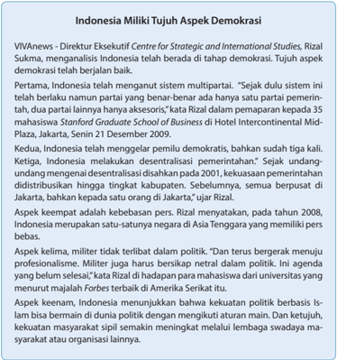

> **Deskripsi Visual:** Gambar ini adalah sebuah diagram yang menunjukkan tujuh aspek demokrasi di Indonesia. Diagram ini dibagi menjadi tiga bagian utama:

1. Pertama, ada tulisan "Indonesia Miliki Tujuh Aspek Demokrasi" yang berada di bagian atas.
2. Kedua, ada beberapa poin yang menjelaskan masing-masing aspek demokrasi:
   - Pertama, Indonesia memiliki sistem multipartai.
   - Kedua, Indonesia telah mengalami demokrasi sejak dulu.
   - Ketiga, Indonesia melakukan desentralisasi pemerintahan.
   - Keempat, Indonesia merupakan satu-satunya negara di Asia Tenggara yang memiliki pers bebas.
   - Kelima, militer tidak terlibat dalam politik.
   - Keenam, Indonesia menunjukkan bahwa kekuatan politik berbasis Islam bermanfaat dalam dunia politik.
   - Ketujuh, Indonesia memiliki lembaga swadaya masyarakat yang aktif.

3. Teks, angka, atau label penting yang terlihat:
   - "VIVANews" dan nama Rizal Sukma.
   - Angka 2009 untuk tahun pertama kali Indonesia melakukan desentralisasi pemerintahan.
   - Nama universitas yang menurutkan bahwa militer tidak bergerak menuju profesionalisme.

4. Informasi kunci yang dapat diambil pembaca:
   - Indonesia telah berada dalam tahap demokrasi baik selama bertahun-tahun.
   - Ada beberapa aspek demokrasi yang telah terwujud di Indonesia, seperti sistem multipartai, desentralisasi pemerintahan, pers bebas, dan lembaga swadaya masyarakat.
   - Indonesia juga memiliki kontribusi positif dalam dunia politik, terutama dalam hal kekuatan politik berbasis Islam.

 

---
## 📄 Halaman 186

Dari laporan di atas tersirat bahwa demokrasi Indonesia telah berjalan baik karena negara kita memiliki tujuh aspek pentingnya: sistem multipartai, pemilu yang demokratis, desentralisasi pemerintahan, kebebasan pers, militer yang tidak terlibat  politik,  kekuatan  politik  Islam  dalam  dunia  politik  yang  pluralistik,  dan kekuatan masyarakat sipil. Tapi, seberapa jauh hal di atas dapat kita setujui? Dan yang lebih penting, apakah keadilan sudah dirasakan oleh segenap masyarakat Indonesia, bukan hanya sekedar pernyataan yang dihafalkan ketika menyebutkan Pancasila?

Laporan di atas jelas menunjukkan masih banyak pekerjaan rumah yang harus dijalankan oleh bangsa Indonesia, supaya  kita benar-benar dapat mewujudkan negara dan bangsa yang demokratis, sesuai dengan apa yang dirumuskan oleh Pancasila.  Sejumlah  penelitian  menunjukkan  bahwa  berjalannya  keadilan  dan demokrasi yang baik terkait erat dengan kesejahteraan masyarakat. Dalam situasi dimana sangat banyak penduduk yang miskin dan terdapat kesenjangan yang luas antara penduduk kaya dengan penduduk miskin, keadilan menjadi sulit terwujud. Mengapa begitu? Karena kesenjangan antara kelompok kaya dan kelompok miskin muncul akibat  ada  kelompok  penguasa  yang  membiarkan  situasi  kesenjangan untuk kepentingan mereka. Kondisi Indonesia yang masih dikategorikan memiliki banyak  korupsi  termasuk  hal  yang  memprihatinkan.  Pemerintah  dan  rakyat Indonesia  perlu  bekerja  keras  untuk  membasmi  korupsi  yang  sudah  dianggap terstruktur  dan  massif  (Kompas,  September  2014).  Rencana  Bank  Dunia  dalam membangun kemitraan dengan Indonesia menunjukkan bahwa tingkat korupsi yang tinggi menjadi hal yang harus dapat ditangani oleh pemerintah Indonesia agar dapat menjamin masyarakat Indonesia yang sejahtera. Kondisi bahwa 40% masyarakat Indonesia hidup di ambang kemiskinan dengan pengeluaran sebesar 1,5 dolar Amerika per hari sangatlah memprihatinkan. Inilah hal-hal yang harus dibereskan sebelum demokrasi berjalan dengan baik di negara Indonesia.

### E. Memupuk Sikap Adil Sejak Dini

Sama seperti halnya memupuk demokrasi, sikap adil harus dipupuk sejak dini. Kita tidak bisa memiliki sikap adil bila kita tidak pernah merasakan diperlakukan adil.  Dengan  kata  lain,  pengalaman  diperlakukan  dengan  adil  akan  memupuk sikap adil terhadap orang lain. Dari mana kita merasakan diperlakukan dengan adil? Tentunya dari pengalaman di keluarga dan sekolah sebagai unit dan lembaga pertama yang dialami oleh individu. Seluruh pihak yang terlibat harus sepakat bahwa  keadilan  harus  ditegakkan  dan  kepedulian  terhadap  sesama  memang mewarnai keputusan yang diambil dan tindakan yang dilakukan. Sejak kecil, orang tua  hendaknya  tidak  membeda-bedakan  antara  anak  yang  satu  dengan  anak yang lain. Tidak boleh ada anak yang menganggap bahwa dirinya lebih istimewa

 

---
## 📄 Halaman 187

dari saudara-saudara kandung lainnya maupun menganggap diri lebih istimewa daripada orang lain.

Di pembahasan sebelumnya kita sudah tahu bahwa untuk memupuk sikap demokratis sejak dini, orang tua perlu menerapkan pola asuh yang demokratis, yaitu  yang  memberi  kesempatan  kepada  anak  untuk  menyuarakan  pendapat mereka  yang  mungkin  saja  berbeda  dari  pendapat  orang  tua.  Penghargaan kepada pendapat anak akan memupuk rasa percaya diri anak yang berakibat pada munculnya rasa menghargai orang lain juga. Melengkapi sikap demokratis ini, sikap adil ditumbuhkan bila individu merasakan bahwa ia sama berharganya dan sama istimewanya dengan orang-orang lain. Dasar dari ini adalah bahwa setiap orang sama berharganya di hadapan Allah. Beberapa penelitian (misalnya Howe, Cate, Brown, & Hadwin, 2008) menunjukkan bahwa seorang anak yang berusia 5 tahun pun sudah memiliki kemampuan empati, yaitu belas kasihan kepada orang lain, memiliki rasa tidak tega melihat orang lain mengalami kekurangan dibandingkan dengan dirinya, tentunya rasa belas kasihan tidak mendadak tumbuh begitu saja.

### F. Penutup

Guru mengajak peserta didik menyanyikan lagu KJ No. 426: 1-4 'Kita Harus Membawa Berita.'

### Kita Harus Membawa Berita

- Kita harus membawa berita pada dunia dalam gelap tentang kebenaran dan kasih dan damai yang menetap dan damai yang menetap.

### Ref. :

Karna g ' lap jadi remang pagi, dan remang jadi siang t ' rang Kuasa Kristus 'kan nyatalah, rahmani dan cemerlang

- Kita harus menyanyikan gita melembutkan hati keras, supaya senjata Iblis remuk dan seg ' ra lepas remuk dan seg ' ra lepas.
- Kita harus membawa berita: Allah itu kasih belas. Dib ' rikan Putra tunggal-Nya supaya kita lepas, supaya kita lepas.
- Kita harus bersaksi di dunia tentang kuasa darah kudus. Semoga yang masih sangsi terima Sang Penebus, terima Sang Penebus.

 

---
## 📄 Halaman 188

### Doa Penutup

Guru mengajak peserta didik mengucapkan doa di bawah ini:

Tuhan  Mahakuasa,  Engkau  sudah  menciptakan  manusia  untuk kemuliaan-Mu. Ajarkan kami untuk melayani-Mu melalui kebebasan berkarya dan menyuarakan pendapat demi menegakkan keadilan. Anugerahkan keberanian untuk melakukan yang benar dan membawa kebaikan bagi sesama kami. Jauhkan dari godaan untuk mementingkan diri sendiri dan kelompok kami. Sebaliknya,  kobarkan semangat kami untuk  memerangi mereka yang lalim dan menindas. Biarlah kami mampu memancarkan cinta kasih-Mu yang menerangi kedurjanaan sehingga menghadirkan kehangatan bagi yang merindukan-Mu. Demi Tuhan kami Yesus Kristus kami naikkan doa ini. Amin.

Kemudian peserta didik diminta untuk menuliskan doa pribadi demi tercapainya demokrasi dan keadilan di dunia.

### G.  Penilaian

Penilaian berlangsung sepanjang proses belajar dimana guru dapat mengamati  apakah  peserta  didik  cukup  antusias    membahas  topik  ini.  Secara lebih khusus, guru dapat menilai aktivitas c, e, dan f. Tabel penilaian seperti yang disajikan di Bab 8 dapat dipakai kembali untuk aktivitas f.

 

---
## 📄 Halaman 189

### PENJELASAN BAB

### Menerapkan Keadilan Bagi Semua Insan

Bahan Alkitab: Imamat 26:1-46;  Yohanes 14:23-31

---
**📊 Tabel**

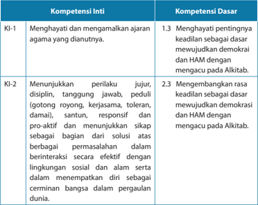

Tabel ini menunjukkan dua jenis kompetensi: Kompetensi Inti (KI) dan Kompetensi Dasar (KD). Topik utama tabel adalah tentang pengembangan karakter dan perilaku yang relevan dengan nilai-nilai demokrasi dan HAM. Kolom KI-1 berisi dua kompetensi inti: menghargai dan mengamalkan ajaran agama yang diautentik, serta menunjukkan perilaku jujur, disiplin, tanggung jawab, peduli, santun, responsif, proaktif, dan menyampaikan sikap sebagai bagian dari solusi dalam berbagai permasalahan. Kolom KD-1.3 dan KD-2.3 masing-masing berisi satu kompetensi dasar yang berkaitan dengan demokrasi dan HAM, yaitu menghargai pentingnya keadilan sebagai dasar demokrasi dan HAM, serta mengembangkan rasa keadilan sebagai dasar demokrasi dan HAM dengan mencapai pada Aktivitas. Data penting yang terlihat adalah bahwa tabel ini mencakup dua aspek utama dari pembelajaran karakter dan perilaku yang relevan dengan nilai-nilai demokrasi dan HAM.

 

---
## 📄 Halaman 190

---
**📊 Tabel**

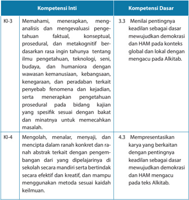

Tabel ini berisi informasi tentang kompetensi inti (KI) dan kompetensi dasar (KD) yang relevan dengan pembelajaran di sekolah. Topik utama tabel adalah pengetahuan dan pemahaman tentang demokrasi dan Hak Asasi Manusia (HAM), serta bagaimana menerapkan pengetahuan tersebut dalam konteks global dan lokal. Kolom KI-3 membahas tentang memahami, menerapkan, dan mengevaluasi pengetahuan faktil, konseptual, prosedural, dan metakognitif tentang ilmu pengetahuan, teknologi, seni, budaya, dan humaniora, sementara kolom KD-3.3.3 fokus pada keadilan sebagai dasar mewujudkan demokrasi dan HAM di berbagai konteks. Kolom KI-4 berfokus pada keterampilan mengolah, menalar, menyajikan, dan menciptakan dalam ranah konkrit dan abstrakt, sementara KD-4.3.3 mengajarkan tentang presentasi karya yang efektif dan kreatif untuk mewujudkan demokrasi dan HAM. Pola penting yang terlihat adalah hubungan antara pengetahuan dan keterampilan dalam mewujudkan demokrasi dan HAM secara global dan lokal.

---
**📊 Tabel**

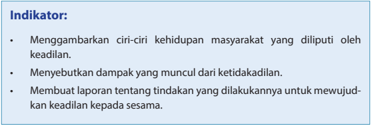

Tabel ini berisi indikator yang harus dipenuhi oleh individu atau masyarakat dalam upaya mewujudkan keadilan sosial. Topik utamanya adalah tentang bagaimana menunjukkan tindakan konstruktif untuk mencegah dan mengatasi ketidakadilan. Kolom pertama menyebutkan indikator yang harus dicapai, sedangkan kolom kedua menjelaskan apa itu indikator tersebut. Data penting yang terlihat adalah bahwa setiap indikator memiliki tujuan yang jelas dan spesifik, yaitu menggambarkan ciri-ciri kehidupan masyarakat yang dilakukan oleh keadilan, menyebutkan dampak yang muncul dari ketidakadilan, dan membuat tindakan yang dilakukan untuk mewujudkan keadilan kepada semua orang. Ini menunjukkan bahwa tabel ini bertujuan untuk memberikan panduan yang jelas dan sistematis bagi individu atau masyarakat untuk mencapai tujuan keadilan sosial.

 

---
## 📄 Halaman 191

### A.  Pengantar

Pelajaran ini adalah yang terakhir dari pembahasan mengenai demorasi, hak azasi manusia dan keadilan. Sejauh ini tentunya sudah membekali peserta didik menjadi pribadi yang memahami kaitan antara demokrasi, hak azasi manusia dan keadilan, baik dari perspektif Alkitab maupun petunjuk praktis untuk menjalankan demokrasi, hak azasi manusia dan keadilan dalam kehidupan sehari-hari. Sejak di  kelas  I  SD,  seluruh  pembahasan  materi  Pendidikan Agama Kristen mengajak peserta  didik  untuk  menghayati  kehidupannya  bersama  dengan  Allah  Sang Pencipta dan Sang Pemelihara kehidupan kita dengan sesama makhluk lainnya, terutama dengan sesama manusia. Pemahaman bahwa semua mahkluk dipelihara oleh Allah Sang Pencipta dan bahwa manusia adalah mahluk mulia dan karena itu  harus bertanggung jawab untuk memelihara isi dunia ini, hendaknya betulbetul dimiliki peserta didik. Ini menjadi landasan untuk membahas tentang peran peserta  didik  selaku  pembawa  damai  sejahtera  yang  akan  mengakhiri  seluruh pembahasan di kelas XII ini.

Pembahasan  mengenai  keadilan  kepada  sesama  menjadi  sangat  penting. Pengertian  mengenai  pentingnya  menyiapkan  peserta  didik  untuk  keadilan agar  mereka  dapat  menerapkannya  dalam  kehidupan  sehari-hari  didorong oleh  penelitian  terhadap  para  pelaku  kriminal.  Bechtold,  Cavanagh,  Shulman, Cauff  man  (2014),  misalnya,  menemukan  bahwa  perilaku  kriminal  para  remaja yang  dimasukkan  dalam  penjara  sudah  dapat  diramalkan  sejak  mereka  masih berusia  lebih  muda.  Hal  yang  menarik  ialah  orang  tua,  khususnya  ibu,  sudah memiliki  kepekaan  bahwa  anaknya  akan  bertingkah  laku  kriminal  kelak  di kemudian hari. Dari mana kepekaan ibu ini muncul? Dari mendengarkan keluhankeluhan yang dilontarkan anaknya bahwa ia merasa diperlakukan tidak adil oleh lingkungannya. Misalnya,  perlakuan  teman-teman sebaya,  perlakuan  guru,  dan sebagainya.  Mengalami  ketidakadilan  memupuk  rasa  dendam  yang  kemudian dilampiaskan dalam perilaku kriminal ketika situasi memungkinkan. Sungguh luar biasa pengaruh dari pengalaman ketidakadilan, ya?

Alkitab,  baik  dalam  Perjanjian  Lama  maupun  Perjanjian  Baru,  menyajikan pemahaman yang utuh tentang keadilan. Tuhan Yesus mempraktikkan keadilan ini dengan mengajarkan pentingnya mengasihi sesama seperti diri sendiri. Ketika kita dapat melihat orang lain dalam kedudukan yang sederajat dengan kita, atau dengan kata lain, ketika kita melihat orang lain tidak lebih berharga atau tidak lebih hina dari diri kita, maka kita dapat menerapkan prinsip keadilan ini.

Begitu  banyak  tokoh-tokoh  Alkitab  yang  bisa  dijadikan  teladan  tentang bagaimana menjadi pribadi yang menjalankan keadilan. Kisah Raja Salomo (1 Rajaraja 3: 15 - 28) menunjukkan bahwa menjalankan keadilan adalah memberikan apa  yang  menjadi  hak  dari  pribadi  yang  memang  memiliki  hak  tersebut,  dan sebaliknya, memberikan ganjaran kepada pribadi yang memang perlu dihukum

 

---
## 📄 Halaman 192

karena kesalahan yang dilakukannya dengan sengaja. Sebelum Raja Salomo, Nabi Samuel pun menjalankan keadilan terhadap Raja Saul (1 Samuel 13: 5 - 14). Ketika Nabi Samuel melantik Saul menjadi Raja, ia sudah berpesan untuk selalu taat pada perintah Allah (1 Samuel 12: 13 - 15). Namun, ketaatan Raja Saul tidak berlangsung lama. Ia melanggar perintah Allah dengan memberikan korban persembahan (1 Samuel 13: 9) padahal ia tidak berhak melakukan hal itu. Walaupun Nabi Samuel sangat mengasihi Raja Saul, namun ia tetap memberikan hukuman yang patut untuk kesalahan yang dilakukan Raja Saul, yaitu, dengan memutus kedudukan Raja  Saul  sebagai  raja  (1  Samuel  13:  14).  Ini  menunjukkan  bahwa  Nabi  Samuel mengutamakan ketaatan kepada Allah dari hal-hal lain.  Ketaatan  seperti  inilah yang  hendaknya  menjadi  pedoman  bagaimana  kita  menjalankan  keadilan terhadap setiap insan.

### B. Mengapa Perlu Menerapkan Keadilan Bagi Semua Insan

Tuhan Allah Pencipta semesta membuat segala ciptaan-Nya baik (Kejadian 1: 31). Perhatikan kata 'segala' dalam ayat ini. Walaupun di Mazmur 8 dinyatakan bahwa manusia adalah mahluk mulia, namun keselarasan dengan ciptaan Allah lainnya  harus  dijaga.  Sebagai  mahluk  mulia,  justru  manusia  memiliki  hikmat untuk melakukan yang terbaik dalam menjaga keselarasan ini. Keserakahan dan kesewenang-wenangan  manusia  demi  kepentingan  dirinya  justru  membawa banyak bencana.

Misalnya  saja,  pada  bulan  Oktober  2015  dimana  musim  hujan  belum  tiba untuk  Indonesia  wilayah  Barat,  terjadi  bencana  asap  di  wilayah  Riau  Sumatera Barat yang mengakibatkan sejumlah penerbangan dibatalkan selama berhari-hari. Penduduk di wilayah tersebut juga mengalami sesak nafas, bahkan ada beberapa yang meninggal. Dari mana asap ini muncul? Dari tindakan para penebang liar yang  menggunakan  cara  cepat  namun  terkutuk  untuk  mengganti  pepohonan di  hutan  dengan  tanaman  lain  yang  lebih  menguntungkan  secara  cepat,  atau menjadikan lahan pemukiman yang tentunya juga liar. Sebetulnya, setiap hutan lindung dijaga, namun para penebang liar tetap dapat melakukan pembakaran hutan ini. Bahkan, yang lebih mengenaskan, sejumlah perusahaan besar terlibat dalam penebangan pohon-pohon di hutan sehingga menimbulkan bencana asap. Dari peristiwa ini, dapat kita lihat bahwa ketika manusia mementingkan dirinya sendiri sedangkan keselarasan dengan manusia lain dan lingkungan tidak dijaga, maka yang terjadi adalah bencana. Gundulnya hutan juga mengakibatkan banjir, walaupun hutan gundul bukan satu-satunya penyebab banjir karena bisa juga ini ulah manusia yang membuang sampah ke sungai sehingga terjadi pendangkalan.

Appolloni  dan  McDougall  (2011)  memberikan  beberapa  perspektif  terkait dengan  tema  mengapa  kita  harus  memberikan  perhatian  besar  terhadap keadilan bagi semua, yaitu perspektif Kristiani, ilmiah, dan historis. Istilah keadilan ekologis (ecological justice) merujuk pada pemahaman bahwa manusia haruslah

 

---
## 📄 Halaman 193

hidup  dalam  keadaan  damai  dengan  lingkungannya,  serta  menyadari  adanya saling ketergantungan antara berbagai unsur di lingkungan. Dengan demikian, keadilan ekologis justru mengangkat derajat manusia yang memang diberikan tugas  istimewa  oleh  Tuhan  untuk  bertambah  banyak,  memenuhi  bumi  dan menaklukkannya,  dan  menguasai  binatang  (Kejadian  1:  28).  Perintah  ini  tentu harus  dijalankan  dengan  bijak.  Misalnya,  bila  perintah  'beranak  cuculah  dan bertambah banyak' dianggap sebagai perintah untuk memiliki anak sebanyakbanyaknya, ternyata tidaklah tepat pada masa kini. Dunia dengan isinya memiliki keterbatasan.  Jumlah  manusia  yang  banyak  menyebabkan  makanan  yang tersedia menjadi terbatas. Pemerintah Tiongkok pernah mengeluarkan peraturan bahwa setiap keluarga hanya boleh memiliki satu anak. Peraturan ini dibuat untuk membatasi jumlah penduduk yang terus meningkat, padahal sumber daya alam tidak memadai. Dampak dari peraturan ini adalah, banyak bayi-bayi perempuan yang dibunuh. Mengapa? Karena budaya Tionghoa menganut sistem patriarkat, artinya garis keturunan dilanjutkan oleh anak pria. Bila keluarga hanya mempunyai satu  anak  dan  anak  itu  adalah  perempuan,  tentu  tidak  dapat  meneruskan keturunan ayahnya.

Perspektif Kristiani melihat bumi sebagai sesuatu yang dikuduskan, dan manusia barulah berharga bila memberikan perhatian terhadap pemenuhan kebutuhan mereka yang termarjinalkan dan miskin. Perspektif ilmiah memperhitungkan bahwa bumi dan sumber dayanya adalah terbatas. Terdapat saling ketergantungan dan keterhubungan antara sistem yang satu dengan yang lain, dan karena itu, manusia harus melakukan kegiatannya dengan bijaksana dan hati-hati. Perspektif historis melihat bahwa selama ini, yang lebih beruntung menikmati sistem ekonomi, sosial dan politik adalah mereka yang tinggal di belahan utara. Akan tetapi, dampak dari berkurangnya keberagaman ekologis dan sumber-sumber daya alam, polusi yang ditemukan pada laut, tanah, dan udara, serta rusaknya ekosistem, punahnya sejumlah spesies dan perubahan iklim ternyata dialami oleh mereka yang juga tinggal di belahan selatan walaupun mereka tidak seberuntung yang tinggal di belahan utara dalam menikmati keuntungan dari sistem ekonomi, sosial, dan politik. Memperhatikan keadilan bagi semua insan ternyata memerlukan pemahaman tentang bagaimana memelihara bumi agar tetap menjadi tempat tinggal yang memadai bagi sekian generasi ke depan.

Dampak  dari  perubahan  iklim  ternyata  dahsyat,  yaitu  antara  lain  hasil pertanian menurun, siklus iklim yang tidak normal yang dipicu oleh meningkatnya permintaan energi dan meningkatnya produksi emisi sedangkan hujan berkurang, berkurangnya  sumber  air  bersih,  bencana  alam  karena  perubahan  suhu  yang ekstrim. Siapkah kita ketika dampak perubahan iklim ini muncul dan membuat kehidupan kita terganggu? Pihak yang acap kali menjadi korban dari perubahan iklim adalah wanita dan anak-anak yang memang digolongkan sebagai pihak yang lebih lemah. Disinilah tanggung jawab manusia sebagai mahluk mulia dituntut

 

---
## 📄 Halaman 194

agar dapat menggunakan kepintarannya secara bijak untuk kesejahteraan semua manusia, bukan hanya sekelompok saja.

### C. Mewujudkan Keadilan Bagi Semua Insan

Dobson  mengaitkan  antara keadilan sosial dengan  keadilan ekologis. Keadilan  ekologis  dapat  ditegakkan  bila  para  pemimpin  dan  penegak  hukum mempraktikkan keadilan sosial. Mengapa demikian? Karena menjadi tugas para pemimpin dan penegak hukum unuk memastikan bahwa rakyat yang berada di bawah pimpinannya hidup dalam sejahtera, dan tidak dipersulit atau diperalat oleh segelintir orang yang memiliki kekuasaan lebih. Atau, dapat juga dikatakan bahwa  setiap  manusia  harus  mendapatkan  hak  untuk  kesejahteraan  hidup. Terganggunya kesejahteraan dan hadirnya kemiskinan dapat dijadikan indikator bahwa ada kerusakan dalam lingkungan hidup. Hidup yang sejahtera haruslah menjadi hak bagi setiap orang terlepas dari latar belakang ras, etnis, agama, atau kelompok yang dimilikinya.

Perlu juga kita pahami pengertian keadilan lingkungan ( environmental justice ), yaitu  keadilan  yang  berkaitan  dengan  norma,  nilai  budaya,  aturan,  kebijakan, kebiasaan, dan keputusan untuk mendukung keberlangsungan suatu komunitas sehingga  di  dalam  komunitas  tersebut  anggota  komunitas  dapat  merasakan berada di lingkungan yang aman, sehat, dan produktif (Bryan). Termasuk di dalam keadilan lingkungan ini adalah ada pekerjaan dan upah yang layak, pendidikan dan rekreasi yang berkualitas, pemukiman dan layanan kesehatan yang pantas; pembuatan  keputusan  yang  demokratis  dan  pemberdayaan  personal  serta lingkungan  yang  bebas  dari  kekerasan,  obat-obat  terlarang  dan  kemiskinan. Dalam lingkungan yang seperti itu, tentu pencapaian kesejahteraan menjadi lebih terjamin.  Inilah  hendaknya  yang  menjadi  tugas  dan  perhatian  para  pemimpin, penegak hukum, dan kita  semua  yang  peduli  untuk  tercapainya  keadilan  bagi semua insan.

### D.  Kegiatan Pembelajaran

- Menjadi orang yang mengalami ketidakadilan.
Pembelajaran diawali dengan  mengajak  peserta didik untuk memilih peran  sebagai  orang  yang  diperlakukan  tidak  adil.  Mereka  bebas  memilih diperlakukan tidak adil dalam hal apa dan dimana (di keluarga, di sekolah, di  lingkungan,  di  gereja,  di  pasar,  dan  sebagainya).  Misalnya,  orang  tua terkesan lebih mengasihi adik daripada dirinya, dan sebagainya. Kemudian, mereka menuliskan apa saja perasaan yang muncul ketika mengalami atau mengingat pengalaman sebagai orang yang diperlakukan tidak adil. Apakah muncul  perasaan  terhina,  tersisihkan?  Apakah  muncul  amarah,  keinginan balas  dendam?  Hasil  tulisan  peserta  didik  dibahas  di  kelompok  5-6  orang, lalu  kelompok  membuat  rangkuman,  dan  membacakan  hasilnya  di  depan

 

---
## 📄 Halaman 195

kelas.  Guru  hendaknya  memperhatikan,  apa  kesamaan  dan  perbedaan yang ditemukan dari presentasi kelompok tentang topik ini. Dari sini, Guru membuat rangkuman, bahwa tidak ada orang yang menerima dengan mudah saat diperlakukan dengan tidak adil.

- Doa orang yang terluka karena diperlakukan tidak adil.
Peserta  didik  diminta  untuk  menuliskan  doa  dengan  membayangkan perasaannya saat diperlakukan tidak adil  oleh  orang  lain.  Guru  hendaknya memperhatikan agar di dalam doa tersebut ada rumusan tekad dan harapan yang peserta didik miliki untuk mencapai keadilan walaupun mungkin sulit.

- Memahami wujud ketidakadilan.
Guru memberi tugas kepada peserta didik untuk mempelajari dari berbagai sumber,  apa  saja  bentuk-bentuk  ketidakadilan  yang  diberitakan  di  media massa. Peserta didik boleh memilih dari surat kabar, majalah, televisi, radio, dan sebagainya. Aktivitas ini dikerjakan secara kelompok 5-6 orang, dengan melengkapi  tabel berikut:

---
**📊 Tabel**

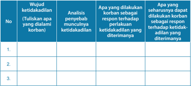

Tabel ini berisi analisis tentang ketidakadilan yang dialami oleh korban dan respons yang dapat dilakukan oleh korban terhadap ketidakadilan tersebut. Topik utama tabel adalah analisis ketidakadilan dan respons korban. Kolom pertama menunjukkan nomor urutan, kolom kedua menuliskan ketidakadilan yang dialami korban, kolom ketiga menjelaskan penyebab ketidakadilan, kolom keempat menunjukkan respon korban terhadap ketidakadilan yang diterimanya, dan kolom kelima menunjukkan seharusnya dapat dilakukan oleh korban sesuai dengan ketidakadilan yang diterimanya. Data penting yang terlihat adalah bahwa tabel ini membahas tentang ketidakadilan dan respons korban terhadap ketidakadilan tersebut.

Setiap kelompok menyajikan hasilnya di depan kelas. Pada akhir presentasi, Guru  meminta  peserta  didik  untuk  membuat  kesimpulan  tentang  isi  dari keempat kolom di atas: wujud ketidakadilan, analisis penyebab munculnya ketidakadilan, apa yang dilakukan korban sebagai respon terhadap perlakuan ketidakadilan  yang  dialami,  dan  apa  yang  seharusnya  dilakukan  korban sebagai respon terhadap perlakuan ketidakadilan. Guru dapat menekankan, bahwa pemimpin atau mereka yang berkuasa acap kali justru membiarkan kesewenang-wenangan terjadi sehingga keadilan memang sulit terwujud.

 

---
## 📄 Halaman 196

### 4. Kegiatan mewujudkan keadilan bagi setiap insan.

Guru meminta tiap kelompok untuk menyusun program yang dapat dilaksanakan dalam seminggu ke depan. Program ini adalah untuk mewujudkan keadilan dalam lingkungan peserta didik. Misalnya, peserta didik dapat merancang program berupa sosialisasi terhadap orang-orang lain di lingkung  annya, agar mereka tidak berdiam diri saat mengalami ketidakadilan.  Tiap kelompok hendaknya mempresentasikan rencana masing-masing di depan kelas.

### 5. Doa penutup

Guru  mengakhiri  kegiatan  dengan  menaikkan  doa  penutup  yang  isinya meminta  kekuatan  dan  keberanian  dari  Tuhan  agar  dimampukan  untuk mewujudkan keadilan dalam hidup sehari-hari.

### E. Rangkuman

Memahami  keterkaitan  antara  keadilan,  hak  azasi  dan  demokratis  akan menolong kita untuk lebih mengerti bagaimana mewujudkan hal ini dalam hidup  sehari-hari.  Sebagai  umat  Allah,  kita  tidak  boleh  berdiam  diri  saat menemukan dan mengalami ketidakadilan. Ternyata banyak yang dapat kita lakukan untuk mewujudkan keadilan.

### F. Penilaian

Penilaian diberikan terhadap kegiatan nomor 3 dan 4, jadi berupa penilaian kelompok.  Khusus  untuk  penilaian terhadap  kegiatan  nomor  4,  Guru menunggu sampai ada laporan terhadap pelaksanaan kegiatan ini  setelah kelompok melakukannya.

 

---
## 📄 Halaman 197

### PENJELASAN BAB

### Damai Sejahtera Menurut Alkitab

Bahan Alkitab: Imamat 26:1-46;  Yohanes 14: 23-31

---
**📊 Tabel**

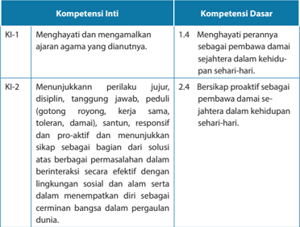

Tabel ini menunjukkan dua kompetensi utama: Kompetensi Inti (KI) dan Kompetensi Dasar (KD). Topik utama tabel adalah tentang bagaimana seseorang dapat menghargai dan memahami ajaran agama yang diamalkannya, serta bagaimana mereka dapat berinteraksi dengan efektif dalam lingkungan sosial dan alam sekitar. Kolom KI-1 membahas tentang menghargai dan memahami ajaran agama, sedangkan KD-1.4 mengenai menghargai perannya sebagai pembawa damai dalam kehidupan sehari-hari. Kolom KI-2 fokus pada perilaku yang disiplin, tanggung jawab, peduli, toleran, santun, responsif, proaktif, dan sikap sebagai solusi. KD-2.4 menekankan pentingnya bersikap proaktif sebagai pembawa damai dalam kehidupan sehari-hari. Pola penting yang terlihat adalah bahwa kedua kompetensi ini saling berkaitan dan mencakup aspek-aspek yang penting dalam menjalani kehidupan sehari-hari, baik dalam konteks agama maupun interaksi sosial.

 

---
## 📄 Halaman 198

---
**📊 Tabel**

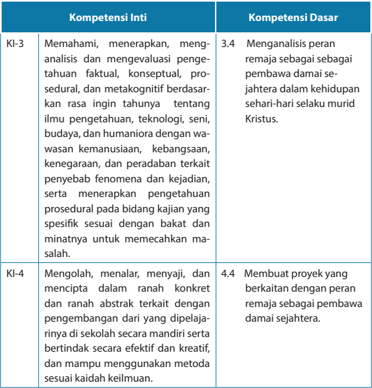

Tabel ini berisi informasi tentang kompetensi inti dan kompetensi dasar yang relevan dengan pembelajaran tentang remaja dan kemanusiaan. Topik utama tabel adalah pengembangan keterampilan dan pemahaman tentang remaja, termasuk pemahaman tentang peran remaja dalam kehidupan sehari-hari, analisis perilaku remaja, dan pengembangan keterampilan sosial dan emosional mereka. Kolom "Kompetensi Inti" mencakup empat poin utama: memahami, menerapkan, menganalisis, dan mengevaluasi pengetahuan faktil, konseptual, prosedural, dan metakognitif tentang remaja; mengolah, menalar, menyajikan, dan menciptakan ranah konkrit dan ranah abstrak terkait dengan pengembangan remaja; membuat proyek yang berkaitan dengan peran remaja sebagai pembawa damai sejahtera; dan mampu menggunakan metode sesuai kaidah kelamin. Kolom "Kompetensi Dasar" mencakup dua poin utama: menganalisis peran remaja sebagai damai sejahtera dalam kehidupan sehari-hari melalui misi Kristus; membuat proyek yang berkaitan dengan peran remaja sebagai pembawa damai sejahtera. Data penting yang terlihat adalah bahwa tabel ini mencakup berbagai aspek dari pembelajaran tentang remaja, termasuk pemahaman tentang peran remaja, analisis perilaku remaja, dan pengembangan keterampilan sosial dan emosional mereka.

---
**📊 Tabel**

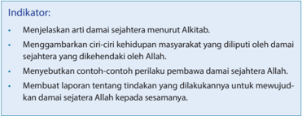

Tabel ini berisi indikator yang harus dipenuhi oleh seorang damai sejahtera menurut Alkitab. Topik utamanya adalah tentang cara damai sejahtera menjelaskan arti damai, menggambarkan ciri-ciri kehidupan masyarakat yang diilustrasikan oleh damai sejahtera, menyebutkan perlukabuan perbaikan damai sejahtera, dan membuat laporan tentang tindakan yang dilakukan untuk mewujudkan damai sejahtera Allah kepada sesama. Kolom-kolomnya mencakup penjelasan arti damai, ciri-ciri kehidupan masyarakat, perlukabuan perbaikan, dan laporan tindakan. Data penting yang terlihat adalah bahwa semua indikator tersebut harus dipenuhi oleh seorang damai sejahtera.

 

---
## 📄 Halaman 199

### A.  Pengantar

Pelajaran  ini  adalah  yang  pertama  dari  rangkaian  tiga  pelajaran  tentang damai sejahtera dengan klimaks pada pelajaran 13 dengan topik 'Menjadi Pelaku Kasih dan Perdamaian' . Apakah tidak terlalu berat menuntut peserta didik menjadi pribadi  yang  melakukan  kasih  dan  menjadi  agen  pembawa  damai  sejahtera dalam kehiduan sehari-hari? Tentunya tidak. Mengapa? Karena sejak di kelas 1 SD, seluruh pembahasan materi Pendidikan Agama Kristen mengajak peserta didik untuk menghayati kehidupannya bersama dengan Allah Sang Pencipta dan Sang Pemelihara  sekaligus  kehidupannya  dengan  sesama  mahluk  lainnya,  terutama dengan sesama manusia. Untuk menghantar peserta didik pada perannya selaku pembawa damai sejahtera, akan dijelaskan terlebih dulu makna damai sejahtera dari Alkitab.

Pembahasan ini menjadi sangat penting karena pembahasan damai sejahtera dalam beberapa dekade terakhir ini menjadi semakin populer, namun konteksnya adalah  keadaan  damai  sejahtera  yang  dikontraskan  dengan  situasi  konfl  ik. Sejumlah universitas dan lembaga lainnya juga menawarkan pendidikan khusus bagi mereka yang ingin berperan sebagai pembawa damai sejahtera. Tetapi, yang ditawarkan adalah pandangan sekularisme tanpa mengaitkannya dengan sudut pandang agama. Tentu hal ini dapat dipahami karena setiap agama akan memiliki sudut pandangnya yang khas tentang damai sejahtera.

Alkitab,  baik  dalam  Perjanjian  Lama  maupun  Perjanjian  Baru,  menyajikan pemahaman  yang  utuh  tentang  damai  sejahtera.  Begitu  banyak  tokoh-tokoh Alkitab  yang  bisa  dijadikan  teladan  tentang  bagaimana  menjadi  pribadi  yang membawakan damai sejahtera di tengah-tengah keadaan yang sulit atau dalam peperangan  sekali  pun.  Tuhan  Yesus  selalu  menjalankan  peran-Nya  selaku pembawa  damai  sejahtera  dengan  sangat  sempurna.  Kecuali  mereka  yang berpikiran picik dan berhati licik, semua yang bertemu muka dengan Tuhan Yesus mengalami 'cipratan' damai sejahtera yang dipancarkannya.  Artinya, pertemuan dengan  Tuhan  Yesus  menjadi  kesempatan  mengalami  damai  sejahtera  yang sesungguhnya,  bukan  yang  sifatnya  sementara  atau  bahkan  yang  palsu.  Inilah pesan yang ingin disampaikan kepada peserta didik bahwa menjadi pembawa damai sejahtera adalah tugas khusus sebagai murid Kristus yang harus dijalankan dengan baik dimana pun kita berada.

 

---
## 📄 Halaman 200

### B. Pengertian Damai Sejahtera Menurut Alkitab

Menurut    Henry  (1984),    kitab  Imamat  26:1-46  dapat  dibagi  menjadi  tiga bagian, yaitu:

Ayat 1-13 memuat janji-janji berkat dan penyertaan Allah bila bangsa Israel taat  dan  menjalankan  perintah-perintah-Nya.  Hal  ini  terlihat  dalam  ayat 6:' Dan Aku akan memberi damai sejahtera di dalam negeri itu, sehingga kamu akan berbaring dengan tidak dikejutkan oleh apa pun; Aku akan melenyapkan binatang buas dari negeri itu, dan pedang tidak akan melintas di negerimu . '

Ayat 14-39 memuat peringatan akan penghukuman Allah bila bangsa Israel lalai  atau  menyimpang  dari  perintah-perintah  Allah.  Peringatan  ini  kita temukan  dalam  ayat14-19 ' Tetapi  jikalau  kamu  tidak  mendengarkan  Daku, dan  tidak  melakukan  segala  perintah  itu,...maka  ...  Aku  akan  mendatangkan kekejutan  atasmu...Aku  sendiri  akan  menentang  kamu,  sehingga  kamu  akan dikalahkan  oleh  musuhmu,  ...Aku  akan  lebih  keras  menghajar  kamu  sampai tujuh kali lipat karena dosamu,... dan Aku akan mematahkan kekuasaanmu yang kaubanggakan dan akan membuat langit di atasmu sebagai besi dan tanahmu sebagai tembaga . '

Ayat 40-46 berisi janji-janji Allah untuk mengampuni dan menerima mereka kembali sebagai umat-Nya. Allah itu setia dan selalu ingat akan perjanjianNya dengan leluhur Israel. Seperti yang dikatakan Allah, ' Tetapi bila mereka mengakui kesalahan mereka dan kesalahan nenek moyang mereka dalam hal berubah setia yang dilakukan mereka terhadap Aku ... maka Aku akan mengingat perjanjian-Ku  dengan  Yakub;  juga  perjanjian  dengan  Ishak  dan  perjanjian-Ku dengan Abraham pun akan Kuingat dan negeri itu akan Kuingat juga' (ayat 4042).

Sebetulnya, dengan menghayati bacaan tadi, kita tahu bahwa hidup taat dan setia  kepada  Allah  adalah  pilihan  yang  selalu  harus  diambil  tidak  dapat  tidak,  sebagai umat Allah  kita  harus  berlaku  setia  kepada-Nya.  Namun,  sejarah  menunjukkan bahwa  bangsa  Israel  bukanlah  umat  yang  setia  kepada  Allah  mereka.  Berkalikali mereka jatuh pada penyembahan dewa-dewa yang dilakukan oleh bangsabangsa bukan Israel. Mereka berpikir bahwa penyembahan berhala seperti itulah yang justru membawa damai sejahtera, padahal malah sebaliknya yang mereka terima. Untuk setiap kejatuhan dalam hal kesetiaan, Allah menghukum bangsa Israel.

Bob  Deffi nbaugh  (baca: 'Defi  nbo')  mengatakan  bahwa  Imamat  26  sangat penting bagi kita karena lima hal berikut.

 

---
## 📄 Halaman 201

- Ini adalah teks kunci untuk memahami sejarah Israel. Peringatan-peringatan dalam Imamat adalah kerangka sejarah Israel.
- Menjadi  kunci  bagi  kita  untuk  memahami  pesan  para  nabi  Israel.  Janji penyelamatan dan pemulihan Israel juga kita temukan berakar dalam kelima kitab pertama Alkitab, yaitu Pentateukh.
- Prinsip-prinsip yang ada di balik janji berkat dan kutuk masih berlaku di masa kita sekarang.
- Mengandung banyak  pengajaran  untuk  orang  tua  dan  semua  orang  yang bertugas mendisiplinkan orang lain.
- Tidak hanya mengandung peringatan, tetapi juga pengharapan yang besar di dalam Alkitab.
Apa  yang  kita  temukan  dalam  uraian  di  atas  ialah  bahwa  kesejahteraan ( syalom )  Israel  berkaitan  erat  dengan ketaatan hidup mereka kepada Allah dan perintah-perintah-Nya.  Apabila  Israel  tidak  setia,  maka  Allah  tidak  segan-segan menghukum  mereka,  menyerahkan  mereka  kepada  musuh-musuh  mereka, membuat tanah Israel menjadi tidak subur dan sulit ditanami (' langit di atasmu sebagai  besi  dan  tanahmu  sebagai  tembaga ').  Dari  penjelasan  ini  kita  dapat menyimpulkan bahwa damai sejahtera Allah itu hanya dapat terwujud apabila ada kesetiaan kepada Allah yang disertai kerelaan untuk menjalani perintah-perintah dan hukum-hukum-Nya.

Pada  bacaan  kedua, Yohanes  14:23-31,  kita  menemukan  janji Tuhan Yesus untuk  memberikan  damai-Nya  kepada  kita.  Janji  ini  diucapkan-Nya  menjelang kematian-Nya di kayu salib. Yesus sadar bahwa sebentar lagi Ia akan meninggalkan dunia  dan  murid-murid-Nya.  Karena  itu  Ia  menjanjikan  Roh  Penghibur  yang akan  menyertai  para  murid  dan  semua  orang  percaya.  Tugas  Roh  ini  adalah ' mengajarkan segala sesuatu kepadamu dan ... mengingatkan kamu akan semua yang telah Kukatakan kepadamu . '  (ayat 26).

Apa  yang  Tuhan  Yesus  perintahkan  untuk  kita  lakukan  tidak  lain  adalah mengasihi Dia, yang harus kita buktikan lewat ketaatan untuk menuruti fi  rmanNya (ayat 23-24). Ketaatan kita itulah yang akan memberikan kepada kita damai sejahtera-Nya (ayat 28).

Secara  singkat,  dapat  kita  simpulkan  bahwa  baik  Imamat  maupun  Injil Yohanes mengingatkan kita bahwa ketaatan kita untuk melakukan apa yang telah diperintahkan Tuhan kepada kita akan menghadirkan damai sejahtera. Dengan kata lain, damai sejahtera tidak akan hadir begitu saja kecuali melalui kerja keras kita dalam melakukan kehendak Allah di dalam seluruh kehidupan dan keberadaan kita baik secara pribadi maupun sebagai gereja.

 

---
## 📄 Halaman 202

### C. Kegiatan Pembelajaran

### 1.    Menjadi Orang yang Lapar

Pembelajaran  diawali  dengan  mengajak  peserta  didik  untuk  menghayati perannya  sebagai  orang  yang  kelaparan.  Untuk  itu,  mereka  diminta  untuk berpuasa beberapa waktu lamanya, misalnya dengan tidak makan pagi untuk hari itu sehingga dapat lebih menghayati rasa lapar. Apa saja yang terpikirkan ketika orang merasa lapar?  Apakah orang lapar dapat menghayati kehadiran Allah di tengah kelaparannya?

### 2.    Doa Orang Lapar

Berikutnya, peserta didik diminta menghayati puisi yang ditulis oleh sastrawan terkenal  W.S.  Rendra  puluhan  tahun  yang  lalu,  namun  maknanya  tidak lekang dimakan zaman. Isinya menggambarkan pergumulan dan perasaan yang  dialami  oleh  orang  yang  lapar.  Peserta  didik  diminta  membaca  dan merenungkannya.

### Doa Orang Lapar

Kelaparan adalah burung gagak yang licik dan hitam jutaan burung-burung gagak bagai awan yang hitam

### O Allah!

burung gagak menakutkan dan kelaparan adalah burung gagak selalu menakutkan kelaparan adalah pemberontakan adalah penggerak gaib dari pisau-pisau pembunuhan yang diayunkan oleh tangan-tangan orang miskin Kelaparan adalah batu-batu karang di bawah wajah laut yang tidur adalah mata air penipuan adalah pengkhianatan kehormatan Seorang pemuda yang gagah akan menangis tersedu melihat bagaimana tangannya sendiri meletakkan kehormatannya di tanah karena kelaparan kelaparan adalah iblis kelaparan adalah iblis yang menawarkan kediktatoran

 

---
## 📄 Halaman 203

---
**🖼️ Gambar/Diagram**

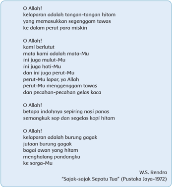

> **Deskripsi Visual:** Gambar ini adalah ilustrasi yang menampilkan sebuah ayat suci dalam bahasa Melayu. Gambar tersebut menggambarkan dua tangan yang sedang memasukkan segenggam tawas ke dalam perut para miskin. Teks di atas gambar berisi ayat-ayat suci yang membahas tentang keberuntungan dan keburukan dalam hidup manusia. Elemen-elemen utama dalam gambar ini meliputi tangan-tangan hitam, tawas, dan perut para miskin. Teks yang ditampilkan memberikan informasi tentang kebahagiaan dan keburukan dalam hidup manusia, serta mengajarkan tentang pentingnya menjaga keadilan dan kemanusiaan. Label penting dalam gambar ini adalah "O Allah!" dan "Sajak-sajak Sepata Tua" yang diberikan oleh W.S. Rendra. Informasi kunci yang dapat diambil pembaca adalah bahwa ayat-ayat suci ini mengajarkan tentang pentingnya menjaga keadilan dan kemanusiaan dalam hidup manusia.

Tugas untuk peserta didik: Menurut Kamu, bagaimana perasaan si penyair ketika menulis puisi di atas? Apakah ia merasa berbahagia? Sedih? Berduka? Apa sebabnya ia merasakan hal itu? Apakah ada kedamaian di dalam hatinya? Menurut Kamu, adakah hubungan antara kelaparan dengan rasa gelisah dan keinginan untuk berontak pada diri si penyair?

### 3.    Memahami Makna Damai Sejahtera Menurut Alkitab

Supaya memahami  makna  Damai  Sejahtera  menurut  Alkitab, peserta didik  diajak  memahami  penggunaan  kata '  syalom'.    Belakangan  ini  sering terdengar umat Kristen yang mengucapkan kata 'syalom' sebagai ungkapan salamnya.  Tampaknya  praktik  ini  dilakukan  untuk  menanggapi  kebiasaan serupa yang dilakukan oleh saudara-saudara kita yang beragama Islam, yang mengucapkan 'assalammu'alaikum' kepada sesamanya. Akan tetapi apakah

 

---
## 📄 Halaman 204

arti kata 'syalom' yang sesungguhnya, dan apa artinya bila kita mengucapkan kata  itu  kepada  sesama  kita?  Apa  yang  kita  pahami  sebagai 'damai'  atau keadaan damai?

Kata syalom dalam  bahasa  Ibrani  biasanya  diterjemahkan  menjadi  'damai' atau  'damai  sejahtera' .  Dalam  bahasa  Yunani,  bahasa  yang  digunakan dalam  penulisan  Perjanjian  Baru,  kata  ini  diterjemahkan  menjadi eirene. Kata syalom atau 'damai sejahtera' sering dipergunakan untuk memberikan salam  kepada  sesama.  Dalam  bahasa  Ibrani  orang  mengucapkan syalom aleikhem, yang artinya 'damai sejahtera bagimu' . Ucapan ini dijawab dengan kata-kata aleikhem syalom. Kata ini mirip sekali dengan kata 'salam alaikum' atau 'assalamu alaikum' dan 'wa alaikum salam' dalam bahasa Arab, bukan? Kita  tidak  perlu  heran.  Bahasa  Arab  memang  berasal  dari  rumpun  yang sama dengan bahasa Ibrani - seperti halnya bahasa Tagalog dengan bahasa Indonesia.  Dalam  bahasa  Arab  kata syalom diterjemahkan  menjadi salam, kata  yang  sama  yang  dipergunakan  dalam  bahasa  Indonesia  yang  sangat diperkaya oleh kosakata dari bahasa Arab karena pengaruh agama Islam. Kata ini dapat kita bandingkan dengan salam Horas! di kalangan masya  rakat Batak; Ya'ahowu! di masyarakat Nias.

Di kalangan masyarakat Yahudi, kebiasaan memberi salam seperti ini sangat lazim. Dalam Lukas 10:5 Tuhan Yesus memerintahkan murid-murid-Nya untuk memberikan salam ini apabila mereka mengunjungi rumah seseorang. ' Kalau kamu memasuki suatu rumah, katakanlah lebih dahulu: Damai sejahtera bagi rumah ini. ' (Lukas 10:15).  Salam ini juga diucapkan oleh Tuhan Yesus ketika Ia menampakkan  diri-Nya ke tengah-tengah murid-murid-Nya setelah kebangkitan-Nya: ' Dan sementara mereka bercakap-cakap tentang hal-hal itu, Yesus  tiba-tiba  berdiri  di  tengah-tengah  mereka  dan  berkata  kepada  mereka: 'Damai  sejahtera  bagi  kamu! '  (Lukas  24:36)Dalam  ungkapan  kata syalom aleikhem memang  terkandung  sebuah  doa  yaitu 'kiranya  damai  sejahtera menyertaimu.'

Sejauh ini kita sudah membahas bagaimana kata 'damai sejahtera' digunakan dalam  kehidupan  sehari-hari  orang  Yahudi.  Tetapi,  apakah  arti  'damai sejahtera' itu sendiri? Alkitab menerjemahkan kata 'syalom' menjadi 'damai sejahtera' . Bukan semata-mata 'damai' saja, meskipun kata syalom itu sendiri memang berarti 'damai' atau 'perdamaian' . Arti kata 'syalom' memang jauh lebih luas daripada sekadar 'damai' saja. Berikut ini adalah sejumlah kata dan konsep yang digunakan untuk menerjemah  kan kata 'syalom' , sehingga kita dapat membayangkan kekayaan makna yang dikandungnya.

 

---
## 📄 Halaman 205

### a)   Persahabatan

Syalom antara sahabat berkaitan dengan hubungan yang akrab (Zakharia 6:13). Dalam Mazmur 28:3 orang diingatkan akan sahabat yang mulutnya manis,  tetapi niatnya  jahat: 'Janganlah  menyeret  aku  bersama-sama dengan orang fasik ataupun dengan orang yang melakukan kejahatan, yang ramah  dengan  teman-temannya,  tetapi  yang  hatinya  penuh  kejahatan.' Kata 'ramah' di sini merujuk kepada ucapan yang penuh syalom. Dalam versi bahasa Inggris penggunaan kata ini menjadi lebih jelas:

- Do not drag me away with the wicked, with those who are workers of evil, who speak peace with their neighbours, while mischief is in their hearts. (New Revised Standard Version)
- Do not take me away with the wicked and with the workers of iniquity, who speak peace to  their neighbors, but evil [is] in their hearts.. (New King James Version)
Dalam 1 Raja-raja 2:13 dikisahkan pula tentang Adonia yang menghadap kepada Batsyeba, ibu Salomo, dan ditanyai,  ' Apakah engkau datang dengan maksud  damai? '  Ia  menjawab,'Ya,  damai!'  Namun  pada  kenyataannya tidak demikian. Ia datang dengan niat jahat.

### b)  Kesejahteraan

Kata syalom juga  berarti  kesejahteraan  yang  menyeluruh,  termasuk kesehatan dan kemakmuran yang semuanya berasal dari Tuhan. Hal ini dapat kita temukan dalam 2 Raja-raja 4:26 ketika hamba Elisa bertanya kepada perempuan Sunem  dalam cerita ini, 'Selamatkah engkau, selamatkah  suamimu,  selamatkah  anak  itu?' Dalam bahasa aslinya, bahasa Ibrani, pertanyaan ini berbunyi,  'Apakah engkau memiliki damai  [sejahtera]?'  Maksud  pertanyaan  ini  mirip  dengan  menanyakan kesejahteraan orang lain seperti dalam pertanyaan, 'Apa kabar?' Maksudnya tentu bukan hanya sekadar menanyakan berita tentang orang yang  dimaksudkan,  melainkan  menanyakan  keberadaan  menyeluruh orang tersebut.

Hal  serupa  diungkapkan  oleh  pemazmur  dalam  Mazmur  38:4  ketika ia  meratap: 'Tidak  ada  yang  sehat  pada  dagingku  oleh  karena  amarahMu,  tidak  ada  yang  selamat  pada  tulang-tulangku  oleh  karena  dosaku' . Maksud pemazmur, dosa-dosanya telah mengganggu dirinya sehingga ia  tidak  memiliki syalom, kedamaian,  di  dalam  dirinya.  Karena  itulah ia  mengatakan, 'tidak  ada  yang  sehat  pada  dagingku' ,  karena syalom memang  mempengaruhi  kesejahteraan  bahkan  juga  kesehatan  dan kedamaian dalam diri seseorang.

 

---
## 📄 Halaman 206

### c)   Keamanan

Dalam  Hakim-hakim  11:31,  Yefta  mengucapkan  nazarnya  bahwa  bila ia  kembali  dari  medan  perang 'dengan  selamat'  (dengan  aman,  dalam syalom ), maka makhluk pertama yang keluar dari pintu rumahnya untuk menemuinya  akan  dipersembahkannya  kepada  Tuhan  sebagai  korban bakaran.

Dalam Yesaya 41:3, Tuhan berbicara tentang utusan-Nya yang akan mengalahkan  lawan-lawannya. 'Ia  akan  mengejar  mereka  dan  dengan  selamat (dengan syalom) ia melalui jalan yang belum pernah diinjak kakinya.'

Dalam kitab yang sama, Yesaya juga melukiskan hubungan antara hidup yang  benar  di  hadapan  Allah  yang  akan  menghasilkan  keamanan  dan ketenteraman.  Yesaya  melukiskan  demikian, ' Dimana  ada  kebenaran  di situ akan tumbuh damai sejahtera, dan akibat kebenaran ialah ketenangan dan ketenteraman untuk selama-lamanya. Bangsaku akan diam di tempat yang damai, di tempat tinggal yang tenteram di tempat peristirahatan yang aman. (Yesaya 32: 17-18)

Dalam Perjanjian Baru, Yesus mengatakan, ' Apabila seorang yang kuat dan yang  lengkap  bersenjata  menjaga  rumahnya  sendiri,  maka  amanlah  [en eirene - bhs. Yunani segala miliknya . '  (Lukas 11:21)

### d)   Keselamatan

Akhirnya kata syalom juga digunakan dalam kaitan dengan 'keselamatan' . Dalam Yesaya 57:19 dikatakan, ' Aku akan menciptakan puji-pujian. Damai, damai sejahtera bagi mereka yang jauh dan bagi mereka yang dekat - fi  rman Tuhan  -  Aku  akan  menyembuhkan  dia! '  Berita  'damai  sejahtera'  yang diberitakan  berkaitan  erat  dengan  kesembuhan  yang  Tuhan  janjikan. Keselamatan  yang  utuh  dapat  dilihat  dari  penggunaan  kata  'damai sejahtera'  dalam  hubungannya  dengan  'keadilan'  (Yesaya  60:17)  atau seperti dalam Mazmur 85:11 yang menyatakan ' Kasih dan kesetiaan akan bertemu, keadilan dan damai sejahtera akan bercium-ciuman . '

Hubungan  antara  keselamatan  dan  perdamaian  menjadi  lebih  jelas lagi  apabila  kita  melihat  bagaimana  Perjanjian  Baru  memaknai  karya keselamatan yang dikerjakan oleh Tuhan Yesus,

Tetapi sekarang di dalam Kristus Yesus kamu, yang dahulu 'jauh' , sudah menjadi 'dekat' oleh darah Kristus. Karena Dialah damai sejahtera kita, yang  telah  mempersatukan  kedua  pihak  dan  yang  telah  merubuhkan tembok  pemisah,  yaitu  perseteruan,  sebab  dengan  mati-Nya  sebagai manusia Ia telah membatalkan hukum Taurat dengan segala perintah

 

---
## 📄 Halaman 207

dan ketentuannya, untuk menciptakan keduanya menjadi satu manusia baru di  dalam diri-Nya,  dan  dengan  itu  mengadakan damai sejahtera, dan  untuk  memperdamaikan  keduanya,  di  dalam  satu  tubuh,  dengan Allah  oleh  salib,  dengan  melenyapkan  perseteruan  pada  salib  itu.  Ia datang dan memberitakan damai sejahtera kepada kamu yang 'jauh' dan damai sejahtera kepada mereka yang 'dekat' , karena oleh Dia kita kedua pihak dalam satu  Roh beroleh jalan masuk kepada Bapa. (Efesus 2: 13 - 18)

Di sini jelas bahwa keselamatan yang diberikan oleh Tuhan Yesus bagi kita telah menciptakan juga perdamaian antara orang-orang yang dahulunya 'jauh' dan saling terasing serta bermusuhan. Keselamatan yang dikerjakan oleh Tuhan Yesus adalah keselamatan yang utuh, yang meliputi kehidupan jasmani dan rohani, mencakup masa depan tetapi juga berlaku di masa kini dan sekarang.

Uraian di atas telah menggambarkan secara lebih luas dan mendalam apa yang  dimaksudkan  dengan  memberlakukan  apa  yang  Allah  kehendaki  di dalam hidup kita seperti yang telah kita lihat dalam Kitab Ulangan dan Injil Yohanes, bahwa damai sejahtera bukanlah sesuatu yang akan hadir secara otomatis di dalam hidup kita, melainkan harus kita upayakan dengan kerja keras dan kesungguhan.

Dalam  liturgi  sejumlah  gereja  ada  kalanya  kita  menemukan  salah  satu bagian ketika jemaat saling mengucapkan 'salam damai' atau 'damai Kristus besertamu'  setelah  pemberitaan  pengampunan  dosa.  Mengapa  mereka melakukan hal ini? Apakah makna yang ada di balik tindakan ini?

Pemberian  salam  dan  pengucapan  'salam  damai'  atau  'damai  Kristus besertamu' adalah sebuah tindakan yang menggambarkan hasil pendamaian yang  telah  dikerjakan  oleh Tuhan Yesus  Kristus  bagi  manusia.  Setelah  kita menerima berita pengampunan dan pendamaian dari Tuhan, hubungan kita dengan sesama kita pun dipulihkan kembali. Oleh karena itulah kita saling mengucapkan 'salam damai' atau 'damai Kristus besertamu' .

Ucapan 'salam damai' atau 'damai Kristus besertamu' juga mengandung doa dan  pengharapan  bahwa  kita  dan  sesama  orang  percaya  boleh  ikut  serta di  dalam  karya  pendamaian  yang  telah  dikerjakan  oleh Tuhan Yesus.  Oleh karena itulah, dalam Kolose 3:15 dikatakan: ' Hendaklah damai sejahtera Kristus memerintah dalam hatimu, karena untuk itulah kamu telah dipanggil menjadi satu tubuh . '  Apakah arti kata-kata ini?

Pertama, Kristus  telah  memperdamaikan kita  dengan  sesama.  Oleh  karena

 

---
## 📄 Halaman 208

dosa, kita hidup dalam permusuhan dengan sesama kita. Dosa telah membuat kita hidup egois, mementingkan diri sendiri dan tidak peduli akan orang lain. Berikutnya,  dengan  pendamaian-Nya,  Kristus  mengajarkan  agar  kita  hidup dalam satu tubuh yang disebut gereja. Inilah panggilan kita sebagai gereja Tuhan.  Gereja  diharapkan  oleh  Tuhannya  untuk  hidup  dalam  kesatuan. Sayangnya,  gereja  justru  seringkali  hidup  dalam  perpecahan.  Oleh  sebab itulah,  Kolose  3:15  mengingatkan  agar  kita  terus  hidup  dalam  satu  tubuh, sehingga sebagai gereja kita dapat terus menjadi saksi bagi damai sejahtera Yesus Kristus.

### D.  Penilaian

Penilaian  diberikan  untuk  memberi  kesempatan  kepada  peserta  didik menyatakan pemahaman yang dimilikinya tentang damai sejahtera seperti yang diajarkan dalam Alkitab dan mempraktikkannya dalam hidup sehari-hari.

- Menurut  kamu  apakah  arti  'syalom'  atau  'damai  sejahtera'  dalam  hidup kita?  Adakah  perubahan  dalam  pemahaman  kamu  sebelum  dan  sesudah mempelajari bahan pelajaran ini?
- Dalam cara apakah 'damai sejahtera' dapat hilang dalam hidup manusia? Apa yang terjadi apabila manusia tidak memiliki 'damai sejahtera'?
- Apabila  kamu  mengucapkan 'syalom'  kepada  sesamamu,  tanggung  jawab apakah yang ada pada pihakmu untuk memastikan bahwa teman yang kamu sapa itu benar-benar dapat merasakan 'damai sejahtera' yang penuh?
- Dalam cara apakah kamu dan teman-temanmu di kelas dapat ikut terlibat dalam menghadirkan 'damai sejahtera' kepada orang-orang yang hidup di sekitar kalian?
- Bandingkan  kegiatan  yang  dilakukan  oleh  gerejamu  dengan  'Doa  Orang Lapar' yang kamu baca pada awal bahan pelajaran ini!

### E. Penutup

Guru  mengajak  peserta  didik  untuk  bersama-sama  menyanyikan  lagu  dari Nyanyian Ke  me  nangan Iman , No. 178:1 (dapat juga dinyanyikan dengan lagu Nyanyikanlah Kidung Baru , No. 196:1, 'Kuberoleh Berkat'), dan ditutup dengan doa syafaat yang disusun oleh Dewan Gereja-Gereja sedunia dalam rangka Dasawarsa Mengatasi Kekerasan, tahun 2009.

 

---
## 📄 Halaman 209

### Damai yang Padaku

Damai yang padaku tak dib'rikan dunia, Tak dapat diambilnya pun. Meski susah tempuh, takutku tidaklah, Kar'na damai Tuhanku turun.

Ref.....

Damai yang dib'ri-Nya sangat besar; Damai yang dijadikan hati gemar. Tuhan beserta aku s'panjang jalanan; Yesuslah saja kuharapkan.

### Doa Penutup

### Doa dari Jamaika

Jagalah agar gerejamu tetap bebas, ya Tuhan, agar ia boleh menjadi saluran agar lewat Dia mengalirlah keadilan dan perdamaian,

integritas dan keutuhan, keselarasan dan niat baik

kepada mereka yang tidak punya apa-apa dan yang putus asa, agar kiranya Kerajaan-Mu boleh datang dalam segala kepenuhannya dengan kehidupan dan sejahtera dan perdamaian, melalui Yesus Kristus Tuhan kami

(sumber tidak dikenal, dikirim oleh Pdt. John Carden)

 

---
## 📄 Halaman 210

---
**🖼️ Gambar/Diagram**

> **Deskripsi Visual:** Gambar ini adalah ilustrasi yang menampilkan sebuah gereja kecil. Gereja tersebut memiliki struktur dasar dengan atap berbentuk segitiga dan pintu utama berwarna merah muda. Atapnya dilengkapi dengan menara kecil yang berisi lonceng. Gereja ini dikelilingi oleh beberapa pohon kecil dan tanaman hijau lainnya. Ilustrasi ini tampak sederhana namun detail, menunjukkan arsitektur tradisional gereja.

 

---
## 📄 Halaman 211

### PENJELASAN BAB

### Kabar Baik di Tengah Kehidupan Bangsa dan Negara

Bahan Alkitab: Mazmur 137; Nehemia 2:1-20

---
**📊 Tabel**

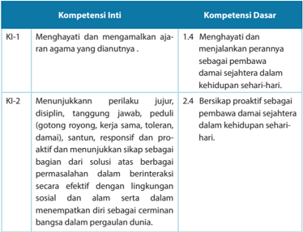

Tabel ini menunjukkan dua jenis kompetensi: Kompetensi Inti (KI) dan Kompetensi Dasar (KD). Topik utama tabel ini adalah tentang keterampilan dan perilaku yang diperlukan dalam kehidupan sehari-hari. Kolom KI-1 berisi dua kompetensi inti: menghargai dan mengamalkan ajaran agama yang diannya, serta menjalankan perintah dan menjaga disiplin. Kolom KD-1 berisi satu kompetensi dasar: bersikap proaktif sebagai pembawa damai dalam kehidupan sehari-hari. Data penting yang terlihat adalah bahwa semua kompetensi dalam tabel ini berkaitan dengan aspek positif dalam kehidupan sosial dan pribadi, mencakup nilai-nilai moral, disiplin, dan kemampuan untuk berinteraksi efektif dengan lingkungan sosial.

 

---
## 📄 Halaman 212

---
**📊 Tabel**

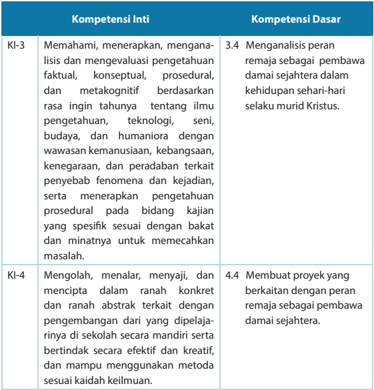

Tabel ini berisi informasi tentang kompetensi inti dan kompetensi dasar yang relevan dengan pembelajaran tentang pengetahuan, teknologi, seni, budaya, dan kehidupan sehari-hari. Topik utamanya adalah bagaimana siswa dapat memahami, menerapkan, mengolah, menalar, menyajikan, dan menciptakan konten yang berkaitan dengan pengetahuan, teknologi, seni, budaya, dan kehidupan sehari-hari. Kolom "Kompetensi Inti" mencakup empat topik utama: KI-3 (Memahami, menerapkan, mengolah, menalar, menyajikan, dan menciptakan konten), KI-4 (Mengolah, menalar, menyajikan, dan menciptakan konten), dan KI-5 (Mengolah, menalar, menyajikan, dan menciptakan konten). Kolom "Kompetensi Dasar" mencakup empat poin penting: 3.4 (Menganalisis peran remaja sebagai pembawa damai sejahtera), 4.4 (Membuat proyek yang berkaitan dengan peran remaja sebagai pembawa damai sejahtera), 5.4 (Membuat proyek yang berkaitan dengan peran remaja sebagai pembawa damai sejahtera), dan 6.4 (Membuat proyek yang berkaitan dengan peran remaja sebagai pembawa damai sejahtera). Pola penting yang terlihat adalah bahwa setiap kompetensi inti memiliki satu atau lebih kompetensi dasar yang relevan untuk mendukung pembelajaran tersebut.

### Indikator:

- Menjelaskan  pentingnya  peranan  pemimpin  terhadap  kesejahteraan mereka yang dipimpinnya.
- Menjelaskan  pentingnya  membawa  pesan  damai  sejahtera  kepada orang-orang di lingkungannya.
- Membuat komitmen secara pribadi dan/atau bersama gereja untuk ikut serta mengatasi krisis kehidupan bangsa dan negara untuk orang-orang di lingkungannya.

 

---
## 📄 Halaman 213

### A.  Pengantar

Dalam pembelajaran ini, peserta didik diajak untuk melihat keterkaitan antara tindakan seorang pemimpin yang salah yang berakibat buruk terhadap mereka yang dipimpinnya. Walaupun di Alkitab ada sejumlah pesan yang disampaikan kepada  bangsa  Israel  untuk  mematuhi  pemimpin,  namun  seorang  pemimpin yang  salah  dan  tetap  dipatuhi  oleh  rakyatnya  ternyata  berdampak  buruk  dan dampak ini dapat menjadi sangat berkepanjangan.  Di Alkitab juga ada pesan untuk  menjadi  pembawa  damai  sejahtera  kepada  orang-orang  di  lingkungan, tanpa menunggu untuk disuruh oleh pemimpin. Artinya, terlepas dari apa pun yang dilakukan pemimpin, sudah menjadi tugas kita selaku rakyat yang dipimpin dan terlebih lagi sebagai murid Kristus untuk selalu membawa damai sejahtera di lingkungan kita masing-masing. Untuk Indonesia saat ini, tugas sebagai pembawa damai  sejahtera  ini  menjadi  penting  karena  berbagai  kondisi  yang  membuat Indonesia terpuruk dan untuk itu diperlukan pemimpin bangsa yang sungguhsungguh  mau  melayani  rakyat.    Hal  buruk  yang  terjadi  di  Indonesia  adalah maraknya korupsi yang dilakukan di berbagai bidang oleh pemimpin di berbagai jenjang. Seharusnya, pemimpin yang baik adalah yang mengantarkan rakyat yang dipimpinnya mencapai kesejahteraan, bukan malah menumpuk kekayaan untuk dirinya. Ketaatan beribadah bukan hanya nampak dalam seringnya beribadah di gereja, melainkan juga perlu ditunjukkan dalam perilaku bermasyarakat, berbangsa dan bernegara yang baik. Peserta didik diajak untuk memahami bahwa salah satu hal yang dapat dilakukan sebagai warga negara yang baik adalah menjaga agar keadilan  dan  kebenaran  tetap  ditegakkan  di  negara  kita.  Pemahaman  tentang pentingnya  menjalankan  komitmen  selaku  murid  Kristus,  khususnya  sebagai pembawa damai sejahtera inilah yang ingin ditanamkan kepada peserta didik.

### B. Penjelasan Alkitab tentang Pengalaman Bangsa Israel Ketika Dibuang ke Babel

Peserta  didik  diajak  untuk  melihat  ungkapan  pengalaman  bangsa Yehuda ketika mereka hidup di negeri asing, di Babel, sebagai bangsa buangan. Pada tahun 597  SM,  Nebukadnezar,  raja  Babel,  menyerang  Yehuda,  dan  mengalahkannya (Wikipedia ' Babylonian captivity ').  Raja Zedekia, raja Israel saat itu, mencoba tetap melawan. Ia membangun persekutuan dengan Firaun Hofra dari Mesir (Yeremia 37:7;  44:30).  Oleh  karena  itu,  pada  tahun  589  SM,  Nebukadnezar  kembali  ke Yehuda dan mengepung Yerusalem selama 18 bulan. Banyak orang Yehuda yang lari  ke  daerah-daerah  sekitar,  seperti  Moab,  Amon,  Edom,  dan  negara-negara lain untuk menyelamatkan diri (Yeremia 40:11-12). Yerusalem kembali jatuh, dan Nebukadnezar sekali lagi menjarah kota itu dan Bait Suci, lalu menghancurkan keduanya pada tahun 587 SM.

 

---
## 📄 Halaman 214

Raja Zedekia, yang dianggap memberontak, ditawan dan diangkut ke Babel, dan Yehuda  dijadikan  provinsi  Kerajaan  Babel  yang  disebut 'Yehud' .  Tamatlah riwayat  kerajaan  Daud.  Selain  korban  yang  tewas,  sekitar  4.600  orang  Yehuda dibuang  ke  Babel.  (Yeremia  52:29).  Pembuangan  berlangsung  sampai  tahun 538 SM, ketika Babel jatuh ke tangan Koresh, raja Persia, yang mengizinkan bangsa Yahudi (dari nama 'Yehuda') kembali ke negeri mereka. Secara keseluruhan sekitar 10.000 orang anggota keluarga istana, tokoh-tokoh masyarakat, para tukang dan ahli, serta lainnya dibuang ke Babel.

Pembuangan  ke  Babel  adalah  sebuah  peristiwa  traumatis  dalam  sejarah bangsa Yahudi. Kerajaan mereka hancur. Demikian pula Bait Suci di Yerusalem. Tanpa Bait Suci, mereka merasa tidak dapat lagi beribadah kepada Tuhan, Allah mereka.  Mereka  bersedih  hati  karena  tidak  memiliki  tanah  air.  Mereka  merasa terhina  karena  diserahkan  ke  tangan  bangsa  kafi  r,  bukannya  melayani  Allah  di Bait Allah yang kudus. Mereka menderita terutama karena mereka sadar bahwa keberadaan mereka di negeri asing itu terutama sekali disebabkan oleh dosa-dosa mereka. Musuh-musuh mereka mengejek dan mencemooh. Orang Yehuda disuruh menyanyi.  'Nyanyikanlah  bagi  kami  nyanyian  dari  Sion!'  begitu  kata  mereka. Nyanyian yang diminta tentunya adalah nyanyian pujian, madah penghormatan dan pengagungan Allah yang perkasa, pelindung Israel. Akan tetapi, justru inilah ironisnya. Allah seolah-olah sudah memalingkan wajah-Nya dan tidak peduli lagi kepada  Israel,  umat-Nya. 'Bagaimana  mungkin  kami  menyanyikan  pujian  bagi Tuhan,' pemazmur bertanya, 'ketika kami menyadari bahwa kami terpuruk dalam keberdosaan  kami? Bagaimana  mungkin  kami  menyanyikan  nyanyian  dari  Sion, sementara kami terbuang di negeri asing? '  (Mazmur 137: 4)

### Berita Suka Cita

Umat  Israel  tidak  selama-lamanya  menderita  di  Babel.  Setelah  berakhir masa  penghukuman  mereka,  Tuhan  Allah  mengirimkan  utusan-Nya  untuk memberitakan  kabar  suka  cita. Mereka  telah ditebus Allah.  Mereka  akan diperbolehkan kembali ke Sion, kota Allah. Dengan demikian maka mereka akan dapat memproklamasikan, 'Allahmu itu Raja!' (Yesaya 52:7). Apakah artinya ini? Ini berarti suka cita umat Allah hanya dapat terjadi apabila mereka mengakui bahwa Allah itulah Raja.   Kehendak Allah haruslah dinyatakan di dalam kehidupan umat.

Pembangunan  kembali  Yerusalem  terjadi  setelah  bangsa  Yahudi  diizinkan kembali  oleh  Koresh,  raja  Persia  pada  tahun  538  SM.  Pada  tahun  464  SM Artahsasta naik takhta sebagai raja di Persia. Ia mempunyai seorang juru minuman yang berdarah Yahudi yang bernama Nehemia (Wikipedia 'Nehemia'). Nehemia

 

---
## 📄 Halaman 215

mendengar berita dari saudaranya, Hanani, tentang kehancuran kota Yerusalem dan    Bait  Suci  Allah  (  Nehemia  1:2;  2:3).  Mendengar  kabar  buruk  itu,  Nehemia merasa sangat sedih. Berhari-hari ia berpuasa dan berdoa meratapi negeri nenek moyangnya. Ketika raja melihat kesedihan Nehemia, baginda menanyakan apa yang  membuatnya  sedih.  Nehemia  menceritakan  semua  yang  didengarnya tentang negeri leluhurnya. Kemudian ia meminta izin kepada raja agar diizinkan kembali  ke  Yerusalem,  dan  memimpin  pembangunan  kembali  kota  itu.  Raja mengizinkan  Nehemia  dan  malah  mengangkatnya  menjadi  bupati  di  Yehuda (Nehemia 5:14).

Apa arti tindakan Nehemia ini? Keputusannya untuk kembali ke Yehuda dan membangun kembali negeri leluhurnya tentu membutuhkan pengorbanan besar pada pihak Nehemia. Ia harus meninggalkan sebuah jabatan yang sangat baik di istana raja. Kedudukannya tinggi. Ia orang kepercayaan raja. Namun semuanya itu dilepaskannya.  Nehemia  bersedia  berkorban  untuk  meninggalkan  kenikmatan tinggal di sekitar istana, untuk kembali ke Yehuda dan kemungkinan sekali selama berbulan-bulan  ia  harus  tinggal  di  kemah  dengan  fasilitas  yang  serba  minim. Makanan dan minumannya pastilah tidak selezat seperti yang dapat ia nikmati selama tinggal mengabdikan diri kepada raja. Namun, upaya Nehemia tidak siasia. Yerusalem dibangun kembali. Bangsa Yahudi kembali ke tanah air mereka dan memulai hidup yang baru. Akan tetapi semuanya itu hanya dapat terjadi lewat kerja keras dan pengorbanan, bukan dengan berpangku tangan.

Sebuah bangsa acap kali mengalami krisis kehidupan karena tidak melakukan kehendak  Allah.  Apakah  kehendak  Allah  tersebut?  Kehendak  Allah  itu  adalah hidup berkeadilan, kesediaan setiap anggota masyarakat untuk berkorban. Para pemimpin haruslah melakukan tugasnya sebagai pemimpin, mendidik generasi muda untuk menggantikannya, dan memberikan teladan yang baik. Bila ini yang terjadi, maka bangsa akan mengalami damai sejahtera.

### C. Penerapan Damai Sejahtera di Indonesia

Pada pelajaran yang lalu kita sudah membahas sedikit tentang sulitnya hidup masyarakat miskin di  Indonesia.  Banyak  dari  mereka  yang  menderita  sehingga akhirnya  bunuh  diri  karena  tidak  tahan  lagi  menanggung  penderitaan  dan kemiskinan mereka.

Mari  kita  pelajari  keprihatinan  dari    Sri  Edi  Swasono  ( edukasi.kompasiana , 2012), mantan anggota MPR dari Fraksi Utusan Golongan, dan guru besar Fakultas Ekonomi Universitas Indonesia, penulis buku   'Indonesia dan Doktrin Kesejahteraan Sosial' .  Ide-ide  penting  yang  terus  menerus  dipertanyakannya  adalah  antara lain: (1) Mengapa pembangunan yang terjadi di Indonesia ini menggusur orang

 

---
## 📄 Halaman 216

miskin dan bukan menggusur kemiskinan? Dalam hal ini pembangunan malah menghasilkan  dehumanisasi  di  mana  orang  miskin  semakin  menjadi  miskin dengan mengalami kehilangan tanah dan kesempatan mendapatkan pendidikan serta pekerjaan yang layak. (2) Mengapa yang terjadi sekadar pembangunan di Indonesia dan bukan pembangunan Indonesia? Orang-orang asing membangun Indonesia dan menjadi pemegang konsesi bagi usaha-usaha ekonomi strategis, sedangkan orang Indonesia menjadi penonton atau menjadi jongos globalisasi. Seharusnya,  kita  orang  Indonesia  menjadi  tuan  di  negeri  sendiri,  menjadi ' The Master in our own Homeland, not just to become the Host' ,  yang  hanya melayani kepentingan  globalisasi  dan  mancanegara.  Betapa  banyaknya  sumber  daya alam Indonesia yang pengelolaannya dikerjakan oleh perusahaan asing. Kesejahteraan rakyat tidak kunjung tercapai, sedangkan kesenjangan antara kaya dan miskin makin meningkat. Untuk mengubah nasib orang miskin, seharusnya yang dilakukan pemerintah adalah memperbaiki sekolah dan mutu pendidikan di Indonesia; membuka  lapangan-lapangan  kerja; memperbaiki kerusakan lingkungan  hidup  yang  disebabkan  oleh  berbagai  aktivitas  manusia.  Namun yang lebih sering terjadi adalah, orang miskin digusur ke tempat-tempat lain, ke pinggiran kota, bahkan ke pulau lain melalui program transmigrasi.

Sri  Edi  Swasono  menambahkan  bahwa  kita  perlu  banyak  belajar  dari pengalaman  di  negara-negara  lain.  Misalnya,  negara  Amerika  Serikat  pada awal tahun 2010 berhasil menyelesaikan rancangan undang-undang di bidang kesehatan.  Mengapa  kita  tidak  dapat  melakukan  hal  yang  sama?  Yang  terjadi sekarang ialah berbagai biaya pelayanan sosial menjadi semakin mahal, seperti biaya  pendidikan,  biaya  perawatan  kesehatan,  dan  lain-lain.  Dalam  hal  inilah, semestinya pemerintah lebih berperan dan bekerja keras menciptakan masyarakat yang  lebih  sejahtera  dan  adil,  sehingga  orang  miskin  dapat  terangkat  dari kemiskinannya dan mereka yang tidak punya pun dapat menikmati pelayanan kesehatan  yang  baik.  Kita  membutuhkan  pemimpin-pemimpin  yang  mampu memahami kebutuhan masyarakat, dan bukan mereka yang hanya mementingkan diri sendiri atau golongannya saja. Apalagi karena biaya pencalonan mereka untuk menjadi  pemimpin  juga  biasanya  mahal  sekali.  Pemimpin  yang  kita  perlukan adalah pemimpin yang memiliki orientasi untuk rakyat dengan tidak memberikan kemudahan kepada investor asing yang malah mendirikan pusat pembelanjaan, supermarket,  hotel  mewah,  dan  pemukiman  super  mewah  yang  diperoleh dengan menggusur tanah-tanah rakyat dengan ganti rugi yang mungkin tidak layak.  Ekonomi rakyat adalah wujud dari ekonomi yang berbasis rakyat (people-

 

---
## 📄 Halaman 217

based economy) dan ekonomi terpusat pada kepentingan rakyat (people-centered economy) yang merupakan inti dari Pasal 33 UUD tahun 1945, terutama ayat (1) dan ayat (2).

Kabar  baik  datang  pada  awal  tahun  2014  ini  ketika  Pemerintah  Indonesia mengeluarkan Kartu Jaminan Kesehatan Nasional yang merupakan kartu yang dapat  dipakai  di  Puskesmas  dan  rumah  sakit  agar  biaya  pemeriksaan  dokter, pembelian obat, dan fasilitas medis lainnya serta perawatan inap tidak lagi mahal karena dibantu oleh pemerintah Republik Indonesia (I, 2012).

### 1.    Kemiskinan di Indonesia

Di bawah ini adalah tabel '  Indeks Pembangunan Manusia' untuk Indonesia pada  tahun  2012  yang  disusun  oleh  UNDP  ( United  Nations  Development Program - Program Pembangunan PBB). Berdasarkan tabel 12.1 ini kita dapat melihat posisi Indonesia dalam nilai pembangunan manusianya dibandingkan dengan sejumlah negara lainnya, sehingga kita dapat memperoleh gambaran bagaimana posisi kesejahteraan bangsa kita di antara bangsa-bangsa lain di seluruh dunia.

### a.   Indeks Pembangunan Manusia

Setiap  tahun  sejak  tahun1990,  Kantor  Laporan  Pembangunan  Manusia PBB  menerbitkan  Indeks  Pembangunan  Manusia  (IPM  atau Human Development Index/HDI ) yang meneliti lebih dari sekadar tingkat pendapatan (PDB) untuk mendapatkan defi  nisi yang lebih luas tentang kesejahteraan. IPM memberikan  ukuran  terpadu  dari tiga dimensi pembangun  an manusia: kehidupan yang panjang dan sehat (diukur dari tingkat harapan hidup), pendidikan (diukur melalui tingkat melek huruf dan  banyaknya  anak-anak  yang  bersekolah  di  Sekolah  Dasar,  Sekolah Menengah, dan perguruan tinggi), serta memiliki tingkat kehidupan yang layak (diukur melalui tingkat daya beli dan pendapatan). Indeks berikut ini  bukanlah  ukuran  yang  menyeluruh  untuk  pembangunan  manusia. Misalnya,  di  sini  tidak  dimasukkan  indikator-indikator  penting  seperti gender atau kesenjangan pendapatan dan indikator-indikator lain yang lebih  sulit  diukur  seperti  penghargaan  terhadap hak-hak asasi manusia dan kebebasan politik. Yang diberikan di sini adalah prisma yang diperluas untuk meninjau perkembangan manusia dan hubungan yang kompleks antara pendapatan dan kesejahteraan.

IPM  Indonesia  untuk  tahun  2013  adalah  0,684,  yang  menempatkan negara ini pada peringkat ke-108 dari 187 negara yang dimuat datanya di sini, dan jauh di bawah Singapura maupun Malaysia yang merupakan tetangga terdekat Indonesia ( World Bank , 2014).  (lihat Tabel 12.1).

 

---
## 📄 Halaman 218

---
**📊 Tabel**

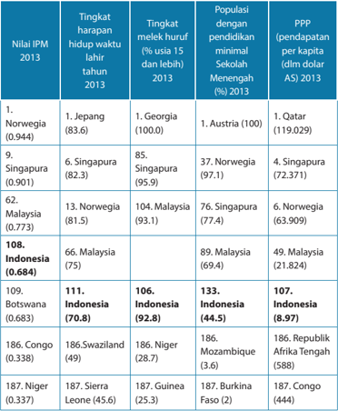

Tabel ini menunjukkan data demografi dan ekonomi dari beberapa negara di dunia pada tahun 2013. Topik utamanya adalah tingkat harapan hidup waktunya, tingkat melek huruf, populasi dengan pendidikan minimal sekolah menengah, dan PPP (pendapatan per kapita). Data menunjukkan bahwa Norwegia memiliki tingkat harapan hidup waktunya tertinggi dengan 94,4%, sedangkan Niger memiliki tingkat harapan hidup waktunya terendah dengan 33,7%. Selain itu, Norwegia juga memiliki tingkat melek huruf tertinggi dengan 100%, sementara Niger memiliki tingkat melek huruf terendah dengan 37%. Tabel juga menunjukkan bahwa Norwegia memiliki populasi dengan pendidikan minimal sekolah menengah tertinggi dengan 100%, sementara Niger memiliki populasi dengan pendidikan minimal sekolah menengah terendah dengan 2%. Terakhir, Norwegia memiliki PPP tertinggi dengan 119,029 dolar AS per kapita, sementara Niger memiliki PPP terendah dengan 444 dolar AS per kapita.

 

---
## 📄 Halaman 219

### b.   Kemiskinan Manusia di Indonesia

Berikut  adalah  tabel  tentang  persentase  orang  miskin  di  Indonesia  sejak tahun 2005 sampai dengan tahun 2013.

Sumber:

World Bank and Statistics Indonesia

Relative poverty adalah ukuran kemiskinan berdasarkan standar hidup yang ada di negara tersebut. Tentunya ini berbeda antara negara yang satu dengan negara yang lain. Negara yang miskin menetapkan standar hidup yang lebih rendah  daripada  negara  kaya.  Dengan  bertambah  kaya  atau  miskinnya negara tersebut, tentu standar hidup pun mengalami perubahan. Sebaliknya, absolute poverty merujuk  pada  ukuran  kemiskinan yang sama pada semua negara dan tidak berubah dari waktu ke waktu. Ukuran yang ditetapkan oleh Bank Dunia adalah seseorang dianggap miskin bila hidup di bawah 1,25 dolar Amerika per hari, namun sejak beberapa tahun terakhir pemerintah Indonesia menerapkan standar yang lebih rendah lagi, yaitu seseorang dianggap miskin bila  penghasilannya  tidak  melebihi  292,951  rupiah  sebulan.  Perbedaan penetapan ukuran kemiskinan ini membuat jumlah orang miskin di Indonesia nampaknya cenderung menurun dari tahun ke tahun.  Inilah yang banyak dikritik para ahli ekonomi dan media massa karena menimbulkan kesan bahwa pemerintah  Indonesia  berhasil  mengentaskan  kemiskinan,  padahal  dalam kenyataannya tidak demikian. Bila standar dari Bank Dunia diterapkan untuk menghitung  banyaknya  orang  miskin  di  Indonesia,  jumlahnya  meningkat menjadi mendekati 40% ( Indonesia-Investment, 2013).  Sungguh kondisi yang sangat memilukan.

Untuk  mengentaskan  kemiskinan,  pembukaan  lapangan  pekerjaan  dan pemberian  kesempatan  pendidikan  menjadi  kunci  yang  menentukan.  Di mana kehadiran gereja dalam hal ini? Berita baik tidak sekadar bicara tentang keselamatan surgawi, tetapi tentang kehidupan duniawi. Contoh gereja yang mengambil  peran  aktif  dan  strategis  dalam  memberdayakan  masyarakat di  sekitarnya adalah   Huria Kristen Batak Protestan (HKBP) yang mendirikan

 

---
## 📄 Halaman 220

Credit Union Modifi  kasi (CUM) yang terinspirasi dari aktivitas   Grameen Bank yang dipimpin oleh   Muhammad Junus di Bangladesh  ( reformata.com , 2014). CUM adalah bentuk simpan pinjam seperti koperasi. Ayat-ayat Alkitab seperti Yeremia 29: 7 dan Galatia 6: 2 menjadi ayat yang dipakai untuk menjalankan pelayanan  ini.  HKBP  menganggap  bahwa  gereja  harus  inklusif,  artinya, kehadirannya harus berdampak positif terhadap masyarakat kurang mampu yang jumlahnya memang banyak di Indonesia. Artinya, gereja tidak hanya mengurus peribadahan (hal spiritual) namun juga kesejahteraan masyarakat di  sekitarnya  (hal  material).  Pemberdayaan  masyarakat  secara  ekonomi (misalnya memberikan pendampingan terhadap petani, buruh, dan nelayan) dapat dijadikan bagian dari pelayanan kepada masyarakat di sekitar gereja. Mereka yang membutuhkan pinjaman untuk memperbesar modalnya tidak perlu menjadi anggota gereja terlebih dahulu, karena memang kesempatan ini  terbuka  bagi  siapa  pun  yang  membutuhkan.  Keuntungannya  adalah sistem  bunga  yang  murah  dibandingkan  bila  meminjam  ke  bank.  Selain itu,  para  anggota  CUM  juga  dapat  memperoleh  sisa  hasil  usaha  pada  saat Rapat  Anggota  Tahunan.  Pada  bulan  September  2014,  Muhammad  Junus mengunjungi Indonesia dan membagikan pengalamannya memberdayakan begitu banyak keluarga miskin di Bangladesh.

### 2.    Membangun Kemampuan Perempuan Indonesia

Hal penting yang juga perlu diperhatikan adalah seberapa jauh perempuan Indonesia diberdayakan. Dalam  tinjauan World  Economic  Forum  (WEF) , ternyata Indonesia menempati urutan ke-95 dari 136 negara yang dipantau dalam  urusan  Kesenjangan  Gender  ( Gender  Inequility )  ( tribunnews ,  2014). Ini  adalah  kenaikan  sebanyak  dua  peringkat  dibandingkan  dengan  tahun 2012,  walaupun  masih  di  bawah  Singapura  (di  peringkat  15)  dan  Malaysia (di  peringkat  39).  Indonesia  dinilai  cukup  berhasil  dalam  meningkatkan partisipasi  kaum  perempuan dalam bidang ekonomi, di samping tentunya dalam bidang politik (terpilih dan diangkatnya perempuan sebagai anggota DPR dan DPRD). Ditinjau dari sudut ekonomi, terjadi peningkatan keterlibatan kaum  perempuan  sebagai  orang  yang  bekerja  dan  mendapat  upah,  yaitu sebanyak  35.10  %  pada  tahun  2013  (dibandingkan  dengan  29,24%  pada tahun 1990). Sayangnya, upah yang diterima pekerja perempuan lebih sedikit daripada pekerja laki-laki. Contohnya, bila rata-rata upah buruh perempuan per bulan di sektor formal adalah Rp1.427,717, maka buruh laki-laki menerima sebesar Rp1.812,606, jadi buruh perempuan hanya menerima sebanyak 77,7% dari jumlah yang diterima buruh laki-laki. Ini hanya gambaran upah di kota dan provinsi tertentu, karena memang besarnya upah bervariasi antara kota dan desa tertentu dengan kota dan desa lainnya.

 

---
## 📄 Halaman 221

Dalam bidang pendidikan, pada tahun 2013 diperoleh rasio   Angka Partisipasi Murni (APM) kaum perempuan yang sangat tinggi, yaitu 99,81 % untuk jenjang SD. APM yang tinggi juga ditunjukkan di jenjang SMP, SMA, dan Perguruan Tinggi.  Artinya,  diperoleh  persentase  yang  cukup  tinggi  dari  partisipasi perempuan Indonesia untuk mengikuti pendidikan di jenjang SMP, SMA, dan Perguruan Tinggi.

Di  balik  angka-angka  yang  menggembirakan  ini,  ada  isu-isu  yang  perlu diselesaikan.    Komisi  Nasional  Perempuan  mencatat  sedikitnya  ada  11  isu penting yang perlu diselesaikan untuk periode tahun 2010-2014 ( wikipedia , 2013)  yang  semuanya  bermuara  pada  terjadinya  kekerasan  kepada  kaum perempuan  akibat  pemiskinan  secara  ekonomi  dan  mental.    Beberapa di  antaranya  adalah  kekerasan  yang  ditemukan  dalam  konteks  migrasi, eksploitasi tenaga kerja di pabrik dan rumah tangga, eksploitasi sumber daya alam,  dan  pengungsian,  maupun  kekerasan  terhadap  perempuan  akibat politisasi identitas dan kebijakan berbasis moralitas dan agama, pelanggaran HAM dan situasi konfl  ik, perkawinan serta keluarga serta budaya.

Untuk  menyelesaikan  isu  ini,  sangat  diperlukan  sinergi  dari  pihak-pihak yang memiliki  kepedulian  terhadap  peningkatan  kemampuan  perempuan. Beberapa  hal  yang  secara  strategis  dapat  dilakukan  adalah  meningkatkan pemahaman  mengenai  kekerasan  berbasis  jender  sebagai  isu  hak  asasi manusia  di  tingkat  lokal,  nasional,  regional,  dan  internasional.  Kemudian mengembangkan  metode-metode  yang  efektif  dalam  upaya  peningkatan pemahaman publik sebagai strategi perlawanan dalam gerakan penghapusan segala  bentuk  kekerasan  terhadap  perempuan,  termasuk  memberikan tekanan  terhadap  pemerintah  agar  melaksanakan  dan  mengupayakan penghapusan segala bentuk kekerasan terhadap perempuan.

Contoh  dimana  pemerintah  harusnya  berupaya  sungguh-sungguh  dalam membela kaum perempuan yang tidak berdaya adalah dalam kasus-kasus yang dialami oleh tenaga kerja wanita yang bekerja di luar negeri ( Hermanto , 2012). Karena terbatasnya kesempatan bekerja di daerah, cukup banyak kaum perempuan yang memilih bekerja di luar negeri dan ini tidak terlepas dari bujuk rayu para agen PJTKI. Pada kenyataannya, ada yang umurnya dipalsukan agar dianggap memenuhi syarat minimum usia untuk dipekerjakan. Tanpa pembekalan yang memadai serta keterbatasan bahasa bila mereka bekerja di negara-negara yang menggunakan bahasa lainnya di luar bahasa Melayu, tentu kinerja mereka tidak memuaskan sehingga menimbulkan keberangan sang  empunya  rumah.  Tidak  sedikit  pula  yang  mengalami  penganiayaan bahkan ada yang tewas tanpa sempat membela dirinya. Sebaliknya, ada juga

 

---
## 📄 Halaman 222

yang  mendapatkan  tuduhan  membunuh  sang  majikan.  Sungguh  sangat banyak  yang  perlu  dilakukan  agar  bangsa  dan  negara  Indonesia  menjadi negara yang menjamin kesejahteraan rakyatnya.

Hal lain yang perlu diatasi oleh pemerintah Indonesia adalah masalah korupsi yang  dianggap  sudah    terstruktur  dan  masif  ( Kompas ,  5  September  2014). Bila  dilihat  dari  sistem  kenegaraan,  sudah  cukup  banyak  perangkat  negara yang ditetapkan untuk membentengi agar korupsi dapat dikikis. Di antara perangkat  negara  ini  adalah  Komisi  Pemberantasan  Korupsi,  Mahkamah Agung, Badan Pemeriksa Keuangan, Pusat Pelaporan dan Analisis Transaksi Keuangan,  Komisi Yudisial,  Ombudsman  RI,  dan  Inspektorat  Jenderal  serta Inspektorat provinsi/kabupaten/kota. Tugas dari perangkat negara ini secara umum  adalah  memeriksa  aliran  dana  untuk  anggaran  yang  digunakan oleh setiap unit pemerintah. Akan tetapi, lemahnya pengawasan internal di setiap kementerian dan lembaga menyebabkan aliran dana diselewengkan untuk  kepentingan  pihak-pihak  tertentu.    Sejauh  ini,  mereka  yang  sudah diadili  karena  korupsi  adalah  anggota  DPR  dan  DPRD,  pejabat  eselon  I,  II, III,  wali  kota/bupati  dan  wakilnya,  bubernur,  kepala  lembaga/kementerian, Hakim, dan lain-lain. Untuk mencegah bertambah suburnya perilaku korupsi, karakter mengendalikan diri harus diajarkan sejak dini dan tidak menunggu sampai  orang  menjadi  dewasa.  Wahyudi  (2014)  mengaitkan  pentingnya pendidikan  karakter  pengendalian  diri  ini  dengan  pentingnya  menghargai setiap  anak  didik  sebagai  pribadi  yang  unik.  Sayangnya,  para  guru  tidak mampu melakukan hal ini karena pendekatan pendidikan adalah masal alias dilakukan untuk sekaligus dalam jumlah yang lumayan banyak.

Di tengah-tengah kondisi seperti ini, kita masih memiliki harapan. Sama seperti bangsa  Israel  yang  menaruh  harapan  ketika  mereka  melihat  pemberitapemberita  kabar  baik  datang  untuk  menyampaikan  berita  pembebasan mereka dari negeri pembuangan di Babel , 'Betapa indahnya kelihatan dari puncak bukit-bukit kedatangan pembawa berita, yang mengabarkan berita damai dan memberitakan kabar baik, yang mengabarkan berita selamat dan berkata kepada Sion: 'Allahmu itu Raja!' (Yesaya 52:7).

Akan  tetapi  kita  harus  ingat  bahwa  berita  keselamatan  itu  harus  disertai dengan pengakuan bahwa 'Allah kita itulah Raja!' sehingga kita boleh terusmenerus berdoa, berharap, dan berjuang 'Datanglah Kerajaan-Mu.' Artinya, kita harus terus-menerus berusaha dan mengusahakan agar kerajaan Allah, kehendak  Allah,  diberlakukan  di  dalam  hidup  kita  sehari-hari.  Semua  itu harus dilakukan bukan hanya dengan berdoa saja, melainkan dengan terjun langsung  secara  aktif  dan  nyata  berusaha  mengatasi  masalah    kemiskinan, penderitaan masyarakat, dari lingkungan yang terdekat di sekitar kita.

 

---
## 📄 Halaman 223

### D.  Pemantapan dan Aplikasi

Krisis kehidupan yang dialami bangsa kita perlu dihadapi oleh orang Kristen dan  gereja-gereja  melalui  tindakan-tindakan  konkret.  Pdt.  Dr.  A.A.    Yewangoe, Ketua  Umum  PGI  periode  1995-1999  dan  1999-2004  ( www.leimena.org ,  2009) menyatakan:

80% gereja-gereja yang tergabung dalam PGI adalah gereja-gereja di perdesaan. Dibandingkan sisanya yang 20%, mayoritas jemaat itu hidupnya kurang. Jadi tantangannya  adalah  menjembatani  kesenjangan  antara  gereja  kaya  dan gereja miskin.

Diharapkan  supaya  gereja-gereja  kaya  di  kota  bisa  membantu  gereja-gereja miskin, terutama yang berada di daerah-daerah terpencil. Sebetulnya, yang perlu dilakukan agar bantuan-bantuan itu tidak bersifat konsumtif adalah memotivasi dan membangkitkan kemampuan jemaat lokal.

Berdasarkan  hal  tersebut,  ia  menganjurkan  agar  gereja-gereja  dapat  meniru praktik-praktik baik yang dilakukan oleh sejumlah gereja, seperti misalnya   Gereja Batak Karo Protestan (GBKP):

Gereja ini memiliki semacam bank perkreditan yang maju sekali. Mereka memberi pinjaman pada orang Kristen maupun non Kristen.

Ini adalah salah satu yang kami anjurkan dalam sidang kami di Makassar, yaitu untuk melakukan kerja sama lintas agama. Bentuknya adalah dengan komunitaskomunitas  lintas  agama  saling  bekerja  untuk  merencanakan  suatu  proyek tertentu. Misalnya, dengan membuat proyek pertanian, yang bukan hanya untuk warga  gereja  saja,  tapi  untuk  semua.  Itu  akan  menolong  kemajemukan  kita, sehingga jemaat gereja Kristen tidak jadi sasaran kecemburuan dan kecurigaan. Dengan cara ini kita mewujudkan teologi bertetangga baik.

Kita  masih  dapat  menemukan  banyak  contoh  lain  tentang  tindakan-tindakan konkret  yang  dilakukan  oleh  gereja  untuk  mengatasi  krisis  kehidupan  bangsa kita saat ini. Ada juga   Gereja Kristen Jawa Manahan  di kota Solo (Surakarta, Jawa Tengah) yang melayani masyarakat miskin di sekitarnya melalui pemberian menu murah  untuk  berbuka  puasa.  Program  ini  dilakukan  mulai  pada  bulan  puasa tahun  2009.  Kini,  gereja  tidak  melakukan  aktivitas  ini  karena  masjid  setempat telah melakukannya.  Kepedulian kepada masyarakat miskin di sekitar lingkungan tetap harus menjadi kegiatan yang dilakukan, bukan hanya ala kadarnya karena masa Natal atau Paskah, melainkan secara berkesinambungan sepanjang tahun. GKJ Manahan di Solo telah berusaha melayani sesama mereka, meskipun yang dilayani beragama lain. Pelayanan ini menjadi lebih khusus ketika dilakukan pada bulan  puasa  untuk  mereka  yang  ingin  berbuka,  namun  tidak  memiliki  cukup

 

---
## 📄 Halaman 224

uang untuk mendapatkan makanan yang layak. Langkah konkret GKJ Manahan di Solo dalam berbagi kehidupan adalah sebuah contoh kecil namun sangat berarti tentang upaya membangun kehidupan bersama yang mesra.

Dalam  beberapa  tahun  terakhir  ini  hubungan  antarumat  beragama  di Indonesia, khususnya antara orang Kristen dan orang Islam, banyak mengalami benturan.  Kerusuhan-kerusuhan  yang  berbau  agama  seperti  yang  terjadi  di Situbondo,  Poso,  Ambon,  dan  lain-lain  telah  membuat  banyak  pihak  cemas. Apakah masih mungkin kita hidup berdampingan sebagai sebuah bangsa yang berbeda-beda keyakinannya?

Untuk  mewujudkan  cita-cita  kehidupan  berbangsa  yang  harmonis  sudah tentu dibutuhkan langkah-langkah yang berani untuk saling mendekati, saling  mengenal,  saling  menolong.  Singkatnya,  langkah-langkah  yang  dapat menciptakan hubungan yang lebih sejuk dan akrab, yang benar-benar mencerminkan kehidupan damai sejahtera yang Allah kehendaki.

Bayangkan  bila  semua  gereja  di  Indonesia  yang  puluhan  ribu  jumlahnya, melakukan hal-hal yang dapat membantu mengurangi   kemiskinan, membangun tali  persaudaraan  dengan  orang-orang  yang  berkeyakinan  lain,  dan  bersamasama menciptakan damai sejahtera Allah di  lingkungannya.  Dengan  demikian, kita  benar-benar  dapat  menghadirkan  kabar  baik  di  tengah  krisis  kehidupan bangsa dan negara kita ini.

### E. Kegiatan Pembelajaran

### Kegiatan 1

Kegiatan diawali dengan mengajak peserta didik menyanyikan lagu KJ 333: 'Sayur Kubis Jatuh Harga' .

### Sayur Kubis Jatuh Harga

Sayur kubis jatuh harga, pohon tomat kena hama, cengkeh pun tidak berbunga dan jualanku tidak laku, butir padi tak berisi, sampar ayam pun berjangkit, hewan ternak sudah habis, kar'na terpaksa aku jual. Namun aku puji Tuhan dan bersorak sukaria kar'na Dia Pohon s'lamatku! Kepada-Nya 'ku percaya, aku tidak akan jatuh: Tuhan Allah kekuatanku.

Syair dan lagu: Suan Kol, berdasarkan Habakuk 3:17-19

S. Tarigan 1983

 

---
## 📄 Halaman 225

Lagu di atas diambil dari ungkapan Nabi Habakuk yang melukiskan pergumulan umat Allah yang mengalami bala kelaparan. Bagaimana seharusnya sikap mereka dalam keadaan yang berat ini? Habakuk mengungkapkan imannya bahwa ia akan tetap berharap kepada Allah. Allah yang menyelamatkan (memberikan syalom) tetap dapat diharapkan. Ia tidak akan mengecewakan umat-Nya, karena Allah itu setia (  Habakuk 3:17-19).

### Kegiatan 2

Membahas kisah bangsa Israel yang dibuang ke Babel.   Walaupun  bangsa Israel dibuang ke Babel (karena beberapa kali mereka meninggalkan Tuhan), namun Tuhan tetap meminta agar mereka menjalani hidup dengan sebaikbaiknya  sambil  mengusahakan  keadaan  damai  sejahtera.  Dari  kisah  ini diharapkan peserta didik menyadari bahwa menghadirkan damai sejahtera merupakan tugas selaku murid Kristus yang perlu dilakukan dimana pun dan dalam kondisi apa pun.

### Kegiatan 3

Mengkaji  tentang  kondisi  Negara  Indonesia  berdasarkan  beberapa  ukuran yang dapat dipakai untuk damai sejahtera. Ukuran pertama adalah seberapa jauh penduduk yang miskin berhasil ditingkatkan kesejahteraannya. Ukuran kedua adalah   Indeks Pembangunan Manusia yang merupakan ukuran yang dipakai  secara  global  oleh  Perserikatan  Bangsa-Bangsa  dan  menyatakan kualitas kesejahteraan di suatu Negara. Oleh karena menggunakan parameter yang sama, maka hasil yang diperoleh dimanfaatkan untuk menempatkan setiap negara berdasarkan kualitas tiap parameter ini. Untuk pelajaran kita, yang diambil adalah parameter seperti nilai keseluruhan Indeks Pembangunan Manusia, Tingkat Harapan Hidup Waktu Lahir, Tingkat Melek Huruf,  Jumlah Populasi yang Mengenyam Pendidikan Minimal Sampai Sekolah Menengah, dan Pendapatan Per Kapita.  Setelah itu diperlihatkan grafi  k pertumbuhan/ pengurangan jumlah penduduk miskin di Indonesia terhitung sejak  tahun 2005.  Pembahasan  dilanjutkan  dengan  menyoroti  kualitas  pembangunan masyarakat perempuan di Indonesia.   Pembahasan terakhir adalah tentang korupsi  yang  dinilai  sudah  meracuni  banyak  pejabat  dan  pemimpin  di Indonesia. Semua pembahasan ini hendaknya membuka mata peserta didik bahwa masih banyak hal yang harus dilakukan untuk menghadirkan damai sejahtera  di  Indonesia.  Untuk  itulah  peran  nyata  dari  murid-murid  Kristus ditunggu.

### Kegiatan 4

Membahas beberapa contoh bagaimana masyarakat Kristen berperan serta dalam  kehidupan  bernegara  dan  berbangsa  untuk  menghadirkan  damai sejahtera.

 

---
## 📄 Halaman 226

### Kegiatan 5

Mengerjakan sejumlah tugas yang semuanya mengajak peserta didik untuk mulai  menjalankan  perannya  selaku  pembawa  damai  sejahtera.    Beberapa tugas ini memang harus dikerjakan di luar kelas dan dapat dikerjakan secara berkelompok.  Harap memberikan waktu yang cukup kepada peserta didik untuk mengerjakan tugas ini dengan baik.

### · Tugas 1

Meminta  peserta  didik  menyebutkan  penderitaan  yang  dialami  oleh manusia yang disebabkan oleh bencana alam, oleh orang lain, dan oleh dirinya sendiri. Diharapkan tugas ini menolong peserta didik untuk lebih peka terhadap penderitaan banyak orang di sekitarnya.

- Tugas 2
Meminta pendapat peserta didik tentang seberapa jauh para pemimpin ikut bertanggung jawab atas terjadinya penderitaan di masyarakat.

- Tugas 3
Meminta peserta didik mencari contoh tentang pemimpin idealis yang mau berkorban demi menghantar rakyatnya menjadi lebih sejahtera.

- Tugas 4
Meminta peserta didik mengumpulkan kliping tentang tindakan-tindakan pemerintah yang memecahkan masalah kemiskinan, dan yang tidak memecahkan masalahnya. Hendaknya peserta didik jeli mengkritisi dimana letak keberhasilan maupun kegagalan pemerintah dalam menjalankan pemecahan masalah kemiskinan ini.

### · Tugas 5

Meminta peserta didik melakukan wawancara dengan dua orang perempuan yang sudah berusia di atas 40 tahun. Peserta didik diberikan kebebasan untuk menyusun daftar pertanyaan yang akan diajukan, asalkan dapat menggali pendapat mereka tentang perbedaan antara kehidupan yang mereka jalani saat mereka masih remaja dibandingkan dengan kehidupan rata-rata  remaja  perempuan saat  ini.  Perbedaan  itu  bisa  ditinjau  dari  kesempatan  yang  ada  untuk  mengembangkan  diri  (termasuk me  nempuh pendidikan) dan sebagainya. Tujuan dari pengerjaan tugas ini adalah menyadari bahwa perubahan yang ada di dunia memberikan dampak kepada kaum perempuan.

### · Tugas 6

Meminta  peserta  didik  membuat  sebuah  rencana  kegiatan  bersama Komisi Remaja atau Taruna di gereja masing-masing untuk menghadirkan kabar baik bagi semua orang. Tujuannya adalah agar peserta didik mulai

 

---
## 📄 Halaman 227

mengembangkan  aktivitas  yang  memberikan  pengaruh  baik  kepada masyarakat di sekitarnya.

### Kegiatan 6

Sebagai penutup, guru mengajak peserta didik menyanyi dari Kidung Jemaat 336 dan mengakhirnya dengan doa.

### F. Penutup

Guru mengajak murid-murid menyanyikan lagu KJ 336: 1-4, 'Indonesia, Negaraku' . Sebelumnya,  guru memberikan penjelasan singkat tentang lagu ini.

### Indonesia, Negaraku

Indonesia, negaraku, Tuhan yang memb'rikannya; kuserahkan di doaku pada Yang Maha Esa.

Bangsa, rakyat Indonesia, Tuhanlah pelindungnya;

dalam duka serta suka Tuhan yang dipandangnya.

Kemakmuran, kesuburan, Tuhan saja sumbernya; keadilan, keamanan, Tuhan menetapkannya.

Dirgahayu Indonesia, bangsa serta alamnya; kini danse panjang masa, s'lalu Tuhan sertanya.

Syair: A. Simajuntak, Lagu Abdi Widhyadi

 

---
## 📄 Halaman 228

###  Doa penutup

Guru  mengajak  peserta  didik  untuk  berdoa  syafaat  secara  bersama-sama dengan Doa Syafaat berikut.

### Tuhan, Kami Memohon

Perdamaian bagi mereka yang meratap di dalam hati

Perdamaian bagi mereka yang dibungkamkan

Perdamaian bagi mereka yang dilupakan

Perdamaian bagi mereka yang disingkirkan

Perdamaian bagi mereka yang diinjak-injak

Perdamaian ketika pengharapan seolah-olah telah lenyap.

Di tengah-tengah kemarahan, kekerasan dan kekecewaan,

Di tengah-tengah ketidakadilan, kesewenang-wenangan, kezaliman,

Di tengah-tengah peperangan dan kehancuran bumi,

Tuhan, hadirkanlah terang-Mu di tengah-tengah kegelapan.

Tuhan, kami memohon

Perdamaian bagi mereka yang mengangkat suaranya untuk menuntutnya,

Perdamaian ketika ada banyak yang tidak ingin mendengarnya, Perdamaian melalui tangan dan kaki kami.

Perdamaian melalui perjuangan dan setiap usaha kami.

Perdamaian sementara kami berdoa demi keadilan.

Perdamaian sementara kami memohon akan campur tangan-Mu.

Perdamaian sementara kami berjalan menuju keadilan.

Kiranya jalan-Mu dikenal di seluruh muka bumi;

Dan penyelamatan-Mu di antara bangsa-bangsa.

Ciptakanlah di dalam kami hati yang bersih, ya Allah;

Dan peliharalah kami dengan Roh Kudus-Mu.

Dalam nama Kristus, Tuhan kami. Amin Amin

 

---
## 📄 Halaman 229

### PENJELASAN BAB

### Menjadi Pelaku Kasih dan Perdamaian

Bahan Alkitab: Yeremia 6:1-21; Matius 5:9; Roma 12:18

---
**📊 Tabel**

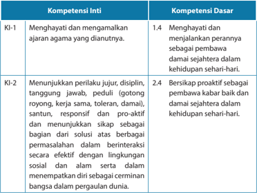

Tabel ini menunjukkan dua kompetensi utama: Kompetensi Inti (KI) dan Kompetensi Dasar (KD). Kompetensi Inti meliputi KI-1 "Menghayati dan mengamalkan ajaran agama yang diautinya" dan KI-2 "Menunjukkan perilaku jujur, disiplin, tanggung jawab, peduli (gotong royong, kerja sama, toleran, damai), santun, responsif dan proaktif dan menunjukkan sikap sebagai bagian dari solusi atas berbagai permasalahan dalam berinteraksi secara efektif dengan lingkungan sosial dan alam serta dalam menempatkan diri sebagai cerminan bangsa dalam pergaulan dunia." Kompetensi Dasar mencakup KD-1.4 "Menghayati dan menjalankan perannya sebagai pembawa damai sejahtera dalam kehidupan sehari-hari" dan KD-2.4 "Bersikap proaktif sebagai pembawa kabar baik dan damai sejahtera dalam kehidupan sehari-hari." Topik utama tabel ini adalah tentang pengembangan karakter dan perilaku yang positif dalam konteks kehidupan sehari-hari.

 

---
## 📄 Halaman 230

---
**📊 Tabel**

Tabel ini berisi informasi tentang kompetensi inti dan kompetensi dasar yang relevan dengan pembelajaran khususnya di bidang ilmu pengetahuan, teknologi, seni, budaya, dan humaniora. Topik utamanya adalah pengembangan keterampilan analisis, pemahaman, dan kreativitas dalam berbagai aspek kehidupan sehari-hari. Kolom pertama menunjukkan kompetensi inti, yang meliputi pemahaman, menerapkan, menganalisis, dan mengevaluasi pengetahuan faktil, konseptual, prosedural, dan metafikontif. Kolom kedua menunjukkan kompetensi dasar, yang mencakup menganalisis peran remaja sebagai pembawa da'wa yang sejati dalam kehidupan sehari-hari. Data penting yang terlihat adalah bahwa kompetensi inti tersebut mencakup pemahaman dan menerapkan pengetahuan secara prosedural, sementara kompetensi dasar mencakup membuat proyek yang berkaitan dengan peran remaja sebagai pembawa da'wa yang sejati.

### Indikator:

- Menjelaskan mengapa Alkitab menekankan pada pentingnya menyampaikan kebenaran terkait dengan kabar baik dan damai sejahtera.
- Menyebutkan contoh-contoh tentang bagaimana ketidakadilan merajalela dan kasih telah hilang dalam kehidupan modern.
- Menyatakan  kesiapan  untuk  menjadi  pembawa  kabar  baik  dan  damai sejahtera.
- Menyusun program sebagai pembawa kabar baik dan damai sejahtera.

 

---
## 📄 Halaman 231

### A.  Pengantar

Bab ini adalah yang terakhir dari seluruh rangkaian Pendidikan Agama Kristen yang diawali sejak peserta didik duduk di kelas I Sekolah Dasar. Tentu harapan kita selaku pendidik adalah peserta didik sudah menyatakan komitmennya menjadi murid Kristus.  Salah  satu  indikator  dari  komitmen  ini  adalah,  bersedia  menjadi pembawa kabar baik dan damai. Walaupun pembahasan tentang damai sudah dimulai  pada  bab  12.  Pada  bab  penutup  inilah  peserta  didik  ditantang  untuk mewujudkan komitmennya dalam bentuk pelayanan yang dapat dilakukannya sebagai pembawa kabar baik dan damai.

### B. Penjelasan Alkitab tentang Damai Sejahtera

Kitab  Nabi  Yeremia  berisi  peringatan-peringatan  Allah  yang  disampaikan lewat  nabi Yeremia  yang  bekerja  di Yehuda  pada  masa  pemerintahan  5  (lima) raja Yehuda, yaitu Yosia, Yoahas (Salum), Yoyakim, Yoyakhin, dan Zedekia. Masa pelayanannya sekitar tahun 626-586 sebelum Masehi. ( www.sabda.org , 2014)

Kehidupan  masyarakat  Yehuda  pada  masanya  yang  paling  dikecam  oleh Yeremia adalah pada masa pemerintahan Yosia-yaitu pada masa Yeremia memulai pelayanannya - terjadi gerakan pembaruan yang mencoba mengoreksi praktikpraktik keagamaan dan kehidupan sosial yang menyimpang dari kehendak Allah. Dalam Yeremia 7:3-7,   menyampaikan peringatan Allah:

3) Beginilah  Firman  TUHAN  semesta  alam,  Allah  israel:  Perbaikilah  tingkah langkahmu  dan  perbuatanmu,  maka  Aku  mau  diam  bersama-sama  kamu  di tempat  ini. 4) Janganlah  percaya  kepada  perkataan  dusta  yang  berbunyi:  Ini bait TUHAN, bait TUHAN, bait TUHAN,  5) melainkan jika kamu sungguh-sungguh memperbaiki  tingkah  langkahmu  dan  perbuatanmu,  jika  kamu  sungguhsungguh  melaksanakan  keadilan  di  antara  kamu  masing-masing, 6) tidak menindas  orang  asing,  yatim  dan  janda,  tidak  menumpahkan  darah  orang yang tak bersalah di tempat ini dan tidak mengikuti allah lain, yang menjadi kemalanganmu sendiri,  7) maka Aku mau diam bersama-sama kamu di tempat ini,  di  tanah yang telah Kuberikan kepada nenek moyangmu, dari dahulu kala sampai selama-lamanya.'

Berdasarkan  teguran  Allah  ini  kita  dapat  menyimpulkan  bagaimana  cara hidup bangsa Yehuda pada waktu itu: orang-orang yang lemah dan tak berdaya ditindas orang asing, anak yatim dan para janda-keadilan diputarbalikkan, orang yang  tak  bersalah  dibunuh,  dan  seterusnya.  Siapa  yang  melakukan  semua  ini? Menurut  Yeremia,  ' Sesungguhnya,  dari  yang  kecil  sampai  yang  besar  di  antara mereka, semuanya mengejar untung, baik nabi maupun imam semuanya melakukan tipu . '   (Yeremia  6:13)  Ini  berarti  tua  dan  muda,  besar  dan  kecil  tidak  terkecuali, semua orang berdosa. Semuanya terlibat dalam tipu-muslihat dan kejahatan!

 

---
## 📄 Halaman 232

Dalam keadaan seperti itu, apakah ada kasih dan perdamaian di negeri itu? Sudah tentu tidak! Namun hal ini ternyata tidak diakui oleh para pemimpin Yehuda, baik  pemimpin-pemimpin  agama  maupun  masyarakat.  Sebaliknya,  mereka mencoba meyakinkan rakyat bahwa segala sesuatunya beres. Mereka mencoba membuat rakyat seolah-olah terbius dan lupa akan masalah mereka.   Yeremia 6:14 mengatakan, ' Mereka  mengobati  luka  umat-Ku  dengan  memandangnya  ringan, katanya: Damai sejahtera! Damai sejahtera!, tetapi tidak ada damai sejahtera. '

Mereka  mengobati  luka  umat-Ku  dengan  memandangnya  ringan!  Semua penderitaan  rakyat  kecil  dan  orang-orang  yang  teraniaya  dan  tidak  berdaya dianggap ringan! Dan mereka memberitakan 'damai sejahtera' , sementara pada kenyataannya damai itu tidak dialami dan dirasakan oleh mereka yang menderita. Karena itulah Allah menjatuhkan hukuman-Nya kepada Yehuda.

Tetapi aku penuh dengan kehangatan murka Tuhan, aku telah payah menahannya,  harus  menumpahkannya  kepada  bayi  di  jalan,  dan  kepada kumpulan teruna bersama-sama. Sesungguhnya, baik laki-laki maupun perempuan akan ditangkap, baik orang yang tua maupun orang yang sudah lanjut usianya. Rumah-rumah mereka akan beralih kepada orang lain, bersama ladang-ladang dan isteri-isteri mereka. -- 'Sesungguhnya, Aku mengacungkan tangan-Ku melawan penduduk negeri ini, demikianlah fi  rman Tuhan.(Yeremia 6: 11-12)

Allah  menjatuhkan  hukuman-Nya  atas  bangsa  Yehuda.  Negara  mereka diserang oleh Babel dan runtuh. Rakyatnya dibuang ke negeri pembuangan di Babel. Semua ini terjadi karena para pemimpin tidak memberikan teladan tentang hidup berdasarkan fi  rman  Allah  dalam  membawakan damai dan keadilan bagi rakyatnya.

### C. Mengupayakan Kondisi Damai Sejahtera

Kasih dan perdamaian tidak dapat terjadi dengan sendirinya. Semuanya itu membutuhkan usaha dan kerja keras. Kasih dan perdamaian tidak akan tercipta dengan hanya mengucapkan 'damai sejahtera! damai sejahtera!'

Abigail Disney, fi  lantropis, perempuan pengusaha, aktivis masyarakat, yang membuat fi  lm pendek, 'Pray the Devil Back to Hell,' pernah menulis demikian:

'Perdamaian  adalah  sebuah  proses.  Ini  bahkan  bukanlah  sebuah  peristiwa, kejadian.  Perdamaian  adalah  sesuatu  yang  kita  buat,  yang  kita  kerjakan. Perdamaian  adalah  kata  kerja.  Perdamaian  adalah  serangkaian  pilihan  dan keputusan.  Ia  harus  dipertahankan,  diperjuangkan...  Perdamaian  tidak  diamdiam. Perdamaian itu bergemuruh!'

 

---
## 📄 Halaman 233

Perdamaian  dan  juga  kasih  adalah  tindakan,  bukan  kata  benda.  Artinya, untuk mewujudkan perdamaian dan kasih, kita perlu melakukan langkah-langkah konkret dalam kehidupan kita. Seluruh perbuatan dan gaya hidup kita mestilah mencerminkan perdamaian dan kasih, sehingga keduanya dapat terwujud dalam masyarakat kita, di bumi kita.

###  Agama-Agama dan Kerinduan Akan Damai

Yudaisme,  atau  agama Yahudi,  misalnya,  mempunyai  konsep syalom yang berarti  damai  sejahtera  yang  didasarkan  kepada  anugerah  Allah  kepada manusia  dan  upaya  manusia  untuk  membangun  kehidupan  yang  baik bersama orang-orang di sekitarnya dan seluruh alam semesta. Agama Kristen banyak mengikuti konsep yang terdapat dalam agama Yahudi. Nama 'Islam' yang kita kenal sebagai sebuah agama, didasarkan pada kata 'salam' , sebuah kata dari bahasa Arab yang memiliki akar kata yang sama dengan kata  'syalom' dalam bahasa Ibrani. Dengan kata lain, kata 'Islam' juga berasal dari harapan yang sama akan kehidupan yang penuh dengan kedamaian. Dalam agama Hindu para pemeluknya saling mengucapkan salam 'shanti, shanti, shanti' yang artinya 'damai, damai, damai' .

Kehadiran agama-agama dan umatnya tidak secara otomatis menghasilkan kasih dan perdamaian. Manusia perlu berusaha dengan sungguh-sungguh. Pengalaman  hidup  manusia  menunjukkan  betapa  sering  manusia  lebih mudah berperang daripada menciptakan perdamaian. Sebagai contoh, dunia pernah mengalami dua perang yang sangat hebat, yaitu Perang Dunia I dan Perang Dunia II. Setelah dunia diluluh-lantakkan oleh kedua perang tersebut, negara-negara  di  dunia  membentuk  Liga  Bangsa-Bangsa,  yang  kemudian digantikan  oleh  Perserikatan  Bangsa-Bangsa  yang  dibentuk  pada  26  Juni 1945 dan piagamnya ditandatangani di San Francisco, Amerika Serikat.

Hal ini menunjukkan bahwa setiap orang dan setiap kelompok masyarakat merindukan perdamaian. Mengapa demikian? Karena manusia sadar bahwa perang  hanya  menghasilkan  kehancuran  dan  malapetaka.  Oleh  karena  itu pulalah bila kita kembali kepada agama, kita akan menemukan bahwa setiap agama  mengajarkan  bagaimana  manusia  mestinya  hidup  damai  dengan sesamanya. Bahkan juga dengan seluruh alam ciptaan milik Allah.

###  Agama dan Perang

Meskipun  demikian,  tidak  dapat  disangkal  bahwa  sejarah  setiap  agama, khususnya agama-agama besar di dunia seperti Yahudi, Kristen, Islam, Hindu, dan Buddha, juga berisi lembaran-lembaran kelam ketika para pemeluknya

 

---
## 📄 Halaman 234

terlibat dalam tindak kekerasan dan peperangan yang dilakukan atas nama agama,  atas  nama  Tuhan.  Dalam  agama  Kristen,  misalnya,  pernah  terjadi Perang Salib sampai sembilan kali antara tahun 1095-1291 di Timur Tengah untuk  merebut  (dan  kadang-kadang  mempertahankan) Yerusalem.  Perang ini  ditujukan  terutama  terhadap  orang-orang  Islam,  tetapi  kadang-kadang juga terhadap bangsa Slavia yang bukan Kristen pada waktu itu, orang-orang Yahudi,  orang-orang  Kristen  Ortodoks  Rusia,  dan  Yunani,  bangsa  Mongol, Katar, orang-orang Hus, dan Waldensis (orang-orang Kristen yang menentang Paus dan merupakan prototipe orang-orang Protestan), dan berbagai musuh politik Paus. Antara orang-orang Tamil umumnya beragama Hindu dan orangorang Sinhala umumnya beragama Buddha di Sri Lanka terjadi pertikaian dan peperangan yang telah memakan beribu-ribu korban.

Belakangan  ini  kita  juga  sering  mendengar  atau  membaca  berita-berita tentang berbagai teror dan kekerasan yang dilakukan atas nama Tuhan dan agama. Penyerangan atas gedung World Trade Center di New York City pada 11  September  2001  dilakukan  atas  nama  Tuhan.  Demikian  pula  serangan yang  dilakukan  oleh  sebuah  gerakan  agama  baru,  Aum  Shinrikyo,  di  lima stasiun  kereta  api  di  bawah  tanah  di Tokyo  pada  20  Maret  1995.  Anggota kelompok ini berhasil  menyebarkan gas sarin  yang  mematikan.  Akibatnya, sebelas  orang  tewas,  dan  5000-an  orang  luka-luka.  Dalam  perang  Bosnia, tentara Serbia membunuh dan memperkosa ribuan orang Kroasia, Slovenia, dan Bosnia, dengan alasan-alasan keagamaan.

Jadi,  di  satu  pihak  agama-agama mengajarkan perdamaian, tetapi di pihak lain para pemeluk agama seringkali melakukan tindakan-tindakan kekerasan atas nama agama, atas nama Tuhan. Mengapa demikian? Bukankah itu semua bertentangan dengan ajaran-ajaran damai setiap agama?

###  Rasa Takut

Peperangan dan konfl  ik yang berlangsung dalam sejarah manusia biasanya disebabkan karena keinginan untuk mempertahankan atau merebut sumbersumber yang langka. Perang Teluk I (1990-1991) dan Perang Teluk II (2003) terjadi  karena  pihak-pihak  yang  terlibat  memperebutkan  sumber-sumber minyak bumi yang sangat penting bagi kehidupan manusia di muka bumi ini. Perang  dan  konfl  ik  juga  dapat  terjadi  karena  kebanggaan  semu  akan keunggulan  bangsa  sendiri.  Adolf  Hitler  menyerang  negara-negara  lain  di Eropa karena keyakinannya bahwa bangsa Arya adalah bangsa yang paling unggul  dan  diberkati  Tuhan  di  muka  bumi  ini.  Mereka  ditakdirkan  untuk menjadi pemimpin dunia. Begitu pula pembantaian atas 800.000 warga suku Tutsi oleh suku Hutu selama 100 hari di Rwanda (1994) terjadi karena suku

 

---
## 📄 Halaman 235

Hutu yakin bahwa suku Tutsi hanyalah 'kecoa' yang layak dihancurkan.

Perang juga terjadi karena rasa takut yang berlebihan, meskipun tidak jelas sejauh mana rasa takut itu dapat dibenarkan. Perang Vietnam (1959-1975), aneksasi Timor Timur (1975), terjadi karena rasa takut akan bahaya komunis. Saat  itu  muncul  'teori  domino'  yang  meramalkan  akan  jatuhnya  negaranegara Asia Tenggara ke tangan kekuatan komunis apabila tidak dihalangi dengan menghancurkan kekuatan komunis di Vietnam, Laos, Kamboja, dan Indonesia. Penghancuran terhadap PKI di Indonesia pada awal pemerintahan Orde Baru juga terjadi karena alasan ini.

###  Konfl  ik di Indonesia

Berbagai konfl  ik pernah dan masih berlangsung di Indonesia hingga saat ini. Kita dapat mencatat konfl  ik pada awal pembentukan Republik Indonesia dalam bentuk PRRI, Permesta, Darul Islam, dan lain-lain. Di Aceh dan Papua terjadi konfl  ik  karena  masyarakat  setempat  merasa  bahwa kekayaan alam mereka dikuras  sementara  rakyat  sendiri  tidak  mencicipi  hasilnya.  Di  Kalimantan pernah terjadi konfl  ik antara suku Dayak dan Melayu melawan suku Madura yang dianggap terlalu menguasai sumber-sumber ekonomi masyarakat dan tidak menghargai masyarakat setempat. Di Maluku, Halmahera, Poso, terjadi konfl  ik-konfl  ik yang diduga terutama didasarkan oleh perebutan kekuasaan sosial-politik dan ekonomi namun kemudian ditutupi dengan alasan-alasan agama (Trijono, Dewi, & Qodir, 2004; Manuputy & Watimanela, 2004).

Konfl  ik juga pernah terjadi karena masalah rasial, seperti yang pernah dialami oleh  etnik  Tionghoa  di  Indonesia  sepanjang  sejarah  bangsa  ini  hingga penganiayaan,  pemerkosaan,  dan  pembunuhan  yang  dialami  oleh  ratusan perempuan Tionghoa pada Tragedi Mei 1998 yang mengawali keruntuhan pemerintahan Orde Baru (Laporan Tim Gabungan Pencari Fakta, 2010).

Ada pula konfl  ik-konfl  ik yang terjadi karena alasan-alasan agama: perusakan dan penghancuran rumah-rumah ibadah dan berbagai fasilitas yang terkait, penangkapan  dan  pembunuhan  terhadap  umat  dan  tokoh  agama  lain, halangan-halangan  dan  larangan  bagi  umat  beragama  tertentu  untuk menjalankan ibadah dan kehidupan keagamaannya, dan lain-lain.

Kejadian-kejadian  seperti  yang  digambarkan  di  atas  sering  kita  temukan dilaporkan di surat kabar maupun media massa lainnya. Sekelompok orang menganggap dirinya, ajarannya, agama yang dipeluknya sebagai yang paling benar  dan  satu-satunya  yang  memiliki  hak  hidup,  sementara  yang  lainnya harus  ditutup,  dilarang,  bahkan  kalau  perlu  dihancurkan.  Kehadiran  orang lain yang berbeda ras, suku, bahasa, kelas sosial, agama, pemikiran, pendapat,

 

---
## 📄 Halaman 236

dan  lain-lain  seringkali  menimbulkan  rasa  gelisah,  rasa  terganggu,  bahkan terancam. Coba simak berita berikut.

### Masjid   Ahmadiyah Kembali Ditutup

Desember 14, 2007

Penutupan  Masjid  Annur,  tempat  jemaah  warga  Ahmadiyah  di desa  Manislor,  Kecamatan  Jalaksana,  sudah  dua  kali.  Hal  itu  terjadi berdasarkan rentetan kejadian-kejadian sebelumnya. Tahun 2000  berdasarkan  pengaduan  dari  masyarakat  Desa  Maniskidul mengharapkan adanya pembubaran Jemaat Ahmadiyah yang dianggap sesaat karena mengakui adanya nabi baru.

Pemkab Kuningan akhirnya menerima respon pengaduan masyarakat dengan  membuat  SK  (surat keputusan) bersama  yakni Depag, Kejaksaan,  Pemkab  Kuningan,  dan  Kepolisian.  Isi  dari  SK  tersebut, intinya  membubarkan  Ahmadiyah  dan  ditetapkan  secara  hukum Tahun 2002. Namun jemaat Ahmadiyah tidak mengindahkan SK dan tetap melangsungkan kegiatannya.

(Diambil dari Warta Desa, 2007).

Walaupun ini terjadi pada tahun 2007, namun hingga tahun 2014, kejadiankejadian serupa tetap muncul. Isu terkini adalah mengenai serangan dari IS ( Islamic State ). Menurutmu, bagaimana cara kita mengatasi semua ini?

###  Konfl  ik Antara Manusia dan Kerusakan Alam

Perebutan  sumber-sumber  alam  yang  terbatas  telah  menyebabkan  konfl  ik antar  manusia.  Sebaliknya,  konfl  ik  antar  manusia  juga  telah  menyebabkan rusaknya alam semesta.

Di masa Perang Vietnam, AS menjatuhkan apa yang disebut 'agen oranye' , yaitu  zat-zat  kimia  yang  dimaksudkan  untuk  menghancurkan  tumbuhtumbuhan di permukaan tanah sehingga tentara dan gerilyawan Vietkong tidak dapat bersembunyi di hutan-hutan.  '  Agen oranye' ternyata tidak hanya mematikan pohon-pohon dan semak, tetapi juga mengakibatkan kerusakan pada manusia. Banyak orang yang dilahirkan dengan cacat tubuh dan wajah karena  pengaruh 'agen  oranye'  yang  masuk  lewat  ibu  yang  mengandung mereka.

Ancaman  yang  paling  hebat  yang  dihadapi  umat  manusia  sudah  tentu adalah bom nuklir yang kini semakin luas penyebarannya di seluruh dunia.

 

---
## 📄 Halaman 237

Bom nuklir yang kekuatannya ribuan kali bom atom yang dijatuhkan di kota Hiroshima dan Nagasaki berpotensi menghancurkan manusia, hewan-hewan, tumbuhan, dan seluruh alam kita. Kini bom nuklir pun ditemukan di negaranegara  Amerika  Serikat,  Rusia,  Perancis,  Inggris,  China,  India,  Korea  Utara, Pakistan, dan Israel.

Bagi  bangsa  Indonesia,  ancaman  lain  dari  konfl  ik  yang  terjadi  dan  tidak diselesaikan dengan baik, adil dan tidak memihak adalah kehancuran negara dan  bangsa  yang  pluralistik  ini.  Keberadaan  bangsa  kita  yang  sejak  awal pemben  tukan  nya disadari harus mengakomodasi semua perbedaan, sangat ditentukan  oleh  kesediaan  kita  semua  untuk  mengakui  semboyan  bangsa kita, yaitu 'Bhinneka Tunggal Ika' . Tanpa kesediaan ini, akan sulit bagi bangsa kita untuk terus melangkah sebagai suatu kesatuan yang utuh.

###  Dialog Antariman

Sebuah cara yang sangat baik untuk membangun saling pengertian dan saling menerima di antara masyarakat kita yang pluralistik ini adalah dengan ikut terlibat dalam kegiatan-kegiatan dialog antariman. Dalam kegiatan ini orangorang  tua  maupun  muda  terlibat  dalam  pertemuan-pertemuan  dialogis maupun kerja sama dengan saudara-saudara mereka yang datang dari latar belakang etnik, suku, kelas sosial, dan keyakinan yang berbeda-beda.

Di  Jakarta  ada  sebuah  organisasi  yang  dinamai  'Wadah  Komunikasi  dan Pelayanan  Umat  Beragama'  yang  didirikan  dengan  tujuan  seperti  di  atas. Dalam situs internetnya, dikatakan bahwa

'Wadah  Komunikasi  dan  Pelayanan  Umat  Beragama  (WKPUB)  bertujuan untuk  membangun  persaudaraan  yang  sejati  melalui  kerja  sama  lintas agama dengan berbagai komunitas umat beragama, utamanya di wilayah Jakarta  Timur  dan  sekitarnya.  Wadah  ini  bergerak  di  tingkat  akar  rumput dengan berbagai kegiatan yang dapat langsung dirasakan manfaatnya oleh masyarakat.'

Kegiatan-kegiatan  yang  pernah  dilaksanakan  oleh  organisasi  ini,  antara lain  adalah  malam  kebersamaan  antarumat  beragama,  ceramah  tentang ancaman dan bahaya narkoba untuk para pemuda lintas iman, malam peduli anak jalanan, dukungan dan advokasi kepada anak jalanan melalui Rumah Sahabat Anak Puspita (kegiatan rutin setiap bulan), kegiatan live-in pemuda lintas iman (dalam kerja sama dengan Yayasan Panca Dian Kasih), pasar murah untuk  warga  masyarakat  di  Kecamatan  Cakung,  Jakarta Timur,  penyaluran bantuan untuk para pengungsi asal Aceh dan Maluku di Pesantren Modern Darul Ichsan, Cariu Bogor, penyaluran bantuan untuk korban kebakaran di RW

 

---
## 📄 Halaman 238

05 di Kelurahan Rawa Bunga, Jakarta Timur, diskusi antarpemuda lintas iman mantan peserta live in , tatap muka dengan tokoh-tokoh agama di Kecamatan Cakung,  Jakarta  Timur.  Peristiwa  yang  cukup  mengharukan  adalah  ketika umat yang mewakili berbagai agama dan kepercayaan berkumpul dan berdoa untuk calon Presiden dan Wakil Bapak Joko Widodo dan Bapak Jusuf Kalla sebelum dilantik ( www.tempo.co ,  Oktober 2014). Isi doa adalah sama, yaitu agar Bapak Joko Widodo diberikan kekuatan dan hikmat untuk memimpin negara dan bangsa Indonesia yang mengalami begitu banyak masalah.

Kegiatan-kegiatan  seperti  di  atas  tentu  akan  sangat  membantu  setiap kelompok untuk lebih saling mengerti kelompok yang lain, menghilangkan atau setidak-tidaknya mengurangi rasa curiga. Sebaliknya, mendorong semua pihak untuk bekerja sama dalam menciptakan rasa damai dan pelayanan bagi pihak-pihak yang sangat membutuhkan.

Dalam Amsal 16:7 dikatakan, 'Jikalau Tuhan berkenan kepada jalan seseorang, maka musuh orang itu pun didamaikan-Nya dengan dia.' Ayat ini menjelaskan kepada kita bahwa untuk hidup damai dengan sesama kita, bahkan dengan musuh, kita harus hidup dalam jalan yang diperkenan Tuhan. Itu berarti kita didorong, diharapkan, bahkan diwajibkan hidup dalam damai sejahtera Allah dengan sesama kita, bahkan juga dengan orang-orang yang membenci kita.

Surat  Roma  12:18  mengingatkan  kita: 'Sedapat-dapatnya,  kalau  hal  itu bergantung  padamu,  hiduplah  dalam  perdamaian  dengan  semua  orang!' Surat ini ditulis kepada jemaat Kristen di kota Roma. Mereka hidup sebagai kelompok minoritas di tengah-tengah mayoritas yang tidak mengenal Kristus dan bahkan memusuhinya. Kepada jemaat ini, Rasul Paulus menasihati agar mereka berusaha sedapat mungkin untuk hidup dalam perdamaian dengan orang lain. Mereka tidak perlu takut dan khawatir akan status mereka sebagai kelompok minoritas, melainkan berusaha secara aktif membangun jembatan penghubung antara mereka dengan orang lain, sehingga terciptalah saling pengertian dan keharmonisan di dalam masyarakat.

Roma 12:20 lebih jauh berkata demikian: 'Tetapi, jika seterumu lapar, berilah dia  makan;  jika  ia  haus,  berilah  dia  minum!  Dengan  berbuat  demikian  kamu menumpukkan bara api di atas kepalanya.' Dari ayat ini kita belajar bahwa usaha menghadirkan damai sejahtera harus dimulai dari diri kita sendiri. Dengan mengusahakan perdamaian, dengan memberikan makan dan minum bagi mereka yang membutuhkan, bahkan bagi orang-orang yang membenci kita sekalipun, kita akan mampu menciptakan hidup yang damai.

 

---
## 📄 Halaman 239

### D.  Kegiatan Pembelajaran

### Kegiatan 1

Kegiatan pembelajaran diawali dengan meminta peserta didik menyanyikan lagu 'Rindukan Damai' yang biasanya dibawakan oleh kelompok Gigi.

### Rindukan Damai

Bayangkan…

Bila kita bisa saling memaafkan

Bayangkan…

Bila kita bisa saling berpelukan

Tiada perang, kelicikan

Tangis kelaparan…..

### Reff:

Getarkan manusiawi kami Mata dan matahati kami Agar saling meniti Esa maha suci Ampunkan dan tuntunlah kami Kita semua saling bersaudara Rindukan damai

Setelah itu, mereka diminta membahas makna lagu di atas dan mengaitkannya dengan  topik  pembahasan,  yaitu  damai  sejahtera.  Pertanyaan-pertanyaan sudah ada di Buku Siswa.

### Kegiatan 2

Mengkaji  pesan  Alkitab  tentang  kondisi  damai  sejahtera  di  antara  bangsa Israel. Pesan Allah kepada bangsa Israel pada waktu itu adalah, mereka perlu memperhatikan kondisi semua masyarakat dan memastikan bahwa keadilan ditegakkan.  Para  nabi  diutus  untuk  menyuarakan  fi  rman  Allah  tentang  hal ini kepada para pemimpin bangsa Israel. Sayangnya, mereka memilih untuk mengabaikan berbagai bentuk peringatan itu dan tetap menjalankan harihari mereka menurut kehendak mereka sendiri tanpa mempedulikan keadaan

 

---
## 📄 Halaman 240

yang sesungguhnya terjadi di kalangan rakyat.  Inilah yang menjerumuskan bangsa Israel ke dalam pembuangan di Babel.

### Kegiatan 3

Mengkaji  usaha-usaha  yang  dilakukan  secara  perorangan  maupun  usahausaha kelompok agama untuk menghadirkan damai sejahtera. Tidak dapat dipungkiri bahwa dalam sejarah perjalanan setiap agama terdapat lembaran hitam  dimana  terjadi  konfl  ik  antara  pengikut  agama  tertentu  dengan pengikut agama lainnya. Sebagian dari konfl  ik malah mengorbankan nyawa ribuan bahkan ratusan ribu para pengikut. Namun, hal yang menyedihkan adalah  karena  konfl  ik  antara  pengikut  agama  ini  memiliki  nuansa  politis dalam arti perebutan kekuasaan atau wilayah tertentu yang juga dikaitkan dengan penguasaan sumber-sumber alam tertentu.  Jadi, walaupun setiap agama mengajarkan tentang cinta kasih, namun para pengikut mengartikan secara sempit bahwa merekalah yang paling berhak untuk menikmati damai sejahtera dan karena itu melihat pengikut agama lainnya sebagai penghalang bahkan  musuh  yang  harus  dimusnahkan.  Peserta  didik  tidak  hanya  diajak melihat kondisi konfl  ik antarpengikut agama  yang  terjadi di  belahan dunia  lainnya,  melainkan  juga  yang  terjadi  di  Indonesia.  Hal  ini  memang menyedihkan  namun  disini  peserta  didik  diminta  untuk  melihat  peristiwa yang terjadi dengan lebih kritis dan tetap berusaha melihat makna di balik setiap peristiwa dan bagaimana Allah tetap bekerja membawa kebaikan bagi semua. Terkait dengan ini, hal indah yang perlu dicermati dan ditiru adalah adanya   dialog  antariman,  artinya  percakapan  antar  pengikut  dari  berbagai agama  dan  kepercayaan.  Guru  hendaknya  mengajak  peserta  didik  untuk memberi kesaksian nyata tentang hidup berdamai dengan pengikut agama lainnya.

### Kegiatan 4

Evaluasi terhadap keseluruhan pembahasan. Karena merupakan bab terakhir, evaluasi  disarankan  berbentuk  penugasan  dan  kegiatan  kelompok  yang bertujuan  mengajak  peserta  didik  memahami  dengan  sungguh-sungguh pesan  Alkitab  untuk  menjadi  pelaku  damai  dan  mempraktikkan  hal  ini dalam  keseharian  mereka.  Apa  yang  tertera  di  bawah  ini  tentu  saja  dapat ditambahkan dengan aktivitas lainnya yang dianggap tepat oleh guru.

- Yeremia mengecam para pemimpin agama di Yehuda yang memberitakan 'damai sejahtera! damai sejahtera!' , sementara pada kenyataannya masyarakat  hidup  dalam  keadaan  sebaliknya. Seberapa  jauh  yang ditemukan Yeremia ini dapat kamu temukan dalam hidup kita sebagai

 

---
## 📄 Halaman 241

- suatu  bangsa  saat  ini?  Sebutkan  contoh-contoh  ketika  berita  tentang perdamaian  yang  kamu  dengar  itu  ternyata  bertentangan  dengan kenyataan sesungguhnya.
- Yeremia  juga  menemukan  bahwa  di  Yehuda  keadilan  diputarbalikkan. Ambillah contoh-contoh dari kehidupanmu sehari-hari yang juga menggambarkan situasi yang serupa dengan yang dilihat Yeremia.
- Melalui  tugas a dan b ini  peserta  didik  diajak  mengkritisi  informasi yang mereka peroleh ketika ada hal-hal baik dilaporkan padahal dalam realitanya  tidaklah  demikian.  Ini  menjadi  bekal  bagi  peserta  didik  agar selalu melaporkan kebenaran dan bukan hanya sekadar menyenangkan pemimpin atau menunjukkan keberhasilan diri.
- Menurut  Abigail  Disney,  perdamaian  adalah  sebuah  proses.  Mengapa demikian? Mengapa bukan sebuah produk akhir?
- Proses artinya sesuatu yang berlangsung dalam periode waktu tertentu. Janganlah  timbul  kesan  bahwa  menghadirkan  perdamaian  merupakan hal yang mudah dilakukan (atau merupakan proses yang sifatnya instan). Semua pihak harus sungguh-sungguh bekerja keras untuk menghadirkan damai sejahtera untuk kebaikan bersama, bukan hanya untuk kebaikan segelintir orang atau satu golongan saja. Kepentingan diri sendiri haruslah dapat dikalahkan oleh kepentingan bersama.
- Apa pula artinya bila dikatakan bahwa perdamaian itu adalah suatu 'kata kerja'? Perdamaian sebagai kata kerja merujuk pada pemahaman bahwa perdamaian adalah suatu proses yang harus dikerjakan untuk mencapai hasil yang diharapkan, dan bukan terjadi dengan sendirinya.
- Apa  yang  perlu  kamu  usahakan  supaya  di  komunitas  kamu  dapat tercipta  kasih  dan  perdamaian? Tugas  ini  dikerjakan  berkelompok  dan bertujuan menggali pemahaman peserta didik tentang apa yang sudah dibekali sejauh ini agar dapat diaplikasikan dalam kehidupan sehari-hari. Guru  hendaknya  meminta  peserta  didik  merencanakan  aktivitas  yang sederhana  namun  dapat  dikerjakan  daripada  membayangkan  rencana yang muluk-muluk tetapi ternyata cuma di atas kertas saja.
- Telah  diuraikan  sebelumnya  tentang  pengalaman  sebuah  komunitas kecil  antarumat  beragama  di  Jakarta.  Cobalah  cari  informasi  apakah di tempatmu  (kecamatan,  kota,  kabupaten,  dan  lain-lain) terdapat komunitas antarumat beragama seperti yang disebutkan di atas. Kegiatan apa saja yang mereka biasanya lakukan? Berapa jumlah pengikut kegiatan tersebut? Apa saja manfaat yang mereka peroleh?

 

---
## 📄 Halaman 242

- Apakah pemuda/remaja di gerejamu pernah mengadakan program live-in di komunitas umat beragama lain? Kalau belum, apa sebabnya? Dapatkah kamu bersama dengan beberapa teman memulai sebuah pengalaman dalam  komunitas  seperti  ini?  Kalau  pemuda/remaja  gerejamu  sudah pernah melakukannya, coba ceritakan secara singkat pengalaman mereka.
- Apa  saja  situasi  konfl  ik  yang  terjadi  di  lingkunganmu?  Aktivitas  ini dikerjakan dengan mengisi tabel berikut.

---
**📊 Tabel**

Tabel ini berisi informasi tentang peristiwa konflik antar siswa SMA X dan SMA Y, termasuk penyebab konflik, tindakan yang sudah dilakukan untuk mengatasi konflik, dan tindakan yang dapat dilakukan. Topik utama tabel adalah konflik antar siswa SMA X dan SMA Y. Kolom-kolomnya meliputi nomor peristiwa, pihak yang berkonflik, penyebab konflik, tindakan yang sudah dilakukan, dan tindakan yang dapat dilakukan. Data penting yang terlihat adalah bahwa konflik tersebut disebabkan oleh persenggolan saat mereka berebut naik bis, dan telah dilakukan tindakan seperti didamina oleh polisi yang mempertemukan kedua belahan pihak. Tabel juga memberikan informasi tentang tindakan yang dapat dilakukan, seperti mengambil tindakan konstruktif untuk memperbaiki hubungan antara kedua pihak.

butir f , g ,  dan h lebih  baik  dikerjakan  secara  berkelompok.  Laporan  dari kegiatan ini hendaknya dibahas bersama di kelas.

### Kegiatan 5

Pembelajaran  diakhiri  dengan  doa  bersama,  doa  pribadi  (dituliskan  atau dinaikkan oleh masing-masing peserta didik) dan menyanyi dari PKJ no 267.

### E. Penutup

Kegiatan diakhiri dengan menaikkan sebuah doa bersama dengan mengisikan bagian-bagian yang kosong di bawah ini:

 

---
## 📄 Halaman 243

Tuhan,  dari  masa  ke  masa  Engkau  memanggil  anak-anak-Mu  dan utusan-utusan-Mu  untuk  menghadirkan  kasih  dan  perdamaian-Mu. Pakailah kami, ya Tuhan, agar kami pun dapat menjadi alat kasih dan perdamaian-Mu di tempat-tempat yang kami sebutkan di sini:

.....................................................................................................................................

.....................................................................................................................................

.....................................................................................................................................

.....................................................................................................................................

.....................................................................................................................................

Dengarlah  doa  kami,  ya  Tuhan,  dan  mampukanlah  kami  untuk menjalankan tugas dan panggilan-Mu ini. Dalam Yesus Kristus kami telah berdoa. Amin.

Sebagai penutup, guru mengajak peserta didik menyanyikan lagu PKJ 267 'Damai di Dunia'

### Damai di Dunia

Damai di dunia dan kitalah dutanya. Damai sejahtera, amalkanlah maknanya, Alllah, Bapa kita, kita anak-Nya, rukun bersaudara penuh bahagia.

Damai di dunia dan inilah saatnya. Ucapkan ikrarmu, jalankan perintah-Nya, Setiap kata dan karya kita memuji nama-Nya. Damai di dunia, kini dan selamanya. Kini dan selamanya.

 

---
## 📄 Halaman 244

### Daftar Pustaka

Antone, Hope S. 2010. Pendidikan Kristiani Kontekstual . Jakarta: BPK Gunung Mulia.

- Azra,  Azyumardi.  2002. Pendidikan  Multikultural:  Membangun  Kembali  Indonesia Bhineka Tunggal Ika. Makalah Disampaikan dalam Symposium Internasional Antropologi Indonesia ke-3. Denpasar: Kajian Budaya UNUD.
- Barclay, William. 2001. Pemahaman Alkitab Setiap Hari, Surat 1 Dan 2 Timotius, Titus, Filemon . Jakarta: BPK Gunung Mulia.
- Baumeister, R. F., Campbell, J. D., Krueger, J. I., & Vohs, K. D. 2003. Does high self esteem  cause  better  performance,  interpersonal  success,  happiness,  or healthier lifestyles?, Psychological Science in the Public Interest , 4 (1), 1-44.
- Baumrind, D. 1991. Parenting styles and adolescents development. Dalam J. BrooksGunn, Lerner, R., & Petersen, A. C. (Eds.). The Encyclopedia of Adolescence (hal 446-458). New York: Garland.
- BBC Indonesia (Juli, 2008). Komnas HAM Selidiki Petrus . Dari  BBC Indonesia (14 Juli 2008).
- Bechtold,  J.,  Cavanagh,  C.,  Shulman,  E.  &  Cauff  man,  E.  2014. Does mother know best?: Adolescent and mother report of impulsivity and subsequent delinquency , Journal of Youth and Adolescence , 43(5), 1903-1913.
- Blum, Lawrence. 1992. Boston: Offi ce of Graduate Studies and Research , University of Massachusetts: Distinguished Lecture Series.
- Budiman,  R.  1994. Tafsiran  Alkitab  Surat-Surat  Pastoral  1  &  2  Timotius  Dan  Titus . Jakarta: BPK Gunung Mulia.
- Cohen, J. 2006. Social, emotional, ethical, and academic education: Creating a climate for learning, participation in democracy, and well-being , Harvard Educational Review , 76 (2), 201-238.
- Darmaputera, Eka. 1996. Boleh Diperbandingkan, Jangan Dipertandingkan dalam Penuntun, Vol. 2. No. 6, Januari-Maret 1996. Jakarta: Sinode GKI Jabar.
- Dobson, A. 2003. Social justice and environmental sustainability: ne'er the twain shall meet . Just sustainabilities: Development in an unequal world , 83-95.
- Fuad, Zainul. Refl  ections of Indonesian Muslim and Christian Religious Scholars on the  Concept  of  Pluralism  and  Religious  Tolerance .  Makalah  disajikan  pada Konferensi Tahunan Studi-studi Islam di Bandung, 26-30 November 2006.

 

---
## 📄 Halaman 245

- Gender Inequility. 2014. Tribunnews.
- Hermanto,  Okky  Wahyu.  2012. Resiliensi  Pada  Buruh  Migran  Wanita  Korban Kekerasan . Skripsi Sarjana. Depok: Jawa Barat: Fakultas Psikologi Universitas Indonesia.
- Hernandez, Hilda. 2000. Multicultural Education: A Teacher's Guide to Content and Process . Detroit, MI: Merill.
- Howe,  A.,  Pit-ten  Cate  I.M.,  Brown,  A.,  &  Hadwin,  J.  A.  2008. Empathy in  preschool children: The development of the Southampton Test of Empathy for Preschoolers (STEP), Psychological Assessment, 20 (3), 305-9. doi: 10.1037/a0012763.
- Ignas Kleden, Moltmann.
- Kedutaan Besar Amerika Serikat di Indonesia (Februari, 2009). Laporan Tahunan Tentang  Praktek  Hak  Asasi  Manusia  -  2008. Biro  Demokrasi,  Hak  Asasi Manusia, dan Perburuhan, Kedutaan Besar Amerika Serikat di Indonesia ,  25 Februari 2009.
- Kidung jemaat, Jakarta, Yamuger.
- Koyama, Kosuke. Pilgrim or Tourist . Singapore: Christian Conference of Asia, 1974.
- Leks, Stefan. 2003. Tafsir Injil Matius . Yogyakarta: Kanisius.
- Kurikulum 2013. Kemendikbud RI.
- Manuputy, J., & Watimanela, D. 2004. Konfl  ik Maluku. Dalam Trijono, L., Azca, M. N., Susdinarjanti T. Cahyono, M. F., & Qodir, Z. (Ed), Potret Retak Nusantara: Studi Kasus Konfl  ik di Indonesia . (hal. 77 - 170). Yogyakarta: Center for Security and Peace Studies dan Southeast Asian Confl  ict Studies Network.
- Orviska, M. Caplanova, A., Hudson, J. 2014. The impact of democracy on well-being , Social Indicator Research, 115 (1), 493-508. DOI 10.1007/s11205-012-9997-8.
- Rahner,  Karl.  1978. Foundations  of  Christian  faith:  An  Introduction  to  the  Idea  of Christianity . New York: Seabury Press.
- Rawls, John.  2003. Justice as Fairness: A Restatement . Harvard University Press.
- Reformasi ini diwujudkan dalam kehidupan berpolitik dan bermasyarakat yang sifatnya menjadi lebih bebas dan terbuka (Indonesia-investment, 2013)
- Reformata.com. 2014. Diambil dari reformata.com /news/view/7016/credit-unionmedia-gereja-mengentaskan-kemiskinan . Diunduh 14 September 2014.
- Rendra, W. S.  1972. Sajak-sajak Sepatu Tua. Jakarta: Pustaka Jaya.
- Revitch, Diane, & Abigail Thernstrom. 2005. Demokrasi Klasik dan Modern. Jakarta: Yayasan Obor.

 

---
## 📄 Halaman 246

- Stott,  John.  1996. Isu-isu  Global  Menantang  Kepemimpinan  Kristiani. Jakarta: Yayasan Komunikasi Bina Kasih/OMF.
- Suaedy,  Ahmad,  dkk.  2007. Politisasi  Agama  dan  Konfl  ik  Komunal  Beberapa  Isu Penting di Indonesia . Jakarta: The Wahid Institute.
- Tibi, Bassman. 1996. Moralitas Internasional Sebagai suatu Landasan Lintas-Budaya. Dalam Agama dan Dialog Antar Peradaban . Jakarta: Paramadina.
- Tilaar,  H.A.R.  2004. Multikulturalisme  Tantangan-tantangan  Global  Masa  Depan dalam Transformasi Pendidikan Nasional . Jakarta: Grasindo.
- Trijono, L., Dewi, K. S., & Qodir, Z. 2004. Memetakan Konfl  ik, Membuka Jalan Indonesia Damai . Dalam Trijono, L., Azca, M. N., Susdinarjanti T. Cahyono, M. F., & Qodir, Z. (Ed), Potret Retak Nusantara: Studi Kasus Konfl  ik di Indonesia . (hal. 1 - 30). Yogyakarta:  Center  for  Security  and  Peace  Studies  dan  Southeast  Asian Confl  ict Studies Network.
- Ubaedillah, A.  dan Abduk Rozak. 2012. Pancasila, Demokrasi, HAM, dan Masyarakat Madani: Pendidikan Kewarga(negara)an . Jakarta: Kencana.
- Wikipedia Rwandan genocide.' Lihat pula Matthew Bersagel Braley, 'Who Counts? A  Review  of Hotel  Rwanda '  dalam Journal  of  Lutheran  Ethics , http://www. elca.org/What-We-Believe/Social-Issues/Journal-of-Lutheran-Ethics/Issues/ February-2005/Who-Counts-A-Review-of-Hotel-Rwanda.aspx
- Wikipedia,  surat Galatia ditulis oleh Paulus dengan alasan tertentu.
- Appolloni,S., & McDougall, D. 2011. What is ecological justice? ,  diunduh dari https:// www.devp.org/sites/www.devp.org/files/documents/materials/devpeace_ backgrounder_2011-2016_ecological_justice.pdf tanggal 23 Januari 2016 .
- Apologetics Index. 2014. Making Armageddon Happen. Dari http://www. apologeticsindex.org/a06.html . Diunduh 1 April 2014.
- Berke, Matthew. Reinhold Niebuhr, Moral Man and Immoral Society.  Dari http:// www.leaderu.com/ftissues/ft0003/articles/niebuhr.html . Diunduh 30 Mei 2014.
- Berslauer,  Daniel.  Dari http://www.blu.eletterbible.org/images/maps/Otest/refuge. cfm. Diunduh 1 Februari 2014.
- Braley, Matthew Bersagel.  'Who Counts? A Review of Hotel Rwanda ' dalam Journal of Lutheran Ethics . Diunduh dari www.elce.org/JLE/Articles/699 pada tanggal 9 Agustus 2014.
- Deffi nbaugh,  Bob. 'A  Welcome  Warning  (Leviticus  26)' ,  dalam  Bible.org, http:// bible.org/seriespage/welcome-warning-leviticus-26 . Diunduh 30 Mei 2014.

 

---
## 📄 Halaman 247

- Departemen Luar Negeri Amerika Serikat (2005). Laporan Kebebasan Beragama Internasional  2005.  Kantor  Demokrasi,  Hak  Asasi  Manusia,  dan  Buruh, Departemen Luar Negeri AS di http://jakarta.usembassy.gov/bhs/Laporan/ laporan%20akebebasan%20beragama%202005-3.html . Diunduh 3 Mei 2014
- Detik news (2009). Mencuri 3 buah kakao, Nenek Minah dihukum 1 bulan 15 Hari. Dari http://us.detiknews.com/read/2009/11/19/152435/1244955/10/mencuri-3-buahkakao-nenek-minah-dihukum-1-bulan-15-hari. Diunduh pada 1 April 2010.
- Diamond, L, & Morlino, L. 2004. The quality of democracy: An overview , Journal of Democracy, 15 (2), 21-27. Diunduh pada tanggal 5 Agustus 2014.
- Disney,  A.  2013. Peace  is  loud. Dari www.peaceisloud.org/note-from-our-founderabigail-e-disney/ November 13, 2013. Diunduh 3 September 2014.
- Edukasi.kompasiana. 2012. Kuliah Umum  Sri Edi Swasono . Diunduh dari http://www.kompasiana.com/rasimunway/kuliah-umum-sri-edi-swasono_550f02bb813311882cbc66ba tanggal 13 Agustus 2014
- Gereja Anglikan. 1979. Overcoming Violence: Churches Seeking Reconciliation and Peace. Di http://www.overcomingviolence.org/en/about-dov/internationalday-of-prayer-for-peace/a-collection-of-prayers-from-the-caribbean-2009. html ,  dan  dari Buku  Doa  Bersama, 1979  -  Gereja  Anglikan , http://www. godweb.org/prayersforpeace.htm . Diunduh 21 Januari 2010.
- Henry,  Matthew.  1998. Leviticus  26 .  Dalam Matthew  Henry  Commentary  on  the Whole Bible. http://www.biblestudytools.com/commentaries/matthew-henryconcise/leviticus/26.html . Diunduh 30 Mei 2014 .
- http://jakarta.usembassy.gov/bhs/Laporan/HR08_ham.html , diunduh 17 April 2010.
- http://www.newsweekly.com.au/articles/2001dec01_papua.html , diunduh 16 April 2010.
- Indonesia-Investments  (25 September,  2013). Kemiskinan  di  Indonesia . Dari www.indonesia-investments.com/id/keuangan/angka-ekonomi-makro/ kemiskinan/item301. Diunduh 28 Desember, 2013.
- Indonesiaku Hebat. 2014. Kartu Jakarta Sehat dan Jaminan Kesehatan Nasional Jelas Berbeda. Dari https://indonesiakuhebat.wordpress.com/2014/06/18/ kartu-jakarta-sehat-dan-jaminan-kesehatan-nasional-jelas-berbeda/. Diunduh 29 Juli 2014.
- Institut  Leimena  News  (Februari,  2009).  Pandangan  Para  Pemimpin  Gereja  di Indonesia tentang Kemiskinan, Dari http://www.leimena.org/02_tanya_ jawab.html. Diunduh 2 April 2010.
- International Day of Prayer (2009). Overcoming  Violence:  Churches  Seeking Reconciliation and Peace. ' Dari http://www.overcomingviolence.org/en/about-

 

---
## 📄 Halaman 248

- dov/international-day-of-prayer-for-peace/a-collection-of-prayers-from-thecaribbean-2009.html ,  dan  dari Buku  Doa  Bersama,  1979  -  Gereja  Anglikan, http://www.godweb.org/prayersforpeace.htm. D iunduh 21 Januari 2010.
- Kabar  Cianjur  (Mei  2014).  Warga  Kedung  Hilir  Antusias  Pilih  Ketua  RT  Secara Demokratis (Minggu, 11 Mei 2014). www.kabarcianjur.com/2014/05/wargakedung-hilir-antusias-pilih-ketua.html . Diunduh tanggal 10 Oktober 2014.
- Komisi Nasional Anti Kekerasan terhadap Perempuan (9 September, 2014). Dari id.wikipedia.org/wiki/Komisi_Nasional_Anti_Kekerasan_terhadap_Perem-puan . Diunduh 14 September 2014.
- Kompas (5 September, 2014). Pemerintah dan Rakyat Indonesia Perlu Bekerja Keras untuk Membasmi Korupsi yang Sudah Dianggap Terstruktur dan Massif .
- Kompas  Online  (April,  2010).  Pemohon:  Putusan  MK  Kemunduran  Demokrasi.    Dari dalam Kompas Online, 19 April 2010. Dari http://nasional.kompas.com/read/2010/ 04/19/20123612/Pemohon:Putusan.MK. Kemunduran.Demokrasi , diunduh 20 April 2010.
- Konsep Pendidikan Multikulturalisme http://manusiapinggiran.blogspot. com/2014/04/ konsep-pendidikan-multikulturalisme.html#ixzz3FnCvCruZ) . Diunduh 2 April 2014.
- Herlyanto 'Pluralisme Agama dan Dialog' , Sahabat Awam no. 55. Diunduh dari www. yabina.org/msa.htm . Tanggal 12 Januari 2014.
- Indonesia-Investment (2013). Bila standar dari Bank Dunia diterapkan untuk menghitung  banyaknya  orang  miskin  di  Indonesia,  jumlahnya  meningkat menjadi mendekati 40% (Indonesia-Investment, 2013). Diunduh 30 Maret 2014.
- Merriam-Webster Dictionary (2010). Tolerance. Dari http://www.merriam-webster. com/dictionary/tolerance. Diunduh 1 Mei 2014.
- MESIAS. 2010. Pers, Bredel, dan Perjuangan .  Dari http://www.mesias.8k.com/bredel. htm, diunduh 17 April 2010.
- Nasution, Adnan Buyung. 2003. Implementasi Perlindungan Hak Asasi Manusia dan Supremasi Hukum .  Makalah disajikan pada 'Seminar Pembangunan Hukum Nasional VIII' , Badan Pembinaan Hukum Nasional, Departemen Kehakiman dan Hak Asasi Manusia RI, Denpasar, 14-18 Juli 2003. Dari http://www.lfi  p. org/english/pdf/bali-seminar/implementasi%20perlindungan%20HAM%20 -%20adnan%20buyung%20nasution.pdf. Diunduh 1 April 2010.
- New York Times (Juni, 2005). Gov. Bush Seeks Another Inquiry in Schiavo Case. Dari http://www.nytimes.com/2005/06/18/national/18schiavo.html. Diunduh  20 Juni 2010.

 

---
## 📄 Halaman 249

- Peace Lutheran Church (Desember, 2008). Prayer for Human Rights on the 60th Anniversary  of  the  United  Nations  Human  Rights  Declaration.  Peace Lutheran Church, Danville, CA. Dari http://www.peacejourney.org/prayer-forhuman-rights/. Diunduh 16 April 2014.
- Suparlan,  Parsudi.  2002. Menuju  Masyarakat  Indonesia  yang  Multikultural .  Dari http://www.scripp.ohiou.edu/news/cmdd/ar. Diunduh tanggal 24 September 2014.
- Tempo.co (18 Oktober, 2014), Ada doa lintas agama sebelum pelantikan Jokowi. Dari http://berita.indo.com/2014/10/ada-doa-lintas-agama-sebelumpelantikan-jokowi-nasional-tempo.co/ . Diunduh tanggal 18 Oktober 2014.
- Rolheiser OMI, R. 2010. The Holy Longing OMI . www.passionistjpic.org/2010/12/inthuman-rights-day-prayer-service/ Diunduh pada 30 Juli 2014.
- Rumah Pemilu. org (22 Juli, 2014). Pemenang Pilpres ditetapkan 22 Juli 2014 jam 16.00 WIB. Dari http://www.rumahpemilu.org/in/read/6799/PemenangPilpres-Ditetapkan-22-Juli-16.00-WIB . Diunduh tanggal 20 September 2014.
- Sinaga, Kastorius. (30 Maret, 2006).  Papua Menjadi Keruh. Dalam Suara Karya Online, 30 Maret  2006, http://www.suarakarya-online.com/news.html?id=139591, diunduh 16 April 2010.
- Wikisource Laporan Tim Gabungan Pencari Fakta, Dari http://id.wikisource.org/wiki/ Laporan_Tim_ Gabungan_Pencari_Fakta_(TGPF) _Peristiwa_Tanggal_13-15_ Mei_1998/Temuan . Diunduh 1 April 2010.
- WKPUB,  (2010). Direktori Perdamaian .  Dari http://www.direktori-perdamaian.org/ ina/org_detail.php?id=417 , diunduh 14 Januari 2014.
- World Bank. 2014. Tahun Fiskal 2013-2015. Strategi kemitraan negara untuk Republik Indonesia . Dari www.worldbank.org./id. Diunduh tanggal 20 Januari 2014.
- www.byfaith  (2009). Democracy and Christianity .  Dari http://www.byfaith.co.uk/ paul200918.htm. Diunduh 16 April 2010.
- www.fi  acat.org (2009). Prayers for Human Rights Defenders . Dari http://www.fi  acat. org/en/ spip.php?rubrique66 . Diunduh 20 April 2010.
- www.kamat. (2005). The Problem at Ayodhya . Dari http://www.kamat.com/indica/ confl  ict/ayodhya.htm . Diunduh  1 Mei 2014.
- www.sabdaweb  (2010). Yeremia .  Dari http://www.sabda.org/sabdaweb/biblical/ intro/?b=24. Diunduh 1 April 2014.
- Time, 'Religion: Christianity & Democracy' , 25 Juni 1951. Dari http://www.time.com/time/ magazine/article/0,9171,806060,00.html . Diunduh tanggal 1 Februari 2014.

 

---
## 📄 Halaman 250

- Tomyn, R. 2014. What Are the Six Characteristics of a Democracy .  Dari http://www. ehow.com/info_8535890_six-characteristics-democracy.html. Diunduh 10 Oktober 2014.
- Tribun News (24 September, 2014). Joshua Wong, Pria paling ditakuti Pemerintah Tiongkok. Dari http://www.tribunnews.com/internasional/2014/09/24/ joshua-wong-pria-paling-ditakuti-pemerintah-tiongkok . Diunduh 28 September 2014.
- Viva  news  (2009). Berbuka  Puasa  di  Gereja  Manahan,  Solo.  Diambil  dari  http:// nasional.vivanews.com/news/read/85245-mari_berbuka_puasa_di_gereja_ manahan__solo, Diunduh 14 Januari 2010.
- Viva news (Desember, 2009). Indonesia Miliki Tujuh Aspek Demokrasi ' (21 Desember 2009).  Dari http://politik.vivanews.com/news/read/115101-indonesia_miliki_ tujuh_aspek_demokrasi. Diunduh 18 April 2010.
- Wahyudi, M. Z. (10 September, 2014). Penyalahgunaan Kekuasaan: Gagalnya Sistem Kendali Diri . Kompas , halaman 14.
- Warta  Desa  (14  Desember,  2007).  Masjid  Ahmadiyah  kembali  ditutup. http:// wartadesa2007.wordpress.com/ 2007/12/14/ masjid-ahmadiyah-kembaliditutup/ . Diunduh 14 Januari 2010.
- Wikipedia (2009). Agent Orange. Dari http://en.wikipedia.org/wiki/Agent_Orange. Diunduh 20 Oktober 2014.
- Wikipedia  (2009).  Perang  Salib.  Dari http://id.wikipedia.org/wiki/Perang_Salib_ Kedua. Diunduh 20 April 2010 .
- Wikipedia  (2010).  Liberation  Tigers  of  Tamil  Elam. http://en.wikipedia.org/wiki/ Liberation_Tigers_of_Tamil_Eelam . Diunduh 20 April 2010.
- Wikipedia (2010). Nehemiah. http://en.wikipedia.org/wiki/Nehemiah .  Diunduh 22 Juni 2014.
- Wikipedia (2014). Babylonian captivity. http://en.wikipedia.org/wiki/ Babylonian_ captivity . Diunduh 20 Juni 2014.
- Wikipedia (2014). Masyarakat multikultural. Dari http://id.wikipedia.org/wiki/ Multikulturalisme . Diunduh 29 Juli 2014.
- Wikipedia  (2014).  Munir  Said  Thalib.  Dari http://id.m.wikipedia.org/wiki/  Munir_ Said_Thalib . Diunduh 28 September 2014.
- Wikipedia Banjir lumpur panas Sidoarjo. http://id.wikipedia.org/wiki/Banjir_lumpur _panas_Sidoarjo . Diunduh 25 Mei 2014.

 

---
## 📄 Halaman 251

- Wikipedia (2 September, 2014). Penculikan aktivis 1997/1998. Dari http://id.wikipedia. org/wiki/Penculikan_aktivis_1997/1998 . Diunduh 9 September 2014.
- Wikipedia  (9  April,  2013).    Perang  Yugoslavia.    Dari http://id.wikipedia.org/wiki/ Perang_Yugoslavia. Diunduh 30 Juli 2014.
- Wikipedia  (2013).  Right  of  Asylum.  Dari http://en.wikipedia.org/wiki/Right_of_ asylum. Diunduh 20 Agustus 2014.

 

---
## 📄 Halaman 252

### A

Ahmadiyah sebuah  aliran  dalam  agama Islam yang lahir di Pakistan pada akhir abad XIX. Aliran ini muncul dari kehidupan  dan  ajaran  Mirza  Ghulam Ahmad yang mengklaim bahwa dirinya telah menggenapi semua nubuat  pembaruan  dunia  dan  akan mengantarkan  akhir  zaman  seperti yang  diajarkan  oleh  berbagai  agama besar di dunia. Para pengikutnya disebut  'Ahmadi' .  Di  Indonesia  ada pihak-pihak  yang  menolak  kehadiran aliran ini dan menganggapnya sebagai aliran sesat.

Aktivis berasal dari kata aktif, yang diperoleh  dari  bahasa  Inggris active atau giat. Kata aktivis merujuk kepada orang yang bergiat dalam hal-hal tertentu,  biasanya  dalam  isu-isu  sosial, politik, keagamaan, dll.

Ampun menurut Kamus Besar Bahasa Indonesia, ampun berarti pembebasan dari tuntutan karena melakukan kesalahan atau kekeliruan. Kata bendanya, pengampunan, menunjuk kepada tindakan pemberian pembebasan tersebut.

Anggur merujuk kepada buah dan minuman yang dibuat dari buah tersebut. Anggur banyak ditanam di Timur Tengah, Eropa, Asia Tengah, dan di benua Amerika. Buahnya dapat dimakan begitu  saja,  dijadikan  kismis,  selai,  atau diolah  menjadi minuman. Setelah difermentasikan, minuman anggur bisa mengandung *alkohol dalam  kadar yang  berbeda-beda  hingga  mema-

### Glosarium

bukkan. Kata 'anggur' sendiri berasal dari  bahasa  Persia.  Dalam  Alkitab  dikatakan bahwa Nuh adalah orang pertama  yang  membuat  kebun  anggur (Kej. 9:20).

Antropologi berasal  dari  dua  kata  dalam bahasa Yunani anthropos yang berarti 'manusia' dan logia yang berarti  'ilmu' . Jadi, antropologi merujuk kepada disiplin ilmu yang mempelajari manusia, dulu  di  daerah-daerah  terpencil  dan di  kalangan  masyarakat  yang  kurang dikenal  saja.  Namun  kini  antropologi juga  mempelajari  manusia  di  kotakota besar dan modern.

Anugerah menurut  Kamus  Besar  Bahasa Indonesia, anugerah adalah pemberian atau  ganjaran  dari  pihak  yang  lebih tinggi kepada pihak yang lebih rendah. Dapat pula berarti karunia dari Tuhan. Dalam  teologi  Kristen  kata anugerah ini  berpadanan  dengan charis dalam bahasa Yunani, yaitu pemberian dari  Tuhan  kepada  manusia,  tanpa diminta,  dan  bukan  karena  jasa  atau perbuatan baik manusia. Anugerah adalah sesuatu yang diberikan meskipun  sesungguhnya  kita tidak layak menerimanya.

### B

### Bangkang,  membangkang,  pembang-

kang ada  beberapa  arti  kata bangkang, namun di sini  kata  itu  merujuk kepada tindakan menolak melaksanakan 'perintah,' 'menentang', 'menyanggah'. Pembangkang adalah orang yang melakukan penolakan tersebut.

 

---
## 📄 Halaman 253

Budaya berasal dari dua kata dalam bahasa  Sanskerta, budi dan daya. Budi berarti pikiran, akal budi, sementara daya merujuk kepada kemampuan. Dengan demikian budaya menunjuk  kepada hal-hal  yang  dihasilkan  oleh  kemampuan pikiran, akal budi, dan tindakan manusia berupa gagasan (pikiran, ideologi, fi   losofi ), hasil karya cipta (perlengkapan kebutuhan sehari-hari, rumah dan perlengkapannya, pakaian,  patung,  seni  ukir,  dll.),  dan  olah gerak  (mis.  tari,  drama,  dll.)  yang  tujuannya meningkatkan nilai dan taraf hidup manusia.

### D

Damai  sejahtera kata damai  sejahtera tidak sekadar berarti 'tidak ada perang' melainkan menunjuk kepada keadaan yang 'lengkap' , 'sempurna' , 'makmur' , 'sejahtera' .  Kata  ini  digunakan  untuk menerjemahkan  kata  * syalom dalam bahasa Ibrani.

Defi  nisi kata  ini  berasal  dari  kata  bahasa Latin defi  nire yang berakar pada kata dedan fi   nire. Finire sendiri merupakan kata kerja yang menunjuk kepada kata benda fi   nis yang berarti 'batas' , 'akhir' .  Kata defi  nisi berarti  sesuatu  yang menunjukkan  batas-batas  makna  sebuah kata.

### E

Edukasi kata  ini  berasal  dari  kata  bahasa Inggris education, yang  diambil  dari kata  kerja  bahasa  Lain, educere, yang berarti  'membesarkan',  'membimbing' , 'memimpin' . Dalam bahasa Indonesia, kata ini diterjemahkan menjadi pendidikan.

Ekslusivisme kata ini diambil dari kata bahasa Latin, ex = 'keluar' dan cludere

### F

Fanatik kata  ini  diambil  dari  kata  bahasa Latin, fanaticus , yang berakar dari kata fanum yang  berarti  'kuil' . Fanaticus berarti  orang  yang'diilhami  oleh  ritus-ritus  keagamaan  yang  memabukkan,  yang  ditandai  oleh  'antusiasme yang  berlebih-lebihan  dan  seringkali dengan  pengabdian  kuat  yang  tidak kritis. '  Dengan  demikian  kata fanatik menunjuk kepada orang yang meyakini  agamanya  secara  berlebih-lebihan sehingga  tidak  mampu  lagi  berpikir secara rasional dan kritis.

Fasilitator kata ini berasal dari kata bahasa Latin facile, yang berarti 'mudah' . Dengan demikian, fasilitator adalah orang yang menolong orang lain - biasanya dalam belajar - supaya orang tersebut dapat menangkap apa yang disampaikan dengan lebih mudah.

Filantropi kata ini dibentuk dari dua kata dalam bahasa  Yunani, philein = 'mengasihi' dan anthropos = 'manusia' . Dengan demikian fi   lantropi adalah keinginan untuk meningkatkan ke  sejahteraan orang lain, yang diungkap  kan khususnya dengan memberikan bantuan keuangan untuk tujuan-tujuan baik.

Filantropis adalah kata sifatnya; juga bisa merujuk kepada orang yang mempunyai kepedulian tersebut.

= 'menutup'.  Dengan  demikian excludere berarti 'memotong dan membuang',  'menutup  pintu  terhadap…' . Eksklusivisme adalah  paham  yang  tidak memberikan tempat atau bagian kepada pihak-pihak tertentu yang dianggap berbeda pandangan, paham, warna kulit, agama, jenis kelamin, dll. Kebalikannya adalah *inklusivisme.

 

---
## 📄 Halaman 254

Gaya hidup  modern merujuk kepada gaya hidup masa kini, bukan masa lalu atau  di  zaman  kuno.  Bisa  digunakan untuk gaya hidup yang diwarnai oleh penggunaan mesin untuk membantu kegiatan manusia sehari-hari, kecenderungan untuk menganggap hal-hal  yang  tidak  dapat  dibuktikan secara empirik sebagai hal yang tidak rasional  dan  karenanya  tidak  dapat diterima sebagai kebenaran.

Global dari kata bahasa Latin, globus, yang  berarti  'sesuatu  yang  bundar' , seperti  bola.  Jadi, global merujuk kepada  dunia  yang  berbentuk  bundar seperti bola. * konteks global .

### H

Holistik kata  ini  berkaitan  dengan  kata bahasa Inggris whole, yang berarti 'keseluruhan' . Kata holistik menunjuk kepada pemahaman yang mencoba melihat suatu permasalahan secara utuh, secara keseluruhan, karena adanya keyakinan  bahwa  masalah  itu  dapat dipahami  dengan  lebih  baik  apabila dilihat secara keseluruhan dan bukan sepotong-sepotong.

Horizontal kata horizontal berarti 'sejajar dengan horizon'. Horizon adalah  kata yang diambil dari bahasa Inggris yang menunjuk kepada garis imajiner yang memisahkan antara bumi dengan langit.  Dengan  kata  lain, horizontal menunjuk kepada sesuatu yang terletak datar.

### I

Ibadah dari kata ebed dalam bahasa Ibrani  yang  berarti  'hamba' .  Kata  'abdi' dalam bahasa Arab juga mengandung arti  yang  sama.  Jadi  'ibadah'  berarti menempatkan diri sebagai hamba di  hadapan Yang Maha Kuasa karena keyakinan bahwa Dialah yang layak dihormati dan disembah. * ibadah sejati

Ibadah  sejati ibadah  sejati terjadi  ketika kita  menyerahkan  seluruh  hidup  kita kepada Allah. Dalam Surat Roma Paulus mengatakan, 'Karena itu, saudara-saudara, demi kemurahan Allah aku menasihatkan kamu, supaya kamu  mempersembahkan  tubuhmu sebagai persembahan yang hidup, yang kudus dan yang berkenan kepada  Allah:  itu  adalah  ibadahmu yang sejati.' (Rm. 12:1).

Identitas kata ini menunjuk kepada keadaan yang persis sama dengan diri seseorang seperti yang digambarkan. Akar  kata identitas dari  bahasa  Latin adalah idem et idem yang diberi akhiran -itas untuk menunjukkan kata benda. Kata idem et idem berarti 'berulang dan berulang lagi' .

Iman kata iman berasal  dari  bahasa  Arab yang masih serumpun dengan bahasa  Ibrani.  Dalam  bahasa  Ibrani, iman diterjemahkan menjadi emunah, yang berarti  'kesetiaan  kepada  Allah  dan prinsip-prinsip  suci  keyakinan  orang yang percaya kepada-Nya.

Inklusivisme dari  kata  bahasa  Latin, in, yang berarti 'masuk', 'ke dalam' dan cludere, yang  berarti  'menutup' . Dengan demikian includere berarti 'mengikutsertakan' ,  'sebagai  keseluruhan me  ngandung bagian-bagian atau unsur-unsur manapun'. Jadi, kata inklusivisme berarti 'pemahaman memberikan tempat atau bagian  kepada  pihak  manapun  tanpa  memandang perbedaan pandang  an, paham, warna kulit, agama, jenis kelamin, dll.' * eksklusivisme .

 

---
## 📄 Halaman 255

Jujur, kejujuran kata jujur menunjuk kepada  sifat  untuk  menyatakan  apa adanya, tidak menyembunyikan apapun,  meskipun  dirinya  terancam. Kejujuran adalah kata bendanya. Kejujuran  adalah  kualitas  seseorang yang  membuatnya  dapat  dipercaya dan  karenanya  mudah  mendapatkan kepercayaan untuk menyimpan rahasia, menangani tugas-tugas yang penting dan bernilai mahal, dll.

Karakter kata karakter berasal  dari  kata charakter dalam bahasa Yunani, yang berarti 'alat  pemahat' .  Kata charakter diambil dari kata kerja Yunani charattein yang berarti 'memahat' atau 'mengukir'. Kata charattein lalu diberikan akhiran ter untuk menunjuk kepada  pelakunya.  Dari  sinilah  kita memperoleh kata caractere dalam bahasa  Inggris  Pertengahan  yang  menjadi dasar kata karakter.

Kolaborasi kata  ini  berasal  dari  dua  kata dalam bahasa Latin, yaitu awalan comyang  berarti  'bersama' ,  dan laborare yang berarti 'bekerja' . Jadi, kolaborasi berarti 'bekerja bersama-sama.

Komitmen komitmen berasal dari kata bahasa Latin committere yang terbentuk dari dua kata, yaitu com= 'bersama' , dan mittere = 'mengirim', 'menyerahkan' . Dengan demikian kata komitmen berarti  'menyerahkan  [diri]  [seutuhnya].'

Komunikasi kata  ini  berasal  dari  kata  bahasa  Latin,  yaitu commun yang  berarti 'bersama'.  Dari  kata  benda  ini terbentuklah kata kerja communicare. Jadi, kata komunikasi merujuk kepada upaya untuk mencapai 'kebersamaan', 'saling pengertian' , 'kesamaan pendapat'.

Komunitas berasal dari kata bahasa Latin, communitas , yang dikembangkan dari  akar  kata communi yang  berarti 'bersama'. Dengan demikian, kata komunitas menunjukkan  arti 'kelompok yang hidup bersama-sama', 'masyarakat' , atau 'suatu kelompok orang [atau  negara]  yang  bergabung untuk hidup  bersama-sama  karena  adanya ciri-ciri  atau kepentingan yang sama' . Mis. 'komunitas  Kristen  di  Yerusalem pada abad pertama', atau 'Komunitas Ekonomi Eropa', dll.

Konkret berasal dari kata bahasa Latin concretus yang berarti 'padat' , 'mengeras' , 'keras' ,  'tebal' .  Secara  harafi  ah  kata ini berarti 'bertumbuh bersama', dari  kata  kerja concrescere yang  berasal dari dua kata bahasa Latin, yaitu com- = bersama-sama  dan crescere = bertumbuh. Jadi, kata konkret menunjuk kepada sesuatu yang bertumbuh, berkembang dari yang abstrak (tidak jelas) menjadi sesuatu yang lebih jelas.

Konteks kata  ini  berasal  dari  kata  bahasa Lain, contextus, yang  dibentuk  dari dua kata,  yaitu con= 'bersama'  dan texere =  'menjalin' ,  'menenun' . Jadi kata konteks menunjuk kepada kaitan antara  suatu  benda  dengan  bagianbagian lain yang menjalinnya menjadi sesuatu  yang  utuh.  Contoh: 'Sebuah kata  hanya  dapat  dipahami  artinya dengan baik apabila kita mengerti konteks kalimatnya.'

Korupsi kata  ini berasal  dari  kata  sifat korup yang  berasal  dari  bahasa  Lain, corruptus yang  merupakan  bentukan lampau sempurna dari kata kerja

 

---
## 📄 Halaman 256

corrumpere. Kata corrumpere terbentuk dari dua kata bahasa Lain, yaitu com-= 'bersama-sama' dan rumpere = 'menghancurkan', 'meremukkan'. Kata korupsi adalah bentuk kata benda yang merujuk kepada tindakan yang bersama-sama menghancurkan, sementara pelakunya disebut koruptor.

Kreatif kata ini berarti 'kemampuan untuk menjadikan sesuatu yan tidak biasanya terjadi'  atau  'membuat  sesuatu tanpa  menggunakan proses yang biasa.' Kata ini berasal dari bahasa Latin, creare, yang berarti 'membuat' , 'menciptakan' . Kreatif biasanya merujuk kepada penciptaan hal-hal yang menuntut imajinasi, seperti lukisan,  karya sastra, seni patung, atau penyelesaian masalah yang sulit, dll.

Kriminal, kriminalitas kata dasarnya, crimen, berasal dari bahasa Latin, yang berarti 'tuduhan' , 'keputusan  hakim' . Kata kriminal menunjuk kepada 'sifat perbuatan yang bisa dikenai tuduhan melanggar aturan hukum', sementara kriminalitas adalah  kata  benda  untuk perbuatan tersebut. Misalnya  'Menipu, mencuri, dan membunuh adalah perbuatan kriminal' , 'Tingkat kriminalitas di kota besar akhir-akhir ini cenderung meningkat.'

Kualitas kata ini berasal dari bahasa Latin, qualis, yang artinya '[benda]  jenis  …' dengan maksud membedakannya dari yang lain-lainnya. Dari kata qualis ini  terbentuklah  kata qualitas dalam bahasa Latin,  yang  artinya 'sifat,' 'keadaan', 'kondisi' , tentang sesuatu (orang,  benda,  dll.)  yang  membedakannya dari yang lain.

Live in proses pembelajaran yang ditempuh  dengan  cara  hidup  bersama dalam  sebuah  lingkungan  atau  masyarakat  untuk  suatu  jangka  waktu tertentu, dengan tujuan agar peserta dapat  menyelami  secara  mendalam tata  cara  kehidupan  di  lingkungan atau masyarakat tersebut.

Lokal dari kata bahasa Latin, locus ,  yang berarti  'tempat' . Lokal artinya  'yang berasal dari tempat ini' . *konteks lokal.

Material kata  ini  berasal  dari  kata  dalam bahasa  Belanda, materie dan  Inggris the  material yang  sama-sama  berarti 'benda' atau  'materi' . Orang yang mengutamakan kebendaan adalah orang  yang materialistis .  Pahamnya disebut materialisme .

Mitra kata mitra biasa digunakan untuk merujuk kepada  'teman',  'sahabat' , 'rekanan' ,  'pasangan' ,  'teman  dalam usaha' ,  dll.  Mis. 'Perusahaan  asing  itu memilih  PT  Sukses  Sejahtera  sebagai mitra kerjanya di Indonesia.'

Model kata model berasal dari kata bahasa Latin, modulus, yang merupakan bentuk diminutif (kecil) dari kata modus. Kata modulus sendiri  berarti 'ukuran' . Karena itu kata modulus juga  berarti faktor  konstan atau ratio. Kata  ini  digunakan  untuk  menunjuk kepada  suatu  benda  yang  mewakili aslinya, biasanya dalam ukuran yang lebih kecil. Misalnya 'Para arsitek  merancang model kota  yang akan  dibangun  di  lokasi  yang  baru.' Model juga digunakan untuk orang-orang yang bekerja untuk memamerkan pakaian, atau

 

---
## 📄 Halaman 257

berpose  di  depan  kamera,  pelukis, atau pematung, yang akan mengambil foto atau membuat gambar  atau  patung  seperti  dirinya. Kata model juga biasa digunakan untuk  menunjuk  kepada  seseorang yang  dijadikan  contoh,  teladan,  atau panutan bagi yang lain. Misalnya 'Ketika Pak Tomat bertambah usia, ia menjadi model pemimpin di desanya.'

Modern kata  ini  berasal  dari  kata  bahasa Latin, modo, yang  berarti 'baru  saja' . Kemodernan  merujuk  kepada  segala sesuatu yang baru atau dianggap baru. Misalnya menggunakan telepon genggam  dianggap  sebagai  bagian dari gaya hidup modern. *gaya hidup modern; *Modernisme.

Modernisme sebuah gerakan fi  lsafat, bersama-sama  dengan  kecenderungan-kecenderungan  dan  perubahanperubahan budaya yang muncul dari perubahan-perubahan yang besar-besaran dan meluas jauh di dunia Barat pada akhir abad XIX dan XX. Gerakan ini antara lain didorong oleh perkembangan  masyarakat  industri  modern dan  perkembangan  kota-kota  yang sangat  cepat,  diikuti  oleh  kengerian Perang  Dunia  I. Modernisme cenderung menolak kepastian dalam pemikiran pencerahan. * modern ; *gaya hidup modern.

Monogami kata ini merujuk kepada ikatan suami-istri  yang  terdiri  dari  sepasang suami-istri  orang.  Kata  ini  terbentuk dari  dua  kata  bahasa  Yunani, monos = satu dan gamos = pernikahan. Jadi, monogami  adalah  hubungan  pernikahan antara satu suami dengan satu istri.  Hubungan  ini  dianggap  sebagai yang  paling ideal  menurut  teologi Kristen.

Motivator kata dasar motivator adalah kata kerja dalam bahasa Latin, yaitu movere yang  artinya 'memindahkan' , 'menggerakkan' . Dari kata ini terbentuk kata bahasa Latin, motif, yang artinya 'sesuatu yang mendorong seseorang untuk bertindak' . Dengan demikian, kata motivator merujuk  kepada  seseorang yang  mampu  mendorong  orang  lain melakukan sesuatu, biasanya perbuatan  yang  baik.  Mis.  'motivator  pembangunan', 'motivator pendidikan' , dll.

Multikultur kata ini  berasal  dari  dua  kata dalam  bahasa  Latin,  yaitu multus  = banyak,  dan colere  = mengolah,  menumbuhkan  (peradaban, dll.). Multikulturalisme  =  pandangan  budaya yang  menerima  kepelbagaian  dalam hidup bersama. Pendekatan multikultur dapat dijumpai di banyak wilayah Indonesia seperti dengan diterimanya kehadiran lebih dari satu jenis budaya di suatu wilayah tertentu.

### N

Narkoba kata narkoba adalah akronim dari narkotika,  psikotropika, dan bahan adiktif. Narkotika adalah zat yang bila dimasukkan ke dalam tubuh, bisa menyebabkan ketergantungan dan mempengaruhi  pekerjaan  otak  dan berbagai fungsi penting organ tubuh lainnya. Yang tergolong dalam narkotika adalah bahan-bahan seperti ganja, heroin, kokain, morfi  n, opium, dll. Yang  tergolong  psikotropika  adalah zat-zat  atau  obat-obatan  yang  nonnarkotik dan mempunyai kekuatan untuk mempengaruhi sistem saraf pusat yang menyebabkan perubahan dalam aktivitas mental dan perilaku dan bisa menimbulkan  ketergantungan  pada

 

---
## 📄 Halaman 258

pemakainya.  Jenisnya  dapat  dibagibagi  menurut  kegunaannya  di  dunia medis.  Yang  tergolong  psikotropika antara lain adalah LSD, ekstasi, amfetamin, pentobarbital, diazempam, barbital, dll.  Di  dunia kedokteran, zat-zat seperti  morfi  n  terkadang  digunakan untuk  mengurangi  rasa  sakit,  namun penggunaannya sangat hati-hati  dan dikontrol dengan cermat oleh dokter dengan penuh pertimbangan.

Nilai makna nilai ada banyak, namun yang ditekankan di sini adalah 'prinsip yang dianggap  berharga,  dijadikan  dasar atau  pegangan  dalam  berpikir  dan bertindak.'

### O

Objektif kata ini berasal dari bahasa Lain, objectivus, yang merupakan kata sifat  dari  kata  benda objectum, yang serarti 'sesuatu yang disajikan kepada pikiran' . Kata ini dibentuk dari dua kata bahasa Latin, ob= 'dalam perjalanan' dan jacere = 'melemparkan'. Jadi, objek dapat diartikan sebagai 'sesuatu yang dilemparkan dari luar' .  Dengan demikian, objektif merujuk kepada sesuatu  yang  bukan  datang  dari  diri sendiri, sesuatu yang disampaikan dengan tidak memihak kepada siapapun juga. Lawan katanya adalah * subjektif .

Optimal kata  sifat optimal dipinjam  dari bahasa  Inggris,  yang  dikembangkan dari  kata  bahasa  Latin, optimus, yang berarti 'yang terbaik' .

Otentik kata otentik berasal dari bahasa Yunani, authentikos, yang berarti 'yang utama', 'tulen' , 'tidak diragukan keasliannya', 'dapat dipercaya' , atau 'dibuat dengan cara yang tradisional sehingga menyerupai aslinya.'  Misalnya

'Kesaksiannya didasarkan pada buktibukti  yang  otentik' ,  atau  'Sedikitnya restoran Bali di Jakarta membuat kita sulit  menemukan  masakan  Bali  yang otentik' .

Otoritas berasal  dari  kata  bahasa  Latin, auctor, yang berarti 'pengarang' , 'promotor', 'originator' . Dengan demikian, seorang auctor mempunyai kuasa untuk mengatur bagaimana keputusankeputusannya  harus  dilaksanakan.  Ia juga  memiliki  kuasa  untuk  bertindak atau  mendelegasikan  kekuasaannya kepada orang lain untuk dilaksanakan. Kata lain untuk otoritas dalam bahasa Indonesia adalah wewenang .

### P

Penabur kata penabur berasal  dari  kata kerja tabur, artinya 'menyebarkan sesuatu' ,  mis.  benih,  biji,  bunga,  uang. Contoh:  'Musim  tanam  dimulai  oleh petani dengan menyiapkan lahan, lalu menaburkan benih di atasnya.' Orang yang melakukan pekerjaan ini disebut penabur.

Plural, Pluralisme, Pluralitas jamak, lebih dari  satu.  Orang  yang  percaya  akan pluralisme adalah orang yang percaya ada  lebih  dari  satu  cara  dalam  menjalani kehidupan, misalnya  dengan hidup  berdampingan  dengan  orang yang berbeda suku, etnik, agama, keyakinan, ideologi, gender, dll.

Perspektif berasal dari kata bahasa Latin, perspective, yang  dikembangkan  dari kata perspect yang  berarti  'melihat dengan  cermat'.  Kata  kerjanya perspicere dibentuk  dari  kata per-  = melalui,  dan specere = 'melihat' . Dengan demikian perspektif berarti melihat melalui sudut pandang tertentu.

 

---
## 📄 Halaman 259

Poligami kata  ini  merujuk  kepada  ikatan suami-istri yang terdiri dari lebih dari dua orang. Poligami adalah ikatan suami-istri yang lebih dari dua orang. Kata ini berasal dari kata bahasa Yunani, poligamia, yang dibentuk dari dua  kata  bahasa  Yunanti  yaitu polys = banyak  dan gamos  = pernikahan. Ada beberapa bentuk poligami, yaitu poliandri,  poligini, dan bigami. Poliandri berasal dari kata Yunani poluandria, yang dibentuk  dari  dua kata polys  =  banyak dan aner  = lakilaki. Jadi poliandri berarti 'pernikahan dengan lebih dari satu suami.' Poligini berasal  dari  kata  kata  Yunani polygyny, yang dibentuk dari dua kata polys = banyak dan gynes= perempuan . Jadi, poligini berarti 'pernikahan  dengan  lebih  satu  istri' . Bigami berasal dari kata  Yunani bigamy, yang  dibentuk  dari  dua  kata  yaitu bi =  ' dua'  dan gamos  = 'pernikahan' . Dengan demikian, bigami adalah pernikahan antara seseorang dengan dua orang, biasanya satu laki-laki dengan dua perempuan.

Primer kata ini berasal dari bahasa Inggris, primary, yang  diambil  dari  kata  bahasa Latin, primarius, primus, yang berarti 'yang pertama' . Jadi, kata primer menunjuk  kepada  sesuatu  yang  pertama atau yang terutama, yang paling penting.

Prinsip dari kata bahasa Latin, principium, yang  berarti  'sumber' ,  'dasar' ,  'yang utama'.  Jadi,  sebuah  prinsip  menunjuk kepada sebuah dasar, sebuah pedoman yang menjadi  patokan  untuk bertindak.

### R

Realitas kata ini berasal dari bahasa Inggris, reality, yang diambil dari bahasa Latin, realitas. Kata realitas sendiri dikembangkan dari kata dasar bahasa Latin,  yaitu res, yang  berarti 'benda' . Realitas menunjukkan  bahwa  benda yang dimaksud itu benar-benar [ada]. Dengan  demikian, realitas merujuk kepada sesuatu ada atau terjadi, bukan sesuatu yang dikhayalkan ada atau diharapkan terjadi.

Rezim kata rezim berasal dari bahasa Prancis, regime, yang  dikembangkan dari  kata  bahasa  Latin, regimen yang berarti 'pemerintahan'. Meskipun sifatnya  netral,  kata rezim seringkali digunakan untuk merujuk kepada pemerintahan yang *otoriter.

Roh  Kudus dikenal sebagai  salah satu oknum  Tritunggal,  selain  Allah  Bapa dan Allah Anak. Roh Kudus mengenal kelemahan  kita  (Rm.  8:26),  mengajar kita (mis. Yoh. 14:26; Rm. 8:14), bekerja melalui doa (Rm. 8:26), mengungkapkan rencana Yesus kepada kita (2 Tim. 3:16-17),  dan  meyakinkan  kita  akan dosa kita agar kita menyesuaikan hidup kita seperti Yesus (Yoh. 15:8-11).

Role model kata bahasa Inggris ini dibuat dari dua kata yaitu role = peranan dan * model  = contoh.  Dengan  demikian, role model adalah orang yang cara hidup,  kata-kata,  tindakan,  dan  seluruh perilakunya  dapat  dijadikan  contoh atau teladan bagi orang lain. Misalnya 'Seorang guru adalah role model bagi murid-muridnya.'

 

---
## 📄 Halaman 260

Role  play kata  bahasa  Inggris  ini  dibuat dari dua kata yaitu role = peranan dan play = bermain, permainan. Dalam role play seseorang  diminta  untuk  mengambil peran orang lain dan memerankannya  sedemikian  rupa  sehingga mereka menghayati apa artinya menjadi orang lain tersebut. Role play atau permainan peran ini banyak digunakan untuk mengajarkan orang tentang apa artinya ber-* empati dengan orang lain.

### S

Saksi orang yang diakui kata-katanya karena  dianggap  sebagai  pihak  yang mengetahui karena ia sendiri melihat kejadiannya,  atau  mengalami  sendiri peristiwanya.  Kesaksian  adalah  katakata  yang  diucapkan  oleh  seorang saksi  untuk  mendukung  kebenaran suatu  kejadian  atau  peristiwa. *saksi Yesus

Saksi  Yesus orang(-orang) yang dapat menceritakan kepada orang lain siapakah Yesus itu dan apa yang Ia inginkan dari hidup orang lain tersebut, berdasarkan  pengetahuan  atau  perjumpaan pribadi orang tersebut dengan Yesus.

Sekolah berasal  dari  kata  bahasa  Latin schola, yang berasal dari kata bahasa Yunani, schole, yaitu tempat seseorang belajar.  Dengan  demikian,  kata sekolah digunakan untuk merujuk kepada sebuah  lembaga  formal  atau  nonformal yang menjadi tempat bagi orang tua mengirimkan anak-anaknya untuk dididik  untuk  memperoleh  pengetahuan,  ketrampilan  untuk  mengembangkan bakat, kecakapan, dan minat anak untuk mempersiapkan diri untuk kehidupan masa depannya.

Seks bebas merujuk kepada perilaku berhubungan seks di luar ikatan apapun; biasanya  atas  dasar  mau  sama  mau. Hubungan  seperti  ini  umumnya  dianggap  mengandung  risiko  karena seks  bebas  biasanya  terjadi  dengan berganti-ganti  pasangan  dan  hal  itu bisa  menyebabkan  terjadinya  penyakit menular seksual, termasuk *HIV.

Sekunder dari kata bahasa Latin, secundarius yang berarti, 'kelas dua' , 'lebih rendah kualitasnya' . Kata ini dikembangkan  dari  kata  bahasa  Latin secundus, yang berarti 'kedua' , 'nomor dua' . Jadi, kata sekunder berarti  'kurang  begitu penting' , 'bukan yang paling utama' .

Selamat kata selamat berasal  dari  kata salam dalam bahasa Arab dan syalom dalam bahasa Ibrani. Syalom mempunyai arti yang jauh lebih luas daripada 'selamat' atau 'damai' saja, sebab kata ini menggambarkan suasana yang damai, penuh sukacita, serba indah, ketika  semua  kehendak  kita  dijalankan sesuai dengan kehendak Allah.

Sharing dari  kata  kerja  bahasa  Inggris, to share yang berarti 'membagi' . Kata to share berasal dari kata bahasa Inggris kuno scearu yang  berarti  'potongan dari keseluruhannya' Kata sharing sering  digunakan  untuk  suatu  kegiatan berbagi pengalaman, pikiran, dll.

Simbol dari  kata  bahasa  Inggris, symbol, yang  dipinjam  dari  bahasa  Yunani, yang  dipinjam  dari  bahasa  Yunani, sumbolon yang  terdiri  dari  dua  kata, yaitu sun = bersama-sama, 'berdampingan' , dan ballein  = melempar.  Jadi sumbolon menunjuk kepada 'sesuatu yang berdampingan dengan yang lain' ,  'sesuatu  yang  mewakili  benda yang  lain  karena  kemiripannya,  atau karena  penerimaan  masyarakat  luas.

 

---
## 📄 Halaman 261

Mis. 'Bendera Merah Putih adalah simbol negara  Indonesia' .  Kata  lain  dari simbol dalam bahasa Indonesia adalah lambang.

Subjektif kata  ini  berasal  dari  bahasa  Inggris subjective yaitu  kata  sifat  dari kata subject ,  yang  dipinjam  dari  bahasa Latin, subjectus .  Kata 'subjectus' dibentuk  dari  dua  kata  bahasa  Latin, yaitu sub=  di  bawah  dan jacere  = melemparkan.  Jadi, subjectus berarti 'menempatkan sesuatu di bawah'. Hal  yang 'subjektif'  adalah  hal  yang berada 'di bawah pengalaman, pemahaman, dan perasaan seseorang' , sesuatu yang bersifat 'pribadi dan tergantung pada pemahaman atau pengalaman diri sendiri' . Misalnya 'Guru tidak boleh memberikan penilaian yang subjektif kepada murid-muridnya.'

Sukacita kata  ini  terbentuk  dari  dua  kata dalam bahasa Sanskerta dan Pali, yaitu sukha dan chitta. Kata sukha berarti 'kebahagiaan' , yang dibedakan artinya dengan preya yang berarti 'kesenangan'. Sukha mengandung  makna  kebahagiaan  yang mendalam, otentik, positif, dan kekal, bukan  sesuatu  yang  bersifat  sementara dan karena itu tidak memuaskan. Sementara  itu,  kata cita berasal  dari kata chitta dalam  bahasa  Sanskerta, yang artinya 'pemikiran di bawah alam sadar' . Dengan demikian, sukacita merujuk kepada 'pemikiran di bawah alam bawah  sadar yang berkaitan dengan kebahagiaan yang paripurna' .

T

Tabah kata sifat yang dicirikan oleh 'kesediaan  dan  keteguhan  di  dalam menghadapi  atau  menanggung  tantangan dan beban hidup yang berat.'

Tabut kata tabut dalam bahasa Indonesia berasal  dari  kata  bahasa  Arab, tabut, yang  merujuk  kepada  sebuah  peti yang  secara  khusus  dibuat  atas  perintah  TUHAN  kepada  bangsa  Israel (Kel.  25:10-16)  sebagai  tempat  untuk menyimpan  dua  keeping  batu  yang bertuliskan  Dasa  Titah  (lih.  Kel.  20:217). Tabut ini  juga  merupakan  lambang  kehadiran  TUHAN  di tengah bangsa  Israel  (Bil. 10:32;  Yos.  3:11). Bangsa Israel perna mempercayai bahwa kehadiran tabut dalam peperangan  akan  memberikan  kemenangan  kepada  mereka.  Namun  suatu kali mereka melihat kenyataan bahwa tabut itu direbut oleh musuh mereka, bangsa Filistin, dan pasukan mereka dikalahkan musuh (1 Sam. 4:3-5). Tabut ini disimpan di Kemah Suci, dan belakangan dipindahkan ke ruang mahakudus  di  Bait  Allah  di  Yerusalem  setelah  rumah  ibadah  itu  selesai dibangun oleh Raja Salomo. Tabut ini hilang  ketika  Israel  diserang  bangsa Babel  dan  mereka  dibuang  ke  pembuangan di Babel pada tahun 586 Sebelum Masehi.

Tobat kata tobat dalam bahasa Indonesia berasal dari bahasa Arab, taubat, yang menunjuk kepada 'kesadaran dan penyesalan  akan  dosa-dosa  dan  kesalahan  dan  karena  itu  muncul  tekad untuk meninggalkan kehidupan yang lama'.  Dalam  teologi  Kristen,  kata tobat digunakan untuk menerjemahkan kata metanoia dalam  bahasa  Yunani, yang berarti 'berbalik 180 derajat' dari kehidupan yang lama.' Kata bendanya adalah 'pertobatan'

 

---
## 📄 Halaman 262

Vertikal kata vertikal berasal  dari  bahasa Inggris,  yang  meminjam  dari  bahasa Latin, verticalis. Kata verticalis berasal dari  kata  bahasa  Latin, vertex, yang ber  arti  'titik  tertinggi' ,  'titik  puncak' . Dari kata vertex dibentuk kata vertical yang artinya 'titik puncak berada sedemikian rupa sehingga tepat berada di atas titik dasarnya.' Jadi, kata vertikal merujuk  kepada  garis  tegak lurus.

Yunani Yunani adalah kata yang digunakan untuk merujuk kepada wilayah yang terletak di ujung selatan Semenanjung Balkan, di bagian timur Laut Tengah. Nama Yunani dalam bahasa Indonesia diperoleh dari bahasa Arab, Ionia yaitu nama wilayah di pesisir barat negara Turki sekarang. Di masa lampau wilayah Yunani memang  meluas hingga ke Turki, bahkan juga mencakup Mesir, Suriah, Iran, Irak, Afganistan dan  Pakistan, ketika Alexander Agung hingga tahun 323  Sebelum  Masehi.  mengadakan penaklukan besar-besaran untuk memperluas  wilayah kekuasaannya. Yunani  diakui  dunia  sebagai  tempat lahirnya Kebudayaan Barat, karena dari sinilah pemikiran-pemikiran fi  lsafat Yunani  seperti  yang  dikembangkan oleh  Sokrates,  Plato,  Aristoteles,  dll. menyebar ke seluruh Eropa.

 

---
## 📄 Halaman 263

### A

Abigail Disney  222

Abraham  131

absolute poverty  209

Agen oranye  226

Ahmadiyah  226

Alastlogo  58

Angka Partisipasi Murni  211

Antoni S. Hope  134

Asmara Nababan  99

Aung San Suu Kyi  77

### B

Bait Suci Allah  205

Barclay  134

Bhinneka Tunggal Ika  118

Bob Deffi nbaugh  190

Bosnia-Herzegovina  146

C

Ciri Khas Kurikulum 2013  9 Credit Union Modifi  kasi  210

### D

damai sejahtera  187

Daniel S. Breslauer  149

Daniel Thiagarajah  134, 135

demokrasi  153

Demokrasi Dalam Perspektif Alkitab  36

Dewan Gereja-Gereja Dunia  149

dialog antar iman  230

Diamond dan Morlino  66

Diskriminatif  123

Dr.  Eka Darmaputera  149

### Indeks

 

---
## 📄 Halaman 264

### E

 

---
## 📄 Halaman 265

Multikulturalisme  115

 

---
## 📄 Halaman 266

### N

Nehemia  205

### P

Parsudi Suparlan  116, 117

Pergulatan Bangsa Indonesia di Bidang  Hak Asasi Manusia  61

pelanggaran terhadap  hak asasi manusia  33, 94 Penerapan Damai Sejahtera di Indonesia  205 Pengertian Damai Sejahtera  190 Pengertian dan Cakupan  HAM  44 performance  19 PISA  3

### R

Rating Scale  20 Relative poverty  209

### S

Sejarah Singkat HAM  46

Sikap Gereja Terhadap Hak Asasi Manusia di Indonesia  93 sinkretisme  134, 135 Sri Edi Swasono  205, 206 Stereotip  123 syalom  193, 195

syalom aleikhem  194

### T

Tantangan yang Dihadapi Gereja  dalam Mewujudkan Multikulturalisme  137

Taylor  116

terstruktur dan masif  212

Timor-Leste  58

TIMSS  3

### W

W.S. Rendra  96

### Y

Yakobus  18 Yeremia  46, 221, 222

Yewangoe  107, 213

 

---
## 📄 Halaman 267

### Profi  l Penulis

Nama Lengkap  :  Pdt. Janse Belandina Non-Serrano

Telp. Kantor/HP :   081337338709, 08128293309

E-mail

:   ann_belandina@yahoo.com

Alamat Kantor

:   Universitas Kristen Indonesia (UKI)

Jl. Mayjen Soetoyo, Cawang, Jakarta Timur

Bidang Keahlian:  Kurikulum (Pendidikan Agama Kristen)

###  Riwayat pekerjaan/profesi dalam 10 tahun terakhir:

- Dosen S1 dan S2 PAK Universitas Kristen Indonesia (UKI)
- Kordinator Tim Kurikulum Pendidikan Agama Kristen
- Melatih Guru-guru PAK di Indonesia
- Menulis buku pelajaran PAK

###  Riwayat Pendidikan Tinggi dan Tahun Belajar:

- S3: Managemen Pendidikan Universitas Negeri Jakarta (proses disertasi)
- Pasca Sarjana Universitas Kristen Satya Wacana, Salatiga, Program Studi Agama dan Masyarakat. Lulus tahun 1993
- Fakultas Teologi Universitas Kristen Artha Wacana, Kupang, lulus tahun 1990

###  Judul Buku dan Tahun Terbit (10 Tahun Terakhir):

- Buku Guru dan Siswa PAK SMA kelas X KTSP, terbit 2000 direvisi 2009.
- Buku Guru dan Siswa SMP kelas VII Kurikulum 2013
- Buku Guru dan Siswa SMP kelas VIII Kurikulum 2013
- Buku Guru dan Siswa SMA kelas X Kurikulum 2013
- Buku Guru dan Siswa SMA kelas XII Kurikulum 2013
- Profesionalisme Guru dan Bingkai Materi PAK (Buku pegangan untuk guru PAK SDSMA/SMK).  Terbit 2005 direvisi 2007
- Buku Panduan Untuk Guru Melaksanakan Kurikulum Baru (KBK dan KTSP). Terbit 2005 direvisi 2007
- Buku PAK untuk Anak Usia Dini. Terbit 2008

 

---
## 📄 Halaman 268

Nama Lengkap  :  Dra. Julia Suleeman, MA, MA, PhD.

Telp. Kantor/HP :   021-7863520/ 085692936893

E-mail

:   jsuleeman@yahoo.com

Alamat Kantor

:   Fakultas Psikologi Universitas Indonesia

Kampus UI, Depok, Jawa Barat 16424

Bidang Keahlian:  Psikologi dan Pendidikan

###  Riwayat pekerjaan/profesi dalam 10 tahun terakhir:

- 1979-sekarang: Dosen Fakultas Psikologi Universitas Indonesia
- 1992-sekarang: Editor dan penulis Kurikulum/Buku Pendidikan Agama Kristen

###  Riwayat Pendidikan Tinggi dan Tahun Belajar:

- S3: Cognitive Psychology Murdoch University, Western Australia  (1999-2000, dan 2004-2009)
- S2: Interdisciplinary Studies Wheaton College Graduate School (1982-1985) dan Learning Psychology Northern Illinois University (1984-1988)
- S1: Psikologi Universitas Indonesia (1974-1979)

###  Judul Buku dan Tahun Terbit (10 Tahun Terakhir):

- Buku Pendidikan Agama Kristen untuk Kelas X (terbit tahun 2006)
- Buku Pendidikan Agama Kristen untuk kelas XI (terbit tahun 2006)
- Buku  Guru  dan  Buku  Siswa  Pendidikan  Agama  Kristen  dan  Budi  Pekerti  untuk kelas VIII ( terbit tahun 2014)
- Buku  Guru  dan  Buku  Siswa  Pendidikan  Agama  Kristen  dan  Budi  Pekerti  untuk kelas XII (terbit tahun 2015)
- Pedoman Penulisan Ilmiah untuk Psikologi (terbit tahun 2013)

###  Judul Penelitian dan Tahun Terbit (10 Tahun Terakhir):

- Suleeman, J. (2009). Mothers Teaching Strategies and Children's Critical Thinking -Makalah di dalam Prosiding Building Asian Families dari  2nd Asian Psychological Association Convention 2008.
- Suleeman, J., Tedjasaputra,  M.  S.,  Bintamur,  D.  F.,  &  Adriyanto,  E.  (2009). Konsep Kematian  dan  Upaya  Pemulihan  dari  Kehilangan  Akibat  Kematian  Orang  yang Dikasihi pada Anak dan Remaja .  Depok, Jawa Barat: Fakultas Psikologi Universitas Indonesia
- Suleeman, J.  (2010). The Development of Self Understanding Through Psychology Education . Makalah di Teaching Psychology Around the World Volume 3 (erbitan Cambridge University Press).
- Suleeman, J., & Simangunsong, R. (2010). Thinking Process and Cultural Dimensions in  Thinking  Among  Batak  Toba  People . Makalah dipresentasikan pada 1st International Conference of Indigenous and Cultural Psychology. Yogyakarta, 2426 Juli 2010.

 

---
## 📄 Halaman 269

- Suleeman,  J.  (2010). Death  Concepts,  Grieving  Reactions,  and  Coping  Toward Signifi  cant  Others'  Death  Among  Youth  Survivors  of  Yogyakarta  2006  Earthquake . Makalah  dipresentasikan  pada  3rd  Asian  Psychological  Association  (ApsyA)  di Darwin, 4 s/d 7 Juli 2010
- Suleeman, J. (2011). The Understanding and Practice of Peace and Confl  ict Among University  Students:  Is  It  Still  a  Long  Way  to  Achieve  Social  Harmony? Makalah dipresentasikan pada 9th Biennial Conference of the Asian Association of Social Psychology. Yunnan Convention Resort, Kunming - China
- Suleeman, J. (2011). Eff   orts to Identify Barriers to Students' Adjustment to Campus Life. Makalah Dipresentasikan di 2nd Indigeneous and Cultural Conference, Denpasar, Indonesia, 21-23 Desember 2011.
- Suleeman, J. (2011). What I Still Remember About Earthquake: Stories From Yogyakarta 2006 Earthquake Youth Survivors . Makalah dipresentasikan di 2nd Indigeneous and Cultural Conference, Denpasar, Indonesia, 21-23 Desember 2011.
- Suleeman,  J.,  &  Santoso,  G.  A.  (2012). Kajian  Terhadap  Dimensi  Budaya  Dalam Kemampuan Resiliensi  Pada  Masyarakat  yang  Mengalami  Bencana .  Depok,  Jawa Barat: Direktorat Riset dan Pengabdian Masyarakat.
- Suleeman, J. (2012). Assessment of Precursors of Critical Thinking in Young Children . Makalah dipresentasikan di International Early Childhood Care and Development di Jakarta, 5-7 November 2012
- Suleeman,  J.  &  Santoso,  G.  A.  (2012). Resilience  of  the  Javanese  Survivors  from Merapi Mountain .  Makalah dipresentasikan pada 2012 Hong Kong International Conference on Education, Psychology, and Society di Hong Kong ,14-16 December 2012.
- Suleeman, J. How I Grow Through Psychology Education . Makalah dipresentasikan pada 71st International Council of Psychology Convention, Jakarta, 3-7 Juli 2013
- Suleeman, J., & Sofhieanty, C. (2013). Undergraduate Psychology Students' Desired Characteristics of Psychologists . Makalah dipresentasikan di 10th Biennial of Asian Association of Social Psychology, Yogyakarta, 21 - 24 Agustus 2013
- Suleeman,  J.,  Sophronius,  J,  &Hadiwibowo,  S.  I.  (2013). Why I  Study  Psychology. Makalah dipresentasikan di 10th Biennial of Asian Association of Social Psychology, Yogyakarta, 21-24 Agustus 2013
- Suleeman, J., Santoso, G.A., Takwin, B., & Hafi  yah, N. (2013). Kemampuan Resiliensi Masyarakat  Indonesia  yang  Mengalami  Bencana .  Depok:  Direktorat  Riset  dan Pengabdian Masyarakat Universitas Indonesia.
- Santoso, G. A., & Suleeman, J. (2013). Protective Factors in Resilience of Aceh Tsunami Survivors ,  Anima  Indonesian  Psychological  Journal, Vol.28,  No.3,  Hal.  145  -  153, ISSN: 0215-0158
- Suleeman, J., Sabili, Z., & Raissa, A. V. (2014). Grieving Process and Coping Toward the Loss of Signifi  cant Others in Psychology Students . Makalah dipresentasikan pada The 5th International  Association  of  Asian  Indigenous  and  Cultural  Psychology Conference, Solo, 10-11 Januari 2014.
- Suleeman, J. (2014). The Development of Desired Characteristics of Psychologists in Undergraduate Psychology Students . Makalah dipresentasikan di 6th International Conference  of  Psychology  Education,  3-5  Agustus  2014,  Flagstaff  ,  Arizona, Amerika Serikat.

 

---
## 📄 Halaman 270

### Profi  l Penelaah

Nama Lengkap  :  Robert Patannang Borrong, Ph.D.

Telp. Kantor/HP :   08128547064

E-mail

:   rborrong@yahoo.com

Akun Facebook :   rborrong@yahoo.com

Alamat Kantor

:   Jln. Proklamasai No. 27 Jakarta Pusat

Bidang Keahlian:  Teologi Kristen, spesialisasi pendidikan moral/etika

###  Riwayat pekerjaan/profesi dalam 10 tahun terakhir:

- Dosen Sekolah Tinggi Filsafat dan Teologi Jakarta. Bidang studi yang diajarkan fi  lsafat dasar, etika umum dan etika kristen, teologi kontekstual dan teologi konstruksi  serta eko teologi.

###  Riwayat Pendidikan Tinggi dan Tahun Belajar:

- S3:  Faculty  of  Theology  Free  University,  Amsterdam,  The  Netherlands. Belajar dg sistem Sandwich sejak 1998 dan lulus 2005
- S2: South East Asia Graduate School Of Theology, Singapore lulus 1983
- S1: STT Jakarta lulus 1980
-  Judul Buku dan Tahun Terbit (10 Tahun Terakhir):
Tidak ada

-  Judul Penelitian dan Tahun Terbit (10 Tahun Terakhir):
Tidak ada

Nama Lengkap  :  Dr. Daniel Stefanus

Telp. Kantor/HP :   (0263) 512916/08179007767

E-mail

:   danielstefanus71@gmail.com

Akun Facebook :   -

Alamat Kantor

:   Jln. Gadog I/36 Sindanglaya-Cipanas-Cianjur

Bidang Keahlian:  Pendidikan Agama Kristen

-  Riwayat pekerjaan/profesi dalam 10 tahun terakhir:
- 2007 - 2016: Dosen di Sekolah Tinggi Teologi Cipanas
-  Riwayat Pendidikan Tinggi dan Tahun Belajar:
- S3: Teologi/Pendidikan Agama Kristen/ STT Jakarta   (2003-2006)
- S2: Teologi/Pendidikan Agama Kristen/STT Jakarta  (1997-2000)
- S1: Teologi/Pendidikan Agama Kristen/ITKI Bethel Petamburan  (1991-1995)

###  Judul Buku yang pernah ditelaah (10 Tahun Terakhir):

- Buku Teks pelajaran Pendidikan Agama kristen kelas I, II, III, V, VIII, X, XI, dan XII Kurikulum 2013.

 

---
## 📄 Halaman 271

###  Judul Penelitian dan Tahun Terbit (10 Tahun Terakhir):

Tidak ada

Nama Lengkap  :  Pdt. Binsar Jonathan Pakpahan, Ph.D

Telp. Kantor/HP :   -

E-mail

:   b.pakpahan@sttjakarta.ac.id

Akun Facebook :   Binsar Jonathan Pakpahan

Alamat Kantor

:   STFT Jakarta, Jl. Proklamasi No. 27, Jakarta 10320

Bidang Keahlian:  Teologi Sistematika, Etika, Filsafat, Teologi Sosial

###  Riwayat pekerjaan/profesi dalam 10 tahun terakhir:

- 2012- sekarang: Dosen tetap STFT Jakarta untuk matakuliah Filsafat, Etika Kristen, Teologi Sosial
- 2015-2019: Pembantu Ketua (Wakil Ketua) 3 Bidang Kemahasiswaan STFT Jakarta
- 2010-2011: Pendeta Jemaat Gereja Kristen Indonesia Nederland (GKIN), untuk kota Tilburg, Arnhem, Nijmegen, Belanda.
- 2007-2011: Peneliti PhD, Vrije Universiteit, Amsterdam, Belanda.

###  Riwayat Pendidikan Tinggi dan Tahun Belajar:

- 2016-sekarang,  Doctor  Habilitation  (Dr.  Habil)  -  Teologi  Sistematika.  Faculty  of Theology, Münster Universität, Jerman.
- 2007-2011, Doctor of Philosophy (Ph.D.) - Teologi Sistematika. Faculty of Theology, Vrije Universiteit, Amsterdam, Belanda.
- 2004-2005,  Master  of  Arts  in  Theology  (MA.Th.)  -  Faculty  of  Theology,  Teologi Sistematika. Vrije Universiteit, Amsterdam, Belanda.
- 1998-2003,  Sarjana  Sains  Teologi  (S.Si.  (Teol))  Sekolah  Tinggi  Filsafat  Teologi Jakarta.

###  Judul Buku yang pernah ditelaah (10 Tahun Terakhir):

- Buku Pendidikan Agama Kristen Kelas 10 Kurikulum 2013, 20124.
- Buku Pendidikan Agama Kristen Kelas 2 Kurikulum 2013, 2014.

###  Judul Penelitian dan Tahun Terbit (10 Tahun Terakhir):

- 'New  Form,  New  Chance?  An  Analysis  of  the  Impact  of  Postmodernism  in Indonesian Churches and Its Eff  ect on the Ecumenical Movement' (submitted to be published in Journal of Ecumenical Studies, 2016)
- 'To Remember Peacefully: A Christian Perspective of Theology of Remembrance as  a  Basis  of  Peaceful  Remembrance  of  Negative  Memories'  (submitted  to  be published, Journal of Public Theology).
- 'Shameless and Guiltless: The Role of Two Emotions in the Context of the Absence of  God  in  Public  Practice  in  the  Indonesian  Context'  in  Journal  Exchange  45.1, 2016: pp. 1-20.

 

---
## 📄 Halaman 272

- 'The Role of Memory in the Formation of Early Christian Identity' in Simone Sinn (Author, Editor), Michael Reid Trice (Editor), Religious Identity and Renewal in the Twenty-fi  rst Century: Jewish, Christian and Muslim Explorations. Geneva & Seattle: The Lutheran World Federation and Seattle University, 2015.

### Profi  l Editor

Nama Lengkap  :  Ivan Riadinata, S.Pd.K

Telp. Kantor/HP :   (021) 3804248

E-mail

:   ivanriadinata@gmail.com

Akun Facebook :   -

Alamat Kantor

:   Jl. Gunung Sahari Raya No. 4 Jakarta Pusat

Bidang Keahlian:  Copy Editor

###  Riwayat pekerjaan/profesi dalam 10 tahun terakhir:

- 2014 - Sekarang: Staf di Pusat Kurikulum dan Perbukuan, Balitbang, Kemdikbud
-  Riwayat Pendidikan Tinggi dan Tahun Belajar:
- S1: Pendidikan Agama Kristen- STT Magelang (2008-2012)

###  Judul Buku yang Pernah Diedit (10 Tahun Terakhir):

- Buku Pendidikan Agama Kristen dan Budi Pekerti Kelas IX
- Buku Pendidikan Agama Kristen dan Budi Pekerti Kelas XII
-  Judul Penelitian dan Tahun Terbit (10 Tahun Terakhir):
Tidak ada

---

*📊 Statistik: 53 visual berhasil, 5 dilewati, 0 gagal | Durasi: 8m 16s*