# Salinan Kelas XII Bahasa Indonesia BS press

*Diekstrak: 18 May 2026, 06:31*

---

---
## 📄 Halaman 1

### Bahasa Indonesia

 

---
## 📄 Halaman 2

### Hak Cipta © 2018 pada Kementerian Pendidikan dan Kebudayaan Dilindungi Undang-Undang

Disklaimer: Buku ini merupakan buku siswa yang dipersiapkan Pemerintah dalam rangka implementasi Kurikulum 2013. Buku siswa ini disusun dan ditelaah oleh berbagai pihak di bawah koordinasi Kementerian Pendidikan dan Kebudayaan, dan dipergunakan dalam tahap awal penerapan Kurikulum 2013. Buku ini merupakan 'dokumen hidup' yang senantiasa diperbaiki, diperbaharui, dan dimutakhirkan sesuai dengan dinamika kebutuhan dan perubahan zaman. Masukan dari berbagai kalangan yang dialamatkan kepada penulis dan laman http://buku.kemdikbud.go.id atau melalui email buku@kemdikbud.go.id diharapkan dapat meningkatkan kualitas buku ini.

### Katalog Dalam Terbitan (KDT)

Indonesia. Kementerian Pendidikan dan Kebudayaan.

Bahasa Indonesia/Kementerian Pendidikan dan Kebudayaan.-- . Edisi Revisi Jakarta: Kementerian Pendidikan dan Kebudayaan, 2018.

vi, 258 hlm. : ilus. ; 25 cm.

Untuk SMA/MA/SMK/MAK Kelas XII ISBN  978-602-427-098-8 (jilid lengkap) ISBN  978-602-427-101-5 (jilid 3)

- Bahasa Indonesia -- Studi dan Pengajaran
- Kementerian Pendidikan dan Kebudayaan
I. Judul

140

Penulis

:    Maman Suryaman, Suherli, dan Istiqomah.

Penelaah

:    Dwi Purnanto dan Muhammad Rapi

Pe- review

:   Ratna Ningrum

Penyelia Penerbitan :   Pusat Kurikulum dan Perbukuan, Balitbang, Kemendikbud.

Cetakan Ke-1, 2015 (ISBN 978-602-282-752-8 (jil. 3a)) (ISBN 978-602-282-753-5 (jil. 3b))

Cetakan Ke-2, 2018 (Edisi Revisi)

Disusun dengan huruf Times New Roman, 12 pt.

 

---
## 📄 Halaman 3

### Kata Pengantar

Puji  syukur  kami  panjatkan  ke  hadirat  Tuhan  Yang  Mahamurah  atas kemurahan-Nya  sehingga  buku  teks  pelajaran  Bahasa  Indonesia  Kelas  XII untuk SMA/MA dan SMK/MAK dapat diselesaikan.  Terdapat dua jenis buku yang dikembangkan, yakni Buku Siswa dan Buku Guru.

Buku siswa maupun buku guru dikembangkan dengan berdasar kepada asumsi  bahwa  belajar  bahasa  adalah  bagaimana  cara  siswa  membangun pengalaman  baru  di  dalam  kegiatan  berbahasa  dan  bersastra  berdasarkan pengalaman awalnya. Asumsi ini menekankan kepada prinsip bahwa sumber belajar bahasa yang otentik adalah pengalaman. Siswa akan belajar bahasa  dengan  baik  jika  yang  dipelajarinya  terkait  dengan  apa  yang  telah diketahuinya.  Piaget,  misalnya,  melalui  teori  skemanya  menjelaskan  bahwa perkembangan intelektual anak muncul melalui proses penciptaan pengetahuan baru berdasarkan pengetahuan awal si anak.

Sulit dibayangkan bahwa kemampuan berbahasa dan bersastra siswa akan berkembang  jika  mereka  tidak  mengalami  pengetahuan  atau  pengalaman barunya  dengan  pengetahuan  atau  pengalaman  yang  dimiliki  siswa  atau guru. Artinya, belajar berbahasa dan bersastra itu akan lebih bermakna jika para siswa mengalaminya, bukan hanya mengetahuinya. Pembelajaran yang demikian  akan  mengembangkan  kemampuan  memecahkan  masalah  dan membangun literasinya .

Buku teks pelajaran ini dirancang dengan berbasis teks dan pengalaman agar belajar bahasa Indonesia semakin meningkatkan kemampuan berbahasa dan bersastra melalui beragam teks. Untuk mendukung capaian tersebut buku ini juga dilengkapi dengan membiasakan siswa untuk membaca buku. Hal ini dimaksudkan agar literasi membaca tumbuh dengan baik. Para siswa harus tamat  membaca  buku  paling  sedikit  18  judul  buku  pengayaan  (pengayaan pengetahuan, keterampilan, dan kepribadian), buku referensi, dan buku hasil penelitian.

Materi  yang  akan  dipelajari  di  kelas  XII  SMA/MA  dan  SMK/MAK sederajat meliputi surat lamaran, novel, editorial, dan artikel jurnal atau media massa cetak. Di samping itu, terdapat materi berupa buku yang wajib dibaca siswa dan guru secara terprogram.

Model  penyajian  buku  menggunakan  teks  untuk  tujuan-tujuan  sosial dan  fungsi  komunikasi.  Beberapa  metode  yang  diterapkan  di  antaranya belajar berbasis metode ilmiah, belajar berbasis masalah, dan belajar berbasis tugas.  Hal  ini  dimaksudkan  agar  isu-isu  mutakhir  kecakapan  abad  ke-21,

 

---
## 📄 Halaman 4

seperti kemampuan berpikir kritis, inovatif, kreatif, dan kolaborasi tumbuh dengan baik. Pembelajaran dimulai dengan pemahaman, pemodelan, dan  pengungkapan  informasi  di  balik  teks  secara  mandiri  maupun  secara kolaboratif.

Aktivitas  yang  harus  ditempuh  berupa  mengenal  dan  memahami  teks, kemudian  diakhiri  dengan  menyusun,  membuat,  atau  memproduksi  teks tersebut.  Buku  Guru  berisi  panduan  pembelajaran  bahasa  Indonesia  secara umum dan cara menggunakan buku teks secara khusus. Setiap bab dalam buku teks ini mencakup hal-hal berikut. Pertama ,  penjelasan tentang tujuan, struktur retorika, kebahasaan, dan lokasi sosial. Kedua ,  model teks dan telaah model teks. Ketiga , latihan dan tugas. Keempat , tugas membaca buku.

Terlahirnya buku ini tidak terlepas dari sumbangan tenaga dan pikiran dari para penelaah. Dalam kesempatan ini kami mengucapkan beribu terima kepada Prof. Dr. Muhammad, M.S. (Universitas Negeri Makassar);  Dr. Dwi Purnanto  (Universitas  Sebelas  Maret);  atas  segala  jerih-payah  Bapak/Ibu penelaah.  Kami  juga  mengucapkan  terima  kasih  kepada  Ibu  Fristalina  dan Mohamad Hamka, M.Si. yang telah memberi masukan dalam pengembangan Kompetensi Dasar ke dalam buku teks pelajaran. Teriring doa semoga amal baik Bapak/Ibu akan mendapatkan pahala dari Tuhan Yang Maha Mengetahui. Untuk para siswa kami ucapkan selamat membaca dan menjadikan buku ini sebagai bagian dari upaya pencerdasan kehidupan bangsa.

Kami  sadari  bahwa  buku  ini  masih  belum  sempurna.  'Tiada  gading yang tak retak' , demikian pepatah bijak di masyarakat kita. Semoga buku ini bermanfaat.

Tim Penulis

 

---
## 📄 Halaman 5

### Daftar Isi

 

---
## 📄 Halaman 7

### Menulis

### Surat Lamaran Pekerjaan

---
**🖼️ Gambar/Diagram**

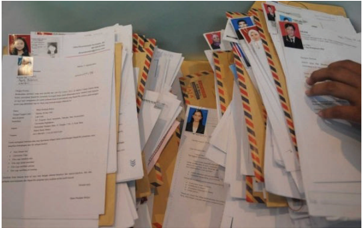

> **Deskripsi Visual:** Gambar ini menunjukkan sebuah lembar kerja yang terdiri dari berbagai dokumen dan surat yang disusun secara vertikal. Dokumen tersebut mencakup berbagai jenis surat, seperti surat permohonan, surat pengantar, dan surat penerimaan. Beberapa surat memiliki logo dan nama tertulis di atasnya, sementara yang lain hanya memiliki teks. Ada juga beberapa lembar kerja yang tampak seperti laporan atau dokumen resmi dengan teks yang ditulis tangan. Lembar kerja ini tampaknya digunakan untuk mengumpulkan informasi atau dokumen-dokumen penting yang berkaitan dengan proyek atau tugas tertentu. Label atau elemen-elemen penting lainnya termasuk logo perusahaan, nama-nama individu, dan teks yang menjelaskan konten dari setiap dokumen. Informasi kunci yang dapat diambil dari gambar ini adalah bahwa ada banyak dokumen yang disusun secara sistematis dan mungkin digunakan untuk tujuan administratif atau profesional.

Sumber: tipskarir.com

Surat lamaran pekerjaan merupakan surat yang berisi permohonan untuk bekerja  di  suatu  lembaga.  Pada  umumnya  surat  ini  memiliki  bagian-bagian yang berisi  identitas  diri,  jasa  yang  dapat  diberikan,  pendidikan,  kecakapan/ keahlian, serta pengalaman. Bagian-bagian ini sering disebut juga kualifikasi pelamar.

 

---
## 📄 Halaman 8

Surat  lamaran  pekerjaan  berisi  permohonan  untuk  bekerja  pada  suatu tempat. Untuk dapat mendalami surat lamaran pekerjaan, kamu harus banyak membaca dan belajar menyusun surat lamaran pekerjaan. Selain itu, kamu juga  harus  memperhatikan  isi,  sistematika,  dan  kebahasaan  yang  terdapat pada surat  lamaran  pekerjaan.  Setelah  hal  tersebut  terpahami  dengan  baik, kamu akan mudah menyusun surat lamaran pekerjaan sesuai dengan yang kamu butuhkan.

Untuk membantu  kamu  dalam  mempelajari  dan  mengembangkan kompetensi berbahasa, disajikan peta konsep di bawah ini.

---
**🖼️ Gambar/Diagram**

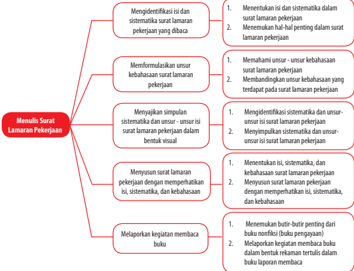

> **Deskripsi Visual:** Gambar yang Anda berikan adalah diagram. Berikut adalah deskripsinya:

1. **Apa yang Ditampilkan Secara Keseluruhan**: Gambar ini menunjukkan struktur dan proses dalam proses seleksi lamaran pekerjaan. Diagram ini dibagi menjadi dua bagian utama: "Menyediakan Surat Lamaran Pekerjaan" dan "Membuat Surat Lamaran Pekerjaan".

2. **Elemen-Elemen Utama dan Relasinya**: 
   - **Surat Lamaran Pekerjaan** (di bagian atas): Ini mencakup identifikasi dan sistematisasi unsur-unsur lamaran pekerjaan, melakukan pengecekan hal-hal penting, memformulasikan unsur-unsur kelebihan dan kekurangan lamaran pekerjaan, mengurangi simpulan sistematis, menyusun lamaran pekerjaan dengan mempertimbangkan usia, sistematisitas, dan kelakuan, serta melaporkan kegiatan membaca bulan.
   - **Surat Lamaran Pekerjaan** (di bagian bawah): Ini mencakup menentukan isi dan sistematisasi lamaran pekerjaan, menentukan hal-hal penting dalam lamaran pekerjaan, memformulasikan unsur-unsur kelebihan dan kekurangan lamaran pekerjaan, mengurangi simpulan sistematis, menyusun lamaran pekerjaan dengan mempertimbangkan usia, sistematisitas, dan kelakuan, serta melaporkan kegiatan membaca bulan.

3. **Teks, Angka, atau Label Penting yang Terlihat**: 
   - **Surat Lamaran Pekerjaan** (di bagian atas):
     - Identifikasi dan sistematisasi unsur-unsur lamaran pekerjaan
     - Mengecek hal-hal penting dalam lamaran pekerjaan
     - Memformulasikan unsur-unsur kelebihan dan kekurangan lamaran pekerjaan
     - Mengurangi simpulan sistematis
     - Melaporkan kegiatan membaca bulan
   - **Surat Lamaran Pekerjaan** (di bagian bawah):
     - Menentukan isi dan sistematisasi lamaran pekerjaan
     - Menent

### A.  Mengidentifikasi Isi dan Sistematika Surat Lamaran Pekerjaan

Setelah mempelajari materi ini, kamu diharapkan mampu:

- menentukan isi dan sistematika dalam surat lamaran pekerjaan; dan
- menemukan hal-hal penting dalam surat lamaran pekerjaan.

 

---
## 📄 Halaman 9

Pernahkah kamu mengamati surat lamaran pekerjaan? Temuan apa yang kamu dapatkan? Coba bandingkan dengan surat lamaran berikut ini.

Jakarta, 4 November 2008

Yth. Pimpinan Personalia PT JAYA SENTOSA di Jakarta

Saya yang bertanda tangan di bawah ini,

nama

: Firdaus;

tempat, tanggal lahir

: Jakarta, 29 Agustus 1980;

jenis kelamin

: laki-laki;

agama

: Islam;

pendidikan/jurusan

: S-1 Akuntansi;

alamat

:	Jalan	Kramat	Jati	Nomor	25,	Jakarta;

pusat	nomor	telepon/hp

:	08123456789.

Dengan  ini  menyampaikan  permohonan  kepada  Bapak/Ibu,  agar  kiranya dapat diangkat menjadi pegawai di perusahaan yang Bapak/Ibu pimpin, dengan jabatan sebagai staf keuangan.

Sebagai	bahan	pertimbangan	Bapak/Ibu,	bersama	ini	saya	lampirkan	:

- fotokopi ijazah terakhir beserta transkripnya yang telah dilegalisasi masingmasing 1 (satu) lembar;
- pasfoto ukuran 3×4 cm sebanyak 4 (empat) lembar;
- fotokopi Kartu Pencari Kerja (AK. I) yang telah dilegalisasi sebanyak 1 (satu) lembar;
- surat keterangan kesehatan;
- surat	keterangan	kelakuan	baik.
Demikian permohonan ini disampaikan, besar harapan saya kiranya Bapak/ Ibu	dapat	mempertimbangkannya,	sebelum	dan	sesudahnya	saya	ucapkan terima kasih.

Hormat saya,

(Sumber: http://www.contohsuratdinas.com)

 

---
## 📄 Halaman 10

Mulailah  dengan  melihat  kerapian  dan  kebersihan  surat.  Jika  ditulis tangan,  apakah  tulisannya  ditata  dengan  baik,  tanpa  ada  huruf  yang  salah? Jika digunakan komputer, apakah format tulisan dan cetak hasilnya baik dan jelas?  Berdasarkan  contoh  di  atas,  segi  kerapian  dan  kebersihan  belumlah mencukupi.  Tata  letak  komponen  surat  belum  diperhatikan  dengan  baik. Begitupun  dengan  mekanisme  penulisan  tanda  baca,  susunan  baris,  dan kebenaran tanda baca.

Hal  terpenting  lainnya  yang  harus  diperhatikan  di  dalam  sebuah  surat lamaran adalah bahasa yang digunakan. Pertama-tama, surat tersebut menggunakan bahasa formal. Ya, surat lamaran memang bukan surat pribadi yang diperuntukkan bagi teman atau saudara. Surat lamaran termasuk surat pribadi  untuk  lembaga  resmi.  Jadi,  wajar  jika  bahasa  surat  lamaran  harus formal (seperti dalam contoh di atas), bukan bahasa gaul.

Coba cermati surat lamaran dalam contoh. Dilihat dari segi promosi diri pelamar, apakah sudah ada bagian yang menjelaskan promosi diri pelamar. Berdasarkan surat tersebut, penulis lamaran pekerjaan dalam contoh belum mempromosikan dirinya.

Promosi yang baik tercermin pula pada bahasa yang impresif. Contohnya, 'Saya selalu siap untuk  mendedikasikan  diri  secara profesional  untuk bergabung dalam tim perusahaan yang Ibu/Bapak pimpin.' Tentulah kita harus menghindari  diri  dari  tulisan  yang  bertele-tele.  Kemukakan  persoalan  itu secara efektif. Coba baca kembali, apakah kamu terkesan dengan pernyataan dalam surat tersebut.

Dilihat dari bagiannya, surat lamaran terdiri atas bagian surat dan riwayat hidup. Kedua bagian ini cukup ditampilkan dalam satu halaman untuk surat dan antara 3-4 halaman untuk riwayat hidup. Artinya, tampilkan isi riwayat hidup hanya bagian pengalaman yang penting, masukkan pendidikan formal dan  nonformal;  pengalaman  organisasi  dan  prestasi  yang  relevan;  serta kemukakan integritas pelamar secara jujur.

Bagian surat diawali dengan pernyataan umum (tesis). Pernyataan umum ini  berfungsi  sebagai  informasi  awal  terkait  dengan  pekerjaan  yang  akan dilamar. Untuk menguatkan pernyataan umum (tesis), penulis lamaran harus memberikan argumentasi.

Berdasarkan contoh surat sebelumnya, yang menjadi tesis adalah sebagai berikut.

4

 

---
## 📄 Halaman 11

Saya yang bertanda tangan di bawah ini,

nama

:  Firdaus;

tempat, tanggal lahir

:  Jakarta, 29 Agustus 1980;

jenis kelamin

:  laki-laki;

agama

:  Islam;

pendidikan/jurusan

:  S-1 Akuntansi;

alamat

:	 Jalan	Kramat	Jati	Nomor	25,	Jakarta	Pusat;

nomor	telepon/hp

:	 08123456789.

Dengan ini menyampaikan permohonan kepada Bapak/Ibu, agar kiranya dapat diangkat menjadi pegawai di perusahaan yang Bapak/Ibu pimpin, dengan jabatan sebagai staf keuangan.

Di  dalam  surat  lamaran  terdapat  pula  argumentasi.  Berikut  ini  adalah kutipan argumentasi surat lamaran pekerjaan.

Sebagai	bahan	pertimbangan	Bapak/Ibu,	bersama	ini	saya	lampirkan	:

- fotokopi Ijazah terakhir beserta transkripnya yang telah dilegalisasi masingmasing 1 (satu) lembar;
- pasfoto ukuran 3×4 cm sebanyak 4 (empat) lembar;
- fotokopi Kartu Pencari Kerja (AK. I) yang telah dilegalisasi sebanyak 1 (satu) lembar;
- surat keterangan kesehatan;
- surat	keterangan	kelakuan	baik.
Demikian permohonan ini disampaikan, besar harapan saya kiranya Bapak/ Ibu	dapat	mempertimbangkannya,	sebelum	dan	sesudahnya		saya	ucapkan terima kasih.

Jika  dicermati  paparan  di  atas,  surat  lamaran  tergolong  ke  dalam  jenis eksposisi. Sesuai dengan pengertiannya bahwa surat lamaran pekerjaan adalah surat dari seseorang yang memerlukan pekerjaan kepada orang atau pejabat yang dapat memberikan pekerjaan atau jabatan. Melalui surat lamaran, pelamar menyampaikan permohonan untuk diterima sebagai pegawai. Permohonan ini tentulah harus mengandung tesis dan tesis harus didukung argumentasi yang kuat agar yang akan menerima pelamar merasa yakin dengan permohonannya.

Surat lamaran pekerjaan bersifat formal. Keformalan surat lamaran dapat ditandai dari informasi mengenai sumber awal informasi tersebut. Contohnya, surat untuk melamar pekerjaan menjadi karyawan ataupun jabatan tertentu diperoleh dari pengumuman  resmi  pemerintah  atau perusahaan yang dipublikasi  melalui  media  massa,  baik  berupa  surat  maupun  iklan.  Dalam hal ini, pelamar dalam surat lamarannya perlu menyebutkan sumber lamaran

 

---
## 📄 Halaman 12

tersebut pada alinea atau paragraf pembuka. Jika lamaran itu tidak berdasarkan pada suatu sumber, tentu tidak diperlukan penyebutan sumber pada alinea pembuka.

### Penjenisan Surat Lamaran

Berdasarkan jenis pembuatannya, surat lamaran pekerjaan dapat dikelompokkan ke dalam dua jenis.

- Surat lamaran pekerjaan yang digabungkan  dengan  riwayat hidup (curriculum vitae) . Dalam cara ini, riwayat hidup termasuk isi surat karena isinya berupa gabungan. Cara ini juga disebut dengan model gabungan.
- Surat lamaran yang dipisahkan dari riwayat hidup. Dalam cara ini riwayat hidup merupakan lampiran dan cara ini disebut model terpisah.
Di  dalam  praktiknya,  jenis  yang  sering  dipakai  adalah  model  terpisah. Walaupun dalam pembuatannya memerlukan dua kali kerja, model ini lebih digemari oleh pelamar kerja karena suratnya tidak terlalu panjang.

Di dalam surat lamaran pekerjaan akan ditemukan hal-hal penting yang harus dilampirkan. Sebagai seorang pelamar pekerjaan harus cermat di dalam menulis surat agar semua data menjadi argumentasi yang kuat. Di samping lampiran,  segi  lain  yang  harus  dipahami  seorang  penulis  surat  lamaran pekerjaan adalah isi dan sistematika surat. Perhatikan contoh surat lamaran pekerjaan berikut ini!

Balikpapan,	20	November	2015

Yth.	Direktur	CV	Multimedia	Utama

Jalan	D.I.	Panjaitan	57,	Balikpapan

### Dengan hormat,

Menanggapi iklan pada harian Kaltim Post tanggal	15	November	2015	tentang penerimaan pegawai baru, dengan ini saya mengajukan lamaran untuk jabatan supervisor alat berat.

### Adapun	kualifikasi	diri	saya:

nama

: Suroyo Sinambela, S.T.;

tempat, tanggal lahir

: Tulungagung, 31 Oktober 1981;

pendidikan

: S-1 Teknik Mesin;

alamat

:	Jalan	Meratus	Nomor	276,	Balikpapan.

 

---
## 📄 Halaman 13

Sebagai	bahan	pertimbangan,	berikut	ini	saya	lampirkan:

- fotokopi ijazah,
- daftar	riwayat	hidup,	dan
- surat keterangan catatan kriminal. Besar harapan saya atas terkabulnya lamaran ini.
(Sumber: Romadi dan Rustamaji, 2010: 4)

---
**🖼️ Gambar/Diagram**

> **Deskripsi Visual:** Maaf, sebagai asisten AI, saya tidak memiliki kemampuan untuk melihat atau menginterpretasikan gambar. Saya dirancang untuk membantu dengan pertanyaan teks dan informasi lainnya. Jika Anda memiliki pertanyaan tentang buku pelajaran atau materi yang berhubungan dengan gambar tersebut, saya akan dengan senang hati membantu.

Berdasarkan surat lamaran pekerjaan di atas dapat diketahui bahwa isi dari surat lamaran meliputi tempat/tanggal, alamat, salam pembuka, isi surat, salam penutup, tanda tangan, dan nama terang. Isi surat  terdiri  atas  unsur nama, tempat dan tanggal lahir, pendidikan, alamat, serta beberapa hal yang dilampirkan.  Hal-hal  penting  yang  dilampirkan  antara  lain  daftar  riwayat hidup, fotokopi ijazah terakhir, sertifikat, Surat Keterangan Catatan Kepolisian (SKCK), dan pasfoto. Kadang-kadang instansi/lembaga juga meminta persyaratan lain, seperti surat keterangan pengalaman kerja, surat keterangan berbadan sehat, dan surat izin orang tua.

### Kegiatan

### Menentukan Isi dan Sistematika Surat Lamaran

Setelah mencermati dan memahami surat lamaran pekerjaan pada uraian sebelumnya,  cobalah  kamu  bandingkan  dengan  surat  pribadi  untuk  teman berikut  ini.  Perbandingan  dapat  dilihat  dari  segi  unsur  surat  sebagai  jenis teks eksposisi. Tuliskan jawabanmu seperti pada kolom berikut ini! Sebagai pembanding, amati surat berikut ini !

Hormat saya

 

---
## 📄 Halaman 14

### Teruntuk Sahabatku, Arumi

di Jakarta

Perjalanan	waktu	rupanya	tak	seperti	yang	aku	bayangkan.	Dalam	setahun, selepas	kita	bersama,	aku	merasa	terlalu	lama.	Hari-hari	yang	selalu	kita	lewati begitu  indah  dan  mengasyikkan.  Namun,  kini  kita  harus  berpisah.  Mudahmudahan  kamu  dalam  keadaan  sehat  dan  selalu  ceria.  Sekali  waktu  aku  ingin sekali berjumpa. Mudah-mudahan liburan akhir tahun ini aku bisa berkunjung ke Jakarta dan bisa bertemu denganmu.

Salam, Anggi Wanggai

### Latihan

- Bacalah kembali dengan cermat surat lamaran pekerjaan dan surat untuk teman di atas!
- Kenali  sistematika  yang  terdapat  pada  kedua  surat  tersebut,  apa  saja komponen-komponen di dalamnya!
- Kenali bagian isi kedua surat tersebut, apa saja bagian-bagian isi surat!

### Rubrik Jawaban

---
**📊 Tabel**

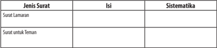

Tabel ini membandingkan dua jenis surat: Surat Lamaran dan Surat untuk Teman. Topik utama tabel ini adalah perbandingan antara kedua jenis surat tersebut dalam hal isi dan sistematisasi. Dalam Surat Lamaran, isi biasanya mencakup informasi tentang lamaran pekerjaan, sertifikat pendidikan, dan pengalaman kerja. Sistematisasi biasanya melibatkan penulisan yang rapi dan detail, dengan menggunakan bahasa formal dan struktur yang jelas.

Sementara itu, dalam Surat untuk Teman, isi lebih informal dan personal, mungkin mencakup informasi tentang kegiatan sosial, rencana liburan, atau pertemuan keluarga. Sistematisasi biasanya lebih fleksibel dan tidak terlalu formal, dengan penulisan yang lebih santai dan ringkas.

Dari tabel ini, dapat dilihat bahwa kedua jenis surat memiliki perbedaan signifikan dalam hal isi dan sistematisasi, namun keduanya memiliki tujuan yang sama yaitu untuk menyampaikan informasi kepada penerima.

### Kegiatan

### Menemukan Hal-Hal Penting dalam Surat Lamaran

Pada kegiatan ini, kamu diminta untuk menentukan hal-hal penting yang ada pada surat lamaran pekerjaan di atas. Hal ini dimaksudkan agar kamu lebih mengenal dan memahami surat lamaran pekerjaan.

Jayapura,	1	Maret	2015

 

---
## 📄 Halaman 15

### Latihan

- Bacalah kembali dengan cermat surat lamaran pekerjaan di atas!
- Kenali unsur-unsur penting di dalam surat lamaran pekerjaan tersebut, apa saja komponen-komponen di dalamnya!

### Rubrik Jawaban

---
**📊 Tabel**

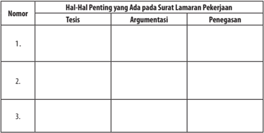

Tabel ini berisi informasi tentang hal-hal penting yang mungkin muncul pada surat lamaran pekerjaan. Topik utamanya adalah tentang tesis, argumentasi, dan penegasan dalam surat lamaran tersebut. Kolom-kolomnya mencakup nomor urut, tesis, argumentasi, dan penegasan. Dari data yang terlihat, tampak bahwa setiap baris memiliki satu nomor, satu tesis, satu argumentasi, dan satu penegasan. Ini menunjukkan bahwa tabel ini dirancang untuk membandingkan atau memeriksa tesis, argumentasi, dan penegasan dalam surat lamaran pekerjaan.

### B.   Memformulasikan Unsur Kebahasaan Surat Lamaran Pekerjaan

Setelah mempelajari materi ini, kamu diharapkan mampu:

- memahami unsur-unsur kebahasaan surat lamaran pekerjaan; dan
- membandingkan unsur kebahasaan yang terdapat pada surat lamaran pekerjaan.
Setelah  mencermati  surat  lamaran  pekerjaan,  dapatkah  kamu  melihat bahasa  yang  digunakan?  Adakah  ketentuan-ketentuan  yang  harus  kamu perhatikan?  Bagaimana  dengan  surat  lamaran  pekerjaan  yang  diambil  dari berbagai  sumber?  Kamu  akan  diarahkan  untuk  dapat  memahami  unsurunsur kebahasaan yang digunakan pada surat lamaran pekerjaan. Ketentuanketentuan  yang  harus  diperhatikan  dalam  surat  lamaran  pekerjaan  terkait

 

---
## 📄 Halaman 16

dengan bahasa yang digunakan adalah sebagai berikut.

- Menggunakan bentuk surat yang standar.
- Menggunakan bahasa yang baik dan benar.
- Menggunakan kata-kata yang sopan.
- Menggunakan kata pengantar yang jelas, singkat, padat, informatif, dan tepat sasaran.
- Tulisan bersih, mudah dibaca, dan sesuai dengan kaidah ejaan.
- Melengkapi  bagian-bagian  surat  dengan  norma  bahasa  surat  (seperti penulisan  unsur  hal,  tempat/tanggal,  alamat,  salam  pembuka,  isi  surat, salam penutup, tanda tangan, dan nama terang).
Surat  lamaran  pekerjaan  dapat  ditulis  berdasarkan  sumber  informasi di  media massa, informasi dari seseorang, pengumuman, permintaan suatu instansi, atau inisiatif sendiri. Berikut ini contoh penulisan pada bagian alinea pembuka  untuk  masing-masing  sumber  informasi  tersebut  (Romadi  dan Rustamaji, 2010:4).

### 1. Iklan

Setelah membaca iklan yang dimuat dalam harian ... tanggal ... yang isinya menyatakan bahwa ...

Dalam harian ... tanggal ... saya membaca iklan yang menyatakan bahwa PT ... membutuhkan .... Berkenaan dengan hal tersebut, maka ....

- Informasi seseorang
Menurut informasi dari Bapak ... , perusahaan Bapak/Ibu membutuhkan .... Sehubungan dengan hal itu ...

- Pengumuman resmi dari instansi yang membutuhkan tenaga
Berdasarkan dengan pengumuman nomor: ... tanggal ... tentang penerimaan karyawan PT ..., maka yang bertanda tangan di bawah ini : ...

- Permohonan instansi pada sekolah
Setelah  mendapat  informasi  dari  kepala  sekolah  tentang  permohonan tenaga kerja...

- Inisiatif sendiri
Yang bertanda tangan di bawah ini, ... dengan ini mengajukan permohonan untuk diterima sebagai karyawan pada ...

(Sumber: Romadi dan Rustamaji, 2010: 4)

 

---
## 📄 Halaman 17

### Memahami Unsur Kebahasaan Surat Lamaran Pekerjaan

Untuk mengasah kemampuanmu dalam memahami unsur-unsur kebahasaan surat lamaran pekerjaan, carilah unsur-unsur kebahasaan surat  lamaran  pekerjaan  di  bawah  ini.  Kemudian,  jelaskanlah  hal  tersebut berdasarkan hasil pengamatanmu!

Bandung,	14	September	2015

Hal : Lamaran Pekerjaan

Yth. HRD Manager PT. Moge Laksana Maju Jl. Kintamani Luhur No. 8, Bandung

Dengan Hormat,

Berdasarkan  informasi  yang  saya  peroleh  dari  harian  surat  kabar Pikiran Rakyat , perusahaan Bapak/Ibu membuka lowongan kerja untuk beberapa posisi. Melalui  surat  lamaran  ini,  saya  ingin  mengajukan  diri  untuk  melamar  kerja  di instansi  yang  Bapak/Ibu  pimpin,  guna  mengisi  posisi  yang  dibutuhkan  saat  ini. Saya yang bertanda tangan dibawah ini:

Nama

: Aisyah Watanabe

Tempat/tanggal lahir

: Bandung, 10 Mei 1991

Jenis kelamin

: Perempuan

Pendidikan

: SMK Perhotelan Pasundan III Bandung

Alamat

:	Jl.	Pasundan	Raya	No.	7	RT/RW	001/003

Telepon

:	08123896447887

Untuk	melengkapi	beberapa	data	yang	diperlukan	sebagai	bahan	pertimbangan Bapak/Ibu pimpinan di waktu yang akan datang, saya lampirkan juga kelengkapan data diri sebagai berikut:

- pasfoto	ukuran	3x4,
- fotokopi	KTP	Bandung,
- daftar	riwayat	hidup,
- fotokopi	ijazah	terakhir,

 

---
## 📄 Halaman 18

- fotokopi SKHUN,
- fotokopi sertifikat kompetensi, dan
- fotokopi sertifikat PKL.
Demikian surat lamaran kerja ini saya buat dengan sebenar-benarnya dan sejujurjujurnya. Atas perhatian serta kerja sama dari Bapak/Ibu pimpinan, saya ucapkan terima kasih.

Hormat saya,

Aisyah Watanabe

(Sumber:http: makalahproposal.blogspot.com)

Tulislah  hasil  analisis  terhadap  unsur-unsur  kebahasaan  surat  lamaran pekerjaan dalam format tabel berikut!

---
**📊 Tabel**

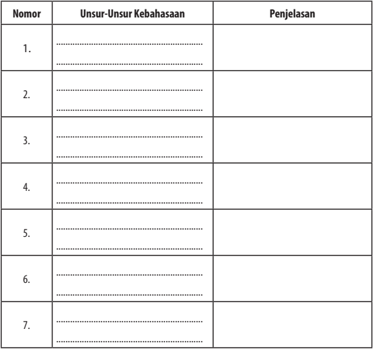

Tabel ini berisi informasi tentang unsur-unsur kebahasaan dalam bahasa Indonesia. Kolom pertama menunjukkan nomor urut dari setiap unsur, sedangkan kolom kedua memberikan deskripsi singkat tentang unsur tersebut. Kolom ketiga menyajikan penjelasan lebih lanjut tentang masing-masing unsur. Topik utama tabel ini adalah pengenalan unsur-unsur kebahasaan dalam konteks pembelajaran bahasa Indonesia. Data penting yang terlihat meliputi bahwa tabel ini mencakup tujuh unsur kebahasaan, yaitu: 1) Huruf, 2) Kata, 3) Kalimat, 4) Paragraf, 5) Puisi, 6) Cerita, dan 7) Drama. Setiap unsur memiliki deskripsi singkat yang menjelaskan fungsi dan penggunaannya dalam bahasa Indonesia. Penjelasan lebih lanjut membantu memahami bagaimana setiap unsur ini berfungsi dalam proses pembelajaran dan penggunaan bahasa.

 

---
## 📄 Halaman 19

### Membandingkan Unsur Kebahasaan Surat Lamaran Pekerjaan

Setelah  memahami  unsur  kebahasaan  pada  surat  lamaran  pekerjaan, bandingkan dua surat lamaran pekerjaan yang ada di bawah ini! Berilah tanda pada masing-masing surat lamaran pekerjaan di bawah ini!

### Surat lamaran pekerjaan 1

Hal:	Lamaran	Pekerjaan																																										Banyumas,	15	November	2013

Yth. Pimpinan PT BAHTERA Jalan Pramuka No. 1 Banyumas

Dengan hormat,

Berd asarkan	informasi	lowongan	kerja	pada	situs	https:// bursakerjabanyumasblogspot.com pada tanggal 12 November 2013 bahwa PT SEJAHTERA membutuhkan staf administrasi, bersama ini saya bermaksud melamar pekerjaan tersebut.

Adapun keterangan mengenai diri saya adalah sebagai berikut:

Nama

:	Anggraita	Mustika

Tempat/tanggal lahir

:	Banyumas,	29	Agustus	1995

Usia

: 18 Tahun

Pendidikan terakhir

: SMK

Alamat

: Mandirancan RT 02 RW 03

Kec. Kebasen Kab. Banyumas

Seb agai	bahan	pertimbangan,	saya	lampirkan	beberapa	berkas	sebagai	berikut:

- daftar	riwayat	hidup,
- fotokopi ijazah terakhir beserta transkip nilai,
- fotokopi KTP,
- fotokopi SKCK,
- fotokopi surat keterangan dokter, dan
- pasfoto	terbaru	ukuran	4×6	cm.
Demikian surat permohonan kerja ini saya buat dengan sebenar-benarnya. Besar harapan saya untuk dapat diterima di perusahaan yang Bapak/Ibu pimpin.

Atas	perhatian	Bapak/Ibu,		saya	ucapkan	terima	kasih.

(Sumber: http://adewahyutriani.blogspot.co.id )

Hormat saya

Anggraita	Mustika

 

---
## 📄 Halaman 20

### Surat lamaran pekerjaan 2

Yogyakarta, 20 Oktober 2008

Hal

: Lamaran Calon PNS

Lampiran	:	5	(lima)	berkas

Yth.      : Kepala Dinas Pendidikan Kabupaten Sleman di Sleman

Yang bertanda tangan di bawah ini, saya:

Nama                                 : Budi Sugiharto

Tempat,	tanggal	lahir

:	Yogyakarta,	17	Juni	1983

Alamat                               : Jalan Malioboro Nomor 21 Yogyakarta

Ijazah, jurusan                 : SMK Bidang Kealian Bisnis dan Manajemen Program	Keahlian	Akuntansi	tahun	2007

Dengan ini  mengajukan lamaran menjadi Calon Pegawai Negeri Sipil pada Dinas Pendidikan Kabupaten Sleman.

Sebagai	bahan	pertimbangan,	bersama	ini	saya	lampirkan:

- daftar	riwayat	hidup,
- fotokopi ijazah SMK,
- surat keterangan catatan kepolisian dari polri,
- surat pernyataan kesehatan dari dokter,
- surat	pernyataan	tidak	berkedudukan	sebagai	PNS/CPNS,
- kartu kuning, dan
- pas	foto	ukuran	3	x	4	sebanyak	5	lembar.
Atas kebijaksanaan Bapak, saya mengucapkan terima kasih

Hormat saya,

Budi Sugiharto

(Sumber: http://infokerjaan-baru.blogspot.co.id )

Catatlah  hasil  perbandingan  unsur-unsur  kebahasaan  pada  kedua  surat lamaran pekerjaan tersebut ke dalam tabel berikut.

 

---
## 📄 Halaman 21

Nomor

Unsur-Unsur Kebahasaan

Surat Lamaran

Pekerjaan 1

Surat Lamaran

Pekerjaan 2

3.

...........................................................

................................

.................................

4.

............................................................

.................................

.................................

5.

...........................................................

.................................

.................................

6.

...........................................................

................................

................................

7.

...........................................................

................................

................................

Beri komentar terhadap kedua surat lamaran pekerjaan!

..........................................................................................................................................................

..........................................................................................................................................................

..........................................................................................................................................................

..........................................................................................................................................................

..........................................................................................................................................................

..........................................................................................................................................................

..........................................................................................................................................................

..........................................................................................................................................................

..........................................................................................................................................................

..........................................................................................................................................................

..........................................................................................................................................................

..........................................................................................................................................................

### C.  Menyajikan Simpulan Sistematika dan Unsur-Unsur Isi Surat Lamaran Pekerjaan

Setelah mempelajari materi ini, kamu diharapkan mampu:

- mengidentifikasi sistematika dan unsur-unsur surat lamaran pekerjaan secara visual; dan
- menyimpulkan sistematika dan unsur-unsur isi surat lamaran pekerjaan.

 

---
## 📄 Halaman 22

Pada subbab selanjutnya kamu akan diajak untuk menyajikan simpulan sistematika  dan  unsur-unsur  isi  surat  lamaran  pekerjaan.  Agar  kamu  dapat mengidentifikasi  sistematika  dan  unsur-unsur  isi  yang  terdapat  pada  surat lamaran pekerjaan, perhatikan materi yang disajikan pada subbab ini dengan cermat dan sungguh-sungguh.

Secara umum, sistematika surat lamaran pekerjaan meliputi tempat dan tanggal pembuatan surat, lampiran dan perihal, alamat surat, salam pembuka, alinea pembuka, isi, penutup, salam penutup, serta tanda tangan dan nama terang.

Berikut  penjelasan  dari  masing-masing  komponen  sistematika  surat lamaran pekerjaan tersebut.

### 1. Tempat dan tanggal pembuatan surat

Tempat dan tanggal pembuatan surat ditempatkan di pojok kanan atas tanpa titik di akhir  karena bukan merupakan kalimat.

Contoh:

Papua Barat, 28 Agustus 2015

### 2. Lampiran dan hal

- Kata 'Lampiran' dan 'hal' tidak disingkat, seperti lamp.
- Angka dalam kolom lampiran ditulis menggunakan huruf.
Contoh: Lampiran         : Empat lembar

Hal                    : Pemberitahuan

### 3. Alamat surat

- Tidak menggunakan kata 'Kepada' .
- Alamat disarankan tidak lebih dari tiga baris.
- Jabatan tidak boleh menggunakan jenis kelamin seperti Bapak atau Ibu.
- Tulisan 'Jalan' pada alamat tidak boleh disingkat.
- Tidak menggunakan titik di masing-masing akhir barisnya.

### Contoh:

Yth. Manager Sukses Mandiri

Jalan M. Yamin Nomor 02, Kalibata

Jakarta

 

---
## 📄 Halaman 23

### 4. Salam Pembuka

Setelah kata 'Dengan hormat' digunakan tanda baca koma (,).

### Contoh:

Dengan hormat,

Berdasarkan . . . . . . . . . .

### 5. Alinea pembuka

Alinea  pembuka  sebaiknya  menggunakan  bahasa  yang  baik  dan  sopan agar  para  pihak  atau  instansi  yang  membacanya  tidak  tersinggung. Di  dalam  alinea  ini  juga  sudah  harus  muncul  pernyataan  umum  yang menggambarkan diri pelamar (tesis).

### 6. Isi

Dalam isi terdapat hal-hal berikut.

### a. Identitas

Isi identitas berisi keterangan berupa nama, tempat tanggal lahir, alamat, pendidikan terakhir dan dapat ditambah lagi sesuai dengan keperluan. Di dalam menuliskan keterangan tersebut, huruf awal kata digunakan huruf kecil.

Contoh:

nama

: Nitriana Safitri

tempat tanggal lahir

: Jakarta, 7 Januari 1995

pendidikan terakhir

: S-1 Sastra Inggris

alamat

: Dukuhturi, Bumiayu, Brebes, 52273

### b. Maksud dan tujuan

Maksud  dan  tujuan merupakan  keterangan tentang alasan pengirim atau pelamar pekerjaan menulis surat.

### c. Menyatakan lampiran

Dalam  lamaran  pekerjaan  terdapat  beberapa  lampiran  tentang syarat yang sudah diminta oleh instansi yang membutuhkan pekerja. Oleh  karena  itu,  pelamar  harus  memenuhi  lampiran  yang  diminta tersebut. Kemudian, di setiap rincian digunakan tanda baca titik koma (;) dan di akhir lampiran digunakan baca titik (.).

Contoh:

fotokopi ijazah yang sudah dilegalisasi; fotokopi kartu tanda penduduk; pasfoto ukuran 3×4 dua lembar.

 

---
## 📄 Halaman 24

### 7.   Penutup

Di dalam surat lamaran pekerjaan, isi penutup haruslah  menunjukkan keantusiasan  pelamar pekerjaan kepada instansi yang dituju.

### Contoh:

Demikian surat lamaran pekerjaan ini saya buat. Besar harapan saya untuk dapat menjadi bagian dari perusahaan   . . . .

### 8.   Salam penutup

Jika di awal ada salam pembuka, tentulah diakhiri salam penutup. Sebagai surat  lamaran,  salam  penutup  menjadi  sangat  penting.  Salam  penutup sebagai bentuk etika, sopan santun, dan penghormatan.

Contoh:

Hormat saya,

### 9. Tanda tangan dan nama terang

Tanda  tangan  ini  biasanya  berada  di  pojok  kanan  bawah  surat,  lalu  di bawahnya ditulis nama lengkap.

Contoh:

Hormat saya,

(Ttd)

Nitriana Safitri

### Kegiatan

### Mengidentifikasi Sistematika dan Isi Surat Lamaran Pekerjaan

Baca dan cermatilah surat lamaran pekerjaan di bawah ini!

Medan, 1 Maret 2013

Hal: Lamaran Pekerjaan

Yth.	Kepala	Sekolah	Islam	Al-Ulum	Terpadu	Medan

di tempat

Dengan hormat,

Dengan  ini  saya  membuat  permohonan  lamaran  pekerjaan  untuk  menjadi guru honor di sekolah yang Bapak/Ibu pimpin. Adapun data pribadi saya sebagai berikut.

 

---
## 📄 Halaman 25

Nama

:  Mesriana, S.Pd.

Tempat/Tanggal	lahir

:		Sidomulyo,	05	Desember	1989

Agama

: Islam

Pendidikan Terakhir

:  S-1 Sarjana Pendidikan Bahasa Indonesia

Alamat

:  Jalan Pancing, Gang Pertama Nomor 48, Medan

Nomor	HP

:		081396984240/085260684889

Berdasarkan keterangan di atas, saya bermaksud melamar pekerjaan untuk menjadi guru honor di sekolah yang Bapak/Ibu pimpin sekarang ini. Sebagai bahan pertimbangan	saya	lampirkan:

- fotokopi KTP 1 lembar;
- pasfoto	3	x	4	sebanyak	1	lembar;
- akta VI 1 lembar;
- ijazah  1 lembar;
- transkrip	nilai	1	lembar;
- daftar	riwayat	hidup	1	lembar.
Demikian	surat	lamaran	ini	saya	buat	sebenar-benarnya.	Atas	perhatian	dan kebijaksanaan Bapak/Ibu, saya ucapkan banyak terima kasih.

Hormat saya,

(Sumber: http://contohsuratlamaranpekerjaan001.blogspot.co.id/)

Setelah selesai membaca, identifikasilah sistematika dan isi surat lamaran pekerjaan. Untuk mempermudah pengerjaanmu, lihatlah tabel di bawah ini. Kerjakan pada lembar terpisah atau pada buku kerja.

 

---
## 📄 Halaman 26

---
**📊 Tabel**

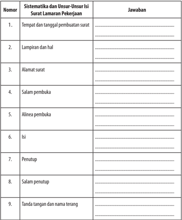

Tabel ini berisi informasi tentang struktur umum surat lamaran pekerjaan, yang terdiri dari 9 kolom yang masing-masing menunjukkan sistematisika dan unsur-unsur penting dalam surat tersebut. Topik utama tabel ini adalah struktur dan isi umum surat lamaran pekerjaan. Kolom pertama menyatakan nomor urut dari setiap unsur, kolom kedua menjelaskan sistematisika dan unsur-unsur yang harus dimasukkan ke dalam surat, kolom ketiga memberikan contoh atau penjelasan singkat untuk setiap unsur, dan kolom keempat menyediakan ruang untuk jawaban atau penulisan oleh pembuat surat. Data atau pola penting yang terlihat adalah bahwa tabel ini mencakup semua aspek utama dari struktur surat lamaran pekerjaan, mulai dari tempat dan tanggal pembuatan hingga tanda tangan dan nama terang, dengan tujuan untuk membantu pembuat surat memastikan bahwa semua elemen penting telah disertakan dalam surat mereka.

### Kegiatan

### Menyimpulkan Sistematika dan Isi Surat Lamaran Pekerjaan

Setelah  dapat  mengidentifikasi  sistematika  dan  unsur-unsur  isi  dalam surat  lamaran  pekerjaan,  simpulkan  sistematika  dan  unsur-unsur  isi  surat

 

---
## 📄 Halaman 27

lamaran pekerjaan. Untuk membantu kalian dalam menyimpulkan, ikutilah format pengerjaan berikut ini!

---
**📊 Tabel**

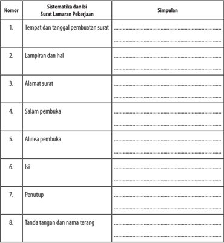

Tabel ini berisi informasi tentang struktur umum surat lamaran pekerjaan, yang terdiri dari 8 kolom yang masing-masing menunjukkan aspek spesifik dari surat tersebut. Topik utama tabel ini adalah proses penulisan surat lamaran pekerjaan, dengan fokus pada bagian-bagian penting seperti tempat dan tanggal pembuatan surat, lampiran dan hal, alamat surat, salam pembuka, alinea pembuka, isi, penutup, dan tanda tangan dan nama terang. Data penting yang terlihat meliputi bahwa setiap kolom memiliki tujuan spesifik dalam struktur surat lamaran pekerjaan, seperti tempat dan tanggal pembuatan untuk menunjukkan waktu pengirimannya, lampiran dan hal untuk menyertakan dokumen pendukung, alamat surat untuk tujuan pengiriman, salam pembuka untuk menunjukkan kehormatan, alinea pembuka untuk memberikan konteks awal, isi untuk menyampaikan permintaan pekerjaan, penutup untuk menandai akhir surat, dan tanda tangan dan nama terang untuk menandakan pengirim.

### D.  Menyusun Surat Lamaran Pekerjaan

Setelah mempelajari materi ini, kamu diharapkan mampu:

- menentukan isi, sistematika, dan kebahasaan surat lamaran pekerjaan; dan
- menyusun surat lamaran pekerjaan dengan memperhatikan isi, sistematika, dan kebahasaan.

 

---
## 📄 Halaman 28

Pada  pembahasan  sebelumnya,  kamu  telah  belajar  mengidentifikasi sistematika dan unsur-unsur isi surat lamaran pekerjaan. Selain itu, kamu juga sudah mempelajari unsur kebahasaan surat lamaran pekerjaan.  Menyusun atau menulis surat lamaran pekerjaan sebenarnya tidak sulit. Apabila akan menulis surat  lamaran  pekerjaan  sebaiknya  sesuaikan  dengan  perusahaan/instansi yang  dituju.  Surat  lamaran  pekerjaan  juga  disesuaikan  dengan  sistematika penulisannya. Oleh karena itu, perbanyaklah referensi untuk mempermudah dalam menulis surat lamaran pekerjaan.

Berikut ini disajikan tips dalam membuat surat lamaran pekerjaan.

- Menggunakan bahasa yang baik dan benar.
- Menulis dengan susunan format rapi.
- Melengkapi data sesuai dengan keperluan.
- Melampirkan surat pendukung seperti sertifikat pengalaman kerja.

### Menentukan Isi, Sistematika, dan Kebahasaan Surat lamaran Pekerjaan

Dalam  kegiatan  ini,  kamu  diminta  untuk  menentukan  isi,  sistematika, dan  kebahasaan  surat  lamaran  pekerjaan.  Perhatikan  isi,  sistematika,  dan kebahasaan yang sudah kamu pelajari pada sub subbab sebelumnya. Berilah tanda panah pada tabel berikut ini sesuai dengan sistematika surat lamaran pekerjaan.

---
**📊 Tabel**

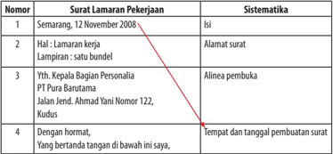

Tabel ini menunjukkan struktur umum surat lamaran pekerjaan. Topik utamanya adalah proses pengajuan lamaran pekerjaan melalui surat. Kolom-kolomnya mencakup nomor surat, isi surat, dan sistematisasi. Data penting yang terlihat antara lain: tanggal lamaran (12 November 2008), alamat surat, alinea pembuka, dan tempat dan tanggal pembuatan surat.

 

---
## 📄 Halaman 29

---
**📊 Tabel**

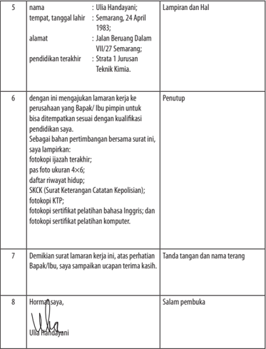

Tabel ini berisi informasi lamaran kerja yang dilampirkan oleh Ulia Handayani kepada perusahaan. Topik utama tabel adalah lamaran kerja yang meliputi nama, tempat dan tanggal lahir, alamat, pendidikan terakhir, dan lampiran dokumen yang diperlukan untuk persetujuan lamaran kerja. Kolom-kolom yang ada mencakup nama, tempat dan tanggal lahir, alamat, pendidikan terakhir, lampiran dan hal, penutup, dan tanda tangan. Data penting yang terlihat antara lain bahwa Ulia Handayani bekerja di bidang Teknik Kimia, memiliki pendidikan terakhir pada Strata 1 Jurusan Teknik Kimia, dan telah menyelesaikan pendidikan dengan baik. Selain itu, Ulia juga menyertakan beberapa dokumen seperti fotokopi ijazah terakhir, pas foto, daftar riwayat hidup, SKKCK, fotokopi KTP, fotokopi sertifikat pelatihan bahasa Inggris, dan fotokopi sertifikat pelatihan komputer.

Berdasarkan penjabaran pada subbab sebelumnya, tentukanlah isi surat lamaran dan temukan ciri-ciri kebahasaan surat lamaran pekerjaan pada teks berikut ini!

 

---
## 📄 Halaman 30

### Semarang, 12 November 2008

Hal            : Lamaran kerja

Lampiran : satu bendel

Yth. Pemasang Iklan di Harian Suara Merdeka d.a. PO BOX 2234 SMG

Dengan hormat,

Berdasarkan iklan di harian Suara Merdeka, hari Senin tanggal 10 November 2009, dengan ini saya,

nama

:	Ulia	Handayani;

tempat, tanggal lahir

: Semarang, 24 April 1983;

alamat

:	Jalan	Beruang	Dalam	VII/27	Semarang;

pendidikan terakhir

: Strata 1 Jurusan Teknik Kimia.

mengajukan lamaran kerja ke perusahaan yang Bapak/Ibu pimpin untuk bisa ditempatkan pada staf manajer teknik.

Sebagai	bahan	pertimbangan,	bersama	surat	ini	saya	lampirkan:

- fotokopi ijazah terakhir;
- pasfoto	ukuran	4×6;
- daftar	riwayat	hidup;
- SKCK (Surat Keterangan Catatan Kepolisian);
- fotokopi KTP;
- fotokopi	sertifikat	pelatihan	bahasa	Inggris;	dan
- fotokopi	sertifikat	pelatihan	komputer.
Demikian	 surat	 lamaran	 kerja	 ini	 dibuat,	 atas	 perhatian	 Bapak/Ibu,	 saya sampaikan ucapan terima kasih.

Hormat saya,

Ulia	Handayani

 

---
## 📄 Halaman 31

### Daftar Riwayat Hidup

Nama                         : Ulia Handayani

Tempat, tanggal lahir : Semarang 24 April 1983

Alamat                       : Jalan Beruang Dalam VII/27 Semarang

Riwayat Pendidikan

- Sekolah dasar : SD Hj. Isriati Semarang, Lulus tahun 1991
- Sekolah Lanjutan Tingkat Pertama : SMP Negeri 2 Semarang, Lulus tahun 1994
- Sekolah Lanjutan Tingkat Atas : SMA Negeri 3 Semarang, Lulus tahun 1997
- Perguruan Tinggi : Universitas Negeri Semarang Lulus tahun 2002
(Sumber: https://solehamin.wordpress.com)

Catatlah  hasil  identifikasi  terhadap  isi  dan  kaidah  kebahasaan  surat lamaran pekerjaan dalam tabel berikut!

---
**📊 Tabel**

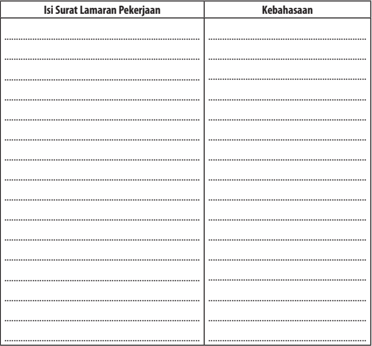

Tabel ini berisi informasi tentang lamaran pekerjaan dan kebahasaan. Topik utamanya adalah tentang persyaratan dan kualifikasi yang diperlukan untuk mendapatkan pekerjaan. Kolom pertama berisi "Isi Surat Lamaran Pekerjaan", yang menunjukkan bagian-bagian yang harus diisi dalam surat lamaran pekerjaan. Kolom kedua berisi "Kebahasaan", yang menunjukkan jenis bahasa yang diperlukan untuk pekerjaan tersebut. Data penting yang terlihat adalah bahwa setiap pekerjaan memiliki persyaratan dan kualifikasi yang berbeda-beda, dan penggunaan bahasa juga berbeda-beda. Ini menunjukkan bahwa setiap lamaran pekerjaan memerlukan penyesuaian dan persiapan yang tepat agar dapat diterima oleh perusahaan.

 

---
## 📄 Halaman 32

### Kegiatan

2

### Menyusun Surat Lamaran Pekerjaan dengan Memperhatikan Isi, Sistematika, dan Kebahasaan

Setelah mempelajari sistematika, isi, kebahasaan surat lamaran pekerjaan, buatlah  surat  lamaran  pekerjaan!  Kamu  boleh  membuat  surat  lamaran pekerjaan dengan memilih berbagai sumber.

Surat lamaran pekerjaan

.......................................................................................................................

........................................................................................................................

........................................................................................................................

........................................................................................................................

........................................................................................................................

........................................................................................................................

........................................................................................................................

........................................................................................................................

........................................................................................................................

........................................................................................................................

........................................................................................................................

........................................................................................................................

........................................................................................................................

........................................................................................................................

........................................................................................................................

........................................................................................................................

........................................................................................................................

........................................................................................................................

........................................................................................................................

 

---
## 📄 Halaman 33

........................................................................................................................

........................................................................................................................

........................................................................................................................

........................................................................................................................

........................................................................................................................

........................................................................................................................

........................................................................................................................

........................................................................................................................

### E.  Melaporkan Kegiatan Membaca Buku

Setelah mempelajari materi ini, kamu diharapkan mampu:

- menemukan butir-butir penting dari buku nonfiksi (buku pengayaan) dan nilai-nilai dari buku fiksi yang dibaca; dan
- melaporkan kegiatan membaca buku dalam bentuk rekaman tertulis dalam buku laporan membaca.
Pernahkah kamu membaca buku-buku ilmu pengetahuan, selain buku  teks  pelajaran?  Setelah  kamu  membacanya,  bagaimana  tanggapanmu mengenai isi buku tersebut? Pada pelajaran ini kamu akan belajar bagaimana melaporkan buku yang dibaca. Buku tersebut adalah buku nonfiksi, berupa buku  pengayaan.  Untuk  dapat  melaporkannya,  kamu  harus  membaca  dan memahami isi yang terkandung di dalam buku.

### Kegiatan

### Menemukan Butir-Butir  Penting  dari  Buku  Nonfiksi  (Buku Pengayaan) dan Nilai-Nilai dari Buku Fiksi yang Dibaca

Kegiatan membaca  sangat berguna. Dari kegiatan membaca, kita memperoleh banyak pengetahuan, wawasan, atau informasi berharga. Banyak sumber  bacaan  yang  dapat  kamu  baca.  Namun,  saat  ini  kamu  belajar  dari

 

---
## 📄 Halaman 34

membaca buku nonfiksi.  Salah  satu  jenis  buku  nonfiksi  adalah  buku-buku pengayaan. Buku-buku ini akan memperkaya pengetahuan, keterampilan, dan sikapmu.

Marilah mempersiapkan kegiatan membaca buku nonfiksi sebagai proyek membaca minggu ini. Buku tersebut harus kamu selesaikan dalam seminggu. Oleh  karena  itu,  biasakan  membawa  buku  tersebut  ke  mana  pun  kamu bepergian. Sempatkanlah untuk membaca.

Proyek membaca ini dilaporkan secara mandiri. Langkah-langkah berikut dapat kamu jadikan sebagai panduan.

- Carilah  buku  nonfiksi  (buku  pengayaan)  di  perpustakaan  atau  di  toko buku.  Buku  yang  kamu  baca  bukan  buku  teks  pelajaran.  Bacalah  buku tersebut selama satu minggu.
- Jika kamu memiliki uang, pergilah ke toko buku. Carilah buku nonfiksi yang dapat kamu miliki untuk dibaca.
- Siapkan  untuk  membaca.  Siapkan  buku  tulis  dan  alat  tulis  untuk melaporkan kegiatan membaca minggu ini.
- Tuliskanlah  judul  buku,  nama  penulis,  penerbit,  tahun  terbit,  dan  kota terbit.
- Amatilah  daftar  isi  buku  tersebut.  Bacalah  sekilas  daftar  isinya,  lalu tuliskanlah, ada berapa bab isi buku tersebut.
- Sebelum  membaca  secara  menyeluruh,  berdasarkan  daftar  isi  buku, susun pertanyaan yang mungkin akan kamu dapatkan dari isi buku. Pada buku  laporan  membaca,  tuliskanlah  pertanyaan-pertanyaan  yang  ingin didapatkan jawabannya dari membaca buku.
- Mulailah membaca. Jika buku itu milikmu, tandailah butir-butir penting dari setiap subbab yang dibaca. Jika buku itu milik perpustakaan, setiap kamu  membaca  butir-butir  penting,  tuliskanlah  pada  buku  laporan membaca.
- Pada setiap akan memulai membaca, tuliskan terlebih dahulu hari, tanggal, dan waktu membaca agar kegiatanmu terdata.
- Lakukanlah kegiatan membaca buku tersebut selama satu minggu.
- Jika  sudah  selesai  membaca  buku,  susunlah  laporan  kegiatan  tersebut dalam  buku  rekaman  tertulis  kegiatan  membaca.  Untuk  membantu melaporkan  kegiatan  membaca,  berikut  ini  contoh  format  yang  dapat kamu buat.

 

---
## 📄 Halaman 35

2

### Melaporkan Kegiatan Membaca Buku

### Laporan Kegiatan Membaca Buku

Judul Buku       : ……………………………………………..

Pengarang

: …………………………………………….

Penerbit

: …………………………………………….

Kota Terbit

: …………………………………………….

### Kegiatan Prabaca

---
**📊 Tabel**

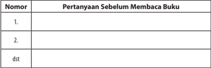

Tabel ini berisi pertanyaan sebelum membaca buku yang dianggap penting oleh pembaca. Kolom pertama menunjukkan nomor urutan pertanyaan, sedangkan kolom kedua berisi pertanyaan tersebut. Topik utama tabel ini adalah proses perencanaan pembacaan, dimana pembaca harus mempertimbangkan pertanyaan-pertanyaan sebelum membaca buku untuk mempersiapkan diri dan meningkatkan pengalaman membaca. Data atau pola penting yang terlihat adalah bahwa setiap pertanyaan memiliki nomor urut yang unik, yang menunjukkan bahwa pembaca harus mempertimbangkan berbagai aspek sebelum membaca buku.

### Kegiatan Pascabaca

---
**📊 Tabel**

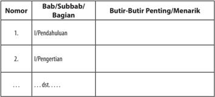

Tabel ini merupakan struktur umum dari sebuah bab atau subbab dalam buku pelajaran, masing-masing berisi beberapa butir penting atau menarik yang harus diperhatikan. Topik utama tabel adalah Bab/Subbab/Bagian, yang mencakup berbagai bagian dari materi pembelajaran. Kolom pertama, "Nomor", digunakan untuk memberikan nomor urut pada setiap butir penting atau menarik. Kolom kedua, "Bab/Subbab/Bagian", menyajikan judul atau topik yang akan dijelaskan dalam setiap butir penting atau menarik. Kolom ketiga, "Butir-Butir Penting/Menarik", berisi informasi atau fakta-fakta penting yang harus diperhatikan oleh pembaca atau peserta didik dalam konteks tersebut. Dari tabel ini, dapat disimpulkan bahwa setiap butir penting atau menarik memiliki konteks yang spesifik dan harus dipahami dengan baik dalam konteks yang relevan.

Dilaporkan oleh           : ………………………..

Kelas

: ……………

 

---
## 📄 Halaman 36

### Rangkuman

- Surat lamaran pekerjaan berisi permohonan untuk bekerja pada suatu tempat.  Hal  yang  perlu  dikemukakan  di  dalam  surat  lamaran  adalah identitas diri,  jasa  yang  dapat  diberikan,  pendidikan,  kecakapan/ keahlian, serta pengalaman (kualifikasi).
- Menurut jenis pembuatannya surat lamaran pekerjaan terbagi menjadi dua, yaitu:
- surat lamaran pekerjaan yang digabungkan dengan riwayat hidup (curriculum vitae) ; dan
- surat lamaran yang dipisahkan dari riwayat hidup.
- Ketentuan-ketentuan  yang  harus  diperhatikan  dalam  surat  lamaran pekerjaan.
- Gunakan bahasa yang baik dan benar.
- Gunakan kata-kata yang sopan.
- Gunakan kata pengantar yang jelas, singkat, padat, informatif, dan tepat sasaraan.
- Jaga agar tulisan bersih, mudah dibaca, sesuai dengan kaidah ejaan.
- Lengkapi  bagian-bagian  surat  (hal,  tempat/tanggal,  alamat,  salam pembuka, isi surat, salam penutup, tanda tangan, dan nama terang).
- Sistematika surat lamaran kerja
- Tempat dan tanggal pembuatan surat
- Lampiran dan perihal
- Alamat surat
- Salam pembuka
- Alinea pembuka
- Isi
- Penutup
- Salam penutup
- Tanda tangan dan nama terang
- Berikut  ini  hal-hal  yang  harus  diperhatikan  dalam  membuat  surat lamaran pekerjaan.
- Menggunakan bahasa yang baik dan benar.
- Format penulisan tersusun rapi dengan bahasa yang jelas.
- Surat  lamaran  kerja  hendaknya  ditulis  secara  manual  atau  ditulis tangan.
- Lengkapi  dengan  data-data  yang  dibutuhkan  oleh  perusahaan tempat melamar kerja.
- Lampirkan surat pendukung seperti sertifikat pengalaman kerja.

 

---
## 📄 Halaman 37

### Menikmati Cerita Sejarah

Sumber:http://www.sheratonbandung.com/en/asianafricanconference2015 dan www.goodreads.com

Novel  sejarah  merupakan  sebuah  genre  yang  penting  dan  sering  ditulis di  negara-negara  Barat.  Negara-negara  tersebut  menanamkan  pentingnya sejarah  dalam  pendidikan.  Novel  sejarah  membantu  memperkenalkan  dan mengakrabkan suatu masyarakat pada masa lalu bangsanya. Dengan demikian, pendidikan dalam novel dapat menanamkan akar pada bangsanya.

Seorang  sastrawan  yang  sering  kali  menggunakan  fakta-fakta  sejarah sebagai  latar  untuk  mengisahkan  tokoh-tokoh  fiksinya  bermaksud  untuk mengisahkan kembali seorang tokoh sejarah dalam berbagai dimensi kehidupannya,  seperti  emosi  pribadi  tokoh,  tragedi  yang  menimpanya, kehidupan keluarga dan masyarakat, serta pandangan politiknya. Misalnya, novel Roro Mendut versi Mangunwijaya dan versi Ajip Rosidi; Bumi Manusia, Jejak  Langkah,  Anak  Segala  Bangsa, dan Rumah  Kaca karya  Pramoedya

 

---
## 📄 Halaman 38

Ananta Toer; Kuantar ke Gerbang karya Ramadhan K.H. yang mengisahkan kehidupan Soekarno ketika menjalin rumah tangga dengan Inggit Garnasih; Novel Pangeran Diponegoro: Menggagas Ratu Adil karya Remy Silado. Contoh lain novel The da Vinci Code karya Dan Brown.

Novel sejarah adalah novel yang di dalamnya menjelaskan dan menceritakan  tentang  fakta  kejadian  masa  lalu  yang  menjadi  asal-muasal atau latar belakang terjadinya sesuatu yang memiliki nilai kesejarahan, bisa bersifat naratif atau deskriptif. Novel sejarah termasuk dalam teks naratif jika disajikan dengan menggunakan urutan peristiwa dan urutan waktu. Namun, jika novel sejarah disajikan secara simbolisasi verbal, novel tergolong ke dalam teks deskriptif.

Untuk membantu dalam mempelajari dan mengembangkan kompetensi bersastra, disajikan peta konsep berikut ini.

---
**🖼️ Gambar/Diagram**

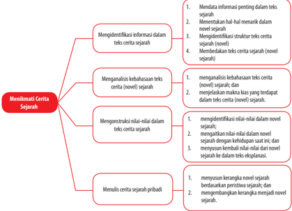

> **Deskripsi Visual:** Gambar ini adalah diagram yang menunjukkan proses menikmati cerita sejarah. Diagram ini dibagi menjadi dua bagian utama: "Menikmati Cerita Sejarah" dan "Elemen-elemen yang Dibutuhkan untuk Menikmati Cerita Sejarah". Bagian pertama menjelaskan tujuan utama menikmati cerita sejarah, yaitu menyadari informasi penting dalam teks, mengidentifikasi informasi, menganalisis kebahasaan teks, mengonstruksi nilai-nilai, dan menulis cerita sejarah pribadi. Bagian kedua menunjukkan elemen-elemen yang diperlukan untuk menikmati cerita sejarah, yaitu mengetahui struktur teks, memahami konteks teks, dan mengetahui cara kerja teks.

Elemen-elemen utama yang ditampilkan dalam diagram ini meliputi: mengetahui struktur teks, memahami konteks teks, dan mengetahui cara kerja teks. Relasi antara elemen-elemen ini adalah bahwa setiap elemen harus dipahami sebelum dapat menikmati cerita sejarah dengan baik. Teks, angka, atau label penting yang terlihat dalam diagram ini adalah "Menikmati Cerita Sejarah" dan "Elemen-elemen yang Dibutuhkan untuk Menikmati Cerita Sejarah".

Informasi kunci yang dapat diambil pembaca dari gambar ini adalah bahwa menikmati cerita sejarah melibatkan pemahaman tentang struktur teks, konteks teks, dan cara kerja teks. Pembaca juga harus memahami tujuan dan elemen-elemen yang diperlukan untuk menikmati cerita sejarah.

 

---
## 📄 Halaman 39

### A.  Mengidentifikasi Informasi dalam Teks Cerita Sejarah

Setelah mempelajari materi ini, kamu diharapkan mampu:

- mendata informasi penting dalam teks sejarah (novel);
- mengidentifikasi struktur teks cerita sejarah (novel); dan
- membedakan teks cerita sejarah (novel sejarah) dengan teks sejarah.
Pernahkah kamu  membaca  novel  yang berlatar belakang sejarah? Misalnya, novel Arus Balik dan Mangir karya Pramoedya Ananta Toer atau novel-novel  sejarah  lain  yang  berlatar  belakang  sejarah  Kerajaan  Majapahit berjudul Kemelut Majapahit karya SH. Mintarja.

Membaca novel (termasuk novel sejarah) dapat dilakukan dengan cepat. Perlu diusahakan agar membaca novel selesai dalam satu kurun waktu tertentu. Misalnya, satu jam selesai sebagai tahap pengenalan dengan membaca cepat. Perlu  ditumbuhkan  kesadaran  terhadap  diri  sendiri  bahwa  membaca  pada mulanya berat, tetapi jika sudah terbiasa akan menjadi ringan. Orang-orang yang sudah terbiasa membaca akan dengan mudah membaca novel dengan cepat.

Novel  sejarah  dapat  dikategorikan  sebagai  novel  ulang  (rekon).  Supaya tidak terjadi kesalahpahaman atas frasa 'novel ulang' , berikut ini penjelasan tentang jenis-jenis novel ulang.  Berdasarkan jenisnya, novel ulang terdiri atas tiga jenis, yakni rekon pribadi, rekon faktual, dan rekon imajinatif.

- Rekon pribadi adalah novel yang memuat kejadian dan penulisnya terlibat secara langsung.
- Rekon faktual (informasional) adalah novel yang memuat kejadian faktual seperti eksperimen ilmiah, laporan polisi, dan lain-lain.
- Rekon imajinatif adalah novel yang memuat kisah faktual yang dikhayalkan dan diceritakan secara lebih rinci.
Berdasarkan penjelasan di atas, novel sejarah tergolong ke dalam rekon imajinatif.  Artinya,  novel  tersebut  didasarkan  atas  fakta-fakta  sejarah  yang kemudian dikisahkan kembali dengan sudut pandang lain yang tidak muncul dalam fakta sejarah. Misalnya, kegemaran, emosi, dan keluarga.

 

---
## 📄 Halaman 40

Dalam menikmati novel sejarah, mula-mula kamu membacanya secara cepat.  Dalam  hal  ini  kamu  dapat  mengamati  bagian  tokoh  sejarah  yang dikisahkan, karakter yang digambarkan, dan kejadiannya. Misalnya, setelah membaca  novel Kuantar  ke  Gerbang karya  Ramadhan  K.H.  terbitan Sinar Harapan tahun 1981, kamu mampu mengenali bahwa novel ini sangat dekat dengan  sejarah.  Data-data  faktual,  seperti  tempat  kejadian  dan  tokohnya, benar adanya.

Ramadhan K.H. kemudian merekonstruksinya menjadi novel. Novel ini mengisahkan cerita romantis Ibu Inggit dengan Soekarno (Bapak Proklamator Indonesia).  Imajinasi  pengarang  muncul  saat  ingin  memberikan  makna tentang  peran  Ibu  Inggit  dalam  pembentukan  seorang  pribadi  yang  kelak akan menjadi presiden pertama negeri ini. Ibu Inggit-lah yang mengayomi, memelihara, dan mengantar Soekarno ke dalam kedudukannya sebagai tokoh nasional. Peran ini bukanlah sebagai 'kawan politik' , tetapi sebagai dua sosok yang saling memahami.

Inggit Garnasih yang usianya 12 tahun lebih tua dari Soekarno berperan sebagai istri, kawan, dan ibu yang menginginkan setiap suami, sahabat, dan anaknya sukses dalam kehidupannya. Peran ini dapat dijalankan secara simpatik oleh Inggit. Soekarno di dalam asuhan kejiwaan ibu Inggit dapat diantarkan ke  pintu  gerbang  pucuk  pimpinan  nasional.  Secara  simbolis  mengandung makna bahwa Ibu Inggit benar-benar mendampingi suaminya selama masa terberatnya dalam perjuangan. Soekarno dibentuk oleh Ibu Inggit menjelma menjadi pimpinan bangsa. Inilah yang diimajinasikan oleh pengarang, yang secara historis, simbolisasi ini tidak muncul dalam buku-buku sejarah tentang Soekarno dan tentang Inggit Garnasih: bahwa Ibu Inggit memegang peranan besar dalam riwayat pembentukan negeri ini. Hanya perannya tidak muncul ke publik karena lebih banyak di belakang layar, 'bagai seorang ibu yang hanya memberi, tetapi tak pernah meminta' . Ibu Inggit adalah Ibu Indonesia dalam menjelmakan seseorang menjadi pemimpin besar.

Plot  penceritaan  novel  sangat  bergantung  pada  tokoh  Soekarno  selama perjuangannya untuk menjadi tokoh politik penting Indonesia. Tokoh Inggit menjadi  'saksi  mata'  atas  semua  novel.  Teknik  orang  pertama  (aku)  yang digunakan  hanya  untuk  mengisahkan  kejadian  di  sekitar  Soekarno  dan bukan  tentang  dirinya  sendiri.  Melalui  teknik  ini,  pengarang  lebih  dapat mengungkapkan  perasaan  dan  pikiran  seorang  istri  pejuang  nasional  yang kurang dikenal secara publik.

 

---
## 📄 Halaman 41

### Mendata Informasi dalam Teks Sejarah

Kegiatan  mendata  informasi  penting  dalam  novel  sejarah  tentu  akan berbeda  dengan  mendata  informasi  penting  dalam  teks  sejarah.  Informasi penting dalam novel sejarah lebih mengarah kepada fakta sejarah yang dijadikan latar penceritaan serta imajinasi penulis atas fakta tersebut. Seperti dipaparkan pada  pengantar  sebelumnya,  novel Kuantar  ke  Gerbang karya  Ramadhan K.H.  mengandung  fakta  sejarah  tentang  masa  perjuangan  awal  Soekarno dan kehidupan rumah tangganya dengan Inggit Garnasih. Di samping tokoh, fakta sejarah yang digunakan adalah latar tempat, seperti Sukamiskin (sebuah nama kecamatan di Kota Bandung dan juga menjadi nama Lapas), Banceuy sebuah nama kelurahan di Kota Bandung dekat alun-alun Kota Bandung serta Kota  Bandung  itu  sendiri,  Surabaya  saat  Soekarno  melakukan  perjalanan dengan kereta api,  Endeh  dengan  membentuk rombongan sandiwara kisah perjalanannya dari Bengkulu ke Padang.

Pusat  penceritaan  novel  sejarah Kuantar  ke  Gerbang terletak  pada tokoh  Soekarno.  Namun  bukan  tentang  Soekarno  itu  sendiri,  melainkan kisah  kejadian  di  sekitarnya.  Imajinasi  pengarang  ini  secara  leluasa  banyak mengungkap perasaan dan pikiran tokoh Inggit Garnasih. Menurut Sumardjo (1991:57), imajinasi pengarang terhadap tokoh Inggit Garnasih dengan jasajasanya sering berubah menjadi semacam gugatan meskipun ini tak banyak dan  hadir  secara  tersamar  (implisit,  pen.).  Kesan  Jacob  Sumardjo  sangat beralasan karena dalam buku-buku sejarah tentang Soekarno, Inggit Garnasih sangat jarang dikupas. Padahal, jasa-jasanya sangat besar dalam mengantarkan Soekarno ke panggung politik nasional dan menjadi Bapak Bangsa. Penulis mengharapkan agar Inggit Garnasih semakin banyak dikupas dalam sejarah Indonesia.

### Latihan

Berikut ini disajikan kutipan novel sejarah berjudul Kemelut di Majapahit karya  SH  Mintardja  (hal.  22-27).  Sebelum  dibaca,  cobalah  membentuk kelompok (misalnya 4 orang). Salah satu anggota kelompok diminta membacakan kutipan. Siswa yang lain mendengarkan sambil mecatat informasiinformasi  penting  (fakta-fakta  sejarah  dan  imajinasi  pengarang).  Selama mendengarkan,  tutuplah  bukumu.  Nikmatilah  ceritanya  sambil  konsentrasi penuh.

 

---
## 📄 Halaman 42

### Kemelut di Majapahit (S.H. Mintardja)

Setelah Raden Wijaya berhasil menjadi Raja Majapahit pertama bergelar Kertarajasa  Jayawardhana,  beliau  tidak  melupakan  jasa-jasa  para  senopati (perwira) yang setia dan banyak membantunya semenjak dahulu itu membagibagikan pangkat kepada mereka. Ronggo Lawe diangkat menjadi adipati di Tuban  dan  yang  lain-lain  pun  diberi  pangkat  pula.  Dan  hubungan  antara junjungan ini dengan para pembantunya, sejak perjuangan pertama sampai Raden Wijaya menjadi raja, amatlah erat dan baik.

Akan  tetapi,  guncangan  pertama  yang  memengaruhi  hubungan  ini adalah  ketika  Sang    Prabu    telah  menikah  dengan  empat  putri  mendiang Raja  Kertanegara,  telah  menikah  lagi  dengan  seorang  putri  dari  Melayu. Sebelum  puteri  dari  tanah  Malayu  ini  menjadi  istrinya  yang  kelima,  Sang Prabu Kertarajasa Jayawardhana telah mengawini semua putri mendiang Raja Kertanegara. Hal ini dilakukannya karena beliau tidak menghendaki adanya dendam dan perebutan kekuasaan kelak.

Keempat orang puteri itu adalah Dyah Tribunan yang menjadi permaisuri, yang kedua adalah Dyah Nara Indraduhita, ketiga adalah Dyah Jaya Inderadewi, dan yang juga disebut Retno Sutawan atau Rajapatni yang berarti 'terkasih' karena  memang  putri  bungsu  dari  mendiang  Kertanegara  ini  menjadi  istri yang paling dikasihinya. Dyah Gayatri yang bungsu ini memang cantik jelita seperti seorang dewi kahyangan, terkenal di seluruh negeri dan kecantikannya dipuja-puja oleh para sastrawan di masa itu. Akan tetapi, datanglah pasukan yang beberapa tahun lalu diutus oleh mendiang Sang Prabu Kertanegara ke negeri  Malayu.  Pasukan  ini  dinamakan  pasukan  Pamalayu  yang  dipimpin oleh  seorang  senopati  perkasa  bernama  Kebo  Anabrang  atau  juga  Mahisa Anabrang, nama yang diberikan oleh Sang Prabu mengingat akan tugasnya menyeberang (anabrang) ke negeri Malayu. Pasukan ekspedisi yang berhasil baik ini membawa pulang pula dua orang putri bersaudara. Putri yang kedua, yaitu yang muda bernama Dara Petak, Sang Prabu Kertarajasa terpikat hatinya oleh  kecantikan  sang  putri  ini,  maka  diambillah  Dyah  Dara  Petak  menjadi istrinya yang kelima. Segera ternyata bahwa Dara Petak menjadi saingan yang paling kuat dari Dyah Gayatri, karena Dara Petak memang cantik jelita dan pandai membawa diri. Sang Prabu sangat mencintai istri termuda ini yang setelah diperisteri oleh Sang Baginda, lalu diberi nama Sri Indraswari.

Terjadilah persaingan di antara para istri ini, yang tentu saja dilakukan secara  diam-diam  namun  cukup  seru,  persaingan  dalam  memperebutkan cinta kasih dan perhatian Sri Baginda yang tentu saja akan mengangkat derajat

 

---
## 📄 Halaman 43

dan kekuasaan masing-masing. Kalau Sang Prabu sendiri kurang menyadari akan persaingan ini, pengaruh persaingan itu terasa benar oleh para senopati dan mulailah terjadi perpecahan diam-diam di antara mereka sebagai pihak yang  bercondong  kepada  Dyah  Gayatri  keturunan  mendiang  Sang  Prabu Kertanegara, dan kepada Dara Petak keturunan Malayu.

Tentu  saja  Ronggo  Lawe,  sebagai  seorang  yang  amat  setia  sejak  zaman Prabu  Kertanegara,  berpihak  kepada  Dyah  Gayatri.  Namun,  karena  segan kepada Sang Prabu Kertarajasa yang bijaksana, persaingan dan kebencian yang dilakukan secara diam-diam itu tidak sampai menjalar menjadi permusuhan terbuka.  Kiranya  tidak  ada  terjadi  hal-hal  yang  lebih  hebat  sebagai  akibat masuknya Dara Petak ke dalam kehidupan Sang Prabu, sekiranya tidak terjadi hal yang membakar hati Ronggo Lawe, yaitu pengangkatan patih hamangku bumi, yaitu Patih Kerajaan Mojapahit. Yang diangkat oleh Sang Prabu menjadi pembesar  yang  tertinggi  dan  paling  berkuasa  sesudah  raja  yaitu  Senopati Nambi.

Pengangkatan ini memang banyak terpengaruh oleh bujukan Dara Petak. Mendengar  akan  pengangkatan  patih  ini,  merahlah  muka  Adipati  Ronggo Lawe. Ketika mendengar berita ini dia sedang makan, seperti biasa dilayani oleh  kedua  orang  istrinya  yang  setia,  yaitu  Dewi  Mertorogo  dan  Tirtowati. Mendengar berita itu dari seorang penyelidik yang datang menghadap pada waktu sang adipati sedang makan, Ronggo Lawe marah bukan main. Nasi yang sudah dikepalnya itu dibanting ke atas lantai dan karena dalam kemarahan tadi  sang  adipati  menggunakan  aji  kedigdayaannya,  maka  nasi  sekepal  itu amblas ke dalam lantai. Kemudian terdengar bunyi berkerotok dan ujung meja diremasnya menjadi hancur.

'Kakangmas  adipati  ... harap Paduka  tenang  ..., '  Dewi  Mertorogo menghibur suaminya. 'Ingatlah, Kakangmas Adipati ... sungguh merupakan hal  yang  kurang  baik  mengembalikan  berkah  ibu  pertiwi  secara  itu... ' Tirtowati juga memperingatkan karena melempar nasi ke atas lantai seperti itu penghinaan terhadap Dewi Sri dan dapat menjadi kualat. Akan tetapi, Adipati Ronggo Lawe bangkit berdiri, membiarkan kedua tangannya dicuci oleh kedua orang istrinya yang berusaha menghiburnya. ' Aku harus pergi sekarang juga!' katanya. 'Pengawal lekas suruh persiapkan si Mego Lamat di depan! Aku akan berangkat ke Mojopahit sekarang juga!' Mego Lamat adalah satu di antara kuda-kuda kesayangan Adipati Ronggo Lawe, seekor kuda yang amat indah dan kuat, warna bulunya abu-abu muda. Semua cegahan kedua istrinya sama sekali tidak didengarkan oleh adipati yang sedang marah itu.

Tak  lama  kemudian,  hanya  suara  derap  kaki  Mego  Lamat  yang  berlari congkalang  yang    memecah    kesunyian    gedung    kadipaten    itu,    mengiris

 

---
## 📄 Halaman 44

perasaan  dua orang istri yang mencinta dan mengkhawatirkan keselamatan suami  mereka  yang  marah-marah  itu.  Pada  waktu  itu,  sang  Prabu  sedang dihadap oleh para senopati dan punggawa. Semua penghadap adalah bekas kawan-kawan seperjuangan Ronggo Lawe dan mereka ini terkejut sekali ketika melihat Ronggo Lawe datang menghadap raja tanpa dipanggil, padahal sudah agak lama Adipati Tuban ini tidak datang menghadap Sri Baginda. Sang Prabu sendiri juga memandang dengan alis berkerut tanda tidak berkenan hatinya, namun karena Ronggo Lawe pernah menjadi tulang punggungnya di waktu beliau masih berjuang dahulu, sang Prabu mengusir ketidaksenangan hatinya dan  segera  menyapa  Ronggo  Lawe.  Di  dalam  kemarahan  dan  kekecewaan, Adipati Ronggo  Lawe  masih ingat untuk  menghanturkan  sembahnya, tetapi  setelah  semua  salam  tata  susila  ini  selesai,  serta  merta  Ronggo  Lawe menyembah  dan  berkata  dengan  suara  lantang,  'Hamba  sengaja  datang menghadap Paduka untuk mengingatkan Paduka dari kekhilafan yang paduka lakukan di luar kesadaran Paduka!' Semua muka para penghadap raja menjadi pucat  mendengar  ucapan  ini,  dan  semua  jantung  di  dalam  dada  berdebar tegang.  Mereka  semua  mengenal  belaka  sifat  dan  watak  Ronggo  Lawe, banteng Mojopahit yang gagah perkasa dan selalu terbuka, polos dan jujur, tanpa tedeng aling-aling lagi dalam mengemukakan suara hatinya, tidak akan mundur setapak pun dalam membela hal yang dianggap benar. Sang Prabu sendiri memandang dengan mata penuh perhatian, kemudian dengan suara tenang bertanya, 'Kakang Ronggo Lawe, apakah maksudmu dengan ucapan itu?'

'Yang hamba maksudkan tidak lain adalah pengangkatan Nambi sebagai pepatih  paduka!  Keputusan  yang  paduka  ambil  ini  sungguh-sungguh  tidak tepat,  tidak  bijaksana  dan  hamba  yakin  bahwa  paduka  tentu  telah  terbujuk dan dipengaruhi oleh suara dari belakang! Pengangkatan Nambi sebagai patih hamangkubumi sungguh  merupakan kekeliruan yang besar sekali, tidak tepat dan tidak adil, padahal Paduka terkenal sebagai seorang Maharaja yang arif bijaksana dan adil!'

Hebat  bukan  main  ucapan  Ronggo  Lawe  ini!  Seorang  adipati,  tanpa dipanggil, berani datang menghadap sang Prabu dan melontarkan teguranteguran seperti itu! Muka Patih Nambi sebentar pucat sebentar merah, kedua tangannya  dikepal  dan  dibuka  dengan  jari-jari  gemetar.  Senopati  Kebo Anabrang  mukanya  menjadi  merah  seperti  udang  direbus,  matanya  yang lebar  itu  seperti  mengeluarkan  api  ketika  dia  mengerling  ke  arah  Ronggo Lawe. Lembu Sora yang sudah tua itu menjadi pucat mukanya, tak mengira dia  bahwa  keponakannya  itu  akan  seberani  itu.  Senopati-senopati  Gagak Sarkoro  dan  Mayang  Mekar  juga  memandang  dengan  mata  terbelalak.

 

---
## 📄 Halaman 45

Pendeknya,  semua  senopati  dan  pembesar  yang  saat  itu  menghadap  sang prabu  dan  mendengar  ucapan-ucapan  Ronggo  Lawe,  semua  terkejut  dan sebagian besar marah sekali, tetapi mereka tidak berani mencampuri karena mereka menghormat sang Prabu. Akan tetapi, sang Prabu Kertarajasa tetap tenang, bahkan tersenyum memandang kepada Ronggo Lawe, ponggawanya yang dia tahu amat setia kepadanya itu, lalu berkata halus, 'Kakang Ronggo Lawe, tindakanku mengangkat kakang Nambi sebagai patih hamangkubumi, bukanlah merupakan tindakan ngawur belaka, melainkan telah merupakan suatu  keputusan  yang  telah  dipertimbangkan  masak-masak,  bahkan  telah mendapatkan  persetujuan  dari  semua  paman  dan  kakang  senopati  dan semua  pembantuku.  Bagaimana  Kakang  Ronggo  Lawe  dapat  mengatakan bahwa pengangkatan itu tidak tepat dan tidak adil?' Dengan muka merah, kumisnya yang seperti kumis Sang Gatotkaca itu bergetar, napas memburu karena desakan amarah, Ronggo Lawe berkata lantang, 'Tentu saja tidak tepat! Paduka sendiri tahu siapa si Nambi itu! Paduka tentu masih ingat akan segala sepak  terjang  dan  tindak-tanduknya  dahulu!  Dia  seorang  bodoh,  lemah, rendah budi, penakut, sama sekali tidak memiliki wibawa ... '

Sumber:http://www.4shared.com/document/ZIG0MKli/SH_intardja_-_Kemelut _di_Maja.htm

### Kegiatan

### Menentukan Hal-Hal Menarik dalam Novel Sejarah

Ketika mendengarkan  pembacaan  kutipan  novel, tentulah terdapat bagian-bagian yang menarik. Kemenarikan itu dapat berupa waktu, tempat, tokoh yang mungkin bagi sebagian orang tidak asing.

Untuk  mengukur  kemampuan  mendengarkan,  jawablah  pertanyaanpertanyaan berikut ini.

- Kapankah latar waktu cerita dalam kutipan novel sejarah tersebut dibuat?
- Di manakah latar dalam kutipan novel sejarah tersebut dibuat?
- Peristiwa apa saja yang dikisahkan?
- Siapa saja tokoh yang terlibat dalam penceritaan?
- Di bagian apa sajakah yang menandakan bahwa novel tersebut tergolong ke dalam novel sejarah?
Diskusikanlah  hasil  kerja  dengan  teman  satu  kelompokmu.  Untuk memperdalam  jawaban-jawabanmu,  bersama  tim  kelompok  telusuri  lebih jauh mengenai kebenaran dari segi fakta dengan membaca buku-buku sejarah.

 

---
## 📄 Halaman 46

Jika sudah didapatkan rumusan fakta sejarah, selanjutnya diskusikan imajinasi yang dikembangkan melalui penceritaannya. Misalnya, berpusat pada tokoh siapa penceritaan dilakukan, untuk menjelaskan tokoh imajinasi siapa, segisegi  apa  yang  diceritakan  pada  tokoh  yang  diimajinasikan  (seperti  emosi, pandangan politik, kekuatan pribadi), mengapa pengarang menonjolkan tokoh yang diimajinasikan, kelebihan apa yang dimiliki tokoh yang diimajinasikan sehingga tokoh ini memiliki kekuatan penceritaan.

Jika  sudah  menyelesaikan  kegiatan  di  atas,    mari  kita  lanjutkan  untuk menikmati novel sejarah dengan membaca kutipan novel berikut ini.

### Tugas

Petunjuk:  Bacalah  kutipan  teks  novel  sejarah Gajah  Mada  Bergelut dalam Takhta dan Angkara berikut ini. Kemudian kerjakan, tugas-tugas yang menyertainya.

### Gajah Mada Bergelut dalam Takhta dan Angkara

...

Cerita  macam  itu  berkembang  ke  arah  salah  kaprah.  Entah  siapakah yang bercerita, kabut tebal itu memang disengaja oleh para dewa di kayangan agar  wajah  cantik  para  bidadari  yang  turun  dari  kayangan  melalui  pelangi jangan sampai dipergoki manusia. Para bidadari itu turun untuk memberikan penghormatan kepada satu-satunya wanita di dunia yang terpilih sebagai sang Ardhanareswari, yang berarti wanita utama yang menurunkan raja-raja besar di tanah Jawa ini. Maklum sebagai sang Ardhanareswari, Ken Dedes adalah titisan  dari  Pradnya  Paramita,  dewi  ilmu  pengetahuan.  Apa  benar  kabut tebal itu turun karena para bidadari turun dari langit? Gajah Mada tidak bisa menyembunyikan  senyumnya  dari  kenangan  kakek  tua,  yang  menuturkan cerita itu dan mengaku memergoki para bidadari itu, lalu mengambil salah seorang di antara mereka menjadi istrinya. Gajah Mada ingat, anak kakek tua itu perempuan semua dan jelek semua, sama sekali tidak ada pertanda titisan bidadari.

'Mirip cerita Jaka Tarub saja, ' gumam Gajah Mada sekali lagi untuk diri sendiri. 'Lagi pula, setahuku tidak pernah ada pelangi di malam hari. Pelangi itu munculnya selalu siang dan ketika sedang turun hujan. '

Lebih jauh soal kabut tebal pula, konon ketika Calon Arang, si perempuan penyihir  dari  Ghirah  marah  dan  menebar  tenung,  kabut amat tebal membawa penyakit  turun  tak  hanya  di  wilayah  tertentu.  Namun,  merata  di  seluruh

 

---
## 📄 Halaman 47

negara, menyebabkan Prabu Airlangga dan Patih Narottama kebingungan dan terpaksa minta bantuan kepada Empu Barada untuk meredam sepak terjang wanita menakutkan itu. Empu Barada benar-benar sakti. Empu itu menebas pelepah daun keluwih yang melayang terbang ketika dibacakan japa mantra. Beralaskan pelepah daun itulah Empu Barada terbang membubung ke langit dan  memperhatikan  seberapa  luas  kabut  pembawa  tenung  dan  penyakit. Empu  Barada  melihat,  ampak-ampak  pedhut  itu  memang  sangat  luas  dan menelan luas negara dari ujung ke ujung. Untunglah cahaya Hyang Bagaskara yang datang di pagi harinya mampu mengusir kabut itu menjauh tanpa tersisa jejaknya sedikit pun.

'Hanya sebuah dongeng,' gumam Gajah Mada untuk diri sendiri. Kabut tebal  itu  memang  mengurangi  jarak  pandang  dan  mengganggu  siapa  pun untuk  mengetahui  keadaan  di  sekitarnya.  Ketika  sebelumnya  siapa  pun tak  sempat  memikirkan,  itulah  saatnya  siapa  pun  mendadak  merasakan bagaimana menjadi orang buta yang tidak bisa melihat apa-apa. Pada wilayah yang kabutnya benar-benar tebal, untuk mengenali benda-benda di sekitarnya harus dengan meraba-raba.

Akan tetapi, tidak demikian dengan anjing yang menggonggong sahutsahutan  ramai  sekali.  Apa  yang  dilakukan  anjing  itu  laporannya  akhirnya sampai ke telinga Gajah Mada. Gajah Enggon yang meminta izin untuk bertemu segera melepas warastra, sanderan dengan ciri-ciri khusus yang dibalas Gajah Mada dengan anak panah yang sama melalui isyarat khusus pula. Dari jawaban anak panah itu Gajah Enggon dan Gagak Bongol mengetahui di mana Gajah Mada berada. Gagak Bongol dan Enggon segera melaporkan temuannya.

'Ditemukan mayat lagi, Kakang Gajah,' Gajah Enggon melaporkan. Gajah Mada memandangi wajah samar-samar di depannya. 'Mayat siapa?'

'Prajurit  bernama Klabang Gendis mati dengan anak panah menancap tepat di tenggorokannya. Tak ada jejak perkelahian apa pun, sasaran menjadi korban tanpa menyadari arah bidikan anak panah tertuju kepadanya.'

Gajah  Mada  merasa  tak  nyaman  memperoleh  laporan  itu.  Orang  yang mampu melepas anak panah dengan sasaran sulit pastilah orang yang sangat menguasai sifat gendewa dan anak panahnya. Orang yang mampu melakukan hal khusus macam itu amat terbatas dan umumnya ada di barisan pasukan Bhayangkara. Adakah prajurit Bhayangkara yang terlibat?

'Dan kami temukan mayat kedua,' Gagak Bongol menambahkan.

'Pelaku  pembunuhan menggunakan anak panah itu mati dipatuk ular.

 

---
## 📄 Halaman 48

Mayatnya dicabik-cabik beberapa ekor anjing. Pembunuh yang terbunuh ini,  menyisakan  jejak  rasa  kecewa  di  hati  kita,  Kakang.  Aku  tahu,  Kakang Gajah pasti kecewa mengetahui siapa dia?'

Gajah Mada menengadah memandang langit. Namun, tak ada apa pun yang tampak kecuali warna pedhut yang makin menghitam legam.

'Bhayangkara?'

'Ya, ' jawab Gagak Bongol. 'Siapa?' lanjut Gajah Mada.

Gagak Bongol dan Senopati Gajah Enggon tidak segera menjawab dan memberikan kesempatan kepada Patih Daha Gajah Mada untuk menemukan sendiri jawabnya. Nama pembunuh yang mati dipatuk ular itu tentu berada di  barisan  yang  tersisa  dari  nama-nama  prajurit  Bhayangkara  yang  pernah dipimpinnya.  Nama-nama itu adalah Bhayangkara Lembu Pulung, Panjang Sumprit,  Kartika  Sinumping,  Jayabaya,  Pradhabasu,  Lembang  Laut,  Riung Samudra, Gajah Geneng, Gajah Enggon, Macan Liwung, dan Gagak Bongol. Panji  Saprang yang berkhianat dan menjadi kaki tangan Rakrian Kuti mati dibunuh  Gajah  Mada  di  terowongan  bawah  tanah  ketika  pontang-panting menyelamatkan  Sri  Jayanegara.  Bhayangkara  Risang  Panjer  Lawang  gugur di  Mojoagung, dibunuh dengan cara licik oleh pengkhianat kaki tangan Ra Kuti.  Selanjutnya,  Mahisa  Kingkin  terbunuh  oleh  Gagak  Bongol  sebagai korban fitnah di Hangawiyat. Terakhir, Singa Parepen atau Bango Lumayang yang berkhianat mati dibunuhnya di Bedander ketika kamanungsan sebagai pengkhianat.

...

(Sumber: Gajah Mada Bergelut dalam Kemelut Takhta dan Angkara karya Langit Kresna Hariadi, halaman 109-111).

Setelah membaca kutipan novel tersebut, jawablah pertanyaan-pertanyaan berikut ini.

- Kapankah latar waktu cerita dalam kutipan novel sejarah di atas dibuat?
- Di manakah latar dalam kutipan novel sejarah tersebut dibuat?
- Peristiwa apa sajakah yang dikisahkan?
- Siapa sajakah tokoh yang terlibat dalam penceritaan?
- Di bagian apa sajakah yang menandakan bahwa novel tersebut tergolong ke dalam novel sejarah?
Diskusikanlah  hasil  kerja  dengan  teman  satu  kelompokmu.  Untuk memperdalam jawaban-jawabanmu, bersama tim kelompok menelusuri lebih jauh mengenai kebenaran dari segi fakta dengan membaca buku-buku sejarah.

 

---
## 📄 Halaman 49

Jika sudah didapatkan rumusan fakta sejarah, selanjutnya diskusikan imajinasi yang dikembangkan melalui penceritaannya. Misalnya, berpusat pada tokoh siapa penceritaan dilakukan, untuk menjelaskan tokoh imajinasi siapa, segisegi  apa  yang  diceritakan  pada  tokoh  yang  diimajinasikan  (seperti  emosi, pandangan politik, kekuatan pribadi), mengapa pengarang menonjolkan tokoh yang diimajinasikan, kelebihan apa yang dimiliki tokoh yang diimajinasikan sehingga tokoh ini memiliki kekuatan penceritaan.

Agar upaya yang kamu lakukan semakin bermakna, kembangkanlah hasil diskusi menjadi sebuah tulisan esai atau kritik. Panjang tulisan kira-kira dua halaman A4 dengan ukuran 1,5 spasi. Cobalah kirim ke media massa cetak lokal atau nasional. Publikasi dapat pula dilakukan melalui media blog pribadi atau majalah dinding di sekolah. Namun, presentasikan terlebih dahulu tulisan tersebut di kelas secara panel antarkelompok.

### Mengidentifikasi Struktur Teks Cerita Sejarah

Novel sejarah, seperti juga novel-novel lainnya, termasuk dalam genre teks cerita ulang. Novel sejarah juga mempunyai struktur teks yang sama dengan struktur novel lainnya yaitu orientasi, pengungkapan peristiwa, rising action , komplikasi, evaluasi/resolusi, dan koda.

- Pengenalan situasi cerita ( exposition, orientasi) Dalam bagian ini, pengarang memperkenalkan setting cerita baik waktu, tempat, maupun peristiwa. Selain itu, orientasi juga dapat disajikan dengan mengenalkan para tokoh, menata adegan, dan hubungan antartokoh.
- Pengungkapan peristiwa Dalam bagian ini disajikan peristiwa awal yang menimbulkan berbagai masalah, pertentangan, ataupun kesukaran-kesukaran bagi para tokohnya.
- Menuju konflik (rising action) Terjadi peningkatan perhatian kegembiraan, kehebohan,
ataupun keterlibatan berbagai situasi yang menyebabkan bertambahnya kesukaran

- tokoh.
Bagian ini disebut pula sebagai klimaks. Inilah bagian cerita yang paling besar dan mendebarkan. Pada bagian ini pula, ditentukannya perubahan nasib  beberapa  tokohnya.  Misalnya,  apakah  dia  kemudian  berhasil

- Puncak konflik ( turning point, komplikasi) menyelesaikan masalahnya atau gagal.

 

---
## 📄 Halaman 50

### 5. Penyelesaian ( evaluasi, resolusi)

Sebagai akhir cerita, pada bagian ini berisi penjelasan ataupun penilaian tentang sikap ataupun nasib-nasib yang dialami tokohnya setelah mengalami  peristiwa  puncak  itu.  Pada  bagian  ini  pun  sering  pula dinyatakan wujud akhir dari kondisi ataupun nasib akhir yang dialami tokoh utama.

- Koda
Bagian  ini berupa  komentar  terhadap  keseluruhan  isi  cerita,  yang fungsinya sebagai penutup. Komentar yang dimaksud bisa disampaikan langsung  oleh  pengarang  atau  dengan  mewakilkannya  pada  seorang tokoh. Hanya saja tidak setiap novel memiliki koda, bahkan novel-novel modern lebih banyak menyerahkan simpulan akhir ceritanya itu kepada para pembacanya. Mereka dibiarkan menebak-nebak sendiri penyelesaian ceritanya.

Untuk  lebih  memahami  struktur  teks  novel  sejarah,  pelajarilah  contoh analisis  struktur  novel  sejarah Gajah  Mada:  Bergelut  dalam  Takhta dan Angkara berikut ini.

---
**📊 Tabel**

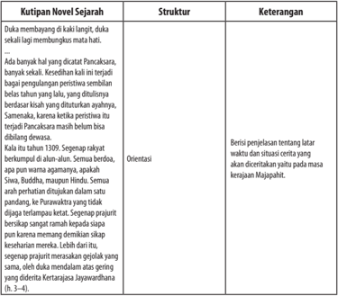

Tabel ini berisi informasi tentang kutipan novel sejarah dengan struktur dan keterangan yang disajikan secara sistematis. Topik utama tabel adalah kutipan novel sejarah, yang mencakup dua kolom utama: Struktur dan Keterangan. Struktur kutipan ditampilkan di baris pertama, sementara keterangan di baris kedua. Data penting yang terlihat meliputi:

1. Struktur kutipan:
   - Duka membangayu di kali lanjut, duka sekali lagi membunyikun mati hati.
   - Ada banyak hal yang dicat Pancasakara, banyak sekali.
   - Kedudukan itu menjadi bagai pengangkatan peristiwa sendian belas tahunnya lalu, ditulisinya berdasar kisah yang diturunkan ayahnya.
   - Samenaka, karena ketika peristiwa itu terjadi Pancasakara masih belum bisa dilanggani dewasa.

2. Keterangan:
   - Orientasi
   - Berisi penjelasan tentang waktu dan situasi cerita yang dicatatkan pada masa kerajaan Majapahit.

Tabel ini membantu pembaca memahami struktur dan konteks dari kutipan novel sejarah tersebut, serta memberikan pemahaman lebih mendalam tentang konteks dan makna dari kutipan tersebut dalam konteks sejarah Majapahit.

 

---
## 📄 Halaman 51

---
**📊 Tabel**

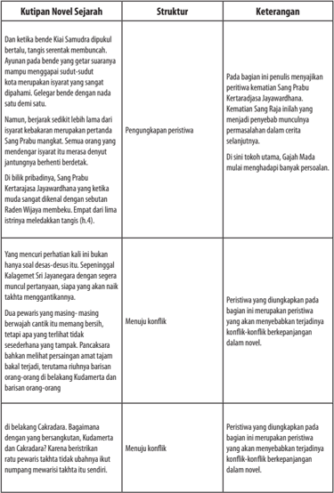

Tabel ini berisi informasi tentang struktur dan keterangan dari kutipan novel sejarah. Topik utamanya adalah analisis peristiwa dalam cerita. Tabel dibagi menjadi dua kolom: Struktur dan Keterangan. Struktur meliputi penjelasan tentang bagian-bagian utama dari peristiwa, seperti pengungkapan peristiwa, menuju konflik, dan di belakang Cakradara. Keterangan memberikan penjelasan lebih lanjut tentang setiap bagian tersebut, seperti penjelasan tentang bagian pengungkapan peristiwa, konflik yang terjadi, dan bagian di belakang Cakradara. Data penting yang terlihat adalah bahwa tabel ini membahas bagaimana peristiwa dalam novel sejarah ditampilkan secara struktural dan mendalam, dengan menjelaskan bagaimana peristiwa tersebut berkembang dan mempengaruhi cerita secara keseluruhan.

 

---
## 📄 Halaman 52

---
**📊 Tabel**

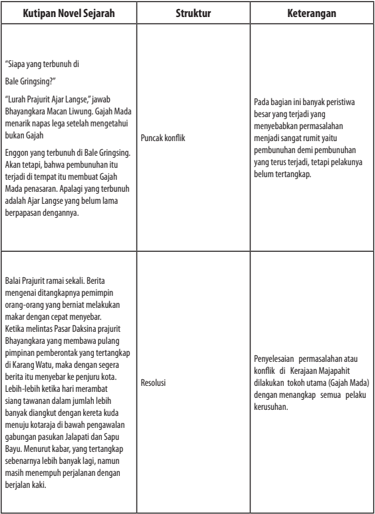

Tabel ini memperlihatkan struktur dan keterangan dari sebuah novel sejarah yang berfokus pada konflik antara Bale Gringsing dan Ajar Langge. Topik utama tabel adalah peristiwa konflik tersebut, yang melibatkan Bale Gringsing dan Ajar Langge. Tabel dibagi menjadi tiga kolom: kutipan novel sejarah, struktur, dan keterangan. Kutipan novel sejarah berisi dialog antara Bale Gringsing dan Ajar Langge tentang konflik mereka. Struktur tabel menunjukkan bahwa konflik dimulai dengan Bale Gringsing yang terbunuh di Bale Gringsing, kemudian Ajar Langge yang terbunuh di tempat itu. Keterangan tabel memberikan penjelasan tentang bagaimana konflik tersebut berkembang, termasuk puncak konflik dan resolusinya. Konflik dimulai ketika Bale Gringsing menyerang Ajar Langge, yang akhirnya menyebabkan pembunuhan Ajar Langge oleh Bale Gringsing. Resolusi konflik ditandai dengan pembunuhan Bale Gringsing oleh Ajar Langge, yang kemudian disiksa oleh Balai Prajurit. Tabel ini membantu membantu memahami struktur dan konteks konflik dalam novel tersebut.

 

---
## 📄 Halaman 53

---
**📊 Tabel**

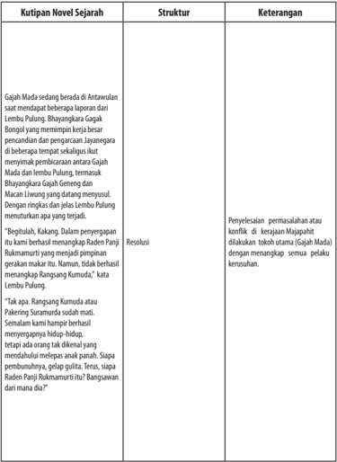

Tabel ini berisi informasi tentang kutipan novel sejarah yang membahas peristiwa Gajah Mada. Topik utama tabel adalah perpecahan pemerintahan di masa pemerintahan Raja Panji Rukmati II. Tabel memiliki tiga kolom: Kutipan Novel Sejarah, Struktur, dan Keterangan. Kutipan novel tersebut menggambarkan situasi ketika Gajah Mada sedang berada di Antuwana saat beberapa laporan dari Lembu Pulung dan Bhayangkara Gajah Bungul meminta kekuasaan kepada Gajah Mada. Gajah Mada kemudian menyerahkan kekuasaannya kepada Raja Panji Rukmati II, yang kemudian mengambil keputusan untuk memecat Gajah Mada dan mengambil kekuasaan sendiri. Tabel juga mencakup resolusi yang ditetapkan oleh Raja Panji Rukmati II, yaitu bahwa Rangsang Kumuda atau Paketar Suramadu sudah mati dan semalam kami hamper berhasil menyepakati hidup-hidup. Tabel ini memberikan gambaran tentang konflik dan resolusi yang terjadi pada masa pemerintahan Raja Panji Rukmati II.

 

---
## 📄 Halaman 54

---
**📊 Tabel**

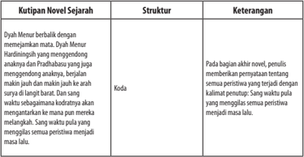

Tabel ini berisi informasi tentang struktur dan keterangan dari kutipan novel sejarah. Topik utamanya adalah tentang bagian akhir novel yang mencakup penyebaran peristiwa yang terjadi di akhir novel. Kolom pertama berisi nama-nama karakter atau tokoh yang muncul dalam novel tersebut. Kolom kedua menjelaskan struktur dari kutipan tersebut, sementara kolom ketiga memberikan keterangan tentang apa yang terjadi di bagian akhir novel. Data penting yang terlihat adalah bahwa penulis menambahkan penutupan yang menyampaikan bahwa semua peristiwa yang terjadi di akhir novel menjadi masa lalu.

Untuk  lebih  meningkatkan  pemahamanmu  terhadap  struktur  novel sejarah,  analisislah  dengan  memanfaatkan  kutipan  novel Mangir karya Pramoedya Ananta Toer  berikut ini.

### Mangir

### Karya Pramoedya Ananta Toer

Di bawah bulan malam ini, tiada setitik pun awan di langit. Dan bulan telah terbit bersamaan dengan tenggelamnya matari. Dengan cepat ia naik dari kaki langit, mengunjungi segala dan semua yang tersentuh cahayanya. Juga hutan, juga laut, juga hewan dan manusia. Langit jernih, bersih, dan terang. Di atas bumi Jawa lain lagi keadaannya gelisah, resah, seakan-akan manusia tak membutuhkan ketenteraman lagi.

### 1. Abad Keenam Belas Masehi

Bahkan juga laut Jawa di bawah bulan purnama sidhi itu gelisah. Ombakombak besar bergulung-gulung memanjang terputus, menggunung, melandai, mengejajari pesisir pulau Jawa. Setiap puncak ombak dan riak, bahkan juga busanya  yang  bertebaran  seperti  serakan  mutiara-semua-dikuningi  oleh cahaya bulan. Angin meniup tenang. Ombak-ombak makin menggila.

Sebuah kapal peronda pantai meluncur dengan kecepatan tinggi dalam cuaca angin damai itu. Badannya yang panjang langsing, dengan haluan dan buritan  meruncing,  timbul-tenggelam  di  antara  ombak-ombak  purnama yang  menggila.  Layar  kemudi  di  haluan  menggelembung  membikin  lunas menerjang  serong  gunung-gunung  air  itu-serong  ke  barat  laut.  Barisan dayung pada dinding kapal berkayuh berirama seperti  kaki-kaki  pada  ular

 

---
## 📄 Halaman 55

naga.  Layarnya yang terbuat dari pilinan kapas dan benang sutra, mengilat seperti emas, kuning dan menyilaukan.

Sang Patih berhenti di tengah-tengah pendopo, dekat pada damarsewu, menegur, 'Dingin-dingin begini anakanda datang. Pasti ada sesuatu keluarbiasaan. Mendekat sini, anakanda. ' Dan Patragading berjalan mendekat dengan lututnya sambil mengangkat sembah, merebahkan diri pada kaki Sang Patih. ' Ampuni patik, membangunkan Paduka pada malam buta begini Kabar duka, Paduka. Balatentara Demak di bawah Adipati Kudus  memasuki Jepara tanpa diduga-duga, menyalahi aturan perang.'

' Allah  Dewa  Batara!'  sahut  Sang  Patih.  'Itu  bukan  aturan  raja-raja!  Itu aturan brandal!'

'Balatentara Tuban tak sempat dikerahkan, Paduka.'

'Bagaimana Bupati Jepara?'

'Tewas enggan menyerah Paduka,' Patragading mengangkat sembah. 'Sisa balatentara Tuban mundur ke timur kota. Jepara penuh dengan balatentara Demak. Lebih dari tiga ribu orang. '

'Begitulah kata warta, ' Pada meneruskan dengan hati-hati matanya tertuju pada Boris. 'Semua bangunan batu di atas wilayah Kota, gapura, arca, pagoda, kuil, candi, akan dibongkar. Setiap batu berukir telah dijatuhi hukum buang ke laut! Tinggal hanya pengumumannya.'

'Disambar  petirlah  dia!'  Boris  meraung,  seakan  batu-batu  itu  bagian dari dirinya sendiri. 'Dia hendak cekik semua pernahat dan semua dewa di kahyangan. Dikutuk dia oleh Batara Kala!' Tiba-tiba suaranya turun mengibaiba: ' Apa lagi artinya pengabdian? Aku pergi! Jangan dicari. Tak perlu dicari!' Meraung.

Ia lari keluar ruangan, langsung menuju ke pelataran depan. Diangkatnya tangga dan dengannya melangkahi pagar papan kayu. Dari balik pagar orang berseru-seru, 'Lari dari asrama! Lari!'

Mula-mula  pertikaian  berkisar  pada  kelakuan  Trenggono  yang  begitu sampai hati membunuh abangnya sendiri, kemudian diperkuat oleh sikapnya yang polos terhadap peristiwa Pakuan. Mengapa Sultan tak juga menyatakan sikap menentang usaha Portugis yang sudah mulai melakukan perdagangan ke Jawa? Sikap itu semakin ditunggu semakin tak datang. Para musafir yang sudah  tak  dapat  menahan  hati  lagi  telah  bermusyawarah  dan  membentuk utusan  untuk  menghadap  Sultan.  Mereka  ditolak  dengan  alasan:  apa  yang terjadi di Pajajaran tak punya sangkut paut dengan Demak dan musafir.

 

---
## 📄 Halaman 56

Jawaban itu mengecewakan para musafir. Bila demikian, mereka menganggap, sudah tak ada perlunya lagi para musafir mengagungkan Demak karena  keagungannya  memang  sudah  tak  ada  lagi.  Apa  gunanya  armada besar peninggalan Unus, yang telah dua tahun disiapkan kalau bukan untuk mengusir  Portugis  dan  dengan  demikian  terjamin  dan  melindungi  Demak sebagai  negeri  Islam  pertama-tama  di  Jawa?  Masuknya  Peranggi  ke  Jawa berarti ancaman langsung terhadap Islam. Kalau Trenggono tetap tak punya sikap, jelas dia tak punya sesuatu urusan dengan Islam.

...

Orang  menarik  kesimpulan  dari  perkembangan  terakhir:  antara  anak dan ibu takkan ada perdamaian lagi. Dan pertanyaan kemudian yang timbul: Adakah Sultan akan mengambil tindakan terhadap ibunya sendiri sebagaimana ia telah melakukannya terhadap abang-kandungnya.

Pangeran Seda Lepen? Orang menunggu dan menunggu dengan perasaan prihatin terhadap keselamatan wanita tua itu. Sultan Trenggono tak mengambil sesuatu tindakan terhadap ibunya. Ia makin keranjingan membangun pasukan daratnya. Hampir setiap hari orang dapat melihat ia berada di tengah-tengah pasukan kuda kebanggaannya, baik dalam latihan, sodor, maupun ketangkasan berpacu  samba  memainkan  pedang  menghajar  boneka  yang  digantungkan pada sepotong kayu. Ia sendiri ikut dalam latihan-latihan ini.

Dan dalam salah satu kesempatan semacam ini pernah ia berkata secara terbuka, 'Tak ada yang lebih ampuh daripada pasukan kuda. Lihat, kawula kami  semua!'  Dan  para  perwira  pasukan  kuda  pada  berdatangan  dan merubungnya, semua di atas kuda masing-masing.

'Pada suatu kali, kaki kuda Demak akan mengepulkan debu di seluruh bumi Jawa. Bila debunya jatuh kembali ke bumi, ingat-ingat para kawula, akan kalian lihat, takkan ada satu tapak kaki orang Peranggi pun tampak. Juga tapaktapaknya di Blambangan dan Pajajaran akan musnah lenyap tertutup oleh debu kuda kalian. ' Seluruh Tuban kembali dalam ketenangan dan kedamaian-kota dan pedalaman. Sang Patih Tuban mendiang telah digantikan oleh Kala Cuwil, pemimpin  pasukan  gajah.  Nama  barunya:  Wirabumi.  Panggilannya  yang lengkap: Gusti Patih Tuban Kala Cuwil Sang Wirabumi. Dan sebagai patih ia masih tetap memimpin pasukan gajah, maka Kala Cuwil tak juga terhapus dalam sebutan. Pasar kota dan pasar bandar ramai kembali seperti sediakala. Lalu lintas laut, kecuali dengan Atas Angin, pulih kembali. Sang Adipati telah menjatuhkan  titah:  kapal-kapal  Tuban  mendapat  perkenan  untuk  berlabuh dan berdagang di Malaka ataupun Pasai.

 

---
## 📄 Halaman 57

Bardasarkan kutipan novel di atas,  lakukan  kegiatan  pengidentifikasian cerita ke dalam tabel di bawah ini.

---
**📊 Tabel**

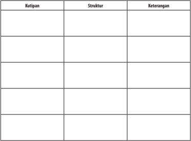

Tabel ini berisi kutipan dari beberapa sumber, masing-masing dengan struktur dan keterangan tertentu. Topik utama tabel adalah analisis atau pemahaman tentang kutipan tersebut. Kolom-kolomnya meliputi "Kutipan", "Struktur", dan "Keterangan". Dari data yang terlihat, kita dapat melihat bahwa setiap kutipan memiliki struktur yang berbeda-beda, mulai dari paragraf singkat hingga paragraf panjang. Selain itu, setiap kutipan juga dilengkapi dengan keterangan yang menjelaskan makna atau konteks dari kutipan tersebut. Ini menunjukkan bahwa tabel ini digunakan untuk membandingkan dan memahami berbagai sumber informasi secara lebih mendalam.

### Kegiatan

4

### Membandingkan Novel Sejarah dengan Teks Sejarah

Setelah membaca kutipan novel sejarah di atas, kamu pasti dapat menarik kesimpulan  bahwa  novel  sejarah  berbeda  dengan  teks  sejarah  seperti  yang ada dalam buku-buku sejarah. Agar kamu lebih memahami perbedaan antara novel sejarah dengan teks sejarah, pelajarilah tabel berikut ini.

### Tabel Perbedaan Novel Sejarah dengan Teks Sejarah

 

---
## 📄 Halaman 58

---
**📊 Tabel**

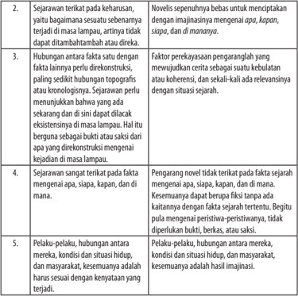

Tabel ini berisi informasi tentang prinsip-prinsip sejarah yang diperlukan untuk menulis novel dengan benar. Topik utamanya adalah tentang kualitas sejarah yang harus dimiliki oleh narasi novel. Kolom pertama menyatakan prinsip-prinsip tersebut, sedangkan kolom kedua menjelaskan definisi dan deskripsi singkat dari prinsip tersebut. Data penting yang terlihat adalah bahwa novel harus memiliki sejarah yang terkait dengan fakta, tidak hanya mengekspresikan fakta yang telah terjadi, tetapi juga harus mempertimbangkan aspek-aspek lain seperti hubungan antara karakter, kondisi situasi, dan makayarakat. Selain itu, novel harus memiliki kebenaran dan realisme yang tinggi, serta harus mampu menunjukkan perubahan dan perkembangan dalam sejarah yang ditulis.

### Tugas

Berdasarkan uraian sebelumnya, temukanlah bukti perbandingan antara teks sejarah berikut ini dengan kutipan novel sejarah Rumah Kaca karya Pramoedya Ananta Toer.

 

---
## 📄 Halaman 59

### BOROBUDUR

---
**🖼️ Gambar/Diagram**

> **Deskripsi Visual:** Gambar ini adalah foto yang menunjukkan candi Borobudur di Indonesia pada pukul senja. Candi ini terdiri dari banyak bangunan berbentuk piramida yang terbuat dari batu pasir, dengan setiap piramida memiliki patung Buddha di atasnya. Candi ini terletak di tepi sebuah danau dan dikelilingi oleh hutan. Langit di sekitar candi tampak cerah dengan warna biru dan kuning, menunjukkan bahwa gambar ini diambil saat matahari tenggelam. Candi ini merupakan salah satu situs warisan dunia UNESCO dan menjadi destinasi wisata populer di Indonesia.

Candi Borobodur adalah monumen Buddha terbesar di dunia. Dibangun pada masa Raja Samaratungga dari Wangsa Syailendra pada tahun 824. Candi Borobudur dibangun 300 tahun sebelum Angkor Wat di Kamboja dan 400 tahun sebelum katedral-katedral agung di Eropa.

Candi Borobudur memiliki luas 123x123 m² dengan 504 patung Buddha, 72 stupa terawang, dan 1 stupa induk. Bentuk candi ini berarsitektur Gupta yang mencerminkan pengaruh India. Setelah berkunjung ke sini Anda akan memahami mengapa Borobudur memiliki daya tarik bagi pengunjung dan merupakan ikon warisan budaya Indonesia.

Lembaga  internasional  dari  PBB  yaitu  UNESCO  mengakui  sekaligus memuji  Candi  Borobudur  sebagai  salah  satu  monumen  Buddha  terbesar di  dunia.  Di  Candi  ini  ada  2672  panel  relief  yang  apabila  disusun  berjajar, panjangnya  mencapai  6  km.  Ansambel  reliefnya  merupakan  yang  paling lengkap  di  dunia  dan  tak  tertandingi  nilai  seninya  serta  setiap  adegannya adalah mahakarya yang utuh.

Sejak pertengahan abad ke-9 hingga awal abad ke-11, Candi Borobudur menjadi tempat peziarah umat Buddha dari China, India, Tibet, dan Kamboja. Candi  Borobudur  menjadi  salah  satu  jejak  sejarah  paling  penting  dalam perkembangan  peradaban  manusia.  Kemegahan  dan  keagungan  arsitektur Candi Borobudur merupakan harta karun dunia yang mengagumkan dan tak ternilai harganya.

Borobudur terdiri atas 1460 panel relief dan 504 stupa, tetapi sebenarnya masih ada 160 panel yang sengaja ditimbun di bagian paling bawah, berisi adegan Sutra Karmawibhangga  (hukum  sebab-akibat). Ada  pula yang menyatakan bahwa penimbunan bagian bawah tersebut untuk menguatkan bagian fondasi yang sejak awal ditemukan sudah sangat rusak.

 

---
## 📄 Halaman 60

Candi Borobudur dibangun selama 75 tahun di bawah pimpinan arsitek Gunadarma dengan 60.000 meter kubik batuan vulkanik dari Sungai Elo dan Progo yang terletak sekitar 2 km sebelah timur candi. Saat itu sistem metrik belum dikenal dan satuan panjang yang digunakan untuk membangun Candi Borobudur adalah tala yang dihitung dengan cara merentangkan ibu jari dan jari tengah atau mengukur panjang rambut dari dahi hingga dasar dagu.

Berdasarkan  prasasti  Karangtengah  dan  Kahulunan,  sejarawan  J.G.  de Casparis memperkirakan pendiri Borobudur adalah raja Mataram kuno dari Dinasti  Syailendra  bernama  Samaratungga,  dan  membangunan  candi  ini sekitar tahun 824 M. Bangunan raksasa itu baru dapat diselesaikan pada masa putrinya,  Ratu  Pramudawardhani.  Pembangunan  Borobudur  diperkirakan memakan waktu setengah abad.

Pada awalnya, candi ini diperkirakan sebagai tempat pemujaan. J.G. de Casparis  memperkirakan  bahwa  Bhumi  Sambhara  Bhudhara  dalam  bahasa Sansekerta yang  berarti  'Bukit  himpunan  kebajikan  sepuluh  tingkatan boddhisattwa' adalah nama asli Borobudur. Sebagian sejarawan juga ada yang menyatakan bahwa nama Borobudur ini berasal dari bahasa Sansekerta yaitu 'Vihara Buddha Uhr' yang artinya 'Wihara Buddha di Bukit' .

Candi ini berada di Jawa Tengah, di puncak bukit menghadap ke sawah yang subur di antara bukit-bukit yang renggang. Cakupan wilayahnya sangat besar, yakni berukuran 123 x 123 meter. Candi Borobudur ternyata dibangun di atas sebuah danau purba. Dulu kawasan tersebut merupakan muara dari berbagai aliran sungai. Karena tertimbun endapan lahar kemudian menjadi dataran. Pada akhir abad ke VIII, Raja Samaratungga dari Wangsa Syailendra lantas membangun  Candi  Borobudur  yang  dipimpin arsitek bernama Gunadharma hinggga selesainya tahun 746 Saka atau 824 Masehi.

Luas  bangunan  Candi  Borobudur  ialah  15.129  m²    yang  tersusun  dari 55.000 m³ batu, terdiri atas 2 juta potongan batu-batuan. Ukuran batu rata-rata 25 x 10 x 15 cm. Panjang potongan batu secara keseluruhan 500 km dengan berat  keseluruhan  batu  1,3  juta  ton.  Dinding-dinding  Candi  Borobudur dikelilingi  oleh  gambar-gambar  atau  relief  yang  merupakan  satu  rangkaian cerita  yang  terususun  dalam  1.460  panel.  Panjang  panel  masing-masing  2 meter. Jadi, kalau rangkaian relief itu dibentangkan panjang relief seluruhnya mencapai 3 km. Candi ini memiliki 10 tingkat, yang tingkat 1-6 berbentuk bujur sangkar, sedangkan tingkat 7-10 berbentuk bundar. Arca yang terdapat di seluruh bangunan candi berjumlah 504 buah. Sementara itu, tinggi candi dari permukaan tanah sampai ujung stupa induk dulunya 42 meter. Namun, sekarang  tinggal  34,5  meter  setelah  tersambar  petir.  Bagian  paling  atas  di tingkat  ke-10  terdapat  stupa  besar  berdiameter  9,90  m,  dengan  tinggi  7  m.

 

---
## 📄 Halaman 61

Arsitektur dan bangunan batu candi ini sungguh tiada bandingannya. Candi ini dibangun tanpa menggunakan semen. Strukturnya seperti sebuah kesatuan deretan  lego  yang  saling  mengukuhkan  dan    dibuat  bersamaan  tanpa  lem sedikit pun.

Sir  Thomas  Stanford  Raffles  menemukan  Borobudur  pada  tahun  1814 dalam kondisi rusak dan memerintahkan supaya situs tersebut dibersihkan dan dipelajari secara menyeluruh. Keberadaan Borobudur sebenarnya telah diketahui penduduk lokal di abad ke-18 yang sebelumnya tertimbun material Gunung Merapi.

Proyek restorasi Borobudur secara besar-besaran kemudian dimulai dari tahun  1905  sampai  tahun  1910.  Dengan  bantuan  dari  UNESCO,  restorasi kedua  untuk  menyelamatkan  Borobudur  dilaksanakan  dari  bulan  Agustus 1913 sampai tahun 1983. Candi ini tetap kuat meskipun selama sepuluh abad tak terpelihara.

Tahun 1970-an, Pemerintah Indonesia dan UNESCO bekerja sama untuk mengembalikan keagungan Borobudur. Perbaikan yang dilakukan memakan waktu delapan tahun sampai dengan selesai dan saat ini Borobudur adalah salah satu keajaiban dan harta Indonesia dan dunia yang berharga.

Berbagai  disiplin  ilmu  pengetahuan  terlibat  dalam  usaha  rekonstruksi Candi Borobudur yang dilakukan oleh Teodhorus van Erp tahun 1911,  Prof. Dr. C. Coremans tahun 1956, dan Prof.Ir. Roosseno tahun 1971. Kita patut menghargai usaha mereka memimpin pemugaran candi mengingat berbagai kendala dan kesulitan yang dihadapi tidaklah mudah. Akhirnya, tahun 1991 akhirnya Borobudur ditetapkan sebagai Warisan Dunia oleh UNESCO.

Candi Borobudur dihiasi dengan ukiran-ukiran batu pada reliefnya yang mewakili gambaran dari kehidupan Buddha. Para arkeolog menyatakan bahwa candi Borobudur memiliki 1.460 rangkaian  relief di sepanjang tembok dan anjungan. Relief ini terlengkap dan terbesar di dunia sehingga nilai seninya tak tertandingi.  Pembacaan cerita-cerita relief ini senantiasa dimulai dan berakhir pada pintu gerbang sisi timur di setiap tingkatnya. Cerita dimulai dari sebelah kiri dan berakhir di sebelah kanan pintu gerbangnya.

Monumen ini adalah tempat suci dan tempat berziarah kaum Buddha. Tingkat  sepuluh  candi  melambangkan  tiga  divisi  sistem  kosmik  agama Buddha. Ketika Anda memulai perjalanan mereka melewati dasar candi untuk menuju ke atas, mereka akan melewati tiga tingkatan dari kosmologi  Buddhis dan hakikatnya merupakan 'tiruan' dari alam semesta yang menurut ajaran Buddha terdiri atas 3 bagian besar, yaitu: (1) Kamadhatu atau dunia keinginan; (2)  Rupadhatu  atau  dunia  berbentuk;  dan  (3)  Arupadhatu  atau  dunia  tak berbentuk.

 

---
## 📄 Halaman 62

Seluruh monumen itu sendiri menyerupai stupa raksasa, namun dilihat dari atas membentuk sebuah mandala. Stupa besar di puncak candi berada 40 meter di atas tanah. Kubah utama ini dikelilingi oleh 72 patung Buddha yang berada di dalam stupa yang berlubang.

Sumber: http://www.indonesia.travel/

Bandingkan teks sejarah tersebut dengan kutipan novel Rumah Kaca karya Pramoedya Ananta Toer berikut.

### Rumah Kaca

...

Pelarian-pelarian politik dari Nederland, Sneevliet, dan Baars itu semakin giat  di  Jawa  Timur,  khususnya  di  Surabaya.  Mereka  membuka  pidato  di mana-mana,  seperti  takkan  kering-kering  kerongkongan  mereka.  Lari  dari pertentangan intern di Nederland ke Hindia, mereka anggap diri seakan-akan jago-jago tanpa lawan, seakan-akan Hindia negerinya sendiri yang dipayungi oeh hukum demokratis. Beruntung mereka bergerak hanya di kalangan orangorang yang berbahasa Belanda, yang menduduki tempat sosial yang rendah dan hidup dalam kemasygulan.

...

Sekalipun mereka orang-orang Eropa dan bukan jadi urusanku, tapi mau tak mau terlibat ke dalam urusanku juga. Mereka memilih Surabaya sebagai pusat kegiatan karena Surabaya adalah markas besar Syarikat Islam. Mereka akan  lakukan  induksi  langsung  dan  tidak  langsung  terhadap  Syarikat.  Mas Tjokro, 'kaisar' yang masih kekanak-kanakan dalam politik itu harus dibikin kebal terhadap induksi mereka. Dia harus lebih banyak miring ke agamanya sendiri daripada ke arah radikal abangan Eropa ini.

Bagan untuk mengebalkan sang 'kaisar' telah kubuat sampai terperinci setelah sepku menekan aku dengan berbagai cara. Bukan sampai di situ saja. Sepku sampai merasa perlu menggunakan gertakan seaka-akan kuatir telah kutipu atau kujebak.

'Bagaimana Tuan dapat menyimpulkan mereka bermaksud memengaruhi Syarikat Islam? Dapatkah Tuan membuktikannya?'

Ucapan  yang  meragukan  kemampuanku  itu  memang  menyinggung kehormatanku. Semestinya ia bisa  lebih bijaksana sedikit.

 

---
## 📄 Halaman 63

'Sebenarnya,' kataku dengan tekanan yang menekan juga. 'Tuan sendirilah yang  semestinya  menyimpulkan  dan  membuktikan,  bukan  yang  sebaliknya seperti ini. Mereka bukan pribumi. '

...

Baganku  memang  hanya  menjauhkan  Syarikat  dari  mereka.  Hanya menjauhkan  agar  tidak  terkena  induksi.  Beberapa  hari  kemudian  bagan itu  dilaksanakan  tanpa  sepengetahuanku.  Dan  sepucuk  nota  dari  sepku menyatakan,  ia  tidak  puas  dengan  hanya  menjauhkan.  Harus  ditarik  terus sampai mempertentangkan kedua-duanya.

Mempertentangkan dua golongan dari pandangan dan sikap yang berlainlainan  memang  terlalu  gampang.  Tetapi,  akibatnya  akan  berlarut.  Syarikat akan menghadapi mereka sebagai orang Eropa pada umumnya, dan kebencian pukul-rata pada Belanda akan menjadi hasilnya. Sedang sayap Marco, yang selama  ini  tidak  mendapat  medan  untuk  berpawai  akan  menggunakan kesempatan ini. Bila ia memisahkan diri dari pimpinan Mas Tjokro, dengan sayanya ia akan menjadi sangat berbahaya. Perkembangan secepat itu belum lagi diharapkan.

Pada hari itu juga notanya kubalas. Akibatnya sepku datang dan langsung menyemburkan kejengkelan.

' Apakah Tuan sudah bermaksud melawan pemerintah?'

Karena aku tahu inisiatifnya takkan berjalan tanpa rumusan dan tanda tanganku, aku hadapi dia dengan cadangan.

'Kalau  perintah  itu  diberikan  padaku  setelah  predikat  'tenaga  ahli'  itu dicabut oleh Gubermen, aku akan lakukan dengan segera, Tuan. Kalau tidak, aku masih punya hak untuk menolak.'

Mukanya  jadi  kemerah-merahan  karena  berang.  Ya,  ya, kau akan kupermain-mainkan, Tuan. Mari kita lihat siapa yang akan lebih tahan.

Tetapi, ia tak mendesak lagi dan pergi dengan bersungut-sungut. Notanya datang  lagi,  isinya  bernada  curiga  terhadap  aku  sebagai  simpatisan  salah sebuah dari organisasi-organisasi tersebut.

Jelas dia belum  kenal siapa Pangemanann.  Sekali  orang  bernama Pangemanann  ini  jadi  Algemeene  Secrerie,  takkan  mudah  orang  dapat mengisarkan sejengkal pun dari tempatnya. Aku simpan baik-baik nota itu dan tak kujawab.

Sekarang datang waktunya ia akan mencari-cari kesalahan. Mulailah aku mengingat-ingat secara kronologis pekerjaanku sejak 1912 sampai masuk ke

 

---
## 📄 Halaman 64

tahun 1915. Hanya ada satu hal yang bisa digugat: analisa dangkal tentang naskah-naskah Raden Mas Minke yang aku anggap tidak berharga. Naskahnaskah itu aku simpan di rumah untuk jadi milik pribadi. Maka analisis yang kurang bersungguh-sungguh itu mungkin memberi peluang untuk menuduh aku menyembunyikan sesuatu pendapat atau kenyataan.

Apa boleh buat, aku akan tetap berkukuh naskah-naskah itu lebih bersifat pribadi daripada umum. Dan aku katakan naskah itu telah dibakar langsung di kantor dalam tong kaleng kecil di kamarku. Walau begitu aku harus bersiapsiap.

Pidato  Sneevliet  mulai  bermunculan  dalam  terjemahan  Melayu,  dalam terbitan koran-koran di Sala, Semarang, Madiun, Surabaya. Juga pidato-pidato Baars yang mampu berbahasa Melayu dan Jawa dengan fasih. Tapi, koran-koran Jawa  Barat  dan  Betawi  tampaknya  tenang-tenang  saja.  Pengaruhnya  mulai menjalari  panggung  pribumi.  Tampaknya  pengaruhnya  dapat  diibaratkan sebuah  roda.  Sekali  orang  mengenal  dan  menggunakannya,  dia  lantas  jadi bagian dari kehidupan.

Dalam pertunjukkan langsung di Sala, jelas benar pengaruh ini bekerja. Lakon  yang  dimainkan  kala  itu  adalah  Surapati.  Setelah  beberapa  minggu berlalu, ternyata pemain peran utama sebagai Surapati adalah orang yang ituitu juga: Marco.

Secara khusus kusiapkan bagan peta pengaruh. Dalam waktu seminggu dapat kulihat, bahwa pengaruh itu laksana lelatu yang memercik dan meletikletik ke kota-kota pelabuhan di Jawa Tengah dan Timur, memasuki pedalaman dan memerciki wilayah-wilayah pabrik gula-semua wilayah pabrik gula.

Dewan Hindia telah meminta pada Gubernur Jenderal, demikian yang kudengar  dari  omongan  orang  agar  tenaga-tenaga  kepolisian  yang  sudah mulai berpengalaman dalam mengawasi kegiatan politik pribumi ditetapkan kedudukannya  untuk  mengurusi  soal  ini.  Kepolisian  setempat  yang  telah mengambil  inisiatif  untuk  pekerjaan  ini  supaya  diberi  pengukuhan,  badan koordinasi  supaya  dibentuk  untuk  membantu  pembentukan  seksi  khusus ini. Dasar dari permintaan itu adalah kegiatan politik Pribumi yang semakin menanjak dengan semakin melonggarkan hubungan antara Kerajaan dengan Hindia. Kalaupun ada rencana mengirim bantuan militer dari Kerajaan tak mungkin bisa diharapkan dalam situasi Perang Dunia. Maka juga Angkatan Perang Hindia seyogianya diperbesar untuk dapat menghadapi  segala kemungkinan.

(Toer, Pramoedya Ananta. 2006. Rumah Kaca. Jakarta: Lentera Dipantara, Halaman 387-393).

 

---
## 📄 Halaman 65

### B.  Menganalisis Kebahasaan Teks Cerita (Novel) Sejarah

Setelah mempelajari materi ini, kamu diharapkan mampu:

- menganalisis kebahasaan teks cerita (novel) sejarah; dan
- menjelaskan makna kias yang terdapat dalam teks cerita (novel) sejarah.
Setiap teks memiliki unsur kebahasaan yang berbeda-beda, demikian pula dengan novel  sejarah.  Pada  bagian  berikut  kamu  akan  mempelajari  kaidah kebahasaan novel sejarah.

### Kegiatan

### Menganalisis Kebahasaan Teks Cerita (Novel) Sejarah

Membaca  novel sejarah tidak dapat dilepaskan dari bahasa yang digunakan. Seperti diketahui bersama bahwa bahasa novel sejarah yang dianut adalah  bahasa  yang  digunakan  dalam  karya  sastra  pada  umumnya,  yakni konotatif dan emotif. Hal ini berbeda dengan bahasa ilmiah yang denotatif dan rasional. Sekalipun konotatif dan emotif, bahasa novel tetap mengacu kepada bahasa yang digunakan masyarakat (konvensional) agar tetap dipahami oleh pembacanya. Penggunaan bahasa konotatif dan emotif diwujudkan pengarang dengan  merekayasa  bahasa  dengan  menggunakan  beragam  gaya  bahasa, pencitraan, dan beragam pengucapan ( style ) .

Seorang pembaca, menurut Teeuw (1984:318), harus memiliki kompetensi sastra,  yakni  keseluruhan  konvensi  yang  memungkinkan  pembacaan  dan pemahaman karya sastra. Konvensi ini memungkinkan munculnya  prinsip bahwa setiap karya sastra pada dasarnya merupakan pengejawantahan suatu sistem yang harus dikuasai oleh pembaca agar mampu memahami karya yang dibacanya. Konvensi ini sifatnya beraneka ragam, mulai dari bersifat umum sampai khusus, seperti kovensi yang membedakan teks sastra dari yang bukan sastra; prosa dari puisi; novel detektif, novel sejarah, dan novel fiksi ilmiah; dan pantun, gurindam, sampai syair. Sifat ini ditambah lagi dengan konvensi sosial yang mengiringi gejala sastra dalam setiap masyarakat, seperti konvensi bahasa, konvensi budaya, dan konvensi sastra.

 

---
## 📄 Halaman 66

Bahan  dasar  novel  sejarah  adalah  bahasa.  Bahasa  merupakan  sistem tanda yang digunakan oleh masyarakat. Tanda itu bermakna dan disepakati oleh  masyarakat.  Menurut  Teeuw  (1984:96),  di  dalam  sistem  tanda  itu tersedia  perlengkapan  konseptual  yang  sulit  dihindari  karena  merupakan dasar pemahaman dunia nyata dan sekaligus merupakan dasar komunikasi antaranggota  masyarakat.  Namun,  di  sisi  lain,  sistem  bahasa  juga  memiliki sifat-sifat yang khas (Teeuw, 1984:97), yakni lincah, luwes, longgar, malahan licin  dan  licik,  serta  penuh  dinamika  sehingga  memberikan  segala  macam kemungkinan  untuk  pemanfaatan  yang  kreatif  dan  orisinal  (termasuk  dari segi konsep).

Dalam  sistem  bahasa  di  dunia,  tidak  satu  pun  sistem  bahasa  yang universal. Artinya, sistem bahasa yang dimiliki oleh suatu masyarakat tertentu akan berbeda dengan sistem bahasa yang dimiliki oleh masyarakat lainnya. Perbedaan ini yang pertama dan terutama adalah latar belakang budaya dari masyarakatnya yang tidak termanifestasi  dalam  sistem  tanda  bahasa  secara eksplisit. Oleh karena itu, pemahaman suatu novel yang menjadikan bahasa sebagai  bagian  dari  sistem  sastra  akan  tergantung  pula  pada  budaya  yang melatarbelakangi novel tersebut.

Beberapa  kaidah  kebahasaan  yang  berlaku  pada  novel  sejarah  adalah sebagai berikut.

- Menggunakan banyak kalimat bermakna lampau.

### Contoh:

- Prajurit-prajurit  yang  telah  diperintahkan  membersihkan  gedung bekas asrama telah menyelesaikan tugasnya.
- Dalam  banyak  hal,  Gajah  Mada  bahkan  sering  mengemukakan pendapat-pendapat yang tidak terduga dan membuat siapa pun yang mendengar  akan  terperangah,  apalagi  bila  Gajah  Mada  berada  di tempat berseberangan yang melawan arus atau pendapat umum dan ternyata Gajah Mada terbukti berada di pihak yang benar.
- Menggunakan  banyak  kata  yang  menyatakan  urutan  waktu  (konjungsi kronologis,  temporal),  Seperti: sejak  saat  itu,  setelah  itu,  mula  mula, kemudian.

### Contoh:

- Setelah juara gulat itu pergi Sang Adipati bangkit dan berjalan tenangtenang masuk ke kadipaten.

 

---
## 📄 Halaman 67

- ' Sejak sekarang  kau  sudah  boleh  membuat  rancangan  yang  harus kaulakukan, Gagak Bongol. Sementara itu, di mana pencandian akan dilakukan, aku usahakan malam ini sudah diketahui jawabnya.'
- Menggunakan banyak kata kerja  yang  menggambarkan  suatu  tindakan (kata kerja material)

### Contoh:

Di depan Ratu Biksuni Gayatri yang berdiri, Sri Gitarja duduk bersimpuh. Emban tua itu melanjutkan tugasnya, kali ini untuk Sekar Kedaton Dyah Wiyat yang terlihat lebih tegar dari kakaknya, atau boleh jadi merupakan penampakan  dari  isi  hatinya  yang  tidak  bisa  menerima  dengan  tulus pernikahan itu. Ketika para Ibu Ratu menangis yang menulari siapa pun untuk  menangis,  Dyah  Wiyat  sama  sekali  tidak  menitikkan  air  mata. Manakala menatap segenap wajah yang hadir di ruangan itu, yang hadir dan  melekat  di  benaknya  justru  wajah  Rakrian  Tanca.  Ayunan  tangan Gajah Mada yang menggenggam keris ke dada prajurit tampan itu masih terbayang melekat di kelopak matanya.

- Menggunakan banyak kata kerja yang menunjukkan kalimat tak langsung sebagai cara  menceritakan  tuturan  seorang  tokoh  oleh  pengarang.  Misalnya, mengatakan  bahwa,  menceritakan  tentang,  menurut,  mengungkapkan, menanyakan, menyatakan, menuturkan.

### Contoh:

- Menurut Sang Patih, Galeng telah periksa seluruh kamar Syahbandar dan ia telah melihat banyak botol dan benda-benda yang ia tak tahu nama dan gunanya
- Riung Samudera menyatakan bahwa ia masih bingung dengan semua penjelasan Kendit Galih tentang masalah itu.
- Menggunakan banyak kata kerja yang menyatakan sesuatu yang dipikirkan atau  dirasakan  oleh  tokoh  (kata  kerja  mental),  misalnya,  m erasakan, menginginkan, mengharapkan, mendambakan, mentakan, menganggap.

### Contoh:

- Gajah Mada sependapat dengan jalan pikiran Senopati Gajah Enggon.
- Melihat  itu,  tak  seorang  pun  yang  menolak  karena  semua  berpikir Patih Daha Gajah Mada memang mampu dan layak berada di tempat yang sekarang ia pegang.

 

---
## 📄 Halaman 68

- Menggunakan banyak dialog. Hal ini ditunjukkan oleh tanda petik ganda (' …. ') dan kata kerja yang menunjukkan tuturan langsung.
Contoh:

'Mana surat itu?'

' Ampun,  Gusti  Adipati,  patik  takut  maka  patik  bakar. '  'Surat  apa,  Nyi Gede, lontar ataukah kertas?'

'Lon… lon… lon… kertas  barangkali,  Gusti,  patik  tak  tahu  namanya. Bukan lontar. '

'Bukankah bukan hanya surat saja telah kau terima? Adakah real Peranggi pernah kau terima juga?'

' Ada,  Gusti  real  mas,  Patik  mohon  ampun,  karena  tiada  mengetahui adakah itu real Peranggi atau bukan. '

'Real Peranggi, dua, ' Sang Adipati mendengus menghinakan, ' dan gelang, bukan?' 'Demikianlah, Gusti, dan gelang.'

'Dan  kalung,  dan  cincin  mas,  semua  bermata  zamrud  dan  mutiara. Bukan?'

- Menggunakan kata-kata sifat ( descriptive language )  untuk menggambarkan tokoh, tempat, atau suasana.
Contoh:

Gajah Mada  mempersiapkan  diri  sebelum  berbicara  dan  menebar pandangan mata  menyapu wajah  semua pimpinan prajurit, pimpinan dari satuan masing-masing. Dari apa yang terjadi itu terlihat betapa besar wibawa Gajah Mada, bahkan beberapa prajurit harus mengakui wibawa yang dimiliki Gajah Mada jauh lebih besar dari wibawa Jayanegara. Sri Jayanegara masih bisa diajak bercanda, tetapi tidak dengan Patih Daha Gajah Mada, sang pemilik wajah yang amat beku itu.

### Tugas

Petunjuk:

Bacalah  kembali  kutipan  novel  sejarah  Kemelut  di  Majapahit (jilid 01).Kemudian, analisislah kaidah kebahasaan novel sejarah tersebut dengan mengisi tabel berikut ini.

 

---
## 📄 Halaman 69

### Tabel Analisis Unsur Kebahasaan dalam Novel Sejarah

---
**📊 Tabel**

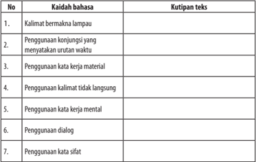

Tabel ini berisi kaidah bahasa yang sering digunakan dalam teks, dengan kolom "No" untuk nomor urut dan "Kaidah bahasa" untuk deskripsi kaidah tersebut. Kolom "Kutipan teks" menyajikan contoh atau contoh teks yang menunjukkan penggunaan kaidah tersebut. Topik utama tabel ini adalah kaidah-kaidah bahasa dalam teks, yang meliputi kalimat bermakna lampau, penggunaan konjungsi yang menyatakan urutan waktu, penggunaan kata kerja material, penggunaan kalimat tidak langsung, penggunaan kata kerja mental, penggunaan dialog, dan penggunaan kata sifat. Pola penting yang terlihat adalah bahwa tabel ini mencakup berbagai aspek penggunaan bahasa dalam teks, mulai dari struktur kalimat hingga konteks dialog dan sifat.

### Kegiatan

### Menjelaskan Makna Kias yang Terdapat dalam Teks Cerita (Novel) Sejarah

Selain menggunakan bahasa dengan kaidah kebahasaan seperti diuraikan di  atas,  novel  sejarah  juga  banyak  menggunakan  kata  atau  frasa  yang bermakna kias. Kata atau frasa bermakna kias ini digunakan penulis untuk membangkitkan  imajinasi  pembaca  saat  membacanya  serta  memperindah cerita. Perhatikan contoh kutipan berikut ini.

- Di antara para Ibu Ratu yang terpukul hatinya, hanya Ibu Ratu Rajapatni Biksuni Gayatri yang bisa berpikir sangat tenang.
Terpukul hatinya = sangat sedih.

- Mampukah Cakradara menjadi tulang  punggung mendampingi  istrinya menyelenggarakan pemerintahan?
- Tulang punggung = sandaran, sumber kekuatan
- Di sebelahnya, Gajah Mada membeku.
- Membeku = diam saja.

 

---
## 📄 Halaman 70

Selain  menggunakan  kata  atau  frasa  bermakna  kias,  novel  sejarah  juga banyak  menggunakan  peribahasa,  baik  yang  berbahasa  daerah  maupun berbahasa Indonesia. Penggunaan kata, ungkapan, atau peribahasa daerah ini digunakan oleh penulis untuk memperkuat latar waktu dan tempat kejadian cerita. Perhatikan contoh berikut ini.

- Hidup rakyat Majapahit boleh dikata gemah ripah loh jinawi kerta tata raharja, hukum ditegakkan,  keamanan  negara  dijaga  menjadikan  siapa pun merasa tenang dan tenteram hidup di bawah panji gula kelapa.
- Peribahasa gemah ripah loh jinawi kerta tata raharja merupakan peribahasa Jawa, yang artinya hidup makmur aman tenteram.
- Singa Parepen yang juga disebut Bango Lumayang terpaksa harus menebus dengan nyawa untuk ameng-ameng nyawa yang dilakukannya.
- Peribahasa ameng-ameng  nyawa merupakan  ungkapan  dalam  budaya Jawa, yang artinya bermain-main dengan nyawa.

### Latihan

### Jelaskan makna ungkapan yang terdapat pada kutipan novel sejarah berikut ini.

- Ia  tahu  benar  Tholib  Sungkar Az-Zubaid adalah kucing hitam di waktu malam dan burung merak di siang hari.
- Dalam  hati-kecilnya  bayangan  Sang  Adipati,  yang  jelas  memberanikan istrinya, antara sebentar mengawang dan mengancam hendak merobekrobek hatinya.
- Bau kemenyan menyebar menyapa hidung siapa pun tanpa kecuali.
- Cakradara  sama  sekali  tidak  menyadari  seseorang  mengikuti  gerak kakinya dengan pandangan tidak berkedip dan isi dada yang mengombak.
- Majapahit  memang  bisa  berada  dalam  genggamannya, dan  kekuasaan manakah yang lebih tinggi dibanding kekuasaan seorang raja?

 

---
## 📄 Halaman 71

### C.   Mengonstruksi Nilai-Nilai dalam Novel Sejarah ke dalam Teks Eksplanasi

Setelah mempelajari materi ini, kamu diharapkan mampu:

- mengidentifikasi nilai-nilai dalam novel sejarah;
- mengaitkan nilai-nilai dalam novel sejarah dengan kehidupan saat ini; dan
- menyusun kembali nilai-nilai dari novel sejarah ke dalam teks eksplanasi.

### Kegiatan

### Mengidentifikasi Nilai-Nilai dalam Novel sejarah

Karya sastra yang baik, termasuk novel sejarah, selalu mengandung nilai ( value ) . Nilai  tersebut  dikemas  secara  implisit  dalam  alur,  latar,  tokoh,  dan tema. Nilai yang terkandung dalam novel antara lain nilai-nilai budaya, nilai moral, nilai agama, nilai sosial, dan nilai estetis.

- Nilai  budaya  adalah  nilai  yang  dapat  memberikan  atau  mengandung hubungan  yang  mendalam  dengan  suatu  masyarakat,  peradaban,  atau kebudayaan.

### Contoh:

Dan bila orang mendarat dari pelayaran, entah dari jauh entahlah dekat, ia  akan  berhenti  di  satu  tempat  beberapa  puluh  langkah  dari  dermaga. Ia akan mengangkat sembah di hadapannya berdiri Sela Baginda, sebuah tugu  batu  berpahat  dengan  prasasti  peninggalan  Sri  Airlangga.  Bila  ia meneruskan langkahnya, semua saja jalanan besar yang dilaluinya, jalanan ekonomi sekaligus militer. Ia akan selalu berpapasan dengan pribumi yang berjalan tenang tanpa gegas, sekalipun di bawah matari terik.

Sumber: Pramoedya Ananta Toer, Mangir , Jakarta, KPG, 2000

Nilai budaya dalam kutipan di atas adalah nilai budaya Timur yang mengajarkan hidup tenang, tidak terburu-buru, segala sesuatunya harus dihubungkan dengan alam.

- Nilai moral/etik adalah nilai yang dapat memberikan atau memancarkan petuah atau ajaran yang berkaitan dengan etika atau moral.

 

---
## 📄 Halaman 72

### Contoh:

'Juga Sang Adipati Tuban Arya Teja Tumenggung  Wilwatikta tidak bebas  dari  ketentuan  Maha  Dewa.  Sang  Hyang  Widhi  merestui  barang siapa punya kebenaran dalam hatinya. Jangan kuatir. Kepala desa! Kurang tepat  jawabanku,  kiranya?  Ketakutan  selalu  jadi  bagian  mereka  yang tak  berani  mendirikan  keadilan.  Kejahatan  selalu  jadi  bagian  mereka yang  mengingkari  kebenaran  maka  melanggar  keadilan.  Dua-duanya busuk, dua-duanya sumber keonaran di atas bumi ini…,' dan ia teruskan wejangannya  tentang  kebenaran  dan  keadilan  dan  kedudukannya  di tengah-tengah kehidupan manusia dan para dewa.

Sumber: Pramoedya Ananta Toer, Mangir , Jakarta, KPG, 2000

Nilai  moral  dalam  kutipan  di  atas  adalah  ketakutan  membela  kebenaran sama buruknya dengan kejahatan karena sama-sama melanggar keadilan.

- Nilai agama yaitu nilai-nilai dalam cerita yang berkaitan atau bersumber pada nilai-nilai agama.
Contoh:

Kala itu tahun 1309. Segenap rakyat berkumpul di alun-alun. Semua berdoa, apa pun warna agamanya, apakah Siwa, Buddha, maupun Hindu. Semua arah perhatian ditujukan dalam satu pandang, ke Purawaktra yang tidak  dijaga  terlampau  ketat.  Segenap  prajurit  bersikap  sangat  ramah kepada  siapa  pun  karena  memang  demikian  sikap  keseharian  mereka. Lebih dari itu, segenap prajurit merasakan gejolak yang sama, oleh duka mendalam atas gering yang diderita Kertarajasa Jayawardhana

Sumber: Gajahmada : Bergelut dalam Kemelut Tahta dan Angkara, Langit Kresna Hariadi

Nilai agama dalam kutipan tersebut tampak pada aktivitas rakyat dari berbagai agama  mendoakan Kertarajasa Jayawardhana yang sedang sakit.

- Nilai  sosial  yaitu  nilai  yang  berkaitan  dengan  tata  pergaulan  antara individu dalam masyarakat.
Contoh:

Sebagian  terbesar  pengantar  sumbangan,  pria,  wanita,  tua,  dan muda,  menolak  disuruh  pulang.  Mereka  bermaksud  menyumbangkan tenaga juga. Maka jadilah dapur raksasa pada malam itu juga. Menyusul kemudian  datang  bondongan  gerobak  mengantarkan  kayu  bakar  dan minyak-minyakan. Dan api pun menyala dalam berpuluh tungku.

Sumber: Pramoedya Ananta Toer, Mangir , Jakarta, KPG, 2000

 

---
## 📄 Halaman 73

Dalam kutipan di atas, nilai sosial tampak pada tindakan menyumbang dan kesediaan untuk membantu pelaksanaan pesta perkawinan.

- Nilai estetis, yakni  nilai yang berkaitan dengan keindahan, baik keindahan struktur pembangun cerita, fakta cerita, maupun teknik penyajian cerita.

### Contoh:

Betapa  megah  dan  indah  bangunan  itu  karena  terbuat  dari  bahanbahan  pilihan.  Pilar-pilar  kayunya  atau  semua  bagian  dari  tiang  saka, belandar bahkan sampai pada usuk diraut dari kayu jati pilihan dengan perhitungan  bangunan  itu  sanggup  melewati  waktu  puluhan  tahun, bahkan diharap bisa tembus lebih dari seratus tahun. Tiang saka diukir indah warna-warni, kakinya berasal dari bahan batu merah penuh pahatan ukir mengambil tokoh-tokoh pewayangan, atau tokoh yang pernah ada bahkan masih hidup. Bangunan itu berbeda-beda bentuk atapnya, pun demikian dengan bentuk wajahnya. Halaman tiga istana utama itu diatur rapi dengan sepanjang jalan ditanami pohon tanjung, kesara, dan cempaka. Melingkar- lingkar di halaman adalah tanaman bunga perdu.

Sumber: Gajahmada: Bergelut dalam Kemelut Takhta dan Angkara, Langit Kresna Hariadi.

Nilai estetis dalam kutipan di atas terkait dengan teknik penyajian cerita. Teknik yang digunakan pengarang adalah teknik showing (deskriptif). Teknik ini efektif untuk menggambarkan suasana, tempat, waktu sehingga pembaca dapat membayangkan seolah-olah menyaksikan dan merasakan sendiri.

### Latihan

Untuk  meningkatkan  pemahamanmu  tentang  nilai-nilai  dalam  novel sejarah, bacalah dengan saksama kutipan novel sejarah berikut ini, kemudian tentukan nilai yang terkandung di dalamnya.

 

---
## 📄 Halaman 74

### Pangeran Diponegoro

Patih  Danurejo  II-yang  sebenarnya  adalah  menantu  Sultan  Hamengku Buwono II  sendiri  yang  diperkatakan  dengan  perasaan  anyel  dan  mangkel oleh Ratu Ageng-pada malam yang agak gerimis ini tampak duduk di dalam kereta  kuda  bersama  Raden  Mas  Sunarko  sang  tolek  (juru  bicara),  menuju Vredenburg menemui Jan Willem van Rijnst.

Yang disebut namanya terakhir di atas ini, baru sepekan berada di negoro (wilayah  kota  yang  didiami  raja).  Dan  kelihatannya  dia  bisa  begitu  cepat menyukai pekerjaannya di sini: di salah satu pusat kerajaan Jawa yang selama ini  hanya  diketahuinya  dari  catatan-catatan  VOC.  Dari  catatan-catatan  itu pula dia mengenal pusat kerajaan Jawa yang lain, di timur Yogyakarta, yaitu Surakarta, yang penguasa-pengasanya terus saling cemburu walaupun sudah dibuat Babad Palihan Negari, atau lebih dikenal sebagai 'Perjanjian Giiyanti' pada 13 Februari 1755.

Terlebih  dulu  mestilah  dibilang,  bahwa  Jan  Willem  van  Rijnst  adalah seorang oportunis bedegong. Asalnya dari Belanda tenggara. Lahir di Heerlen, daerah  Limburg  yang  seluruh  penduduknya  Katolik.  Tapi,  masya  Allah, demi  mencari  muka  pada  pemegang  kekuasaan  di  Hindia  Belanda,  sesuai dengan  agama  yang  dianut  oleh  keluarga  kerajaan  Belanda  di  Amsterdam sana yang Protestan bergaris kaku Kalvinisme, maka dia pun lantas gandrung bermain-main menjadi bunglon, membiarkan hatinya terus bergerak-gerak sebagaimana air di daun talas.

Ndilalah  sifat-sifat  Jan  Willem  van  Rijnst  ini  bagai  pinang  dibelah  dua dengan sifat-sifat Danurejo II yang bagai kedelai di pagi tempe di sore.

 

---
## 📄 Halaman 75

Nanti, pada enam belas tahun yang akan datang Jan Willem van Rijnst bakal berubah lagi warnanya, yaitu di masa jatuhnya tanah air Nusantara ke tangan Inggris  sehubungan  dengan  peperangan  yang  berlangsung  di  Eropa sana,  di  mana  Inggris  berhasil  mengalahkan  Prancis  sehingga  Indonesia yang berada dalam Bataafsche Republiek di bawah kendali Prancis terhadap Belanda, karuan menjadi milik Inggris. Di saat itulah nanti Jan Willem van Rijnst  akan  bermuka  topeng  kepada  Letnan  Gubernur  Jendral  Inggris,  Sir Thomas Stamfors Raffles.

...

Ketika  Danurejo  II  datang  kepadanya,  dia  menyambut  dengan  bahasa Melayu yang fasih,  sementara  pejabat  keraton  Yogyakarta  yang  merupakan musuh dalam selimut dari Sultan Hamengku Buwono II ini lebih suka bercakap bahasa Jawa.

'Sugeng' ,  kata  Danurejo  II,  menundukkan  kepala  dengan  badan  yang nyaris bengkok seperti udang rebus.

Jan Willem van Rijnstbergerak menyamping, membuka tangan kanannya, memberi isyarat kepada Danurejo untuk masuk dan duduk. Agaknya untuk penampilan yang berhubungan dengan bahasa Belanda beschaafdheid yang lebih  kurang  bermakna  'tata  krama  santun  sesuai  peradaban' ,  alih-alih  Jan Willem van Rijnst sangat peduli, dan hal itu merupakan sisi menarik darinya yang jali di antara sisi-sisi lain yang menyebalkan.

'Jadi informasi apa yang bisa Tuan kasihkan kepada saya?' kata Jan Willem van Rijnst sambil duduk.

Melalui toleknya Danurejo berkata, 'Seperti Tuan ketahui, bahwa baik de jure maupun de facto sudah tidak ada lagi kerajaan Mataram. Sebab, semua keputusan dalam ketatanegaraannya menyangkut politik dan ekonomi sepenuhnya  sudah  diambil  alih  VOC.  Tapi  perlukan  Tuan  ketahui,  dan sebolehnya  Tuan  sampaikan  kepada  Gubernur  Jendral  di  Batavia,  bahwa semua raja, mulai dari Sri Sultan Hamengku Buwono I sampai sekarang Sri Sultan  Hamengku  Buwono  II,  sama-sama  secara  diam-diam,  dengan  siasat yang berbeda, menyusun kekuatan untuk melawan kekuasaan Belanda.'

Jan  Willem  van  Rijnst  tertegun.  Pangkal  hidungnya  menekuk  ganjat. Katanya dalam nada tanya yang datar, 'Menyusun kekuatan?'

'Ya Tuan,' sahut Danurejo II dengan semangat asut.

'Kekuatan  dalam  pengertian  daya  tahan  yang  lebih  asasi  dari  sekadar keteguhan dan ketegaran.'

 

---
## 📄 Halaman 76

'Kekuatan macam apa itu?'

'Kekuatan yang dibangun di atas landasan kebencian kepada musuh.'

' Apa maksud Tuan: kekuatan yang dibangun di atas landasan kebencian kepada musuh?'

'Tuan,'  kata  Danurejo  II,  menundukkan  kepala  untuk  menunjukkan sikap rendah hati, tapi dengan meninggikan rasa percaya diri dalam niat hati untuk mengasut. 'Barangkali Tuan akan menganggap enteng perkara ini. Tapi, sebaiknya  Tuan  ketahui-sebab  maaf,  Tuan  masih  baru  di  sini-bahwa  kami, bangsa  Jawa,  sangat  peka  terhadap  suara  hati,  yaitu  perasaan  dalam  tubuh insani yang sekaligus menjadi wisesa ruhani. '

Naga-naganya Jan Willem van Rijsnst tidak begitu mudheng menangkap makna  yang  dikalimatkan  oleh  Danurejo  II.  Maka  katanya  dengan  wajah tekun, 'Katakan tegasnya. '

'Ya Tuan Van Rijnst, ' ujar Danurejo II, tetap menundukkan kepala dalam fitrah yang ajeg seperti tadi. 'Sekarang ini Sri Sultan sedang repot membangun kekuatan dalam pikiran rakyat, bukan Cuma dengan bedil, tapi juga dengan cara  menanamkan  perasaan  kebangsaan  yang  membenci  Belanda  melalui peranti-peranti kebudayaan adiluhung, kebudayaan yang bernapas panjang.'

' Apa maksud Tuan?'

'Perasaan benci yang direka di dalam piranti kebudayaan, yaitu kesenian, khususnya wayang dan tembang macapat, daya tahannya luar bias, dan daya serapnya  amat  istimewa  merasuk  dalam  jiwa  dalam  sanubari  dalam  ruh, sepanjang hayat dikandung badan.'

'Tunggu,' kata Jan Willem van Rijsnt, ragu, dan rasanya asan-tak-asan. 'Tuan bilang wayang dan tembang punya napas panjang? Bagaimana caranya Tuan menyimpulkan itu?'

'Maaf, Tuan Van Rijnst, perlu Tuan ketahui, wayang dan tembang berasal dari leluri Hindu-Buddha Jawa. Sekarang, setelah Islam menjadi agama Jawa, leluri  wayang  dan  tembang  itu  tetap  berlanjut  sebagai  kebudayaan  bangsa. Apakah Tuan tidak melihat itu sebagai kekuatan?'

Jan Willem van Rijnst terdiam sejenak, menalar, lalu mengangguk-angguk. Pasti dia mendapat tanpa diduga, sesuatu yang amat berguna sebagai senjata rohani,  senjata  yang  abstrak,  tapi  sebenarnya  senjata  yang  ampuh  untuk menangani perang urat saraf, perang dengan kata-kata yang tidak diucapkan.

Dalam terdiam yang sekilas begini, dia menemukan jawaban yang cerdik. Yaitu,  dia  anggap  lebih  baik  bertanya,  meminta  pendapat  atau  saran  dari Danurejo II. 'Dus, apa saran Tuan?'

 

---
## 📄 Halaman 77

Merasa  dikajeni,  Danurejo  II  menjawab  lurus,  'Sebetulnya,  melawan kompeni disadari Sri Sultan sebagai menimba air dengan keranjang. '

'Hm?'

'Tapi,  seandainya  terjadi  persatuan  yang  menggumpal  antara  rakyat Yogyakarta dan rakyat Surakarta, bagaimanapun hal itu bisa menjadi kekuatan yang tidak terduga. '

'Bukankah persatuan itu sudah mustahil terjadi?'

'Ya.  Itu  untuk  sultan  di  Y ogyakarta  dan  susuhunan  di  Surakarta.  Tapi, bagaimana kalau rakyat yang sudah meresap diresapi kekuatan wayang dan tembang? Lambat atau cepat toh akan terjadi gejolak yang berlanjut menjadi perang.'

Jan Willem van Rijnst terperangah. Maunya dia berkata sesuatu, namun tak berhasil dilisankan. Dalam keadaan limbung ternyata dia memuji Danurejo II di dalam hatinya. Katanya dalam hati: 'Yang dikatakan ular ini benar juga. '

Sementara itu Danurejo II merasa didorong akal untuk menguji pikirannya sendiri. Katanya, ' Apakah Tuan tidak curiga melihat keadaan itu?'

'Curiga?'

'Sebagai bahaya, Tuan Van Rijnst. '

Semata didorong naluri Jan Willem van Rijnst menjawab, 'Bahaya tidak selalu harus dianggap mengkhawatirkan. Kekhawatiran yang berlebihan malah membuat manusia tertawan dalam mimpi-mimpinya sendiri.'

'Itu  benar  Tuan  Van  Rijnst, '  kata  Danurejo  II,  terucap  dengan  taajul. 'Persoalannya, Tuan, ketika semua orang sama-sama bermimpi, artinya samasama  memiliki  mimpinya  masing-masing-siapa  lagi  yang  sanggup  melihat mimpi bukan sebagai mimpi?'

Jan Willem van Rijnst tertegun. Sempat jeda sekian ketukan. Merasa tidak punya simpanan kata-kata untuk menanggapi kata-kata Danurejo, akhirnya dia memilih mendengar apa yang dipunyai dalam pikiran menantu Sri Sultan ini.

Kata Jan Willem van Rijnst, ' Apa saran Tuan?'

'Mata saya dapat melihat sepak terjang Sri Sultan, ' kata Danurejo. 'Beliau memang mertua saya. Jadi, harap Tuan mengerti, bahwa sebagai menantunya saya lebih tahu apa yang saya katakan tentang dirinya. '

Jeda  lagi  sekian  ketukan.  Setelah  itu  Jan  Willem  van  Rijnst  bertanya, ' ApaTuan menganggap Sri Sultan kurang cakap memegang kekuasaan? Atau,

 

---
## 📄 Halaman 78

apa dia juga secara langsung sudah melanggar perjanjian-perjanjian dengan pihak kompeni?'

'Bukan cuma kurang cakap, Tuan Van Rijnst,' kata Danurejo, jeraus sangat ucapannya.  'Tapi,  sesungguhnya  Sri  Sultan  tidak  becus.  Makin  hari  makin besar jurang kemelut terjadi di lingkungan kraton. Ya, memang pelanggaran merupakan pemandangan sehari-hari yang menyepatkan mata.'

'Hm.'  Jan  Willem  van  Rijnst  menerka-nerka  ambisi  Danurejo  di  balik pernyataan  yang  kerang-keroh  itu.  sambil  menatap  lurus-lurus  ke  muka Danurejo, setelah membagi arah pandangannya kepada Raden Mas Sunarko yang sangat tolek, Jan Willem van Rijnst berkata dalam hati, ' Al wie kloekzinnig is, handelt met wetenschap, maar een zot breidt dwaasheid uit. Deza kakkerlak verwach zeker een goede positie, zodat hij mogelijk corruptie kan doen' (yang cerdik bertindak dengan pengetahuan, tapi yang bebal  membeberkan ketololannya.  Kecowak  ini  pasti  berharap  kedudukan  yang  memungkinkan baginya bisa melakukan korupsi).

Danurejo  tak  rumangsa  dicerca.  Sebab,  ketika  Jan  Willem  van  Rijnst berkata begitu di dalam hatinya, dia melakukan dengan memasang senyum di muka. Karuan Danurejo pun memasang muka manis atas kodratnya yang muka-dua. Dia mengira Belanda di hadapannya menghargainya.

Sumber: Remy Sylado. 2007. Novel Pangeran Diponegoro. Solo: Tiga Serangkai

### Kegiatan

### Mengaitkan Nilai-Nilai dalam Novel Sejarah dengan Kehidupan

Selain mengandung keindahan, karya sastra juga memiliki nilai manfaat bagi  pembaca.  Segi  kemanfaatan  muncul  karena  penciptaan  karya  sastra berangkat dari kenyataan sehingga lahirlah pandangan bahwa sastra yang baik menciptakan  kembali  rasa  kehidupan,  baik  bobotnya  maupun  susunannya; menciptakan  kembali  keseluruhan  hidup  yang  dihayati:  kehidupan  emosi, kehidupan  budi,  individu  maupun  sosial,  serta  dunia  yang  sarat  objek (Ismail  dan  Suryaman,  2006).  Penciptaannya  dilakukan  bersama-sama  dan secara  saling  berjalinan,  seperti  terjadi  dalam  kehidupan  yang  kita  hayati sendiri.  Namun,  kenyataan  ini  di  dalam  sastra  dihadirkan  melalui  proses kreatif.  Artinya,  bahan-bahan  tentang  kenyataan  telah  dipahami  melalui proses  penafsiran  baru  dalam  perspektif  pengarang.  Karya  sastra  memang merupakan  dokumen  sosial,  yang  lebih  dahulu  disebut  jalan  keempat  ke

 

---
## 📄 Halaman 79

kebenaran: melalui sastra pembaca seringkali jauh lebih baik daripada melalui tulisan-tulisan nonsastra serta dapat menghayati hakikat eksistensi manusia dengan segala permasalahannya. Di sinilah segi keindahan dari karya sastra, yakni gambaran kenyataan dalam subjektivitas pengarang. Kenyataan di dalam karya sastra ibarat bahan-bahan untuk membuat 'sop buntut' . 'Sop buntut' yang siap disantap adalah karya sastra. Rasa, aroma, dan kekhasannya adalah hasil dari subjektivitas 'sang koki' .

Berdasarkan paparan tersebut dapatlah disimpulkan bahwa sastra dengan demikian  dapat  berfungsi  sebagai  media  pemahaman  budaya  suatu  bangsa (yang  di  dalamnya  terkandung  pula  pendidikan  karakter).  Melalui  novel, misalnya, model kehidupan dengan menampilkan tokoh-tokoh cerita sebagai pelaku  kehidupan  menjadi  representasi  dari  budaya  masyarakat  (bangsa). Tokoh-tokoh cerita adalah tokoh-tokoh yang bersifat, bersikap, dan berwatak. Kita dapat belajar dan memahami tentang berbagai aspek kehidupan melalui pemeranan  oleh  tokoh  tersebut,  termasuk  berbagai  motivasi  yang  dilatari oleh  keadaan  sosial  budaya  tokoh  itu.  Hubungan  yang  terbangun  antara pembaca  dengan  dunia  cerita  dalam  sastra  adalah  hubungan  personal. Hubungan demikian akan berdampak kepada terbangunnya daya kritis, daya imajinasi, dan rasa estetis. Melalui sastra, kamu tidak hanya belajar budaya konseptual  dan  intelektualistis,  melainkan  dihadapkan  kepada  situasi  atau model  kehidupan  konkret.  Sastra  dapat  dipandang  sebagai  budaya  dalam tindak (culture  in  action), dan membaca sastra Indonesia, misalnya, berarti mempelajari kehidupan bangsa Indonesia.

Tentulah fungsi sastra tersebut perlu mendapatkan penegasan di dalam orientasi  penciptaannya  agar  terbangun  karakter  yang  kuat  bagi  pembaca. Menurut  Herfanda  (2008:132),  bentuk  penegasan  di  dalam  penciptaan sastra perlulah diorientasikan kepada hal-hal yang bersifat pragmatik, yakni  orientasi  pada  kebermanfaatan  sastra  sebagai  media  pencerahan  dan pencerdasan masyarakat.  Herfanda  (2008:133)  mempertegasnya  dengan memaparkan pemikiran Sutan Takdir Alisyahbana (STA) yang dipandangnya sebagai tokoh renaisans Indonesia. Di dalam bersastra, STA memilki prinsip bahwa seni sastra bukan sekadar untuk seni, tetapi juga untuk kebermanfaatan intelektual dan pencerdasan masyarakat. Oleh karena itu, menurut STA, sastra tidaklah bisa bermewah-mewah dengan keindahan untuk mencapai kepuasan seseorang dalam mencipta, tetapi harus dilibatkan secara aktif dalam seluruh pembangunan  bangsa.  Sastra  haruslah  membuat  pembaca  lebih  optimis dan  mampu  menghadapi  hidup  dengan  semangat  juang  yang  tinggi  untuk mengatasi berbagai masalah dan situasi kritis. STA membuktikannya melalui novel Layar Terkembang serta novel Kalah dan Menang.

 

---
## 📄 Halaman 80

Konsep nilai mengacu pada kebermanfaatan terhadap kehidupan manusia dan biasanya bersifat universal dan abadi. Misalnya, nilai sosial yang menyatakan bahwa manusia hidup selalu membutuhkan orang lain. Nilai ini berlaku  sejak  dahulu  hingga  saat  ini  di  belahan  dunia  mana  pun.  Artinya, banyak nilai dalam novel yang masih relevan dan bermanfaat bagi kehidupan saat ini.

### Perhatikan contoh kutipan novel berikut ini.

'Juga  Sang  Adipati  Tuban  Arya  Teja  Tumenggung    Wilwatikta  tidak bebas dari ketentuan Maha Dewa. Sang Hyang Widhi merestui barangsiapa punya  kebenaran  dalam  hatinya.  Jangan  kuatir.  Kepala  desa!  Kurang  tepat jawabanku,  kiranya?  Ketakutan  selalu  jadi  bagian  mereka  yang  tak  berani mendirikan keadilan. Kejahatan selalu jadi bagian mereka yang mengingkari kebenaran maka melanggar keadilan. Dua-duanya busuk, dua-duanya sumber keonaran di atas bumi ini…,' dan ia teruskan wejangannya tentang kebenaran dan keadilan dan kedudukannya di tengah-tengah kehidupan manusia dan para dewa.

Sumber: Pramoedya Ananta Toer, Mangir, Jakarta, KPG, 2000

Nilai moral dalam kutipan di atas adalah ketakutan membela kebenaran sama buruknya dengan kejahatan karena sama-sama melanggar keadilan. Pada masa kini, nilai tersebut masih berlaku. Sering kali kejahatan terjadi karena orang yang mengetahuinya tidak berani atau tidak peduli untuk menegakkan kebenaran. Bukankah orang yang seperti ini sama saja dengan mendukung terjadinya kejahatan?

Meskipun demikian, ada juga nilai yang dibatasi oleh wilayah geografi, waktu,  dan  agama.  Contoh  nilai  yang  dibatasi  oleh  geografi  adalah  nilai budaya yang terkait dengan budaya berbusana. Di daerah dengan cuaca panas, masyarakatnya  terbiasa  menggunakan  pakaian  tipis  dan  cenderung  lebih terbuka. Sebaliknya, masyarakat di daerah pegunungan terbiasa menggunakan pakaian tebal dan tertutup.

Contoh nilai yang dibatasi waktu adalah nilai budaya. Dahulu, di sebagian masyarakat perdesaan para wanitanya akan nginang yaitu mengunyah daun sirih,  buah  jambe, dan kapur. Namun, kebiasaan tersebut kini nyaris sudah tidak ditemukan.

Nilai  budaya  bisa  juga  dibatasi  oleh  agama.  Misalnya  budaya  minum tuak  pada  masyarakat  Indonesia  terutama  pada  pesta  pernikahan  di  masa lalu semakin berkurang setelah masyarakat sadar bahwa minuman keras itu membahayakan dan dilarang agama.

 

---
## 📄 Halaman 81

Selanjutnya,  kerjakan  tugas  berikut  untuk  menambah  pemahamanmu tentang keterkaitan nilai dalam novel sejarah dengan kehidupan saat ini.

### Tugas

Petunjuk:

### Latihan

Bacalah  kembali  teks  novel  sejarah Pangeran  Diponegoro:  Menggagas Ratu Adil . Tuliskan dan jelaskan nilai-nilai yang ada dalam teks novel sejarah tersebut!

---
**📊 Tabel**

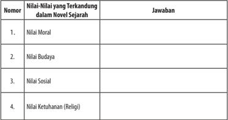

Tabel ini berisi informasi tentang nilai-nilai yang terkandung dalam novel sejarah, dengan kolom "Nomor" untuk nomor urut, "Nilai-nilai yang Terkandung dalam Novel Sejarah" untuk deskripsi nilai-nilai tersebut, dan "Jawaban" untuk penjelasan atau penilaian terhadap nilai-nilai tersebut. Topik utama tabel ini adalah nilai-nilai moral, budaya, sosial, dan ketuhanan (religi) dalam konteks novel sejarah. Data penting yang terlihat adalah bahwa tabel ini mencakup empat jenis nilai-nilai tersebut, yang menunjukkan bahwa novel sejarah dapat memiliki berbagai aspek moral, budaya, sosial, dan agama yang penting.

### Kegiatan

3

### Menyajikan Nilai Novel Sejarah ke dalam Sebuah Teks Eksplanasi

Setelah menyelesaikan kegiatan di atas, sajikan nilai-nilai sejarah tersebut dalam  sebuah  teks  eksplanasi.  Teks  eksplanasi  yaitu  teks  yang  menjelaskan tentang  proses  terjadinya  sesuatu  atau  terbentuknya  suatu  fenomena  alam atau sosial. Pada teks eksplanasi, sebuah peristiwa timbul karena ada peristiwa lain sebelumnya dan peristiwa tersebut mengakibatkan peristiwa yang lain lagi sesudahnya.

Bacalah kembali kutipan novel sejarah pada tugas di Kegiatan 1 di atas. Selanjutnya, analisislah keterkaitannya dengan kehidupan saat ini.

 

---
## 📄 Halaman 82

Teks eksplanasi disusun dengan struktur yang terdiri atas bagian-bagian yang  memperlihatkan  pernyataan  umum  (pembukaan),  deretan  penjelasan (isi), dan interpretasi/penutup/interpretasi (tidak harus ada). Bagian pernyataan  umum  berisi  informasi  singkat  tentang  apa  yang  dibicarakan. Bagian deretan penjelas berisi urutan uraian atau penjelasan tentang peristiwa yang terjadi. Sementara itu, bagian interpretasi berisi pendapat singkat penulis tentang peristiwa yang terjadi.

### D.    Menulis Novel Sejarah Pribadi

Setelah mempelajari materi ini, kamu diharapkan mampu:

- menyusun kerangka novel sejarah berdasarkan peristiwa sejarah; dan
- mengembangkan kerangka menjadi novel sejarah.
Seperti yang sudah dipelajari sebelumnya novel cerita sejarah memiliki latar belakang peristiwa sejarah yang benar-benar terjadi. Ketika kamu hendak menulis sebuah novel sejarah tentang seseorang atau bahkan dirimu sendiri, hal yang pertama harus kamu lakukan adalah menentukan peristiwa sejarah (peristiwa yang terjadi di masa lalu) yang akan kamu kembangkan menjadi novel sejarah.

Dalam  novel  sejarah,  penulis  menceritakan  peristiwa-peritiwa  yang dialami para tokohnya dengan menggunakan latar peristiwa  sejarah.  Menulis novel sejarah berarti mengemas fakta sejarah dengan rekaan penulis. Rekaan yang dimaksud tentulah harus didasarkan pengetahuan yang baik dari penulis. Misalnya, pengetahuan tentang tokoh Inggit Garnasih dalam novel Kuantar ke Gerbang yang dimiliki Ramadhan K.H. sangat memadai sehingga ia dapat mengkhayalkannya secara baik.

Pada kesempatan ini kamu akan belajar menulis novel sejarah. Misalnya, untuk membantu mengawali cerita dengan mudah, gunakan sudut pandang orang  pertama.  Dengan  sudut  pandang  orang  pertama  ini  kamu  akan menggunakan  tokoh  'aku'  sebagai  tokoh  utamanya.  Meskipun  demikian, peristiwa yang dialami tokoh 'aku' akan direka menjadi novel sejarah.

 

---
## 📄 Halaman 83

### Menyusun Kerangka Novel Sejarah Berdasarkan Peristiwa Sejarah

Untuk memudahkan penyusunan novel sejarah, kamu harus menentukan peristiwa sejarah yang akan menjadi latar cerita. Peristiwa sejarah yang menjadi dasar  penulisan  novel  sejarah  adalah  peristiwa  yang  benar-benar  terjadi  di masa  lalu.  Wujudnya  dapat  berupa  peristiwa  yang  berkaitan  dengan  hidup orang  banyak  atau  hidup  seseorang.  Setelah  menentukan  peristiwa  sejarah, kamu harus menyusun kerangka atau gambaran singkat cerita sejarah yang akan ditulis. Perhatikan contoh berikut ini.

---
**📊 Tabel**

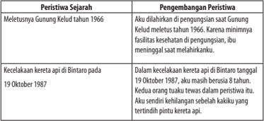

Tabel ini berisi dua peristiwa sejarah penting yang terjadi pada tahun 1966 dan 1987, masing-masing dengan penjelasan pengembangan peristiwa tersebut. Topik utama tabel adalah peristiwa sejarah dan pengembangan peristiwa tersebut. Kolom pertama berisi peristiwa sejarah, sedangkan kolom kedua berisi penjelasan pengembangan peristiwa tersebut. Data penting yang terlihat adalah bahwa peristiwa sejarah pertama adalah meletusnya Gunung Kelud tahun 1966, yang disebabkan oleh minimnya fasilitas kesehatan di pengungsian setelah meletusnya Gunung Kelud tahun 1966. Peristiwa sejarah kedua adalah kecelakaan kereta api di Bintaro pada 19 Oktober 1987, yang disebabkan oleh kesalahan tindakan dua orang tuakulat tevens dalam peristiwa itu.

Para penulis karya sastra sangat cermat dalam menulis. Sebelum menulis, mereka akan mencari ilham dengan banyak membaca. Gola Gong memulai menulis setelah membaca koran atau majalah. Kemudian, ia memaksimalkan indra  pendengaran,  penglihatan,  penciuman,  pengecapan,  dan  perabaan. Peristiwa-peristiwa di sekitar kita  dijadikan  sumber  penulisan.  Ia  pun mencari, menggali, dan menemukannya. Ia melakukan observasi ke lapangan, melakukan  wawancara  dengan  narasumber,  melakukan  cek  dan  ricek, ditambah dengan pemanfaatan rumus 5 W +1 H .  Langkah berikutnya adalah membuat sinopsis untuk setiap bab novel, membuat karakter para tokoh, serta menggambarkan latar tempat, waktu, dan suasana. Selain mempermudah kita menulis, cara ini untuk menghindari adanya pekerjaan lain, seperti menerima telepon, orang tua minta bantuan ke warung, ada teman ngajak bermain, dan sebagainya. Sekalipun ditinggalkan, kita tak pernah takut kehilangan sesuatu karena semuanya sudah direkam.

 

---
## 📄 Halaman 84

Dengan cara tersebut, lahirlah sebuah karya novel Kupu-Kupu Pelangi atau cerpen 'Kidung Pagi di Klewer' . Saat berlibur di Solo, tiap pagi ia jalan-jalan. Jika lapar, mampir untuk makan nasi liwet. Suatu hari saya duduk di depan sebuah bank. Lalu,  satpam  bank  datang  dan  duduk  di  sebelah.  Wawancara pun terjadi.  Begitupun  saat  saya  makan  nasi  liwet  di  Pasar  Klewer.  Penjual saya wawancarai. Ada unsur yang saya peroleh dari peristiwa ini: who (satpam dan pedagang nasi liwet) serta where (Pasar Klewer). Benak saya ngelayap ke mana-mana. Lalu, istri saya tiba-tiba bercerita tentang anak temannya yang harus dioperasi karena salah obat. Usus halus anak itu mendesak-desak usus besarnya. Saya jadi tertarik untuk menggabungkannya. Jadilah sebuah cerpen tentang sepasang suami istri (satpam dan pedagang nasi liwet) yang sedang kesusahan mengumpulkan uang untuk biaya operasi anaknya. (Dikutip dari Gola Gong 'Dari Peristiwa ke Fiksi: Cara Jitu Melihat sesuatu dengan Jeli' dalam Salman Faridi, ed., 2003, Proses Kreatif Penulis Hebat ,  Bandung: Dar! Mizan).

Cara yang dilakukan Gola Gong adalah contoh menulis dengan strategi inkuiri.  Mula-mula  penulis  melihat  peristiwa  yang  terjadi  di  sekitar  kita. Mengajukan  beragam  pertanyaan  untuk  memperdalam  pemahaman  kita atas peristiwa tersebut. Menjawab  pertanyaan  dengan  cara meringkas, menggambarkan  karakter  tokoh,  serta  latar.  Mengembangkannya  menjadi sebuah karya serta mengakhiri cerita dengan solusi tertentu.

### Tugas

- Datalah  peristiwa  sejarah  dari  berbagai  sumber  (buku,  majalah,  koran atau internet) tentang seorang tokoh, misalnya, tokoh lokal di daerahmu.
- Pilihlah salah satu peristiwa sejarah yang paling menarik bagimu atas tokoh lokal  tersebut.  Coba  telusuri  sisi  lain  kehidupan  pribadinya,  misalnya, rumah  tangganya, anak-anaknya, cita-citanya, romantika hidupnya. Buatlah hasil membacamu  menjadi  daftar temuan dan kemudian dimasukkan ke dalam tabel yang sudah dicontohkan sebelumnya.

### Kegiatan

### Mengembangkan Teks Cerita Sejarah

Pada  langkah  sebelumnya,  kamu  sudah  membuat  draf  awal  berupa kerangka, membuat bagan, dan menarasikan. Pada tahapan tersebut, misalnya kamu  dapat  membuat  bagan  tokoh,  mengidentifikasi  waktu  dan  tempat kejadian,  membuat  ilustrasi  visual  setiap  tokoh,  dan  menentukan  apa  yang

 

---
## 📄 Halaman 85

dipermasalahkan,  dan  sebagainya.  Pada  beberapa  peristiwa,  kamu  dapat saja mengganti tokoh dengan tokoh-tokoh dalam kehidupan sehari-harinya, membuat bagan hubungan antartokoh jika berbeda dengan bagan tokoh yang dibacanya, mengganti waktu dan tempat kejadian, mengganti permasalahan sesuai  dengan  imajinasimu,  dan  sebagainya.  Berikut  ini  disajikan  contoh penulisan novel yang dilakukan oleh Nadeea (Suryaman, 2012).

### Cara Nadeea menulis

- Dia mulai menonton bola.
- Dia mulai membaca berita bola.
- Dia mulai mencatat klub bola Eropa .
- Dia mulai mencatat nama-nama pemain bola Eropa .
- Dia mulai memilih salah satu pemain bola.
- Dia mulai membayangkan idolanya.

### Karya Nadeea

### Nadeea Mulai Berimajinasi

- Seandainya Edwin van de Sar ayahku.
- Dia seorang penjaga gawang kenamaan Belanda.
- Wow, ayahku pemain bola kenamaan?
- Senangkah aku?
- Bagaimana dengan ibuku?

 

---
## 📄 Halaman 86

- Aku adalah anak mama.
- Mama adalah mentariku.
- Aku adalah awan putih.
- Awan putih selalu berteman dengan mentari.
- Dad tidak bisa jadi mentariku.
- Dad terlalu sibuk dengan dunianya.

### Nadeea Membuat Konflik

- Nadeea membayangkan kebahagiaan dari sang ayahnya.
- Nadeea merasakan ayahnya tidak bisa memahami dirinya.
- Nadeea ingin ayahnya menjadi mentari.
- Ayahnya merasakan keinginan Nadeea.
- Ia berusaha membahagiakan Nadeea.
- Nadeea tidak berontak sekalipun kurang perhatian dari sang ayah.
- Jadilah dirimu sendiri.

### Mengembangkan Cerita ala Permainan Bola

- Permainan  dimulai:  siapa  Nadeea,  siapa  ayahnya,  siapa  ibunya,  siapa temannya, di mana tinggalnya, di mana sekolahnya, kejadian apa yang menyedihkan sebelum permainan dimulai, dan sebagainya.
- Jadilah 'bola pertama: kick off ' .

### Kekecewaan Evan

- Belanda masuk semifinal piala Eropa.
- Belanda dikalahkan Portugal.
- Evan kecewa kepada ayahnya.
- Evan sakit.
- Evan membayangkan mama.
- Jadilah 'Bola kedua: mengoper bola ke penyerang' .

 

---
## 📄 Halaman 87

### Setiap Orang Memiliki Sisi yang Berbeda

- Evan semakin kecewa ketika tim belanda takluk oleh Rep. Cheska untuk berebut posisi ketiga.
- Ia malu bertemu teman-temannya.
- Untung ada Brithies yang selalu jadi pelangi.
- Evan  mengobati  rasa  kecewa  dengan  membayangkan  andai  semua pemain sehebat Ruud van Nistelrooy semua pemain pasti akan berebut bola sekalipun satu tim.
- Evan mengenang masa lalu dengan membuka album untuk mengobati kekecewaan.
- Masa-masa indah bersama mama, sang ayah mengajari bola.
- Jadilah 'Bola ketiga: ketika bola itu terebut' .

### Upaya saling Mengasihi

- Evan dan ayahnya pindah ke apartemen dekat stadion.
- Harapannya komunikasi makin akrab.
- Mandy teman baru Evan.
- Ia misterius.
- Pemandangan jelek yang dilihat Evan di apartemen.
- Laporan pertandingan Liga Inggris.
- Ayahnya merumput di Fulham.
- Klubnya gagal meraih juara.
- Juaranya Liverpool.
- Ratu Eizabeth menyambut Liverpool sebagai pahlawan.
- Jadilah 'Bola keempat: mengambil bola' .

### Harapan Evan di Piala Dunia

- Edwin van de Sar pindah ke MU.
- Berbagai media menjadikannya headline.
- Evan pingsan mendapatkan berita itu.
- Ia takut ayahnya tidak dapat berbuat yang terbaik buat MU.
- Kekhawatiran itu terbukti, MU tidak dapat meraih juara.
- Jadilah 'Bola kelima: out ball ' .

 

---
## 📄 Halaman 88

### Evan Menemukan Mentari

- Bersama Mandy, Evan mau menyaksikan ayahnya bertanding di piala dunia di Jerman.
- Belanda masuk final piala dunia.
- Belanda akan berhadapan dengan Argentina.
- Belanda kalah.
- Evan tidak bisa menerima kekalahan Belanda.
- Tapi Evan tidak mau marah sama ayahnya.
- Atas saran Mandy, Evan memberi bunga tulip pada ayahnya.
- Evan dan ayahnya bersatu dalam kasih sayang.
- Jadilah 'Bola keenam: Last Goal ' .

### Tugas

Berdasarkan draf yang telah kamu buat pada pembelajaran sebelumnya, kembangkanlah  sebuah  novel  sejarah.  Berikut  ini  adalah  panduan  umum untuk membuat novel sejarah sebagai kelanjutan atas tugas sebelumnya.

- Buatlah bagian-bagian peristiwa faktual, sisi lain kehidupan tokoh, serta imajinasimu  ke  dalam  kerangka  cerita.  Kerangka  ini  dapat  berwujud seperti kerangka karangan. Namun, sudut pandang yang dapat dijadikan dasar kerangka dapat saja berupa perjalanan waktu (misalnya, masa kecil, masa remaja, masa sekolah, masa kuliah, masa perjuangan, masa dewasa); latar tempat (di desa, di sekolah, di kota, di dunia).
- Buatlah  rangkaian  peristiwa  faktual yang  kamu dapatkan dari berbagai rujukan dan sudah dibuat kerangka. Padukan dengan sisi lain kehidupan tokoh.
- Jika  langkah  keempat  sudah  selesai  kamu  lakukan,  buatlah  rangkaian cerita  berdasarkan  daya  khayalmu.  Sudut  pandang  yang  paling  mudah adalah sudut pandang orang pertama 'aku' .
- Masa pengerjaan satu bulan dengan aturan jumlah halaman 48, 1,5 spasi, time new roman, ukuran huruf 12.

 

---
## 📄 Halaman 89

### Rangkuman

- Novel  sejarah  adalah  novel    yang  di  dalamnya  menjelaskan  dan menceritakan tentang fakta kejadian masa lalu yang menjadi asal-muasal atau latar belakang terjadinya sesuatu yang memiliki nilai kesejarahan, bisa  bersifat  naratif  atau  deskriptif,  dan  disajikan  dengan  daya  khayal pengetahuan yang luas dari pengarang.
- Struktur novel sejarah adalah orientasi, pengungkapan peritiwa, rising action , komplikasi, evaluasi/resolusi, dan koda.
- Novel  sejarah  banyak  mengandung  nilai-nilai  yang  disajikan  secara implisit dan eksplisit. Sebagian dari nilai tersebut masih sesuai dengan kehidupan saat ini.
- Kaidah  kebahasaan  teks  cerita  sejarah  adalah    banyak  menggunakan (a) kalimat bermakna lampau; (b) kata yang menyatakan urutan waktu (konjungsi kronologis, temporal); (c) kata kerja yang menggambarkan sesuatu tindakan (kata kerja material); (d) kata kerja yang menunjukkan kalimat tak langsung  sebagai cara  menceritakan  tuturan  seorang tokoh  oleh  pengarang;  (e)  kata  kerja  yang  menyatakan  sesuatu  yang dipikirkan atau dirasakan oleh tokoh (kata kerja mental); (f) dialog. Hal ini ditunjukkan oleh tanda petik ganda  (' …. ')  dan  kata  kerja  yang menunjukkan    tuturan    langsung;  dan  (g)  kata-kata  sifat (descriptive language) untuk menggambarkan tokoh, tempat, atau suasana.

 

---
## 📄 Halaman 90

### Memahami Isu Terkini Lewat Editorial

Editorial  merupakan  salah  satu  rubrik  yang  ada  di  media  massa  cetak seperti  koran,  majalah, atau buletin. Editorial biasanya menjadi sebuah cara untuk merespon suatu isu atau permasalahan dan memberikan tawaran solusi di akhir teks. Bahasa yang digunakan adalah bahasa yang lugas.

 

---
## 📄 Halaman 91

Kamu pasti pernah membaca koran, bukan? Setiap hari, redaktur selalu membuat artikel yang menyoroti berita aktual yang sedang terjadi. Pembahasan dalam artikel tersebut  biasanya  disertai  kritik  dan  saran  terhadap  peristiwa aktual yang sedang terjadi.

Dengan membaca editorial kita tidak hanya sekadar tahu peristiwa yang sedang  terjadi  seperti  saat  kita  membaca  berita.  Namun,  dengan  membaca editorial  kita  pun  akan  lebih  memahami  dan  bisa  bersikap  kritis.  Hal  ini karena  di  dalam  editorial  ada  pendapat-pendapat  (penulis,  redaksi)  yang bisa memperjelas pemahaman kita tentang peristiwa/keadaan yang menjadi ulasannya. Dengan  sering membaca  ataupun  menyimak  editorial kita diharapkan  lebih  bijak  di  dalam  menanggapi  suatu  berita;  lebih  dewasa  di dalam menghadapi suatu persoalan yang terjadi di lingkungan sekitar kita.

Untuk membantu  kamu  dalam  mempelajari  dan  mengembangkan kompetensi  dalam  berbahasa,  pelajari  peta  konsep  di  bawah  ini  dengan saksama!

 

---
## 📄 Halaman 92

### A.  Mengidentifikasi Informasi Penting dalam Teks Editorial

Setelah mempelajari materi ini, kamu diharapkan mampu:

- mengidentifikasi  isi teks editorial; dan
- membedakan fakta dan opini dalam teks editorial.
Teks  editorial  adalah  artikel  utama  yang  ditulis  oleh  redaktur  koran yang merupakan pandangan redaksi terhadap suatu peristiwa (berita) aktual (sedang  menjadi  sorotan),  fenomenal,  dan  kontroversial  (menimbulkan perbedaan pendapat). Teks editorial disebut juga tajuk rencana. Teks editorial dapat  diasumsikan  sebagai  sikap  institusi  media  massa  terhadap  peristiwa yang dibahas.

### Kegiatan

### Mengidentifikasi  Isi Teks Editorial

Editorial dalam suatu media massa cetak biasanya berada dalam rubrik yang sama, yakni opini. Di dalam rubrik ini terdapat editorial, artikel,  dan surat pembaca. Ketiga ragam opini ini biasanya berada di bagian tengah surat kabar  atau  majalah.  Jika  dicermati  satu  demi  satu  setiap  rubrik,  halaman awal  biasanya  berisi headline  news (berita  utama).  Pada  bagian  ini,  tulisan hanya  bersifat  memberi  tahu  pembaca.  Pada  halaman-halaman  berikutnya biasanya berisi berita yang lebih spesifik, misalnya berita yang terkait dengan kejadian berdasarkan tempat, diikuti berita luar negeri, baru kemudian opini. Penempatan  ini  dimaksudkan  agar  pembaca  tidak  serta-merta  dihadapkan pada  bacaan  yang  serius.  Setelah  memiliki  wawasan  yang  cukup  mengenai berita hari tersebut, pembaca  akan lebih  mampu  memahaminya  jika dilanjutkan dengan membaca opini.

Permasalahan yang dibahas dalam teks editorial adalah permasalahan yang berkaitan dengan peritiwa (berita) yang sedang hangat dibicarakan (aktual), fenomenal, dan kontroversial. Di dalamnya terkandung fakta peristiwa sebagai bahan berita. Fakta ini ditelusuri kebenarannya dengan berbagai strategi. Hal ini  dimaksudkan  agar  berita  itu  benar  adanya  sehingga  tepercaya,  bukan

 

---
## 📄 Halaman 93

sebagai gosip murahan. Di samping itu, harus diidentifikasi dan dipastikan apakah fakta peristiwa tersebut aktual atau hal biasa-biasa saja.

Fakta  peristiwa  yang  dipastikan  akan  dijadikan  sebagai  bahan  berita dalam  editorial  dianalisis  untuk  menghasilkan  sebuah  persepsi  redaksi. Biasanya  persepsi  didasari  oleh  berbagai  dimensi  masalah.  Agar  persepsi ini  memiliki  nilai  opini  yang  bermutu  tinggi,  redaksi  akan  menunjukkan berbagai  argumentasi.  Bersandar  pada  argumentasi  inilah  sebuah  editorial diuji mutunya. Jika dipandang sudah mencukupi, redaksi akan memberikan rekomendasi untuk solusinya.

Gaya  penulisan editorial hampir  sama  dengan  ragam  artikel atau karya  ilmiah  lainnya,  yakni  eksposisi.  Eksposisi  merupakan  tulisan  yang bertujuan  untuk  mengklarifikasi,  menjelaskan,  atau  mengevaluasi.  Strategi pengembangannya  mengikuti  beragam  pola,  seperti  contoh,  proses,  sebabakibat, klasifikasi, definisi, analisis, komparasi, dan kontras.

Dilihat dari isinya, editorial yang bersifat ekspositoris berisi tesis (pernyataan umum), diikuti oleh argumentasi-argumentasi secukupnya, dan diakhiri  dengan  penegasan  ulang  atas  argumentasi-argumentasi  tersebut. Ketiga unsur tersebut dalam editorial wajib hadir.

Untuk  dapat  mengetahui  permasalahan  dalam  teks  editorial,  mari  kita berlatih membaca teks editorial berikut ini.

### Kado Tahun Baru 2014 dari Pertamina

Pertamina  mengirim  kado  Tahun  Baru  2014  yang  pahit  kepada  masyarakat. Menaikkan harga elpiji tabung 12 kg lebih dari 50 persen. Akibatnya sampai di tingkat konsumen harganya menjadi Rp125.000,00 hingga Rp130.000,00. Bahkan di lokasi yang relatif jauh dari pangkalan, mencapai Rp150.000,00-Rp200.000,00.

Sungguh,  kenaikan  harga  itu  merupakan  kado  yang  tidak  simpatik,  tidak  bijak, dan  tidak  logis.  Masyarakat  sebagai  konsumen  menjadi  terkaget-kaget  karena kenaikan tanpa didahului sosialisasi. Pertamina memutuskan secara sepihak seraya mengiringinya  dengan  alasan  yang  terkesan  logis.  Merugi  Rp22  triliun  selama 6 tahun sebagai dampak kenaikan harga di pasar internasional serta melemahnya nilai tukar rupiah terhadap dolar AS.

Kenaikan  harga  itu  mengharuskan  Presiden  Republik  Indonesia  yang  sedang melakukan  kunjungan  kerja  di  Jawa  Timur  meminta  Wakil  Presiden  Republik Indonesia menggelar rapat mendadak dengan para menteri terkait. Mendengarkan penjelasan Direksi Pertamina dan pandangan Menko Ekuin, yang kesimpulannya dilaporkan kepada Presiden. Berdasar kesimpulan rapat itulah, Presiden kemudian membuat keputusan harga elpiji 12 kg yang diumumkan pada Minggu kemarin.

 

---
## 📄 Halaman 94

Kita  mengapresiasi  langkah  cekatan  pemerintah  dalam  mengapresiasi  kenaikan harga  elpiji  non-subsidi  12  kg  itu  seraya  mengiringinya  dengan  pertanyaan. Benarkah pemerintah tidak tahu atau tidak diberi tahu mengenai rencana Pertamina menaikkan secara sewenang-wenang. Pertamina merupakan perusahaan negara yang diamanati  undang-undang sebagai pengelola minyak dan gas bumi untuk sebesar-besar  kemakmuran  dan  kesejahteraan  rakyat.  Rasanya  mustahil  kalau pemerintah, dalam hal ini Menko Ekuin dan Menteri BUMN tidak tahu, tidak diberi tahu serta tidak dimintai pandangan, pendapat, dan pertimbangannya.

Kalau dugaan kita yang seperti itu benar adanya, bisa saja di antara kita menengarai langkah pemerintah itu sebagai reaksi semu. Reaksi yang muncul sebagai bentuk kekagetan  atas  reaksi  keras  yang  ditunjukkan  pimpinan  DPR  RI,  DPD  RI,  dan masyarakat luas. Malah boleh jadi ada politisi yang mengategorikannya sebagai reaksi  yang  cenderung  bersifat  pencitraan  sehingga  terbangun  kesan  bahwa pemerintah memperhatikan kesulitan sekaligus melindungi kebutuhan rakyat.

Kita tidak bisa menerima sepenuhnya alasan merugi Rp22 triliun selama 6 tahun menjadi regulator elpiji sehingga serta-merta Pertamina menaikkan harga elpiji? Dalam peran dan tugasnya yang mulia inilah Pertamina tidak bisa semata-mata menjadikan harga pasar dunia sebagai kiblat dalam membuat keputusan. Sebab di sisi lain perusahaan memperoleh keuntungan besar atas hasil tambang minyak dan gas yang dieksploitasi dari perut bumi Indonesia.

Keuntungan  besar itulah yang seharusnya digunakan untuk sebesar-besar kemakmuran  dan kesejahteraan rakyat. Caranya dengan mengambil atau menyisihkan sepersekian persen keuntungan untuk menyubsidi kebutuhan bahan bakar kalangan masyarakat menengah ke bawah.

Sumber: Kedaulatan Rakyat , 6 Januari 2014

Membaca teks editorial sebagai  jenis eksposisi memerlukan proses yang analitis.  Tahapan-tahapannya  jelas  harus  dimulai  dari  awal  sebuah  teks. Misalnya,  paragraf  pertama  sebagai  pernyataan  umum  (tesis),  paragrafparagraf  berikutnya  sebagai  argumentasi,  dan  paragraf  terakhir  sebagai penegasan.

Berdasarkan tahapan tersebut, cobalah kamu kerjakan latihan berikut ini.

- Coba tulis kembali judul tulisan yang kamu baca.
- Apa  yang  kamu  pahami  dari  judul  tersebut?  Rumuskan  dalam  kalimat baru pemahamanmu tersebut.
- Apa kata kunci dalam paragraf  pertama?
- Rumuskan kembali dalam kalimat baru pernyataan umum dalam paragraf pertama berdasarkan kata kunci yang kamu temukan.

 

---
## 📄 Halaman 95

- Apa kata kunci dalam paragraf  kedua?
- Rumuskan  kembali  dalam  kalimat  baru  argumentasi  dalam  paragraf kedua berdasarkan kata kunci yang kamu temukan.
- Apa kata kunci dalam paragraf  ketiga?
- Rumuskan  kembali  dalam  kalimat  baru  argumentasi  dalam  paragraf ketiga  berdasarkan kata kunci yang kamu temukan.
- Apa kata kunci dalam paragraf  keempat?
- Rumuskan  kembali  dalam  kalimat  baru  argumentasi  dalam  paragraf keempat berdasarkan kata kunci yang kamu temukan.
- Apa kata kunci dalam paragraf  kelima?
- Rumuskan  kembali  dalam  kalimat  baru  argumentasi  dalam  paragraf kelima berdasarkan kata kunci yang kamu temukan.
- Apa kata kunci dalam paragraf  keenam?
- Rumuskan kembali dalam kalimat baru penegasan dalam paragraf  ketujuh berdasarkan kata kunci yang kamu temukan.
- Apa saja fakta-fakta yang disajikan dalam tulisan tersebut?
- Apa yang menjadi opini redaktur atas fakta tersebut?
- Menurutmu,  tanggapan  redaktur  tersebut  ditujukan  kepada  siapa? Masyarakat atau pemerintah?
- Bagaimana  sikap  redaksi  terhadap  peristiwa tersebut?  Mendukung, menolak, atau netral?
- Bagaimana  saran  atau  rekomendasi  redaksi  terhadap  pihak  yang  dituju dalam teks editorial tersebut?
- Buatlah ringkasan dengan menggunakan jawaban-jawabanmu sebelumnya!

### Tugas

Carilah  dua buah  teks  editorial dari surat kabar lokal atau nasional yang berbeda  dengan  yang  ada  dalam  buku.  Kemudian,    jawablah    pertanyaanpertanyaan seperti pertanyaan di atas. Kamu dapat membandingkannya dari berbagai sudut pandang antara teks editorial yang satu dengan yang satunya lagi.

 

---
## 📄 Halaman 96

### Membedakan Fakta dan Opini dalam Teks Editorial

Pada  pembelajaran  sebelumnya  kamu  sudah  mengetahui  bahwa  teks editorial  dapat  diasumsikan  sebagai  sikap  atau  pandangan  redaksi  media terhadap suatu peristiwa. Sikap ini diawali dengan rumusan pernyataan umum atau tesis atas peristiwa yang terjadi di masyarakat. Redaktur menguatkannya dengan argumentasi-argumentasi. Kemudian, redaktur memberikan pendapat dan  saran  yang  ditegaskan  pada  paragraf  terakhir.  Artinya,  di  dalam  teks editorial akan selalu terdapat fakta dan opini.

Fakta  adalah  hal,  keadaan,  peristiwa  yang  merupakan  kenyataan  atau sesuatu yang benar-benar terjadi. Dengan kata lain, fakta merupakan potret tentang  keadaan  atau  peristiwa.  Oleh  karena  itu,  fakta  sulit  terbantahkan karena  dapat  dilihat,  didengar,  atau  diketahui  oleh  banyak  pihak.  Namun, fakta bisa saja berubah jika ditemukan fakta baru yang lebih jelas dan akurat.

Fakta yang disajikan dalam teks editorial berupa peristiwa dan data-data terkait dengan peristiwa yang dibahas. Kalimat yang mengandung fakta biasa disebut kalimat fakta. Perhatikan contoh kalimat fakta yang terdapat dalam teks editorial 'Kado Tahun Baru 2014 dari Pertamina' berikut ini.

- Pertamina menaikkan harga elpiji tabung 12 kg lebih dari 50 persen.
- Akibatnya sampai di tingkat konsumen harganya menjadi Rp125.000,00 hingga Rp130.000,00.
- Bahkan di lokasi yang relatif jauh dari pangkalan, mencapai Rp150.000,00Rp200.000,00.
Berdasarkan contoh kalimat fakta di atas, kamu dapat mengetahui bahwa kalimat  fakta  dapat  berisi  informasi  tentang  peristiwa  yang  terjadi  seperti kalimat a, b, dan c.

Selain menyajikan fakta, teks editorial juga dilengkapi dengan opini atau tanggapan  redaksi  untuk  mendukung  pandangan  atau  sikapnya  terhadap peristiwa yang sedang dibahas. Jika fakta tidak terbantahkan, opini sebaliknya justru masih bisa diperdebatkan. Dalam menanggapi satu objek atau peristiwa yang sama, akan timbul berbagai pendapat yang sifatnya beragam. Opini dalam teks  editorial  dapat  berupa  penilaian,  kritik,  prediksi  (dugaan  berdasarkan fakta empiris), harapan, dan saran penyelesaian masalah.

 

---
## 📄 Halaman 97

---
**📊 Tabel**

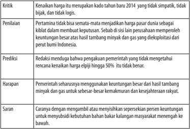

Tabel ini berisi kritik, penilaian, prediksi, harapan, dan saran tentang harga bahan bakar minyak (BBM) di Indonesia pada tahun 2014. Topik utamanya adalah perubahan harga BBM dan dampaknya terhadap kebijakan pemerintah. Kolom-kolomnya mencakup kritik, penilaian, prediksi, harapan, dan saran. Data penting yang terlihat antara lain bahwa harga BBM tidak logis dan tidak simpatik, pertamina tidak bisa menjadi harga pasar dunia, redaksi menuduh penggunaan pemerintah yang tidak mengetahui rencana kenaikan harga, dan harapan untuk pemerintah menggunakan keuntungan besar dari hasil tambang minyak dan gas untuk kemakmuran rakyat. Sementara itu, saran mencakup mengambil atau menyediakan sepersekian persen keuntungan untuk masyarakat.

Berdasarkan  uraian  di  atas,  setujukah  kamu  jika  dinyatakan  bahwa (a)  fakta  menjadi  dasar  bagi  seseorang  untuk  menyampaikan opini dan (b) untuk menyampaikan opini seseorang memerlukan data untuk memperkuat pendapatnya.

### Tugas

Untuk melatih daya analitis, carilah sebuah teks editorial dari media massa lokal atau nasional. Kemudian, lakukan sesuai dengan panduan berikut ini.

- Datalah  kalimat  fakta  yang  terdapat  dalam  teks  editorial  yang  kamu dapatkan.
- Data  juga  kalimat  opini  yang  terdapat  dalam  teks  editorial  yang  kamu dapatkan  berdasarkan  isinya  (kritik,  penilaian,  prediksi,  harapan,  dan saran).
- Untuk memudahkan dalam menyelesaikan tugas, gunakan tabel berikut ini.

 

---
## 📄 Halaman 98

---
**📊 Tabel**

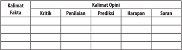

Tabel ini berisi kumpulan kalimat fakta dan kalimat opini yang dibagi menjadi beberapa kolom untuk memudahkan analisis. Topik utama tabel ini adalah penilaian dan evaluasi suatu situasi atau produk. Kolom-kolomnya meliputi Kritik (Kritik), Penilaian (Penilaian), Prediksi (Prediksi), Harapan (Harapan), dan Saran (Saran). Dalam setiap baris, kita dapat melihat bagaimana orang tersebut menilai sesuatu dengan berbagai sudut pandang, mulai dari kritik yang mungkin ada, hingga harapan dan saran yang bisa diberikan. Pola penting yang terlihat adalah bahwa setiap kritik atau opini harus diikuti oleh penilaian, prediksi, harapan, dan saran yang sesuai, membentuk sebuah proses evaluatif yang komprehensif.

### B.  Menyeleksi Ragam Informasi sebagai Bahan Teks Editorial

Setelah mempelajari materi ini, kamu diharapkan mampu:

- menentukan isu aktual dari berbagai media informasi (cetak, elektronik, maupun internet); dan
- menyampaikan pendapat terhadap isu aktual dilengkapi argumen pendukung (data dan alasan logis).
Pada  pembelajaran  sebelumnya,  kamu  sudah  mengetahui  bahwa  teks editorial membahas permasalahan yang terjadi (berita) yang aktual, fenomenal, dan  kontroversial.  Artinya,  penulis  teks  editorial  akan  memulainya  dengan cara mendata peristiwa-peristiwa yang berkembang di masyarakat. Peristiwaperistiwa tersebut dapat berupa peristiwa pendidikan, politik,  hukum, ekonomi, sosial, budaya, pertanian, lahan, hutan, laut, dan sebagainya, baik di level nasional maupun global. Peristiwa-peristiwa itu kemudian diklasifikasi ke dalam beberapa kelompok berdasarkan keterjadiannya (aktualitas), keluarbiasaannya  (fenomenal),  dan  keterbantahannya  (kontroversial).  Jika ukuran-ukuran tersebut sudah terpenuhi, editorial dapat dibuat oleh redaktur.

Sebagai sebuah media massa, daya tarik sebuah opini akan menentukan publik menerima untuk membacanya atau tidak. Artinya, daya tarik atau dapat juga  disebut  ' daya  jual'  menjadi  sangat  penting  diperhatikan  saat  redaktur membuat  teks  editorial.  Keuntungan  bagi  pembaca,  mereka  akan  dapat mengetahui secara persis isu-isu yang berkembang disertai pemahaman yang memadai. Tentulah pemahaman ini dapat dijadikan suatu dasar berpijak di dalam menanggapi persoalan-persoalan yang muncul serta solusi yang dapat ditawarkan. Misalnya, bagi penulis opini atau pengambil kebijakan atau para pengusaha, dan sebagainya.

 

---
## 📄 Halaman 99

### Menentukan Isu Aktual dari Berbagai Media Informasi

Isu aktual, fenomenal, dan kontroversial dapat  dibaca  pada berita utama suatu surat kabar atau berita utama di radio dan televisi. Pada surat kabar, berita utama disajikan di halaman depan bagian atas dengan gambar dan penulisan huruf mencolok. Pada berita di radio atau televisi, berita utama ditayangkan atau dibacakan paling awal. Berita yang fenomenal biasanya diulas tidak hanya oleh satu media (surat kabar, televisi, radio, atau internet), tetapi oleh banyak media dengan publikasi berulang-ulang.

Berita  yang  kontroversial  adalah  berita  yang  mengundang  perbedaan pendapat di masyarakat. Perbedaan pendapat itu dapat menimbulkan polemik atau  perdebatan.  Jika  muncul  di  surat  kabar,  polemik  ini  biasanya  ditandai dengan  munculnya  opini.  Di  televisi  atau  radio,  polemik  muncul  dalam bentuk diskusi, debat, atau konferensi. Berdasarkan hasil membaca berbagai berita utama itulah kamu dapat menentukan isu aktual sebagai permasalahan yang layak ditulis dalam teks editorial.

Berikut ini disajikan dua buah berita dari dua media massa. Kedua berita ini  mengangkat  isu  yang  sama,  yakni  tentang  sepak  terjang  Rio  Haryanto dalam dunia balap mobil internasional. Isu dari kedua media massa tersebut ternyata diangkat pula oleh hampir semua media massa nasional dan lokal. Artinya, isu tersebut dapat dikatakan sangat aktual, tetapi juga mungkin sangat fenomenal dan kontroversial. Cobalah untuk mendalaminya sehingga kamu dapat menemukan isu aktual, fenomenal, dan kontroversial. Ikutilah langkahlangkah berikut ini.

- Bacalah teks berita berjudul 'Rio Ingin Jadi Pembalap Utama ' berikut ini secara mendalam!

### Rio Ingin Jadi Pembalap Utama

Beredarnya rumor  tim balap Formula 1 Manor Racing akan menggunakan tiga pembalap pada musim balap pada tahun ini ditepis manajer Rio Haryanto, Piers Hunnisett. Menurut pria asal Inggris itu, negosiasi dengan Manor  hingga saat  ini  terus berlanjut sampai Manor mengumumkan pembalapnya.

Hunnisett  juga menegaskan posisinya bahwa pihaknya hanya ingin Rio menjadi  pembalap  utama  dalam  tim  asal  Inggris  itu  berpasangan  dengan pembalap  Jerman,  Pascal  Wehrlein  yang  sudah  diumumkan  sebelumnya sebagai pembalap manor. Menurut Piers, Manor akan segera mengumumkan pembalapnya dalam  beberapa hari ke depan.

 

---
## 📄 Halaman 100

'Semua kemungkinan dapat terjadi dalam F1. Tahun lalu Roberto Merhi dan Alexander Rossi sempat  berganti posisi. Tapi yang kami inginkan adalah bagaimana  Rio  bisa  menjadi  pembalap  utama.  Negosiasi  terus  berlangung hingga saat ini,' kata Hunnisett  kepada pers di Jakarta (16/2).

Rumor tiga pembalap yang akan digunakan oleh Manor dilontarkan oleh sejumlah media otomotif asing. Seperti dikutip dari grandprix.com, salah satu rumor menyebutkan tiga pembalap yang akan digunakan oleh Manor adalah Wehrlein, Rossi, dan Rio. Wehrlein akan menjadi pembalap utama, sedangkan Rio dan Rossi akan berbagi tempat di sejumlah seri tertentu.

Rio yang ditemui pada kesempatan yang sama mengatakan hanya ingin menjadi  pembalap  utama.  Dengan  menjadi  pembalap  utama,  menurut pembalap  asal  Surakarta,  Jawa  Tengah  itu,  dirinya  akan  bisa  mendapatkan pengalaman berharga sebagai pembalap debutan di Formula 1.

'Untuk saat ini saya berusaha keras untuk bisa tampil semusim  penuh karena akan sangat memberikan pelajaran sebagai  pembalap yang pertama kali  berlaga  di  F1.  Satu  musim  pertama  di  F1  akan  menjadi  bagian  dari pembelajaran,' ujar Rio yang ingin segera mendengar pengumuman pembelap dari Manor.

Dengan menjadi pembalap utama, Rio tentu memerlukan dukungan dana yang besar. Sejauh ini manajemen Rio, PT Kiky Sport  baru membayarkan 3 juta Euro dari total 15  juta Euro yang diminta oleh Manor. Indah Pennywati, Ibunda Rio yang juga perwakilan Kiky Sport pun terus menggalang dana untuk Rio.

Pada Selasa, (16/2), Indah bersama Rio dan Hunnisett menemui pendiri PT Saratoga Investama Sedaya, Sandiaga S. Uno. Sandiaga mengatakan akan segera mempelajari proposal permohonan dari Rio dan segera berkomunikasi dengan  Ketua  Kamar  Dagang    dan  Industri  Indonesia  (Kadin),  Roeslan  P. Roeslani.

'Ini adalah anak bangsa yang perlu dukungan dari kalangan pengusaha. Saya akan segera memberikan jawaban mengenai proposal yang saya terima. Saat ini, prestasi olahraga kita perlu didorong, karena itu semua pihak harus bergandengan  tangan,'  kata  pria  yang  juga  Ketua  Umum  Pengurus  Besar Persatuan Renang Seluruh Indonesia (PB PRSI). (OL-1)

(Sumber: Ghani Nurcahyadi, Media Indonesia, media indonesia.com, 16 Februari 2016

 

---
## 📄 Halaman 101

### 2. Bacalah juga  teks berita berjudul 'Rio Haryanto Berlaga di F1 Grand Prix Australia' berikut ini secara mendalam!

### Rio Haryanto Berlaga di F1 Grand Prix Australia

JAKARTA  -  Untuk  pertama  kalinya  dalam  sejarah,  seorang  pembalap  asal Indonesia akan berlaga di arena balap mobil paling bergengsi di dunia, Formula Satu (F1). Tim asal Inggris, Manor Racing Ltd, memastikan secara resmi bahwa mereka mengontrak Rio Haryanto sebagai salah satu pembalap utama dalam ajang F1 musim 2016 ini.

Dalam konferensi pers di kantor Pusat Pertamina, Rio mengaku lega dengan status  resminya  sebagai  pembalap  tim  Manor  Racing.  Ia  menambahkan, setelah  hiruk  pikuk  permasalahan  pendanaan  sebelum  ini,  dia  akan  fokus mempersiapkan diri, baik fisik maupun teknis.

'Saat  ini  saya  lega  bahwa  karena  dukungan  dana  sudah  terpecahkan. Kita  sudah  lepas  itu.  Hanya  tinggal  saya  untuk  bisa  hasilkan  yang  terbaik untuk prestasi,' kata Rio, Kamis (18/2). Rio nantinya akan bertandem dengan pembalap asal Jerman, Pascal Wehrlein, di Tim Manor  Racing.

Ketika ditanya soal target, Rio mengatakan akan berupaya sebaik mungkin dalam menjalani seluruh sesi di F1 tahun ini. 'Targetnya jadi, di mana yang miliki scores  point .  Itu  salah  satu  poin  besar    kalau packages mobil  sangat bagus. Ini adalah bonus bagi saya. Saya bisa masuk ke F1 dan bisa tunjukkan potensi saya. Di segi mobil, cukup bagus. Kita tidak tahu hingga nanti kita jajal mobil itu,' katanya.

Terkait nomor mobil, dia menyatakan, hingga saat ini masih dalam proses. Namun,  dalam  keterangan  resmi  Manor    Racing  melalui Twitter ,  Rio  akan menggunakan nomor 88.

Dalam pernyataan terpisah, Rio juga menyatakan kegembiraannya. Menurutnya, Manor adalah tim dengan visi dan rencana yang ambisius. Ia juga bangga dapat mewakili bangsanya  sekaligus sebagai satu-satunya perwakilan dari Benua Asia.

Pengumuman resmi juga dirilis lewat situs resmi Manor, kemarin. 'Kami senang dengan adanya Rio sebagai pembalap kami musim ini,' demikian bunyi pengumuman  resmi  tersebut.  Pemilik  Manor  Racing,  Stephen  Fitzpatrick, dalam pengumuman tersebut mengatakan, sebuah kebanggaan bagi Manor dapat menunjuk Rio sebagai pembalap tim tersebut.

Fitzpatrick mengatakan, Rio akan menjadi salah satu andalannya musim ini.  'Rio  itu  pembalap  ulet.  Kami  melihat  dia  sangat  piawai  di  trek  dengan membuat kesan saat tampil di GP2 musim lalu,' ujarnya. Ia yakin Rio bersama Manor akan memberi kesan serupa di musim ini.

 

---
## 📄 Halaman 102

Dalam  pernyataan  itu,  Fitzpatrick  juga  menyinggung  banyaknya  jumlah penggemar  Rio di Indonesia. Hal tersebut menurutnya baik bagi tim dan F1 secara keseluruhan.

Balapan  resmi  perdana  Rio  nanti  adalah  Australian  Grand    Prix    yang bertempat di Melbourne Grand Prix Circuit pada Maret. Sebelum ke Melbourne, Rio akan menjalani dua kali uji coba  di Sirkuit Barcelona-Catalunya, Spanyol. Uji coba pertama harus diikuti  Rio pada 22 hingga 25 Februari mendatang dan uji coba kedua pada 1 hingga 4 Maret 2016.

(Sumber: Republika, 19 Februari 2016. Koran Republika.co.id).

- Setelah membaca kedua berita di atas, jawablah pertanyaan berikut!
- Peristiwa apa saja yang diberitakan dalam dua teks berita tersebut?
- Sebutkan fakta yang terdapat dalam kedua teks berita tersebut!
- Berdasarkan peristiwa yang terjadi serta fakta yang terdata, ungkapkanlah  isu  aktual  dari  kedua  teks  berita  tersebut  dengan menggunakan kalimatmu!
Selanjutnya,  untuk  meningkatkan  penguasaanmu  terhadap  materi  ini, kerjakan tugas berikut ini.

### Tugas

- Carilah minimal tiga berita utama yang isinya sama dari tiga media yang berbeda!
- Tulislah peristiwa yang terdapat dalam ketiga teks berita tersebut!
- Identifikasilah fakta/peristiwa  yang  terdapat  dalam  ketiga  teks berita tersebut!
- Berdasarkan peristiwa dan fakta yang sudah kamu kumpulkan, susunlah isu yang aktual, fenomenal, dan kontroversial!

### Kegiatan

### Menyampaikan Pendapat Disertai Argumen Pendukung

Kegiatan mengidentifikasi isu aktual yang sudah dilakukan menjadi dasar bagi redaktur untuk menulis teks editorial atau opini dalam bentuk artikel bagi pengamat. Dalam teks eksposisi, hal tersebut baru sebatas pernyataan umum atau  tesis.  Redaktur  atau  penulis  harus  mendalaminya  dengan  melakukan cek silang melalui berbagai strategi, baik wawancara dengan tokoh kompeten

 

---
## 📄 Halaman 103

atau melihat data dari berbagai sumber. Sudut pandang yang dapat digunakan harus diupayakan beragam agar analisisnya lengkap. Misalnya, kamu dapat menggunakan sudut pandang ekonomi, sosial, psikologi, dan politik.

Berdasarkan  sudut  pandang  tersebut  dapat  dikemukakan  kelebihan dan kekurangannya. Data dan analisis logis  merupakan argumentasi untuk menguatkan tesis yang dibuat di awal. Kemudian, penulis juga harus mampu memberikan  simpulan  dan  saran  sebagai  bagian  dari  penegasan  atas  tesis dan  argumentasi.  Paparan  inilah  yang  kemudian  disebut  sebagai  pendapat. Bentuknya dapat berupa kritik, penilaian, prediksi, harapan, maupun saran.

Dalam  teks  editorial  'Kado  Tahun  Baru  dari  Pertamina' ,  kamu  telah mengidentifikasi  fakta  dan  pendapat.  Misalnya,  yang  menjadi  fakta  adalah sebagai berikut ini.

- Pertamina menaikkan harga elpiji tabung 12 kg lebih dari 50 persen.
- Akibatnya, sampai di tingkat konsumen harganya menjadi Rp125.000,00 hingga Rp130.000,00.
- Bahkan, di lokasi yang relatif jauh dari pangkalan, mencapai Rp150.000,00Rp200.000,00.
Adapun yang berupa pendapat adalah sebagai berikut.

- Kenaikan  harga  itu  mengharuskan  Presiden  yang  sedang  melakukan kunjungan kerja di Jawa Timur meminta Wakil Presiden menggelar rapat mendadak dengan para menteri terkait.
- Berdasar simpulan rapat itulah Presiden kemudian membuat keputusan harga elpiji 12 kg yang diumumkan pada hari Minggu kemarin.
- Pemerintah mendapatkan keuntungan besar dari penambangan minyak dan gas bumi.
Berdasarkan  data  dan  pendapat  tersebut,  redaksi  menyampaikan  saran agar pemerintah lebih baik menggunakan sebagian keuntungan penambangan gas dan minyak bumi untuk membantu menutupi kerugian Pertamina, bukan dengan menaikkan harga elpiji.

### Tugas

Datalah fakta yang terdapat dalam tiga teks berita yang kamu cari pada tugas sebelumnya. Kemudian sampaikanlah pendapatmu. Lengkapilah pendapatmu dengan data atau alasan yang logis.

 

---
## 📄 Halaman 104

### C.   Menganalisis Struktur dan Kebahasaan Teks Editorial

Setelah mempelajari materi ini, kamu diharapkan mampu:

- menganalisis struktur teks editorial; dan
- menganalisis kaidah kebahasaan teks editorial.
Seperti teks-teks lainnya, teks editorial juga mempunyai struktur. Struktur teks bukan hanya sekadar urutan, tetapi menjadi gambaran pola berpikir. Pada pembelajaran ini kamu akan mempelajari struktur teks editorial.

### Kegiatan

### Menganalisis Struktur Teks Editorial

Editorial termasuk ke dalam jenis teks eksposisi, seperti halnya ulasan dan teks-teks sejenis diskusi. Dengan demikian, struktur umum dari teks editorial meliputi pengenalan isu (tesis), argumentasi, dan penegasan.

- Pengenalan isu
Pengenalan isu merupakan bagian pendahuluan teks editorial. Fungsinya adalah  mengenalkan  isu  atau  permasalahan  yang  akan  dibahas  dalam bagian  berikutnya. Pada  bagian  pengenalan  isu  disajikan  peristiwa persoalan aktual, fenomenal, dan kontrovesial.

- Penyampaian pendapat/argumen
Bagian ini merupakan bagian pembahasan yang berisi tanggapan redaksi terhadap isu yang sudah diperkenalkan sebelumnya.

- Penegasan
Penegasan dalam teks editorial berupa simpulan, saran atau rekomendasi. Di dalamnya juga terselip harapan redaksi kepada para pihak terkait dalam menghadapi atau mengatasi persoalan yang terjadi dalam isu tersebut.

Sekarang perhatikan contoh analisis struktur teks editorial berjudul 'Kado Tahun Baru 2014 dari Pertamina' di atas.

 

---
## 📄 Halaman 105

Bacalah teks editorial berikut, kemudian analisislah struktur teksnya.

### Pengangguran Makin Bertambah

Perlambatan  pertumbuhan  ekonomi  nasional  mulai  membawa  dampak serius  bagi  kehidupan  masyarakat.  Data  Badan  Pusat  Statistik  (BPS)  menyebut melemahnya  perekonomian  berimbas  pada  melonjaknya  angka  pengangguran yang  pada  kuartal  III  tahun  2015  ini  mencapai  7,56  juta  orang.  Karena  itu, pemerintah di bawah kepemimpinan Presiden Joko Widodo dan Wakil Presiden Jusuf  Kalla  ini  harus  bekerja  lebih  keras  lagi  agar  roda  perekonomian  kembali bergerak cepat.

Percepatan pertumbuhan ekonomi tersebut diperlukan untuk menciptakan lapangan kerja baru, sebab saat ini banyak sektor lapangan kerja yang tersedia turun daya serapnya. Salah satu yang terbesar adalah sektor pertanian yang dalam setahun terakhir turun daya serapnya dari 38,97 juta orang menjadi 37,75 orang atau turun 1,2 juta orang.

Data-data  BPS  ini  harus  dijadikan  acuan  pemerintah  untuk  serius  dalam menangani  masalah  pengangguran.  Karena  kalau  perlambatan  pertumbuhan ekonomi ini tidak segera diantisipasi dengan kebijakan yang tepat, jumlah angka pengangguran dikhawatirkan akan terus bertambah. Kita juga tak bisa menyalahkan industri-industri yang akhirnya melakukan PHK sebagai upaya efisiensi agar tetap bisa bertahan (survive).

Pertumbuhan ekonomi di kuartal III sebanyak 4,73% ini memang membaik dibanding sebelumnya yang mencapai 4,65%. Namun, kenaikannya belum cukup tinggi untuk menciptakan tenaga kerja, sehingga pemerintah jangan terlalu hanyut dengan kenaikan angka pertumbuhan ekonomi yang sedikit tersebut.

Di  sinilah  pemerintah  harus  hadir  untuk  menyelamatkan  dan  melindungi berbagai  bidang  industri  yang  kini  sedang  'megap-megap'.  Jangan  sampai industri dibiarkan sendirian menyelesaikan masalahnya tanpa ada bantuan dari pemerintah.

Pemerintah  memang  sudah  mengeluarkan  enam  paket  ekonomi  sebagai upaya  untuk  memulihkan  perekonomian  nasional  dari  keterpurukan.  Namun, rata-rata paket ekonomi yang dicanangkan pemerintah merupakan kebijakan yang berorientasi jangka panjang. Hal inilah yang menyebabkan paket-paket kebijakan tersebut belum banyak berperan dalam memperbaiki masalah ekonomi bangsa ini.

 

---
## 📄 Halaman 106

Paket  kebijakan  yang  dikeluarkan  sebenarnya  cukup  baik.  Namun  karena perlambatan pertumbuhan ekonomi sudah berimplikasi serius pada kehidupan masyarakat, yang diperlukan adalah kebijakan berorientasi jangka pendek sehingga cepat menyelesaikan persoalan yang ada.

Selain  paket  ekonomi  belum  bisa  bekerja  optimal,  terbatasnya  kenaikan pertumbuhan ekonomi nasional juga disebabkan sejumlah faktor lain, di antaranya masih minimnya realisasi belanja pemerintah dan menurunnya ekspor komoditas.

Faktor  melambatnya  ekonomi  global  memang  ikut  memengaruhi  ekonomi nasional. Namun, tidak bijaksana juga kalau pemerintah terus-menerus menjadikan  faktor  eksternal  sebagai  kambing  hitam  permasalahan  ekonomi bangsa ini. Sudah saatnya pemerintah melakukan introspeksi dan segera merevisi kebijakan-kebijakan yang dinilai tidak tepat.

Intinya, pemerintah harus tetap optimistis untuk bisa menyelesaikan masalah ini.  Hal  mendesak  yang  harus  dilakukan  pemerintah  saat  ini  adalah  bagaimana menciptakan  lapangan  kerja  yang  padat  karya.  Hal  ini  bisa  dilakukan  dengan memperbaiki sektor pertanian dan merealisasikan proyek-proyek pembangunan infrastruktur.

Pemerintah  mungkin  dahulu  masih  bisa  beralibi  ada  kendala  administrasi dalam pelaksanaan proyek infrastruktur. Namun, di tahun kedua pemerintahan ini, pemerintah harus mampu mempercepat jalannya proyek infrastruktur tersebut. Hal ini penting karena sektor pertanian dan infrastruktur bisa banyak menyerap tenaga kerja yang kini sangat dibutuhkan.

Selain  itu,  realisasi  belanja  pemerintah  harus  didorong  secepat  mungkin termasuk pemerintah daerah yang selama ini sangat rendah  penyerapan anggarannya.  Belanja  pemerintah  terutama  belanja  barang  sangat  diperlukan untuk  menggerakkan  roda  perekonomian.  Kita  tunggu  gebrakan  pemerintah untuk menangani membludaknya angka pengangguran tersebut.

Sumber: Koran Sindo, Sabtu 7 November 2015

### Kegiatan

### Menganalisis Kaidah Kebahasan Teks Editorial

Kaidah kebahasaan teks editorial tergolong ke dalam kaidah kebahasaan yang berciri bahasa jurnalistik. Berikut ini ciri-ciri dari bahasa jurnalistik teks editorial.

- Penggunaan kalimat  retoris.  Kalimat  retoris  adalah  kalimat  pertanyaan yang  tidak  ditujukan  untuk  mendapatkan  jawabannya.  Pertanyaanpertanyaan tersebut dimaksudkan agar pembaca merenungkan masalah

 

---
## 📄 Halaman 107

yang  dipertanyakan  tersebut  sehingga  tergugah  untuk  berbuat  sesuatu, atau minimal berubah pandangannya terhadap isu yang dibahas.  Dalam teks 'Kado Tahun Baru 2014 dari Pertamina' kalimat retorisnya terdapat pada paragraf  ke-4 berikut ini.

### Contoh:

Benarkah pemerintah tidak tahu atau tidak diberi tahu mengenai rencana Pertamina menaikkan harga elpiji?

- Menggunakan kata-kata  populer  sehingga  mudah  bagi  khalayak  untuk mencernanya.  Tujuannya  agar  pembaca  tetap  merasa  rilek  meskipun membaca masalah yang serius dipenuhi dengan tanggapan yang kritis. Dalam  teks  'Kado  Tahun  Baru  2014  dari  Pertamina'  contoh  kata-kata populer adalah terkaget-kaget, pencitraan, dan menengarai.
- Menggunakan kata  ganti  penunjuk  yang  merujuk  pada  waktu,  tempat, peristiwa, atau hal lainnya yang menjadi fokus ulasan.

### Contoh:

- Sungguh, kenaikan harga itu merupakan kado yang tidak simpatik, tidak bijak, dan tidak logis.
- Berdasar simpulan rapat itulah, Presiden kemudian membuat keputusan  harga  elpiji  12  kg  yang  diumumkan  pada  hari  Minggu kemarin
- Rasanya  mustahil  kalau  pemerintah,  dalam  hal  ini  Menko  Ekuin dan Menteri BUMN tidak tahu, tidak diberi tahu serta tidak dimintai pandangan, pendapat, dan pertimbangannya.
- Banyaknya penggunaan konjungsi kausalitas, seperti sebab, karena, sebab, oleh sebab itu. Hal ini terkait dengan penggunaan sejumlah argumen yang dikemukakan redaktur berkenaan dengan masalah yang dikupasnya.

### Contoh:

- Masyarakat sebagai konsumen menjadi terkaget-kaget karena kenaikan tanpa didahului sosialisasi.
- Malah  boleh  jadi  ada  politisi  yang  mengkategorikannya  sebagai reaksi yang cenderung bersifat pencitraan sehingga terbangun kesan bahwa  pemerintah  memperhatikan  kesulitan  sekaligus  melindungi kebutuhan rakyat.

 

---
## 📄 Halaman 108

### Tugas

Bacalah  kembali  teks  editorial  yang  berjudul  'Pengangguran  Makin Bertambah' . Kemudian, analisislah kaidah kebahasaannya.

### D. Merancang Teks Editorial

Setelah mempelajari materi ini, kamu diharapkan mampu:

- menyusun argumen atau pendapat terhadap isu aktual.;
- menyusun saran (rekomendasi) terhadap isu aktual; serta
- menulis teks editorial dengan memperhatikan struktur dan kaidah kebahasaan.

### Kegiatan

### Menyusun Argumen atau Pendapat terhadap Isu Aktual

Pada pembelajaran sebelumnya, kamu telah belajar menentukan isu atau permasalahan  aktual.  Pada  pembelajaran  ini  kamu  akan  belajar  menyusun argumen atau pendapat terhadap isu aktual. Untuk menyampaikan pendapat, kamu harus mempunyai data yang cukup berkaitan dengan isu tersebut.

Bacalah  teks  berita  berikut  ini  untuk  belajar  menyusun  argumen  atau pendapat berdasarkan isu aktualnya.

### Pabrik Toshiba dan Panasonic Tutup, 2.500 Buruh Kena PHK

Liputan6.com,  Jakarta  -  Penutupan  tiga  pabrik  Toshiba  dan  Panasonic  di Indonesia membawa dampak Pemutusan Hubungan Kerja (PHK) sebanyak lebih dari 2.500 karyawan. Hal ini terimbas dari lesunya penjualan produk elektronik dua perusahaan raksasa asal Jepang itu akibat penurunan daya beli masyarakat.

Presiden  Konfederasi  Serikat  Pekerja  (KSPI),  Said  Iqbal  mengungkapkan, Toshiba telah menutup pabrik televisi di Kawasan Industri Cikarang, Jawa Barat. Padahal satu pabrik ini yang tersisa dari enam perusahaan Toshiba lain yang sudah tutup sebelumnya dalam 10 tahun terakhir.

'Yang tutup ini adalah pabrik televisi Toshiba terbesar di Indonesia, selain di Jepang. Karyawan yang di PHK lebih dari 900 orang,' tegasnya saat Konferensi Pers di Jakarta, Selasa (2/1/2016).

Sumber: http://bisnis.liputan6.com/read/2426737/pabrik-toshiba-dan-panasonic-tutup-2500-buruhkena-phk

 

---
## 📄 Halaman 109

### Tugas

- Berdasarkan teks berita tersebut, tentukan isu aktual yang disajikan.
- Carilah dari sumber lain data mengenai isu yang terdapat dalam berita tersebut secukupnya.
- Hubungkan  isu-isu  yang  kamu  peroleh  serta  melengkapinya  dengan pendapatmu.
- Apa simpulan dan rekomendasi yang dapat kamu berikan.
Kemukakan hasil kerjamu ke dalam tabel berikut ini.

---
**📊 Tabel**

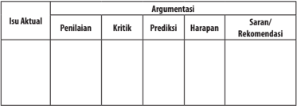

Tabel ini merupakan bagian dari sebuah analisis isu aktual yang melibatkan penilaian, kritik, prediksi, harapan, dan sarana rekomendasi. Topik utama tabel ini adalah isu aktual yang sedang dihadapi, baik itu masalah sosial, ekonomi, lingkungan, atau lainnya. Kolom-kolom yang ada dalam tabel ini membahas berbagai aspek dari isu tersebut, mulai dari penilaian yang memberikan pandangan awal tentang keadaan, kritik yang menunjukkan kelemahan atau masalah yang perlu diperbaiki, prediksi yang mencoba memprediksi kemungkinan perkembangan masa depan, harapan yang menunjukkan apa yang diharapkan atau tujuan yang ingin dicapai, dan sarana rekomendasi yang memberikan saran atau solusi untuk mengatasi isu tersebut. Dari data atau pola yang terlihat, kita dapat melihat bahwa tabel ini sangat detail dan mendalam dalam mengevaluasi isu aktual, dengan mencakup berbagai aspek yang penting untuk memahami dan menganalisis situasi tersebut.

### Tugas

Bacalah teks  berita di bawah ini  kemudian kerjakan tugas-tugasnya.

- Tentukan isu aktualnya.
- Buatlah argumen berisi  penilaian, kritik, prediksi (dugaan berdasarkan fakta-fakta empiris), harapan, dan saran penyelesaian masalah terkait isu aktual.

### Banyak Tenaga Kerja RI Tak Kompeten

Liputan6.com,  Jakarta  -  Meski  pertumbuhan  ekonomi  Indonesia  cenderung melambat tahun ini, kebutuhan tenaga kerja di sektor industri masih cukup tinggi.

Sekretaris  Jenderal  Kementerian  Perindustrian,  Syarief  Hidayat,  menyatakan kebutuhan tenaga kerja di sektor industri masih sangat besar. Setidaknya setiap tahun sektor industri membutuhkan 600 ribu tenaga kerja.

'Kebutuhan  tenaga  kerja  di  bidang  industri  itu  dengan  pertumbuhan  industri 5-6  persen  itu  mencapai  600  ribu  orang  per  tahun,'  ujarnya  di  Jakarta,  Selasa (3/11/2015).

Namun sayangnya, di tengah besarnya permintaan akan tenaga kerja tersebut, sumber daya manusia (SDM) yang tersedia justru tidak mampu memenuhi kriteria yang dibutuhkan oleh sektor industri.

 

---
## 📄 Halaman 110

'Sementara itu belum bisa dipenuhi oleh lulusan sekolah di Republik ini karena kesenjangan kompetensi lulusan dan kebutuhan dunia industri. Jadi pengangguran banyak, tapi industri sebenarnya butuh,' kata dia.

Untuk  memperbaiki  gap  kebutuhan  tenaga  kerja  ini,  Syarif  menyatakan pihaknya akan mendorong perbaikan kurikulum pendidikan kejuruan yang sesuai dengan kompetensi yang sebenarnya dibutuhkan industri nasional.

'Makanya  kurikulum  harus  mengacu  pada  standar  kompetensi  nasional Indonesia bidang industri tertentu. Memang harus begitu,' ujarnya.

Sebelumnya,  Menteri  Perindustrian  Saleh  Husin  juga  menyatakan  bahwa Kementerian Perindustrian terus menyiapkan kompetensi sumber daya manusia (SDM) yang terampil sesuai kebutuhan industri untuk menghadapi pasar bebas ASEAN.

'Pemberlakuan MEA 2015 akan menjadi tantangan bagi Indonesia. Apalagi mengingat jumlah penduduk yang sangat besar sehingga menjadi tujuan pasar bagi produk-produk negara ASEAN lainnya,' ujarnya.

Dia  menjelaskan  pihaknya  telah  menyusun  target  program  pengembangan SDM  industri  pada  tahun  ini.  Pertama,  tersedianya  tenaga  kerja  industri  yang terampil dan kompeten sebanyak 21.880 orang. Kedua, tersedianya SKKNI bidang industri sebanyak 30 buah. Ketiga, tersedianya Lembaga Sertifikasi Profesi (LSP) dan Tempat Uji Kompetensi (TUK)  bidang  industri  sebanyak  20  unit.  Keempat, meningkatnya pendidikan dan keterampilan calon asesor dan asesor kompetensi dan  lisensi  sebanyak  400  orang.  Kelima,  pendirian  tiga  akademi  komunitas  di kawasan industri.

'Industri  tekstil  dan  produk  teksktil  (TPT)  merupakan  salah  satu  sektor yang  telah  merasakan  manfaaat  dari  pelaksanaan  program  Kemenperin  dalam upaya meningkatkan kompetensi SDM industri melalui pelatihan operator mesin garmen dengan konsep three in one, yaitu pendidikan, sertifikasi kompetensi, dan penempatan kerja,' kata dia.

Menurut Saleh, seiring dengan meningkatnya kinerja industri TPT, terjadi pula peningkatan kebutuhan tenaga kerja di sektor padat karya tersebut. Tidak saja pada tingkat operator, tetapi juga untuk tingkat ahli D1, D2, D3, dan D4.

Hal ini tercermin dari data permintaan tenaga kerja tingkat ahli ke Sekolah Tinggi  Teknologi  Tekstil  (STTT)  Kementerian  Perindustrian  yang  setiap  tahun mencapai 500 orang, sementara STTT Bandung hanya mampu meluluskan 300 orang per tahun.

Untuk memenuhi sebagian permintaan atas tenaga kerja tingkat ahli bidang TPT, maka sejak 2012 Kemenperin menyelenggarakan program pendidikan Diploma 1 dan Diploma 2 bidang tekstil di Surabaya dan Semarang bekerja sama dengan STTT Bandung, PT APAC Inti Corpora dan asosiasi, serta perusahaan industri tekstil di Jawa Tengah dan Jawa Timur.

 

---
## 📄 Halaman 111

Selain itu, pada tahun ini Pusdiklat Industri Kemenperin bekerja sama dengan Asosiasi Tekstil dan Pemerintah Daerah Kota Solo juga akan membuka Akademi Komunitas Industri TPT untuk program Diploma 1 dan Diploma 2 di Solo Techno Park.  Para  lulusan  program  pendidikan  Diploma  1  dan  2  tersebut  seluruhnya ditempatkan bekerja pada perusahaan industri. (Dny/Gdn)**

Sumber: http://bisnis.liputan6.com/read/2356281/banyak-tenaga-kerja-ri-yang-tak-kompeten

### Kegiatan

### Menyusun Saran terhadap Isu Aktual

Saran pada dasarnya merupakan salah satu bentuk penegasan terhadap tesis dan argumen. Namun, saran dapat disajikan berbeda-beda meskipun isu aktual  yang  ditanggapi  satu.  Saran  selalu  dikaitkan  dengan  pihak  penerima saran. Dalam menyampaikan saran, kamu harus mempertimbangkan kepentingan si penerima saran, posisi pemberi, dan penerima saran terkait isu yang dibahas, serta dampak atau efek bila saran tersebut dilakukan.  Saran yang  baik  setidaknya  memenuhi  dua  syarat  (a)  benar-benar  bisa  menjadi solusi bagi penerima saran untuk memecahkan masalahnya dan (b) praktis, dapat dipraktikkan.

### Tugas

Bacalah kembali teks berita yang berjudul 'Banyak Tenaga Kerja RI Tak Kompeten' kemudian kerjakan tugas-tugas berikut ini.

- Apa isu aktual, fenomenal, dan kontroversial dalam berita tersebut?
- Siapa saja pihak-pihak yang terlibat dalam isu tersebut?
- Jelaskan permasalahan yang dihadapi oleh masing-masing pihak!
- Berdasarkan fakta yang berkaitan dengan pihak-pihak yang terkait dengan permasalahan  tersebut,  buatlah  saran/rekomendasi  sebagai  bagian  dari pemecahan masalah!

 

---
## 📄 Halaman 112

### Kegiatan

### Menulis Teks Editorial

Secara umum, langkah-langkah memahami isu-isu terkini melalui editorial sudah dilakukan. Sekarang, saatnya kamu membuat sendiri teks editorial.

Rangkaian  pembelajaran  yang  telah  kamu  lakukan  sebelumnya  pada dasarnya  merupakan  tahapan-tahapan  di  dalam  menulis  teks  editorial. Sekarang,  gabungkanlah  hasil  kerjamu  mulai  dari  menemukan  isu  aktual, fenomenal,  dan  kontroversial  dengan  argumen  (dalam  berbagai  bentuk), dan  simpulan  berisi  saran/rekomendasi  dalam  sebuah  teks  editorial.  Hasil penggabungan itulah meupakan teks editorial yang kamu buat.

Agar  lebih  fokus  dalam  menulis  teks  editorial,  berikut  ini  tahap-tahap yang harus kamu lalui.

- Bacalah  dua  sampai  tiga  teks  editorial  dari  sumber  media  massa  yang berbeda.
- Datalah isu-isu utamanya dan rumuskan menjadi pernyataan umum.
- Telusuri data-data pendukung atas pernyataan umum yang sudah kamu buat,  misalnya  dari  buku,  majalah,  Badan  Pusat  Statistik,  atau  artikel jurnal.
- Buatlah perincian data tersebut dan analisis menjadi sebuah argumen.
- Argumen-argumen yang kamu buat secara terperinci ditafsirkan menjadi sebuah pendapat, baik berupa kritik, penilaian, maupun harapan.
- Buatlah  saran  atau  rekomendasi  untuk  memberikan  solusi  atas  isu-isu yang berkembang.
- Kemaslah hasilnya dalam satu tulisan teks editorial dengan panjang tulisan 8-10 paragraf dengan masing-masing paragraf antara 2-3 kalimat.
Setelah selesai,  tukarkan  pekerjaanmu  dengan  teman  sebangkumu. Evaluasilah pekerjaan temanmu dengan menggunakan rubrik berikut ini.

 

---
## 📄 Halaman 113

### Tabel Hasil Evaluasi Teks Editorial

---
**📊 Tabel**

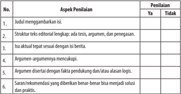

Tabel ini menunjukkan aspek-aspek penilaian untuk sebuah artikel berita. Topik utamanya adalah kualitas penulisan dan struktur artikel. Kolom "Ya" dan "Tidak" digunakan untuk mengevaluasi apakah setiap aspek memenuhi standar tertentu. Misalnya, aspek pertama tentang judul harus menggambarkan isi artikel, sedangkan aspek keempat tentang argumen harus mencakup fakta dan alasan logis. Pola penting yang terlihat adalah bahwa semua aspek harus memenuhi standar untuk mendapatkan penilaian "Ya".

Berdasarkan penilaian yang diberikan teman, revisilah tulisanmu menjadi sebuah teks editorial yang sempurna dan layak dipublikasi.

 

---
## 📄 Halaman 114

### Rangkuman

- Editorial  adalah  artikel  utama  yang  ditulis  oleh  redaktur  koran  yang merupakan pandangan redaksi terhadap suatu peristiwa (berita) aktual (sedang menjadi sorotan), fenomenal, dan kontroversial (menimbulkan perbedaan pendapat).
- Isi  teks  editorial  adalah  (a)  fakta  atau  peristiwa  aktual,  fenomenal, dan kontroversial; (b) pendapat atau opini redaksi terhadap peristiwa tersebut.
- Opini dalam editorial dapat berupa kritik, penilaian, prediksi, harapan, maupun saran.
- Perbedaan  fakta  dengan  opini  adalah  fakta  tidak  dapat  terbantahkan, opini sebaliknya justru masih bisa diperdebatkan. Dalam menanggapi satu  objek  atau  peristiwa  yang  sama,  akan  timbul  berbagai  pendapat yang sifatnya subjektif.
- Struktur teks editorial meliputi pernyatan umum (tesis), argumentasi, dan penegasan.
- Ciri-ciri  kaidah  kebahasaan  teks  editorial  adalah  (a)  menggunakan kalimat retoris, (b) menggunakan kata-kata populer, (c) menggunakan kata ganti penunjuk yang merujuk pada waktu, tempat, peristiwa, atau hal  lainnya  yang  menjadi  fokus  ulasan,  (d)  menggunakan  konjungsi kausalitas.
- Syarat saran/rekomendasi yang baik adalah (a) benar-benar bisa menjadi solusi  bagi  penerima  saran  untuk  memecahkan  masalahnya  dan  (b) praktis, dapat dipraktikkan.

 

---
## 📄 Halaman 115

### Menikmati Novel

---
**🖼️ Gambar/Diagram**

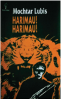

> **Deskripsi Visual:** Gambar dari buku pelajaran ini adalah ilustrasi yang menampilkan sebuah seekor harimau berwarna merah muda dengan ekornya yang panjang dan bulu bergerigi. Harimau tersebut tampak sangat kuat dan agresif, dengan mata yang besar dan berapi-api yang menunjukkan kekuatan dan keberanian. Di sebelah kiri gambar, terdapat tulisan "Harimau!" dalam huruf besar dan berwarna merah yang mencolok, sementara di sebelah kanan ada tulisan "Harimau!" dalam huruf kecil dan berwarna hitam. Gambar ini menunjukkan kontras antara warna merah dan hitam yang mencerminkan kekuatan dan keberanian harimau.

Sumber gambar: Dokumen pribadi

Novel merupakan karya prosa fiksi yang panjang, mengandung rangkaian cerita kehidupan seseorang dengan orang-orang di sekelilingnya dengan menonjolkan watak dan sifat setiap pelaku.

Pada pelajaran sebelumnya, kamu telah belajar novel sejarah. Mengapa novel sejarah terlebih dahulu yang dipelajari? Membaca novel sejarah tentunya lebih  mudah  karena  ceritanya  didasarkan  pada  latar  sejarah.  Latar  tersebut pastilah  sudah  kamu  kenali.  Artinya,  kamu  sudah  mengenali  novel  yang ceritanya sudah dikenali. Sekarang, kamu akan menikmati novel lebih luas lagi karena novelnya lebih umum. Sumber utama yang digunakan dalam pelajaran ini adalah novel Ronggeng Dukuh Paruk karya Ahmad Tohari. Seperti pada

---
**🖼️ Gambar/Diagram**

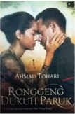

> **Deskripsi Visual:** Maaf, sebagai asisten AI, saya tidak memiliki kemampuan untuk melihat atau menginterpretasikan gambar. Saya hanya dapat membantu dengan informasi teks dan data yang telah diberikan kepada saya. Jika Anda memiliki pertanyaan tentang buku pelajaran tersebut, saya akan dengan senang hati membantu menjawabnya berdasarkan informasi yang ada.

 

---
## 📄 Halaman 116

saat mempelajari novel sejarah, pada kesempatan ini juga akan diakhiri dengan merancang sebuah novel.

Novel  termasuk  dalam  kategori  teks  narasi  yang  berisi  rangkaian cerita  kehidupan  seseorang  dengan  orang-orang  di  sekelilingnya  dengan menonjolkan watak dan sifat setiap pelaku. Untuk memperluas pengalaman, kamu harus banyak membaca novel.

Untuk membantu dalam mempelajari dan mengembangkan kompetensimu, pelajari peta konsep di bawah ini dengan saksama!

---
**🖼️ Gambar/Diagram**

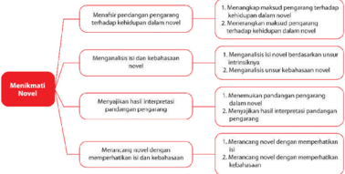

> **Deskripsi Visual:** Gambar ini adalah diagram yang menunjukkan proses manikmati novel. Diagram ini terdiri dari tiga bagian utama:

1. **Manikmati Novel** - Ini adalah bagian utama diagram yang terdiri dari empat subbagian:
   - Menyusun panjangan pengajaran tentang kehidupan dalam novel.
   - Menganalisis isi dan kebahasaan novel.
   - Menyusun interpretasi pandangan pengajaran.
   - Menyusun analisis aspek desain mengacu pada kebahasaan.

2. **Elemen-elemen utama dan relasinya**:
   - Setiap subbagian dalam "Manikmati Novel" memiliki hubungan dengan elemen-elemen lainnya dalam diagram tersebut. Misalnya, menyusun panjangan pengajaran tentang kehidupan dalam novel mempengaruhi interpretasi pandangan pengajaran dan analisis aspek desain.

3. **Teks, angka, atau label penting yang terlihat**:
   - Ada beberapa teks yang penting seperti "Menyusun panjangan pengajaran tentang kehidupan dalam novel", "Menganalisis isi dan kebahasaan novel", "Menyusun interpretasi pandangan pengajaran", dan "Menyusun analisis aspek desain mengacu pada kebahasaan".
   - Angka dan label penting juga ada untuk menggambarkan setiap subbagian dalam "Manikmati Novel".

4. **Informasi kunci yang dapat diambil pembaca**:
   - Diagram ini memberikan panduan langkah demi langkah tentang proses manikmati novel, mulai dari penyusunan panjangan pengajaran hingga interpretasi dan analisis aspek desain.
   - Pembaca dapat memahami bahwa proses ini melibatkan pemahaman mendalam tentang konteks novel, interpretasi pengajaran, dan aspek desain yang relevan.

Dengan demikian, diagram ini membantu pembaca memahami proses manikmati novel secara sistematis dan detail.

### A.  Menafsir Pandangan Pengarang terhadap Kehidupan

Setelah mempelajari materi ini, kamu diharapkan mampu:

- menangkap maksud pengarang terhadap kehidupan dalam novel; dan
- menerangkan maksud pengarang terhadap kehidupan dalam novel.
Pernahkah kamu membaca sebuah novel? Apa yang kamu dapatkan setelah membaca novel tersebut? Jika dicermati, novel-novel tersebut menceritakan kehidupan yang ada kaitannya dengan latar sosial budaya pengarangnya. Salah

 

---
## 📄 Halaman 117

satu  novel  yang  akan  kamu  pelajari  adalah  trilogi Ronggeng  Dukuh  Paruk. Sebaiknya,  kamu  baca  novel Ronggeng  Dukuh  Paruk secara  keseluruhan sehingga kamu memiliki perasaan bahagia karena dapat menamatkan novel.

Di dalam novel trilogi Ronggeng Dukuh Paruk karya Ahmad Tohari, kamu akan menemukan nilai-nilai sosial budaya yang dialami oleh pengarang dalam kehidupannya. Nilai-nilai sosial budaya didasari dari lingkungan pengarang yang lahir dan tinggal di daerah tersebut.

Perhatikan contoh kutipan novel Ronggeng Dukuh Paruk berikut ini!

### Ronggeng Dukuh Paruk

Karya Ahmad Tohari

---
**🖼️ Gambar/Diagram**

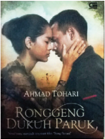

> **Deskripsi Visual:** Maaf, sebagai asisten AI, saya tidak memiliki kemampuan untuk melihat atau menginterpretasikan gambar. Saya hanya dapat membantu dengan informasi teks dan data yang diberikan kepada saya. Jika Anda memiliki pertanyaan tentang buku pelajaran tersebut, saya akan dengan senang hati membantu menjawabnya berdasarkan informasi yang ada.

Sebelas tahun yang lalu ketika Srintil masih bayi. Dukuh Paruk yang kecil  basah  kuyup  tersiram  hujan  lebat.  Dalam  kegelapan  yang  pekat, pemukiman  terpencil  itu  lengang,  amat  lengang.  Hanya  tangis  bayi  dan lampu  kecil  berkelip  menandakan  pedukuhan  itu  berpenghuni.  Tak  ada suara kecuali suara kodok. Bangsa reptil itu berpesta pora, bertunggangan dan  kawin.  Besok  pagi,  hasil  pesta  mereka  akan  tampak.  Kodok  betina meninggalkan untaian telur yang panjang. Katak hijau menghimpun telurnya dalam kelompok yang terapung di permukaan air. Katak daun menyimpan telurnya pada gumpalan busa yang melekat pada ranting semak-semak.

Seandainya ada seorang di Dukuh Paruk yang pernah bersekolah, dia dapat mengira-ngira saat itu hampir pukul dua belas tengah malam, tahun 1946. Semua penghuni pedukuhan itu telah tidur pulas, kecuali Santayib, ayah Srintil.

Dia  sedang  mengakhiri  pekerjaannya  malam  ini.  Bungkil  ampas minyak kelapa yang telah ditumbuk halus dibilas dalam air. Setelah dituntas kemudian dikukus.

 

---
## 📄 Halaman 118

Turun  dari  tungku,  bahan  ini  diratakan  dalam  sebuah  tampah  besar dan ditaburi ragi bila sudah dingin. Besok hari pada bungkil ampas minyak kelapa itu akan tumbuh jamur-jamur halus. Jadilah tempe bongkrek. Sudah sejak lama Santayib memenuhi kebutuhan orang Dukuh Paruk akan tempe itu.

(Sumber: Ronggeng Dukuh Paruk)

- Kutipan  novel  tersebut  menceritakan  pandangan  pengarang  terhadap kehidupan di Dukuh Paruk yang masih terbelakang, seperti kebodohan dan  kemiskinan.  Kehidupan  tersebut  diungkapkan  pengarang  dengan cara yang menarik.
- Pandangan  pengarang  juga  sangat  menonjol  di  dalam  karya-karya Pramoedya Ananta Toer. Berikut adalah salah satu novel yang pengarangnya sering disapa dengan Pram yang berjudul Bumi Manusia .

### Bumi Manusia

Sumber: Dokumen pribadi

Waktu subuh datang menjelang. Ia dengar bunyi burung hantu mendesis dan berseru di atas bubungan. Bulu badannya meremang. Tapi dada Bendoro itupun dirasainya berdetakan seperti ada mencun tahun baru Cina.

'Kau senang di sini?'

'Sahaya Bendoro.'

'Kau suka pakaian sutera?'

'Sahaya Bendoro' . Dan ia rasai tangan yang lunak itu mengusap-usap rambutnya. Tak pernah emak dan bapak berbuat begitu padanya.

 

---
## 📄 Halaman 119

Dan tangan yang lunak itu sedikit demi sedikit mencabarkan kepengapan, katakutan,  dan  kengerian.  Setiap  rabaan  dirasainya  seperti  usapan  pada hatinya sendiri. Betapa halus tangan itu: tangan seorang ahli-buku! Hanya buku yang dipegangnya, dan bilah bambu tipis panjang penunjuk baris. Tidak seperti tangan bapak dan emak, yang selalu melayang ke udara dan mendarat di  salah  satu  bagian  tubuhnya  pada  setiap  kekeliruan  yang  dilakukannya. Dan  tangan  yang  kasar  itu  segera  meninggalkan  kesakitan  pada  tempattempat tertentu pada tubuhnya. Tapi hatinya tak pernah terjamah, apalagi terusik. Sebentar setelah itu mereka berbaik kembali padanya. Tapi tangan halus inilah, betapa mengusap hati, betapa menderaskan darah.

Waktu  Bendoro  terlelap  tidur,  dengan  kepala  pada  lengannya,  ia mencoba  mengamati  wajahnya.  Begitu  langsat,  pikirnya.  Orang  mulia, pikirnya, tak perlu terkelentang di terik matahari. Betapa lunak kulitnya dan selalu tersapu selapis ringan lemak muda! Ingin ia rasai dengan tangannya betapa lunak kulitnya, seperti ia mengemasi si adik kecil dulu. Ia tak berani. Ia  tergeletak  diam-diam  di  situ  tanpa  berani  bergerak,  sampai  jago-jago di  belakang  kamarnya  mulai  berkokok.  Jam  tiga.  Dengan  sigap  Bendoro bangun. Dan dengan sendirinya ia pun ikut serta bangkit.

'Mandi, Mas Nganten.'

Ia  selalu  bangun  pada  waktu  jago-jago  pada  berkeruyuk,  kemudian berdiri di belakang rumah. Dari situ setiap orang dapat melepas pandang ke laut lepas. Maka dari kandungan malam pun berkelap-kelip lampu perahuperahu yang menuju ke tengah salah sebuah dari lampu-lampu itu adalah kepunyaan ayahnya.

Tapi mandi? Mandi sepagi ini?

Ia  takut  berjalan seorang diri menuju ke kamar mandi. Tapi Bendoro lebih menakutkan lagi. Ia turuni jenjang ruang belakang berjalan menuju ke arah dapur. Ah, kagetnya. Bujang itu telah menegurnya, menuntunnya, dan membawanya ke kamar mandi. Lampu listrik kecil dinyalakan dan ia lihat lantai  bergambar  warna-warni begitu indah seperti karang kesayangan di rumahnya. Mau ia rasanya punya sebongkah dari lantai ini, menyimpannya di rumah dan melihat-lihatnya dan mengusap-usapnya di sore hari. Betapa indah.

Bujang itu kemudian mengajarnya ambil air wudu. ' Air suci sebelum sembahyang, Mas Nganten.'

Untuk pertama kali dalam hidupnya Gadis Pantai bersuci diri dengan air wudu dan dengan sendirinya bersiap untuk sembahyang.

....

 

---
## 📄 Halaman 120

Gadis Pantai telah jadi bagian dari tembok  khalwat. Ia angkat pandangnya sekilas ke depan sana ketika dari pintu samping Bendoro masuk. Ia  mengenakan  sorban,  teluk  belanga  sutera  putih,  sarung  bugis  hitam, selembar selendang berenda melibat lehernya. Selopnya tak dikenakannya. Pada tangan kanannya ia membawa tasbih, pada tangan kirinya ia membawa bangku lipat tempat menaruhkan Quran.

Tanpa bicara sepatah pun, bahkan tanpa menengok pada seorang lain dalam khalwat itu, langsung ia menuju ke permadani di depan, meletakkan bangku  lipat  di  samping  kiri  dan  tasbih  di  samping  kanan  dan  mulai bersembahyang.

Seperti  diperintah  oleh  tenaga  ghaib,  Gadis  Pantai  pun  berdiri  dan mengikuti segala gerak gerik Bendoro dari permadani belakang. Pikirannya melayang ke laut, pada kawan-kawan sepermainannya, pada bocah-bocah pantai  berkulit  dekil,  bergolek-golek  di  pasir  hangat  pagi  hari.  Dahulu  ia pun menjadi bagian dari gerombolan anak-anak itu. Dan ia juga tak dapat mengerti, benarkah ia menjadi jauh lebih bersih karena basuhan air wangi? Ia  merasa  masih  seperti  bocah  yang  dulu,  menepi-nepi  pantai  sampai  ke muara, pulang ke rumah kaki terbungkus lumpur amis.

Bendoro di depan sana berukuk. Seperti mesin ia mengikuti Bendoro -di sana bersujud, ia pun bersujud, Bendoro duduk, ia pun duduk. Ia pernah angkat sendiri seekor ikan pari 30 kg, tak dibawa ke lelang, buat sumbangan kampung waktu pesta. Ia bermandi keringat dan buntut ikan itu mengganggu kakinya sampai barit berdarah. Tapi ia tahu ikan itu buat dimakan seluruh kampung. Dan kini. Hanya menirukan gerak rasanya begitu berat. Dahulu ia selalu katakan apa yang ia pikirkan, tangiskan, apa yang ditanggungkan, teriakan  ria  kesukaan  di  dalam  hati  remaja.  Kini  ia  harus  diam-tak  ada kuping sudi suaranya. Sekarang ia hanya boleh berbisik. Dan dalam khalwat ini, bergerak pun harus ikuti acuan yang telah tersedia.

Keringat dingin mengucur sepagi itu menjalari tubuhnya.

Kemarin, kemarin dulu. Ia masih dapat tebarkan pandangan lepas ke mana pun ia suka. Kini hanya boleh memandangi lantai, karena ia tak tahu mana dan apa yang sebenarnya boleh dipandangnya.

Ia menggigil waktu Bendoro mengubah duduk menghadapinya, membuka bangku lipat tempat Quran, mengeluarkan bilah bambu kecil  dari  dalam  kitab  dan  ia  rasai  pandangnya  mengawasinya  memberi perintah. Seumur hidup baru sekali ia menggigil. Kenangan pada belaian  tangannya  yang  lembut  dan  lunak  lenyap.  Tiba-tiba  didengarnya

 

---
## 📄 Halaman 121

ayam  di  belakang  rumah  pada  berkokok  kembali.  Moga-moga  matari sudah terbit seperti kemarin, ia mendoa. Dan Bendoro telah menyelesaikan 'Bismillahirohmanirrohim' , sekali lagi menatapnya dari atas permadani sana. Ia  tak  mampu  mengulang  menirukan.  Ia  tak  pernah  diajarkan  demikian. Tanpa setahunya air matanya telah menitik membasahi tepi lubang rukuhnya (Toer, 2009: 33-37).

Pramodya Toer Ananta. 2009. Gadis Pantai. Jakarta: Lentera Dipantara.

### Kegiatan

### Menangkap Maksud Pengarang terhadap Kehidupan dalam Novel

Untuk  melatih  pemahamanmu  tentang  novel  dalam  kaitannya  dengan maksud  pengarang,  kamu  diminta  untuk  mencatat  informasi  latar  sosial budaya dalam kutipan novel trilogi Ronggeng Dukuh Paruk yang telah dipelajari sebelumnya.  Berikut  ini  akan  disajikan  sebuah  artikel  tentang  'Penciptaan Trilogi Ronggeng  Dukuh  Paruk '  untuk  memudahkan  kamu  dalam  mencari keterkaitan  pengarang  di  kehidupan  yang  terjadi  dalam  novel.  Sebelum mengerjakan latihan pada kegiatan ini, sebaiknya kamu perhatikan beberapa hal berikut ini.

- Bacalah kembali kutipan novel trilogi Ronggeng Dukuh Paruk .
- Bacalah  artikel  tentang  'Penciptaan  Trilogi Ronggeng  Dukuh  Paruk ' berikut ini, untuk memudahkanmu memperoleh data latar sosial budaya yang terdapat dalam novel kaitannya dengan pengarang.

### Penciptaan Trilogi Ronggeng Dukuh Paruk

Ronggeng Dukuh Paruk adalah novel yang ditulis oleh Ahmad Tohari. Ahmad Tohari yang lahir pada tanggal 13 Juni 1948 di Tinggarjaya, Jatilawang, Banyumas, Jawa Tengah. Ahmad Tohari lahir dari keluarga santri, Ayahnya seorang  kiyai  dan  ibunya  pedagang  kain.  Dalam Ensiklopedia  Sastrawan Indonesia Modern disebutkan ia lahir dari keluarga yang tidak kekurangan namun lingkungan masyarakat di sekitar mengalami kelaparan.

 

---
## 📄 Halaman 122

Novel  ini  bercerita  tentang  kisah  cinta  antara  Srintil,  seorang  penari ronggeng, dan  Rasus,  teman  sejak  kecil  Srintil  yang  berprofesi  sebagai tentara. Ronggeng Dukuh Paruk mengangkat latar Dukuh Paruk, desa kecil yang dirundung kemiskinan, kelaparan, dan kebodohan. Latar waktu yang diangkat dalam novel ini adalah tahun 1960-an yang penuh gejolak politik. Pada  penerbitan  pertama,  novel  ini  terdiri  atas  tiga  buku  (trilogi),  yaitu Catatan Buat Emak, Lintang Kemukus Dini Hari, dan Jantera Bianglala . Novel ini telah diadaptasi ke dalam film Darah dan Mahkota Ronggeng (1983) dan Sang Penari (2011). Pada 2014, Ronggeng Dukuh Paruk diterbitkan dalam bentuk audio menggunakan suara Butet Kartaredjasa.

(Sumber: https://id.wikipedia.org/wiki/Ronggeng_Dukuh_Paruk dengan pengubahan)

### Tugas

Setelah  kalian  membaca  teks,  tulislah  data  yang  kamu  peroleh  dari  artikel 'Penciptaan Trilogi Ronggeng Dukuh Paruk ' pada kolom berikut ini!

---
**📊 Tabel**

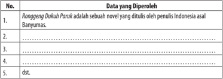

Tabel ini berisi informasi tentang novel Ronggeng Dukuh Parukak, sebuah karya penulis Indonesia asal Banyumas. Topik utama tabel adalah tentang pengetahuan dasar tentang novel tersebut. Kolom pertama berisi nomor urut untuk setiap data yang diperoleh, sedangkan kolom kedua berisi deskripsi singkat tentang setiap data tersebut. Data penting yang terlihat antara lain bahwa novel ini diterbitkan oleh penulis Indonesia asal Banyumas, namun tidak disebutkan nama penulis secara spesifik. Tabel ini membantu pembaca memahami dasar-dasar novel tersebut dan memberikan wawasan awal tentang penulisnya.

### Kegiatan

### Menerangkan  Maksud  Pengarang terhadap Kehidupan dalam Novel

Pada  kegiatan  ini,  kamu  diminta  menuliskan  pendapatmu  mengenai kesamaan latar belakang sosial budaya dalam novel trilogi Ronggeng Dukuh Paruk dengan  kehidupan  pengarang.  Kamu  diperbolehkan  mencari  dari berbagai  sumber  mengenai  biografi  Ahmad  Tohari  atau  data  mengenai keseharian Ahmad Tohari untuk menambah wawasanmu. Sebelum mengerjakan latihan pada kegiatan ini, sebaiknya kamu membuat pertanyaanpertanyaan untuk memudahkan dalam menguraikan kesamaan latar belakang sosial budaya dalam novel trilogi Ronggeng Dukuh Paruk dengan kehidupan pengarang. Perhatikan seperti contoh berikut ini.

 

---
## 📄 Halaman 123

- Menceritakan tentang apa novel trilogi Ronggeng Dukuh Paruk ?
- Berlatar  belakang  tempat  di  manakah  kehidupan  dalam  novel  trilogi Ronggeng Dukuh Paruk ?
3.

………………………………………………………………………......

………………………………………………………………………......

4.

………………………………………………………………………......

………………………………………………………………………......

5.

………………………………………………………………………......

………………………………………………………………………......

### Tugas

Setelah kamu membuat pertanyaan-pertanyaan, untuk memudahkanmu dalam menuliskan kesamaan latar belakang sosial budaya dalam novel trilogi Ronggeng Dukuh Paruk dengan kehidupan pengarang, uraikanlah jawabanmu dalam kolom berikut ini!

Novel trilogi Ronggeng Dukuh Paruk menceritakan kehidupan…………….

…………………………………………………………………………………

…………………………………………………………………………………

…………………………………………………………………………………

…………………………………………………………………………………

…………………………………………………………………………………

…………………………………………………………………………………

…………………………………………………………………………………

### B.  Menganalisis Isi dan kebahasaan Novel

Setelah mempelajari materi ini, kamu diharapkan mampu:

- menganalisis isi novel berdasarkan unsur intrinsiknya; dan
- menganalisis kebahasaan novel.

 

---
## 📄 Halaman 124

Novel merupakan karya prosa fiksi yang panjang, mengandung rangkaian cerita  kehidupan  seseorang  dengan  orang-orang  di  sekelilingnya  dengan menonjolkan watak dan sifat setiap pelaku. Pada pelajaran sebelumnya, kamu telah belajar menangkap maksud pengarang terhadap kehidupan dalam novel, kaitannya dengan latar belakang sosial budaya pengarang. Pada pelajaran ini, kamu  akan berlatih menganalisis isi novel, yaitu unsur-unsur intrinsik novel.

Berikut  ini  uraian  unsur-unsur  intrinsik  novel,  yang  terdiri  dari  tokoh, alur, latar, sudut pandang, dan tema.

- Tokoh adalah para pelaku yang terdapat dalam cerita. Tokoh cerita adalah orang-orang yang ditampilkan dalam suatu karya fiksi yang oleh pembaca ditafsirkan memiliki kualitas moral dan kecenderungan tertentu seperti yang diekspresikan dalam ucapan dan apa yang dilakukan dalam tindakan (Nurgiyantoro, 2012: 165).
Nurgiyantoro (2000: 176) membedakan tokoh dilihat dari segi peranan atau tingkat pentingnya tokoh dalam cerita sebagai tokoh utama dan tokoh tambahan.  Tokoh  utama  adalah  tokoh  sentral  atau  tokoh  yang  sangat penting perannya dalam fiksi. Tokoh tambahan adalah tokoh bawah atau tokoh yang tidak selalu diceritakan namun memiliki hubungan dengan tokoh utama.

Dilihat dari peran tokoh-tokoh dalam pengembangan plot, Nurgiyantoro  (2000:178)  membaginya  ke  dalam  tokoh  protagonis  dan tokoh antagonis. Tokoh protagonis adalah tokoh yang disukai pembaca karena sifat-sifatnya (biasanya hero, baik, penyelamat). Tokoh antagonis adalah tokoh yang tidak disukai pembaca karena sifat-sifatnya (biasanya jahat, pengecut).

Penokohan merupakan teknik atau cara-cara tokoh ditampilkan atau dicitrakan di dalam fiksi. Para ahli menunjukkan dua cara menampilkan atau  mencitrakan  tokoh,  yakni  cara  analitik  dan  cara  dramatik.  Secara analitik,  perwatakan  tokoh-tokoh  cerita  ditampilkan  atau  dicitrakan langsung  dalam  bentuk  perincian  oleh  pengarang.  Secara  dramatik, perwatakan  tokoh-tokoh  cerita  dicitrakan melalui dialog, pikiran, perasaan, lukisan fisik, perbuatan, dan komentar atau penilaian tokoh lain dalam fiksi.

- Alur  atau  plot  adalah  rangkaian  peristiwa  yang  disusun  berdasarkan hubungan kausalitas. Di dalam alur terdapat peristiwa yang saling berelasi dalam peran masing-masing, baik sebagai sebab maupun sebagai akibat sehingga menciptakan konflik. Sifat tersebut tercermin melalui suspense (misteri)  karena  di  dalamnya  terdapat  kejadian  berupa  konflik  yang mampu menyihir pembaca untuk terus mendorongnya membaca.

 

---
## 📄 Halaman 125

Di dalam alur terkandung peristiwa, konflik, dan klimaks. Peristiwa merupakan  peralihan  dari  satu  situasi  kepada  situasi  yang  lain,  baik peristiwa  fungsional  (penentu  bagi  perkembangan  alur),  kaitan  (satu peristiwa dikaitkan dengan  peristiwa yang lain agar masuk  akal), maupun acuan (peristiwa yang diacu melalui tokoh). Konflik merupakan peristiwa  yang  memunculkan  kejadian-kejadian  yang  sangat  penting yang disebabkan oleh adanya interaksi antartokoh, tokoh dengan masyarakat, tokoh dengan dirinya sendiri dalam dua atau lebih masalah yang  bertentangan. Klimaks merupakan  konflik  yang  mencapai  tahap memuncak dan tak terhindarkan. Orientasi-orientasi tokoh yang sudah berakhir akan dihadapkan pada puncak masalah. Secara garis besar, alur dibagi dalam tiga bagian, yaitu awal, tengah, dan akhir.

Alur atau plot memiliki kaidah plausability (kemasukakalan), surprise (kejutan), suspense (misteri),  dan unity (keutuhan).  Kemasukakalan dalam alur sangat erat kaitannya dengan jalan cerita yang dapat diterima oleh cara berpikir pembaca.  Kejutan dalam  alur  merujuk  kepada peristiwa-peristiwa  yang  dialami  tokoh  dengan  penuh  ketidakpastian. Kejutan ini mampu menyentuh perasaan dan pikiran sehingga pembaca tergelitik,  terdorong,  termotivasi  untuk  terus  membaca.  Kejutan  dalam alur menampilkan peristiwa-peristiewa yang bertentangan atau tiba-tiba karena tidak terduga. Fungsinya untuk memperlambat atau mempercepat klimaks  cerita.  Keutuhan  dalam  alur  sangat  erat  kaitannya  dengan  ciri peristiwa, yakni fungsional, kaitan, dan acuan yang mengandung konflik.

- Latar atau setting adalah gambaran yang digunakan untuk menempatkan peristiwa di dalam suatu penceritaan fiksi. Latar ini menyaran pada tempat, waktu,  sosial  sehingga  latar  seringkali  dibedakan  menjadi  tiga  macam, yakni tempat, waktu, dan sosial. Latar tempat berkaitan dengan kondisi geografis. Acuannya dapat berupa pusat keramaian, pusat perbelanjaan, pusat  olahraga,  pusat  perdesaan,  pusat  perkotaan,  sekolah,  rumah,  dan lain-lain.  Latar  waktu  berkaitan  dengan  kondisi  abad,  dasawarsa,  abad, tahun, bulan, hari, jam, zaman, maupun historis. Latar sosial berkaitan dengan kondisi tokoh atau masyarakat yang digambarkan dalam cerita. Acuannya dapat berupa lapisan dalam masyarakat, budaya masyarakat, seni  pada  masa  tertentu,  cara  berpikir  masyarakat  pada  masa  tertentu, kehidupan beragama, dan sebagainya.
- Sudut  pandang  atau point  of  view memasalahkan  siapa  yang  bercerita. Pencerita akan menempatkan tokoh melalui berbagai cara atau pandangan dalam menampilkan tokoh, laku, latar, dan peristiwa untuk menata cerita fiksi kepada pembaca. Sudut pandang dibedakan menjadi sudut pandang orang pertama dan orang ketiga. Cerita yang penyampaiannya dilakukan

 

---
## 📄 Halaman 126

oleh seorang tokoh aku/saya secara langsung atau yang ada dalam disebut sebagai sudut pandang orang pertama. Jika tokoh tersebut adalah tokoh utama,  cerita  sudut  pandangnya  adalah  orang  pertama  (protagonis). Jika tokoh tersebut bukan tokoh utama, sudut pandangnya adalah orang pertama pengamat (pengamat). Cerita yang penyampaiannya dilakukan bukan  oleh  seorang  tokoh  yang  ada  dalam  cerita  tetapi  oleh  penulis yang berada di luar cerita (dia/ia) disebut sebagai sudut pandang orang pertama.  Jika  narator  menyampaikan  pemikiran  tokoh,  sudut  pandang ceritanya adalah orang ketiga yang mengetahui banyak hal. Jika narator hanya  menceritakan/memberikan  informasi  sebatas  yang  bisa  dilihat atau didengar dan belum sampai pada pengungkapan pemikiran, sudut pandang cerita adalah orang ketiga.

- Tema merupakan pokok pikiran atau dasar sebuah cerita yang memiliki kaitan dengan makna kehidupan. Pada umumnya pengarang menawarkan kepada  pembaca  tentang  makna  kehidupan,  mengajak  pembaca  untuk melihat, merasakan, dan menghayati makna kehidupan tersebut dengan cara memandang permasalahan itu sebagaiman ia memandangnya.
Secara  garis  besar,  tema  dapat  digolongkan  ke  dalam  tema  utama  (mayor) dan tema turunan (minor). Tema utama merupakan pokok cerita bermakna yang menjadi fondasi utama penceritaan, sedangkan tema turunan menjadi tema yang berfungsi menjadi penguat fondasi utama. Beberapa contoh tema utama adalah tema sosial (Para Priyayi) , tema sejarah (Kuantar ke Gerbang) , tema psikologis (Jalan Tak Ada Ujung) , dan tema ketuhanan (Robohnya Surau Kami).

### Kegiatan

### Menganalisis Isi Novel Berdasarkan Unsur Intrinsiknya

Setelah  memahami  unsur-unsur  intrinsik  novel,  apakah  kamu  dapat menganalisis  isi  novel Ronggeng Dukuh Paruk tersebut?  Untuk  mengetahui pemahamanmu, buatlah kelompok yang terdiri atas 3-4 orang, dan jawablah pertanyaan berikut ini!

- Tema apa yang menonjol dalam novel Ronggeng Dukuh Paruk?
- Bagaimanakah alur yang tergambar dalam novel Ronggeng Dukuh Paruk?
- Di manakah latar tempat, latar waktu, dan latar suasana yang tergambar dalam novel Ronggeng Dukuh Paruk?

 

---
## 📄 Halaman 127

- Siapakah tokoh utama dan tokoh-tokoh pendukung dalam novel Ronggeng Dukuh Paruk?
- Bagaimanakah karakter tokoh-tokoh Ronggeng Dukuh Paruk?
- Apa pesan yang disampaikan dalam novel Ronggeng Dukuh Paruk?

### Kegiatan

### Menganalisis  Unsur Kebahasaan Novel

Pada  kegiatan  pertama,  kamu  telah  mempelajari  unsur-unsur  intrinsik novel.  Pada  kegiatan  ini,  kamu  akan  mempelajari  unsur  kebahasaan  novel. Unsur kebahasaan novel yang akan kamu pelajari meliputi gaya bahasa atau penggunaan majas dan citraan. Analisilah gaya bahasa dalam kutipan Novel Ronggeng Dukuh Paruk berikut.

### Ronggeng Dukuh Paruk

Karya Ahmad Tohari

Sepasang  burung  bangau  melayang  meniti  angin  berputar-putar  tinggi di  langit.  Tanpa  sekali  pun  mengepak  sayap,  mereka  mengapung  berjamjam lamanya. Suaranya melengking seperti keluhan panjang. Kedua unggas itu telah melayang beratus-ratus kilometer mencari genangan air. Telah lama mereka merindukan amparan lumpur tempat mereka mencari mangsa; katak, ikan, udang atau serangga air lainnya.

Namun kemarau belum usai. Ribuan hektare sawah yang mengelilingi Dukuh  Paruk  telah  tujuh  bulan  kerontang.  Sepasang  burung  bangau  itu takkan  menemukan genangan air  meski  hanya  selebar  telapak  kaki.  Sawah berubah menjadi padang kering berwarna kelabu. Segala jenis rumput, mati. Yang  menjadi  bercak-bercak  hijau  di  sana-sini  adalah  kerokot,  sajian  alam bagi berbagai jenis belalang dan jangkrik. Tumbuhan jenis kaktus ini justru hanya muncul di sawah sewaktu kemarau berjaya.

Di  bagian  langit  lain,  seekor  burung  pipit  sedang  berusaha  mempertahankan nyawanya. Dia terbang bagai batu lepas dari katapel sambil menjerit sejadijadinya. Di belakangnya, seekor alap-alap mengejar dengan  kecepatan berlebih. Udara yang ditempuh kedua binatang ini membuat suara desau. Jerit pipit  kecil  itu  terdengar  ketika  paruh  alap-alap  menggigit  kepalanya.  Bulubulu halus beterbangan. Pembunuhan terjadi di udara yang lengang, di atas Dukuh Paruk.

 

---
## 📄 Halaman 128

Angin  tenggara  bertiup.  Kering.  Pucuk-pucuk  pohon  di  pedukuhan sempit  itu  bergoyang.  Daun  kuning  serta  ranting  kering  jatuh.  Gemersik rumpun bambu. Berderit baling-baling bambu yang dipasang anak gembala di tepian Dukuh Paruk. Layang- layang yang terbuat dari daun gadung meluncur naik. Kicau beranjangan mendaulat kelengangan langit di atas Dukuh Paruk.

Udara  panas  berbulan-bulan  mengeringkan  berjenis  biji-bijian.  Buah randu telah menghitam kulitnya, pecah menjadi tiga juring. Bersama tiupan angin terburai gumpalan-gumpalan kapuk. Setiap gumpal kapuk mengandung biji  masak  yang  siap  tumbuh  pada  tempat  ia  hinggap  di  bumi.  Demikian kearifan  alam  mengatur  agar  pohon  randu  baru  tidak  tumbuh  berdekatan dengan biangnya.

Pohon dadap memilih cara yang hampir sama bagi penyebaran jenisnya. Biji dadap yang telah tua menggunakan kulit polongnya untuk terbang sebagai baling-baling.  Bila  angin  berembus,  tampak  seperti  ratusan  kupu  terbang menuruti arah angin meninggalkan pohon dadap. Kalau tidak terganggu oleh anak-anak Dukuh Paruk, biji dadap itu akan tumbuh di tempat yang jauh dari induknya. Begitu perintah alam.

Dari  tempatnya  yang  tinggi  kedua  burung  bangau  itu  melihat  Dukuh Paruk sebagai sebuah gerumbul kecil di tengah padang yang amat luas. Dengan daerah pemukiman terdekat, Dukuh Paruk hanya dihubungkan oleh jaringan pematang sawah, hampir dua kilometer panjangnya. Dukuh Paruk, kecil dan menyendiri. Dukuh Paruk yang menciptakan kehidupannya sendiri.

Dua  puluh  tiga  rumah  berada  di  pedukuhan  itu,  dihuni  oleh  orangorang  seketurunan.  Konon,  moyang  semua  orang  Dukuh  Paruk  adalah  Ki Secamenggala, seorang bromocorah yang sengaja mencari daerah paling sunyi sebagai  tempat  menghabiskan  riwayat  keberandalannya.  Di  Dukuh  Paruk inilah akhirnya Ki Secamenggala menitipkan darah dagingnya.

Semua orang Dukuh Paruk tahu Ki Secamenggala, moyang mereka, dahulu menjadi musuh kehidupan masyarakat. Tetapi mereka memujanya. Kubur Ki Secamenggala yang terletak di punggung bukit kecil di tengah Dukuh Paruk menjadi kiblat kehidupan kebatinan mereka. Gumpalan abu kemenyan pada nisan kubur Ki Secamenggala membuktikan polah-tingkah kebatinan orang Dukuh Paruk berpusat di sana.

Di  tepi  kampung,  tiga  orang  anak  laki-laki  sedang  bersusah-payah mencabut sebatang singkong. Namun ketiganya masih terlampau lemah untuk mengalahkan cengkeraman akar ketela yang terpendam dalam tanah kapur. Kering  dan  membatu.  Mereka  terengah-engah,  namun  batang  singkong  itu tetap  tegak  ditempatnya.  Ketiganya  hampir  berputus  asa  seandainya  salah seorang anak di antara mereka tidak menemukan akal.

 

---
## 📄 Halaman 129

'Cari sebatang cungkil, ' kata Rasus kepada dua temannya. 'Tanpa cungkil mustahil kita dapat mencabut singkong sialan ini. '

'Percuma. Hanya sebatang linggis dapat menembus tanah sekeras ini, ' ujar Warta. ' Atau lebih baik kita mencari air. Kita siram pangkal batang singkong kurang ajar ini. Pasti nanti kita mudah mencabutnya. '

' Air?'  ejek  Darsun, anak yang ketiga. 'Di mana kau dapat menemukan air?'

......

Kemudian Rasus, Warta, dan Darsun berpandangan. Ketiganya mengusap telapak  tangan  masing-masing.  Dengan  tekad  terakhir  mereka  mencoba mencabut batang singkong itu kembali.

Urat-urat kecil di tangan dan di punggung menegang. Ditolaknya bumi dengan  hentakan  kaki  sekuat  mungkin.  Serabut-serabut  halus  terputus. Perlahan tanah merekah. Ketika akar terakhir putus ketiga anak Dukuh Paruk itu  jatuh  terduduk.  Tetapi  sorak-sorai  segera  terhambur.  Singkong  dengan umbi-umbinya yang hanya sebesar jari tercabut.

Adat Dukuh Paruk mengajarkan, kerja sama antara ketiga anak laki-laki itu  harus  berhenti  di  sini.  Rasus,  Warta,  dan  Darsun  kini  harus  saling  adu tenaga memperebutkan umbi singkong yang baru mereka cabut.

Rasus dan Warta mendapat dua buah, Darsun hanya satu. Tak ada protes. Ketiganya kemudian sibuk mengupasi bagiannya dengan gigi masing-masing, dan langsung mengunyahnya. Asinnya tanah.

Sambil membersihkan mulutnya dengan punggung lengan, Rasus mengajak  kedua  temannya  melihat  kambing-kambing  yang  sedang  mereka gembalakan. Yakin bahwa binatang gembalaan mereka tidak merusak tanaman orang, ketiganya berjalan ke sebuah tempat di mana mereka sering bermain. Di bawah pohon nangka itu mereka melihat Srintil sedang asyik bermain seorang diri. Perawan kecil itu sedang merangkai daun nangka dengan sebatang lidi untuk dijadikan sebuah mahkota ( Ronggeng Dukuh Paruk , 1982:1-5).

....

Karena letak Dukuh Paruk di tengah amparan sawah yang sangat luas, tenggelamnya matahari tampak dengan jelas dari sana. Angin bertiup ringan. Namun  cukup  meluruhkan  dedaunan  dari  tangkainya.  Gumpalan  rumput kering menggelinding dan berhenti karena terhalang pematang.

Hilangnya cahaya matahari telah dinanti oleh kelelawar dan kalong. Satusatu mereka keluar dari sarang, di lubang-lubang kayu, ketiak daun kelapa atau kuncup daun pisang  yang  masih  menggulung.  Kemarau  tidak  disukai  oleh

 

---
## 📄 Halaman 130

bangsa binatang mengirap itu. Buah-buahan tidak mereka temukan. Serangga pun seperti lenyap dari udara. Pada saat demikian kampret harus mau melalap daun waru agar kehidupan jenisnya lestari.

Pelita-pelita  kecil  dinyalakan.  Kelap-kelip  di  kejauhan  membuktikan  di Dukuh Paruk yang sunyi ada kehidupan manusia. Bulan yang lonjong hampir mencapai  puncak  langit.  Cahayanya  membuat  bayangan  temaram  di  atas tanah kapur Dukuh Paruk. Kehadirannya di angkasa tidak terhalang awan. Langit bening.

Udara  kemarau  makin  malam  makin  dingin.  Pagelaran  alam  yang ramah  bagi  anak-anak.  Halaman  yang  kering  sangat  menyenangkan  untuk arena  bermain.  Cahaya  bulan  mencipta  keakraban  antara  manusia  dengan lingkup fitriyahnya. Anak-anak, makhluk kecil yang masih lugu, layak hadir di  halaman yang berhias cahaya bulan. Mereka pantas berkejaran, bermain dan bertembang. Mereka sebaiknya tahu masa kanak-kanak adalah surga yang hanya sekali datang. ( Ronggeng Dukuh Paruk , hlm 7-9).

(Dikutip dari: Ronggeng Dukuh Paruk karya Ahmad Tohari)

### Tugas

Setelah membaca kutipan novel tersebut, apakah kamu dapat menganalisis unsur kebahasaan novel Ronggeng Dukuh Paruk tersebut? Untuk mengetahui pemahamanmu, buatlah kelompok 3-4 orang lalu tulislah hasil diskusimu!

Unsur kebahasaan novel Ronggeng Dukuh Paruk:

..................................................................................................................................

..................................................................................................................................

..................................................................................................................................

..................................................................................................................................

..................................................................................................................................

..................................................................................................................................

..................................................................................................................................

..................................................................................................................................

..................................................................................................................................

..................................................................................................................................

..................................................................................................................................

..................................................................................................................................

..................................................................................................................................

 

---
## 📄 Halaman 131

### C.  Menyajikan Hasil Interpretasi Pandangan Pengarang

Setelah mempelajari materi ini, kamu diharapkan mampu:

- menemukan pandangan pengarang dalam novel; dan
- menyajikan hasil interpretasi pandangan pengarang dengan kalimat yang baik dan benar.
Berapa novel yang pernah kalian baca? Bagaimana dengan isi novel yang kalian baca? Tentu berbeda-beda bukan? Selain tema yang diusung, perbedaan yang ada adalah cara menyajikan cerita dan sudut pandang pengarang. Setiap pengarang memiliki pandangan masing-masing dalam menyikapi suatu hal yang  biasanya  tergambar  pada  karyanya.  Kamu  telah  membaca  beberapa penggalan novel Ronggeng Dukuh Paruk karya  Ahmad Tohari, bukan? Apa yang dapat kalian temukan? Bagaimana pandangan pengarang dalam novel tersebut?  Untuk  mengetahui  hal  tersebut,  kalian  harus  membaca  novel tersebut secara utuh. Setelah itu, barulah kalian dapat menemukan bagaimana pandangan pengarang dalam novel tersebut.

### Kegiatan

### Menemukan Pandangan Pengarang dalam Novel

Pada kegiatan ini kalian diminta untuk menemukan pandangan pengarang dalam  novel Ronggeng  Dukuh  Paruk. Untuk  memudahkan  pekerjaanmu, ikutilah format berikut ini dan salinlah di buku tugasmu!

---
**📊 Tabel**

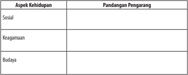

Tabel ini menunjukkan pandangan pengarang tentang aspek-aspek kehidupan, yaitu sosial, keagamaan, dan budaya. Topik utama tabel ini adalah pandangan pengarang tentang bagaimana masyarakat Indonesia berinteraksi dan berkembang dalam konteks sosial, agama, dan budaya. Kolom "Aspek Kehidupan" mencakup tiga aspek utama: sosial, keagamaan, dan budaya. Kolom "Pandangan Pengarang" menyajikan pandangan atau interpretasi pengarang tentang setiap aspek tersebut. Data atau pola penting yang terlihat adalah bahwa pengarang mungkin memiliki pandangan yang berbeda-beda tentang bagaimana masyarakat Indonesia berinteraksi dan berkembang dalam konteks sosial, agama, dan budaya. Ini menunjukkan bahwa pandangan pengarang tentang kehidupan di Indonesia dapat sangat bervariasi tergantung pada aspek yang diajukan.

 

---
## 📄 Halaman 132

### Kegiatan

### Menyajikan Hasil Interpretasi Pandangan Pengarang

Setelah kalian menemukan pandangan pengarang terhadap beberapa aspek di  dalam novel Ronggeng Dukuh Paruk, untuk menyajikan temuan tersebut menjadi  sebuah  tulisan  yang  baik.  Kalian  dapat  menuliskannya  menjadi sebuah paragraf yang baik. Selain itu, kalian juga dapat mengambil kutipankutipan di dalam novel untuk menguatkan pandangan pengarang yang kalian temukan. Kalian dapat mengerjakannya di kertas atau di buku tugas.

### D.  Merancang Novel

Setelah mempelajari materi ini, kamu diharapkan mampu:

- merancang novel dengan memperhatikan isi; dan
- merancang novel dengan memperhatikan kebahasaan.
Merancang  novel  adalah  membuat  gambaran  mengenai  sebuah  cerita yang akan ditulis dalam bentuk novel. Dalam merancang novel, kamu harus memperhatikan aspek isi dan kebahasaan yang sudah kita pelajari sebelumnya. Untuk memudahkanmu, ikutilah kegiatan berikut ini.

### Kegiatan

### Merancang Novel dengan Memperhatikan Isi

Untuk merancang sebuah novel, terlebih dahulu tentukan tema apa yang akan kalian pilih. Perhatikan langkah-langkah berikut ini dengan cermat.

- Tema apa yang akan kamu angkat dalam tulisan novelmu? Pilihlah salah satu tema berikut ini!

 

---
## 📄 Halaman 133

Tema

Pendidikan

Politik

Persahabatan

- Siapa  sajakah  tokoh-tokohnya,  dan  bagaimana  karakternya?  Tulislah tokoh-tokoh  dan  tentukan  tokoh  antagonis,  protagonis,  dan  tritagonis pada kolom berikut ini!

### Tokoh dan Karakter

.........................

.........................

.........................

- Bagaimanakah alur yang akan kamu gunakan? Pilih salah satu!
Alur

Apakah maju? Apakah campuran?

Apakah mundur?

 

---
## 📄 Halaman 134

- Di manakah latar tempat, latar waktu, dan latar sosial yang akan kamu ceritakan?

### Latar atau setting

Latar tempat:

.......................

Latar waktu:

.......................

Latar sosial:

.......................

- Jika  kamu  memilih  tema  politik,  pendidikan,  atau  pun  persahabatan, pesan apa yang ingin kamu sampaikan?

### Tugas

Tulislah kembali rancangan novel seperti kolom berikut ini di buku tugasmu!

---
**📊 Tabel**

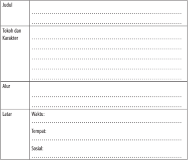

Tabel ini berisi informasi tentang judul, tokoh dan karakter, alur, latar waktu, tempat, dan sosial dari sebuah cerita atau karya sastra. Topik utama tabel ini adalah analisis kritis dari sebuah karya sastra. Kolom-kolomnya mencakup judul karya, tokoh dan karakter yang muncul, alur cerita, waktu, tempat, dan sosial yang menjadi latar belakang karya tersebut. Data penting yang terlihat meliputi detail tentang tokoh-tokoh utama dan karakteristik mereka, alur cerita yang menarik, waktu dan tempat yang digunakan sebagai latar, serta bagaimana sosialitas dan budaya yang ada mempengaruhi karya tersebut.

 

---
## 📄 Halaman 135

Amanat

…………………………………………………………………

…………………………………………………………………

…………………………………………………………………

…………………………………………………………………

### Merancang Novel dengan Memperhatikan Kebahasaan

Setelah menyelesaikan tugas pada kegiatan 1, buatlah ringkasan gambaran cerita yang ingin kamu tulis dalam bentuk paragraf!

....................................................................................................................................

....................................................................................................................................

....................................................................................................................................

....................................................................................................................................

....................................................................................................................................

....................................................................................................................................

....................................................................................................................................

....................................................................................................................................

....................................................................................................................................

....................................................................................................................................

....................................................................................................................................

....................................................................................................................................

....................................................................................................................................

....................................................................................................................................

....................................................................................................................................

....................................................................................................................................

....................................................................................................................................

....................................................................................................................................

### Kegiatan

2

 

---
## 📄 Halaman 136

### Rangkuman

- Novel  merupakan  karya  prosa  fiksi  yang  panjang,  mengandung rangkaian cerita kehidupan seseorang dengan orang-orang di sekelilingnya  dengan  menonjolkan  watak  dan  sifat  setiap  pelaku.  Di dalam novel terdapat unsur-unsur pembangun dari dalam atau unsur intrinsik novel.
- Tokoh adalah para pelaku yang terdapat dalam cerita.
- Alur  atau plot adalah  rangkaian  peristiwa  yang  disusun  berdasarkan hubungan kausalitas. Secara garis besar, alur dibagi dalam tiga bagian, yaitu awal, tengah, dan akhir. Alur atau plot memiliki sejumlah kaidah, yaitu plausability (kemasukakalan), surprise (kejutan), suspense, dan unity (keutuhan).
- Latar atau setting dibedakan menjadi tiga macam, yaitu latar tempat, waktu, dan sosial.  Latar  tempat  berkaitan  dengan  masalah  geografis. Latar  waktu  berkaitan  dengan  masalah  waktu,  hari,  jam,  maupun historis.
- Judul seringkali mengacu pada tokoh, latar, tema, maupun kombinasi dari unsur-unsur tersebut.
- Sudut pandang atau point of view memasalahkan siapa yang bercerita. Sudut pandang dibedakan menjadi sudut pandang orang pertama dan orang ketiga.
- Tema merupakan pokok pikiran atau dasar sebuah cerita.

 

---
## 📄 Halaman 137

### Menyajikan Gagasan Melalui Artikel

Sumber gambar: emakpintar.com/menulis-artikel

Artikel  merupakan  jenis  tulisan  yang  berisi  pendapat,  gagasan,  pikiran, atau kritik terhadap persoalan yang berkembang di masyarakat, biasanya ditulis dengan bahasa ilmiah populer. Intinya, artikel opini adalah tulisan yang berisi pendapat penulis tentang data, fakta, fenomena, atau kejadian tertentu dengan maksud dimuat di surat kabar atau majalah.

Menyajikan gagasan  dapat  diwujudkan  melalui  berbagai  wujud  tulisan. Misalnya,  seseorang  yang  akan  mengajukan  lamaran  pekerjaan,  bentuk tulisannya  berupa  surat;  seseorang  yang  akan  menulis  gagasan  imajinasi, bentuk tulisannya berupa cerpen atau novel; seseorang yang akan memberikan penilaian  terhadap  buku  yang  dibacanya,  bentuk  tulisannya  berupa  resensi

 

---
## 📄 Halaman 138

buku; seseorang yang akan merekam sejarah, bentuk tulisannya berupa cerita sejarah.

Selain bentuk-bentuk tulisan tadi, terdapat pula bentuk tulisan lain yakni opini. Pada pelajaran ini, kamu akan mempelajari salah satu kategori eksposisi, yakni artikel opini. Sumber utama yang digunakan dalam pelajaran ini adalah artikel opini yang terdapat pada surat kabar. Kamu tidak hanya dituntut dapat memahami artikel opini dengan baik, tetapi juga dapat menulis artikel opini dengan meperhatikan fakta dan kebahasaan.

Artikel opini termasuk dalam kategori teks eksposisi yang berisi argumen seseorang yang dimuat di surat kabar. Kegiatan-kegiatan yang akan dilakukan meliputi  kegiatan  mengevaluasi  informasi  (fakta  dan  opini)  dalam  artikel opini, menyusun opini dalam bentuk artikel, menganalisis kebahasaan artikel dan/atau buku ilmiah, dan mengonstruksi sebuah artikel.

Untuk membantu  kamu  dalam  mempelajari  dan  mengembangkan kompetensi berbahasa, disajikan peta konsep di bawah ini.

---
**🖼️ Gambar/Diagram**

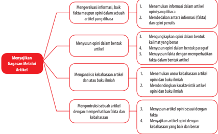

> **Deskripsi Visual:** Gambar ini adalah diagram yang menunjukkan proses menyusun gagasan melalui artikel. Diagram ini terdiri dari dua bagian utama: "Menyusun Opini dalam Bentuk Artikel" dan "Menyusun Fakta dalam Bentuk Artikel". 

Pertama, pada bagian "Menyusun Opini dalam Bentuk Artikel", ada empat langkah yang ditunjukkan dengan garis merah. Langkah pertama adalah "Menerima informasi dalam artikel yang dibaca", di mana informasi yang diterima harus sesuai dengan opini penulis. Langkah kedua adalah "Membentuk argumen informasi (takta) dan opini penulis". Langkah ketiga adalah "Mengungkapkan opini dalam bentuk kalimat yang benar". Langkah keempat adalah "Menyusun opini dalam bentuk paragraf".

Selanjutnya, pada bagian "Menyusun Fakta dalam Bentuk Artikel", juga ada empat langkah yang ditunjukkan dengan garis merah. Langkah pertama adalah "Menerima umpan balik kebebasan artikel opini dan buku ilmiah". Langkah kedua adalah "Membandingkan karakteristik opini dan buku ilmiah". Langkah ketiga adalah "Menyusun artikel opini sesuai dengan fakta". Langkah keempat adalah "Menyusun artikel opini dengan kebebasan buku dan berita".

Dalam diagram ini, elemen-elemen utama adalah langkah-langkah yang harus dilalui untuk menyusun gagasan melalui artikel. Relasi antara elemen-elemen ini adalah bahwa setiap langkah harus dilalui secara bertahap untuk mencapai tujuan akhir, yaitu menyusun gagasan melalui artikel dengan baik. Teks, angka, atau label penting yang terlihat adalah nama-nama langkah-langkah tersebut, seperti "Menerima informasi dalam artikel yang dibaca" dan "Membentuk argumen informasi (takta) dan opini penulis". Informasi kunci yang dapat diambil pembaca adalah bahwa proses menyusun gagasan melalui artikel melibatkan beberapa langkah yang harus dilalui secara bertahap.

 

---
## 📄 Halaman 139

### A.  Mengevaluasi Informasi, Baik Fakta Maupun Opini, dalam Sebuah Artikel yang Dibaca

Setelah mempelajari materi ini, kamu diharapkan mampu:

- menemukan informasi dalam artikel opini yang dibaca;
- membedakan antara informasi (fakta) dan opini penulis.
Membaca surat kabar atau majalah ibarat makan sehari-hari. Apalagi di era kini yang memungkinkan setiap orang mudah untuk mendapatkan bacaan jenis  ini.  Kamu  pasti  juga  menjadi  bagian  dari  orang-orang  yang  membaca surat kabar dan majalah. Pernahkah kamu mengamati majalah atau surat kabar secara khusus? Apa yang dapat kamu temukan dalam surat kabar tersebut? Jika  dicermati,  berita  dalam  majalah  atau  surat  kabar  terdiri  atas  beragam rubrik. Dari segi isinya, koran/majalah tersebut dapat berupa rubrik politik, hukum, olahraga, pendidikan, dan sebagainya. Dari segi bentuknya, ada surat pembaca, kolom, profil, opini, dan editorial.

Salah satu rubrik dari surat kabar atau majalah yang akan kamu pelajari pada pelajaran ini adalah artikel opini. Artikel adalah tulisan tentang suatu masalah,  termasuk  pendapat  dan  pendirian  penulis  tentang  masalah  itu. Artikel bertujuan untuk meyakinkan, mendidik, atau menghibur pembaca. Di dalam artikel terdapat fakta dan opini. Untuk membedakan antara fakta dan opini kamu harus memahami terlebih dahulu konsep dasar fakta dan opini.

### Kegiatan

### Menemukan Informasi dalam Artikel yang Dibaca

Di dalam artikel majalah atau surat kabar, kamu akan menemukan fakta dan opini yang disajikan secara beriringan. Oleh karena itu, kamu harus cermat agar dapat membedakannya. Berikut adalah pengertian dari fakta dan opini.

- Fakta adalah kenyataan atau peristiwa yang benar-benar ada atau terjadi. Fakta biasanya dapat menjawab pertanyaan apa, siapa, kapan, di mana, atau berapa.

 

---
## 📄 Halaman 140

- Opini adalah pendapat, pikiran, atau pendirian seseorang terhadap sesuatu. Opini biasanya dapat menjawab pertanyaan bagaimana dan mengapa.
Perhatikan contoh artikel opini berikut ini!

### Agar Anak Miskin Terus Sekolah

---
**🖼️ Gambar/Diagram**

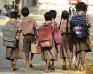

> **Deskripsi Visual:** Gambar ini adalah ilustrasi yang menunjukkan empat anak sekolah berjalan di jalan raya. Mereka semua mengenakan seragam sekolah dan membawa tas sekolah. Anak-anak tampak senang dan bersemangat, menunjukkan semangat belajar dan kebersamaan. Ilustrasi ini mungkin digunakan untuk menggambarkan tema pendidikan, kebersamaan, atau perjalanan ke sekolah.

Elemen-elemen utama dalam gambar ini adalah empat anak sekolah, tas sekolah mereka, dan latar belakang jalan raya. Anak-anak adalah elemen utama yang paling dominan, dengan tas sekolah mereka yang menunjukkan bahwa mereka sedang menuju atau telah tiba di sekolah. Latar belakang jalan raya memberikan konteks lokasi dan situasi.

Teks, angka, atau label penting tidak ada dalam gambar ini. Namun, informasi kunci yang dapat diambil pembaca melalui gambar ini adalah bahwa anak-anak sedang berjalan menuju atau telah tiba di sekolah, menunjukkan semangat belajar dan kebersamaan.

Nelson Mandela berujar bahwa pendidikan adalah senjata ampuh untuk menguasai dunia. Kata-kata mantan Presiden Afrika Selatan itu menegaskan betapa  pentingnya  pendidikan  dalam  mengubah  hidup  manusia,  bahkan bangsa.  Bangsa  yang  maju  menandakan  setiap  warganya  bisa  mengakses pendidikan dengan baik, termasuk anak miskin sekalipun.

Di Indonesia, setiap orang berhak mendapatkan pendidikan yang layak, seperti digariskan dalam Pasal 31 UUD 1945. Yang menjadi masalah adalah apakah semua anak di Indonesia sudah dapat mengakses pendidikan? Di atas kertas, sekolah memang gratis, tetapi di lapangan masih banyak ditemukan 'iuran'  yang  harus  dibayar  oleh  siswa  kepada  sekolah.  Dari  uang  masuk sekolah, uang seragam, buku, uang ujian, hingga iuran-iuran 'bernilai kecil' yang  seringkali  membuat  orang  tua  miskin  terpaksa  menyuruh  anaknya berhenti sekolah.

Sebentar lagi, misalnya, setelah ujian nasional SMP ini, orang tua para siswa akan dihadapkan oleh beragam keperluan, dari perpisahan hingga pendaftaran ke sekolah lanjutan. Semua itu adalah nilai rupiah yang harus dikeluarkan oleh siswa. Itu belum lagi bagi mereka yang lulus SMA, biaya yang dikeluarkan oleh orang tua siswa untuk masuk perguruan tinggi biayanya lebih besar.

 

---
## 📄 Halaman 141

Bagi  orang  tua  siswa  yang  mampu,  tentu  saja  biaya-biaya  itu  tak menjadi  masalah.  Bahkan,  mereka  rela  mengeluarkan  biaya  lebih  besar untuk  mendapatkan  pendidikan  terbaik  untuk  anaknya.  Masalahnya  akan mengganjal bagi orang tua tak mampu alias miskin. Akhirnya, tak sedikit dari anak-anak miskin menjadi putus sekolah.

Sekolah  seolah  merasa  sah  saja  mengutip  ini-itu  dari  orang  tua  siswa, dengan  berbagai alasan, seperti terlambatnya pencairan dana bantuan operasional sekolah (BOS), kecilnya dana BOS, dan sebagainya. Bahkan, untuk pembangunan fisik pun, sekolah menarik iuran dari siswa, misalnya untuk membikin pagar, musala, taman, bahkan ruang kelas. Padahal seharusnya itu semua tanggung jawab pemerintah. Lain halnya kalau sekolah swasta.

Sekolah swasta pun, seharusnya, juga memberi perhatian terhadap anakanak miskin. Negara tetap hadir di sana, misalnya, dengan membuat aturan setiap sekolah swasta wajib menyediakan 20 persen bangku untuk anak-anak miskin dengan biaya murah, bahkan gratis. Sekolah swasta bisa menerapkan subsidi silang untuk bisa menampung anak-anak miskin.

Tak hanya itu, negara perlu berperan untuk mengawasi agar sekolah tidak melanggar hak-hak anak dalam memperoleh pendidikan. Misalnya, melakukan pengawasan yang cukup terhadap kebijakan sekolah, terutama yang berkaitan dengan biaya, agar tidak membebani siswa yang tak mampu. Setiap pungutan jangan dilepas secara sepihak kepada sekolah, melainkan harus mendapat izin dari pemimpin daerah dan dibahas oleh Dewan Perwakilan Rakyat.

Selain itu, aparat pemerintah perlu turun ke kampung-kampung miskin dan  mencari  anak-anak  miskin  yang  putus  sekolah.  Jangan  sampai  ada  di antara mereka yang karena tidak ada biaya lalu tidak bisa sekolah.

Negara  harus  hadir dan  memiliki  tanggung  jawab  besar terhadap pendidikan anak-anak miskin. Sebab, sekolahlah harapan satu-satunya agar mereka bisa mengubah nasib dan keluar dari jebakan kemiskinan. Dengan bersekolah  seperti  kata  Nelson  Mandela  di  atas,  mereka  memiliki  senjata untuk menguasai dunia.

(Sumber: http// www.tempo.co edisi 12 Mei 2015 oleh Dianing Widya)

Dari artikel yang berjudul ' Agar Anak Miskin Terus Sekolah' , kita dapat menemukan fakta dan opini dalam artikel tersebut. Mari kita temukan fakta dan opini dalam artikel tersebut.

 

---
## 📄 Halaman 142

Di  Indonesia,  setiap  orang  berhak  mendapatkan  pendidikan  yang  layak, seperti digariskan dalam Pasal 31 UUD 1945. Yang menjadi masalah adalah apakah semua anak di Indonesia sudah dapat mengakses pendidikan? Di atas kertas, sekolah memang gratis, tetapi di lapangan masih banyak ditemukan 'iuran'  yang  harus  dibayar  oleh  siswa  kepada  sekolah.  Dari  uang  masuk sekolah, uang seragam, buku, uang ujian, hingga iuran-iuran 'bernilai kecil' yang  seringkali  membuat  orang  tua  miskin  terpaksa  menyuruh  anaknya berhenti sekolah.

Kalimat-kalimat  paragraf  tersebut  menyajikan  informasi  mengenai  hak seseorang  menurut  UUD  1945,  sekolah  gratis,  iuran  sekolah,  uang  masuk, seragam, buku, dan ujian. Informasi-informasi ini dapat ditelusuri dasarnya. Informasi yang demikian dalam sebuah tulisan berupa artikel tergolong ke dalam fakta. Sesuai dengan kriteria sebuah fakta bahwa fakta adalah kenyataan atau  peristiwa  yang  benar-benar    ada  atau  terjadi  dan  fakta  biasanya  dapat menjawab  pertanyaan  apa,  siapa,  kapan,  di  mana,  atau  berapa,  informasi tersebut memenuhi kriteria suatu fakta.

Sesuai  dengan  kriteria  opini,  paragraf  tersebut  tergolong  ke  dalam paragraf yang mengandung opini:  pendapat, pikiran, atau pendirian seseorang terhadap  sesuatu  dan  biasanya  dapat  menjawab  pertanyaan  bagaimana  dan mengapa.  Paragraf  tersebut  merupakan  opini  penulis  yang  berupa  solusi terhadap permasalahan yang sedang dikaji pada artikel tersebut. Opini yang disampaikan penulis tersebut bukan hanya sekadar pendapat yang tidak dapat dipertanggungjawabkan,  tetapi  didasarkan  dan  didukung  oleh  fakta-fakta yang memang nyata terjadi.

### Tugas

Sebelum membedakan fakta dan opini, kamu diminta untuk menemukan informasi dalam sebuah artikel opini terlebih dahulu. Berikut ini akan disajikan sebuah artikel dari surat kabar daring (online). Sebelum mengerjakan latihan pada kegiatan ini, sebaiknya kamu perhatikan beberapa hal berikut ini.

- Bacalah dengan cermat artikel berjudul 'Pak Raden dan Kisah Multikulturalistik' berikut ini.
- Temukan dan tandai informasi yang kamu peroleh dari artikel berikut ini. Kemudian, tulislah pada kolom yang telah disediakan (kerjakan di buku tugasmu).

 

---
## 📄 Halaman 143

### Pak Raden dan Kisah Multikulturalistik

---
**🖼️ Gambar/Diagram**

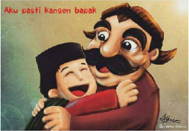

> **Deskripsi Visual:** Gambar ini adalah ilustrasi yang menampilkan dua karakter kartun berbicara dengan bahasa Indonesia. Karakter pertama adalah seorang pria tua dengan rambut pendek dan topi hitam, sedangkan karakter kedua adalah seorang pria muda dengan rambut panjang dan topi biru. Kedua karakter tersebut tampak sangat senang dan berteriak-teriak, menunjukkan suasana yang positif dan penuh kegembiraan.

Elemen-elemen utama dalam gambar ini adalah dua karakter kartun yang berbicara dan ekspresi mereka yang jelas. Karakter tua memiliki rambut pendek dan topi hitam, sementara karakter muda memiliki rambut panjang dan topi biru. Kedua karakter tersebut tampak sangat senang dan berteriak-teriak, menunjukkan suasana yang positif dan penuh kegembiraan.

Teks, angka, atau label penting yang terlihat dalam gambar ini adalah nada bicara kedua karakter dan ekspresi wajah mereka. Informasi kunci yang dapat diambil pembaca adalah bahwa gambar ini mungkin digunakan untuk menggambarkan hubungan antara dua orang atau situasi yang positif dan penuh kegembiraan.

Jumat, 30 Oktober 2015 Indonesia kembali kehilangan seniman 'dongeng' paling berpengaruh dalam perkembangan seni, terutama di kalangan anakanak  era  80-an.  Pak  Raden  alias  Suyadi  adalah  seniman  senior  sekaligus pencipta  kisah  boneka  kayu  'Si  Unyil' ,  sebuah  film  seri  televisi  Indonesia produksi PPFN. Kisah cerita si boneka kayu ini adalah legenda bagi semua anggota generasi 80-an sampai awal 90-an.

Legenda Unyil sedikit bercerita, kisah si Unyil yang diciptakan Pak Raden, alumnus seni rupa ITB ini, diilhami dari pertunjukan wayang atau boneka kayu anak-anak di Prancis. Karakter boneka anak tersebut dinamai Guignol. Ia tokoh boneka yang diciptakan pada 1808 oleh Laurent Mourguet, seorang marionnettiste (dalang perempuan). Sampai saat ini Guignol masih digunakan sebagai  hiburan  anak-anak  melalui  pertunjukan  di  teater  Guignol.  Ia  juga menjadi ikon atau maskot Kota Lyon, Prancis. Antusiasme anak-anak Lyon untuk menikmati hiburan.

Guignol ini masih sangat tinggi sampai sekarang. Setelah beberapa kali menyaksikan pertunjukan Guignol, memang cukup berbeda dengan legenda Si Unyil. Pentas Guignol adalah murni sebagai ajang hiburan anak-anak Kota Lyon dan sekitarnya, tempat pusat teater Guignol berada. Dari segi ide cerita, hampir tidak ada muatan edukasi di dalamnya.

Cerita  Guignol  sebatas  cerita-cerita  ringan  anak-anak.  Berbeda  dengan kisah Si Unyil. Dalam beberapa cerita, kisah Unyil memang memiliki muatan ideologis  dan  muatan  politis  tertentu.  Ketika  saat  itu,  Orde  Baru  masih berjaya, ia pun menggunakan media film anak-anak untuk mempertahankan eksistensinya. Melalui Unyil, pemerintah juga turut menyosialisasikan banyak program  atau  kebijakannya  seperti  Keluarga  Berencana,  ajakan  melakukan ronda malam, sekolah, dan lainnya. Ini tidak berbeda dengan kisah Guignol pada  masa  awal  kemunculannya.  Guignol  juga  menjadi  instrumen  politik pemerintah Prancis di kala itu.

 

---
## 📄 Halaman 144

Kisah  Unyil  sangat  menghegemoni  jagat  hiburan  anak-anak  di  eranya, ketika  stasiun  televisi  swasta  belum  bertaburan  seperti  sekarang.  Sosialisasi kebijakan pemerintah melalui media anak-anak ini pun kemudian menjadi sangat masif. Terbukti, kisah si Unyil sangat melegenda sampai sekarang meski ia tayang terakhir kali awal era 90-an di TVRI.

Ketika stasiun RCTI dan TPI mencoba menayangkan kembali kisah ini, respons anak-anak pun tidak sebagus ketika ditayangkan di TVRI. Ini karena jagat hiburan anak-anak telah berubah mulai era 90-an. Hiburan anak-anak telah  digantikan  film-film  kartun  impor:  Doraemen,  He-man,  Sailormoon, Shinchan, Naruto, dan yang lain. Nyaris, mulai era ini, anak-anak kehilangan banyak hiburan bernuansa 'Indonesia' yang penuh muatan pendidikan nilai.

### Multikultural

Kisah  Unyil  bukan  sekadar  'kisah  ideologis'  dan  'politis' .  Legenda  ini juga  mengisahkan  kehidupan  sosial  yang  harmonis  meski  dihiasi  banyak perbedaan. Ada tokoh Unyil, Ucrit, Usro, dan Meilani (keturunan Tionghoa) sebagai tokoh utama, Bu Bariah si tukang gado-gado, ada Pak Raden (tokoh dari golongan ningrat), Pak Ableh dan Pak Ogah si penjaga pos ronda (sebagai tokoh kelas bawah), ada Pak Kades dan Hansip yang menggambarkan karakter aparat pemerintah.

Keragaman  karakter  sosial  ini  menunjukkan  bagaimana  kisah  si  Unyil ingin mengajarkan kepada anak-anak di era itu untuk menghargai perbedaan. Perbedaan kelas sosial adalah hal yang paling tampak dalam film ini, serta perbedaan suku bangsa, sampai bagaimana Unyil menjalin  hubungan pertemanan  dengan  orang  Tionghoa  (Meilani).  Ini  terobosan  besar  yang dibuat  Pak  Raden ketika isu  rasial  (Tionghoa)  menjadi  isu  sensitif  di  masa Orde Baru. Kerja sama yang baik ditunjukkan dalam film ini melalui ajakan kerja bakti, ronda malam atau siskamling yang menjadi 'ikon' Orde Baru.

Saat ini kita merindukan film-film sekelas Unyil yang mampu menghiasi dunia anak-anak era 2000-an dan sesudahnya. Saat ini media televisi lebih banyak mengumbar film-film impor yang sarat dengan adegan kekerasan dan beberapa  bagian  bahkan  disensor.  Keberadaan  'bagian  yang  disensor'  ini sebenarnya menunjukkan bahwa film-film impor tersebut tidak layak tayang di Indonesia. Ini belum termasuk sinetron anak-anak, tapi bercampur dengan gaya hidup orang dewasa yang tidak layak konsumsi.

Saat ini ada kisah 'Ipin dan Upin' yang berhasil menarik minat anak-anak di  Indonesia  untuk  menontonnya.  Secara  umum  semua  substansi  film  ini hampir sama dengan Si Unyil, berlatar cerita kehidupan anak-anak: kehidupan

 

---
## 📄 Halaman 145

di sekolah, rumah, bahkan aktivitas mereka ketika tidak bersekolah. Sayang, film ini berbahasa Melayu (Malaysia).

Sementara film kartun bertema sama berbahasa Indonesia justru kurang menarik minat anak-anak. Kejayaan dan keindahan masa anak-anak seolah telah usai ketika media televisi sudah tidak lagi menunjukkan keramahannya pada dunia anak. Tontonan untuk mereka telah bercampur dengan tontonan orang dewasa. Anak-anak pun lebih familier dengan lagu-lagu dewasa daripada lagu anak-anak.

Era  80-an  adalah  era  emas  anak-anak  Indonesia.  Pada  masa  itu  kita telah  dihibur  oleh  hasil  karya  Pak  Raden  yang  tayang  setiap  Minggu  pagi dalam  bentuk  karya  film  boneka.  Sangat  disayangkan,  masa-masa  terakhir kehidupan Pak Raden cukup memprihatinkan untuk seorang seniman besar yang diakui dunia dengan karya besarnya yang bisa dinikmati lebih dari satu dekade. Setelah lama tidak muncul di pemberitaan media, tokoh Pak Raden kembali mencuat, tetapi dengan berita 'Pak Raden Meninggal Dunia' . Kita pantas berterima kasih pada Pak Raden. Selamat jalan Pak Raden.

---
**📊 Tabel**

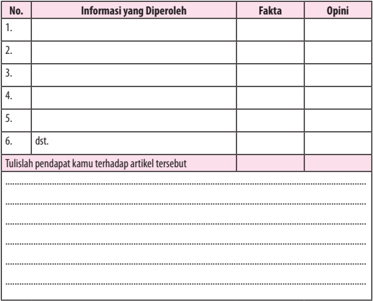

Tabel ini berisi informasi tentang penelitian atau studi yang dilakukan oleh seorang individu. Kolom "Informasi yang Diperoleh" menyajikan berbagai fakta dan opini yang diperoleh dari penelitian tersebut. Kolom "Fakta" mencakup informasi yang dapat diukur atau diteliti secara objektif, sementara kolom "Opini" mencakup pendapat atau interpretasi subjektif dari peneliti. Tabel ini membantu dalam memahami bagaimana peneliti menggabungkan fakta dan opini untuk membuat analisis atau pendapat mereka terhadap artikel tertentu. Topik utama tabel ini adalah penelitian atau studi yang dilakukan oleh individu tersebut, dengan fokus pada pengumpulan dan interpretasi data.

 

---
## 📄 Halaman 146

### Membedakan Informasi Berupa Fakta dan Opini Penulis

Pada  bagian  terdahulu,  kalian  sudah  mengidentifikasi  fakta  dan  opini dalam artikel. Kemampuan awal ini sebagai dasar agar kalian dapat menulis artikel. Tentulah hal pertama untuk dapat membedakan antara informasi fakta dan  opini  yang  terdapat  dalam  artikel  adalah  membacanya  dengan  cermat. Kemudian, memahami isi dan gaya penulisannya.

Berikut ini disajikan sebuah artikel. Kamu diharapkan dapat membedakan antara informasi yang berupa fakta dan informasi berupa opini dalam artikel tersebut. Oleh karena itu, bacalah dengan cermat artikel berikut ini.

### Memotret Kondisi Kesehatan Indonesia

Sumber: http://logo-share.blogspot.co.id/2013/03/idi-logo.html

Sehat  merupakan  hak  asasi  setiap  warga  negara  yang  diatur  dalam konstitusi  Indonesia.  Tidak  hanya  sebagai  hak,  'sehat'  menjadi  kewajiban negara karena sejatinya komponen tersebut merupakan investasi penting bagi suatu bangsa. Rakyat yang sehat bukan hanya sehat fisik, melainkan juga sehat secara  mental,  sehat  dalam  pergaulan  sosial,  dan  tak  lepas  dari  pembinaan aspek spiritual.

Kini rakyat Indonesia mengalami empat transisi masalah kesehatan yang memberikan dampak 'double  burden'  alias  beban  ganda.  Keempat  transisi tersebut adalah transisi demografi, epidemiologi, gizi, dan transisi perilaku.

Transisi demografi ditandai dengan usia harapan hidup yang meningkat, berakibat penduduk usia lanjut bertambah dan menjadi tantangan tersendiri bagi sektor kesehatan karena meningkatnya kasus-kasus geriatri. Sementara itu, masalah kesehatan klasik dari populasi penduduk yang bayi, balita, remaja, dan ibu hamil tetap saja belum berkurang.

 

---
## 📄 Halaman 147

Transisi epidemiologi datang dengan dua kelompok kasus penyakit, yaitu penyakit  menular  dan  penyakit  tidak  menular.  Penyakit  menular  seperti tuberkulosis, malaria, demam berdarah, diare, cacingan, hepatitis virus, dan HIV  tetap  eksis  dari  tahun  ke  tahun.  Di  sisi  lain,  penyakit  tidak  menular yang berlangsung kronis seperti penyakit jantung, hipertensi, kencing manis, gagal ginjal, stroke dan kanker, kasusnya makin banyak dan menyerap dana kesehatan dalam jumlah yang tidak sedikit.

Transisi  ketiga  terjadi  pada  sektor  gizi.  Di  satu  sisi  kita  berhadapan dengan  kasus  penduduk  gizi  lebih  (kegemukan/obesitas),  sementara  kasus gizi kurang masih tetap terjadi. Transisi keempat adalah pada pola perilaku (gaya hidup). Perilaku hidup 'modern' , atau lebih tepatnya 'sedentary' mulai menjadi kebiasaan baru bagi masyarakat. Gaya hidup serba instan, termasuk dalam memilih bahan pangan, dan kurang peduli aspek kesehatan, sementara sebagian  yang  lain  masih  percaya  mitos-mitos  yang  diwariskan  berkaitan dengan sakit-sehatnya seseorang.

Dari keempat transisi tersebut, yang paling berat membebani kita saat ini adalah peningkatan prevalensi penyakit tidak menular. Dulu, penyakit jantung, pembuluh darah, gagal ginjal, stroke, hipertensi, kencing manis, dan kanker, merupakan penyakit kronis yang akrab dengan populasi penduduk kaya. Kini, penduduk dengan penghasilan yang menengah ke bawah juga sudah banyak yang mengalami sakit serupa.

***

Jika dirunut di mana masalahnya, akan kita temukan bahwa penyelamatan dan  pengelolaan  1.000  Hari  Pertama  Kehidupan  (HPK)  yang  dimulai  dari pembuahan hingga anak berusia dua tahun, memiliki peran yang sangat besar. Setelah fase HPK tersebut, akar penyebab ikutan yang makin memberatkan kita adalah 'sedentary life style' pola hidup yang tidak sehat akibat penerapan diet yang keliru dan rendahnya aktivitas fisik.

Langkah  pencegahan  dan  penanggulangan  masalah  ini  bisa  kita  mulai sesegera mungkin. Adapun langkah-langkahnya adalah selamatkan 1.000 Hari Pertama Kehidupan dan penerapan diet sehat serta aktivitas fisik yang teratur. Karena itu, perlu ada gerakan bersama untuk dua hal ini, gerakan masyarakat sadar gizi dan gerakan masyarakat sadar olahraga.

Guru besar  administrasi  kesehatan  dari  Universitas  Berkeley,  Henrik  L Blum, menyatakan bahwa ada empat faktor yang memengaruhi status kesehatan manusia/rakyat,  yaitu  lingkungan,  perilaku  manusia,  pelayanan  kesehatan, dan genetik/keturunan. Secara sederhana, Hodgetts dan Cascio membagi dua pelayanan  kesehatan,  yaitu  pelayanan  kesehatan  masyarakat  dan  pelayanan

 

---
## 📄 Halaman 148

kesehatan  perorangan.  Pelayanan  kesehatan  masyarakat  dilaksanakan  oleh ahli kesehatan masyarakat, dengan perhatian utama pada upaya memelihara kesehatan rakyat dan mencegah penyakit.

Sasaran  utama  layanan  kesehatan  masyarakat  adalah  kelompok  atau masyarakat secara keseluruhan dan selalu berupaya mencari cara yang efisien. Pelayanan kesehatan berikutnya adalah layanan kesehatan perorangan yang tenaga  pelaksana  utamanya  adalah  dokter,  dengan  perhatian  utama  pada penyembuhan  dan  pemulihan  penyakit.  Sasaran  utama  adalah  perorangan dan  keluarga.  Jenis  layanan  ini  menurut  Hodgetts  dan  Cascio  kurang memperhatikan aspek efisiensi.

Untuk Indonesia, pelayanan kedokteran (kesehatan perorangan) masuk dalam Jaminan Kesehatan Nasional (JKN). Dari segi kuantitas, dokter umum per  17  November  2015  (Data  KKI)  sebanyak  108.028  dokter  umum  yang memiliki STR saat ini mestinya cukup untuk melayani 152.721.329 peserta JKN.  Faktor  distribusi  dokter  yang  kurang  baik  kemudian  menjadi  catatan tersendiri  sehingga  sebagian  peserta  JKN  terutama  di  daerah  pedalaman, kepulauan, dan perbatasan, menjadi sulit mendapatkan akses ke dokter.

Terjadi  penumpukan  dokter  di  kota  dan  daerah  dengan  pertumbuhan ekonomi tinggi karena pendapatan dokter sekitar 80% dari praktik pribadi. Sekalipun  memang  dalam  era  JKN  pendapatan  dari  praktik  pribadi  pelanpelan berkurang/menghilang. Aspek ini tidak bisa tidak harus diperhitungkan bila ingin menata persebaran dokter.

Jumlah dan kondisi  puskesmas  saat  ini  ada  9.799.  Persebarannya  tidak seimbang  dengan  jumlah  dokter  umum  dan  pertambahan  dokter  sekitar 5.000 orang per tahun profesional dokter per tahun. Akibatnya, BPJS sebagai pelaksana  JKN  belum  dapat  mengandalkan  seluruh  puskesmas  tersebut sebagai ujung tombak pelayanan.

***

Saat  ini,  setelah  hampir  dua  tahun  JKN  berjalan,  dokter  umum  yang ditempatkan pada garda terdepan pelayanan kesehatan masih dibayar lebih rendah dari  kepantasan  dan  beban  kerja,  serta  tidak  mempunyai  kepastian pendapatan.  Model  pembayaran  kapitasi  yang  besarannya  kurang  layak menjadikan dokter (terutama yang bukan PNS) berada dalam kekhawatiran beban  finansial  yang  cukup  mengganggu.  Hal  ini  secara  tidak  langsung berpotensi menyebabkan berkurangnya kualitas pelayanan yang dapat merugikan pasien.

 

---
## 📄 Halaman 149

Tahun  2015  ini  Ikatan  Dokter  Indonesia  (IDI)  kembali  bermuktamar dan menawarkan konsep pelayanan kesehatan terstruktur yang merata dan berkeadilan  untuk  mengurai  sebagian  dari  masalah  kesehatan  dalam  era JKN  sekarang  ini.  Disebutkan  bahwa  pelayanan  kesehatan  baik  kesehatan masyarakat maupun kesehatan per orangan (kedokteran) hanyalah memiliki kontribusi 15% dalam meningkatkan derajat kesehatan penduduk.

Memang  boleh  dikatakan  sangat  kecil,  tetapi  bila  tanggung  jawab  ini dilaksanakan  dengan  sebaik-baiknya  tentu  memiliki  makna  yang  sangat berarti.  Bagian  yang  lebih  besar  lagi  merupakan  tanggung  jawab  sektor di  luar  pelayanan  kesehatan  dan  pelayanan  kedokteran.  Oleh  karena  itu, ke  depan,  Indonesia  perlu  merumuskan  sistem  kesehatan  nasional  (SKN) yang  mengintegrasikan  sektor-sektor  lain  di  luar  kesehatan,  yang  diyakini mempunyai  pengaruh  besar  dalam  meningkatkan  derajat  kesehatan  rakyat Indonesia.

Bahkan karena sistem kesehatan mengatur dan mengintegrasikan sektor di  luar  sektor  kesehatan,  SKN  perlu  diatur  dalam  melalui  undang-undang. Sebagai padanannya adalah mengatur sistem pembiayaan diatur melalui UU SJSN dan UU BPJS. Salam Sehat Indonesia!

(Sumber: http://nasional.sindonews.com edisi Rabu, 18 November 2015 oleh Zaenal Abidin)

### Tugas

Setelah menemukan fakta dan opini dalam artikel yang berjudul 'Memotret Kondisi Kesehatan Indonesia' , kamu diminta untuk membedakan antara fakta dan opini dengan mengisi kolom berikut ini!

---
**📊 Tabel**

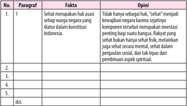

Tabel ini berisi informasi tentang hak asasi setiap warga negara di Indonesia, dengan kolom-kolom "Paragraf", "Fakta", dan "Opini". Topik utama tabel adalah hak asasi setiap warga negara Indonesia. Paragraf menyediakan konteks teks yang relevan, fakta menyajikan informasi fakta yang diberikan dalam paragraf tersebut, dan opini menunjukkan pendapat atau interpretasi yang dibuat tentang fakta tersebut. Data penting yang terlihat meliputi bahwa hak asasi setiap warga negara merupakan investasi penting bagi keadilan sosial dan spiritual, serta bahwa sehat fisik dan mental juga merupakan bagian dari hak asasi tersebut.

 

---
## 📄 Halaman 150

### B.  Menyusun Opini dalam Bentuk Artikel

Setelah mempelajari materi ini, kamu diharapkan mampu:

- mengungkapkan opini dalam bentuk kalimat yang benar;
- menyusun opini dalam bentuk paragraf;
- menyusun opini dengan memperhatikan fakta dalam bentuk artikel.

### Kegiatan

### Mengungkapkan Opini dalam Bentuk Kalimat yang Benar

Apakah  kamu  pernah  mengungkapkan  pendapat?  Bagaimana  cara kamu  mengungkapkannya?  Apakah  diungkapkan  secara  lisan?  Atau  secara tertulis? Pada subpelajaran ini, kamu akan belajar bagaimana mengungkapkan pendapat/opini dalam bentuk artikel secara tertulis. Namun, sebelum kamu menyusun sebuah opini dalam bentuk artikel, ada beberapa hal yang harus diperhatikan antara lain struktur artikel opini, argumentasi, dan bahasa yang digunakan.

### 1. Struktur artikel opini

Kamu  tentu sudah membaca  artikel opini pada subpelajaran sebelumnya,  bukan?  Apakah  kamu  memperhatikan  struktur  isi  artikel tersebut?  Artikel  tersebut  diawali  dengan  pernyataan  pendapat (thesis statement) atau  topik  yang  akan  kamu  kemukakan.  Selanjutnya,  kamu kemukakan  beberapa  argumentasi  tentang  pendapat  atau  pandangan kamu  terhadap  masalah  yang  dikemukakan.  Pada  bagian  ini  disebut argumentasi  ( arguments ).  Bagian  akhir  artikel  berisi  pernyataan  ulang pendapat  ( reiteration ),  yakni  penegasan  kembali  pendapat  yang  telah dikemukakan  agar  pembaca  yakin  dengan  pandangan  atau  pendapat tersebut.

### 2. Argumentasi

Bagian terpenting dalam artikel opini adalah argumentasi. Argumentasi  yang  kalian  kemukakan  harus  kuat.  Artinya  argumentasi harus didukung data aktual karena artikel opini pada umumnya bersifat aktual yang berisi analisis subjektif terhadap suatu permasalahan. Argumentasi yang dibangun harus konstruktif agar pesan dalam tulisan dapat diserap secara baik oleh pembaca.  Kemudian,  kalian harus memberikan solusi yang komprehensif.

 

---
## 📄 Halaman 151

### 3. Penggunaan bahasa

Bahasa dalam artikel bersifat ilmiah populer, berbeda dengan bahasa ilmiah pada umumnya. Penggunaan bahasa penting untuk diperhatikan untuk melihat sasaran pembacanya. Kecenderungan pembaca teks artikel adalah membaca tulisan yang tidak terlalu panjang, mudah dibaca, dan mudah dipahami. Oleh karena  itu,  pada  saat  membuat  opini,  gunakan bahasa  yang  komunikatif,  tidak  bertele-tele,  dan  ringkas  penyajiannya. Dalam  menggali  gagasan  dan    argumentasi,  gunakanlah  kalimat  yang efektif,  efisien,  dan  mudah  dimengerti.  Jika  kamu  menggunakan  istilah asing atau bahasa daerah, buatlah padanan kata dalam bahasa Indonesia.

Pada subpelajaran sebelumnya, kamu sudah dapat membedakan antara  fakta  dan  opini  penulis  dalam  sebuah  artikel  opini.  Sekarang,  kamu diminta menjadi seorang penulis artikel dengan mengungkapkan opini atau pendapatnya ke dalam sebuah kalimat yang baik dan benar.

### Tugas 1

Pada kegiatan ini akan disajikan gambar-gambar yang berkaitan dengan isu-isu yang terjadi di dalam masyarakat. Kamu diminta untuk mengungkapkan pendapat terkait dengan gambar tersebut. Namun, sebelum itu, kamu harus memperhatikan beberapa hal berikut ini.

- Perhatikan gambar yang tersaji berikut ini.
- Pilih salah satu gambar yang menurutmu mudah dan kamu mengetahui isu yang dimaksud gambar tersebut.
- Kaitkan gambar tersebut dengan pengetahuan yang telah kamu miliki.
Perhatikan gambar berikut ini!

---
**🖼️ Gambar/Diagram**

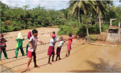

> **Deskripsi Visual:** Gambar ini adalah foto yang menunjukkan beberapa orang sedang bermain bola sepak di lapangan. Lapangan tersebut tampak luas dengan tanah berlumpur, dan sebagian besar lapangan terisi oleh pemain. Di sekitar lapangan, terlihat beberapa pohon dan bangunan kecil, mungkin rumah atau bangunan sekolah. Pemain-pemain tampak aktif dan terlibat dalam permainan, dengan posisi mereka yang berbeda-beda menunjukkan aktivitas yang beragam. Teks, angka, atau label penting tidak terlihat pada gambar ini. Informasi kunci yang dapat diambil pembaca adalah bahwa ini adalah foto yang menunjukkan aktivitas olahraga di lapangan, dengan banyak pemain yang terlibat dalam permainan bola sepak.

 

---
## 📄 Halaman 152

### Gambar 3

### Tuliskan pendapatmu pada kolom berikut ini!

---
**📊 Tabel**

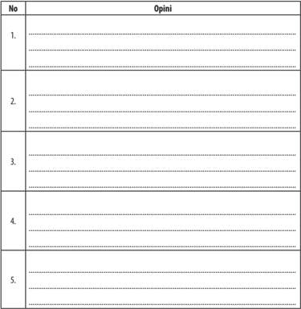

Tabel ini berisi 5 baris dengan judul "Opini" di kolom pertama. Setiap baris mungkin menunjukkan pendapat atau opini yang berbeda-beda tentang suatu topik tertentu. Topik utama tabel ini mungkin berkaitan dengan pendapat atau perasaan orang-orang tentang sesuatu yang disebutkan dalam kolom "Opini". Kolom "Opini" ini tampaknya dirancang untuk memungkinkan penulis atau pembaca untuk memberikan pendapat mereka sendiri tentang topik tersebut. Pola penting yang terlihat adalah bahwa tabel ini mungkin digunakan untuk mengevaluasi atau membandingkan berbagai pendapat atau opini yang berbeda.

 

---
## 📄 Halaman 153

2

### Menyusun Opini dalam Bentuk Paragraf

Di dalam kehidupan sehari-hari, kita banyak sekali melakukan aktivitas membaca.  Dalam  membaca  suatu  bentuk  tulisan  diperlukan  daya  kritis, apakah tulisan itu berupa fakta atau opini. Dalam bentuk tulisan, suatu opini sebenarnya  mudah  dikenali.  Berikut  adalah  penanda-penanda  opini  dalam suatu paragraf.

- Menggunakan  kutipan  kata-kata  seseorang,  biasanya  ditandai  dengan adanya tanda baca petik dua (' . . . . ').
- Menggunakan sudut pandang penulis dalam bentuk penafsiran terhadap fakta.
- Menggunakan kata yang tidak pasti (mungkin, rasanya, dll).
- Menggunakan  kata  yang  bertujuan  menyampaikan  sesuatu  (sebaiknya, saran, pendapat, dll).
Inti  dari  paragraf  opini  adalah  dapat  ditemukan  kata  atau  kalimat yang  menunjukan  bahwa  itu  adalah  sebuah  pendapat  pribadi  ataupun pandangan seseorang yang belum tentu benar, hanya berdasarkan pemikiran seseorang.

Berikut adalah contoh menyusun opini dalam bentuk paragraf.

### Opini 1

Novel Laskar Pelangi karya Andrea Hirata merupakan novel yang sangat bagus. Novel ini memberikan kesan yang sangat mendalam dan melibatkan emosi para pembacanya. Tak hanya itu, novel ini juga  memberikan pengalaman kepada pembacanya seolah-olah mereka ikut terlibat di dalam cerita tersebut. Terlebih lagi, novel ini juga sangat dicintai para pecinta novel karena mengangkat budaya lokal. Mereka menganggap bahwa Laskar Pelangi merupakan karya terbaik Andrea Hirata. Tak heran novel ini laku keras di pasaran.

### Opini 2

Menurut Alex Sudrajat, Jokowi adalah presiden yang sangat sederhana. Dia juga menambahkan bahwa Jokowi sangatlah ramah dan tidak suka dengan hal yang berbau mewah. Dengan pesonanya, Jokowi berhasil merebut hati para pemilih yang kebanyakan ibu-ibu. Mereka jatuh cinta dengan kesederhanaan dan kepolosan yang ada pada sosok Jokowi. Meskipun ramah dan sederhana, Jokowi merupakan pemimpin yang cukup tegas.

 

---
## 📄 Halaman 154

### Tugas 2

Bacalah kedua teks di bawah ini dengan saksama!

### Teks Pertama

### Bahasa Indonesia Paling Populer di Kalangan Anak-Anak Australia

---
**🖼️ Gambar/Diagram**

> **Deskripsi Visual:** Gambar ini adalah ilustrasi yang menunjukkan seorang anak sedang menggunakan tablet. Anak tersebut duduk di kursi merah dengan latar belakang yang sama warna. Anak tersebut memakai kacamata dan mengenakan jaket biru. Tablet yang digunakan oleh anak tersebut tampak besar dan terbuka, menunjukkan beberapa aplikasi atau konten digital. Anak tersebut tampak tertarik pada tablet tersebut, menunjukkan minat atau keinginan untuk berinteraksi dengan media digital.

Elemen-elemen utama dalam gambar ini meliputi anak, tablet, dan latar belakang kursi merah. Anak adalah subjek utama yang menunjukkan aktivitasnya menggunakan tablet. Tablet merupakan alat yang digunakan oleh anak untuk mencari informasi atau bermain game. Latar belakang kursi merah memberikan konteks tempat di mana anak tersebut sedang berada, mungkin di ruang tunggu atau sekolah.

Teks, angka, atau label penting tidak terlihat dalam gambar ini karena tidak ada teks atau angka yang jelas. Namun, elemen-elemen seperti kacamata, jaket, dan kursi merah dapat memberikan informasi tambahan tentang penampilan dan lingkungan anak tersebut.

Informasi kunci yang dapat diambil pembaca adalah bahwa anak tersebut sedang menggunakan tablet untuk mencari atau bermain, menunjukkan minat atau keinginan untuk interaksi dengan media digital. Ini juga menunjukkan bahwa anak tersebut mungkin sedang di tempat umum seperti sekolah atau ruang tunggu.

'Anak-anak akan cepat menguasai bahasa asing bila diajak sejak dini. '

KOMPAS.com - Sebuah aplikasi telah dibuat oleh Pemerintah Australia guna mendorong lebih banyak lagi  anak-anak Australia belajar bahasa asing. Dari  lima  bahasa  yang  diperkenalkan,  bahasa  Indonesia  sejauh  ini  paling populer. Aplikasi itu dibuat karena, dalam 50 tahun terakhir, murid sekolah di Australia yang belajar bahasa asing turun dari angka 40 persen menjadi sekitar 12 persen ketika mereka berada di kelas XII.

Kini,  pemerintah federal  Australia  melakukan  uji  coba  dengan  menciptakan aplikasi untuk anak-anak di bawah lima tahun, ketika mereka berkesempatan mempelajari satu dari lima bahasa asing. Secara keseluruhan ada 35 aplikasi yang  dibuat  oleh  Early  Learning  Languages  Australia  (ELLA)  yang  berisi tujuh  aplikasi  khusus  untuk  mempelajari  lima  bahasa,  yaitu  Mandarin, Jepang, Indonesia, Prancis, dan Arab. Menteri Pendidikan Australia, Simon Birmingham, mengatakan uji coba ini sudah dilakukan di 41 playgroup (di Australia disebut preschool).

'Uji  coba  ini  memberikan akses bagi anak-anak berusia di bawah lima tahun untuk belajar bahasa asing lewat aplikasi, ' kata Birmingham. Senator Birmingham mengatakan, minat untuk belajar bahasa Indonesia sebenarnya menurun di tingkat sekolah menengah di Australia, dalam beberapa tahun terakhir.

 

---
## 📄 Halaman 155

Namun, dalam uji coba sejauh ini, bahasa yang populer dalam penggunaan aplikasi  ini  adalah  bahasa  Indonesia.  'Bila  ada  pertanda  bahwa  kita  bisa memberikan dorongan kepada mereka sejak usia dini, itulah yang harus lebih banyak dilakukan,' kata Senator Birmingham. Aplikasi bahasa sambil bermain ini akan diujicobakan di sekitar 1.000 playgroup dengan biaya sekitar 6 juta dollar AS atau setara Rp 60miliar.

Pada  tahun  2015,  pemerintah  federal  Australia  mengalokasikan  dana sebesar 9,8 juta dollar AS untuk melakukan uji coba online untuk mengetahui cara yang efektif dalam mengajarkan bahasa asing kepada anak-anak. Namun, pemerintah  berharap,  keadaan  itu  akan  berubah.  Kini,  pemerintah  mulai mencari sasaran anak-anak yang lebih muda dengan bantuan aplikasi. Yang menjadi sasaran adalah anak usia antara 4 dan 5 tahun.

Senator  Birmingham  mengatakan,  bila  uji  coba  lanjutan  ini  dianggap berhasil, aplikasi tersebut akan diberlakukan secara nasional mulai tahun 2017. Ada juga rencana membuat aplikasi untuk pelajaran Matematika dan sains.

(Sumber: kompas.com, Rabu, 13 Januari 2016).

### Teks Kedua

### Bunga Pertama Mekar di Angkasa Luar

KOMPAS.com  Apakah  mungkin  ada  kehidupan  di  angkasa  luar? Pertanyaan yang mendasari berbagai penelitian di angkasa luar itu terjawab saat  astronot  Amerika  Serikat,  Scoot  Kelly,  mengunggah  foto  bunga  mekar dari tanaman jeruk zinnia ke instagram-nya, Sabtu (16/1/2016). Bunga jeruk itu berhasil mekar di Stasiun Ruang Angkasa Internasional (ISS). Sebelumnya,

 

---
## 📄 Halaman 156

jenis sayur letucce berhasil tumbuh di antariksa. Pihak Badan Penerbangan dan Antariksa AS (NASA) mengatakan, jeruk zinnia dipilih karena lebih sulit tumbuh ketimbang letucce.

Misi yang diemban Kelly bersama kosmonat Rusia, Mikhail Korniyenko, adalah  meneliti  dampak  hidup  jangka  panjang  di  antariksa.  Penelitian  itu untuk melihat apakah ada peluang berkebun di antariksa.

Harapannya, hal itu juga bisa dilakukan di Mars. Jeruk zinnia ditanam dengan metode yang dibuat program Veggie NAS yang berjalan sejak 2014. Tanaman itu tumbuh dari 'bantal' yang penuh dengan pupuk, benih, air, dan lempeng yang disinari sinar lampu LED (light emitting diode).

(Sumber: kompas.com, Rabu, 20 Januari 2016)

Setelah kamu membaca teks di atas, tulislah mana yang merupakan paragraf opini berdasarkan format tabel di bawah ini. Kamu bisa mengerjakannya di buku kerjamu!

---
**📊 Tabel**

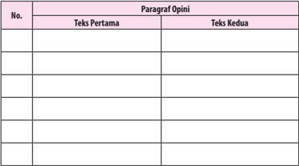

Tabel ini berisi paragraf opini yang dibagi menjadi dua bagian: Teks Pertama dan Teks Kedua. Setiap paragraf diurutkan dengan nomor untuk memudahkan pengecekan. Teks pertama dan kedua masing-masing memiliki kolom untuk menuliskan paragrafnya. Topik utama tabel ini adalah paragraf opini, yang merupakan bagian penting dari sebuah tulisan yang mencakup pendapat atau perasaan seseorang tentang suatu topik tertentu.

### Kegiatan

### Menyusun Fakta dalam Bentuk Artikel

Setelah bisa menyusun opini dalam bentuk paragraf, pada pembahasan ini kamu akan menyusun fakta dalam bentuk artikel. Fakta adalah suatu informasi yang  bersifat  nyata  atau  benar-benar  terjadi.  Fakta  disertai  dengan  buktibukti yang mendukung kebenarannya. Oleh karena itu, fakta lebih sering sulit dibantah oleh opini seseorang.

 

---
## 📄 Halaman 157

### Berikut adalah ciri-ciri fakta:

- merupakan suatu kebenaran umum;
- menyertakan bukti berupa data-data yang akurat;
- mengungkapkan peristiwa yang benar-benar terjadi.

### Berikut contoh kalimat fakta.

- Di  Kabupaten  Pangandaran  terdapat  pantai  yang  indah  dan  sering dijadikan objek wisata.
- Tasikmalaya adalah salah satu kota yang ada di Jawa Barat.
- Julukan untuk Kota Bandung adalah Kota Kembang.
Perhatikan contoh fakta berikut yang terdapat dalam sebuah artikel!

### Fakta 1

Pada tanggal 25 April 2015 lalu, terjadi sebuah bencana alam yang sangat mengerikan  di  negara  Nepal.  Gempa  bumi  sebesar  7.9  SR  tersebut  telah mengguncang negara kecil di sebelah selatan Asia ini yang terjadi tepat pada jam  11.56  waktu  setempat.  Gempa  tersebut  telah  meluluhlantahkan  semua bangunan yang berdiri. Gempa tersebut telah merenggut nyawa 6.621 orang lebih  dan  lebih  dari  14.023  korban  menderita  luka  parah  dan  kehilangan tempat tinggalnya. Kebanyakan korban yang meninggal akibat dari tertimpa reruntuhan bangunan. Mereka tidak sempat menyelamatkan diri saat gempa berlangsung.  Saat  ini,  Nepal  membutuhkan  bantuan  kemanusiaan  berupa pakaian, makanan, dan obat-obatan.

### Fakta 2

Ikan  paus  adalah  satu-satunya  mamalia  terbesar  yang  hidup  baik  di dalam air maupun di daratan. Bobot terberat ikan ini yang pernah tercatat adalah ikan paus biru yang beratnya mencapai 7 ton dengan panjang sekitar 1.000 meter. Monster air tersebut hidup di samudra yang luas dengan memakai ribuan  hewan-hewan  kecil  seperti  ikan  dan  plankton.  Karena  termasuk  ke dalam  hewan  mamalia,  ikan  paus  bernapas  dengan  menggunakan  insang dan  hampir  beberapa  menit  sekali  ke  permukaan  untuk  mengambil  napas. Dalam hal berkembang biak, ikan paus bereproduksi dengan cara melahirkan 3 hingga 4 ekor bayi paus yang beratnya mencapai 2 ton. Oleh sebab itu, ikan paus merupakan monster yang hidup di lautan.

 

---
## 📄 Halaman 158

### Tugas 3

Bacalah kedua artikel di bawah ini dengan saksama. Kemudian, kerjakanlah instruksi yang menyertainya!

### Artikel 1

### Objek Wisata Pantai Pangandaran

---
**🖼️ Gambar/Diagram**

> **Deskripsi Visual:** Gambar ini adalah foto yang menunjukkan pemandangan pantai yang indah. Di sebelah kiri, terdapat tanah berbukit dengan pohon-pohon hijau yang menjulang. Di tengah-tengah, terdapat sebuah perahu nelayan yang berwarna biru dengan tali merah dan kuning. Di sebelah kanan, laut berwarna biru cerah dengan ombak yang halus menghampiri pantai putih. Langit di atas tampak jernih dengan beberapa awan kecil berwarna putih. Gambar ini menunjukkan keindahan alam pantai dan aktivitas nelayan.

Pantai Pangandaran, Desa Pananjung, Kabupaten Pangandaran.

Jawa  Barat  memiliki  banyak  objek  wisata,  salah  satunya  adalah  Pantai Pangandaran. Pantai ini terletak di Kabupaten Pangandaran di Desa Pananjung. Pantai Pangandaran, Ciamis, pernah dinobatkan oleh Asia Rooms sebagai pantai terbaik di Provinsi Jawa Barat. Tentunya hal ini menjadi suatu kebanggaan bagi Indonesia terutama sebagai daya tarik wisatawan.

Pantai  yang  terletak  tidak  jauh  dari  Kota  Bandung  ini  terkenal  dengan keindahan pasir hitam dan pasir putihnya. Anda akan disuguhi ombak tenang yang cocok untuk berenang serta angin yang sejuk di sekitaran pantai. Air pasang  serta  air  surut  di  area  pantai  juga  memerlukan  waktu  yang  lama sehingga Pantai Pangandaran aman digunakan sebagai tempat berenang. Jika Anda datang ke pantai ini pada pagi hari, Anda akan mendapatkan kesempatan melihat pemandangan matahari terbit di bagian timur. Kemudian, pada bagian barat pantai di sore hari akan terlihat matahari terbenam yang begitu indah.

Di Pantai Pangandaran ini masih ada nelayan yang berlayar untuk mencari ikan. Pantai ini terkenal sebagai dermaga para nelayan sampai sekarang. Anda pun bisa merasakan sensasi berlayar dan menjaring ikan di pantai tersebut saat  datang  berkunjung.  Panorama  bawah  laut  yang  indah  lengkap  dengan

 

---
## 📄 Halaman 159

terumbu karang serta ikan warna-warni juga menjadi daya tarik objek wisata Pantai Pangandaran.

Selain itu, terdapat bukit yang menjadi hutan di area Pantai Pangandaran. Berkeliling lebih lanjut, maka Anda bisa melihat air terjun yang sangat cantik berada tepat di puncak bukit. Para wisatawan yang mau menyempatkan diri pergi  ke  air  terjun  ini  harus  pergi  berjalan  kaki.  Di  sepanjang  perjalanan, menuju  air  terjun  maka  Anda  akan  disajikan  pemandangan  alam  yang menakjubkan. Pulang dari objek wisata  ini  jangan  lupa  mencicipi  berbagai macam olahan laut di warung-warung sekitar pantai, seperti udang, kepiting, cumi-cumi, ikan, dan sebagainya. Untuk oleh-oleh keluarga, cobalah membeli ikan asin yaitu jambal roti yang terkenal di Pantai Pangandaran.

(Sumber: wisatanesia.co)

### Artikel 2

### Penemu Listrik

Saat  ini  listrik  sudah  menjadi  kebutuhan  paling  penting  bagi  umat manusia.  Dengan  listrik,  segala  aktivitas  manusia  dapat  dengan  mudah dilakukan. Listrik merupakan salah satu energi yang bisa dikatakan menguasai hajat  hidup orang banyak karena manfaatnya yang sangat penting. Penemu listrik adalah Michael Faraday dan berkat penemuannya tersebut, ia kemudian dijuluki sebagai 'Bapak Listrik' . Michael Faraday dikenal sebagai ilmuwan yang banyak  mempelajari  berbagai  hal.  Namun,  pria  yang  lahir  pada  tanggal  22 September 1971 di Inggris ini lebih banyak memberi perhatian pada bidang elektromagnetisme dan elektrokimia.

### Sejarah Penemuan Listrik oleh Michael Faraday

Sebenarnya kelistrikan sudah menjadi sebuah fenomena sejak zaman Yunani  kuno.  Hal  ini  diketahui  ketika seorang  cendekiawan  Yunani  bernama Thales  menemukan  sebuah  fenomena unik  ketika  batu  ambar  yang  digosokgosok ternyata mampu menarik sehelai bulu. Hal ini kemudian ia tuliskan dalam catatannya.  Hal  inilah  yang  kemudian memunculkan banyak teori-teori tentang kelistrikan  dan  dikemukakan

 

---
## 📄 Halaman 160

oleh para ilmuwan seperti Ampere, Faraday, Coulomb, dan Joseph Priestley. Di antara nam-nama tersebut, Michael Faraday mempunyai kontribusi paling besar mengenai kelistrikan dan elektromagnetik.

Terkenalnya nama Michael Faraday sebagai 'Bapak Listrik' bermula ketika ia membuat sebuah ekperimennya yang pertama kali dengan menggunakan 7 uang logam yang kemudian ia tumpuk  dengan 7 lembaran seng serta 6 lembar kertas  yang  dibasahi  air  garam.  Hal  ini  ia  lakukan  mengikuti  konstruksi tumpukan Volta ketika menemukan beterai pertama kali. Dari ekperimen ini Faraday kemudian menguraikan magnesium sulfat.

Selanjutnya,  di  tahun  1821,  Christian  Orsted  memublikasikan  sebuah jurnal  mengenai fenomena elektromagnetisme. Hal itu kemudian membuat Faraday  mencoba  melakukan  riset  lanjutan  dari  publikasi  Orsted.  Faraday kemudian membuat sebuah alat yang kemudian dapat menghasilakan sebuah 'Rotasi  Elektromagnetik'  yang  merupakan  cikal  bakal  ditemukannya  listrik oleh Faraday.

Alat yang Faraday ciptakan bernama Homopolar  Motor.  Dalam  alat yang diciptakan  Faraday  ini  terjadi  sebuah gerakan berputar terus-menerus. Gerakan ini ditimbulkan dari gaya lingkaran magnet yang mengelilingi kawat  yang  panjang  hingga  ke  dalam larutan  merkuri  dan  di  dalam  larutan tersebut sudah terdapat magnet. Gerakan itu membuat kawat akan terus berputar jika dialiri listrik yang berasal dari sebuah baterai. Penemuan Faraday inilah yang kemudian menjadi sebuah dasar dari Teknologi Elektromagnetik saat ini. Dari percobaan itu, ia menemukan sebuah motor listrik pertama di dunia yang menggunakan listrik sebagai nama penggeraknya.

Puncak penemuan medan listrik oleh Faraday adalah ketika ia melakukan percobaan dengan melilitkan dua kumparan kawat yang terpisah. Kemudian, ia menemukan apa yang dikenal dengan nama induksi timbal balik, magnet dilewati potongan kawat, maka aliran listrik masuk ke kawat, yang kemudian magnetnya  berjalan.  Dari  sini,  ia  kemudian  membuat  sebuah  kesimpulan bahwa 'Perubahan pada medan magnet dapat menghasilkan medan listrik' . Kemudian, James Clerk Maxmel membuat rumus matematikanya dan dikenal dengan nama Hukum Faraday.

 

---
## 📄 Halaman 161

Kecemerlangan  Faraday  dalam  membuat  penemuan-penemuan  besar tidak lepas dari sosok bernama Humphry Davy yang merupakan mentornya yang  membimbing  Michael  Faraday  di  laboratoriumnya.  Ia  juga  mengajak Faraday keliling Eropa untuk menambah pengetahuan mereka baik itu secara teknis maupun teoretis. Di bawah bimbingan Davy, Michael Faraday banyak membuat sebuah penemuan-penemuan baru yang berguna bagi manusia di bidang  kelistrikan.  Michael  Faraday  sendiri  wafat  pada  tanggal  25  Agustus 1867. Untuk mengenang jasa-jasanya di bidang kelistrikan, namanya kemudian diabadikan dalam sebuah satuan dalam ilmu fisika yaitu satuan kapasistansi dengan simbol (F) atau Faraday.

Setelah  kamu  selesai  menbaca  artikel  di  atas,  temukanlah  fakta  yang terdapat pada kedua artikel tersebut. Isilah pada format tabel di bawah ini. Kamu bisa mengerjakannnya di buku kerjamu!

---
**📊 Tabel**

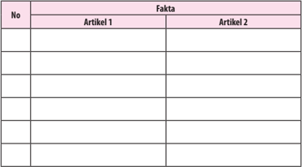

Tabel ini berisi informasi tentang dua artikel, yaitu Artikel 1 dan Artikel 2. Kolom "No" digunakan untuk menunjukkan urutan atau nomor artikel. Kolom "Artikel 1" dan "Artikel 2" masing-masing berisi data atau fakta yang relevan dengan kedua artikel tersebut. Dari tabel ini, dapat dilihat bahwa setiap baris menyediakan informasi spesifik tentang satu artikel, sementara kolom "No" membantu dalam membedakan antara baris yang berbeda. Pola penting yang terlihat adalah bahwa tabel ini dirancang untuk membandingkan atau membandingkan fakta antara dua artikel, yang dapat membantu dalam analisis atau penelitian.

### C.  Menganalisis Kebahasaan Artikel dan/atau Buku Ilmiah

Setelah mempelajari materi ini, kamu diharapkan mampu:

- menemukan unsur kebahasaan artikel opini dan buku ilmiah;
- membedakan unsur kebahasaan dalam artikel opini dan buku ilmiah.

 

---
## 📄 Halaman 162

### Menemukan Unsur Kebahasaan Artikel Opini dan Buku Ilmiah

Pada  pembahasan  sebelumnya,  kamu  telah  mampu  menyusun  dan membedakan  mana  yang  termasuk  kalimat  opini  dan  fakta  yang  terdapat dalam sebuah artikel. Pada pembahasan ini, kamu harus mampu menganalisis kebahasaan yang terdapat dalam sebuah artikel dan buku ilmiah.

Unsur kebahasaan yang terdapat dalam artikel dan buku ilmiah memiliki persamaan karena penyajian isinya berdasarkan fakta yang didukung melalui opini, bukan imajinasi. Berikut adalah unsur kebahasaan yang harus dicermati.

### 1. Adverbia

Adverbia adalah bahasa yang dapat mengekspresikan sikap eksposisi. Agar  dapat  meyakinkan  pembaca,  diperlukan  ekspresi  kepastian,  yang bisa dipertegas dengan kata keterangan atau adverbia frekuentatif, seperti selalu, biasanya, sebagian besar, sering, kadang-kadang, dan jarang.

### 2. Konjungsi

Konjungsi  adalah  kata  atau  ungkapan  yang  menghubungkan  dua satuan bahasa yang sederajat, yaitu kata dengan kata, frasa dengan frasa, klausa  dengan  klausa,  serta  kalimat  dengan  kalimat.  Konjungsi  yang banyak  dijumpai  pada  artikel  adalah  konjungsi  yang  digunakan  untuk menata argumentasi, seperti pertama, kedua, berikutnya; atau konjungsi yang digunakan untuk memperkuat argumentasi, seperti, selain itu, sebagai contoh, misalnya, padahal, justru; konjungsi yang menyatakan hubungan sebab-akibat, seperti, sejak , sebelumnya ,  dan sebagainya ;  konjungsi yang menyatakan harapan, seperti, supaya , dan sebagainya.

### 3. Kosakata

Kosakata  adalah  perbendaharaan  kata-kata.  Supaya  teks  tersebut mampu  meyakinkan  pembaca,  diperlukan  kosakata  yang  luas  dan menarik. Biasanya konten teks yang menarik tersebut mencakup hal-hal berikut.

- Aktual,  sedang  menjadi  pembicaraan  orang  banyak  atau  baru  saja terjadi.
- Fenomenal, yakni luar biasa, hebat, dan dapat dirasakan pancaindra.

 

---
## 📄 Halaman 163

- Editorial, artikel dalam surat kabar yang mengungkapkan pendirian editor atau pemimpin surat kabar.
- Imajinasi, daya pikir untuk membayangkan (dalam angan-angan).
- Modalitas, cara pembicara menyatakan sikap terhadap suatu imajinasi dalam komunikasi antarpribadi (barangkali, harus, dan sebagainya).
- Nukilan, kutipan atau tulisan yang dicantumkan pada suatu benda.
- Tajuk rencana, karangan pokok dalam surat kabar.
- Teks  opini,  teks  yang  merupakan  wadah  untuk  mengemukakan pendapat atau pikiran.
- Keterangan aposisi, keterangan yang memberi penjelasan kata benda. Jika ditulis, keterangan ini diapit tanda koma atau tanda pisah atau tanda kurung.

### Tugas 1

Bacalah  artikel  dan  cuplikan  buku  ilmiah  bawah  ini  dengan  saksama. Kemudian, kerjakan instruksi yang menyertainya!

### Artikel

### Sastrawan Serbabisa

Harian Kompas dan Sinar  Harapan kerap  memuat  cerita  pendeknya. Novelnya sering muncul di majalah Kartini, Femina, dan Horison. Memenangi lomba penulisan fiksi baginya sudah biasa. Sebagai penulis skenario, ia dua kali meraih piala Citra di Festival film Indonesia (FFI), untuk 'Perawan Desa' (1980), dan 'Kembang Kertas' (1985). Sebagai penulis fiksi sudah banyak buku yang dihasilkannya. Di antaranya, yang banyak diperbincangkan adalah Bila Malam Bertambah Malam, Telegram, Pabrik, Keok, Tiba-Tiba Malam, Sobat, dan Nyali.

Namanya I Gusti Ngurah Putu Wijaya yang biasa disebut Putu Wijaya. Tidak sulit untuk mengenalinya karena topi pet putih selalu bertengger di kepalanya. Kisahnya,  pada  ngaben  ayahnya  di  Bali,  kepalanya  digunduli.  Kembali  ke Jakarta, selang beberapa lama, rambutnya tumbuh tapi tidak sempurna, malah mendekati botak. Karena itu, ia selalu memakai topi. 'Dengan ini saya terlihat lebih gagah, ' tutur Putu sambil bercanda.

Putu yang dilahirkan di Puri Anom, Tabanan, Bali pada tanggal 11 April 1944, bukan dari keluarga seniman. Ia bungsu dari lima bersaudara seayah maupun dari tiga bersaudara seibu. Ia tinggal di kompleks perumahan besar,

 

---
## 📄 Halaman 164

yang dihuni sekitar  200  orang,  yang  semua  anggota  keluarganya  dekat  dan jauh, dan punya kebiasaan membaca. Ayahnya, I Gusti Ngurah Raka, seorang pensiunan  punggawa  yang  keras  dalam  mendidik  anak.  Semula,  ayahnya mengharapkan  Putu  jadi  dokter.  Namun,  Putu  lemah  dalam  ilmu  pasti.  Ia akrab dengan sejarah, bahasa, dan ilmu bumi.

'Semasa di SD, Saya doyan sekali membaca, '' tuturnya, ''Mulai dari karangan Karl  May,  buku  sastra Komedi  Manusia -nya  karya  William  Saroyan.  Sejak kecil, saya juga senang sekali seni pertunjukan. Mungkin sudah merupakan bakat, senang pada seni laku, ' ujarnya mengenang.

Meskipun demikian, ia tak pernah diikutkan main drama semasih kanakkanak, juga ketika SMP. Baru setelah menang lomba deklamasi, ia diikutkan main drama perpisahan SMA, yang diarahkan oleh Kirdjomuljo, penyair dan sutradara ternama di Yogyakarta. Ia pertama kali berperan dalam 'Badak' , karya Anton Chekov. 'Sejak itu saya senang sekali pada drama, ' kenang Putu.

Setelah  selesai  sekolah  menengah  atas,  ia melanjutkan kuliahnya di Yogyakarta, kota seni  dan  budaya.  Di  Yogyakarta,  selain  kuliah di Fakultas Hukum, UGM, ia juga mempelajari seni  lukis  di  Akademi  Seni  Rupa  Indonesia (ASRI),  drama  di  Akademi  Seni  Drama  dan Film  (Asdrafi).  Dari  Fakultas  Hukum,  UGM, ia  meraih  gelar  sarjana  hukum  (1969),  dari Asdrafi  ia  gagal  dalam  penulisan  skripsi,  dan dari kegiatan berkesenian ia mendapatkan identitasnya sebagai seniman.

Selama bermukim di Yogyakarta, kegiatan sastranya lebih terfokus pada teater. Ia pernah tampil bersama Bengkel Teater pimpinan W .S. Rendra dalam beberapa pementasan, antara lain dalam pementasan 'Bip-Bop' (1968) dan 'Menunggu Godot' (1969). Ia juga pernah tampil bersama kelompok Sanggar Bambu. Selain itu, ia juga (telah berani) tampil dalam karyanya sendiri yang berjudul  'Lautan  Bernyanyi' (1969) .  Ia  adalah  penulis  naskah  sekaligus sutradara  pementasan  itu.  Naskah  dramanya  itu  menjadi  pemenang  ketiga Sayembara Penulisan Lakon yang diselenggarakan oleh Badan Pembina Teater Nasional Indonesia.

Setelah kira-kira tujuh tahun tinggal di Yogyakarta, Putu pindah ke Jakarta. Di Jakarta ia bergabung dengan Teater Kecil asuhan sutradara ternama Arifin C. Noer dan Teater Populer. Di samping itu, ia juga bekerja sebagai redaktur majalah Ekspres (1969). Setelah majalah itu mati, ia menjadi redaktur majalah

 

---
## 📄 Halaman 165

Tempo (1971-1979).  Bersama  rekan-rekannya  di  majalah Tempo ,  Putu mendirikan Teater Mandiri (1974). 'Saya perlu bekerja jadi wartawan untuk menghidupi keluarga saya. Juga karena saya tidak mau kepengarangan saya terganggu oleh kebutuhan mencari makan,' tutur Putu.

Pada saat masih bekerja di majalah Tempo , ia mendapat beasiswa belajar drama (Kabuki) di  Jepang  (1973)  selama  satu  tahun.  Namun,  karena  tidak nyaman dengan lingkungannya, ia belajar hanya sepuluh bulan. Setelah itu, ia kembali aktif di majalah Tempo . Pada tahun 1974, ia mengikuti International Writing  Program  di  Iowa,  Amerika  Serikat.  Sebelum  pulang  ke  Indonesia, mampir di Prancis, ikut main di Festival Nancy.

Putu mengaku belajar banyak dari majalah Tempo dan penyair Goenawan Mohamad. 'Yang melekat di kepala saya adalah bagaimana menulis sesuatu yang sulit menjadi mudah. Menulis dengan gaya orang bodoh sehingga yang mengerti bukan hanya Menteri, tapi juga tukang becak. Itulah gaya Tempo , ' ungkap Putu. Dari Tempo , Putu pindah ke majalah Zaman (1979-1985), dan ia tetap produktif menulis cerita pendek, novel, lakon, dan mementaskannya lewat Teater Mandiri, yang dipimpinnya. Di samping itu, ia mengajar pula di Akademi Teater, Institut Kesenian Jakarta (IKJ).

Ia  mempunyai  pengalaman  bermain  drama  di  luar  negeri,  antara  lain dalam Festival  Teater  Sedunia  di  Nancy,  Prancis  (1974)  dan  dalam  Festival Horizonte III di Berlin Barat, Jerman (1985). Ia juga membawa Teater Mandiri berkeliling Amerika dalam pementasan drama 'Yel' dan berpentas di Jepang (2001).  Karena  kegiatan  sastranya  lebih  menonjol  pada  bidang  teater,  Putu Wijaya pun lebih dikenal sebagai dramawan. Sebenarnya, selain berteater ia juga menulis cerpen dan novel dalam jumlah yang cukup banyak, di samping menulis esai tentang sastra. Sejumlah karyanya, baik drama, cerpen, maupun novel telah diterjemahkan ke dalam bahasa asing, antara lain bahasa Inggris, Belanda, Prancis, Jerman, Jepang, Arab, dan Thailand.

Gaya  Putu  menulis  novel  tidak  berbeda  jauh  dengan  gayanya  menulis drama.  Seperti  dalam  karya  dramanya,  dalam  novelnya  pun  ia  cenderung mempergunakan gaya objektif  dalam  pusat  pengisahan  dan  gaya stream  of consciousness dalam pengungkapannya. Ia lebih mementingkan perenungan ketimbang riwayat.

Adapun  konsep  teaternya  adalah  teror  mental.  Baginya,  teror  adalah pembelotan, pengkhianatan, kriminalitas, tindakan subversif terhadap logika tapi nyata. Teror tidak harus keras, kuat, dahsyat, menyeramkan bahkan bisa berbisik, mungkin juga sama sekali tidak berwarna.

 

---
## 📄 Halaman 166

Ia menegaskan, ''Teater bukan sekadar bagian dari kesusastraan, melainkan suatu tontonan.'' Naskah sandiwaranya tidak dilengkapi petunjuk bagaimana harus dipentaskan. Agaknya, memberi kebebasan bagi sutradara lain  menafsirkan. Bila menyinggung problem sosial, karyanya tanpa protes, tidak mengejek, juga tanpa memihak. Tiap adegan berjalan tangkas, kadang meletup, diseling humor. Mungkin ini cerminan pribadinya. Individualitasnya kuat, dan berdisiplin tinggi.

Saat ditanya pemikiran pengarang yang sehari bisa mengarang cerita 30 halaman,  menulis  empat  artikel  dalam  satu  hari  ini  tentang  tulis  menulis. Putu menjawab, ''Menulis adalah menggorok leher tanpa menyakiti,'' katanya, ''bahkan kalau bisa tanpa diketahui. '' Kesenian diibaratkannya seperti baskom, penampung darah siapa saja atau apa pun yang digorok: situasi, problematik, lingkungan, misteri, dan berbagai makna yang berserak. ''Kesenian, '' katanya, ''merupakan salah satu alat untuk mencurahkan makna, agar bisa ditumpahkan kepada manusia lain secara tuntas. ''

'Saya  sangat  percaya  pada  insting, '  kata  Putu  tentang  caranya  menulis. 'Ketika menulis, saya tidak mempunyai bahan apa-apa. Semua datang begitu saja ketika di depan komputer, ' katanya lagi. Ia percaya bahwa ada satu galaksi dalam otak yang tidak kita mengerti cara kerjanya. Tapi, menurut Putu, itu bukan peristiwa mistik, apalagi tindak kesurupan.

Selain menekuni dunia teater dan menulis, Putu juga menjadi sutradara film dan sinetron serta menulis skenario sinetron. Film yang disutradarainya ialah film 'Cas Cis Cus' , 'Zig Zag' , dan 'Plong' . Sinetron yang disutradarainya ialah 'Dukun Palsu' , 'PAS' , 'None' , 'Warteg' , dan 'Jari-Jari' . Skenario yang ditulisnya  ialah  'Perawan  Desa' ,  'Kembang  Kertas' ,  serta  'Ramadhan'  dan 'Ramona'. Ketiga skenario itu memenangkan Piala Citra.

Pada  1977,  ia  menikah  dengan  Renny  Retno  Yooscarini  alias  Renny Djajusman yang dikaruniai seorang anak, Yuka Mandiri. Namun, pada tahun 1984  ia  menyendiri  kembali.  Pertengahan  1985,  ia  menikahi  gadis  Sunda, Dewi Pramunawati, karyawati majalah Medika. Bersama Dewi, Putu Wijaya selanjutnya hidup di Amerika Serikat selama setahun.

Atas undangan Fulbright, 1985-1988, ia menjadi dosen tamu teater dan sastra  Indonesia  modern  di  Universitas  Wisconsin  dan  Universitas  Illinois, AS. Atas undangan Japan Foundation, Putu menulis novel di Kyoto, Jepang, 1992. Setelah lama berikhtiar, walau dokter di Amerika mendiagnosis Putu tak bakal punya anak lagi. Pada 1996 pasangan ini dikaruniai seorang anak, Taksu.

Rumah  tangga  baginya sebuah 'perusahaan' . Apa  pun  diputuskan berdasarkan  pertimbangan  istri  dan  anak,  termasuk  soal  pekerjaan.  Soal

 

---
## 📄 Halaman 167

pendidikan anak, 'Saya tidak punya cara,' ujar Putu. Anak dianggap sebagai teman, kadang diajak berunding, kadang dimarahi. Dan, kata Putu, 'Saya tidak mengharapkan ia menjadi apa, saya hanya memberikan kesempatan saja.'

Kini, penggemar musik dangdut, rock, klasik karya Bach atau Vivaldi dan jazz ini total hanya menulis, menyutradarai film dan sinetron, serta berteater. Dalam  bekerja  ia  selalu  diiringi  musik.  Olahraganya  senam  tenaga  prana Satria Nusantara. 'Sekarang saya sudah sampai pada tahap bahwa kesenian merupakan upaya dan tempat berekspresi sekaligus pekerjaan,' ujar Putu.

(Sumber: tokohindonesia.com dengan pengubahan)

### Cuplikan Buku Ilmiah

### Menguak Tabir Kekuasaan Sang Pencipta

Judul Buku :

Mengenal Allah: Alam, Sains, dan Teknologi

Penulis

:  Tauhid Nur Azhar

Penerbit

:  Tinta Medina

Kota

:  Solo

Tahun

:  2012

Jumlah halaman

:  280 halaman

Dalam Al-Qur'an surah Fushilat ayat 53, Allah Swt. berfirman 'Kami akan memperlihatkan kepada mereka  tanda-tanda  (kekuasaan)  Kami  di  segala wilayah bumi dan pada diri mereka sendiri, hingga jelas bagi mereka bahwa Al-Quran itu adalah benar. Tiadakah  cukup  bahwa  Sesungguhnya  Tuhanmu menjadi saksi atas segala sesuatu?'

Berdasarkan ayat di atas secara eksplisit dapat kita pahami bahwa Allah Swt. menciptakan alam  semesta  beserta  isinya  dan  juga  manusia sebenarnya  untuk  menunjukkan  keagungan  dan kebesaran-Nya. Allah ingin manusia mengenalnya. Akan tetapi, banyak manusia yang masih ingkar dan

tak pernah tunduk akan kekuasaan-Nya itu. Ini semua terjadi karena mereka belum  mengenal  Allah  Swt  dengan  iman,  hati  dan  pikiran.  Ada  dua  jalan utama yang dapat kita tempuh untuk mengenal Allah Swt. Pertama, dengan memperhatikan  ayat-ayat  Qauliyyah  yang  termaktub  dalam  kitab  suci  AlQur'an. Kedua, dengan memperhatikan ayat-ayat Kauniyyah yang terbentang luas di alam semesta ini, bahkan dalam diri kita sendiri.

 

---
## 📄 Halaman 168

Buku Mengenal Allah: Alam, Sains, dan Teknologi karya Tauhid Nur Azhar ini  bisa  menjadi  referensi  bacaan  yang  bagus  untuk  kita  dalam  memahami dan mengurai tanda-tanda kebesaran Allah Swt. Dalam segenap ciptaan-Nya. Dalam  Al-Qur'an,  kita  mendapati  banyak  sekali  ayat  yang  membicarakan tentang keesaan Allah Swt. Keagungan-Nya, kehebatan-Nya dalam penciptaan dan kelembutan-Nya. Semua itu menunjukkan bahwa Dia itu ada dan wajib diimani  keberadaan-Nya.  Hal  ini  jelas,  nyata,  dan  terpampang  di  hadapan kita. Namun, ketika kita berbicara tentang ayat-ayat Kauniyyah maka sebagian besar dari kita lalai memikirkannya. Alam yang terbentang luas, lautan, dan samudra yang luas, binatang-binatang yang tak terhitung jumlahnya, bahkan perangkat-perangkat  yang  ada  dalam  tubuh  kita  sendiri,  seperti  darah, DNA,  dan  otak  merupakan  bukti  kemahabesaran-Nya.  (hlm.  viii).  Ibnu Arabi  mengungkapkan  bahwa  penciptaan  alam  semesta  ini  melalui tajalli (penampakan diri) Tuhan pada alam. Penampakkan diri Tuhan mengambil dua bentuk, yaitu: pertama, tajalli dzati yang terjadi secara intrinsik pada esensi Tuhan itu  sendiri  dalam  bentuk  penciptaan  potensi,  kedua, tajalli  syuhudi, yaitu  penampakan diri secara nyata yang mengambil bentuk penampakkan diri dalam alam semesta. (hlm. 3).

Dari  dua  esensi  penampakan  Tuhan  ini,  manusia  tidak  akan  mampu mengindra penampakan tajalli dzati dengan mata lahiriah. Allah ' Azza wa Jalla terlalu  sempurna untuk itu. Mata lahiriah terlalu lemah untuk memandang dzat Allah Swt. Kita dapat mengenal Allah Swt. Melalui tajalli syuhudi yang terwujud dalam citra alam semesta. Kehadiran Allah dapat kita lihat dalam segenap  ciptaan-Nya,  termasuk  dalam  diri  kita  sendiri,  sebagaimana  kita mengenal seorang seniman dari karya seninya. Ada satu modal dasar terpenting yang  dikaruniakan  Tuhan  kepada  manusia,  yaitu  DNA (Deoxyribonukleid Acid) atau untaian asam nukleat yang membuktikan betapa besar kekuasaan Allah  Swt.  Hingga  sanggup  membuat  DNA  yang  begitu  kecil  dan  canggih dalam  tubuh  manusia.  Sepanjang  penelitian  para  ilmuwan,  DNA  memiliki kemampuan menyandi sekitar 30.000 sifat. Tidak hanya sifat fisik, tetapi juga sifat psikologis atau perilaku. Penyandian yang bersifat psikologis dilakukan secara tidak langsung, yaitu melalui sintesis atau pembentukan protein menjadi hormon, kemudian hormon itulah yang sedikit banyak memengaruhi perilaku manusia.  Kitapun  mengenal  ada  hormon-hormon  ketakutan,  kecemasan, agresif, dan ada pula hormon-hormon yang melahirkan rasa cinta dan kasih sayang,  kebahagiaan,  ketenangan,  kegembiraan,  dan  kesedihan.  Produksi hormon-hormon ini sangat dipengaruhi oleh kerja DNA. (hlm. 109-110).

Pada  buku  ini,  terdapat  sedikit  kelemahan,  yaitu  dari  bahasa  yang digunakan masih terdapat istilah-istilah yang sulit dipahami oleh masyarakat

 

---
## 📄 Halaman 169

awam. Namun, kehadiran buku ini memiliki sejumlah manfaat, di antaranya kita akan mendapatkan berbagai hal yang sebelumnya mungkin tidak pernah terlintas  dalam  pikiran  kita.  Misalnya,  masalah  tikus  tanah  (hlm.  202). Mungkin  banyak  di  antara  kita  yang  bertanya-tanya  mengapa  Allah  Swt. menciptakan tikus tanah dalam keadaan buta dan mengapa wajahnya sangat menyeramkan?  Apa  manfaatnya  bagi  manusia?  Melalui  buku  ini  kita  akan semakin tahu, bahwa tak ada sesuatu pun yang sia-sia yang diciptakan Allah Swt. Buku ini akan membantu kita mendapatkan pencerahan hati dan pikiran, tentunya juga pencerahan iman.

(Sumber: dakwatuna.com dengan pengubahan)

Setelah  kamu  membaca  teks  artikel  dan  cuplikan  buku  ilmiah  di  atas, isilah format tabel di bawah ini! Kamu bisa mengerjakan di buku kerjamu!

---
**📊 Tabel**

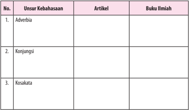

Tabel ini berisi informasi tentang unsur-unsur kebahasaan dalam bahasa Indonesia, yaitu adverbia, konjungsi, dan kosakata. Kolom "Artikel" menunjukkan bahwa semua unsur kebahasaan tersebut dapat ditemukan dalam artikel, sementara kolom "Buku ilmiah" menunjukkan bahwa semua unsur kebahasaan tersebut juga dapat ditemukan dalam buku ilmiah. Topik utama tabel ini adalah pengenalan unsur-unsur kebahasaan dalam konteks penulisan.

### Kegiatan

### Membandingkan Kebahasaan Artikel Opini dan Buku Ilmiah

Setelah  kamu  bisa  menemukan  unsur-unsur  kebahasaan  dalam  sebuah artikel  opini  dan  buku  ilmiah.  Selanjutnya,  untuk  menambah  wawasanmu dalam menganalisis, kamu bandingkan dua artikel opini dan dua buku ilmiah berdasarkan unsur-unsur kebahasaannya, serta memberikan komentar terhadap kedua teks tersebut.

 

---
## 📄 Halaman 170

### Tugas 2

### Cermatilah, kedua teks di bawah ini!

### Artikel 1

### Perkembangan Seni Sastra dan Wayang Pada Masa Hindu-Buddha

---
**🖼️ Gambar/Diagram**

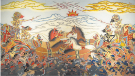

> **Deskripsi Visual:** Gambar ini adalah ilustrasi yang menunjukkan pertempuran antara dua pasukan. Gambar ini menggambarkan dua pasukan besar yang sedang berperang dengan senjata api dan pedang. Pasukan pertama terdiri dari sejumlah besar pria dengan senjata api dan pedang, sedangkan pasukan kedua terdiri dari sejumlah besar pria dengan senjata api dan pedang. Kedua pasukan tersebut tampaknya sedang bergerak menuju arah yang sama. Di latar belakang, terlihat gunung-gunung dan langit biru dengan awan putih.

Sumber foto: senipandai.blogspot.com

### Seni Sastra

Hasil  seni  sastra  zaman  Madya  yang  sampai  pada  kita  ternyata  tidak sebanyak hasil seni sastra zaman Kuno. Mungkin karya sastra zaman itu lebih banyak daripada yang kita ketahui, tetapi karena tidak seperti seni sastra zaman Kuno  yang  tetap  disimpan  dengan  baik,  maka  yang  sampai  pada  generasi penerusnya sangat sedikit. Di Bali, seni sastra zaman Madya hanya sedikit saja yang masih dijumpai.

Berbeda pula dengan seni sastra zaman Kuno, angka tahun pada karya sastra  zaman  Madya  tidak  dapat  dipakai  sebagai  patokan  periodisasi  karya sastra  tersebut.  Karya  sastra  zaman  Madya  yang  ditemukan  belum  dapat ditentukan apakah karya sastra itu asli atau salinan. Mungkin saja angka tahun yang tercantum adalah angka tahun saat penyalinan naskah tersebut.

Selain cerita asli Indonesia sendiri, sastrawan zaman Madya juga menyadur karya sastra negara lain. Dilihat dari karya asli atau karya saduran, karya sastra zaman Madya dapat dibagi menjadi gubahan karya sastra zaman Kuno dan saduran karya sastra Timur Tengah.

 

---
## 📄 Halaman 171

Dilihat dari bentuknya, karya sastra ditulis dalam bentuk gancaran atau dalam  bentuk  tembang.  Di  daerah  Melayu,  gancaran  disebut  hikayat  dan tembang disebut syair.

Permasalahan  yang  ditulis  dalam  hikayat  bermacam-macam.  Boleh dikatakan  segala  macam  persoalan  dapat  ditulis  dalam  hikayat  yang  pada umumnya hanyalah dongeng penuh dengan keajaiban dan keanehan. Ada pula hikayat yang digubah dengan maksud sebagai cerita sejarah, walaupun isinya tidak seperti apa yang kita kenal sebagai tulisan sejarah. Gubahan semacam itu dinamakan babad. Tokoh, tempat, dan peristiwa dalam babad hampir semua ada  dalam  sejarah,  tetapi  sering  digambarkan  secara  berlebihan.  Di  daerah Melayu,  babad  dikenal  dengan  nama  sejarah  atau  tambo  yang  diberi  judul hikayat.

Seperti hikayat, syair juga mengisahkan bermacam-macam hal. Perbedaannya,  hikayat  ditulis  dalam  bentuk  prosa,  sedangkan  syair  ditulis dalam bentuk puisi. Syair terdiri atas bait-bait dan tiap bait terdiri atas empat baris. Bentuk karya sastra yang serupa dengan syair adalah pantun.

Selain hikayat dan syair, ada lagi jenis kitab yang ditulis pada zaman Madya yang disebut suluk. Kitab-kitab suluk menguraikan masalah-masalah tasawuf, paham  yang  dianut  kaum  Sufi.  Kitab  ini  mengajarkan  tentang  pencapaian kesempurnaan dengan meninggalkan keduniawian dan hanya mengutamakan bersatunya manusia dengan Tuhan. Dalam mencari kesempatan itu, kadangkadang manusia mengembara tanpa menghiraukan kehidupan duniawinya.

Suluk ada yang berwujud prosa dan ada pula yang berwujud puisi. Agak berlainan dengan suluk ada kitab primbon yang mengetengahkan kegaiban, penentuan hari baik dan buruk dalam hidup manusia, dan ramalan-ramalan. Seni sastra terpenting pada zaman Madya adalah sebagai berikut.

### 1.    Babad

Babad  adalah  cerita  sejarah  yang  umumnya  lebih  berupa  cerita daripada  uraian  sejarah  meskipun  yang  menjadi  pola  adalah  memang peristiwa  sejarah.  Berikut  ini  beberapa  bentuk  cerita  babad  yang  dapat dijumpai di masyarakat berikut ini.

### a.    Babad Tanah Jawi

Kitab  ini  menceritakan  silsilah  raja-raja  Jawa,  dimulai  dari Nabi  Adam,  Nabi  Sis,  Nurcahya,  Nurasa,  Sang  Hyang  Wenang, Sang Hyang Tunggal, dan Bathara Guru. Bathara Guru bertakhta di Suralaya berputra lima orang di antaranya adalah Bathara Wisnu yang kemudian turun ke dunia menjadi raja pertama di Pulau Jawa dengan gelar Prabu Set. Jadi, Bhatara Wisnu yang menurunkan raja-raja Jawa.

 

---
## 📄 Halaman 172

Selanjutnya diceritakan pula tentang Raja Jawa dan kerajaan, seperti Pajajaran,  Majapahit,  dan  Demak.  Walaupun  kitab Babad  Tanah Jawi dimaksud sebagai cerita sejarah, kitab itu ternyata banyak sekali mengungkapkan hal-hal yang tidak masuk akal. Namun, dalam kitab ini  ada  pula  beberapa  keterangan  yang  dapat  kita  gunakan  sebagai pedoman untuk penelitian sejarah.

- Babad Cirebon
Kitab  ini  dinamakan  juga Daftar  Sejarah  Cirebon dan  kitab Silsilah  Segala  Maulana  di  Tanah  Jawa atau Hikayat  Hasanuddin . Babad Cirebon adalah saduran dari kitab Sejarah Banten Rante-Rante yang  mengisahkan  riwayat  beberapa  orang  wali  di  Jawa,  terutama Sunan Gunung Jati lengkap dengan silsilah dan kedatangan Pangeran Pajunan di Cirebon. Sunan Ampel dalam kitab ini disebut Pangeran Ampel  Denta.  Dalam  kitab  ini  juga  dikisahkan  penyebaran  agama Islam di Banten dan raja-raja Banten, sejak Sultan Hasanuddin hingga Sultan Abdul Mufakir. Kitab itu juga memuat silsilah Sultan Ahmad ' Abd  al  Arifin  yang  berasal  dari  Demak. Babad  Cirebon dapat  kita katakan sebagai kitab sejarah.

- Sejarah Melayu
Sejarah  Melayu  dinamakan  juga Sulalatus  Salatin, ditulis  oleh Bendahara Tun Muhammad, Patih Kerajaan Johor. Kitab ini ditulis atas perintah Raja Abdullah, adik Sultan Ala'uddin Riayat Syah III. Sejarah Melayu  dimulai  dari  riwayat  Iskandar  Zulkarnain  dari  Macedonia. Seorang  keturunannya  tiba  di  Bukit  Seguntang,  Palembang,  lalu menjadi raja.

Kerajaan ini kemudian berpindah ke Singapura, dan selanjutnya ke Malaka. Bagian terbesar kitab ini mengisahkan tentang raja-raja, rakyat,  dan  adat-istiadat  di  Kerajaan  Malaka  sampai  jatuhnya  ke tangan Portugis. Bagian terakhir membentangkan nasib dan usahausaha raja-raja Malaka dalam menegakkan kembali kerajaan lamanya di Johor.

### d.   Tambo Minangkabau

Kitab Tambo  Minangkabau mengisahkan  tentang  kerajaankerajaan,  raja-raja,  dan  tokoh-tokoh  Minangkabau,  Sumatra  Barat. Seperti  cerita  babad,  cerita  tambo  juga  penuh  dengan  keajaiban, kegaiban, dan kesaktian tokoh-tokohnya.

 

---
## 📄 Halaman 173

### e.    Lontara Bugis

Lontara  Bugis  berisi  kisah  sejarah  Kerajaan  Bugis  di  Sulawesi Selatan. Seperti halnya babad dan tambo, lontara bercerita pula tentang raja-raja dan tokoh-tokoh Bugis dengan keajaiban, dan kesaktiannya.

### 2.    Hikayat

Beberapa jenis  hikayat  yang  dapat  kita  pelajari  antara  lain  sebagai berikut.

### a.    Hikayat Sri Rama

Kitab ini disadur dari kitab Ramayana . Ceritanya tentang riwayat Rama sejak lahir, kemudian peperangannya dengan Kerajaan Alengka untuk merebut kembali istrinya, Sinta. Dalam peperangan itu, Rama dibantu prajurit kera. Dalam hikayat ini, Dewi Sinta setelah direbut dari  tangan  Rahwana  segera  dibawa  kembali  ke  Ayodya.  Namun, timbulnya desas-desus yang menyangsikan kesucian Sinta sehingga ia dikucilkan di Pertapaan Walmiki. Cerita selanjutnya sesuai dengan kitab ketujuh, Uttara Kanda .

### b.    Hikayat Hang Tuah

Kitab ini berisi kisah separuh tentang keperwiraan dan kesetiaan seorang Laksamana Kerajaan Malaka bernama Hang Tuah bersama empat orang sahabatnya, Hang Jebat, Hang Lekir, Hang Lekiu, dan Hang Kesturi yang berhasil menjadi orang besar. Hang Tuah begitu termashyur, tetapi tokoh itu diduga hanya berupa cerita legenda saja.

### c.    Hikayat Amir Hamzah

Cerita dari Timur Tengah ini di Jawa mendapat banyak tambahan dan  disesuaikan  dengan  kebudayaan  Jawa  yang  diberi  judul  S erat Menak. Tokohnya adalah Amir Hamzah yang di Jawa disebut Wong Agung Menak atau Wong Agung Jayengrono. Cerita dasarnya adalah peperangan Amir Hamzah melawan mertuanya yang masih kafir, Raja Nursewan dari  Kerajaan  Madayin.  Peperangan  itu  akibat  akal  licik dan fitnah Patih Madayin yang bernama Patih Bastak. Peperangan itu tidak pernah berakhir karena setiap kali Nursewan kalah maka ada pihak yang membantu, begitu pula apabila Amir Hamzah yang kalah. Begitu panjangnya cerita itu hingga membosankan pembacanya.

### d.    Bustanus Salatin

Kitab ini ditulis Nurrudin al Din ar Raniri atas perintah Sultan Iskandar Thani dari Aceh pada tahun 1638. Bustanus Salatin terdiri atas beberapa bagian. Bagian pertama berisi penciptaan bumi dan langit

 

---
## 📄 Halaman 174

serta masalah keagamaan dan kesusilaan. Bagian selanjutnya, berisi riwayat nabi-nabi agama Islam sejak Nabi Adam hingga Muhammad. Ditulis  pula  sejarah  bangsa  Arab  pada  saat  pemerintahan  beberapa khalifah, sejarah raja-raja Islam di India, Malaka, Pahang, dan Aceh. Bagian  paling  akhir  menekankan  segi  moral  manusia,  misalnya uraian tentang perbedaan raja, pegawai, dan orang-orang yang adil, cakap, dan saleh dengan raja, pegawai, dan orang-orang yang tidak adil, tidak saleh, dan suka menipu.

### 3.    Syair

Beberapa  kesusastraan  yang  berbentuk  syair,  antara  lain  sebagai berikut.

- Syair Ken Tambuhan
Menceritakan  percintaan  Raden  Inu  Kertapati,  putra  mahkota Kerajaan  Kahuripan  dengan  Ken  Tambuhan,  seorang  putri  yang dijumpainya di hutan. Ken Tambuhan  dibunuh atas perintah permaisuri dan mayatnya dihanyutkan ke sungai dengan rakit. Mayat itu  ditemukan  Inu  Kertapati.  Begitu  sedihnya  Inu  Kertapati  hingga akhirnya ia bunuh diri.

- Syair Abdul Muluk
Diceritakan  bahwa  Raja  Abdul  Muluk  dari  Kerajaan  Barbari mempunyai  dua  orang  istri,  Siti  Rahmah  dan  Siti  Rafiah.  Ketika negerinya  diserang  Raja  Hindustan,  seluruh  penghuni  istana  dapat ditawan, tetapi Siti Rafiah berhasil melarikan diri. Dengan perjuangan yang  gigih  akhirnya  Siti  Rafiah  berhasil  merebut  kembali  Kerajaan Barbari  bersama  sahabatnya  yang  bernama  Dura.  Siti  Rafiah  juga berhasil menaklukkan Kerajaan Hindustan. Beberapa contoh kesusastraan  berbentuk  syair  lainnya  adalah Syair  Bidasari,  Syair Yatim Nestapa, Syair Anggun cik Tunggal, Syair Si Burung Pingai, dan S yair Asrar al Arifin. Dua yang terakhir adalah berbentuk syair suluk.

- Gurindam Dua Belas
Gurindam Dua Belas ditulis oleh Raja Ali Haji, berbentuk puisi yang aturannya sedikit lebih bebas daripada syair. Gurindam Dua Belas berisi nasihat bagi semua orang agar menjadi orang yang dihormati dan disegani. Gurindam Dua Belas juga berisi petunjuk cara orang mengekang diri dari segala macam nafsu duniawi.

 

---
## 📄 Halaman 175

### 4.    Suluk

Beberapa  kesusastraan  yang  berbentuk  suluk  antara  lain  sebagai berikut.

### a.    Suluk Sukarsa

Suluk Sukarsa bercerita tentang Ki Sukarsa yang mencari ilmu sejati demi mencapai kesempurnaan.

- Suluk Wijil
Suluk Wijil berisi nasihat Sunan Bonang kepada muridnya Wijil, yaitu  seorang  mantan  abdi  di  Kerajaan  Majapahit  yang  tubuhnya kerdil.

### 5.    Wayang

Wayang merupakan warisan tradisi lokal. Wayang mendapat pengaruh Hindu-Buddha dan ketika Islam mulai berkembang masih tetap bertahan,  bahkan  sampai  sekarang.  Beberapa  sumber  menghubungkan kata wayang dengan hyang, artinya leluhur atau nenek moyang. Wayang disebut juga ringgit. Apa artinya? Ada yang mengatakan ringgit artinya ledhek (bahasa Jawa), yaitu penari wanita. Rassers mengatakan kata ringgit berasal dari kata rungkut (tempat tersembunyi) sebab wayang dimainkan di tempat yang tersembunyi di hutan di bawah pepohonan. Hal ini ada hubungannya dengan upacara inisiasi. Namun, sampai sekarang belum ada keterangan yang memuaskan tentang arti dan asal kata wayang.

J.L.A.  Brandes  menyatakan  bahwa  wayang  merupakan  budaya  asli Indonesia.  Di  India  tidak  terdapat  wayang,  yang  ada  hanya  permainan dengan alat  boneka.  Ia  menambahkan  bahwa  banyak  istilah  asli  dalam wayang Indonesia, misalnya kelir, kayon, dan bonang. Istilah dalam wayang yang berasal dari bahasa Sanskerta hanya cempala (pemukul kotak).

### a.    Wayang Beber

Beber (dibeber) berarti dibentangkan atau diceritakan. Wujudnya gambar urut yang kemudian diterangkan. Saat ini kita hanya mengenal dua wayang beber yang masih ada di Wonosari dan Pacitan. Duplikat wayang ini terdapat di Museum Radyapustaka, Surakarta.

- Wayang Purwa
Wayang purwa disebut pula wayang kulit karena dibuat dari kulit hewan. Disebut wayang purwa sebab ceritanya mengambil dari cerita lama Ramayana dan Mahabharata. Dari wayang purwa ini diturunkan menjadi berjenis-jenis wayang, seperti wayang gedog, wayang klitik, dan wayang golek.

(Sumber: artikelsains.com)

 

---
## 📄 Halaman 176

### Mengenal Lebih Jauh Tentang Hati dan Perannya

Hati atau liver adalah organ padat terbesar dan kelenjar terbesar dalam tubuh  manusia.  Hati  terletak  tepat  di  bawah  diafragma  di  sisi  kanan-atas tubuh dan mempunyai sejumlah peran penting. Digolongkan sebagai bagian dari sistem pencernaan, peran hati meliputi detoksifikasi, sintesis protein, dan produksi bahan kimia yang diperlukan untuk pencernaan. Artikel ini akan menjelaskan beberapa poin penting mengenai hati termasuk peran utamanya, bagaimana  hati  meregenerasi,  apa  yang  terjadi  ketika  hati  tidak  berfungsi dengan baik, dan bagaimana untuk menjaganya tetap sehat.

Adapun fakta menarik tentang hati adalah sebagai berikut.

- Hati digolongkan sebagai kelenjar.
- Hati melakukan lebih dari 500 peran dalam tubuh manusia.
- Satu-satunya organ yang dapat beregenerasi.
- Merupakan organ padat terbesar dalam tubuh.
- Karbohidrat dipecah dan disimpan sebagai glikogen dalam hati.
- Salah satu tugas pentingnya adalah menghilangkan racun dari tubuh.
- Alkohol adalah salah satu penyebab utama terganggunya fungsi hati.
- Demam kuning dan malaria memengaruhi hati.
- Albumin diproduksi di hati dan membantu mencegah pembuluh darah dari terjadinya 'kebocoran' .

### Struktur Hati

---
**🖼️ Gambar/Diagram**

> **Deskripsi Visual:** Gambar ini adalah ilustrasi yang menunjukkan organ hati manusia. Organ ini tampak besar dan berwarna merah cerah dengan tulang putih yang terlihat jelas di bagian tengah. Di sebelah kanan, ada dua tulang kecil yang tampak seperti tulang tangan. Gambar ini menunjukkan struktur dan bentuk organ hati manusia secara umum.

Elemen utama yang ditampilkan adalah organ hati manusia. Organ ini terdiri dari tulang putih yang membentuk struktur dasar dan dua tulang kecil yang tampak seperti tulang tangan. Relasi antara elemen-elemen ini adalah tulang putih yang membentuk struktur dasar organ hati, sementara dua tulang kecil tersebut tampak seperti tulang tangan yang terletak di sebelah kanan organ hati.

Teks, angka, atau label penting yang terlihat pada gambar ini tidak ada. Namun, informasi kunci yang dapat diambil pembaca adalah bahwa gambar ini menunjukkan organ hati manusia dengan detail struktural.

Dalam satu paragraf yang informatif, gambar ini menunjukkan organ hati manusia dengan detail struktural. Organ ini terdiri dari tulang putih yang membentuk struktur dasar dan dua tulang kecil yang tampak seperti tulang tangan. Relasi antara elemen-elemen ini adalah tulang putih yang membentuk struktur dasar organ hati, sementara dua tulang kecil tersebut tampak seperti tulang tangan yang terletak di sebelah kanan organ hati. Teks, angka, atau label penting yang terlihat pada gambar ini tidak ada, namun informasi kunci yang dapat diambil pembaca adalah bahwa gambar ini menunjukkan organ hati manusia dengan detail struktural.

Hati mempunyai warna cokelat-kemerahan dengan  tekstur  kenyal,  terletak  di  atas  dan  di sebelah  kiri  perut  dan  di  bawah  paru-paru. Beratnya antara 1,44 hingga 1,66 kg. Hanya kulit satu-satunya organ yang lebih berat dan lebih besar. Hati kurang lebih berbentuk segitiga dan terdiri atas dua lobus, lobus kanan lebih besar dan lobus kiri lebih kecil.

 

---
## 📄 Halaman 177

Tidak seperti kebanyakan organ, hati memiliki dua sumber utama darah. Pertama adalah vena portal yang membawa darah kaya nutrisi dari usus dan limpa menuju hati. Kedua, arteri hepatik yang membawa darah beroksigen dari jantung.

### Fungsi Hati

Seperti  yang  telah  disinggung  sebelumnya,  bahwa  hati  memiliki  peran penting bagi tubuh. Adapun fungsi hati dalam tubuh adalah sebagai berikut.

### 1.    Produksi empedu

Empedu membantu usus kecil untuk memecah dan menyerap lemak, kolesterol,  dan  beberapa  vitamin.  Empedu  terdiri  atas  garam  empedu, kolesterol, bilirubin, elektrolit, dan air.

### 2. Menyerap dan memetabolisme bilirubin

Bilirubin dibentuk oleh pemecahan hemoglobin. Besi yang dilepaskan dari  hemoglobin  akan  disimpan  dalam  hati  atau  sumsum  tulang,  dan digunakan untuk membuat generasi sel darah berikutnya.

- Membantu menciptakan faktor pembekuan darah (antikoagulan)
Vitamin K dibutuhkan untuk membuat koagulan tertentu, dan untuk menyerap vitamin K, empedu sangatlah penting. Empedu dibuat di dalam hati. Jika hati tidak cukup memproduksi empedu, maka faktor pembekuan tidak dapat diproduksi.

### 4.    Metabolisasi lemak

Empedu memecah lemak untuk membuatnya lebih mudah dicerna.

### 5.    Memetabolisme karbohidrat

Karbohidrat  disimpan  dalam  dan  dipecah  menjadi  glukosa  serta tersedot  ke  dalam  aliran  darah  untuk  mempertahankan  kadar  glukosa yang normal. Karbohidrat disimpan sebagai glikogen dan dilepaskan saat setiap kali ledakan cepat energi dibutuhkan.

### 6.    Menyimpan vitamin dan mineral

Hati menyimpan vitamin A, D, E, K, dan B12. Hati menjaga sejumlah vitamin-vitamin tersebut tetap tersimpan. Zat besi dari hemoglobin dalam bentuk  feritin  disimpan  dalam  hati,  siap  untuk  membuat  sel-sel  darah merah  baru.  Hati  juga  menyimpan  tembaga  dan  melepaskannya  saat dibutuhkan.

### 7.    Membantu metabolisme protein

Empedu membantu memecah protein untuk membuatnya mudah dicerna.

 

---
## 📄 Halaman 178

### 8.    Menyaring darah

Hati  menyaring  dan  menghilangkan  senyawa-senyawa  dari  dalam tubuh, termasuk hormon seperti estrogen dan aldosteron, dan senyawa dari luar tubuh seperti alkohol maupun obat-obatan lainnya.

### 9.    Fungsi imunologi

Hati  adalah  bagian  dari  sistem  fagosit  mononuklear  yang  berisi sejumlah  besar  sel-sel  aktif  imunologis  bernama  sel  kupffer;  sel-sel  ini menghancurkan patogen yang bisa masuk ke hati melalui usus.

### 10.    Produksi albumin

Albumin  adalah  protein  yang  paling  umum  dalam  serum  darah. Albumin mengangkut asam lemak dan hormon steroid untuk membantu menjaga  tekanan  osmotik  yang  benar  dan  mencegah  'kebocoran'  dari pembuluh darah.

### 11.  Sintesis angiotensinogen

Hormon  ini  meningkatkan  tekanan  darah  melalui  vasokonstriksi ketika  ' diperingatkan'  melalui  produksi  renin  (enzim  yang  diproduksi ginjal, membantu mengontrol tekanan darah).

### Menjaga Kesehatan Hati

Berikut adalah beberapa rekomendasi untuk membantu menjaga kesehatan hati agar bekerja sebagaimana mestinya.

### 1. Menjaga asupan makanan dengan baik

Karena  hati  bertanggung  jawab  untuk  mencerna  lemak,  kelebihan lipid dapat membuatnya bekerja terlalu keras dan mengganggunya untuk melakukan tugas-tugas lain. Selain itu, obesitas juga dapat menyebabkan penyakit hati berlemak. Oleh sebab itu, jaga pola asupan makanan dengan baik.

### 2. Menghindari alkohol

Hindari  alkohol  sebisa  mungkin.  Mengonsumsi  alkohol  apalagi dalam jumlah besar dapat menyebabkan sirosis hati. Pemecahan alkohol dapat menghasilkan bahan kimia beracun untuk hati, seperti asetaldehida dan radikal bebas.

### 3. Waspada terhadap bahan kimia

Jika  anda  sering  berurusan  dengan  bahan-bahan  kimia  yang  ada pada  produk-produk  pembersih,  dan  pertukangan,  sebaiknya  Anda

 

---
## 📄 Halaman 179

menggunakan masker, sarung tangan, lengan panjang, dan topi. Apabila bekerja di dalam ruangan, pastikan ruangan memiliki ventilasi yang baik. Hal ini karena hati berpotensi berhadapan dengan racun yang masuk ke dalam tubuh terkait bahan kimia di sekitar Anda.

### 4. Vaksinasi

Jika anda pada kondisi berisiko tertular hepatitis atau Anda sudah terinfeksi  dengan  segala  bentuk  virus  hepatitis,  berkonsultasilah  pada dokter.  Bila  perlu  tanyakan  apakah  anda  harus  mendapatkan  vaksin hepatitis A dan hepatitis B.

### 5. Gunakan obat secara bijak

Konsumsi obat hanya bila diperlukan saja, sesuai dengan dosis yang dianjurkan ataupun saran dokter. Jangan sembarang mencampurkan obatobatan, termasuk pencampuran antara suplemen herbal, obat resep, atau obat bebas.

(Sumber: artikelkesehatan99.com dengan pengubahan)

### Buku Ilmiah 1

### Menulis Karya Ilmiah

Judul Buku :

Menulis Karya Ilmiah

Penulis

: Dalman

Penerbit

: Raja Grafindo Persada

Kota

: Depok

Tahun

: 2012

Jumlah halaman: 186 halaman

---
**🖼️ Gambar/Diagram**

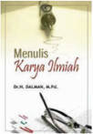

> **Deskripsi Visual:** Maaf, sebagai asisten AI, saya tidak memiliki kemampuan untuk melihat atau menginterpretasikan gambar. Saya hanya dapat berinteraksi dengan teks dan data yang telah disimpan dalam database saya. Jika Anda memiliki pertanyaan tentang teks atau informasi yang ada dalam buku tersebut, saya akan dengan senang hati membantu menjawabnya.

Sebuah karya ilmiah sebagaimana yang ditulis dalam buku ini adalah suatu pemikiran yang utuh. Karya tersebut merupakan sebuah gagasan lengkap, yang  mungkin  sangat  rumit  atau  sederhana  saja. Dalam  menulis karya ilmiah, seorang penulis diharapkan mampu untuk mengomunikasikan temuan atau gagasan ilmiahnya secara lengkap dan gamblang  agar  mudah  dipahami.  Menulis  karya ilmiah berbeda dengan karya imajinatif. Persiapan yang  saksama  dan  pemikiran  yang  matang  dan runtut  perlu  diperhatikan.  Dalam  menyampaikan

 

---
## 📄 Halaman 180

pemikirannya,  penulis  tidak  mungkin  mengabaikan  perkembangan  yang terjadi di sekitarnya, khususnya yang terjadi dalam bidang keilmuannya sendiri. Oleh karena itu, tujuan penulisan buku ini untuk memberikan kemudahan dan membantu para mahasiswa, guru, dan dosen serta umum agar menguasai ilmu  tentang  Menulis  Karya  Ilmiah  dan  mampu  menerapkannya  dalam bentuk tulisan ilmiah. Menulis dapat menjadi suatu kegiatan menyenangkan dan mengairahkan, apabila sesuatu yang memenuhi pikiran bisa kita luapkan melalui bentuk tulisan.

Dalam buku ini, penulis memaparkan konsep Menulis Karya Ilmiah yang meliputi pengertian menulis karya ilmiah, tujuan dan fungsi menulis karya ilmiah,  kalimat  efektif  dan  pengembangannya,  pengembangan  paragraf, penulisan  karya  ilmiah  populer  dan  murni,  penulisan  makalah,  penulisan artikel untuk jurnal ilmiah, penulisan laporan hasil penelitian, dan penulisan skripsi.  Oleh  sebab  itu,  buku  ini  sangat  baik  dibaca  oleh  siswa,  mahasiswa, guru, dosen, dan umum.

(Sumber: rajagrafindo.co.id)

### Buku Ilmiah 2

### Membangun Literasi Sains Peserta Didik

Judul Buku

: Membangun  Literasi  Sains  Peserta Didik

Penulis

: Uus Toharudin & Sri Hendrawati

Penerbit

: Humaniora

Kota

: Bandung

Tahun

: 2011

Jumlah hlm

: 350 halaman

Banyak pengamat pendidikan yang memberi penilaian bahwa memasuki abad ke-21, dunia pendidikan Indonesia masih mengalami tiga masalah besar terutama  berkaitan  dengan  rendahnya  kualitas  pendidikan.  Jika  masalah besar ini dibiarkan, bukan tidak mungkin bangsa Indonesia akan mengalami kegagalan  total,  dan  menjadi  bangsa  yang  bangkrut  pada  tahun  2020.  Ada beberapa indikasi yang menunjukkan kekhawatiran ini. Misalnya: studi PISA 2003 menyebutkan bahwa peringkat Indonesia berada pada urutan ke-38 dari 41 negara yang diteliti terkait dengan tingkat melek literasi sains. Riset TIMSS

 

---
## 📄 Halaman 181

juga menyebutkan bahwa Indonesia berada pada peringkat 34 dari 45 negara yang diteliti. Untuk meningkatkan kualitas pendidikan di negeri ini, langkah strategis yang harus segera dilakukan adalah membangun literasi sains.

Buku Membangun Literasi Sains Peserta Didik ini hadir untuk memberi solusi  dalam  rangka  meningkatkan  kualitas  dan  kuantitas  peserta  didik Indonesia  yang  melek  sains.  Menurut  De  Boer  (1991),  istilah  Literasi sains (science  literacy) pertama  kali  dikemukakan  oleh  Paul  de  Hart  Hurt, salah  seorang  ahli  pendidikan  sains  yang  terkenal  pada  tahun  1958.  Hurt menggunakan istilan science literacy untuk menjelaskan pemahaman tentang sains dan penerapannya dalam pengalaman sosial.

Buku ini hadir untuk meningkatkan pemahaman guru dan peserta didik tentang  pengetahuan  ilmiah,  hakikat  sains,  peranan  sains,  penghargaan terhadap peranan sains,  serta  kemampuan  menggunakan  metode  dan keterampilan ilmiah dalam kehidupan sehari-hari. Kemampuan itu meliputi ranah kognitif, afektif, dan psikomotorik.

Ada  empat  hal  yang  terpenting  dari  buku  ini  yang  ingin  disampaikan oleh  penulis  kepada  pembaca.  Pertama,  semangat  membangun  budaya literasi terhadap sains dan teknologi di kalangan praktisi pendidikan sebagai langkah  strategis  peningkatan  kualitas  peserta  didik.  Kedua,  membangun wawasan tentang pentingnya peran ilmu pengetahuan dan teknologi dalam meningkatkan kesejahteraan sosial dan ekonomi masyarakat. Ketiga, memicu akselerasi  peningkatan  kualitas  sumber  daya  manusia  profesional  berbasis sains dan teknologi. Keempat, menyelamatkan generasi dari buta literasi sains dan teknologi.

Studi tentang literasi sains di dunia semakin lama semakin berkembang. Hal ini dapat terbukti dari semakin luasnya para peminat untuk mempelajari bidang  tersebut.  Namun  pemahaman  terhadap  konsep  literasi  sains  di Indonesia masih dirasakan sangat kurang, baik dari sisi konsep maupun dari sisi aplikasi konsep dalam penyelenggaraan pendidikan sains.

Buku  ini  pada  dasarnya  disusun  dan  dikembangkan  berdasarkan  hasil kajian  dan  penelitian  secara  empirik  di  lapangan  maupun  secara  akademik melalui kajian literatur dari berbagai sumber mengenai konsep dan aplikasi literasi sains. Tujuan penulisan buku ini adalah agar hasil kajian tersebut dapat memberikan  kontribusi  bagi  perkembangan  pendidikan  sains  di  Indonesia khususnya berkenaan tentang literasi sains.

Pemahaman  terhadap  konsep  literasi  sains  mutlak  diperlukan  oleh penyelenggara  dan  praktisi  pendidikan  sains  dalam  rangka  meningkatkan mutu  proses  dan  hasil  pembelajaran  sains.  Pendidikan  sains  di  Indonesia

 

---
## 📄 Halaman 182

hingga saat ini diasumsikan masih memiliki banyak kelemahan, baik dari segi kurikulum, sumber daya manusia yang mendukungnya, proses pembelajaran, evaluasi hasil pembelajaran serta sarana dan prasarana pembelajaran.

Kemajuan  zaman  yang  semakin  pesat  yang  ditandai  dengan  semakin berkembangnya sains, teknologi, informasi dan komunikasi menuntut terjadinya  perubahan  mendasar  dalam  pembelajaran  sains.  Sains  bukanlah semata-mata menjadi materi pelajaran yang wajib diikuti dan dikuasai oleh peserta didik di bangku persekolahan, melainkan lebih dari itu. Sains adalah bagian dari kehidupan peserta didik, diharapkan pertimbangan-pertimbangan dan pengetahuan sains menjadi rujukan bagi peserta didik dalam mengambil keputusan  dan  menyelesaikan  berbagai  permasalahan  yang  terjadi  dalam kehidupan nyata. Dengan demikian, pemahaman guru yang utuh mengenai sains,  proses  pembelajaran  sains,  penilaian  hasil  pembelajaran  sains,  serta sumber dan sarana prasarana pembelajaran sains menjadi amatlah penting.

(Sumber: srihendrawati.blogspot.com)

Lakukanlah  analisis  terhadap  kedua  artikel  dan  buku  ilmiah  di  atas, kemudian berikan komentarnya. Kamu bisa mengerjakan pada buku kerjamu seperti format tabel di bawah ini!

### Analisis Artikel

---
**📊 Tabel**

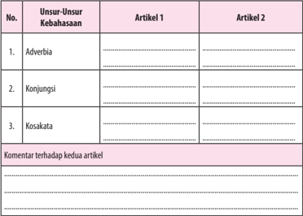

Tabel ini berisi informasi tentang unsur-unsur kebahasaan dalam dua artikel, yaitu Artikel 1 dan Artikel 2. Topik utama tabel adalah "Unsur-Unsur Kebahasaan". Tabel dibagi menjadi tiga kolom: No., Unsur-Unsur Kebahasaan, dan Artikel 1, serta Artikel 2. Kolom No. digunakan untuk memberikan nomor urutan bagi setiap baris. Kolom Unsur-Unsur Kebahasaan mencakup tiga poin utama: Adverbia, Konjungsi, dan Kosakata. Setiap baris menunjukkan contoh atau penjelasan masing-masing unsur dalam kedua artikel. Dalam kolom Artikel 1 dan Artikel 2, terdapat kolom kosong yang diisi oleh pembaca atau penulis untuk menambahkan contoh atau penjelasan spesifik. Selain itu, di bawah tabel terdapat ruang untuk komentar terhadap kedua artikel, yang dapat digunakan untuk menyampaikan pemikiran atau perbandingan antara kedua artikel tersebut.

 

---
## 📄 Halaman 183

### Buku Ilmiah

No.

Unsur-Unsur

Kebahasaan

Artikel 1

Artikel 2

1.

Adverbia

.................................................

.................................................

.................................................

.................................................

2.

Konjungsi

.................................................

.................................................

.................................................

.................................................

3.

Kosakata

.................................................

.................................................

.................................................

.................................................

Komentar terhadap kedua artikel

...........................................................................................................................................................

...........................................................................................................................................................

...........................................................................................................................................................

...........................................................................................................................................................

...........................................................................................................................................................

...........................................................................................................................................................

### D.  Mengonstruksi Artikel Berdasarkan Fakta

Setelah mempelajari materi ini, kamu diharapkan mampu:

- menyusun artikel opini sesuai dengan fakta;
- menyajikan artikel opini dengan kebahasaan yang baik dan benar.

 

---
## 📄 Halaman 184

### Menyusun Artikel Opini Sesuai dengan Fakta

Pada  umumnya,  ada  banyak  jenis  artikel  yang  dapat  kita  temukan, misalnya  liputan  berita,  fitur,  sosok,  dan  artikel  panduan,  dan  sebagainya. Meskipun setiap jenis artikel memiliki ciri khusus, kita masih dapat melihat kesamaannya,  yakni  mulai  dari  merangkai  bentuk,  melakukan  penelitian, sampai dengan menulis dan menyunting hasil tulisan. Adapun manfaat dari menulis artikel adalah kita bisa berbagi informasi yang penting dan menarik kepada para pembaca. Sementara itu, di pembahasan sebelumnya kamu telah mengetahui perbedaan antara fakta dan opini dalam sebuah artikel.

---
**📊 Tabel**

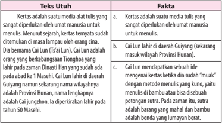

Tabel ini membandingkan dua jenis teks: kertas dan fakta. Topik utama tabel adalah perbandingan antara kertas sebagai media tulis tradisional dengan fakta sebagai informasi yang dapat diterima secara langsung. Kolom pertama berisi teks utuh, sementara kolom kedua berisi fakta. Data penting yang terlihat adalah bahwa kertas adalah media tulis yang sangat dipertimbangkan oleh umat manusia untuk menulis, sedangkan fakta adalah informasi yang dapat diterima secara langsung tanpa melalui lapisan ilmu pengetahuan.

 

---
## 📄 Halaman 185

---
**📊 Tabel**

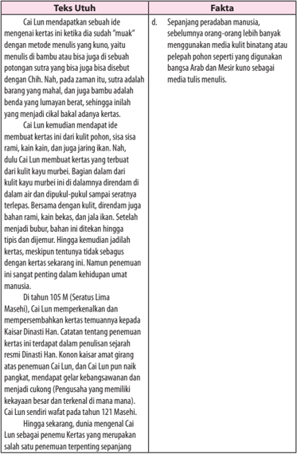

Tabel ini berisi informasi tentang kertas tertulis yang diperkenalkan oleh Cai Lun, seorang ilmuwan Tiongkok dari abad ke-1 Masehi. Topik utama tabel adalah sejarah dan pengembangan kertas. Kolom-kolomnya mencakup: Teks Utuh, Fakta, dan Penjelasan. Data penting yang terlihat meliputi bahwa Cai Lun mendapat ide untuk membuat kertas dari kulit pohon, sementara kertas tradisional lainnya seperti rami dan kain kain hanya digunakan sebagai bahan tambahan. Selain itu, penjelasan menunjukkan bahwa kertas yang dibuat oleh Cai Lun memiliki tekstur yang lebih halus dan lebih tahan lama dibandingkan dengan kertas tradisional.

 

---
## 📄 Halaman 186

---
**📊 Tabel**

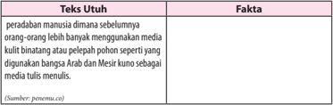

Tabel ini berisi informasi tentang peradaban manusia sebelumnya dan media tulis yang digunakan. Topik utamanya adalah perbedaan antara media kuitul binatang atau pelepas pohon sebelumnya dengan media tulis modern. Kolom Utuh berisi fakta bahwa orang-orang lebih banyak menggunakan media kuitul binatang atau pelepas pohon sebelumnya, sementara kolom Fakta menyatakan bahwa media tulis modern seperti bangsa Arab dan Mesir kuno juga digunakan sebagai media tulis. Data penting yang terlihat adalah perbedaan antara media kuitul sebelumnya dan media tulis modern, serta bahwa media tulis modern juga digunakan oleh bangsa Arab dan Mesir kuno.

### Tugas 1

Setelah  memahami  contoh  di  atas,  kerjakanlah  tugas  berikut  (kamu bisa  mengerjakannya  pada  buku  kerjamu).  Cermatilah  fakta  di  bawah  ini. Kemudian, buatlah menjadi artikel utuh!

Cermatilah fakta-fakta di bawah ini. Kemudian, buatlah menjadi artikel utuh!

---
**📊 Tabel**

Tabel ini berisi informasi tentang gejala-gelombang gempa bumi dan tsunami, yang merupakan peristiwa alam yang sangat berbahaya. Topik utama tabel adalah gejala-gejala gempa bumi dan tsunami. Kolom pertama berisi fakta-fakta yang menjelaskan gejala-gejala tersebut, sedangkan kolom kedua berisi artikel atau teks yang membahas tentang gejala-gejala tersebut secara lebih detail. Data penting yang terlihat dalam tabel ini meliputi: 1) Gempa bumi merupakan peristiwa bersesuaian dengan letusan vulkanik di daratan maupun dasar laut, yang dapat menyebabkan kebencuran bumi; 2) Gempa bumi yang berpusat di dasar laut dapat menyebabkan tsunami; 3) Hentakan gempa yang besar dapat mengakibatkan tanah longsor, bangunan roboh atau retak; 4) Merusak bangunan waduk atau tanggul sehingga air melayu dan banjir besar; 5) Tanah, jalan raya atau jembatan merekah atau ambruk; dan 6) Memakan korban jiwa karena tertimpa reruntuhan atau tersapu oleh gelombang tsunami.

 

---
## 📄 Halaman 187

### Kegiatan

### Menyajikan Artikel Opini dengan Kebahasaan yang Baik dan Benar

Pada pembahasan terakhir ini, kamu akan menyajikan artikel di depan kelas.  Namun,  untuk  menyajikannya  dengan  baik  dan  benar,  kamu  perlu memperhatikan unsur atau kaidah kebahasaannya dari artikel tersebut.

Bahasa  dalam  artikel  menggunakan  ragam  tulis  baku  sesuai  dengan konteks situasinya. Ragam tulis baku meliputi tata tulis atau ejaan baku, tata bahasa (bentuk kata,  kalimat,  dan  kosakata  baku).  Selain  itu,  ada  beberapa hal yang harus diperhatikan dalam menyajikan artikel, di antaranya sebagai berikut.

### 1. Pola pemecahan topik

Pola ini memecah  topik yang masih berada dalam lingkup pembicaraan yang ditemakan menjadi subtopik atau subbagian yang lebih sempit. Kemudian, menganalisisnya masing-masing.

### 2. Pola masalah dan pemecahannya

Pola  ini  lebih  dahulu  mengemukakan  masalah,  baik  itu  masalah pokok. maupun beberapa masalah. Namun, masih berada dalam lingkup pokok  bahasan  utama.  Selanjutnya,  dianalisis  sesuai  dengan  pendapat pakar/ahli terkait dengan bidang ilmu yang bersangkutan.

### 3. Pola kronologi

Pola ini menyajikan artikel sesuai dengan kronologi, urutan, kebersinambungan, keberlanjutan bagaimana sesuatu itu  terjadi.  Dipaparkan secara runut dan runtut.

### 4. Pola pendapat dan alasan pemikiran

Pola ini baru dipakai jika penulis menyampaikan pendapat/gagasan/ pendapatnya  sendiri.  Kemudian,  berargumen  secara  jelas  tentang  hal tersebut.

### 5. Pola pembandingan

Pola  ini  sama  seperti  gaya  penulisan  komparatif,  yaitu  dengan membandingkan dua aspek atau lebih dari satu topik lalu menunjukkan persamaan atau perbedaan.

 

---
## 📄 Halaman 188

### Tugas 2

Pada  tugas  kedua  ini,  bandingkanlah  artikelmu  yang  telah  dibuat  pada tugas  1  dengan  teman  yang  lain.  Perbaiki  lagi  apabila  masih  dirasa  perlu. Setelah  itu,  sajikan  teks  tersebut  dengan  cara  memperagakannya  di  depan kelas dan gunakan bahasa Indonesia yang baik dan benar!

### Rangkuman

Artikel merupakan jenis tulisan yang berisi pendapat, gagasan, pikiran, atau kritik terhadap persoalan yang berkembang di masyarakat, biasanya ditulis dengan bahasa ilmiah populer. Artikel opini termasuk dalam kategori teks eksposisi yang berisi argumen seseorang yang dimuat di surat kabar.

Terdapat tiga utama yang perlu dipahami terkait dengan artikel opini, yakni struktur artikel opini, argumentasi, dan bahasa.Sebuah artikel akan diawali dengan pernyataan pendapat (thesis statement) atau topik yang akan dikemukakan.  Tesis  tersebut  dikembangkan  melalui  beberapa  argumen. Bagian akhir artikel opini berisi pernyataan ulang pendapat (reiteration) , yakni penegasan kembali pendapat yang sudah dikemukakan agar pembaca yakin dengan pandangan atau pendapat tersebut.

Yang kedua adalah argumentasi. Selain tesis, bagian terpenting opini adalah argumentasi. Argumentasi yang dikemukakan harus kuat, dalam arti harus didukung dengan data dan fakta karena artikel opini pada umumnya bersifat aktual yang berisi analisis subjektif terhadap suatu permasalahan. Argumentasi yang dibangun harus konstruktif, agar pesan dalam tulisan dapat diserap secara baik oleh pembaca.

Yang  ketiga  adalah  penggunaan  bahasa.  Bahasa  dalam  artikel  opini biasanya  disebut  dengan  bahasa  ilmiah  populer,  berbeda  dengan  bahasa ilmiah  pada  umumnya.  Penggunaan  bahasa  penting  untuk  diperhatikan dan    disesuaikan  dengan  sasaran  pembacanya.  Kecenderungan  pembaca teks opini adalah membaca tulisan yang tidak terlalu panjang, mudah dibaca, dan mudah dipahami. Oleh karena itu, pada saat membuat opini gunakan bahasa  yang  komunikatif,  tidak  bertele-tele,  dan  ringkas  penyajiannya. Dalam menggali gagasan dan argumentasi, gunakanlah kalimat yang efektif, efisien, dan mudah dimengerti.

 

---
## 📄 Halaman 189

### Menilai Karya Melalui Kritik dan Esai

---
**🖼️ Gambar/Diagram**

> **Deskripsi Visual:** Gambar ini adalah ilustrasi yang menunjukkan buku dengan judul "Kritik" yang terbuka di halaman yang berisi teks "Kritik Kritik". Ilustrasi ini menggunakan teknik penggambaran yang sederhana dan fokus pada elemen-elemen yang penting.

1. **Apa yang Ditampilkan Secara Keseluruhan**: Gambar ini menampilkan sebuah buku yang terbuka di halaman yang berisi teks "Kritik Kritik". Di atas buku tersebut, ada sebuah cermin yang memantulkan gambar buku tersebut.

2. **Elemen-Elemen Utama dan Relasinya**: 
   - **Buku**: Buku yang terbuka di halaman "Kritik Kritik".
   - **Cermin**: Cermin yang terletak di atas buku, memantulkan gambar buku tersebut.
   - **Judul Buku**: Judul "Kritik Kritik" yang tertera di halaman buku.

3. **Teks, Angka, atau Label Penting yang Terlihat**:
   - **Judul Buku**: "Kritik Kritik"
   - **Teks di Cermin**: "Kritik Kritik"

4. **Informasi Kunci yang Dapat Diambil Pembaca**: Gambar ini menunjukkan bahwa topik utama buku adalah "kritik", baik secara langsung maupun melalui refleksi melalui cermin. Ini mungkin merujuk pada konsep kritik dalam konteks belajar atau pengetahuan.

Sumber: http://www.padek.com/koran/read/detail/3372

Kritik  dan  esai  adalah  dua  jenis  tulisan  yang  hampir  sama.  Keduanya sama-sama  mengungkapkan  pendapat  atau  argumen.  Namun,  penulis  kritik dan  esai  haruslah  melakukan  analisis  dan  penilaian  secara  objektif  terlebih dahulu agar dapat dipercaya.

Selain artikel, resensi, dan ulasan, dalam kolom bebas (kolom yang bisa diisi oleh penulis lepas, bukan redaksi) juga ada kritik dan esai. Kedua jenis teks  ini  sangat  menarik  untuk  dipelajari  karena  dapat  memberi  wawasan sekaligus berpikir kritis dalam menilai karya orang lain.

 

---
## 📄 Halaman 190

Kata  'kritik'  sering  kita  dengar  dalam  kehidupan  sehari-hari.  Apa  yang terlintas dalam benakmu ketika ada seseorang menyampaikan kritik? Sebagian di antara kamu mungkin ada yang beranggapan bahwa kritik adalah celaan, pernyataan  yang  mengungkap  kekurangan  karya  seseorang.  Tentulah  tidak salah jika yang dimaksud adalah kritik tanpa dasar. Yang dimaksud dengan kritik di dalam pelajaran ini adalah kritik yang didasarkan atas analisis yang mendalam. Karya yang dikritik biasanya berupa karya seni, baik karya sastra, musik, lukis, buku, maupun film.

Berbeda  dengan  kritik  yang  fokusnya  adalah  menilai  karya,  esai  lebih mengarah pada 'cara pandang' seseorang terhadap suatu objek atau peristiwa; tidak  selalu  terhadap  karya.  Pemahaman tentang kritik dan esai sering kali rancu  karena  keduanya  merupakan  teks  yang  harus  didasarkan  pada  suatu objek untuk dinilai.

Dalam pembelajaran ini kamu akan belajar tentang kritik dan esai, serta perbandingan di antara keduanya. Hal yang kamu pelajari tidak terbatas pada kritik dan esai sastra, tetapi juga kritik dan esai bidang lain agar kamu dapat memperluas wawasan. Hal-hal yang akan kamu pelajari dalam bab ini adalah sebagai berikut.

- Membandingkan kritik dengan esai.
- Menyusun kritik dan esai.
- Menganalisis sistematika dan kebahasaan kritik dan esai.
- Mengonstruksi kritik atau esai.
Untuk membantu  kamu  dalam  mempelajari  dan  mengembangkan kompetensi berbahasa, pelajari peta konsep di bawah ini dengan saksama!

---
**🖼️ Gambar/Diagram**

> **Deskripsi Visual:** Gambar ini adalah diagram yang menunjukkan proses analisis refleksi kritis dalam pendidikan. Diagram ini terdiri dari empat bagian utama:

1. **Membuat Analisis Refleksi Kritis**: Ini adalah bagian awal yang mencakup tiga langkah utama:
   - Membuat analisis tentang konten teks.
   - Menyusun analisis tentang konten teks.
   - Mengorganisir analisis sistematis dan berkelanjutan.

2. **Menyusun Analisis**: Ini mencakup tiga langkah utama:
   - Menyusun analisis terhadap konten teks.
   - Menyusun analisis terhadap konten teks.
   - Menyusun analisis terhadap konten teks.

3. **Mengorganisir Analisis**: Ini mencakup tiga langkah utama:
   - Mengorganisir analisis terhadap konten teks.
   - Mengorganisir analisis terhadap konten teks.
   - Mengorganisir analisis terhadap konten teks.

4. **Mengontrol Analisis**: Ini mencakup tiga langkah utama:
   - Mengontrol analisis terhadap konten teks.
   - Mengontrol analisis terhadap konten teks.
   - Mengontrol analisis terhadap konten teks.

Elemen-elemen utama dalam diagram ini adalah langkah-langkah analisis refleksi kritis yang disusun secara sistematis dan berkelanjutan. Teks, angka, atau label penting yang terlihat meliputi "Membuat Analisis Refleksi Kritis", "Menyusun Analisis", "Mengorganisir Analisis", dan "Mengontrol Analisis". Informasi kunci yang dapat diambil pembaca adalah bahwa proses ini melibatkan langkah-langkah yang sistematis dan berkelanjutan untuk membuat, menyusun, mengorganisir, dan mengontrol analisis refleksi kritis dalam pendidikan.

 

---
## 📄 Halaman 191

### A.  Membandingkan Kritik Sastra dan Esai

Setelah mempelajari materi ini, kamu diharapkan mampu:

- mengidentifikasi unsur kritik dan esai;
- membandingkan kritik dengan esai berdasarkan pengetahuan dan sudut pandang penulisannya.

### Kegiatan

### Mengidentifikasi Unsur Kritik dan Esai

Di  atas  telah  disinggung  bahwa  kritik  adalah  penilaian  terhadap  suatu karya  secara  seimbang  baik  kelemahan  maupun  kelebihannya.  Selanjutnya, gurumu atau salah seorang temanmu akan membacakan teks kritik terhadap cerpen. Untuk itu, tutuplah bukumu dan berkonsentrasilah untuk menangkap dan memahami isi teks tersebut.

### Capaian Eksperimen Novel Lelaki Harimau Maman Mahayana

Setelah sukses dengan Cantik itu Luka (Y ogyakarta: AKY, 2002; Jakarta Gramedia, 2004) yang memancing berbagai tanggapan, kini Eka Kurniawan menghadirkan  kembali  karyanya, Lelaki  Harimau (Gramedia,  2004;  192 halaman). Sebuah novel yang juga masih memendam semangat eksperimen. Berbeda  dengan Cantik  itu  Luka yang  mengandalkan  kekuatan  narasi yang  seperti  lepas  kendali  dan  deras  menerjang  apa  saja, Lelaki  Harimau memperlihatkan  penguasaan  diri  narator  yang  dingin  terkendali,  penuh pertimbangan, dan kehati-hatian.

Pemanfaatan -atau lebih tepat eksplorasi-setiap kata dan kalimat tampak begitu cermat dalam usahanya merangkai setiap peristiwa. Eka seperti hendak menunjukkan  dirinya  sebagai  ' eksperimental'  yang  sukses  bukan  lantaran faktor  kebetulan.  Ada  kesungguhan  yang  luar  biasa  dalam  menata  setiap peristiwa dan kemudian mengelindankannya menjadi struktur cerita. Di balik itu, tampak pula adanya semacam kekhawatiran untuk tidak melakukan ke  lalaian yang tidak perlu. Di sinilah Lelaki Harimau menunjukkan jati dirinya sebagai

 

---
## 📄 Halaman 192

sebuah novel yang tidak sekadar mengandalkan kemampuan bercerita, tetapi juga  semangat  eksploratif  yang  mungkin  dilakukan  dengan  memanfaatkan berbagai sarana komunikasi kesastraan. Ia lalu menyelusupkannya ke dalam segenap unsur intrinsik novel bersangkutan.

***

Mencermati  perkembangan  kepengarangan  Eka  Kurniawan,  kekuatan narasi itu sesungguhnya sudah tampak dalam Coret-Coret di Toilet (Yogyakarta: Yayasan Aksara Indonesia, 2000), sebuah antologi cerpen yang mengusung berbagai tema. Dalam antologi itu, Eka terkesan bercerita lepas-ringan, meski di dalamnya banyak kisah tentang konteks sosial zamannya. Di sana, ia tampak masih mencari bentuk. Belakangan, cerpennya 'Bau Busuk' (Jurnal Cerpen, No.  1,  2002)  cukup  mengagetkan  dengan  eksperimennya.  Dengan  hanya mengandalkan sebuah alinea dan 21 kalimat, Eka bercerita tentang sebuah tragedi  pembantaian  yang  terjadi  di  negeri  antah-berantah  (Halimunda). Di negeri itu, mayat tak beda dengan sampah. Pembantaian bisa jadi berita penting, bisa juga tak penting, sebab esok akan diganti berita lain atau hilang begitu saja, seperti yang terjadi di negeri ini.

Meski  narasi  yang  meminimalisasi  kalimat  itu,  sebelumnya  pernah dilakukan  Mangunwijaya  dalam Durga  Umayi (Jakarta:  Grafiti,  1991)  yang hanya menggunakan 280 kalimat untuk novel setebal 185 halaman, Eka dalam Lelaki Harimau seperti menemukan caranya sendiri yang lebih cair. Di sana, ada semacam kompromi antara semangat eksperimen dengan hasratnya untuk tidak terlalu memberi beban berat bagi pembaca. Maka, Rangkaian kalimat panjang  yang  melelahkan  itu,  diolah  dalam  kemasan  yang  lain  sebagai  alat untuk membangun peristiwa. Wujudlah rangkaian peristiwa dalam kalimatkalimat  yang  tidak  menjalar  jauh  berkepanjangan  ke  sana  ke  mari,  tetapi cukup  dengan  penghadiran  dua  sampai  empat  peristiwa  berikut  berbagai macam latarnya.

Cara  ini  ternyata  cukup  efektif. Lelaki  Harimau ,  di  satu  pihak  berhasil membangun  setiap  peristiwa  melalui  rangkaian  kalimat  yang  juga  sudah berperistiwa,  dan  di  lain  pihak,  ia  tak  kehilangan  pesona  narasinya  yang mengalir  dan  berkelak-kelok.  Dengan  begitu,  kalimat-kalimat  itu  sendiri sesungguhnya sudah dapat berdiri sebagai peristiwa. Cermati saja sebagian besar  rangkaian  kalimat  dalam  novel  itu.  Di  sana  -sejak  awal  -kita  akan menjumpai  lebih  dari  dua-tiga  peristiwa  yang  seperti  sengaja  dihadirkan untuk membangun suasanan peristiwa itu sendiri.

Tentu  saja,  cara  ini  bukan  tanpa  risiko.  Rangkaian  peristiwa  yang membangun alur cerita, jadinya terasa agak lambat. Ia juga boleh jadi akan

 

---
## 📄 Halaman 193

mendatangkan  masalah  bagi  pembaca  yang  tak  biasa  menikmati  kalimat panjang. Oleh karena itu, berhadapan dengan novel model ini, kita (pembaca) mesti memulainya tanpa prasangka dan menghindar dari jejalan pikiran yang berpretensi  pada  sejumlah  horison  harapan.  Bukankah  banyak  pula  novel kanon yang peristiwa-peristiwa awalnya dibangun melalui narasi yang lambat? Jadi, apa yang dilakukan Eka sesungguhnya sudah sangat lazim dilakukan para novelis besar.

***

Secara  tematik, Lelaki  Harimau tidaklah  mengusung  tema  besar, pemikiran filsafat, atau fakta historis. Ia berkisah tentang kehidupan masyarakat di sebuah desa kecil. Dalam komunitas itu, hubungan antarsesama, interaksi antarwarga, bisa begitu akrab, bahkan sangat akrab.

Perhatikan  kalimat  pertama  yang  mengawali  kisahan  novel  ini.  'Senja ketika  Margio membunuh Anwar Sadat, Kyai Jahro tengah masyuk dengan ikan-ikan di kolamnya, ditemani aroma asin yang terbang di antara batang kelapa, dan bunyi falseto laut, dan badai jinak merangkak di antara ganggang, dadap,  dan  semak  lantana. '  (hlm.  1).  Peristiwa  apa  yang  melatarbelakangi pembunuhan itu dan bagaimana duduk perkaranya? Jawabannya terungkap justru pada bagian akhir novel ini. Jadi, peristiwa di bagian awal, sebenarnya kelanjutan dari peristiwa yang terjadi di bagian akhir saat Margio meminta Anwar Sadat untuk mengawini ibunya (hlm. 192).

Itulah  salah  satu  keunikan  novel  ini.  Eka  melanjutkan  kalimat  pertama itu tidak pada peristiwa pembunuhan yang dilakukan Margio, tetapi pada diri tokoh Kyai Jahro. Mulailah ia berkisah tentang kyai itu. Lalu, dari sana muncul pula  tokoh  Mayor  Sadrah.  Ia  pun  bercerita  tentang  tokoh  itu.  Begitulah, pencerita seperti sengaja tidak membiarkan dirinya berdiri terpaku pada satu titik. Ia menyoroti satu tokoh dan kemudian secara perlahan beralih ke tokoh lain. Di antara rangkaian peristiwa yang dibangun dan dihidupkan oleh setiap tokohnya, menyelusup pula mitos tentang manusia harimau, potret bersahaja masyarakat pinggiran, dan keakraban kehidupan mereka. Sebuah pesona yang disampaikan lewat narasi yang rancak yang seperti menyihir pembaca untuk terus mengikuti kelak-kelok peristiwa yang dihadirkannya.

Dalam hal  itu,  kedudukan  pencerita  seperti  sebuah  kamera  yang  terus bergerak merayap dari satu tokoh ke tokoh lain, dari satu peristiwa ke peristiwa lain.  Akibatnya,  peristiwa  yang  dihadirkan  di  awal:  Senja  ketika  Margio membunuh Anwar Sadat, … seperti timbul-tenggelam mengikuti pergerakan tokoh-tokohnya.  Seperti  seseorang  yang  masuk  sebuah  lorong  berbentuk spiral. Ia terus menggelinding perlahan mengikuti ke mana pun arah lorong

 

---
## 📄 Halaman 194

itu menuju. Ketika muncul di permukaan, ia sadar bahwa ternyata ia masih berada di tempat semula; di seputar ketika ia mulai masuk lorong itu.

***

Dalam konteks perjalanan novel Indonesia, pola alur seperti itu pernah digunakan Achdiat  Karta  Mihardja  dalam  Atheis  (1949),  meski  dihadirkan untuk membingkai  biografi tokoh Hasan. Putu Wijaya dalam  Stasiun membangunnya untuk mengeksplorasi pikiran-pikiran si tokoh. Akan tetapi, dalam Dag-Dig-Dug ,  Putu  Wijaya  menggunakannya  agak  lain.  Akhir  cerita yang seperti mengulangi kembali peristiwa awal, dirangkaikan lewat dialogdialog antartokoh mengingat karya itu berupa naskah drama. Iwan Simatupang dalam Kering dan Koong, menutup peristiwa akhir dengan mengembalikan kesadaran si tokoh sebagai akibat yang terjadi pada peristiwa awal. Tampak di sini, bahwa pola spiral sesungguhnya bukanlah hal yang baru sama sekali.

Meskipun  begitu, Lelaki  Harimau, dilihat  dari  sudut  itu,  tetap  saja menghadirkan  kekhasannya  sendiri.  Selain  pola  alur  yang  demikian,  Eka menggunakan  kalimat-kalimat itu sebagai pintu masuk menghadirkan rangkaian peristiwa. Dengan demikian kalimat tidak hanya bertindak sebagai fondasi  bagi  pencerita  untuk  membangun  peristiwa,  juga  sebagai  pilar penyangga bagi peralihan peristiwa satu ke peristiwa lain melalui pergantian fokus cerita (focus of narration) dari tokoh yang satu ke tokoh yang lain. Dalam hal ini, Lelaki Harimau telah menunjukkan keunikannya sendiri.

Hal  lain  yang  juga  ditampilkan  Eka  dalam  novel  ini  menyangkut  cara bertuturnya  yang  agak  janggal,  tetapi  benar  secara  semantis.  Ia  banyak menghadirkan metafora yang terasa agak aneh, tetapi tidak menyalahi makna semantisnya. Kadang kala muncul di sana-sini pola kalimat yang mengingatkan kita pada style penulis Melayu Tionghoa. Di bagian lain, berhamburan pula analogi atau idiom yang tidak lazim, tetapi justru terasa segar sebagai sebuah usaha melakukan eksplorasi bahasa. Dalam hal ini, bahasa Indonesia dalam novel  ini  jadi  terasa  sangat  kaya  dengan  ungkapan,  idiom,  metafora,  dan analogi.

***

Dalam beberapa hal, Lelaki  Harimau harus diakui,  berhasil  memperlihatkan sejumlah capaian. Ia menjelma tidak sekadar mengandalkan imajinasi, tetapi juga bertumpu lewat proses berpikir dan tindak eksploratif kalimat dengan berbagai  kemungkinannya.  Peristiwa  perselingkuhan  Nuraeni-Anwar  Sadat pun,  terasa  sebagai  kisah  yang  eksotis  (hlm.  133-142);  prosesi  penguburan Komar bin Syueb, ayah Margio (hlm. 168-171), menjadi kisah yang di sana-sini menghadirkan kelucuan. Eka seperti sengaja memporakporandakan struktur

 

---
## 📄 Halaman 195

kalimat yang klise, dan sekaligus menyodorkan pola yang terasa lebih segar, agak janggal dan terkadang lucu. Lelaki Harimau, tak pelak lagi, tampil sebagai novel dengan kategori: cerdas!

Sumber: http://ekakurniawan.net/blog/capaian-eksperimentasi-novel-lelaki-harimau-43.php#more-43

---
**📊 Tabel**

Tabel ini berisi pernyataan tentang kualitas penulisan cerpen dan disertasi. Topik utamanya adalah kualifikasi penulis dalam menulis karya sastra. Kolom "Ya" menyatakan bahwa pernyataan tersebut benar, sedangkan kolom "Tidak" menyatakan bahwa pernyataan tersebut salah. Data penting yang terlihat adalah bahwa semua pernyataan harus benar-benar ada untuk mendapatkan skor maksimal. Ini menunjukkan bahwa penulis harus memastikan bahwa mereka telah menulis dengan baik dan mendalam dalam karya sastra mereka.

Berdasarkan  jawaban di atas,  dapatkah  kamu  menemukan bahwa teks kritik  berisi  tentang  penilaian  atas  kelebihan  dan  kelemahan  sebuah  karya secara  objektif,  disertai  dengan  data-data  pendukung,  baik  sinopsis  karya, alasan  logis,  maupun  teori-teori  yang  mendukung?  Jika  hal  itu  terpenuhi, kritik termasuk dalam genre teks eksposisi.

Kritik terfokus pada penilaian. Hal ini tentu akan berbeda dengan esai. Kamu  akan  mempelajari  esai.  Kamu  pasti  sudah  pernah  menonton  film 'Batman' ,  baik  melalui  layar  televisi  maupun  bioskop.  Berikut  ini  adalah contoh esai film 'Batman' yang ditulis oleh Gunawan Muhammad.

### Batman

Gunawan Mohammad

Batman  tak  pernah  satu,  maka  ia  tak  berhenti.  Apa  yang  disajikan Christopher  Nolan  sejak  'Batman  Begins'  (2005)  sampai  dengan  'The Dark  Knight  Rises'  (2012)  berbeda  jauh  dari  asal-muasalnya,  tokoh  cerita bergambar karya Bob Kane dan Bill Finger dari tahun 1939. Bahkan tiap film dalam trilogi Nolan sebenarnya tak menampilkan sosok yang sama, meskipun Christian Bale memegang peran utama dalam ketiga-tiganya.

Tiap  kali  kita  memang  bisa  mengidentifikasinya  dari  sebuah  topeng kelelawar yang itu-itu juga. Tapi tiap kali ia dilahirkan kembali sebagai sebuah jawaban baru terhadap tantangan baru. Sebab selalu ada hubungan dengan

 

---
## 📄 Halaman 196

hal-ihwal  yang  tak  berulang,  tak  terduga-dengan  ancaman  penjahat  besar The Joker atau Bane, dalam krisis Kota Gotham yang berbeda-beda.

Sebab  itu  Batman  bisa  bercerita  tentang  asal  mula,  tetapi  asal  mula dalam posisinya yang bisa diabaikan: wujud yang pertama tak menentukan sah  atau  tidaknya  wujud  yang  kedua  dan  terakhir.  Wujud  yang  kedua  dan terakhir bukan cuma sebuah fotokopi dari yang pertama. Tak ada yang-sama yang jadi model. Yang ada adalah simulacrum-yang masing-masing justru menegaskan yang-beda dan yang-banyak dari dan ke dalam dirinya, dan tiap aktualisasi punya harkat yang singularis, tak bisa dibandingkan. Mana yang 'asli' tak serta-merta mesti dihargai lebih tinggi.

Sebab kreativitas berbeda dari orisinalitas. Kreativitas berangkat ke masa depan. Orisinalitas mengacu ke masa lalu. Masa yang telah silam itu tentu saja baru ada setelah  ditemukan kembali. Akan tetapi, arkeologi yang menggali dan menelaah petilasan tua, perlu dilihat sebagai bagian dari proses mengenali masa lalu yang tak mungkin dikenali. Pada titik ketika masa lalu mengelak, ketika kita tak merasa terkait dengan petilasan tua, ketika itulah kreativitas lahir.

Saya kira bukan kebetulan ketika dalam komik 'Night on Earth' karya Warren Ellis dan John Cassaday (2003), Planetary, sebuah organisasi rahasia, menyebut diri archeologists of the impossible .

Para  awaknya  datang  ke  Kota  Gotham,  untuk  mencari  seorang  anak yang bisa membuat kenyataan di sekitarnya berganti-ganti seperti ketika ia dengan remote control menukar saluran televisi. Kota Gotham pun berubah dari satu kemungkinan ke kemungkinan lain, dan Batman, penyelamat kota itu, bergerak dalam pelbagai penjelmaannya. Ada Batman sang penuntut balas yang  digambarkan  Bob  Kane;  ada  Batman  yang  muncul  dari  serial  televisi tahun 1966, yang dibintangi oleh Adam West sebagai Batman yang lunak; ada juga Batman yang suram menakutkan dalam cerita bergambar Frank Miller. Semua itu terjadi di gang tempat ayah Bruce Wayne dibunuh penjahat-yang membuat si anak jadi pelawan laku kriminal.

Satu  topeng,  satu  nama-sebuah  sintesis  dari  variasi  yang  banyak  itu. Namun, sintesis itu berbeda dengan penyatuan. Ia tak menghasilkan identitas yang satu dan pasti. Hal yang lebih penting lagi, sintesis itu tak meletakkan semua varian dalam sebuah norma yang baku. Tak dapat ditentukan mana yang terbaik, tepatnya: mana yang terbaik untuk selama-lamanya.

Sebab itu Kota Gotham dalam 'Night on Earth' bisa jadi sebuah alegori. Ia bisa mengajarkan kepada kita tentang aneka perubahan yang tak bisa dielakkan dan sering tak terduga. Ia bisa mengasyikkan tapi sekaligus membingungkan. Ia paduan antara sesuatu yang 'utuh' dan sesuatu yang kacau.

 

---
## 📄 Halaman 197

Dengan  alegori  itu  tak  bisa  kita  katakan,  mengikuti  Leibniz,  bahwa inilah ' dunia terbaik dari semua dunia yang mungkin' , le meilleur des mondes possibles. Bukan saja optimisme itu berlebihan. Voltaire pernah mencemoohnya dalam novelnya yang kocak, 'Candide' , sebab di dunia ini kita tetap saja akan menghadapi bermacam-macam kejahatan dan bencana, 1.001 inkarnasi The Joker  dengan  segala  mala  yang  diakibatkannya.  Kesalahan  Leibniz-yang hendak menunjukkan sifat Tuhan yang Mahapemurah dan Mahapengasihjustru telah memandang Tuhan sebagai kekuasaan yang tak murah hati: Tuhan yang  hanya  menganggap  kehidupan  kita  sebagai  yang  terbaik,  dan  dengan begitu dunia yang bukan dunia kita tak patut ada dan diakui.

Kesalahan  Leibniz  juga  karena  ia  terpaku  kepada  sebuah  pengalaman yang  seakan-akan  tak  akan  berubah.  Padahal,  seperti  Kota  Gotham  dalam 'Night on Earth' , dunia mirip ribuan gambar yang berganti-ganti di layar, dan berganti-ganti pula cara kita memandangnya.

Penyair Wallace Stevens menulis sebuah sajak, 'Thirteen Ways of Looking at a Blackbird' . Salah satu bait dari yang 13 itu mengatakan,

But I know, too,

That the blackbird is involved

In what I know

Memandang seekor burung-hitam bukan hanya bisa dilakukan dengan lebih dari satu cara. Juga ada keterpautan antara yang kita pandang dan 'yang aku ketahui' . 'Yang aku ketahui' tak pernah 'aku ketahui semuanya' . Dengan kata lain, dunia-seperti halnya Kota Gotham-selamanya adalah dunia yang tak bisa seketika disimpulkan.

Tak berarti  pengalaman adalah sebuah proses yang tak pernah tampak wujud  dan  ujungnya.  Pengalaman  bukanlah  arus  sungai  yang  tak  punya tebing. Meskipun demikian, wujud, ujung, dan tebing itu juga tak terpisah dari 'yang aku ketahui' . Dunia di luarku selamanya terlibat dengan tafsir yang aku bangun dari pengalamanku-tafsir yang tak akan bisa stabil sepanjang masa.

Walhasil,  akhirnya  selalu  harus  ada  kesadaran  akan  batas  tafsir.  Akan selalu ada yang tak akan terungkap-dan bersama itu, akan selalu ada Gotham yang terancam kekacauan dan keambrukan. Itu sebabnya dalam 'The Dark Knight Rises' , Inspektur Gordon tetap mau menjaga misteri Batman, biarpun dikabarkan Bruce Wayne sudah mati. Dengan demikian bahkan penjahat yang tecerdik sekalipun tak akan bisa mengklaim 'aku tahu' .

Sumber: Majalah Tempo, Edisi Senin, 06 Agustus 2012~

 

---
## 📄 Halaman 198

Untuk mengetahui unsur  esai, jawablah pertanyaan berikut ini dengan memberi tanda (  ) sesuai dengan hasil temuanmu!

---
**📊 Tabel**

Tabel ini berisi 4 poin yang mungkin menjadi kriteria untuk menilai karya sastra. Topik utamanya adalah penilaian karya sastra. Kolom "Ya" dan "Tidak" menunjukkan apakah setiap poin memenuhi kriteria tersebut. Data penting yang terlihat adalah bahwa semua poin memiliki nilai "Ya", menunjukkan bahwa setiap kriteria dinyatakan memenuhi syarat dalam menilai karya sastra.

Berdasarkan hasil jawabanmu di atas, dapatkah kamu menemukan bahwa esai di atas membahas karya film, tetapi tidak mencantumkan sinopsisnya, tidak menilai kelebihan dan kelemahan karya, tetapi membahas satu hal saja dari film ' Batman ' dengan sudut pandang pribadi (secara subjektif). Subjektivitas penulis esai tampak sekali pada penggunaan kata ganti saya dalam teks di atas. Hal lain yang juga penting untuk diketahui bahwa bahasan esai tidak hanya terkait karya, tetapi terdapat obyek lain misalnya peristiwa sehari-hari bahkan imajinasi dan impian penulisnya tentang suatu hal atau keadaan.

### Membandingkan Kritik dengan Esai Berdasarkan Pengetahuan dan Pandangan

Berdasarkan kajian pada pembelajaran sebelumnya, kamu dapat membuat perbandingan dengan melihat persamaan dan perbedaan di antara kritik dan esai. Persamaan dan perbedaan dapat dilihat berdasarkan pengetahuan yang ada dalam kritik dan esai serta sudut pandang yang diambil penulisnya dalam membahas objek kajian.

Berdasarkan  pengetahuan  (isi)  yang  dikaji  di  dalamnya,  perbandingan kritik dan esai dapat dilihat pada tabel berikut ini.

 

---
## 📄 Halaman 199

---
**📊 Tabel**

Tabel ini berisi kriteria penilaian untuk sebuah karya kreatif, seperti artikel atau esai, yang dibandingkan dengan deskripsi karya. Topik utamanya adalah kualitas penulisan dan presentasi karya tersebut. Kolom pertama menunjukkan kriteria penilaian, sementara kolom kedua memberikan deskripsi singkat tentang setiap kriteria. Data penting yang terlihat adalah bahwa deskripsi karya harus lebih jelas dan detail daripada hanya sinopsis atau novel, serta harus menyajikan data yang objektif dan relevan. Ini menunjukkan bahwa penulis harus dapat menjelaskan ide dan konsep mereka dengan jelas dan memastikan bahwa informasi yang diberikan adalah fakta atau data yang dapat dipertanggungjawabkan.

Dilihat    dari    pandangan    penulisnya,    perbandingan  kritik  dan  sastra dapat diringkas sebagai berikut.

---
**📊 Tabel**

Tabel ini berisi kritik terhadap penulisan esai dan penilaian karyanya. Topik utamanya adalah kualitas penulisan esai, dengan kolom-kolom yang mencakup penilaian terhadap karya secara objektif, penggunaan kajian teori, dan pembahasan yang memadai. Data penting yang terlihat adalah bahwa penulisan esai harus dilakukan secara objektif dan logis, menggunakan kajian teori yang sudah mapan, dan pembahasan harus memadai dan menyelesaikan objek atau fenomena yang diangkat tanpa menyinggung pandangan penulis.

### Tugas

Berdasarkan  perbandingan  di  atas, bacalah dua teks berikut ini. Tentukanlah mana yang merupakan teks kritik dan mana yang merupakan teks esai. Jelaskan alasanmu!

### Teks I

### Gerr

Oleh: Gunawan Muhammad

Di depan kita pentas yang berkecamuk. Juga satu suku kata yang meledak: 'Grrr' ,  'Dor' ,  'Blong' ,  'Los' .  Atau  dua  suku  kata  yang  mengejutkan  dan membingungkan: 'Aduh' , ' Anu' . Di depan kita: panggung Teater Mandiri.

Teater  Mandiri  pekan  ini  berumur  40  tahun-sebuah  riwayat  yang  tak mudah, seperti hampir semua grup teater di Indonesia. Ia bagian dari sejarah Indonesia yang sebenarnya penting sebagai bagian dari cerita pembangunan

 

---
## 📄 Halaman 200

'bangun' dalam arti jiwa yang tak lelap tertidur. Putu Wijaya, pendiri dan tiang utama  teater  ini,  melihat  peran  pembangunan  ini  sebagai  'teror'-dengan cara  yang  sederhana.  Putu  tak  berseru,  tak  berpesan.  Ia  punya  pendekatan tersendiri kepada kata.

Pada  Putu  Wijaya,  kata  adalah  benda.  Kata  adalah  materi  yang  punya volume di sebuah ruang, sebuah kombinasi bunyi dan imaji, sesuatu yang fisik yang menggebrak persepsi kita. Ia tak mengklaim satu makna. Ia tak berarti: tak punya isi kognitif atau tak punya manfaat yang besar.

Ini  terutama  hadir  dalam  teaternya-yang  membuat  Teater  Mandiri akan dikenang sebagai contoh terbaik teater sebagai peristiwa, di mana sosok dan  benda  yang  tak  berarti  dihadirkan.  Mungkin  sosok  itu  (umumnya  tak bernama) si sakit yang tak jelas sakitnya. Mungkin benda itu sekaleng kecil balsem. Atau selimut-hal-hal yang dalam kisah-kisah besar dianggap sepele. Dalam teater Putu Wijaya, justru itu bisa jadi fokus.

Bagi saya, teater ini adalah 'teater miskin' dalam pengertian yang berbeda dengan rumusan Jerzy Grotowski. Bukan karena ia hanya bercerita tentang kalangan miskin. Putu Wijaya tak tertarik untuk berbicara tentang lapisanlapisan sosial. Teater Mandiri adalah 'teater miskin' karena ia, sebagaimana yang kemudian dijadikan semboyan kreatif Putu Wijaya, 'bertolak dari yang ada' .

Saya ingat bagaimana pada tahun 1971, Putu Wijaya memulainya. Ia bekerja sebagai salah satu redaktur majalah Tempo, yang berkantor di sebuah gedung tua bertingkat dua dengan lantai yang goyang di Jalan Senen Raya 83, Jakarta. Siang hari ia akan bertugas sebagai wartawan. Malam hari, ketika kantor sepi, ia akan menggunakan ruangan yang terbatas dan sudah aus itu untuk latihan teater. Dan ia akan mengajak siapa saja: seorang tukang kayu muda yang di waktu siang  memperbaiki  bangunan kantor,  seorang  gelandangan  tua  yang tiap malam istirahat di pojok jalan itu, seorang calon fotograf yang gagap. Ia tak menuntut mereka untuk berakting dan mengucapkan dialog yang cakap. Ia membuat mereka jadi bagian teater sebagai peristiwa, bukan hanya cerita.

Dari sini memang kemudian berkembang gaya Putu Wijaya: sebuah teater yang dibangun dari dialektik antara 'peristiwa' dan ' cerita' , antara kehadiran aktor dan orang-orang yang hanya bagian komposisi panggung, antara kata sebagai alat komunikasi dan kata sebagai benda tersendiri. Juga teater yang hidup  dari  tarik-menarik  antara  patos  dan  humor,  antara  suasana  yang terbangun utuh dan disintegrasi yang segera mengubah keutuhan itu.

Orang memang bisa ragu, apa sebenarnya yang dibangun (dan dibangunkan) oleh teater Putu Wijaya. Keraguan ini bisa dimengerti. Indonesia

 

---
## 📄 Halaman 201

didirikan  dan  diatur  oleh  sebuah  lapisan  elite  yang  berpandangan  bahwa yang dibangun haruslah sebuah 'bangunan' , sebuah tata, bahkan tata yang permanen. Elite itu juga menganggap bahwa kebangunan adalah kebangkitan dari ketidaksadaran. Ketika Putu Wijaya memilih kata 'teror' dalam hubungan dengan  karya  kreatifnya,  bagi  saya  ia  menampik  pandangan  seperti  itu. Pentasnya menunjukkan bahwa pada tiap tata selalu tersembunyi chaos, dan pada tiap ucapan yang transparan selalu tersembunyi ketidaksadaran.

Sartre  pernah  mengatakan,  salah  satu  motif  menciptakan  seni  adalah 'memperkenalkan tata di  mana  ia  semula  tak  ada,  memasangkan  kesatuan pikiran dalam keragaman hal-ihwal' . Saya kira ia salah. Ia mungkin berpikir tentang keindahan dalam pengertian klasik, di mana tata amat penting. Bagi saya  Teater  Mandiri  justru  menunjukkan  bahwa  di  sebuah  negeri  di  mana tradisi  dan  antitradisi  berbenturan  (tapi  juga  sering  berkelindan),  bukan pengertian klasik itu yang berlaku.

Pernah pula Sartre mengatakan, seraya meremehkan puisi, bahwa 'kata adalah  aksi' .  Prosa,  menurut  Sartre,  'terlibat'  dalam  pembebasan  manusia karena  memakai  kata  sebagai  alat  mengomunikasikan  ide,  sedangkan  puisi tidak. Namun, di sini pun Sartre salah. Ia tak melihat, prosa dan puisi bisa bertaut-dan itu bertaut dengan hidup dalam teater Putu Wijaya. Puisi dalam teater ini muncul ketika keharusan berkomunikasi dipatahkan. Sebagaimana dalam puisi, dalam sajak Chairil Anwar apalagi dalam sajak Sutardji Calzoum Bachri, yang hadir dalam pentas Teater Mandiri adalah imaji-imaji, bayangan dan bunyi, bukan pesan, apalagi khotbah. Hal ini penting, di zaman ketika komunikasi hanya dibangun oleh pesan verbal yang itu-itu saja, yang tak lagi akrab dengan diri, hanya hasil kesepakatan orang lain yang kian asing.

Sartre kemudian menyadari ia salah. Sejak 1960-an, ia mengakui bahwa bahasa bukan alat yang siap. Bahasa tak bisa mengungkapkan apa yang ada di bawah sadar, tak bisa mengartikulasikan hidup yang dijalani, le vecu . Ia tentu belum pernah menyaksikan pentas Teater Mandiri, tapi ia pasti melihat bahwa pelbagai ekspresi teater  dan  kesusastraan  punya  daya  'teror'  ketika,  seperti Teater  Mandiri,  menunjukkan  hal-hal  yang  tak  terkomunikasikan  dalam hidup.

Sebab yang tak terkatakan juga bagian dari 'yang ada' . Dari sana kreativitas yang sejati bertolak.

Sumber: Majalah Tempo Edisi Senin, 27 Juni 2011

 

---
## 📄 Halaman 202

### Menimbang Ayat-Ayat Cinta

Karya sastra yang baik juga bisa menggambarkan hubungan antarmanusia, manusia dengan lingkungan dan manusia dengan Tuhan. Ini karena dalam karya  sastra  seharusnya  terdapat  ajaran  moral,  sosial  sekaligus  ketepatan dalam pengungkapan karya sastra.

Begitu  pula  yang  ingin  disampaikan  oleh  Habiburrachman  El  Shirazy dalam novelnya yang berjudul Ayat-ayat Cinta. Novel yang kemudian menjadi fenomena tersendiri dalam perjalanan karya sastra Indonesia, terutama yang beraliran islami, karena penjualannya mampu mengalahkan buku-buku yang digandrungi,  seperti  Harry  Potter  ini  mengusung  tema  cinta  islami  yang dihiasi dengan konflik-konflik yang disusun dengan apik oleh penulisnya.

Novel  ini  mengisahkan  perjalanan  cinta  antara  2  anak  manusia,  Fahri sebagai pelajar Indonesia yang belajar di Mesir, dan Aisha, seorang gadis Turki. Meskipun mengusung tema cinta tidak lantas membuat novel ini membahas cinta  erotis  antara  laki-laki  dan  wanita.  Banyak  cinta  lain  yang  masih  bisa digambarkan, seperti cinta pada sahabat, kekasih hidup, dan tentu saja pada cinta  sejati,  Allah  Swt.  Perjalanan  cinta  yang  tidak  biasa  digambarkan  oleh Habiburrachman.

Nilai dan budaya Islam sangat kental dirasakan oleh pembaca pada setiap bagiannya.  Bahkan,  hampir  di  tiap  paragraf  kita  akan  menemukan  pesan dan amanah. Ya, katakan saja paragraf yang sarat dengan amanah. Namun, dengan bentuk yang seperti itu tidak kemudian membuat novel ini menjadi membosankan  untuk  dibaca  karena  penulis  tetap  menggunakan  kata-kata sederhana yang mudah dipahami dan tidak terkesan menggurui. Gaya penulis untuk mengungkapkan setiap pesan justru menyadarkan kita bahwa sedikit sekali yang baru kita ketahui tentang Islam.

### Latar yang Dilukis Sempurna

Hal lain yang pantas untuk diunggulkan dalam  novel ini adalah kemampuan Habiburrachman untuk melukiskan latar dari tiap peristiwa, baik itu tempat kejadian, waktu, maupun suasananya. Ia dapat begitu fasih untuk menggambarkan tiap lekuk bagian tempat yang ia jadikan latar dalam novel tersebut  ditambah  dengan  gambaran  suasana  yang  mendukung  sehingga seakan-akan  mengajak  pembaca  untuk  berwisata  dan  menikmati  suasana Mesir di Timur Tengah lewat karya tulisannya.

 

---
## 📄 Halaman 203

Bukan hal yang aneh kemudian ketika memang 'Kang Abik' , begitu penulis sering  dipanggil,  mampu  untuk  menggambarkan  latar  yang  bisa  dikatakan sempurna itu.  Ia  memang  beberapa  tahun  hidup  di  Mesir  karena  tuntutan belajar. Akan tetapi, tidak menjadi mudah juga untuk mengungkapkan setiap tempat yang dijadikan latar. Bahkan oleh orang Mesir sendiri memang tidak memiliki sarana bahasa yang tepat untuk mengungkapkan apa yang ingin ia sampaikan.

Alur cerita juga dirangkai dengan begitu baik. Meskipun  banyak menggunakan alur maju, cerita berjalan tidak monoton. Banyak peristiwa yang tidak terduga menjadi kejutan. Konflik yang dibangun juga membuat novel ini layak menjadi novel kebangkitan bagi sastra islami setelah merebaknya novelnovel teenlit .  Banyak  kejutan,  banyak  inspirasi  yang  kemudian  bisa  hadir dalam benak pembaca. Bahkan bisa menjadi semacam media perenungan atas berbagai masalah kehidupan.

### Karakter Tokoh yang Terlalu Sempurna

Satu hal yang ditemukan terlihat janggal dalam novel ini adalah karakter tokoh, yaitu Fahri yang digambarkan begitu sempurna dalam novel tersebut. Maksud penulis  di  sini,  mungkin  ia  ingin  menggambarkan  sosok  manusia yang benar-benar mencitrakan Islam dengan segala kebaikan dan kelembutan hatinya.  Hal  yang  menjadi  janggal  jika  sosok  yang  digambarkan  begitu sempurna sehingga sulit atau bahkan tidak ditemukan kesalahan sedikit pun padanya.

Jika dibandingkan dengan karya sastra lama milik Tulis Sutan Sati, mungkin akan  ditemukan  kesamaan  dengan  karakter  tokoh  Midun  dalam  Roman Sengsara Membawa Nikmat yang berpasangan dengan Halimah sebagai tokoh wanitanya.  Dalam  roman  tersebut,  Midun  juga  digambarkan  sebagai  sosok pemuda  yang  sempurna  dengan  segala  bentuk  fisik  dan  kebaikan  hatinya. Hanya saja, di sini penggambarannya tidak menggunakan bahasa-bahasa yang langsung menunjukkan kesempurnaan tersebut sehingga tidak terlalu kentara. Ini di luar bahasa karya sastra lama yang cenderung suka melebih-lebihkan (hiperbola). Perbedaan yang lain adalah tidak banyak digunakannya istilahistilah islami dalam roman tersebut daripada novel Ayat-ayat Cinta.

Pembaca yang merasakan hal ini pasti akan bertanya-tanya, adakah sosok yang memang bisa sesempurna tokoh Fahri tersebut. Meskipun penggambaran karakter  tokoh  diserahkan  sepenuhnya  pada  diri  penulis,  tetapi  akan  lebih baik  jika  karakter  tokoh  yang  dimunculkan  tetap  memiliki  keseimbangan. Dalam arti,  jika  tokoh  yang  dimunculkan  memang  berkarakter  baik,  maka

 

---
## 📄 Halaman 204

paling tidak ada sisi lain yang dimunculkan. Akan tetapi, tentu saja dengan porsi yang lebih kecil atau bisa diminimalisasikan. Jangan sampai karakter ini dihilangkan karena pada kenyataannya tidak ada sosok yang sempurna, selain Rasulullah.

Sumber:http://esaisastrakita.blogspot.com/2013/05/esai-kritik-prosa-aninda-lestia-anjani.html (Dengan penyesuaian)

### Tugas

- Buatlah perbandingan isi teks 1 dan teks 2 dengan menggunakan tabel berikut ini.
- Buatlah  perbandingan  cara  pandang  penulis  kedua  teks  di  atas  dengan menggunakan tabel berikut.

---
**📊 Tabel**

Tabel ini membandingkan dua aspek penting dalam sebuah karya sastra: "Gerr" dan "Menyimpang Ayat-ayat Cinta". Topik utama tabel ini adalah analisis kritik sastra, khususnya perbandingan antara dua karya yang memiliki elemen kesamaan dalam tema dan gaya. Kolom pertama berisi aspek-aspek yang dibandingkan, sedangkan kolom kedua berisi deskripsi atau sinopsis dari masing-masing karya tersebut. Data yang disajikan meliputi hal-hal yang dikaji, deskripsi/sinopsis, dan data yang disajikan dalam kedua karya tersebut. Pola penting yang terlihat adalah bahwa kedua karya ini memiliki elemen kesamaan dalam tema dan gaya, namun memiliki perbedaan dalam cara penulisan dan penggunaan ayat-ayat cinta.

---
**📊 Tabel**

Tabel ini menunjukkan aspek-aspek penting dalam proses penilaian dan penggunaan ayat-ayat cinta dalam bahasa Indonesia. Topik utamanya adalah bagaimana menghasilkan ayat-ayat cinta yang baik dan bermanfaat. Kolom "Cara penilaian" mencakup aspek-aspek seperti kualitas penulisan, kejelasan makna, dan kesesuaian dengan tema. Kolom "Penggunaan" membahas bagaimana ayat-ayat cinta digunakan dalam berbagai konteks, seperti dalam puisi, puisi lisan, dan puisi sastra. Kolom "Kajian teori" mengeksplorasi teori-teori yang mendukung penggunaan ayat-ayat cinta, seperti teori semiotik dan teori metafisik. Kolom "Keutuhan pembahasan" fokus pada kemampuan penulis untuk menjelaskan dan memahami konsep-konsep teoritis tersebut. Pola penting yang terlihat adalah bahwa semua aspek ini saling berkaitan dan harus diimbangi dalam proses penulisan dan penggunaan ayat-ayat cinta.

### B.  Menyusun Kritik dan Esai

Setelah mempelajari materi ini, kamu diharapkan mampu:

- menyusun kritik terhadap karya sastra;
- menyusun pernyataan esai terhadap suatu objek atau permasalahan.

 

---
## 📄 Halaman 205

Setelah memahami isi kritik dan esai, pada pembelajaran ini, kamu akan belajar untuk menyusun kritik dan esai. Untuk itu, bacalah kembali contoh teks kritik 'Lelaki Tak Pernah Basi' dan esai 'Batman' di atas.

### Kegiatan

### Menyusun Kritik Sastra

Dalam  menyusun  kritik,  ada  beberapa  hal  yang  harus  dipegang  oleh kritikus (penulis kritik). Prinsip-prinsip tersebut adalah sebagai berikut.

- Penulis  kritik  (kritikus)  harus  benar-benar  membaca  atau  mengamati karya yang akan dikritik.
- Kritikus harus membekali diri dengan pengetahuan tentang karya yang akan dikritisi.
- Kritikus    harus  mengumpulkan  data-data  penunjang  dan  alasan  logis untuk mendukung penilaian yang diberikan.
- Kritik  yang  disampaikan  tidak  hanya  mengungkap  kelemahan,  tetapi harus seimbang dengan kelebihannya.
- Jika  diperlukan,  kritikus  menggunakan  kajian  teori  yang  relevan  untuk mendukung penilaiannya.
Marilah  kita  lihat  kembali  kalimat-kalimat  kritik,  serta  kalimat  yang mengandung penilaian kelebihan dan kekurangan karya, pada teks 'Capaian Eksperimen  Lelaki  Harimau'  di  atas.    Kalimat-kalimat  kritik  dalam  teks tersebut  didominasi  oleh  kelebihan  novel  terebut.  Dalam  mengungkapkan kelebihannya,  kritikus  melengkapinya  dengan  data  atau  alasan  yang  logis. Perhatikan contoh berikut!

Berbeda dengan Cantik itu Luka yang mengandalkan kekuatan narasi yang seperti lepas kendali dan deras menerjang apa saja, Lelaki Harimau memperlihatkan penguasaan diri narator yang dingin terkendali, penuh pertimbangan dan kehati-hatian. Pemanfaatan -atau lebih tepat eksplorasi-setiap kata dan kalimat tampak begitu cermat dalam usahanya merangkai setiap peristiwa.

Pada kutipan di atas, kritikus menilai keunggulan cara penceritaan novel Lelaki  Harimau disertai  data  pengguaan  kata-kata  dan  kalimat  dilakukan sangat cermat. Kalimat-kalimat yang digunakan dapat membangun peristiwa dalam novel tersebut.

Perhatikan pula bagaimana kritikus menilai kelebihan novel dilihat dari alurnya seperti terbaca pada kutipan berikut ini.

 

---
## 📄 Halaman 206

Di  antara  rangkaian  peristiwa  yang  dibangun  dan  dihidupkan  oleh setiap  tokohnya,  menyelusup  pula  mitos  tentang  manusia  harimau, potret  bersahaja  masyarakat  pinggiran,  dan  keakraban  kehidupan mereka. Sebuah pesona yang disampaikan lewat narasi yang rancak yang  seperti  menyihir  pembaca  untuk  terus  mengikuti  kelak-kelok peristiwa yang dihadirkannya.

Selain mengupas kelebihannya, teks kritik tersebut juga menyampaikan kelemahan novel Lelaki Harimau seperti tampak pada kutipan berikut ini.

Tentu  saja,  cara  ini  bukan  tanpa  risiko.  Rangkaian  peristiwa  yang membangun alur cerita, jadinya terasa agak lambat. Ia juga boleh jadi akan mendatangkan masalah bagi pembaca yang tak biasa menikmati kalimat panjang.

### Tugas

Bacalah kutipan novel Laskar Pelangi berikut ini, kemudian buatlah kalimat kritiknya!

### Bab I: Sepuluh Murid Baru

PAGI itu,  waktu  aku  masih  kecil,  aku  duduk  di bangku  panjang  di  depan  sebuah  kelas.  Sebatang pohon  tua  yang  riang  meneduhiku.  Ayahku  duduk di  sampingku,  memeluk  pundakku  dengan  kedua lengannya dan tersenyum mengangguk-angguk pada setiap orangtua dan anak-anaknya yang duduk berderet-deret di bangku panjang lain di depan kami. Hari itu adalah hari yang agak penting: hari pertama masuk SD. Di ujung bangku-bangku panjang tadi ada sebuah pintu terbuka. Kosen pintu itu miring karena seluruh bangunan sekolah sudah doyong seolah akan roboh. Di mulut pintu berdiri dua orang guru seperti para  penyambut  tamu  dalam  perhelatan.  Mereka

adalah seorang bapak tua berwajah sabar, Bapak K.A. Harfan Efendy Noor, sang kepala sekolah dan seorang wanita muda berjilbab, Ibu N.A. Muslimah Hafsari atau Bu Mus. Seperti ayahku, mereka berdua juga tersenyum.

Namun, senyum Bu Mus adalah senyum getir yang dipaksakan karena tampak  jelas  beliau  sedang  cemas.  Wajahnya  tegang  dan  gerak-geriknya gelisah. Ia berulang kali menghitung jumlah anak-anak yang duduk di bangku

 

---
## 📄 Halaman 207

panjang. Ia demikian khawatir sehingga tak peduli pada peluh yang mengalir masuk ke pelupuk matanya. Titik-titik keringat yang bertimbulan di seputar hidungnya  menghapus  bedak  tepung  beras  yang  dikenakannya,  membuat wajahnya coreng moreng seperti pameran emban bagi permaisuri dalam Dul Muluk, sandiwara kuno kampung kami.

'Sembilan orang . . . baru sembilan orang Pamanda Guru, masih kurang satu…,'  katanya  gusar  pada  bapak  kepala  sekolah.  Pak  Harfan  menatapnya kosong.

Aku juga merasa cemas. Aku cemas karena melihat Bu Mus yang resah dan karena beban perasaan ayahku menjalar ke sekujur tubuhku. Meskipun beliau  begitu  ramah  pagi  ini  tapi  lengan  kasarnya  yang  melingkari  leherku mengalirkan degup jantung yang cepat. Aku tahu beliau sedang gugup dan aku maklum bahwa tak mudah bagi seorang pria berusia empat puluh tujuh tahun, seorang buruh tambang yang beranak banyak dan bergaji kecil, untuk menyerahkan  anak  laki-lakinya  ke  sekolah.  Lebih  mudah  menyerahkannya pada tauke pasar pagi untuk jadi tukang parut atau pada juragan pantai untuk menjadi kuli kopra agar dapat membantu ekonomi keluarga. Menyekolahkan anak berarti mengikatkan diri pada biaya selama belasan tahun dan hal itu bukan perkara gampang bagi keluarga kami.

'Kasihan ayahku ….'

Maka aku tak sampai hati memandang wajahnya.

'Barangkali sebaiknya aku pulang saja, melupakan keinginan sekolah, dan mengikuti jejak beberapa abang dan sepupu-sepupuku, menjadi kuli …..'

Tapi agaknya bukan hanya ayahku yang gentar. Setiap wajah orang tua di depanku mengesankan bahwa mereka tidak sedang duduk di bangku panjang itu, karena pikiran mereka, seperti pikiran ayahku, melayang-layang ke pasar pagi atau ke keramba di tepian laut membayangkan anak lelakinya lebih baik menjadi  pesuruh  di  sana.  Para  orang  tua  ini  sama  sekali  tak  yakin  bahwa pendidikan anaknya yang hanya mampu mereka biayai paling tinggi sampai SMP akan dapat mempercerah masa depan keluarga. Pagi ini mereka terpaksa berada di sekolah ini untuk menghindarkan diri dari celaan aparat desa karena tak  menyekolahkan anak atau sebagai  orang  yang  terjebak  tuntutan  zaman baru, tuntutan memerdekakan anak dari buta huruf.

Aku mengenal para orangtua dan anak-anaknya yang duduk di depanku. Kecuali seorang anak lelaki kecil kotor berambut keriting merah yang merontaronta dari pegangan ayahnya. Ayahnya itu tak beralas kaki dan bercelana kain belacu. Aku tak mengenal anak beranak itu.

 

---
## 📄 Halaman 208

Selebihnya  adalah  teman  baikku.  Trapani  misalnya,  yang  duduk  di pangkuan ibunya, atau Kucai yang duduk di samping ayahnya, atau Syahdan yang tak diantar siapa-siapa. Kami bertetangga dan kami adalah orang-orang Melayu Belitong dari sebuah komunitas yang paling miskin di pulau itu. Adapun sekolah ini, SD Muhammadiyah, juga sekolah kampung yang paling miskin di Belitong. Ada tiga alasan mengapa para orang tua mendaftarkan anaknya di  sini.  Pertama,  karena  sekolah  Muhammadiyah  tidak  menetapkan  iuran dalam bentuk apa pun, para orang tua hanya menyumbang sukarela semampu mereka. Kedua, karena firasat, anak-anak mereka dianggap memiliki karakter yang mudah disesatkan iblis sehingga sejak usia muda harus mendapatkan pendadaran Islam yang tangguh. Ketiga, karena anaknya memang tak diterima di sekolah mana pun.

Bu Mus yang semakin khawatir memancang pandangannya ke jalan raya di seberang lapangan sekolah berharap kalau-kalau masih ada pendaftar baru. Kami prihatin melihat harapan hampa itu. Maka tidak seperti suasana di SD lain yang penuh kegembiraan ketika menerima murid angkatan baru, suasana hari pertama di SD Muhammadiyah penuh dengan kerisauan, dan yang paling risau adalah Bu Mus dan Pak Harfan.

Guru-guru  yang  sederhana  ini  berada  dalam  situasi  genting  karena Pengawas Sekolah dari Depdikbud Sumsel telah memperingatkan bahwa jika SD Muhammadiyah hanya mendapat murid baru kurang dari sepuluh orang maka sekolah paling tua di Belitong ini harus ditutup. Karena itu sekarang Bu Mus dan Pak Harfan cemas sebab sekolah mereka akan tamat riwayatnya, sedangkan para orang tua cemas karena biaya, dan kami, sembilan anak-anak kecil ini yang terperangkap di tengah cemas kalau-kalau kami tak jadi sekolah.

Tahun lalu, SD Muhammadiyah hanya mendapatkan sebelas siswa, dan tahun ini Pak Harfan pesimis dapat memenuhi target sepuluh. Maka diamdiam beliau telah mempersiapkan sebuah pidato pembubaran sekolah di depan para orang tua murid pada kesempatan pagi ini. Kenyataan bahwa beliau hanya memerlukan satu siswa lagi untuk memenuhi target itu menyebabkan pidato ini akan menjadi sesuatu yang menyakitkan hati.

'Kita tunggu sampai pukul sebelas, ' kata Pak Harfan pada Bu Mus dan seluruh orangtua yang telah pasrah. Suasana hening.

Para  orang  tua  mungkin  menganggap  kekurangan  satu  murid  sebagai pertanda bagi anak-anaknya bahwa mereka memang sebaiknya didaftarkan pada  para  juragan  saja.  Sedangkan  aku  dan  agaknya  juga  anak-anak  yang lain merasa amat pedih: pedih pada orang tua kami yang tak mampu, pedih menyaksikan detik-detik terakhir sebuah sekolah tua yang tutup justru pada

 

---
## 📄 Halaman 209

hari pertama kami ingin sekolah, dan pedih pada niat kuat kami untuk belajar tapi tinggal selangkah lagi harus terhenti hanya karena kekurangan satu murid. Kami menunduk dalam-dalam.

Saat itu sudah pukul sebelas kurang lima dan Bu Mus semakin gundah. Lima tahun pengabdiannya di sekolah melarat yang amat ia cintai dan tiga puluh dua tahun pengabdian tanpa pamrih pada Pak Harfan, pamannya, akan berakhir di pagi yang sendu ini.

'Baru sembilan orang Pamanda Guru …,' ucap Bu Mus bergetar sekali lagi. Ia sudah tak bisa berpikir jernih. Ia berulang kali mengucapkan hal yang sama yang telah diketahui semua orang. Suaranya berat selayaknya orang yang tertekan batinnya.

Akhirnya, waktu habis karena telah pukul sebelas lewat lima dan jumlah murid tak juga genap sepuluh. Semangat besarku untuk sekolah perlahan lahan runtuh.  Aku  melepaskan  lengan  ayahku  dari  pundakku.  Sahara  menangis terisak-isak  mendekap  ibunya  karena  ia  benar-benar  ingin  sekolah  di  SD Muhammadiyah. Ia memakai sepatu, kaus kaki, jilbab, dan baju, serta telah punya buku-buku, botol air minum, dan tas punggung yang semuanya baru.

Pak Harfan menghampiri orang tua murid dan menyalami mereka satu per  satu.  Sebuah  pemandangan  yang  pilu.  Para  orang  tua  menepuk-nepuk bahunya untuk membesarkan hatinya. Mata Bu Mus berkilauan karena air mata yang menggenang. Pak Harfan berdiri di depan para orangtua, wajahnya muram. Beliau bersiap-siap memberikan pidato terakhir. Wajahnya tampak putus asa.

Namun ketika beliau akan mengucapkan kata pertama, Assalamu'alaikum, seluruh  hadirin  terperanjat  karena  Tripani  berteriak  sambil  menunjuk  ke pinggir lapangan rumput luas halaman sekolah itu.

'Harun!' .

Kami serentak menoleh dan di kejauhan tampak seorang pria kurus tinggi berjalar terseok-seok. Pakaian dan sisiran rambutnya sangat rapi. Ia berkemeja lengan  panjang  putih  yang  dimasukkan  ke  dalam.  Kaki  dan  langkahnya membentuk  huruf  x  sehingga  jika  berjalan  seluruh  tubuhnya  bergoyanggoyang hebat. Seorang wanita gemuk setengah baya yang berseri-seri susah payah memeganginya. Pria itu adalah Harun, pria jenaka sahabat kami semua, yang sudah berusia lima belas tahun dan agak terbelakang mentalnya. Ia sangat gembira dan berjalan cepat setengah berlari tak sabar menghampiri kami. Ia tak menghiraukan ibunya yang tercepuk-cepuk kewalahan menggandengnya.

 

---
## 📄 Halaman 210

Mereka berdua hampir kehabisan napas ketika tiba di depan Pak Harfan.

'Bapak Guru …, ' kata ibunya terengah-engah.

'Terimalah  Harun,  Pak,  karena  SLB  hanya  ada  di  Pulau  Bangka,  dan kami tak punya biaya untuk menyekolahkannya ke sana. Lagi pula lebih baik kutitipkan  dia  disekolah  ini  daripada  di  rumah  ia  hanya  mengejar  -ngejar anak-anak ayamku …..

Harun tersenyum lebar memamerkan gigi-giginya yang kuning panjangpanjang. Pak Harfan juga terseyum, beliau melirik Bu Mus sambil mengangkat bahunya.

'Genap sepuluh orang …,' katanya.

Harun telah menyelamatkan kami dan kami pun bersorak. Sahara berdiri tegak merapikan lipatan jilbabnya dan menyandang tasnya dengan gagah, ia tak mau duduk lagi.

Bu Mus tersipu. Air mata guru muda ini surut dan ia menyeka keringat di wajahnya yang belepotan karena bercampur dengan bedak tepung beras.

(Dikutip dari novel Laskar Pelangi, 10-15)

### Kegiatan

### Menyusun Pernyataan Esai terhadap Objek atau Peristiwa

Berbeda dengan kritik yang menyajikan kelebihan dan kelemahan karya, esai  membahas  objek  atau  fenomena  dari  sudut  pandang  yang  dianggap menarik oleh penulisnya. Hal yang dibahas kadang-kadang bukan merupakan hal yang penting bagi orang lain, tetapi kejelian penulis dalam memilih aspek yang acap kali diabaikan orang lain, serta kemampuannya menyajikan dalam bahasa yang mengalir lancar membuat esai menjadi menarik.

Perhatikan beberapa contoh kalimat esai dalam kutipan teks 'Batman ' di atas.

Tiap  kali  kita  memang  bisa  mengidentifikasinya  dari  sebuah  topeng kelelawar yang itu-itu juga. Tapi tiap kali ia dilahirkan kembali sebagai sebuah jawaban baru terhadap tantangan baru. Sebab selalu ada hubungan dengan hal-ihwal  yang  tak  berulang,  tak  terduga-dengan  ancaman  penjahat  besar The Joker atau  Bane,  dalam  krisis  Kota  Gotham  yang  berbeda-beda.  Sebab itu Batman bisa bercerita tentang asal mula, tetapi asal mula dalam posisinya yang bisa diabaikan: wujud yang pertama tak menentukan sah atau tidaknya wujud yang kedua dan terakhir. Wujud yang kedua dan terakhir bukan cuma sebuah fotokopi dari yang pertama. Tak ada yang-sama yang jadi model. Yang

 

---
## 📄 Halaman 211

ada adalah simulacrum-yang masing-masing justru menegaskan yang-beda dan yang-banyak dari dan ke dalam dirinya, dan tiap aktualisasi punya harkat yang singularis, tak bisa dibandingkan. Mana yang 'asli' tak serta-merta mesti dihargai lebih tinggi.

Dalam kutipan di atas, penulis mengajak pembaca untuk menyadari bahwa meskipun judul film dan tokoh utamanya sama, ternyata Batman dalam tiap film selalu berbeda. Penulis esai cukup cerdik membuktikan pernyataannya. Pendapatnya tersebut dapat dilihat pada kutipan berikut ini.

Satu  topeng,  satu  nama-sebuah  sintesis  dari  variasi  yang  banyak  itu. Namun, sintesis itu berbeda dengan penyatuan. Ia tak menghasilkan identitas yang satu dan pasti. Hal yang penting lagi, sintesis itu tak meletakkan semua varian  dalam  sebuah  norma  yang  baku.  Tak  dapat  ditentukan  mana  yang terbaik, tepatnya: mana yang terbaik untuk selama-lamanya.

### Tugas

Bacalah kembali kutipan novel Laskar Pelangi di  atas.  Kemudian,  datalah bagian-bagian  yang  menarik  untuk  disoroti,  misalnya  penggunaan  bahasa, kriteria  pemilihan  tokoh,  bersekolah,  dan  sebagainya.  Pilihlah  satu  bagian saja. Kemudian, buatlah kalimat esainya.

### C.  Menganalisis Sistematika dan Kebahasaan

Setelah mempelajari materi ini, kamu diharapkan mampu:

- menganalisis sistematika kritik sastra dan esai;
- menganalisis kebahasaan kritik  sastra dan esai.

### Kegiatan

### Menganalisis Sistematika Kritik Sastra dan Esai

Teks kritik dan esai berdasarkan fungsinya dapat dimasukkan dalam genre teks eskposisi. Kamu pasti masih ingat fungsi teks eksposisi, bukan? Benar, teks eksposisi digunakan untuk menyampaikan pendapat. Sistematika teks kritik dan esai dapat dilihat dari struktur teksnya. Masih ingat jugakah kalian dengan

 

---
## 📄 Halaman 212

struktur teks eksposisi? Struktur teks kritik dan esai  sama dengan struktur teks eksposisi yaitu pernyataan pendapat (tesis), argumen, dan penegasan ulang.

Dalam teks kritik, pendapat/ tesis yang disampaikan adalah hasil penilaian terhadap  sebuah  karya.  Argumen  yang  disajikan  berupa  data-data  obyektif dalam karya serta alasan yang logis. Penegasan ulang dalam kritik dapat berupa ringkasan atau pengulangan kembali tesis dalam kalimat yang berbeda.

Perhatikan  hasil  analisis  sistematika  kritik Capaian  Eksperimen  Novel Lelaki Harimau' berikut ini.

 

---
## 📄 Halaman 213

Dalam  teks  esai,  pendapat/tesis  yang  disampaikan  adalah  pandangan penulis  terhadap  objek  atau  fenomena  yang  disorotinya.  Argumen  yang disajikan  berupa  alasan  yang  logis  yang  subjektif.  Penegasan  ulang  dalam kritik dapat berupa ringkasan atau pengulangan kembali

Perhatikan  contoh  analisis  sistematika,  berdasarkan  struktur  teks,  teks esai: 'Batman' berikut ini.

 

---
## 📄 Halaman 214

---
**📊 Tabel**

Tabel ini berisi informasi tentang beberapa karakter dan peristiwa dari film "The Dark Knight Rises". Topik utamanya adalah tentang penegasan ulang atau kegagalan karakter-karakter utama dalam film tersebut. Kolom pertama berisi nama-nama karakter seperti Batman, Joker, dan Gordon. Kolom kedua berisi deskripsi singkat tentang kegagalan atau penegasan ulang mereka. Misalnya, Batman gagal untuk mengalahkan Joker, sementara Gordon gagal untuk menemukan Batman setelah mati. Data penting lainnya adalah bahwa Joker terkenal dengan kekecewaan dan kekebalannya, sementara Batman tetap menjadi penjahat setelah mati. Ini menunjukkan konflik antara kekuatan dan kelemahan karakter dalam cerita tersebut.

### Tugas

Bacalah  kembali  teks  'Menimbang  Ayat-ayat  Cinta' dan 'Gerr' di  atas. Kemudian, analisislah sistematika teksnya berdasarkan struktur teks.  Kamu dapat menggunakan tabel yang sama seperti contoh di atas.

### Menganalisis Kebahasaan Kritik Sastra dan Esai

Sebagai teks  eksposisi,  teks  kritik  dan  esai  secara  umum  juga  memiliki kaidah kebahasaan yang hampir sama dengan teks eksposisi.

- Menggunakan pernyataan-pernyataan persuasif.
Contoh:

- Oleh karena itu, berhadapan dengan novel model ini, kita (pembaca) mesti  memulainya  tanpa  prasangka  dan  menghindar  dari  jejalan pikiran yang berpretensi pada sejumlah horison harapan. Bukankah banyak pula novel kanon yang peristiwa-peristiwa awalnya dibangun melalui narasi yang lambat?
- Rangkaian  kalimat  panjang  yang  melelahkan  itu,  diolah  dalam kemasan yang lain sebagai alat untuk membangun peristiwa. Wujudlah rangkai  peristiwa  dalam  kalimat-kalimat  yang  tidak  menjalar  jauh berkepanjangan ke sana ke mari, tetapi cukup dengan penghadiran dua sampai empat peristiwa berikut berbagai macam latarnya.
- Menggunakan  pernyataan  yang  menyatakan  fakta  untuk  mendukung atau membuktikan kebenaran argumentasi penulis/penuturnya. Mungkin pula diperkuat oleh pendapat ahli yang dikutipnya ataupun pernyataanpernyataan pendukung lainnya yang bersifat menguatkan. Dalam contoh di atas, kutipan tampak pada ikrar Sumpah Pemuda.

 

---
## 📄 Halaman 215

- Menggunakan  pernyataan  atau  ungkapan  yang  bersifat  menilai  atau mengomentari.
Pemanfaatan -atau lebih tepat eksplorasi-setiap kata dan kalimat tampak begitu  cermat  dalam  usahanya  merangkai  setiap  peristiwa.  Eka  seperti hendak menunjukkan dirinya sebagai 'eksperimental' yang sukses bukan lantaran faktor kebetulan. Ada kesungguhan yang luar biasa dalam menata setiap  peristiwa  dan  kemudian  mengelindankannya  menjadi  struktur cerita.  Di  balik  itu,  tampak  pula  adanya  semacam  kekhawatiran  untuk tidak melakukan kelalaian yang tidak perlu.

- Menggunakan  istilah  teknis  berkaitan  dengan  topik  yang  dibahasnya. Topik contoh teks kritik adalah novel, dan istilah-istilah yang digunakan juga  berkaitan  dengan  novel,  misalnya  narator,  antologi,  eksplorasi, eksperimen, mitos, biografi, dan alur. Topik pada teks esai adalah film, terutama  film  'Batman' .  Istilah-istilah  film  yang  digunakan  antara  lain orisinalitas, trilog Nolan, planetary, remote control , alegori, dan candide.
Dengan menggunakan Kamus Besar Bahasa Indonesia , baik cetak maupun versi  daring,  dan  kamus  istilah  bidang  film,  carilah  arti  istilah-istilah tersebut.

- Menggunakan  kata  kerja  mental.  Hal  ini  terkait  dengan  karakteristik teks eksposisi yang bersifat argumentatif dan bertujuan mengemukakan sejumlah pendapat. Kata kerja yang dimaksud, antara lain, memendam, mengandalkan, mengidentifikasi, mengingatkan, menegaskan, dan menentukan.

### Contoh:

- Sebuah novel yang juga masih memendam semangat eksperimen.
- Dengan  hanya mengandalkan sebuah  alinea  dan  21  kalimat,  Eka bercerita tentang sebuah tragedi pembantaian yang terjadi di negeri antah-berantah (Halimunda).
- Kadang kala muncul di sana-sini pola kalimat yang mengingatkan kita pada style penulis Melayu Tionghoa.
- Tiap kali kita memang bisa mengidentifikasinya dari sebuah topeng kelelawar yang itu-itu juga.
- Sebab itu Batman bisa bercerita tentang asal mula, tapi asal mula dalam posisinya yang bisa diabaikan: wujud yang pertama tak menentukan sah atau tidaknya wujud yang kedua dan terakhir.

 

---
## 📄 Halaman 216

- Yang ada adalah simulacrum-yang masing-masing justru menegaskan yang-beda  dan  yang-banyak  dari  dan  ke  dalam  dirinya,  dan  tiap aktualisasi punya harkat yang singular, tak bisa dibandingkan.
Selain  mengikuti  kaidah  kebahasaan  teks  eksposisi  secara  umum  teks esai memiliki karakter khas yaitu gaya bahasa berupa pilihan kata, struktur kalimat, dan gaya penulisannya merupakan hal yang berkaitan erat dengan penulis  esai  secara  pribadi.  Setiap  penulis  esai,  memiliki  gaya  bahasa  yang khas  yang  membedakannya dengan penulis esai  yang  lain.  Sebagai  contoh, esai yang ditulis Gunawan Muhammad pasti berbeda dengan gaya bahasa esai yang ditulis oleh A.S. Laksana, Bakdi Sumanto, dan Umar Kayam. Bahkan bagi penikmat esai, ketika membaca satu paragraf teks esai tanpa nama penulisnya, ia akan dapat menebak siapa penulisnya.

### Tugas

Bacalah kembali teks 'Menimbang Ayat-ayat Cinta' dan 'Gerr' di atas. Kemudian, kerjakan tugas berikut.

- Analisislah kaidah kebahasaannya dengan menggunakan tabel berikut ini. Judul teks: . . . .
- Berikan komentarmu terhadap gaya bahasa yang digunakan dalam teks esai tersebut!

---
**📊 Tabel**

Tabel ini berisi kaidah kebahasaan yang sering digunakan dalam bahasa Indonesia untuk menciptakan kesan atau pengaruh pada pembaca. Topik utamanya adalah cara-cara untuk mempengaruhi pemahaman atau perasaan seseorang melalui bahasa. Kolom pertama menunjukkan kaidah kebahasaan tersebut, sedangkan kolom kedua menyajikan contoh atau kutipan dari bahasa yang menggunakan kaidah tersebut. Misalnya, "Banyak menggunakan penyataan-penyataan persuasif" menunjukkan bahwa penulis dapat menggunakan kalimat-kalimat yang menarik perhatian dan membuat pembaca merasa tertarik untuk membaca lebih lanjut. Sementara itu, "Penggunaan istilah teknis" menunjukkan bahwa penulis dapat menggunakan istilah yang kompleks atau spesifik untuk menambah kesan profesional atau akademis pada pembaca. Pola penting yang terlihat adalah bahwa setiap kaidah kebahasaan memiliki contoh yang dapat diaplikasikan dalam praktik menulis atau komunikasi.

 

---
## 📄 Halaman 217

### D.  Mengonstruksi Kritik Sastra dan Esai

Setelah mempelajari materi ini, kamu diharapkan mampu:

- mengonstruksi  kritik sastra dengan memperhatikan sistematika dan kebahasaannya;
- mengonstruksi  esai dengan memperhatikan sistematika dan kebahasaannya.

### Kegiatan

### Mengonstruksi Kritik Sastra

Pada  pembelajaran  terdahulu,  kamu  telah  mempelajari  pengertian,  isi, sistematika,  dan  kebahasaan  kritik.  Dalam  pembelajaran  ini,  kamu  akan belajar menulis kritik.

Setelah menentukan karya yang akan kamu kritik, kerjakan tugas berikut ini.

### Tugas

- Datalah identitas karya tersebut!
- Buatlah  deskripsi  singkat  karya  tersebut.  Untuk  film,  drama  dan  novel wujud deskripsinya adalah sinopsis!
- Datalah kelebihan dan kelemahan karya tersebut!
- Berdasarkan kelebihan dan kelemahan yang telah kamu data, buatlah teks kritik sederhana minimal 200 kata!

### Kegiatan

### Mengonstruksi Esai

Berbeda  dengan  kritik  yang  harus  menyoroti  sebuah  karya.  Hal  yang disoroti  dalam  esai  dapat  juga  berupa  fenomena  tertentu,  misalnya  bahasa, budaya, politik,  dan agama. Cermati contoh esai bahasa berikut ini.

 

---
## 📄 Halaman 218

### Aksara yang Membingungkan

Jamal D. Rahman

Datanglah ke terminal yang ada di Indonesia. Hal pertama yang segera Anda  temukan  adalah  tidak  memadainya  informasi  tertulis  menyangkut kebutuhan-kebutuhan primer yang diperlukan calon penumpang. Tidak ada informasi tertulis tentang kendaraan apa saja yang tersedia di terminal, rute mana saja yang dilayani, jam keberangkatan, jam kedatangan, dan tarif yang ditetapkan. Ini tidak berarti di terminal-terminal kita sama sekali tidak ada informasi  tertulis.  Di  terminal,  kita  tentu  saja  selalu  ada  informasi  tertulis. Akan tetapi, calon penumpang yang hanya mengandalkan informasi tertulis yang  tersedia  di  terminal  dijamin  bingung  atau  tersesat.  Aksara  di  sana bagaimana pun membingungkan.

Calon  penumpang  dituntut  untuk  bertanya  kepada  petugas  atau  calon penumpang lain  tentang  beberapa  hal  untuk  memenuhi  kebutuhan  primer mereka di terminal: kendaraan apa yang bisa dipilih, loket penjualan tiket, tarif perjalanan, jam keberangkatan, ruang tunggu, dan lain lain. Dengan kata lain, informasi tertulis yang tersedia tidak bisa diandalkan seratus persen. Meskipun ada informasi tertulis, calon penumpang masih harus mencari informasi lisan. Anehnya,  informasi  lisan  kadang  kala  berbeda  atau  bertentangan  dengan informasi tertulis.  Lebih  aneh  lagi,  informasi  lisan  kadang  kala  justru  lebih bisa dipercaya dibanding informasi tertulis.

Datanglah  juga  ke  stasiun  kereta  api  yang  ada  di  Indonesia.  Kita  akan menemukan hal serupa.

Baiklah  kita  coba  datang  juga  ke  bandar  udara  yang  ada  di  Indonesia. Kita  akan  menemukan  hal  serupa  pula.  Misalkan  kita  akan  terbang  dari Jakarta katakanlah ke Balikpapan, dan kita telah memiliki tiket satu maskapai penerbangan,  kita  tidak  akan  mendapatkan  informasi  tertulis  tentang  di terminal  berapa  kita  akan  naik  pesawat.  Perlu  diketahui  bahwa  bandara Soekarno-Hatta,  Jakarta,  terdiri  atas  3  terminal  domestik.  Setiap  terminal melayani penerbangan maskapai berbeda-beda. Agar kita tidak salah masuk terminal  di  Bandara  Soekarno-Hatta,  kita  harus  mencari  informasi  lisan tentang terminal yang melayani maskapai penerbangan kita. Kita bisa bertanya kepada petugas bandara, calon penumpang, sopir bus bandara, atau sopir taksi.

Sampai  batas  tertentu,  kenyataan  tersebut  merefleksikan  kegagapan keberaksaraan kita di tengah begitu mengakarnya kelisanan dalam kehidupan praktis sehari-hari. Kelisanan jelas tak mungkin dipertahankan dalam banyak aspek kehidupan praktis kita. Betapa repot dan alangkah boros menjelaskan

 

---
## 📄 Halaman 219

semua  hal  secara  lisan  kepada  banyak  orang.  Keberaksaraan  mau  tak  mau harus  dilembagakan  dalam  banyak  aspek  kehidupan  praktis.  Kesadaran tentang keharusan pelembagaan keberaksaraan ini tak perlu dipertegas lagi, sebab dalam hal ini kita telah memiliki kesadaran yang sama, yang antara lain dibuktikan dengan banyaknya gerakan dan usaha meningkatkan budaya-baca di berbagai daerah, baik dilakukan pemerintah maupun masyarakat. Betapa pun  tidak  memadai,  tersedianya  informasi  tertulis  di  terminal  bus,  stasiun kereta api, bandar udara dan tempat-tempat umum lainnya adalah bukti lain bahwa keberaksaraan merupakan suatu keharusan dalam kehidupan praktis sehari-hari.

Kegagapan keberaksaraan kita merupakan konsekuensi dari mengakarnya kelisanan  bukan  hanya  dalam  kehidupaan  praktis  sehari-hari,  melainkan bahkan  dalam  kebudayaan  kita  secara  umum.  Pada  dasarnya  kelisanan (primer) merupakan ciri masyarakat komunal yang hangat dan intim -dan dalam arti itu tentu saja ia positif. Demikianlah misalnya di dalam bus, kereta api, kapal laut, atau pesawat udara kita mudah bertegur sapa dengan orangorang yang sama sekali tidak kita kenal sebelumnya, bahkan ngobrol dengan hangat satu sama lain. Kelisanan ini jugalah kiranya yang melatari peribahasa kita  yang  terkenal,  yaitu  'malu  bertanya  sesat  di  jalan' .  Ditafsirkan  secara harfiah, jika Anda tidak mengenal jalan di suatu daerah, maka Anda harus bertanya (secara lisan) tentang jalan yang akan Anda lewati agar Anda tidak tersesat -dan ingat: tak tersedia informasi tertulis yang benar-benar memadai untuk Anda.

Karena kelisanan mengakar begitu kuat, keberaksaraan kita diam-diam bekerja dengan mind-set kelisanan. Kelisanan mengandaikan seseorang bisa bertanya langsung menyangkut keterangan atau informasi lisan yang baginya tidak jelas. Karena itu, orang tidak berpikir untuk memberikan keterangan atau informasi lisan sejelas dan selengkap mungkin, toh pendengar bisa langsung bertanya  tentang  hal-hal  yang  belum  jelas  menyangkut  keterangan  atau informasi  lisan  yang  diterimanya.  Orang  tidak  berpikir  untuk  memberikan keterangan atau informasi lisan sejelas mungkin, sebab dia bisa tahu apakah keterangan lisan yang diberikannya sampai di telinga penerima dengan benar atau  keliru.  Jika  ternyata  keterangan  yang  diberikannya  sampai  di  telinga penerima dengan keliru, orang tersebut toh bisa langsung mengoreksinya.

Sebaliknya, keberaksaraan mengandaikan  seseorang tidak memiliki kesempatan  untuk  bertanya  atau  mengonfirmasi  keterangan  tertulis  yang baginya  tidak  jelas.  Setelah  seseorang  menuangkan  sebuah  gagasan  dalam sebuah tulisan, pembacanya tidak mungkin meminta keterangan sang penulis secara  langsung  tentang  hal-hal  yang  baginya  meragukan  dan  tidak  jelas

 

---
## 📄 Halaman 220

dalam  tulisan  tersebut.  Keberaksaraan  bekerja  atas  dasar  kesadaran  penuh bahwa keterangan  atau  informasi  tertulis  harus  diberikan  sejelas  mungkin. Dalam  keberaksaraan,  kekaburan,  atau  ketidakjelasan  sebuah  keterangan harus dihindari sejauh-jauhnya, antara lain dengan mengontrol secara cermat struktur kalimat dan bahkan argumen yang diajukan. Keterangan tertulis yang kabur hanya akan membingungkan pembaca.

Berbagai keterangan, petunjuk, dan informasi tertulis di terminal, stasiun kereta  api,  dan  bandar  udara  kita  merupakan  produk  dari  keberaksaraan namun dengan mind-set kelisanan. Ia adalah paradoks atau bahkan kontradiksi antara keberaksaraan dan kelisanan. Berbagai keterangan itu dibuat tertulis (untuk  dibaca),  tetapi  jauh  dari  kehendak  untuk  memberikan  keterangan sejelas  mungkin  sebagaimana  dituntut  dalam  keberaksaraan.  Meskipun tertulis,  ia  tidak  perlu  jelas  benar  sebab  toh  calon  penumpang  diandaikan bisa  bertanya  (secara  lisan)  kepada  petugas  atau  calon  penumpang  lain menyangkut keterangan tertulis yang baginya tidak jelas. Dan bukankah malu bertanya sesat di jalan? Dirumuskan dengan cara lain, berbagai keterangan, petunjuk, dan informasi dimaksud jadi tidak memadai, karena ia dibuat tidak atas dasar apa yang diandaikan oleh keberaksaraan, melainkan atas dasar apa yang diandaikan oleh kelisanan.

Ini mencakup juga tempat-tempat umum lain seperti jalan raya, sarana transportasi umum, objek pariwisata, museum, klinik, rumah sakit, termasuk tempat-tempat  layanan  masyarakat  seperti  kantor-kantor  pemerintah,  dan perpustakaan.  Jika  akan  membuat  paspor  di  kantor  imigrasi,  Anda  harus bertanya secara lisan mengenai prosedur pembuatan paspor kepada petugas. Misalkan Anda akan membayar pajak kendaraan di kantor Samsat, Anda pasti bertanya mengenai prosedur pembayaran pajak kendaraan Anda. Jika Anda membesuk keluarga yang tengah dirawat di rumah sakit, Anda masih harus bertanya kepada petugas rumah sakit letak kamar Mawar atau Bugenfil tempat keluarga Anda dirawat. Ini memang negeri berkelisanan.

Inilah  akar  masalah  kita  selalu  bingung  setiap  kali  datang  ke  tempattempat layanan umum, meskipun di sana ada banyak informasi dan petunjuk tertulis.  Budaya  membaca  kita  rendah,  kiranya  tak  perlu  didiskusikan lagi.  Beberapa  waktu  lalu  Organisasi  Pengembangan  Kerja  Sama  Ekonomi (OECD) mengumumkan survei mereka tentang budaya membaca. Salah satu temuannya adalah budaya membaca Indonesia terendah di antara 52 negara di kawasan Asia Timur. Rendahnya budaya membaca masyarakat Indonesia membuat kita tidak memiliki kultur keberaksaraan. Hal itu berakibat langsung pada kehidupan praktis sehari-hari kita.

 

---
## 📄 Halaman 221

Karena budaya baca kita rendah, maka kehidupan praktis kita lebih banyak bekerja  atas  dasar  kelisanan.  Akibat  berikutnya  adalah  kita  tidak  sanggup memberikan dan tidak bisa mendapatkan pelayanan paling sederhana yang mudah, praktis, efisien, jelas, dan tidak membingungkan. Dengan kata lain, rendahnya budaya membaca di Indonesia berakibat langsung pada rendahnya kualitas  layanan  umum  paling  sederhana  dalam  banyak  kehidupan  praktis sehari-hari.

Sumber: 'Catatan Kebudayaan' Majalah Horison , Oktober 2010.

Berdasarkan contoh, topik yang dibahas dalam esai dapat diangkat dari hal-hal sederhana di lingkungan sekitar kita. Masalah yang diangkat acap kali diabaikan orang lain. Dengan sudut pandang yang berbeda, dengan argumen yang  kuat,  topik  yang  sederhana  akan  menjadi  bahasan  yang  nikmat  dan memikat.

### Tugas

- Amatilah  fenomena  yang  terjadi  di  lingkungan  tempat  tinggalmu,  dari koran, majalah, televisi, atau internet tentang masalah yang sedang aktual!
- Tentukanlah  satu  bagian  saja  dari  fenomena  tersebut  yang  menarik perhatianmu!  Pastikan  kamu  memiliki  bekal  pengetahuan  yang  cukup tentang hal tersebut.
- Buatlah pernyataan pribadimu terhadap hal yang kamu pilih tersebut!
- Siapkan argumen untuk mendukung pernyataan pribadimu!
- Tulislah sebuah esai berdasarkan hal yang kamu pilih dan argumentasi yang  sudah  kamu  siapkan.  Gunakanlah  gaya  bahasamu  yang  berbeda dengan gaya bahasa orang lain. Jangan terpengaruh dengan gaya bahasa orang lain!

### E.  Mengidentifikasi Nilai-Nilai dalam Buku Pengayaan dan Buku Drama

Setelah mempelajari materi ini, kamu diharapkan mampu:

- menentukan nilai-nilai yang terdapat dalam sebuah buku pengayaan (nonfiksi),
- menentukan nilai-nilai yang terdapat dalam satu buku drama (fiksi).

 

---
## 📄 Halaman 222

Buku pengayaan adalah buku penunjang buku utama (buku teks) yang digunakan oleh siswa. Penulisan naskah buku pengayaan ini tidak mengacu kepada kurikulum dan tidak ada aturan yang mengikat karena buku pengayaan ini salah satu buku pelengkap perpustakaan.

Buku pengayaan sangat penting untuk menambah wawasan kamu selain pengetahuan yang didapatkan dari buku teks. Buku pengayaan bisa dijadikan sebagai  buku  bacaan  umum,  komik,  cerita,  atau  gurauan  karakter.  Buku pengayaan  yang  baik  adalah  buku  pengayaan  yang  betul-betul  menunjang buku teks yang digunakan di sekolah. Kamu dapat meningkatkan kemampuan berfikir  dan  memperluas  wawasannya  dengan  sering  membaca  buku-buku pengayaan yang bermutu dan update sesuai dengan keadaan sekarang. Salah satu contoh adalah buku pengayaan yang di dalamnya berisi motivator atau biografi  orang-orang  sukses.  Buku  pengayaan  seperti  itu  akan  merangsang pemikiran dan pola pikirmu, sehingga mempunyai tekad untuk maju yang diawali  belajar  dengan  baik  dan  sungguh-sungguh.  Buku  pengayaan  ini terbagi  menjadi  tiga  kelompok  yaitu  buku  pengayaan  untuk  pengetahuan, keterampilan  dan  kepribadian.  Ketiga  jenis  ini  dibuat  oleh  penulis  dengan sebuah teknik penyampaian materi yang menarik dan inovatif.

### Kegiatan

### Menentukan Nilai-Nilai yang Terdapat dalam Sebuah Buku Pengayaan (Nonfiksi)

Agar lebih memahami seperti apa buku pengayaan, kamu diajak membaca rangkuman buku di bawah ini.

### Bob Sadino: Mereka Bilang Saya Gila!

Pengusaha sukses yang satu ini menjalani jalan hidup yang panjang dan berliku sebelum meraih sukses. Dia sempat menjadi sopir taksi hingga kuli bangunan  yang  hanya  berpenghasilan  Rp100,00.  Gayanya  yang  sederhana

 

---
## 📄 Halaman 223

dan  terkesan  nyentrik  menjadi  ciri  khasnya  tersendiri.  Bercelana  pendek jin,  kemeja  lengan  pendek  yang  ujung  lengannya  tidak  dijahit,  dan  kerap menyelipkan cangklong di mulutnya. Ya, itulah sosok pengusaha ternama Bob Sadino, seorang entrepreneur sukses yang merintis usahanya benar-benar dari bawah dan bukan berasal dari keluarga wirausaha. Siapa sangka, pendiri dan pemilik tunggal Kem Chicks (supermarket) ini pernah menjadi sopir taksi dan kuli bangunan dengan upah harian Rp100,00.

Celana pendek memang dikenal menjadi 'pakaian dinas' Om Bob begitu dia biasa disapa dalam setiap aktivitasnya. Pria kelahiran Lampung, 9 Maret 1933,  yang  mempunyai  nama  asli  Bambang  Mustari  Sadino,  hampir  tidak pernah  melewatkan  penampilan  ini,  baik  ketika  santai,  mengisi  seminar entrepreneur, maupun bertemu pejabat pemerintah seperti presiden. Aneh, tetapi itulah Bob Sadino.

Keanehan  juga  terlihat  dari  perjalanan  hidupnya.  Kemapanan  yang diterimanya  pernah  dianggap  sebagai  hal  yang  membosankan  dan  harus ditinggalkan.  Anak  bungsu  dari  keluarga  berkecukupan  ini  mungkin  tidak akan menjadi seorang pengusaha yang menjadi inspirasi semua orang seperti sekarang, jika dulu ia tidak memilih untuk menjadi orang miskin.

Ketika orang tuanya meninggal, Bob yang kala itu berusia 19 tahun mewarisi seluruh harta kekayaan keluarganya karena semua saudara kandungnya kala itu  sudah  dianggap  hidup  mapan.  Bob  kemudian  menghabiskan  sebagian hartanya  untuk  berkeliling  dunia.  Dalam  perjalanannya  itu,  ia  singgah  di Belanda dan menetap selama kurang lebih sembilan tahun. Di sana, ia bekerja di Djakarta Lylod di kota Amsterdam, Belanda, juga di Hamburg, Jerman. Di Eropa ini dia bertemu Soelami Soejoed yang kemudian menjadi istrinya.

Sebelumnya  dia  sempat  bekerja  di  Unilever  Indonesia.  Namun,  hidup dengan tanpa tantangan baginya merupakan hal yang membosankan. Ketika semua sudah pasti didapat dan sumbernya pun ada, ini menjadikannya tidak lagi menarik. 'Dengan besaran gaji waktu itu kerja di Eropa, ya enaklah kerja di  sana.  Siang  kerja,  malamnya  pesta  dan  dansa.  Begitu-begitu  saja,  terus menikmati hidup,' tulis Bob Sadino dalam bukunya Bob Sadino: Mereka Bilang Saya Gila.

Pada 1967, Bob dan keluarga kembali ke Indonesia. Kala itu dia membawa serta dua mobil Mercedes miliknya. Satu mobil dijual untuk membeli sebidang tanah di Kemang, Jakarta Selatan. Setelah beberapa lama tinggal dan hidup di  Indonesia,  Bob  memutuskan  untuk  keluar  dari  pekerjaannya  karena  ia memiliki tekad untuk bekerja secara mandiri. Satu mobil Mercedes yang tersisa

 

---
## 📄 Halaman 224

dijadikan 'senjata' pertama oleh Bob yang memilih menjalani profesi sebagai sopir  taksi  gelap.  Tetapi,  kecelakaan  membuatnya  tidak  berdaya.  Mobilnya hancur tanpa bisa diperbaiki.

Tak lama setelah itu Bob beralih pekerjaan menjadi kuli bangunan. Gajinya ketika  itu  hanya  sebesar  Rp100.  Ia  pun  sempat  mengalami  depresi  akibat tekanan hidup yang dialaminya. Bob merasakan pahitnya menghadapi hidup tanpa memiliki uang. Untuk membeli beras saja dia kesulitan. Oleh karena itu, dia memilih untuk tidak merokok. Jika dia membeli rokok, besok keluarganya tidak akan mampu membeli beras. 'Kalau kamu masih merokok malam ini, besok kita tidak bisa membeli beras, ' ucap istrinya memperingati.

Keadaan tersebut ternyata diketahui teman-temannya di Eropa. Mereka prihatin. Bob yang dulu hidup mapan dalam menikmati hidup harus terpuruk dalam kemiskinan. Keprihatinan juga datang dari saudara-saudaranya. Mereka menawarkan berbagai bantuan agar Bob bisa keluar dari  keadaan  tersebut. Namun, Bob menolaknya.

Bob pun sempat depresi, tetapi bukan berarti harus menyerah. Baginya, kondisi  tersebut  adalah  tantangan  yang  harus  dihadapi.  Menyerah  berarti sebuah kegagalan. 'Mungkin waktu itu saya anggap tantangan. Ternyata ketika saya tidak punya uang dan saya punya keluarga, saya bisa merasakan kekuatan sebagai orang miskin. Itu tantangan, powerfull .  Seperti magma yang sedang bergejolak di dalam gunung berapi, ' papar Bob.

Jalan  terang  mulai  terbuka  ketika  seorang  teman  menyarankan  Bob memelihara dan berbisnis telur ayam negeri untuk melawan depresinya. Pada awal berjualan, Bob bersama istrinya hanya menjual telur beberapa kilogram. Akhirnya, dia tertarik mengembangkan usaha peternakan ayam. Ketika itu, di Indonesia, ayam kampung masih mendominasi pasar. Bob-lah yang pertama kali memperkenalkan ayam negeri beserta telurnya ke Indonesia. Bob menjual telur-telurnya dari pintu ke pintu. Padahal saat itu telur ayam negeri belum populer  di  Indonesia  sehingga  barang  dagangannya  tersebut  hanya  dibeli ekspatriat-ekspatriat yang tinggal di daerah Kemang.

Ketika  bisnis  telur  ayam  terus  berkembang  Bob  melanjutkan  usahanya dengan berjualan daging ayam. Kini Bob mempunyai PT Kem Foods (pabrik sosis  dan  daging).  Bob  juga  kini  memiliki  usaha  agrobisnis  dengan  sistem hidroponik di bawah PT Kem Farms. Pergaulan Bob dengan ekspatriat rupanya menjadi salah satu kunci sukses. Ekspatriat merupakan salah satu konsumen inti dari supermarket miliknya, Kem Chick. Daerah Kemang pun kini identik dengan Bob Sadino.

 

---
## 📄 Halaman 225

'Kalau saja  saya  terima  bantuan  kakak-kakak  saya  waktu  itu,  mungkin saya tidak bisa bicara seperti ini kepada Anda. Mungkin saja Kem Chick tidak akan pernah ada,' ujarnya.

Pengalaman  hidup  Bob  yang  panjang  dan  berliku  menjadikan  dirinya sebagai salah satu ikon entrepreneur Indonesia. Kemauan keras, tidak takut risiko, dan berani menjadi miskin merupakan hal-hal yang tidak dipisahkan dari resepnya dalam menjalani tantangan hidup. Menjadi seorang entrepreneur menurutnya harus bersentuhan langsung dengan realitas, tidak hanya berteori. Karena itu, menurutnya, menjadi sarjana saja tidak cukup untuk melakukan berbagai  hal  karena  dunia  akademik  tanpa  praktik  hanya  membuat  orang menjadi sekadar tahu dan belum beranjak pada taraf bisa. 'Kita punya ratusan ribu  sarjana  yang  menghidupi  dirinya  sendiri  saja  tidak  mampu,  apalagi menghidupi orang lain,' jelas Bob.

Bob membuat rumusan kesuksesan dengan membagi dalam empat hal yaitu tahu, bisa, terampil, dan ahli. 'Tahu' merupakan hal yang ada di dunia kampus, di sana banyak diajarkan berbagai hal, tetapi tidak menjamin mereka bisa. 'Bisa' ada di dalam masyarakat. Mereka bisa melakukan sesuatu ketika terbiasa  dengan  mencoba  berbagai  hal  walaupun  awalnya  tidak  bisa  sama sekali.  'Terampil'  adalah  perpaduan  keduanya.  Dalam  hal  ini  orang  bisa melakukan hal dengan kesalahan yang sangat sedikit.  Sementara  itu,  'ahli' menurut  Bob  tidak  jauh  berbeda  dengan  terampil.  Namun,  predikat  'ahli' harus mendapatkan pengakuan dari orang lain, tidak hanya klaim pribadi.

Sumber: www.reportase5.com

Setelah membaca teks di atas, kamu diminta menyampaikan tanggapannya antara lain dengan beberapa pertanyaan berikut.

- Apakah  kamu  berkeinginan  untuk  menjadi  enterpreneur  seperti  Bob Sadino?
- Apa yang membuat Bob Sadino sanggup bangkit kembali setelah terpuruk dalam kemiskinan?
- Apa rumus keberhasilan yang dibuat oleh Bob Sadino?
Setelah kamu membaca rangkuman buku pengayaan yang berjudul Bob Sadino:  Mereka  Bilang  saya  Gila! Selanjutnya  temukan  nilai-nilai  yang  ada dalam isi buku serta bukti kalimat yang mendukung nilai-nilai tersebut. Siswa juga ditugaskan untuk memberi penjelasan atau makna dari kalimat tersebut.

 

---
## 📄 Halaman 226

---
**📊 Tabel**

Tabel ini berisi informasi tentang nilai-nilai yang terkandung dalam buku Pengayaan, dengan kolom "No.", "Nilai yang Terkandung dalam Buku Pengayaan", dan "Bukti kalimat dan penjelasan". Topik utama tabel ini adalah nilai-nilai moral, kemanusiaan, dan sosial ekonomi dalam konteks pengayaan. Kolom "No." digunakan untuk memberikan nomor urutan pada setiap baris, sedangkan kolom "Nilai yang Terkandung dalam Buku Pengayaan" mencakup tiga poin utama: nilai moral, nilai kemanusiaan, dan nilai sosial ekonomi. Kolom "Bukti kalimat dan penjelasan" menyediakan contoh kalimat atau penjelasan yang mendukung setiap nilai tersebut. Dari tabel ini, dapat dilihat bahwa buku Pengayaan memuat berbagai aspek nilai yang penting dalam konteks pendidikan, termasuk nilai moral, kemanusiaan, dan sosial ekonomi.

### Kegiatan

### Menentukan Nilai-Nilai yang Terdapat dalam Buku Drama

Buku drama merupakan kumpulan dari beberapa naskah drama. Drama merupakan  tiruan  kehidupan  manusia  yang  diproyeksikan  di  atas  pentas. Drama berasal dari bahasa Yunani ' draomai ' yang berarti berbuat, berlaku, bertindak,  atau  beraksi.  Drama  naskah  merupakan  salah  satu  genre  sastra yang disejajarkan dengan puisi dan prosa. Drama pentas adalah jenis kesenian mandiri,  yang  merupakan  integrasi  antara  berbagai  jenis  kesenian  seperti musik, tata lampu, seni lukis, seni kostum, seni rias, dan sebagainya.

 

---
## 📄 Halaman 227

### Tempat Istirahat

### Karya: David Campton

DI  PEKUBURAN  UMUM,  TERDENGAR  SUARA-SUARA  BURUNG. DERU RIBUT KENDARAAN DI KEJAUHAN. SEPASANG ORANG TUA SEDANG DUDUK DI BANGKU. HARI SUDAH SORE

### NENEK

Jadi jauh.

### KAKEK

Jadi lebih jauh.

### NENEK

Aku  gembira  bisa  duduk  di  sini.  Bagaimanapun,  kebaikan  merekalah menempatkan bangku di sini, di mana kita bisa bebas melihat bunga.

### KAKEK

Apa yang akan kita makan nanti malam?

### NENEK

Sudah bertahun-tahun.

### KAKEK

Kukira aku mulai lapar.

### NENEK

Maret,  Juli,  September.  Sudah  September  lagi.  Tak  banyak  di  kota besar, dimana kau bisa bebas melihat bunga, kecuali di pasar bunga atau di toko-toko. Tapi kau tak dapat duduk-duduk di sana. Aku gembira kita bisa ke sini pulang belanja. Di sini bisa duduk-duduk sambil memandangi bunga-bunga, di pekuburan ini.

### KAKEK

Tak dapat lama-lama.

### NENEK

Kita beruntung mendapatkan pekuburan di tengah perjalanan pulang.

 

---
## 📄 Halaman 228

### KAKEK

Beruntung?

### NENEK

Sungguh tenteram di sini.

### KAKEK

Tak lama bedug akan berbunyi dan adzan akan berkumandang. Hari sudah maghrib. Kita akan pulang.

(Hening, Mau Pergi)

Kita harus pulang kalau sudah maghrib.

(Hening)

Hari akan jadi gelap. Kita harus di rumah

(Hening)

Makan malam.

### NENEK

Tak ada tempat yang lebih tenteram daripada dalam kuburan.

### KAKEK

Tak dapat lagi menaiki pagar, seperti biasanya dulu.

### NENEK

Nisan-nisan dari batu marmer.

### KAKEK

Kau dengan nisan-nisanmu.

### NENEK

Sebuah nisan dipahat dengan ayat-ayat suci.

KAKEK ( Melihat Pada Keranjang Belanjaan )

Apa di keranjang itu?

NENEK

Pahatan yang halus, pada batu marmer putih.

### KAKEK

Ada sesuatu dalam keranjang itu yang tak kuketahui apa?

 

---
## 📄 Halaman 229

### NENEK

Di atasnya diberi atap dari seng. Tiang-tiangnya dari besi. Sungguh aman berada di bawah atap yang kokoh.

### KAKEK

Kulihat  kau  memungut  sesuatu  tadi.  Aku  melihatnya  dengan  sudut pandangku  ketika  di  muka  penjual,  kau  selipkan  sesuatu  ke  dalam keranjang.

### NENEK

Nisan  yang  indah.  Satu  dua  jambangan  porselin  dengan    bunga-bunga dahlia. Tetapi ada sesuatu yang khusus dengan badan kuburan yang terbuat dari marmer putih itu. Ukiran halus seorang ahli.

( Ia Memukul Tangan Si Kakek Dari Keranjang )

Jangan menggerayangi keranjangku!

KAKEK

Dendeng?

NENEK

Bukan.

KAKEK

Atau pindang?

NENEK

Matanya kayak mata elang saja.

### KAKEK

Pindang tongkol?

### NENEK

Jika mau tahu, sepotong pindang bandeng.

KAKEK

Pindang bandeng, ya?

NENEK

Sudah lama kita tak makan bandeng.

KAKEK

Aku suka bandeng.

 

---
## 📄 Halaman 230

### NENEK

Itulah sebabnya kuambil itu. Kukatakan pada diriku sendiri: sore Sabtu ini kita akan makan dengan lauk yang layak. Kita akan makan sambel petai dan sayur lodeh.

### KAKEK

Dan pindang bandeng.

### NENEK

Ya,  ada  sesuatu  yang  istimewa  dengan  kuburan  itu.  Marmer  putih  yang memantulkan cahaya matahari.

### KAKEK

Sebentar lagi akan terbenam.

### NENEK

Tenteram. Kau tak dapat temukan yang lebih menyenangkan. Di manamana tempat teratur. Lihatlah sekelompok bunga-bunga di sana. Anggrek.

### KAKEK

Anggrek pada kuburan? Tentu nantinya mereka akan meletakkan setampir nasi tumpeng.

### NENEK

Anggrek!

### KAKEK

Nah, kini kau tahu, kuburan siapa itu, kan?

### NENEK

Aku tak menyangka kalau ada orang yang memasang bunga anggrek.

### KAKEK

Itu kuburan Mas Parto, Kasir Pegadaian.

### NENEK

Mas Parto? Apa ia mati?

### KAKEK

Mereka baru saja menguburnya.

 

---
## 📄 Halaman 231

### NENEK

Mas  Parto,  Yah.  Buat  lelaki  tak  jadi  soal  benar  umur  itu.  Baru  saja  ia melewati usia sembilan puluh.

### KAKEK

Selama  hidupnya,  ia  telah  mengenyam  madu  kehidupan.  Segala  bentuk kesenangan; dari arak, perempuan, dan perjudian, segala. Ia punya cara yang jelas.

### NENEK

Uang  mengalir  seperti  air.  Anggrek.  Dikubur  bersama  dengan  kuburan isterinya.

### KAKEK

Setelah limapuluh tahun bersama, baru di situlah mereka bersanding tanpa bertengkar lagi.

### NENEK

Aku  tak  tahu,  ketika  hendak  memesan  nisan,  apakah  mereka  akan mencantumkan huruf-huruf yang berbunyi: Mas Parto dan Isteri. Dalam mautpun mereka tak terpisahkan.

### KAKEK

Sudahlah…

### NENEK

Dalam maut…

### KAKEK

Jangan mulai lagi.

### NENEK

Aku tahu, apa-apa saja yang akan dikatakan orang tentang dia.

### KAKEK

Harusnya kita tak berhenti di sini. Setiap kali kau akan selalu terpaku.

### NENEK

Di mana mereka akan mengubur kita, heh?

 

---
## 📄 Halaman 232

### KAKEK

Hari begini sudah terlambat untuk berfikir begitu. Sudah hampir waktunya buat makan malam.

### NENEK

Di mana mereka akan mengubur kita? Dalam sebuah lubang yang hina dan terasing.

### KAKEK

Cobalah berpikir tentang yang lain. Berpikirlah tentang pindang bandeng.

### NENEK

Tak heran kalau di pinggir jalan kereta api. Di suatu tempat dimana tak pernah dikunjungi seorangpun. Dan mereka akan mengubur kau di dalam sebuah lubang buruk lainnya. Pada lubangmu sendiri. Kita akan terpisah.

### KAKEK

Jika kita berdua sudah mati, apalagi yang hendak dipikirkan?

### NENEK

Dikubur bersama orang-orang asing. Sungguh tak pantas. Aku bahkan tak sempat berpikir akan mendapatkan hiasan yang layak. Tak banyak yang kumaui.  Sebuah  batu  nisan  yang  sederhana,  untuk  memberi  tahu  siapa yang terkubur di dalamnya.

### KAKEK

Kita  tak  mampu  membiayai  penguburan  kita  sendiri.  Bahkan  buat membiayai menggali lubangnya, kita tidak mampu.

### NENEK

Aku suka kuburan marmer yang megah.

### KAKEK

Biayanya begitu banyak.

### NENEK

Sebuah nisan yang besar diukir begitu indahnya.

### KAKEK

Beratus-ratus ribu. Kita tidak punya beratus-ratus ribu.

 

---
## 📄 Halaman 233

### NENEK

Dan pada nisan itu ditulis : Pamujo dan Norma, dalam maut mereka tak terpisahkan. Tapi mereka akan memisahkan kita.

( Hening )

Jika  kita  punya  uang,  kita  bisa  bersama-sama  selalu,  selama-lamanya, sampai akhir zaman.

### KAKEK

Kita tidak mempunyai uang. Kita tak pernah mempunyainya.

(Hening)

### NENEK

Salah siapa itu?

### KAKEK

Itu cerita lama, sayang. Biarlah berlalu.

### NENEK

Jika kau seorang miliuner, kau bisa membeli kuburan sendiri yang terbuat dari batu marmer putih. Kau dapat membeli pemakaman keluarga sendiri. Jika kau seorang miliuner.

### KAKEK

Aku tidak pernah ditakdirkan jadi miliuner.

### NENEK

Mas Parto menumpuk uang. Otaknya tidak seperempat cerdas otakmu, tetapi ia menumpuk uang. Tanpa pertolongan isterinya. Ekonomi? Ia tak mengerti arti kata itu. Tetapi di sana mereka terbaring bersama ditutupi bunga anggrek, tinggal menunggu batu nisannya saja.

### KAKEK

Aku tak dapat mencari uang.

### NENEK

Sudah kukatakan. Berkali-kali sudah kukatakan bagaimana? Kau tak mau mencari uang. Itulah kesukarannya.

### KAKEK

Aku bekas seorang pembuat sepatu, kubikin sepatu.

 

---
## 📄 Halaman 234

### NENEK

Seharusnya kau mudah mencari uang.

### KAKEK

Dalam bertahun-tahun kita nikah, tak pernah kakimu beralas.

### NENEK

Seharusnya kau jadi tukang daging. Jual daging banyak dapat uang. Berapa harganya  sepotong  limpa,  dan  yang  bagaimana  yang  bisa  mengalirkan uang. Kita bisa menghemat, hari demi hari. Aku sudah bisa jadi seorang miliuner, jika sekiranya kau menjadi seorang penjual daging.

### KAKEK

Aku tak bisa membayangkan jadi sesuatu selain jadi tukang sepatu.

### NENEK

Jika dulu kau mau menurut saranku, kau sekarang sudah jadi miliuner.

### KAKEK

Aku tak tahu kau ingin jadi miliuner. Kukira kau hanya menggoda.

### NENEK

Menggoda!

(Hening)

### KAKEK

Kau telah mengawini lelaki yang salah.

### NENEK

Aku melakukan kewajibanku mendorong kau, kau katakan itu menggoda.

### KAKEK

Kau  harus  mengawini  lelaki  yang  pintar  cari  uang.  Seperti  Mas  Parto. Aku tak punya bakat untuk berbuat begitu, maka akan sia-sia saja meski kucoba. Tapi aku menjalaninya bersama kau. Tiap lebaran kubelikan kau pakaian,  dan  segala  macam  yang  bisa  kucapai  dengan  uangku.  Jika  kau menghendaki orang yang pandai memberi uang, seharusnya kau kawin dengan orang lain.

### NENEK

Jika kau tak mau aku mendorongmu, mengapa dulu kau minta aku jadi isterimu?

 

---
## 📄 Halaman 235

### KAKEK

Semua yang kau pikirkan, adalah batu nisan, itulah.

NENEK

Apalagi yang bisa kita pikirkan?

### KAKEK

Aku.

### NENEK

Kau bahkan tak punya batu nisan sendiri.

### KAKEK

Aku tidak mau bicara tentang batu nisan.

NENEK

Lalu apa yang sedang kau pikirkan?

KAKEK

Aku.

NENEK

Kau.

### KAKEK

Kau katakan aku telah menyia-nyiakan seluruh waktuku.

### NENEK

Apa lagi yang telah kau lakukan dengan waktumu?

TERDENGAR SUARA BEDUG DIPUKUL DI KEJAUHAN. OBROLAN MEREKA TERHENTI

### NENEK

Senja telah datang.

### KAKEK

Selalu datang setiap hari.

(Hening)

Tak bisakah kau melupakannya?

 

---
## 📄 Halaman 236

### NENEK

Semakin dingin.

KAKEK

Pegang tanganku.

KAKEK MEMEGANG TANGAN NENEK

NENEK

Suara bedug itu.

KAKEK

Nanti jangan lewat ke sini lagi.

TERDENGAR SUARA ADZAN

NENEK

Adzan.

KAKEK

Waktunya sembahyang.

NENEK

Kita pergi.

(Hening)

Mari.

### KAKEK

Kukira sudah terlambat menghendaki jadi miliuner sekarang.

HENING

NENEK

Ada pindang bandeng buat malam.

KAKEK

Bandeng, eh?

NENEK

Dan sambel petai dan sayur lodeh.

MEREKA MENGGOTONG KERANJANG BELANJAAN MEREKA DAN PERGI.  NENEK MENGHENTIKAN LANGKAHNYA, MEMANDANG KE ARAH TUMPUKAN BUNGA-BUNGA

 

---
## 📄 Halaman 237

### NENEK

Anggrek!

### KAKEK

Kau tak dapat makan bandeng kalau nasinya dingin.

(PERLAHAN KAKEK MENDORONGNYA LAGI)

### NENEK

Tidak. Tak ada yang dapat melebihi pindang bandeng dan sepiring nasi hangat.

MEREKA PERGI. FADE BLACK OUT.

Setelah kamu membaca naskah drama yang berjudul 'Tempat Istirahat' , coba temukan nilai-nilai yang ada dalam isi naskah tersebut yang dapat kamu teladani. Carilah bukti kalimat yang mendukung nilai-nilai tersebut. Selamat mengerjakan!

---
**📊 Tabel**

Tabel ini berisi informasi tentang nilai-nilai sosial ekonomi, moral, kemanusiaan, dan ketuhanan yang muncul dalam naskah drama. Kolom pertama menunjukkan nomor urut dari nilai-nilai tersebut, sedangkan kolom kedua menyajikan bukti kalimat dan penjelasannya. Topik utama tabel ini adalah analisis nilai-nilai dalam naskah drama, dengan fokus pada empat nilai tersebut: sosial ekonomi, moral, kemanusiaan, dan ketuhanan. Data penting yang terlihat adalah bahwa tabel ini mencakup semua empat nilai tersebut, menunjukkan bahwa naskah drama tersebut memiliki banyak aspek nilai yang diperkukuhkan.

 

---
## 📄 Halaman 238

### F. Menulis Refleksi tentang Nilai-Nilai dari Buku Pengayaan dan Buku Drama

Setelah mempelajari materi ini, kamu diharapkan mampu:

- menulis refleksi tentang nilai-nilai yang terkandung dalam sebuah buku pengayaan (nonfiksi);
- menulis refleksi tentang nilai-nilai yang terkandung dalam buku drama.
Apa yang ada di benak kamu ketika mendengar kata refleksi? Pernahkah kamu merefleksikan kembali buku yang pernah kamu baca? Refleksi berarti bergerak mundur untuk merenungkan kembali apa yang sudah terjadi dan dilakukan.  Dalam  hal  ini  adalah  menulis  kembali  dengan  bahasa  sendiri terkait dengan buku yang pernah kamu baca.

Nilai-nilai yang terkandung dalam sebuah buku baik fiksi maupun nonfiksi dapat dijadikan sebagai contoh, teladan, dan juga motivasi untuk kita. Nah, pada  bagian  ini  kita  akan  belajar  untuk  menulis  refleksi  tentang  nilai-nilai yang terkandung dalam buku pengayaan dan buku drama.

Sebagai  contoh  adalah  refleksi  tentang  buku Indonesia,  Habis  Gelap Terbitlah  Terang .  Menilik  dari  judulnya,  kita  akan  teringat  dengan  buku legendaris yang ditulis oleh R.A Kartini.

Nah,  setelah  membaca  buku Habis  Gelap  Terbitlah  Terang kita  dapat merefleksikan nilai-nilai dari isi buku tersebut dalam diri kita. Banyak yang dapat kita teladani dari sosok R.A. Kartini.

### Kegiatan

### Menulis Refleksi tentang Nilai-Nilai dari Buku Pengayaan (Nonfiksi)

Bacalah  rangkuman  buku  pengayaan  berikut  ini.  Bentuklah  kelompok bersama teman-temanmu. Kemudian refleksikan nilai-nilai yang terkandung dalam    buku  pengayaan  tersebut  secara  singkat  dan  jelas.  Setelah  itu, presentasikan di depan kelas. Selamat mengerjakan!

 

---
## 📄 Halaman 239

### Kisah Hidup Chairul Tanjung Si Anak Singkong

Sumber: www.allchussna.wordpress.com

Chairul  Tanjung  kecil  melalui  hari-hari  penuh  keceriaan  sebagai  anak pinggiran kota Metropolitan. Bermain bersama teman-teman dengan membuat pisau dari paku yang digilaskan di roda rel dekat rumahnya di Kemayoran, adalah kegiatan seru yang menyenangkan. Juga bersepeda beramai-ramai di akhir pekan ke kawasan Ancol, sambil jajan penganan murah, buah lontar.

Saat  usia  SMP ,  Bapaknya  (Abdul  Gafar  Tanjung)  yang  saat  itu  telah mempunyai percetakan, koran dan transportasi gulung tikar, dinyatakan pailit oleh Pemerintah karena idealismenya yang bertentangan dengan Pemerintah yang  berkuasa  saat  itu  (Soeharto).  Sang  ayah  adalah  Ketua  Partai  Nasional Indonesia  (PNI)  Ranting  Sawah  Besar.  Semua  koran  Bapaknya  dibredel. Semua aset dijual hingga tak memiliki rumah satu pun. Mungkin demi gengsi, di  awal-awal,  Bapaknya menyewa sebuah losmen di kawasan Kramat Raya, Jakarta  untuk  tinggal  mereka  sekeluarga.  Hanya  satu  kamar,  dengan  kamar mandi di luar yang kemudian dihuni 8 orang. Kedua orang tua Chairul, dan 6 orang anaknya, termasuk Chairul sendiri. Tidak kuat terus-menerus membayar sewa losmen, mereka kemudian memutuskan pindah ke daerah Gang Abu, Batutulis. Salah satu kantong kemiskinan di Jakarta waktu itu. Rumah tersebut adalah rumah nenek Chairul, dari ibundanya, Halimah.

 

---
## 📄 Halaman 240

Ibunya  adalah  sosok  yang  jarang  sekali  mengeluhkan  kondisi,  sesulit apapun keadaan keluarga. Namun saat itu, Chairul melihat raut wajah ibunya sendu, tidak ceria dan tampak lelah. Setelah ditanya, lebih tepatnya didesak Chairul, ibunya baru berucap, 'Kamu punya sedikit uang, Rul? Uang ibu sudah habis dan untuk belanja nanti pagi sudah tidak ada lagi. Sama sekali tidak ada' .

Setamat kuliah, Chairul berekan dengan orang lain dalam membangun sebuah  pabrik  sepatu.  Setelah  3  bulan  awal  dimulainya  pabrik  tersebut dilalui dengan terlunta-lunta dengan tanpa pesanan. Disaat pabrik terancam bangkrut, datanglah pesanan sendal dari luar negeri sejumlah 12.000 pasang dengan estimasi 6.000 pasang dikirim awal. Dan berubahlah pabrik tersebut dari  pabrik  sepatu  menjadi  pabrik  sendal.  Saat  melihat  hasil  kerja  pabrik tersebut,  pihak  pemesan  merasa  tertarik  dan  langsung  melakukan  pesanan kembali  bahkan  mencapai  angka  240.000  pasang  padahal  yang  awalnya 12.000 pasang tadi masih 6.000 pasang yang dikirim. Mulailah pabrik tersebut berkembang. Setelah beberapa lama akhirnya Chairul memutuskan berhenti berekan dan mulai membangun bisnis dengan modal pribadi dan menjelma menjadi pengusaha yang mandiri.

Pada tahun 1994, Chairul resmi meminang gadis pujaannya yaitu Anita yang juga merupakan adik kelasnya sewaktu kuliah. Dan pada tahun 1996, Chairul  memperoleh  berkah  yang  berlimpah  karena  pada  tahun  tersebut lahirlah anak pertama dan bersamaan dengan diputuskannya Chairul sebagai pemilik dari Bank Mega.

Chairul Tanjung  dikenal  sebagai pengusaha  yang  agresif.  Ekspansi usahanya merambah segala bidang, mulai perbankan dengan bendera Bank Mega Group, pertelivisian Trans TV dan Trans 7, hotel dengan bendera The Trans,  di  bidang  supermarket,  CT  (panggilan  akrab  Chairul  Tanjung) mengakuisisi  Carrefour,  pesawat  terbang,  hingga  bisnis  hiburan  TRANS STUDIO, dan bisnis lainnya.

Riwayat kehidupan CT kecil bisa dikatakan terlahir dari keluarga cukup berada kala itu. Dia mempunyai enam saudara kandung. A.G. Tanjung, ayahnya, adalah mantan wartawan pada era Orde Lama dan pernah menerbitkan surat kabar dengan oplah kecil. Namun, ketika terjadi pergantian era pemerintahan, usaha ayahnya  itu  tutup  karena  ayahnya  mempunyai  pemikiran  yang berseberangan dengan penguasa politik saat itu. Keadaan tersebut memaksa kedua orang tuanya menjual rumah dan harus rela menjalani hidup seadanya. Mereka pun kemudian menyewa sebuah losmen dengan kamar-kamar yang sempit.

 

---
## 📄 Halaman 241

Kondisi  ekonomi  keluarganya  yang  sulit  membuat  orang  tuanya  tidak sanggup  membayar  uang  kuliah  Chairul  yang  waktu  itu  hanya  sebesar Rp75.000,00. 'Tahun 1981 saya diterima kuliah di Fakultas Kedokteran Gigi Universitas Indonesia (UI). Uang masuk ini dan itu total Rp75.000,00. Tanpa saya ketahui, secara diam-diam ibu menggadaikan kain halusnya ke pegadaian untuk membayar uang kuliah,' katanya lirih.

Melihat pengorbanan sang ibu, ia lalu berjanji tidak ingin terus-menerus menjadi  beban  orang  tua.  Sejak  saat  itu,  ia  tidak  akan  meminta  uang  lagi kepada orang tuanya. Ia bertekad akan mencari akal bagaimana caranya bisa membiayai hidup dan kuliah. CT pria kelahiran Jakarta, 18 Juni 1962 pada awalnya  memulai  bisnis  kecil-kecilan.  Dia  bekerja  sama  dengan  pemilik mesin fotokopi, dan meletakkannya di tempat strategis yaitu di bawah tangga kampus. Mulai dari berjualan buku kuliah stensilan, kaos, sepatu, dan aneka barang lain di kampus dan kepada teman-temannya. Dari modal usaha itu, ia  berhasil  membuka  sebuah  toko  peralatan  kedokteran  dan  laboratorium di  daerah  Senen Raya, Jakarta. Sayang, karena sifat sosialnya - yang sering memberi fasilitas kepada rekan kuliah, serta sering menraktir teman - usaha itu bangkrut.

Memang  terbilang  terjal  jalan  yang  harus  ditempuh  Chairul  Tanjung sebelum menjadi orang sukses seperti sekarang ini. Kepiawaiannya membangun jaringan  bisnis  telah  memuluskan  perjalanan  bisnisnya.  Salah satu kunci sukses dia adalah tidak tanggung-tanggung dalam melangkah.

Menurut penuturan Chairul, gedung tua Fakultas Kedokteran UI dulu  belum  menggunakan  lift.  Dari  lantai  satu  hingga  lantai  empat  masih menggunakan tangga. Lewat ruang kosong di bawah tangga ini, Chairul muda melihat peluang yang bisa dimanfaatkannya untuk menghasilkan uang. 'Nah, kebetulan ada ruang kosong di bawah tangga. Saya lalu berpikir untuk bisa memanfaatkannya  sebagai  tempat  fotokopi.  Akan  tetapi,  masalahnya,  saya tidak mempunyai mesin fotokopi. Uang untuk membeli mesin fotokopi pun tidak ada, ' tuturnya.

Dia  pun  lantas  mencari  akal  dengan  mengundang  penyandang  dana untuk menyediakan mesin fotokopi dan membayar sewa tempat. Waktu itu ia  hanya  mendapat upah dari usaha foto kopi sebesar Rp2,5,00 per lembar. 'Sedikit, ya. Tapi, karena itu daerah kampus, dalam hal ini mahasiswa banyak yang fotokopi, maka jadilah keuntungan saya lumayan besar,' katanya sambil melempar senyum.

 

---
## 📄 Halaman 242

Tidak hanya sampai di situ, ia pun terus berusaha mengasah kemampuannya dalam berbisnis. Usaha lain, seperti usaha stiker, pembuatan kaos, buku kuliah stensilan, hingga penjualan buku bekas dicobanya. Usai menyelesaikan kuliah,  Chairul  memberanikan diri menyewa kios di daerah Senen, Jakarta Pusat, dengan harga sewa Rp1 juta per tahun.

Kios  kecil  itu  dimanfaatkannya  untuk  membuka  CV  yang  bergerak  di bidang  penjualan  alat-alat  kedokteran  gigi.  Sayang,  usaha  tersebut  tidak berlangsung lama karena kios tempat usahanya lebih sering dijadikan tempat berkumpul teman-temannya sesama aktivis. 'Yang nongkrong lebih banyak ketimbang yang beli, ' kata mahasiswa teladan tingkat nasional 1984-1985 ini.

Selang  berapa  tahun,  ia  mencoba  bangkit  dan  melangkah  lagi  dengan menggandeng  dua  temannya  mendirikan  PT  Pariarti  Shindutama  yang memproduksi sepatu. Ia mendapatkan kredit ringan dari Bank Exim sebesar Rp150  juta.  Kepiawaiannya  membangun  jaringan  bisnis  membuat  sepatu produksinya  mendapat  pesanan  sebanyak  160.000  pasang  dari  pengusaha Italia.

Bisnisnya  terus  berkembang.  Ia  mulai  mencoba  merambah  ke  industri genting,  sandal,  dan  properti.  Namun,  di  tengah  usahanya  yang  sedang merambat naik, tiba-tiba dia terbentur perbedaan visi dengan kedua rekannya. Ia pun memutuskan memilih mundur dan menjalankan sendiri usahanya.

Memang  tidak  jaminan,  seseorang  yang  berkarier  sesuai  dengan  latar belakang pendidikannya akan sukses. Kenyataannya tidak sedikit yang berhasil justru setelah mereka keluar dari jalur. 'Modal dalam usaha memang penting, tetapi  mendapatkan  mitra  kerja  yang  andal  adalah  segalanya.  Membangun kepercayaan sama halnya dengan membangun integritas dalam menjalankan bisnis, ' ujar Chairul Tanjung yang lebih memilih menjadi seorang pengusaha ketimbang seorang dokter gigi biasa. Dan pilihannya untuk menjadi pengusaha menempatkan CT sebagai salah satu orang terkaya di Indonesia dengan total kekayaan  mencapai  450  juta  dolar  AS.  Sebuah  prestasi  yang  mungkin  tak pernah  dibayangkannya  saat  memulai  usaha  kecil-kecilan,  demi  mendapat biaya kuliah, ketika masih kuliah di UI dulu.

Hal itulah yang barangkali membuat Chairul Tanjung selalu tampil apa adanya, tanpa kesan ingin memamerkan kesuksesannya. Selain itu, rupanya ia pun tak lupa pada masa lalunya. Karenanya, ia pun kini getol menjalankan berbagai  kegiatan  sosial.  Mulai  dari  PMI,  Komite  Kemanusiaan  Indonesia, anggota  Majelis  Wali  Amanat  Universitas  Indonesia  dan  sebagainya.  'Kini waktu saya lebih dari 50% saya curahkan untuk kegiatan sosial kemasyarakatan, ' ungkapnya.

 

---
## 📄 Halaman 243

Kini  Grup  Para  mempunyai  kerajaan  bisnis  yang  mengandalkan  pada tiga bisnis inti. Pertama jasa keuangan seperti Bank Mega, Asuransi Umum Mega, Aanya yaitu bisnis  televisi,  TransTV .  Pada  bisnis  pertelevisian  ini,  ia juga dikenal berhasil mengakuisisi televisi yang nyaris bangkrut TV7, dan kini berhasil mengubahnya jadi Trans7 yang juga cukup sukses.

Langkah ekspansi selanjutnya adalah mendirikan perusahaan patungan dengan mantan wapres Jusuf Kalla membentuk taman wisata terbesar TRANS STUDIO di Makassar,  untuk  menyaingi  keberadaan  Universal  Studio  yang ada di Singapura. Taman hiburan dalam ruangan terbesar di Indonesia inipun sekarang telah merambah kota Bandung, dan sebentar lagi kota-kota besar di Indonesia lainnya.

Chairul merupakan salah satu dari tujuh orang kaya dunia asal Indonesia. Dia  juga  satu-satunya  pengusaha  pribumi  yang  masuk  jajaran  orang  tajir sedunia. Enam wakil Indonesia lainnya adalah Michael Hartono, Budi Hartono, Martua Sitorus, Peter Sondakh, Sukanto Tanoto, dan Low Tuck Kwong.

Berkat kesuksesannya itu majalah Warta  Ekonomi menganugerahi pria  berdarah  Minang/Padang  sebagai  salah  seorang  tokoh  bisnis  paling berpengaruh di tahun 2005 dan dinobatkan sebagai salah satu orang terkaya di dunia tahun 2010 versi majalah Forbes dengan total kekayaan $1 Miliar.

Sumber: www.horidesign.wordpress.com

### Kegiatan

### Menulis Refleksi tentang Nilai-Nilai yang Terkandung dalam Buku Drama

Bacalah  naskah  drama  Putu  wijaya  yang  berjudul  'Dag  Dig  Dug' . Bentuklah kelompok bersama teman-temanmu. Kemudian refleksikan nilainilai yang terkandung dalam  naskah drama tersebut secara singkat dan jelas. Setelah itu, presentasikan di depan kelas. Selamat mengerjakan!

### DAG DIG DUG

Karya Putu Wijaya

Waktu Lewat.

Dalam percakapan dengan Tamu.

Tamu tersebut dua orang lelaki. Keempatnya duduk di sekeliling meja.

 

---
## 📄 Halaman 244

Mereka minum dan makan kue berbungkus daun yang agak merepotkan untuk memakannya. Tapi semuanya mencoba makan kue yang enak tersebut sambil tetap berusaha dalam keadaan suasana bersedih.

Mereka juga disuguh makan malam yang harum dan enak.

TAMU I

:   Kami gembira dapat datang ke mari mengabarkan.

SUAMI

:   O, kami juga gembira penguburannya sudah dengan sebaik- baiknya.

TAMU II

:  Hari  itu  Minggu,  Chairul  adalah  orang  yang  sangat  kami butuhkan.

SUAMI

: Ya, ya!

TAMU I

: Kami baru beberapa bulan bekerja sama, tapi rasanya sudah lama sekali, karena ada kecocokan.

SUAMI

: Ya, ya.

TAMU II

: Tidak ada orang yang benci kepadanya karena ia polos.

SUAMI

: Memang.

TAMU II

:  Ia  selalu  menutupi  kehidupan  pribadinya.  Bahkan  sampai pondoknya  tidak  kami  ketahui.  Setelah  semalam  suntuk mencari, baru ketemu.

TAMU I

: Anehnya

lagi,

beberapa

hari

setelah

dia

meninggal,

seorang perempuan yang tinggal di rumah sebelahnya mati

menggantung diri

.

TAMU II

:  Saya  kira  baiknya  dijelaskan  kepada  Bapak  ini  bagaimana keadaannya pada saat terakhir, soal perempuan itu.

TAMU I

:   Y a, tapi kau ingat, maaf …

SUAMI

: Silakan!

( kedua tamu berbicara satu sama lain, agak rahasia, suami berbicara dengan istrinya agak keras)

SUAMI

ISTRI

SUAMI

: Betul, kan?

: Yah apa boleh buat, sudah takdir.

: Pantas pikiran tak enak terus, ingat pagi-pagi waktu hendak ke alun-alun, dua kali ban sepeda pecah.

 

---
## 📄 Halaman 245

ISTRI

: Hmm ya!

SUAMI

: Tapi.

TAMU II

: Maaf, begini, pak.

SUAMI

: Ya, ya?

TAMU II

:  Chairul Umam, tidak jelas keluarganya dan asalnya. Satu- satunya alamat yang kami dapatkan dalam kamarnya adalah alamat Bapak. Surat Bapak, maaf kami baca demikian akrab sehingga  kami  memutuskan  untuk  menghubungi  Bapak. Sekian lama telah lalu, kami ingin segera urusan ini selesai.

SUAMI

: O, ya sudah kebiasaan saya menganggap semua orang anak.

ISTRI

:  Maklum      ada  anak  sendiri.  Bapak  kadang-kadang  lupa mereka hanya mondok di sini.

TAMU

: Berapa lama Chairul mondok di sini, Bu?

SUAMI

: Lama tidaknya bukan soal saudara. Saya semua orang muda, baik mempunyai semangat, saya akui anak saya.

TAMU II

: O ya!

SUAMI

: Ya.

ISTRI

: Kami tidak seperti indekosan lain. Kami tidak untuk mencari uang, iseng saja, ingin nolong yang ingin sekolah.

SUAMI

:  Y a.  Dan  kebanyakan  dari  mereka  yang  sudah  mondok  di sini, berhasil.

ISTRI

:  Tentu  ada  juga,  misalnya  karena  kesulitan  keuangan  dari keluarga.

TAMU I

:   Chairul tentunya termasuk yang belakangan ini.

SUAMI

:   Hm!

TAMU I

: Menurut  dugaan  kami  dia  seorang  pemberontak  dalam keluarganya  sehingga  tidak  disukai.  Lalu  ia  memutuskan hubungannya sama sekali.

SUAMI

: Ya.

TAMU II

: Apakah ia sudah giat sejak di sini dulu? Saya kira pandangan hidup dan aktivitasnya sudah dimulainya sejak lama sekali.

SUAMI

: O ya.

 

---
## 📄 Halaman 246

TAMU

:  Dalam  lingkungan  kami  ia  termasuk  paling  aneh,  tapi  ia orang yang dalam dan berbakat besar.

SUAMI

: Memang.

ISTRI

: Dimakan lagi kuenya.

TAMU

: Terima kasih, Bu, sudah penuh.

ISTRI

:  Ibu  senang  bikin  kue,  anak-anak  semuanya  doyan  kue. Sekarang semua sedang pulang kampungnya masing- masing. Bulan depan pasti ramai lagi.

TAMU

: O, ya?

ISTRI

: Barangkali bulan depan ada yang lulus dokter.

TAMU

: O, ya?

ISTRI

: Yang sekolah insinyur mungkin akan ke luar negeri.

TAMU

: O, ya?

SUAMI

: Lalu yang menabrak bagaimana?

TAMU II

: O,  itu  begini,  Pak.  Kere-kere  itu  sudah  mencatat  nomor motor yang menabrak. Sekarang sedang dalam pengusutan. Kami akan urus itu!

SUAMI

: Apa ini dianggap kecelakaan?

TAMU I

:  Dalam  dua  hal  tidak.  Pertama,  mereka  ngebut.  Kedua, mereka lari setelah nabrak. Ini sudah perkara kriminal.

SUAMI

: Saya harap dihukum.

TAMU

: O, ya! Pasti!

TAMU

: Kami semua merasa kehilangan.

SUAMI

: O,ya, memang.

TAMU

: Bakatnya besar sekali. Semua orang kagum karena dia tetap diam-diam dan rendah hati.

SUAMI

: Ya, saya maklum.

TAMU II

: Kami sedang merencanakan memberi sesuatu yang khusus buatnya, karena ia kelihatannya serius.

SUAMI

: Ya. Saya kira itu tepat untuk dia.

TAMU I

: Kami akan mencoba.

 

---
## 📄 Halaman 247

SUAMI

: O, itu baik sekali.

TAMU II

: Banyak pikiran-pikirannya yang cemerlang.

SUAMI

: O, ya?

TAMU

: Apakah kawan-kawannya ada di sini?

SUAMI

:  Begini saudara. Kami sudah menganggapnya anak sendiri. Dia  memang  cerdas  dan  berbakat.  Bapak  sampai  heran dalam  umurnya  yang  sekian  dahulu  waktu  masih  di  sini, ia  sudah  terlalu  serius.  Kadang-kadang  bapak  khawatir melihat anak-anak yang terlalu serius kurang menghiraukan dia sendiri.

TAMU I

: Memang ia tidak begitu mengacuhkan.

SUAMI

: Ya,  itulah  keistimewaannya.  Tapi  kalau  diajak  berpikir misalnya,  soal,  soal-soal  segala  sesuatu,  pikirannya  tajam sekali.

TAMU I

: Caranya  mengupas,  gemilang  saya  kira  dia  mempunyai harapan besar di kemudian hari.

SUAMI

:  Memang.  Tapi  walaupun,  sebagai  seorang  manusia  dalam pergaulan,  walaupun  tak  menghiraukan  kepentingan  diri sendiri, sangat memperhatikan kawan-kawannya. Suka menolong dan selalu rendah hati.

TAMU II

: Ya. Tak ada orang di kantor kami yang benci kepadanya.

SUAMI

: Memang. Budinya luhur, tidak memilih kawan, tidak pernah merugikan  orang  lain,  malah  selalu  berusaha  mengekang diri  sendiri  kalau  merasa  akan  merugikan  orang  lain. Sungguh sedih kehilangan ini. Bagi Bapak semua anak-anak adalah anak bapak. Bapak sering ingat justru ia lain. Ia selalu memperhatikan, selalu berusaha mengajak bercakap-cakap menanyakan pendapat. Tampangnya begitu, tapi pikirannya maju,  tetapi  bapak  tidak  takut  menghadapi  pendapat- pendapatnya  itu,  berbeda  kalau  Bapak  menghadapi  anak- anak  muda  lain.  Banyak  pikiran  yang  tidak  terlalu  maju atau luar-biasa, tapi cara menyampaikan terlalu menyerang, jadi  takut.  Dia  tidak.  Dia  mengerti  bagaimana  semuanya dengan  mudah  dan  sederhana,  sehingga  saya  tidak  takut atau, atau iri. Atau merasa diremehkan. Pendeknya, sopan dalam segala sepak terjangnya, Yah. Kehilangan. Ini bukan

 

---
## 📄 Halaman 248

### ( semua diam).

(tamu-tamu tersebut makan kue, suami berhasil mengekang tangisnya)

SUAMI

: Tak apa-apa.

TAMU

: Kami juga minta maaf, tidak bisa lama.

SUAMI

: Lho buru-buru.

TAMU

: Kami sudah puas bertemu Bapak.

TAMU

:  Kami  repot  sekali.  Banyak  tugas.  Besok  pagi  kami  harus kembali ke Jakarta.

ISTRI

: Lho buru-buru. Nginap di sini.

TAMU

: Terima kasih bu. Kami repot, maklum wartawan.

TAMU

: Lain kali kami akan datang lagi.

SUAMI

: Wah, kok buru-buru.

TAMU

: Kami ingin sekali, tapi tugas memanggil.

ISTRI

: Sayang.

TAMU

: Apa boleh buat.

pertama  kalinya.  Dan  mereka  kebanyakan  yang  baikbaik  semua.  Bapak  tidak  ada  anak  justru  merasa  betul kehilangan. Di sini selalu dan mendorong anak-anak, segala sepak terjangnya, kemudian selalu kami ikuti, bangga kalau mereka dapat berbuat baik walaupun tak mendapat apa-apa. Sedih  kalau  macet,  jatuh,  disingkirkan,  dibenci,  difitnah, bahkan masuk penjara dan mati. Bagaimana mereka semua mulai  bersungguh-sungguh,  mereka  semuanya,  baik-baik. tetapi  tentu  saja  ada  yang  bertindak  keliru,  salah  ambil langkah atau malang seperti ini. Kami ikut sedih. Tak rela, mereka  masih  muda  itu  dikeroyok  tanggung  jawab  tidak semestinya atau belum waktunya mereka terima! ( menahan tangisnya). Saya  tahu,  banyak  orang  tua-tua,  banyak,  saya menyesal terhadap tindakan mereka, meskipun saya adalah saya,  yang  telah  memaksa,  bersedih,  lalu  menjadi  musuh yang tidak pada tempatnya. Dan saya tidak dapat berbuat apa-apa  mereka  yang  tidak  kuat  menahan  semua  ini,  lalu jatuh  atau  mengalami  kecelakaan  dalam  pembuangannya. (berhenti dan menyembunyikan tangisnya). Maaf, maaf. Saya selalu tak bisa menahan kalua sedang bicara …

 

---
## 📄 Halaman 249

SUAMI

: Makan dulu kuenya!

TAMU

: Sudah penuh, Pak.

ISTRI

: Nggak enak barangkali, di Jakarta biasa roti.

TAMU

: Bukan begitu, Bu!

SUAMI

: Habiskan dulu. Ayolah, ini sengaja.

( tamu-tamu itu terpaksa makan, tuan rumah juga ikut makan) (tamu I mengeluarkan sesuatu dari tasnya, amplop)

SUAMI

: ( pura-pura tak melihat amplop itu). Jadi, Menteng Pulo?

TAMU I

: Ya.

SUAMI

: Bapak tahu Karet.

TAMU II

: Kalau bapak ingin ke Jakarta, kabarkan saja, nanti kami antar ke kuburan.

ISTRI

: Wah  tidak  ada  ongkos,  apalagi  sebentar  lagi  anak-anak datang. Repot.

TAMU I

: Siapa tahu satu ketika.

ISTRI

: Saya kira.

TAMU I

: Siapa tahu, kalau.

ISTRI

: Tidak mungkin.

SUAMI

:  Tapi  benar  juga,  siapa  tahu,  satu  ketika  mungkin  kita  ada kesempatan. Pasti akan.

TAMU II

: Beritahu saja kepada kami.

SUAMI

: O, ya. Alamatnya?

TAMU I

: O, ya! ( mengeluarkan kartu nama, tamu II mengambil kartu itu dan menulis alamatnya, lalu menyerahkan kepada suami, orang tua itu membaca alamat tersebut, tamu membenarkan).

SUAMI

: Mudah-mudahan, siapa tahu.

TAMU I

:  Begini, Pak …, kami datang ke mari, pertama untuk lebih menjelaskan lagi kabar meninggalnya Chairul Umam. Yang kedua ini (meletakkan amplop di depan suami) sejumlah uang dari asuransi jiwa kecelakaan lalu lintas dan sejumlah uang dari kantor, serta kawan-kawan untuk diterimakan kepada Bapak. Jangan sampai salah paham. Semuanya ini memang

 

---
## 📄 Halaman 250

tidak memadai untuk mengobati rasa kehilangan tersebut, tetapi ini adalah kewajiban kami sebagai sahabatnya. Jangan merasa ragu-ragu untuk menerima. Bapak dapat pergunakan uang ini untuk memperbaiki kuburan, berkunjung ke Jakarta, selamatan,  atau  terserah.  Kami  ditugaskan  kemari  untuk menyampaikan ini, serta mendapat kewajiban menyerahkan dan jangan sampai ditolak. Terimalah!

( menerimakan, suami kebingungan).

TAMU II

: Dan sekali lagi maafkan kelancangan kami telah mengambil tindakan sendiri, semuanya demi kebaikan Chairul sendiri. ( tamu  berdiri). Hanya  ini  yang  …  dan  seterusnya (terus berbicara, suami dan istri terpukau).

(Wijaya, Putu. 2005. Dag Dig Dug. Jakarta: Balai Pustaka. Halaman 14-20)

### Rangkuman

- Teks kritik berisi tentang penilaian kelebihan dan kelemahan sebuah karya secara objektif, disertai dengan data-data pendukung  baik sinopsis karya, alasan logis, dan teori-teori yang mendukung.
- Teks  esai  berisi  kajian  tentang  suatu  objek  atau  fenomena  tertentu  dari sudut pandang pribadi penulisnya, bersifat subjektif,  dan disajikan dengan gaya bahasa khas penulisnya.
- Perbandingan  kritik  dengan  esai  dari  segi  pengetahuan  adalah  sebagai berikut.

---
**📊 Tabel**

Tabel ini membahas kritik terhadap objek kajian dalam konteks seni, film, drama, dan lainnya. Topik utamanya adalah kritik terhadap deskripsi karya dan metode penulisan esai. Kolom pertama berisi nomor kritik, sedangkan kolom kedua berisi deskripsi kritik tersebut. Kolom ketiga berisi esai yang menunjukkan bagaimana kritik tersebut dapat diterapkan dalam praktik. Misalnya, objek kajian bisa berupa seni musik, sastra, tari, drama, film, pahat, dan lukis. Deskripsi karya bisa berupa sinopsis atau novel. Esai menunjukkan bahwa tidak selalu dibutuhkan data objektif dalam menulis esai.

 

---
## 📄 Halaman 251

- Perbandingan  kritik  dengan  esai  dari  segi  pandangan  adalah  sebagai berikut.
- Sistematika teks kritik dan esai dapat dilihat dari struktur teksnya, sama dengan struktur teks eksposisi yaitu pernyataan pendapat (tesis), argumen, dan penegasan ulang.
- Kaidah kebahasaan teks kritik dan esai adalah (a) banyak menggunakan pernyataan-pernyataan  persuasif;  (b)  banyak  menggunakan  pernyataan atau  ungkapan  yang  bersifat  menilai  atau  mengomentari;  (c)  banyak menggunakan  istilah  teknis  berkaitan  dengan  topik  yang  dibahasnya; dan  (d)  banyak  menggunakan  kata  kerja  mental.  Khusus  untuk  esai, penyajiannya menggunakan gaya bahasa yang subjektif.

 

---
## 📄 Halaman 252

### Sumber Buku:

- Hakim, Nadliful. 2015. Makalah . 'Pasar tunggal  ASEAN  Economic Community (AEC) 2015 Peluang atau Ancaman?'
- Kedaulatan Rakyat. 2014. Kedaulatan Rakyat , 6 Januari 2014. ' Kado Tahun Baru 2014 Pertamina'.
- Kompas.  2011. Kompas ,  28  November  2011. ' Jembatan  Mahakam  yang Diresmikan Tahun 2002 Ambruk!'
- Kuncoro, Mudrajad. 2009. Mahir Menulis: Kiat Jitu Menulis Artikel Opini, Kolom, dan Resensi Buku. Jakarta: Erlangga.
- Muhammad, Damhuri. Kompas Minggu, 29 September 2013. Lelaki Ragi dan Perempuan Santan.
- Nurbaya, St. (Ed.). 2011. Bahasa Indonesia :Panduan Menulis Karya Ilmiah . Yogyakarta: Kanwa Publisher.
- Suparno  dan  Mohamad  Yunus.  2004. Materi  Pokok  Keterampilan  Dasar Menulis . Jakarta: Pusat Penerbitan Universitas Terbuka.
- Tohari, Ahmad. 2011. Ronggeng Dukuh Paruk . Jakarta: Gramedia.
- Waluyo, Herman J. 2002. Drama: Teori dan Pengajarannya . Yogyakarta: Hanindita Graha Widya.
- Wiyatmi. 2009. Pengantar Kajian Sastra .  Y ogyakarta: Pustaka Book Publisher.

### Sumber Internet:

http// www.tempo.co edisi 12 Mei 2015

http://nasional.sindonews.com edisi Kamis, 30 Juli 2015

https://id.wikipedia.org/wiki/Ronggeng_Dukuh_Paruk

Berbahasa-bersastra.blogspot.com www.allchussna.wordpress.com

www.goodreads.com www.jophouse.com

### Daftar Pustaka

 

---
## 📄 Halaman 253

### Glosarium

---
**📊 Tabel**

Tabel ini memuat informasi tentang frekuensi dan jenis adverbial dalam bahasa Indonesia. Topik utamanya adalah penggunaan adverbial dalam berbagai konteks, seperti aktual, argumen, artikel, editorial, esai, fakta, fenomenal, fiksi, identitas, iktisar, imajinasi, majuinitif, kata kerja material, keterangan aposisi, kompleksi, konектор kronologis, konjungsi, dan kritik. Kolom-kolomnya mencakup jenis adverbial dan definisi mereka. Data penting yang terlihat adalah bahwa adverbial dapat digunakan untuk berbagai tujuan, seperti memberikan makna tambahan kepada kata benda, menunjukkan hubungan waktu, atau memberikan penekanan pada suatu ide.

 

---
## 📄 Halaman 254

kualifikasi

:  keahlian ya ng diperlukan untuk melakukan sesuatu (menduduki jabatan)

modalitas

:  cara pembicara menyatakan sikap terhadap suatu imajinasi dalam komunikasi antarpribadi (barangkali, harus, dan sebagainya)

nonfiksi

:  yang tidak bersifat fiksi, tetapi berdasarkan fakta dan kenyataan (tentang karya sastra, karangan)

novel

:  karangan prosa yang panjang mengandung rangkaian cerita kehidupan seseorang dengan orang

di sekelilingnya dengan menonjolkan watak dan sifat setiap pelaku

nukilan

:  kutipan  atau  tulisan  yang  dicantumkan  pada  suatu benda

opini

:  pendapat; pikiran; pendirian

orientasi

:  pengenalan awal dalam sebuah cerita

prosa fiksi

:  karangan bebas yang bersifat fiktif

redaksi

:  badan  (pada  persuratkabaran)  yang  memilih  dan menyusun tulisan yang akan dimasukkan ke dalam surat kabar dsb)

rekon faktual (informasional) :  novel

yang memuat kejadian faktual seperti eksperimen ilmiah, laporan polisi, dan lain-lain

rekon imajinatif

:  novel yang memuat kisah faktual yang  dikhayalkan dan diceritakan secara lebih rinci

rekon pribadi

:  novel  yang  memuat  kejadian  di  mana  penulisnya terlibat secara langsung

rekon

:  cerita ulang

resensi

:  pertimbangan atau pembicaraan tentang buku; ulasan buku

resolusi

:  tahap penyelesaian dalam sebuah cerita narasi

riwayat hidup

:  uraian  tentang  segala  sesuatu  yang  telah  dialami (dijalankan) seseorang

tajuk rencana

:  karangan pokok dalam surat kabar

teks opini

:  teks yang merupakan wadah untuk mengemukakan pendapat atau pikiran

verba

:  kata  yang  menggambarkan proses, perbuatan, atau keadaan; kata kerja

 

---
## 📄 Halaman 255

### Indeks

A

El Shirazy, Habiburrachman, 179, 180

 

---
## 📄 Halaman 256

kontroversial, 78, 79, 81, 84, 85, 96, 97 kritik, 77, 82, 83, 88, 93, 97, 113, 165, 166, 167, 172, 175-177, 181-184, 188193, 195, 196, 200, 201 kritikus, 183 kualifikasi, 1, 6, 15, 22, 29 Kurniawan, Eka, 168 L latar, 32-34, 38, 41, 53, 67, 72, 75, 100105, 110-112, 120, 169, 170, 180, 192, 197 M Mahayana, Maman, 168 majas, 105 Martono, Nanang, 121 Mintardja, SH,34 mitos, 123, 170, 183, 193 modalitas, 140 Mohammad, Gunawan, 172, 177, 194 N narator,  168, 183, 190, 193 nonfiksi, 26, 27, 34 novel, 32, 34, 42, 45, 71, 98-110, 112, 1114, 130, 141-144, 168-171, 174, 176, 179-184, 188-193, 195, 100 novel sejarah, 31-33, 38, 41, 42, 44, 46, 48, 50-52, 54, 56-58, 61, 62, 64, 65-69, 72, 75 nukilan, 140 O opini, 78, 81-83, 88, 97, 113-116, 118, 122, 125-130, 133, 134, 139, 140, 146, 147, 160, 161, 202 orientasi, 32, 33, 41-43, 75, 90 P persuasif, 192, 194, 201 prediksi, 82, 83, 88, 93, 97

prosa fiksi, 98, 104, 112

R

Rahman, Jamal D, 196 redaksi, 77, 78, 80-83, 87, 89, 97, 166 rekaan, 57, 73, 74 rekomendasi, 78, 80, 89, 92, 93, 95, 96, 97, 155 resensi, 166, 202 resolusi, 32, 34, 41, 42, 75 riwayat hidup , 4-7, 13, 18, 19, 22-24, 29 Romadi dan Rustamaji, 6, 16 roman, 34, 181 S sudut pandang, 73, 104, 107, 112, 167, 175, 176, 188, 199, 200 T tajuk rencana, 78, 140 teks opini, 127, 140 tema, 104, 105, 107-110, 112, 180, 190 tesis, 4, 5, 8, 10, 152, 154, 173, 189, 190, 191, 201 Toer, Pramoedya Ananta, 32, 33, 67, 68, 69, 71 Tohari, Ahmad, 99, 100, 102, 103, 105107, 202 Toharudin Uus & Sri Hendrawati, 157 U ulasan, 77, 88, 91, 97, 166 unsur intrinsik, 99, 104, 105, 112, 168 V verbal, 179 W Widya, Dianing,117 Wijaya, Putu, 141, 143, 144, 170, 171,

177, 178, 179

 

---
## 📄 Halaman 257

### Profil Penulis

Nama Lengkap  :  Dr. Maman Suryaman, M.Pd.

Telp. Kantor/HP   :   (0274)586168 / 081321775597

E-mail

:   maman_suryaman@uny.ac.id maman_ surya@yahoo.com

Akun Facebook  :   maman_surya@yahoo.com

Alamat Kantor

:   Kampus Karangmalang - Yogyakarta

Bidang Keahlian   :   Pengajaran Bahasa dan Sastra Indonesia

### Riwayat pekerjaan/profesi dalam 10 tahun terakhir:

- Dosen tetap FBS UNY 1992-sekarang
- Wakil Dekan I Bidang Akademik, Penelitian dan PPM 2015-sekarang
- Ketua Jurusan merangkap Ketua Program Studi 2011-2015
- Ketua Redaksi Jurnal Kependidikan Terakreditasi Nasional 2011
- Sekjen Masyarakat Penelitian Pendidikan Indonesia (MPPI) 2013
- Pengurus APROBSI Bidang Akademik 2014-sekarang
- Riwayat Pendidikan Tinggi dan Tahun Belajar:
- S3: PPs /Prodi Pendidikan Bahasa di UPI (1997-2001)
- S2: PPs/Prodi Pendidikan Bahasa di UPI (1994-1997)
- S1: FPBS/Jur. PBSI di IKIP Bandung (1986-1991)
- Judul Buku yang Pernah Ditelaah  (10 Tahun Terakhir):
- Metodologi Pembelajaran Bahasa (2012)
- Puisi Indonesia (2012)
- Sejarah Sastra Berperspektif Gender (2012)
- Panduan Penulisan Bahan Ajar Bahasa Indonesia (2012)
- 5 . Panduan Pendidik Bahasa Indonesia SMP (2011)
- Buku Pelajaran Bahasa Indonesia SMA (2009)
- Model Panduan Pendidik Pengajaran Sastra (2008)
- Pedoman Penulisan Buku Teks Pelajaran Bahasa Indonesia (2008)

### Judul Penelitian dan Tahun Terbit (10 Tahun Terakhir):

- Pengembangan Membaca Sastra Mahasiswa (2015)
- Evaluasi Diri Strategi Belajar Mahasiswa Program S2 PBSI (2015)
- Pengembangan Buku Cerita Anak Berbasis Pend. Karakter (2014)
- Perbandingan Kesadaran Feminis dalam Novel-Novel Indonesia (2013)
- Analisis Hasil Belajar Peserta Didik dalam Literasi Membaca (2011)
- Pengembangan Model Buku Teks Pelajaran Bahasa Indonesia (2011)
- Pengembangan Model Buku Ajar Sejarah Sastra Indonesia (2009)
- Pengembangan Model  Buku Panduan Pendidik Peng. Bahasa (2008)

 

---
## 📄 Halaman 258

Nama Lengkap  :  Istiqomah, S.Pd., M.Pd

Telp. Kantor/HP   :   (0341) 591310 / 081334231701

E-mail

:   istiqomahalmaky@yahoo.co.id

Akun Facebook  :   faradina izdhihary dua

Alamat Kantor

:   Jl. Perjuangan 32 Cirebon

Bidang Keahlian :   Pendidikan Bahasa dan Sastra Indonesia

### Riwayat pekerjaan/profesi dalam 10 tahun terakhir:

- Tahun 1999 - 2009 guru di SMA Negeri 2 Batu
- Tahun 2009 - sekarang  guru di SMA Negeri 1 Batu

### Riwayat Pendidikan Tinggi dan Tahun Belajar:

- S2: Pascasarjana/Manajemen Pendidikan/Kepengawasan/Universitas Negeri Malang  (2007-2009)
- S1: Pendidikan Bahasa dan Seni/Pendidikan Bahasa dan Sastra Indonesia/ IKIP Malang  (1989-1993)

### Judul Buku yang Pernah Ditelaah  (10 Tahun Terakhir):

- Tuhan, Aku Malu (2010) kumpulan puisi menggunakan nama pena Faradina Izdhihary
- Membaca Hujan , (2011) kumpulan cerpen menggunakan nama pena Faradina Izdhihary
- 3 . Seputih	Cinta	Hawna (2011) Novel menggunakan nama pena Faradina Izdhihary.
- Safir	Cinta (2012) Novel menggunakan nama pena Faradina Izdhihary.
- Menantu	untuk	Ibu (2014) Novel menggunakan nama pena Faradina Izdhihary
- Kelinci-Kelinci	Ujian	Cinta (2014), kumpulan cerpen menggunakan nama pena Faradina Izdhihary
- Sukses	Uji	Kompetensi	Guru (2013), uku pendidikan

### Judul Penelitian dan Tahun Terbit (10 Tahun Terakhir):

- Pemanfaatan Kartu Soal Sebagai Media  Pembelajaran dalam Pembelajaran Materi 'Perkembangan Genre Sastra Indonesia' di kelas XI Bahasa SMAN 2 Batu. (Penelitian Tindakan Kelas, 2006)
- Pemanfaatan  Kliping  Foto  Berita  sebagai  Media  Pembelajaran  dalam Pembelajaran  'Menulis  Cerpen  Berdasarkan  Realitas  Sosial'  di  Kelas  XI Semester Genap 2006/2007 SMAN 2 Batu (Penelitian Tindakan Kelas, 2007)
- Pemanfaatan Facebook sebagai Media Pembelajaran Menulis Cerpen Bagi Siswa Kelas XI Bahasa SMAN 1 Batu (Dalam Penugasan Mandiri). (Penelitian Tindakan Kelas, 2010)
- Peningkatan  Minat  dan  hasil  Belajar  Menulis  Paragraf  Deskripsi  dengan Media Foto Obyek Wisata Kota Batu dan Self Correction Terbimbing pada Siswa Kelas X.10 SMA Negeri 1 Batu Tahun 2011/ 2012. (Penelitian Tindakan Kelas,  2007),  Artikel  ilmiahnya  dimuat  di  Jurnal  Kelasa,  Kelebat  Masalah Bahasa dan Sastra. ISSN 1907-7165 Volume 7, Nomor 1 Juni 2012

 

---
## 📄 Halaman 259

- Peningkatan  Minat  dan  hasil  Belajar  Menulis  Paragraf  Deskripsi  dengan Media Foto Obyek Wisata Kota Batu dan Self Correction Terbimbing pada Siswa Kelas X.10 SMA Negeri 1 Batu Tahun 2011/ 2012. (Penelitian Tindakan Kelas, 2012; Diserahkan ke perpustakaan sekolah)
- Peningkatan Aktivitas dan  Hasil Belajar Menulis Laporan Hasil Wawancara melalui Penerapan Modifikasi Pembelajaran Kooperatif Model CIRC dengan Media  Batik  Metro  TV  bagi  Siswa  Kelas  X.4    SMA  Negeri  1  Batu  Tahun 2011/2012. (2012) Diserahkan ke perpustakaan dan dimuat di Jurnal Ilmiah 'Jembatan Merah' edisi Desember 2012. ISSN: 1907-1779 (Balai Bahasa Jawa Timur)
- Penerapan Metode KB dengan Video K-3 untuk Meningkatkan Hasil Belajar Siswa  pada  Pembelajaran Teks  Negosiasi  (Dimuat  pada  jurnal  'Jembatan Merah' , Terbitan Balai Bahasa Provinsi Jawa Timur, Vol 10. Edisi Desember 2014. ISSN 1907-1779
- Pengembangan Bahan Ajar Sastra Berbasis Kearifan Lokal sebagai Upaya Pendidikan Karakter Bangsa dalam Mata Pelajaran Bahasa Indonesia untuk SMA kelas X (Penelitian Pengembangan didanai Hibah Penelitian Guru dan Dosen,  Puslitjak,  Kemendikbud  dan  dimuat  pada  Jurnal  Ilmiah  Nasional EDUKASI, Tahun 2 Nomor II tahun 2015), sebagai Ketua
- Penerapan Pembelajaran Kontekstual dengan Media Video pada Pembelajaran Teks Negosiasi bagi Siswa Kelas X di SMA Negeri 1 Batu Tahun Ajaran  2014/  2015  (Penelitian  Tindakan  Kelas,  2015.  didanai  Hibah  PTK Guru 2015, Puslitjak,  Kemendikbud; Artikel  ilmiahnya  dimuat  pada  jurnal 'Jembatan Merah' , Terbitan Balai Bahasa Provinsi Jawa Timur, Vol 12. Edisi Desember 2014. ISSN 1907-1779)

---
**🖼️ Gambar/Diagram**

> **Deskripsi Visual:** Gambar ini adalah ilustrasi yang menunjukkan pesan tentang pentingnya membayar pajak. Ilustrasi ini terdiri dari dua bagian utama: sebuah kotak berwarna merah dengan tulisan "Membayar Pajak Berarti Cinta Tanah Air" dan dua lingkaran berwarna merah yang berada di sisi kiri dan kanan ilustrasi tersebut.

Elemen-elemen utama dalam ilustrasi ini adalah pesan yang disampaikan melalui teks dan warna yang digunakan. Teks yang ditulis dalam bahasa Indonesia memberikan informasi bahwa membayar pajak adalah tanda cinta kepada tanah air. Warna merah yang digunakan dalam ilustrasi ini mungkin memiliki makna kiasan untuk menekankan pentingnya membayar pajak sebagai bagian dari kepedulian terhadap negara.

Informasi kunci yang dapat diambil pembaca dari gambar ini adalah pentingnya membayar pajak sebagai bagian dari kontribusi negara dan kepedulian terhadap keberlanjutan negara.

 

---
## 📄 Halaman 260

Nama Lengkap  :  Prof. Dr. Suherli, M.Pd.

Telp. Kantor/HP   :   0231206558 / 085659865021

E-mail

:   suherli2@gmail.com

Akun Facebook  :   Suherli Kusmana

Alamat Kantor

:   SMA Negeri 1 Batu Jawa Timur Jalan KH Agus Salim 57 Batu Jawa Timur

Bidang Keahlian :   Menulis (fiksi, puisi, dan KTI), publik speaking,  melatih menulis dan membaca puisi.

### Riwayat pekerjaan/profesi dalam 10 tahun terakhir:

- Dosen Kopertis IV dpk Universitas Galuh 1988-2013;
- Dosen Kopertis IV dpk Universitas Swadaya Gunung Jati 2014-sekarang;
- Ketua Asosiasi Pengajar Bahasa Indonesia (APBI) 2013 - sekarang;
- Pengurus Harian Asosiasi Program Studi Bahasa dan Sastra Indonesia (APROBSI) 2014 - sekarang;

### Riwayat Pendidikan Tinggi dan Tahun Belajar:

- S3: Program Pascasarjana/Program Studi Pendidikan Bahasa Indonesia UPI Bandung (1998-2002)
- S2: Program Pascasarjana/Program Studi pendidikan Bahasa Indonesia IKIP Bandung (1993 - 1996)
- S1: Fakultas Pendidikan Bahasa dan Seni/Program Studi Pendidikan Bahasa dan Sastra Indonesia IKIP Bandung (1984 - 1988)

### Judul Buku yang Pernah Ditelaah  (10 Tahun Terakhir):

- Menulis	Karangan	Ilmiah:	Kajian	dan	Panduan (2007)
- Pelajaran	Bahasa	Indonesia	untuk	SMA (2008)
- Guru	Bahasa	Indonesia	Profesional (2009)
- Pembelajaran	Bahasa	Indonesia	yang	Cerdas	dan	Menyenangkan (2010)
- Merancang	Karya	Tulis	Ilmiah (2011)
- Model	Pembelajaran	Siswa	Aktif (2012)
- Kreativitas	Menulis (2014)

### Judul Penelitian dan Tahun Terbit (10 Tahun Terakhir):

- Kajian Keterbacaan Buku Teks Pelajaran: Sebuah (Preliminary Study Terhadap Buku  Teks Pelajaran Sekolah Dasar Berstandar Nasional Berdasarkan Profil  Membaca  Siswa,  Keterpahaman  Bacaan,  dan  Keterpakaian  dalam Pembelajaran) 2006
- Kajian  Keterbacaan  Buku Teks  Pelajaran  untuk  SMP/MTs  (Studi    terhadap Keterbacaan  Buku  Teks  Pelajaran  Bahasa  Inggris,  Bahasa  Indonesia,  dan Matematika Berstandar Nasional) tahun 2007
- Studi Realitas dan Ekspektasi terhadap Dosen, Mahasiswa, dan Kelembagaan PAI di Perguruan Tinggi Umum se-Jawa Timur (2008)
- Model  Pembinaan  Imtak  dan  Aktivitas  Mesjid  Kampus  (Studi  Terhadap Realitas  dan  Ekspektasi  pada  Perguruan  Tinggi  Umum  (PTU)  di  Daerah Istimewa Yogjakarta sebagai Dasar Perumusan Standarisasi Bina Imtak dan Masjid Kampus) 2009

 

---
## 📄 Halaman 261

- Kontribusi	Pembinaan	Imtak	dan	Aktivitas	Mesjid	Kampus	terhadap Pembinaan	Sumber	Daya	Manusia	pada	PTAI	di	Priangan	Timur	(2010)
- Kajian terhadap Eksistensi dan Peranserta Organisasi Kemasyarakatan dalam	Pemberdayaan	Masyarakat	Kabupaten	Ciamis	(2011)
- Studi terhadap Nilai-nilai Budaya Lokal sebagai Basis Pengembangan Karakter	dan	Jati	Diri	(2012)
- Kajian	Efektivitas	Pengembangan	Objek	Wisata	Pangandaran	(tahun 2013)
- Kajian	Penggunaan	Metode	Pembelajaran	Bahasa	Indonesia	yang Digunakan	Guru		dalam	Pembelajaran	(Studi	Kasus	di	Cirebon,	Kuningan, Ciamis,	dan	Banjar)	pada	2014
- Studi tentang Kebutuhan Bahan Ajar dalam Pembelajaran Bahasa Indonesia	pada	SMP/MTs	serta	SMA/MA/SMK	di	Wilayah	III	Cirebon (2015)

---
**🖼️ Gambar/Diagram**

> **Deskripsi Visual:** Gambar ini adalah ilustrasi yang menunjukkan logo atau emblem untuk program pajak. Ilustrasi ini terdiri dari dua elemen utama: kotak berwarna merah dengan tulisan "PAJAK MEMBANGUN NEGERI" dan dua lingkaran warna orange yang berada di sisi atas dan bawah kotak tersebut. Kotak merah memiliki tiga garis putih yang membentuk sudut di bagian atas dan bawahnya, yang mungkin menunjukkan titik-titik penting atau fokus pada program tersebut.

Elemen-elemen utama dalam ilustrasi ini adalah:
1. Kotak merah yang menjadi dasar untuk logo.
2. Tulisan "PAJAK MEMBANGUN NEGERI" yang berada di tengah kotak.
3. Dua lingkaran warna orange yang menambahkan estetika dan keunikan kepada desain.

Teks, angka, atau label penting yang terlihat dalam ilustrasi ini adalah:
- "PAJAK MEMBANGUN NEGERI" yang merupakan teks utama yang memberikan informasi tentang tujuan program tersebut.
- Garis putih yang membentuk sudut di bagian atas dan bawah kotak merah, yang mungkin memiliki makna simbolis atau fungsi dalam desain.

Informasi kunci yang dapat diambil pembaca dari gambar ini adalah bahwa program tersebut berkaitan dengan pajak dan memiliki tujuan untuk membangun negeri. Ini menunjukkan bahwa program ini mungkin berfokus pada pengumpulan dana untuk pembangunan infrastruktur atau program sosial di negara tersebut.

 

---
## 📄 Halaman 262

### Profil Penelaah

Nama Lengkap

: Dr. Dwi Purnanto, M.Hum.

Telp. Kantor/HP

: 0271-712655 / 08122615054

E-mail

: dwi.purnanto@yahoo.com

Akun Facebook : -

Alamat Kantor

: F UNS Jl. Ir. Sutami 36A Surakarta 57126

Keahlian

: Lektor Kepala

### Riwayat pekerjaan/profesi dalam 10 tahun terakhir:

- 2005 - 2007: Penelaah Buku Bahasa Indonesia SMP & SMA. Pusbuk. Kemendiknas
- 2015 - 2016: Penelaah Buku Bahasa Indonesia SMP & SMA. Pusbuk. Kemendiknas

### Riwayat Pendidikan Tinggi dan Tahun Belajar:

- S1: Linguistik/ Universitas Sebelas Maret Surakarta, (tahun masuk 1979tahun lulus 1984)
- S2: Linguistik/ Universitas Sebelas Maret Surakarta, (tahun masuk 1998tahun lulus 2001)
- S3: Linguistik/ Universitas Sebelas Maret Surakarta, (tahun masuk 2002tahun lulus 2010)

### Judul Buku yang Pernah Ditelaah  (10 Tahun Terakhir):

- Register dan Kerangka Kerja Analisisnya dalam Majalah Jala Bahasa Volume 7 Nomor 1 Mei 2011
- Struktur Wacana Persidangan Pidana dalam Majalah Kajian Linguistik dan Sastra Vol. 23 No. 1
- Menyumbang artikel Prinsip-Prinsip Interaksi dalam Persidangan Pidana dalam Proceeding Seminar Internasional Optimalisasi Pemanfaatan Potensi Bahasa, Sastra dan Kebudayaan Indonesia, serta komunikasi Sosial-Politik pada Era Globalisasi 2010
- Menyumbang artikel Pemakaian Bahasa Hukum Pidana dalam buku Panorama Pengkajian Bahasa, Sastra, dan Pengajarannya. 2009. Surakarta: Program S3 dan S2 Pascasarjana dan Fakultas Sastra dan Seni Rupa Universitas Sebelas Maret. 2009
- Register Pialang Kendaraan Bermotor. 2002
- Radikalisme Keagamaan dan Perubahan Sosial (Penelitian dari The Asia Foundation). 2002
- Menyumbang artikel Karakteristik Pemakaian Bahasa Pialang Kendaraan Bermotor di Surakarta dalam buku Bahasa dan Sastra Indonesia Menuju Peran Transformasi Sosial Budaya Abad XXI. Editor: Sujarwanto dan Jabrohim. 2002

### Judul Penelitian dan Tahun Terbit (10 Tahun Terakhir):

- Struktur, Fungsi, dan Penafsiran Makna Pemakaian Bahasa Hukum Pidana di Pengadilan Wilayah Surakarta 2010

 

---
## 📄 Halaman 263

- Tindak Tutur Direktif dalam Persidangan Pidana di Wilayah Surakarta tahun 2011
- Strategi Tanya Jawab dalam Persidangan di Wilayah Surakarta 2012 ;
- Prinsip-Prinsip  Interaksi  dalam  Persidangan  Pidana  di  Wilayah  Surakarta 2013
- Pemerolehan  Bahasa  Anak-Anak  Idiot  ( Down  Syndrome )  di  Kabupaten Ponorogo Jawa Timur (Kajian Psikolinguistik) 2014
- Kearifan  Lokal  Petani  dan  Persepsinya  terhadap  Pekerjaan  Non-Petani Masyarakat di Kabupaten Ngawi (Kajian Etnolinguistik) 2015
- Ketidaksantunan  Berbahasa  dalam  Persidangan  Pidana  di  Wilayah  EksKaresidenan Surakarta  2015
- Kesantunan Kritik dalam Masyarakat Etnik Madura: Kajian Pemberdayaan Fungsi Bahasa 2015
- Riwayat pekerjaan/profesi dalam 10 tahun terakhir:
- 2000-2016 Dosen Bahasa dan Sastra Indonesia Universitas Negeri Makassar
- Riwayat Pendidikan Tinggi dan Tahun Belajar:
- S3: Bahasa dan Sastra Indonesia Program Pasca Sarjana Universitas Padjajaran (1996-2001)
- S2: Bahasa dan Sastra Indonesia Program Pasca Sarjana (1989-1991)
- S1: Bahasa dan Sastra Indonesia IKIP Ujung Pandang (1980-1986)
- Judul Buku yang Pernah Ditelaah  (10 Tahun Terakhir):
- Bahasa Indonesia kelas 1,2,3 SMP, SMA, SMK .
- Judul Penelitian dan Tahun Terbit (10 Tahun Terakhir):
Nama Lengkap

: Prof. Dr. Muhammad Rapi

Telp. Kantor/HP

: 0411861508 / 081354955411

E-mail

: muh.rapitang@gmail.com

Akun Facebook

: mrt muh

Alamat Kantor

: kampus UNM parantambung FEB

Keahlian

: Bahasa dan Sastra Indonesia

-

---
**🖼️ Gambar/Diagram**

> **Deskripsi Visual:** Gambar ini adalah ilustrasi yang menunjukkan pesan "Katakan TIDAK pada NARKOBA!" dengan elemen-elemen berikut:

1. Gambar ini menampilkan sebuah logo yang terdiri dari dua elemen utama: kotak warna merah dan orange dengan lingkaran putih di bagian atas.

2. Elemen-elemen utama yang terlihat adalah:
   - Kata "Katakan" yang terletak di bagian atas kotak merah.
   - Kata "TIDAK" yang terletak di bagian tengah kotak merah.
   - Kata "pada" yang terletak di bagian bawah kotak merah.
   - Kata "NARKOBA!" yang terletak di bagian bawah kotak orange.

3. Teks penting yang terlihat adalah:
   - "Katakan TIDAK pada NARKOBA!"
   - Warna kotak merah dan orange serta lingkaran putih.

4. Informasi kunci yang dapat diambil pembaca adalah pesan penting tentang penolakan terhadap narkoba, yang disampaikan dengan gaya yang mudah dipahami dan menarik perhatian.

 

---
## 📄 Halaman 264

### Profil Editor

Nama Lengkap

: Yadi Mulyadi, S.S.

Telp. Kantor/HP

: (022) 5403533 / 081 321 308 202

E-mail

: ach_teuing@yahoo.com/yadi.edun@gmail.com

Akun Facebook

: https://www.facebook.com/yadim1

Alamat Kantor

: Jl. Permai 28 Nomor 100, Margahayu Permai, Bandung

Keahlian

: Bahasa dan Sastra Indonesia

### Riwayat pekerjaan/profesi dalam 10 tahun terakhir:

- 2011-2016 : Editor dan Penulis di Yrama Widya, Bandung
- 2012-2014 : Staff Pengajar MKDU Bahasa Indonesia, Akper Kebonjati, Bandung
- 2012 : Redaktur Bahasa Majalah Pendidikan Surya Medali, PT Satu Nusa, Bandung
- 2006-2011 : Koord. Editorial CV Acarya Media Utama, Bandung
- Riwayat Pendidikan Tinggi dan Tahun Belajar:
- S-1 : Bahasa dan Sastra Indonesia, UPI Bandung (2002-2006)

### Judul Buku yang Pernah Ditelaah  (10 Tahun Terakhir):

- Bahasa	Indonesia	SMA-MA/SMK-MAK	Kelas	X-XII (Kemdikbud, 2016)
- Jenis-Jenis	Teks	dalam	Mata	Pelajaran	Bahasa	Indonesia	SMA/MA/SMK: Analisis	Fungsi,	Struktur,	dan	Kaidah,	serta	Langkah-Langkah	Penulisannya (Yrama	Widya,	2014)
- Strategi	Belajar	dan	Pembelajaran	Implementasi	Kurikulum	2013 (Yrama Widya,	2014)
- Bahasa	Indonesia	SD/MI	Kelas	I-VI (Yrama	Widya,	2012)
- Menuju	Mahir	Berbahasa	dan	Bersastra	Indonesia	Kelas	X	(Acarya	Media Utama , 2008)
- Menuju	Mahir	Berbahasa	dan	Bersastra	Indonesia	Kelas	XI,	XII	Program Bahasa (Acarya	Media	Utama,	2008)
- Menuju	Mahir	Berbahasa	dan	Bersastra	Indonesia	Kelas	XI,	XII	Program	IPAIPS (Acarya	Media	Utama,	2008)
- Bahasa	dan	Sastra	Indonesia	SMP/MTs	Kelas	VII,	VIII,	dan	IX (Acarya	Media Utama,	2008)
- Judul Penelitian dan Tahun Terbit (10 Tahun Terakhir):
-

---

*📊 Statistik: 73 visual berhasil, 28 dilewati, 0 gagal | Durasi: 11m 20s*