# Salinan Kelas XII Bahasa Inggris BS press

*Diekstrak: 18 May 2026, 06:43*

---

---
## 📄 Halaman 1

---
**🖼️ Gambar/Diagram**

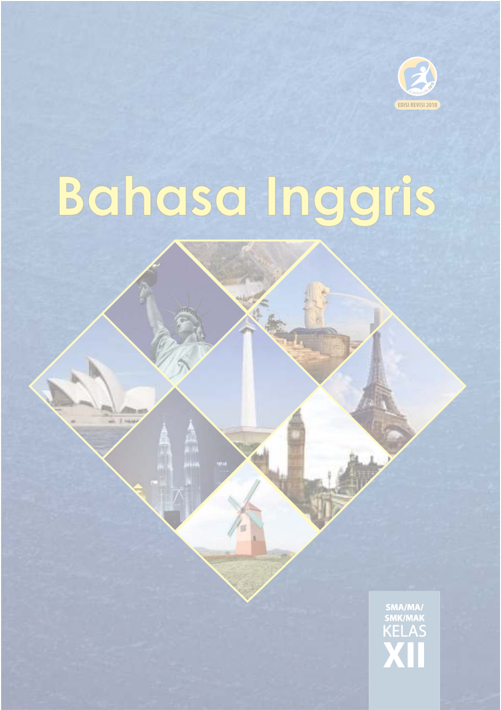

> **Deskripsi Visual:** Buku pelajaran Bahasa Inggris untuk kelas XII menampilkan berbagai objek ikonik dunia melalui gambar yang disusun dalam bentuk diagram. Gambar tersebut mencakup beberapa tempat bersejarah dan budaya penting di seluruh dunia, seperti Patung Liberty di Amerika Serikat, Menara Eiffel di Prancis, Menara Sydney di Australia, dan Menara Babel di Mesir. Setiap gambar tersebut memiliki elemen-elemen yang penting, seperti patung patung yang menggambarkan keindahan dan sejarah masing-masing tempat, serta bangunan-bangunan yang menunjukkan arsitektur dan budaya masing-masing negara. Teks pada buku ini tampaknya akan membahas tentang bahasa Inggris dan budaya dunia, dengan menggunakan gambar-gambar ini sebagai alat visual untuk memperjelas konsep-konsep tersebut. Label-label penting yang mungkin ada termasuk nama-nama tempat yang digambarkan dan informasi tentang budaya dan sejarah setiap tempat tersebut. Informasi kunci yang dapat diambil pembaca melalui gambar ini adalah bahwa bahasa Inggris memiliki pengaruh besar terhadap budaya dunia dan banyak tempat bersejarah dan budaya penting di seluruh dunia menggunakan bahasa ini.

 

---
## 📄 Halaman 2

### Hak Cipta © 2018 pada Kementerian Pendidikan dan Kebudayaan Dilindungi Undang-Undang

Disklaimer: Buku ini merupakan buku guru yang dipersiapkan Pemerintah dalam rangka implementasi Kurikulum 2013. Buku guru ini disusun dan ditelaah oleh berbagai pihak di bawah koordinasi Kementerian Pendidikan dan Kebudayaan, dan dipergunakan dalam tahap awal penerapan Kurikulum 2013. Buku ini merupakan 'dokumen hidup' yang senantiasa diperbaiki,  diperbaharui,  dan  dimutakhirkan  sesuai  dengan  dinamika  kebutuhan  dan perubahan zaman. Masukan dari berbagai kalangan yang dialamatkan kepada penulis dan laman http://buku.kemdikbud.go.id atau melalui email buku@kemdikbud.go.id diharapkan dapat meningkatkan kualitas buku ini.

### Katalog Dalam Terbitan (KDT)

### Indonesia. Kementerian Pendidikan dan Kebudayaan.

Bahasa Inggris: Buku Siswa/Kementerian Pendidikan dan Kebudayaan.-- . Edisi Revisi Jakarta: Kementerian Pendidikan dan Kebudayaan, 2018.

viii, 176 hlm. : ilus. ; 25 cm.

Untuk SMA/MA/SMK/MAK Kelas XII ISBN 978-602-427-106-0 (jilid lengkap) ISBN 978-602-427-109-1 (jilid 3)

- Judul Buku -- Studi dan Pengajaran
- Kementerian Pendidikan dan Kebudayaan
Penulis

:  Utami Widiati, Zuliati Rohmah, dan Furaidah

Penelaah

:  Emi Emilia, Helena Indyah Ratna Agustien, dan Tri Wiratno

Editor

: Rasti Setya Anggraini

Pe- review

: Rresi Yandhi Timosia

Penyelia Penerbitan : Pusat Kurikulum dan Perbukuan, Balitbang, Kemendikbud

Cetakan ke-1, 2013 (ISBN 978-602-282-755-9) Cetakan ke-2, 2018 (Edisi Revisi) Disusun dengan huruf Helvetica, 11 pt.

I. Judul

600

 

---
## 📄 Halaman 3

### PREFACE

Kurikulum  2013  dirancang  untuk  menyongsong  model  pembelajaran Abad 21. Di dalamnya terdapat pergeseran pembelajaran dari siswa diberi tahu menjadi siswa mencari tahu dari berbagai sumber belajar melampaui batas pendidik dan satuan pendidikan. Peran Bahasa Inggris dalam model pembelajaran ini menjadi sangat sentral mengingat lebih banyak sumber belajar dalam Bahasa Inggris dibandingkan dengan sumber belajar dalam semua bahasa lainnya.

Makin datarnya dunia dengan teknologi informasi dan komunikasi menyebabkan  pergaulan  tidak  dapat  lagi  dibatasi  oleh  batas-batas negara.  Kurikulum  2013  menyadari  peran  penting  Bahasa  Inggris tersebut dalam menyampaikan  gagasan  melebihi batas negara Indonesia  serta  untuk  menyerap  gagasan  dari  luar  yang  dapat dipergunakan  untuk  kemaslahatan  bangsa  dan  negara.  Dengan demikian kompetensi lulusan pendidikan menengah yang dirumuskan mampu  menjadi  cerminan  bangsa  yang  berkontribusi  aktif  dalam pergaulan dan peradaban dunia dapat tercapai.

Sejalan dengan peran di atas, pembelajaran Bahasa Inggris untuk Pendidikan Menengah Kelas XII yang disajikan dalam buku ini disusun untuk  meningkatkan  kemampuan  berbahasa.  Penyajiannya  dengan menggunakan  pendekatan  pembelajaran  berbasis teks, baik lisan maupun  tulis,  dengan  menempatkan  Bahasa  Inggris  sebagai  wahana komunikasi.  Pemahaman  terhadap  jenis,  kaidah,  dan  konteks  suatu teks ditekankan, sehingga memudahkan siswa menangkap makna yang tersurat dan tersirat dalam suatu teks; juga untuk menyajikan gagasan dalam  bentuk  teks  yang  mudah  dipahami  makna  kandungannya  dan diapresiasi keindahan pilihan rangkaian katanya.

Sebagai bagian dari Kurikulum 2013 yang menekankan pentingnya keseimbangan  kompetensi  sikap,  pengetahuan,  dan  keterampilan, kemampuan berbahasa Inggris yang dituntut dibentuk melalui pembelajaran  berkelanjutan.  Hal  itu  dimulai  dengan  meningkatkan kompetensi  pengetahuan  tentang  jenis,  kaidah,  dan  konteks  suatu

 

---
## 📄 Halaman 4

teks, dilanjutkan dengan kompetensi keterampilan menyajikan suatu teks  tulis  dan  lisan.  Kompetensi  tersebut  dilakukan  baik  secara terencana maupun spontan dengan pelafalan dan intonasi yang tepat, dan bermuara pada pembentukan sikap kesantunan berbahasa dan sikap menghargai keindahan bahasa.

Buku  ini  menjabarkan  usaha  minimal  yang  harus  dilakukan siswa untuk mencapai kompetensi yang diharapkan. Sesuai dengan pendekatan yang digunakan dalam Kurikulum 2013, siswa diajak untuk berani mencari sumber belajar lain yang tersedia dan terbentang luas di  sekitarnya.  Peran  guru  dalam  meningkatkan  dan  menyesuaikan daya serap siswa dengan ketersediaan kegiatan pada buku ini sangat penting.  Guru  dapat  memperkayanya  dengan  kreasi  dalam  bentuk kegiatan-kegiatan  lain  yang  sesuai  dan  relevan,  bersumber  dari lingkungan sosial dan alam.

Sebagai edisi pertama, buku ini sangat terbuka terhadap masukan dan akan terus diperbaiki dan disempurnakan. Oleh karena itu, kami mengundang  para  pembaca  untuk  memberikan  kritik,  saran,  dan masukan guna perbaikan dan penyempurnaan edisi berikutnya. Atas kontribusi tersebut, kami ucapkan terima kasih. Mudah-mudahan kita dapat memberikan yang terbaik bagi kemajuan dunia pendidikan dalam rangka  mempersiapkan  generasi  seratus  tahun  Indonesia  Merdeka (2046).

Tim Penulis

 

---
## 📄 Halaman 5

### TABLE OF CONTENTS

 

---
## 📄 Halaman 6

### CHAPTER MAP

---
**📊 Tabel**

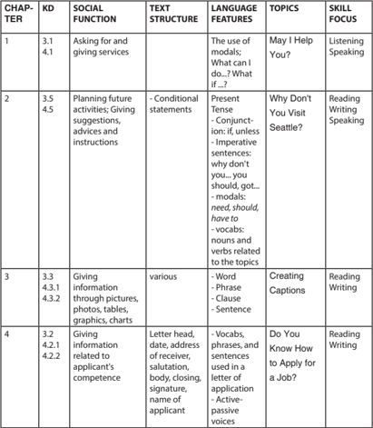

Tabel ini menunjukkan struktur pembelajaran yang terdiri dari empat bab dengan berbagai topik dan teknik bahasa yang diajarkan. Setiap bab memiliki kolom-kolom seperti "Social Function", "Text Structure", "Language Features", "Topics", dan "Skill Focus". Topik utama yang muncul meliputi penggunaan modal, pernyataan kondisional, penulisan caption, dan teknik penulisan surat lamaran. Kolom-kolom tersebut membantu siswa memahami bagaimana mereka dapat menggunakan bahasa dalam konteks tertentu dan memahami cara berkomunikasi efektif. Pola penting yang terlihat adalah bahwa setiap bab mencakup berbagai teknik penulisan dan komunikasi, yang diperlukan untuk berbagai situasi sosial dan profesional.

 

---
## 📄 Halaman 7

---
**📊 Tabel**

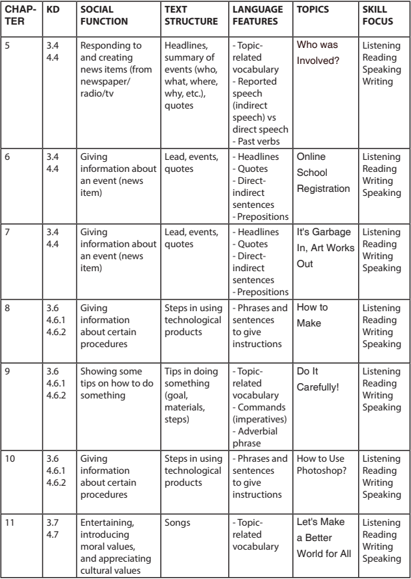

Tabel ini menunjukkan berbagai topik dan metode pembelajaran yang digunakan dalam kurikulum bahasa Inggris untuk kelas 5-11. Topik utama meliputi berita, registrasi sekolah online, produk kreatif, teknologi, dan nilai-nilai moral. Kolom-kolom yang ada mencakup sosial function (fungsi sosial), struktur teks, fitur bahasa, topik, dan fokus kemampuan. Data penting menunjukkan bahwa banyak topik memiliki kombinasi dari berita, teknologi, dan nilai-nilai moral, sementara metode pembelajaran yang digunakan termasuk mendengarkan, membaca, menulis, dan berbicara.

 

---
## 📄 Halaman 8

---
**🖼️ Gambar/Diagram**

> **Deskripsi Visual:** Gambar ini adalah ilustrasi yang menampilkan beberapa lingkaran berwarna ungu dengan tekstur yang halus. Lingkaran tersebut terletak di atas teks yang berbunyi "Get High on Grades NOT DRUGS". Lingkaran ini tampaknya menggambarkan konsep positif tentang mendapatkan prestasi akademik tanpa menggunakan obat-obatan. Teks ini mencerminkan pesan bahwa pendidikan dan pengetahuan adalah sumber kebahagiaan dan kemajuan, bukan obat-obatan. Ilustrasi ini mungkin digunakan sebagai visual untuk membantu memahami konsep ini dalam konteks pembelajaran atau diskusi tentang penggunaan obat-obatan.

 

---
## 📄 Halaman 9

### Chapter 1

### May I Help You?

Source: www.cdn2.dubaiairports.ae

### Tujuan Pembelajaran

Setelah mempelajari Bab 1, siswa diharapkan mampu melakukan hal-hal sebagai berikut:

- Menerapkan fungsi sosial, struktur teks, dan unsur kebahasaan teks interaksi interpersonal lisan dan tulis yang melibatkan tindakan menawarkan jasa, serta menanggapinya, sesuai dengan konteks penggunaannya. (Perhatikan unsur kebahasaan May I help you? What can I do for you? What if ...? ) 3.1
- Menyusun teks interaksi interpersonal lisan dan tulis sederhana yang melibatkan tindakan menawarkan jasa, dan menanggapinya dengan memperhatikan fungsi sosial, struktur teks, dan unsur kebahasaan yang benar dan sesuai dengan konteks. 4. 1

 

---
## 📄 Halaman 10

### A. WARMER: WORD FINDING

The  following  is  a  list  of  top  10  qualities  of  a  good  friend. However, the words are written connectedly with one another. The capitalization  is  not  correct,  either.  Find  the  ten  words  by  reading carefully these two groups of seemingly-nonsense words from the left top down and then up to the right and down again. As an example, the fi rst quality is trustworthy. What are the other nine qualities? Work in pairs and compete to be the quickest in fi nding them.

---
**🖼️ Gambar/Diagram**

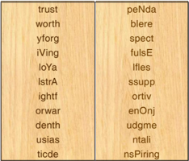

> **Deskripsi Visual:** Gambar ini adalah ilustrasi yang menunjukkan dua baris teks berbeda yang disusun secara horizontal. Baris pertama berisi kata-kata seperti "trust", "worth", "yforg", "iVing", "ioYa", "istrA", "ightf", "orwar", "dusn", "usias", dan "ticde". Baris kedua berisi kata-kata seperti "peNda", "blere", "spect", "fulsE", "Ifles", "ssupp", "ortiv", "enOnj", "udgme", "ntali", dan "nsPiring". Setiap kata dalam baris pertama memiliki panjang yang berbeda-beda, sementara kata-kata dalam baris kedua memiliki panjang yang sama. Teks tersebut tampaknya merupakan bagian dari sebuah analisis atau penelitian, mungkin tentang hubungan antara kata-kata atau konsep-konsep tertentu.

Source: arias100.hubpages.com

---
**🖼️ Gambar/Diagram**

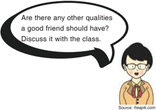

> **Deskripsi Visual:** Gambar ini adalah ilustrasi yang menampilkan seorang siswa dengan topi hitam dan kacamata berwarna merah muda. Siswa tersebut sedang berbicara dalam kotak berbentuk lingkaran hitam yang berisi teks bertanya tentang kualitas-kualitas yang seharusnya dimiliki oleh seorang teman baik. Teks tersebut bertanya, "Are there any other qualities a good friend should have? Discuss it with the class." Dalam konteks ini, gambar ini digunakan untuk mengajarkan konsep tentang kualitas-kualitas yang seharusnya dimiliki oleh seorang teman baik kepada siswa.

 

---
## 📄 Halaman 11

### B. VOCABULARY BUILDER

### Task: Find the meanings.

Look at these words and phrases. Write down the meaning of each word and phrase.

extended family (n)

: …………………..

terri fi c (adj.)

: …………………..

decorate (v)

: ……………………

belly (n)

: ……………………

get well (v)

: ……………………

supposed (adj.)

: ……………………

due date (n)

: …………………..

extended (v)

: …………………..

approaching (adj.)

: ……………………

destination (n)

: ……………………

awkwardly (adv.)

: ……………………

### C. PRONUNCIATION PRACTICE

Task: Listen to your teacher and repeat after him/her.

Listen  to  your  teacher  reading  these  words  and  phrases.  Repeat after him/her.

extended family :

/ ɪ k'stend ɪ d/

/fæm ə li/

fantastic :

/fænt'æst ɪ k/

preparation :

/prep ə r'e ɪʃə n/

decorate :

/'dek ə re ɪ t/

i'd love to :

/a ɪ d/ /l ʌ v / /tu ː /

terrible :

/t'er ɪ b ə l/

stomach :

/s't ʌ m ə k/

terri fi c :

/t ə r' ɪ f ɪ k/

hurt :

/h ɜː rt/

due date

: /du ː / /de ɪ t/

initiatives :

/ ɪ n' ɪʃə t ɪ vz/

 

---
## 📄 Halaman 12

favorite :

/ ˈ fe ɪ v ə r ɪ t/

touring :

/t ʊ r ɪŋ /

concert tickets

: /'k ɑː ns ə rt/ /'t ɪ k ɪ ts/

### D. DIALOG: OFFERING HELP/SERVICES

Task 1:

Observe the dialogs.

- Read these dialogs. Pay attention to the italicized expressions.
- Answer the questions that follow.

### Dialog 1

dr. Nahda : Hello...

Fafa         : Hello,  doctor.

dr. Nahda : You look terrible. What can I do for you?

Fafa

: I can't go to

school today.

dr. Nahda : Oh, I am sorry to hear that.

What's the problem?

Fafa         : My stomach hurts terribly. I think I have a fever as well.

dr. Nahda : Okay, let me check your stomach. (The doctor puts the stethoscope in Fafa's belly and strikes it lightly). Does it hurt here?

Fafa

: Not that one.

dr. Nahda : Here?

Fafa

: Yes, that's really terrible.

dr. Nahda : Alright then, I'll give you a prescription. You have

to take the pills three times a day, okay?

Fafa         : Okay, doctor.

dr. Nahda : Good. Get well soon, Fafa. Bye.

Fafa

: Thanks a lot. Bye, doctor.

Source: creativaimages.com

---
**🖼️ Gambar/Diagram**

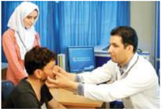

> **Deskripsi Visual:** Gambar ini adalah foto yang menunjukkan seorang dokter memeriksa telinga seorang anak. Dokter sedang menggunakan alat medis untuk memeriksa telinga anak tersebut. Di sebelah kanan, ada seorang perawat yang sedang berdiri dan tampaknya sedang membantu atau memberikan nasihat kepada dokter. Latar belakang terlihat seperti ruangan medis dengan meja dan peralatan medis lainnya.

Elemen utama dalam gambar ini adalah dokter, anak, dan perawat. Dokter sedang fokus pada perawatan telinga anak, sementara perawat berada di sampingnya, mungkin memberikan bantuan atau memberikan nasihat. Anak tampak sangat tenang dan tidak terlihat cemas.

Teks, angka, atau label penting yang terlihat dalam gambar ini tidak ada. Namun, informasi kunci yang dapat diambil dari gambar ini adalah bahwa ada proses medis yang sedang berlangsung, yaitu pemeriksaan telinga oleh dokter pada anak. Ini menunjukkan pentingnya perawatan kesehatan telinga dan keberadaan perawat dalam mendukung proses tersebut.

 

---
## 📄 Halaman 13

### Dialog 2

Tania works at a bus agent located at Arjosari terminal. A stranger is walking approaching her bringing a suitcase.

### Stranger

---
**🖼️ Gambar/Diagram**

> **Deskripsi Visual:** Gambar ini adalah ilustrasi yang menampilkan seorang anak berjalan dengan tas ransel biru. Anak tersebut memiliki rambut coklat pendek, mata besar, dan senyum lebar. Belakangnya tampak pohon hijau yang tinggi. Gambar ini mungkin digunakan untuk mengajarkan tentang perjalanan, kegiatan sehari-hari, atau bahkan tentang bagaimana memegang tas ransel. Teks atau angka tidak ada pada gambar ini, tetapi elemen-elemen seperti wajah anak, rambut, tas ransel, dan pohon memberikan konteks yang jelas tentang situasi yang ditampilkan.

Hello, Sir. May I help you? Where's your destination?

Yes. I need to go to Jakarta. How long will it take from this bus station? Is this Arjosari station?

Yes. This is Arjosari bus station. It takes about 22 hours from here to Jakarta.

What time will it leave?

It will leave at 02.30 p.m. So, you just need to wait for 45 minutes.

Do I have to change buses after arriving in Jakarta?

After arriving in Lebak Bulus Terminal, you have a lot of options to reach your fi nal destination. You can get in a 'Trans Jakarta' bus, metro mini , bajaj , taxi as well as ojek . You can ask the bus driver there.

Thank you. I will buy the bus ticket, then.

Wait a moment, please, I'll process it quickly.

Ok.

### Dialog 3

Have you heard that the due date for the fi nal project is extended?

Yes. It will be due next month.

Would you need my help?

Okay. Just let me know if you need my help.

---
**🖼️ Gambar/Diagram**

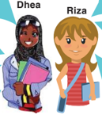

> **Deskripsi Visual:** Gambar ini adalah ilustrasi yang menampilkan dua karakter: Dhea dan Riza. Dhea berdiri di sebelah kiri dengan rambut hitam dan mengenakan pakaian berwarna gelap, sementara Riza berdiri di sebelah kanan dengan rambut pendek dan berwarna coklat, serta mengenakan pakaian berwarna cerah. Keduanya sedang berdiri dengan posisi yang sama, masing-masing memegang barang yang berbeda: Dhea memegang sebuah buku besar dan Riza memegang tas selempang. Gambar ini tampaknya digunakan untuk membantu pembelajaran tentang karakter atau perbandingan antara dua individu.

Source: freepik.com

No, is it true?

That's wonderful! I haven't even started yet.

No, thanks. I'll do it as soon as possible. I know that you're as busy as I am.

 

---
## 📄 Halaman 14

### Dialog 4

Source: freepik.com

---
**🖼️ Gambar/Diagram**

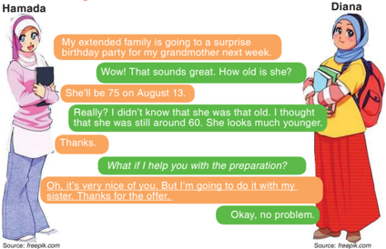

> **Deskripsi Visual:** Gambar ini adalah ilustrasi yang menampilkan dialog antara dua karakter, Hamada dan Diana. Hamada sedang berbicara tentang acara ulang tahun pesta ulang tahun untuk neneknya yang akan datang minggu depan. Dia mengatakan bahwa neneknya akan berumur 75 tahun pada tanggal 13 Agustus. Diana merasa sangat terkejut mendengar informasi tersebut karena dia tidak tahu bahwa neneknya sudah berumur 75 tahun. Dia juga mengejutkan dengan melihat bahwa neneknya tampak lebih muda daripada yang dia pikirkan. Hamada menawarkan bantuan dalam persiapan acara tersebut, tetapi Diana menolak tawaran tersebut karena dia akan melakukan persiapan bersama dengan saudara perempuannya. Gambar ini menunjukkan hubungan antara dua karakter dan bagaimana mereka berinteraksi dalam percakapan mereka.

### Questions

- Where do you think each conversation takes place?
Dialog 1: ______________________________________

Dialog 2: ______________________________________

Dialog 3: ______________________________________

Dialog 4: ______________________________________

- What are the relationships between the speakers?
Dialog 1: ______________________________________

Dialog 2: ______________________________________

Dialog 3: ______________________________________

Dialog 4: ______________________________________

- What are the functions of the underlined words?
_____________________________________________

- What are the functions of the italicized words?
_____________________________________________

 

---
## 📄 Halaman 15

- In Dialog 1, what does dr. Nahda say to help Fafa? What will dr. Nahda do to help Fafa?
______________________________________________

______________________________________________

- Look at Dialog 2. What does Tania offer to the stranger? Does the stranger accept Tania's offer? What does he say?
______________________________________________

______________________________________________

- Who is offering a help in Dialog 3? What does she say? Is the offer accepted?
______________________________________________

______________________________________________

______________________________________________

- In Dialog 4, what does Diana say to offer a help? Does Hamada accept or refuse the help? What does she say?
______________________________________________

______________________________________________

______________________________________________

- Write the patterns of offering help/services.
______________________________________________

______________________________________________

- Write possible responses for offering help/services.
______________________________________________

______________________________________________

______________________________________________

Task 2: Listen and read the dialogs.

Listen to your teacher reading the dialogs above. Then, work in pairs. Take turns reading and practicing dialogs 1, 2, 3, and 4.

7

 

---
## 📄 Halaman 16

### E. VOCABULARY EXERCISE

---
**🖼️ Gambar/Diagram**

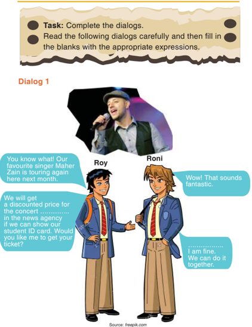

> **Deskripsi Visual:** Gambar ini adalah ilustrasi yang menunjukkan dialog antara dua karakter, Roy dan Roni, tentang tiket konser. Ilustrasi ini terdiri dari dua karakter yang berbicara dengan teks di bawah mereka. Roy sedang berbicara tentang tiket konser yang akan disediakan oleh agensi berita jika mereka menunjukkan ID sekolah. Roni mengatakan bahwa dia baik-baik saja dan bisa bermain bersama. Di bagian atas, ada tugas yang diberikan untuk menyelesaikan dialog tersebut.

 

---
## 📄 Halaman 17

### Dialog 2

---
**🖼️ Gambar/Diagram**

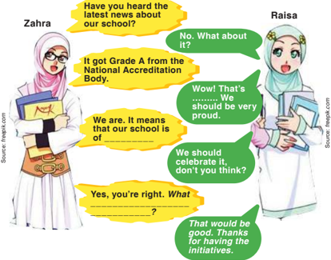

> **Deskripsi Visual:** Gambar ini adalah ilustrasi yang menunjukkan dialog antara dua karakter, Zahra dan Raisa, tentang berita terbaru tentang sekolah mereka. Zahra memulai percakapan dengan bertanya apakah Raisa telah mendengar tentang berita terbaru. Raisa menjawab bahwa sekolah mereka mendapatkan predikat A dari Badan Penilaian Akreditasi Nasional. Zahra kemudian menjelaskan bahwa predikat tersebut berarti sekolah mereka berada di tingkat tertinggi. Raisa mengomentari bahwa sekolah mereka harus bangga atas prestasi ini dan menyarankan untuk merayakannya. Zahra setuju dan mengatakan bahwa hal itu akan bagus. Raisa mengucapkan terima kasih kepada Zahra karena telah memiliki ide-ide tersebut. Gambar ini menunjukkan hubungan positif antara dua orang yang saling menghargai dan berbagi kebahagiaan atas prestasi sekolah mereka.

 

---
## 📄 Halaman 18

### Dialog 3

Diani  : What do we have to prepare for the next trip?

Riana   : We are supposed to bring winter clothes. Three pieces at least. We also have to take our personal medication.

Diani  : Oh, I don't have any ________ and I don't have enough time to fi nd ones.

Riana : My sister has two jackets good enough for going out in __________ What if __________________?

Diani  : That would be very helpful. Thank you very much.

Riana : No worries, mate.

Diani  : Are we supposed to bring some food as well?

Riana : No.____________________ by the school.

### F. GRAMMAR REVIEW

- Task : Fill in the table.
- Look back at the dialogs in part D. Pay attention to the italicized expressions and the last two questions following the
- dialogs. Write down the pattern of expressions to offer a help/
- service and its responses. See the example.
Source: creativaimages.co m

 

---
## 📄 Halaman 19

---
**📊 Tabel**

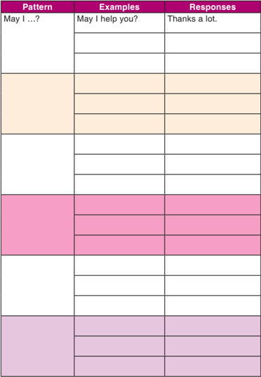

Tabel ini berisi contoh dan respons untuk pernyataan "May I...?" yang sering digunakan dalam percakapan formal atau sopan. Topik utamanya adalah cara berkomunikasi dengan sopan dan efektif dalam situasi tertentu. Kolom "Examples" menunjukkan contoh pernyataan yang bisa digunakan, sementara kolom "Responses" menampilkan contoh respons yang sesuai dengan pernyataan tersebut. Pola penting yang terlihat adalah bahwa setiap pernyataan "May I...?" memiliki dua contoh respons yang cocok, yang menunjukkan kemampuan untuk menjawab dengan baik dalam berbagai situasi.

 

---
## 📄 Halaman 20

### G. SPEAKING

---
**🖼️ Gambar/Diagram**

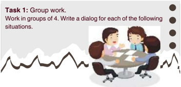

> **Deskripsi Visual:** Gambar ini adalah ilustrasi yang menunjukkan dua orang siswa sedang berbicara di sekitar meja kerja. Mereka tampaknya sedang bekerja sama dalam sebuah tugas grup. Gambar ini menunjukkan konsep kerjasama dan komunikasi dalam proses belajar. Siswa di sebelah kiri sedang mendengarkan sementara yang di sebelah kanan sedang berbicara. Di bagian atas gambar ada tulisan "Task 1: Group work." yang memberikan konteks bahwa ini adalah tugas grup yang harus diselesaikan oleh kelompok.

- You are doing the History Project with your group at the library after school. Your best friend cannot fi nish his/her part. Offer a help to do it together.
_______________________________________________________

_______________________________________________________

_______________________________________________________

_______________________________________________________

_______________________________________________________

_______________________________________________________

_______________________________________________________

_______________________________________________________

- School holiday is coming soon. You and your family have a plan to go abroad, but do not have time to surf the internet to fi nd the best place and best deal. Offer your parents to fi nd the needed information and to arrange the vacation with the tour agent.
_______________________________________________________

_______________________________________________________

_______________________________________________________

_______________________________________________________

_______________________________________________________

_______________________________________________________

_______________________________________________________

### Task 1: Group work.

Work in groups of 4. Write a dialog for each of the following situations.

 

---
## 📄 Halaman 21

- You work in a tour agency. You see a young gentleman enter your of fi ce awkwardly. Offer your service and try to convince him to take one of your holiday packages.
_______________________________________________________

_______________________________________________________

_______________________________________________________

_______________________________________________________

_______________________________________________________

_______________________________________________________

_______________________________________________________

_______________________________________________________

- A friend is absent because she is sick. You visit her this afternoon. Your friend needs your help to communicate with the teacher about an assignment that she hasn't fi nished yet. Offer her a help.
_______________________________________________________

_______________________________________________________

_______________________________________________________

_______________________________________________________

_______________________________________________________

_______________________________________________________

_______________________________________________________

_______________________________________________________

- You want to go to the movie this weekend. You ask several friends to go with you. Two of your friends cannot make up their minds. Offer to treat them so that they can go with you.
_______________________________________________________

_______________________________________________________

_______________________________________________________

_______________________________________________________

_______________________________________________________

_______________________________________________________

 

---
## 📄 Halaman 22

### Task 2: Role Play the dialog.

With your group, choose one of the dialogs from Task 1  and  perform  it  in  front  of  your  class.  Show  your  best performance to your classmates.

Source : www.omahjoglo.co

### H. REFLECTION

At  the  end  of  this  chapter,  ask  yourself  the  following questions to know your learning progress.

- Do you know how to offer a help/a service?
- Do you know how to respond to an offer/a service?
- Do you know how to accept an offer/a service?
- Do you know how to refuse an offer/a service?
If you answer "no" to any of the questions above, please discuss it with your friends or consult it to your teacher.

---
**🖼️ Gambar/Diagram**

> **Deskripsi Visual:** Gambar ini adalah ilustrasi yang menunjukkan seorang wanita yang sedang berjalan sambil membawa beberapa buku. Ia mengenakan pakaian formal dengan blouse biru dan rok hitam, serta memakai sepatu pantofel. Wajahnya tampak ceria dan ia sedang tersenyum. Di bawah gambar tersebut, terdapat teks yang tidak lengkap, namun tampaknya berisi informasi tentang "questions" atau "pertanyaan". Gambar ini mungkin digunakan sebagai ilustrasi untuk menjelaskan konsep atau topik tertentu dalam buku pelajaran.

 

---
## 📄 Halaman 23

### Why Don't You Visit Seattle?

---
**🖼️ Gambar/Diagram**

> **Deskripsi Visual:** Gambar ini adalah foto yang menunjukkan pemandangan kota Seattle dari perairan. Di sebelah kiri, terlihat kapal layar berlayar di atas air dengan latar belakang gedung pencakar langit Seattle. Di tengah-tengah, terdapat bangunan pencakar langit yang tinggi, salah satunya adalah Space Needle, sebuah ikon kota Seattle. Di sebelah kanan, terlihat beberapa kapal layar lainnya yang sedang berlayar. Langit cerah dengan awan putih menyebar di atas kota, menambah keindahan pemandangan. Gambar ini menunjukkan hubungan antara kapal layar dengan lingkungan alam dan perkotaan, serta menunjukkan ikon-ikon kota Seattle seperti Space Needle.

Source: www.artwallpaperhi.com

### Tujuan Pembelajaran

Setelah mempelajari Bab 2, siswa diharapkan mampu melakukan hal-hal sebagai berikut:

- Menerapkan fungsi sosial, struktur teks, dan unsur kebahasaan teks interaksi transaksional lisan dan tulis yang melibatkan tindakan memberi dan meminta informasi terkait pengandaian diikuti oleh perintah/saran, sesuai dengan konteks penggunaannya. (Perhatikan unsur kebahasaan if dengan imperative, can, should ). 3.5
- Menyusun teks interaksi transaksional lisan dan tulis yang melibatkan tindakan memberi dan meminta informasi terkait pengandaian diikuti oleh perintah/saran, dengan memerhatikan fungsi sosial, struktur teks, dan unsur kebahasaan yang benar dan sesuai konteks. 4.5

 

---
## 📄 Halaman 24

### A. WARMER: PAIR WORK

Task:

Work in pairs.

What will you discuss with your friends when you come to a new city? What do you expect? What do you see? What do you feel?

### B. VOCABULARY BUILDER

Task: Find the synonym.

Write down the synonym of the following words.

f o o l p r o o f   ( a d j . )                   :   … … … … … … … . s t r o l l   ( v )                                     :   … … … … … … . . p r o d u c e   ( n )                             :   … … . . . … … … . . a m i d   ( p r e p )                             :   … … … … … … … . h u b b u b   ( n )                               :   … … … … … … . . . c o z y   ( a d j . )                               :   … … … … … … … . . wi l d l i f e   ( n )                               :   … … … … … … … . . l e i s u r e   ( n )                               :   … … … … … … … . . sophisticated (adj.)      :   ………………….. a v i a t i o n   ( n )                             :   … … … … … … … … a s s e m b l e   ( v )                         :   … … … … … … … … t r e a t   ( n )                                     :   … … … … … … … …

### C. PRONUNCIATION PRACTICE

Task: Listen and repeat after your teacher.

Listen to your teacher reading these words. Repeat after him/her.

 

---
## 📄 Halaman 25

a m i d :

/ ə 'm ɪ d/

s e a t t l e :

/si'ætl/

e m e r a l d                        :

/'em ə r ə ld/

b a i n b r i g e   I s l a n d  :

/'be ɪ nbr ɪ d ʒ 'a ɪ l ə nd/

s t r o l l   a r o u n d           :

/stro ʊ l ə 'ra ʊ nd/

g a l l e r y                           :

/' ɡ æl ə ri/

b o u t i q u e s :

/bu ː 'ti ː ks/

c o z y :

/'k əʊ zi/

c a f e s                               :

/kæ'fe ɪ s/

n u m e r o u s :

/'nu ː m ə r ə s/

l e i s u r e                           :

/'li ː ʒə r/

s o p h i s t i c a t e d :

/s ə 'f ɪ st ɪ ke ɪ t ə d/

### D. READING COMPREHENSION

Read the text carefully.

- Task 1:
- Have you ever heard about Seattle? Do you know what and
- where Seattle is? What do you expect to see and enjoy there?

### Six Things to Do if You Visit Seattle

There are 6 must-have experiences that you should do if you visit Seattle where city and nature come together. If you visit Seattle, arrive with this list in hand and you'll be off to a foolproof start for exploring the Emerald City's most unforgettable sights and sounds.

If you visit Seattle, do the following things  :

- Feel the fresh air on your face as you sail to Bainbrige Island on a Washington State Ferry. From the ferry you can enjoy the view of the Seattle skyline. If you want to enjoy
Source: wsdot.wa.gov

 

---
## 📄 Halaman 26

Bainbrige Island, stroll around downtown's galleries, boutiques, coffee houses and cafes. Seasonal gardens and natural woodlands at the Boedel Reserve are as the other options.

- Why don't you tour the Pike Place Market's produce stands to buy something you've never tasted. The Pike Place Market is much more than a farmers' market. Its entire district is full of shopping, attractions and favorite sights. The area is festival of sounds, tastes and smells and it is part of the reason. It's called the 'soul of Seattle'. Unless you have allergic to noises, make sure you take time to spot these beloved icons.
- Book a night at one of the many cozy B & Bs or resorts available throughout the Sun Juan Islands. Cozy bed and breakfasts are the perfect way to enjoy the friendly island culture. If you have enough time, tour the numerous art galleries in Friday Harbor. You can also enjoy naturalist-guided tours, wildlife spotting, whale watching and storm watching.

---
**🖼️ Gambar/Diagram**

> **Deskripsi Visual:** Gambar ini adalah foto yang menunjukkan pemandangan alam yang indah. Dalam gambar tersebut, kita bisa melihat sebuah gunung dengan puncak tertutup salju yang menjulang di atas hamparan hutan hijau yang luas. Gunung tersebut tampak megah dan indah, menambah keindahan pemandangan. Di sekitar gunung, kita bisa melihat beberapa pulau kecil yang terletak di atas air biru cerah. Air ini tampak tenang dan jernih, dengan beberapa kapal kecil yang berlayar di atasnya. Selain itu, kita juga bisa melihat beberapa pohon besar yang tumbuh di tepi pantai, menambah keindahan alam yang indah ini. Gambar ini menunjukkan hubungan antara gunung, hutan, dan laut, serta menunjukkan keindahan alam yang indah.

 

---
## 📄 Halaman 27

- See exciting and experimental works at Chihuly Garden and Glass. A visit to this site is an opportunity to take full advantage of the location at the Seattle Center, a premier destination for arts, entertainment and leisure activities. If you visit this city, you should explore the Space Needle and Paci fi c Science Center. Experience Music Project and a variety of cultural activities offered throughout the year.
- Watch the world's most sophisticated aircraft be built before your eyes at the Boeing factory in Mukilteo. If you are curious to know about it, you should explore the dynamics of fl ight and experience new aviation innovation. Go behind the scenes at Boeing to watch the very same jets you may
one day be a passenger on being assembled.

 

---
## 📄 Halaman 28

- Tour the Theo Chocolate Factory in Freemont and learn how their delicious confections are made.
This factory has a mission to create change in the Democratic Republic of Congo (DRC) where it has 300,000 square miles of farmable land but only 2% is being

---
**🖼️ Gambar/Diagram**

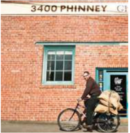

> **Deskripsi Visual:** Gambar ini adalah ilustrasi yang menunjukkan seorang pria tua sedang bersepeda di depan sebuah bangunan dengan nomor 3400 Phinney. Pria tersebut mengenakan jaket hitam dan sepatu pantofel, sedang membawa tas besar di belakang sepedanya. Bangunan tersebut memiliki dinding merah dengan jendela biru dan pintu biru dengan tulisan "Phinney". Gambar ini mungkin digunakan untuk menggambarkan perjalanan atau aktivitas sehari-hari seseorang di kota, dengan fokus pada transportasi sepeda sebagai metode transportasi umum.

farmed due to con fl ict there. The factory trains 2,000 Congolese farmers to grow high quality cocoa.

Taks 2: Practice to ask and answer questions.

Still related to the reading text above, play the roles of

- the speakers in the pictures. Complete the blanks with
- suitable expressions.

---
**🖼️ Gambar/Diagram**

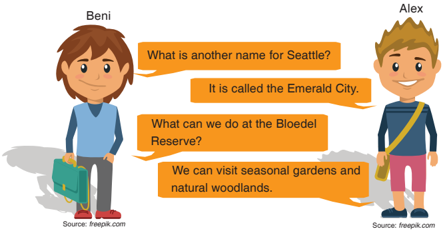

> **Deskripsi Visual:** Gambar ini adalah ilustrasi yang menampilkan dua karakter, Beni dan Alex, berbicara tentang lokasi dan aktivitas di Seattle. Beni bertanya tentang nama lain untuk Seattle, yang diberikan sebagai "Emerald City". Kemudian, Alex menjawab pertanyaan tentang apa yang bisa dilakukan di Bloedel Reserve, yang disebutkan sebagai tempat untuk mengunjungi taman musiman dan hutan alami. Gambar ini menggunakan warna-warna cerah dan karakter yang lucu untuk menarik perhatian pembaca.

 

---
## 📄 Halaman 29

### Dialog 1

---
**🖼️ Gambar/Diagram**

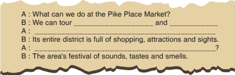

> **Deskripsi Visual:** Gambar ini adalah diagram yang menunjukkan pertanyaan dan jawaban tentang aktivitas yang bisa dilakukan di Pike Place Market. Di bagian atas, ada pertanyaan "A: What can we do at the Pike Place Market?" yang bertujuan untuk mengajak pembaca untuk berpikir tentang apa saja yang bisa dilakukan di pasar tersebut. Jawaban pertama "B: We can tour" menunjukkan bahwa salah satu aktivitas yang bisa dilakukan adalah touring. Selanjutnya, "and" menunjukkan bahwa ada lagi aktivitas lain yang bisa dilakukan selain touring. Jawaban kedua "B: Its entire district is full of shopping, attractions and sights." memberikan informasi lebih lanjut tentang apa yang bisa ditemukan di Pike Place Market, yaitu distrik yang penuh dengan berbagai aktivitas seperti berbelanja, atraksi, dan tempat wisata. Terakhir, "A: The area's festival of sounds, tastes and smells." menunjukkan bahwa Pike Place Market juga merupakan festival suara, rasa, dan aroma. Jadi, gambar ini menunjukkan bahwa Pike Place Market adalah tempat yang sangat menarik untuk dikunjungi karena memiliki banyak aktivitas dan pengalaman yang bisa dilakukan.

---
**🖼️ Gambar/Diagram**

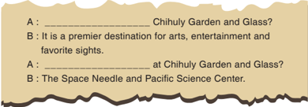

> **Deskripsi Visual:** Gambar ini adalah diagram yang menunjukkan pertanyaan dan jawaban tentang destinasi wisata di Seattle. Di bagian atas, ada pertanyaan "A: What is the premier destination for arts, entertainment and favorite sights?" dengan jawaban "It is a premier destination for arts, entertainment and favorite sights." di bawahnya. Selanjutnya, ada pertanyaan "A: What are some of the best places to visit at Chihuly Garden and Glass?" dengan jawaban "The Space Needle and Pacific Science Center." di bawahnya. Gambar ini menggambarkan hubungan antara pertanyaan dan jawaban serta memberikan informasi tentang destinasi wisata populer di Seattle.

Dialog 3                                            Dialog 4

---
**🖼️ Gambar/Diagram**

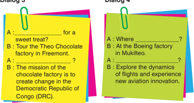

> **Deskripsi Visual:** Gambar ini adalah dua dialog yang ditampilkan dalam buku pelajaran. Dialog pertama (Dialog 3) berisi pertanyaan tentang tempat untuk mengambil manis, dengan jawaban yang menunjukkan keinginan untuk mengunjungi pabrik cokelat Theo di Fremont. Dialog kedua (Dialog 4) bertujuan untuk mengetahui lokasi Boeing Factory di Mukiteto, dengan jawaban yang menyebutkan bahwa pengalaman akan melibatkan pengeksplorasian dinamika penerbangan dan pengetahuan baru tentang inovasi penerbangan. Kedua dialog tersebut menunjukkan interaksi antara pembaca dan konten yang disajikan dalam buku pelajaran, serta memberikan informasi tentang destinasi dan aktivitas yang dapat dilakukan.

 

---
## 📄 Halaman 30

- Taks 3: Complete the sentences.
- Please complete the following sentences by referring to
- the previous reading text.

### Example:

If you visit Seattle, arrive with __________________________

If you visit Seattle, arrive with this list of six must-have experiences .

- If you visit Seattle, the fi rst thing to do is ______________ ____________________________________________ ____________________________________________
- The second thing to do is ________________________ ____________________________________________ ____________________________________________
- The 'Soul of Seattle' is the name for __________ because ___________________________________________ ___________________________________________
- ___________________________________________ _________________________________ is the third instruction to follow if you visit Seattle.
- If I am in the San Juan Islands, I will be able to enjoy ____ ____________________________________________ ____________________________________________
- The fourth instruction to follow is ___________________ ___________________________________________ ___________________________________________
- Chihuly Garden and Glass customer service may offer a help to a guest saying __________________________
___________________________________________

- If you were an aircraft factory staff, what would you say to offer help for your visitors. What if __________________
____________________________________________

 

---
## 📄 Halaman 31

- Two instructions to follow at the Boeing factory are _______ and _______________________________
- Imagine you are visiting Lake Toba with your classmates. Your friends want to go canoeing but do not know how to do it. What would you say to help them ______________
__________________________________________

### Personalisation:

If you have an opportunity to visit Seattle, what will you do? Write down your plan on a piece of paper.

### E. GRAMMAR REVIEW

Source: freepik.com

Now, discuss with your friends about 'if' sentence patterns as appear in the reading text "Why Don't You Visit Seattle?" above. Write down the patterns in the following space.

Task 1: Identify the "if" sentences.

Read again the text "Why Don't You Visit Seattle?" and identify the "if" sentence along with its pattern. Look at the example.

### 1. Sentence 1:

If you visit Seattle, feel the fresh air on your face as you sail to Bainbridge Island on a Washington State Ferry.

 

---
## 📄 Halaman 32

### Pattern 1:

'If clause' + an imperative

- Sentence 2:
..................................................................................................

Pattern 2:

..................................................................................................

- Sentence 3:
..................................................................................................

Pattern 3:

..................................................................................................

- Sentence 4:
..................................................................................................

Pattern 4:

..................................................................................................

- Sentence 5:
..................................................................................................

Pattern 5:

..................................................................................................

---
**🖼️ Gambar/Diagram**

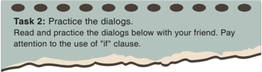

> **Deskripsi Visual:** Gambar ini adalah sebuah diagram yang menunjukkan tugas nomor dua dalam buku pelajaran. Diagram ini berupa garis horizontal dengan beberapa titik merah di atasnya, masing-masing titik dihubungkan oleh garis lurus. Di bawah garis tersebut, terdapat teks yang memberikan instruksi untuk melakukan latihan dialog. Teks tersebut mengajarkan untuk membaca dan menerapkan dialog yang diberikan bersama teman, sambil memperhatikan penggunaan "if" dalam kalimat-kalimat tersebut.

### Dialog 1

Father  : Exam is around the corner. It's about time

to go back to your study.

Son

: Okay, Dad.

Father  : If you want to pass the exam, you have to

study harder.

Son

: Thanks, Dad.

 

---
## 📄 Halaman 33

### Dialog 2

Dela  :  Where can I get inexpensive good quality shoes?

Emi   :  If you want a good price, why don't you go to the factory outlet?

### Dialog 3

---
**🖼️ Gambar/Diagram**

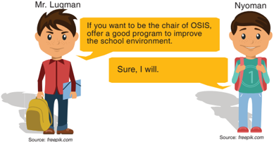

> **Deskripsi Visual:** Gambar ini adalah ilustrasi yang menampilkan dua karakter, Mr. Lugman dan Nyoman, berbicara tentang program OSIS (Organisasi Siswa Indonesia) untuk meningkatkan lingkungan sekolah. Mr. Lugman bertanya kepada Nyoman apakah ia siap menjadi ketua OSIS dan memberikan program yang baik untuk memperbaiki lingkungan sekolah. Nyoman mengatakan "Sure, I will." dengan senyum, menunjukkan keinginannya untuk membantu. Gambar ini menggunakan warna-warna cerah dan karakter yang lucu untuk menarik perhatian pembaca.

### Dialog 4

Mom : If you don't put some cherries on it, your cake will look pale and dull.

Etty  : Yes, you're right. A cherry or two will help with the appearance.

### Dialog 5

Joko   : If I am elected president, I will waive taxes for poor people.

Edwin : I wish you all the best.

 

---
## 📄 Halaman 34

- An example of 'if clause' + a reminder is:
If you want to pass the exam, you have to study harder.

- An example of 'if clause' + a suggestio n is:
____________________________________________

____________________________________________

- An example of 'if clause' + a general truth is:
____________________________________________

____________________________________________

- An example of 'if clause' + an imperative is:
____________________________________________

____________________________________________

- An example of 'if clause' to show a dream is:
____________________________________________

____________________________________________

### Task 3: Fill in the blanks.

Complete the following blanks by looking at the information in the conversations above. Number 1 is done as an example.

 

---
## 📄 Halaman 35

### F. WRITING

Task 1:

Work in groups.

Work in groups of 3-5 students. Find other text that uses

- "if clause" in it. Then, identify the "if clauses" in your text
- together with your group. Find the patterns as well. Write the result in the following spaces.

---
**🖼️ Gambar/Diagram**

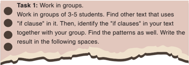

> **Deskripsi Visual:** Gambar ini adalah diagram yang menunjukkan tugas belajar yang harus dilakukan oleh siswa. Diagram ini terdiri dari beberapa elemen utama yang penting:

1. Judul Tugas: "Work in groups."
2. Deskripsi Tugas: Siswa harus bekerja dalam kelompok 3-5 orang.
3. Sub-tugas Pertama: "Find other text that uses 'if' clause in it." Ini mengajarkan siswa untuk mencari teks lain yang menggunakan "if" clause.
4. Sub-tugas Kedua: "Identify the 'if' clauses in your text together with your group." Ini meminta siswa untuk menemukan "if" clause dalam teks mereka dan menganalisisnya bersama kelompok mereka.
5. Sub-tugas Ketiga: "Find the patterns as well." Ini mengajarkan siswa untuk mencari pola dalam penggunaan "if" clause.
6. Sub-tugas Keempat: "Write the result in the following spaces." Ini memberikan instruksi untuk menulis hasil analisis mereka di tempat yang disediakan.

Dalam diagram ini, informasi kunci yang dapat diambil oleh pembaca termasuk jenis tugas yang diberikan, jumlah siswa dalam kelompok, sub-tugas yang harus diselesaikan, dan cara menulis hasil analisis mereka.

---
**📊 Tabel**

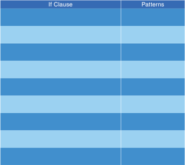

Tabel ini menunjukkan berbagai jenis if-clause dalam bahasa pemrograman, yang dikelompokkan menjadi beberapa pattern atau pola. Topik utama tabel ini adalah struktur if-clause dalam kode program. Kolom "If Clause" berisi berbagai jenis if-clause seperti if-else, if-elif-else, dan if-else-if. Kolom "Patterns" berisi beberapa pola atau struktur if-clause tersebut. Data atau pola penting yang terlihat antara lain if-else, if-elif-else, dan if-else-if. Ini menunjukkan bahwa tabel ini membahas berbagai cara untuk membuat kondisi dalam kode program menggunakan if-clause.

 

---
## 📄 Halaman 36

---
**🖼️ Gambar/Diagram**

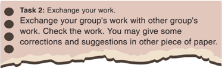

> **Deskripsi Visual:** Gambar ini adalah diagram yang menunjukkan instruksi untuk tugas 2 dalam sebuah kursus belajar. Diagram ini terdiri dari beberapa elemen utama yang terhubung dengan garis dan titik-titik. Pada bagian atas, ada teks yang memberikan instruksi tentang cara melakukan tugas tersebut, yaitu "Exchange your work." "Exchange your group's work with other group's work." "Check the work." "You may give some corrections and suggestions in other piece of paper."

Elemen-elemen utama yang terlihat dalam diagram ini meliputi:
1. Titik-titik yang menunjukkan langkah-langkah yang harus dilakukan dalam tugas.
2. Garis yang menghubungkan titik-titik tersebut, menunjukkan hubungan antara langkah-langkah tersebut.
3. Teks yang memberikan instruksi secara jelas dan mudah dipahami.

Informasi kunci yang dapat diambil pembaca dari gambar ini adalah bahwa tugas ini melibatkan penggantian kerja tim dengan kerja tim lain, pengecekan kerja, dan memberikan corak dan saran pada kerja lain. Ini menunjukkan bahwa tugas ini bertujuan untuk mempromosikan kolaborasi dan pertukaran ide antar anggota tim.

### G. SPEAKING PRACTICE

---
**🖼️ Gambar/Diagram**

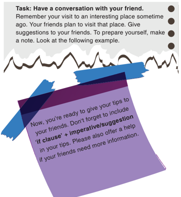

> **Deskripsi Visual:** Gambar ini adalah ilustrasi yang menunjukkan tugas untuk berbicara dengan teman tentang pengalaman wisata yang baru saja dilakukan. Ilustrasi ini terdiri dari beberapa elemen utama:

1. Teks utama: Teks ini memberikan instruksi kepada pembaca untuk berbicara dengan teman tentang pengalaman wisata yang baru saja dilakukan. Pembaca diminta untuk memberikan saran atau nasihat kepada teman-teman mereka tentang tempat yang menarik untuk dikunjungi.

2. Gambaran ilustratif: Ilustrasi ini menggunakan gambaran ilustratif yang menunjukkan selembar kertas berwarna ungu dengan tulisan di atasnya. Kertas tersebut tampak seperti sebuah catatan atau catatan yang dibentangkan di udara.

3. Konteks: Ilustrasi ini mencerminkan situasi di mana pembaca harus berbicara dengan teman tentang pengalaman wisata yang baru saja dilakukan. Ini bisa menjadi bagian dari proses belajar atau latihan berbicara dalam bahasa asing.

4. Tujuan: Tujuan dari ilustrasi ini adalah untuk membantu pembaca memahami bagaimana berbicara dengan teman tentang pengalaman wisata yang baru saja dilakukan. Ilustrasi ini juga mencerminkan bagaimana pembaca harus menyampaikan informasi tersebut dengan cara yang efektif dan menarik.

5. Informasi penting: Informasi penting yang dapat diambil dari ilustrasi ini adalah bahwa pembaca harus berbicara dengan teman tentang pengalaman wisata yang baru saja dilakukan. Pembaca juga diminta untuk memberikan saran atau nasihat kepada teman-teman mereka tentang tempat yang menarik untuk dikunjungi.

 

---
## 📄 Halaman 37

### Example:

If you visit Seattle, you have to :

- Sail to Bainbrige Island on a Washington State Ferry.
- Visit the Tour Pike Place Market.
- Book a night at Sun Juan Islands.
- Visit Chihuly Garden and Glass.
- Watch the aircraft being built at the Boeing factory.
- Book a tour at the Theo Chocolate factory in Freemont.

 

---
## 📄 Halaman 38

### H.REFLECTION

---
**🖼️ Gambar/Diagram**

> **Deskripsi Visual:** Gambar ini adalah ilustrasi yang menampilkan seorang guru berdiri di depan meja belajar. Guru tersebut sedang membacakan buku pelajaran dengan tangan kanan yang menunjukkan tanda tangan positif (tangan memegang buku). Guru tersebut mengenakan pakaian formal, termasuk jaket biru dan baju putih, serta memakai kacamata. Latar belakang adalah warna hijau dengan pola dasar abu-abu. Di bawah gambar ada tulisan "Source: freepik.com".

At the end of this chapter, ask yourself the following questions to know your learning progress.

- Do you know how to tell your friends about visiting a place using 'if' clause followed by imperatives/suggestions?
- Do you know how to write texts about visiting a place using 'if' clause followed by imperatives/suggestions?
If you answer "no" to any of the questions above, please discuss it with your friends or consults it to your teacher.

 

---
## 📄 Halaman 39

### Creating Captions

---
**🖼️ Gambar/Diagram**

> **Deskripsi Visual:** Gambar ini adalah ilustrasi yang menampilkan sebuah ikan mas berwarna kuning dengan ekor berwarna merah muda yang sedang berenang dalam tangkai ikan mas. Tangkai ikan mas tersebut berisi air biru dan memiliki tulisan "Feefish onn!!! " di atasnya. Di bawah tangkai ikan mas, ada tulisan "Source: www.preview123rf.com". Gambar ini tampaknya digunakan sebagai ilustrasi untuk menggambarkan konsep tentang ikan mas atau memancing.

### Tujuan Pembelajaran

Setelah mempelajari Bab 3, siswa diharapkan mampu melakukan hal-hal sebagai berikut:

- Membedakan fungsi sosial, struktur teks, dan unsur kebahasaan beberapa teks khusus dalam bentuk teks caption , dengan memberi dan meminta informasi terkait gambar/foto/tabel/gra fi k/bagan, sesuai dengan konteks penggunaannya. 3.3
- Menangkap makna secara kontekstual terkait fungsi sosial, struktur teks, dan unsur kebahasaan teks khusus dalam bentuk caption terkait gambar/foto/tabel/gra fi k/ bagan. 4.3. 1
- Menyusun teks khusus dalam bentuk teks caption terkait gambar/foto/tabel/gra fi k/bagan, dengan memerhatikan fungsi sosial, struktur teks, dan unsur kebahasaan, secara benar dan sesuai dengan konteks. 4.3.2

 

---
## 📄 Halaman 40

---
**🖼️ Gambar/Diagram**

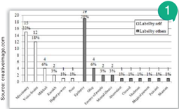

> **Deskripsi Visual:** Gambar ini adalah diagram yang menunjukkan data tentang kepercayaan terhadap berbagai sumber informasi. Diagram ini terdiri dari dua jenis informasi: "Labelable" dan "Unlabelable". Untuk setiap jenis, ada beberapa pilihan sumber informasi yang ditampilkan dalam bentuk garis horizontal.

Pertama, untuk jenis "Labelable", ada lima pilihan sumber informasi: "Sumber Kekuatan", "Sumber Kekuatan", "Sumber Kekuatan", "Sumber Kekuatan", dan "Sumber Kekuatan". Setiap pilihan memiliki jumlah pengguna yang berbeda, dengan "Sumber Kekuatan" memiliki jumlah pengguna tertinggi sekitar 100 orang.

Kedua, untuk jenis "Unlabelable", ada delapan pilihan sumber informasi: "Sumber Kekuatan", "Sumber Kekuatan", "Sumber Kekuatan", "Sumber Kekuatan", "Sumber Kekuatan", "Sumber Kekuatan", "Sumber Kekuatan", dan "Sumber Kekuatan". Setiap pilihan juga memiliki jumlah pengguna yang berbeda, dengan "Sumber Kekuatan" memiliki jumlah pengguna tertinggi sekitar 50 orang.

Dalam diagram ini, informasi penting yang dapat diambil oleh pembaca termasuk jumlah pengguna untuk setiap jenis sumber informasi dan perbandingan antara jumlah pengguna untuk jenis "Labelable" dan "Unlabelable".

EXPECTATION:

2

RUN FIE FUN FUNL

Nior penel

REALITY:

ETarmAr

IHATEPOUN

Source: creativeimage.com

 

---
## 📄 Halaman 41

---
**🖼️ Gambar/Diagram**

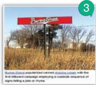

> **Deskripsi Visual:** Gambar ini adalah ilustrasi yang menunjukkan sebuah sistem pengendali keamanan (CCTV) yang terpasang di atas sebuah pohon di tengah sawah. Ilustrasi ini menunjukkan beberapa elemen penting:

1. **Apa yang Ditampilkan Secara Keseluruhan**: Gambar ini menunjukkan sebuah sistem CCTV yang terpasang di atas pohon di tengah sawah. Sistem ini terdiri dari kamera CCTV, monitor, dan beberapa komponen lainnya yang terhubung dengan kabel.

2. **Elemen Utama dan Relasinya**: 
   - **Kamera CCTV**: Terletak di atas pohon, menghadap ke arah sawah.
   - **Monitor**: Terletak di bawah kamera, digunakan untuk menampilkan gambar yang dikirim oleh kamera.
   - **Komponen Kabel**: Terhubung antara kamera dan monitor, membawa sinyal video dari kamera ke monitor.

3. **Teks, Angka, atau Label Penting yang Terlihat**: 
   - Ada teks "CCTV" yang tertera di atas kamera, menunjukkan bahwa itu adalah kamera CCTV.
   - Ada angka "3" yang tampak di bagian atas kamera, mungkin menunjukkan nomor serial atau model kamera tersebut.

4. **Informasi Kunci yang Dapat Diambil Pembaca**: 
   - Sistem ini digunakan untuk memantau aktivitas di sawah, mungkin untuk keamanan atau pengawasan.
   - Kamera CCTV berfungsi sebagai mata pengamatan yang mengumpulkan gambar dari lingkungan sekitar.
   - Monitor digunakan untuk menampilkan gambar yang dikirim oleh kamera, memungkinkan pengamat untuk melihat apa yang terjadi di sawah.

Dengan demikian, gambar ini menunjukkan sebuah sistem CCTV yang efektif untuk memantau dan mengawasi lingkungan sawah.

Source: creativeimage.com

---
**🖼️ Gambar/Diagram**

> **Deskripsi Visual:** Gambar ini adalah ilustrasi yang menampilkan sebuah kalimat yang berisi pernyataan humoris tentang seseorang yang mengatakan bahwa mereka tidak memiliki masalah dengan sikap atau atitude, tetapi hanya memiliki masalah dengan kepribadian mereka sendiri. Kalimat tersebut ditulis dalam huruf besar dan berwarna putih, sedangkan kata-kata lainnya seperti "problem" dan "personality" ditulis dalam warna merah dan biru muda. Gambar ini juga memiliki sebuah angka 4 di sudut kanan atasnya.

---
**🖼️ Gambar/Diagram**

> **Deskripsi Visual:** Gambar ini adalah ilustrasi yang menampilkan sebuah pemandangan alam yang indah. Gambar tersebut menggambarkan matahari terbit di atas pegunungan dengan air terjun yang mengalir ke sungai di depannya. Pemandangan ini tampak sangat tenang dan damai, dengan warna-warna hijau dari hutan dan biru dari air dan langit yang cerah.

Elemen utama dalam gambar ini adalah matahari, pegunungan, air terjun, dan sungai. Matahari terlihat sedang muncul di bagian kanan atas gambar, memberikan cahaya yang menyebabkan warna-warna di sekitarnya menjadi lebih cerah. Pegunungan tampak besar dan tinggi di belakang matahari, menunjukkan bahwa mereka adalah bagian penting dari pemandangan ini. Air terjun dan sungai berada di depan pegunungan, menambah keindahan dan kejernihan pada gambar.

Teks "10 Great Quotes On Nature" dan angka "5" tampak di bagian atas gambar, menunjukkan bahwa gambar ini mungkin merupakan bagian dari sebuah buku atau artikel yang membahas beberapa kutipan tentang alam.

Informasi kunci yang dapat diambil pembaca adalah bahwa gambar ini menunjukkan pemandangan alam yang indah dan tenang, yang bisa menjadi inspirasi bagi pembaca untuk mempertimbangkan alam dan keindahannya.

Source: creativeimage.com

Source: creativeimage.com

---
**🖼️ Gambar/Diagram**

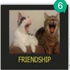

> **Deskripsi Visual:** Gambar ini adalah ilustrasi yang menunjukkan dua kucing yang sedang bermain dan berteriak. Gambar ini memiliki judul "FRIENDSHIP" yang terletak di bawah gambar. Ilustrasi ini menunjukkan hubungan positif antara dua kucing, yang menunjukkan bahwa mereka adalah teman baik. Keduanya tampak sangat senang dan bahagia saat bermain bersama. Ini menunjukkan bahwa hubungan antara manusia dan hewan dapat menjadi sangat positif jika kita membangun hubungan yang sehat dan damai.

---
**🖼️ Gambar/Diagram**

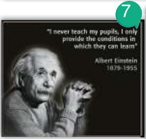

> **Deskripsi Visual:** Gambar ini adalah ilustrasi yang menampilkan Albert Einstein sedang berbicara dengan telinganya tertutup oleh sebuah benda berbentuk kacang. Gambar ini memiliki teks yang ditulis di atasnya yang mengungkapkan kata-kata Albert Einstein tentang pendidikan. Teks tersebut membahas bahwa Einstein tidak pernah mengajar murid-muridnya, tetapi hanya memberikan penerangan kepada mereka yang mereka inginkan. Ini menunjukkan bahwa Einstein sangat berbeda dari guru-guru tradisional yang seringkali mengajar semua murid dengan cara yang sama. Gambar ini juga menunjukkan bahwa Einstein sangat berbeda dari guru-guru tradisional yang seringkali mengajar semua murid dengan cara yang sama. Gambar ini juga menunjukkan bahwa Einstein sangat berbeda dari guru-guru tradisional yang seringkali mengajar semua murid dengan cara yang sama. Gambar ini juga menunjukkan bahwa Einstein sangat berbeda dari guru-guru tradisional yang seringkali mengajar semua murid dengan cara yang sama.

Source: creativeimage.com

---
**🖼️ Gambar/Diagram**

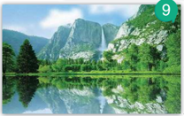

> **Deskripsi Visual:** Gambar ini adalah foto yang menunjukkan pemandangan alam yang indah. Gambar ini menampilkan sebuah danau yang berada di tengah-tengah, dengan pohon-pohon besar yang tumbuh di tepi danau. Di sebelah kiri danau, terdapat sebuah bukit yang tinggi dengan puncaknya tertutup oleh pepohonan hijau. Di sebelah kanan danau, terdapat sebuah bukit yang lebih rendah dengan puncaknya juga tertutup oleh pepohonan hijau. Di bagian atas gambar, terdapat sebuah gunung yang tinggi dengan puncaknya tertutup oleh awan. Di bagian bawah gambar, terdapat air yang jernih dan cerah, dengan air danau yang jernih dan cerah. Di bagian bawah gambar, terdapat air yang jernih dan cerah, dengan air danau yang jernih dan cerah. Di bagian bawah gambar, terdapat air yang jernih dan cerah, dengan air danau yang jernih dan cerah. Di bagian bawah gambar, terdapat air yang jernih dan cerah, dengan air danau yang jernih dan cerah. Di bagian bawah gambar, terdapat air yang jernih dan cerah, dengan air danau yang jernih dan cerah. Di bagian bawah gambar, terdapat air yang jernih dan cerah, dengan air danau yang jernih dan cerah. Di bagian bawah gambar, terdapat air yang jernih dan cerah, dengan air danau yang jernih dan cerah. Di bagian bawah gambar, terdapat air yang jernih dan cerah, dengan air danau yang jernih dan cerah. Di bagian bawah gambar, terdapat air yang jernih dan cerah, dengan air danau yang jernih dan cerah. Di bagian bawah gambar, terdapat air yang jernih dan cerah, dengan air danau yang jernih dan cerah. Di bagian bawah gambar, terdapat air yang jernih dan cerah, dengan air danau yang jernih dan cerah. Di bagian bawah gambar, terdapat air

Source: creativeimage.com

 

---
## 📄 Halaman 42

A caption, also known as a cutline, is a text that appears below an image. Most captions draw attention to something in the image that is not obvious, such as its relevance to the text. Captions can consist of a few words of description, or several sentences. Along with the title, lead, and section headings, captions are the most commonly read words in an article, so they should be succinct and informative.

Captions also include a short title or heading of an article in a magazine or newspaper. Words shown on a cinema or television screen to establish the scene of a story are also called captions. Captions can also be inserted below/above charts, fi gures, graphics and tables.

There are several criteria for a good caption. A good caption clearly identi fi es the subject of the picture without detailing the obvious. It is succinct. It establishes the picture's relevance to the article, provides context for the picture, and draws the reader into the article.

(Adapted from: en.m.wikipedia.org)

- Can you mention some attitude problems?
- What kind of personality is dif fi cult to handle?
- What kind of caption is it?

 

---
## 📄 Halaman 43

- ne
- to
- n
- le

---
**🖼️ Gambar/Diagram**

> **Deskripsi Visual:** Gambar ini adalah ilustrasi yang menampilkan pemandangan alam yang indah dengan matahari terbit di atas pegunungan. Ilustrasi ini menggambarkan sebuah sungai yang berjalan melalui hutan hijau, dengan pohon-pohon besar yang tumbuh di sepanjang tepi sungai. Di sebelah kiri, terdapat sebuah tebing yang tinggi dengan batu-batu besar yang berada di atasnya. Pemandangan ini dihiasi oleh sinar matahari yang menyinarin ke berbagai bagian tanah, menciptakan efek cahaya yang indah.

Elemen-elemen utama dalam gambar ini adalah matahari, sungai, hutan, dan tebing. Matahari terletak di atas pegunungan, memberikan cahaya yang menyinarin ke berbagai bagian tanah. Sungai berjalan melalui hutan hijau, dengan pohon-pohon besar yang tumbuh di sepanjang tepi sungai. Tebing yang tinggi dengan batu-batu besar berada di sebelah kiri gambar.

Teks, angka, atau label penting yang terlihat dalam gambar ini adalah "10 Great Quotes On Nature". Ini menunjukkan bahwa gambar ini mungkin merupakan halaman atau bagian dari buku pelajaran yang berisi kutipan tentang alam.

Informasi kunci yang dapat diambil pembaca adalah bahwa gambar ini menunjukkan pemandangan alam yang indah dengan matahari terbit di atas pegunungan, sungai yang berjalan melalui hutan hijau, dan tebing yang tinggi dengan batu-batu besar. Ini menunjukkan pentingnya alam dan keindahan alam dalam hidup manusia.

---
**🖼️ Gambar/Diagram**

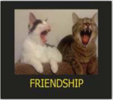

> **Deskripsi Visual:** Gambar ini adalah ilustrasi yang menunjukkan dua kucing sedang berteriak dengan ekspresi yang sangat emosional. Kedua kucing tersebut tampak sangat senang dan bahagia, mungkin karena mereka merasa dihargai atau mendapatkan perhatian dari pemiliknya. Gambar ini menggunakan teknik penggambaran yang sangat realistis untuk menggambarkan emosi kucing, yang sering kali dianggap sebagai hewan yang paling emosional di dunia.

Elemen utama dalam gambar ini adalah dua kucing yang berteriak. Kucing di sebelah kiri memiliki bulu putih dan hitam, sedangkan kucing di sebelah kanan memiliki bulu coklat dan hitam. Keduanya tampak sangat senang dan bahagia, dengan mulut terbuka dan mata terbuka lebar. 

Teks "FRIENDSHIP" yang terletak di bawah kedua kucing memberikan konteks bahwa gambar ini mungkin ingin menggambarkan hubungan antara dua kucing yang sangat dekat dan saling menghargai satu sama lain. Ini juga bisa menjadi simbol untuk hubungan antara manusia dan hewan peliharaan, di mana kucing sering dianggap sebagai teman dekat dan sahabat.

Informasi kunci yang dapat diambil pembaca adalah bahwa gambar ini mungkin ingin mengajarkan tentang pentingnya hubungan dan persahabatan, baik antara manusia dan hewan peliharaan, maupun antara kucing sendiri.

---
**🖼️ Gambar/Diagram**

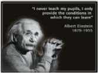

> **Deskripsi Visual:** Gambar ini adalah foto yang menampilkan Albert Einstein berdiri dengan pose yang serius dan menunjukkan wajahnya yang penuh pengetahuan. Di bawah foto tersebut, terdapat kutipan teks yang membaca: "I never teach my pupils, I only provide the conditions in which they can learn." Kepada tahun lahir dan meninggalnya Einstein, yaitu 1879-1955.

Elemen utama dalam gambar ini adalah Einstein sebagai tokoh utama, yang tampaknya sedang berbicara atau berpikir dalam suasana yang mendalam. Teks di bawah gambar memberikan informasi tambahan tentang pendapat Einstein tentang pendidikan, yang menunjukkan bahwa dia tidak hanya mengajar, tetapi juga menciptakan kondisi yang memungkinkan siswa untuk belajar sendiri.

Informasi kunci yang dapat diambil dari gambar ini adalah bahwa Einstein adalah seorang ilmuwan yang sangat berpengaruh dan memiliki pendapat yang unik tentang pendidikan. Gambar ini juga menunjukkan bahwa Einstein adalah seseorang yang penuh pengetahuan dan pemikiran yang mendalam, yang dapat dilihat dari posisinya yang menunjukkan wajahnya yang penuh pengetahuan dan pose yang serius.

---
**🖼️ Gambar/Diagram**

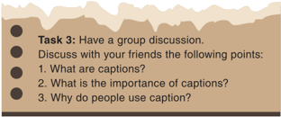

> **Deskripsi Visual:** Gambar ini adalah sebuah diagram yang menunjukkan tugas 3 dalam buku pelajaran. Diagram ini berupa daftar pertanyaan yang harus dibahas dalam diskusi kelompok dengan teman-teman. Pertanyaan-pertanyaan tersebut meliputi:

1. Apa itu caption?
2. Apa yang penting tentang caption?
3. Mengapa orang menggunakan caption?

Elemen utama dari diagram ini adalah daftar pertanyaan yang disusun secara horizontal. Setiap pertanyaan dianggap sebagai item dalam daftar, dengan nomor yang menunjukkan urutan pertanyaan. Teks yang ditampilkan secara keseluruhan adalah instruksi untuk melakukan diskusi kelompok tentang caption dan pentingnya caption.

Label penting yang terlihat pada diagram ini adalah "Task 3" yang menunjukkan bahwa ini adalah tugas ke-3 dalam buku pelajaran. Angka-angka yang digunakan dalam daftar pertanyaan juga penting karena mereka membantu pembaca mengenali urutan pertanyaan.

Informasi kunci yang dapat diambil pembaca dari gambar ini adalah bahwa ada tugas yang harus diselesaikan dalam diskusi kelompok, yaitu membahas tentang caption dan pentingnya caption. Ini menunjukkan bahwa caption memiliki peran penting dalam konteks pembelajaran yang ditawarkan oleh buku pelajaran ini.

 

---
## 📄 Halaman 44

---
**🖼️ Gambar/Diagram**

> **Deskripsi Visual:** Gambar ini adalah ilustrasi yang menampilkan seorang pria berjalan dengan bekal perjalanan. Pria tersebut mengenakan jaket merah dan celana hitam, serta memegang tas ransel kuning dan sebuah buku. Wajahnya tampak tenang dan senyuman kecil, menunjukkan suasana positif. Ilustrasi ini mungkin digunakan untuk membantu pembaca memahami konsep tentang perjalanan atau pendidikan.

Task 4: Have a discussion in pairs. Back to the captions number 1-9. What messages are sent by the writers? Where can you fi nd these captions? Discuss with your chairmate to fi nd the answer. Write down your answer in the space below.

---
**📊 Tabel**

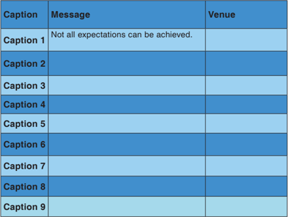

Tabel ini berisi 9 baris dengan judul "Caption" di kolom pertama, "Message" di kolom kedua, dan "Venue" di kolom ketiga. Topik utama tabel ini adalah tentang ekspektasi dan pengalaman, dengan berbagai caption yang mungkin merujuk pada situasi atau peristiwa tertentu. Data penting yang terlihat adalah bahwa tidak semua ekspektasi dapat dicapai, yang menunjukkan bahwa ada batasan dalam apa yang bisa diharapkan.

.

 

---
## 📄 Halaman 45

Task 5:

Work in pairs.

Refer to the pictures in previous Task 1 and complete the blanks with suitable expressions. Then, play these roles in front of the class.

### Dialog 1

A :  Which caption(s) do you like?

B :  -----------------------------------

A :  Why do you think so?

B :  -----------------------------------

What about you, which one(s) do you like?

A :  I think ______________________________

B :  Can you tell me why you like it?

A :  -----------------------------------

B :  Do you think the description in caption 1 re fl ects the content of the chart?

A :  -----------------------------------

### Dialog 2

A : Which _______________________?

- B : I like caption number 4. The font is so interesting and the combination of black and white colours provides a clear contrast. What about you, which one do you like the best?
A : I like number 5 best. The yellow colour with the greeny nature background _____________________________

___________________________________________

B : I like it, too. The words also ______________________

___________________________________________

A: Do you agree with the words written in caption 1?

B: ___________________________________________

A: Why?

B: ___________________________________________

 

---
## 📄 Halaman 46

---
**🖼️ Gambar/Diagram**

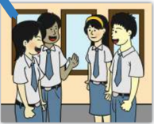

> **Deskripsi Visual:** Gambar ini adalah ilustrasi yang menunjukkan tiga orang siswa berbincang-bincang di ruang kelas. Siswa di tengah menggenggam sebuah buku, sementara dua siswa di sisi kiri dan kanan sedang berbicara dengan bahasa yang tidak jelas. Dinding belakang terlihat bersih dan terdapat cermin di sudut ruangan. Siswa di tengah mengenakan seragam sekolah putih dengan lengan panjang dan kemeja biru, sedangkan siswa di sisi kiri dan kanan juga mengenakan seragam yang sama namun dengan perbedaan warna lengan. Ilustrasi ini mungkin digunakan untuk membahas tentang interaksi antar teman sekelas atau proses belajar di sekolah.

---
**🖼️ Gambar/Diagram**

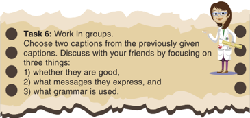

> **Deskripsi Visual:** Gambar ini adalah ilustrasi yang menunjukkan seorang dokter wanita sedang memberikan penjelasan kepada para peserta. Dokter tersebut mengenakan seragam medis dan memegang sebuah papan tulis, menunjukkan bahwa dia mungkin sedang memberikan informasi atau menjelaskan sesuatu. Di sebelah kiri gambar, terdapat dua caption yang ditampilkan, yang kemungkinan besar merupakan topik utama yang akan dibahas dalam diskusi tersebut.

Dalam konteks pembelajaran, gambar ini mungkin digunakan untuk mengajarkan tentang tugas kerja tim, seperti bagaimana bekerja sama dalam tim, atau bagaimana berkomunikasi efektif dengan rekan kerja. Dokter sebagai tokoh utama dalam gambar tersebut bisa menjadi contoh bagaimana seseorang harus berperilaku profesional dan bertanggung jawab dalam pekerjaannya.

Jadi, gambar ini adalah ilustrasi yang membantu dalam pembelajaran tentang tugas kerja tim dan profesionalisme dalam pekerjaan medis.

 

---
## 📄 Halaman 47

### A note to remember:

There  are  several  criteria  for  a  good  caption. A good caption clearly identi fi es the subject of the picture without detailing the obvious. It is succinct. It establishes the picture's relevance to the picture, provides  context  for  the  picture,  and  draws  the reader into the message.

So related to the structure of a caption, it can be  written  in  the  form  a  word(s),  phrase(s)  or sentence(s).

### C. WRITING AND DESCRIBING CAPTIONS

When writing a caption, the descriptive words accompanying the caption should offer more complete information about the picture. The words that you choose depend on the message that you want to send to your reader.

---
**🖼️ Gambar/Diagram**

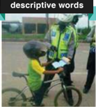

> **Deskripsi Visual:** Gambar ini adalah foto yang menunjukkan seorang petugas keamanan berdiri di samping sepeda anak-anak. Petugas tersebut sedang memegang sebuah buku dan tampaknya sedang memberikan informasi atau izin kepada seorang anak yang sedang bersepeda. Anak tersebut mengenakan helm dan pakaian olahraga, menunjukkan bahwa ia sedang berolahraga atau perjalanan. Gambar ini menunjukkan hubungan antara petugas keamanan dan anak-anak, serta menekankan pentingnya pengawasan dan keselamatan saat bersepeda.

 

---
## 📄 Halaman 48

From  the  picture  above,  you  can  create  different  kinds  of caption. You can write 'Poor boy!' to show your sympathy to the boy. You can also write down, 'Show me your driving license.' to create a satire commenting on the police of fi cer. You might want to write, 'Oh, my goodness!' to echo the boy's mind why the police should stop him while he is only riding his bicycle or the police is thinking why the boy wears a safety helmet for a motor rider. Many other  expressions  are  possible.  You  can  also  put  the  words  in different positions to create the best layout.

---
**🖼️ Gambar/Diagram**

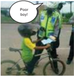

> **Deskripsi Visual:** Gambar ini adalah ilustrasi yang menunjukkan seorang petugas keamanan berbicara dengan seorang pengendara sepeda. Petugas keamanan sedang memegang sebuah buku dan tampaknya sedang memberikan sanksi atau memberikan informasi kepada pengendara sepeda. Pengendara sepeda tampak sedikit bingung atau tidak puas dengan situasi tersebut.

Elemen utama dalam gambar ini meliputi:
1. Petugas keamanan yang sedang berbicara.
2. Pengendara sepeda yang tampak tidak senang.
3. Buku yang dimiliki oleh petugas keamanan.
4. Latar belakang yang menunjukkan lingkungan jalan raya.

Teks, angka, atau label penting yang terlihat dalam gambar ini adalah:
- "Poor boy!" yang ditulis di atas kepala pengendara sepeda.

Informasi kunci yang dapat diambil pembaca dari gambar ini adalah bahwa ada konflik antara petugas keamanan dan pengendara sepeda, mungkin karena pelanggaran lalu lintas atau kesalahan pengendaraan. Petugas keamanan tampaknya sedang memberikan sanksi atau memberikan informasi kepada pengendara, yang tampaknya tidak setuju dengan tindakan tersebut.

---
**🖼️ Gambar/Diagram**

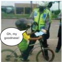

> **Deskripsi Visual:** Gambar ini adalah ilustrasi yang menunjukkan seorang petugas keamanan berdiri di samping sepeda motor, sedang memegang sebuah buku. Petugas tersebut mengenakan seragam berwarna hijau dengan logo polisi dan helm. Di depan petugas, terdapat sepeda motor yang tampaknya telah diperiksa atau dipantau oleh petugas tersebut. Di sebelah kiri gambar, terdapat tulisan "Oh, my goodness!" dalam bahasa Inggris, yang tampaknya merupakan komentar atau perasaan dari seseorang yang melihat gambar tersebut.

Elemen utama dalam gambar ini adalah petugas keamanan, sepeda motor, dan tulisan "Oh, my goodness!". Petugas keamanan adalah subjek utama yang memegang buku, sedangkan sepeda motor adalah objek yang dipantau atau diperiksa oleh petugas tersebut. Tulisan "Oh, my goodness!" menunjukkan reaksi atau perasaan dari seseorang yang melihat gambar tersebut, mungkin karena kejadian yang terjadi di sekitar sepeda motor tersebut.

Teks, angka, atau label penting yang terlihat dalam gambar ini adalah tulisan "Oh, my goodness!" yang terletak di sebelah kiri gambar. Informasi kunci yang dapat diambil pembaca dari gambar ini adalah bahwa ada kejadian yang terjadi di sekitar sepeda motor yang dipantau oleh petugas keamanan, dan reaksi atau perasaan dari seseorang yang melihat gambar tersebut.

---
**🖼️ Gambar/Diagram**

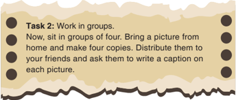

> **Deskripsi Visual:** Gambar ini adalah jenis diagram. Diagram ini menunjukkan tugas yang harus dilakukan oleh siswa dalam kelas. Tugas tersebut melibatkan kerjasama dalam kelompok empat orang. Siswa harus membawa gambar dari rumah dan membuat empat salinan. Setelah itu, mereka harus membagikan gambar tersebut kepada teman-teman mereka dan meminta mereka untuk menulis caption pada setiap gambar. Ini menunjukkan bahwa tugas ini bertujuan untuk mengajarkan siswa tentang cara membuat caption dan bagaimana berkomunikasi dengan teman-teman mereka melalui media visual.

 

---
## 📄 Halaman 49

---
**🖼️ Gambar/Diagram**

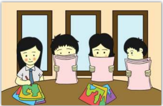

> **Deskripsi Visual:** Gambar ini adalah ilustrasi yang menunjukkan tiga orang siswa sedang belajar di kelas. Mereka semua sedang membaca buku dengan topi berwarna pink. Di sebelah mereka ada dua buku lainnya dengan cover warna-warni. Dua papan tulis tampak di belakang mereka, menunjukkan bahwa mereka sedang belajar matematika. Gambar ini menunjukkan aktivitas belajar di kelas dan fokus pada materi matematika.

 

---
## 📄 Halaman 50

### D.REFLECTION

---
**🖼️ Gambar/Diagram**

> **Deskripsi Visual:** Gambar ini adalah ilustrasi yang menunjukkan seorang guru sedang memberikan penjelasan di depan kelas. Guru tersebut sedang berdiri di belakang meja, menghadap ke arah kelas, dan menunjuk dengan jari telunjuk. Guru tersebut memakai pakaian formal, termasuk jaket biru dan kemeja putih, serta memakai kacamata. Di depan guru, terdapat sebuah buku yang tampaknya merupakan buku pelajaran atau referensi untuk pembelajaran.

Elemen-elemen utama dalam gambar ini meliputi guru, kelas, buku, dan tanda-tanda interaksi antara guru dan siswa. Guru adalah subjek utama yang sedang berbicara atau memberikan penjelasan. Buku yang ada di depan guru merupakan elemen penting yang menunjukkan konteks pembelajaran. Siswa tidak terlihat dalam gambar ini, tetapi asumsi bahwa mereka ada di belakang guru.

Teks, angka, atau label penting yang terlihat dalam gambar ini adalah "guru" dan "buku". Informasi kunci yang dapat diambil pembaca dari gambar ini adalah bahwa ini adalah situasi pembelajaran di kelas, guru sedang memberikan penjelasan, dan buku adalah alat pendukung pembelajaran.

At the end of this chapter, ask yourself the following questions to know your learning progress.

- Do you know why people write captions?
- Where do you usually fi nd captions?
- What can make people understand the messages in captions?
- Do you know how to write texts accompanying captions?
- What can you learn from this chapter?
- Do you have any dif fi culties in understanding and writing captions?
If you answer "no" to any of the questions above, please discuss it with your friends or consult it with your teacher.

 

---
## 📄 Halaman 51

### Do You Know How to Apply for a Job?

### Kompetensi Dasar:

Setelah mempelajari Bab 4, siswa diharapkan mampu melakukan hal-hal sebagai berikut:

- Membedakan fungsi sosial, struktur teks, dan unsur kebahasaan beberapa teks khusus dalam bentuk surat lamaran kerja, dengan memberi dan meminta informasi terkait jati diri dan latar belakang pendidikan/ pengalaman kerja, sesuai dengan konteks penggunaannya. 3.2
- Menangkap makna secara kontekstual terkait fungsi sosial, struktur teks, dan unsur kebahasaan teks khusus dalam bentuk surat lamaran kerja yang memberikan informasi terkait jati diri dan latar belakang pendidikan/ pengalaman kerja. 4.2. 1
- Menyusun teks khusus surat lamaran kerja, yang memberikan informasi antara lain terkait jati diri dan latar belakang pendidikan/pengalaman kerja, dengan memperhatikan fungsi sosial, struktur teks, dan unsur kebahasaan, secara benar dan sesuai konteks. 4.2.2

 

---
## 📄 Halaman 52

### A. WARMER: BOARDGAME (MINDMAP)

Your teacher will divide the class into 4 groups and show you how to play boardgame (mindmap). All groups will compete to complete the mindmap on the whiteboard. The fi rst to fi nish the mindmap will be the winner. Look at the example below.

---
**🖼️ Gambar/Diagram**

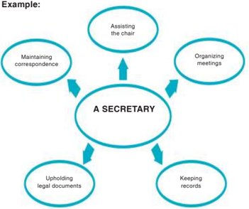

> **Deskripsi Visual:** Gambar ini adalah diagram yang menunjukkan peran seorang sekretaris dalam sebuah organisasi. Diagram ini terdiri dari empat elemen utama yang menghubungkan ke elemen pusat, yang disebut "A SECRETARY". Setiap elemen tersebut memiliki tulisan di dalamnya yang menjelaskan tugas-tugas yang dilakukan oleh sekretaris tersebut.

Elemen pertama, "Maintaining correspondence", menunjukkan bahwa sekretaris bertanggung jawab untuk memastikan bahwa semua komunikasi internal dan eksternal diatur dengan baik. Elemen kedua, "Organizing meetings", menunjukkan bahwa sekretaris juga bertanggung jawab untuk mengatur dan mengorganisir pertemuan yang berjalan lancar. Elemen ketiga, "Upholding legal documents", menunjukkan bahwa sekretaris harus memastikan bahwa semua dokumen hukum yang diperlukan untuk operasional organisasi diatur dengan benar. Elemen keempat, "Keeping records", menunjukkan bahwa sekretaris harus memastikan bahwa semua data dan informasi yang relevan diorganisir dan tersimpan dengan baik.

Teks, angka, atau label penting yang terlihat dalam diagram ini adalah "A SECRETARY" sebagai pusat diagram, dan empat elemen yang menghubungkan ke pusat tersebut. Informasi kunci yang dapat diambil pembaca adalah bahwa sekretaris memiliki tanggung jawab yang luas dan beragam dalam menjaga efisiensi dan efektivitas organisasi.

 

---
## 📄 Halaman 53

---
**🖼️ Gambar/Diagram**

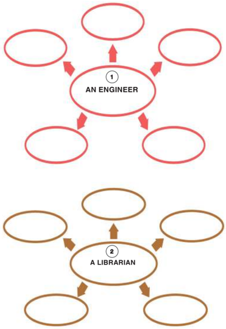

> **Deskripsi Visual:** Gambar ini adalah diagram yang menunjukkan hubungan antara dua profesi: seorang insinyur dan seorang perpustakawan. Diagram ini terdiri dari dua bagian yang berbeda, masing-masing menunjukkan hubungan dengan seorang insinyur dan seorang perpustakawan.

Pertama, ada sebuah lingkaran merah yang menandai "An Engineer" (seorang insinyur). Lingkaran ini memiliki tiga garis lurus yang mengarah ke tiga lingkaran kosong di sekitarnya, yang mungkin menunjukkan hubungan atau interaksi dengan tiga elemen lainnya dalam konteks profesional.

Kedua, ada sebuah lingkaran coklat yang menandai "A Librarian" (seorang perpustakawan). Lingkaran ini juga memiliki tiga garis lurus yang mengarah ke tiga lingkaran kosong di sekitarnya, yang mungkin menunjukkan hubungan atau interaksi dengan tiga elemen lainnya dalam konteks profesional.

Dalam diagram ini, tidak ada teks, angka, atau label spesifik yang diberikan, sehingga informasi kunci yang dapat diambil pembaca meliputi hubungan antara seorang insinyur dan seorang perpustakawan dalam konteks profesional mereka.

 

---
## 📄 Halaman 54

---
**🖼️ Gambar/Diagram**

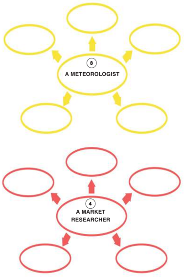

> **Deskripsi Visual:** Gambar ini adalah diagram yang menunjukkan hubungan antara dua profesi: meteorolog dan peneliti pasar. Diagram ini terdiri dari dua bagian berbeda, masing-masing menunjukkan aspek dari kedua profesi tersebut.

Pertama, bagian atas menggambarkan meteorolog. Di tengah ada teks "A METEOROLOGIST" dengan lima lingkaran berwarna kuning yang mengarah ke meteorolog. Ini menunjukkan bahwa meteorolog memiliki hubungan dengan lima aspek lainnya, mungkin seperti pengamatan cuaca, analisis data, penggunaan teknologi, dan komunikasi dengan publik.

Bagian bawah menggambarkan peneliti pasar. Di tengah ada teks "A MARKET RESEARCHER" dengan empat lingkaran berwarna merah yang mengarah ke peneliti pasar. Ini menunjukkan bahwa peneliti pasar memiliki hubungan dengan empat aspek lainnya, mungkin seperti pengumpulan data, analisis data, pengembangan strategi, dan komunikasi dengan pemangku kepentingan.

Dari gambar ini, kita bisa mengambil beberapa informasi penting. Pertama, kedua profesi ini memiliki hubungan yang erat, baik dalam hal aspek pekerjaan mereka maupun dalam hal pengetahuan dan keterampilan yang dibutuhkan. Kedua, kedua profesi ini memerlukan pengetahuan dan keterampilan yang berbeda, yang menunjukkan bahwa mereka tidak hanya saling melengkapi tetapi juga memiliki karakteristik unik masing-masing.

 

---
## 📄 Halaman 55

---
**🖼️ Gambar/Diagram**

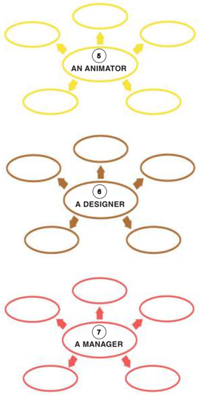

> **Deskripsi Visual:** Gambar ini adalah diagram yang menunjukkan hubungan antara tiga individu dalam sebuah organisasi: seorang Animator, Desainer, dan Manajer. Diagram ini menggunakan warna berbeda untuk masing-masing individu untuk membedakannya. 

Pertama, ada seorang Animator yang memiliki empat hubungan dengan tiga orang lainnya. Ini menunjukkan bahwa Animator memiliki beberapa tanggung jawab atau peran dalam organisasi tersebut.

Kedua, ada seorang Desainer yang juga memiliki empat hubungan dengan tiga orang lainnya. Ini menunjukkan bahwa Desainer juga memiliki beberapa tanggung jawab atau peran dalam organisasi tersebut.

Ketiga, ada seorang Manajer yang memiliki tujuh hubungan dengan tiga orang lainnya. Ini menunjukkan bahwa Manajer memiliki beberapa tanggung jawab atau peran dalam organisasi tersebut.

Teks, angka, atau label penting yang terlihat pada gambar ini adalah "ANIMATOR", "A DESIGNER", dan "A MANAGER". Angka-angka ini menunjukkan jumlah hubungan setiap individu dengan orang lain dalam organisasi tersebut.

Informasi kunci yang dapat diambil pembaca dari gambar ini adalah bahwa setiap individu dalam organisasi tersebut memiliki beberapa tanggung jawab atau peran dalam organisasi tersebut.

 

---
## 📄 Halaman 56

---
**🖼️ Gambar/Diagram**

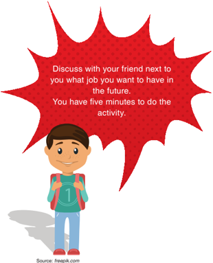

> **Deskripsi Visual:** Gambar ini adalah ilustrasi yang menampilkan seorang anak laki-laki berdiri dengan pakaian sekolah dan tas sekolah. Anak tersebut sedang berbicara ke arah kanan dengan sebuah bau merah yang mengandung teks. Teks tersebut memberikan instruksi kepada pembaca untuk berbicara dengan teman dekatnya tentang pekerjaan apa yang ingin mereka miliki di masa depan. Pembaca diberitahu bahwa mereka memiliki lima menit untuk melakukan aktivitas ini. Gambar ini menggunakan warna-warna cerah dan sederhana untuk menarik perhatian pembaca.

### B. VOCABULARY BUILDER

---
**🖼️ Gambar/Diagram**

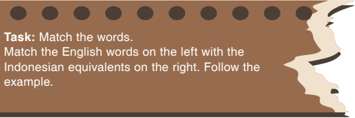

> **Deskripsi Visual:** Gambar ini adalah sebuah tugas yang bertujuan untuk membandingkan kata-kata dalam bahasa Inggris dengan kata-kata yang setara dalam bahasa Indonesia. Teks di atas gambar memberikan instruksi untuk melakukan perbandingan tersebut. Gambar ini tidak memiliki elemen visual lain selain teks yang disebutkan.

 

---
## 📄 Halaman 57

---
**🖼️ Gambar/Diagram**

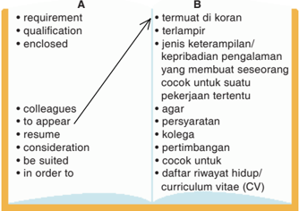

> **Deskripsi Visual:** Gambar ini adalah diagram yang menunjukkan hubungan antara dua kata-kata dalam bahasa Inggris dan Bahasa Melayu. Diagram ini dibagi menjadi dua bagian, A dan B. Bagian A berisi kata-kata dalam Bahasa Inggris seperti "requirement", "qualification", "enclosed", "colleagues", "to appear", "resume", "consideration", "be suited", dan "in order to". Sementara itu, bagian B berisi kata-kata dalam Bahasa Melayu yang memiliki arti yang sama atau sejenis dengan kata-kata dalam Bahasa Inggris.

Elemen utama dalam diagram ini adalah dua kelompok kata yang saling terhubung oleh garis lurus. Garis tersebut menunjukkan bahwa setiap kata dalam Bahasa Inggris memiliki arti yang sama atau sejenis dengan kata-kata dalam Bahasa Melayu. Ini membantu pembaca untuk memahami hubungan antara dua bahasa tersebut.

Teks, angka, atau label penting yang terlihat dalam diagram ini adalah nama-nama kata dalam Bahasa Inggris dan Bahasa Melayu. Nama-nama kata ini digunakan sebagai titik-titik penghubung antara kedua bahasa tersebut.

Informasi kunci yang dapat diambil pembaca dari gambar ini adalah bahwa Bahasa Inggris dan Bahasa Melayu memiliki kata-kata yang memiliki arti yang sama atau sejenis. Ini membantu pembaca untuk memahami hubungan antara kedua bahasa tersebut dan memudahkan mereka dalam mempelajari kedua bahasa tersebut.

### C. PRONUNCIATION PRACTICE

Task:

Listen and repeat after your teacher.

- Listen and repeat after your teacher says the words
- below. Practice more to perfect your pronunciation.
- to appear :
/tu əˈ p ɪ r/

- 2 .   be enclosed :
/bi:

ɪ n ˈ klo ʊ zd/

- 3 .   qualification :
/ ˌ kw ɑː l ɪ f əˈ ke ɪʃə n/

- in order to :
/ ɪ n ˈ ɔː rd ə r tu ː /

- 5 .   requirement :
/r ɪˈ kwa ɪ rm ə nt/

- 6 .   c olleagues :
/ ˈ k ɑː li ː ɡ /

- consideration :
/k ə n ˌ s ɪ d əˈ re ɪʃə n/

- 8 .   be suited :
/bi ː su ː t ɪ d/

- resume :
/r ɪˈ zu ː m/

 

---
## 📄 Halaman 58

### D. READING COMPREHENSION

---
**🖼️ Gambar/Diagram**

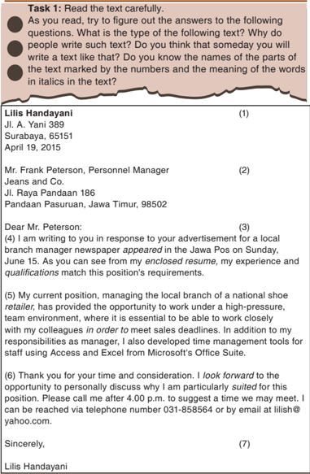

> **Deskripsi Visual:** Gambar ini adalah sebuah surat lamaran kerja yang ditulis oleh Lilis Handayani kepada Mr. Frank Paterson, Manajer Pendidikan dari Jeans and Co. Surat ini ditujukan untuk mengjawab iklan lowongan kerja lokal branch manager yang diterbitkan pada Jawa Pos pada tanggal 15 Juni. Surat ini berisi informasi tentang pengalaman Lilis dalam manajemen cabang lokal sebelumnya, serta pengetahuan dan keterampilannya yang sesuai dengan posisi tersebut. Lilis juga memberikan detail tentang waktu yang disediakan untuk pertemuan pribadi dan menyertakan nomor telepon dan email sebagai alamat kontak.

 

---
## 📄 Halaman 59

Answer the following questions based on the text.

- To whom is the letter sent?
- Who wrote the application letter?
- What is the purpose of writing the letter?
- What position is being advertised?
- How did Lilis Handayani know the vacancy?
- What is Lilis' current position?
- What has her current position provided with?
- What other responsibilities does she have at the moment?
- Do you think that Lilis is con fi dent about her competence? How do you know?
- Does Lilis indicate her willingness for an interview? Find the evidence from the text.

---
**🖼️ Gambar/Diagram**

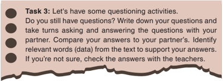

> **Deskripsi Visual:** Gambar ini adalah sebuah instruksi atau petunjuk bertanya yang ditemukan pada buku pelajaran. Ini berupa tiga baris teks yang berfungsi sebagai pertanyaan dan petunjuk untuk melakukan aktivitas bertanya dan menjawab. Pertanyaan pertama mengajak pembaca untuk menulis pertanyaan mereka sendiri, sementara pertanyaan kedua meminta mereka untuk berkeliling bertanya dan menjawab dengan partner mereka. Pertanyaan ketiga mengajak mereka untuk membandingkan jawaban mereka dengan partner mereka dan menemukan kata-kata yang relevan (data) dari teks yang relevan untuk mendukung jawaban mereka. Jika mereka tidak yakin, mereka diminta untuk memeriksa jawaban dengan guru.

### E. VOCABULARY EXERCISES

 

---
## 📄 Halaman 60

be suited requirement attached to consideration quali fi cation resume/CV

appear in order to colleague

- Siti still cannot hide her happiness because her investigation report about high school students' eating habit ____________ on a regional newspaper yesterday.
- Butet frequently initiates speaking in English with her classmates because one of the  ___________ appearing in job vacancy advertisements in the Internet and newspapers require English fl uency.
- Students of XII E class made a class pledge stating their commitment to stop bullying  ____________ create positive classroom atmosphere for every class member.
- I support Eva Tuarita to be the new head of our student association because she possesses all the  __________ to be a good leader for us.
- Ratu Tita has written a letter addressed to the principal of our school asking permission not to attend classes for 2 days because she and I will join an English speech competition. ___________ the letter is our completed application letter to join the event, which is also signed by our English teacher.
- As good ___________, our teachers visited our English teacher who has been sick for a week. Some of us also went there together bringing her favorite fruit.
- Maya's calm personality is really ___________ for her role as one of the school mediators that help con fl icting students to achieve con fl ict resolution.
- Fighting? Never. Although Bejo is a great master in martial arts, he never takes fi ghting into his __________ in dealing with problems.
- Don't forget to attach your ................. in your application letter and don't forget to include all of the certi fi cates of trainings you have attended.

 

---
## 📄 Halaman 61

### F. GRAMMAR REVIEW

### PASSIVE VOICE

- Task 1: Read the following sentences.
- Observe the italicized verbs. Look how the "to be" changes the verb.
- I am particularly suited to this position.
- I can also be reached by email.
- The application letter is written by William Smith.
- The programmer position is advertised in the Times Union.
- Three references are enclosed in the application letter.
- The application letter was sent three days ago.
- Several positions were offered in yesterday's local newspaper.
Did you notice that in all the sentences you found be (am, is, are, was, or were) and past participles (V-3) ? Those sentences are called passive sentences. Study the following examples to see how passive sentences are formed from active ones.

---
**📊 Tabel**

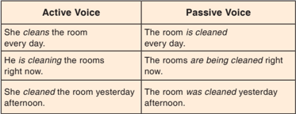

Tabel ini membandingkan dua jenis struktur pengucapan, yaitu Active Voice (Pengucapan Aktif) dan Passive Voice (Pengucapan Pasif). Topik utama tabel ini adalah perbedaan struktur pengucapan antara dua jenis ini. Kolom pertama berisi contoh kalimat dalam Active Voice, sedangkan kolom kedua berisi contoh kalimat yang sama tetapi dalam bentuk Passive Voice. Data penting yang terlihat adalah bahwa dalam Active Voice, subjek melakukan tindakan, sementara dalam Passive Voice, subjek menjadi objek tindakan. Misalnya, "She cleans the room every day" dalam Active Voice menunjukkan bahwa "she" (Ibu) melakukan tindakan "clean" (bersihkan) pada "the room" (kamar tidur), sementara "The room is cleaned every day" dalam Passive Voice menunjukkan bahwa "the room" (kamar tidur) menjadi objek tindakan "is cleaned" (dibersihkan) oleh "itself" (kamar tidur sendiri).

 

---
## 📄 Halaman 62

---
**📊 Tabel**

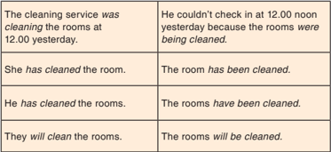

Tabel ini berisi contoh penggunaan kata kerja kerja pasif dalam bahasa Inggris. Topik utamanya adalah tentang keadaan dan tindakan yang dilakukan oleh subjek (yang tidak dinyatakan secara langsung) dalam berbagai situasi. Kolom pertama menunjukkan tindakan yang dilakukan oleh subjek, sedangkan kolom kedua menunjukkan tindakan yang dilakukan oleh subjek dalam bentuk pasif. Data penting yang terlihat adalah bahwa kata kerja kerja pasif biasanya digunakan untuk menggambarkan tindakan yang telah selesai atau tindakan yang akan dilakukan di masa depan.

Task 2:

Do the exercise.

Change the following active sentences into passive.

- He manages the local branch of a national shoe retailer.
_____________________________________________

- The company has advertised the job opportunity in the national newspaper.
_____________________________________________

- He developed time management tools for staff.
_____________________________________________

- She will enclose her resume in the application letter.
_____________________________________________

- Linda is writing an application letter for the position as a secretary.
__________________________________________

 

---
## 📄 Halaman 63

---
**🖼️ Gambar/Diagram**

> **Deskripsi Visual:** Gambar ini adalah jenis diagram, yang menunjukkan informasi tentang penggunaan bahasa pasif dalam kalimat. Gambar ini terdiri dari sebuah lembar kertas berwarna hijau dengan tulisan "NOTE:" di bagian atas. Di bawah tulisan tersebut, terdapat penjelasan singkat tentang penggunaan bahasa pasif, yang mencakup beberapa poin penting:

1. Penjelasan umum tentang bahasa pasif: "In passive voices, the subjects disappear."
2. Alasan penggunaan bahasa pasif: "Passive voices are usually used when the subjects (doers) are not really important, therefore they are often omitted from the sentences."
3. Perbedaan antara bahasa aktif dan pasif: "In passive voices, the process is more important than the doers."

Elemen-elemen utama dalam gambar ini adalah tulisan "NOTE:" dan penjelasan tentang bahasa pasif. Tulisan "NOTE:" berada di bagian atas lembar kertas, sedangkan penjelasan tentang bahasa pasif berada di bawahnya. Informasi kunci yang dapat diambil pembaca meliputi pengertian bahwa dalam bahasa pasif subjek (pengucap) tidak lagi muncul dalam kalimat, dan alasan mengapa bahasa pasif sering digunakan ketika subjek tidak lagi penting bagi konteks kalimat.

### G. TEXT STRUCTURE

- Task 1: Pay attention to the table below. These are the structures of application letters. Find an
example of an application letter and try to identify its

- text structure.

---
**📊 Tabel**

Tabel ini berisi instruksi tentang bagian-bagian surat lamaran kerja yang harus diperhatikan. Topik utamanya adalah bagian-bagian penting dari surat lamaran kerja. Kolom pertama menunjukkan nomor urut dari setiap bagian, sedangkan kolom kedua menjelaskan apa itu bagian tersebut. Data penting yang terlihat adalah bahwa semua bagian harus ditulis dengan teliti dan jelas, termasuk alamat perusahaan, judul dan alamat lengkap, penjelasan tentang posisi yang dicari, dan pembukaan paragraf untuk menentukan apakah posisi tersebut masih tersedia atau untuk meminta informasi tentang kehadiran posisi.

 

---
## 📄 Halaman 64

---
**📊 Tabel**

Tabel ini berisi petunjuk tentang bagaimana menulis surat lamaran kerja yang efektif. Topik utamanya adalah cara menulis body paragraf yang tepat untuk menonjolkan pengalaman kerja yang paling cocok dengan deskripsi pekerjaan yang diberikan dalam iklan lowongan. Tabel ini juga memberikan saran untuk menulis penutup yang memudahkan pembaca untuk bertindak, seperti meminta pertemuan wawancara dan memberikan nomor telepon dan alamat email. Selain itu, tabel ini menekankan pentingnya menandatangani surat lamaran dan menyertakan CV sebagai 'enclosure'. Pola penting yang terlihat adalah bahwa semua petunjuk ini harus disesuaikan dengan deskripsi pekerjaan yang diberikan dalam iklan lowongan.

---
**🖼️ Gambar/Diagram**

> **Deskripsi Visual:** Gambar ini adalah sebuah instruksi untuk membaca teks dengan teliti dan menemukan bagian-bagian dari surat permohonan kerja. Ini termasuk jenis diagram, yaitu instruksi atau petunjuk. Gambar ini tidak memiliki elemen visual seperti foto, ilustrasi, atau rumus. Dalam konteks ini, gambar ini hanya berisi teks yang memberikan petunjuk tentang bagaimana membaca dan memahami bagian-bagian dari surat permohonan kerja.

### Guiding questions:

- Which part indicates the address of the job applicant?
- Which part indicates the address of the company the letter is sent to?
- Which part indicates the person in charge?
- Which part indicates the opening of the letter? What information is provided?
- Which part contains any information that matches the position? What speci fi c information is highlighted?
- Which paragraph closes the application letter? What information is written in this part?
- Where do you put your signature?
- What do you need to consider in writing an application letter?

 

---
## 📄 Halaman 65

---
**🖼️ Gambar/Diagram**

> **Deskripsi Visual:** Gambar ini menunjukkan sebuah surat lamaran kerja yang ditulis pada tanggal 23 Januari 2014 oleh John Donaldson untuk posisi Programmer di Prosperous Company. Surat ini berisi informasi tentang pengalaman kerja, pendidikan, dan keahlian teknis yang dimiliki oleh penulis. Penulis juga menyertakan tiga referensi dan mengajukan permintaan untuk melihat resume penulis. Surat ini ditandatangani dengan nama John Donaldson dan memiliki alamat email dan nomor telepon untuk kontak.

 

---
## 📄 Halaman 66

---
**🖼️ Gambar/Diagram**

> **Deskripsi Visual:** Gambar ini adalah sebuah instruksi tugas yang diberikan dalam buku pelajaran. Ini berupa tugas yang melibatkan kerja sama dalam pasangan. Tugas tersebut mengajarkan untuk merujuk ke pertanyaan pemahaman yang ada di surat lamaran yang ditulis oleh Liliis Handayani. Setelah itu, mereka harus mempelajari dan membandingkan pertanyaan pemahaman yang dibuat oleh John Donaldson dengan pertanyaan yang dibuat oleh pasangan lain. Tujuan dari tugas ini adalah untuk membantu siswa memahami bagaimana membuat pertanyaan pemahaman yang tepat dan relevan dengan konten yang diberikan.

### H. WRITING

---
**🖼️ Gambar/Diagram**

> **Deskripsi Visual:** Gambar ini adalah sebuah diagram yang menunjukkan tugas pertama dalam sebuah proses penilaian. Diagram ini terdiri dari dua bagian utama: bagian atas berisi teks instruksi dan bagian bawah berisi gambar latar belakang abstrak dengan tulisan "Task 1". Teks instruksi memberikan petunjuk kepada pembaca untuk membaca teks dengan teliti dan memeriksa apakah mereka memenuhi persyaratan untuk posisi kerja yang dinyatakan dalam teks tersebut.

Elemen-elemen utama yang terlihat dalam gambar ini adalah teks instruksi yang berada di bagian atas dan gambar latar belakang abstrak yang berada di bagian bawah. Teks instruksi berisi informasi tentang tugas yang harus dilakukan oleh pembaca, yaitu membaca teks dengan teliti dan memeriksa apakah mereka memenuhi persyaratan untuk posisi kerja yang dinyatakan dalam teks tersebut. Gambar latar belakang abstrak berfungsi sebagai latar belakang yang menarik perhatian pembaca dan memberikan kesan profesional pada gambar ini.

Informasi kunci yang dapat diambil pembaca dari gambar ini adalah bahwa mereka harus membaca teks dengan teliti dan memeriksa apakah mereka memenuhi persyaratan untuk posisi kerja yang dinyatakan dalam teks tersebut. Ini merupakan langkah awal dalam proses penilaian yang akan dilakukan oleh pembaca.

### VACANCY

Apika Plaza, a reputed and well-established showroom, is seeking to ful fi ll job vacancy from quali fi ed, motivated, and experienced individuals.

If you think you have the con fi dence and the capability in you, then you are more than welcome to apply.

### Position: Sales Executive

Quali fi cations:

- GLYPH<149> Bachelor's degree in any discipline
- GLYPH<149> Minimum 2 years of experience in a similar position
- GLYPH<149> Pro fi ciency in both English and Indonesian
- GLYPH<149> Basic computer skills
- GLYPH<149> Charming personality and good interpersonal skills

 

---
## 📄 Halaman 67

### Roles and Responsibilities:

- GLYPH<149> Deal and negotiate with customers
- GLYPH<149> Respond to customers' queries about various products and services
Interested candidates should send their CV and scanned photograph to: Apika Plaza Ltd., Jl. A. Yani 25, Sukamakmur 65126

(Attn. Mr. Feliks Diansyah, Manager)

- Task 2:
Let's apply for a job.

- Write an application letter to respond to the above job vacancy. Use these points about parts of application letters to help you.
- Write your address.
- Write the address of the company your application letter is sent to.
- Write down the name of the person in charge.
- Write down any necessary information in the opening of the letter.
- Write down speci fi c information to indicate that your capability matches the position.
- Write down any necessary information in the closing.
- Sign your application letter.

---
**🖼️ Gambar/Diagram**

> **Deskripsi Visual:** Gambar ini adalah sebuah instruksi tugas yang berupa teks berformat bulat (bullet point). Teks tersebut mengandung dua poin utama:

1. Pertama, instruksi untuk melakukan tugas individu.
2. Kedua, instruksi untuk mencari contoh surat permohonan kerja di internet, mempelajari bagian-bagian dari surat permohonan kerja yang telah dipelajari, dan berbagi pengetahuan dengan teman-teman.

Teks ini tidak memiliki elemen visual seperti gambar, grafik, atau ilustrasi, tetapi hanya berupa teks berformat bulat. Informasi kunci yang dapat diambil dari teks ini adalah bahwa pembaca diberitahu untuk melakukan tugas individu dan mempelajari lebih lanjut tentang bagian-bagian dari surat permohonan kerja.

 

---
## 📄 Halaman 68

### I . R E F L E C T I O N

At the end of this chapter, ask yourself the following questions to know your learning progress.

- Do you understand the purpose of an application letter?
- Do you know what information appears in an application letter?
- Do you know how to write an application letter?

---
**🖼️ Gambar/Diagram**

> **Deskripsi Visual:** Gambar ini adalah ilustrasi yang menampilkan seorang wanita yang sedang berjalan sambil membawa sebuah piring dengan makanan. Wanita tersebut memakai pakaian formal yang terdiri dari blouse biru dan rok hitam, serta memakai sepatu pantofel hitam. Ia juga mengenakan kacamata dan memiliki rambut yang dipetik. Ilustrasi ini tampaknya digunakan untuk tujuan pendidikan atau motivasi, mungkin untuk mengajarkan tentang kehidupan sehari-hari atau gaya hidup yang sehat.

Source: freepik.com

If your answer is "no" to one of these questions, see your teacher and discuss with him/her on how to make you understand and be able to write or talk about yourself better.

 

---
## 📄 Halaman 69

### Who was Involved?

---
**🖼️ Gambar/Diagram**

> **Deskripsi Visual:** Gambar ini adalah ilustrasi yang menunjukkan pertempuran militer. Dalam gambar tersebut, beberapa prajurit berjalan dengan senjata api di tangan mereka, sementara tank dan helikopter militer tampak di latar belakang. Asap dan debu menghiasi udara, menunjukkan bahwa ada pertempuran sedang berlangsung. Prajurit tampak siap untuk bertempur, dengan senjata api dan tank yang siap digunakan. Helikopter tampak siap untuk melakukan operasi udara, mungkin untuk mendukung pasukan darat. Ini menunjukkan keadaan yang sangat dinamis dan serius dalam konteks pertempuran militer.

Source: korean-war.commemoration.gov.au

### Tujuan Pembelajaran

Setelah mempelajari Bab 5, siswa diharapkan mampu melakukan hal-hal sebagai berikut:

- Menganalisis fungsi sosial, struktur teks, dan unsur kebahasaan dari teks news item berbentuk berita sederhana dari koran/radio/TV, sesuai dengan konteks penggunaannya. 3.4
- Menangkap makna dalam teks berita sederhana dari koran/radio/TV. 4.4

 

---
## 📄 Halaman 70

### A. WARMER: GROUP SHARE

Share with your chair-mate an interesting, important, or surprising piece of news that you have heard from TV, radio, newspaper, or people around you. Take turns doing that.

Consider the following questions when sharing:

- Where did you get the news item from? Did you get it from TV, radio, newspaper, or people around you?
- What is the news about?
- Where did it happen?
- When did it happen?
- Do you consider the news item interesting, important, or surprising? Why do you think so?

### B. VOCABULARY BUILDER

- Task:
Find the meanings of the words.

- Guess the meaning of each following word. Then, check
- them with your friends. Consult your dictionary when
- necessary. After that, practice pronouncing the words with yout friend.

 

---
## 📄 Halaman 71

### obey                          :

/ əʊˈ be ɪ /

regulation                  :

/ ' re ɡ j əˈ le ɪʃə n/

occurrence                :

/ ə ' k ɜː r ə ns/

tenant                        :

/ ' ten ə nt/

owner                        :

/ ' o ʊ n ə r/

(be) accustomed       :

/bi

ː

ə k ʌ st ə mt/

abandon                    :

/ əˈ bænd ə n/

concern                     :

/k ə n ˈ s ɜː rn/

### C. LISTENING

Task 1:

Listen to the news item.

Your  teacher  will  read  this  piece  of  news  aloud.  Check

- whether you can answer the questions following that.
- Task 2: Do the comprehension questions.
- Answer  the  following  questions  correctly  based  on  the
- news you have just heard.
- What is the news about?
- Where did it happen?
- When did it happen?
- Why did that happen?
- Who were involved in the event?
- How serious was the violation? Why do you think so?
- Are you in favor of Mr. Subagio's decision or against it? Why?
- In your opinion, what can prevent us from committing such a crime?

 

---
## 📄 Halaman 72

### D. READING

Task 1 : Read the text aloud.

- Take turns to practice reading the news aloud. Pay attention to your pronunciation.

### Text 1

Since  1981,  the  Humber  Bridge  in  England  has  been  the world's  longest-span  (1,410  meters)  bridge.  Like  most  other  longspan  bridges,  it  is  a  suspension  bridge.  In  a  suspension  bridge, the  bridge  deck  hangs,  or  is  suspended,  from  thick  steel  cables. They are made of tens of thousands of kilometers of thin steel wires bound together.

Source: www.nelps.wordpress.com

The cables go up and over tall towers on either side of the gap to be spanned. They are anchored fi rmly at each end. In the largest suspension bridges, the towers have to be built slightly out of parallel to allow for the curve of the Earth!

(Source: Children's First Cyclopedia, compiled by M. Dempsey)

 

---
## 📄 Halaman 73

### Text 2

The  construction  of  the  Jakarta  metropolitan  area's  new 21-kilometer-long  Antasari-Depok-Bogor  toll  road  kicked  off  on Thursday as the government boosted efforts to support the capital city's expansion.

The toll  road  connection  will  give  the  public  an  alternative access to ease congestion on Jl. Sawangan and Jl. Margonda in Depok, which is the only major route to Jakarta from Depok. 'The Antasari-Depok toll road is an important project as it is part of the ring and radial road system in Jakarta,' Public Works Ministry Director General of Highways Djoko Murjanto said during the launch.

(Source:

The Jakarta Post, May 9, 2014)

---
**📊 Tabel**

Tabel ini berisi analisis kritis dua teks, dikelompokkan menjadi tiga aspek utama: fungsi sosial, struktur teks, dan fitur linguistik. Topik utama tabel ini adalah analisis kritis teks, yang melibatkan pemahaman tentang tujuan, struktur, dan elemen-elemen bahasa yang digunakan dalam teks tersebut. Kolom pertama, "Aspek", menunjukkan tiga aspek utama yang akan dipertimbangkan dalam analisis kritis teks. Kolom kedua, "Text 1" dan "Text 2", masing-masing menunjukkan dua teks yang akan dibandingkan dalam analisis ini. Data atau pola penting yang terlihat dalam tabel ini adalah bahwa analisis ini mencakup semua aspek yang disebutkan, yaitu fungsi sosial, struktur teks, dan fitur linguistik, untuk memastikan pemahaman mendalam tentang teks yang dibahas.

 

---
## 📄 Halaman 74

- Task 2: Observe the texts.
- Read the texts in Task 1 again and answer the following questions orally .
- Do you know reported speech? In which text did you fi nd reported speech?
- Do you think that reported speech is commonly found in texts like Text 2? Why do you think so?
- Task 3: Let's make comprehension questions.
- Create  your  own  questions  about  the  two  texts.  Do  you
- have any questions so far about the two texts? Write down
- your questions and ask your friends or your teacher to get the answers.
Task 4: Think about it.

- Before you read the following news item about tenants of apartments, talk about these things in small groups.

 

---
## 📄 Halaman 75

- Do you fi nd any apartment in your towns or cities?
- Where are apartments usually found?
- What do apartments generally look like?
- How are apartments different from houses?
- Can you think of the advantages or disadvantages of living in an apartment compared to living in a house?
- Read the following  text  carefully.  Answer  the  comprehension
- questions brie f ly.

---
**🖼️ Gambar/Diagram**

> **Deskripsi Visual:** Gambar ini adalah ilustrasi yang menunjukkan seorang guru sedang belajar di sebuah ruangan belajar. Guru tersebut duduk di meja belajar dengan laptop di depannya dan buku di sampingnya. Di atas meja belajar terdapat buku dan buah apel. Guru tersebut tampak senang dan fokus pada tugas belajar. Ilustrasi ini menunjukkan hubungan antara guru dan proses belajar, serta peran teknologi dalam proses belajar modern.

 

---
## 📄 Halaman 76

### Tenants advised to obey regulations on apartment

Jakarta: A building architect has advised families planning to live in an apartment to study all the relevant regulations prior to moving in to help prevent unexpected security-related occurrences.

'Tenants  must  obey  certain  regulations  when  living  in  an apartment,  which  is  far  different  from  living  in  a  landed-house,' Fendhi Ibuhindar said.

'Tenants of an apartment should abide by regulations set by the owner of the high-rise building,' he added.

'This is important, especially for a family that has a young child,' he was quoted as saying by okezone.com .

According to him, the trend of living in an apartment in Jakarta started only 10 years ago. Living in an apartment has increasingly become popular.

'Most  of  Jakarta's  residents  are  more  accustomed  to  living  in a landed house and when they live in an apartment, many are not ready  for  apartment-living  habits  and  regulations.  They  have  to abandon their mindset of living in a landed-house,' he said.

He said that an owner of apartment should also consider aspects of designing and building materials that are safe for children. 'The quality of building materials should be prioritized,' he said.

'Children's safety should be the main concern with regards to the building materials that are used,' he said.

(Adapted from: The Jakarta Post, May 9, 2014)

### Answer the questions brief l y.

- What is the source of the text?
- What is the text about? What is the social function of the text?
- Which one is the headline? Write it down.
- Why do you think living in an apartment is getting popular?
- Can you identify some regulations of living in an apartment? What are they
- Who sets the regulations?

 

---
## 📄 Halaman 77

- Did you fi nd any information about who in the text?
- Did you fi nd any information about where in the text?
- Did you fi nd any information about what in the text?
- Did you fi nd any information about why in the text?

### E. VOCABULARY EXERCISE

- Task 1 : Fill in the blanks.
Use the words in the box to complete the following

- sentences.
- The government has just launched new _____________ to make tax payers comply with their obligation.
- _____________ are required to pay a deposit, which usually amounts to a one-month rent.
- The new governor advised the city residents to wake up and _____________ the rules so that the capital city would develop as expected.
- Many people had to ______________ their residence because of the frequent heavy earthquakes.
- Under the new regulations, the ______________ of the rented house has to be responsible for the provision of convenient facilities.
- ______________ of traf fi c accidents in this highway are getting higher and higher, which implies the need for more strict rules on speed limit.
- At present, the ____________ of the government is related to educating girls living in rural areas.
obey regulations occurrences owner abandon concern            tenants        (be) accustomed to

 

---
## 📄 Halaman 78

- The family members seem to _____________ the severe weather changes in this country.
Task 2: Create your own sentences.

Study the list of words in Task 1 again. Create your own sentences using the words.

### F. GRAMMAR REVIEW

- Task 1: Observe the reported speech.
- Observe the verbs used to report what the participant in the
- news said. Then, fi nd all the direct speeches in the text about
- tenants of apartment and change them into reported (indirect) speech.
Rewrite the text. All of the direct speeches have to be changed to reported (indirect) speeches.

 

---
## 📄 Halaman 79

- Task 2: Observe the past verbs.
- Look through the text again. You will fi nd many verbs in the past
- form (e.g. said, added, etc.). The verbs are used in the past form
- to report events in the news item because the events actually happened. Please underline the past verbs in the text.
- Task 3: What are the verbs?
- Put the verbs in brackets into the correct past form.
- The distribution of NKRI maps _________ (begin) at Caturwarga elementary school last Friday.
- The policy on higher minimum wages _________ (bring) greater prosperity to local workers.
- Limited infrastructure and facilities such as clean water resources, schools, and healthcare services (worsen) the life quality of the local residents.
- My  grandfather  _________ (f l y)  to  Denpasar  the  other  day  for a senior citizen award.
- One  victim  _________  (tell)  the  online  news  portal  about  the incident on Saturday night.
- It's so sad that many spectators _________ (throw) trash in the city stadium during the fi nal football match last week.
- The  local  people  _________  (build)  the  mosque  in  the  16th century, and the mosque now becomes one of the of fi cial cultural heritage sites.
- The online enrollment system _________ (be) in accordance with the central government's instruction.
- Local poets and musicians _________ (get) wider recognition as the provincial  administration  _________  (grant)  awards  to  traditional artists.
- The anniversary events _________ (draw) large number of people to come and celebrate.

 

---
## 📄 Halaman 80

### G. TEXT STRUCTURE

- Task 1: Observe the text structure.
- What do you know about a news item text? Read the
- explanation below to know more about news item text and
- its text structure. Then, reread the texts in this chapter and identify their text structures. Do it in a table like the following.
The previous text about tenants of apartments is called a news item. The function of a news item is to inform readers or listeners about events of the day that are considered important or newsworthy.

How are news items written? They usually start with an eye-catching title (the headline). The headline needs to be very interesting to attract readers' attention. The fi rst  paragraph in the news item is called the lead paragraph , which usually contains the details about who, where, what, and why .  They summarize the events. Supporting paragraphs elaborate the summary of the events in more details.

---
**📊 Tabel**

Tabel ini membahas bagaimana memahami dan menganalisis teks berdasarkan beberapa bagian utama: headline, resumen peristiwa, dan kutipan. Topik utama tabel ini adalah analisis teks, yang melibatkan pemahaman tentang siapa (who), di mana (where), apa (what), dan mengapa (why) dalam konteks teks tersebut. Kolom "Headline" mencakup informasi tentang judul teks, sementara kolom "Summary of Events" menunjukkan bagaimana teks tersebut menggambarkan peristiwa-peristiwa utama. Kolom "Quotes" berfokus pada apakah teks tersebut mengandung kutipan dari pihak-pihak yang berwenang atau orang-orang yang terlibat dalam situasi tersebut. Pola penting yang terlihat adalah bahwa setiap bagian dari teks memiliki informasi spesifik yang dapat membantu dalam pemahaman lebih lanjut tentang konten dan makna teks tersebut.

 

---
## 📄 Halaman 81

---
**🖼️ Gambar/Diagram**

> **Deskripsi Visual:** Gambar ini adalah bagian dari sebuah buku pelajaran yang menunjukkan tugas nomor dua. Tugas ini melibatkan download teks berita dari situs web tertentu dan menjawab beberapa pertanyaan berdasarkan teks tersebut. Gambar ini tidak memiliki elemen visual seperti diagram, grafik, foto, atau ilustrasi, tetapi hanya berisi teks instruksi dan pertanyaan. Informasi kunci yang dapat diambil dari gambar ini adalah bahwa pembaca harus mengunduh teks berita dari situs web yang diberikan dan menjawab pertanyaan berdasarkan teks tersebut.

- In pairs, download a piece of news from this address: http://www.dailymail.co.uk/ femail/article-3354792/Inspirational-teentries-tackle-suicide-caused-cyber-bullyingrethink-app.html.
- Think individually, read the news item carefully. Then, respond to the following questions.
Source: dreamstime.com

- What is the news about?
- Who wrote the news?
- When was the news published?
- Who was Trisha Prabhu?
- Why was she called 'tech whiz'? What did she create?
- How does Rethink work? What prompt appears as warning?
- Did Trisha conduct trials to prove how the software works? What did the results show?
- What has inspired Trisha to develop the software?
- How does the "stop, block, and tell" method work?
- What did Trisha think about technology and responsibility among teens?
- In pairs, discuss your answers. Compare your answers to those of your friends.
- Check your answers with the whole class.
- In pairs, identify the direct speech in the text. Change the direct speech to reported (indirect) speech.

 

---
## 📄 Halaman 82

Task 3: Find another example of a news item text. In groups, choose an interesting or newsworthy event reported in a newspaper. You can go to the library or search in the Internet. Use the following questions to help you select the text.

- Is the headline interesting?
- Is the information useful to share? Why do you think so?

---
**📊 Tabel**

Tabel ini membahas bagaimana memahami dan menganalisis teks berdasarkan beberapa bagian utama yang biasanya ditemukan dalam sebuah artikel atau tulisan. Topik utama tabel ini adalah bagaimana memahami informasi dari teks berdasarkan beberapa bagian utama seperti headline, summary of events, dan bagian-bagian lainnya. Kolom-kolom yang ada dalam tabel ini mencakup bagian-bagian tertentu dari teks tersebut, seperti "Who?", "Where?", "What?", dan "Why?". Informasi dari teks tersebut dapat diambil dari setiap bagian tersebut, dan tabel ini membantu kita untuk memahami bagaimana informasi tersebut disajikan dan apa yang dapat kita ambil dari teks tersebut.

Present your text neatly and attractively so that the other groups want to read it. Take turns sharing the information you have with the class.

Task 4: Find the direct speech. Look through your text again. Write down the direct speech. Then, put the direct speech into indirect (reported) speech. Share what you have with the class.

 

---
## 📄 Halaman 83

### H. WRITING (ENRICHMENT)

- Task 1: What is the Trending News?
- Write a piece of news item by responding to these questions.
- What is the trending news you heard on TV or read in newspaper today?
- What information can you collect? What are the details of information ( who, where, what, why )? t
- Task 2: Write a news item.
- Choose an interesting or newsworthy event that has
happened at or around the school. Write it up in the form of

- newspaper report for publication in your school magazine. Include these elements when writing.
- Headline (Interesting? Smart?)
- Lead paragraph: Summary of events (Who? Where? What? Why?)
- Supporting paragraphs: More detailed information of the summary (Who? Where? What? Why?)

### Then, follow these steps.steps.

- Write the headline.
- Write the details of the news.
- Include direct speech in your text.

 

---
## 📄 Halaman 84

### Please write and present your text neatly and attractively.

- Task 3
- : Let's do some peer editing.
- Work in pairs. Exchange your writing. Check your friend's
- writing. Pay attention to these points when reading it.
- The text structure: headline, summary of events in the lead paragraph (What? When?), and detailed elaboration of the events in the supporting paragraphs (Who? Where? What? Why?).
- The use of past verbs
- The use of direct speech
- Spelling
- Punctuation
- Capitalization
- Formatting

### I. COMMUNICATING

- Task 1: Complete the cloze news.
- Fill in the blanks in the following news with the appropriate words in the box.
son

described

announced

told

expect

like

winner

news

but

 

---
## 📄 Halaman 85

British playwright Harold Pinter, a master of sparse dialog and menacing silences who has been an outspoken critic of the U.S.-led war in Iraq, was the surprise _____________ of the Nobel literature prize on Thursday.

The 75-year-old Londoner, _____________ of a Jewish dressmaker, is one of Britain's best-known dramatists for plays _____________ The Birthday Party and The Caretaker , whose mundane dialog with sinister undercurrents gave rise to the adjective 'Pinteresque'.

An intimidating presence with bushy eyebrows and a rich voice, he was _____________ by Swedish Academy head Horace Engdahl, who _____________ the prize, as 'the towering fi gure' in English drama in the second half of the 20th century.

Pinter _____________ Reuters Television he was overwhelmed by the _____________: 'I haven't had time to think about it _____________ I am very, very moved. It was something I did not _____________ at all at any time.'

(Taken from: The Jakarta Post , October 14, 2005)

Harold Pinter was a British playwright.

_____________

___________________________________________

___________________________________________

___________________________________________

_____________________________________________

_____________________________________________

_____________________________________________

_____________________________________________

Task 2:

Rewrite the news.

 

---
## 📄 Halaman 86

- The following are notes from a journalist's notebook. Read it
- carefully. Then, follow the instructions below!
- International donors to Vietnam, Indonesia, and Laos announced on Thursday.
- More than $17 million to help fi ght the bird fl u virus.
- The virus having killed more than 60 people in Asia.
- Triggering fears of a global pandemic.
- A top-level delegation of US and global health of fi cials touring Southeast Asia.
- Searching for ways to curb the spread of the H5N1 virus.
Write a newspaper report using those notes. Read again the previous examples of newspaper reports (in Listening - Task 1; Reading - Task 1 and Task 5, and Communicating - Task 1/close test) to give you ideas on how to make one. Remember to include these elements in writing:

### Instructions:

- Write an interesting headline.
- Write the summary of the events in the lead paragraph (Who? Where? What? Why?).
- Provide quotes (direct speech) from the people involved.
- Use past verbs.
- Pay attention to spelling, punctuation, capitalization, and formatting.

 

---
## 📄 Halaman 87

Task 4: Retell the event.

- Study the notes in Task 3. Imagine yourself as a news reader
- on a radio or television. Retell the news to the class.
Good afternoon, Indonesia.

Good afternoon, Jakarta.

It's a sunny day, 25 May 2016.

This is Agnez, serving you the most leading news of the hour.

### REFLECTION

At the end of this chapter, ask yourself the following questions to know your learning progress.

 

---
## 📄 Halaman 88

---
**🖼️ Gambar/Diagram**

> **Deskripsi Visual:** Gambar ini adalah ilustrasi yang menunjukkan seorang guru sedang berbicara di depan meja belajar. Guru tersebut mengenakan baju biru dengan lengan panjang dan memakai kacamata. Guru tampak senang dan sedang menunjukkan tangan kanannya untuk menekankan sesuatu. Meja belajar yang ditempatkan di depan guru memiliki lapisan kayu yang halus dan rapi. Latar belakangnya adalah warna hijau yang tenang dan tidak mencolok, memberikan kesan tenang dan fokus pada guru dan meja belajar. Ilustrasi ini mungkin digunakan untuk membantu pembaca memahami konsep pembelajaran atau materi yang diajarkan oleh guru.

Do you know how to create a news item? Respond to these questions to check whether you understand how to create a news item.

- Do you use a catchy and interesting headline?
- Do you have a lead paragraph that summarizes the important event?
- Do you elaborate the summary into more detailed information?
- Do you provide direct speech?
- Do you use past verbs?
- Do you pay attention to spelling, punctuation, capitalization, and formatting?
If you answer "no" to any of the questions above, please discuss it with your friends or consults it with your teacher.

 

---
## 📄 Halaman 89

### Online School Registration

---
**🖼️ Gambar/Diagram**

> **Deskripsi Visual:** Gambar ini adalah ilustrasi yang menunjukkan sebuah kaca pembesar yang sedang digunakan untuk membaca artikel berita. Artikel tersebut berisi informasi tentang "What's News" dengan subtopik "Business & Finance" dan "World-Wide". Kaca pembesar tersebut memperkaya detail pada bagian "What's News", menyoroti informasi penting seperti "U.K. government was found to have failed to cope with the financial crisis" dan "Germany, France and Italy have joined forces to find solutions for their respective countries' economic problems". Ini menunjukkan bahwa gambar ini bertujuan untuk mengajarkan pembaca tentang cara membaca dan memahami berita yang lebih kompleks.

### Tujuan Pembelajaran:

Setelah mempelajari Bab 6, siswa diharapkan mampu melakukan hal-hal sebagai berikut:

Menganalisis fungsi sosial, struktur teks, dan unsur kebahasaan dari teks news item berbentuk berita sederhana dari koran/radio/TV, sesuai dengan konteks penggunaannya.

- Menangkap makna dalam teks berita sederhana dari koran/radio/TV. 4.4

 

---
## 📄 Halaman 90

throng

dissatisfaction (n)

enrollment (n)

turn down V

vie (v)

submit

ormeSy

---
**🖼️ Gambar/Diagram**

> **Deskripsi Visual:** Gambar ini adalah ilustrasi yang menunjukkan tiga orang siswa sedang berinteraksi dengan komputer. Gambar ini mungkin digunakan untuk menggambarkan konsep belajar online atau penggunaan teknologi dalam pendidikan. 

1. **Apa yang ditampilkan secara keseluruhan**: Gambar ini menampilkan tiga siswa yang sedang berada di depan komputer. Mereka tampak senang dan aktif, menunjukkan suasana positif dan antusiasme dalam belajar.

2. **Elemen-elemen utama dan relasinya**: 
   - **Siswa**: Ada tiga siswa yang terlihat, masing-masing memiliki rambut berbeda warna dan bentuk kepala.
   - **Komputer**: Di depan mereka ada sebuah komputer yang tampak siap digunakan.
   - **Latar Belakang**: Latar belakang sederhana, fokus pada siswa dan komputer.

3. **Teks, angka, atau label penting yang terlihat**: 
   - Teks tidak terlihat dalam gambar ini.
   - Angka atau label penting tidak ada dalam gambar ini.

4. **Informasi kunci yang dapat diambil pembaca**: Gambar ini menunjukkan bahwa teknologi, seperti komputer, dapat menjadi alat yang efektif dalam proses belajar. Siswa tampak antusias dan aktif, menunjukkan bahwa interaksi dengan teknologi dapat meningkatkan motivasi belajar.

---
**🖼️ Gambar/Diagram**

> **Deskripsi Visual:** Gambar ini adalah sebuah sketsa atau ilustrasi yang menunjukkan tugas belajar yang berisi perintah untuk mencari sinonim. Gambar tersebut terdiri dari dua bagian utama: bagian atas yang berisi instruksi dan bagian bawah yang berisi teks yang harus diisi. Bagian atas mengandung perintah "Find the synonym" dan "Write down the synonyms of the following words. You may see your dictionary." Sementara bagian bawah berisi daftar kata-kata yang harus diisi dengan sinonimnya, yaitu "throwing (v)", "dissatisfaction (n)", "enrollment (n)", "turn down (v)", "vie (v)", dan "submit (v)". Ini menunjukkan bahwa tujuan dari tugas ini adalah untuk membantu siswa memahami konsep sinonim dan kemampuan mereka untuk menggunakan kamus untuk menemukan sinonim.

 

---
## 📄 Halaman 91

### C. PRONUNCIATION PRACTICE

Task:

Listen and repeat after your teacher.

Listen to your teacher reading these words. Repeat after him/ her.

upset                :

/ n p ˈ s ࢦ t/

throng               :

/ θ r ɔŋ /

dissatisfaction   :

/ ' d ɪ sæt ɪˈ sfæk ʃə n/

disappointment :

/ ' d ɪ s əˈ p ɔɪ ntm ə nt/

enrollment          :

/ ࢦ n ˈ ro ʊ lm ə nt/

registration         :

/ ' r ࢦ ʤɪˈ stre ɪʃə n/

vocational         :

/vo ʊˈ ke ɪʃə n ə l/

turn down           :

/t ɜ rn da ʊ n/

reject                :

/ ' ri ʤ ࢦ kt/

vie                    :

/va ɪ /

submit              :

/s ə b ˈ m ɪ t/

### D. READING COMPREHENSION

Task 1: Read the text.

Read the following text taken from a newspaper. Pay

- attention to the underlined words.
Source:

freepik.com

 

---
## 📄 Halaman 92

### Parents upset, disappointed with online school registration

The Jakarta Post, Jakarta | Headlines | Sat, July 05, 2014, 9:25 AM

Hundreds  of  parents  thronged  the  Jakarta  Education  Agency's of fi ce in Kuningan, South Jakarta, to report problems with the online school registration system on Friday.

During their visit to the agency's of fi ce, the parents expressed their dissatisfaction with the online system, which according to them was disorganized and made it dif fi cult for them to register their children for enrollment in public schools.

Riki Setyanto, one of the parents, said that he had registered his daughter  for  enrollment  at  state  vocational  high  school  SMKN  47 Jakarta, but she then got rejected due to the minimum height policy applied by the state-run school.

However, he added, his daughter was also turned down after she registered at a different school because her name was still listed for SMKN 47 Jakarta.

'First, my daughter was rejected because of her height, and now due to technical issues, she can't register at any school. I just want to get her into a good school,' he said, adding that he hoped the agency could solve the problems as soon as possible.

Nuraisyah Paransa, another parent, also said that she was unable to register her son at any state-run high school due to similar technical problems.

She said that her son was initially accepted at East Jakarta public school  through  public  admission  phase.  However,  he  did  not  reregister with that school as he wanted to shoot for a better state-run school through the local admission phase.

'But  the  second  school  rejected  him  because  he  had  been accepted through the public admission phase. Since my son did not re-register at the fi rst school, now he isn't registered anywhere,' she said.

 

---
## 📄 Halaman 93

The  online  registration  system  has  been  applied  in  the  capital since 2004. No such problems occurred with the previous registration system.

This  year's  student  admission  system  has  three  phases:  public admission, where students vie for seats with other students throughout the  country;  local  admission,  where  students  compete  with  others in the same province; and third admission, where students who did not  get  accepted  during fi rst  and  second  admission  resubmit  their applications.

Lasro Marbun, head of the Jakarta Education Agency, said that anyone who did not re-register in the public admission phase and was unable  to  register  during  local  admission  or  third  admission,  could register their children at private schools.

'They  can  then  transfer  them  to  a  public  school  in  the  second semester,' he said on Thursday as quoted by kompas.com.

However,  Rida  Afrida,  who  wanted  to  register  her  son  at  state junior high school SMP 194, did not agree with that idea. According to her, a lot of people have chosen public schools over private schools for fi nancial reasons.

'I  cannot  pay  for  a  private  school,  if  he  thinks  that  is  a  good alternative for us, he should just give us the money to pay for those schools,' she said.

Meanwhile, acting Jakarta governor Basuki Tjahaja Purnama said that the parents should be patient and not panic.

'We  had  no  problems  last  year.  The  process  might  be  a  little complicated, but there's no reason to panic,' the acting governor told reporters at City Hall. (idb/dwa)

 

---
## 📄 Halaman 94

---
**🖼️ Gambar/Diagram**

> **Deskripsi Visual:** Gambar ini adalah selembar kertas tulis dengan teks berwarna hitam dan putih. Di bagian atas, terdapat dua tugas yang ditulis dalam bahasa Inggris. Tugas pertama (Task 2) meminta pembaca untuk menulis pertanyaan tentang berita yang mereka baca. Pembaca harus menulis pertanyaan yang muncul dalam pikiran mereka ketika membaca teks tersebut, atau jika tidak ada pertanyaan, mereka harus membuat pertanyaan yang menjawab pertanyaan yang diberikan dalam teks yang diungkapkan. Setelah menulis pertanyaan, pembaca harus bekerja dalam pasangan dan bertanya kepada teman-temannya tentang pertanyaan yang mereka tulis. Tugas kedua (Task 3) meminta pembaca untuk menjawab beberapa pertanyaan berdasarkan teks yang diberikan di atas. Pembaca harus membandingkan jawaban mereka dengan teman-teman mereka. Gambar ini tampaknya merupakan bagian dari sebuah buku pelajaran yang fokus pada pembelajaran berpikir kritis dan komprehensif.

 

---
## 📄 Halaman 95

- What is the main problem faced by the parents?
- Why did the parents feel disappointed with the online system?
- Who was rejected from school due to his/her height?
- What happened to Nuraisyah Paransa's son?
- Mention some technical problems in the registration using the online system.
- What makes the online system problematic this year?
- Why do people prefer public schools to private schools?
- If you were one of the parents, what would you do to deal with the problems in the online system?
- What do you think about the acting governor's response to the parents' protests?
- If you were the acting governor, how would you respond to the parents' concerns?

### E. TEXT STRUCTURE

Task:

Complete the table

- Now, let's understand the text structure. Fill in the blanks by referring to the text.
Main event

Who was involved?

When did it happen?

 

---
## 📄 Halaman 96

---
**🖼️ Gambar/Diagram**

> **Deskripsi Visual:** Gambar ini adalah diagram yang menunjukkan struktur dan konten dari sebuah lembar kerja pelajaran. Diagram ini terdiri dari dua bagian utama: "Source of news" dan "Grammar Review". Pada bagian "Source of news", terdapat tiga baris dengan judul "Statement from the head of the Jakarta Education Agency", "Statement of one of the parents", dan "Statement from the governor". Setiap baris memiliki teks berbeda yang mungkin merupakan informasi atau pernyataan yang diberikan oleh pihak-pihak tertentu.

Pada bagian "Grammar Review", terdapat tugas-tugas yang harus diselesaikan oleh siswa. Tugas pertama bertajuk "Task 1: What's the grammar?" dan mengajarkan siswa untuk memperhatikan gramatika dalam headline berita. Tugas kedua bertajuk "Task 2: Is it Direct or Indirect?" dan meminta siswa untuk menyelesaikan ruang kosong dengan kalimat langsung atau tidak langsung.

Dalam diagram ini, elemen-elemen utama termasuk teks yang menjelaskan sumber berita dan tugas-tugas pelajaran, serta elemen visual seperti kotak-kotak warna-warni yang membantu membedakan antara informasi yang berbeda. Label penting yang terlihat meliputi judul "Source of news" dan "Grammar Review", serta teks pada tugas-tugas tersebut. Informasi kunci yang dapat diambil pembaca meliputi jenis tugas pelajaran, sumber-sumber berita yang disebutkan, dan langkah-langkah yang harus diikuti dalam menyelesaikan tugas tersebut.

 

---
## 📄 Halaman 97

'First my daughter was rejected because of her height, and now due to technical issues, she can't register at any school. I just want to get her into a good school,' he said.

Nuraisyah Paransa, another parent, also said that she was unable to register her son at any state-run high school due to similar technical problems.

'But the second school rejected him because it said that he had been accepted through the public admission phase. Since my son did not re- register at the fi rst school, now he isn't registered anywhere,' Aisyah said.

___________________________

___________________________

___________________________

___________________________

___________________________

___________________________

___________________________

________________________

________________________

________________________

________________________

________________________

________________________

_________________________

_________________________

_________________________

_________________________

_________________________

_________________________

_________________________

_________________________

_________________________

### Direct sentence

### Indirect sentence

_______________________

_______________________

_______________________

_______________________

_______________________

_______________________

Riki Setyanto, one of the parents, said that he had registered his daughter for enrollment at state vocational high school SMKN 47 Jakarta, but she then got rejected due to the minimum height policy applied by the state-run school.

 

---
## 📄 Halaman 98

Lasro Marbun, head of the Jakarta Education Agency, said that anyone who did not re-register in the public admission phase and was unable to register during local admission or third admission, could register their children at private schools.

'They can then transfer them to a public school in the second semester,' Lasro Marbun said on Thursday as quoted by kompas.com.

'I cannot pay for a private school, if he thinks that is a good alternative for us, he should just give us the money to pay for those schools,' Rida said.

'We had no problems last year. The process might be a little complicated, but there's no reason to panic,' the governor told reporters at City Hall.

________________________

________________________

________________________

________________________

________________________

________________________

________________________

________________________

________________________

________________________

____________________________

____________________________

____________________________

____________________________

____________________________

____________________________

____________________________

____________________________

____________________________

____________________________

____________________________

____________________________

____________________________

____________________________

____________________________

____________________________

____________________________

____________________________

 

---
## 📄 Halaman 99

---
**🖼️ Gambar/Diagram**

> **Deskripsi Visual:** Gambar ini adalah ilustrasi yang menunjukkan tiga orang yang sedang berbicara di sebuah ruangan yang tampak seperti kantor atau sekolah. Pada bagian tengah, ada seorang siswa perempuan yang sedang berbicara dengan dua siswa laki-laki. Siswa perempuan tersebut tampak sedang mengenakan pakaian formal dan sedang berbicara dengan bahasa yang tidak jelas. Siswa laki-laki di sisi kiri tampak sedang mendengarkan dengan serius, sedangkan siswa laki-laki di sisi kanan tampak sedikit tertawa. Di belakang mereka, terdapat dua papan tulis yang tampak kosong, menunjukkan bahwa mereka mungkin sedang berada di ruangan belajar atau kelas. Gambar ini menunjukkan hubungan sosial antara siswa-siswa dan suasana belajar yang serius namun juga santai.

Source: Kemendikbud

 

---
## 📄 Halaman 100

### I . R E F L E C T I O N

---
**🖼️ Gambar/Diagram**

> **Deskripsi Visual:** Gambar ini adalah ilustrasi yang menampilkan seorang guru sedang belajar di meja kerja. Guru tersebut sedang menulis di buku dengan pensil, sementara di atas meja ada laptop, buku, dan apel. Ilustrasi ini menunjukkan aktivitas belajar guru, yang merupakan bagian penting dari proses pendidikan. Guru menggunakan laptop untuk mencari informasi atau membantu dalam proses belajar, buku sebagai alat pengetahuan, dan apel mungkin sebagai simbol kehidupan sehari-hari atau makanan yang sering dikonsumsi oleh guru. Informasi kunci yang dapat diambil dari gambar ini adalah bahwa guru aktif dalam proses belajar dan mengaplikasikan teknologi dalam proses pembelajaran.

At the end of this chapter, ask yourself the following questions to know your learning progress.

- Do you know the purpose of a news item?
- Do you know how information in a news item is structured?
- Do you know how to tell news to your friend?
- Do you know how to use direct and indirect speech?
If your answer is "no" to one of these questions, see your teacher and discuss with him/her on how to make you understand and be able to write or talk about yourself better.

 

---
## 📄 Halaman 101

### It's Garbage In, Art Works Out

---
**🖼️ Gambar/Diagram**

> **Deskripsi Visual:** Gambar ini adalah ilustrasi yang menunjukkan berbagai jenis sikat gigi yang ditempatkan di sekeliling sebuah pohon. Pada gambar tersebut, elemen utama adalah berbagai jenis sikat gigi dengan warna-warna yang berbeda, mulai dari hijau, merah, biru, sampai kuning. Sikat gigi tersebut tampak disusun secara rapi dan terlihat beragam ukuran dan bentuk. Pohon yang menjadi latar belakang juga tampak dengan daun-daun yang rontok, menunjukkan bahwa gambar ini mungkin digunakan untuk menggambarkan proses pemeliharaan atau perawatan pohon.

Teks, angka, atau label penting yang terlihat pada gambar ini tidak ada, karena gambar hanya berupa ilustrasi tanpa teks atau angka tambahan. Informasi kunci yang dapat diambil pembaca melalui gambar ini adalah tentang berbagai jenis sikat gigi yang tersedia dan bagaimana cara penyimpanannya. Gambar ini mungkin digunakan sebagai contoh atau penjelasan dalam pembelajaran tentang perawatan gigi atau produk perawatan gigi.

Source: static.boredpanda.com/

### Tujuan Pembelajaran:

Setelah mempelajari Bab 7, siswa diharapkan mampu melakukan hal-hal sebagai berikut:

- Menganalisis fungsi sosial, struktur teks, dan unsur kebahasaan dari teks news item berbentuk berita sederhana dari koran/radio/TV, sesuai dengan konteks penggunaannya. 3.4
- Menangkap makna dalam teks berita sederhana dari koran/radio/TV. 4.4

 

---
## 📄 Halaman 102

### A. WARMER: PAIRWORK

Rearrange the following letters into meaningful words.

elcycer : _________________

coeinrnta : _______________

inrinpatgcoor : ____________

unganerliv : ______________

rezogniec : _______________

seurec : _________________

birda : __________________

sctlpreuu : _________________

sthar : ____________________

yitn : _____________________

iheibxt : ___________________

retaicple : _________________

tertuex : __________________

### B. VOCABULARY BUILDER

- sculpture (noun): an object made out of stone, wood, clay, etc.
X

- container (noun): something such as a box or a bowl used to keep something in
- tiny (adjective): extremely small
- to braid: to form (something, such as hair) into a braid.
- braid: an arrangement of hair made by weaving three section together
- to unravel: to fasten or tie something fi
rmly

- Task 1: Tick the correct ones. Put  a  tick  ( X
)  when  the  words  and  their  meanings  match.

There are two words which meanings do not match. See the

- example.

 

---
## 📄 Halaman 103

---
**📊 Tabel**

Tabel ini berisi definisi beberapa kata kerja dan istilah dalam bahasa Inggris yang berkaitan dengan seni dan teknik. Topik utamanya adalah tentang istilah-istilah dalam dunia seni dan teknik, termasuk kata kerja seperti "to incorporate," "to replicate," "to loop," "to secure," dan "masterpiece." Kolom pertama menunjukkan kata kerja atau istilah, sedangkan kolom kedua memberikan penjelasan atau definisi untuk setiap istilah tersebut. Data penting yang terlihat adalah bahwa semua istilah dalam tabel memiliki hubungan erat dengan seni dan teknik, baik itu dalam penggunaan kata kerja maupun dalam konteks definisi.

### C. PRONUNCIATION PRACTICE

- Task 1:
Listen and repeat after your teacher.

- Listen  to  your  teachers  pronouncing  the  following  words carefully. Repeat after her/him.
sculpture      :

/ ˈ sk ʌ lpt ʃə r /

container      :

/ k ə n ˈ te ɪ n ə r /

break down  :

/

ˈ bre ɪ kda ʊ n /

tiny              :

/ ˈ ta ɪ ni /

braid            :

/ bre ɪ d /

unravel        :

/ ʌ n ˈ ræv ə l /

incorporate  :

/ ɪ n ˈ k ɔː p ə re ɪ t /

replicate      :

/

ˈ repl ɪ ke ɪ t /

loop             :

/ lu ː p /

secure         :

/ s ɪˈ kj ʊ r /

trash            :

/ træ ʃ /

masterpiece :

/

ˈ mæst ə rpi ː s /

treasure       :

/

ˈ tre ʒə r /

 

---
## 📄 Halaman 104

### D. LISTENING COMPREHENSION

- Task 1:
Let's do the exercise.

- Here  are  some  preliminary  exercises  before  you  do  the
- listening task. Do each instruction below.
- Spend a minute or two writing down waste that you produce from your daily activities.
- Compare the list to your classmates'. What is the common waste that you produce?
- GLYPH<149>  plastic bottles
GLYPH<149>  … …………………

GLYPH<149>  … ……………….

GLYPH<149>  ....…………………

GLYPH<149>  … ……………….

GLYPH<149>  …..………………...

food leftovers? paper? vegetable? fruit skin? cardboard? woodened stuff? Plastic bottles, bags, glasses?

- Make questions based on the data above. (Your questions can be  related  to  how  to  live  a  more  ef fi cient  life  with  less  waste, how environmentally dangerous your waste to the environment, or how to recycle the waste, etc.).

 

---
## 📄 Halaman 105

Task 2:

Listen the news and ask questions.

- If  you  listen  to  a  news  report  about an  artist  that  turns can you ask? Discuss
- plastic bags into art , what question it with your partner.
- Task 3: Now listen to the radio news.
- Your teacher will play the recording or read aloud a script of a news report. Close your book. While listening, check if the answers to your questions are right.
The question(s) is/are:

_________________________________________________

_________________________________________________

Some possible answers:

_________________________________________________

_________________________________________________

### Artist Turns Plastic Bags into Art

Source: learningenglish.voanews.com

 

---
## 📄 Halaman 106

---
**🖼️ Gambar/Diagram**

> **Deskripsi Visual:** Gambar ini adalah sebuah instruksi tugas yang diberikan dalam buku pelajaran. Instruksi ini berupa petunjuk untuk siswa untuk memahami dan menjawab beberapa pertanyaan tentang berita yang mereka dengarkan. Petunjuk ini mencakup langkah-langkah seperti mendengarkan ulang berita, membaca ulang skrip berita, dan menjawab pertanyaan dengan singkat. Siswa juga diberitahu untuk mengecek jawaban mereka dengan membandingkannya dengan jawaban teman sekelas mereka. Ini menunjukkan bahwa tujuan dari instruksi ini adalah untuk meningkatkan pemahaman siswa tentang berita dan bagaimana mereka dapat menginterpretasikannya.

- What is the news discussing about?
- When and where did the event told by the reporter take place? Who were involved?
- What did Irby do with her newspaper plastic bag?
- How did she come out with the idea of turning the plastic bags into artwork?
- Who are Caty Weaver, June Simms, Allita Irby, Charlotte Hogan, Alita Meyer, and Shirley Watts?
- Is the news important? Why do you think so?
- Is it very common to change plastic waste into valuable things? Why do you think so?
- Do you think that Irby's work is signi fi cant? Share your opinion.
- How can Irby's idea and works contribute to the betterment of their environment?
- If your environment around you is ideal, how do you express your gratefulness?

 

---
## 📄 Halaman 107

The field reporter mentions her name to end the report.

The broadcaster in the studio welcomes listeners to the program and introduces her name.

The field reporter introduces her name and reports the event with more detailed information by interviewing some actors and witnesses of the event.

The broadcaster in the studio tells the newsworthy event in the form of a summary.

The broadcaster in the studio ends the program by mentioning her name and inviting listeners to join the program again next time.

 

---
## 📄 Halaman 108

The Fifth Regional 3R Forum in Asia and the Paci fi c, which opened in Surabaya Tuesday, is being attended by 300 participants from nearly 40 Asia and Paci fi c countries.

The city was chosen to host the event because of its success in managing municipal waste through the 3Rs, Reduce, Reuse, and Recycle.

Mayor Tri Rismaharini said waste transportation is expensive and that the best way to address the problem is at its sources, with every household involved in recycling activities. "We can see that every year there is a reduction in the volume of trash that ends up in the land fi lls .  When I was the head of Sanitation and Parks, it was 2,300 cubic meters per day. Currently it's 1,200 cubic meters," she explained. "So you can see the reduction , which goes to composting center , also in the community, and waste management centers."

The mayor said the city also runs a program for children called eco school.

"The school does not only teach about the environment but also introduces environmental-friendly practices, such as the eco school program where they bring their own plates and cups to reduce plastic waste. They even don't use drinking straws," added Tri Rismaharini.

Source: m.voanews.com

The conference will continue until Thursday.

(Sources: www.voanews.com )

 

---
## 📄 Halaman 109

- A decrease in the size, price, or amount of something or the act of decreasing something
- Related to or belonging to the government of a town or city
- All the people who live in one house
- Places to make plants, leaves etc. into compost
- The knowledge or understanding of a particular subject or situation
- A place where waste is buried under the ground
- Things that you throw away, such as empty bottles, used papers, food that has gone bad
- What was the main agenda of the conference?
- What was probably the main reason for holding the conference?
- Why was Surabaya selected to be the conference venue?
- How important was the conference for Indonesia?
- Has Indonesia implemented the three Rs so far?
- What did Rismaharini believe to be the best municipal waste management?
- What made the mayor very convinced about her waste management?
- How did the mayor educate students to live a zero waste life style?
- What do you think about the mayor's concept on municipal waste management?

 

---
## 📄 Halaman 110

---
**🖼️ Gambar/Diagram**

> **Deskripsi Visual:** Gambar ini adalah sebagian dari buku pelajaran yang menunjukkan tugas-tugas yang harus diselesaikan oleh siswa. Terdapat tiga tugas utama yang ditampilkan:

1. **Task 4**: Ini adalah tugas untuk membuat skrip untuk siaran radio berita. Siswa harus menggunakan informasi yang diberikan oleh guru tentang struktur siaran radio untuk mengubah teks bacaan menjadi skrip siaran radio. Skrip tersebut harus disusun dalam pasangan dan kemudian dibandingkan dengan skrip siswa lain.

2. **F. TEXT STRUCTURE**: Tugas ini melibatkan identifikasi struktur teks. Guru akan membacakan ulang berita radio. tabel berikut ini akan digunakan untuk menunjukkan bagaimana ide-ide dalam berita berita tersebut disusun. Siswa harus mengisi tabel tersebut dengan informasi dari berita radio sebelumnya.

3. **G. VOCABULARY EXERCISE**: Tugas ini bertujuan untuk belajar kata-kata baru. Siswa harus mengisi ruang kosong dengan kata-kata yang tepat dari daftar kata yang disediakan. Beberapa kata mungkin bisa digunakan lebih dari sekali.

Teks, angka, atau label penting yang terlihat dalam gambar ini antara lain adalah tugas-tugas yang harus diselesaikan, deskripsi tugas, dan daftar kata-kata yang harus dipilih. Informasi kunci yang dapat diambil pembaca termasuk tugas-tugas yang harus diselesaikan, struktur teks yang harus dipahami, dan kata-kata baru yang harus dipelajari.

 

---
## 📄 Halaman 111

- In the art class, the art teacher told us to make ___________ of animals or tress from clay that later can be donated to a kindergarten next to our school.
- Every household in our city should think of how to _______ the amount of _________ taken to the _________.  The three Rs should be in the mind of all people.
- My mother told me that in the old time it was dif fi cult to buy soupy kinds of food. We had to bring our own _____________ from home because plastic ___________ were not as popular as they are now.
- It takes years for plastic waste to ________. Therefore, live a zero waste life style by bringing your own (plastic) bags or containers wherever you go.
- This box is full of ___________ little seeds that can turn into organic green leafy vegetables that have signi fi cantly large contribution to your health. Let's grow our own vegetables.
- As a little girl, I enjoyed wearing my hair in ____________; and now I enjoy weaving and twisting to ________ my friend's long hair.
- Could you help me ____________ this rope over these sacks? We need three strings more to _______ the knots of these three sacks of rice.
- What is this nation's most precious _________ that can guarantee this country's welfare? It is the high-spirited and environmentally concerned young generation like you.
- Environmentally concerned city architects will
containers treasure masterpiece tiny land fi ll sculptures awareness break down municipal braids unravel loop replicate secure incorporate      compost     reduce      braid trash

 

---
## 📄 Halaman 112

---
**🖼️ Gambar/Diagram**

> **Deskripsi Visual:** Gambar ini adalah diagram yang menunjukkan contoh-contoh penambahan suku kata "-ion" pada beberapa kata kerja untuk membentuk kata benda. Diagram ini terdiri dari dua bagian utama: bagian atas berisi contoh kata kerja dan bagian bawah berisi contoh kata benda yang dibentuk dengan menambahkan suku kata "-ion". Setiap contoh kata kerja diberi tanda bintang di sebelahnya, sementara setiap contoh kata benda diberi tanda bintang di bawahnya. Teks di bagian atas mengajarkan bahwa kita bisa menambahkan suku kata "-ion" pada kata kerja untuk membentuk kata benda, dan teks di bagian bawah memberikan contoh-contoh lengkap.

- ____________ environment-friendly features in their design of the city planning.
- Do you agree if I say that Andrea Hirata's 'Laskar Pelangi' is a ______________? It has been translated into many languages and we should be proud of that.
- As the last assignment, you need to do a research project. If you want to ___________ your senior's research you need to explain why it is important to do that again and in what way your own research will be different from your senior's.
- The hair stylist _______ the ribbon over the braids then tightened them so that braids will not ___________.
- The _________ government provides free _________ as free fertilizers for our plants.
- Schools should have eco programs that aim at developing students' ___________ about their environment.

### H. GRAMMAR REVIEW

### Verb

### Noun

- incorporate
- pollute
- exhibit
- represent
- replicate
- create
- promote
incorporation pollution exhibition

_______________

_______________

_______________

_______________

Task 1:

Add the suf fi x.

To  form  a  noun  we  can  add  suf

fi

x

-ion

to  verbs.  Study  the

- examples in the fi rst few numbers and then complete the rest.
- You can make the list longer. Work in pairs.

 

---
## 📄 Halaman 113

- Think of what you can contribute to make your school atmosphere and environment better. Your meaningful contribution will make you feel better about yourself.
- The artist _______ (replicate) the hairstyle of an Indian ethnic group in America, the Navajo. The _______ (replicate) looks beautiful.
- I _______ (promote) Sita and Budi to be the representatives of our class in the student organization. I will use poster for the _______ (promote).
- The architect _______ (incorporate) environmentally friendly materials in the design of the public library. The _____(incorporate) will make the new building harmonious with the surrounding.
- The painting _______ (exhibit) will take place in the main hall of the library. Not only national artists but also some high school students will _______ (exhibit) their works there.
- Do not _______ (pollute) this lake. If you do, the (pollute) will fi nally harm our health.
- Be proud of being able to _______ (create) this pop- up book yourself. Though it is not the best, you should appreciate the originality of your _______ (create). This is really much better than copying other people's work.
- Task 2: Is it a verb or a noun? Complete the following sentences with the correct verbs or
- nouns. See the example.
- donate
- contribute
- produce
_______________

_______________

_______________

 

---
## 📄 Halaman 114

- Children in the landslide area need our  _______ (donate) for buying books and other learning materials. I suggest that everyone in this class _______ some of their pocket money.
Task 3:

Do the exercise.

- Try to write sentences that use the noun and verb forms of the following words.
- donate - donation
- contribute - contribution
- promote - promotion
- create - creation
- exhibit - exhibition
- Task 4: Listen and transcribe a news item.
- Listen  to  the  recording  of  a  news  item  that  your  teacher  is playing  carefully.  Try  to  transcribe  the  news  item  that  you hear.  After  that,  compare  your  work  with  your  classmate's sitting next to you.

### I. WRITING/SPEAKING

### Role Play one - news broadcast

- First, make groups of four to fi ve students.
- Find some information about plastic recycling. You can fi nd it in the Internet, newspapers or magazines.
- Read again the script of news report in section B task 5 and section C task 10.

 

---
## 📄 Halaman 115

- Find the differences between the format of the news items for newspapers and radios.
- After you fi nd them, choose the most interesting news from a newspaper and rewrite it into a news script for a radio broadcast.
- Make a preparation for a radio broadcast.
- Decide who will be the broadcaster in the studio, on site reporter, and actors and witnesses of the event told in the news report. The group can also designate some members to be the experts who give comments about the event. Enjoy the role-play.
Task :

Let's do a role-play.

Follow these steps to make an interesting role-play. Choose one of the role plays provided below.

### Role Play two - news writing and broadcast

- Work in groups of four to fi ve.
- Look for interesting things in the class and school or around that are worth reporting. Your group may need to interview some people (witnesses) of the thing you want to report. Decide who will interview whom.
- Work together to write and edit a news report based on the information you have collected. Study again the previous discussion on the grammar, expressions, and organization of ideas of news report.
- Decide who will be the broadcaster in the studio, reporter(s) in the fi eld, and actors and witnesses of   the event told in the news report. The group can also designate some members to be the experts who give comments about the event. Try your best and enjoy the role-play.

 

---
## 📄 Halaman 116

- Read again the instructional objectives. Is there any objective that you have not been able to accomplish? Read the activity which is still dif fi cult. Don't hesitate to ask for help from your teacher.

### J.REFLECTION

At the end of this chapter, ask yourself the following questions to know your learning progress.

- Do you know the purpose of a news item?
- Do you know how information in a news items in structure?
- Do you know how to tell news to your friend?
- Do you know how to use direct and indirect speech?

---
**🖼️ Gambar/Diagram**

> **Deskripsi Visual:** Gambar ini adalah ilustrasi yang menampilkan seorang guru wanita yang sedang berjalan sambil membawa sebuah buku. Guru tersebut memakai pakaian formal dengan blouse biru dan celana hitam, serta memakai kacamata. Ia memiliki rambut panjang yang dibungkus dengan gelang. Ilustrasi ini menunjukkan tindakan guru yang serius dan profesional dalam mengajar.

Elemen utama dalam gambar ini adalah guru, buku, dan lingkungan sekolah. Guru adalah subjek utama yang menunjukkan peran dan tugasnya sebagai pengajar. Buku yang dimegang guru menunjukkan bahwa ia sedang mengajar atau memberikan materi pendidikan. Lingkungan sekolah tampak dari posisi dan gerakan guru, yang menunjukkan bahwa ia sedang bergerak menuju tempat belajar atau mengajar.

Teks, angka, atau label penting tidak ada dalam gambar ini karena ia hanya berupa ilustrasi. Namun, informasi kunci yang dapat diambil dari gambar ini adalah bahwa guru adalah bagian penting dari sistem pendidikan dan mereka bertanggung jawab untuk memberikan pendidikan yang baik kepada siswa.

If your answer is "no" to one of these questions, see your teacher and discuss with him/her on how to make you understand and be able to write or talk about yourself better.

 

---
## 📄 Halaman 117

### Chapter 8

### How to Make

---
**🖼️ Gambar/Diagram**

> **Deskripsi Visual:** Gambar ini adalah ilustrasi yang menunjukkan dua orang yang sedang berbicara di meja. Ilustrasi ini mungkin digunakan untuk menggambarkan konsep komunikasi, interaksi sosial, atau bahkan hubungan profesional. 

1. **Apa yang ditampilkan secara keseluruhan**: Gambar ini menampilkan dua orang yang berada di sebelah meja, tampaknya sedang berbicara dengan penuh gairah. Mereka tampaknya berada dalam situasi yang serius dan mendalam.

2. **Elemen-elemen utama dan relasinya**: Dua orang yang berbicara di sisi meja adalah elemen utama dari gambar ini. Mereka tampaknya berada dalam hubungan yang dekat dan serius, yang dapat dilihat dari posisi mereka yang dekat dan ekspresi wajah mereka yang menunjukkan kepercayaan dan komunikasi intens.

3. **Teks, angka, atau label penting yang terlihat**: Dalam gambar ini, tidak ada teks, angka, atau label yang jelas. Namun, elemen-elemen seperti posisi tubuh, ekspresi wajah, dan gerakan tangan dapat memberikan informasi tambahan tentang konteks dan emosi mereka.

4. **Informasi kunci yang dapat diambil pembaca**: Gambar ini dapat membantu pembaca memahami konsep tentang komunikasi, interaksi sosial, atau hubungan profesional. Ini juga dapat digunakan sebagai contoh untuk diskusi tentang bagaimana komunikasi efektif dapat mempengaruhi hasil dan hubungan antar individu.

Dengan demikian, gambar ini dapat digunakan untuk menggambarkan konsep-konsep penting dalam bidang komunikasi dan interaksi sosial.

Source:

http://static.boredpanda.com/

### Tujuan Pembelajaran:

Setelah mempelajari Bab 8, siswa diharapkan mampu melakukan hal-hal sebagai berikut:

- Membedakan fungsi sosial, struktur teks, dan unsur kebahasaan beberapa teks prosedur lisan dan tulis dengan memberi dan meminta informasi terkait manual penggunaan teknologi dan kiat-kiat (tips), pendek dan sederhana, sesuai dengan konteks penggunaannya. 3.6
- Menangkap makna secara kontekstual terkait fungsi sosial, struktur teks, dan unsur kebahasaan teks prosedur lisan dan tulis, dalam bentuk manual terkait penggunaan teknologi dan kiat-kiat (tips). 4.6. 1
- Menyusun teks prosedur, lisan dan tulis, dalam bentuk manual terkait penggunaan teknologi dan kiat-kiat (tips), dengan memerhatikan fungsi sosial, struktur teks, dan unsur kebahasaan, secara benar, dan sesuai konteks. 4.6.2

 

---
## 📄 Halaman 118

### A. WARMER: BOARD RACE

Your teacher will divide the students into four groups. Every student in each group will race to the board and write a noun or a verb related to cooking in turns. The group that writes most nouns/verbs is the winner. See the example.

---
**📊 Tabel**

Tabel ini menunjukkan proses pembuatan kue, dengan 4 grup yang berbeda: Group 1, Group 2, Group 3, dan Group 4. Group 1 bertanggung jawab untuk menggoreng bahan-bahan, Group 2 untuk memotong pisang, Group 3 untuk menambah gula, dan Group 4 untuk mengaduk semua bahan. Pola ini menunjukkan bahwa setiap grup memiliki tugas spesifik dalam proses pembuatan kue, yang mencerminkan kerjasama tim dalam membuat makanan.

 

---
## 📄 Halaman 119

### How to Make Chocolate Dipped Strawberries

To make chocolate dipped strawberries, first, prepare all the following ingredients:

- 2 chopped squares semisweet or bittersweet chocolate
- 12 tablespoon whipping cream
- Dash almond extract
- 8 strawberries
Second, combine the chocolate and the whipping cream in a glass measuring cup or bowl. Microwave at medium power for 1 minute until the chocolate melts, stirring after 30 seconds. Stir in the almond extract and cool slightly.

Finally, dip each strawberry into the melted chocolate, allowing the excess to drip off. Place on a waxed paperlined baking sheet. Refrigerate or freeze for approximately 15 minutesuntil the chocolate isset.

Source: daylightfoods.com

---
**🖼️ Gambar/Diagram**

> **Deskripsi Visual:** Gambar ini adalah ilustrasi yang menunjukkan buah strawberry yang telah dipotong dan dipasangi dengan cokelat. Ilustrasi ini menunjukkan dua buah strawberry yang sudah dipotong dan dipasangi dengan cokelat, serta beberapa potongan cokelat yang tampak seperti batu. Ilustrasi ini menunjukkan proses pembuatan cokelat strawberry, dimana cokelat dipotong dan dipasangi ke atas buah strawberry untuk membuatnya menjadi makanan yang menarik dan lezat.

 

---
## 📄 Halaman 120

- GLYPH<149> Share your note with your friend next to you. Discuss any dif fi cult words that you fi nd.
- GLYPH<149> Listen again to your teacher reading the recipe and complete your note.

### C. VOCABULARY BUILDER

Task:

Find the synonyms.

Observe the recipe above, and write down the synonyms of the following words.

- dip            : __________
- ingredient : __________
- chop         : __________
- dash         : __________
- combine   : __________
- melt          : __________
- stir       : __________
- cool      : __________
- excess : __________
- drip off : __________
- set       : __________

### D. PRONUNCIATION PRACTICE

Task 1: Listen and repeat after your teacher.

Listen to your teacher reading these words. Repeat after him/her.

dip(v)             :

/ d ɪ p /

ingredient (n) :

/ ɪ n ˈ gridi ə nt /

chop (v)         :

/ ʧɑ p /

dash (n)         :

/ dæ ʃ /

combine (v)    :

/ ˈ k ɑ mba ɪ n /

melt (v)          :

/ m ࢦ lt /

 

---
## 📄 Halaman 121

stir (v)            :

/ st ɜ r /

cool (v)          :

/ kul /

excess (n)     :

/ ˈ ࢦ k ˌ s ࢦ s /

drip off (v)      :

/ dr ɪ p ɔ f /

set (adj)         :

/ s ࢦ t /

Task 2: Follow the instructions.

Again,  listen  to  your  teachers'  instructions  to  make Chocolate Dipped Strawberries. Follow the instruction by doing some actions as if you really make the Chocolate Dipped Strawberries.

### E. TEXT STRUCTURE

Task 1: Observe the text structure.

Read the explanation about procedure text below carefully. Note the parts of its text structure.

The  text  about  chocolate  dipped  strawberries  above  is  called a procedure . A procedure text aims at describing how something is done or made through a sequence of actions or steps.

How are procedures written? In the model text, the title shows the goal that is the name of the procedure to be carried out (i.e., how to make chocolate dipped strawberries ). This is followed with a list of materials that is a list of things, which are needed in making the chocolate dipped strawberries. The next part refers to the procedure that  is  the  steps  to  be  followed  in  making  the  chocolate  dipped strawberries.

A  procedure  text  contains  a  lot  of commands (imperative sentences) such as combine, dip, etc. and time sequencers such as fi rst, second, etc.

 

---
## 📄 Halaman 122

- A: Which one do you like, the semisweet or the bittersweet one?
- B: I like the bittersweet one.
- A: __________________________ chocolate dipped strawberries?
- B: Sure, fi rst prepare the ingredients.
- A: ___________________________?
- B: 2 squares semisweet or bittersweet chocolate, ½ tablespoon whipping cream, dash almond extract and 8 strawberries.
- A: What's the next step?
- B: Mix chocolate ______________________________ Then, _____________________________________
- A: Why should it be cooled slightly?
B: __________________________________________

- A: _________________________________________?
- B: Dip each strawberry into the melted chocolate.
- A: _________________________________________?
- B: About 15 minutes.

### Task 2: Complete the dialog.

Still related to the recipe above, play the roles of the speakers in the dialogs. Complete the blanks with suitable expressions.

- A: Do you know what text structure is used in the text about how to make chocolate dipped strawberries above?
- B: It's a sequential text structure.
- A: _________________________________________?
- B: The author puts steps in making the chocolate dipped strawberries.
- A: What's ___________________________________?
- B: The author would like to inform the readers about the way to make chocolate dipped strawberries.

 

---
## 📄 Halaman 123

---
**🖼️ Gambar/Diagram**

> **Deskripsi Visual:** Gambar ini adalah sebuah tugas yang berupa identifikasi struktur teks. Gambar tersebut menunjukkan beberapa titik merah berbentuk bulan dengan teks "Task 3" di atasnya. Di bawah teks tersebut, ada instruksi untuk membawa resep dari rumah, membaca resep yang dibawa, dan mengisi ruang kosong di bawahnya. Ini menunjukkan bahwa gambar ini bertujuan untuk mengajarkan cara memahami struktur teks dalam konteks pembelajaran.

### TITLE:

Ingredients:

The 1 st step:

The 2 nd step:

The 3 rd step:

The 4 th step:

The 5 th step:

The last step:

 

---
## 📄 Halaman 124

### F. SPEAKING

---
**🖼️ Gambar/Diagram**

> **Deskripsi Visual:** Gambar ini adalah sebuah diagram yang menunjukkan langkah-langkah yang harus diikuti dalam situasi tertentu. Diagram ini terdiri dari beberapa titik merah yang menggambarkan langkah-langkah yang perlu dilakukan. Setiap titik merah memiliki nomor di sebelahnya, yang menunjukkan urutan langkah-langkah tersebut. Di bawah diagram, ada teks yang memberikan instruksi untuk mendengarkan guru membaca kata-kata tersebut dan kemudian mengulangi kata-kata tersebut. Ini menunjukkan bahwa pembaca harus memperhatikan dan mengulangi setiap kata yang disampaikan oleh guru.

- -Give your recipe to your friend.
- -By referring to the note that you have just made, tell your  friend about the steps he/she needs to do to make the food mentioned in your recipe.
- -Ask your friend to check whether the steps you mentioned are the same with those in the recipe.
- -Ask your friend to give you feedback.
- -Exchange roles: your friend will tell you his/her recipe and you will listen to him/her and do the above steps.

---
**🖼️ Gambar/Diagram**

> **Deskripsi Visual:** Gambar ini adalah bagian dari sebuah buku pelajaran yang menunjukkan tugas-tugas latihan. Terdapat dua tugas yang ditampilkan:

1. Tugas pertama (Task 2) meminta pembaca untuk berdiskusi dengan teman mereka tentang perbedaan dan persamaan antara resep mereka masing-masing. Ini merupakan tugas diskusi yang melibatkan interaksi langsung.

2. Tugas kedua (Task 3) meminta pembaca untuk mengisi kosong kosong dengan kata-kata yang tepat dalam sebuah deskripsi. Ini merupakan tugas penulisan yang memerlukan pemahaman tentang struktur kalimat dan penggunaan kata-kata yang tepat.

Elemen-elemen utama yang ditampilkan adalah dua tugas yang berbeda, dengan label Task 2 dan Task 3 yang jelas. Teks yang penting mencakup deskripsi tugas dan instruksi yang diberikan kepada pembaca. Label "Have a discussion" dan "Complete the description" memberikan informasi tentang tujuan dan tugas yang harus dilakukan oleh pembaca.

Crab soup might become one of the favorite foods for many families. These are the steps to make crab soup.

- Place whole tomatoes, water, lima beans, corn, ____________ carrots, chopped onion, Old Bay seasoning, and beef broth, in a 4 quart ___________.

 

---
## 📄 Halaman 125

- Heat to simmer, cover, and ____________________ for 5 minutes.
- Bring water to ____________. Add crab claws and boil 6 minutes. Drain ____________ and set aside.
- Stir crabmeat (and crabs claws, if desired) into tomato and vegetable ____________. Cover and simmer 10-15 minutes longer. ____________ hot.
Task 4: Practice giving instructions.

In groups, practice giving and following instructions. In turns, give instructions to your friends to make food/ cakes in your recipe and ask your friend to do the actions.

Task 5: Let's have a group discussion.

Discuss with your friends in your groups about four dif fi culties that you have in giving instructions and in following instructions, and how to overcome them.

Complete the following table fi rst before having discussion with your group.

 

---
## 📄 Halaman 126

---
**📊 Tabel**

Tabel ini menunjukkan perbedaan dalam kemampuan seseorang untuk memberikan dan menerapkan instruksi kepada orang lain. Kolom pertama berisi nama individu, sedangkan kolom kedua dan ketiga berisi dua jenis kesulitan: kesulitan dalam memberikan instruksi dan kesulitan dalam menerapkan instruksi tersebut. Data dalam tabel ini menunjukkan bahwa individu sendiri memiliki kesulitan dalam memberikan instruksi tetapi tidak memiliki kesulitan dalam menerapkan instruksi. Namun, teman-teman mereka memiliki masalah sebaliknya, yaitu mereka memiliki kesulitan dalam memberikan instruksi tetapi tidak menghadapi kesulitan dalam menerapkannya. Ini menunjukkan bahwa ada perbedaan dalam kemampuan individu untuk memberikan dan menerapkan instruksi, dengan satu kelompok lebih sulit dalam memberikan instruksi dan kelompok lainnya lebih sulit dalam menerapkannya.

### G.REFLECTION

At the end of this chapter, ask yourself the following questions to know your learning progress.

- Do you have the goal to accomplish?
- Do you have the materials/things/ ingredients?
- Do you know the steps?
- Do you use commands?
- Do you use time sequencers?
- Do you pay attention to spelling, punctuation, capitalization, and formatting?
- Do you use references?

---
**🖼️ Gambar/Diagram**

> **Deskripsi Visual:** Gambar ini adalah ilustrasi yang menunjukkan seorang siswa sedang berbicara di podium. Siswa tersebut mengenakan pakaian formal dengan kemeja biru dan celana hitam, serta memakai kacamata. Di depan siswa ada sebuah podium berwarna coklat dengan latar belakang hijau. Siswa tampak sedang menggunakan tangan kanannya untuk menunjukkan sesuatu saat berbicara. Gambar ini mungkin digunakan sebagai ilustrasi untuk menjelaskan tentang presentasi atau kegiatan pembelajaran di kelas.

If your answer is "no" to one of these questions, see your teacher and discuss with him/her on how to make you understand and be able to write or talk about yourself better.

 

---
## 📄 Halaman 127

### Chapter 9

### Do It Carefully!

---
**🖼️ Gambar/Diagram**

> **Deskripsi Visual:** Gambar ini adalah ilustrasi yang menunjukkan dua orang tua yang sedang makan bersamaan. Mereka duduk di meja makan yang penuh dengan berbagai hidangan seperti nasi, sayur-sayuran, dan makanan lainnya. Kedua orang tua tampak sangat senang dan bahagia saat mereka makan bersama. Di sebelah kiri, seorang laki-laki tua sedang memegang sebuah mangkuk makanan dan sedang mengunyah makanannya. Sementara itu, di sebelah kanan, seorang wanita tua juga sedang makan dan tampak sangat senang. Mereka menggunakan alat makan seperti pisau, sendok, dan gelas untuk menikmati hidangan mereka. Gambar ini menunjukkan hubungan harmonis antara kedua orang tua dan suasana makan yang menyenangkan.

Source: http://www.japantoday.com

### Tujuan Pembelajaran:

Setelah mempelajari Bab 9, siswa dapat melakukan hal-hal sebagai berikut:

- Membedakan fungsi sosial, struktur teks, dan unsur kebahasaan beberapa teks prosedur lisan dan tulis dengan memberi dan meminta informasi terkait manual penggunaan teknologi dan kiat-kiat (tips), pendek dan sederhana, sesuai dengan konteks penggunaannya. 3.6
- Menangkap makna secara kontekstual terkait fungsi sosial, struktur teks, dan unsur kebahasaan teks prosedur lisan dan tulis, dalam bentuk manual terkait penggunaan teknologi dan kiat-kiat (tips). 4.6. 1
- Menyusun teks prosedur, lisan dan tulis, dalam bentuk manual terkait penggunaan teknologi dan kiat-kiat (tips), dengan memerhatikan fungsi sosial, struktur teks, dan unsur kebahasaan, secara benar dan sesuai konteks. 4.6.2

 

---
## 📄 Halaman 128

### A. WARMER: GROUP DISCUSSION

Work in groups to discuss these questions:

- Do you have something that is very special to you?
- What is it?
- Why is it so special to you?
- Does the thing need special care?
- How do you take care of it?

### B. READING

- Task 1: Observe and compare the text.
- Observe these two texts. In groups, compare them using the questions that follow.
Students, please read the text carefully. Pay attention to the bold typed words.

### TEXT 1

Last  Saturday, the  12  grade  students  went  for  a  trip to  the botanical garden. Some teachers were also with us. We gathered together in front of the school yard very early in the morning . It took us about two hours by bus to get there from our school.

At the botanical garden, we did several things. First, we bought the entrance ticket. Second, we listened to our teachers' instruction

 

---
## 📄 Halaman 129

about group activities. Next, we divided ourselves into groups based on our personal interests. Then, each group followed the assigned teacher. We spent the rest of the day with our groups doing a lot of activities. It was really a fun day for us.

### TEXT 2

Head lice can be treated by wet combing. For it to be effective, wet combing needs to be regular and thorough. These are the steps of  wet  combing.  First,  wash  the  hair  using  ordinary  shampoo  and apply  plenty  of  conditioner,  before  using  a  wide-toothed  comb  to straighten  and  untangle  the  hair.  Second,  switch  to  the  louse detection comb. Third, draw the comb down to the ends of the hair with  every  stroke,  and  check  the  comb  for  lice.  Next,  remove  lice by wiping or rinsing the comb. Then, work methodically through the hair, section by section, so that the whole head is combed through. Finally,  rinse  out  conditioner  and  repeat  the  combing  procedure. Repeat the procedure on days 5, 9, and 13, so that you clear young lice as they hatch, before they have time to reach maturity.

(Adapted from: www.nhs.uk )

### Questions:

- Do the texts contain time sequencers (e.g., fi rst, second, next, then, etc.)? What are their functions?
- Do you think the two texts have the same purpose in society? Why do you think so?

---
**🖼️ Gambar/Diagram**

> **Deskripsi Visual:** Gambar ini adalah bagian dari sebuah buku pelajaran yang menunjukkan tugas 2 tentang observasi peribahasa. Gambar ini berupa instruksi yang mengajarkan siswa untuk memperhatikan kata-kata berbentuk peribahasa dalam teks yang diberikan pada tugas 1. Peribahasa disebutkan sebagai adverbials dalam konteks prosedural teks. Siswa diminta untuk berdiskusi dengan guru tentang apa itu adverbials dan kemudian menentukan adverbials dalam teks 2 yang diberikan. Gambar ini menggunakan elemen-elemen seperti teks, angka, dan label untuk memberikan informasi tentang tugas tersebut.

 

---
## 📄 Halaman 130

### Examples of Adverbials:

Last Saturday with us the school yard very early in the morning from our school

- Task 3: Think about it.
- Before you read the following text about how to breed leopard geckos, talk about these things in small groups.
- Have you ever seen leopard geckos or their pictures?
- Have you ever read anything about leopard geckos?
- What information about leopard geckos did you get from reading?
- Task 4: Read and skim the text.
- Read and skim each paragraph in the reading text about how to breed leopard geckos below. Then, answer the following questions.

### How to Breed Leopard Geckos

Leopard geckos could be easy to breed for some, but dif fi cult for others. In this article, you will see the simplest way to breed leopard geckos.

to the botanical garden in front of about two hours by bus

 

---
## 📄 Halaman 131

### Things you'll need:

- Cage for Geckos (20 gallon for two, 10 gallon more for each additional female)
- Laying box (A plastic container fi lled with damp moss for the female to lay in.)
- Incubation Medium (usually Perlite)
- Lots of crickets dusted with calcium for egg growth
- Very small crickets for the babies

### Steps:

### 1. Get a male and female leopard gecko.

The males have hemipenal bulges below the vent whereas females do not. Males and females both have a V-shaped row of scales above the vent but only the male's scales here are hollow and produce wax. This wax is for scent marking their territory.

### 2. Prepare a large cage for the male and female to live in together.

Geckos can be kept together without the need to separate them unless you see major aggression. It is sometimes normal when fi rst introducing a male and female for there to be a little squabbling, but this usually stops within the fi rst week. Breeding should occur within a week.

For a pair you will need at least a 20 gallon long tank. You may also choose to house one male with 4-5 females; add 10 gallons of space for each additional gecko.

If  you  see  major  drama/ fi ghting,  separate  the  pair.  You'll  want  to con fi rm they are not both males. If one male and one female, you can reintroduce them again later.

 

---
## 📄 Halaman 132

### 3. Get the incubator ready for the eggs and provide a lay box.

You can use a plastic sandwich container with a lid for this purpose. Cut an entry hole on one side and fi ll it with damp moss (This can be used as the moist hide too).

### 4. Ready the laying box to put in the cage.

Females  dig  to  lay  their eggs,  so  you  will  provide a place for them to dig. In about  4  to  5  weeks,  the female  will  lay  her  eggs. Normally,  you  will  see  her digging  in  the  laying  box and laying the eggs in

---
**🖼️ Gambar/Diagram**

> **Deskripsi Visual:** Gambar ini adalah ilustrasi yang menunjukkan proses bertelur oleh sejenis reptil. Gambar ini menggambarkan tiga telur yang dikelilingi oleh ekor reptil yang memiliki bulu berwarna coklat dengan garis-garis hitam. Telur tersebut tampak seperti bola kecil dan berwarna putih. Ekor reptil tampak siap untuk memasukkan telurnya ke dalam tanah. Ini menunjukkan bahwa reptil tersebut sedang melakukan proses bertelur untuk mempertahankan spesiesnya.

pairs. It will be easy to tell she has laid the eggs, particularly since she will be much thinner.

### 5. Place the eggs in the incubation medium.

Remove them from the laying box and be careful not to rotate or jiggle the eggs. After 24 hours of being laid, the embryo inside attaches itself to the side wall of the egg. Rotating or jiggling this egg could cause the embryo to come loose and drown inside, killing it. If you want girls, set the incubation temperature 80 to 85 degrees; if you want males, set the temperature 90 to 95 degrees, and if you want a mix, set the temperature in the middle!

### 6. Observe the developing embryos.

After  a  few  weeks  you  will  be  able  to  "candle"  the  eggs  using a small fl ashlight. You don't have to touch the eggs, just take them into a dark room and shine the light as close to the shell as you can. You should see pink inside with red blood vessels. The further along the eggs are, the more you will also see the baby inside as a dark mass. After  around  60  days,  give  or  take  depending  on  the  incubation temperature, the eggs should hatch.

Source:  www.clipartbest.

 

---
## 📄 Halaman 133

### 7. Have tiny crickets readily available.

Babies will start eating insects within a day or two of being hatched.

(Adapted from: m.wikihow.com )

Do the comprehension questions.

Task 5:

- Answer the questions brie fl y based on the text above.
- What is the text talking about?
- What is the purpose of the text?
- What parts does the text have?
- How many materials are needed to make?
- How many steps are there?
- What are they?
- Do you think the steps have to be put in order? Why do you think so?
- What should we do if we want to have male or female leopard geckos?
If  you  watch  people  bathing  dogs  in  movies  and  TV  shows,  most of  the  time  it  seems  like  a  joyous,  funfi lled  time  for  all  involved. Unfortunately, bathing your dog in real life isn't always such a positive experience.

Dogs do not mind being dirty and stinky - in fact, they like it quite a bit - and many are not afraid to put up a fi ght if they think that

 

---
## 📄 Halaman 134

it will help them get out of bath time. And while watching a favorite actor run after a dog covered in soap suds may seem hilarious, it's a lot less fun when you have to do it - or your dog is wrestling and clawing to get as far away as possible from you.

Here are our tips for how to wash a dog that will make it a much more friendly experience for both you and your pup.

### Power of positive association

The fi rst thing you want to do, as is true with almost anything new you introduce to your dog, is to tie the bath to something positive. In  other  words,  offer  treats,  toys,  and  affection  to  get  your  dog  to come to the bath, and every time they behave in a way that is helpful during bath time.

Start  by  getting  them  used  to  hopping  into  an  empty  tub  and  just spending time there while you give them treats or toys, and work your way up to adding warm (not hot) water.

Do not be afraid to repeat actions until they truly seem to get it. For example, if  you  have  a  dog  bathtub  or  a  speci fi c  area  where  you bathe your dog, get them to come to you there and offer a treat every time they obey until they come even without a treat.

### Protect the ears

You want to be very careful  not  to  get  water  into  your  dog's  ears during the bath. Not only is it uncomfortable for them, it's something that can actually cause health problems.

If  your  dog will let you do it, stuff cotton balls into his ears; if not, simply do your best to avoid spraying water into them.

 

---
## 📄 Halaman 135

### Start young

If you have a puppy, start bathing her as soon as possible. She'll be less opposed to the experience when she's younger because she won't have any negative associations toward it. By getting her used to it early on, you will encounter less trouble later.

### Use the right shampoo

One way to make a bath even more unpleasant for your dog is to pick a shampoo that causes them to scratch or dries their skin out. Ideally  you  want  a  mild  soap  that  cleans  and  removes  unwanted odors without stripping away important oils. What is the best way to ensure you are getting the right shampoo for your dog? Talk to your vet.

### Work from the neck down

You not only want to keep your dog's ears safe, but also her eyes and mouth. How do you do this? By washing from the neck down. You can accomplish this by using a bucket or cup to wet your dog or using a sprayer. You can even fi nd sprayers speci fi cally designed for bathing a dog. So what do you do to wash your pup's face? Use a damp washcloth.

### Dry right

Many people swear by dog blow dryers, but the noise and feel is de fi nitely something that you have to get him used to. Be careful to avoid burning his skin.

The other way to go is to simply towel her off. If you are going to do this, use one of the more absorbent dog towels that can be found at  most  pet  stores.  And,  of  course,  be  prepared  for  the  inevitable 'shake' as your dog dries herself off.

 

---
## 📄 Halaman 136

By  making  pleasant  associations  with  bath  time  and  remaining calm and assertive while you are washing your dog, you can make it  another  opportunity  for  bonding  and  to  share  affection.  Just  be patient.

Adapted from:

www.cesarsway.com

### Questions:

- What is the text discussing about?
- What is the purpose of the text?
- How many parts does the text have?
- How many steps are there? What are they?
- Do you think the steps have to be put in order? Why do you think so?

### C. VOCABULARY BUILDER

- Task:
Find the meaning of words.

- After reading the text about how to breed leopard geckos, individually guess the meaning of each word below. Then,
- check them with your friends. When necessary, consult your
- dictionary. After that, practice pronouncing the words.

### D. PRONUNCIATION PRACTICE

Task:

Listen and repeat after your teacher.

- Listen to your teacher pronounce these words and repeat after him/her.
breed                :

/bri ː d/

leopard geckos :

/ ˈ lep ə rd ˈ ɡ eko ʊ /

cage                 :

/ke ɪ d ʒ /

seperate           :

/ ˈ sep ə r ɪ t/

aggression        :

/ əˈ ɡ re ʃ ə n/

 

---
## 📄 Halaman 137

lid                     :

/l ɪ d/

lay                    :

/le ɪ /

temperature      :

/ ˈ tempr ə t ʃə r/

hatch                :

/hæt ʃ /

### E. GRAMMAR REVIEW

- ____________ the fl oor please. It looks so dirty because of the muddy spots.
- ____________ the scissors; they are on my desk. We need to cut the paper into smaller pieces.
- All the dishes seem to be ready to serve for dinner except the crackers. ____________ them with the olive oil.
- ____________ the hot water into the cup. ____________ some sugar and then ___________ it.
- ____________ the lamb for tomorrow barbeque.
- You do not have to see the teacher for submitting this assignment. Just ____________ your work in her mailbox.
- Task 1: Observe the commands (imperatives) and the adverbials.
- The texts of "how to breed leopard geckos" and "how to bathe
the dogs" contain a lot of commands (imperative sentences)

and adverbial phrases. Circle all the commands in those texts

- Task 2: Do the exercise individually. Use  the  appropriate  verbs  indicating
commands (imperative

sentences)

to

fi

ll  in  the  blanks. When you

fi

nish, read all the

- items again and circle the adverbials you can identify.

 

---
## 📄 Halaman 138

- ____________ dressed soon. We are running out of time for the party.
- ____________ your dirty clothes today, please; otherwise, you do not have anything to wear tomorrow.
- ____________ the onion to be fried and then put into the vegetable soup.
- ______________ a bath now if you do not want to be in a long queue.

### F. TEXT STRUCTURE

Do you still remember how procedures are written? In the model text, the title shows the goal, that is, the name of the procedure to be carried out (How to breed leopard geckos) . This is then followed with a list of materials, that is, a list of things which are needed in breeding  leopard  geckos.  The  next  part  refers  to the  procedure , that is the steps to be followed in breeding leopard geckos.

A  procedure  text  contains  a  lot  of commands (imperative sentences) such as Get, Prepare, etc. and time sequencers such as fi rst, second, etc.

 

---
## 📄 Halaman 139

---
**📊 Tabel**

Tabel ini berisi informasi tentang proses atau langkah-langkah yang perlu dilakukan untuk menyelesaikan suatu tugas atau proyek. Topik utamanya adalah "Steps" yang mencakup tujuh langkah yang harus diikuti. Kolom "Materials" menyediakan daftar bahan-bahan yang diperlukan untuk setiap langkah tersebut. Data penting yang terlihat adalah bahwa setiap langkah memiliki daftar bahan yang berbeda, menunjukkan bahwa setiap langkah memerlukan bahan spesifik yang berbeda. Ini membantu dalam pemahaman lebih baik tentang apa yang diperlukan untuk setiap langkah dalam proses tersebut.

### G. SPEAKING

---
**🖼️ Gambar/Diagram**

> **Deskripsi Visual:** Gambar ini adalah diagram yang menunjukkan instruksi untuk presentasi di depan kelas. Diagram ini terdiri dari tiga titik berbentuk lingkaran yang masing-masing menunjukkan sebuah instruksi. Titik pertama mengajarkan untuk "Present in front of the class." Titik kedua meminta pembaca untuk membaca ulang informasi yang telah ditulis di tabel di bawahnya. Titik ketiga mengajarkan untuk membuat catatan oral berdasarkan informasi tersebut dan memberikan turnamen untuk presentasi. Teks pada diagram ini sangat sederhana dan fokus pada instruksi yang diberikan tanpa menggunakan elemen visual lain selain titik-titik berbentuk lingkaran.

### H. WRITING

---
**🖼️ Gambar/Diagram**

> **Deskripsi Visual:** Gambar ini adalah sebuah diagram yang menunjukkan tugas pertama dalam sebuah proses belajar. Diagram ini berupa garis lurus dengan beberapa titik merah yang menandai tugas-tugas yang harus dilakukan. Titik merah tersebut terdiri dari dua bagian utama: "Find a procedure text" dan "In groups, find a procedure text about how to make something or how to do something." Untuk menyelesaikan tugas ini, ada dua pilihan cara yang disediakan: "You can go to the library or search in the Internet." Selain itu, ada juga beberapa pertanyaan yang diberikan untuk membantu dalam memilih teks yang tepat, yaitu "Use the following questions to help you select the text."

Dalam diagram ini, garis lurus menggambarkan langkah-langkah yang harus diikuti untuk menyelesaikan tugas tersebut. Titik merah yang menandai tugas-tugas tersebut menunjukkan bahwa pembaca harus mencari teks prosedur tentang bagaimana membuat sesuatu atau melakukan sesuatu. Ada dua cara untuk mencapai tujuan ini, yaitu dengan pergi ke perpustakaan atau mencari informasi di internet. Selain itu, ada beberapa pertanyaan yang diberikan untuk membantu dalam memilih teks yang tepat.

Secara keseluruhan, gambar ini menunjukkan langkah-langkah yang harus diikuti untuk menyelesaikan tugas pertama dalam proses belajar. Titik merah yang menandai tugas-tugas tersebut menunjukkan bahwa pembaca harus mencari teks prosedur tentang bagaimana membuat sesuatu atau melakukan sesuatu. Ada dua cara untuk mencapai tujuan ini, yaitu dengan pergi ke perpustakaan atau mencari informasi di internet. Selain itu, ada beberapa pertanyaan yang diberikan untuk membantu dalam memilih teks yang tepat.

- What is the goal?
- What are the materials/things/ingredients needed?
- What are the steps to take?

 

---
## 📄 Halaman 140

---
**🖼️ Gambar/Diagram**

> **Deskripsi Visual:** Gambar ini adalah diagram yang menunjukkan proses pembuatan teks prosedural. Diagram ini terdiri dari beberapa baris yang masing-masing menunjukkan tugas-tugas yang harus dilakukan oleh peserta didik. Setiap baris memiliki judul yang menjelaskan tugas apa yang harus dilakukan, seperti mencari perintah, waktu sequencer, adverbial, membuat teks prosedural sendiri, dan memeriksa dan mengedit teks dengan teman-teman. Teks-teks tersebut disertai dengan petunjuk untuk menulis dan menampilkan teks dengan baik dan menarik.

 

---
## 📄 Halaman 141

- The text structure: goal, materials, and steps
- The use of commands (imperative sentences)
- The use of time sequencers
- Spelling
- Punctuation
- Capitalization
- Formatting
- References

### Task 7: Rearrange the sentences.

Rearrange the following sentences to form a good paragraph.

- Consult your pharmacist for the right over-the-counter lotion or spray.
- Remember that medicated treatments should only be used if a living (moving) head louse is found.
- Using medicated lotion or spray is an alternative method of treating head lice.
- Follow instructions that come with the medicated lotion or spray when applying it.
- However, no medicated treatment is 100% effective.
- Depending on the product you are using, the length of time it will need to be left on the head may vary, from 10 minutes to 8 hours.

### I. VOCABULARY EXERCISE

Task: Fill in the blanks. sentences.

Use the appropriate words in the box below to complete the

breed lid

cage

seperate       aggression hatch

lay

temperature

---
**🖼️ Gambar/Diagram**

> **Deskripsi Visual:** Gambar ini adalah diagram yang menunjukkan tugas untuk mengisi kosong kosong. Di bagian atas, ada dua baris teks dengan judul "Task" dan "Use the appropriate words in the box below to complete the sentences." Dalam baris pertama, ada dua kata yang ditulis dalam kotak hitam: "breed" dan "cage". Di bawahnya, ada empat kata lain yang ditulis dalam kotak putih: "lid", "lay", "separate", dan "aggression". Baris kedua berisi contoh kalimat yang menggunakan kata-kata tersebut, seperti "The dog is a breed of golden retriever." dan "She laid eggs in the cage." Dalam diagram ini, tidak ada elemen visual lain selain teks dan kotak warna.

 

---
## 📄 Halaman 142

- Dina has bought a more unique ____________ for the newly-hatched birds.
- Throughout the experiment, the students have to ensure that the ____________ is relatively the same from time to time.
- The family intend to ____________ a new species of leopard geckos.
- The neighbors fi nally decided to ____________ their areas by using fences.
- Salamanders are oviparous and ____________ large eggs in clumps in water.
- It seems to take about twenty days for this egg to
____________.

- On the ____________ of the plastic container is a wooden sculpture of an animal.
- The animals have to be separated because the male one shows much ____________.

### J.REFLECTION

At the end of this chapter, ask yourself the following questions to know your learning progress.

---
**🖼️ Gambar/Diagram**

> **Deskripsi Visual:** Gambar ini adalah ilustrasi yang menunjukkan seorang guru sedang belajar di meja belajar. Guru tersebut sedang menggunakan laptop dan menulis di buku. Di atas meja belajar, terdapat sebuah buku dengan pita merah dan sebuah buah apel. Ilustrasi ini menunjukkan aktivitas belajar guru, yang merupakan bagian penting dari proses pendidikan. Guru menggunakan teknologi seperti laptop untuk membantu proses belajar, sementara buku dan buah apel mungkin digunakan sebagai bahan ajar atau sebagai simbol kehidupan sehari-hari. Informasi kunci yang dapat diambil dari gambar ini adalah bahwa guru aktif dalam proses belajar dan menggunakan berbagai alat untuk mendukung proses pembelajaran.

- Do you have the goal to accomplish?
- Do you have the materials/ things/ingredients?
- Do you know the steps?
- Do you use commands?
- Do you use time sequencers?
- Do you pay attention to spelling, punctuation, capitalization, and formatting?
- Do you use references?

 

---
## 📄 Halaman 143

### How to Use Photoshop?

Source: udemy-images.udemy.com

### Tujuan Pembelajaran:

Setelah mempelajari Bab 10, siswa diharapkan mampu melakukan hal-hal sebagai berikut:

- Membedakan fungsi sosial, struktur teks, dan unsur kebahasaan beberapa teks prosedur lisan dan tulis dengan memberi dan meminta informasi terkait manual penggunaan teknologi dan kiat-kiat (tips), pendek dan sederhana, sesuai dengan konteks penggunaannya. 3.6
- Menangkap makna secara kontekstual terkait fungsi sosial, struktur teks, dan unsur kebahasaan teks prosedur lisan dan tulis, dalam bentuk manual terkait penggunaan teknologi dan kiat-kiat (tips). 4.6. 1
- Menyusun teks prosedur, lisan dan tulis, dalam bentuk manual terkait penggunaan teknologi dan kiat-kiat (tips), dengan memerhatikan fungsi sosial, struktur teks, dan unsur kebahasaan, secara benar dan sesuai konteks. 4.6.2

 

---
## 📄 Halaman 144

### A. WARMER: WALL RACE

Your  teacher  will  divide  the  students  into  four groups. Before you start your wall race, your teacher will give you time to discuss in pairs about Photoshop for 7 minutes. After that, every student in each group will in turns race to the wall where the teacher has attached a piece of paper and write a noun or a verb related to photo editing.  The  group  that  writes  most  nouns/verbs  is  the winner.

An example is provided for you.

---
**📊 Tabel**

Tabel ini menunjukkan proses pengeditan foto dalam 4 grup berbeda: Crop, Enlarge, Blur, dan Photo. Grup pertama, Crop, bertujuan untuk memotong bagian tertentu dari foto. Grup kedua, Enlarge, bertujuan untuk memperbesar foto. Grup ketiga, Blur, bertujuan untuk membuat foto menjadi lebih abstrak dengan efek blur. Grup keempat, Photo, mungkin merujuk pada pengeditan foto yang lebih umum, termasuk penambahan efek atau perubahan warna. Pola penting yang terlihat adalah bahwa setiap grup memiliki tujuan spesifik dalam proses pengeditan foto.

 

---
## 📄 Halaman 145

### B. VOCABULARY BUILDER

---
**🖼️ Gambar/Diagram**

> **Deskripsi Visual:** Gambar ini adalah selembar kertas berwarna abu-abu dengan tulisan hitam yang menunjukkan tugas belajar. Di bagian atas, ada dua baris teks yang memberikan instruksi untuk meningkatkan keterampilan bahasa Inggris. Dibawahnya, terdapat beberapa kata yang harus ditulis ulang sebagai sinonim, seperti "graphics" menjadi "enhance," "edit" menjadi "excellent," dan lain-lain. Di sisi kanan, terdapat beberapa lembar kertas warna-warni yang menunjukkan sinonim yang telah ditulis, seperti "enhance" menjadi "excellent," "crop" menjadi "fraction of the time," dan lain-lain. Gambar ini menggambarkan proses belajar dan pengembangan keterampilan bahasa Inggris melalui penggunaan sinonim.

### C. PRONUNCIATION PRACTICE

- Task 1:
Listen and repeat after your teacher.

- Listen to your teacher pronuncing these
words. Repeat after him/her.

---
**🖼️ Gambar/Diagram**

> **Deskripsi Visual:** Gambar ini adalah ilustrasi yang menampilkan seorang penulis berpose dengan alat musiknya, yaitu gitar. Penulis tersebut sedang berdiri di depan podium, tampaknya sedang berbicara atau menyampaikan sesuatu. Penulis mengenakan pakaian casual dengan topi hitam dan kacamata hitam, serta memegang gitar di kanan tangan. Latar belakangnya sederhana, fokus pada penulis dan alat musiknya.

Elemen utama dalam gambar ini adalah penulis, gitar, dan podium. Penulis adalah subjek utama yang tengah berbicara atau menyampaikan sesuatu. Gitar yang dimainkan oleh penulis merupakan alat musik yang penting dalam konteks gambar ini. Podium yang ada di depan penulis menunjukkan bahwa penulis mungkin sedang berbicara kepada audiens atau memberikan presentasi.

Teks, angka, atau label penting tidak terlihat dalam gambar ini. Namun, informasi kunci yang dapat diambil pembaca adalah bahwa gambar ini mungkin menunjukkan seorang penulis atau musisi yang sedang berbicara atau menyampaikan sesuatu tentang musik atau penulisan.

 

---
## 📄 Halaman 146

daunting :

enhance :

isolate :

clarity :

image :

clone :

cluttered :

crop :

opacity :

saturation :

patchy :

blurred :

/'dôn(t)iNG,'dän(t)iNG/

/in'hans,en'hans/

ˈ / ī s əˌ l ā t/

/'klær ə t ɪ /

/' ɪ m ɪ d ʒ /

/kl əʊ n/

/ ' kl ʌ t ə d/

/'kr ɒ p/

/ əʊˈ pæs ɪ ti/

/ ˌ sæ ʧəˈ re ɪʃə n/

/ ˈ pæ ʧ i/

/bl ɜː d/

---
**🖼️ Gambar/Diagram**

> **Deskripsi Visual:** Gambar ini adalah ilustrasi yang menampilkan seorang guru sedang memberikan pengajaran. Guru tersebut mengenakan seragam sekolah dengan lengan panjang, topi hitam, dan kacamata. Guru tersebut juga memegang sebuah papan tulis yang berwarna merah dan sedang menunjuk ke arah kanan dengan tangan kanannya. Guru tersebut tampak sangat antusias dan bersemangat dalam memberikan materi pembelajaran.

Elemen-elemen utama dalam gambar ini meliputi guru, papan tulis, dan tangan guru. Guru adalah subjek utama yang menunjukkan aktivitas belajar. Papan tulis merupakan alat bantu yang digunakan untuk memberikan informasi kepada siswa. Tangan guru yang menunjuk ke arah kanan menunjukkan bahwa dia sedang memberikan penjelasan atau menjawab pertanyaan.

Teks, angka, atau label penting tidak terlihat dalam gambar ini karena semua elemen utama hanya berupa gambar saja tanpa teks atau angka. Namun, informasi kunci yang dapat diambil dari gambar ini adalah bahwa guru sedang mengajar dan memberikan penjelasan kepada siswa melalui papan tulis.

Dalam konteks buku pelajaran, gambar ini mungkin digunakan untuk menggambarkan bagaimana guru bekerja dan bagaimana mereka menggunakan alat-alat pendidikan seperti papan tulis untuk memberikan materi pembelajaran. Gambar ini juga dapat membantu siswa memahami bagaimana guru bekerja dan bagaimana mereka berinteraksi dengan siswa selama proses belajar.

---
**🖼️ Gambar/Diagram**

> **Deskripsi Visual:** Gambar ini adalah sebuah tugas yang melibatkan pengenalan dan pemahaman tentang berbagai alat Photoshop. Gambar tersebut terdiri dari tiga grup yang masing-masing mengandung gambar, nama-nama, dan deskripsi alat Photoshop. Setiap grup ini dikelompokkan dengan garis putih yang membentuk lingkaran di sekelilingnya. Dalam setiap grup, gambar, nama, dan deskripsi disajikan secara bersamaan untuk memudahkan pemahaman tentang hubungan antara mereka. Teks pada gambar ini tidak menyebutkan jumlah total alat Photoshop, tetapi menunjukkan bahwa ada beberapa alat yang harus dipahami dan dipelajari.

The Brush Tool

Selection Tools

The Clone Tool

Spot Brush source: shutterstock.com

 

---
## 📄 Halaman 147

2

3

4

These tools are ones of the most basic functions of Photoshop. They let you directly focus on one area of an image, in any shape that  you  wish.  You  can  outline  an  area  and  then  apply  different effects to that particular area. Say you have a portrait of a person standing with a house or sky in the background. You can outline objects in rectangular areas, elliptical areas and other ways.

This tool lets you select and alter the colors and opacity of different layers. This comes in handy when you have photos with foreground and backgrounds of different color saturation. If you saturate the full  image,  the  foreground  may  come  out  oversaturated  or  viceversa, so you want to isolate one or the other. You can use this tool over the areas that you'd like to remove in order to bring out the colors of the image to those areas alone.

This is a great tool for covering out spots from your photograph. This includes such things as skin blemishes or other small spots around the photograph that you'd rather not include. This tool works great for areas where you can blur the same tone and color onto the spot you'd like to remove (like skin or sky).

This  tool  is  used  to  'duplicate'  an  area  of  the  image.  Imagine  you have a photo of a view from a window and one area of the window's edge is cluttered or blurred. You can use this tool to select an area that is crisp and uncluttered, replicate it and layer it over the original area in order to repair it.

(Source: blog.udemy.com/how-to-use-photoshop/ )

 

---
## 📄 Halaman 148

### D. LISTENING

---
**🖼️ Gambar/Diagram**

> **Deskripsi Visual:** Gambar ini adalah sebuah diagram yang menunjukkan instruksi kepada siswa untuk mendengarkan guru dengan teliti. Gambar ini terdiri dari beberapa elemen utama:

1. Judul: "Task" yang berarti tugas.
2. Konten utama: Instruksi untuk mendengarkan guru tentang alat dalam Photoshop sambil menutup buku dan membuat catatan pada kata-kata kunci.
3. Simbol: Dua lingkaran berwarna coklat dengan garis putih yang menghubungkan mereka, mungkin menunjukkan hubungan antara tugas dan langkah-langkah yang harus dilakukan.
4. Informasi kunci: Mengajarkan siswa untuk mendengarkan dengan teliti, menutup buku, dan mencatat keyword.

Dengan demikian, gambar ini membantu siswa memahami proses belajar yang harus dilakukan saat mendengarkan guru tentang alat Photoshop.

- GLYPH<149> Share your note with your friend next to you
- GLYPH<149> Discuss any dif fi cult words that you fi nd.
- GLYPH<149> Listen again to your teacher reading the text and complete your note.

### E. READING COMPREHENSION

### How to Operate Photoshop:  Tutorial for Beginners

When you open Photoshop for the fi rst time, it's easy to click around in confusion for a minute and then reach for your freelancer's phone number instead. With a little help, you can easily teach yourself how to use it to create beautiful, compelling graphics. All it takes is an introduction  to core elements. To get you started, you need to understand how the fi ve most important Photoshop tools work.  The fi ve tools are the Layer Tool, the Color

 

---
## 📄 Halaman 149

& Swatches Tool, the Custom Fonts and the Text Tool, Custom Brushes & the Brush Tool and the Crop Tool.

First, recognize how a  layer  tool  works.  A  layer  can  be used for an image, text, brush strokes, background colors, patterns,  and fi lters.  Layers are by far the most important element of Photoshop. Always name  your layers. Keeping them organized will help keep you sane, especially if you fi nd yourself  working  on  a  project with a large number of layers.

With layers, you can select, add, delete, and duplicate  them.  You  can  also

---
**🖼️ Gambar/Diagram**

> **Deskripsi Visual:** Gambar ini menunjukkan panel pengaturan dalam aplikasi Adobe Photoshop, yang biasanya digunakan untuk mengedit dan merubah foto. Panel ini terdiri dari berbagai bagian, termasuk Libraries, Adjustments, Styles, Layers, Channels, Paths, dan beberapa opsi lainnya. Di bagian Layers, ada beberapa layer yang terlihat, seperti 'Highlights', 'Colors', 'Shadows', dan 'Background'. Setiap layer memiliki ikon dan nama yang menjelaskan apa yang ada di dalamnya. Misalnya, 'Highlights' mungkin berisi detail yang lebih cerah dari foto, sedangkan 'Colors' mungkin berisi warna-warna yang digunakan dalam foto tersebut. Panel ini sangat berguna bagi fotografer dan desainer untuk mengatur dan mengedit foto mereka dengan cara yang efektif.

---
**🖼️ Gambar/Diagram**

> **Deskripsi Visual:** Gambar ini menunjukkan panel pengaturan warna dalam sebuah program desain grafis, mungkin Adobe Photoshop. Panel ini terbagi menjadi dua bagian utama: Swatches dan Color Picker. Di bagian Swatches, ada dua ikon warna merah yang tampaknya telah dipilih dan disimpan sebagai swatch. Di bagian Color Picker, terdapat kotak warna yang menunjukkan tiga warna: merah, kuning, dan biru. Di sebelah kanan, terdapat bar warna horizontal yang menunjukkan berbagai gradasi warna. Teks dan angka tidak terlihat dalam gambar ini, namun informasi penting yang dapat diambil adalah bahwa panel ini digunakan untuk mengatur dan mengubah warna dalam desain grafis.

do all sorts of cool things, such as, making animated pictures.

Then, make sure you know how the Color  &  Swatches  Tool operates.  The  tool  lets you  use,  modify,  copy, and save custom colors for  your  content.  It  has powerful features that will keep your visual content vibrant and unify your color schemes. To create your own custom color, open the Color Picker by double-clicking on the top box either in the Color module, or in that menu on the left. Then, you'll see a vertical spectrum of

 

---
## 📄 Halaman 150

---
**🖼️ Gambar/Diagram**

> **Deskripsi Visual:** Gambar ini adalah ilustrasi yang menampilkan karakter animasi berwajah manusia dengan ekspresi penuh kegembiraan, duduk di meja di tengah hutan gelap. Karakter tersebut mengenakan jas hitam dan kemeja putih, serta memegang sebuah kopi. Latar belakangnya terlihat gelap dan berwarna hijau, menunjukkan bahwa ia sedang berada di dalam hutan malam. Ilustrasi ini mungkin digunakan untuk tujuan pendidikan atau hiburan, menunjukkan suasana hati yang positif dan energik.

---
**🖼️ Gambar/Diagram**

> **Deskripsi Visual:** Gambar ini adalah ilustrasi yang menunjukkan proses pengeditan gambar menggunakan software Adobe Photoshop. Gambar ini memperlihatkan bagian dari sebuah file Photoshop dengan nama "P1hop_Example.psd". Di sisi kiri, terdapat panel kontrol yang menunjukkan beberapa opsi pengaturan seperti "Colors", "RGB", dan "CMYK". Panel ini juga menampilkan ikon-ikon untuk mengatur ukuran dan orientasi gambar.

Dalam bagian tengah, terdapat gambar wolf yang sedang bergerak melalui hutan. Wolf tersebut tampak sangat detail dengan warna-warna yang realistis. Di sebelah kanan, terdapat teks yang membaca "BRING YOUR WOLF TO WORK" yang menunjukkan pesan motivasi atau peringatan penting.

Elemen-elemen utama dalam gambar ini adalah wolf yang sedang bergerak, panel kontrol Photoshop, dan teks motivasi. Wolf merupakan elemen visual yang paling dominan, menunjukkan subjek utama dari gambar. Panel kontrol Photoshop menunjukkan alat-alat pengeditan yang digunakan dalam proses pengeditan gambar, sementara teks "BRING YOUR WOLF TO WORK" memberikan pesan motivasi kepada pembaca.

Informasi kunci yang dapat diambil dari gambar ini adalah bahwa ini adalah contoh penggunaan Photoshop untuk mengedit gambar, serta pesan motivasi tentang menghadapi tantangan dalam pekerjaan.

 

---
## 📄 Halaman 151

er ar to SC ar W bc ar of

 

---
## 📄 Halaman 152

### F. TEXT STRUCTURE

The  preceding  text  about 'How  to  Operate  Photoshop: Tutorial for Beginners' is called a procedure. A procedure text aims at describing how something is done or made through a sequence of actions or steps.

How are procedures written? In the model text, the title shows the goal that  is  the name of  the  procedure to be carried out (i.e., How  to  Operate  Photoshop:    Tutorial  for  Beginners ).  This  is then followed with a list of materials that is a list of tools, which are  needed  to  operate  Photoshop.  Each  paragraph  contains  the information of what you should do to use each tool.  This part refers to  the procedure that  is  the  steps  to  be  followed  in  operating  the program.

A  procedure  text  contains  a  lot  of commands (imperative sentences)  such  as  'open  the  Color  Picker  by  double-clicking, change texts using The Custom Fonts , click the "T" icon etc. and time sequencers such as fi rst, second ,. etc.

 

---
## 📄 Halaman 153

---
**🖼️ Gambar/Diagram**

> **Deskripsi Visual:** Gambar ini adalah diagram yang menunjukkan langkah-langkah dalam proses atau tahapan tertentu. Diagram ini terdiri dari dua baris dan enam kolom, dengan judul "Title" dan "Goal:" yang berada di baris pertama. Setiap kolom memiliki judul yang berbeda, mulai dari "The first step" hingga "The sequencers step". Kolom-kolom ini mungkin merujuk pada berbagai tahapan atau langkah dalam suatu proses, seperti langkah-langkah dalam pembuatan sebuah produk, proses pembelajaran, atau tahapan dalam suatu proyek.

Elemen utama dalam diagram ini adalah judul-judul kolom dan baris, serta teks yang disertakan di setiap kolom. Judul-judul tersebut membantu pembaca untuk memahami konteks dan tujuan dari setiap langkah. Teks di setiap kolom mungkin menyajikan informasi spesifik tentang langkah-langkah tersebut, seperti detail teknis, prosedur, atau hasil akhir dari setiap langkah.

Informasi kunci yang dapat diambil dari diagram ini meliputi jumlah total langkah dalam proses tersebut (sejumlah tidak ditentukan dalam gambar), struktur dan urutan langkah-langkah, serta kemungkinan hubungan antara langkah-langkah tersebut. Diagram ini sangat berguna untuk mengorganisir dan memahami proses yang kompleks dengan cara yang jelas dan mudah dipahami.

---
**📊 Tabel**

Tabel ini berisi informasi tentang langkah-langkah untuk mencapai suatu tujuan. Topik utamanya adalah proses langkah demi langkah untuk mencapai tujuan tertentu. Kolom-kolomnya meliputi "The first step", "The second step", "The third step", "The fourth step", "The fifth step", dan "The sequencers step". Data atau pola penting yang terlihat adalah bahwa setiap langkah memiliki tujuan spesifik yang harus dicapai sebelum ke langkah berikutnya. Ini menunjukkan bahwa setiap langkah dalam proses ini memiliki peran penting dan harus dilakukan dengan teliti dan tepat waktu.

### G. SPEAKING

---
**🖼️ Gambar/Diagram**

> **Deskripsi Visual:** Gambar ini adalah sebuah tulisan teks yang berisi instruksi untuk melakukan tugas pertama. Gambar tersebut terdiri dari beberapa elemen utama yang penting:

1. Judul Tugas: "Task 1: Read and summarize the text."
2. Deskripsi Tugas: "Read and find further information about more tips to improve your photo qualities by using Photoshop by opening the following link: blog.udemy.com/how-to-use-photoshop/"
3. Penjelasan Tugas: "After that, summarize the tips that you get from the website."

Elemen-elemen ini membantu pembaca memahami tujuan dan proses yang harus dilakukan untuk menyelesaikan tugas tersebut. Teks utama yang ditampilkan adalah instruksi untuk membaca dan mengumpulkan informasi tentang cara menggunakan Photoshop untuk meningkatkan kualitas foto. Label penting seperti "Task 1" dan "Read and summarize the text" memberikan konteks yang jelas tentang apa yang harus dilakukan selanjutnya.

Informasi kunci yang dapat diambil pembaca melalui gambar ini adalah bahwa mereka harus membaca artikel di situs web Udemy tentang cara menggunakan Photoshop, kemudian merumuskan tips yang diberikan oleh situs web tersebut. Ini menunjukkan bahwa tugas ini bertujuan untuk membantu pembaca memahami dan menerapkan teknik khusus dalam penggunaan Photoshop untuk meningkatkan kualitas foto mereka.

 

---
## 📄 Halaman 154

---
**📊 Tabel**

Tabel ini menunjukkan berbagai alat dan prosedur yang digunakan dalam suatu proses atau tugas. Topik utama tabel adalah "Alat dan Proses". Kolom pertama berisi nama-nama alat, sedangkan kolom kedua berisi deskripsi atau prosedur yang menggunakan alat tersebut. Data penting yang terlihat adalah bahwa setiap alat memiliki prosedur yang spesifik untuk digunakan, menunjukkan bahwa setiap alat memiliki fungsi dan tujuan yang berbeda dalam proses tersebut.

---
**🖼️ Gambar/Diagram**

> **Deskripsi Visual:** Gambar ini adalah ilustrasi yang menunjukkan tugas 2 dalam sebuah kursus bahasa Inggris. Ilustrasi ini berupa beberapa titik putih yang disusun dalam bentuk garis lurus, masing-masing titik berwarna hitam. Di bawah garis tersebut, terdapat teks yang memberikan instruksi kepada siswa untuk berbicara dalam pasangan. Teks tersebut mengajarkan siswa untuk menggunakan tabel di atas untuk memberikan petunjuk tentang apa yang harus dilakukan untuk mengoperasikan setiap alat. Ini menunjukkan bahwa tujuan dari tugas ini adalah untuk meningkatkan kemampuan komunikasi dalam bahasa Inggris melalui diskusi dengan teman seb校.

 

---
## 📄 Halaman 155

### Preparation

Find a text telling about procedures to operate a technological product or tips to use it. Read and make important notes on it. Practice to tell the procedures to your friends.

### Communicating the Procedures (Group work)

Bring the real technological product or picture of it. Work in groups of four. Tell your friends in the group about how to operate the technological product or tips to use it.

source: www.ratanika.net source: tokosehatcantik.com

---
**🖼️ Gambar/Diagram**

> **Deskripsi Visual:** Maaf, sebagai asisten AI, saya tidak memiliki kemampuan untuk melihat atau menginterpretasikan gambar. Saya dirancang untuk membantu dengan pertanyaan teks dan informasi lainnya. Jika Anda memiliki pertanyaan tentang topik tertentu atau materi yang Anda baca, saya akan dengan senang hati membantu menjawabnya.

source: www.rizwanashraf.com source: ak1.ostkcdn.com

 

---
## 📄 Halaman 156

### H.REFLECTION

At the end of this chapter, ask yourself the following questions to know your learning progress.

- Do you fi nd it dif fi cult to give instructions on how to use technological products?
- Do you fi nd it dif fi cult to follow instructions on how to use technological products?
- Write your answer in the following columns!
- Share your problems with your friends and teacher. Get solutions from them.

---
**🖼️ Gambar/Diagram**

> **Deskripsi Visual:** Gambar ini adalah ilustrasi yang menunjukkan seorang guru sedang belajar di depan laptop. Guru tersebut sedang duduk di meja belajar dengan sebuah buku di hadapannya. Di atas meja juga terdapat sebuah papan tulis dan sebuah buku. Guru tersebut tampak sibuk dan fokus pada tugas belajar di laptopnya. Ilustrasi ini menunjukkan aktivitas belajar guru di ruang kelas.

---
**📊 Tabel**

Tabel ini menunjukkan berbagai tantangan yang dihadapi oleh individu dalam memberikan dan menerapkan instruksi. Topik utama tabel adalah "Difficulties in giving instructions" dan "Difficulties in following instructions". Kolom pertama, "Difficulties in giving instructions", mencakup berbagai masalah seperti kesulitan dalam menyampaikan informasi dengan jelas, kesulitan dalam memahami kebutuhan pengguna, dan masalah dalam mengatur waktu dan prioritas. Kolom kedua, "Difficulties in following instructions", mencakup tantangan seperti kesulitan dalam memahami instruksi, kesulitan dalam mengikuti langkah-langkah yang ditentukan, dan masalah dalam mengambil keputusan berdasarkan instruksi. Data atau pola penting yang terlihat adalah bahwa individu sering menghadapi tantangan dalam keduanya, baik dalam memberikan maupun dalam menerapkan instruksi. Ini menunjukkan bahwa permasalahan ini dapat menjadi masalah serius dalam berbagai situasi, mulai dari pendidikan hingga pekerjaan.

If your answer is "no" to one of these questions, see your teacher and discuss with him/her on how to make you understand and be able to write or talk about yourself better.

 

---
## 📄 Halaman 157

### Let's Make a Better World for All

---
**🖼️ Gambar/Diagram**

> **Deskripsi Visual:** Gambar ini adalah foto yang menunjukkan seorang wanita sedang bernyanyi. Wanita tersebut mengenakan hijab merah muda dan memegang mikrofon dengan tangan kanan. Ia juga memegang gitar dengan tangan kiri. Latar belakang tampak gelap dengan pencahayaan yang lebih terang pada wanita, membuatnya menjadi fokus utama gambar. Warna hijau pada baju wanita memberikan sentuhan warna yang menonjol di antara latar belakang gelap.

Source: statik.tempo.co

### Tujuan Pembelajaran:

Setelah mempelajari Bab 11, siswa dapat melakukan hal-hal sebagai berikut:

- Menafsirkan fungsi sosial dan unsur kebahasaan lirik lagu terkait kehidupan remaja SMA/MA/SMK/MAK 3.7
- Menangkap makna secara kontekstual terkait fungsi sosial dan unsur kebahasaan lirik lagu terkait kehidupan remaja SMA/MA/ SMK/MAK 4.7

 

---
## 📄 Halaman 158

### A. WARMER

Task 1: Work in pairs with your chair-mate. People  say  that  songs  create  mood.  Do  you agree  with  that?    Discuss  with  your  chair-mate for 10 minutes about the songs that can in fl uence your mood.

Task 2: Have a brainstorm with your partner. Now, you are going to listen to a song, titled Heal the World. From the title brainstorm any possibility on what the song is about with your partner. The followings are some of the possible themes. Add the list with your own.

love between a man and a woman epidemic diseases environmental problem building friendship caring for other people making peace together wars famine hatred

### solving world problem

giving sympathy humanity disaster helping each other creating world solidarity

…………………………

…………………………

…………………………

…………………………

 

---
## 📄 Halaman 159

### B. LISTENING

Task 1 : Listen to the song.

Now, let's listen to the song played by the teacher. While listening, do the following activity. Cross the phrases from the list above (task 2) that are relevant with the song.

Task 2 : Write some questions that may come across your mind as you are listening to the song. After listening, ask the teacher or your classmates about the questions to get the answer.

Task 3: Fill the song blanks.

The following are some parts of the song lyrics. Listen again to the song carefully and fi ll in the gapped parts.

### HEAL THE WORLD

There's A Place In

Your Heart

And I Know That It Is Love

And This Place Could

Be Much

______ Than Tomorrow

And If You Really Try You'll Find There's No Need To Cry In This Place You'll Feel

If We Try

We Shall See

In This _____

We Cannot Feel

Fear Or _____

We Stop Existing And Start Living

Then It Feels That Always

Love's Enough For

 

---
## 📄 Halaman 160

There's No Hurt Or

______

There Are Ways To Get There If You ____ Enough For The Living Make A Little Space Make A Better Place...

____The World Make It A Better Place For You And For Me And The _____ Human Race There Are People Dying If You Care Enough For The Living Make A Better Place For You And For Me

If You Want To Know Why There's A Love That Cannot Lie Love Is Strong It Only Cares For _____ Giving

Us ________

So Make A Better World Make A Better World...

Heal The World Make It A Better Place For You And For Me And The ________ Human Race There Are People Dying If You Care Enough For The Living Make A Better Place For You And For Me

And The Dream We Were ___________ In Will Reveal A Joyful Face And The World We Once Believed In Will Shine Again In Grace Then Why Do We Keep __________ Life Wound This Earth __________ Its Soul Though It's _________ To See This World Is Heavenly Be God's_________

Taken from

: www.azlyric.com

 

---
## 📄 Halaman 161

### C. VOCABULARY BUILDER

---
**📊 Tabel**

Tabel ini berisi definisi beberapa kata kunci dalam bahasa Inggris, dengan kolom pertama menunjukkan kata kunci dan kolom kedua menunjukkan definisi masing-masing kata tersebut. Topik utama tabel adalah definisi kata-kata dalam bahasa Inggris. Dari data yang diberikan, kita dapat melihat bahwa kata "sorrow" memiliki definisi "a feeling of great sadness", "bliss" memiliki definisi "perfect happiness or enjoyment", "dread" memiliki definisi "to feel worried about something that is going to happen or may happen", "conceive" memiliki definisi "to imagine a particular situation that is going to happen or may happen", "grace" memiliki definisi "a polite and pleasant", "strangle" memiliki definisi "to limit the growth or development of something", "crucify" memiliki definisi "to kill someone by crucifying them to a cross", "glow" memiliki definisi "a soft steady light", "plain" memiliki definisi "very clear and easy to understand", dan "entire" memiliki definisi "all of a group, period of time, amount, etc.". Pola penting yang terlihat adalah setiap kata memiliki definisi yang spesifik dan jelas, membantu dalam memahami arti dari kata-kata tersebut dalam konteks bahasa Inggris.

 

---
## 📄 Halaman 162

### D. PRONUNCIATION

---
**🖼️ Gambar/Diagram**

> **Deskripsi Visual:** Gambar ini adalah sejenis diagram yang menunjukkan instruksi untuk tugas belajar. Gambar tersebut terdiri dari beberapa elemen utama:

1. Judul tugas: "Task 1: Listen and repeat."
2. Deskripsi tugas: "Listen again to the song, and pay attention to the way the words are pronounced. Then, listen to your teacher reading aloud the following words. Repeat after him/her."

Elemen-elemen ini membantu pembaca memahami tujuan dan prosedur tugas yang harus dilakukan. Teks yang ditampilkan memberikan instruksi spesifik tentang bagaimana melakukan tugas ini, termasuk mendengarkan lagu sekali lagi, memperhatikan cara pengucapan kata-kata, mendengarkan guru membaca kata-kata tersebut, dan kemudian mengulangi apa yang diperdengarkan.

Informasi kunci yang dapat diambil pembaca meliputi:
- Tujuan tugas: Mengulangi pengucapan kata-kata saat mendengarkan lagu.
- Langkah-langkah yang perlu dilakukan: Mendengarkan lagu sekali lagi, memperhatikan cara pengucapan kata-kata, mendengarkan guru membaca kata-kata tersebut, dan kemudian mengulangi apa yang diperdengarkan.

sorrow :

/ ˈ s ɒ r əʊ /

bliss :

/ bl ɪ s /

dread :

/ d r e d   /

be conceived in :

/ bi: k ə n ˈ si ː vd in /

grace :

/ ɡ re ɪ s /

strangle :

/ ˈ stræ ŋɡə l /

crucify :

/ ˈ kru ː s ə fa ɪ /

glow :

/ ɡ lo ʊ /

plain :

/ ple ɪ n /

entire :

/ ɪ n ˈ ta ɪə /

---
**🖼️ Gambar/Diagram**

> **Deskripsi Visual:** Gambar ini adalah sebuah diagram yang menunjukkan tugas nomor dua dalam buku pelajaran. Diagram ini terdiri dari beberapa titik merah yang berurutan, masing-masing dengan garis putih di sekelilingnya. Titik merah tersebut tampaknya menggambarkan langkah-langkah atau tahapan dalam proses belajar. Di bawah diagram ini, terdapat teks yang memberikan instruksi kepada pembaca untuk mendengarkan lagu dan menyanyikan lagu tersebut. Selain itu, ada instruksi tambahan yang mengajarkan pembaca bagaimana cara memulai pengucapan kata-kata dalam lagu tersebut. Jadi, secara keseluruhan, gambar ini adalah diagram yang membantu pembaca dalam proses belajar mendengarkan dan menyanyikan lagu.

 

---
## 📄 Halaman 163

### E. VOCABULARY EXERCISE

Task : Fill in the blanks.

Use the words in the box to complete the sentence. The fi rst letter of the word is given as clue. Some words can be used more than once

entire dread strangle crucify

bliss

conceive

glow

plain

sorrows

grow

grace

- Sel fi shness s________ the growth of friendship among us in this class.
- We will always remember the joys and s________ that we have shared together during our community service helping the victim of the landslide.
- My idea of b________ is lying on a reclining seat under a shady tree reading a good book surrounded by children who are reading their own books too.
- The disaster has left nothing but the clothes that we are wearing. We are d________ our future but optimistic because we will always help each other in dif fi cult time like this.

 

---
## 📄 Halaman 164

- The orange g________ of the sunset at the beach is so mesmerizing that I cannot stop feeling grateful for having this  amazingly beautiful country as my homeland.
- His mother's death was a great s_______ for John. He mourns for days and neglects all his duties.
- Greed and sel fi shness may c________ somebody's soul that makes a person unaware of his or her surroundings. A greedy and sel fi sh person will eventually live a lonely life because he or she cares for no one but himself or herself.
- Let's c________ of a city where most people ride bicycles to their work places and schools. Can our city be possibly like that? What do we need to do fi rst?
- My friend Lily is more mature than most of us. She always handles herself in g________  by for instance avoiding any unnecessary arguments with us.
- The days I spent in this school with my teachers and classmates have been the best moments in my e________ life so far.

### F. WRITING

---
**🖼️ Gambar/Diagram**

> **Deskripsi Visual:** Gambar ini adalah sebuah tulisan tangan yang menunjukkan instruksi untuk meredesain lirik lagu. Dalam tulisan tersebut, ada beberapa baris teks yang memberikan petunjuk tentang bagaimana melakukan hal itu. Baris pertama mengajarkan untuk "Refer back to the lyrics in sub B." Ini berarti bahwa Anda harus kembali ke lirik lagu yang disebutkan dalam sub bagian B sebelumnya. Baris kedua memberikan petunjuk untuk menggunakan kata-kata dalam kotak untuk menyelesaikan kalimat. Ini berarti Anda harus memilih kata-kata dari kotak yang diberikan untuk mengisi tempat kosong dalam kalimat. Baris ketiga memberikan petunjuk tambahan bahwa "The first letter of the word is given as clue." Ini berarti bahwa huruf pertama dari kata yang Anda pilih akan digunakan sebagai petunjuk. Baris keempat memberikan petunjuk tambahan lagi bahwa "Some words can be used more than once." Ini berarti beberapa kata bisa digunakan lebih dari sekali dalam proses meredesain lirik.

 

---
## 📄 Halaman 165

---
**🖼️ Gambar/Diagram**

> **Deskripsi Visual:** Gambar ini adalah sebuah ilustrasi yang menunjukkan contoh teks yang digunakan dalam pembelajaran. Ilustrasi ini terdiri dari dua bagian yang berbeda, masing-masing dengan teks berwarna merah dan biru. Bagian merah memiliki teks "Example:" di atasnya, sementara bagian biru memiliki teks "There is a place in your heart." dan "And I know that it is love." Dua bagian ini disatukan oleh sepotong kertas yang ditempelkan dengan pin, menunjukkan hubungan antara kedua bagian tersebut.

Elemen utama dalam gambar ini adalah dua teks yang berbeda, yang masing-masing menunjukkan contoh teks yang digunakan dalam pembelajaran. Teks merah memberikan contoh teks yang lengkap, sedangkan teks biru hanya menunjukkan bagian awal teks tersebut. Relasi antara kedua teks ini adalah bahwa teks merah merupakan penjelasan atau contoh dari teks biru.

Teks yang penting dalam gambar ini adalah teks merah dan biru, yang membahas tentang tempat di hati dan cinta. Informasi kunci yang dapat diambil pembaca adalah bahwa teks ini mengajarkan tentang cinta dan tempat di hati, serta bagaimana mencari kebahagiaan dan rasa tenang dalam hidup.

---
**🖼️ Gambar/Diagram**

> **Deskripsi Visual:** Gambar ini adalah sebuah sketsa atau ilustrasi yang menunjukkan beberapa titik berbentuk bulan atau bintang yang disusun dalam urutan tertentu. Titik-titik tersebut tampaknya menggambarkan suatu alat atau peralatan, mungkin seperti sejenis alat musik atau peralatan rumah tangga. Tiap titik memiliki bentuk yang unik dan berbeda, yang menunjukkan bahwa setiap titik memiliki fungsi atau karakteristik tersendiri. Titik-titik ini tampaknya saling terhubung dengan garis-garis yang menghubungkan mereka, menunjukkan hubungan atau kerjasama antara tiap-tiap titik. Teks atau label pada gambar tidak ada, sehingga informasi tambahan harus didapat melalui penafsiran visual.

- What does the title describe? What does the composer compare the world with?
- How does the composer describe the world that we live in now? Mention some phrases from the lyrics that can support your answer.
- What dream does the singer have about this world? Quote some phrases from the lyrics.
- How can the dream be realized? Show the lines that tells so.
- What is one thing that can solve problems in this world?
- What do you understand about these lines: 'make a little space make a better place …'

---
**🖼️ Gambar/Diagram**

> **Deskripsi Visual:** Gambar ini adalah ilustrasi yang menampilkan seorang anak laki-laki berjalan dengan senyum lebar. Anak tersebut memakai pakaian seragam biru dengan lengan panjang dan rok pendek merah. Di pinggangnya, ia membawa tas selempang kuning. Latar belakangnya adalah peta negara Indonesia yang tampak jelas. 

Elemen utama dalam gambar ini adalah anak laki-laki yang sedang berjalan dan peta Indonesia yang menjadi latar belakangnya. Anak tersebut tampak ceria dan bersemangat, sementara peta Indonesia menunjukkan posisi geografis Indonesia di dunia.

Teks, angka, atau label penting tidak terlihat pada gambar ini karena hanya ada gambar saja tanpa teks atau angka tambahan. Namun, informasi kunci yang dapat diambil dari gambar ini adalah bahwa anak tersebut sedang berada di Indonesia, yang dapat dilihat dari peta Indonesia yang tampak di latar belakangnya.

 

---
## 📄 Halaman 166

### G. SPEAKING

### Task 1: Work in pairs.

Find another song whose lyrics raise people's awareness of the need to do good things for family, friends, and other people. Prepare to sing or present the song in class and explain what the song is about. Or, if you really like the song in this chapter, you can choose to sing the song with your groups. When you sing, try to act out the message to make your performance captivating.

### Task 2 : Do the project in groups.

There are problems in this world out there and in our own environment, such as in our neighborhood and  schools.  Work  in  groups  of  three  to  four students. Identify problems in your surroundings.

- What questions can you ask? You can ask questions, such as whether your school environment is healthy.
- Are the rest rooms clean enough?
- Is your class or school bullying-free?
- Is it easy to cross the street in front of the school?
- What about the foods in the school canteen, are they healthy?
Generate more questions, then discuss the most important and feasible question to be discussed further. Perhaps you need to do some investigation to fi nd out if such problem does

 

---
## 📄 Halaman 167

exist. Then discuss how to make your schoolmates aware of the problem and propose what students can do to solve the problems.

### R E F L E C T I O N

---
**🖼️ Gambar/Diagram**

> **Deskripsi Visual:** Gambar ini adalah ilustrasi yang menunjukkan seorang guru sedang belajar di meja belajar. Guru tersebut sedang menggunakan laptop dan menulis di buku. Di atas meja belajar, terdapat sebuah buku dengan tulisan "Buku Pelajaran" dan sebuah buah apel. Ilustrasi ini menunjukkan aktivitas belajar guru di ruang kelas. Guru menggunakan teknologi (laptop) untuk belajar dan mengajarkan materi. Buku pelajaran dan buah apel menunjukkan bahwa guru juga memperhatikan aspek kesehatan dan nutrisi dalam proses belajar. Ini menunjukkan bahwa guru tidak hanya fokus pada pengetahuan teoretis, tetapi juga mempertimbangkan aspek praktis dan kesehatan.

At the end of this chapter, ask yourself the following questions to know your learning progress.

- Have you achieved all of the learning objectives?
- Do you know why people create songs?
- Do you know to get the contextual meaning of a song?
- Can you learn English from listening to and sing songs?
If your answer is "no" to one of these questions, see your teacher and discuss with him/her on how to make you understand and be able to write or talk about yourself better.

 

---
## 📄 Halaman 168

### Glossary

abandon (v)

: to leave a place, thing, or person forever

(be) accustomed to (adj)

: familiar with something

aggression (n)

: spoken or physical behavior which is threatening or involves harm to someone or something

amid (preposition)

: in the middle of or surrounded by

appear (v)

: To become noticeable or to be present

assemble (v)

: to come together in one place or bring

parts together in a single group

aviation (n)

: the activity of fl ying aircraft, or of designing, producing and keeping them in a good condition

bait (n)

: a small amount of food on a hook or in a

special device used to attract and catch

a

fi

sh or animal

ban (v)

: to forbid, especially of fi cially

barefoot  (adj)

: not wearing any shoes or socks

barn (n)

: a large building on a farm in which hay and grain are kept

belittle (v)

: to make someone or something seem small or unimportant

be enclosed (n)

: to send something in the same envelope or parcel as something else

bliss (n)

: perfect happiness or enjoyment

bittersweet (adj)

: tasting both bitter and sweet

braid (v)

: An act of forming a braid on something

be suited (adj)

: right for someone or something

 

---
## 📄 Halaman 169

braid (n)

: a thin strip of cloth or twisted threads, which is fi xed into clothes, uniforms, or other things made of cloth, as decoration

breed (n)

: a particular type of animal or plant

cage (n)

: a space surrounded on all sides by bars or wires, in which animals or birds are kept

camou fl age (n)

: the way that the color or a shape of an animal or plant appears to mix with its natural environment to prevent it from being seen by attackers

captivity (n)

: when a person or animal is kept somewhere

and is not allowed to leave

chop (v)

: to cut something into pieces with an axe,

knife, or other sharp instrument

coerce (v)

: to persuade someone forcefully to do something when they are unwilling to do

colleagues (n)

: group of people who work together

consideration (n)

: when you give attention to a particular subject or fact when judging something

concern (v)

: something that is important to you, or when

something is important

conceive (v)

: to imagine something

container (n)

: a hollow object, such a box or a bottle which can be used for holding something, especially to carry or store it

counterclockwise (adj) : the opposite direction to the way in which the

hands of a clock move around

course (n)

: Direction

cozy (adj)

: Comfortable and pleasant, especially of a building because small and warm

crucify (v)

: to kill someone by crucifying them to a cross

debris (n)

: broken or torn pieces of something larger

 

---
## 📄 Halaman 170

deep-sea (n)

: lowest layer in the ocean

demean (v)

: making someone feel ashamed or embarrassed

depict (v)

: to represent or show something in a picture or story

devastating  (adj)

: making someone extremely sad

diet (n)

: the food and drink usually eaten or drunk by a person or group

dip (v)

: to put something into a liquid for a short time

dissatisfaction (n)

: lack of satisfaction

distract (v)

: to make someone stop giving attention to something

distinctive (adj)

: characteristic of one person or thing, and so serving to distinguish it from others

domesticate (v)

: to bring animals or plants under human control in order to provide food, power, or companionship

dread (n)

: to feel worried about something that is going to happen or may happen

enrollment  (n)

: the action of enrolling or being enrolled

entire (n)

: all of a group, period of time, amount, etc

faience (n)

: earthenware decorated with opaque colored  glazes

fi n (n)

: a thin vertical part sticking out of the body of especially a fi sh or an aircraft which helps balance and movement

foal (n)

: a young horse

foolproof (adj)

: (of a plan or machine) so simple and easy to understand that it is unable to go wrong or be used wrongly

gestation (n)

: (the period of) the development  of a child or young animals while it is still inside its mother's body

 

---
## 📄 Halaman 171

---
**📊 Tabel**

Tabel ini berisi definisi kata-kata yang sering digunakan dalam bahasa Inggris. Topik utamanya adalah definisi kata-kata yang memiliki arti yang lebih luas dan tidak hanya untuk satu konteks tertentu. Kolom pertama menunjukkan kata-kata tersebut, sedangkan kolom kedua memberikan definisi lengkapnya. Beberapa kata seperti "glaze", "glow", dan "hubbub" memiliki arti yang sangat spesifik, sementara "impetus" dan "indication" memiliki arti yang lebih umum dan dapat digunakan dalam berbagai situasi. Tabel ini membantu pembaca memahami arti kata-kata yang mungkin sulit diingat atau tidak biasa digunakan dalam bahasa Inggris.

 

---
## 📄 Halaman 172

lined baking sheet (n) : baking sheet lined with foil, parchment paper,

a silicone baking mat, or sprayed with

cooking spray

loop (v)

: to move in a circular direction that shapes the form of a loop

luster (n)

: the brightness that a shiny surface has

make up (n)

: colored substances used on your face to improve or change your appearance

massive (adj)

: very large in size, amount or number

masterpiece (n)

: A work of art such as painting, fi lm or book which is done or made with great skill, and is often a person's greatest work

melt (adj)

: having turned soft or into a liquid

mutation (n)

: the way in which genes can change and produce permanent differences

obey (v)

: to act according to what you have been asked or ordered to do by someone in authority or to behave according to a rule, law or instruction

occurrence (n)

: something that happens

ostracize (v)

: refuse to accept someone as a member of the group

owner (n)

: someone who owns something

pedantic (adj)

: giving too much attention to formal rules or small details

plain (n)

: very clear and easy to understand

precede (v)

: to be or go before something or someone in time or space

quali fi cation (n)

: an ability, characteristic, or experience that makes you suitable for a particular job or activity

regulation (n)

: an of fi cial rule of the act of controlling

 

---
## 📄 Halaman 173

- rely on (phrasal verb): to need a particular thing or the help and support of someone or something in order to continue,to work correctly or to succeed
to replicate (v)

: doing something again to get the same result again

requirement (n)

: something that you must do, or something you need

researcher (n)

: someone who conducts research, i.e.,

an organized and systematic investigation into something

resume (n)

: a short written description of your education,

quali

fi

cations, previous jobs and sometimes

also your personal interests, which you send to

an  employer when you are trying to get a job

retain (v)

: to keep or continue to have something

retaliation (n)

: action against someone who has done something bad to you

sacred (adj)

: considered to be holy and deserving respect,

especially because of a connection with a god

scroll (n)

: a decoration that looks like a roll of paper

sculpture (n)

: the art of forming solid objects that represent a thing, person, idea, etc. out of a material such as wood, clay, metal, or stone, or an object made in the way

secure (v)

: to fasten or tie something fi rmly

semisweet (adj)

: (of food) slightly sweetened, but less so than normal

settlement (n)

: a place where people come to live or the process of settling in such a place

severe (adj)

: causing very great pain, dif fi culty, worry, damage, etc

 

---
## 📄 Halaman 174

sophisticated (adj)

: having a good understanding of the way people behave and / or good knowledge of culture and fashion

sorrow (n)

: a feeling of great sadness

strangle (v)

: to limit the growth or development of something

stir (v)

: to mix a liquid or other substance by moving an object such as spoon in a circular pattern

stroll (v)

: to walk in a slow relaxed manner, especially for pleasure

stunted (adj)

: not developing properly or to full size

submit (v)

: to give or offer something for a decision to be made by others

subtle (adj)

: not easy to notice or understand unless we pay careful attention

surroundings ( n)

: the place where someone or something is and the things that are in it

tear down (v)

: to destroy something deliberately

tenant  (n)

: a person who pays rent for the use of land or a building

tentacles (n)

: one of the long thin parts like arms of some sea creatures, which are used for feeling and holding things, catching food or moving

throng (v)

: to be or go somewhere in very large numbers

tiny (adj)

: extremely small

unravel (v)

: stop being twisted together

treasure (n)

: a very important and valuable object

treat (n)

: an event or item that is out of the ordinary and gives great pleasure

turn down (v)

: to reject one's request or offer

vessel (n)

: a large boat or ship

vie (v)

: to compete with other people to achieve or get something

 

---
## 📄 Halaman 175

violent (adj)

: using force to hurt or attack

visible (adj)

: able to be seen

voluntary (adj)

: done, made or given willingly, without being forced or paid to do it

waxed paper (n)

: paper that is made moisture-proof through the application of wax

whipping cream (n)  : cream that has been beaten by a mixer, whisk, or fork until it is light and fl uffy

---
**🖼️ Gambar/Diagram**

> **Deskripsi Visual:** Gambar ini adalah ilustrasi yang menampilkan sebuah frasa dalam format teks. Gambar tersebut memiliki latar belakang putih dengan garis vertikal dan horizontal yang membentuk frame berbentuk persegi panjang. Di tengah frame tersebut, terdapat teks yang berwarna hitam dengan tulisan "PAYING TAX IS NOT A PUNISHMENT. IT'S RESPONSIBILITY." (CHRIS MATTHEWS) yang terletak di tengah-tengah frame. Teks tersebut dikelilingi oleh dua pilar berwarna coklat muda yang memiliki desain seperti daun atau bunga. Desain的整体 tampak formal dan elegan, menunjukkan bahwa frasa tersebut mungkin merupakan bagian dari buku pelajaran atau materi edukatif.

 

---
## 📄 Halaman 176

### References

- Allan, M. 1985. Teaching English with Video . Essex: Longman.
- Anderson, M. & K. Anderson. 1998. Text Types in English 3 . South Yarra: Macmillan.
- Boswood, T.  1997. New Ways of Using Computers in Language Teaching . Bloomington: TESOL Inc.
- Burkhardt, R.M. 2006. Using Poetry in the Classroom: Engaging Students in Learning . Maryland: Rowman & Little fi eld Education.
- Cary, S. 2004. Going Graphic: Comics at Work in the Multilingual Classroom . Portsmouth: Heinemann.
- Charlie Brown's Cyclopedia. Volume 2. 1990. Animals through the Ages: From Alligators to Zebras.
- Doff, A. 1988. Teach English: A Training Course for Teachers . Cambridge: CUP
- Gass, S. dan L. Selinker. 2008. Second Language Acquisition: An Introductory Course . New York: Routledge.
- Gupta, J. 1993. All Colour Treasury of Children's Knowledge.
- Hogue, A. 1996. Introduction to Academic Writing.
- Larsen-Freeman, D. 2000. Techniques and Principles in Language Teaching . Oxford: OUP.
- Longman Dictionary of Contemporary English.
- Rohmah, Z. 2013. Fun Activities: Cara Asik Belajar Bahasa Asing . Malang: Bintang Sejahtera.
- Rohmah, Z. 2012. Teaching English Joyfully . Malang: Bintang Sejahtera.
- Spratt, M., A. Pulverness, & M. Williams 2005. The TKT course . Cambridge: CUP.
- Taylor, E.K. 2000. Using Folktales . Cambridge: CUP Ur, P. dan A. Wright. 1992. Five-minutes Activities . New York: CUP.
- Widiati, U., E. Irawati, Y . Basthomi, & Z. Rohmah. 2014. Metode Pembelajaran bahasa Inggris: Audio-lingual Method, ThinkPair-Share, Genre-based Approach . Malang: Bintang Sejahtera Malang.
www.clipartbest.com

- http://www.nhs.uk/Conditions/Head-lice/Pages/Treatment.aspx http://m.wikihow.com/Breed-Leopard-Geckos

 

---
## 📄 Halaman 177

- www.vectorstock.com http://www.wisegeek.com/what-is-a-zebra.htm www.123rf.com www.picturesforcoloring.com http://www.wisegeek.com/what-is-a-tornado.htm http://arias100.hubpages.com/hub/Top-10-Qualities-You-Should-Look-ForIn-A-Friend http://www.whalewatch.co.nz/blog/2013/02/03/fascinating-facts-about-lifein-the-ocean/ http://t3.gstatic.com/images?q=tbn:ANd9GcQ8ZDbBGx2cw9PSMphthSCW vtZxqh9T0Ll6O7mqMvaL49Kx954X http://t1.gstatic.com/images?q=tbn:ANd9GcQ9qiehgVXMQhJ3wdBp-YFt_ KCetT8BUzajc15piQritJdmU6lp http://t0.gstatic.com/images?q=tbn:ANd9GcTDfXbdPMBX6DZWso3Hk_1q JPuRpsj51eE28RD-TvjEuITQEOKI6g http://animals.nationalgeographic.com/animals/invertebrates/giant-squid/ http://www.bullyingstatistics.org/content/teenage-bullying.html http://learningenglish.voanews.com/content/plastic-bag-as-art/1966951.html http://en.wikipedia.org/wiki/Plastic_recycling http: www.azlyric.com./lyrics/michaeljackson/healtheworld.html http://discoveryourindonesia.com/wp-contents/uploads/2014/01/ night-in-baduy.jpg http://discoveryourindonesia.com/wp-contents/uploads/2013/03/ suku-baduy.jpg http://discoveryourindonesia.com/wp-contents/uploads/2013/03/Baduy.jpg http://discoveryourindonesia.com/wp-contents/uploads/2014/01/ people-in-baduy.jpg http://discoveryourindonesia.com/baduy/ http://www.globalindonesianvoices.com/11598/baduy-travel/ http://idocrase-indonesia.blogspot.com/2012/11/suku-anak-dalam.html http://discoveryourindonesia.com/baduy/ http://www.thejakartapost.com/news/2014/07/05/parents-upset-disappointedwith-online-school-registration.htm http://learningenglish.voanews.com/content/plastic-bag-as-art/1966951.html http://en.wikipedia.org/wiki/Plastic_recycling www.azlyric.com./lyrics/michaeljackson/healtheworld.html http://www.merriam-webster.com/dictionary/ http://www.daylightfoods.com/wp-content/uploads/2014/01/chocolate-
- covered-strawberries.jpg

 

---
## 📄 Halaman 178

### Profi  l Penulis

Nama Lengkap

: Prof. Utami Widiati, M.A, Ph.D

Telp. Kantor/HP  : 0341 567 475 / 081334780667

E-mail

: uwidiati@yahoo.com

Alamat Kantor

: Jl Semarang 5 Malang 65145

Bidang Keahlian : Pembelajaran Bahasa Inggris (TEFL)

### Riwayat Pekerjaan/Profesi dalam 10 Tahun Terakhir:

- 1990 - Sekarang: Dosen di Fakultas Sastra Universitas Negeri Malang
- 2004 - Sekarang: Dosen di Pascasarjana Universitas Negeri Malang

### Riwayat Pendidikan Tinggi dan Tahun Belajar:

- S3: Faculty of Education, TESOL, Monash University, Australia (2001 - 2004)
- S2: Institute of Education, Language in Primary Education, University of London, Inggris (1995 - 1996)
- S1: Fakultas Pendidikan Bahasa dan Seni, Jurusan Pendidikan Bahasa Inggris, IKIP MALANG (1984 - 1989)

### Judul Buku dan Tahun Terbit (10 Tahun Terakhir):

- Bahasa Inggris Kelas X dan Kelas XII untuk Kurikulum 2013. 2014 - 2015. Kemendikbud; Jakarta.
- Integrating Environmental Education into A Genre-Based EFL Writing Class. English Teaching Forum, 52(4): 20 - 27. ISSN 1559 - 6621 (online)
- Pembelajaran Menulis Bahasa Inggris: Prinsip-Prinsip Dasar dan Contoh Pelaksanaannya. 2013. Bayumedia Publishing; Malang. ISBN 978-602-284-002-2
- C-Smile, COCA, and BNC: A Focus on Amplifi  ers and Adjective Collocations. 2014. The Southeast Asian Journal of English Language Studies, 21(2): 73 - 87.
- Teacher Professional Education in Indonesia and ASEAN 2015: Lessons Learned from English Language Teacher Education Programs. Dalam Richmond Stroupe & Kelly Kimura. (Eds.). Integration and the Role of English Language Teaching (Special Edition) (Halaman 121-148). Phnom Penh: IDP Education (Cambodia) Ltd.

### Judul Penelitian dan Tahun Terbit (10 Tahun Terakhir):

- Implementasi Pembelajaran Membaca Menulis Terpadu melalui Buddy Journals untuk Meningkatkan Kemampuan Menulis Mahasiswa Jurusan Sastra Inggris (Ketua); Fakultas Sastra Universitas Negeri Malang; 2008
- Pengembangan Paket Bahan Otodidak untuk Publikasi Internasional (Ketua); Penelitian Strategis Nasional, DP2M DIKTI; 2009 - 2010
- Pengembangan Media Video Pembelajaran pada Matakuliah Methods of TEFL Program Magister Pendidikan Bahasa Inggris Pascasarjana Universitas Negeri Malang (Ketua); Penelitian Strategis Nasional, DP2M DIKTI; 2012 - 2013
- Pembangunan dan Analisis Korpus Digital Wacana Akademik: Menuju Civitas Akademika yang Handal (Anggota); Penelitian Unggulan PT, DP2M DIKTI; 2013 2014
- Pengembangan Peta Kurikulum Program Studi Pendidikan Bahasa Inggris Berstandar AUN-QA (ASEAN University Network Quality Assurance) dan Berbasis KKNI (Ketua); Penelitian Unggulan PT, DP2M Kemenristek DIKTI; 2015 - 2016

 

---
## 📄 Halaman 179

Nama Lengkap

: Prof. Dr. Zuliati Rohmah, M.Pd.

Telp. Kantor/HP  : 031-8493836

E-mail

: zettira73@yahoo.com; zettira@ gmail.com

Akun Facebook  : Zuliati Rohmah

Alamat Kantor

: Fakultas Adab dan Humaniora UIN Sunan Ampel Surabaya, Jl. A Yani 117 Surabaya

Bidang Keahlian : Pendidikan/Pengajaran Bahasa Inggris

### Riwayat Pekerjaan/Profesi dalam 10 Tahun Terakhir:

- 2000 - Sekarang
: Dosen pada Jurusan Sastra Inggris, Fakultas Adab dan

Humaniora, UIN SunanAmpel Surabaya, Indonesia.

- 2014 - Sekarang :   Teacher Trainer & Consultant, Innovative Learning Center.
- 2010 - Sekarang
:   Teacher Trainer, the British Council.

- 2008 - 2010 :   Master Trainer, LAPIS-ELTIS.

### Riwayat Pendidikan Tinggi dan Tahun Belajar:

- Non Gelar: Human Resource Management (H.H.Humphrey Fellowship Program), University of Minnesota, AS (2011-2012)
- Non Gelar: In-Service Certifi  cate in English Language Teaching (ICELT), ESOL Examinations, University of Cambridge (Jul - Dec 2007)
- S3: Pendidikan Bahasa Inggris, Universitas Negeri Malang (2001-2006)
- S2: Pendidikan Bahasa Inggris, IKIP MALANG (1996-1999)
- S1: Pendidikan Bahasa Inggris, IKIP MALANG (1991-1996)

### Judul Buku dan Tahun Terbit (10 Tahun Terakhir):

- Fun Activities: Cara Asik Belajar Bahasa Asing (2013).
- Language Games: Belajar Bahasa Asing dengan Gembira (2012)
- Teaching English Joyfully (2012).
- Setting Up Your Classroom Lay Out. Dalam A. K. Hakim & M. Syaifuddin (Eds.), Serba-serbi Pengajaran Bahasa: Buku 2. (pp.23-36). (2010).
- Kiat Sukses Meningkatkan Skor dalam Tes Profi  ciency (2008).
- Bermain Bersama Batita: Cara Efektif Mengembangkan Kemampuan Bahasa & Komunikasi (2008).
- Menanamkan kemampuan bahasa & komunikasi (usia 13-24 bulan) (2007).
- English for Islamic Studies (2006).
- Guide for the English Teachers at Islamic Institutes (2006).

### Judul Penelitian dan Tahun Terbit (10 Tahun Terakhir):

- African American English (AAE) and Slang Used by Jim and Huck Finn in The AdVentures of Huckleberry Finn (2014).
- Mitigated Disagreements Among Indonesian Doctorate Students in an Academic Setting. (2012).
- Promoting Harmony During Disagreements: A Portrait of Adult Discussions in the Indonesian Context (2012).

 

---
## 📄 Halaman 180

- Incorporating Islamic Messages in The English Teaching in The Indonesian Context. (2012).
- Responses to Disagreements in Academic Discussions (2012).
- A Speech Act Analysis of Jane Eyre (2011).
- English Language Training for Islamic Schools (ELTIS): Trainees' Outlook (2010).

### JEquality Issues in ELTIS Training Materials. (2009).

- English Language Training for Islamic Schools (ELTIS) (2007).
- Verbal Disagreeing Strategies and Responses in The Doctorate Classroom Discussion Context at The State University of Malang (2006).
Nama Lengkap

: Dr. Furaidah, M.A.

Telp. Kantor/HP  : 0341 5515312

E-mail

: furaidah02@yahoo.com

Akun Facebook  : Furaidah Hadiaruf

Alamat Kantor

: Jl Semarang 5 Malang 65145

Bidang Keahlian : Teaching English as Foreign Language

### Riwayat pekerjaan/profesi dalam 10 tahun terakhir:

- 1990 - sekarang: dosen Universitas Negeri Malang

### Riwayat Pendidikan Tinggi dan Tahun Belajar:

- S3: Pendidikan Bahasa Inggris  - Universitas Negeri Malang
- S2: Educational Theories and Practices, Ohio State University
3.

- S1: Pendidikan Bahasa Inggris
- Judul Buku dan Tahun Terbit (10 Tahun Terakhir):
Buku Teks Teks Pelajaran Bahasa Inggris untuk SMA kelas 10 dan 12.

### Judul Penelitian dan Tahun Terbit (10 Tahun Terakhir):

The Teaching of English Preparing Students for English National Examination: A Washback Study.

Pernah beberapa kali terlibat membantu UNICEF dan USAID  mengembangkan modul pelatihan guru dan melatih guru dan pernah menjadi instruktur nasional Kurikulum 2013.

---
**🖼️ Gambar/Diagram**

> **Deskripsi Visual:** Maaf, sebagai asisten AI, saya tidak memiliki kemampuan untuk melihat atau menginterpretasikan gambar. Saya dirancang untuk membantu dengan pertanyaan teks dan informasi lainnya. Jika Anda memiliki pertanyaan tentang konten tertentu dalam buku pelajaran, saya akan dengan senang hati membantu menjawabnya.

 

---
## 📄 Halaman 181

### Profi  l Penelaah

Nama Lengkap

: Prof. Emi Emilia, M.Ed., Ph.D.

Telp. Kantor/HP  : 021 4706287/081321913193

E-mail

: emi.emilia.upi@gmail.com/

emi.emilia@kemdikbud.go.id

Alamat Kantor

: Jalan Anyar, Komplek IPSC, Sentul, Bogor

Bidang Keahlian : Pendidikan bahasa dan literasi (Language and Literacy Education)

### Riwayat Pekerjaan/Profesi dalam 10 Tahun Terakhir:

- 1989 - Sekarang: Dosen Pendidikan Bahasa Inggris UPI, Bandung.
- 2015 - Sekarang: Kepala Pusat Strategi dan Diplomasi Kebahasaan Badan Pengembangan dan Pembinaan Bahasa, Kemendikbud

### Riwayat Pendidikan Tinggi dan Tahun Belajar:

- S3: Faculty of Education/Language, Literacy, and Arts Education Department/ Language and Literacy Education/Melbourne University  (2002- 2005)
- S2: School of Education/Language and Literacy Education/Deakin University, Australia  (1995-1996)
- S1: Fakultas Pendidikan Bahasa dan Seni/Pendidikan Bahasa Inggris Universitas Pendidikan Indonesia  (1985-1989)

### Judul Buku yang Pernah Ditelaah (10 Tahun Terakhir):

- 2010-2011:  Writing 1 (Modul UT)
- 2014
: Translation (Modul UT)

- 2013 : Buku Teks Untuk Pelajaran Bahasa Inggris (When English Rings The Bell, Kelas 7, 8 dan kelas 11). Kemdikbud.

### Judul Penelitian dan Tahun Terbit (10 Tahun Terakhir):

- 2015:  Systemic Functional Linguistic Genre Pedagogy dan Pemberdayaan Guru dan Siswa. Penelitian Unggulan Universitas, Direktorat Jenderal Pendidikan Tinggi. Kemenristek Dikti
- 2015:  Pelatihan Menulis Artikel Jurnal Internasional bagi Dosen.  Pengabdian Kepada Masyarakat Berbasis Hasil Penelitian.  Program Pengembangan Dosen Universitas Pendidikan Indonesia.
- 2013-2014.  Implementasi dan Pengembangan Pengajaran Berbasis Teks dan Peningkatan Kemampuan Berpikir Kritis Dan Berbahasa  Mahasiswa Pendidikan Bahasa Inggris. Hibah Penelitian dari Dirjen Dikti melalui Program Desentralisasi Upi.
- 2012: Program Visiting Scholar di Universiy Of Technology Sydney. Dana dari Asosisasi Internasional Linguistik Sistemik Fungsioal.
- 2011: Pelatihan Pengajaran Berbasis Teks bagi Pengawas Bahasa Inggris. Pengabdian kepada Masyarakat Berdasarkan Hasil Penelitian. Program Pengembangan Dosen Upi.
- 2011:  Kemampuan Mahasiswa dalam Note-Taking  dan Interpreting.  Hibah Bersaing,  Dirjen Dikti Kementrian Pendidikan Nasional (Anggota).
- 2010: Lesson Study dan Pemahaman Guru mengenai Pendekatan Berbasis Genre dalam Pengajaran Bahasa Inggris. Program Lesson Study, Universitas Pendidikan Indonesia.

 

---
## 📄 Halaman 182

- 2010:  Implementasi Pendekatan Berbasis Teks dalam Pengajaran Bahasa Inggris di Indonesia. Penelitian Kerja Sama dengan  Sydney University. Program Pengembangan Dosen Universitas Pendidikan Indonesia.
- 2009-2010: Analisis Kemampuan Mahasiswa dalam Menulis Skripsi Berbahasa Inggris Berbasis Teori Linguistik Sistemik Fungsional.  Hibah Bersaing, Dirjen Dikti, Kementerian Pendidikan Nasional.
- 2009 (Nov)-2010 (Feb): Teaching Writing: Developing Critical Learners. Program Academic Recharging B. Dirjen DIKTI. Mendiknas.
- 2007:  Language and Literacy Education in Primary and Secondary Schools in Australia. Penelitian Postdoctoral. Program Endeavour.  Department of Education, Science and Technology, Australia.
Nama Lengkap

: Helena Indyah Ratna Agustien, M.A., Ph.D

Telp. Kantor/HP  : 024.8508010 / 0821 3657 8888

E-mail

: hagustien@yahoo.com /Helena.agustien@gmail.com

Akun Facebook  : helena.agustien

Alamat Kantor : FBS-Gedung B 8, Kampus Sekaran, Gunung Pati Semarang 50229

Bidang Keahlian : Applied Linguistics: Curriculum, Second Language Acquisition, Grammar in Discoourse

### Riwayat Pekerjaan/Profesi dalam 10 Tahun Terakhir:

- Dosen Jurusan Bahasa Inggris, FBS, Unnes: 1980 - sekarang
- Language Specialist, SEAMEO-RELC, Singapore (2008-2011)
- Ketua Prodi Bhs. Inggris Program Pascasarjana, Unnes: 2004-2008

### Riwayat Pendidikan Tinggi dan Tahun Belajar:

- S3: Macquarie University, Applied Linguistics (1994-1997)
- S2: Macquarie University, Applied Linguistics (1991-1993)
- S1: IKIP Malang, Pendidikan Bhs. Inggris (1977-1979)
- D3: IKIP Jakarta, Pendidikan Bhs. Inggris (1974-1976)

### Judul Buku yang Pernah Ditelaah (10 Tahun Terakhir):

- 2014:  Penelaahan Buku Ajar Bahasa Inggris SMA Kurikulum 2013
- 2015-2016:  Penelaahan Buku Ajar Bahasa Inggris SMA Kurikulum 2013
- 2008-Sekarang.  Reviewer Jurnal Internasional RELC, Singapura
- 2010-2011: Chief Editor Jurnal Internasional RELC, Singapura
- 2007-2014: Reviewer Jurnal Internasional AsiaTEFL, Seoul, Korea
- 2015-Sekarang: Anggota Board of Editors Jurnal Internasional Asia TEFL, Seoul, Korea
- 2008-Sekarang: Reviewer Jurnal Nasional TEFLIN, UM, Malang
- 2007-Sekarang:  Editor Jurnal Language Circle, Unnes, Semarang
- 2007-Sekarang: Editor Kehormatan Jurnal CELT, Universitas Katolik Soegijapranata, Semarang
- 2016: Reviewer Jurnal PAROLE, Universitas Diponegoro, Semarang
- 2013:  Penelaah/Penguji Naskah Desertasi Doktor National Australia University

 

---
## 📄 Halaman 183

Nama Lengkap

: Dr. Tri Wiratno, M.A.

E-mail

: wiratno.tri@gmail.com

Alamat Kantor

: Jl. Ir. Sutami 36 A, Surakarta 57126 Indonesia

Bidang Keahlian : Linguistik Sistemik Fungsional beserta Penerapannya,

Analisis Teks, dan Pembelajaran Berbasis Teks/Genre

### Riwayat Pekerjaan/Profesi dalam 10 Tahun Terakhir:

- Dosen S1 Fakultas Ilmu Budaya, Universitas Sebelas Maret Surakarta (1987-Sekarang);
- Dosen S2 Pascasarjana, Universitas Sebelas Maret Surakarta (1995-Sekarang)
- Dosen S3 Pascasarjana, Universitas Sebelas Maret Surakarta (2009-Sekarang)

### Riwayat Pendidikan Tinggi dan Tahun Belajar:

- S3: Faculty of Education/Language, Literacy, and Arts Education Department/ Language and Literacy Education/Melbourne University  (2002- 2005)
- S2: School of Education/Language and Literacy Education/Deakin University, Australia  (1995-1996)
- S1: Fakultas Pendidikan Bahasa dan Seni/Pendidikan Bahasa Inggris Universitas Pendidikan Indonesia  (1985-1989)

### Judul Buku yang Pernah Ditelaah (10 Tahun Terakhir):

- Bahasa Inggris untuk SMP (Puskurbuk, Jakarta, 2007)
- Bahasa Inggris untuk SMA (Puskurbuk, Jakarta, 2007)
- Bahasa Inggris untuk SMP (Puskurbuk, Jakarta, 2008)
- Bahasa Inggris untuk SMA (Puskurbuk, Cisarua, 2008)
- Pengantar Linguistik Umum (Universitas Terbuka, Jakarta, 2009)
- Writing (Universitas Terbuka, Jakarta, 2010)
- Translation 3 (Universitas Terbuka, Jakarta, 2010)
- Bahasa Inggris untuk SMP (Puskurbuk, Cisarua, 2011)
- Bahasa Inggris untuk SMA (Puskurbuk, Cisarua, 2011)
- Bahasa Inggris untuk SMA (Puskurbuk, Jakarta, 2015/2016)

### Judul Penelitian dan Tahun Terbit (10 Tahun Terakhir):

- Model Genre-Based untuk Penulisan Teks Ilmiah dalam Bahasa Indonesia pada Jurnal Ilmiah (2007)
- Realisasi Makna Tekstual pada Artikel Ilmiah dalam Bahasa Indonesia pada Jurnal Ilmiah (2010)
- Posisi Semiotik Genre Makro dan Mikro di dalam Koran dan Majalah di Indonesia (2010), bersama Riyadi Santosa dan M.R. Nababan)
- Ciri-ciri Keilmiahan Teks Ilmiah dalam Bahasa Indonesia (2012)
- Pengembangan Model Penulisan Artikel Ilmiah dalam Bahasa Indonesia (2013, bersama Agus Hari Wibowo dan FX. Sawardi)
- Pengembangan Materi Ajar tentang Penulisan Artikel Ilmiah dalam Bahasa Indonesia (2014, bersama Riyadi Santosa)
- Sistem dan Struktur Pengetahuan pada Artikel Berbahasa Inggris di Jurnal Internasional (2015, bersama Riyadi Santosa).

 

---
## 📄 Halaman 184

### Profi  l Editor

Nama Lengkap

: Rasti Setya Anggraini, S.S.

Telp. Kantor/HP  : (0251) 8240628 / 085725021917

E-mail

: rasti_setya@yahoo.com

Akun Facebook  : www.facebook.com/rasti.setya

Alamat Kantor

: Jl. Rancamaya Km1 No. 47, Warung Nangka, Ciawi, Bogor 16720

Bidang Keahlian : Editor Bahasa Inggris

### Riwayat Pekerjaan/Profesi dalam 10 Tahun Terakhir:

2007 - sampai sekarang : Editor Bahasa di PT Yudhistira Ghalia Indonesia.

### Riwayat Pendidikan Tinggi dan Tahun Belajar:

S1: Sastra Inggris Fakultas Sastra dan Seni Rupa Universitas Sebelas Maret Surakarta (2000- 2006)

### Judul Buku yang Pernah Diedit (10 Tahun Terakhir):

- Exploring English 1 (For Junior High School Grade VII)
- Exploring English 2 (For Junior High School Grade VIII)
- Exploring English 3 (For Junior High School Grade IX)
- Talk Active 1 (English for Senior High School Grade X)
- Talk Active 2 (English for Senior High School Grade XI)
- Aku Bisa Basa Jawa 1 (Kelas I SD/MI)
- Aku Bisa Basa Jawa 2 (Kelas II SD/MI)
- Aku Bisa Basa Jawa 3 (Kelas III SD/MI)
- Aku Bisa Basa Jawa 4 (Kelas IV SD/MI)
- Aku Bisa Basa Jawa 5 (Kelas V SD/MI)
- Aku Bisa Basa Jawa 6 (Kelas VI SD/MI)
- Kabeh Bisa Basa Jawa 1 (Kelas X SMA/SMK/MA)
- Kabeh Bisa Basa Jawa 2 (Kelas XI SMA/SMK/MA)

---
**🖼️ Gambar/Diagram**

> **Deskripsi Visual:** Gambar ini adalah ilustrasi yang menampilkan sebuah kalimat dalam bahasa Indonesia. Kalimat tersebut adalah "ORANG BIJAK BAYAR PAJAK". Ilustrasi ini menggunakan pola garis putih dan abu-abu dengan efek latar belakang yang halus dan elegan. Pola ini menciptakan kesan formal dan profesional, sesuai dengan tema pembicaraan tentang pajak.

Pada bagian atas gambar, terdapat teks yang membentuk kalimat utama "ORANG BIJAK BAYAR PAJAK". Teks ini terletak di tengah-tengah gambar dan berada pada posisi yang cukup jelas untuk dilihat oleh pembaca. Teks ini menggunakan font yang tajam dan mudah dibaca, yang menunjukkan bahwa informasi yang disampaikan sangat penting dan harus diperhatikan.

Tidak ada elemen lain seperti angka atau label tambahan dalam gambar ini, sehingga fokus utama hanya pada kalimat yang ditampilkan. Ini menunjukkan bahwa gambar ini dirancang untuk memberikan pesan yang jelas dan tidak memerlukan penjelasan tambahan.

Dari segi konteks, gambar ini mungkin digunakan sebagai bagian dari materi pelajaran di sekolah atau sebagai poster promosi untuk mengingatkan orang-orang untuk membayar pajak. Dengan menggunakan kata "BIJAK", gambar ini juga mungkin ingin mengajarkan bahwa membayar pajak adalah tindakan yang bijaksana dan penting bagi individu dan negara.

---

*📊 Statistik: 139 visual berhasil, 41 dilewati, 0 gagal | Durasi: 19m 20s*